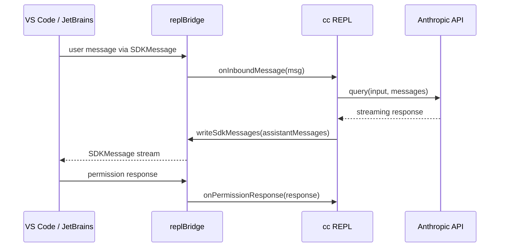
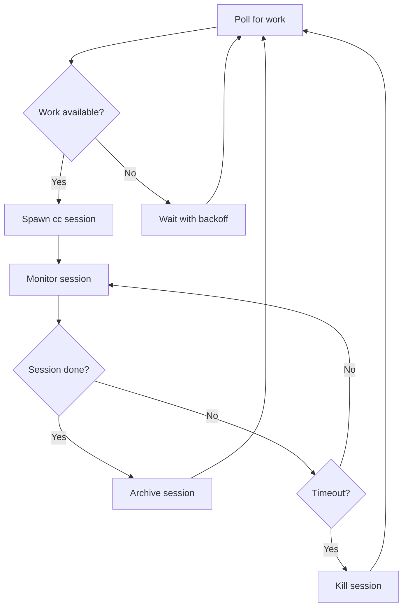
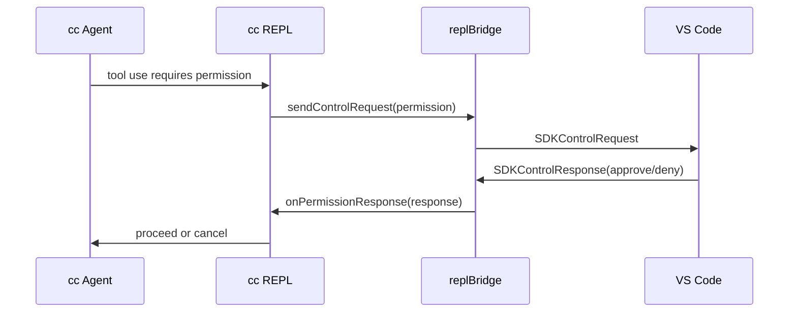

# Bridges: VS Code, JetBrains, and Web

## Overview

Claude Code operates primarily as a terminal application, but its integration with IDEs and web clients is essential for adoption. The bridge subsystem connects cc's in-process agent loop to external orchestrators: the VS Code and JetBrains extensions via IDE bridges, the claude.ai web client via the REPL bridge, and the Agent SDK via a daemon interface. These bridges are not simple message forwarders; they implement bidirectional message translation, session lifecycle management, OAuth token refresh, permission proxying, and work-secret authentication. The result is a system where the terminal cc process can be driven by an IDE, a web UI, or a programmatic SDK, all sharing the same core agent loop.

This chapter examines `src/bridge/replBridge.ts` (~2,400 LOC) and `src/bridge/bridgeMain.ts` (~3,000 LOC). The REPL bridge manages the connection between a terminal cc session and the claude.ai web client, enabling the web UI to display messages, inject user input, and receive streaming model output. The bridge main module orchestrates session spawning, work polling, capacity management, and graceful shutdown. Together, they implement HER's three-tier multi-agent architecture at the local-orchestrator level: the bridge spawns and manages cc sessions as child processes, monitors their health, and coordinates work distribution.

## Data structures and contracts

### ReplBridgeHandle: the session interface

The `ReplBridgeHandle` type defines the operations that the REPL bridge exposes to the rest of cc:

```typescript
// src/bridge/replBridge.ts:L70-L81
export type ReplBridgeHandle = {
  bridgeSessionId: string
  environmentId: string
  sessionIngressUrl: string
  writeMessages(messages: Message[]): void
  writeSdkMessages(messages: SDKMessage[]): void
  sendControlRequest(request: SDKControlRequest): void
  sendControlResponse(response: SDKControlResponse): void
  sendControlCancelRequest(requestId: string): void
  sendResult(): void
  teardown(): Promise<void>
}
```

The handle carries the `bridgeSessionId` (the server-side session identifier), `environmentId` (the workspace identifier), and `sessionIngressUrl` (the ingress endpoint for message delivery). The `writeMessages` method sends internal `Message[]` objects (cc's native format), while `writeSdkMessages` sends the public `SDKMessage[]` format (the API-facing format that strips internal metadata). The `sendControlRequest` and `sendControlResponse` methods handle the permission proxying flow, allowing the web UI to approve or deny tool permission requests.

### BridgeState: connection lifecycle

The bridge connection goes through a defined set of states:

```typescript
// src/bridge/replBridge.ts:L83
export type BridgeState = 'ready' | 'connected' | 'reconnecting' | 'failed'
```

- `'ready'`: Initial state, no connection established.
- `'connected'`: Active connection with the web client, messages flowing.
- `'reconnecting'`: Connection lost, attempting to re-establish.
- `'failed'`: Connection failed permanently, no further attempts.

State transitions are reported to the REPL via `onStateChange`, which updates the UI to show connection status indicators.

### BridgeCoreParams: dependency injection for the bridge

The `BridgeCoreParams` type encapsulates all the dependencies that the bridge core needs, injected rather than imported to avoid circular dependencies:

```typescript
// src/bridge/replBridge.ts:L91-L173
export type BridgeCoreParams = {
  dir: string
  machineName: string
  branch: string
  gitRepoUrl: string | null
  title: string
  baseUrl: string
  sessionIngressUrl: string
  workerType: string
  getAccessToken: () => string | undefined
  createSession: (opts: {
    environmentId: string
    title: string
    gitRepoUrl: string | null
    branch: string
    signal: AbortSignal
  }) => Promise<string | null>
  archiveSession: (sessionId: string) => Promise<void>
  getCurrentTitle?: () => string
  toSDKMessages?: (messages: Message[]) => SDKMessage[]
  onAuth401?: (staleAccessToken: string) => Promise<boolean>
  getPollIntervalConfig?: () => PollIntervalConfig
  initialHistoryCap?: number
  initialMessages?: Message[]
  previouslyFlushedUUIDs?: Set<string>
  onInboundMessage?: (msg: SDKMessage) => void
  onPermissionResponse?: (response: SDKControlResponse) => void
  onInterrupt?: () => void
  onSetModel?: (model: string | undefined) => void
  onSetMaxThinkingTokens?: (maxTokens: number | null) => void
  onSetPermissionMode?: (mode: PermissionMode) => { ok: true } | { ok: false; error: string }
  onStateChange?: (state: BridgeState, detail?: string) => void
  onUserMessage?: (text: string, sessionId: string) => boolean
  perpetual?: boolean
  initialSSESequenceNum?: number
}
```

This heavy use of dependency injection is a deliberate architectural choice. As the comments in the source explain, importing modules like `createSession.ts` or `auth.ts` directly would pull the entire command registry and React tree into the Agent SDK bundle. By injecting these functions, the bridge core remains independent of the REPL's full dependency graph.

### BackoffConfig: reconnection parameters

The `BackoffConfig` type controls the exponential backoff behavior for connection and general retry:

```typescript
// src/bridge/bridgeMain.ts:L59-L70
export type BackoffConfig = {
  connInitialMs: number
  connCapMs: number
  connGiveUpMs: number
  generalInitialMs: number
  generalCapMs: number
  generalGiveUpMs: number
  shutdownGraceMs?: number
  stopWorkBaseDelayMs?: number
}
```

The default configuration sets connection backoff from 2 seconds to 2 minutes (cap), giving up after 10 minutes. General backoff starts at 500ms and caps at 30 seconds. The `shutdownGraceMs` controls the SIGTERM-to-SIGKILL grace period on shutdown (default 30s).

## Control flow

### VS Code / JetBrains to cc round trip

When the user interacts with cc through the VS Code or JetBrains extension, the bridge translates between the IDE's protocol and cc's internal message format:



1. The IDE sends a user message as an `SDKMessage` through the bridge's transport (WebSocket for IDE bridges, HTTP polling for claude.ai web).
2. The bridge calls `onInboundMessage`, which injects the message into cc's conversation.
3. The REPL processes the message through the standard query loop.
4. As the model streams its response, the REPL calls `writeSdkMessages` to forward the output to the bridge.
5. The bridge translates the messages to `SDKMessage` format and sends them to the IDE.
6. If a tool permission request is generated, the bridge forwards it to the IDE as a `SDKControlRequest`.
7. The user approves or denies the request in the IDE, which sends a `SDKControlResponse` back through the bridge.

### Work polling and session spawning

The `bridgeMain.ts` module implements a work-polling loop that manages cc sessions as child processes. The bridge operates as a long-running daemon that connects to the claude.ai backend, polls for available work, and spawns cc processes to handle that work. The `runBridgeLoop` function orchestrates the entire lifecycle:



The `runBridgeLoop` function orchestrates the entire lifecycle:

```typescript
// src/bridge/bridgeMain.ts:L141-L151
export async function runBridgeLoop(
  config: BridgeConfig,
  environmentId: string,
  environmentSecret: string,
  api: BridgeApiClient,
  spawner: SessionSpawner,
  logger: BridgeLogger,
  signal: AbortSignal,
  backoffConfig: BackoffConfig = DEFAULT_BACKOFF,
  initialSessionId?: string,
  getAccessToken?: () => string | undefined | Promise<string | undefined>,
): Promise<void>
```

It maintains several maps to track the state of active sessions:

- `activeSessions: Map<string, SessionHandle>` -- the spawned cc process handles
- `sessionStartTimes: Map<string, number>` -- when each session was started, for timeout tracking
- `sessionWorkIds: Map<string, string>` -- the work item ID assigned by the server
- `sessionCompatIds: Map<string, string>` -- compatibility-surface IDs for the v1/v2 session API shim
- `sessionIngressTokens: Map<string, string>` -- per-session JWTs for heartbeat authentication
- `sessionTimers: Map<string, ReturnType<typeof setTimeout>>` -- timeout watchdogs
- `completedWorkIds: Set<string>` -- work items that have been processed, to avoid re-accepting
- `sessionWorktrees: Map<string, {...}>` -- git worktrees created for each session
- `timedOutSessions: Set<string>` -- sessions killed by the timeout watchdog
- `titledSessions: Set<string>` -- sessions that have been named (to avoid clobbering)

The `capacityWake` signal allows the loop to immediately accept new work when a session completes, rather than waiting for the next poll cycle. This reduces latency between session completion and new work assignment from the polling interval (typically 1-2 seconds) to near-zero.

### Multi-session spawn modes

The bridge supports multiple spawn modes controlled by GrowthBook feature flags. The `isMultiSessionSpawnEnabled` function checks the `tengu_ccr_bridge_multi_session` gate:

```typescript
// src/bridge/bridgeMain.ts:L96-L98
async function isMultiSessionSpawnEnabled(): Promise<boolean> {
  return checkGate_CACHED_OR_BLOCKING('tengu_ccr_bridge_multi_session')
}
```

When multi-session mode is enabled, the bridge can spawn up to `SPAWN_SESSIONS_DEFAULT = 32` concurrent cc sessions. Each session runs in its own process with its own working directory and git worktree. The `createSessionSpawner` function in `src/bridge/sessionRunner.ts` handles the actual process spawning, passing the SDK URL, environment secrets, and other configuration through command-line arguments.

The `spawnScriptArgs` function handles a subtle difference between compiled binaries and npm installs:

```typescript
// src/bridge/bridgeMain.ts:L119-L124
function spawnScriptArgs(): string[] {
  if (isInBundledMode() || !process.argv[1]) {
    return []
  }
  return [process.argv[1]]
}
```

In compiled binaries, `process.execPath` is the cc binary itself and args go directly. In npm installs, `process.execPath` is the Node runtime, and the child spawn must pass the script path as the first argument. Without this, Node interprets `--sdk-url` as a Node option and exits with "bad option: --sdk-url".

### Worktree management for session isolation

Each spawned cc session can optionally run in a git worktree, providing isolated working directories for parallel sessions. The `sessionWorktrees` map tracks the worktree path, branch name, git root, and whether the worktree was created via the hook-based mechanism:

```typescript
// src/bridge/bridgeMain.ts:L177-L184
const sessionWorktrees = new Map<
  string,
  {
    worktreePath: string
    worktreeBranch?: string
    gitRoot?: string
    hookBased?: boolean
  }
>()
```

When a session completes or is killed, the bridge cleans up the worktree using `removeAgentWorktree` from `src/utils/worktree.ts`. If the worktree was created via the hook-based mechanism, the cleanup is delegated to the hook's cleanup handler rather than the direct filesystem removal.

### Heartbeat and session health monitoring

The bridge sends periodic heartbeats to the server for each active work item. The `STATUS_UPDATE_INTERVAL_MS = 1000` constant controls how often status updates are sent. The heartbeat includes the session's current state (running, completed, failed) and any relevant metadata.

The heartbeat authentication uses the session ingress JWT, which is separate from the OAuth access token. This separation is important because the OAuth token is shared across all sessions and refreshes approximately every 4 hours, while the session ingress JWT is scoped to a specific session and may have a different lifetime:

```typescript
// src/bridge/bridgeMain.ts:L171-L173
// Session ingress JWTs for heartbeat auth, keyed by sessionId.
// Stored separately from handle.accessToken because the token refresh
// scheduler overwrites that field with the OAuth token (~3h55m in).
const sessionIngressTokens = new Map<string, string>()
```

The `createTokenRefreshScheduler` in `src/bridge/jwtUtils.ts` monitors the OAuth token's expiry claim and refreshes it before it expires. The refresh is propagated to the `BridgeApiClient` and the session ingress connection. If the refresh fails, the bridge enters the `'reconnecting'` state.

### Trusted device token and session ingress

The bridge authenticates with the server using a trusted device token, obtained via `getTrustedDeviceToken`. This token is separate from the OAuth access token and is used for the session ingress connection. The session ingress JWT (`sessionIngressTokens` map) is stored per-session and used for heartbeat authentication, ensuring that each session's heartbeat is authenticated independently.

### Permission proxying

When the agent needs user approval for a tool call, and the user is interacting through the IDE, the permission request must be proxied through the bridge:



The bridge does not make permission decisions itself; it routes the request to the connected client and delivers the response back. This design ensures that the bridge does not need to understand the permission model -- it is a pure transport layer.

## Edge cases and failure modes

### Data exfiltration via bridge

HER Section 12.4 identifies data exfiltration through tool calls as a critical threat. The bridge amplifies this risk because it provides a bidirectional message channel between the agent and external clients. A compromised IDE extension could inject messages that trick the agent into sending sensitive data through the bridge. cc mitigates this through several layers:

1. **Work-secret authentication**: Each session is authenticated with a unique work secret, preventing unauthorized clients from connecting.
2. **Session ingress JWT**: The ingress token is scoped to a specific session and refreshed independently.
3. **Permission proxying**: The bridge does not auto-approve tool calls; all permission decisions are routed to the user.
4. **Message validation**: Inbound messages are validated against the `SDKMessage` schema before injection.

Despite these mitigations, a compromised bridge transport could still inject messages that the agent processes. The bridge does not implement end-to-end message authentication or integrity verification, which is a known gap.

### Connection loss during active session

If the bridge connection drops while the agent is executing a long-running task, the agent continues to run in the background. The bridge's reconnection logic (exponential backoff from 2 seconds to 2 minutes) attempts to re-establish the connection. If reconnection succeeds, the bridge replays any messages that were queued during the outage. If reconnection fails after 10 minutes, the bridge reports a `'failed'` state and the session is lost.

The `capacityWake` signal ensures that when a session completes during a connection outage, the bridge can immediately accept new work when the connection is restored, rather than waiting for the next poll cycle.

### Session timeout and SIGTERM escalation

Each spawned cc session has a timeout (default `DEFAULT_SESSION_TIMEOUT_MS`). When the timeout fires, the bridge sends SIGTERM to the cc process and waits for the `shutdownGraceMs` (default 30 seconds). If the process does not exit within the grace period, SIGKILL is sent. The `timedOutSessions` set tracks which sessions were killed by the timeout watchdog, so `onSessionDone` can distinguish them from server-initiated or shutdown interrupts.

### OAuth token refresh in the bridge

The bridge uses OAuth tokens for authentication with the claude.ai backend. Tokens expire after approximately 4 hours. The `createTokenRefreshScheduler` in `src/bridge/jwtUtils.ts` monitors token expiry and refreshes them before they expire. The refreshed token is propagated to the `BridgeApiClient` and the session ingress connection. If the refresh fails, the bridge enters the `'reconnecting'` state and attempts to re-authenticate.

### Sleep/wake detection

The bridge detects system sleep/wake events by monitoring the gap between poll cycles. If the gap exceeds `pollSleepDetectionThresholdMs` (2x the connection backoff cap), the bridge assumes the system was asleep and resets its error budget, preventing accumulated backoff delays from causing unnecessary connection failures.

```typescript
// src/bridge/bridgeMain.ts:L107-L109
function pollSleepDetectionThresholdMs(backoff: BackoffConfig): number {
  return backoff.connCapMs * 2
}
```

This threshold must exceed the max backoff cap; otherwise, normal backoff delays would trigger false sleep detection, resetting the error budget indefinitely and preventing the bridge from ever giving up on a truly failed connection.

### REPL bridge transport selection

The REPL bridge supports multiple transport protocols for communication with the claude.ai backend. The `createV1ReplTransport` and `createV2ReplTransport` functions in `src/bridge/replBridgeTransport.ts` create transport instances that handle message serialization, compression, and reconnection. The `HybridTransport` in `src/cli/transports/HybridTransport.ts` combines WebSocket and HTTP polling, using WebSocket for low-latency real-time communication and falling back to HTTP polling when WebSocket is unavailable.

The `BridgeCoreParams` type includes an `onAuth401` callback that is passed to `createBridgeApiClient`. This callback is injected because importing `utils/auth.ts` directly would pull the entire command registry into the bridge module. The REPL wrapper passes `handleOAuth401Error`; the daemon wrapper passes its AuthManager's handler. This dependency injection pattern keeps the bridge module independent of the REPL's full dependency graph.

### Session archive and cleanup

When a session completes (either naturally or via timeout), the bridge archives it by calling `archiveSession`. The archive request is best-effort; the callback must not throw. The bridge also updates the session's bridge ID via `updateSessionBridgeId` from `src/utils/concurrentSessions.ts`, which ensures that the server-side session record reflects the bridge that processed it.

The `onSessionDone` callback handles the full lifecycle of session cleanup. It removes the session from all tracking maps (`activeSessions`, `sessionStartTimes`, `sessionWorkIds`, `sessionIngressTokens`, `sessionCompatIds`, `timedOutSessions`, `v2Sessions`), cancels the token refresh timer, clears the timeout watchdog, and calls `capacityWake.wake()` to signal the poll loop that capacity is available. The cleanup distinguishes between normal completion, failure, and interruption. For interrupted sessions (server-initiated or shutdown), `stopWork` is skipped because the server already knows. For completed or failed sessions in single-session mode, the bridge aborts the poll loop and tears down the environment; in multi-session mode, the session is archived and the bridge returns to idle, ready to accept new work.

The `safeSpawn` function wraps the session spawner to catch spawn errors and return them as strings rather than throwing:

```typescript
// src/bridge/bridgeMain.ts:L126-L139
function safeSpawn(
  spawner: SessionSpawner,
  opts: SessionSpawnOpts,
  dir: string,
): SessionHandle | string {
  try {
    return spawner.spawn(opts, dir)
  } catch (err) {
    const errMsg = errorMessage(err)
    logError(new Error(`Session spawn failed: ${errMsg}`))
    return errMsg
  }
}
```

This error-handling pattern prevents a single spawn failure from crashing the entire bridge loop. The error is logged and reported to telemetry via `logError`, and the bridge continues polling for new work on the next cycle without losing its environment registration or disrupting other active sessions that may still be running.

### Heartbeat and work-item health monitoring

The bridge sends periodic heartbeats to the server for each active work item. The `heartbeatActiveWorkItems` function iterates over all active sessions and calls `api.heartbeatWork` with the environment ID, work ID, and session ingress JWT. Heartbeat failures are classified into three categories: `auth_failed` (401/403, indicating JWT expiry), `fatal` (404/410, indicating the environment has expired or been deleted), and transient errors (all others, which are retried on the next heartbeat cycle):

```typescript
// src/bridge/bridgeMain.ts:L202-L270
async function heartbeatActiveWorkItems(): Promise<
  'ok' | 'auth_failed' | 'fatal' | 'failed'
> {
  let anySuccess = false
  let anyFatal = false
  const authFailedSessions: string[] = []
  for (const [sessionId] of activeSessions) {
    const workId = sessionWorkIds.get(sessionId)
    const ingressToken = sessionIngressTokens.get(sessionId)
    if (!workId || !ingressToken) {
      continue
    }
    try {
      await api.heartbeatWork(environmentId, workId, ingressToken)
      anySuccess = true
    } catch (err) {
      logForDebugging(
        `[bridge:heartbeat] Failed for sessionId=${sessionId} workId=${workId}: ${errorMessage(err)}`,
      )
      if (err instanceof BridgeFatalError) {
        logEvent('tengu_bridge_heartbeat_error', {
          status: err.status,
          error_type: err.status === 401 || err.status === 403
            ? 'auth_failed' : 'fatal',
        })
        if (err.status === 401 || err.status === 403) {
          authFailedSessions.push(sessionId)
        } else {
          anyFatal = true
        }
      }
    }
  }
  for (const sessionId of authFailedSessions) {
    logger.logVerbose(
      `Session ${sessionId} token expired — re-queuing via bridge/reconnect`,
    )
    try {
      await api.reconnectSession(environmentId, sessionId)
      logForDebugging(
        `[bridge:heartbeat] Re-queued sessionId=${sessionId} via bridge/reconnect`,
      )
    } catch (err) {
      logger.logError(
        `Failed to refresh session ${sessionId} token: ${errorMessage(err)}`,
      )
      logForDebugging(
        `[bridge:heartbeat] reconnectSession(${sessionId}) failed: ${errorMessage(err)}`,
        { level: 'error' },
      )
    }
  }
  if (anyFatal) {
    return 'fatal'
  }
  if (authFailedSessions.length > 0) {
    return 'auth_failed'
  }
  return anySuccess ? 'ok' : 'failed'
}
```

When a session's JWT expires (auth_failed), the bridge calls `api.reconnectSession` to trigger server-side re-dispatch. Without this, the work stays ACK'd out of the Redis pending entry list (PEL) and the poll returns empty forever -- the session becomes a zombie that the server thinks is being processed but the bridge cannot actually reach. The re-queued work is picked up on the next poll cycle with a fresh JWT.

### Proactive token refresh for v2 sessions

Sessions spawned with CCR v2 environment variables cannot use OAuth tokens directly because the CCR worker endpoints validate the JWT's `session_id` claim. For v2 sessions, the `createTokenRefreshScheduler` schedules a timer 5 minutes before the session ingress JWT expires. Instead of delivering the refreshed OAuth token to the child process (which would fail validation), the `onRefresh` callback calls `api.reconnectSession` to trigger server-side re-dispatch:

```typescript
// src/bridge/bridgeMain.ts:L279-L313
const tokenRefresh = getAccessToken
  ? createTokenRefreshScheduler({
      getAccessToken,
      onRefresh: (sessionId, oauthToken) => {
        const handle = activeSessions.get(sessionId)
        if (!handle) {
          return
        }
        if (v2Sessions.has(sessionId)) {
          logger.logVerbose(
            `Refreshing session ${sessionId} token via bridge/reconnect`,
          )
          void api
            .reconnectSession(environmentId, sessionId)
            .catch((err: unknown) => {
              logger.logError(
                `Failed to refresh session ${sessionId} token: ${errorMessage(err)}`,
              )
              logForDebugging(
                `[bridge:token] reconnectSession(${sessionId}) failed: ${errorMessage(err)}`,
                { level: 'error' },
              )
            })
        } else {
          handle.updateAccessToken(oauthToken)
        }
      },
      label: 'bridge',
    })
  : null
```

Without this proactive refresh, v2 daemon sessions silently die at approximately 5 hours because the server does not auto-re-dispatch ACK'd work on lease expiry. The `v2Sessions` set tracks which sessions were spawned with v2 env vars, and the `onRefresh` callback branches accordingly.

### Crash-recovery pointer and perpetual mode

The REPL bridge writes a crash-recovery pointer file after session creation, containing the session ID and environment ID. If the bridge process is killed (e.g., `kill -9`), the pointer file remains on disk. On the next startup in perpetual mode, the bridge reads the pointer and attempts to reconnect to the existing session via `tryReconnectInPlace`, avoiding the need to create a new environment and session:

```typescript
// src/bridge/replBridge.ts:L311-L313
const rawPrior = perpetual ? await readBridgePointer(dir) : null
const prior = rawPrior?.source === 'repl' ? rawPrior : null
```

Only `repl`-source pointers are reused; a crashed standalone bridge (`claude remote-control`) writes `source:'standalone'` with a different `workerType`. If the reconnection fails (e.g., the environment has expired), the pointer is cleared so the next start does not retry the same dead ID.

### Environment registration and session creation lifecycle

The bridge core (`initBridgeCore`) follows a strict sequence: environment registration, session creation, crash-recovery pointer write, then poll loop start. If environment registration fails, the bridge reports a `'failed'` state and returns null. If session creation fails (the `createSession` callback returns null), the bridge deregisters the environment and reports failure. This ensures that no orphaned environments are left on the server when the bridge cannot create a session.

The `onUserMessage` callback in `BridgeCoreParams` implements a "derive-at-count-1-and-3" title policy: the first and third user messages trigger a title derivation request to the server, which uses the message text and session ID to generate a human-readable session title. The callback receives the message text and session ID as arguments (not the full SDKMessage), and returns a boolean indicating whether the title was set. The transport stops calling when it returns true.

## Where cc diverges from the published pattern

### Local orchestrator vs. HER's three tiers

HER Section 9.1 defines three tiers of multi-agent orchestration: in-process subagents, local orchestrators, and cloud async. The bridge is a local orchestrator that spawns and manages cc sessions as child processes. However, it also implements cloud async features (work polling from a remote server, session archiving). This hybrid model is not cleanly captured by HER's three-tier taxonomy. The bridge demonstrates that the boundary between "local orchestrator" and "cloud async" is fluid: a local orchestrator can participate in cloud-coordinated work distribution without being a fully cloud-native system.

### Dependency injection for bundle isolation

The `BridgeCoreParams` type uses heavy dependency injection to avoid importing modules that would bloat the Agent SDK bundle. This is a practical concern not addressed in HER's reference architecture. When a harness is used as both a standalone CLI and a library (via an SDK), the dependency graph must be carefully managed to prevent the library from pulling in the CLI's full UI stack. cc solves this by injecting all transitive dependencies, at the cost of a verbose type definition and manual wiring.

### Permission proxying as a transport concern

The bridge treats permission proxying as a transport concern: it routes `SDKControlRequest`/`SDKControlResponse` messages without understanding their semantics. This is the correct design for a transport layer, but it means the bridge cannot enforce permission policies or detect malicious permission responses. A compromised client could auto-approve all tool calls, and the bridge would dutifully deliver the approvals to the agent. A more secure design would have the bridge validate permission responses against the original request, ensuring that only requested permissions are granted and that deny responses are not spoofed as approvals.

## Developer takeaways for building a long-running agent

1. **Inject dependencies, do not import them.** The `BridgeCoreParams` pattern keeps the bridge core independent of the REPL's full dependency graph, enabling the Agent SDK to use the bridge without bundling React, Ink, or the command registry.

2. **Proxy permissions, do not decide them.** The bridge routes `SDKControlRequest`/`SDKControlResponse` without understanding their semantics, allowing the permission model to evolve independently of the transport.

3. **Use work-secret authentication for session binding.** Each session is authenticated with a unique work secret generated at spawn time, preventing unauthorized clients from connecting.

4. **Detect sleep/wake by monitoring poll gaps.** When the gap between polls exceeds 2x the max backoff cap, reset the error budget to prevent accumulated delays from causing false connection failures.

5. **Escalate process termination gracefully.** SIGTERM first, wait 30 seconds, then SIGKILL. Track timeout-killed sessions so the cleanup handler can distinguish them from normal exits.

6. **Implement capacity signaling.** The `capacityWake` pattern signals the poll loop immediately when a session completes, reducing latency to near-zero instead of waiting for the next poll cycle.

7. **Separate OAuth tokens from session tokens.** OAuth tokens are shared across sessions (~4h lifetime); session ingress JWTs are scoped per-session. Refresh them independently and store them in separate maps.

8. **Write crash-recovery pointers early.** Write session ID and environment ID immediately after creation. A `kill -9` should leave a recoverable trail; clear the pointer on clean teardown for non-perpetual mode.

9. **Classify heartbeat failures precisely.** Auth failures (401/403) are recoverable by re-queuing; fatal failures (404/410) mean the environment is deleted. Misclassifying a fatal error as transient causes endless retries on a dead environment.

10. **Use separate refresh strategies for v1 and v2 sessions.** v1 accepts refreshed OAuth tokens directly; v2 rejects them (JWT `session_id` claim mismatch) and requires `reconnectSession` for server-side re-dispatch.
