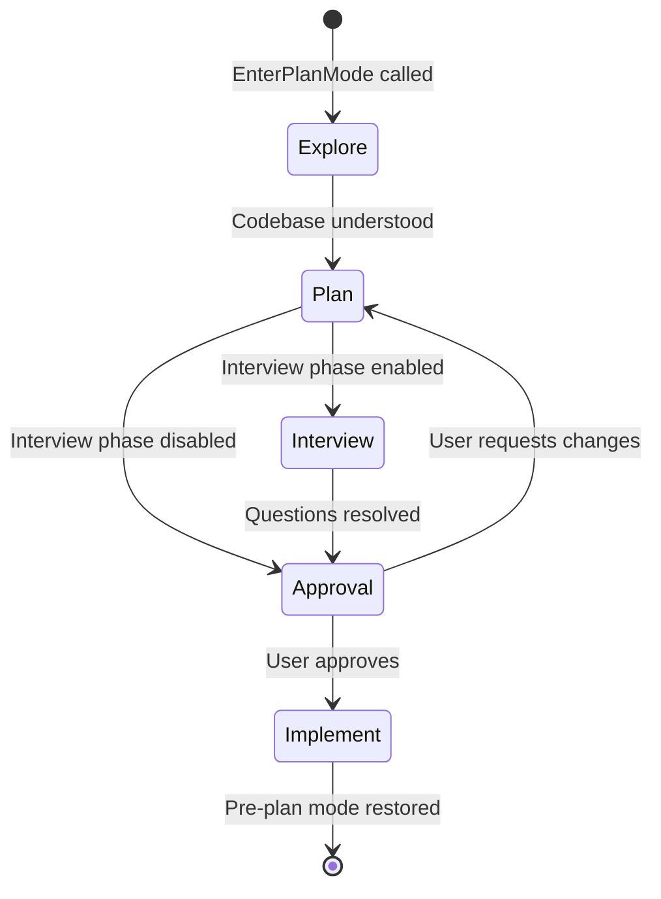
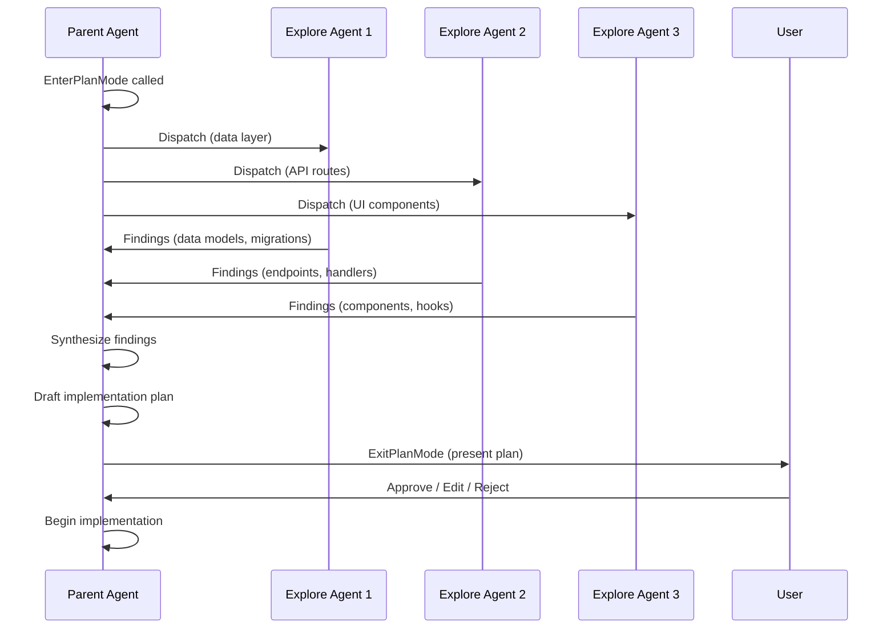
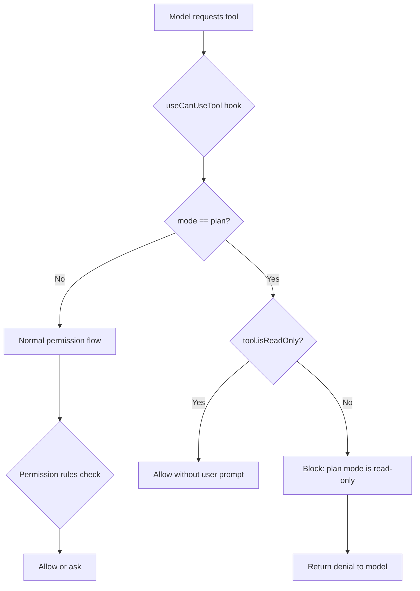

# Plan Mode V2: The Five-Phase Model

## Overview

Plan mode is cc's implementation of the Explore-Plan-Act loop pattern identified in HER Section 5 (Pattern 6). When a user faces a non-trivial implementation task, the agent can voluntarily enter a read-only planning phase, explore the codebase, draft a plan, and present it for human approval before making any file modifications. This chapter traces the full lifecycle of plan mode V2, from `EnterPlanModeTool` through the five exploration phases to `ExitPlanModeV2Tool`, and examines how subscription tiers govern the number of parallel exploration subagents.

The plan mode system embodies the HER thesis that long-running agents must separate exploration from execution. Without a planning gate, an agent given a vague task like "add caching to the API" could blaze through dozens of files making irreversible changes before the user realizes the approach is wrong. Plan mode forces a checkpoint: the agent must show its reasoning and get explicit human consent before it can write. This aligns with the HER Session Protocol (Section 10.3), which prescribes an ORIENT-SETUP-VERIFY-SELECT-IMPLEMENT-TEST-UPDATE-EXIT workflow. Plan mode effectively splits SELECT (choose an approach) from IMPLEMENT (write code), inserting a mandatory human-approval step between them.

The two tools that bracket plan mode -- `EnterPlanModeTool` and `ExitPlanModeV2Tool` -- are deliberately designed as a matched pair. Entering plan mode transitions the permission context to read-only; exiting it restores the previous permissions. The tools are gated together: when channels mode (Telegram/Discord) is active, both are disabled, because the plan-approval dialog requires the terminal UI. This pairing prevents the model from entering a mode it cannot leave.

## Data structures and contracts

### EnterPlanModeTool input and output schemas

The `EnterPlanModeTool` takes no parameters -- it is a simple transition signal. The tool's only purpose is to flip the permission context from its current mode to `'plan'`:

```typescript
// src/tools/EnterPlanModeTool/EnterPlanModeTool.ts:L21-L34
const inputSchema = lazySchema(() =>
  z.strictObject({
    // No parameters needed
  }),
)
type InputSchema = ReturnType<typeof inputSchema>

const outputSchema = lazySchema(() =>
  z.object({
    message: z.string().describe('Confirmation that plan mode was entered'),
  }),
)
type OutputSchema = ReturnType<typeof outputSchema>
```

The tool is marked `isReadOnly: true` at `src/tools/EnterPlanModeTool/EnterPlanModeTool.ts:L72` and `shouldDefer: true` at `src/tools/EnterPlanModeTool/EnterPlanModeTool.ts:L55`. The `shouldDefer` flag means the model cannot call it during concurrent tool execution, and the `isReadOnly` classification ensures the tool itself does not count as a write operation. This is important because the tool's side effect -- changing the permission mode -- is a state mutation, but it is a metadata mutation, not a filesystem mutation. The `isReadOnly` flag also means the tool can be called during plan mode itself -- a model that is already in plan mode can call `EnterPlanModeTool` again without violating the read-only constraint, though the permission system will reject the redundant call since the mode is already `'plan'`.

### ExitPlanModeV2Tool input and output schemas

`ExitPlanModeV2Tool` is the escape hatch. Its input allows the model to request prompt-based permissions for the implementation phase:

```typescript
// src/tools/ExitPlanModeTool/ExitPlanModeV2Tool.ts:L77-L89
const inputSchema = lazySchema(() =>
  z
    .strictObject({
      // Prompt-based permissions requested by the plan
      allowedPrompts: z
        .array(allowedPromptSchema())
        .optional()
        .describe(
          'Prompt-based permissions needed to implement the plan. These describe categories of actions rather than specific commands.',
        ),
    })
    .passthrough(),
)
```

The `allowedPrompts` field lets the model request semantic permission descriptions (e.g., "run tests", "install dependencies") that carry into the implementation phase. Each prompt entry is a `{ tool: 'Bash', prompt: string }` pair, where the prompt is a natural-language description of the category of commands the plan needs. The `.passthrough()` on the schema allows fields injected by `normalizeToolInput` (specifically `plan` and `planFilePath`) to pass through without validation errors.

The output schema captures the full result of exiting plan mode:

```typescript
// src/tools/ExitPlanModeTool/ExitPlanModeV2Tool.ts:L110-L142
export const outputSchema = lazySchema(() =>
  z.object({
    plan: z
      .string()
      .nullable()
      .describe('The plan that was presented to the user'),
    isAgent: z.boolean(),
    filePath: z
      .string()
      .optional()
      .describe('The file path where the plan was saved'),
    hasTaskTool: z
      .boolean()
      .optional()
      .describe('Whether the Agent tool is available in the current context'),
    planWasEdited: z
      .boolean()
      .optional()
      .describe(
        'True when the user edited the plan (CCR web UI or Ctrl+G); determines whether the plan is echoed back in tool_result',
      ),
    awaitingLeaderApproval: z
      .boolean()
      .optional()
      .describe(
        'When true, the teammate has sent a plan approval request to the team leader',
      ),
    requestId: z
      .string()
      .optional()
      .describe('Unique identifier for the plan approval request'),
  }),
)
```

The `awaitingLeaderApproval` and `requestId` fields are used by teammate subagents that require team-lead sign-off before exiting plan mode -- a distributed approval protocol that routes through the mailbox system described in Chapter 23.

### Plan mode agent count configuration

The number of parallel exploration agents is governed by subscription tier, not by user choice. The configuration lives in `planModeV2.ts`:

```typescript
// src/utils/planModeV2.ts:L5-L29
export function getPlanModeV2AgentCount(): number {
  // Environment variable override takes precedence
  if (process.env.CLAUDE_CODE_PLAN_V2_AGENT_COUNT) {
    const count = parseInt(process.env.CLAUDE_CODE_PLAN_V2_AGENT_COUNT, 10)
    if (!isNaN(count) && count > 0 && count <= 10) {
      return count
    }
  }

  const subscriptionType = getSubscriptionType()
  const rateLimitTier = getRateLimitTier()

  if (
    subscriptionType === 'max' &&
    rateLimitTier === 'default_claude_max_20x'
  ) {
    return 3
  }

  if (subscriptionType === 'enterprise' || subscriptionType === 'team') {
    return 3
  }

  return 1
}
```

The explore-agent count defaults to 3 regardless of tier (via `getPlanModeV2ExploreAgentCount()` at `src/utils/planModeV2.ts:L31-L43`), but the number of plan-phase agents that run in parallel is 1 for free-tier users and 3 for enterprise/team/max subscribers. This creates a material difference in planning throughput: a Pro user exploring a large codebase gets one sequential agent, while an Enterprise user gets three parallel streams. The environment variable `CLAUDE_CODE_PLAN_V2_AGENT_COUNT` provides a developer override (capped at 10) for testing.

The explore-agent count is controlled by a separate function with its own environment variable override (`CLAUDE_CODE_PLAN_V2_EXPLORE_AGENT_COUNT`), also capped at 10. The two-count design separates the exploration phase (always 3 agents for parallel search) from the planning phase (subscription-tiered). This means even free-tier users benefit from parallel exploration, but only subscribers get parallel planning -- a deliberate product decision that gives free users a taste of the capability while reserving the full benefit for paying customers.

### The PewterLedgerVariant experiment

The `PewterLedgerVariant` type controls an A/B experiment on plan file size:

```typescript
// src/utils/planModeV2.ts:L64-L95
export type PewterLedgerVariant = 'trim' | 'cut' | 'cap' | null

/**
 * tengu_pewter_ledger — plan file structure prompt experiment.
 *
 * Controls the Phase 4 "Final Plan" bullets in the 5-phase plan mode
 * workflow (messages.ts getPlanPhase4Section). 5-phase is 99% of plan
 * traffic; interview-phase (ants) is untouched as a reference population.
 *
 * Arms: null (control), 'trim', 'cut', 'cap' — progressively stricter
 * guidance on plan file size.
 *
 * Baseline (control, 14d ending 2026-03-02, N=26.3M):
 *   p50 4,906 chars | p90 11,617 | mean 6,207 | 82% Opus 4.6
 *   Reject rate monotonic with size: 20% at <2K → 50% at 20K+
 *
 * Primary: session-level Avg Cost (fact__201omjcij85f) — Opus output is
 *   5× input price so cost is an output-weighted proxy. planLengthChars
 *   on tengu_plan_exit is the mechanism but NOT the goal — the cap arm
 *   could shrink the plan file while increasing total output via
 *   write→count→edit cycles.
 * Guardrail: feedback-bad rate, requests/session (too-thin plans →
 *   more implementation iterations), tool error rate
 */
export function getPewterLedgerVariant(): PewterLedgerVariant {
  const raw = getFeatureValue_CACHED_MAY_BE_STALE<string | null>(
    'tengu_pewter_ledger',
    null,
  )
  if (raw === 'trim' || raw === 'cut' || raw === 'cap') return raw
  return null
}
```

The experiment varies the Phase 4 "Final Plan" bullets in the 5-phase plan mode workflow. Baseline data (14 days, 26.3M sessions) shows that plan reject rate is monotonically increasing with plan size: 20% at under 2K characters, rising to 50% at over 20K. The `trim` arm gently reduces verbosity, `cut` removes low-value sections, and `cap` enforces a hard character limit. The primary metric is session-level average cost (a proxy for output tokens, since Opus output is 5x input price), not plan length itself.

## Control flow

### Entering plan mode

When the model calls `EnterPlanModeTool`, the `call()` method performs three critical mutations:

```typescript
// src/tools/EnterPlanModeTool/EnterPlanModeTool.ts:L77-L95
  async call(_input, context) {
    if (context.agentId) {
      throw new Error('EnterPlanMode tool cannot be used in agent contexts')
    }

    const appState = context.getAppState()
    handlePlanModeTransition(appState.toolPermissionContext.mode, 'plan')

    // Update the permission mode to 'plan'. prepareContextForPlanMode runs
    // the classifier activation side effects when the user's defaultMode is
    // 'auto' — see permissionSetup.ts for the full lifecycle.
    context.setAppState(prev => ({
      ...prev,
      toolPermissionContext: applyPermissionUpdate(
        prepareContextForPlanMode(prev.toolPermissionContext),
        { type: 'setMode', mode: 'plan', destination: 'session' },
      ),
    }))
```

First, it rejects agent contexts -- subagents cannot independently enter plan mode. This guard prevents a subagent from spontaneously entering a read-only phase while its parent expects it to be making edits. Second, it calls `handlePlanModeTransition()` (from `src/bootstrap/state.ts`) to record the transition for analytics and state tracking, setting `hasExitedPlanMode` and `needsPlanModeExitAttachment` flags. Third, it sets the permission mode to `'plan'` via `prepareContextForPlanMode()`, which runs classifier activation side effects when the user's default mode is `'auto'` (see Chapter 33 for the classifier lifecycle).

The permission transition is the security core of plan mode. Setting the mode to `'plan'` enforces read-only tool access: the agent can run `Glob`, `Grep`, `Read`, and `AskUserQuestion`, but `Write`, `Edit`, and `Bash` (for write commands) are blocked. This is not a soft suggestion enforced only by the prompt -- the `useCanUseTool` hook (Chapter 35) enforces it at the dispatch level, making it impossible for the model to bypass the restriction. The dual enforcement (prompt + permission) is deliberate: the prompt tells the model what it should do, and the permission system catches it if it does not comply. This defense-in-depth approach is necessary because large language models can fail to follow instructions under adversarial prompting or context compaction.

The `prepareContextForPlanMode()` function at `src/bootstrap/state.ts` also runs classifier activation side effects when the user's default mode is `'auto'`. When a user in auto mode enters plan mode, the system must record that auto mode was active before the transition, so that `ExitPlanModeV2Tool` can decide whether to restore it. The `prePlanMode` field in the permission context stores this value, and the auto-mode state module tracks whether auto mode was used during plan mode (which affects whether the exit notification mentions auto mode).

### The five phases

Once inside plan mode, the agent follows a five-phase workflow:

1. **Explore** -- The agent reads files, searches for patterns, and builds a mental model of the relevant subsystems. Up to three parallel exploration subagents may be dispatched for large codebases (subscription-dependent, governed by `getPlanModeV2ExploreAgentCount()` at `src/utils/planModeV2.ts:L31`).

2. **Plan** -- The agent writes a concrete implementation plan to the plan file (stored at a path communicated via the system prompt, managed by `src/utils/plans.ts`). The plan includes file paths, function names, and code-level details. The plan file is the single artifact that survives between the planning and implementation phases.

3. **Interview** (conditional) -- When `isPlanModeInterviewPhaseEnabled()` returns true (controlled by the `tengu_plan_mode_interview_phase` GrowthBook gate or the `USER_TYPE=ant` environment variable), the agent enters a structured interview where it asks clarifying questions before finalizing the plan. The interview phase is active by default for internal users (`USER_TYPE === 'ant'` at `src/utils/planModeV2.ts:L52`).

4. **Approval** -- The agent calls `ExitPlanModeV2Tool`, which presents the plan to the user (or the team lead, for teammates). The user can approve, edit, or reject. When the interview phase is enabled, detailed workflow instructions arrive via the `plan_mode` attachment in `messages.ts`, rather than being embedded in the tool result.

5. **Implement** -- Upon approval, the permission mode is restored to its pre-plan value (typically `'default'` or `'auto'`), and the agent begins coding. The plan file remains accessible for reference during implementation.



### Parallel exploration agent dispatch

The Explore phase can dispatch multiple subagents in parallel, each assigned a different region of the codebase. The dispatch mechanism works through the `AgentTool` (Chapter 18) with a constrained prompt that limits each exploration agent to read-only operations. When `getPlanModeV2ExploreAgentCount()` returns 3, the parent agent partitions the search space -- for example, assigning one agent to explore the data layer, another to the API routes, and a third to the UI components. Each exploration agent runs in its own context window, preventing cross-contamination between search domains.

The merge flow collects results from all exploration agents before the Plan phase begins. Each agent's findings are written back as tool results to the parent's conversation context. The parent agent then synthesizes the parallel findings into a coherent mental model before drafting the implementation plan. This fork-join pattern (HER Pattern 8) ensures that the planning phase has complete coverage of the codebase without any single agent needing to traverse the entire directory tree.



The number of agents does not affect the merge semantics -- whether there is 1 or 3, the parent collects all results before proceeding. The concurrency benefit is purely in wall-clock time: three agents searching in parallel complete their exploration in roughly one-third the time of a single sequential agent, assuming the codebase partitions cleanly. When the search space does not partition well (e.g., a small project where all files are interdependent), the parallel agents may duplicate work, but the deduplication cost is small compared to the latency savings on large codebases.

### The EnterPlanMode prompt strategy

The `EnterPlanModeTool` prompt differs between internal users (`USER_TYPE=ant`) and external users. For external users, the prompt encourages liberal use of plan mode -- "Prefer using EnterPlanMode for implementation tasks unless they're simple." For internal users, it is more restrained -- "Plan mode is valuable when the implementation approach is genuinely unclear." The external prompt at `src/tools/EnterPlanModeTool/prompt.ts:L16-L98` includes seven categories of tasks that warrant plan mode (new features, multiple approaches, code modifications, architectural decisions, multi-file changes, unclear requirements, user preferences matter) and three categories that do not (single-line fixes, clear requirements, pure research).

This prompt split reflects an important product decision: external users prefer being consulted before changes, while internal users prefer the agent to get started and ask specific questions. The `ASK_USER_QUESTION_TOOL_NAME` is positioned as the lightweight alternative to plan mode for internal users -- a targeted question rather than a full planning phase.

### Exiting plan mode

The `ExitPlanModeV2Tool.call()` method handles both local users and teammate subagents. For a local user, it restores the pre-plan permission mode with a circuit-breaker defense:

```typescript
// src/tools/ExitPlanModeTool/ExitPlanModeV2Tool.ts:L357-L403
    context.setAppState(prev => {
      if (prev.toolPermissionContext.mode !== 'plan') return prev
      setHasExitedPlanMode(true)
      setNeedsPlanModeExitAttachment(true)
      let restoreMode = prev.toolPermissionContext.prePlanMode ?? 'default'
      if (feature('TRANSCRIPT_CLASSIFIER')) {
        if (
          restoreMode === 'auto' &&
          !(permissionSetupModule?.isAutoModeGateEnabled() ?? false)
        ) {
          restoreMode = 'default'
        }
        const finalRestoringAuto = restoreMode === 'auto'
        // Capture pre-restore state — isAutoModeActive() is the authoritative
        // signal (prePlanMode/strippedDangerousRules are stale after
        // transitionPlanAutoMode deactivates mid-plan).
        const autoWasUsedDuringPlan =
          autoModeStateModule?.isAutoModeActive() ?? false
        autoModeStateModule?.setAutoModeActive(finalRestoringAuto)
        if (autoWasUsedDuringPlan && !finalRestoringAuto) {
          setNeedsAutoModeExitAttachment(true)
        }
      }
      // If restoring to a non-auto mode and permissions were stripped (either
      // from entering plan from auto, or from shouldPlanUseAutoMode),
      // restore them. If restoring to auto, keep them stripped.
      const restoringToAuto = restoreMode === 'auto'
      let baseContext = prev.toolPermissionContext
      if (restoringToAuto) {
        baseContext =
          permissionSetupModule?.stripDangerousPermissionsForAutoMode(
            baseContext,
          ) ?? baseContext
      } else if (prev.toolPermissionContext.strippedDangerousRules) {
        baseContext =
          permissionSetupModule?.restoreDangerousPermissions(baseContext) ??
          baseContext
      }
      return {
        ...prev,
        toolPermissionContext: {
          ...baseContext,
          mode: restoreMode,
          prePlanMode: undefined,
        },
      }
    })
```

This restoration logic includes a critical circuit-breaker defense: if the pre-plan mode was `'auto'` but the auto-mode gate has been disabled since the agent entered plan mode (e.g., by an admin flipping a kill switch), the tool falls back to `'default'` rather than re-enabling auto mode. Without this guard, `ExitPlanMode` would become a privilege-escalation vector -- an agent could enter plan mode, wait for the admin to disable auto mode, then exit plan mode and have auto mode restored from the `prePlanMode` field.

The `setHasExitedPlanMode(true)` call at `src/tools/ExitPlanModeTool/ExitPlanModeV2Tool.ts:L359` is a session-level flag that persists across compaction boundaries. It prevents the model from re-entering plan mode for the same task after exiting, which would create a loop where the agent keeps planning and re-planning without implementing. The `hasExitedPlanModeInSession()` function at `src/bootstrap/state.ts` reads this flag, and the `validateInput` handler on `ExitPlanModeV2Tool` uses it to distinguish between "never entered plan mode" and "already exited plan mode earlier this session" when logging the `tengu_exit_plan_mode_called_outside_plan` telemetry event.

The tool also handles the `strippedDangerousRules` flag. When entering plan mode from auto, the permission system strips dangerous rules (see Chapter 32). On exit, if the restored mode is not auto, those rules are restored. If the restored mode is auto, they stay stripped. This ensures that permission stripping is consistent with the restored mode, not with the pre-plan mode.

### Teammate plan approval

For teammate subagents operating under `isPlanModeRequired()`, exiting plan mode does not show a local dialog. Instead, the teammate sends a plan-approval request to the team leader's mailbox:

```typescript
// src/tools/ExitPlanModeTool/ExitPlanModeV2Tool.ts:L264-L313
    // Check if this is a teammate that requires leader approval
    if (isTeammate() && isPlanModeRequired()) {
      // Plan is required for plan_mode_required teammates
      if (!plan) {
        throw new Error(
          `No plan file found at ${filePath}. Please write your plan to this file before calling ExitPlanMode.`,
        )
      }
      const agentName = getAgentName() || 'unknown'
      const teamName = getTeamName()
      const requestId = generateRequestId(
        'plan_approval',
        formatAgentId(agentName, teamName || 'default'),
      )

      const approvalRequest = {
        type: 'plan_approval_request',
        from: agentName,
        timestamp: new Date().toISOString(),
        planFilePath: filePath,
        planContent: plan,
        requestId,
      }

      await writeToMailbox(
        'team-lead',
        {
          from: agentName,
          text: jsonStringify(approvalRequest),
          timestamp: new Date().toISOString(),
        },
        teamName,
      )

      // Update task state to show awaiting approval (for in-process teammates)
      const appState = context.getAppState()
      const agentTaskId = findInProcessTeammateTaskId(agentName, appState)
      if (agentTaskId) {
        setAwaitingPlanApproval(agentTaskId, context.setAppState, true)
      }
```

This is a distributed approval protocol: the teammate cannot proceed until the team lead sends a response through the mailbox system. The `awaitingLeaderApproval: true` flag in the output tells the model to wait rather than begin implementation. The `requestId` field provides a correlation key that the team lead can use when sending the approval or rejection response.

The `findInProcessTeammateTaskId()` function at `src/tools/ExitPlanModeTool/ExitPlanModeV2Tool.ts:L299-L301` locates the teammate's task ID in the AppState and sets `awaitingPlanApproval: true`, which surfaces in the task list UI to show that the teammate is blocked on approval.

### Tool gating in plan mode

Plan mode enforces strict tool gating at two levels: prompt-level and permission-level. The prompt level tells the model what it should and should not do; the permission level enforces it regardless of model compliance.



The `EnterPlanModeTool` prompt reinforces this at the prompt level: "DO NOT write or edit any files yet. This is a read-only exploration and planning phase." When the interview phase is enabled, the instruction is even more restrictive: "DO NOT write or edit any files except the plan file."

### Plan file persistence and CCR editing

When `ExitPlanModeV2Tool` is called, the plan is read from disk via `getPlan()`. If the CCR web UI sent an edited plan via `permissionResult.updatedInput`, the tool writes the edit back to the plan file before presenting it:

```typescript
// src/tools/ExitPlanModeTool/ExitPlanModeV2Tool.ts:L251-L261
    // CCR web UI may send an edited plan via permissionResult.updatedInput.
    // queryHelpers.ts full-replaces finalInput, so when CCR sends {} (no edit)
    // input.plan is undefined -> disk fallback. The internal inputSchema omits
    // `plan` (normally injected by normalizeToolInput), hence the narrowing.
    const inputPlan =
      'plan' in input && typeof input.plan === 'string' ? input.plan : undefined
    const plan = inputPlan ?? getPlan(context.agentId)

    // Sync disk so VerifyPlanExecution / Read see the edit. Re-snapshot
    // after: the only other persistFileSnapshotIfRemote call (api.ts) runs
    // in normalizeToolInput, pre-permission — it captured the old plan.
    if (inputPlan !== undefined && filePath) {
      await writeFile(filePath, inputPlan, 'utf-8').catch(e => logError(e))
      void persistFileSnapshotIfRemote()
    }
```

This ensures that `VerifyPlanExecution` and `Read` see the edited version, not the original. The `persistFileSnapshotIfRemote()` call re-snapshots the file state for remote sessions, where the permission approval happens through a web UI rather than the terminal.

## Edge cases and failure modes

### Channels mode disables plan mode entirely

Both `EnterPlanModeTool` and `ExitPlanModeV2Tool` check for active channels (Telegram/Discord) and disable themselves when channels are present:

```typescript
// src/tools/EnterPlanModeTool/EnterPlanModeTool.ts:L57-L67
  isEnabled() {
    // When --channels is active, ExitPlanMode is disabled (its approval
    // dialog needs the terminal). Disable entry too so plan mode isn't a
    // trap the model can enter but never leave.
    if (
      (feature('KAIROS') || feature('KAIROS_CHANNELS')) &&
      getAllowedChannels().length > 0
    ) {
      return false
    }
    return true
  },
```

The rationale is that channel users are not watching the terminal, so the plan-approval dialog would hang indefinitely. Without this guard, a channel user could enter plan mode and never be able to exit -- a "mode trap" where the model transitions into a state that requires terminal interaction but the user is on a different channel.

### ExitPlanMode called outside plan mode

The `validateInput` method guards against the model calling `ExitPlanModeV2Tool` when it is not in plan mode -- a scenario that can happen after compaction clears the context and the model loses track of its current mode:

```typescript
// src/tools/ExitPlanModeTool/ExitPlanModeV2Tool.ts:L195-L219
  async validateInput(_input, { getAppState, options }) {
    // Teammate AppState may show leader's mode (runAgent.ts skips override in
    // acceptEdits/bypassPermissions/auto); isPlanModeRequired() is the real source
    if (isTeammate()) {
      return { result: true }
    }
    // The deferred-tool list announces this tool regardless of mode, so the
    // model can call it after plan approval (fresh delta on compact/clear).
    // Reject before checkPermissions to avoid showing the approval dialog.
    const mode = getAppState().toolPermissionContext.mode
    if (mode !== 'plan') {
      logEvent('tengu_exit_plan_mode_called_outside_plan', {
        model:
          options.mainLoopModel as AnalyticsMetadata_I_VERIFIED_THIS_IS_NOT_CODE_OR_FILEPATHS,
        mode: mode as AnalyticsMetadata_I_VERIFIED_THIS_IS_NOT_CODE_OR_FILEPATHS,
        hasExitedPlanModeInSession: hasExitedPlanModeInSession(),
      })
      return {
        result: false,
        message:
          'You are not in plan mode. This tool is only for exiting plan mode after writing a plan. If your plan was already approved, continue with implementation.',
        errorCode: 1,
      }
    }
    return { result: true }
  },
```

The event logging here (`tengu_exit_plan_mode_called_outside_plan`) is deliberate -- it catches a model hallucination pattern where the model believes it is in plan mode but is not. The `hasExitedPlanModeInSession` field in the event payload helps distinguish between "never entered plan mode" and "already exited plan mode earlier this session."

### Auto-mode circuit breaker on plan exit

When a user entered plan mode from auto mode and the auto-mode gate is later disabled (e.g., an admin activates a circuit breaker), `ExitPlanModeV2Tool` must not restore auto mode. The tool detects this and falls back to `'default'`, with a notification to the user:

```typescript
// src/tools/ExitPlanModeTool/ExitPlanModeV2Tool.ts:L329-L355
    if (feature('TRANSCRIPT_CLASSIFIER')) {
      const prePlanRaw = appState.toolPermissionContext.prePlanMode ?? 'default'
      if (
        prePlanRaw === 'auto' &&
        !(permissionSetupModule?.isAutoModeGateEnabled() ?? false)
      ) {
        const reason =
          permissionSetupModule?.getAutoModeUnavailableReason() ??
          'circuit-breaker'
        gateFallbackNotification =
          permissionSetupModule?.getAutoModeUnavailableNotification(reason) ??
          'auto mode unavailable'
        logForDebugging(
          `[auto-mode gate @ ExitPlanModeV2Tool] prePlanMode=${prePlanRaw} ` +
            `but gate is off (reason=${reason}) — falling back to default on plan exit`,
          { level: 'warn' },
        )
      }
    }
    if (gateFallbackNotification) {
      context.addNotification?.({
        key: 'auto-mode-gate-plan-exit-fallback',
        text: `plan exit → default · ${gateFallbackNotification}`,
        priority: 'immediate',
        color: 'warning',
        timeoutMs: 10000,
      })
    }
```

Without this defense, exiting plan mode would silently re-enable auto mode, bypassing the circuit breaker that an administrator had explicitly activated. The notification uses `priority: 'immediate'` and `color: 'warning'` to ensure the user sees the fallback, with a 10-second auto-dismiss timeout.

### Teammate durable cron restriction

Teammates cannot create durable cron jobs. The `CronCreateTool` validates this at `src/tools/ScheduleCronTool/CronCreateTool.ts:L107-L114`, rejecting the request if `input.durable && getTeammateContext()`. This prevents orphaned cron tasks that would fire after the teammate's session has ended, with the `agentId` pointing to a nonexistent agent.

### Plan mode re-entry after context compaction

Context compaction (Chapter 18) presents a particular hazard for plan mode: when the conversation context is compressed, the model may lose awareness that it is in plan mode and attempt to call write tools. The `validateInput` guard on `ExitPlanModeV2Tool` at `src/tools/ExitPlanModeTool/ExitPlanModeV2Tool.ts:L195-L219` handles one direction (calling Exit when not in plan mode), but the more dangerous direction is the model forgetting it is in plan mode and attempting writes.

The permission-level enforcement via `useCanUseTool` (Chapter 35) serves as the hard backstop. Even if the model's context is completely compacted and it believes it is in default mode, the permission context remains `'plan'` in the AppState, and any attempt to call `Write`, `Edit`, or write-mode `Bash` will be rejected by the permission hook. This is why plan mode's security guarantee depends on the permission system, not on the prompt -- prompt instructions are lost during compaction, but the AppState mutation persists.

The `hasExitedPlanModeInSession()` flag tracked in `src/bootstrap/state.ts` provides a second layer of defense. When the model calls `ExitPlanModeV2Tool` after compaction has erased its awareness of having already exited, the validation handler can detect the redundant call and log it as a model-hallucination event (`tengu_exit_plan_mode_called_outside_plan`). This telemetry helps the team identify compaction-related confusion patterns and improve the compaction prompt strategy.

### The plan file contract

The plan file is the single artifact that bridges the planning and implementation phases. It is stored at a path communicated via the system prompt and managed by `src/utils/plans.ts`. The plan file serves several purposes beyond human review:

1. **Context preservation across compaction.** When the conversation context is compacted during the implementation phase, the model can re-read the plan file to recover its implementation strategy. Without the plan file, a compacted model would need to re-explore the codebase, wasting time and potentially diverging from the approved approach.

2. **Audit trail.** The plan file persists on disk after the session ends, providing a record of what the agent intended to do and what the user approved. This is valuable for post-hoc debugging when an approved plan produces unexpected results.

3. **Distributed coordination.** For teammate subagents, the plan file is the vehicle for leader approval. The `planContent` field in the approval request at `src/tools/ExitPlanModeTool/ExitPlanModeV2Tool.ts:L264-L313` contains the plan text, and the `planFilePath` field tells the leader where to find the file for detailed review.

The PewterLedger experiment varies how the plan file is written. The `trim` variant applies soft truncation to verbose sections, `cut` removes sections flagged as low-value by the experiment heuristics, and `cap` enforces a hard character limit. All three variants write to the same plan file path; the variation is in the content, not the storage mechanism. The experiment's primary metric (session-level average cost) captures the downstream effect: shorter plans lead to shorter implementation phases (fewer output tokens), which may or may not produce equivalent results.

### The interview phase in depth

The interview phase is the most nuanced of the five phases because it introduces a bidirectional dialog between the agent and the user within the planning context. When `isPlanModeInterviewPhaseEnabled()` returns true, the agent is instructed to use `AskUserQuestion` (Chapter 24) to clarify ambiguous requirements before finalizing the plan.

The interview phase is gated by the `tengu_plan_mode_interview_phase` GrowthBook feature flag or the `USER_TYPE=ant` environment variable at `src/utils/planModeV2.ts:L52`. The internal-user default reflects a product insight: internal users (Anthropic employees) are more likely to be working on complex, underspecified tasks where clarifying questions are valuable. External users, who may be using cc for well-defined tasks, are less likely to benefit from the overhead of an interview phase.

When the interview phase is active, the exit-plan-mode workflow is significantly different. Instead of embedding the approval instructions in the tool result, detailed workflow instructions arrive via the `plan_mode` attachment in `messages.ts`. This attachment is a richer prompt that guides the model through the interview-and-approval workflow, including the structure of clarifying questions and the flow from interview to plan finalization to user approval.

The interview phase also changes the model's instructions about the plan file. Without the interview phase, the model is told to write the plan and then call ExitPlanMode. With the interview phase, the model is instructed to "DO NOT write or edit any files except the plan file," giving it explicit permission to update the plan file as the interview reveals new information, while still preventing it from making code changes.

## Where cc diverges from the published pattern

HER Pattern 6 (Explore-Plan-Act Loop) describes a three-phase model with escalating permissions: read-only, discussion, full access. cc implements a five-phase model that splits "explore" into parallel subagents with subscription-tiered concurrency, adds an optional interview phase, and routes teammate plan approvals through a mailbox-based distributed protocol. The HER pattern assumes a single agent; cc's implementation must handle multi-agent teams where a teammate's plan requires leader sign-off.

The HER pattern also assumes the planning phase is always available. cc disables it entirely for channel-based sessions (Telegram/Discord), where the user cannot interact with the approval dialog. This is a pragmatic accommodation that the abstract pattern does not address. The channel-mode check at `src/tools/EnterPlanModeTool/EnterPlanModeTool.ts:L57-L67` and the matching check in `ExitPlanModeV2Tool` ensure that the model cannot enter a mode it cannot leave -- a "mode trap" that would deadlock the session.

The Pewter Ledger experiment represents a departure from the HER assumption that plans should be comprehensive. cc's empirical data shows that longer plans are more likely to be rejected, suggesting that brevity improves alignment -- a finding that contradicts the intuitive "more detail is better" assumption and supports the METR task-sizing insight (Section 10.2) that smaller, more focused units of work succeed more often. The experiment's three arms (`trim`, `cut`, `cap`) represent different strategies for reducing verbosity: `trim` applies gentle reduction to verbose sections, `cut` removes sections flagged as low-value, and `cap` enforces a hard character limit. The primary metric (session-level average cost, a proxy for output tokens) captures the downstream effect: shorter plans may lead to shorter implementation phases, reducing total session cost while maintaining or improving task completion rates.

The HER Session Protocol (Section 10.3) prescribes an 8-step workflow from ORIENT through EXIT. cc's plan mode effectively implements the SELECT step as a separate phase with mandatory human approval, rather than allowing the agent to proceed directly from SELECT to IMPLEMENT. This is a stronger guarantee than the protocol requires, and it reflects cc's design philosophy of preferring explicit user consent over implicit agent autonomy.

The HER pattern does not address subscription-tiered concurrency. cc's `getPlanModeV2AgentCount()` at `src/utils/planModeV2.ts:L5-L29` introduces a material difference in planning throughput between free-tier users (1 agent) and enterprise subscribers (3 agents). For a large codebase with thousands of files, a single exploration agent must traverse the directory tree sequentially, while three agents can partition the search space and explore subsystems in parallel. This is not a theoretical improvement -- it directly affects the quality of the plan, since the agent has more context about the codebase before proposing an implementation strategy. The environment variable override (`CLAUDE_CODE_PLAN_V2_AGENT_COUNT`, capped at 10) provides a testing escape hatch, but it is not intended for production use.

The HER pattern also does not specify what happens when the model refuses to plan. In cc, the model can choose not to call `EnterPlanModeTool` even for complex tasks. The external-user prompt encourages plan mode for seven categories of tasks, but the model is not forced to use it. This design choice reflects a tension between safety (forcing a planning checkpoint) and efficiency (the model may correctly determine that a task is simple enough to implement directly). The `ASK_USER_QUESTION_TOOL_NAME` is positioned as a lightweight alternative for internal users who prefer targeted questions over a full planning phase.

## Developer takeaways for building a long-running agent

Separate exploration from execution with a permission-level guard, not merely a prompt instruction. Plan mode's core value is forcing a checkpoint between understanding and action, and the permission system must enforce read-only behavior during planning because a prompt-only guard is fragile -- context compaction can cause the model to forget it is in plan mode and attempt writes. Tiered parallelism accelerates exploration: enterprise users with three parallel exploration agents find relevant code faster than free-tier users with one, so agents handling large codebases should consider parallel exploration with bounded concurrency gated by subscription or capacity. Plan approval must be distributed for multi-agent systems -- when teammates require plan-mode approval, the local-dialog approach breaks because the teammate has no local terminal to display the dialog, and cc's mailbox-based protocol lets a team lead review and approve plans from any teammate, maintaining the human-in-the-loop guarantee across the multi-agent boundary. Circuit breakers must survive mode transitions: an agent exiting a restricted mode must not accidentally re-enable a capability that was revoked during the restricted phase, and the `ExitPlanModeV2Tool` explicitly checks the auto-mode gate before restoring the pre-plan mode at `src/tools/ExitPlanModeTool/ExitPlanModeV2Tool.ts:L329-L355`, preventing privilege escalation through mode cycling. Measure plan quality, not plan quantity alone: cc's Pewter Ledger experiment found that plan reject rate increases monotonically with plan size, so a shorter plan that the user approves is strictly better than a comprehensive plan that gets rejected. The plan file is the compaction backstop: when context compaction erases the model's awareness of its strategy, the plan file provides a recoverable record, so design the planning system with the plan artifact stored externally to the conversation context, making it immune to compaction and serving as an audit trail and coordination vehicle. Guard redundant mode transitions as model-hallucination signals: when the model calls `ExitPlanMode` while not in plan mode, it reveals a context-compaction or hallucination issue, and logging these events with telemetry provides data for improving the compaction prompt strategy -- treat redundant mode-transition calls not as errors to suppress but as signals to analyze.
