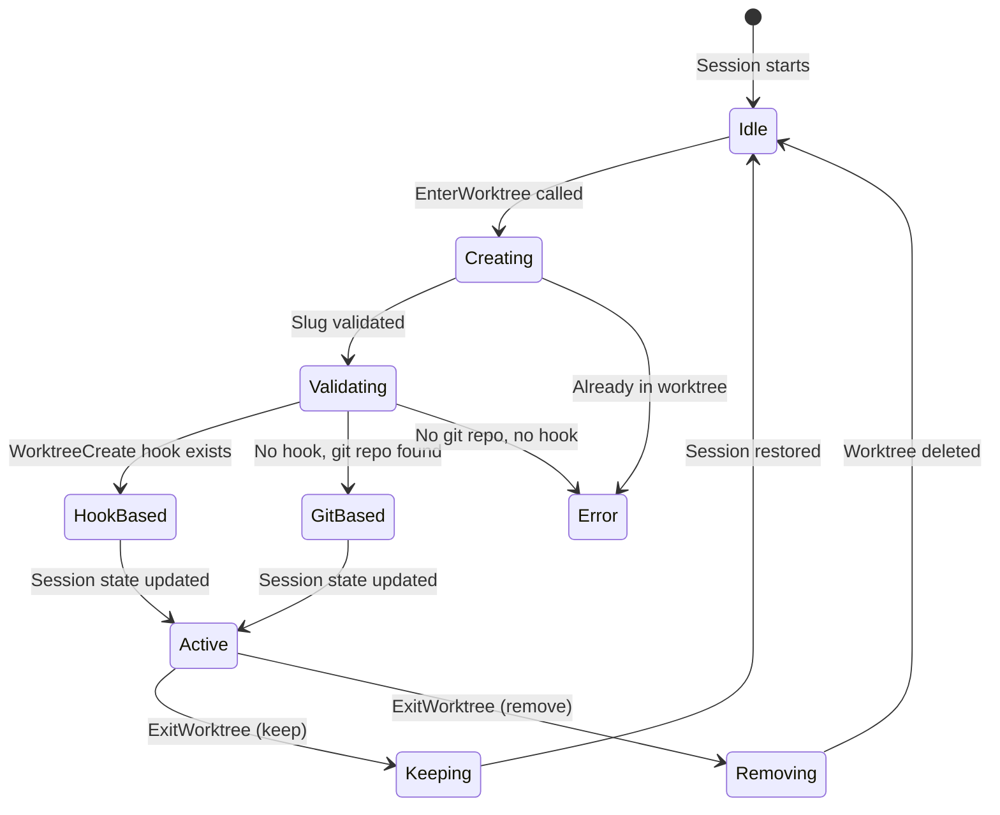
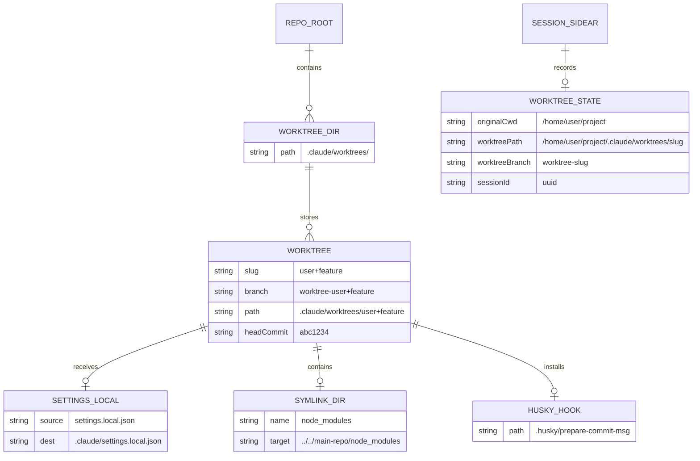

# Worktrees: Isolated Parallel Branches

## Overview

Git worktrees are cc's primary mechanism for fork-join parallelism (HER Pattern 8). When multiple subagents work on independent tasks simultaneously, each needs an isolated filesystem so their edits do not conflict. The worktree system creates lightweight git worktree branches under `.claude/worktrees/`, symlinks large directories like `node_modules` to avoid disk bloat, and provides enter/exit lifecycle tools that manage session state transitions. This chapter covers the `EnterWorktreeTool`, `ExitWorktreeTool`, and the `worktree.ts` utility layer that underpins both session worktrees and agent worktrees.

The worktree subsystem is the concrete implementation of HER's fork-join pattern: the parent agent dispatches subagents into isolated branches, each subagent works independently, and results are merged (or discarded) when the worktree is exited. The pattern's safety guarantee -- that parallel agents cannot corrupt each other's working state -- comes from git's branch isolation, not from any application-level locking. This is a deliberate architectural choice: filesystem isolation scales better than lock-based coordination because it eliminates contention entirely.

The worktree system also serves as cc's primary defense against the path-traversal threats identified in HER Section 12.4. The `validateWorktreeSlug()` function prevents directory-escape attacks through strict character allowlisting, and the `symlinkDirectories()` function validates each symlink target before creation. These defenses are necessary because the worktree slug is partially user-controlled -- it flows from the model's tool call input into filesystem paths.

## Data structures and contracts

### WorktreeSession type

The `WorktreeSession` type captures the full state of an active worktree session, including the original working directory, the new worktree path, branch information, and session metadata:

```typescript
// src/utils/worktree.ts:L140-L155
export type WorktreeSession = {
  originalCwd: string
  worktreePath: string
  worktreeName: string
  worktreeBranch?: string
  originalBranch?: string
  originalHeadCommit?: string
  sessionId: string
  tmuxSessionName?: string
  hookBased?: boolean
  creationDurationMs?: number
  usedSparsePaths?: boolean
}
```

The `originalHeadCommit` field is critical for the safety check in `ExitWorktreeTool`: it provides the baseline commit against which new commits on the worktree branch are counted. Without it, the tool cannot determine whether the worktree has uncommitted work and must fail-closed rather than risk destroying changes. The `hookBased` flag indicates that the worktree was created via a `WorktreeCreate` hook rather than through git directly, enabling VCS-agnostic worktree creation for projects that do not use git.

### EnterWorktreeTool input schema

The input is deliberately minimal -- just an optional name:

```typescript
// src/tools/EnterWorktreeTool/EnterWorktreeTool.ts:L23-L39
const inputSchema = lazySchema(() =>
  z.strictObject({
    name: z
      .string()
      .superRefine((s, ctx) => {
        try {
          validateWorktreeSlug(s)
        } catch (e) {
          ctx.addIssue({ code: 'custom', message: (e as Error).message })
        }
      })
      .optional()
      .describe(
        'Optional name for the worktree. Each "/"-separated segment may contain only letters, digits, points, underscores, and dashes; max 64 chars total.',
      ),
  }),
)
```

The slug validation runs through `validateWorktreeSlug()` in the Zod `superRefine`, which prevents path traversal attacks by rejecting `..` segments, absolute paths, and characters outside the allowlist. The validation runs at schema-parse time, before any side effects (git commands, hook execution, chdir) begin. The tool is registered under the name `ENTER_WORKTREE_TOOL_NAME` (defined as `'EnterWorktree'` in `src/tools/EnterWorktreeTool/constants.ts`) and its UI renders "Creating worktree..." during execution, then displays the branch name and path upon completion via `src/tools/EnterWorktreeTool/UI.tsx`.

### ExitWorktreeTool input schema

The exit tool requires an explicit action and an optional discard confirmation:

```typescript
// src/tools/ExitWorktreeTool/ExitWorktreeTool.ts:L31-L44
const inputSchema = lazySchema(() =>
  z.strictObject({
    action: z
      .enum(['keep', 'remove'])
      .describe(
        '"keep" leaves the worktree and branch on disk; "remove" deletes both.',
      ),
    discard_changes: z
      .boolean()
      .optional()
      .describe(
        'Required true when action is "remove" and the worktree has uncommitted files or unmerged commits.',
      ),
  }),
)
```

The `discard_changes` parameter is a two-step confirmation mechanism: when the worktree has uncommitted changes or new commits, the tool refuses to remove unless the model explicitly confirms with `discard_changes: true`. This prevents accidental data loss when a model misjudges whether a worktree's contents are disposable. The tool is also marked `isDestructive(input) { return input.action === 'remove' }` at `src/tools/ExitWorktreeTool/ExitWorktreeTool.ts:L168-L170`, which affects how the permission system classifies the tool call. The tool is registered under `EXIT_WORKTREE_TOOL_NAME` (defined as `'ExitWorktree'` in `src/tools/ExitWorktreeTool/constants.ts`) and its UI in `src/tools/ExitWorktreeTool/UI.tsx` renders "Exiting worktree..." during execution, then displays "Kept worktree" or "Removed worktree" with the branch name and the original CWD path on completion.

### WorktreeCreateResult type

The internal `getOrCreateWorktree()` function returns a discriminated union that distinguishes between resumed and newly-created worktrees:

```typescript
// src/utils/worktree.ts:L180-L194
type WorktreeCreateResult =
  | {
      worktreePath: string
      worktreeBranch: string
      headCommit: string
      existed: true
    }
  | {
      worktreePath: string
      worktreeBranch: string
      headCommit: string
      baseBranch: string
      existed: false
    }
```

The `existed: true` variant skips post-creation setup (no need to copy settings, configure hooks, or symlink directories for a worktree that already has them). The `baseBranch` field is only present on new worktrees, since resumed worktrees already know their branch.

## Control flow

### Worktree creation

The `createWorktreeForSession()` function orchestrates the full creation flow, trying hook-based creation first and falling back to git:

```typescript
// src/utils/worktree.ts:L702-L778
export async function createWorktreeForSession(
  sessionId: string,
  slug: string,
  tmuxSessionName?: string,
  options?: { prNumber?: number },
): Promise<WorktreeSession> {
  // Must run before the hook branch below — hooks receive the raw slug as an
  // argument, and the git branch builds a path from it via path.join.
  validateWorktreeSlug(slug)

  const originalCwd = getCwd()

  // Try hook-based worktree creation first (allows user-configured VCS)
  if (hasWorktreeCreateHook()) {
    const hookResult = await executeWorktreeCreateHook(slug)
    logForDebugging(
      `Created hook-based worktree at: ${hookResult.worktreePath}`,
    )

    currentWorktreeSession = {
      originalCwd,
      worktreePath: hookResult.worktreePath,
      worktreeName: slug,
      sessionId,
      tmuxSessionName,
      hookBased: true,
    }
  } else {
    // Fall back to git worktree
    const gitRoot = findGitRoot(getCwd())
    if (!gitRoot) {
      throw new Error(
        'Cannot create a worktree: not in a git repository and no WorktreeCreate hooks are configured. ' +
          'Configure WorktreeCreate/WorktreeRemove hooks in settings.json to use worktree isolation with other VCS systems.',
      )
    }

    const originalBranch = await getBranch()

    const createStart = Date.now()
    const { worktreePath, worktreeBranch, headCommit, existed } =
      await getOrCreateWorktree(gitRoot, slug, options)

    let creationDurationMs: number | undefined
    if (existed) {
      logForDebugging(`Resuming existing worktree at: ${worktreePath}`)
    } else {
      logForDebugging(
        `Created worktree at: ${worktreePath} on branch: ${worktreeBranch}`,
      )
      await performPostCreationSetup(gitRoot, worktreePath)
      creationDurationMs = Date.now() - createStart
    }

    currentWorktreeSession = {
      originalCwd,
      worktreePath,
      worktreeName: slug,
      worktreeBranch,
      originalBranch,
      originalHeadCommit: headCommit,
      sessionId,
      tmuxSessionName,
      creationDurationMs,
      usedSparsePaths:
        (getInitialSettings().worktree?.sparsePaths?.length ?? 0) > 0,
    }
  }

  // Save to project config for persistence
  saveCurrentProjectConfig(current => ({
    ...current,
    activeWorktreeSession: currentWorktreeSession ?? undefined,
  }))

  return currentWorktreeSession
}
```

The hook-first design allows VCS-agnostic isolation. When a `WorktreeCreate` hook is configured in `settings.json`, it substitutes the entire git-based creation flow. This is useful for organizations that use Perforce, SVN, or other version control systems.

For git-based worktrees, `getOrCreateWorktree()` implements a fast-resume path. It reads the `.git` pointer file directly (no subprocess, no upward walk) to check if a worktree with the same slug already exists:

```typescript
// src/utils/worktree.ts:L247-L255
const existingHead = await readWorktreeHeadSha(worktreePath)
if (existingHead) {
  return {
    worktreePath,
    worktreeBranch,
    headCommit: existingHead,
    existed: true,
  }
}
```

This optimization avoids spawning `git rev-parse HEAD` (which burns ~15ms on spawn overhead) and instead reads the git internal pointer file directly.

### Slug validation and path traversal defense

The `validateWorktreeSlug()` function is the primary defense against path traversal attacks on the worktree system:

```typescript
// src/utils/worktree.ts:L48-L87
const VALID_WORKTREE_SLUG_SEGMENT = /^[a-zA-Z0-9._-]+$/
const MAX_WORKTREE_SLUG_LENGTH = 64

export function validateWorktreeSlug(slug: string): void {
  if (slug.length > MAX_WORKTREE_SLUG_LENGTH) {
    throw new Error(
      `Invalid worktree name: must be ${MAX_WORKTREE_SLUG_LENGTH} characters or fewer (got ${slug.length})`,
    )
  }
  for (const segment of slug.split('/')) {
    if (segment === '.' || segment === '..') {
      throw new Error(
        `Invalid worktree name "${slug}": must not contain "." or ".." path segments`,
      )
    }
    if (!VALID_WORKTREE_SLUG_SEGMENT.test(segment)) {
      throw new Error(
        `Invalid worktree name "${slug}": each "/"-separated segment must be non-empty and contain only letters, digits, dots, underscores, and dashes`,
      )
    }
  }
}
```

Since the slug is joined into `.claude/worktrees/<slug>` via `path.join`, which normalizes `..` segments, an attacker-controlled slug like `../../../target` would escape the worktrees directory. The validation rejects `.` and `..` segments outright and enforces a strict character allowlist per segment. Forward slashes are allowed for nesting (e.g., `user/feature`), but each segment is independently validated. The slug is also flattened for git branch names and directory paths to prevent D/F conflicts and nested directory hazards:

```typescript
// src/utils/worktree.ts:L217-L219
function flattenSlug(slug: string): string {
  return slug.replaceAll('/', '+')
}
```

### Post-creation setup

After creating a new worktree, `performPostCreationSetup()` propagates settings and configures hooks:

```typescript
// src/utils/worktree.ts:L510-L624
async function performPostCreationSetup(
  repoRoot: string,
  worktreePath: string,
): Promise<void> {
  // Copy settings.local.json to the worktree's .claude directory
  // This propagates local settings (which may contain secrets) to the worktree
  const localSettingsRelativePath =
    getRelativeSettingsFilePathForSource('localSettings')
  const sourceSettingsLocal = join(repoRoot, localSettingsRelativePath)
  try {
    const destSettingsLocal = join(worktreePath, localSettingsRelativePath)
    await mkdirRecursive(dirname(destSettingsLocal))
    await copyFile(sourceSettingsLocal, destSettingsLocal)
    logForDebugging(
      `Copied settings.local.json to worktree: ${destSettingsLocal}`,
    )
  } catch (e: unknown) {
    const code = getErrnoCode(e)
    if (code !== 'ENOENT') {
      logForDebugging(
        `Failed to copy settings.local.json: ${(e as Error).message}`,
        { level: 'warn' },
      )
    }
  }

  // Configure the worktree to use hooks from the main repository
  // This solves issues with .husky and other git hooks that use relative paths
  const huskyPath = join(repoRoot, '.husky')
  const gitHooksPath = join(repoRoot, '.git', 'hooks')
  let hooksPath: string | null = null
  for (const candidatePath of [huskyPath, gitHooksPath]) {
    try {
      const s = await stat(candidatePath)
      if (s.isDirectory()) {
        hooksPath = candidatePath
        break
      }
    } catch {
      // Path doesn't exist or can't be accessed
    }
  }
  if (hooksPath) {
    const gitDir = await resolveGitDir(repoRoot)
    const configDir = gitDir ? ((await getCommonDir(gitDir)) ?? gitDir) : null
    const existing = configDir
      ? await parseGitConfigValue(configDir, 'core', null, 'hooksPath')
      : null
    if (existing !== hooksPath) {
      const { code: configCode, stderr: configError } =
        await execFileNoThrowWithCwd(
          gitExe(),
          ['config', 'core.hooksPath', hooksPath],
          { cwd: worktreePath },
        )
      if (configCode === 0) {
        logForDebugging(
          `Configured worktree to use hooks from main repository: ${hooksPath}`,
        )
      } else {
        logForDebugging(`Failed to configure hooks path: ${configError}`, {
          level: 'error',
        })
      }
    }
  }

  // Symlink directories to avoid disk bloat (opt-in via settings)
  const settings = getInitialSettings()
  const dirsToSymlink = settings.worktree?.symlinkDirectories ?? []
  if (dirsToSymlink.length > 0) {
    await symlinkDirectories(repoRoot, worktreePath, dirsToSymlink)
  }

  // Copy gitignored files specified in .worktreeinclude (best-effort)
  await copyWorktreeIncludeFiles(repoRoot, worktreePath)

  if (feature('COMMIT_ATTRIBUTION')) {
    const worktreeHooksDir =
      hooksPath === huskyPath ? join(worktreePath, '.husky') : undefined
    void import('./postCommitAttribution.js')
      .then(m =>
        m
          .installPrepareCommitMsgHook(worktreePath, worktreeHooksDir)
          .catch(error => {
            logForDebugging(
              `Failed to install attribution hook in worktree: ${error}`,
            )
          }),
      )
      .catch(error => {
        logForDebugging(`Failed to load postCommitAttribution module: ${error}`)
      })
  }
}
```

The setup performs five operations: (1) copies `settings.local.json` (which may contain secrets) to the worktree; (2) configures `core.hooksPath` to point to the main repo's hooks directory (so `.husky` hooks work in the worktree); (3) symlinks directories like `node_modules` to avoid duplicating large directories; (4) copies files matching `.worktreeinclude` patterns that are gitignored but needed for the worktree to function; and (5) installs the commit attribution hook directly into the worktree's `.husky/` directory if the `COMMIT_ATTRIBUTION` feature flag is active.

The `core.hooksPath` configuration is fragile: husky's `prepare` script runs on every `bun install` and resets the shared `.git/config` value back to a relative path, causing each worktree to resolve to its own `.husky/` again. To work around this, cc installs the attribution hook directly into the worktree's local `.husky/` directory at `src/utils/worktree.ts:L603-L623`, ensuring it survives a `bun install` reset.

### Session state transitions on enter

When `EnterWorktreeTool.call()` executes, it mutates global session state through a carefully ordered sequence of operations:

```typescript
// src/tools/EnterWorktreeTool/EnterWorktreeTool.ts:L77-L119
async call(input) {
  if (getCurrentWorktreeSession()) {
    throw new Error('Already in a worktree session')
  }
  const mainRepoRoot = findCanonicalGitRoot(getCwd())
  if (mainRepoRoot && mainRepoRoot !== getCwd()) {
    process.chdir(mainRepoRoot)
    setCwd(mainRepoRoot)
  }
  const slug = input.name ?? getPlanSlug()
  const worktreeSession = await createWorktreeForSession(getSessionId(), slug)
  process.chdir(worktreeSession.worktreePath)
  setCwd(worktreeSession.worktreePath)
  setOriginalCwd(getCwd())
  saveWorktreeState(worktreeSession)
  clearSystemPromptSections()
  clearMemoryFileCaches()
  getPlansDirectory.cache.clear?.()
```

The tool first resolves to the main repo root (so worktree creation works from within an existing worktree), then creates the worktree, changes the working directory, updates the original-CWD tracking, saves the worktree state to the session sidecar, and clears cached state that depends on CWD. The cache clearing is essential: without it, the agent would operate with stale system prompt sections that reference the old directory's CLAUDE.md and settings. The `clearMemoryFileCaches()` call ensures that the memdir system re-scans for memories in the new directory, and the `getPlansDirectory.cache.clear?.()` call resets the plans directory path to reflect the new CWD.





### Exit with change detection

The `ExitWorktreeTool.validateInput()` method counts uncommitted changes before allowing removal. The `countWorktreeChanges()` function at `src/tools/ExitWorktreeTool/ExitWorktreeTool.ts:L79-L113` returns `null` (fail-closed) when git commands fail or when `originalHeadCommit` is undefined:

```typescript
// src/tools/ExitWorktreeTool/ExitWorktreeTool.ts:L79-L113
async function countWorktreeChanges(
  worktreePath: string,
  originalHeadCommit: string | undefined,
): Promise<ChangeSummary | null> {
  const status = await execFileNoThrow('git', [
    '-C', worktreePath, 'status', '--porcelain',
  ])
  if (status.code !== 0) {
    return null
  }
  const changedFiles = count(status.stdout.split('\n'), l => l.trim() !== '')
  if (!originalHeadCommit) {
    return null
  }
  const revList = await execFileNoThrow('git', [
    '-C', worktreePath,
    'rev-list', '--count', `${originalHeadCommit}..HEAD`,
  ])
  if (revList.code !== 0) {
    return null
  }
  const commits = parseInt(revList.stdout.trim(), 10) || 0
  return { changedFiles, commits }
}
```

A `null` return means "unknown, assume unsafe" -- the tool will refuse to remove the worktree without explicit `discard_changes: true` confirmation. This fail-closed approach prevents data loss from false negatives. A `0/0` return that means "definitely clean" but is actually wrong (because git failed silently) would be far more dangerous.

When changes are detected, `validateInput()` produces a descriptive error message:

```typescript
// src/tools/ExitWorktreeTool/ExitWorktreeTool.ts:L190-L219
if (input.action === 'remove' && !input.discard_changes) {
  const summary = await countWorktreeChanges(
    session.worktreePath,
    session.originalHeadCommit,
  )
  if (summary === null) {
    return {
      result: false,
      message: `Could not verify worktree state at ${session.worktreePath}. Refusing to remove without explicit confirmation. Re-invoke with discard_changes: true to proceed — or use action: "keep" to preserve the worktree.`,
      errorCode: 3,
    }
  }
  const { changedFiles, commits } = summary
  if (changedFiles > 0 || commits > 0) {
    const parts: string[] = []
    if (changedFiles > 0) {
      parts.push(
        `${changedFiles} uncommitted ${changedFiles === 1 ? 'file' : 'files'}`,
      )
    }
    if (commits > 0) {
      parts.push(
        `${commits} ${commits === 1 ? 'commit' : 'commits'} on ${session.worktreeBranch ?? 'the worktree branch'}`,
      )
    }
    return {
      result: false,
      message: `Worktree has ${parts.join(' and ')}. Removing will discard this work permanently. Confirm with the user, then re-invoke with discard_changes: true — or use action: "keep" to preserve the worktree.`,
      errorCode: 2,
    }
  }
}
```

### Session restoration on exit

The `restoreSessionToOriginalCwd()` function at `src/tools/ExitWorktreeTool/ExitWorktreeTool.ts:L122-L146` performs the inverse of the session mutations in `EnterWorktreeTool.call()`. It restores the CWD, original CWD, and project root, then clears the same caches:

```typescript
// src/tools/ExitWorktreeTool/ExitWorktreeTool.ts:L122-L146
function restoreSessionToOriginalCwd(
  originalCwd: string,
  projectRootIsWorktree: boolean,
): void {
  setCwd(originalCwd)
  setOriginalCwd(originalCwd)
  if (projectRootIsWorktree) {
    setProjectRoot(originalCwd)
    updateHooksConfigSnapshot()
  }
  saveWorktreeState(null)
  clearSystemPromptSections()
  clearMemoryFileCaches()
  getPlansDirectory.cache.clear?.()
}
```

The `projectRootIsWorktree` check is necessary because mid-session `EnterWorktreeTool` does not change the project root, but the `--worktree` startup path (in `setup.ts`) does. Only the startup path needs the project root restored, because changing the project root mid-session would break the "stable project identity" contract that other systems (like the settings cascade) depend on.

### Stale worktree cleanup

The `cleanupStaleAgentWorktrees()` function removes orphaned worktrees left behind by crashed agent processes. It uses exact-shape patterns to match ephemeral slugs without sweeping user-named worktrees:

```typescript
// src/utils/worktree.ts:L1030-L1041
const EPHEMERAL_WORKTREE_PATTERNS = [
  /^agent-a[0-9a-f]{7}$/,
  /^wf_[0-9a-f]{8}-[0-9a-f]{3}-\d+$/,
  /^wf-\d+$/,
  /^bridge-[A-Za-z0-9_]+(-[A-Za-z0-9_]+)*$/,
  /^job-[a-zA-Z0-9._-]{1,55}-[0-9a-f]{8}$/,
]
```

The cleanup is fail-closed: it skips worktrees where `git status` fails, where there are uncommitted changes, or where there are unpushed commits. Only worktrees with a clean working tree and no unpushed commits are candidates for removal. The function also skips the current session's worktree (matched by path) and only considers worktrees older than the cutoff date (default 30 days, based on mtime).

### The tmux integration path

The `execIntoTmuxWorktree()` function at `src/utils/worktree.ts:L1180-L1520` provides a fast-path for `--worktree --tmux` that creates the worktree and execs into a tmux session running Claude inside it. This is the primary entry point for developers who want an isolated workspace in a separate terminal pane.

The function handles several edge cases: it detects whether tmux is available, checks for iTerm2 integration (using control mode `-CC` for native tab/pane integration), and detects keybinding conflicts between tmux's prefix key and cc's own keybindings. When running inside iTerm2 on macOS, it uses tmux control mode, which lets users manage sessions through iTerm2's UI rather than learning tmux keybindings.

For internal developers (`USER_TYPE=ant` in the `claude-cli-internal` repo), the function sets up dev panes with `bun run watch` and `bun run start` in separate tmux panes, creating a full development environment with a single command.

### The --worktree startup path

The `--worktree` flag (or `-w`) triggers worktree creation at session start in `src/entrypoints/cli.tsx:L247-L249`, before the full CLI loads. When combined with `--tmux`, the fast-path in `cli.tsx` calls `execIntoTmuxWorktree()` directly, creating the worktree and exec-ing into a tmux session before importing the REPL or Ink rendering pipeline. This early exec saves the cost of loading the full CLI bundle (~200ms of module evaluation) into a process that will immediately be replaced by tmux.

The non-tmux `--worktree` path runs through `src/setup.ts:L231-L284`. After `init()` completes (which establishes settings, API keys, and the session file), `setup()` calls `createWorktreeForSession()` with a slug derived from the `--worktree=` argument or a plan slug. It then mutates global state differently than the mid-session `EnterWorktreeTool`:

```typescript
// src/setup.ts:L271-L284
process.chdir(worktreeSession.worktreePath)
setCwd(worktreeSession.worktreePath)
setOriginalCwd(getCwd())
// --worktree means the worktree IS the session's project, so skills/hooks/
// cron/etc. should resolve here. (EnterWorktreeTool mid-session does NOT
// touch projectRoot — that's a throwaway worktree, project stays stable.)
setProjectRoot(getCwd())
saveWorktreeState(worktreeSession)
// Clear memory files cache since originalCwd has changed
clearMemoryFileCaches()
// Settings cache was populated in init() (via applySafeConfigEnvironmentVariables)
// and again at captureHooksConfigSnapshot() above, both from the original dir's
// .claude/settings.json. Re-read from the worktree and re-capture hooks.
updateHooksConfigSnapshot()
```

The critical difference from the mid-session path is `setProjectRoot(getCwd())`. When cc starts with `--worktree`, the worktree directory becomes the project root -- skills, hooks, cron tasks, and the settings cascade all resolve against the worktree's `.claude/` directory. This makes the worktree a first-class project rather than a temporary isolation mechanism. By contrast, `EnterWorktreeTool` mid-session deliberately does not change the project root, preserving the "stable project identity" that other subsystems depend on.

This distinction also affects `ExitWorktreeTool` behavior: when the worktree was entered via the startup path, `restoreSessionToOriginalCwd()` must also restore the project root via `setProjectRoot(originalCwd)` and call `updateHooksConfigSnapshot()`, because the project root was modified at startup.

### Session persistence via saveWorktreeState

The `saveWorktreeState()` function at `src/utils/sessionStorage.ts:L2889-L2920` persists the worktree session to the JSONL transcript so that `--resume` can restore it. When called with a `WorktreeSession`, it strips ephemeral fields (`creationDurationMs`, `usedSparsePaths`) that are useful in-memory but should not be serialized, then writes a `worktree-state` entry to the session file:

```typescript
// src/utils/sessionStorage.ts:L2889-L2920
export function saveWorktreeState(
  worktreeSession: PersistedWorktreeSession | null,
): void {
  const stripped: PersistedWorktreeSession | null = worktreeSession
    ? {
        originalCwd: worktreeSession.originalCwd,
        worktreePath: worktreeSession.worktreePath,
        worktreeName: worktreeSession.worktreeName,
        worktreeBranch: worktreeSession.worktreeBranch,
        originalBranch: worktreeSession.originalBranch,
        originalHeadCommit: worktreeSession.originalHeadCommit,
        sessionId: worktreeSession.sessionId,
        tmuxSessionName: worktreeSession.tmuxSessionName,
        hookBased: worktreeSession.hookBased,
      }
    : null
  const project = getProject()
  project.currentSessionWorktree = stripped
  if (project.sessionFile) {
    appendEntryToFile(project.sessionFile, {
      type: 'worktree-state',
      worktreeSession: stripped,
      sessionId: getSessionId(),
    })
  }
}
```

Passing `null` signals that the worktree has been exited -- `--resume` will not attempt to `chdir` back into it. The function writes eagerly (appending to the JSONL file) when the session file already exists, which covers the mid-session `EnterWorktreeTool`/`ExitWorktreeTool` flows. For the `--worktree` startup path, `sessionFile` is still `null` at this point -- the entry is written later by `materializeSessionFile` on the first user message via `reAppendSessionMetadata`.

On resume, `restoreWorktreeForResume()` at `src/utils/sessionRestore.ts:L332-L366` reads the persisted worktree state and restores the session. If the worktree directory no longer exists (e.g., removed by `cleanupStaleAgentWorktrees()` or manually), the function catches the `chdir` error and writes `saveWorktreeState(null)` to override the stale cached state, preventing subsequent `reAppendSessionMetadata` calls from re-persisting a dangling path. The function intentionally does not set `projectRoot` during resume -- the transcript does not record whether the worktree was entered via `--worktree` (which sets project root) or `EnterWorktreeTool` (which does not), so it conservatively matches `EnterWorktreeTool`'s behavior.

## Edge cases and failure modes

### Nested worktree slug flattening

Forward slashes in slugs are allowed for human readability (e.g., `user/feature`), but they are flattened for both branch names and directory paths at `src/utils/worktree.ts:L217-L219`. This prevents two safety hazards: (1) a git D/F conflict where `worktree-user` as a file conflicts with `worktree-user/feature` as a directory, and (2) nested worktree directories where `git worktree remove` on a parent could delete a child with uncommitted work. The `+` character is valid in git branch names and filesystem paths but is not in the slug-segment allowlist (`[a-zA-Z0-9._-]`), so the mapping is injective -- no two different slugs can produce the same flattened form.

### Symlink traversal protection

The `symlinkDirectories()` function validates each directory name before symlinking:

```typescript
// src/utils/worktree.ts:L102-L138
async function symlinkDirectories(
  repoRootPath: string,
  worktreePath: string,
  dirsToSymlink: string[],
): Promise<void> {
  for (const dir of dirsToSymlink) {
    if (containsPathTraversal(dir)) {
      logForDebugging(
        `Skipping symlink for "${dir}": path traversal detected`,
        { level: 'warn' },
      )
      continue
    }
    const sourcePath = join(repoRootPath, dir)
    const destPath = join(worktreePath, dir)
    try {
      await symlink(sourcePath, destPath, 'dir')
    } catch (error) {
      const code = getErrnoCode(error)
      if (code !== 'ENOENT' && code !== 'EEXIST') {
        logForDebugging(`Failed to symlink ${dir} (${code ?? 'unknown'}): ${errorMessage(error)}`, { level: 'warn' })
      }
    }
  }
}
```

This check prevents a malicious `settings.local.json` from specifying a symlink target that escapes the repository (e.g., `../../../etc/passwd`). The `containsPathTraversal()` check runs before the symlink is created. The error handling is also deliberate: `ENOENT` (source doesn't exist yet) and `EEXIST` (destination already exists) are expected and silently skipped, while other errors (permission denied, unsupported platform) are logged at warn level.

### The .worktreeinclude file

The `copyWorktreeIncludeFiles()` function at `src/utils/worktree.ts:L391-L504` handles a subtle problem: gitignored files (like `.env` or local config) that are needed in the worktree but are not tracked by git. It uses a `.worktreeinclude` file with `.gitignore`-like syntax. The function uses `git ls-files --others --ignored --exclude-standard --directory` to list gitignored entries efficiently, with `--directory` collapsing fully-gitignored directories into single entries (avoiding a full tree walk of `node_modules/`, which in a large repo can cut ~500k entries/~7s down to ~hundreds of entries/~100ms).

When a `.worktreeinclude` pattern targets a path inside a collapsed directory (e.g., `config/secrets/api.key` when all of `config/secrets/` is gitignored), the function performs a second scoped `ls-files` call to expand only that directory. This two-pass approach balances performance (most gitignored directories are not needed in the worktree) with correctness (specific gitignored files may be required).

### The EnterWorktreeTool prompt and safety messaging

The `EnterWorktreeTool` prompt at `src/tools/EnterWorktreeTool/prompt.ts` provides explicit instructions for the model about when to use worktrees and when not to. The prompt states that the tool should only be used when the user explicitly says "worktree" -- if the user asks to create a branch, switch branches, or work on a different branch, the model should use git commands instead. This prevents the model from spontaneously entering a worktree when the user's intent is better served by a simple branch checkout.

The `ExitWorktreeTool` prompt at `src/tools/ExitWorktreeTool/prompt.ts` reinforces the two-step confirmation model: the tool should not proactively call exit, only when the user asks to leave the worktree. The prompt also clarifies the "keep" vs "remove" semantics: "keep" leaves the worktree and branch on disk for later use, while "remove" deletes both the worktree directory and the associated git branch. The model is instructed to confirm with the user before removing a worktree that has uncommitted changes.

```mermaid
flowchart TD
    A[User requests task in worktree] --> B{User said "worktree"?}
    B -->|Yes| C[EnterWorktreeTool]
    B -->|No| D[Use git commands]
    C --> E[Worktree created, session state updated]
    E --> F[Agent works in isolated branch]
    F --> G{User asks to exit?}
    G -->|Yes, keep| H[ExitWorktreeTool with action="keep"]
    G -->|Yes, remove| I{Uncommitted changes?}
    I -->|No| J[ExitWorktreeTool with action="remove"]
    I -->|Yes| K[Confirm with user, then discard_changes: true]
    G -->|No| F
```

### Sparse checkout support

When `settings.worktree.sparsePaths` is configured, the worktree is created with `--no-checkout` and then sparse-checkout is applied:

```typescript
// src/utils/worktree.ts:L321-L366
const sparsePaths = getInitialSettings().worktree?.sparsePaths
const addArgs = ['worktree', 'add']
if (sparsePaths?.length) {
  addArgs.push('--no-checkout')
}
// -B (not -b): reset any orphan branch left behind by a removed worktree dir.
// Saves a `git branch -D` subprocess (~15ms spawn overhead) on every create.
addArgs.push('-B', worktreeBranch, worktreePath, baseBranch)

const { code: createCode, stderr: createStderr } =
  await execFileNoThrowWithCwd(gitExe(), addArgs, { cwd: repoRoot })
if (createCode !== 0) {
  throw new Error(`Failed to create worktree: ${createStderr}`)
}

if (sparsePaths?.length) {
  // If sparse-checkout or checkout fail after --no-checkout, the worktree
  // is registered and HEAD is set but the working tree is empty. Next run's
  // fast-resume (rev-parse HEAD) would succeed and present a broken worktree
  // as "resumed". Tear it down before propagating the error.
  const tearDown = async (msg: string): Promise<never> => {
    await execFileNoThrowWithCwd(
      gitExe(),
      ['worktree', 'remove', '--force', worktreePath],
      { cwd: repoRoot },
    )
    throw new Error(msg)
  }
  const { code: sparseCode, stderr: sparseErr } =
    await execFileNoThrowWithCwd(
      gitExe(),
      ['sparse-checkout', 'set', '--cone', '--', ...sparsePaths],
      { cwd: worktreePath },
    )
  if (sparseCode !== 0) {
    await tearDown(`Failed to configure sparse-checkout: ${sparseErr}`)
  }
  const { code: coCode, stderr: coErr } = await execFileNoThrowWithCwd(
    gitExe(),
    ['checkout', 'HEAD'],
    { cwd: worktreePath },
  )
  if (coCode !== 0) {
    await tearDown(`Failed to checkout sparse worktree: ${coErr}`)
  }
}
```

If sparse-checkout or the checkout fails after the worktree is registered, the `tearDown` function removes the worktree before propagating the error. Without this, a subsequent fast-resume (which reads `rev-parse HEAD`) would succeed and present a broken worktree as "resumed."

## Where cc diverges from the published pattern

HER Pattern 8 (Fork-Join Parallelism) describes "multiple subagents in isolated git worktrees with cached parent context reuse." cc implements this pattern but adds several safety layers that the pattern does not specify:

1. **Slug validation** -- The pattern does not address path traversal attacks on worktree paths. cc's `validateWorktreeSlug()` at `src/utils/worktree.ts:L66-L87` prevents directory escape through strict character allowlisting and segment-by-segment validation.

2. **Two-step removal confirmation** -- The pattern assumes subagent worktrees are disposable. cc distinguishes between user-created worktrees (which require explicit `discard_changes` confirmation at `src/tools/ExitWorktreeTool/ExitWorktreeTool.ts:L190-L219`) and ephemeral agent worktrees (which are auto-cleaned by `cleanupStaleAgentWorktrees()`).

3. **Hook-based VCS abstraction** -- The pattern assumes git. cc supports a `WorktreeCreate`/`WorktreeRemove` hook pair that allows non-git VCS systems to provide equivalent isolation, making the worktree abstraction VCS-agnostic.

4. **Symlink-based disk optimization** -- The pattern does not address disk bloat from duplicating `node_modules/` across worktrees. cc's `symlinkDirectories()` and `.worktreeinclude` mechanism at `src/utils/worktree.ts:L391-L504` solve this pragmatically.

5. **Sparse checkout** -- The pattern does not address the performance cost of checking out a full repository for a subagent that only needs a few files. cc's `sparsePaths` setting allows worktrees to check out only the directories needed for the task.

## Developer takeaways for building a long-running agent

1. **Use filesystem isolation, not application-level locking.** Git worktrees provide true parallelism without lock contention. Application-level read/write locks (like cc's own tool orchestration, Chapter 12) protect individual file operations but cannot coordinate independent multi-step tasks. Worktrees solve this at the VCS level, and the isolation guarantee comes from git, not from the application.

2. **Validate all user-controlled path segments.** The worktree slug is user-controlled and is joined into filesystem paths. Without strict validation, a malicious slug can escape the intended directory. The `validateWorktreeSlug()` pattern -- allowlist per segment, reject `.`/`..`, enforce length limits -- should be applied to any user-controlled path component in an agent system.

3. **Fail-closed when state is uncertain.** The `countWorktreeChanges()` function returns `null` when git commands fail, and callers treat `null` as "potentially unsafe." This fail-closed approach prevents data loss from false negatives. A `null` return that means "unknown" is safer than a `0/0` return that means "definitely clean" but might be wrong.

4. **Clean up after crashes.** Agent processes can be killed at any time, leaving orphaned worktrees on disk. cc's `cleanupStaleAgentWorktrees()` at `src/utils/worktree.ts:L1058-L1136` uses exact-shape patterns to identify ephemeral worktrees without accidentally deleting user-named ones. Any long-running agent system needs equivalent crash-recovery logic.

5. **Propagate configuration to isolated environments.** A worktree that lacks `settings.local.json`, git hooks, or gitignored config files is a broken environment. cc's `performPostCreationSetup()` copies settings, configures hooks, symlinks directories, and copies `.worktreeinclude` files. Any isolation mechanism must propagate the configuration that the agent's code depends on.
