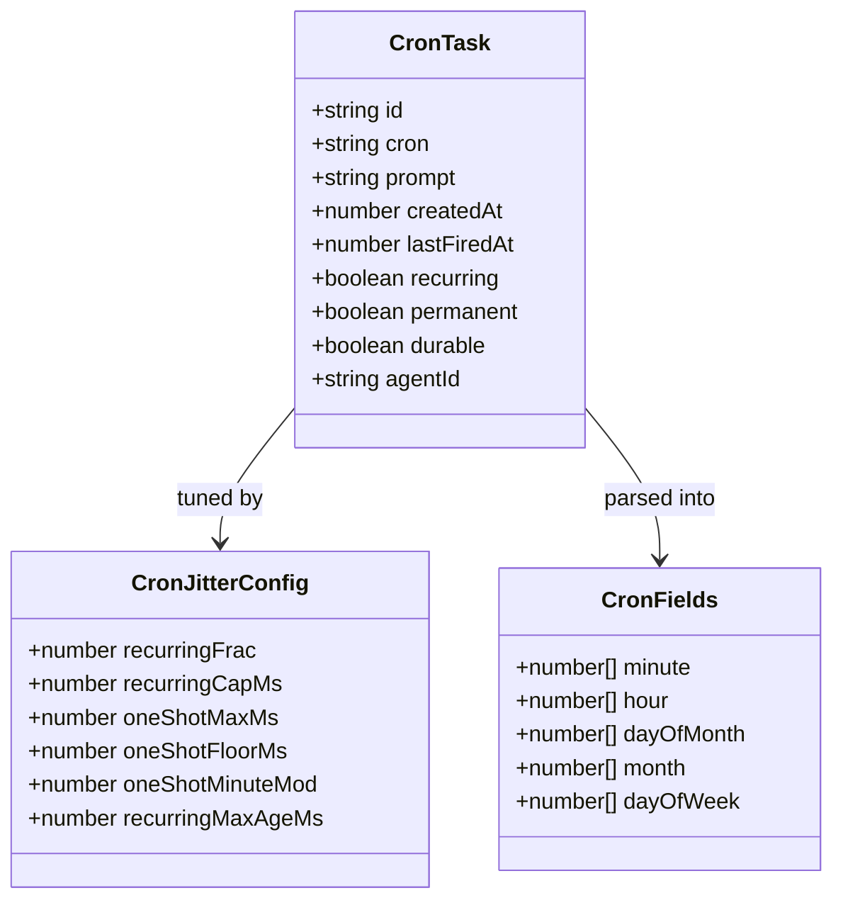
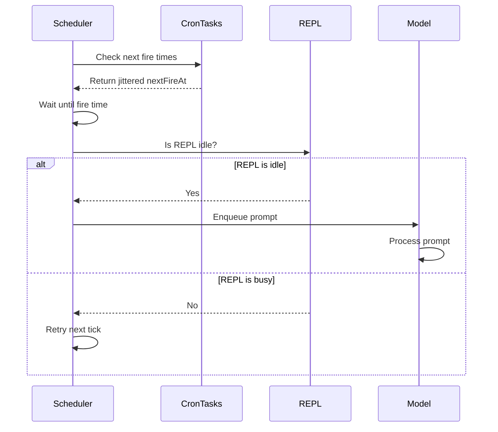
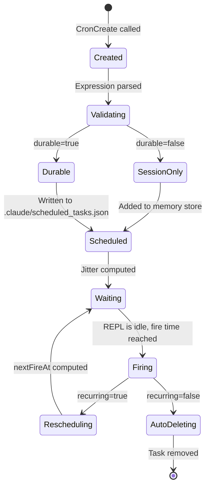

# Cron, Schedule, Loop, and Wakeup

## Overview

The cron scheduling system is cc's mechanism for recurring and one-shot delayed task execution within a running agent session. It comprises three tools (`CronCreate`, `CronDelete`, `CronList`), a cron expression parser, a task persistence layer, and a scheduler that enqueues prompts when the REPL is idle. The system also underpins the `/loop` skill, which lets users set up self-pacing iterative workflows. This chapter traces the full lifecycle from cron expression parsing through jitter-gated fire scheduling to durable persistence across session restarts.

The cron system embodies two HER principles simultaneously: the One-Task-Per-Session rule (Section 10.1) and the METR task-sizing research (Section 10.2). By allowing the agent to schedule future work without blocking the current query, cron tasks decompose long-running work into right-sized chunks (the 15-30 minute sweet spot identified by METR) while maintaining the one-task-per-session discipline. The METR research found that AI task duration doubles every ~7 months (accelerated to ~4.3 months per the January 2026 update), but that 95% per-step reliability yields only 36% success over 20 steps. Right-sizing tasks through scheduled decomposition directly addresses this compound-failure math.

## Data structures and contracts

### CronTask type

The `CronTask` type is the central data structure, stored in `.claude/scheduled_tasks.json` for durable tasks or held in process memory for session-only tasks:

```typescript
// src/utils/cronTasks.ts:L30-L70
export type CronTask = {
  id: string
  /** 5-field cron string (local time) — validated on write, re-validated on read. */
  cron: string
  /** Prompt to enqueue when the task fires. */
  prompt: string
  /** Epoch ms when the task was created. Anchor for missed-task detection. */
  createdAt: number
  /**
   * Epoch ms of the most recent fire. Written back by the scheduler after
   * each recurring fire so next-fire computation survives process restarts.
   * The scheduler anchors first-sight from `lastFiredAt ?? createdAt` — a
   * never-fired task uses createdAt (correct for pinned crons like
   * `30 14 27 2 *` whose next-from-now is next year); a fired-before task
   * reconstructs the same `nextFireAt` the prior process had in memory.
   * Never set for one-shots (they're deleted on fire).
   */
  lastFiredAt?: number
  /** When true, the task reschedules after firing instead of being deleted. */
  recurring?: boolean
  /**
   * When true, the task is exempt from recurringMaxAgeMs auto-expiry.
   * System escape hatch for assistant mode's built-in tasks (catch-up/
   * morning-checkin/dream) — the installer's writeIfMissing() skips existing
   * files so re-install can't recreate them. Not settable via CronCreateTool;
   * only written directly to scheduled_tasks.json by src/assistant/install.ts.
   */
  permanent?: boolean
  /**
   * Runtime-only flag. false → session-scoped (never written to disk).
   * File-backed tasks leave this undefined; writeCronTasks strips it so
   * the on-disk shape stays { id, cron, prompt, createdAt, lastFiredAt?, recurring?, permanent? }.
   */
  durable?: boolean
  /**
   * Runtime-only. When set, the task was created by an in-process teammate.
   * The scheduler routes fires to that teammate's queue instead of the main
   * REPL's. Never written to disk (teammate crons are always session-only).
   */
  agentId?: string
}
```

Key fields and their design rationale:
- `lastFiredAt`: Written back by the scheduler after each recurring fire. This field enables correct next-fire computation across process restarts -- a never-fired task uses `createdAt` as the anchor (correct for pinned crons like `30 14 27 2 *` whose next-from-now is next year), while a previously-fired task reconstructs the same `nextFireAt` the prior process had in memory. Never set for one-shots since they are deleted on fire.
- `permanent`: An escape hatch for assistant mode's built-in tasks (catch-up, morning-checkin, dream). These tasks never auto-expire and cannot be recreated if deleted (because `install.ts`'s `writeIfMissing()` skips existing files). Not settable via `CronCreateTool`; only written directly to `scheduled_tasks.json` by `src/assistant/install.ts`.
- `durable`: A runtime-only flag. When `false`, the task is session-scoped and never written to disk. File-backed tasks leave this `undefined`.
- `agentId`: When set, the task was created by an in-process teammate. The scheduler routes fires to that teammate's queue instead of the main REPL. Never written to disk since teammate crons are always session-only.



### CronFields type

The `CronFields` type represents a parsed cron expression as five sorted number arrays:

```typescript
// src/utils/cron.ts:L10-L16
export type CronFields = {
  minute: number[]
  hour: number[]
  dayOfMonth: number[]
  month: number[]
  dayOfWeek: number[]
}
```

Each array contains the explicit set of matching values for that field. For example, `0 9 * * 1-5` parses to `{ minute: [0], hour: [9], dayOfMonth: [1..31], month: [1..12], dayOfWeek: [1,2,3,4,5] }`. The explicit-set representation makes matching fast (O(1) via `Set` lookup) at the cost of slightly higher memory usage for wildcard fields.

### CronJitterConfig type

The jitter configuration controls thundering-herd prevention, with runtime tuning knobs sourced from GrowthBook:

```typescript
// src/utils/cronTasks.ts:L315-L346
export type CronJitterConfig = {
  /** Recurring-task forward delay as a fraction of the interval between fires. */
  recurringFrac: number
  /** Upper bound on recurring forward delay regardless of interval length. */
  recurringCapMs: number
  /** One-shot backward lead: maximum ms a task may fire early. */
  oneShotMaxMs: number
  /**
   * One-shot backward lead: minimum ms a task fires early when the minute-mod
   * gate matches. 0 = taskIds hashing near zero fire on the exact mark. Raise
   * this to guarantee nobody lands on the wall-clock boundary.
   */
  oneShotFloorMs: number
  /**
   * Jitter fires landing on minutes where `minute % N === 0`. 30 → :00/:30
   * (the human-rounding hotspots). 15 → :00/:15/:30/:45. 1 → every minute.
   */
  oneShotMinuteMod: number
  /**
   * Recurring tasks auto-expire this many ms after creation (unless marked
   * `permanent`).
   */
  recurringMaxAgeMs: number
}
```

Default values:

```typescript
// src/utils/cronTasks.ts:L348-L355
export const DEFAULT_CRON_JITTER_CONFIG: CronJitterConfig = {
  recurringFrac: 0.1,
  recurringCapMs: 15 * 60 * 1000,
  oneShotMaxMs: 90 * 1000,
  oneShotFloorMs: 0,
  oneShotMinuteMod: 30,
  recurringMaxAgeMs: 7 * 24 * 60 * 60 * 1000,
}
```

The `recurringMaxAgeMs` of 7 days bounds session lifetime: recurring tasks auto-expire after one week unless marked `permanent`. This prevents unbounded recurrence from compounding heap leaks in long-running sessions (p99 uptime is 53 hours post-#19931). The `recurringFrac` of 0.1 means an hourly task spreads across `[:00, :06)`, while a per-minute task only spreads by a few seconds.

## Control flow

### Cron expression parsing

The `parseCronExpression()` function supports the standard 5-field cron subset with wildcards, steps, ranges, and lists:

```typescript
// src/utils/cron.ts:L83-L101
export function parseCronExpression(expr: string): CronFields | null {
  const parts = expr.trim().split(/\s+/)
  if (parts.length !== 5) return null

  const expanded: number[][] = []
  for (let i = 0; i < 5; i++) {
    const result = expandField(parts[i]!, FIELD_RANGES[i]!)
    if (!result) return null
    expanded.push(result)
  }

  return {
    minute: expanded[0]!,
    hour: expanded[1]!,
    dayOfMonth: expanded[2]!,
    month: expanded[3]!,
    dayOfWeek: expanded[4]!,
  }
}
```

The parser does not support `L`, `W`, `?`, or name aliases (like `MON` or `JAN`). All times are interpreted in the process's local timezone -- `0 9 * * *` means 9am wherever the CLI is running, with no timezone conversion needed. The `expandField()` function at `src/utils/cron.ts:L31-L77` handles three syntax forms: wildcard/step (`*/5`), range (`1-5`), and single values (`3`), plus comma-separated lists of any combination. The day-of-week field accepts `7` as a Sunday alias (mapped to `0`) to match vixie-cron behavior.

### Next-run computation

The `computeNextCronRun()` function walks forward minute-by-minute from a given timestamp, bounded at 366 days. It uses smart jumping: when the month does not match, it jumps to the start of the next month rather than iterating day-by-day. Similarly, when the day does not match, it jumps to the next day. The day-of-month/day-of-week matching follows standard cron OR semantics: when both fields are constrained (neither is the full range), a date matches if either matches. DST transitions are handled naturally by the minute-walk algorithm.

```typescript
// src/utils/cron.ts:L119-L165
export function computeNextCronRun(
  fields: CronFields,
  from: Date,
): Date | null {
  const minuteSet = new Set(fields.minute)
  const hourSet = new Set(fields.hour)
  const domSet = new Set(fields.dayOfMonth)
  const monthSet = new Set(fields.month)
  const dowSet = new Set(fields.dayOfWeek)

  // Is the field wildcarded (full range)?
  const domWild = fields.dayOfMonth.length === 31
  const dowWild = fields.dayOfWeek.length === 7

  // Round up to the next whole minute (strictly after `from`)
  const t = new Date(from.getTime())
  t.setSeconds(0, 0)
  t.setMinutes(t.getMinutes() + 1)

  const maxIter = 366 * 24 * 60
  for (let i = 0; i < maxIter; i++) {
    const month = t.getMonth() + 1
    if (!monthSet.has(month)) {
      // Jump to start of next month
      t.setMonth(t.getMonth() + 1, 1)
      t.setHours(0, 0, 0, 0)
      continue
    }

    const dom = t.getDate()
    const dow = t.getDay()
    // When both dom/dow are constrained, either match is sufficient (OR semantics)
    const dayMatches =
      domWild && dowWild
        ? true
        : domWild
          ? dowSet.has(dow)
          : dowWild
            ? domSet.has(dom)
            : domSet.has(dom) || dowSet.has(dow)

    if (!dayMatches) {
      // Jump to start of next day
      t.setDate(t.getDate() + 1)
      t.setHours(0, 0, 0, 0)
      continue
    }

    if (!hourSet.has(t.getHours())) {
      t.setHours(t.getHours() + 1, 0, 0, 0)
      continue
    }

    if (!minuteSet.has(t.getMinutes())) {
      t.setMinutes(t.getMinutes() + 1)
      continue
    }

    return t
  }

  return null
}
```

### Jitter for thundering-herd prevention

The cron system applies deterministic per-task jitter to prevent a thundering herd when many sessions schedule the same cron string. For recurring tasks, jitter delays the fire forward:

```typescript
// src/utils/cronTasks.ts:L381-L398
export function jitteredNextCronRunMs(
  cron: string,
  fromMs: number,
  taskId: string,
  cfg: CronJitterConfig = DEFAULT_CRON_JITTER_CONFIG,
): number | null {
  const t1 = nextCronRunMs(cron, fromMs)
  if (t1 === null) return null
  const t2 = nextCronRunMs(cron, t1)
  // No second match in the next year (e.g. pinned date) → nothing to
  // proportion against, and near-certainly not a herd risk. Fire on t1.
  if (t2 === null) return t1
  const jitter = Math.min(
    jitterFrac(taskId) * cfg.recurringFrac * (t2 - t1),
    cfg.recurringCapMs,
  )
  return t1 + jitter
}
```

The jitter fraction is derived from the task ID (an 8-hex-char UUID slice), so it is deterministic across restarts -- the same task always fires at the same offset within its jitter window. The `jitterFrac()` function at `src/utils/cronTasks.ts:L362-L365` parses the first 8 hex chars as a u32 and divides by 2^32 to produce a value in [0, 1). At defaults, an hourly task spreads across `[:00, :06)`, while a per-minute task only spreads by a few seconds (0.1 * 60s = 6s max).

For one-shot tasks, jitter fires early rather than late, because delaying a user-pinned reminder ("remind me at 3pm") would break the contract:

```typescript
// src/utils/cronTasks.ts:L421-L445
export function oneShotJitteredNextCronRunMs(
  cron: string,
  fromMs: number,
  taskId: string,
  cfg: CronJitterConfig = DEFAULT_CRON_JITTER_CONFIG,
): number | null {
  const t1 = nextCronRunMs(cron, fromMs)
  if (t1 === null) return null
  // Cron resolution is 1 minute → computed times always have :00 seconds,
  // so a minute-field check is sufficient to identify the hot marks.
  if (new Date(t1).getMinutes() % cfg.oneShotMinuteMod !== 0) return t1
  // floor + frac * (max - floor) → uniform over [floor, max). With floor=0
  // this reduces to the original frac * max. With floor>0, even a taskId
  // hashing to 0 gets `floor` ms of lead — nobody fires on the exact mark.
  const lead =
    cfg.oneShotFloorMs +
    jitterFrac(taskId) * (cfg.oneShotMaxMs - cfg.oneShotFloorMs)
  // t1 > fromMs is guaranteed by nextCronRunMs (strictly after), so the
  // max() only bites when the task was created inside its own lead window.
  return Math.max(t1 - lead, fromMs)
}
```

At defaults (`oneShotMinuteMod: 30`), only `:00` and `:30` get jitter -- the human-rounding hotspots. The `oneShotFloorMs` parameter (default 0) can be raised during incidents to guarantee that nobody fires on the exact wall-clock mark. The `Math.max(t1 - lead, fromMs)` clamp prevents a task from firing before it was created, which could happen if the task was scheduled inside its own jitter window.



### CronCreate validation and execution

The `CronCreateTool` validates the cron expression, checks the 50-job maximum, and prevents teammate durable crons:

```typescript
// src/tools/ScheduleCronTool/CronCreateTool.ts:L82-L116
async validateInput(input): Promise<ValidationResult> {
  if (!parseCronExpression(input.cron)) {
    return {
      result: false,
      message: `Invalid cron expression '${input.cron}'. Expected 5 fields: M H DoM Mon DoW.`,
      errorCode: 1,
    }
  }
  if (nextCronRunMs(input.cron, Date.now()) === null) {
    return {
      result: false,
      message: `Cron expression '${input.cron}' does not match any calendar date in the next year.`,
      errorCode: 2,
    }
  }
  const tasks = await listAllCronTasks()
  if (tasks.length >= MAX_JOBS) {
    return {
      result: false,
      message: `Too many scheduled jobs (max ${MAX_JOBS}). Cancel one first.`,
      errorCode: 3,
    }
  }
  // Teammates don't persist across sessions, so a durable teammate cron
  // would orphan on restart (agentId would point to a nonexistent teammate).
  if (input.durable && getTeammateContext()) {
    return {
      result: false,
      message:
        'durable crons are not supported for teammates (teammates do not persist across sessions)',
      errorCode: 4,
    }
  }
  return { result: true }
}
```

The two-stage cron validation is deliberate: `parseCronExpression()` checks syntax, while `nextCronRunMs()` checks that the expression matches at least one calendar date in the next year. A syntactically valid expression like `30 14 30 2 *` (February 30th) would pass parsing but fail the next-run check, since February 30th never occurs.

The teammate durable-cron restriction at `src/tools/ScheduleCronTool/CronCreateTool.ts:L105-L114` exists because teammates do not persist across sessions -- a durable cron owned by a teammate would orphan on restart, with its `agentId` pointing to a nonexistent agent.

### Durable vs session-only persistence

Tasks come in two flavors: durable (persisted to `.claude/scheduled_tasks.json`) and session-only (held in process memory). The `addCronTask()` function routes based on the `durable` flag:

```typescript
// src/utils/cronTasks.ts:L194-L219
export async function addCronTask(
  cron: string,
  prompt: string,
  recurring: boolean,
  durable: boolean,
  agentId?: string,
): Promise<string> {
  // Short ID — 8 hex chars is plenty for MAX_JOBS=50, avoids slice/prefix
  // juggling between the tool layer (shows short IDs) and disk.
  const id = randomUUID().slice(0, 8)
  const task = {
    id,
    cron,
    prompt,
    createdAt: Date.now(),
    ...(recurring ? { recurring: true } : {}),
  }
  if (!durable) {
    addSessionCronTask({ ...task, ...(agentId ? { agentId } : {}) })
    return id
  }
  const tasks = await readCronTasks()
  tasks.push(task)
  await writeCronTasks(tasks)
  return id
}
```

When `durable` is `false`, the task is added to the in-memory session store via `addSessionCronTask()` and never touches the filesystem. The scheduler reads the session store directly on each tick, so session-only tasks still fire on schedule -- they die with the process. The `writeCronTasks()` function at `src/utils/cronTasks.ts:L165-L182` strips the `durable` flag before writing to disk, since everything on disk is durable by definition.

The `removeCronTasks()` function at `src/utils/cronTasks.ts:L231-L248` handles both stores: it first sweeps the in-memory session store, and only falls through to the file read if not every ID was found in memory. This avoids unnecessary filesystem I/O for session-only task deletions.

### Missed-task detection

When cc starts up with existing durable tasks, the scheduler checks whether any tasks were missed while the REPL was closed:

```typescript
// src/utils/cronTasks.ts:L453-L458
export function findMissedTasks(tasks: CronTask[], nowMs: number): CronTask[] {
  return tasks.filter(t => {
    const next = nextCronRunMs(t.cron, t.createdAt)
    return next !== null && next < nowMs
  })
}
```

Missed one-shot tasks are surfaced to the user for catch-up. This handles the scenario where a user schedules "remind me at 2:30pm" and then closes their laptop -- when they restart cc at 3pm, the missed task is presented rather than silently dropped. The tool prompt at `src/tools/ScheduleCronTool/prompt.ts:L84` documents this behavior: "One-shot durable tasks that were missed while the REPL was closed are surfaced for catch-up."



### Feature gating

The cron system is gated behind two feature flags. `isKairosCronEnabled()` at `src/tools/ScheduleCronTool/prompt.ts:L36-L45` combines a build-time `feature('AGENT_TRIGGERS')` flag with a runtime `tengu_kairos_cron` GrowthBook gate:

```typescript
// src/tools/ScheduleCronTool/prompt.ts:L36-L45
export function isKairosCronEnabled(): boolean {
  return feature('AGENT_TRIGGERS')
    ? !isEnvTruthy(process.env.CLAUDE_CODE_DISABLE_CRON) &&
        getFeatureValue_CACHED_WITH_REFRESH(
          'tengu_kairos_cron',
          true,
          KAIROS_CRON_REFRESH_MS,
        )
    : false
}
```

The default is `true` because `/loop` is GA (announced in changelog). The GrowthBook gate serves as a fleet-wide kill switch -- flipping it to `false` stops already-running schedulers on their next `isKilled` poll tick, not new ones. `CLAUDE_CODE_DISABLE_CRON` is a local override that wins over GrowthBook.

A narrower gate, `isDurableCronEnabled()` at `src/tools/ScheduleCronTool/prompt.ts:L56-L62`, controls disk-persistent cron separately. Flipping this off forces `durable: false` at the `call()` site, leaving session-only cron (which is GA) untouched.

### Human-readable schedule formatting

The `cronToHuman()` function at `src/utils/cron.ts:L218-L308` converts cron expressions to human-readable strings for display in the tool result and the terminal UI. It handles common patterns (every N minutes, hourly, daily, weekly, weekdays) and falls through to the raw cron string for anything else. The function also supports UTC cron strings (used by CCR remote triggers) with local-time conversion and midnight-crossing logic for the weekday case.

### The /loop skill and autonomous iteration

The `/loop` skill is the primary consumer of the cron system for autonomous iteration. When a user invokes `/loop`, the skill sets up a recurring cron task that re-enqueues the loop prompt on each fire. The loop prompt includes a sentinel value (`<<autonomous-loop-dynamic>>` for dynamic-pacing loops) that the runtime resolves back to the loop's instructions.

The loop mechanism has two pacing modes:

1. **Fixed-interval loops** use `CronCreate` with a regular cron expression (e.g., `*/5 * * * *` for every 5 minutes). The scheduler fires at the jittered cron time, and the prompt is enqueued when the REPL is idle. This mode is straightforward but can waste cache warmth: if the REPL has been idle for 4 minutes and the cron fires at the 5-minute mark, the prompt cache (5-minute TTL) is still warm, but if the REPL was busy and the fire is delayed to 7 minutes, the cache has expired and the full context must be re-processed.

2. **Dynamic-pacing loops** use the `ScheduleWakeup` mechanism, which is distinct from `CronCreate`. The `ScheduleWakeup` function at the API level takes a `delaySeconds` parameter (clamped to [60, 3600]) and a `prompt` to enqueue when the delay expires. Unlike `CronCreate`, `ScheduleWakeup` does not use a cron expression -- it uses a relative delay from the current time. This allows the loop to adjust its pace based on the task's progress: active work gets shorter delays (60-270 seconds to stay within the 5-minute prompt cache window), while idle ticks get longer delays (1200-1800 seconds to avoid burning cache unnecessarily).

The cache-awareness of `ScheduleWakeup` is a critical optimization. The Anthropic prompt cache has a 5-minute TTL. Sleeping past 300 seconds means the next wake-up reads the full conversation context uncached, which is slower and more expensive. The natural breakpoints are: under 5 minutes (cache stays warm, right for active work), and 5 minutes to 1 hour (pay the cache miss, right when there is no point checking sooner). The `ScheduleWakeup` documentation explicitly warns against the 300-second mark, which is the worst of both worlds: you pay the cache miss without amortizing it.

### The CronDelete and CronList tools

The `CronDeleteTool` at `src/tools/ScheduleCronTool/CronDeleteTool.ts` removes a cron task by ID. It validates that the task exists and enforces teammate-scoped deletion: teammates can only delete their own crons, while the team lead can delete any cron. The `call()` method at `src/tools/ScheduleCronTool/CronDeleteTool.ts:L82-L85` delegates to `removeCronTasks()`:

```typescript
// src/tools/ScheduleCronTool/CronDeleteTool.ts:L82-L85
async call({ id }) {
  await removeCronTasks([id])
  return { data: { id } }
}
```

The validation logic at `src/tools/ScheduleCronTool/CronDeleteTool.ts:L61-L80` checks for task existence and teammate ownership before the call proceeds:

```typescript
// src/tools/ScheduleCronTool/CronDeleteTool.ts:L61-L80
async validateInput(input): Promise<ValidationResult> {
  const tasks = await listAllCronTasks()
  const task = tasks.find(t => t.id === input.id)
  if (!task) {
    return {
      result: false,
      message: `No scheduled job with id '${input.id}'`,
      errorCode: 1,
    }
  }
  // Teammates may only delete their own crons.
  const ctx = getTeammateContext()
  if (ctx && task.agentId !== ctx.agentId) {
    return {
      result: false,
      message: `Cannot delete cron job '${input.id}': owned by another agent`,
      errorCode: 2,
    }
  }
  return { result: true }
}
```

The `removeCronTasks()` function at `src/utils/cronTasks.ts:L231-L248` first sweeps the in-memory session store. If the task is found there, it is removed without any filesystem I/O. If the task is not found in memory, the function falls through to the durable store on disk. This two-tier lookup ensures that session-only tasks are deleted efficiently and that durable tasks are properly persisted after removal.

The `CronListTool` at `src/tools/ScheduleCronTool/CronListTool.ts` lists all cron tasks visible to the current context. The `call()` method at `src/tools/ScheduleCronTool/CronListTool.ts:L63-L79` filters by teammate context: teammates only see crons with a matching `agentId`, while the team lead sees all:

```typescript
// src/tools/ScheduleCronTool/CronListTool.ts:L63-L69
async call() {
  const allTasks = await listAllCronTasks()
  // Teammates only see their own crons; team lead (no ctx) sees all.
  const ctx = getTeammateContext()
  const tasks = ctx
    ? allTasks.filter(t => t.agentId === ctx.agentId)
    : allTasks
  // ...
}
```

The list output includes the task ID, cron expression, human-readable schedule, prompt, recurring flag, and durable flag for each task.

### Scheduler internals and REPL idle detection

The scheduler loop runs on a periodic tick (driven by `setInterval` in the main process). On each tick, it checks whether any cron task's jittered next-fire time has been reached. If so, it checks whether the REPL is idle (no active model query in progress). If the REPL is idle, the task's prompt is enqueued for the model. If the REPL is busy, the scheduler skips the fire and retries on the next tick.

The REPL idle check is critical for preventing prompt injection during an active query. Without it, a cron task could fire while the model is mid-response, injecting a new prompt that disrupts the current output. The idle check ensures that cron prompts are only enqueued when the model is ready to receive them, maintaining the one-task-per-session discipline.

For recurring tasks, the scheduler writes back `lastFiredAt` after each successful fire via `markCronTasksFired()` at `src/utils/cronTasks.ts:L261-L278`. This function batches multiple fires in one scheduler tick into a single read-modify-write. The `lastFiredAt` field enables correct next-fire computation across process restarts -- a previously-fired task reconstructs the same `nextFireAt` the prior process had in memory, rather than computing from `createdAt` (which could produce a different result for pinned crons like `30 14 27 2 *` whose next-from-now is next year).

### The CronCreateTool prompt and UX guidance

The `CronCreateTool` prompt at `src/tools/ScheduleCronTool/prompt.ts:L74-L121` provides extensive guidance to the model about when and how to schedule cron tasks. The prompt includes several key instructions:

1. **Avoid the :00 and :30 marks when the task allows it.** Every user who asks for "9am" gets `0 9` in the cron expression, and every user who asks for "hourly" gets `0 *`. These minute marks create thundering-herd conditions across the fleet. When the user's request is approximate, the prompt instructs the model to pick a minute that is NOT 0 or 30 (e.g., `57 8 * * *` for "around 9am" or `7 * * * *` for "hourly"). This small shift significantly reduces fleet-wide API load.

2. **Only use minute 0 or 30 when the user names that exact time.** If the user says "at 9:00 sharp" or "at half past," the model should honor the exact time. The distinction between "around 9" and "9:00 sharp" is deliberate -- the former allows jitter-friendly scheduling, while the latter requires precise execution.

3. **Durable tasks require explicit user intent.** The prompt instructs the model that most tasks should be session-only (`durable: false`). The `durable: true` flag should only be used when the user explicitly asks for the task to persist across sessions (e.g., "keep doing this every day" or "set this up permanently"). This guidance prevents the model from creating durable tasks for transient requests.

4. **The 7-day recurring limit.** The prompt informs the model about the auto-expiry behavior: recurring tasks auto-expire after 7 days unless marked `permanent`. When scheduling recurring jobs, the model should inform the user about this limit so they are not surprised when a scheduled task stops firing after a week.

The `CronDeleteTool` prompt at `src/tools/ScheduleCronTool/prompt.ts:L124-L128` is much shorter: it describes the tool as canceling a previously scheduled job and notes that it removes the job from the durable file or the in-memory session store. The `CronListTool` has no special prompt instructions -- it returns the list of visible tasks.

## Edge cases and failure modes

### Spring-forward DST gaps

The minute-walk algorithm in `computeNextCronRun()` naturally handles DST transitions. A cron targeting a spring-forward gap (e.g., `30 2 * * *` in a US timezone where 2am jumps to 3am) skips the transition day -- the gap hour never appears in local time, so the hour-set check fails and the loop moves on. Wildcard-hour crons (`30 * * * *`) fire at the first valid minute after the gap. Fall-back repeats fire once (the step-forward logic jumps past the second occurrence). This matches vixie-cron behavior.

### Recurring auto-expiry bounds session lifetime

Recurring tasks auto-expire after 7 days (configurable via `recurringMaxAgeMs`). This bounds the worst-case session lifetime, preventing unbounded recurrence from compounding Tier-1 heap leaks. The expiry fires one final time, then is deleted. Users are informed of this limit when scheduling recurring jobs via the tool prompt at `src/tools/ScheduleCronTool/prompt.ts:L118`. Permanent tasks (assistant mode's catch-up/morning-checkin/dream) never age out -- they cannot be recreated if deleted because `install.ts`'s `writeIfMissing()` skips existing files.

### Invalid cron strings in the file

The `readCronTasks()` function silently drops tasks with invalid cron strings rather than failing the entire file read:

```typescript
// src/utils/cronTasks.ts:L108-L127
for (const t of file.tasks) {
  if (
    !t ||
    typeof t.id !== 'string' ||
    typeof t.cron !== 'string' ||
    typeof t.prompt !== 'string' ||
    typeof t.createdAt !== 'number'
  ) {
    logForDebugging(
      `[ScheduledTasks] skipping malformed task: ${jsonStringify(t)}`,
    )
    continue
  }
  if (!parseCronExpression(t.cron)) {
    logForDebugging(
      `[ScheduledTasks] skipping task ${t.id} with invalid cron '${t.cron}'`,
    )
    continue
  }
  out.push({
    id: t.id,
    cron: t.cron,
    prompt: t.prompt,
    createdAt: t.createdAt,
    // ... lastFiredAt, recurring, permanent
  })
}
```

This ensures that a single bad entry (perhaps from a hand-edited JSON file) never blocks the entire scheduled-tasks file from loading. The re-validation on read also protects against cron strings that were valid when written but became invalid due to a parser change in a newer version of cc.

### Kill switch forces session-only at call time

Even when the model passes `durable: true`, the `CronCreateTool.call()` method checks the durable gate at execution time:

```typescript
// src/tools/ScheduleCronTool/CronCreateTool.ts:L117-L121
async call({ cron, prompt, recurring = true, durable = false }) {
  // Kill switch forces session-only; schema stays stable so the model sees
  // no validation errors when the gate flips mid-session.
  const effectiveDurable = durable && isDurableCronEnabled()
  const id = await addCronTask(
    cron,
    prompt,
    recurring,
    effectiveDurable,
    getTeammateContext()?.agentId,
  )
```

This prevents a mid-session gate flip from creating durable tasks that the scheduler cannot service. The schema stays stable (the model sees no validation errors), but the runtime behavior degrades gracefully to session-only.

### Teammate-scoped cron visibility

The `CronListTool` filters cron visibility by teammate context at `src/tools/ScheduleCronTool/CronListTool.ts:L64-L69`: teammates only see their own crons, while the team lead sees all. Similarly, `CronDeleteTool` at `src/tools/ScheduleCronTool/CronDeleteTool.ts:L72-L79` prevents teammates from deleting crons owned by other agents. This scoping ensures that parallel teammates do not interfere with each other's scheduled work.

## Where cc diverges from the published pattern

HER Section 10.2 (METR Task Sizing Research) recommends right-sizing tasks to 15-30 minutes of agent work per session. The cron system operationalizes this by allowing the agent to schedule future prompts without blocking the current query, but it does not enforce the 15-30 minute bound. An agent could schedule a cron that fires every minute or every hour -- the sizing discipline is left to the prompt, not the scheduler. The Toby Ord finding (arXiv:2505.05115) that agent failure follows a constant hazard rate analogous to radioactive decay suggests that scheduled decomposition should be the default, not the exception.

HER Section 10.1 (One-Task-Per-Session) states that this is "the single most impactful rule across all sources" for preventing context exhaustion, scope creep, compounding errors, and lost progress. The cron system supports this rule by providing a way to schedule future work without stacking multiple tasks in the current context. However, the system allows up to 50 concurrent cron jobs, which could theoretically violate the one-task-per-session principle if many jobs fire simultaneously. The scheduler's idle-REPL check prevents this in practice -- jobs fire when the REPL is not mid-query.

The `/loop` skill uses the cron system to implement a self-pacing iterative workflow with a dynamic-pacing sentinel (`<<autonomous-loop-dynamic>>`). This is a novel use of cron that the HER pattern does not anticipate: rather than scheduling an external task, the agent schedules itself for future execution, creating an autonomous loop with back-pressure from the REPL idle check. The `ScheduleWakeup` mechanism (distinct from `CronCreate`) provides cache-aware timing for active loops, clamping sleep intervals to [60s, 3600s] to balance prompt cache warmth against polling frequency.

## Developer takeaways for building a long-running agent

1. **Jitter prevents thundering herds.** When many agents schedule the same cron expression (e.g., `0 * * * *` for hourly checks), they all hit the inference API at the same instant. Deterministic per-task jitter, derived from the task ID, spreads the load without requiring coordination between sessions. The jitter is proportional to the interval between fires (so an hourly task gets more spread than a per-minute task), capped at a maximum delay.

2. **Separate session-only from durable persistence.** Not every scheduled task needs to survive a restart. Session-only tasks are cheaper (no filesystem I/O) and safer (no orphaned tasks after a crash). Reserve durable persistence for tasks that the user explicitly asks to survive across sessions. The `durable` flag should default to `false`, with `true` requiring explicit user intent.

3. **Auto-expiry bounds worst-case session lifetime.** Without a recurring-task expiry, a long-running agent with scheduled checks can accumulate unbounded memory usage and never terminate. The 7-day default is a reasonable balance between utility ("check my PRs every hour this week") and safety. Make the expiry configurable through runtime knobs (not code changes) so operations can adjust behavior without shipping a new build.

4. **Missed-task detection is essential for one-shots.** When the agent is offline, one-shot reminders are missed silently unless the system explicitly checks for past-due tasks on startup. This is a basic reliability requirement that many scheduling systems overlook. The check is cheap (one `nextCronRunMs` call per task) and the user benefit is significant.

5. **Feature gates must degrade gracefully.** When the durable-cron gate is flipped off mid-session, the tool does not reject the model's request -- it silently downgrades to session-only. This prevents validation errors and model confusion while still respecting the operational constraint. The schema should remain stable even when the gate is off.
