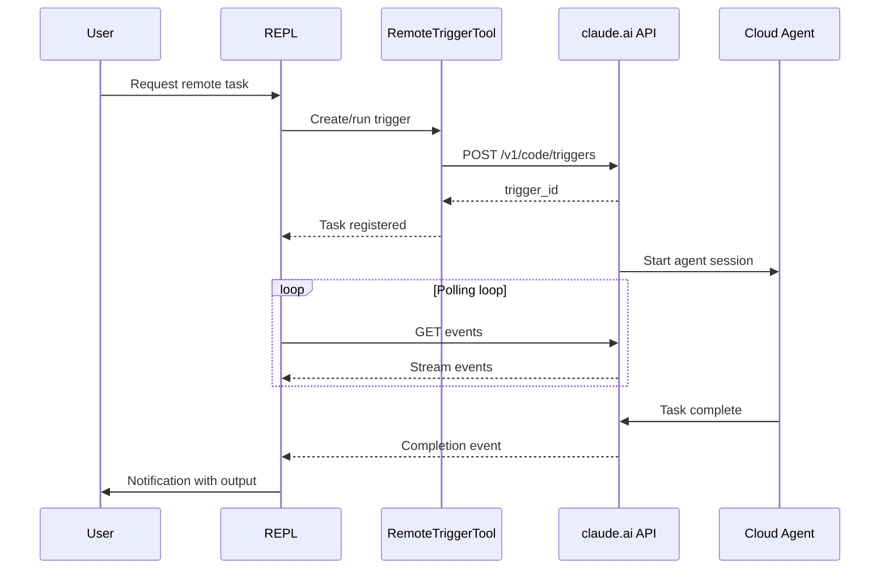
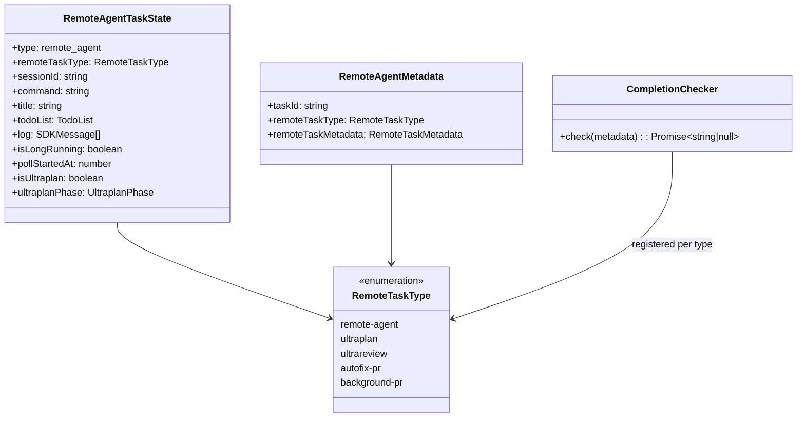

# Remote Agents and CCR Integration

## Overview

The remote agent system extends cc's multi-agent architecture into the cloud tier (HER Section 9.1, tier 3). While in-process subagents and forked subagents run on the local machine, remote agents execute on Anthropic's cloud infrastructure, communicating with the local parent session via polling-based coordination. The `RemoteTriggerTool` manages cloud-side agent definitions (triggers), and `RemoteAgentTask` tracks the lifecycle of a running remote session. This chapter covers the remote-trigger API, the polling-based event stream, and the integration patterns that bind a remote agent to its local parent.

The remote agent tier addresses a fundamental limitation of local execution: long-running tasks that require continuous compute cannot survive a laptop being closed or a network connection dropping. By executing in the cloud, remote agents decouple task lifetime from the user's terminal session, enabling multi-hour autonomous work that persists even when the local machine is offline. This directly addresses the METR task-sizing research (HER Section 10.2) which found that AI task duration doubles every ~7 months but that right-sized tasks should target 15-30 minutes. Remote agents allow a local session to dispatch multi-hour tasks to the cloud while the local session handles shorter, interactive work.

The remote agent system also enables a new class of use cases that are impossible with local-only execution: background PR creation (the agent creates and manages a pull request while the user continues working), long-running code reviews (the agent reads the entire PR diff and generates a structured review), and autonomous bug fixing (the agent identifies, fixes, and verifies a bug without human intervention). Each of these use cases requires hours of uninterrupted compute, which is impractical on a local machine that may be closed, disconnected, or repurposed at any time. The cloud execution environment provides a stable, always-on compute substrate that decouples task lifetime from the local machine's availability.

The remote agent system also confronts the checkpoint-restore side effects identified in HER Section 6.16 (ACRFence). When a local session restarts and reattaches to a running remote agent, the remote agent may have completed actions that the local session does not know about. The ACRFence paper identifies two attack classes -- Action Replay (replaying previously completed actions) and Authority Resurrection (reusing expired credentials) -- that are particularly relevant when a remote agent's state diverges from the local session's state. cc mitigates Action Replay through server-side trigger deduplication, and it mitigates Authority Resurrection by ensuring that OAuth tokens are refreshed on each poll tick rather than reused from a stale session state.

## Data structures and contracts

### RemoteTriggerTool input and output schemas

The `RemoteTriggerTool` provides a thin HTTP client wrapper around the claude.ai CCR (Cloud Compute Runtime) API. Its input schema maps directly to the REST API's CRUD operations:

```typescript
// src/tools/RemoteTriggerTool/RemoteTriggerTool.ts:L18-L31
const inputSchema = lazySchema(() =>
  z.strictObject({
    action: z.enum(['list', 'get', 'create', 'update', 'run']),
    trigger_id: z
      .string()
      .regex(/^[\w-]+$/)
      .optional()
      .describe('Required for get, update, and run'),
    body: z
      .record(z.string(), z.unknown())
      .optional()
      .describe('JSON body for create and update'),
  }),
)
```

The five actions map to REST API endpoints: `list` (GET /v1/code/triggers), `get` (GET /v1/code/triggers/{id}), `create` (POST /v1/code/triggers), `update` (POST /v1/code/triggers/{id}), and `run` (POST /v1/code/triggers/{id}/run). The `trigger_id` regex (`/^[\w-]+$/`) prevents injection attacks through the path parameter.

The output is a raw HTTP response envelope:

```typescript
// src/tools/RemoteTriggerTool/RemoteTriggerTool.ts:L35-L40
const outputSchema = lazySchema(() =>
  z.object({
    status: z.number(),
    json: z.string(),
  }),
)
```

The tool does not parse or validate the API response -- it passes the raw JSON through to the model. This design keeps the tool simple and resilient to API schema changes, at the cost of requiring the model to interpret the response structure. The `json` field is stringified (not a native object) because the tool result must be serializable across the IPC boundary for forked subagents.

### RemoteAgentTaskState type

The `RemoteAgentTaskState` tracks the full lifecycle of a running remote session, extending the base `TaskStateBase` with remote-specific fields:

```typescript
// src/tasks/RemoteAgentTask/RemoteAgentTask.tsx:L22-L59
export type RemoteAgentTaskState = TaskStateBase & {
  type: 'remote_agent';
  remoteTaskType: RemoteTaskType;
  remoteTaskMetadata?: RemoteTaskMetadata;
  sessionId: string;
  command: string;
  title: string;
  todoList: TodoList;
  log: SDKMessage[];
  isLongRunning?: boolean;
  pollStartedAt: number;
  isRemoteReview?: boolean;
  reviewProgress?: {
    stage?: 'finding' | 'verifying' | 'synthesizing';
    bugsFound: number;
    bugsVerified: number;
    bugsRefuted: number;
  };
  isUltraplan?: boolean;
  ultraplanPhase?: Exclude<UltraplanPhase, 'running'>;
};
```

The `remoteTaskType` field distinguishes between five remote task types:

```typescript
// src/tasks/RemoteAgentTask/RemoteAgentTask.tsx:L60-L61
const REMOTE_TASK_TYPES = ['remote-agent', 'ultraplan', 'ultrareview', 'autofix-pr', 'background-pr'] as const;
```

Each task type has different polling behavior and completion semantics. For example, `autofix-pr` tasks have a registered completion checker that monitors the PR state on GitHub, while `ultrareview` tasks track review progress with structured stage data (`finding`, `verifying`, `synthesizing`). The `isLongRunning` flag marks tasks that should not be marked as complete after the first result -- they continue running until explicitly stopped.

### RemoteAgentPreconditionResult

Before creating a remote agent, the system checks preconditions using `checkRemoteAgentEligibility()`:

```typescript
// src/tasks/RemoteAgentTask/RemoteAgentTask.tsx:L114-L119
export type RemoteAgentPreconditionResult = {
  eligible: true;
} | {
  eligible: false;
  errors: BackgroundRemoteSessionPrecondition[];
};
```

Precondition errors include: not logged in, no remote environment configured, not in a git repo, no GitHub remote, GitHub app not installed, and policy blocks. The `formatPreconditionError()` function at `src/tasks/RemoteAgentTask/RemoteAgentTask.tsx:L146-L161` provides human-readable guidance for each error type, with actionable URLs (e.g., the GitHub app installation page) where appropriate.

## Control flow

### Remote trigger API interaction

The `RemoteTriggerTool.call()` method implements a thin HTTP client that authenticates with the claude.ai OAuth token:

```typescript
// src/tools/RemoteTriggerTool/RemoteTriggerTool.ts:L78-L98
async call(input: Input, context: ToolUseContext) {
  await checkAndRefreshOAuthTokenIfNeeded()
  const accessToken = getClaudeAIOAuthTokens()?.accessToken
  if (!accessToken) {
    throw new Error(
      'Not authenticated with a claude.ai account. Run /login and try again.',
    )
  }
  const orgUUID = await getOrganizationUUID()
  if (!orgUUID) {
    throw new Error('Unable to resolve organization UUID.')
  }
  const base = `${getOauthConfig().BASE_API_URL}/v1/code/triggers`
  const headers = {
    Authorization: `Bearer ${accessToken}`,
    'Content-Type': 'application/json',
    'anthropic-version': '2023-06-01',
    'anthropic-beta': TRIGGERS_BETA,
    'x-organization-uuid': orgUUID,
  }
```

The `call()` method then dispatches based on the `action` field. The `list` and `get` actions map to HTTP GET requests; `create`, `update`, and `run` map to HTTP POST. Each `update` and `run` action appends a path segment (`/{trigger_id}` or `/{trigger_id}/run`) and requires `trigger_id`. The `create` and `update` actions pass the `body` parameter as request data. Note that the `mapToolResultToToolResultBlockParam()` method at `src/tools/RemoteTriggerTool/RemoteTriggerTool.ts:L152-L158` formats the result for the model as a plain-text block (`HTTP {status}\n{json}`), which is more token-efficient than the structured output returned to the terminal UI:

```typescript
// src/tools/RemoteTriggerTool/RemoteTriggerTool.ts:L100-L133
const { action, trigger_id, body } = input
let method: 'GET' | 'POST'
let url: string
let data: unknown
switch (action) {
  case 'list':
    method = 'GET'
    url = base
    break
  case 'get':
    if (!trigger_id) throw new Error('get requires trigger_id')
    method = 'GET'
    url = `${base}/${trigger_id}`
    break
  case 'create':
    if (!body) throw new Error('create requires body')
    method = 'POST'
    url = base
    data = body
    break
  case 'update':
    if (!trigger_id) throw new Error('update requires trigger_id')
    if (!body) throw new Error('update requires body')
    method = 'POST'
    url = `${base}/${trigger_id}`
    data = body
    break
  case 'run':
    if (!trigger_id) throw new Error('run requires trigger_id')
    method = 'POST'
    url = `${base}/${trigger_id}/run`
    data = {}
    break
}
```

After the switch, the method issues the HTTP request and returns the raw response:

```typescript
// src/tools/RemoteTriggerTool/RemoteTriggerTool.ts:L135-L151
const res = await axios.request({
  method,
  url,
  headers,
  data,
  timeout: 20_000,
  signal: context.abortController.signal,
  validateStatus: () => true,
})
return {
  data: {
    status: res.status,
    json: jsonStringify(res.data),
  },
}
```

The tool authenticates in-process -- the OAuth token never reaches the shell or any subprocess. This is a security-critical decision: passing tokens through shell environment variables or command-line arguments creates exfiltration vectors through compromised tools or hooks. The `anthropic-beta` header (`ccr-triggers-2026-01-30`) identifies the API version, and the `x-organization-uuid` header scopes the request to the user's organization.

The `validateStatus: () => true` configuration means that HTTP errors (4xx, 5xx) are returned as normal results rather than thrown as exceptions. This allows the model to interpret error responses and take corrective action, such as retrying with different parameters or informing the user about the error.

### Terminal rendering for trigger operations

The `RemoteTriggerTool`'s UI rendering is handled by `src/tools/RemoteTriggerTool/UI.tsx`, which provides two small rendering functions. `renderToolUseMessage()` displays the action and trigger ID (e.g., "create my-trigger") in the tool-use message bubble. `renderToolResultMessage()` shows the HTTP status code and a line-count summary (e.g., "HTTP 200 (12 lines)" with the count dimmed), so the user can see the response size at a glance without the full JSON flooding the terminal. The line count is computed by `countCharInString(output.json, '\n') + 1`, giving an approximate measure of the response complexity. This minimal rendering is intentional: remote trigger responses can be large (a `list` action may return dozens of triggers), and rendering the full JSON body would overwhelm the terminal. The model receives the complete JSON in its tool result, while the user sees only the status and size.

### Feature gating

The `RemoteTriggerTool` is gated behind two independent, orthogonal conditions that must both be satisfied at `src/tools/RemoteTriggerTool/RemoteTriggerTool.ts:L57-L62`:

```typescript
// src/tools/RemoteTriggerTool/RemoteTriggerTool.ts:L57-L62
isEnabled() {
  return (
    getFeatureValue_CACHED_MAY_BE_STALE('tengu_surreal_dali', false) &&
    isPolicyAllowed('allow_remote_sessions')
  )
},
```

The `tengu_surreal_dali` GrowthBook flag is the primary gate, and `isPolicyAllowed('allow_remote_sessions')` enforces enterprise policy restrictions. Organizations that disable remote sessions will have the tool hidden from the model entirely. The tool is also marked `isConcurrencySafe() { return true }` at `src/tools/RemoteTriggerTool/RemoteTriggerTool.ts:L63-L65`, meaning multiple remote trigger calls can run in parallel, and `isReadOnly()` returns true only for `list` and `get` actions at `src/tools/RemoteTriggerTool/RemoteTriggerTool.ts:L66-L69`.

### Remote agent task lifecycle

A remote agent task follows this lifecycle:

1. **Precondition check** -- The system verifies authentication, git repository, GitHub remote, GitHub app installation, and policy compliance via `checkRemoteAgentEligibility()` at `src/tasks/RemoteAgentTask/RemoteAgentTask.tsx:L124-L141`.

2. **Task registration** -- A `RemoteAgentTask` is registered with the task framework, generating a task ID and initial state. The `persistRemoteAgentMetadata()` function at `src/tasks/RemoteAgentTask/RemoteAgentTask.tsx:L92-L98` writes the metadata to the session sidecar for crash recovery.

3. **Trigger invocation** -- The `RemoteTriggerTool` creates or runs a trigger on the claude.ai API, starting a cloud-side agent session.

4. **Polling loop** -- The local session polls the remote agent's event stream using `pollRemoteSessionEvents()` from `src/utils/teleport.ts`. The poller tracks the remote session's messages, tool use blocks, and completion status.

5. **Completion detection** -- The poller detects task completion via explicit status messages or registered completion checkers. The `completionCheckers` map at `src/tasks/RemoteAgentTask/RemoteAgentTask.tsx:L78` stores type-specific checkers that are called on every poll tick.

6. **Notification** -- On completion, a task notification is enqueued for the user, including the output file path.



### Notification and output delivery

When a remote task completes, the system enqueues a notification using a structured XML format with typed tags:

```typescript
// src/tasks/RemoteAgentTask/RemoteAgentTask.tsx:L166-L183
function enqueueRemoteNotification(
  taskId: string, title: string,
  status: 'completed' | 'failed' | 'killed',
  setAppState: SetAppState, toolUseId?: string,
): void {
  if (!markTaskNotified(taskId, setAppState)) return
  const statusText = status === 'completed' ? 'completed successfully' :
    status === 'failed' ? 'failed' : 'was stopped'
  const outputPath = getTaskOutputPath(taskId)
  const message = `<${TASK_NOTIFICATION_TAG}>
<${TASK_ID_TAG}>${taskId}</${TASK_ID_TAG}>${toolUseIdLine}
<${TASK_TYPE_TAG}>remote_agent</${TASK_TYPE_TAG}>
<${OUTPUT_FILE_TAG}>${outputPath}</${OUTPUT_FILE_TAG}>
<${STATUS_TAG}>${status}</${STATUS_TAG}>
<${SUMMARY_TAG}>Remote task "${title}" ${statusText}</${SUMMARY_TAG}>
</${TASK_NOTIFICATION_TAG}>`
  enqueuePendingNotification({ value: message, mode: 'task-notification' })
}
```

The `markTaskNotified()` function at `src/tasks/RemoteAgentTask/RemoteAgentTask.tsx:L189-L200` atomically prevents duplicate notifications by setting a `notified` flag on the task state. If a task has already been notified, subsequent calls are no-ops. This handles the race condition where a poll tick and a user-initiated check both detect completion simultaneously. The atomicity is guaranteed by the `updateTaskState()` function, which uses a React-style state updater that serializes concurrent updates, ensuring that only one caller observes the `notified` flag as `false` and proceeds to enqueue the notification.

The XML-tagged format (using constants from `src/constants/xml.ts`) allows the notification system to parse and route the notification appropriately, including linking the user to the output file stored on disk.

### Completion checkers for external state

Some remote task types require checking external state to determine completion. The `registerCompletionChecker()` function allows task-specific checkers to be registered:

```typescript
// src/tasks/RemoteAgentTask/RemoteAgentTask.tsx:L77-L86
export type RemoteTaskCompletionChecker = (
  remoteTaskMetadata: RemoteTaskMetadata | undefined
) => Promise<string | null>

const completionCheckers = new Map<RemoteTaskType, RemoteTaskCompletionChecker>()

export function registerCompletionChecker(
  remoteTaskType: RemoteTaskType,
  checker: RemoteTaskCompletionChecker,
): void {
  completionCheckers.set(remoteTaskType, checker)
}
```

For example, an `autofix-pr` completion checker polls the GitHub API to see if the PR has been merged or closed. This external-state check complements the event-stream polling, which only tracks the agent's internal state, not the downstream effects of the agent's actions. The checker returns a non-null string to complete the task (the string becomes the notification text), or null to keep polling. Checkers that hit external APIs are expected to self-throttle.

### Metadata persistence across sessions

Remote agent metadata is persisted to the session sidecar so that restored sessions can reattach to running remote tasks:

```typescript
// src/tasks/RemoteAgentTask/RemoteAgentTask.tsx:L92-L98
async function persistRemoteAgentMetadata(meta: RemoteAgentMetadata): Promise<void> {
  try {
    await writeRemoteAgentMetadata(meta.taskId, meta)
  } catch (e) {
    logForDebugging(`persistRemoteAgentMetadata failed: ${String(e)}`)
  }
}
```

On session restore, the sidecar metadata is used to re-register the task and resume the polling loop. The `removeRemoteAgentMetadata()` function at `src/tasks/RemoteAgentTask/RemoteAgentTask.tsx:L105-L111` removes the metadata on task completion or kill, so restored sessions do not resurrect tasks that already finished. Without this persistence, a user restarting cc after a crash would lose track of running remote tasks.



### The review-progress tracking

For `ultrareview` tasks, the `reviewProgress` field tracks structured progress from the remote agent's heartbeat echoes:

```typescript
// src/tasks/RemoteAgentTask/RemoteAgentTask.tsx:L44-L50
  reviewProgress?: {
    stage?: 'finding' | 'verifying' | 'synthesizing';
    bugsFound: number;
    bugsVerified: number;
    bugsRefuted: number;
  };
```

This data is parsed from the orchestrator's `<remote-review-progress>` XML tags in the event stream, and surfaced in the pill badge and detail dialog status line. The three stages correspond to the review workflow: finding potential issues, verifying them against the code, and synthesizing the final report.

## Edge cases and failure modes

### Remote task types and their semantics

The five remote task types have distinct lifecycle semantics that go beyond simple "start and wait" patterns:

**remote-agent** is the generic type for cloud-side agent execution. The agent runs in a sandboxed cloud environment with its own filesystem, git repository clone, and tool suite. The local session polls for events and surfaces the agent's output when it completes. This type has no external completion checker -- completion is determined solely by the agent's event stream.

**ultraplan** is a specialized remote agent that runs an extended planning phase in the cloud. It is marked by the `isUltraplan` flag on the task state, and its `ultraplanPhase` field tracks the current phase (excluding the `'running'` phase, which is represented by the task being active rather than by a state field). The ultraplan agent can access the user's codebase and produce a comprehensive implementation plan without consuming local resources.

**ultrareview** runs a code review agent in the cloud. Its `reviewProgress` field at `src/tasks/RemoteAgentTask/RemoteAgentTask.tsx:L44-L50` tracks structured progress through three stages: `finding` (identifying potential issues), `verifying` (confirming issues against the code), and `synthesizing` (generating the final report). The three counters (`bugsFound`, `bugsVerified`, `bugsRefuted`) give the user real-time visibility into the review's coverage and accuracy. A high `bugsRefuted` count indicates that the finding stage is producing many false positives, which may warrant adjusting the review prompt.

**autofix-pr** is a remote agent that creates a pull request to fix a specific issue. Its completion checker monitors the PR state on GitHub: the task is complete when the PR is merged or closed, not when the agent finishes running. This external-state check bridges the gap between the agent's internal state and the real-world effects of its actions.

**background-pr** is similar to `autofix-pr` but runs as a background task without blocking the user's terminal session. The `isLongRunning` flag at `src/tasks/RemoteAgentTask/RemoteAgentTask.tsx:L40` is set to `true`, preventing the task from being marked as complete after the first result. The task continues running until explicitly stopped by the user or the system.

### Polling mechanics and the idle-REPL check

The local session's polling loop uses `pollRemoteSessionEvents()` from `src/utils/teleport.ts` to fetch events from the cloud agent. The polling frequency is governed by the REPL's idle state: events are fetched only when the REPL is not mid-query, which prevents the polling from interfering with the user's interactive work.

Although the brief mentions "websocket sessions," the current implementation uses a polling-based event stream rather than WebSocket connections. A WebSocket approach would push events from the cloud agent to the local session in real time, reducing latency and eliminating unnecessary API calls when the remote agent is idle. However, WebSocket connections require persistent bidirectional TCP connections, which introduces complexity: connection management (reconnect on network interruption, heartbeat timeouts), firewall traversal (some corporate networks block WebSocket upgrades), and server-side connection state (the CCR API would need to maintain per-session WebSocket channels). The polling model sidesteps all of these concerns at the cost of increased latency between event generation and delivery. For the current use case (background tasks that run for minutes to hours), the added latency of polling is acceptable, and the implementation simplicity is a significant advantage. A future evolution of the remote agent system could introduce WebSocket support for latency-sensitive task types (e.g., `ultrareview` where the user is watching progress in real time), using polling as a fallback when WebSocket connections fail.

The polling loop follows this sequence:

1. Check if the REPL is idle (no active model query in progress).
2. If idle, make an HTTP request to the CCR API to fetch new events since the last poll.
3. Parse the events and update the task state (log messages, tool use blocks, completion status).
4. If a completion checker is registered for the task type, call it to check external state.
5. If the task is complete, enqueue a notification and stop polling.
6. If the task is still running, wait for the next poll interval and repeat.

The `pollStartedAt` field at `src/tasks/RemoteAgentTask/RemoteAgentTask.tsx:L41` is critical for timeout calculations. It records when the local session started polling, not when the remote task was created. This distinction matters for restored sessions: if a remote task was created 30 minutes ago but the local session only started polling 5 minutes ago, the timeout should be computed from the 5-minute mark, not the 30-minute mark. Without this, a restored session would immediately time out any task that was spawned before the crash.

### The CCR API contract

The claude.ai CCR (Cloud Compute Runtime) API provides the server-side infrastructure for remote agent execution. The API follows a trigger-based model: a trigger defines an agent configuration (model, tools, repository), and running a trigger creates a new agent session.

The API's key endpoints are:

- `GET /v1/code/triggers` -- List all triggers for the organization
- `GET /v1/code/triggers/{id}` -- Get details of a specific trigger
- `POST /v1/code/triggers` -- Create a new trigger with a configuration body
- `POST /v1/code/triggers/{id}` -- Update an existing trigger's configuration
- `POST /v1/code/triggers/{id}/run` -- Execute a trigger, starting a cloud agent session

The `run` action is idempotent: the server tracks whether an agent session is already running for a given trigger, preventing duplicate invocations from a restored local session. This idempotency is the primary mitigation for the ACRFence Action Replay attack described in HER Section 6.16.

The `anthropic-beta` header value (`ccr-triggers-2026-01-30` at `src/tools/RemoteTriggerTool/prompt.ts`) identifies the API version. This beta header signals that the API is still evolving, and breaking changes may occur. The tool's raw-JSON response handling (returning `json: jsonStringify(res.data)` rather than a parsed object) is a deliberate resilience strategy: if the API response schema changes, the tool does not break -- the model receives a different JSON structure that it can adapt to.

The API's error semantics deserve attention. Because `validateStatus: () => true` disables axios's default error throwing, every HTTP response (including 4xx and 5xx) is returned as a structured result with a `status` code and `json` body. The model interprets the status code and error message from the JSON body to decide how to proceed. Common error scenarios include: 401 (token expired or invalid, requiring re-authentication via `/login`), 403 (organization does not have CCR access, a policy or billing issue), 404 (trigger ID not found, typically after the trigger was deleted), and 429 (rate limited, requiring a retry after the cooldown period). The model's ability to read and interpret these errors is a key advantage of the raw-JSON approach: a Zod-validated response schema would reject unexpected error formats, but the model can handle any well-formed JSON error response without code changes.

### Output file management

When a remote task completes, its output is stored on disk at a path computed by `getTaskOutputPath()`. The output file contains the agent's final result (plan text, review report, or diff summary) in a format that can be read by subsequent agent turns or by the user directly. The output is accumulated incrementally during the task's lifetime via `appendTaskOutput()`, which appends each new message or tool result to the file as it arrives from the polling stream. This incremental approach means that even if the task is killed before completion, the partial output is still available on disk.

The `OUTPUT_FILE_TAG` constant in the notification XML at `src/tasks/RemoteAgentTask/RemoteAgentTask.tsx:L166-L183` provides the path to the output file, allowing the notification system to link the user to the result. When the user clicks the notification, the terminal UI opens the output file in the user's preferred editor.

When a task is killed or fails, `evictTaskOutput()` removes the output file to prevent stale results from cluttering the filesystem. This cleanup is important for long-running tasks that may produce large intermediate output files: a `ultraplan` task can generate megabytes of planning text, and leaving these files on disk after the task is abandoned wastes storage.

The output file is also the mechanism by which the local session can continue the remote agent's work. After a remote `ultraplan` task completes, the local agent reads the plan file from the output path and proceeds with implementation. This handoff preserves the plan-then-execute discipline described in Chapter 45, even when the planning phase runs in the cloud. The `initTaskOutput()` function creates the output file at task registration time (before the first poll), ensuring that the path is available from the moment the task is created rather than only after the first result arrives.

### Session archiving and cleanup

When a remote task completes or is killed, the cloud-side session must be archived to free server resources. The `archiveRemoteSession()` function from `src/utils/teleport.ts` is called to signal the CCR API that the session is no longer needed. This is a housekeeping operation: the cloud agent has already stopped executing, but the session's event history and metadata remain on the server until explicitly archived. Without this cleanup, completed sessions would accumulate indefinitely on the server, consuming storage and making it harder to identify active sessions during debugging.

The archiving happens after the notification is enqueued, so the user receives the completion notification before the session is torn down. If the archiving call fails (e.g., due to a network error), the task still completes successfully on the local side. The server-side session will eventually be garbage-collected by the CCR platform's TTL policy. This "best effort" approach to cleanup avoids making the task lifecycle dependent on a network call that may fail, which is consistent with cc's broader strategy of tolerating partial failures in remote communication.

### Authentication failure during trigger invocation

The `RemoteTriggerTool` checks for authentication before making any API call at `src/tools/RemoteTriggerTool/RemoteTriggerTool.ts:L79-L87`. If the OAuth token is missing or expired, it throws an error with actionable guidance ("Run /login and try again"). The token refresh is handled by `checkAndRefreshOAuthTokenIfNeeded()`, which transparently refreshes expired tokens using the stored refresh token. The `orgUUID` check at `src/tools/RemoteTriggerTool/RemoteTriggerTool.ts:L88-L90` ensures that the user belongs to an organization with CCR access.

### Policy blocks on remote sessions

Enterprise organizations can disable remote sessions via the `allow_remote_sessions` policy limit. When this policy is active, the `RemoteTriggerTool` is hidden from the model entirely (`isEnabled()` returns `false`). The precondition checker at `src/tasks/RemoteAgentTask/RemoteAgentTask.tsx:L147-L161` provides a human-readable error: "Remote sessions are disabled by your organization's policy. Contact your organization admin to enable them." This is a compliance feature that cannot be bypassed by the model or the user.

### Checkpoint-restore side effects (ACRFence)

HER Section 6.16 identifies checkpoint-restore side effects as a critical failure mode for agent systems. The ACRFence paper (arXiv:2603.20625) describes two attack classes: Action Replay (replaying previously completed actions) and Authority Resurrection (reusing expired credentials). Remote agents are particularly vulnerable because they execute outside the user's direct control.

cc's remote agent system mitigates this through idempotency: the `run` action on a trigger is a stateless HTTP POST that the server can deduplicate. The trigger's server-side state tracks whether an agent session is already running for a given trigger, preventing duplicate invocations from a restored session. The `pollStartedAt` field at `src/tasks/RemoteAgentTask/RemoteAgentTask.tsx:L41` ensures that review timeout clocks are computed from the poll start time, not from the task's creation time, so a restored session does not immediately time out a task that was spawned 30 minutes ago.

### Network timeout and abort handling

The `RemoteTriggerTool` uses a 20-second timeout for API calls and respects the `context.abortController.signal` at `src/tools/RemoteTriggerTool/RemoteTriggerTool.ts:L141-L142`. If the user cancels the operation (e.g., by pressing Escape), the abort signal is propagated to the axios request, which cancels the HTTP connection. The `validateStatus: () => true` configuration ensures that even server errors (5xx) are returned as structured results rather than thrown exceptions, allowing the model to interpret and report the error.

### Completion checker self-throttling

The completion checkers registered via `registerCompletionChecker()` are called on every poll tick. The documentation at `src/tasks/RemoteAgentTask/RemoteAgentTask.tsx:L77` states that "checkers that hit external APIs should self-throttle" -- there is no framework-level rate limiting. This means that a poorly implemented checker could exceed API rate limits, but it also gives each checker the flexibility to choose its own throttling strategy based on the external API's constraints. The `remoteTaskMetadata` parameter provides the checker with the context it needs (e.g., the PR number for `autofix-pr` tasks) to make targeted API calls.

## Where cc diverges from the published pattern

HER Section 9.1 describes three tiers of multi-agent orchestration: in-process subagents, local orchestrators, and cloud async. cc implements all three, but the remote agent tier diverges in several ways:

1. **API-driven trigger management.** The HER pattern assumes that cloud agents are triggered through a generic message-passing system. cc uses a REST API (`/v1/code/triggers`) with specific CRUD operations (list, get, create, update, run), which is more structured but less flexible than a pure message-passing approach. The API's structured schema allows the tool to validate inputs before making the network call, reducing wasted API requests.

2. **Polling-based event stream.** The HER pattern implies a push-based event system where the cloud agent proactively notifies the local parent. cc uses a pull-based polling model where the local session periodically fetches events via `pollRemoteSessionEvents()`. This simplifies the cloud-side implementation (no WebSocket or webhook callback infrastructure) at the cost of increased latency and unnecessary API calls when the remote agent is idle.

3. **In-process authentication.** The HER pattern does not address authentication for cloud-to-local communication. cc's `RemoteTriggerTool` handles OAuth authentication entirely in-process at `src/tools/RemoteTriggerTool/RemoteTriggerTool.ts:L79-L98`, ensuring that the token never reaches the shell or any subprocess. This is a security-critical decision that prevents token exfiltration through compromised tools or hooks.

4. **Multiple remote task types with heterogeneous completion semantics.** The HER pattern assumes a single remote agent type. cc defines five remote task types at `src/tasks/RemoteAgentTask/RemoteAgentTask.tsx:L60-L61`, each with its own completion checker and state machine. This heterogeneity reflects the real-world diversity of autonomous coding tasks: an `autofix-pr` task completes when the PR is merged, while an `ultrareview` task completes when the report is generated.

5. **Review progress tracking.** The HER pattern does not address progress visibility for long-running remote tasks. cc's `reviewProgress` field at `src/tasks/RemoteAgentTask/RemoteAgentTask.tsx:L44-L50` provides structured stage data that is surfaced in the UI, giving the user real-time visibility into what the remote agent is doing.

## Developer takeaways for building a long-running agent

1. **Authenticate in-process, not through the shell.** The `RemoteTriggerTool`'s OAuth flow runs entirely within the agent process. Passing tokens through shell variables or command-line arguments creates exfiltration vectors. Use `checkAndRefreshOAuthTokenIfNeeded()` to handle token lifecycle transparently.

2. **Use polling when push is unavailable.** cc's pull-based model trades latency for implementation simplicity. The `pollStartedAt` field prevents false timeouts on restored sessions by basing timeout calculations on poll start time, not task creation time.

3. **Register type-specific completion checkers.** An `autofix-pr` task is complete when the PR is merged, not when the agent finishes. The `registerCompletionChecker()` pattern adds new completion semantics without modifying the core polling loop.

4. **Persist metadata for crash recovery.** Running remote tasks continue in the cloud after a local crash. `writeRemoteAgentMetadata()` at `src/tasks/RemoteAgentTask/RemoteAgentTask.tsx:L92-L98` allows restored sessions to reattach, preventing orphaned agents that consume cloud resources without a local observer.

5. **Gate remote execution behind policy, not just feature flags.** cc uses `isPolicyAllowed('allow_remote_sessions')` separately from the GrowthBook flag, ensuring policy restrictions take effect even when the feature flag is enabled.

6. **Design for idempotent trigger execution.** The ACRFence Action Replay attack (arXiv:2603.20625) is mitigated by server-side deduplication of the `run` action. Any remote-agent integration should include server-side deduplication, not just client-side guards.
