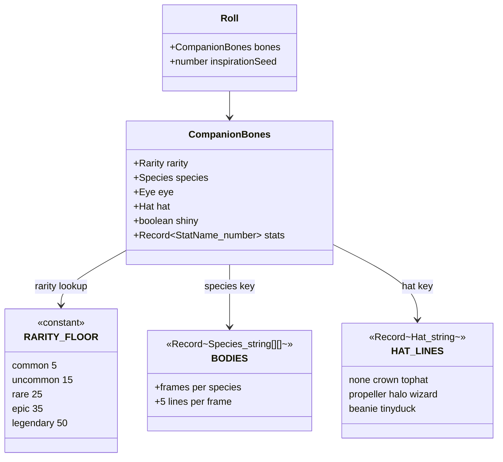
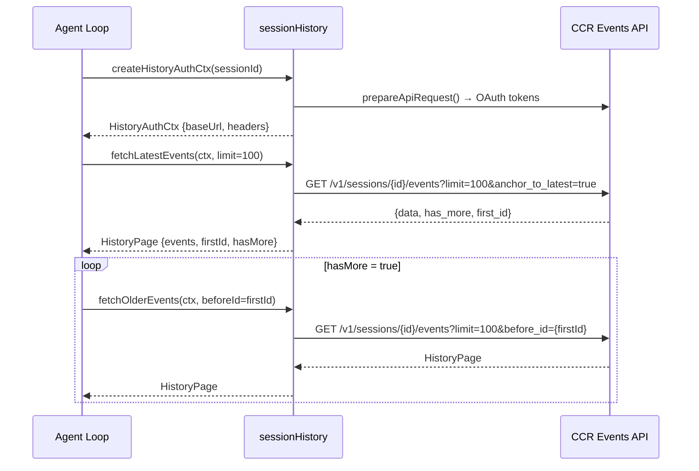

# KAIROS Assistant, Buddy, and Experimental Layers

## Overview

Not every subsystem in cc serves the core agent loop. Two feature-gated layers sit alongside the tool dispatch pipeline and query engine: the KAIROS assistant and the Buddy companion. The KAIROS assistant adds proactive, session-history-aware behavior through paginated API calls to the CCR backend. The Buddy subsystem is a Tamagotchi-style easter egg that renders ASCII sprites in the terminal, driven by deterministic seeded randomness from the user's identity. Both are feature-gated and exist behind `bun:bundle` feature flags, meaning external builds ship stub modules that compile to no-ops.

Beyond these two, cc carries other feature-gated experiments that follow the same pattern: compile-time elimination via `feature()` from `bun:bundle`, runtime degradation to a no-op when the flag is off, and zero-cost when disabled. The `ABLATION_BASELINE` flag disables thinking, compaction, auto-memory, and background tasks for controlled comparison experiments. GrowthBook gates like `tengu_iron_gate_closed` and `tengu_plan_mode_interview_phase` control runtime behavior without changing the bundle. This chapter focuses on KAIROS and Buddy as the two most architecturally complete experimental layers, but the pattern they establish -- feature gate, deterministic core, graceful degradation -- applies across all of cc's experimental surfaces.

These layers matter for harness engineering because they illustrate two important patterns: (1) proactive affordances that surface context before the user asks (HER Section 11's "confidence-based routing" and "context-rich escalation"), and (2) the UX warmth principle, where a long-running agent that feels alive and responsive reduces the over-trust risk described in HER Section 18. A terminal agent that stares silently for hours invites either blind trust or abandonment; a companion sprite that fidgets and an assistant that proactively loads relevant history both serve as continuous "I am here and processing" signals.

At first glance, the Buddy subsystem appears to be pure whimsy -- ASCII art ducks, cats, and dragons with randomly generated stats. But its design encodes several security-relevant decisions: determinism from user identity prevents gaming, bones are always re-derived (never stored) to prevent forgery, and the separation of cosmetic state from functional state ensures that a bug in sprite rendering cannot affect the agent's behavior. These are the same principles that govern safety-critical subsystems, applied at a much lower stakes level.

The KAIROS assistant, meanwhile, represents cc's most direct implementation of HER Section 11's "context-rich escalation" pattern. By proactively loading session history from the CCR backend, the assistant ensures that when the agent encounters a decision point, it already has prior context loaded rather than requiring the user to re-explain what happened in previous sessions. This is not the same as the "confidence-based routing" that HER Section 11.1 describes -- the assistant does not make routing decisions -- but it provides the information that would be needed for such routing.

## Data structures and contracts

The session history module defines the paged retrieval contract for the KAIROS assistant. Events are fetched from a CCR events endpoint using cursor-based pagination. Each page contains a chronologically-ordered list of SDK messages, a cursor for the next-older page, and a boolean indicating whether more events exist.

```typescript
// src/assistant/sessionHistory.ts:L9-L16
export type HistoryPage = {
  /** Chronological order within the page. */
  events: SDKMessage[]
  /** Oldest event ID in this page → before_id cursor for next-older page. */
  firstId: string | null
  /** true = older events exist. */
  hasMore: boolean
}
```

The `HistoryAuthCtx` type bundles the authentication context needed for all page fetches, avoiding redundant OAuth token requests on each page:

```typescript
// src/assistant/sessionHistory.ts:L25-L28
export type HistoryAuthCtx = {
  baseUrl: string
  headers: Record<string, string>
}
```

The authentication context is constructed via `createHistoryAuthCtx`, which calls `prepareApiRequest()` to obtain OAuth tokens and organization UUID (`src/assistant/sessionHistory.ts:L31-L43`). The resulting base URL points to the CCR session events endpoint, and headers carry the `anthropic-beta: ccr-byoc-2025-07-29` header for feature flagging.

The Buddy companion uses a seeded PRNG (`mulberry32`) to deterministically derive companion traits from the user's identity string. The `CompanionBones` type (imported from `./types.js`) carries the species, eye style, hat, rarity, and stat block. The `Roll` type wraps bones with an inspiration seed:

```typescript
// src/buddy/companion.ts:L86-L89
export type Roll = {
  bones: CompanionBones
  inspirationSeed: number
}
```

Rarity is rolled from weighted buckets, then stats are generated with one peak stat and one dump stat, the rarity floor setting the baseline. The `RARITY_FLOOR` constant defines minimum stat values per rarity tier:

```typescript
// src/buddy/companion.ts:L53-L59
const RARITY_FLOOR: Record<Rarity, number> = {
  common: 5,
  uncommon: 15,
  rare: 25,
  epic: 35,
  legendary: 50,
}
```

The stat rolling algorithm creates asymmetric distributions that make each companion feel unique while respecting the rarity floor:

```typescript
// src/buddy/companion.ts:L62-L82
function rollStats(
  rng: () => number,
  rarity: Rarity,
): Record<StatName, number> {
  const floor = RARITY_FLOOR[rarity]
  const peak = pick(rng, STAT_NAMES)
  let dump = pick(rng, STAT_NAMES)
  while (dump === peak) dump = pick(rng, STAT_NAMES)

  const stats = {} as Record<StatName, number>
  for (const name of STAT_NAMES) {
    if (name === peak) {
      stats[name] = Math.min(100, floor + 50 + Math.floor(rng() * 30))
    } else if (name === dump) {
      stats[name] = Math.max(1, floor - 10 + Math.floor(rng() * 15))
    } else {
      stats[name] = floor + Math.floor(rng() * 40)
    }
  }
  return stats
}
```

The `SALT` constant ensures that the hash input cannot be guessed from external knowledge of the user ID alone (`src/buddy/companion.ts:L84`). The companion's identity depends on both the user ID and this salt, meaning that a new version of cc with a different salt would generate different companions for the same users.

The persisted companion data is split into "soul" (stored in config) and "bones" (always re-derived). The `CompanionSoul` type carries the model-generated personality traits, while `StoredCompanion` is what actually goes into the global config:

```typescript
// src/buddy/types.ts:L110-L124
export type CompanionSoul = {
  name: string
  personality: string
}

export type Companion = CompanionBones &
  CompanionSoul & {
    hatchedAt: number
  }

// What actually persists in config. Bones are regenerated from hash(userId)
// on every read so species renames don't break stored companions and users
// can't edit their way to a legendary.
export type StoredCompanion = CompanionSoul & { hatchedAt: number }
```

This split ensures that the config file never stores rarity, species, or stats -- fields that could be edited to fake a "legendary" companion. Bones are always regenerated from the deterministic hash, overriding any stale values in the config.



## Control flow

The KAIROS session history flow follows a standard cursor-based pagination pattern. Authentication is prepared once via `createHistoryAuthCtx`, then pages are fetched using `fetchLatestEvents` (newest page anchored to the latest event) and `fetchOlderEvents` (cursor-based backward traversal).



The `fetchPage` helper is the core network function. It sends a GET request with a 15-second timeout and `validateStatus: () => true` to handle any HTTP status without throwing. If the response is not 200 or the request fails entirely, it returns `null` rather than throwing, allowing callers to gracefully handle network errors (`src/assistant/sessionHistory.ts:L45-L67`). The `HISTORY_PAGE_SIZE` constant of 100 events per page balances network efficiency against memory consumption for large sessions.

The Buddy companion generation flow is deterministic: the same user identity always produces the same companion. A hash of `userId + SALT` seeds the PRNG, and the result is cached in a module-level variable since the same user cannot change their own UUID mid-session. The `roll` function checks a module-level cache keyed on `userId + SALT` and returns the cached result if it matches:

```typescript
// src/buddy/companion.ts:L107-L113
export function roll(userId: string): Roll {
  const key = userId + SALT
  if (rollCache?.key === key) return rollCache.value
  const value = rollFrom(mulberry32(hashString(key)))
  rollCache = { key, value }
  return value
}
```

The `getCompanion` function merges freshly-derived bones with stored "soul" data from the global config. Bones never persist, so species renames and array edits cannot break stored companions, and editing the config's companion field cannot fake a rarity:

```typescript
// src/buddy/companion.ts:L127-L133
export function getCompanion(): Companion | undefined {
  const stored = getGlobalConfig().companion
  if (!stored) return undefined
  const { bones } = roll(companionUserId())
  return { ...stored, ...bones }
}
```

The sprite rendering in `sprites.ts` takes the bones and a frame index, substituting the `{E}` placeholder with the actual eye character. The `BODIES` record maps each species to an array of animation frames, each frame being an array of 5 strings (lines). Hats are overlaid on the first line only when the frame is not using it for its own effects:

```typescript
// src/buddy/sprites.ts:L454-L469
export function renderSprite(bones: CompanionBones, frame = 0): string[] {
  const frames = BODIES[bones.species]
  const body = frames[frame % frames.length]!.map(line =>
    line.replaceAll('{E}', bones.eye),
  )
  const lines = [...body]
  if (bones.hat !== 'none' && !lines[0]!.trim()) {
    lines[0] = HAT_LINES[bones.hat]
  }
  if (!lines[0]!.trim() && frames.every(f => !f[0]!.trim())) lines.shift()
  return lines
}
```

The hat system defines eight hat types, from `none` (no hat) to `tinyduck` (a small duck perched on the companion's head). Hats are only displayed when the companion's rarity is not `common` -- common companions always have `hat: 'none'` (`src/buddy/companion.ts:L97`). The `HAT_LINES` record maps each hat to a 12-character-wide string that replaces the blank first line of the sprite.

The sprite/gacha pipeline combines the deterministic bone-derivation with the rendering subsystem. A "gacha" pull is not random in the traditional sense -- it is entirely deterministic from `userId + SALT` -- but the weighted rarity buckets and the seeded PRNG produce the same visual effect as a gacha system: users discover their companion's rarity and species only after the first render. The following classDiagram shows the gacha pipeline from identity to rendered sprite:

```mermaid
classDiagram
    class companionUserId {
        +getGlobalConfig()
        +oauthAccount?.accountUuid
        +userID
        +anon
    }
    class hashString {
        +FNV-1a fallback
        +Bun.hash fast path
    }
    class mulberry32 {
        +seeded PRNG
        +32-bit state
    }
    class rollFrom {
        +rollRarity(rng)
        +pick(rng, SPECIES)
        +pick(rng, EYES)
        +pick(rng, HATS)
        +rollStats(rng, rarity)
    }
    class Roll {
        +CompanionBones bones
        +number inspirationSeed
    }
    class CompanionBones {
        +Rarity rarity
        +Species species
        +Eye eye
        +Hat hat
        +boolean shiny
        +Record~StatName_number~ stats
    }
    class renderSprite {
        +BODIES[species]
        +replaceAll {E} → eye
        +HAT_LINES[hat] overlay
        +height normalization
    }
    class StoredCompanion {
        +string name
        +string personality
        +number hatchedAt
    }
    class getCompanion {
        +roll(userId).bones
        +getGlobalConfig().companion
        +merge soul + bones
    }
    companionUserId --> hashString : identity string
    hashString --> mulberry32 : seed
    mulberry32 --> rollFrom : rng
    rollFrom --> Roll : gacha output
    Roll --> CompanionBones : .bones
    CompanionBones --> renderSprite : render
    StoredCompanion --> getCompanion : soul
    Roll --> getCompanion : bones override
    getCompanion --> CompanionBones : final merged
```

The `companionUserId` function resolves the user identity for companion generation, preferring the OAuth account UUID and falling back to the anonymous user ID:

```typescript
// src/buddy/companion.ts:L119-L122
export function companionUserId(): string {
  const config = getGlobalConfig()
  return config.oauthAccount?.accountUuid ?? config.userID ?? 'anon'
}
```

## Edge cases and failure modes

**KAIROS auth unavailability.** The `createHistoryAuthCtx` function calls `prepareApiRequest()`, which may fail if OAuth tokens are expired or the trust dialog has not been accepted. Interactive sessions without trust established will fail to create the auth context, and no history pages can be fetched. The assistant degrades gracefully: if no history is available, the agent proceeds without prior context, the same as a fresh session.

**API pagination errors.** The `fetchPage` helper uses `validateStatus: () => true` and `.catch(() => null)`, meaning any HTTP error or network failure returns `null` rather than throwing (`src/assistant/sessionHistory.ts:L45-L67`). Callers must handle `null` pages gracefully, treating them as "no more events available." This design ensures that a transient network blip does not crash the agent; it means the assistant has less prior context to work with.

**Buddy roll cache invalidation.** The `rollCache` is a module-level variable keyed on `userId + SALT`. If the user's OAuth account changes mid-session (e.g., login to a different org), `companionUserId()` will return a different UUID, but the stale cache entry remains until the process restarts. This is an acceptable tradeoff since the companion is cosmetic and user identity changes are rare.

**Determinism across builds.** The `SPECIES` and `EYES` arrays are defined in `./types.js`. If these arrays are reordered between builds, the same seed produces a different species/eye combination. The design compensates by separating "bones" (always re-derived) from "soul" (persisted in config), so a species rename never breaks stored companions. However, this means that cc must maintain backward compatibility in the types module: removing a species or changing its name would cause existing users to see different companions after an upgrade.

**Frame rendering height oscillation.** The `renderSprite` function drops the first line (hat slot) only when ALL frames for that species have a blank first line (`src/buddy/sprites.ts:L466-L467`). This prevents the rendered height from oscillating between frames when one frame uses line 0 for an effect (like the dragon's `~` smoke) and another does not. Without this check, the terminal display would jump by one line every time the animation frame changed.

**mulberry32 hash collision risk.** The `hashString` function uses FNV-1a hashing on platforms where `Bun.hash` is unavailable (`src/buddy/companion.ts:L27-L37`). FNV-1a is not cryptographically resistant to collision, but for companion generation (a cosmetic feature), hash collisions are acceptable. Two users with colliding hashes would receive the same companion, which is a minor aesthetic issue, not a security vulnerability.

## Where cc diverges from the published pattern

HER Section 11 describes "confidence-based routing" where the agent itself decides whether to proceed autonomously or escalate. The KAIROS assistant takes a different approach: it proactively loads session history before the user asks, but it does not make autonomous routing decisions. The loaded context is injected for the model to use, but the model (not the assistant) decides whether the context warrants action. This is a "sensor-only" pattern: the assistant observes and surfaces, but does not route.

HER Section 11.3 describes "async approval" where the agent parks a blocked action and continues with other work. The KAIROS assistant's history fetch is fully async and non-blocking, but it does not park actions -- it enriches context. There is no approval gate in the KAIROS flow; the assistant loads data unconditionally, and the model decides what to do with it.

HER Section 11.4 describes "context-rich escalation" where the agent provides full context when escalating to a human. The KAIROS assistant's session history feature directly supports this pattern by providing prior session context, but the assistant does not generate the escalation message itself -- it merely makes the information available.

HER Section 18 warns about the "Ouroboros problem" -- when both generator and evaluator are LLMs, who validates the validator? The Buddy subsystem sidesteps this entirely: its stat generation is deterministic (seeded PRNG, not LLM-judged), and the companion's behavior is purely cosmetic. No LLM is involved in any Buddy decision, making it immune to the generator-evaluator loop problem.

HER Section 18.3 describes the "stone soup attribution problem" where massive human labor gets misattributed to AI capability. The Buddy sprite's visible presence serves as a constant, low-key reminder that the agent is a tool, not a colleague. The randomly generated stats with names like DEBUGGING, CHAOS, and SNARK undercut any tendency to interpret the companion's behavior as meaningful intelligence.

However, the Buddy system also introduces a tension that HER Section 18 does not fully address: the over-trust risk of emotional attachment. A companion with persistent identity -- the same species, the same stats, the same hat across every session -- creates a parasocial bond. The user does not merely see an indicator light; they see *their* duck with *their* tophat, and this possessiveness ("my companion") is precisely the emotional hook that makes the feature effective as a presence signal. The `StoredCompanion` type in `src/buddy/types.ts:L110-L114` persists a user-chosen name and a model-generated personality alongside the `hatchedAt` timestamp, reinforcing this bond: the companion has a birthday, a name, and a disposition.

This is both a feature and a risk. On the feature side, a companion the user cares about reduces the likelihood of treating the agent as disposable -- users who name their companion are less likely to blindly `y` through permission prompts, because the companion's presence makes the session feel like a collaboration rather than a fire-and-forget transaction. On the risk side, parasocial attachment can invert: a user who feels warmly toward their companion may extend that warmth to the agent's *outputs*, giving undue weight to model suggestions because the companion makes the interaction feel trustworthy. HER Section 18.4 warns about limited applicability beyond coding, and this over-trust risk is a concrete instance: the emotional affordance that keeps users engaged in long-running coding sessions would be actively harmful in domains where the agent's suggestions should be treated skeptically.

cc's mitigation is subtle but deliberate: the stat names (DEBUGGING, CHAOS, SNARK) are explicitly tongue-in-cheek, the companion's fidget animation is intermittent rather than constant, and the companion has no influence on any agent decision. The companion cannot approve a tool call, cannot modify a file, and cannot route a query. It is purely a display-layer signal. This architectural decision -- cosmetic state strictly separated from functional state -- ensures that the emotional affordance exists only at the presentation layer and cannot leak into the decision layer.

Beyond KAIROS and Buddy, cc carries other feature-gated experimental layers that follow the same compile-time elimination pattern. The `ABLATION_BASELINE` flag, when enabled, disables thinking, compaction, auto-memory, and background tasks simultaneously, producing a stripped-down agent suitable for controlled comparison experiments. GrowthBook feature gates like `tengu_iron_gate_closed` and `tengu_plan_mode_interview_phase` control runtime behavior without changing the bundle: they are evaluated at query time through the GrowthBook SDK, and their effect is to enable or disable code paths that already exist in the binary. The distinction between `bun:bundle` feature flags (compile-time, zero-cost when off) and GrowthBook gates (runtime, minimal cost when off) is architecturally significant. Compile-time flags are appropriate for experimental subsystems that would add import cycles or bundle size; runtime flags are appropriate for behavioral toggles that may change between queries without a restart. This two-tier gating strategy allows cc to ship experimental code in production without affecting users who have not opted in, while still collecting metrics on the experiments that are enabled.

## Developer takeaways for building a long-running agent

1. **Deterministic-from-identity generation prevents gaming.** Bones are always re-derived from a seeded PRNG keyed on `userId + SALT`, so a user cannot edit their config to produce a "legendary" companion. Any cosmetic "roll" feature in a long-running agent should follow this pattern.

2. **Cursor-based pagination with null-return error handling is the right pattern for history APIs.** The `fetchPage` function's `validateStatus: () => true` and `.catch(() => null)` pattern means the agent loop never crashes on a network blip. Every external API call in a long-running agent must degrade gracefully.

3. **Feature-gated experimental layers must compile to zero cost when disabled.** Both KAIROS and Buddy use `bun:bundle` feature flags with dead-code elimination. When the feature is off, the code is not in the bundle. Experimental features must not add startup latency, bundle size, or import cycles when disabled. The same pattern applies to GrowthBook gates and ablation flags.

4. **Separate cosmetic state from functional state.** The Buddy subsystem's "bones vs soul" architecture ensures that visual/cosmetic data is always re-derived from a deterministic source while persistent data is stored separately. A bug in sprite rendering cannot corrupt the agent's functional state. For long-running agents, any auxiliary feature with both visual and functional components should maintain this separation.
