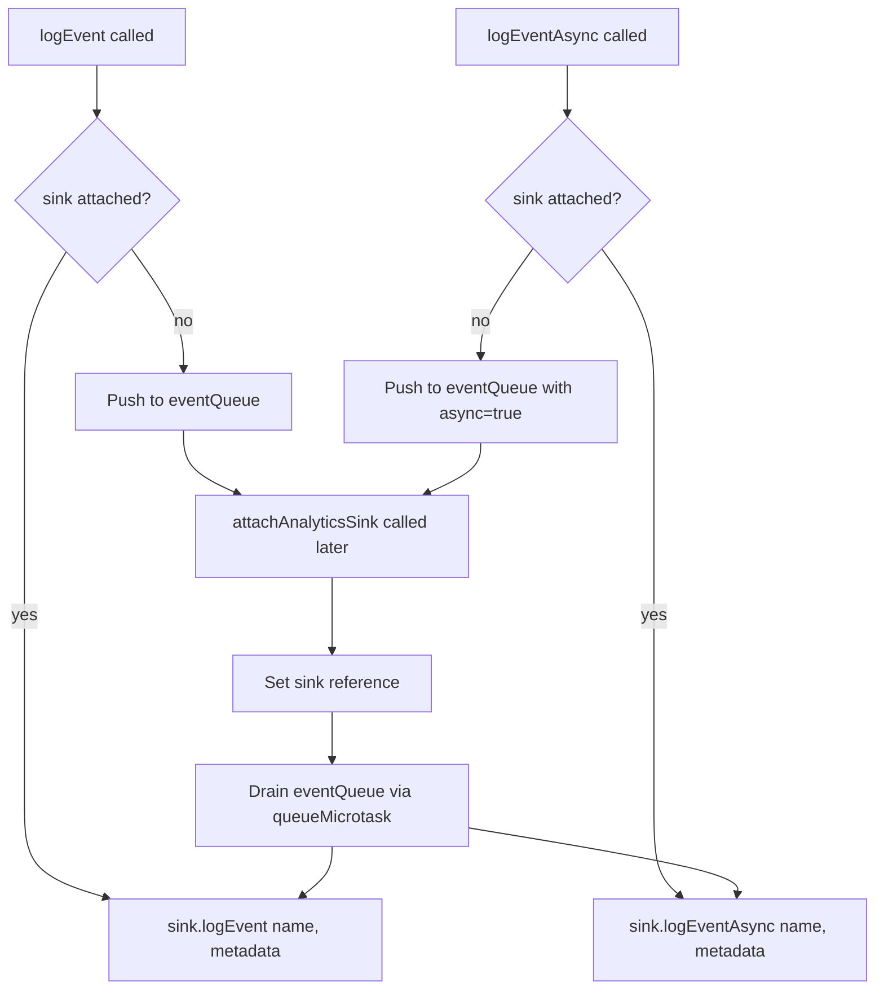
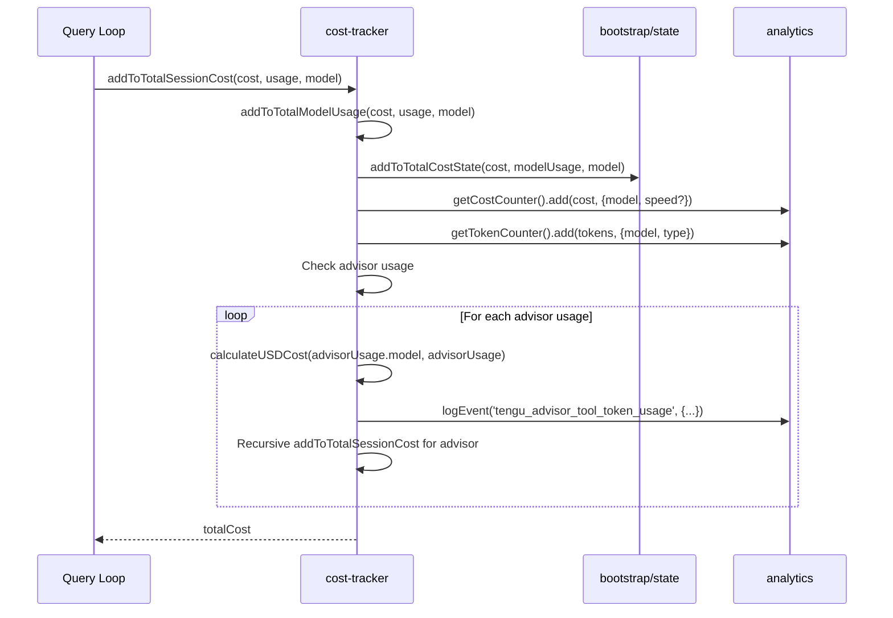
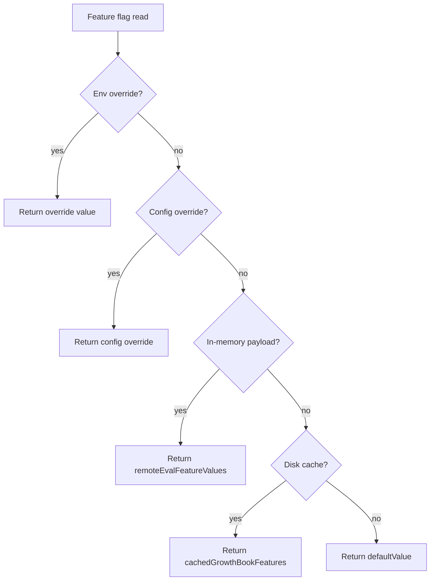

# Analytics, Cost Tracking, and GrowthBook

## Overview

A long-running agent without observability is a black box that silently burns tokens and money. But observability is not a single thing: there is a fundamental split between *observability for the operator* -- dashboards, logs, and cost displays that a human reads -- and *observability for the agent itself* -- feedback loops that let the harness adjust its own behavior based on accumulated metrics. cc implements the first thoroughly and the second barely at all. Understanding why this split exists, and what it costs, is the central architectural lesson of this chapter.

cc addresses observability through three tightly integrated subsystems: an analytics event pipeline (sink interface, queuing, and fanout to Datadog and first-party logging), a cost tracker that accumulates per-model token usage and USD cost across sessions, and a GrowthBook integration that provides feature-flag evaluation with disk-cached fallback and periodic refresh. These three subsystems share a common design philosophy: they degrade gracefully for human operators while offering no feedback path for the agent itself. Together, these subsystems implement the three pillars of agent observability described in HER Section 14 -- traces (via the analytics event pipeline), metrics (via cost tracking and token metering), and logs (via the debug logging system). They also address HER Section 13's cost management requirements: per-session cost caps, real-time token metering, and model-level cost breakdowns.

The analytics service is deliberately dependency-free to avoid import cycles. Events are queued until a sink is attached during app initialization, at which point queued events are drained asynchronously via `queueMicrotask`. The cost tracker bridges the analytics pipeline and the bootstrap state module, converting raw API usage objects into USD costs and per-model token counts. GrowthBook provides the feature-flag layer that gates kill switches, model routing, and experimental features -- all with disk-cached fallback so a network outage during startup does not disable the agent.

HER Section 13 warns that enterprise budgets underestimate AI agent total cost of ownership (TCO) by 40-60%. Per CIO research cited in the report, enterprise spending on AI agents ranges from $3,200 to $13,000 per month per agent. The success stories that dominate the narrative -- Geoffrey Huntley's $297 for a $50K contract, Anthropic's $200 for 6 hours of harness work -- represent optimal outcomes with expert human steering. The report advises budgeting 3-10x these figures for realistic multi-hour production use. cc's cost tracker provides the per-session visibility needed to move from anecdotal cost estimates to data-driven budgeting, though it does not enforce hard caps as HER recommends. The cost tracker's `addToTotalSessionCost` function is the primary accumulator, called after every API response. It breaks down costs by model name, token type (input, output, cache read, cache creation), and speed tier (fast mode). The `formatTotalCost` function displays this breakdown at session end, giving operators the per-model visibility needed for the "semantic routing" optimization described in HER Section 13.3.

## Data structures and contracts

The analytics sink interface is the core abstraction. Any backend (Datadog, first-party, console) implements two methods:

```typescript
// src/services/analytics/index.ts:L72-L78
export type AnalyticsSink = {
  logEvent: (eventName: string, metadata: LogEventMetadata) => void
  logEventAsync: (
    eventName: string,
    metadata: LogEventMetadata,
  ) => Promise<void>
}
```

The PII marker type enforces that string values in analytics metadata are explicitly verified before logging. This prevents accidentally including code snippets, file paths, or other sensitive data in events. The type resolves to `never`, so the only way to pass a string is to cast it with `as AnalyticsMetadata_I_VERIFIED_THIS_IS_NOT_CODE_OR_FILEPATHS`, which serves as an explicit acknowledgment:

```typescript
// src/services/analytics/index.ts:L11-L19
/**
 * Marker type for verifying analytics metadata doesn't contain sensitive data
 *
 * This type forces explicit verification that string values being logged
 * don't contain code snippets, file paths, or other sensitive information.
 *
 * Usage: `myString as AnalyticsMetadata_I_VERIFIED_THIS_IS_NOT_CODE_OR_FILEPATHS`
 */
export type AnalyticsMetadata_I_VERIFIED_THIS_IS_NOT_CODE_OR_FILEPATHS = never
```

The PII marker type is a social convention, not a hard security boundary. TypeScript's type system is erased at runtime: a developer who writes `someString as AnalyticsMetadata_I_VERIFIED_THIS_IS_NOT_CODE_OR_FILEPATHS` has not actually verified anything -- they have merely told the compiler to accept the value. The cast is an assertion, not a proof. In a code review, the cast's verbose name creates a moment of deliberate pause, which is its real value: it makes the decision to log a string value visible and attributable. But the pattern has no enforcement mechanism beyond code review. A stronger alternative would be a runtime allowlist: instead of a `never` type that forces a cast, the `LogEventMetadata` type could accept only a closed set of known-safe string keys (session IDs, model names, event names), with all other values rejected at runtime. This trades developer convenience for genuine safety. An even stronger approach would be a build-time linter rule that flags any `as AnalyticsMetadata_I_VERIFIED_THIS_IS_NOT_CODE_OR_FILEPATHS` cast and requires a corresponding code-review approval comment, turning the social convention into a mechanical gate. The current design is appropriate for cc's threat model (a small, trusted team writing the harness), but a harness used by third-party plugin authors would need the runtime allowlist approach.

A second PII marker type handles values routed to privileged BigQuery columns. The `stripProtoFields` function removes `_PROTO_*` keys before Datadog fanout, ensuring that privileged values never reach general-access backends. The function returns the input reference unchanged when no `_PROTO_` keys are present, avoiding unnecessary object allocation in the common case:

```typescript
// src/services/analytics/index.ts:L45-L58
export function stripProtoFields<V>(
  metadata: Record<string, V>,
): Record<string, V> {
  let result: Record<string, V> | undefined
  for (const key in metadata) {
    if (key.startsWith('_PROTO_')) {
      if (result === undefined) {
        result = { ...metadata }
      }
      delete result[key]
    }
  }
  return result ?? metadata
}
```

The cost tracker's `StoredCostState` type captures the full cost snapshot for session persistence and resume. The `modelUsage` field maps model names to per-model token counts and USD cost, enabling restoration of the cost display when a session is resumed:

```typescript
// src/cost-tracker.ts:L71-L80
type StoredCostState = {
  totalCostUSD: number
  totalAPIDuration: number
  totalAPIDurationWithoutRetries: number
  totalToolDuration: number
  totalLinesAdded: number
  totalLinesRemoved: number
  lastDuration: number | undefined
  modelUsage: { [modelName: string]: ModelUsage } | undefined
}
```

GrowthBook's user attributes type carries targeting information for feature flag evaluation. The attributes include platform, organization, subscription type, and rate limit tier:

```typescript
// src/services/analytics/growthbook.ts:L32-L47
export type GrowthBookUserAttributes = {
  id: string
  sessionId: string
  deviceID: string
  platform: 'win32' | 'darwin' | 'linux'
  apiBaseUrlHost?: string
  organizationUUID?: string
  accountUUID?: string
  userType?: string
  subscriptionType?: string
  rateLimitTier?: string
  firstTokenTime?: number
  email?: string
  appVersion?: string
  github?: GitHubActionsMetadata
}
```

The `LogEventMetadata` type constrains analytics values to `boolean | number | undefined`, deliberately excluding strings to prevent PII leaks. This type-level constraint also reveals an architectural boundary: cc's analytics pipeline is a one-way street. Events flow out to external sinks but no code path reads them back, making the pipeline *observational* (a human reads the output) rather than *reflexive* (the agent reads its own output and adjusts). A harness that needs to close this loop -- for example, to implement the alerting patterns from HER Section 14.4 -- would need a second internal subscriber layer alongside the existing external sink, with less restrictive metadata types and synchronous read access to the event stream:

```typescript
// src/services/analytics/index.ts:L61
type LogEventMetadata = { [key: string]: boolean | number | undefined }
```

The `QueuedEvent` internal type wraps each buffered event with an `async` flag so that the drain logic knows whether to call `logEvent` or `logEventAsync` for each queued item. This distinction matters because `logEventAsync` returns a `Promise<void>` that the sink implementation may use for batching or rate limiting, while `logEvent` is fire-and-forget (`src/services/analytics/index.ts:L63-L67`).

The `getStoredSessionCosts` function reads cost state from project config for a specific session. It checks whether the session ID matches the last saved session (`projectConfig.lastSessionId`), and if so, reconstructs the model usage map with context window information. If the session ID does not match, it returns `undefined`, indicating that no valid cost data is available for restoration (`src/cost-tracker.ts:L87-L123`). The `saveCurrentSessionCosts` function persists the full cost snapshot to project config, including per-model token counts, cache statistics, and web search request counts. This persistence enables cost restoration when a session is resumed (`src/cost-tracker.ts:L143-L175`).

The `processRemoteEvalPayload` function in GrowthBook handles a critical SDK workaround. The GrowthBook API returns feature definitions in `{ "value": ... }` format, but the SDK expects `{ "defaultValue": ... }`. The transformation loop at `src/services/analytics/growthbook.ts:L347-L376` rewrites each feature definition, moving `value` to `defaultValue` when the latter is absent. The function also stores experiment data (experiment ID, variation ID) for later exposure logging when the feature is accessed. After transformation, the function caches the evaluated values in `remoteEvalFeatureValues` -- a Map that serves as a reliable cache bypassing the SDK's own `evalFeature()` method, which attempts to re-evaluate rules locally and ignores the pre-evaluated `value` from remote eval (`src/services/analytics/growthbook.ts:L382-L393`).

## Control flow

The analytics event flow follows a queue-then-drain pattern. Events logged before the sink is attached are buffered in an in-memory array. When `attachAnalyticsSink` is called during startup, queued events are drained via `queueMicrotask` to avoid blocking the startup path. The `attachAnalyticsSink` function is idempotent: if a sink is already attached, subsequent calls are no-ops. This allows calling from both the preAction hook (for subcommands) and setup() (for the default command) without coordination (`src/services/analytics/index.ts:L95-L98`):



The cost tracking flow converts raw API `Usage` objects from the Anthropic SDK into accumulated per-model costs. The `addToTotalSessionCost` function is the central entry point, called after every API response:



The `addToTotalSessionCost` function demonstrates how cost accumulation feeds both state and analytics. The function first accumulates per-model token counts (input, output, cache read, cache creation, web search), then feeds cost and token counters to the analytics pipeline with model and speed attributes. The `isFastModeEnabled()` check ensures that fast-mode invocations are tagged with a `speed: 'fast'` attribute, allowing downstream analytics to separate fast-mode costs from normal-mode costs per model:

```typescript
// src/cost-tracker.ts:L278-L301
export function addToTotalSessionCost(
  cost: number,
  usage: Usage,
  model: string,
): number {
  const modelUsage = addToTotalModelUsage(cost, usage, model)
  addToTotalCostState(cost, modelUsage, model)

  const attrs =
    isFastModeEnabled() && usage.speed === 'fast'
      ? { model, speed: 'fast' }
      : { model }

  getCostCounter()?.add(cost, attrs)
  getTokenCounter()?.add(usage.input_tokens, { ...attrs, type: 'input' })
  getTokenCounter()?.add(usage.output_tokens, { ...attrs, type: 'output' })
  getTokenCounter()?.add(usage.cache_read_input_tokens ?? 0, {
    ...attrs,
    type: 'cacheRead',
  })
  getTokenCounter()?.add(usage.cache_creation_input_tokens ?? 0, {
    ...attrs,
    type: 'cacheCreation',
  })
```

The `addToTotalModelUsage` function accumulates per-model token counts. For each API response, it reads the existing model usage from `getUsageForModel(model)`, adds the new token counts (input, output, cache read, cache creation, web search), and updates the context window and max output tokens for the model. The context window and max output tokens are read from `getContextWindowForModel` and `getModelMaxOutputTokens` respectively, ensuring that the cost display always shows the correct model configuration even when models are updated between sessions (`src/cost-tracker.ts:L250-L276`). The web search request count is extracted from `usage.server_tool_use?.web_search_requests` using optional chaining, since this field is not present in all API responses.

The GrowthBook feature flag lifecycle shows how feature values are resolved with multiple fallback layers. The resolution order is: environment variable overrides (for eval harnesses), config overrides (for ant-only /config Gates tab), in-memory payload (from the most recent successful fetch), disk cache (from a previous process's sync), and finally the default value:



GrowthBook initialization is gated on 1P event logging being enabled. The client is created with `remoteEval: true` so the server pre-evaluates feature flags. The `cacheKeyAttributes` setting ensures that when the user ID or organization changes (e.g., login to a different org), the client re-fetches feature values rather than serving stale ones. The `thisClient` local variable captures the client instance so the init callback operates on the correct client even if reinitialization happens before init completes:

```typescript
// src/services/analytics/growthbook.ts:L526-L545
const thisClient = new GrowthBook({
  apiHost: baseUrl,
  clientKey,
  attributes,
  remoteEval: true,
  // Re-fetch when user ID or org changes (org change = login to different org)
  cacheKeyAttributes: ['id', 'organizationUUID'],
  // Add auth headers if available
  ...(authHeaders.error
    ? {}
    : { apiHostRequestHeaders: authHeaders.headers }),
  // Debug logging for Ants
  ...(process.env.USER_TYPE === 'ant'
    ? {
        log: (msg: string, ctx: Record<string, unknown>) => {
          logForDebugging(`GrowthBook: ${msg} ${jsonStringify(ctx)}`)
        },
      }
    : {}),
})
```

The periodic refresh interval differs between ant and external users. Ant users refresh every 20 minutes (to catch kill switch changes quickly), while external users refresh every 6 hours (matching Statsig's historical interval). The `setupPeriodicGrowthBookRefresh` function registers the interval with `.unref()` so the timer does not prevent process exit:

```typescript
// src/services/analytics/growthbook.ts:L1012-L1017
const GROWTHBOOK_REFRESH_INTERVAL_MS =
  process.env.USER_TYPE !== 'ant'
    ? 6 * 60 * 60 * 1000 // 6 hours
    : 20 * 60 * 1000 // 20 min (for ants)
```

The `checkGate_CACHED_OR_BLOCKING` function implements a fallback-to-blocking pattern for user-invoked features: if the disk cache says `true`, return immediately; if it says `false` or is missing, block on GrowthBook init (up to 5 seconds) to fetch the fresh server value. This prevents a stale `false` from unfairly blocking access while accepting that a stale `true` is tolerable since the server is the real gatekeeper (`src/services/analytics/growthbook.ts:L904-L935`).

The `checkSecurityRestrictionGate` function provides a blocking path for security-critical gates. It checks Statsig cache first (because a cached `true` for a security gate is safer than a stale `false`), then GrowthBook cache. If GrowthBook is re-initializing (e.g., after an auth change), the function waits for the reinit to complete before returning, ensuring that fresh auth state is reflected in security gate evaluations (`src/services/analytics/growthbook.ts:L851-L889`). This function is used for gates where returning a stale `false` could create a security vulnerability (e.g., allowing access to features that should be restricted for a logged-out user).

## Edge cases and failure modes

These edge cases reveal a pattern: cc's observability subsystems are designed to degrade gracefully for the *operator* (events are buffered, costs are advisory, flags fall back to cache) but they offer no graceful degradation path for the *agent itself*. A harness that uses its own metrics to modulate behavior would need different failure semantics -- for example, a cost counter that the query loop polls synchronously, rather than an event logger that only writes to external sinks.

**Event queue overflow before sink attachment.** The analytics queue is an unbounded array (`eventQueue: QueuedEvent[]`). If the sink is never attached (e.g., a crash during initialization), events accumulate in memory indefinitely. In practice, the sink is attached within the first few hundred milliseconds of startup, so this is a theoretical concern. However, for long-running agents that initialize sinks lazily, an unbounded queue is a memory leak risk. The `attachAnalyticsSink` function logs the queue size for ant users (`sink.logEvent('analytics_sink_attached', { queued_event_count: queuedEvents.length })`) to help debug timing issues (`src/services/analytics/index.ts:L107-L111`).

**GrowthBook operational edge cases.** GrowthBook's lifecycle introduces several failure modes that all resolve through the same fallback pattern: degrade to disk cache, then to default values. The client initialization has a 5-second timeout (`src/services/analytics/growthbook.ts:L554`); on timeout, the agent falls back to disk-cached feature values from a previous process. The API sometimes returns `{ "value": ... }` instead of the SDK-expected `{ "defaultValue": ... }`, which the `processRemoteEvalPayload` function transforms (`src/services/analytics/growthbook.ts:L347-L356`). An empty payload is guarded against: the `Object.keys(payload.features).length === 0` check prevents a transient server bug from clearing the disk cache and causing total flag blackout (`src/services/analytics/growthbook.ts:L338`). When `refreshGrowthBookAfterAuthChange` is called after login, it destroys the old client and creates a new one; the `reinitializingPromise` variable tracks the in-flight reinit so that `checkSecurityRestrictionGate` can await it rather than returning a stale value (`src/services/analytics/growthbook.ts:L870-L872`). The `loggedExposures` set prevents firing duplicate exposure events when `getFeatureValue_CACHED_MAY_BE_STALE` is called in hot paths like render loops (`src/services/analytics/growthbook.ts:L89`). The `CLAUDE_INTERNAL_FC_OVERRIDES` environment variable allows overriding feature values for evaluation harnesses (active only when `USER_TYPE === 'ant'`). The `onGrowthBookRefresh` signal system includes a catch-up mechanism: if init has already completed when a listener is registered, the listener fires on the next microtask, handling the race where the network response lands before the REPL mounts (`src/services/analytics/growthbook.ts:L144-L151`). The `resetGrowthBook` function performs complete teardown (stops refresh, destroys client, clears all maps, invalidates promises) to prevent memory leaks on auth changes (`src/services/analytics/growthbook.ts:L987-L1010`). Trust gating on the `getGrowthBookClient` factory prevents executing `apiKeyHelper` commands before the workspace trust dialog, which could expose credentials in an untrusted workspace (`src/services/analytics/growthbook.ts:L514-L521`). All of these edge cases share the same architectural principle: the feature flag subsystem never blocks the agent's core functionality, because every code path has a fallback that preserves operability even when GrowthBook is unavailable.

**Cost state restoration across sessions.** The `restoreCostStateForSession` function only restores costs if the session ID matches the last saved session (`src/cost-tracker.ts:L93`). If the user resumes an older session (not the most recent one), cost state is not restored and the session starts from zero. This is a deliberate choice: cost data is advisory, not authoritative, and stale cost data from a different session is worse than no cost data. The `setCostStateForRestore` function in the bootstrap state module overwrites the accumulated cost state with the restored values, including per-model usage maps. When the model usage is reconstructed, each entry is enriched with `contextWindow` and `maxOutputTokens` from the model metadata, since these values are not stored in the project config (`src/cost-tracker.ts:L97-L109`).

**Advisor recursive cost.** The `addToTotalSessionCost` function recursively calls itself for each advisor usage (`src/cost-tracker.ts:L316-L321`). If an advisor usage itself triggers an advisor (a theoretical possibility with nested model calls), this could produce deep recursion. In practice, the advisor chain is bounded, but the lack of an explicit depth guard is a latent risk. The `getAdvisorUsage` function from `src/utils/advisor.ts` extracts advisor usage from the main API response, and each extracted usage is costed separately with its own model and token counts.

**Event sampling configuration.** Events may be sampled based on the `tengu_event_sampling_config` dynamic config from GrowthBook (`src/services/analytics/index.ts:L128`). When sampled, the sample rate is added to the event metadata. This allows the analytics team to reduce event volume for high-frequency events without changing the code, by configuring a sample rate in the GrowthBook dashboard. For long-running agents, event sampling is essential to prevent analytics pipelines from being overwhelmed by high-volume events like per-keystroke typeahead or per-frame render updates.

**Cost model canonicalization.** The `formatModelUsage` function aggregates token usage by canonical model name using `getCanonicalName`. This is necessary because the same model may be referenced by different identifiers (e.g., `claude-3-5-sonnet-20241022` and `claude-3-5-sonnet-latest` are the same model). Without canonicalization, the same model's usage would be split across multiple entries in the display, making it harder for operators to assess total cost per model tier (`src/cost-tracker.ts:L181-L226`). The `formatCost` helper adjusts decimal precision based on the magnitude of the cost: costs above $0.50 are displayed with 2 decimal places, while smaller costs use 4 decimal places, avoiding the display of meaningless precision for tiny per-turn costs (`src/cost-tracker.ts:L177-L179`).

**Cost tracker failure and miscount scenarios.** The cost tracker has no error recovery path when it produces incorrect numbers. If `addToTotalSessionCost` receives a malformed `Usage` object (e.g., negative token counts from a bug in the SDK's cache accounting, or `NaN` from a failed JSON parse), the function adds the malformed values to the running totals without validation. There is no range check, no `isNaN` guard, and no circuit breaker that detects implausible cost jumps. The downstream effect is that `formatTotalCost` may display a nonsensical cost (e.g., -$3.42 or $Infinity), and the persisted `StoredCostState` in project config will carry the corrupted values forward into the next session. The architectural reason for the absence of validation is that the cost tracker trusts the Anthropic SDK's `Usage` type to be well-formed, and adding per-field validation would couple the cost tracker to the SDK's version-specific field semantics. A more robust design would validate at the boundary: `addToTotalSessionCost` should check that `cost >= 0` and that all token counts are non-negative integers before accumulating, rejecting malformed responses with a warning event. Additionally, the cost tracker's `getCostCounter()?.add(cost, attrs)` call uses optional chaining, meaning that if the analytics counter is not yet initialized, the cost is accumulated in state but not reported to analytics -- creating a silent gap between the displayed cost and the cost visible in the Datadog dashboard. This gap is not surfaced to the operator.

## Where cc diverges from the published pattern

The central tension in cc's observability architecture is this: cc builds observability *for the operator* (a human watching a terminal), not observability *for the agent itself* (a feedback loop that changes behavior). HER prescribes both; cc provides only the first. Understanding why reveals the architectural constraints that a next-generation harness must overcome.

HER Section 14 describes three pillars: traces, metrics, and logs. cc implements all three but organizes them differently than the report suggests. Traces in cc are not distributed-tracing spans (OpenTelemetry style) but individual analytics events (`tengu_*` event names) that are correlated post-hoc by session ID. There is no span propagation or trace context. The reason is architectural: cc's analytics pipeline was designed as a fire-and-forget event logger for Datadog and first-party ingestion. Adding span context would require threading a trace ID through every tool call, sub-agent dispatch, and model invocation -- a cross-cutting concern that touches every module in the codebase. For a single-process terminal agent, post-hoc correlation by session ID is sufficient; for multi-agent distributed systems (Chapter 21's swarm layer, Chapter 48's remote agents), a proper tracing implementation would be needed. The `tengu_*` event names already encode enough structure (e.g., `tengu_tool_call`, `tengu_query_start`) that a downstream pipeline could reconstruct spans, but cc itself never reads them back.

HER Section 13.2 describes a "cost control architecture" with per-task cost caps, per-session cost caps, per-hour spend rate alerts, and a dead-letter queue. cc implements per-session cost tracking and display but does not enforce hard cost caps that terminate the session. The `formatTotalCost` function displays accumulated costs at session end (`src/cost-tracker.ts:L228-L244`), but there is no programmatic `if cost > cap then halt` check in the query loop. The constraint here is the partial-work problem: a hard cost cap that kills the agent mid-task may leave the codebase in an inconsistent state -- half-written files, uncommitted changes, a git worktree left behind. cc's design prioritizes leaving the workspace in a recoverable state over enforcing budget limits. The `tokenBudget` system in Chapter 10 provides a softer form of control: it reduces model capability (switching to a cheaper model or reducing thinking budget) rather than terminating the session, which is a more graceful degradation path. But this only addresses context overflow, not cost accumulation. A true cost-control architecture would need to negotiate with the tool dispatch pipeline (Chapter 12) to pause expensive operations and checkpoint state before terminating -- a feature cc does not have.

HER Section 13.3 describes "semantic routing" (route simple tasks to cheap models). cc implements this through the effort/token budget system and model selection logic (covered in Chapter 10), but the analytics pipeline described in this chapter does not drive routing decisions. The analytics events are write-only; no code path reads analytics events to change model selection or tool behavior. This is a deliberate architectural boundary: cc's cost counter and token counter feed into the state module (`src/state/AppStateStore.ts`) as numeric accumulators, not into the analytics pipeline as event streams. The reason is that analytics events are batched and sent to external services with second-scale latency; routing decisions need microsecond latency. A harness that closed this loop would need an in-process metrics store (not a remote event logger) that the query loop could query synchronously before each model invocation.

HER Section 13.4 recommends tracking "cost-per-completed-task" and "cost-per-quality-unit" rather than cost-per-token alone. cc's `formatModelUsage` function aggregates token usage by canonical model name (`src/cost-tracker.ts:L181-L226`), enabling operators to compare the cost efficiency of different model configurations. But cc does not track task completion quality or correlate cost with outcomes. The architectural reason is that cc has no canonical definition of "task completed." The TodoWrite tool (Chapter 17) lets the agent track its own tasks, but these are self-reported and not ground-truth verified. Building such a pipeline would require either a verifier agent (expensive) or integration with CI systems (external dependency), neither of which fits cc's local-first, single-process model.

HER Section 14.4 describes "alerting patterns" including loop detection, context rot signals, cost spike detection, and staleness detection. cc does not implement any of these as automated alerts. The analytics pipeline logs events that *could* be used for alerting, but the alerts themselves are not generated in-process. This is consistent with cc's terminal-agent model: there is no dashboard, and the human operator is the alerting system. However, this creates a blind spot for long-running agents (Chapter 47's cron tasks, Chapter 24's dream tasks) that operate without a human watching. The `stopHooks` mechanism in Chapter 7 provides a limited form of loop detection (detecting repeated identical tool calls), but it does not detect the subtler patterns HER describes: semantic similarity of tool calls (context rot), spend velocity anomalies, or prolonged lack of git activity. Adding in-process alerting would require a separate monitoring loop that reads the analytics event stream -- but the current write-only architecture makes this impossible without refactoring the pipeline to support internal subscribers.

HER Section 14.2 identifies "the observability gap": agents fail silently because their response format looks correct. A 200 OK from a tool call does not mean the operation succeeded semantically. cc's cost tracker partially addresses this for cost-related failures (accumulating real USD costs regardless of tool-call success), but it does not address the broader observability gap for semantic correctness. The `tengu_*` events log tool calls and results, but there is no automated pipeline that evaluates whether a tool result achieved its intended effect. The `_PROTO_*` key convention and `stripProtoFields` fanout guard generalize to any system with multi-destination logging at different access levels, but they only control data routing, not data quality. Closing the observability gap would require either a verifier agent (expensive, and subject to the Ouroboros problem from Chapter 21) or deterministic post-condition checks on tool results (architecturally intrusive, requiring changes to every tool's return type).

**Closing the loop: an in-process metrics bus design.** The architectural lesson from cc's write-only analytics pipeline is that observability-for-the-agent requires a fundamentally different data structure than observability-for-the-operator. cc's `AnalyticsSink` interface is asynchronous and fan-out: events are sent to external services with second-scale latency, and no code path reads them back. A harness that needs to close the feedback loop -- for cost control, loop detection, or adaptive routing -- would need an in-process metrics bus with the following properties. First, the bus must be synchronous: the query loop must be able to read a metric (e.g., `currentSpendRate()`) without yielding to the event loop, because routing decisions happen on the hot path between receiving a model response and dispatching the next tool call. Second, the bus must support sliding-window aggregation: the query loop needs to ask "how much have I spent in the last 5 minutes?" not "how much have I spent total?" which requires a ring buffer or exponential decay accumulator, not a simple counter. Third, the bus must support threshold subscribers: the query loop should not poll the bus; instead, the bus should invoke a callback when a metric crosses a threshold (e.g., spend rate exceeds $2/minute), enabling the query loop to switch models or pause tool dispatch reactively. Fourth, the bus must coexist with the existing write-only pipeline: cc's `logEvent` calls should continue to fan out to Datadog unchanged, while a parallel `MetricsBus` instance feeds both the external sinks and the internal threshold subscribers. This coexistence can be achieved by having `attachAnalyticsSink` also attach the metrics bus as a subscriber, so every event published to the sink is also published to the bus. The key implementation detail is that the bus subscriber must be called synchronously before the external sink fan-out, so that threshold callbacks execute before the next event is processed. This design is the minimum viable extension to cc's current architecture: it adds a read path to the existing write-only pipeline without refactoring any call sites, because the bus subscribes at the sink attachment point rather than replacing the `logEvent` function signature.

## Developer takeaways for building a long-running agent

The key lesson is the distinction between observability-for-operators and observability-for-the-agent. cc provides the first (event logging, cost display, feature flags) but not the second (in-process alerting, closed-loop cost control, outcome correlation). A harness that runs unattended for hours must close this gap: the analytics pipeline must support internal subscribers, not only external sinks, so the agent can react to its own metrics. The most important design decision is whether to build a write-only event pipeline (simpler, cc's approach) or a read-write metrics bus (more complex, but necessary for closed-loop control) -- and to make that decision before the first event is logged, because retrofitting internal subscribers onto a write-only pipeline requires refactoring every call site.
