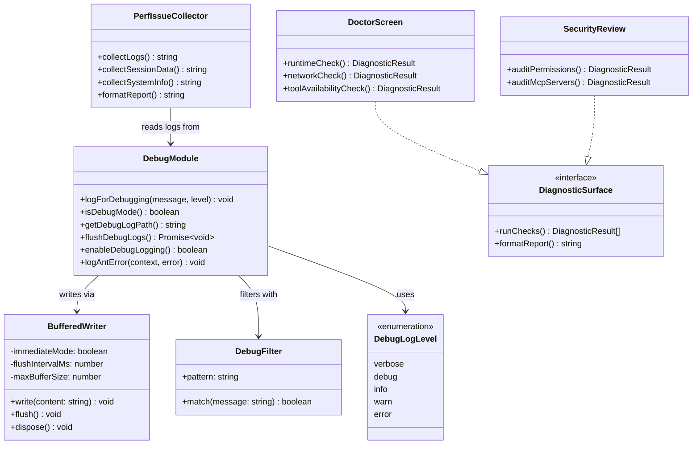
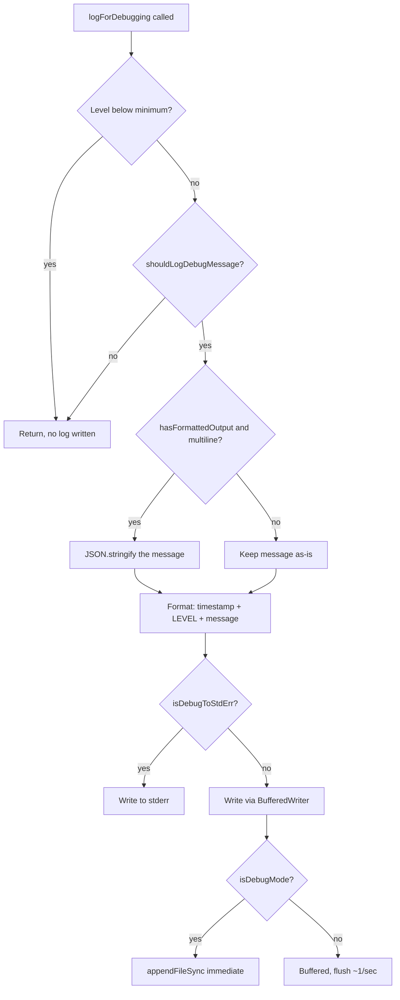
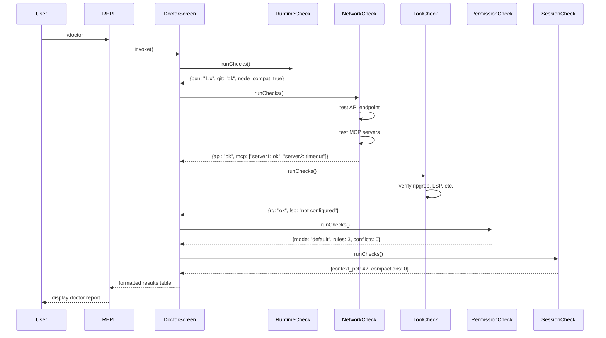

# Debug Logs, Diagnostics, and Doctor

## Overview

When a long-running agent behaves incorrectly -- looping, silently failing tool calls, or making inexplicable decisions -- the operator needs evidence to understand what happened. cc's debug logging subsystem provides that evidence through structured JSONL log files, per-session log paths, and a tiered log-level system. The debug module (`src/utils/debug.ts`) is the foundational observability layer that every other subsystem in cc depends on for diagnostic output. But it is, by design, a post-hoc observability system: it records what happened after it happened, rather than monitoring the agent's behavior in real time.

This chapter examines the debug logging architecture, the diagnostic subsystem, the doctor screen, the security review command, and the performance issue collection workflow. The central architectural question is not what these subsystems do -- that is straightforward -- but why cc's observability is firmly post-hoc rather than real-time, what constraints prevent real-time self-monitoring, and what a reader would need to add to move along the spectrum toward active failure detection.

The debug module connects to HER Section 14.2's "observability gap" -- the warning that agents fail silently because their response format looks correct. A 200 OK from a tool call does not mean the operation succeeded semantically. cc's debug logging addresses this gap by recording every significant decision, state transition, and error, but it does so as an opt-in, post-hoc system: the debug log tells you what happened, not whether what happened was correct. The `logForDebugging` function is called from over 100 sites across the codebase, making it the most widely-used diagnostic tool in cc. The JSONL format makes automated silent-failure detection possible in principle, though cc does not implement such an observer today.

The debug module also connects to HER Section 6.6 on "silent failures" -- the failure mode where an agent proceeds after tool errors as if successful. While the tool dispatch pipeline (Chapter 12) handles the structural fix (structured output validation after every tool call), the debug logging system provides the forensic evidence needed to diagnose silent failures that slip through.

The debug logging system has a dual identity with direct architectural implications for production incident diagnosis. For ant (internal) users, debug logging is always active (`shouldLogDebugMessage` returns `true` when `USER_TYPE === 'ant'`). For external users, debug logging is opt-in via `--debug` or `--debug-file`. This creates an asymmetry: when an internal user encounters a bug, the debug log is already running; when an external user encounters the same bug, the evidence was never written. The `logAntError` function (`src/utils/debug.ts:L258-L268`) compounds this by writing error-level entries only for ant users, meaning that the most severe failures in external sessions are the least likely to be diagnosed.

Beyond the debug log file, cc provides additional diagnostic surfaces: the `/doctor` command validates the runtime environment, the security review command audits the permission surface, and the perf issue collection workflow gathers logs and system information into a shareable report. These surfaces complement the passive debug log with active health checking, but they share the same fundamental limitation: they are either post-hoc or on-demand, never continuous and automatic.



`DebugModule` is the core, writing to log files via `BufferedWriter` and filtering messages through `DebugFilter`. `DoctorScreen`, `SecurityReview`, and `PerfIssueCollector` are higher-level diagnostic surfaces that build on the debug log to provide structured health checks and issue reports.

## Data structures and contracts

The debug log level hierarchy defines five tiers, from most verbose to least. The `DebugLogLevel` type and `LEVEL_ORDER` record map each level to a numeric value for comparison:

```typescript
// src/utils/debug.ts:L18-L26 DebugLogLevel type and level ordering
export type DebugLogLevel = 'verbose' | 'debug' | 'info' | 'warn' | 'error'

const LEVEL_ORDER: Record<DebugLogLevel, number> = {
  verbose: 0,
  debug: 1,
  info: 2,
  warn: 3,
  error: 4,
}
```

The minimum log level defaults to `debug`, filtering out `verbose` messages. The `getMinDebugLogLevel` function checks the `CLAUDE_CODE_DEBUG_LOG_LEVEL` environment variable and falls back to `debug` if unset or invalid (`src/utils/debug.ts:L34-L40`). Setting the env var to `verbose` includes full status-line commands, shell output, and CWD tracking.

The `BufferedWriter` configuration controls write frequency and buffering. In debug mode, writes are synchronous and immediate; in non-debug mode, writes are buffered with a 1-second flush interval and a maximum buffer size of 100 entries:

```typescript
// src/utils/debug.ts:L158-L189 BufferedWriter creation with immediate and buffered modes
    debugWriter = createBufferedWriter({
      writeFn: content => {
        const path = getDebugLogPath()
        const dir = dirname(path)
        const needMkdir = ensuredDir !== dir
        ensuredDir = dir
        if (isDebugMode()) {
          // immediateMode: must stay sync. Async writes are lost on direct
          // process.exit() and keep the event loop alive in beforeExit
          // handlers (infinite loop with Perfetto tracing). See #22257.
          if (needMkdir) {
            try {
              getFsImplementation().mkdirSync(dir)
            } catch {
              // Directory already exists
            }
          }
          getFsImplementation().appendFileSync(path, content)
          void updateLatestDebugLogSymlink()
          return
        }
        // Buffered path (ants without --debug): flushes ~1/sec so chain
        // depth stays ~1. .bind over a closure so only the bound args are
        // retained, not this scope.
        pendingWrite = pendingWrite
          .then(appendAsync.bind(null, needMkdir, dir, path, content))
          .catch(noop)
      },
      flushIntervalMs: 1000,
      maxBufferSize: 100,
      immediateMode: isDebugMode(),
    })
```

The `appendAsync` function handles directory creation and file appending for the buffered path. The `.bind(null, needMkdir, dir, path, content)` pattern captures only the bound arguments, preventing memory leaks from retaining the full `writeFn` closure scope (`src/utils/debug.ts:L138-L151`).

## Control flow

The debug logging flow follows two paths. In debug mode, writes are synchronous and immediate to prevent data loss on process exit. In non-debug mode (ant-only implicit logging), writes are buffered and flushed approximately once per second.



The core logging function performs level filtering, message sanitization, and format conversion before dispatching to the writer. The output format is JSONL: each line starts with an ISO timestamp, followed by the level in uppercase brackets, followed by the trimmed message:

```typescript
// src/utils/debug.ts:L203-L228 Core logging function with level filtering and format conversion
export function logForDebugging(
  message: string,
  { level }: { level: DebugLogLevel } = {
    level: 'debug',
  },
): void {
  if (LEVEL_ORDER[level] < LEVEL_ORDER[getMinDebugLogLevel()]) {
    return
  }
  if (!shouldLogDebugMessage(message)) {
    return
  }

  // Multiline messages break the jsonl output format, so make any multiline messages JSON.
  if (hasFormattedOutput && message.includes('\n')) {
    message = jsonStringify(message)
  }
  const timestamp = new Date().toISOString()
  const output = `${timestamp} [${level.toUpperCase()}] ${message.trim()}\n`
  if (isDebugToStdErr()) {
    writeToStderr(output)
    return
  }

  getDebugWriter().write(output)
}
```

Debug mode detection checks multiple sources, including runtime toggling. The `isDebugMode` function is memoized for performance but the cache can be cleared when runtime debug is enabled:

```typescript
// src/utils/debug.ts:L44-L57 isDebugMode memoized check across multiple sources
export const isDebugMode = memoize((): boolean => {
  return (
    runtimeDebugEnabled ||
    isEnvTruthy(process.env.DEBUG) ||
    isEnvTruthy(process.env.DEBUG_SDK) ||
    process.argv.includes('--debug') ||
    process.argv.includes('-d') ||
    isDebugToStdErr() ||
    // Also check for --debug=pattern syntax
    process.argv.some(arg => arg.startsWith('--debug=')) ||
    // --debug-file implicitly enables debug mode
    getDebugFilePath() !== null
  )
})
```

The `enableDebugLogging` function allows mid-session activation (e.g., via `/debug`). It sets `runtimeDebugEnabled` and clears the `isDebugMode` cache:

```typescript
// src/utils/debug.ts:L64-L69 Runtime debug activation with cache invalidation
export function enableDebugLogging(): boolean {
  const wasActive = isDebugMode() || process.env.USER_TYPE === 'ant'
  runtimeDebugEnabled = true
  isDebugMode.cache.clear?.()
  return wasActive
}
```

The log path defaults to `~/.claude/debug/{sessionId}.txt` but can be overridden via `--debug-file` or the `CLAUDE_CODE_DEBUG_LOGS_DIR` environment variable (`src/utils/debug.ts:L230-L236`).

The `updateLatestDebugLogSymlink` function creates a symlink at `~/.claude/debug/latest` pointing to the current session's log file, memoized and silently failing on read-only filesystems (`src/utils/debug.ts:L242-L253`).

The `shouldLogDebugMessage` function implements a multi-layered filter. In test environments without `--debug-to-stderr`, all debug output is suppressed. For non-ant users who have not enabled debug mode, no messages are written. For ant users, messages are always written regardless of the debug flag (`src/utils/debug.ts:L104-L125`).

### Doctor screen

The `/doctor` command provides a structured health-check screen. When invoked, it runs a sequence of diagnostic checks and displays results in a formatted table:

1. **Runtime environment** -- verifies the Bun version, Node.js compatibility, and required system tools (git, etc.) on PATH.
2. **Network connectivity** -- tests connectivity to the Anthropic API endpoint, MCP server endpoints (if configured), and custom proxy settings. A failed check here explains why a session might hang on model invocation.
3. **Tool availability** -- confirms that each tool in the active tool set can be instantiated and that its dependencies (e.g., LSP servers for LSPTool, ripgrep for GrepTool) are present.
4. **Permission surface** -- audits the current permission mode and any active rules, flagging configurations that might block expected workflows (e.g., plan mode restricting all write tools).
5. **Session health** -- checks the current session's context window utilization, token consumption rate, and whether compaction has been triggered recently.



The doctor screen is a read-only diagnostic surface. It gives operators a snapshot of whether their cc environment is healthy before starting a long-running session, or identifies the root cause of failures in an ongoing session. Results are also written to the debug log at `info` level.

On the post-hoc vs. real-time spectrum, the doctor screen sits firmly on the on-demand end. It cannot detect failures as they occur because it has no mechanism for continuous execution -- the operator must invoke it, read the results, and decide whether the state it reports is acceptable. For the harness to detect its own failures in real time, the doctor's checks would need to run as a background loop that compares infrastructure state against expected invariants and surfaces anomalies immediately. Today, nothing in cc's architecture enables this. The event loop is consumed by the query loop (Chapter 7), and the Ink renderer occupies the terminal. A continuous doctor would require an out-of-band observer, the same architectural addition identified later in this chapter for real-time failure detection. The doctor's checks are sound; what is missing is the trigger mechanism that runs them automatically and surfaces violations without human initiation.

### Security review command

The security review command (invoked via `/security-review`) provides an audit of the current session's security surface:

1. **Permission mode and rules** -- reports the active permission mode and lists all loaded permission rules, highlighting any that allow write access or bypass permissions.
2. **MCP server trust surface** -- lists all connected MCP servers and their tool counts, flagging servers that were connected without explicit user approval or that provide tools with dangerous capabilities (file system access, command execution).
3. **Hook surface** -- enumerates all registered hooks (PreToolUse, PostToolUse, etc.) and their types (command, prompt, HTTP, agent, function), flagging hooks that run external commands or make HTTP requests, since these can be vectors for supply-chain attacks as described in HER Section 12.4.
4. **CLAUDE.md and settings surface** -- reports which CLAUDE.md files are loaded and their approximate size, and lists any managed settings or policy overrides that constrain the agent's behavior.
5. **Active subagent surface** -- lists currently running subagents, their permission modes, and whether they have been granted broader permissions than the parent session.

The security review does not modify any state. It gives operators visibility into the attack surface of their current session, directly addressing HER Section 12.4's concern about supply-chain attacks via MCP, skills, and hooks: the security review makes the trust boundary explicit by showing which external systems the agent is connected to and what capabilities they have.

Like the doctor screen, the security review is on-demand rather than continuous. It cannot detect trust-surface changes in real time -- if an MCP server reconnects with a different tool schema, or a hook is registered mid-session by a skill, the security review does not flag this until the operator invokes it again. For a long-running agent, the trust surface mutates over the course of a session: subagents are spawned with their own permissions, MCP servers connect and disconnect, and hooks fire in response to events the operator may not be aware of. A real-time security monitor would continuously compare the current trust surface against a baseline established at session start and alert on drift. cc has no such mechanism. The security review provides the data; what is missing is the loop that evaluates it against policy and surfaces violations without human initiation. This is the same architectural gap identified in the doctor screen analysis and the post-hoc observability discussion: cc's diagnostic surfaces are sound individually, but none of them close the loop from observation to automatic alert.

### Perf issue collection

The perf issue collection workflow gathers diagnostic data into a structured report shareable with the cc team. When invoked, the system:

1. **Collects debug logs** -- reads the current session's debug log file, truncating to the last 100KB.
2. **Collects session metadata** -- gathers the session ID, start time, token consumption, tool call count, and error count.
3. **Collects system information** -- records OS version, Bun version, cc version, terminal type, and available memory/CPU cores.
4. **Sanitizes PII** -- removes file paths, user names, and content matching PII patterns before writing the report.
5. **Writes the report** -- outputs the sanitized report to a temporary file for the operator to share.

For long-running agents, bugs may only manifest after hours of operation and the debug log can be enormous. The issue collector reduces this burden by selecting the most recent log data and sanitizing it for safe sharing.

### Diag logs

Beyond the primary debug log file, cc maintains separate diagnostic logs (diag logs) for specific subsystems, written to the same `~/.claude/debug/` directory with distinct naming conventions:

1. **API diagnostic logs** -- record full request and response payloads for Anthropic API calls when `CLAUDE_CODE_DEBUG_LOG_LEVEL=verbose` is set, including the complete system prompt, tool definitions, and model responses.
2. **MCP diagnostic logs** -- record MCP server connection events, tool invocation requests and responses, and transport-level errors. Essential for diagnosing MCP server connectivity, timeout handling, and tool schema mismatches.
3. **Hook diagnostic logs** -- record hook invocation events, including the hook type, matcher, exit code, and execution duration. Useful for diagnosing issues where hooks are blocking tool calls unexpectedly.

The diag logs share the same `LEVEL_ORDER` and `shouldLogDebugMessage` filtering as the main debug log, but are written to separate files to avoid interleaving. Separate files let the operator focus on one subsystem while correlating events across files using timestamps.

The diag log paths follow the convention `~/.claude/debug/{sessionId}-{subsystem}.txt` (e.g., `abc123-api.txt`, `abc123-mcp.txt`). The `updateLatestDebugLogSymlink` function only updates the symlink for the main debug log, not the diag logs.

## Edge cases and failure modes

**Multiline message handling.** When `hasFormattedOutput` is true (the Ink renderer has started drawing), multiline messages are JSON-stringified to preserve the JSONL format (`src/utils/debug.ts:L217-L219`). The `jsonStringify` helper from `slowOperations.ts` avoids the O(n^2) performance of naive string concatenation for large messages.

**Buffered writes lost on process.exit().** In non-debug mode, the buffered writer flushes every second. Abrupt exits lose unflushed writes. The `registerCleanup` call at `src/utils/debug.ts:L190-L193` attempts to flush on graceful shutdown, but nothing guarantees flush on hard exit.

**Debug filter pattern matching.** The `--debug=pattern` flag allows filtering debug output to specific modules or functions. Invalid filter patterns degrade gracefully to "show all" or "show none." The `getDebugFilter` function is memoized, so the pattern is parsed only once per session (`src/utils/debug.ts:L73-L83`).

**Ant-only error logging.** The `logAntError` function at `src/utils/debug.ts:L258-L268` only writes errors when `USER_TYPE === 'ant'`. For external users, critical runtime errors are only visible if debug mode is explicitly enabled. This gap is analyzed in detail in the "ant-vs-external observability divide" section below.

**Latest symlink race.** The `updateLatestDebugLogSymlink` function (`src/utils/debug.ts:L242-L253`) is memoized and asynchronous. If two cc processes start simultaneously, the symlink may point to the wrong session's log. The symlink is advisory; the actual session ID is always available from `getSessionId()`.

**Debug mode and the event loop.** The source code comment at `src/utils/debug.ts:L165-L167` warns that immediate-mode synchronous writes are necessary because "async writes keep the event loop alive in beforeExit handlers (infinite loop with Perfetto tracing)." Switching from sync to async writes in debug mode would cause an infinite loop: `beforeExit` would flush pending writes, scheduling microtasks, preventing exit, and triggering `beforeExit` again.

**Directory creation race in buffered mode.** If the debug directory is deleted between flushes, the `needMkdir` flag will be stale and `appendFile` will fail silently (the `.catch(noop)` swallows the error), meaning the log entry is lost without any indication (`src/utils/debug.ts:L146-L151`).

**Debug writer disposal.** `process.exit()` does not wait for async cleanup handlers. The `flushDebugLogs` function (`src/utils/debug.ts:L198-L201`) provides an explicit flush API for code paths that know they are about to exit.

**Doctor screen in headless mode.** The `/doctor` command relies on the Ink renderer. In headless mode (e.g., CI/CD pipelines), the doctor screen cannot render its formatted output. In this case, the diagnostic results are written to the debug log at `info` level instead.

**Security review and stale MCP connections.** If an MCP server has disconnected but the connection state has not been updated, the security review may report it as "connected" when it is actually unreachable.

**Perf issue collection and log rotation.** If the debug log has been rotated or truncated by an external process, the perf issue collector may find an empty or partial file.

**Diag logs and disk space.** For long-running sessions with verbose logging, combined log sizes can grow to hundreds of megabytes. The `~/.claude/debug/` directory has no automatic size limits or rotation.

## The post-hoc vs. real-time observability spectrum

This section is the chapter's central argument. The preceding sections documented what each diagnostic surface does. This section explains why all of them share the same fundamental limitation -- they are post-hoc, not real-time -- and what that means for a production long-running agent.

cc's entire observability stack sits firmly on the post-hoc end of the spectrum. Every diagnostic surface in this chapter -- the debug log, the diag logs, the doctor screen, the security review, the perf issue collector -- records or inspects state after the fact. None of them constitute real-time self-monitoring. This is not an oversight but an architectural consequence of three constraints inherent to cc's design.

**Constraint 1: The single-threaded event loop.** cc runs on Bun's single-threaded event loop. A real-time monitor would need to observe the loop from outside it -- a separate thread or process that can inspect the agent's state without being blocked by the agent's own computation. cc has no such observer. The `queryLoop` in `src/query.ts` (Chapter 7) is a sequential async generator; there is no yield point where an independent monitor can run a health check without being scheduled by the loop itself. A monitor inside the loop is subject to the same hangs it is trying to detect.

**Constraint 2: The terminal as the only UI surface.** The Ink renderer occupies the terminal's screen buffer. There is no separate window, web dashboard, or side panel where live telemetry could be displayed. The REPL shows the current turn's status but cannot simultaneously display session-level aggregates (cumulative token consumption, error rate, context window saturation trend). The doctor screen is a full-screen overlay that replaces the REPL; it cannot run alongside it.

**Constraint 3: The opt-in logging model.** For external users, debug logging is disabled by default. `shouldLogDebugMessage` returns `false` unless `--debug` is passed or `USER_TYPE === 'ant'`. The majority of cc sessions run without any debug log being written. A real-time monitoring system that depends on the debug log for its data stream would be useless for the users who need it most -- those who did not anticipate the failure and therefore did not enable `--debug` at startup. The `enableDebugLogging` mid-session activation partially addresses this, but the evidence leading up to the bug is lost.

### Where cc sits on the spectrum

The following table maps cc's observability surfaces to their position on the post-hoc/real-time spectrum:

| Surface | Timing | Trigger | Scope |
|---|---|---|---|
| Debug log (`logForDebugging`) | Post-hoc | Automatic (when enabled) | Every event |
| Diag logs (API, MCP, hook) | Post-hoc | Automatic (when verbose) | Per-subsystem |
| `/doctor` command | On-demand | Manual invocation | Infrastructure health |
| `/security-review` command | On-demand | Manual invocation | Trust surface |
| Perf issue collector | Post-hoc | Manual invocation | Recent session data |
| REPL status display | Near-real-time | Automatic | Current turn only |

cc has no surface in the "continuous, automatic, real-time" quadrant. The nearest is the REPL status display, but it shows only the current turn's model streaming output and tool call results -- it does not aggregate across turns or detect anomalies

### What a reader would need to add for real-time failure detection

To move from post-hoc observability to real-time self-monitoring, a reader building on cc would need to implement three components:

1. **An out-of-band observer process.** A separate process (or Bun worker thread) that reads the debug log file as it is written (via `fs.watch` on the latest symlink or `tail -f`-style streaming) and applies anomaly detection rules. This observer is not subject to the main loop's hangs because it runs on a separate thread of execution. The JSONL format makes this feasible: each line is a self-contained record, so the observer can parse and evaluate rules incrementally without needing the full file.

2. **Structured anomaly detection rules.** The debug log records tool call results, including errors, but the agent loop does not evaluate them for patterns. A real-time monitor would apply rules such as: "if the last 5 tool calls of type `FileEditTool` all logged `error` level entries, alert the operator" or "if no `model_response` entry has appeared in the log for 60 seconds while the loop is in `tool_dispatch` state, the agent may be in an infinite tool loop" (HER Section 6.7). The debug log's level field provides the signal; the monitor provides the evaluation.

3. **A notification surface independent of the terminal.** Since the terminal is occupied by the Ink renderer, the observer needs an alternative notification channel: a desktop notification, a webhook, a distinct log file, or a signal to the parent process (for IDE bridge users, the bridge could relay the notification). Without an independent channel, a real-time monitor has no way to surface anomalies without interrupting the agent's rendering.

### The ant-vs-external observability divide and its production consequences

As described in the Overview, cc's debug logging has a dual identity: always active for `ant` users, opt-in for external users. This creates an architectural asymmetry with real consequences for production incident diagnosis. The `logAntError` function (`src/utils/debug.ts:L258-L268`) compounds this by writing error-level entries only when `USER_TYPE === 'ant'`, meaning that for external users, critical runtime errors -- unhandled promise rejections, tool dispatch failures, MCP server crashes -- are silently swallowed unless `--debug` was enabled.

Consider a concrete production scenario: an external user runs cc in autonomous mode on a large codebase for six hours. After four hours, an MCP server that provides a critical tool crashes silently -- the server process exits without sending a close frame, cc's MCP connection manager has not yet detected the disconnection, and the next tool call to that server hangs indefinitely. The agent, receiving no response, eventually times out and retries, but the server is still down. After several retries, the agent falls into an infinite tool-loop pattern (HER Section 6.7), repeatedly calling the same MCP tool and timing out. The session burns tokens and time without making progress. When the user reports this bug, the debug log is empty because `--debug` was not passed. The `logAntError` calls that would have recorded the MCP server crash were suppressed because `USER_TYPE` is not `ant`. The only evidence is the session's JSONL conversation file, which records tool call inputs and outputs but not the connection-state transitions that would explain why the tool calls hung. The bug is unreproducible because it depends on the MCP server's runtime state, which the user cannot recreate.

Now consider the same scenario for an ant user. The debug log is always active. The MCP server crash produces an `error`-level entry via `logAntError`. The infinite tool loop produces a rapid succession of `warn`-level entries for each timeout. The developer who receives the bug report has a complete timeline: when the MCP server crashed, when the first hang occurred, how many retries the agent attempted, and what the agent was doing immediately before the crash. The bug is diagnosable in minutes rather than hours, and the fix (a health-check heartbeat for MCP connections) is informed by evidence rather than speculation.

The architectural implication is that cc's observability model assumes an operator who can reproduce bugs on demand. For internal users, this is reasonable. For external users running multi-hour autonomous sessions, reproduction is often impractical -- the evidence that would diagnose the failure was never written. This is not merely a convenience gap; it is a correctness gap. A long-running agent that cannot produce diagnostic evidence for its most severe failures cannot be trusted to operate autonomously. A production-ready long-running agent must close this gap by ensuring that error-level entries are always written regardless of user type, while still gating verbose and debug levels behind the `--debug` flag. The distinction should be between log levels (errors are always important) rather than between user types.

This divide also has implications for the real-time monitoring pathway. If an external observer process were added to cc (as described in the "What a reader would need to add" section), it would depend on the debug log as its data source. For ant users, this data source is always available. For external users, the observer would have no data to process unless `--debug` was enabled. The observer's value is therefore conditional on the same opt-in model that limits post-hoc diagnosis. Any real-time monitoring design must first solve the data-availability problem -- ensuring that the events the observer needs are always written -- before it can add the anomaly-detection logic.

### HER Section 6.6 and automated silent-failure detection

HER Section 6.6 identifies "silent failures" as the failure mode where an agent proceeds after tool errors as if successful. cc's tool dispatch pipeline (Chapter 12) addresses this structurally: every tool call's output is validated against the tool's schema. But structural validation catches format errors, not semantic ones. A `FileEditTool` call that replaces the correct line but introduces a syntax error passes structural validation -- the tool returned a success string, the format is correct, the model proceeds.

The debug log's JSONL format provides the raw material for automated detection of such semantic silent failures. Each tool call produces a log entry with a timestamp, level, and message. A post-processing pass (or a real-time observer) could apply rules beyond structural validation:

- **Error-level clustering.** If multiple consecutive tool calls produce `warn` or `error` level entries, the agent may be in a degraded state. The observer can count the error density over a sliding window and alert when it exceeds a threshold.

- **Tool-result vs. follow-up-action correlation.** If a `FileEditTool` call logs a success but the very next action is another `FileEditTool` call to the same file, the first edit likely introduced a problem the model is now attempting to fix. This pattern -- a rapid succession of edits to the same file -- is a strong signal of a semantic silent failure that structural validation did not catch.

- **Absence-of-verification detection.** After a modification tool call (write, edit, bash), the agent should verify the result (e.g., by reading the file, running a test). If the debug log shows a modification followed immediately by an unrelated action (not a read or test of the modified file), the agent may have proceeded without verification. The JSONL format makes this detectable: parse log entries, identify tool call types, and flag sequences where a modification is not followed by a verification step within the next N entries.

cc does not implement any of these detection strategies today. The debug log is a passive record, not an active sensor. But the JSONL format makes all three strategies implementable without changes to the logging system -- only an observer process that reads and evaluates the log is needed.

### HER Section 14.1: The three-pillar gap

HER Section 14.1 describes three pillars for agent observability: traces, metrics, and logs. cc implements only the "logs" pillar. Each debug log entry is an isolated line with a timestamp and level, not a span in a trace context. Correlation across tool calls, subagent dispatches, and model invocations must be done post-hoc by searching the JSONL file. The diag logs further fragment the picture by splitting per-subsystem logs into separate files. For a single-process terminal agent this is adequate; for a multi-agent distributed system, proper span correlation would be needed.

HER Section 14.3 describes a "multi-hour session dashboard" with progress tracking, health monitoring, cost visibility, and quality trending. cc does not implement this. The debug log can be tailed (`tail -f ~/.claude/debug/latest`), but this does not provide aggregated metrics. The doctor screen provides a snapshot but must be invoked manually and does not update in real time.

## Developer takeaways for building a long-running agent

1. **Synchronous writes in debug mode prevent data loss on crash.** When the agent is being debugged, every log write uses `appendFileSync` instead of the buffered async path. If the agent crashes, the last few log entries are the most valuable for diagnosis. Sync writes guarantee they are on disk; buffered writes do not.

2. **Per-session log files with a latest symlink enable rapid diagnosis.** The `getDebugLogPath` function generates a unique log file per session, and `updateLatestDebugLogSymlink` points `~/.claude/debug/latest` to the current session's file. Per-session log files prevent a single giant log file and the latest symlink eliminates the need to find the current session ID.

3. **Log level filtering must be configurable at runtime, not only at startup.** The `enableDebugLogging` function (`src/utils/debug.ts:L64-L69`) allows mid-session activation of debug logging (e.g., via `/debug` command). For long-running agents, a bug may only manifest hours into a session; the operator needs a way to activate logging without restarting.

4. **Multiline messages must be JSON-encoded in JSONL logs.** The `hasFormattedOutput` check and `jsonStringify` conversion at `src/utils/debug.ts:L217-L219` ensure that stack traces do not break the JSONL format. Log files must be machine-parseable to support automated anomaly detection and forensic analysis.

5. **The observability gap requires active validation, not passive logging.** cc's debug logging records what happened but does not validate whether what happened was correct. For long-running agents, passive logging is necessary but not sufficient -- the agent must also include active validation checks after every tool call, verifying that the output meets semantic requirements (not merely that the API returned 200).

6. **The sync-vs-async logging tradeoff is fundamental.** Sync writes guarantee crash safety but block the event loop; async writes are fast but may lose the most valuable entries. The `#22257` reference in the source code shows that async writes caused an infinite loop with Perfetto tracing.

7. **Debug filtering by pattern enables targeted diagnosis.** The `--debug=pattern` flag allows operators to filter debug output to specific subsystems. For long-running agents that produce millions of log entries, pattern-based filtering reduces the signal-to-noise ratio.

8. **The ant-vs-external observability gap requires mitigation.** As analyzed above, cc's `logAntError` function only writes errors for ant users. For long-running agents, always write error-level logs regardless of user type, while gating verbose and debug levels behind `--debug`. An error that is silently swallowed in an external build is an error that will be reported as "the agent stopped working" with no diagnostic trail.

9. **Active health checks complement passive logging.** The `/doctor` command provides a structured health-check that complements the debug log's passive recording. For long-running agents, operators should be able to trigger health checks on demand without restarting the agent.

10. **Security surface auditing should be built in, not bolted on.** The security review command makes the trust boundary of a session explicit. For long-running agents, the trust surface changes over time -- a security review that can be invoked at any point gives operators the ability to audit before delegating sensitive work.

11. **Perf issue collection should be automated and sanitized.** The perf issue collection workflow automatically gathers debug logs, session metadata, and system information into a sanitized report. PII sanitization is essential: long-running agent logs may contain file paths, code snippets, and user names that should not be included in shared reports.
