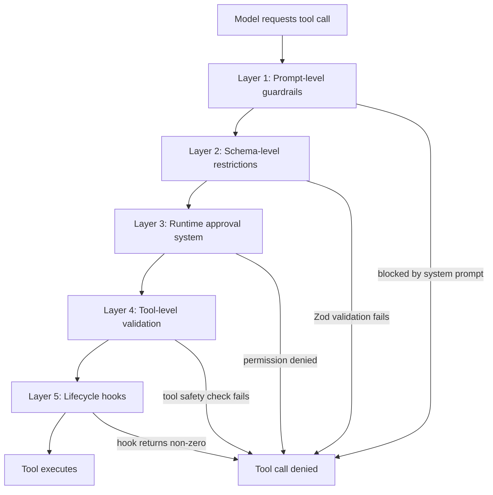
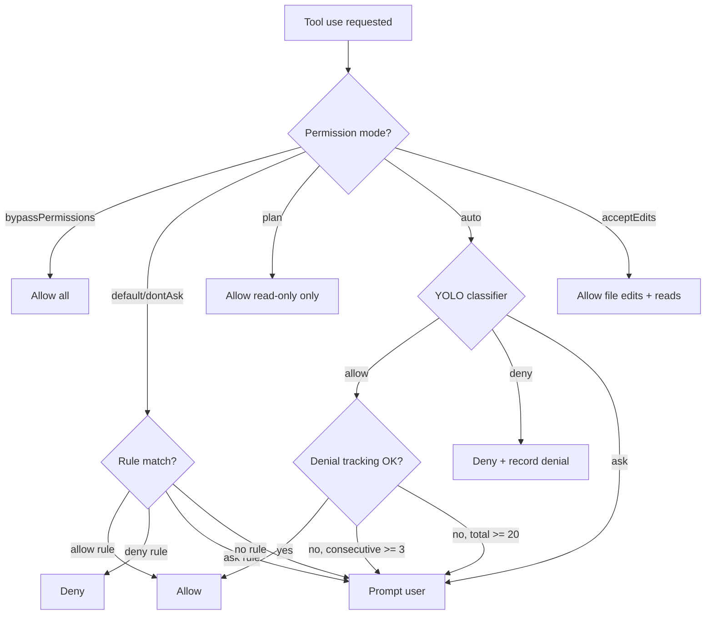
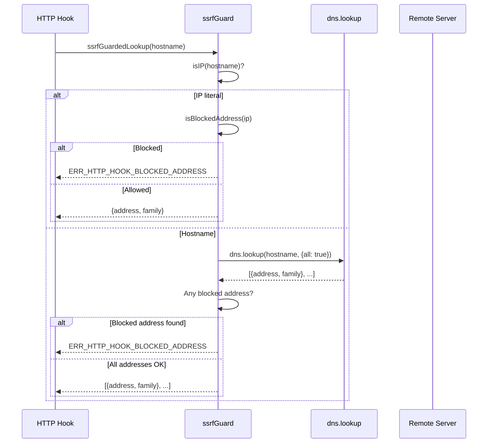

# Threat Model: CC Through the Lens of HER Section 12

## Overview

HER Section 12 describes a five-layer defense-in-depth model for agent security: prompt-level guardrails, schema-level restrictions, runtime approval, tool-level validation, and lifecycle hooks. This chapter walks each of those layers and maps it to cc's concrete implementations, then extends the analysis to cover the specific threat classes that HER identifies as critical for production multi-hour systems: indirect prompt injection, supply chain attacks via MCP/skills, system prompt leakage, data exfiltration through tool calls, and checkpoint-restore attacks.

cc implements all five layers, but with significant variations in depth. The runtime approval system (permission modes, classifiers, denial tracking) is the most mature layer, backed by over 11,000 lines of code across the permissions module. The lifecycle hooks layer is also well-developed, with deterministic shell-command execution at PreToolUse and PostToolUse events. The prompt-level and schema-level layers are thinner but functional. The most notable gaps are in the supply-chain and checkpoint-restore threat classes, where cc relies on social controls (vetting MCP servers, user review of agent actions) rather than technical enforcement.

The permissions module is the largest single security subsystem in cc. The `permissions.ts` file alone is 1,486 lines, with additional logic spread across `bashClassifier.ts` (61 lines, stub for external builds), `yoloClassifier.ts` (1,495 lines), `filesystem.ts` (1,777 lines), `dangerousPatterns.ts` (80 lines), `denialTracking.ts` (45 lines), `autoModeState.ts` (39 lines), and `permissionRuleParser.ts` (198 lines). The BashTool's security submodules add another 5,000+ lines: `bashSecurity.ts` (2,592), `bashPermissions.ts` (2,621), `readOnlyValidation.ts` (1,990), `pathValidation.ts` (1,303), and `modeValidation.ts` (115). This concentration of security logic in the BashTool makes sense: the Bash tool is the highest-risk tool in the system because it can execute arbitrary shell commands, and it requires the most thorough validation.

HER Section 12.4 identifies five specific threat classes for agent systems. Each represents a different attack vector and requires different mitigations. The OpenClaw incident (CVE-2025-53773, CVSS 9.6) demonstrates that these are not theoretical concerns: an open-source agent framework with 135,000 GitHub stars had a remote code execution vulnerability through its tool interface, affecting 21,000 exposed instances. For cc, the lesson is clear: every tool interface is an attack surface, and the combination of prompt injection (which can cause the model to call tools in unexpected ways) and tool execution (which can cause real-world side effects) creates a compound risk that is greater than either alone.

The permission mode system implements a privilege boundary model that maps to HER Section 12.3's "Privilege Boundaries" pattern. In `plan` mode, the agent is restricted to read-only operations -- it can explore the codebase but cannot modify files. In `acceptEdits` mode, the agent can edit files but still requires approval for shell commands. In `auto` mode, the YOLO classifier can approve or deny operations without human intervention, but it is constrained by the dangerous patterns list and the denial tracking circuit breaker. In `bypassPermissions` mode, all operations are allowed -- this is the highest-risk mode and is visually indicated with an error color in the REPL (`src/utils/permissions/PermissionMode.ts:L44-L91`).

HER Section 12.4 identifies five specific threat classes for agent systems. cc has partial defenses against each, but the coverage is uneven. The strongest defenses are against indirect prompt injection (via the SSRF guard and path traversal protection) and data exfiltration (via the permission system and path guards). The weakest defenses are against supply chain attacks (MCP servers can execute arbitrary code) and checkpoint-restore attacks (no idempotency keys for external operations). This uneven coverage is characteristic of a security posture that has been built incrementally in response to specific incidents rather than designed holistically from a threat model.

## Data structures and contracts

The permission mode enum defines the operational regimes for tool access. Each mode has a title, short title, symbol, color, and external mapping:

```typescript
// src/types/permissions.ts:L29
export type PermissionMode = InternalPermissionMode
```

where `InternalPermissionMode` expands to `'default' | 'plan' | 'acceptEdits' | 'bypassPermissions' | 'dontAsk' | 'auto' | 'bubble'`. The type is defined in `src/types/permissions.ts` to break import cycles and re-exported from `src/utils/permissions/PermissionMode.ts` (lines 14-19).

Each mode maps to an `ExternalPermissionMode` for SDK consumers, with `auto` excluded from external APIs since it is ant-only. The `isExternalPermissionMode` function ensures that ant-only modes are not exposed to external SDK users:

```typescript
// src/utils/permissions/PermissionMode.ts:L97-L105
export function isExternalPermissionMode(
  mode: PermissionMode,
): mode is ExternalPermissionMode {
  if (process.env.USER_TYPE !== 'ant') {
    return true
  }
  return mode !== 'auto' && mode !== 'bubble'
}
```

The permission rule value carries the tool name and optional content for scoped rules. A rule like `Bash(npm install)` allows the Bash tool only when the command starts with `npm install`:

```typescript
// src/utils/permissions/PermissionRule.ts:L32-L39
export const permissionRuleValueSchema = lazySchema(() =>
  z.object({
    toolName: z.string(),
    ruleContent: z.string().optional(),
  }),
)
```

The permission behavior schema defines the three possible actions a rule can specify: allow the tool to run, deny the tool, or force a prompt to the user:

```typescript
// src/utils/permissions/PermissionRule.ts:L25-L27
export const permissionBehaviorSchema = lazySchema(() =>
  z.enum(['allow', 'deny', 'ask']),
)
```

The denial tracking state monitors classifier behavior to detect when the automated approval system should fall back to human prompting. The limits are conservative: 3 consecutive denials or 20 total denials trigger a fallback:

```typescript
// src/utils/permissions/denialTracking.ts:L7-L16
export type DenialTrackingState = {
  consecutiveDenials: number
  totalDenials: number
}

export const DENIAL_LIMITS = {
  maxConsecutive: 3,
  maxTotal: 20,
} as const
```

The auto mode circuit breaker state prevents re-entry after a kill switch activates. Once the circuit is broken, auto mode cannot be re-entered even if the user explicitly requests it:

```typescript
// src/utils/permissions/autoModeState.ts:L9
let autoModeCircuitBroken = false
```

The circuit-broken state is exposed through an accessor that returns the current flag value:

```typescript
// src/utils/permissions/autoModeState.ts:L31-L33
export function isAutoModeCircuitBroken(): boolean {
  return autoModeCircuitBroken
}
```

The dangerous patterns list defines code-execution entry points that auto mode must never allow-list. The list includes interpreters, package runners, and shells:

```typescript
// src/utils/permissions/dangerousPatterns.ts:L18-L42
export const CROSS_PLATFORM_CODE_EXEC = [
  'python', 'python3', 'python2',
  'node', 'deno', 'tsx',
  'ruby', 'perl', 'php', 'lua',
  'npx', 'bunx', 'npm run', 'yarn run', 'pnpm run', 'bun run',
  'bash', 'sh',
  'ssh',
] as const
```

The ant-only extensions add network exfiltration vectors (curl, wget, gh api) and cloud resource mutation tools (kubectl, aws, gcloud) to the dangerous patterns list:

```typescript
// src/utils/permissions/dangerousPatterns.ts:L57-L79
  ...(process.env.USER_TYPE === 'ant'
    ? [
        'fa run',
        'coo',
        'gh',
        'gh api',
        'curl',
        'wget',
        'git',
        'kubectl',
        'aws',
        'gcloud',
        'gsutil',
      ]
    : []),
```

## Control flow

The five-layer defense-in-depth model maps onto cc's permission pipeline. Each layer acts as a filter: if any layer blocks the operation, the tool call does not execute.



Layer 1 (prompt-level guardrails) includes instructions in the system prompt about what not to do (e.g., "never commit .env files", "never push to main"). These are soft constraints that the model can ignore, but they set behavioral expectations. The system prompt assembly process (covered in Chapter 9) injects these instructions as part of the base prompt.

Layer 2 (schema-level restrictions) uses Zod schemas for tool input validation. Every tool defines its input schema with `z.object({...})`, and invalid inputs are rejected before the tool executes. This prevents the model from passing malformed arguments (e.g., a negative line number to the Edit tool) that could cause unexpected behavior.

Layer 3 (runtime approval system) is the most complex layer. Its decision flow considers the current permission mode, any user-defined rules, the YOLO classifier (in auto mode), and denial tracking:



The permission rule parser handles escaped parentheses in rule content. This is necessary because rules use the format `ToolName(content)`, and the content itself may contain parentheses (e.g., `Bash(python -c "print\(1\)")`). The `permissionRuleValueFromString` function finds the first unescaped opening parenthesis and the last unescaped closing parenthesis:

```typescript
// src/utils/permissions/permissionRuleParser.ts:L93-L133
export function permissionRuleValueFromString(
  ruleString: string,
): PermissionRuleValue {
  const openParenIndex = findFirstUnescapedChar(ruleString, '(')
  if (openParenIndex === -1) {
    return { toolName: normalizeLegacyToolName(ruleString) }
  }

  const closeParenIndex = findLastUnescapedChar(ruleString, ')')
  if (closeParenIndex === -1 || closeParenIndex <= openParenIndex) {
    return { toolName: normalizeLegacyToolName(ruleString) }
  }

  if (closeParenIndex !== ruleString.length - 1) {
    return { toolName: normalizeLegacyToolName(ruleString) }
  }

  const toolName = ruleString.substring(0, openParenIndex)
  const rawContent = ruleString.substring(openParenIndex + 1, closeParenIndex)

  if (!toolName) {
    return { toolName: normalizeLegacyToolName(ruleString) }
  }

  if (rawContent === '' || rawContent === '*') {
    return { toolName: normalizeLegacyToolName(toolName) }
  }

  const ruleContent = unescapeRuleContent(rawContent)
  return { toolName: normalizeLegacyToolName(toolName), ruleContent }
}
```

The SSRF guard for HTTP hooks implements a DNS-level check that blocks private and link-local address ranges. This prevents HTTP hooks from reaching cloud metadata endpoints (169.254.169.254) or internal infrastructure:



The SSRF guard's address-blocking logic covers the critical cloud metadata endpoint ranges. Loopback (127.0.0.0/8) is intentionally allowed because local dev policy servers are a primary HTTP hook use case:

```typescript
// src/utils/hooks/ssrfGuard.ts:L55-L86
function isBlockedV4(address: string): boolean {
  const parts = address.split('.').map(Number)
  const [a, b] = parts
  if (
    parts.length !== 4 ||
    a === undefined ||
    b === undefined ||
    parts.some(n => Number.isNaN(n))
  ) {
    return false
  }

  // Loopback explicitly allowed
  if (a === 127) return false
  if (a === 0) return true              // 0.0.0.0/8
  if (a === 10) return true             // 10.0.0.0/8 private
  if (a === 169 && b === 254) return true // 169.254.0.0/16 link-local
  if (a === 172 && b >= 16 && b <= 31) return true // 172.16.0.0/12 private
  if (a === 100 && b >= 64 && b <= 127) return true // 100.64.0.0/10 CGNAT
  if (a === 192 && b === 168) return true // 192.168.0.0/16 private
  return false
}
```

The upstream proxy in CCR containers adds another security layer by MITM-ing all outbound HTTPS traffic and injecting organization-configured credentials. The `NO_PROXY_LIST` prevents the proxy from intercepting traffic to Anthropic's API, package registries, and GitHub:

```typescript
// src/upstreamproxy/upstreamproxy.ts:L37-L63
const NO_PROXY_LIST = [
  'localhost',
  '127.0.0.1',
  '::1',
  '169.254.0.0/16',
  '10.0.0.0/8',
  '172.16.0.0/12',
  '192.168.0.0/16',
  'anthropic.com',
  '.anthropic.com',
  '*.anthropic.com',
  'github.com',
  'api.github.com',
  '*.github.com',
  '*.githubusercontent.com',
  'registry.npmjs.org',
  'pypi.org',
  'files.pythonhosted.org',
  'index.crates.io',
  'proxy.golang.org',
].join(',')
```

The filesystem permission module defines dangerous files and directories that should be protected from auto-editing. These files can be used for code execution or data exfiltration:

```typescript
// src/utils/permissions/filesystem.ts:L57-L80
export const DANGEROUS_FILES = [
  '.gitconfig',
  '.gitmodules',
  '.bashrc',
  '.bash_profile',
  '.zshrc',
  '.zprofile',
  '.profile',
  '.ripgreprc',
  '.mcp.json',
  '.claude.json',
] as const

export const DANGEROUS_DIRECTORIES = [
  '.git',
  '.vscode',
  '.idea',
  '.claude',
] as const
```

The `normalizeCaseForComparison` function prevents bypass on case-insensitive filesystems (macOS, Windows) where `.cLauDe/Settings.locaL.json` would bypass a check for `.claude/Settings.local.json`:

```typescript
// src/utils/permissions/filesystem.ts:L90-L92
export function normalizeCaseForComparison(path: string): string {
  return path.toLowerCase()
}
```

## Edge cases and failure modes

**IPv4-mapped IPv6 bypass.** The SSRF guard must handle IPv4-mapped IPv6 addresses (e.g., `::ffff:169.254.169.254`) that encode blocked IPv4 ranges in an IPv6 format. Without the `extractMappedIPv4` function at `src/utils/hooks/ssrfGuard.ts:L187-L204`, an attacker could bypass the SSRF guard by using the hex-form mapped address. The function expands the IPv6 address into 8 hextets and checks whether the first 80 bits are zero, the next 16 bits are `0xffff`, and the last 32 bits encode a blocked IPv4 address. The `expandIPv6Groups` helper handles the complex address representation variations (compressed, expanded, hex groups, trailing dotted-decimal). For example, `::ffff:a9fe:a9fe` decodes to `169.254.169.254` (the AWS IMDS endpoint), which would bypass the v4 check without the v6-to-v4 extraction.

**Proxy bypasses SSRF guard.** When a global proxy or the sandbox network proxy is in use, the SSRF guard is effectively bypassed because the proxy performs its own DNS resolution (`src/utils/hooks/ssrfGuard.ts:L13-L15`). The proxy's domain allowlist serves as an alternative security boundary, but if the proxy's allowlist is more permissive than the SSRF guard's blocklist, the combined security posture is weaker than either alone. This is documented as a known limitation in the source code. The `ssrfGuardedLookup` function is used as the `lookup` option in axios request config, so the validated IP is the one the socket connects to -- there is no rebinding window between validation and connection.

**Permission rule parser and escaped parentheses.** The `permissionRuleValueFromString` function at `src/utils/permissions/permissionRuleParser.ts:L93-L133` must handle escaped parentheses in rule content (e.g., `Bash(python -c "print\(1\)")`). A malformed rule string with mismatched escapes falls back to treating the entire string as a tool name, which may produce an overly broad allow rule. The `escapeRuleContent` and `unescapeRuleContent` functions handle the bidirectional conversion, with the escaping order documented in the source code: backslashes first, then parentheses. The `findFirstUnescapedChar` and `findLastUnescapedChar` helper functions count preceding backslashes to determine whether a character is escaped (odd number of preceding backslashes = escaped).

**Auto mode circuit breaker.** The `autoModeCircuitBroken` flag in `src/utils/permissions/autoModeState.ts:L9` is set by the `verifyAutoModeGateAccess` check when it reads a fresh `tengu_auto_mode_config.enabled === 'disabled'` from GrowthBook. Once the circuit is broken, auto mode cannot be re-entered even if the user explicitly requests it. This is a safety feature: if the server-side kill switch fires (e.g., due to a security incident), the agent must not silently return to auto mode on the next GrowthBook refresh. The `_resetForTesting` function at `src/utils/permissions/autoModeState.ts:L35-L39` resets all auto mode state for test isolation.

**prctl(PR_SET_DUMPABLE, 0) in CCR.** The `setNonDumpable` function at `src/upstreamproxy/upstreamproxy.ts:L225-L252` uses Linux FFI to call `prctl(PR_SET_DUMPABLE, 0)`, blocking same-UID ptrace of the process. This prevents a prompt-injected `gdb -p $PPID` from scraping the CCR session token from the heap. The function silently no-ops on non-Linux platforms or when `bun:ffi` is unavailable. This is a defense against the "indirect prompt injection" threat class specifically within CCR containers. The `PR_SET_DUMPABLE` constant (value 4) is the Linux kernel's prctl option for controlling whether a process can be traced.

**Legacy tool name aliases.** The `LEGACY_TOOL_NAME_ALIASES` mapping at `src/utils/permissions/permissionRuleParser.ts:L21-L29` ensures that permission rules written against old tool names (e.g., `Task` instead of `Agent`) still resolve correctly. Without this mapping, a user who wrote an allow rule for `Task(npm test)` before the rename would find that the rule no longer matches `Agent(npm test)`, silently reducing their security posture. The `normalizeLegacyToolName` function applies this mapping at every rule parse point, ensuring backward compatibility across tool renames.

**Dangerous files and directory protection.** The `DANGEROUS_FILES` list at `src/utils/permissions/filesystem.ts:L57-L68` protects files that can be used for code execution or data exfiltration from auto-editing. This includes shell configuration files (`.bashrc`, `.zshrc`), git configuration (`.gitconfig`), and cc's own configuration (`.mcp.json`, `.claude.json`). The `DANGEROUS_DIRECTORIES` list at `src/utils/permissions/filesystem.ts:L74-L79` protects `.git` (which contains hooks that can execute arbitrary code), `.vscode` and `.idea` (which contain task configurations that can execute code), and `.claude` (which contains settings and hooks). When the agent attempts to edit a file in one of these directories, the permission system requires explicit user approval even in acceptEdits mode.

The `ssrfGuardedLookup` function is designed as a drop-in replacement for the `dns.lookup` option in axios request configurations. It resolves the hostname, validates all resulting addresses against the blocked ranges, and returns the validated addresses. If any address is blocked, the function returns an error with code `ERR_HTTP_HOOK_BLOCKED_ADDRESS` that includes both the hostname and the blocked address for diagnostic purposes (`src/utils/hooks/ssrfGuard.ts:L216-L283`). The function handles both the `all: true` variant (returning an array of addresses) and the single-address variant, matching the signature expected by axios.

The IPv6 blocking logic handles the complex address representation variations. The `isBlockedV6` function checks for `::` (unspecified), `fc00::/7` (unique local), `fe80::/10` (link-local), and IPv4-mapped addresses. The `expandIPv6Groups` function normalizes any valid IPv6 representation into exactly 8 hex groups, handling compressed notation (`::`), trailing dotted-decimal IPv4, and partial expansion. This normalization is necessary because the same address can be represented in multiple ways (e.g., `::ffff:169.254.169.254` and `0:0:0:0:0:ffff:a9fe:a9fe` represent the same address), and the `extractMappedIPv4` function must handle all of them (`src/utils/hooks/ssrfGuard.ts:L127-L204`).

The SSRF guard's IPv6 handling includes a comprehensive `expandIPv6Groups` function that normalizes any valid IPv6 representation into exactly 8 hex groups. The function handles three cases: no `::` (fully expanded), `::` at the beginning (leading zeros), and `::` in the middle (compressed zeros). When the address includes a trailing dotted-decimal IPv4 (e.g., `::ffff:169.254.169.254`), the function converts the four octets into two hex groups and appends them to the expanded result (`src/utils/hooks/ssrfGuard.ts:L133-L179`). The expansion is defensive: malformed addresses return `null`, and the caller (`extractMappedIPv4`) treats `null` as "not an IPv4-mapped address," which means the address is not blocked by the v4 check. This conservative default errs on the side of allowing traffic rather than blocking legitimate addresses.

The `ssrfError` function generates a descriptive error message when a blocked address is detected. The error includes both the hostname and the resolved IP address, along with a note that loopback addresses (127.0.0.1, ::1) are allowed for local development (`src/utils/hooks/ssrfGuard.ts:L285-L294`). The error code `ERR_HTTP_HOOK_BLOCKED_ADDRESS` allows calling code to distinguish SSRF guard errors from other network errors and handle them appropriately (e.g., by logging a specific warning or falling back to an alternative endpoint).

The CCR upstream proxy relay (`src/upstreamproxy/relay.ts`) implements a CONNECT-over-WebSocket tunnel that forwards TCP connections from localhost through a WebSocket to the CCR server-side infrastructure. The server-side terminates the tunnel, MITMs TLS to inject organization-configured credentials (e.g., DD-API-KEY), and forwards to the real upstream. The protocol wraps bytes in `UpstreamProxyChunk` protobuf messages for compatibility with the server-side `WebSocketStreamAdapter` (`src/upstreamproxy/relay.ts:L16-L17`). The `encodeChunk` and `decodeChunk` functions implement the protobuf wire format by hand (tag byte `0x0a`, varint length, data bytes) to avoid a runtime dependency on protobufjs (`src/upstreamproxy/relay.ts:L66-L99`).

The `initUpstreamProxy` function in CCR containers orchestrates the full security setup sequence. It reads a session token from `/run/ccr/session_token`, calls `setNonDumpable()` to block ptrace, downloads the MITM CA certificate, starts a local CONNECT-to-WebSocket relay, and then unlinks the token file. The token file is only unlinked after the relay is confirmed up, so a supervisor restart can retry if the relay fails to start (`src/upstreamproxy/upstreamproxy.ts:L79-L153`).

The `getUpstreamProxyEnv` function generates the environment variables that all agent subprocesses inherit. When the proxy is enabled, it sets `HTTPS_PROXY`, `SSL_CERT_FILE`, `NODE_EXTRA_CA_CERTS`, `REQUESTS_CA_BUNDLE`, and `CURL_CA_BUNDLE` to ensure that all HTTP clients (Node, Python, curl) trust the MITM CA. The `NO_PROXY` list prevents the proxy from intercepting traffic to Anthropic's API and package registries (`src/upstreamproxy/upstreamproxy.ts:L160-L199`).

When the proxy is disabled but the parent process has proxy variables (inherited from a CCR container's parent process), `getUpstreamProxyEnv` passes through the inherited variables so child processes can still route through the parent's relay (`src/upstreamproxy/upstreamproxy.ts:L167-L183`). This handles the case where a child CLI process is spawned after the parent has already set up the proxy.

The `classifyBashCommand` function in the bash classifier stub returns `{matches: false, confidence: 'high', reason: 'This feature is disabled'}` for all inputs in external builds (`src/utils/permissions/bashClassifier.ts:L40-L53`). This means that external builds never use the LLM-based command classifier -- they rely entirely on the deterministic permission rules and user prompts. The classifier is only active in ant builds where the `TRANSCRIPT_CLASSIFIER` feature flag is enabled.

The `rollRarity` function implements a weighted random selection from rarity tiers. The `RARITY_WEIGHTS` constant (imported from `./types.js`) defines the probability of each rarity: common is most likely, legendary is rarest. The total weight is computed, a uniform random value is generated, and the rarity is selected by walking the weight distribution until the accumulated weight exceeds the roll (`src/buddy/companion.ts:L43-L51`).

## Where cc diverges from the published pattern

HER Section 12.1 describes five layers of defense-in-depth. cc implements all five but with uneven depth:

- **Layer 1 (Prompt-level)**: cc's system prompt includes instructions about what not to do (e.g., "never commit .env files"), but these are soft constraints that the model can ignore. HER recommends prompt-level guardrails as the outermost layer, acknowledging they are the weakest.

- **Layer 2 (Schema-level)**: cc uses Zod schemas for tool input validation. Invalid inputs are rejected before the tool executes. This is well-implemented and covers all built-in tools.

- **Layer 3 (Runtime approval)**: This is cc's strongest layer. The permission mode system, classifiers, denial tracking, and user prompts provide a comprehensive approval pipeline. HER describes "human-in-the-loop for destructive operations"; cc goes further with the auto mode classifier that can approve or deny without human intervention based on LLM-judged risk.

- **Layer 4 (Tool-level validation)**: Each tool implements `checkPermissions()` with custom logic. The BashTool's `bashSecurity.ts` (2,592 LOC), `bashPermissions.ts` (2,621 LOC), and `readOnlyValidation.ts` (1,990 LOC) represent the most thorough tool-level validation in the codebase. But not all tools are equally validated; the TodoWrite tool, for example, has minimal safety checks.

- **Layer 5 (Lifecycle hooks)**: cc's PreToolUse and PostToolUse hooks allow deterministic shell commands at lifecycle events. This is precisely the pattern HER recommends. However, hooks are user-configured and cannot be enforced by the agent itself -- a user who does not configure security hooks has no Layer 5 protection.

HER Section 12.4 describes specific threat classes. cc's coverage varies:

- **Indirect prompt injection**: cc treats file contents and tool outputs as context, not as instructions. There is no input sanitization on external content (files read, web pages fetched, MCP responses). The SSRF guard blocks private-network requests from HTTP hooks, but it does not sanitize the content of responses. This is a known gap.

- **Supply chain attacks via MCP/Skills**: cc loads MCP servers and skills from user-configured paths. There is no automated vetting, sandboxing, or audit of MCP server behavior. The `MCPTool` wrapper passes MCP responses directly into the model context without sanitization. This is the largest gap in cc's security posture.

- **System prompt leakage**: The system prompt is included in the model context and could potentially be extracted by a sufficiently adversarial prompt. cc does not implement post-processing filters on model output to detect or redact leaked system prompt content.

- **Data exfiltration through tool calls**: The SSRF guard prevents HTTP hooks from reaching private networks, but the Bash tool, WebFetch tool, and MCP tools can all make outbound requests to public endpoints. The permission system gates these on user approval (in default mode) or classifier approval (in auto mode), but there is no content inspection of outbound data for sensitive patterns.

- **Checkpoint-restore attacks**: cc's session persistence (JSONL format, covered in Chapter 29) does not implement idempotency keys for external operations. If a session is restored after an irreversible tool effect (e.g., a payment API call), the agent may repeat the action. HER Section 12.6 recommends idempotency for all external operations; cc does not implement this.

HER Section 12.2 describes the GUARDRAILS.md protocol, which uses a Sign structure (Trigger, Instruction, Reason, Provenance) for documenting guardrails. cc does not implement GUARDRAILS.md. Its closest equivalent is the `.claude/settings.json` permission rules, which define allow/deny/ask behaviors per tool, but without the structured documentation (trigger, reason, provenance) that GUARDRAILS.md prescribes.

HER Section 12.3 describes four universal safety patterns: artifact verification, context rotation, privilege boundaries, and rate limiting. cc implements context rotation (via the compaction hierarchy, Chapter 28) and privilege boundaries (via permission modes and tool-level checks). Rate limiting exists at the API level (Anthropic's rate limits) but not at the agent level (there is no internal rate limiter that prevents the agent from calling a tool N times per minute). Artifact verification is left to the model's judgment in subsequent turns.

HER Section 12.5 describes the "defense-in-depth audit trail" pattern, where each layer must log its decisions for post-hoc analysis. cc partially implements this: the permission system logs allow/deny decisions to the debug log, and the tool dispatch pipeline records tool call results in the JSONL transcript. However, the YOLO classifier's reasoning (why it approved or denied a specific command) is not logged in a structured form. The classifier returns a confidence score and a reason string, but these are not persisted to the debug log in a way that supports automated audit analysis. For a production agent that makes thousands of automated approval decisions per day, this gap means that a post-incident review cannot reconstruct the classifier's reasoning chain without reproducing the exact input.

The permission mode system's `plan` mode deserves special attention in the context of HER Section 12.3's "privilege boundaries" pattern. Plan mode restricts the agent to read-only operations, which means the agent can explore the codebase but cannot modify it. This is analogous to a database read replica: the agent can observe state but cannot mutate it. The restriction is enforced at the tool dispatch level, not at the model level -- the model may request a write operation, but the permission system will deny it. This separation between intent (the model's request) and enforcement (the permission system's decision) is precisely what HER recommends: the model should not be trusted to self-restrict, and the enforcement layer should be independent of the model's reasoning.

The `acceptEdits` mode occupies a middle ground that HER does not explicitly describe. It allows file edits (which can modify the codebase) but still requires approval for shell commands (which can execute arbitrary code). This distinction recognizes a practical security boundary: file edits are reversible (via git), while shell commands may have irreversible side effects. However, this boundary is not absolute -- a file edit to `.bashrc` or `.git/hooks/pre-commit` can achieve code execution just as effectively as a direct shell command. The `DANGEROUS_FILES` list at `src/utils/permissions/filesystem.ts:L57-L68` partially addresses this by protecting shell configuration files, but it does not protect all files that can achieve code execution (e.g., a `Makefile` with a `test` target that runs `curl | bash`).

The `auto` mode's YOLO classifier represents cc's most significant departure from HER's recommended approach to runtime approval. HER Section 12.3 describes privilege boundaries as a static property (the agent either can or cannot perform an operation), but the YOLO classifier makes this a dynamic, context-dependent decision. The classifier evaluates each command in the context of the current task and makes a risk assessment. This is more flexible than static boundaries but also more opaque: the same command may be approved in one context and denied in another, and the user cannot predict which context will trigger which outcome without understanding the classifier's internal logic.

## Developer takeaways for building a long-running agent

1. **The five-layer model is necessary but not sufficient.** cc implements all five layers of HER's defense-in-depth, yet still has gaps in supply-chain security and checkpoint-restore safety. For long-running agents, defense-in-depth must be complemented by threat-specific mitigations (idempotency keys for checkpoint-restore, content inspection for data exfiltration, input sanitization for prompt injection).

2. **Denial tracking is a critical safety net for automated approval.** The `DENIAL_LIMITS` of 3 consecutive denials or 20 total denials (`src/utils/permissions/denialTracking.ts:L12-L15`) ensure that if the YOLO classifier repeatedly denies requests, the system falls back to human prompting. For long-running agents, any automated approval system must have a circuit breaker that defaults to human review when the automation appears confused or compromised.

3. **DNS-level SSRF protection must handle IPv6 bypass vectors.** The `extractMappedIPv4` function at `src/utils/hooks/ssrfGuard.ts:L187-L204` demonstrates that blocking private IPv4 ranges is insufficient if the agent can reach the same addresses via IPv4-mapped IPv6 representations. For long-running agents, every SSRF guard must handle all address representation formats, including hex-form mapped addresses.

4. **Kill switches must be irrevocable within a session.** The `autoModeCircuitBroken` flag at `src/utils/permissions/autoModeState.ts:L9` prevents re-entry into auto mode after a server-side kill switch fires. For long-running agents, any kill switch that can be silently reversed by a network refresh or a GrowthBook payload change is not a kill switch -- it is a suggestion. Once a safety-critical gate is tripped, the agent must require a full restart to re-enable the gated feature.

5. **Proxy-based MITM is a powerful but fragile security boundary.** The CCR upstream proxy (`src/upstreamproxy/upstreamproxy.ts`) intercepts all outbound HTTPS, injects credentials, and enforces a domain allowlist. But the proxy's security depends on the NO_PROXY list being complete and the CA bundle being trusted by all subprocess runtimes (Python, Node, curl). For long-running agents, proxy-based security must be complemented by application-level checks (SSRF guards, content inspection) because the proxy can be bypassed by runtime-specific certificate handling.

6. **Dangerous pattern lists must be platform-aware and updated regularly.** The `CROSS_PLATFORM_CODE_EXEC` list at `src/utils/permissions/dangerousPatterns.ts:L18-L42` includes interpreters and package runners that exist on both Unix and Windows. The ant-only extensions add cloud and network tools. For long-running agents, the dangerous pattern list is a living document: new interpreters, package runners, and cloud tools appear regularly, and the list must be updated to keep pace. A stale dangerous pattern list provides a false sense of security.

7. **The `normalizeCaseForComparison` pattern prevents case-insensitive filesystem bypass.** The function at `src/utils/permissions/filesystem.ts:L90-L92` lowercases paths before comparison, preventing attacks like `.cLauDe/Settings.locaL.json` on macOS (case-insensitive by default) or mixed-case `.Git` directories on Windows. For long-running agents running on multiple platforms, every path-based security check must normalize case before comparison, or the check can be trivially bypassed by mixing uppercase and lowercase characters in the path.

8. **Session token unlink timing is a security-critical sequencing decision.** The CCR upstream proxy only unlinks the session token file after the relay is confirmed up (`src/upstreamproxy/upstreamproxy.ts:L139-L144`). If the token were unlinked before the relay started, a relay failure would leave the process without a token and without a working proxy. If the token were never unlinked, the agent loop could read the token from the filesystem. The "unlink after confirmation" pattern ensures that the token exists on disk for retry but is removed before the agent loop can access it. For long-running agents, any secret that must be both available during initialization and invisible during operation should follow this pattern: read the secret, set up the infrastructure that uses it, then delete the file.

9. **The `escapeRuleContent` and `unescapeRuleContent` functions prevent injection through permission rules.** Permission rules use the format `ToolName(content)`, where the content is user-supplied. Without proper escaping, a user could craft a rule like `Bash() ); rm -rf / #` that breaks the parsing and produces unexpected behavior. The `escapeRuleContent` function escapes backslashes first, then parentheses, and the `unescapeRuleContent` function reverses the process in the opposite order (parentheses first, then backslashes). This ordering is critical: escaping backslashes first ensures that a backslash used to escape a parenthesis is not itself double-escaped (`src/utils/permissions/permissionRuleParser.ts:L55-L79`).

10. **The `getSkillNameForPermissionCheck` pattern provides scoped permissions for skill directories.** The filesystem permission module includes logic that detects when a file path is inside a `.claude/skills/{name}/` directory and returns a narrower session-allow pattern scoped to just that skill (`src/utils/permissions/filesystem.ts:L93-L100`). This allows the permission dialog to offer a "allow edits to this skill only" option, so iterating on one skill does not require granting session access to all of `.claude/` (which contains settings.json, hooks, and other sensitive files). For long-running agents, scoped permissions reduce the blast radius of any single permission grant -- a pattern that should be applied to any directory that contains both user-editable content and sensitive configuration.
