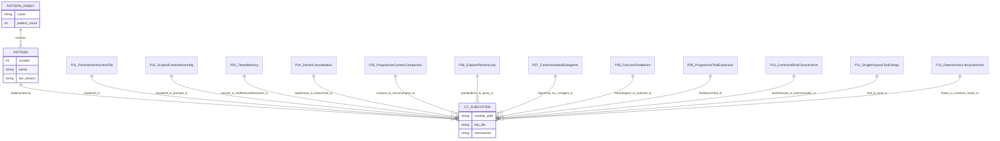
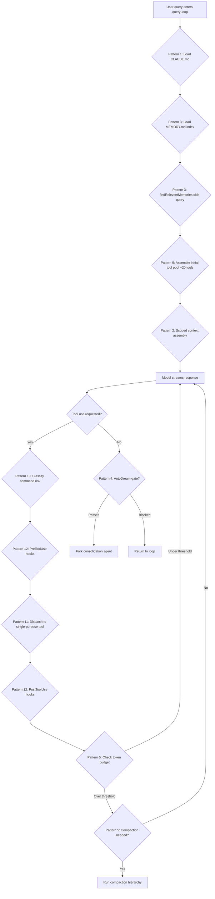

# The 12 HER Patterns Mapped to CC

## Overview

The Harness Engineering Report (HER) distilled 12 recurring architectural patterns from reverse-engineering Claude Code's codebase. These patterns are not abstract ideals -- they are concrete implementation decisions observed in a production system serving millions of sessions. This chapter maps each pattern to the specific subsystems, files, and mechanisms inside cc, noting where the implementation diverges from the published description and where gaps remain.

The 12 patterns fall into four families: **Memory and Context** (Patterns 1-5), **Workflow and Orchestration** (Patterns 6-8), **Tools and Permissions** (Patterns 9-11), and **Automation** (Pattern 12). The mapping below is ordered by family, then by pattern number. For each pattern, we trace the HER description to the implementing source file, show the data contract that grounds the pattern, and evaluate where cc's implementation exceeds, meets, or falls short of the published description.



The diagram above shows the structural relationship between patterns and subsystems. A single subsystem often implements multiple patterns: `claudemd.ts` underpins both Pattern 1 (Persistent Instruction File) and Pattern 2 (Scoped Context Assembly); `memdir.ts` and `findRelevantMemories.ts` together implement Pattern 3 (Tiered Memory). This overlap is not accidental -- the patterns were extracted from a single codebase, and their boundaries reflect posterior decomposition rather than independent design.

## Data structures and contracts

Each pattern depends on a specific data contract. The most foundational is the memory type system that underpins Patterns 1 through 4.

```typescript
// src/memdir/memoryTypes.ts:L14-L19 — Memory type taxonomy
export const MEMORY_TYPES = [
  'user',
  'feedback',
  'project',
  'reference',
] as const

export type MemoryType = (typeof MEMORY_TYPES)[number]
```

The four-type taxonomy is deliberately constrained. As the file header at `src/memdir/memoryTypes.ts:L1-L12` explains, it excludes information derivable from code or git history, reserving memory for context that would otherwise be lost between sessions. The `parseMemoryType` function at `src/memdir/memoryTypes.ts:L28-L31` returns `undefined` for unknown types, allowing legacy files without a `type:` field to degrade gracefully rather than breaking the session.

The memdir index contract enforces hard limits that shape every downstream retrieval:

```typescript
// src/memdir/memdir.ts:L34-L38 — Memory index caps
export const ENTRYPOINT_NAME = 'MEMORY.md'
export const MAX_ENTRYPOINT_LINES = 200
export const MAX_ENTRYPOINT_BYTES = 25_000
const AUTO_MEM_DISPLAY_NAME = 'auto memory'
```

The `MEMORY.md` file serves as a compact index -- always loaded into the system prompt -- with a hard 200-line and 25KB cap. The `truncateEntrypointContent` function at `src/memdir/memdir.ts:L57-L100` enforces both caps simultaneously, line-truncating first (natural boundary), then byte-truncating at the last newline before the cap so it never cuts mid-line. A warning is appended naming which cap fired, so the model knows content was elided.

The hook schema contract governs Pattern 12, defining five hook types each with Zod-validated input:

```typescript
// src/schemas/hooks.ts:L31-L65 — BashCommandHookSchema (first of five hook types)
function buildHookSchemas() {
  const BashCommandHookSchema = z.object({
    type: z.literal('command').describe('Shell command hook type'),
    command: z.string().describe('Shell command to execute'),
    if: IfConditionSchema(),
    shell: z
      .enum(SHELL_TYPES)
      .optional()
      .describe(
        "Shell interpreter. 'bash' uses your $SHELL; 'powershell' uses pwsh.",
      ),
    timeout: z
      .number()
      .positive()
      .optional()
      .describe('Timeout in seconds for this specific command'),
    statusMessage: z
      .string()
      .optional()
      .describe('Custom status message to display in spinner while hook runs'),
    once: z
      .boolean()
      .optional()
      .describe('If true, hook runs once and is removed after execution'),
    async: z
      .boolean()
      .optional()
      .describe('If true, hook runs in background without blocking'),
    asyncRewake: z
      .boolean()
      .optional()
      .describe(
        'If true, hook runs in background and wakes the model on exit code 2.',
      ),
  })
  // PromptHookSchema, HttpHookSchema, AgentHookSchema, FunctionHookSchema follow
  // with analogous fields (if, timeout, once, statusMessage) plus type-specific
  // fields (prompt, url, etc.)
```

The `if` condition field uses permission-rule syntax (e.g., `Bash(git *)`) to filter hooks before spawning -- a key optimization that avoids spawning shell processes for non-matching tool calls. The `IfConditionSchema` factory at `src/schemas/hooks.ts:L19-L27` produces a shared optional string that all five hook types reference.

The Tool input contract underpins Pattern 11, defining how every tool exposes itself to the model:

```typescript
// src/Tool.ts:L15-L21 — Tool input schema type
export type ToolInputJSONSchema = {
  [x: string]: unknown
  type: 'object'
  properties?: {
    [x: string]: unknown
  }
}
```

Every tool must provide a `ToolInputJSONSchema` alongside a Zod schema, a `call()` method, a prompt function, and optional UI rendering. The `buildTool` helper enforces this contract at tool registration time, making it impossible to register a tool that omits any required field.

## Control flow

### Pattern 1: Persistent Instruction File

CLAUDE.md files are auto-loaded at session start in a priority cascade. The loading order is documented in the file header:

```typescript
// src/utils/claudemd.ts:L1-L9 — Loading order comment
// Files are loaded in the following order:
//
// 1. Managed memory (eg. /etc/claude-code/CLAUDE.md) - Global instructions for all users
// 2. User memory (~/.claude/CLAUDE.md) - Private global instructions for all projects
// 3. Project memory (CLAUDE.md, .claude/CLAUDE.md, and .claude/rules/*.md in project roots)
// 4. Local memory (CLAUDE.local.md in project roots) - Private project-specific instructions
```

Files are loaded in reverse order of priority: the latest-loaded file has the highest priority because it appears last in the system prompt, receiving more model attention. The `@include` directive allows CLAUDE.md to reference other files via `@path`, `@./relative/path`, `@~/home/path`, or `@/absolute/path` syntax. Circular references are prevented by tracking processed files, and non-existent targets are silently ignored. The glob pattern `.claude/rules/*.md` is scanned at each directory level during upward traversal, providing a natural mechanism for teams to organize instructions by topic rather than concatenating everything into a single monolithic file.

The managed memory layer at path `/etc/claude-code/CLAUDE.md` is enterprise-specific: it allows system administrators to inject organization-wide instructions (compliance policies, approved tool lists, coding standards) that every user session inherits. Because this layer is loaded first and therefore has the lowest priority, it serves as a set of defaults rather than mandates -- project-level and user-level files can override it. The `CLAUDE.local.md` variant is excluded from version control (typically added to `.gitignore`), giving individual developers a private surface for personal instructions without polluting the shared project configuration.

### Pattern 2: Scoped Context Assembly

The loading order above is itself the scoped context assembly mechanism. cc discovers CLAUDE.md files by traversing from the current directory upward to the root, with files closer to the working directory loaded later (higher priority). This creates a natural scope: org-level defaults are overridden by user preferences, which are overridden by project conventions, which are overridden by directory-specific rules. The traversal happens at query time, not at session start, so changing directories within a session automatically re-discovers a different instruction set.

The `getAdditionalDirectoriesForClaudeMd` function (imported at `src/utils/claudemd.ts:L47`) allows the settings system to inject extra directories into the discovery path, enabling enterprise deployments to add organization-wide instruction roots without modifying the filesystem. This function is called during the CLAUDE.md discovery pass at `src/utils/claudemd.ts`, and the injected directories participate in the same priority cascade as filesystem-discovered files -- they are loaded according to their position in the injection order, not given special precedence. The practical effect is that an enterprise can mandate a base set of instructions by injecting a root directory, while still allowing project-level CLAUDE.md files to override specific directives.

### Pattern 3: Tiered Memory

The memdir system implements a three-tier memory architecture. `MEMORY.md` (capped at 200 lines / 25KB) is always in context as Tier 1. Individual memory files are loaded on demand via a relevance-ranking side query as Tier 2. Full session transcripts live on disk as Tier 3, never loaded into context but available for the consolidation system to grep.

The relevance retrieval function is the bridge between Tier 1 and Tier 2:

```typescript
// src/memdir/findRelevantMemories.ts:L39-L45 — Relevance retrieval entry point
export async function findRelevantMemories(
  query: string,
  memoryDir: string,
  signal: AbortSignal,
  recentTools: readonly string[] = [],
  alreadySurfaced: ReadonlySet<string> = new Set(),
): Promise<RelevantMemory[]>
```

The function scans memory file headers, sends them to a lightweight Sonnet side query that selects up to 5 relevant files, and returns their paths. The `alreadySurfaced` parameter prevents re-selecting memories already shown in prior turns, ensuring the 5-slot budget targets fresh candidates. The `recentTools` parameter filters out reference documentation for tools the model is already actively using -- a practical optimization that prevents the selector from surfacing API docs for a tool whose output is already in the conversation.

The side-query system prompt at `src/memdir/findRelevantMemories.ts:L18-L24` is deliberately conservative, instructing the selector to only include memories it is certain will be helpful. This bias toward precision over recall is intentional: surfacing an irrelevant memory wastes context tokens and can mislead the model, while failing to surface a relevant one is recoverable (the model can re-query).

The memory type system also includes a drift caveat. The `MEMORY_DRIFT_CAVEAT` constant at `src/memdir/memoryTypes.ts:L201-L202` reminds the model that recalled memories may be stale and must be verified against current state before acting on them. The `TRUSTING_RECALL_SECTION` at `src/memdir/memoryTypes.ts:L240-L256` adds a dedicated section instructing the model to check that files, functions, and flags named in memories still exist before recommending them -- an eval-validated improvement that went from 0/3 to 3/3 on verification tasks when given its own section header.

### Pattern 4: Dream Consolidation

The `autoDream` system fires a background consolidation loop when three gates pass in order: time (24 hours since last consolidation), session count (5 new sessions), and lock (no concurrent consolidation). The gate logic is closure-scoped for test isolation:

```typescript
// src/services/autoDream/autoDream.ts:L122-L141 — Gate evaluation
export function initAutoDream(): void {
  let lastSessionScanAt = 0

  runner = async function runAutoDream(context, appendSystemMessage) {
    const cfg = getConfig()
    const force = isForced()
    if (!force && !isGateOpen()) return

    // --- Time gate ---
    let lastAt: number
    try {
      lastAt = await readLastConsolidatedAt()
    } catch (e: unknown) {
      logForDebugging(
        `[autoDream] readLastConsolidatedAt failed: ${(e as Error).message}`,
      )
      return
    }
    const hoursSince = (Date.now() - lastAt) / 3_600_000
    if (!force && hoursSince < cfg.minHours) return
```

The gate order is cheapest-first: reading the lock file mtime (`readLastConsolidatedAt`) is a single `stat` call, while listing session transcripts requires directory scanning. The scan throttle at `src/services/autoDream/autoDream.ts:L56` (`SESSION_SCAN_INTERVAL_MS = 10 * 60 * 1000`) prevents the time gate from re-triggering every turn once it has passed but the session gate has not -- without it, every subsequent turn would re-scan the session directory.

When all gates pass, a forked subagent runs the consolidation prompt with read-only Bash constraints. The prompt at `src/services/autoDream/consolidationPrompt.ts` defines six phases: Orient (list existing memories), Gather (scan daily logs and drifted memories), Consolidate (merge, deduplicate, update), Prune (delete stale memories), Reindex (rewrite `MEMORY.md`), and Verify (spot-check the index). The forked agent's file edits (to memory files) are tracked via `DreamTask`, and an inline completion message appears in the main transcript.

The lock mechanism at `src/services/autoDream/consolidationLock.ts:L29-L36` uses the lock file's mtime as `lastConsolidatedAt` -- a design that avoids a separate state file. The lock body contains the holder's PID, and a stale threshold of one hour at `src/services/autoDream/consolidationLock.ts:L19` guards against PID reuse. If the holder process dies, the next process reclaims the lock by overwriting it.

### Pattern 5: Progressive Context Compaction

cc implements four compaction layers of escalating severity, each triggered by different token-pressure thresholds. The compactable tool set is explicitly enumerated:

```typescript
// src/services/compact/microCompact.ts:L41-L50 — Tools eligible for compaction
const COMPACTABLE_TOOLS = new Set<string>([
  FILE_READ_TOOL_NAME,
  ...SHELL_TOOL_NAMES,
  GREP_TOOL_NAME,
  GLOB_TOOL_NAME,
  WEB_SEARCH_TOOL_NAME,
  WEB_FETCH_TOOL_NAME,
  FILE_EDIT_TOOL_NAME,
  FILE_WRITE_TOOL_NAME,
])
```

The four layers are: (1) `history_snip` markers that delimit old tool results for pruning -- these are semantic boundaries the model respects, not actual data deletion; (2) Microcompact that trims tool results without invoking the model, replacing old tool output with `[Old tool result content cleared]` (the constant at `src/services/compact/microCompact.ts:L36`); (3) Context Collapse that aggressively summarizes the full conversation via a model call; and (4) Autocompact that fires automatically when context approaches capacity, triggered from the query loop's token budget checks.

Notably, `NotebookEdit` does not appear in `COMPACTABLE_TOOLS`. Notebook cell outputs contain structured data that the model references by cell index; microcompact truncation would corrupt these references. This is a deliberate design choice: tools with high information density are excluded from the cheapest compaction layer, becoming targets only for the more expensive model-based compaction stages.

The observation masking technique (summarizing old tool results) achieves significant cost reduction but risks losing details the model needs for later reasoning. The `history_snip` boundaries mark where compaction occurred, but the model has no mechanism to request the original content.

### Pattern 6: Explore-Plan-Act Loop

Plan mode implements a five-phase model with escalating permissions. The parallel exploration agent count varies by subscription tier:

```typescript
// src/utils/planModeV2.ts:L31-L43 — Agent count by tier
export function getPlanModeV2ExploreAgentCount(): number {
  if (process.env.CLAUDE_CODE_PLAN_V2_EXPLORE_AGENT_COUNT) {
    const count = parseInt(
      process.env.CLAUDE_CODE_PLAN_V2_EXPLORE_AGENT_COUNT,
      10,
    )
    if (!isNaN(count) && count > 0 && count <= 10) {
      return count
    }
  }

  return 3
}
```

The five phases are: Interview (structured requirements gathering), Exploration (parallel read-only agents), Planning (synthesis of findings into a plan document), Review (plan approval gate), and Execution (full write access). The interview phase at `src/utils/planModeV2.ts:L50-L62` is gated by the `tengu_plan_mode_interview_phase` GrowthBook feature flag, with an environment variable override. The `getPlanModeV2AgentCount` function at `src/utils/planModeV2.ts:L5-L29` returns 3 for enterprise/team subscriptions and 1 for individual plans, controlling how many parallel exploration agents the plan phase spawns.



### Pattern 7: Context-Isolated Subagents

The AgentTool spawns subagents with isolated context windows. Research agents (`subagent_type: "Explore"`) cannot edit files. The input schema controls isolation parameters:

```typescript
// src/tools/AgentTool/AgentTool.tsx:L82-L88 — Base input schema
const baseInputSchema = lazySchema(() => z.object({
  description: z.string().describe('A short (3-5 word) description of the task'),
  prompt: z.string().describe('The task for the agent to perform'),
  subagent_type: z.string().optional().describe('The type of specialized agent to use for this task'),
  model: z.enum(['sonnet', 'opus', 'haiku']).optional().describe("Optional model override for this agent. Takes precedence over the agent definition's model frontmatter. If omitted, uses the agent definition's model, or inherits from the parent."),
  run_in_background: z.boolean().optional().describe('Set to true to run this agent in the background. You will be notified when it completes.').describe('Set to true to run this agent in the background. You will be notified when it completes.')
}));
```

The full schema at `src/tools/AgentTool/AgentTool.tsx:L91-L102` extends the base with multi-agent parameters (name, team_name, mode) and an `isolation` field that accepts `"worktree"` or (for internal builds) `"remote"`. When `isolation: "worktree"` is specified, the tool creates a temporary git worktree via `createAgentWorktree` so the subagent operates on an isolated copy of the repository. The `cwd` parameter is mutually exclusive with `isolation: "worktree"` because worktree isolation already implies a different working directory.

### Pattern 8: Fork-Join Parallelism

The fork-subagent path enables parallel agent execution with context sharing. When enabled, omitting `subagent_type` triggers an implicit fork where the child inherits the parent's full conversation context:

```typescript
// src/tools/AgentTool/forkSubagent.ts:L32-L39 — Fork gate
export function isForkSubagentEnabled(): boolean {
  if (feature('FORK_SUBAGENT')) {
    if (isCoordinatorMode()) return false
    if (getIsNonInteractiveSession()) return false
    return true
  }
  return false
}
```

The fork path threads the parent's rendered system prompt bytes directly to the child via `toolUseContext.renderedSystemPrompt`, avoiding prompt-cache busting from GrowthBook state changes between render time and fork time. The `FORK_AGENT` definition at `src/tools/AgentTool/forkSubagent.ts:L60-L71` uses `tools: ['*']` with `useExactTools` so the fork child receives the parent's exact tool pool, and `permissionMode: 'bubble'` so permission prompts surface to the parent terminal. The `model: 'inherit'` setting keeps the parent's model for context length parity. This byte-threading approach is a deliberate architectural choice: reconstructing the system prompt by re-calling `getSystemPrompt()` can diverge (GrowthBook cold-to-warm transitions) and bust the prompt cache.

The fork recursion guard at `src/tools/AgentTool/forkSubagent.ts:L78-L85` prevents infinite recursive agent spawning by detecting the `FORK_BOILERPLATE_TAG` in the child's conversation history. This dual-guard mechanism (message-scan guard plus `querySource` guard) ensures that fork children cannot themselves fork, even after autocompact strips older messages.

### Pattern 9: Progressive Tool Expansion

cc does not load all 60+ tools into every prompt. Instead, a core set of approximately 20 tools is included initially, and additional tools are exposed via `ToolSearchTool` on demand:

```typescript
// src/tools/ToolSearchTool/ToolSearchTool.ts:L21-L34 — ToolSearch input schema
export const inputSchema = lazySchema(() =>
  z.object({
    query: z
      .string()
      .describe(
        'Query to find deferred tools. Use "select:<tool_name>" for direct selection, or keywords to search.',
      ),
    max_results: z
      .number()
      .optional()
      .default(5)
      .describe('Maximum number of results to return (default: 5)'),
  }),
)
```

Deferred tools (MCP tools, less-common tools) are listed in a compact catalog within the system prompt. When the model calls `ToolSearch`, the matching tool's full schema and prompt are loaded for the first time. The keyword search uses a scoring system that weights exact name matches (10 points for non-MCP, 12 for MCP server names), partial name matches (5 points), `searchHint` matches (4 points), and description matches (2 points). The `select:` prefix supports direct tool selection by name, with comma-separated multi-select for batch loading.

The `maybeInvalidateCache` function detects when the deferred tool set has changed (e.g., an MCP server finishes connecting) and clears the memoized description cache. The `pending_mcp_servers` field in the output schema alerts the model that some servers are still connecting and their tools will become available shortly.

### Pattern 10: Command Risk Classification

Bash commands undergo multi-layer risk classification before execution. The security module defines patterns for command substitution, process substitution, and dangerous shell constructs:

```typescript
// src/tools/BashTool/bashSecurity.ts:L16-L41 — Dangerous substitution patterns
const COMMAND_SUBSTITUTION_PATTERNS = [
  { pattern: /<\(/, message: 'process substitution <()' },
  { pattern: />\(/, message: 'process substitution >()' },
  { pattern: /=\(/, message: 'Zsh process substitution =()' },
  {
    pattern: /(?:^|[\s;&|])=[a-zA-Z_]/,
    message: 'Zsh equals expansion (=cmd)',
  },
  { pattern: /\$\(/, message: '$() command substitution' },
  { pattern: /\$\{/, message: '${} parameter substitution' },
  { pattern: /\$\[/, message: '$[] legacy arithmetic expansion' },
  { pattern: /~\[/, message: 'Zsh-style parameter expansion' },
  { pattern: /\(e:/, message: 'Zsh-style glob qualifiers' },
  { pattern: /\(\+/, message: 'Zsh glob qualifier with command execution' },
  {
    pattern: /\}\s*always\s*\{/,
    message: 'Zsh always block (try/always construct)',
  },
  { pattern: /<#/, message: 'PowerShell comment syntax' },
]
```

The Zsh-specific patterns are notable: `=cmd` at word start expands to `$(which cmd)`, meaning `=curl evil.com` becomes `/usr/bin/curl evil.com`, bypassing `Bash(curl:*)` deny rules since the parser sees `=curl` as the base command. The `ZSH_DANGEROUS_COMMANDS` set at `src/tools/BashTool/bashSecurity.ts:L45-L70` blocks `zmodload` (gateway to module-based attacks including `zsh/mapfile`, `zsh/system`, and `zsh/net/tcp`), `emulate` (eval-equivalent), and zsh/system builtins (`sysopen`, `sysread`, `syswrite`) as defense-in-depth.

Commands are further classified into risk bands (read, write, destructive) by the classifier pipeline, which feeds into the permission system. The classifier result type at `src/utils/permissions/bashClassifier.ts:L6-L10` includes a `confidence` field (`high`, `medium`, `low`) and a `reason` string, enabling the permission system to make nuanced decisions rather than binary allow/deny.

### Pattern 11: Single-Purpose Tool Design

Each tool in cc is a self-contained unit with its own Zod input schema, `call()` method, UI component, and prompt. The `Tool` type contract enforces this separation. The `buildTool` helper (defined in `src/Tool.ts`) enforces that every tool provides `name`, `inputSchema`, `prompt`, and `call`. The file-edit, file-read, and file-write tools are separate tools with independent permission rules, not flags on a single "file" tool. This separation means that granting permission to read files does not implicitly grant permission to write files -- a critical security property for a tool that operates on user code.

The `isConcurrencySafe()` and `isReadOnly()` flags on each tool control dispatch behavior: read-only tools can run in parallel with other read-only tools, while write tools are serialized. The `isDeferred()` method determines whether a tool is included in the initial prompt or surfaced via ToolSearch, connecting Pattern 11 to Pattern 9. The `maxResultBytes` property bounds the output size per tool invocation, preventing a single tool (such as a file-read on a large file) from consuming the entire context window. The `canAutoApprove` method on each tool integrates with the permission system, returning whether the tool's operation can be silently approved under the current permission mode without prompting the user.

### Pattern 12: Deterministic Lifecycle Hooks

Hooks are the most extensible automation surface in cc. The hook schema defines events (`PreToolUse`, `PostToolUse`, `SessionStart`, etc.), matchers (tool-name patterns via the `if` condition field), and four hook types (command, prompt, HTTP, agent). The `if` condition field enables cheap pre-filtering:

```typescript
// src/schemas/hooks.ts:L19-L27 — If condition schema
const IfConditionSchema = lazySchema(() =>
  z
    .string()
    .optional()
    .describe(
      'Permission rule syntax to filter when this hook runs (e.g., "Bash(git *)"). ' +
        'Only runs if the tool call matches the pattern. Avoids spawning hooks for non-matching commands.',
    ),
)
```

The `once: true` flag supports one-shot hooks that auto-remove after execution. The `async` flag enables non-blocking hooks for fire-and-forget scenarios. The `asyncRewake` flag at `src/schemas/hooks.ts:L59-L64` extends `async` behavior by waking the model when the hook exits with code 2 (blocking error), providing a middle ground between fully blocking and fully async. The `statusMessage` field allows hooks to display custom spinner text while running, improving the user experience during long-running validations.

The hook execution system dispatches each hook type through a distinct pipeline: command hooks spawn a shell process, HTTP hooks POST JSON to a URL (with SSRF guards), prompt hooks invoke a model side-query, and agent hooks spawn a full subagent. The `timeout` field per-hook mitigates blocking, but there is no hook-level circuit breaker -- a repeated failing hook will keep firing until explicitly removed.

## Edge cases and failure modes

**Pattern 1 -- CLAUDE.md loading failures are silent.** If a CLAUDE.md file is malformed or the `@include` target does not exist, the file is silently ignored. This avoids crashing the session on a bad instruction file, but means misconfigured instructions provide no diagnostic signal. The only indication is the absence of the expected instructions from the assembled system prompt, which requires dumping the prompt to diagnose.

**Pattern 3 -- Memory relevance selection can miss.** The `findRelevantMemories` side query is capped at 5 results and uses a lightweight Sonnet model. Complex queries that need 6 or more memories or nuanced relevance judgment can surface the wrong set. The telemetry in `memoryShapeTelemetry` tracks selection rates (including empty selections with age = -1 to distinguish "ran, picked nothing" from "never ran"), but does not correct the selection.

**Pattern 3 -- Memory index overflow.** When the `MEMORY.md` index exceeds 200 lines or 25KB, `truncateEntrypointContent` silently drops content. The function appends a warning naming which cap fired, but the model has no way to know what was removed. A growing index that repeatedly hits the cap indicates the memory system is storing too much -- a signal that dream consolidation should run more aggressively.

**Pattern 3 -- Memory staleness is unchecked at recall time.** The `MEMORY_DRIFT_CAVEAT` constant warns the model to verify recalled memories against current state, but this is advisory, not enforced. The `memoryAge.ts` module tracks file mtime for freshness signals, and the staleness warning at `src/memdir/memoryTypes.ts:L201-L202` is appended to old memories, but nothing prevents the model from acting on a stale memory without verification. The `TRUSTING_RECALL_SECTION` at `src/memdir/memoryTypes.ts:L240-L256` provides structured guidance (check file existence, grep for functions, verify before acting), but the model may skip these steps under time pressure.

**Pattern 4 -- Dream consolidation lock contention.** The consolidation lock prevents concurrent dreams, but if the forked agent crashes without releasing the lock, subsequent dreams are blocked until the lock's mtime ages past the stale threshold (1 hour at `src/services/autoDream/consolidationLock.ts:L19`). The `rollbackConsolidationLock` call at `src/services/autoDream/consolidationLock.ts:L91-L108` handles most cases by rewinding the mtime so the time gate passes again, but hard kills (SIGKILL) can leave stale locks that block until the stale threshold expires.

**Pattern 5 -- Compaction can discard critical context.** The observation masking technique (summarizing old tool results) achieves significant cost reduction but risks losing details the model needs for later reasoning. The `history_snip` boundaries mark where compaction occurred, but the model has no mechanism to request the original content. A model that reasons about specific line numbers from a file-read result may hallucinate those numbers after microcompact replaces the result with a cleared message.

**Pattern 5 -- Microcompact does not run on all tools.** The `COMPACTABLE_TOOLS` set deliberately excludes `NotebookEdit` and other high-density tools. While this prevents data corruption (notebook cell references would break if truncated), it means that a conversation heavy with notebook edits accumulates context faster than one using only bash and grep. The exclusion list is static, not adaptive to session composition.

**Pattern 8 -- Fork-subagent cache coherence.** The fork path threads the parent's rendered system prompt to preserve prompt-cache hit rates. However, if GrowthBook feature flags change between the parent's render and the fork's execution, the child operates under stale feature-gate state for the duration of its run. This is an accepted tradeoff: re-rendering would guarantee freshness but would produce a cache miss on every fork, negating the cost savings.

**Pattern 8 -- Fork children can outlive their parent context.** A forked subagent running in the background continues executing even after the parent's conversation has moved on. If the parent's context is compacted while the child is running, the child's eventual result message may reference entities that no longer exist in the parent's working memory. The `FORK_BOILERPLATE_TAG` at `src/tools/AgentTool/forkSubagent.ts:L78-L85` includes context-constraining instructions to mitigate this, but the fundamental temporal mismatch remains.

**Pattern 9 -- ToolSearch discoverability gap.** The model must know to call `ToolSearch` for tools not in the initial set. If the model does not realize a deferred tool exists (e.g., a newly-added MCP tool whose name is unfamiliar), it will attempt to solve the problem without it. The compact catalog in the system prompt lists deferred tool names, but the model may not recognize that a catalog entry maps to its current need. The `pending_mcp_servers` field in ToolSearch output partially addresses this by alerting the model that new tools are still loading.

**Pattern 10 -- Classifier gaps in external builds.** The `bashClassifier.ts` in external builds is a stub that always returns `matches: false` and `confidence: 'high'` with `reason: 'This feature is disabled'`. This means classifier-based permissions (the `prompt:` prefix in permission rules) are Anthropic-internal only; external users rely on pattern matching and manual approval. The stub design is intentional -- `isClassifierPermissionsEnabled()` returns `false`, and all classifier queries return safe defaults rather than crashing or silently allowing.

**Pattern 12 -- Hook timeout and cascading failures.** A slow hook blocks the entire tool dispatch pipeline. The `timeout` field per-hook mitigates this, but the default timeout may be too long for interactive sessions, and there is no hook-level circuit breaker. A hook that consistently fails or times out will keep firing on every matching tool call until the user removes it from settings. The `once: true` flag is a partial mitigation for one-shot scenarios, but persistent hooks lack an automatic disable-on-repeated-failure mechanism.

## Where cc diverges from the published pattern

**Pattern 1 -- CLAUDE.md is not a single file.** The HER description implies one persistent instruction file. cc actually loads a cascade of up to four layers (managed, user, project, local) plus `.claude/rules/*.md` glob files and `@include` transitive references. The effective "instruction file" is an assembled composite, not a single document. This divergence is significant because it means instruction precedence is determined by load order, not by explicit priority annotations within the instructions themselves.

**Pattern 2 -- Scoped context assembly is not a separate mechanism.** The HER treats scoped context assembly as a distinct pattern, but in cc it is the same code path as Pattern 1. The CLAUDE.md loading order IS the scoped assembly. There is no separate scoping layer that operates on top of the instruction files. The two patterns share the same traversal logic, the same priority resolution, and the same system prompt injection point.

**Pattern 3 -- Memory recall is side-query-driven, not index-driven.** The HER description implies a tiered memory system where the compact index (Tier 1) directly informs which topic files to load (Tier 2). In practice, the `findRelevantMemories` function at `src/memdir/findRelevantMemories.ts:L39-L45` uses a Sonnet side query that scans memory file headers, not the `MEMORY.md` index itself. The index serves as a context-injection artifact (always in the prompt for the model to browse), but the retrieval decision is made by a separate LLM call with its own system prompt at `src/memdir/findRelevantMemories.ts:L18-L24`. This means the recall system has its own failure mode (side-query misjudgment) independent of index quality. A second divergence concerns the strictness of the three-tier model itself: cc's implementation adds parameters that the HER taxonomy does not capture. The `alreadySurfaced` parameter at `src/memdir/findRelevantMemories.ts:L45` prevents re-selection of memories already shown in prior turns, effectively introducing a fourth tier of "surfaced but still in context" that the three-tier model does not account for. The `recentTools` parameter filters out reference documentation for tools whose output is already in the conversation, which means the retrieval decision is context-dependent in a way the tiered model does not describe. The staleness warning system (`MEMORY_DRIFT_CAVEAT` and `TRUSTING_RECALL_SECTION`) adds a verification layer that the HER model treats as part of the tier structure but cc implements as an advisory appendage to recalled content, not as a structural tier boundary.

**Pattern 5 -- Compaction hierarchy has five stages, not four.** The HER description names four layers (HISTORY_SNIP, Microcompact, Context Collapse, Autocompact). cc actually implements a fifth stage: the cached microcompact path at `src/services/compact/microCompact.ts:L52-L60` uses the Anthropic API's cache-editing mechanism to remove tool results from the cached prompt prefix without invalidating the cache. This stage sits between microcompact and context collapse in cost, providing an intermediate option that preserves cache hits while freeing token space. The `Hard Reset` stage (requiring user intervention when all compaction fails) is sometimes counted as a sixth stage, but it is not an automatic compaction -- it is a failure mode. A further divergence is that the HER treats the four compaction layers as strictly sequential, each triggered by escalating token pressure. In cc, the cached microcompact path can be triggered independently of the normal escalation ladder -- it is available whenever the prompt prefix contains cacheable tool results, regardless of whether the token budget threshold for the next stage has been reached. The `COMPACTABLE_TOOLS` set also means that not all tool results are equally eligible for compaction: tools like `NotebookEdit` are excluded from microcompact entirely, creating a two-tier compaction eligibility that the HER model does not describe. A session heavy with notebook edits will accumulate context faster than one using only bash and grep, because the cheapest compaction layer cannot touch notebook output.

**Pattern 6 -- Plan mode has more than three phases.** The HER description names three phases (Explore, Plan, Act). cc's plan mode V2 has five phases: Interview, Exploration, Planning, Review, and Execution. The interview and review phases are additions not captured in the original pattern description. The Interview phase gathers structured requirements before exploration begins, reducing the risk of agents exploring the wrong problem. The Review phase forces explicit plan approval before execution, providing a human-in-the-loop checkpoint that the three-phase model lacks.

**Pattern 7 -- Subagents are not always context-isolated.** The fork path (`isForkSubagentEnabled`) creates a subagent that inherits the parent's full conversation context, contradicting the "context-isolated" label. Only typed subagents (with explicit `subagent_type`) receive a fresh context window. The fork path is designed for task delegation where the child needs full context about what the parent was doing, while typed subagents are designed for specialized roles (exploration, verification) where isolation prevents the child from being influenced by the parent's assumptions.

**Pattern 8 -- Fork-join does not always join.** The HER description implies a fork-join model where the parent waits for children to complete and merges results. cc's fork path supports both synchronous (parent blocks until child completes) and asynchronous (`run_in_background: true`) execution. Background forks return immediately with a task notification, and the parent learns of completion through the task system rather than a direct join. The `auto-background` mechanism at `src/tools/AgentTool/AgentTool.tsx:L87` automatically transitions a synchronous subagent to asynchronous after a 120-second timeout, meaning the "join" is not guaranteed even when the parent initially intends to wait. A second divergence is that cc's fork path is always single-child: the parent forks exactly one subagent and then continues executing. The HER pattern describes fork-join as a multi-agent fan-out where multiple children run in parallel and the parent collects all results. cc achieves multi-agent parallelism through the coordinator system (`coordinatorMode.ts`) rather than through the fork path itself. The fork path is more accurately described as task delegation with optional synchronization, not the structured parallelism the fork-join label implies.

**Pattern 9 -- Progressive expansion is not strictly lazy.** Some tools (MCP tools via deferred loading) are truly lazy, but the core set of approximately 20 tools is always present. The boundary between "always loaded" and "on demand" is not dynamically adjusted based on session context -- it is a static partition defined at tool registration time via the `isDeferred()` method. A session that only uses file tools still loads the Bash, Agent, and Web tools in the initial prompt.

**Pattern 10 -- Risk classification is multi-layer, not single-pass.** The HER description suggests a single classification step. cc actually chains multiple classifiers: syntactic pattern matching (the `COMMAND_SUBSTITUTION_PATTERNS` array), Zsh-specific dangerous command blocking (`ZSH_DANGEROUS_COMMANDS`), semantic risk-band classification (the classifier pipeline in `bashClassifier.ts`), and YOLO classifier evaluation. Each layer can override or supplement the previous one. The YOLO classifier uses a two-stage pipeline (fast stage + thinking stage) that only invokes the slower stage when the fast stage flags a potential block, reducing latency for clearly safe commands. A further divergence is that the "deterministic" guarantee the HER pattern describes is Anthropic-internal only. The `bashClassifier.ts` in external builds is a stub that returns `matches: false` and `confidence: 'high'` with `reason: 'This feature is disabled'`, as discussed in the Edge Cases section. This means classifier-based permissions (the `prompt:` prefix in permission rules) do not function for external users, who instead rely on pattern matching and manual approval. The stub design is intentional -- `isClassifierPermissionsEnabled()` at `src/utils/permissions/bashClassifier.ts:L24-L26` returns `false`, and all classifier queries return safe defaults rather than crashing or silently allowing. The divergence is architectural: the HER describes a deterministic pre-execution gate, but for the majority of deployments (all external builds), the gate is effectively absent.

**Pattern 11 -- Single-purpose tools share infrastructure.** While each tool has its own schema and `call()` method, the file tools share underlying infrastructure: `FileReadTool`, `FileEditTool`, and `FileWriteTool` all use the same file-history snapshot system, the same path-validation logic, and the same permission-check pipeline. The "single-purpose" label applies to the model-facing interface, not to the implementation.

**Pattern 12 -- Hooks are not purely deterministic.** The `prompt` and `agent` hook types invoke the model, making their behavior non-deterministic. Only `command` and `http` hooks are truly deterministic. The HER description does not distinguish these, but the distinction matters for reliability: a `prompt` hook that asks the model "is this code safe?" may give different answers on different runs, while a `command` hook that runs a linter produces identical output for identical input.

## Developer takeaways for building a long-running agent

The twelve patterns yield a coherent set of implementation lessons. Load instruction files in priority order so local context overrides global defaults, and cap memory indices aggressively (cc's 200-line / 25KB dual cap at `src/memdir/memdir.ts:L34-L38` is a hard-won number). Gate background consolidation with multiple conditions (AutoDream's time-session-lock triple at `src/services/autoDream/autoDream.ts:L122-L141` plus the scan throttle). Implement compaction as an escalating hierarchy rather than a single stage, excluding high-density tools from the cheapest layer. Thread rendered prompt bytes to subagents rather than re-rendering from parameters, to preserve cache coherence across GrowthBook transitions. Classify command risk before requesting permission using multi-layer pipelines, and give each tool its own permission boundary so that granting read access does not implicitly grant write access. Use lifecycle hooks as the extension surface rather than code modification, and design every platform-specific feature with a safe stub fallback for builds that strip it. Use lock-file mtime as a dual-purpose signal (consolidation timestamp and contention guard at `src/services/autoDream/consolidationLock.ts:L29-L36`). Make plan-mode phases configurable rather than hardcoded, and give memory recall its own dedicated verification section -- the eval-validated `TRUSTING_RECALL_SECTION` at `src/memdir/memoryTypes.ts:L240-L256` went from 0/3 to 3/3 on verification tasks when given its own section header.
