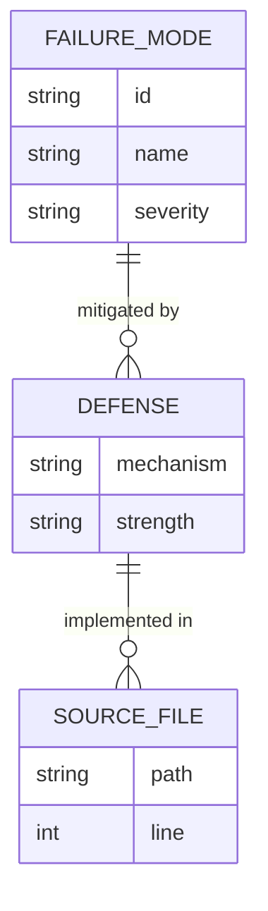
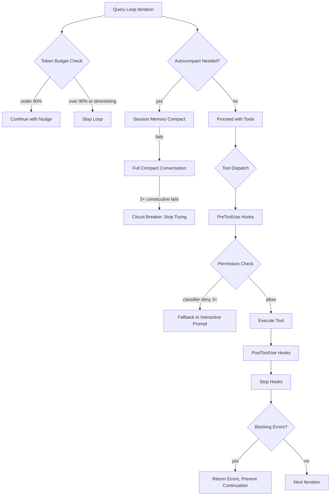
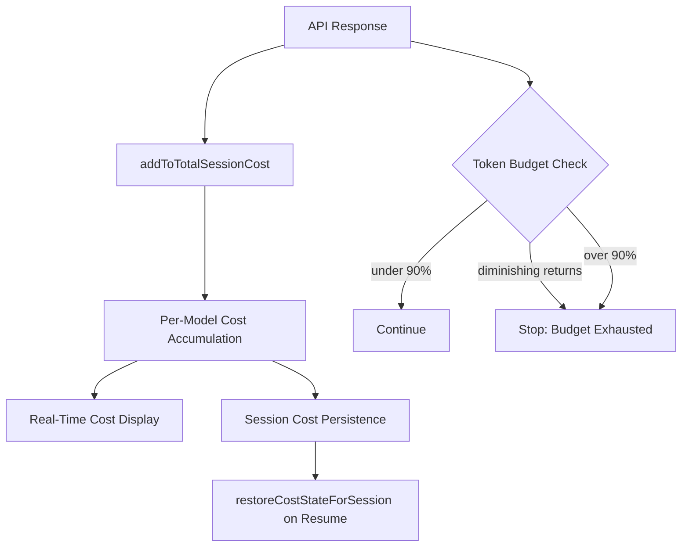

# The 17 Failure Modes: How CC Defends (or Doesn't)

## Overview

The HER report identifies 17 failure modes that afflict long-running agents — from the well-known (context rot, infinite loops) to the newly discovered (checkpoint-restore side effects, data leakage between contexts). This chapter maps every one of those failure modes to cc's concrete defenses, names the source files and line numbers that implement them, and honestly flags where cc has no defense at all.

The 17 modes fall into three clusters by severity:

- **Context-management failures** (6.1, 6.5, 6.9): cc has the deepest defenses here — a five-stage compaction hierarchy, session persistence, and structured handoff protocols.
- **Safety-and-correctness failures** (6.6, 6.7, 6.11, 6.12, 6.13, 6.15, 6.16): cc has substantial defenses, but gaps remain, particularly around hallucinated tool calls and checkpoint-restore side effects.
- **Behavioral-and-goal failures** (6.2, 6.3, 6.4, 6.8, 6.10, 6.14, 6.17): cc relies more on prompt engineering and workflow constraints than on hard mechanisms; some modes have no structural defense.

The relationship between failure modes and cc's defenses is many-to-many: a single defense (like the compaction hierarchy) mitigates multiple failure modes, and a single failure mode (like infinite loops) requires multiple defenses working in concert.



## Data structures and contracts

The central data structure governing failure-mode defenses is the `TokenBudgetDecision` — a discriminated union that decides whether the query loop continues or stops based on token consumption:

```typescript
# src/query/tokenBudget.ts:L22-L43 — Budget decision types
type ContinueDecision = {
  action: 'continue'
  nudgeMessage: string
  continuationCount: number
  pct: number
  turnTokens: number
  budget: number
}

type StopDecision = {
  action: 'stop'
  completionEvent: {
    continuationCount: number
    pct: number
    turnTokens: number
    budget: number
    diminishingReturns: boolean
    durationMs: number
  } | null
}

export type TokenBudgetDecision = ContinueDecision | StopDecision
```

The `DenialTrackingState` is another critical contract — it tracks how often permission classifiers deny operations, with circuit-breaker limits that force a fallback to interactive prompting:

```typescript
# src/utils/permissions/denialTracking.ts:L7-L15 — Denial tracking with circuit breaker
export type DenialTrackingState = {
  consecutiveDenials: number
  totalDenials: number
}

export const DENIAL_LIMITS = {
  maxConsecutive: 3,
  maxTotal: 20,
} as const
```

The `AutoCompactTrackingState` tracks compaction health across turns, including a consecutive-failure circuit breaker that prevents infinite compaction retry loops:

```typescript
# src/services/compact/autoCompact.ts:L51-L60 — Autocompact tracking with failure counter
export type AutoCompactTrackingState = {
  compacted: boolean
  turnCounter: number
  turnId: string
  consecutiveFailures?: number
}
```

The `CompactionResult` contract defines what a compaction pass produces — a boundary marker, summary messages, preserved attachments, and optional preserved segments:

```typescript
# src/services/compact/compact.ts:L299-L310 — Compaction result contract
export interface CompactionResult {
  boundaryMarker: SystemMessage
  summaryMessages: UserMessage[]
  attachments: AttachmentMessage[]
  hookResults: HookResultMessage[]
  messagesToKeep?: Message[]
  userDisplayMessage?: string
  preCompactTokenCount?: number
  postCompactTokenCount?: number
  truePostCompactTokenCount?: number
  compactionUsage?: ReturnType<typeof getTokenUsage>
}
```

The `StoredCostState` in `src/cost-tracker.ts:L71-L80` captures what persists across session boundaries for cost tracking — a key defense against both cost explosion (6.11) and compounding bugs (6.9):

```typescript
# src/cost-tracker.ts:L71-L80 — Stored cost state for session persistence
type StoredCostState = {
  totalCostUSD: number
  totalAPIDuration: number
  totalAPIDurationWithoutRetries: number
  totalToolDuration: number
  totalLinesAdded: number
  totalLinesRemoved: number
  lastDuration: number | undefined
  modelUsage: { [modelName: string]: ModelUsage } | undefined
}
```

## Control flow

The overall control flow for failure-mode defense runs through the query loop on every turn. The loop has four major decision points that correspond to different failure-mode clusters:



The token budget check itself is a concise function that detects both threshold breaches and diminishing returns — the latter being cc's defense against infinite loops where the model keeps working but makes no forward progress:

```typescript
# src/query/tokenBudget.ts:L45-L93 — Token budget check with diminishing-returns detection
export function checkTokenBudget(
  tracker: BudgetTracker,
  agentId: string | undefined,
  budget: number | null,
  globalTurnTokens: number,
): TokenBudgetDecision {
  if (agentId || budget === null || budget <= 0) {
    return { action: 'stop', completionEvent: null }
  }

  const turnTokens = globalTurnTokens
  const pct = Math.round((turnTokens / budget) * 100)
  const deltaSinceLastCheck = globalTurnTokens - tracker.lastGlobalTurnTokens

  const isDiminishing =
    tracker.continuationCount >= 3 &&
    deltaSinceLastCheck < DIMINISHING_THRESHOLD &&
    tracker.lastDeltaTokens < DIMINISHING_THRESHOLD

  if (!isDiminishing && turnTokens < budget * COMPLETION_THRESHOLD) {
    tracker.continuationCount++
    tracker.lastDeltaTokens = deltaSinceLastCheck
    tracker.lastGlobalTurnTokens = globalTurnTokens
    return {
      action: 'continue',
      nudgeMessage: getBudgetContinuationMessage(pct, turnTokens, budget),
      continuationCount: tracker.continuationCount,
      pct, turnTokens, budget,
    }
  }

  if (isDiminishing || tracker.continuationCount > 0) {
    return {
      action: 'stop',
      completionEvent: {
        continuationCount: tracker.continuationCount,
        pct, turnTokens, budget,
        diminishingReturns: isDiminishing,
        durationMs: Date.now() - tracker.startedAt,
      },
    }
  }

  return { action: 'stop', completionEvent: null }
}
```

Notice the `COMPLETION_THRESHOLD = 0.9` constant at `src/query/tokenBudget.ts:L3` — the loop stops when 90% of the budget is consumed. The `DIMINISHING_THRESHOLD = 500` at `src/query/tokenBudget.ts:L4` catches the case where the model is technically still under budget but burning tokens without producing useful output. These two thresholds together address both 6.7 (infinite loops) and 6.11 (cost explosion).

## Edge cases and failure modes

### 6.1 Context Rot

**Symptom**: Performance degrades 30%+ when key content falls in mid-window positions. The agent re-solves problems, contradicts itself, and loses track of goals (HER §6.1).

**cc's defense**: Five-stage compaction hierarchy — the single deepest defense cc has against any failure mode:

1. **`<history_snip>`**: The message layer in `src/utils/messages.ts` trims old messages before they enter the API request. This is the cheapest and earliest stage.

2. **Microcompact**: The `microcompactMessages` function in `src/services/compact/microCompact.ts:L253-L289` clears old tool results without invoking the model — replacing them with `[Old tool result content cleared]` markers. The `COMPACTABLE_TOOLS` set at `src/services/compact/microCompact.ts:L41-L50` lists which tools can be safely trimmed: FileRead, Bash, Grep, Glob, WebSearch, WebFetch, FileEdit, FileWrite.

3. **Context collapse**: Feature-gated by `feature('CONTEXT_COLLAPSE')`. When enabled, provides aggressive 90% commit / 95% blocking-spawn behavior — a more radical form of context management that owns the headroom problem entirely.

4. **Autocompact**: The `shouldAutoCompact` function in `src/services/compact/autoCompact.ts:L160-L238` proactively fires when token usage crosses the threshold (effective context window minus a 13,000-token buffer). The `compactConversation` function in `src/services/compact/compact.ts:L387-L399` invokes the model to produce a summary.

5. **Hard reset**: The final escape when all other stages fail.

**Circuit breaker**: When compaction itself fails repeatedly (e.g., the conversation is irrecoverably over the limit), the `MAX_CONSECUTIVE_AUTOCOMPACT_FAILURES = 3` circuit breaker in `src/services/compact/autoCompact.ts:L70` stops retrying. The comment in the source is revealing: "1,279 sessions had 50+ consecutive failures (up to 3,272) in a single session, wasting ~250K API calls/day globally." This is a production-hardened defense, not a theoretical one.

**Observation masking**: The microcompact path implements a form of observation masking — clearing old tool results while preserving the decision-relevant structure. The `estimateMessageTokens` function in `src/services/compact/microCompact.ts:L164-L205` computes how many tokens are saved, and the `stripImagesFromMessages` function in `src/services/compact/compact.ts:L145-L200` replaces image blocks with `[image]` text markers before compaction to avoid hitting the prompt-too-long limit on the compaction API call itself.

### 6.2 Premature Completion

**Symptom**: Agent declares work done too early (HER §6.2). Distinct from 6.17 (specification gaming) — the agent stops *early*, not *wrong*.

**cc's defense**: Prompt-level. The system prompt in `src/constants/prompts.ts` contains instructions like "ONLY mark a task as completed when you have FULLY accomplished it" and "If you encounter errors, blockers, or cannot finish, keep the task as in_progress." The `TodoWriteTool` prompt in `src/tools/TodoWriteTool/prompt.ts` reinforces: "Exactly ONE task must be in_progress at any time — not less, not more."

The `Stop` hooks in `src/query/stopHooks.ts:L65-L81` provide a structural escape: external evaluators can block continuation if the work is incomplete. The `preventContinuation` flag at `src/query/stopHooks.ts:L269-L271` allows hooks to force the loop to stop when quality gates fail.

The premature-completion failure mode is especially common when the model encounters partial success — a test suite that passes on 8 of 10 cases, or a feature that works for the happy path but not for edge cases. The model reasons that "most of the work is done" and declares completion, leaving the remaining cases unaddressed. The `TaskUpdateTool` in `src/tools/TaskUpdateTool/TaskUpdateTool.ts` provides a status field with states `pending`, `in_progress`, and `completed`, but the transition from `in_progress` to `completed` is entirely at the model's discretion — no structural gate validates that the work is actually done.

A concrete structural defense would be a "completion checklist" pattern: the `EnterPlanModeTool` already forces the model to articulate a plan before acting, and the plan could be structured as a list of acceptance criteria. A stop hook could then compare the stated plan against the actual changes before allowing the task to be marked complete. The `checkTodoCompletion` utility pattern — where each plan item starts as `pending` and must be explicitly marked `completed` — is a partial implementation of HER's recommended JSON feature list, but it relies on the model honestly evaluating each item rather than on independent verification.

**Gap**: No structural mechanism enforces completeness. The model can still declare success prematurely. A JSON feature list with all items initially marked "failing" (the HER fix) would be a structural defense cc does not implement. The stop-hook mechanism is available but not used by default for completeness checking.

### 6.3 Self-Evaluation Bias

**Symptom**: Agent rates own work too generously (HER §6.3). This is distinct from 6.2 — the agent may do significant work and then evaluate it as better than it is.

**cc's defense**: Partial. The `Stop` hooks in `src/query/stopHooks.ts:L65-L81` can run external evaluators that block continuation if quality is insufficient. The `code-reviewer` subagent type (available via `AgentTool`) provides a fresh-context evaluation — a concrete implementation of HER's recommendation for "a separate evaluator agent in a fresh context window." The generator-evaluator pattern in the coordinator layer (`src/coordinator/coordinatorMode.ts`) separates production from evaluation.

The `executeStopHooks` function at `src/query/stopHooks.ts:L180-L189` runs all configured stop hooks and collects `blockingErrors`. If any hook returns a blocking error, the query loop stops and the errors are surfaced. The `handleStopHooks` generator at `src/query/stopHooks.ts:L65-L81` yields progress messages as hooks execute, providing visibility into the evaluation process.

Self-evaluation bias interacts with 6.2 (premature completion) in a compounding way: the model not only stops early but also rates the partial work as high quality. This creates a double blind spot where the agent believes it has done excellent work when it has actually done incomplete work. The `TaskUpdateTool` metadata field in `src/tools/TaskUpdateTool/TaskUpdateTool.ts` could theoretically carry structured quality scores, but no such scoring is implemented — the model marks tasks as `completed` without any objective quality metric.

The coordinator layer's generator-evaluator separation provides the most promising structural defense. When a `coordinator` agent dispatches a `code-reviewer` subagent via `src/tools/AgentTool/AgentTool.tsx`, the reviewer operates in an entirely fresh context window with no access to the producer's chain-of-thought. This isolation is critical: a reviewer that can see the producer's reasoning is likely to be anchored by it, reproducing the same biases. The `AgentTool`'s `subagent_type` parameter at `src/tools/AgentTool/AgentTool.tsx` enables this pattern, and the `code-reviewer` type carries specialized system prompts for evaluating code quality independently.

**Gap**: Not enforced by default. Self-evaluation bias is only mitigated when users configure stop hooks or explicitly dispatch evaluator agents. There is no built-in "fresh context evaluator" that runs automatically on task completion.

### 6.4 Placeholder Implementations

**Symptom**: Agents default to stubs because compiling triggers reward signals (HER §6.4). The agent writes placeholder comments like `// implement later` and declares success.

**cc's defense**: Prompt-level. The system prompt includes anti-placeholder instructions: "Do not create helpers, utilities, or abstractions for one-time operations" and "Don't add features, refactor code, or make 'improvements' beyond what was asked." More specifically, the prompt contains: "Avoid backwards-compatibility hacks like renaming unused _vars, re-exporting types, adding // removed comments for removed code, etc. If you are certain that something is unused, you can delete it completely."

**Gap**: No structural enforcement. The model can still produce stub implementations. There is no automated test-execution gate that validates code actually runs. HER's fix — explicit anti-placeholder instructions ("DO NOT IMPLEMENT PLACEHOLDER OR SIMPLE IMPLEMENTATIONS") — is essentially what cc already does at the prompt level, and it remains imperfect.

The deeper problem is that placeholder implementations are rational model behavior: the model receives reward signals for completing tool calls (the loop progresses) rather than for producing correct output (which requires external validation). The `PostToolUse` hooks in `src/services/tools/toolHooks.ts` could theoretically validate that file contents are non-stub after a `FileWriteTool` call, but no such hook is bundled by default. A concrete mitigation would be a stop hook that runs `grep -r "implement later\|implement me\|placeholder"` on changed files and returns a blocking error if matches are found — turning a prompt-level defense into a structural one at low implementation cost.

### 6.5 Context Anxiety

**Symptom**: Models prematurely wrap up near perceived context limits (HER §6.5). This is distinct from 6.1 (context rot) — the agent doesn't lose information, it loses confidence.

**cc's defense**: The compaction hierarchy is the primary defense. By proactively compacting before the model perceives the limit, cc reduces the chance that the model rushes to conclude. The `shouldAutoCompact` function in `src/services/compact/autoCompact.ts:L160-L238` triggers well before the hard limit, giving the model room to work. The `calculateTokenWarningState` function in `src/services/compact/autoCompact.ts:L93-L145` provides graduated warnings that surface context-pressure information to the UI:

- `isAboveWarningThreshold`: fires 20K tokens before the threshold
- `isAboveErrorThreshold`: fires 20K tokens before the threshold (separate tier)
- `isAboveAutoCompactThreshold`: fires when autocompact should activate
- `isAtBlockingLimit`: the hard wall — no more queries can be sent

The `POST_COMPACT_TOKEN_BUDGET = 50_000` constant in `src/services/compact/compact.ts:L123` ensures that after compaction, the model has a generous token budget to continue working without anxiety. The `POST_COMPACT_MAX_TOKENS_PER_FILE = 5_000` and `POST_COMPACT_SKILLS_TOKEN_BUDGET = 25_000` constants at `src/services/compact/compact.ts:L124-L130` control how much context is re-injected post-compaction, preventing the anxiety cycle from recurring immediately.

**HER's fix** — "context resets with structured handoffs rather than pushing to the limit" — is exactly what cc's compaction boundary system implements. The `createCompactBoundaryMessage` function in `src/utils/messages.ts` marks where compaction occurred, and the `getMessagesAfterCompactBoundary` function retrieves only the post-compaction messages, providing a clean handoff point.

### 6.6 Silent Failures

**Symptom**: Agent proceeds after tool errors as if successful (HER §6.6). This is the "optimistic execution" failure — the model assumes tools worked.

**cc's defense**: The tool dispatch pipeline in `src/services/tools/toolExecution.ts` wraps every tool call in structured error handling. The `classifyToolError` function at `src/services/tools/toolExecution.ts:L150` categorizes errors into telemetry-safe strings — critical for observability, since in minified/external builds, `error.constructor.name` is mangled into short identifiers like "nJT" or "Chq".

Tool results include exit codes and stderr from Bash commands. The `PostToolUse` hooks in `src/services/tools/toolHooks.ts` can inspect results and flag silent failures. The `withMemoryCorrectionHint` utility in `src/utils/messages.ts` appends correction hints to tool results that appear to have failed silently.

The permission system also acts as a defense: `useCanUseTool` in `src/hooks/useCanUseTool.tsx:L32-L191` validates tool inputs before execution, catching malformed parameters that could lead to silent failures. The `handleInteractivePermission` function at `src/hooks/useCanUseTool.tsx:L160-L167` surfaces permission decisions to the user.

The silent-failure problem is amplified by the model's tendency toward optimistic interpretation. When a Bash command returns exit code 1 but the stderr message is ambiguous (e.g., a compiler warning that includes the word "error" in a non-fatal context), the model may interpret the result as a success. The `classifyToolError` function at `src/services/tools/toolExecution.ts:L150` categorizes errors into telemetry-safe strings, but the categorization is for observability, not for blocking the model from proceeding on failure. The `BashTool` prompt in `src/tools/BashTool/prompt.ts` instructs the model to pay attention to exit codes, but this is prompt-level guidance without structural enforcement.

The `FileWriteTool` in `src/tools/FileWriteTool/FileWriteTool.ts` has a partial structural defense: it returns the full content that was written, allowing the model to verify the write succeeded. The `FileEditTool` goes further with its mandatory pre-read requirement — the tool must first read the file to confirm the old content matches before attempting an edit. This "verify-before-mutate" pattern is a structural defense against silent edit failures, but it only covers file operations, not the broader universe of tool calls.

**Gap**: There is no universal "structured output validation after every tool call" as HER recommends. MCP tool results and some native tool results can still be misinterpreted by the model. The model can read a non-zero exit code and still proceed as if the operation succeeded.

### 6.7 Infinite Loops

**Symptom**: Retry without progress (HER §6.7). The agent keeps calling tools but makes no forward progress.

**cc's defense**: Multiple layers, each targeting a different manifestation of the loop:

1. **Token budget diminishing-returns detection** in `src/query/tokenBudget.ts:L59-L62`: If three consecutive turns produce fewer than 500 tokens each, the loop stops with `diminishingReturns: true`. The 3-turn minimum prevents false positives on legitimate short turns.

2. **Autocompact circuit breaker** in `src/services/compact/autoCompact.ts:L70`: `MAX_CONSECUTIVE_AUTOCOMPACT_FAILURES = 3` prevents the compaction system from entering its own infinite loop — a real production issue that wasted ~250K API calls/day.

3. **Permission denial tracking** in `src/utils/permissions/denialTracking.ts:L40-L45`: After 3 consecutive denials or 20 total denials, the `shouldFallbackToPrompting` function returns `true`, breaking auto-approve loops. The function at `src/utils/permissions/denialTracking.ts:L40-L44` implements both a consecutive-denial limit (catches tight loops) and a total-denial limit (catches slow drift).

4. **Auto-mode circuit breaker** in `src/utils/permissions/autoModeState.ts:L9`: `autoModeCircuitBroken` can be set remotely via GrowthBook to kick the agent out of auto mode when it detects loop-like behavior. The `setAutoModeCircuitBroken` function at `src/utils/permissions/autoModeState.ts:L24-L26` is called by the async `verifyAutoModeGateAccess` check when it reads a fresh `tengu_auto_mode_config.enabled === 'disabled'` from GrowthBook.

5. **Stop hooks** in `src/query/stopHooks.ts:L269-L271`: The `preventContinuation` flag allows external hooks to break the query loop when they detect repetitive behavior.

### 6.8 Tool Explosion

**Symptom**: Too many tools degrade selection accuracy (HER §6.8). The model becomes confused about which tool to use.

**cc's defense**: The `ToolSearch` progressive expansion system. Deferred tools are not included in the initial prompt but loaded on demand via the `ToolSearchTool`. The `isDeferredTool` function in `src/tools/ToolSearchTool/prompt.ts` checks whether a tool is deferred. The `extractDiscoveredToolNames` function in `src/utils/toolSearch.ts` tracks which tools have been discovered, so they can be added to the context on subsequent turns.

The `COMPACTABLE_TOOLS` set in `src/services/compact/microCompact.ts:L41-L50` lists the core set that's always available (FileRead, Bash, Grep, Glob, etc.), while MCP tools and skill-loaded tools are surfaced lazily. The `getAllBaseTools` function in `src/tools.ts` returns the baseline set that's always included in the prompt.

The `formatDeferredToolLine` function in `src/tools/ToolSearchTool/prompt.ts` generates the prompt text that tells the model about available-but-not-yet-loaded tools, keeping the tool catalog small while preserving discoverability.

**Gap**: The base tool count is still significant (~20+), and when MCP servers add their tools, the total can easily exceed the HER-recommended <20 threshold. The `ToolSearch` system helps but does not enforce a hard cap. The `isToolSearchEnabledOptimistic` function in `src/utils/toolSearch.ts` provides a fast check for whether ToolSearch is available, but it's a read-only query, not a limit.

### 6.9 Compounding Bugs Across Sessions

**Symptom**: New session builds on broken state from previous session (HER §6.9).

**cc's defense**: Session persistence and resume in `src/utils/sessionStorage.ts` preserves conversation state as JSONL entries with tombstones. The `restoreCostStateForSession` function in `src/cost-tracker.ts:L130-L137` restores accumulated cost data, ensuring that cost tracking continues correctly across session boundaries. The `saveCurrentSessionCosts` function in `src/cost-tracker.ts:L143-L175` persists costs to project config before session switches.

The memdir system in `src/memdir/memdir.ts` persists learned information across sessions, which helps the agent remember what was done previously. The `findRelevantMemories` function in `src/memdir/findRelevantMemories.ts` retrieves project-relevant memories at session start, providing a partial baseline of prior context.

The `restoreCostStateForSession` function has an important safety check at `src/cost-tracker.ts:L93-L95`: it only returns cost data if the session ID matches the last saved session. This prevents stale cost data from a different session from being loaded into the current session.

**Gap**: There is no automatic "baseline verification at session start before any new work" as HER recommends. A resumed session trusts that the prior session's state was correct. If the prior session ended with broken code, the new session starts from that broken state. The memdir system provides a partial record of what was done, but not a verification that what was done was correct.

The compounding-bugs failure mode is particularly insidious because it is self-reinforcing: a session that introduces a bug produces broken output, which becomes the input to the next session, which builds on the broken output and introduces further bugs. The `sessionStoragePortable.ts` module in `src/utils/sessionStoragePortable.ts` provides portable session formats, but portability without verification makes it easier to propagate broken state across environments. A structural fix would require a "session health check" — an automated verification step (e.g., running the project's test suite, checking for compilation errors, or verifying lint passes) that runs before the agent begins new work in a resumed session. The `DoctorScreen` in cc's diagnostics module provides a model for what this verification could look like, but it is a user-invoked diagnostic, not an automatic session-start gate.

### 6.10 Yak Shaving / Scope Creep

**Symptom**: Agent wanders into tangential fixes (HER §6.10).

**cc's defense**: The `plan mode` system in `src/tools/EnterPlanModeTool/EnterPlanModeTool.ts` restricts the agent to read-only operations until the plan is approved. The `ExitPlanModeV2Tool` in `src/tools/ExitPlanModeTool/ExitPlanModeV2Tool.ts` requires the agent to present a plan and get user approval before making any changes.

The `TodoWriteTool` enforces "Exactly ONE task must be in_progress at any time — not less, not more." The system prompt includes: "Don't add features, refactor code, or make 'improvements' beyond what was asked. A bug fix doesn't need surrounding code cleaned up. A simple feature doesn't need extra configurability."

The `EnterWorktreeTool` in `src/tools/EnterWorktreeTool/EnterWorktreeTool.ts` provides an isolation mechanism — the agent can work on a tangential fix in a separate worktree without polluting the main branch.

**Gap**: These are prompt-level and workflow constraints. In auto mode, there is no structural mechanism that prevents the agent from expanding scope. HER's fix — "strict single-task-per-session constraint, explicit task boundaries" — is partially implemented by TodoWrite but not structurally enforced.

The yak-shaving failure mode is amplified by the tool system's capability: when the agent can read, write, and execute code in a single session, the temptation to "fix one more thing" is high. The `EnterWorktreeTool` provides a structural defense by isolating tangential work, but the agent must choose to use it — there is no automatic detection that scope has drifted. A more robust defense would track the ratio of tool calls directly related to the stated task versus those tangentially related, and surface a warning when the ratio drops below a threshold. The `SendMessageTool` in `src/tools/SendMessageTool/SendMessageTool.ts` could serve as an implicit scope-check: in team configurations, teammates can observe and flag scope drift that the primary agent misses.

### 6.11 Cost Explosion / Runaway Spending

**Symptom**: Agents in infinite loops or multi-agent chains rack up significant costs (HER §6.11). Token costs in multi-agent systems compound non-linearly.

**cc's defense**: The `cost-tracker.ts` module provides real-time token metering. The `addToTotalSessionCost` function in `src/cost-tracker.ts:L278-L323` accumulates cost per model, per session. It handles per-model usage tracking, advisor costs, and both fast-mode and standard-mode accounting:

```typescript
# src/cost-tracker.ts:L278-L285 — Per-session cost accumulation
export function addToTotalSessionCost(
  cost: number,
  usage: Usage,
  model: string,
): number {
  const modelUsage = addToTotalModelUsage(cost, usage, model)
  addToTotalCostState(cost, modelUsage, model)
```

The `formatTotalCost` function in `src/cost-tracker.ts:L228-L244` displays per-model breakdowns including input tokens, output tokens, cache read/write tokens, and USD cost. The `getStoredSessionCosts` and `saveCurrentSessionCosts` functions in `src/cost-tracker.ts:L87-L175` persist costs to project config so they survive session switches.

The token budget system in `src/query/tokenBudget.ts:L45-L93` provides a hard stop when token consumption exceeds the budget. The `DIMINISHING_THRESHOLD = 500` constant in `src/query/tokenBudget.ts:L4` detects when the model is burning tokens without progress — a key signal for cost explosion.



**Gap**: There is no per-session or per-task cost cap that hard-stops execution. The token budget acts as a soft cap (it can be overridden), and there is no anomaly detection on spend rate. HER specifically warns: "For multi-hour tasks, this is arguably the #1 operational risk." Per CIO research cited in HER, enterprise budgets underestimate AI agent TCO by 40-60%.

### 6.12 Hallucinated Tool Calls

**Symptom**: Agent fabricates tool parameters, calls wrong APIs, or reports success on actions that silently failed (HER §6.12). Distinct from 6.6 (silent failures) — the agent *invents* tool calls that look structurally valid but are semantically wrong.

**cc's defense**: Zod schema validation on all tool inputs. The `buildTool` helper in `src/Tool.ts` defines Zod schemas that are validated before `call()` executes. The `formatZodValidationError` function in `src/utils/toolErrors.ts` provides human-readable error messages when validation fails. The `validateInput` step in the tool dispatch pipeline catches parameter mismatches before the tool is invoked.

The `useCanUseTool` hook in `src/hooks/useCanUseTool.tsx:L32-L191` validates tool inputs against the tool's schema before execution. The `handleInteractivePermission` function at `src/hooks/useCanUseTool.tsx:L160-L167` surfaces permission decisions to the user, providing a human check on semantically suspect operations.

The `FileEditTool` in `src/tools/FileEditTool/FileEditTool.ts` requires a pre-read before editing — this partially addresses semantic validation by ensuring the file exists and has the expected content before attempting an edit.

**Gap**: Schema validation catches structural errors (wrong types, missing fields) but not semantic errors (correctly shaped but semantically wrong parameters). For example, editing a file that doesn't exist is structurally valid but semantically wrong. There is no universal semantic validation layer. HER's fix — "semantic validation for critical operations (e.g., verify file exists before editing); replay logs for post-hoc audit" — is only partially implemented for file operations.

The hallucinated-tool-call failure mode is especially dangerous in MCP contexts, where tool schemas are provided by external servers that cc does not control. An MCP server can define a tool with a schema that accepts arbitrary string parameters, and the model may fill those parameters with plausible-sounding but incorrect values. The `MCPTool` wrapper in `src/tools/MCPTool/MCPTool.ts` validates against the server-provided schema, but if the schema itself is permissive (e.g., `type: "string"` without constraints), there is no additional validation layer. The deferred-loading mechanism in `ToolSearchTool` mitigates tool-explosion risks but does not add semantic validation to the tools it discovers.

### 6.13 Security Vulnerabilities / Prompt Injection

**Symptom**: Malicious content in files, tool outputs, or user inputs manipulates agent behavior (HER §6.13). Can lead to data exfiltration, unauthorized operations, or system prompt leakage.

**cc's defense**: Multi-layer defense-in-depth:

1. **Permission model** in `src/utils/permissions/permissions.ts`: Six permission modes (default, plan, acceptEdits, bypassPermissions, dontAsk, auto) with graduated access. The `hasPermissionsToUseTool` function at `src/hooks/useCanUseTool.tsx:L37` checks permissions before every tool call.

2. **Bash classifier** in `src/utils/permissions/bashClassifier.ts`: Classifies commands into risk bands (read, write, destructive) to drive permission decisions. The `classifyBashCommand` function at `src/utils/permissions/bashClassifier.ts:L40-L48` returns a `ClassifierResult` with confidence levels.

3. **Dangerous patterns** in `src/utils/permissions/dangerousPatterns.ts:L44-L80`: Hard-coded lists of code-execution entry points that are stripped from auto-mode allow rules. The `DANGEROUS_BASH_PATTERNS` array includes interpreters (`python`, `node`, `ruby`, `perl`), package runners (`npx`, `bunx`), shells (`bash`, `sh`, `zsh`), and escalation commands (`sudo`, `eval`, `exec`). The `CROSS_PLATFORM_CODE_EXEC` list at `src/utils/permissions/dangerousPatterns.ts:L18-L42` is shared between Bash and PowerShell variants to prevent drift.

4. **SSRF guard** in `src/utils/hooks/ssrfGuard.ts:L42-L53`: Blocks private and link-local addresses to prevent HTTP hooks from reaching cloud metadata endpoints (169.254.169.254) or internal infrastructure. The `isBlockedAddress` function checks IPv4 and IPv6 ranges, with loopback explicitly allowed for local dev hooks.

5. **Denial tracking** in `src/utils/permissions/denialTracking.ts:L40-L45`: Falls back to interactive prompting after repeated classifier denials, preventing an attacker from finding and exploiting auto-approve rules.

6. **Auto-mode circuit breaker** in `src/utils/permissions/autoModeState.ts:L9`: The `autoModeCircuitBroken` flag can be set remotely via GrowthBook to kick the agent out of auto mode when a security threat is detected.

**Gap**: External content (files, web pages, MCP responses) is not universally sanitized before being injected into the model context. The SSRF guard only protects HTTP hooks, not WebFetch results. HER notes that 73% of production AI deployments were affected by indirect prompt injection in 2025. The system prompt includes instructions to treat tool outputs cautiously, but this is prompt-level defense, not structural sanitization.

### 6.14 Model Regression from Provider Updates

**Symptom**: Provider model updates break harness behavior silently (HER §6.14). The harness was tuned for specific model behaviors that changed.

**cc's defense**: Partial. The `categorizeRetryableAPIError` function in `src/services/api/errors.ts` classifies API errors and handles model-behavior changes gracefully. The `withRetry` system in `src/services/api/withRetry.ts` provides retry logic with exponential backoff. The `getRetryDelay` function implements jittered delays.

The `isPromptTooLongMessage` function in `src/services/api/errors.ts:L64-L77` detects prompt-too-long errors from the API, which can change in wording across model updates. The `parsePromptTooLongTokenCounts` function at `src/services/api/errors.ts:L85-L96` extracts actual and limit token counts from error messages, using a lenient regex that handles different casing and formatting across providers.

The GrowthBook feature flags in `src/services/analytics/growthbook.ts` provide a remote kill-switch mechanism — feature flags can be toggled to change cc's behavior in response to model regressions without requiring a client update.

**Gap**: There is no regression test suite that validates harness behavior against model changes. Model versions are not pinned — cc always uses the latest model. When Anthropic updates a model, cc's behavior can silently change. HER's fix — "regression test suite for the harness against model changes; pin model versions where stability matters; monitor key metrics after provider updates" — is not implemented.

This gap is a consequence of cc's deployment model: as a client application that connects to a hosted API, cc does not control the model version. The `model` parameter in API requests can specify a model family (e.g., `claude-sonnet-4-20250514`), but the underlying weights and behavior can change between announced releases. The GrowthBook feature-flag system provides a partial mitigation — operators can disable features that break after a model change — but this is reactive rather than proactive. The `tengu_model_config` GrowthBook flag can even redirect cc to a different model family entirely, providing an emergency escape valve. For teams building long-running agents on top of cc, the recommended approach is to pin model versions in the configuration and maintain a small regression test suite that validates critical workflows after any model change.

### 6.15 Data Leakage Between Contexts

**Symptom**: Information leaks between sessions, sub-agents, or through file-based communication (HER §6.15).

**cc's defense**: Subagent context isolation. The `AgentTool` in `src/tools/AgentTool/AgentTool.tsx` spawns subagents with isolated context windows — the parent's conversation is not visible to the child. Forked subagents in `src/tools/AgentTool/forkSubagent.ts` run in separate processes with separate memory, communicating only via IPC. The `createCacheSafeParams` function in `src/utils/forkedAgent.ts` ensures that forked agents receive a safe snapshot rather than mutable references.

The `stripSignatureBlocks` function in `src/utils/messages.ts` removes thinking blocks before they're passed to subagents, preventing the parent's chain-of-thought from leaking into the child's context. The `normalizeMessagesForAPI` function in `src/utils/messages.ts` sanitizes messages before API submission.

The worktree system in `src/utils/worktree.ts` provides directory-level isolation — subagents working in different worktrees cannot accidentally read each other's files in the working directory.

The data-leakage risk is not theoretical. When a `coordinator` agent dispatches multiple subagents via `src/tools/AgentTool/AgentTool.tsx`, each subagent operates in the same project directory. If one subagent writes intermediate results to a temporary file (e.g., `/tmp/analysis-output.json`), another subagent running concurrently or subsequently can read that file — even though the coordinator did not intend for the two agents to share that data. This is a form of implicit communication that bypasses the structured `SendMessageTool` channel.

The worktree isolation in `src/utils/worktree.ts` mitigates this for the specific case of git-tracked projects: subagents in separate worktrees have separate working directories, so file-based leakage is contained to the shared filesystem roots (e.g., `/tmp`, environment variables). However, worktrees are only created when the agent explicitly chooses to use the `EnterWorktreeTool`, and the default subagent dispatch path in `src/tools/AgentTool/runAgent.ts` does not create worktrees automatically.

HER's recommended fix — "context isolation via separate file namespaces; cleanup protocols; avoid logging sensitive data in progress files; use ephemeral directories for sensitive work" — requires both directory isolation and content sanitization. cc implements directory isolation partially (via worktrees) but has no content sanitization layer that strips sensitive data from files before they become visible to other agents. The memdir system in `src/memdir/memdir.ts` categorizes memories by type (user, feedback, project, reference) but does not enforce access controls between agents — all memories in the project directory are visible to all agents.

**Gap**: File-based communication is the recommended pattern for multi-agent coordination (per HER §9.3), and files inherently persist to disk. Without cleanup protocols, sensitive data from one task context can bleed into another. There is no automatic file-namespace isolation between subagents sharing the same project directory. The `SendMessageTool` in `src/tools/SendMessageTool/SendMessageTool.ts` provides structured communication, but the underlying file system is shared.

### 6.16 Checkpoint-Restore Side Effects

**Symptom**: LLM agents re-synthesize subtly different requests after restore, causing duplicate payments, unauthorized credential reuse, and irreversible side effects (HER §6.16).

**cc's defense**: Session persistence in `src/utils/sessionStorage.ts` stores the full conversation as JSONL entries with tombstones, preserving the exact sequence of tool calls and results. The `restoreCostStateForSession` function in `src/cost-tracker.ts:L130-L137` restores accumulated cost state, preventing cost counters from resetting. The `setCostStateForRestore` function ensures that cost counters continue correctly after restore.

The `reAppendSessionMetadata` function in `src/utils/sessionStorage.ts` ensures that session metadata is correctly restored, preventing the model from re-synthesizing session-creation messages.

The checkpoint-restore problem is compounded by cc's session resume architecture. The `sessionStorage.ts` module stores the full conversation as a JSONL log, and the resume flow replays this log to reconstruct the conversation state. However, the replay reconstructs the *conversation context*, not the *external world state*. If the model executed a `git push` before the session crashed, the conversation log records that the push happened, but there is no mechanism to prevent the model from issuing another push after restore — the model may not even realize the first push succeeded, depending on how the tool result was compacted.

The ACRFence paper's "Action Replay" attack class exploits exactly this gap: an attacker who can manipulate the conversation log (or the model's perception of it) can cause the agent to re-execute irreversible operations. The "Authority Resurrection" attack class is even more subtle: after restore, the agent may re-establish authorization contexts (OAuth tokens, SSH keys) that were explicitly revoked before the crash, gaining access the user intended to deny.

A structural fix would require an "effect ledger" — a separate append-only log of irreversible side effects (git pushes, API calls, email sends, payment submissions) that is checked before any tool call that could produce such effects. The `PostToolUse` hook mechanism in `src/services/tools/toolHooks.ts` could be extended to maintain this ledger, and the `PreToolUse` hook could consult it before allowing potentially duplicative operations. The `FileEditTool`'s pre-read-verify pattern provides a model: just as edits require verifying the file's current state before mutating it, irreversible tool calls should require verifying that the effect has not already been applied.

**Gap**: This is the most critical gap for multi-hour tasks. cc does NOT record irreversible tool effects, does NOT enforce replay-or-fork semantics, and does NOT implement idempotency keys for external tool calls. If a session is restored after a `git push` or an API call, those side effects are not tracked, and the model may re-execute them. The ACRFence paper (arXiv:2603.20625) identifies two attack classes — Action Replay and Authority Resurrection — specific to agent checkpoint-restore. HER notes: "Critical for multi-hour tasks with external side effects (API calls, payments, email sends)."

### 6.17 Goal Misinterpretation / Specification Gaming

**Symptom**: Agent optimizes for proxy metrics rather than actual intent (HER §6.17). Distinct from 6.2 (premature completion) — the agent may do significant *wrong* work rather than stopping early.

**cc's defense**: The `AskUserQuestionTool` in `src/tools/AskUserQuestionTool/AskUserQuestionTool.tsx` provides a human-in-the-loop checkpoint. The `plan mode` system in `src/tools/EnterPlanModeTool/EnterPlanModeTool.ts` forces the agent to present its understanding before acting. The `ExitPlanModeV2Tool` in `src/tools/ExitPlanModeTool/ExitPlanModeV2Tool.ts` requires the agent to present a plan and get user approval.

The system prompt includes guardrails against specification gaming: "Do not add features, refactor code, or make 'improvements' beyond what was asked." The `TodoWriteTool` helps decompose goals into explicit sub-tasks.

**Gap**: There is no structural "human checkpoint at 25% completion" as HER recommends. The model can misinterpret goals and execute significant wrong work before the user notices. Decomposing ambiguous goals into unambiguous sub-tasks before starting is a prompt-level recommendation, not a structural enforcement. HER's fix — "explicit acceptance criteria with concrete examples; human checkpoint at 25% completion for intent verification" — would require a new structural mechanism that cc does not implement.

## Where cc diverges from the published pattern

cc diverges from HER's recommended fixes in several notable ways:

1. **Observation masking vs. full compaction**: HER recommends observation masking (redacting prior tool outputs while preserving decision-relevant information) as a cost-reduction technique. cc's implementation goes further — the microcompact path in `src/services/compact/microCompact.ts` replaces old tool results with `[Old tool result content cleared]` markers, which is a lossier form of masking. The cached microcompact feature (gated by `feature('CACHED_MICROCOMPACT')`) adds cache-editing to avoid rewriting the entire prefix, approaching true observation masking more closely. The time-based microcompact trigger in `src/services/compact/microCompact.ts:L267-L270` fires when the server cache has expired, clearing old tool results before the request to shrink what gets rewritten.

2. **Circuit breakers over retry limits**: Where HER recommends "maximum retry counts, exponential backoff, loop detection" for infinite loops (6.7), cc implements circuit breakers that progressively escalate: `DENIAL_LIMITS.maxConsecutive = 3` in `src/utils/permissions/denialTracking.ts:L12`, `MAX_CONSECUTIVE_AUTOCOMPACT_FAILURES = 3` in `src/services/compact/autoCompact.ts:L70`, and the `autoModeCircuitBroken` flag in `src/utils/permissions/autoModeState.ts:L9`. These are more aggressive than simple retry counts — they permanently change system behavior rather than just pausing.

3. **Prompt-level vs. structural enforcement**: For failure modes 6.2 (premature completion), 6.4 (placeholder implementations), and 6.10 (yak shaving), cc relies on system prompt instructions rather than structural mechanisms. This is a deliberate tradeoff: structural enforcement adds complexity and reduces model flexibility, while prompt-level guidance is cheaper to implement and easier to iterate on. The tradeoff is that prompt-level defenses are less reliable under adversarial conditions or model regressions.

4. **Cost metering vs. cost caps**: HER recommends "per-session and per-task cost caps" for 6.11 (cost explosion). cc implements comprehensive cost metering (`src/cost-tracker.ts`) but no hard cost caps. The token budget in `src/query/tokenBudget.ts` acts as a de facto cost cap (since tokens correlate with cost), but it can be overridden, and there is no anomaly detection on spend rate.

5. **No defense for 6.16**: The checkpoint-restore side-effect failure mode has no structural defense in cc. This is the most significant gap, as the ACRFence paper demonstrates concrete attack vectors (Action Replay, Authority Resurrection) that are exploitable in any agent with persistent state and external side effects.

## Developer takeaways for building a long-running agent

1. **Circuit breakers beat retry limits**: cc's approach of permanently degrading functionality after repeated failures (denial tracking, autocompact circuit breaker, auto-mode kick-out) is more robust than simple retry counts. When building a long-running agent, implement circuit breakers at every layer that can loop.

2. **Proactive compaction prevents anxiety**: The autocompact threshold fires well before the hard limit (13K tokens of headroom), giving the model room to work. This is more effective than reactive compaction alone. Build your context management to be proactive, not just reactive.

3. **Observation masking is a spectrum**: cc's microcompact is a lossy form of observation masking. The cached microcompact feature approaches true masking. When building your own agent, consider where on the lossy-to-lossless spectrum your observation masking should sit — lossy is cheaper but discards potentially useful context.

4. **Track failures, not just successes**: The `DenialTrackingState` and `AutoCompactTrackingState` explicitly track failures. This data enables circuit breakers and provides observability into system health. Build failure tracking into your agent from day one.

5. **Gap analysis is an engineering artifact**: cc has no structural defense for 6.2, 6.4, 6.9, 6.14, 6.16, or 6.17. These gaps represent deliberate tradeoffs between complexity and coverage. When building your own agent, make the gap analysis explicit and track it as an engineering artifact.

6. **Cost caps are missing but necessary**: Per-session cost caps are absent despite the real operational risk. Multi-agent chains compound costs non-linearly. Implement hard cost caps early, before you discover them the expensive way.

7. **Checkpoint-restore requires idempotency**: The 6.16 gap is the most critical missing defense. If your agent makes external API calls, sends emails, or pushes code, you need idempotency keys and effect recording before safely restoring sessions.
