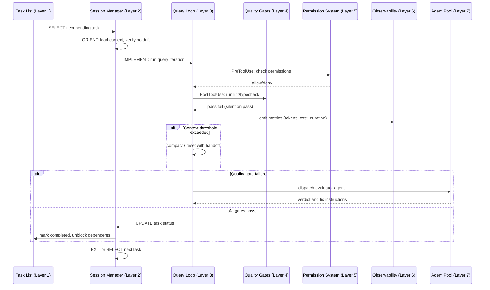
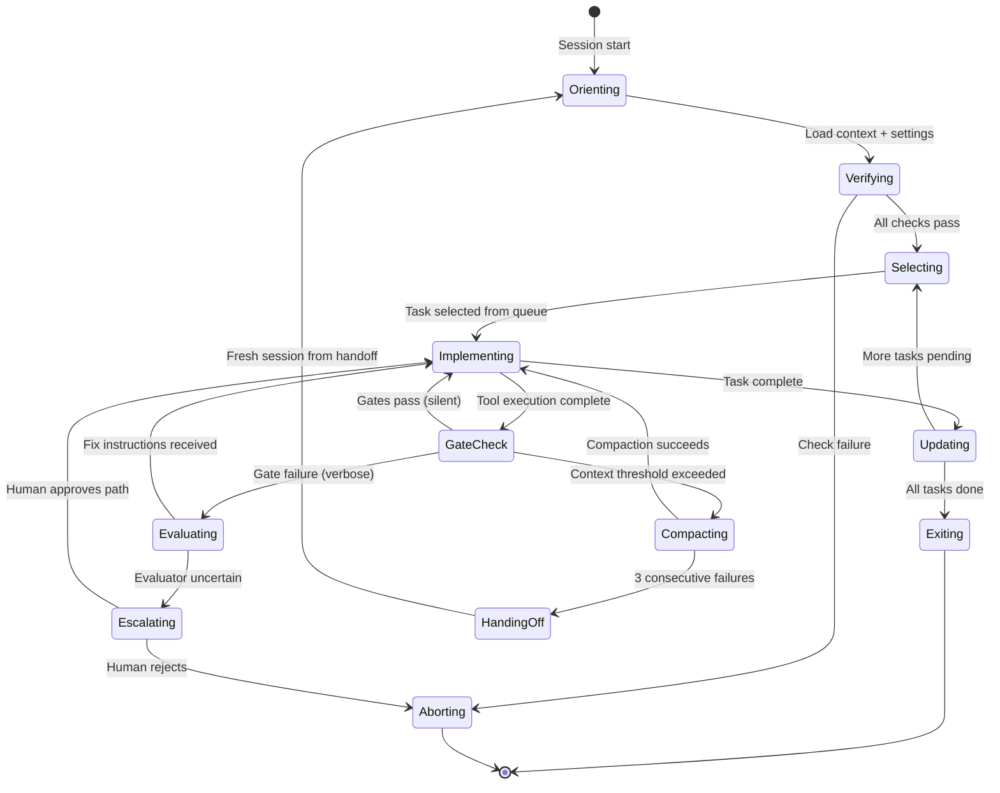

# Reference Architecture: Building a Trustworthy Long-Running Agent

## Overview

The preceding fifty-four chapters dissected cc's implementation layer by layer. This chapter inverts the lens: instead of reading code top-down, we start from HER's 8-layer reference architecture (§21) and ask, *what would a production-grade, long-running coding agent look like if we built it from scratch, using cc's proven patterns and avoiding its gaps?*

The answer is not a single codebase — no public implementation covers all eight layers (§21). The celesteanders/harness repo implements only Layers 1–2 and part of Layer 4. What follows is therefore a synthesis: each layer is described as (a) the HER specification, (b) cc's concrete implementation where one exists, (c) the gap, and (d) the architectural decision a builder must make. The decision framework from §19 provides the routing logic.

The core tension is this: **trustworthiness is the product of back-pressure and observability, but both cost tokens and latency.** Every layer adds safety but also adds overhead. A reference architecture must make that trade-off explicit and configurable, not implicit and fixed.

The 12 core principles from §20 provide the value system that governs every architectural decision in this chapter. The most important three for the reference architecture are: (1) context windows are the constraint and structured artifacts are the solution, (2) separate generation from evaluation, and (3) control costs actively. Every layer in the reference architecture exists because violating one of these principles caused a documented failure.

```mermaid
classDiagram
    class Layer1_TaskInfra {
      +taskList: JSON
      +decompose(sessionSize)
      +priorityOrder()
      +immutableDescriptions()
    }
    class Layer2_SessionMgmt {
      +startupProtocol()
      +exitProtocol()
      +handoff()
      +maxDuration()
    }
    class Layer3_ContextEng {
      +compaction()
      +observationMasking()
      +tieredMemory()
      +subagentIsolation()
    }
    class Layer4_QualityGates {
      +preCommit()
      +postCommit()
      +perFeature()
      +perSession()
    }
    class Layer5_Safety {
      +permissionTiers()
      +destructiveConfirm()
      +loopDetection()
      +idempotencyKeys()
    }
    class Layer6_CostObserv {
      +costCaps()
      +tokenMetering()
      +distributedTracing()
      +alerting()
    }
    class Layer7_MultiAgent {
      +generatorEvaluator()
      +modelRouting()
      +fileBasedComm()
      +worktreeIsolation()
    }
    class Layer8_Learning {
      +progressNotes()
      +patternDiscovery()
      +evaluatorFeedback()
      +harnessVersioning()
    }
    Layer1_TaskInfra --> Layer2_SessionMgmt : feeds
    Layer2_SessionMgmt --> Layer3_ContextEng : triggers
    Layer3_ContextEng --> Layer4_QualityGates : surfaces
    Layer4_QualityGates --> Layer5_Safety : enforces
    Layer5_Safety --> Layer6_CostObserv : instruments
    Layer6_CostObserv --> Layer7_MultiAgent : coordinates
    Layer7_MultiAgent --> Layer8_Learning : adapts
```



## Data structures and contracts

### Layer 1: Task Infrastructure — the immutable task record

The foundational contract is the task record. cc's implementation uses a Zod-validated schema with three status states, dependency edges, and an owner field:

```typescript
// src/utils/tasks.ts:L76-L89 — Task schema definition
export const TaskSchema = lazySchema(() =>
  z.object({
    id: z.string(),
    subject: z.string(),
    description: z.string(),
    activeForm: z.string().optional(),
    owner: z.string().optional(),
    status: TaskStatusSchema(),
    blocks: z.array(z.string()),
    blockedBy: z.array(z.string()),
    metadata: z.record(z.string(), z.unknown()).optional(),
  }),
)
export type Task = z.infer<ReturnType<typeof TaskSchema>>
```

This satisfies HER Layer 1's requirements: immutable descriptions (the `subject` and `description` never change after creation), mutable status only (transitions via `pending → in_progress → completed`), and dependency tracking (`blocks`/`blockedBy` edges). The `owner` field maps to HER's requirement for task assignment in multi-agent settings — when a coordinator swarm operates, each task can be claimed by a specific agent ID.

What's missing from the HER specification is **priority ordering** — cc tasks are currently FIFO within a status bucket, not explicitly prioritized. For the reference architecture, the `metadata` field provides the extension point: a `priority` key could be added without schema changes, and the task selector could sort by priority before FIFO within each priority band.

The high-water mark file (`.highwatermark`) ensures monotonic ID assignment across concurrent swarm agents, addressing the "unique ID in a distributed setting" requirement implicitly through filesystem locking `src/utils/tasks.ts:L91-L98`. The three canonical task statuses — `pending`, `in_progress`, `completed` — are defined as a const tuple at `src/utils/tasks.ts:L69`:

```typescript
// src/utils/tasks.ts:L69-L74 — Task statuses as a const tuple
export const TASK_STATUSES = ['pending', 'in_progress', 'completed'] as const

export const TaskStatusSchema = lazySchema(() =>
  z.enum(['pending', 'in_progress', 'completed']),
)
export type TaskStatus = z.infer<ReturnType<typeof TaskStatusSchema>>
```

The reference architecture should add a `blocked` status (distinct from `blockedBy` which is a relation, not a state) and a `failed` status to capture tasks that cannot complete due to environmental errors. cc's current three-state model cannot distinguish between "not started" and "tried and failed" — both remain `pending`.

### Layer 2: Session Management — the protocol contract

HER specifies a session startup protocol: ORIENT → SETUP → VERIFY → SELECT. cc's bootstrap sequence in `src/entrypoints/cli.tsx` through `src/entrypoints/init.ts` to `src/main.tsx` implements a subset — it orients (loads settings, checks MDM), sets up (TLS, keychain, OAuth), and verifies (version check, policy limits), but the SELECT phase is left to the user's initial prompt rather than automated task selection.

The clean exit protocol is partially implemented through session persistence in `src/utils/sessionStorage.ts`, which writes JSONL entries with tombstones for resumability. What's missing is **explicit session-to-session handoff** — cc can resume a session but cannot automatically decompose remaining work and write a structured handoff file for the next session.

For the reference architecture, the session contract should be formalized as a state machine with explicit transitions. The ORIENT phase must include drift detection — comparing the current repo state against the last known good state from the previous session. The VERIFY phase must include a baseline check: run the test suite, confirm it passes, and abort if it doesn't. HER Principle 4 ("verify before building") exists because compounding bugs across sessions is one of the most common failure modes.

The maximum session duration limit with graceful wind-down (HER Layer 2) is not implemented in cc. A long-running agent should enforce a wall-clock limit (e.g., 4 hours) and, as it approaches the limit, stop selecting new tasks, complete the current task, write a handoff file, and exit cleanly. This prevents the degenerate case where an agent runs indefinitely, accumulating context rot and cost without making progress.

The structured handoff file deserves a concrete schema. cc can resume sessions via JSONL but cannot automatically decompose remaining work. A reference architecture handoff file should follow this contract:

```typescript
// Proposed: handoff.json — written at session exit, read at next session start
type HandoffFile = {
  sessionId: string
  exitReason: 'duration_limit' | 'compaction_failure' | 'cost_cap' | 'all_tasks_done'
  completedTaskIds: string[]
  remainingTaskIds: string[]
  blockers: Array<{ taskId: string; reason: string }>
  lastCommitSha: string
  testStatus: 'passing' | 'failing' | 'unknown'
  contextHints: Array<{ topic: string; summary: string }>
}
```

The `contextHints` field is the critical innovation: it provides the next session with compressed semantic context about *why* work was abandoned, not just *what* was left. Without it, the next session must re-discover the same context from scratch, wasting tokens and repeating exploration.

### Layer 3: Context Engineering — the compaction contract

The most complex layer. cc implements a five-stage compaction hierarchy (Chapter 28) with explicit thresholds:

```typescript
// src/services/compact/autoCompact.ts:L51-L70 — Autocompact tracking and thresholds
export type AutoCompactTrackingState = {
  compacted: boolean
  turnCounter: number
  turnId: string
  consecutiveFailures?: number
}

export const AUTOCOMPACT_BUFFER_TOKENS = 13_000
export const WARNING_THRESHOLD_BUFFER_TOKENS = 20_000
export const ERROR_THRESHOLD_BUFFER_TOKENS = 20_000
export const MANUAL_COMPACT_BUFFER_TOKENS = 3_000

const MAX_CONSECUTIVE_AUTOCOMPACT_FAILURES = 3
```

The `consecutiveFailures` circuit breaker is critical: without it, a context that's irrecoverably over the limit (e.g., `prompt_too_long`) would cause infinite retry loops. The comment in the source — "1,279 sessions had 50+ consecutive failures (up to 3,272) in a single session, wasting ~250K API calls/day globally" — is empirical evidence that the circuit breaker is load-bearing.

The reference architecture must extend this with two mechanisms cc lacks: **observation masking** and **context reset with structured handoff**. Observation masking (HER §8.1) trims successful tool outputs to summaries, preserving only failures and decision-relevant information. cc's microcompact does partial trimming but not the full "success is silent" pattern. The structured handoff is the escape hatch when compaction fails three times: instead of retrying, the agent should write its current task state to disk, clear the context window entirely, and resume from the handoff file.

The tiered memory system in cc's memdir (`src/memdir/memdir.ts`) — with its `MEMORY.md` index (capped at 200 lines and 25KB) and per-memory topic files — implements HER Layer 3's "always-loaded index + on-demand topic files" pattern. The `truncateEntrypointContent` function at `src/memdir/memdir.ts:L57-L80` enforces the cap:

```typescript
// src/memdir/memdir.ts:L57-L80 — Entrypoint truncation with dual caps
export function truncateEntrypointContent(raw: string): EntrypointTruncation {
  const trimmed = raw.trim()
  const contentLines = trimmed.split('\n')
  const lineCount = contentLines.length
  const byteCount = trimmed.length

  const wasLineTruncated = lineCount > MAX_ENTRYPOINT_LINES
  const wasByteTruncated = byteCount > MAX_ENTRYPOINT_BYTES

  if (!wasLineTruncated && !wasByteTruncated) {
    return { content: trimmed, lineCount, byteCount, wasLineTruncated, wasByteTruncated }
  }

  let truncated = wasLineTruncated
    ? contentLines.slice(0, MAX_ENTRYPOINT_LINES).join('\n')
    : trimmed
```

This dual-cap (lines and bytes) is a production-hardened detail: long individual lines — not just many lines — can bloat the index beyond usability. The reference architecture should adopt the same dual-cap approach for any always-loaded context artifact.

### Layer 4: Quality Gates — the back-pressure contract

HER Layer 4 defines a four-tier quality stack: pre-commit (type-check, lint, format), post-commit (unit tests, integration tests), per-feature (E2E browser automation), and per-session (evaluator agent in fresh context). The critical design principle is that **success is silent; only failures produce verbose output** — passing tests should not consume context window tokens.

cc implements pre-commit gates through `PostToolUse` hooks that can run type-checkers and linters after file modifications. The hook infrastructure in `src/utils/hooks.ts:L76-L109` provides the extension points through its imported type catalog:

```typescript
// src/utils/hooks.ts:L76-L109 — Hook event type imports from agentSdkTypes
import type {
  HookEvent,
  HookInput,
  HookJSONOutput,
  NotificationHookInput,
  PostToolUseHookInput,
  PostToolUseFailureHookInput,
  PermissionDeniedHookInput,
  PreCompactHookInput,
  PostCompactHookInput,
  PreToolUseHookInput,
  SessionStartHookInput,
  SessionEndHookInput,
  SetupHookInput,
  StopHookInput,
  StopFailureHookInput,
  SubagentStartHookInput,
  SubagentStopHookInput,
  TeammateIdleHookInput,
  TaskCreatedHookInput,
  TaskCompletedHookInput,
  ConfigChangeHookInput,
  CwdChangedHookInput,
  FileChangedHookInput,
  InstructionsLoadedHookInput,
  UserPromptSubmitHookInput,
  PermissionRequestHookInput,
  ElicitationHookInput,
  ElicitationResultHookInput,
  PermissionUpdate,
  ExitReason,
  SyncHookJSONOutput,
  AsyncHookJSONOutput,
} from 'src/entrypoints/agentSdkTypes.js'
```

These are type imports, not definitions — the actual type shapes live in `src/entrypoints/agentSdkTypes.js` and `src/types/hooks.js`. The breadth of the import list (30+ hook-specific types) is what makes Layer 4 viable: each event type corresponds to a lifecycle hook that can be wired to a quality gate.

The breadth of hook events is what makes Layer 4 viable. A `PostToolUse` hook running `tsc --noEmit` after every file edit is a type-checking quality gate. A `PreCompact` hook that verifies all tests pass before allowing context compaction prevents losing failure information. A `SessionEnd` hook that runs the full test suite provides the per-session evaluation.

The `runPostToolUseHooks` function in `src/services/tools/toolHooks.ts:L39-L60` shows how post-tool hooks iterate and can modify tool output:

```typescript
// src/services/tools/toolHooks.ts:L39-L55 — Post-tool-use hook iteration
export async function* runPostToolUseHooks<Input extends AnyObject, Output>(
  toolUseContext: ToolUseContext,
  tool: Tool<Input, Output>,
  toolUseID: string,
  messageId: string,
  toolInput: Record<string, unknown>,
  toolResponse: Output,
  requestId: string | undefined,
  mcpServerType: McpServerType,
  mcpServerBaseUrl: string | undefined,
): AsyncGenerator<PostToolUseHooksResult<Output>> {
  const postToolStartTime = Date.now()
  try {
    const appState = toolUseContext.getAppState()
    const permissionMode = appState.toolPermissionContext.mode

    let toolOutput = toolResponse
    for await (const result of executePostToolHooks(
      tool.name,
      toolUseID,
      toolInput,
      toolOutput,
```

The reference architecture should formalize this into a quality gate pipeline: each gate is a hook with a defined severity (warning, error, blocker), and the pipeline's output is either "all gates pass" (silent, no context consumed) or "specific gates failed" (verbose, with fix suggestions injected into the context).

### Layer 5: Safety — the permission mode contract

cc's permission system defines six modes with explicit escalation paths:

```typescript
// src/utils/permissions/PermissionMode.ts:L34-L41 — Mode configuration shape
type PermissionModeConfig = {
  title: string
  shortTitle: string
  symbol: string
  color: ModeColorKey
  external: ExternalPermissionMode
}
```

The modes — `default`, `plan`, `acceptEdits`, `bypassPermissions`, `dontAsk`, `auto` — map roughly to HER's permission tiers (read-only → discuss → full access), but cc lacks **formal idempotency keys for external operations** and **rate limiting on tool usage** — both specified in Layer 5.

The `plan` mode is cc's implementation of the "read-only tier" from HER — it restricts the agent to exploration and planning before committing to file modifications. The `auto` mode, feature-gated behind `TRANSCRIPT_CLASSIFIER` `src/utils/permissions/PermissionMode.ts:L80-L90`, uses a yoloClassifier to make automated permission decisions based on command risk classification.

For the reference architecture, the permission contract must be strengthened in three ways: (1) **idempotency keys** — every external operation (API call, message send, deployment) must carry a unique key that prevents duplicate execution after checkpoint-restore cycles; (2) **rate limiting** — per-tool and per-category rate limits that throttle tool usage when the agent enters repetitive loops; (3) **loop detection** — a mechanism that detects when the agent is repeating the same tool call pattern without progress and escalates to a human.

### Layer 6: Cost and Observability — the metering contract

HER Layer 6 is where production reality intrudes on architectural elegance. A long-running agent that cannot be observed cannot be trusted, and a long-running agent whose costs are not bounded cannot be operated. The three pillars of observability — traces, metrics, and structured logs — must all be present, and they must feed back into the control flow, not just into a dashboard.

cc implements two of the three pillars. Metrics are covered by the OpenTelemetry `Meter`, `AttributedCounter`, and state-level counters shown above. Structured logging is covered by the analytics event system in `src/services/analytics/index.ts`, which emits `tengu_*` events with typed metadata. What's missing is **distributed tracing** — OpenTelemetry spans that correlate work across the parent agent, forked subagents, and remote agents. Without spans, a multi-hour session's trace is a flat list of events with no causal structure.

Cost tracking in cc feeds back into the state system in `src/bootstrap/state.ts`. The cost and duration fields occupy lines L51-L67:

```typescript
// src/bootstrap/state.ts:L45-L67 — State shape includes cost and duration counters
type State = {
  originalCwd: string
  projectRoot: string
  totalCostUSD: number
  totalAPIDuration: number
  totalAPIDurationWithoutRetries: number
  totalToolDuration: number
  turnHookDurationMs: number
  turnToolDurationMs: number
  turnClassifierDurationMs: number
  turnToolCount: number
  turnHookCount: number
  turnClassifierCount: number
  startTime: number
  lastInteractionTime: number
  totalLinesAdded: number
  totalLinesRemoved: number
  hasUnknownModelCost: boolean
  cwd: string
  modelUsage: { [modelName: string]: ModelUsage }
```

The OpenTelemetry telemetry instruments live further down, at L89-L98:

```typescript
// src/bootstrap/state.ts:L89-L98 — OTel meter and attributed counters
  meter: Meter | null
  sessionCounter: AttributedCounter | null
  locCounter: AttributedCounter | null
  prCounter: AttributedCounter | null
  commitCounter: AttributedCounter | null
  costCounter: AttributedCounter | null
  tokenCounter: AttributedCounter | null
  codeEditToolDecisionCounter: AttributedCounter | null
  activeTimeCounter: AttributedCounter | null
  statsStore: { observe(name: string, value: number): void } | null
```

The `costCounter` and `tokenCounter` are OpenTelemetry instruments, making cc's cost tracking compatible with distributed tracing infrastructure. The `addToTotalSessionCost` function in `src/cost-tracker.ts:L278-L323` accumulates cost per model, per token type, and emits analytics events:

```typescript
// src/cost-tracker.ts:L278-L301 — Per-session cost accumulation with OTel counters
export function addToTotalSessionCost(
  cost: number,
  usage: Usage,
  model: string,
): number {
  const modelUsage = addToTotalModelUsage(cost, usage, model)
  addToTotalCostState(cost, modelUsage, model)

  const attrs =
    isFastModeEnabled() && usage.speed === 'fast'
      ? { model, speed: 'fast' }
      : { model }

  getCostCounter()?.add(cost, attrs)
  getTokenCounter()?.add(usage.input_tokens, { ...attrs, type: 'input' })
  getTokenCounter()?.add(usage.output_tokens, { ...attrs, type: 'output' })
  getTokenCounter()?.add(usage.cache_read_input_tokens ?? 0, {
    ...attrs,
    type: 'cacheRead',
  })
  getTokenCounter()?.add(usage.cache_creation_input_tokens ?? 0, {
    ...attrs,
    type: 'cacheCreation',
  })
```

This is the Layer 6 metering requirement implemented correctly: per-model, per-token-type, with cache distinction. However, cc currently lacks **per-session cost caps** and **anomaly detection**. The cost counter records but does not throttle. A reference architecture must add a cost gate that aborts or degrades the session when spend exceeds a configured threshold.

The reference architecture should define three cost tiers: (1) a **soft cap** that triggers a warning and model downgrade (Opus → Sonnet → Haiku), (2) a **hard cap** that stops selecting new tasks and initiates graceful shutdown, and (3) a **kill switch** that aborts the session immediately, writing whatever state exists to the handoff file. HER Principle 10 ("budget for 3-10x the happy-path cost") is the operational guideline — cost caps should be set at 3x the expected cost, not at 1x.

## Control flow

### The long-running trust session

A trustworthy long-running agent operates under a fundamentally different control flow than a single-shot chat. The session protocol from §20 provides the skeleton:

```
ORIENT → SETUP → VERIFY → SELECT → IMPLEMENT → TEST → UPDATE → EXIT
```

In cc, this is approximated by the query loop in `src/query.ts`, which iterates: user input → model call → tool dispatch → observation → next iteration. The critical difference is that cc's loop is **reactive** (driven by user input) while a long-running agent's loop must be **proactive** (driven by task state). The task list is the driver: when the current task completes, the session manager selects the next pending task from the queue, and the loop continues without human intervention.



### The back-pressure control flow

The back-pressure stack is the key innovation that makes long-running agents trustworthy. It works by making **success silent and failure verbose** — the agent's context window is never polluted by passing tests, only by failures that require action. The back-pressure stack from §20 is:

```
Type System → Linter → Unit Tests → Integration Tests → E2E/Browser Tests
     ^                                                            |
     |                                                            |
     +---- Only failures surface to agent context ----------------+
```

This is a feedback loop, not a pipeline. Failures at the E2E level may indicate a type-system gap — the type system should have caught the bug before it propagated. When a failure surfaces, the agent fixes it, the quality gates re-run, and if they pass the failure is removed from the context. The loop tightens over time as the type system and linter rules are updated to catch previously-missed error classes.

### The multi-agent coordination flow

HER Layer 7 is the most architecturally ambitious layer, and the one where cc has the widest gap between aspiration and implementation. The generator-evaluator pattern, model routing, file-based inter-agent communication, and git-based conflict resolution are all specified but only partially implemented.

The generator-evaluator pattern is the most important concept in this layer. The idea is simple: one agent generates output, and a second agent — running in an isolated context with no knowledge of the generator's reasoning — evaluates the output against specific criteria. The isolation is critical: if the evaluator shares the generator's context, it inherits the generator's biases. The Ouroboros problem (§9.2) is the degenerate case where the evaluator and generator are the same model with the same context, creating a circular validation loop.

cc's coordinator mode provides the scaffolding for this pattern:

```typescript
// src/coordinator/coordinatorMode.ts:L36-L41 — Coordinator mode detection
export function isCoordinatorMode(): boolean {
  if (feature('COORDINATOR_MODE')) {
    return isEnvTruthy(process.env.CLAUDE_CODE_COORDINATOR_MODE)
  }
  return false
}
```

The feature gate means this is not yet a stable API. The `matchSessionMode` function at `src/coordinator/coordinatorMode.ts:L49-L78` handles a subtle failure mode: when a session is resumed, the coordinator mode environment variable may not match the session's stored mode. The function detects this and flips the env var, but this is a reactive fix — the reference architecture should store mode in the session metadata and validate it at startup.

For the reference architecture, the generator-evaluator pattern should be the default for quality-critical work. The decision framework from §19.1 provides the routing: if the task requires quality guarantees, use generator-evaluator; if not, use a simple bash loop. The model routing from §19.4 is equally important: expensive models (Opus-class) for planning and architecture decisions, mid-tier (Sonnet-class) for code generation, cheap (Haiku-class) for summarization and classification, and same-tier-or-higher for evaluation.

The key implementation detail for generator-evaluator is **context isolation**: the evaluator must run in a fresh context with no access to the generator's intermediate reasoning. cc's forked subagent mechanism (`src/tools/AgentTool/forkSubagent.ts`) provides the isolation primitive — a forked agent has its own context window and cannot see the parent's conversation history. The reference architecture should use this mechanism to spawn evaluators in forked contexts.

HER Layer 7 also specifies **git-based conflict resolution** for multi-agent coordination — a topic cc's worktree system (Chapter 46) touches but does not fully address. When two agents work on isolated worktrees and both modify files in the same directory, merging their changes back requires a conflict resolution strategy. cc's `EnterWorktreeTool` creates isolated git worktrees with independent branches, but the merge-back path is left to the user. A reference architecture should automate this: when a worktree agent completes, the harness should attempt a `git merge` or `git rebase` onto the parent branch. If the merge succeeds without conflicts, it proceeds automatically. If conflicts arise, the harness should invoke a conflict-resolution agent — a third agent in a fresh context that sees only the conflicting diffs and resolves them. This three-agent pattern (generator A, generator B, resolver C) mirrors the generator-evaluator pattern but applies it to merge conflicts instead of quality evaluation.

### The learning and adaptation flow

HER Layer 8 is the final layer and the one that makes the harness self-improving. The specification includes: progress notes persisted to files (survive context resets), pattern discovery logged to AGENTS.md, feedback from evaluator recorded for future sessions, stale assumptions pruned as models improve, and harness configuration versioning and A/B testing.

cc implements the first two of these through its memdir system and CLAUDE.md. Progress notes are stored as `project`-type memories in memdir, and the `AGENTS.md` file (analogous to `CLAUDE.md` but for agent-specific instructions) is the pattern discovery log. The DreamTask consolidation system (Chapter 24) provides background memory consolidation — it runs when the agent is idle, extracting patterns from the current session and writing them to memdir files.

What's missing is the feedback loop from evaluation to future sessions. When an evaluator agent identifies a quality issue, that feedback should be persisted in a structured form that the next session can query. Currently, evaluator feedback is lost when the session ends. The reference architecture should implement an `evaluator_feedback.json` file — a structured log of quality issues, their root causes, and the fixes applied — that is loaded into the context at session start.

The harness versioning and A/B testing component is the most forward-looking. The idea, drawn from the Meta-Harness and AutoHarness research (§15), is that the harness itself is a configurable artifact that can be versioned, rolled back, and A/B tested. If a new compaction strategy produces worse results, the harness should be able to roll back to the previous strategy without human intervention. cc's settings cascade (Chapter 31) provides the configuration infrastructure, but it lacks the versioning and rollback mechanisms that would enable this kind of self-correction.

Closely related is the **stale assumption pruning** mechanism. Every harness component encodes an assumption about model capabilities — the yoloClassifier assumes the model cannot classify Bash commands reliably, the compaction hierarchy assumes the model cannot handle full context, and the permission system assumes the model will make dangerous choices. As models improve across training runs, these assumptions become stale. The reference architecture should include an assumption registry — a structured file listing each harness component alongside the model capability assumption it encodes, a test case that validates the assumption, and a sunset condition. When the test case passes (meaning the model can now handle the task that the harness component was built to compensate for), the component is flagged for removal. For example, if a future model can classify Bash commands with >99.9% accuracy across a representative corpus, the yoloClassifier becomes unnecessary and the auto-approval path can be simplified. Without such a registry, harness complexity only accumulates — components are added to compensate for model limitations but never removed when those limitations are resolved.

## Edge cases and failure modes

### The compaction death spiral

When context exceeds the autocompact threshold, cc enters a potentially recursive failure mode: compaction itself consumes tokens, and if the compaction summary is too large, the next iteration may immediately exceed the threshold again. The `MAX_CONSECUTIVE_AUTOCOMPACT_FAILURES = 3` circuit breaker `src/services/compact/autoCompact.ts:L68-L70` prevents infinite recursion, but the correct architectural response is **structured handoff** — save a progress file, clear the context, and resume from the file rather than attempting increasingly aggressive compaction within the same session.

The death spiral is particularly dangerous because it is self-reinforcing: each failed compaction attempt adds more tokens to the context (the error message, the retry logic), making the next attempt even less likely to succeed. The reference architecture should treat compaction failure as a signal for session restart, not a signal for retry.

### The evaluator ouroboros

HER §9.2 identifies the Ouroboros problem: using an LLM evaluator to grade LLM output creates a circular validation loop. The yoloClassifier in `src/utils/permissions/yoloClassifier.ts` is cc's most prominent example — it uses a model call to classify whether a Bash command is safe to auto-approve. If the classifier makes a mistake, the safety layer is compromised. The reference architecture resolution is **deterministic evaluation wherever possible** — linters, type checkers, and test suites — and **LLM evaluation only for qualities that cannot be deterministically assessed** (design quality, readability).

The decision framework from §19.3 provides the evaluation strategy selection: correctness-only tasks use deterministic evaluation, correctness-plus-design-quality tasks use deterministic plus LLM evaluation in a fresh context, and high-stakes tasks (production, security) use deterministic plus LLM plus mandatory human review.

### Coordinator mode mismatch on resume

`src/coordinator/coordinatorMode.ts:L49-L78` reveals a subtle failure mode: when a session is resumed, the coordinator mode environment variable may not match the session's stored mode. The `matchSessionMode` function detects this and flips the env var, but this is a reactive fix, not a proactive guard. A reference architecture should store mode in the session metadata and validate it at startup, not discover the mismatch at runtime.

### Swarm agent task locking

Multiple agents in a coordinator swarm writing to the same task list can race. cc uses filesystem locking with retry backoff `src/utils/tasks.ts:L94-L100`, but the comment reveals the design tension: "The sync lockSync API blocked the event loop; the async API needs explicit retries to achieve the same serialization semantics." A reference architecture should use a proper distributed lock service or a single-writer task queue, not filesystem locks that block the event loop under contention.

### Cost runaway

HER Principle 10 warns to "budget for 3-10x the happy-path cost." cc's `addToTotalSessionCost` in `src/cost-tracker.ts:L278-L323` records cost but never checks it against a limit. A long-running agent that enters an infinite loop (§6.7) can accumulate thousands of dollars in API costs before a human notices. The reference architecture must implement the three-tier cost system described in the Layer 6 section: soft cap → hard cap → kill switch.

## Where cc diverges from the published pattern

**Divergence 1: No priority-ordered task queue.** HER Layer 1 specifies priority ordering and dependency tracking. cc implements dependency tracking (`blocks`/`blockedBy`) but not explicit priority — tasks are processed FIFO. For short sessions this is fine; for multi-hour tasks spanning dozens of subtasks, priority ordering becomes essential to avoid working on low-impact items while high-impact items wait.

**Divergence 2: No structured session handoff.** HER Layer 2 specifies "session-to-session handoff via structured files." cc can resume sessions via JSONL persistence, but it cannot automatically write a handoff document that says "here's what I did, here's what's left, here's where to pick up." The DreamTask consolidation system (Chapter 24) moves in this direction but is limited to memory extraction, not full session decomposition.

**Divergence 3: Observation masking is partial.** HER §8.1 cites observation masking as achieving a 52% cost reduction. cc's microcompact (`src/services/compact/microCompact.ts`) implements this by trimming tool results, but it does not implement the full "success is silent; only failures produce verbose output" pattern. Tool results from successful operations still enter the context in full.

**Divergence 4: No cost caps or anomaly detection.** HER Layer 6 specifies "per-session and per-task cost caps" and "real-time token metering and anomaly detection." cc meters costs in `src/cost-tracker.ts` but does not enforce caps or detect anomalies. The state tracks `totalCostUSD` but no code path checks it against a budget limit and throttles or aborts.

**Divergence 5: No distributed tracing.** HER Layer 6 specifies "distributed tracing (OpenTelemetry) across multi-agent workflows." cc has OpenTelemetry meters and counters but does not emit spans for multi-agent workflows. A forked subagent's work is invisible to the parent's trace context.

**Divergence 6: No formal idempotency keys.** HER Layer 5 specifies "idempotency keys for external operations." cc has no mechanism to prevent duplicate external side effects (e.g., sending the same Slack message twice after a checkpoint-restore cycle).

**Divergence 7: No per-session evaluator agent.** HER Layer 4 specifies "per-session: evaluator agent in fresh context." cc has no mechanism to spin up a fresh-context evaluator at session end that reviews all changes made during the session. The closest approximation is the code-review skill, which is user-invoked rather than automated.

**Divergence 8: No harness configuration versioning.** HER Layer 8 specifies "harness configuration versioning and A/B testing (Meta-Harness approach)." cc's settings cascade (Chapter 31) provides configuration, but there is no mechanism to version the harness itself, roll back to a previous configuration, or A/B test different harness configurations.

**Divergence 9: No loop detection with automatic escalation.** HER §6.7 identifies infinite loops as a failure mode. cc's `AutoCompactTrackingState.consecutiveFailures` provides a circuit breaker for compaction loops, but there is no general-purpose loop detector that recognizes when the agent is repeating the same tool call pattern without making progress (e.g., editing a file, running a test, getting the same error, editing again). The reference architecture should track a sliding window of tool call signatures and escalate when a pattern repeats more than N times.

**Divergence 10: No per-task cost accounting.** HER Layer 6 implies per-task cost tracking. cc tracks cost at the session level (`totalCostUSD` in `src/bootstrap/state.ts`) but cannot attribute cost to individual tasks. For a multi-task session, the operator cannot tell which task was expensive and which was cheap. The reference architecture should accumulate cost per task ID, enabling cost-aware task prioritization.

## Developer takeaways for building a long-running agent

1. **Start with the task list, not the model.** The task record in `src/utils/tasks.ts:L76-L89` is the single source of truth. JSON, not Markdown — structured data enables automated reasoning about dependencies and priorities.

2. **Wire back-pressure before you wire the model.** A `PostToolUse` hook running `tsc --noEmit` catches errors the model will miss. Quality gates are deterministic; model judgment is probabilistic.

3. **Budget for compaction from day one.** Without the circuit breaker (`MAX_CONSECUTIVE_AUTOCOMPACT_FAILURES = 3` in `src/services/compact/autoCompact.ts:L68-L70`), cc would waste 250K API calls/day on death spirals. Add compaction thresholds, failure counters, and a structured handoff escape hatch.

4. **Cost tracking must feed back into control flow.** Recording `totalCostUSD` in `src/bootstrap/state.ts:L51` is necessary but insufficient — check cost against a budget and degrade gracefully.

5. **Separate generation from evaluation.** Use deterministic evaluation (tests, linters, type checkers) as the primary quality gate; LLM evaluation only for qualities that cannot be deterministically assessed.

6. **Observation masking is the highest-ROI optimization.** HER §8.1's 52% cost reduction is empirical, not theoretical. Make successful tool outputs invisible by default — only failures should enter the context.

7. **Session handoff is the hardest unsolved problem.** At session exit, write a structured handoff file with completed tasks, remaining tasks, blockers, and context hints for the next session.

8. **Simplify relentlessly as models improve.** Every harness component encodes an assumption about model limitations. As models improve, these assumptions go stale. Build your harness to be dismantlable, not permanent.



The reference architecture is not a blueprint — it is a decision framework. Every layer exists because a specific failure mode was observed in production. The task list prevents forgotten work. The session protocol prevents context rot. The quality gates prevent silent regression. The permission system prevents destructive mistakes. The cost metering prevents runaway spending. The multi-agent coordination prevents single-point-of-failure generation. The learning layer prevents repeating the same mistakes. Build the layers you need, verify they work, and remove them when the model outgrows them.

The decision framework from §19 is the closing thought: if your task is a single well-defined operation, no harness is needed. If it spans multiple sessions, add Layers 1–2. If it requires quality guarantees, add Layers 3–5. If it requires multiple concurrent agents, add Layers 6–7. If it requires learning and adaptation, add Layer 8. The reference architecture is not a monolith — it is a stack you assemble based on the failure modes you've observed and the guarantees you need.
