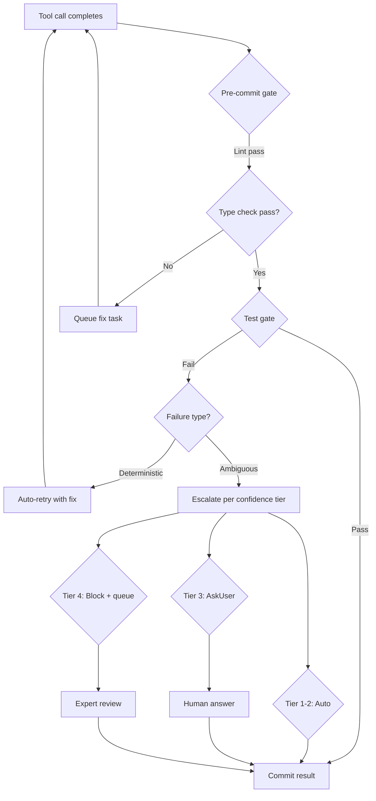
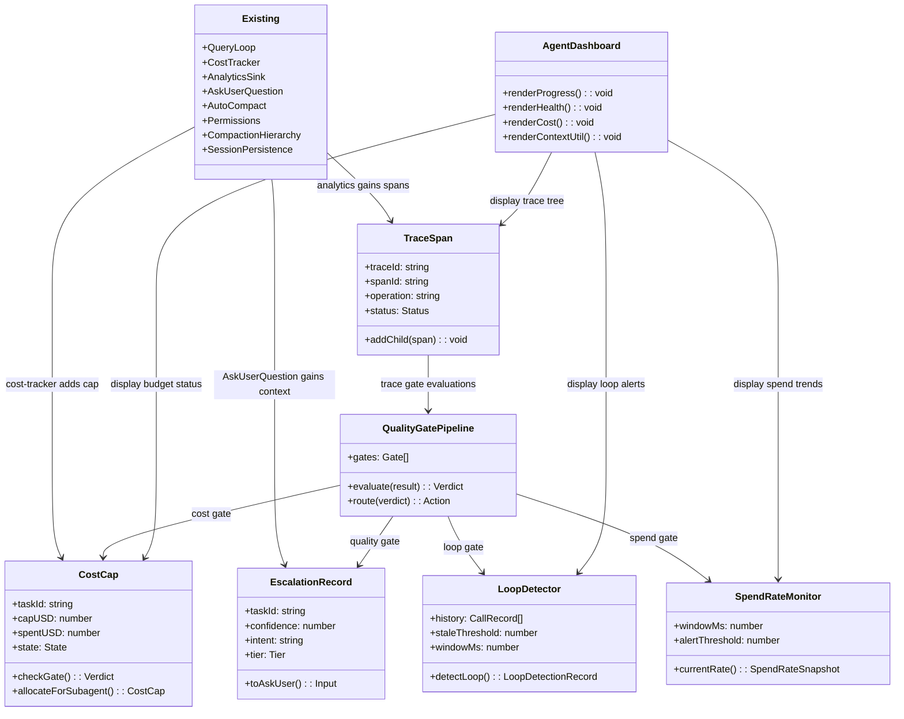

# What To Build Next: An Opinionated Roadmap

## Overview

This chapter is the engineering counterpart to Chapter 55's reference architecture. Where Chapter 55 sketched the eight-layer model in the abstract, this chapter delivers a concrete, opinionated roadmap for a team building on the cc codebase: what to keep, what to rewrite, and what to add from scratch.

The roadmap is grounded in the HER cross-references that expose cc's most consequential gaps. Section 11 details human-in-the-loop patterns that cc partially implements but never systematizes. Section 13 catalogues cost failure modes that cc's `cost-tracker.ts` detects after the fact but cannot prevent. Section 14 lays out the three-pillar observability model that cc's analytics layer only half satisfies. And Section 20 synthesizes the twelve core principles that should govern every build-or-borrow decision.

The gap between cc's current state and the HER ideal is not a deficiency in cc's design -- it is a reflection of cc's origin as a single-session interactive tool rather than a multi-hour autonomous harness. The features cc lacks (per-task budget enforcement, distributed tracing, loop detection, context-rich escalation) are features that only matter when the agent runs for hours without human supervision. This roadmap targets the transition from interactive tool to trustworthy long-running harness.

The result is a three-track roadmap:

| Track | Scope | Effort | Chapters affected |
|-------|-------|--------|-------------------|
| Keep | Subsystems that already embody HER principles | 0 (maintain) | 12, 28, 29, 50 |
| Rewrite | Subsystems that fight their own purpose | Medium | 17, 8, 50 |
| Add | Subsystems that do not exist | Medium-Large | New |

Each track is ordered by impact: the highest-leverage changes come first. Within each track, the ordering reflects the HER principle that cost control and observability are prerequisites for autonomous operation -- you must be able to see what the agent is doing and stop it when it goes wrong before you can trust it to run unattended.

The roadmap also reflects HER Principle 9 ("Simplify relentlessly. Strip unneeded harness complexity as models improve"). Every proposed addition includes a removal condition: the circumstances under which the feature should be retired or simplified as model capabilities advance.

## Data structures and contracts

The roadmap's proposed additions center on five new contracts that cc currently lacks. Each is modeled as a TypeScript interface that could live alongside existing modules without breaking changes. These contracts are the architectural foundation; the implementation sections in later tracks describe how they integrate into cc's existing pipelines.

### Per-task cost cap

cc accumulates cost globally via `addToTotalSessionCost` in `src/cost-tracker.ts`:

```typescript
// src/cost-tracker.ts:L278-L284 — session cost accumulation, no per-task cap
export function addToTotalSessionCost(
  cost: number,
  usage: Usage,
  model: string,
): number {
  const modelUsage = addToTotalModelUsage(cost, usage, model)
  addToTotalCostState(cost, modelUsage, model)

  const attrs =
    isFastModeEnabled() && usage.speed === 'fast'
      ? { model, speed: 'fast' }
      : { model }
```

The function is purely additive. There is no threshold check, no budget gate, and no graceful failure path. It calls `addToTotalCostState` which updates a module-level counter and returns, never throwing, never blocking. cc already has a *task budget* -- the API-level `output_config.task_budget` that limits the whole agentic turn and is distinct from the client-side token budget managed by `BudgetTracker` in `src/query/tokenBudget.ts`. What cc lacks is a *per-task cost cap* that applies a hard ceiling to individual task expenditures. The proposed `CostCap` contract adds this hard ceiling and a soft warning at 80%:

```typescript
interface CostCap {
  taskId: string
  capUSD: number
  warnAtUSD: number          // typically 80% of capUSD
  spentUSD: number
  state: 'within' | 'warning' | 'exceeded'
  deadLetterReason?: string  // why the task exceeded budget
}
```

When `spentUSD` exceeds `capUSD`, the task enters the `exceeded` state and the harness must refuse to dispatch further tool calls on that task's behalf, queuing remaining work for human review instead. The `deadLetterReason` field captures the context needed for the dead-letter queue that HER Section 13.2 prescribes: "Tasks exceeding thresholds get queued for human review."

The `CostCap` also supports HER Section 13.2's budget allocation requirement: "Separate budgets for generator/evaluator/sub-agents." Each subagent dispatched via `AgentTool` receives its own `CostCap` derived from the parent task's remaining budget, preventing a runaway evaluator from consuming the entire session's allocation. This is complementary to, not a replacement for, the existing task budget (API-level turn budget): the task budget constrains the agentic turn's total output, while the cost cap constrains dollar spend per discrete unit of work.

### Confidence-based routing record

HER Section 11 prescribes confidence-based routing for human-in-the-loop decisions. cc's `AskUserQuestionTool` in `src/tools/AskUserQuestionTool/AskUserQuestionTool.tsx` provides the mechanism for asking a human but carries no metadata about *why* the agent is uncertain or how confident it is:

```typescript
// src/tools/AskUserQuestionTool/AskUserQuestionTool.tsx:L209-L222 — call() returns answers, no confidence data
  async call({
    questions,
    answers = {},
    annotations
  }, _context) {
    return {
      data: { questions, answers, ...(annotations && { annotations }) }
    }
  },
```

The tool's input schema already supports structured questions with options, descriptions, and even preview content. The `annotations` field captures user notes on their selections. But there is no field for the agent's decision context -- what it was trying to do, what it already tried, or why it is uncertain. The human must reconstruct this from the conversation history, which may span thousands of tokens of tool output.

The proposed `EscalationRecord` adds the context-rich escalation payload that HER Section 11.4 requires:

```typescript
interface EscalationRecord {
  taskId: string
  confidence: number           // 0.0-1.0
  intent: string               // what the agent was trying to do
  attempts: string[]           // what it tried and why each failed
  options: EscalationOption[]  // what options the agent sees
  recommendation?: string      // what the agent recommends
  tier: 1 | 2 | 3 | 4         // HER escalation tier
}

interface EscalationOption {
  label: string
  description: string
  riskLevel: 'low' | 'medium' | 'high'
  estimatedCost?: number       // approximate token cost of this path
}
```

This record flows into a routing layer that decides: tier 1-2 decisions proceed automatically; tier 3 decisions invoke `AskUserQuestionTool` with the full context; tier 4 decisions block and queue for expert review. The routing layer itself is deterministic -- it does not use the model to decide whether to escalate, because that would be subject to the self-evaluation bias that HER Section 6.3 documents.

### Observability span

HER Section 14 demands distributed tracing across multi-agent workflows. cc's analytics sink in `src/services/analytics/index.ts` logs named events but carries no span linkage:

```typescript
// src/services/analytics/index.ts:L72-L78 — AnalyticsSink has no trace context
export type AnalyticsSink = {
  logEvent: (eventName: string, metadata: LogEventMetadata) => void
  logEventAsync: (
    eventName: string,
    metadata: LogEventMetadata,
  ) => Promise<void>
}
```

The `LogEventMetadata` type is a flat record of booleans and numbers -- no trace IDs, no parent references, no causal ordering. When a subagent's tool call fails, there is no way to link that failure back to the parent agent's dispatch decision in the analytics pipeline.

The proposed `TraceSpan` adds OpenTelemetry-compatible span linkage:

```typescript
interface TraceSpan {
  traceId: string
  spanId: string
  parentSpanId?: string
  operation: string           // e.g., 'tool.dispatch', 'query.iteration'
  startTime: number
  endTime?: number
  status: 'ok' | 'error' | 'timeout'
  attributes: Record<string, string | number>
}
```

Each tool dispatch, subagent spawn, and model invocation becomes a span. The existing `logEvent` calls become span events rather than standalone log lines. The trace tree can be exported in OpenTelemetry format for ingestion by Datadog, Jaeger, or any compliant backend.

### Loop detection record

HER Section 14.4 prescribes loop detection as a first-class alerting pattern. The proposed `LoopDetectionRecord` captures the evidence needed to distinguish a genuine loop from a legitimate retry:

```typescript
interface LoopDetectionRecord {
  toolName: string
  inputHash: string           // hash of the tool call's input parameters
  callTimestamps: number[]    // timestamps of identical calls within the window
  windowMs: number            // sliding window duration (default: 300000 = 5 min)
  maxIdenticalCalls: number   // threshold for loop detection (default: 3)
  isLoop: boolean
  suggestedAlternative?: string  // system-prompt nudge to break the loop
}
```

The `inputHash` field enables the detector to distinguish between progress-advancing retries (different input each time) and stuck retries (identical input). This is critical for the common case of an agent waiting for a build to succeed: each `BashTool` call has different output, so the input hash changes, and the detector correctly identifies it as non-looping.

### Spend-rate snapshot

HER Section 13.2 prescribes "per-hour spend rate alert -- anomaly detection on spend velocity." The proposed `SpendRateSnapshot` captures the rolling-average computation:

```typescript
interface SpendRateSnapshot {
  windowMs: number             // rolling average window (default: 600000 = 10 min)
  currentCostPerMinute: number
  rollingAverageCPM: number
  currentTokensPerMinute: number
  rollingAverageTPM: number
  isAnomalous: boolean         // true when both cost and token rates exceed 2x average
  anomalySeverity: 'none' | 'low' | 'medium' | 'high'
}
```

The dual-rate design (cost-per-minute AND tokens-per-minute) prevents false positives from model cost asymmetry. A single Opus call can cost 10-30x a Haiku call while using similar token counts. The monitor only fires when both rates exceed their thresholds simultaneously, ensuring that an expensive-but-normal model upgrade does not trigger a false alarm.

## Control flow

### Quality-gates pipeline

The single most impactful addition is a quality-gates pipeline that wires HER Section 20's back-pressure stack into the query loop. Currently, cc's query loop in `src/query.ts` checks token budgets and autocompact thresholds but has no semantic quality gates. The autocompact circuit breaker in `src/services/compact/autoCompact.ts` exemplifies the reactive pattern:

```typescript
// src/services/compact/autoCompact.ts:L258-L265 — circuit breaker for compaction failures
    if (
      tracking?.consecutiveFailures !== undefined &&
      tracking.consecutiveFailures >= MAX_CONSECUTIVE_AUTOCOMPACT_FAILURES
    ) {
      return { wasCompacted: false }
    }
```

This is a cost-avoidance circuit breaker, not a quality circuit breaker. It stops the harness from burning tokens on futile compaction attempts, but it does not evaluate whether the agent's output is semantically correct. The `MAX_CONSECUTIVE_AUTOCOMPACT_FAILURES` constant is set to 3 because, as the code comment notes, "1,279 sessions had 50+ consecutive failures (up to 3,272) in a single session, wasting ~250K API calls/day globally." This is exactly the kind of runaway behavior that a quality-gates pipeline would catch earlier.

The proposed pipeline adds *semantic* checkpoints that fire between tool calls:



The pipeline's control flow mirrors the HER session protocol (ORIENT -> SETUP -> VERIFY -> SELECT -> IMPLEMENT -> TEST -> UPDATE -> EXIT) but inserts deterministic gates at the IMPLEMENT -> TEST boundary. Each gate is a `PreToolUse` or `PostToolUse` hook that returns a pass/fail/escalate verdict.

The pipeline's interaction with existing cc systems is carefully designed. The lint gate reuses the `BashTool`'s command classification to determine whether a lint command is read-only (safe to run automatically) or write-capable (requires permission). The type-check gate uses the `LSPTool`'s diagnostic registry to retrieve errors without spawning a new language server. The test gate runs through the `BashTool` with a special `test-runner` classifier tag that marks it as a high-priority read operation.

The quality-gates pipeline must also interact correctly with cc's autocompact subsystem. The `shouldAutoCompact` function in `src/services/compact/autoCompact.ts:L160-L239` fires when context usage approaches the model's window limit, triggering a compaction pass that may rewrite the conversation history. If a quality gate fails and the agent retries the tool call, the retry adds new tokens to the context, potentially pushing `shouldAutoCompact` over its threshold. The pipeline handles this by recording the gate failure as a `TraceSpan` (which survives compaction) rather than as an in-context message. This ensures that the gate's verdict is not lost when the compaction pass summarizes older turns. Additionally, the pipeline respects the autocompact circuit breaker: if `MAX_CONSECUTIVE_AUTOCOMPACT_FAILURES` has been reached (indicating that compaction is failing), the quality-gates pipeline enters a degraded mode that only runs the cheapest gates (lint) and escalates all others, avoiding the compaction death spiral where gate failures trigger compaction attempts that fail and add more tokens.

### The three-track roadmap as a decision flow

The following diagram shows the proposed additions and their relationships to existing cc subsystems:



### Track 1: Keep

These subsystems already embody HER principles and should be preserved as-is.

**Permission modes and the classifier pipeline.** cc's tiered permission system (default, plan, acceptEdits, bypassPermissions, dontAsk, auto) maps directly to HER Section 11's tiered escalation. The speculative classifier in `useCanUseTool.tsx` that races a 2-second classifier check against a dialog prompt implements HER Section 11.2's "Tier 1 (automated) checks before Tier 3 (human) dialog":

```typescript
// src/hooks/useCanUseTool.tsx:L126 — speculative classifier races dialog
if (feature("BASH_CLASSIFIER") && result.pendingClassifierCheck && tool.name === BASH_TOOL_NAME && !appState.toolPermissionContext.awaitAutomatedChecksBeforeDialog) {
```

This is exactly the tiered-escalation pattern. The classifier runs as a Tier 1 check; if it returns a verdict within the race window, the dialog (Tier 3) is skipped. Keep it.

**Compaction hierarchy.** The five-stage compaction system (`<history_snip>` -> microcompact -> context collapse -> autocompact -> hard reset) implements HER Pattern 5 (progressive context compaction) as well as any system in the field. The circuit breaker for consecutive compaction failures is a sound back-pressure mechanism. The graduated-response pattern -- cheap automatic fix first, expensive model invocation second, human escalation last -- should be the model for all new resource-management subsystems. Keep it.

**Session persistence and resume.** JSONL-based session storage with tombstones implements HER Pattern 3 (tiered memory) at the session level. The resume flow correctly restores cost state via `restoreCostStateForSession` in `src/cost-tracker.ts:L130-L137`. The `saveCurrentSessionCosts` function at `src/cost-tracker.ts:L143-L175` persists per-model usage, cache read/write tokens, and web search counts, providing a complete accounting picture across session boundaries. Keep it.

**GrowthBook feature flags.** The GrowthBook integration in `src/services/analytics/growthbook.ts` provides the remote-eval, experiment-exposure-tracking infrastructure needed for safe rollout of any new subsystem. Every proposed addition in this roadmap should be feature-gated behind a GrowthBook flag before it ships, allowing gradual rollout and instant rollback. Keep it.

**Deferred tool loading via ToolSearch.** The progressive tool expansion system implements HER Pattern 9 and addresses the Tool Explosion failure mode (HER Section 6.8) by keeping the initial tool set small and loading additional tools on demand. The `shouldDefer` flag on tools like `AskUserQuestionTool` keeps them out of the initial prompt, reducing token cost. Keep it.

### Track 2: Rewrite

**Cost tracker: from accumulator to gatekeeper.** The current `addToTotalSessionCost` is a passive accumulator with no enforcement. It tracks cost per model and per session but cannot stop a runaway task. The rewrite adds per-task cost-cap enforcement: before each tool dispatch, the pipeline checks whether the current task's `CostCap` is in the `exceeded` state. If so, the dispatch is denied and the work is queued for human review.

The existing cost-state shape in `src/cost-tracker.ts:L71-L80` already stores model-level usage:

```typescript
// src/cost-tracker.ts:L71-L80 — StoredCostState tracks per-model usage but no per-task caps
type StoredCostState = {
  totalCostUSD: number
  totalAPIDuration: number
  totalAPIDurationWithoutRetries: number
  totalToolDuration: number
  totalLinesAdded: number
  totalLinesRemoved: number
  lastDuration: number | undefined
  modelUsage: { [modelName: string]: ModelUsage } | undefined
}
```

The rewrite extends this with a `costCaps` map keyed by task ID. The `addToTotalSessionCost` function gains a guard: if the task's cost cap is exceeded, the function throws a `BudgetExceededError` that the query loop catches and routes to the escalation pipeline. The error includes the `CostCap` state and the `EscalationRecord` so the human can make an informed decision about whether to increase the budget or accept partial results.

The rewrite also adds cost-per-outcome tracking, which HER Section 13.4 prescribes. The current cost tracker measures cost-per-token (implicitly, via the per-model usage breakdown) but not cost-per-completed-task. The extended `StoredCostState` includes a `taskOutcomes` map that records the cost of each completed task, enabling operators to compare harness configurations on a per-outcome basis.

**Analytics sink: from event log to trace collector.** The current `AnalyticsSink` interface logs flat events with no causal linkage. The rewrite adds span creation and propagation. Every `logEvent` call gains an optional `parentSpanId` parameter. The sink maintains an in-memory trace tree that can be exported in OpenTelemetry format.

This is not a full rewrite -- the existing `logEvent` and `logEventAsync` signatures are preserved -- but the internal representation changes from a flat event stream to a hierarchical trace. The `attachAnalyticsSink` function in `src/services/analytics/index.ts:L95-L123` already queues events before the sink is attached; the rewrite extends this queue to carry span context, so events logged during startup (before the sink is attached) are still linked to their parent spans when the sink drains the queue.

The rewrite also addresses the observability gap that HER Section 14.2 identifies: "Agents fail silently because their response format looks correct. A 200 OK from a tool call doesn't mean the operation succeeded semantically." The trace spans include a `semanticStatus` field (distinct from the HTTP-style `status`) that captures whether the tool's result achieved its intended effect. This field is populated by the quality-gates pipeline: if a gate fails after a tool call, the span's `semanticStatus` is set to `error` even if the tool itself returned successfully.

**AskUserQuestion: from bare prompt to context-rich escalation.** The current tool accepts structured questions and returns structured answers, but provides no context about *why* the agent is asking. The tool's `checkPermissions` method in `src/tools/AskUserQuestionTool/AskUserQuestionTool.tsx:L182-L188` always returns `behavior: 'ask'`, meaning every question is treated as a Tier 3 escalation regardless of urgency:

```typescript
// src/tools/AskUserQuestionTool/AskUserQuestionTool.tsx:L182-L188 — all questions are Tier 3
  async checkPermissions(input) {
    return {
      behavior: 'ask' as const,
      message: 'Answer questions?',
      updatedInput: input,
    }
  },
```

The rewrite wraps `AskUserQuestionTool.call()` in an escalation pipeline that prepends the `EscalationRecord` to the prompt, giving the human the full decision context that HER Section 11.4 demands. The `checkPermissions` method gains tier-awareness: Tier 1-2 escalations (where the agent is confident) bypass the dialog entirely, while Tier 3-4 escalations route to `AskUserQuestionTool` with the full context.

The rewrite also implements HER Section 11.3's async-approval pattern. When a Tier 4 escalation blocks the agent's current task, the agent does not hang. Instead, the `SendMessageTool` dispatches the blocked context to the human and the agent continues with non-blocked work from its task queue. When the human responds (via the bridge, the REPL, or a channel integration), the blocked task resumes with the human's decision.

### Track 3: Add

**Loop detector.** HER Section 14.4 prescribes loop detection: "same tool called with same parameters N times in M minutes." cc has no such detector. The proposed `LoopDetector` maintains a sliding window of recent tool calls (tool name, input hash, timestamp) and flags when a call matches a previous call within the window. The detector is wired into the `PreToolUse` hook pipeline: when a loop is detected, the tool dispatch is denied and the agent receives a system prompt nudge to try a different approach.

The implementation draws on the same sliding-window pattern used by the autocompact circuit breaker in `src/services/compact/autoCompact.ts:L70`, where `MAX_CONSECUTIVE_AUTOCOMPACT_FAILURES` is set to 3. The loop detector uses a similar threshold: 3 identical calls within 5 minutes triggers a loop alert. The threshold is configurable via settings, and the detector can be disabled entirely for tasks that legitimately require repetitive polling.

The detector's output is a `LoopDetectionRecord` that flows into the `TraceSpan` system, so loop events appear in the trace tree alongside tool calls and model invocations. This enables the agent dashboard (described below) to display loop alerts in real time.

**Spend-rate monitor.** HER Section 13.2 prescribes "per-hour spend rate alert -- anomaly detection on spend velocity." cc tracks cumulative cost but not spend velocity. The proposed `SpendRateMonitor` computes a rolling average of cost-per-minute and fires an alert when the current rate exceeds 2x the rolling average. The monitor is wired into the query loop's post-iteration hook: when the rate is anomalous, the harness pauses the session and prompts the user to confirm continuation.

The monitor also implements HER Section 13.3's early-termination strategy: "Kill sessions that are clearly stuck (loop detection, no-progress-for-N-minutes)." The spend-rate monitor and the loop detector share a `staleness` signal -- if the agent has not made a git commit or updated a progress file for N minutes AND the spend rate is above average, the harness treats the session as stuck and offers to terminate it.

**Quality-gates pipeline.** The largest addition. As described in the control-flow section, this pipeline wires deterministic checks (lint, type-check, test) into the query loop's IMPLEMENT -> TEST boundary. Each gate is a `PostToolUse` hook that evaluates the tool's result and returns a pass/fail/escalate verdict. The pipeline's routing logic maps verdicts to actions per HER Section 11's tiered escalation model.

The pipeline's implementation leverages cc's existing hook infrastructure. Each gate is registered as a `PostToolUse` hook with a specific tool-name filter (e.g., the lint gate only fires after `FileWriteTool` and `FileEditTool` calls). The gate's implementation is a deterministic function that runs the appropriate check command via `BashTool`'s read-only classifier and returns a structured verdict.

**Agent dashboard.** HER Section 14.3 prescribes a multi-hour session dashboard showing progress, health, cost, context utilization, quality trends, and alerts. cc's REPL displays cost and context percentage but has no persistent dashboard view. The proposed dashboard is a `/dashboard` slash command that renders a terminal-based summary of the current session's state, drawing data from the trace spans, cost caps, loop detector, and spend-rate monitor.

The dashboard displays six panels: (1) task progress (completed vs. remaining from `TodoWriteTool`'s task list), (2) health (loop alerts, staleness signals, consecutive failures), (3) cost (cumulative spend, spend rate, per-task cost-cap status), (4) context (window utilization, last compaction time, compaction failure count), (5) quality (gate pass/fail rates, evaluator scores over time), and (6) alerts (degradation patterns detected by the loop detector and spend-rate monitor).

The dashboard is also the delivery mechanism for HER Section 14.4's alerting patterns. Loop detection alerts, context-rot signals, cost spikes, quality degradation, and staleness warnings all appear in the dashboard's alert panel. The alerts are structured: each includes the detection time, the metric that triggered it, the current value, and the threshold, enabling the operator to make informed triage decisions.

**Cost-per-outcome tracker.** HER Section 13.4 prescribes tracking cost-per-completed-task and cost-per-quality-unit, not just cost-per-token. The proposed `OutcomeTracker` records the cost of each completed task alongside a quality metric (test pass rate, lint clean, reviewer score). This enables operators to compare harness configurations on a per-outcome basis: "Configuration A costs $2.50/task at 85% quality; Configuration B costs $4.00/task at 92% quality."

## Edge cases and failure modes

### Budget exceeded during subagent dispatch

When a subagent's task budget is exceeded, the parent agent must not hang indefinitely. The budget-exceeded error propagates up through the `AgentTool` dispatch chain, and the parent agent's escalation pipeline decides whether to (a) allocate more budget, (b) accept partial results, or (c) mark the subtask as failed and continue with remaining work. This is the async-approval pattern from HER Section 11.3: "The agent should never fully block on human input. Always have a queue of independent tasks to work on while waiting."

The implementation must handle the case where the parent agent's own budget is also approaching its limit. If the parent's `CostCap` is in the `warning` state, allocating more budget to a subagent may push the parent into the `exceeded` state. The budget-allocation logic must check both the parent's and the subagent's caps atomically, using the same filesystem-locking pattern that cc's task system already uses in `src/utils/tasks.ts`.

### Loop detector false positives

Legitimate retry patterns (e.g., waiting for a build to succeed, polling a status endpoint) can trigger the loop detector. The detector must distinguish between *progress-advancing retries* (different input each time) and *stuck retries* (identical input). The sliding-window hash comparison handles this naturally: if the input hash changes between iterations, the call is not counted as a loop. Additionally, the loop detector respects a configurable `maxIdenticalCalls` threshold (default: 3) and a `windowMs` (default: 5 minutes), both adjustable via settings.

A second class of false positives arises from intentionally repetitive operations: running the same test suite multiple times during a debugging session, or polling a CI status endpoint at fixed intervals. The loop detector addresses this with a tool-level override: tools can declare themselves as `pollable` in their definition, which tells the detector to skip loop checking for calls to that tool with the same input. The `BashTool` already has a `readOnly` classifier in `src/tools/BashTool/commandSemantics.ts` and `src/tools/BashTool/readOnlyValidation.ts` that categorizes commands by their mutation potential; the `pollable` flag is a natural extension of this same classification pipeline. Rather than introducing a new top-level field, the `pollable` designation can be implemented as an additional semantic tag alongside the existing read/write/destructive risk bands. When the loop detector encounters a tool call whose command has been classified as `pollable`, it skips the sliding-window comparison entirely, allowing the agent to poll without triggering false loop alerts. The `pollable` tag would be assigned automatically for commands that match known polling patterns (e.g., `git status`, `kubectl get`, `docker ps`) and could also be set manually via the settings cascade.

### Spend-rate spikes from expensive models

A single Opus call can cost 10-30x a Haiku call. The spend-rate monitor must account for model cost asymmetry when computing the rolling average. A single expensive call should not trigger a false spike alert if the *token* spend rate is within normal bounds. The monitor computes two rates -- cost-per-minute and tokens-per-minute -- and only fires when *both* exceed their thresholds simultaneously.

The implementation must also handle the case where the agent deliberately switches to a more expensive model for a complex task. The spend-rate monitor should not penalize a one-time model upgrade. The anomaly detection uses a weighted rolling average that gives more weight to recent data points: a single expensive call raises the rolling average, making subsequent expensive calls less likely to trigger an alert. This is the same smoothing technique used in time-series anomaly detection for server monitoring.

### Quality-gate timeout

Deterministic gates (lint, type-check, test) can hang if the underlying tool stalls. Each gate has a configurable timeout (default: 30 seconds for lint, 60 seconds for type-check, 120 seconds for test). If a gate times out, the verdict is `escalate` rather than `fail`, routing the decision to a human rather than automatically rejecting the tool result.

The timeout mechanism must handle the case where multiple gates are queued in sequence. If the lint gate times out and the type-check gate is also queued, the type-check gate is skipped (its result would be unreliable without the lint output). The pipeline records the timeout in the `TraceSpan` so it appears in the dashboard's alert panel.

### Trace-span cardinality explosion

In a multi-agent swarm with dozens of subagents, the trace tree can grow to thousands of spans per minute. The trace collector must enforce a cardinality cap: if the number of active spans exceeds a threshold (default: 10,000), the oldest spans are evicted. This mirrors the compaction hierarchy's approach to context management -- aggressive but bounded.

The eviction policy must preserve spans that are still active (i.e., spans whose `endTime` is undefined). Evicting an active span would break the trace tree's parent-child linkage. The collector uses a least-recently-completed eviction policy: completed spans are evicted in LRU order before any active span is touched.

### Escalation-record overflow in context window

If an agent escalates frequently, the `EscalationRecord` payloads can consume significant context-window space. Each record includes the agent's intent, attempts, and options, which can total hundreds of tokens. In a multi-hour session with dozens of escalations, the cumulative payload can push the context toward the autocompact threshold.

The solution mirrors the observation masking technique that HER Section 13.3 documents (52% cost reduction from hiding irrelevant tool outputs). After a human responds to an escalation, the full `EscalationRecord` is replaced with a summary: the question asked, the answer given, and the outcome. The full record is persisted to the trace tree (where it does not consume context-window space) but is removed from the conversation history.

### Dashboard rendering during compaction

The dashboard reads from the trace tree and the task budget system, both of which are in-memory data structures. During compaction, the conversation history is rewritten but the in-memory structures are not. The dashboard must handle the case where it reads stale data after a compaction pass: the trace tree may reference message IDs that no longer exist in the conversation. The dashboard uses the `markPostCompaction` function from `src/bootstrap/state.ts` (already called by the autocompact pipeline) as a signal to refresh its cache.

### Migration path for in-progress sessions

When a new subsystem (cost cap, loop detector, quality-gates pipeline) is deployed, sessions that are already in progress must continue operating without interruption. The migration strategy leverages cc's existing feature-gate infrastructure: each new subsystem is gated behind a GrowthBook flag, and the flag is evaluated per-query-iteration, not per-session. This means that a session started before the flag was enabled will begin using the new subsystem on its next query iteration, without requiring a restart.

For the `CostCap` subsystem, the migration is straightforward because cost caps are purely additive. A session that was already in progress when the cap is enabled immediately starts enforcing the cap on subsequent tool dispatches. There is no need to retroactively apply the cap to tool calls that already completed. The `CostCap` state is initialized from the session's current cumulative cost (via `getTotalSessionCost` in `src/cost-tracker.ts`), so the cap is measured from the point of activation rather than from session start.

For the quality-gates pipeline, the migration requires more care. A session that has already completed several tool calls without gate checks must not suddenly fail a gate on a previously accepted pattern. The pipeline addresses this with a warm-up period: for the first N tool calls after activation (default: 5), gate failures produce warnings but do not block the tool result. This gives the agent time to adapt its behavior to the new constraints without breaking in-progress work.

For the loop detector, the migration is also additive. The sliding window starts empty when the detector is activated, so there are no historical calls to trigger false positives. The detector only begins flagging loops after it has accumulated enough history within the window, which naturally occurs after a few query iterations.

## Where cc diverges from the published pattern

**Passive cost tracking vs. active budget enforcement.** HER Section 13.2 prescribes per-task and per-session cost caps. cc tracks cost passively and displays it at session end. There is no mechanism to stop a task that has exceeded its budget. The `addToTotalSessionCost` function in `src/cost-tracker.ts:L278` is a void accumulator, not a gate. This is the single largest divergence between cc and the HER cost-control architecture. The consequences are documented in the BigQuery data that motivated the autocompact circuit breaker: sessions with 50+ consecutive failures wasted ~250K API calls/day. The same runaway pattern applies to cost: a stuck agent in an infinite loop burns dollars per minute until the user manually intervenes.

**Flat event logging vs. distributed tracing.** HER Section 14.1 prescribes distributed tracing across multi-agent workflows. cc's `AnalyticsSink` in `src/services/analytics/index.ts:L72` logs flat events with no span linkage. There is no way to reconstruct the causal chain from a subagent's tool call back to the parent agent's dispatch decision. The only trace-like data is the JSONL session log, which is session-scoped and cannot span agents. The `logEvent` function at `src/services/analytics/index.ts:L133-L144` accepts an event name and a metadata record of booleans and numbers -- no trace IDs, no parent references, no operation names. This is sufficient for analytics ("how many users ran the Bash tool today?") but insufficient for debugging ("why did the subagent's file edit fail?").

**Bare human prompts vs. context-rich escalation.** HER Section 11.4 prescribes that escalations carry full context (intent, attempts, options, recommendation). cc's `AskUserQuestionTool` in `src/tools/AskUserQuestionTool/AskUserQuestionTool.tsx:L209` accepts structured questions and returns structured answers but carries no metadata about the agent's decision context. The human must reconstruct the situation from the conversation history. The tool's `mapToolResultToToolResultBlockParam` method at `src/tools/AskUserQuestionTool/AskUserQuestionTool.tsx:L224-L244` formats the response as "User has answered your questions: ..." but provides no summary of what led to the question.

**No loop detection.** HER Section 14.4 prescribes loop detection as a first-class alerting pattern. cc has no loop detector. The only protection against infinite loops is the autocompact circuit breaker in `src/services/compact/autoCompact.ts:L258`, which fires after compaction failures, not after repetitive tool calls. A stuck agent can burn thousands of tokens per minute before compaction triggers. The `shouldAutoCompact` function in `src/services/compact/autoCompact.ts:L160-L239` has extensive guards against recursion and feature-gated modes, but none of these guards detect the specific failure mode of an agent calling the same tool with the same parameters repeatedly.

**No spend-rate monitoring.** HER Section 13.2 prescribes per-hour spend-rate alerts. cc tracks cumulative cost but not spend velocity. A session that spikes from $0.10/minute to $5.00/minute goes undetected until the user notices the total cost at session end. The `formatTotalCost` function in `src/cost-tracker.ts:L228-L244` displays the total cost, API duration, wall duration, code changes, and per-model usage, but no rate information.

**No cost-per-outcome tracking.** HER Section 13.4 prescribes tracking cost-per-completed-task and cost-per-quality-unit. cc tracks cost-per-model (via the `modelUsage` map in `StoredCostState`) but has no concept of task outcomes. The `TodoWriteTool` records task status (pending, in_progress, completed) but does not link task completion to cost. There is no way to answer the question: "how much did each completed task cost?"

**No multi-hour session dashboard.** HER Section 14.3 prescribes a dashboard showing progress, health, cost, context utilization, quality trends, and alerts. cc's REPL shows the current cost and context percentage in a status bar, but this is a moment-in-time snapshot, not a trend view. An operator running a multi-hour session has no way to see whether the agent is making progress, whether the context is degrading, or whether the quality of output is declining.

## Developer takeaways for building a long-running agent

The roadmap yields five principles that should govern any team building on the cc codebase. First, gate cost rather than merely tracking it: a production harness must refuse tool dispatch when a `CostCap` is exceeded, placing the guard in the query loop rather than a post-hoc dashboard. Second, wire deterministic quality gates (lint, type-check, test) into the query loop as `PostToolUse` hooks that return pass/fail/escalate verdicts, using the compaction hierarchy's graduated-response pattern as the model for all new resource-management subsystems. Third, make every human-in-the-loop prompt context-rich by default via `EscalationRecord` payloads, add loop detection as a `PreToolUse` hook before you need it, and track spend rate as a leading indicator rather than relying solely on cumulative cost. Fourth, add OpenTelemetry-compatible trace spans to every tool dispatch so that causal chains can be reconstructed across subagent boundaries, and separate generation from evaluation using deterministic checks to avoid the Ouroboros problem. Fifth, enforce one task per session, treat every external input as untrusted, budget for 3-10x the happy-path cost, and simplify relentlessly as models improve -- every harness component encodes assumptions about model limitations that go stale fast.
