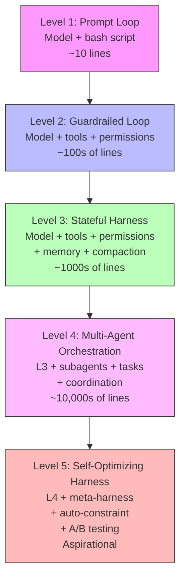
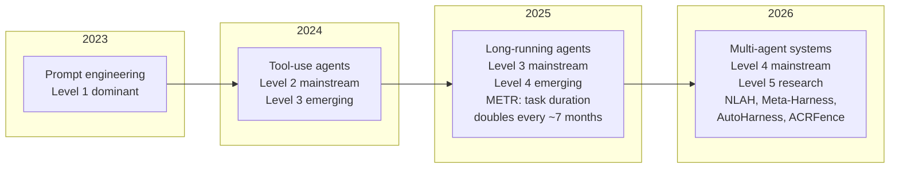

# Closing: Lessons for the Harness Engineering Discipline

## Overview

Across fifty-six chapters, this book has traced the architecture of a single production system -- cc, the Claude Code agent -- from its entry point in `src/entrypoints/cli.tsx` through bootstrap, the query loop, tool dispatch, subagent orchestration, memory, compaction, permissions, hooks, skills, MCP, the Ink renderer, long-running work, observability, and security. We have mapped each subsystem to the patterns, failure modes, and best practices identified in the Harness Engineering Report (HER). This closing chapter steps back from the code to ask: what does cc prove, and what does it disprove, about the discipline of harness engineering?

Three answers emerge. First, cc validates the HER thesis that the harness -- not the model -- is the dominant factor in long-running agent reliability. The query loop's compaction hierarchy, the permission system's defense-in-depth, and the task system's durable state management are what make multi-hour sessions viable, not raw model capability. Second, cc demonstrates that production harness engineering is substantially an integration problem, not an algorithms problem. The hardest parts of the codebase are not any single algorithm but the seams between subsystems: the message lifecycle bridging the model and tools, the permission hooks bridging safety and user experience, the session persistence bridging process boundaries. Third, and most humblingly, cc reveals that even the most mature public harness has significant gaps -- in supply-chain defense, in checkpoint-restore safety, in observability for non-deterministic behavior -- that the discipline must address before "launch and trust" becomes a realistic proposition for general-purpose coding agents.

This chapter synthesizes the book's findings into three contributions: a maturity model for the discipline, a set of open research questions drawn from the edge cases and failure modes that cc exposes, and a call to action for the next generation of harness engineers. The synthesis draws on three streams of evidence: the cc source code itself (the concrete), the HER's pattern and failure-mode taxonomy (the theoretical), and the academic research of 2025-2026 (the frontier).

## Data structures and contracts

The discipline of harness engineering does not yet have a formal type system, but we can sketch one from cc's architecture. The fundamental unit is the harness itself -- the outer runtime layer that orchestrates the model's interactions with tools, permissions, hooks, memory, and the user. In cc, the harness is embodied in the query loop, whose imports reveal the three pillars of harness orchestration:

```typescript
// src/query.ts:L1-L6
// The query loop imports types for tool results, streaming events,
// and the canUseTool permission function -- the three pillars of
// harness orchestration: execution, observation, and control
import type {
  ToolResultBlockParam,
  ToolUseBlock,
} from '@anthropic-ai/sdk/resources/index.mjs'
import type { CanUseToolFn } from './hooks/useCanUseTool.js'
```

The `CanUseToolFn` type is the contract between the harness's safety layer and the execution engine. Every tool call passes through this gate, and the harness's reliability depends on it being invoked correctly at every dispatch point. This is the single most important contract in the entire system: if a tool call bypasses `canUseTool`, the permission model is void. The harness literature (NLAH, HER Section 15.1) calls this an "Adapter" -- a deterministic hook that mediates between the probabilistic model and the deterministic world. cc implements this adapter as a React hook (`useCanUseTool.tsx`), which is an unusual but effective choice: the hook's reactivity model ensures that permission state changes propagate immediately through the UI.

The tool interface itself defines the schema-validated contract between the model and the outside world:

```typescript
// src/Tool.ts:L15-L21
export type ToolInputJSONSchema = {
  [x: string]: unknown
  type: 'object'
  properties?: {
    [x: string]: unknown
  }
}
```

This sparse type belies the complexity beneath. Each concrete tool implements a `call()` method, a Zod schema for input validation, concurrency flags, and max-result-size constraints. The harness's job is to enforce these contracts at runtime, even when the model produces malformed tool calls or attempts operations outside its declared schema. The NLAH paper formalizes this as "Contracts" -- explicit I/O constraints that define what a tool can receive and produce. cc's Zod-based validation serves the same purpose, but without the formality: there is no separate contract layer that can be inspected or verified independently of the tool implementation.

The permission mode type defines the operational regime of the harness:

```typescript
// src/types/permissions.ts:L16-L29
export const EXTERNAL_PERMISSION_MODES = [
  'acceptEdits',
  'bypassPermissions',
  'default',
  'dontAsk',
  'plan',
] as const

export type ExternalPermissionMode = (typeof EXTERNAL_PERMISSION_MODES)[number]

// Exhaustive mode union for typechecking. The user-addressable runtime set
// is INTERNAL_PERMISSION_MODES below.
export type InternalPermissionMode = ExternalPermissionMode | 'auto' | 'bubble'
export type PermissionMode = InternalPermissionMode
```

The definition reveals the internal structure: five external modes available to all users, plus `auto` and `bubble` gated behind feature flags. These six modes span a privilege spectrum from fully restricted (plan, read-only) to fully unrestricted (bypassPermissions). The existence of this spectrum is itself a design lesson: a binary allow/deny model is insufficient for a long-running agent that must operate across different trust contexts within a single session. The `auto` mode, in particular, represents a significant architectural commitment -- it delegates trust decisions to the YOLO classifier (1,495 lines in `yoloClassifier.ts`), which means that a production harness must be prepared for the case where its own safety automation makes incorrect decisions.

The ablation baseline gate in cc's entry point demonstrates an often-overlooked contract: the one between the harness and its own feature flags. When `ABLATION_BASELINE` is enabled, cc strips away thinking, compaction, auto-memory, and background tasks:

```typescript
// src/entrypoints/cli.tsx:L16-L26
// Harness-science L0 ablation baseline. Inlined here (not init.ts) because
// BashTool/AgentTool/PowerShellTool capture DISABLE_BACKGROUND_TASKS into
// module-level consts at import time — init() runs too late. feature() gate
// DCEs this entire block from external builds.
if (feature('ABLATION_BASELINE') && process.env.CLAUDE_CODE_ABLATION_BASELINE) {
  for (const k of ['CLAUDE_CODE_SIMPLE', 'CLAUDE_CODE_DISABLE_THINKING',
    'DISABLE_INTERLEAVED_THINKING', 'DISABLE_COMPACT', 'DISABLE_AUTO_COMPACT',
    'CLAUDE_CODE_DISABLE_AUTO_MEMORY', 'CLAUDE_CODE_DISABLE_BACKGROUND_TASKS']) {
    process.env[k] ??= '1';
  }
}
```

This ablation gate is a research tool, not a production feature -- but it reveals a deep truth about the harness: every capability it adds (thinking, compaction, memory, background tasks) is a potential source of failure, and the ablation baseline provides a way to measure the net benefit of each capability in isolation. The gate's placement in `cli.tsx` rather than `init.ts` is deliberate: as the comment at `src/entrypoints/cli.tsx:L16-L18` explains, the environment variables must be set before module imports resolve, because tools like BashTool and AgentTool capture `DISABLE_BACKGROUND_TASKS` into module-level constants at import time. The discipline should adopt this approach systematically: every harness feature should have a kill switch and a measured contribution to overall reliability.

## Control flow

The discipline of harness engineering, as observed through cc, follows a maturity trajectory from ad-hoc scripting to systematic engineering. We can model this trajectory as five levels:



The query loop's import table illustrates how cc spans these levels in a single file:

```typescript
// src/query.ts:L1-L20
import type {
  ToolResultBlockParam,
  ToolUseBlock,
} from '@anthropic-ai/sdk/resources/index.mjs'
import type { CanUseToolFn } from './hooks/useCanUseTool.js'
import { FallbackTriggeredError } from './services/api/withRetry.js'
import {
  calculateTokenWarningState,
  isAutoCompactEnabled,
  type AutoCompactTrackingState,
} from './services/compact/autoCompact.js'
import { buildPostCompactMessages } from './services/compact/compact.js'
const reactiveCompact = feature('REACTIVE_COMPACT')
  ? (require('./services/compact/reactiveCompact.js') as typeof import('./services/compact/reactiveCompact.js'))
  : null
const contextCollapse = feature('CONTEXT_COLLAPSE')
  ? (require('./services/contextCollapse/index.js') as typeof import('./services/contextCollapse/index.js'))
  : null
```

The `CanUseToolFn` import is the Level 2 gate. The compact and autocompact imports are the Level 3 state management. The feature-gated `require` calls show how cc conditionally activates subsystems, keeping the core loop lean while allowing higher-maturity capabilities to be loaded when needed.

At Level 1, a harness is a simple loop: send a prompt to the model, execute the tool call, feed the result back. Ralph's bash loop (cited in HER Section 18.7) and Simon Willison's observation that "a coding agent is fundamentally a few dozen lines of code" both describe this level. cc's entry point still contains traces of this simplicity -- the `--version` fast path in `src/entrypoints/cli.tsx:L37-L41` exits before loading any modules, and the ablation baseline reduces the entire harness to something approaching Level 1.

At Level 2, the harness adds permissions and tool schemas. cc's `Tool.ts` type system and the `CanUseToolFn` gate represent this level. The harness can now say "no" to the model, which transforms the relationship from delegation to negotiation. This is also the level where the discipline's terminology begins to matter: HER's distinction between "computational" tools (deterministic, like file read) and "inferential" tools (probabilistic, like web search) maps to cc's read/write classification in the BashTool's permission system. A Level 2 harness must classify tools by risk, but it does not yet need to manage the state that accumulates across many tool calls.

At Level 3, the harness adds state management: memory (memdir), compaction (the five-stage hierarchy), and session persistence (JSONL). This is the level where cc becomes viable for multi-hour tasks. The compaction hierarchy is the clearest marker of Level 3 maturity -- a Level 2 harness crashes ungracefully when it runs out of context; a Level 3 harness degrades gracefully. The microcompact pass trims tool results without model invocation (`microCompact.ts`, 530 lines); the context collapse aggressively summarizes the full conversation (`compact.ts`, 1,705 lines); the autocompact fires automatically when context approaches capacity (`autoCompact.ts`, 351 lines). Each stage preserves different amounts of information, and the harness must choose correctly which stage to invoke based on the current state of the conversation.

At Level 4, the harness orchestrates multiple agents: sync subagents, forked subagents, remote CCR agents, coordinator-based teams. cc's `AgentTool` (1,397 lines), `coordinatorMode.ts` (369 lines), and the task system represent this level. The generator-evaluator pattern (HER Section 9.2) lives here, and with it comes the Ouroboros problem: when both generator and evaluator are LLMs, who validates the validator? The discipline has no satisfying answer to this question yet. The NLAH ablation shows that adding a verifier can produce negative results (-0.8% on SWE-bench), and multi-candidate search can also degrade performance (-2.4%). Level 4 is where the discipline's limits become visible.

At Level 5, the harness optimizes itself. The Meta-Harness paper (HER Section 15.2) demonstrates that harness configurations can be systematically optimized rather than hand-tuned, achieving +7.7 points over SOTA with 4x fewer tokens. AutoHarness (HER Section 15.3) shows that smaller models with synthesized harnesses can outperform larger models without them. cc has no Level 5 capability today -- there is no A/B testing of harness configurations, no automated constraint generation, no self-evolution of prompt templates. This is the frontier.

The timeline of the discipline's evolution can be mapped against these levels:



This timeline is approximate, but it captures a real acceleration. The METR data (HER Section 10.2) shows that AI task duration doubles every ~7 months, with the updated Time Horizon 1.1 model suggesting the rate has accelerated to ~4.3 months. Toby Ord's analysis (arXiv:2505.05115, May 2025) found that AI agent failure follows a constant hazard rate analogous to radioactive decay, with Claude 3.7 Sonnet achieving 50% success on tasks up to 59 minutes but requiring tasks under 15 minutes for 80% success. This capability growth drives demand for higher-maturity harnesses: as models can handle longer tasks, the harness must manage proportionally more state, more failure modes, and more security threats.

The core control flow insight from cc is that the query loop is not a simple request-response cycle. It is an event-driven state machine with multiple interruption points, compaction triggers, and permission gates. The loop must handle:

1. Model streaming (partial responses that may contain tool calls)
2. Tool dispatch (which may be deferred, parallelized for read-only tools, or serialized for write tools)
3. Compaction triggers (microcompact, context collapse, autocompact)
4. Permission decisions (which may require user interaction)
5. Session persistence (JSONL writes after every significant state change)
6. Graceful shutdown (signal handlers that preserve state)

Each of these concerns is itself a state machine, and the harness must compose them correctly. The `queryLoop` function signature reveals the composition: the outer `query()` generator wraps `queryLoop()`, consuming command UUIDs on normal exit but propagating errors and early returns through `yield*`:

```typescript
// src/query.ts:L219-L239
export async function* query(
  params: QueryParams,
): AsyncGenerator<
  | StreamEvent
  | RequestStartEvent
  | Message
  | TombstoneMessage
  | ToolUseSummaryMessage,
  Terminal
> {
  const consumedCommandUuids: string[] = []
  const terminal = yield* queryLoop(params, consumedCommandUuids)
  // Only reached if queryLoop returned normally. Skipped on throw (error
  // propagates through yield*) and on .return() (Return completion closes
  // both generators). This gives the same asymmetric started-without-completed
  // signal as print.ts's drainCommandQueue when the turn fails.
  for (const uuid of consumedCommandUuids) {
    notifyCommandLifecycle(uuid, 'completed')
  }
  return terminal
}
```

Inside `queryLoop`, mutable state is destructured at the top of each iteration and reassigned at each `continue` site -- the "state destructuring pattern" that makes state transitions explicit and testable:

```typescript
// src/query.ts:L265-L279
  // Mutable cross-iteration state. The loop body destructures this at the top
  // of each iteration so reads stay bare-name (`messages`, `toolUseContext`).
  // Continue sites write `state = { ... }` instead of 9 separate assignments.
  let state: State = {
    messages: params.messages,
    toolUseContext: params.toolUseContext,
    maxOutputTokensOverride: params.maxOutputTokensOverride,
    autoCompactTracking: undefined,
    stopHookActive: undefined,
    maxOutputTokensRecoveryCount: 0,
    hasAttemptedReactiveCompact: false,
    turnCount: 1,
    pendingToolUseSummary: undefined,
    transition: undefined,
  }
```

The `query.ts` file, at 1,729 lines, is the orchestration point -- but the actual logic is distributed across `compact.ts` (1,705 lines), `toolExecution.ts` (1,745 lines), `messages.ts` (5,512 lines), and `sessionStorage.ts` (5,105 lines). The total code dedicated to the harness (as opposed to individual tools) exceeds 30,000 lines. This is not a bash loop.

## Edge cases and failure modes

The discipline of harness engineering must confront several edge cases that cc's architecture reveals but does not fully solve.

**The Ouroboros Problem.** When both generator and evaluator are LLMs, who validates the validator? HER Section 18.2 identifies this as a fundamental limitation. cc's generator-evaluator pattern (coordinator mode) uses LLM evaluators, but the NLAH ablation (HER Section 15.1) shows that adding a verifier can produce negative results (-0.8% on SWE-bench). An LLM evaluator can hallucinate approval just as easily as a generator can hallucinate success. The strongest evaluators are deterministic: test suites, type checkers, linters. cc's LSP integration (Chapter 15) provides one such deterministic evaluator, but it is underutilized in the evaluation pipeline. The discipline should prioritize deterministic verification wherever possible and reserve LLM evaluation for judgments that deterministic tools cannot make. The NLAH finding that "more structure doesn't automatically improve performance when intermediate acceptance criteria diverge from final benchmarks" is a crucial cautionary result: adding verification layers can make things worse if the verifier's notion of quality does not align with the actual success metric.

**The Stone Soup Attribution Problem.** HER Section 18.3, citing Benjamin Riley and Alison Gopnik, warns that massive human labor gets misattributed to AI capability. OpenAI's "~1M lines, zero manually written" is technically true but obscures the human engineering effort that made it possible. Huntley's own caveat -- "There is no way this is possible without senior expertise guiding Ralph" -- is the honest version. cc's `CLAUDE.md` system, the settings cascade, the managed settings for enterprise, and the permission rules all require human authoring and maintenance. The harness does not eliminate human effort; it concentrates it into specification and monitoring rather than execution. The discipline must be honest about this: a "self-driving" agent still requires a human at the steering wheel, even if that human's role is primarily to set guardrails and respond to escalations.

**The Greenfield Bias.** HER Section 18.5 notes that many impressive agent results come from greenfield projects. Huntley explicitly states: "There's no way in heck would I use Ralph in an existing code base." cc is designed for both greenfield and brownfield work, but the brownfield case is fundamentally harder. The agent must understand existing architecture it did not create, tests may be incomplete or absent, modifications must respect implicit conventions not captured in any document, and the risk of breaking existing functionality is much higher. The LSP integration helps, but there is no substitute for the domain knowledge that a senior developer brings to a legacy codebase. The discipline must develop techniques for injecting domain knowledge into the harness -- not through increasingly verbose context files (which the ETH Zurich study shows can reduce performance), but through structural mechanisms like typed interfaces, architectural decision records, and automated convention detection.

**The Compound Failure Problem.** METR's data (HER Section 10.2) shows that 95% per-step reliability yields only 36% reliability over 20 steps. Doubling task duration quadruples the failure rate. For a multi-hour task with hundreds of tool calls, the compound failure rate is severe. cc's compaction hierarchy and session persistence address this indirectly -- by enabling task decomposition and state handoffs -- but the fundamental math remains: long tasks require either extremely high per-step reliability or mechanisms for detecting and recovering from partial failures. The ACRFence paper (HER Section 15.6) identifies a specific instance of this problem in checkpoint-restore: agents re-synthesize subtly different requests after restore, leading to Action Replay (replaying completed actions) and Authority Resurrection (reusing expired credentials) attacks. cc has no defense against these attack classes. The discipline must develop idempotency keys for external operations and replay-or-fork semantics for checkpoint-restore, or the compound failure problem will limit agent reliability to tasks of modest duration.

**The Scale Confusion.** HER Section 18.7 warns that the literature conflates harnesses operating at very different scales. A Ralph-style bash loop (~10 lines), a generator-evaluator system (~100s of lines), a full orchestration framework (~1000s of lines), and the eight-layer reference architecture (aspirational) are qualitatively different systems, not points on a single continuum. cc, at ~30,000+ harness lines, occupies the upper end of the full orchestration scale. The discipline must develop vocabulary that distinguishes these scales clearly, or practitioners will over-engineer simple problems and under-engineer complex ones. The maturity model proposed in this chapter's Control Flow section is a starting point.

**The Limited Applicability Beyond Coding.** HER Section 18.4 notes that coding is the ideal domain for harness engineering because of the deterministic-probabilistic pairing: write code (probabilistic), run compiler/tests (deterministic), iterate. Most human activities do not have this structure. The patterns in the HER should not be assumed to generalize to domains lacking strong deterministic verification (creative writing, strategic planning, research synthesis). cc's architecture is deeply optimized for the coding domain; its tool system, its LSP integration, its file-edit semantics, and its test-running conventions all assume that the agent is modifying code that can be compiled and tested. The discipline should be explicit about the domain-specificity of its patterns.

## Where cc diverges from the published pattern

cc diverges from the HER's idealized harness architecture in several instructive ways.

**Incremental security, not designed-in security.** HER Section 12 describes a five-layer defense-in-depth model. cc implements all five layers, but the depth of coverage varies dramatically. The runtime approval layer (permissions, classifiers) is the most mature, with over 11,000 lines of code across the permissions module alone. The supply-chain layer is the thinnest: MCP servers can execute arbitrary code, and cc relies on social controls (vetting, user review) rather than technical enforcement. This is characteristic of security that has been built incrementally in response to specific incidents, rather than designed holistically from a threat model. The discipline should treat cc's uneven coverage as a cautionary tale: security-by-accretion leaves gaps that are hard to see until they are exploited. The OpenClaw incident (CVE-2025-53773, CVSS 9.6), which affected 21,000 exposed instances of an open-source agent framework, demonstrates that tool interfaces are attack surfaces, and the combination of prompt injection and tool execution creates compound risk.

**Observability as an afterthought.** HER Section 14 describes three pillars of observability: logs, metrics, and traces. cc has the first two (debug logging via `debug.ts`, analytics events via `analytics/index.ts`, cost tracking via `cost-tracker.ts`) but lacks the third. There is no distributed tracing of a tool call from model request through dispatch, execution, and result return. The `toolUseSummary` system provides a partial approximation, but it is not a trace. For multi-hour sessions with hundreds of tool calls, the absence of tracing makes debugging extremely difficult. The discipline should adopt OpenTelemetry or equivalent from the start, not retrofit it later. HER Section 14.2 identifies the observability gap as a specific risk: without tracing, the harness cannot distinguish between a model that is performing well and a model that is performing poorly but being rescued by compaction.

**No formal verification of harness invariants.** cc has no mechanism for verifying that the harness itself behaves correctly. There are no property-based tests of the compaction hierarchy's preservation guarantees, no formal model of the permission system's safety properties, no invariant checking across session boundaries. The NLAH paper's concept of "Contracts" -- explicit I/O constraints that can be verified -- points toward a solution, but cc has nothing equivalent. The discipline should treat harness correctness as a verification problem, not just a testing problem. The capability-reliability gap identified in the Agent Reliability Science paper (HER Section 15.5) -- models get smarter but not necessarily more consistent -- means that the harness's correctness guarantees become more important as model capability increases, not less.

**Context files that reduce performance.** The ETH Zurich study (HER Section 15.7) found that context files tend to reduce task success rates compared to providing no repository context, while increasing inference cost by over 20%. This applies to both LLM-generated and developer-committed context files. cc's `CLAUDE.md` system is precisely the kind of context file this study examined. The recommendation to describe only "minimal requirements" is a direct challenge to cc's approach of loading increasingly detailed instructions from the settings cascade (org, user, project, directory, environment, flags). The discipline must develop a science of context file sizing and content selection, rather than treating more context as universally beneficial. The Meta-Harness paper's finding that harness configurations can be optimized automatically (+7.7 points with 4x fewer tokens) suggests that context file optimization may be amenable to automated search rather than manual tuning.

## Developer takeaways for building a long-running agent

**1. The harness is the product.** AutoHarness (HER Section 15.3) validates this: a smaller model with a synthesized harness outperformed a larger model without one.

**2. Right-size your tasks.** Target 15-30 minutes per agent session. Multi-hour work must decompose into shorter sessions with state handoffs.

**3. Deterministic verification beats LLM verification.** The NLAH ablation shows LLM evaluators can produce negative results (-0.8% on SWE-bench). Use test suites and linters first.

**4. Security must be designed in, not bolted on.** Build your threat model first. Every tool interface is an attack surface.

**5. Observability is not optional.** Without distributed tracing, debugging multi-hour sessions with hundreds of tool calls is impossible. Adopt OpenTelemetry from day one.

**6. More structure is not always better.** The NLAH ablation found multi-candidate search produced -2.4% on SWE-bench. Treat harness structure as a hypothesis to test, not an axiom.

**7. The discipline is young.** Build modular, replaceable harnesses: today's best practices may be tomorrow's anti-patterns.

cc is the most mature public long-running agent harness -- and a work in progress. The gaps in supply-chain defense, checkpoint-restore safety, observability, and formal verification are the natural consequence of building at the frontier of a discipline that did not exist three years ago. The next step is to move from pattern catalogs to formal methods, from anecdotal evidence to systematic measurement, and from artisanal construction to engineered, verified, self-optimizing systems. That transition starts now.
