# Deep Research of Claude Code Source Code

> A comprehensive, technical deep-dive into the architecture, design patterns, and implementation of Anthropic's Claude Code CLI

---

## Preface

Claude Code is Anthropic's official command-line interface for Claude — an AI-powered coding assistant that runs in your terminal, desktop, IDE, and browser. It is one of the most sophisticated agentic AI applications in production, handling everything from multi-turn conversations with tool use to autonomous subagent orchestration, all within the constraints of a terminal user interface.

This book is a deep research of the Claude Code source code. It is written for experienced software engineers who want to understand how a production-grade agentic AI application is built — from the moment the user types `claude` at the shell prompt to the final rendered response in the terminal, and everything in between.

What you will find in these pages:

- **Architecture**: How every major subsystem connects, from the REPL loop to the API streaming layer
- **Design Patterns**: How Claude Code uses React for terminal rendering, a global mutable singleton for shared state, and a multi-stage permission pipeline for security
- **Implementation Details**: How tools are defined, how permissions are checked, how conversations are compacted, and how subagents are spawned
- **Mermaid Diagrams**: Flowcharts, sequence diagrams, class diagrams, and architecture diagrams that visualize the system at every level of abstraction

What you will not find:

- This is not a user guide. It assumes you are familiar with Claude Code as a user
- This is not an API reference. It focuses on the internal implementation, not the public API
- This is not a tutorial. It does not teach you how to build a similar system from scratch

The source code is a living document. By the time you read this, some details may have changed. But the architectural decisions, design patterns, and implementation strategies documented here provide enduring insight into how to build a complex, production-grade agentic AI application.

---

## Table of Contents

### Part I: Architecture and Bootstrap

1. [The Big Picture — Claude Code System Architecture](#chapter-1-the-big-picture--claude-code-system-architecture)
2. [Build System and Dead Code Elimination](#chapter-2-build-system-and-dead-code-elimination)
3. [Entry Points — From Shell to Application](#chapter-3-entry-points--from-shell-to-application)
4. [Bootstrap State — The Global Mutable Singleton](#chapter-4-bootstrap-state--the-global-mutable-singleton)
5. [Configuration System — From CLAUDE.md to Managed Settings](#chapter-5-configuration-system--from-claudemd-to-managed-settings)

### Part II: The Core Loop

6. [The REPL Screen — Where User Meets Machine](#chapter-6-the-repl-screen--where-user-meets-machine)
7. [The Query Function — Heart of the Conversation Loop](#chapter-7-the-query-function--heart-of-the-conversation-loop)
8. [QueryEngine — SDK Orchestration and Stream Processing](#chapter-8-queryengine--sdk-orchestration-and-stream-processing)
9. [Message Types and Conversation Model](#chapter-9-message-types-and-conversation-model)

### Part III: The Tool System

10. [Tool Architecture — buildTool, ToolUseContext, and ToolPool](#chapter-10-tool-architecture--buildtool-toolusecontext-and-toolpool)
11. [Filesystem Tools — Read, Edit, and Write](#chapter-11-filesystem-tools--read-edit-and-write)
12. [BashTool and Command Security](#chapter-12-bashtool-and-command-security)
13. [Search and Navigation Tools — Glob, Grep, and NotebookEdit](#chapter-13-search-and-navigation-tools--glob-grep-and-notebookedit)
14. [Utility and Task Management Tools](#chapter-14-utility-and-task-management-tools)

### Part IV: Permission and Security

15. [The Permission Pipeline — From Tool Use to User Decision](#chapter-15-the-permission-pipeline--from-tool-use-to-user-decision)
16. [Bash Permission Deep Dive — AST Parsing and Subcommand Rules](#chapter-16-bash-permission-deep-dive--ast-parsing-and-subcommand-rules)
17. [Auto Mode and the YOLO Classifier](#chapter-17-auto-mode-and-the-yolo-classifier)
18. [Filesystem Permissions and Sandbox Execution](#chapter-18-filesystem-permissions-and-sandbox-execution)

### Part V: AI Integration and Context

19. [The Prompt Assembly Line — System Prompt Construction](#chapter-19-the-prompt-assembly-line--system-prompt-construction)
20. [API Client Architecture — Four Providers and Streaming](#chapter-20-api-client-architecture--four-providers-and-streaming)
21. [Model Selection, Betas, and Retry Logic](#chapter-21-model-selection-betas-and-retry-logic)
22. [Conversation Compaction — Managing the Token Budget](#chapter-22-conversation-compaction--managing-the-token-budget)
23. [Session Persistence and Transcript Format](#chapter-23-session-persistence-and-transcript-format)
24. [Authentication — API Keys, OAuth, and Cloud Provider Credentials](#chapter-24-authentication--api-keys-oauth-and-cloud-provider-credentials)

### Part VI: MCP and Agent Systems

25. [MCP Architecture — Transports, Client, and Connection Lifecycle](#chapter-25-mcp-architecture--transports-client-and-connection-lifecycle)
26. [MCP Name Normalization, Auth, and Tool Invocation](#chapter-26-mcp-name-normalization-auth-and-tool-invocation)
27. [AgentTool — Spawning and Managing SubAgents](#chapter-27-agenttool--spawning-and-managing-subagents)
28. [Built-in Agents and Custom Agent Definitions](#chapter-28-built-in-agents-and-custom-agent-definitions)
29. [Fork SubAgents and Context Inheritance](#chapter-29-fork-subagents-and-context-inheritance)
30. [Swarm and Teammate System — Multi-Agent Orchestration](#chapter-30-swarm-and-teammate-system--multi-agent-orchestration)

### Part VII: Terminal UI and Rendering

31. [Ink Framework — React Reconciler for the Terminal](#chapter-31-ink-framework--react-reconciler-for-the-terminal)
32. [Screen Buffer and Double-Buffering](#chapter-32-screen-buffer-and-double-buffering)
33. [Terminal Output — Diff-Based Writing and Alt-Screen](#chapter-33-terminal-output--diff-based-writing-and-alt-screen)
34. [Markdown Rendering and Syntax Highlighting](#chapter-34-markdown-rendering-and-syntax-highlighting)
35. [Virtual Scrolling, Vim Mode, and Input Handling](#chapter-35-virtual-scrolling-vim-mode-and-input-handling)

### Part VIII: Infrastructure and Cross-Cutting Systems

36. [Hooks System — Lifecycle Events and Extensibility](#chapter-36-hooks-system--lifecycle-events-and-extensibility)
37. [Memory System — Persistent Knowledge Across Sessions](#chapter-37-memory-system--persistent-knowledge-across-sessions)
38. [State Management — AppStateStore and React Integration](#chapter-38-state-management--appstatestore-and-react-integration)
39. [Git Integration — Filesystem-Based State and Branch Tracking](#chapter-39-git-integration--filesystem-based-state-and-branch-tracking)
40. [Cron Scheduling System](#chapter-40-cron-scheduling-system)
41. [Plan Mode, Worktrees, and Task Coordination](#chapter-41-plan-mode-worktrees-and-task-coordination)
42. [Analytics, Telemetry, and Feature Flags](#chapter-42-analytics-telemetry-and-feature-flags)

### Part IX: Advanced Topics and Integration

43. [Bridge Mode and Coordinator Mode](#chapter-43-bridge-mode-and-coordinator-mode)
44. [Voice Mode, LSP Integration, and Plugins](#chapter-44-voice-mode-lsp-integration-and-plugins)
45. [Teleport, Remote Sessions, and the SDK Interface](#chapter-45-teleport-remote-sessions-and-the-sdk-interface)

### Appendices

- [Appendix A: Complete Tool Reference Table](#appendix-a-complete-tool-reference-table)
- [Appendix B: System Prompt Section Catalog](#appendix-b-system-prompt-section-catalog)
- [Appendix C: Feature Flag Reference](#appendix-c-feature-flag-reference)
- [Appendix D: Hook Event Reference](#appendix-d-hook-event-reference)
- [Appendix E: Key Environment Variables](#appendix-e-key-environment-variables)

---

## Chapter 1: The Big Picture — Claude Code System Architecture

### 1.1 Bird's-Eye View

Claude Code is a terminal-native agentic AI application built on a layered architecture spanning from a shell entry point through an Ink-rendered TUI, an orchestration engine, a streaming API client, and out to external systems (Anthropic API, MCP servers, the local filesystem). The system is not a simple request-response CLI. It is a long-running, stateful process that manages multi-turn conversations, concurrent tool execution, permission pipelines, conversation compaction, subagent spawning, and real-time terminal rendering — all within the constraints of a terminal user interface.

At the highest level, the data flow is: the user types a prompt, the REPL screen captures it, the query pipeline assembles a system prompt and sends it to the Anthropic API, the streaming response is parsed for tool use requests, each tool use goes through a permission check, approved tools are executed, results are rendered, and the cycle repeats until the model produces no more tool calls. Every one of these steps involves multiple subsystems coordinating through shared state, async generators, and React components.

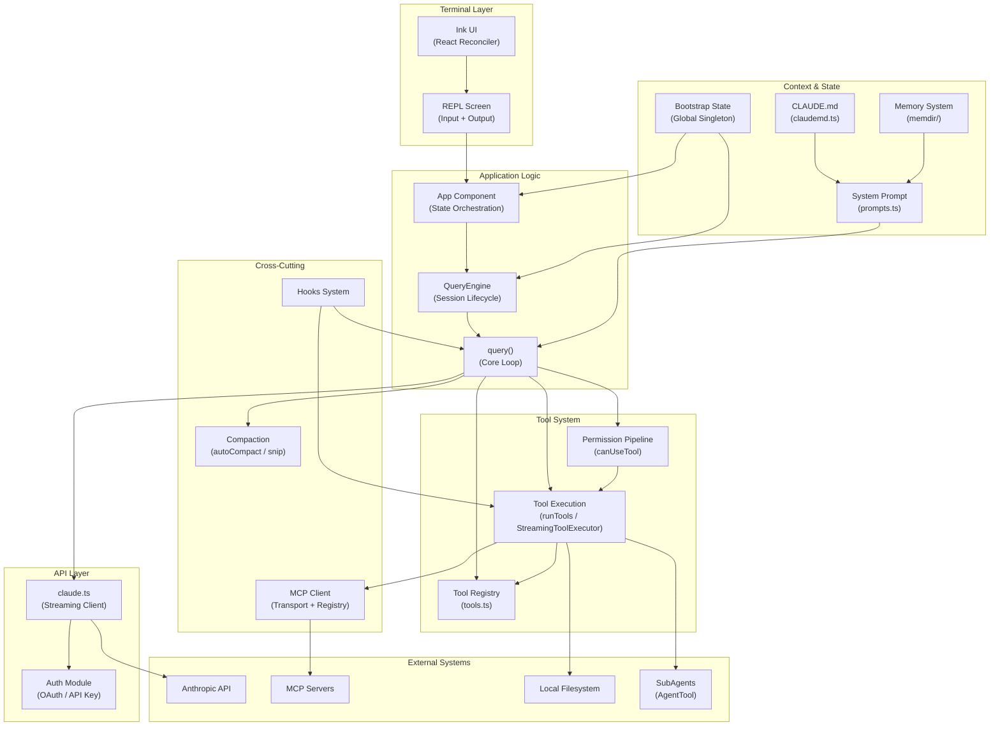

### 1.2 The Request Lifecycle

The fundamental unit of work in Claude Code is a single turn of the query loop. A "turn" begins when the user submits a prompt and ends when the model either produces no tool use blocks (a terminal response) or hits a termination condition (max turns, budget exceeded, user abort). The query loop is an `async function*` generator — it yields messages as they arrive from the API and tool execution, allowing the UI to render incrementally.

The following sequence diagram traces a single user prompt through the full system:

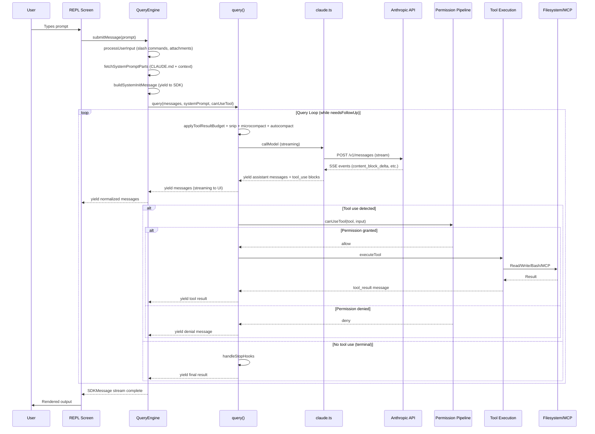

### 1.3 Layer Architecture

Claude Code is organized as a strict layer cake where each layer only depends on the layer below it (with limited cross-cutting concerns handled by the bootstrap state singleton).

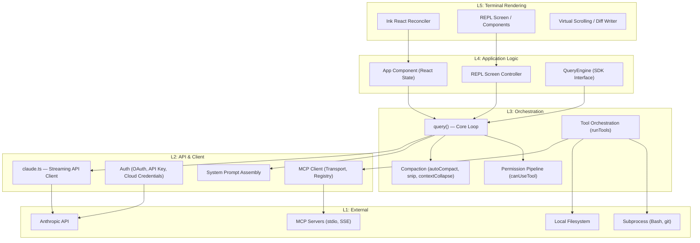

### 1.4 Subsystem Overview

**REPL and Ink UI** (`src/screens/REPL.tsx`, `src/components/`). The terminal UI is built with Ink, a React reconciler for the terminal. The REPL screen is the top-level component that renders the conversation, input prompt, tool use results, and status indicators. It communicates with the query engine through React state and async generators.

**QueryEngine** (`src/QueryEngine.ts`). The QueryEngine class owns the lifecycle of a single conversation. It wraps the `query()` function, manages `mutableMessages` (the session's message array), tracks cumulative usage and permission denials, and yields `SDKMessage` objects for both the SDK and the REPL to consume. One QueryEngine per conversation — each `submitMessage()` call starts a new turn.

**query() Core Loop** (`src/query.ts`). The heart of the system. This `async function*` generator implements the agentic loop: it sends messages to the API, streams back assistant responses, detects tool use blocks, executes tools via the permission pipeline, collects results, and either continues the loop or terminates. The loop carries mutable state (`State` type) across iterations, including the message array, auto-compact tracking, and recovery counters for max-output-tokens and prompt-too-long errors.

**Tool System** (`src/tools.ts`, `src/Tool.ts`). Tools are defined as objects implementing the `Tool` interface. The tool registry in `src/tools.ts` constructs the full tool list using compile-time feature gates (via `feature()` from `bun:bundle`) to eliminate ant-only tools from external builds. The `StreamingToolExecutor` executes tools in parallel as their `tool_use` blocks arrive from the streaming API, rather than waiting for the entire response.

**Permission Pipeline** (`src/hooks/useCanUseTool.js`). Every tool invocation passes through `canUseTool`, which checks permission rules (allow/deny/ask), runs the auto-mode classifier, and presents interactive dialogs when needed. The pipeline is asynchronous and can be bypassed in certain modes (bypass permissions, auto mode with classifier approval).

**API Client** (`src/services/api/claude.ts`). The streaming API client wraps the Anthropic SDK's `messages.stream()` method. It handles prompt caching, thinking configuration, model selection, fallback model retry, and token budget tracking. It yields parsed messages (assistant blocks, tool use blocks) as they arrive from the SSE stream.

**Bootstrap State** (`src/bootstrap/state.ts`). A module-level mutable singleton that holds all global session state: cost tracking, model usage, session IDs, telemetry counters, plugin lists, cron tasks, and dozens of session-scoped flags. Accessed through getter/setter functions, not direct property access.

**CLAUDE.md and Prompt Assembly** (`src/utils/claudemd.ts`, `src/constants/prompts.ts`). The system prompt is assembled from multiple sources: the base prompt sections, CLAUDE.md files loaded from multiple priority levels, user context, system context, and coordinator mode context. The `@include` directive allows CLAUDE.md files to reference other files.

**MCP (Model Context Protocol)** (`src/services/mcp/`). MCP servers provide additional tools and resources to Claude Code. The client supports stdio and SSE transports, handles name normalization, and integrates with the permission system. MCP tools are discovered at runtime and merged with the built-in tool list.

**Compaction** (`src/services/compact/`). Conversation compaction prevents the context window from growing unbounded. Multiple strategies exist: proactive autocompact (triggered by token thresholds), reactive compact (triggered by prompt-too-long API errors), context collapse (granular archiving of old turns), and snip compact (feature-gated aggressive truncation). Each produces a compact boundary message in the transcript.

**SubAgents** (`src/tools/AgentTool/`). The AgentTool spawns child conversations (subagents) that share the parent's tool set but run in isolated contexts. Subagents can be built-in (DocDoctor, Architect, etc.) or custom (defined in `.claude/agents/`). The teammate system extends this to multi-agent orchestration with shared state.

### 1.5 The Message Model

Every piece of data that flows through the system is represented as a `Message` object, defined in `src/types/message.ts`. The message types form a discriminated union:

- **`assistant`**: A message from the Claude API. Contains content blocks (text, tool_use, thinking). Each assistant message corresponds to one API response.
- **`user`**: A message from the user or a tool result. User messages can contain text, tool_result blocks, or image content. Tool results are encoded as `user` messages with `tool_result` content blocks (following the Anthropic API convention).
- **`system`**: Internal system messages with subtypes: `compact_boundary` (marks a compaction point), `api_error` (rate limit or transient error), `local_command` (output from a slash command), and others.
- **`attachment`**: Metadata attachments that are not part of the conversation history but are yielded to SDK consumers. Types include `edited_text_file`, `max_turns_reached`, `queued_command`, `structured_output`, and `hook_stopped_continuation`.
- **`progress`**: Incremental progress updates from long-running tools (AgentTool, BashTool, MCP tools). These are rendered in the UI as spinners and status lines.
- **`stream_event`**: Raw Anthropic API stream events (message_start, content_block_delta, message_delta, message_stop). Only yielded when `includePartialMessages` is true (for SDK consumers that want real-time streaming).
- **`tombstone`**: A control signal that instructs the UI to remove a previously rendered message. Used after streaming fallback to discard orphaned thinking/tool_use blocks from a failed first attempt.
- **`tool_use_summary`**: A summary of a batch of tool uses, generated by a fast model (Haiku) while the next API call is in progress.

The `QueryEngine.submitMessage()` generator yields `SDKMessage` objects, which are a normalized subset of these types designed for SDK consumers. The `query()` generator yields the raw internal types. The normalization layer (in `src/utils/messages/mappers.ts`) converts between the two representations, stripping Ink-specific data and adding SDK-required fields like `session_id` and `uuid`.

### 1.6 The ToolUseContext — The Everything Bagel

The `ToolUseContext` type, defined in `src/Tool.ts`, is the second-largest type in the codebase (after `State`). It is passed to every tool execution and contains every piece of context a tool might need:

- `options` — The current tool set, commands, MCP clients, model configuration, and thinking config
- `messages` — The current message array for the query
- `getAppState()` / `setAppState()` — React state accessors for UI updates
- `abortController` — For cancelling in-progress tool calls
- `readFileState` — Cache of file contents (for deduplication in Read tool)
- `queryTracking` — Chain ID and depth for analytics
- `agentId` — If this is a subagent, the agent's ID
- `contentReplacementState` — For the tool result budget system
- `nestedMemoryAttachmentTriggers` / `loadedNestedMemoryPaths` — For CLAUDE.md @include tracking
- `discoveredSkillNames` — For skill discovery tracking
- `handleElicitation` — For MCP tool URL elicitation

This type is the connective tissue between the query engine, the tool system, and the React UI. It is rebuilt at each loop iteration in `query()` with updated messages and context, then passed through the permission pipeline and into tool execution.

### 1.7 The Async Generator Pipeline

The entire query pipeline is built on `async function*` generators. This is not an accident — it is the fundamental architectural choice that enables streaming. The chain works as follows:

1. `claude.ts` `callModel()` yields raw stream events from the Anthropic API
2. `query()` wraps `callModel()` and yields `Message` objects (parsed from stream events)
3. `QueryEngine.submitMessage()` wraps `query()` and yields `SDKMessage` objects (normalized from Messages)
4. The REPL's `useLogMessages` hook consumes the `SDKMessage` generator and updates React state
5. React re-renders the terminal output on each state change

The generator pipeline has a critical property: **backpressure**. If the UI is slow to render (e.g., during a large diff output), the generator's `next()` call is delayed, which delays the next `yield` from `query()`, which delays the next `callModel()` stream event consumption. This naturally throttles the API stream to match the rendering speed, preventing unbounded memory growth from buffered stream events.

The pipeline also supports **early termination**. When the user presses Escape or Ctrl+C, the `abortController.signal` is set, and the query loop checks this signal at multiple points: before tool execution, during tool execution, and during streaming. The abort causes the generator to return, which propagates through the `yield*` chain and cleans up all resources.

### 1.8 Data Flow Patterns

Three patterns dominate the data flow:

1. **Async Generator Pipeline**: The query loop uses `async function*` generators throughout. `query()` yields `Message | StreamEvent` objects, `QueryEngine.submitMessage()` yields `SDKMessage` objects, and the REPL consumes these via `for await...of`. This enables true streaming — the UI renders as data arrives.

2. **React State Propagation**: The REPL uses React state (via `AppState`) to trigger re-renders. Tool progress, permission dialogs, and streaming text all flow through React's reconciliation. The `useLogMessages` hook bridges the generator pipeline to React state.

3. **Global Singleton Access**: The bootstrap state (`src/bootstrap/state.ts`) is read directly by dozens of modules across all layers. It serves as the shared mutable memory that avoids prop drilling through the entire component tree. Access is through exported getter/setter functions, not direct mutation of the `STATE` object.

### 1.9 The Compaction Subsystem

Conversation compaction is one of the most complex subsystems in Claude Code, and it interacts with virtually every other subsystem. The fundamental problem is that the Anthropic API has a fixed context window (200K tokens for Claude Sonnet), and long agentic sessions can easily exceed this limit. When the conversation grows too large, something must be done to reduce the token count.

Claude Code implements multiple compaction strategies, each with different trade-offs:

**Proactive Autocompact** (`src/services/compact/autoCompact.ts`): The primary strategy. Before each API call, the system estimates the current token count. If it exceeds a configurable threshold (typically 95% of the context window), a compaction is triggered. The compaction uses a separate API call to summarize the conversation history, replacing the full message array with a compact summary plus the most recent turns. The summary preserves the essential context (what was done, what was decided, what files were modified) while dramatically reducing token count. The compaction produces a `compact_boundary` system message that marks the boundary between pre-compaction and post-compaction messages.

**Reactive Compact** (`src/services/compact/reactiveCompact.ts`, feature-gated): Triggered by a `prompt-too-long` error from the API. When the API returns a 413 error indicating the prompt exceeds the model's context window, the system withholds the error message from the user, performs an emergency compaction, and retries the request. This is a last-resort mechanism — it should rarely fire because proactive autocompact should catch the problem first.

**Context Collapse** (`src/services/contextCollapse/index.ts`, feature-gated): A more granular alternative to full compaction. Instead of replacing the entire conversation with a single summary, context collapse archives individual old turns while preserving recent turns at full fidelity. The collapsed view is a read-time projection — the REPL still holds the full history for UI scrollback, but the API only sees the projected (collapsed) view. This preserves the ability to scroll back through the conversation while still reducing the token count sent to the API.

**History Snip** (`src/services/compact/snipCompact.ts`, feature-gated): The most aggressive strategy, designed for long-running SDK sessions (where there is no UI to preserve). Snip compact truncates the conversation at a boundary, removing old messages entirely and replacing them with a minimal summary. The `snipReplay` callback in `QueryEngine` applies the snip to `mutableMessages`, actually shrinking the array (unlike context collapse, which is a projection).

**Microcompact** (inline, no separate module): A lightweight optimization that removes tool results that have been superseded by later tool results. For example, if a file was read and then edited, the original read result is no longer needed — the edit result is sufficient. Microcompact runs before autocompact and can significantly reduce token count without the cost of a summary API call.

The interaction between these strategies is carefully orchestrated. The query loop in `src/query.ts` applies them in this order:

1. Tool result budget (truncate large tool results)
2. Snip (if enabled, most aggressive truncation)
3. Microcompact (remove superseded tool results)
4. Context collapse (if enabled, granular archiving)
5. Autocompact (if threshold exceeded, full summary)

Each strategy has its own feature gate, and they are designed to compose — you can have context collapse and reactive compact enabled simultaneously, with context collapse acting as the first line of defense and reactive compact as the fallback.

### 1.10 The Hooks System

The hooks system (`src/utils/hooks.ts`) provides a lifecycle event mechanism that allows users and plugins to run custom code in response to events like tool use, session start, and conversation stop. Hooks are configured in settings files:

- `PreToolUse` — Runs before a tool is executed, can block the tool call
- `PostToolUse` — Runs after a tool completes, can modify the result
- `Notification` — Runs when a notification is sent
- `Stop` — Runs when the model's turn ends, can force continuation or block stopping
- `SessionStart` — Runs when a session begins
- `SubagentStop` — Runs when a subagent's turn ends

Hooks can be shell commands (executed via BashTool) or SDK-registered callbacks. The `Stop` hook is particularly powerful — it can prevent the model from finishing its turn, forcing it to continue working. This is used by the stop-hook retry mechanism to handle cases where the model's response is incomplete or contains errors.

The `processPostSamplingHooks()` function runs after each API response and can influence the next iteration of the query loop. The `handleStopHooks()` function in `src/query/stopHooks.ts` manages the stop-hook lifecycle, including blocking error injection and continuation prevention.

### 1.11 The Memory System

The memory system (`src/memdir/`) provides persistent knowledge across sessions. When auto-memory is enabled, Claude Code maintains a `MEMORY.md` file in the project's `.claude/` directory. This file is loaded as part of the system prompt and contains information the model has decided to remember (coding conventions, project structure, team preferences, etc.).

The memory prompt is injected into the system prompt via `loadMemoryPrompt()` from `src/memdir/memdir.ts`. The auto-memory system uses a separate fast model (Haiku) to decide what to remember, and the `Write`/`Edit` tools to update the memory file.

The `hasAutoMemPathOverride()` function checks if the `CLAUDE_COWORK_MEMORY_PATH_OVERRIDE` environment variable is set, which is used by SDK callers to provide a custom memory directory. When this is set and a custom system prompt is provided, the memory mechanics prompt is injected so the model knows how to use the memory system.

### 1.12 Key Files Reference

| File | Role |
|------|------|
| `src/entrypoints/cli.tsx` | Shell entry point with fast-path routing |
| `src/main.tsx` | Commander.js CLI with 60+ flags |
| `src/QueryEngine.ts` | Conversation lifecycle and SDK interface |
| `src/query.ts` | Core agentic loop (async generator) |
| `src/tools.ts` | Tool registry with feature-gated DCE |
| `src/Tool.ts` | Tool interface, ToolUseContext, permission types |
| `src/bootstrap/state.ts` | Global mutable singleton |
| `src/utils/claudemd.ts` | CLAUDE.md loading and @include resolution |
| `src/services/api/claude.ts` | Streaming API client |
| `src/screens/REPL.tsx` | Terminal UI (Ink/React) |

---

## Chapter 2: Build System and Dead Code Elimination

### 2.1 The `feature()` Gate and Compile-Time DCE

Claude Code ships in two variants: **ant** (internal, Anthropic-employee-facing) and **external** (public, user-facing). The distinction is not just a feature toggle at runtime — it is a compile-time split that eliminates entire code paths from the external build. This is achieved through Bun's `feature()` function from `bun:bundle`.

The `feature()` function works with Bun's bundler as a compile-time predicate. When `feature('X')` evaluates to `false` at build time, the entire branch guarded by it is removed by the bundler's dead code elimination (DCE). This means:

- No runtime cost for feature-gated code that is disabled
- No string literals, function names, or module references from disabled features leak into the external binary
- The external build is significantly smaller and contains zero references to internal infrastructure

The pattern is used consistently throughout the codebase:

```typescript
// From src/QueryEngine.ts
const getCoordinatorUserContext = feature('COORDINATOR_MODE')
  ? require('./coordinator/coordinatorMode.js').getCoordinatorUserContext
  : () => ({})
```

When `COORDINATOR_MODE` is `false` in the external build, the bundler replaces this with `() => ({})`. The `require('./coordinator/coordinatorMode.js')` import is never evaluated, the module is never loaded, and the string `'coordinatorMode'` never appears in the binary. This is critical for security — internal API endpoints and data structures cannot be extracted from the external binary.

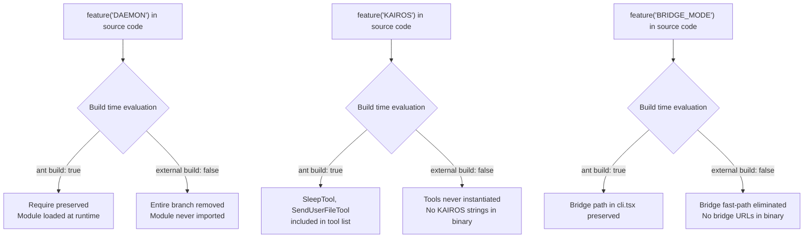

### 2.2 MACRO.VERSION Injection

The `MACRO.VERSION` identifier is injected at build time by Bun's bundler. It is used in `src/entrypoints/cli.tsx` for the `--version` fast path:

```typescript
if (args.length === 1 && (args[0] === '--version' || args[0] === '-v')) {
  console.log(`${MACRO.VERSION} (Claude Code)`)
  return
}
```

This fast path has zero imports — no module loading, no config system, no API client. The version string is baked directly into the binary at build time, making `claude --version` respond in milliseconds.

### 2.3 `process.env.USER_TYPE === 'ant'` — The Runtime Variant Check

While `feature()` handles compile-time DCE, `process.env.USER_TYPE === 'ant'` handles runtime variant behavior. This environment variable is set by the ant-specific build and is checked in places where feature flags are not appropriate — typically where the condition guards a module-level constant that must be resolved at import time:

```typescript
// From src/tools.ts
const REPLTool =
  process.env.USER_TYPE === 'ant'
    ? require('./tools/REPLTool/REPLTool.js').REPLTool
    : null

const SuggestBackgroundPRTool =
  process.env.USER_TYPE === 'ant'
    ? require('./tools/SuggestBackgroundPRTool/SuggestBackgroundPRTool.js')
        .SuggestBackgroundPRTool
    : null
```

The distinction matters: `feature()` is a compile-time construct that enables tree-shaking, while `process.env.USER_TYPE === 'ant'` is a runtime check that Bun's bundler evaluates as a constant expression during bundling (because `USER_TYPE` is known at build time). Both result in DCE, but `feature()` is the preferred pattern for new code because it is explicit about its compile-time semantics.

### 2.4 Feature Flag Catalog

The codebase uses dozens of feature flags. Here is a comprehensive catalog of the major ones, organized by subsystem:

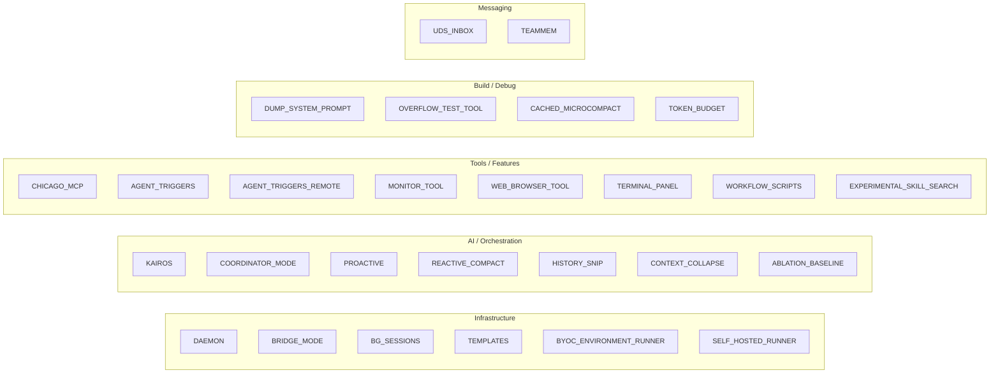

The following table summarizes the key feature flags and their ant vs external availability:

| Feature Flag | Ant | External | Purpose |
|-------------|-----|----------|---------|
| `DAEMON` | Yes | No | Long-running supervisor process for background workers |
| `BRIDGE_MODE` | Yes | No | Remote control — serve local machine as bridge environment |
| `BG_SESSIONS` | Yes | No | Background session management (ps/logs/attach/kill) |
| `KAIROS` | Yes | No | Assistant mode (proactive, push notifications, file sending) |
| `COORDINATOR_MODE` | Yes | No | Multi-agent coordinator with scratchpad protocol |
| `CHICAGO_MCP` | Yes | No | Computer use MCP server (screen capture, input control) |
| `PROACTIVE` | Yes | No | Proactive agent features (Sleep tool for time-based loops) |
| `AGENT_TRIGGERS` | Yes | No | Cron-based and remote trigger scheduling |
| `AGENT_TRIGGERS_REMOTE` | Yes | No | HTTP-triggered agent activation |
| `TEMPLATES` | Yes | No | Template job commands (new/list/reply) |
| `REACTIVE_COMPACT` | Yes | No | Reactive compaction on prompt-too-long errors |
| `CONTEXT_COLLAPSE` | Yes | No | Granular context archiving (preserves recent turns) |
| `HISTORY_SNIP` | Yes | No | Aggressive history truncation for long SDK sessions |
| `DUMP_SYSTEM_PROMPT` | Yes | No | Extract rendered system prompt (for evals) |
| `UDS_INBOX` | Yes | No | Unix domain socket messaging for inter-process communication |
| `TEAMMEM` | Yes | No | Team memory paths for shared agent context |
| `MONITOR_TOOL` | Yes | No | File/process monitoring tool |
| `BYOC_ENVIRONMENT_RUNNER` | Yes | No | Headless BYOC (Bring Your Own Cloud) runner |
| `SELF_HOSTED_RUNNER` | Yes | No | Self-hosted runner targeting internal API |
| `WEB_BROWSER_TOOL` | Yes | No | Web browser tool for URL navigation |
| `CACHED_MICROCOMPACT` | Yes | No | Cache-editing based microcompact (deferred boundary) |
| `TOKEN_BUDGET` | Yes | No | Token budget tracking with auto-continuation |
| `ABLATION_BASELINE` | Yes | No | L0 ablation baseline for harness-science experiments |
| `WORKFLOW_SCRIPTS` | Yes | No | Workflow script definitions and execution |
| `EXPERIMENTAL_SKILL_SEARCH` | Yes | No | Skill discovery via search/prefetch |
| `OVERFLOW_TEST_TOOL` | Yes | No | Test tool for context overflow scenarios |
| `TERMINAL_PANEL` | Yes | No | Terminal capture and panel display |

### 2.5 The `require()` vs `import()` Distinction for DCE

A subtle but critical aspect of the DCE system is the choice between `require()` and `import()` for feature-gated modules. The codebase consistently uses `require()` (CommonJS-style) rather than `import()` (dynamic ESM) for DCE:

```typescript
// Pattern used throughout the codebase:
const getCoordinatorUserContext = feature('COORDINATOR_MODE')
  ? require('./coordinator/coordinatorMode.js').getCoordinatorUserContext
  : () => ({})

// NOT this pattern:
const getCoordinatorUserContext = feature('COORDINATOR_MODE')
  ? (await import('./coordinator/coordinatorMode.js')).getCoordinatorUserContext
  : () => ({})
```

The reason is that `require()` is synchronous — it executes immediately at module load time, which allows Bun's bundler to statically determine whether the import will actually be reached. With `await import()`, the import is deferred to runtime, making it harder for the bundler to reason about whether the module is needed. The synchronous `require()` also avoids adding an `await` to the module's top-level scope, which would make the module an async module and complicate the import graph.

The `require()` calls are always wrapped in `/* eslint-disable @typescript-eslint/no-require-imports */` blocks because the TypeScript ESLint rules prefer ESM imports. The linter exception documents the deliberate choice.

### 2.6 DCE in the Tool Registry

The tool registry in `src/tools.ts` is the most dramatic example of feature-gated DCE. The `getAllBaseTools()` function returns an array of `Tool` instances, but many tools are conditionally included based on feature flags:

```typescript
const SleepTool =
  feature('PROACTIVE') || feature('KAIROS')
    ? require('./tools/SleepTool/SleepTool.js').SleepTool
    : null

const cronTools = feature('AGENT_TRIGGERS')
  ? [
      require('./tools/ScheduleCronTool/CronCreateTool.js').CronCreateTool,
      require('./tools/ScheduleCronTool/CronDeleteTool.js').CronDeleteTool,
      require('./tools/ScheduleCronTool/CronListTool.js').CronListTool,
    ]
  : []
```

In the external build, these `require()` calls are eliminated entirely. The external binary contains only the core toolset: BashTool, FileEditTool, FileReadTool, FileWriteTool, GlobTool, GrepTool, WebFetchTool, WebSearchTool, AgentTool, NotebookEditTool, and a handful of others. Over 15 tools exist only in the ant build.

### 2.7 DCE in the Query Loop (query.ts)

The `query()` function in `src/query.ts` uses feature gates for several critical subsystems:

- **Reactive compact**: `feature('REACTIVE_COMPACT')` gates the `reactiveCompact` module import and its usage in prompt-too-long recovery.
- **Context collapse**: `feature('CONTEXT_COLLAPSE')` gates the `contextCollapse` module import and its granular archiving logic.
- **History snip**: `feature('HISTORY_SNIP')` gates the `snipCompact` module and its aggressive truncation.
- **Streaming tool execution**: Controlled by `config.gates.streamingToolExecution` (a runtime GrowthBook gate, not a compile-time feature flag).
- **Token budget**: `feature('TOKEN_BUDGET')` gates the budget tracker and auto-continuation logic.
- **Cached microcompact**: `feature('CACHED_MICROCOMPACT')` gates the deferred boundary message that uses actual API-reported token deletion counts.

The DCE pattern is consistent: feature-gated modules are imported at the top of the file using `require()` inside ternary expressions, with `null` as the false branch. The null checks then guard usage throughout the function body.

### 2.8 The Excluded-Strings Constraint

A critical security property of the DCE system is the "excluded-strings" guarantee: string literals from feature-gated code must not appear in the external binary. This is enforced by a test that scans the external build for forbidden strings (module names, API endpoints, internal identifiers).

This constraint is why feature-gated `require()` calls use the exact module path string inside the ternary expression:

```typescript
// Correct: string 'coordinatorMode.js' is eliminated from external build
const coordinatorModeModule = feature('COORDINATOR_MODE')
  ? require('./coordinator/coordinatorMode.js')
  : null

// WRONG: string would leak even if the module is never loaded
const modulePath = feature('COORDINATOR_MODE') ? './coordinator/coordinatorMode.js' : null
if (modulePath) require(modulePath) // String is in the binary
```

The excluded-strings check also explains why `query.ts` takes care to keep feature-gated strings inside feature-gated modules. For example, the `snipReplay` callback in `QueryEngine.ts` is injected from `ask()` rather than being defined inline, because the snip-specific strings (`'snip_boundary'`, etc.) must not appear in `QueryEngine.ts` (which ships in the external build). The callback encapsulates the feature-gated logic:

```typescript
// From ask() in QueryEngine.ts
snipReplay: (yielded: Message, store: Message[]) => {
  if (!snipProjection!.isSnipBoundaryMessage(yielded))
    return undefined
  return snipModule!.snipCompactIfNeeded(store, { force: true })
}
```

The `snipProjection` and `snipModule` references are themselves feature-gated at the top of the file, so the entire callback is a dead branch in the external build.

### 2.9 DCE in the CLI Fast Paths

The `cli.tsx` entry point uses feature gates to eliminate entire command paths from the external build. For example, the daemon, bridge, and background session commands are all guarded:

```typescript
if (feature('DAEMON') && args[0] === '--daemon-worker') { ... }
if (feature('BRIDGE_MODE') && args[0] === 'remote-control') { ... }
if (feature('BG_SESSIONS') && (args[0] === 'ps' || ...)) { ... }
```

In the external build, these checks compile to `if (false && ...)` and are removed entirely. The external binary does not even contain the string `'daemon-worker'` or the import for `runDaemonWorker`. This means external users cannot discover or invoke these commands even by accident.

The `--claude-in-chrome-mcp` and `--chrome-native-host` paths are notable exceptions — they are NOT feature-gated because the Chrome extension integration ships in both builds. The `--computer-use-mcp` path IS gated by `feature('CHICAGO_MCP')` because computer use is an ant-only capability.

### 2.10 Runtime vs Compile-Time Feature Checks

Not all feature checks are compile-time. The codebase distinguishes between two categories:

1. **Compile-time** (via `feature()`): Evaluated at build time, enables DCE. Used for code that should not exist in the external binary at all.

2. **Runtime** (via GrowthBook/Statsig): Evaluated at runtime, allows dynamic feature rollout. Used for code that exists in both builds but is conditionally enabled.

The `cli.tsx` bridge path demonstrates both:

```typescript
// Compile-time: feature('BRIDGE_MODE') — eliminates the entire path from external builds
// Runtime: isBridgeEnabled() — checks GrowthBook gate at runtime
if (feature('BRIDGE_MODE') && args[0] === 'remote-control') {
  // ...
  const disabledReason = await getBridgeDisabledReason() // GrowthBook check
  if (disabledReason) {
    exitWithError(`Error: ${disabledReason}`)
  }
}
```

The comment in the source code explicitly documents this pattern: "feature() must stay inline for build-time dead code elimination; isBridgeEnabled() checks the runtime GrowthBook gate."

### 2.11 Build Pipeline

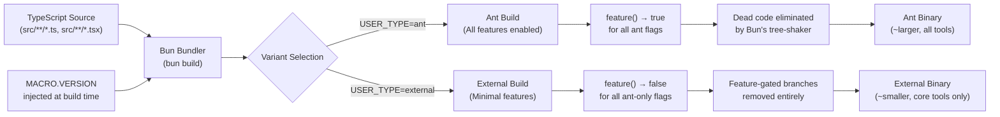

The key insight is that DCE happens at the Bun bundler level, not at the TypeScript compiler level. Bun's bundler evaluates `feature()` calls as compile-time constants and removes the unreachable branches before emitting the final JavaScript. This is why `feature()` must be used in `if` statements and ternary expressions — it cannot be used in dynamic contexts like variable assignments that are later checked, because the bundler needs to see the `feature()` call inline in a conditional to perform DCE.

### 2.12 Ablation Baseline

The `ABLATION_BASELINE` feature flag in `src/entrypoints/cli.tsx` is a special case: it sets multiple environment variables at startup to disable features for scientific experiments:

```typescript
if (feature('ABLATION_BASELINE') && process.env.CLAUDE_CODE_ABLATION_BASELINE) {
  for (const k of [
    'CLAUDE_CODE_SIMPLE',
    'CLAUDE_CODE_DISABLE_THINKING',
    'DISABLE_INTERLEAVED_THINKING',
    'DISABLE_COMPACT',
    'DISABLE_AUTO_COMPACT',
    'CLAUDE_CODE_DISABLE_AUTO_MEMORY',
    'CLAUDE_CODE_DISABLE_BACKGROUND_TASKS',
  ]) {
    process.env[k] ??= '1'
  }
}
```

This code runs in `cli.tsx` (not `init.ts`) because tools like `BashTool`, `AgentTool`, and `PowerShellTool` capture `DISABLE_BACKGROUND_TASKS` into module-level constants at import time — `init()` runs too late. The `feature()` gate ensures this entire block is eliminated from external builds.

### 2.13 The COREPACK_AUTO_PIN Fix and CCR Heap Size

At the very top of `cli.tsx`, before any feature gates or imports, there are two critical environment variable assignments:

```typescript
process.env.COREPACK_ENABLE_AUTO_PIN = '0'

if (process.env.CLAUDE_CODE_REMOTE === 'true') {
  const existing = process.env.NODE_OPTIONS || ''
  process.env.NODE_OPTIONS = existing
    ? `${existing} --max-old-space-size=8192`
    : '--max-old-space-size=8192'
}
```

The corepack fix prevents `yarnpkg` entries from being auto-added to `package.json` files when Claude Code runs `yarn` commands via BashTool. The CCR heap size fix allows Node.js to use up to 8GB of heap in container environments (which have 16GB of RAM). Both must run before any module evaluation — `NODE_OPTIONS` is read by V8 at startup, and corepack's auto-pinning can be triggered by any module that transitively loads corepack.

### 2.14 DCE in the QueryEngine

The `QueryEngine` class in `src/QueryEngine.ts` uses feature gates for the `snipReplay` callback:

```typescript
// In ask() function:
...(feature('HISTORY_SNIP')
  ? {
      snipReplay: (yielded: Message, store: Message[]) => {
        if (!snipProjection!.isSnipBoundaryMessage(yielded))
          return undefined
        return snipModule!.snipCompactIfNeeded(store, { force: true })
      },
    }
  : {}),
```

The spread-into-object pattern ensures that when `HISTORY_SNIP` is `false`, the `snipReplay` property does not exist on the config object at all. This is more robust than setting it to `undefined`, because downstream code can use `'snipReplay' in config` to check for the feature.

The `snipModule` and `snipProjection` references are themselves feature-gated at the top of the file using the require-ternary pattern with type assertions:

```typescript
const snipModule = feature('HISTORY_SNIP')
  ? (require('./services/compact/snipCompact.js') as typeof import('./services/compact/snipCompact.js'))
  : null
const snipProjection = feature('HISTORY_SNIP')
  ? (require('./services/compact/snipProjection.js') as typeof import('./services/compact/snipProjection.js'))
  : null
```

The type assertions preserve type safety even though the module is loaded via `require()`. When `HISTORY_SNIP` is `false`, both are `null`, and the non-null assertions (`snipProjection!.`) in the callback are unreachable dead code that the bundler removes.

### 2.15 The Impact of DCE on Binary Size

The cumulative effect of feature-gated DCE is substantial. The ant build includes over 15 additional tools (REPLTool, SuggestBackgroundPRTool, SleepTool, cronTools, RemoteTriggerTool, MonitorTool, SendUserFileTool, PushNotificationTool, SubscribePRTool, OverflowTestTool, CtxInspectTool, TerminalCaptureTool, WebBrowserTool, SnipTool, ListPeersTool, WorkflowTool), multiple additional entry paths (daemon, bridge, background sessions, template jobs, environment runner, self-hosted runner), and several additional compaction strategies (reactive compact, context collapse, snip). The external build eliminates all of these at compile time, resulting in a significantly smaller binary with no references to internal infrastructure.

The excluded-strings guarantee is enforced by CI tests that scan the external build for forbidden strings. Any string from a feature-gated module that leaks into the external build is a build failure.

### 2.16 DCE and the StreamingToolExecutor

The `StreamingToolExecutor` in `src/services/tools/StreamingToolExecutor.ts` is a feature-gated optimization that changes how tools are executed during the streaming API response. Without streaming tool execution, the query loop must wait for the entire API response to complete before executing any tools. With streaming tool execution, tools begin executing as soon as their `tool_use` blocks arrive from the streaming API:

```typescript
// In query.ts:
const useStreamingToolExecution = config.gates.streamingToolExecution
let streamingToolExecutor = useStreamingToolExecution
  ? new StreamingToolExecutor(
      toolUseContext.options.tools,
      canUseTool,
      toolUseContext,
    )
  : null
```

The `config.gates.streamingToolExecution` flag is a runtime GrowthBook gate, not a compile-time feature flag. This is because both ant and external builds support streaming tool execution — it is controlled by a server-side experiment, not a build variant.

The `StreamingToolExecutor` manages a queue of pending tool executions. As `tool_use` blocks arrive from the streaming response, they are added to the executor via `addTool()`. The executor runs the permission pipeline and tool execution in parallel for each tool. Completed results are collected via `getCompletedResults()` and yielded inline during the stream loop.

When a streaming fallback occurs (the primary model is overloaded and the request is retried with the fallback model), the executor must discard all pending results and create a fresh instance. This prevents orphan `tool_result` messages with stale `tool_use_id` values from leaking into the retry:

```typescript
if (streamingFallbackOccured) {
  // ... yield tombstones for orphaned assistant messages ...
  if (streamingToolExecutor) {
    streamingToolExecutor.discard()
    streamingToolExecutor = new StreamingToolExecutor(...)
  }
}
```

### 2.17 DCE and the Model Fallback System

The model fallback system in `query.ts` handles the case where the primary model (e.g., Claude Sonnet) is overloaded and the API returns a `FallbackTriggeredError`. The fallback logic is DCE-aware through the `USER_TYPE` check:

```typescript
if (process.env.USER_TYPE === 'ant') {
  messagesForQuery = stripSignatureBlocks(messagesForQuery)
}
```

When falling back from a model with extended thinking (e.g., Claude Opus with `thinking` blocks) to a model without it (e.g., Claude Sonnet), the thinking blocks must be stripped before retry. Thinking blocks have cryptographic signatures that are model-bound — replaying a signed thinking block from one model to another causes a 400 error. The `stripSignatureBlocks()` function removes thinking blocks from the message history before the retry.

This `USER_TYPE` check is a runtime check (not a compile-time feature gate) because model fallback can happen in both ant and external builds. The ant check gates a behavior that is only needed for models that use extended thinking with signatures — external builds may not have access to these models, but the code path must still handle the edge case correctly.

### 2.18 Key Files Reference

---

## Chapter 3: Entry Points — From Shell to Application

### 3.1 The Dual Entry Point Architecture

Claude Code uses a two-stage entry point design. The first stage (`src/entrypoints/cli.tsx`) is a lightweight router that handles fast-path exits with minimal module loading. The second stage (`src/main.tsx`) is the full Commander.js CLI with 60+ flags and all application initialization. This design ensures that commands like `claude --version` respond instantly, while the full CLI only loads when needed.

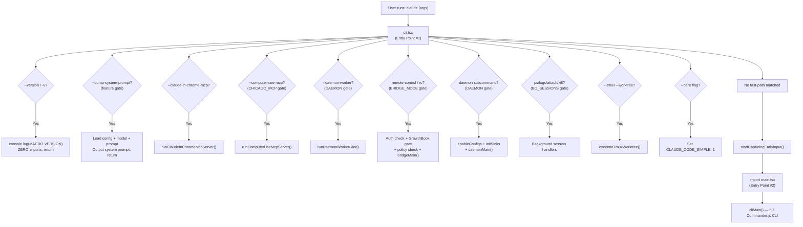

### 3.2 cli.tsx — The Fast-Path Router

The `cli.tsx` file is designed to import as few modules as possible. Its structure is:

1. **Top-level side effects** (lines 1-26): Two environment variable adjustments that must run before any module evaluation:
   - `COREPACK_ENABLE_AUTO_PIN = '0'` — prevents corepack from modifying `package.json`
   - `NODE_OPTIONS` heap size for CCR (container) environments
   - Ablation baseline environment variables (feature-gated, ant-only)

2. **The `main()` function**: An async function that checks `process.argv` for fast-path conditions. Every branch uses dynamic `await import()` to load only the modules it needs.

3. **The `void main()` call**: Kicks off execution at the bottom of the file.

The most important fast-path is `--version`, which executes with zero imports beyond `cli.tsx` itself:

```typescript
if (args.length === 1 && (args[0] === '--version' || args[0] === '-v' || args[0] === '-V')) {
  console.log(`${MACRO.VERSION} (Claude Code)`)
  return
}
```

Other fast-paths load progressively more infrastructure:
- `--dump-system-prompt` loads config, model selection, and prompt assembly
- `--daemon-worker` loads only the worker registry (no config, no analytics)
- `remote-control` loads config, auth, GrowthBook gates, and policy limits
- `daemon` loads config and analytics sinks

The `--claude-in-chrome-mcp` and `--chrome-native-host` paths are not feature-gated — they are available in both builds because they support the Chrome extension integration that ships externally.

### 3.3 main.tsx — The Full Commander.js CLI

When no fast-path matches, `cli.tsx` imports `src/main.tsx` and calls `cliMain()`. This file is the heart of the CLI, defining the full flag set and the action handler that bootstraps the application.

Key characteristics of `main.tsx`:

1. **Parallel prefetch at module level**: Before the Commander.js action handler runs, `main.tsx` fires several parallel prefetches as top-level side effects:
   - `startMdmRawRead()` — fires MDM subprocesses (plutil/reg query) in parallel with module evaluation
   - `startKeychainPrefetch()` — fires macOS keychain reads (OAuth + API key) in parallel
   - These reduce cold-start latency by overlapping I/O with the ~135ms of import evaluation

2. **Commander.js with 60+ flags**: The CLI is defined using `@commander-js/extra-typings` for type-safe flag parsing. Flags cover model selection, permission modes, MCP server configuration, output formatting, session management, and more.

3. **The action handler**: After flag parsing, the action handler calls `init()` (from `src/entrypoints/init.ts`), then `setup()` (from `src/setup.ts`), then launches the REPL or executes the print-mode query.

### 3.4 init.ts — The Bootstrap Sequence

The `init()` function in `src/entrypoints/init.ts` is memoized (it runs exactly once, even if called multiple times). It performs the following steps in order:

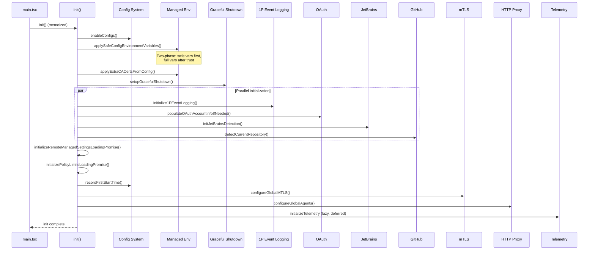

The critical ordering constraints are:

1. `enableConfigs()` must run before any config reads
2. `applySafeConfigEnvironmentVariables()` must run before the trust dialog — it applies only safe env vars from trusted sources
3. `applyExtraCACertsFromConfig()` must run before any TLS connections (Bun caches the TLS cert store at boot)
4. `setupGracefulShutdown()` must run before any long-running operations
5. 1P event logging, OAuth, JetBrains, and GitHub detection are all fire-and-forget (they run in parallel)
6. mTLS and proxy configuration must run before the first API call
7. Telemetry initialization is deferred (lazy-loaded via dynamic import) to avoid loading ~400KB of OpenTelemetry modules at startup

### 3.5 setup.ts — Project and Session Initialization

After `init()` completes, `setup()` in `src/setup.ts` handles project-specific initialization. This function bridges the gap between the global bootstrap state and the project-specific context needed for the conversation. It takes several parameters: `cwd`, `permissionMode`, `allowDangerouslySkipPermissions`, `worktreeEnabled`, `worktreeName`, `tmuxEnabled`, and optional `customSessionId`, `worktreePRNumber`, and `messagingSocketPath`.

The setup sequence performs the following steps in order:

1. **Node.js version check**: Validates Node.js >= 18, exits with a bold red error message if below. This is a hard requirement — Claude Code uses Node.js APIs that are not available in earlier versions (e.g., `Array.prototype.with()`, which was the source of a real production bug on Node 18 early versions).

2. **Custom session ID**: If provided via `--session-id`, switches the bootstrap state to use that session ID instead of the auto-generated one. This is used by the SDK to correlate sessions with external tracking systems.

3. **UDS messaging server**: If `feature('UDS_INBOX')` is enabled and not in bare mode, starts a Unix domain socket messaging server for inter-process communication. The server is bound before any hooks (like `SessionStart`) can spawn, so `$CLAUDE_CODE_MESSAGING_SOCKET` is available in the hook's environment. The socket path is either provided explicitly via `--messaging-socket-path` or derived from the default path.

4. **Teammate mode snapshot**: If agent swarms are enabled and not in bare mode, captures the current teammate mode configuration. This snapshot is used for reconnection when the user resumes a session with active teammates.

5. **Terminal backup restoration**: For interactive sessions with agent swarms enabled, checks and restores iTerm2 and Terminal.app backups from interrupted setups. The backup/restore system handles the case where Claude Code modified terminal settings (e.g., to enable focus reporting) and then crashed before restoring them.

6. **CWD and project root**: Sets `originalCwd` and `projectRoot` in bootstrap state. The project root is determined by finding the canonical git root using `findCanonicalGitRoot()`, which resolves symlinks and follows git worktree links. If no git root is found, the CWD is used as the project root. The distinction between `originalCwd` and `projectRoot` matters for worktree sessions — the CWD may be inside a worktree, but the project root is the main repository's root.

7. **Release notes check**: Checks if there are new release notes to display. The release notes are shown once per version, tracked in the global config's `lastShownReleaseNotes` field.

8. **Session memory**: Initializes session memory by calling `initSessionMemory()`. This loads the conversation history for the current session from the JSONL transcript file, enabling the `--resume` and `--continue` features.

9. **File-change watcher**: Starts watching for file changes via `initializeFileChangedWatcher()`. The watcher monitors the project directory for changes and triggers hooks when files are modified. This is used by the `PreToolUse` and `PostToolUse` hooks to detect changes made outside of Claude Code.

10. **Hooks config snapshot**: Captures the current hooks configuration via `captureHooksConfigSnapshot()`. This snapshot is compared later by `updateHooksConfigSnapshot()` to detect when the user modifies their hooks configuration mid-session. Changes to hooks are applied immediately without restarting the session.

11. **Worktree/tmux setup**: If worktree mode is enabled and a worktree create hook is registered, creates git worktrees and/or tmux sessions. The worktree is created with a branch name derived from the session ID or a user-provided name. The tmux session is created with a name that includes the project directory for easy identification.

The setup function is designed to be idempotent — calling it multiple times should not cause side effects. This is important because some code paths (like the SDK) may call `setup()` in different contexts.

### 3.6 replLauncher.tsx — The Terminal UI Entry

The `launchRepl()` function in `src/replLauncher.tsx` is the final step before the user sees the REPL. It dynamically imports the `App` component and the `REPL` screen, then renders them via Ink's `renderAndRun()`:

```typescript
export async function launchRepl(
  root: Root,
  appProps: AppWrapperProps,
  replProps: REPLProps,
  renderAndRun: (root: Root, element: React.ReactNode) => Promise<void>,
): Promise<void> {
  const { App } = await import('./components/App.js')
  const { REPL } = await import('./screens/REPL.js')
  await renderAndRun(root, <App {...appProps}><REPL {...replProps} /></App>)
}
```

The dynamic imports are intentional — `App.js` and `REPL.js` are large React component trees that pull in Ink, the virtual scrolling system, and all UI components. Deferring their import until the last possible moment reduces cold-start latency.

### 3.7 The Commander.js Flag Landscape

The `main.tsx` file defines a comprehensive CLI using `@commander-js/extra-typings`. The flags can be categorized into several groups:

**Model and API Configuration**:
- `--model` / `-m` — Override the main loop model
- `--fallback-model` — Model to use when the primary is overloaded
- `--thinking` — Thinking mode: `adaptive`, `always`, `disabled`
- `--max-turns` — Maximum agentic turns before stopping
- `--max-budget-usd` — Maximum spend in USD before stopping
- `--task-budget` — API task budget for the entire agentic turn

**Permission and Mode**:
- `--allowedTools` — Tools that are pre-approved (comma-separated)
- `--disallowedTools` — Tools that are always denied
- `--permission-mode` / `--mode` — Permission mode: `default`, `plan`, `auto`, `bypass`
- `--dangerously-skip-permissions` — Skip all permission prompts (dangerous)

**Output and Formatting**:
- `--print` / `-p` — Non-interactive mode: print result and exit
- `--output-format` — Output format: `text`, `json`, `stream-json`
- `--verbose` / `-v` — Show detailed tool output
- `--json` — Shorthand for `--output-format json`

**Session Management**:
- `--resume` / `-r` — Resume a previous session
- `--session-id` — Use a specific session ID
- `--continue` / `-c` — Continue the most recent conversation

**MCP and Extensions**:
- `--mcp-config` — Path to MCP server configuration file
- `--mcp-server` — Inline MCP server configuration (JSON)
- `--plugin-dir` — Load plugins from a directory

**Worktree and Remote**:
- `--worktree` / `-w` — Create a git worktree for the session
- `--tmux` — Run in a tmux session
- `--remote` — Connect to a remote Claude Code instance
- `--add-dir` — Additional directories for CLAUDE.md loading

**Settings and Configuration**:
- `--settings` / `-s` — Path to a settings file
- `--setting-sources` — Which setting sources to enable
- `--chrome` / `--no-chrome` — Enable/disable Chrome integration

**Agents and Skills**:
- `--agent` — Main thread agent type
- `--skills` — Enable specific skills
- `--no-skills` — Disable all skills

The Commander.js program is constructed with a `.action()` handler that receives all parsed options and runs the main bootstrap sequence. The handler is asynchronous and can take several seconds to complete (for config loading, MCP server startup, etc.).

### 3.8 The Print Mode Path

When the `--print` flag is used, Claude Code runs in non-interactive mode. Instead of launching the REPL, it:

1. Calls `init()` and `setup()` normally
2. Creates a `QueryEngine` with the prompt from the CLI arguments
3. Calls `submitMessage()` and collects all yielded messages
4. Extracts the text result from the last assistant message
5. Prints the result to stdout and exits

The print mode path is used by CI/CD systems, scripts, and the SDK. It disables interactive features like the early input capture, permission prompts (unless explicitly enabled), and the scroll drain system. The `--bare` flag further simplifies print mode by setting `CLAUDE_CODE_SIMPLE=1`, which disables UDS messaging, teammate snapshots, and other interactive-only features.

### 3.9 Startup Profiler

Throughout the entire startup sequence, the startup profiler (`src/utils/startupProfiler.ts`) records checkpoints using `profileCheckpoint()`. These checkpoints measure:

- **Import time**: `cli_entry` → `main_tsx_imports_loaded`
- **Init time**: `init_function_start` → `init_function_end`
- **Settings time**: `eagerLoadSettings_start` → `eagerLoadSettings_end`
- **Total time**: `cli_entry` → `main_after_run`

The profiler uses Node.js's built-in `perf_hooks` API. Sampling is 100% for ant users and 0.5% for external users. Detailed profiling (with memory snapshots) is enabled via `CLAUDE_CODE_PROFILE_STARTUP=1`.

```mermaid
graph LR
    A["cli_entry<br/>~0ms"] --> B["cli_before_main_import<br/>~5ms"]
    B --> C["main_tsx_entry<br/>~5ms"]
    C --> D["init_function_start<br/>~20ms"]
    D --> E["init_configs_enabled<br/>~25ms"]
    E --> F["init_safe_env_vars_applied<br/>~30ms"]
    F --> G["init_after_graceful_shutdown<br/>~31ms"]
    G --> H["init_after_1p_event_logging<br/>~32ms"]
    H --> I["init_function_end<br/>~100ms"]
    I --> J["launchRepl<br/>~120ms"]
    J --> K["first render<br/>~150ms"]
```

### 3.10 Early Input Capture

An important optimization: `cli.tsx` calls `startCapturingEarlyInput()` before importing `main.tsx`. This captures any stdin input that arrives while the application is still loading, so the user can start typing their prompt before the REPL is fully rendered. The captured input is seeded into the REPL's input buffer when it becomes available.

### 3.11 The init.ts Memoization and Re-Entrancy

The `init()` function is memoized using `lodash-es/memoize()`. This means it runs exactly once, even if called multiple times. The memoization is critical because:

1. `main.tsx` calls `init()` in the Commander.js action handler
2. Some code paths (like the SDK) may also call `init()` independently
3. Without memoization, the initialization would run twice, causing duplicate telemetry initialization, duplicate config loading, and duplicate process signal handlers

The memoization is implemented as a simple cache — the function is called once, and subsequent calls return the cached promise. This means that if `init()` throws an error, subsequent calls will also throw (the error is cached). This is intentional — a failed initialization should not be silently retried.

### 3.12 The Preconnect Optimization

In `init.ts`, there is a `preconnectAnthropicApi()` call that initiates a TLS connection to the Anthropic API before any API requests are made:

```typescript
import { preconnectAnthropicApi } from '../utils/apiPreconnect.js'
// ... called during init ...
void preconnectAnthropicApi()
```

The `preconnectAnthropicApi()` function initiates a TLS handshake with the Anthropic API server in the background. This "warms up" the TLS connection so that when the first real API request is made (after the user submits their first prompt), the TLS handshake is already complete. The preconnect is fire-and-forget — it does not block the initialization sequence, and if it fails, the first API request will simply perform a normal TLS handshake.

The preconnect is particularly valuable on macOS, where the TLS handshake can take 100-300ms due to certificate validation overhead. By overlapping the handshake with the rest of the initialization (which takes ~100-150ms), the preconnect can save nearly the entire handshake latency from the user's first-interaction time.

### 3.13 The Auth Prefetch

Also during the startup sequence, `prefetchApiKeyFromApiKeyHelperIfSafe()` is called to pre-populate the API key from the keychain or helper process. On macOS, reading from the Keychain is a synchronous operation that can take 50-100ms. The `startKeychainPrefetch()` function (called at the top of `main.tsx`) starts both the OAuth token read and the legacy API key read in parallel, so they complete while the rest of the modules are being loaded.

The keychain prefetch is gated on `isSafe` — it only runs if the process is running in a known-safe context (not inside a CI environment, not inside a container, etc.). This prevents the keychain prompt from appearing in environments where it would be unexpected.

### 3.14 The Graceful Shutdown System

The `setupGracefulShutdown()` function in `init.ts` registers signal handlers for `SIGTERM`, `SIGINT`, and `SIGHUP`. When one of these signals is received:

1. The `gracefulShutdownSync()` function is called
2. It flushes the session transcript to disk (ensuring no data loss)
3. It cleans up any temporary files
4. It deregisters any MCP server processes
5. It calls `process.exit()` with the appropriate exit code

The graceful shutdown system also handles the case where the process is killed without a signal (e.g., `kill -9`). In this case, the transcript may be incomplete, but the JSONL format is designed to be resilient — partial lines are simply ignored on resume.

The shutdown system uses a `registerCleanup()` function that allows any module to register a cleanup callback. The callbacks are called in reverse registration order (LIFO), so the most recently registered cleanup runs first. This ensures that higher-level resources (like MCP servers) are cleaned up before lower-level resources (like file handles).

### 3.15 The API Key Validation and Onboarding Flow

After `init()` and `setup()` complete, `main.tsx` checks whether the user has a valid API key or OAuth token. If not, it launches the onboarding flow:

1. **New user onboarding**: The user is prompted to authenticate via OAuth or provide an API key. The onboarding flow includes a trust dialog for the project directory and an optional tutorial.
2. **Returning user**: The user's credentials are loaded from the global config or keychain. If the credentials are expired, a refresh is attempted automatically.
3. **SDK user**: The API key is provided via the `ANTHROPIC_API_KEY` environment variable or the SDK's authentication mechanism. No interactive onboarding is needed.

The onboarding flow is implemented in `showSetupScreens()` from `src/interactiveHelpers.tsx`. It uses Ink's rendering system to display interactive prompts in the terminal.

### 3.16 Key Files Reference

| File | Role |
|------|------|
| `src/entrypoints/cli.tsx` | Shell entry point with fast-path routing |
| `src/main.tsx` | Commander.js CLI with 60+ flags |
| `src/entrypoints/init.ts` | Bootstrap: config, env vars, auth, mTLS, proxy |
| `src/setup.ts` | Project root, session memory, hooks, worktree |
| `src/replLauncher.tsx` | Dynamic import of App + REPL, render via Ink |
| `src/utils/startupProfiler.ts` | Checkpoint-based startup latency measurement |
| `src/utils/earlyInput.ts` | Captures stdin during startup loading |

---

## Chapter 4: Bootstrap State — The Global Mutable Singleton

### 4.1 The Module-Level Singleton Pattern

The file `src/bootstrap/state.ts` implements the most fundamental pattern in Claude Code's architecture: a module-level mutable singleton that serves as the shared memory for the entire application. The pattern is simple but deliberate:

```typescript
function getInitialState(): State {
  let resolvedCwd = ''
  // ... resolve CWD with symlink handling ...
  const state: State = {
    originalCwd: resolvedCwd,
    projectRoot: resolvedCwd,
    totalCostUSD: 0,
    // ... dozens more fields ...
  }
  return state
}

const STATE: State = getInitialState()
```

The `STATE` object is created once when the module is first imported. It is never reassigned — individual properties are mutated in place through exported getter/setter functions. This design has several implications:

1. **Zero-allocation reads**: Reading state is a direct property access on a module-level object. No function call overhead beyond the getter.
2. **Synchronous mutation**: All mutations are synchronous. There are no async setters, no dispatch queues, no event loops. This makes the state immediately consistent across all consumers.
3. **No React dependency**: The bootstrap state is plain TypeScript. It is imported by React components, Ink hooks, utility modules, and the query engine alike — none of which need to know about each other.

### 4.2 The State Type — A Field-by-Field Analysis

The `State` type contains approximately 80 fields. They can be organized into the following categories:

**Directory State**:
- `originalCwd` — The working directory when Claude Code was launched (symlink-resolved)
- `projectRoot` — Stable project root, set once at startup, never updated by mid-session worktree changes
- `cwd` — Current working directory, updated by `cd` commands and worktree tool

**Cost and Duration Tracking**:
- `totalCostUSD` — Cumulative cost in USD across all API calls
- `totalAPIDuration` / `totalAPIDurationWithoutRetries` — Cumulative API wall-clock time
- `totalToolDuration` — Cumulative tool execution time
- `modelUsage` — Per-model breakdown of input/output/cache tokens

**Turn-Scoped Metrics** (reset each turn):
- `turnHookDurationMs`, `turnToolDurationMs`, `turnClassifierDurationMs` — Duration accumulators
- `turnHookCount`, `turnToolCount`, `turnClassifierCount` — Count accumulators

**Model Configuration**:
- `mainLoopModelOverride` — Model set via `--model` CLI flag
- `initialMainLoopModel` — Model resolved at startup
- `modelStrings` — Cached model display names
- `sdkBetas` — SDK-provided beta headers (e.g., `context-1m-2025-08-07`)

**Session Identity**:
- `sessionId` — UUID for the current session
- `parentSessionId` — UUID of the parent session (for lineage tracking)
- `sessionProjectDir` — Directory containing the session's `.jsonl` transcript

**Permission and Mode**:
- `sessionBypassPermissionsMode` — Session-only bypass permissions flag
- `isInteractive` — Whether running in interactive (REPL) mode
- `isRemoteMode` — Whether running in `--remote` mode

**Telemetry** (OpenTelemetry):
- `meter` — OpenTelemetry Meter instance
- `sessionCounter`, `locCounter`, `prCounter`, `commitCounter`, `costCounter`, `tokenCounter` — OpenTelemetry counters
- `loggerProvider`, `eventLogger`, `meterProvider`, `tracerProvider` — OpenTelemetry providers

**Agent System**:
- `agentColorMap` — Maps agent IDs to display colors
- `agentColorIndex` — Counter for assigning colors
- `mainThreadAgentType` — Agent type for the main thread
- `kairosActive` — Whether the KAIROS assistant mode is active

**Tool and Hook State**:
- `registeredHooks` — SDK callbacks and plugin native hooks, keyed by hook event type
- `initJsonSchema` — JSON schema for structured output
- `scheduledTasksEnabled` — Whether cron-based task scheduling is enabled
- `sessionCronTasks` — Session-only cron tasks (never persisted to disk)

**Debug and Diagnostics**:
- `lastAPIRequest` — Last API request parameters (for bug reports)
- `lastAPIRequestMessages` — Last API request messages (ant-only)
- `lastClassifierRequests` — Last auto-mode classifier request(s)
- `inMemoryErrorLog` — Ring buffer of recent errors (max 100 entries)
- `cachedClaudeMdContent` — CLAUDE.md content cached for the auto-mode classifier

**Prompt Cache Latches** (sticky-on flags for cache optimization):
- `afkModeHeaderLatched` — Once auto mode is first activated, keep sending the header
- `fastModeHeaderLatched` — Once fast mode is enabled, keep sending the header
- `cacheEditingHeaderLatched` — Once cached microcompact is enabled, keep the header
- `thinkingClearLatched` — Once >1h since last API call, clear thinking from cache

**Team and Session Tracking**:
- `sessionCreatedTeams` — Teams created this session (cleaned up on shutdown)
- `invokedSkills` — Skills invoked during the session (preserved across compaction)
- `teleportedSessionInfo` — Tracking for teleported sessions
- `planSlugCache` — Cache for plan slugs (sessionId -> wordSlug)

### 4.3 The Signal Primitive

The bootstrap state uses a custom signal primitive from `src/utils/signal.ts` for event notification:

```typescript
export function createSignal<Args extends unknown[] = []>(): Signal<Args> {
  const listeners = new Set<(...args: Args) => void>()
  return {
    subscribe(listener) {
      listeners.add(listener)
      return () => { listeners.delete(listener) }
    },
    emit(...args) {
      for (const listener of listeners) listener(...args)
    },
    clear() {
      listeners.clear()
    },
  }
}
```

This is not a state store — there is no `getState()`. It is a pure event signal: subscribers are notified when something happens, but they cannot read the current value. This pattern is used in the bootstrap state for the `sessionSwitched` signal:

```typescript
const sessionSwitched = createSignal<[id: SessionId]>()
export const onSessionSwitch = sessionSwitched.subscribe
```

When `switchSession()` is called, it emits the new session ID. Consumers (like `concurrentSessions.ts`) subscribe to keep their state in sync. The signal pattern avoids circular dependencies — the bootstrap module (a leaf of the import DAG) cannot import its consumers, but consumers can subscribe to its signals.

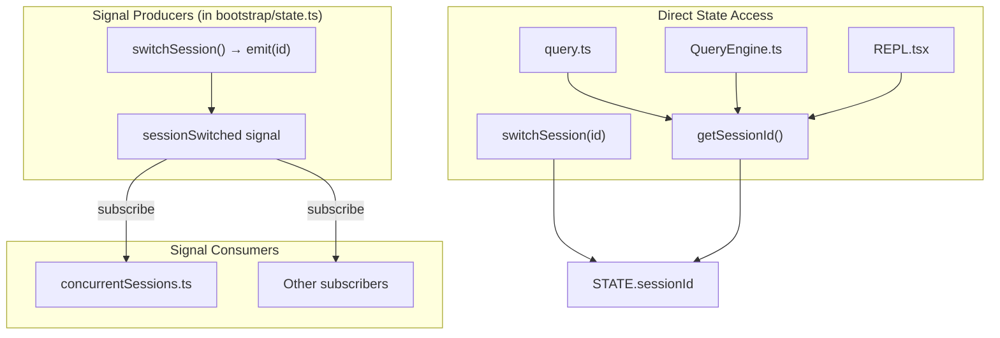

### 4.4 The Interaction Time Optimization

One of the more interesting patterns in the bootstrap state is the deferred interaction time update:

```typescript
let interactionTimeDirty = false

export function updateLastInteractionTime(immediate?: boolean): void {
  if (immediate) {
    flushInteractionTime_inner()
  } else {
    interactionTimeDirty = true
  }
}

export function flushInteractionTime(): void {
  if (interactionTimeDirty) {
    flushInteractionTime_inner()
  }
}
```

Rather than calling `Date.now()` on every keypress (which would be expensive in the terminal's raw input mode), the state simply marks a dirty flag. The actual `Date.now()` call is deferred until Ink's next render cycle, where `flushInteractionTime()` is called. This batches many keypresses into a single timestamp update.

The `immediate = true` parameter is used in `useEffect` callbacks that run after the render cycle — in those cases, deferring would result in a stale timestamp.

### 4.5 The Scroll Drain System

A second optimization in the bootstrap state is the scroll drain system. When the user is actively scrolling, background intervals (like the FPS tracker or task summary generator) should skip their work to avoid competing with scroll frames for the event loop:

```typescript
let scrollDraining = false
let scrollDrainTimer: ReturnType<typeof setTimeout> | undefined
const SCROLL_DRAIN_IDLE_MS = 150

export function markScrollActivity(): void {
  scrollDraining = true
  if (scrollDrainTimer) clearTimeout(scrollDrainTimer)
  scrollDrainTimer = setTimeout(() => {
    scrollDraining = false
    scrollDrainTimer = undefined
  }, SCROLL_DRAIN_IDLE_MS)
  scrollDrainTimer.unref?.()
}

export function getIsScrollDraining(): boolean {
  return scrollDraining
}
```

This is not stored in the `STATE` object — it is a module-scope variable because it is an ephemeral hot-path flag that does not need test-reset semantics.

### 4.6 The Ant-Only Conditional Fields

The bootstrap state uses a conditional spread to add fields only in the ant build:

```typescript
...(process.env.USER_TYPE === 'ant'
  ? { replBridgeActive: false }
  : {}),
```

This pattern allows ant-specific state (like `replBridgeActive`) to exist in the type system only when `USER_TYPE === 'ant'`. In the external build, the field does not exist on the `State` type and no code references it (because all references are feature-gated).

### 4.7 Session ID Management

The session ID is a UUID generated at module initialization time. It can be regenerated (via `regenerateSessionId()`) or switched (via `switchSession()`). The `regenerateSessionId()` function optionally sets `parentSessionId` for lineage tracking — used when clearing the conversation (the old session becomes the parent). The `switchSession()` function is used for `--resume` and cross-project session loading.

Both functions clean up the `planSlugCache` for the outgoing session ID to prevent unbounded growth across many session switches.

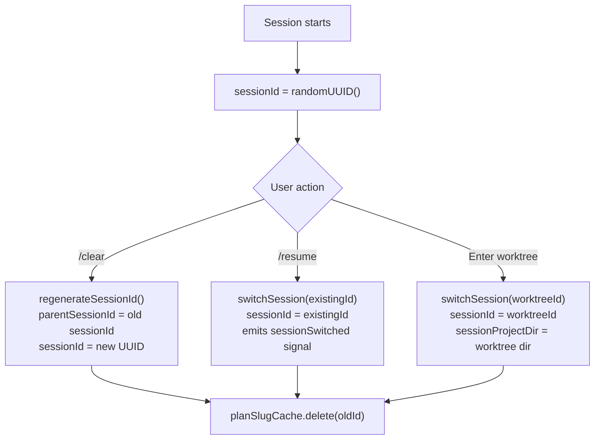

### 4.8 Slow Operations Tracking (Ant-Only)

The bootstrap state tracks slow operations for the ant-only development bar:

```typescript
const MAX_SLOW_OPERATIONS = 10
const SLOW_OPERATION_TTL_MS = 10000

export function addSlowOperation(operation: string, durationMs: number): void {
  if (process.env.USER_TYPE !== 'ant') return
  // ... TTL-based filtering + ring buffer ...
}
```

The tracking is gated on `USER_TYPE !== 'ant'` — it returns immediately in the external build. Operations older than 10 seconds are pruned, and only the 10 most recent are kept. The `getSlowOperations()` function returns a stable empty array reference when there are no operations, so React's `Object.is` comparison can bail on re-renders.

### 4.9 The Getter/Setter Pattern and Its Trade-offs

The bootstrap state uses a strict getter/setter pattern for every field. There are no exported functions that directly mutate `STATE` properties outside of the named setters. This design has several implications:

**Advantages**:
- Every mutation has a named entry point that can be searched for with `grep`
- The setter can enforce invariants (e.g., `normalize('NFC')` for path strings)
- The setter can trigger side effects (e.g., `setUseCoworkPlugins()` calls `resetSettingsCache()`)
- The getter provides a stable API even if the internal representation changes

**Disadvantages**:
- The file is extremely long (~1750 lines) for what is essentially a flat data structure
- There is no built-in change notification — consumers must poll the getter
- The pattern does not compose well with React's state management (consumers cannot use `useState` or `useReducer` with bootstrap state)
- The `resetStateForTests()` function must manually reset every field, which is error-prone when new fields are added

The comment at the top of the file warns: "DO NOT ADD MORE STATE HERE - BE JUDICIOUS WITH GLOBAL STATE" and "ALSO HERE - THINK THRICE BEFORE MODIFYING". This reflects a deliberate architectural decision to keep the global state minimal and force new state into more localized stores (like `AppStateStore` for React UI state).

### 4.10 The Token Budget System

The bootstrap state includes a token budget system that tracks output token consumption within a single turn:

```typescript
let outputTokensAtTurnStart = 0
let currentTurnTokenBudget: number | null = null
let budgetContinuationCount = 0

export function snapshotOutputTokensForTurn(budget: number | null): void {
  outputTokensAtTurnStart = getTotalOutputTokens()
  currentTurnTokenBudget = budget
  budgetContinuationCount = 0
}

export function getTurnOutputTokens(): number {
  return getTotalOutputTokens() - outputTokensAtTurnStart
}
```

The system works by snapshotting the total output token count at the start of each turn. As the model generates tokens, `getTurnOutputTokens()` computes the delta. When the delta exceeds a percentage threshold of the budget, the `checkTokenBudget()` function (in `src/query/tokenBudget.ts`) decides whether to continue with a nudge message or stop the turn.

The `incrementBudgetContinuationCount()` function tracks how many times the budget has been exceeded and continued. This prevents infinite continuation loops — after several continuations, the system forces a stop.

This is a separate system from the API-level `task_budget` parameter (which is sent to the Anthropic API as `output_config.task_budget`). The client-side token budget is a soft limit that can be exceeded with user consent, while the API task budget is a hard limit enforced by the server.

### 4.11 The Post-Compaction Tracking

The `pendingPostCompaction` flag in the bootstrap state is a one-shot latch that marks when a compaction just occurred:

```typescript
export function markPostCompaction(): void {
  STATE.pendingPostCompaction = true
}

export function consumePostCompaction(): boolean {
  const was = STATE.pendingPostCompaction
  STATE.pendingPostCompaction = false
  return was
}
```

This is consumed by `logAPISuccess` in the API logging layer to tag the first post-compaction API call. The tag distinguishes compaction-induced prompt cache misses from TTL expiry misses — a compaction replaces the entire message history, which always busts the cache, while a TTL expiry happens after ~5 minutes of inactivity. Understanding which type of cache miss occurs is critical for optimizing the prompt caching system.

### 4.12 The In-Memory Error Log

The bootstrap state maintains a ring buffer of recent errors:

```typescript
export function addToInMemoryErrorLog(errorInfo: {
  error: string
  timestamp: string
}): void {
  const MAX_IN_MEMORY_ERRORS = 100
  if (STATE.inMemoryErrorLog.length >= MAX_IN_MEMORY_ERRORS) {
    STATE.inMemoryErrorLog.shift()
  }
  STATE.inMemoryErrorLog.push(errorInfo)
}
```

This log is used by the `error_during_execution` result type in `QueryEngine.submitMessage()`. When a query ends with an error, the error log provides turn-scoped context (only errors that occurred during this query, not the entire process lifetime). The watermark pattern (`errorLogWatermark`) uses `Array.at(-1)` to capture a reference to the last error before the query starts, then `lastIndexOf` after the query to find the start index.

The ring buffer has a maximum of 100 entries. When the buffer is full, the oldest entry is shifted out. This bounds memory usage in long-running sessions.

### 4.13 State Lifecycle Across Sessions

The bootstrap state has a complex lifecycle across session transitions. When the user clears the conversation (via `/clear`), the state is partially reset:

- `regenerateSessionId({ setCurrentAsParent: true })` — Creates a new session ID and sets the old one as the parent
- `resetCostState()` — Resets cost, duration, and token tracking
- `clearBetaHeaderLatches()` — Resets all prompt cache latches so the new conversation gets fresh header evaluation
- `clearInvokedSkills()` — Removes all invoked skills from the old session
- `clearSystemPromptSectionState()` — Clears the system prompt section cache

Notably, the `modelUsage` map is reset to `{}` in `resetCostState()`, but the `sessionId` is preserved in the `parentSessionId` field. This lineage tracking allows the system to correlate a cleared conversation with its parent for analytics and debugging.

When the user resumes a previous session (via `--resume`), the state is restored from the JSONL transcript:

- `switchSession(existingSessionId)` — Switches the active session ID
- `restoreCostStateForSession()` — Restores cost, duration, and token tracking from the transcript metadata
- The message array is loaded from the transcript file by the REPL

The `switchSession()` function emits the `sessionSwitched` signal, which allows consumers like `concurrentSessions.ts` to update their state (e.g., the PID file's session ID for `claude ps`).

### 4.14 The Plan Mode and Auto Mode Transition Tracking

The bootstrap state tracks transitions between permission modes (default, plan, auto, bypass) through dedicated handler functions:

```typescript
export function handlePlanModeTransition(fromMode: string, toMode: string): void {
  if (toMode === 'plan' && fromMode !== 'plan') {
    STATE.needsPlanModeExitAttachment = false
  }
  if (fromMode === 'plan' && toMode !== 'plan') {
    STATE.needsPlanModeExitAttachment = true
  }
}

export function handleAutoModeTransition(fromMode: string, toMode: string): void {
  // Auto <-> plan transitions are handled separately
  if ((fromMode === 'auto' && toMode === 'plan') ||
      (fromMode === 'plan' && toMode === 'auto')) {
    return
  }
  // ... similar pattern to plan mode transitions ...
}
```

These functions manage attachment flags that trigger one-time notifications when the user enters or exits a mode. The `needsPlanModeExitAttachment` flag is set when the user exits plan mode, and it causes the query loop to emit an attachment message that provides the model with guidance about returning to normal mode. The flag is cleared when the attachment is emitted, preventing duplicate notifications.

The separation between plan mode and auto mode transitions is deliberate — auto mode can remain active through plan mode entry (the user can be in "auto plan mode"), so the transitions are not symmetric. The `handleAutoModeTransition` function explicitly skips auto-to-plan and plan-to-auto transitions to avoid double-handling.

### 4.15 The Invoked Skills Tracking

The `invokedSkills` map in the bootstrap state tracks skills that have been invoked during the session. This information is used by the compaction system to preserve skill content across compactions:

```typescript
export type InvokedSkillInfo = {
  skillName: string
  skillPath: string
  content: string
  invokedAt: number
  agentId: string | null
}
```

The map is keyed by `${agentId ?? ''}:${skillName}` to prevent cross-agent overwrites. When a compaction occurs, the `clearInvokedSkills()` function is called with a set of `preservedAgentIds` — only skills belonging to agents that are no longer active are removed. This ensures that the model retains knowledge of skills it has already used, even after the conversation is compacted.

The skills are scoped to individual agents (subagents) because each agent has its own skill set. The main thread's skills have `agentId === null`, while subagent skills have the subagent's ID. The `getInvokedSkillsForAgent()` function filters the map for a specific agent, allowing each agent to see only its own skills.

### 4.16 The Beta Header Latches

The bootstrap state contains four "sticky-on" latches for beta headers that are sent to the Anthropic API:

- `afkModeHeaderLatched` — Once auto mode is first activated, the `AFK_MODE_BETA_HEADER` is sent for the rest of the session
- `fastModeHeaderLatched` — Once fast mode is enabled, the `FAST_MODE_BETA_HEADER` is sent for the rest of the session
- `cacheEditingHeaderLatched` — Once cached microcompact is enabled, the cache-editing beta header is sent for the rest of the session
- `thinkingClearLatched` — Once >1 hour since the last API call, thinking blocks are cleared from the prompt cache

The latches are `null` by default (not yet triggered), `true` once triggered, and never reset to `false` (except on `/clear` or `/compact`). The rationale is prompt cache stability: if a beta header is sent on one request and not on the next, the entire prompt cache is busted (a cache miss costs ~50-70K tokens). By latching the header once triggered, the system ensures that the cache is preserved across mode changes within the same session.

The `clearBetaHeaderLatches()` function is called on `/clear` and `/compact` to reset the latches for the new conversation. This allows the fresh conversation to evaluate the headers based on current GrowthBook flags, rather than being stuck with stale latches from the previous conversation.

### 4.17 Key Files Reference

| File | Role |
|------|------|
| `src/bootstrap/state.ts` | Global mutable singleton with ~80 fields |
| `src/utils/signal.ts` | Tiny listener-set primitive for event signals |
| `src/utils/startupProfiler.ts` | Checkpoint-based latency measurement |

---

## Chapter 5: Configuration System — From CLAUDE.md to Managed Settings

### 5.1 The Configuration Hierarchy

Claude Code's configuration system is a multi-layered hierarchy where each layer can override the one below it. The system draws from five distinct sources, each with different trust levels and persistence semantics:

1. **Global config** (`~/.claude.json`): User-wide settings including API keys, theme, and history
2. **Project config** (`.claude/settings.json`): Shared project settings committed to version control
3. **Local config** (`.claude/settings.local.json`): Gitignored project-specific settings
4. **Flag config** (`--settings` CLI flag or SDK inline): Runtime overrides from the command line
5. **Policy config** (managed-settings.json or remote API): Enterprise-managed settings that cannot be overridden

The `SettingSource` enum (defined in `src/utils/settings/constants.ts`) formalizes this hierarchy:

```typescript
export const SETTING_SOURCES = [
  'userSettings',    // ~/.claude/settings.json
  'projectSettings', // .claude/settings.json (shared)
  'localSettings',   // .claude/settings.local.json (gitignored)
  'flagSettings',    // --settings CLI flag or SDK inline
  'policySettings',  // managed-settings.json or remote API
] as const
```

Order matters — later sources override earlier ones. Policy settings always win.

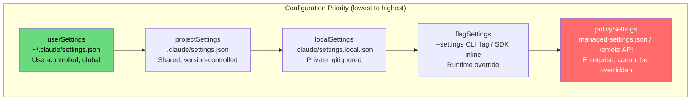

### 5.2 Global Config — `~/.claude.json`

The global config is the user's personal settings file, stored at `~/.claude.json`. It is managed through `getGlobalConfig()` and `saveGlobalConfig()` in `src/utils/config.ts`. The config includes:

- `apiKey` — Anthropic API key (legacy, superseded by OAuth)
- `oauthToken` — OAuth access token
- `theme` — Terminal theme setting
- `preferredNotifChannel` — Notification preference
- `customApiKeyResponses` — Stored responses for API key prompts
- `hasCompletedOnboarding` — Whether the user has completed first-run
- `env` — Environment variables to inject into the process
- `serializedHistory` — Command history for the input prompt
- `lastModelUsage`, `lastCost`, etc. — Session statistics for resume

The global config has a re-entrancy guard to prevent infinite recursion when logging errors during config reads:

```typescript
let insideGetConfig = false
// Prevents: getConfig → logEvent → getGlobalConfig → getConfig
```

### 5.3 Project Config — `.claude/settings.json`

Project configs are scoped to a specific directory. They are loaded by `getCurrentProjectConfig()` which searches from the current directory up to the root for `.claude/settings.json`. Project settings include:

- `allowedTools` — Tools that are pre-approved (no permission prompt)
- `mcpServers` — MCP server configurations
- `hooks` — Lifecycle hooks (pre-tool-use, post-tool-use, etc.)
- `permissions` — Permission rules (allow/deny/ask)
- `env` — Environment variables specific to the project

Project configs are version-controlled and shared among team members. This is why they cannot contain sensitive values — those belong in `settings.local.json`.

### 5.4 CLAUDE.md Loading Priority

CLAUDE.md files are the primary mechanism for injecting project-specific instructions into the model's context. The loading priority is documented in `src/utils/claudemd.ts`:

1. **Managed memory** (`/etc/claude-code/CLAUDE.md`) — Global instructions for all users (enterprise)
2. **User memory** (`~/.claude/CLAUDE.md`) — Private global instructions for all projects
3. **Project memory** — Checked in each directory from root to CWD:
   - `CLAUDE.md` — Root-level project instructions
   - `.claude/CLAUDE.md` — Hidden directory project instructions
   - `.claude/rules/*.md` — Additional rule files in the `.claude/rules/` directory
4. **Local memory** (`CLAUDE.local.md`) — Private project-specific instructions (gitignored)

Files are loaded in reverse order of priority — the last file loaded has the highest priority and receives the most attention from the model. This means files closer to the current directory (more specific) override files further away (more general).

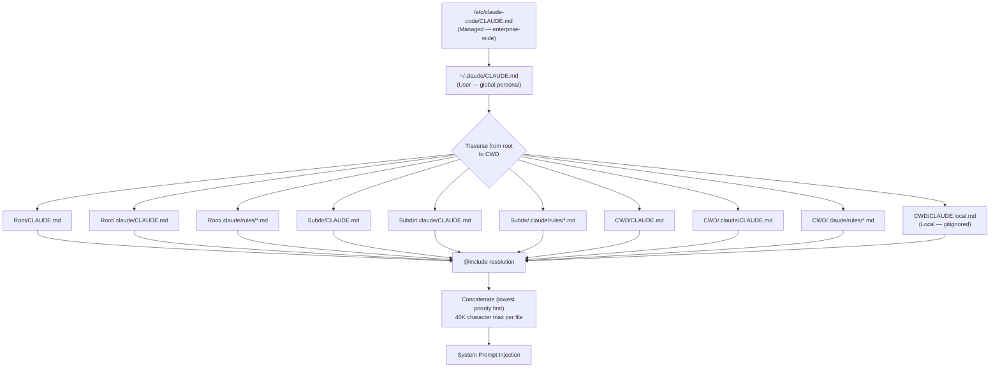

### 5.5 The @include Directive

CLAUDE.md files support an `@include` directive that allows referencing other files:

- `@path` — Relative path (same as `@./path`)
- `@./relative/path` — Relative to the including file
- `@~/home/path` — Relative to the user's home directory
- `@/absolute/path` — Absolute path

The directive is processed during loading. Included files are added as separate entries before the including file in the prompt. Circular references are prevented by tracking processed files. Non-existent files are silently ignored.

Only text-based file extensions are allowed for `@include` — this prevents binary files (images, PDFs) from being loaded into memory. The allowed extensions include `.md`, `.txt`, `.json`, `.yaml`, `.js`, `.ts`, `.py`, `.go`, `.rs`, and many more (defined in `TEXT_FILE_EXTENSIONS` in `src/utils/claudemd.ts`).

### 5.6 Frontmatter Parsing

CLAUDE.md files support YAML frontmatter for metadata. The frontmatter is parsed by `parseFrontmatter()` from `src/utils/frontmatterParser.ts`. Frontmatter can specify:

- Description metadata
- File type annotations
- Custom processing hints

The frontmatter is stripped before the content is injected into the system prompt.

### 5.7 The 40K Character Limit

Each CLAUDE.md file is subject to a 40,000 character maximum (`MAX_MEMORY_CHARACTER_COUNT`). Files exceeding this limit are truncated by `truncateEntrypointContent()` from `src/memdir/memdir.ts`. This prevents a single CLAUDE.md file from consuming the entire context window.

### 5.8 The SettingsJson Type

The `SettingsJson` type in `src/utils/settings/types.ts` defines the schema for all settings files. It is validated using Zod schemas, including:

- `permissions` — Allow/deny/ask rules with `PermissionRuleSchema`
- `env` — Environment variables (`z.record(z.string(), z.coerce.string())`)
- `hooks` — Lifecycle hooks with `HooksSchema`
- `mcpServers` — MCP server configurations
- `defaultMode` — Permission mode (default, plan, auto, bypass)
- `additionalDirectories` — Extra directories in the permission scope

The schema uses `lazySchema()` for recursive or expensive schemas to defer their evaluation until first use.

### 5.9 Managed Settings for Enterprise

Enterprise-managed settings are the highest-priority configuration source. They are loaded from two locations:

1. **File-based managed settings**: `managed-settings.json` + `managed-settings.d/*.json` drop-in directory (follows the systemd/sudoers drop-in convention)
2. **Remote managed settings**: Fetched from an enterprise API, cached locally

The file-based system supports drop-in directory overlays:

```typescript
export function loadManagedFileSettings(): {
  settings: SettingsJson | null
  errors: ValidationError[]
} {
  // Base file: managed-settings.json
  // Drop-ins: managed-settings.d/*.json (sorted alphabetically, later wins)
  // Separate teams can ship independent policy fragments
  // (e.g. 10-otel.json, 20-security.json)
}
```

Remote managed settings are loaded asynchronously. The loading promise is initialized early in `init.ts` so that other systems can await it:

```typescript
if (isEligibleForRemoteManagedSettings()) {
  initializeRemoteManagedSettingsLoadingPromise()
}
```

### 5.10 Two-Phase Environment Variable Application

The managed environment system in `src/utils/managedEnv.ts` implements a two-phase approach for security:

**Phase 1 — Before Trust** (`applySafeConfigEnvironmentVariables()`):
- Applies ALL env vars from trusted sources: userSettings, flagSettings, policySettings
- Applies ONLY safe env vars (from the `SAFE_ENV_VARS` allowlist) from project-scoped sources
- Rationale: Project-scoped settings live inside the project directory and could be committed by a malicious actor to redirect traffic (e.g., `ANTHROPIC_BASE_URL` to an attacker-controlled server)

**Phase 2 — After Trust** (`applyConfigEnvironmentVariables()`):
- Applies ALL env vars from all sources (including project-scoped)
- Only called after the user has explicitly trusted the project directory
- Clears and rebuilds mTLS, proxy, and CA cert caches

The system also includes three strip filters:

1. **`withoutSSHTunnelVars`**: Strips auth env vars from settings when running via `claude ssh` (the tunnel provides its own auth)
2. **`withoutHostManagedProviderVars`**: Strips provider-selection/model-default vars when `CLAUDE_CODE_PROVIDER_MANAGED_BY_HOST` is set (prevents user settings from redirecting to a different provider)
3. **`withoutCcdSpawnEnvKeys`**: Strips env keys that were present when Claude Code Desktop launched the subprocess (prevents settings from overriding the desktop host's operational vars like `OTEL_LOGS_EXPORTER`)

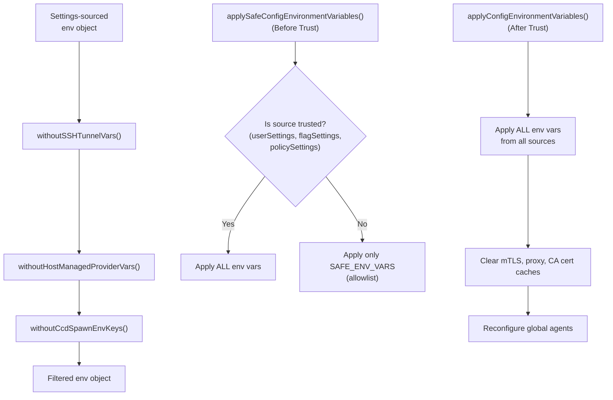

### 5.11 Setting Source Control

The `--setting-sources` CLI flag and the `allowedSettingSources` bootstrap state field control which setting sources are active. By default, all sources are enabled:

```typescript
allowedSettingSources: [
  'userSettings',
  'projectSettings',
  'localSettings',
  'flagSettings',
  'policySettings',
]
```

SDK callers can disable specific sources (e.g., `settingSources: []` for full isolation mode). The `isSettingSourceEnabled()` function checks whether a source is active before loading it.

Policy settings and flag settings are always included — they cannot be disabled by the user. This ensures that enterprise policies and CLI overrides always take effect.

### 5.12 Settings Validation and Error Handling

All settings files are validated against Zod schemas before being applied. The `SettingsSchema` in `src/utils/settings/types.ts` defines the complete schema for `SettingsJson`, including:

- `permissions` — Validated with `PermissionRuleSchema` which checks that tool names match known patterns
- `env` — Validated as `z.record(z.string(), z.coerce.string())` — all values are coerced to strings
- `hooks` — Validated with `HooksSchema` which checks matcher patterns and command strings
- `mcpServers` — Validated against MCP server configuration schemas

When a settings file fails validation, the errors are collected (not thrown) so that the application can continue with partial settings. The `SettingsWithErrors` type wraps valid settings alongside validation errors:

```typescript
export type SettingsWithErrors = {
  settings: SettingsJson
  errors: ValidationError[]
}
```

The `filterInvalidPermissionRules()` function removes permission rules that fail validation, allowing the remaining valid rules to take effect. This is a pragmatic choice — a typo in one allow rule should not prevent all settings from loading.

The validation system also handles the `$schema` property. Settings files can include a `$schema` key that points to the JSON Schema URL (`https://json.schemastore.org/claude-code-settings.json`), which enables autocomplete and validation in editors like VS Code.

### 5.13 MDM (Mobile Device Management) Integration

For enterprise deployments, Claude Code supports MDM-managed settings through platform-specific mechanisms:

- **macOS**: Reads from `~/Library/Managed Preferences/com.anthropic.claude-code.json` via `plutil` subprocess
- **Windows**: Reads from the Windows Registry via `reg query` subprocess
- **Linux**: No MDM support (uses file-based managed settings only)

The MDM read is started early in the startup sequence (in `main.tsx` as a top-level side effect) so it runs in parallel with module evaluation:

```typescript
import { startMdmRawRead } from './utils/settings/mdm/rawRead.js'
startMdmRawRead() // fires plutil/reg query in parallel
```

The `startMdmRawRead()` function is synchronous — it spawns the subprocess and returns immediately. The result is consumed later by `ensureMdmSettingsLoaded()` when the settings system needs the MDM values.

The MDM settings are merged at the `policySettings` layer, which means they override all other sources (user, project, local, flag). This is by design — enterprise IT administrators must be able to enforce policies that users cannot override.

### 5.14 The Settings Cache

Settings reads are cached to avoid redundant filesystem I/O. The cache is managed by `src/utils/settings/settingsCache.ts` with the following cache types:

- `sessionSettingsCache` — The fully-merged settings object (all sources combined)
- `cachedSettingsForSource` — Per-source settings objects (userSettings, projectSettings, etc.)
- `cachedParsedFile` — Raw file contents and parse results

The cache is invalidated by:

1. `resetSettingsCache()` — Called when settings files change (detected by the file-change watcher)
2. `setUseCoworkPlugins()` — Switching between normal and cowork plugin directories invalidates the plugin settings cache
3. `clearRegisteredPluginHooks()` — Removing plugin hooks invalidates the hooks cache

The cache is critical for performance — the settings system is queried on every tool invocation (for permission checks), every hook evaluation (for hook matching), and every prompt assembly (for CLAUDE.md loading). Without caching, each of these operations would require a filesystem read.

### 5.15 The JSONL Transcript and Session Persistence

Session transcripts are stored as JSONL files in `~/.claude/projects/<project-hash>/` directories. Each line in the file is a JSON object representing a single message. The `recordTranscript()` function in `src/utils/sessionStorage.ts` handles writing these files.

The transcript is written incrementally — after each assistant message and each tool result, the current message array is serialized and written to the file. This ensures that the transcript is always recoverable, even if the process crashes mid-turn.

The `flushSessionStorage()` function forces a full write of the buffered transcript. This is called:

- After the final result message in `QueryEngine.submitMessage()`
- When `CLAUDE_CODE_EAGER_FLUSH` or `CLAUDE_CODE_IS_COWORK` is set (for remote/desktop sessions)
- Before critical operations like session switching

The transcript format includes a `preservedSegment` mechanism for compaction: after a compact boundary, the transcript records which messages are preserved (the tail after the compact point). On resume, the `applyPreservedSegmentRelinks` function uses this information to reconstruct the post-compaction view.

### 5.17 CLAUDE.md Loading Algorithm in Detail

The CLAUDE.md loading algorithm in `src/utils/claudemd.ts` is one of the most complex configuration loading paths in the system. It traverses the directory tree from the git root to the current working directory, loading CLAUDE.md files at each level. The algorithm handles several edge cases:

**Directory Traversal**: The function `getClaudeMdPaths()` starts from the git root (found via `findCanonicalGitRoot()`) and walks down to the CWD. At each directory, it checks for:
- `CLAUDE.md` — Top-level project instructions
- `.claude/CLAUDE.md` — Hidden directory project instructions
- `.claude/rules/*.md` — Additional rule files (loaded in alphabetical order)

**Additional Directories**: The `--add-dir` CLI flag and the `additionalDirectoriesForClaudeMd` bootstrap state field allow loading CLAUDE.md files from directories outside the project tree. This is used by the SDK and remote modes to inject context from multiple projects.

**Gitignore Awareness**: The `.claude/rules/` directory respects `.gitignore` patterns — rule files that are gitignored are still loaded (because they exist on disk), but the loading logs a diagnostic message. This is intentional — gitignored rules are often team-specific overrides that should not be committed.

**File Existence Checking**: Each potential CLAUDE.md path is checked for existence using the filesystem implementation abstraction (`getFsImplementation()`). Non-existent files are silently skipped. Read errors (other than ENOENT) are logged but do not prevent loading of other files.

**Content Concatenation**: The loaded files are concatenated with a separator and a priority header. The content is injected into the system prompt as a single block preceded by the `MEMORY_INSTRUCTION_PROMPT`:

```
Codebase and user instructions are shown below. Be sure to adhere to these instructions.
IMPORTANT: These instructions OVERRIDE any default behavior and you MUST follow them exactly as written.
```

**Caching**: The CLAUDE.md content is cached in the `cachedClaudeMdContent` field of the bootstrap state. This cache is used by the auto-mode classifier to avoid re-reading the filesystem on every permission check. The cache is invalidated when files change (detected by the file-change watcher) or when the CWD changes.

**Team Memory**: When `feature('TEAMMEM')` is enabled, additional team memory paths are loaded from `src/memdir/teamMemPaths.ts`. These paths correspond to shared team contexts that are visible to all team members in a swarm session.

### 5.18 The Settings Merge Algorithm

When settings are loaded from multiple sources, they must be merged correctly. The merge algorithm uses `lodash-es/mergeWith` with a custom merge customizer:

```typescript
function settingsMergeCustomizer(
  objValue: unknown,
  srcValue: unknown,
  key: string,
): unknown {
  // Arrays are replaced, not concatenated
  if (Array.isArray(objValue)) {
    return srcValue
  }
  // Default: deep merge
  return undefined
}
```

The key behavior is that **arrays are replaced, not concatenated**. If the user settings have `allowedTools: ['Read', 'Edit']` and the project settings have `allowedTools: ['Bash']`, the merged result is `allowedTools: ['Bash']` (not `['Read', 'Edit', 'Bash']`). This is the correct behavior for permission rules — higher-priority sources should completely override lower-priority sources, not add to them.

For objects (like `env` and `mcpServers`), the merge is deep — nested properties are merged recursively. This allows a project's `mcpServers` to add new servers without overriding the user's existing servers.

### 5.19 The Permission Rules in Settings

The `permissions` section of settings files contains three arrays of rules:

- `allow` — Tools that are pre-approved (no permission prompt needed)
- `deny` — Tools that are always denied (cannot be used)
- `ask` — Tools that should always prompt for confirmation

Each rule is a string that matches a tool name pattern. The `PermissionRuleSchema` validates these patterns. Rules support glob-like patterns:

- `Bash(git log*)` — Allow/deny bash commands matching `git log*`
- `Edit` — Allow/deny the Edit tool entirely
- `Read` — Allow/deny the Read tool entirely
- `WebFetch` — Allow/deny the WebFetch tool

The permission pipeline checks these rules in order: deny rules first (always enforced), then allow rules (skip the prompt), then ask rules (force the prompt). If no rule matches, the default behavior depends on the permission mode: in `default` mode, the user is prompted; in `auto` mode, the classifier decides; in `bypass` mode, all tools are allowed.

### 5.20 The SAFE_ENV_VARS Allowlist

The `SAFE_ENV_VARS` set in `src/utils/managedEnvConstants.ts` defines which environment variables from project-scoped settings can be applied before the trust dialog. This is a security-critical allowlist — project-scoped settings live inside the project directory and could be committed by a malicious actor. The allowlist includes only variables that:

1. Cannot redirect API traffic (no `ANTHROPIC_BASE_URL`, `ANTHROPIC_API_KEY`, etc.)
2. Cannot modify process execution (no `LD_PRELOAD`, `PATH`, etc.)
3. Are commonly needed for project-specific configuration (like `NODE_ENV`, `PYTHONPATH`, etc.)

The full list is defined in `managedEnvConstants.ts` and is reviewed carefully for security implications. Any variable that could potentially be used for a supply-chain attack is excluded from the allowlist and only applied after trust is established.

### 5.21 Key Files Reference

| File | Role |
|------|------|
| `src/utils/claudemd.ts` | CLAUDE.md loading, @include, priority traversal |
| `src/utils/config.ts` | Global config (`~/.claude.json`) read/write |
| `src/utils/settings/settings.ts` | Multi-source settings merge and validation |
| `src/utils/settings/types.ts` | SettingsJson Zod schema definition |
| `src/utils/settings/constants.ts` | SettingSource enum and priority ordering |
| `src/utils/managedEnv.ts` | Two-phase env var application with security filters |
| `src/utils/frontmatterParser.ts` | YAML frontmatter parsing for CLAUDE.md |
| `src/utils/settings/managedPath.ts` | Platform-specific managed settings file paths |

---

# Deep Research of Claude Code Source Code — Part II (Chapters 6–9)

---

## Chapter 6: The REPL Screen — Where User Meets Machine

The REPL component is the beating heart of Claude Code's interactive interface. It is the React component that users stare at for hours — the scrollback of messages, the blinking cursor, the spinner that pulses while the model thinks. At roughly three thousand lines, `REPL.tsx` is the single largest component in the codebase, and for good reason: it orchestrates nearly every user-facing concern, from rendering the conversation transcript to managing background tasks, from handling slash commands to coordinating swarm teammates. Understanding REPL.tsx is understanding how Claude Code feels to use.

### The Component Hierarchy

REPL is not a monolith. It delegates aggressively to child components, each responsible for a distinct slice of the user experience. The top-level render method produces a `FullscreenLayout` that contains:

- A `ScrollBox` (via `FullscreenLayout`) housing the `Messages` component, which renders the virtualized message list
- A `PromptInput` component capturing user keystrokes and rendering the input area
- A `SpinnerWithVerb` showing the current activity ("Reading files...", "Running Bash...")
- Overlay dialogs: `PermissionRequest`, `CostThresholdDialog`, `IdleReturnDialog`, `ElicitationDialog`, `PromptDialog`, `SandboxPermissionRequest`
- A `TranscriptModeFooter` or `TranscriptSearchBar` when the user toggles into transcript view (Ctrl+O)
- An `AnimatedTerminalTitle` side-effect component that animates the terminal tab title during queries

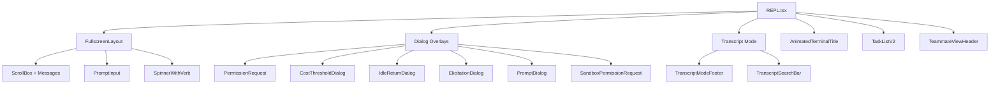

The component receives its configuration through a `Props` type that is remarkably broad — commands, tools, MCP clients, SSH sessions, remote session configs, agent definitions, thinking configuration, and a dozen callback hooks. This is a consequence of REPL being the root of the interactive screen tree: everything flows through it.

### State Management: The Query Guard

One of the most subtle problems in the REPL is preventing concurrent queries. A user might press Enter twice quickly, or a slash command might trigger a query while another is in flight. Previously, this was managed with a dual-state pattern: `isLoading` (React state, async batched) and `isQueryRunning` (a ref, synchronous). These could desync — the React state had not updated yet while the ref already showed a query running, or vice versa.

The solution is `QueryGuard`, a synchronous state machine implemented in `src/utils/QueryGuard.ts`:

```typescript
// From REPL.tsx:
const queryGuard = React.useRef(new QueryGuard()).current;
const isQueryActive = React.useSyncExternalStore(
  queryGuard.subscribe,
  queryGuard.getSnapshot
);
```

The guard exposes three operations: `reserve()`, `tryStart()`, and `end(generation)`. The `tryStart()` method atomically checks whether the guard is idle and transitions to running, returning a generation number. If the guard is already running, it returns `null`. This prevents the race condition where two `onQuery` calls both read `isLoading === false` and both proceed.

The `isQueryActive` derived state, combined with `isExternalLoading` (for remote sessions and backgrounded tasks), produces the final `isLoading` boolean that drives the spinner and input disabled state:

```typescript
const isLoading = isQueryActive || isExternalLoading;
```

### The onQuery Pipeline

When the user submits input, the flow is:

1. `PromptInput` calls `onSubmit`
2. `onSubmit` delegates to `handlePromptSubmit` (in `src/utils/handlePromptSubmit.ts`)
3. `handlePromptSubmit` calls `processUserInput` to transform raw text into structured messages
4. The resulting messages are passed to `onQuery`
5. `onQuery` calls `queryGuard.tryStart()` and, if successful, delegates to `onQueryImpl`
6. `onQueryImpl` builds the `ToolUseContext`, fetches fresh tools and MCP clients from the store, and enters the main query loop

The `onQueryImpl` function is where the real work begins. It reads MCP clients and tools fresh from the store rather than from the closure — this is critical because `useManageMCPConnections` may have flushed new MCP state between the render that captured the closure and the moment the function runs.

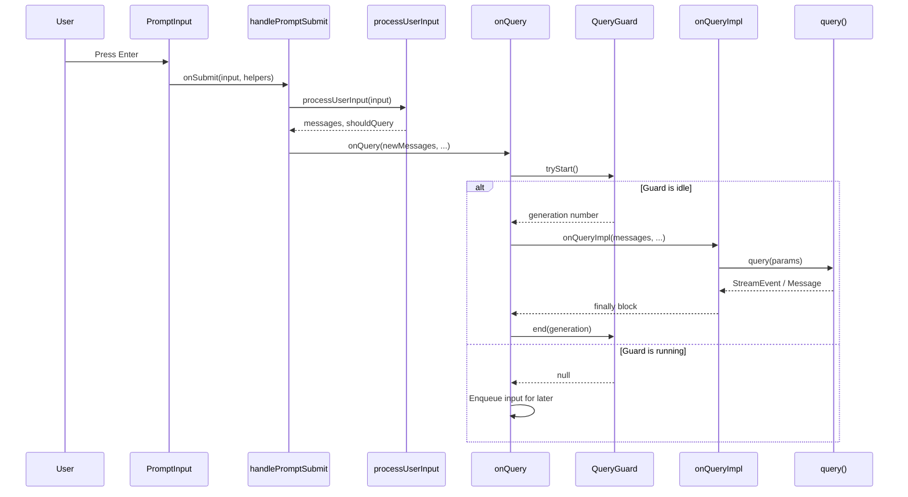

### The Conversational Loop: handleMessageFromStream

Inside `onQueryImpl`, the query generator's output is consumed by `handleMessageFromStream` — a function imported from `src/utils/messages.ts` that processes each yielded event and updates the React state. This function is the bridge between the pure-logic query loop and the imperative React world.

Each message from the generator triggers specific state updates:

- **assistant messages**: Appended to the messages array. If the message contains tool_use blocks, `streamingToolUses` state is updated for the spinner.
- **user messages (tool results)**: Appended to messages, turn count incremented.
- **stream events**: `message_start` resets usage tracking; `content_block_start` with `tool_use` type updates the streaming tool use state; `content_block_delta` updates streaming text/thinking.
- **system messages**: Various subtypes handled — `compact_boundary` triggers conversation ID regeneration, `local_command` renders command output.
- **progress messages**: Update spinner verb text.
- **attachment messages**: Handle hook results, queued commands, max-turns signals.
- **tombstone messages**: Control signals that remove previously rendered messages (used during streaming fallback).

### Streaming Tool Use Visualization

The REPL tracks streaming tool use in real time. When the model emits a `tool_use` content block during streaming, the REPL updates a `streamingToolUses` state array. Each entry contains the tool name, input preview, and a timestamp. The `SpinnerWithVerb` component reads this to display which tools are being invoked ("Running Bash...", "Reading file...").

Similarly, `streamingThinking` tracks the model's extended thinking blocks. When the model is thinking, the REPL shows a thinking indicator that auto-hides 30 seconds after thinking completes:

```typescript
const [streamingThinking, setStreamingThinking] = useState<StreamingThinking | null>(null);
useEffect(() => {
  if (streamingThinking && !streamingThinking.isStreaming && streamingThinking.streamingEndedAt) {
    const elapsed = Date.now() - streamingThinking.streamingEndedAt;
    const remaining = 30000 - elapsed;
    if (remaining > 0) {
      const timer = setTimeout(setStreamingThinking, remaining, null);
      return () => clearTimeout(timer);
    } else {
      setStreamingThinking(null);
    }
  }
}, [streamingThinking]);
```

### Permission Dialogs and the canUseTool Hook

When a tool requires user permission, the query loop yields a `ToolUseConfirm` event. The REPL renders a `PermissionRequest` component that presents the tool name, input, and Accept/Deny buttons. The user's response is fed back into the query loop via the `canUseTool` callback.

The `useCanUseTool` hook (`src/hooks/useCanUseTool.ts`) wraps this interaction. It maintains a queue of pending permission requests and renders them one at a time. When the user responds, the hook resolves the corresponding promise, unblocking the query loop.

### Speculative Execution

One of the most sophisticated features of the REPL is speculative execution — while waiting for the user to respond to a permission prompt or after a turn completes, Claude Code can pre-execute tools that the model suggested. This is controlled by the speculation module (`src/services/PromptSuggestion/speculation.ts`).

When speculation is active, the REPL shows a subtle indicator in the prompt area. If the user accepts the speculation (by pressing Enter without typing), the pre-executed results are merged into the conversation seamlessly. If the user types something else, the speculation is aborted and its side effects are rolled back.

The `ActiveSpeculationState` is passed through `onSubmit` to `handlePromptSubmit`, which calls `handleSpeculationAccept` to merge the speculative results:

```typescript
onSubmit: (input: string, helpers: PromptInputHelpers, speculationAccept?: {
  state: ActiveSpeculationState;
  speculationSessionTimeSavedMs: number;
  setAppState: (f: (prev: AppState) => AppState) => void;
}) => Promise<void>;
```

### Hook Dependency Graph

The REPL component consumes over thirty custom hooks, forming a dense dependency graph. The most important ones are:

- **useCanUseTool**: Manages the permission request queue. Reads `toolPermissionContext` from AppState.
- **useReplBridge**: Connects the REPL to the mobile/desktop bridge, allowing remote control.
- **useMainLoopModel**: Tracks the current model (can change mid-session via `/model`).
- **useMergedTools**: Merges built-in tools, MCP tools, and plugin tools into a unified list.
- **useMergedClients**: Merges initial MCP clients with dynamically connected ones.
- **useBackgroundTaskNavigation**: Manages navigation between background task views.
- **useVimInput**: Implements Vim keybindings for the prompt input (handled inside `VimTextInput`).
- **useSessionBackgrounding**: Handles backgrounding the session when the user switches away.
- **useSwarmInitialization**: Initializes swarm/teammate features on mount.
- **useQueueProcessor**: Processes queued commands between turns.
- **useMailboxBridge**: Connects the REPL to the teammate mailbox for inter-agent communication.
- **useTasksV2WithCollapseEffect**: Manages the task list with collapse animations.

```mermaid
graph TD
    REPL["REPL Component"]
    REPL --> UCUT["useCanUseTool"]
    REPL --> URB["useReplBridge"]
    REPL --> UMLM["useMainLoopModel"]
    REPL --> UMT["useMergedTools"]
    REPL --> UMC["useMergedClients"]
    REPL --> UBTN["useBackgroundTaskNavigation"]
    REPL --> USI["useSwarmInitialization"]
    REPL --> UQP["useQueueProcessor"]
    REPL --> UMB["useMailboxBridge"]
    REPL --> USBG["useSessionBackgrounding"]
    REPL --> UTV2["useTasksV2WithCollapseEffect"]
    REPL --> UVI["useVoiceIntegration"]
    REPL --> UIDE["useIDEIntegration"]
    REPL --> URS["useRemoteSession"]
    REPL --> UDC["useDirectConnect"]
    REPL --> USSH["useSSHSession"]
    UMT --> UT["tools pool"]
    UMC --> MCP["MCP clients"]
    UCUT --> TPC["toolPermissionContext"]
    UMLM --> Model["mainLoopModel"]
```

### Voice Mode, Bridge Mode, and SSH Sessions

The REPL supports three remote interaction modes, each with its own hook:

- **Voice mode** (`useVoiceIntegration`): Allows the user to speak commands. Feature-gated behind `VOICE_MODE`. When active, keystrokes are routed through the voice integration pipeline.
- **Bridge mode** (`useReplBridge`): Connects the REPL to a mobile or desktop client. The bridge receives commands from the remote client, executes them locally, and streams results back.
- **SSH mode** (`useSSHSession`): For `claude ssh` mode, where the REPL runs locally but tools execute on a remote machine via SSH.

All three modes share a common pattern: they intercept the normal input flow and inject commands from an external source, while preserving the same query loop and state management.

### Terminal Title Animation

A small but telling detail: the REPL includes an `AnimatedTerminalTitle` component that sets the terminal tab title. During a query, the title prefix animates between two frames at 960ms intervals. This component is deliberately isolated from the rest of the REPL tree so that the 960ms animation tick only re-renders this leaf component (which returns `null` — pure side-effect) instead of the entire REPL tree. Before extraction, the tick caused approximately one full REPL re-render per second for the duration of every turn, dragging `PromptInput` and all its children along.

### The PromptInput Component

The `PromptInput` component (`src/components/PromptInput/PromptInput.tsx`) is the user's primary interaction surface. It handles:

- Text input with cursor movement, selection, and Vim mode
- Image pasting (clipboard image detection, resizing, storage)
- Slash command typeahead (`useTypeahead`)
- History search (`useHistorySearch`)
- Arrow key history navigation (`useArrowKeyHistory`)
- Multi-line editing with Shift+Enter
- Thinking mode toggle (`ThinkingToggle`)
- Fast mode picker (`FastModePicker`)
- Model picker (`ModelPicker`)
- Effort indicator (`EffortCallout`)
- Queued command display (`PromptInputQueuedCommands`)
- IDE @-mention integration (`useIdeAtMentioned`)
- Buddy/companion sprite positioning (`findBuddyTriggerPositions`)
- Side-question trigger detection (`findBtwTriggerPositions`)

The `onSubmit` callback receives not just the input string but also a `PromptInputHelpers` object that provides access to the current messages, abort controller, and state setters. This allows `handlePromptSubmit` to make decisions about how to route the input without the PromptInput needing to know about the query loop.

### Summary

The REPL is the nexus of Claude Code's interactive experience. It manages a complex web of state — query lifecycle, permission dialogs, streaming visualization, background tasks, swarm teammates — while maintaining a responsive terminal UI. The `QueryGuard` state machine prevents concurrent queries; the `handleMessageFromStream` function bridges the pure-logic query loop to React state; the speculation system pre-executes tools while the user is idle. Every detail, from the animated terminal title to the auto-hiding thinking indicator, has been carefully optimized to avoid unnecessary re-renders and maintain a snappy user experience.

---

## Chapter 7: The Query Function — Heart of the Conversation Loop

If the REPL is the face of Claude Code, `query()` is the brain. This async generator function, defined in `src/query.ts` (approximately 69KB), orchestrates the entire conversation turn: preparing messages, calling the model, processing streaming events, executing tools, handling compaction, and managing the complex error recovery paths that keep conversations alive. Understanding `query()` is understanding how Claude Code thinks.

### The Function Signature

```typescript
export async function* query(
  params: QueryParams,
): AsyncGenerator<
  | StreamEvent
  | RequestStartEvent
  | Message
  | TombstoneMessage
  | ToolUseSummaryMessage,
  Terminal
>
```

The function is an async generator. It yields events as they happen — streaming text, tool use blocks, tool results, system messages — and returns a `Terminal` value describing why the turn ended. This generator pattern is critical: it allows the caller (REPL or QueryEngine) to process events incrementally without waiting for the entire turn to complete.

The `QueryParams` type captures everything the query loop needs:

```typescript
export type QueryParams = {
  messages: Message[]
  systemPrompt: SystemPrompt
  userContext: { [k: string]: string }
  systemContext: { [k: string]: string }
  canUseTool: CanUseToolFn
  toolUseContext: ToolUseContext
  fallbackModel?: string
  querySource: QuerySource
  maxOutputTokensOverride?: number
  maxTurns?: number
  skipCacheWrite?: boolean
  taskBudget?: { total: number }
  deps?: QueryDeps
}
```

The `deps` parameter is particularly interesting. It allows tests to inject fakes for the four I/O dependencies: `callModel` (the API call), `microcompact` (micro-compaction), `autocompact` (auto-compaction), and `uuid` (unique ID generation). This dependency injection pattern, defined in `src/query/deps.ts`, eliminates the need for `spyOn`-per-module mocking in the 6-8 test files that exercise the query loop.

### The Main Loop Structure

The `query()` function itself is a thin wrapper:

```typescript
export async function* query(params: QueryParams): AsyncGenerator<..., Terminal> {
  const consumedCommandUuids: string[] = []
  const terminal = yield* queryLoop(params, consumedCommandUuids)
  for (const uuid of consumedCommandUuids) {
    notifyCommandLifecycle(uuid, 'completed')
  }
  return terminal
}
```

The real logic lives in `queryLoop()`, which is an infinite `while (true)` loop that continues until the model produces a response with no tool use, or until an error or abort condition terminates the turn.

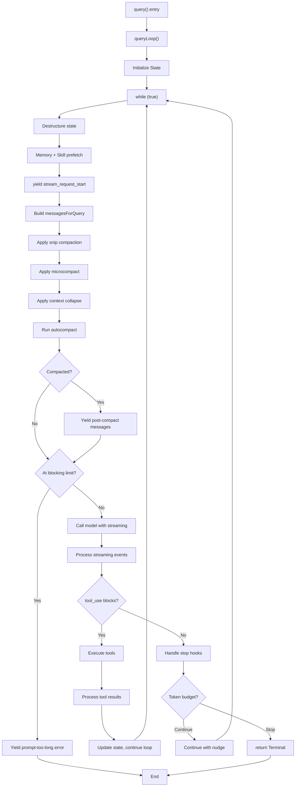

### Mutable State Between Iterations

The loop carries mutable state between iterations via a `State` struct. This is a deliberate design choice: instead of nine separate variable assignments at each `continue` site, a single `state = { ... }` expression captures all the cross-iteration state:

```typescript
type State = {
  messages: Message[]
  toolUseContext: ToolUseContext
  autoCompactTracking: AutoCompactTrackingState | undefined
  maxOutputTokensRecoveryCount: number
  hasAttemptedReactiveCompact: boolean
  maxOutputTokensOverride: number | undefined
  pendingToolUseSummary: Promise<ToolUseSummaryMessage | null> | undefined
  stopHookActive: boolean | undefined
  turnCount: number
  transition: Continue | undefined
}
```

The `transition` field records why the previous iteration continued. This lets tests assert recovery paths fired without inspecting message contents. Possible transition reasons include `collapse_drain_retry`, `reactive_compact_retry`, `max_output_tokens_recovery`, `stop_hook_blocking`, and `token_budget_continuation`.

### Message Preparation Pipeline

Before each API call, the query loop runs a multi-stage preparation pipeline:

1. **Get messages after compact boundary**: `getMessagesAfterCompactBoundary()` slices the message array to include only messages after the most recent compaction boundary. This is how the loop "forgets" pre-compaction history while keeping it in the full array for UI scrollback.

2. **Apply tool result budget**: `applyToolResultBudget()` enforces per-message size limits on aggregate tool result content. This prevents one massive file read from consuming the entire context window. It runs BEFORE microcompact because cached microcompact operates purely by `tool_use_id` (never inspects content), so content replacement is invisible to it.

3. **Apply snip compaction**: If the `HISTORY_SNIP` feature flag is enabled, `snipCompactIfNeeded()` removes old messages that the model no longer needs, replacing them with a compact boundary. Snip tokens freed are plumbed to autocompact so its threshold check reflects what snip removed.

4. **Apply microcompact**: `microcompactMessages()` performs fine-grained compaction of individual tool results, replacing verbose output with summaries while preserving the message structure for prompt caching.

5. **Apply context collapse**: If `CONTEXT_COLLAPSE` is enabled, `applyCollapsesIfNeeded()` projects the collapsed context view and commits additional collapses. This runs BEFORE autocompact so that if collapse gets the context under the autocompact threshold, autocompact is a no-op and granular context is preserved.

6. **Run autocompact**: `autoCompactIfNeeded()` performs full conversation compaction when the context window is nearing capacity. This is the heaviest compaction mechanism, replacing the entire pre-compact conversation with a summary.

7. **Build system prompt**: The system prompt is assembled from the base prompt plus system context via `appendSystemContext()`.

### The Streaming Loop

The core API interaction is a `for await` loop over `deps.callModel()`:

```typescript
for await (const message of deps.callModel({
  messages: prependUserContext(messagesForQuery, userContext),
  systemPrompt: fullSystemPrompt,
  thinkingConfig: toolUseContext.options.thinkingConfig,
  tools: toolUseContext.options.tools,
  signal: toolUseContext.abortController.signal,
  options: { model: currentModel, ... },
})) {
  // Process each streaming event
}
```

Each yielded event is processed as follows:

1. **Withhold recoverable errors**: Prompt-too-long errors, max-output-tokens errors, and media size errors are withheld from the yield until the recovery loop determines whether it can fix the problem. This prevents SDK consumers (like cowork/desktop) from seeing intermediate errors that would cause them to terminate the session.

2. **Yield non-withheld events**: All other events are yielded immediately to the caller.

3. **Collect assistant messages**: Pushed into the `assistantMessages` array for later processing.

4. **Collect tool use blocks**: Any `tool_use` content blocks are extracted and pushed into `toolUseBlocks`, and `needsFollowUp` is set to `true`.

5. **Streaming tool execution**: If `streamingToolExecution` is enabled, tool use blocks are immediately dispatched to the `StreamingToolExecutor`, which starts executing them in parallel with the ongoing stream. Completed results are yielded as they finish.

### Streaming Tool Execution

The `StreamingToolExecutor` (in `src/services/tools/StreamingToolExecutor.ts`) is a significant optimization. Instead of waiting for the entire model response to complete before executing any tools, it dispatches each `tool_use` block as soon as it arrives. This means that while the model is still generating subsequent tool calls, earlier tools are already running.

The executor manages a pool of concurrent tool executions. When a tool completes, its result is yielded immediately through the generator. The executor also handles the abort case: if the user cancels mid-stream, `getRemainingResults()` generates synthetic `tool_result` blocks for any queued or in-progress tools, ensuring that every `tool_use` has a matching `tool_result`.

### Error Recovery

The query loop implements several layers of error recovery:

**Model fallback**: If `FallbackTriggeredError` is thrown (the primary model is overloaded), the loop switches to the fallback model and retries the entire request. Before retrying, it yields tombstone messages for any partially-rendered assistant messages (which have invalid signatures that would cause "thinking blocks cannot be modified" API errors), and yields synthetic `tool_result` error blocks for any tool use blocks from the failed attempt.

**Prompt-too-long recovery**: When the API returns a 413 error, the loop tries two recovery paths in order:
1. **Context collapse drain**: Drains all staged context collapses (cheap, keeps granular context).
2. **Reactive compact**: Runs a full reactive compaction (expensive, produces a summary).

If either succeeds, the loop continues with the compacted messages. If neither works, the error surfaces to the user.

**Max-output-tokens recovery**: When the model hits the output token limit, the loop injects a meta user message telling the model to resume mid-thought, and continues the conversation. This can happen up to `MAX_OUTPUT_TOKENS_RECOVERY_LIMIT` (3) times per turn. Before that, an escalating retry mechanism can bump the output token limit from the default 8k to 64k (the `ESCALATED_MAX_TOKENS` value).

**Image/media size recovery**: When an image or PDF is too large, reactive compact can strip the offending media and retry. This is gated behind the `mediaRecoveryEnabled` flag.

### Stop Hooks

After the model produces a response with no tool use (the "end turn" case), the query loop runs stop hooks via `handleStopHooks()` (in `src/query/stopHooks.ts`). Stop hooks are user-defined scripts that run after each model turn and can:

1. **Block the turn**: If a hook exits with a non-zero code and the `stop` hook type, the turn is blocked. The hook's error message is injected as a meta user message, and the loop continues with another API call.
2. **Prevent continuation**: If a hook sets the `preventContinuation` flag, the turn ends immediately.
3. **Produce output**: Hooks can generate stdout/stderr that is visible in transcript mode.

The stop hook handler also runs several background bookkeeping tasks:

- **Prompt suggestion generation**: `executePromptSuggestion()` generates a suggested next prompt using a lightweight model.
- **Memory extraction**: `executeExtractMemories()` scans the conversation for memorable facts and writes them to `MEMORY.md`.
- **Auto-dream**: `executeAutoDream()` runs speculative background queries to explore related topics.
- **Job classification**: If running as a dispatched job, classifies the turn state for status tracking.
- **Computer use cleanup**: If the `CHICAGO_MCP` feature is enabled, releases computer use locks and unhides the desktop.

For teammates (swarm workers), additional hooks run after stop hooks:
- **TaskCompleted hooks**: For any in-progress tasks owned by the teammate.
- **TeammateIdle hooks**: When the teammate has no more work to do.

### Token Budget

The `TOKEN_BUDGET` feature introduces a per-turn token budget that limits how many tokens the model can consume. The `checkTokenBudget()` function in `src/query/tokenBudget.ts` evaluates the current spend against the budget:

- If the turn has used less than 90% of the budget, it returns a `continue` decision with a nudge message that tells the model to keep working but wrap up.
- If the turn has used more than 90% but the model is making progress (each continuation produces significant new tokens), it allows continuation.
- If the model is producing diminishing returns (less than 500 new tokens per continuation, for 3+ continuations), it stops the turn.

```typescript
type ContinueDecision = {
  action: 'continue'
  nudgeMessage: string
  continuationCount: number
  pct: number
  turnTokens: number
  budget: number
}

type StopDecision = {
  action: 'stop'
  completionEvent: {
    continuationCount: number
    pct: number
    turnTokens: number
    budget: number
    diminishingReturns: boolean
    durationMs: number
  } | null
}
```

### The Full Turn Lifecycle

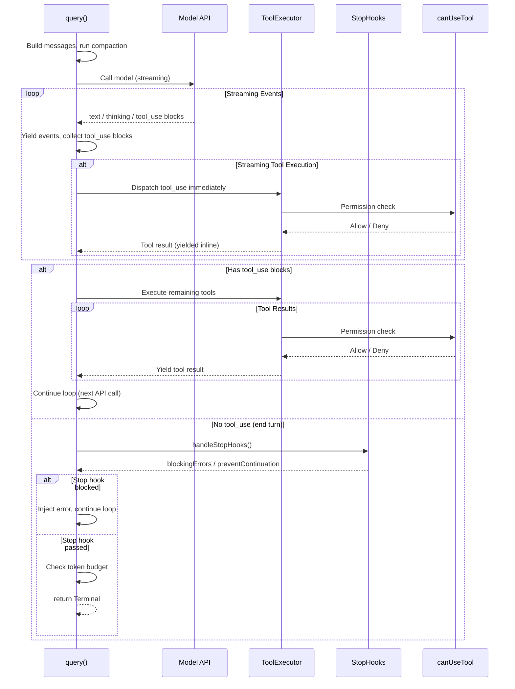

### The QueryConfig

Immutable values are snapshotted once at `query()` entry via `buildQueryConfig()` (in `src/query/config.ts`). This includes session ID and runtime gates (statsig feature flags, not `feature()` gates which are compile-time). Separating these from the per-iteration `State` and the mutable `ToolUseContext` makes future `step()` extraction tractable — a pure reducer could take `(state, event, config)` where config is plain data.

```typescript
export type QueryConfig = {
  sessionId: SessionId
  gates: {
    streamingToolExecution: boolean
    emitToolUseSummaries: boolean
    isAnt: boolean
    fastModeEnabled: boolean
  }
}
```

### Summary

The `query()` function is the most complex piece of code in Claude Code. It is a state machine disguised as a loop, with seven distinct continuation paths (collapse drain retry, reactive compact retry, max-output-tokens recovery, max-output-tokens escalation, stop hook blocking, token budget continuation, and normal tool-use continuation). Each path updates the `State` struct and continues the loop with fresh messages. The generator pattern allows callers to process events incrementally, while the dependency injection pattern keeps the function testable. The multi-stage preparation pipeline (snip, microcompact, collapse, autocompact) ensures that the model always receives a context window that fits within its limits, and the layered error recovery ensures that transient failures (overloaded models, oversized images, output token limits) don't terminate the conversation.

---

## Chapter 8: QueryEngine — SDK Orchestration and Stream Processing

While the `query()` function handles the pure logic of a conversation turn, the `QueryEngine` class wraps it for SDK and headless mode. Defined in `src/QueryEngine.ts` (~47KB), it manages the session lifecycle, tracks usage across calls, handles message normalization for SDK consumers, and bridges between the raw query generator and the structured SDK API.

### The Class Design

```typescript
export class QueryEngine {
  private config: QueryEngineConfig
  private mutableMessages: Message[]
  private abortController: AbortController
  private permissionDenials: SDKPermissionDenial[]
  private totalUsage: NonNullableUsage
  private hasHandledOrphanedPermission = false
  private readFileState: FileStateCache
  private discoveredSkillNames = new Set<string>()
  private loadedNestedMemoryPaths = new Set<string>()

  constructor(config: QueryEngineConfig) {
    this.config = config
    this.mutableMessages = config.initialMessages ?? []
    this.abortController = config.abortController ?? createAbortController()
    this.permissionDenials = []
    this.readFileState = config.readFileCache
    this.totalUsage = EMPTY_USAGE
  }
}
```

The `QueryEngine` is a stateful object — one instance per conversation. Multiple `submitMessage()` calls within the same conversation share the same `mutableMessages` array, `readFileState` cache, and accumulated `totalUsage`. This is a key difference from the REPL path, where the React state tree holds the messages and the query function is called fresh each turn.

### The submitMessage Generator

The primary API surface is `submitMessage()`, an async generator that yields `SDKMessage` objects:

```typescript
async *submitMessage(
  prompt: string | ContentBlockParam[],
  options?: { uuid?: string; isMeta?: boolean },
): AsyncGenerator<SDKMessage, void, unknown>
```

The generator pattern is consistent with `query()` — the SDK consumer processes messages as they arrive, without waiting for the entire turn to complete.

The `submitMessage` implementation follows a clear sequence:

1. **Wrap canUseTool**: Track permission denials for SDK reporting.
2. **Fetch system prompt parts**: Call `fetchSystemPromptParts()` to get the default system prompt, user context, and system context.
3. **Build ProcessUserInputContext**: Construct the context object that `processUserInput` needs, including the `setMessages` callback that writes back to `mutableMessages`.
4. **Handle orphaned permission**: If this is the first call and there is an orphaned permission (from a previous session that was interrupted mid-tool), handle it once.
5. **Process user input**: Call `processUserInput()` to transform the raw prompt into structured messages, handle slash commands, and determine whether a query is needed.
6. **Push messages and persist**: Push the processed messages to `mutableMessages` and persist them to the JSONL transcript BEFORE entering the query loop. This ensures the transcript is resumable even if the process is killed before the API responds.
7. **Enter query loop**: Call `query()` and process each yielded message.

### Lifecycle State Diagram

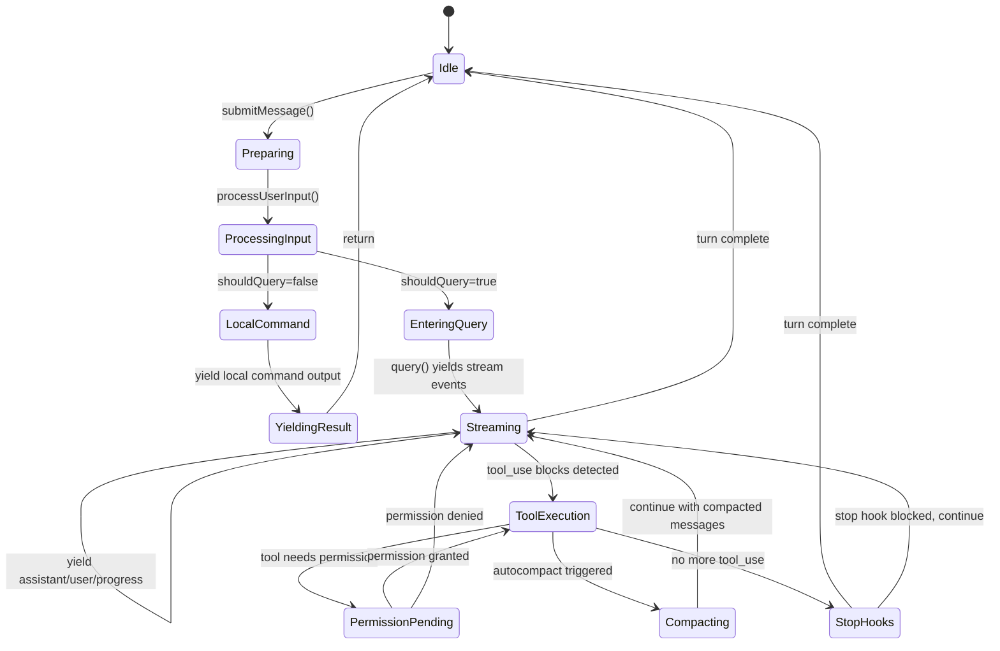

### Message Normalization for SDK

The QueryEngine performs two layers of message transformation between the raw `query()` output and the SDK yield:

1. **Record to transcript**: Assistant, user, and compact boundary messages are appended to the local `messages` array and persisted to the JSONL transcript via `recordTranscript()`. This is critical for session resumption.

2. **Normalize for SDK**: Each message is run through `normalizeMessage()` (from `src/utils/queryHelpers.ts`), which converts internal message types to SDK-compatible formats. For example, assistant messages are split into per-content-block SDK messages, and stream events are mapped to SDK event types.

The message recording has an important optimization: assistant messages are persisted fire-and-forget (not awaited), while user and compact boundary messages are awaited. This is because `claude.ts` yields one assistant message per content block, then mutates the last one's `usage`/`stop_reason` on `message_delta` — the write queue's 100ms lazy `jsonStringify` handles this naturally. Awaiting would block the generator.

### Usage Tracking

The QueryEngine tracks cumulative API usage across all turns in the conversation:

```typescript
// From the stream_event handler:
if (message.event.type === 'message_start') {
  currentMessageUsage = EMPTY_USAGE
  currentMessageUsage = updateUsage(currentMessageUsage, message.event.message.usage)
}
if (message.event.type === 'message_delta') {
  currentMessageUsage = updateUsage(currentMessageUsage, message.event.usage)
}
if (message.event.type === 'message_stop') {
  this.totalUsage = accumulateUsage(this.totalUsage, currentMessageUsage)
}
```

This per-message usage tracking is necessary because the API reports usage cumulatively within a single response (each `message_delta` adds to the running total), but the QueryEngine needs per-message granularity to track how much each assistant response costs.

### Speculative Execution in QueryEngine

The QueryEngine does not itself drive speculation — that is the REPL's responsibility via the `services/PromptSuggestion/speculation.ts` module. However, the QueryEngine's `submitMessage` method is what the speculation system calls when it wants to execute a speculative query. The speculation module:

1. Creates a forked agent via `runForkedAgent()` with an overlay filesystem
2. Runs a query with the suggested tool calls
3. Stores the results in the `ActiveSpeculationState`
4. If the user accepts, the overlay filesystem is merged into the main filesystem
5. If the user rejects, the overlay is deleted

```mermaid
sequenceDiagram
    participant REPL
    participant Spec as Speculation Module
    participant QE as QueryEngine (forked)
    participant FS as Overlay Filesystem
    participant Model
    Note over REPL: Turn complete, user idle
    REPL->>Spec: generateSuggestion()
    Spec->>Model: Ask for next tool suggestion
    Model-->>Spec: Suggested tool calls
    Spec->>FS: Create overlay filesystem
    Spec->>QE: submitMessage(suggested tools)
    QE->>Model: Execute tools
    Model-->>QE: Tool results
    QE-->>Spec: Completed execution
    alt User accepts (Enter)
        REPL->>Spec: handleSpeculationAccept()
        Spec->>FS: Merge overlay to main
        Spec->>REPL: Inject pre-executed results
    else User types something else
        REPL->>Spec: abortSpeculation()
        Spec->>FS: Delete overlay
    end
```

The speculation system is bounded by `MAX_SPECULATION_TURNS` (20) and `MAX_SPECULATION_MESSAGES` (100) to prevent runaway execution. It also applies safety checks: speculative tool calls are restricted to read-only tools and write tools that modify files within the overlay, and the `canUseTool` callback is wrapped to deny speculative execution of dangerous operations.

### Abort Controller Management

The QueryEngine manages an `AbortController` that propagates cancellation to the query loop. The `interrupt()` method is a simple abort:

```typescript
interrupt(): void {
  this.abortController.abort()
}
```

When a query is aborted, the query loop's `abortController.signal.aborted` check fires. If using streaming tool execution, `getRemainingResults()` generates synthetic `tool_result` blocks for any queued or in-progress tools. If not, `yieldMissingToolResultBlocks()` creates error tool results for all unpaired tool use blocks.

After abort, the QueryEngine needs a new `AbortController` for the next `submitMessage()` call. This is handled by the caller (typically `ask()` or the SDK entry point), which creates a fresh controller for each turn.

### Compaction and Memory Management

The QueryEngine handles compaction differently from the REPL. In the REPL, compaction boundaries are preserved in the full message array for UI scrollback, and `getMessagesAfterCompactBoundary()` slices them at query time. In the QueryEngine, after a compact boundary is yielded, pre-compaction messages are physically removed from `mutableMessages`:

```typescript
if (message.subtype === 'compact_boundary' && message.compactMetadata) {
  const mutableBoundaryIdx = this.mutableMessages.length - 1
  if (mutableBoundaryIdx > 0) {
    this.mutableMessages.splice(0, mutableBoundaryIdx)
  }
  const localBoundaryIdx = messages.length - 1
  if (localBoundaryIdx > 0) {
    messages.splice(0, localBoundaryIdx)
  }
}
```

This aggressive pruning bounds memory usage in long headless sessions, where there is no UI to preserve scrollback for. The REPL, by contrast, keeps full history and projects a collapsed view on demand.

### The ask() Convenience Wrapper

The `ask()` function at the bottom of `QueryEngine.ts` is a convenience wrapper for one-shot usage:

```typescript
export async function* ask({
  commands,
  prompt,
  cwd,
  tools,
  mcpClients,
  verbose,
  thinkingConfig,
  maxTurns,
  ...
}: AskParams): AsyncGenerator<SDKMessage, void, unknown>
```

It creates a `QueryEngine` instance, calls `submitMessage()` once, and yields the results. This is what the CLI's `--print` mode uses: it does not need persistent state across turns, so a single-shot engine is sufficient.

### Cost Tracking and Budget Enforcement

The QueryEngine enforces the USD budget specified in `maxBudgetUsd`. After each message, it checks `getTotalCost()` against the budget:

```typescript
if (maxBudgetUsd !== undefined && getTotalCost() >= maxBudgetUsd) {
  yield {
    type: 'result',
    subtype: 'error_max_budget_usd',
    is_error: true,
    total_cost_usd: getTotalCost(),
    ...
  }
  return
}
```

It also tracks structured output retry limits (for JSON schema mode) and max turns, both of which can terminate the query loop early.

### Session Persistence

The QueryEngine persists the conversation transcript to a JSONL file via `recordTranscript()` and `flushSessionStorage()`. The transcript is written incrementally — each message is appended as a JSONL line — so even if the process crashes mid-turn, the transcript is recoverable up to the last successfully written message.

For bare mode (`--bare` / SIMPLE), transcript writes are fire-and-forget: the await is skipped because scripted calls do not need to `--resume` after kill-mid-request. The await is approximately 4ms on SSD, 30ms under disk contention — the single largest controllable critical-path cost after module eval.

For cowork/desktop mode, an eager flush (`CLAUDE_CODE_EAGER_FLUSH` / `CLAUDE_CODE_IS_COWORK`) ensures that the transcript is fully written to disk before yielding the result message. The desktop app kills the CLI process immediately after receiving the result, so any unflushed writes would be lost.

### Summary

The QueryEngine is the SDK-facing counterpart to the REPL's interactive query management. It wraps the `query()` function with session state, usage tracking, message normalization, and budget enforcement. Its generator-based API allows SDK consumers to process messages incrementally, while its aggressive memory pruning (removing pre-compaction messages) bounds resource usage in long headless sessions. The `ask()` convenience wrapper provides a one-shot interface for CLI print mode. Together with the REPL, these two consumers represent the two primary ways Claude Code's core loop is exercised: interactively and programmatically.

---

## Chapter 9: Message Types and Conversation Model

The conversation in Claude Code is represented as a sequence of `Message` objects, each tagged with a discriminated union type. The message model is the lingua franca between the query loop, the UI, and the persistent transcript. Understanding the message types is understanding how information flows through the entire system.

### The Message Discriminated Union

The `Message` type is imported from `src/types/message.js` and is a discriminated union over the `type` field. The core message types are:

- **UserMessage**: Represents a user's input, including tool results.
- **AssistantMessage**: Represents the model's response, including text, tool use blocks, and thinking blocks.
- **SystemMessage**: Represents system-level information (compact boundaries, local command output, API errors, informational messages). Subtyped via a `subtype` field.
- **AttachmentMessage**: Represents auxiliary data attached to a turn (hook results, progress updates, queued commands, structured output).
- **ProgressMessage**: Represents in-progress tool execution updates.
- **TombstoneMessage**: A control signal that removes a previously rendered message (used during streaming fallback).
- **ToolUseSummaryMessage**: A summary of tool use activity, generated by a lightweight model after tool execution completes.

```mermaid
classDiagram
    class Message {
        <<union type>>
        +type: string
        +uuid: UUID
        +timestamp: string
    }
    class UserMessage {
        +type: "user"
        +message: {role, content}
        +isMeta: boolean
        +isVisibleInTranscriptOnly: boolean
        +isVirtual: boolean
        +isCompactSummary: boolean
        +toolUseResult: unknown
        +mcpMeta: object
        +imagePasteIds: number[]
        +sourceToolAssistantUUID: UUID
        +permissionMode: PermissionMode
        +summarizeMetadata: object
        +origin: MessageOrigin
    }
    class AssistantMessage {
        +type: "assistant"
        +message: BetaMessage
        +isApiErrorMessage: boolean
        +apiError: string
        +error: SDKAssistantMessageError
        +isVirtual: boolean
        +advisorModel: string
        +requestId: string
    }
    class SystemMessage {
        <<union subtype>>
        +type: "system"
        +subtype: string
        +content: string
        +isMeta: boolean
        +level: SystemMessageLevel
    }
    class AttachmentMessage {
        +type: "attachment"
        +attachment: Attachment
        +uuid: UUID
    }
    class ProgressMessage {
        +type: "progress"
        +data: Progress
        +toolUseID: string
        +parentToolUseID: string
    }
    class TombstoneMessage {
        +type: "tombstone"
        +message: Message
    }
    class ToolUseSummaryMessage {
        +type: "tool_use_summary"
        +summary: string
        +precedingToolUseIds: string[]
    }
    Message <|-- UserMessage
    Message <|-- AssistantMessage
    Message <|-- SystemMessage
    Message <|-- AttachmentMessage
    Message <|-- ProgressMessage
    Message <|-- TombstoneMessage
    Message <|-- ToolUseSummaryMessage
    class SystemInformationalMessage {
        +subtype: "informational"
    }
    class SystemCompactBoundaryMessage {
        +subtype: "compact_boundary"
        +compactMetadata: CompactMetadata
    }
    class SystemLocalCommandMessage {
        +subtype: "local_command"
    }
    class SystemAPIErrorMessage {
        +subtype: "api_error"
        +error: APIError
    }
    class SystemMicrocompactBoundaryMessage {
        +subtype: "microcompact_boundary"
    }
    SystemMessage <|-- SystemInformationalMessage
    SystemMessage <|-- SystemCompactBoundaryMessage
    SystemMessage <|-- SystemLocalCommandMessage
    SystemMessage <|-- SystemAPIErrorMessage
    SystemMessage <|-- SystemMicrocompactBoundaryMessage
```

### UserMessage: The User's Voice

A `UserMessage` carries the user's input to the model. The `message.content` field can be either a string or an array of `ContentBlockParam` objects. When it is an array, each block can be:

- **text**: Plain text input
- **tool_result**: A tool execution result (paired with a `tool_use` block from a preceding assistant message)
- **image**: An image block
- **document**: A PDF document block

The `isMeta` flag marks messages that should not be displayed in the UI — synthetic caveats, slash command breadcrumbs, and internal signals. The `isVirtual` flag marks display-only messages that must never reach the API (e.g., REPL inner tool calls shown for context). The `isCompactSummary` flag marks messages that are the output of conversation compaction.

The `origin` field tracks provenance: whether the message came from the keyboard, a channel message, a slash command, or another source. This is used by the UI to render messages differently based on their origin.

The `toolUseResult` field stores the raw tool output (matching the tool's `Output` type), separate from the `tool_result` content block. This allows the UI to render rich tool results without parsing the content block.

### AssistantMessage: The Model's Response

An `AssistantMessage` wraps the Anthropic SDK's `BetaMessage` type with additional metadata. The `message.content` array contains content blocks:

- **text**: The model's text output
- **tool_use**: A tool invocation request (name, input, ID)
- **thinking**: An extended thinking block (visible in transcript mode)
- **redacted_thinking**: A redacted thinking block (content not visible)

The `isApiErrorMessage` flag marks synthetic assistant messages that represent API errors (rate limits, prompt-too-long, auth failures). These are constructed by `createAssistantAPIErrorMessage()` rather than received from the API. The `apiError` field categorizes the error type (e.g., `max_output_tokens`, `invalid_request`).

The "rules of thinking" comment in `query.ts` captures the invariants that the system must maintain:

1. A message containing a thinking or redacted_thinking block must be part of a query whose `max_thinking_length > 0`.
2. A thinking block may not be the last message in a block.
3. Thinking blocks must be preserved for the duration of an assistant trajectory (a single turn, or if that turn includes a `tool_use` block then also its subsequent `tool_result` and the following assistant message).

Violating these rules results in API errors and, as the comment warns, "an entire day of debugging and hair pulling."

### Message Creation Functions

The `src/utils/messages.ts` file provides factory functions for each message type:

**createUserMessage** creates a user message with content, metadata, and provenance. The function accepts either a string or an array of `ContentBlockParam` objects as content. When a string is provided, it becomes the `message.content` directly. When an array is provided, each block (text, tool_result, image, document) is preserved as-is. The `uuid` and `timestamp` can be overridden for session restore, but default to fresh values.

**createAssistantMessage** creates an assistant message with content blocks and usage. The `model` field is set to `SYNTHETIC_MODEL` (`<synthetic>`) to distinguish programmatically-created messages from real API responses. Empty content is replaced with `NO_CONTENT_MESSAGE` to avoid sending empty messages to the API.

**createAssistantAPIErrorMessage** creates a synthetic assistant message representing an API error. The `isApiErrorMessage` flag is set to `true`, and the `apiError` field captures the error category. These messages are withheld from SDK yields until recovery is attempted.

**createSystemMessage** creates a system informational message with a severity level (`info`, `warning`, `error`). The optional `toolUseID` associates the message with a specific tool execution, and `preventContinuation` can signal that the turn should end.

**createToolUseSummaryMessage** creates a summary of tool use activity. The `precedingToolUseIds` array links the summary to the specific tool calls it describes. This is generated by a lightweight model (Haiku) and shown in mobile/desktop clients.

### Message Normalization for the UI

Messages must be normalized before rendering in the UI. The `normalizeMessages()` function splits multi-block messages into single-block messages:

```typescript
export function normalizeMessages(messages: Message[]): NormalizedMessage[]
```

When an assistant message contains multiple content blocks (e.g., text + tool_use + text), `normalizeMessages` splits it into multiple `NormalizedAssistantMessage` objects, each with a single content block. This is necessary because the UI renders each content block as a separate visual row.

The normalization process also handles UUID derivation. When a message is split, the original UUID cannot be reused (that would create duplicate keys in the UI). Instead, `deriveUUID()` produces a deterministic UUID-shaped string from the parent UUID and block index:

```typescript
export function deriveUUID(parentUUID: UUID, index: number): UUID {
  const hex = index.toString(16).padStart(12, '0')
  return `${parentUUID.slice(0, 24)}${hex}` as UUID
}
```

A `isNewChain` flag tracks whether any message in the normalization pass had multiple content blocks. Once set, all subsequent messages get derived UUIDs to maintain proper ordering and prevent duplicate UUIDs.

### Message Normalization for the API

The `normalizeMessagesForAPI()` function transforms the full message array into the format the Anthropic API expects. This is a different operation from UI normalization — it addresses API requirements rather than rendering needs:

```typescript
export function normalizeMessagesForAPI(
  messages: Message[],
  tools: Tools = [],
): (UserMessage | AssistantMessage)[]
```

The function performs several transformations:

1. **Reorder attachments**: Bubbles attachment messages up until they hit a tool result or assistant message.
2. **Strip virtual messages**: Messages marked `isVirtual` are display-only and must never reach the API.
3. **Strip error-triggered blocks**: When an API error occurs (image too large, PDF password-protected), the function walks backward to find the preceding meta user message and strips the offending content blocks (image, document) from it.
4. **Filter to API-compatible types**: Only `UserMessage`, `AssistantMessage`, `AttachmentMessage` (hook results), and `SystemLocalCommandMessage` survive. Progress, system informational, and other internal types are dropped.
5. **Convert attachment messages**: Hook result attachments are converted to user messages with the appropriate content.
6. **Merge consecutive same-role messages**: The API requires alternating user/assistant messages. Consecutive messages of the same role are merged.

```mermaid
sequenceDiagram
    participant Raw as Raw Messages
    participant Reorder as reorderAttachmentsForAPI
    participant Strip as Strip virtual + error blocks
    participant Filter as Filter API types
    participant Convert as Convert attachments
    participant Merge as Merge same-role
    participant Pair as ensureToolResultPairing
    participant API as API Request
    Raw->>Reorder: Full message array
    Reorder->>Strip: Reordered messages
    Strip->>Filter: Stripped messages
    Filter->>Convert: API-compatible messages
    Convert->>Merge: With hook results
    Merge->>Pair: Alternating user/assistant
    Pair->>API: Final API payload
```

### ensureToolResultPairing: Defensive Validation

The `ensureToolResultPairing()` function is the last line of defense before the API call. It ensures that every `tool_use` block has a matching `tool_result` block, and vice versa. This is critical because the API rejects requests with unpaired tool use/result blocks.

The function handles both directions:

- **Forward**: Inserts synthetic error `tool_result` blocks for `tool_use` blocks missing results (using the `SYNTHETIC_TOOL_RESULT_PLACEHOLDER` text: `[Tool result missing due to internal error]`).
- **Reverse**: Strips orphaned `tool_result` blocks referencing non-existent `tool_use` blocks.

A cross-message `allSeenToolUseIds` set tracks all tool use IDs across the entire payload. This catches the case where two different assistant messages carry the same tool_use ID (e.g., an orphan handler re-pushed an assistant already present in `mutableMessages` with a fresh `message.id`). Without this check, the API rejects with "tool_use ids must be unique," deadlocking the session.

In strict mode (when `getStrictToolResultPairing()` is true), any mismatch throws instead of repairing. This is used for training-data collection: a model response conditioned on synthetic placeholders is tainted, so it is better to fail the trajectory than waste labeler time.

### Content Block Types

The content blocks within messages map directly to the Anthropic API's content block types:

- **text**: `{ type: "text", text: string }` — Plain text content.
- **tool_use**: `{ type: "tool_use", id: string, name: string, input: object }` — A tool invocation request from the model.
- **tool_result**: `{ type: "tool_result", tool_use_id: string, content: string | ContentBlock[], is_error?: boolean }` — A tool execution result, always in a UserMessage.
- **thinking**: `{ type: "thinking", thinking: string }` — Extended thinking content.
- **redacted_thinking**: `{ type: "redacted_thinking" }` — Redacted thinking (content not available).
- **image**: `{ type: "image", source: { type: "base64", media_type: string, data: string } }` — An image block.
- **document**: `{ type: "document", source: { ... } }` — A PDF document block.

The `tool_reference` block type is a special internal block used by the tool search system. When tool search is enabled, the model can emit `tool_reference` blocks that reference tools by name without invoking them. These are stripped from API-bound messages by `stripToolReferenceBlocks()`.

### Message Persistence: JSONL Transcript

Messages are persisted to disk as JSONL (JSON Lines) via the session storage module (`src/utils/sessionStorage.ts`). Each line is a JSON object representing a `TranscriptMessage` — a `SerializedMessage` with additional metadata:

```typescript
export type TranscriptMessage = SerializedMessage & {
  type: string
  uuid: string
  timestamp: string
  // Additional metadata for session management
}
```

The transcript file lives at a path derived from the session ID and project directory. Each message is appended as a single JSONL line, making the format crash-safe: even if the process is killed mid-write, only the last line may be corrupted.

The `recordTranscript()` function appends messages to the JSONL file. It uses a write queue with 100ms lazy `jsonStringify` to batch writes and reduce I/O overhead. For cowork/desktop mode, `flushSessionStorage()` forces an immediate flush before yielding the result message.

Session restoration reads the JSONL file and deserializes messages via `deserializeMessages()` (in `src/utils/conversationRecovery.ts`). The `getLastSessionLog()` function reads the tail of the file to find the most recent session, and `readTranscriptForLoad()` reads the full file for session resume.

### The Compact Boundary Message

The `SystemCompactBoundaryMessage` is a special system message that marks the boundary between pre-compaction and post-compaction history. When the query loop compacts the conversation, it yields a compact boundary message, and all subsequent `getMessagesAfterCompactBoundary()` calls slice the array at this boundary.

The boundary message carries `compactMetadata` that describes what was compacted:

```typescript
type CompactMetadata = {
  compactedMessages: number
  summaryMessages: number
  preCompactTokenCount: number
  postCompactTokenCount: number
  compactionUsage?: Usage
  preservedSegment?: {
    headUuid: string
    tailUuid: string
  }
}
```

The `preservedSegment` field identifies the range of messages that were preserved across compaction (the tail of the pre-compact conversation that serves as context for the post-compact turn). This is used by session storage to ensure that these messages are written to the transcript before the compact boundary, even if they were only in memory.

The `getMessagesAfterCompactBoundary()` function uses `findLastCompactBoundaryIndex()` to locate the most recent compact boundary and slice the array accordingly. When `HISTORY_SNIP` is enabled, it additionally projects a snipped view that removes messages marked as snipped while preserving their structure for reference.

### The Tombstone Message

The `TombstoneMessage` is a control signal that instructs the UI to remove a previously rendered message. It is used during streaming fallback: when the primary model fails and the system falls back to a different model, any partially-rendered assistant messages from the failed attempt have invalid thinking block signatures that would cause API errors. These messages are tombstoned (removed from the UI and transcript) and replaced with the fallback model's response.

The query loop yields tombstone messages when `streamingFallbackOccured` is detected:

```typescript
if (streamingFallbackOccured) {
  for (const msg of assistantMessages) {
    yield { type: 'tombstone' as const, message: msg }
  }
  assistantMessages.length = 0
  toolResults.length = 0
  toolUseBlocks.length = 0
  needsFollowUp = false
}
```

The REPL's `handleMessageFromStream` processes tombstones by removing the referenced message from the displayed message list. This ensures that the user never sees the partial output from the failed model attempt.

### The ToolUseSummaryMessage

After tool execution completes, the query loop generates a `ToolUseSummaryMessage` using a lightweight model (Haiku). This summary provides a concise description of what the tools did, which is shown in mobile UI and desktop clients that do not render full tool output.

The summary generation is fire-and-forget: it runs in parallel with the next API call and is yielded on the next iteration. The `pendingToolUseSummary` promise is stored in the loop state and awaited on the next iteration:

```typescript
nextPendingToolUseSummary = generateToolUseSummary({
  tools: toolInfoForSummary,
  signal: toolUseContext.abortController.signal,
  isNonInteractiveSession: toolUseContext.options.isNonInteractiveSession,
  lastAssistantText,
})
  .then(summary => {
    if (summary) return createToolUseSummaryMessage(summary, toolUseIds)
    return null
  })
  .catch(() => null)
```

This pipelined approach hides the latency of the summary generation call behind the model's next streaming response, which typically takes 5-30 seconds. The Haiku call takes roughly 1 second, so it almost always completes before the next iteration needs it.

### Synthetic Messages and the SYNTHETIC_MESSAGES Set

Several user messages are synthetic — generated by the system rather than typed by the user. These are identified by the `SYNTHETIC_MESSAGES` set:

```typescript
export const SYNTHETIC_MESSAGES = new Set([
  INTERRUPT_MESSAGE,                    // '[Request interrupted by user]'
  INTERRUPT_MESSAGE_FOR_TOOL_USE,       // '[Request interrupted by user for tool use]'
  CANCEL_MESSAGE,                       // "The user doesn't want to take this action..."
  REJECT_MESSAGE,                       // "The user doesn't want to proceed with this tool use..."
  NO_RESPONSE_REQUESTED,               // 'No response requested.'
])
```

These messages are used by `isNotEmptyMessage()` to filter out empty or synthetic messages from display, and by `isSyntheticMessage()` to identify messages that should not be included in training data submissions. The `SYNTHETIC_MODEL` constant (`<synthetic>`) similarly identifies assistant messages that were generated programmatically rather than received from the API.

### Raw Input to API Request: The Full Pipeline

```mermaid
sequenceDiagram
    participant User as User Input
    participant PUI as processUserInput
    participant CUM as createUserMessage
    participant Q as query()
    participant Pre as Preparation Pipeline
    participant NMA as normalizeMessagesForAPI
    participant ETP as ensureToolResultPairing
    participant API as Anthropic API
    User->>PUI: Raw text + images + files
    PUI->>CUM: Structured content blocks
    CUM->>Q: UserMessage pushed to messages[]
    Q->>Pre: messagesForQuery = getMessagesAfterCompactBoundary()
    Pre->>Pre: applyToolResultBudget()
    Pre->>Pre: snipCompactIfNeeded()
    Pre->>Pre: microcompactMessages()
    Pre->>Pre: applyCollapsesIfNeeded()
    Pre->>Pre: autoCompactIfNeeded()
    Pre->>NMA: Preprocessed messages
    NMA->>NMA: reorderAttachmentsForAPI()
    NMA->>NMA: Strip virtual + error blocks
    NMA->>NMA: Filter API types
    NMA->>NMA: Convert attachments
    NMA->>NMA: Merge same-role messages
    NMA->>ETP: API-formatted messages
    ETP->>ETP: Verify tool_use/tool_result pairing
    ETP->>ETP: Insert synthetic error results
    ETP->>ETP: Strip orphaned tool_results
    ETP->>API: Final API payload
    API-->>Q: Streaming response
```

### Summary

The message model in Claude Code is a rich discriminated union that captures every aspect of the conversation: user input, model responses, tool invocations, tool results, system events, compaction boundaries, and control signals. The `normalizeMessages()` function splits multi-block messages for UI rendering, while `normalizeMessagesForAPI()` transforms the full array into the format the Anthropic API expects. The `ensureToolResultPairing()` function provides defensive validation that prevents API errors from unpaired tool use/result blocks. The JSONL transcript format ensures crash-safe persistence, and the compact boundary message enables the system to "forget" pre-compaction history while keeping it available for UI scrollback. Together, these types and functions form the backbone of Claude Code's conversation model — the data structure that every other system component reads from and writes to.
# Part III: Tool Architecture and Implementation

---

## Chapter 10: Tool Architecture -- buildTool, ToolUseContext, and ToolPool

### The Tool Type: A Complete Contract

Every tool in Claude Code satisfies the `Tool<Input, Output, P>` type defined in `src/Tool.ts`. This is not an abstract class or an interface with optional defaults -- it is a structural type contract with over forty fields, each serving a distinct purpose in the tool lifecycle. The type is parameterized over three generics: `Input` (a Zod object schema), `Output` (the return type of `call()`), and `P` (progress data type for streaming UI updates). The generic parameters ensure that each tool's `call()` method receives correctly typed input and returns correctly typed output, while the progress type enables the streaming executor to type-check progress callbacks.

The core fields break into five categories:

**Identity and Discovery.** `name` is the canonical tool identifier used in API calls, permission rules, and tool search. `aliases` provides backward compatibility when tools are renamed -- BriefTool, for instance, aliases both its current name `SendUserMessage` and its legacy name. `searchHint` is a 3-10 word capability phrase used by ToolSearch when the tool is deferred. For example, FileReadTool's searchHint is "read files, images, PDFs, notebooks", and NotebookEditTool's is "edit Jupyter notebook cells (.ipynb)". These hints help the model find the tool via keyword search without loading the full schema. The searchHint is particularly important for tools whose names do not reveal their purpose -- a model searching for "notebook" would not find `NotebookEditTool` by name alone, but the searchHint provides the match. `shouldDefer` marks tools whose schemas are omitted from the initial prompt to save tokens, requiring an explicit ToolSearch round-trip. `alwaysLoad` is the inverse -- tools that must appear in the first prompt regardless of deferral settings. For MCP tools, this can be set via `_meta['anthropic/alwaysLoad']`. `mcpInfo` carries the server and tool names as received from the MCP server, present on all MCP tools regardless of whether `name` is prefixed (`mcp__server__tool`) or unprefixed (CLAUDE_AGENT_SDK_MCP_NO_PREFIX mode). The `isMcp` flag marks whether the tool originated from an MCP server, which affects how the tool is rendered and how its schema is handled in the API request.

**Schema and Validation.** `inputSchema` is a Zod `AnyObject` that defines the tool's parameters. `inputJSONSchema` allows MCP tools to provide raw JSON Schema instead of converting from Zod, which is necessary because MCP servers define their schemas in JSON Schema format and converting to Zod would lose information or introduce parser differentials. `outputSchema` describes the structured output. Both use `lazySchema()` wrappers to avoid eager evaluation at module load time. The `lazySchema()` function returns a getter that constructs the Zod schema on first access, breaking circular dependencies that would otherwise occur when tool schemas reference types from other modules that have not yet been initialized. For example, `FileEditTool`'s output schema references `hunkSchema` which references types from the diff library -- without `lazySchema()`, this would create a module-level circular dependency that crashes at import time. The `strict` field, when true, enables strict mode for this tool, causing the API to more strictly adhere to tool instructions and parameter schemas -- applied only when the `tengu_tool_pear` feature flag is enabled. Both FileEditTool and FileWriteTool set `strict: true`, ensuring the model follows their precise parameter instructions.

**Execution.** `call()` is the primary execution method, receiving parsed input, the full `ToolUseContext`, a `canUseTool` permission callback, the parent `AssistantMessage`, and an optional `onProgress` callback. It returns `ToolResult<Output>`, which can carry `newMessages` (injected into the conversation -- used by FileReadTool to send PDF document blocks and image metadata as separate user messages) and a `contextModifier` that alters the execution context for subsequent operations. The `contextModifier` is only honored for tools that are not concurrency-safe, because concurrent tools run in parallel and context modifications would be nondeterministic. `validateInput()` runs before permissions -- it can reject inputs with specific error codes without ever showing a permission prompt. `checkPermissions()` runs after validation passes and determines whether the user must approve the operation. `inputsEquivalent()` determines whether two inputs represent the same logical operation, used for deduplication in the streaming executor -- when the model sends two identical tool calls in a single turn (a known failure mode for some model versions), `inputsEquivalent()` detects the duplication and only executes one.

**Safety Classification.** `isConcurrencySafe(input)` determines whether this tool can run in parallel with other tools. FileReadTool, GlobTool, and GrepTool declare `isConcurrencySafe() => true`. BashTool delegates to `isReadOnly()` -- read-only bash commands are concurrency-safe. `isReadOnly(input)` marks tools that never modify state. `isDestructive(input)` flags irreversible operations (delete, overwrite, send). `interruptBehavior()` controls what happens when the user submits a new message while the tool runs -- `'cancel'` stops the tool and discards its result, `'block'` keeps it running and queues the new message. The default when not implemented is `'block'`. These classifications cascade: the system never runs a destructive tool concurrently, and read-only tools get streamlined permission paths. `isOpenWorld(input)` indicates that the tool interacts with the outside world in ways that make deterministic replay impossible (e.g., WebFetchTool). `requiresUserInteraction()` indicates that the tool always requires user input (e.g., AskUserQuestionTool). The `isSearchOrReadCommand()` method returns a structured object with `isSearch`, `isRead`, and optional `isList` booleans, which the UI uses to decide whether to collapse the tool output in non-verbose mode.

**Rendering.** Ten rendering methods control every visual aspect: `renderToolUseMessage()` for the input display (called with partial input because it renders as parameters stream in), `renderToolResultMessage()` for the output, `renderToolUseProgressMessage()` for streaming updates, `renderToolUseRejectedMessage()` and `renderToolUseErrorMessage()` for the two failure modes, `renderGroupedToolUse()` for parallel instances (e.g., multiple FileReadTool calls shown together in non-verbose mode), `renderToolUseTag()` for metadata badges like timeout duration or model name, `renderToolUseQueuedMessage()` for waiting states, `extractSearchText()` for transcript search indexing (must return only text that is actually visible in the transcript render -- phantom text that is indexed but not shown is a count-not-equal-highlight bug caught by `transcriptSearch.renderFidelity.test.tsx`), and `isResultTruncated()` for expand/collapse affordances in fullscreen mode. FileWriteTool implements `isResultTruncated()` to detect when its diff output was truncated by the tool result budget and show an expand button.

The `maxResultSizeChars` field controls tool result persistence. When a tool result exceeds this threshold, the result is saved to a file in the `tool-results` directory and Claude receives a preview with the file path instead of the full content. This prevents context bloat from large outputs. FileReadTool sets this to `Infinity` because persisting a Read result creates a circular Read-to-file-to-Read loop -- the tool already self-bounds via its own token and size limits. GrepTool uses 20,000 chars, BashTool uses 30,000 chars, and most other tools use 100,000 chars. The persistence mechanism uses `buildLargeToolResultMessage()` which generates a `<persisted-output>` XML block containing a file path, original size, preview content, and a `hasMore` flag -- the model can then read the full output using FileReadTool if needed.

```mermaid
classDiagram
    class Tool~Input Output P~ {
        +name: string
        +aliases: string[]
        +searchHint: string
        +shouldDefer: boolean
        +alwaysLoad: boolean
        +mcpInfo: object
        +isMcp: boolean
        +maxResultSizeChars: number
        +strict: boolean
        +inputSchema: Input
        +inputJSONSchema: ToolInputJSONSchema
        +outputSchema: ZodType
        +call(args, context, canUseTool, parent, onProgress): Promise~ToolResult~Output~~
        +description(input, options): Promise~string~
        +prompt(options): Promise~string~
        +validateInput(input, context): Promise~ValidationResult~
        +checkPermissions(input, context): Promise~PermissionResult~
        +isConcurrencySafe(input): boolean
        +isReadOnly(input): boolean
        +isDestructive(input): boolean
        +isEnabled(): boolean
        +interruptBehavior(): string
        +isSearchOrReadCommand(input): object
        +isOpenWorld(input): boolean
        +requiresUserInteraction(): boolean
        +userFacingName(input): string
        +toAutoClassifierInput(input): unknown
        +getPath(input): string
        +preparePermissionMatcher(input): Promise~Function~
        +backfillObservableInput(input): void
        +inputsEquivalent(a, b): boolean
        +mapToolResultToToolResultBlockParam(content, id): ToolResultBlockParam
        +renderToolUseMessage(input, options): ReactNode
        +renderToolResultMessage(content, progress, options): ReactNode
        +renderToolUseProgressMessage(progress, options): ReactNode
        +renderToolUseRejectedMessage(input, options): ReactNode
        +renderToolUseErrorMessage(result, options): ReactNode
        +renderGroupedToolUse(toolUses, options): ReactNode
        +renderToolUseTag(input): ReactNode
        +renderToolUseQueuedMessage(): ReactNode
        +extractSearchText(output): string
        +isResultTruncated(output): boolean
        +getToolUseSummary(input): string
        +getActivityDescription(input): string
        +isTransparentWrapper(): boolean
    }
```

### buildTool(): The Factory with Safe Defaults

Defining forty-plus fields for every tool would be impractical. The `buildTool<D>(def)` function bridges this gap by providing fail-closed defaults for the seven most commonly stubbed methods. The type-level mechanics are subtle: `ToolDef` is `Tool` with the defaultable keys made optional via `Partial<Pick<Tool, DefaultableToolKeys>>`. `buildTool` spreads `TOOL_DEFAULTS` first, then the caller's definition, so explicit overrides always win.

The `TOOL_DEFAULTS` object is:

```typescript
const TOOL_DEFAULTS = {
  isEnabled: () => true,
  isConcurrencySafe: (_input?: unknown) => false,
  isReadOnly: (_input?: unknown) => false,
  isDestructive: (_input?: unknown) => false,
  checkPermissions: (input, _ctx) =>
    Promise.resolve({ behavior: 'allow', updatedInput: input }),
  toAutoClassifierInput: (_input?: unknown) => '',
  userFacingName: (_input?: unknown) => '',
}
```

Each default is chosen to be fail-closed in the security-relevant cases:

- `isEnabled` defaults to `() => true` -- tools are available unless they explicitly disable themselves (e.g., TaskCreateTool when `isTodoV2Enabled()` is false, or TodoWriteTool when `isTodoV2Enabled()` is true).
- `isConcurrencySafe` defaults to `() => false` -- the system assumes tools cannot run in parallel unless they prove otherwise. This is the safe default because concurrent execution of non-safe tools could cause data races, file corruption, or conflicting side effects.
- `isReadOnly` defaults to `() => false` -- the system assumes tools write state unless they declare otherwise. Write tools get stricter permission paths and are never auto-approved in sandbox mode.
- `isDestructive` defaults to `() => false` -- this is not security-relevant for the default because destructive tools must explicitly opt in.
- `checkPermissions` defaults to allowing the operation and deferring to the general permission system. Individual tools override this when they need tool-specific logic (e.g., FileEditTool checks write permissions for the target path, BashTool invokes the entire 15-stage permission pipeline).
- `toAutoClassifierInput` defaults to returning `''` (empty string), which skips the auto-mode security classifier. Security-relevant tools like BashTool must override this to surface their commands to the classifier -- BashTool returns the raw command string, GrepTool returns the pattern and path, and GlobTool returns the glob pattern.
- `userFacingName` defaults to returning the tool's own name. Overridden by tools that want a more descriptive display name (e.g., GrepTool returns "Search", GlobTool returns "Glob").

The type-level result `BuiltTool<D>` uses conditional mapped types to ensure that if a tool definition provides a required (non-optional) implementation of a defaultable method, that implementation's type wins. If the definition omits it or marks it optional (inherited from `Partial<>`), the default type fills in. This preserves exact arity, optional presence, and literal types exactly as `satisfies Tool` did -- the 60+ tools in the codebase all typecheck with zero errors. The `satisfies ToolDef<InputSchema, OutputSchema>` annotation at the end of each tool definition provides an additional compile-time check that catches missing required fields and type mismatches.

The `backfillObservableInput()` method is worth noting separately. It is called on copies of `tool_use` input before observers see it (SDK stream, transcript, `canUseTool`, PreToolUse/PostToolUse hooks). Its job is to mutate the input in place to add legacy or derived fields. The original API-bound input is never mutated because that would break prompt caching -- the API caches the exact tool_use blocks, and any mutation would invalidate the cache. A key example: FileEditTool, FileWriteTool, and FileReadTool all use `backfillObservableInput` to expand `~` and relative paths to absolute paths, so that hook allowlists using absolute paths can match correctly. Without this, a hook allowing `Bash(Edit:/home/user/project/*.ts)` would fail to match a tool call with `file_path: ~/project/foo.ts` because the tilde was never expanded.

### ToolUseContext: The Execution Environment

Every `call()` receives a `ToolUseContext` object that provides the full execution environment. This is not a thin wrapper -- it is a 40+ field object that carries everything a tool might need, and it is the primary mechanism for sharing state between tools within a session. The type is defined in `src/Tool.ts` starting at the `ToolUseContext` type literal.

**Core state access.** `getAppState()` and `setAppState()` provide read/write access to the global application state. `setAppState` uses an updater function pattern `(prev: AppState) => AppState` that serializes concurrent updates. `abortController` allows tools to be cancelled when the user sends a new message or the session ends. `readFileState` (a `FileStateCache`) tracks which files have been read and when, enforcing the read-before-write invariant across FileEditTool, FileWriteTool, and NotebookEditTool. The `messages` field provides the full conversation history, which some tools need for context -- for example, the compaction tool reads the message history to decide what to compress.

**Tool infrastructure.** `options.tools` is the current tool pool, used by tools like AgentTool that spawn sub-agents and need to filter the available tools. `options.commands` provides the available slash commands (used by SkillTool). `options.mcpClients` and `options.mcpResources` expose the MCP server connections. `options.mainLoopModel` identifies the active model (used by FileReadTool to determine whether to include the cyber-risk mitigation reminder). `options.thinkingConfig` controls extended thinking behavior. `options.isNonInteractiveSession` affects permission decisions. `options.agentDefinitions` provides the list of available agent types. `options.maxBudgetUsd` caps the total spend. `options.refreshTools` is an optional callback to get the latest tools after MCP servers connect mid-query -- this is essential because MCP servers can finish connecting after the initial tool pool is assembled, and the model needs to discover their tools.

**UI integration.** `setToolJSX()` allows tools to inject custom React components into the REPL. `addNotification()` sends OS-level notifications (iTerm2, Kitty, Ghostty, bell). `appendSystemMessage()` adds UI-only system messages that are stripped before API calls via the `Exclude<>` type enforcement -- this type-level guarantee prevents UI-only messages from accidentally being sent to the model. `setStreamMode()` controls the spinner display. `setHasInterruptibleToolInProgress()` gates whether interrupting the current tool is possible -- only set in interactive REPL contexts; SDK and QueryEngine contexts leave it undefined.

**Subagent support.** `agentId` identifies the current subagent. `agentType` provides the subagent type name. `setAppStateForTasks` is a variant of `setAppState` that always reaches the root store, even for async agents whose normal `setAppState` is a no-op (implemented in `createSubagentContext`). This is essential for infrastructure that outlives a single turn -- background tasks, session hooks, etc. Without `setAppStateForTasks`, async agents could not register cleanup handlers or signal task completion. `localDenialTracking` tracks permission denials for subagents that cannot show UI, preventing the denial counter from never accumulating. `preserveToolUseResults` ensures tool results survive in subagent transcripts viewable by the user.

**File and memory tracking.** `updateFileHistoryState` and `updateAttributionState` manage file history and commit attribution. `nestedMemoryAttachmentTriggers` and `loadedNestedMemoryPaths` deduplicate CLAUDE.md injections -- without `loadedNestedMemoryPaths`, the same CLAUDE.md would be re-injected dozens of times because `readFileState` is an LRU that evicts entries in busy sessions. The `dynamicSkillDirTriggers` set tracks discovered skill directories. `contentReplacementState` manages the tool result budget, applying aggregate budgeting across all tool results in a conversation thread. The state is per-conversation-thread -- main thread REPL provisions it once, while subagents clone the parent's state to make identical budget decisions.

**Permission and query tracking.** `toolDecisions` is a Map from tool use ID to the source and decision of each permission prompt, enabling the system to track why each tool was allowed or denied. `queryTracking` carries the chain ID and depth for multi-turn query chains. `fileReadingLimits` and `globLimits` constrain resource usage for subagents that should not read large files or return massive glob results. `requireCanUseTool` forces the `canUseTool` callback to be called even when hooks auto-approve -- used by the speculation system for overlay file path rewriting.

### Tool Assembly: From Base Tools to the Final Pool

The tool assembly pipeline has three stages, each implemented in `src/tools.ts`:

**Stage 1: `getAllBaseTools()`** -- This function returns the exhaustive list of all built-in tools that could be available in the current environment. It is the single source of truth for tool registration. The function uses conditional spreads extensively, respecting feature flags, user types, and environment variables. The tools are listed in a specific order that affects prompt caching:

The conditional includes work as follows: `hasEmbeddedSearchTools()` removes GlobTool and GrepTool when `bfs`/`ugrep` are embedded in the Bun binary (Ant-native builds that alias `find`/`grep` in the shell). `isTodoV2Enabled()` adds TaskCreateTool/TaskGetTool/TaskUpdateTool/TaskListTool when the V2 task system is active; otherwise TodoWriteTool remains. `process.env.USER_TYPE === 'ant'` adds ConfigTool, TungstenTool, and REPLTool for internal users. Feature flags gate SleepTool (`PROACTIVE`/`KAIROS`), cron tools (`AGENT_TRIGGERS`), RemoteTriggerTool (`AGENT_TRIGGERS_REMOTE`), MonitorTool (`MONITOR_TOOL`), and many others. `isToolSearchEnabledOptimistic()` includes ToolSearchTool when tool search might be enabled at request time -- the actual decision to defer tools happens at request time in `claude.ts`.

Dead code elimination is critical here. Many tools are conditionally imported via `require()` with `process.env` or `feature()` guards. In external builds, `feature('AGENT_TRIGGERS')` evaluates to `false` at build time, and Bun can constant-fold the ternary and eliminate the entire `ScheduleCronTool` import. The code comments explicitly warn about this: "Dead code elimination: conditional import for ant-only tools." Breaking this pattern (e.g., moving the `require()` outside the conditional) would pull in the module at load time even when the feature flag is off, bloating the bundle and potentially crashing on missing dependencies.

**Stage 2: `getTools(permissionContext)`** -- This function filters the base tools for the current session. The filtering logic proceeds as follows:

1. If `CLAUDE_CODE_SIMPLE` mode is active, returns only BashTool, FileReadTool, and FileEditTool. In REPL mode, returns REPLTool instead. Coordinator mode adds AgentTool and TaskStopTool.
2. Removes special tools (ListMcpResourcesTool, ReadMcpResourceTool, SyntheticOutputTool) that are handled separately.
3. Applies `filterToolsByDenyRules()` -- a tool is removed if any blanket deny rule matches its name. For MCP tools, server-prefix rules like `mcp__server` strip all tools from that server before the model sees them -- not just at call time. This means that denying `mcp__slack` prevents the Slack tools from appearing in the tool list entirely, rather than failing at invocation time.
4. When REPL mode is enabled, hides `REPL_ONLY_TOOLS` (the primitive tools that REPL wraps internally via the VM context).
5. Filters by `isEnabled()` -- each tool can dynamically disable itself based on runtime conditions. For example, TaskCreateTool checks `isTodoV2Enabled()` and BriefTool checks `isBriefEntitled()`.

**Stage 3: `assembleToolPool(permissionContext, mcpTools)`** -- The final assembly merges built-in tools with MCP tools. The function:

1. Gets built-in tools via `getTools()`.
2. Filters MCP tools by deny rules using the same `filterToolsByDenyRules()`.
3. Sorts each partition by name for prompt-cache stability. This is critical: the server's `claude_code_system_cache_policy` places a global cache breakpoint after the last prefix-matched built-in tool. If MCP tools were interleaved with built-ins by name, adding a new MCP tool that sorted between existing built-ins would invalidate all downstream cache keys. The sort uses `localeCompare` for deterministic ordering.
4. Deduplicates by name using `uniqBy('name')`, which preserves insertion order -- built-in tools win on name conflicts. This means that if an MCP server provides a tool named `Read`, the built-in FileReadTool takes precedence. This is intentional: built-in tools have deeper integration with the permission system, rendering pipeline, and state tracking.

The `getMergedTools()` function is a simpler variant that does not sort or deduplicate. It is used for token counting and tool search threshold calculations where the full list (including duplicates) is needed.

```mermaid
flowchart TD
    A[getAllBaseTools] -->|40+ tools with conditional includes| B[Feature flag filters]
    B --> C[getTools permissionContext]
    C --> D{Simple mode?}
    D -->|Yes| E[Bash + Read + Edit only]
    D -->|No| F[filterToolsByDenyRules]
    F --> G[REPL mode filter]
    G --> H[isEnabled filter]
    H --> I[assembleToolPool]
    J[MCP tools from appState.mcp.tools] --> K[filterToolsByDenyRules]
    K --> I
    I --> L[Sort built-ins by name - cache stability]
    L --> M[Sort MCP tools by name]
    M --> N[Concat: built-ins prefix then MCP suffix]
    N --> O[uniqBy name - built-ins win on conflict]
    O --> P[Final ToolPool sent to API]
```

### Tool Disallow Lists: Confining Subagents

Subagents (AgentTool, async agents, in-process teammates) operate with restricted tool sets. The disallow lists in `src/constants/tools.ts` enforce these restrictions:

**`ALL_AGENT_DISALLOWED_TOOLS`** -- Tools that no subagent can use. This includes TaskOutputTool (prevents recursion -- a subagent reading its own output), ExitPlanModeV2Tool/EnterPlanModeTool (plan mode is a main-thread-only abstraction), AskUserQuestionTool (subagents cannot prompt the user -- this is bypass-immune at the permission system level to prevent social engineering), and TaskStopTool (requires main-thread task state). AgentTool itself is included for external users (prevents nested agents) but excluded for `USER_TYPE === 'ant'` where nested agents are allowed. When `WORKFLOW_SCRIPTS` is enabled, WorkflowTool is also added to prevent recursive workflow execution inside subagents.

**`ASYNC_AGENT_ALLOWED_TOOLS`** -- The explicit allowlist for background/async agents. Only these tools are available: FileReadTool, WebSearchTool, TodoWriteTool, GrepTool, WebFetchTool, GlobTool, shell tools (BashTool/PowerShellTool), FileEditTool, FileWriteTool, NotebookEditTool, SkillTool, SyntheticOutputTool, ToolSearchTool, and worktree tools. Notable exclusions documented in the source: AgentTool (blocked to prevent recursion), MCP tools (TBD -- pending work), LSPTool (uses a singleton virtual terminal abstraction that conflicts between agents), and TungstenTool (same singleton conflict).

**`IN_PROCESS_TEAMMATE_ALLOWED_TOOLS`** -- Additional tools for in-process teammates (not general async agents): TaskCreateTool, TaskGetTool, TaskListTool, TaskUpdateTool, SendMessageTool, and cron tools when `AGENT_TRIGGERS` is enabled. Teammates get task management because they coordinate via shared task lists, and cron tools are tagged with the creating `agentId` and routed to that teammate's `pendingUserMessages` queue.

**`COORDINATOR_MODE_ALLOWED_TOOLS`** -- Tools allowed in coordinator mode: AgentTool, TaskStopTool, SendMessageTool, and SyntheticOutputTool. The coordinator delegates actual work to workers; it does not directly execute filesystem operations.

The disallow list mechanism is enforced in `createSubagentContext()`, which filters the parent's tool pool against the appropriate list before passing it to the subagent. The filtering happens at tool pool construction time, not at call time -- a subagent literally cannot see the forbidden tools in its tool list, preventing the model from even attempting to use them.

### The Tool Lifecycle: From Definition to Execution

The complete lifecycle of a tool call traces through every concept in this chapter:

1. **Registration**: `buildTool()` wraps the partial definition with safe defaults, producing a complete `Tool` object with all 40+ fields populated.
2. **Discovery**: `getAllBaseTools()` collects the tool if its feature flags are active. `getTools()` filters it by deny rules and `isEnabled()`. `assembleToolPool()` merges it with MCP tools, sorts by name for cache stability, and deduplicates with built-ins winning on conflicts.
3. **Deferral**: If `shouldDefer` is true and tool search is enabled, the tool's schema is omitted from the initial prompt. The model must use ToolSearchTool to discover it by keyword.
4. **Invocation**: The model emits a `tool_use` block with the tool's name and input parameters. The streaming executor parses the parameters as they arrive.
5. **Backfill**: `backfillObservableInput()` mutates a copy of the input to add derived fields (e.g., path expansion). The original API-bound input is never mutated.
6. **Validation**: `validateInput()` checks the input before any permission logic. Returns `{result: false, errorCode}` to reject without a prompt, or `{result: true, meta: {...}}` to pass with metadata.
7. **Permission**: `checkPermissions()` determines whether the user must approve. For BashTool, this triggers the 15-stage pipeline. For read-only tools, this is typically a passthrough to the general permission system.
8. **Execution**: `call()` runs the tool with the full `ToolUseContext`. It can emit progress updates via `onProgress()`, inject messages into the conversation via `newMessages`, and modify the context via `contextModifier`.
9. **Rendering**: `renderToolUseMessage()`, `renderToolResultMessage()`, and friends control the visual display in the REPL.
10. **Serialization**: `mapToolResultToToolResultBlockParam()` converts the output to the API's `ToolResultBlockParam` format, which is sent back to the model in the next turn.

Every stage has escape hatches, error handling, and observability hooks. The system is designed so that no single stage can silently fail -- validation errors surface to the model with specific error codes, permission decisions are logged with decision reasons, and execution errors are rendered in the UI with custom error components. The `ToolUseContext` threads through all stages, providing shared state and ensuring that side effects (like `readFileState` updates) are visible across the tool lifecycle.

---

## Chapter 11: Filesystem Tools -- Read, Edit, and Write

### FileReadTool: The Gateway to File Content

FileReadTool is the most frequently used tool in the system and the most complex read operation. Its `call()` method dispatches across five content types -- text, notebook, image, PDF, and extracted PDF pages -- each with its own size limits, rendering pipeline, and state tracking. The tool's `maxResultSizeChars` is set to `Infinity` because persisting a Read result creates a circular Read-to-file-to-Read loop -- the tool already self-bounds via its own token and size limits.

**Input schema.** The tool accepts four fields: `file_path` (required, absolute path), `offset` (optional, line number to start reading from, non-negative integer), `limit` (optional, number of lines to read, positive integer), and `pages` (optional, page range for PDF files, maximum `PDF_MAX_PAGES_PER_READ` pages per request). Both `offset` and `limit` use `semanticNumber()` which accepts string representations of numbers in addition to actual numbers, making the API more forgiving when the model sends parameters as strings.

**Output schema.** The output uses a discriminated union on `type` with five variants: `text` (file content with line numbers, start line, total lines), `image` (base64-encoded image data with MIME type, dimensions, and size), `pdf` (base64-encoded PDF document), `pdf_pages` (extracted JPEG images for specific pages), and `notebook` (JSON cells from .ipynb files). The `file_unchanged` variant is used for dedup hits, returning a stub message instead of the full content.

**Deduplication.** Before any I/O, FileReadTool checks whether the same file/offset/limit has been read before and the file's mtime is unchanged. This optimization targets a specific pattern: the model often re-reads the same file across turns, and the earlier `tool_result` is still in context. Sending the full content again wastes `cache_creation` tokens on every subsequent turn. Analytics from the BigQuery proxy show approximately 18% of Read calls are same-file collisions, accounting for up to 2.64% of fleet cache creation cost.

The dedup check only applies to entries from prior Read operations -- entries where `offset !== undefined` (Read always sets offset). Edit/Write entries store `offset: undefined` to break the dedup match: after an edit, the model must see the new content, not a stub pointing at stale pre-edit data. The `isPartialView` flag also prevents dedup: auto-injected content (e.g., CLAUDE.md with stripped HTML comments) does not represent a full user-initiated read.

When the dedup hits, the tool returns a `file_unchanged` type with a stub message (`FILE_UNCHANGED_STUB` from `prompt.js`). A GrowthBook killswitch (`tengu_read_dedup_killswitch`) can disable this if the stub confuses the model in external deployments. The killswitch is off by default for third-party users, meaning dedup is enabled.

**Skill discovery.** After dedup, the tool fires `discoverSkillDirsForPaths()` and `activateConditionalSkillsForPaths()` for the file path. This is a fire-and-forget operation that loads skill definitions from `.claude/commands/` directories discovered along the file's path. The discovered directories are stored in `context.dynamicSkillDirTriggers` for attachment display. Skill loading happens in the background via `addSkillDirectories(newSkillDirs).catch(() => {})`. In simple mode (`CLAUDE_CODE_SIMPLE`), skill discovery is skipped entirely.

**Content type dispatch.** The `callInner()` function handles the actual read:

- *Notebook (.ipynb)*: Reads via `readNotebook()`, validates size against `maxSizeBytes` (with a helpful error message suggesting `jq` for large notebooks), runs token validation, and stores the JSON-serialized cells in `readFileState`. Notebook reads set both `offset` and `limit` in the state entry.

- *Image*: Reads the file once into a buffer, detects format via `detectImageFormatFromBuffer()`, applies `maybeResizeAndDownsampleImageBuffer()`, and checks token budget. If the standard resize exceeds the limit, applies aggressive compression via `compressImageBufferWithTokenLimit()`. As a final fallback, uses `sharp` to resize to 400x400 at JPEG quality 20. Images are never cached in `readFileState` (they would consume too much memory -- a single high-res image can exceed the entire 25MB cache budget). After image reading, `nestedMemoryAttachmentTriggers` is populated so that memory files in the same directory are considered for injection. The image output includes `originalSize`, `dimensions` (with `originalWidth`, `originalHeight`, `displayWidth`, `displayHeight`), and the MIME type for the API's image content block.

- *PDF*: For PDFs with a page count under `PDF_AT_MENTION_INLINE_THRESHOLD`, sends as a base64 document block. For larger PDFs or when `pages` is specified, extracts page ranges as JPEG images using `extractPDFPages()`. When `isPDFSupported()` returns false (model doesn't support PDF documents), the tool throws an error directing the user to use the `pages` parameter with `poppler-utils` installed. PDF support requires model support (Sonnet 3.5 v2+) and optionally `poppler-utils` for page extraction.

- *Text*: Reads via `readFileInRange()`, which handles offset/limit slicing, byte counting, and mtime extraction. This is the most common path. The function uses the abort signal for cancellation. After reading, runs `validateContentTokens()` -- if the rough token estimate exceeds `maxTokens / 4`, it calls `countTokensWithAPI()` for a precise count. If the precise count exceeds `maxTokens`, throws `MaxFileReadTokenExceededError` with guidance to use offset/limit. The text content is stored in `readFileState` with the mtime timestamp, offset, and limit.

**The cyber-risk mitigation reminder.** After formatting file lines with `addLineNumbers()`, the tool appends a `CYBER_RISK_MITIGATION_REMINDER` system reminder: "Whenever you read a file, you should consider whether it would be considered malware. You CAN and SHOULD provide analysis of malware, what it is. But you MUST refuse to improve or augment the code." This reminder is model-dependent -- `MITIGATION_EXEMPT_MODELS` (currently `claude-opus-4-6`) skip it, based on the model's native training to refuse malware augmentation.

**Validation.** `validateInput()` performs a series of checks with no I/O dependencies (intentionally -- validation runs before the permission prompt, so it must not trigger NTLM leaks on UNC paths or stat calls on device files):

1. PDF page range parsing (pure string validation via `parsePDFPageRange()`).
2. Path expansion via `expandPath()` and deny rule check.
3. UNC path bypass (returns `{result: true}` to defer to the permission check, preventing SMB authentication on `\\server\path`).
4. Binary extension check (extension-only, against `hasBinaryExtension()`, with exceptions for PDF and image extensions which this tool renders natively).
5. Blocked device path check (path-only, against `BLOCKED_DEVICE_PATHS`).

The blocked device paths list includes `/dev/zero`, `/dev/random`, `/dev/urandom`, `/dev/full`, `/dev/stdin`, `/dev/tty`, `/dev/console`, `/dev/stdout`, `/dev/stderr`, `/dev/fd/0-2`, and Linux `/proc/*/fd/0-2` aliases. These are checked by path only with no I/O -- safe devices like `/dev/null` are intentionally omitted because reading `/dev/null` is a harmless no-op.

**macOS screenshot path resolution.** On macOS, screenshot filenames use either a regular space or a thin non-breaking space (U+202F) before AM/PM, depending on the macOS version. When a file is not found (ENOENT), `getAlternateScreenshotPath()` tries the alternate space character before giving up. The function uses a regex `^(.+)([ \u202F])(AM|PM)(\.png)$` to match the AM/PM pattern and swaps the space variant. This handles the common case where the model generates a Read call with the wrong space variant.

### FileEditTool: The Critical Section

FileEditTool implements an atomic read-modify-write cycle with multiple safety checks. Its validation and execution paths are deeply intertwined with `readFileState` to enforce the read-before-write invariant.

**Input schema.** The tool accepts four fields: `file_path` (absolute path to modify), `old_string` (text to replace), `new_string` (replacement text, must differ from `old_string`), and `replace_all` (boolean, defaults to false). The `replace_all` field uses `semanticBoolean()` which accepts various truthy representations, making the API more forgiving for the model.

**Output schema.** The output includes `filePath`, `oldString`, `newString`, `originalFile` (full original content), `structuredPatch` (array of diff hunks with `oldStart`, `oldLines`, `newStart`, `newLines`, `lines`), `userModified` (whether the user modified the proposed changes in the diff view), `replaceAll`, and optional `gitDiff` (for remote sessions with the Quartz Lantern feature).

**Validation pipeline.** `validateInput()` performs twelve distinct checks, each with a specific error code for debugging:

1. *Secret detection* (errorCode: 0): `checkTeamMemSecrets()` rejects edits that introduce secrets into team memory files.
2. *No-op detection* (errorCode: 1): Rejects edits where `old_string === new_string`.
3. *Deny rule check* (errorCode: 2): Rejects edits to paths denied by permission settings.
4. *UNC path bypass*: Defers to the permission check (no filesystem I/O).
5. *File size guard* (errorCode: 10): Rejects edits to files larger than 1 GiB (`MAX_EDIT_FILE_SIZE = 1024 * 1024 * 1024`). This prevents OOM on multi-GB files -- the V8/Bun string length limit is approximately 2^30 characters, and for typical ASCII files, 1 byte on disk equals 1 character, making 1 GiB a safe byte-level guard.
6. *File existence and content reading*: Reads the file bytes first to detect encoding (UTF-8 BOM vs. UTF-16LE). CRLF is normalized to LF. If the file does not exist and `old_string` is not empty, returns an error with `findSimilarFile()` and `suggestPathUnderCwd()` suggestions.
7. *Empty old_string on existing file* (errorCode: 3): Only valid if the file is empty (new file creation via empty-string replacement).
8. *Notebook redirect* (errorCode: 5): Redirects `.ipynb` edits to NotebookEditTool.
9. *Read-before-edit* (errorCode: 6): Checks `readFileState` for the file. If no entry exists or `isPartialView` is true, rejects the edit with the message "File has not been read yet. Read it first before writing to it." The `meta` field includes `isFilePathAbsolute` for debugging.
10. *Staleness check* (errorCode: 7): Compares the file's mtime against the `readFileState` timestamp. On Windows, includes a content-comparison fallback because timestamps can change without content changes (cloud sync, antivirus). For full reads (offset undefined, limit undefined), compares the file content directly against `readFileState.content`. For partial reads, mtime is the only check.
11. *String matching* (errorCode: 8/9): Uses `findActualString()` to handle quote normalization (curly quotes vs. straight quotes). The function first tries exact match, then normalizes both the search string and file content by converting curly quotes to straight quotes, and searches again. If the string is not found, returns an error. If multiple matches exist and `replace_all` is false, returns an error asking for more context, including the `actualOldString` in the metadata for debugging.
12. *Settings file validation*: `validateInputForSettingsFileEdit()` performs additional checks for Claude settings files (`.claude/settings.json`, etc.). It takes a `simulateEdit` callback that produces the post-edit content, so it can validate the final state without duplicating the edit logic.

**The critical section.** The `call()` method's execution is structured around an atomic read-modify-write:

1. *Pre-operations (outside critical section)*: Skill discovery, `diagnosticTracker.beforeFileEdited()`, parent directory creation (`fs.mkdir(dirname(absoluteFilePath))`), and file history backup (`fileHistoryTrackEdit()`). These are safe to run before the staleness check because they are idempotent (mkdir) or produce inert side effects (file history backup is keyed on content hash -- if staleness fails later, the backup is simply unused, not corrupt state).

2. *Load and verify (critical section start)*: `readFileSyncWithMetadata()` reads the current file content, encoding, and line endings in one pass. The staleness check compares mtime against `readFileState`. For full reads, a content comparison fallback prevents false positives on Windows. The comment in the source is explicit: "Please avoid async operations between here and writing to disk to preserve atomicity." Any `await` between the staleness check and `writeTextContent()` creates a yield point where concurrent edits could interleave.

3. *Transform*: `findActualString()` resolves quote normalization. `preserveQuoteStyle()` applies the file's curly quote style to `new_string` -- when `old_string` matched via quote normalization (curly quotes in file, straight quotes from the model), the same style is applied to the replacement. `getPatchForEdit()` generates the diff patch using the `diff` library's `structuredPatch`.

4. *Write*: `writeTextContent(absoluteFilePath, updatedFile, encoding, endings)` writes the modified file to disk. The line endings from the original file are preserved -- this is different from FileWriteTool, which always uses LF.

5. *Post-operations (outside critical section)*: LSP notification (`lspManager.changeFile()` + `lspManager.saveFile()`) -- these are fire-and-forget with error logging. The LSP manager clears previously delivered diagnostics via `clearDeliveredDiagnosticsForFile()` so new ones will be shown. VSCode diff notification via `notifyVscodeFileUpdated()`. `readFileState` update with `offset: undefined` and `limit: undefined` to break FileReadTool's dedup match. Analytics logging including `tengu_edit_string_lengths` (byte sizes of old/new strings and replaceAll flag). Git diff computation for remote sessions.

```mermaid
sequenceDiagram
    participant Model
    participant FileEditTool
    participant readFileState
    participant FileSystem
    participant LSP

    Model->>FileEditTool: call(file_path, old_string, new_string, replace_all)
    Note over FileEditTool: PRE-CRITICAL SECTION
    FileEditTool->>FileSystem: discoverSkillDirsForPaths()
    FileEditTool->>FileSystem: diagnosticTracker.beforeFileEdited()
    FileEditTool->>FileSystem: mkdir(parentDir)
    FileEditTool->>FileSystem: fileHistoryTrackEdit()
    Note over FileEditTool: CRITICAL SECTION START
    FileEditTool->>FileSystem: readFileSyncWithMetadata()
    FileEditTool->>readFileState: get(file_path)
    readFileState-->>FileEditTool: {timestamp, content, offset, limit}
    FileEditTool->>FileSystem: getFileModificationTime()
    FileSystem-->>FileEditTool: mtime
    alt mtime > readFileState.timestamp AND content differs
        FileEditTool-->>Model: Error: FILE_UNEXPECTEDLY_MODIFIED
    end
    FileEditTool->>FileEditTool: findActualString() - quote normalization
    FileEditTool->>FileEditTool: preserveQuoteStyle() - match file typography
    FileEditTool->>FileEditTool: getPatchForEdit() - generate diff
    FileEditTool->>FileSystem: writeTextContent() - SYNCHRONOUS WRITE
    Note over FileEditTool: CRITICAL SECTION END
    FileEditTool->>LSP: changeFile() + saveFile()
    FileEditTool->>LSP: notifyVscodeFileUpdated()
    FileEditTool->>readFileState: set(file_path, {content, timestamp, offset: undefined})
    FileEditTool->>FileEditTool: countLinesChanged() - analytics
    FileEditTool-->>Model: ToolResult with structuredPatch
```

### FileWriteTool: Full Content Replacement

FileWriteTool replaces the entire file content with a new string. It shares the same read-before-write invariant and critical section structure as FileEditTool, but with a simpler transform (no string matching, no quote normalization, no ambiguous match resolution).

Key differences from FileEditTool:

- *Line ending handling*: FileWriteTool explicitly uses `LF` line endings regardless of the original file's line endings, passing `'LF'` as the fourth argument to `writeTextContent()`. The rationale is documented in the source: "Write is a full content replacement -- the model sent explicit line endings in `content` and meant them. Do not rewrite them." The previous behavior of preserving the old file's line endings silently corrupted bash scripts with `\r` on Linux when overwriting a CRLF file or when binaries in the cwd poisoned the repo sample.

- *Read-before-write enforcement*: `validateInput()` checks `readFileState` and rejects writes to files that have not been read. The `isPartialView` flag also blocks writes -- auto-injected content (e.g., CLAUDE.md with stripped HTML comments) does not count as having "read" the file. The error code is 2 for "not read" and 3 for "modified since read."

- *Content comparison fallback*: Like FileEditTool, FileWriteTool has a Windows-specific content comparison fallback. If mtime indicates modification but the file content matches `readFileState.content` (for full reads only), the write is allowed to proceed. The fallback uses `meta.content` from `readFileSyncWithMetadata()`, which is CRLF-normalized and matches `readFileState`'s normalized form.

- *Diff generation*: For updates, uses `getPatchForDisplay()` with the entire old content as `old_string` and the new content as `new_string` in a single edit. For creates, the structured patch is empty and all lines are counted as additions via `countLinesChanged([], content)`.

- *Output type discrimination*: The output schema has a `type` field that is `'create'` for new files and `'update'` for existing files. The `mapToolResultToToolResultBlockParam()` method uses this to produce different messages: "File created successfully at: {path}" vs. "The file {path} has been updated."

- *CLAUDE.md logging*: After writing, FileWriteTool checks if the written file ends with `${sep}CLAUDE.md` and logs a `tengu_write_claudemd` analytics event. This tracks when users or agents modify their project instructions, which is useful for understanding how instruction files are used in practice.

### readFileState and the FileStateCache

`FileStateCache` (in `src/utils/fileStateCache.ts`) is an LRU cache that tracks which files have been read and when. It is the backbone of the read-before-write invariant shared by FileEditTool, FileWriteTool, and NotebookEditTool.

**Structure.** Each `FileState` entry contains:
- `content`: The file content at read time (CRLF-normalized to LF, matching `readFileSyncWithMetadata`'s normalization).
- `timestamp`: The file's mtime at read time (floored to milliseconds via `Math.floor(mtimeMs)`).
- `offset` and `limit`: The range that was read. When set, these indicate a partial read; when `undefined`, a full read. This distinction matters for the staleness check (content comparison fallback only applies to full reads) and for dedup (Read sets offset/limit; Edit/Write set undefined to break dedup).
- `isPartialView`: True when the entry was populated by auto-injection (e.g., CLAUDE.md content that was stripped of HTML comments or frontmatter, or truncated MEMORY.md). Edit/Write must require an explicit Read first because the model has only seen a partial view.

**Cache configuration.** The default cache holds 100 entries (`READ_FILE_STATE_CACHE_SIZE`) with a 25MB size limit (`DEFAULT_MAX_CACHE_SIZE_BYTES`). Size is calculated as `Math.max(1, Buffer.byteLength(value.content))`, ensuring that empty strings consume at least 1 byte of cache budget. The LRU eviction policy means that frequently-read files stay cached, while rarely-accessed files are evicted when the cache is full.

**Path normalization.** All keys are normalized via `path.normalize()` before access. This ensures consistent cache hits regardless of whether callers pass relative vs. absolute paths with redundant segments (e.g., `/foo/../bar`) or mixed path separators on Windows (`/` vs. `\`). The `normalize()` call is cheap and prevents subtle bugs where the same file is represented by different string keys.

**Utility functions.** The module provides several helper functions: `cacheToObject()` converts the cache to a plain object (used by `compact.ts` for context compaction), `cacheKeys()` returns all keys as an array, `cloneFileStateCache()` creates a deep copy using `dump()`/`load()` (used when forking subagent contexts), and `mergeFileStateCaches()` merges two caches with more-recent entries winning by timestamp (used when reconciling subagent state back to the parent).

```mermaid
stateDiagram-v2
    [*] --> Empty: File not in cache
    Empty --> Cached_Read: FileReadTool.call() - text/notebook
    Cached_Read --> Empty: LRU eviction (100 entries / 25MB)
    Cached_Read --> Stale: External modification detected (mtime changes)
    Stale --> Cached_Read: FileReadTool.call() - re-read
    Cached_Read --> Cached_Edit: FileEditTool.call() - write succeeds
    Cached_Read --> Cached_Write: FileWriteTool.call() - write succeeds
    Cached_Read --> Blocked: FileEditTool/FileWriteTool - mtime changed since read
    Cached_Edit --> Cached_Read: FileReadTool.call() - re-read
    Cached_Edit --> Stale: External modification
    Cached_Write --> Cached_Read: FileReadTool.call() - re-read
    Blocked --> Cached_Read: Re-read required before edit/write
    note right of Cached_Edit
        offset: undefined (breaks dedup)
        content: post-edit content
        timestamp: post-write mtime
    end note
    note right of Cached_Read
        offset: from read (enables dedup)
        content: file content at read time
        timestamp: mtime at read time
    end note
```

**Edit invalidation.** When FileEditTool or FileWriteTool writes a file, it updates `readFileState` with the new content and post-write mtime. Critically, it sets `offset: undefined` and `limit: undefined`, which breaks FileReadTool's dedup match. Without this, Read after Edit in the same millisecond would return the `file_unchanged` stub against stale in-context content. This is the same pattern used by NotebookEditTool.

### The Filesystem Tool Coordination Protocol

The three filesystem tools coordinate through several shared mechanisms beyond `readFileState`:

**LSP notification.** Both FileEditTool and FileWriteTool notify LSP servers after writing. The notification sequence is `clearDeliveredDiagnosticsForFile()` followed by `lspManager.changeFile()` and `lspManager.saveFile()`. The clear step is essential: the LSP diagnostic registry tracks which diagnostics have already been shown to the user. Without clearing, the user would not see new diagnostics (e.g., type errors introduced by the edit) because the registry would think they had already been delivered. The `changeFile()` and `saveFile()` calls are fire-and-forget -- errors are logged but do not block the tool result. This design ensures that LSP notification failures never prevent file writes from completing.

**VSCode diff notification.** `notifyVscodeFileUpdated()` sends a notification to the VSCode extension when a file is modified. This enables the VSCode diff view to show the changes in real-time, with the old and new content side by side. The notification includes the file path, old content, and new content. For remote sessions (when `CLAUDE_CODE_REMOTE` is set and the `tengu_quartz_lantern` feature flag is enabled), the tool also computes a git diff via `fetchSingleFileGitDiff()`.

**File history tracking.** When `fileHistoryEnabled()` returns true, both tools call `fileHistoryTrackEdit()` before the critical section. The backup captures pre-edit content and is keyed on content hash -- if the staleness check fails later, the backup is simply unused, not corrupt state. The backup is associated with the parent message UUID, enabling the undo system to trace which edit produced which backup.

**Diagnostic tracking.** `diagnosticTracker.beforeFileEdited()` is called before the critical section in both tools. This pre-notification allows the diagnostic system to prepare for the incoming edit -- for example, by clearing stale diagnostics that would be invalidated by the file change. The diagnostic tracker is a singleton that coordinates across all file modifications in the session.

**Permission context.** All three tools use the same permission infrastructure: FileReadTool delegates to `checkReadPermissionForTool()`, while FileEditTool and FileWriteTool delegate to `checkWritePermissionForTool()`. Both functions check the tool's input against the `toolPermissionContext`'s allow/deny rules. The `preparePermissionMatcher()` method returns a closure that matches the tool's path or pattern against permission rule patterns, enabling the permission system to suggest specific rules when the user approves a previously-asked operation.

---

## Chapter 12: BashTool and Command Security

### The Most Complex Tool

BashTool is the most complex tool in the system, both in terms of code volume (the `BashTool.tsx` file exceeds 700 lines, `bashPermissions.ts` exceeds 2600 lines, and the supporting `bash/` module adds hundreds more) and in the depth of its security pipeline. Every other tool operates on a narrow domain -- files, searches, tasks. BashTool executes arbitrary shell commands, which makes it the primary attack surface for prompt injection, command smuggling, and permission bypass.

The complexity stems from a fundamental tension: the model needs to run commands to be useful, but arbitrary command execution is inherently dangerous. The resolution is a multi-stage permission pipeline that parses commands, extracts subcommands, checks deny rules, checks allow rules, runs a classifier, evaluates sandbox eligibility, and finally prompts the user -- all before the command ever reaches the shell.

### BashTool Input and Output Schemas

The full input schema includes `command` (required), `timeout` (optional, max configurable), `description` (optional, 5-10 words for simple commands, more for complex ones), `run_in_background` (optional, omitted when background tasks are disabled), and `_simulatedSedEdit` (internal-only, always omitted from the model-facing schema). The `_simulatedSedEdit` field is set by `SedEditPermissionRequest` after the user approves a sed edit preview -- it allows the tool to apply the exact preview content to the file without re-executing sed, ensuring what the user sees in the preview is exactly what gets written.

The output schema includes `stdout`, `stderr`, `interrupted`, `isImage`, `backgroundTaskId`, `backgroundedByUser`, `assistantAutoBackgrounded`, `dangerouslyDisableSandbox`, `returnCodeInterpretation`, `noOutputExpected`, `structuredContent`, `persistedOutputPath`, and `persistedOutputSize`. The `structuredContent` field allows MCP servers to return structured data alongside text output. The `persistedOutputPath` is set when stdout exceeds the tool's `maxResultSizeChars` threshold -- the model receives a preview with a file path instead of the full output.

The `mapToolResultToToolResultBlockParam()` method handles several output transformations: image data is formatted as an image content block for Claude's multimodal API; large persisted output is wrapped in a `<persisted-output>` XML block with preview content; and normal output has leading whitespace trimmed and trailing whitespace stripped. The leading whitespace trimming uses `stdout.replace(/^(\s*\n)+/, '')` followed by `.trimEnd()`, which preserves intentional indentation while removing the common artifact of leading blank lines in command output.

### Command Classification for UI Display

BashTool classifies commands for collapsible display in the UI via `isSearchOrReadBashCommand()`. Three sets of commands are defined: `BASH_SEARCH_COMMANDS` (find, grep, rg, ag, ack, locate, which, whereis), `BASH_READ_COMMANDS` (cat, head, tail, less, more, wc, stat, file, strings, jq, awk, cut, sort, uniq, tr), and `BASH_LIST_COMMANDS` (ls, tree, du). Commands in `BASH_SEMANTIC_NEUTRAL_COMMANDS` (echo, printf, true, false, :) are skipped in any position because they are pure output/status commands that don't change the read/search nature of the overall pipeline.

For pipelines, ALL non-neutral parts must be search/read/list commands for the whole command to be considered collapsible. This prevents `grep pattern | rm` from being collapsed as a search. Output redirections (`>`, `>>`, `>&`) are skipped (their targets are not commands). The function uses `splitCommandWithOperators()` from `commands.ts` to parse the command into parts and operators.

### AST-Based Command Parsing

The security pipeline begins with `parseCommandRaw()` from `src/utils/bash/parser.ts`, which invokes tree-sitter-bash to parse the command string into a concrete syntax tree. This replaces the legacy shell-quote + hand-rolled character-walker approach, which was vulnerable to parser differentials -- cases where the permission system's parsing disagreed with bash's parsing, creating security gaps.

The tree-sitter approach is explicitly fail-closed: `parseForSecurityFromAst()` in `src/utils/bash/ast.ts` walks the tree with an explicit allowlist of node types. The key design property is stated in the source: "This is NOT a sandbox. It does not prevent dangerous commands from running. It answers exactly one question: Can we produce a trustworthy argv[] for each simple command in this string?"

The `ParseForSecurityResult` type has three variants:
- `{kind: 'simple', commands: SimpleCommand[]}` -- Clean parse. Each `SimpleCommand` has `argv` (with quotes already resolved), `envVars` (leading VAR=val assignments), `redirects` (output/input redirections with op and target), and `text` (original source span for UI display).
- `{kind: 'too-complex', reason: string, nodeType?: string}` -- Parse succeeded but found structure that cannot be statically analyzed (command substitution, expansion, control flow, parser differential).
- `{kind: 'parse-unavailable'}` -- Tree-sitter WASM is not loaded or the feature flag is off. Falls back to the legacy path.

Structural node types (`program`, `list`, `pipeline`, `redirected_statement`) are recursed through to find leaf `command` nodes. Separator types (`&&`, `||`, `|`, `;`, `&`, `|&`, `\n`) are skipped. Command substitution `$(...)` is replaced with a `__CMDSUB_OUTPUT__` placeholder in the outer argv, and the inner commands are extracted and checked separately.

The `SimpleCommand` type is the workhorse of the permission pipeline:

```typescript
type SimpleCommand = {
  argv: string[]                    // argv[0] is the command name, rest are args
  envVars: { name: string; value: string }[]  // Leading VAR=val assignments
  redirects: Redirect[]             // Output/input redirects
  text: string                      // Original source span
}
```

The `checkSemantics()` function inspects the parsed `SimpleCommand[]` for dangerous constructs that tokenize fine but are dangerous by name: zsh builtins (`alias`, `autoload`, `bindkey`, `builtin`, `chdir`, `command`, `compdef`, etc.), `eval`, `exec`, process substitution (`<(...)`, `>(...)`), and other constructs. If any is found, it returns `{ok: false, reason: string}`. The zsh builtin check exists because macOS defaults to zsh, and zsh builtins like `command` can bypass the permission system by running commands without their name appearing in argv[0].

### The Permission Pipeline

`bashToolHasPermission()` in `src/tools/BashTool/bashPermissions.ts` is the main entry point for the permission decision. It implements a 15+ stage pipeline that processes the command through increasingly specific checks:

```mermaid
flowchart TD
    A[Input: command string] --> B[AST Parse via tree-sitter]
    B --> C{Parse result?}
    C -->|too-complex| D[checkEarlyExitDeny - respect deny rules then ask]
    C -->|simple| E[checkSemantics - zsh builtins, eval, exec]
    C -->|parse-unavailable| F[Legacy shell-quote pre-check]
    E --> G{Semantics OK?}
    G -->|No| H[checkSemanticsDeny then ask]
    G -->|Yes| I[Extract subcommands and redirects from AST]
    F --> I
    I --> J{Sandbox auto-allow enabled?}
    J -->|Yes| K[checkSandboxAutoAllow]
    K --> L{Has explicit deny/ask rules?}
    L -->|deny| M[Return deny]
    L -->|No deny or ask| N[Auto-allow with sandbox]
    J -->|No| O[Exact match permission check]
    O --> P[Classifier deny/ask check - runs in parallel]
    P --> Q[Command operator check - pipes, redirects]
    Q --> R[Legacy injection check - bashCommandIsSafe]
    R --> S[Split into subcommands - prefer AST over legacy]
    S --> T[Subcommand cap - max 50 from legacy path]
    T --> U[cd command detection - pushd/popd included]
    U --> V[cd + git compound check - bare repo RCE prevention]
    V --> W[Per-subcommand bashToolCheckPermission]
    W --> X{Any subcommand denied?}
    X -->|Yes| M
    X -->|No| Y[Path constraint check - output redirections]
    Y --> Z{Single ask subresult and only one non-allow?}
    Z -->|Yes, single| AA[Return ask with suggestions]
    Z -->|No or multiple| AB[Check all allowed + no injection]
    AB --> AC{All allowed and no injection?}
    AC -->|Yes| AD[Return allow]
    AC -->|No| AE[Collect suggestions from all subresults]
    AE --> AF[Cap at MAX_SUGGESTED_RULES_FOR_COMPOUND = 5]
    AF --> AG[Return ask with merged suggestions + pendingClassifierCheck]
```

**Stage 0: AST parse.** The command is parsed via tree-sitter. In shadow mode (`TREE_SITTER_BASH_SHADOW`), the AST result is recorded for telemetry but the legacy path remains authoritative. The shadow mode logs `tengu_tree_sitter_shadow` events tracking availability, too-complex rate, semantic failures, and subcommand divergence from the legacy splitter.

**Stage 1: too-complex handling.** If the AST produces `too-complex`, `checkEarlyExitDeny()` checks exact-match deny/ask/allow rules, then prefix/wildcard deny rules. Only if no deny matched does it fall through to `ask` -- never downgrading a deny to an ask. The reason is included in the permission request message so the user understands why the command was flagged.

**Stage 2: Semantic checks.** `checkSemantics()` inspects the parsed `SimpleCommand[]` for dangerous constructs. If any is found, `checkSemanticsDeny()` checks both full-command and per-subcommand deny rules before falling through to ask. This is extracted as a separate function because `bashToolHasPermission` is tight against Bun's `feature()` dead-code elimination complexity threshold -- adding lines there breaks `feature('BASH_CLASSIFIER')` evaluation.

**Stage 3: Legacy path.** When tree-sitter is unavailable, `tryParseShellCommand()` from `shellQuote.ts` validates shell quoting. If it fails, the command is rejected as containing malformed syntax.

**Stage 4: Sandbox auto-allow.** If sandboxing and auto-allow are both enabled, and `shouldUseSandbox()` returns true for this command, `checkSandboxAutoAllow()` is called. This respects explicit deny/ask rules but auto-allows commands without explicit rules when they will run in a sandbox. For compound commands, each subcommand is checked individually against deny rules -- prefix rules like `Bash(rm:*)` won't match the full compound command, so subcommand-level checking is essential.

**Stage 5: Exact match.** `bashToolCheckExactMatchPermission()` checks the full command against exact permission rules. Deny and ask take precedence over allow.

**Stage 6: Classifier check.** If `BASH_CLASSIFIER` is enabled and deny/ask descriptions exist, runs `classifyBashCommand()` in parallel for both deny and ask classifications. Deny takes precedence over ask. High-confidence matches produce immediate deny/ask results. The classifier also supports speculative execution -- `startSpeculativeClassifierCheck()` begins the API call early, running in parallel with pre-tool hooks and deny/ask classifiers, and the result is consumed later by `executeAsyncClassifierCheck()` or `consumeSpeculativeClassifierCheck()`.

**Stage 7: Command operator check.** `checkCommandOperatorPermissions()` handles pipes and compound commands. Each segment is checked independently. If all segments are allowed, path constraints are validated for the original command (to catch redirections stripped from segments -- `echo x | xargs echo > /tmp/file` would have both segments allowed but the `>>` redirection bypasses validation).

**Stage 8: Legacy injection check.** When the AST path is not available, `bashCommandIsSafeAsync()` runs ~20 regex patterns checking for backticks, `$()`, escaped operators, and other injection indicators. Safe heredoc patterns (`$(cat <<'EOF'...EOF)`) are stripped via `stripSafeHeredocSubstitutions()` before re-checking.

**Stage 9: Subcommand extraction.** The command is split into subcommands, preferring AST-extracted spans when available, falling back to the legacy `splitCommand()`. A `cd ${cwd}` prefix filter removes the harmless prefix that models often prepend.

**Stage 10: Subcommand cap.** If `splitCommand()` produces more than 50 subcommands (a possible exponential growth from the legacy splitter), the command is rejected with `ask`. The AST path returns a bounded list or short-circuits to `too-complex`.

**Stage 11: cd + git guard.** Compound commands with both `cd` and `git` require approval. This prevents sandbox escape via `cd /malicious/dir && git status` where the malicious directory contains a bare git repo with `core.fsmonitor`. The `isNormalizedCdCommand()` function also matches `pushd` and `popd` -- they change cwd just like `cd`.

**Stage 12: Per-subcommand permission check.** Each subcommand is checked via `bashToolCheckPermission()`, which runs: exact match, prefix/wildcard rules (with compound-command guard preventing `Bash(cd:*)` from matching `cd /path && python3 evil.py`), path constraints, sed constraints, mode-specific handling, and read-only rules. When AST data is available, the `SimpleCommand` is passed through so `checkPathConstraints` uses the AST-derived argv directly instead of re-parsing with shell-quote (which has a known single-quote backslash misparsing bug).

**Stage 13: Output redirection validation.** `checkPathConstraints()` validates output redirections on the original command (before splitCommand stripped them).

**Stage 14: Single-subcommand optimization.** If there is only one subcommand, `checkCommandAndSuggestRules()` runs the full permission pipeline for it and returns the result with a pending classifier check attached.

**Stage 15: Compound command merge.** For multiple subcommands, suggestions from all non-allow subresults are collected, deduplicated, and capped at 5 rules (`MAX_SUGGESTED_RULES_FOR_COMPOUND`). Security-check asks with no suggestions get a synthetic `Bash(exact)` rule so the UI labels the prompt correctly instead of showing only a Read rule.

### Safe Wrapper Stripping

`stripSafeWrappers()` removes leading env var assignments and wrapper commands so that permission rules like `Bash(npm install:*)` match `timeout 10 npm install foo` or `GOOS=linux go build`. The implementation has two phases:

**Phase 1: Strip leading env vars.** Only strips variables in `SAFE_ENV_VARS` -- a curated allowlist of variables that CANNOT execute code or load libraries. This includes Go build settings (`GOEXPERIMENT`, `GOOS`, `GOARCH`, `CGO_ENABLED`, `GO111MODULE`), Rust logging (`RUST_BACKTRACE`, `RUST_LOG`), Node's `NODE_ENV` (NOT `NODE_OPTIONS` which can contain code execution flags), Python behavior flags (`PYTHONUNBUFFERED`, `PYTHONDONTWRITEBYTECODE` -- NOT `PYTHONPATH`), API keys (`ANTHROPIC_API_KEY`), locale settings, terminal settings, and color configuration. Variables like `PATH`, `LD_PRELOAD`, `PYTHONPATH`, `NODE_OPTIONS`, `HOME`, `SHELL`, and `BASH_ENV` are explicitly excluded because they can change which binary runs or load arbitrary code. The regex uses `[ \t]+` (horizontal whitespace only) instead of `\s+` because `\s` matches `\n`/`\r`, which are command separators in bash -- matching across a newline would strip an env var from one line and leave a different command on the next line.

**Phase 2: Strip wrapper commands.** Strips `timeout` (with exhaustive GNU flag enumeration), `time`, `nice` (including `-n N` and legacy `-N` forms), `nohup`, and `stdbuf`. The `timeout` regex is particularly complex, enumerating all GNU long flags and their value-taking forms, with a value allowlist of `[A-Za-z0-9_.+-]` (signals are TERM/KILL/9, durations are 5/5s/10.5). This prevents `timeout -k$(id) 10 ls` from stripping to `ls` and matching `Bash(ls:*)`.

For deny rules, `stripAllLeadingEnvVars()` strips ALL leading env var prefixes regardless of the safe-list, with an optional blocklist for variables that change which binary runs (matching `BINARY_HIJACK_VARS = /^(LD_|DYLD_|PATH$)/`). This prevents `FOO=bar denied_command` from bypassing deny rules where `FOO` is not in the safe-list.

### Sed Edit Simulation

When the user previews and approves a sed edit in the permission dialog, BashTool applies the edit directly via `applySedEdit()` rather than re-executing the sed command. This ensures that what the user sees in the preview is exactly what gets written to the file -- no possibility of the sed command producing different output on re-execution. The simulated edit reads the file, writes the new content with preserved encoding and line endings, updates `readFileState` with `offset: undefined`, and notifies VSCode.

### Background Execution

BashTool supports running commands in the background via `run_in_background: true`. When enabled, the command is spawned as a `LocalShellTask` that persists beyond the current turn. The output can be read later using FileReadTool on the task's output path. Background tasks are tracked in the application state and can be managed via TaskStopTool.

The `assistantAutoBackgrounded` flag indicates that assistant mode auto-backgrounded a long-running blocking command after `ASSISTANT_BLOCKING_BUDGET_MS` (15 seconds). The `backgroundedByUser` flag indicates that the user manually backgrounded the command with Ctrl+B. Commands in `DISALLOWED_AUTO_BACKGROUND_COMMANDS` (currently just `sleep`) are not auto-backgrounded.

### Sleep Detection

When the `MONITOR_TOOL` feature flag is enabled and background tasks are not disabled, BashTool's `validateInput()` checks for standalone sleep patterns via `detectBlockedSleepPattern()`. If the command matches `sleep N` where N >= 2, validation fails with errorCode 10 and a message directing the model to use `run_in_background: true` or the Monitor tool instead. This prevents the model from blocking the conversation loop with long sleep commands.

### The Permission Decision Flow in Detail

The permission system produces one of three decisions: `allow` (execute without user interaction), `ask` (show permission prompt to user), or `deny` (reject the command). Each decision carries metadata for analytics and debugging:

**Allow decisions** include a `reason` field indicating why the command was allowed: `exact_match` (an exact rule matched), `prefix_match` (a prefix rule like `Bash(npm:*)` matched), `sandbox_auto_allow` (the command runs in a sandbox with no deny rules), `always_allow_mode` (the user is in bypass-permissions mode), or `read_only` (the command was classified as read-only and the mode auto-allows reads).

**Ask decisions** include `suggestedRules` -- an array of permission rules that the user can add to avoid being asked again. Each rule is generated by `suggestionForExactCommand()` or `suggestionForPrefix()`. The exact suggestion creates a rule matching the entire command (e.g., `Bash(npm install:*)`), while the prefix suggestion creates a rule matching the command prefix (e.g., `Bash(npm:*)`). For compound commands, `MAX_SUGGESTED_RULES_FOR_COMPOUND = 5` caps the number of suggestions to avoid overwhelming the user. Security-check asks with no natural suggestions get a synthetic `Bash(exact)` rule so the UI labels the prompt correctly.

**Deny decisions** include a `reason` field and the matching deny rule. Deny is terminal -- the command is never executed, and the model receives an error message explaining why. The deny reason is logged via `tengu_permission_decision` analytics events for security auditing.

The `pendingClassifierCheck` field is attached to ask/allow decisions when the classifier is still running. If the classifier returns a deny result after the user has already approved, the deny takes precedence and the command is not executed. This prevents a timing attack where the user approves before the classifier finishes.

### Shell Quoting and the Parser Differential Problem

The fundamental security challenge in BashTool's permission pipeline is the parser differential: any discrepancy between how the permission system parses a command and how bash executes it creates a security gap. For example, if the permission system thinks `$(malicious)` is a literal string but bash executes it as command substitution, the permission check is bypassed.

The legacy approach used `shell-quote` (a JavaScript library) for parsing, which had known limitations:

1. **Single-quote backslash misparsing**: The library incorrectly handled backslashes inside single-quoted strings, producing a different argv than bash would.
2. **No support for process substitution**: `<(...)` and `>(...)` constructs were not recognized, leading to incorrect splitting.
3. **Limited heredoc handling**: Heredocs with complex delimiters could cause the parser to consume too much or too little of the command string.

The tree-sitter-bash approach resolves these issues by using the same grammar that defines bash's syntax. The tree-sitter WASM module is loaded on demand (via `loadTreeSitterBashWasm()` in `parser.ts`) and provides a concrete syntax tree that faithfully represents the command structure. The `parseForSecurityFromAst()` function walks this tree with an explicit allowlist of node types, returning `too-complex` for any node type not in the allowlist rather than attempting to interpret it incorrectly.

The shadow mode (`TREE_SITTER_BASH_SHADOW`) runs both parsers in parallel and logs discrepancies via `tengu_tree_sitter_shadow` events. This telemetry measures the accuracy improvement of the tree-sitter parser without risking regressions -- the legacy path remains authoritative in shadow mode. Key metrics tracked include: availability (tree-sitter WASM loaded successfully), too-complex rate (percentage of commands that tree-sitter cannot analyze), semantic failure rate (percentage of commands with dangerous semantic constructs), and subcommand divergence (cases where tree-sitter and the legacy splitter produce different subcommand counts).

### The Speculative Classifier

The `startSpeculativeClassifierCheck()` function begins the classifier API call early in the permission pipeline, running in parallel with pre-tool hooks and deny/ask classifier checks. This speculative execution reduces the perceived latency of the permission decision: by the time the user sees the permission prompt, the classifier result may already be available.

The speculative classifier is consumed by `consumeSpeculativeClassifierCheck()` or `executeAsyncClassifierCheck()`, depending on the execution path. If the speculative result is not yet available when the permission decision needs it, the function falls back to `executeAsyncClassifierCheck()` which awaits the result. The classifier result is then merged with the existing permission decision: a deny from the classifier overrides an allow from rule matching, and an ask from the classifier is appended to the permission prompt as an additional warning.

The classifier itself is a remote API call that evaluates the command against deny and ask descriptions. It returns a `ClassifierResult` with `behavior` (allow/deny/ask) and `confidence` (high/medium/low). High-confidence deny results produce immediate deny decisions; high-confidence ask results produce ask decisions; low-confidence results are logged but do not affect the permission decision.

### BashTool's Interaction with the Permission System

BashTool is unique among the tools in that its `checkPermissions()` method delegates to `bashToolHasPermission()`, which implements the entire 15-stage pipeline described above. All other tools delegate to simpler permission functions:

- FileReadTool, GlobTool, and GrepTool use `checkReadPermissionForTool()`, which checks the path or pattern against read-specific allow/deny rules.
- FileEditTool and FileWriteTool use `checkWritePermissionForTool()`, which checks the file path against write-specific rules.
- TaskCreateTool, TaskUpdateTool, and TaskListTool return `{behavior: 'allow'}` unconditionally -- task operations never require user approval because they are purely internal state.

The BashTool permission pipeline is more complex because bash commands are inherently more dangerous. A single command can delete files, exfiltrate data, install malware, or escalate privileges. The multi-stage pipeline ensures that each aspect of the command is checked: the command name, the arguments, the environment variables, the output redirections, the compound structure, and the semantic meaning.

---

## Chapter 13: Search and Navigation Tools -- Glob, Grep, and NotebookEdit

### GlobTool: Fast File Pattern Matching

GlobTool provides file pattern matching using the `glob()` utility from `src/utils/glob.ts`. It is the simplest of the search tools, with a two-field input schema (`pattern` and `path`) and a single output mode.

**Input schema.** The tool uses `z.strictObject()` (not `z.object()`) for its input schema, which rejects unknown keys. The `pattern` field is a glob pattern string (e.g., `**/*.ts`, `src/**/*.test.js`). The `path` field is optional, defaulting to the current working directory when omitted. The description explicitly warns: "DO NOT enter 'undefined' or 'null' - simply omit it for the default behavior." This prevents the model from sending `{"path": "undefined"}` as a string.

**Output schema.** The output includes `durationMs` (execution time in milliseconds), `numFiles` (total number of files found), `filenames` (array of file paths), and `truncated` (whether results were limited to 100 files). The `durationMs` field is displayed in the UI as "Found 3 files in 12ms" chrome.

**Validation.** `validateInput()` checks that the search path exists and is a directory. UNC paths are bypassed (deferred to the permission check) to prevent NTLM credential leaks. If the directory does not exist, `suggestPathUnderCwd()` provides a helpful suggestion -- for example, if the user specifies `src/utils` but cwd is `/home/user/project`, the suggestion might be "Did you mean /home/user/project/src/utils?".

**Execution.** The `call()` method:

1. Resolves the search path via `GlobTool.getPath()` (expands `path` or defaults to `getCwd()`).
2. Reads the result limit from `globLimits?.maxResults ?? 100`. The `globLimits` comes from `ToolUseContext` and allows subagent contexts to impose stricter limits.
3. Calls `glob()` with the pattern, path, limit, offset, and the abort signal. The `glob()` utility handles gitignore respect, hidden file inclusion, and permission-based path filtering via `toolPermissionContext`.
4. Relativizes all paths under cwd via `toRelativePath()` to save tokens. For example, `/home/user/project/src/Tool.ts` becomes `src/Tool.ts`.
5. Returns the filenames, count, duration, and truncation flag.

**Concurrency safety.** GlobTool declares `isConcurrencySafe() => true` and `isReadOnly() => true`, allowing it to run in parallel with other tools without permission concerns. It also declares `isSearchOrReadCommand() => {isSearch: true, isRead: false}`, which triggers collapsible display in the UI.

**Permission matching.** `preparePermissionMatcher()` returns a closure that matches the glob pattern against permission rule patterns using `matchWildcardPattern()`. `checkPermissions()` delegates to `checkReadPermissionForTool()` which checks the search path against the tool permission context's allow/deny rules.

**Token optimization.** Relativizing paths is a consistent pattern across GlobTool and GrepTool. For a 100-result glob, this saves roughly 2000-3000 characters of context. The `extractSearchText()` method returns `filenames.join('\n')` for transcript search indexing. The `mapToolResultToToolResultBlockParam()` method handles the empty case ("No files found") and the truncated case (appends a hint to use a more specific path or pattern).

### GrepTool: Ripgrep-Powered Content Search

GrepTool wraps the ripgrep binary (`rg`) via `ripGrep()` from `src/utils/ripgrep.ts`. It supports three output modes, context lines, type filtering, and pagination -- making it the most feature-rich search tool.

**The ripgrep abstraction layer.** The `ripGrep()` function in `src/utils/ripgrep.ts` provides a robust wrapper around the ripgrep binary with three execution modes:

1. *System ripgrep*: If `USE_BUILTIN_RIPGREP` is falsy and `rg` is found on PATH, uses the system binary. Security note: uses the command name `'rg'` instead of the resolved path to prevent PATH hijacking (a malicious `./rg.exe` in the current directory would not be executed because the OS resolves `'rg'` with `NoDefaultCurrentDirectoryInExePath` protection on Windows).

2. *Embedded ripgrep*: In bundled (native) mode, ripgrep is statically compiled into bun-internal and dispatches based on `argv0`. The function spawns `process.execPath` with `argv0='rg'`, which makes the Bun binary dispatch to the ripgrep implementation.

3. *Bundled ripgrep*: Uses a vendored binary at `utils/vendor/ripgrep/{arch}-{platform}/rg`. On macOS, the binary is codesigned on first use via `codesignRipgrepIfNecessary()` to satisfy Gatekeeper.

The wrapper handles EAGAIN errors (resource temporarily unavailable in Docker/CI) by retrying with single-threaded mode (`-j 1`). It handles timeouts with SIGTERM followed by SIGKILL escalation after 5 seconds. The max buffer is 20MB (`MAX_BUFFER_SIZE`), sufficient for large monorepos with 200K+ files. The `RipgrepTimeoutError` is thrown when ripgrep times out with no results -- this is critical because silently returning empty results would make the model think there were no matches, when in fact the search didn't complete.

**Input schema.** GrepTool's input has 13 fields: `pattern` (required, regular expression), `path` (optional, file or directory to search), `glob` (optional, glob filter), `output_mode` (optional, files_with_matches/content/count, defaults to files_with_matches), `-B`/`-A`/`-C`/`context` (context lines), `-n` (line numbers, defaults to true), `-i` (case insensitive), `type` (file type filter like js, py, rust), `head_limit` (result cap, defaults to 250), `offset` (pagination offset), and `multiline` (multiline mode where `.` matches newlines). The numeric fields (`-B`, `-A`, `-C`, `head_limit`, `offset`) use `semanticNumber()` for flexible parsing. The boolean fields (`-n`, `-i`, `multiline`) use `semanticBoolean()`. The tool sets `strict: true` to ensure the API adheres to the parameter schemas.

**Ripgrep argument construction.** The `call()` method builds the ripgrep command line with approximately 13 groups of arguments:

1. Starts with `--hidden` to include dotfiles.
2. Adds `--glob !{dir}` for each VCS directory (`.git`, `.svn`, `.hg`, `.bzr`, `.jj`, `.sl` -- note the inclusion of Jujutsu and Sapling VCS directories).
3. Adds `--max-columns 500` to prevent base64/minified content from cluttering output. Lines exceeding 500 columns are truncated by ripgrep.
4. Adds multiline flags (`-U --multiline-dotall`) when `multiline` is true.
5. Adds case-insensitive flag (`-i`) when requested.
6. Adds output mode flags: `-l` for `files_with_matches`, `-c` for `count`.
7. Adds line numbers (`-n`) for content mode (ignored for other modes).
8. Adds context flags: `-C` takes precedence over `-B`/`-A`. Context is only applied in content mode.
9. Adds pattern with `-e` prefix if the pattern starts with a dash (prevents ripgrep from interpreting it as a command-line option).
10. Adds type filter (`--type`) if specified. This is more efficient than glob patterns for standard file types because ripgrep uses built-in type definitions.
11. Adds glob patterns from the `glob` input, splitting on commas and spaces while preserving brace patterns (`*.{ts,tsx}` is kept intact by checking for matching braces before splitting).
12. Adds ignore patterns from permission settings (`getFileReadIgnorePatterns`), normalized with `**/` prefix for relative paths and `!` negation for exclusion. The comment explains: "ripgrep only applies gitignore patterns relative to the working directory. So for non-absolute paths, we need to prefix them with `**`."
13. Adds orphaned plugin cache exclusions via `getGlobExclusionsForPluginCache()`.

**Output processing by mode:**

- *files_with_matches* (default): Stats each result file using `Promise.allSettled()` (so a single ENOENT -- file deleted between ripgrep's scan and this stat -- does not reject the whole batch; failed stats sort as mtime 0). Sorts by mtime (most recent first). In tests, sorts by filename for determinism. Applies `head_limit` and `offset` via `applyHeadLimit()`. Relativizes paths via `toRelativePath()`. The `head_limit: 0` escape hatch disables the limit entirely.

- *content*: Applies `head_limit` BEFORE relativizing (avoids per-line work on discarded results -- broad patterns can return 10K+ lines with head_limit keeping only ~30-100). Relativizes file paths in each line (format: `/absolute/path:num:content` becomes `relative/path:num:content`).

- *count*: Applies `head_limit`. Relativizes paths in each line (format: `/absolute/path:count`). Parses count output to extract total matches and file count across all files.

**The `applyHeadLimit` function.** This utility is key to pagination. When `head_limit` is 0, it returns all items with no `appliedLimit`. When `head_limit` is unspecified, it defaults to 250. The `appliedLimit` is only set when truncation actually occurred, so the model knows there may be more results and can paginate with `offset`. The `formatLimitInfo()` helper builds a pagination string like "limit: 250, offset: 100" that is included in the tool result.

**Result persistence.** GrepTool has `maxResultSizeChars: 20_000`, meaning tool results exceeding 20KB are persisted to disk and the model receives a preview with the file path. This is lower than the default 100KB because grep output tends to be highly redundant (similar matches across many files).

```mermaid
flowchart TD
    A[GrepTool.call] --> B[Build ripgrep args]
    B --> C[Add --hidden]
    C --> D[Add VCS exclusions: .git .svn .hg .bzr .jj .sl]
    D --> E[Add --max-columns 500]
    E --> F[Add mode/flags/context per output_mode]
    F --> G[Add pattern with -e if starts with dash]
    G --> H[Add type/glob filters]
    H --> I[Add permission ignore patterns from toolPermissionContext]
    I --> J[Add plugin cache exclusions]
    J --> K[ripGrep - execute binary]
    K --> L{output_mode?}
    L -->|files_with_matches| M[Stat all result files via allSettled]
    M --> N[Sort by mtime - recent first]
    N --> O[Apply head_limit + offset]
    O --> P[Relativize paths to save tokens]
    L -->|content| Q[Apply head_limit BEFORE relativize]
    Q --> R[Relativize per-line file paths]
    R --> S[Return content + numLines + appliedLimit]
    L -->|count| T[Apply head_limit]
    T --> U[Relativize + parse counts per file]
    U --> V[Return numFiles + numMatches + total occurrences]
    P --> W[mapToolResultToToolResultBlockParam]
    S --> W
    V --> W
```

### NotebookEditTool: Jupyter Notebook Cell Editor

NotebookEditTool operates on `.ipynb` files, providing three edit modes: `replace`, `insert`, and `delete`. It is distinct from FileEditTool because notebooks are structured JSON documents with cell arrays, not flat text. FileEditTool explicitly redirects `.ipynb` edits to NotebookEditTool with errorCode 5.

**Input schema.** The tool accepts `notebook_path` (absolute path to .ipynb), `cell_id` (ID of cell to edit, optional for insert), `new_source` (new cell content), `cell_type` (code or markdown, required for insert), and `edit_mode` (replace, insert, or delete, defaults to replace). The `shouldDefer: true` flag means the tool's schema is omitted from the initial prompt when tool search is enabled.

**Cell identification.** Cells are identified by their `cell_id` field. If a cell ID is not found directly, `parseCellId()` attempts to parse it as a numeric index in the `cell-N` format. This provides backward compatibility with older notebook formats that used numeric indices. For insert operations, the new cell is placed after the cell with the specified ID; if no cell_id is provided, the new cell is inserted at the beginning.

**nbformat 4.5+ support.** When the notebook uses nbformat 4.5 or later (`notebook.nbformat > 4 || (notebook.nbformat === 4 && notebook.nbformat_minor >= 5)`), cell IDs are required. The tool generates random IDs for new cells using `Math.random().toString(36).substring(2, 15)`. This is a client-side generation with no server-side coordination. The 13-character base-36 string provides sufficient entropy for collision avoidance within a single notebook.

**Read-before-edit enforcement.** Like FileEditTool, NotebookEditTool checks `readFileState` in `validateInput()` and rejects edits to files that have not been read (errorCode: 9). The staleness check (mtime comparison) is also enforced (errorCode: 10). The tool also validates that the file is a `.ipynb` file (errorCode: 2), the edit_mode is valid (errorCode: 4), cell_type is provided for insert (errorCode: 5), the notebook is valid JSON (errorCode: 6), and the cell exists (errorCode: 7/8).

**The replace-to-insert conversion.** When the model tries to replace a cell at index `notebook.cells.length` (one past the end), the edit mode is automatically converted from `replace` to `insert`. This handles the common pattern where the model wants to add a cell at the end of the notebook but uses the replace API instead of insert.

**Post-write state update.** After writing, the tool updates `readFileState` with `offset: undefined` and `limit: undefined` to break FileReadTool's dedup match. The content is the full JSON-stringified notebook with indent level 1 (`IPYNB_INDENT = 1`). This indent level matches the standard Jupyter notebook format, which uses minimal indentation for portability.

**Error handling.** NotebookEditTool catches all errors during execution and returns them as structured output with an `error` field, rather than throwing. This design choice means that notebook errors do not trigger sibling tool cancellation in `StreamingToolExecutor` -- they are reported as non-error tool results that the model can handle gracefully. The model receives the error message and can retry with corrected parameters without losing the rest of the parallel tool execution.

### The Search-Read-Edit Pattern

The three tools in this chapter form a coherent data flow pattern that appears repeatedly in Claude Code sessions:

```mermaid
flowchart LR
    A[GlobTool / GrepTool] -->|filenames with paths| B[FileReadTool]
    B -->|content + readFileState entry| C[FileEditTool / FileWriteTool]
    C -->|updated readFileState entry| D[FileReadTool]
    D -->|verify changes match intent| E[Model evaluates next action]
```

1. **Search**: GlobTool or GrepTool identifies candidate files. GlobTool matches by filename pattern; GrepTool matches by content pattern.
2. **Read**: FileReadTool loads the content and populates `readFileState`. The state entry includes the content, mtime timestamp, and the offset/limit of the read.
3. **Edit**: FileEditTool or FileWriteTool modifies the file, enforcing the read-before-write invariant via `readFileState`. The edit updates `readFileState` with `offset: undefined` to invalidate the previous read state.
4. **Verify**: FileReadTool re-reads the modified file to confirm changes. The dedup check does not fire because the `readFileState` entry was updated with `offset: undefined` by the edit.

This pattern is so fundamental that it is encoded in the system prompt. The model is instructed to always read a file before editing it, and the `validateInput()` methods enforce this at the code level. The `readFileState` cache ensures that the read state persists across tool calls within a session, and the staleness checks prevent edits based on outdated file content.

### The ripgrep Execution Model in Depth

The `ripGrep()` function in `src/utils/ripgrep.ts` is more than a simple process spawn. It implements a robust execution model designed for reliability across diverse environments (local development, Docker containers, CI systems, WSL):

**Mode selection.** The function selects the ripgrep execution mode based on environment flags and binary availability. In Ant-native builds where ripgrep is embedded in the Bun binary, the function detects `hasEmbeddedSearchTools()` and uses the embedded mode. For external builds, it prefers the system `rg` if available (checking PATH), falling back to the vendored binary. The mode selection is logged via `logForDebugging()` for troubleshooting.

**EAGAIN handling.** In Docker and CI environments, fork-based process spawning can fail with EAGAIN (resource temporarily unavailable) when the system has exhausted its process table or file descriptor limits. When the initial `ripGrep()` call fails with EAGAIN, the function retries with `-j 1` (single-threaded mode), which uses fewer system resources. This is a pragmatic trade-off: single-threaded ripgrep is slower but much less likely to hit resource limits. The EAGAIN retry is logged via `tengu_ripgrep_eagain_retry` analytics events.

**Timeout escalation.** The function implements a two-phase timeout: SIGTERM followed by SIGKILL. When the process does not exit within the timeout period, it receives SIGTERM (graceful shutdown). If it still has not exited after 5 seconds, it receives SIGKILL (forceful termination). The 5-second grace period gives ripgrep time to flush buffered output and clean up temporary files. The escalation is logged via `tengu_ripgrep_timeout` events.

**WSL performance.** The source code comments note that WSL has severe performance penalty for file reads (3-5x slower on WSL2). The timeout is handled by ripgrep itself via the `execFile` timeout option, not via the `AbortController`. Using `AbortController` for timeout would interrupt the agent loop, which is worse than letting ripgrep time out naturally -- the `RipgrepTimeoutError` propagates up so Claude knows the search didn't complete, rather than thinking there were no matches.

**Streaming support.** The `ripGrepStream()` function provides a streaming interface for large result sets. Instead of collecting all output into a buffer, it yields results line by line via an async generator. This is used internally but is not currently exposed to the tools -- GrepTool collects all results before processing. The streaming interface is designed for future use cases where the model might want to start processing results before the search completes.

**macOS codesigning.** On macOS, the vendored ripgrep binary must be codesigned on first use via `codesignRipgrepIfNecessary()`. Without codesigning, macOS Gatekeeper would quarantine the binary and refuse to execute it. The function checks a persistent flag (stored in the Claude config directory) to avoid re-codesigning on every invocation. The codesigning operation is asynchronous and must complete before ripgrep can be used.

### Search Tool Token Budget Management

Both GlobTool and GrepTool are designed with token efficiency as a primary concern. Several mechanisms work together to prevent search results from consuming excessive context:

**Path relativization.** Both tools convert absolute paths to relative paths via `toRelativePath()`. For a project at `/home/user/very-long-project-name/src/components/`, each result saves approximately 50 characters. For a 100-result glob, this saves roughly 5000 characters -- a significant portion of the context window.

**Default head_limit.** GrepTool's `DEFAULT_HEAD_LIMIT = 250` prevents unbounded result sets. Without this limit, a broad pattern like `import` in a large codebase could return 10,000+ lines, consuming the entire context window. The limit is generous enough for exploratory searches while preventing context bloat. The `head_limit: 0` escape hatch exists for cases where the model genuinely needs all results.

**Max-columns truncation.** GrepTool's `--max-columns 500` prevents base64-encoded content, minified JavaScript, and other long lines from cluttering the output. Lines exceeding 500 columns are truncated by ripgrep itself, which is much more efficient than post-processing.

**Result persistence.** GrepTool's `maxResultSizeChars: 20_000` is intentionally lower than the default 100KB because grep output tends to be highly redundant. When results exceed 20KB, they are persisted to disk and the model receives a preview. The `buildLargeToolResultMessage()` function generates a preview with the first few KB of content and a file path for the full results.

**VCS directory exclusion.** Both tools automatically exclude VCS directories (`.git`, `.svn`, `.hg`, `.bzr`, `.jj`, `.sl`) from search results. These directories contain metadata that is rarely relevant to the model and would add noise. The inclusion of Jujutsu (`.jj`) and Sapling (`.sl`) directories reflects the codebase's support for modern VCS systems used at major tech companies.

### GrepTool's Permission Integration

GrepTool integrates deeply with the permission system through several mechanisms:

**Path-based permission checking.** The `checkPermissions()` method delegates to `checkReadPermissionForTool()`, which checks the search path against the tool permission context's allow/deny rules. This means that a user can deny `Grep(*.env)` to prevent the model from searching `.env` files, or deny `Grep(/etc/*)` to prevent searching system configuration. The permission check uses the same `matchWildcardPattern()` function used by BashTool's permission pipeline.

**Pattern-based permission matching.** The `preparePermissionMatcher()` method returns a closure that matches the search pattern against permission rule patterns. This allows users to create rules like `Grep(password)` to prevent the model from searching for passwords, or `Grep(secret)` to block sensitive content searches. The pattern matching uses the same wildcard algorithm as BashTool's prefix rules.

**Ignore pattern normalization.** The `getFileReadIgnorePatterns()` function extracts file-ignore patterns from the tool permission context. These patterns are normalized to ripgrep's glob format via `normalizePatternsToPath()`, which prefixes relative paths with `**/` and negates them with `!`. The comment in the source explains: "ripgrep only applies gitignore patterns relative to the working directory. So for non-absolute paths, we need to prefix them with `**`." The function also handles absolute paths correctly, passing them through without the `**/` prefix.

**Orphaned plugin cache exclusions.** `getGlobExclusionsForPluginCache()` excludes orphaned plugin version directories that could contain stale or malicious code. This prevents the model from discovering and reading cached plugin files that are no longer associated with any installed plugin.

### GlobTool and GrepTool: Shared Patterns

Despite their different purposes, GlobTool and GrepTool share several implementation patterns that are worth examining together:

**UNC path bypass.** Both tools skip filesystem operations for UNC paths (starting with `\\` or `//`) in `validateInput()` to prevent NTLM credential leaks on Windows. When a UNC path is detected, validation returns `{result: true}` immediately, deferring to the permission check which handles the security implications. This is a defense-in-depth measure: even if validation were to call `fs.stat()` on a UNC path, the SMB authentication that would be triggered could leak credentials to a malicious server.

**`suggestPathUnderCwd()` for error recovery.** Both tools use `suggestPathUnderCwd()` when the search path does not exist. This function attempts to find a similar path under the current working directory, which is a common error when the model specifies a relative path but the tool expands it incorrectly. For example, if the model specifies `src/utils` but the actual path is `/home/user/project/src/utils`, the suggestion helps the model correct the path on its next attempt.

**`toRelativePath()` for token savings.** Both tools relativize absolute paths to paths relative to the current working directory. This is a consistent pattern across all tools that return file paths. The `toRelativePath()` function uses `path.relative()` and falls back to the absolute path if the relativization fails (e.g., when the file is on a different drive on Windows).

**`isSearchOrReadCommand()` for UI display.** Both tools return `{isSearch: true, isRead: false}` from `isSearchOrReadCommand()`, which triggers collapsible display in the non-verbose UI mode. This means that search results are initially hidden behind a summary line like "Found 3 files" and can be expanded by the user if needed. The `extractSearchText()` method returns the filenames or content for transcript search indexing, ensuring that collapsed results are still searchable.

---

## Chapter 14: Utility and Task Management Tools

### AskUserQuestionTool: Structured User Interaction

AskUserQuestionTool provides a structured way for the model to ask the user multiple-choice questions during execution. Unlike free-form text input, structured questions produce deterministic, parseable responses that can drive conditional logic.

**Input schema.** The tool accepts 1-4 questions, each with 2-4 options. Each option has three fields: `label` (1-5 word display text the user sees and selects), `description` (explanation of what this option means or what happens if chosen), and `preview` (optional content rendered when this option is focused -- mockups, code snippets, or visual comparisons). The `multiSelect` flag allows multiple selections for non-exclusive choices. The `annotations` field provides per-question metadata from the user: `preview` (the preview content of the selected option) and `notes` (free-text notes the user added to their selection).

A `UNIQUENESS_REFINE` check ensures question texts are unique and option labels are unique within each question. This prevents ambiguous answers where the model cannot determine which option was selected. The `metadata` field includes an optional `source` identifier for analytics tracking (e.g., "remember" for the `/remember` command).

**Bypass immunity.** AskUserQuestionTool is in `ALL_AGENT_DISALLOWED_TOOLS`, meaning subagents cannot ask users questions. This prevents a compromised subagent from social-engineering the user via fake questions like "Would you like to grant admin access?" The tool is bypass-immune at the permission system level -- it is always blocked for agents regardless of permission rules. This is one of the strongest security guarantees in the system: no subagent, no matter how compromised, can interact with the user through AskUserQuestionTool.

**Rendering.** The tool uses custom React components compiled with the React compiler (imported as `c` from `react/compiler-runtime`). The `AskUserQuestionResultMessage` component displays "User answered Claude's questions:" followed by question-answer pairs formatted as `question text -> answer string`. Multi-select answers are comma-separated.

**Schema customization.** The `_sdkInputSchema` and `_sdkOutputSchema` exports allow SDK consumers to use the same schemas. The `preview` and `annotations` fields are now public (configurable via `toolConfig.askUserQuestion`), so SDK schemas are identical to internal schemas. This ensures that SDK consumers and internal users have the same tool interface, reducing maintenance burden and preventing schema drift.

```mermaid
sequenceDiagram
    participant Model
    participant AskUserQuestionTool
    participant UI as Permission Component
    participant User

    Model->>AskUserQuestionTool: call(questions, options, multiSelect, metadata)
    AskUserQuestionTool->>UI: Render question UI with options + previews
    UI->>User: Display questions with interactive previews
    User->>UI: Select option(s) + optionally add notes
    UI->>AskUserQuestionTool: Return answers + annotations
    AskUserQuestionTool-->>Model: ToolResult with structured answers record
```

### Task Tools: V2 Structured Task Tracking

The V2 task system replaces the legacy V1 `TodoWriteTool` with four dedicated tools: TaskCreateTool, TaskGetTool, TaskUpdateTool, and TaskListTool. All four are gated behind `isTodoV2Enabled()` and set `shouldDefer: true` (their schemas are omitted from the initial prompt to save tokens). All four declare `isConcurrencySafe() => true`, allowing multiple task operations in parallel. All four set `renderToolUseMessage() => null` because the task panel in the UI renders the state, not the tool result.

**TaskCreateTool** creates a new task with a subject, description, optional `activeForm` (present-continuous verb shown in the spinner when status is `in_progress` -- e.g., "Running tests"), and optional `metadata` record. After creation, it runs `executeTaskCreatedHooks()` -- async hooks that can block the creation with a `blockingError`. If any hook blocks, the task is immediately deleted via `deleteTask()`. On success, the tool auto-expands the task list in the UI by setting `expandedView: 'tasks'` in the app state. The `metadata` field is a flat `Record<string, unknown>` where keys with `null` values are deleted, enabling partial metadata updates.

**TaskGetTool** retrieves a single task by ID. Returns the task's id, subject, description, status, blocks, and blockedBy. Returns `null` if the task is not found. It is the only read-only tool in the family, declaring `isReadOnly() => true`. The null return is important -- it allows the model to check for task existence without generating an error that would cancel sibling tool executions.

**TaskUpdateTool** is the most complex of the four. It supports updating basic fields (`subject`, `description`, `activeForm`), status (`pending`/`in_progress`/`completed` or the special `deleted` action), dependencies (`addBlocks` and `addBlockedBy` as arrays of task IDs), ownership (`owner`), and metadata (merged with existing metadata; keys set to `null` are deleted).

Status transitions trigger hooks and side effects:

- `completed` runs `executeTaskCompletedHooks()`, which can block the transition with a `blockingError`. If blocked, the status is not updated and the error is returned.
- `deleted` immediately deletes the task file and returns early -- no hooks are run for deletions.
- `in_progress` with no explicit owner auto-sets the owner to the current teammate name when `isAgentSwarmsEnabled()` is true. This ensures the task list can match todo items to teammates for activity status display.

When ownership changes and `isAgentSwarmsEnabled()` is true, the tool sends a notification to the new owner via `writeToMailbox()`. The notification includes the task assignment details, sender name, and timestamp, serialized as JSON. This enables teammate coordination -- when a team lead assigns a task, the teammate receives a mailbox message.

Dependency management uses `blockTask()` to create bidirectional links: task A's `blocks` list and task B's `blockedBy` list are updated atomically. The `addBlocks` parameter adds task IDs that THIS task blocks; the `addBlockedBy` parameter adds task IDs that block THIS task. Both filter out already-existing relationships to prevent duplicate entries.

The **verification nudge** is a structural feature: when the main-thread agent completes a 3+ task list and none of those tasks was a verification step (no task subject matching `/verif/i`), the tool result appends a reminder to spawn the verification agent. This prevents the model from marking everything done without independent verification. The nudge only fires for the main thread (not subagents, `!context.agentId`), because subagents should not spawn verification agents -- that is a coordination decision for the main thread.

**TaskListTool** lists all tasks (excluding internal metadata-flagged tasks via `!t.metadata?._internal`). Completed task IDs are resolved and filtered from `blockedBy` lists -- a task blocked only by completed tasks is effectively unblocked. Each task in the output includes id, subject, status, owner (optional), and blockedBy (filtered). The output format is `#id [status] subject (owner) [blocked by #id]`.

```mermaid
classDiagram
    class TaskCreateTool {
        +name: TaskCreate
        +shouldDefer: true
        +isConcurrencySafe: true
        +call(subject, description, activeForm, metadata)
        +executeTaskCreatedHooks() - can block creation
        +Auto-expand task list in UI
    }
    class TaskGetTool {
        +name: TaskGet
        +shouldDefer: true
        +isConcurrencySafe: true
        +isReadOnly: true
        +call(taskId)
        +Returns null if not found
    }
    class TaskUpdateTool {
        +name: TaskUpdate
        +shouldDefer: true
        +isConcurrencySafe: true
        +call(taskId, subject, description, activeForm, status, addBlocks, addBlockedBy, owner, metadata)
        +executeTaskCompletedHooks() - can block completion
        +Auto-set owner for teammate in_progress
        +writeToMailbox() - ownership change notification
        +Verification nudge for 3+ completed tasks
    }
    class TaskListTool {
        +name: TaskList
        +shouldDefer: true
        +isConcurrencySafe: true
        +isReadOnly: true
        +call()
        +Filter _internal tasks
        +Filter completed IDs from blockedBy
    }
    TaskCreateTool --> TaskData : creates
    TaskGetTool --> TaskData : reads
    TaskUpdateTool --> TaskData : modifies
    TaskListTool --> TaskData : lists
    class TaskData {
        +id: string
        +subject: string
        +description: string
        +status: TaskStatus
        +activeForm: string
        +owner: string
        +blocks: string[]
        +blockedBy: string[]
        +metadata: Record~string unknown~
    }
```

### TodoWriteTool: The Legacy V1 Task List

TodoWriteTool is the predecessor to the V2 task system. It accepts a flat array of todo items with `content`, `status` (`pending`/`in_progress`/`completed`), and `priority` (`high`/`medium`/`low`). When all items are completed, the todo list is cleared (empty array) because an empty list signals "all done" to the loop exit logic.

TodoWriteTool is only enabled when `isTodoV2Enabled()` returns `false` -- the V2 tools and V1 tool are mutually exclusive. Like the V2 tools, it sets `shouldDefer: true` and `renderToolUseMessage() => null` (the todo panel in the UI renders the state, not the tool result). The `checkPermissions()` method returns `{behavior: 'allow', updatedInput: input}` -- no permission checks are required for todo operations, because they are purely internal state that does not affect the filesystem or external systems.

The verification nudge in TodoWriteTool mirrors the one in TaskUpdateTool: when the main-thread agent closes a 3+ item list and none was a verification step, the tool result includes a nudge to spawn the verification agent (`subagent_type="${VERIFICATION_AGENT_TYPE}"`). The nudge also notes: "You cannot self-assign PARTIAL by listing caveats in your summary -- only the verifier issues a verdict." This is a subtle but important design decision: it prevents the model from declaring partial success on its own, requiring an independent verification agent to issue any verdict.

### SkillTool: Slash Command Invocation

SkillTool invokes slash-command-style skills from `.claude/commands/` directories or plugins. Its `call()` method:

1. **Resolves the command**: Looks up the command name in `getAllCommands()`, which merges local/bundled skills with MCP skills. MCP skills are filtered to `cmd.type === 'prompt' && cmd.loadedFrom === 'mcp'` -- plain MCP prompts are excluded because they are not discoverable but were technically reachable before this filter was added.

2. **Parses frontmatter**: `parseFrontmatter()` extracts any YAML frontmatter from the skill prompt. Frontmatter can specify model override, agent type, and other configuration that affects how the skill is executed.

3. **Forked execution**: `executeForkedSkill()` runs the skill prompt in an isolated sub-agent context with its own token budget. This is the same `runAgent()` function used by AgentTool, but with the skill's prompt as the system prompt. The forked context inherits the parent's tools but runs as a separate agent with its own `agentId`. Skill execution is fire-and-forget from the parent's perspective -- the skill runs to completion and its results are visible in the transcript.

4. **Telemetry**: Records skill usage via `recordSkillUsage()` and logs invocation events with plugin marketplace metadata (when `isOfficialMarketplaceSkill()` returns true, the skill name is used; otherwise, 'custom' is used for privacy).

SkillTool supports remote skills via `EXPERIMENTAL_SKILL_SEARCH`, which can load skills from a remote registry. Remote skill modules are conditionally imported via `require()` to avoid pulling in `akiBackend.ts` at module load time -- its side-effecting initializers (module-level `memoize()`/`lazySchema()` consts) would survive tree-shaking and bloat the bundle.

### ToolSearchTool: Dynamic Tool Discovery

ToolSearchTool enables the model to discover deferred tools at runtime. When `isToolSearchEnabledOptimistic()` returns true, tools marked with `shouldDefer: true` are sent to the API with `defer_loading: true`, meaning their full schemas are omitted from the initial prompt. The model must use ToolSearch to load them before calling them.

**Search algorithm.** The tool uses a multi-strategy matching approach:

1. *Direct selection*: If the query starts with `select:`, the tool attempts to find an exact match by name. Supports comma-separated multi-select: `select:A,B,C`. If a name is not in the deferred set but IS in the full tool set, it is still returned -- selecting an already-loaded tool is a harmless no-op that lets the model proceed without retry churn.

2. *Exact name match*: If the query (lowercased) matches a tool name exactly (in deferred or full tools), return it directly. This fast path handles subagents and post-compaction contexts where the model knows the tool name but doesn't have the schema loaded.

3. *MCP prefix matching*: If the query starts with `mcp__` and is longer than 5 characters, finds all deferred tools whose names start with the query prefix. This handles the model searching by server name.

4. *Keyword search*: Parses tool names into searchable parts. MCP tools (`mcp__server__action`) are split by `__` and `_`. Regular tools are split by CamelCase boundaries (using the regex `/([a-z])([A-Z])/g`) and underscores. Keyword search supports required terms (prefixed with `+`) and optional terms. Required terms must all match; optional terms contribute to scoring. Scores are weighted: exact part match (10 points), partial part match (5 points), searchHint match (4 points), description match (2 points). MCP server name matches get a 1.2x multiplier (12/6 points) because server names are high-signal queries.

5. *Description matching*: Falls back to calling `tool.prompt()` for each deferred tool (memoized by tool name via `getToolDescriptionMemoized()`) and matching against the full description using word-boundary regexes. This is the most expensive strategy but provides the best recall.

**Cache management.** The description cache is invalidated when the set of deferred tools changes (detected by comparing a cache key of sorted tool names). This prevents stale descriptions after MCP servers connect or disconnect mid-session. The `clearToolSearchDescriptionCache()` function is called when the tool pool changes.

**Result structure.** Returns the matched tool names (up to `max_results`, defaulting to 5), the query, the total number of deferred tools, and optionally the list of pending MCP servers (servers that haven't finished connecting yet, whose tools aren't yet discoverable). The tool names in the results are the exact names the model should use in subsequent `tool_use` calls. The `mapToolResultToToolResultBlockParam()` method returns `tool_reference` blocks for matches (1P/Foundry format) or a text message for no matches, with a note about pending MCP servers.

### BriefTool: Output Condensation

BriefTool (also aliased as `SendUserMessage` and `LEGACY_BRIEF_TOOL_NAME`) is the model's primary output channel in assistant/chat mode. Instead of producing a tool_result visible in the transcript, BriefTool sends a message directly to the user's chat view.

**Entitlement vs. activation.** The tool has a two-level gate:
- `isBriefEntitled()`: Checks whether the user is ALLOWED to use Brief (build-time feature flags `KAIROS` or `KAIROS_BRIEF` + runtime GrowthBook gate `tengu_kairos_brief` + env var bypass `CLAUDE_CODE_BRIEF`). This is the entitlement check -- it determines whether the opt-in should be HONORED, not whether the user has opted in.
- `isBriefEnabled()`: Checks whether the tool is actually ACTIVE (entitled AND opted-in). Opt-in comes from `--brief` CLI flag, `defaultView: 'chat'` in settings, `/brief` slash command, `/config` defaultView picker, SendUserMessage in `--tools`/SDK `tools` option, or `CLAUDE_CODE_BRIEF` env var. Assistant mode (`getKairosActive()`) bypasses opt-in since its system prompt hard-codes "you MUST use SendUserMessage."

**Feature gating for DCE.** The `feature('KAIROS') || feature('KAIROS_BRIEF')` guard at the top level is load-bearing for dead-code elimination: Bun can constant-fold the ternary to `false` in external builds and eliminate the entire BriefTool object. Composing `isBriefEntitled()` alone would defeat constant-folding across the function boundary because the feature flag check would be hidden inside another function. The code comment is explicit: "Dead code elimination: conditional import for ant-only tools."

**Attachments.** BriefTool supports optional file attachments via the `attachments` field. Paths are validated via `validateAttachmentPaths()` (which checks existence and accessibility) and resolved via `resolveAttachments()` (which handles image resizing, metadata extraction, and bridge-based file transfer for remote sessions). Attachments are optional in the output schema because resumed sessions replay pre-attachment outputs verbatim, and a required field would crash the UI renderer on resume.

**Status field.** The `status` parameter distinguishes between `normal` (replying to user input) and `proactive` (surfacing something the user hasn't asked for -- task completion while they're away, a blocker notification, an unsolicited status update). Proactive messages are tracked via the `tengu_brief_send` analytics event with `proactive: true`, and may be rendered differently in the UI (e.g., as a notification rather than inline in the chat).

### Feature-Gated Tools

Several tools are gated behind feature flags and only appear in specific deployments. All use the conditional `require()` pattern with `feature()` or `process.env` guards for dead-code elimination:

- **ScheduleCronTool/CronDeleteTool/CronListTool** (`AGENT_TRIGGERS`): Create, delete, and list cron-based triggers. Cron jobs created by teammates are tagged with the creating `agentId` and routed to that teammate's `pendingUserMessages` queue (see `useScheduledTasks.ts`).
- **SleepTool** (`PROACTIVE`/`KAIROS`): Pauses execution for a specified duration. Used by proactive agents that poll for status or wait for conditions. BashTool blocks standalone `sleep N` patterns (where N >= 2) and suggests using the Monitor tool instead.
- **RemoteTriggerTool** (`AGENT_TRIGGERS_REMOTE`): Triggers remote agent executions via webhook or API call.
- **MonitorTool** (`MONITOR_TOOL`): Monitors system resources and triggers alerts.
- **SendUserFileTool** (`KAIROS`): Sends files directly to the user.
- **PushNotificationTool** (`KAIROS`/`KAIROS_PUSH_NOTIFICATION`): Sends OS-level push notifications.
- **SubscribePRTool** (`KAIROS_GITHUB_WEBHOOKS`): Subscribes to GitHub PR webhook events.
- **OverflowTestTool** (`OVERFLOW_TEST_TOOL`): Testing tool for large result handling.
- **CtxInspectTool** (`CONTEXT_COLLAPSE`): Inspects context window state for debugging context compaction.
- **TerminalCaptureTool** (`TERMINAL_PANEL`): Captures terminal output for display in a panel.
- **WebBrowserTool** (`WEB_BROWSER_TOOL`): Web browsing capability.
- **SnipTool** (`HISTORY_SNIP`): Snips conversation history to manage context window size.
- **WorkflowTool** (`WORKFLOW_SCRIPTS`): Executes bundled workflow scripts. On import, `initBundledWorkflows()` loads the bundled workflow definitions. Recursive workflow execution inside subagents is blocked via `ALL_AGENT_DISALLOWED_TOOLS`.
- **ListPeersTool** (`UDS_INBOX`): Lists available peer agents for inter-process communication.
- **REPLTool** (`USER_TYPE === 'ant'` only): A transparent wrapper that delegates rendering to its progress handler, which emits native-looking blocks for each inner tool call.
- **PowerShellTool** (when `isPowerShellToolEnabled()`): Windows-specific shell execution with its own permission pipeline.

Each of these tools follows the same `buildTool()` pattern with fail-closed defaults, and each is conditionally imported to avoid pulling in unnecessary code in builds where the feature flag is off. The pattern is consistent: `feature('FLAG') ? require('./path/Tool').ToolName : undefined`, which Bun's dead-code elimination can fold to `undefined` and then strip from the bundle entirely.

### The Tool Lifecycle: From Definition to Execution

The complete lifecycle of a tool call traces through every concept in this chapter:

1. **Registration**: `buildTool()` wraps the partial definition with safe defaults, producing a complete `Tool` object with all 40+ fields populated.
2. **Discovery**: `getAllBaseTools()` collects the tool if its feature flags are active. `getTools()` filters it by deny rules and `isEnabled()`. `assembleToolPool()` merges it with MCP tools, sorts by name for cache stability, and deduplicates with built-ins winning on conflicts.
3. **Deferral**: If `shouldDefer` is true and tool search is enabled, the tool's schema is omitted from the initial prompt. The model must use ToolSearchTool to discover it by keyword.
4. **Invocation**: The model emits a `tool_use` block with the tool's name and input parameters. The streaming executor parses the parameters as they arrive.
5. **Backfill**: `backfillObservableInput()` mutates a copy of the input to add derived fields (e.g., path expansion). The original API-bound input is never mutated.
6. **Validation**: `validateInput()` checks the input before any permission logic. Returns `{result: false, errorCode}` to reject without a prompt, or `{result: true, meta: {...}}` to pass with metadata.
7. **Permission**: `checkPermissions()` determines whether the user must approve. For BashTool, this triggers the 15-stage pipeline. For read-only tools, this is typically a passthrough to the general permission system.
8. **Execution**: `call()` runs the tool with the full `ToolUseContext`. It can emit progress updates via `onProgress()`, inject messages into the conversation via `newMessages`, and modify the context via `contextModifier`.
9. **Rendering**: `renderToolUseMessage()`, `renderToolResultMessage()`, and friends control the visual display in the REPL.
10. **Serialization**: `mapToolResultToToolResultBlockParam()` converts the output to the API's `ToolResultBlockParam` format, which is sent back to the model in the next turn.

Every stage has escape hatches, error handling, and observability hooks. The system is designed so that no single stage can silently fail -- validation errors surface to the model with specific error codes, permission decisions are logged with decision reasons, and execution errors are rendered in the UI with custom error components. The `ToolUseContext` threads through all stages, providing shared state and ensuring that side effects (like `readFileState` updates) are visible across the tool lifecycle.
# Deep Research of Claude Code Source Code — Part IV

## Chapter 15: The Permission Pipeline — From Tool Use to User Decision

Every tool invocation in Claude Code passes through a multi-stage permission pipeline before execution. This pipeline, anchored by `hasPermissionsToUseTool()` in `src/utils/permissions/permissions.ts`, is the gatekeeper that determines whether a tool runs silently, prompts the user, or is rejected outright. Understanding this pipeline is essential for anyone modifying permission behavior, debugging unexpected prompts, or reasoning about the security model.

### The hasPermissionsToUseTool() Entry Point

The function signature is deceptively simple:

```typescript
export const hasPermissionsToUseTool: CanUseToolFn = async (
  tool, input, context, assistantMessage, toolUseID,
): Promise<PermissionDecision>
```

It accepts a `Tool` object, its unvalidated input, a `ToolUseContext` carrying app state and abort controllers, the current assistant message (for analytics correlation), and the tool use ID (for classifier tracking). It returns a `PermissionDecision` — one of `allow`, `ask`, or `deny`.

The implementation delegates to `hasPermissionsToUseToolInner()` for the core pipeline and then applies post-processing transformations (dontAsk, auto mode, headless-agent handling). This separation means the inner function produces a raw decision based on rules and tool logic, while the outer function applies mode-specific overrides.

### Step 1a: Entire Tool Denied by Rule

The very first check consults `getDenyRuleForTool()`, which scans all deny rules across all sources. A deny rule matching the entire tool name (without content) causes an immediate hard deny. For example, a rule `Bash` (without parenthetical content) denies all Bash invocations. The function `toolMatchesRule()` handles matching logic including MCP server-level wildcards — a rule `mcp__server1` matches any tool from that server.

```typescript
const denyRule = getDenyRuleForTool(appState.toolPermissionContext, tool)
if (denyRule) {
  return { behavior: 'deny', decisionReason: { type: 'rule', rule: denyRule }, ... }
}
```

### Step 1b: Entire Tool Has an Ask Rule

If no deny rule fires, the pipeline checks for ask rules targeting the entire tool. An ask rule forces a user prompt even if later stages would auto-allow. However, there is an important exception: when the Bash tool is sandboxed and `autoAllowBashIfSandboxed` is enabled, the ask rule is bypassed — the sandbox provides the safety boundary instead.

```typescript
const askRule = getAskRuleForTool(appState.toolPermissionContext, tool)
if (askRule) {
  const canSandboxAutoAllow =
    tool.name === BASH_TOOL_NAME &&
    SandboxManager.isSandboxingEnabled() &&
    SandboxManager.isAutoAllowBashIfSandboxedEnabled() &&
    shouldUseSandbox(input)
  if (!canSandboxAutoAllow) {
    return { behavior: 'ask', decisionReason: { type: 'rule', rule: askRule }, ... }
  }
}
```

### Step 1c: Tool-Specific checkPermissions()

Each tool implements `checkPermissions()` which receives parsed, validated input and returns a `PermissionResult`. This is where tool-specific logic lives — Bash checks subcommand rules and path constraints, file tools check filesystem paths, and so on. The default return is `{ behavior: 'passthrough', message: ... }`, meaning the tool has no objection but also no explicit approval.

```typescript
let toolPermissionResult: PermissionResult = {
  behavior: 'passthrough',
  message: createPermissionRequestMessage(tool.name),
}
try {
  const parsedInput = tool.inputSchema.parse(input)
  toolPermissionResult = await tool.checkPermissions(parsedInput, context)
} catch (e) { logError(e) }
```

The try/catch is intentional: if input validation fails, the pipeline continues with the passthrough default rather than crashing.

### Step 1d: Tool Implementation Denied

If `checkPermissions()` returns `deny`, the pipeline returns immediately. This catches both direct denials (e.g., a bash subcommand denied by rule) and denials wrapped in `subcommandResults` decision reasons.

### Step 1e: Tool Requires User Interaction

Some tools (like those that display interactive UI) require user interaction regardless of mode. If `tool.requiresUserInteraction?.()` returns true and the tool's checkPermissions returned `ask`, the pipeline returns `ask` — this is **bypass-immune**, meaning even bypassPermissions mode cannot skip it.

### Step 1f: Content-Specific Ask Rules

When a tool's checkPermissions returns `ask` with a decision reason of type `rule` where `ruleBehavior === 'ask'`, this represents an explicit content-specific ask rule configured by the user (e.g., `Bash(npm publish:*)`). These are also **bypass-immune** — a user who explicitly asks to be prompted must always be prompted.

### Step 1g: Safety Checks

The final bypass-immune check. Safety checks are triggered by operations on sensitive paths — `.git/`, `.claude/`, `.vscode/`, shell configs (`.bashrc`, `.zshrc`), and `.mcp.json`. The `checkPathSafetyForAutoEdit()` function in `src/utils/permissions/filesystem.ts` performs these checks and returns `{ type: 'safetyCheck', classifierApprovable: boolean }`. When `classifierApprovable` is true (sensitive-file paths), auto mode can let the classifier evaluate. When false (Windows path bypass attempts, UNC attacks), even the classifier cannot override.

### Step 2a: BypassPermissions Mode

After all bypass-immune checks pass, the pipeline evaluates whether the current mode bypasses permissions entirely. This fires for both direct `bypassPermissions` mode and plan mode when bypass was originally available:

```typescript
const shouldBypassPermissions =
  appState.toolPermissionContext.mode === 'bypassPermissions' ||
  (appState.toolPermissionContext.mode === 'plan' &&
    appState.toolPermissionContext.isBypassPermissionsModeAvailable)
if (shouldBypassPermissions) {
  return { behavior: 'allow', decisionReason: { type: 'mode', mode: ... }, ... }
}
```

### Step 2b: Entire Tool Allowed by Rule

If the entire tool name matches an allow rule (no content qualifier), the tool is allowed. This is the last explicit-rule check before falling through to the default.

### Step 3: Convert Passthrough to Ask

Any remaining `passthrough` result is converted to `ask`. Passthrough is the internal "no opinion" state from tool.checkPermissions; by this point, no rule has objected and no mode has overridden, so the user must be prompted.

### Post-Pipeline: Mode-Specific Transformations

After `hasPermissionsToUseToolInner()` returns, the outer `hasPermissionsToUseTool()` applies three mode-specific transformations on `ask` results:

1. **dontAsk mode**: Converts `ask` to `deny` with a generic rejection message.
2. **auto mode**: Invokes the YOLO classifier (Chapter 17) to make an AI-based decision.
3. **Headless agents**: When `shouldAvoidPermissionPrompts` is true, runs PermissionRequest hooks first. If no hook decides, auto-denies.

### The PermissionRule System

Rules are the declarative backbone of the permission system. A `PermissionRule` consists of:

- **source**: Where the rule originated — `userSettings`, `projectSettings`, `localSettings`, `flagSettings`, `policySettings`, `cliArg`, `command`, or `session`.
- **ruleBehavior**: `allow`, `deny`, or `ask`.
- **ruleValue**: `{ toolName: string, ruleContent?: string }` — the tool name and optional content pattern.

Rules are loaded from settings files at each source level and stored in `ToolPermissionContext` as string arrays per source per behavior. The `getAllowRules()`, `getDenyRules()`, and `getAskRules()` functions flatten these into `PermissionRule[]` arrays with source attribution.

### PermissionMode Taxonomy

Claude Code defines seven permission modes, though only five are user-addressable:

| Mode | External | Description |
|------|----------|-------------|
| `default` | Yes | Prompt for everything not explicitly allowed |
| `plan` | Yes | Read-only tool access; edits blocked |
| `acceptEdits` | Yes | Auto-allow file edits in working directory |
| `bypassPermissions` | Yes | Allow everything (except bypass-immune checks) |
| `dontAsk` | Yes | Convert all prompts to denials |
| `auto` | No | AI classifier decides (TRANSCRIPT_CLASSIFIER feature) |
| `bubble` | No | Internal delegation mode |

The `auto` mode is gated behind the `TRANSCRIPT_CLASSIFIER` feature flag and is ant-only. The `bubble` mode is used internally for agent delegation.

### PermissionUpdate Persistence

When a user responds to a permission prompt, their choice can be persisted as a `PermissionUpdate`. The update types are:

- `addRules`: Add new permission rules
- `replaceRules`: Replace all rules for a source/behavior pair
- `removeRules`: Remove specific rules
- `setMode`: Change the permission mode
- `addDirectories` / `removeDirectories`: Manage additional working directories

Each update targets a `PermissionUpdateDestination` — `userSettings`, `projectSettings`, `localSettings`, `session`, or `cliArg`. Session and CLI-arg updates are in-memory only; the rest persist to disk.

### Headless Agents and Permission Hooks

When Claude Code runs as a headless agent (SDK, background task), `shouldAvoidPermissionPrompts` is true. The pipeline runs `executePermissionRequestHooks()` before auto-denying, giving hooks a chance to allow or deny programmatically. This is the extension point for CI/CD integrations and automated workflows.

```mermaid
flowchart TD
    Start[Tool Use Request] --> 1a{Step 1a: Entire tool denied by rule?}
    1a -->|Yes| Deny1[Return deny]
    1a -->|No| 1b{Step 1b: Entire tool has ask rule?}
    1b -->|Yes + sandbox auto-allow| 1c[Fall through]
    1b -->|Yes| Ask1[Return ask]
    1b -->|No| 1c[Step 1c: tool.checkPermissions]
    1c --> 1d{Step 1d: Tool denied?}
    1d -->|Yes| Deny2[Return deny]
    1d -->|No| 1e{Step 1e: requiresUserInteraction?}
    1e -->|Yes| Ask2[Return ask - bypass immune]
    1e -->|No| 1f{Step 1f: Content-specific ask rule?}
    1f -->|Yes| Ask3[Return ask - bypass immune]
    1f -->|No| 1g{Step 1g: Safety check?}
    1g -->|Yes - not classifierApprovable| Ask4[Return ask - bypass immune]
    1g -->|Yes - classifierApprovable| 2a[Fall through to auto mode]
    1g -->|No| 2a{Step 2a: bypassPermissions mode?}
    2a -->|Yes| Allow1[Return allow]
    2a -->|No| 2b{Step 2b: Entire tool allowed by rule?}
    2b -->|Yes| Allow2[Return allow]
    2b -->|No| Step3[Step 3: Convert passthrough to ask]
    Step3 --> Post[Post-pipeline transforms]
    Post --> DontAsk{dontAsk mode?}
    DontAsk -->|Yes| Deny3[Return deny]
    DontAsk -->|No| Auto{auto mode?}
    Auto -->|Yes| Classifier[Run YOLO classifier]
    Auto -->|No| Headless{shouldAvoidPermissionPrompts?}
    Headless -->|Yes| Hooks[Run PermissionRequest hooks]
    Hooks -->|Hook decided| HookResult[Return hook decision]
    Hooks -->|No hook decision| AutoDeny[Return deny]
    Headless -->|No| FinalAsk[Return ask]
```

```mermaid
stateDiagram-v2
    [*] --> default
    default --> plan: /plan or Shift+Tab
    default --> acceptEdits: /accept-edits
    default --> bypassPermissions: --dangerously-skip-permissions
    default --> auto: auto mode entry (ant only)
    plan --> default: /plan or Shift+Tab
    plan --> acceptEdits: /accept-edits
    plan --> bypassPermissions: if originally bypass
    acceptEdits --> default: Shift+Tab
    acceptEdits --> plan: /plan
    auto --> default: classifier denial limit exceeded
    auto --> default: user exit
    bypassPermissions --> default: gate check disables
    dontAsk --> default: (headless agents only)
```

### Key Files

- `src/utils/permissions/permissions.ts` — Main pipeline: `hasPermissionsToUseTool()`, `checkRuleBasedPermissions()`
- `src/types/permissions.ts` — Type definitions: `PermissionDecision`, `PermissionResult`, `PermissionDecisionReason`, `ToolPermissionContext`
- `src/utils/permissions/PermissionMode.ts` — Mode configs, `toExternalPermissionMode()`, `permissionModeTitle()`
- `src/utils/permissions/PermissionUpdate.ts` — `applyPermissionUpdate()`, `persistPermissionUpdates()`
- `src/utils/permissions/permissionsLoader.ts` — `deletePermissionRuleFromSettings()`, `shouldAllowManagedPermissionRulesOnly()`

---

## Chapter 16: Bash Permission Deep Dive — AST Parsing and Subcommand Rules

Bash commands are the most complex permission surface in Claude Code. A single command string can contain pipelines, conditionals, subshells, variable assignments, redirects, and command substitutions — each of which must be independently evaluated against the user's permission rules. This chapter traces the full path from a raw command string to a final permission decision.

### The Tree-Sitter Revolution

The original Bash permission system relied on `shell-quote` (a regex-based tokenizer) and hand-rolled character-walking logic in `src/utils/bash/commands.ts`. This approach suffered from parser differentials — gaps between what shell-quote could parse and what bash actually executes. Security bugs arose when these differentials allowed malicious commands to bypass permission checks.

The tree-sitter-based system in `src/utils/bash/ast.ts` replaces this with a proper AST. The design principle is **fail-closed**: the system never interprets structure it does not understand. If tree-sitter produces a node type not on the explicit allowlist, the entire command is classified as `too-complex` and the user is prompted.

```typescript
export type ParseForSecurityResult =
  | { kind: 'simple'; commands: SimpleCommand[] }
  | { kind: 'too-complex'; reason: string; nodeType?: string }
  | { kind: 'parse-unavailable' }
```

The `simple` result means tree-sitter produced a tree composed entirely of allowlisted node types, and the extractor successfully produced a `SimpleCommand[]` array. The `too-complex` result means the tree contained an unallowlisted node type (command substitution, process substitution, control flow, etc.) — the command requires a user prompt. The `parse-unavailable` result means tree-sitter WASM is not loaded, falling back to the legacy shell-quote path.

### SimpleCommand Structure

A `SimpleCommand` is the atomic unit of permission evaluation:

```typescript
export type SimpleCommand = {
  argv: string[]                                    // Resolved argv with quotes collapsed
  envVars: { name: string; value: string }[]        // VAR=val assignments
  redirects: Redirect[]                              // Input/output redirections
  text: string                                       // Original source span
}
```

The `argv` array is the most important field — `argv[0]` is the command name that gets matched against permission rules. Unlike the legacy path where `splitCommand_DEPRECATED` produced strings that then needed re-parsing, the AST path produces argv directly with quotes already resolved.

### Structural Node Types

Tree-sitter-bash produces a hierarchical tree. The extractor recurses through structural nodes to find leaf commands:

```typescript
const STRUCTURAL_TYPES = new Set([
  'program',      // Root node
  'list',         // a && b || c
  'pipeline',     // a | b
  'redirected_statement',  // command > file
])
```

These nodes are traversed but not themselves subject to permission checks — they are composition operators. The leaf nodes (`command` node type) are where `SimpleCommand` objects are extracted.

### checkSemantics(): The Safety Gate

After extraction, `checkSemantics()` in `ast.ts` inspects each `SimpleCommand` for dangerous constructs that tokenize fine but are semantically unsafe:

- **eval/source**: Execute arbitrary strings as commands
- **exec**: Replace the current process
- **bash -c / sh -c**: Shell invocation with command strings
- **zsh builtins**: autoload, bindkey, etc.
- **Wrapper stripping**: Strips `nice`, `timeout`, `nohup`, `stdbuf` to expose the wrapped command

If any semantic check fails, the command is blocked even though the AST parse succeeded. This is defense-in-depth — the tree structure is valid, but the command semantics are dangerous.

### Subcommand Extraction from Compound Commands

When a command string contains operators (`&&`, `||`, `|`, `;`), it is split into subcommands. Each subcommand is independently evaluated against deny/allow/ask patterns. The AST path provides the subcommands directly as `SimpleCommand.text` spans. The legacy path uses `splitCommand_DEPRECATED()`.

In `bashToolHasPermission()`, the subcommands are processed as follows:

1. **Filter cd-cwd subcommands**: Models often prepend `cd ${cwd}`, which is stripped to avoid unnecessary prompts.
2. **Multiple cd check**: If more than one `cd` command exists, prompt for clarity.
3. **cd + git check**: Compound commands containing both `cd` and `git` are blocked to prevent bare-repository RCE attacks.
4. **Per-subcommand evaluation**: Each subcommand is checked independently via `bashToolCheckPermission()`.
5. **Deny propagation**: If any subcommand is denied, the entire command is denied.
6. **Ask aggregation**: If any subcommand requires approval, the entire command prompts with aggregated suggestions.

### Bash Prefix Matching

Bash permission rules use a prefix-matching system. The rule `Bash(git:*)` matches any command starting with `git `. The parsing in `src/utils/permissions/shellRuleMatching.ts` produces three rule types:

- **exact**: `Bash(npm test)` matches only that exact command string
- **prefix**: `Bash(git:*)` matches commands starting with `git `
- **wildcard**: `Bash(git *)` matches using glob-style patterns

Prefix rules enforce word boundaries — `Bash(ls:*)` matches `ls -la` but not `lsof`. Compound commands are explicitly excluded from prefix matching to prevent `Bash(cd:*)` from matching `cd /path && python3 evil.py`.

### stripSafeWrappers: Command Normalization

Before matching against rules, commands are normalized by stripping safe wrappers and environment variables. The `stripSafeWrappers()` function in `bashPermissions.ts` removes:

- **Wrapper commands**: `timeout 10`, `nice -n 5`, `nohup`, `stdbuf -o0`, `time`
- **Safe environment variables**: `GOOS=linux`, `NODE_ENV=production`, `TZ=UTC`, and others on the `SAFE_ENV_VARS` allowlist

This allows a rule like `Bash(npm install:*)` to match `NODE_ENV=production timeout 30 npm install foo`.

**Security boundary**: Only environment variables on the `SAFE_ENV_VARS` allowlist are stripped for allow rules. Variables like `PATH`, `LD_PRELOAD`, and `PYTHONPATH` are never stripped because they can change which binary executes. For deny rules, `stripAllLeadingEnvVars()` strips all env vars to prevent bypassing denials via `FOO=bar denied_command`.

### Safe Wrapper Stripping: Argv-Level Counterpart

The `stripWrappersFromArgv()` function performs the same wrapper stripping on AST-derived argv arrays rather than string commands. This is used when the AST path provides `SimpleCommand.argv` directly, avoiding the string-level regex parsing that `stripSafeWrappers()` uses.

### Sandbox Auto-Allow

When sandboxing is enabled and `autoAllowBashIfSandboxed` is configured, the `checkSandboxAutoAllow()` function allows commands that would otherwise prompt. It still respects explicit deny and ask rules, and for compound commands, it checks each subcommand individually against deny rules before allowing.

### The Full bashToolHasPermission() Flow

The main entry point for Bash permissions is `bashToolHasPermission()` in `src/tools/BashTool/bashPermissions.ts`. It orchestrates all the pieces:

1. **AST parse** via `parseCommandRaw()` + `parseForSecurityFromAst()`
2. **Too-complex handling**: If AST says too-complex, check exact-match deny, then ask
3. **Semantic checks** via `checkSemantics()` on simple AST results
4. **Sandbox auto-allow** check
5. **Bash prompt deny/ask classifier** (if BASH_CLASSIFIER feature is enabled)
6. **Command operator permissions** for pipes, redirects, etc.
7. **Legacy misparsing gate** (only when tree-sitter is unavailable)
8. **Subcommand splitting** and per-subcommand evaluation
9. **Output redirection validation** on the original command
10. **cd + git compound command check**
11. **Per-subcommand `bashToolCheckPermission()`**
12. **Suggestion generation** for prefix rules

### Bash Command Prefix Extraction

When suggesting permission rules to the user, Claude Code extracts a command prefix rather than suggesting the full command. The `getCommandSubcommandPrefix()` function sends the command to a small fast model (via `createCommandPrefixExtractor()`) with a policy spec that defines prefix extraction rules. The policy spec explicitly instructs the model to detect command injection and return `"command_injection_detected"` for malicious input.

A fast path exists for `--help` commands: `isHelpCommand()` detects simple help queries and bypasses the model call entirely, returning the full command as the prefix.

```mermaid
flowchart TD
    Cmd[Raw Bash Command String] --> Parse[tree-sitter parseCommandRaw]
    Parse --> ASTResult{Parse result kind?}
    ASTResult -->|simple| SemCheck[checkSemantics]
    ASTResult -->|too-complex| TooComplex[Check deny rules then ask]
    ASTResult -->|parse-unavailable| Legacy[Legacy shell-quote path]
    SemCheck --> SemOK{Semantics OK?}
    SemOK -->|No| SemBlock[Check deny rules then ask]
    SemOK -->|Yes| Extract[Extract SimpleCommand array]
    Extract --> Sandbox{Sandbox auto-allow?}
    Sandbox -->|Yes| SandboxAllow[checkSandboxAutoAllow]
    Sandbox -->|No| Split[Split into subcommands]
    Split --> PerSub[Per-subcommand bashToolCheckPermission]
    PerSub --> DenyCheck{Any denied?}
    DenyCheck -->|Yes| ReturnDeny[Return deny]
    DenyCheck -->|No| AskCheck{Any ask?}
    AskCheck -->|Yes| ReturnAsk[Return ask with suggestions]
    AskCheck -->|No| AllAllow[All allowed - return allow]
```

```mermaid
flowchart LR
    Compound["git status && npm test && rm -rf /tmp/old"] --> Split[splitCommand / AST subcommands]
    Split --> Sub1["git status"]
    Split --> Sub2["npm test"]
    Split --> Sub3["rm -rf /tmp/old"]
    Sub1 --> Check1[bashToolCheckPermission]
    Sub2 --> Check2[bashToolCheckPermission]
    Sub3 --> Check3[bashToolCheckPermission]
    Check1 --> R1["allow - git status rule"]
    Check2 --> R2["allow - npm test rule"]
    Check3 --> R3["ask - no rm rule"]
    R1 --> Merge{Merge results}
    R2 --> Merge
    R3 --> Merge
    Merge --> Final["ask: The following part requires approval: rm -rf /tmp/old"]
```

### Key Files

- `src/utils/bash/ast.ts` — Tree-sitter AST parsing, `checkSemantics()`, `SimpleCommand` type
- `src/tools/BashTool/commandSemantics.ts` — Exit code interpretation per command
- `src/utils/bash/commands.ts` — Legacy `splitCommand_DEPRECATED()`, `extractOutputRedirections()`, prefix extraction
- `src/tools/BashTool/bashPermissions.ts` — `bashToolHasPermission()`, `bashToolCheckPermission()`, `stripSafeWrappers()`, `filterRulesByContentsMatchingInput()`
- `src/utils/permissions/bashClassifier.ts` — `classifyBashCommand()` (stub for external builds)
- `src/utils/permissions/shellRuleMatching.ts` — `parsePermissionRule()`, `matchWildcardPattern()`
- `src/tools/BashTool/pathValidation.ts` — File path constraint checks
- `src/tools/BashTool/sedValidation.ts` — Dangerous sed operation detection

---

## Chapter 17: Auto Mode and the YOLO Classifier

Auto mode (`PermissionMode: 'auto'`) is Claude Code's AI-driven permission system. Instead of prompting the user for every tool use that isn't explicitly allowed, auto mode sends the action context to a small fast model — the "YOLO classifier" — which decides whether to allow or block. This chapter traces the full classifier pipeline, from the moment an `ask` result reaches auto mode to the final allow/deny/ask decision.

### When Auto Mode Activates

Auto mode is gated behind the `TRANSCRIPT_CLASSIFIER` feature flag and is ant-only. It activates in `hasPermissionsToUseTool()` when the inner pipeline returns `ask` and the current mode is `auto`:

```typescript
if (appState.toolPermissionContext.mode === 'auto' ||
    (appState.toolPermissionContext.mode === 'plan' &&
     (autoModeStateModule?.isAutoModeActive() ?? false))) {
  // Run classifier...
}
```

Plan mode can also activate auto mode if `isAutoModeActive()` is true (set when the user originally started in auto mode and then switched to plan).

### Bypass-Immune Guards Before the Classifier

Not every `ask` result reaches the classifier. Three categories are immune:

1. **Non-classifier-approvable safety checks**: When `decisionReason.type === 'safetyCheck'` and `classifierApprovable === false` (Windows path bypass attempts, UNC attacks), the classifier is never consulted. These are security-critical checks that require interactive approval.

2. **Tools requiring user interaction**: If `tool.requiresUserInteraction?.()` is true, the `ask` result is returned directly — the classifier cannot replace interactive UI.

3. **PowerShell (unless POWERSHELL_AUTO_MODE)**: PowerShell commands require explicit user permission in auto mode unless the `POWERSHELL_AUTO_MODE` feature flag is on.

### Fast Path: acceptEdits Check

Before invoking the classifier, auto mode checks whether the action would be allowed in `acceptEdits` mode. This is a deterministic, zero-cost check that avoids expensive classifier API calls for safe operations like file edits in the working directory:

```typescript
const acceptEditsResult = await tool.checkPermissions(parsedInput, {
  ...context,
  getAppState: () => ({
    ...state,
    toolPermissionContext: { ...state.toolPermissionContext, mode: 'acceptEdits' },
  }),
})
if (acceptEditsResult.behavior === 'allow') {
  // Skip classifier, allow directly
}
```

Agent and REPL tools are excluded from this fast path because their `checkPermissions` returns `allow` for acceptEdits mode, which would silently bypass the classifier for operations that need deeper scrutiny (REPL code can contain VM escapes).

### Fast Path: Safe-Tool Allowlist

`isAutoModeAllowlistedTool()` checks whether the tool is on a hardcoded allowlist of known-safe tools. These tools are considered safe regardless of input and skip the classifier entirely.

### The Classifier Pipeline

When neither fast path fires, the classifier is invoked via `classifyYoloAction()` in `src/utils/permissions/yoloClassifier.ts`. The pipeline works as follows:

#### 1. Action Formatting

`formatActionForClassifier()` wraps the tool name and input into a `TranscriptEntry`:

```typescript
export function formatActionForClassifier(toolName, toolInput): TranscriptEntry {
  return {
    role: 'assistant',
    content: [{ type: 'tool_use', name: toolName, input: toolInput }],
  }
}
```

Each tool controls what the classifier sees via its `toAutoClassifierInput()` method. Tools that declare no classifier-relevant input return `''`, causing the classifier to return `shouldBlock: false` immediately.

#### 2. Transcript Building

`buildTranscriptEntries()` constructs the conversation history from messages. It includes:
- **User text messages** (user prompts and queued commands)
- **Assistant tool_use blocks** (tool invocations — but NOT assistant text, which could be crafted to influence the classifier)

The transcript is serialized into a compact format by `toCompactBlock()`:

```
User: Fix the authentication bug
Bash git status
Bash npm test
Write /src/auth.ts
```

Or in JSONL mode (gated by `jsonlTranscript`):
```json
{"user":"Fix the authentication bug"}
{"Bash":"git status"}
{"Bash":"npm test"}
{"Write":"/src/auth.ts"}
```

#### 3. System Prompt Assembly

`buildYoloSystemPrompt()` assembles the classifier's instructions from:

- **Base prompt** (`auto_mode_system_prompt.txt`): Defines the classification process, categories (BLOCK vs. ALLOW), and output format
- **Permissions template**: Either `permissions_external.txt` (external users) or `permissions_anthropic.txt` (ant users), containing allow/deny/environment rules
- **User rule substitution**: The template contains `<user_allow_rules_to_replace>` tags. User-provided rules from `settings.autoMode` replace the defaults within these tags

For external users, the defaults are replaced entirely. For ant users, defaults are kept outside the tags and user rules are additive.

#### 4. CLAUDE.md Injection

The classifier receives the user's CLAUDE.md content as a prefix message. This is wrapped in `<user_claude_md>` tags and tagged as user-provided configuration — actions described in CLAUDE.md reflect user intent and should influence classification toward allowing.

#### 5. Two-Stage XML Classifier

The classifier supports three modes, controlled by `tengu_auto_mode_config.twoStageClassifier`:

- **both** (default): Stage 1 ("fast") runs with max_tokens=64 and stop_sequences for an immediate yes/no. If allowed, return. If blocked, escalate to Stage 2 ("thinking") with chain-of-thought to reduce false positives.
- **fast**: Stage 1 only with max_tokens=256 (no stop sequences, includes reason).
- **thinking**: Stage 2 only with full chain-of-thought.

Stage 1 uses the suffix `'\nErr on the side of blocking. <block> immediately.'` to nudge an immediate decision. Stage 2 uses `'\nReview the classification process...'` for careful reasoning.

Both stages use XML output format: `<block>yes</block><reason>...</reason>` or `<block>no</block>`. The `parseXmlBlock()` and `parseXmlReason()` functions parse these responses, with `stripThinking()` to prevent reasoning tags from being matched.

The 2-stage design reduces false positives: a Stage 1 block is often a conservative quick judgment, and Stage 2's chain-of-thought reasoning provides a more nuanced assessment.

#### 6. Legacy Tool-Use Classifier

When the XML classifier is not enabled, the system uses the legacy tool-use format. The classifier is given a `classify_result` tool and forced to call it via `tool_choice: { type: 'tool', name: 'classify_result' }`. The tool schema requires `thinking`, `shouldBlock`, and `reason` fields.

#### 7. Prompt Caching

The classifier leverages prompt caching for efficiency. `cache_control` is placed on:
- The system prompt (1 block)
- The CLAUDE.md prefix message (0-1 blocks)
- The action block (1 block)

This stays within the API limit of 4 cache_control blocks. In 2-stage mode, Stage 2 shares the same transcript+action prefix as Stage 1, getting a guaranteed cache hit.

### YoloClassifierResult

The classifier returns a rich result type:

```typescript
export type YoloClassifierResult = {
  thinking?: string
  shouldBlock: boolean
  reason: string
  unavailable?: boolean
  transcriptTooLong?: boolean
  model: string
  usage?: ClassifierUsage
  durationMs?: number
  stage?: 'fast' | 'thinking'
  // Stage 1/2 telemetry fields...
}
```

The `unavailable` flag distinguishes "classifier actively blocked" from "classifier couldn't respond" (API error). The `transcriptTooLong` flag indicates a deterministic error (same transcript always overflows) — callers should fall back to user prompting rather than retrying.

### Handling Classifier Results

Back in `hasPermissionsToUseTool()`, the classifier result is processed:

1. **shouldBlock = false**: Allow the action. Reset consecutive denials.
2. **shouldBlock = true, transcriptTooLong**: Fall back to user prompting (deterministic error, retry won't help). Headless agents abort entirely.
3. **shouldBlock = true, unavailable**: Check `tengu_iron_gate_closed` gate. If closed, deny with retry guidance (fail-closed). If open, fall back to normal prompting (fail-open).
4. **shouldBlock = true, normal block**: Record denial, check denial limits, return deny.

### Denial Tracking and Fallback-to-Prompting

`src/utils/permissions/denialTracking.ts` implements the safety net for runaway classifiers:

```typescript
export const DENIAL_LIMITS = {
  maxConsecutive: 3,
  maxTotal: 20,
}
```

When `shouldFallbackToPrompting()` returns true (3 consecutive denials or 20 total), the pipeline converts the `deny` to an `ask` so the user can review. For headless agents, exceeding the limit throws an `AbortError` — the agent is terminated rather than silently denied forever.

Each successful tool use resets `consecutiveDenials` to 0. `totalDenials` accumulates for the entire session.

### Auto Mode State Management

`src/utils/permissions/autoModeState.ts` tracks module-level state:

- `autoModeActive`: Whether auto mode is currently running
- `autoModeFlagCli`: Whether the CLI flag was passed
- `autoModeCircuitBroken`: Set by `verifyAutoModeGateAccess()` when GrowthBook disables auto mode mid-session. Once broken, re-entry is blocked.

### Bypass Permissions Killswitch

`src/utils/permissions/bypassPermissionsKillswitch.ts` provides a runtime killswitch for bypassPermissions mode. At session start, `checkAndDisableBypassPermissionsIfNeeded()` checks a Statsig gate once and disables bypass mode if the gate closes. This is a safety net for enterprise deployments that need to revoke bypass access without restarting sessions.

Similarly, `checkAndDisableAutoModeIfNeeded()` checks auto mode gate access on mount and whenever the model changes (covering `/model`, picker, and bridge paths).

### Speculative Classifier Checks

For Bash commands with the BASH_CLASSIFIER feature, `startSpeculativeClassifierCheck()` initiates an allow-classifier check in parallel with other permission work. The result is stored in a `Map<string, Promise<ClassifierResult>>` and consumed later by `consumeSpeculativeClassifierCheck()`. This reduces latency — by the time the permission dialog appears, the classifier may already have approved the command.

```mermaid
sequenceDiagram
    participant PT as Permission Pipeline
    participant YC as yoloClassifier
    participant API as Anthropic API
    participant DT as denialTracking

    PT->>YC: classifyYoloAction(messages, action, tools, context, signal)
    YC->>YC: buildTranscriptEntries(messages)
    YC->>YC: buildYoloSystemPrompt(context)
    YC->>YC: buildClaudeMdMessage()
    YC->>API: sideQuery (Stage 1: fast)
    API-->>YC: <block>no</block> or <block>yes</block>
    alt Stage 1 says allow
        YC-->>PT: {shouldBlock: false, reason: "Allowed by fast classifier"}
    else Stage 1 says block
        YC->>API: sideQuery (Stage 2: thinking)
        API-->>YC: <thinking>...</thinking><block>yes/no</block>
        YC-->>PT: Final decision
    end
    PT->>DT: recordDenial or recordSuccess
    DT-->>PT: Updated tracking state
```

```mermaid
flowchart TD
    Ask[Auto mode receives ask result] --> Immune{Bypass-immune?}
    Immune -->|Yes| ReturnAsk[Return ask to user]
    Immune -->|No| FastPath1{acceptEdits would allow?}
    FastPath1 -->|Yes| Allow1[Allow - skip classifier]
    FastPath1 -->|No| FastPath2{Safe-tool allowlist?}
    FastPath2 -->|Yes| Allow2[Allow - skip classifier]
    FastPath2 -->|No| Classify[Run YOLO classifier]
    Classify --> Result{shouldBlock?}
    Result -->|false| Allow3[Allow - reset denials]
    Result -->|true + transcriptTooLong| Fallback[Fall back to user prompt]
    Result -->|true + unavailable| IronGate{tengu_iron_gate_closed?}
    IronGate -->|Yes| Deny1[Deny - fail closed]
    IronGate -->|No| Fallback
    Result -->|true + normal block| DenyTrack[Record denial]
    DenyTrack --> LimitCheck{Denial limit exceeded?}
    LimitCheck -->|Yes| Fallback2[Fall back to user prompt]
    LimitCheck -->|No| Deny2[Deny with reason]
```

### Key Files

- `src/utils/permissions/yoloClassifier.ts` — `classifyYoloAction()`, `buildYoloSystemPrompt()`, `buildTranscriptEntries()`, 2-stage XML classifier
- `src/utils/permissions/autoModeState.ts` — `setAutoModeActive()`, `isAutoModeActive()`, `isAutoModeCircuitBroken()`
- `src/utils/permissions/classifierShared.ts` — `extractToolUseBlock()`, `parseClassifierResponse()`
- `src/utils/permissions/denialTracking.ts` — `createDenialTrackingState()`, `recordDenial()`, `recordSuccess()`, `shouldFallbackToPrompting()`, `DENIAL_LIMITS`
- `src/utils/permissions/bypassPermissionsKillswitch.ts` — `checkAndDisableBypassPermissionsIfNeeded()`, `checkAndDisableAutoModeIfNeeded()`
- `src/utils/permissions/yolo-classifier-prompts/` — System prompt templates (auto_mode_system_prompt.txt, permissions_external.txt, permissions_anthropic.txt)

---

## Chapter 18: Filesystem Permissions and Sandbox Execution

Filesystem permissions are the second major permission domain after Bash. While Bash permissions focus on command-level access control, filesystem permissions govern which files Claude can read and write. This chapter covers the filesystem permission logic, dangerous-file protection, path validation, and the sandbox execution system that provides OS-level isolation.

### Filesystem Permission Architecture

Two parallel permission channels exist for filesystem access:

- **checkReadPermissionForTool()** — Controls read access via the Read tool
- **checkWritePermissionForTool()** — Controls write access via Edit/Create tools

Both are implemented in `src/utils/permissions/filesystem.ts` and follow a layered check model where deny rules take absolute precedence, safety checks gate dangerous paths, and working-directory membership provides the baseline access boundary.

### Read Permission Pipeline

The read pipeline in `checkReadPermissionForTool()` applies checks in this order:

1. **UNC path defense-in-depth**: Block any path starting with `\\` or `//` that could access network resources
2. **Suspicious Windows path patterns**: NTFS alternate data streams, 8.3 short names, long path prefixes, trailing dots/spaces, DOS device names
3. **Read-specific deny rules**: Checked on both original and symlink-resolved paths
4. **Read-specific ask rules**: Checked on all path representations
5. **Edit access implies read access**: If write permission would allow, read is also allowed (but only after explicit read deny/ask rules are checked)
6. **Working directory membership**: Files within allowed working directories are readable
7. **Internal readable paths**: Session memory, project directory, plans, tool results, scratchpad, bundled skills
8. **Allow rules**: Explicit Edit or Read allow rules
9. **Default ask**: Path is outside working directories, prompt the user

The ordering is critical: explicit deny rules must fire before the "edit implies read" check, otherwise a Read deny rule could be bypassed by a broader Edit allow rule.

### Write Permission Pipeline

The write pipeline in `checkWritePermissionForTool()` is more restrictive:

1. **Deny rules**: Checked on all path representations (original + symlink-resolved)
2. **Internal editable paths**: Plan files, scratchpad, agent memory, job directories — allowed without further checks. This MUST come before safety checks because `.claude/` is a dangerous directory and internal paths live under it.
3. **.claude/** session allow rules**: Session-scoped rules like `Edit(.claude/skills/my-skill/**)` can bypass safety checks. Only session-level rules qualify (not userSettings/projectSettings) to prevent accidental permanent grants.
4. **Safety checks**: `checkPathSafetyForAutoEdit()` — Windows patterns, Claude config files, dangerous files/directories
5. **Ask rules**: Content-specific ask rules
6. **acceptEdits mode + working directory**: In acceptEdits mode, writes within working directories are allowed
7. **Allow rules**: Explicit Edit allow rules
8. **Default ask**: Prompt the user

### Dangerous File and Directory Protection

The `DANGEROUS_FILES` and `DANGEROUS_DIRECTORIES` constants define which paths require explicit user approval:

**Dangerous Files** (`src/utils/permissions/filesystem.ts`):
- `.gitconfig`, `.gitmodules` — Git configuration (credential exfiltration, code execution via hooks)
- `.bashrc`, `.bash_profile`, `.zshrc`, `.zprofile`, `.profile` — Shell startup scripts (arbitrary code execution)
- `.ripgreprc` — ripgrep config (code execution via custom preprocessor)
- `.mcp.json` — MCP server configuration (arbitrary command execution)
- `.claude.json` — Claude configuration

**Dangerous Directories**:
- `.git` — Git repository data (hooks execute code)
- `.vscode` — VS Code settings (tasks, launch configs, extensions)
- `.idea` — JetBrains IDE settings
- `.claude` — Claude configuration directory (settings, hooks, commands, agents)

The `.claude/worktrees/` subdirectory is an exception — it is a structural path for git worktrees, not a user-created dangerous directory.

### Case-Insensitive Protection

`normalizeCaseForComparison()` lowercases paths for comparison to prevent bypasses on case-insensitive filesystems (macOS APFS, Windows NTFS). A path like `.cLauDe/Settings.locaL.json` is normalized to `.claude/settings.local.json` before checking against the dangerous lists.

### Symlink Traversal Protection

`getPathsForPermissionCheck()` in `src/utils/fsOperations.ts` resolves symlinks and returns multiple path representations — the original path and the canonical (realpath) path. All permission checks run against BOTH representations. This prevents bypasses where a symlink points from an allowed directory to a protected file.

For example, if `/home/user/project/link` is a symlink to `/home/user/.bashrc`, permission checks evaluate both `/home/user/project/link` (fails the working-directory check but passes the original path check) and `/home/user/.bashrc` (fails the dangerous-file check). Since ALL representations must pass, the write is blocked.

### Path Validation in pathValidation.ts

`src/utils/permissions/pathValidation.ts` provides the `validatePath()` function used by Bash's path constraint checks. It handles:

- **Tilde expansion**: `~` and `~/` expand to `$HOME`, but `~user`, `~+`, `~-` are rejected (shell expands these differently, creating a TOCTOU gap)
- **Shell expansion rejection**: Paths containing `$`, `%`, or starting with `=` are blocked — these are expanded by the shell during execution but are literal strings during validation
- **UNC path blocking**: Network paths that could leak credentials
- **Glob patterns**: Blocked for write operations (tools use paths literally), validated via base directory for read operations

The `isPathAllowed()` function applies a layered check model:

1. Deny rules
2. Internal editable paths (for write)
3. Safety checks (`checkPathSafetyForAutoEdit`)
4. Working directory membership (with acceptEdits gate for writes)
5. Internal readable paths (for read)
6. Sandbox write allowlist (for writes outside working directory)
7. Allow rules
8. Default deny

### Sandbox Execution

The sandbox system provides OS-level process isolation for Bash commands. It is implemented in `src/utils/sandbox/sandbox-adapter.ts`, which wraps the `@anthropic-ai/sandbox-runtime` package.

#### SandboxManager

`SandboxManager` extends `BaseSandboxManager` from sandbox-runtime and adds Claude Code-specific integrations:

- **Settings conversion**: `convertToSandboxRuntimeConfig()` translates Claude Code settings (permission rules, network config, filesystem config) into the `SandboxRuntimeConfig` format
- **Permission rule resolution**: Path patterns from permission rules (e.g., `Edit(.aws/**)`) are resolved and added to the sandbox's filesystem allow/deny lists
- **Network domain extraction**: WebFetch rules (`WebFetch(domain:example.com)`) are converted to sandbox network allow/deny rules

#### shouldUseSandbox()

`src/tools/BashTool/shouldUseSandbox.ts` determines whether a specific Bash command should run in the sandbox:

1. Is sandboxing enabled globally?
2. Is `dangerouslyDisableSandbox` set AND are unsandboxed commands allowed by policy?
3. Does the command exist? (Empty commands are not sandboxed)
4. Does the command contain an excluded command? (User-configured or dynamic)

Excluded commands are checked via `containsExcludedCommand()`, which supports exact, prefix, and wildcard matching against user settings and dynamic config. For compound commands, each subcommand is checked independently. The function uses fixed-point iteration of `stripAllLeadingEnvVars()` and `stripSafeWrappers()` to handle interleaved patterns like `timeout 300 FOO=bar bazel run`.

**Important**: Excluded commands are a convenience feature, not a security boundary. The permission system (which prompts users) is the actual security control.

#### Sandbox Configuration

The sandbox configuration (`SandboxRuntimeConfig`) supports:

**Network restrictions**:
- `allowedDomains`: Domains the sandboxed process can connect to
- `deniedDomains`: Domains that are blocked even if allowed
- Unix socket control, proxy settings

**Filesystem restrictions**:
- `allowRead` / `denyRead`: Readable paths
- `allowWrite` / `denyWrite`: Writable paths  
- `denyWithinAllow`: Paths blocked even if their parent is allowed (e.g., `.claude/settings.json`)

**Platform-specific implementations**:
- **macOS**: Seatbelt profile (`sandbox-exec`) — Apple's mandatory access control framework
- **Linux**: Namespace isolation — PID, mount, network namespaces for process isolation

#### Sandbox Write Allowlist in Permission Checks

When the sandbox is enabled, its write allowlist feeds back into the permission system. `isPathInSandboxWriteAllowlist()` in `pathValidation.ts` checks if a resolved path is in the sandbox's `allowOnly` list (minus `denyWithinAllow`). This prevents unnecessary prompts for writes to directories the user has already configured as writable in the sandbox.

The check only applies to paths OUTSIDE the working directory — paths inside the working directory are handled by the acceptEdits gate (step 3 in `isPathAllowed()`). The sandbox allowlist always includes `.` (cwd), but that entry is intentionally excluded from bypassing the acceptEdits check.

### Scratchpad Directories

The scratchpad is a per-session temporary directory for Claude to write intermediate files. It is controlled by the `tengu_scratch` Statsig gate and lives at:

```
/tmp/claude-{uid}/{sanitized-cwd}/{sessionId}/scratchpad/
```

The `ensureScratchpadDir()` function creates the directory with secure permissions (`0o700` — owner-only access). Scratchpad writes bypass the dangerous-directory check because the path is under `/tmp/`, not `.claude/`.

### Session Memory and Internal Paths

Several internal path types bypass normal permission checks:

- **Session memory**: `{projectDir}/{sessionId}/session-memory/summary.md`
- **Plan files**: `{plansDir}/{planSlug}.md` and agent-specific variants
- **Project directory**: `~/.claude/projects/{sanitized-cwd}/...`
- **Tool results**: Persisted large outputs from tool execution
- **Bundled skills**: `/tmp/claude-{uid}/bundled-skills/{VERSION}/{nonce}/...`

The bundled skills root uses a per-process random nonce as its load-bearing defense. Without the nonce, a local attacker could pre-create the directory tree on a shared `/tmp` and either symlink intermediate directories or swap file contents for prompt injection.

```mermaid
flowchart TD
    Write[Write Permission Request] --> Deny{Step 1: Deny rules?}
    Deny -->|Match| ReturnDeny[Return deny]
    Deny -->|No match| Internal{Step 2: Internal editable path?}
    Internal -->|Match| ReturnAllow1[Return allow]
    Internal -->|No match| ClaudeRule{Step 3: .claude session allow rule?}
    ClaudeRule -->|Match + scoped| ReturnAllow2[Return allow]
    ClaudeRule -->|No match| Safety{Step 4: Safety check?}
    Safety -->|Suspicious Windows pattern| ReturnAsk1[Return ask - not classifierApprovable]
    Safety -->|Claude config file| ReturnAsk2[Return ask - classifierApprovable]
    Safety -->|Dangerous file/dir| ReturnAsk3[Return ask - classifierApprovable]
    Safety -->|Safe| AskRules{Step 5: Ask rules?}
    AskRules -->|Match| ReturnAsk4[Return ask]
    AskRules -->|No match| AcceptEdits{Step 6: acceptEdits + working dir?}
    AcceptEdits -->|Yes| ReturnAllow3[Return allow]
    AcceptEdits -->|No| AllowRules{Step 7: Allow rules?}
    AllowRules -->|Match| ReturnAllow4[Return allow]
    AllowRules -->|No match| ReturnAsk5[Return ask - outside working dir]
```

```mermaid
flowchart LR
    subgraph "Sandbox Adapter Architecture"
        Settings[Settings JSON] --> Converter[convertToSandboxRuntimeConfig]
        Converter --> Config[SandboxRuntimeConfig]
        Config --> Platform{Platform?}
        Platform -->|macOS| Seatbelt[Seatbelt Profile sandbox-exec]
        Platform -->|Linux| Namespaces[PID + Mount + Network Namespaces]
    end

    subgraph "Permission Integration"
        PermRules[Permission Rules] --> Converter
        WebFetchRules[WebFetch domain: rules] --> NetworkConfig[Network allowedDomains]
        EditRules[Edit path rules] --> FsConfig[Filesystem allowWrite / denyWrite]
    end

    subgraph "Bash Integration"
        BashTool[Bash Tool] --> ShouldUse[shouldUseSandbox]
        ShouldUse -->|Yes| SandboxExec[Sandboxed Execution]
        ShouldUse -->|No| DirectExec[Direct Execution]
        Excluded[excludedCommands] --> ShouldUse
    end
```

### Key Files

- `src/utils/permissions/filesystem.ts` — `checkReadPermissionForTool()`, `checkWritePermissionForTool()`, `matchingRuleForInput()`, `checkPathSafetyForAutoEdit()`, dangerous file/directory constants, scratchpad logic
- `src/utils/permissions/pathValidation.ts` — `validatePath()`, `isPathAllowed()`, `isPathInSandboxWriteAllowlist()`, `isDangerousRemovalPath()`, `expandTilde()`
- `src/utils/sandbox/sandbox-adapter.ts` — `SandboxManager`, `convertToSandboxRuntimeConfig()`, `resolvePathPatternForSandbox()`
- `src/tools/BashTool/shouldUseSandbox.ts` — `shouldUseSandbox()`, `containsExcludedCommand()`
- `src/utils/fsOperations.ts` — `getPathsForPermissionCheck()`, `safeResolvePath()` (symlink resolution)
- `src/entrypoints/sandboxTypes.ts` — Sandbox configuration type definitions
# Deep Research of Claude Code Source Code — Part V

## Chapter 19: The Prompt Assembly Line — System Prompt Construction

Every conversation turn begins the same way: a multi-section system prompt is assembled from dozens of conditional parts, some cached across turns and some recomputed fresh. The system prompt is the single most expensive input to the API -- often 15,000 to 25,000 tokens before any conversation history is added -- so the architecture around its construction, caching, and boundary management is among the most performance-critical code in the entire codebase. A single cache miss on the system prompt prefix costs roughly 15,000 tokens at cache-creation pricing, which is approximately 10-15x more expensive than a cache read. This economic reality drives every design decision in the prompt assembly pipeline.

### The Assembly Entry Point: `getSystemPrompt()`

The central function `getSystemPrompt()` in `src/constants/prompts.ts` is an async function that returns a `string[]` -- an array of prompt sections rather than a single concatenated string. The array structure is deliberate and load-bearing: it allows the API layer in `claude.ts` to assign different `cache_control` breakpoints with different scopes to different segments, and to split the array at the dynamic boundary for global-scope caching.

```typescript
export async function getSystemPrompt(
  tools: Tools,
  model: string,
  additionalWorkingDirectories?: string[],
  mcpClients?: MCPServerConnection[],
): Promise<string[]>
```

The function proceeds through three distinct phases:

**Phase 1 -- Environment gathering**: Collects the CWD, skill commands, output style config, and environment info (OS, shell, git status, model identity) in parallel via `Promise.all`. The `computeSimpleEnvInfo()` function is the most expensive of these, requiring async calls to `getIsGit()` and `getUnameSR()` (which wraps `os.type()` and `os.release()` on POSIX, or `os.version()` on Windows). The skill commands come from `getSkillToolCommands(cwd)` which scans the local `.claude/commands/` directory for custom slash commands. The output style config comes from `getOutputStyleConfig()` which reads the user's selected output style (concise, explanatory, custom) from settings and returns an `OutputStyleConfig` object with name and prompt fields, or null when no custom style is set.

**Phase 2 -- Static section construction**: Builds the sections that never change between turns within a session -- intro, system rules, task guidance, actions guidance, tool usage, tone and style, output efficiency. These sections form the prefix that can be cached globally across users on the same model. The static sections are constructed by calling dedicated generator functions that return plain strings:

- `getSimpleIntroSection(outputStyleConfig)` -- The identity and scope statement. Its wording adapts based on whether an output style is configured: with a custom style, it says "according to your Output Style below" instead of "with software engineering tasks." It also includes the `CYBER_RISK_INSTRUCTION` constant from `src/constants/cyberRiskInstruction.ts`, which warns against generating URLs unless they are for programming assistance.

- `getSimpleSystemSection()` -- The rules of engagement. A bulleted list covering markdown rendering, tool permission prompting (with the critical rule that denied tools must not be re-attempted), `<system-reminder>` tag handling, prompt injection vigilance, hooks configuration, and the automatic context compression notice. The hooks section explains that shell commands configured as hooks should be treated as user-originated feedback.

- `getSimpleDoingTasksSection()` -- The most detailed static section. Contains code style subitems that are conditional on `USER_TYPE`: ant users get instructions about minimal comments ("Default to writing no comments"), false-claims mitigation ("Report outcomes faithfully"), thoroughness verification ("verify it actually works"), and bug reporting via `/issue` or `/share`. External users see a more concise set focused on reading before modifying, avoiding unnecessary file creation, and security consciousness. The `@[MODEL LAUNCH]` comments sprinkled throughout signal where the prompt text must be updated when new models ship.

- `getActionsSection()` -- The risk assessment framework. A detailed guide on when to seek user confirmation before executing actions, with examples of destructive operations (deleting files/branches), hard-to-reverse operations (force-pushing, git reset --hard), actions visible to others (pushing code, creating PRs), and third-party data exposure (diagram renderers, pastebins). The key principle: "The cost of pausing to confirm is low, while the cost of an unwanted action can be very high."

- `getUsingYourToolsSection(enabledTools)` -- Tool usage guidance that adapts to which tools are enabled. In REPL mode, the section is minimal (just task management). Otherwise, it lists preferred tool substitutions (Read instead of cat, Edit instead of sed, Write instead of echo), tool-specific guidance (multi-file edits should use one Edit call per file, Bash for long-running commands should use run_in_background), and instructions for the Glob/Grep tools (which are omitted when `hasEmbeddedSearchTools()` returns true for ant-native builds that alias find/grep to embedded bfs/ugrep).

- `getSimpleToneAndStyleSection()` -- Communication style guidance. Instructs the model to be concise, avoid unnecessary preamble, and use the user's language. Ant users get an additional directive to avoid emojis in files and never add AI attribution to commits.

- `getOutputEfficiencySection()` -- Output token optimization. Ant users get a more verbose version with specific guidance on avoiding hedging language, redundant explanations, and unnecessary confirmations. External users get a concise "be concise" instruction.

**Phase 3 -- Dynamic section resolution**: Delegates to `resolveSystemPromptSections()` for the sections that are conditionally computed and cached at the session level. These are wrapped in `systemPromptSection()` or `DANGEROUS_uncachedSystemPromptSection()` constructors and resolved in parallel.

Between the static and dynamic phases sits the `SYSTEM_PROMPT_DYNAMIC_BOUNDARY` marker -- a string literal `'__SYSTEM_PROMPT_DYNAMIC_BOUNDARY__'` defined in `prompts.ts` and consumed by `splitSysPromptPrefix()` in `src/utils/api.ts` and `buildSystemPromptBlocks()` in `claude.ts`. This boundary is only injected when `shouldUseGlobalCacheScope()` returns true (first-party provider only, with `CLAUDE_CODE_DISABLE_EXPERIMENTAL_BETAS` not set). Everything before the boundary can use `scope: 'global'` for cross-user cache sharing; everything after contains user/session-specific content and uses the default ephemeral scope. The comment in the source is explicit: "WARNING: Do not remove or reorder this marker without updating cache logic."

The boundary marker itself is stripped from the final API request -- it serves only as a sentinel during assembly. The `splitSysPromptPrefix()` function in `src/utils/api.ts` splits the prompt array into two segments at the boundary: the first segment (prefix) receives `cache_control` breakpoints with `scope: 'global'`, and the second segment (suffix) receives breakpoints with `scope: 'ephemeral'`. This dual-scope design is the key to cross-user cache sharing: two users on the same model with identical static prompt sections will share the same cached prefix on Anthropic's servers, even though their dynamic sections (memory files, MCP instructions) differ.

### The Proactive Mode Fast Path

When the proactive/autonomous mode is active (`feature('PROACTIVE')` or `feature('KAIROS')` and `proactiveModule?.isProactiveActive()`), the entire standard prompt is replaced with a minimal 3-line prompt: "You are an autonomous agent. Use the available tools to do useful work." plus the cyber risk instruction, system reminders, memory prompt, environment info, language, MCP instructions, scratchpad, function result clearing, summarize tool results, and the proactive section. This fast path bypasses all the detailed task guidance, tool usage instructions, and tone sections because the autonomous agent operates under different constraints -- it is not responding to direct user requests but rather working autonomously based on tick prompts.

The proactive module is loaded via a conditional `require()` that is gated by `feature('PROACTIVE') || feature('KAIROS')`, enabling dead code elimination in external builds where the feature flag is false. The `BRIEF_PROACTIVE_SECTION` is similarly conditional, loaded only when `feature('KAIROS') || feature('KAIROS_BRIEF')` is true. The `briefToolModule` provides the `isBriefEnabled()` function that determines whether brief mode instructions should be included.

### Cached vs. Uncached Sections

The `systemPromptSections.ts` module defines two section constructors that encode the caching semantics directly into the type system:

- **`systemPromptSection(name, compute)`**: Creates a memoized section. The `compute` function runs once, and the result is cached in a global map managed by `bootstrap/state.ts` via `getSystemPromptSectionCache()` and `setSystemPromptSectionCacheEntry()`. Subsequent turns return the cached value without recomputation. The cache persists until `/clear` or `/compact` explicitly calls `clearSystemPromptSections()`, which also resets beta header latches so a fresh conversation gets fresh evaluation of AFK/fast-mode/cache-editing headers.

- **`DANGEROUS_uncachedSystemPromptSection(name, compute, reason)`**: Creates a volatile section that recomputes every turn. The `reason` parameter is mandatory -- it documents why cache-breaking is necessary, forcing developers to justify the cost. The `cacheBreak: true` flag bypasses the cache lookup in `resolveSystemPromptSections()`, causing the `compute` function to run on every API call.

```typescript
export async function resolveSystemPromptSections(
  sections: SystemPromptSection[],
): Promise<(string | null)[]> {
  const cache = getSystemPromptSectionCache()
  return Promise.all(
    sections.map(async s => {
      if (!s.cacheBreak && cache.has(s.name)) {
        return cache.get(s.name) ?? null
      }
      const value = await s.compute()
      setSystemPromptSectionCacheEntry(s.name, value)
      return value
    }),
  )
}
```

Note that even uncached sections write their computed value back to the cache via `setSystemPromptSectionCacheEntry()`. This is intentional: it keeps the cache in sync with the latest computation, so that if a section is later changed from uncached to cached (e.g., when the `mcpInstructionsDelta` feature is enabled and `mcp_instructions` returns null), the cache entry is current. The back-write also enables the `clearSystemPromptSections()` function to reset the cache comprehensively -- without it, stale uncached section values could leak into subsequent turns after a `/clear` or `/compact`.

The resolved dynamic sections include:

| Section Name | Cached? | Content |
|---|---|---|
| `session_guidance` | Yes | Tool-specific guidance, agent instructions, skill invocations, verification agent instructions |
| `memory` | Yes | Content of MEMORY.md / CLAUDE.md files loaded by `loadMemoryPrompt()` |
| `ant_model_override` | Yes | Internal model configuration suffix from `getAntModelOverrideConfig()` |
| `env_info_simple` | Yes | OS, shell, git status, model identity, knowledge cutoff |
| `language` | Yes | Language preference from `settings.language` |
| `output_style` | Yes | Output style configuration from `getOutputStyleConfig()` |
| `mcp_instructions` | **No** | MCP server instructions (may change between turns as servers connect/disconnect) |
| `scratchpad` | Yes | Scratchpad directory instructions when `isScratchpadEnabled()` |
| `frc` | Yes | Function result clearing for cached microcompact (feature-gated) |
| `summarize_tool_results` | Yes | Instruction to note important info before clearing |
| `numeric_length_anchors` | Yes | Output length constraints -- ant-only, research shows ~1.2% output token reduction |
| `token_budget` | Yes | Token target instructions (feature-gated, cached unconditionally with conditional phrasing) |
| `brief` | Yes | Proactive/brief mode instructions (feature-gated) |

The `mcp_instructions` section is the only DANGEROUS_uncached section in the standard configuration. The reason is documented in the code: "MCP servers connect/disconnect between turns." If an MCP server connects or disconnects, the instructions must update, and stale cached instructions would mislead the model. When the `mcpInstructionsDelta` feature is enabled, this section returns null and the instructions are delivered via persisted delta attachments instead -- avoiding the cache break entirely. The gate check is intentionally inside the `compute` function rather than selecting between section variants, so that a mid-session gate flip reads the current value rather than a stale cached value.

The `token_budget` section is an interesting case study in cache-conscious prompt engineering. It was previously a `DANGEROUS_uncached` section that toggled based on `getCurrentTurnTokenBudget()`, busting approximately 20,000 tokens per budget flip. It was converted to a cached section with conditional phrasing ("When the user specifies...") that makes it a no-op with no budget active. This avoids the cache break while maintaining correctness -- when no budget is set, the section reads "When the user specifies a token budget..." which is effectively inert. When a budget is active, the cached value contains the budget instruction, which remains correct until the next `/clear` or `/compact`.

The `frc` (function result clearing) section is gated by `feature('CACHED_MICROCOMPACT')` and loaded via conditional `require()` of `src/services/compact/cachedMCConfig.js`. This module provides `getCachedMCConfigForFRC()` which returns the configuration for the cached micro-compact feature. When the feature is disabled, the section returns null and the module is never loaded, ensuring zero overhead in external builds.

### The Prefix Variants

In `src/constants/system.ts`, three prefix strings define the identity block at the very top of the system prompt:

```typescript
const DEFAULT_PREFIX = `You are Claude Code, Anthropic's official CLI for Claude.`
const AGENT_SDK_CLAUDE_CODE_PRESET_PREFIX =
  `You are Claude Code, Anthropic's official CLI for Claude, running within the Claude Agent SDK.`
const AGENT_SDK_PREFIX =
  `You are a Claude agent, built on Anthropic's Claude Agent SDK.`
```

The `CLI_SYSPROMPT_PREFIXES` set collects all three values and is used by `splitSysPromptPrefix()` in `src/utils/api.ts` to identify prefix blocks by content rather than position when building the system prompt array for the API. This content-based identification is necessary because the prefix may appear at different positions or may be absent entirely when a custom system prompt is used.

The selection logic in `getCLISyspromptPrefix()` depends on the session context:

- Vertex provider always gets `DEFAULT_PREFIX` regardless of session type
- Non-interactive sessions (SDK) with an `appendSystemPrompt` get the `AGENT_SDK_CLAUDE_CODE_PRESET_PREFIX` -- the "preset" wording signals that the SDK has pre-configured the system prompt
- Non-interactive sessions without `appendSystemPrompt` get `AGENT_SDK_PREFIX` -- this is the most generic agent identity
- All other sessions (interactive CLI, desktop app, web) get `DEFAULT_PREFIX`

### The Attribution Header and Version Fingerprinting

`getAttributionHeader()` in `system.ts` constructs a billing/routing header that is injected into the system prompt as a text block. The header includes:

- **Version**: `MACRO.VERSION` (injected at build time by Bun's `--define`) plus a fingerprint computed from message content by `computeFingerprintFromMessages()` in `src/utils/fingerprint.ts`. The fingerprint ensures that different conversation states produce different cache keys, preventing one user's cached response from being served to another.
- **Entrypoint**: `process.env.CLAUDE_CODE_ENTRYPOINT` (cli, sdk-ts, sdk-py, claude-desktop, etc.)
- **Workload**: A turn-scoped hint from `getWorkload()` that allows the API to route cron-initiated requests to a lower QoS pool. Absent for interactive sessions.
- **Client attestation hash**: When `NATIVE_CLIENT_ATTESTATION` is enabled, a `cch=00000` placeholder is inserted. Bun's native HTTP stack finds this placeholder in the serialized request body and overwrites the zeros with a computed hash. The server verifies this token to confirm the request came from a genuine Claude Code client. The same-length replacement technique avoids Content-Length changes and buffer reallocation, which would be expensive for large request bodies.

The attribution header can be disabled via the `CLAUDE_CODE_ATTRIBUTION_HEADER` environment variable or the `tengu_attribution_header` GrowthBook killswitch. When disabled, the header is omitted entirely from the system prompt, reducing token count by approximately 50-100 tokens per turn.

### Query Context Assembly

`src/utils/queryContext.ts` provides `fetchSystemPromptParts()`, which assembles the three components that form the API cache-key prefix:

1. `defaultSystemPrompt`: The full `string[]` from `getSystemPrompt()` (or empty array when a custom system prompt is provided)
2. `userContext`: User-specific context from `getUserContext()` in `src/context.ts`
3. `systemContext`: System-level context from `getSystemContext()` in `src/context.ts`

When a `customSystemPrompt` is set, the default prompt build and `systemContext` are skipped entirely. The code comment explains: "the custom prompt replaces the default entirely, and systemContext would be appended to a default that isn't being used." This is a critical optimization: building the default system prompt is expensive (involves async I/O for git status, memory file loading, MCP instructions, etc.), so skipping it when a custom prompt is provided saves significant latency. The `userContext` is still fetched because it contains working directory and environment information that is relevant regardless of the system prompt content.

The `buildSideQuestionFallbackParams()` function mirrors this assembly for SDK side-question handlers that need to reconstruct the cache-key prefix before a full turn completes. It rebuilds the same `CacheSafeParams` structure -- including `systemPrompt`, `userContext`, `systemContext`, `toolUseContext`, and `forkContextMessages` -- so the side question's prefix matches what the main loop will send, preserving the cache hit. The function includes a guard that strips in-progress assistant messages (where `stop_reason === null`) from the fork context, since the SDK can fire side questions mid-turn. The function also constructs a `ToolUseContext` with `isNonInteractiveSession: true`, which disables certain interactive features like the AskUserQuestion tool in side-question contexts.

### Environment Information: `computeSimpleEnvInfo()`

`computeSimpleEnvInfo()` builds the environment section that appears in every system prompt under the heading "# Environment". It collects:

- **Primary working directory** and whether this is a git worktree (with an explicit instruction to run all commands from the worktree directory and NOT `cd` to the original repository root)
- **Git repository status** (boolean)
- **Additional working directories** (from `additionalWorkingDirectories`)
- **Platform** (`env.platform` -- linux, darwin, win32) and **shell** (with a special instruction on Windows to use Unix shell syntax)
- **OS version** via `getUnameSR()` which wraps `uname -sr` on POSIX ("Darwin 25.3.0", "Linux 6.6.4") or `os.version()` on Windows
- **Model identity** and marketing name (suppressed in "undercover" mode for ant employees working on unannounced features)
- **Knowledge cutoff date** resolved by `getKnowledgeCutoff()` which maps canonical model names to dates
- **Current model family IDs** (for AI application development guidance)
- **Availability information** (CLI, desktop, web, IDE)
- **Fast mode explanation** (same frontier model, faster output, toggled with /fast)

The "undercover" mode is an ant-only feature that strips all model names/IDs from the system prompt so nothing internal can leak into public commits or PRs. The dead code elimination (DCE) pattern `process.env.USER_TYPE === 'ant'` is inlined at each call site (not hoisted to a const) so the bundler can constant-fold it to `false` in external builds and eliminate the entire branch. This is why the check appears repeatedly in `getSimpleDoingTasksSection()` rather than being extracted to a helper -- the bundler needs to see the raw comparison to fold it.

### The Session-Specific Guidance Section

`getSessionSpecificGuidanceSection()` generates guidance that is conditional on the session's current state -- which tools are enabled, whether the session is interactive, whether subagents are available. This section is intentionally placed AFTER the dynamic boundary marker. The code comment explains why:

> Session-variant guidance that would fragment the cacheScope:'global' prefix if placed before SYSTEM_PROMPT_DYNAMIC_BOUNDARY. Each conditional here is a runtime bit that would otherwise multiply the Blake2b prefix hash variants (2^N).

The guidance includes instructions about the AskUserQuestion tool, the `!` prefix for running shell commands in the REPL, agent tool usage (with different guidance for fork-enabled vs. legacy mode), explore/plan agent usage, skill tool invocation, and the verification agent contract. Each of these is conditional on the enabled tools set, meaning different tool configurations produce different guidance text. The `EXPLORE_AGENT_MIN_QUERIES` constant from `src/tools/AgentTool/built-in/exploreAgent.js` controls the minimum number of search queries the explore agent must make before it can stop, preventing shallow explorations that miss important context.

### The Memory Section and `loadMemoryPrompt()`

The `memory` section is populated by `loadMemoryPrompt()` from `src/memdir/memdir.ts`. This function reads the MEMORY.md file (or CLAUDE.md, depending on the `MEMORY_TYPE_VALUES` setting) from the project directory and any parent directories. The memory content is cached at the section level -- it is not re-read from disk on every turn. This means that changes to MEMORY.md during a session do not take effect until the next `/clear` or `/compact` resets the section cache. The `MEMORY_TYPE_VALUES` array defines the valid memory file types, and the `getMemoryPath()` function from `src/utils/config.ts` resolves the path based on the user's settings.

### Prompt Assembly Pipeline

```mermaid
flowchart TD
    A[getSystemPrompt called] --> B{CLAUDE_CODE_SIMPLE?}
    B -->|Yes| C[Return minimal 2-line prompt]
    B -->|No| D[Gather env info in parallel]
    D --> E{Proactive mode active?}
    E -->|Yes| F[Return minimal proactive prompt]
    E -->|No| G[Build static sections]
    G --> H[Intro + System + Tasks + Actions + Tools + Tone + Efficiency]
    H --> I{shouldUseGlobalCacheScope?}
    I -->|Yes| J[Insert SYSTEM_PROMPT_DYNAMIC_BOUNDARY marker]
    I -->|No| K[Skip boundary marker]
    J --> L[Build dynamic section definitions]
    K --> L
    L --> M[resolveSystemPromptSections]
    M --> N{Per section: cacheBreak?}
    N -->|No + cache hit| O[Return cached value]
    N -->|No + cache miss| P[Compute + store in cache]
    N -->|Yes| Q[Compute fresh + store in cache]
    O --> R[Assemble final string array]
    P --> R
    Q --> R
    R --> S[Filter nulls from array]
    S --> T[Return string array to API layer]
```

### Cached vs Uncached Sequence

```mermaid
sequenceDiagram
    participant QE as QueryEngine
    participant G as getSystemPrompt
    participant R as resolveSystemPromptSections
    participant C as Section Cache

    QE->>G: getSystemPrompt(tools, model, dirs, mcpClients)
    G->>G: Build static sections (no cache interaction)
    G->>R: resolveSystemPromptSections(dynamicSections)

    loop Each section in parallel
        R->>C: cache.has(name)?
        alt Cached section + cache hit
            C-->>R: cached value (no compute)
        else Cached section + cache miss
            R->>R: compute()
            R->>C: setSystemPromptSectionCacheEntry(name, value)
        else Uncached section (cacheBreak=true)
            Note over R: Skip cache lookup entirely
            R->>R: compute() every turn
            R->>C: setSystemPromptSectionCacheEntry(name, value)
        end
    end

    R-->>G: resolved values (string | null)[]
    G->>G: [static..., boundary?, dynamic...] filter nulls
    G-->>QE: string[] for API cache-key prefix
```

### Key Files

- `src/constants/prompts.ts` -- Main system prompt assembly, section construction, environment info, proactive mode fast path, session-specific guidance
- `src/constants/system.ts` -- Prefix variants, attribution header, version fingerprinting, native client attestation
- `src/constants/systemPromptSections.ts` -- `systemPromptSection()`, `DANGEROUS_uncachedSystemPromptSection()`, `resolveSystemPromptSections()`, `clearSystemPromptSections()`
- `src/constants/cyberRiskInstruction.ts` -- Cyber risk instruction constant included in the intro section
- `src/constants/outputStyles.ts` -- Output style configuration type and resolution
- `src/utils/queryContext.ts` -- `fetchSystemPromptParts()`, `buildSideQuestionFallbackParams()`, API cache-key prefix assembly
- `src/memdir/memdir.ts` -- `loadMemoryPrompt()` for MEMORY.md/CLAUDE.md loading
- `src/utils/fingerprint.ts` -- `computeFingerprintFromMessages()` for version fingerprinting

---

## Chapter 20: API Client Architecture — Four Providers and Streaming

Claude Code supports four distinct API providers, each with its own authentication mechanism, SDK, and configuration surface. The client factory in `src/services/api/client.ts` abstracts this complexity behind a single `getAnthropicClient()` function that returns an `Anthropic` instance regardless of provider. The main streaming entry point in `src/services/api/claude.ts` orchestrates the entire request-response lifecycle, from system prompt construction through stream event processing to usage accumulation and cost tracking. Understanding this architecture is essential for debugging provider-specific issues and for adding new provider support.

### The Provider Factory: `getAnthropicClient()`

The factory function accepts a configuration object with optional API key, model, max retries, fetch override, and source identifier. Before constructing the provider-specific client, it establishes a common foundation of default headers:

```typescript
const defaultHeaders = {
  'x-app': 'cli',
  'User-Agent': getUserAgent(),
  'X-Claude-Code-Session-Id': getSessionId(),
  ...customHeaders,  // from ANTHROPIC_CUSTOM_HEADERS
  ...(containerId ? { 'x-claude-remote-container-id': containerId } : {}),
  ...(remoteSessionId ? { 'x-claude-remote-session-id': remoteSessionId } : {}),
  ...(clientApp ? { 'x-client-app': clientApp } : {}),
}
```

The `containerId` and `remoteSessionId` headers support CCR (Claude Code Remote) scenarios where the CLI runs inside a container managed by a remote orchestrator. The `clientApp` header allows SDK consumers (like Cowork or Claude Desktop) to identify their application for backend analytics and routing. The `getUserAgent()` function constructs a User-Agent string that includes the CLI version, platform, and entrypoint, which allows the API to distinguish between CLI, SDK, desktop, and web requests.

Before any provider-specific logic, the function runs two critical auth operations:

1. `checkAndRefreshOAuthTokenIfNeeded()` -- Ensures the OAuth token is not within 5 minutes of expiry. This function uses a lock to prevent concurrent refreshes when multiple API calls are in flight simultaneously. The lock is implemented as a simple promise chain: if a refresh is already in progress, subsequent callers await the same promise rather than initiating their own refresh.

2. `configureApiKeyHeaders()` -- For non-subscriber API key users, checks for `ANTHROPIC_AUTH_TOKEN` or runs the `apiKeyHelper` shell command to obtain a bearer token, injecting it as an `Authorization` header. The `apiKeyHelper` is a user-configured shell command (set in settings) that outputs a token string. Its output is cached in memory and refreshed on 401 errors via `clearApiKeyHelperCache()`. The cache prevents the shell command from running on every API call, which would add significant latency.

The provider is determined by `getAPIProvider()` in `src/utils/model/providers.ts`, which checks environment variables in strict priority order: `CLAUDE_CODE_USE_BEDROCK` > `CLAUDE_CODE_USE_VERTEX` > `CLAUDE_CODE_USE_FOUNDRY` > first-party default. The function `isFirstPartyAnthropicBaseUrl()` provides an additional check for proxy scenarios: if `ANTHROPIC_BASE_URL` is set and points to `api.anthropic.com` (or `api-staging.anthropic.com` for ant users), the request is still considered first-party. This allows corporate proxies that add authentication headers but forward to Anthropic's API to benefit from first-party features like global prompt caching.

Each provider branch constructs its client differently:

**First-Party (Direct API)**: Uses the standard `Anthropic` SDK constructor. Authentication is determined by subscription status: Claude.ai subscribers use `authToken` (the OAuth access token), while API key users use `apiKey` from `getAnthropicApiKey()`. A staging base URL is injected for ant users with `USE_STAGING_OAUTH`, routing requests to the staging API for internal testing. The `dangerouslyAllowBrowser: true` option is set because the SDK may run in Electron (desktop app) contexts where the `window` global exists. The `baseURL` can be overridden via `ANTHROPIC_BASE_URL` for proxy scenarios.

**AWS Bedrock**: Imports `AnthropicBedrock` dynamically from `@anthropic-ai/bedrock-sdk`. Region is determined by `AWS_REGION` or `AWS_DEFAULT_REGION`, with an optional override (`ANTHROPIC_SMALL_FAST_MODEL_AWS_REGION`) specifically for the small/fast model (Haiku), allowing users to place Haiku in a different region for cost or latency optimization. Authentication has three paths: (1) explicit AWS credentials (access key, secret key, session token) from `refreshAndGetAwsCredentials()`, (2) bearer token from `AWS_BEARER_TOKEN_BEDROCK` which sets `skipAuth: true` and injects an `Authorization: Bearer` header, or (3) `CLAUDE_CODE_SKIP_BEDROCK_AUTH` which skips auth entirely for proxy scenarios. A type cast `as unknown as Anthropic` is used because the Bedrock SDK's `AnthropicBedrock` class does not extend the base `Anthropic` type, despite having a compatible API surface. The cast is documented with a comment noting the risk of type drift between SDK versions.

**Azure Foundry**: Imports `AnthropicFoundry` dynamically from `@anthropic-ai/foundry-sdk`. When no `ANTHROPIC_FOUNDRY_API_KEY` is set, it uses Azure AD authentication via `DefaultAzureCredential` from `@azure/identity`, with a `getBearerTokenProvider` targeting the `https://cognitiveservices.azure.com/.default` scope. The `DefaultAzureCredential` tries multiple auth methods in sequence: environment variables, managed identity, Azure CLI, VS Code credentials, and more. When `CLAUDE_CODE_SKIP_FOUNDRY_AUTH` is set, a mock token provider returns an empty string. The Foundry base URL defaults to `https://azure.services.anthropic.com` but can be overridden via `ANTHROPIC_FOUNDRY_BASE_URL`.

**Google Vertex AI**: Imports `AnthropicVertex` from `@anthropic-ai/vertex-sdk` and `GoogleAuth` from `google-auth-library`. Region resolution follows a priority chain: model-specific environment variables (`VERTEX_REGION_CLAUDE_3_5_HAIKU`, `VERTEX_REGION_CLAUDE_HAIKU_4_5`, etc.) > `CLOUD_ML_REGION` > default region. Project ID inference follows Google's auth library discovery chain -- the code explicitly checks for `GCLOUD_PROJECT`, `GOOGLE_CLOUD_PROJECT`, and `GOOGLE_APPLICATION_CREDENTIALS` environment variables before falling back to `ANTHROPIC_VERTEX_PROJECT_ID`. This order is critical: when no project env vars or credential files are set, and the code is running outside GCP, the `GoogleAuth` library would attempt to contact the GCE metadata server, which times out after 12 seconds. By providing `projectId` from `ANTHROPIC_VERTEX_PROJECT_ID` as a last-resort fallback, this timeout is avoided.

A TODO in the source notes that a new `GoogleAuth` instance is created for every `getAnthropicClient()` call, which could cause repeated authentication flows and metadata server checks. Caching the instance is flagged as an optimization opportunity, but requires careful handling of credential refresh, environment variable changes, and cross-request state management. The risk of caching is that a `GoogleAuth` instance captures the environment at creation time, so changes to `GOOGLE_APPLICATION_CREDENTIALS` mid-session would not be picked up by a cached instance.

### The `getCustomHeaders()` Function and Header Merging

The `getCustomHeaders()` function in `client.ts` assembles the complete set of HTTP headers that are sent with every API request. The header merging follows a strict precedence: default headers (x-app, User-Agent, session ID) are overridden by `ANTHROPIC_CUSTOM_HEADERS`, which are overridden by auth headers (Authorization, x-api-key), which are overridden by provider-specific headers. The merge is implemented as a series of object spreads, with later spreads overriding earlier keys.

The `configureApiKeyHeaders()` function deserves special attention because it handles a subtle security concern. When `ANTHROPIC_AUTH_TOKEN` is set, the function injects it as a `Authorization: Bearer <token>` header. However, if the user is in a managed OAuth context (CCR or Claude Desktop), the function skips this injection because the managed context has its own OAuth flow that should not be bypassed by a static token. This prevents a user's personal API key from overriding the organization's OAuth credentials in a shared environment.

The `apiKeyHelper` shell command is executed via `child_process.execSync()` with a 10-second timeout. The command's stdout is trimmed of whitespace and cached in a module-level variable. The cache is invalidated by `clearApiKeyHelperCache()` on 401 errors, which forces the next API call to re-execute the shell command. The shell command runs in the user's default shell environment, which means it has access to all environment variables and credentials that the user's shell has. This makes it possible to use credential helpers like AWS's `credential_process` or Vault's `vault read` commands.

### Custom Headers, Request ID Injection, and Debug Logging

`ANTHROPIC_CUSTOM_HEADERS` supports curl-style header injection, parsed by splitting on newlines and splitting each line on the first colon (using `indexOf(':')` rather than regex to avoid backtracking on malformed long header lines). This allows proxy gateways and corporate firewalls to inject authentication headers without modifying the codebase. The headers are applied to all requests regardless of provider, which is important for scenarios where a corporate proxy sits in front of the Anthropic API and requires additional authentication headers.

`buildFetch()` wraps the fetch implementation to inject a `x-client-request-id` header (a UUID generated by `randomUUID()`) on every request to the first-party API. The UUID is only injected when the provider is first-party and the base URL points to Anthropic's API (not a proxy). This client-side ID allows correlation of timeout errors (which return no server request ID) with server logs. Callers that want to track the ID themselves can pre-set the header, and the wrapper will not overwrite it. The function also calls `logForDebugging()` before each fetch, logging the request pathname, client request ID, and source identifier to stderr when debug logging is enabled.

Debug logging is available via `isDebugToStdErr()`, which enables the Anthropic SDK's built-in logger that writes to stderr. Each provider client constructor conditionally includes `{ logger: createStderrLogger() }` when debug logging is active. The `logForDebugging()` call before each fetch logs the request pathname, client request ID, and source identifier. This is invaluable for debugging timeout issues, rate limit errors, and authentication failures, as it provides a complete trace of every API request made during a session.

### The `getSmallFastModel()` Function

`getSmallFastModel()` in `src/utils/model/model.ts` returns the model used for background operations like title generation, session summaries, prompt suggestions, and task summaries. The function resolves through its own priority chain: `ANTHROPIC_SMALL_FAST_MODEL` environment variable > `getSmallFastModelOverride()` from settings > provider-aware default (Haiku 4.5 for all providers). The small/fast model is always Haiku (or its equivalent on 3P providers) because these background operations do not require the reasoning capability of Opus or Sonnet, and the lower cost and faster response time of Haiku make it ideal for high-volume background tasks.

The model-specific region override (`ANTHROPIC_SMALL_FAST_MODEL_AWS_REGION`) is particularly important for Bedrock users who want to place Haiku in a different region. The rationale is that Haiku is used for high-volume, low-latency background operations where the region choice has a significant impact on cost and latency. A user might place their primary model in `us-east-1` for compliance reasons but place Haiku in `us-west-2` where it is cheaper or more available.

### Streaming: `queryModelWithStreaming()`

The `queryModelWithStreaming()` function in `src/services/api/claude.ts` is the main entry point for all model interactions. It is a large function (the file itself is approximately 137K tokens of source) that returns an `AsyncGenerator` yielding `StreamEvent` objects during streaming and eventually producing an `AssistantMessage`. The function handles:

1. **Request construction**: Builds the `BetaMessageStreamParams` object including system prompt blocks (each string in the `string[]` becomes a `text` block with optional `cache_control`), the message array (normalized via `normalizeMessagesForAPI()`), tool schemas (converted via `toolToAPISchema()`), thinking configuration, betas, effort level, and the attribution header as a system prompt block.

The `normalizeMessagesForAPI()` function is critical for request correctness. It ensures that tool_use and tool_result messages are properly paired (every tool_use has a corresponding tool_result, and vice versa), that system messages are positioned correctly, and that the message array alternates between user and assistant turns as required by the API. Unpaired tool results from truncated conversations are stripped, and missing tool results for tool_use messages are synthesized with an error message.

2. **Cache scope management**: Assigns `cache_control` breakpoints with appropriate scopes. Before the `SYSTEM_PROMPT_DYNAMIC_BOUNDARY`, blocks get `scope: 'global'` for cross-user cache sharing. After the boundary, blocks get `scope: 'ephemeral'` (the default) for session-scoped caching. The boundary marker itself is stripped from the final API request -- it is only used as a sentinel during assembly. The `buildSystemPromptBlocks()` function in `claude.ts` iterates through the system prompt array, creating a `TextBlockParam` for each section. Every block that does not already have `cache_control` receives a breakpoint, with the scope determined by its position relative to the boundary.

3. **Micro-compact integration**: Consumes pending cache edits from `consumePendingCacheEdits()` and injects them as `cache_reference` and `cache_edits` blocks in the message array. The `cache_reference` block points to the cached content that should be used as the baseline, and the `cache_edits` block specifies which tool results should be removed (by tool_use_id). This allows old tool results to be removed without invalidating the cached prefix. The `pinCacheEdits()` function is called after the API response to store the edits for re-sending on subsequent turns, ensuring that deleted results stay deleted across turns without re-computing the edits.

4. **Streaming response processing**: Uses the Anthropic SDK's streaming API via `client.beta.messages.stream()`. The stream yields events of type `BetaRawMessageStreamEvent`, which the function processes: `content_block_start` events signal new text or tool_use blocks, `content_block_delta` events carry text deltas or tool input deltas, and `message_delta` events carry stop reasons and usage updates. Text deltas are accumulated into the response string, tool use blocks are parsed from partial JSON input deltas, and thinking blocks are handled based on the thinking configuration (adaptive, enabled, or disabled).

5. **Usage statistics and cost tracking**: Accumulates `input_tokens`, `output_tokens`, `cache_read_input_tokens`, `cache_creation_input_tokens`, and `cache_deleted_input_tokens` from the streaming response. The `addToTotalSessionCost()` function computes the dollar cost based on the model's pricing tier. Usage stats are reported to the UI for display in the status bar. The `tokenCountFromLastAPIResponse()` function extracts the most recent usage data for context window management, and `tokenCountWithEstimation()` provides a fallback estimate when the API has not yet returned usage data.

6. **Retry delegation**: The actual retry loop is in `withRetry.ts`, which wraps the streaming call with exponential backoff, model fallback, and error classification. The `queryModelWithStreaming()` function itself is responsible for building the request and processing the stream, while `withRetry()` handles the retry orchestration. This separation of concerns allows the retry logic to be provider-agnostic and to handle errors uniformly across all provider types.

### The Effort Level and Thinking Configuration

The `resolveAppliedEffort()` function from `src/utils/effort.ts` determines the effort level for the API request. The effort level controls how much reasoning the model performs, with higher effort levels producing more thorough (but slower and more expensive) responses. The effort level can be set by the user via the `/effort` command, by the model's default configuration, or by the adaptive thinking system. The effort level is passed to the API as the `effort` parameter in the request, which maps to the model's reasoning effort configuration.

The thinking configuration is constructed based on the resolved effort level and the model's capabilities. When thinking is enabled (either explicitly or via adaptive mode), the request includes a `thinking` parameter with `type: 'enabled'` and `budget_tokens` set to the model's maximum thinking token budget. The budget is constrained by `getModelMaxOutputTokens()` to ensure that the thinking budget plus the output token budget does not exceed the model's total output limit.

### Tool Schema Conversion: `toolToAPISchema()`

The `toolToAPISchema()` function in `src/utils/api.ts` converts the internal `Tool` definition to the `BetaToolUnion` format expected by the Anthropic API. The conversion handles several nuances:

- **Input schema normalization**: The tool's input schema is converted to a JSON Schema object that conforms to the API's requirements. The `additionalProperties` field is explicitly set to `false` to ensure that the model does not generate unexpected input fields. Required fields are validated against the schema to ensure consistency.

- **Cache control on tool schemas**: When `shouldUseGlobalCacheScope()` returns true, tool schemas receive `cache_control` breakpoints with `scope: 'global'`, allowing the API to cache the tool definitions across users. This is a significant optimization because tool schemas can be 10,000+ tokens for a fully-loaded session with MCP tools.

- **MCP tool handling**: MCP tools are converted using a specialized path that handles the `defer_loading: true` flag, which tells the API to defer loading the tool's full schema until it is actually needed. This reduces the initial request size for sessions with many MCP tools.

The `logAPIPrefix()` function logs a summary of the system prompt structure (number of blocks, total token estimate, cache scope distribution) for debugging cache performance issues. The log output includes the first few characters of each block's content (truncated for privacy) and the cache scope assignment, allowing developers to diagnose cache misses without exposing user content.

### Quota Status Extraction and Rate Limit Headers

After each API response, the streaming handler extracts quota status information from both the response headers and the error body. The `extractQuotaStatusFromHeaders()` function in `src/services/api/claude.ts` parses the `anthropic-ratelimit-requests-limit`, `anthropic-ratelimit-requests-remaining`, `anthropic-ratelimit-tokens-limit`, and `anthropic-ratelimit-tokens-remaining` headers. The `extractQuotaStatusFromError()` function parses the error body of 429 responses to extract the same information when the headers are not present (which can happen when the error is returned by a proxy or CDN that strips custom headers).

The `currentLimits` object in `claude.ts` stores the most recently observed rate limits and is used by the UI to display the user's remaining quota. The limits are also used by the `withRetry()` function to compute the `anthropic-ratelimit-unified-reset` header value, which tells the retry loop how long to wait before the rate limit window resets. The `logAPIPrefix()` function logs the current quota status for debugging, which is useful for diagnosing rate limit issues that are difficult to reproduce in testing.

### Provider Architecture

```mermaid
flowchart TD
    A[getAnthropicClient] --> B{Check CLAUDE_CODE_USE_* env vars}
    B -->|BEDROCK| C[AnthropicBedrock]
    B -->|FOUNDRY| D[AnthropicFoundry]
    B -->|VERTEX| E[AnthropicVertex]
    B -->|Default| F[Anthropic SDK]

    C --> C1[AWS credentials: accessKey + secretKey + sessionToken]
    C --> C2[Or: AWS_BEARER_TOKEN_BEDROCK + skipAuth]
    C --> C3[Region: AWS_REGION / per-model override]
    C --> C4[Cast as Anthropic - type mismatch documented]

    D --> D1[Azure AD: DefaultAzureCredential + getBearerTokenProvider]
    D --> D2[Or: ANTHROPIC_FOUNDRY_API_KEY]
    D --> D3[Or: CLAUDE_CODE_SKIP_FOUNDRY_AUTH = mock token]

    E --> E1[GoogleAuth with cloud-platform scope]
    E --> E2[Project ID: env vars > keyfile > ANTHROPIC_VERTEX_PROJECT_ID]
    E --> E3[Region: per-model vars > CLOUD_ML_REGION > default]
    E --> E4[Avoids 12s GCE metadata server timeout]

    F --> F1{isClaudeAISubscriber?}
    F1 -->|Yes| F2[authToken = OAuth access token, apiKey = null]
    F1 -->|No| F3[apiKey = ANTHROPIC_API_KEY / apiKeyHelper]
    F --> F4[Optional: staging baseURL for ant USE_STAGING_OAUTH]
```

### Streaming Sequence

```mermaid
sequenceDiagram
    participant QE as QueryEngine
    participant QM as queryModelWithStreaming
    participant WR as withRetry
    participant CL as Anthropic Client
    participant API as Anthropic API

    QE->>QM: Call with messages, systemPrompt, tools, config
    QM->>QM: Build BetaMessageStreamParams
    QM->>QM: Inject cache_control breakpoints (global vs ephemeral)
    QM->>QM: Consume pending cache edits from micro-compact
    QM->>QM: Add attribution header as system prompt block
    QM->>QM: Set thinking config from resolveAppliedEffort
    QM->>WR: withRetry(getClient, operation, options)

    loop Retry loop with exponential backoff
        WR->>CL: client.beta.messages.stream(params)
        CL->>API: HTTP POST /v1/messages (SSE stream)
        API-->>CL: SSE: message_start (with usage)
        API-->>CL: SSE: content_block_start (text)
        CL-->>WR: yield stream_event
        API-->>CL: SSE: content_block_delta (text_delta)
        CL-->>WR: yield stream_event
        API-->>CL: SSE: content_block_start (tool_use)
        API-->>CL: SSE: content_block_delta (input_json_delta)
        CL-->>WR: yield stream_event
        API-->>CL: SSE: message_delta (stop_reason, usage)
        CL-->>WR: yield stream_event
        WR->>WR: Accumulate usage stats + cost
        WR-->>QM: Return AssistantMessage
    end

    QM-->>QE: AsyncGenerator<StreamEvent | AssistantMessage>
```

### Key Files

- `src/services/api/client.ts` -- Provider factory, header construction, fetch wrapper, client request ID injection
- `src/services/api/claude.ts` -- `queryModelWithStreaming()`, request construction, streaming processing, cache scope management, usage accumulation
- `src/utils/model/providers.ts` -- `getAPIProvider()`, `isFirstPartyAnthropicBaseUrl()`
- `src/utils/betas.ts` -- Beta header merging, feature gating per provider/model
- `src/utils/effort.ts` -- Effort level resolution, thinking budget configuration
- `src/utils/api.ts` -- `splitSysPromptPrefix()`, `toolToAPISchema()`, `normalizeMessagesForAPI()`
- `src/services/api/withRetry.ts` -- Retry logic, model fallback, error classification (covered in depth in Chapter 21)

---

## Chapter 21: Model Selection, Betas, and Retry Logic

The model that powers each query is not simply a static configuration value. It is the result of a multi-layered resolution chain that considers user subscriptions, provider capabilities, session overrides, and alias expansion. Once the model is resolved, a set of API beta headers must be assembled based on the model's capabilities and the provider's support. And when the API returns errors, a sophisticated retry and fallback system determines whether to re-attempt, switch models, or surface the error to the user. This chapter traces each of these systems from entry point to resolution, revealing the many edge cases and fail-safe mechanisms that make the system robust in production.

### Model Selection: The Priority Chain

`getMainLoopModel()` in `src/utils/model/model.ts` implements the resolution chain:

```typescript
export function getMainLoopModel(): ModelName {
  const model = getUserSpecifiedModelSetting()
  if (model !== undefined && model !== null) {
    return parseUserSpecifiedModel(model)
  }
  return getDefaultMainLoopModel()
}
```

`getUserSpecifiedModelSetting()` checks four sources in priority order:

1. **Session override** (`/model` command): `getMainLoopModelOverride()` from `bootstrap/state.ts` -- highest priority, set at runtime via the `/model` command or the model switcher UI. The override is stored in memory and does not persist across sessions.
2. **Environment variable** (`ANTHROPIC_MODEL`): Set in the shell environment. This is the primary mechanism for CI/CD and automation scenarios where the model must be set before launch.
3. **User settings** (`settings.model`): Persisted in `settings.json` via the `/config` command. This provides a per-user default that persists across sessions.
4. **No override**: Falls through to `getDefaultMainLoopModel()`

Each source is checked before moving to the next. If a specified model is not in the `availableModels` allowlist (managed by `isModelAllowed()`), it is silently ignored and the resolution falls through to the next source. This prevents users from accidentally using models that their subscription or provider does not support. The `isModelAllowed()` function checks against a GrowthBook-managed allowlist that can be updated without a code deploy, enabling rapid response to new model launches or deprecations.

The built-in default logic in `getDefaultMainLoopModelSetting()` reflects the product's tiering:

- **Ant (internal)**: Uses `defaultModel` from flag config (which can be set per-deployment for A/B testing), falling back to `getDefaultOpusModel() + '[1m]'`
- **Max / Team Premium subscribers**: `getDefaultOpusModel()` with optional `[1m]` suffix when `isOpus1mMergeEnabled()` returns true
- **All other users** (PAYG, Enterprise, Team Standard, Pro): `getDefaultSonnetModel()`

The `[1m]` suffix activates a 1,000,000-token context window. `isOpus1mMergeEnabled()` implements a careful fail-closed design: it returns false for Pro subscribers (who do not have 1M access), for Vertex/Bedrock/Foundry providers (which may not support 1M), and critically, when the subscription type is unknown. The unknown-subscription guard is necessary because the VS Code config-loading subprocess can have OAuth tokens with valid scopes but no `subscriptionType` field (stale or partial refresh). Without this guard, `isProSubscriber()` would return false for such users and the merge would leak `opus[1m]` into the model dropdown -- the API then rejects it with a misleading "rate limit reached" error. The fail-closed approach means that some users who could use 1M will not get it until their subscription type is confirmed, but this is preferable to the alternative of spurious API errors.

### Provider-Aware Default Models

`getDefaultOpusModel()` and `getDefaultSonnetModel()` both check the provider before returning a default. The code comment explains: "3P providers (Bedrock, Vertex, Foundry) may lag so keep defaults unchanged." For Sonnet specifically, the default for 3P providers is Sonnet 4.5 (not 4.6), because 3P availability lags first-party. This divergent default will "diverge again at the next model launch," so the separate branches are preserved even when values currently match.

`getDefaultHaikuModel()` returns Haiku 4.5 for all platforms, as it is available everywhere. Users can override any default via `ANTHROPIC_DEFAULT_OPUS_MODEL`, `ANTHROPIC_DEFAULT_SONNET_MODEL`, or `ANTHROPIC_DEFAULT_HAIKU_MODEL` environment variables. These overrides are useful for testing new model releases before they become the default, or for pinning to a specific model version for reproducibility.

### Alias Resolution: `parseUserSpecifiedModel()`

Users can specify model aliases instead of exact model IDs. The `parseUserSpecifiedModel()` function resolves these:

- `'opus'` -> `getDefaultOpusModel()`
- `'sonnet'` -> `getDefaultSonnetModel()`
- `'haiku'` -> `getDefaultHaikuModel()`
- `'opusplan'` -> `getDefaultSonnetModel()` (Opus in plan mode, Sonnet otherwise)
- `'best'` -> `getBestModel()` (currently Opus)

The `[1m]` suffix is stripped before alias lookup (via `normalizedModel.replace(/\[1m]$/i, '')`) and re-appended to the resolved model ID. This allows `haiku[1m]` to resolve correctly (though Haiku has no 1M variant, so the suffix is informational only). The regex is case-insensitive to handle user input variations.

The `resolveSkillModelOverride()` function handles a subtle case: when a skill specifies `model: opus` and the user is on `opus[1m]` at 230K tokens, passing the bare alias through would drop the effective context window from 1M to 200K, triggering autocompact at 23% apparent usage and surfacing "Context limit reached" even though nothing overflowed. The function carries the `[1m]` suffix over when the target model supports 1M (sonnet/opus families), but not for Haiku (which has no 1M variant). This ensures that skill-executed queries maintain the same effective context window as the main loop.

Legacy Opus 4.0/4.1 models on first-party are silently remapped to the current Opus default via `isLegacyOpusFirstParty()` when `isLegacyModelRemapEnabled()` returns true. The `LEGACY_OPUS_FIRSTPARTY` list includes `claude-opus-4-20250514` and `claude-opus-4-1-20250805`. The remap can be disabled with `CLAUDE_CODE_DISABLE_LEGACY_MODEL_REMAP`. The remap exists because older Opus models have higher hallucination rates and slower inference, and the API charges the same price regardless of version -- there is no benefit to using the older model.

### Canonical Name Resolution

`getCanonicalName()` and `firstPartyNameToCanonical()` strip date/provider suffixes from model IDs to produce a short canonical name used for capability lookups and feature gating. For example, `claude-opus-4-6-20250918` becomes `claude-opus-4-6`, and `us.anthropic.claude-3-5-sonnet-20241022-v1:0` (a Bedrock ARN) becomes `claude-3-5-sonnet`. The order of checks matters: more specific versions (4-5, 4-6) are checked before less specific (4) to avoid misclassification. The canonical name is used as a key in `getModelCapability()`, `has1mContext()`, and other capability lookup functions.

The `getMarketingNameForModel()` function maps canonical names to user-facing marketing names ("Claude Opus 4.6", "Claude Sonnet 4.6", "Claude Haiku 4.5"). These names are used in the UI, status bar, and debug logs. In undercover mode, the function returns an empty string to prevent internal model names from appearing in shared output.

### Model Selection Flow

```mermaid
flowchart TD
    A[getMainLoopModel] --> B[getUserSpecifiedModelSetting]
    B --> C{Session override /model?}
    C -->|Yes| D[parseUserSpecifiedModel]
    C -->|No| E{ANTHROPIC_MODEL env?}
    E -->|Yes| D
    E -->|No| F{settings.model?}
    F -->|Yes| D
    F -->|No| G[getDefaultMainLoopModel]

    G --> H{User type and subscription?}
    H -->|Ant internal| I[Flag config or Opus 1m]
    H -->|Max/Team Premium| J[Opus + optional 1m suffix]
    H -->|Everyone else| K[Sonnet 4.6]

    D --> L{Is alias?}
    L -->|opus/sonnet/haiku| M[Resolve to provider-aware default]
    L -->|opusplan| N[Sonnet default, Opus only in plan mode]
    L -->|Exact model ID| O[Strip 1m, check legacy remap, re-append 1m]

    M --> P{Has 1m tag?}
    P -->|Yes| Q[Append 1m suffix to resolved model]
    P -->|No| R[Return bare model ID]
```

### Beta Header Assembly

`src/utils/betas.ts` manages the set of API beta headers sent with each request. The core function `getAllModelBetas()` is memoized per model string, meaning the beta computation happens once per unique model+provider combination and is cached for the session lifetime. The memoization uses `lodash-es/memoize()` with the model string as the cache key, which means that `claude-opus-4-6` and `claude-opus-4-6[1m]` produce different beta sets (the latter includes the `context-1m` beta).

The beta headers are assembled conditionally based on model capabilities, provider, subscription, and feature flags. The full list includes:

- `claude-code-2025-02-19`: Base Claude Code feature set (excluded for Haiku, which uses a reduced feature set)
- `interleaved-thinking-2025-05-14`: Extended thinking between tool calls (ISP), when `modelSupportsISP()` returns true (Claude 4+ models on first-party, Claude 4 Opus/Sonnet on 3P, all models on Foundry)
- `prompt-caching-2024-07-31`: Prompt caching (always included for first-party, implicit in other SDKs)
- `token-efficient-tools-2025-02-19`: JSON tool format (v2 header from 2026-03-28) for reduced output tokens (ant-only, mutually exclusive with structured outputs via API constraint)
- `structured-outputs-2025-01-01`: Strict schema validation (first-party/Foundry only, feature-gated by `tengu_tool_pear`)
- `context-1m-2025-04-01`: 1M context window (when model has `[1m]` suffix or 1M beta header)
- `redacted-thinking-2025-04-01`: Thinking block summarization (first-party interactive only, skipped for Haiku, can be re-enabled via `showThinkingSummaries` setting)
- `context-management-2025-06-01`: API-driven context management for tool clearing and thinking preservation
- `oauth-2025-04-01`: OAuth authentication (Claude.ai subscribers)
- `prompt-caching-scope-2025-07-01`: Global scope for prompt caching (first-party only)
- `web-search-2025-03-01`: Web search tool (Vertex Claude 4+ models and Foundry)
- `summarize-connector-text-2025-07-01`: Server-side text summarization (ant-only, tri-state env var with GrowthBook gate)

`getModelBetas()` filters out Bedrock-incompatible headers, while `getBedrockExtraBodyParamsBetas()` extracts the headers that Bedrock requires as extra body parameters instead (the Bedrock SDK does not support these as headers). `getMergedBetas()` layers SDK-provided betas on top of the auto-detected set. SDK betas are restricted by `filterAllowedSdkBetas()` to an allowlist (currently only `context-1m-2025-04-01`) and rejected entirely for Claude.ai subscribers with a warning. The warning is logged because SDK betas from subscribers could bypass subscription-level feature gating, and the rejection prevents accidental privilege escalation.

The `shouldUseGlobalCacheScope()` function determines whether the `prompt-caching-scope-2025-07-01` beta should be included. It returns true only for the first-party provider (Bedrock, Vertex, and Foundry do not support global cache scope), when `CLAUDE_CODE_DISABLE_EXPERIMENTAL_BETAS` is not set, and when the model supports the feature. The global cache scope is what enables the `SYSTEM_PROMPT_DYNAMIC_BOUNDARY` to split the system prompt into globally-cacheable and session-specific segments.

### The `CannotRetryError` and `FallbackTriggeredError`

When `shouldRetry()` returns false, the retry loop throws a `CannotRetryError` that carries both the original error and the `RetryContext` (which includes the model, thinking configuration, fast mode status, and any `maxTokensOverride`). The `RetryContext` is propagated to the error handler so that the caller can extract the model name and configuration for telemetry and debugging. The `CannotRetryError` extends `Error` but is not a subclass of `APIError`, which means it bypasses the SDK's error handling and is caught directly by the `query()` function in `src/services/api/query.ts`.

The `FallbackTriggeredError` is a separate error class that signals the caller to switch from the primary model to the fallback model. It carries three fields: `primaryModel` (the model that was being used), `fallbackModel` (the model to switch to), and `originalError` (the 529 error that triggered the fallback). The caller (in `query.ts`) catches this error, switches the model to the fallback, and re-enters the `query()` function with the new model. The fallback model is determined by `getFallbackModel()` in `src/utils/model/model.ts`, which returns the Sonnet default when the primary is Opus, and Haiku when the primary is Sonnet. There is no fallback from Haiku -- if Haiku is overloaded, the retry loop continues indefinitely (in persistent mode) or gives up after max retries (in normal mode).

The interaction between `FallbackTriggeredError` and the fast mode cooldown is subtle. When a `FallbackTriggeredError` is thrown, the caller switches to the fallback model (e.g., from Opus to Sonnet). However, if fast mode was active on the primary model, the fallback model is also in fast mode because the fast mode state is shared across models. This means that the fallback request may also hit a 529 error, which would trigger another fallback attempt. To prevent infinite fallback loops, the `initialConsecutive529Errors` parameter in `RetryOptions` pre-seeds the consecutive 529 counter when the retry loop is re-entered after a fallback. This ensures that the total number of 529 errors across both the primary and fallback models is counted toward the `MAX_529_RETRIES` threshold.

### Context Window Management

`src/utils/context.ts` defines the token budgeting system that governs when compaction triggers and how much output space is reserved:

- `MODEL_CONTEXT_WINDOW_DEFAULT = 200,000`: The standard context window
- `CAPPED_DEFAULT_MAX_TOKENS = 8,000`: Conservative output reservation. Based on p99 output being 4,911 tokens, the 32K/64K defaults over-reserve 8-16x slot capacity. With the cap enabled, less than 1% of requests hit the limit; those get one clean retry at 64K (the `ESCALATED_MAX_OUTPUT_TOKENS`).
- `COMPACT_MAX_OUTPUT_TOKENS = 20,000`: Maximum output tokens for compact operations, based on p99.99 of compact summary output being 17,387 tokens.

`getContextWindowForModel()` resolves the effective context window through a priority chain: ant-only env override (`CLAUDE_CODE_MAX_CONTEXT_TOKENS`), `[1m]` suffix (immediate 1M), model capabilities from `getModelCapability()`, 1M beta header, Sonnet 1M experiment treatment (`coral_reef_sonnet` in client data cache), ant model config, and finally the 200K default. The priority chain is designed so that explicit user overrides always take precedence over automatic detection, and explicit model capabilities take precedence over experiment-driven feature rollouts.

`getModelMaxOutputTokens()` returns per-model defaults and upper limits. Opus 4.6 has a 64K default and 128K upper limit; Sonnet 4.6 has 32K/128K; older models have lower limits (Claude 3 Opus: 4,096/4,096; Claude 3.5 Sonnet: 8,192/8,192). Model capabilities from `getModelCapability()` can override these when `max_tokens >= 4,096`. The upper limit is enforced even when the user specifies a higher value, preventing requests that the API would reject.

### Retry and Fallback: `withRetry()`

`src/services/api/withRetry.ts` implements the retry loop as an `AsyncGenerator<SystemAPIErrorMessage, T>` that yields status updates during waits and eventually returns the result. The architecture separates three concerns: error classification, retry timing, and fallback signaling.

**Error classification** (`shouldRetry()`) implements a sophisticated decision tree:

- Never retry mock rate limit errors (from the `/mock-limits` command)
- Persistent mode (unattended sessions with `CLAUDE_CODE_UNATTENDED_RETRY`): 429/529 always retryable, bypassing subscriber gates and `x-should-retry` headers
- CCR (remote) mode (`CLAUDE_CODE_REMOTE`): 401/403 retryable, because auth is via infrastructure-provided JWTs and a 401/403 is likely a transient auth service flap
- Overloaded errors (529 status or `"type":"overloaded_error"` in message body): retryable. The message-body check is necessary because the SDK sometimes fails to properly pass the 529 status code during streaming.
- Max tokens context overflow (`"input length and max_tokens exceed context limit"`): retryable with adjusted `maxTokensOverride` computed by `parseMaxTokensContextOverflowError()` which extracts the input token count, max_tokens, and context limit from the error message
- `x-should-retry` header: obeyed with exceptions. For Enterprise subscribers, `x-should-retry: true` is always honored regardless of subscriber status. For ant users, `x-should-retry: false` is overridden for 5xx errors only.
- 408 (timeout), 409 (lock timeout): retryable
- 429 (rate limit): retryable only for non-subscribers or Enterprise subscribers
- 401: retryable after clearing API key cache via `clearApiKeyHelperCache()`
- OAuth token revoked (403 with "OAuth token has been revoked"): retryable after refreshing the token via `handleOAuth401Error()`
- 5xx: retryable for ant users (even with `x-should-retry: false`); retryable for all users otherwise

**529 error handling and model fallback**: Consecutive 529 errors are tracked per retry loop. After `MAX_529_RETRIES = 3` consecutive 529s, and only for non-subscriber users on non-custom Opus models (or any primary model when `FALLBACK_FOR_ALL_PRIMARY_MODELS` is set), a `FallbackTriggeredError` is thrown. This special error signals the caller (in `query.ts`) to switch to the fallback model (typically Sonnet) and retry the request. The `FallbackTriggeredError` carries both the original and fallback model names for telemetry. The fallback is not triggered for subscribers because their rate limits are higher and the 529s are more likely to be transient. The fallback is not triggered for custom Opus models (models not in `isNonCustomOpusModel()`) because the user has explicitly selected a specific model and the fallback would violate their intent.

**Exponential backoff**: `getRetryDelay()` computes delay as `min(500 * 2^(attempt-1), maxDelayMs) + random(0, 0.25 * baseDelay)`. The jitter prevents thundering herd effects when multiple clients retry simultaneously. The `Retry-After` header overrides this calculation when present. Persistent mode uses a 5-minute max backoff (`PERSISTENT_MAX_BACKOFF_MS`) and 6-hour reset cap (`PERSISTENT_RESET_CAP_MS`). The reset cap is derived from the `anthropic-ratelimit-unified-reset` header when available, allowing the system to wait until the rate limit window resets rather than polling uselessly. The 6-hour cap prevents the system from waiting indefinitely if the reset header provides an unreasonably far-future timestamp.

**Fast mode cooldown**: When fast mode is active and a 429/529 is received, the system checks the `retry-after` header. Short delays (< 20s, the `SHORT_RETRY_THRESHOLD_MS`) preserve fast mode and retry directly, maintaining the same model name for cache consistency. Long delays trigger a cooldown that switches to standard speed for a minimum of 10 minutes (`MIN_COOLDOWN_MS`), preserving the prompt cache by avoiding model-name flip-flopping. The cooldown reason is tracked as either 'overloaded' (529) or 'rate_limit' (429) for telemetry. The 10-minute minimum prevents rapid oscillation between fast and standard mode, which would invalidate the prompt cache on each switch.

**Foreground vs. background query sources**: The `FOREGROUND_529_RETRY_SOURCES` set defines which query sources are allowed to retry on 529. Foreground sources (where the user IS blocking on the result) include `repl_main_thread`, `sdk`, `agent:custom`, `compact`, and security classifiers. Background sources (summaries, titles, suggestions, prompt_suggestions) bail immediately on 529 to avoid amplifying load during capacity cascades. The user never sees these background failures anyway. The `verification_agent` source is included because verification agents must complete for auto-mode correctness -- a security classification that is skipped due to 529 would leave the system in an unsafe state.

**Persistent retry** (unattended sessions): Retries 429/529 indefinitely with higher backoff. Long waits are chunked into 30-second intervals (`HEARTBEAT_INTERVAL_MS`), yielding `SystemAPIErrorMessage` keep-alive messages so the host environment (CCR, GitHub Actions, SDK) does not mark the session idle. The for-loop's attempt counter is clamped at `maxRetries` so it never terminates, while the separate `persistentAttempt` counter keeps growing to the 5-minute backoff cap. The heartbeat yield includes the current wait duration and the total elapsed time, so the host environment can make informed decisions about whether to continue waiting.

**Circuit breaker**: After `MAX_CONSECUTIVE_AUTOCOMPACT_FAILURES = 3` consecutive autocompact failures, the auto-compact system stops retrying entirely. This prevents sessions where context is irrecoverably over the limit from hammering the API with doomed compaction attempts on every turn. The data shows 1,279 sessions had 50+ consecutive failures, wasting approximately 250K API calls per day globally before the circuit breaker was added. The circuit breaker resets when a manual compact succeeds, giving the user a recovery path.

**Client refresh on auth errors**: The retry loop recreates the `Anthropic` client instance when it encounters 401 errors (expired tokens), OAuth token revocation errors (403 with "OAuth token has been revoked"), Bedrock auth errors (403 or CredentialsProviderError), Vertex auth errors (credential refresh failures or 401), and stale connection errors (ECONNRESET/EPIPE). For 401 and OAuth revocation, the refresh also triggers `handleOAuth401Error()` to force a token refresh before creating the new client. The `clearApiKeyHelperCache()` function is called on 401 errors to invalidate the cached API key helper output, forcing a fresh execution on the next attempt.

### Retry/Fallback Sequence

```mermaid
sequenceDiagram
    participant QE as QueryEngine
    participant WR as withRetry
    participant API as API

    QE->>WR: withRetry(getClient, operation, options)
    WR->>API: Attempt 1
    API-->>WR: 529 Overloaded
    WR->>WR: consecutive529Errors = 1 < 3
    WR->>WR: getRetryDelay(1) = ~1000ms + jitter
    WR-->>QE: yield SystemAPIErrorMessage (retry in ~1s)
    WR->>API: Attempt 2
    API-->>WR: 529 Overloaded
    WR->>WR: consecutive529Errors = 2 < 3
    WR->>WR: getRetryDelay(2) = ~2000ms + jitter
    WR-->>QE: yield SystemAPIErrorMessage (retry in ~2s)
    WR->>API: Attempt 3
    API-->>WR: 529 Overloaded
    WR->>WR: consecutive529Errors = 3 >= MAX_529_RETRIES
    WR->>WR: Throw FallbackTriggeredError(Opus, Sonnet)
    WR-->>QE: FallbackTriggeredError
    QE->>QE: Switch to fallbackModel (Sonnet), re-enter query

    Note over QE,WR: Alternative: persistent mode
    QE->>WR: withRetry(persistent=true)
    loop Indefinitely
        WR->>API: Attempt N
        API-->>WR: 429 Rate Limit
        WR->>WR: Check anthropic-ratelimit-unified-reset header
        WR->>WR: Chunk sleep into 30s intervals
        WR-->>QE: yield keep-alive SystemAPIErrorMessage
    end
```

### Key Files

- `src/utils/model/model.ts` -- Model selection chain, alias resolution, marketing names, canonical name resolution
- `src/utils/model/providers.ts` -- Provider determination from environment, first-party URL detection
- `src/utils/betas.ts` -- Beta header assembly, feature gating per provider/model, SDK beta merging
- `src/services/api/withRetry.ts` -- Retry logic, 529 fallback, exponential backoff, fast mode cooldown, circuit breaker
- `src/utils/context.ts` -- Context window resolution, max output tokens, 1M context support
- `src/services/api/errors.ts` -- Error message constants, prompt-too-long parsing

---

## Chapter 22: Conversation Compaction — Managing the Token Budget

A conversation with Claude Code can easily exceed the model's context window. A single file read might produce 20,000 tokens of output; a multi-file refactoring task with test runs can blow past 200,000 tokens in minutes. The compaction system is the engineering answer to this constraint: it summarizes older messages to free context space while preserving the information necessary to continue the task. The system must balance three competing goals: minimizing information loss, preserving the prompt cache (which can save thousands of tokens per turn), and minimizing latency (compaction adds a full API round-trip to the conversation).

Claude Code implements four compaction strategies, each operating at a different level of the stack and with different tradeoffs between information loss, cache preservation, and latency. Understanding when each strategy fires and how they interact is essential for diagnosing context management issues.

### Strategy Overview

1. **Auto-compact** (`autoCompact.ts`): Threshold-triggered full conversation summarization. When token usage exceeds the effective context window minus a 13,000-token buffer, the system automatically triggers compaction. This is the most aggressive strategy -- it replaces the entire conversation history with a summary.

2. **Manual compact** (`compact.ts`): User-initiated via `/compact`. Supports full compaction and partial compaction (summarize only the selected portion in either direction). Users can provide custom instructions to focus the summary.

3. **Cached micro-compact** (`microCompact.ts`): API-level cache editing that removes old tool results without invalidating the cached prompt prefix. Uses the `cache_reference` and `cache_edits` API features to surgically delete tool results while keeping the cache warm. This is the least disruptive strategy -- it operates at the API layer without modifying the local message array.

4. **Time-based micro-compact** (`microCompact.ts`): When the gap since the last assistant message exceeds a threshold, the server's prompt cache has expired anyway, so old tool results are content-cleared directly in the messages. This is a simpler strategy that trades cache preservation for implementation simplicity.

### Auto-Compact: The Threshold System

`shouldAutoCompact()` in `src/services/compact/autoCompact.ts` determines whether compaction should fire. It applies several guards in order:

1. **Recursion guard**: Compaction within compaction would deadlock. The `compact` and `session_memory` query sources are excluded.
2. **Context collapse guard**: When context collapse is active (`isContextCollapseEnabled()`), it owns context management entirely. Autocompact firing at the effective 13K threshold (~93% of effective context) would race collapse's 90% commit-start and 95% blocking thresholds, usually winning and nuking granular context that collapse was about to save.
3. **Reactive-only mode guard**: Suppresses proactive autocompact when the `tengu_cobalt_raccoon` feature flag is set, letting reactive compact catch the API's prompt-too-long error instead. This defers compaction until it is strictly necessary, saving API calls for sessions that would otherwise compact proactively but never reach the context limit.
4. **Disable checks**: `DISABLE_COMPACT` and `DISABLE_AUTO_COMPACT` environment variables, and the `autoCompactEnabled` user setting.

The threshold is computed as:

```typescript
const autocompactThreshold = effectiveContextWindow - AUTOCOMPACT_BUFFER_TOKENS
```

Where `AUTOCOMPACT_BUFFER_TOKENS = 13,000` and `effectiveContextWindow` is the model's context window minus the reserved output tokens (capped at `MAX_OUTPUT_TOKENS_FOR_SUMMARY = 20,000`, based on p99.99 of compact summary output being 17,387 tokens). The `CLAUDE_CODE_AUTO_COMPACT_WINDOW` environment variable can further cap the effective context window for testing. The 13,000-token buffer was chosen empirically: it is large enough to accommodate the compact summary (up to 20K tokens) plus one more user turn, while being small enough to trigger before the hard context limit is reached.

`calculateTokenWarningState()` returns a structured assessment of context pressure with four boolean flags and a percentage:

- `percentLeft`: Percentage of threshold remaining (clamped to 0%)
- `isAboveWarningThreshold`: Usage >= threshold - 20,000
- `isAboveErrorThreshold`: Usage >= threshold - 20,000 (separate buffer for error display)
- `isAboveAutoCompactThreshold`: Usage >= threshold - 13,000
- `isAtBlockingLimit`: Usage >= effectiveWindow - 3,000 (hard block, user must compact or lose messages)

The warning thresholds drive the UI's context bar color changes: green (above warning), yellow (above warning threshold), red (above error threshold), and flashing red (at blocking limit). The blocking limit is enforced by the API itself, which returns a prompt-too-long error when the input exceeds the context window. The 3,000-token buffer below the hard limit provides enough room for the compact request to succeed even when the user is at the blocking limit.

### Full Compaction Flow

`compactConversation()` in `src/services/compact/compact.ts` implements the core compaction logic through a carefully ordered sequence:

**Step 1 -- Execute pre-compact hooks**: `executePreCompactHooks()` runs user-configured shell commands that can inject custom instructions or display messages. The hook result includes `newCustomInstructions` which are merged with any user-provided instructions via `mergeHookInstructions()` (user instructions first, hook instructions appended). Pre-compact hooks are useful for injecting project-specific summarization guidance, such as "always mention the database schema changes" or "preserve the list of environment variables."

**Step 2 -- Stream compact summary**: The `streamCompactSummary()` function sends the conversation plus a summarization prompt to the model. It has two paths:

- **Forked-agent path** (cache-sharing): Uses `runForkedAgent()` to piggyback on the main conversation's prompt cache. The fork sends the same cache-key params (system prompt, tools, model, messages prefix, thinking config) as the main thread, achieving a cache hit on the shared prefix. The fork operates with `maxTurns: 1` and `skipCacheWrite: true`, and the compact can-use-tool function denies all tool use (returning "Tool use is not allowed during compaction"). Critically, `maxOutputTokens` is NOT set on the fork, because it would clamp `budget_tokens` via `Math.min(budget, maxOutputTokens-1)` in `claude.ts`, creating a thinking config mismatch that invalidates the cache.

- **Direct streaming fallback**: When cache-sharing fails or is disabled, streams directly via `queryModelWithStreaming()` with a minimal system prompt ("You are a helpful AI assistant tasked with summarizing conversations.") and a restricted tool set (FileRead + optional ToolSearch + MCP tools with `defer_loading: true`). The `maxOutputTokensOverride` is set to `min(COMPACT_MAX_OUTPUT_TOKENS, getMaxOutputTokensForModel(model))`.

A `NO_TOOLS_PREAMBLE` is prepended to all compact prompts: "CRITICAL: Respond with TEXT ONLY. Do NOT call any tools." This was added because adaptive-thinking models on Sonnet 4.6+ sometimes attempt tool calls despite weaker trailer instructions, and with `maxTurns: 1`, a denied tool call means no text output and a fallthrough to the streaming fallback (2.79% failure rate on 4.6 vs 0.01% on 4.5 without the preamble). The preamble is stronger than a trailer instruction because the model processes it before generating any content, making it less likely to be ignored in the generation flow.

**Step 3 -- Prompt-too-long retry**: If the compact request itself hits the prompt-too-long limit (the model returns the `PROMPT_TOO_LONG_ERROR_MESSAGE`), `truncateHeadForPTLRetry()` drops the oldest API-round groups from the messages (computed by `groupMessagesByApiRound()`) and retries up to `MAX_PTL_RETRIES = 3` times. The `tokenGap` is parsed from the error message to determine how many groups to drop. If the gap is unparseable (some Vertex/Bedrock error formats), 20% of groups are dropped as a heuristic. At least one group is always kept so there is something to summarize. The PTL retry is a last-resort mechanism for sessions that are so large that even the compact request itself exceeds the context window.

**Step 4 -- Create post-compact artifacts**: After a successful summary, multiple artifacts are created in parallel:
- `createCompactBoundaryMessage()`: A system message marking the compaction point with metadata (trigger type 'auto'/'manual', pre-compact token count, last pre-compact message UUID, pre-compact discovered tools for deferred tool schema continuity)
- Summary user message: Contains the formatted summary with continuation instructions ("Continue the conversation from where it left off without asking the user any further questions")
- Post-compact file attachments: `createPostCompactFileAttachments()` re-reads the most recently accessed files (up to 5, within a 50,000-token budget, max 5,000 per file) so the model does not lose awareness of active files. Files already present as Read tool results in preserved messages are skipped to avoid wasting up to 25K tokens per compact re-injecting identical content.
- Plan attachment: Preserves the current plan file if one exists
- Skill attachment: `createSkillAttachmentIfNeeded()` preserves invoked skill content (up to 25,000 tokens total, 5,000 per skill with truncation at the head where setup/usage instructions typically live)
- Agent attachments: `createAsyncAgentAttachmentsIfNeeded()` preserves awareness of running/retrieved agents so the model does not spawn duplicates
- Delta attachments: Re-announces tool schemas, agent listings, and MCP instructions that were consumed by compaction (the empty message history means diff-against-nothing announces the full set)

**Step 5 -- Execute post-compact hooks and session-start hooks**: Restores hook state for the new conversation context. Post-compact hooks are useful for cleanup tasks like clearing temporary files or updating project state. Session-start hooks are re-run because the compaction effectively creates a new conversation context, and hooks that depend on the conversation state (like custom instructions based on the current task) need to be refreshed.

**Step 6 -- Re-append session metadata**: Ensures the session title, tag, and other metadata remain within the 16KB tail window that `readLiteMetadata` reads for `--resume` display. Without this, enough post-compaction messages could push the metadata entry out of the window, causing `--resume` to show the auto-generated title instead of the user-set session name.

**Step 7 -- Reset caches**: Clears the prompt cache break detection baseline via `notifyCompaction()`, marks post-compaction state via `markPostCompaction()`, and resets micro-compact state. The `notifyCompaction()` call is critical because it resets the baseline that the prompt cache break detection system uses to determine whether the next API request will hit or miss the cache. Without this reset, the system would incorrectly assume that the cached prefix from the pre-compaction conversation is still valid, leading to incorrect token usage estimates.

### Partial Compaction

`partialCompactConversation()` supports two directions:

- **`direction='from'`**: Summarizes messages after the pivot index, keeping earlier ones. The kept messages preserve their prompt cache since they appear before the summary in the API request. This is useful for preserving the initial task context while summarizing the execution details.

- **`direction='up_to'`**: Summarizes messages before the pivot index, keeping later ones. The prompt cache is invalidated since the summary precedes the kept messages. Old compact boundaries and summaries are stripped from the kept portion to avoid the stale-boundary-backward-scan bug, where the resume logic would walk the chain backwards from a stale boundary and miss the preserved segment entirely.

The `annotateBoundaryWithPreservedSegment()` function records the preserved segment's head, anchor, and tail UUIDs in the boundary marker's `compactMetadata.preservedSegment` field. On resume, `applyPreservedSegmentRelinks()` in `sessionStorage.ts` uses this metadata to splice the preserved segment back into the parent chain by patching `parentUuid` pointers: head points to anchor, and anchor's other children point to tail. This chain reconstruction is necessary because the JSONL file records a linear chain, but partial compaction creates a branching structure where the preserved segment is a side branch of the main chain.

### The Compact Boundary Message and Metadata

The `createCompactBoundaryMessage()` function creates a system message that marks the compaction point in the conversation. This message is not sent to the API -- it is only stored in the JSONL transcript. The boundary message carries rich metadata in its `compactMetadata` field:

- `triggerType`: 'auto' or 'manual', indicating whether the compaction was triggered automatically or by the user
- `preCompactTokenCount`: The token count before compaction, used for telemetry and for the status bar's "saved N tokens" display
- `lastPreCompactMessageUuid`: The UUID of the last message before the compaction boundary, used for chain reconstruction on resume
- `discoveredToolNames`: The set of tool names that were discovered before compaction (via `extractDiscoveredToolNames()` from `src/utils/toolSearch.ts`). These are used by the delta attachment system to re-announce tool schemas after compaction, because the empty message history means the diff-against-nothing comparison will announce the full set of tools.
- `preservedSegment`: For partial compaction, the head, anchor, and tail UUIDs of the preserved segment, used by `applyPreservedSegmentRelinks()` on resume

The boundary message also includes the `compactSummary` field, which contains the full text of the generated summary. This is redundant with the summary user message but is stored in the system message for backward compatibility -- older versions of the resume logic read the summary from the boundary message rather than from the subsequent user message.

### Context Analysis and Telemetry

`analyzeContext()` from `src/utils/contextAnalysis.ts` is called after each API response to compute detailed metrics about the conversation's context usage. The function calculates:

- `inputTokens`: The total input tokens (including cache reads and creations)
- `outputTokens`: The total output tokens
- `cacheHitRate`: The percentage of input tokens that were served from cache
- `estimatedTokensRemaining`: The estimated number of tokens remaining in the context window
- `compactionSavings`: The number of tokens saved by the most recent compaction (if any)

These metrics are sent to Statsig via `tokenStatsToStatsigMetrics()` for fleet-wide analysis. The metrics are used to tune the autocompact threshold, the cached micro-compact trigger threshold, and the time-based micro-compact gap duration. The data has shown that the 13,000-token buffer is sufficient for 99.5% of sessions, with the remaining 0.5% handled by the PTL retry mechanism.

### Compaction Prompts

`src/services/compact/prompt.ts` defines three summarization prompt variants:

- **BASE_COMPACT_PROMPT**: Full conversation summary with 9-section structure (Primary Request, Technical Concepts, Files and Code, Errors and Fixes, Problem Solving, User Messages, Pending Tasks, Current Work, Optional Next Step). Includes a detailed `<analysis>` drafting scratchpad and an `<example>` showing the expected output format. The analysis section is a scratchpad that improves summary quality by forcing the model to think through the conversation structure before writing the summary.

- **PARTIAL_COMPACT_PROMPT**: Summarizes only the recent messages (for `direction='from'`), with 9 sections adapted for recent-only context. The "Current Work" section is emphasized because the recent messages are most likely to contain the current task state.

- **PARTIAL_COMPACT_UP_TO_PROMPT**: Summarizes the prefix, preserving the suffix (for `direction='up_to'`), with "Context for Continuing Work" replacing "Optional Next Step". This variant is used when the user wants to compact the early part of the conversation (which is less relevant) while keeping the recent messages (which contain the current task context).

All prompts are wrapped with `NO_TOOLS_PREAMBLE` and `NO_TOOLS_TRAILER`. `formatCompactSummary()` strips the `<analysis>` block (a drafting scratchpad that improves quality but has no informational value once the summary is written) and converts `<summary>` tags to readable section headers. The function also strips any remaining tool call attempts that leaked past the preamble, ensuring that the summary contains only text.

### Cached Micro-Compact: API-Level Tool Result Removal

The cached micro-compact path uses the API's cache editing feature to remove tool results without invalidating the cached prefix. This is the most cache-friendly compaction strategy. The `COMPACTABLE_TOOLS` set defines which tools' results are eligible for removal: Read, Bash, Grep, Glob, WebSearch, WebFetch, Edit, and Write. These tools produce large outputs that are typically consumed and no longer needed after a few turns. Tools like Agent, TaskCreate, and AskUserQuestion are excluded because their results contain persistent state that the model needs to reference.

The flow:

1. `microcompactMessages()` is called before each API request by the query loop
2. Tool results are registered in `CachedMCState` grouped by user message
3. When the count of registered results exceeds `triggerThreshold` (from GrowthBook config), `getToolResultsToDelete()` identifies which results to remove (keeping the `keepRecent` most recent)
4. A `CacheEditsBlock` is created and stored as `pendingCacheEdits`
5. On the next API request, `consumePendingCacheEdits()` retrieves the block, which is injected as `cache_reference` and `cache_edits` parameters in the message array
6. After the API response, `pinCacheEdits()` stores the block for re-sending on subsequent turns (so the deleted results stay deleted across turns)
7. The boundary message (announcing that tool results were cleared) is deferred until after the API response, using the actual `cache_deleted_input_tokens` from the API response instead of client-side estimates

The cached MC path is only used for the main thread (not forked agents like session_memory or prompt_suggestion), because the global `cachedMCState` would cause the main thread to try deleting tools that do not exist in its own conversation. The `getCachedMCModule()` function lazily imports the `cachedMicrocompact.js` module, and `ensureCachedMCState()` creates the state object on first use. The lazy import is necessary because the module is feature-gated by `feature('CACHED_MICROCOMPACT')` and should not be loaded in external builds.

### Time-Based Micro-Compact

When the gap since the last assistant message exceeds a threshold (configured by `getTimeBasedMCConfig()`), the server's prompt cache has expired and will be rewritten regardless. In this case, content-clearing old tool results directly in the messages saves tokens without the overhead of cache editing. The clearing replaces tool result content with `[Old tool result content cleared]` (defined as `TIME_BASED_MC_CLEARED_MESSAGE`), keeping the `keepRecent` most recent results intact (floored at 1, because `slice(-0)` returns the full array paradoxically).

After time-based MC fires, the cached MC state is reset because the prompt content has changed and the server cache is cold. If cached MC ran next turn with stale state, it would try to `cache_edit` tools whose server-side entries no longer exist. The reset ensures that the next turn starts with a clean state that matches the server's actual cache.

The time-based threshold is configured by `getTimeBasedMCConfig()` from `src/services/compact/timeBasedMCConfig.ts`, which reads from GrowthBook. The configuration includes the minimum gap duration (in seconds) and the number of recent results to keep. The default is a gap of 300 seconds (5 minutes) and keeping the 3 most recent results, but these values can be adjusted via feature flags for A/B testing.

### Message Grouping: `groupMessagesByApiRound()`

`src/services/compact/grouping.ts` provides `groupMessagesByApiRound()`, which groups messages at API-round boundaries. A boundary fires when a new assistant response begins (different `message.id` from the prior assistant message). This is finer-grained than human-turn grouping and allows reactive compact to operate on single-prompt agentic sessions (SDK/CCR/eval callers) where the entire workload is one human turn. The function was extracted to its own file specifically to break a circular dependency between `compact.ts` and `compactMessages.ts`. The grouping is used by `truncateHeadForPTLRetry()` to determine which messages to drop when the compact request itself is too large.

### Token Budget Check Flow

```mermaid
flowchart TD
    A[API response received] --> B[Count tokens: tokenCountWithEstimation]
    B --> C[calculateTokenWarningState]
    C --> D{isAboveAutoCompactThreshold?}
    D -->|No| E[Continue normally]
    D -->|Yes| F[shouldAutoCompact checks]
    F --> G{Recursion guard: compact/session_memory?}
    G -->|Yes| E
    G -->|No| H{Context collapse active?}
    H -->|Yes| E
    H -->|No| I{Reactive-only mode / feature flag?}
    I -->|Yes| E
    I -->|No| J{Auto-compact enabled in settings?}
    J -->|No| E
    J -->|Yes| K[autoCompactIfNeeded]
    K --> L{Circuit breaker: 3+ consecutive failures?}
    L -->|Yes| E
    L -->|No| M[Try sessionMemoryCompact first]
    M --> N{Session memory compact succeeded?}
    N -->|Yes| O[Return compacted messages + run cleanup]
    N -->|No| P[compactConversation]
    P --> Q[Execute pre-compact hooks]
    Q --> R[Stream summary: forked-agent or direct]
    R --> S{Prompt too long?}
    S -->|Yes| T[truncateHeadForPTLRetry + retry]
    S -->|No| U[Create boundary + summary + attachments]
    U --> V[Execute post-compact + session-start hooks]
    V --> W[Re-append session metadata]
    W --> X[Reset caches + mark post-compaction]
    X --> Y[Return CompactionResult]
```

### Compaction Strategy Comparison

```mermaid
flowchart LR
    subgraph Full Compact
        A1[All messages] --> A2[Stream summary via API]
        A2 --> A3[Replace all with boundary + summary]
        A3 --> A4[Cache invalidated entirely]
        A4 --> A5[Re-read 5 recent files as attachments]
    end

    subgraph Partial Compact
        B1[Selected messages] --> B2[Summarize subset only]
        B2 --> B3[Keep other messages intact]
        B3 --> B4[up_to: suffix cache preserved]
        B3 --> B5[from: prefix cache preserved]
    end

    subgraph Cached Micro-Compact
        C1[Identify old tool results] --> C2[Create cache_edits block]
        C2 --> C3[API removes results server-side]
        C3 --> C4[Cache prefix fully preserved]
        C4 --> C5[No local message mutation]
    end

    subgraph Time-Based Micro-Compact
        D1[Gap > threshold = cache expired] --> D2[Content-clear old results]
        D2 --> D3[Replace with placeholder text]
        D3 --> D4[Cache already cold, no savings lost]
        D4 --> D5[Reset cached MC state]
    end
```

### Key Files

- `src/services/compact/autoCompact.ts` -- Threshold calculation, auto-compact trigger, circuit breaker, token warning state
- `src/services/compact/compact.ts` -- Core compaction logic, summary streaming, post-compact artifacts, partial compact, PTL retry
- `src/services/compact/microCompact.ts` -- Cached micro-compact (cache editing), time-based micro-compact (content clearing), tool result token estimation
- `src/services/compact/prompt.ts` -- Compaction prompt templates (BASE, PARTIAL, PARTIAL_UP_TO), summary formatting, NO_TOOLS preamble/trailer
- `src/services/compact/grouping.ts` -- Message grouping by API round boundaries for PTL retry
- `src/services/compact/cachedMicrocompact.ts` -- CachedMCState, CacheEditsBlock, getToolResultsToDelete, createCachedMCState
- `src/services/compact/timeBasedMCConfig.ts` -- Time-based micro-compact threshold configuration from GrowthBook
- `src/services/compact/compactWarningState.ts` -- Warning suppression state for UI display

---

## Chapter 23: Session Persistence and Transcript Format

Every conversation in Claude Code is persisted as a JSONL file in `~/.claude/projects/<path>/`. This append-only format enables crash recovery, session resume (`--continue` / `--resume`), transcript sharing, and the `--resume` UI that lists past sessions. The session storage system is one of the largest files in the codebase (~181KB for `sessionStorage.ts` alone), reflecting the complexity of handling concurrent writes, chain reconstruction, worktree linkage, backward compatibility, and remote session hydration. The JSONL format was chosen over alternatives (SQLite, message pack, binary protobuf) for its simplicity, crash-safety (each line is a complete JSON object, so a partial write only corrupts one line), and human-readability (developers can inspect transcript files directly with standard Unix tools).

### The JSONL Format

Each line in a `.jsonl` transcript file is a JSON object representing a single entry. The `Entry` type union in `src/types/logs.ts` defines the schema with two categories:

**Transcript entries** (the core conversation data that participates in the message chain):

- `SerializedMessage`: The primary entry type. Wraps a `Message` with metadata fields:
  - `uuid` and `parentUuid`: Chain linkage identifiers
  - `cwd`: Working directory at the time the message was created
  - `userType`: Internal/external user type (build-time define, DCE'd in external builds)
  - `entrypoint`: `CLAUDE_CODE_ENTRYPOINT` (cli, sdk-ts, sdk-py, claude-desktop, etc.)
  - `sessionId`: The session this message belongs to (for multi-session files)
  - `timestamp`: ISO timestamp
  - `version`: `MACRO.VERSION` (captured at module level to work around a Bun `--define` bug in async contexts -- see `const VERSION = typeof MACRO !== 'undefined' ? MACRO.VERSION : 'unknown'` at the top of `sessionStorage.ts`)
  - `gitBranch`: Current git branch
  - `slug`: Session slug for plan files (used for resume)

**Metadata entries** (ancillary data stored alongside the conversation):

- `SummaryMessage` (`type: 'summary'`): A periodic summary of the conversation, keyed by `leafUuid`. Used by `--resume` to show a preview without loading the full transcript. The summary is generated by the AI and updated periodically as the conversation progresses.
- `CustomTitleMessage` (`type: 'custom-title'`): User-set session name, keyed by `sessionId`. Always takes precedence over AI titles in `readPreference`. The user can set a custom title via the `/title` command or by editing the session name in the `--resume` UI.
- `AiTitleMessage` (`type: 'ai-title'`): AI-generated session title. Distinct from `CustomTitleMessage` so that user renames always win, `reAppendSessionMetadata` never re-appends AI titles (they are ephemeral/regeneratable), and VS Code's `onlyIfNoCustomTitle` CAS check only matches user titles.
- `LastPromptMessage` (`type: 'last-prompt'`): The user's most recent prompt text, for quick display in `--resume` without loading the full transcript. This is a performance optimization that avoids reading the entire JSONL file just to show the last prompt.
- `TaskSummaryMessage` (`type: 'task-summary'`): Periodic fork-generated summary of what the agent is currently doing, for `claude ps`. Generated every `min(5 steps, 2min)` by forking the main thread mid-turn. The task summary enables monitoring of long-running autonomous sessions without interrupting them.
- `TagMessage` (`type: 'tag'`): Searchable tag for the session (set via `/tag`).
- `AgentNameMessage` / `AgentColorMessage` / `AgentSettingMessage`: Agent metadata from swarm/teammate scenarios, used by the `--resume` UI to show agent identity. The name and color allow the UI to visually distinguish between different agents in a multi-agent session.
- `PRLinkMessage` (`type: 'pr-link'`): Link to a GitHub pull request, including `prNumber`, `prUrl`, and `prRepository` (in "owner/repo" format). Set automatically when the user creates a PR using the `gh` CLI tool.
- `FileHistorySnapshotMessage`: Snapshot of file changes for file history tracking, supporting `--continue` recovery of file states. The snapshot captures the state of modified files at key points in the conversation, allowing the `--continue` feature to restore the file system to the state it was in when the session was active.
- `AttributionSnapshotMessage`: Attribution data for the session.
- `ContextCollapseCommitEntry` / `ContextCollapseSnapshotEntry`: Context collapse state for resume, ordered so commit B can reference commit A's summary.
- `ContentReplacementEntry`: Replacement decisions for resume reconstruction (from tool result storage). This entry type stores the mapping of original tool results to their replacements (e.g., when time-based micro-compact clears old tool results), so that the resume logic can reconstruct the correct message content.

The `TranscriptMessage` type is the subset of `Entry` that participates in the conversation chain: `user`, `assistant`, `attachment`, and `system` messages. The `isTranscriptMessage()` function is the single source of truth for what constitutes a transcript message. Progress messages are explicitly excluded -- they are ephemeral UI state and must not be persisted to the JSONL or participate in the `parentUuid` chain. Including them caused chain forks that orphaned real conversation messages on resume.

### The Parent UUID Chain

Every message has a `uuid` and a `parentUuid` that forms a linked list (chain) through the transcript. `isChainParticipant()` returns true for all message types except `progress`, ensuring that progress ticks do not become chain nodes. The chain enables branching (multiple children of a single parent) and efficient truncation (walk from leaf to root). The chain structure is essential for the `--resume` feature, which must reconstruct the conversation from the JSONL file by walking the chain from the most recent leaf message back to the root.

`recordTranscript()` in `sessionStorage.ts` handles append-only writes:

```typescript
export async function recordTranscript(
  messages: Message[],
  teamInfo?: TeamInfo,
  startingParentUuidHint?: UUID,
  allMessages?: readonly Message[],
): Promise<UUID | null>
```

The function tracks which messages have already been recorded via a `messageSet` (populated from the JSONL file). New messages are appended via `insertMessageChain()`, which writes each message as a JSONL line with computed `parentUuid` values.

The skip-tracking logic is subtle and handles two distinct call patterns:

- **Growing-array callers** (QueryEngine, queryHelpers, LocalMainSessionTask): Recorded messages are always a prefix of the input array, so they are tracked as parent candidates. New messages chain to the last recorded prefix message.
- **Compaction** (`useLogMessages`): New compact boundary/summary messages appear first, followed by `messagesToKeep` which are already recorded. Since the recorded messages are not a prefix (new messages appear before them), they are NOT tracked as parents. The compact boundary correctly gets `parentUuid=null`, truncating the `--continue` chain at the compact boundary.

The function returns the last actually-recorded chain-participant's UUID, or the prefix-tracked UUID if no new chain participants were recorded. This lets callers like `useLogMessages` maintain the correct parent chain even when the slice is all-recorded (rewind, `/resume` scenarios). The UUID tracking is critical for the `--continue` feature, which uses the last UUID in the chain as the starting point for the resumed conversation.

### Transcript File Organization

Sessions are stored at:

```
~/.claude/projects/<sanitized-path>/<session-id>.jsonl
```

The `<sanitized-path>` is derived from the project's working directory via `sanitizePath()` in `src/utils/path.ts`. The sanitization replaces path separators and special characters with hyphens, ensuring that the path is a valid directory name. Subagent transcripts are stored at:

```
~/.claude/projects/<sanitized-path>/<session-id>/subagents/agent-<agent-id>.jsonl
```

With an optional subdirectory for grouping (e.g., `subagents/workflows/<runId>/`). Each subagent also has a `.meta.json` sidecar file storing `agentType`, `worktreePath`, and `description`. Remote agent metadata is stored at:

```
~/.claude/projects/<sanitized-path>/<session-id>/remote-agents/remote-agent-<taskId>.meta.json
```

The subdirectory structure enables efficient cleanup of agent transcripts when a session is deleted, and the `.meta.json` sidecar files provide metadata without requiring the full transcript to be loaded.

### The `sortLogs()` Function and Entry Ordering

`sortLogs()` in `src/types/logs.ts` defines the canonical ordering for JSONL entries when multiple entries exist for the same UUID or session. The ordering is important because the JSONL file is append-only and entries may be written out of chronological order (e.g., when metadata entries like titles and tags are updated). The ordering rules are:

1. `SerializedMessage` entries come first (they contain the conversation data)
2. Metadata entries are ordered by their `type` field: `summary` before `custom-title` before `ai-title` before `tag` before `last-prompt` before others
3. Within the same type, entries are ordered by timestamp (ascending)

The ordering ensures that `loadTranscriptFile()` processes conversation data before metadata, which is necessary because some metadata entries (like `SummaryMessage`) reference message UUIDs that must already be in the message map. The `sortLogs()` function is called by `readTranscriptForLoad()` before parsing, ensuring that the entries are processed in the correct order regardless of how they were written to the file.

### Session Restore: `loadTranscriptFromFile()`

`loadTranscriptFromFile()` reads a JSONL file and reconstructs the conversation through a multi-step process:

1. Calls `loadTranscriptFile()` (from `sessionStoragePortable.ts`) which parses the JSONL lines and populates maps for messages (keyed by UUID), summaries, custom titles, tags, file history snapshots, attribution snapshots, context collapse commits, leaf UUIDs, content replacements, and worktree states. The `parseJSONL()` function from `src/utils/json.ts` handles the actual line-by-line parsing, with error recovery that skips malformed lines rather than failing the entire load.

2. Finds the most recent leaf message using the pre-computed `leafUuids` set. A leaf is a message that has no children in the chain -- it represents the end of a conversation branch. Multiple leaves can exist (from compaction or branching), so the most recent leaf by timestamp is selected.

3. Builds the conversation chain backwards from leaf to root via `buildConversationChain()`, which walks `parentUuid` pointers to construct the linear message array. The chain walk is O(n) where n is the chain length, and is bounded by the maximum number of messages in a single session (typically a few thousand).

4. Applies `applyPreservedSegmentRelinks()` which patches `parentUuid` pointers for messages that survived partial compaction. The preserved segment's head is linked to the anchor (last summary or boundary), and the anchor's other children are linked to the tail.

5. Assembles the `LogOption` return value with metadata from the various maps. The `LogOption` type includes the message array, summary text, custom title, AI title, tag, first prompt, file history, and other metadata needed by the `--resume` UI.

For the `--resume` display, `readHeadAndTail()` and `readFileTailSync()` provide fast tail reads that scan only the last 16KB of the file (`LITE_READ_BUF_SIZE`) to extract metadata (title, tag, first prompt) without loading the full transcript. This is critical for performance when a project has many sessions with large transcript files -- loading the full transcript of every session just to display the title would take seconds. The tail read uses `openSync()` and `readSync()` from Node's `fs` module for synchronous access, which is necessary because the `--resume` UI must be populated before the REPL event loop starts.

### `loadConversationForResume()`

In `src/utils/conversationRecovery.ts`, `loadConversationForResume()` handles the full session restore workflow:

1. Loads the transcript from the JSONL file via `loadTranscriptFromFile()`
2. Applies legacy attachment type migrations (e.g., `'new_file'` -> `'file'`, `'new_directory'` -> `'directory'`). These migrations handle format changes between versions, ensuring that old transcript files can be loaded by newer versions of Claude Code.
3. Filters and normalizes messages (strips whitespace-only assistant messages, filters orphaned thinking-only messages, resolves unresolved tool uses). The filtering removes messages that would cause API errors if sent as-is, such as assistant messages with no content or tool_use messages with no corresponding tool_result.
4. Copies file history snapshots for the resumed session via `copyFileHistoryForResume()`. This ensures that the file history tracking continues from where it left off in the original session.
5. Copies plan files for the resumed session via `copyPlanForResume()`. The plan file contains the current task plan, which is essential for continuing long-running tasks.
6. Processes session start hooks (for post-compaction hook restoration). The hooks may inject custom instructions that depend on the session state, so they must be re-run after resume.
7. Returns the restored message array with any reconnected agent state. The reconnected agents are tracked in the `AgentReconnectState` object, which maps agent IDs to their current state.

### The `reAppendSessionMetadata()` Function

`reAppendSessionMetadata()` is called during session cleanup (on exit, on session switch, and after compaction) to ensure that the session metadata (title, tag, last prompt) remains within the 16KB tail window that `readFileTailSync()` reads for the `--resume` display. The function re-appends the following entries to the end of the JSONL file:

- `CustomTitleMessage`: The user-set session title (if one exists)
- `AiTitleMessage`: The AI-generated session title (if no custom title exists)
- `TagMessage`: The session tag (if one exists)
- `LastPromptMessage`: The user's most recent prompt

The re-appending is necessary because the JSONL file is append-only, and new conversation messages can push the metadata entries far from the end of the file. Without re-appending, the `--resume` display would need to read the entire file to find the metadata, which is prohibitively slow for large session files. The re-appended entries are duplicates -- the original entries remain in the file -- but the tail reader only reads the most recent entry of each type, so the duplicates are harmless.

The `SKIP_PRECOMPACT_THRESHOLD` constant in `sessionStoragePortable.ts` defines the file size threshold (currently 50MB) above which the pre-compact transcript rewrite is skipped. The pre-compact rewrite removes old messages that were consumed by compaction, shrinking the file size. For files above 50MB, the rewrite would require reading and rewriting the entire file, which could cause OOM errors or excessive disk I/O. The skip is safe because the compaction boundary message already truncates the chain, so the old messages are effectively dead data that does not affect the conversation.

### Concurrent Write Handling and File Safety

The `Project` class (internal to `sessionStorage.ts`) manages the session file handle and write operations. Key design decisions:

- **Append-only writes**: `appendEntryToFile()` appends a JSON line to the session file using `getFsImplementation().appendFileSync()`, creating the parent directory with mode `0o700` if it does not exist. The file is created with mode `0o600` (owner read/write only) for security. The `getFsImplementation()` function from `src/utils/fsOperations.ts` abstracts the filesystem operations, allowing the code to work in both Node.js and browser (Electron) environments.

- **Lazy file creation**: The session file is created on the first user/assistant message via `materializeSessionFile()`, not at session initialization. This avoids orphan files for sessions that never produce output (e.g., a user starts Claude Code but exits before sending a message). The lazy creation also avoids unnecessary disk I/O for sessions that are resumed but never produce new output.

- **Session switching**: `switchSession()` in `bootstrap/state.ts` changes the active session ID and project directory atomically. Subsequent writes go to the new session file. `resetSessionFilePointer()` clears the file pointer after switching so the new file is created lazily. The atomic switch is important for the `--resume` feature, which must switch to the resumed session's file before recording any new messages.

- **Adopt resumed session**: `adoptResumedSessionFile()` sets the session file pointer to the existing file from `--continue`/`--resume`, enabling the exit cleanup handler's `reAppendSessionMetadata()` to work. Without this, `-c -n foo` + quit-before-message would drop the title on the ground because the cleanup handler would try to write to a non-existent file.

- **Flush mechanism**: `flushSessionStorage()` ensures data is persisted to disk before shutdown or session switch, using a write-then-rename pattern for atomicity. The flush is called by the `gracefulShutdownSync()` function from `src/utils/gracefulShutdown.ts`, which is registered as a process exit handler.

- **Tombstone rewrite limit**: Session files can grow to multiple GB. The tombstone slow path (which reads + rewrites the entire session file) is capped at `MAX_TOMBSTONE_REWRITE_BYTES = 50MB` to prevent OOM. Sessions exceeding this limit skip the tombstone rewrite. The tombstone mechanism is used to mark messages as deleted (e.g., after compaction) without actually removing them from the file, which would require rewriting the entire file.

### Remote Session Hydration

`hydrateRemoteSession()` fetches session data from a CCR ingress URL and replaces the local transcript file. The function:

1. Switches to the specified session ID via `switchSession()`
2. Fetches remote logs from the ingress URL via `sessionIngress.getSessionLogs()`
3. Writes the remote logs to the local transcript file (truncating any existing content)
4. Sets the remote ingress URL on the Project instance so subsequent writes are forwarded

`hydrateFromCCRv2InternalEvents()` provides a CCR v2 path that fetches both foreground and subagent events, writes them to separate transcript files, and groups subagent events by `agent_id` for per-agent file organization. The CCR v2 path is used for remote sessions where the CLI runs inside a container managed by a remote orchestrator, and the session data is stored centrally rather than locally.

### Worktree Session Linkage

When a session operates within a git worktree (via the `EnterWorktree` tool), the worktree state is persisted as a `PersistedWorktreeSession` entry in the transcript. The persisted data includes `originalCwd` and `worktreePath` but excludes ephemeral fields like `creationDurationMs` and `usedSparsePaths` that are only relevant for first-run analytics. On resume, the worktree path is restored so the session continues in the correct directory. The `getWorktreePaths()` function from `src/utils/getWorktreePaths.ts` resolves the worktree paths from the git worktree configuration.

### JSONL Entry Type Data Model

```mermaid
classDiagram
    class Entry {
        <<union>>
    }

    class TranscriptMessage {
        <<union>>
        user
        assistant
        attachment
        system
    }

    class SerializedMessage {
        +uuid: UUID
        +parentUuid: UUID
        +type: string
        +cwd: string
        +sessionId: string
        +timestamp: string
        +version: string
        +gitBranch: string
        +userType: string
        +entrypoint: string
    }

    class SummaryMessage {
        +type: summary
        +leafUuid: UUID
        +summary: string
    }

    class CustomTitleMessage {
        +type: custom-title
        +sessionId: UUID
        +customTitle: string
    }

    class AiTitleMessage {
        +type: ai-title
        +sessionId: UUID
        +aiTitle: string
    }

    class TagMessage {
        +type: tag
        +sessionId: UUID
        +tag: string
    }

    class TaskSummaryMessage {
        +type: task-summary
        +sessionId: UUID
        +summary: string
        +timestamp: string
    }

    class PRLinkMessage {
        +type: pr-link
        +sessionId: UUID
        +prNumber: number
        +prUrl: string
        +prRepository: string
        +timestamp: string
    }

    class FileHistorySnapshotMessage {
        +type: file-history-snapshot
        +messageId: UUID
        +snapshot: FileHistorySnapshot
    }

    class ContextCollapseCommitEntry {
        +type: marble-origami-commit
        +sessionId: UUID
        +collapseId: string
        +summaryUuid: string
        +firstArchivedUuid: string
        +lastArchivedUuid: string
    }

    Entry <|-- TranscriptMessage
    Entry <|-- SummaryMessage
    Entry <|-- CustomTitleMessage
    Entry <|-- AiTitleMessage
    Entry <|-- TagMessage
    Entry <|-- TaskSummaryMessage
    Entry <|-- PRLinkMessage
    Entry <|-- FileHistorySnapshotMessage
    Entry <|-- ContextCollapseCommitEntry
    TranscriptMessage <|-- SerializedMessage
```

### Session Save/Restore Sequence

```mermaid
sequenceDiagram
    participant UI as REPL
    participant ST as sessionStorage
    participant FS as Filesystem
    participant CR as conversationRecovery

    Note over UI,FS: Writing (every message)
    UI->>ST: recordTranscript(messages)
    ST->>ST: Compute new messages (skip already-recorded via messageSet)
    ST->>ST: Track parentUuid: prefix-only for compaction
    ST->>FS: appendFileSync(path, JSON + newline, mode=0o600)
    FS-->>ST: Written

    Note over UI,FS: Flush on shutdown
    UI->>ST: flushSessionStorage()
    ST->>FS: Ensure data persisted

    Note over UI,FS: Resuming
    UI->>ST: loadTranscriptFromFile(path)
    ST->>FS: readFile(path)
    FS-->>ST: JSONL lines
    ST->>ST: parseJSONL: populate maps (messages, summaries, titles, tags)
    ST->>ST: Find leaf message from leafUuids set
    ST->>ST: buildConversationChain(leaf to root via parentUuid)
    ST->>ST: applyPreservedSegmentRelinks (patch chain for partial compact)
    ST-->>UI: LogOption with messages + metadata

    UI->>CR: loadConversationForResume(path)
    CR->>ST: loadTranscriptFromFile(path)
    CR->>CR: Migrate legacy attachment types (new_file -> file)
    CR->>CR: Filter/normalize messages
    CR->>CR: Copy file history snapshots
    CR->>CR: Copy plan files
    CR->>CR: Process session start hooks
    CR-->>UI: Restored messages array

    Note over UI,FS: Remote hydration (CCR)
    UI->>ST: hydrateRemoteSession(sessionId, ingressUrl)
    ST->>ST: switchSession(sessionId)
    ST->>ST: Fetch remote logs from ingress
    ST->>FS: writeFile(path, remoteLogs, mode=0o600)
    ST->>ST: Set remote ingress URL for subsequent writes
```

### Key Files

- `src/utils/sessionStorage.ts` -- JSONL read/write, chain management, session metadata, remote hydration, worktree linkage, file safety, tombstone handling
- `src/types/logs.ts` -- Entry type definitions (SerializedMessage, SummaryMessage, CustomTitleMessage, etc.), TranscriptMessage union
- `src/utils/conversationRecovery.ts` -- Session restore workflow, legacy migrations, file history and plan copy
- `src/utils/sessionStoragePortable.ts` -- Cross-platform JSONL parsing, head/tail reads, metadata extraction
- `src/utils/json.ts` -- `parseJSONL()` for line-by-line JSON parsing with error recovery
- `src/utils/fsOperations.ts` -- Filesystem abstraction for Node.js and Electron environments
- `src/utils/gracefulShutdown.ts` -- Exit handlers that ensure session data is flushed to disk
- `src/utils/getWorktreePaths.ts` -- Worktree path resolution from git configuration

---

## Chapter 24: Authentication — API Keys, OAuth, and Cloud Provider Credentials

Claude Code supports five distinct authentication methods, each mapped to a specific provider or deployment model. The auth system must handle token refresh, credential rotation, secure storage, and graceful fallback across macOS Keychain, plain-text files, and cloud provider credential chains. The design prioritizes security (tokens are never logged, file permissions are restrictive) while minimizing latency on the critical path (keychain prefetch, profile fetch optimization). The auth system is the first code that runs on every API call, making its performance and reliability critical to the overall user experience.

### Auth Method Selection

`isAnthropicAuthEnabled()` in `src/utils/auth.ts` determines whether first-party OAuth/API key auth is active. It returns false when:

- `--bare` mode is active (API-key-only, no OAuth)
- `ANTHROPIC_UNIX_SOCKET` is set (SSH tunnel, uses proxy-injected auth; the `CLAUDE_CODE_OAUTH_TOKEN` env var is a placeholder that signals the proxy will inject OAuth headers)
- Using a third-party provider (Bedrock/Vertex/Foundry)
- An external API key (`ANTHROPIC_API_KEY` from env or `apiKeyHelper` from settings) or auth token (`ANTHROPIC_AUTH_TOKEN`) is configured, unless in a managed OAuth context (CCR or Claude Desktop)

The managed OAuth context guard is critical: without it, a user who runs `claude` in their terminal with an API key would see every CCD session also use that key -- and fail if it is stale or from a different organization. The `isManagedOAuthContext()` function checks for CCR (remote container) or Claude Desktop environments, where the OAuth flow is managed by the host application rather than by the CLI itself.

`getAuthTokenSource()` provides a detailed breakdown of where the auth token originates, checked in priority order:

1. `ANTHROPIC_AUTH_TOKEN` (explicit bearer token, skipped in managed contexts)
2. `CLAUDE_CODE_OAUTH_TOKEN` (environment-provided OAuth token)
3. `CLAUDE_CODE_OAUTH_TOKEN_FILE_DESCRIPTOR` (FD-provided OAuth token from CCR/SDK)
4. `CCR_OAUTH_TOKEN_FILE` (CCR disk fallback for OAuth, when subprocesses cannot inherit the pipe FD)
5. `apiKeyHelper` (user-configured shell command that outputs a token, skipped in managed contexts)
6. Keychain OAuth tokens (from secure storage via `getSecureStorage()`)
7. `ANTHROPIC_API_KEY` (direct API key from env or keychain)
8. None (triggers OAuth login flow)

The priority order ensures that explicit configuration always takes precedence over discovered credentials. The `apiKeyHelper` is a powerful mechanism for enterprise deployments where the API key is generated dynamically by an internal service -- the shell command is executed once and cached, with the cache invalidated on 401 errors. The `CLAUDE_CODE_OAUTH_TOKEN_FILE_DESCRIPTOR` is used by the CCR infrastructure to pass OAuth tokens to the CLI process via a file descriptor, which is more secure than environment variables because the token is not visible in the process list.

### OAuth 2.0 with PKCE

The `OAuthService` class in `src/services/oauth/index.ts` implements the OAuth 2.0 Authorization Code flow with PKCE (Proof Key for Code Exchange). The class maintains a `codeVerifier` (generated in the constructor), an `AuthCodeListener` instance, and optional `manualAuthCodeResolver` for non-browser environments.

The flow proceeds through these steps:

**Step 1 -- Generate PKCE values**: `crypto.generateCodeVerifier()` creates a 32-byte random value, base64url-encoded (replacing `+` with `-`, `/` with `_`, stripping `=`). `crypto.generateCodeChallenge()` hashes the verifier with SHA-256 and base64url-encodes the result. `crypto.generateState()` generates a separate 32-byte random state parameter for CSRF protection.

```typescript
export function generateCodeVerifier(): string {
  return base64URLEncode(randomBytes(32))
}
export function generateCodeChallenge(verifier: string): string {
  const hash = createHash('sha256')
  hash.update(verifier)
  return base64URLEncode(hash.digest())
}
```

The PKCE flow prevents authorization code interception attacks: even if an attacker intercepts the authorization code from the callback URL, they cannot exchange it for tokens without the code_verifier, which is never sent to the browser. The SHA-256 transformation ensures that the code_challenge sent in the authorization URL does not reveal the code_verifier.

**Step 2 -- Start callback listener**: `AuthCodeListener` in `src/services/oauth/auth-code-listener.ts` creates a temporary localhost HTTP server using Node's `http.createServer()`. The server listens on an OS-assigned port (port 0) and accepts connections only from `localhost`. The `start()` method returns the assigned port number. The listener maintains a `pendingResponse` reference to the `ServerResponse` object, which is used later to redirect the user's browser to a success page. The localhost binding is critical for security: it ensures that only the local machine can connect to the callback server, preventing remote attackers from intercepting the authorization code.

**Step 3 -- Build auth URL**: `client.buildAuthUrl()` constructs the authorization URL with:
- `code_challenge` and `code_challenge_method=S256` (PKCE)
- `state` (CSRF protection)
- `redirect_uri` (either `http://localhost:<port>/callback` for automatic flow or the manual redirect URL from OAuth config)
- `client_id` from `getOauthConfig().CLIENT_ID`
- `scope` (either the full `ALL_OAUTH_SCOPES` or `CLAUDE_AI_INFERENCE_SCOPE` for inference-only tokens)
- Optional: `orgUUID`, `login_hint` (pre-populate email), `login_method` (e.g., 'sso', 'magic_link', 'google')

The `orgUUID` parameter enables deep-linking into a specific organization's SSO flow, bypassing the organization selection step. The `login_method` parameter allows the caller to skip the login method selection screen, which is useful for automated flows where the authentication method is known in advance.

**Step 4 -- Open browser and wait**: The `startOAuthFlow()` method calls `authURLHandler()` with the manual flow URL (to display to the user), then opens the automatic flow URL in the browser. The `waitForAuthorizationCode()` method races between the automatic callback (from the browser redirect) and the manual code entry (from the user pasting the code). The race is implemented via `Promise.race()`, which resolves when either source provides the authorization code. The manual flow is essential for headless environments (SSH sessions, containers) where a browser cannot be opened.

**Step 5 -- Capture and validate**: The `AuthCodeListener.handleRedirect()` method parses the incoming request, extracts `code` and `state` parameters, validates the state matches the expected value (CSRF check), stores the `ServerResponse` as `pendingResponse`, and resolves the promise with the authorization code. The state validation prevents CSRF attacks where a malicious site could trick the user's browser into sending a forged callback to the listener.

**Step 6 -- Exchange code for tokens**: `client.exchangeCodeForTokens()` sends a POST to the token endpoint with `grant_type=authorization_code`, the authorization code, `redirect_uri`, `client_id`, `code_verifier` (the original PKCE verifier), and optional `expires_in`. The token endpoint verifies that the code_challenge derived from the code_verifier matches the one sent in step 3, completing the PKCE proof. The token response includes `access_token`, `refresh_token`, `expires_in`, and `scope`.

**Step 7 -- Fetch profile info**: `client.fetchProfileInfo()` calls the profile endpoint to get the user's subscription type (mapped from `organization_type`: `claude_max` -> 'max', `claude_pro` -> 'pro', `claude_enterprise` -> 'enterprise', `claude_team` -> 'team'), display name, rate limit tier, billing type, and account/subscription creation dates. The profile information is cached in the global config and secure storage for use on subsequent sessions.

**Step 8 -- Store tokens**: Tokens are saved to secure storage (macOS Keychain on macOS, plain text on other platforms) and the global config. The success redirect is sent to the user's browser, routing to different success pages based on the granted scopes (Claude.ai success page vs. console success page). The success redirect uses the `pendingResponse` that was stored in step 5, which allows the listener to send an HTTP 302 redirect to the user's browser.

### OAuth PKCE Sequence

```mermaid
sequenceDiagram
    participant User
    participant CC as Claude Code (OAuthService)
    participant ACL as AuthCodeListener (localhost)
    participant Browser
    participant Auth as Anthropic Auth Server

    CC->>CC: generateCodeVerifier() = random 32 bytes, base64url
    CC->>CC: generateCodeChallenge(verifier) = SHA256(verifier), base64url
    CC->>CC: generateState() = random 32 bytes, base64url
    CC->>ACL: new AuthCodeListener() + start()
    ACL-->>CC: port number (OS-assigned)
    CC->>CC: buildAuthUrl(codeChallenge, state, port)
    CC->>Browser: Open automatic flow URL in browser
    Browser->>Auth: User sees login page, authorizes
    Auth-->>Browser: 302 Redirect to http://localhost:port/callback?code=X&state=Y
    Browser->>ACL: GET /callback?code=X&state=Y
    ACL->>ACL: Validate state === expectedState
    ACL->>ACL: Store ServerResponse as pendingResponse
    ACL-->>CC: Resolve promise with authorizationCode X
    CC->>Auth: POST /oauth/token {code, code_verifier, redirect_uri, client_id}
    Auth->>Auth: Verify SHA256(code_verifier) == stored code_challenge
    Auth-->>CC: {access_token, refresh_token, expires_in, scope}
    CC->>Auth: GET /api/oauth/profile (Authorization: Bearer access_token)
    Auth-->>CC: {organization_type, rate_limit_tier, display_name, billing_type}
    CC->>CC: Save tokens to secure storage (Keychain or plaintext)
    CC->>CC: Save account info to global config
    ACL->>Browser: 302 Redirect to success page
```

### Token Refresh

`checkAndRefreshOAuthTokenIfNeeded()` checks whether the current OAuth token is within 5 minutes of expiry (`isOAuthTokenExpired()` uses a 5-minute buffer) and triggers a refresh if needed. The function is called at the start of `getAnthropicClient()` and uses a lock to prevent concurrent refreshes. The 5-minute buffer was chosen to balance between unnecessary refreshes (which add latency) and expired-token errors (which cause failed API calls). The buffer accounts for clock skew between the client and server, and for the time it takes to complete the refresh request itself.

`refreshOAuthToken()` in `src/services/oauth/client.ts` sends a POST to the token endpoint with `grant_type=refresh_token`, the current refresh token, `client_id`, and the full scope set. The backend's refresh-token grant allows scope expansion beyond what the initial authorize granted (see `ALLOWED_SCOPE_EXPANSIONS`), so the full Claude AI scope set is always requested. This ensures that users who initially authorized with a limited scope set (e.g., inference-only) can get expanded scopes without re-authorizing.

The refresh response may include an updated refresh token (rotation). The function also fetches profile info if the cached profile is incomplete, and stores updated account information in the global config.

A critical optimization skips the profile fetch entirely when the global config already has complete account information (all of `billingType`, `accountCreatedAt`, `subscriptionCreatedAt` defined) AND secure storage has valid subscription data (`subscriptionType` and `rateLimitTier` not null). This eliminates approximately 7M `/api/oauth/profile` API requests per day fleet-wide. The optimization must check secure storage (not just config) because the `CLAUDE_CODE_OAUTH_REFRESH_TOKEN` re-login path runs `performLogout()` AFTER `installOAuthTokens` returns, wiping secure storage. If the function returned null for `subscriptionType` in that case, `saveOAuthTokensIfNeeded` would persist `null ?? (wiped) ?? null = null`, permanently losing the subscription type for paying users. The dual-check pattern (config AND secure storage) is a defensive measure that prevents data loss in edge cases where either source can be independently wiped.

### OAuth Token Storage and Account Info

OAuth tokens are stored in two locations: the secure storage backend (macOS Keychain or plaintext file) and the global config file (`~/.claude/settings.json`). The secure storage holds the raw tokens (access token, refresh token, and their expiration times), while the global config holds the account information (subscription type, rate limit tier, display name, billing type, and account creation dates). The dual storage is necessary because the global config is shared across all sessions on the same machine, while the secure storage is per-user (on macOS, per-keychain-account).

The keychain service name is computed by `getMacOsKeychainStorageServiceName()`, which returns a string like `claude-code-oauth-tokens`. The account name is the system username from `getUsername()`, which ensures that different users on the same macOS machine have separate token entries in the keychain. The `macOsKeychainStorage` module uses the `security` command-line tool to interact with the Keychain Services API:

- `security add-generic-password -a <account> -s <service> -w <password>` to store a token
- `security find-generic-password -a <account> -s <service> -w` to retrieve a token
- `security delete-generic-password -a <account> -s <service>` to remove a token

The `plainTextStorage` module stores tokens in a JSON file at `~/.claude/credentials.json` with mode `0o600`. The file contains a JSON object mapping service names to token strings. The plaintext storage is less secure than the keychain but is the only option on Linux and Windows.

`populateOAuthAccountInfoIfNeeded()` in `src/services/oauth/client.ts` is called after token refresh to ensure that the global config has complete account information. The function checks whether the `oauthAccountInfo` object in the config has all required fields (`billingType`, `accountCreatedAt`, `subscriptionCreatedAt`). If any field is missing, it fetches the profile info from the API and updates the config. This lazy population avoids an extra API call on every refresh when the config is already complete, which is the common case for established users.

### The `isOAuthTokenExpired()` Function

`isOAuthTokenExpired()` in `src/services/oauth/client.ts` implements the token expiry check that is called before every API request. The function uses a 5-minute buffer: if the token's `expiresAt` timestamp (stored as a Unix epoch in seconds) is within 5 minutes of the current time, the function returns true, triggering a refresh. The 5-minute buffer was chosen through empirical testing: it is large enough to account for clock skew between the client and server (which can be up to 30 seconds in practice) and for the time it takes to complete the refresh request itself (typically 200-500ms), while being small enough to avoid unnecessary refreshes that would add latency to the critical path.

The function also handles the edge case where `expiresAt` is not set (e.g., when the token was obtained from `CLAUDE_CODE_OAUTH_TOKEN` without an expiration time). In this case, the function returns false (not expired), allowing the token to be used until it actually fails with a 401 error. This is the correct behavior because the alternative -- assuming the token is expired and forcing a refresh -- would fail when there is no refresh token available (e.g., in CCR environments where the token is injected by the infrastructure).

### AWS Bedrock Credentials

For Bedrock, `refreshAndGetAwsCredentials()` in `src/utils/auth.ts` manages AWS credential refresh. It uses the AWS SDK's default credential chain (environment variables, shared credentials file, EC2 instance metadata, ECS container credentials). The credentials are cached and refreshed when they expire. On 403 errors during API calls, `handleAwsCredentialError()` in `withRetry.ts` detects the error (either `CredentialsProviderError` or a 403 status from the Bedrock API) and clears the credential cache via `clearAwsCredentialsCache()`, forcing a fresh credential fetch on the next retry.

`AwsAuthStatusManager` in `src/utils/awsAuthStatusManager.ts` tracks the health of AWS authentication and provides status updates for the UI, including error messages when credentials are invalid or expired. The status manager is polled by the UI to display authentication warnings in the status bar. The `isAwsCredentialsProviderError()` function from `src/utils/aws.ts` checks for the specific error type thrown by the AWS SDK when credentials cannot be obtained, which is used by the retry loop to determine whether to retry with fresh credentials.

### Azure Foundry Credentials

For Foundry, authentication uses `DefaultAzureCredential` from `@azure/identity`, which tries multiple auth methods in sequence: environment variables (`AZURE_TENANT_ID`, `AZURE_CLIENT_ID`, `AZURE_CLIENT_SECRET`), managed identity (for Azure-hosted workloads), Azure CLI credentials, and more. The `getBearerTokenProvider()` function creates a callback that returns a fresh Azure AD token for the `https://cognitiveservices.azure.com/.default` scope. This callback is called by the Foundry SDK on each request, ensuring that the token is always fresh.

When `ANTHROPIC_FOUNDRY_API_KEY` is set, it takes precedence over Azure AD (the SDK reads it by default). When `CLAUDE_CODE_SKIP_FOUNDRY_AUTH` is set, a mock token provider returns an empty string (for testing/proxy scenarios where authentication is handled by an intermediary). The mock token provider is useful for development and testing, where the developer wants to use a local proxy that handles authentication without needing valid Azure credentials.

### Google Vertex AI Credentials

For Vertex, `GoogleAuth` from `google-auth-library` handles authentication with the `https://www.googleapis.com/auth/cloud-platform` scope. Project ID inference follows Google's discovery chain:

1. Environment variables (`GCLOUD_PROJECT`, `GOOGLE_CLOUD_PROJECT`, and lowercase variants)
2. Credential files (`GOOGLE_APPLICATION_CREDENTIALS`)
3. `gcloud` config
4. GCE metadata server (causes 12-second timeout outside GCP)

The code in `client.ts` explicitly checks for the first three sources before deciding whether to set `projectId` from `ANTHROPIC_VERTEX_PROJECT_ID`:

```typescript
const hasProjectEnvVar = process.env['GCLOUD_PROJECT'] || ...
const hasKeyFile = process.env['GOOGLE_APPLICATION_CREDENTIALS'] || ...
const googleAuth = new GoogleAuth({
  scopes: ['https://www.googleapis.com/auth/cloud-platform'],
  ...(hasProjectEnvVar || hasKeyFile ? {} : { projectId: process.env.ANTHROPIC_VERTEX_PROJECT_ID }),
})
```

This prevents the 12-second metadata server timeout when running outside GCP. The code comment warns of the risk: "If auth project != API target project, this could cause billing/audit issues. Mitigation: Users can set GOOGLE_CLOUD_PROJECT to override."

`refreshGcpCredentialsIfNeeded()` in `src/utils/auth.ts` triggers credential refresh when the cached credentials are expired. On credential errors during API calls, `handleGcpCredentialError()` in `withRetry.ts` detects the error (matching common `google-auth-library` error messages like "Could not load the default credentials", "Could not refresh access token", "invalid_grant") and clears the credential cache via `clearGcpCredentialsCache()`. The error message matching is necessary because the Google Auth library does not throw a consistent error type for credential failures -- it uses string-based error messages that vary depending on the failure mode.

### Secure Storage Backends

`src/utils/secureStorage/index.ts` provides a platform-aware secure storage abstraction:

- **macOS**: Uses `macOsKeychainStorage` (via the `security` command-line tool, which interfaces with the macOS Keychain Services API) with `plainTextStorage` as a fallback via `createFallbackStorage()`. The keychain service name is computed by `getMacOsKeychainStorageServiceName()` and the account is the system username from `getUsername()`. The fallback pattern tries the keychain first and falls back to plain text if the keychain is unavailable (e.g., in headless environments without a user session). The `createFallbackStorage()` function wraps both storage backends and transparently falls back when the primary storage fails.

- **Linux/Windows**: Uses `plainTextStorage` which stores tokens in a file within `~/.claude/`. The file is created with restrictive permissions (`mode: 0o600`). A TODO comment notes that `libsecret` support for Linux should be added, which would use the D-Bus Secret Service API (used by GNOME Keyring and KDE Wallet) for more secure credential storage on Linux desktop environments.

The `keychainPrefetch` module in `src/utils/secureStorage/keychainPrefetch.ts` pre-fetches tokens from the macOS Keychain during startup, before the main auth flow runs. This reduces latency on the critical path because the keychain lookup can take 100-500ms due to the `security` command-line tool invocation, and pre-fetching hides this latency behind other startup operations. The prefetch reads all tokens that might be needed (OAuth access token, refresh token, API key) and stores them in memory, so the main auth flow can read them instantly without waiting for the keychain.

### Auth Method Selection Flow

```mermaid
flowchart TD
    A[isAnthropicAuthEnabled] --> B{Bare mode --bare?}
    B -->|Yes| C[API key only, no OAuth]
    B -->|No| D{ANTHROPIC_UNIX_SOCKET set?}
    D -->|Yes + CLAUDE_CODE_OAUTH_TOKEN| E[SSH tunnel: proxy-injected OAuth auth]
    D -->|Yes + no token| F[SSH tunnel: API key from proxy]
    D -->|No| G{3P provider selected?}
    G -->|Bedrock| H[AWS credentials via default chain]
    G -->|Foundry| I[Azure AD DefaultAzureCredential or API key]
    G -->|Vertex| J[GoogleAuth with cloud-platform scope]
    G -->|First-party| K{Has auth token from any source?}

    K --> L{ANTHROPIC_AUTH_TOKEN?}
    L -->|Yes, not managed| M[Bearer token in Authorization header]
    L -->|No| N{CLAUDE_CODE_OAUTH_TOKEN?}
    N -->|Yes| O[OAuth token from environment variable]
    N -->|No| P{File descriptor token?}
    P -->|Yes| Q[FD-provided OAuth or CCR disk fallback]
    P -->|No| R{apiKeyHelper configured?}
    R -->|Yes, not managed| S[Shell command output as bearer token]
    R -->|No| T{Keychain has OAuth tokens?}
    T -->|Yes| U[Stored OAuth tokens from secure storage]
    T -->|No| V{ANTHROPIC_API_KEY?}
    V -->|Yes| W[Direct API key in x-api-key header]
    V -->|No| X[No credentials found - trigger OAuth login]

    X --> Y[OAuthService.startOAuthFlow]
    Y --> Z[Generate PKCE: verifier + challenge + state]
    Z --> AA[AuthCodeListener on localhost random port]
    AA --> AB[Open browser with auth URL]
    AB --> AC[User authorizes in browser]
    AC --> AD[AuthCodeListener captures code + validates state]
    AD --> AE[Exchange code for tokens with code_verifier]
    AE --> AF[Fetch profile: subscription type, rate limit tier]
    AF --> AG[Store tokens in secure storage + save account info to config]
    AG --> AH[Redirect browser to success page]
```

### Key Files

- `src/utils/auth.ts` -- Auth method selection, token refresh, credential management, `isAnthropicAuthEnabled()`, `getAuthTokenSource()`
- `src/services/oauth/index.ts` -- `OAuthService` class, PKCE flow orchestration, automatic and manual flow handling
- `src/services/oauth/client.ts` -- Auth URL construction (`buildAuthUrl`), token exchange (`exchangeCodeForTokens`), token refresh (`refreshOAuthToken`), profile fetch (`fetchProfileInfo`), scope parsing
- `src/services/oauth/auth-code-listener.ts` -- `AuthCodeListener` class, localhost HTTP server for OAuth callback, state validation, success redirect
- `src/services/oauth/crypto.ts` -- PKCE crypto: `generateCodeVerifier()`, `generateCodeChallenge()`, `generateState()` using Node.js `crypto` module
- `src/utils/secureStorage/index.ts` -- Platform-aware secure storage backend selection (macOS Keychain with plaintext fallback, plaintext on Linux/Windows)
- `src/utils/secureStorage/keychainPrefetch.ts` -- Keychain prefetch optimization for reduced startup latency
- `src/utils/awsAuthStatusManager.ts` -- AWS auth health tracking and UI status updates
- `src/utils/aws.ts` -- AWS credential error detection (`isAwsCredentialsProviderError`)
# Deep Research of Claude Code Source Code — Part VI

## Chapter 25: MCP Architecture — Transports, Client, and Connection Lifecycle

### Overview

The Model Context Protocol (MCP) subsystem is Claude Code's extensibility backbone. It allows external tool servers to inject capabilities into the agent's tool pool at runtime. This chapter traces the full arc from configuration loading through transport instantiation, connection establishment, and runtime lifecycle management.

### Configuration and Scoping

MCP server configurations are defined across seven distinct scopes, represented by the `ConfigScope` enum in `src/services/mcp/types.ts`:

| Scope | Source | Priority |
|-------|--------|----------|
| `local` | `.mcp.json` in project root | Highest (project-local overrides) |
| `project` | `settings.json` project-level config | |
| `user` | `settings.json` user-level config | |
| `dynamic` | Plugin-provided at runtime | |
| `enterprise` | Managed `managed-mcp.json` | |
| `claudeai` | Claude.ai connector discovery | |
| `managed` | Policy-managed settings | Lowest |

Each `ScopedMcpServerConfig` carries both the transport definition and its originating scope:

```typescript
export type ScopedMcpServerConfig = McpServerConfig & {
  scope: ConfigScope
  pluginSource?: string
}
```

The `pluginSource` field is stashed at config-build time so the channel gate does not have to race `AppState.plugins.enabled` hydration.

### Transport Types

`client.ts` supports eight transport variants, each producing a different `Transport` object for the MCP SDK `Client`:

1. **stdio** (`StdioClientTransport`) — Spawns a child process. The most common type for local tool servers. Supports `CLAUDE_CODE_SHELL_PREFIX` override for command wrapping.

2. **sse** (`SSEClientTransport`) — Server-Sent Events over HTTP. Wraps fetch with OAuth `ClaudeAuthProvider`, step-up detection (`wrapFetchWithStepUpDetection`), and per-request timeout (`wrapFetchWithTimeout`). The EventSource (GET) connection is intentionally excluded from the timeout wrapper since it is long-lived.

3. **sse-ide** (`SSEClientTransport`) — Internal-only for IDE extensions. No authentication. Supports proxy via `getProxyFetchOptions()`.

4. **ws-ide** (`WebSocketTransport`) — Internal-only WebSocket for IDE extensions. Supports `authToken` in the `X-Claude-Code-Ide-Authorization` header.

5. **http** (`StreamableHTTPClientTransport`) — MCP Streamable HTTP transport. Same auth/timeout/step-up wrapping as SSE. Enforces the `Accept: application/json, text/event-stream` header on every POST per the MCP spec.

6. **ws** (`WebSocketTransport`) — Generic WebSocket transport. Supports session ingress auth and combined headers.

7. **sdk** (`SdkControlClientTransport`) — In-process SDK transport. Never connects over the network; handled separately.

8. **claudeai-proxy** (`StreamableHTTPClientTransport`) — Routes through Claude.ai's MCP proxy. Uses `createClaudeAiProxyFetch()` which attaches the OAuth bearer token and retries once on 401 via `handleOAuth401Error` for force-refresh.

### connectToServer() — The Core Connection Function

The `connectToServer` function is memoized via `lodash-es/memoize` keyed on `getServerCacheKey(name, serverRef)`. The flow is:

1. **Transport creation** — Branches on `serverRef.type` to instantiate the correct transport class. For `sse`/`http`, creates a `ClaudeAuthProvider` and wraps fetch in this order (innermost to outermost): `createFetchWithInit()` -> step-up detection -> per-request timeout.

2. **Client creation** — Creates a new `Client` instance with capabilities `roots: {}` and `elicitation: {}`. The elicitation capability is declared as an empty object because some Java MCP SDK servers (Spring AI) fail on unknown properties.

3. **Roots handler** — Registers `ListRootsRequestSchema` handler returning `file://{getOriginalCwd()}`.

4. **Connection with timeout** — Races `client.connect(transport)` against a configurable timeout (`MCP_TIMEOUT` env var, default 30 seconds).

5. **Auth failure handling** — On `UnauthorizedError` for remote transports, calls `handleRemoteAuthFailure()` which emits analytics, caches the needs-auth entry (15-minute TTL), and returns `{ type: 'needs-auth' }`.

6. **Post-connect** — On success, returns `ConnectedMCPServer` with `client`, `capabilities`, `serverInfo`, `instructions`, and a `cleanup` function that calls `client.close()`.

### ensureConnectedClient()

For tool invocation, `ensureConnectedClient()` checks if a previously connected client is still reachable. It calls `connectToServer` again (which hits the memoization cache for live connections). If the result is not `connected`, it throws a `TelemetrySafeError`. This is the gateway for every tool call to ensure the MCP server is available before sending `tools/call`.

### fetchToolsForClient()

This function is memoized with an LRU cache of size 20 (`memoizeWithLRU`). It performs the `tools/list` MCP request and converts each returned tool into a `Tool` object:

```typescript
export const fetchToolsForClient = memoizeWithLRU(
  async (client: MCPServerConnection): Promise<Tool[]> => {
    if (client.type !== 'connected') return []
    const result = await client.client.request(
      { method: 'tools/list' },
      ListToolsResultSchema,
    )
    return toolsToProcess.map((tool): Tool => {
      const fullyQualifiedName = buildMcpToolName(client.name, tool.name)
      return {
        ...MCPTool,
        name: skipPrefix ? tool.name : fullyQualifiedName,
        mcpInfo: { serverName: client.name, toolName: tool.name },
        // ... overrides for description, prompt, call, checkPermissions
      }
    })
  }
)
```

Each tool clones the `MCPTool` template and overrides `name`, `description`, `prompt()`, `call()`, `checkPermissions()`, and metadata fields (`isConcurrencySafe`, `isReadOnly`, `isDestructive`, `isOpenWorld`) from the MCP tool's `annotations`. The `call()` override sends `tools/call` to the MCP server via `callMCPToolWithUrlElicitationRetry`, with session-expired retry logic (one retry on `McpSessionExpiredError`).

### Connection States

The `MCPServerConnection` discriminated union in `types.ts` defines five states:

- **connected** — Server is live. Carries `client`, `capabilities`, `serverInfo`, `instructions`, `cleanup`.
- **failed** — Connection attempt failed. Carries optional `error` string.
- **needs-auth** — Server requires OAuth. Cached for 15 minutes in `mcp-needs-auth-cache.json`.
- **pending** — Not yet attempted, or reconnect in progress. Carries `reconnectAttempt` and `maxReconnectAttempts`.
- **disabled** — User toggled off. No connection attempt will be made.

### MCPConnectionManager — React Context Provider

`MCPConnectionManager.tsx` is a React context provider that bridges the imperative MCP connection logic to the React component tree:

```typescript
interface MCPConnectionContextValue {
  reconnectMcpServer: (serverName: string) => Promise<{
    client: MCPServerConnection
    tools: Tool[]
    commands: Command[]
    resources?: ServerResource[]
  }>
  toggleMcpServer: (serverName: string) => Promise<void>
}
```

It delegates entirely to `useManageMCPConnections()` and exposes the two functions via `MCPConnectionContext`. Child components consume them via `useMcpReconnect()` and `useMcpToggleEnabled()` hooks.

### useManageMCPConnections — The Master Hook

This hook in `src/services/mcp/useManageMCPConnections.ts` is the orchestrator for all MCP connections. Its lifecycle:

1. **Initialization as pending** — On mount (and on session/plugin-reconnect key change), calls `getClaudeCodeMcpConfigs()` to load all server configs, then sets new servers to `pending` state in AppState. Stale plugin servers (removed from config) are disconnected and cleaned up.

2. **Two-phase connection loading**:
   - **Phase 1**: Connects Claude Code configs (fast, local). Calls `getMcpToolsCommandsAndResources()` concurrently.
   - **Phase 2**: Awaits claude.ai configs (may be slow network fetch), applies policy filtering (`filterMcpServersByPolicy`), deduplicates against Phase 1 (`dedupClaudeAiMcpServers`), then connects.

3. **Notification handlers** — On successful connection, registers handlers for:
   - `tools/list_changed` — Invalidates `fetchToolsForClient.cache`, re-fetches tools, and updates AppState.
   - `prompts/list_changed` — Re-fetches commands and MCP skills.
   - `resources/list_changed` — Re-fetches resources and (if `MCP_SKILLS` feature is on) skills.
   - Channel notifications (`notifications/claude/channel`) — Gates via `gateChannelServer()`, enqueues messages into the main conversation.
   - Channel permission notifications (`notifications/claude/channel/permission`) — Resolves pending permission requests.

4. **Auto-reconnection** — When `client.onclose` fires for remote transports (not stdio/sdk), starts exponential backoff reconnection (up to 5 attempts, initial 1s backoff, max 30s). Checks `isMcpServerDisabled()` before each attempt to respect user toggles.

5. **Batched state updates** — Uses a 16ms `setTimeout` window to coalesce multiple server updates into a single `setAppState` call, preventing rapid re-renders when many servers connect simultaneously.

6. **Re-exposure** — Returns `reconnectMcpServer` (cancels pending reconnect timers, calls `reconnectMcpServerImpl`) and `toggleMcpServer` (persists enabled/disabled to disk, disconnects or reconnects).

### Policy Filtering

Enterprise configurations and plugin-only mode impose constraints:

- `doesEnterpriseMcpConfigExist()` — If an enterprise config exists, claude.ai configs are skipped entirely.
- `filterMcpServersByPolicy()` — Filters claude.ai configs against organizational policy.
- `isRestrictedToPluginOnly('mcp')` — When enabled, only plugin-provided MCP servers are loaded; user/project configs are suppressed.

### Claude.ai Dynamic Discovery

Claude.ai connectors are discovered via `fetchClaudeAIMcpConfigsIfEligible()`. The dedup logic in `dedupClaudeAiMcpServers()` suppresses connectors that duplicate an already-enabled manual server by comparing URL signatures (since key names never collide — e.g., `slack` vs `claude.ai Slack`).

```mermaid
graph TB
    subgraph Configuration Sources
        A[.mcp.json - local]
        B[settings.json - project]
        C[settings.json - user]
        D[Plugin MCP servers - dynamic]
        E[managed-mcp.json - enterprise]
        F[Claude.ai connectors - claudeai]
        G[Policy settings - managed]
    end

    subgraph Config Aggregation
        H[getClaudeCodeMcpConfigs]
    end

    subgraph Policy Filtering
        I[filterMcpServersByPolicy]
        J[dedupClaudeAiMcpServers]
        K[excludeStalePluginClients]
    end

    A --> H
    B --> H
    C --> H
    D --> H
    E --> H
    F --> I --> J
    G --> H

    H --> K
    J --> K

    subgraph Connection Manager
        L[useManageMCPConnections]
    end

    K --> L

    subgraph Connection States
        M[connected]
        N[failed]
        O[needs-auth]
        P[pending]
        Q[disabled]
    end

    L --> M
    L --> N
    L --> O
    L --> P
    L --> Q
```

```mermaid
sequenceDiagram
    participant Hook as useManageMCPConnections
    participant Config as getClaudeCodeMcpConfigs
    participant Connect as connectToServer
    participant Server as MCP Server
    participant State as AppState

    Hook->>Config: Load configs
    Config-->>Hook: Phase 1: Claude Code configs
    Hook->>State: Set servers as pending
    Hook->>Connect: connectToServer(name, config)
    Connect->>Server: Create transport + client.connect()
    Server-->>Connect: Connection result

    alt Connected
        Connect-->>Hook: ConnectedMCPServer
        Hook->>State: Update tools, commands, resources
        Hook->>Server: Register list_changed handlers
    else Auth Required
        Connect-->>Hook: NeedsAuthMCPServer
        Hook->>State: Set needs-auth, cache 15min
    else Failed
        Connect-->>Hook: FailedMCPServer
        Hook->>State: Set failed
    end

    Note over Hook: Phase 2: Claude.ai configs
    Hook->>Config: fetchClaudeAIMcpConfigsIfEligible
    Config-->>Hook: Claude.ai configs
    Hook->>Hook: filterMcpServersByPolicy + dedup
    Hook->>Connect: Connect claude.ai servers

    Note over Server,State: On server disconnect
    Server-->>Hook: onclose event
    Hook->>Hook: Exponential backoff reconnect<br/>(max 5 attempts, 1s-30s)
    Hook->>Connect: reconnectMcpServerImpl
```

---

## Chapter 26: MCP Name Normalization, Auth, and Tool Invocation

### Name Normalization

MCP tool names follow a strict format to prevent collisions between servers and with built-in tools. The normalization pipeline lives across three files: `normalization.ts`, `mcpStringUtils.ts`, and the `MCPTool` wrapper.

**`normalizeNameForMCP(name: string)`** in `src/services/mcp/normalization.ts` replaces any character not matching `[a-zA-Z0-9_-]` with an underscore. For claude.ai server names (which start with `"claude.ai "`), it additionally collapses consecutive underscores and strips leading/trailing underscores to prevent interference with the `__` delimiter.

**`buildMcpToolName(serverName, toolName)`** composes the fully qualified name:

```typescript
export function buildMcpToolName(serverName: string, toolName: string): string {
  return `${getMcpPrefix(serverName)}${normalizeNameForMCP(toolName)}`
}
// Example: buildMcpToolName("github", "create_issue") => "mcp__github__create_issue"
```

**`mcpInfoFromString(toolString)`** parses the inverse — splitting on `__` to extract `serverName` and `toolName`. A known limitation: if a server name contains `__`, parsing will be incorrect since the split is greedy from left.

**`getToolNameForPermissionCheck(tool)`** ensures that permission deny rules targeting builtins (e.g., denying `Write`) do not accidentally match an unprefixed MCP tool that shares the same display name. It returns the fully qualified `mcp__server__tool` name for MCP tools.

### Collision Detection and Disambiguation

The `mcp__` prefix namespace provides implicit collision avoidance: two different MCP servers providing tools with the same raw name produce different qualified names (e.g., `mcp__github__search` vs `mcp__gitlab__search`). The 64-character API limit on tool names is respected by the normalization (underscores are shorter than dots/spaces they replace).

### MCPTool Wrapper — Cloning and Overriding

`MCPTool` in `src/tools/MCPTool/MCPTool.ts` is a template tool object. Every field is a stub:

```typescript
export const MCPTool = buildTool({
  isMcp: true,
  name: 'mcp',
  async call() { return { data: '' } },
  async description() { return DESCRIPTION },
  async prompt() { return PROMPT },
  // ...
})
```

`fetchToolsForClient()` clones this template for each MCP tool, overriding:

- **`name`** — Set to `buildMcpToolName(client.name, tool.name)` (or raw `tool.name` in `CLAUDE_AGENT_SDK_MCP_NO_PREFIX` mode).
- **`mcpInfo`** — `{ serverName: client.name, toolName: tool.name }` for permission checking and routing.
- **`description()` / `prompt()`** — Returns the MCP tool's description, truncated at `MAX_MCP_DESCRIPTION_LENGTH` (2048 chars) to prevent OpenAPI-generated servers from dumping 15-60KB of endpoint docs into the prompt.
- **`call()`** — Sends `tools/call` to the MCP server with the following pipeline:
  1. `ensureConnectedClient(client)` — Validates connection, may throw `McpSessionExpiredError`.
  2. `callMCPToolWithUrlElicitationRetry()` — Sends the actual `tools/call` request, handles URL elicitation retries.
  3. On `McpSessionExpiredError`, retries once after the cache is cleared.
  4. On `McpAuthError`, updates the server state to `needs-auth`.
- **`checkPermissions()`** — Returns `passthrough` behavior with an `addRules` suggestion targeting the fully qualified name.
- **`isConcurrencySafe()` / `isReadOnly()`** — Read from `tool.annotations?.readOnlyHint`.
- **`isDestructive()`** — Read from `tool.annotations?.destructiveHint`.
- **`isOpenWorld()`** — Read from `tool.annotations?.openWorldHint`.
- **`inputJSONSchema`** — Set from the MCP tool's `inputSchema`.

### Tool Invocation Deep Dive

The `call()` override follows this execution path:

```
MCPTool.call(args, context, ...)
  -> ensureConnectedClient(client)     // memoized reconnection check
  -> callMCPToolWithUrlElicitationRetry({
       client, clientConnection, tool, args, meta, signal,
       setAppState, onProgress, handleElicitation
     })
  -> connectedClient.client.request({ method: 'tools/call', params: {...} })
  -> Process result (image handling, truncation, binary content)
  -> Return { data: content, mcpMeta: { _meta, structuredContent } }
```

Progress events are emitted at `started`, `completed`, and `failed` stages. The `_meta` field from the MCP result is preserved for SDK consumers per the MCP spec.

Image processing handles MIME types (`image/jpeg`, `image/png`, `image/gif`, `image/webp`) by resizing and downsampling large images via `maybeResizeAndDownsampleImageBuffer()`. Binary content is persisted via `persistBinaryContent()` and the output is truncated if it exceeds `maxResultSizeChars` (100,000).

### Elicitation Handling

`src/services/mcp/elicitationHandler.ts` implements the MCP elicitation protocol — servers can request user input mid-tool-call. Two modes:

1. **Form mode** — The server requests structured input via `requestedSchema`.
2. **URL mode** — The server provides a URL for the user to visit (e.g., OAuth flow). Includes `elicitationId` for tracking completion.

`registerElicitationHandler()` is called once per successful connection in `onConnectionAttempt`. It:

1. Registers `ElicitRequestSchema` handler — Runs elicitation hooks first (programmatic response), then queues the elicitation in `AppState.elicitation.queue` for UI rendering.
2. Registers `ElicitationCompleteNotificationSchema` handler — Sets `completed: true` on the matching queue event when the server confirms completion.

The hook system (`runElicitationHooks`, `runElicitationResultHooks`) allows programmatic interception: hooks can auto-respond, modify the user's response, or block it entirely (returning `decline`).

### OAuth Support — ClaudeAuthProvider

`src/services/mcp/auth.ts` contains the full OAuth implementation. `ClaudeAuthProvider` implements the MCP SDK's `OAuthClientProvider` interface:

**Token lifecycle**:
- `tokens()` — Returns current tokens from secure storage. If expiring within 5 minutes, proactively refreshes (with deduplication via `_refreshInProgress`). For step-up auth (403 insufficient_scope), omits `refresh_token` to force PKCE flow instead of useless refresh (RFC 6749 section 6 forbids scope elevation via refresh).
- `refreshAuthorization()` — Acquires a cross-process lockfile, re-reads tokens after lock acquisition (another process may have refreshed), then calls `_doRefresh()` with up to 3 retry attempts for transient errors.
- `saveTokens()` — Writes tokens to secure storage (macOS Keychain / file-based), clears `_pendingStepUpScope`.
- `invalidateCredentials(scope)` — Selectively clears `all`, `client`, `tokens`, `verifier`, or `discovery` data.

**Cross-App Access (XAA)**: When `oauth.xaa` is set, `performMCPXaaAuth()` replaces the per-server consent dance:
1. Acquires an `id_token` from the IdP (cached in keychain; one browser pop per issuer).
2. Runs RFC 8693 + RFC 7523 token exchange (no browser).
3. Saves tokens to the same keychain slot.

**Step-up detection**: `wrapFetchWithStepUpDetection()` wraps fetch to detect 403 `insufficient_scope` responses BEFORE the SDK's handler. This prevents the SDK from uselessly refreshing when scope elevation is needed.

**Token revocation**: `revokeServerTokens()` performs RFC 7009 revocation (refresh token first, then access token) using the server's `revocation_endpoint`. Falls back from `client_secret_basic` to Bearer auth on 401 for non-compliant servers.

### Claude.ai Proxy Fetch

`createClaudeAiProxyFetch()` in `client.ts` wraps fetch for claude.ai proxy connections:

1. Before each request, calls `checkAndRefreshOAuthTokenIfNeeded()`.
2. Attaches the current `accessToken` as a Bearer header.
3. On 401, calls `handleOAuth401Error(sentToken)` which force-refreshes and returns `true` only if the token actually changed.
4. Retries once with the new token. This prevents stale memoized tokens from mass-401-ing every claude.ai connector.

### Channel Permissions

`src/services/mcp/channelPermissions.ts` implements permission prompts over messaging channels (Telegram, iMessage, Discord). When a permission dialog appears, Claude Code ALSO sends the prompt via active channels and races the reply against local UI/bridge/hooks/classifier. First resolver wins via `claim()`.

The 5-letter confirmation ID is generated from a 25-letter alphabet (a-z minus 'l') with a substring blocklist to avoid offensive words. The server parses the user's reply (e.g., "yes tbxkq") and emits `notifications/claude/channel/permission` — Claude Code never regex-matches text directly.

### MCP Resources

Two special tools provide access to MCP resources:

- **`ListMcpResourcesTool`** — Lists all available resources from connected MCP servers.
- **`ReadMcpResourceTool`** — Reads a specific resource by URI from a specific MCP server.

### McpAuthTool

`createMcpAuthTool()` in `src/tools/McpAuthTool/McpAuthTool.ts` is a dynamically created tool that appears when a server is in `needs-auth` state. When invoked, it triggers the full OAuth flow (`performMCPOAuthFlow`) for that server, complete with browser redirect and callback handling.

```mermaid
flowchart TD
    A[MCP Tool Name from Server] --> B{normalizeNameForMCP}
    B --> C[Replace non-alphanumeric with _]
    C --> D{Starts with 'claude.ai '?}
    D -->|Yes| E[Collapse __ and strip leading/trailing _]
    D -->|No| F[Keep as-is]
    E --> G[buildMcpToolName]
    F --> G
    G --> H["mcp__{serverName}__{toolName}"]
    
    H --> I{Permission Check}
    I --> J[getToolNameForPermissionCheck]
    J --> K{Has mcpInfo?}
    K -->|Yes| L[Use fully qualified name]
    K -->|No| M[Use tool.name]
    
    L --> N[Match against deny/allow rules]
    M --> N
```

```mermaid
sequenceDiagram
    participant Agent as Claude Agent
    participant Tool as MCPTool.call()
    participant Client as ensureConnectedClient
    participant Server as MCP Server
    participant Auth as ClaudeAuthProvider
    participant Storage as Secure Storage

    Agent->>Tool: call(args, context)
    Tool->>Client: ensureConnectedClient(client)
    
    alt Session Expired
        Client->>Client: connectToServer (cache miss)
        Client->>Server: Reconnect
    end
    
    Client-->>Tool: ConnectedMCPServer
    
    Tool->>Server: tools/call {name, arguments}
    
    alt 401 Unauthorized
        Server-->>Tool: McpAuthError
        Tool->>Storage: Set needs-auth, cache 15min
        Tool-->>Agent: Error: authentication required
    else 403 Insufficient Scope
        Server-->>Auth: Step-up detected
        Auth->>Auth: markStepUpPending(scope)
        Auth->>Storage: Persist stepUpScope
        Auth->>Auth: Omit refresh_token in tokens()
        Auth->>Server: PKCE flow (not refresh)
    else Success
        Server-->>Tool: CallToolResult
        Tool->>Tool: Process images, truncate, persist binary
        Tool-->>Agent: { data, mcpMeta }
    end
```

---

## Chapter 27: AgentTool — Spawning and Managing SubAgents

### Overview

The `AgentTool` is Claude Code's mechanism for spawning subagents — autonomous agents that execute tasks within their own context while the parent conversation continues. It handles synchronous (blocking) execution, background tasks, worktree isolation, and multi-agent teammate spawning.

### Input Schema

The `AgentTool` input schema supports:

- **`description`** — Short (3-5 word) task description.
- **`prompt`** — The task for the agent to perform.
- **`subagent_type`** — The type of specialized agent (optional when fork subagent is enabled).
- **`model`** — Optional model override (`sonnet`, `opus`, `haiku`).
- **`run_in_background`** — Run as async background task.
- **`name`** / **`team_name`** — Multi-agent addressing (KAIROS feature).
- **`mode`** — Permission mode for spawned teammate.
- **`isolation`** — `worktree` or `remote` isolation mode.
- **`cwd`** — Override working directory.

The schema is conditionally composed: `run_in_background` is omitted when `CLAUDE_CODE_DISABLE_BACKGROUND_TASKS` is set or fork subagent is enabled; `cwd` is omitted when KAIROS feature is off.

### Agent Lifecycle

When `AgentTool.call()` is invoked, the execution follows this path:

1. **Agent selection** — Resolve `subagent_type` to an `AgentDefinition` from `agentDefinitions.activeAgents`. If the fork experiment is active and `subagent_type` is omitted, uses the `FORK_AGENT` definition.

2. **Agent ID creation** — `createAgentId()` generates a unique identifier.

3. **File state cache** — `cloneFileStateCache()` or `createFileStateCacheWithSizeLimit(READ_FILE_STATE_CACHE_SIZE)` creates an isolated cache.

4. **MCP server initialization** — `initializeAgentMcpServers()` connects any agent-specific MCP servers defined in the agent's frontmatter.

5. **Worktree creation** — If `isolation: 'worktree'`, calls `createAgentWorktree()` which creates a git worktree for the agent to work in isolation.

6. **Execution routing**:
   - **Sync foreground** — Calls `runAgent()` directly, collects results.
   - **Background** — Registers as `LocalAgentTask` via `registerAsyncAgent()`.
   - **Teammate** — If agent swarms are enabled and team context exists, calls `spawnTeammate()`.
   - **Remote** — If `isolation: 'remote'`, calls `registerRemoteAgentTask()`.

7. **Auto-backgrounding** — After 120 seconds (configurable via `CLAUDE_AUTO_BACKGROUND_TASKS` or `tengu_auto_background_agents` GrowthBook flag), foreground agents are automatically backgrounded via `registerAgentForeground()`.

### runAgent() — The Execution Engine

`src/tools/AgentTool/runAgent.ts` contains the core agent execution logic:

1. **System prompt assembly** — Builds from agent definition's `getSystemPrompt()`, enhanced with environment details via `enhanceSystemPromptWithEnvDetails()`. For fork agents, the parent's rendered system prompt is threaded directly (`toolUseContext.renderedSystemPrompt`) to avoid GrowthBook cold-to-warm divergence busting the prompt cache.

2. **Subagent context creation** — `createSubagentContext(parentContext, overrides)` from `src/utils/forkedAgent.ts` creates an isolated `ToolUseContext`:
   - `readFileState` — Cloned from parent.
   - `abortController` — New controller linked to parent (parent abort propagates).
   - `getAppState` — Wrapped to set `shouldAvoidPermissionPrompts: true` for non-interactive agents.
   - `setAppState`, `setResponseLength`, etc. — No-op by default; must be explicitly shared.
   - `contentReplacementState` — Cloned from parent for cache-sharing decisions.
   - `localDenialTracking` — Fresh state for non-shared agents.

3. **Tool pool assembly** — `resolveAgentTools()` filters the available tools based on the agent definition's `tools` and `disallowedTools` lists. The `tools: ['*']` wildcard includes all tools. For the fork agent, `useExactTools` means the child receives the parent's exact tool pool.

4. **MCP server connection** — Agent-specific MCP servers are connected via `initializeAgentMcpServers()`, which handles both name references (shared, memoized clients) and inline definitions (newly created, cleaned up on agent exit).

5. **Query execution** — Calls `query()` with the assembled messages, system prompt, and tool use context. The query loop runs until the agent completes its task or hits `maxTurns`.

6. **Result extraction** — `extractPartialResult()` and `finalizeAgentTool()` process the agent's output, extracting the final text content and formatting it for return to the parent.

### Auto-Backgrounding Decision Flow

Foreground agents that exceed the auto-background threshold (120s by default) are automatically moved to background:

```typescript
function getAutoBackgroundMs(): number {
  if (isEnvTruthy(process.env.CLAUDE_AUTO_BACKGROUND_TASKS) ||
      getFeatureValue_CACHED_MAY_BE_STALE('tengu_auto_background_agents', false)) {
    return 120_000
  }
  return 0
}
```

The `runAsyncAgentLifecycle()` function manages this: it registers a foreground agent, starts a timer, and if the agent exceeds the threshold, converts it to a background task via `registerAsyncAgent()`.

### Worktree Isolation

When `isolation: 'worktree'` is specified:

1. `createAgentWorktree()` creates a temporary git worktree.
2. The agent's CWD is overridden to the worktree path.
3. A notice is injected via `buildWorktreeNotice(parentCwd, worktreeCwd)` explaining path translation.
4. After completion, `hasWorktreeChanges()` checks if the agent made modifications.
5. If changes exist, they are reported with the worktree path for the user to merge.
6. `removeAgentWorktree()` cleans up the worktree.

```mermaid
sequenceDiagram
    participant Parent as Parent Agent
    participant AgentTool as AgentTool.call()
    participant Resolver as resolveAgentTools
    participant Runner as runAgent()
    participant Query as query()
    participant SubAgent as SubAgent

    Parent->>AgentTool: {description, prompt, subagent_type}
    AgentTool->>AgentTool: Resolve AgentDefinition
    AgentTool->>AgentTool: createAgentId()
    AgentTool->>AgentTool: Clone file state cache
    
    alt Agent has MCP servers
        AgentTool->>AgentTool: initializeAgentMcpServers()
    end
    
    alt isolation: worktree
        AgentTool->>AgentTool: createAgentWorktree()
    end
    
    AgentTool->>Resolver: resolveAgentTools(agentDef, tools)
    Resolver-->>AgentTool: Filtered tool pool
    
    alt run_in_background OR auto-background
        AgentTool->>AgentTool: registerAsyncAgent()
        AgentTool-->>Parent: {status: 'async_launched', agentId, outputFile}
    else Sync execution
        AgentTool->>Runner: runAgent({agentDef, prompt, ...})
        Runner->>Runner: Build system prompt
        Runner->>Runner: createSubagentContext()
        Runner->>Query: query({messages, systemPrompt, ...})
        
        loop Each turn
            Query->>SubAgent: API call
            SubAgent->>Query: Tool use / text
            Query->>Query: Execute tools, collect results
        end
        
        Query-->>Runner: Final messages
        Runner->>Runner: Extract result
        Runner-->>AgentTool: {status: 'completed', result}
    end
```

```mermaid
flowchart TD
    A[AgentTool.call invoked] --> B{Auto-background enabled?}
    B -->|Yes| C[Start 120s timer]
    B -->|No| D[Run synchronously]
    
    C --> E[runAgent foreground]
    E --> F{Completed within 120s?}
    F -->|Yes| G[Return result to parent]
    F -->|No| H[Convert to background task]
    H --> I[registerAsyncAgent]
    I --> J[Return async_launched status]
    
    D --> E
    
    K[Background agent running] --> L{User requests result?}
    L -->|Yes| M[Check output file]
    L -->|No| N[Continue execution]
    
    K --> O{Agent completes}
    O --> P[Notify parent via task-notification]
```

---

## Chapter 28: Built-in Agents and Custom Agent Definitions

### Agent Definition Schema

The `AgentDefinition` type hierarchy in `src/tools/AgentTool/loadAgentsDir.ts` defines three variants:

**`BaseAgentDefinition`** — Common fields:

| Field | Type | Description |
|-------|------|-------------|
| `agentType` | `string` | Unique identifier (e.g., `"general-purpose"`, `"Explore"`) |
| `whenToUse` | `string` | Description for the model's tool selection |
| `tools` | `string[]?` | Whitelist of tool names (`['*']` for all) |
| `disallowedTools` | `string[]?` | Blacklist of tool names |
| `skills` | `string[]?` | Skill names to preload |
| `mcpServers` | `AgentMcpServerSpec[]?` | Agent-specific MCP servers |
| `hooks` | `HooksSettings?` | Session-scoped hooks |
| `color` | `AgentColorName?` | UI color |
| `model` | `string?` | Model override (`'inherit'` for parent's model) |
| `effort` | `EffortValue?` | Reasoning effort level |
| `permissionMode` | `PermissionMode?` | Permission handling mode |
| `maxTurns` | `number?` | Maximum agentic turns |
| `background` | `boolean?` | Always run as background |
| `initialPrompt` | `string?` | Prepended to first user turn |
| `memory` | `AgentMemoryScope?` | Persistent memory scope (`user`, `project`, `local`) |
| `isolation` | `'worktree'\|'remote'?` | Run in isolated git worktree or remotely |
| `requiredMcpServers` | `string[]?` | MCP server patterns required for availability |
| `omitClaudeMd` | `boolean?` | Skip CLAUDE.md hierarchy in userContext |

**`BuiltInAgentDefinition`** — Adds `source: 'built-in'`, `baseDir: 'built-in'`, `getSystemPrompt(params)` (dynamic prompt with tool use context), and optional `callback`.

**`CustomAgentDefinition`** — Adds `source: SettingSource` (e.g., `'userSettings'`, `'projectSettings'`), `getSystemPrompt()` (no params — static prompt from file content), and optional `filename`/`baseDir`.

**`PluginAgentDefinition`** — Adds `source: 'plugin'` and `plugin: string` identifier.

### Built-in Agent Registry

`getBuiltInAgents()` in `src/tools/AgentTool/builtInAgents.ts` returns the built-in agent set, gated by feature flags:

1. **general-purpose** (`GENERAL_PURPOSE_AGENT`) — Always available. Default agent for research, search, and multi-step tasks. `tools: ['*']`. Uses `getGeneralPurposeSystemPrompt()` which emphasizes searching codebases, analyzing files, and completing tasks fully without gold-plating.

2. **statusline-setup** (`STATUSLINE_SETUP_AGENT`) — Always available. Configures the statusline display.

3. **Explore** (`EXPLORE_AGENT`) — Available when `BUILTIN_EXPLORE_PLAN_AGENTS` feature is on AND `tengu_amber_stoat` GrowthBook flag is true. Read-only file search specialist. Disallows `Agent`, `ExitPlanMode`, `FileEditTool`, `FileWriteTool`, `NotebookEditTool`. Uses haiku model for speed (external) or inherits parent model (ant). Sets `omitClaudeMd: true` to save ~5-15 Gtok/week across 34M+ Explore spawns.

4. **Plan** (`PLAN_AGENT`) — Available with same gate as Explore. Planning agent.

5. **claude-code-guide** (`CLAUDE_CODE_GUIDE_AGENT`) — Available for non-SDK entrypoints only. Provides Claude Code usage guidance.

6. **Verification** (`VERIFICATION_AGENT`) — Available when `VERIFICATION_AGENT` feature is on AND `tengu_hive_evidence` GrowthBook flag is true. Post-task validation agent.

All built-in agents can be disabled via `CLAUDE_AGENT_SDK_DISABLE_BUILTIN_AGENTS` env var in non-interactive sessions.

### Agent Discovery Pipeline

`getAgentDefinitionsWithOverrides()` in `loadAgentsDir.ts` is the entry point for agent discovery:

1. **Simple mode** — If `CLAUDE_CODE_SIMPLE` is set, returns only built-in agents.

2. **Markdown loading** — `loadMarkdownFilesForSubdir('agents', cwd)` loads `.md` files from `.claude/agents/` directories. Each file's frontmatter defines the agent's metadata; the body becomes the system prompt.

3. **Plugin agents** — `loadPluginAgents()` concurrently loads agent definitions from enabled plugins.

4. **Built-in agents** — `getBuiltInAgents()` returns the built-in set.

5. **Merge** — `getActiveAgentsFromList()` merges all agents, with later groups overriding earlier ones by `agentType`. The precedence order: built-in < plugin < user < project < flag < managed. This means managed (enterprise policy) agents always win.

6. **Memory snapshots** — If `AGENT_MEMORY_SNAPSHOT` feature is on and auto-memory is enabled, initializes agent memory from project snapshots.

### Markdown Agent Parsing

`parseAgentFromMarkdown()` extracts the agent definition from a markdown file:

- **Frontmatter fields**: `name`, `description` (required), `tools`, `disallowedTools`, `model`, `effort`, `permissionMode`, `maxTurns`, `background`, `memory`, `isolation`, `mcpServers`, `hooks`, `skills`, `initialPrompt`, `color`.
- **Body**: Becomes the system prompt (trimmed).
- **Memory injection**: If `memory` is set, appends `loadAgentMemoryPrompt()` to the system prompt.
- **MCP server validation**: Uses `AgentMcpServerSpecSchema` Zod validation for each entry.

### JSON Agent Parsing

`parseAgentFromJson()` validates against `AgentJsonSchema` and produces a `CustomAgentDefinition` with `source: 'flagSettings'` (or the specified source). The `prompt` field becomes the system prompt via a closure.

### MCP Requirement Filtering

`filterAgentsByMcpRequirements()` ensures agents only appear when their required MCP servers are connected:

```typescript
export function hasRequiredMcpServers(
  agent: AgentDefinition,
  availableServers: string[],
): boolean {
  if (!agent.requiredMcpServers || agent.requiredMcpServers.length === 0) {
    return true
  }
  return agent.requiredMcpServers.every(pattern =>
    availableServers.some(server =>
      server.toLowerCase().includes(pattern.toLowerCase()),
    ),
  )
}
```

The matching is case-insensitive substring matching, so `requiredMcpServers: ['slack']` matches an MCP server named `"Slack MCP Server"`.

### Feature Flag Gating

Several agents are gated behind feature flags:
- Explore/Plan: `BUILTIN_EXPLORE_PLAN_AGENTS` feature + `tengu_amber_stoat` GrowthBook.
- Verification: `VERIFICATION_AGENT` feature + `tengu_hive_evidence` GrowthBook.
- Claude Code Guide: Excluded for SDK entrypoints (`sdk-ts`, `sdk-py`, `sdk-cli`).

```mermaid
classDiagram
    class BaseAgentDefinition {
        +string agentType
        +string whenToUse
        +string[] tools
        +string[] disallowedTools
        +AgentMcpServerSpec[] mcpServers
        +HooksSettings hooks
        +string model
        +EffortValue effort
        +PermissionMode permissionMode
        +number maxTurns
        +boolean background
        +string initialPrompt
        +AgentMemoryScope memory
        +string isolation
        +string[] requiredMcpServers
        +boolean omitClaudeMd
    }
    
    class BuiltInAgentDefinition {
        +source: built-in
        +baseDir: built-in
        +getSystemPrompt(params) string
        +callback() void
    }
    
    class CustomAgentDefinition {
        +SettingSource source
        +string filename
        +string baseDir
        +getSystemPrompt() string
    }
    
    class PluginAgentDefinition {
        +source: plugin
        +string plugin
        +getSystemPrompt() string
    }
    
    BaseAgentDefinition <|-- BuiltInAgentDefinition
    BaseAgentDefinition <|-- CustomAgentDefinition
    BaseAgentDefinition <|-- PluginAgentDefinition
```

```mermaid
flowchart TD
    A[getAgentDefinitionsWithOverrides] --> B{CLAUDE_CODE_SIMPLE?}
    B -->|Yes| C[Return built-in only]
    B -->|No| D[loadMarkdownFilesForSubdir agents]
    
    D --> E[parseAgentFromMarkdown for each .md]
    E --> F[loadPluginAgents concurrently]
    F --> G[getBuiltInAgents]
    
    G --> H[Merge all agents]
    H --> I[getActiveAgentsFromList]
    
    I --> J[Priority: built-in < plugin < user < project < flag < managed]
    J --> K[Initialize colors]
    
    K --> L{AGENT_MEMORY_SNAPSHOT?}
    L -->|Yes| M[initializeAgentMemorySnapshots]
    L -->|No| N[Return activeAgents + allAgents]
    M --> N
    
    O[Agent availability check] --> P{Has requiredMcpServers?}
    P -->|Yes| Q[filterAgentsByMcpRequirements]
    P -->|No| R[Agent available]
    Q --> S{All patterns match connected servers?}
    S -->|Yes| R
    S -->|No| T[Agent hidden]
```

---

## Chapter 29: Fork SubAgents and Context Inheritance

### The Fork Subagent Model

The fork subagent feature (gated by `FORK_SUBAGENT` feature flag) introduces a fundamentally different agent spawning model. Instead of creating a fresh agent with its own system prompt and tool pool, the fork child inherits the parent's full conversation context, system prompt, and exact tool configuration. This enables prompt cache sharing between parent and child, dramatically reducing latency and cost for parallel task execution.

### Feature Gate

```typescript
export function isForkSubagentEnabled(): boolean {
  if (feature('FORK_SUBAGENT')) {
    if (isCoordinatorMode()) return false  // Coordinator owns orchestration
    if (getIsNonInteractiveSession()) return false  // SDK sessions don't fork
    return true
  }
  return false
}
```

When enabled, `subagent_type` becomes optional on the Agent tool schema. Omitting it triggers the implicit fork path.

### FORK_AGENT Definition

The synthetic `FORK_AGENT` definition in `forkSubagent.ts` is never registered in `builtInAgents` — it's used only when `!subagent_type` and the experiment is active:

```typescript
export const FORK_AGENT = {
  agentType: FORK_SUBAGENT_TYPE,  // 'fork'
  whenToUse: 'Implicit fork — inherits full conversation context...',
  tools: ['*'],           // Wildcard — all tools
  maxTurns: 200,
  model: 'inherit',       // Keep parent's model
  permissionMode: 'bubble',  // Surface permissions to parent terminal
  source: 'built-in',
  baseDir: 'built-in',
  getSystemPrompt: () => '',  // Unused — parent's rendered prompt is threaded
} satisfies BuiltInAgentDefinition
```

Key design decisions:
- **`tools: ['*']` with `useExactTools`** — The fork child receives the parent's exact tool pool, producing cache-identical API prefixes.
- **`model: 'inherit'`** — Keeps the parent's model for context length parity and cache sharing.
- **`permissionMode: 'bubble'`** — Surfaces permission prompts to the parent terminal so the user can interact with them.
- **`getSystemPrompt: () => ''`** — Unused because the fork path passes `override.systemPrompt` with the parent's already-rendered system prompt bytes. Reconstructing by calling `getSystemPrompt()` again can diverge (GrowthBook cold-to-warm) and bust the prompt cache; threading the rendered bytes is byte-exact.

### buildForkedMessages() — Cache-Optimized Context Cloning

For prompt cache sharing, all fork children must produce byte-identical API request prefixes. `buildForkedMessages()` constructs the child's initial messages:

1. **Clone the parent's last assistant message** — All content blocks (thinking, text, every `tool_use`) are preserved with a new UUID.

2. **Build placeholder tool_results** — For every `tool_use` block in the assistant message, create a `tool_result` with identical placeholder text: `"Fork started — processing in background"`. This placeholder is the same across ALL fork children, maximizing cache hits.

3. **Append per-child directive** — A text block with the child's specific task directive is appended after the placeholders. Only this final block differs per child.

The result structure: `[...history, assistant(all_tool_uses), user(placeholder_results..., directive)]`

### The Fork Boilerplate Tag

Each fork child receives a `FORK_BOILERPLATE_TAG` in its directive, containing strict rules:

```
STOP. READ THIS FIRST.

You are a forked worker process. You are NOT the main agent.

RULES (non-negotiable):
1. Your system prompt says "default to forking." IGNORE IT — that's for the parent. 
   You ARE the fork. Do NOT spawn sub-agents; execute directly.
2. Do NOT converse, ask questions, or suggest next steps
3. Do NOT editorialize or add meta-commentary
4. USE your tools directly: Bash, Read, Write, etc.
5. If you modify files, commit your changes before reporting.
6. Do NOT emit text between tool calls.
7. Stay strictly within your directive's scope.
8. Keep your report under 500 words.
9. Your response MUST begin with "Scope:".
10. REPORT structured facts, then stop.
```

The output format mandates: `Scope:`, `Result:`, `Key files:`, `Files changed:`, `Issues:`.

### Recursive Fork Guard

Since fork children keep the Agent tool in their tool pool (for cache-identical tool definitions), recursive forking must be prevented:

```typescript
export function isInForkChild(messages: MessageType[]): boolean {
  return messages.some(m => {
    if (m.type !== 'user') return false
    const content = m.message.content
    if (!Array.isArray(content)) return false
    return content.some(
      block =>
        block.type === 'text' &&
        block.text.includes(`<${FORK_BOILERPLATE_TAG}>`),
    )
  })
}
```

This scans conversation history for the boilerplate tag. If found, the Agent tool rejects the fork attempt at call time.

### CacheSafeParams Protocol

The `CacheSafeParams` type in `src/utils/forkedAgent.ts` carries the parameters that must be identical between parent and fork API requests for cache sharing:

```typescript
export type CacheSafeParams = {
  systemPrompt: SystemPrompt
  userContext: { [k: string]: string }
  systemContext: { [k: string]: string }
  toolUseContext: ToolUseContext
  forkContextMessages: Message[]
}
```

The Anthropic API cache key is composed of: system prompt, tools, model, messages (prefix), and thinking config. `CacheSafeParams` carries the first five. Thinking config is derived from `toolUseContext.options.thinkingConfig`, but can be inadvertently changed if the fork sets `maxOutputTokens`, which clamps `budget_tokens` for older models.

The last-used `CacheSafeParams` are saved globally via `saveCacheSafeParams()` / `getLastCacheSafeParams()` so post-turn forks (prompt suggestions, post-turn summaries, `/btw`) can share the main loop's prompt cache without each caller threading params through.

### createSubagentContext() — Isolation by Default

When creating a subagent context, all mutable state is isolated by default:

- `readFileState` — Cloned from parent (not shared).
- `abortController` — New controller linked to parent (parent abort propagates, but child can be independently aborted).
- `getAppState` — Wrapped to set `shouldAvoidPermissionPrompts: true` (unless `shareAbortController` is set).
- `setAppState` — No-op by default; must be explicitly shared via `shareSetAppState: true`.
- `localDenialTracking` — Fresh state for non-shared agents.
- `contentReplacementState` — Cloned from parent (not shared). Clone-by-default ensures cache-sharing forks make identical replacement decisions.

The `contentReplacementState` is cloned rather than created fresh because cache-sharing forks process parent messages containing parent `tool_use_ids`. A fresh state would see them as unseen and make divergent replacement decisions, causing the wire prefix to differ and invalidating the cache hit.

### runForkedAgent() — The Execution Loop

`runForkedAgent()` in `forkedAgent.ts` executes the fork's query loop:

1. Creates isolated `ToolUseContext` via `createSubagentContext()`.
2. Assembles initial messages: `[...forkContextMessages, ...promptMessages]`.
3. Runs `query()` with the cache-safe params.
4. Accumulates usage across all API calls.
5. Records sidechain transcript for each message.
6. Logs `tengu_fork_agent_query` event with full usage metrics including cache hit rate.
7. Returns `{ messages, totalUsage }`.

### Worktree Notice for Fork Children

When a fork child runs in a worktree, `buildWorktreeNotice()` injects instructions:

> You've inherited the conversation context above from a parent agent working in {parentCwd}. You are operating in an isolated git worktree at {worktreeCwd} — same repository, same relative file structure, separate working copy. Paths in the inherited context refer to the parent's working directory; translate them to your worktree root. Re-read files before editing if the parent may have modified them since they appear in the context.

```mermaid
sequenceDiagram
    participant Parent as Parent Agent
    participant AgentTool as AgentTool.call()
    participant Fork as Fork Path
    participant Query as query()
    participant Child as Fork Child

    Parent->>AgentTool: {description, prompt} (no subagent_type)
    AgentTool->>Fork: isForkSubagentEnabled() = true
    
    Fork->>Fork: Get parent's rendered system prompt
    Fork->>Fork: Get CacheSafeParams from parent
    
    alt Parent has tool_use blocks
        Fork->>Fork: buildForkedMessages(directive, assistantMessage)
        Note over Fork: Clone assistant message<br/>Add placeholder tool_results<br/>Append per-child directive
    else No tool_use blocks
        Fork->>Fork: Create simple user message with directive
    end
    
    Fork->>Fork: Check isInForkChild() — reject if recursive
    
    Fork->>Fork: createSubagentContext(parentContext)
    Note over Fork: Isolated: readFileState (clone),<br/>abortController (linked),<br/>getAppState (avoid permissions),<br/>contentReplacementState (clone)
    
    Fork->>Query: query({messages, systemPrompt, canUseTool, ...})
    
    loop Each turn
        Query->>Child: API call with cache-safe params
        Child->>Query: Execute tools directly (no sub-agents)
    end
    
    Query-->>Fork: {messages, totalUsage}
    Fork->>Fork: Log tengu_fork_agent_query metrics
    Fork-->>AgentTool: Fork result
    AgentTool-->>Parent: Structured report (Scope/Result/Key files/...)
```

```mermaid
flowchart LR
    subgraph Standard Agent
        A1[Fresh system prompt] --> A2[Filtered tool pool]
        A2 --> A3[New conversation]
        A3 --> A4[Independent execution]
    end
    
    subgraph Fork Subagent
        B1[Parent's rendered prompt<br/>byte-exact thread] --> B2[Parent's exact tool pool<br/>cache-identical prefixes]
        B2 --> B3[Inherited conversation +<br/>placeholder tool_results +<br/>per-child directive]
        B3 --> B4[Cache-sharing execution<br/>maximizes API cache hits]
    end
    
    style A1 fill:#f9f,stroke:#333
    style B1 fill:#bbf,stroke:#333
    style B3 fill:#bbf,stroke:#333
```

---

## Chapter 30: Swarm and Teammate System — Multi-Agent Orchestration

### Overview

The swarm system enables multiple Claude Code agents to collaborate in parallel within a shared team context. It supports both process-based (tmux/iTerm2) and in-process teammates, with a leader-worker architecture where the leader manages the team and workers execute tasks autonomously.

### Architecture: Leader-Worker Model

The swarm follows a leader-worker pattern:

- **Leader** — The original Claude Code session that created the team. It owns the terminal UI, handles user interaction, and coordinates teammates.
- **Workers** — Spawned teammates that execute tasks in parallel. They communicate with the leader via a mailbox system.
- **Shared filesystem** — Team state, permission requests, and mailbox messages are stored in `~/.claude/teams/{teamName}/`.

### InProcessTeammateTask — The Core State Type

`src/tasks/InProcessTeammateTask/types.ts` defines `InProcessTeammateTaskState`:

```typescript
export type InProcessTeammateTaskState = TaskStateBase & {
  type: 'in_process_teammate'
  identity: TeammateIdentity
  prompt: string
  model?: string
  selectedAgent?: AgentDefinition
  abortController?: AbortController
  currentWorkAbortController?: AbortController
  awaitingPlanApproval: boolean
  permissionMode: PermissionMode
  messages?: Message[]
  pendingUserMessages: string[]
  isIdle: boolean
  shutdownRequested: boolean
  lastReportedToolCount: number
  lastReportedTokenCount: number
  // ...UI fields
}
```

`TeammateIdentity` is the plain-data counterpart of the runtime `TeammateContext`:

```typescript
export type TeammateIdentity = {
  agentId: string        // "researcher@my-team"
  agentName: string      // "researcher"
  teamName: string
  color?: string
  planModeRequired: boolean
  parentSessionId: string
}
```

The `messages` array is capped at 50 entries (`TEAMMATE_MESSAGES_UI_CAP`) to prevent memory bloat in long-running swarm sessions (analysis showed ~20MB RSS per agent at 500+ turns, with one whale session reaching 36.8GB with 292 agents).

### spawnInProcess.ts — In-Process Teammate Spawning

`src/utils/swarm/spawnInProcess.ts` creates and registers in-process teammates:

1. **Generate identity** — `formatAgentId(name, teamName)` produces the agent ID (e.g., `"researcher@my-team"`).

2. **Create AbortController** — Independent from the leader's abort; teammates should not be killed when the leader's query is interrupted.

3. **Create TeammateContext** — `createTeammateContext()` sets up `AsyncLocalStorage`-based context isolation with identity, parent session ID, and abort controller.

4. **Register in Perfetto** — If tracing is enabled, registers the agent for hierarchy visualization.

5. **Create task state** — `InProcessTeammateTaskState` with random spinner verbs for UI display.

6. **Register cleanup** — `registerCleanup()` ensures the abort controller is triggered on process exit.

7. **Register in AppState** — `registerTask(taskState, setAppState)` makes the teammate visible in the UI.

The spawn function returns `{ success, agentId, taskId, abortController, teammateContext }`.

### spawnMultiAgent.ts — Unified Spawn Entry Point

`src/tools/shared/spawnMultiAgent.ts` is the shared spawn module used by both `AgentTool` and `TeammateTool`:

1. **Backend detection** — `detectAndGetBackend()` determines whether to use tmux, iTerm2, or in-process execution. In-process is preferred when `isInProcessEnabled()` returns true.

2. **Model resolution** — `resolveTeammateModel()` handles the `'inherit'` alias from agent frontmatter by substituting the leader's model. Falls back to `getHardcodedTeammateModelFallback()` if the leader model is null.

3. **Spawn routing**:
   - **In-process** — Calls `spawnInProcessTeammate()` and then `startInProcessTeammate()` to begin execution.
   - **tmux** — Creates a tmux session/window/pane, sends the `claude` command with teammate flags.
   - **iTerm2** — Uses iTerm2's AppleScript API to create a split pane.

### leaderPermissionBridge.ts — Permission Forwarding

The `LeaderPermissionBridge` in `src/utils/swarm/leaderPermissionBridge.ts` is a module-level bridge that allows the REPL to register its permission UI functions for in-process teammates:

```typescript
let registeredSetter: SetToolUseConfirmQueueFn | null = null
let registeredPermissionContextSetter: SetToolPermissionContextFn | null = null
```

When an in-process teammate encounters a permission prompt, the bridge provides access to the leader's `ToolUseConfirm` dialog and `ToolPermissionContext` setter. This means teammates get the same tool-specific UI (BashPermissionRequest, FileEditToolDiff, etc.) as the leader's own tools, rather than a generic text prompt.

### permissionSync.ts — Cross-Agent Permission Coordination

`src/utils/swarm/permissionSync.ts` provides the infrastructure for coordinating permission prompts across workers:

**Flow**:
1. Worker encounters a permission prompt (`behavior: 'ask'`).
2. Worker creates a `SwarmPermissionRequest` with `status: 'pending'`.
3. Worker sends the request to the leader's mailbox via `sendPermissionRequestViaMailbox()`.
4. The request is also persisted to `~/.claude/teams/{teamName}/permissions/pending/{requestId}.json`.
5. Leader polls for mailbox messages, detects the permission request, and shows it to the user.
6. User approves/denies via the leader's UI.
7. Leader writes the resolution to `permissions/resolved/{requestId}.json` and sends a response to the worker's mailbox.
8. Worker polls for the response and continues execution.

`SwarmPermissionRequestSchema` defines the full request format including `id`, `workerId`, `workerName`, `toolName`, `toolUseId`, `description`, `input`, `permissionSuggestions`, `status`, `resolvedBy`, `feedback`, `updatedInput`, and `permissionUpdates`.

### In-Process Runner — The Agent Execution Loop

`src/utils/swarm/inProcessRunner.ts` wraps `runAgent()` for in-process teammates:

1. **Context isolation** — Uses `runWithTeammateContext()` to set up `AsyncLocalStorage`-based identity isolation. Every tool call, API request, and permission check within the teammate operates within this context.

2. **Permission handling** — `createInProcessCanUseTool()` creates a permission function that:
   - Passes through `allow`/`deny` decisions directly.
   - For `ask` decisions, checks the `LeaderPermissionBridge` first (using the leader's UI).
   - Falls back to the mailbox system if the bridge is unavailable.
   - For bash commands, tries classifier auto-approval before showing the leader dialog.

3. **Mailbox polling** — The runner polls the teammate's mailbox for:
   - Permission responses (from `processMailboxPermissionResponse()`).
   - Shutdown requests.
   - Direct messages from other agents.

4. **Plan mode approval** — If `planModeRequired` is true, the teammate enters plan mode before implementing. The leader must approve the plan via the UI before execution proceeds.

5. **Idle notification** — When the teammate completes its task, it sends an idle notification to the leader via `createIdleNotification()`.

6. **Message capping** — `appendCappedMessage()` limits the UI-visible messages to 50 entries, preventing memory bloat.

7. **Auto-compact** — When the conversation exceeds the auto-compact threshold, `compactConversation()` is called to reduce context length.

### Team Management

Team state is managed via filesystem-based coordination in `teamHelpers.ts`:

- **Team directory**: `~/.claude/teams/{teamName}/`
- **Team file**: `~/.claude/teams/{teamName}/team.json`
- **Permission directories**: `permissions/pending/` and `permissions/resolved/`

`TeamCreateTool` and `TeamDeleteTool` manage team lifecycle. `SendMessageTool` enables inter-agent messaging via the mailbox system.

### SwarmPermissionPoller

The `useSwarmPermissionPoller` hook polls for pending permission requests when running in a worker context. It periodically checks the team's `permissions/pending/` directory for new requests, processes them, and sends responses back to workers.

### Reconnection Logic

When an in-process teammate's connection to the leader is lost (e.g., the leader process crashes), the teammate can attempt reconnection via the mailbox system. Pending permission requests are preserved on disk, so they can be re-processed after reconnection.

```mermaid
graph TB
    subgraph Leader Process
        LUI[Terminal UI] --> LPerm[Permission Dialog]
        LBridge[LeaderPermissionBridge]
        LMail[Mailbox Reader]
        LState[AppState - Team State]
    end
    
    subgraph Worker 1 - In Process
        W1Exec[InProcessRunner] --> W1Query[query loop]
        W1Perm[createInProcessCanUseTool]
        W1Mail[Mailbox Poller]
    end
    
    subgraph Worker 2 - In Process
        W2Exec[InProcessRunner] --> W2Query[query loop]
        W2Perm[createInProcessCanUseTool]
        W2Mail[Mailbox Poller]
    end
    
    subgraph Shared Filesystem
        TeamDir["~/.claude/teams/{name}/"]
        Pending["permissions/pending/"]
        Resolved["permissions/resolved/"]
        Mailbox["mailboxes/"]
    end
    
    W1Perm -->|ask permission| LBridge
    LBridge --> LPerm
    LPerm -->|approve/deny| W1Mail
    
    W2Perm -->|ask permission| LBridge
    
    W1Mail -->|poll| Mailbox
    LMail -->|poll| Mailbox
    
    W1Exec -->|write request| Pending
    LMail -->|read request| Pending
    LPerm -->|write response| Resolved
    W1Mail -->|read response| Resolved
    
    style TeamDir fill:#f9f,stroke:#333
    style LBridge fill:#bbf,stroke:#333
```

```mermaid
sequenceDiagram
    participant Worker as In-Process Worker
    participant Bridge as LeaderPermissionBridge
    participant Leader as Leader UI
    participant FS as Filesystem (permissions/)
    
    Worker->>Worker: Tool requires permission
    Worker->>Worker: hasPermissionsToUseTool returns 'ask'
    
    alt Bridge available
        Worker->>Bridge: getLeaderToolUseConfirmQueue()
        Bridge->>Leader: Show ToolUseConfirm dialog
        Leader->>Leader: User approves/denies
        Leader-->>Worker: PermissionDecision
    else Bridge unavailable (mailbox fallback)
        Worker->>FS: Write pending request to permissions/pending/
        Worker->>Worker: sendPermissionRequestViaMailbox()
        Worker->>Worker: Poll mailbox for response
        
        Leader->>FS: Read pending request from permissions/pending/
        Leader->>Leader: Show permission UI
        Leader->>FS: Write resolved request to permissions/resolved/
        Leader->>Worker: Send response via mailbox
        
        Worker->>Worker: processMailboxPermissionResponse()
        Worker->>FS: Read resolution from permissions/resolved/
    end
    
    Worker->>Worker: Continue execution with decision
```

---

*This concludes Part VI of "Deep Research of Claude Code Source Code", covering the MCP architecture (transports, client lifecycle, name normalization, auth, tool invocation), the AgentTool system (subagent spawning, auto-backgrounding, worktree isolation), built-in and custom agent definitions, fork subagents with cache-safe context inheritance, and the multi-agent swarm system with leader-worker orchestration and cross-agent permission coordination.*
# Deep Research of Claude Code Source Code — Part VII

## Chapter 31: Ink Framework — React Reconciler for the Terminal

Claude Code's terminal UI is not rendered through traditional console logging or a curses library. Instead, it runs a full React application that targets a custom rendering backend — a forked Ink framework living in `src/ink/`. Ink bridges React's declarative component model to the terminal by implementing a custom React reconciler, a Yoga-based flexbox layout engine, and a cell-level screen buffer that diffs against the previous frame to emit minimal ANSI update sequences. This chapter traces the complete pipeline from a React state change through reconcilation, layout, rendering, and terminal output.

### Architecture Overview

The Ink framework can be understood as a layered pipeline where each stage transforms data from React's virtual DOM into terminal-visible output:

```mermaid
graph TD
    A[React Components<br/>Box, Text, ScrollBox, etc.] --> B[Custom Reconciler<br/>reconciler.ts]
    B --> C[DOM Tree<br/>DOMElement nodes]
    C --> D[Yoga Layout Engine<br/>layout/yoga.ts, layout/node.ts]
    D --> E[Renderer<br/>renderer.ts]
    E --> F[Output Buffer<br/>output.ts]
    F --> G[Screen Buffer<br/>screen.ts]
    G --> H[Frame<br/>frame.ts]
    H --> I[LogUpdate Diff Engine<br/>log-update.ts]
    I --> J[Optimizer<br/>optimizer.ts]
    J --> K[Terminal Writer<br/>terminal.ts]
    K --> L[Terminal stdout]

    style A fill:#e1f5fe
    style D fill:#fff3e0
    style G fill:#e8f5e9
    style K fill:#fce4ec
```

### The Ink Class — Orchestrator

The main entry point is the `Ink` class in `src/ink/ink.tsx`, a substantial module (~27K tokens) that manages the entire rendering lifecycle. The constructor establishes the core infrastructure:

1. **Pool initialization** — Creates shared `StylePool`, `CharPool`, and `HyperlinkPool` instances for memory-efficient interning of cell data across frames.
2. **Double-buffer creation** — Initializes `frontFrame` and `backFrame` as `Frame` objects wrapping `Screen` buffers. The front frame holds the previously rendered state; the back frame is the current render target.
3. **React container** — Creates a `ConcurrentRoot` container via `reconciler.createContainer()`, enabling React 19's concurrent scheduling features.
4. **Renderer factory** — Creates a `Renderer` function via `createRenderer(rootNode, stylePool)` that will be called on every frame.
5. **Throttled render schedule** — `scheduleRender` is a lodash `throttle` wrapping `queueMicrotask(onRender)`, limited to `FRAME_INTERVAL_MS` (16ms, ~60fps). The microtask deferral ensures layout effects (like `useDeclaredCursor`) commit before the frame renders, avoiding a one-keystroke cursor-position lag.

The `onRender` method is the heart of the frame loop. When React's reconciler finishes a commit, `resetAfterCommit` fires `onComputeLayout` (which runs Yoga's `calculateLayout`) and then calls `scheduleRender`. When the throttled callback fires, `onRender`:

1. Calls `this.renderer()` with the current front/back frames, terminal dimensions, and alt-screen flag.
2. Processes follow-scroll selection translation (anchoring text selection to scrolled content).
3. Applies the search-highlight overlay by inverting matching cells on the frame's screen buffer.
4. Applies the text-selection overlay for visual highlighting.
5. Computes the diff between the front and back frames via `LogUpdate.render()`.
6. Runs `optimize()` on the resulting patch list.
7. Writes the diff to the terminal via `writeDiffToTerminal()`.
8. Swaps front and back frames for the next cycle.

### The Custom React Reconciler

File: `src/ink/reconciler.ts`

Ink implements a complete custom reconciler using `react-reconciler`. The reconciler translates React's virtual DOM operations into mutations on a custom DOM tree made of `DOMElement` and `TextNode` objects. The host config defines how React primitives map to terminal UI primitives:

- **`createInstance`** — Creates a `DOMElement` for element types like `ink-box`, `ink-text`, `ink-raw-ansi`. When a `ink-text` is nested inside another text context, it becomes `ink-virtual-text` (a lightweight text wrapper). Notably, `<Box>` cannot be nested inside `<Text>` — the reconciler throws if this invariant is violated.

- **`createTextInstance`** — Creates a `TextNode` for raw text strings. Text strings must appear inside a `<Text>` component; bare text outside `<Text>` throws an error.

- **`commitUpdate`** — Diffs old and new props, applying only changed properties. Style changes are forwarded to the Yoga node via `applyStyles()`. Event handlers are set on the node's `_eventHandlers` map.

- **`resetAfterCommit`** — The critical post-commit hook. After React finishes committing, this calls `rootNode.onComputeLayout()` which triggers Yoga layout, and then `rootNode.onRender()` which kicks off the frame rendering pipeline. This is the bridge between React's commit phase and Ink's render cycle.

- **`hideInstance`/`unhideInstance`** — Sets `node.isHidden` and toggles the Yoga display mode between `None` and `Flex`, marking the node dirty so it re-renders.

The reconciler also implements React 19-specific methods like `maySuspendCommit`, `NotPendingTransition`, and `HostTransitionContext` to satisfy the newer API contract. The `Dispatcher` class wires `discreteUpdates` from the reconciler into Ink's event system.

### The Renderer Factory

File: `src/ink/renderer.ts`

`createRenderer(node, stylePool)` returns a `Renderer` function that transforms the current DOM tree into a `Frame`. On each call, the renderer:

1. Validates Yoga dimensions — If the root Yoga node hasn't been laid out yet or has invalid dimensions (NaN, negative, Infinity), returns an empty frame to prevent crashes.
2. Reads the back frame's pools — Pools may be replaced between frames (generational reset), so they're read fresh each time rather than captured in the closure.
3. Clamps alt-screen height — In alt-screen mode, the screen buffer height is always exactly `terminalRows`. Any content rendering outside `<AlternateScreen>` is clipped and logged as a warning.
4. Resets frame-scoped state — Calls `resetLayoutShifted()`, `resetScrollHint()`, and `resetScrollDrainNode()` to clear per-frame tracking.
5. Calls `renderNodeToOutput(root, output, {prevScreen})` — This is the main recursive render that walks the DOM tree and writes character cells into the Output buffer. The `prevScreen` parameter enables the blit optimization: if a subtree is clean (not dirty) and its layout position hasn't changed, its cells are bulk-copied from the previous frame's screen buffer instead of re-rendering.
6. Flushes the Output buffer via `output.get()` — This applies all queued write/blit/clear/clip operations to produce the final Screen.
7. Handles scroll drain continuation — If a ScrollBox has remaining `pendingScrollDelta` after this frame, its DOM node is marked dirty so the next frame's root blit check fails and we descend into the subtree to continue draining.
8. Constructs the Frame object — Contains the rendered screen, viewport size, cursor position, and optional scroll hint.

### Walking the DOM: renderNodeToOutput

File: `src/ink/render-node-to-output.ts`

This ~1400-line module is the workhorse that translates the DOM tree into Output buffer operations. The `renderNodeToOutput` function recursively processes each DOMElement:

**Blit fast path** — If a node is not dirty, its layout position hasn't changed, and there's no pending scroll, the node's entire cell region is copied from `prevScreen` via `output.blit()`. This is the key optimization that makes steady-state frames (spinner tick, streaming text append) cheap — unchanged subtrees are O(1) block copies.

**Scroll containers** — When a Box has `overflowY: 'scroll'`, the rendering enters a specialized path that:
- Computes `scrollHeight` from the content wrapper's Yoga height.
- Implements at-bottom follow: if `scrollTop` was at the previous maxScroll, it pins to the new maxScroll.
- Drains `pendingScrollDelta` using adaptive or proportional algorithms depending on the terminal type (xterm.js vs native).
- Captures a DECSTBM scroll hint when only the scrollTop changed.
- Uses the blit+shift fast path: copies the scroll region from prevScreen, shifts it in-place by delta, then renders only the edge rows that scrolled into view.
- Performs a second pass to re-render dirty children in stable rows whose screen positions don't match where the shift placed their old pixels.
- Runs a third pass to repair rows where shifted copies of absolute-positioned overlays landed.

**Text rendering** — For `ink-text` nodes, the function:
1. Squashes child text nodes into styled segments via `squashTextNodesToSegments()`.
2. Checks if word-wrapping is needed based on `widestLine(plainText) > maxWidth`.
3. For single-segment text, wraps plain text first then applies styles per line.
4. For multi-segment text, builds a `charToSegment` map so per-segment styles survive line wrapping.
5. Applies OSC 8 hyperlinks per-line so each line is independently clickable.
6. Records soft-wrap provenance for correct selection copy behavior.

**Viewport culling** — Scroll containers cull children entirely outside the visible window, dropping their `nodeCache` entries so they don't emit stale clears when they re-enter.

### Yoga Layout Engine

Files: `src/ink/layout/yoga.ts`, `src/ink/layout/node.ts`

Ink uses Facebook's Yoga layout engine (compiled to WebAssembly) for flexbox layout. The `YogaLayoutNode` class in `yoga.ts` wraps Yoga's `Node` API, translating Ink's layout types (`LayoutDisplay`, `LayoutFlexDirection`, etc.) to Yoga's enums. Layout calculation happens in `onComputeLayout`:

```typescript
this.rootNode.yogaNode.setWidth(this.terminalColumns);
this.rootNode.yogaNode.calculateLayout(this.terminalColumns);
```

The `LayoutNode` interface in `node.ts` abstracts over the Yoga implementation, exposing methods like `getComputedLeft()`, `getComputedWidth()`, `setMeasureFunc()`, and `insertChild()`. The `LayoutDisplay` enum includes `Flex`, `None`, and a custom value system for controlling node visibility.

### Ink Components

The Ink framework provides a set of terminal UI primitives:

- **`Box.tsx`** — The flexbox container, analogous to `<div>`. Supports `flexDirection`, `justifyContent`, `alignItems`, `padding`, `margin`, `border`, `overflow`, `gap`, `position` (absolute/relative), `backgroundColor`, and `noSelect`.
- **`Text.tsx`** — Styled text with support for `bold`, `italic`, `underline`, `strikethrough`, `dimColor`, `color`, `backgroundColor`, and `textWrap` (wrap/wrap-trim/truncate/ellipsis).
- **`ScrollBox.tsx`** — Scrollable container with `overflowY: 'scroll'`, at-bottom follow, proportional/adaptive scroll drain, DECSTBM hardware scroll hints, and virtual-scroll clamp integration.
- **`AlternateScreen.tsx`** — Enters terminal alternate screen buffer, wrapping children in a Box of exact terminal dimensions.
- **`Link.tsx`** — OSC 8 hyperlink support for clickable URLs.
- **`Button.tsx`** — Focusable/clickable element.
- **`RawAnsi.tsx`** — Passes pre-rendered ANSI content directly to the output buffer without further processing.
- **`Ansi.tsx`** — Renders ANSI-styled strings into the Ink tree.

### The Render Cycle Sequence

```mermaid
sequenceDiagram
    participant React as React State Change
    participant Rec as Reconciler
    participant Yoga as Yoga Layout
    participant Rend as Renderer
    participant Output as Output Buffer
    participant Screen as Screen Buffer
    participant Diff as LogUpdate Diff
    participant Term as Terminal

    React->>Rec: setState / dispatch
    Rec->>Rec: Diff virtual DOM
    Rec->>Rec: Commit mutations to DOM tree
    Rec->>Yoga: resetAfterCommit → onComputeLayout
    Yoga->>Yoga: calculateLayout(width)
    Rec->>Rend: onRender → scheduleRender (throttled)
    Rend->>Rend: resetLayoutShifted, resetScrollHint
    Rend->>Output: renderNodeToOutput (recursive walk)
    Note over Output: Blit clean subtrees from prevScreen
    Note over Output: Write styled text cells
    Note over Output: Clip overflow regions
    Output->>Screen: output.get() — flush operations
    Rend->>Diff: LogUpdate.render(frontFrame, backFrame)
    Diff->>Diff: Cell-by-cell diff (damage-region optimized)
    Diff->>Diff: Emit ANSI patch sequence
    Diff->>Diff: optimize() — merge/dedupe patches
    Diff->>Term: writeDiffToTerminal(terminal, diff)
    Term->>Term: BSU (synchronized output start)
    Term->>Term: Write ANSI sequences
    Term->>Term: ESU (synchronized output end)
    Term->>Term: stdout.write(buffer)
    Rend->>Rend: Swap front/back frames
```

### Key Performance Optimizations

1. **ConcurrentRoot scheduling** — React 19's concurrent mode allows Ink to interrupt expensive renders for high-priority updates (user input).
2. **Frame throttling** — `scheduleRender` is capped at 16ms intervals to prevent rendering faster than the terminal can display.
3. **Blit fast path** — Clean subtrees are bulk-copied from the previous frame's screen buffer via `TypedArray.set()`, avoiding complete re-renders.
4. **Damage tracking** — The Screen buffer tracks a bounding rectangle of changed cells; the diff loop only iterates over this region.
5. **DECSTBM hardware scroll** — When only scrollTop changes, the terminal's native scroll region is used instead of rewriting the entire viewport.
6. **Node cache** — Layout positions are cached per DOM node; clean nodes with unchanged positions skip the entire subtree render.

---

## Chapter 32: Screen Buffer and Double-Buffering

The screen buffer is the foundational data structure that bridges Ink's React component tree to the terminal's character-cell display model. Every frame, the renderer writes styled characters into a `Screen` object, which is then diffed against the previous frame's Screen to produce minimal terminal updates. This chapter examines the Screen's packed typed-array representation, the pool-based interning system, the double-buffering scheme, and the diff algorithm that makes incremental rendering possible.

### Screen Cell Representation

File: `src/ink/screen.ts`

A terminal screen is a 2D grid of character cells. Each cell contains four pieces of data: the character (potentially a grapheme cluster like a family emoji), the style (foreground/background color, bold, italic, etc.), the width classification (narrow, wide, spacer), and an optional hyperlink. Naively representing each cell as a JavaScript object would allocate 24,000 objects for a 200x120 screen — prohibitive for a 60fps render loop.

Instead, Screen uses a **packed Int32Array** layout. Each cell occupies two consecutive Int32 elements:

```
word0 (cells[ci]):     charId (full 32 bits — index into CharPool)
word1 (cells[ci + 1]): styleId[31:17] | hyperlinkId[16:2] | width[1:0]
```

The bit layout of `word1` is:

| Bits | Field | Description |
|------|-------|-------------|
| 31:17 | styleId | Index into StylePool (15 bits, up to 32K styles) |
| 16:2 | hyperlinkId | Index into HyperlinkPool (15 bits, up to 32K links) |
| 1:0 | width | CellWidth enum: Narrow=0, Wide=1, SpacerTail=2, SpacerHead=3 |

Packing style, hyperlink, and width into a single 32-bit word halves memory accesses in the diff loop (2 int loads per cell vs 4) and enables future SIMD comparison via `Bun.indexOfFirstDifference`.

The `CellWidth` const enum handles double-wide characters (CJK, emoji):

- **Narrow (0)** — Single-width character occupying one cell.
- **Wide (1)** — Double-width character (CJK, emoji). The character is stored in the first cell; the second cell is automatically filled with a SpacerTail.
- **SpacerTail (2)** — Dummy cell occupying the second visual column of a wide character. Not rendered; exists to keep the buffer aligned to visual columns.
- **SpacerHead (3)** — Spacer at the end of a soft-wrapped line where a wide character continues on the next line.

When a wide character is written via `setCellAt()`, the function automatically creates the SpacerTail in the next column. When a wide character is overwritten by a narrow character, the orphaned SpacerTail is cleaned up. When a SpacerTail is overwritten, the orphaned Wide character at (x-1) is also cleared. This two-cell model ensures cursor positioning is always aligned to visual columns.

```mermaid
graph LR
    subgraph "Screen Cell Array (Int32Array)"
        C0w0["word0<br/>charId"] --- C0w1["word1<br/>style|link|width"]
        C1w0["word0<br/>charId"] --- C1w1["word1<br/>style|link|width"]
        C2w0["word0<br/>charId"] --- C2w1["word1<br/>style|link|width"]
        C3w0["word0<br/>charId"] --- C3w1["word1<br/>style|link|width"]
    end

    subgraph "Pool Interning"
        CP["CharPool<br/>strings[] + Map<br/>+ Int32Array ascii[]"]
        SP["StylePool<br/>AnsiCode[][] + Map<br/>+ transitionCache"]
        HP["HyperlinkPool<br/>strings[] + Map"]
    end

    C0w0 -.->|index| CP
    C0w1 -.->|styleId bits| SP
    C0w1 -.->|hyperlinkId bits| HP
```

### Pool-Based Interning

Three pool classes provide memory-efficient interning for the three variable-length fields of each cell:

**CharPool** — Interns character strings (including grapheme clusters) into integer IDs. Uses a three-tier lookup:
1. ASCII fast path: `Int32Array[128]` maps ASCII codepoints directly to indices, avoiding Map lookup for the common case.
2. `Map<string, number>` for Unicode characters.
3. `strings[]` for reverse lookup (ID to string).

Pre-seeded entries: index 0 = space (`' '`), index 1 = empty string (for spacer cells).

**StylePool** — Interns `AnsiCode[]` arrays into integer IDs with a visibility-encoding trick. Bit 0 of the ID encodes whether the style has a visible effect on space characters (background, inverse, underline, strikethrough, overline). Foreground-only styles get even IDs; styles visible on spaces get odd IDs. This lets the renderer skip invisible spaces with a single bitmask check on the packed word.

The `transition(fromId, toId)` method returns a pre-serialized ANSI string to transition between two styles, cached by `(fromId, toId)` key — zero allocations after warmup for a given pair. The `withInverse(baseId)` method computes `base + SGR 7 (inverse)`, cached by base ID for the selection overlay. The `withCurrentMatch(baseId)` method applies inverse + bold + yellow-foreground (which inverse swaps to yellow background) + underline for the current search match highlight. The `withSelectionBg(baseId)` method replaces a cell's background with a solid selection color while preserving foreground attributes.

**HyperlinkPool** — Interns hyperlink URL strings into integer IDs. Index 0 = no hyperlink. Simpler than CharPool since hyperlink strings are typically longer and less frequently repeated.

### Double-Buffering Scheme

Ink uses a front/back double-buffering scheme to enable efficient diff-based rendering:

- **Front frame** (`this.frontFrame`) — Contains the Screen from the *previous* render. Used as the reference for computing the diff that determines what terminal updates are needed.
- **Back frame** (`this.backFrame`) — The render target for the *current* frame. The renderer writes into this buffer.

The renderer receives both frames via its `RenderOptions`:

```typescript
type RenderOptions = {
  frontFrame: Frame
  backFrame: Frame
  isTTY: boolean
  terminalWidth: number
  terminalRows: number
  altScreen: boolean
  prevFrameContaminated: boolean
}
```

The `prevFrameContaminated` flag is crucial. When the front frame's screen buffer has been mutated post-render (e.g., by the selection overlay inverting cells for visual highlighting), blitting from it would copy stale inverted cells. When true, the renderer passes `undefined` for `prevScreen` to `renderNodeToOutput`, forcing a full re-render instead of blitting. After one full-render frame, the flag clears and the blit fast path resumes.

After rendering, the frames are swapped: the current back frame becomes the front frame for the next render cycle, and the previous front frame (now stale) becomes the back buffer for the next render's writes. Since both Screen buffers are reused across frames via `resetScreen()` (which zero-fills the typed arrays without reallocating), there's no per-frame allocation for the cell arrays themselves.

```mermaid
graph TD
    subgraph "Frame N"
        F1[Front Frame<br/>Previous render's Screen]
        B1[Back Frame<br/>Current render target]
    end

    subgraph "Render Process"
        R[Renderer<br/>renderNodeToOutput]
        O[Output Buffer<br/>Queues write/blit/clear ops]
    end

    subgraph "Frame N+1"
        F2[Front Frame<br/>Now holds Frame N's Screen]
        B2[Back Frame<br/>Recycled, zeroed for next render]
    end

    F1 -->|prevScreen for blit| R
    B1 -->|screen buffer to write into| R
    R --> O
    O -->|output.get| B1

    B1 -->|swap| F2
    F1 -->|swap| B2

    style F1 fill:#e8f5e9
    style B1 fill:#fff3e0
    style F2 fill:#e8f5e9
    style B2 fill:#fff3e0
```

### Frame Object

File: `src/ink/frame.ts`

A `Frame` bundles the rendered state:

```typescript
type Frame = {
  readonly screen: Screen
  readonly viewport: Size
  readonly cursor: Cursor
  readonly scrollHint?: ScrollHint | null
  readonly scrollDrainPending?: boolean
}
```

The `viewport` size differs from `screen` size: the viewport represents the terminal's actual dimensions, while the screen may be taller (main screen scrollback) or exactly equal (alt screen). The `scrollHint` carries DECSTBM optimization data when only scrollTop changed. The `scrollDrainPending` flag indicates whether another frame is needed to complete a smooth-scroll drain.

The `FrameEvent` type provides detailed timing instrumentation for performance debugging, broken down into phases: renderer (DOM to screen buffer), diff (screen diff to patches), optimize (patch merge/dedupe), write (serialize to ANSI), plus Yoga metrics (visited nodes, measured nodes, cache hits, live nodes).

The `Patch` type represents a terminal output operation: `stdout` (raw ANSI string), `clear` (erase lines), `clearTerminal` (full reset), `cursorHide`/`cursorShow`, `cursorMove`/`cursorTo`, `carriageReturn`, `hyperlink` (OSC 8), and `styleStr` (pre-serialized style transition string from `StylePool.transition()`). The `Diff` type is simply `Patch[]`.

The `shouldClearScreen()` function determines when a full terminal clear is needed: on resize (viewport dimensions changed), or when content overflows the viewport (in main-screen mode where scrollback is involved).

### Output Buffer

File: `src/ink/output.ts`

The `Output` class is an operation-queuing layer that sits between `renderNodeToOutput` and the `Screen` buffer. Instead of writing directly to Screen cells during the render walk, operations are queued and then applied in a specific order during `get()`:

1. **Pass 1 (damage expansion)** — Expand the damage rectangle to cover all clear regions. Collect absolute-positioned clear regions for the blit exclusion in pass 2.
2. **Pass 2 (main rendering)** — Process operations in order:
   - `clip`/`unclip` — Push/pop clip regions with intersection semantics. Nested clips are intersected so overflow-hidden boxes can't write outside their ancestors.
   - `blit` — Bulk-copy cells from a source Screen region using `TypedArray.set()`, with per-row copies for partial-width or mismatched-stride regions. Skips rows covered by absolute-positioned clears to avoid ghost content.
   - `shift` — Shift full-width rows within a range, mirroring DECSTBM scroll.
   - `write` — Write styled text into cells. The hot path uses a `charCache` Map that persists across frames, so tokenize + grapheme clustering becomes a cache hit for unchanged lines. The `writeLineToScreen` function is extracted as a standalone function for better JIT optimization — tighter register allocation, `setCellAt` inlining, and monomorphic type feedback.
3. **Pass 3 (noSelect)** — Apply noSelect markings after all blits and writes, so the mark wins regardless of rendering order.

The `writeLineToScreen` function handles the intricacies of terminal character rendering:
- **C0 control characters** — Tab (0x09) is expanded to spaces reaching the next tab stop. ESC (0x1B) sequences are parsed and skipped (CSI, OSC, DCS, etc.).
- **Zero-width characters** — Combining marks and zero-width joiners are skipped; they don't occupy terminal cells.
- **Wide character at last column** — When a wide character doesn't fit, a SpacerHead is placed instead, matching terminal wrapping behavior.
- **Style precomputation** — `ClusteredChar` objects cache `styleId`, `width`, and `hyperlink` per grapheme, so the hot loop is just property reads plus `setCellAt`.

### Screen Diff Algorithm

The `diffEach` function in `screen.ts` compares two Screen buffers cell by cell, but only within the damage region (the union of both screens' damage rectangles plus any overflow from height/width changes). The diff uses `findNextDiff`, a tiny inner loop that scans Int32 pairs for differences — designed for JIT inlining.

For same-width screens (the common case), `diffSameWidth` dispatches each row to one of three specialized functions:
- `diffRowBoth` — Both screens have content at this row. Scans with `findNextDiff`, then unpacks and calls the callback for each changed cell.
- `diffRowRemoved` — The row only exists in the previous frame (height shrank). Emits removals for all cells, including empty ones.
- `diffRowAdded` — The row only exists in the new frame (height grew). Skips empty/unwritten cells.

For different-width screens (after resize), `diffDifferentWidth` uses separate indices for prev and next cell arrays, handling stride differences.

Two reusable `Cell` objects are allocated once per `diffEach` call (not per change), avoiding GC pressure from the diff loop.

### Optimizer

File: `src/ink/optimizer.ts`

The `optimize` function applies a single-pass set of reduction rules to a `Diff` (patch list):

1. **Remove no-ops** — Empty `stdout`, zero-delta `cursorMove`, zero-count `clear`.
2. **Merge consecutive cursorMove** — `cursorMove(3,0) + cursorMove(2,0)` becomes `cursorMove(5,0)`.
3. **Collapse consecutive cursorTo** — Only the last one matters.
4. **Concat adjacent styleStr** — Style transitions are diff-based (not setters), so they must be concatenated rather than deduplicated.
5. **Dedupe hyperlinks** — Consecutive identical hyperlink patches collapse.
6. **Cancel cursor hide/show pairs** — Adjacent `cursorHide` + `cursorShow` cancel out.

These rules significantly reduce the number of ANSI sequences written to the terminal, especially during steady-state rendering where the cursor visibility toggles and style transitions are common.

---

## Chapter 33: Terminal Output — Diff-Based Writing and Alt-Screen

The final stage of Ink's rendering pipeline transforms the diff between two Screen buffers into a stream of ANSI escape sequences that update the physical terminal display. This chapter covers the diff-to-terminal pipeline, alt-screen management, terminal capability detection, and the escape sequence parsing infrastructure.

### writeDiffToTerminal — From Patches to ANSI

File: `src/ink/terminal.ts`

`writeDiffToTerminal(terminal, diff, skipSyncMarkers)` is the function that converts a `Diff` (array of `Patch` objects) into actual bytes written to stdout. The implementation is straightforward — iterate patches, accumulate ANSI sequences into a string buffer, then write once:

1. **BSU (Begin Synchronized Update)** — If `useSync` is true (the default), the output is wrapped in DEC 2026 synchronized update markers. BSU tells the terminal to hold all received bytes until ESU arrives, preventing partial-frame flicker.
2. **Patch serialization** — Each patch type maps to its ANSI representation:
   - `stdout` → raw content string
   - `clear` → `eraseLines(count)`
   - `clearTerminal` → `getClearTerminalSequence()`
   - `cursorHide`/`cursorShow` → `CSI ?25 l` / `CSI ?25 h`
   - `cursorMove(x, y)` → relative cursor movement sequences
   - `cursorTo(col)` → horizontal absolute cursor positioning
   - `carriageReturn` → `\r`
   - `hyperlink(uri)` → OSC 8 link sequence
   - `styleStr` → pre-serialized style transition (from `StylePool.transition()`)
3. **ESU (End Synchronized Update)** — Marks the end of the atomic update block.

All writes are accumulated into a single string buffer before one `stdout.write()` call, minimizing syscalls and ensuring the entire frame is delivered to the terminal as a contiguous block.

### LogUpdate — The Diff Engine

File: `src/ink/log-update.ts`

The `LogUpdate` class is responsible for computing the diff between the previous frame and the current frame, producing the `Diff` (patch array) that `writeDiffToTerminal` will serialize. Its `render(prev, next, altScreen, decstbmSafe)` method:

1. **Viewport change detection** — If the viewport height decreased or width changed, issues a `fullResetSequence_CAUSES_FLICKER` — a full terminal clear and repaint. This is necessary because relative cursor positioning cannot compensate for content that has scrolled into scrollback.

2. **DECSTBM scroll optimization** — When alt-screen is active and a `scrollHint` is present (from a ScrollBox's scrollTop change), LogUpdate:
   - Shifts the previous frame's screen buffer rows using `shiftRows()` (in-place, mirroring what the terminal's DECSTBM + SU/SD will do).
   - Emits a hardware scroll patch: `setScrollRegion(top+1, bottom+1) + scrollUp(delta) + RESET_SCROLL_REGION + CURSOR_HOME`.
   - This makes the diff loop below naturally find only the edge rows as changes, dramatically reducing the number of cell writes for pure-scroll frames.

3. **Cell-by-cell diff** — Calls `diffEach(prevScreen, nextScreen, callback)` where the callback accumulates patches:
   - Style transitions use `stylePool.transition(prevStyleId, nextStyleId)` — a cached ANSI string.
   - Hyperlink transitions use `oscLink(uri)` for open and `LINK_END` for close.
   - Cursor positioning is tracked and minimized — relative moves are preferred over absolute positioning.

4. **Cursor management** — The cursor is positioned at the bottom of the content (main screen) or at the terminal's last row (alt screen), and hidden when there's dynamic content.

### Alt-Screen Management

The alternate screen buffer is a terminal feature that provides a separate buffer for fullscreen applications, preserving the main screen's scrollback. Ink manages alt-screen transitions carefully:

**Entering alt-screen** (`enterAlternateScreen` in ink.tsx):
- Disables extended key reporting (kitty keyboard, modifyOtherKeys) to prevent interference with external editors.
- Enters alt-screen mode via `CSI ?1049h` (unless already in alt-screen from `<AlternateScreen>` component).
- Disables focus reporting and mouse tracking.
- Resets attributes, shows cursor, clears screen, homes cursor.

**Exiting alt-screen** (`exitAlternateScreen`):
- Re-enters alt-screen if currently in fullscreen mode (vim's rmcup may have dropped us to main screen).
- Clears screen, homes cursor.
- Re-enables mouse tracking if it was active.
- Exits alt-screen via `CSI ?1049l` (non-fullscreen mode only).
- Hides cursor (Ink manages it).
- Re-enables focus reporting and extended key reporting.

**Resize handling in alt-screen** — On resize, Ink does NOT write `ENTER_ALT_SCREEN` (iTerm2 treats `?1049h` as a buffer clear even when already in alt, causing blank flicker). Instead, it resets frame buffers and sets `needsEraseBeforePaint`, which prepends `ERASE_SCREEN` to the next frame's patches inside the BSU/ESU block — old content stays visible until the new frame is fully ready.

```mermaid
sequenceDiagram
    participant App as Application
    participant Ink as Ink Instance
    participant Term as Terminal

    Note over Ink,Term: Alt-Screen Lifecycle

    App->>Ink: <AlternateScreen> mount
    Ink->>Term: CSI ?1049h (enter alt screen)
    Ink->>Term: CSI ?1000h (enable mouse)
    Ink->>Ink: altScreenActive = true

    Note over Ink,Term: Normal rendering...

    App->>Ink: Terminal resize
    Ink->>Ink: resetFramesForAltScreen()
    Ink->>Ink: needsEraseBeforePaint = true
    Note over Ink: Next render: ERASE_SCREEN + new frame<br/>inside BSU/ESU block

    App->>Ink: SIGTSTP / Ctrl+Z
    Ink->>Term: CSI ?1049l (exit alt screen)
    Ink->>Term: CSI ?25h (show cursor)

    App->>Ink: SIGCONT / fg
    Ink->>Ink: reenterAltScreen()
    Ink->>Term: CSI ?1049h (re-enter alt screen)
    Ink->>Term: CSI ?1000h (re-enable mouse)

    App->>Ink: <AlternateScreen> unmount
    Ink->>Term: CSI ?1049l (exit alt screen)
    Ink->>Ink: altScreenActive = false
```

### Terminal Capability Detection

File: `src/ink/terminal.ts`

Ink detects various terminal capabilities to tailor its output:

- **`isProgressReportingAvailable()`** — Checks for OSC 9;4 progress reporting support (ConEmu, Ghostty 1.2.0+, iTerm2 3.6.6+). Windows Terminal is explicitly excluded since it interprets OSC 9;4 as notifications.
- **`isSynchronizedOutputSupported()`** — Checks for DEC 2026 (synchronized output) support. Detects known terminals (iTerm2, WezTerm, WarpTerminal, ghostty, kitty, foot, VTE 0.68+, Windows Terminal). tmux is explicitly excluded since it doesn't implement DEC 2026 and BSU/ESU pass-through breaks atomicity.
- **`isXtermJs()`** — Detects xterm.js-based terminals (VS Code, Cursor, Windsurf) via `TERM_PROGRAM=vscode` or the XTVERSION probe result.
- **`supportsExtendedKeys()`** — Checks for Kitty keyboard protocol and xterm modifyOtherKeys support, allowlisted to known terminals (iTerm2, kitty, WezTerm, ghostty, tmux, Windows Terminal).
- **`hasCursorUpViewportYankBug()`** — Windows conhost's `SetConsoleCursorPosition` follows cursor-up into scrollback, yanking users to the top of the buffer. Detected for win32 and WSL-in-Windows-Terminal.

The XTVERSION probe (`CSI > 0 q`) is an async capability that survives SSH (unlike `TERM_PROGRAM` env vars). It's fired from `App.tsx` when raw mode enables, and the response populates `xtversionName` via `setXtversionName()`.

### Render-to-Screen — Off-Screen Rendering for Search

File: `src/ink/render-to-screen.ts`

`renderToScreen(el, width)` provides an isolated React rendering environment for search functionality. It creates a separate React root (using `LegacyRoot` for synchronous rendering), renders a single message component, runs Yoga layout, paints to a fresh Screen, then unmounts. The root, container, and pools are reused across calls (~1-3ms per call).

The returned Screen is then scanned by `scanPositions(screen, query)` which:
1. Builds a lowercase text string per row, skipping SpacerTail/SpacerHead/noSelect cells.
2. Maps code unit positions to cell indices (handling surrogates and Turkish İ lowercase).
3. Finds all non-overlapping occurrences of the query using `indexOf`.
4. Returns `MatchPosition` objects with row, col, and len (in cells).

`applyPositionedHighlight()` writes the "current match" style (yellow+bold+underline via `withCurrentMatch`) at the specified position on the real screen buffer.

### Terminal I/O Parser Infrastructure

Directory: `src/ink/termio/`

The `termio/` directory contains a comprehensive terminal escape sequence parsing infrastructure:

- **`ansi.ts`** — Constants for C0 control codes (ESC, BEL, etc.) and OSC 8 prefix.
- **`tokenize.ts`** — A streaming tokenizer that splits raw terminal input into escape sequence boundaries.
- **`parser.ts`** — A semantic action generator that interprets tokenized sequences into structured actions (cursor movement, style changes, scrolling, etc.). Handles CSI, OSC, ESC sequences with full parameter parsing.
- **`csi.ts`** — CSI (Control Sequence Introducer) sequence helpers: `cursorMove`, `cursorTo`, `cursorPosition`, `eraseLines`, `setScrollRegion`, `scrollUp`/`scrollDown`, etc.
- **`dec.ts`** — DEC private mode sequences: `ENTER_ALT_SCREEN`/`EXIT_ALT_SCREEN`, `ENABLE_MOUSE_TRACKING`/`DISABLE_MOUSE_TRACKING`, `HIDE_CURSOR`/`SHOW_CURSOR`, `BSU`/`ESU` (synchronized output).
- **`osc.ts`** — OSC (Operating System Command) sequences: hyperlink (`link()`), clipboard (`setClipboard()`), tab status, progress reporting, iTerm2 progress clear.
- **`sgr.ts`** — SGR (Select Graphic Rendition) sequence parser for text styling.
- **`esc.ts`** — ESC sequence parser for single-character and two-character escape sequences.

The parser infrastructure is used both for processing terminal input (keyboard events, mouse events, capability responses) and for generating the output sequences that Ink writes to the terminal.

---

## Chapter 34: Markdown Rendering and Syntax Highlighting

Claude Code's primary output format is Markdown — the assistant's responses, tool results, and system messages all flow through a Markdown rendering pipeline that converts structured text into styled terminal output. This chapter traces the complete pipeline from raw Markdown text through parsing, token caching, style application, syntax highlighting, and final ANSI output.

### The Markdown Component

File: `src/components/Markdown.tsx`

The `Markdown` component is the top-level React component that orchestrates Markdown rendering. It handles syntax highlighting lazily — on first render, it shows plain Markdown while `cli-highlight` loads asynchronously:

```typescript
function Markdown(props: Props): React.ReactNode {
  if (settings.syntaxHighlightingDisabled) {
    return <MarkdownBody {...props} highlight={null} />
  }
  return (
    <Suspense fallback={<MarkdownBody {...props} highlight={null} />}>
      <MarkdownWithHighlight {...props} />
    </Suspense>
  )
}
```

`MarkdownWithHighlight` uses React 19's `use()` hook to await the `cliHighlightPromise`, then renders `MarkdownBody` with the loaded highlighter. The `Suspense` fallback ensures ~50ms of plain Markdown is shown on first render while the highlighter loads.

### Token Cache — Surviving Virtual Scroll Remounts

The `cachedLexer` function implements a module-level token cache (MRU, 500 entries) keyed by content hash:

```typescript
const TOKEN_CACHE_MAX = 500
const tokenCache = new Map<string, Token[]>()
```

This cache is critical for virtual scrolling. When messages scroll out of the viewport, their React components unmount. When they scroll back in, `useMemo` doesn't survive unmount→remount, so `marked.lexer` would re-parse (~3ms per message). The module-level cache avoids this by retaining parsed tokens across the component lifecycle.

**Fast path optimization** — Before calling `marked.lexer`, `hasMarkdownSyntax()` checks for markdown markers (`#`, `*`, `` ` ``, `[`, `|`, `>`, `-`, `_`, `~`, double newlines, ordered list starts) in the first 500 characters. If none are present, a single paragraph token is constructed directly, skipping the full GFM parse entirely. This covers the majority of short assistant responses and user prompts that are plain sentences.

**MRU promotion** — On cache hit, the entry is deleted and re-inserted to promote it to the most-recently-used position. Without this, the eviction is FIFO, and scrolling back to an early message evicts the very item the user is looking at.

### StreamingMarkdown — Incremental Parsing

The `StreamingMarkdown` component handles the live-streaming case where content arrives incrementally. It splits content at the last top-level block boundary:

1. The `stablePrefixRef` tracks the boundary between stable (finalized) and unstable (still-growing) content.
2. `marked.lexer()` is called only on the unstable suffix — O(unstable length), not O(full text).
3. The last non-space token is the growing block; everything before it is final.
4. The stable boundary only advances (monotonic), so ref mutation during render is idempotent under StrictMode double-rendering.
5. The stable prefix is rendered via `<Markdown>` (with its own useMemo), while the unstable suffix re-parses per delta.

### Markdown-to-Terminal Renderer

File: `src/utils/markdown.ts`

The `applyMarkdown` function is the core renderer that converts Markdown content to styled terminal output:

```typescript
export function applyMarkdown(
  content: string,
  theme: ThemeName,
  highlight: CliHighlight | null = null,
): string
```

It first configures `marked` (disabling strikethrough parsing since the model often uses `~` for "approximately"), then calls `marked.lexer()` to produce a token stream, and maps each token to a styled string via `formatToken()`.

The `formatToken` function handles every Markdown token type:

- **Blockquotes** — Each line is prefixed with a dim vertical bar (`│`). Text is italicized but at normal brightness (chalk.dim is nearly invisible on dark themes).
- **Code blocks** — If a highlighter is available, the code is syntax-highlighted. Otherwise, the raw text is output. Language detection falls back to plaintext if not supported.
- **Inline code** (`codespan`) — Styled with the theme's "permission" color.
- **Emphasis** — `chalk.italic`
- **Strong** — `chalk.bold`
- **Headings** — H1: bold+italic+underline; H2: bold; H3+: bold.
- **Links** — If the display text differs from the URL, rendered as an OSC 8 hyperlink. `mailto:` links are displayed as plain email text.
- **Lists** — Ordered lists use depth-dependent numbering: depth 0-1 = Arabic numerals, depth 2 = alphabetic (a, b, c...), depth 3 = Roman numerals (i, ii, iii...).
- **Tables** — Column widths are computed from displayed content (after stripAnsi). Alignment is applied via `padAligned()`. Separator rows use dashes without alignment colons.
- **Text** — `linkifyIssueReferences()` converts `owner/repo#123` patterns to clickable GitHub issue hyperlinks.
- **Strikethrough** — Disabled at the lexer level since `~` is used for "approximately".

```mermaid
graph LR
    A[Raw Markdown Text] --> B[stripPromptXMLTags]
    B --> C[marked.lexer]
    C --> D[Token Stream]
    D --> E{Token Type?}

    E -->|paragraph| F[chalk styling + linkify]
    E -->|code| G[Syntax Highlighter]
    E -->|heading| H[chalk.bold/italic/underline]
    E -->|list| I[Numbering + indentation]
    E -->|blockquote| J[Dim bar prefix + italic]
    E -->|table| K[Column alignment + padding]
    E -->|link| L[OSC 8 hyperlink]

    G --> M[ANSI Output]
    F --> M
    H --> M
    I --> M
    J --> M
    K --> M
    L --> M
```

### Syntax Highlighting Pipeline

Files: `src/utils/cliHighlight.ts`, `src/components/HighlightedCode/Fallback.tsx`

Syntax highlighting follows a lazy-load, cache-heavy pipeline:

**cliHighlight.ts** — Manages a singleton `Promise<CliHighlight | null>`:

```typescript
let cliHighlightPromise: Promise<CliHighlight | null> | undefined

async function loadCliHighlight(): Promise<CliHighlight | null> {
  const cliHighlight = await import('cli-highlight')
  const highlightJs = await import('highlight.js')
  loadedGetLanguage = highlightJs.getLanguage
  return { highlight: cliHighlight.highlight, supportsLanguage: cliHighlight.supportsLanguage }
}
```

The `getCliHighlightPromise()` function uses `??=` to ensure the load happens only once. The `getLanguageName()` async function awaits the shared promise and reads `highlight.js`'s language registry to map file extensions to language names (used for telemetry).

**HighlightedCodeFallback.tsx** — The `HighlightedCodeFallback` component renders code blocks with optional syntax highlighting:

1. Converts leading tabs to spaces via `convertLeadingTabsToSpaces()`.
2. If `skipColoring` is true, renders as plain Ansi text.
3. Extracts the language from the file extension.
4. Wraps `Highlighted` in `<Suspense>` with a plain Ansi fallback.
5. The `Highlighted` inner component uses `use(getCliHighlightPromise())` to await the highlighter, then calls `cachedHighlight()`.

**Module-level highlight cache** — `hlCache` (Map, 500 entries, LRU) keyed by `hashPair(language, code)` avoids retaining full source strings (an RSS regression fix). On hit, the entry is promoted (delete + re-insert). On overflow, the oldest entry is evicted.

```mermaid
graph TD
    A[Code Block with Language] --> B[convertLeadingTabsToSpaces]
    B --> C{skipColoring?}
    C -->|yes| D[Ansi component<br/>plain text]
    C -->|no| E[Extract language from extension]
    E --> F[Suspense boundary]
    F -->|fallback| G[Ansi component<br/>plain text]
    F -->|resolved| H[use getCliHighlightPromise]
    H --> I{hl available?}
    I -->|no| J[Plain code text]
    I -->|yes| K[cachedHighlight]
    K --> L{Cache hit?}
    L -->|yes| M[Return cached ANSI]
    L -->|no| N[hl.highlight code, language]
    N --> O[Store in hlCache]
    O --> P[Return ANSI]
    M --> Q[Ansi component]
    J --> Q
    P --> Q

    style K fill:#fff3e0
    style N fill:#fce4ec
```

The pipeline handles fallback gracefully at every level: if `cli-highlight` fails to load, if the language is unsupported, or if `highlight()` throws ("Unknown language"), the code falls back to markdown or plain text highlighting.

---

## Chapter 35: Virtual Scrolling, Vim Mode, and Input Handling

Claude Code must efficiently render conversations that can contain thousands of messages. Rendering all messages as React components would allocate ~250KB RSS per MessageRow (Ink screen buffer, WASM linear memory, JSC page retention are all grow-only), making a 1000-message session cost ~250MB. This chapter covers the virtual scrolling system that mounts only visible messages, the vim editing mode, and the keybinding infrastructure.

### Virtual Scrolling Architecture

File: `src/hooks/useVirtualScroll.ts`

`useVirtualScroll` is a React hook that implements windowed rendering for items inside a ScrollBox. It mounts only items within viewport + overscan, using spacer boxes to hold scroll height constant for the rest at O(1) fiber cost each.

**Key constants:**

| Constant | Value | Purpose |
|----------|-------|---------|
| `DEFAULT_ESTIMATE` | 3 | Estimated height for unmeasured items (intentionally low) |
| `OVERSCAN_ROWS` | 80 | Extra rows above and below viewport |
| `COLD_START_COUNT` | 30 | Items rendered before ScrollBox lays out |
| `SCROLL_QUANTUM` | 40 | ScrollTop quantization for re-render gating |
| `PESSIMISTIC_HEIGHT` | 1 | Worst-case assumed height for coverage computation |
| `MAX_MOUNTED_ITEMS` | 300 | Cap on mounted items to bound fiber allocation |
| `SLIDE_STEP` | 25 | Max new items mounted per commit |

**Scroll quantization** — The hook uses `useSyncExternalStore` to tie React re-renders to imperative scroll events. The snapshot is scrollTop quantized to `SCROLL_QUANTUM` bins — `Object.is` sees no change for small scrolls (most wheel ticks), so React skips the commit + Yoga + Ink cycle entirely until the accumulated delta crosses a bin. The sticky flag is folded into the snapshot (sign bit) so sticky→broken also triggers re-render.

**Range computation** — The mounted range `[start, end)` is computed differently based on state:

1. **Cold start** (`viewportH === 0`): Renders the last 30 items, since sticky scroll pins to the bottom on first Ink render.
2. **Sticky** (at bottom): Walks back from the tail until `viewportH + OVERSCAN_ROWS` rows are covered.
3. **Scrolled up**: Binary searches `offsets[]` for start position, then advances end until coverage reaches `viewportH + 2 * OVERSCAN_ROWS`. Uses `PESSIMISTIC_HEIGHT=1` for unmeasured items to guarantee the mounted span physically reaches the viewport bottom.

**Height caching and offsets** — Each item's Yoga-computed height is cached in `heightCache` (a `Map<string, number>`) after layout. Offsets (cumulative heights) are computed from the cache into a `Float64Array` that's reused across renders. The `offsetVersionRef` tracks cache mutations so offsets are rebuilt lazily during render (zero extra commits).

**Column change handling** — On resize, cached heights are scaled by `oldCols/newCols` rather than cleared. Clearing caused the pessimistic coverage back-walk to mount ~190 items (every uncached item at `PESSIMISTIC_HEIGHT=1`), resulting in ~600ms React reconcile on first resize. Scaled estimates are overwritten by real Yoga heights on the next `useLayoutEffect`. The mount range is frozen for 2 renders to avoid churn.

**Slide cap** — Limits how many new items mount per commit. Without this, scrolling into a fresh range at `PESSIMISTIC_HEIGHT=1` would mount 194 items at once (~290ms React render block). The `scrollClampMin/Max` holds the viewport at the edge of mounted content during catch-up.

**Deferred value** — `useDeferredValue` lets React render with the old range first (cheap — all memo hits) then transition to the new range (expensive — fresh mounts with `marked.lexer` + `formatToken`). The urgent render keeps Ink painting at input rate; fresh mounts happen in a non-blocking background render. Only range growth is deferred; shrinking is cheap and the deferred value lagging causes no harm.

```mermaid
graph TD
    subgraph "Virtual Scroll Architecture"
        VML[VirtualMessageList] --> UVS[useVirtualScroll hook]
        UVS --> SB[ScrollBox]
        SB -->|subscribe| USE[useSyncExternalStore<br/>scrollTop quantized]
    end

    subgraph "Range Computation"
        UVS --> HC[heightCache Map<br/>key → Yoga height]
        UVS --> OFF[offsets Float64Array<br/>cumulative heights]
        UVS --> LIST[listOrigin<br/>from spacerRef Yoga top]
    end

    subgraph "Mount Decision"
        UVS --> ST{State?}
        ST -->|Cold Start| CS[Last 30 items]
        ST -->|Sticky| TK[Walk back from tail<br/>until budget covered]
        ST -->|Scrolled Up| SU[Binary search offsets<br/>+ coverage walk]
    end

    subgraph "Output"
        UVS --> RANGE[range: start, end]
        UVS --> SP[topSpacer height]
        UVS --> SBS[bottomSpacer height]
        UVS --> MR[measureRef callback]
    end

    RANGE --> VML
    SP --> VML
    SBS --> VML
    MR --> VML

    style UVS fill:#e1f5fe
    style HC fill:#fff3e0
    style OFF fill:#e8f5e9
```

### Vim Mode System

Directory: `src/vim/`

Claude Code implements a vim editing mode for the text input, providing modal editing with normal, insert, and visual modes. The implementation is decomposed into pure functions organized by concern:

**Motions** (`motions.ts`) — Pure functions that resolve a motion key to a target cursor position:

- `h/l` — Left/right by one character
- `j/k` — Down/up by logical line
- `gj/gk` — Down/up by visual (wrapped) line
- `w/b/e` — Next/previous/end of vim word
- `W/B/E` — Next/previous/end of WORD (whitespace-delimited)
- `0/^/$` — Start/first-non-blank/end of logical line
- `G` — Start of last line

`resolveMotion(key, cursor, count)` applies a motion `count` times, breaking early if the cursor stops moving. `isInclusiveMotion(key)` identifies motions that include the destination character (e, E, $). `isLinewiseMotion(key)` identifies motions that operate on full lines when used with operators (j, k, G, gg).

**Operators** (`operators.ts`) — Pure functions for executing vim operators (delete, change, yank):

- `executeOperatorMotion(op, motion, count, ctx)` — Executes an operator with a simple motion. Computes the operator range, applies the operator, and records the change.
- `executeOperatorFind(op, findType, char, count, ctx)` — Executes an operator with a find motion (f/F/t/T).
- `executeOperatorTextObj(op, scope, objType, count, ctx)` — Executes an operator with a text object (iw, aw, i", a(, etc.).
- `executeLineOp(op, count, ctx)` — Line operations (dd, cc, yy). For delete: removes lines and positions cursor. For change: removes lines, inserts empty line, enters insert mode. For yank: stores in register.
- `executeX(count, ctx)` — Delete character forward.
- `executeReplace(char, count, ctx)` — Replace character.
- `executeToggleCase(count, ctx)` — Toggle case (~).
- `executeJoin(count, ctx)` — Join lines (J).
- `executePaste(after, count, ctx)` — Paste (p/P). Handles both linewise and characterwise registers.
- `executeIndent(dir, count, ctx)` — Indent/outdent (>>/<<).
- `executeOpenLine(direction, ctx)` — Open line above/below (o/O).

The `OperatorContext` type provides the interface for operator execution: cursor, text, setText, setOffset, enterInsert, getRegister, setRegister, getLastFind, setLastFind, recordChange.

**Text Objects** (`textObjects.ts`) — Pure functions for finding text object boundaries:

- `findWordObject(text, offset, isInner, isWordChar)` — Finds word boundaries (iw/aw/iW/aW). Uses grapheme segmentation for Unicode safety. For `aw`, includes surrounding whitespace.
- `findQuoteObject(text, offset, quote, isInner)` — Finds quote boundaries (i"/a"/i'/a'/i\`/a\`). Pairs quotes correctly (0-1, 2-3, etc.).
- `findBracketObject(text, offset, open, close, isInner)` — Finds bracket boundaries (i(/a(/i{/a{/i[/a[/i</a>). Uses depth tracking to find matching brackets.

The delimiter pairs are defined in a `PAIRS` map: `()` → `b`, `{}` → `B`, `[]`, `<>`, and all quote characters.

```mermaid
stateDiagram-v2
    [*] --> Normal

    Normal --> Insert: i, a, o, O, I, A, cc, cw
    Normal --> Visual: v
    Normal --> VisualLine: V
    Normal --> OperatorPending: d, c, y

    OperatorPending --> Normal: motion executes
    OperatorPending --> Normal: text object executes
    OperatorPending --> Normal: Escape cancels

    Visual --> Normal: Escape
    Visual --> Normal: d (delete selection)
    Visual --> Normal: y (yank selection)
    Visual --> Normal: c (change selection)

    VisualLine --> Normal: Escape
    VisualLine --> Normal: d (delete lines)
    VisualLine --> Normal: y (yank lines)

    Insert --> Normal: Escape
    Insert --> Insert: character input
    Insert --> Insert: Ctrl+keys

    note right of Normal
        Motions: h,j,k,l,w,b,e,$,0,^,G,gg
        Operators: d,c,y,p,P,x,r,J,>>
    end note

    note right of Insert
        Text input, Ctrl+keys,
        Escape returns to Normal
    end note
```

### VimTextInput Component

File: `src/components/VimTextInput.tsx`

`VimTextInput` integrates the vim mode system into the text input component. It:

1. Uses `useVimInput()` hook which manages the vim mode state machine (normal/insert/visual/operator-pending).
2. Applies `chalk.inverse` for the cursor character when the terminal is focused (visual cursor indicator).
3. Delegates to `BaseTextInput` with the vim input state, which handles the actual rendering and event dispatch.
4. Supports an `initialMode` prop that can programmatically set the vim mode (e.g., starting in insert mode).
5. Passes through `highlights` for text highlighting overlays (e.g., search matches).

### Keybinding System

Directory: `src/keybindings/`

The keybinding system provides a declarative, configurable, and context-aware key mapping infrastructure:

**`parser.ts`** — Parses keystroke strings like `"ctrl+shift+k"` into `ParsedKeystroke` objects with boolean modifier flags. Supports aliases: `ctrl`/`control`, `alt`/`opt`/`option`/`meta`, `cmd`/`command`/`super`/`win`, `esc`→`escape`, `return`→`enter`. Also parses chord strings like `"ctrl+k ctrl+s"` into arrays of keystrokes for multi-key bindings.

**`resolver.ts`** — Pure function `resolveKey(input, key, activeContexts, bindings)` that matches key input to actions. Iterates bindings in order (last match wins, enabling user overrides). Returns `{ type: 'match', action }` for a match, `{ type: 'none' }` for no binding, or `{ type: 'unbound' }` for an explicitly unbound key.

**`schema.ts`** — Defines the keybinding schema: valid actions, contexts, and default bindings. Organized by context (Global, Chat, VimNormal, VimInsert, etc.).

**`validate.ts`** — Validates user keybinding configuration files against the schema.

**`defaultBindings.ts`** — Defines the default keybinding set for all contexts.

**`match.ts`** — `matchesBinding(input, key, binding)` performs the actual key-to-binding matching, comparing key names and modifier flags.

**`useKeybinding.ts`** — React hook that subscribes to keybinding context changes and resolves key events to actions.

**`KeybindingContext.tsx`** — React context provider that manages active keybinding contexts and user overrides.

**`KeybindingProviderSetup.tsx`** — Initializes the keybinding system at app startup, loading user bindings and merging with defaults.

**`loadUserBindings.ts`** — Loads and parses user keybinding configuration from disk.

**`reservedShortcuts.ts`** — Defines key combinations that cannot be overridden (terminal/shell shortcuts).

**`shortcutFormat.ts`** — Formats keybinding descriptions for display in the UI.

**`useShortcutDisplay.ts`** — React hook that provides display-friendly shortcut labels for actions.

### Input Processing Flow

When a keyboard event arrives:

1. **Raw key event** — Ink's `useInput` hook captures the raw terminal input event, producing a `{input, key}` object where `key` has boolean flags (`up`, `down`, `left`, `right`, `return`, `escape`, `ctrl`, `shift`, `alt`, `meta`, `pageUp`, `pageDown`, etc.).

2. **Vim mode dispatch** — If vim mode is active, the `useVimInput` hook processes the key event through the vim state machine:
   - In **normal mode**: Motions, operators, and commands are dispatched directly. Operator-pending mode accumulates the operator then waits for a motion or text object.
   - In **insert mode**: Character input is inserted at the cursor. Ctrl+key combinations may dispatch special actions (Ctrl+W for delete word, Ctrl+U for delete to start of line, etc.).
   - In **visual mode**: Motions extend the selection. Operators act on the selection.

3. **Keybinding resolution** — If vim mode doesn't consume the event, the keybinding resolver matches it against the active context's bindings. The last matching binding wins, supporting user overrides.

4. **Action dispatch** — The resolved action is dispatched to the appropriate handler (e.g., `app:toggleTodos`, `chat:newMessage`, `scroll:pageDown`).

### Message Components

Directory: `src/components/messages/`

Claude Code defines 35+ message-type-specific React components for rendering the conversation:

- `AssistantTextMessage` — Regular assistant text responses with Markdown rendering
- `AssistantToolUseMessage` — Tool invocation display with expand/collapse
- `UserToolResultMessage` — Tool result output
- `UserTextMessage` — User's text input
- `SystemMessage` — System-level notifications
- `ErrorMessage` — Error display
- And many more specialized components for specific tool types

Each component is responsible for its own rendering within the Ink framework, using Box, Text, ScrollBox, and other Ink primitives. The virtual scroll system ensures only visible components are mounted at any time, keeping memory usage bounded regardless of conversation length.

### The Performance Contract

The virtual scroll + vim mode + keybinding system work together to maintain a responsive terminal UI under heavy load:

1. **Virtual scroll** bounds the number of mounted React components to O(viewport + overscan), regardless of conversation length. The `SCROLL_QUANTUM` gate prevents React re-renders for sub-threshold scroll deltas. `useDeferredValue` makes fresh mounts interruptible.

2. **Vim mode** is implemented as pure functions with no side effects in the motion/operator/textObject layers, making them trivially testable and preventing state corruption. The state machine is managed by `useVimInput` with clear mode transitions.

3. **Keybinding resolution** is a pure function (`resolveKey`) that can be called synchronously in the event loop without triggering React re-renders. The binding list is pre-parsed at startup, so resolution is O(bindings) with early exit for common keys.

4. **Ink's render pipeline** throttles to 16ms intervals, uses double-buffered diff-based output, and leverages DECSTBM hardware scroll and BSU/ESU synchronized updates to minimize visible artifacts during rapid updates.

Together, these systems ensure that Claude Code's terminal UI remains responsive even with thousands of messages, streaming responses, active syntax highlighting, and vim-mode text editing — all within the constraints of a terminal emulator's character-cell display model.
# Deep Research of Claude Code Source Code — Part VIII

---

## Chapter 36: Hooks System — Lifecycle Events and Extensibility

The hooks system is Claude Code's primary extensibility mechanism, allowing users, plugins, skills, and internal subsystems to inject behavior at well-defined lifecycle points. Rather than a simple callback registry, it is a multi-path execution engine supporting shell commands, HTTP callbacks, LLM-based prompt evaluation, and full agent-based verification — each with its own execution semantics, timeout handling, and output parsing.

### Hook Events

The system defines over 20 hook events, enumerated in `HOOK_EVENTS` from `src/entrypoints/agentSdkTypes.js`. Each event fires at a specific point in the Claude Code lifecycle:

| Event | Trigger Point |
|-------|--------------|
| `PreToolUse` | Before a tool executes; can block or modify tool input |
| `PostToolUse` | After a tool succeeds; can modify MCP tool output |
| `PostToolUseFailure` | After a tool fails |
| `UserPromptSubmit` | When the user submits a prompt; can inject context |
| `SessionStart` | When a session begins; can set watch paths |
| `SessionEnd` | When a session terminates (1.5s timeout default) |
| `Setup` | During initial setup |
| `Stop` | When the model stops (main agent) |
| `StopFailure` | When the model stops due to error |
| `SubagentStart` | When a subagent begins |
| `SubagentStop` | When a subagent completes |
| `TeammateIdle` | When a teammate becomes idle |
| `PreCompact` | Before context compaction |
| `PostCompact` | After context compaction |
| `TaskCreated` | When a task is created |
| `TaskCompleted` | When a task completes |
| `ConfigChange` | When configuration changes |
| `CwdChanged` | When the working directory changes; can set watch paths |
| `FileChanged` | When a watched file changes; can set watch paths |
| `InstructionsLoaded` | After instructions are loaded |
| `PermissionDenied` | When a permission is denied; can request retry |
| `PermissionRequest` | When a permission is requested; can approve/deny |
| `Elicitation` / `ElicitationResult` | MCP elicitation flow |
| `Notification` | System notifications |
| `WorktreeCreate` | When a worktree is created |

### Hook Types and Zod Schemas

Each hook is defined by a discriminated union schema in `src/schemas/hooks.ts`. The `HookCommandSchema` is a `z.discriminatedUnion('type', [...])` with four variants:

**BashCommandHookSchema** (`type: 'command'`): Executes a shell command. Fields include `command`, `shell` (bash/powershell), `timeout`, `statusMessage`, `once`, `async`, and `asyncRewake`.

**PromptHookSchema** (`type: 'prompt'`): Evaluates a condition via LLM. The `prompt` field is sent to a small fast model with structured JSON output `{"ok": boolean, "reason": string}`. Supports `$ARGUMENTS` placeholder substitution with the hook input JSON. The `model` field allows overriding the model.

**HttpHookSchema** (`type: 'http'`): POSTs hook input JSON to a URL. Supports `headers` with `$VAR_NAME` environment variable interpolation (only vars listed in `allowedEnvVars`), and URL allowlist enforcement via `allowedHttpHookUrls` in settings.

**AgentHookSchema** (`type: 'agent'`): A multi-turn agentic verifier. Spawns a full query loop with tools (filtered to exclude disallowed agent tools), uses a `StructuredOutputTool` to collect `{ok, reason}`, and enforces a 50-turn maximum. The agent can read transcript files and inspect the codebase.

All four share the `if` condition field — a permission-rule-syntax filter (e.g., `"Bash(git *)"`) evaluated against the hook input's `tool_name` and `tool_input` to avoid spawning hooks for non-matching commands.

The `HookMatcherSchema` wraps hooks with an optional `matcher` string pattern, and `HooksSchema` is `z.partialRecord(z.enum(HOOK_EVENTS), z.array(HookMatcherSchema()))` — a partial map from event names to matcher arrays.

### Three Execution Paths

The main dispatch logic lives in `src/utils/hooks.ts`. When hooks fire for an event, the system iterates matchers, filters by the `if` condition and matcher pattern, and dispatches to the appropriate executor:

```mermaid
flowchart TD
    A[Hook Event Fires] --> B[Collect matchers for event]
    B --> C[Filter by matcher pattern and if condition]
    C --> D{Hook type?}
    D -->|command| E[Execute via child_process.spawn]
    D -->|prompt| F[execPromptHook: queryModelWithoutStreaming]
    D -->|http| G[execHttpHook: axios POST]
    D -->|agent| H[execAgentHook: query loop with tools]
    D -->|callback| I[Direct function call]
    E --> J[Parse stdout as JSON]
    F --> K[Parse LLM JSON response]
    G --> L[Parse HTTP response body]
    H --> M[Collect StructuredOutputTool result]
    I --> N[Use return value directly]
    J --> O[Aggregate into AggregatedHookResult]
    K --> O
    L --> O
    M --> O
    N --> O
```

**execHttpHook.ts** (`src/utils/hooks/execHttpHook.ts`): Posts the hook input JSON to the configured URL using axios. The implementation enforces several security layers:

- **URL allowlist**: Before any I/O, checks `allowedHttpHookUrls` from merged settings. Undefined means no restriction; an empty array blocks all; non-empty requires a pattern match.
- **SSRF guard**: Uses `ssrfGuardedLookup` as the axios `lookup` option to block private/link-local address ranges (10.0.0.0/8, 172.16.0.0/12, 192.168.0.0/16, 169.254.0.0/16, 100.64.0.0/10, IPv6 unique local, link-local). Loopback (127.0.0.0/8, ::1) is explicitly allowed for local dev. The guard validates resolved IPs to prevent DNS rebinding attacks between validation and connection.
- **Header injection prevention**: `sanitizeHeaderValue` strips CR, LF, and NUL bytes from header values. Environment variable interpolation uses a strict allowlist — only vars listed in the hook's `allowedEnvVars` are resolved; others become empty strings.
- **Sandbox proxy**: When sandboxing is enabled, requests route through the sandbox network proxy which enforces its own domain allowlist.

**execPromptHook.ts** (`src/utils/hooks/execPromptHook.ts`): Sends the prompt to `queryModelWithoutStreaming` with a system prompt instructing JSON output `{"ok": true/false, "reason": "..."}`. Uses structured output via `output_format: {type: 'json_schema', schema: {ok: boolean, reason: string}}`. If `ok` is false, returns `outcome: 'blocking'` with the reason as `stopReason`. The default timeout is 30 seconds.

**execAgentHook.ts** (`src/utils/hooks/execAgentHook.ts`): The most complex executor. Creates a full `query()` loop with:
- A `StructuredOutputTool` injected into the tool list to collect the verification result
- Agent-disallowed tools filtered out (prevents stop hook agents from spawning subagents or entering plan mode)
- A unique `hookAgentId` (`hook-agent-<uuid>`)
- A modified `toolPermissionContext` with `mode: 'dontAsk'` and session rules for reading the transcript
- A 50-turn maximum (`MAX_AGENT_TURNS = 50`)
- `registerStructuredOutputEnforcement` to ensure the agent calls the structured output tool

The agent loop processes messages via `handleMessageFromStream`, counting assistant turns and watching for `structured_output` attachments. When the structured output arrives, the loop aborts and returns the result.

### Async Hook Registry

`src/utils/hooks/AsyncHookRegistry.ts` manages hooks that run in the background. When a `BashCommandHook` with `async: true` fires, the process is spawned and registered in the global `pendingHooks` map:

```typescript
type PendingAsyncHook = {
  processId: string
  hookId: string
  hookName: string
  hookEvent: HookEvent | 'StatusLine' | 'FileSuggestion'
  toolName?: string
  pluginId?: string
  startTime: number
  timeout: number
  command: string
  responseAttachmentSent: boolean
  shellCommand?: ShellCommand
  stopProgressInterval: () => void
}
```

`registerPendingAsyncHook()` stores the hook with a progress interval that emits `HookProgressEvent` every second. `checkForAsyncHookResponses()` polls all pending hooks, parsing stdout for JSON lines to extract `SyncHookJSONOutput` responses. Completed hooks are finalized via `finalizeHook()`, which stops the progress interval, cleans up the shell command, and emits a `HookResponseEvent`.

The `asyncRewake` option (implies `async: true`) additionally wakes the model on exit code 2 (blocking error), enabling background hooks to surface errors without blocking the main conversation flow.

### Hook Event System

`src/utils/hooks/hookEvents.ts` provides a generic event broadcasting system separate from the main message stream. Three event types are defined:

- `HookStartedEvent` — emitted when a hook begins execution
- `HookProgressEvent` — emitted periodically with stdout/stderr/output
- `HookResponseEvent` — emitted when a hook completes with exit code and outcome

Events are gated: `SessionStart` and `Setup` events always emit; all other events require `allHookEventsEnabled` (set via `setAllHookEventsEnabled` when the SDK `includeHookEvents` option is active). Pending events (up to 100) are buffered until a handler is registered via `registerHookEventHandler()`.

### Hook Configuration and Priority

`src/utils/hooks/hooksSettings.ts` manages hook discovery and priority:

`getAllHooks(appState)` collects hooks from all sources: user settings, project settings, local settings, and session hooks. When `allowManagedHooksOnly` is set in policy settings, user/project/local hooks are suppressed.

`sortMatchersByPriority()` orders matchers by source priority. The `SOURCES` array defines priority order (lower index = higher priority). Plugin and builtin hooks get the lowest priority (999). Within the same priority level, matchers sort alphabetically by name.

`IndividualHookConfig` tracks each hook's event, config, matcher, and source for display in the hooks UI.

### Specialized Hook Registration

**registerSkillHooks.ts**: Registers hooks from skill frontmatter as session-scoped hooks. Supports `once: true` hooks via an `onHookSuccess` callback that calls `removeSessionHook` after first execution. Injects `CLAUDE_PLUGIN_ROOT` as an environment variable.

**registerFrontmatterHooks.ts**: Registers hooks from agent or skill frontmatter. For agents, converts `Stop` hooks to `SubagentStop` since subagents trigger `SubagentStop`, not `Stop`.

**fileChangedWatcher.ts**: Manages the `FileChanged` and `CwdChanged` hook lifecycle. Uses chokidar to watch paths specified in matcher fields (pipe-separated filenames like `.envrc|.env`) and dynamic paths returned from hook output (`watchPaths`). On CWD change, re-evaluates matchers against the new directory and restarts the watcher.

**postSamplingHooks.ts**: An internal-only API (not exposed in settings.json) for hooks that run after model sampling completes. `registerPostSamplingHook()` adds a `PostSamplingHook` function that receives the full `REPLHookContext` (messages, systemPrompt, userContext, systemContext, toolUseContext). Used by session memory and confidence rating subsystems.

### Hook Types

`src/types/hooks.ts` defines the result types:

`HookResult` is the per-hook outcome: `outcome` (success/blocking/non_blocking_error/cancelled), optional `blockingError`, `preventContinuation`, `permissionBehavior` (allow/deny/ask/passthrough), `additionalContext`, `updatedInput` (for PreToolUse input modification), `permissionRequestResult`, and `retry` (for PermissionDenied).

`AggregatedHookResult` merges results from multiple hooks: `blockingErrors[]` array, combined `additionalContexts[]`, and the most restrictive `permissionBehavior`.

`syncHookResponseSchema` defines the structured JSON output that hooks can return, with event-specific `hookSpecificOutput` discriminated unions — e.g., `PreToolUse` supports `permissionDecision`, `updatedInput`, and `additionalContext`; `PermissionRequest` supports `decision: {behavior: 'allow'|'deny', ...}`.

```mermaid
sequenceDiagram
    participant Main as Main Loop
    participant Registry as AsyncHookRegistry
    participant Shell as ShellCommand
    participant Events as HookEvents
    participant Check as checkForAsyncHookResponses

    Main->>Shell: spawn async command
    Main->>Registry: registerPendingAsyncHook()
    Registry->>Events: startHookProgressInterval()
    Events->>Events: emit HookProgressEvent every 1s

    Note over Shell: Command runs in background...

    Check->>Registry: checkForAsyncHookResponses()
    Registry->>Shell: check status
    alt status == completed
        Shell-->>Registry: stdout + exitCode
        Registry->>Registry: Parse JSON from stdout lines
        Registry->>Events: emitHookResponse()
        Registry-->>Check: {processId, response, stdout, exitCode}
    else status != completed
        Registry-->>Check: skip (still running)
    end

    Main->>Registry: removeDeliveredAsyncHooks()
```

### Key Files

- `src/utils/hooks.ts` — Main hook dispatch, execution, and aggregation logic
- `src/utils/hooks/AsyncHookRegistry.ts` — Pending async hook registry
- `src/utils/hooks/execHttpHook.ts` — HTTP callback hook executor with SSRF guard
- `src/utils/hooks/execPromptHook.ts` — LLM prompt hook executor
- `src/utils/hooks/execAgentHook.ts` — Agentic verifier hook executor
- `src/utils/hooks/hookEvents.ts` — Event broadcasting system
- `src/utils/hooks/hooksSettings.ts` — Hook discovery, priority, and display
- `src/utils/hooks/postSamplingHooks.ts` — Post-sampling hook registry
- `src/utils/hooks/fileChangedWatcher.ts` — FileChanged/CwdChanged watcher
- `src/utils/hooks/registerSkillHooks.ts` — Skill frontmatter hook registration
- `src/utils/hooks/registerFrontmatterHooks.ts` — Agent frontmatter hook registration
- `src/utils/hooks/ssrfGuard.ts` — SSRF protection for HTTP hooks
- `src/types/hooks.ts` — Hook result and response types
- `src/schemas/hooks.ts` — Zod schemas for hook configurations

---

## Chapter 37: Memory System — Persistent Knowledge Across Sessions

Claude Code's memory system provides persistent, file-based knowledge that survives across sessions. It is not a vector database or key-value store — it is a directory of markdown files with YAML frontmatter, an index file (`MEMORY.md`), and a tiered type system that constrains what should and should not be memorized. The system has multiple layers: auto-memory for individual users, team memory for shared project knowledge, session memory for within-conversation notes, and automated extraction agents that distill durable knowledge from conversation transcripts.

### Memory Type Hierarchy

The memory taxonomy is deliberately closed — four types only:

| Type | Purpose | Examples |
|------|---------|----------|
| **user** | Who the user is, preferences, working style | "Prefers TypeScript over JavaScript", "Uses vim keybindings" |
| **feedback** | Explicit instructions about what to do or avoid | "Always run tests before committing", "Never modify package-lock.json" |
| **project** | Project context not derivable from code | Architecture decisions, deployment rituals, team conventions |
| **reference** | Pointers to external resources | Dashboard URLs, Slack channels, API documentation links |

The taxonomy explicitly excludes content derivable from the current project state — code patterns, architecture, git history. These are not memories because the model can rediscover them by reading the codebase.

### memdir.ts — The Main Entry Point

`src/memdir/memdir.ts` is the central module. It defines:

- `ENTRYPOINT_NAME = 'MEMORY.md'` — the index file loaded into every conversation
- `MAX_ENTRYPOINT_LINES = 200` — line cap for the index
- `MAX_ENTRYPOINT_BYTES = 25_000` — byte cap (~125 chars/line at 200 lines)

`loadMemoryPrompt()` is the main entry point called during system prompt construction. It dispatches based on which memory systems are enabled:

1. **KAIROS mode** (assistant/long-lived sessions): Uses `buildAssistantDailyLogPrompt()` — append-only date-named log files (e.g., `memory/logs/2026/04/2026-04-09.md`) instead of a maintained index. A nightly `/dream` skill distills logs into topic files and MEMORY.md.

2. **Team + Auto combined**: When team memory is enabled, returns `teamMemPrompts.buildCombinedMemoryPrompt()` covering both directories.

3. **Auto only**: Returns `buildMemoryLines('auto memory', autoDir, ...)` — the standard typed-memory behavioral instructions plus the MEMORY.md index content.

4. **Disabled**: Returns null, logging `tengu_memdir_disabled` telemetry.

`buildMemoryLines()` constructs the behavioral instructions: the four-type taxonomy, what not to save, how to save (frontmatter format, two-step process of writing a topic file then adding a pointer in MEMORY.md), when to access memories, and the trusting recall section. The `DIR_EXISTS_GUIDANCE` constant tells the model the directory already exists — this was added because the model was burning turns on `ls`/`mkdir -p` before writing.

`truncateEntrypointContent()` enforces both caps: line-truncates first (natural boundary), then byte-truncates at the last newline before the cap so no mid-line cuts occur. A warning is appended naming which cap fired.

`ensureMemoryDirExists()` is called once per session (via systemPromptSection cache) so the model can always write without checking existence. It uses `fs.mkdir` (recursive, swallows EEXIST).

### Memory Paths — paths.ts

`src/memdir/paths.ts` resolves memory directory locations with a carefully layered priority chain:

**`isAutoMemoryEnabled()`** checks (first defined wins):
1. `CLAUDE_CODE_DISABLE_AUTO_MEMORY` env var (1/true = OFF, 0/false = ON)
2. `CLAUDE_CODE_SIMPLE` (--bare) = OFF
3. CCR without persistent storage (no `CLAUDE_CODE_REMOTE_MEMORY_DIR`) = OFF
4. `autoMemoryEnabled` in settings.json
5. Default: enabled

**`getAutoMemPath()`** resolves the directory (memoized by project root):
1. `CLAUDE_COWORK_MEMORY_PATH_OVERRIDE` env var (full-path override for Cowork)
2. `autoMemoryDirectory` in settings.json (trusted sources only: policy/local/user — projectSettings excluded for security)
3. `<memoryBase>/projects/<sanitized-git-root>/memory/` (default)

The default path uses `findCanonicalGitRoot()` so all worktrees of the same repo share one auto-memory directory (issue #24382).

**`validateMemoryPath()`** enforces security constraints on custom paths: rejects relative paths, root/near-root paths, Windows drive roots, UNC paths, and null bytes. Supports `~/` expansion from settings (but not bare `~` which would match all of `$HOME`).

**`isAutoMemPath()`** checks containment after normalization, with the security note that `CLAUDE_COWORK_MEMORY_PATH_OVERRIDE` does NOT get the filesystem.ts write carve-out (it bypasses DANGEROUS_DIRECTORIES but the override directory itself is untrusted).

### Memory Scanning and Recall

**memoryScan.ts** (`src/memdir/memoryScan.ts`): `scanMemoryFiles()` reads a memory directory, finds `.md` files (excluding `MEMORY.md`), reads the first 30 lines of frontmatter, and returns `MemoryHeader[]` sorted newest-first, capped at 200 files. Uses `readFileInRange` for efficient partial reads and `parseFrontmatter` for metadata extraction.

**findRelevantMemories.ts** (`src/memdir/findRelevantMemories.ts`): The recall layer. Given a user query, it:
1. Scans memory files via `scanMemoryFiles`
2. Formats them as a manifest via `formatMemoryManifest`
3. Sends the manifest + query to Sonnet via `sideQuery()` with a structured JSON output schema: `{selected_memories: string[]}`
4. The system prompt instructs the model to be selective and discerning, returning up to 5 filenames
5. Filters results against valid filenames and already-surfaced paths

The `recentTools` parameter suppresses memories that are usage reference for tools the model is already actively using — keyword overlap between "spawn" in a query and "spawn" in a memory description was causing false positives.

### Memory Age Management

**memoryAge.ts** (`src/memdir/memoryAge.ts`): Provides freshness signals. `memoryAgeDays()` computes floor-rounded days since mtime. `memoryFreshnessText()` appends a staleness caveat for memories older than 1 day: "This memory is N days old. Memories are point-in-time observations, not live state — claims about code behavior or file:line citations may be outdated." This was motivated by user reports of stale code-state memories being asserted as fact.

### Team Memory

**teamMemPaths.ts** (`src/memdir/teamMemPaths.ts`): Team memory lives at `<autoMemPath>/team/`, scoped per-project. It requires auto-memory to be enabled (enforced by `isTeamMemoryEnabled()`). The module provides rigorous path validation:

- `validateTeamMemWritePath()` — two-pass validation: first, `path.resolve()` to normalize `..` segments and check string-level containment; second, `realpathDeepestExisting()` to resolve symlinks on the deepest existing ancestor and verify the real path is still within the real team directory. This catches symlink escapes that `path.resolve()` alone cannot detect (PSR M22186).
- `sanitizePathKey()` — rejects null bytes, URL-encoded traversals (`%2e%2e%2f`), Unicode normalization attacks (fullwidth characters normalizing to ASCII under NFKC), backslashes, and absolute paths.
- Dangling symlink detection — `lstat()` distinguishes dangling symlinks (where the target doesn't exist) from truly non-existent paths. A dangling symlink is an attack vector because `writeFile` would follow the link and create the target outside teamDir.

### Auto-Memory Extraction

**extractMemories.ts** (`src/services/extractMemories/extractMemories.ts`): The most sophisticated memory subsystem. It runs at the end of each complete query loop (when the model produces a final response with no tool calls) via `handleStopHooks`.

The system uses `runForkedAgent()` — a perfect fork of the main conversation that shares the parent's prompt cache. This means the forked agent sees the full conversation context without paying for the cache-read tokens again.

Key design elements:

**Mutual exclusion with the main agent**: `hasMemoryWritesSince()` checks if any assistant message after the cursor contains Write/Edit tool_use blocks targeting an auto-memory path. If the main agent already wrote memories, the forked extraction is skipped and the cursor advances. This makes the main agent and background agent mutually exclusive per turn.

**Coalescing**: If an extraction is already in progress when a new call arrives, the context is stashed. After the current extraction finishes, a trailing extraction runs with the stashed context. Only the latest stashed context matters.

**Throttling**: `turnsSinceLastExtraction` counts eligible turns. The `tengu_bramble_lintel` feature flag controls how many turns to skip between extractions (default: 1). Trailing extractions bypass this throttle.

**Tool permissions**: `createAutoMemCanUseTool()` restricts the forked agent to: Read/Grep/Glob (unrestricted), read-only Bash commands, and Edit/Write only for paths within the auto-memory directory. This prevents the extraction agent from modifying the project codebase.

**Max turns**: Hard-capped at 5 turns — well-behaved extractions complete in 2-4 turns (read existing memories, write new ones), and the cap prevents verification rabbit-holes.

**Cursor management**: `lastMemoryMessageUuid` tracks the last processed message. On successful extraction, the cursor advances. On error, the cursor stays put so those messages are reconsidered on the next extraction.

```mermaid
sequenceDiagram
    participant Main as Main Agent
    participant Stop as handleStopHooks
    participant Extract as extractMemories
    participant Fork as Forked Agent
    participant FS as File System

    Main->>Stop: Model produces final response
    Stop->>Extract: executeExtractMemories(context)
    Extract->>Extract: Check gate (tengu_passport_quail)
    Extract->>Extract: Check isAutoMemoryEnabled()
    Extract->>Extract: hasMemoryWritesSince(messages, cursor)
    alt Main agent wrote memories
        Extract->>Extract: Skip, advance cursor
    else No memory writes
        Extract->>Extract: Check throttle (turnsSinceLastExtraction)
        Extract->>FS: scanMemoryFiles(memoryDir)
        FS-->>Extract: MemoryHeader[] manifest
        Extract->>Extract: Build extraction prompt
        Extract->>Fork: runForkedAgent(prompt, canUseTool, maxTurns=5)
        Fork->>FS: Read existing memories
        Fork->>FS: Write new memory files
        Fork->>FS: Update MEMORY.md index
        Fork-->>Extract: Result {messages, totalUsage}
        Extract->>Extract: extractWrittenPaths(result.messages)
        Extract->>Extract: Advance cursor
        Extract->>Main: appendSystemMessage (memory saved notification)
    end
```

### Session Memory

**sessionMemory.ts** (`src/services/SessionMemory/sessionMemory.ts`): A separate subsystem that maintains a markdown file with notes about the current conversation. Unlike auto-memory (which persists across sessions), session memory is conversation-scoped.

It runs periodically via `registerPostSamplingHook()` — registered in `initSessionMemory()` during startup. The hook checks:

1. **Gate**: `tengu_session_memory` feature flag
2. **Initialization threshold**: Token count must exceed `minimumMessageTokensToInit` (default from `tengu_sm_config`)
3. **Update threshold**: Both token growth since last extraction AND tool call count must exceed minimums, OR token threshold met with no tool calls in last turn (natural conversation break)

Like extractMemories, it uses `runForkedAgent()` with `createMemoryFileCanUseTool()` — which only allows Edit on the exact memory file path. The session memory file lives at a project-scoped path determined by `getSessionMemoryPath()`.

`manuallyExtractSessionMemory()` bypasses threshold checks for the `/summary` command.

### Key Files

- `src/memdir/memdir.ts` — Main memory prompt construction, entrypoint management
- `src/memdir/paths.ts` — Memory directory resolution, enablement checks, path validation
- `src/memdir/memoryScan.ts` — Directory scanning, frontmatter parsing
- `src/memdir/findRelevantMemories.ts` — Relevance-based recall via Sonnet
- `src/memdir/memoryAge.ts` — Staleness detection and freshness caveats
- `src/memdir/teamMemPaths.ts` — Team memory paths and symlink-safe validation
- `src/memdir/teamMemPrompts.ts` — Combined auto+team memory prompt
- `src/services/extractMemories/extractMemories.ts` — Auto-memory extraction agent
- `src/services/extractMemories/prompts.ts` — Extraction prompt templates
- `src/services/SessionMemory/sessionMemory.ts` — Session-scoped memory agent
- `src/services/SessionMemory/sessionMemoryUtils.ts` — Config and threshold utilities
- `src/utils/claudemd.ts` — CLAUDE.md/memory file loading

---

## Chapter 38: State Management — AppStateStore and React Integration

Claude Code's UI is built on React with Ink, and at its core is a single immutable state store that holds every piece of application state: settings, permissions, UI state, MCP connections, plugin status, task management, team/swarm context, speculation state, and more. The architecture follows a strict unidirectional data flow: mutations flow through `setState` with updater functions, side effects are bridged via `onChangeAppState`, and React components subscribe to state slices via `useAppState(selector)`.

### The AppState Type

`src/state/AppStateStore.ts` defines `AppState` as `DeepImmutable<{...}>` with approximately 400+ fields organized into logical categories:

**Settings**: `settings` (full `SettingsJson`), `verbose`, `mainLoopModel`, `mainLoopModelForSession`

**Permissions**: `toolPermissionContext` (the full `ToolPermissionContext` with mode, always-allow rules, session rules, etc.)

**UI State**: `expandedView` ('none' | 'tasks' | 'teammates'), `statusLineText`, `spinnerTip`, `isBriefOnly`, `selectedIPAgentIndex`, `coordinatorTaskIndex`, `viewSelectionMode`, `footerSelection`

**Bridge (Always-on remote)**: `replBridgeEnabled`, `replBridgeConnected`, `replBridgeSessionActive`, `replBridgeReconnecting`, `replBridgeConnectUrl`, `replBridgeSessionUrl`, `replBridgeEnvironmentId`, `replBridgeSessionId`, `replBridgeError`, `replBridgeInitialName`, `replBridgeExplicit`, `replBridgeOutboundOnly`, `showRemoteCallout`

**Remote Session**: `remoteSessionUrl`, `remoteConnectionStatus` ('connecting' | 'connected' | 'reconnecting' | 'disconnected'), `remoteBackgroundTaskCount`

**MCP**: `mcp.clients` (server connections), `mcp.tools`, `mcp.commands`, `mcp.resources`, `mcp.pluginReconnectKey` (incremented by /reload-plugins to trigger reconnection)

**Plugins**: `plugins.enabled`, `plugins.disabled`, `plugins.commands`, `plugins.errors`, `plugins.installationStatus`

**Tasks**: `tasks` (map from taskId to TaskState), `foregroundedTaskId`, `viewingAgentTaskId`

**Team/Swarm**: `agentNameRegistry` (Map of name to AgentId), `companionReaction`, `companionPetAt`

**Speculation**: `SpeculationState` — a discriminated union of `{status: 'idle'}` or `{status: 'active', id, abort, startTime, messagesRef, writtenPathsRef, boundary, suggestionLength, toolUseCount, isPipelined, contextRef, pipelinedSuggestion}`. Uses mutable refs (`messagesRef`, `writtenPathsRef`) to avoid array spreading per message during speculation.

**Agent Definitions**: `agent` (from --agent flag), `kairosEnabled` (assistant mode), `isUltraplanMode`

**File History**: `fileHistory` (undo stack)

**Inbox**: Inter-agent messaging for team coordination

**Notifications**: Notification queue for UI display

The `tasks` field and `agentNameRegistry` are excluded from `DeepImmutable` because `TaskState` contains function types.

### The Store

`src/state/store.ts` implements a minimal `Store<T>` with three operations:

```typescript
export type Store<T> = {
  getState: () => T
  setState: (updater: (prev: T) => T) => void
  subscribe: (listener: Listener) => () => void
}
```

`setState` applies the updater function, then uses `Object.is(next, prev)` to detect actual changes. If the updater returns the same reference (a common pattern when no change is needed), no notification fires. When the state does change, `onChange` is called with both old and new state, then all subscribers are notified.

The `onChange` callback is the bridge to `onChangeAppState`, which handles side effects like persisting settings changes, clearing auth caches, and syncing permission mode to CCR/SDK.

### React Integration

The React integration follows a familiar pattern. `AppState.tsx` provides:

- `AppStoreContext` — a React context holding the `Store<AppState>`
- `useAppState(selector)` — subscribes to state slices. The selector is called on every state change; if the result is referentially equal (via `Object.is`), the component does not re-render. This is critical for performance given 400+ fields changing at arbitrary times.
- `useSetAppState()` — returns the `setState` function for mutations

The provider wraps children in `MailboxProvider` and `VoiceProvider` for inter-agent messaging and voice features.

### onChangeAppState — Side Effects Bridge

`src/state/onChangeAppState.ts` is the single choke point for converting state changes into side effects:

**Permission mode sync**: When `toolPermissionContext.mode` changes, both CCR (`notifySessionMetadataChanged`) and the SDK status stream (`notifyPermissionModeChanged`) are notified. Internal-only modes (bubble, ungated auto) are externalized before sending to CCR. The `isUltraplanMode` flag is sent atomically with the mode change.

**Model persistence**: When `mainLoopModel` changes, it's saved to user settings via `updateSettingsForSource('userSettings', {model})`. When set to null, it's removed from settings.

**UI preferences**: `expandedView` is persisted as `showExpandedTodos` + `showSpinnerTree` for backwards compatibility. `verbose` is persisted to global config.

**Settings cache clearing**: When `settings` changes, auth-related caches are cleared (`clearApiKeyHelperCache`, `clearAwsCredentialsCache`, `clearGcpCredentialsCache`). When `settings.env` changes, `applyConfigEnvironmentVariables()` re-applies the additive environment variable overlay.

### Selectors

`src/state/selectors.ts` provides derived state computations:

`getViewedTeammateTask(appState)` — returns the in-process teammate task being viewed, if any. Validates that `viewingAgentTaskId` exists in tasks and is actually an in-process teammate task.

`getActiveAgentForInput(appState)` — determines where user input should be routed. Returns `{type: 'leader'}` (default), `{type: 'viewed', task}` (when viewing a teammate), or `{type: 'named_agent', task}` (when viewing a named agent). This is the input routing decision point.

```mermaid
flowchart TD
    subgraph AppStateStore
        A[400+ fields in DeepImmutable AppState]
    end

    subgraph Store
        B[getState / setState / subscribe]
        C[Object.is change detection]
        D[onChange → onChangeAppState]
    end

    subgraph React
        E[AppStoreContext Provider]
        F[useAppState selector]
        G[useSetAppState]
        H[Component re-render]
    end

    subgraph SideEffects
        I[Permission mode → CCR/SDK sync]
        J[Model → userSettings persist]
        K[Settings → auth cache clear]
        L[UI prefs → globalConfig persist]
    end

    A --> B
    B --> C
    C --> D
    D --> I
    D --> J
    D --> K
    D --> L

    B --> E
    E --> F
    E --> G
    G -->|updater fn| B
    F -->|selector diff| H

    style A fill:#f9f,stroke:#333
    style H fill:#bbf,stroke:#333
    style I fill:#bfb,stroke:#333
```

### Key Files

- `src/state/AppStateStore.ts` — Full AppState type definition with 400+ fields
- `src/state/store.ts` — Minimal Store<T> implementation with immutable updates
- `src/state/AppState.tsx` — React context provider, useAppState, useSetAppState
- `src/state/selectors.ts` — Derived state selectors
- `src/state/onChangeAppState.ts` — State change to side-effect bridge

---

## Chapter 39: Git Integration — Filesystem-Based State and Branch Tracking

Claude Code reads git state directly from the filesystem rather than spawning `git` subprocesses. This avoids the latency of process creation (which can be 50-200ms per invocation on large repos) and eliminates dependency on git being installed. The implementation in `src/utils/git/gitFilesystem.ts` covers resolving `.git` directories (including worktrees/submodules), parsing HEAD, resolving refs via loose files and packed-refs, and a `GitFileWatcher` that caches branch/SHA with `fs.watchFile()` for real-time branch change detection.

### resolveGitDir — Finding the .git Directory

The entry point `resolveGitDir(startPath?)` walks upward from the given path via `findGitRoot()`, then checks if `.git` is a file or directory:

- **Directory**: Regular repo — `.git/` is the git directory directly
- **File**: Worktree or submodule — the file contains `gitdir: <path>\n`. The raw directory is resolved relative to the repo root. Git strips trailing `\n` and `\r` (per `setup.c read_gitfile_gently`).

Results are memoized per startPath in `resolveGitDirCache` (a `Map<string, string | null>`).

### Security: isSafeRefName and isValidGitSha

An attacker who controls `.git/HEAD` or a loose ref file could inject path traversal, argument injection, or shell metacharacters. Two validation functions prevent this:

`isSafeRefName(name)`: Allowlist-only — ASCII alphanumerics, `/`, `.`, `_`, `+`, `-`, `@`. Rejects names starting with `-` or `/`, containing `..`, empty/single-dot path components, and any character not in the allowlist. This covers all legitimate git branch names (e.g., `feature/foo`, `dependabot/npm_and_yarn/@types/node-18.0.0`) while rejecting everything dangerous in shell context.

`isValidGitSha(s)`: Accepts only 40-hex-char (SHA-1) or 64-hex-char (SHA-256) strings. Git never writes abbreviated SHAs to HEAD or ref files.

### readGitHead — Parsing .git/HEAD

`readGitHead(gitDir)` reads `.git/HEAD` and returns either `{type: 'branch', name}` or `{type: 'detached', sha}`:

- `ref: refs/heads/<branch>\n` — on a branch. The branch name is validated via `isSafeRefName`.
- `ref: <other-ref>\n` — unusual symref (e.g., during bisect). Resolved to SHA via `resolveRef`.
- `<hex-sha>\n` — detached HEAD. Validated via `isValidGitSha`.

### resolveRef — Loose and Packed Refs

`resolveRef(gitDir, ref)` resolves a git ref to a commit SHA through a two-step process:

1. **Loose ref**: Try reading `<gitDir>/<ref>` directly. If it contains `ref:`, follow the symref chain (with `isSafeRefName` validation). If it's a raw SHA, validate and return.

2. **Packed-refs**: If no loose ref exists, read `<gitDir>/packed-refs`. The format (per `packed-backend.c`) is: header `# pack-refs with: <traits>\n`, entries `<sha> <refname>\n`, peeled `^<sha>\n` (after annotated tags). Lines starting with `#` or `^` are skipped.

For worktrees, refs live in the common gitdir (pointed to by the `commondir` file), not the worktree-specific gitdir. `resolveRef` checks the worktree gitdir first, then falls back to the common dir via `getCommonDir()`.

### GitHeadWatcher — Real-Time Branch Detection

The `GitFileWatcher` class is the heart of real-time git state tracking. It:

1. **Initializes lazily** on first cache access via `ensureStarted()`
2. **Watches three files**: `.git/HEAD`, `.git/config`, and the current branch's loose ref file (e.g., `.git/refs/heads/main`)
3. **Uses `fs.watchFile()`** with a 1-second interval (10ms in test) to detect changes without inotify
4. **Caches computed values** with a dirty-flag system: when any watched file changes, all cache entries are marked dirty. The next `get()` call re-computes from disk.

The cache uses `CacheEntry<T>` with `value`, `dirty`, and `compute` fields:

```typescript
async get<T>(key: string, compute: () => Promise<T>): Promise<T> {
  await this.ensureStarted()
  const existing = this.cache.get(key)
  if (existing && !existing.dirty) {
    return existing.value as T
  }
  if (existing) {
    existing.dirty = false  // Clear before compute
  }
  const value = await compute()
  const entry = this.cache.get(key)
  if (entry && !entry.dirty) {
    entry.value = value  // Only update if no new invalidation arrived
  }
  // ...
}
```

The race condition handling is deliberate: `dirty` is cleared BEFORE the async compute starts. If a file change arrives during compute, `invalidate()` re-sets dirty, and the next `get()` re-reads.

**Branch ref watcher migration**: When HEAD changes (branch switch), `onHeadChanged()` calls `invalidate()` immediately (cheap — just marks dirty), then defers `watchCurrentBranchRef()` until scroll settles (via `waitForScrollIdle()`). The old branch ref watcher is stopped, and the new branch's ref file is watched.

Four cached computations are exposed:

- `getCachedBranch()` — current branch name or 'HEAD' for detached
- `getCachedHead()` — current commit SHA
- `getCachedRemoteUrl()` — origin remote URL from `.git/config`
- `getCachedDefaultBranch()` — default branch via `refs/remotes/origin/HEAD` symref, or falling back to `main`/`master` existence checks

### gitConfigParser.ts

`src/utils/git/gitConfigParser.ts` parses `.git/config` without spawning git. It handles:

- Section headers: `[remote "origin"]` — case-insensitive section, case-sensitive subsection
- Key-value pairs: `url = https://github.com/...` — case-insensitive keys
- Quoted values with escape sequences (`\n`, `\t`, `\\`, `\"`)
- Inline comments (`#` or `;`) outside quotes
- Trailing whitespace trimming on unquoted values

The parser is verified against git's `config.c` source.

### Additional Utilities

`getHeadForDir(cwd)` reads HEAD for an arbitrary directory (not using the watcher). Used by plugins that need HEAD of a specific repo.

`readWorktreeHeadSha(worktreePath)` reads HEAD for a worktree by parsing the `.git` pointer file directly, without the upward walk that `getHeadForDir` does. This prevents misreporting the parent repo's HEAD when the worktree path doesn't exist.

`isShallowClone()` checks for `<commonDir>/shallow` existence per git's `shallow.c`.

`getWorktreeCountFromFs()` counts entries in `<commonDir>/worktrees/` plus 1 for the main worktree.

```mermaid
sequenceDiagram
    participant App as Application
    participant Watcher as GitFileWatcher
    participant FS as File System
    participant Cache as Cache Map

    Note over Watcher: fs.watchFile on .git/HEAD, .git/config, refs/heads/<branch>

    App->>Watcher: getCachedBranch()
    Watcher->>Cache: get('branch')
    alt cache hit && !dirty
        Cache-->>Watcher: cached value
    else cache miss or dirty
        Watcher->>FS: readGitHead(gitDir)
        FS-->>Watcher: {type: 'branch', name: 'main'}
        Watcher->>Cache: set('branch', 'main')
        Watcher-->>App: 'main'
    end

    Note over FS: User runs: git checkout feature-xyz

    FS->>Watcher: watchFile callback on .git/HEAD
    Watcher->>Cache: invalidate() — mark all dirty
    Watcher->>Watcher: waitForScrollIdle()
    Watcher->>Watcher: watchCurrentBranchRef()
    Note over Watcher: unwatchFile(old ref), watchFile(new ref)

    App->>Watcher: getCachedBranch()
    Watcher->>Cache: get('branch') — dirty!
    Watcher->>FS: readGitHead(gitDir)
    FS-->>Watcher: {type: 'branch', name: 'feature-xyz'}
    Watcher->>Cache: update if not re-invalidated
    Watcher-->>App: 'feature-xyz'
```

```mermaid
flowchart TD
    A[resolveGitDir startPath] --> B{findGitRoot}
    B -->|null| C[Return null]
    B -->|found| D{.git is file or dir?}
    D -->|directory| E[Return gitPath directly]
    D -->|file| F[Read gitdir: pointer]
    F --> G[Resolve relative to root]
    G --> H[Return resolved path]

    style A fill:#f9f,stroke:#333
    style C fill:#fbb,stroke:#333
    style E fill:#bfb,stroke:#333
    style H fill:#bfb,stroke:#333
```

### Key Files

- `src/utils/git/gitFilesystem.ts` — Filesystem-based git state reading, GitFileWatcher
- `src/utils/git/gitConfigParser.ts` — .git/config parser verified against git source
- `src/utils/git/gitignore.ts` — .gitignore pattern matching
- `src/utils/git.ts` — Higher-level utilities (findGitRoot, getBranch, getIsGit)
- `src/commands/commit.ts` — Commit command implementation
- `src/commands/commit-push-pr.ts` — Combined commit + push + PR flow

---

## Chapter 40: Cron Scheduling System

Claude Code includes a built-in cron scheduling system that allows the model to schedule recurring or one-shot prompts that fire at specified times. This powers features like periodic status checks, scheduled reminders, and assistant mode's built-in catch-up/morning-checkin/dream tasks. The system is file-backed (`.claude/scheduled_tasks.json`), multi-session safe via a scheduler lock, and uses deterministic jitter to avoid thundering herd problems.

### Cron Task Model

`src/utils/cronTasks.ts` defines `CronTask`:

```typescript
type CronTask = {
  id: string           // 8-hex-char UUID slice
  cron: string         // 5-field cron expression (local time)
  prompt: string       // Prompt to enqueue when task fires
  createdAt: number    // Epoch ms — anchor for missed-task detection
  lastFiredAt?: number // Epoch ms — written after each recurring fire
  recurring?: boolean  // Reschedule after firing (vs. one-shot delete)
  permanent?: boolean  // Exempt from recurringMaxAgeMs auto-expiry
  durable?: boolean    // Runtime-only: false = session-scoped (never on disk)
  agentId?: string     // Runtime-only: route fires to teammate queue
}
```

Tasks come in two flavors: one-shot (`recurring: false`) fire once then auto-delete, and recurring (`recurring: true`) fire on schedule and reschedule from now. The `permanent` flag exempts system tasks from auto-expiry — only writable directly to JSON by `src/assistant/install.ts`, not via CronCreateTool.

The file format is `{ "tasks": [CronTask, ...] }`, persisted at `.claude/scheduled_tasks.json`.

### Core Persistence — cronTasks.ts

`readCronTasks(dir?)` reads and validates the JSON file. Tasks with invalid cron strings are silently dropped so a single bad entry never blocks the whole file. Each task's cron is re-validated on read.

`addCronTask(cron, prompt, recurring, durable, agentId?)` generates an 8-hex-char ID (short but plenty for MAX_JOBS=50), and either adds to the session store (`durable: false`) or appends to the file.

`removeCronTasks(ids, dir?)` sweeps the session store first; if all ids are accounted for there, it skips the file read entirely. Otherwise, reads and filters the file.

`markCronTasksFired(ids, firedAt, dir?)` stamps `lastFiredAt` on recurring tasks. Batched so N fires in one scheduler tick = one read-modify-write.

`findMissedTasks(tasks, nowMs)` returns tasks whose next scheduled run (computed from `createdAt`) is in the past. Used at startup to surface missed one-shot tasks.

### Jitter Configuration — cronJitterConfig.ts

The jitter system prevents thundering herd when many sessions schedule the same cron string:

```typescript
type CronJitterConfig = {
  recurringFrac: number        // Forward delay as fraction of interval (0.1)
  recurringCapMs: number       // Cap on forward delay (15 min)
  oneShotMaxMs: number         // Max backward lead (90 s)
  oneShotFloorMs: number       // Min backward lead (0 s)
  oneShotMinuteMod: number     // Minutes to jitter (30 = :00/:30)
  recurringMaxAgeMs: number    // Auto-expire after 7 days (0 = unlimited)
}
```

`jitteredNextCronRunMs(cron, fromMs, taskId, cfg)` adds a deterministic forward delay for recurring tasks. The delay is `jitterFrac(taskId) * recurringFrac * (interval between fires)`, capped at `recurringCapMs`. The `jitterFrac` is derived from the task ID's first 8 hex chars parsed as a u32, divided by 2^32 — stable across restarts and uniformly distributed across the fleet.

`oneShotJitteredNextCronRunMs(cron, fromMs, taskId, cfg)` adds backward lead for one-shot tasks when the fire time lands on a round minute boundary (`minute % oneShotMinuteMod === 0`). At defaults (mod 30, max 90s), only :00 and :30 get jitter. The lead is `oneShotFloorMs + jitterFrac(taskId) * (oneShotMaxMs - oneShotFloorMs)`, clamped to `fromMs` so a task created inside its own jitter window doesn't fire before it was created.

### Scheduler Core — cronScheduler.ts

`src/utils/cronScheduler.ts` implements `createCronScheduler(options)`:

**Startup**: `start()` checks `getScheduledTasksEnabled()` (or auto-enables in assistant mode / when `hasCronTasksSync()`). If not enabled, polls every 1s until the flag flips (set by CronCreateTool when a task is created mid-session).

**Initialization**: `enable()` acquires the scheduler lock via `tryAcquireSchedulerLock()`. Only the owning session runs `check()`. Non-owning sessions probe every 5s (`LOCK_PROBE_INTERVAL_MS`) to take over if the owner dies. After acquiring the lock, loads tasks and starts watching the JSON file via chokidar (with 300ms stability threshold).

**Check loop**: `check()` runs every 1s (`CHECK_INTERVAL_MS`). For each task, it:

1. Computes `nextFireAt` on first sight, anchoring from `lastFiredAt ?? createdAt` (not `now`) for recurring tasks
2. Fires when `now >= next`, calling `onFire(prompt)` or `onFireTask(task)`
3. For recurring tasks: reschedules from now with jitter, stamps `lastFiredAt`, persists in batch
4. For one-shot tasks: deletes from disk (with `inFlight` guard against double-fire during async removeCronTasks + chokidar reload)
5. For aged-out recurring tasks (past `recurringMaxAgeMs`): fires once more, then deletes

Session-only tasks (`durable: false`) are processed separately — they skip the lock, are read fresh from bootstrap state every tick, and are removed synchronously from memory (no file I/O, no chokidar).

**Missed tasks**: On initial load, `findMissedTasks()` identifies one-shot tasks whose window passed while Claude was not running. These are surfaced to the user via `buildMissedTaskNotification()` — a guidance message wrapped around code-fenced prompt bodies. The fences use backtick runs longer than any backtick sequence in the prompt text (CommonMark fence-matching rule) to prevent prompt injection.

### CronCreateTool

`src/tools/ScheduleCronTool/CronCreateTool.ts` implements the model-facing tool:

- Validates cron expressions via `parseCronExpression`
- Validates the next fire time exists (`nextCronRunMs(cron, Date.now()) !== null`)
- Enforces `MAX_JOBS = 50` limit
- Rejects durable crons from teammates (they don't persist across sessions)
- Sets `setScheduledTasksEnabled(true)` so the scheduler starts watching immediately
- Kill switch: `isDurableCronEnabled()` can force all tasks to session-only, bypassing the `durable` parameter while keeping the schema stable

```mermaid
flowchart TD
    A[CronCreateTool.call] --> B[validateInput: parse cron, check next fire, max 50 jobs]
    B --> C[addCronTask: generate 8-hex ID, persist to JSON or session store]
    C --> D[setScheduledTasksEnabled: true]
    D --> E[Scheduler polls getScheduledTasksEnabled]
    E --> F[enable: acquire lock, load tasks, start chokidar watch, start 1s check timer]
    F --> G[check: compute nextFireAt for each task]
    G --> H{now >= nextFireAt?}
    H -->|no| I[Wait for next tick]
    H -->|yes| J[onFire: enqueue prompt]
    J --> K{Recurring?}
    K -->|yes, not aged| L[Reschedule from now with jitter]
    K -->|yes, aged| M[Delete after final fire]
    K -->|no, one-shot| N[Delete from file/memory]
    L --> O[markCronTasksFired: persist lastFiredAt]
    M --> O
    N --> P[removeCronTasks: async delete with inFlight guard]
```

```mermaid
sequenceDiagram
    participant Tool as CronCreateTool
    participant Tasks as cronTasks.ts
    participant State as Bootstrap State
    participant Scheduler as cronScheduler
    participant FS as .claude/scheduled_tasks.json

    Tool->>Tool: validateInput (cron, nextFire, maxJobs)
    Tool->>Tasks: addCronTask(cron, prompt, recurring, durable)
    alt durable: true
        Tasks->>FS: readCronTasks + append + writeCronTasks
    else durable: false
        Tasks->>State: addSessionCronTask (in-memory)
    end
    Tasks-->>Tool: id (8-hex)
    Tool->>State: setScheduledTasksEnabled(true)

    Note over Scheduler: Poll detects enabled flag
    Scheduler->>Scheduler: enable() — acquire lock
    Scheduler->>FS: readCronTasks()
    Scheduler->>Scheduler: Start chokidar watch on JSON file
    Scheduler->>Scheduler: Start 1s check interval

    loop Every 1 second
        Scheduler->>Scheduler: check() — evaluate all tasks
        alt Task ready to fire
            Scheduler->>Scheduler: onFire(prompt)
            alt Recurring
                Scheduler->>FS: markCronTasksFired(ids, now)
            else One-shot
                Scheduler->>FS: removeCronTasks(ids)
            end
        end
    end
```

### Key Files

- `src/utils/cronScheduler.ts` — Non-React scheduler core with lock, file watch, check loop
- `src/utils/cronTasks.ts` — Core persistence, jitter, missed-task detection
- `src/utils/cronTasksLock.ts` — Multi-session scheduler lock
- `src/utils/cronJitterConfig.ts` — Jitter configuration from GrowthBook
- `src/tools/ScheduleCronTool/CronCreateTool.ts` — Creates scheduled tasks
- `src/tools/ScheduleCronTool/CronDeleteTool.ts` — Deletes scheduled tasks
- `src/tools/ScheduleCronTool/CronListTool.ts` — Lists scheduled tasks
- `src/hooks/useScheduledTasks.ts` — REPL wrapper that routes fired prompts

---

## Chapter 41: Plan Mode, Worktrees, and Task Coordination

Claude Code provides three coordinated mechanisms for safe, structured development: plan mode (read-only exploration before implementation), worktrees (isolated git worktrees for parallel development), and tasks (tracked units of work with typed execution backends). Together, they enable a workflow where the model first explores and plans, then executes in isolation, with task-level tracking for coordination.

### Plan Mode

**EnterPlanModeTool** (`src/tools/EnterPlanModeTool/EnterPlanModeTool.ts`): Requests permission to enter plan mode. The implementation:

1. Calls `handlePlanModeTransition()` with the current mode and 'plan'
2. Updates `toolPermissionContext` via `applyPermissionUpdate(prepareContextForPlanMode(...), {type: 'setMode', mode: 'plan'})`
3. Returns instructions: explore the codebase, identify patterns, consider approaches, then use ExitPlanMode

The tool is disabled when channels are active (Telegram/Discord) because the plan-approval dialog needs the terminal.

**ExitPlanModeV2Tool** (`src/tools/ExitPlanModeTool/ExitPlanModeV2Tool.ts`): Exits plan mode with an optional plan. The implementation handles several scenarios:

1. **Teammate with plan_mode_required**: Sends a `plan_approval_request` to the team leader via `writeToMailbox()`, sets `awaitingPlanApproval` on the task state, and returns instructions to wait for approval.

2. **Regular user**: Requires user confirmation (`checkPermissions` returns `behavior: 'ask'`). On approval:
   - Restores the previous permission mode (`prePlanMode`), with a circuit breaker check that falls back to 'default' if auto mode's gate is now off
   - Handles stripped dangerous permissions: if restoring to non-auto mode and permissions were stripped for plan mode, restores them via `restoreDangerousPermissions`
   - Sets `isAutoModeActive` appropriately
   - Persists the plan to disk via `getPlanFilePath()`

The `allowedPrompts` input field lets the model request semantic permissions (e.g., "run tests", "install dependencies") that are granted as part of plan approval.

Plan files are stored in `~/.claude/plans/` with `{word-slug}.md` naming. Plan management functions in `src/utils/plans.ts` include `getPlan()`, `getPlanFilePath()`, `getPlanSlug()`, `copyPlanForResume()`, and `copyPlanForFork()`.

```mermaid
stateDiagram-v2
    [*] --> Normal: Session start
    Normal --> PlanMode: EnterPlanModeTool called
    PlanMode --> ReadOnly: Tool permission set to plan
    ReadOnly --> CreatePlan: Explore codebase, design approach
    CreatePlan --> AwaitApproval: ExitPlanModeTool called
    AwaitApproval --> Execute: User approves
    AwaitApproval --> PlanMode: User rejects (revise plan)
    Execute --> Normal: Implementation complete
    Normal --> [*]: Session end
```

### Worktrees

**EnterWorktreeTool** (`src/tools/EnterWorktreeTool/EnterWorktreeTool.ts`): Creates an isolated git worktree and switches the session into it. The implementation:

1. Validates not already in a worktree session (`getCurrentWorktreeSession()`)
2. Resolves to the main repo root via `findCanonicalGitRoot()` so worktree creation works from within a worktree
3. Generates a slug name via `getPlanSlug()` (or uses the provided name, validated by `validateWorktreeSlug()`)
4. Creates the worktree via `createWorktreeForSession(sessionId, slug)`
5. Switches CWD to the worktree path, updates original CWD, saves worktree state
6. Clears cached system prompt sections and memory file caches so env_info_simple recomputes with worktree context

**ExitWorktreeTool**: Exits the worktree and returns to the original directory. Supports `keep` (leave the worktree directory and branch intact) or `remove` (delete the worktree directory and branch). The tool refuses to remove if there are uncommitted files or unmerged commits.

Worktree utilities in `src/utils/worktree.ts` include:
- `createWorktreeForSession(sessionId, slug)` — creates a git worktree and new branch
- `getCurrentWorktreeSession()` — checks if the session is in a worktree
- `validateWorktreeSlug(slug)` — validates slug names (letters, digits, dots, underscores, dashes, max 64 chars)

```mermaid
sequenceDiagram
    participant Model as Claude Model
    participant EWT as EnterWorktreeTool
    participant Git as Git Filesystem
    participant Session as Session Storage

    Model->>EWT: call({name: "feature-x"})
    EWT->>EWT: Check getCurrentWorktreeSession() — not in worktree
    EWT->>Git: findCanonicalGitRoot(getCwd())
    Git-->>EWT: /path/to/main/repo
    EWT->>EWT: process.chdir(mainRepoRoot)
    EWT->>Git: createWorktreeForSession(sessionId, "feature-x")
    Git-->>EWT: {worktreePath, worktreeBranch}
    EWT->>EWT: process.chdir(worktreePath)
    EWT->>EWT: setCwd, setOriginalCwd
    EWT->>Session: saveWorktreeState(worktreeSession)
    EWT->>EWT: clearSystemPromptSections()
    EWT->>EWT: clearMemoryFileCaches()
    EWT-->>Model: worktreePath, worktreeBranch, message
```

### Task System

`src/Task.ts` defines the task type system:

```typescript
type TaskType =
  | 'local_bash'        // Shell command execution
  | 'local_agent'       // Local subagent (Agent tool)
  | 'remote_agent'      // Remote agent (CCR)
  | 'in_process_teammate' // In-process teammate
  | 'local_workflow'    // Workflow orchestration
  | 'monitor_mcp'       // MCP monitoring
  | 'dream'             // Assistant mode dream/skill

type TaskStatus = 'pending' | 'running' | 'completed' | 'failed' | 'cancelled'

type TaskHandle = {
  id: string
  type: TaskType
  status: TaskStatus
  // ... additional fields per type
}

type TaskContext = {
  taskId: string
  agentId?: string
  // ... execution context
}
```

Tasks are tracked in `AppState.tasks` as a map from taskId to `TaskState`. The `foregroundedTaskId` indicates which task's messages are shown in the main view. The `viewingAgentTaskId` tracks which agent's transcript is being viewed.

### Combined Workflow

Plan mode, worktrees, and tasks combine for safe parallel development:

1. **Plan mode** constrains the model to read-only exploration, preventing premature implementation
2. **Worktrees** provide filesystem isolation so implementation doesn't affect the main working directory
3. **Tasks** track the execution of implementation steps, with the `Agent` tool creating `local_agent` tasks for parallel work

A typical flow: Enter plan mode to explore, exit with a plan, enter a worktree for implementation, dispatch Agent tasks for independent subtasks, then exit the worktree when done.

### Key Files

- `src/tools/EnterPlanModeTool/EnterPlanModeTool.ts` — Enter plan mode tool
- `src/tools/ExitPlanModeTool/ExitPlanModeV2Tool.ts` — Exit plan mode with plan approval
- `src/tools/EnterWorktreeTool/EnterWorktreeTool.ts` — Create and enter worktree
- `src/tools/ExitWorktreeTool/ExitWorktreeTool.ts` — Exit worktree
- `src/Task.ts` — Task type system (TaskType, TaskStatus, TaskHandle, TaskContext)
- `src/utils/plans.ts` — Plan file management
- `src/utils/worktree.ts` — Worktree utilities

---

## Chapter 42: Analytics, Telemetry, and Feature Flags

Claude Code's analytics and telemetry system is a multi-layered pipeline that collects operational metrics, routes them to multiple backends (Datadog, Anthropic's first-party event logging, and customer-facing OpenTelemetry), and supports runtime feature flag evaluation via GrowthBook. The design prioritizes privacy (no code/filepaths in metadata, PII segregation via `_PROTO_*` keys), reliability (queue-until-sink-attached pattern, disk-backed retry), and performance (cached flag reads, batched exports, non-blocking sinks).

### Analytics Service Architecture

The analytics service in `src/services/analytics/` follows a producer-sink pattern:

```mermaid
flowchart TD
    subgraph Producers
        A[Tool use events]
        B[API query events]
        C[Session lifecycle]
        D[Memory extraction]
        E[Feature flag exposures]
        F[Error tracking]
    end

    subgraph Analytics Core
        G[logEvent / logEventAsync]
        H[Event Queue]
        I[attachAnalyticsSink]
    end

    subgraph Sink
        J[sink.ts — logEventImpl]
        K[Event sampling]
        L[Proto field stripping]
    end

    subgraph Backends
        M[Datadog — trackDatadogEvent]
        N[1P Event Logger — logEventTo1P]
        O[Customer OTLP — instrumentation.ts]
    end

    A --> G
    B --> G
    C --> G
    D --> G
    E --> G
    F --> G

    G -->|sink attached| J
    G -->|sink not attached| H
    H -->|drain on attach| I
    I --> J

    J --> K
    K -->|not sampled| Z[Drop]
    K -->|sampled| L
    L --> M
    L --> N
```

### Event Queue and Sink Attachment

`src/services/analytics/index.ts` implements the public API. Events are logged via `logEvent(eventName, metadata)` — but metadata is restricted to `{[key: string]: boolean | number | undefined}`, with no strings allowed unless cast as `AnalyticsMetadata_I_VERIFIED_THIS_IS_NOT_CODE_OR_FILEPATHS`. This type-level assertion forces developers to explicitly verify that string values don't contain code or file paths.

Two marker types enforce privacy boundaries:
- `AnalyticsMetadata_I_VERIFIED_THIS_IS_NOT_CODE_OR_FILEPATHS` — attests the string is not sensitive
- `AnalyticsMetadata_I_VERIFIED_THIS_IS_PII_TAGGED` — routes to privileged BQ columns via `_PROTO_*` payload keys

Before the sink is attached, events accumulate in `eventQueue`. When `attachAnalyticsSink()` is called (during app startup), queued events are drained asynchronously via `queueMicrotask()` to avoid blocking startup.

### Sink Implementation

`src/services/analytics/sink.ts` implements `logEventImpl()`, which:

1. **Event sampling**: Checks `shouldSampleEvent(eventName)` against the `tengu_event_sampling_config` GrowthBook dynamic config. Sampled-out events are dropped; sampled events get `sample_rate` added to metadata.

2. **Datadog fanout**: If `tengu_log_datadog_events` gate is enabled and the sink is not killed, calls `trackDatadogEvent()` after stripping `_PROTO_*` keys (unredacted PII-tagged values meant only for 1P).

3. **1P event logging**: Calls `logEventTo1P()` with the full payload including `_PROTO_*` keys — the exporter handles routing those to proto fields.

### Datadog Integration

`src/services/analytics/datadog.ts` batches logs and sends them to `https://http-intake.logs.us5.datadoghq.com/api/v2/logs`. Key details:

- Only sends in production and for first-party API customers (not Bedrock/Vertex)
- Only whitelisted events in `DATADOG_ALLOWED_EVENTS` are sent (~40 events)
- MCP tool names are normalized to "mcp" for cardinality reduction
- Model names are canonicalized for external users (short name if in `MODEL_COSTS`, else "other")
- Dev versions are truncated to base + date (removes timestamp and sha)
- User IDs are hashed into 30 buckets (`getUserBucket`) for estimating unique users without exposing IDs
- Logs are batched (max 100) and flushed every 15 seconds

### First-Party Event Logging

`src/services/analytics/firstPartyEventLogger.ts` uses OpenTelemetry's `LoggerProvider` with a custom `FirstPartyEventLoggingExporter` that sends batches to `/api/event_logging/batch`. Key details:

- Enriches events with core metadata (model, session, env context) at log time
- Batch configuration (delay, size, queue size) is sourced from `tengu_1p_event_batch_config` GrowthBook dynamic config
- When batch config changes mid-session, `reinitialize1PEventLoggingIfConfigChanged()` rebuilds the pipeline: nulls the logger first (concurrent calls bail during the swap window — drops a handful of events), force-flushes the old provider, then creates a new one
- GrowthBook experiment exposures are logged separately via `logGrowthBookExperimentTo1P()` with experiment ID, variation ID, user attributes, and environment

### GrowthBook Feature Flags

`src/services/analytics/growthbook.ts` is the feature flag client, wrapping the `@growthbook/growthbook` SDK with several layers of caching and security:

**Evaluation paths**:
- `getFeatureValue_CACHED_MAY_BE_STALE(feature, defaultValue)` — preferred method for startup-critical paths. Checks in-memory `remoteEvalFeatureValues` first, then falls back to disk cache in `~/.claude.json` under `cachedGrowthBookFeatures`. Non-blocking.
- `getFeatureValue_DEPRECATED(feature, defaultValue)` — blocks until GrowthBook initializes. Avoid for startup paths.
- `checkStatsigFeatureGate_CACHED_MAY_BE_STALE(gate)` — migration helper for Statsig-to-GrowthBook transitions. Checks GrowthBook cache first, falls back to Statsig cache.
- `checkGate_CACHED_OR_BLOCKING(gate)` — fast path: if disk says true, return immediately. Slow path: if false/missing, await init and fetch fresh value. Used for entitlement gates where a stale false would unfairly block.
- `checkSecurityRestrictionGate(gate)` — waits for re-initialization if in progress. Checks Statsig cache first (safety net for security gates).

**Override layers** (evaluated in order):
1. `CLAUDE_INTERNAL_FC_OVERRIDES` env var (JSON object, ant-only) — for eval harnesses
2. `/config` Gates tab overrides (ant-only, stored in global config) — for runtime debugging
3. In-memory `remoteEvalFeatureValues` — populated by `processRemoteEvalPayload()` after init and periodic refresh
4. Disk cache in `cachedGrowthBookFeatures` — survives process restarts

**Remote eval workaround**: The GrowthBook SDK's `evalFeature()` re-evaluates rules locally, ignoring the pre-evaluated value from `remoteEval`. The workaround caches values directly from the remote eval response payload in `remoteEvalFeatureValues`. The `processRemoteEvalPayload()` function also transforms the API's `{value: ...}` format to the SDK's expected `{defaultValue: ...}` format.

**Periodic refresh**: `setupPeriodicGrowthBookRefresh()` runs every 6 hours (20 minutes for ants). Uses light refresh (`refreshGrowthBookFeatures()`) that re-fetches without recreating the client. After refresh, `processRemoteEvalPayload()` rebuilds `remoteEvalFeatureValues` and `syncRemoteEvalToDisk()` persists to `~/.claude.json`.

**Auth change handling**: `refreshGrowthBookAfterAuthChange()` destroys and recreates the client (necessary because `apiHostRequestHeaders` cannot be updated after creation). Sets `reinitializingPromise` so security gate checks can wait for completion.

**Subscriber notification**: `onGrowthBookRefresh(listener)` registers callbacks that fire on every refresh. If features are already loaded at registration time, the listener fires once on the next microtask (catch-up for the race where init finishes before the REPL mounts).

```mermaid
flowchart TD
    A[Feature Flag Request] --> B{Env var override?}
    B -->|yes| C[Return override value]
    B -->|no| D{Config override?}
    D -->|yes| C
    D -->|no| E{GrowthBook enabled?}
    E -->|no| F[Return defaultValue]
    E -->|yes| G{In-memory cache?}
    G -->|yes| H[Return cached value + log exposure]
    G -->|no| I{Disk cache?}
    I -->|yes| J[Return disk value]
    I -->|no| K[Return defaultValue]

    style A fill:#f9f,stroke:#333
    style C fill:#bfb,stroke:#333
    style F fill:#fbb,stroke:#333
    style H fill:#bfb,stroke:#333
    style J fill:#bfb,stroke:#333
    style K fill:#fbb,stroke:#333
```

### OpenTelemetry Integration

`src/utils/telemetry/instrumentation.ts` sets up customer-facing telemetry (distinct from internal analytics):

**Signal types**:
- **Metrics**: `MeterProvider` with `PeriodicExportingMetricReader`. Exporters: OTLP (grpc/http/json/protobuf), Prometheus, Console, BigQuery (for API/C4E/Teams customers). Default interval: 60s.
- **Logs**: `LoggerProvider` with `BatchLogRecordProcessor`. Exporters: OTLP, Console. Default interval: 5s.
- **Traces**: `BasicTracerProvider` with `BatchSpanProcessor`. Exporters: OTLP, Console. Default interval: 5s. Only enabled when `isEnhancedTelemetryEnabled()` is true.

All are gated on `CLAUDE_CODE_ENABLE_TELEMETRY` env var. Protocol selection uses `OTEL_EXPORTER_OTLP_PROTOCOL` (or per-signal variants). Exporters are dynamically imported to avoid loading all 6 (~1.2MB) on every startup.

**Beta tracing**: A separate code path for detailed debugging. Uses `BETA_TRACING_ENDPOINT` instead of `OTEL_EXPORTER_OTLP_ENDPOINT`. Sets up both trace and log exporters pointing at the beta endpoint.

**BigQuery metrics**: Enabled for 1P API customers, C4E (enterprise), and Teams users. Export interval: 5 minutes. Uses a custom `BigQueryMetricsExporter`.

**Shutdown**: Registers a cleanup handler that force-flushes and shuts down all providers with a configurable timeout (`CLAUDE_CODE_OTEL_SHUTDOWN_TIMEOUT_MS`, default 2s). Providers are flushed in parallel (not waterfall) so a slow logger flush doesn't delay meter/tracer shutdown.

### Additional Telemetry

`src/utils/telemetry/events.ts` provides `logOTelEvent()` for structured log records to the customer-facing OTel logger.

`src/utils/telemetry/sessionTracing.ts` provides `startLLMRequestSpan()` / `endHookSpan()` for LLM request tracing with span attributes.

`src/utils/telemetry/perfettoTracing.ts` provides Perfetto trace output (enabled via `CLAUDE_CODE_PERFETTO_TRACE`).

`src/utils/telemetry/bigqueryExporter.ts` provides the BigQuery metrics exporter for internal analytics.

### Kill Switch

`src/services/analytics/sinkKillswitch.ts` provides per-backend kill switches (`isSinkKilled('datadog')`, `isSinkKilled('firstParty')`). These are checked before any event is dispatched, allowing ops to shut down a misbehaving backend without restarting clients.

### Key Files

- `src/services/analytics/index.ts` — Public API: logEvent, attachAnalyticsSink, marker types
- `src/services/analytics/sink.ts` — Event routing, sampling, proto field stripping
- `src/services/analytics/datadog.ts` — Datadog integration with batching
- `src/services/analytics/firstPartyEventLogger.ts` — 1P event logging via OTel LoggerProvider
- `src/services/analytics/firstPartyEventLoggingExporter.ts` — OTLP exporter for 1P events
- `src/services/analytics/growthbook.ts` — GrowthBook feature flag client with caching
- `src/services/analytics/metadata.ts` — Event metadata enrichment
- `src/services/analytics/config.ts` — Analytics configuration
- `src/services/analytics/sinkKillswitch.ts` — Per-backend kill switches
- `src/utils/telemetry/instrumentation.ts` — Customer-facing OTel setup
- `src/utils/telemetry/events.ts` — OTel structured event logging
- `src/utils/telemetry/sessionTracing.ts` — LLM request span tracing
- `src/utils/telemetry/bigqueryExporter.ts` — BigQuery metrics exporter
- `src/utils/telemetry/perfettoTracing.ts` — Perfetto trace output
# Deep Research of Claude Code Source Code — Part IX

---

# Chapter 43: Bridge Mode and Coordinator Mode

### 43.1 The Bridge System: Remote Control Architecture

The bridge system in `src/bridge/` is the subsystem that turns Claude Code from a purely local CLI into a remotely controllable agent. It connects a local Claude Code REPL running on a developer's machine to the claude.ai web application and IDE extensions, enabling bidirectional message flow: prompts typed on claude.ai appear in the CLI, and the CLI's responses stream back to the web UI. The bridge is the transport substrate for "Remote Control" mode.

### 43.1.1 High-Level Architecture

The bridge has two major implementations that share the same external interface but differ in how they connect to the server:

- **v1 (env-based)**: Uses the Environments API as a work-dispatch layer. Registers an environment, polls for work items, and opens a WebSocket to Session-Ingress when work arrives. Implemented in `replBridge.ts` (~2400 lines).
- **v2 (env-less)**: Bypasses the Environments API entirely. Creates a session directly via `POST /v1/code/sessions`, fetches bridge credentials via `POST /v1/code/sessions/{id}/bridge`, then opens an SSE+CCRClient transport. Implemented in `remoteBridgeCore.ts` (~1000 lines).

Both paths produce a `ReplBridgeHandle` -- the uniform interface that the rest of the system uses to send messages, handle permission callbacks, and tear down the connection.

```mermaid
graph TD
    subgraph "Client Side"
        WEB["claude.ai Web App"]
        IDE["IDE Extension"]
        MOBILE["Mobile App"]
    end

    subgraph "Server Side"
        CCR["CCR (Claude Code Remote)"]
        SI["Session-Ingress"]
        ENV["Environments API"]
    end

    subgraph "CLI Bridge"
        BM["bridgeMain.ts<br/>(standalone)"]
        RB["replBridge.ts<br/>(v1 env-based)"]
        RBC["remoteBridgeCore.ts<br/>(v2 env-less)"]
        SPT["sessionRunner.ts<br/>(spawn mode)"]
        RBH["ReplBridgeHandle<br/>(unified interface)"]
    end

    WEB -->|SSE/WS| CCR
    IDE -->|SSE/WS| CCR
    MOBILE -->|SSE/WS| CCR
    CCR --> SI
    CCR --> ENV

    ENV -->|poll for work| RB
    SI -->|WebSocket v1| RB
    CCR -->|SSE + CCRClient v2| RBC

    RB --> RBH
    RBC --> RBH

    BM -->|spawn child| SPT
    SPT --> RBH
```

### 43.1.2 Bridge Feature Gating (`bridgeEnabled.ts`)

Before any bridge code runs, the system checks whether bridge mode is entitled for the current user. The gating logic in `src/bridge/bridgeEnabled.ts` is layered:

1. **Build-time gate**: `feature('BRIDGE_MODE')` -- a compile-time constant that strips bridge code from external builds entirely.
2. **Auth gate**: `isClaudeAISubscriber()` -- only claude.ai OAuth subscribers can use Remote Control. Bedrock, Vertex, API key, and Console API users are excluded because CCR requires the claude.ai OAuth token.
3. **GrowthBook gate**: `tengu_ccr_bridge` -- a server-side feature flag that controls rollout.
4. **Blocking variant**: `isBridgeEnabledBlocking()` -- uses `checkGate_CACHED_OR_BLOCKING` which awaits GrowthBook initialization for a fresh server value when the disk cache is missing or stale. Used at entitlement checkpoints where a stale `false` would unfairly block access.
5. **Diagnostic helper**: `getBridgeDisabledReason()` -- returns a specific, actionable error message explaining why Remote Control is unavailable. It checks profile scope, organization UUID, and the GrowthBook gate to differentiate between "not a subscriber", "limited-scope token", "no org info", and "not yet enabled".

The v2 (env-less) path has its own gate: `isEnvLessBridgeEnabled()` checks the `tengu_bridge_repl_v2` GrowthBook flag. This controls which implementation `initReplBridge` uses, not whether bridge is available at all.

Additional gates in `bridgeEnabled.ts`:
- `checkBridgeMinVersion()`: enforces a minimum CLI version for the v1 path.
- `getCcrAutoConnectDefault()`: when the `CCR_AUTO_CONNECT` build flag is present and `tengu_cobalt_harbor` is on, all sessions connect to CCR by default.
- `isCcrMirrorEnabled()`: opt-in CCR mirror mode, where every local session spawns an outbound-only Remote Control session that receives forwarded events.

### 43.1.3 v1 Bridge Core (`replBridge.ts`)

The v1 implementation in `src/bridge/replBridge.ts` is the original bridge path, approximately 2400 lines. Its lifecycle:

**1. Environment Registration**: Calls `api.registerBridgeEnvironment()` with a `BridgeConfig` containing the working directory, machine name, git branch, repo URL, and a freshly generated `bridgeId` and `environmentId`. If perpetual mode is active, it reads the crash-recovery pointer (`bridgePointer.ts`) and attempts to reuse the prior environment via `reuseEnvironmentId`.

**2. Session Creation**: Calls the injected `createSession` callback (provided by the REPL or daemon wrapper) with the environment ID, title, and git metadata. The session ID is mutable -- it changes when the environment is re-created after a connection loss.

**3. Work Poll Loop**: `startWorkPollLoop()` runs for the lifetime of the bridge connection. It polls `api.pollForWork()` with the environment ID and secret. When work arrives:
- The work secret is decoded via `decodeWorkSecret()` to extract the session ingress JWT token.
- The work is acknowledged via `api.acknowledgeWork()` to prevent redelivery.
- `onWorkReceived` is called with the session ID, ingress token, and work ID.

**4. Transport Wiring**: When work is received, the bridge creates a transport:
- **v1 path** (default): `HybridTransport` -- WebSocket reads + HTTP POST writes to Session-Ingress. Uses OAuth tokens directly for auth.
- **v2 transport** (when `serverUseCcrV2` is true): `createV2ReplTransport()` -- SSE reads + CCRClient POST writes to CCR's `/v1/code/sessions/{id}/worker/*` endpoints. Requires the JWT (OAuth tokens lack the `session_id` claim).

The transport wiring includes critical machinery:
- **Initial history flush**: On first connect, initial messages are flushed to the server via `transport.writeBatch()`. A `FlushGate` queues live writes during the flush to prevent ordering races.
- **UUID dedup**: `BoundedUUIDSet` (capacity 2000) tracks recently posted and inbound message UUIDs to filter echoes and prevent redelivery loops.
- **SSE sequence-number carryover**: `lastTransportSequenceNum` is carried across transport swaps so the next SSE stream resumes where the old one left off, preventing full-history replays.

**5. Environment Reconnection**: When the environment is lost (poll returns 404), `reconnectEnvironmentWithSession()` tries two strategies:
1. **Reconnect-in-place**: Re-registers with the same env ID. If the backend returns the same ID, calls `reconnectSession()` to re-queue the existing session. Session ID stays the same.
2. **Fresh session fallback**: Archives the old session, creates a new one on the re-registered environment. Resets all per-session state (SSE seq-num, inbound UUIDs, title derivation latch).

The poll loop includes sophisticated error handling: exponential backoff (2s to 60s) with a 15-minute give-up timeout, system sleep/wake detection (gap between poll errors exceeding `2 * max_backoff`), and a heartbeat sub-loop that keeps the 300-second work-item lease alive during at-capacity sleep.

### 43.1.4 v2 Bridge Core (`remoteBridgeCore.ts`)

The v2 "env-less" implementation in `src/bridge/remoteBridgeCore.ts` removes the poll/dispatch layer entirely. Its lifecycle is:

**1. Create Session**: `POST /v1/code/sessions` with OAuth auth. Returns a session ID (no `env_id` needed).

**2. Fetch Bridge Credentials**: `POST /v1/code/sessions/{id}/bridge` with OAuth. Returns `{worker_jwt, expires_in, api_base_url, worker_epoch}`. Each `/bridge` call bumps epoch server-side -- it IS the register.

**3. Build v2 Transport**: `createV2ReplTransport()` with the worker JWT, epoch, and SSE configuration. The JWT is stored via a per-instance `getAuthToken` closure rather than in `process.env`, keeping it out of reach of MCP servers that read `CLAUDE_CODE_SESSION_ACCESS_TOKEN` ungatedly.

**4. JWT Refresh Scheduler**: `createTokenRefreshScheduler()` proactively refreshes the session token 5 minutes before expiry. On refresh, it re-fetches `/bridge` credentials and rebuilds the entire transport (JWT-only swap would leave stale epoch). The scheduler uses generation counters to invalidate in-flight refresh calls when a newer one completes first.

**5. 401 Recovery**: When the SSE stream returns 401 (JWT expired), `recoverFromAuthFailure()` unconditionally tries OAuth refresh, then re-fetches `/bridge` credentials and rebuilds the transport. A reentrancy guard (`authRecoveryInFlight`) prevents double epoch bumps from simultaneous laptop-wake paths.

The v2 path has no register/poll/ack/stop/heartbeat/deregister lifecycle. It archives the session at teardown via `POST /v1/sessions/{id}/archive` with the compat-converted session ID.

### 43.1.5 Bridge Permission Callbacks

One of the bridge's most critical functions is routing permission requests from the CLI to the remote user and returning the verdict. The flow:

1. The CLI's permission pipeline encounters a tool use that requires user approval.
2. A `control_request` message of subtype `can_use_tool` is constructed with `request_id`, `tool_name`, `input`, and `tool_use_id`.
3. The bridge sends this via `transport.write()` and calls `transport.reportState('requires_action')` so CCR shows the permission prompt.
4. The remote user (on claude.ai) approves or denies the request.
5. A `control_response` message arrives on the SSE stream with `behavior: 'allow' | 'deny'` and optional `updatedInput` or `updatedPermissions`.
6. The bridge calls `onPermissionResponse`, which resolves the pending permission promise in the CLI.

The bridge also supports `control_cancel_request` for when a hook, classifier, or local recheck resolves the permission without user input (e.g., a PreToolUse hook grants permission automatically).

```mermaid
sequenceDiagram
    participant CLI as Claude Code CLI
    participant Bridge as Bridge Transport
    participant CCR as CCR Server
    participant User as claude.ai User

    CLI->>Bridge: Tool needs permission approval
    Bridge->>Bridge: reportState('requires_action')
    Bridge->>CCR: control_request (can_use_tool)
    CCR->>User: Show permission prompt
    User->>CCR: Approve/Deny
    CCR->>Bridge: control_response (allow/deny)
    Bridge->>Bridge: reportState('running')
    Bridge->>CLI: onPermissionResponse callback
    CLI->>CLI: Execute or skip tool
```

### 43.1.6 Message Routing (`inboundMessages.ts`, `inboundAttachments.ts`)

**Inbound Messages** (`src/bridge/inboundMessages.ts`): When a user message arrives from the bridge, `extractInboundMessageFields()` normalizes it:
- Filters to `type === 'user'` messages only.
- Extracts `content` (string or `ContentBlockParam[]`) and `uuid`.
- Normalizes image blocks: iOS/web clients may send `mediaType` (camelCase) instead of `media_type` (snake_case). `normalizeImageBlocks()` detects malformed base64 image sources and fixes them, preventing API validation errors ("media_type: Field required"). Uses a fast-path scan that returns the original array reference when no normalization is needed.

**Inbound Attachments** (`src/bridge/inboundAttachments.ts`): Web composer uploads via cookie-authed `/api/{org}/upload` and sends `file_uuid` alongside the message. The bridge resolves these:
1. `extractInboundAttachments()` pulls `file_attachments` from the message.
2. `resolveInboundAttachments()` fetches each via `GET /api/oauth/files/{uuid}/content`.
3. Files are written to `~/.claude/uploads/{sessionId}/`.
4. `@path` refs are prepended to the message content (targeting the LAST text block, since `processUserInputBase` reads from the last block).

### 43.1.7 JWT Utilities (`jwtUtils.ts`)

`src/bridge/jwtUtils.ts` provides `createTokenRefreshScheduler()`, which proactively refreshes session tokens before expiry:

- **Scheduling**: `schedule()` decodes the JWT's `exp` claim and sets a timer for `exp - now - 5min`. `scheduleFromExpiresIn()` uses an explicit TTL instead of decoding.
- **Refresh flow**: `doRefresh()` calls `getAccessToken()`, then invokes `onRefresh(sessionId, oauthToken)`. The caller is responsible for delivering the fresh token to the transport.
- **Generation counters**: Each `schedule()` or `cancel()` bumps a per-session generation counter. In-flight async `doRefresh()` calls check their generation against the current value and bail out if stale.
- **Failure handling**: After 3 consecutive failures to get an OAuth token, the scheduler stops retrying. A 1-minute retry delay between attempts prevents tight loops.
- **Follow-up scheduling**: After a successful refresh, a fallback 30-minute timer ensures long-running sessions stay authenticated even if the new token's expiry is unknown.

### 43.1.8 Trusted Device Management (`trustedDevice.ts`)

Bridge sessions have `SecurityTier=ELEVATED` on the server (CCR v2). The trusted device token provides an additional authentication factor:

- **Gate**: `tengu_sessions_elevated_auth_enforcement` GrowthBook flag controls whether the CLI sends `X-Trusted-Device-Token`.
- **Enrollment**: `enrollTrustedDevice()` calls `POST /auth/trusted_devices` with the OAuth token. The server gates enrollment on `account_session.created_at < 10min`, so it must happen during `/login`.
- **Storage**: The token is persisted in the system keychain via `getSecureStorage()`. The memoized `readStoredToken()` caches the keychain read (~40ms on macOS). The cache is cleared after enrollment and on logout.
- **Resolution**: `getTrustedDeviceToken()` checks the gate live (not memoized) so a gate flip after GrowthBook refresh takes effect, but only memoizes the storage read.
- **Env var override**: `CLAUDE_TRUSTED_DEVICE_TOKEN` takes precedence over keychain storage, useful for enterprise wrappers.

### 43.1.9 Session Runner (`sessionRunner.ts`)

`src/bridge/sessionRunner.ts` implements the "spawn mode" bridge, used when the bridge runs as a standalone server (`claude remote-control`) rather than inside the REPL. `createSessionSpawner()` returns a `SessionSpawner` that:

1. Spawns a child CLI process with `--print --sdk-url --session-id --input-format stream-json --output-format stream-json --replay-user-messages`.
2. Pipes stdin/stdout/stderr. Stdout is parsed as NDJSON.
3. Extracts activity events from the NDJSON stream (tool starts, text output, results).
4. Detects `control_request` messages and routes them to `onPermissionRequest`.
5. Manages the child process lifecycle: SIGTERM for graceful shutdown, SIGKILL for forced termination.
6. Supports token refresh via stdin: `update_environment_variables` messages update `CLAUDE_CODE_SESSION_ACCESS_TOKEN` in the child process.

Key design details:
- The `TOOL_VERBS` mapping provides human-readable activity summaries (e.g., `FileEditTool` -> "Editing").
- A ring buffer of the last 10 activities per session.
- Debug and transcript logging to temp files.
- The child's environment strips the parent's OAuth token and sets `CLAUDE_CODE_ENVIRONMENT_KIND=bridge`.

### 43.1.10 Bridge Transport Layer

The bridge supports two transport protocols, abstracted behind `ReplBridgeTransport`:

- **HybridTransport** (v1): WebSocket reads + HTTP POST writes to Session-Ingress. Supports auto-reconnect with exponential backoff (up to 10 minutes). OAuth auth.
- **SSETransport + CCRClient** (v2): Server-Sent Events reads + POST writes to CCR `/worker/*` endpoints. JWT auth with epoch validation. The SSE transport carries a `from_sequence_num` / `Last-Event-ID` header to resume from the last received event.

Both transports implement the same interface: `connect()`, `write()`, `writeBatch()`, `close()`, `setOnConnect()`, `setOnData()`, `setOnClose()`, `getLastSequenceNum()`, `reportState()`, and `getStateLabel()`.

---

### 43.2 Coordinator Mode

### 43.2.1 Overview

Coordinator mode (`src/coordinator/coordinatorMode.ts`) transforms Claude Code from a single-agent assistant into a multi-agent orchestrator. When active, the model is given a specialized system prompt that instructs it to delegate work to "workers" spawned via the `Agent` tool, rather than executing tasks directly.

### 43.2.2 Activation

Coordinator mode is gated by:
1. Build-time flag: `feature('COORDINATOR_MODE')` -- stripped from external builds.
2. Environment variable: `CLAUDE_CODE_COORDINATOR_MODE=1`.

The function `isCoordinatorMode()` checks both. Additionally, `matchSessionMode()` ensures the runtime mode matches the session's stored mode on resume, flipping the environment variable if needed.

### 43.2.3 The Coordinator System Prompt

`getCoordinatorSystemPrompt()` returns a comprehensive prompt that defines the coordinator's role:

- **Role**: Orchestrator that delegates to workers. Communicates with the user directly; never treats worker notifications as conversation partners.
- **Tools**: `Agent` (spawn workers), `SendMessage` (continue workers), `TaskStop` (stop workers), plus optional PR subscription tools.
- **Worker Types**: Workers use `subagent_type: "worker"`. They execute tasks autonomously.
- **Task Workflow**: Research (parallel) -> Synthesis (coordinator) -> Implementation (workers) -> Verification (workers).
- **Prompt Writing**: The coordinator must synthesize findings before delegating. Workers cannot see the coordinator's conversation, so every prompt must be self-contained with specific file paths, line numbers, and instructions.
- **Continue vs Spawn**: After synthesizing, the coordinator decides whether to continue an existing worker (high context overlap) or spawn a fresh one (low overlap, fresh eyes for verification).

### 43.2.4 Coordinator User Context

`getCoordinatorUserContext()` injects additional context about available worker tools:

- Lists the tools workers have access to (from `ASYNC_AGENT_ALLOWED_TOOLS`, excluding internal tools like `TeamCreate`, `TeamDelete`, `SendMessage`, `SyntheticOutput`).
- Adds MCP server names that workers can access.
- When the scratchpad is enabled (via `tengu_scratch` GrowthBook flag), adds the scratchpad directory path for durable cross-worker knowledge sharing.

### 43.2.5 Capacity-Based Wake Signals

In the v1 bridge, the poll loop uses capacity-based wake signals to optimize resource usage:

- `isAtCapacity()`: Returns `true` when the bridge already has a transport connected (single-session model).
- `capacitySignal()`: Produces an `AbortSignal` that fires when the transport is lost, waking the poll loop out of its at-capacity sleep for immediate recovery.
- When at capacity, the loop enters a heartbeat sub-loop that periodically calls `api.heartbeatWork()` to keep the 300-second work-item lease alive, while also checking for capacity changes.

---

# Chapter 44: Voice Mode, LSP Integration, and Plugins

### 44.1 Voice Mode

### 44.1.1 Overview

Voice mode enables push-to-talk speech-to-text (STT) interaction with Claude Code. It is gated by the `VOICE_MODE` build-time feature flag and requires an Anthropic OAuth token (the `voice_stream` endpoint on claude.ai is not available with API keys, Bedrock, Vertex, or Foundry).

### 44.1.2 Feature Gating (`voiceModeEnabled.ts`)

Three layered checks in `src/voice/voiceModeEnabled.ts`:

- `isVoiceGrowthBookEnabled()`: Kill-switch check. Returns `true` unless the `tengu_amber_quartz_disabled` GrowthBook flag is flipped on. Default `false` means a missing/stale cache reads as "not killed".
- `hasVoiceAuth()`: Checks that the user has a valid Anthropic OAuth token. Uses the memoized `getClaudeAIOAuthTokens()` (first call spawns `security` on macOS ~20-50ms, subsequent calls are cache hits).
- `isVoiceModeEnabled()`: Combined check -- both auth and GrowthBook must pass. Callers: `/voice` command, ConfigTool, VoiceModeNotice.

For React render paths, `useVoiceEnabled()` memoizes the auth half to avoid repeated keychain reads.

### 44.1.3 Streaming Audio and STT

Voice mode uses a streaming audio pipeline:
- Audio is captured from the microphone in chunks.
- Chunks are streamed to the `voice_stream` endpoint on claude.ai.
- The server returns streaming STT results.
- Keyterm detection improves recognition accuracy for domain-specific terms (file paths, command names, technical jargon).

### 44.1.4 Integration with Tool Pool and Permissions

When voice mode is active, the transcribed text is injected as a user message through the same pipeline as typed input. It goes through `processUserInputBase`, hook execution (`UserPromptSubmit`), and the standard permission flow. The keybinding `space` is mapped to `voice:pushToTalk` when `VOICE_MODE` is enabled.

```mermaid
graph TD
    MIC["Microphone Input"] --> CAP["Audio Capture<br/>(streaming chunks)"]
    CAP --> STT["STT Service<br/>(voice_stream endpoint)"]
    STT --> KEY["Keyterm Detection"]
    KEY --> TEXT["Transcribed Text"]
    TEXT --> PUI["processUserInputBase"]
    PUI --> HOOKS["UserPromptSubmit Hook"]
    HOOKS --> QE["QueryEngine"]

    subgraph "Permission Pipeline"
        QE --> PERM["Permission Check"]
        PERM --> BRIDGE["Bridge Permission Callback<br/>(if remote)"]
    end
```

---

### 44.2 LSP Integration

### 44.2.1 Overview

Claude Code integrates with Language Server Protocol (LSP) servers to provide code intelligence: go-to-definition, find-references, hover, document symbols, workspace symbols, and call hierarchy navigation. The LSP integration is conditionally enabled via the `ENABLE_LSP_TOOL` environment variable.

### 44.2.2 LSP Server Manager (`manager.ts`)

`src/services/lsp/manager.ts` provides a global singleton `LSPServerManager`:

- `initializeLspServerManager()`: Creates the manager instance and starts async initialization. Skipped in bare mode (`--bare` / `SIMPLE`).
- `getLspServerManager()`: Returns the singleton, or `undefined` if not yet initialized.
- `waitForInitialization()`: Returns a promise that resolves when initialization completes.
- `isLspConnected()`: Checks whether at least one language server is connected and healthy. Backs `LSPTool.isEnabled()`.
- `reinitializeLspServerManager()`: Force re-initialization after plugin refresh. Fixes the issue where the initial load caches an empty plugin list (called before marketplace reconciliation), leaving LSP with 0 servers.
- `shutdownLspServerManager()`: Stops all running LSP servers and clears state.

The manager uses a generation counter to prevent stale initialization promises from updating state.

### 44.2.3 LSP Server Instance Management (`LSPServerManager.ts`)

`createLSPServerManager()` returns a manager that:

1. **Loads configuration**: `getAllLspServers()` reads LSP server configs from user settings and plugin contributions.
2. **Builds extension mapping**: Maps file extensions to server names. Each server declares which extensions it handles via `extensionToLanguage`.
3. **Manages server lifecycle**: Servers are lazy-started on first use via `ensureServerStarted()`. Each server is an `LSPServerInstance` that manages its own process.
4. **Routes requests**: `sendRequest(filePath, method, params)` finds the appropriate server for a file's extension, ensures it's started, and forwards the request.
5. **File synchronization**: `openFile()`, `changeFile()`, `saveFile()`, `closeFile()` send `didOpen`, `didChange`, `didSave`, `didClose` notifications so the LSP server stays in sync with the editor state.

### 44.2.4 LSP Diagnostic Registry (`LSPDiagnosticRegistry.ts`)

The diagnostic registry receives `textDocument/publishDiagnostics` notifications from LSP servers and stores them for delivery as attachments in the next query:

- `registerPendingLSPDiagnostic()`: Stores a diagnostic with a unique ID, server name, files, and timestamp.
- Volume limiting: max 10 diagnostics per file, 30 total per notification.
- Cross-turn deduplication: An `LRUCache<string, Set<string>>` (max 500 files) tracks previously delivered diagnostic keys (hash of message+severity+range) to avoid re-delivering the same diagnostics.
- `checkForLSPDiagnostics()` and `getLSPDiagnosticAttachments()` retrieve and convert pending diagnostics to `Attachment[]` format.

This follows the same pattern as `AsyncHookRegistry` for consistent async attachment delivery.

### 44.2.5 LSPTool (`src/tools/LSPTool/`)

The `LSPTool` exposes LSP operations to Claude as a tool. It is conditionally registered when `ENABLE_LSP_TOOL` is truthy:

**Supported operations**:
- `goToDefinition`: Find where a symbol is defined.
- `findReferences`: Find all references to a symbol.
- `hover`: Get hover information (type, documentation).
- `documentSymbol`: List symbols in a file.
- `workspaceSymbol`: Search for symbols across the workspace.
- `goToImplementation`: Find implementations of an interface.
- `prepareCallHierarchy`: Prepare call hierarchy for a symbol.
- `incomingCalls`: Get incoming call hierarchy items.
- `outgoingCalls`: Get outgoing call hierarchy items.

**Input schema**: `operation`, `filePath`, `line` (1-based), `character` (1-based), plus operation-specific parameters like `query` for workspace symbol search.

**Formatting**: Each operation has a dedicated formatter in `formatters.ts` that converts the LSP response to a human-readable string with file paths, line numbers, and type information.

**File size limit**: `MAX_LSP_FILE_SIZE_BYTES = 10_000_000` (10MB) -- files larger than this are skipped.

```mermaid
sequenceDiagram
    participant Model as Claude Model
    participant LSPTool as LSPTool
    participant Manager as LSPServerManager
    participant Instance as LSPServerInstance
    participant Server as Language Server Process

    Model->>LSPTool: goToDefinition(filePath, line, char)
    LSPTool->>Manager: sendRequest(filePath, "textDocument/definition", params)
    Manager->>Manager: getServerForFile(filePath)
    Manager->>Instance: sendRequest(method, params)
    Instance->>Server: LSP Request (JSON-RPC)
    Server->>Instance: LSP Response
    Instance->>Manager: Result (Location[])
    Manager->>LSPTool: Result
    LSPTool->>LSPTool: formatGoToDefinitionResult()
    LSPTool->>Model: Formatted result string
```

---

### 44.3 Plugin System

### 44.3.1 Overview

The plugin system (`src/plugins/`) allows extending Claude Code with custom skills, hooks, MCP servers, LSP servers, and output styles. Plugins can be built-in (shipped with the CLI) or installed from marketplace repositories.

### 44.3.2 Built-in Plugins (`builtinPlugins.ts`)

Built-in plugins are registered at startup via `registerBuiltinPlugin()`. They differ from bundled skills in that:
- They appear in the `/plugin` UI under a "Built-in" section.
- Users can enable/disable them (persisted to user settings).
- They can provide multiple components (skills, hooks, MCP servers).

The `BuiltinPluginDefinition` type specifies:
- `name`: Used in `{name}@builtin` identifier.
- `description`: Shown in the `/plugin` UI.
- `skills`: Array of `BundledSkillDefinition` objects.
- `hooks`: `HooksSettings` for hook configuration.
- `mcpServers`: Record of `McpServerConfig` objects.
- `isAvailable()`: Optional predicate -- unavailable plugins are hidden entirely.
- `defaultEnabled`: Whether the plugin is enabled before the user sets a preference (defaults to `true`).

`getBuiltinPlugins()` splits plugins into enabled/disabled based on user settings, filtering out unavailable ones. `getBuiltinPluginSkillCommands()` converts enabled plugin skills to `Command` objects with `source: 'bundled'`.

### 44.3.3 Plugin Types (`src/types/plugin.ts`)

The `LoadedPlugin` type represents a fully loaded plugin:
- `manifest`: `PluginManifest` with name, description, version, and component paths.
- `path`: Filesystem path to the plugin directory.
- `source`/`repository`: Marketplace identifier.
- `enabled`: Whether the plugin is active.
- `isBuiltin`: True for built-in plugins.
- Component paths: `commandsPath`, `agentsPath`, `skillsPath`, `outputStylesPath`, etc.
- `hooksConfig`: Hook definitions from the plugin.
- `mcpServers`: MCP server configurations from the plugin.
- `lspServers`: LSP server configurations from the plugin.

### 44.3.4 Plugin Error Handling

`PluginError` is a discriminated union of 20+ error types, each with specific contextual data:
- `path-not-found`, `git-auth-failed`, `git-timeout`, `network-error`: Installation errors.
- `manifest-parse-error`, `manifest-validation-error`: Manifest issues.
- `plugin-not-found`, `marketplace-not-found`, `marketplace-load-failed`: Marketplace errors.
- `mcp-config-invalid`, `mcp-server-suppressed-duplicate`, `lsp-config-invalid`: Server configuration errors.
- `lsp-server-start-failed`, `lsp-server-crashed`, `lsp-request-timeout`, `lsp-request-failed`: LSP runtime errors.
- `marketplace-blocked-by-policy`: Enterprise policy violations.
- `dependency-unsatisfied`: Missing plugin dependencies.
- `plugin-cache-miss`: Cache invalidation after updates.

`getPluginErrorMessage()` provides human-readable messages for each error type.

### 44.3.5 Plugin Integration Points

Plugins integrate with Claude Code at multiple levels:

- **Tool Pool**: Plugin MCP servers contribute tools that appear in the model's tool list. Plugin LSP servers contribute to the `LSPTool`'s routing table.
- **Permission Pipeline**: Plugin hooks can intercept `PreToolUse` and `PostToolUse` events, automatically approving or modifying tool invocations.
- **System Prompt**: Plugin skills appear in the skill tool's listing and are described in the system prompt.
- **Output Styles**: Plugins can provide custom output style configurations.
- **Telemetry**: Plugin-specific telemetry is tracked for usage analytics.

```mermaid
graph TD
    subgraph "Plugin Sources"
        BUILTIN["Built-in Plugins<br/>(builtinPlugins.ts)"]
        MARKET["Marketplace Plugins<br/>(git repositories)"]
    end

    subgraph "Plugin Components"
        SKILLS["Skills<br/>(BundledSkillDefinition)"]
        HOOKS["Hooks<br/>(HooksSettings)"]
        MCP["MCP Servers<br/>(McpServerConfig)"]
        LSP["LSP Servers<br/>(LspServerConfig)"]
        STYLES["Output Styles"]
    end

    subgraph "Integration Points"
        TOOLPOOL["Tool Pool<br/>(getTools)"]
        PERM["Permission Pipeline<br/>(PreToolUse/PostToolUse)"]
        SP["System Prompt<br/>(skill descriptions)"]
        LSPMGR["LSP Server Manager"]
    end

    BUILTIN --> SKILLS & HOOKS & MCP & LSP
    MARKET --> SKILLS & HOOKS & MCP & LSP & STYLES

    SKILLS --> SP
    HOOKS --> PERM
    MCP --> TOOLPOOL
    LSP --> LSPMGR
    STYLES --> SP
```

---

# Chapter 45: Teleport, Remote Sessions, and the SDK Interface

### 45.1 Teleport System

### 45.1.1 Overview

The teleport system (`src/utils/teleport/`) enables remote session migration: it bundles the current project's git state, transfers it to a remote machine, resumes the session there, and syncs the results back. The main implementation lives in `teleport.tsx`, a massive component (~176KB) that handles the full teleport workflow.

### 45.1.2 Teleport Architecture

The teleport system has three core modules:
- **`api.ts`**: API client for the teleport service. Handles authentication, session management, and event streaming.
- **`gitBundle.ts`**: Creates a git bundle of the current working tree, including uncommitted changes. This is the transportable unit that captures the project state.
- **`environmentSelection.ts`**: UI for selecting the target remote environment (machine type, region, etc.).
- **`environments.ts`**: Environment metadata and configuration.

### 45.1.3 Teleport Workflow

The teleport sequence:

1. **Bundle**: `gitBundle.ts` creates a git bundle of the current repository. This captures the full commit history plus any uncommitted changes (stashed or patched).
2. **Select Environment**: The user chooses a remote environment via `environmentSelection.ts`. Available environments include various machine types and regions.
3. **Upload**: The bundle is uploaded to the teleport service.
4. **Provision**: The remote machine is provisioned with the bundle. The git repository is reconstructed, and Claude Code is started.
5. **Session Migration**: The current conversation state is transferred. The remote Claude Code instance resumes the session.
6. **Sync Back**: When the remote session completes, results are synced back to the local machine. Any file changes made on the remote are applied locally.

```mermaid
sequenceDiagram
    participant Local as Local CLI
    participant Teleport as Teleport Service
    participant Remote as Remote Machine

    Local->>Local: gitBundle.create()
    Local->>Local: environmentSelection (UI)
    Local->>Teleport: Upload bundle
    Teleport->>Remote: Provision environment
    Remote->>Remote: Restore git repo
    Remote->>Remote: Start Claude Code
    Remote->>Remote: Resume session
    Remote->>Teleport: Session results
    Teleport->>Local: Sync results
    Local->>Local: Apply file changes
```

### 45.1.4 Event Streaming

The teleport service provides real-time event streaming so the local CLI can display progress and output from the remote session. Events include:
- Provisioning status updates.
- Remote Claude Code output (tool uses, text responses).
- Permission requests forwarded from the remote session.
- Session completion notifications.

---

### 45.2 Remote Agent Support (`src/remote/`)

### 45.2.1 RemoteSessionManager

`src/remote/RemoteSessionManager.ts` manages a remote CCR session from the client side. It coordinates:

- **WebSocket subscription**: Uses `SessionsWebSocket` for receiving messages from CCR.
- **HTTP POST for sending**: User messages are sent to CCR via HTTP POST.
- **Permission request/response flow**: When the remote agent needs permission approval, the request is forwarded to the local client.

The `RemoteSessionConfig` specifies:
- `sessionId`: The CCR session ID.
- `getAccessToken()`: OAuth token provider.
- `orgUuid`: Organization UUID.
- `hasInitialPrompt`: Whether the session was created with an initial prompt.
- `viewerOnly`: When true, Ctrl+C/Escape do NOT send interrupts; 60s reconnect timeout is disabled; session title is never updated. Used by `claude assistant`.

The `RemoteSessionCallbacks` interface provides:
- `onMessage(message)`: Called when an `SDKMessage` is received.
- `onPermissionRequest(request, requestId)`: Called when a permission request arrives.
- `onPermissionCancelled(requestId, toolUseId)`: Called when the server cancels a pending request.
- `onConnected()`, `onDisconnected()`, `onReconnecting()`, `onError()`: Connection lifecycle callbacks.

### 45.2.2 Remote Permission Bridge (`remotePermissionBridge.ts`)

When a remote CCR agent needs user approval for a tool use, the request must be bridged to the local client. `remotePermissionBridge.ts` provides:

- `createSyntheticAssistantMessage()`: Creates a synthetic `AssistantMessage` containing the tool use block from the remote permission request. The local permission pipeline requires an `AssistantMessage`, but in remote mode the tool use runs on the CCR container -- there is no real one.
- `createToolStub()`: Creates a minimal `Tool` stub for tools that aren't loaded locally. This happens when the remote CCR has tools (e.g., MCP tools) that the local CLI doesn't know about. The stub routes to `FallbackPermissionRequest`.

### 45.2.3 SessionsWebSocket

`src/remote/SessionsWebSocket.ts` manages the WebSocket connection to CCR:
- Connects to the CCR session event stream.
- Handles reconnection with exponential backoff.
- Parses incoming events and dispatches them to callbacks.
- Supports viewer-only mode (no interrupt sending).

---

### 45.3 SDK Interface (`src/entrypoints/sdk/`)

### 45.3.1 Overview

The SDK entry points provide programmatic access to Claude Code's query engine. They define the types and interfaces that SDK consumers (including the bridge, daemon, and MCP server) use to interact with the system.

### 45.3.2 Core Types (`coreTypes.ts`)

`src/entrypoints/sdk/coreTypes.ts` re-exports from the generated `coreTypes.generated.ts`, which is auto-generated from Zod schemas in `coreSchemas.ts`. It also exports:

- `HOOK_EVENTS`: The canonical list of all hook event names:
  `PreToolUse`, `PostToolUse`, `PostToolUseFailure`, `Notification`, `UserPromptSubmit`, `SessionStart`, `SessionEnd`, `Stop`, `StopFailure`, `SubagentStart`, `SubagentStop`, `PreCompact`, `PostCompact`, `PermissionRequest`, `PermissionDenied`, `Setup`, `TeammateIdle`, `TaskCreated`, `TaskCompleted`, `Elicitation`, `ElicitationResult`, `ConfigChange`, `WorktreeCreate`, `WorktreeRemove`, `InstructionsLoaded`, `CwdChanged`, `FileChanged`.

- `EXIT_REASONS`: `clear`, `resume`, `logout`, `prompt_input_exit`, `other`, `bypass_permissions_disabled`.

- Sandbox types: `SandboxSettings`, `SandboxFilesystemConfig`, `SandboxNetworkConfig`, `SandboxIgnoreViolations`.

### 45.3.3 Agent SDK Types (`agentSdkTypes.ts`)

`src/entrypoints/agentSdkTypes.ts` is the main entry point for the Agent SDK. It re-exports from:
- `sdk/coreTypes.ts`: Common serializable types (messages, configs).
- `sdk/runtimeTypes.ts`: Non-serializable types (callbacks, interfaces).
- `sdk/controlTypes.ts`: Control protocol types (bridge subpath consumers).
- `sdk/settingsTypes.generated.js`: Generated settings schema.
- `sdk/toolTypes.ts`: Tool type definitions.

Key functions:
- `tool()`: Define a custom MCP tool with Zod input schema, handler, and annotations. Returns `SdkMcpToolDefinition`.
- `createSdkMcpServer()`: Create an MCP server instance for use with the SDK transport. Supports custom tools that run in the same process.
- `query()`: One-shot query interface. Takes a prompt (string or `AsyncIterable<SDKUserMessage>`) and options, returns a `Query` object for streaming results.
- `unstable_v2_createSession()`: Create a persistent session for multi-turn conversations (alpha).
- `unstable_v2_resumeSession()`: Resume an existing session by ID (alpha).

### 45.3.4 Control Protocol Types (`controlTypes.ts`)

The control protocol defines messages exchanged between the CLI and CCR for permission management:

- `SDKControlRequest`: Permission request from the CLI, with subtype `can_use_tool`. Contains `request_id`, `tool_name`, `input`, and `tool_use_id`.
- `SDKControlResponse`: Permission response from the user, with `behavior: 'allow' | 'deny'` and optional `updatedInput` or `updatedPermissions`.
- `SDKControlCancelRequest`: Cancel a pending permission request (hook/classifier resolved it locally).

### 45.3.5 SDK Interface Architecture

The SDK wraps `QueryEngine` for programmatic use. The architecture:

```mermaid
graph TD
    subgraph "SDK Consumers"
        DAEMON["Daemon<br/>(Agent SDK)"]
        BRIDGE_SDK["Bridge SDK Subpath"]
        MCP["MCP Server"]
    end

    subgraph "SDK Interface"
        QT["query()"]
        V2S["unstable_v2_createSession()"]
        V2R["unstable_v2_resumeSession()"]
        TOOL["tool() / createSdkMcpServer()"]
    end

    subgraph "Core Engine"
        QE["QueryEngine"]
        Q["query()"]
        STREAM["Streaming Events"]
    end

    DAEMON --> QT & V2S & V2R
    BRIDGE_SDK --> QT
    MCP --> TOOL

    QT --> QE
    V2S --> QE
    V2R --> QE

    QE --> Q
    Q --> STREAM

    STREAM --> |"SDKMessage[]"| DAEMON
    STREAM --> |"SDKMessage[]"| BRIDGE_SDK
```

### 45.3.6 Headless and Non-Interactive Modes

The SDK supports several execution modes:

- **Headless mode**: No TUI. Output goes to stdout/stderr. Used by the daemon and bridge spawn mode.
- **Non-interactive mode**: No user input prompts. All permissions must be pre-approved or handled programmatically.
- **`-p` (print) mode**: One-shot query that prints the result and exits. Used by `sessionRunner.ts` to spawn child CLI processes.
- **MCP server mode**: `startMCPServer()` in `src/entrypoints/mcp.ts` starts an MCP server that exposes Claude Code tools over stdio. The server:
  - Registers `ListTools` and `CallTool` handlers.
  - Uses `getTools()` to discover available tools.
  - Uses `hasPermissionsToUseTool()` for permission checks.
  - Supports a LRU-cached file state (100 files, 25MB limit).

### 45.3.7 CCR Client (`src/cli/transports/ccrClient.ts`)

The `ccrClient.ts` (~998 lines) implements the CCR (Claude Code Remote) client that communicates with the CCR server's `/v1/code/sessions/{id}/worker/*` endpoints. Key responsibilities:

- **Worker registration**: `registerWorker()` authenticates with the worker JWT and registers the CLI as a session worker.
- **Event upload**: `SerialBatchEventUploader` serializes and uploads SDK events (messages, control requests/responses, results) to the CCR server.
- **Heartbeat**: Periodic heartbeat requests keep the session alive and report worker status (running, idle, requires_action).
- **State reporting**: `reportState()` pushes the worker's current state so the CCR web UI shows the correct status.
- **Consecutive failure handling**: After `maxConsecutiveFailures` (default 50, ~20 min at steady state), batches are dropped and the bridge is notified via `onBatchDropped`.

---

## Appendix A: Complete Tool Reference Table

| Tool Name | Directory | Description | Input Schema Summary | Permission Req. | Feature Flag Gate | Read-Only | Concurrency-Safe | Destructive |
|---|---|---|---|---|---|---|---|---|
| FileReadTool | src/tools/FileReadTool/ | Read file contents | filePath, offset?, limit? | Read | None | Yes | Yes | No |
| FileEditTool | src/tools/FileEditTool/ | Edit file with string replacement | file_path, old_string, new_string, replace_all? | Write | None | No | No | No |
| FileWriteTool | src/tools/FileWriteTool/ | Write/create file | file_path, content | Write | None | No | No | Yes |
| BashTool | src/tools/BashTool/ | Execute shell command | command, timeout?, sandbox? | Execute | None | No | No | Varies |
| PowerShellTool | src/tools/BashTool/ | Execute PowerShell command | command, timeout? | Execute | Windows only | No | No | Varies |
| GlobTool | src/tools/GlobTool/ | Find files by pattern | pattern, path? | Read | Embedded search: excluded | Yes | Yes | No |
| GrepTool | src/tools/GrepTool/ | Search file contents | pattern, path?, glob?, type? | Read | Embedded search: excluded | Yes | Yes | No |
| AgentTool | src/tools/AgentTool/ | Spawn sub-agent | description, prompt, subagent_type | Execute | COORDINATOR_MODE affects usage | No | Yes | No |
| SkillTool | src/tools/SkillTool/ | Invoke a skill | skill, args? | Execute | None | No | Yes | No |
| SendMessageTool | src/tools/SendMessageTool/ | Continue existing agent | to, message | Execute | COORDINATOR_MODE | No | Yes | No |
| TeamCreateTool | src/tools/TeamCreateTool/ | Create agent team | description, agents[] | Execute | KAIROS/agent swarms | No | No | No |
| TeamDeleteTool | src/tools/TeamDeleteTool/ | Delete agent team | teamId | Execute | KAIROS/agent swarms | No | No | Yes |
| TaskCreateTool | src/tools/TaskCreateTool/ | Create a task | title, description? | Execute | TodoV2 | No | No | No |
| TaskGetTool | src/tools/TaskGetTool/ | Get task details | taskId | Read | TodoV2 | Yes | Yes | No |
| TaskUpdateTool | src/tools/TaskUpdateTool/ | Update task status | taskId, status? | Execute | TodoV2 | No | No | No |
| TaskListTool | src/tools/TaskListTool/ | List tasks | status? | Read | TodoV2 | Yes | Yes | No |
| TaskOutputTool | src/tools/TaskOutputTool/ | Get task output | taskId | Read | None | Yes | Yes | No |
| TaskStopTool | src/tools/TaskStopTool/ | Stop running agent | task_id | Execute | None | No | No | No |
| TodoWriteTool | src/tools/TodoWriteTool/ | Write todo items | todos[] | Write | None | No | No | No |
| WebFetchTool | src/tools/WebFetchTool/ | Fetch URL content | url, prompt | Network | None | Yes | No | No |
| WebSearchTool | src/tools/WebSearchTool/ | Search the web | query, allowed_domains? | Network | None | Yes | No | No |
| AskUserQuestionTool | src/tools/AskUserQuestionTool/ | Ask user a question | question, options? | None | None | Yes | Yes | No |
| BriefTool | src/tools/BriefTool/ | Get brief summary | topic | Read | KAIROS/KAIROS_BRIEF | Yes | Yes | No |
| EnterPlanModeTool | src/tools/EnterPlanModeTool/ | Enter planning mode | (none) | None | None | Yes | Yes | No |
| ExitPlanModeV2Tool | src/tools/ExitPlanModeV2Tool/ | Exit planning mode | plan | None | None | Yes | Yes | No |
| EnterWorktreeTool | src/tools/EnterWorktreeTool/ | Create git worktree | name? | Execute | Worktree mode | No | No | No |
| ExitWorktreeTool | src/tools/ExitWorktreeTool/ | Exit git worktree | action, discard_changes? | Execute | Worktree mode | No | No | Varies |
| ConfigTool | src/tools/ConfigTool/ | Modify configuration | key, value? | Execute | USER_TYPE=ant | No | No | Yes |
| MCPTool | src/services/mcp/ | Call MCP tool | server, tool, args | Execute | None | Varies | Varies | Varies |
| McpAuthTool | src/services/mcp/ | Authenticate MCP server | server | Network | None | Yes | Yes | No |
| ListMcpResourcesTool | src/services/mcp/ | List MCP resources | server | Read | None | Yes | Yes | No |
| ReadMcpResourceTool | src/services/mcp/ | Read MCP resource | server, uri | Read | None | Yes | Yes | No |
| LSPTool | src/tools/LSPTool/ | LSP operations | operation, filePath, line, character | Read | ENABLE_LSP_TOOL | Yes | Yes | No |
| ToolSearchTool | src/tools/ToolSearchTool/ | Search available tools | query | Read | Tool search enabled | Yes | Yes | No |
| NotebookEditTool | src/tools/NotebookEditTool/ | Edit Jupyter notebook | notebook_path, new_source, cell_type? | Write | None | No | No | No |
| TungstenTool | src/tools/TungstenTool/ | Internal search/index | query, filters? | Read | USER_TYPE=ant | Yes | Yes | No |
| REPLTool | src/tools/REPLTool/ | VM-based REPL execution | command | Execute | USER_TYPE=ant | No | No | Varies |
| ScheduleCronTool (CronCreate) | src/tools/BashTool/ | Create scheduled task | name, schedule, prompt | Execute | AGENT_TRIGGERS | No | No | No |
| ScheduleCronTool (CronDelete) | src/tools/BashTool/ | Delete scheduled task | name | Execute | AGENT_TRIGGERS | No | No | Yes |
| ScheduleCronTool (CronList) | src/tools/BashTool/ | List scheduled tasks | (none) | Read | AGENT_TRIGGERS | Yes | Yes | No |
| SleepTool | src/tools/SleepTool/ | Sleep for duration | seconds | None | None | Yes | Yes | No |
| WorkflowTool | src/tools/WorkflowTool/ | Execute workflow script | workflow, args? | Execute | WORKFLOW_SCRIPTS | No | No | No |
| SyntheticOutputTool | src/tools/SyntheticOutputTool/ | Generate synthetic output | type, content | None | Internal only | Yes | Yes | No |

---

## Appendix B: System Prompt Section Catalog

| Section Name | Function | Cached/Uncached | When It Recomputes | Key Content |
|---|---|---|---|---|
| session_guidance | Session-specific tool/skill guidance | Cached | /clear, /compact, tool set changes | Enabled tools list, skill tool commands, plan mode instructions |
| memory | Load CLAUDE.md memory files | Cached | /clear, /compact, file changes | Contents of project and user CLAUDE.md files |
| ant_model_override | Override model for ant users | Cached | /clear, /compact | Model override instructions for internal users |
| env_info_simple | Environment information | Cached | /clear, /compact | OS, shell, working directory, git branch |
| language | Output language preference | Cached | /clear, /compact | Language instruction from settings |
| output_style | Output style configuration | Cached | /clear, /compact | Custom output style rules |
| mcp_instructions | MCP server instructions | Uncached | Every turn | Instructions from connected MCP servers; recomputed because servers connect/disconnect between turns. Skipped when MCP instructions delta is enabled (uses attachments instead) |
| scratchpad | Scratchpad directory instructions | Cached | /clear, /compact | Scratchpad directory path and usage instructions |
| frc | Function result clearing | Cached | /clear, /compact | Instructions for clearing function results to reduce context |
| summarize_tool_results | Tool result summarization | Cached | /clear, /compact | Instructions for summarizing tool outputs |
| numeric_length_anchors | Response length limits | Cached | /clear, /compact | Numeric word limits for responses (ant-only) |
| token_budget | Token budget target | Cached | /clear, /compact | Instructions for working until token target is reached (TOKEN_BUDGET feature) |
| brief | Brief response mode | Cached | /clear, /compact | Instructions for concise responses (KAIROS/KAIROS_BRIEF) |

**Static sections** (always included, cacheable across the entire conversation):
- `getSimpleIntroSection`: Identity and purpose statement
- `getSimpleSystemSection`: Core behavioral rules
- `getSimpleDoingTasksSection`: Task execution guidelines
- `getActionsSection`: Available actions and commands
- `getUsingYourToolsSection`: Tool usage guidelines
- `getSimpleToneAndStyleSection`: Communication style rules
- `getOutputEfficiencySection`: Output optimization guidelines

The `SYSTEM_PROMPT_DYNAMIC_BOUNDARY` marker separates static (cacheable) from dynamic content, enabling prompt caching optimization when `shouldUseGlobalCacheScope()` is true.

---

## Appendix C: Feature Flag Reference

| Flag Name | Purpose | Ant/External | Code Paths Gated |
|---|---|---|---|
| KAIROS | Full Kairos feature set (assistant mode) | Ant | BriefTool, SendUserFileTool, PushNotificationTool, proactive sections, brief section, numeric length anchors, keybindings |
| KAIROS_BRIEF | Brief response mode only | Ant | BriefTool, brief section |
| KAIROS_PUSH_NOTIFICATION | Push notification support | Ant | PushNotificationTool |
| KAIROS_GITHUB_WEBHOOKS | GitHub PR webhook subscriptions | Ant | SubscribePRTool |
| BRIDGE_MODE | Remote Control bridge | Ant | bridgeEnabled.ts, entire bridge subsystem |
| VOICE_MODE | Voice input mode | Ant | voiceModeEnabled.ts, keybindings |
| COORDINATOR_MODE | Multi-agent coordinator | Ant | coordinatorMode.ts, tool registration (AgentTool+TaskStop in SIMPLE), session resume mode selection |
| AGENT_TRIGGERS | Scheduled task triggers (cron) | Ant | CronCreate/CronDelete/CronList tools |
| AGENT_TRIGGERS_REMOTE | Remote-triggered agents | Ant | RemoteTriggerTool |
| DAEMON | Background daemon mode | Ant | Daemon startup, persistent sessions |
| PROACTIVE | Proactive agent behavior | Ant | Proactive section, SuggestBackgroundPRTool |
| WORKFLOW_SCRIPTS | Workflow script execution | Ant | WorkflowTool |
| MONITOR_TOOL | File/system monitoring | Ant | MonitorTool |
| HISTORY_SNIP | Conversation snipping | Ant | SnipTool |
| REACTIVE_COMPACT | Reactive context compaction | Ant | Context compaction triggers |
| CONTEXT_COLLAPSE | Context collapse/overflow handling | Ant | CtxInspectTool, ResumeConversation context selection |
| CHICAGO_MCP | MCP tool proxy mode | Ant | MCP tool proxy configuration |
| TRANSCRIPT_CLASSIFIER | Transcript classification | Ant | AFK mode beta header, BASH_CLASSIFIER integration, tool execution classification |
| OVERFLOW_TEST_TOOL | Context overflow testing | Ant | OverflowTestTool |
| TERMINAL_PANEL | Terminal panel UI | Ant | TerminalCaptureTool, keybindings |
| WEB_BROWSER_TOOL | Web browser tool | Ant | WebBrowserTool |
| UDS_INBOX | Unix domain socket inbox | Ant | ListPeersTool |
| CACHED_MICROCOMPACT | Cached micro-compact section | Ant | getCachedMCConfigForFRC, micro-compact section |
| TOKEN_BUDGET | Token budget tracking | Ant | Token budget section |
| VERIFICATION_AGENT | Verification agent mode | Ant | Verification agent prompt section |
| EXPERIMENTAL_SKILL_SEARCH | Skill search functionality | Ant | Skill search section, skill search tool |
| CONNECTOR_TEXT | Connector text summarization | Ant | Summarize connector text beta header |
| CCR_AUTO_CONNECT | Auto-connect to CCR | Ant | getCcrAutoConnectDefault() |
| CCR_MIRROR | CCR mirror mode | Ant | isCcrMirrorEnabled(), mirror telemetry |
| NATIVE_CLIENT_ATTESTATION | Client attestation header | Ant | CCH header in HTTP requests |
| QUICK_SEARCH | Quick search keybinding | Ant | Keybinding registration |
| MESSAGE_ACTIONS | Message action buttons | Ant | Keybinding registration |
| BASH_CLASSIFIER | Bash command classification | Ant | StructuredIO classification |
| WORKTREE_MODE | Git worktree support | External | EnterWorktreeTool, ExitWorktreeTool |

---

## Appendix D: Hook Event Reference

| Event Name | When It Fires | Data Received | What It Can Modify |
|---|---|---|---|
| PreToolUse | Before a tool is executed | tool_name, tool_input, tool_use_id | Can deny execution, modify input, update permissions |
| PostToolUse | After a tool completes successfully | tool_name, tool_input, tool_output, tool_use_id | Can modify output, trigger side effects |
| PostToolUseFailure | After a tool fails | tool_name, tool_input, error, tool_use_id | Can provide fallback output, log errors |
| UserPromptSubmit | When user submits a prompt | prompt text | Can modify prompt, inject context |
| SessionStart | When a new session begins | session_id, cwd | Can set up session state, load configurations |
| SessionEnd | When a session ends | session_id, exit_reason | Can clean up resources, save state |
| Setup | During initial setup | Configuration data | Can configure environment, set defaults |
| Stop | When the agent stops normally | stop_reason | Can perform cleanup, save results |
| StopFailure | When the agent stops due to failure | error, stop_reason | Can log errors, attempt recovery |
| SubagentStart | When a sub-agent is spawned | agent_id, description, prompt | Can modify sub-agent prompt, set up tracking |
| SubagentStop | When a sub-agent completes | agent_id, status, result | Can process results, update state |
| TeammateIdle | When a teammate agent becomes idle | agent_id | Can reassign work, send follow-up |
| PreCompact | Before context compaction | message_count, token_count | Can select which messages to keep |
| PostCompact | After context compaction | compacted_message_count | Can verify compaction, update state |
| TaskCreated | When a task is created | task_id, title, description | Can track task, set up notifications |
| TaskCompleted | When a task is completed | task_id, status, result | Can process results, update tracking |
| PermissionRequest | When a permission is requested | tool_name, tool_input, request_id | Can auto-approve, modify input |
| PermissionDenied | When a permission is denied | tool_name, tool_input, reason | Can log, suggest alternatives |
| ConfigChange | When configuration changes | key, old_value, new_value | Can react to config updates |
| CwdChanged | When working directory changes | old_cwd, new_cwd | Can update file paths, refresh state |
| FileChanged | When a file is modified | file_path, change_type | Can trigger re-indexing, LSP refresh |
| InstructionsLoaded | When CLAUDE.md is loaded | file_path, content | Can modify instructions, inject context |
| WorktreeCreate | When a git worktree is created | worktree_path, branch | Can set up worktree environment |
| WorktreeRemove | When a git worktree is removed | worktree_path | Can clean up worktree resources |
| Notification | Asynchronous notification | message, type | Can display alerts, trigger actions |
| Elicitation | When user input is elicited | question, options | Can modify question, provide defaults |
| ElicitationResult | When user responds to elication | response | Can validate/process response |

---

## Appendix E: Key Environment Variables

| Variable Name | Subsystem | Description | Default |
|---|---|---|---|
| ANTHROPIC_API_KEY | Auth | API key for direct Anthropic API access | None |
| CLAUDE_CODE_USE_BEDROCK | Auth | Use AWS Bedrock for inference | false |
| CLAUDE_CODE_USE_VERTEX | Auth | Use Google Vertex AI for inference | false |
| ANTHROPIC_MODEL | Model | Override the default model | None |
| CLAUDE_CODE_DISABLE_NONESSENTIAL_TRAFFIC | Privacy | Disable non-essential network requests (telemetry, GrowthBook) | false |
| DISABLE_PROMPT_CACHING | Performance | Disable prompt caching | false |
| ENABLE_LSP_TOOL | Tools | Enable the LSP tool | false |
| CLAUDE_CODE_MAX_TURN_TOKENS | Model | Maximum output tokens per turn | Model default |
| ANTHROPIC_CUSTOM_HEADERS | HTTP | Custom headers for API requests | None |
| CLAUDE_CODE_OAUTH_TOKEN | Auth | OAuth token for claude.ai authentication | None |
| CLAUDE_CODE_COORDINATOR_MODE | Coordinator | Enable coordinator mode | false |
| CLAUDE_CODE_SIMPLE | Mode | Simple mode (Bash, Read, Edit only) | false |
| CLAUDE_CODE_ENVIRONMENT_KIND | Bridge | Environment type indicator (e.g., 'bridge') | None |
| CLAUDE_CODE_SESSION_ACCESS_TOKEN | Bridge | Session access token for ingress auth | None |
| CLAUDE_CODE_USE_CCR_V2 | Bridge | Use CCR v2 transport protocol | false |
| CLAUDE_CODE_POST_FOR_SESSION_INGRESS_V2 | Bridge | Use POST for session ingress v2 | false |
| CLAUDE_CODE_WORKER_EPOCH | Bridge | Worker epoch for CCR v2 | None |
| CLAUDE_CODE_FORCE_SANDBOX | Sandbox | Force sandbox mode for child processes | false |
| CLAUDE_BRIDGE_BASE_URL | Bridge | Override bridge base URL (dev) | None |
| CLAUDE_BRIDGE_USE_CCR_V2 | Bridge | Override CCR v2 usage (dev) | false |
| CLAUDE_CODE_CCR_MIRROR | Bridge | Enable CCR mirror mode | false |
| CLAUDE_TRUSTED_DEVICE_TOKEN | Auth | Override trusted device token | None |
| CLAUDE_CODE_BARE | Mode | Bare mode (no TUI, minimal features) | false |
| USER_TYPE | Build | User type ('ant' for internal) | 'external' |
| NODE_ENV | Runtime | Node environment ('test', 'development', 'production') | 'production' |
| CLAUDE_CODE_STREAM_CLOSE_TIMEOUT | SDK | Timeout for MCP stream close (default 60s) | 60000 |


---

## Chapter 43: Bridge Mode and Coordinator Mode

### 43.1 The Bridge System: Remote Control Architecture

The bridge system in `src/bridge/` is the subsystem that turns Claude Code from a purely local CLI into a remotely controllable agent. It connects a local Claude Code REPL running on a developer's machine to the claude.ai web application and IDE extensions, enabling bidirectional message flow: prompts typed on claude.ai appear in the CLI, and the CLI's responses stream back to the web UI. The bridge is the transport substrate for "Remote Control" mode.

### 43.1.1 High-Level Architecture

The bridge has two major implementations that share the same external interface but differ in how they connect to the server:

- **v1 (env-based)**: Uses the Environments API as a work-dispatch layer. Registers an environment, polls for work items, and opens a WebSocket to Session-Ingress when work arrives. Implemented in `replBridge.ts` (~2400 lines).
- **v2 (env-less)**: Bypasses the Environments API entirely. Creates a session directly via `POST /v1/code/sessions`, fetches bridge credentials via `POST /v1/code/sessions/{id}/bridge`, then opens an SSE+CCRClient transport. Implemented in `remoteBridgeCore.ts` (~1000 lines).

Both paths produce a `ReplBridgeHandle` -- the uniform interface that the rest of the system uses to send messages, handle permission callbacks, and tear down the connection.

```mermaid
graph TD
    subgraph "Client Side"
        WEB["claude.ai Web App"]
        IDE["IDE Extension"]
        MOBILE["Mobile App"]
    end

    subgraph "Server Side"
        CCR["CCR (Claude Code Remote)"]
        SI["Session-Ingress"]
        ENV["Environments API"]
    end

    subgraph "CLI Bridge"
        BM["bridgeMain.ts<br/>(standalone)"]
        RB["replBridge.ts<br/>(v1 env-based)"]
        RBC["remoteBridgeCore.ts<br/>(v2 env-less)"]
        SPT["sessionRunner.ts<br/>(spawn mode)"]
        RBH["ReplBridgeHandle<br/>(unified interface)"]
    end

    WEB -->|SSE/WS| CCR
    IDE -->|SSE/WS| CCR
    MOBILE -->|SSE/WS| CCR
    CCR --> SI
    CCR --> ENV

    ENV -->|poll for work| RB
    SI -->|WebSocket v1| RB
    CCR -->|SSE + CCRClient v2| RBC

    RB --> RBH
    RBC --> RBH

    BM -->|spawn child| SPT
    SPT --> RBH
```

### 43.1.2 Bridge Feature Gating (`bridgeEnabled.ts`)

Before any bridge code runs, the system checks whether bridge mode is entitled for the current user. The gating logic in `src/bridge/bridgeEnabled.ts` is layered:

1. **Build-time gate**: `feature('BRIDGE_MODE')` -- a compile-time constant that strips bridge code from external builds entirely.
2. **Auth gate**: `isClaudeAISubscriber()` -- only claude.ai OAuth subscribers can use Remote Control. Bedrock, Vertex, API key, and Console API users are excluded because CCR requires the claude.ai OAuth token.
3. **GrowthBook gate**: `tengu_ccr_bridge` -- a server-side feature flag that controls rollout.
4. **Blocking variant**: `isBridgeEnabledBlocking()` -- uses `checkGate_CACHED_OR_BLOCKING` which awaits GrowthBook initialization for a fresh server value when the disk cache is missing or stale. Used at entitlement checkpoints where a stale `false` would unfairly block access.
5. **Diagnostic helper**: `getBridgeDisabledReason()` -- returns a specific, actionable error message explaining why Remote Control is unavailable. It checks profile scope, organization UUID, and the GrowthBook gate to differentiate between "not a subscriber", "limited-scope token", "no org info", and "not yet enabled".

The v2 (env-less) path has its own gate: `isEnvLessBridgeEnabled()` checks the `tengu_bridge_repl_v2` GrowthBook flag. This controls which implementation `initReplBridge` uses, not whether bridge is available at all.

Additional gates in `bridgeEnabled.ts`:
- `checkBridgeMinVersion()`: enforces a minimum CLI version for the v1 path.
- `getCcrAutoConnectDefault()`: when the `CCR_AUTO_CONNECT` build flag is present and `tengu_cobalt_harbor` is on, all sessions connect to CCR by default.
- `isCcrMirrorEnabled()`: opt-in CCR mirror mode, where every local session spawns an outbound-only Remote Control session that receives forwarded events.

### 43.1.3 v1 Bridge Core (`replBridge.ts`)

The v1 implementation in `src/bridge/replBridge.ts` is the original bridge path, approximately 2400 lines. Its lifecycle:

**1. Environment Registration**: Calls `api.registerBridgeEnvironment()` with a `BridgeConfig` containing the working directory, machine name, git branch, repo URL, and a freshly generated `bridgeId` and `environmentId`. If perpetual mode is active, it reads the crash-recovery pointer (`bridgePointer.ts`) and attempts to reuse the prior environment via `reuseEnvironmentId`.

**2. Session Creation**: Calls the injected `createSession` callback (provided by the REPL or daemon wrapper) with the environment ID, title, and git metadata. The session ID is mutable -- it changes when the environment is re-created after a connection loss.

**3. Work Poll Loop**: `startWorkPollLoop()` runs for the lifetime of the bridge connection. It polls `api.pollForWork()` with the environment ID and secret. When work arrives:
- The work secret is decoded via `decodeWorkSecret()` to extract the session ingress JWT token.
- The work is acknowledged via `api.acknowledgeWork()` to prevent redelivery.
- `onWorkReceived` is called with the session ID, ingress token, and work ID.

**4. Transport Wiring**: When work is received, the bridge creates a transport:
- **v1 path** (default): `HybridTransport` -- WebSocket reads + HTTP POST writes to Session-Ingress. Uses OAuth tokens directly for auth.
- **v2 transport** (when `serverUseCcrV2` is true): `createV2ReplTransport()` -- SSE reads + CCRClient POST writes to CCR's `/v1/code/sessions/{id}/worker/*` endpoints. Requires the JWT (OAuth tokens lack the `session_id` claim).

The transport wiring includes critical machinery:
- **Initial history flush**: On first connect, initial messages are flushed to the server via `transport.writeBatch()`. A `FlushGate` queues live writes during the flush to prevent ordering races.
- **UUID dedup**: `BoundedUUIDSet` (capacity 2000) tracks recently posted and inbound message UUIDs to filter echoes and prevent redelivery loops.
- **SSE sequence-number carryover**: `lastTransportSequenceNum` is carried across transport swaps so the next SSE stream resumes where the old one left off, preventing full-history replays.

**5. Environment Reconnection**: When the environment is lost (poll returns 404), `reconnectEnvironmentWithSession()` tries two strategies:
1. **Reconnect-in-place**: Re-registers with the same env ID. If the backend returns the same ID, calls `reconnectSession()` to re-queue the existing session. Session ID stays the same.
2. **Fresh session fallback**: Archives the old session, creates a new one on the re-registered environment. Resets all per-session state (SSE seq-num, inbound UUIDs, title derivation latch).

The poll loop includes sophisticated error handling: exponential backoff (2s to 60s) with a 15-minute give-up timeout, system sleep/wake detection (gap between poll errors exceeding `2 * max_backoff`), and a heartbeat sub-loop that keeps the 300-second work-item lease alive during at-capacity sleep.

### 43.1.4 v2 Bridge Core (`remoteBridgeCore.ts`)

The v2 "env-less" implementation in `src/bridge/remoteBridgeCore.ts` removes the poll/dispatch layer entirely. Its lifecycle is:

**1. Create Session**: `POST /v1/code/sessions` with OAuth auth. Returns a session ID (no `env_id` needed).

**2. Fetch Bridge Credentials**: `POST /v1/code/sessions/{id}/bridge` with OAuth. Returns `{worker_jwt, expires_in, api_base_url, worker_epoch}`. Each `/bridge` call bumps epoch server-side -- it IS the register.

**3. Build v2 Transport**: `createV2ReplTransport()` with the worker JWT, epoch, and SSE configuration. The JWT is stored via a per-instance `getAuthToken` closure rather than in `process.env`, keeping it out of reach of MCP servers that read `CLAUDE_CODE_SESSION_ACCESS_TOKEN` ungatedly.

**4. JWT Refresh Scheduler**: `createTokenRefreshScheduler()` proactively refreshes the session token 5 minutes before expiry. On refresh, it re-fetches `/bridge` credentials and rebuilds the entire transport (JWT-only swap would leave stale epoch). The scheduler uses generation counters to invalidate in-flight refresh calls when a newer one completes first.

**5. 401 Recovery**: When the SSE stream returns 401 (JWT expired), `recoverFromAuthFailure()` unconditionally tries OAuth refresh, then re-fetches `/bridge` credentials and rebuilds the transport. A reentrancy guard (`authRecoveryInFlight`) prevents double epoch bumps from simultaneous laptop-wake paths.

The v2 path has no register/poll/ack/stop/heartbeat/deregister lifecycle. It archives the session at teardown via `POST /v1/sessions/{id}/archive` with the compat-converted session ID.

### 43.1.5 Bridge Permission Callbacks

One of the bridge's most critical functions is routing permission requests from the CLI to the remote user and returning the verdict. The flow:

1. The CLI's permission pipeline encounters a tool use that requires user approval.
2. A `control_request` message of subtype `can_use_tool` is constructed with `request_id`, `tool_name`, `input`, and `tool_use_id`.
3. The bridge sends this via `transport.write()` and calls `transport.reportState('requires_action')` so CCR shows the permission prompt.
4. The remote user (on claude.ai) approves or denies the request.
5. A `control_response` message arrives on the SSE stream with `behavior: 'allow' | 'deny'` and optional `updatedInput` or `updatedPermissions`.
6. The bridge calls `onPermissionResponse`, which resolves the pending permission promise in the CLI.

The bridge also supports `control_cancel_request` for when a hook, classifier, or local recheck resolves the permission without user input (e.g., a PreToolUse hook grants permission automatically).

```mermaid
sequenceDiagram
    participant CLI as Claude Code CLI
    participant Bridge as Bridge Transport
    participant CCR as CCR Server
    participant User as claude.ai User

    CLI->>Bridge: Tool needs permission approval
    Bridge->>Bridge: reportState('requires_action')
    Bridge->>CCR: control_request (can_use_tool)
    CCR->>User: Show permission prompt
    User->>CCR: Approve/Deny
    CCR->>Bridge: control_response (allow/deny)
    Bridge->>Bridge: reportState('running')
    Bridge->>CLI: onPermissionResponse callback
    CLI->>CLI: Execute or skip tool
```

### 43.1.6 Message Routing (`inboundMessages.ts`, `inboundAttachments.ts`)

**Inbound Messages** (`src/bridge/inboundMessages.ts`): When a user message arrives from the bridge, `extractInboundMessageFields()` normalizes it:
- Filters to `type === 'user'` messages only.
- Extracts `content` (string or `ContentBlockParam[]`) and `uuid`.
- Normalizes image blocks: iOS/web clients may send `mediaType` (camelCase) instead of `media_type` (snake_case). `normalizeImageBlocks()` detects malformed base64 image sources and fixes them, preventing API validation errors ("media_type: Field required"). Uses a fast-path scan that returns the original array reference when no normalization is needed.

**Inbound Attachments** (`src/bridge/inboundAttachments.ts`): Web composer uploads via cookie-authed `/api/{org}/upload` and sends `file_uuid` alongside the message. The bridge resolves these:
1. `extractInboundAttachments()` pulls `file_attachments` from the message.
2. `resolveInboundAttachments()` fetches each via `GET /api/oauth/files/{uuid}/content`.
3. Files are written to `~/.claude/uploads/{sessionId}/`.
4. `@path` refs are prepended to the message content (targeting the LAST text block, since `processUserInputBase` reads from the last block).

### 43.1.7 JWT Utilities (`jwtUtils.ts`)

`src/bridge/jwtUtils.ts` provides `createTokenRefreshScheduler()`, which proactively refreshes session tokens before expiry:

- **Scheduling**: `schedule()` decodes the JWT's `exp` claim and sets a timer for `exp - now - 5min`. `scheduleFromExpiresIn()` uses an explicit TTL instead of decoding.
- **Refresh flow**: `doRefresh()` calls `getAccessToken()`, then invokes `onRefresh(sessionId, oauthToken)`. The caller is responsible for delivering the fresh token to the transport.
- **Generation counters**: Each `schedule()` or `cancel()` bumps a per-session generation counter. In-flight async `doRefresh()` calls check their generation against the current value and bail out if stale.
- **Failure handling**: After 3 consecutive failures to get an OAuth token, the scheduler stops retrying. A 1-minute retry delay between attempts prevents tight loops.
- **Follow-up scheduling**: After a successful refresh, a fallback 30-minute timer ensures long-running sessions stay authenticated even if the new token's expiry is unknown.

### 43.1.8 Trusted Device Management (`trustedDevice.ts`)

Bridge sessions have `SecurityTier=ELEVATED` on the server (CCR v2). The trusted device token provides an additional authentication factor:

- **Gate**: `tengu_sessions_elevated_auth_enforcement` GrowthBook flag controls whether the CLI sends `X-Trusted-Device-Token`.
- **Enrollment**: `enrollTrustedDevice()` calls `POST /auth/trusted_devices` with the OAuth token. The server gates enrollment on `account_session.created_at < 10min`, so it must happen during `/login`.
- **Storage**: The token is persisted in the system keychain via `getSecureStorage()`. The memoized `readStoredToken()` caches the keychain read (~40ms on macOS). The cache is cleared after enrollment and on logout.
- **Resolution**: `getTrustedDeviceToken()` checks the gate live (not memoized) so a gate flip after GrowthBook refresh takes effect, but only memoizes the storage read.
- **Env var override**: `CLAUDE_TRUSTED_DEVICE_TOKEN` takes precedence over keychain storage, useful for enterprise wrappers.

### 43.1.9 Session Runner (`sessionRunner.ts`)

`src/bridge/sessionRunner.ts` implements the "spawn mode" bridge, used when the bridge runs as a standalone server (`claude remote-control`) rather than inside the REPL. `createSessionSpawner()` returns a `SessionSpawner` that:

1. Spawns a child CLI process with `--print --sdk-url --session-id --input-format stream-json --output-format stream-json --replay-user-messages`.
2. Pipes stdin/stdout/stderr. Stdout is parsed as NDJSON.
3. Extracts activity events from the NDJSON stream (tool starts, text output, results).
4. Detects `control_request` messages and routes them to `onPermissionRequest`.
5. Manages the child process lifecycle: SIGTERM for graceful shutdown, SIGKILL for forced termination.
6. Supports token refresh via stdin: `update_environment_variables` messages update `CLAUDE_CODE_SESSION_ACCESS_TOKEN` in the child process.

Key design details:
- The `TOOL_VERBS` mapping provides human-readable activity summaries (e.g., `FileEditTool` -> "Editing").
- A ring buffer of the last 10 activities per session.
- Debug and transcript logging to temp files.
- The child's environment strips the parent's OAuth token and sets `CLAUDE_CODE_ENVIRONMENT_KIND=bridge`.

### 43.1.10 Bridge Transport Layer

The bridge supports two transport protocols, abstracted behind `ReplBridgeTransport`:

- **HybridTransport** (v1): WebSocket reads + HTTP POST writes to Session-Ingress. Supports auto-reconnect with exponential backoff (up to 10 minutes). OAuth auth.
- **SSETransport + CCRClient** (v2): Server-Sent Events reads + POST writes to CCR `/worker/*` endpoints. JWT auth with epoch validation. The SSE transport carries a `from_sequence_num` / `Last-Event-ID` header to resume from the last received event.

Both transports implement the same interface: `connect()`, `write()`, `writeBatch()`, `close()`, `setOnConnect()`, `setOnData()`, `setOnClose()`, `getLastSequenceNum()`, `reportState()`, and `getStateLabel()`.

---

### 43.2 Coordinator Mode

### 43.2.1 Overview

Coordinator mode (`src/coordinator/coordinatorMode.ts`) transforms Claude Code from a single-agent assistant into a multi-agent orchestrator. When active, the model is given a specialized system prompt that instructs it to delegate work to "workers" spawned via the `Agent` tool, rather than executing tasks directly.

### 43.2.2 Activation

Coordinator mode is gated by:
1. Build-time flag: `feature('COORDINATOR_MODE')` -- stripped from external builds.
2. Environment variable: `CLAUDE_CODE_COORDINATOR_MODE=1`.

The function `isCoordinatorMode()` checks both. Additionally, `matchSessionMode()` ensures the runtime mode matches the session's stored mode on resume, flipping the environment variable if needed.

### 43.2.3 The Coordinator System Prompt

`getCoordinatorSystemPrompt()` returns a comprehensive prompt that defines the coordinator's role:

- **Role**: Orchestrator that delegates to workers. Communicates with the user directly; never treats worker notifications as conversation partners.
- **Tools**: `Agent` (spawn workers), `SendMessage` (continue workers), `TaskStop` (stop workers), plus optional PR subscription tools.
- **Worker Types**: Workers use `subagent_type: "worker"`. They execute tasks autonomously.
- **Task Workflow**: Research (parallel) -> Synthesis (coordinator) -> Implementation (workers) -> Verification (workers).
- **Prompt Writing**: The coordinator must synthesize findings before delegating. Workers cannot see the coordinator's conversation, so every prompt must be self-contained with specific file paths, line numbers, and instructions.
- **Continue vs Spawn**: After synthesizing, the coordinator decides whether to continue an existing worker (high context overlap) or spawn a fresh one (low overlap, fresh eyes for verification).

### 43.2.4 Coordinator User Context

`getCoordinatorUserContext()` injects additional context about available worker tools:

- Lists the tools workers have access to (from `ASYNC_AGENT_ALLOWED_TOOLS`, excluding internal tools like `TeamCreate`, `TeamDelete`, `SendMessage`, `SyntheticOutput`).
- Adds MCP server names that workers can access.
- When the scratchpad is enabled (via `tengu_scratch` GrowthBook flag), adds the scratchpad directory path for durable cross-worker knowledge sharing.

### 43.2.5 Capacity-Based Wake Signals

In the v1 bridge, the poll loop uses capacity-based wake signals to optimize resource usage:

- `isAtCapacity()`: Returns `true` when the bridge already has a transport connected (single-session model).
- `capacitySignal()`: Produces an `AbortSignal` that fires when the transport is lost, waking the poll loop out of its at-capacity sleep for immediate recovery.
- When at capacity, the loop enters a heartbeat sub-loop that periodically calls `api.heartbeatWork()` to keep the 300-second work-item lease alive, while also checking for capacity changes.

---

## Chapter 44: Voice Mode, LSP Integration, and Plugins

### 44.1 Voice Mode

### 44.1.1 Overview

Voice mode enables push-to-talk speech-to-text (STT) interaction with Claude Code. It is gated by the `VOICE_MODE` build-time feature flag and requires an Anthropic OAuth token (the `voice_stream` endpoint on claude.ai is not available with API keys, Bedrock, Vertex, or Foundry).

### 44.1.2 Feature Gating (`voiceModeEnabled.ts`)

Three layered checks in `src/voice/voiceModeEnabled.ts`:

- `isVoiceGrowthBookEnabled()`: Kill-switch check. Returns `true` unless the `tengu_amber_quartz_disabled` GrowthBook flag is flipped on. Default `false` means a missing/stale cache reads as "not killed".
- `hasVoiceAuth()`: Checks that the user has a valid Anthropic OAuth token. Uses the memoized `getClaudeAIOAuthTokens()` (first call spawns `security` on macOS ~20-50ms, subsequent calls are cache hits).
- `isVoiceModeEnabled()`: Combined check -- both auth and GrowthBook must pass. Callers: `/voice` command, ConfigTool, VoiceModeNotice.

For React render paths, `useVoiceEnabled()` memoizes the auth half to avoid repeated keychain reads.

### 44.1.3 Streaming Audio and STT

Voice mode uses a streaming audio pipeline:
- Audio is captured from the microphone in chunks.
- Chunks are streamed to the `voice_stream` endpoint on claude.ai.
- The server returns streaming STT results.
- Keyterm detection improves recognition accuracy for domain-specific terms (file paths, command names, technical jargon).

### 44.1.4 Integration with Tool Pool and Permissions

When voice mode is active, the transcribed text is injected as a user message through the same pipeline as typed input. It goes through `processUserInputBase`, hook execution (`UserPromptSubmit`), and the standard permission flow. The keybinding `space` is mapped to `voice:pushToTalk` when `VOICE_MODE` is enabled.

```mermaid
graph TD
    MIC["Microphone Input"] --> CAP["Audio Capture<br/>(streaming chunks)"]
    CAP --> STT["STT Service<br/>(voice_stream endpoint)"]
    STT --> KEY["Keyterm Detection"]
    KEY --> TEXT["Transcribed Text"]
    TEXT --> PUI["processUserInputBase"]
    PUI --> HOOKS["UserPromptSubmit Hook"]
    HOOKS --> QE["QueryEngine"]

    subgraph "Permission Pipeline"
        QE --> PERM["Permission Check"]
        PERM --> BRIDGE["Bridge Permission Callback<br/>(if remote)"]
    end
```

---

### 44.2 LSP Integration

### 44.2.1 Overview

Claude Code integrates with Language Server Protocol (LSP) servers to provide code intelligence: go-to-definition, find-references, hover, document symbols, workspace symbols, and call hierarchy navigation. The LSP integration is conditionally enabled via the `ENABLE_LSP_TOOL` environment variable.

### 44.2.2 LSP Server Manager (`manager.ts`)

`src/services/lsp/manager.ts` provides a global singleton `LSPServerManager`:

- `initializeLspServerManager()`: Creates the manager instance and starts async initialization. Skipped in bare mode (`--bare` / `SIMPLE`).
- `getLspServerManager()`: Returns the singleton, or `undefined` if not yet initialized.
- `waitForInitialization()`: Returns a promise that resolves when initialization completes.
- `isLspConnected()`: Checks whether at least one language server is connected and healthy. Backs `LSPTool.isEnabled()`.
- `reinitializeLspServerManager()`: Force re-initialization after plugin refresh. Fixes the issue where the initial load caches an empty plugin list (called before marketplace reconciliation), leaving LSP with 0 servers.
- `shutdownLspServerManager()`: Stops all running LSP servers and clears state.

The manager uses a generation counter to prevent stale initialization promises from updating state.

### 44.2.3 LSP Server Instance Management (`LSPServerManager.ts`)

`createLSPServerManager()` returns a manager that:

1. **Loads configuration**: `getAllLspServers()` reads LSP server configs from user settings and plugin contributions.
2. **Builds extension mapping**: Maps file extensions to server names. Each server declares which extensions it handles via `extensionToLanguage`.
3. **Manages server lifecycle**: Servers are lazy-started on first use via `ensureServerStarted()`. Each server is an `LSPServerInstance` that manages its own process.
4. **Routes requests**: `sendRequest(filePath, method, params)` finds the appropriate server for a file's extension, ensures it's started, and forwards the request.
5. **File synchronization**: `openFile()`, `changeFile()`, `saveFile()`, `closeFile()` send `didOpen`, `didChange`, `didSave`, `didClose` notifications so the LSP server stays in sync with the editor state.

### 44.2.4 LSP Diagnostic Registry (`LSPDiagnosticRegistry.ts`)

The diagnostic registry receives `textDocument/publishDiagnostics` notifications from LSP servers and stores them for delivery as attachments in the next query:

- `registerPendingLSPDiagnostic()`: Stores a diagnostic with a unique ID, server name, files, and timestamp.
- Volume limiting: max 10 diagnostics per file, 30 total per notification.
- Cross-turn deduplication: An `LRUCache<string, Set<string>>` (max 500 files) tracks previously delivered diagnostic keys (hash of message+severity+range) to avoid re-delivering the same diagnostics.
- `checkForLSPDiagnostics()` and `getLSPDiagnosticAttachments()` retrieve and convert pending diagnostics to `Attachment[]` format.

This follows the same pattern as `AsyncHookRegistry` for consistent async attachment delivery.

### 44.2.5 LSPTool (`src/tools/LSPTool/`)

The `LSPTool` exposes LSP operations to Claude as a tool. It is conditionally registered when `ENABLE_LSP_TOOL` is truthy:

**Supported operations**:
- `goToDefinition`: Find where a symbol is defined.
- `findReferences`: Find all references to a symbol.
- `hover`: Get hover information (type, documentation).
- `documentSymbol`: List symbols in a file.
- `workspaceSymbol`: Search for symbols across the workspace.
- `goToImplementation`: Find implementations of an interface.
- `prepareCallHierarchy`: Prepare call hierarchy for a symbol.
- `incomingCalls`: Get incoming call hierarchy items.
- `outgoingCalls`: Get outgoing call hierarchy items.

**Input schema**: `operation`, `filePath`, `line` (1-based), `character` (1-based), plus operation-specific parameters like `query` for workspace symbol search.

**Formatting**: Each operation has a dedicated formatter in `formatters.ts` that converts the LSP response to a human-readable string with file paths, line numbers, and type information.

**File size limit**: `MAX_LSP_FILE_SIZE_BYTES = 10_000_000` (10MB) -- files larger than this are skipped.

```mermaid
sequenceDiagram
    participant Model as Claude Model
    participant LSPTool as LSPTool
    participant Manager as LSPServerManager
    participant Instance as LSPServerInstance
    participant Server as Language Server Process

    Model->>LSPTool: goToDefinition(filePath, line, char)
    LSPTool->>Manager: sendRequest(filePath, "textDocument/definition", params)
    Manager->>Manager: getServerForFile(filePath)
    Manager->>Instance: sendRequest(method, params)
    Instance->>Server: LSP Request (JSON-RPC)
    Server->>Instance: LSP Response
    Instance->>Manager: Result (Location[])
    Manager->>LSPTool: Result
    LSPTool->>LSPTool: formatGoToDefinitionResult()
    LSPTool->>Model: Formatted result string
```

---

### 44.3 Plugin System

### 44.3.1 Overview

The plugin system (`src/plugins/`) allows extending Claude Code with custom skills, hooks, MCP servers, LSP servers, and output styles. Plugins can be built-in (shipped with the CLI) or installed from marketplace repositories.

### 44.3.2 Built-in Plugins (`builtinPlugins.ts`)

Built-in plugins are registered at startup via `registerBuiltinPlugin()`. They differ from bundled skills in that:
- They appear in the `/plugin` UI under a "Built-in" section.
- Users can enable/disable them (persisted to user settings).
- They can provide multiple components (skills, hooks, MCP servers).

The `BuiltinPluginDefinition` type specifies:
- `name`: Used in `{name}@builtin` identifier.
- `description`: Shown in the `/plugin` UI.
- `skills`: Array of `BundledSkillDefinition` objects.
- `hooks`: `HooksSettings` for hook configuration.
- `mcpServers`: Record of `McpServerConfig` objects.
- `isAvailable()`: Optional predicate -- unavailable plugins are hidden entirely.
- `defaultEnabled`: Whether the plugin is enabled before the user sets a preference (defaults to `true`).

`getBuiltinPlugins()` splits plugins into enabled/disabled based on user settings, filtering out unavailable ones. `getBuiltinPluginSkillCommands()` converts enabled plugin skills to `Command` objects with `source: 'bundled'`.

### 44.3.3 Plugin Types (`src/types/plugin.ts`)

The `LoadedPlugin` type represents a fully loaded plugin:
- `manifest`: `PluginManifest` with name, description, version, and component paths.
- `path`: Filesystem path to the plugin directory.
- `source`/`repository`: Marketplace identifier.
- `enabled`: Whether the plugin is active.
- `isBuiltin`: True for built-in plugins.
- Component paths: `commandsPath`, `agentsPath`, `skillsPath`, `outputStylesPath`, etc.
- `hooksConfig`: Hook definitions from the plugin.
- `mcpServers`: MCP server configurations from the plugin.
- `lspServers`: LSP server configurations from the plugin.

### 44.3.4 Plugin Error Handling

`PluginError` is a discriminated union of 20+ error types, each with specific contextual data:
- `path-not-found`, `git-auth-failed`, `git-timeout`, `network-error`: Installation errors.
- `manifest-parse-error`, `manifest-validation-error`: Manifest issues.
- `plugin-not-found`, `marketplace-not-found`, `marketplace-load-failed`: Marketplace errors.
- `mcp-config-invalid`, `mcp-server-suppressed-duplicate`, `lsp-config-invalid`: Server configuration errors.
- `lsp-server-start-failed`, `lsp-server-crashed`, `lsp-request-timeout`, `lsp-request-failed`: LSP runtime errors.
- `marketplace-blocked-by-policy`: Enterprise policy violations.
- `dependency-unsatisfied`: Missing plugin dependencies.
- `plugin-cache-miss`: Cache invalidation after updates.

`getPluginErrorMessage()` provides human-readable messages for each error type.

### 44.3.5 Plugin Integration Points

Plugins integrate with Claude Code at multiple levels:

- **Tool Pool**: Plugin MCP servers contribute tools that appear in the model's tool list. Plugin LSP servers contribute to the `LSPTool`'s routing table.
- **Permission Pipeline**: Plugin hooks can intercept `PreToolUse` and `PostToolUse` events, automatically approving or modifying tool invocations.
- **System Prompt**: Plugin skills appear in the skill tool's listing and are described in the system prompt.
- **Output Styles**: Plugins can provide custom output style configurations.
- **Telemetry**: Plugin-specific telemetry is tracked for usage analytics.

```mermaid
graph TD
    subgraph "Plugin Sources"
        BUILTIN["Built-in Plugins<br/>(builtinPlugins.ts)"]
        MARKET["Marketplace Plugins<br/>(git repositories)"]
    end

    subgraph "Plugin Components"
        SKILLS["Skills<br/>(BundledSkillDefinition)"]
        HOOKS["Hooks<br/>(HooksSettings)"]
        MCP["MCP Servers<br/>(McpServerConfig)"]
        LSP["LSP Servers<br/>(LspServerConfig)"]
        STYLES["Output Styles"]
    end

    subgraph "Integration Points"
        TOOLPOOL["Tool Pool<br/>(getTools)"]
        PERM["Permission Pipeline<br/>(PreToolUse/PostToolUse)"]
        SP["System Prompt<br/>(skill descriptions)"]
        LSPMGR["LSP Server Manager"]
    end

    BUILTIN --> SKILLS & HOOKS & MCP & LSP
    MARKET --> SKILLS & HOOKS & MCP & LSP & STYLES

    SKILLS --> SP
    HOOKS --> PERM
    MCP --> TOOLPOOL
    LSP --> LSPMGR
    STYLES --> SP
```

---

## Chapter 45: Teleport, Remote Sessions, and the SDK Interface

### 45.1 Teleport System

### 45.1.1 Overview

The teleport system (`src/utils/teleport/`) enables remote session migration: it bundles the current project's git state, transfers it to a remote machine, resumes the session there, and syncs the results back. The main implementation lives in `teleport.tsx`, a massive component (~176KB) that handles the full teleport workflow.

### 45.1.2 Teleport Architecture

The teleport system has three core modules:
- **`api.ts`**: API client for the teleport service. Handles authentication, session management, and event streaming.
- **`gitBundle.ts`**: Creates a git bundle of the current working tree, including uncommitted changes. This is the transportable unit that captures the project state.
- **`environmentSelection.ts`**: UI for selecting the target remote environment (machine type, region, etc.).
- **`environments.ts`**: Environment metadata and configuration.

### 45.1.3 Teleport Workflow

The teleport sequence:

1. **Bundle**: `gitBundle.ts` creates a git bundle of the current repository. This captures the full commit history plus any uncommitted changes (stashed or patched).
2. **Select Environment**: The user chooses a remote environment via `environmentSelection.ts`. Available environments include various machine types and regions.
3. **Upload**: The bundle is uploaded to the teleport service.
4. **Provision**: The remote machine is provisioned with the bundle. The git repository is reconstructed, and Claude Code is started.
5. **Session Migration**: The current conversation state is transferred. The remote Claude Code instance resumes the session.
6. **Sync Back**: When the remote session completes, results are synced back to the local machine. Any file changes made on the remote are applied locally.

```mermaid
sequenceDiagram
    participant Local as Local CLI
    participant Teleport as Teleport Service
    participant Remote as Remote Machine

    Local->>Local: gitBundle.create()
    Local->>Local: environmentSelection (UI)
    Local->>Teleport: Upload bundle
    Teleport->>Remote: Provision environment
    Remote->>Remote: Restore git repo
    Remote->>Remote: Start Claude Code
    Remote->>Remote: Resume session
    Remote->>Teleport: Session results
    Teleport->>Local: Sync results
    Local->>Local: Apply file changes
```

### 45.1.4 Event Streaming

The teleport service provides real-time event streaming so the local CLI can display progress and output from the remote session. Events include:
- Provisioning status updates.
- Remote Claude Code output (tool uses, text responses).
- Permission requests forwarded from the remote session.
- Session completion notifications.

---

### 45.2 Remote Agent Support (`src/remote/`)

### 45.2.1 RemoteSessionManager

`src/remote/RemoteSessionManager.ts` manages a remote CCR session from the client side. It coordinates:

- **WebSocket subscription**: Uses `SessionsWebSocket` for receiving messages from CCR.
- **HTTP POST for sending**: User messages are sent to CCR via HTTP POST.
- **Permission request/response flow**: When the remote agent needs permission approval, the request is forwarded to the local client.

The `RemoteSessionConfig` specifies:
- `sessionId`: The CCR session ID.
- `getAccessToken()`: OAuth token provider.
- `orgUuid`: Organization UUID.
- `hasInitialPrompt`: Whether the session was created with an initial prompt.
- `viewerOnly`: When true, Ctrl+C/Escape do NOT send interrupts; 60s reconnect timeout is disabled; session title is never updated. Used by `claude assistant`.

The `RemoteSessionCallbacks` interface provides:
- `onMessage(message)`: Called when an `SDKMessage` is received.
- `onPermissionRequest(request, requestId)`: Called when a permission request arrives.
- `onPermissionCancelled(requestId, toolUseId)`: Called when the server cancels a pending request.
- `onConnected()`, `onDisconnected()`, `onReconnecting()`, `onError()`: Connection lifecycle callbacks.

### 45.2.2 Remote Permission Bridge (`remotePermissionBridge.ts`)

When a remote CCR agent needs user approval for a tool use, the request must be bridged to the local client. `remotePermissionBridge.ts` provides:

- `createSyntheticAssistantMessage()`: Creates a synthetic `AssistantMessage` containing the tool use block from the remote permission request. The local permission pipeline requires an `AssistantMessage`, but in remote mode the tool use runs on the CCR container -- there is no real one.
- `createToolStub()`: Creates a minimal `Tool` stub for tools that aren't loaded locally. This happens when the remote CCR has tools (e.g., MCP tools) that the local CLI doesn't know about. The stub routes to `FallbackPermissionRequest`.

### 45.2.3 SessionsWebSocket

`src/remote/SessionsWebSocket.ts` manages the WebSocket connection to CCR:
- Connects to the CCR session event stream.
- Handles reconnection with exponential backoff.
- Parses incoming events and dispatches them to callbacks.
- Supports viewer-only mode (no interrupt sending).

---

### 45.3 SDK Interface (`src/entrypoints/sdk/`)

### 45.3.1 Overview

The SDK entry points provide programmatic access to Claude Code's query engine. They define the types and interfaces that SDK consumers (including the bridge, daemon, and MCP server) use to interact with the system.

### 45.3.2 Core Types (`coreTypes.ts`)

`src/entrypoints/sdk/coreTypes.ts` re-exports from the generated `coreTypes.generated.ts`, which is auto-generated from Zod schemas in `coreSchemas.ts`. It also exports:

- `HOOK_EVENTS`: The canonical list of all hook event names:
  `PreToolUse`, `PostToolUse`, `PostToolUseFailure`, `Notification`, `UserPromptSubmit`, `SessionStart`, `SessionEnd`, `Stop`, `StopFailure`, `SubagentStart`, `SubagentStop`, `PreCompact`, `PostCompact`, `PermissionRequest`, `PermissionDenied`, `Setup`, `TeammateIdle`, `TaskCreated`, `TaskCompleted`, `Elicitation`, `ElicitationResult`, `ConfigChange`, `WorktreeCreate`, `WorktreeRemove`, `InstructionsLoaded`, `CwdChanged`, `FileChanged`.

- `EXIT_REASONS`: `clear`, `resume`, `logout`, `prompt_input_exit`, `other`, `bypass_permissions_disabled`.

- Sandbox types: `SandboxSettings`, `SandboxFilesystemConfig`, `SandboxNetworkConfig`, `SandboxIgnoreViolations`.

### 45.3.3 Agent SDK Types (`agentSdkTypes.ts`)

`src/entrypoints/agentSdkTypes.ts` is the main entry point for the Agent SDK. It re-exports from:
- `sdk/coreTypes.ts`: Common serializable types (messages, configs).
- `sdk/runtimeTypes.ts`: Non-serializable types (callbacks, interfaces).
- `sdk/controlTypes.ts`: Control protocol types (bridge subpath consumers).
- `sdk/settingsTypes.generated.js`: Generated settings schema.
- `sdk/toolTypes.ts`: Tool type definitions.

Key functions:
- `tool()`: Define a custom MCP tool with Zod input schema, handler, and annotations. Returns `SdkMcpToolDefinition`.
- `createSdkMcpServer()`: Create an MCP server instance for use with the SDK transport. Supports custom tools that run in the same process.
- `query()`: One-shot query interface. Takes a prompt (string or `AsyncIterable<SDKUserMessage>`) and options, returns a `Query` object for streaming results.
- `unstable_v2_createSession()`: Create a persistent session for multi-turn conversations (alpha).
- `unstable_v2_resumeSession()`: Resume an existing session by ID (alpha).

### 45.3.4 Control Protocol Types (`controlTypes.ts`)

The control protocol defines messages exchanged between the CLI and CCR for permission management:

- `SDKControlRequest`: Permission request from the CLI, with subtype `can_use_tool`. Contains `request_id`, `tool_name`, `input`, and `tool_use_id`.
- `SDKControlResponse`: Permission response from the user, with `behavior: 'allow' | 'deny'` and optional `updatedInput` or `updatedPermissions`.
- `SDKControlCancelRequest`: Cancel a pending permission request (hook/classifier resolved it locally).

### 45.3.5 SDK Interface Architecture

The SDK wraps `QueryEngine` for programmatic use. The architecture:

```mermaid
graph TD
    subgraph "SDK Consumers"
        DAEMON["Daemon<br/>(Agent SDK)"]
        BRIDGE_SDK["Bridge SDK Subpath"]
        MCP["MCP Server"]
    end

    subgraph "SDK Interface"
        QT["query()"]
        V2S["unstable_v2_createSession()"]
        V2R["unstable_v2_resumeSession()"]
        TOOL["tool() / createSdkMcpServer()"]
    end

    subgraph "Core Engine"
        QE["QueryEngine"]
        Q["query()"]
        STREAM["Streaming Events"]
    end

    DAEMON --> QT & V2S & V2R
    BRIDGE_SDK --> QT
    MCP --> TOOL

    QT --> QE
    V2S --> QE
    V2R --> QE

    QE --> Q
    Q --> STREAM

    STREAM --> |"SDKMessage[]"| DAEMON
    STREAM --> |"SDKMessage[]"| BRIDGE_SDK
```

### 45.3.6 Headless and Non-Interactive Modes

The SDK supports several execution modes:

- **Headless mode**: No TUI. Output goes to stdout/stderr. Used by the daemon and bridge spawn mode.
- **Non-interactive mode**: No user input prompts. All permissions must be pre-approved or handled programmatically.
- **`-p` (print) mode**: One-shot query that prints the result and exits. Used by `sessionRunner.ts` to spawn child CLI processes.
- **MCP server mode**: `startMCPServer()` in `src/entrypoints/mcp.ts` starts an MCP server that exposes Claude Code tools over stdio. The server:
  - Registers `ListTools` and `CallTool` handlers.
  - Uses `getTools()` to discover available tools.
  - Uses `hasPermissionsToUseTool()` for permission checks.
  - Supports a LRU-cached file state (100 files, 25MB limit).

### 45.3.7 CCR Client (`src/cli/transports/ccrClient.ts`)

The `ccrClient.ts` (~998 lines) implements the CCR (Claude Code Remote) client that communicates with the CCR server's `/v1/code/sessions/{id}/worker/*` endpoints. Key responsibilities:

- **Worker registration**: `registerWorker()` authenticates with the worker JWT and registers the CLI as a session worker.
- **Event upload**: `SerialBatchEventUploader` serializes and uploads SDK events (messages, control requests/responses, results) to the CCR server.
- **Heartbeat**: Periodic heartbeat requests keep the session alive and report worker status (running, idle, requires_action).
- **State reporting**: `reportState()` pushes the worker's current state so the CCR web UI shows the correct status.
- **Consecutive failure handling**: After `maxConsecutiveFailures` (default 50, ~20 min at steady state), batches are dropped and the bridge is notified via `onBatchDropped`.

---

